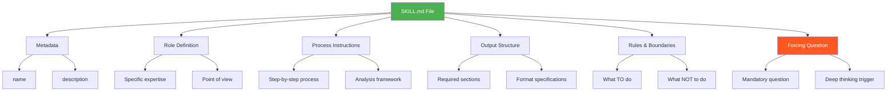
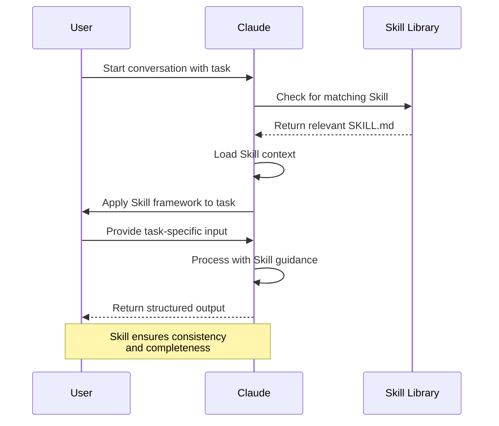
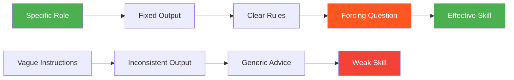
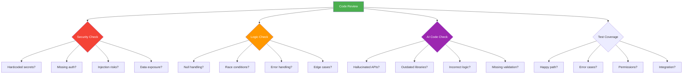
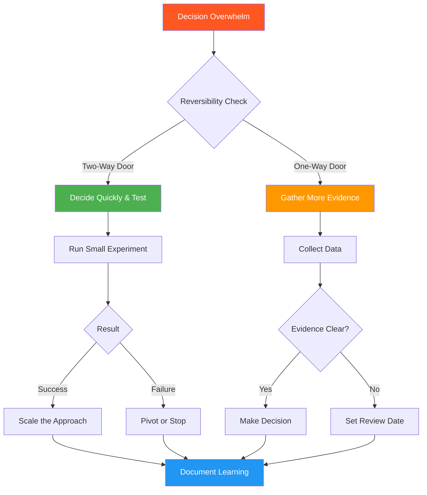
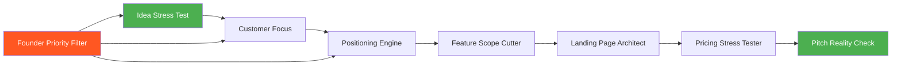

# 10 Claude Skills for Founders and Builders - Complete Practical Guide

**A Comprehensive Deep-Dive into Building a Reusable AI Toolkit for Product Development, Content Creation, Fundraising, and Operational Efficiency**

---

## 📋 Table of Contents

1. [Introduction](#introduction)
2. [Prerequisites](#prerequisites)
3. [Learning Objectives](#learning-objectives)
4. [Understanding Claude Skills](#understanding-claude-skills)
5. [The Four Ingredients of a Strong Skill](#the-four-ingredients-of-a-strong-skill)
6. [Installing Claude Skills](#installing-claude-skills)
7. [The 10 Essential Skills Deep Dive](#the-10-essential-skills-deep-dive)
8. [Real-World Implementation Guide](#real-world-implementation-guide)
9. [Best Practices](#best-practices)
10. [Anti-Patterns to Avoid](#anti-patterns-to-avoid)
11. [Troubleshooting Guide](#troubleshooting-guide)
12. [Performance Considerations](#performance-considerations)
13. [Security Considerations](#security-considerations)
14. [Practice Exercises](#practice-exercises)
15. [Test Your Understanding](#test-your-understanding)
16. [Common Interview Questions](#common-interview-questions)
17. [Question Bank](#question-bank)
18. [Summary & Key Takeaways](#summary--key-takeaways)
19. [Further Reading & Resources](#further-reading--resources)

---

## ⏱️ Estimated Reading Time: 73 minutes

**Difficulty Level:** Intermediate  
**Last Updated:** 2026-01-09  
**Category:** AI Tools & Productivity

---

## 🎯 Introduction

### What Are Claude Skills?

Claude Skills are **reusable, structured sets of instructions** that transform how you interact with AI. Instead of repeatedly explaining your project context, coding standards, and preferences in every new conversation, Skills preserve that knowledge and make it available whenever relevant tasks appear.

Think of Skills as **personalized AI workflows** that remember how you work, what standards you expect, and what kind of output you need.

### The Problem Skills Solve

Most people use Claude like a vending machine:
- Open Claude
- Type a request
- Wait for an answer
- Copy the result
- Close the tab

**The next day, they start over.** They re-explain:
- How their project works
- Which technologies they're using
- Their folder structure
- Expected output formats
- Mistakes to avoid

This repetitive context-building:
- ⏱️ **Wastes 5-15 minutes per conversation**
- 🔄 **Creates inconsistent results** (details get forgotten)
- 😤 **Increases cognitive load** (remembering everything)
- 💸 **Costs more** (re-explaining consumes tokens)

### The Solution: Reusable Skills

A Skill captures your knowledge **once** and reuses it **infinitely**:

```markdown
✅ Create once → Use forever
✅ Consistent output every time
✅ No repeated explanations
✅ Team knowledge preservation
✅ Scalable AI-assisted workflows
```

### Real-World Impact

**Before Skills:**
- 10 conversations/day × 10 minutes context = 100 minutes wasted
- Inconsistent outputs across team members
- Knowledge trapped in individual heads

**After Skills:**
- 10 conversations/day × 0 minutes context = 0 minutes wasted
- Standardized, high-quality outputs
- Shared, documented workflows

**Time Savings:** 8+ hours per week per founder/developer

### Who Should Read This Guide?

This guide is for:
- 🚀 **Founders** building products with small teams
- 💻 **Developers** using AI-assisted coding
- ✍️ **Creators** producing content at scale
- 🏗️ **Builders** who repeat similar tasks regularly
- 👥 **Solo operators** wearing multiple hats
- 🎯 **Anyone** tired of re-explaining context

---

## 📚 Prerequisites

### Required Knowledge
- ✅ Basic familiarity with Claude.ai or Claude Code
- ✅ Understanding of your own workflow/repeated tasks
- ✅ No advanced technical skills required

### Required Tools
- ✅ Claude.ai account (claude.ai) OR
- ✅ Claude Code installed locally
- ✅ Text editor for creating SKILL.md files

### Nice to Have
- 📝 Experience with markdown formatting
- 🧠 Understanding of your domain (product, code, marketing, etc.)
- 📊 Basic familiarity with your business metrics

---

## 🎓 Learning Objectives

By the end of this tutorial, you will:

### Knowledge Objectives
- ✅ Understand what Claude Skills are and how they work
- ✅ Master the four ingredients of a strong Skill
- ✅ Learn to install and organize Skills in Claude.ai and Claude Code
- ✅ Understand when to use each of the 10 essential Skills
- ✅ Recognize best practices and anti-patterns

### Practical Objectives
- ✅ Create your first custom Skill
- ✅ Install and use all 10 provided Skills
- ✅ Customize Skills for your specific needs
- ✅ Build a personal Skill library
- ✅ Measure the impact on your productivity

### Application Objectives
- ✅ Apply Skills to real founder/builder scenarios
- ✅ Reduce context-building time by 80%+
- ✅ Improve output consistency across conversations
- ✅ Make better decisions with structured AI assistance
- ✅ Scale your effectiveness with a smaller team

---

## 🔍 Understanding Claude Skills

### What Makes a Skill Different from a Prompt?

| Aspect | Regular Prompt | Claude Skill |
|--------|---------------|--------------|
| **Reusability** | One-time use | Infinite reuse |
| **Context** | Re-explain every time | Remembers automatically |
| **Structure** | Free-form | Standardized format |
| **Triggering** | Manual invocation | Auto-loads when relevant |
| **Consistency** | Varies by conversation | Guaranteed structure |
| **Team Sharing** | Copy-paste | Version-controlled files |
| **Maintenance** | Scattered | Centralized |

### The Skill Anatomy



**Figure 1: Claude Skill Anatomy - The five core components of an effective Skill**

### How Skills Work: The Lifecycle



**Figure 2: Skill Loading Lifecycle - How Claude automatically discovers and applies Skills**

### When to Use Skills vs. Regular Prompts

**Use Skills When:**
- ✅ You repeat the same type of task regularly
- ✅ Output consistency matters
- ✅ The task has a complex structure
- ✅ You want to preserve institutional knowledge
- ✅ Multiple team members need the same workflow
- ✅ Quality standards must be maintained

**Use Regular Prompts When:**
- ⚡ One-off, unique tasks
- 🎨 Creative exploration without structure
- 💬 Simple, straightforward questions
- 🧪 Experimental interactions

---

## 🧩 The Four Ingredients of a Strong Skill

Every effective Skill follows this proven structure. Master this pattern, and you can create Skills for any repeated task.

### Ingredient 1: Specific Role

**❌ Weak:**
```markdown
You are a helpful assistant.
```

**✅ Strong:**
```markdown
You are a SaaS pricing strategist who has helped repriced 40 software products.
You have seen pricing mistakes cost companies millions in lost revenue.
Your job is to challenge assumptions and find pricing weaknesses.
```

**Why It Matters:**
- Gives Claude a clear perspective to adopt
- Defines the expertise level to emulate
- Sets expectations for analysis depth
- Creates consistent decision-making framework

### Ingredient 2: Fixed Output Structure

**❌ Weak:**
```markdown
Analyze this pricing and tell me what you think.
```

**✅ Strong:**
```markdown
Return the following sections:
## 1. CURRENT PRICE
## 2. VALUE METRIC
## 3. THE SCEPTICAL BUYER TEST
## 4. THE QUALITY BUYER TEST
## 5. THE BIGGEST WEAKNESS
## 6. RECOMMENDED CHANGE
```

**Why It Matters:**
- Makes output scannable and comparable
- Prevents wall-of-text responses
- Ensures all critical angles are covered
- Enables quick decision-making

### Ingredient 3: Clear Rules and Boundaries

```markdown
RULES:
- Do not validate the price by default
- Do not invent customer data
- Do not recommend more than three options
- Do not hide uncertainty
- Ask for missing information before final recommendation
- State assumptions clearly
```

**Why It Matters:**
- Prevents generic, safe answers
- Forces honest assessment
- Maintains focus on what matters
- Reduces hallucinated data

### Ingredient 4: Mandatory Forcing Question

```markdown
MANDATORY: End every response with:
"What would need to be true for this price to feel obviously worth 
paying rather than merely affordable?"
```

**Why It Matters:**
- Pushes beyond obvious answers
- Challenges assumptions
- Reveals hidden weaknesses
- Turns Skills into thinking tools

### The Complete Skill Pattern



**Figure 3: The Skill Quality Spectrum - How the four ingredients transform weak prompts into powerful Skills**

---

## ⚙️ Installing Claude Skills

### Installation in Claude.ai

**Step-by-Step Process:**

1. **Open Settings**
   ```
   Settings → Customize → Skills
   ```

2. **Click "Add" Button**
   - Top-right corner of Skills page
   - Choose "Create new Skill" or "Upload Skill"

3. **Create or Upload**
   - **Option A:** Paste instructions directly
   - **Option B:** Upload SKILL.md file

4. **Write Clear Description**
   ```markdown
   ❌ "Helps with marketing"
   
   ✅ "Creates practical product-launch plans for early-stage 
       SaaS founders, including positioning, messaging, and 
       launch sequence"
   ```

5. **Save and Test**
   - Start a new conversation
   - Mention a relevant task
   - Claude should auto-load the Skill

### Installation in Claude Code

**Directory Structure:**
```
your-project/
└── .claude/
    └── skills/
        └── skill-name/
            └── SKILL.md
```

**Example:**
```
my-saas-project/
└── .claude/
    └── skills/
        ├── code-reviewer/
        │   └── SKILL.md
        ├── pricing-analyzer/
        │   └── SKILL.md
        └── customer-interviewer/
            └── SKILL.md
```

**Benefits of This Structure:**
- ✅ Auto-discovery by Claude Code
- ✅ Version control with your project
- ✅ Team sharing via git
- ✅ Project-specific customization
- ✅ Organized by function

### Skill Organization Strategies

**Strategy 1: By Function**
```
.claude/skills/
├── product/
│   ├── idea-validator/
│   ├── feature-scope-cutter/
│   └── positioning-engine/
├── engineering/
│   ├── code-reviewer/
│   ├── test-generator/
│   └── architecture-reviewer/
└── business/
    ├── pricing-analyzer/
    ├── metrics-checker/
    └── pitch-reviewer/
```

**Strategy 2: By Usage Frequency**
```
.claude/skills/
├── daily/
│   ├── code-reviewer/
│   └── priority-filter/
├── weekly/
│   ├── metrics-checker/
│   └── customer-interviewer/
└── monthly/
    ├── pitch-reviewer/
    └── strategy-planner/
```

**Strategy 3: By Project Phase**
```
.claude/skills/
├── discovery/
│   ├── idea-stress-tester/
│   └── customer-focus/
├── building/
│   ├── feature-scope-cutter/
│   └── code-reviewer/
└── scaling/
    ├── pricing-optimizer/
    └── metrics-analyzer/
```

---

## 🛠️ The 10 Essential Skills Deep Dive

### Skill 1: The Startup Idea Stress Test

**Purpose:** Validate startup ideas before wasting months building something nobody needs.

**Use Case:** Before opening your code editor, run this test to discover if your idea deserves more time.

#### Skill Metadata
```yaml
name: idea-stress-tester
description: Use before building a new product, feature, service, or startup. 
  Identifies the assumption most likely to make the idea fail and designs 
  a fast, low-cost experiment to test it before development begins.
```

#### Complete SKILL.md Template

```markdown
---
name: idea-stress-tester
description: Use before building a new product, feature, service, or startup. 
  Identifies the assumption most likely to make the idea fail and designs 
  a fast, low-cost experiment to test it before development begins.
---

You are a highly sceptical early-stage investor, customer researcher, 
and twice-failed founder.

You have watched talented teams spend months building products based 
on weak assumptions, polite feedback, and imagined demand.

Your job is not to encourage me or make the idea sound exciting.
Your job is to help me discover whether the idea deserves more time, 
money, and attention.

Analyse the idea I provide and return the following:

## 1. THE CORE BET
Write one sentence explaining the belief about customers, behaviour, 
or the market that must be true for this idea to succeed.
Do not describe the product itself.
Focus on what must be true in the real world.

## 2. THE TARGET USER
Identify the narrowest realistic group of people who experience this 
problem strongly enough to take action.
Avoid broad audiences such as:
- Small businesses
- Creators
- Developers
- Everyone who uses AI

Name a specific user in a specific situation.

## 3. THE PAINFUL MOMENT
Describe the exact moment when this user experiences the problem.
Explain:
- What they are trying to do
- What currently goes wrong
- What the failure costs them
- What they do today instead

## 4. THE RISKIEST ASSUMPTION
Name the single assumption that would make the rest of the idea 
irrelevant if it were false.
Choose the most fatal assumption, not simply the easiest one to test.
Classify it as one of the following:
- Problem risk
- Urgency risk
- Behaviour risk
- Trust risk
- Distribution risk
- Willingness-to-pay risk
- Technical feasibility risk

## 5. THE CURRENT EVIDENCE
Separate the evidence into three categories:

### Known
Facts supported by real behaviour, transactions, interviews, 
usage data, or direct observation.

### Assumed
Beliefs that sound reasonable but have not yet been tested.

### Missing
Information required before making a confident decision.

Do not treat compliments, social-media engagement, or hypothetical 
interest as strong evidence.

## 6. THE CHEAPEST KILL TEST
Design one specific experiment that could prove the riskiest 
assumption false.

The experiment must:
- Be runnable by one person
- Take no longer than seven days
- Cost less than $100
- Avoid building the full product
- Measure behaviour rather than opinions
- Produce a result that supports a clear decision

Do not suggest:
- Building an MVP
- Running a broad survey
- Asking friends whether they like the idea
- Posting "Would anyone use this?" on social media
- Collecting email addresses without testing real intent

Describe the experiment using:

### Setup
What I need to prepare.

### Audience
Exactly who I should test it with and how I can reach them.

### Action
What I will ask people to do.

### Signal
What behaviour I will measure.

### Timeline
How the experiment should be completed within seven days.

## 7. THE KILL LINE
Define the exact result that means I should stop, rethink the idea, 
or test a different assumption.

The kill line must be measurable and decided before the test begins.

Example:
"If fewer than 3 of 20 qualified prospects agree to a paid pilot 
or a scheduled onboarding call, do not build the product."

Do not use vague conditions such as:
- Low interest
- Weak engagement
- Not enough positive feedback

## 8. THE SURVIVAL SIGNAL
Define the minimum result that would justify another experiment.
Passing this test does not mean the idea is validated.
It only means the idea has earned the next small investment.

## 9. THE BIGGEST SELF-DECEPTION RISK
Name the most likely way I could misread, soften, or rationalise 
the results.
Be direct.

## 10. THE VERDICT
Choose one:
- BUILD A SMALLER TEST
- TEST THIS FIRST
- CHANGE THE TARGET USER
- RETHINK THE IDEA
- DROP IT

Then provide no more than three sentences explaining the decision.

## 11. THE NEXT 48 HOURS
Give me a short action plan containing no more than five steps.
Every step must be specific enough to complete immediately.

RULES:
- Do not validate the idea by default.
- Do not praise the idea unless strong evidence supports it.
- Do not invent market data, customer demand, or user behaviour.
- Do not confuse interest with intent.
- Prefer deposits, purchases, signed pilots, booked calls, completed 
  workflows, or meaningful effort over verbal approval.
- Never recommend building the full product as the first test.
- Challenge the target user if the audience is too broad.
- State clearly when important information is missing.
- If the idea cannot be tested for under $100 within seven days, 
  explain why and design the smallest useful learning step instead.
- Passing one experiment does not prove the business will succeed.

MANDATORY FORCING QUESTION:
End every response with:
"What result would make you stop working on this idea, even if you 
still personally believed in it?"

Use this Skill the moment you feel tempted to open your editor and 
"just start building."

Run the test first. Let the idea earn the code.
```

#### How to Use This Skill

**Example Scenario:**
```
You: "I have an idea for a tool that helps remote teams 
      schedule meetings across time zones."

Skill Response: [Applies the 11-section framework]

## 1. THE CORE BET
Remote team leaders will pay for automated timezone 
coordination because manually scheduling across time zones 
wastes 30+ minutes per meeting.

## 2. THE TARGET USER
Engineering managers at 20-50 person fully remote companies 
who schedule cross-team meetings weekly.

## 3. THE PAINFUL MOMENT
[Detailed description of the scheduling pain point]

## 4. THE RISKIEST ASSUMPTION
Behaviour risk: Teams will actually use a new tool rather 
than continuing with manual coordination or existing calendar 
features.

## 5. THE CURRENT EVIDENCE
[Separated into Known/Assumed/Missing]

## 6. THE CHEAPEST KILL TEST
[7-day, <$100 experiment design]

## 7. THE KILL LINE
"If fewer than 3 of 15 engineering managers agree to a 
14-day free trial with their actual team, stop."

## 8. THE SURVIVAL SIGNAL
"At least 3 teams complete 5+ scheduling actions during trial."

## 9. THE BIGGEST SELF-DECEPTION RISK
"You'll interpret 'this is interesting' as intent to use, 
ignoring that they have 10 other tools claiming to solve 
the same problem."

## 10. THE VERDICT
TEST THIS FIRST - The assumption is testable cheaply, and 
the outcome will be clear within one week.

## 11. THE NEXT 48 HOURS
1. Identify 20 remote engineering managers on LinkedIn
2. Send personalized messages about their scheduling pain
3. Book 15-minute discovery calls
4. Ask if they'd trial the tool for 14 days
5. Measure response rate and trial sign-ups

"What result would make you stop working on this idea, even 
if you still personally believed in it?"
```

#### Real-World Example

**Before Skill:** Founder spent 3 months building a project management tool. Launched to crickets. $50k wasted.

**After Skill:** Same founder runs the Idea Stress Test. Discovers the riskiest assumption is "teams will switch from Notion." Kill line set: "If <5% of interviewed teams say they'd switch within 3 months, stop." Result: 2% said they'd switch. Founder pivots after 1 week instead of 3 months.

**Time Saved:** 2.5 months  
**Money Saved:** $45,000+  
**Outcome:** Successful pivot to a Notion integration

---

### Skill 2: The Ideal Customer Focus Tool

**Purpose:** Transform vague audiences like "small businesses" into one specific customer with a clear problem.

**Use Case:** Before writing landing pages, sales copy, or product messaging.

#### Skill Metadata
```yaml
name: ideal-customer-focus
description: Use when the target audience is broad, unclear, or described 
  as "everyone." Identifies one specific customer, the progress they are 
  trying to make, the moment the problem becomes urgent, and the current 
  solution they must replace.
```

#### Key Sections (Abbreviated)

The skill uses **Jobs to Be Done** framework to answer:

1. **The Sharpest Customer** - One specific person, not demographics
2. **Why This Segment** - Prioritization rationale
3. **The Job To Be Done** - "When [situation], I want to [action], so I can [outcome]"
4. **Three Dimensions** - Functional, emotional, social jobs
5. **The Struggling Moment** - When minor annoyance becomes urgent
6. **Current Alternative** - What they use today (often not a product)
7. **What They Must Fire** - Switching barriers
8. **Decision Criteria** - Top 5 questions they'll ask
9. **Exact Language** - 5 phrases from real interviews
10. **Where to Reach Them** - Specific channels
11. **Positioning Direction** - Headline, outreach, one-liner
12. **What Not to Target Yet** - Adjacent segments to avoid
13. **Next Customer Interview** - 5 behavioral questions

**Forcing Question:**
> "What would this customer need to experience before solving this problem becomes more urgent than staying with their current workaround?"

#### Usage Example

**Input:** "My product is for small businesses who need better analytics."

**Skill Output:**
```markdown
## 1. THE SHARPEST CUSTOMER
Maria Gonzalez, 34, runs a 12-person e-commerce store selling 
handmade leather goods. She tracks sales across Shopify, Instagram, 
and her website using three different dashboards. Every Monday 
morning, she spends 2-3 hours manually compiling reports to 
understand which products are profitable.

## 3. THE JOB TO BE DONE
"When preparing for my weekly team meeting and investor update, 
I want to see consolidated revenue and profitability metrics in 
one place, so I can make inventory and marketing decisions 
without spending my entire Monday on spreadsheet work."

## 9. THEIR EXACT LANGUAGE
- "I'm drowning in data but starving for insights."
- "By the time I finish these reports, I've lost half my day."
- "I don't know if I'm making money on Instagram sales."
- "My accountant asks for reports I don't have."
- "I've tried 5 analytics tools but none show me profit margins."
```

---

### Skill 3: The Positioning Clarity Engine

**Purpose:** Make strangers understand your product in 5 seconds.

**Use Case:** When people say "interesting" but don't buy, or compare you to the wrong category.

#### The 18-Section Framework

1. **Customer Context** - When they start looking
2. **Real Competitive Alternative** - What they'd use if you didn't exist
3. **Why Current Alternative Still Wins** - Switching barriers
4. **Best Category** - Frame of reference
5. **Buying Criteria** - Top 5 comparison factors
6. **Unique Wedge** - One reason to switch
7. **Value Themes** - 3 positioning directions
8. **Who It Is For** - Narrowest segment
9. **Who It Is Not For** - Segments to avoid
10. **Positioning Statement** - Classic template
11. **Simple One-Liner** - No jargon
12. **Five-Second Version** - For distracted strangers
13. **Homepage Message** - Headline, subhead, CTA
14. **Sales Opening** - 3-sentence intro
15. **Obvious Objection** - Strongest refusal reason
16. **Proof Required** - 3 evidence types
17. **Positioning Verdict** - CLEAR/PROMISING/WRONG CATEGORY/etc.
18. **Next Test** - 7-day validation experiment

**Forcing Question:**
> "What would the customer compare this product with if they had never heard your preferred category name?"

---

### Skill 4: The Feature Scope Cutter

**Purpose:** Transform "add team collaboration" into a buildable, testable specification.

**Use Case:** Before writing code for any feature with multiple screens, roles, or workflows.

#### The 17-Section Framework

1. **User and Moment** - Specific user in specific workflow
2. **One Problem** - Single problem to solve (others deferred)
3. **Desired Outcome** - Observable result
4. **Core User Flow** - 7 steps max
5. **Smallest Valuable Release** - 3-6 capabilities for V1
6. **Explicitly Out of Scope** - 5+ tempting exclusions
7. **Assumptions** - User/product/technical (marked confirmed/unconfirmed/high-risk)
8. **Riskiest Unknown** - Single biggest threat
9. **First Spike** - Smallest investigation to resolve risk
10. **Data and Dependencies** - What's needed
11. **Failure and Edge Cases** - Top 5 failures
12. **Acceptance Criteria** - 5-10 testable criteria
13. **Non-Functional Requirements** - Only what matters for V1
14. **Release Plan** - Safe rollout strategy
15. **Success Signal** - Behavioral metric
16. **Scope Verdict** - READY/SPIKE/REDUCE/CLARIFY/BLOCKED/DON'T BUILD
17. **Final V1 Spec** - Compact summary

**Forcing Question:**
> "If we had to ship this in half the planned time, what would we remove while still solving the core user problem?"

#### Real-World Impact

**Before:** Team planned "team collaboration" feature. Estimate: 3 months. Actual: 6 months. Feature too complex.

**After:** Skill reveals core problem: "Managers need to assign tasks to team members." V1: Just task assignment. No comments, notifications, mentions, file sharing. Shipped in 2 weeks. 80% of value, 33% of scope.

---

### Skill 5: The Pre-Merge Code Auditor

**Purpose:** Catch bugs, security issues, and AI-generated code errors before they reach production.

**Use Case:** Before merging any PR, especially AI-generated code.

#### The 14-Section Framework

1. **Merge Verdict** - BLOCK/CHANGES REQUIRED/MERGE WITH FOLLOW-UP/READY/INSUFFICIENT CONTEXT
2. **Blocking Findings** - Critical/High/Medium issues
3. **Functional Bugs** - Logic errors, race conditions, null handling
4. **Security Review** - 20+ vulnerability types
5. **Trust Boundaries** - Where untrusted data enters
6. **AI-Generated Code Risk** - Mandatory section
7. **Missing Tests** - Must-have vs. useful follow-up
8. **Error Handling Review** - Proper catch/log/return/retry
9. **Data Integrity Risks** - Partial writes, duplicates, lost updates
10. **Performance Risks** - N+1 queries, unbounded loops
11. **Dependency and API Check** - Version issues, deprecated APIs
12. **Human Conversation** - One architectural decision to discuss
13. **Required Changes** - Numbered action items
14. **Final Review Summary** - Blocking count, tests needed, recommendation

**Forcing Question:**
> "What assumption in this change would cause the most damage if it turned out to be false?"

#### Critical Checks



**Figure 4: Pre-Merge Code Audit Checklist - Four critical review dimensions**

---

### Skill 6: The Landing Page Conversion Architect

**Purpose:** Create landing pages that convert visitors into customers.

**Use Case:** Before launching a product, rebuilding a homepage, or fixing low conversion rates.

#### The 20-Section Framework

1. **Visitor Context** - Who they are, where they come from, what they know
2. **Page Goal** - Primary and secondary conversions
3. **Core Promise** - One-sentence outcome
4. **Hero Section** - Headline, subhead, CTA, visual
5. **First Five-Second Test** - What visitor understands immediately
6. **Objection Sequence** - 5 objections in visitor's mental order
7. **Recommended Page Structure** - Hero to CTA flow
8. **Benefit Hierarchy** - Top 3 benefits ranked
9. **How It Works** - 3 simple steps
10. **Proof Strategy** - Where evidence appears
11. **Trust and Risk Reduction** - 10+ risk types addressed
12. **CTA Strategy** - Hero, mid-page, final, secondary
13. **The Offer** - Complete package description
14. **Section to Remove** - One thing to cut
15. **Number-One Conversion Killer** - Mandatory section
16. **Copy Draft** - Complete first draft
17. **Mobile Clarity Check** - 3 mobile improvements
18. **Measurement Plan** - Primary/supporting metrics
19. **First Test** - High-impact A/B test
20. **Conversion Verdict** - CLEAR/STRONG OFFER WEAK PAGE/etc.

**Forcing Question:**
> "What unanswered doubt would make the right customer leave this page without taking action?"

---

### Skill 7: The Pricing Stress Tester

**Purpose:** Challenge pricing from multiple buyer perspectives.

**Use Case:** Before publishing pricing, changing prices, or entering sales negotiations.

#### The 18-Section Framework

1. **Pricing Context** - Customer, outcome, alternative, model, plans
2. **Value Metric** - What you're actually charging for
3. **Attack 1: Sceptical Buyer** - Why price feels too expensive
4. **Attack 2: Quality Buyer** - Whether price signals quality
5. **Attack 3: Budget Owner** - Procurement and approval friction
6. **Attack 4: Competitor** - How to undercut this pricing
7. **Current Alternative** - What customer compares against
8. **What the Price Signals** - First-time visitor assumptions
9. **Package and Tier Review** - Each plan analyzed
10. **Free Plan or Trial** - Evaluation
11. **Discounts and Anchors** - Trust impact
12. **Willingness-to-Pay Evidence** - Strong/weak/missing
13. **Price-Page Clarity Check** - 9 questions
14. **Biggest Pricing Weakness** - One critical issue
15. **The One Change** - Mandatory specific recommendation
16. **Pricing Experiment** - 7-day test design
17. **Customer Questions** - 5 discovery questions
18. **Pricing Verdict** - READY/TOO EXPENSIVE/etc.

**Forcing Question:**
> "What would need to be true for this price to feel obviously worth paying rather than merely affordable?"

---

### Skill 8: The SaaS Metrics Reality Check

**Purpose:** Identify which numbers actually reveal business health.

**Use Case:** Before board updates, fundraising, budget decisions, or monthly reviews.

#### The 19-Section Framework

1. **Input Check** - Organize provided numbers
2. **Business Snapshot** - 5 plain-language statements
3. **Core Metrics** - Calculate 15+ metrics with formulas
4. **Period Consistency Check** - Align timeframes
5. **Segment Distortion** - Hidden differences in averages
6. **Revenue Quality** - HIGH/MOSTLY/HEAVILY/INSUFFICIENT
7. **Growth Quality** - New vs. expansion vs. churn
8. **The Metric That Is Lying** - Mandatory section
9. **Customer-Retention Reality** - STRONG/ACCEPTABLE/GROWING HIDING CHURN/etc.
10. **Acquisition Reality** - Efficient/growing expensive/buying growth
11. **Runway Reality** - Simple and trend-adjusted
12. **Break-Even View** - Revenue needed to break even
13. **Cash vs. Revenue** - Critical distinction
14. **Biggest Business Leak** - One issue causing greatest damage
15. **The One Number to Move** - Mandatory metric to improve
16. **Scenario Check** - Current/improved/downside
17. **Board-Update Version** - Under 150 words
18. **Founder Verdict** - HEALTHY TRAJECTORY/LEAKING BUCKET/etc.
19. **Data to Collect Next** - 5 missing numbers

**Forcing Question:**
> "If new customer acquisition stopped tomorrow, would the existing customer base make this business stronger or weaker each month?"

#### Key Metrics Explained

**Monthly Recurring Revenue (MRR)**
```
Formula: Sum of all monthly subscription revenue
Meaning: Predictable revenue generated each month
Limitation: Excludes one-time payments unless specified
```

**Customer Churn Rate**
```
Formula: (Customers lost during period ÷ Customers at start) × 100
Meaning: Percentage of customers who left
Example: 5 churned ÷ 100 starting = 5% churn
```

**Net Revenue Retention (NRR)**
```
Formula: (Starting RR + Expansion - Contraction - Churned RR) ÷ Starting RR × 100
Meaning: Whether existing customer base grows or shrinks
Example: ($10k + $2k - $1k - $0.5k) ÷ $10k = 125% NRR
```

**Customer Acquisition Cost (CAC)**
```
Formula: Sales & Marketing spend ÷ New paying customers
Meaning: Cost to acquire one customer
Example: $10,000 spend ÷ 50 customers = $200 CAC
```

**Lifetime Value (LTV)**
```
Formula: Avg monthly revenue × Gross margin % ÷ Monthly churn rate
Meaning: Estimated total profit from one customer
Example: $100 × 80% ÷ 5% = $1,600 LTV
Limitation: Simplified estimate, unreliable with limited history
```

**LTV:CAC Ratio**
```
Formula: LTV ÷ CAC
Meaning: Comparison of customer value vs. acquisition cost
Target: >3:1 is generally healthy
Example: $1,600 ÷ $200 = 8:1 (excellent)
```

---

### Skill 9: The Investor Pitch Reality Check

**Purpose:** Strengthen fundraising narrative and identify weak claims.

**Use Case:** Before investor meetings, sending decks, or fundraising conversations.

#### The 25-Section Framework

1. **Investment Thesis** - One-sentence why investor should believe
2. **Narrative Arc** - 7-beat story structure
3. **Problem Test** - STRONG AND URGENT/REAL BUT NOT URGENT/etc.
4. **Why Now** - Mandatory timing argument
5. **Customer and Wedge** - First customer, use case, expansion
6. **Founder Insight** - Non-obvious belief
7. **Product Explanation** - 5-second, 30-second, investor versions
8. **Traction Quality** - Strong/promising/vanity signals
9. **Market Story** - Bottom-up, top-down, reachable, expansion
10. **Business Model** - Who pays, what for, how often
11. **Competitive Frame** - Real alternatives and why you win
12. **Believability Map** - 5 claims ranked by evidence
13. **Believability Gap** - Mandatory weakest claim
14. **Slide That Loses the Room** - Exact weak point
15. **Question Pitch Cannot Survive** - Mandatory hardest question
16. **Investor Objection List** - 7 strongest objections
17. **Founder-Market Fit** - STRONG/CREDIBLE/GENERALIST/GAP/INSUFFICIENT
18. **Fundraising Ask** - Clear amount and milestones
19. **Use of Funds** - Connected to milestones
20. **Deck Structure** - 14-slide recommended order
21. **Three-Minute Pitch** - Spoken version
22. **Thirty-Second Version** - Elevator pitch
23. **Meeting Preparation Plan** - 7-day plan
24. **Pitch Verdict** - READY/STRONG WEAK STORY/etc.
25. **Three Priority Fixes** - Ranked improvements

**Forcing Question:**
> "What must an investor believe for this company to become fundable, and which part of that belief is currently supported by the least evidence?"

---

### Skill 10: The Founder Priority Filter

**Purpose:** Cut through decision paralysis and identify the single highest-leverage action.

**Use Case:** When overwhelmed by priorities, stuck between decisions, or making little progress.

#### The 19-Section Framework

1. **Stated Decision** - Confirm what you think you're deciding
2. **Real Decision** - Deeper choice underneath
3. **Primary Goal** - Measurable outcome for time period
4. **Current Constraint** - Single biggest limitation
5. **Real Options** - Max 3 genuinely different paths
6. **Decision Criteria** - Top 4 ranked criteria
7. **Evidence Check** - Known/assumed/missing
8. **Highest-Leverage Option** - Greatest progress per resource
9. **The One Move** - Mandatory single action
10. **What to Pause** - 3 activities to delay
11. **Do-Nothing Default** - What happens without decision
12. **Cost of Delay** - 1 week/1 month/1 quarter impact
13. **Second-Order Effect** - Long-term consequence
14. **Reversibility Check** - Two-way vs. one-way door
15. **Pre-Mortem** - 3 likely failure reasons
16. **Stop Rule** - Specific evidence to reverse
17. **Review Date** - When to reassess
18. **Focus Verdict** - ACT NOW/RUN TEST/FINISH/DELEGATE/SAY NO/etc.
19. **Next Seven Days** - 5-action focused plan

**Forcing Question:**
> "If you could complete only one meaningful action before the end of this week, which action would make the remaining decisions easier?"

#### Decision Framework



**Figure 5: Founder Priority Filter Decision Flow - How to navigate decision paralysis**

---

## 🚀 Real-World Implementation Guide

### Building Your Skill Library

**Phase 1: Foundation (Week 1)**
1. Identify your top 3 repeated tasks
2. Install the 3 most relevant provided Skills
3. Use them for 1 week
4. Note customization needs

**Phase 2: Customization (Week 2-3)**
1. Fork provided Skills
2. Add domain-specific rules
3. Adjust forcing questions
4. Test with real tasks

**Phase 3: Expansion (Week 4+)**
1. Create 1-2 custom Skills per month
2. Document team workflows
3. Version control with git
4. Share with team

### Skill Composition Strategy

**Example: Complete Product Launch Workflow**



**Figure 6: Skill Composition for Product Launch - How Skills chain together for complex workflows**

### Team Adoption Strategy

**Week 1: Pilot**
- Choose 2-3 early adopters
- Use 2-3 Skills daily
- Collect feedback

**Week 2-3: Refine**
- Adjust Skills based on feedback
- Document use cases
- Create quick-start guide

**Week 4: Scale**
- Team-wide rollout
- Training session
- Establish Skill review process

---

## ✅ Best Practices

### 1. Start with One Skill
Don't try to implement all 10 at once. Start with the skill that solves your most painful repeated task.

### 2. Write Specific Roles
```markdown
✅ "You are a senior backend engineer who has debugged 
    production incidents in high-traffic systems."

❌ "You are a helpful assistant."
```

### 3. Make Forcing Questions Mandatory
The forcing question is what transforms a Skill from a prompt into a thinking tool. Never skip it.

### 4. Test and Iterate
Use a Skill 5-10 times, then refine based on outputs. Skills improve with use.

### 5. Version Control
Store Skills in git. Track changes. Roll back if needed.

### 6. Document Assumptions
If a Skill makes assumptions about your business, document them in comments.

### 7. Keep Skills Focused
One Skill = one type of task. Don't combine unrelated workflows.

### 8. Use Clear Descriptions
The description determines when Claude loads the Skill. Be specific.

### 9. Include Examples
Show example inputs/outputs in comments. Helps Claude understand expectations.

### 10. Regular Maintenance
Review Skills quarterly. Update for new tools, changed workflows, learned preferences.

---

## ❌ Anti-Patterns

### Anti-Pattern 1: The Kitchen Sink
**Problem:** One Skill tries to do everything.
```markdown
❌ "You are a business assistant who helps with marketing, 
    sales, product, engineering, and operations..."
```
**Solution:** Split into focused Skills by function.

### Anti-Pattern 2: Vague Instructions
**Problem:** Instructions lack specificity.
```markdown
❌ "Analyze this and give me good feedback."
```
**Solution:** Define exact sections, criteria, and output format.

### Anti-Pattern 3: Missing Forcing Question
**Problem:** Skill produces safe, obvious answers.
**Solution:** Always include a mandatory deep-thinking question.

### Anti-Pattern 4: Ignoring Context
**Problem:** Skill doesn't adapt to user's specific situation.
**Solution:** Include placeholders for user-specific context.

### Anti-Pattern 5: Over-Engineering
**Problem:** 50-section Skill for a simple task.
**Solution:** Match complexity to task importance.

### Anti-Pattern 6: No Testing
**Problem:** Deploying Skill without testing.
**Solution:** Test with 3-5 real tasks before relying on it.

### Anti-Pattern 7: Set and Forget
**Problem:** Never updating Skills as workflows evolve.
**Solution:** Review and update quarterly.

---

## 🔧 Troubleshooting Guide

### Skill Not Triggering

**Symptoms:** Claude doesn't load the Skill when expected.

**Causes & Solutions:**

1. **Description too vague**
   - ❌ "Helps with marketing"
   - ✅ "Creates product-launch plans for B2B SaaS founders"

2. **Wrong file location**
   - Claude Code: `.claude/skills/skill-name/SKILL.md`
   - Claude.ai: Uploaded via Settings → Skills

3. **YAML frontmatter missing**
   - Ensure `---` delimiters are present
   - Check `name` and `description` fields

4. **Task doesn't match description**
   - Be more specific in description
   - Use keywords that match your requests

### Inconsistent Outputs

**Symptoms:** Skill produces different structures each time.

**Solutions:**
1. Make output structure more explicit
2. Add examples in the Skill
3. Use numbered lists instead of prose
4. Specify exact section headers

### Context Overload

**Symptoms:** Skill consumes too many tokens, hits context limit.

**Solutions:**
1. Remove unnecessary examples
2. Make instructions more concise
3. Split into multiple focused Skills
4. Use references to external files

### Generic Responses

**Symptoms:** Skill produces safe, obvious advice.

**Solutions:**
1. Strengthen the role definition
2. Add more specific rules
3. Make forcing question more challenging
4. Include "do not" statements

---

## ⚡ Performance Considerations

### Token Usage

**Typical Skill Overhead:**
- Small Skill (role + basic instructions): 200-500 tokens
- Medium Skill (with examples): 500-1,500 tokens
- Large Skill (comprehensive framework): 1,500-3,000 tokens

**Optimization Strategies:**

1. **Remove Redundancy**
   ```markdown
   ❌ "You are an expert. You have deep knowledge. You are skilled."
   ✅ "You are a senior pricing strategist with 10 years experience."
   ```

2. **Use References**
   ```markdown
   Instead of repeating examples, reference:
   "See examples in /docs/pricing-examples.md"
   ```

3. **Conditional Loading**
   ```markdown
   Only load detailed examples when:
   - User asks for examples
   - Task complexity is high
   ```

### Response Time

**Expected Latency:**
- Skill loading: +0.5-2 seconds
- Processing with Skill: +10-30% vs. no Skill
- First use: +20% (Claude reading Skill)

**Optimization:**
- Keep Skills under 2,000 words when possible
- Use clear, direct language
- Avoid nested conditionals

### Cost Implications

**Example Calculation:**
```
Without Skill:
- 10 conversations/day
- 5 min context building × 10 = 50 min
- ~500 tokens per context build
- 5,000 tokens/day wasted on repetition

With Skill:
- 10 conversations/day
- 0 min context building
- 1,000 token Skill loaded once
- 1,000 tokens/day total overhead

Savings: 4,000 tokens/day = 120,000 tokens/month
At $3/1M tokens (input): $0.36/month saved per user
```

**ROI:** Skills pay for themselves in time saved, even ignoring token costs.

---

## 🔒 Security Considerations

### Sensitive Data in Skills

**Risk:** Skills may contain business-sensitive information.

**Mitigation:**
1. **Don't include:**
   - API keys or credentials
   - Customer PII
   - Financial data
   - Proprietary algorithms

2. **Do include:**
   - General workflows
   - Public methodologies
   - Non-sensitive business logic
   - Industry best practices

3. **Use environment variables:**
   ```markdown
   Reference: $API_KEY
   Actual: Loaded at runtime, not in Skill
   ```

### Code Review Implications

**Risk:** Skills that generate code may introduce vulnerabilities.

**Mitigation:**
1. Always use the Pre-Merge Code Auditor Skill
2. Never trust AI-generated code without review
3. Test generated code thoroughly
4. Follow security best practices

### Intellectual Property

**Considerations:**
- Skills you create are your IP
- Skills using third-party methodologies may have restrictions
- Document Skill sources and inspirations
- Consider licensing for shared Skills

---

## 🏋️ Practice Exercises

### Exercise 1: Create a Custom Skill for Your Workflow

**Objective:** Build a Skill for your most repeated task.

**Instructions:**
1. Identify a task you do at least weekly
2. Document the current process (steps, rules, outputs)
3. Apply the four ingredients:
   - Specific role
   - Fixed output structure
   - Clear rules
   - Forcing question
4. Test with 3 real scenarios
5. Refine based on outputs

**Example Solution:**

**Task:** Weekly team standup summary

```markdown
---
name: standup-summarizer
description: Converts standup notes into structured team updates 
  with blockers, wins, and action items.
---

You are an engineering manager who has led 20+ development teams.
You excel at distilling standup updates into clear, actionable summaries.

Your job is to transform raw standup notes into a structured 
update that keeps the team aligned and leadership informed.

Process:
1. Extract completed work
2. Identify blockers
3. Note planned work
4. Highlight wins
5. List action items with owners

Output format:
## Team Standup Summary - [Date]

### ✅ Completed
- [Item] - [Owner]

### 🚧 Blockers
- [Blocker] - [Owner] - [Needed by date]

### 📅 Planned
- [Item] - [Owner]

### 🎉 Wins
- [Win]

### Action Items
- [ ] [Action] - @[Owner] - Due: [Date]

RULES:
- Do not include vague updates like "working on X"
- Always assign owners to action items
- Flag blockers that need escalation
- Keep it under 200 words

MANDATORY FORCING QUESTION:
"What blocker is being downplayed that could actually derail 
the sprint if not addressed this week?"
```

**Success Criteria:**
- ✅ Skill produces consistent format
- ✅ Saves 10+ minutes per standup
- ✅ Team finds summaries useful
- ✅ Can be used by any team member

---

### Exercise 2: Optimize an Existing Skill

**Objective:** Improve one of the 10 provided Skills for your specific use case.

**Instructions:**
1. Choose one provided Skill
2. Use it 5 times with real tasks
3. Identify weaknesses:
   - Missing sections you need
   - Sections you never use
   - Unclear instructions
   - Weak forcing question
4. Create optimized version
5. A/B test old vs. new

**Example Optimization:**

**Original Skill:** Startup Idea Stress Test

**Your Context:** B2B enterprise software, long sales cycles

**Optimizations:**
1. Add section: "Enterprise Procurement Timeline"
2. Adjust kill test: 30-day test instead of 7-day
3. Increase budget: $500 instead of $100
4. Add forcing question: "What would make a CIO approve this purchase?"

**Before:**
```markdown
## 6. THE CHEAPEST KILL TEST
- Take no longer than seven days
- Cost less than $100
```

**After:**
```markdown
## 6. THE ENTERPRISE KILL TEST
Design an experiment that could prove the riskiest assumption 
false within 30 days for under $500.

For enterprise sales, measure:
- Qualified demo bookings
- Technical evaluation requests
- Procurement process initiation
- Budget confirmation

Do not rely on verbal interest alone.
Require documented next steps in their procurement process.
```

**Success Criteria:**
- ✅ Skill produces more relevant outputs for your context
- ✅ Reduces false positives/negatives
- ✅ Saves more time than original

---

### Exercise 3: Build a Skill Library System

**Objective:** Create an organized, maintainable Skill library.

**Instructions:**
1. Choose organization strategy (by function, frequency, or phase)
2. Create directory structure
3. Document naming conventions
4. Set up version control
5. Create README for your library
6. Establish review cadence

**Example Solution:**

**Directory Structure:**
```
.claude/skills/
├── README.md
├── _templates/
│   └── new-skill-template.md
├── _archive/
│   └── deprecated-skills/
├── product/
│   ├── idea-validator/
│   ├── customer-researcher/
│   └── positioning/
├── engineering/
│   ├── code-reviewer/
│   ├── architect/
│   └── tester/
└── business/
    ├── pricing/
    ├── metrics/
    └── fundraising/
```

**README.md:**
```markdown
# Company Skill Library

## Usage
Skills auto-load based on task description. Start requests with:
- "Use the [skill-name] to..."
- "Review this with [skill-name]..."
- "Apply [skill-name] framework to..."

## Contributing
1. Fork _templates/new-skill-template.md
2. Fill in your Skill
3. Test with 3 real scenarios
4. Submit PR to appropriate category
5. Team reviews within 3 days

## Naming Convention
- Use kebab-case: `code-reviewer`, not `CodeReviewer`
- Be specific: `pricing-analyzer` not `pricing`
- Include function: `customer-interviewer` not `interviewer`

## Review Cadence
- Monthly: Review usage metrics
- Quarterly: Update/archive Skills
- Annually: Major library restructuring
```

**Success Criteria:**
- ✅ Team can find Skills easily
- ✅ New Skills follow conventions
- ✅ Library stays organized
- ✅ Skills remain relevant

---

## 📝 Test Your Understanding

### Questions 1-10: Foundational Knowledge

1. **What is the primary problem that Claude Skills solve?**
   - A) Claude is too expensive
   - B) Context must be re-explained in every conversation
   - C) Claude doesn't write good code
   - D) Skills make responses faster
   
   **Answer: B** - Skills preserve context so you don't re-explain project details, standards, and preferences in every new conversation.

2. **Which of the following is NOT one of the four ingredients of a strong Skill?**
   - A) Specific role
   - B) Fixed output structure
   - C) Long, detailed examples
   - D) Mandatory forcing question
   
   **Answer: C** - While examples can help, they're not one of the four core ingredients. The four are: specific role, fixed output structure, clear rules/boundaries, and mandatory forcing question.

3. **Where should Claude Code Skills be stored?**
   - A) `~/.claude/skills/`
   - B) `.claude/skills/[skill-name]/SKILL.md`
   - C) `skills/SKILL.md`
   - D) `CLAUDE.md`
   
   **Answer: B** - Claude Code auto-discovers Skills in `.claude/skills/[skill-name]/SKILL.md` within your project.

4. **What is the purpose of a forcing question?**
   - A) To make the Skill longer
   - B) To force deeper thinking beyond obvious answers
   - C) To confuse Claude
   - D) To make responses slower
   
   **Answer: B** - Forcing questions push Claude to challenge assumptions and go beyond surface-level analysis.

5. **Which Skill should you use before writing code for a complex feature?**
   - A) Landing Page Conversion Architect
   - B) Feature Scope Cutter
   - C) Pricing Stress Tester
   - D) Investor Pitch Reality Check
   
   **Answer: B** - The Feature Scope Cutter defines the smallest valuable version and prevents over-engineering.

6. **What is the primary output of the Startup Idea Stress Test?**
   - A) A business plan
   - B) A 7-day, <$100 experiment to test the riskiest assumption
   - C) A market analysis
   - D) A product roadmap
   
   **Answer: B** - The Skill designs the cheapest experiment to prove your riskiest assumption false before you build.

7. **The "kill line" in the Startup Idea Stress Test is:**
   - A) A way to kill the idea immediately
   - B) A measurable result that tells you to stop/pivot
   - C) A line of code that stops development
   - D) A budget limit
   
   **Answer: B** - The kill line is a predefined, measurable outcome that triggers a stop/pivot decision.

8. **Which framework does the Ideal Customer Focus Tool use?**
   - A) SWOT Analysis
   - B) Porter's Five Forces
   - C) Jobs to Be Done
   - D) Business Model Canvas
   
   **Answer: C** - It uses Jobs to Be Done thinking to understand the progress customers are trying to make.

9. **The Positioning Clarity Engine helps when:**
   - A) You need to write code faster
   - B) People say "interesting" but don't buy
   - C) You're debugging production issues
   - D) You need to hire developers
   
   **Answer: B** - It's used when people understand the product only after long explanation or compare it to the wrong category.

10. **What does the Pre-Merge Code Auditor check for?**
    - A) Code style and formatting
    - B) Functional bugs, security risks, and AI-generated code issues
    - C) Git commit messages
    - D) Documentation quality
    
    **Answer: B** - It reviews for bugs, security vulnerabilities, missing tests, and AI-generated code risks.

---

### Questions 11-20: Application & Analysis

11. **You want to validate a SaaS idea before building. Which Skill do you use first?**
    - A) Feature Scope Cutter
    - B) Startup Idea Stress Test
    - C) SaaS Metrics Reality Check
    - D) Pricing Stress Tester
    
    **Answer: B** - Use this before building to test assumptions cheaply.

12. **Your landing page gets traffic but no sign-ups. Which Skill helps?**
    - A) Landing Page Conversion Architect
    - B) Positioning Clarity Engine
    - C) Both A and B
    - D) Founder Priority Filter
    
    **Answer: C** - Start with Positioning Clarity Engine to ensure correct positioning, then use Landing Page Conversion Architect to optimize the page.

13. **You're overwhelmed with 10 "important" tasks. Which Skill helps?**
    - A) Founder Priority Filter
    - B) Feature Scope Cutter
    - C) SaaS Metrics Reality Check
    - D) All of the above
    
    **Answer: A** - The Founder Priority Filter identifies the single highest-leverage action.

14. **Before a fundraising meeting, you should use:**
    - A) Pricing Stress Tester
    - B) Investor Pitch Reality Check
    - C) SaaS Metrics Reality Check
    - D) Both B and C
    
    **Answer: D** - Use both to strengthen your pitch narrative and ensure metrics support your story.

15. **The "riskiest assumption" in the Startup Idea Stress Test is:**
    - A) The easiest assumption to test
    - B) The most expensive assumption if false
    - C) The first assumption you thought of
    - D) The assumption with most evidence
    
    **Answer: B** - It's the assumption that would make the entire idea irrelevant if false, not the easiest to test.

16. **Which section of the Feature Scope Cutter is mandatory?**
    - A) User Persona
    - B) Technical Architecture
    - C) The Riskiest Unknown
    - D) Marketing Plan
    
    **Answer: C** - Identifying the riskiest unknown is mandatory to resolve before full development.

17. **The Pre-Merge Code Auditor's "AI-Generated Code Risk" section is:**
    - A) Optional
    - B) Mandatory
    - C) Only for Copilot code
    - D) Only for critical systems
    
    **Answer: B** - This section is mandatory because AI-generated code often looks correct but contains subtle errors.

18. **In the Pricing Stress Tester, "Attack 2: The Quality Buyer" examines:**
    - A) Whether the price is too high
    - B) Whether the price signals quality and trust
    - C) Whether competitors will copy pricing
    - D) Whether customers can afford it
    
    **Answer: B** - This perspective evaluates if the price communicates quality or appears suspiciously cheap.

19. **The "metric that is lying" in SaaS Metrics Reality Check is:**
    - A) A metric that's calculated incorrectly
    - B) The dashboard number most likely creating false confidence
    - C) A metric that's intentionally misleading
    - D) A metric with insufficient data
    
    **Answer: B** - It's the number that looks good but hides weaker underlying behavior (e.g., total revenue hiding churn).

20. **The Founder Priority Filter's "One Move" must be:**
    - A) A major strategic initiative
    - B) A specific action owned by one person
    - C) A decision for the whole team
    - D) A long-term goal
    
    **Answer: B** - It must be specific, completable immediately, owned by one person, and capable of producing evidence.

---

### Questions 21-30: Scenario-Based

21. **Scenario:** You have an idea for an AI-powered resume builder. You're excited to start coding. What should you do first?
    - A) Start building immediately
    - B) Use the Startup Idea Stress Test
    - C) Hire a developer
    - D) Buy a domain name
    
    **Answer: B** - Run the Idea Stress Test first to validate assumptions before investing time/money.

22. **Scenario:** Your pricing page shows three tiers, but customers always choose the middle one. What Skill helps?
    - A) Landing Page Conversion Architect
    - B) Pricing Stress Tester
    - C) Positioning Clarity Engine
    - D) Feature Scope Cutter
    
    **Answer: B** - The Pricing Stress Tester will identify if you have a decoy tier, weak upgrade logic, or unclear packaging.

23. **Scenario:** You're merging a PR with 500 lines of AI-generated code. What's your first step?
    - A) Merge it and monitor production
    - B) Use the Pre-Merge Code Auditor
    - C) Rewrite it yourself
    - D) Ask the AI to review its own code
    
    **Answer: B** - Always audit AI-generated code before merging, especially for security and logic errors.

24. **Scenario:** Your MRR is growing, but you're running out of cash. Which metric is likely "lying"?
    - A) MRR growth
    - B) Customer acquisition cost
    - C) Net revenue retention
    - D) All of the above
    
    **Answer: A** - Revenue growth can hide churn, expensive acquisition, or unsustainable discounts. Check NRR, CAC payback, and burn rate.

25. **Scenario:** You're preparing for investor meetings but don't know if your pitch is strong. What do you use?
    - A) Investor Pitch Reality Check
    - B) SaaS Metrics Reality Check
    - C) Both A and B
    - D) Positioning Clarity Engine
    
    **Answer: C** - Use both to validate your narrative and ensure metrics support your claims.

26. **Scenario:** Your team debates "add team collaboration" for 2 weeks. What Skill cuts through this?
    - A) Founder Priority Filter
    - B) Feature Scope Cutter
    - C) Startup Idea Stress Test
    - D) Both A and B
    
    **Answer: D** - Use Founder Priority Filter to decide IF to build it, then Feature Scope Cutter to define WHAT to build.

27. **Scenario:** Your homepage headline is "AI-Powered Workflow Platform" but conversion is 0.5%. What's the problem?
    - A) Bad design
    - B) Weak positioning
    - C) High price
    - D) Poor SEO
    
    **Answer: B** - The headline is vague. Use Positioning Clarity Engine to find a category and wedge that help visitors understand the product immediately.

28. **Scenario:** You have 20 "important" tasks and complete none. What's the issue?
    - A) You're lazy
    - B) You lack skills
    - C) You're trying to do too many things
    - D) Your team is slow
    
    **Answer: C** - Use Founder Priority Filter to identify the single highest-leverage action and pause the rest.

29. **Scenario:** Your SaaS has 5% monthly churn. Is this good or bad?
    - A) Good, industry average is 10%
    - B) Bad, should be <1%
    - C) Depends on your LTV:CAC ratio
    - D) Depends on your customer segment and product
    
    **Answer: D** - 5% might be excellent for SMB customers or terrible for enterprise. Context matters. Use SaaS Metrics Reality Check to analyze.

30. **Scenario:** You're entering a crowded market with 10 competitors. What Skill helps you differentiate?
    - A) Pricing Stress Tester
    - B) Positioning Clarity Engine
    - C) Feature Scope Cutter
    - D) Landing Page Conversion Architect
    
    **Answer: B** - Positioning Clarity Engine finds your unique wedge and best category to stand out.

---

### Questions 31-40: Implementation & Best Practices

31. **How often should you review and update your Skills?**
    - A) Never, once created
    - B) Daily
    - C) Quarterly
    - D) Only when they break
    
    **Answer: C** - Review quarterly to update for new tools, changed workflows, and learned preferences.

32. **What's the ideal length for a Skill description?**
    - A) 1-2 words
    - B) 1-2 sentences
    - C) A full paragraph
    - D) As long as needed
    
    **Answer: B** - 1-2 sentences that clearly state when to use the Skill and what it does.

33. **Which is a Skill anti-pattern?**
    - A) Starting with one Skill
    - B) Making forcing questions mandatory
    - C) Creating a "kitchen sink" Skill that does everything
    - D) Testing Skills with real tasks
    
    **Answer: C** - The kitchen sink anti-pattern tries to do too much in one Skill instead of splitting by function.

34. **What should you do if a Skill produces inconsistent outputs?**
    - A) Delete the Skill
    - B) Make the output structure more explicit with numbered lists
    - C) Use a different AI tool
    - D) Accept inconsistency
    
    **Answer: B** - Make output structure more explicit with numbered lists, exact section headers, and examples.

35. **How many Skills should you create in your first month?**
    - A) All 10 provided Skills
    - B) 1-2 custom Skills
    - C) 10-15 Skills
    - D) As many as possible
    
    **Answer: B** - Start with 1-2 provided Skills, then create 1-2 custom Skills per month after mastering the pattern.

36. **What's the best way to share Skills with your team?**
    - A) Email the SKILL.md files
    - B) Store in git with clear documentation
    - C) Print them out
    - D) Share via Slack
    
    **Answer: B** - Version control with git enables collaboration, history, and team-wide access.

37. **When should you use a Skill vs. a regular prompt?**
    - A) Always use Skills
    - B) Never use Skills
    - C) Skills for repeated tasks, prompts for one-offs
    - D) Only use Skills for coding
    
    **Answer: C** - Use Skills for repeated, structured tasks. Use prompts for one-off, creative, or experimental interactions.

38. **What's the primary benefit of the forcing question?**
    - A) Makes responses longer
    - B) Forces deeper thinking and challenges assumptions
    - C) Makes Claude work harder
    - D) Improves grammar
    
    **Answer: B** - Forcing questions push beyond obvious answers and reveal hidden weaknesses.

39. **How do you optimize a Skill that's too long?**
    - A) Delete sections
    - B) Split into multiple focused Skills
    - C) Use abbreviations
    - D) Ignore the length
    
    **Answer: B** - Split into multiple focused Skills rather than creating one complex Skill.

40. **What's the ROI of using Skills?**
    - A) No ROI, they're just prompts
    - B) 8+ hours/week saved per founder
    - C) Only useful for large teams
    - D) Saves money on API costs
    
    **Answer: B** - Skills save 8+ hours/week by eliminating repeated context-building, plus improve consistency and quality.

---

### Questions 41-50: Advanced Application

41. **You need to create a Skill for a task you've never done before. What do you do?**
    - A) Don't create the Skill
    - B) Create it after you've done the task 10 times
    - C) Create a basic version and refine with use
    - D) Copy an existing Skill
    
    **Answer: C** - Create a basic version, use it, and refine based on real outputs. Skills improve with iteration.

42. **How do you measure if a Skill is effective?**
    - A) Count how many times you use it
    - B) Time saved, consistency improved, quality of outputs
    - C) Number of sections
    - D) Length of responses
    
    **Answer: B** - Measure effectiveness by time saved, output consistency, and decision quality improvement.

43. **Your team has 5 different ways of doing code reviews. How do you standardize?**
    - A) Force everyone to use one method
    - B) Create a Pre-Merge Code Auditor Skill
    - C) Let everyone do their own thing
    - D) Hire a manager
    
    **Answer: B** - A Skill codifies the best practices and ensures consistent application across the team.

44. **A Skill produces outputs that are too generic. How do you fix it?**
    - A) Add more rules and "do not" statements
    - B) Delete the Skill
    - C) Use a different AI model
    - D) Accept generic outputs
    
    **Answer: A** - Strengthen rules, add specific examples, and make the forcing question more challenging.

45. **You want to create a Skill that works across multiple projects. What's the best approach?**
    - A) Put it in each project's `.claude/skills/`
    - B) Create a shared skills repository
    - C) Only use it in one project
    - D) Copy-paste between projects
    
    **Answer: B** - Create a shared repository that each project can reference or include as a submodule.

46. **How do you handle Skills that need confidential company information?**
    - A) Include it in the Skill
    - B) Use environment variables or placeholders
    - C) Don't use Skills for confidential tasks
    - D) Share Skills freely
    
    **Answer: B** - Use placeholders like `$COMPANY_METRICS` and load actual values at runtime, not in the Skill file.

47. **What's the best way to test a new Skill?**
    - A) Use it once
    - B) Use it 3-5 times with real tasks
    - C) Have someone else test it
    - D) Don't test, just use it
    
    **Answer: B** - Test with 3-5 real scenarios to ensure it produces consistent, useful outputs.

48. **You have two Skills that seem similar. What do you do?**
    - A) Keep both
    - B) Merge them into one
    - C) Delete one
    - D) Use them interchangeably
    
    **Answer: C** - If they're truly similar, keep the stronger one. If they serve different purposes, clarify their distinct use cases.

49. **How do you onboard a new team member to your Skill library?**
    - A) Send them the files
    - B) Create a README with usage guide and examples
    - C) Don't share Skills
    - D) Let them figure it out
    
    **Answer: B** - Document the library structure, naming conventions, and provide usage examples.

50. **What's the most important factor in Skill success?**
    - A) Length of the Skill
    - B) Number of sections
    - C) Clarity of instructions and forcing question
    - D) Complexity of the task
    
    **Answer: C** - Clear instructions and a strong forcing question matter more than length or complexity.

---

## 🎓 Summary & Key Takeaways

### The Big Picture

Claude Skills transform AI from a **vending machine** (one-off prompts) into a **personalized workflow system** (reusable, consistent, improving).

### Key Insights

1. **Skills Solve Context Loss**
   - No more re-explaining your project, standards, and preferences
   - Save 5-15 minutes per conversation
   - 8+ hours saved per week

2. **Four Ingredients Make Strong Skills**
   - Specific role
   - Fixed output structure
   - Clear rules and boundaries
   - Mandatory forcing question

3. **Start Small, Scale Fast**
   - Begin with 1-2 Skills solving your most painful repeated tasks
   - Add 1-2 custom Skills per month
   - Build a personal toolkit over time

4. **The 10 Essential Skills Cover Founder/Builder Needs**
   - **Product:** Idea Stress Test, Customer Focus, Feature Scope Cutter
   - **Marketing:** Positioning Engine, Landing Page Architect
   - **Business:** Pricing Stress Tester, SaaS Metrics, Investor Pitch
   - **Engineering:** Pre-Merge Code Auditor
   - **Productivity:** Founder Priority Filter

5. **Skills Compound in Value**
   - Use individually for specific tasks
   - Chain together for complex workflows
   - Share with team for consistency
   - Version control for continuous improvement

### Implementation Checklist

**Week 1: Foundation**
- [ ] Install Claude.ai or Claude Code
- [ ] Choose 2-3 most relevant Skills
- [ ] Use them for real tasks
- [ ] Note customization needs

**Week 2-3: Customization**
- [ ] Fork provided Skills
- [ ] Add domain-specific rules
- [ ] Test with real scenarios
- [ ] Refine based on outputs

**Week 4+: Expansion**
- [ ] Create 1-2 custom Skills per month
- [ ] Document team workflows
- [ ] Version control with git
- [ ] Share with team

### The Bottom Line

> **"You do not need to create all ten Skills in one day. Start with the one that solves your most repeated or expensive problem. Use it, improve it, and slowly build your own personal toolkit. That is where the real value begins."**

A good Skill can:
- ✅ Save time
- ✅ Reduce repeated explanations
- ✅ Improve consistency
- ✅ Help make better decisions
- ✅ Scale your effectiveness with a smaller team

---

## 📚 Further Reading & Resources

### Official Documentation
- [Claude.ai Skills Documentation](https://docs.anthropic.com/claude/docs/skills)
- [Claude Code Documentation](https://docs.anthropic.com/claude-code)
- [Anthropic Prompt Engineering Guide](https://docs.anthropic.com/claude/docs/prompt-engineering)

### Books
- *The Mom Test* by Rob Fitzpatrick - Customer discovery techniques
- *Positioning* by Al Ries and Jack Trout - Marketing positioning strategy
- *The Lean Startup* by Eric Ries - Validated learning and experimentation
- *Inspired* by Marty Cagan - Product management
- *The Hard Thing About Hard Things* by Ben Horowitz - Founder challenges

### Online Resources
- [Jobs to Be Done Framework](https://jtbd.info/)
- [Y Combinator Startup School](https://www.startupschool.org/)
- [First Round Capital Review](https://review.firstround.com/) - Founder resources
- [SaaS Metrics Guide](https://www.forentrepreneurs.com/saas-metrics/) - David Skok's comprehensive guide

### Community
- [Indie Hackers](https://www.indiehackers.com/) - Founder community
- [r/startups](https://reddit.com/r/startups) - Reddit startup community
- [Claude Discord](https://discord.gg/anthropic) - Claude user community

### Tools
- [Notion](https://notion.so) - Document your Skills and workflows
- [GitHub](https://github.com) - Version control for Skills
- [Obsidian](https://obsidian.md) - Knowledge management

### Advanced Topics
- **Skill Composition:** Chain multiple Skills for complex workflows
- **Conditional Logic:** Load Skills based on context
- **Dynamic Generation:** Create Skills programmatically
- **Team Skill Libraries:** Organizational knowledge management
- **Skill Marketplaces:** Share and discover community Skills

---

## 🎯 Final Thoughts

Claude Skills represent a fundamental shift in how we interact with AI. Instead of treating AI as a tool we command for one-off tasks, Skills transform AI into a **collaborative partner** that understands our context, standards, and goals.

The 10 Skills provided in this guide cover the most critical workflows for founders and builders:
- **Validate before you build** (Idea Stress Test)
- **Know your customer** (Customer Focus)
- **Position clearly** (Positioning Engine)
- **Build the right thing** (Feature Scope Cutter)
- **Ship safely** (Pre-Merge Code Auditor)
- **Convert visitors** (Landing Page Architect)
- **Price strategically** (Pricing Stress Tester)
- **Measure what matters** (SaaS Metrics)
- **Pitch convincingly** (Investor Pitch Reality Check)
- **Focus on what matters** (Founder Priority Filter)

But these are just the beginning. The real power comes when you:
1. **Master the pattern** (four ingredients)
2. **Customize for your context** (add domain knowledge)
3. **Build your library** (create Skills for your repeated tasks)
4. **Share with your team** (standardize workflows)
5. **Iterate continuously** (improve with use)

Start with one Skill. Use it for a week. Refine it. Then add another. Within a month, you'll have a personalized AI toolkit that makes you faster, more consistent, and more effective.

**The goal is not to use AI more. The goal is to make the right decisions faster, build what matters, and scale your impact with a smaller team.**

That's where Skills become superpowers.

---

## 📊 Quick Reference: Which Skill When?

| Situation | Use This Skill |
|-----------|---------------|
| Before building a new product | Startup Idea Stress Test |
| Before writing landing page copy | Ideal Customer Focus |
| When people don't understand your product | Positioning Clarity Engine |
| Before coding a new feature | Feature Scope Cutter |
| Before merging a PR | Pre-Merge Code Auditor |
| Before launching a landing page | Landing Page Conversion Architect |
| Before setting/changing prices | Pricing Stress Tester |
| Before board/investor meeting | SaaS Metrics Reality Check |
| Before fundraising | Investor Pitch Reality Check |
| Overwhelmed with priorities | Founder Priority Filter |

---

**Happy building! 🚀**

*Last Updated: 2026-01-09*