# 20 AI Concepts Everyone Should Understand in 2026
### A Comprehensive, Beginner-Friendly Tutorial with Examples, Diagrams & Real-World Use Cases

> **Who is this for?** Anyone who uses AI tools daily but wants to truly *understand* what's happening under the hood — developers, analysts, managers, students, or curious learners.

---

## 📚 Table of Contents

1. [Artificial Intelligence — Pattern Recognition at Scale](#1-artificial-intelligence)
2. [Machine Learning — Teaching by Example](#2-machine-learning)
3. [Deep Learning & Neural Networks](#3-deep-learning)
4. [Transformers — The Architecture That Changed Everything](#4-transformers)
5. [Large Language Models (LLMs)](#5-large-language-models)
6. [Generative AI](#6-generative-ai)
7. [Agentic AI](#7-agentic-ai)
8. [Prompt Engineering](#8-prompt-engineering)
9. [Context Engineering](#9-context-engineering)
10. [Natural Language Processing (NLP)](#10-nlp)
11. [Computer Vision](#11-computer-vision)
12. [Multimodal AI](#12-multimodal-ai)
13. [Transfer Learning](#13-transfer-learning)
14. [Fine-Tuning](#14-fine-tuning)
15. [Reinforcement Learning](#15-reinforcement-learning)
16. [AI Bias](#16-ai-bias)
17. [Explainability](#17-explainability)
18. [Hallucinations](#18-hallucinations)
19. [Model Context Protocol (MCP)](#19-mcp)
20. [Responsible AI Governance](#20-responsible-ai)

---

## The Big Picture — How These 20 Concepts Connect

Before diving in, here's the full landscape of how these ideas relate to each other:

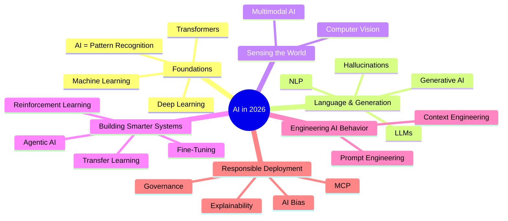

---

## PART 1: The Foundation — How AI Actually Works

---

## 1. Artificial Intelligence — Pattern Recognition at Scale {#1-artificial-intelligence}

### What It Is

AI is not magic, consciousness, or a digital brain. At its core, **AI is a system that finds patterns in data and uses them to make predictions or generate outputs**.

Think of it this way: if you showed a child 10,000 photos of cats and 10,000 of dogs, they'd quickly learn to tell them apart — not by memorizing a rulebook, but by building an internal sense of patterns. AI does the same thing, just at a vastly larger scale.

### Step-by-Step: How AI Learns a Pattern

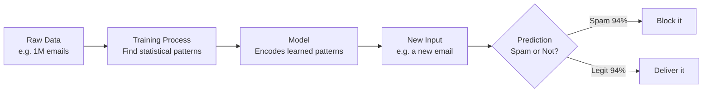

### Examples

| Scenario | Input Data | Pattern Learned | Output |
|---|---|---|---|
| Email spam filter | Millions of labeled emails | Words/phrases common in spam | Spam / Not Spam |
| Netflix recommendation | Your watch history | What people with similar tastes watch | Movie suggestions |
| Credit scoring | Financial history of millions | Patterns of loan repayment | Credit risk score |
| Medical diagnosis | X-ray images + outcomes | Visual markers of disease | Diagnosis suggestion |

### Key Insight

> "AI doesn't think. It interpolates. Given enough examples, it gets extraordinarily good at finding what *usually* comes next."

### Use Cases in 2026

- **Business**: Forecasting sales, detecting fraud, automating customer support
- **Healthcare**: Early detection of cancer in imaging data
- **Finance**: Real-time risk assessment for trading
- **Daily Life**: Face ID on your phone, autocomplete in Gmail, song recommendations on Spotify

---

## 2. Machine Learning — Teaching by Example {#2-machine-learning}

### What It Is

Machine Learning (ML) is the primary method by which AI systems learn. Instead of writing explicit rules, you feed the system **examples** and it *discovers* the rules itself.

### Traditional Software vs Machine Learning

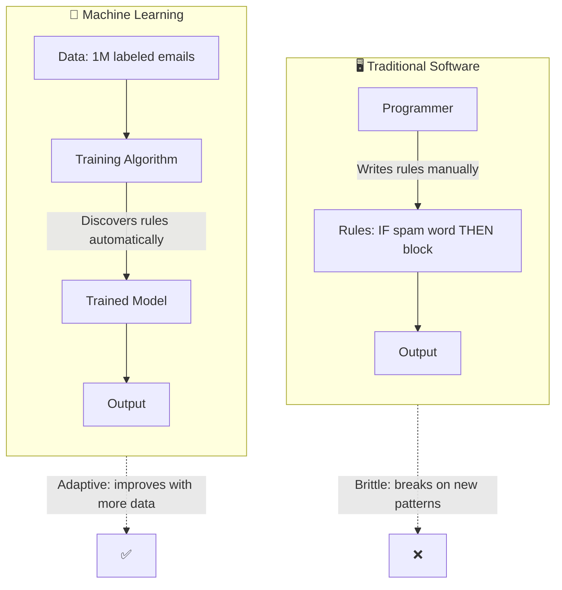

### Three Types of Machine Learning

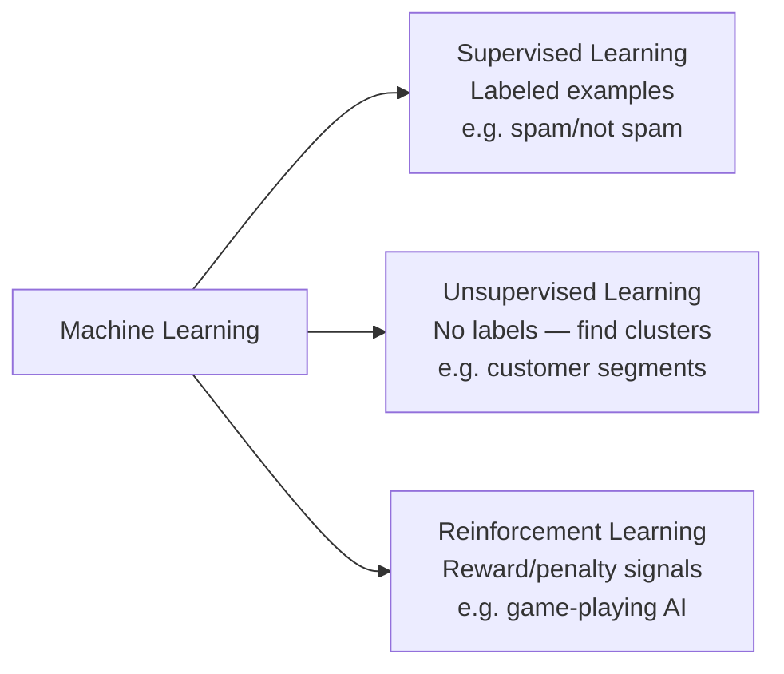

### Concrete Example: Spam Filter

**Step 1 — Collect labeled data:**
```
Email: "Win $1000 NOW! Click here!!!" → Label: SPAM
Email: "Meeting at 3pm tomorrow"        → Label: NOT SPAM
... (repeat 500,000 times)
```

**Step 2 — Train the model:**
The algorithm scans all examples and learns: "Emails with words like 'WIN', '$$$', 'CLICK HERE' are 92% likely to be spam."

**Step 3 — Deploy:**
A new email arrives: "You've been selected to WIN a FREE iPhone!" → Model predicts: SPAM with 97% confidence.

### Real-World Use Cases

- **Fraud detection**: Banks train ML on millions of transactions to flag anomalies
- **Predictive maintenance**: Factories train models on sensor data to predict equipment failures before they happen
- **Personalized medicine**: Hospitals train models to predict which treatments work for which patient profiles

---

## 3. Deep Learning & Neural Networks {#3-deep-learning}

### What It Is

Deep Learning is a powerful subset of machine learning using **neural networks** — layered structures of mathematical "nodes" loosely inspired by how neurons in your brain work.

"Deep" simply means the network has **many layers** — sometimes hundreds — stacked between the input and output.

### How a Neural Network Works (Step by Step)

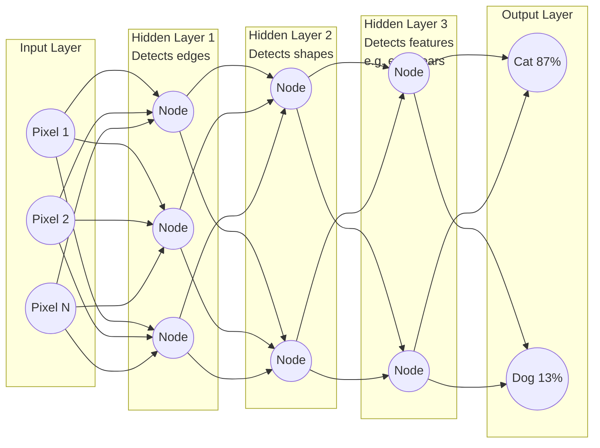

Each layer **automatically learns to detect increasingly abstract features** — the network isn't told to look for ears or whiskers. It discovers them on its own through training.

### Training: How Weights Are Adjusted

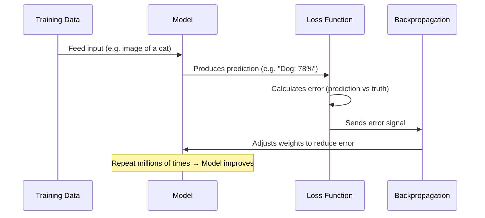

### Where Deep Learning Powers Our World

| Application | What it does |
|---|---|
| Google Photos | Identifies people, objects, scenes in your photos |
| ChatGPT | Generates coherent text responses |
| Face ID | Recognizes your face in different lighting |
| YouTube recommendations | Predicts what you'll watch next |
| AlphaFold | Predicts 3D protein structures — revolutionized biology |

---

## 4. Transformers — The Architecture That Changed Everything {#4-transformers}

### What It Is

Introduced in the 2017 paper *"Attention Is All You Need"*, the Transformer architecture solved a critical problem: **how do you understand the meaning of a word based on all the other words around it, even far away in a long document?**

### The Problem Transformers Solved

Older models processed text one word at a time (like reading with your finger under each word). By the end of a long sentence, they'd "forgotten" the beginning.

Transformers use **self-attention**: every word simultaneously looks at every other word and decides how much to "attend" to it.

### Self-Attention Illustrated

Consider: *"The animal didn't cross the street because **it** was too tired."*

What does "it" refer to? The animal or the street?

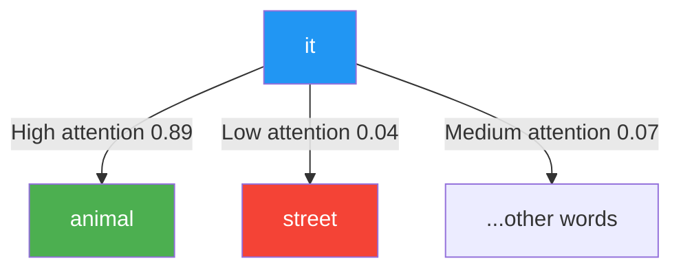

The transformer correctly concludes "it" = "the animal" because the context of "tired" attaches more strongly to animals than streets.

### Transformer Architecture Overview

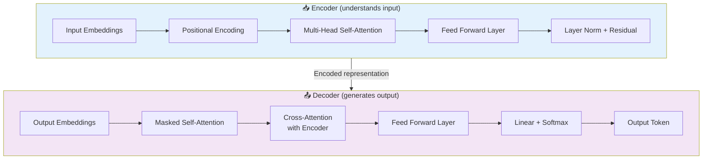

### Why It Matters

Every major AI model you use in 2026 — **GPT-4o, Claude, Gemini, Llama** — is built on the Transformer architecture. It enabled:

- Processing entire documents at once (not word by word)
- Parallel training (much faster)
- Long-range context understanding
- Scaling to trillions of parameters

---

## PART 2: Understanding Language Models

---

## 5. Large Language Models (LLMs) {#5-large-language-models}

### What They Are

A Large Language Model is a Transformer trained on **hundreds of billions of words** from the internet, books, code, and papers. The training task is deceptively simple:

> **Predict the next word.**

That's it. But doing this trillions of times on diverse text teaches the model grammar, facts, reasoning patterns, coding conventions, and even humor.

### LLM Training Pipeline

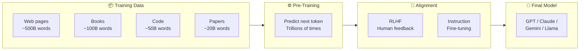

### Critical Distinction: Prediction vs. Knowledge

| What People Assume | What's Actually Happening |
|---|---|
| "The AI *knows* the capital of France" | It has seen "Paris is the capital of France" so many times that "Paris" is the overwhelmingly predicted next token |
| "The AI *understands* my question" | It identifies statistical patterns in your prompt and generates the most likely coherent continuation |
| "The AI is *thinking* through the problem" | It is doing many matrix multiplications that result in token-by-token generation |

This explains **why LLMs hallucinate** — if the right answer has low probability in the training distribution, the model may generate a confident wrong answer that *sounds* correct.

### LLM Scaling Laws

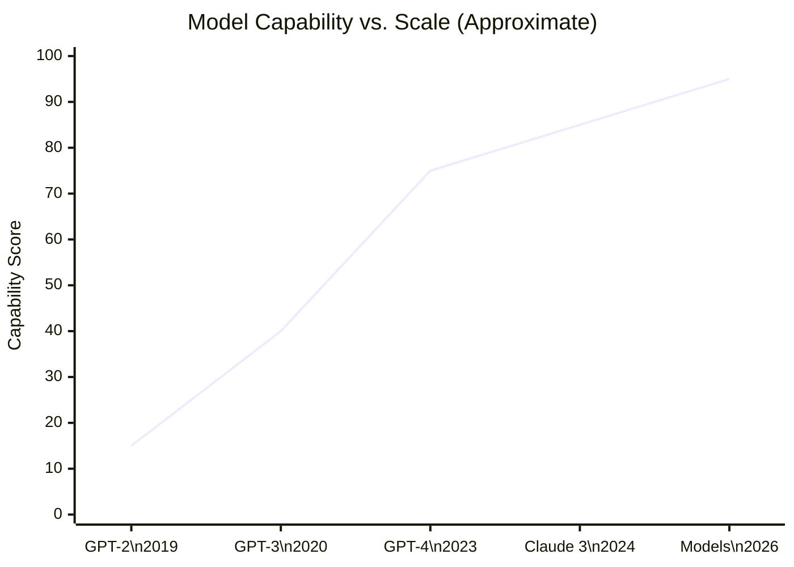

### Real-World Use Cases

- **Code generation**: GitHub Copilot writes 30-40% of code at many companies
- **Legal document review**: LLMs review contracts at a fraction of the cost of lawyers
- **Customer support**: LLMs handle Tier-1 support, escalating complex cases to humans
- **Scientific research**: Summarizing papers, generating hypotheses

---

## 6. Generative AI {#6-generative-ai}

### What It Is

Generative AI extends beyond prediction — it **creates new content** (text, images, music, video, code) by learning and reproducing the statistical patterns of how humans create.

### The Generative AI Landscape

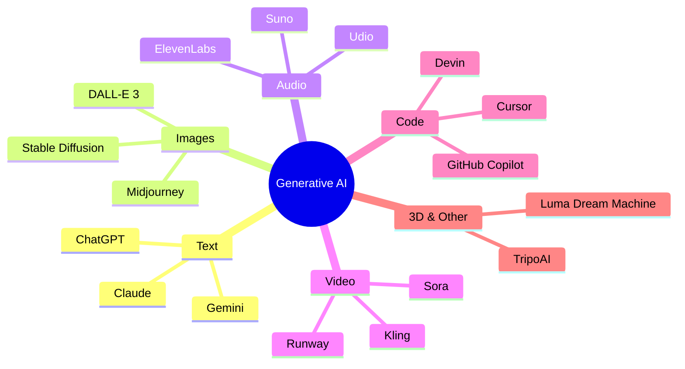

### How Image Generation Works (Diffusion Models)

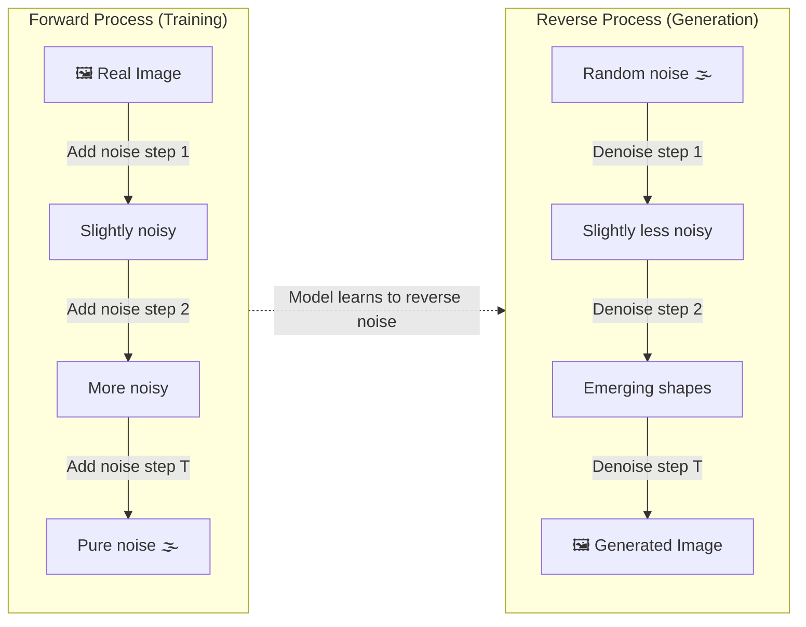

### The Prompt Quality Principle

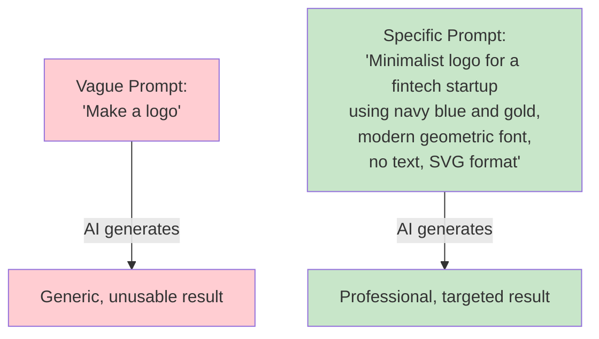

### Use Cases

- **Marketing**: Generate ad copy variants and test them in hours instead of weeks
- **Product design**: Rapid prototyping of UI concepts
- **Entertainment**: AI-assisted screenwriting, concept art, music scoring
- **Education**: Generate custom illustrations for textbooks

---

## 7. Agentic AI — From Chatbots to Autonomous Workflows {#7-agentic-ai}

### What It Is

Agentic AI represents the biggest shift in 2026: AI that doesn't just *answer* questions but **autonomously plans and executes multi-step workflows** using tools.

### Chatbot vs. Agent

```mermaid
flowchart TD
    subgraph Chatbot["💬 Traditional Chatbot"]
        U1[User: 'Summarize this report'] --> C1[AI reads & responds]
        C1 --> R1[Single text response\n— done]
    end

    subgraph Agent["🤖 AI Agent"]
        U2[User: 'Analyze our Q3 sales\nand prepare a board deck'] --> P[Plan steps]
        P --> T1[🔍 Search internal databases]
        T1 --> T2[📊 Run calculations in Python]
        T2 --> T3[📈 Generate charts]
        T3 --> T4[📝 Draft slides]
        T4 --> T5[✉️ Email draft to manager]
        T5 --> R2[Complete deliverable]
    end
```

### Agent Architecture

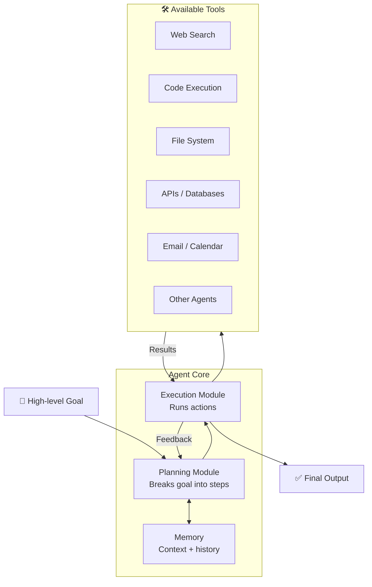

### Real-World Agent Examples

| Agent Type | Input | Actions Taken | Output |
|---|---|---|---|
| Research Agent | "Summarize AI news this week" | Search web → read articles → synthesize | Newsletter draft |
| Data Agent | "Find anomalies in sales data" | Query database → run analysis → chart results | Anomaly report |
| Coding Agent | "Fix the bug in auth module" | Read code → run tests → make edits → re-test | Fixed code + PR |
| Customer Agent | "Handle refund requests" | Check order → verify policy → process refund → email customer | Resolved ticket |

---

## PART 3: Engineering AI Behavior

---

## 8. Prompt Engineering {#8-prompt-engineering}

### What It Is

Prompt engineering is the practice of **structuring your inputs to AI to reliably get high-quality, relevant outputs**. It's less about magic words and more about providing the right cognitive scaffolding.

### The Anatomy of an Effective Prompt

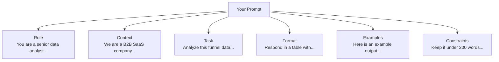

### Key Techniques Compared

| Technique | How it Works | When to Use | Example |
|---|---|---|---|
| **Zero-shot** | Ask directly with no examples | Simple, well-defined tasks | "Translate this to French" |
| **Few-shot** | Provide 2-3 examples first | When output format matters | Show 3 examples of summaries, then ask for a 4th |
| **Chain-of-Thought** | Ask AI to reason step by step | Math, logic, multi-step problems | "Think through this step by step before answering" |
| **Role prompting** | Assign a persona/expertise | Domain-specific tasks | "You are an expert cardiologist..." |
| **Self-consistency** | Ask the same question multiple ways, pick most common answer | High-stakes factual queries | Run the prompt 5 times, use majority result |

### Chain-of-Thought Example

**Without CoT:**
```
Q: A store has 40 items. 25% are on sale. How many are full price?
A: 10  ← WRONG
```

**With CoT prompting ("think step by step"):**
```
Q: A store has 40 items. 25% are on sale. How many are full price?
   Think step by step.

A: Step 1: Items on sale = 25% of 40 = 0.25 × 40 = 10
   Step 2: Items at full price = 40 - 10 = 30
   Answer: 30 ← CORRECT
```

### Use Cases

- **Developer**: Using structured prompts to generate consistent code documentation
- **Analyst**: Role-prompting an LLM as a SQL expert to generate complex queries
- **Marketer**: Few-shot prompting to match your brand's tone and style

---

## 9. Context Engineering {#9-context-engineering}

### What It Is

If prompt engineering is *how* you ask the question, context engineering is *what information* the AI has access to when answering. It's about designing the **information architecture** around an AI agent.

### Why Context Engineering Matters

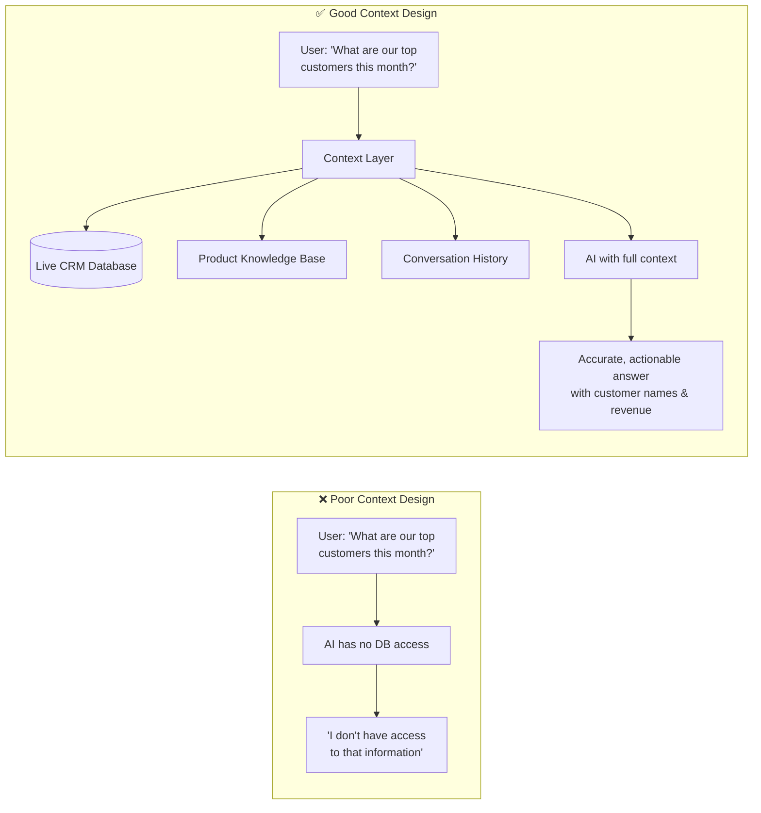

### Context Architecture for Enterprise AI

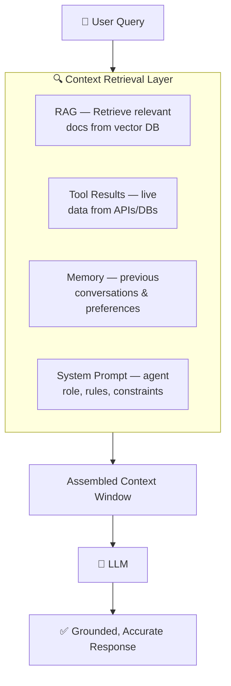

### Retrieval-Augmented Generation (RAG) — The Key Pattern

RAG solves the "LLM doesn't know your private data" problem:

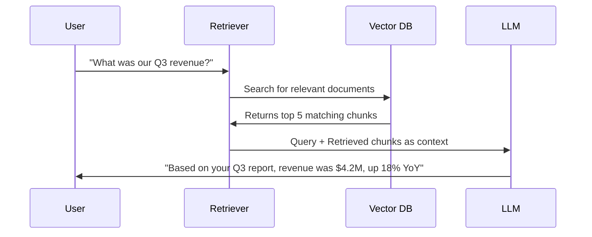

### Use Cases

- **Enterprise AI assistant**: Connects to HR policies, product docs, and CRM — answers accurately instead of hallucinating
- **Legal research tool**: Retrieves relevant case law and statutes before answering
- **Medical AI**: Accesses patient history and clinical guidelines before suggesting treatment paths

---

## PART 4: AI's Sensory Systems

---

## 10. Natural Language Processing (NLP) {#10-nlp}

### What It Is

NLP is the field focused on enabling machines to **understand, interpret, and generate human language** — both text and speech.

### NLP Task Taxonomy

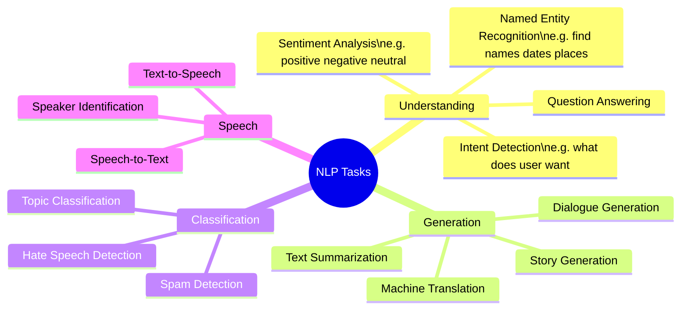

### NLP Pipeline

```mermaid
flowchart LR
    Raw[Raw Text:\n'The medication\nworked great!'] --> Tok[Tokenization:\n'The' 'medication'\n'worked' 'great' '!']
    Tok --> Emb[Embedding:\nConvert to\nnumerical vectors]
    Emb --> Trans[Transformer\nprocessing]
    Trans --> Out[Output:\nSentiment: Positive 94%\nEntity: medication]
```

### Real-World Examples

| Application | NLP Task | Example |
|---|---|---|
| Gmail Smart Reply | Text generation | Suggests "Sounds good!" |
| Google Translate | Machine translation | English → Hindi |
| Alexa/Siri | Intent detection | "Play jazz" → MusicPlayIntent |
| Twitter content moderation | Classification | Flags hate speech |
| Legal contract review | NER + summarization | Extracts key clauses |

---

## 11. Computer Vision {#11-computer-vision}

### What It Is

Computer vision enables machines to **interpret and understand visual information** — images, video, and spatial data.

### Evolution of Computer Vision

```mermaid
timeline
    title Computer Vision Milestones
    2012 : AlexNet wins ImageNet
         : Deep learning beats traditional CV
    2015 : ResNet achieves superhuman\nimage classification
    2017 : Mask R-CNN enables\ninstance segmentation
    2020 : Vision Transformers (ViT)\nattention applied to images
    2022 : DALL-E 2 — text to image
    2023 : GPT-4V — multimodal understanding
    2025 : Real-time video understanding\nat consumer scale
```

### How Object Detection Works

```mermaid
flowchart TD
    IMG[📸 Input Image] --> CNN[Convolutional\nNeural Network]
    CNN --> FM[Feature Maps\nDetects edges shapes textures]
    FM --> RPN[Region Proposal Network\nWhere are the objects?]
    RPN --> ROI[Region of Interest\nCropped candidate areas]
    ROI --> CLS[Classification Head\nWhat is each object?]
    ROI --> REG[Regression Head\nRefine bounding boxes]
    CLS & REG --> OUT[🖼️ Annotated Image\nwith labels + boxes]
```

### Real-World Applications

| Industry | Use Case | Impact |
|---|---|---|
| Healthcare | Tumor detection in radiology | Catches cancers 10x faster than manual review |
| Automotive | Pedestrian detection in ADAS | Reduces collision deaths |
| Retail | Shelf monitoring | Detects out-of-stock items automatically |
| Agriculture | Crop disease detection via drone | 40% reduction in pesticide use |
| Manufacturing | Defect detection on assembly line | 99.9% accuracy vs 95% human |
| Security | Facial recognition + anomaly detection | Real-time threat identification |

---

## 12. Multimodal AI {#12-multimodal-ai}

### What It Is

Multimodal AI systems can **understand and generate across multiple types of data simultaneously** — text, images, audio, video, and structured data.

### Why Multimodal Matters

The real world is multimodal. A doctor doesn't just read notes — they look at scans, listen to symptoms, check lab results, and read history all at once. Multimodal AI mirrors this.

### Multimodal Processing Architecture

```mermaid
flowchart TB
    subgraph Inputs["📥 Multiple Input Modalities"]
        T[📝 Text]
        I[🖼️ Image]
        A[🎵 Audio]
        V[🎬 Video]
        D[📊 Data/Tables]
    end

    subgraph Encoders["🔄 Modality Encoders"]
        TE[Text Encoder\nTransformer]
        IE[Image Encoder\nViT / CNN]
        AE[Audio Encoder\nWav2Vec]
        VE[Video Encoder\nFrame sampling]
        DE[Data Encoder\nTabular transformer]
    end

    subgraph Fusion["🧠 Cross-Modal Fusion"]
        PROJ[Projection to\nShared Embedding Space]
        ATT[Cross-Attention\nAcross Modalities]
    end

    subgraph Outputs["📤 Output Modalities"]
        TO[Text Response]
        IO[Generated Image]
        AO[Speech Output]
    end

    T --> TE
    I --> IE
    A --> AE
    V --> VE
    D --> DE

    TE & IE & AE & VE & DE --> PROJ
    PROJ --> ATT
    ATT --> TO & IO & AO
```

### Real-World Multimodal Use Cases

```mermaid
flowchart LR
    MED[🏥 Medical AI\nScan + History + Labs → Diagnosis] --- EDU
    EDU[📚 Education\nImage + Text → Custom Explanation] --- RET
    RET[🛍️ Retail\nPhoto → Style match & purchase] --- AUT
    AUT[🚗 Autonomous Driving\nCamera + LiDAR + Maps → Navigation]
```

---

## PART 5: Building AI Systems Efficiently

---

## 13. Transfer Learning {#13-transfer-learning}

### What It Is

Transfer learning allows you to **take knowledge learned in one domain and apply it to a related domain**, dramatically reducing the data and compute needed.

### The Analogy

> A surgeon who learned anatomy doesn't start from scratch when studying cardiology. They *transfer* their foundational knowledge and build on it. Transfer learning does the same for AI.

### Without vs. With Transfer Learning

```mermaid
flowchart TD
    subgraph Without["❌ Without Transfer Learning"]
        SD[Collect 500K\nmedical images] --> LBL[Label them all\n$$$$$]
        LBL --> TRN[Train from scratch\n3 months on 8 GPUs]
        TRN --> MDL1[Model: 78% accuracy]
    end

    subgraph With["✅ With Transfer Learning"]
        PTM[Start with ResNet\ntrained on 14M images] --> FT[Fine-tune on\n5K medical images]
        FT --> MDL2[Model: 91% accuracy\n2 days on 1 GPU]
    end
```

### Transfer Learning Spectrum

```mermaid
flowchart LR
    FZ[Feature Extraction\nFreeze all layers\nAdd new head\nFastest cheapest] --> LT
    LT[Light Fine-tuning\nFreeze early layers\nTrain later layers] --> FTN
    FTN[Full Fine-tuning\nTrain all layers\nBest results\nMost expensive] --> LORA
    LORA[LoRA / PEFT\nTrain small adapters\nBest efficiency tradeoff]
```

---

## 14. Fine-Tuning {#14-fine-tuning}

### What It Is

Fine-tuning is the practical application of transfer learning: adapting a pre-trained model to your **specific task or domain** with your own data.

### Fine-Tuning Workflow

```mermaid
sequenceDiagram
    participant PT as Pre-trained Model\n(e.g. Llama 3)
    participant FTD as Fine-tuning Dataset\n(your domain data)
    participant FTP as Fine-tuning Process
    participant FM as Fine-tuned Model

    PT->>FTP: Load weights
    FTD->>FTP: Provide task-specific examples
    FTP->>FTP: Additional training passes
    FTP->>FM: Adjusted weights + domain knowledge
    FM->>FM: Ready for production
    Note over FM: Knows your company's\nproducts, tone, policies
```

### Types of Fine-Tuning

| Type | What it Changes | Data Needed | Cost |
|---|---|---|---|
| Full fine-tuning | All model weights | Thousands of examples | High |
| LoRA (Low-Rank Adaptation) | Small adapter matrices | Hundreds of examples | Low |
| RLHF | Behavior via human feedback | Human preference ratings | High (needs humans) |
| Instruction tuning | Response style & format | 100+ task examples | Medium |

### Real Use Cases

- **Legal firm**: Fine-tune LLM on 10 years of their legal briefs → model writes in their style
- **Medical device company**: Fine-tune on clinical notes → model understands proprietary terminology
- **E-commerce**: Fine-tune on product catalog → model answers product questions accurately
- **Customer support**: Fine-tune on resolved tickets → model handles new tickets consistently

---

## 15. Reinforcement Learning {#15-reinforcement-learning}

### What It Is

Reinforcement Learning (RL) trains agents through **trial-and-error interaction with an environment**, rewarding good behaviors and penalizing bad ones — no labeled examples needed.

### The RL Loop

```mermaid
flowchart LR
    ENV[🌍 Environment] -->|State S| AGT[🤖 Agent]
    AGT -->|Action A| ENV
    ENV -->|Reward R| AGT
    AGT -->|Learns policy| AGT

    note1["State: Current game board\nAction: Move piece\nReward: Win=+1, Lose=-1, Draw=0"]
```

### Key RL Concepts

```mermaid
mindmap
  root((Reinforcement\nLearning))
    Core Elements
      Agent — makes decisions
      Environment — world agent acts in
      State — current situation
      Action — what agent can do
      Reward — feedback signal
      Policy — action strategy
    Algorithms
      Q-Learning
      PPO — Proximal Policy Opt
      A3C — Actor Critic
      TRPO
    Famous Applications
      AlphaGo — board games
      OpenAI Five — Dota 2
      ChatGPT RLHF — alignment
      Robotics locomotion
      Data center cooling
```

### RL Training Timeline: AlphaGo Example

```mermaid
flowchart LR
    SL[Supervised Learning\nLearn from\nhuman games] --> SP[Self-Play\nPlay millions of\ngames vs itself]
    SP --> RL2[RL Improvement\nRefine strategy\nbased on wins/losses]
    RL2 --> MASTER[AlphaGo Master\nBeats world champion]
    MASTER --> ZERO[AlphaGo Zero\nLearns from\nzero human data]
```

### Real-World RL Use Cases (Beyond Games)

| Domain | Application | Result |
|---|---|---|
| Data centers | DeepMind optimizes Google's cooling systems via RL | 40% reduction in cooling energy |
| Trading | RL agents optimize portfolio allocation | Outperforms static strategies in volatile markets |
| Robotics | Boston Dynamics locomotion training | Robots learn to walk on varied terrain |
| Drug discovery | RL optimizes molecular structures | Accelerates candidate generation 10x |
| RLHF (ChatGPT) | Human feedback shapes model behavior | More helpful, less harmful responses |

---

## PART 6: The Hard Truths About AI

---

## 16. AI Bias {#16-ai-bias}

### What It Is

AI systems **inherit the biases embedded in their training data** — and those biases can cause real harm, especially when AI makes consequential decisions.

### Where Bias Enters the Pipeline

```mermaid
flowchart TD
    subgraph Sources["🔴 Sources of Bias"]
        HB[Historical Bias\nData reflects past\ndiscrimination]
        SB[Sampling Bias\nUnderrepresented\ngroups in data]
        LB[Labeling Bias\nHuman annotators\nhave biases too]
        FB[Feedback Bias\nUsers interact\ndifferently by group]
    end

    Sources --> DATA[Training Data]
    DATA --> MODEL[AI Model]
    MODEL --> DEC[Decisions]

    subgraph Harms["⚠️ Real Harms"]
        H1[Hiring algorithms\nfavor historical demographics]
        H2[Facial recognition\nfails on darker skin]
        H3[Medical models\nunderdiagnose minorities]
        H4[Credit scoring\npenalizes certain zip codes]
    end

    DEC --> Harms
```

### Famous Real-World Bias Cases

| System | Bias Found | Impact |
|---|---|---|
| Amazon's hiring AI (2018) | Downranked resumes with the word "women's" | Scrapped after discovery |
| COMPAS recidivism tool | 2x false positive rate for Black defendants | Used in actual sentencing |
| Google Photos (2015) | Labeled Black users as "gorillas" | Major PR crisis |
| Healthcare algorithms (2019) | Predicted lower risk scores for sicker Black patients | Led to undertreatment |

### Bias Mitigation Framework

```mermaid
flowchart TB
    ID[🔍 Identify Bias\nAudit training data\nfor demographic gaps] --> MITIGATE
    subgraph MITIGATE["🛠️ Mitigation Strategies"]
        DD[Diverse Data\nensure representation\nacross groups]
        FT[Fairness Constraints\nequal error rates\nacross demographics]
        HO[Human Oversight\nhumans review\nhigh-stakes decisions]
        TP[Transparency\ndisclose limitations\nand audit results]
    end
    MITIGATE --> MONITOR[📊 Continuous Monitoring\nTrack outcomes\nby demographic group]
    MONITOR --> ID
```

---

## 17. Explainability (XAI) {#17-explainability}

### What It Is

Explainability — or Explainable AI (XAI) — is the ability to **articulate why an AI model made a specific decision** in human-understandable terms.

### The Explainability Spectrum

```mermaid
flowchart LR
    DT[Decision Tree\n⭐⭐⭐⭐⭐ Explainable\nClear rules\ne.g. income > 50K → approve] --> LR2
    LR2[Logistic Regression\n⭐⭐⭐⭐ Explainable\nFeature weights visible] --> RF
    RF[Random Forest\n⭐⭐⭐ Moderate\nFeature importance available] --> NN
    NN[Neural Network\n⭐⭐ Hard\nAttention weights help] --> LLM2
    LLM2[Large LLM\n⭐ Very Hard\nBillions of parameters\nChain-of-thought helps]
```

### XAI Techniques

| Technique | How it Works | Best For |
|---|---|---|
| **LIME** | Perturbs inputs, observes output changes | Any model, local explanations |
| **SHAP** | Shapley values — contribution of each feature | Feature importance across dataset |
| **Attention maps** | Visualizes which tokens/pixels the model focused on | Transformers |
| **Counterfactuals** | "If X had been different, outcome would change" | High-stakes decisions |
| **Chain-of-thought** | Ask model to reason step by step | LLMs |

### Why XAI is Legally Required

```mermaid
flowchart LR
    EUAI[🇪🇺 EU AI Act 2025\nHigh-risk AI must\nexplain decisions] --> Finance
    GDPR[🇪🇺 GDPR Article 22\nRight to explanation\nfor automated decisions] --> Finance
    Finance[💰 Finance\nCredit decisions\nmust be explainable] & Healthcare[🏥 Healthcare\nDiagnosis tools\nmust show reasoning] & HR[👥 HR\nHiring tools\nmust explain rejections]
```

---

## 18. Hallucinations {#18-hallucinations}

### What It Is

An AI hallucination occurs when an LLM **generates false information confidently** — not because it's lying, but because it's predicting plausible-sounding text, not retrieving verified facts.

### Why Hallucinations Happen

```mermaid
flowchart TD
    Q[User asks:\n'Who wrote the 2021 paper on\nquantum error correction?'] --> LLM_PROC[LLM processes]

    subgraph LLM_PROC["🧠 What LLM Does"]
        P1[Recognizes patterns:\n'This is a paper citation request']
        P2[Generates plausible\npattern: Author Name + Year +\nJournal = credible citation]
        P3[Has no actual\nmemory of specific paper]
    end

    LLM_PROC --> HAL[Outputs confidently:\n'Dr. James Wei, Nature Physics 2021'\n— may be entirely fabricated]

    style HAL fill:#FFCDD2
```

### Hallucination Risk by Task Type

```mermaid
xychart-beta
    title "Hallucination Risk by Task"
    x-axis ["Summarize\nProvided Text", "Math\nReasoning", "Creative\nWriting", "Historical\nFacts", "Citing\nSources", "Predicting\nFuture Events"]
    y-axis "Risk Level" 0 --> 10
    bar [1, 3, 2, 5, 9, 8]
```

### Mitigating Hallucinations

```mermaid
flowchart TD
    HAL[Hallucination Risk] --> MIT

    subgraph MIT["✅ Mitigation Strategies"]
        RAG2[RAG — Ground answers\nin retrieved documents]
        TOOL[Tool Use — Let AI\nlook up real data]
        VER[Verification Step — Second\nLLM checks first one]
        COT[Chain-of-Thought — Forces\nstep-by-step reasoning]
        CRED[Citations — Require\nsources with every claim]
    end

    MIT --> LOW[Lower Hallucination Rate]
```

### Real-World Consequences

| Domain | Hallucination | Consequence |
|---|---|---|
| Legal | Cited nonexistent cases | Lawyer sanctioned by court (real 2023 case) |
| Medical | Wrong drug interaction info | Potential patient harm |
| Finance | Made-up statistics | Misled investment decisions |
| Journalism | Fabricated quotes | Published misinformation |

---

## PART 7: Infrastructure and Governance

---

## 19. Model Context Protocol (MCP) {#19-mcp}

### What It Is

MCP is an **open standard for connecting AI agents to external tools and data sources**. Think of it as USB-C for AI — a universal connector that lets any AI model plug into any data source or service.

### Before and After MCP

```mermaid
flowchart TD
    subgraph Before["❌ Before MCP — Bespoke Integration Hell"]
        A1[AI Agent] -->|Custom code| DB1[(Salesforce)]
        A1 -->|Custom code| DB2[(Jira)]
        A1 -->|Custom code| DB3[(Google Drive)]
        A1 -->|Custom code| DB4[(Slack)]
        NOTE1[Each integration =\nweeks of dev work]
    end

    subgraph After["✅ With MCP — Plug and Play"]
        A2[AI Agent] -->|MCP Protocol| HUB[MCP Server Hub]
        HUB --> DB5[(Salesforce)]
        HUB --> DB6[(Jira)]
        HUB --> DB7[(Google Drive)]
        HUB --> DB8[(Slack)]
        NOTE2[Add new tool =\nhours not weeks]
    end
```

### MCP Architecture

```mermaid
sequenceDiagram
    participant U as User
    participant A as AI Agent
    participant MCP as MCP Server
    participant T as External Tool/DB

    U->>A: "Summarize my open Jira tickets"
    A->>MCP: Request tool: jira.getIssues(assignee=me, status=open)
    MCP->>T: API call to Jira
    T->>MCP: Returns JSON of open tickets
    MCP->>A: Structured tool result
    A->>U: "You have 8 open tickets. The highest priority is..."
```

### Impact in 2026

By end of 2025, over **10,000 public MCP servers** were deployed, covering tools like GitHub, Slack, Notion, Salesforce, Google Workspace, databases, and more. Any agent can now be built with full enterprise integration in days rather than months.

---

## 20. Responsible AI Governance {#20-responsible-ai}

### What It Is

Responsible AI Governance is the **set of policies, processes, and oversight mechanisms** organizations use to ensure AI is developed and deployed safely, fairly, and accountably.

### The Responsible AI Framework

```mermaid
mindmap
  root((Responsible AI\nGovernance))
    Fairness
      Bias auditing
      Demographic parity testing
      Equal error rates
    Transparency
      Explainability requirements
      Model cards & datasheets
      Public disclosures
    Accountability
      Human oversight
      Audit trails
      Clear ownership
    Safety
      Red teaming
      Adversarial testing
      Incident response plans
    Privacy
      Data minimization
      Consent frameworks
      GDPR compliance
    Legal Compliance
      EU AI Act
      National frameworks
      Liability coverage
```

### Global AI Regulation Landscape 2026

```mermaid
flowchart LR
    subgraph EU["🇪🇺 EU AI Act (Enforced)"]
        HIGH[High-Risk AI\nRequires audit +\nexplainability + human oversight]
        LIMIT[Limited Risk\nTransparency requirements]
        MIN[Minimal Risk\nVoluntary guidelines]
    end

    subgraph US["🇺🇸 US Framework"]
        EO[Executive Orders\non AI safety]
        NIST[NIST AI Risk\nManagement Framework]
        SEC[Sector-specific\nrules: FDA, FTC, SEC]
    end

    subgraph GLOBAL["🌍 Global"]
        G7[G7 Hiroshima\nAI Principles]
        ISO[ISO/IEC 42001\nAI Management Standard]
        CHINA[China AI Regulations\nContent + Algorithm rules]
    end
```

### AI Governance Checklist for Organizations

```mermaid
flowchart TD
    START[Deploy AI System] --> Q1{Is it high-risk?\nHealthcare / hiring /\nfinance / legal}
    Q1 -->|Yes| AUDIT[Mandatory bias audit\nbefore deployment]
    Q1 -->|No| BASIC[Basic transparency\ndisclosure]

    AUDIT --> EXPLAIN[Ensure explainability\nfor all decisions]
    EXPLAIN --> HUMAN[Human oversight\nfor edge cases]
    HUMAN --> MONITOR[Continuous monitoring\nfor drift + bias]
    MONITOR --> INCIDENT[Incident response\nplan in place]
    INCIDENT --> INSURE[Liability coverage\nfor AI decisions]
    INSURE --> DONE[✅ Compliant Deployment]

    BASIC --> MONITOR
```

---

## Bringing It All Together

### The Master Dependency Map

```mermaid
flowchart TB
    subgraph Foundation["🏗️ Foundation"]
        AI[AI = Pattern Recognition]
        ML[Machine Learning]
        DL[Deep Learning]
        TR[Transformers]
    end

    subgraph Models["🧠 Models"]
        LLM[Large Language Models]
        GEN[Generative AI]
        NLP[NLP]
        CV[Computer Vision]
        MM[Multimodal AI]
    end

    subgraph Engineering["⚙️ Engineering"]
        PE[Prompt Engineering]
        CE[Context Engineering]
        TL[Transfer Learning]
        FT2[Fine-Tuning]
        RL2[Reinforcement Learning]
    end

    subgraph Deployment["🚀 Deployment"]
        AGT[Agentic AI]
        MCP2[MCP]
    end

    subgraph Safety["🛡️ Safety & Trust"]
        BIAS[Bias]
        EXP[Explainability]
        HAL2[Hallucinations]
        GOV[Governance]
    end

    Foundation --> Models
    Models --> Engineering
    Engineering --> Deployment
    Deployment --> Safety
    Safety --> Foundation

    style Foundation fill:#E3F2FD
    style Models fill:#E8F5E9
    style Engineering fill:#FFF3E0
    style Deployment fill:#F3E5F5
    style Safety fill:#FFEBEE
```

---

## Quick Reference: 20 Concepts at a Glance

| # | Concept | One-Line Explanation | Where You See It |
|---|---|---|---|
| 1 | **AI** | Pattern recognition at scale | Everywhere |
| 2 | **Machine Learning** | Learning rules from examples | Spam filters, recommendations |
| 3 | **Deep Learning** | Multi-layered pattern learning | Image recognition, voice |
| 4 | **Transformers** | Attention mechanism for context | GPT, Claude, Gemini |
| 5 | **LLMs** | Predict next token, 100B+ parameters | ChatGPT, Copilot |
| 6 | **Generative AI** | Create new content from patterns | DALL-E, Sora, Suno |
| 7 | **Agentic AI** | Multi-step autonomous workflows | Devin, Claude agents |
| 8 | **Prompt Engineering** | Scaffold AI reasoning effectively | Every AI interaction |
| 9 | **Context Engineering** | Design info architecture for agents | Enterprise AI systems |
| 10 | **NLP** | Machine understanding of language | Translation, chatbots |
| 11 | **Computer Vision** | Machine understanding of images | Medical AI, autonomous cars |
| 12 | **Multimodal AI** | Understand text+image+audio together | GPT-4o, Gemini Ultra |
| 13 | **Transfer Learning** | Reuse knowledge across domains | All modern AI training |
| 14 | **Fine-Tuning** | Adapt pretrained model to your data | Domain-specific AI |
| 15 | **Reinforcement Learning** | Learn through rewards & penalties | AlphaGo, RLHF |
| 16 | **AI Bias** | Models inherit data prejudices | Hiring, lending, criminal justice |
| 17 | **Explainability** | Why did AI make that decision? | Regulated industries |
| 18 | **Hallucinations** | Confident false outputs | Anywhere LLMs are used |
| 19 | **MCP** | Universal standard for agent-tool connections | Enterprise AI, 10K+ servers |
| 20 | **AI Governance** | Policies for safe, fair deployment | All organizations using AI |

---

## ✅ What You Can Do Now

1. **Use AI with calibrated trust**: Know when to verify (factual claims) vs. trust (drafting, brainstorming)
2. **Write better prompts**: Be specific, give examples, ask for step-by-step reasoning
3. **Spot hallucinations**: Cross-check any specific facts, citations, or statistics AI gives you
4. **Evaluate AI tools at work**: Ask vendors about bias audits, explainability, and data practices
5. **Stay current**: AI is evolving monthly — follow the foundations, not the hype

---

> *"The AI landscape in 2026 isn't mysterious once you understand these foundations. It's engineering — sophisticated, powerful, sometimes brittle engineering. But engineering is learnable."*