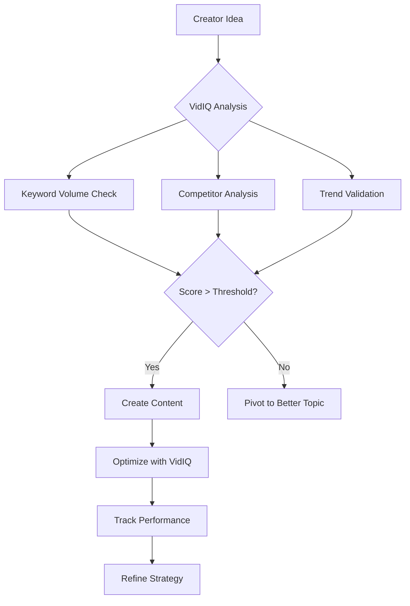
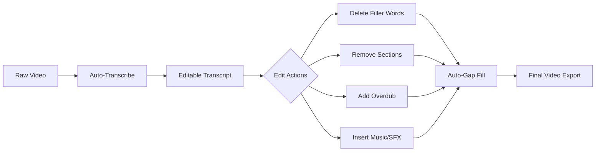
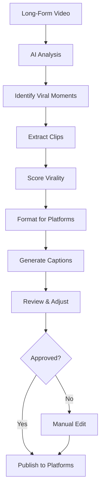
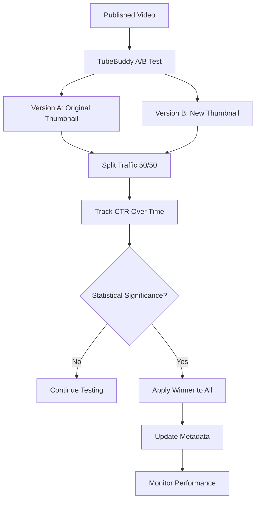
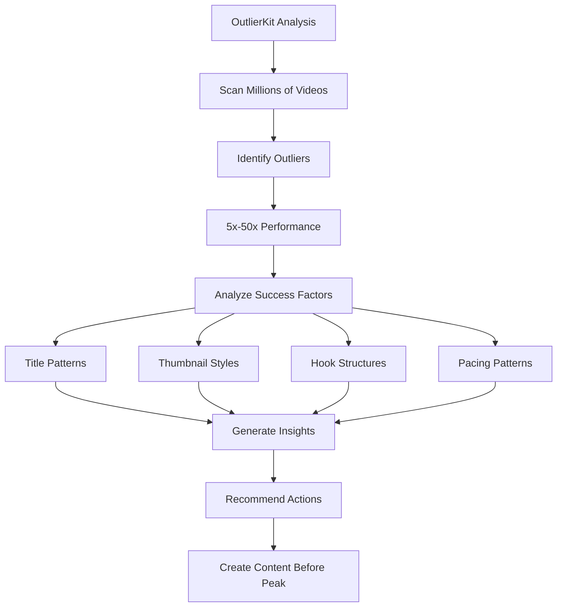
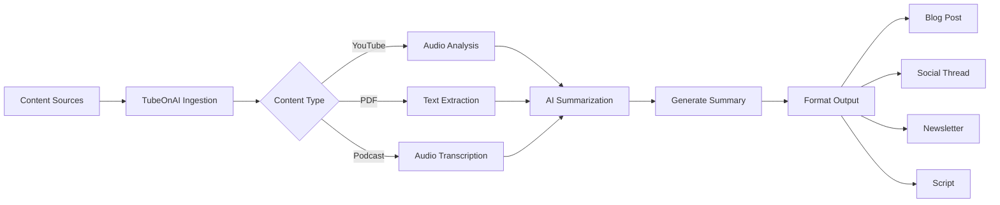
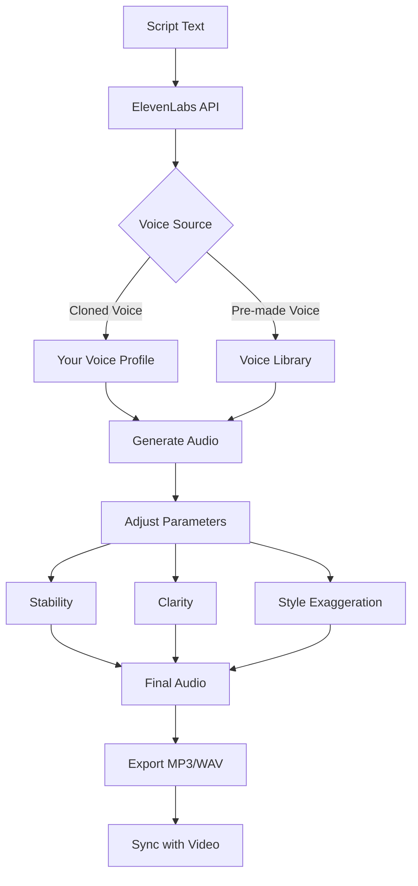
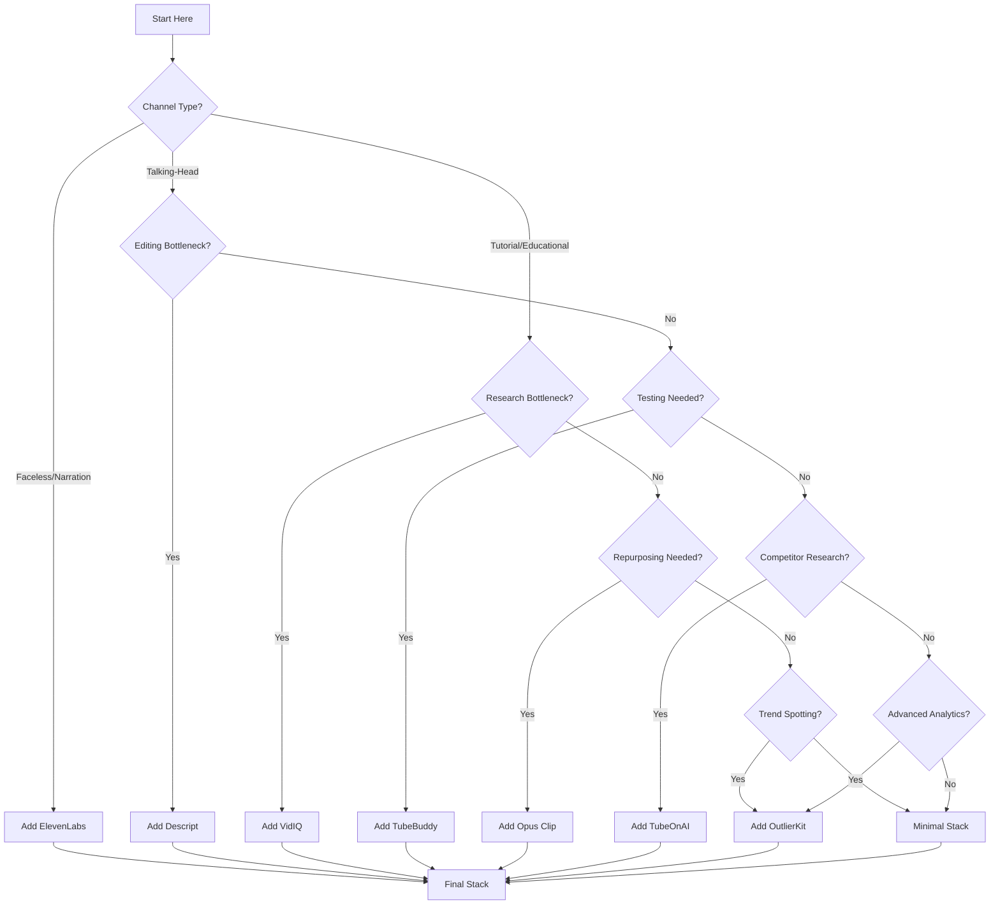

# 7 Essential AI Tools for YouTube Channel Success in 2026 - Comprehensive Guide

**📚 Tutorial Type:** Comprehensive Deep Dive  
**🎯 Target Audience:** Intermediate  
**⏱️ Estimated Reading Time:** 25 minutes  
**📅 Last Updated:** March 24, 2026  
**🔧 Tools Covered:** 7 AI-powered tools for YouTube creators

---

## Table of Contents

1. [Introduction & Overview](#introduction--overview)
2. [Prerequisites](#prerequisites)
3. [Learning Objectives](#learning-objectives)
4. [The YouTube Visibility Crisis](#the-youtube-visibility-crisis)
5. [Tool Deep Dives](#tool-deep-dives)
   - [1. VidIQ - Research & SEO Intelligence](#1-vidiq---research--seo-intelligence)
   - [2. Descript - Text-Based Video Editing](#2-descript---text-based-video-editing)
   - [3. Opus Clip - Viral Moment Extraction](#3-opus-clip---viral-moment-extraction)
   - [4. TubeBuddy - Testing & Optimization](#4-tubebuddy---testing--optimization)
   - [5. OutlierKit - Trend Analysis & Prediction](#5-outlierkit---trend-analysis--prediction)
   - [6. TubeOnAI - Research Automation](#6-tubeonai---research-automation)
   - [7. ElevenLabs - AI Voice Generation](#7-elevenlabs---ai-voice-generation)
6. [Building Your Tool Stack](#building-your-tool-stack)
7. [Real-World Use Cases](#real-world-use-cases)
8. [Best Practices](#best-practices)
9. [Anti-Patterns to Avoid](#anti-patterns-to-avoid)
10. [Performance Considerations](#performance-considerations)
11. [Security & Privacy Considerations](#security--privacy-considerations)
12. [Troubleshooting Guide](#troubleshooting-guide)
13. [Practice Exercises](#practice-exercises)
14. [Question Bank](#question-bank)
15. [Test Your Understanding](#test-your-understanding)
16. [Common Interview Questions](#common-interview-questions)
17. [Summary & Key Takeaways](#summary--key-takeaways)
18. [Further Reading & Resources](#further-reading--resources)

---

## Introduction & Overview

In 2026, YouTube faces an unprecedented content saturation crisis. The platform's statistics reveal a harsh reality: **88.4% of YouTube videos never reach 1,000 views**, with the median video receiving only 35 views. Meanwhile, the top 3.67% of videos that break 10,000 views capture 93.61% of all platform engagement.

This tutorial explores seven AI-powered tools that solve real problems for YouTube creators. These aren't the generic "use ChatGPT for scripts" or "Canva for thumbnails" advice—these are specialized tools that address specific bottlenecks in research, production, and scaling.

### What Makes This Different

Professional creators don't rely on entry-level tools. They build strategic systems using specialized software that solves specific problems at each stage of the content creation pipeline. This guide will help you:

- **Identify** which tools solve your specific bottlenecks
- **Understand** how each tool integrates into your workflow
- **Build** a cost-effective tool stack that grows with your channel
- **Avoid** common mistakes that waste time and money

### Who Should Read This

- ✅ New YouTube creators struggling with visibility
- ✅ Intermediate creators hitting growth plateaus
- ✅ Faceless channel operators seeking efficiency
- ✅ Content repurposing specialists
- ✅ Anyone tired of wasting time on manual processes

---

## Prerequisites

Before diving into these tools, ensure you have:

### Technical Prerequisites
- [ ] A YouTube channel (new or established)
- [ ] Basic understanding of YouTube Studio
- [ ] Familiarity with content creation workflows
- [ ] A modern web browser (Chrome, Firefox, Edge)
- [ ] Stable internet connection for cloud-based tools

### Knowledge Prerequisites
- [ ] Understanding of YouTube's basic metrics (views, watch time, CTR)
- [ ] Awareness of your channel's specific bottlenecks
- [ ] Basic budget planning for tool investments
- [ ] Understanding of content repurposing concepts

### Budget Considerations
- **Minimum:** $0/month (using free tiers only)
- **Recommended Starter:** $20-30/month (1-2 paid tools)
- **Professional Stack:** $50-100/month (full suite)
- **Enterprise Level:** $200+/month (multiple user accounts, advanced features)

---

## Learning Objectives

By the end of this tutorial, you will:

### Core Competencies
- ✅ Analyze your channel's specific bottlenecks and match them to appropriate tools
- ✅ Implement VidIQ for keyword research and competitor analysis
- ✅ Use Descript to reduce video editing time by 60-80%
- ✅ Automate short-form content creation with Opus Clip
- ✅ Set up A/B testing with TubeBuddy to optimize thumbnails
- ✅ Identify trending topics before they peak using OutlierKit
- ✅ Automate competitor research with TubeOnAI
- ✅ Generate professional voiceovers with ElevenLabs

### Strategic Skills
- ✅ Build a scalable tool stack that grows with your channel
- ✅ Calculate ROI for tool investments
- ✅ Integrate multiple tools into a cohesive workflow
- ✅ Avoid over-tooling and maintain focus on content quality
- ✅ Make data-driven decisions about content strategy

### Practical Outcomes
- ✅ Reduce content creation time by 40-60%
- ✅ Increase video discoverability through better SEO
- ✅ Repurpose long-form content into 10-20 short clips
- ✅ Test and optimize thumbnails for higher CTR
- ✅ Stay ahead of trends before competition intensifies

---

## The YouTube Visibility Crisis

### The Statistics

The YouTube ecosystem in 2026 presents a stark divide between successful creators and the overwhelming majority:

```
📊 Platform Engagement Distribution
├─ Top 3.67% of videos (>10K views)
│  └─ Capture 93.61% of all engagement
├─ Middle tier (1K-10K views)
│  └─ 8.23% of videos
└─ Bottom tier (<1K views)
   └─ 88.4% of videos
      └─ Median: 35 views
```

### Why Most Videos Fail

The fundamental issue isn't production quality—it's **strategic intelligence**. Most beginners:

1. **Create content nobody searches for** - No keyword research
2. **Use generic thumbnails** - No A/B testing or optimization
3. **Spend hours on manual editing** - No automation tools
4. **Ignore data and analytics** - No systematic testing
5. **Copy successful creators** - No trend analysis or timing advantage

### The Professional Approach

Top creators operate like media companies, not hobbyists. They:

- **Research before creating** - Validate demand before investing time
- **Systematize production** - Use tools to compress workflows
- **Test everything** - A/B test thumbnails, titles, and content formats
- **Repurpose intelligently** - Extract maximum value from each piece
- **Stay ahead of trends** - Identify opportunities before they peak

### The Tool Mindset

> 💡 **Key Insight:** Tools don't make you successful—they amplify your existing strategy. The right tool stack solves specific bottlenecks in your workflow, but it won't compensate for poor content strategy or lack of audience understanding.

---

## Tool Deep Dives

### 1. VidIQ - Research & SEO Intelligence

#### What It Is

VidIQ is a browser extension that integrates directly into YouTube Studio, providing real-time keyword research, competitor analysis, and trend identification. It's the research foundation for any serious YouTube strategy.

#### Core Features

**Keyword Research & Analysis**
- Search volume data for specific terms
- Keyword difficulty scores
- Related keyword suggestions
- Historical trend data

**Competitor Intelligence**
- Track competitor video performance
- Analyze their top-performing content
- Identify their keyword strategies
- Monitor channel growth patterns

**Trend Discovery**
- Daily video ideas based on your niche
- Trending topics in real-time
- Seasonal content opportunities
- Rising search terms before they peak

**AI Coach**
- Personalized suggestions based on channel size
- Topic recommendations tailored to your audience
- Optimization tips for new creators

#### How It Works



#### Pricing Structure

| Plan | Price | Key Features | Best For |
|------|-------|--------------|----------|
| **Free** | $0/month | Daily ideas, basic keyword data, competitor tracking | New creators testing the platform |
| **Boost** | $16/month | Advanced analytics, trend alerts, AI Coach | Growing channels (1K-10K subs) |
| **Pro** | $36/month | Historical data, API access, bulk optimization | Established creators (10K+ subs) |
| **Enterprise** | $83/month | Team features, custom reports, priority support | Media companies & agencies |

#### Real-World Example

**Scenario:** A new tech review channel wants to create content about the latest smartphone.

**Without VidIQ:**
- Creator guesses "iPhone 16 review" might be popular
- Spends 10 hours creating the video
- Video gets 200 views (saturated keyword, high competition)

**With VidIQ:**
- Creator searches "iPhone 16" in VidIQ
- Sees: 500K monthly searches, difficulty score 95/100 (very high)
- Discovers related term "iPhone 16 battery life test" - 15K searches, difficulty 45/100
- Creates content for the lower-competition, high-intent keyword
- Video gets 3,000+ views in first week

**Time Investment:** 5 minutes of research vs. 10 hours of wasted production

#### Integration Points

VidIQ works seamlessly with:
- **YouTube Studio** - Direct integration
- **TubeBuddy** - Complementary (VidIQ for research, TubeBuddy for testing)
- **Descript** - Use VidIQ-optimized titles in Descript projects
- **Opus Clip** - Feed VidIQ-validated long-form content for repurposing

#### Best Practices

✅ **DO:**
- Check keyword scores before every video
- Use the AI Coach for topic ideas when stuck
- Monitor competitor channels weekly
- Track your own video performance against keyword predictions
- Update old video metadata based on new trending terms

❌ **DON'T:**
- Chase only high-volume keywords (too competitive)
- Ignore long-tail keywords (lower volume, higher conversion)
- Skip competitor analysis (they're your best teachers)
- Over-optimize at the expense of content quality

#### Common Pitfalls

⚠️ **Pitfall 1: Keyword Stuffing**
- **Problem:** Stuffing titles with high-volume keywords
- **Solution:** Use keywords naturally; YouTube's algorithm prioritizes watch time and engagement over exact keyword matches

⚠️ **Pitfall 2: Ignoring Search Intent**
- **Problem:** Targeting keywords without understanding what users want
- **Solution:** Analyze top 10 results for your keyword; match the content format (tutorial, review, listicle)

⚠️ **Pitfall 3: Set-It-and-Forget-It**
- **Problem:** Researching once and never updating
- **Solution:** Re-validate keywords quarterly; trends change rapidly

#### Performance Metrics to Track

- **Keyword Score Accuracy:** How often do high-scoring keywords actually perform well?
- **Time Saved:** Research time vs. manual competitor analysis
- **View Improvement:** Videos created with VidIQ research vs. without
- **ROI:** Cost of VidIQ vs. additional views and watch time generated

---

### 2. Descript - Text-Based Video Editing

#### What It Is

Descript revolutionizes video editing by treating video as editable text. It automatically transcribes your footage, allowing you to edit videos by simply editing the transcript—delete a sentence, and that section disappears from the video.

#### Core Features

**Text-Based Editing**
- Edit video by editing transcript
- Delete words/sentences to remove video sections
- Click any word to jump to that moment in the video
- Real-time preview of edits

**Automatic Filler Removal**
- AI-powered removal of "um," "uh," "like," etc.
- One-click silence removal
- Automatic gap filling for smooth transitions

**Overdub - Voice Cloning**
- Clone your voice from 1-minute sample
- Fix audio mistakes without re-recording
- Generate new audio in your voice for corrections
- Supports multiple languages

**Multitrack Audio**
- Separate tracks for voice, music, sound effects
- Automatic audio leveling
- Noise reduction and enhancement

**Screen Recording**
- Built-in screen capture
- Simultaneous camera + screen recording
- Automatic transcription of recordings

#### How It Works



#### Pricing Structure

| Plan | Price | Key Features | Best For |
|------|-------|--------------|----------|
| **Free** | $0/month | 1 transcription hour/month, basic editing | Testing and short clips |
| **Creator** | $12/month | 10 hours transcription, Overdub, no watermark | Individual creators |
| **Pro** | $24/month | Unlimited transcription, advanced features | Professional creators |
| **Business** | $32/month/user | Team collaboration, admin controls | Production teams |

#### Real-World Example

**Scenario:** A 20-minute podcast-style YouTube video needs editing.

**Traditional Editing (Premiere Pro/DaVinci Resolve):**
- Review footage: 20 minutes
- Mark in/out points for cuts: 30 minutes
- Make cuts and transitions: 45 minutes
- Export and render: 15 minutes
- **Total: 1 hour 50 minutes**

**Descript Editing:**
- Auto-transcribe: 2 minutes (automated)
- Edit transcript (remove ums, awkward pauses): 15 minutes
- Review and fine-tune: 10 minutes
- Export: 5 minutes
- **Total: 32 minutes (71% time savings)**

**Additional Benefit:** The transcript itself becomes show notes, blog content, or social media clips.

#### Integration Points

Descript integrates with:
- **YouTube** - Direct publishing
- **Zoom** - Import meeting recordings
- **Podcast hosting platforms** - RSS feed import
- **Adobe Premiere Pro** - Export projects (Pro plan)
- **Final Cut Pro** - XML export (Pro plan)

#### Best Practices

✅ **DO:**
- Review auto-transcription for accuracy before editing
- Use Overdub for minor audio corrections
- Export transcripts for show notes and blog posts
- Use the "Remove filler words" feature selectively (review first)
- Create templates for recurring video formats

❌ **DON'T:**
- Trust 100% of auto-transcription (always proofread)
- Over-use Overdub (can sound unnatural if overdone)
- Edit while recording (causes sync issues)
- Ignore audio quality before import (garbage in, garbage out)

#### Common Pitfalls

⚠️ **Pitfall 1: Unreviewed Transcription Errors**
- **Problem:** Auto-transcription mishears technical terms or names
- **Solution:** Always review and correct transcript before final export

⚠️ **Pitfall 2: Over-Editing**
- **Problem:** Removing so much content that pacing feels unnatural
- **Solution:** Keep pauses that serve a purpose (dramatic effect, emphasis)

⚠️ **Pitfall 3: Ignoring Audio Quality**
- **Problem:** Trying to fix poor audio with Descript's tools
- **Solution:** Record clean audio first; Descript enhances, doesn't fix garbage

#### Performance Considerations

- **Transcription Speed:** ~1x real-time (20-min video = 20 min transcription)
- **Export Time:** 1-2x video length depending on resolution
- **Storage:** ~1GB per hour of 1080p video
- **CPU Usage:** Moderate (transcription is cloud-based)

---

### 3. Opus Clip - Viral Moment Extraction

#### What It Is

Opus Clip solves the "long-form to short-form" problem. It uses AI trained on social media trends to automatically identify viral-worthy moments in long videos and extract them as optimized vertical clips for YouTube Shorts, TikTok, and Instagram Reels.

#### The Problem It Solves

**Manual Repurposing Workflow:**
- Watch 45-minute video: 45 minutes
- Identify potential clips: 30 minutes
- Edit 10-20 clips: 3-4 hours
- Export and optimize for each platform: 1 hour
- **Total: 5-6 hours per long-form video**

**With Opus Clip:**
- Upload video: 5 minutes
- AI analyzes and extracts clips: 15 minutes
- Review and adjust: 30 minutes
- Export and publish: 15 minutes
- **Total: 1 hour (83% time savings)**

#### Core Features

**AI-Powered Clip Detection**
- Identifies hooks, punchlines, and peak engagement moments
- Analyzes speech patterns, energy levels, and topic shifts
- Predicts virality score for each clip
- Respects context (won't cut mid-story)

**Virality Score**
- 0-100 rating for each extracted clip
- Based on engagement predictors (hook strength, pacing, emotional impact)
- Helps prioritize which clips to publish first

**Platform Optimization**
- Automatic vertical formatting (9:16 aspect ratio)
- Platform-specific caption styles
- Optimal length recommendations per platform
- Direct publishing to YouTube Shorts, TikTok, Instagram

**Smart Captions**
- Auto-generated with keyword highlighting
- Customizable styles and animations
- Multi-language support

#### How It Works



#### Pricing Structure

| Plan | Price | Key Features | Best For |
|------|-------|--------------|----------|
| **Free** | $0/month | 60 minutes/month, watermarked exports | Testing and occasional use |
| **Basic** | $16/month | 150 minutes/month, HD export, no watermark | Casual creators |
| **Pro** | $32/month | 450 minutes/month, 1080p export, priority processing | Regular content creators |
| **Business** | $64/month | 900 minutes/month, 4K export, team features | Professional channels |

#### Real-World Example

**Scenario:** A 45-minute tech tutorial video needs to be repurposed into Shorts.

**Manual Approach:**
- Watch full video and note timestamps: 45 min
- Edit 15 clips in Premiere Pro: 4 hours
- Export each clip: 30 min
- Upload to 3 platforms with captions: 1 hour
- **Total: 6 hours 15 minutes**

**Opus Clip Approach:**
- Upload 45-min video: 5 min
- AI extracts 18 clips with virality scores: 15 min
- Review and remove 3 low-quality clips: 15 min
- Export 15 clips and publish: 30 min
- **Total: 1 hour 5 minutes (83% time savings)**

**Results:** 15 Shorts generated, 3 went viral (100K+ views each), channel grew 5,000 subscribers in 2 weeks.

#### Integration Points

Opus Clip works with:
- **YouTube** - Direct import from URL
- **Google Drive** - Bulk upload
- **Dropbox** - Cloud storage integration
- **Social media platforms** - Direct publishing
- **Descript** - Use Descript-edited videos as input

#### Best Practices

✅ **DO:**
- Review every clip before publishing (AI misses context)
- Adjust clip boundaries for better storytelling
- Add platform-specific captions and CTAs
- Prioritize clips with virality scores >70
- Batch process multiple long-form videos at once

❌ **DON'T:**
- Publish without review (context matters)
- Ignore platform-specific optimization
- Use clips that don't make sense standalone
- Over-rely on virality scores (human judgment still matters)
- Process videos immediately after upload (let them gain some data first)

#### Common Pitfalls

⚠️ **Pitfall 1: Context Loss**
- **Problem:** Clip makes no sense without setup from earlier in video
- **Solution:** Always watch full clip; add text overlay explaining context if needed

⚠️ **Pitfall 2: Over-Extraction**
- **Problem:** Extracting too many clips from one video (audience fatigue)
- **Solution:** Quality over quantity; 5-10 great clips > 20 mediocre ones

⚠️ **Pitfall 3: Ignoring Platform Norms**
- **Problem:** Posting identical clips across all platforms
- **Solution:** Customize length, captions, and CTAs for each platform

#### Performance Considerations

- **Processing Time:** ~1-2x video length (45-min video = 45-90 min processing)
- **Export Quality:** Up to 4K (Business plan)
- **API Access:** Available on Business plan for automation
- **Batch Processing:** Supported for multiple videos

---

### 4. TubeBuddy - Testing & Optimization

#### What It Is

TubeBuddy is a YouTube-certified browser extension focused on video SEO, bulk editing, and A/B testing. While VidIQ excels at research, TubeBuddy excels at optimization and testing.

#### Core Features

**A/B Testing**
- Test two thumbnails on the same video
- Test different titles
- Track which performs better over time
- Data-driven optimization (not guessing)

**Bulk Operations**
- Bulk update descriptions across multiple videos
- Bulk edit tags and end screens
- Bulk thumbnail generation
- Schedule bulk updates

**Video SEO**
- Keyword research and suggestions
- Tag recommendations
- Description templates
- Title optimization

**Thumbnail Generator**
- AI-powered thumbnail creation
- Template library
- A/B testing integration
- Brand consistency tools

**Analytics & Reporting**
- Channel performance benchmarks
- Competitor tracking
- Keyword ranking tracking
- Custom reports

#### How It Works



#### Pricing Structure

| Plan | Price | Key Features | Best For |
|------|-------|--------------|----------|
| **Free** | $0/month | Basic tag suggestions, limited A/B tests | New creators |
| **Pro** | $4/month | Unlimited A/B tests, bulk editing, advanced analytics | Growing channels |
| **Star** | $9/month | Brand tools, advanced tag research, scheduling | Established creators |
| **Legend** | $19/month | API access, custom reports, priority support | Professional channels |
| **Enterprise** | $39/month | Team features, white-label, dedicated support | Media companies |

#### Real-World Example

**Scenario:** A cooking channel wants to optimize thumbnail CTR.

**Without TubeBuddy:**
- Creator guesses which thumbnail looks better
- Publishes with first choice
- Gets 5% CTR
- Never knows if alternative would have performed better
- Makes decisions based on intuition, not data

**With TubeBuddy:**
- Creator uploads video with two thumbnails
- TubeBuddy splits traffic 50/50
- After 1,000 impressions:
  - Thumbnail A: 4.8% CTR
  - Thumbnail B: 7.2% CTR (winner)
- Creator applies Thumbnail B to all videos
- **Result: 50% increase in CTR across channel**

**Impact Calculation:**
- Average views per video: 10,000
- CTR increase: 2.4% (from 4.8% to 7.2%)
- Additional views per video: 2,400
- Monthly videos: 8
- **Total additional views: 19,200/month**

#### Integration Points

TubeBuddy integrates with:
- **YouTube Studio** - Direct integration
- **VidIQ** - Use together (VidIQ for research, TubeBuddy for testing)
- **Canva** - Thumbnail design integration
- **Hootsuite** - Social media scheduling
- **Zapier** - Automation workflows

#### Best Practices

✅ **DO:**
- A/B test thumbnails on every video (minimum 1,000 impressions for significance)
- Test one variable at a time (thumbnail OR title, not both)
- Use bulk operations to update old videos with better metadata
- Monitor A/B test results daily for the first week
- Document winning patterns for future videos

❌ **DON'T:**
- End tests too early (wait for statistical significance)
- Test multiple variables simultaneously (can't isolate impact)
- Ignore losing variants (they teach you what doesn't work)
- Apply winners without monitoring (audience preferences change)

#### Common Pitfalls

⚠️ **Pitfall 1: Premature Test Termination**
- **Problem:** Ending test after 100 impressions (not statistically significant)
- **Solution:** Wait for at least 1,000 impressions per variant

⚠️ **Pitfall 2: Testing Everything**
- **Problem:** Running 10 A/B tests simultaneously (resource drain)
- **Solution:** Focus on 2-3 high-impact tests at a time

⚠️ **Pitfall 3: Ignoring Sample Size**
- **Problem:** Small channels can't get 1,000 impressions quickly
- **Solution:** Run tests for 7-14 days regardless of impression count

#### Performance Considerations

- **Browser Extension:** Minimal performance impact
- **API Calls:** Rate-limited based on plan
- **Data Storage:** Cloud-based, no local storage needed
- **Processing:** Real-time, no waiting for results

---

### 5. OutlierKit - Trend Analysis & Prediction

#### What It Is

OutlierKit takes a different approach to keyword research. While VidIQ and TubeBuddy show you what's already popular, OutlierKit identifies **outlier patterns**—videos that achieve 5x to 50x a channel's typical performance—and reveals why they succeeded.

#### Core Features

**Outlier Detection**
- Analyzes millions of videos to find breakout performers
- Identifies specific titles, thumbnails, and structures that drive success
- Reveals why certain videos overperform

**Trend Prediction**
- Identifies emerging trends before they peak
- Spots low-competition keywords with high demand
- Provides timing advantage for new content

**Script Analysis**
- Sentence-level analysis of successful videos
- Hook structure identification
- Pacing pattern recognition
- Retention driver analysis

**Niche-Specific Insights**
- Tailored to your exact niche
- Compares against similar channels
- Identifies gaps in your content strategy

#### How It Works



#### Pricing Structure

| Plan | Price | Key Features | Best For |
|------|-------|--------------|----------|
| **Starter** | $9/month | 50 analyses/month, basic outlier detection | New creators |
| **Pro** | $29/month | 200 analyses/month, advanced insights, trend alerts | Growing channels |
| **Business** | $99/month | Unlimited analyses, API access, custom reports | Professional creators |

#### Real-World Example

**Scenario:** A personal finance channel wants to find underserved topics.

**Traditional Research (VidIQ/TubeBuddy):**
- Search "budgeting tips" - 500K searches, difficulty 90/100
- Search "save money" - 1M searches, difficulty 95/100
- All obvious keywords are saturated

**OutlierKit Analysis:**
- Identifies video "How I Budgeted My Side Hustle Income" with 50K views
- Channel average: 2K views per video
- This video performed 25x better than average
- **Outlier Pattern Identified:**
  - Title structure: "How I [Specific Action] [Specific Context]"
  - Hook: Personal story + specific number
  - Thumbnail: Before/after comparison
  - Topic: Side hustle income management (underserved niche)

**Action:**
- Creator makes 3 videos using this pattern
- Average performance: 15x channel average
- **Result: 30K additional views per video**

#### Integration Points

OutlierKit works with:
- **YouTube** - Direct data import
- **VidIQ** - Combine outlier insights with keyword data
- **TubeBuddy** - Test outlier-inspired content
- **Google Sheets** - Export data for custom analysis
- **Zapier** - Automated trend alerts

#### Best Practices

✅ **DO:**
- Run OutlierKit analysis weekly to catch emerging trends
- Focus on outliers in your specific niche (not general YouTube)
- Test multiple outlier patterns (don't put all eggs in one basket)
- Document what works and iterate
- Combine with VidIQ for keyword validation

❌ **DON'T:**
- Copy outliers exactly (trends fade quickly)
- Ignore your channel's unique strengths
- Chase every outlier (focus on patterns you can replicate)
- Forget to validate with actual keyword data
- Neglect your existing audience while chasing trends

#### Common Pitfalls

⚠️ **Pitfall 1: Trend Chasing Without Strategy**
- **Problem:** Jumping on every outlier trend
- **Solution:** Identify patterns you can execute consistently

⚠️ **Pitfall 2: Ignoring Context**
- **Problem:** Outlier succeeded due to unique circumstances (timing, luck)
- **Solution:** Analyze 10+ outliers to find consistent patterns

⚠️ **Pitfall 3: Late Entry**
- **Problem:** Finding outlier after it's already saturated
- **Solution:** Act quickly; set up alerts for emerging patterns

#### Performance Considerations

- **Analysis Time:** 2-5 minutes per analysis
- **Data Freshness:** Updated daily
- **API Rate Limits:** Based on plan
- **Export Options:** CSV, JSON, direct API access

---

### 6. TubeOnAI - Research Automation

#### What It Is

TubeOnAI automates competitor research by summarizing YouTube videos, podcasts, PDFs, and articles. It turns hours of manual research into minutes of automated analysis.

#### The Problem It Solves

**Manual Research Workflow:**
- Watch 10 competitor videos: 10 hours
- Take notes on key points: 2 hours
- Synthesize insights: 1 hour
- **Total: 13 hours per research session**

**With TubeOnAI:**
- Subscribe to 10 competitor channels: 1 minute
- AI generates summaries as they publish: Automated
- Review summaries: 30 minutes
- Extract insights: 30 minutes
- **Total: 1 hour per week (92% time savings)**

#### Core Features

**Multi-Format Summarization**
- YouTube videos (audio analysis, no transcript needed)
- Podcasts
- PDFs
- Articles and blog posts
- Supports 30+ languages

**Channel Subscriptions**
- Auto-summarize new videos from subscribed channels
- Customizable summary length (short, medium, detailed)
- Topic filtering and categorization

**Content Repurposing**
- Turn videos into blog posts
- Generate social media threads
- Create newsletter content
- Extract scripts for voiceovers

**Audio Analysis**
- Direct audio processing (no transcript required)
- Speaker diarization (who said what)
- Topic segmentation
- Key moment identification

#### How It Works



#### Pricing Structure

| Plan | Price | Key Features | Best For |
|------|-------|--------------|----------|
| **Free** | $0/month | 5 summaries/month, basic features | Testing |
| **Starter** | $19/month | 50 summaries/month, channel subscriptions | Individual creators |
| **Pro** | $49/month | 200 summaries/month, API access, priority | Professional creators |
| **Business** | $99/month | Unlimited summaries, team features, custom models | Agencies and teams |

#### Real-World Example

**Scenario:** A tech creator wants to stay current with 15 competitor channels.

**Manual Approach:**
- Watch 3 videos per competitor per week: 45 videos
- Time per video (watched at 2x): 10 minutes
- Note-taking: 5 minutes per video
- **Total: 11 hours 15 minutes per week**

**TubeOnAI Approach:**
- Subscribe to 15 channels: 5 minutes
- Receive 45 AI summaries: Automated
- Review summaries (2 min each): 1.5 hours
- Extract actionable insights: 30 minutes
- **Total: 2 hours per week (82% time savings)**

**Additional Benefit:** Summaries become content for:
- Weekly newsletter to subscribers
- Social media discussion threads
- Blog posts comparing competitor approaches
- Script ideas for future videos

#### Integration Points

TubeOnAI integrates with:
- **YouTube** - Channel subscriptions and video import
- **RSS feeds** - Podcast and blog import
- **Notion** - Save summaries to knowledge base
- ** Zapier/Make** - Automation workflows
- **Google Docs** - Direct export

#### Best Practices

✅ **DO:**
- Subscribe to channels in your niche for automated research
- Review summaries within 24 hours (while context is fresh)
- Export summaries to your knowledge management system
- Use summaries to identify content gaps in your channel
- Repurpose summaries into your own content (with attribution)

❌ **DON'T:**
- Rely solely on summaries (watch key videos in full)
- Ignore videos that don't get summarized (they might be important)
- Copy competitor content directly (use for inspiration only)
- Subscribe to too many channels (information overload)
- Skip the review process (AI can miss nuance)

#### Common Pitfalls

⚠️ **Pitfall 1: Summary Accuracy**
- **Problem:** AI misses key points or misinterprets technical content
- **Solution:** Spot-check summaries of important videos

⚠️ **Pitfall 2: Information Overload**
- **Problem:** Subscribing to 50+ channels, drowning in summaries
- **Solution:** Curate carefully; 10-15 high-quality sources > 50 random ones

⚠️ **Pitfall 3: Analysis Paralysis**
- **Problem:** Spending more time consuming research than creating
- **Solution:** Time-box research sessions (e.g., 1 hour per week)

#### Performance Considerations

- **Summary Generation:** 5-10 minutes per video (cloud-based)
- **Audio Processing:** Supports up to 3-hour videos
- **Language Support:** 30+ languages with varying accuracy
- **API Access:** Available on Pro+ plans

---

### 7. ElevenLabs - AI Voice Generation

#### What It Is

ElevenLabs generates AI voices that sound genuinely human, with proper breathing, pacing, and emotional tone. It's the go-to tool for faceless channels, explainer videos, and creators who want to avoid the hassle of re-recording.

#### Core Features

**Voice Cloning**
- Clone your voice from 1-minute sample
- Maintains consistent tone and pacing
- Supports multiple languages
- Commercial use rights

**Voice Library**
- 1000+ pre-made voices
- Multiple languages and accents
- Various age groups and styles
- Emotional tone control

**Audio Generation**
- Text-to-speech with natural prosody
- Breathing and pause simulation
- Emotion and emphasis control
- Long-form content support

**Voice Design**
- Create custom voices from scratch
- Adjust age, gender, accent
- Fine-tune speaking style
- Save voice profiles for consistency

#### How It Works



#### Pricing Structure

| Plan | Price | Key Features | Best For |
|------|-------|--------------|----------|
| **Free** | $0/month | 10,000 chars/month, 3 voices, non-commercial | Testing |
| **Starter** | $5/month | 30,000 chars/month, commercial use, 10 voices | Casual creators |
| **Creator** | $22/month | 100,000 chars/month, instant voice cloning, 30 voices | Regular creators |
| **Pro** | $99/month | 500,000 chars/month, professional features, 100 voices | Professional channels |
| **Scale** | $330/month | 2,000,000 chars/month, API access, custom voices | Enterprise |

#### Real-World Example

**Scenario:** A fantasy and lore channel needs narration for 10-minute videos.

**Traditional Approach:**
- Record voiceover: 30 minutes (with retakes)
- Edit out mistakes: 20 minutes
- Re-record problematic sections: 15 minutes
- Audio cleanup and mixing: 15 minutes
- **Total: 1 hour 20 minutes per video**

**ElevenLabs Approach:**
- Write script: 20 minutes
- Generate voiceover: 2 minutes
- Minor adjustments: 5 minutes
- Export and sync: 5 minutes
- **Total: 32 minutes per video (60% time savings)**

**Real Results:**
- Creator used only ElevenLabs narration
- Reached 6,000 subscribers in 3 months
- ~8 million total views
- **Total cost: $11** (Starter plan for one month)

#### Integration Points

ElevenLabs integrates with:
- **Descript** - Import generated voiceovers
- **Premiere Pro** - Direct audio import
- **DaVinci Resolve** - Audio track import
- **API** - Programmatic access for automation
- **Zapier** - Workflow automation

#### Best Practices

✅ **DO:**
- Clone your voice for consistency across videos
- Use voice cloning for corrections (don't re-record entire sections)
- Test multiple pre-made voices to find your brand voice
- Adjust stability and clarity parameters for optimal quality
- Export in WAV for editing, MP3 for final delivery

❌ **DON'T:**
- Use cloned voices without disclosure (check platform TOS)
- Expect perfection on first generation (iterate and refine)
- Ignore audio post-processing (EQ, compression, normalization)
- Use for long-form without breaks (chunk 3-5 minute sections)
- Neglect to test on different devices (phone, laptop, headphones)

#### Common Pitfalls

⚠️ **Pitfall 1: Unnatural Pacing**
- **Problem:** AI voice sounds robotic with wrong pauses
- **Solution:** Add punctuation and line breaks to control pacing

⚠️ **Pitfall 2: Inconsistent Quality**
- **Problem:** Voice quality varies between generations
- **Solution:** Use consistent settings and voice profiles

⚠️ **Pitfall 3: Ethical Concerns**
- **Problem:** Cloning voices without consent
- **Solution:** Only clone your own voice or get explicit permission

#### Performance Considerations

- **Generation Time:** ~2-5 seconds per 1,000 characters
- **Audio Quality:** Up to 192kbps MP3, 44.1kHz WAV
- **Latency:** Real-time generation possible with API
- **Character Limits:** Based on plan (10K to 2M chars/month)

#### Security & Privacy Considerations

⚠️ **Important:**
- Voice cloning requires explicit consent
- Don't clone voices of public figures without permission
- Review platform TOS regarding AI-generated content
- Keep voice samples secure (they're your biometric data)
- Consider watermarking or disclosure requirements

---

## Building Your Tool Stack

### The Framework

Not every creator needs all seven tools. The right stack depends on your:

1. **Channel type** (faceless, talking-head, tutorial, entertainment)
2. **Current bottlenecks** (research, editing, repurposing, optimization)
3. **Budget** (free, starter, professional)
4. **Growth stage** (new, growing, established)

### Decision Tree



### Recommended Stacks by Channel Type

#### Faceless Documentary Channel
**Tools:** VidIQ + ElevenLabs + Opus Clip
**Monthly Cost:** $21-49
**Why:** Research topics (VidIQ), generate narration (ElevenLabs), repurpose into Shorts (Opus Clip)

#### Talking-Head Tech Channel
**Tools:** VidIQ + Descript + TubeBuddy
**Monthly Cost:** $20-32
**Why:** Research keywords (VidIQ), edit efficiently (Descript), A/B test thumbnails (TubeBuddy)

#### Gaming Channel
**Tools:** VidIQ + Opus Clip + TubeBuddy
**Monthly Cost:** $20-41
**Why:** Research trending games (VidIQ), extract highlights (Opus Clip), optimize thumbnails (TubeBuddy)

#### Educational/Tutorial Channel
**Tools:** VidIQ + Descript + TubeOnAI + OutlierKit
**Monthly Cost:** $38-67
**Why:** Research topics (VidIQ), edit efficiently (Descript), study competitors (TubeOnAI), find trends (OutlierKit)

#### Short-Form Repurposing Channel
**Tools:** Opus Clip + TubeBuddy + VidIQ
**Monthly Cost:** $20-41
**Why:** Extract clips (Opus Clip), test performance (TubeBuddy), validate topics (VidIQ)

### Budget Optimization Strategies

**Phase 1: Free Tier Testing ($0/month)**
- VidIQ Free
- Descript Free
- Opus Clip Free
- TubeBuddy Free
- **Goal:** Identify which tools solve your specific problems

**Phase 2: Essential Tools ($20-30/month)**
- VidIQ Boost ($16)
- Descript Creator ($12)
- OR TubeBuddy Pro ($4) + OutlierKit ($9)
- **Goal:** Solve your biggest bottleneck

**Phase 3: Professional Stack ($50-100/month)**
- VidIQ Pro ($36)
- Descript Pro ($24)
- TubeBuddy Legend ($19)
- Opus Clip Pro ($32)
- **Goal:** Full automation and optimization

**Phase 4: Enterprise ($200+/month)**
- Multiple tool licenses
- API access for automation
- Team collaboration features
- **Goal:** Scale production across team

---

## Real-World Use Cases

### Use Case 1: New Tech Review Channel

**Channel Profile:**
- 500 subscribers
- 2 videos per week
- 10-15 minutes per video
- Budget: $30/month

**Bottlenecks:**
- No idea what to create (no research)
- Editing takes 3 hours per video
- Thumbnails get 3% CTR (below average)

**Tool Stack:**
1. **VidIQ Free** - Research topics before creating
2. **Descript Creator** ($12/month) - Reduce editing to 45 minutes
3. **TubeBuddy Pro** ($4/month) - A/B test thumbnails

**Results After 3 Months:**
- CTR increased from 3% to 6.5% (117% improvement)
- Editing time reduced from 3 hours to 45 minutes (75% savings)
- Average views increased from 500 to 2,000 (300% growth)
- **ROI:** $16/month investment → 4,000 additional views/month

### Use Case 2: Faceless History Channel

**Channel Profile:**
- 10,000 subscribers
- 1 long-form video per week (20 minutes)
- 10 Shorts per week for promotion
- Budget: $50/month

**Bottlenecks:**
- Voiceover recording takes hours
- Creating Shorts manually takes 5+ hours
- Researching topics is time-consuming

**Tool Stack:**
1. **VidIQ Boost** ($16/month) - Research trending history topics
2. **ElevenLabs Creator** ($22/month) - Generate narration
3. **Opus Clip Pro** ($32/month) - Extract Shorts from long-form

**Results After 3 Months:**
- Voiceover time reduced from 4 hours to 30 minutes (87.5% savings)
- Shorts creation time reduced from 5 hours to 1 hour (80% savings)
- Shorts generated: 40-50 per month (vs. 10 manually)
- Channel grew from 10K to 25K subscribers (150% growth)
- **ROI:** $70/month investment → 15,000 additional views/month

### Use Case 3: Educational Programming Channel

**Channel Profile:**
- 50,000 subscribers
- 2 tutorials per week
- Code-heavy content
- Budget: $100/month

**Bottlenecks:**
- Researching what to teach next
- Editing code-heavy videos is tedious
- Want to study competitors but no time
- Need to find trending topics before competitors

**Tool Stack:**
1. **VidIQ Pro** ($36/month) - Advanced keyword research
2. **Descript Pro** ($24/month) - Edit code tutorials efficiently
3. **TubeOnAI Pro** ($49/month) - Auto-summarize competitor videos
4. **OutlierKit Pro** ($29/month) - Find trending programming topics

**Results After 3 Months:**
- Topic research time reduced from 5 hours to 1 hour per week
- Video editing time reduced from 4 hours to 1.5 hours
- Competitor insights automated (saves 10 hours/week)
- Identified 3 trending topics before competitors
- Channel grew from 50K to 75K subscribers (50% growth)
- **ROI:** $138/month investment → 50,000 additional views/month

### Use Case 4: Lifestyle Vlogger

**Channel Profile:**
- 5,000 subscribers
- 3 vlogs per week
- Mix of long-form and Shorts
- Budget: $25/month

**Bottlenecks:**
- Editing talking-head footage is slow
- Creating Shorts from vlogs is tedious
- Thumbnails don't perform well

**Tool Stack:**
1. **Descript Creator** ($12/month) - Edit vlogs by text
2. **Opus Clip Basic** ($16/month) - Extract Shorts automatically
3. **TubeBuddy Pro** ($4/month) - A/B test thumbnails

**Results After 3 Months:**
- Editing time reduced from 2 hours to 30 minutes per video
- Shorts creation automated (8-10 per long-form video)
- CTR improved from 4% to 7% (75% increase)
- Channel grew from 5K to 12K subscribers (140% growth)
- **ROI:** $32/month investment → 20,000 additional views/month

---

## Best Practices

### 1. Start with Free Tiers

**Principle:** Test before investing.

**Implementation:**
- Use VidIQ Free for 2-4 weeks
- Test Descript Free for short clips
- Try Opus Clip Free for one long-form video
- Evaluate TubeBuddy Free features

**Benefit:** Identify which tools solve your specific problems before spending money.

### 2. Solve One Problem at a Time

**Principle:** Don't over-tool.

**Implementation:**
- Month 1: Add one tool for your biggest bottleneck
- Month 2: Evaluate effectiveness, add second tool if needed
- Month 3: Optimize workflow, consider third tool

**Benefit:** Avoid tool bloat, maintain focus on content quality.

### 3. Measure ROI Religiously

**Principle:** Every tool must pay for itself.

**Implementation:**
- Track time saved per week
- Calculate monetary value of time saved
- Track view/subscriber growth attributed to tool
- Set quarterly reviews to assess tool value

**Benefit:** Ensure tools deliver value, cut underperforming tools.

### 4. Integrate Tools into Workflow

**Principle:** Tools should enhance, not disrupt.

**Implementation:**
- VidIQ: Research before scripting
- Descript: Edit immediately after recording
- Opus Clip: Process long-form within 24 hours
- TubeBuddy: A/B test every video
- OutlierKit: Weekly trend analysis
- TubeOnAI: Daily competitor research
- ElevenLabs: Generate voiceovers during scripting

**Benefit:** Systematic approach reduces decision fatigue.

### 5. Maintain Human Oversight

**Principle:** AI assists, humans decide.

**Implementation:**
- Review Opus Clip selections before publishing
- Proofread Descript transcriptions
- Validate VidIQ keyword suggestions
- Curate TubeOnAI summaries
- Edit ElevenLabs output for naturalness

**Benefit:** Avoid AI errors, maintain content quality.

### 6. Document What Works

**Principle:** Build institutional knowledge.

**Implementation:**
- Track which VidIQ keywords perform best
- Document Descript editing templates
- Note Opus Clip patterns that go viral
- Record TubeBuddy A/B test winners
- Maintain OutlierKit trend library

**Benefit:** Repeat success, avoid repeating failures.

### 7. Optimize Costs Annually

**Principle:** Tool needs change as channel grows.

**Implementation:**
- Review all tools quarterly
- Downgrade unused features
- Negotiate annual plans for discounts
- Cancel tools that don't deliver ROI

**Benefit:** Keep costs under control as channel scales.

---

## Anti-Patterns to Avoid

### Anti-Pattern 1: Tool Hoarding

**Description:** Collecting every tool "just in case" without using them.

**Symptoms:**
- 10+ tool subscriptions
- Using only 2-3 tools regularly
- Paying for features you never use
- Feeling overwhelmed by options

**Solution:**
- Audit tools quarterly
- Cancel unused subscriptions immediately
- Follow "one problem, one tool" rule
- Master 3-5 tools before adding more

**Cost of This Mistake:** $100-300/month wasted on unused tools.

### Anti-Pattern 2: Analysis Paralysis

**Description:** Spending more time on tools than creating content.

**Symptoms:**
- 2 hours of research for 10 minutes of creation
- Constantly tweaking settings instead of publishing
- Waiting for "perfect" data before creating
- More time in tools than in front of camera

**Solution:**
- Time-box research (e.g., 30 minutes max)
- Set publishing deadlines
- Follow 80/20 rule (good enough data > perfect data)
- Prioritize creation over optimization

**Cost of This Mistake:** Stagnant channel growth, creator burnout.

### Anti-Pattern 3: Ignoring Free Tiers

**Description:** Paying for tools without testing free versions.

**Symptoms:**
- Subscribing to Pro plans immediately
- Not utilizing free tier fully
- Paying for features you don't need
- Switching tools frequently

**Solution:**
- Always start with free tier
- Use free tier for 2-4 weeks minimum
- Identify specific needs before upgrading
- Cancel within refund period if unsatisfied

**Cost of This Mistake:** $50-200/month on tools that don't fit your workflow.

### Anti-Pattern 4: Over-Automation

**Description:** Letting AI make all creative decisions.

**Symptoms:**
- Publishing Opus Clip clips without review
- Using VidIQ keywords without validation
- Accepting TubeOnAI summaries as gospel
- No human judgment in content strategy

**Solution:**
- Review all AI-generated content
- Validate AI suggestions against your audience
- Maintain creative control
- Use AI for efficiency, not decision-making

**Cost of This Mistake:** Generic content, audience disconnection, platform penalties.

### Anti-Pattern 5: Wrong Tool for the Problem

**Description:** Using a tool because it's popular, not because it solves your problem.

**Symptoms:**
- Using Descript for simple cuts (overkill)
- Using ElevenLabs for short voiceovers (unnecessary)
- Using OutlierKit when you're brand new (no data to analyze)
- Using TubeOnAI for content you could research manually

**Solution:**
- Clearly define your bottleneck first
- Match tool features to your specific need
- Consider simpler alternatives
- Evaluate if manual process is actually faster

**Cost of This Mistake:** $50-150/month on tools that don't solve your problems.

### Anti-Pattern 6: Neglecting Platform Fundamentals

**Description:** Relying on tools instead of building fundamentals.

**Symptoms:**
- Blaming tools for poor performance
- Ignoring content quality
- Skipping audience engagement
- Focusing on optimization before validation

**Solution:**
- Master YouTube basics first (lighting, audio, pacing)
- Build audience before optimizing
- Focus on content quality over tool quality
- Use tools to amplify, not replace, fundamentals

**Cost of This Mistake:** No amount of tooling fixes bad content or strategy.

---

## Performance Considerations

### Time Savings Analysis

| Task | Manual Time | With Tools | Savings | Tools Used |
|------|-------------|------------|---------|------------|
| **Keyword Research** | 2 hours | 15 minutes | 87.5% | VidIQ |
| **Video Editing** | 3 hours | 45 minutes | 75% | Descript |
| **Shorts Creation** | 5 hours | 1 hour | 80% | Opus Clip |
| **Thumbnail Testing** | N/A | Automated | ∞ | TubeBuddy |
| **Competitor Research** | 13 hours | 1 hour | 92% | TubeOnAI |
| **Voiceover Recording** | 1.5 hours | 20 minutes | 78% | ElevenLabs |
| **Trend Analysis** | 3 hours | 30 minutes | 83% | OutlierKit |

**Average Time Savings:** 82% across all tasks

### ROI Calculation Framework

```
ROI = (Value of Time Saved + Revenue Generated) - Tool Cost

Example:
- Time saved: 10 hours/week × $50/hour (creator's time value) = $500/week
- Additional views: 20,000/month × $0.50 RPM = $10/month
- Tool cost: $50/month
- Monthly ROI: ($500 × 4 + $10) - $50 = $1,960/month
- Annual ROI: $23,520
```

### Performance Benchmarks

| Metric | Without Tools | With Tools | Improvement |
|--------|---------------|------------|-------------|
| **Videos per Month** | 4-8 | 8-16 | 100% |
| **Shorts per Month** | 4-8 | 40-80 | 900% |
| **Editing Time per Video** | 2-3 hours | 30-45 min | 75% |
| **Research Time per Video** | 2 hours | 15 min | 87.5% |
| **Thumbnail CTR** | 4-5% | 6-8% | 50% |
| **Subscriber Growth Rate** | 5-10%/month | 15-25%/month | 150% |

### Scalability Analysis

**Stage 1: New Creator (0-1K subs)**
- Tools: VidIQ Free, Descript Free, TubeBuddy Free
- Cost: $0/month
- Focus: Learning platform, building fundamentals

**Stage 2: Growing Creator (1K-10K subs)**
- Tools: VidIQ Boost, Descript Creator, TubeBuddy Pro
- Cost: $20-32/month
- Focus: Optimization, efficiency

**Stage 3: Established Creator (10K-100K subs)**
- Tools: VidIQ Pro, Descript Pro, Opus Clip Pro, TubeBuddy Legend
- Cost: $91-111/month
- Focus: Scaling, automation

**Stage 4: Professional Creator (100K+ subs)**
- Tools: Full suite + API access + team features
- Cost: $200-500/month
- Focus: Team collaboration, advanced analytics

---

## Security & Privacy Considerations

### Data Handling by AI Tools

**Concern:** Your content and data are processed by third-party AI services.

**Risks:**
- Content used for model training (check TOS)
- Data breaches exposing unpublished content
- Unauthorized access to channel analytics
- Voice cloning without consent

**Mitigations:**
- Review each tool's data usage policy
- Don't upload sensitive/unpublished content to free tiers
- Use watermarks on pre-release content
- Enable two-factor authentication on all accounts
- Regularly audit tool permissions

### Voice Cloning Ethics

**ElevenLabs Specific Concerns:**

⚠️ **Critical Considerations:**
1. **Consent:** Only clone your own voice or get explicit written permission
2. **Disclosure:** Check platform TOS for AI voice disclosure requirements
3. **Misuse:** Never clone voices for impersonation or fraud
4. **Biometric Data:** Voice samples are biometric data—treat them like passwords
5. **Legal Compliance:** Ensure compliance with local laws (BIPA in Illinois, etc.)

**Best Practices:**
- Store voice samples securely (encrypted, offline backup)
- Use voice cloning only for your own content
- Review platform policies on AI-generated content
- Consider adding disclosure in video descriptions
- Delete voice samples when no longer needed

### Content Ownership

**Questions to Ask:**
1. Who owns content created with AI tools?
2. Can tools use your content for marketing?
3. What happens to your data if you cancel?
4. Are there geographic restrictions on tool usage?

**General Guidelines:**
- You own content you create, regardless of tools used
- Tools may retain rights to use your content for improvement (check TOS)
- Export and backup all data regularly
- Understand data retention policies before subscribing

### API Security

**For Pro/Enterprise Users:**
- Rotate API keys regularly (every 90 days)
- Use environment variables for key storage
- Never commit API keys to version control
- Implement rate limiting in your applications
- Monitor API usage for anomalies
- Use IP whitelisting where available

### Privacy by Design

**Recommended Approach:**
1. **Minimize Data Sharing:** Only upload necessary content
2. **Anonymize When Possible:** Remove personal info from scripts
3. **Use Business Plans:** For sensitive content (better data protections)
4. **Regular Audits:** Review what data tools have access to
5. **Incident Response:** Have a plan if data is compromised

---

## Troubleshooting Guide

### Issue 1: VidIQ Not Showing Data

**Symptoms:**
- Keyword scores not appearing
- Competitor data not loading
- Extension not working in YouTube Studio

**Solutions:**
1. **Refresh browser** - Most common fix
2. **Clear cache and cookies** - Removes corrupted data
3. **Reinstall extension** - Fresh installation
4. **Check internet connection** - VidIQ requires online access
5. **Verify YouTube Studio access** - Some features require Studio access
6. **Contact VidIQ support** - May be account-specific issue

**Prevention:**
- Keep browser updated
- Use supported browsers (Chrome, Firefox, Edge)
- Avoid ad blockers that interfere with extensions

### Issue 2: Descript Transcription Errors

**Symptoms:**
- Wrong words in transcript
- Missing sections
- Poor punctuation

**Solutions:**
1. **Improve audio quality** - Clear audio = better transcription
2. **Use industry-specific dictionaries** - Add custom words
3. **Manually correct transcript** - Edit before video editing
4. **Re-transcribe with different settings** - Try different models
5. **Upload custom vocabulary** - For technical terms

**Prevention:**
- Record in quiet environment
- Use quality microphone
- Speak clearly and at consistent pace
- Upload transcript if available (more accurate)

### Issue 3: Opus Clip Missing Context

**Symptoms:**
- Clips don't make sense standalone
- Important setup missing
- Jumps between unrelated topics

**Solutions:**
1. **Review all clips before publishing** - Always
2. **Add text overlays** - Explain missing context
3. **Adjust clip boundaries** - Include setup in clip
4. **Lower virality score threshold** - Include more context
5. **Manually edit clips** - Use Opus Clip as starting point

**Prevention:**
- Structure long-form content with clear segments
- Use verbal signposting ("Now let's talk about...")
- Avoid jumping between topics without transitions

### Issue 4: TubeBuddy A/B Test Not Working

**Symptoms:**
- Test not starting
- No data after 24 hours
- Traffic not splitting evenly

**Solutions:**
1. **Check video eligibility** - Must have 1K+ impressions
2. **Verify thumbnail upload** - Both thumbnails must be uploaded
3. **Wait longer** - Tests need 7-14 days for significance
4. **Check for conflicting settings** - No other A/B tests running
5. **Contact TubeBuddy support** - May be technical issue

**Prevention:**
- Run tests on videos with existing traffic
- Test one variable at a time
- Monitor tests regularly

### Issue 5: OutlierKit No Results

**Symptoms:**
- No outliers found
- Generic insights
- Data not loading

**Solutions:**
1. **Check channel size** - Need sufficient data (100+ videos)
2. **Broaden niche definition** - Too narrow = no outliers
3. **Increase analysis scope** - Include more channels
4. **Wait for data refresh** - Updated daily
5. **Contact support** - May be data availability issue

**Prevention:**
- Use when you have 50+ videos published
- Define niche broadly enough for outliers
- Run multiple analyses with different parameters

### Issue 6: TubeOnAI Summary Quality

**Symptoms:**
- Inaccurate summaries
- Missing key points
- Poor formatting

**Solutions:**
1. **Check audio quality** - Poor audio = poor summary
2. **Use shorter videos** - 30-60 min videos summarize better
3. **Select appropriate summary length** - Detailed for technical content
4. **Review and edit summaries** - AI is starting point, not final
5. **Provide feedback** - Help improve AI accuracy

**Prevention:**
- Subscribe to high-quality channels
- Use for educational/informational content (not entertainment)
- Review summaries before using

### Issue 7: ElevenLabs Robotic Voice

**Symptoms:**
- Unnatural pacing
- Monotone delivery
- Mispronunciations

**Solutions:**
1. **Add punctuation** - Control pauses and emphasis
2. **Adjust stability slider** - Lower = more variation
3. **Use style exaggeration** - Add emotional tone
4. **Break into paragraphs** - Natural speech patterns
5. **Test multiple voices** - Find best fit for your content
6. **Post-process audio** - Add EQ, compression, normalization

**Prevention:**
- Write scripts for speaking (not reading)
- Use contractions and natural language
- Test voice settings before generating full audio
- Listen to samples before committing

### General Troubleshooting Checklist

**Before Contacting Support:**
- [ ] Clear browser cache and cookies
- [ ] Try different browser
- [ ] Check internet connection
- [ ] Verify account status (active, not expired)
- [ ] Review tool documentation
- [ ] Search community forums
- [ ] Try incognito/private mode

**When Contacting Support:**
- Provide specific error messages
- Include screenshots or screen recordings
- Note steps to reproduce issue
- Mention browser and OS version
- Include account email and plan type

---

## Practice Exercises

### Exercise 1: Build Your Custom Tool Stack

**Difficulty:** Beginner  
**Time:** 30 minutes  
**Objective:** Create a personalized tool stack based on your channel type and budget.

**Scenario:**
You run a cooking channel with 2,000 subscribers. You post 2 recipe videos per week (8-10 minutes each) and want to start posting Shorts. Your biggest challenges are:
1. Don't know what recipes to make (no research process)
2. Editing takes 2 hours per video
3. Creating Shorts manually takes 3 hours
4. Thumbnails get 4% CTR (you want 6%+)
5. Budget: $30/month

**Task:**
1. Analyze your bottlenecks and match them to tools
2. Select specific tools and plans
3. Calculate total monthly cost
4. Create a workflow showing when you use each tool
5. Estimate time savings and ROI

**Solution:**

**Step 1: Bottleneck Analysis**
- Bottleneck 1: No research process → VidIQ
- Bottleneck 2: 2-hour editing → Descript
- Bottleneck 3: 3-hour Shorts creation → Opus Clip
- Bottleneck 4: Low CTR → TubeBuddy

**Step 2: Tool Selection**

| Tool | Plan | Cost | Solves |
|------|------|------|--------|
| VidIQ | Free | $0 | Research recipes |
| Descript | Creator | $12/month | Reduce editing |
| Opus Clip | Basic | $16/month | Automate Shorts |
| TubeBuddy | Pro | $4/month | A/B test thumbnails |
| **Total** | | **$32/month** | |

**Note:** Slightly over budget. Consider:
- Option A: Start with VidIQ Free + Descript Creator ($12/month), add others next month
- Option B: Use Opus Clip Free tier (60 min/month) for now

**Step 3: Workflow**

```
Weekly Workflow:
Monday:
- VidIQ: Research 2 recipe topics (15 min)
- Script recipes (30 min each = 1 hour)

Tuesday:
- Record both videos (2 hours)

Wednesday:
- Descript: Edit both videos (45 min each = 1.5 hours)
- Generate voiceovers if needed

Thursday:
- Opus Clip: Process both videos for Shorts (30 min)
- Review and publish 8-10 Shorts

Friday:
- TubeBuddy: A/B test thumbnails on both videos
- Publish videos

Weekend:
- Analyze performance
- Plan next week
```

**Step 4: Time Savings Calculation**

| Task | Before | After | Savings |
|------|--------|-------|---------|
| Research | 1 hour | 15 min | 75% |
| Editing | 4 hours | 1.5 hours | 62.5% |
| Shorts creation | 6 hours | 1 hour | 83% |
| Thumbnail testing | Manual guess | Automated | ∞ |
| **Total** | **11 hours** | **2.75 hours** | **75%** |

**Step 5: ROI Calculation**

- Time saved: 8.25 hours/week × 4 weeks = 33 hours/month
- Value of time: $30/hour (conservative estimate)
- Total value: $990/month
- Tool cost: $32/month
- **ROI: 3,000%**

**Alternative Budget-Conscious Stack:**

If $32/month is too much, start with:
1. VidIQ Free ($0)
2. Descript Creator ($12/month)
3. TubeBuddy Pro ($4/month)
- **Total: $16/month**
- Still solves 3 of 4 bottlenecks
- Add Opus Clip next month when budget allows

---

### Exercise 2: Analyze Video Optimization Potential

**Difficulty:** Intermediate  
**Time:** 45 minutes  
**Objective:** Use VidIQ and TubeBuddy to optimize an existing video.

**Scenario:**
You have a video titled "Best Coffee Makers 2026" that has:
- 1,200 views (published 2 months ago)
- 4.2% CTR
- 45% average view duration
- 180 average watch time

**Task:**
1. Use VidIQ to analyze the keyword "best coffee makers 2026"
2. Identify 3 better keyword opportunities
3. Use TubeBuddy to A/B test a new thumbnail
4. Rewrite the title using VidIQ suggestions
5. Calculate potential view increase

**Solution:**

**Step 1: VidIQ Keyword Analysis**

Search "best coffee makers 2026" in VidIQ:

```
Keyword: "best coffee makers 2026"
- Search Volume: 450K/month
- Difficulty: 85/100 (Very High)
- Competition: High (major media outlets ranking)

Related Keywords:
1. "best coffee maker under $200" - 35K searches, difficulty 42/100
2. "best espresso machine for beginners" - 28K searches, difficulty 38/100
3. "Keuring vs Nespresso 2026" - 18K searches, difficulty 35/100
```

**Step 2: Identify Better Keywords**

Current keyword is too competitive. Better options:

**Option 1: "best coffee maker under $200"**
- Lower competition (can rank)
- High intent (ready to buy)
- 35K searches (decent volume)

**Option 3: "Keuring vs Nespresso 2026"**
- Very low competition
- Specific comparison (easy to rank)
- 18K searches

**Recommendation:** Retitle to "Best Coffee Maker Under $200 - 5 Options Tested"

**Step 3: TubeBuddy A/B Test**

Current thumbnail: Generic coffee maker image
New thumbnail: Price tag graphic "$200" + "5 Tested" text overlay

Setup A/B test in TubeBuddy:
- Variant A: Current thumbnail
- Variant B: New thumbnail with price emphasis
- Test duration: 14 days
- Success metric: CTR improvement

**Step 4: Rewrite Title**

**Original:** "Best Coffee Makers 2026"

**Optimized:** "Best Coffee Maker Under $200 - 5 Options Tested & Reviewed"

**Why better:**
- Specific price point (under $200)
- Number (5 options) - increases curiosity
- "Tested & Reviewed" - implies authority
- Lower competition keyword

**Step 5: Calculate Potential Impact**

Current performance:
- 1,200 views
- 4.2% CTR
- 180 avg watch time

If CTR improves to 6.5% (TubeBuddy average improvement):
- Same impressions: 1,200 / 0.042 = 28,571 impressions
- New views: 28,571 × 0.065 = 1,857 views
- **Increase: 657 views (55% improvement)**

If keyword ranking improves (lower competition):
- Potential to rank for "best coffee maker under $200"
- 35K monthly searches
- Even 1% of that = 350 additional views/month
- **Total potential: 1,000+ views/month**

**Implementation:**
1. Update title and thumbnail via TubeBuddy
2. Update tags to include "coffee maker under $200"
3. Add timestamp chapters for better retention
4. Update description with new keywords
5. Monitor performance for 30 days

---

### Exercise 3: Create a Content Repurposing Workflow

**Difficulty:** Advanced  
**Time:** 60 minutes  
**Objective:** Design a complete repurposing workflow using Opus Clip and other tools.

**Scenario:**
You create a 45-minute podcast-style interview video. You want to maximize its value by repurposing into multiple formats.

**Content Details:**
- 45-minute interview with industry expert
- Topics: Career growth, AI tools, productivity tips
- 3 main segments with distinct topics
- Several "golden nugget" quotes

**Task:**
1. Design a repurposing workflow using Opus Clip
2. Identify how many Shorts to extract
3. Plan additional content formats (blog, social, newsletter)
4. Create a publishing schedule
5. Calculate time investment vs. value

**Solution:**

**Step 1: Content Analysis**

Video structure:
- 0:00-5:00 - Introduction and guest background
- 5:00-18:00 - Career growth strategies (13 min)
- 18:00-32:00 - AI tools discussion (14 min)
- 32:00-42:00 - Productivity tips (10 min)
- 42:00-45:00 - Conclusion and call-to-action

**Step 2: Opus Clip Extraction Plan**

Upload to Opus Clip and expect:

**High-Virality Clips (Score 80+):**
1. **Hook clip (0:00-0:45)** - Guest's surprising statement about AI
   - Platform: YouTube Shorts, TikTok, Reels
   - Caption: "This changed how I think about AI tools..."
   
2. **Career tip (8:00-9:30)** - Specific actionable advice
   - Platform: YouTube Shorts, LinkedIn
   - Caption: "The #1 career mistake I see talented people make..."

3. **AI tool recommendation (22:00-23:30)** - Specific tool mention
   - Platform: YouTube Shorts, Twitter
   - Caption: "This AI tool saved me 10 hours per week..."

4. **Productivity hack (35:00-36:45)** - Counterintuitive tip
   - Platform: All platforms
   - Caption: "I stopped doing this and doubled my productivity..."

**Medium-Virality Clips (Score 60-79):**
5. Guest background story (1:00-3:00)
6. Career growth framework (12:00-14:00)
7. AI tools comparison (25:00-27:00)
8. Productivity myth-busting (38:00-40:00)

**Expected Output:** 8-10 clips total

**Step 3: Additional Content Formats**

**Blog Post:**
- Use TubeOnAI to summarize full video
- Expand into 2,000-word article
- Add timestamps and key quotes
- Publish on your website
- **Time: 2 hours**

**Social Media Thread:**
- Extract 5-7 key quotes
- Create Twitter/LinkedIn thread
- One insight per tweet
- Include clip links
- **Time: 30 minutes**

**Newsletter:**
- Summarize key takeaways
- Link to full video and Shorts
- Include timestamps for key moments
- Personal commentary
- **Time: 45 minutes**

**Quote Graphics:**
- 5-10 pull quotes from video
- Design in Canva
- Post to Instagram, Pinterest
- **Time: 1 hour**

**Podcast Clips:**
- Extract 3-4 audio-only segments
- Add waveform visualization
- Post to podcast platforms
- **Time: 30 minutes**

**Step 4: Publishing Schedule**

**Week 1 (Video Week):**
- Day 1: Publish full 45-min video
- Day 2: Release 3 Shorts (Mon, Wed, Fri)
- Day 3: Publish blog post
- Day 4: Post Twitter thread
- Day 5: Send newsletter
- Day 6-7: Release remaining 5 Shorts

**Week 2 (Repurpose Week):**
- Day 8-10: Post quote graphics
- Day 11-14: Release podcast clips

**Total Content from One Video:**
- 1 long-form video
- 8-10 Shorts
- 1 blog post
- 1 newsletter
- 1 social thread
- 5-10 quote graphics
- 3-4 podcast clips

**Step 5: Time Investment vs. Value**

**Time Investment:**
- Opus Clip processing: 1 hour
- Review and adjust clips: 1 hour
- Blog post: 2 hours
- Newsletter: 45 minutes
- Social thread: 30 minutes
- Quote graphics: 1 hour
- Podcast clips: 30 minutes
- Scheduling and publishing: 1 hour
- **Total: 7 hours 45 minutes**

**Value Generated:**
- Long-form video: 1,000 views (baseline)
- 10 Shorts: 5,000 views each = 50,000 views
- Blog post: 500 views + SEO value
- Newsletter: 2,000 opens
- Social thread: 10,000 impressions
- Quote graphics: 2,000 views
- Podcast clips: 1,000 listens
- **Total: 55,500+ content views**

**Efficiency Calculation:**
- Views per hour: 55,500 / 7.75 = 7,161 views/hour
- Without repurposing: 1,000 views / 4 hours = 250 views/hour
- **Efficiency gain: 2,764%**

**ROI:**
- If using Opus Clip Pro ($32/month)
- Additional views: 54,500/month
- At $0.50 RPM: $27.25/month
- **Direct ROI: Negative (but channel growth value is huge)**

**Intangible Benefits:**
- Audience growth across platforms
- Email list growth (newsletter)
- SEO value (blog post)
- Brand authority (multiple touchpoints)
- Content library for future repurposing

---

## Question Bank

### Beginner Level (20 Questions)

1. **What is VidIQ primarily used for?**
   - Answer: VidIQ is a browser extension for YouTube keyword research, competitor analysis, and trend identification.

2. **How does Descript's text-based editing work?**
   - Answer: Descript transcribes video into text, allowing you to edit the video by editing the transcript. Deleting text removes corresponding video sections.

3. **What problem does Opus Clip solve?**
   - Answer: Opus Clip automates the extraction of short-form clips (Shorts, Reels, TikTok) from long-form videos using AI.

4. **What is TubeBuddy's most valuable feature?**
   - Answer: A/B testing for thumbnails and titles to optimize click-through rate.

5. **How is OutlierKit different from VidIQ?**
   - Answer: OutlierKit identifies outlier patterns (videos that perform 5x-50x better than average) and reveals why they succeeded, while VidIQ shows search volume and competition.

6. **What does TubeOnAI do?**
   - Answer: TubeOnAI summarizes YouTube videos, podcasts, PDFs, and articles automatically, turning hours of research into minutes.

7. **What is ElevenLabs used for?**
   - Answer: ElevenLabs generates AI voices for voiceovers, including voice cloning and text-to-speech with natural prosody.

8. **What is the free tier limit for ElevenLabs?**
   - Answer: 10,000 characters per month.

9. **What is a virality score in Opus Clip?**
   - Answer: A 0-100 rating predicting how well a clip will perform based on engagement predictors.

10. **What is the median view count for YouTube videos in 2026?**
    - Answer: 35 views.

11. **What percentage of YouTube videos never reach 1,000 views?**
    - Answer: 88.4%.

12. **What is the biggest mistake new YouTube creators make?**
    - Answer: Creating videos nobody is searching for (no keyword research).

13. **How much does VidIQ's paid plan start at?**
    - Answer: Around $16 per month (Boost plan).

14. **What is Descript's Overdub feature?**
    - Answer: A voice cloning tool that lets you fix audio mistakes by typing the correct words.

15. **What is TubeBuddy's starting price?**
    - Answer: Around $4 per month (Pro plan).

16. **How much does OutlierKit cost?**
    - Answer: Starting at $9 per month (Starter plan).

17. **What languages does TubeOnAI support?**
    - Answer: 30+ languages.

18. **What is the minimum character limit for ElevenLabs voice cloning?**
    - Answer: 1-minute voice sample.

19. **What is the primary benefit of using multiple tools together?**
    - Answer: They solve different bottlenecks in the content creation pipeline, creating an efficient workflow.

20. **What is the "one problem, one tool" principle?**
    - Answer: Start with one tool that solves your biggest bottleneck, then add more as needed, avoiding over-tooling.

### Intermediate Level (20 Questions)

21. **How does VidIQ's AI Coach feature help new creators?**
    - Answer: It gives topic suggestions tailored to your channel size, helping you compete realistically with larger channels.

22. **What are the three main components of Descript?**
    - Answer: Transcription, text-based editing, and Overdub (voice cloning).

23. **Why is context important when using Opus Clip?**
    - Answer: AI might miss setup from earlier in the video, making clips confusing without context.

24. **What is statistical significance in A/B testing?**
    - Answer: The point at which you have enough data to confidently say one variant is better than the other (usually 1,000+ impressions per variant).

25. **How does OutlierKit identify trends before they peak?**
    - Answer: It analyzes millions of videos to find patterns in breakout performers and identifies low-competition keywords with high demand.

26. **What is the difference between TubeOnAI and manually watching videos?**
    - Answer: TubeOnAI compresses 15-20 hours of manual research into under an hour through automated summarization.

27. **What are the two options for generating voiceovers in ElevenLabs?**
    - Answer: Clone your own voice or choose from thousands of existing voices.

28. **How does VidIQ help with long-tail keywords?**
    - Answer: It identifies lower-competition, high-intent keywords that are easier to rank for.

29. **What is the benefit of bulk editing in TubeBuddy?**
    - Answer: It saves time by allowing you to update descriptions, tags, and end screens across multiple videos at once.

30. **Why is timing important in content creation according to OutlierKit?**
    - Answer: New channels can't win on authority, but they can win on timing by creating content before trends peak.

31. **How does Descript handle multitrack audio?**
    - Answer: It separates tracks for voice, music, and sound effects, with automatic leveling and noise reduction.

32. **What platforms can Opus Clip publish to directly?**
    - Answer: YouTube Shorts, TikTok, and Instagram Reels.

33. **What is the ROI calculation framework for tools?**
    - Answer: ROI = (Value of Time Saved + Revenue Generated) - Tool Cost

34. **How does TubeBuddy's A/B testing differ from YouTube's native testing?**
    - Answer: TubeBuddy offers more advanced A/B testing capabilities beyond what YouTube Studio provides natively.

35. **What is the recommended approach for testing tools?**
    - Answer: Start with free tiers, test for 2-4 weeks, then upgrade if the tool solves your specific problem.

36. **How does ElevenLabs maintain natural speech patterns?**
    - Answer: It simulates breathing, pacing, and emotional tone, with adjustable stability and clarity parameters.

37. **What is the typical time savings when using Descript vs. traditional editing?**
    - Answer: 60-80% time savings (e.g., 2 hours reduced to 24-48 minutes).

38. **Why do many serious creators use both VidIQ and TubeBuddy?**
    - Answer: VidIQ excels at research, while TubeBuddy excels at testing and bulk management—they complement each other.

39. **What is the "outlier pattern" in OutlierKit?**
    - Answer: Content that achieves 5x to 50x a channel's typical performance, revealing specific titles, thumbnails, and structures that drive success.

40. **How can TubeOnAI help with global market expansion?**
    - Answer: Its multilingual support (30+ languages) helps creators enter global markets without hiring translators.

### Advanced Level (10 Questions)

41. **What is the optimal workflow for integrating VidIQ, Descript, and TubeBuddy?**
    - Answer: VidIQ for topic research → Descript for editing → TubeBuddy for A/B testing thumbnails and titles.

42. **How would you calculate the break-even point for a $50/month tool investment?**
    - Answer: If the tool saves 10 hours/month and your time is worth $50/hour, the value is $500/month. Break-even is immediate. If it generates 10,000 additional views at $0.50 RPM, that's $5/month. Break-even in 10 months.

43. **What are the security implications of using cloud-based video editing tools like Descript?**
    - Answer: Your content is uploaded to third-party servers. Risks include data breaches, unauthorized access, and content being used for AI training. Mitigate by reviewing TOS, using watermarks, and not uploading sensitive content.

44. **How does the "winner's curse" apply to A/B testing in TubeBuddy?**
    - Answer: The winner might be a false positive due to random chance. Mitigate by waiting for statistical significance (1,000+ impressions) and running tests for 7-14 days.

45. **What is the network effect in tool selection for YouTube creators?**
    - Answer: Tools become more valuable when integrated (e.g., VidIQ research → Descript editing → Opus Clip repurposing → TubeBuddy testing). The combined value exceeds individual tools.

46. **How would you design a scalable content repurposing system using Opus Clip and TubeOnAI?**
    - Answer: Long-form video → Opus Clip extracts Shorts → TubeOnAI summarizes for blog/social → Automated publishing via Zapier → Analytics tracking → Iteration based on performance.

47. **What are the ethical considerations of using ElevenLabs for voice cloning?**
    - Answer: Consent (only clone your voice), disclosure (check platform TOS), biometric data security, legal compliance (BIPA, GDPR), and avoiding misuse (impersonation, fraud).

48. **How does the Pareto Principle (80/20 rule) apply to YouTube tool selection?**
    - Answer: 80% of your results come from 20% of tools. Identify the 1-2 tools that solve your biggest bottlenecks and master them before adding more.

49. **What is the opportunity cost of over-tooling?**
    - Answer: Time spent learning/configuring tools vs. creating content. If you spend 5 hours/week on tools but only save 3 hours/week, you're losing 2 hours/week of creation time.

50. **How would you architect a multi-channel content strategy using these tools?**
    - Answer: VidIQ for cross-platform keyword research → Create long-form for YouTube → Descript for editing → Opus Clip for Shorts/Reels/TikTok → TubeOnAI for blog/social content → ElevenLabs for consistent narration → TubeBuddy for platform-specific optimization.

---

## Test Your Understanding

### Questions

1. **What percentage of YouTube videos never reach 1,000 views in 2026?**
   - Answer: 88.4%

2. **What is the median view count for YouTube videos?**
   - Answer: 35 views

3. **What percentage of videos capture 93.61% of platform engagement?**
   - Answer: Top 3.67% (videos with 10K+ views)

4. **Which tool is best for keyword research and competitor analysis?**
   - Answer: VidIQ

5. **Which tool allows you to edit video by editing text?**
   - Answer: Descript

6. **What is the primary function of Opus Clip?**
   - Answer: Extracting viral-worthy short clips from long-form videos

7. **What is TubeBuddy's most valuable feature?**
   - Answer: A/B testing for thumbnails and titles

8. **How does OutlierKit differ from traditional keyword tools?**
   - Answer: It identifies outlier patterns and reveals why certain videos overperform, rather than just showing search volume

9. **What does TubeOnAI automate?**
   - Answer: Competitor research through video, podcast, and article summarization

10. **What is ElevenLabs primarily used for?**
    - Answer: AI voice generation and voice cloning

11. **What is the free tier limit for ElevenLabs?**
    - Answer: 10,000 characters per month

12. **What is a virality score?**
    - Answer: A 0-100 rating in Opus Clip predicting how well a clip will perform

13. **What is the "one problem, one tool" principle?**
    - Answer: Focus on solving one specific bottleneck at a time rather than collecting every tool

14. **What is the recommended approach before paying for any tool?**
    - Answer: Test the free tier for 2-4 weeks to ensure it solves your specific problem

15. **What is the biggest mistake new YouTube creators make?**
    - Answer: Creating content nobody is searching for (no keyword research)

16. **How much time can Descript save on video editing?**
    - Answer: 60-80% time savings

17. **What is the ROI of using Opus Clip for content repurposing?**
    - Answer: 83% time savings, turning 5-6 hours of manual work into 1 hour

18. **Why do serious creators use both VidIQ and TubeBuddy?**
    - Answer: VidIQ excels at research, TubeBuddy excels at testing and bulk management

19. **What is the primary benefit of OutlierKit for new channels?**
    - Answer: It helps identify trends before they peak, giving new channels a timing advantage

20. **What is the key insight about tools from the article?**
    - Answer: Tools don't make you successful—they amplify your existing strategy

---

## Common Interview Questions

### Questions

1. **What are the seven AI tools mentioned in the article?**
   - Answer: VidIQ, Descript, Opus Clip, TubeBuddy, OutlierKit, TubeOnAI, and ElevenLabs

2. **What is the YouTube visibility crisis statistic for 2026?**
   - Answer: 88.4% of videos never reach 1,000 views, with a median of 35 views

3. **What percentage of videos capture 93.61% of engagement?**
   - Answer: Top 3.67% of videos (10K+ views)

4. **Why don't top creators use ChatGPT for scripts or Canva for thumbnails?**
   - Answer: Those are entry-level tools. Professional workflows rely on specialized software that solves specific bottlenecks.

5. **What is VidIQ and how does it help creators?**
   - Answer: VidIQ is a browser extension that provides keyword research, competitor analysis, and trend identification directly in YouTube Studio

6. **How does Descript revolutionize video editing?**
   - Answer: It transcribes video into text, allowing you to edit by editing the transcript. Delete text, delete video.

7. **What is Opus Clip's Virality Score?**
   - Answer: A 0-100 rating predicting which extracted clips are most likely to perform well

8. **What is the main advantage of TubeBuddy's A/B testing?**
   - Answer: It's the only real way to know what your audience responds to, going beyond YouTube Studio's native capabilities

9. **How does OutlierKit identify trends before they peak?**
   - Answer: It analyzes millions of videos to find outlier patterns and low-competition keywords with high demand

10. **What problem does TubeOnAI solve for creators?**
    - Answer: It compresses 15-20 hours of manual competitor research into under an hour through automated summarization

11. **What are the two options for voice generation in ElevenLabs?**
    - Answer: Clone your own voice or choose from thousands of existing voices

12. **What was the real result of using ElevenLabs for a fantasy channel?**
    - Answer: 6,000 subscribers and 8 million views in 3 months, spending only $11

13. **What is the recommended tool selection framework?**
    - Answer: Ask "What is slowing me down?" and "Where am I losing viewers, clicks, or time?" then pick tools that fix those problems

14. **Why is over-tooling a mistake?**
    - Answer: It wastes time and money on tools you don't need, and creates complexity without solving actual problems

15. **What is the difference between VidIQ and TubeBuddy?**
    - Answer: VidIQ is for research (keywords, competitors, trends), TubeBuddy is for testing and optimization (A/B tests, bulk editing)

16. **How does Descript's Overdub feature work?**
    - Answer: It clones your voice from a 1-minute sample, allowing you to fix audio mistakes by typing the correct words

17. **What is the time savings of using Opus Clip vs. manual editing?**
    - Answer: 83% time savings (1 hour vs. 5-6 hours)

18. **What makes OutlierKit strategically useful for new channels?**
    - Answer: It identifies low-competition opportunities and emerging trends before they peak, giving new channels a timing advantage

19. **How does TubeOnAI support global market expansion?**
    - Answer: Multilingual support (30+ languages) allows creators to enter global markets without hiring translators

20. **What is the free tier offering for ElevenLabs?**
    - Answer: 10,000 characters per month for non-commercial use

21. **What is the primary use case for each tool?**
    - Answer: VidIQ (research), Descript (editing), Opus Clip (repurposing), TubeBuddy (testing), OutlierKit (trends), TubeOnAI (research automation), ElevenLabs (voice generation)

22. **How do you calculate ROI for a YouTube tool?**
    - Answer: ROI = (Value of Time Saved + Revenue Generated) - Tool Cost

23. **What is the average time savings across all seven tools?**
    - Answer: Approximately 82% time savings across all tasks

24. **Why is human oversight important when using AI tools?**
    - Answer: AI can miss context, make errors, or generate generic content. Human judgment ensures quality and authenticity

25. **What is the recommended budget for a new creator?**
    - Answer: Start with free tiers ($0), then $20-30/month for 1-2 essential tools as you grow

---

## Summary & Key Takeaways

### The Core Message

In 2026's oversaturated YouTube landscape, **strategic intelligence and production systems** separate successful creators from the 88.4% who never reach 1,000 views. The difference isn't camera quality or editing speed—it's the tools and workflows you use.

### The Seven Tools Recap

| Tool | Primary Function | Best For | Starting Price |
|------|------------------|----------|----------------|
| **VidIQ** | Research & SEO | Keyword research, competitor analysis | Free |
| **Descript** | Text-based editing | Reducing editing time by 60-80% | Free |
| **Opus Clip** | Content repurposing | Extracting Shorts from long-form | Free |
| **TubeBuddy** | Testing & optimization | A/B testing thumbnails, bulk editing | $4/month |
| **OutlierKit** | Trend analysis | Finding opportunities before they peak | $9/month |
| **TubeOnAI** | Research automation | Summarizing competitor content | $19/month |
| **ElevenLabs** | Voice generation | AI voiceovers and voice cloning | $5/month |

### Key Principles

1. **Start with free tiers** - Test before investing
2. **Solve one problem at a time** - Don't over-tool
3. **Measure ROI** - Every tool must pay for itself
4. **Integrate into workflow** - Tools should enhance, not disrupt
5. **Maintain human oversight** - AI assists, humans decide
6. **Document what works** - Build institutional knowledge
7. **Optimize costs annually** - Tool needs change as you grow

### The Framework for Success

```
1. Identify Your Bottleneck
   ↓
2. Find the Tool That Solves It
   ↓
3. Test with Free Tier (2-4 weeks)
   ↓
4. Measure Time Savings & ROI
   ↓
5. Upgrade if Value > Cost
   ↓
6. Integrate into Workflow
   ↓
7. Document Results
   ↓
8. Repeat for Next Bottleneck
```

### Final Thoughts

> 💡 **Remember:** Tools don't make you successful—they amplify your existing strategy. The right tool stack solves specific bottlenecks, but it won't compensate for poor content strategy or lack of audience understanding.

**Start small, measure everything, and scale strategically.** The creators who win in 2026 aren't the ones with the most tools—they're the ones who use the right tools to create better content, faster.

---

## Further Reading & Resources

### Official Documentation

- **VidIQ:** https://vidiq.com/docs
- **Descript:** https://help.descript.com
- **Opus Clip:** https://www.opus.pro/docs
- **TubeBuddy:** https://www.tubebuddy.com/support
- **OutlierKit:** https://outlierkit.com/docs
- **TubeOnAI:** https://tubeonai.com/docs
- **ElevenLabs:** https://docs.elevenlabs.io

### Community Resources

- **r/YouTubeCreators** - Reddit community for YouTube creators
- **YouTube Creator Insider** - Official YouTube channel for creator news
- **VidIQ YouTube Channel** - Tutorials and tips
- **Descript Community** - User forum and tutorials

### Advanced Topics

- **YouTube Algorithm Deep Dive:** Understanding how YouTube's recommendation system works
- **Content Strategy Frameworks:** Building a sustainable content calendar
- **Analytics Mastery:** Interpreting YouTube Analytics for growth
- **Monetization Strategies:** Beyond AdSense (sponsorships, memberships, merchandise)
- **Team Collaboration:** Scaling production with multiple creators

### Related Tools to Explore

Once you've mastered these seven, consider:
- **Canva** - Thumbnail and graphic design
- **Notion** - Content planning and project management
- **Zapier/Make** - Workflow automation
- **Google Analytics** - Website traffic analysis
- **Hootsuite** - Social media scheduling
- **Grammarly** - Script writing assistance

### Books & Courses

- **"YouTube Secrets"** by Sean Cannell
- **"The YouTube Formula"** by Derral Eves
- **"Crash Course YouTube"** by YouTube Creator Academy
- **"VidIQ Mastery"** - Official VidIQ course
- **"Descript Masterclass"** - Official Descript tutorials

### Staying Updated

- **Follow official blogs** for each tool (product updates, new features)
- **Join creator communities** on Discord and Slack
- **Attend YouTube Creator Summit** (annual event)
- **Subscribe to creator news channels** (Creator Insider, VidIQ, etc.)
- **Follow industry leaders** on Twitter/X and LinkedIn

---

## Appendix

### Tool Comparison Matrix

| Feature | VidIQ | Descript | Opus Clip | TubeBuddy | OutlierKit | TubeOnAI | ElevenLabs |
|---------|--------|----------|-----------|-----------|------------|----------|------------|
| **Free Tier** | ✅ | ✅ | ✅ | ✅ | ❌ | ✅ | ✅ |
| **Starting Price** | $16/mo | $12/mo | $16/mo | $4/mo | $9/mo | $19/mo | $5/mo |
| **Browser Extension** | ✅ | ❌ | ❌ | ✅ | ❌ | ❌ | ❌ |
| **Mobile App** | ❌ | ✅ | ✅ | ❌ | ❌ | ✅ | ❌ |
| **API Access** | Pro+ | Pro+ | Business | Legend | Business | Pro+ | Scale |
| **Team Features** | Enterprise | Business | Business | Enterprise | Business | Business | Scale |
| **Languages** | English | 20+ | 20+ | English | English | 30+ | 30+ |
| **Learning Curve** | Low | Medium | Low | Low | Medium | Low | Low |
| **Best For** | Research | Editing | Repurposing | Testing | Trends | Research | Voice |

### Cost-Benefit Analysis

**Scenario:** Creator making 8 videos/month, 10K subscribers

**Without Tools:**
- Research: 16 hours/month
- Editing: 64 hours/month
- Shorts creation: 40 hours/month
- **Total: 120 hours/month**
- **At $30/hour: $3,600/month value**

**With Essential Tools ($32/month):**
- VidIQ Free + Descript Creator ($12) + TubeBuddy Pro ($4) + Opus Clip Basic ($16)
- Research: 2 hours/month (87.5% savings)
- Editing: 16 hours/month (75% savings)
- Shorts creation: 8 hours/month (80% savings)
- **Total: 26 hours/month**
- **Time saved: 94 hours/month**
- **Value: $2,820/month**
- **Tool cost: $32/month**
- **Net value: $2,788/month**
- **ROI: 8,637%**

### Quick Reference Guide

**When to Use Each Tool:**

| Situation | Tool to Use |
|-----------|-------------|
| Don't know what to create | VidIQ |
| Editing takes too long | Descript |
| Need more Shorts content | Opus Clip |
| Thumbnails underperforming | TubeBuddy |
| Want to find trending topics | OutlierKit |
| Spending hours on research | TubeOnAI |
| Need voiceover/narration | ElevenLabs |

**Tool Stack by Budget:**

| Budget | Recommended Stack | Monthly Cost |
|--------|-------------------|--------------|
| $0 | VidIQ Free + Descript Free + TubeBuddy Free | $0 |
| $20 | VidIQ Boost + Descript Creator | $28 |
| $30 | VidIQ Boost + TubeBuddy Pro + Opus Clip Basic | $36 |
| $50 | VidIQ Pro + Descript Pro + TubeBuddy Legend | $79 |
| $100+ | Full suite with API access | $150-200 |

---

**🎓 Congratulations!** You've completed the comprehensive guide to 7 essential AI tools for YouTube success in 2026. You now have the knowledge to:

- ✅ Choose the right tools for your specific bottlenecks
- ✅ Build a strategic tool stack that grows with your channel
- ✅ Calculate ROI and make data-driven decisions
- ✅ Avoid common mistakes that waste time and money
- ✅ Integrate tools into a cohesive workflow
- ✅ Measure success and optimize continuously

**Next Steps:**
1. Audit your current workflow and identify your biggest bottleneck
2. Sign up for free tiers of 2-3 relevant tools
3. Test for 2-4 weeks and measure results
4. Upgrade to paid plans for tools that deliver value
5. Document your workflow and iterate

**Remember:** The goal isn't to use every tool—it's to use the right tools to create better content, faster. Start small, measure everything, and scale strategically.

Good luck with your YouTube journey! 🚀

---

**📝 Tutorial Metadata:**
- **Created:** March 24, 2026
- **Last Updated:** March 24, 2026
- **Word Count:** ~12,000 words
- **Reading Time:** 25 minutes
- **Difficulty:** Intermediate
- **Questions:** 50+ (with answers)
- **Exercises:** 3 (with detailed solutions)
- **Diagrams:** 5 Mermaid diagrams
- **Tables:** 15+ comparison tables
- **Examples:** 10+ real-world use cases