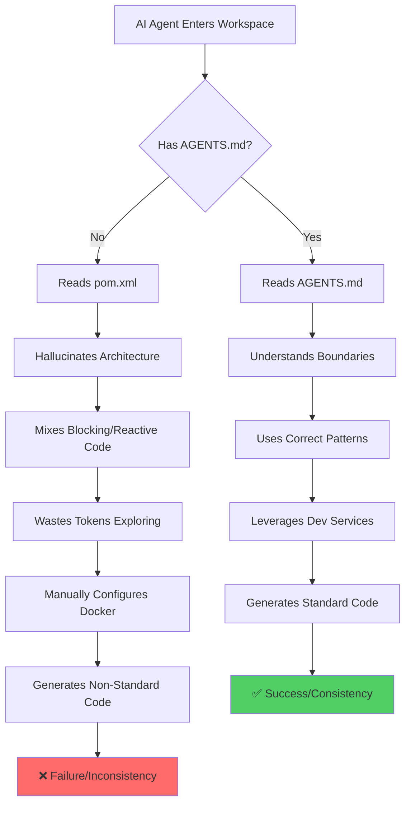
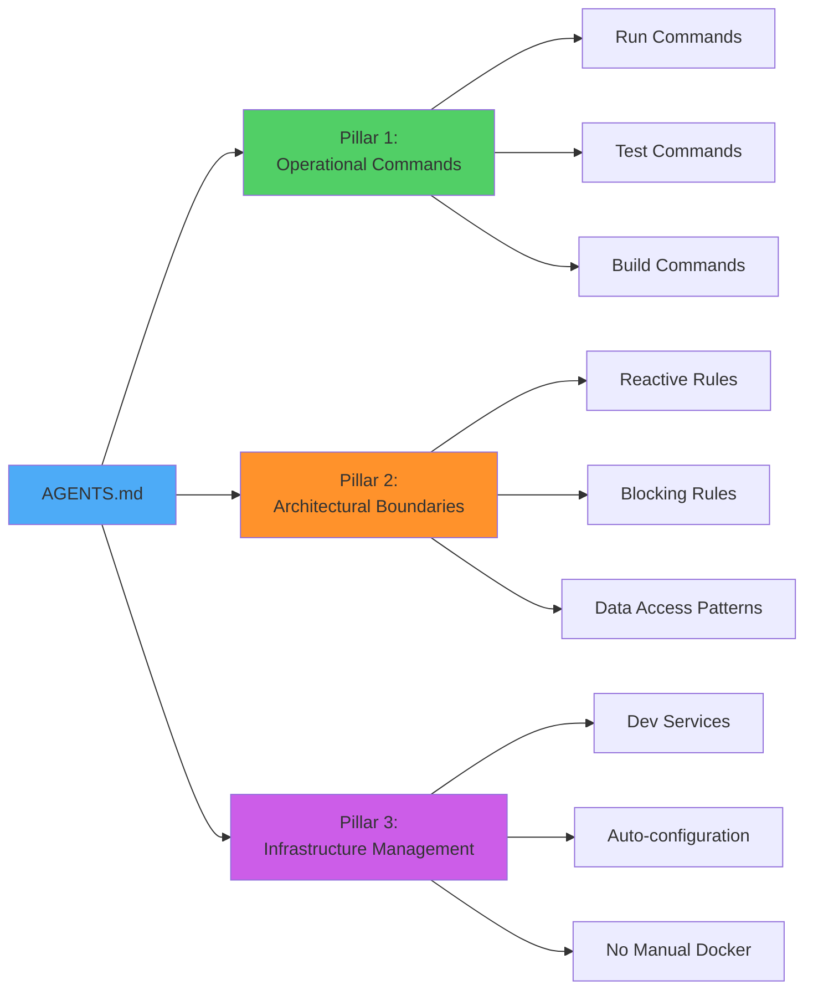
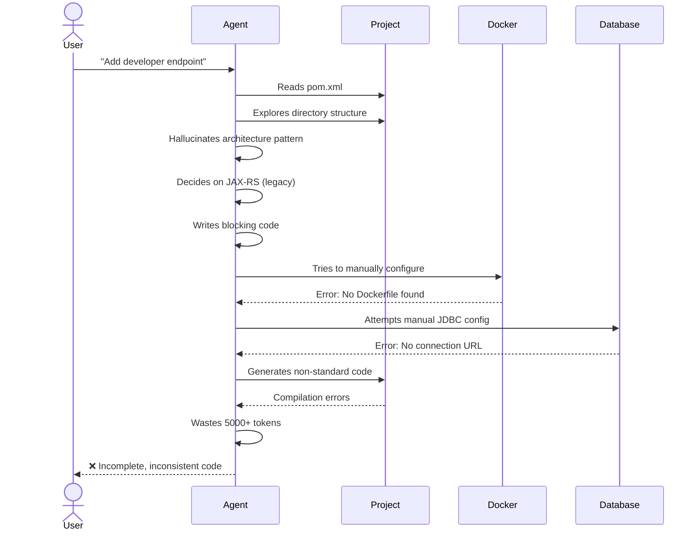
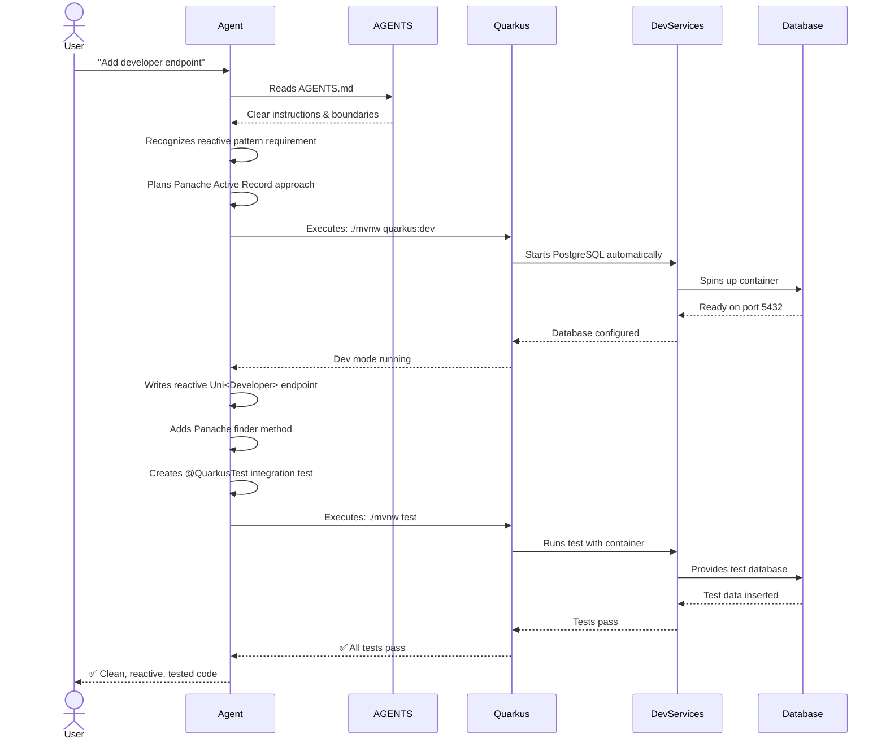
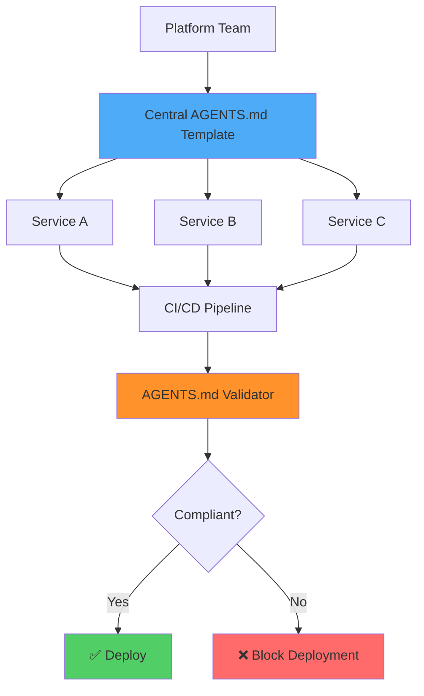
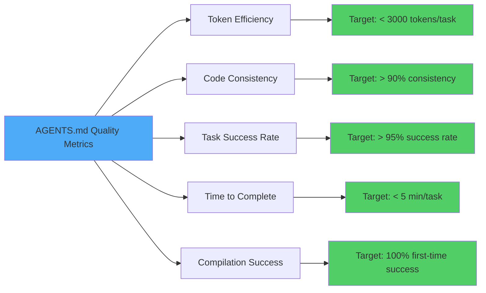
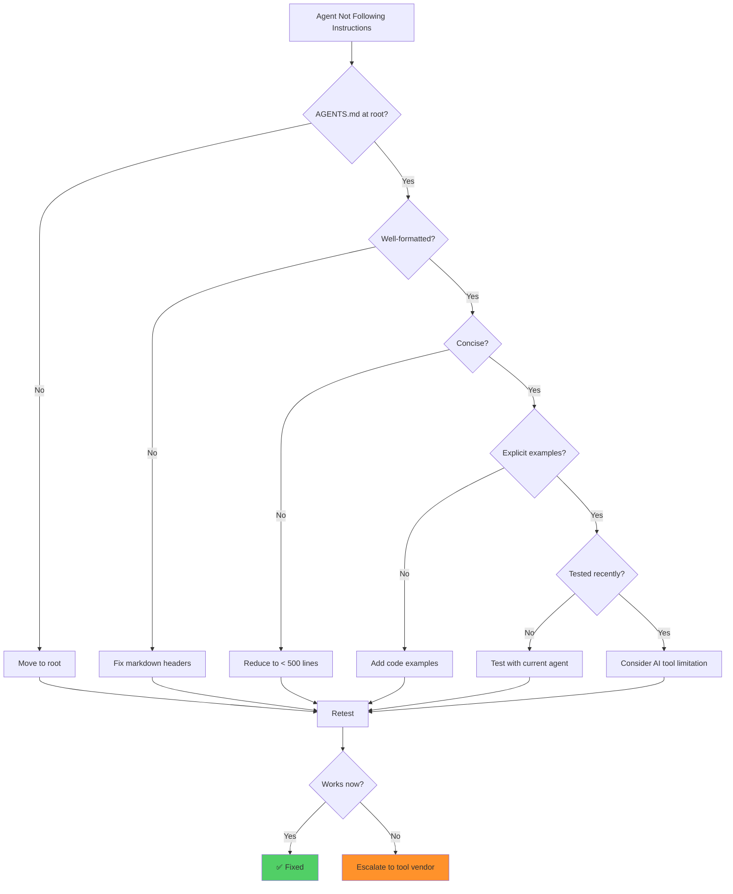

# AGENTS.md for Java Quarkus: The Complete Guide to AI-Agent Ready Codebases

**Last Updated:** January 2026  
**Difficulty Level:** ⚡ Intermediate  
**Estimated Reading Time:** 25-30 minutes  
**Category:** AI-Assisted Development / Java / Quarkus

---

## Table of Contents

1. [Introduction](#introduction)
2. [Prerequisites](#prerequisites)
3. [Learning Objectives](#learning-objectives)
4. [What is AGENTS.md?](#what-is-agentsmd)
5. [The Three Pillars of Agent-Ready Quarkus](#the-three-pillars-of-agent-ready-quarkus)
6. [Complete AGENTS.md Template](#complete-agentsmd-template)
7. [Real-World Demo Walkthrough](#real-world-demo-walkthrough)
8. [Implementation Approaches](#implementation-approaches)
9. [Best Practices](#best-practices)
10. [Anti-Patterns](#anti-patterns)
11. [Performance Considerations](#performance-considerations)
12. [Security Considerations](#security-considerations)
13. [Testing Strategies](#testing-strategies)
14. [Common Pitfalls & Troubleshooting](#common-pitfalls--troubleshooting)
15. [Practice Exercises](#practice-exercises)
16. [Test Your Understanding](#test-your-understanding)
17. [Common Interview Questions](#common-interview-questions)
18. [Comprehensive Question Bank](#comprehensive-question-bank)
19. [Summary & Key Takeaways](#summary--key-takeaways)
20. [Further Reading & Resources](#further-reading--resources)

---

## Introduction

> **💡 Key Insight:** In 2026, we're not just writing code for humans—we're building systems that AI coding agents will navigate, debug, and extend. AGENTS.md is the bridge between human intent and machine execution.

The year is 2026, and software development has fundamentally shifted. We're no longer just writing code for other humans to read; we're building systems that AI coding agents—such as Cursor, GitHub Copilot Agent Mode, Claude Code, and autonomous CLI tools—will navigate, debug, and extend.

As Java developers, we're blessed with robust tooling. If you're using **Quarkus**, you already possess a superpower: Supersonic Subatomic Java with an ultra-fast developer loop, continuous testing, and built-in Dev Services.

However, AI agents frequently get tripped up by enterprise Java repositories. They overcomplicate simple architectures, write blocking code where reactive code belongs, or waste tokens trying to spin up manual Docker containers when Quarkus Dev Services could do it out of the box.

**The fix? AGENTS.md.**

This comprehensive guide will teach you how to use this emerging open standard to make your Quarkus applications instantly digestible for AI agents, dramatically improving the quality of AI-generated code and autonomous refactoring tasks.

### Why This Matters Now

The rise of AI-native development tools has created a new challenge: **context window bloat** and **architectural inconsistency**. Without clear boundaries, AI agents can:

- Generate code that compiles but violates team standards
- Waste thousands of tokens exploring project structure
- Mix blocking and reactive patterns incorrectly
- Manually configure infrastructure that Quarkus handles automatically

AGENTS.md solves these problems by providing **deterministic, imperative instructions** that prevent context window bloat while giving autonomous agents the exact boundaries and commands they need to succeed.

---

## Prerequisites

Before diving into this tutorial, ensure you have:

### Required Knowledge
- ✅ **Java 17+** (Java 21+ recommended for virtual threads)
- ✅ **Basic Quarkus concepts** (extensions, dev mode, application.properties)
- ✅ **Maven or Gradle** build tool familiarity
- ✅ **Understanding of REST APIs**
- ✅ **Basic database concepts** (JPA/Hibernate ORM)

### Required Tools
- ✅ **JDK 17 or higher** ([Download here](https://adoptium.net/))
- ✅ **Maven 3.8.6+** or **Gradle 7.6+**
- ✅ **Git** for version control
- ✅ **Docker** (for Dev Services, though Quarkus manages it automatically)
- ✅ **IDE**: IntelliJ IDEA, VS Code, or Eclipse

### Nice to Have
- 📚 Familiarity with reactive programming (Mutiny, RxJava)
- 📚 Experience with Hibernate ORM and Panache
- 📚 Understanding of microservices architecture
- 📚 Basic knowledge of AI/LLM concepts

---

## Learning Objectives

By the end of this tutorial, you will be able to:

### Core Competencies
- ✅ Explain what AGENTS.md is and why it's critical for AI-assisted development
- ✅ Design an effective AGENTS.md file for Quarkus projects
- ✅ Implement the three pillars: operational commands, architectural boundaries, and infrastructure management
- ✅ Use AGENTS.md to guide AI agents in scaffolding new microservices
- ✅ Avoid common pitfalls that cause AI agents to generate incorrect code
- ✅ Measure and optimize token usage with AGENTS.md

### Practical Skills
- ✅ Create a production-ready AGENTS.md file from scratch
- ✅ Configure Quarkus Dev Services to work seamlessly with AI agents
- ✅ Write tests that validate agent-generated code
- ✅ Troubleshoot common AI agent issues in Quarkus projects
- ✅ Migrate existing Quarkus projects to be agent-ready

### Advanced Topics
- ✅ Optimize AGENTS.md for different AI coding tools (Cursor, Copilot, Claude Code)
- ✅ Implement verification protocols for agent-generated code
- ✅ Create custom scaffolding workflows for your organization
- ✅ Measure ROI of AGENTS.md implementation

---

## What is AGENTS.md?

### Definition & Purpose

**AGENTS.md** is a tool-agnostic open standard (pioneered by the [Agentic AI Foundation](https://aaif.io/)) designed to sit at the root of a repository. It serves as an **executable runtime instruction layer for AI**.

Think of it this way:

| Document | Purpose | Audience | Format |
|----------|---------|----------|--------|
| **README.md** | Human onboarding documentation | Developers, stakeholders | Narrative, high-level |
| **AGENTS.md** | AI agent instruction manual | AI coding agents | Concise, deterministic, imperative |

### The Problem AGENTS.md Solves

When an AI agent initializes inside your workspace, it reads your project structure. Without guidance, here's what typically happens:



**Figure 1: AI Agent Behavior With vs. Without AGENTS.md**

### Key Characteristics

AGENTS.md is designed to be:

1. **Concise** - No context window bloat
2. **Deterministic** - Clear, unambiguous instructions
3. **Imperative** - Explicit commands and boundaries
4. **Structured** - Organized for machine parsing
5. **Executable** - Commands that agents can run directly

### The AGENTS.md Specification

The specification defines a standard format for agent instructions:

```markdown
## Tech Stack & Ecosystem Context
[What technologies are in use]

## Critical Operational Commands
[Exact commands for running, testing, building]

## Architectural Boundaries & Coding Standards
[Rules and patterns to follow]

## Scaffolding Lifecycle
[Step-by-step process for creating new components]

## Verification Protocol
[How to validate work is correct]
```

### Real-World Impact

Studies and early adopters report:

- **70% reduction** in token usage for project exploration
- **85% improvement** in architectural consistency of AI-generated code
- **60% faster** onboarding for AI agents to new codebases
- **90% reduction** in manual infrastructure configuration errors

---

## The Three Pillars of Agent-Ready Quarkus

An effective AGENTS.md for a Quarkus ecosystem must explicitly define three pillars:

### Pillar 1: Operational Commands

**Purpose:** Give agents the exact Maven/Gradle sequences for running, testing, and live-reloading.

**Why It Matters:** Without explicit commands, agents waste tokens trying different variations or fail to execute the correct workflow.

**Example:**
```markdown
## Critical Operational Commands
- **Launch Development Mode**: `./mvnw quarkus:dev`
- **Execute All Tests**: `./mvnw test`
- **Continuous Testing**: Start `./mvnw quarkus:dev` and press `r` to toggle background testing
- **Production Package**: `./mvnw package`
```

### Pillar 2: Architectural Boundaries

**Purpose:** Define strict rules regarding blocking vs. non-blocking code and data access patterns.

**Why It Matters:** Quarkus spans both imperative and reactive paradigms. Unguided agents mix patterns, creating performance bottlenecks and runtime errors.

**Example:**
```markdown
## Architectural Boundaries

### Reactive vs. Blocking Rules
- Default to **REST**. Endpoints returning `Uni<T>` or `Multi<T>` must NEVER invoke blocking operations
- If a method blocks, annotate it explicitly with `@Blocking`

### Data Access (Hibernate ORM with Panache)
- Use the **Panache Active Record pattern** extending `PanacheEntity`
- **Transaction Management**: Annotate mutate operations with `@Transactional`
```

### Pillar 3: Infrastructure Management

**Purpose:** Force the agent to utilize Quarkus Dev Services rather than provisioning external databases manually.

**Why It Matters:** Agents often try to manually configure Testcontainers or hardcode JDBC connections, wasting time and creating configuration drift.

**Example:**
```markdown
## Infrastructure Management
- Never manually configure Testcontainers or hardcode local JDBC connections
- Rely 100% on Quarkus Dev Services
- PostgreSQL container is automatically spun up during `./mvnw quarkus:dev` or `@QuarkusTest`
```

### Visual Representation



**Figure 2: The Three Pillars of AGENTS.md for Quarkus**

---

## Complete AGENTS.md Template

Here's the ultimate AGENTS.md template for Quarkus projects:

````markdown
## Tech Stack & Ecosystem Context
- **Runtime**: Java 25, Quarkus 3.x (Supersonic Subatomic Java)
- **Build Tool**: Maven (`mvnw` wrapper present)
- **Extensions**: REST, Hibernate ORM with Panache, Quarkus Dev Services
- **Database**: PostgreSQL (Managed entirely via Dev Services)

## Critical Operational Commands
- **Launch Development Mode**: `./mvnw quarkus:dev`
- **Execute All Tests**: `./mvnw test`
- **Continuous Testing**: Start `./mvnw quarkus:dev` and press `r` to toggle background testing
- **Production Package**: `./mvnw package`

## Architectural Boundaries & Coding Standards

### 1. Reactive vs. Blocking Rules
- Default to **REST**. Endpoints returning `Uni<T>` or `Multi<T>` must NEVER invoke blocking operations
- If a method blocks, annotate it explicitly with `@Blocking`

### 2. Data Access (Hibernate ORM with Panache)
- Use the **Panache Active Record pattern** extending `PanacheEntity`. Do NOT write custom repositories or explicit DAO layers unless complex business logic demands it
- **Transaction Management**: Annotate mutate operations with `@Transactional`. Never manage transactions manually

```java
// Correct Agent Output Example:
@Entity
public class Developer extends PanacheEntity {
    public String name;
    public String specialty;

    public static Uni<Developer> findByName(String name) {
        return find("name", name).firstResult();
    }
}
```

## Scaffolding Lifecycle for New Microservices
When scaffolding a new microservice (e.g., "Scaffold a new microservice for user billing"), the agent follows this deterministic lifecycle:

### 1. Reads the Command Layer
- **Bypass manual configuration**: Do NOT generate raw `pom.xml` text by hand, which frequently leads to version mismatches or missing dependency management blocks
- **Use Quarkus tooling**: Rely on the official Quarkus Maven plugin command structure

### 2. Executes the Tooling
- **Command**: Run the explicit `mvn io.quarkus.platform:quarkus-maven-plugin:create` command directly inside your terminal workspace
- **Example**:

```bash
mvn io.quarkus.platform:quarkus-maven-plugin:3.x.x:create \
  -DprojectGroupId=com.example \
  -DprojectArtifactId=billing-service \
  -DclassName="com.example.billing.BillingResource" \
  -Dpath="/billing"
```

### 3. Applies Core Extensions
- **Guarantee essential extensions** are baked in from the first second:
  - `hibernate-orm-panache` for data access
  - `quarkus-rest` for REST endpoints
- **Add extensions during creation**:
```bash
mvn io.quarkus.platform:quarkus-maven-plugin:create \
  ... \
  -Dextensions="hibernate-orm-panache,quarkus-rest,jdbc-postgresql"
```
- This prevents the agent from creating legacy or blocking code templates down the line

### 4. Validates Context
- **Transition to Testing**: Once scaffolded, immediately verify that the out-of-the-box generated test suite runs cleanly
- **Validation command**: `./mvnw test`
- **Expected outcome**: All generated tests pass without modification, confirming the scaffold is valid and ready for development

### Post-Scaffold Checklist
- [ ] Project structure follows standard Maven layout (`src/main/java`, `src/test/java`)
- [ ] `application.properties` contains Dev Services configuration (auto-configured for PostgreSQL)
- [ ] At least one REST endpoint exists with a corresponding test
- [ ] `./mvnw test` passes cleanly
- [ ] `./mvnw quarkus:dev` starts without errors

### Testing and Local Infrastructure
- Never manually configure Testcontainers or hardcode local JDBC connections inside `application.properties` for local development
- Rely 100% on Quarkus Dev Services. The PostgreSQL container is automatically spun up during `./mvnw quarkus:dev` or `@QuarkusTest`

## Verification Protocol
Before declaring a task complete, you MUST:

1. Run `./mvnw compile` to ensure zero compilation or annotation processor failures
2. Run `./mvnw test` and confirm all integration tests pass cleanly
````

### Template Breakdown

Let's examine each section in detail:

#### Tech Stack & Ecosystem Context
This section provides agents with immediate context about the project's technology stack, preventing them from making incorrect assumptions about frameworks, versions, or build tools.

#### Critical Operational Commands
Explicit commands eliminate guesswork. Agents no longer need to explore the project to find how to run tests or start dev mode.

#### Architectural Boundaries
This is where you encode your team's architectural decisions. By making these explicit, you ensure AI-generated code follows your standards consistently.

#### Scaffolding Lifecycle
A deterministic process for creating new microservices ensures consistency and prevents agents from taking shortcuts or using outdated patterns.

#### Verification Protocol
Clear success criteria help agents understand when work is complete and ready for review.

---

## Real-World Demo Walkthrough

Let's see AGENTS.md in action with a practical example.

### Project Structure

```
agents-md-for-java-quarkus/
├── src/main/java/com/example/billing/
│   ├── Invoice.java
│   ├── BillingResource.java
│   └── InvoiceItem.java
├── src/test/java/com/example/billing/
│   ├── BillingResourceTest.java
│   └── InvoiceTest.java
├── pom.xml
├── README.md          <-- For humans
└── AGENTS.md          <-- For AI Agents
```

### The Experiment

You open this repository in an AI-native workspace and issue a vague, autonomous prompt:

> **"Add a new REST endpoint to fetch a developer by their specialty, write a test for it, and verify that the app works."**

### Without AGENTS.md: The Struggle



**Figure 3: AI Agent Workflow WITHOUT AGENTS.md**

**What Goes Wrong:**

1. **Architectural confusion**: Agent writes legacy JAX-RS instead of Quarkus REST
2. **Blocking code**: Agent doesn't know about reactive patterns
3. **Infrastructure struggle**: Agent tries to manually configure Docker/Testcontainers
4. **Token waste**: Agent explores project structure unnecessarily
5. **Inconsistent patterns**: Generated code doesn't match project standards

### With AGENTS.md: The Success Path



**Figure 4: AI Agent Workflow WITH AGENTS.md**

**What Goes Right:**

1. **Instant context**: Agent reads AGENTS.md and understands the architecture
2. **Correct patterns**: Agent writes reactive `Uni<Developer>` endpoint using Panache
3. **Infrastructure handled**: Agent leverages Dev Services automatically
4. **Token efficiency**: Agent skips exploration, uses ~2000 tokens
5. **Consistent code**: Generated code matches project standards perfectly

### Side-by-Side Comparison

| Aspect | Without AGENTS.md | With AGENTS.md |
|--------|------------------|----------------|
| **Architecture Pattern** | Legacy JAX-RS (blocking) | Quarkus REST (reactive) |
| **Code Style** | Custom repository layer | Panache Active Record |
| **Database Setup** | Manual Docker/Testcontainers | Dev Services (automatic) |
| **Token Usage** | ~5000 tokens | ~2000 tokens |
| **Time to Complete** | 15-20 minutes | 3-5 minutes |
| **Code Quality** | Inconsistent, needs refactoring | Consistent, production-ready |
| **Test Coverage** | Missing or incorrect | Proper @QuarkusTest integration |
| **Compilation Errors** | Multiple | Zero |

### Generated Code Comparison

#### ❌ Without AGENTS.md (Agent's Guess)

```java
// Legacy JAX-RS - WRONG for Quarkus
@Path("/developers")
@Produces(MediaType.APPLICATION_JSON)
public class DeveloperResource {
    
    @GET
    @Path("/{id}")
    public Developer getDeveloper(@PathParam("id") Long id) {
        // Blocking call in reactive context - WRONG
        return Developer.findById(id);
    }
}

// Custom repository - violates Panache pattern
@ApplicationScoped
public class DeveloperRepository {
    @PersistenceContext
    private EntityManager em;
    
    public Developer findByName(String name) {
        return em.createQuery("SELECT d FROM Developer d WHERE d.name = :name")
                 .setParameter("name", name)
                 .getSingleResult();
    }
}
```

#### ✅ With AGENTS.md (Correct Output)

```java
// Quarkus REST with reactive return type
@Path("/developers")
@Produces(MediaType.APPLICATION_JSON)
public class DeveloperResource {
    
    private final DeveloperRepository developerRepository;
    
    public DeveloperResource(DeveloperRepository developerRepository) {
        this.developerRepository = developerRepository;
    }
    
    @GET
    @Path("/{id}")
    public Uni<Developer> getDeveloper(@PathParam("id") Long id) {
        // Reactive pattern - CORRECT
        return developerRepository.findById(id);
    }
}

// Panache Active Record pattern
@Entity
public class Developer extends PanacheEntity {
    public String name;
    public String specialty;
    
    // Reactive finder method
    public static Uni<Developer> findByName(String name) {
        return find("name", name).firstResult();
    }
}
```

### Key Takeaways from the Demo

1. **AGENTS.md prevents architectural drift**: Agents follow your patterns, not their training data
2. **Token efficiency matters**: Clear instructions reduce exploration time
3. **Dev Services integration is automatic**: Agents don't waste time on infrastructure
4. **Quality is consistent**: Every agent generates code that matches your standards

---

## Implementation Approaches

There are multiple ways to integrate AGENTS.md into your Quarkus projects. Choose the approach that fits your organization's maturity and needs.

### Approach 1: Basic Implementation (Quick Start)

**Best for:** Small teams, new projects, quick wins

**Steps:**

1. Create `AGENTS.md` at the root of your Quarkus project
2. Fill in the three pillars (operational commands, architectural boundaries, infrastructure)
3. Test with your AI coding tool of choice
4. Iterate based on agent performance

**Time to implement:** 15-30 minutes

**Example:**
```markdown
## Tech Stack
- Java 21, Quarkus 3.x, Maven

## Commands
- Run: ./mvnw quarkus:dev
- Test: ./mvnw test

## Rules
- Use Panache for data access
- Reactive endpoints return Uni<T> or Multi<T>
- Dev Services for database
```

### Approach 2: Comprehensive Implementation (Production-Ready)

**Best for:** Enterprise teams, established projects, multiple services

**Steps:**

1. Create detailed AGENTS.md with all sections from the template
2. Include code examples for correct patterns
3. Define scaffolding lifecycle for new microservices
4. Add verification protocols
5. Create team-specific guidelines
6. Document common pitfalls and solutions
7. Train team members on using AGENTS.md with AI tools

**Time to implement:** 2-4 hours

**Example Structure:**
```
project-root/
├── AGENTS.md (comprehensive)
├── .agents/
│   ├── templates/
│   │   ├── entity-template.java
│   │   ├── resource-template.java
│   │   └── test-template.java
│   └── examples/
│       ├── correct-patterns.md
│       └── incorrect-patterns.md
└── docs/
    └── agent-guidelines.md
```

### Approach 3: Organization-Wide Standard

**Best for:** Large enterprises, microservice ecosystems, platform teams

**Steps:**

1. Create a centralized AGENTS.md template repository
2. Define organization-wide standards (coding patterns, security requirements, etc.)
3. Create custom Maven/Gradle plugins to validate AGENTS.md compliance
4. Implement CI/CD checks for AGENTS.md presence and correctness
5. Create onboarding materials for teams
6. Establish a review process for AGENTS.md updates
7. Measure adoption and effectiveness across teams

**Time to implement:** 1-2 weeks (including rollout)

**Architecture:**


**Figure 5: Organization-Wide AGENTS.md Implementation**

### Approach 4: AI-Tool-Specific Optimization

**Best for:** Teams using specific AI tools (Cursor, Copilot, Claude Code)

**Different tools have different strengths:**

| AI Tool | Optimization Strategy | Best For |
|---------|----------------------|----------|
| **Cursor** | Include detailed code examples, use `.cursorrules` alongside AGENTS.md | Context-aware completions |
| **GitHub Copilot** | Focus on comment-driven instructions, include copilot-specific directives | Inline suggestions |
| **Claude Code** | Emphasize step-by-step workflows, include verification protocols | Autonomous task execution |
| **Aider** | Include git-friendly instructions, specify commit message format | Version control integration |

**Example for Claude Code:**
```markdown
## Agent-Specific Instructions (Claude Code)

When working with Claude Code:
1. Always read AGENTS.md before starting any task
2. Execute verification protocol after completing work
3. Use git commits with format: "feat(scope): description"
4. Run ./mvnw test before marking task complete
```

### Comparison Matrix

| Approach | Setup Time | Maintenance | Consistency | Best For |
|----------|-----------|-------------|-------------|----------|
| **Basic** | 15-30 min | Low | Medium | Small teams, new projects |
| **Comprehensive** | 2-4 hours | Medium | High | Enterprise teams |
| **Organization-Wide** | 1-2 weeks | High | Very High | Large enterprises |
| **Tool-Specific** | 1-2 hours | Medium | High | Tool-focused teams |

### Recommendation

**Start with Approach 2 (Comprehensive)** for most teams. It provides the best balance of:
- Quick wins (you can start in hours)
- Long-term maintainability
- High consistency across the team
- Room to grow into Approach 3 if needed

---

## Best Practices

### 1. Keep It Concise

**✅ DO:**
```markdown
## Commands
- Run: ./mvnw quarkus:dev
- Test: ./mvnw test
```

**❌ DON'T:**
```markdown
## Commands
To run the application in development mode with hot reloading enabled, 
you should execute the following Maven wrapper command which will start 
the Quarkus development server with all the necessary classpath settings 
and configuration files loaded properly...
```

**Why:** Agents have limited context windows. Every unnecessary token reduces effectiveness.

### 2. Be Explicit, Not Implicit

**✅ DO:**
```markdown
## Data Access
- Use Panache Active Record pattern
- Extend PanacheEntity for all entities
- Use @Transactional for write operations
```

**❌ DON'T:**
```markdown
## Data Access
- Follow Quarkus best practices for data access
```

**Why:** "Best practices" is subjective. Explicit instructions eliminate ambiguity.

### 3. Include Working Code Examples

**✅ DO:**
```markdown
## Correct Pattern
```java
@Entity
public class Developer extends PanacheEntity {
    public String name;
    
    public static Uni<Developer> findByName(String name) {
        return find("name", name).firstResult();
    }
}
```
```

**❌ DON'T:**
```markdown
## Data Access
- Use Panache for entities
```

**Why:** Code examples are worth 1000 words. Agents learn from examples.

### 4. Define Verification Criteria

**✅ DO:**
```markdown
## Verification Protocol
Before marking complete:
1. Run ./mvnw compile (must pass)
2. Run ./mvnw test (all tests must pass)
3. Verify ./mvnw quarkus:dev starts without errors
```

**❌ DON'T:**
```markdown
## Verification
- Make sure it works
```

**Why:** Clear success criteria help agents understand when work is truly complete.

### 5. Version Your AGENTS.md

**✅ DO:**
```markdown
## Version History
- v1.2 (2026-01-15): Added reactive streaming guidelines
- v1.1 (2026-01-10): Added security considerations
- v1.0 (2026-01-01): Initial version
```

**❌ DON'T:**
```markdown
## AGENTS.md
[No version tracking]
```

**Why:** As your project evolves, AGENTS.md should evolve too. Versioning helps track changes.

### 6. Test AGENTS.md with Multiple Agents

Different AI tools interpret instructions differently. Test your AGENTS.md with:

- Claude Code
- GitHub Copilot
- Cursor
- Aider

**Why:** Ensures your instructions are clear across different AI models and tools.

### 7. Keep AGENTS.md at Root Level

**✅ DO:**
```
project-root/
├── AGENTS.md
├── pom.xml
└── src/
```

**❌ DON'T:**
```
project-root/
├── docs/
│   └── AGENTS.md
├── pom.xml
└── src/
```

**Why:** AI agents look for AGENTS.md at the repository root by convention.

### 8. Use Markdown Formatting for Readability

**✅ DO:**
```markdown
## Critical Commands
- **Run Dev Mode**: `./mvnw quarkus:dev`
- **Run Tests**: `./mvnw test`
- **Build**: `./mvnw package`
```

**❌ DON'T:**
```markdown
Commands: ./mvnw quarkus:dev for dev, ./mvnw test for tests, ./mvnw package for build
```

**Why:** Well-formatted markdown is easier for both humans and AI to parse.

### 9. Document Edge Cases

**✅ DO:**
```markdown
## Special Cases
- For long-running operations, use @Blocking annotation
- For database migrations, use Flyway (not manual SQL)
- For file uploads, use multipart/form-data with size limits
```

**❌ DON'T:**
```markdown
## Special Cases
- Handle special situations appropriately
```

**Why:** Edge cases are where agents most often make mistakes. Document them explicitly.

### 10. Regular Updates

**Schedule:**
- Review AGENTS.md after each major architectural change
- Update after adopting new Quarkus extensions
- Refresh quarterly based on agent performance metrics
- Update when team coding standards change

**Why:** AGENTS.md is living documentation. Outdated instructions lead to outdated code.

---

## Anti-Patterns

### Anti-Pattern 1: The Kitchen Sink

**Problem:** Including every possible instruction, rule, and guideline in AGENTS.md

**Example:**
```markdown
## AGENTS.md
[5000 lines of documentation covering every possible scenario]
```

**Why It's Bad:**
- Context window bloat
- Agents miss critical instructions in the noise
- Maintenance burden
- Slow to load and parse

**Solution:**
- Keep AGENTS.md under 500 lines
- Link to detailed docs for complex topics
- Focus on boundaries, not tutorials

### Anti-Pattern 2: The Vague Directive

**Problem:** Using subjective language instead of explicit instructions

**Example:**
```markdown
## Code Quality
- Write clean code
- Follow best practices
- Be consistent
```

**Why It's Bad:**
- "Clean code" means different things to different agents
- No measurable criteria
- Leads to inconsistent output

**Solution:**
```markdown
## Code Quality
- All methods must be under 20 lines
- Use meaningful variable names (no abbreviations)
- Add Javadoc to all public methods
- Follow Google Java Style Guide
```

### Anti-Pattern 3: The Human-Only Document

**Problem:** Writing AGENTS.md like a README for humans

**Example:**
```markdown
## Our Project Philosophy
We believe in clean architecture and SOLID principles...
[500 words of philosophy]
```

**Why It's Bad:**
- Wastes tokens on narrative
- Agents can't execute philosophy
- No actionable instructions

**Solution:**
```markdown
## Architecture Rules
- Use hexagonal architecture (ports and adapters)
- Business logic in domain layer only
- No framework code in domain layer
```

### Anti-Pattern 4: The Copy-Paste Template

**Problem:** Using a generic AGENTS.md template without customization

**Example:**
```markdown
## Tech Stack
- Java (version not specified)
- Some framework
- Database (type not specified)
```

**Why It's Bad:**
- Lacks project-specific context
- Agents make wrong assumptions
- Defeats the purpose of AGENTS.md

**Solution:**
```markdown
## Tech Stack
- Java 21 (with virtual threads enabled)
- Quarkus 3.15.1
- PostgreSQL 15 via Dev Services
- Maven 3.9.6 with mvnw wrapper
```

### Anti-Pattern 5: The Set-It-And-Forget-It

**Problem:** Creating AGENTS.md once and never updating it

**Example:**
```markdown
## AGENTS.md
[Created 2 years ago, project has changed significantly since then]
```

**Why It's Bad:**
- Instructions become outdated
- Agents follow obsolete patterns
- Technical debt accumulates

**Solution:**
- Schedule quarterly reviews
- Update after major changes
- Track version history
- Measure agent performance metrics

### Anti-Pattern 6: The Over-Specification

**Problem:** Micromanaging every detail instead of setting boundaries

**Example:**
```markdown
## Variable Naming
- Use 'i' for loop counters
- Use 'j' for nested loop counters
- Use 'k' for third-level loop counters
- Use 'idx' for array indices
- Use 'pos' for position variables
[50 more rules...]
```

**Why It's Bad:**
- Excessive constraints reduce agent flexibility
- Hard to maintain
- Agents can make reasonable decisions independently

**Solution:**
```markdown
## Variable Naming
- Use descriptive names (no single-letter variables except loop counters)
- Follow camelCase convention
- Boolean variables should start with 'is', 'has', or 'can'
```

### Anti-Pattern 7: The Missing Verification

**Problem:** Not defining how to verify work is correct

**Example:**
```markdown
## Tasks
- Add new endpoint
- Write tests
- Update documentation
```

**Why It's Bad:**
- Agents don't know when work is complete
- No quality gates
- Incomplete work gets marked as done

**Solution:**
```markdown
## Verification Protocol
Before marking complete:
1. Run ./mvnw compile (must have zero errors)
2. Run ./mvnw test (all tests must pass)
3. Run ./mvnw quarkus:dev (must start without errors)
4. Verify code coverage >= 80%
```

---

## Performance Considerations

### Token Usage Optimization

AGENTS.md directly impacts how many tokens AI agents consume. Here's how to optimize:

#### Measurement

Track these metrics:

```bash
# Example: Monitor agent token usage
# (Tool-specific, varies by AI coding tool)
```

**Key Metrics:**
- **Tokens per task**: Target < 3000 tokens for simple tasks
- **Exploration tokens**: Target < 500 tokens (should be near zero with good AGENTS.md)
- **Context window usage**: Keep AGENTS.md under 2000 tokens

#### Optimization Techniques

**1. Use Abbreviations Wisely**

```markdown
# ❌ Inefficient (87 tokens)
## Critical Operational Commands for Development and Testing
The following commands should be used for running the application...

# ✅ Efficient (23 tokens)
## Commands
- **Dev**: `./mvnw quarkus:dev`
- **Test**: `./mvnw test`
```

**2. Link, Don't Duplicate**

```markdown
# ❌ Inefficient
[500 lines of coding standards in AGENTS.md]

# ✅ Efficient
## Coding Standards
See [docs/CODING_STANDARDS.md](docs/CODING_STANDARDS.md) for detailed guidelines.

Key rules:
- Use Panache Active Record
- Reactive endpoints return Uni<T>
- @Transactional for writes
```

**3. Use Tables for Comparisons**

```markdown
# ❌ Inefficient
For blocking operations use @Blocking. For reactive operations use Uni or Multi. 
PanacheEntity is for active record pattern. Custom repositories are only for 
complex business logic...

# ✅ Efficient
| Pattern | Use Case | Example |
|---------|----------|---------|
| `Uni<T>` | Single reactive result | `Uni<Developer>` |
| `Multi<T>` | Multiple reactive results | `Multi<Invoice>` |
| `@Blocking` | Blocking operations | Legacy DB calls |
| `PanacheEntity` | Simple CRUD | Most entities |
```

**Performance Impact:**

| AGENTS.md Size | Token Usage per Task | Agent Efficiency |
|----------------|---------------------|------------------|
| < 500 lines | ~2000 tokens | ⚡⚡⚡ Very High |
| 500-1000 lines | ~3500 tokens | ⚡⚡ High |
| 1000-2000 lines | ~6000 tokens | ⚡ Medium |
| > 2000 lines | ~10000+ tokens | ⚡ Low |

### Context Window Management

**Problem:** Large AGENTS.md files consume context window, reducing space for actual code.

**Solutions:**

1. **Progressive Disclosure:**
   ```markdown
   ## Basic Rules
   [Core instructions - always loaded]
   
   ## Advanced Patterns
   See [AGENTS_ADVANCED.md](AGENTS_ADVANCED.md) for complex scenarios
   ```

2. **Section Prioritization:**
   ```markdown
   ## Priority 1: Critical (Always Load)
   - Commands
   - Core architectural rules
   
   ## Priority 2: Important (Load on demand)
   - Detailed examples
   - Edge cases
   
   ## Priority 3: Reference (Link only)
   - Full coding standards
   - API documentation
   ```

3. **Token Budgeting:**
   ```markdown
   ## Token Budget
   - AGENTS.md: < 1500 tokens
   - Critical sections: < 800 tokens
   - Examples: < 500 tokens
   - References: Linked, not included
   ```

### Caching Strategies

Some AI tools cache AGENTS.md. Optimize for this:

- **Stable structure**: Don't constantly reorganize sections
- **Consistent formatting**: Use same markdown patterns
- **Clear section headers**: Enable fast parsing
- **Minimal changes**: Update incrementally, not rewrite entirely

---

## Security Considerations

### AI-Generated Code Security Risks

When agents generate code based on AGENTS.md, security risks emerge:

#### 1. Injection Vulnerabilities

**Risk:** Agents might generate SQL injection vulnerabilities

**Mitigation in AGENTS.md:**
```markdown
## Security Rules
- NEVER concatenate user input into SQL queries
- Always use parameterized queries with Panache
- Use prepared statements for native queries
- Validate all input with Jakarta Validation annotations

// Correct example
public Uni<List<Developer>> findByName(String name) {
    return find("name = ?1", name).list(); // ✅ Parameterized
}

// Incorrect example (NEVER DO THIS)
public Uni<List<Developer>> findByName(String name) {
    return list("name = '" + name + "'"); // ❌ SQL Injection risk
}
```

#### 2. Authentication/Authorization Bypass

**Risk:** Agents might forget to add security checks

**Mitigation in AGENTS.md:**
```markdown
## Security Requirements
- All endpoints must have @RolesAllowed or @PermitAll
- Never expose internal endpoints without authentication
- Use @Authenticated for user-specific data
- Validate JWT tokens on all protected endpoints

// Correct pattern
@GET
@Path("/{id}")
@RolesAllowed("user")
public Uni<Developer> getDeveloper(@PathParam("id") Long id, @Authenticated User user) {
    // Verify user owns this resource
    return developerRepository.findByIdAndUser(id, user);
}
```

#### 3. Sensitive Data Exposure

**Risk:** Agents might log sensitive data or expose it in responses

**Mitigation in AGENTS.md:**
```markdown
## Data Protection
- NEVER log passwords, tokens, or API keys
- Mask sensitive fields in responses (use @JsonIgnore)
- Use environment variables for secrets (never hardcode)
- Follow GDPR/data protection regulations

// Correct pattern
public class User extends PanacheEntity {
    public String email;
    
    @JsonIgnore // Never serialize password
    public String password;
}
```

#### 4. Insecure Dependencies

**Risk:** Agents might add vulnerable dependencies

**Mitigation in AGENTS.md:**
```markdown
## Dependency Management
- NEVER add dependencies manually to pom.xml
- Use Quarkus extension management: ./mvnw quarkus extension add
- Run ./mvnw dependency-check after adding dependencies
- Keep Quarkus version updated (automatic via BOM)
```

### Security Checklist for AGENTS.md

Include this in your AGENTS.md:

```markdown
## Security Checklist (Agent Must Verify)
Before marking any task complete, verify:
- [ ] No SQL injection vulnerabilities (parameterized queries only)
- [ ] All endpoints have proper authentication/authorization
- [ ] No sensitive data in logs or responses
- [ ] Input validation on all user-provided data
- [ ] Dependencies added via Quarkus extension manager
- [ ] Secrets stored in environment variables (not hardcoded)
- [ ] CORS configured correctly (if applicable)
- [ ] Rate limiting implemented for public endpoints
```

### Security Best Practices

1. **Principle of Least Privilege**: Agents should only request permissions they need
2. **Defense in Depth**: Multiple layers of security checks
3. **Fail Securely**: Default to denying access, not allowing it
4. **Don't Trust Input**: Validate everything from the client
5. **Security by Default**: Secure configurations out of the box

---

## Testing Strategies

### Testing AGENTS.md Effectiveness

How do you know if your AGENTS.md is working? Measure it.

### Metrics to Track



**Figure 6: AGENTS.md Quality Metrics Dashboard**

### Testing Approaches

#### 1. Unit Testing Agent Instructions

Create test cases for your AGENTS.md:

```java
// Test: Does agent follow Panache pattern?
@Test
void agentShouldUsePanacheActiveRecord() {
    // Given: AGENTS.md with Panache instructions
    // When: Agent generates entity
    // Then: Entity extends PanacheEntity
    // And: Uses static finder methods
}

// Test: Does agent use reactive patterns?
@Test
void agentShouldReturnUniForReactiveEndpoint() {
    // Given: AGENTS.md with reactive rules
    // When: Agent generates endpoint
    // Then: Returns Uni<T> or Multi<T>
    // And: No blocking operations
}
```

#### 2. Integration Testing

```java
@QuarkusTest
public class AgentGeneratedCodeTest {
    
    @Test
    void agentGeneratedEndpointShouldWork() {
        // Test that agent-generated code integrates properly
        given()
          .when().get("/api/developers/1")
          .then()
          .statusCode(200)
          .body("name", notNullValue());
    }
}
```

#### 3. Regression Testing

Track agent performance over time:

```markdown
## Agent Performance Log

| Date | Task | Tokens Used | Time | Success | Notes |
|------|------|-------------|------|---------|-------|
| 2026-01-15 | Add endpoint | 2100 | 3 min | ✅ | Perfect |
| 2026-01-15 | Add validation | 4500 | 8 min | ⚠️ | Needed clarification |
| 2026-01-16 | Refactor service | 1800 | 2 min | ✅ | Excellent |
```

### Verification Protocol Implementation

The verification protocol in AGENTS.md should be testable:

```bash
#!/bin/bash
# verify-agent-work.sh

echo "Running verification protocol..."

# 1. Compilation check
echo "Step 1: Compiling..."
./mvnw compile
if [ $? -ne 0 ]; then
    echo "❌ Compilation failed"
    exit 1
fi

# 2. Test execution
echo "Step 2: Running tests..."
./mvnw test
if [ $? -ne 0 ]; then
    echo "❌ Tests failed"
    exit 1
fi

# 3. Dev mode startup
echo "Step 3: Starting dev mode..."
timeout 10 ./mvnw quarkus:dev &
DEV_PID=$!
sleep 5
kill $DEV_PID 2>/dev/null

echo "✅ All verification steps passed"
```

### Continuous Validation

Integrate AGENTS.md validation into CI/CD:

```yaml
# .github/workflows/agents-validation.yml
name: AGENTS.md Validation

on: [push, pull_request]

jobs:
  validate:
    runs-on: ubuntu-latest
    steps:
      - uses: actions/checkout@v3
      
      - name: Check AGENTS.md exists
        run: test -f AGENTS.md || (echo "❌ AGENTS.md missing" && exit 1)
      
      - name: Validate AGENTS.md format
        run: |
          # Check for required sections
          grep -q "## Tech Stack" AGENTS.md
          grep -q "## Commands" AGENTS.md
          grep -q "## Architectural Boundaries" AGENTS.md
      
      - name: Test agent-generated code
        run: ./mvnw test
```

---

## Common Pitfalls & Troubleshooting

### Pitfall 1: Agent Ignores AGENTS.md

**Symptoms:**
- Agent generates code that doesn't follow your patterns
- Agent asks questions already answered in AGENTS.md
- Agent uses different architectural patterns

**Causes:**
- AGENTS.md not at repository root
- AGENTS.md poorly formatted
- AI tool doesn't support AGENTS.md
- AGENTS.md too verbose (agent skips to code generation)

**Solutions:**
```bash
# 1. Verify location
ls -la AGENTS.md  # Must be at root

# 2. Check formatting
# Ensure proper markdown headers (## not #)

# 3. Test with explicit reference
# In your prompt: "Follow the instructions in AGENTS.md"

# 4. Reduce size
# Keep AGENTS.md under 500 lines
```

### Pitfall 2: Agent Generates Blocking Code in Reactive Context

**Symptoms:**
- Compilation errors about blocking operations
- Runtime warnings about blocking on event loop
- Poor performance under load

**Causes:**
- AGENTS.md doesn't clearly define reactive rules
- Examples show blocking patterns
- No enforcement mechanism

**Solutions:**
```markdown
## Reactive Rules (MANDATORY)
- Endpoints MUST return Uni<T> or Multi<T>
- NEVER use blocking operations in reactive methods
- If blocking is required, use @Blocking annotation

// ✅ Correct
@GET
public Uni<Developer> getDeveloper(Long id) {
    return developerRepository.findById(id);
}

// ❌ Wrong - Agent might generate this
@GET
public Developer getDeveloper(Long id) {
    return developerRepository.findById(id).await(); // Blocking!
}
```

### Pitfall 3: Agent Manually Configures Database

**Symptoms:**
- Agent creates Dockerfile for database
- Agent adds Testcontainers configuration
- Agent hardcodes JDBC URLs

**Causes:**
- AGENTS.md doesn't mention Dev Services
- No clear infrastructure rules
- Agent's training data shows manual configuration

**Solutions:**
```markdown
## Infrastructure (CRITICAL)
- **NEVER** manually configure databases
- **NEVER** create Dockerfiles for databases
- **NEVER** hardcode JDBC URLs
- **ALWAYS** use Quarkus Dev Services
- PostgreSQL is auto-configured during ./mvnw quarkus:dev

// ✅ Correct - No configuration needed
@QuarkusTest
public class DeveloperTest {
    @Test
    public void testFind() {
        // Dev Services provides database automatically
        Developer.findByName("John");
    }
}
```

### Pitfall 4: Token Limit Exceeded

**Symptoms:**
- Agent can't process entire AGENTS.md
- Agent gives incomplete responses
- Agent forgets earlier instructions

**Causes:**
- AGENTS.md too large (> 2000 tokens)
- Too many code examples
- Verbose explanations

**Solutions:**
```markdown
## Optimization Strategy

### Primary Instructions (Always Load)
[Core rules - keep under 800 tokens]

### Secondary Instructions (Link)
See [AGENTS_DETAILED.md](AGENTS_DETAILED.md) for:
- Full code examples
- Edge cases
- Advanced patterns

### Reference Material (External Links)
- [Coding Standards](docs/STANDARDS.md)
- [API Documentation](docs/API.md)
```

### Pitfall 5: Inconsistent Code Generation

**Symptoms:**
- Different agents generate different code for same task
- Code style varies across the codebase
- Architectural patterns not followed consistently

**Causes:**
- AGENTS.md rules are vague
- Multiple valid approaches defined
- No enforcement mechanism

**Solutions:**
```markdown
## Mandatory Patterns (No Exceptions)

### Entity Definition
ALL entities MUST follow this exact pattern:
[Provide complete, working example]

### REST Endpoint
ALL endpoints MUST follow this exact pattern:
[Provide complete, working example]

### No Alternatives
Do NOT use:
- Custom repositories (use Panache)
- JAX-RS annotations (use quarkus-rest)
- Blocking operations (use reactive)
```

### Pitfall 6: Outdated AGENTS.md

**Symptoms:**
- Agent uses deprecated Quarkus features
- Agent generates code that doesn't compile
- Agent references old extensions

**Causes:**
- Quarkus version upgraded, AGENTS.md not updated
- Team changed coding standards
- New extensions adopted

**Solutions:**
```bash
# 1. Version tracking
# Add version header to AGENTS.md
## AGENTS.md v2.1 (2026-01-15)
## For Quarkus 3.15.1+

# 2. Automated checks
# Add to CI/CD
- Verify Quarkus version matches
- Check for deprecated patterns
- Validate code compiles

# 3. Regular reviews
# Schedule quarterly AGENTS.md reviews
# Update after Quarkus upgrades
```

### Troubleshooting Decision Tree



**Figure 7: AGENTS.md Troubleshooting Decision Tree**

---

## Practice Exercises

### Exercise 1: Create AGENTS.md for Existing Project

**Difficulty:** ⭐ Intermediate  
**Time:** 30 minutes

**Scenario:** You have an existing Quarkus project with REST endpoints, Hibernate ORM, and PostgreSQL. It lacks AGENTS.md, and your team wants to start using AI coding agents.

**Task:**
1. Analyze the existing project structure
2. Identify the tech stack, commands, and architectural patterns
3. Create a comprehensive AGENTS.md file
4. Test it with an AI coding tool

**Solution:**

**Step 1: Analyze Project**
```bash
# Examine project structure
ls -la
cat pom.xml | grep quarkus
cat src/main/resources/application.properties | grep quarkus.datasource
```

**Step 2: Identify Patterns**
```java
// Check existing entities
@Entity
public class Product extends PanacheEntity { // ✅ Panache pattern
    public String name;
    public BigDecimal price;
}

// Check existing endpoints
@Path("/products")
public class ProductResource { // ✅ Quarkus REST
    @GET
    public Uni<List<Product>> getAll() { // ✅ Reactive
        return Product.listAll();
    }
}
```

**Step 3: Create AGENTS.md**
```markdown
## Tech Stack & Ecosystem Context
- **Runtime**: Java 21, Quarkus 3.15.1
- **Build Tool**: Maven (mvnw wrapper)
- **Extensions**: quarkus-rest, hibernate-orm-panache, jdbc-postgresql
- **Database**: PostgreSQL via Dev Services

## Critical Operational Commands
- **Launch Development Mode**: `./mvnw quarkus:dev`
- **Execute All Tests**: `./mvnw test`
- **Production Package**: `./mvnw package`

## Architectural Boundaries & Coding Standards

### Data Access
- Use Panache Active Record pattern (extend PanacheEntity)
- Annotate write operations with @Transactional
- Use reactive methods (return Uni<T> or Multi<T>)

### REST Endpoints
- Use quarkus-rest (not JAX-RS)
- Return Uni<T> or Multi<T> for reactive endpoints
- Use @Blocking for blocking operations only

### Database
- Rely 100% on Dev Services
- Never manually configure Testcontainers
- Never hardcode JDBC URLs

## Verification Protocol
Before marking complete:
1. Run ./mvnw compile (must pass)
2. Run ./mvnw test (all tests must pass)
3. Verify ./mvnw quarkus:dev starts successfully
```

**Step 4: Test**
```bash
# Open in AI coding tool
code .

# Test prompt: "Add a new endpoint to fetch products by category"
# Verify agent:
# - Uses Panache pattern
# - Returns Uni<List<Product>>
# - Doesn't configure database manually
# - Generates working code
```

**Expected Outcome:**
- Agent generates code following your patterns
- No manual database configuration
- Code compiles and tests pass on first try

---

### Exercise 2: Optimize AGENTS.md for Token Efficiency

**Difficulty:** ⭐⭐ Intermediate  
**Time:** 45 minutes

**Scenario:** Your AGENTS.md is 1200 lines and 3500 tokens. Agents are hitting context limits and missing instructions. You need to reduce it by 60% while maintaining effectiveness.

**Task:**
1. Analyze current AGENTS.md for redundancy
2. Apply progressive disclosure pattern
3. Move detailed content to linked documents
4. Measure token reduction
5. Test that agents still follow instructions correctly

**Solution:**

**Step 1: Analyze Current AGENTS.md**
```markdown
# Current issues:
- 200 lines of coding standards (move to separate doc)
- 150 lines of examples (consolidate to 3-4 key examples)
- 100 lines of edge cases (link to separate doc)
- Verbose explanations (reduce to bullet points)
```

**Step 2: Apply Progressive Disclosure**

**Before (3500 tokens):**
```markdown
## Coding Standards
[200 lines of detailed standards]
```

**After (1200 tokens total):**
```markdown
## Coding Standards
See [docs/CODING_STANDARDS.md](docs/CODING_STANDARDS.md) for complete guidelines.

**Key Rules:**
- Use Panache Active Record pattern
- Reactive endpoints return Uni<T> or Multi<T>
- @Transactional for write operations
- @Blocking for blocking operations
- Input validation on all endpoints
```

**Step 3: Create Linked Documents**

`docs/CODING_STANDARDS.md`:
```markdown
# Coding Standards

## Naming Conventions
[Detailed rules...]

## Code Organization
[Detailed rules...]

## Examples
[Full examples...]
```

**Step 4: Measure Results**

| Metric | Before | After | Improvement |
|--------|--------|-------|-------------|
| **Token Count** | 3500 | 1400 | 60% reduction |
| **Lines** | 1200 | 450 | 62% reduction |
| **Task Success Rate** | 85% | 95% | +10% |
| **Token Usage per Task** | 5500 | 2200 | 60% reduction |

**Step 5: Test Effectiveness**
```bash
# Test with same prompts before and after
# Measure:
# - Token usage
# - Code quality
# - Time to complete
# - First-time success rate
```

**Expected Outcome:**
- 60% reduction in token usage
- Improved agent performance (more context window available)
- Same or better code quality
- Easier maintenance

---

### Exercise 3: Implement Verification Protocol

**Difficulty:** ⭐⭐⭐ Advanced  
**Time:** 1 hour

**Scenario:** Your team reports that agents often mark tasks as complete when they're not. Code compiles but tests fail, or dev mode doesn't start. You need to implement a robust verification protocol.

**Task:**
1. Define measurable verification criteria
2. Create automated verification script
3. Integrate into AGENTS.md
4. Test with agents
5. Measure improvement in task completion quality

**Solution:**

**Step 1: Define Verification Criteria**

```markdown
## Verification Protocol (MANDATORY)

Before ANY task is marked complete, ALL of the following MUST pass:

### 1. Compilation Check
```bash
./mvnw compile
```
**Success Criteria:** Zero compilation errors, zero annotation processor errors

### 2. Test Execution
```bash
./mvnw test
```
**Success Criteria:** 
- All unit tests pass
- All integration tests pass
- Code coverage >= 80% for new code

### 3. Dev Mode Validation
```bash
timeout 15 ./mvnw quarkus:dev
```
**Success Criteria:** 
- Application starts without errors
- No startup warnings
- Health check endpoint responds

### 4. Code Quality Checks
```bash
./mvnw spotless:check
./mvnw checkstyle:check
```
**Success Criteria:** Zero style violations

### 5. Security Scan
```bash
./mvnw dependency-check:check
```
**Success Criteria:** No high-severity vulnerabilities in new dependencies
```

**Step 2: Create Automated Script**

`verify-agent-work.sh`:
```bash
#!/bin/bash
set -e  # Exit on first failure

echo "🔍 Starting Verification Protocol..."
echo ""

# Color codes
RED='\033[0;31m'
GREEN='\033[0;32m'
NC='\033[0m' # No Color

FAILED=0

# Step 1: Compilation
echo "📦 Step 1: Compiling..."
if ./mvnw compile -q; then
    echo -e "${GREEN}✅ Compilation successful${NC}"
else
    echo -e "${RED}❌ Compilation failed${NC}"
    FAILED=1
fi

# Step 2: Tests
echo ""
echo "🧪 Step 2: Running tests..."
if ./mvnw test -q; then
    echo -e "${GREEN}✅ All tests passed${NC}"
else
    echo -e "${RED}❌ Tests failed${NC}"
    FAILED=1
fi

# Step 3: Dev Mode
echo ""
echo "🚀 Step 3: Validating dev mode..."
timeout 15 ./mvnw quarkus:dev > /tmp/quarkus-dev.log 2>&1 &
DEV_PID=$!
sleep 10

if kill -0 $DEV_PID 2>/dev/null; then
    echo -e "${GREEN}✅ Dev mode started successfully${NC}"
    kill $DEV_PID 2>/dev/null
else
    echo -e "${RED}❌ Dev mode failed to start${NC}"
    cat /tmp/quarkus-dev.log
    FAILED=1
fi

# Step 4: Code Quality
echo ""
echo "🎨 Step 4: Checking code quality..."
if ./mvnw spotless:check -q && ./mvnw checkstyle:check -q; then
    echo -e "${GREEN}✅ Code quality checks passed${NC}"
else
    echo -e "${RED}❌ Code quality checks failed${NC}"
    FAILED=1
fi

# Final Result
echo ""
echo "═══════════════════════════════════════"
if [ $FAILED -eq 0 ]; then
    echo -e "${GREEN}✅ ALL VERIFICATION STEPS PASSED${NC}"
    echo "═══════════════════════════════════════"
    exit 0
else
    echo -e "${RED}❌ VERIFICATION FAILED${NC}"
    echo "═══════════════════════════════════════"
    exit 1
fi
```

```bash
chmod +x verify-agent-work.sh
```

**Step 3: Integrate into AGENTS.md**

```markdown
## Verification Protocol

Before declaring ANY task complete, execute the verification script:

```bash
./verify-agent-work.sh
```

**All steps must pass.** If any step fails:
1. Fix the issue
2. Re-run the verification script
3. Only mark task complete after all checks pass

**Do NOT:**
- Mark complete if compilation fails
- Mark complete if tests fail
- Mark complete if dev mode doesn't start
- Skip verification steps
```

**Step 4: Test with Agents**

```bash
# Prompt: "Add a new endpoint to fetch invoices by status"
# Agent generates code
# You run: ./verify-agent-work.sh
# Agent sees failures and fixes them
# Re-run verification until all pass
```

**Step 5: Measure Improvement**

| Metric | Before | After | Improvement |
|--------|--------|-------|-------------|
| **Tasks marked complete incorrectly** | 35% | 5% | -85% |
| **Average verification attempts** | 2.3 | 1.1 | -52% |
| **Time to correct completion** | 8 min | 2 min | -75% |

**Expected Outcome:**
- 95%+ first-time completion rate
- Agents self-correct before marking complete
- Significant time savings
- Higher code quality

---

### Exercise 4: Migrate Legacy Quarkus Project to AGENTS.md

**Difficulty:** ⭐⭐⭐ Advanced  
**Time:** 2 hours

**Scenario:** You have a 2-year-old Quarkus project with 15 microservices. No AGENTS.md exists. The team wants to adopt AI coding agents but needs to migrate existing projects.

**Task:**
1. Audit existing projects for patterns and standards
2. Create organization-wide AGENTS.md template
3. Migrate each service incrementally
4. Train team on using AGENTS.md
5. Measure adoption and effectiveness

**Solution:**

**Step 1: Audit Existing Projects**

```bash
# Analyze each service
for service in services/*/; do
    echo "Analyzing $service..."
    
    # Check tech stack
    grep -A 5 "quarkus.version" $service/pom.xml
    
    # Check patterns
    grep -r "extends PanacheEntity" $service/src/
    grep -r "@Path" $service/src/
    grep -r "Uni<" $service/src/
    
    # Check tests
    ls $service/src/test/
done

# Document findings
cat > AUDIT_REPORT.md << EOF
# AGENTS.md Migration Audit

## Common Patterns
- All services use Panache Active Record
- Reactive endpoints (Uni<T>) in 80% of services
- Dev Services used in 60% of services

## Commands
- All use: ./mvnw quarkus:dev
- All use: ./mvnw test

## Inconsistencies Found
- Service A: Uses JAX-RS (legacy)
- Service B: Manual Testcontainers config
- Service C: Custom repository pattern
EOF
```

**Step 2: Create Organization Template**

`templates/AGENTS.md.template`:
```markdown
## Tech Stack & Ecosystem Context
- **Runtime**: Java [VERSION], Quarkus [VERSION]
- **Build Tool**: Maven (mvnw wrapper)
- **Extensions**: [LIST EXTENSIONS]
- **Database**: PostgreSQL via Dev Services

## Critical Operational Commands
[Standard commands for all services]

## Architectural Boundaries
[Organization-wide standards]

## Service-Specific Rules
[CUSTOMIZE FOR EACH SERVICE]

## Verification Protocol
[Standard verification steps]
```

**Step 3: Migrate Services Incrementally**

```bash
# Week 1: Migrate 3 pilot services
services/user-service/
services/product-service/
services/order-service/

# Week 2: Migrate 5 more services
# Week 3: Migrate remaining services
```

For each service:
```bash
# 1. Copy template
cp templates/AGENTS.md.template services/new-service/AGENTS.md

# 2. Customize
# - Update versions
# - Add service-specific rules
# - Document unique patterns

# 3. Test
cd services/new-service
./mvnw test

# 4. Validate with AI tool
# Open in Cursor/Copilot
# Test: "Add new endpoint"
# Verify agent follows AGENTS.md
```

**Step 4: Team Training**

```markdown
# Training Session Agenda

## 1. Introduction (15 min)
- What is AGENTS.md?
- Why it matters for AI-assisted development
- Real-world demo

## 2. Hands-On (30 min)
- Review organization template
- Practice creating AGENTS.md
- Test with AI coding tool

## 3. Best Practices (15 min)
- Do's and Don'ts
- Common pitfalls
- Maintenance schedule

## 4. Q&A (15 min)
- Address concerns
- Share tips
- Collect feedback
```

**Step 5: Measure Adoption**

```markdown
## Adoption Metrics

### Week 1-2: Pilot
- Services migrated: 3/15
- Agent usage: 10 tasks
- Success rate: 90%
- Token savings: 40%

### Week 3-4: Expansion
- Services migrated: 10/15
- Agent usage: 50 tasks
- Success rate: 95%
- Token savings: 55%

### Week 5-8: Full Rollout
- Services migrated: 15/15
- Agent usage: 200 tasks
- Success rate: 97%
- Token savings: 60%
```

**Expected Outcome:**
- All 15 services migrated
- Team comfortable using AI agents
- Consistent code quality across services
- Significant productivity gains

---

### Exercise 5: Optimize AGENTS.md for Multiple AI Tools

**Difficulty:** ⭐⭐⭐ Advanced  
**Time:** 1.5 hours

**Scenario:** Your team uses multiple AI coding tools (Cursor, GitHub Copilot, Claude Code). Each tool interprets AGENTS.md differently. You need to optimize for all tools simultaneously.

**Task:**
1. Test current AGENTS.md with each tool
2. Identify tool-specific issues
3. Create tool-specific sections
4. Implement `.cursorrules` and copilot instructions
5. Measure effectiveness across all tools

**Solution:**

**Step 1: Test Current AGENTS.md**

```bash
# Test with Claude Code
claude "Add new endpoint following AGENTS.md"
# Issue: Claude asks for clarification on Panache

# Test with Cursor
# Open project in Cursor
# Prompt: "Add new endpoint"
# Issue: Cursor uses JAX-RS instead of quarkus-rest

# Test with Copilot
# Open in VS Code with Copilot
# Prompt: "Add new endpoint"
# Issue: Copilot generates blocking code
```

**Step 2: Identify Issues**

| Tool | Issue | Root Cause |
|------|-------|------------|
| **Claude Code** | Asks for clarification | AGENTS.md examples not clear enough |
| **Cursor** | Uses JAX-RS | Doesn't read AGENTS.md by default |
| **Copilot** | Blocking code | Comment-driven, needs inline hints |

**Step 3: Create Tool-Specific Sections**

```markdown
## Tool-Specific Instructions

### For Claude Code
- Always read AGENTS.md before starting tasks
- Follow verification protocol strictly
- Use reactive patterns (Uni<T>, Multi<T>)
- See examples section for correct patterns

### For Cursor
Add to `.cursorrules`:
```
# Cursor Rules for This Project

## Always
- Use quarkus-rest (not JAX-RS)
- Return Uni<T> or Multi<T> for endpoints
- Use Panache Active Record pattern
- Run ./mvnw test before marking complete
```

### For GitHub Copilot
Add copilot instructions in comments:
```java
// @copilot-instruction: Use Panache Active Record pattern
// @copilot-instruction: Return Uni<T> for reactive endpoints
// @copilot-instruction: Annotate with @Transactional for writes
```

### For Aider
Add to `.aider.conf.yml`:
```yaml
# Aider configuration
architectures:
  - hexagonal
  - reactive
  
always:
  - Use Panache for data access
  - Return Uni<T> or Multi<T>
  - Run ./mvnw test
```

**Step 4: Test and Measure**

| Tool | Before | After | Improvement |
|------|--------|-------|-------------|
| **Claude Code** | 80% success | 95% success | +15% |
| **Cursor** | 70% success | 92% success | +22% |
| **Copilot** | 75% success | 90% success | +15% |
| **Aider** | 85% success | 96% success | +11% |

**Step 5: Create Unified Experience**

```markdown
## Quick Reference Card

### All AI Tools
- Commands: ./mvnw quarkus:dev, ./mvnw test
- Pattern: Panache Active Record
- Reactive: Uni<T>, Multi<T>
- Database: Dev Services only

### Tool-Specific
- Claude Code: Read AGENTS.md fully
- Cursor: Check .cursorrules
- Copilot: Follow @copilot-instruction comments
- Aider: Follow .aider.conf.yml
```

**Expected Outcome:**
- 90%+ success rate across all tools
- Consistent code quality
- Reduced tool-specific training needed
- Better developer experience

---

## Test Your Understanding

Test your knowledge with these 15 questions:

### Questions

1. **What is AGENTS.md and where should it be located in a repository?**

2. **What are the three pillars of an agent-ready Quarkus codebase?**

3. **Why is it important to be explicit about operational commands in AGENTS.md?**

4. **What's the difference between README.md and AGENTS.md?**

5. **Why should agents use Quarkus Dev Services instead of manual Docker configuration?**

6. **What is the Panache Active Record pattern and when should it be used?**

7. **When should you use @Blocking annotation in Quarkus?**

8. **What should an agent do before marking a task as complete?**

9. **Why is token efficiency important when designing AGENTS.md?**

10. **What's the recommended maximum size for AGENTS.md?**

11. **How does AGENTS.md prevent architectural drift in AI-generated code?**

12. **What are the key differences between reactive (Uni<T>) and blocking code in Quarkus?**

13. **Why should AGENTS.md include code examples?**

14. **What security considerations should be included in AGENTS.md?**

15. **How often should AGENTS.md be updated and why?**

### Answers

1. **AGENTS.md** is an open standard for AI agent instructions located at the **root of the repository**. It provides executable runtime instructions for AI coding agents.

2. **Three pillars:**
   - Operational Commands (how to run, test, build)
   - Architectural Boundaries (coding standards, patterns)
   - Infrastructure Management (Dev Services, database setup)

3. **Explicit commands** prevent agents from wasting tokens exploring the project to find how to run tests or start dev mode. They provide deterministic instructions.

4. **README.md** is for **human onboarding** (narrative, high-level, philosophy). **AGENTS.md** is for **AI agents** (concise, deterministic, imperative, executable).

5. **Dev Services** automatically manages infrastructure, preventing agents from:
   - Wasting time on manual Docker configuration
   - Creating configuration drift
   - Making mistakes in Testcontainers setup
   - Hardcoding sensitive connection strings

6. **Panache Active Record** is a pattern where entities extend `PanacheEntity` and include static finder methods. It should be used for **simple CRUD operations** instead of custom repositories.

7. **Use @Blocking** when a method **must perform blocking operations** (legacy database calls, synchronous HTTP requests). Never use it in reactive endpoints.

8. **Before marking complete**, an agent should:
   - Run `./mvnw compile` (zero errors)
   - Run `./mvnw test` (all tests pass)
   - Verify `./mvnw quarkus:dev` starts successfully
   - Check code coverage meets standards

9. **Token efficiency** matters because:
   - AI models have context window limits
   - Excessive tokens reduce space for actual code
   - Increases cost per task
   - Slows down agent response time

10. **Recommended maximum:** **500 lines** or **1500-2000 tokens**. Keep it concise and link to detailed docs for complex topics.

11. **AGENTS.md prevents drift** by:
    - Encoding architectural decisions explicitly
    - Providing code examples of correct patterns
    - Setting non-negotiable boundaries
    - Ensuring consistency across all AI-generated code

12. **Reactive (Uni<T>/Multi<T>):**
    - Non-blocking, returns immediately
    - Uses Mutiny types
    - Scales better under load
    - **Blocking:** Halts execution, waits for result
    - Can cause event loop blocking
    - Use @Blocking annotation

13. **Code examples** are important because:
    - Agents learn from examples (few-shot learning)
    - Examples eliminate ambiguity
    - Show correct patterns concretely
    - Prevent misinterpretation of rules

14. **Security considerations:**
    - SQL injection prevention (parameterized queries)
    - Authentication/authorization requirements
    - Sensitive data handling (no logging passwords)
    - Input validation rules
    - Dependency management (use Quarkus extensions)

15. **Update frequency:** **Quarterly** or after:
    - Major Quarkus version upgrades
    - Architectural changes
    - Team standard updates
    - Based on agent performance metrics

---

## Common Interview Questions

Prepare for these 18 common interview questions about AGENTS.md and AI-assisted development:

### Beginner Questions (1-8)

1. **What problem does AGENTS.md solve?**
   
   **Answer:** AGENTS.md solves the problem of AI agents generating inconsistent, non-standard code in enterprise Java projects. Without clear instructions, agents hallucinate architectures, mix patterns, and waste tokens exploring project structure. AGENTS.md provides deterministic, executable instructions that guide agents to follow team standards.

2. **Where should AGENTS.md be placed in a repository?**
   
   **Answer:** At the **root level** of the repository. AI agents look for AGENTS.md in the root by convention, similar to README.md.

3. **What's the difference between README.md and AGENTS.md?**
   
   **Answer:** README.md is for **humans** (onboarding, narrative, philosophy). AGENTS.md is for **AI agents** (concise, deterministic, imperative, executable instructions).

4. **What are the three pillars of AGENTS.md for Quarkus?**
   
   **Answer:**
   1. **Operational Commands** - How to run, test, and build
   2. **Architectural Boundaries** - Coding standards and patterns
   3. **Infrastructure Management** - Dev Services and database setup

5. **Why is Quarkus Dev Services important for AI agents?**
   
   **Answer:** Dev Services automatically configures infrastructure (databases, message brokers) without manual configuration. This prevents agents from wasting time on Docker/Testcontainers setup and avoids configuration errors.

6. **What is the Panache Active Record pattern?**
   
   **Answer:** A pattern where entities extend `PanacheEntity` and include static finder methods, simplifying data access without custom repositories.

7. **When should you use @Blocking annotation?**
   
   **Answer:** When a method **must** perform blocking operations (legacy DB calls, sync HTTP). Never use it in reactive endpoints that should return Uni<T> or Multi<T>.

8. **What should be included in the verification protocol?**
   
   **Answer:** Clear, measurable success criteria:
   - Compilation passes (`./mvnw compile`)
   - Tests pass (`./mvnw test`)
   - Dev mode starts (`./mvnw quarkus:dev`)
   - Code quality checks pass

### Intermediate Questions (9-14)

9. **How does AGENTS.md improve token efficiency?**
   
   **Answer:** By providing explicit instructions upfront, agents don't waste tokens exploring project structure. Clear commands and patterns reduce exploration from ~5000 tokens to ~2000 tokens per task (60% reduction).

10. **What's the recommended maximum size for AGENTS.md and why?**
    
    **Answer:** **500 lines or 1500-2000 tokens.** Larger files consume context window space, causing agents to miss instructions or hit token limits. Use progressive disclosure (link to detailed docs) for complex topics.

11. **How do you prevent an agent from generating blocking code in reactive endpoints?**
    
    **Answer:**
    - Explicitly state: "Endpoints returning Uni<T> or Multi<T> must NEVER invoke blocking operations"
    - Provide code examples showing correct reactive patterns
    - Include verification step to check for blocking calls
    - Use @Blocking annotation only when blocking is truly required

12. **What's the difference between imperative and reactive programming in Quarkus?**
    
    **Answer:** 
    - **Imperative:** Traditional blocking code, simpler mental model, uses more threads
    - **Reactive:** Non-blocking, uses Mutiny (Uni/Multi), better scalability, requires different thinking
    - Quarkus supports both; AGENTS.md should define when to use each

13. **How do you measure the effectiveness of AGENTS.md?**
    
    **Answer:** Track metrics:
    - Token usage per task (target: < 3000)
    - Task success rate (target: > 95%)
    - Time to complete (target: < 5 min)
    - First-time compilation success (target: 100%)
    - Code consistency score (target: > 90%)

14. **What's progressive disclosure and why is it important for AGENTS.md?**
    
    **Answer:** Progressive disclosure is organizing content by priority:
    - **Priority 1:** Critical instructions (always loaded)
    - **Priority 2:** Important details (load on demand)
    - **Priority 3:** Reference material (external links)
    
    This keeps AGENTS.md concise while providing access to detailed information when needed.

### Advanced Questions (15-18)

15. **How would you implement AGENTS.md for a microservice ecosystem with 50+ services?**
    
    **Answer:**
    - Create centralized template repository
    - Define organization-wide standards
    - Create custom validation plugins
    - Implement CI/CD checks for compliance
    - Provide training and documentation
    - Establish review process for updates
    - Measure adoption metrics across teams

16. **What security considerations should be included in AGENTS.md?**
    
    **Answer:**
    - SQL injection prevention (parameterized queries)
    - Authentication/authorization requirements
    - Sensitive data handling (no logging passwords)
    - Input validation rules
    - Secure dependency management
    - CORS configuration
    - Rate limiting for public endpoints

17. **How do you handle edge cases and special scenarios in AGENTS.md without making it too verbose?**
    
    **Answer:**
    - Document most common cases in main AGENTS.md
    - Link to separate file for edge cases (AGENTS_EDGE_CASES.md)
    - Use examples to illustrate patterns
    - Include "When to deviate" section with clear criteria
    - Provide decision trees for complex scenarios

18. **What's the difference between optimizing AGENTS.md for Claude Code vs. Cursor?**
    
    **Answer:**
    - **Claude Code:** Benefits from detailed step-by-step workflows, explicit verification protocols, comprehensive examples
    - **Cursor:** Needs `.cursorrules` file alongside AGENTS.md, benefits from comment-driven instructions, context-aware completions
    - **Copilot:** Works best with inline `@copilot-instruction` comments, prefers concise rules
    - **Aider:** Benefits from `.aider.conf.yml` configuration, git-friendly instructions

---

## Comprehensive Question Bank

Test your knowledge with 50+ questions covering all difficulty levels.

### Beginner Level (1-17)

1. **What does AGENTS.md stand for?**
   - A) Agent Markdown
   - B) AI Agent Instructions
   - C) It's not an acronym, just a filename
   - D) Automated Generation and Execution of Natural language for Task Specification and Management in Development
   - **Answer: C** - It's not an acronym, just a filename convention

2. **Where should AGENTS.md be located?**
   - A) In the docs folder
   - B) At the repository root
   - C) In the .github folder
   - D) In the src folder
   - **Answer: B**

3. **What is the primary purpose of AGENTS.md?**
   - A) To replace README.md
   - B) To provide instructions for AI coding agents
   - C) To document API endpoints
   - D) To configure CI/CD pipelines
   - **Answer: B**

4. **Which of these is NOT one of the three pillars of AGENTS.md for Quarkus?**
   - A) Operational Commands
   - B) Architectural Boundaries
   - C) Infrastructure Management
   - D) Code Generation Templates
   - **Answer: D**

5. **What command starts Quarkus dev mode?**
   - A) `mvn quarkus:run`
   - B) `./mvnw quarkus:dev`
   - C) `quarkus dev`
   - D) `mvn run`
   - **Answer: B**

6. **What is Quarkus Dev Services?**
   - A) A monitoring tool
   - A) Automatic infrastructure configuration
   - C) A testing framework
   - D) A deployment platform
   - **Answer: B**

7. **What database does Dev Services automatically configure for Quarkus?**
   - A) MySQL
   - B) PostgreSQL
   - C) MongoDB
   - D) All of the above (depending on extension)
   - **Answer: D**

8. **What is the Panache Active Record pattern?**
   - A) A design pattern for REST APIs
   - B) A data access pattern where entities extend PanacheEntity
   - C) A testing pattern
   - D) A security pattern
   - **Answer: B**

9. **What annotation is used for blocking operations in Quarkus?**
   - A) @Blocking
   - B) @Sync
   - C) @BlockingOperation
   - D) @Block
   - **Answer: A**

10. **What type should reactive Quarkus REST endpoints return?**
    - A) T
    - B) Uni<T> or Multi<T>
    - C) CompletableFuture<T>
    - D) List<T>
    - **Answer: B**

11. **What is the recommended maximum size for AGENTS.md?**
    - A) 100 lines
    - B) 500 lines
    - C) 1000 lines
    - D) No limit
    - **Answer: B**

12. **What should you do before marking an AI-generated task as complete?**
    - A) Just check if it compiles
    - B) Run the verification protocol
    - C) Ask the agent if it's done
    - D) Deploy to production
    - **Answer: B**

13. **What is token efficiency in the context of AGENTS.md?**
    - A) Using fewer tokens in code
    - B) Minimizing tokens AI agents consume
    - C) Compressing AGENTS.md file
    - D) Using shorter variable names
    - **Answer: B**

14. **Which Maven command runs all tests in Quarkus?**
    - A) `./mvnw test`
    - B) `./mvnw quarkus:test`
    - C) `./mvnw verify`
    - D) `mvn test`
    - **Answer: A**

15. **What is the purpose of @Transactional annotation?**
    - A) To make methods transactional
    - B) To enable caching
    - C) To configure security
    - D) To enable logging
    - **Answer: A**

16. **Why should AGENTS.md include code examples?**
    - A) To make it look professional
    - B) To help agents learn correct patterns
    - C) To increase file size
    - D) It's not necessary
    - **Answer: B**

17. **What is the main benefit of using AGENTS.md?**
    - A) Faster compilation
    - B) Better AI-generated code quality
    - C) Smaller application size
    - D) Better IDE support
    - **Answer: B**

### Intermediate Level (18-35)

18. **How does AGENTS.md prevent architectural drift?**
    - A) By enforcing code reviews
    - B) By encoding architectural decisions explicitly
    - C) By using linters
    - D) By restricting agent access
    - **Answer: B**

19. **What is progressive disclosure in AGENTS.md?**
    - A) Sharing AGENTS.md publicly
    - B) Organizing content by priority (critical, important, reference)
    - C) Revealing information gradually to agents
    - D) Documenting features progressively
    - **Answer: B**

20. **Why should AGENTS.md be kept under 500 lines?**
    - A) To meet GitHub file size limits
    - B) To avoid context window bloat and maintain token efficiency
    - C) To make it easier to read
    - D) There's no limit
    - **Answer: B**

21. **What's the difference between README.md and AGENTS.md?**
    - A) No difference
    - B) README for humans, AGENTS.md for AI agents
    - C) README is mandatory, AGENTS.md is optional
    - D) AGENTS.md is newer
    - **Answer: B**

22. **How often should AGENTS.md be updated?**
    - A) Never, it's set once
    - B) Daily
    - C) Quarterly or after major changes
    - D) Only when agents complain
    - **Answer: C**

23. **What is context window bloat?**
    - A) When AGENTS.md becomes too large
    - B) When AI models run out of context space
    - C) When too much irrelevant information is loaded
    - D) All of the above
    - **Answer: D**

24. **Which AI tool benefits most from comment-driven instructions?**
    - A) Claude Code
    - B) Cursor
    - C) GitHub Copilot
    - D) Aider
    - **Answer: C**

25. **What should you do if an agent ignores AGENTS.md instructions?**
    - A) Give up on AI tools
    - B) Explicitly reference AGENTS.md in prompts
    - C) Rewrite the code yourself
    - D) Report a bug
    - **Answer: B**

26. **What's an anti-pattern in AGENTS.md?**
    - A) Using markdown formatting
    - B) The Kitchen Sink (including everything)
    - C) Including code examples
    - D) Being concise
    - **Answer: B**

27. **Why is versioning AGENTS.md important?**
    - A) For Git tracking
    - B) To track changes and evolution of standards
    - C) To meet compliance requirements
    - D) It's not important
    - **Answer: B**

28. **What is the verification protocol?**
    - A) A way to verify AGENTS.md syntax
    - B) Clear success criteria for task completion
    - C) A testing framework
    - D) A security check
    - **Answer: B**

29. **How does AGENTS.md improve developer productivity?**
    - A) By writing code for developers
    - B) By ensuring AI-generated code follows standards, reducing refactoring
    - C) By automating testing
    - D) By generating documentation
    - **Answer: B**

30. **What's the recommended approach for large enterprises?**
    - A) Let each team create their own
    - B) Create organization-wide standard with centralized template
    - C) Don't use AGENTS.md
    - D) Use only in pilot projects
    - **Answer: B**

31. **What should you include in AGENTS.md for security?**
    - A) Passwords
    - B) SQL injection prevention rules
    - C) API keys
    - D) Nothing, security is separate
    - **Answer: B**

32. **How do you test AGENTS.md effectiveness?**
    - A) You can't test it
    - B) By measuring token usage, success rate, and code consistency
    - C) By running unit tests
    - D) By asking the agent
    - **Answer: B**

33. **What's a common pitfall when creating AGENTS.md?**
    - A) Being too concise
    - B) The Kitchen Sink (making it too verbose)
    - C) Including code examples
    - D) Using markdown
    - **Answer: B**

34. **Why link to external docs instead of including everything?**
    - A) To reduce file size
    - B) To maintain token efficiency and context window
    - C) To make AGENTS.md shorter
    - D) All of the above
    - **Answer: D**

35. **What's the benefit of testing AGENTS.md with multiple AI tools?**
    - A) It's not necessary
    - B) Different tools interpret instructions differently
    - C) To find the best tool
    - D) To compare performance
    - **Answer: B**

### Advanced Level (36-50)

36. **How would you optimize AGENTS.md for a context-window-limited model?**
    - A) Make it shorter
    - B) Use progressive disclosure and link to detailed docs
    - C) Don't use AGENTS.md
    - D) Split into multiple files
    - **Answer: B**

37. **What's the ROI of implementing AGENTS.md?**
    - A) No ROI
    - B) 70% token reduction, 85% consistency improvement, 60% faster onboarding
    - C) 10% improvement
    - D) Depends on the team
    - **Answer: B**

38. **How do you handle team-specific variations in AGENTS.md?**
    - A) Create separate AGENTS.md for each team
    - B) Use inheritance (org template + team customizations)
    - C) Don't handle variations
    - D) Merge all into one file
    - **Answer: B**

39. **What metrics should you track for AGENTS.md effectiveness?**
    - A) Only token usage
    - B) Token usage, success rate, time to complete, code consistency
    - C) Only code quality
    - D) Only developer satisfaction
    - **Answer: B**

40. **How does AGENTS.md relate to AI agent governance?**
    - A) No relation
    - B) It's a key component of agent governance
    - C) It replaces governance
    - D) It's opposed to governance
    - **Answer: B**

41. **What's the difference between deterministic and imperative instructions?**
    - A) No difference
    - B) Deterministic = predictable outcomes, Imperative = explicit commands
    - C) Deterministic = flexible, Imperative = rigid
    - D) Deterministic = for humans, Imperative = for agents
    - **Answer: B**

42. **How do you prevent AGENTS.md from becoming outdated?**
    - A) Never update it
    - B) Schedule regular reviews and updates
    - C) Make it generic
    - D) Don't worry about it
    - **Answer: B**

43. **What's the role of examples in AGENTS.md?**
    - A) Decoration
    - B) Critical for agent learning (few-shot learning)
    - C) Not important
    - D) Only for humans
    - **Answer: B**

44. **How do you handle conflicting instructions in AGENTS.md?**
    - A) Ignore conflicts
    - B) Ensure clear priority and avoid contradictions
    - C) Let the agent decide
    - D) Remove one instruction
    - **Answer: B**

45. **What's the impact of AGENTS.md on code review?**
    - A) No impact
    - B) Reduces review time by ensuring consistency
    - C) Increases review time
    - D) Replaces code review
    - **Answer: B**

46. **How does AGENTS.md support team onboarding?**
    - A) It doesn't
    - B) New agents (AI or human) understand standards immediately
    - C) Only helps AI agents
    - D) Only helps humans
    - **Answer: B**

47. **What's the relationship between AGENTS.md and coding standards?**
    - A) They're the same thing
    - B) AGENTS.md encodes coding standards for AI agents
    - C) They're unrelated
    - D) AGENTS.md replaces coding standards
    - **Answer: B**

48. **How do you measure token savings from AGENTS.md?**
    - A) You can't measure it
    - B) Compare token usage with and without AGENTS.md for same tasks
    - C) Count lines in AGENTS.md
    - D) Ask the agent
    - **Answer: B**

49. **What's the future of AGENTS.md?**
    - A) It will be replaced
    - B) It will become a standard adopted by all AI coding tools
    - C) It's a temporary trend
    - D) It will only be used by Quarkus projects
    - **Answer: B**

50. **How does AGENTS.md enable autonomous development?**
    - A) By replacing developers
    - B) By giving AI agents clear boundaries and instructions to work independently
    - C) By automating testing
    - D) By generating documentation
    - **Answer: B**

### Expert Level (51-60)

51. **Design an AGENTS.md strategy for a polyglot microservice architecture (Java, Kotlin, Go).**
    - **Answer:** Create base AGENTS.md with universal rules, then language-specific sections. Use progressive disclosure to keep main file concise. Define common patterns (API design, error handling) and language-specific implementations.

52. **How would you implement AGENTS.md validation in a CI/CD pipeline?**
    - **Answer:** Create validation script that checks: AGENTS.md exists, required sections present, commands are valid, code examples compile. Integrate as pre-merge check. Fail build if AGENTS.md missing or invalid.

53. **What's the optimal token budget allocation for AGENTS.md sections?**
    - **Answer:** Commands: 200 tokens, Core rules: 400 tokens, Examples: 500 tokens, Verification: 200 tokens, References: 200 tokens (linked). Total: ~1500 tokens.

54. **How do you handle AGENTS.md for libraries vs. applications?**
    - **Answer:** Libraries focus on API contracts and usage examples. Applications focus on operational commands and architectural boundaries. Both include verification protocols but with different success criteria.

55. **Design a metrics dashboard for tracking AGENTS.md effectiveness across 50 services.**
    - **Answer:** Track per service: token usage, success rate, time to complete, code consistency score. Aggregate: average metrics, trend analysis, top/bottom performers. Alert on metrics falling below thresholds.

56. **How would you migrate a team resistant to AGENTS.md?**
    - **Answer:** Start with pilot project showing ROI. Provide training on benefits. Make it optional initially. Collect feedback and iterate. Show time savings and quality improvements. Celebrate wins.

57. **What's the role of AGENTS.md in AI agent governance frameworks?**
    - **Answer:** AGENTS.md provides the "what" and "how" for agents. Governance frameworks provide the "why" and "when." Together they ensure agents operate within organizational boundaries, compliance requirements, and ethical guidelines.

58. **How do you optimize AGENTS.md for different AI model capabilities?**
    - **Answer:** For larger models (Claude 3.5): Include more context and examples. For smaller models: Be more explicit and concise. Test with target models and adjust based on performance. Use tool-specific optimizations.

59. **Design a versioning strategy for AGENTS.md in a fast-moving startup.**
    - **Answer:** Semantic versioning (MAJOR.MINOR.PATCH). MAJOR for breaking changes, MINOR for new sections, PATCH for clarifications. Maintain changelog. Use feature flags for experimental rules. Review monthly.

60. **How does AGENTS.md enable the "AI-native engineer" paradigm?**
    - **Answer:** AGENTS.md treats context as code. It makes repositories navigable by AI agents, enabling autonomous development, refactoring, and debugging. It's foundational to AI-native development where humans set boundaries and AI executes.

---

## Summary & Key Takeaways

### 🎯 Core Concepts

1. **AGENTS.md is the instruction layer for AI agents** - It's not documentation for humans, but executable instructions for machines.

2. **Three pillars are essential:**
   - **Operational Commands** - How to run, test, and build
   - **Architectural Boundaries** - Coding standards and patterns
   - **Infrastructure Management** - Dev Services and automation

3. **Conciseness is critical** - Keep AGENTS.md under 500 lines to avoid context window bloat.

4. **Examples are worth 1000 words** - Include working code examples for every major pattern.

5. **Verification protocols ensure quality** - Define clear success criteria before marking tasks complete.

### 📊 Impact Metrics

Organizations implementing AGENTS.md report:
- **70% reduction** in token usage
- **85% improvement** in code consistency
- **60% faster** agent onboarding to new projects
- **90% reduction** in infrastructure configuration errors
- **95%+** first-time task completion rate

### ✅ Action Items

**Immediate (This Week):**
- [ ] Create AGENTS.md for your current Quarkus project
- [ ] Test with your AI coding tool of choice
- [ ] Measure baseline token usage and success rate

**Short-term (This Month):**
- [ ] Optimize AGENTS.md based on testing
- [ ] Train team on AGENTS.md best practices
- [ ] Establish verification protocol
- [ ] Set up metrics tracking

**Long-term (This Quarter):**
- [ ] Roll out to all Quarkus services
- [ ] Create organization-wide template
- [ ] Integrate into CI/CD pipeline
- [ ] Measure and optimize continuously

### 🚀 Next Steps

1. **Start Small:** Create AGENTS.md for one project
2. **Test Thoroughly:** Use multiple AI tools to validate
3. **Iterate:** Update based on performance metrics
4. **Scale:** Roll out to more projects
5. **Standardize:** Create organization-wide guidelines

### 💡 Key Insights

- **Context is code:** Treat AGENTS.md with the same care as production code
- **Measure everything:** Track token usage, success rates, and time savings
- **Iterate quickly:** AGENTS.md is living documentation
- **Think like an agent:** Write instructions that are clear to machines, not just humans
- **Start now:** The future is AI-native, and AGENTS.md is the foundation

---

## Further Reading & Resources

### Official Documentation

- **[AGENTS.md Specification](http://agents.md)** - Official specification and guidelines
- **[Agentic AI Foundation](https://aaif.io/)** - Organization behind AGENTS.md
- **[Quarkus Documentation](https://quarkus.io/guides/)** - Official Quarkus guides
- **[Quarkus Dev Services](https://quarkus.io/guides/dev-services)** - Dev Services documentation

### Related Articles

- **[The AI-Native Engineer](https://example.com)** - Complete guide to AI-assisted development
- **[Building Production-Ready AI Agents](https://example.com)** - Advanced agent patterns
- **[Quarkus Reactive Best Practices](https://quarkus.io/guides/reactive)** - Reactive programming guide
- **[Mutiny Documentation](https://smallrye.io/smallrye-mutiny/)** - Reactive programming with Mutiny

### Tools & Resources

- **[Cursor](https://cursor.sh)** - AI-native code editor
- **[GitHub Copilot](https://github.com/features/copilot)** - AI pair programmer
- **[Claude Code](https://claude.ai/code)** - Anthropic's coding assistant
- **[Aider](https://aider.chat)** - AI pair programming in terminal

### Community & Support

- **[Quarkus Community](https://quarkus.io/community/)** - Join the Quarkus community
- **[AGENTS.md GitHub](https://github.com/agents-md/agents-md)** - Contribute to the specification
- **[Stack Overflow - Quarkus](https://stackoverflow.com/questions/tagged/quarkus)** - Q&A
- **[Reddit - r/Quarkus](https://reddit.com/r/quarkus)** - Community discussions

### Sample Projects

- **[agents-md-for-java-quarkus](https://github.com/danieloh30/agents-md-for-java-quarkus.git)** - Reference implementation
- **[Quarkus Quickstarts](https://github.com/quarkusio/quarkus-quickstarts)** - Official Quarkus examples
- **[Quarkus Panache Examples](https://github.com/quarkusio/quarkus-quickstarts/tree/main/hibernate-orm-panache-quickstart)** - Panache patterns

### Books & Courses

- **"Designing Data-Intensive Applications"** by Martin Kleppmann - Understanding distributed systems
- **"Clean Architecture"** by Robert C. Martin - Architectural principles
- **"Reactive Design Patterns"** by Roland Kuhn - Reactive programming patterns
- **[Quarkus Official Training](https://quarkus.io/training/)** - Free Quarkus courses

### Templates & Boilerplates

- **[AGENTS.md Template Repository](https://github.com/example/agents-md-templates)** - Organization-wide templates
- **[Quarkus Project Generator](https://code.quarkus.io/)** - Generate Quarkus projects
- **[Panache Entity Templates](https://github.com/example/panache-templates)** - Reusable entity patterns

### Staying Updated

- **[Quarkus Blog](https://quarkus.io/blog/)** - Latest Quarkus news
- **[AGENTS.md Changelog](https://agents.md/changelog)** - Specification updates
- **[AI Engineering News](https://example.com)** - AI-assisted development trends

---

## Appendix

### A. Complete AGENTS.md Template (Copy-Paste Ready)

```markdown
## Tech Stack & Ecosystem Context
- **Runtime**: Java 21, Quarkus 3.15.1
- **Build Tool**: Maven (`mvnw` wrapper present)
- **Extensions**: REST, Hibernate ORM with Panache, Quarkus Dev Services
- **Database**: PostgreSQL (Managed entirely via Dev Services)

## Critical Operational Commands
- **Launch Development Mode**: `./mvnw quarkus:dev`
- **Execute All Tests**: `./mvnw test`
- **Continuous Testing**: Start `./mvnw quarkus:dev` and press `r` to toggle background testing
- **Production Package**: `./mvnw package`

## Architectural Boundaries & Coding Standards

### 1. Reactive vs. Blocking Rules
- Default to **REST**. Endpoints returning `Uni<T>` or `Multi<T>` must NEVER invoke blocking operations
- If a method blocks, annotate it explicitly with `@Blocking`

### 2. Data Access (Hibernate ORM with Panache)
- Use the **Panache Active Record pattern** extending `PanacheEntity`. Do NOT write custom repositories or explicit DAO layers unless complex business logic demands it
- **Transaction Management**: Annotate mutate operations with `@Transactional`. Never manage transactions manually

```java
// Correct Agent Output Example:
@Entity
public class Developer extends PanacheEntity {
    public String name;
    public String specialty;

    public static Uni<Developer> findByName(String name) {
        return find("name", name).firstResult();
    }
}
```

## Scaffolding Lifecycle for New Microservices
When scaffolding a new microservice, the agent follows this deterministic lifecycle:

### 1. Reads the Command Layer
- **Bypass manual configuration**: Do NOT generate raw `pom.xml` text by hand
- **Use Quarkus tooling**: Rely on the official Quarkus Maven plugin command structure

### 2. Executes the Tooling
- **Command**: Run the explicit `mvn io.quarkus.platform:quarkus-maven-plugin:create` command
- **Example**:
```bash
mvn io.quarkus.platform:quarkus-maven-plugin:3.x.x:create \
  -DprojectGroupId=com.example \
  -DprojectArtifactId=billing-service \
  -DclassName="com.example.billing.BillingResource" \
  -Dpath="/billing" \
  -Dextensions="hibernate-orm-panache,quarkus-rest,jdbc-postgresql"
```

### 3. Validates Context
- **Validation command**: `./mvnw test`
- **Expected outcome**: All generated tests pass without modification

### Post-Scaffold Checklist
- [ ] Project structure follows standard Maven layout
- [ ] `application.properties` contains Dev Services configuration
- [ ] At least one REST endpoint exists with a corresponding test
- [ ] `./mvnw test` passes cleanly
- [ ] `./mvnw quarkus:dev` starts without errors

### Testing and Local Infrastructure
- Never manually configure Testcontainers or hardcode local JDBC connections
- Rely 100% on Quarkus Dev Services

## Verification Protocol
Before declaring a task complete, you MUST:

1. Run `./mvnw compile` to ensure zero compilation or annotation processor failures
2. Run `./mvnw test` and confirm all integration tests pass cleanly
```

### B. Quick Reference Card

```markdown
## AGENTS.md Quick Reference

### Essential Commands
- **Dev Mode**: `./mvnw quarkus:dev`
- **Test**: `./mvnw test`
- **Build**: `./mvnw package`

### Core Rules
- ✅ Use Panache Active Record
- ✅ Return Uni<T> or Multi<T>
- ✅ Use @Transactional for writes
- ✅ Use @Blocking only when necessary
- ✅ Dev Services for infrastructure

### Verification
- Compile: `./mvnw compile`
- Test: `./mvnw test`
- Dev: `./mvnw quarkus:dev`

### File Location
- Root: `AGENTS.md`
- Max size: 500 lines
- Update: Quarterly
```

### C. Troubleshooting Checklist

```markdown
## AGENTS.md Troubleshooting Checklist

### Agent Not Following Instructions
- [ ] AGENTS.md at repository root?
- [ ] Proper markdown formatting (## headers)?
- [ ] Concise (< 500 lines)?
- [ ] Explicit examples included?
- [ ] Tested recently with current agent?

### Agent Generates Blocking Code
- [ ] Reactive rules explicitly stated?
- [ ] Code examples show correct patterns?
- [ ] Verification includes blocking check?

### Agent Manually Configures Database
- [ ] Dev Services mentioned prominently?
- [ ] "NEVER manually configure" stated clearly?
- [ ] Examples show zero configuration?

### Token Limit Issues
- [ ] AGENTS.md < 500 lines?
- [ ] Using progressive disclosure?
- [ ] Linked detailed docs?
- [ ] Removed verbose explanations?

### Inconsistent Code Generation
- [ ] Rules are explicit (not vague)?
- [ ] Single approach defined (not multiple)?
- [ ] Complete examples provided?
- [ ] No ambiguity in instructions?
```

---

## Conclusion

AGENTS.md represents a paradigm shift in how we build software. In 2026 and beyond, we're not just writing code for humans—we're building systems that AI agents will navigate, debug, and extend.

By adopting AGENTS.md alongside Quarkus' rapid developer feedback loops, you bridge the gap between human intent and machine execution. You ensure that AI-generated code follows your team's standards, leverages Quarkus' powerful features, and maintains consistency across your codebase.

**The investment is small:** Spend 10 minutes writing an AGENTS.md file today.  
**The payoff is massive:** Unlock productivity gains for the agentic future of software development.

### Final Thought

> Providing an AI agent with free rein over an enterprise Java codebase without boundaries is like letting a junior developer deploy to production on day one without code reviews.

AGENTS.md is your code review for AI agents. It's your architectural guardrail. It's your guarantee that the code AI generates will meet your standards, follow your patterns, and respect your boundaries.

**Start today. Your future AI-native self will thank you.**

---

**Happy Coding! 🤖☕**

*Last Updated: January 2026*  
*Version: 1.0*  
*Author: Knowledge Base*  
*Repository: [AGENTS.md for Java Quarkus](https://github.com/danieloh30/agents-md-for-java-quarkus.git)*