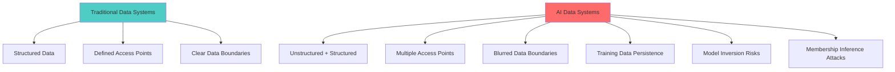
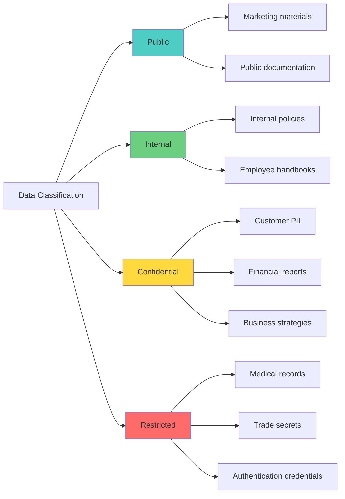
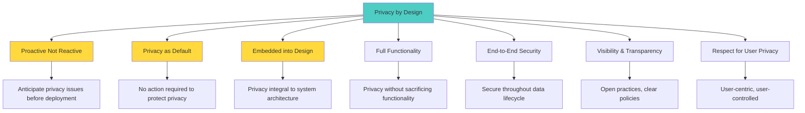
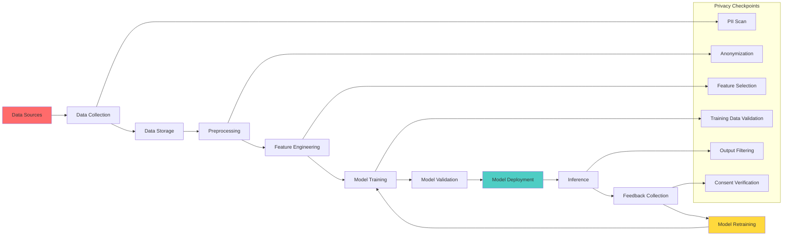
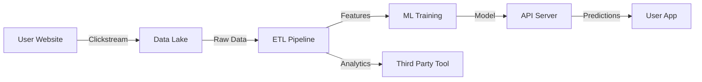

# Week 1: Working with Sensitive Data + AI
## Comprehensive Study Guide - InfoQ Certified AI Security & Privacy Engineering

**📚 Program:** InfoQ Certified AI Security & Privacy Engineering  
**⏱️ Duration:** 4-hour live session + 8-10 hours self-study  
**🎯 Difficulty:** Intermediate  
**📝 Last Updated:** October 2025

---

## 📋 Table of Contents

1. [Introduction & Learning Objectives](#introduction--learning-objectives)
2. [Understanding Sensitive Data in AI Contexts](#understanding-sensitive-data-in-ai-contexts)
3. [Data Classification & Identification](#data-classification--identification)
4. [Privacy Controls & Protection Strategies](#privacy-controls--protection-strategies)
5. [Data Flow Analysis in AI Workflows](#data-flow-analysis-in-ai-workflows)
6. [Hands-On: Identifying Sensitive Data Flows](#hands-on-identifying-sensitive-data-flows)
7. [Open-Source Tools for Privacy Protection](#open-source-tools-for-privacy-protection)
8. [Practical Implementation Guide](#practical-implementation-guide)
9. [Common Pitfalls & Anti-Patterns](#common-pitfalls--anti-patterns)
10. [Best Practices](#best-practices)
11. [Real-World Case Studies](#real-world-case-studies)
12. [Practice Exercises](#practice-exercises)
13. [Question Bank](#question-bank)
14. [Quick Recap](#quick-recap)
15. [Further Reading & Resources](#further-reading--resources)

---

## 🎯 Introduction & Learning Objectives

### What You'll Learn This Week

This week focuses on the critical intersection of **sensitive data management** and **AI systems**. As AI becomes increasingly integrated into business workflows, protecting personal and confidential data throughout the AI lifecycle is paramount.

### Learning Objectives

By the end of this week, you will be able to:

✅ **Identify** different types of sensitive data in AI workflows  
✅ **Classify** data based on sensitivity levels and regulatory requirements  
✅ **Map** data flows through AI pipelines to identify privacy risks  
✅ **Implement** basic privacy controls for personal data in AI systems  
✅ **Evaluate** open-source tools for sensitive data protection  
✅ **Apply** privacy-by-design principles to AI development  
✅ **Recognize** common pitfalls and anti-patterns in AI data handling  

### Why This Matters

> 💡 **Real-World Impact:** In 2023, a major tech company accidentally exposed 700,000 customer records when training data was not properly anonymized. Understanding sensitive data protection isn't just compliance—it's about maintaining customer trust and avoiding costly data breaches.

---

## 🔍 Understanding Sensitive Data in AI Contexts

### What Makes AI Data Handling Different?

Traditional data protection focuses on databases and APIs. AI systems introduce unique challenges:



**Key Differences:**
1. **Training Data Retention:** AI models can memorize and leak training data
2. **Multiple Data Transformations:** Data flows through preprocessing, training, inference, and feedback loops
3. **Emergent Properties:** Models can reveal sensitive information not explicitly present in individual data points
4. **Third-Party Models:** Using pre-trained models introduces unknown data handling practices

### Types of Sensitive Data in AI Workflows

#### 1. **Personally Identifiable Information (PII)**

**Direct Identifiers:**
- Names, email addresses, phone numbers
- Social Security Numbers, passport numbers
- IP addresses, device IDs
- Biometric data (fingerprints, facial recognition data)

**Indirect Identifiers (Quasi-Identifiers):**
- Age, gender, zip code
- Job title, company name
- Purchase history, browsing patterns
- Medical conditions, religious affiliation

**Example - PII in Training Data:**
```python
# ❌ BAD: Raw PII in training dataset
training_data = [
    {"name": "John Doe", "email": "john@example.com", "text": "I have diabetes..."},
    {"name": "Jane Smith", "ssn": "123-45-6789", "text": "My credit score is..."}
]

# ✅ GOOD: PII removed/anonymized
training_data = [
    {"user_id": "user_001", "text": "I have diabetes..."},
    {"user_id": "user_002", "text": "My credit score is..."}
]
```

#### 2. **Confidential Business Information**

- Trade secrets and proprietary algorithms
- Financial data and revenue figures
- Strategic plans and roadmaps
- Customer lists and pricing strategies
- Source code and technical documentation

#### 3. **Protected Health Information (PHI)**

- Medical records and diagnoses
- Prescription information
- Insurance details
- Treatment plans
- Laboratory results

**Regulatory Framework:** HIPAA (US), GDPR Article 9 (EU), PIPEDA (Canada)

#### 4. **Financial Data**

- Credit card numbers (PCI-DSS compliance)
- Bank account details
- Transaction histories
- Credit scores
- Investment portfolios

#### 5. **Sensitive Personal Data (GDPR Article 9)**

- Racial or ethnic origin
- Political opinions
- Religious or philosophical beliefs
- Trade union membership
- Genetic data
- Biometric data for identification
- Health data
- Sex life or sexual orientation

### Data Sensitivity Classification Framework



**Classification Levels:**

| Level | Definition | Examples | AI Handling Requirements |
|-------|------------|----------|-------------------------|
| **Public** | Intended for public consumption | Marketing docs, press releases | Standard logging OK |
| **Internal** | For internal use only | Employee handbooks, internal wikis | Basic access controls |
| **Confidential** | Sensitive business/personal data | Customer PII, financial data | Encryption, access logs, anonymization |
| **Restricted** | Highly sensitive, limited access | PHI, trade secrets, credentials | Maximum protection, air-gapped processing |

---

## 📊 Data Classification & Identification

### Automated Data Discovery Techniques

#### 1. **Pattern-Based Detection**

Use regular expressions and pattern matching to identify sensitive data:

```python
import re
from dataclasses import dataclass
from typing import List, Tuple

@dataclass
class SensitiveDataMatch:
    data_type: str
    pattern_name: str
    match_value: str
    confidence: float
    location: Tuple[int, int]

class SensitiveDataDetector:
    """Detects various types of sensitive data in text"""
    
    PATTERNS = {
        'email': {
            'pattern': r'\b[A-Za-z0-9._%+-]+@[A-Za-z0-9.-]+\.[A-Z|a-z]{2,}\b',
            'confidence': 0.95
        },
        'ssn': {
            'pattern': r'\b\d{3}-\d{2}-\d{4}\b',
            'confidence': 0.90
        },
        'credit_card': {
            'pattern': r'\b\d{4}[- ]?\d{4}[- ]?\d{4}[- ]?\d{4}\b',
            'confidence': 0.85
        },
        'phone_us': {
            'pattern': r'\b(\+?1[-.\s]?)?\(?\d{3}\)?[-.\s]?\d{3}[-.\s]?\d{4}\b',
            'confidence': 0.88
        },
        'ip_address': {
            'pattern': r'\b\d{1,3}\.\d{1,3}\.\d{1,3}\.\d{1,3}\b',
            'confidence': 0.92
        },
        'date_of_birth': {
            'pattern': r'\b(0[1-9]|1[0-2])[-/](0[1-9]|[12]\d|3[01])[-/]\d{4}\b',
            'confidence': 0.75
        }
    }
    
    def detect(self, text: str) -> List[SensitiveDataMatch]:
        """Detect all sensitive data in the given text"""
        matches = []
        
        for data_type, config in self.PATTERNS.items():
            pattern = config['pattern']
            confidence = config['confidence']
            
            for match in re.finditer(pattern, text):
                matches.append(SensitiveDataMatch(
                    data_type=data_type,
                    pattern_name=pattern,
                    match_value=match.group(),
                    confidence=confidence,
                    location=(match.start(), match.end())
                ))
        
        return matches
    
    def get_sensitivity_score(self, text: str) -> float:
        """Calculate overall sensitivity score for a text"""
        matches = self.detect(text)
        if not matches:
            return 0.0
        
        # Weight by confidence and type
        type_weights = {
            'ssn': 1.0,
            'credit_card': 1.0,
            'email': 0.7,
            'phone_us': 0.5,
            'ip_address': 0.4,
            'date_of_birth': 0.6
        }
        
        weighted_sum = sum(
            match.confidence * type_weights.get(match.data_type, 0.5)
            for match in matches
        )
        
        return min(weighted_sum / len(matches), 1.0)

# Usage Example
detector = SensitiveDataDetector()
sample_text = """
Contact John Doe at john.doe@example.com or call 555-123-4567.
SSN: 123-45-6789
Credit Card: 4532-1234-5678-9010
"""

matches = detector.detect(sample_text)
print(f"Found {len(matches)} sensitive data items:")
for match in matches:
    print(f"  - {match.data_type}: {match.match_value} (confidence: {match.confidence})")

sensitivity = detector.get_sensitivity_score(sample_text)
print(f"\nSensitivity Score: {sensitivity:.2f}")
```

#### 2. **Machine Learning-Based Detection**

For more sophisticated detection, use NLP models:

```python
# Using Hugging Face transformers for PII detection
from transformers import AutoTokenizer, AutoModelForTokenClassification
from transformers import pipeline

class MLBasedPiiDetector:
    """ML-based PII detection using pre-trained models"""
    
    def __init__(self, model_name: str = "dslim/bert-base-NER"):
        self.tokenizer = AutoTokenizer.from_pretrained(model_name)
        self.model = AutoModelForTokenClassification.from_pretrained(model_name)
        self.ner_pipeline = pipeline("ner", model=model_name, tokenizer=model_name)
    
    def detect_entities(self, text: str) -> List[dict]:
        """Detect named entities that might be PII"""
        entities = self.ner_pipeline(text)
        return [
            {
                'entity': ent['entity'],
                'word': ent['word'],
                'confidence': ent['score'],
                'start': ent['start'],
                'end': ent['end']
            }
            for ent in entities
            if ent['entity'] in ['PER', 'LOC', 'ORG', 'MISC']
            and ent['score'] > 0.8
        ]
    
    def analyze_document(self, text: str) -> dict:
        """Comprehensive PII analysis of a document"""
        entities = self.detect_entities(text)
        
        return {
            'total_entities': len(entities),
            'entity_types': self._count_by_type(entities),
            'high_confidence': [e for e in entities if e['confidence'] > 0.9],
            'risk_score': self._calculate_risk(entities),
            'recommendations': self._generate_recommendations(entities)
        }
    
    def _count_by_type(self, entities: List[dict]) -> dict:
        """Count entities by type"""
        counts = {}
        for ent in entities:
            entity_type = ent['entity']
            counts[entity_type] = counts.get(entity_type, 0) + 1
        return counts
    
    def _calculate_risk(self, entities: List[dict]) -> float:
        """Calculate risk score based on entities found"""
        if not entities:
            return 0.0
        
        high_risk_types = {'PER', 'LOC'}  # Person names, locations
        risk_score = sum(
            0.8 for ent in entities 
            if ent['entity'] in high_risk_types and ent['confidence'] > 0.9
        )
        
        return min(risk_score / 10, 1.0)
    
    def _generate_recommendations(self, entities: List[dict]) -> List[str]:
        """Generate recommendations based on findings"""
        recommendations = []
        
        if any(e['entity'] == 'PER' for e in entities):
            recommendations.append("Remove or anonymize person names before using in AI training")
        
        if any(e['entity'] == 'LOC' for e in entities):
            recommendations.append("Consider generalizing location data to reduce identifiability")
        
        return recommendations

# Usage
detector = MLBasedPiiDetector()
text = "John Smith from New York visited the hospital on January 15th."
analysis = detector.analyze_document(text)

print(f"Risk Score: {analysis['risk_score']:.2f}")
print(f"Recommendations: {analysis['recommendations']}")
```

### Data Discovery in AI Pipelines

#### Scanning Training Datasets

```python
import pandas as pd
from pathlib import Path
from typing import Dict, List
import json

class AIDataScanner:
    """Scan AI training datasets for sensitive data"""
    
    def __init__(self, detector: SensitiveDataDetector):
        self.detector = detector
        self.scan_results = []
    
    def scan_csv(self, file_path: str, sample_size: int = 1000) -> Dict:
        """Scan CSV file for sensitive data"""
        df = pd.read_csv(file_path)
        
        # Sample data for efficiency
        sample_df = df.head(sample_size) if len(df) > sample_size else df
        
        results = {
            'file': file_path,
            'total_rows': len(df),
            'columns_analyzed': list(df.columns),
            'sensitive_columns': [],
            'sensitive_rows': 0,
            'findings': []
        }
        
        for column in df.columns:
            column_data = ' '.join(sample_df[column].astype(str))
            matches = self.detector.detect(column_data)
            
            if matches:
                results['sensitive_columns'].append({
                    'column': column,
                    'matches': len(matches),
                    'types': list(set(m.data_type for m in matches))
                })
        
        # Sample row analysis
        for idx, row in sample_df.iterrows():
            row_text = ' '.join(row.astype(str))
            matches = self.detector.detect(row_text)
            
            if matches:
                results['sensitive_rows'] += 1
                results['findings'].append({
                    'row_index': idx,
                    'matches': [
                        {
                            'type': m.data_type,
                            'value': m.match_value[:20] + '...',  # Truncate for display
                            'confidence': m.confidence
                        }
                        for m in matches[:3]  # Top 3 matches per row
                    ]
                })
        
        self.scan_results.append(results)
        return results
    
    def generate_report(self) -> str:
        """Generate comprehensive scan report"""
        report = ["# Data Scan Report\n"]
        
        for result in self.scan_results:
            report.append(f"\n## File: {result['file']}\n")
            report.append(f"- **Total Rows:** {result['total_rows']}")
            report.append(f"- **Sensitive Rows:** {result['sensitive_rows']}")
            report.append(f"- **Sensitive Columns:** {len(result['sensitive_columns'])}\n")
            
            if result['sensitive_columns']:
                report.append("### Sensitive Columns Detected\n")
                report.append("| Column | Matches | Types |")
                report.append("|--------|---------|-------|")
                for col in result['sensitive_columns']:
                    types = ', '.join(col['types'])
                    report.append(f"| {col['column']} | {col['matches']} | {types} |")
        
        return '\n'.join(report)

# Usage Example
detector = SensitiveDataDetector()
scanner = AIDataScanner(detector)

# Scan a dataset
results = scanner.scan_csv('customer_data.csv', sample_size=100)
report = scanner.generate_report()
print(report)
```

---

## 🔒 Privacy Controls & Protection Strategies

### Privacy by Design Principles for AI



### Data Minimization Techniques

#### 1. **Data Collection Minimization**

```python
class DataMinimizer:
    """Implement data minimization strategies for AI training"""
    
    @staticmethod
    def evaluate_necessity(feature_name: str, purpose: str) -> dict:
        """
        Evaluate if a data feature is necessary for the stated purpose
        
        Returns decision on whether to collect/retain the data
        """
        necessity_criteria = {
            'essential': {
                'description': 'Critical for core functionality',
                'examples': ['text_content_for_sentiment', 'image_pixels_for_classification'],
                'action': 'COLLECT'
            },
            'useful': {
                'description': 'Improves performance but not essential',
                'examples': ['user_demographics_for_personalization'],
                'action': 'COLLECT_WITH_CONSENT'
            },
            'optional': {
                'description': 'Nice to have but not required',
                'examples': ['browsing_history_for_recommendations'],
                'action': 'ANONYMIZE_OR_OMIT'
            }
        }
        
        # Decision logic (simplified)
        sensitive_keywords = ['ssn', 'credit_card', 'medical', 'biometric', 'password']
        is_sensitive = any(kw in feature_name.lower() for kw in sensitive_keywords)
        
        if is_sensitive:
            return {
                'decision': 'ANONYMIZE_OR_OMIT',
                'reason': 'Sensitive data - apply strict minimization',
                'alternatives': ['Use aggregated data', 'Apply differential privacy', 'Remove feature']
            }
        
        return necessity_criteria['essential']
    
    @staticmethod
    def apply_minimization_techniques(data: pd.DataFrame, strategy: str = 'aggregate') -> pd.DataFrame:
        """
        Apply data minimization techniques
        
        Strategies:
        - 'aggregate': Aggregate to reduce granularity
        - 'generalize': Generalize specific values to categories
        - 'sample': Use representative samples instead of full data
        - 'perturb': Add noise to protect individuals
        """
        if strategy == 'aggregate':
            # Example: Aggregate user-level data to group level
            return data.groupby('user_segment').agg({
                'age': 'mean',
                'income': 'median',
                'purchase_count': 'sum'
            }).reset_index()
        
        elif strategy == 'generalize':
            # Example: Generalize exact ages to age ranges
            data['age_group'] = pd.cut(
                data['age'],
                bins=[0, 18, 30, 50, 70, 100],
                labels=['0-18', '19-30', '31-50', '51-70', '71+']
            )
            return data.drop('age', axis=1)
        
        elif strategy == 'sample':
            # Use stratified sampling to maintain representation
            return data.sample(frac=0.1, random_state=42, stratify=data['category'])
        
        elif strategy == 'perturb':
            # Add Laplace noise for differential privacy
            epsilon = 0.1  # Privacy budget
            for col in ['age', 'income']:
                scale = (data[col].max() - data[col].min()) / (epsilon * len(data))
                noise = np.random.laplace(0, scale, len(data))
                data[col + '_noisy'] = data[col] + noise
            return data
        
        return data
```

#### 2. **Purpose Limitation**

```python
class PurposeLimitation:
    """Enforce purpose limitation for AI training data"""
    
    def __init__(self):
        self.data_purposes = {}  # Maps data to allowed purposes
        self.access_log = []
    
    def register_data_use(self, data_id: str, purpose: str, 
                          allowed_purposes: List[str]) -> bool:
        """
        Register a data use request and validate against allowed purposes
        
        Returns True if use is permitted, False otherwise
        """
        is_allowed = purpose in allowed_purposes
        
        log_entry = {
            'timestamp': datetime.now(),
            'data_id': data_id,
            'requested_purpose': purpose,
            'allowed_purposes': allowed_purposes,
            'decision': 'ALLOWED' if is_allowed else 'DENIED'
        }
        
        self.access_log.append(log_entry)
        
        if not is_allowed:
            raise PermissionError(
                f"Data use for purpose '{purpose}' not allowed. "
                f"Allowed purposes: {', '.join(allowed_purposes)}"
            )
        
        return True
    
    def audit_data_usage(self) -> pd.DataFrame:
        """Generate audit report of data usage"""
        return pd.DataFrame(self.access_log)

# Usage Example
purpose_limiter = PurposeLimitation()

# Register customer data with specific allowed purposes
customer_data_id = "dataset_customers_2024"
allowed_purposes = [
    "train_recommendation_model",
    "analyze_purchase_patterns"
]

# Valid use
try:
    purpose_limiter.register_data_use(
        customer_data_id,
        "train_recommendation_model",
        allowed_purposes
    )
    print("✓ Data use approved")
except PermissionError as e:
    print(f"✗ Data use denied: {e}")

# Invalid use
try:
    purpose_limiter.register_data_use(
        customer_data_id,
        "sell_to_third_party",  # Not in allowed purposes
        allowed_purposes
    )
except PermissionError as e:
    print(f"✓ Correctly blocked: {e}")
```

### Anonymization Techniques

#### 1. **k-Anonymity**

```python
class KAnonymity:
    """
    Implement k-anonymity for dataset anonymization
    
    k-anonymity ensures that each record is indistinguishable from 
    at least k-1 other records on quasi-identifier attributes
    """
    
    def __init__(self, k: int = 5):
        self.k = k
    
    def anonymize(self, df: pd.DataFrame, quasi_identifiers: List[str]) -> pd.DataFrame:
        """
        Apply k-anonymity to dataset
        
        Args:
            df: Input dataframe
            quasi_identifiers: List of columns that could identify individuals
        
        Returns:
            Anonymized dataframe
        """
        # Step 1: Generalization
        df_anon = self._generalize(df, quasi_identifiers)
        
        # Step 2: Suppression
        df_anon = self._suppress(df_anon, quasi_identifiers)
        
        # Step 3: Validation
        self._validate_k_anonymity(df_anon, quasi_identifiers)
        
        return df_anon
    
    def _generalize(self, df: pd.DataFrame, quasi_identifiers: List[str]) -> pd.DataFrame:
        """Generalize quasi-identifiers to reduce granularity"""
        df_gen = df.copy()
        
        for col in quasi_identifiers:
            if df[col].dtype in ['int64', 'float64']:
                # Numeric: Create ranges
                df_gen[col] = pd.cut(
                    df[col],
                    bins=self._calculate_bins(df[col]),
                    labels=False
                )
            else:
                # Categorical: Group rare categories
                value_counts = df[col].value_counts()
                rare_categories = value_counts[value_counts < self.k].index
                df_gen[col] = df_gen[col].apply(
                    lambda x: 'Other' if x in rare_categories else x
                )
        
        return df_gen
    
    def _calculate_bins(self, series: pd.Series) -> List[float]:
        """Calculate bins ensuring at least k records per bin"""
        n_bins = max(len(series) // (self.k * 3), 3)
        return pd.cut(series, bins=n_bins, retbins=True)[1]
    
    def _suppress(self, df: pd.DataFrame, quasi_identifiers: List[str]) -> pd.DataFrame:
        """Remove records that don't meet k-anonymity"""
        # Group by quasi-identifiers and filter small groups
        group_sizes = df.groupby(quasi_identifiers).size()
        small_groups = group_sizes[group_sizes < self.k].index
        
        # Create mask for records to keep
        mask = ~df.set_index(quasi_identifiers).index.isin(small_groups)
        
        suppressed_count = len(df) - mask.sum()
        if suppressed_count > 0:
            print(f"⚠️  Suppressed {suppressed_count} records to maintain k-anonymity")
        
        return df[mask].reset_index(drop=True)
    
    def _validate_k_anonymity(self, df: pd.DataFrame, quasi_identifiers: List[str]):
        """Validate that k-anonymity is achieved"""
        group_sizes = df.groupby(quasi_identifiers).size()
        min_group_size = group_sizes.min()
        
        if min_group_size < self.k:
            raise ValueError(
                f"k-anonymity not achieved! Minimum group size: {min_group_size}, "
                f"required: {self.k}"
            )
        
        print(f"✓ k-anonymity validated: minimum group size = {min_group_size}")

# Usage Example
df = pd.DataFrame({
    'age': [23, 25, 27, 45, 46, 47, 35, 36, 37, 23],
    'zipcode': ['10001', '10001', '10001', '10002', '10002', '10002', '10003', '10003', '10003', '10001'],
    'disease': ['Flu', 'Cold', 'Flu', 'Diabetes', 'Diabetes', 'Diabetes', 'Asthma', 'Asthma', 'Asthma', 'Cold']
})

kanon = KAnonymity(k=3)
anonymized_df = kanon.anonymize(df, quasi_identifiers=['age', 'zipcode'])
print("\nAnonymized Dataset:")
print(anonymized_df)
```

#### 2. **Differential Privacy**

```python
import numpy as np

class DifferentialPrivacy:
    """
    Implement differential privacy for AI training data
    
    Differential privacy provides mathematical guarantees that
    the presence or absence of a single individual doesn't 
    significantly affect the output
    """
    
    def __init__(self, epsilon: float = 1.0, delta: float = 1e-5):
        """
        Args:
            epsilon: Privacy budget (lower = more private)
            delta: Probability of privacy failure (typically very small)
        """
        self.epsilon = epsilon
        self.delta = delta
    
    def add_laplace_noise(self, value: float, sensitivity: float) -> float:
        """
        Add Laplace noise for differential privacy
        
        Args:
            value: Original value
            sensitivity: Maximum change one individual can have on the output
        
        Returns:
            Privacy-protected value
        """
        scale = sensitivity / self.epsilon
        noise = np.random.laplace(0, scale)
        return value + noise
    
    def add_gaussian_noise(self, value: float, sensitivity: float) -> float:
        """
        Add Gaussian noise (better for multiple queries)
        
        Args:
            value: Original value
            sensitivity: Maximum change one individual can have
        
        Returns:
            Privacy-protected value
        """
        sigma = np.sqrt(2 * np.log(1.25 / self.delta)) * sensitivity / self.epsilon
        noise = np.random.normal(0, sigma)
        return value + noise
    
    def private_mean(self, data: List[float], 
                     data_range: tuple) -> float:
        """
        Compute differentially private mean
        
        Args:
            data: List of values
            data_range: (min, max) of possible values
        
        Returns:
            Privacy-protected mean
        """
        true_mean = np.mean(data)
        sensitivity = (data_range[1] - data_range[0]) / len(data)
        
        return self.add_laplace_noise(true_mean, sensitivity)
    
    def private_count(self, count: int) -> int:
        """Compute differentially private count"""
        return max(0, int(self.add_laplace_noise(count, 1)))
    
    def private_histogram(self, data: List[int], 
                         bins: int) -> np.ndarray:
        """
        Compute differentially private histogram
        
        Args:
            data: List of values
            bins: Number of histogram bins
        
        Returns:
            Privacy-protected histogram
        """
        hist, _ = np.histogram(data, bins=bins)
        
        # Add noise to each bin
        private_hist = np.array([
            max(0, self.add_laplace_noise(count, 1))
            for count in hist
        ])
        
        return private_hist

# Usage Example
dp = DifferentialPrivacy(epsilon=0.5)  # Strong privacy

# Original data
salaries = [50000, 55000, 60000, 65000, 70000, 75000, 80000, 85000, 90000, 95000]

# Compute private mean
private_mean = dp.private_mean(salaries, data_range=(30000, 150000))
true_mean = np.mean(salaries)

print(f"True Mean: ${true_mean:,.2f}")
print(f"Private Mean: ${private_mean:,.2f}")
print(f"Difference: ${abs(true_mean - private_mean):,.2f}")
print(f"\nPrivacy Budget (ε): {dp.epsilon}")
print("Lower ε = More Privacy, Less Accuracy")
```

#### 3. **Synthetic Data Generation**

```python
from faker import Faker
import pandas as pd
import numpy as np

class SyntheticDataGenerator:
    """
    Generate synthetic data that preserves statistical properties
    without exposing real individual data
    """
    
    def __init__(self, seed: int = 42):
        self.fake = Faker()
        Faker.seed(seed)
        np.random.seed(seed)
    
    def generate_synthetic_customers(self, 
                                     n_records: int,
                                     reference_stats: dict = None) -> pd.DataFrame:
        """
        Generate synthetic customer data
        
        Args:
            n_records: Number of synthetic records to generate
            reference_stats: Statistical properties to match from real data
        
        Returns:
            DataFrame with synthetic data
        """
        synthetic_data = []
        
        for _ in range(n_records):
            record = {
                # Use fake data instead of real PII
                'customer_id': self.fake.uuid4(),
                'name': self.fake.name(),
                'email': self.fake.email(),
                'phone': self.fake.phone_number(),
                'address': self.fake.address(),
                'date_of_birth': self.fake.date_of_birth(minimum_age=18, maximum_age=80),
                'credit_card': self.fake.credit_card_number(),
                'ssn': self.fake.ssn(),
                
                # Preserve statistical properties
                'purchase_amount': self._sample_from_distribution(
                    'purchase_amount', 
                    reference_stats
                ),
                'visit_frequency': self._sample_from_distribution(
                    'visit_frequency',
                    reference_stats
                ),
                'category': np.random.choice(
                    ['A', 'B', 'C'],
                    p=reference_stats.get('category_dist', [0.3, 0.5, 0.2])
                )
            }
            synthetic_data.append(record)
        
        return pd.DataFrame(synthetic_data)
    
    def _sample_from_distribution(self, 
                                  feature: str, 
                                  stats: dict) -> float:
        """Sample from learned distribution"""
        if stats and feature in stats:
            mean = stats[feature]['mean']
            std = stats[feature]['std']
            return max(0, np.random.normal(mean, std))
        return np.random.uniform(0, 1000)
    
    def validate_statistical_similarity(self, 
                                       real_data: pd.DataFrame,
                                       synthetic_data: pd.DataFrame,
                                       numeric_columns: List[str]) -> dict:
        """
        Validate that synthetic data preserves statistical properties
        """
        validation_results = {}
        
        for col in numeric_columns:
            real_mean = real_data[col].mean()
            synth_mean = synthetic_data[col].mean()
            
            real_std = real_data[col].std()
            synth_std = synthetic_data[col].std()
            
            mean_diff = abs(real_mean - synth_mean) / real_mean
            std_diff = abs(real_std - synth_std) / real_std
            
            validation_results[col] = {
                'real_mean': real_mean,
                'synthetic_mean': synth_mean,
                'mean_difference_pct': mean_diff * 100,
                'real_std': real_std,
                'synthetic_std': synth_std,
                'std_difference_pct': std_diff * 100,
                'passed': mean_diff < 0.1 and std_diff < 0.2  # 10% and 20% thresholds
            }
        
        return validation_results

# Usage Example
generator = SyntheticDataGenerator()

# Learn statistics from real data (in practice, this would be your actual dataset)
real_stats = {
    'purchase_amount': {'mean': 150, 'std': 50},
    'visit_frequency': {'mean': 12, 'std': 4},
    'category_dist': [0.2, 0.6, 0.2]
}

# Generate synthetic data
synthetic_df = generator.generate_synthetic_customers(
    n_records=1000,
    reference_stats=real_stats
)

print("Synthetic Data Sample:")
print(synthetic_df[['customer_id', 'purchase_amount', 'category']].head())

# Validate (would need real data for comparison)
# validation = generator.validate_statistical_similarity(real_df, synthetic_df, ['purchase_amount'])
```

---

## 🔄 Data Flow Analysis in AI Workflows

### Understanding AI Data Pipelines



### Data Flow Mapping Framework

```python
from dataclasses import dataclass, field
from typing import List, Dict, Optional
from enum import Enum
import json

class DataClassification(Enum):
    PUBLIC = "public"
    INTERNAL = "internal"
    CONFIDENTIAL = "confidential"
    RESTRICTED = "restricted"

class ProcessingStage(Enum):
    COLLECTION = "collection"
    STORAGE = "storage"
    PREPROCESSING = "preprocessing"
    TRAINING = "training"
    INFERENCE = "inference"
    RETRAINING = "retraining"

@dataclass
class DataFlowNode:
    """Represents a node in the data flow diagram"""
    node_id: str
    name: str
    stage: ProcessingStage
    data_classification: DataClassification
    contains_pii: bool
    transformations: List[str] = field(default_factory=list)
    security_controls: List[str] = field(default_factory=list)

@dataclass
class DataFlowEdge:
    """Represents data flow between nodes"""
    source: str
    target: str
    data_type: str
    encryption_in_transit: bool
    encryption_at_rest: bool

class DataFlowMapper:
    """Map and analyze data flows in AI systems"""
    
    def __init__(self):
        self.nodes: Dict[str, DataFlowNode] = {}
        self.edges: List[DataFlowEdge] = []
    
    def add_node(self, node: DataFlowNode):
        """Add a node to the data flow map"""
        self.nodes[node.node_id] = node
    
    def add_edge(self, edge: DataFlowEdge):
        """Add an edge to the data flow map"""
        self.edges.append(edge)
    
    def identify_risk_points(self) -> List[Dict]:
        """Identify high-risk points in the data flow"""
        risks = []
        
        for edge in self.edges:
            source_node = self.nodes.get(edge.source)
            target_node = self.nodes.get(edge.target)
            
            if not source_node or not target_node:
                continue
            
            # Risk 1: PII flowing without encryption
            if source_node.contains_pii and not edge.encryption_in_transit:
                risks.append({
                    'risk': 'Unencrypted PII transmission',
                    'severity': 'HIGH',
                    'source': edge.source,
                    'target': edge.target,
                    'recommendation': 'Implement TLS/encryption for data in transit'
                })
            
            # Risk 2: Restricted data to lower classification system
            if source_node.data_classification == DataClassification.RESTRICTED:
                if target_node.data_classification in [
                    DataClassification.PUBLIC,
                    DataClassification.INTERNAL
                ]:
                    risks.append({
                        'risk': 'Restricted data flowing to less secure system',
                        'severity': 'CRITICAL',
                        'source': edge.source,
                        'target': edge.target,
                        'recommendation': 'Implement data loss prevention (DLP) controls'
                    })
            
            # Risk 3: No security controls on sensitive data
            if source_node.contains_pii and not source_node.security_controls:
                risks.append({
                    'risk': 'Sensitive data without security controls',
                    'severity': 'HIGH',
                    'source': edge.source,
                    'recommendation': 'Add access controls, logging, and monitoring'
                })
        
        return risks
    
    def generate_mermaid_diagram(self) -> str:
        """Generate Mermaid diagram of data flow"""
        mermaid = ["graph LR"]
        
        # Add nodes
        for node_id, node in self.nodes.items():
            color = self._get_node_color(node.data_classification)
            mermaid.append(f"    {node_id}[{node.name}]")
            mermaid.append(f"    style {node_id} fill:{color}")
        
        # Add edges
        for edge in self.edges:
            encryption = "🔒" if edge.encryption_in_transit else "⚠️"
            mermaid.append(f"    {edge.source} -->|{edge.data_type} {encryption}| {edge.target}")
        
        return '\n'.join(mermaid)
    
    def _get_node_color(self, classification: DataClassification) -> str:
        """Get color for node based on classification"""
        colors = {
            DataClassification.PUBLIC: "#4ecdc4",
            DataClassification.INTERNAL: "#6bcf7f",
            DataClassification.CONFIDENTIAL: "#ffd93d",
            DataClassification.RESTRICTED: "#ff6b6b"
        }
        return colors.get(classification, "#95a5a6")
    
    def export_analysis(self, filepath: str):
        """Export complete analysis to JSON"""
        analysis = {
            'nodes': [
                {
                    'id': node.node_id,
                    'name': node.name,
                    'stage': node.stage.value,
                    'classification': node.data_classification.value,
                    'contains_pii': node.contains_pii,
                    'controls': node.security_controls
                }
                for node in self.nodes.values()
            ],
            'edges': [
                {
                    'source': edge.source,
                    'target': edge.target,
                    'data_type': edge.data_type,
                    'encrypted': edge.encryption_in_transit
                }
                for edge in self.edges
            ],
            'risks': self.identify_risk_points()
        }
        
        with open(filepath, 'w') as f:
            json.dump(analysis, f, indent=2)

# Usage Example - Map an AI training pipeline
mapper = DataFlowMapper()

# Define nodes
nodes = [
    DataFlowNode(
        node_id="A1",
        name="User Database",
        stage=ProcessingStage.STORAGE,
        data_classification=DataClassification.CONFIDENTIAL,
        contains_pii=True,
        security_controls=["encryption_at_rest", "access_logging", "rbac"]
    ),
    DataFlowNode(
        node_id="B1",
        name="Data Preprocessor",
        stage=ProcessingStage.PREPROCESSING,
        data_classification=DataClassification.CONFIDENTIAL,
        contains_pii=True,
        transformations=["tokenization", "normalization"],
        security_controls=["anonymization", "pii_scrubbing"]
    ),
    DataFlowNode(
        node_id="C1",
        name="Training Cluster",
        stage=ProcessingStage.TRAINING,
        data_classification=DataClassification.CONFIDENTIAL,
        contains_pii=False,  # PII should be removed before training
        security_controls=["network_isolation", "encrypted_storage"]
    ),
    DataFlowNode(
        node_id="D1",
        name="Model Registry",
        stage=ProcessingStage.STORAGE,
        data_classification=DataClassification.INTERNAL,
        contains_pii=False,
        security_controls=["access_control", "versioning"]
    )
]

for node in nodes:
    mapper.add_node(node)

# Define edges (data flows)
edges = [
    DataFlowEdge("A1", "B1", "raw_customer_data", True, True),
    DataFlowEdge("B1", "C1", "training_features", True, True),
    DataFlowEdge("C1", "D1", "trained_model", True, True)
]

for edge in edges:
    mapper.add_edge(edge)

# Analyze risks
risks = mapper.identify_risk_points()
print("🚨 Identified Risks:")
for risk in risks:
    print(f"\n[{risk['severity']}] {risk['risk']}")
    print(f"  Source: {risk['source']} → Target: {risk.get('target', 'N/A')}")
    print(f"  Recommendation: {risk['recommendation']}")

# Generate diagram
diagram = mapper.generate_mermaid_diagram()
print("\n📊 Data Flow Diagram:")
print(diagram)
```

---

## 🛠️ Hands-On: Identifying Sensitive Data Flows

### Exercise 1: Data Flow Analysis for a Real-World Scenario

**Scenario:** You're working for an e-commerce company building a product recommendation system.

**Task:** Map out the data flow and identify privacy risks.

```python
# Complete this exercise by filling in the missing parts

class ECommerceDataFlowAnalysis:
    """Analyze data flows for e-commerce recommendation system"""
    
    def __init__(self):
        self.mapper = DataFlowMapper()
    
    def setup_scenario(self):
        """Set up the e-commerce data flow scenario"""
        
        # TODO: Add nodes for the following components:
        # 1. Customer Database (contains PII)
        # 2. Web Application (collects user behavior)
        # 3. Analytics Pipeline (processes clickstream data)
        # 4. ML Training Pipeline (trains recommendation model)
        # 5. Model Serving API (provides recommendations)
        # 6. Third-party Analytics Service (external data sharing)
        
        # Add your nodes here
        pass
    
    def identify_additional_risks(self) -> List[str]:
        """
        Identify additional privacy risks specific to recommendation systems
        
        Consider:
        - Filter bubbles and user profiling
        - Inference attacks from recommendation patterns
        - Cross-site tracking
        - Model inversion attacks
        """
        additional_risks = [
            # TODO: List at least 3 additional risks
        ]
        return additional_risks
    
    def propose_mitigations(self, risks: List[Dict]) -> List[Dict]:
        """Propose mitigations for identified risks"""
        mitigations = []
        
        for risk in risks:
            mitigation = {
                'risk': risk['risk'],
                'mitigation': '',  # TODO: Propose specific mitigation
                'implementation_steps': [],  # TODO: List implementation steps
                'estimated_effort': '',  # TODO: Estimate effort (Low/Medium/High)
                'priority': ''  # TODO: Set priority
            }
            mitigations.append(mitigation)
        
        return mitigations

# Your task: Complete the implementation above and run the analysis
```

**Solution:**

```python
# Complete Solution
class ECommerceDataFlowAnalysis:
    """Analyze data flows for e-commerce recommendation system"""
    
    def __init__(self):
        self.mapper = DataFlowMapper()
    
    def setup_scenario(self):
        """Set up the e-commerce data flow scenario"""
        
        # Node 1: Customer Database
        self.mapper.add_node(DataFlowNode(
            node_id="DB1",
            name="Customer Database",
            stage=ProcessingStage.STORAGE,
            data_classification=DataClassification.CONFIDENTIAL,
            contains_pii=True,
            security_controls=["encryption_at_rest", "rbac", "audit_logging"]
        ))
        
        # Node 2: Web Application
        self.mapper.add_node(DataFlowNode(
            node_id="WEB1",
            name="Web Application",
            stage=ProcessingStage.COLLECTION,
            data_classification=DataClassification.CONFIDENTIAL,
            contains_pii=True,
            security_controls=["https", "input_validation", "rate_limiting"]
        ))
        
        # Node 3: Analytics Pipeline
        self.mapper.add_node(DataFlowNode(
            node_id="ANALYTICS1",
            name="Clickstream Analytics",
            stage=ProcessingStage.PREPROCESSING,
            data_classification=DataClassification.CONFIDENTIAL,
            contains_pii=True,
            transformations=["sessionization", "feature_extraction"],
            security_controls=["pii_anonymization", "data_masking"]
        ))
        
        # Node 4: ML Training Pipeline
        self.mapper.add_node(DataFlowNode(
            node_id="ML_TRAIN",
            name="Recommendation Model Training",
            stage=ProcessingStage.TRAINING,
            data_classification=DataClassification.CONFIDENTIAL,
            contains_pii=False,  # PII removed before training
            security_controls=["network_isolation", "gpu_cluster_encryption"]
        ))
        
        # Node 5: Model Serving API
        self.mapper.add_node(DataFlowNode(
            node_id="API1",
            name="Recommendation API",
            stage=ProcessingStage.INFERENCE,
            data_classification=DataClassification.INTERNAL,
            contains_pii=False,
            security_controls=["api_gateway", "rate_limiting", "monitoring"]
        ))
        
        # Node 6: Third-party Analytics
        self.mapper.add_node(DataFlowNode(
            node_id="EXT1",
            name="Third-party Analytics",
            stage=ProcessingStage.STORAGE,
            data_classification=DataClassification.INTERNAL,
            contains_pii=False,  # Should be anonymized
            security_controls=["data_agreement", "pii_scrubbing"]
        ))
        
        # Define data flows
        edges = [
            DataFlowEdge("WEB1", "DB1", "user_registration", True, True),
            DataFlowEdge("WEB1", "ANALYTICS1", "clickstream_data", True, True),
            DataFlowEdge("DB1", "ANALYTICS1", "user_profiles", True, True),
            DataFlowEdge("ANALYTICS1", "ML_TRAIN", "training_features", True, True),
            DataFlowEdge("ML_TRAIN", "API1", "model_artifacts", True, True),
            DataFlowEdge("ANALYTICS1", "EXT1", "aggregated_metrics", True, True)
        ]
        
        for edge in edges:
            self.mapper.add_edge(edge)
    
    def identify_additional_risks(self) -> List[str]:
        """Identify additional privacy risks"""
        return [
            "Filter bubbles: Over-personalization reduces user autonomy and privacy",
            "Inference attacks: Sensitive attributes (health, political views) can be inferred from purchase patterns",
            "Model inversion: Attackers can reconstruct training data from model outputs",
            "Membership inference: Determine if specific user was in training dataset",
            "Cross-site tracking: Recommendations can be used to track users across platforms",
            "Temporal patterns: Purchase timing reveals lifestyle information"
        ]
    
    def propose_mitigations(self, risks: List[Dict]) -> List[Dict]:
        """Propose mitigations for identified risks"""
        mitigations = []
        
        mitigation_map = {
            'Unencrypted PII transmission': {
                'mitigation': 'Implement end-to-end encryption with TLS 1.3',
                'steps': [
                    'Enable HTTPS on all endpoints',
                    'Use certificate pinning for mobile apps',
                    'Implement mTLS for service-to-service communication',
                    'Disable legacy TLS versions (1.0, 1.1)'
                ],
                'effort': 'Medium',
                'priority': 'HIGH'
            },
            'Filter bubbles': {
                'mitigation': 'Implement diversity and serendipity in recommendations',
                'steps': [
                    'Add randomness to recommendation algorithm',
                    'Include diverse categories in results',
                    'Provide user controls for personalization level',
                    'Regularly evaluate recommendation diversity metrics'
                ],
                'effort': 'Medium',
                'priority': 'MEDIUM'
            },
            'Inference attacks': {
                'mitigation': 'Apply differential privacy and feature minimization',
                'steps': [
                    'Remove highly predictive sensitive features',
                    'Add calibrated noise to training data',
                    'Limit model granularity for sensitive attributes',
                    'Regular privacy audits of model outputs'
                ],
                'effort': 'High',
                'priority': 'HIGH'
            }
        }
        
        for risk in risks:
            risk_type = risk['risk']
            if risk_type in mitigation_map:
                mitigations.append({
                    'risk': risk_type,
                    **mitigation_map[risk_type]
                })
        
        return mitigations

# Run the analysis
analysis = ECommerceDataFlowAnalysis()
analysis.setup_scenario()

print("🚨 Identified Risks:")
risks = analysis.mapper.identify_risk_points()
for i, risk in enumerate(risks, 1):
    print(f"\n{i}. [{risk['severity']}] {risk['risk']}")
    print(f"   {risk['recommendation']}")

print("\n\n📋 Additional Privacy Risks:")
additional_risks = analysis.identify_additional_risks()
for i, risk in enumerate(additional_risks, 1):
    print(f"{i}. {risk}")

print("\n\n✅ Proposed Mitigations:")
mitigations = analysis.propose_mitigations(risks)
for i, mit in enumerate(mitigations, 1):
    print(f"\n{i}. {mit['risk']}")
    print(f"   Mitigation: {mit['mitigation']}")
    print(f"   Priority: {mit['priority']} | Effort: {mit['effort']}")
```

---

## 🔧 Open-Source Tools for Privacy Protection

### Tool Comparison Matrix

| Tool | Purpose | Language | License | Best For | Learning Curve |
|------|---------|----------|---------|----------|----------------|
| **Presidio** | PII detection & anonymization | Python | MIT | Text data, documents | Low |
| **ARX** | Data anonymization GUI | Java | GPL | Visual data exploration | Medium |
| **Google Differential Privacy** | Differential privacy library | C++, Python | Apache 2.0 | Statistical queries | High |
| **PySyft** | Privacy-preserving ML | Python | Apache 2.0 | Federated learning | High |
| **Faker** | Synthetic data generation | Python | MIT | Test data, demos | Low |
| **Mimesis** | Fake data generation | Python | MIT | Multi-language support | Low |
| **OpenMined/PyDP** | Differential privacy | Python | Apache 2.0 | Simple DP implementations | Medium |
| **Narayanan & Shmatikov** | k-anonymity tool | Python | GPL | k-anonymity implementation | Medium |

### Hands-On: Using Presidio for PII Detection

```python
# Install: pip install presidio-analyzer presidio-anonymizer

from presidio_analyzer import AnalyzerEngine, RecognizerRegistry
from presidio_anonymizer import AnonymizerEngine
from presidio_anonymizer.entities import OperatorConfig

class PresidioPiiHandler:
    """Handle PII detection and anonymization using Presidio"""
    
    def __init__(self):
        self.analyzer = AnalyzerEngine()
        self.anonymizer = AnonymizerEngine()
    
    def detect_pii(self, text: str, language: str = 'en') -> List[dict]:
        """
        Detect PII in text
        
        Returns list of detected entities with positions and confidence scores
        """
        results = self.analyzer.analyze(
            text=text,
            language=language,
            entities=None,  # Detect all supported entities
            score_threshold=0.5
        )
        
        return [
            {
                'entity_type': result.entity_type,
                'start': result.start,
                'end': result.end,
                'text': text[result.start:result.end],
                'confidence': result.score
            }
            for result in results
        ]
    
    def anonymize_text(self, text: str, method: str = 'replace') -> str:
        """
        Anonymize PII in text
        
        Methods:
        - 'replace': Replace with entity type
        - 'mask': Replace with asterisks
        - 'hash': Replace with hash
        - 'redact': Completely remove
        """
        # Detect PII
        analyzer_results = self.analyzer.analyze(
            text=text,
            language='en',
            score_threshold=0.5
        )
        
        # Configure anonymization operator
        if method == 'replace':
            operator = OperatorConfig("replace", {"new_value": "<ENTITY_TYPE>"})
        elif method == 'mask':
            operator = OperatorConfig("mask", {"chars_to_mask": 100, "masking_char": "*"})
        elif method == 'hash':
            operator = OperatorConfig("hash", {"hash-type": "sha256"})
        elif method == 'redact':
            operator = OperatorConfig("redact", {})
        else:
            raise ValueError(f"Unknown method: {method}")
        
        # Anonymize
        anonymized_result = self.anonymizer.anonymize(
            text=text,
            analyzer_results=analyzer_results,
            operators={"DEFAULT": operator}
        )
        
        return anonymized_result.text
    
    def analyze_dataset(self, df: pd.DataFrame, text_column: str) -> pd.DataFrame:
        """
        Analyze entire dataset for PII
        
        Returns DataFrame with PII analysis results
        """
        results = []
        
        for idx, row in df.iterrows():
            text = str(row[text_column])
            pii_detected = self.detect_pii(text)
            
            results.append({
                'row_index': idx,
                'pii_count': len(pii_detected),
                'pii_types': list(set(p['entity_type'] for p in pii_detected)),
                'high_confidence_pii': [
                    p for p in pii_detected if p['confidence'] > 0.8
                ],
                'risk_score': self._calculate_risk_score(pii_detected)
            })
        
        return pd.DataFrame(results)
    
    def _calculate_risk_score(self, pii_detected: List[dict]) -> float:
        """Calculate risk score based on PII detected"""
        if not pii_detected:
            return 0.0
        
        high_risk_types = {'CREDIT_CARD', 'SSN', 'IBAN_CODE', 'US_BANK_NUMBER'}
        risk_score = 0.0
        
        for pii in pii_detected:
            if pii['entity_type'] in high_risk_types:
                risk_score += pii['confidence'] * 1.0
            else:
                risk_score += pii['confidence'] * 0.5
        
        return min(risk_score, 1.0)

# Usage Example
handler = PresidioPiiHandler()

# Sample text with PII
sample_text = """
Hello, my name is John Doe. You can reach me at john.doe@example.com 
or call me at (555) 123-4567. My credit card number is 4532-1234-5678-9010.
I live at 123 Main Street, New York, NY 10001.
"""

# Detect PII
print("🔍 Detected PII:")
detected = handler.detect_pii(sample_text)
for pii in detected:
    print(f"  - {pii['entity_type']}: {pii['text']} (confidence: {pii['confidence']:.2f})")

# Anonymize with different methods
print("\n🔒 Anonymization Methods:")
print("\n1. Replace method:")
print(handler.anonymize_text(sample_text, method='replace'))

print("\n2. Mask method:")
print(handler.anonymize_text(sample_text, method='mask'))

print("\n3. Hash method:")
print(handler.anonymize_text(sample_text, method='hash'))
```

### Exercise 2: Build a PII Detection Pipeline

**Task:** Create a complete PII detection and anonymization pipeline for a CSV dataset.

```python
# TODO: Implement a complete pipeline that:
# 1. Reads a CSV file
# 2. Scans all text columns for PII
# 3. Generates a risk report
# 4. Anonymizes sensitive columns
# 5. Validates anonymization effectiveness
# 6. Exports cleaned dataset and report

class PiiDetectionPipeline:
    """Complete PII detection and anonymization pipeline"""
    
    def __init__(self, input_file: str, output_file: str):
        self.input_file = input_file
        self.output_file = output_file
        self.handler = PresidioPiiHandler()
        self.report = {
            'total_rows': 0,
            'rows_with_pii': 0,
            'pii_by_type': {},
            'high_risk_rows': 0,
            'anonymization_stats': {}
        }
    
    def run(self):
        """Execute the complete pipeline"""
        # Step 1: Load data
        # Step 2: Scan for PII
        # Step 3: Generate risk report
        # Step 4: Anonymize data
        # Step 5: Validate anonymization
        # Step 6: Export results
        
        pass  # Implement this

# Test with sample data
# pipeline = PiiDetectionPipeline('customer_data.csv', 'customer_data_clean.csv')
# pipeline.run()
```

**Solution:**

```python
# Complete Solution
class PiiDetectionPipeline:
    """Complete PII detection and anonymization pipeline"""
    
    def __init__(self, input_file: str, output_file: str):
        self.input_file = input_file
        self.output_file = output_file
        self.handler = PresidioPiiHandler()
        self.report = {
            'total_rows': 0,
            'rows_with_pii': 0,
            'pii_by_type': {},
            'high_risk_rows': 0,
            'anonymization_stats': {}
        }
    
    def run(self):
        """Execute the complete pipeline"""
        print("🚀 Starting PII Detection Pipeline\n")
        
        # Step 1: Load data
        print("📂 Step 1: Loading data...")
        df = pd.read_csv(self.input_file)
        self.report['total_rows'] = len(df)
        print(f"   Loaded {len(df)} rows, {len(df.columns)} columns")
        
        # Step 2: Scan for PII
        print("\n🔍 Step 2: Scanning for PII...")
        text_columns = self._identify_text_columns(df)
        print(f"   Analyzing {len(text_columns)} text columns")
        
        pii_analysis = self._scan_columns(df, text_columns)
        
        # Step 3: Generate risk report
        print("\n📊 Step 3: Generating risk report...")
        self._generate_report(pii_analysis)
        self._print_summary()
        
        # Step 4: Anonymize data
        print("\n🔒 Step 4: Anonymizing sensitive data...")
        df_clean = self._anonymize_dataframe(df, text_columns, pii_analysis)
        
        # Step 5: Validate anonymization
        print("\n✅ Step 5: Validating anonymization...")
        validation_results = self._validate_anonymization(df_clean, text_columns)
        
        # Step 6: Export results
        print("\n💾 Step 6: Exporting results...")
        df_clean.to_csv(self.output_file, index=False)
        self._export_report()
        
        print("\n✨ Pipeline complete!")
        return df_clean, self.report
    
    def _identify_text_columns(self, df: pd.DataFrame) -> List[str]:
        """Identify columns that likely contain text"""
        text_columns = []
        for col in df.columns:
            if df[col].dtype == 'object':
                # Sample to check if it's text
                sample = df[col].dropna().head(10).astype(str)
                avg_length = sample.str.len().mean()
                if avg_length > 20:  # Likely text column
                    text_columns.append(col)
        return text_columns
    
    def _scan_columns(self, df: pd.DataFrame, columns: List[str]) -> pd.DataFrame:
        """Scan columns for PII"""
        analysis_results = []
        
        for col in columns:
            print(f"   Scanning column: {col}")
            col_analysis = self.handler.analyze_dataset(df, col)
            analysis_results.append({
                'column': col,
                'analysis': col_analysis
            })
            
            # Update report
            pii_count = col_analysis['pii_count'].sum()
            if pii_count > 0:
                self.report['rows_with_pii'] = max(
                    self.report['rows_with_pii'],
                    col_analysis['pii_count'].astype(bool).sum()
                )
                
                for pii_type in col_analysis['pii_types'].explode().dropna():
                    self.report['pii_by_type'][pii_type] = \
                        self.report['pii_by_type'].get(pii_type, 0) + 1
        
        return analysis_results
    
    def _anonymize_dataframe(self, df: pd.DataFrame, 
                            columns: List[str], 
                            analysis: List[dict]) -> pd.DataFrame:
        """Anonymize sensitive columns"""
        df_clean = df.copy()
        
        for col_info in analysis:
            col = col_info['column']
            col_analysis = col_info['analysis']
            
            # Check if column has high-risk PII
            high_risk_count = col_analysis['risk_score'].apply(
                lambda x: x > 0.7
            ).sum()
            
            if high_risk_count > 0:
                print(f"   ⚠️  Anonymizing column: {col} ({high_risk_count} high-risk rows)")
                
                # Anonymize each cell
                df_clean[col] = df_clean[col].apply(
                    lambda x: self.handler.anonymize_text(str(x)) 
                    if pd.notna(x) else x
                )
                
                self.report['anonymization_stats'][col] = {
                    'rows_anonymized': high_risk_count,
                    'method': 'presidio_replace'
                }
        
        return df_clean
    
    def _validate_anonymization(self, df: pd.DataFrame, 
                               columns: List[str]) -> dict:
        """Validate that anonymization was effective"""
        validation = {
            'residual_pii': 0,
            'columns_clean': 0,
            'effectiveness': 0.0
        }
        
        for col in columns:
            sample = ' '.join(df[col].dropna().astype(str).head(100))
            residual_pii = self.handler.detect_pii(sample)
            
            if len(residual_pii) == 0:
                validation['columns_clean'] += 1
            else:
                validation['residual_pii'] += len(residual_pii)
        
        validation['effectiveness'] = (
            validation['columns_clean'] / len(columns) * 100
            if columns else 0
        )
        
        print(f"   Effectiveness: {validation['effectiveness']:.1f}%")
        print(f"   Residual PII instances: {validation['residual_pii']}")
        
        return validation
    
    def _generate_report(self, analysis: List[dict]):
        """Generate comprehensive report"""
        self.report['high_risk_rows'] = sum(
            col_info['analysis']['risk_score'].apply(lambda x: x > 0.7).sum()
            for col_info in analysis
        )
    
    def _print_summary(self):
        """Print summary of findings"""
        print("\n" + "="*60)
        print("PII DETECTION SUMMARY")
        print("="*60)
        print(f"Total Rows Analyzed: {self.report['total_rows']}")
        print(f"Rows with PII: {self.report['rows_with_pii']}")
        print(f"High-Risk Rows: {self.report['high_risk_rows']}")
        print(f"\nPII Types Found:")
        for pii_type, count in self.report['pii_by_type'].items():
            print(f"  - {pii_type}: {count} instances")
        print("="*60)
    
    def _export_report(self):
        """Export report to JSON"""
        report_file = self.output_file.replace('.csv', '_report.json')
        with open(report_file, 'w') as f:
            json.dump(self.report, f, indent=2)
        print(f"   Report exported to: {report_file}")

# Usage Example
# pipeline = PiiDetectionPipeline('customer_data.csv', 'customer_data_clean.csv')
# df_clean, report = pipeline.run()
```

---

## 📝 Practice Exercises

### Exercise 1: Data Classification Challenge

**Scenario:** You're given a dataset from a healthcare AI project. Classify each field:

| Field | Example Value | Classification | Justification |
|-------|---------------|----------------|---------------|
| patient_name | "John Smith" | ? | ? |
| diagnosis_code | "E11.9" | ? | ? |
| treatment_date | "2024-01-15" | ? | ? |
| insurance_id | "INS-123456" | ? | ? |
| doctor_notes | "Patient shows improvement..." | ? | ? |
| lab_results | {"glucose": 120, "bp": "120/80"} | ? | ? |

<details>
<summary>Click for Solution</summary>

| Field | Classification | Justification |
|-------|----------------|---------------|
| patient_name | **Restricted** | Direct identifier, PHI under HIPAA |
| diagnosis_code | **Restricted** | Health information, PHI under HIPAA |
| treatment_date | **Confidential** | Can be used with other data to identify individual |
| insurance_id | **Restricted** | Links to financial and identity information |
| doctor_notes | **Restricted** | Contains health information, PHI |
| lab_results | **Restricted** | Protected health information |

**Key Principle:** In healthcare contexts, almost all data related to a patient is considered PHI and requires the highest level of protection.
</details>

### Exercise 2: Privacy Control Selection

**Scenario:** You're building an AI chatbot for customer service. The chatbot needs access to:
- Customer name and account number
- Purchase history
- Previous support tickets
- Conversation transcripts

**Task:** Select appropriate privacy controls for each data type and justify your choices.

<details>
<summary>Click for Solution</summary>

**Recommended Controls:**

1. **Customer name and account number:**
   - Control: Tokenization + encryption at rest
   - Justification: Needed for personalization but should not be exposed in logs or model training
   - Implementation: Replace with tokens in training data, map back only at inference time

2. **Purchase history:**
   - Control: Aggregation + differential privacy
   - Justification: Useful for recommendations but should not identify specific purchases
   - Implementation: Aggregate to category level, add noise to counts

3. **Previous support tickets:**
   - Control: Anonymization + access controls
   - Justification: Contains sensitive customer issues, needs careful handling
   - Implementation: Remove PII, restrict access to authorized personnel only

4. **Conversation transcripts:**
   - Control: End-to-end encryption + retention limits
   - Justification: Contains highly sensitive information, temporary use only
   - Implementation: Encrypt in transit/at rest, auto-delete after 30 days, never use for training without explicit consent

**Architecture Pattern:**
```
User Input → PII Scanner → Tokenization → AI Model → Detokenization → Response
                ↓
           [PII Removed]
                ↓
           [Training Data]
```
</details>

### Exercise 3: Data Flow Risk Assessment

**Task:** Analyze this simplified AI pipeline and identify 5 privacy risks:



<details>
<summary>Click for Solution</summary>

**5 Privacy Risks:**

1. **Unencrypted data in ETL pipeline**
   - Risk: Sensitive clickstream data transmitted without encryption
   - Impact: Data breach, compliance violation
   - Mitigation: Implement TLS for all data transfers

2. **Third-party data sharing without anonymization**
   - Risk: Raw analytics data sent to third party may contain PII
   - Impact: Unauthorized data exposure, regulatory fines
   - Mitigation: Anonymize data before sharing, establish data processing agreement

3. **Training data retention**
   - Risk: Model may memorize and leak training data
   - Impact: Privacy violation, membership inference attacks
   - Mitigation: Apply differential privacy, implement model inversion testing

4. **Inference API logging**
   - Risk: API logs may capture sensitive user queries
   - Impact: Privacy violation if logs are accessed
   - Mitigation: Implement log sanitization, automatic log rotation and deletion

5. **Data lake access controls**
   - Risk: Insufficient access controls on raw data lake
   - Impact: Unauthorized access to sensitive data
   - Mitigation: Implement RBAC, audit logging, data encryption
</details>

---

## ❓ Question Bank

### Multiple Choice Questions

**1. Which of the following is considered indirect PII (quasi-identifier)?**
- A) Social Security Number
- B) Email address
- C) Zip code + Date of Birth + Gender
- D) Passport number

<details>
<summary>Answer</summary>

**Answer: C) Zip code + Date of Birth + Gender**

**Explanation:** While individually these are not direct identifiers, when combined they can uniquely identify 87% of the US population (research from Latanya Sweeney). This is why k-anonymity focuses on quasi-identifiers.
</details>

**2. What is the primary goal of differential privacy?**
- A) Encrypt all data
- B) Provide mathematical guarantees that individual data points cannot be identified
- C) Remove all PII from datasets
- D) Speed up data processing

<details>
<summary>Answer</summary>

**Answer: B) Provide mathematical guarantees that individual data points cannot be identified**

**Explanation:** Differential privacy ensures that the output of a computation doesn't change significantly whether or not any individual's data is included, providing strong privacy guarantees.
</details>

**3. In k-anonymity, what does 'k' represent?**
- A) Number of data fields
- B) Minimum number of records that must be indistinguishable
- C) Privacy budget
- D) Encryption key length

<details>
<summary>Answer</summary>

**Answer: B) Minimum number of records that must be indistinguishable**

**Explanation:** k-anonymity ensures that each record is identical to at least k-1 other records on quasi-identifier attributes, making individuals indistinguishable within groups.
</details>

**4. Which privacy technique is MOST effective for preventing model inversion attacks?**
- A) Data encryption
- B) Differential privacy during training
- C) Strong access controls
- D) Regular security audits

<details>
<summary>Answer</summary>

**Answer: B) Differential privacy during training**

**Explanation:** Model inversion attacks exploit the model's memory of training data. Differential privacy adds noise during training to prevent the model from memorizing individual data points, effectively mitigating these attacks.
</details>

**5. What is the primary purpose of data minimization in AI?**
- A) Reduce storage costs
- B) Improve model accuracy
- C) Limit privacy exposure by collecting only necessary data
- D) Speed up data processing

<details>
<summary>Answer</summary>

**Answer: C) Limit privacy exposure by collecting only necessary data**

**Explanation:** Data minimization is a privacy principle that requires collecting only the data absolutely necessary for the stated purpose, reducing the potential impact of data breaches and privacy violations.
</details>

### Short Answer Questions

**6. Explain the difference between anonymization and pseudonymization. Provide examples of each.**

<details>
<summary>Answer</summary>

**Anonymization** is the process of removing or obfuscating personal identifiers such that re-identification is impossible. Examples:
- Removing names, SSNs, and addresses from a dataset
- Aggregating data to group level
- Applying differential privacy

**Pseudonymization** replaces identifiers with artificial identifiers (pseudonyms) but allows re-identification with additional information. Examples:
- Replacing customer names with user IDs
- Tokenization of credit card numbers
- Hashing email addresses (if the hash can be reversed with a salt)

**Key Difference:** Anonymized data cannot be re-identified, while pseudonymized data can be re-identified with additional information.
</details>

**7. Describe three privacy risks specific to AI/ML systems that don't exist in traditional software systems.**

<details>
<summary>Answer</summary>

Three unique AI/ML privacy risks:

1. **Model Inversion Attacks:** Attackers can reconstruct training data by querying the model repeatedly. For example, reconstructing faces from a facial recognition model or text from a language model.

2. **Membership Inference Attacks:** Attackers can determine if a specific individual's data was used to train the model by analyzing the model's confidence scores. This can reveal sensitive information about whether someone was part of a dataset (e.g., medical study).

3. **Training Data Memorization:** Neural networks can memorize rare or unique training examples, especially if trained for many epochs. This means sensitive data (e.g., credit card numbers in text) can be extracted from the model by prompting it cleverly.

Additional risks:
- **Emergent properties:** Models can learn and reveal sensitive correlations not explicitly present in the data
- **Black-box nature:** Difficulty in understanding what the model has learned makes it hard to audit for privacy violations
- **Feedback loops:** Models trained on their own predictions can amplify biases and privacy risks over time
</details>

**8. What is the privacy budget (ε) in differential privacy, and how does it affect the privacy-utility tradeoff?**

<details>
<summary>Answer</summary>

The privacy budget (ε, epsilon) in differential privacy controls the strength of privacy guarantees:

**Lower ε (e.g., 0.1 - 1.0):**
- Stronger privacy protection
- More noise added to results
- Lower accuracy/utility of the output
- Suitable for highly sensitive data (medical, financial)

**Higher ε (e.g., 10 - 100):**
- Weaker privacy protection
- Less noise added
- Higher accuracy/utility
- Suitable for less sensitive data

**Privacy Budget Composition:**
When multiple queries are made, the privacy budget is consumed. If you make two queries with ε=0.5 each, the total privacy loss is approximately ε=1.0 (using advanced composition theorems).

**Practical Guidance:**
- Start with ε between 1-10 for most applications
- Use ε < 1 for highly sensitive data
- Monitor privacy budget consumption across queries
- Consider using privacy budget allocation strategies for complex analyses

**Tradeoff Example:**
A differentially private mean with ε=0.1 might have ±20% error, while ε=10 would have <1% error. The choice depends on the sensitivity of the data and the required accuracy.
</details>

### Scenario-Based Questions

**9. Scenario:** Your team wants to train a language model on customer support tickets. The tickets contain names, email addresses, and detailed descriptions of technical issues.

**Questions:**
a) What privacy risks exist?
b) What data preparation steps should you take before training?
c) What privacy controls should be in place during and after training?

<details>
<summary>Answer</summary>

**a) Privacy Risks:**
- PII exposure in training data (names, emails)
- Model memorization and potential leakage of sensitive customer information
- Unintended learning of patterns that could identify individuals
- Third-party model providers accessing sensitive data if using external APIs

**b) Data Preparation Steps:**
1. **PII Detection:** Use tools like Presidio to scan all tickets
2. **Anonymization:** Replace PII with tokens or remove entirely
3. **Validation:** Verify no residual PII remains
4. **Documentation:** Record what was removed and why
5. **Consent Verification:** Ensure customers agreed to data use for training

**c) Privacy Controls:**
- **During Training:**
  - Use differential privacy (ε=1-5)
  - Implement access controls on training infrastructure
  - Monitor for overfitting (indicator of memorization)
  - Use federated learning if possible (train on-device)

- **After Training:**
  - Test for memorization (try to extract specific tickets)
  - Perform membership inference testing
  - Implement output filtering to prevent PII generation
  - Regular privacy audits
  - Clear data retention policies
</details>

**10. Scenario:** You're implementing a recommendation system for an e-commerce platform. The legal team says you can use customer data for 30 days, then must delete it.

**Task:** Design a data management strategy that complies with this requirement while maintaining model quality.

<details>
<summary>Answer</summary>

**Data Management Strategy:**

**1. Data Architecture:**
```
Real-time Data (0-30 days) → Feature Store → Model Training
                                    ↓
                            [After 30 days]
                                    ↓
                            Aggregated Statistics
                                    ↓
                            Model Retraining (monthly)
```

**2. Implementation:**

**Tier 1: Real-time Processing (0-30 days)**
- Store raw data in encrypted, time-partitioned storage
- Implement automatic TTL (Time To Live) of 30 days
- Use data versioning to track retention periods
- Access limited to authorized services only

**Tier 2: Feature Extraction**
- Extract features immediately upon data collection
- Store features separately from raw data
- Features can be retained longer (aggregated, anonymized)
- Example: "User viewed 5 electronics products" instead of specific product IDs

**Tier 3: Aggregated Statistics (30+ days)**
- After 30 days, delete individual records
- Retain only aggregated statistics:
  - Category popularity trends
  - Average purchase frequency
  - Seasonal patterns
- These cannot be traced back to individuals

**Tier 4: Model Management**
- Retrain models monthly using aggregated data
- Implement continuous learning with privacy constraints
- Use techniques like knowledge distillation to transfer learning without retaining raw data

**3. Technical Implementation:**
```python
# Example: Automatic data expiration
class TimeBasedDataRetention:
    def __init__(self, retention_days: int = 30):
        self.retention_days = retention_days
    
    def enforce_retention(self, data_lake_path: str):
        """Delete data older than retention period"""
        cutoff_date = datetime.now() - timedelta(days=self.retention_days)
        
        # Delete old partitions
        for partition in self._list_partitions(data_lake_path):
            partition_date = self._parse_partition_date(partition)
            if partition_date < cutoff_date:
                self._delete_partition(partition)
                print(f"Deleted partition: {partition}")
```

**4. Compliance Verification:**
- Automated monitoring of data retention
- Regular audits to ensure compliance
- Documentation for regulators
- User transparency about data retention policies
</details>

---

## 🎯 Quick Recap

### Key Takeaways

✅ **Sensitive Data in AI:** AI systems face unique challenges with data privacy due to training data retention, multiple transformations, and emergent properties

✅ **Data Classification:** Use a four-tier system (Public, Internal, Confidential, Restricted) to classify data based on sensitivity

✅ **Privacy Controls:** Implement data minimization, purpose limitation, anonymization (k-anonymity, differential privacy), and synthetic data generation

✅ **Data Flow Analysis:** Map all data flows in AI pipelines, identify risk points, and implement security controls at each stage

✅ **Tools:** Leverage open-source tools like Presidio for PII detection, ARX for anonymization, and differential privacy libraries for statistical protection

✅ **Privacy by Design:** Integrate privacy considerations from the start, not as an afterthought

### Common Mistakes to Avoid

❌ **Don't:** Train models on raw PII without anonymization  
❌ **Don't:** Assume "we'll add privacy later"  
❌ **Don't:** Use one-size-fits-all privacy controls  
❌ **Don't:** Forget about inference-time privacy (not just training)  
❌ **Don't:** Ignore regulatory requirements (GDPR, HIPAA, etc.)

✅ **Do:** Scan data before using it in AI systems  
✅ **Do:** Implement defense-in-depth with multiple privacy layers  
✅ **Do:** Test privacy controls regularly  
✅ **Do:** Document privacy decisions and rationale  
✅ **Do:** Stay updated on emerging privacy threats and defenses

---

## 📚 Further Reading & Resources

### Essential Reading

1. **Books:**
   - "Privacy by Design" by Ann Cavoukian
   - "The Algorithmic Justice Handbook" by Julia Powles
   - "Data Protection and Privacy" by Inger Anne Tøndel

2. **Research Papers:**
   - "k-Anonymity: A Model for Protecting Privacy" - Sweeney, 2002
   - "Differential Privacy" - Dwork, 2008
   - "The Deidentification Dilemma" - Ohm, 2010
   - "Membership Inference Attacks" - Shokri et al., 2017

3. **Official Documentation:**
   - [NIST Privacy Framework](https://www.nist.gov/privacy-framework)
   - [GDPR Official Text](https://gdpr-info.eu/)
   - [HIPAA Guidelines](https://www.hhs.gov/hipaa/index.html)
   - [MITRE ATLAS - AI Security](https://atlas.mitre.org/)

### Online Courses & Tutorials

1. **Coursera:** "Privacy and Standardisation" by University of Geneva
2. **edX:** "Data Privacy and Security" by IITB
3. **Udemy:** "Differential Privacy in Practice"

### Tools & Libraries

1. **Presidio:** https://github.com/microsoft/presidio
2. **ARX:** https://arx.deidentifier.org/
3. **Google Differential Privacy:** https://github.com/google/differential-privacy
4. **PyDP:** https://github.com/OpenMined/PyDP
5. **Faker:** https://faker.readthedocs.io/

### Communities & Forums

1. **OpenMined:** https://www.openmined.org/ (Privacy-preserving ML community)
2. **Privacy Enhancing Technologies Symposium (PETS):** Annual academic conference
3. **r/privacy:** Reddit community for privacy discussions
4. **AI Now Institute:** Research on social implications of AI

### Standards & Frameworks

1. **ISO/IEC 27001:** Information security management
2. **ISO/IEC 27701:** Privacy information management
3. **NIST AI RMF:** AI Risk Management Framework
4. **EU AI Act:** Comprehensive AI regulation (2024)
5. **PCI-DSS:** Payment card data security (if handling payments)

---

## ⏱️ Time Management Suggestions

**Total Estimated Time:** 12-14 hours

- **Reading & Understanding Concepts:** 4-5 hours
- **Hands-On Exercises:** 4-5 hours
- **Practice Questions:** 2-3 hours
- **Additional Research:** 2-3 hours
- **Project Work (Capstone):** 3-4 hours

**Study Schedule:**
- **Day 1:** Sections 1-4 (Concepts & Classification)
- **Day 2:** Sections 5-7 (Data Flow Analysis & Tools)
- **Day 3:** Sections 8-10 (Implementation & Best Practices)
- **Day 4:** Sections 11-13 (Case Studies & Practice)
- **Day 5:** Review, exercises, and capstone work

---

## 🎓 Next Steps

1. **Complete all hands-on exercises** in this guide
2. **Set up the recommended tools** (Presidio, ARX, etc.)
3. **Practice with real datasets** (use Kaggle or UCI ML Repository)
4. **Join privacy communities** (OpenMined, Privacy Reddit)
5. **Start thinking about your capstone project** (introduced in Week 1)
6. **Review regulatory requirements** specific to your industry/region

---

## 📝 Capstone Project Connection

**This week's capstone work:**
- Identify the sensitive data types in your organization
- Map data flows for one AI system you're building/using
- Document privacy risks and initial mitigation ideas
- Begin building your privacy requirements document

**Capstone Deliverable (Week 5):**
- 20-minute group presentation
- Privacy/security question your group is still working out
- Peer discussion and feedback

---

**🎉 Congratulations!** You've completed Week 1 of the AI Security & Privacy Engineering program. You now have a solid foundation in sensitive data protection for AI systems. 

**Next Week:** Threat Modeling and Red Teaming for AI systems

---

*This comprehensive study guide was created following InfoQ's Certified AI Security & Privacy Engineering program syllabus with extensive augmentation for self-learning purposes.*