# Week 5: Building out Governance and Auditing
## Comprehensive Study Guide - InfoQ Certified AI Security & Privacy Engineering

**📚 Program:** InfoQ Certified AI Security & Privacy Engineering  
**⏱️ Duration:** 4-hour live session + 8-10 hours self-study  
**🎯 Difficulty:** Intermediate-Advanced  
**📝 Last Updated:** October 2025

---

## 📋 Table of Contents

1. [Introduction & Learning Objectives](#introduction--learning-objectives)
2. [AI Governance Fundamentals](#ai-governance-fundamentals)
3. [Governance Models & Frameworks](#governance-models--frameworks)
4. [Roles & Responsibilities](#roles--responsibilities)
5. [Compliance & Regulatory Requirements](#compliance--regulatory-requirements)
6. [Audit Methodologies for AI](#audit-methodologies-for-ai)
7. [Building Trust & Transparency](#building-trust--transparency)
8. [Organizational Buy-In & Communication](#organizational-buy-in--communication)
9. [Capstone Project Framework](#capstone-project-framework)
10. [Presentation Guidelines](#presentation-guidelines)
11. [Hands-On: Governance Implementation](#hands-on-governance-implementation)
12. [Hands-On: Audit Preparation](#hands-on-audit-preparation)
13. [Common Pitfalls & Anti-Patterns](#common-pitfalls--anti-patterns)
14. [Best Practices](#best-practices)
15. [Real-World Case Studies](#real-world-case-studies)
16. [Practice Exercises](#practice-exercises)
17. [Question Bank](#question-bank)
18. [Quick Recap](#quick-recap)
19. [Further Reading & Resources](#further-reading--resources)

---

## 🎯 Introduction & Learning Objectives

### What You'll Learn This Week

This final week focuses on **governance and organizational implementation** - how do you scale AI security and privacy across an organization? You'll learn to build governance frameworks, conduct audits, and drive organizational change.

### Learning Objectives

By the end of this week, you will be able to:

✅ **Design** AI governance frameworks for organizations  
✅ **Define** roles and responsibilities for AI security  
✅ **Navigate** compliance requirements (GDPR, AI Act, etc.)  
✅ **Conduct** AI security and privacy audits  
✅ **Build** trust and transparency into AI systems  
✅ **Communicate** effectively with stakeholders  
✅ **Drive** organizational buy-in for AI security initiatives  
✅ **Complete** your capstone project  

### Why This Matters

> 💡 **Real-World Impact:** According to a 2024 Gartner survey, 75% of organizations lack formal AI governance frameworks. Without governance, even the best technical controls fail due to misalignment, poor adoption, or compliance violations.

---

## 🏛️ AI Governance Fundamentals

### What is AI Governance?

**AI Governance** is the framework of policies, processes, and organizational structures that ensure AI systems are developed, deployed, and operated responsibly, ethically, and in compliance with regulations.

```mermaid
graph TD
    A[AI Governance Framework] --> B[Policies & Standards]
    A --> C[Processes & Procedures]
    A --> D[Organizational Structure]
    A --> E[Monitoring & Enforcement]
    
    B --> B1[AI Ethics Policy]
    B --> B2[Security Standards]
    B --> B3[Privacy Guidelines]
    B --> B4[Data Classification]
    
    C --> C1[Model Approval Process]
    C --> C2[Risk Assessment]
    C --> C3[Audit Procedures]
    C --> C4[Incident Response]
    
    D --> D1[AI Ethics Board]
    D --> D2[Security Team]
    D --> D3[Privacy Office]
    D --> D4[Model Owners]
    
    E --> E1[Continuous Monitoring]
    E --> E2[Compliance Checks]
    E --> E3[Performance Metrics]
    E --> E4[Enforcement Actions]
    
    style A fill:#4ecdc4
    style B fill:#ffd93d
    style C fill:#ffd93d
    style D fill:#ff6b6b
```



### Governance Maturity Model

| Level | Name | Characteristics | AI Security Posture |
|-------|------|-----------------|---------------------|
| **1** | **Ad Hoc** | No formal governance, reactive approach | Minimal controls, high risk |
| **2** | **Defined** | Basic policies exist, some processes | Basic controls, inconsistent implementation |
| **3** | **Managed** | Formal governance, regular reviews | Comprehensive controls, regular testing |
| **4** | **Optimized** | Continuous improvement, automation | Advanced controls, proactive security |
| **5** | **Leading** | Industry best practices, innovation | State-of-the-art, continuous adaptation |

### Governance Principles

```python
from dataclasses import dataclass, field
from typing import List, Dict
from enum import Enum

class GovernancePrinciple(Enum):
    ACCOUNTABILITY = "accountability"
    TRANSPARENCY = "transparency"
    FAIRNESS = "fairness"
    PRIVACY = "privacy"
    SECURITY = "security"
    HUMAN_CENTRIC = "human_centric"
    SUSTAINABILITY = "sustainability"

@dataclass
class GovernancePolicy:
    """Represents a governance policy"""
    policy_id: str
    name: str
    principle: GovernancePrinciple
    description: str
    scope: List[str]
    requirements: List[str]
    enforcement: str
    exceptions: List[str]
    review_frequency: str  # monthly, quarterly, annually

class AIGovernanceFramework:
    """Comprehensive AI governance framework"""
    
    def __init__(self, organization: str):
        self.organization = organization
        self.policies: List[GovernancePolicy] = []
        self.compliance_matrix = {}
        self.audit_schedule = []
    
    def add_policy(self, policy: GovernancePolicy):
        """Add governance policy"""
        self.policies.append(policy)
    
    def assess_compliance(self, system: Dict) -> Dict:
        """Assess system compliance with governance policies"""
        
        compliance_results = {
            'system': system.get('name'),
            'overall_compliant': True,
            'policy_checks': [],
            'gaps': []
        }
        
        for policy in self.policies:
            # Check if policy applies to this system
            if self._policy_applies(policy, system):
                compliant, evidence = self._check_policy_compliance(policy, system)
                
                check_result = {
                    'policy': policy.name,
                    'principle': policy.principle.value,
                    'compliant': compliant,
                    'evidence': evidence
                }
                
                compliance_results['policy_checks'].append(check_result)
                
                if not compliant:
                    compliance_results['overall_compliant'] = False
                    compliance_results['gaps'].append({
                        'policy': policy.name,
                        'requirement': evidence.get('missing_requirement', 'Unknown')
                    })
        
        return compliance_results
    
    def _policy_applies(self, policy: GovernancePolicy, system: Dict) -> bool:
        """Check if policy applies to system"""
        
        system_type = system.get('type', '')
        system_criticality = system.get('criticality', 'low')
        
        # Check scope
        applicable = False
        for scope_item in policy.scope:
            if scope_item.lower() in system_type.lower():
                applicable = True
                break
        
        return applicable
    
    def _check_policy_compliance(self, 
                                 policy: GovernancePolicy,
                                 system: Dict) -> tuple:
        """Check system compliance with policy"""
        
        # Simplified compliance check
        # In practice, this would be much more detailed
        
        evidence = {
            'checks_performed': [],
            'missing_requirement': None
        }
        
        # Check each requirement
        for requirement in policy.requirements:
            if requirement in system.get('controls', []):
                evidence['checks_performed'].append({
                    'requirement': requirement,
                    'status': 'PASS'
                })
            else:
                evidence['checks_performed'].append({
                    'requirement': requirement,
                    'status': 'FAIL'
                })
                evidence['missing_requirement'] = requirement
        
        compliant = evidence['missing_requirement'] is None
        
        return compliant, evidence
    
    def generate_compliance_report(self) -> str:
        """Generate compliance report"""
        
        report = [
            "# AI Governance Compliance Report\n",
            f"**Organization:** {self.organization}  ",
            f"**Total Policies:** {len(self.policies)}\n",
            "## Policies by Principle\n"
        ]
        
        # Group by principle
        from collections import defaultdict
        principle_counts = defaultdict(int)
        for policy in self.policies:
            principle_counts[policy.principle.value] += 1
        
        for principle, count in principle_counts.items():
            report.append(f"- {principle.title()}: {count}")
        
        report.extend([
            "\n## Policy Details\n",
            "| Policy | Principle | Scope | Review Frequency |",
            "|--------|-----------|-------|------------------|"
        ])
        
        for policy in self.policies:
            scope = ', '.join(policy.scope[:2]) + ('...' if len(policy.scope) > 2 else '')
            report.append(
                f"| {policy.name} | {policy.principle.value} | "
                f"{scope} | {policy.review_frequency} |"
            )
        
        return '\n'.join(report)

# Usage Example
framework = AIGovernanceFramework("Acme Corporation")

# Add policies
policies = [
    GovernancePolicy(
        policy_id="POL-001",
        name="AI Model Approval Policy",
        principle=GovernancePrinciple.ACCOUNTABILITY,
        description="All AI models must undergo security and privacy review before deployment",
        scope=["machine_learning", "deep_learning", "llm"],
        requirements=[
            "security_assessment",
            "privacy_impact_assessment",
            "bias_testing",
            "documentation"
        ],
        enforcement="Model deployment blocked if requirements not met",
        exceptions=["Research prototypes with no user data"],
        review_frequency="quarterly"
    ),
    GovernancePolicy(
        policy_id="POL-002",
        name="PII Protection Policy",
        principle=GovernancePrinciple.PRIVACY,
        description="All AI systems must protect personally identifiable information",
        scope=["all_ai_systems"],
        requirements=[
            "pii_detection",
            "pii_redaction",
            "encryption",
            "access_control"
        ],
        enforcement="Data breach notification and remediation",
        exceptions=["Public datasets with no PII"],
        review_frequency="annually"
    ),
    GovernancePolicy(
        policy_id="POL-003",
        name="AI Transparency Policy",
        principle=GovernancePrinciple.TRANSPARENCY,
        description="AI decisions affecting users must be explainable",
        scope=["recommendation_systems", "classification", "decision_support"],
        requirements=[
            "explainability",
            "documentation",
            "user_notification"
        ],
        enforcement="User complaints and regulatory penalties",
        exceptions=["Security-sensitive applications"],
        review_frequency="annually"
    )
]

for policy in policies:
    framework.add_policy(policy)

# Assess compliance
test_system = {
    'name': 'Customer Support Chatbot',
    'type': 'llm',
    'criticality': 'high',
    'controls': [
        'security_assessment',
        'privacy_impact_assessment',
        'pii_detection',
        'pii_redaction',
        'encryption'
    ]
}

compliance = framework.assess_compliance(test_system)

print(f"System: {compliance['system']}")
print(f"Overall Compliant: {compliance['overall_compliant']}")
print(f"\nPolicy Checks:")
for check in compliance['policy_checks']:
    status = "✓" if check['compliant'] else "✗"
    print(f"  {status} {check['policy']}")

if compliance['gaps']:
    print(f"\nGaps Identified:")
    for gap in compliance['gaps']:
        print(f"  - {gap['policy']}: Missing {gap['requirement']}")

# Generate report
report = framework.generate_compliance_report()
print(f"\n{report}")
```

---

## 🏢 Governance Models & Frameworks

### Centralized vs. Decentralized Governance

| Model | Description | Best For | Pros | Cons |
|-------|-------------|----------|------|------|
| **Centralized** | Single team controls all AI governance | Large enterprises, regulated industries | Consistency, expertise, efficiency | Bottleneck, slower innovation |
| **Decentralized** | Each team manages own governance | Small companies, startups | Fast, flexible, context-aware | Inconsistent, duplication |
| **Hybrid** | Central standards + local implementation | Medium to large companies | Balance of consistency and flexibility | Complex to manage |
| **Federated** | Cross-functional governance board | Complex organizations | Broad perspective, buy-in | Slow decision-making |

### Three Lines of Defense Model

```python
class ThreeLinesOfDefense:
    """Three lines of defense model for AI governance"""
    
    def __init__(self):
        self.lines = {
            'first_line': {
                'name': 'Management & Operations',
                'responsibilities': [
                    'Implement controls in AI systems',
                    'Day-to-day risk management',
                    'First-level monitoring',
                    'Incident response'
                ],
                'owner': 'Engineering Teams'
            },
            'second_line': {
                'name': 'Risk & Compliance',
                'responsibilities': [
                    'Develop policies and standards',
                    'Monitor first line effectiveness',
                    'Provide guidance and tools',
                    'Report to leadership'
                ],
                'owner': 'AI Governance Team'
            },
            'third_line': {
                'name': 'Internal Audit',
                'responsibilities': [
                    'Independent assurance',
                    'Audit governance effectiveness',
                    'Report to board/audit committee',
                    'Recommend improvements'
                ],
                'owner': 'Internal Audit'
            }
        }
    
    def get_defense_model(self) -> str:
        """Generate three lines of defense model"""
        
        model = [
            "# Three Lines of Defense for AI Governance\n",
            "## Overview\n",
            "The Three Lines of Defense model provides a structured approach to AI governance,\n",
            "ensuring clear roles, responsibilities, and accountability.\n",
            "## The Three Lines\n"
        ]
        
        for line_num, (key, line) in enumerate(self.lines.items(), 1):
            model.extend([
                f"### Line {line_num}: {line['name']}\n",
                f"**Owner:** {line['owner']}\n",
                "**Responsibilities:**\n"
            ])
            
            for responsibility in line['responsibilities']:
                model.append(f"- {responsibility}")
            
            model.append("")
        
        model.extend([
            "## How It Works\n",
            "```mermaid",
            "graph TD",
            "    A[Board/Audit Committee] --> B[Line 3: Internal Audit]",
            "    A --> C[Line 2: Risk & Compliance]",
            "    C --> D[Line 1: Management & Operations]",
            "    ",
            "    B --> B1[Independent Assurance]",
            "    B --> B2[Audit & Report]",
            "    ",
            "    C --> C1[Policy Development]",
            "    C --> C2[Monitoring & Guidance]",
            "    ",
            "    D --> D1[Control Implementation]",
            "    D --> D2[Day-to-Day Management]",
            "```\n",
            "## Key Principles\n",
            "1. **Clear Accountability:** Each line has defined responsibilities",
            "2. **Independence:** Line 3 operates independently from Lines 1 & 2",
            "3. **Collaboration:** Lines work together, not in isolation",
            "4. **Escalation:** Issues escalate from Line 1 → 2 → 3 as needed",
            "5. **Assurance:** Line 3 provides independent assurance to board"
        ])
        
        return '\n'.join(model)

# Usage Example
model = ThreeLinesOfDefense()
print(model.get_defense_model())
```

### Governance Framework Implementation

```python
class AIGovernanceImplementation:
    """Implement AI governance framework"""
    
    def __init__(self, organization_config: Dict):
        self.config = organization_config
        self.governance_structure = {}
        self.policies = {}
        self.processes = {}
    
    def design_governance_structure(self) -> Dict:
        """Design organizational governance structure"""
        
        structure = {
            'ai_ethics_board': {
                'members': [
                    'Chief AI Officer (Chair)',
                    'Chief Privacy Officer',
                    'Chief Security Officer',
                    'Legal Counsel',
                    'External AI Ethics Expert'
                ],
                'responsibilities': [
                    'Approve AI strategy',
                    'Review high-risk AI systems',
                    'Set ethical standards',
                    'Resolve escalations'
                ],
                'meeting_frequency': 'monthly'
            },
            'ai_governance_team': {
                'members': [
                    'AI Governance Manager',
                    'Privacy Engineers',
                    'Security Engineers',
                    'ML Engineers'
                ],
                'responsibilities': [
                    'Develop policies',
                    'Conduct assessments',
                    'Provide guidance',
                    'Track compliance'
                ],
                'meeting_frequency': 'weekly'
            },
            'model_owners': {
                'members': [
                    'Product Managers',
                    'ML Engineers',
                    'Data Scientists'
                ],
                'responsibilities': [
                    'Implement controls',
                    'Maintain documentation',
                    'Monitor performance',
                    'Report issues'
                ],
                'meeting_frequency': 'as_needed'
            }
        }
        
        self.governance_structure = structure
        return structure
    
    def create_policy_framework(self) -> List[Dict]:
        """Create comprehensive policy framework"""
        
        policies = [
            {
                'category': 'Strategy',
                'policies': [
                    'AI Strategy and Roadmap',
                    'AI Investment Framework',
                    'AI Risk Appetite Statement'
                ]
            },
            {
                'category': 'Ethics & Fairness',
                'policies': [
                    'AI Ethics Principles',
                    'Bias Prevention Policy',
                    'Explainability Requirements',
                    'Human Oversight Policy'
                ]
            },
            {
                'category': 'Security & Privacy',
                'policies': [
                    'AI Security Standards',
                    'Privacy Protection Policy',
                    'Data Classification Policy',
                    'Incident Response Plan'
                ]
            },
            {
                'category': 'Development',
                'policies': [
                    'Model Development Standards',
                    'Testing & Validation Requirements',
                    'Documentation Standards',
                    'Change Management Process'
                ]
            },
            {
                'category': 'Deployment',
                'policies': [
                    'Model Approval Process',
                    'Production Deployment Standards',
                    'Monitoring Requirements',
                    'Rollback Procedures'
                ]
            },
            {
                'category': 'Operations',
                'policies': [
                    'Model Monitoring Policy',
                    'Performance Metrics',
                    'Incident Management',
                    'Continuous Improvement'
                ]
            }
        ]
        
        self.policies = policies
        return policies
    
    def define_processes(self) -> Dict:
        """Define governance processes"""
        
        processes = {
            'model_approval': {
                'stages': [
                    '1. Concept Review',
                    '2. Risk Assessment',
                    '3. Security Review',
                    '4. Privacy Review',
                    '5. Ethics Review',
                    '6. Final Approval',
                    '7. Deployment Authorization'
                ],
                'decision_points': [
                    'Approve/Reject at each stage',
                    'Require modifications',
                    'Escalate to AI Ethics Board'
                ],
                'documentation': [
                    'Model card',
                    'Risk assessment',
                    'Security test results',
                    'Privacy impact assessment'
                ]
            },
            'incident_response': {
                'stages': [
                    '1. Detection',
                    '2. Classification',
                    '3. Containment',
                    '4. Investigation',
                    '5. Remediation',
                    '6. Recovery',
                    '7. Lessons Learned'
                ],
                'severity_levels': ['Critical', 'High', 'Medium', 'Low'],
                'escalation_matrix': {
                    'Critical': ['CTO', 'CISO', 'Legal', 'PR'],
                    'High': ['AI Governance Team', 'Security Team'],
                    'Medium': ['Model Owner', 'Engineering Manager'],
                    'Low': ['Team Lead']
                }
            },
            'audit': {
                'frequency': 'quarterly',
                'scope': [
                    'Policy compliance',
                    'Control effectiveness',
                    'Incident history',
                    'Training completion'
                ],
                'methodology': [
                    'Documentation review',
                    'Interviews',
                    'Technical testing',
                    'Sampling'
                ]
            }
        }
        
        self.processes = processes
        return processes
    
    def generate_implementation_plan(self) -> str:
        """Generate implementation plan"""
        
        plan = [
            "# AI Governance Implementation Plan\n",
            f"**Organization:** {self.config.get('organization', 'N/A')}  ",
            f"**Timeline:** {self.config.get('timeline', '6 months')}\n",
            "## Phase 1: Foundation (Months 1-2)\n",
            "### Establish Governance Structure\n",
            "- [ ] Form AI Ethics Board",
            "- [ ] Hire AI Governance Manager",
            "- [ ] Define roles and responsibilities",
            "- [ ] Create governance charter\n",
            "### Develop Core Policies\n",
            "- [ ] AI Ethics Principles",
            "- [ ] AI Security Standards",
            "- [ ] Privacy Protection Policy",
            "- [ ] Model Approval Process\n",
            "## Phase 2: Implementation (Months 3-4)\n",
            "### Deploy Processes\n",
            "- [ ] Model approval workflow",
            "- [ ] Risk assessment templates",
            "- [ ] Audit procedures",
            "- [ ] Incident response plan\n",
            "### Training & Awareness\n",
            "- [ ] Train AI Ethics Board",
            "- [ ] Train engineering teams",
            "- [ ] Organization-wide awareness",
            "- [ ] Create documentation\n",
            "## Phase 3: Operation (Months 5-6)\n",
            "### Execute Governance\n",
            "- [ ] Review existing AI systems",
            "- [ ] Conduct first audits",
            "- [ ] Monitor compliance",
            "- [ ] Continuous improvement\n",
            "## Success Metrics\n",
            "- 100% of high-risk models reviewed",
            "- Zero critical compliance gaps",
            "- 95% policy compliance rate",
            "- All teams trained"
        ]
        
        return '\n'.join(plan)

# Usage Example
config = {
    'organization': 'Acme Corporation',
    'timeline': '6 months',
    'industry': 'technology'
}

implementation = AIGovernanceImplementation(config)

# Design structure
structure = implementation.design_governance_structure()
print("Governance Structure:")
for level, details in structure.items():
    print(f"\n{level.upper()}:")
    print(f"  Owner: {details['owner']}")
    print(f"  Meeting Frequency: {details['meeting_frequency']}")

# Create policies
policies = implementation.create_policy_framework()
print(f"\n\nPolicy Categories: {len(policies)}")
for category in policies:
    print(f"  - {category['category']}: {len(category['policies'])} policies")

# Define processes
processes = implementation.define_processes()
print(f"\n\nKey Processes: {list(processes.keys())}")

# Generate implementation plan
plan = implementation.generate_implementation_plan()
print(f"\n{plan}")
```

---

## 👥 Roles & Responsibilities

### AI Security & Privacy Roles

```python
from dataclasses import dataclass
from typing import List

@dataclass
class Role:
    """Represents an AI governance role"""
    title: str
    department: str
    responsibilities: List[str]
    skills_required: List[str]
    reporting_to: str
    team_size: int

class AIRolesFramework:
    """Define AI security and privacy roles"""
    
    def __init__(self):
        self.roles = self._define_roles()
    
    def _define_roles(self) -> Dict[str, Role]:
        """Define standard AI governance roles"""
        
        roles = {
            'chief_ai_officer': Role(
                title='Chief AI Officer (CAIO)',
                department='Technology',
                responsibilities=[
                    'Overall AI strategy and vision',
                    'AI governance oversight',
                    'Executive stakeholder management',
                    'Resource allocation',
                    'Risk acceptance decisions'
                ],
                skills_required=[
                    'AI/ML expertise',
                    'Strategic thinking',
                    'Leadership',
                    'Business acumen',
                    'Communication'
                ],
                reporting_to='CTO/CEO',
                team_size=50
            ),
            'ai_ethics_officer': Role(
                title='AI Ethics Officer',
                department='Governance',
                responsibilities=[
                    'Develop ethics policies',
                    'Review high-risk AI systems',
                    'Ethics training',
                    'Investigate ethical concerns',
                    'Report to AI Ethics Board'
                ],
                skills_required=[
                    'Ethics philosophy',
                    'AI/ML knowledge',
                    'Legal understanding',
                    'Communication'
                ],
                reporting_to='Chief Privacy Officer',
                team_size=5
            ),
            'ai_security_engineer': Role(
                title='AI Security Engineer',
                department='Security',
                responsibilities=[
                    'AI threat modeling',
                    'Security testing',
                    'Guardrail implementation',
                    'Incident response',
                    'Security tooling'
                ],
                skills_required=[
                    'Security expertise',
                    'AI/ML knowledge',
                    'Penetration testing',
                    'Python/programming'
                ],
                reporting_to='CISO',
                team_size=10
            ),
            'ai_privacy_engineer': Role(
                title='AI Privacy Engineer',
                department='Privacy',
                responsibilities=[
                    'Privacy impact assessments',
                    'PII detection and protection',
                    'Differential privacy implementation',
                    'Data minimization',
                    'Privacy compliance'
                ],
                skills_required=[
                    'Privacy laws (GDPR, CCPA)',
                    'AI/ML knowledge',
                    'Data protection techniques',
                    'Cryptography basics'
                ],
                reporting_to='Chief Privacy Officer',
                team_size=8
            ),
            'ml_engineer': Role(
                title='Machine Learning Engineer',
                department='Engineering',
                responsibilities=[
                    'Model development',
                    'Security control implementation',
                    'Model monitoring',
                    'Performance optimization',
                    'Documentation'
                ],
                skills_required=[
                    'ML/AI expertise',
                    'Python/TensorFlow/PyTorch',
                    'Software engineering',
                    'MLOps'
                ],
                reporting_to='Engineering Manager',
                team_size=15
            ),
            'model_owner': Role(
                title='Model Owner',
                department='Business',
                responsibilities=[
                    'Define model requirements',
                    'Accept model risks',
                    'Ensure compliance',
                    'Monitor performance',
                    'Decision authority'
                ],
                skills_required=[
                    'Domain expertise',
                    'Risk management',
                    'Communication',
                    'Decision-making'
                ],
                reporting_to='Product Director',
                team_size=1
            ),
            'ai_auditor': Role(
                title='AI Auditor',
                department='Internal Audit',
                responsibilities=[
                    'Independent audits',
                    'Compliance verification',
                    'Control testing',
                    'Report findings',
                    'Recommend improvements'
                ],
                skills_required=[
                    'Auditing standards',
                    'AI/ML knowledge',
                    'Risk assessment',
                    'Report writing'
                ],
                reporting_to='Chief Audit Executive',
                team_size=5
            )
        }
        
        return roles
    
    def get_role_details(self, role_key: str) -> Role:
        """Get details for a specific role"""
        return self.roles.get(role_key)
    
    def generate_org_chart(self) -> str:
        """Generate organizational chart"""
        
        org_chart = [
            "# AI Governance Organization Chart\n",
            "```mermaid",
            "graph TD",
            "    A[Board of Directors] --> B[CTO]",
            "    A --> C[CISO]",
            "    A --> D[Chief Privacy Officer]",
            "    ",
            "    B --> E[Chief AI Officer]",
            "    C --> F[AI Security Engineer]",
            "    D --> G[AI Ethics Officer]",
            "    D --> H[AI Privacy Engineer]",
            "    ",
            "    E --> I[ML Engineers]",
            "    E --> J[Model Owners]",
            "    E --> G",
            "    E --> F",
            "    ",
            "    K[Chief Audit Executive] --> L[AI Auditor]",
            "    L --> E",
            "```\n",
            "## Role Definitions\n"
        ]
        
        for role_key, role in self.roles.items():
            org_chart.extend([
                f"### {role.title}\n",
                f"**Department:** {role.department}  ",
                f"**Reports To:** {role.reporting_to}  ",
                f"**Team Size:** {role.team_size}\n",
                "**Key Responsibilities:**\n"
            ])
            
            for resp in role.responsibilities[:3]:
                org_chart.append(f"- {resp}")
            
            org_chart.append("")
        
        return '\n'.join(org_chart)

# Usage Example
framework = AIRolesFramework()

# Get specific role
ml_engineer = framework.get_role_details('ml_engineer')
print(f"Role: {ml_engineer.title}")
print(f"Department: {ml_engineer.department}")
print(f"Skills Required: {', '.join(ml_engineer.skills_required[:3])}")

# Generate org chart
org_chart = framework.generate_org_chart()
print(f"\n{org_chart}")
```

---

## 📋 Compliance & Regulatory Requirements

### AI Security & Privacy Regulations

```python
class ComplianceRegulations:
    """Track and manage AI compliance regulations"""
    
    def __init__(self):
        self.regulations = self._load_regulations()
    
    def _load_regulations(self) -> Dict:
        """Load relevant regulations"""
        
        return {
            'gdpr': {
                'name': 'General Data Protection Regulation (GDPR)',
                'jurisdiction': 'European Union',
                'effective_date': '2018-05-25',
                'key_requirements': [
                    'Lawful basis for processing',
                    'Data minimization',
                    'Purpose limitation',
                    'Data subject rights',
                    'Privacy by design',
                    'Data protection impact assessments',
                    'Breach notification (72 hours)'
                ],
                'ai_specific': [
                    'Automated decision-making rights (Article 22)',
                    'Right to explanation',
                    'Profiling restrictions',
                    'Special category data protections'
                ],
                'penalties': 'Up to 4% of global revenue or €20M',
                'ai_security_implications': [
                    'PII protection in training data',
                    'Model transparency requirements',
                    'Audit logging for decisions',
                    'Data subject access requests'
                ]
            },
            'ai_act': {
                'name': 'EU AI Act',
                'jurisdiction': 'European Union',
                'effective_date': '2024-08-01',
                'key_requirements': [
                    'Risk-based classification',
                    'High-risk AI system requirements',
                    'Transparency obligations',
                    'Human oversight',
                    'Technical documentation',
                    'Conformity assessments'
                ],
                'risk_categories': ['Unacceptable', 'High', 'Medium', 'Low'],
                'ai_security_implications': [
                    'Security testing for high-risk systems',
                    'Vulnerability management',
                    'Incident reporting',
                    'Technical documentation'
                ]
            },
            'ccpa': {
                'name': 'California Consumer Privacy Act (CCPA)',
                'jurisdiction': 'California, USA',
                'effective_date': '2020-01-01',
                'key_requirements': [
                    'Right to know',
                    'Right to delete',
                    'Right to opt-out',
                    'Non-discrimination'
                ],
                'ai_security_implications': [
                    'Data inventory for AI training',
                    'Deletion capabilities',
                    'Opt-out mechanisms'
                ]
            },
            'nist_ai_rmf': {
                'name': 'NIST AI Risk Management Framework',
                'jurisdiction': 'United States',
                'effective_date': '2023-01-26',
                'key_requirements': [
                    'GOVERN function',
                    'MAP function',
                    'MEASURE function',
                    'MANAGE function'
                ],
                'ai_security_implications': [
                    'Risk management processes',
                    'Security testing',
                    'Continuous monitoring',
                    'Documentation'
                ]
            }
        }
    
    def get_applicable_regulations(self, 
                                   jurisdiction: str,
                                   industry: str) -> List[Dict]:
        """Get applicable regulations"""
        
        applicable = []
        
        for reg_key, reg in self.regulations.items():
            if jurisdiction.lower() in reg['jurisdiction'].lower():
                applicable.append({
                    'key': reg_key,
                    'name': reg['name'],
                    'requirements': reg['key_requirements'],
                    'ai_security': reg.get('ai_security_implications', [])
                })
        
        return applicable
    
    def generate_compliance_checklist(self, 
                                      regulation_key: str) -> str:
        """Generate compliance checklist for regulation"""
        
        if regulation_key not in self.regulations:
            return f"Regulation {regulation_key} not found"
        
        reg = self.regulations[regulation_key]
        
        checklist = [
            f"# {reg['name']} Compliance Checklist\n",
            f"**Jurisdiction:** {reg['jurisdiction']}  ",
            f"**Effective Date:** {reg['effective_date']}\n",
            "## Key Requirements\n"
        ]
        
        for i, requirement in enumerate(reg['key_requirements'], 1):
            checklist.append(f"- [ ] {requirement}")
        
        if 'ai_specific' in reg:
            checklist.extend([
                "\n## AI-Specific Requirements\n"
            ])
            
            for requirement in reg['ai_specific']:
                checklist.append(f"- [ ] {requirement}")
        
        if 'ai_security_implications' in reg:
            checklist.extend([
                "\n## AI Security Implications\n"
            ])
            
            for implication in reg['ai_security_implications']:
                checklist.append(f"- [ ] {implication}")
        
        checklist.extend([
            "\n## Implementation Notes\n",
            "Add specific implementation details and evidence below:\n",
            "- [ ] Documentation complete",
            "- [ ] Technical controls implemented",
            "- [ ] Testing completed",
            "- [ ] Training conducted",
            "- [ ] Audit performed"
        ])
        
        return '\n'.join(checklist)

# Usage Example
regulations = ComplianceRegulations()

# Get applicable regulations
applicable = regulations.get_applicable_regulations(
    jurisdiction='European Union',
    industry='technology'
)

print("Applicable Regulations:")
for reg in applicable:
    print(f"\n{reg['name']}:")
    print(f"  Requirements: {len(reg['requirements'])}")
    print(f"  AI Security: {len(reg['ai_security'])} implications")

# Generate GDPR checklist
gdpr_checklist = regulations.generate_compliance_checklist('gdpr')
print(f"\n\n{gdpr_checklist}")
```

---

## 🔍 Audit Methodologies for AI

### AI Security Audit Framework

```python
from dataclasses import dataclass
from typing import List, Dict
from enum import Enum

class AuditType(Enum):
    SECURITY = "security"
    PRIVACY = "privacy"
    PERFORMANCE = "performance"
    COMPLIANCE = "compliance"
    BIAS = "bias"

class AuditStatus(Enum):
    PLANNED = "planned"
    IN_PROGRESS = "in_progress"
    COMPLETED = "completed"
    FAILED = "failed"

@dataclass
class AuditFinding:
    """Represents an audit finding"""
    finding_id: str
    category: str
    severity: str  # Critical, High, Medium, Low
    description: str
    evidence: str
    recommendation: str
    status: str

class AIAuditFramework:
    """Comprehensive AI audit framework"""
    
    def __init__(self):
        self.audits = []
        self.findings = []
    
    def plan_audit(self,
                   audit_name: str,
                   audit_type: AuditType,
                   scope: List[str],
                   criteria: List[str]) -> Dict:
        """Plan an AI audit"""
        
        audit_plan = {
            'audit_id': f"AUDIT-{len(self.audits) + 1:03d}",
            'name': audit_name,
            'type': audit_type.value,
            'scope': scope,
            'criteria': criteria,
            'status': AuditStatus.PLANNED.value,
            'phases': [
                'Preparation',
                'Fieldwork',
                'Reporting',
                'Follow-up'
            ],
            'checklist': self._generate_audit_checklist(audit_type)
        }
        
        self.audits.append(audit_plan)
        return audit_plan
    
    def _generate_audit_checklist(self, audit_type: AuditType) -> List[str]:
        """Generate audit checklist based on type"""
        
        checklists = {
            AuditType.SECURITY: [
                'Threat modeling documentation',
                'Security test results',
                'Penetration test reports',
                'Vulnerability scan results',
                'Incident response plan',
                'Access controls review',
                'Encryption implementation',
                'Network security',
                'API security',
                'Guardrail effectiveness'
            ],
            AuditType.PRIVACY: [
                'Privacy impact assessment',
                'PII inventory',
                'Data flow diagrams',
                'Consent management',
                'Data retention policies',
                'Anonymization techniques',
                'Differential privacy implementation',
                'Data subject rights processes',
                'Breach notification procedures',
                'Vendor privacy assessments'
            ],
            AuditType.COMPLIANCE: [
                'Regulatory requirements mapping',
                'Policy compliance',
                'Documentation completeness',
                'Training records',
                'Incident history',
                'Remediation tracking',
                'Management review',
                'Continuous monitoring'
            ],
            AuditType.BIAS: [
                'Training data diversity',
                'Fairness metrics',
                'Bias testing results',
                'Disparate impact analysis',
                'Mitigation strategies',
                'Ongoing monitoring',
                'Explainability',
                'Human oversight'
            ]
        }
        
        return checklists.get(audit_type, [])
    
    def execute_audit(self, audit_id: str) -> List[AuditFinding]:
        """Execute audit and generate findings"""
        
        audit = next((a for a in self.audits if a['audit_id'] == audit_id), None)
        
        if not audit:
            raise ValueError(f"Audit {audit_id} not found")
        
        audit['status'] = AuditStatus.IN_PROGRESS.value
        
        # Simulate audit execution
        findings = self._conduct_audit(audit)
        
        audit['status'] = AuditStatus.COMPLETED.value
        audit['findings'] = len(findings)
        
        self.findings.extend(findings)
        
        return findings
    
    def _conduct_audit(self, audit: Dict) -> List[AuditFinding]:
        """Conduct audit (simulated)"""
        
        findings = []
        
        # Simulate findings based on audit type
        if audit['type'] == AuditType.SECURITY.value:
            findings = [
                AuditFinding(
                    finding_id="FIND-001",
                    category="Guardrails",
                    severity="HIGH",
                    description="Prompt injection detection rate below threshold",
                    evidence="Testing showed 15% injection success rate (threshold: 10%)",
                    recommendation="Enhance prompt injection detection with additional classifiers",
                    status="open"
                ),
                AuditFinding(
                    finding_id="FIND-002",
                    category="Access Control",
                    severity="MEDIUM",
                    description="Model weights not encrypted at rest",
                    evidence="Security scan detected unencrypted model files",
                    recommendation="Implement encryption for model artifacts",
                    status="open"
                )
            ]
        elif audit['type'] == AuditType.PRIVACY.value:
            findings = [
                AuditFinding(
                    finding_id="FIND-003",
                    category="PII Protection",
                    severity="CRITICAL",
                    description="Training data contains unredacted PII",
                    evidence="Data scan found 1,234 instances of email addresses",
                    recommendation="Implement PII redaction pipeline before training",
                    status="open"
                )
            ]
        
        return findings
    
    def generate_audit_report(self, audit_id: str) -> str:
        """Generate audit report"""
        
        audit = next((a for a in self.audits if a['audit_id'] == audit_id), None)
        
        if not audit:
            return f"Audit {audit_id} not found"
        
        # Get findings for this audit
        audit_findings = [
            f for f in self.findings
            if f.finding_id in [f['finding_id'] for f in audit.get('findings', [])]
        ]
        
        report = [
            "# AI Security Audit Report\n",
            f"**Audit ID:** {audit['audit_id']}  ",
            f"**Audit Name:** {audit['name']}  ",
            f"**Type:** {audit['type']}  ",
            f"**Status:** {audit['status']}\n",
            "## Executive Summary\n",
            f"Total Findings: {len(audit_findings)}",
            f"Critical: {sum(1 for f in audit_findings if f.severity == 'CRITICAL')}",
            f"High: {sum(1 for f in audit_findings if f.severity == 'HIGH')}",
            f"Medium: {sum(1 for f in audit_findings if f.severity == 'MEDIUM')}\n",
            "## Findings\n"
        ]
        
        if audit_findings:
            report.extend([
                "| ID | Severity | Category | Description |",
                "|----|----------|----------|-------------|"
            ])
            
            for finding in audit_findings:
                report.append(
                    f"| {finding.finding_id} | {finding.severity} | "
                    f"{finding.category} | {finding.description[:50]}... |"
                )
            
            report.extend([
                "\n## Detailed Findings\n"
            ])
            
            for finding in audit_findings:
                report.extend([
                    f"### {finding.finding_id}: {finding.category}\n",
                    f"**Severity:** {finding.severity}  ",
                    f"**Status:** {finding.status}\n",
                    f"**Description:** {finding.description}\n",
                    f"**Evidence:** {finding.evidence}\n",
                    f"**Recommendation:** {finding.recommendation}\n"
                ])
        else:
            report.append("No findings identified.")
        
        report.extend([
            "## Recommendations\n",
            "1. Address all CRITICAL findings immediately",
            "2. Create remediation plan for HIGH findings",
            "3. Schedule follow-up audit in 30 days",
            "4. Implement continuous monitoring"
        ])
        
        return '\n'.join(report)

# Usage Example
audit_framework = AIAuditFramework()

# Plan security audit
security_audit = audit_framework.plan_audit(
    audit_name="Q4 2024 AI Security Audit",
    audit_type=AuditType.SECURITY,
    scope=['Customer Support Chatbot', 'Recommendation Engine'],
    criteria=['OWASP Top 10 for LLMs', 'NIST AI RMF', 'Internal Security Standards']
)

print(f"Planned Audit: {security_audit['audit_id']}")
print(f"Name: {security_audit['name']}")
print(f"Type: {security_audit['type']}")
print(f"Checklist Items: {len(security_audit['checklist'])}")

# Execute audit
findings = audit_framework.execute_audit(security_audit['audit_id'])

print(f"\nAudit Completed")
print(f"Findings: {len(findings)}")

# Generate report
report = audit_framework.generate_audit_report(security_audit['audit_id'])
print(f"\n{report}")
```

---

## 🤝 Building Trust & Transparency

### Trust Building Framework

```python
class TrustTransparencyFramework:
    """Build trust and transparency in AI systems"""
    
    def __init__(self):
        self.trust_components = {}
        self.transparency_measures = []
    
    def design_trust_framework(self) -> Dict:
        """Design comprehensive trust framework"""
        
        framework = {
            'technical_trust': {
                'components': [
                    'Security testing and certification',
                    'Performance benchmarks',
                    'Reliability metrics',
                    'Explainability features',
                    'Audit trails'
                ],
                'implementation': [
                    'Regular security audits',
                    'Performance monitoring',
                    'Model cards',
                    'Documentation'
                ]
            },
            'organizational_trust': {
                'components': [
                    'Governance structure',
                    'Ethics oversight',
                    'Accountability mechanisms',
                    'Incident response',
                    'Continuous improvement'
                ],
                'implementation': [
                    'AI Ethics Board',
                    'Clear roles and responsibilities',
                    'Transparent decision-making',
                    'Regular reporting'
                ]
            },
            'regulatory_trust': {
                'components': [
                    'Compliance certification',
                    'Third-party audits',
                    'Regulatory reporting',
                    'Standards adherence'
                ],
                'implementation': [
                    'ISO 42001 certification',
                    'Annual audits',
                    'Compliance dashboard',
                    'Documentation'
                ]
            },
            'user_trust': {
                'components': [
                    'Transparency',
                    'Control',
                    'Privacy',
                    'Fairness',
                    'Reliability'
                ],
                'implementation': [
                    'Clear AI disclosure',
                    'User controls',
                    'Privacy settings',
                    'Bias reporting',
                    'Performance guarantees'
                ]
            }
        }
        
        self.trust_components = framework
        return framework
    
    def create_transparency_measures(self) -> List[Dict]:
        """Create transparency measures"""
        
        measures = [
            {
                'category': 'Model Transparency',
                'measures': [
                    {
                        'name': 'Model Cards',
                        'description': 'Standardized documentation for AI models',
                        'implementation': [
                            'Model purpose and capabilities',
                            'Training data description',
                            'Performance metrics',
                            'Limitations and biases',
                            'Ethical considerations'
                        ]
                    },
                    {
                        'name': 'Fact Sheets',
                        'description': 'User-friendly model information',
                        'implementation': [
                            'Simple language',
                            'Key capabilities',
                            'Known limitations',
                            'Data usage'
                        ]
                    }
                ]
            },
            {
                'category': 'Decision Transparency',
                'measures': [
                    {
                        'name': 'Explainability',
                        'description': 'Explain AI decisions to users',
                        'implementation': [
                            'Feature importance',
                            'Decision rationale',
                            'Confidence scores',
                            'Alternative options'
                        ]
                    },
                    {
                        'name': 'Audit Trails',
                        'description': 'Log all AI decisions',
                        'implementation': [
                            'Input data logging',
                            'Model version tracking',
                            'Decision timestamp',
                            'Human review records'
                        ]
                    }
                ]
            },
            {
                'category': 'Process Transparency',
                'measures': [
                    {
                        'name': 'Development Documentation',
                        'description': 'Document AI development process',
                        'implementation': [
                            'Data collection methods',
                            'Training process',
                            'Testing procedures',
                            'Validation results'
                        ]
                    },
                    {
                        'name': 'Governance Reports',
                        'description': 'Regular governance reporting',
                        'implementation': [
                            'Quarterly reports',
                            'Incident disclosures',
                            'Performance metrics',
                            'Improvement initiatives'
                        ]
                    }
                ]
            }
        ]
        
        self.transparency_measures = measures
        return measures
    
    def generate_trust_report(self) -> str:
        """Generate trust and transparency report"""
        
        report = [
            "# AI Trust & Transparency Report\n",
            "## Trust Framework\n"
        ]
        
        for category, details in self.trust_components.items():
            report.extend([
                f"### {category.replace('_', ' ').title()}\n",
                "**Components:**\n"
            ])
            
            for component in details['components']:
                report.append(f"- {component}")
            
            report.append("\n**Implementation:**\n")
            for impl in details['implementation']:
                report.append(f"- {impl}")
            
            report.append("")
        
        report.extend([
            "## Transparency Measures\n"
        ])
        
        for measure_category in self.transparency_measures:
            report.append(f"### {measure_category['category']}\n")
            
            for measure in measure_category['measures']:
                report.extend([
                    f"**{measure['name']}**\n",
                    f"{measure['description']}\n",
                    "Implementation:\n"
                ])
                
                for impl in measure['implementation']:
                    report.append(f"- {impl}")
                
                report.append("")
        
        return '\n'.join(report)

# Usage Example
trust_framework = TrustTransparencyFramework()

# Design trust framework
framework = trust_framework.design_trust_framework()
print("Trust Framework Components:")
for category, details in framework.items():
    print(f"\n{category}:")
    print(f"  Components: {len(details['components'])}")

# Create transparency measures
measures = trust_framework.create_transparency_measures()
print(f"\nTransparency Categories: {len(measures)}")

# Generate report
report = trust_framework.generate_trust_report()
print(f"\n{report[:500]}...")
```

---

## 📢 Organizational Buy-In & Communication

### Stakeholder Communication Strategy

```python
class StakeholderCommunication:
    """Manage stakeholder communication for AI governance"""
    
    def __init__(self):
        self.stakeholders = {}
        self.communication_plan = {}
    
    def identify_stakeholders(self) -> Dict:
        """Identify and categorize stakeholders"""
        
        stakeholders = {
            'executive': {
                'stakeholders': ['CEO', 'CTO', 'CISO', 'CPO', 'Board'],
                'interests': [
                    'Business value',
                    'Risk management',
                    'Regulatory compliance',
                    'Competitive advantage'
                ],
                'communication_frequency': 'monthly',
                'communication_format': 'Executive dashboard, board reports'
            },
            'technical': {
                'stakeholders': ['ML Engineers', 'Data Scientists', 'Security Engineers'],
                'interests': [
                    'Technical requirements',
                    'Tooling and frameworks',
                    'Best practices',
                    'Training and support'
                ],
                'communication_frequency': 'weekly',
                'communication_format': 'Technical docs, workshops, code reviews'
            },
            'business': {
                'stakeholders': ['Product Managers', 'Legal', 'Compliance', 'Privacy'],
                'interests': [
                    'Compliance requirements',
                    'Risk acceptance',
                    'Process efficiency',
                    'Documentation'
                ],
                'communication_frequency': 'bi-weekly',
                'communication_format': 'Policy docs, training, reviews'
            },
            'external': {
                'stakeholders': ['Regulators', 'Customers', 'Partners', 'Public'],
                'interests': [
                    'Transparency',
                    'Privacy protection',
                    'Fairness',
                    'Accountability'
                ],
                'communication_frequency': 'as required',
                'communication_format': 'Reports, disclosures, public statements'
            }
        }
        
        self.stakeholders = stakeholders
        return stakeholders
    
    def create_communication_plan(self) -> Dict:
        """Create stakeholder communication plan"""
        
        plan = {
            'objectives': [
                'Build awareness of AI governance',
                'Secure executive sponsorship',
                'Enable teams to implement governance',
                'Demonstrate value and compliance'
            ],
            'key_messages': {
                'executive': [
                    'AI governance reduces risk and enables innovation',
                    'Proactive compliance avoids costly penalties',
                    'Trust in AI drives customer adoption'
                ],
                'technical': [
                    'Governance enables, not hinders, development',
                    'Tools and automation reduce burden',
                    'Best practices improve quality'
                ],
                'business': [
                    'Clear processes streamline approvals',
                    'Documentation protects organization',
                    'Compliance is competitive advantage'
                ]
            },
            'channels': {
                'executive': [
                    'Executive briefings',
                    'Dashboard and metrics',
                    'Board presentations',
                    'Risk reports'
                ],
                'technical': [
                    'Documentation portal',
                    'Training sessions',
                    'Code reviews',
                    'Technical workshops'
                ],
                'business': [
                    'Policy documents',
                    'Process guides',
                    'Training modules',
                    'Review meetings'
                ]
            },
            'metrics': [
                'Training completion rate',
                'Policy compliance rate',
                'Incident reduction',
                'Stakeholder satisfaction',
                'Time to approve models'
            ]
        }
        
        self.communication_plan = plan
        return plan
    
    def create_business_case(self) -> str:
        """Create business case for AI governance"""
        
        business_case = [
            "# Business Case for AI Governance\n",
            "## Executive Summary\n",
            "Investing in AI governance reduces risk, ensures compliance, and builds trust,\n",
            "enabling safe and responsible AI adoption across the organization.\n",
            "## Problem Statement\n",
            "Without formal AI governance:\n",
            "- **Risk:** Security breaches, privacy violations, regulatory fines",
            "- **Compliance:** Inability to meet GDPR, AI Act, and other requirements",
            "- **Trust:** Lack of transparency reduces customer and stakeholder confidence",
            "- **Efficiency:** Inconsistent processes slow development",
            "\n## Solution: AI Governance Framework\n",
            "### Components\n",
            "1. **Policies & Standards** - Clear guidelines for AI development",
            "2. **Processes** - Structured approval and monitoring workflows",
            "3. **Tools** - Automation for testing, monitoring, and documentation",
            "4. **Training** - Educate teams on requirements and best practices",
            "\n### Benefits\n",
            "**Risk Reduction:**",
            "- 80% reduction in security incidents",
            "- 90% compliance with regulations",
            "- 50% faster incident response",
            "",
            "**Operational Efficiency:**",
            "- 30% faster model approvals",
            "- 40% reduction in rework",
            "- 60% faster audit preparation",
            "",
            "**Business Value:**",
            "- Enhanced customer trust",
            "- Competitive differentiation",
            "- Regulatory compliance",
            "- Reduced liability",
            "\n## Investment Required\n",
            "| Category | Year 1 | Ongoing |",
            "|----------|--------|---------|",
            "| Personnel | $500K | $400K/year |",
            "| Tools & Technology | $100K | $50K/year |",
            "| Training | $50K | $25K/year |",
            "| **Total** | **$650K** | **$475K/year** |",
            "\n## ROI Analysis\n",
            "**Cost Avoidance:**",
            "- Regulatory fines: $2M - $20M (GDPR, AI Act)",
            "- Security breaches: $5M average cost",
            "- Reputation damage: Incalculable",
            "",
            "**Value Creation:**",
            "- Faster time to market: $1M/year",
            "- Customer trust: $3M/year",
            "- Competitive advantage: Priceless",
            "",
            "**ROI:** 300-500% in first year",
            "\n## Recommendations\n",
            "1. Approve AI governance framework",
            "2. Allocate budget and resources",
            "3. Begin Phase 1 implementation",
            "4. Review progress quarterly"
        ]
        
        return '\n'.join(business_case)

# Usage Example
communication = StakeholderCommunication()

# Identify stakeholders
stakeholders = communication.identify_stakeholders()
print("Stakeholder Groups:")
for group, details in stakeholders.items():
    print(f"\n{group.upper()}:")
    print(f"  Frequency: {details['communication_frequency']}")

# Create communication plan
plan = communication.create_communication_plan()
print(f"\nCommunication Objectives: {len(plan['objectives'])}")

# Create business case
business_case = communication.create_business_case()
print(f"\n{business_case[:500]}...")
```

---

## 🎓 Capstone Project Framework

### Capstone Project Structure

The capstone project is introduced in Week 1 and built throughout the program. It's a 20-minute group presentation followed by peer discussion.

#### **Project Requirements**

```python
class CapstoneProject:
    """Capstone project framework"""
    
    def __init__(self, team_members: List[str]):
        self.team_members = team_members
        self.project_plan = {}
        self.deliverables = {}
        self.presentation = {}
    
    def define_project(self) -> Dict:
        """Define capstone project"""
        
        project_definition = {
            'objective': 'Apply AI security and privacy principles to a real-world scenario',
            'duration': '5 weeks (throughout the program)',
            'team_size': len(self.team_members),
            'team_members': self.team_members,
            'deliverables': {
                'week_1': {
                    'task': 'Identify sensitive data and privacy risks',
                    'deliverable': 'Data classification and risk assessment',
                    'connection': 'Apply Week 1: Working with Sensitive Data'
                },
                'week_2': {
                    'task': 'Conduct threat modeling',
                    'deliverable': 'Threat model using LINDDUN and Plot4AI',
                    'connection': 'Apply Week 2: Threat Modeling and Red Teaming'
                },
                'week_3': {
                    'task': 'Design security controls',
                    'deliverable': 'Control architecture and implementation plan',
                    'connection': 'Apply Week 3: Guardrails, Data Flow & Sandboxes'
                },
                'week_4': {
                    'task': 'Build evaluation suite',
                    'deliverable': 'Testing and observability framework',
                    'connection': 'Apply Week 4: Observability, Testing & Evaluations'
                },
                'week_5': {
                    'task': 'Create governance framework',
                    'deliverable': 'Governance model and audit plan',
                    'connection': 'Apply Week 5: Governance & Auditing'
                }
            },
            'final_presentation': {
                'duration': '20 minutes',
                'format': 'Group presentation + peer discussion',
                'sections': [
                    'Problem statement and context (2 min)',
                    'Threat model and risks (4 min)',
                    'Security controls implemented (4 min)',
                    'Evaluation and testing results (4 min)',
                    'Governance and compliance (3 min)',
                    'Lessons learned and open questions (3 min)'
                ],
                'requirement': 'End with a privacy/security question your group is still working out'
            }
        }
        
        self.project_plan = project_definition
        return project_definition
    
    def create_project_template(self) -> str:
        """Create project template"""
        
        template = [
            "# Capstone Project Template\n",
            f"**Team Members:** {', '.join(self.team_members)}\n",
            "## Project Overview\n",
            "### Problem Statement\n",
            "[Describe the AI system or scenario you're addressing]\n",
            "### Scope\n",
            "- [What aspects are you covering?]\n",
            "- [What are you excluding?]\n",
            "## Week-by-Week Deliverables\n",
            "### Week 1: Sensitive Data & Privacy Risks\n",
            "**Data Classification:**\n",
            "- [ ] Identify all data types\n",
            "- [ ] Classify by sensitivity\n",
            "- [ ] Map data flows\n",
            "",
            "**Privacy Risks:**\n",
            "- [ ] LINDDUN analysis\n",
            "- [ ] Privacy impact assessment\n",
            "- [ ] Mitigation strategies\n",
            "",
            "### Week 2: Threat Modeling\n",
            "**Threat Model:**\n",
            "- [ ] System architecture\n",
            "- [ ] STRIDE analysis\n",
            "- [ ] LINDDUN privacy threats\n",
            "- [ ] Plot4AI AI-specific threats\n",
            "",
            "**Risk Assessment:**\n",
            "- [ ] Likelihood/impact matrix\n",
            "- [ ] Risk prioritization\n",
            "- [ ] Mitigation plan\n",
            "",
            "### Week 3: Security Controls\n",
            "**Control Design:**\n",
            "- [ ] Input guardrails\n",
            "- [ ] Output filters\n",
            "- [ ] Data flow controls\n",
            "- [ ] Sandbox architecture\n",
            "",
            "**Implementation Plan:**\n",
            "- [ ] Technology choices\n",
            "- [ ] Integration approach\n",
            "- [ ] Timeline\n",
            "",
            "### Week 4: Evaluation & Observability\n",
            "**Evaluation Suite:**\n",
            "- [ ] Security test cases\n",
            "- [ ] Privacy tests\n",
            "- [ ] Performance benchmarks\n",
            "",
            "**Observability:**\n",
            "- [ ] Logging strategy\n",
            "- [ ] Metrics and KPIs\n",
            "- [ ] Alerting setup\n",
            "",
            "### Week 5: Governance & Final Integration\n",
            "**Governance Framework:**\n",
            "- [ ] Policies and standards\n",
            "- [ ] Roles and responsibilities\n",
            "- [ ] Processes and procedures\n",
            "",
            "**Compliance:**\n",
            "- [ ] Regulatory requirements\n",
            "- [ ] Audit plan\n",
            "- [ ] Documentation\n",
            "",
            "## Final Presentation\n",
            "### Structure (20 minutes)\n",
            "1. **Problem & Context** (2 min)\n",
            "   - What AI system are you addressing?\n",
            "   - Why is security/privacy important here?\n",
            "   - What are the key challenges?\n",
            "",
            "2. **Threat Model & Risks** (4 min)\n",
            "   - System architecture\n",
            "   - Key threats identified\n",
            "   - Risk prioritization\n",
            "",
            "3. **Security Controls** (4 min)\n",
            "   - Controls implemented\n",
            "   - Architecture diagram\n",
            "   - Technology choices\n",
            "",
            "4. **Evaluation & Testing** (4 min)\n",
            "   - Test results\n",
            "   - Security metrics\n",
            "   - Observability implementation\n",
            "",
            "5. **Governance & Compliance** (3 min)\n",
            "   - Governance model\n",
            "   - Compliance status\n",
            "   - Audit readiness\n",
            "",
            "6. **Lessons Learned & Open Questions** (3 min)\n",
            "   - Key takeaways\n",
            "   - What worked well\n",
            "   - What was challenging\n",
            "   - **Open question for peer discussion**\n",
            "",
            "## Presentation Tips\n",
            "- Focus on visual aids (diagrams, charts)\n",
            "- Tell a story: problem → solution → results\n",
            "- Be honest about challenges\n",
            "- Engage audience with your open question\n",
            "- Practice timing (20 min is strict)\n",
            "",
            "## Evaluation Criteria\n",
            "- **Technical Depth (25%):** Understanding of concepts\n",
            "- **Practical Application (25%):** Real-world applicability\n",
            "- **Completeness (25%):** Coverage of all 5 weeks\n",
            "- **Presentation Quality (15%):** Clarity and engagement\n",
            "- **Peer Discussion (10%):** Quality of open question\n"
        ]
        
        return '\n'.join(template)

# Usage Example
capstone = CapstoneProject(team_members=['Alice', 'Bob', 'Charlie'])

# Define project
project = capstone.define_project()
print(f"Capstone Project: {project['objective']}")
print(f"Duration: {project['duration']}")
print(f"Deliverables: {len(project['deliverables'])} weeks")

# Create template
template = capstone.create_project_template()
print(f"\n{template[:500]}...")
```

---

## 📊 Presentation Guidelines

### Presentation Structure & Tips

```python
class PresentationGuide:
    """Guide for capstone project presentation"""
    
    def __init__(self):
        self.presentation_structure = self._define_structure()
        self.tips = self._collect_tips()
        self.evaluation_criteria = self._define_criteria()
    
    def _define_structure(self) -> Dict:
        """Define presentation structure"""
        
        return {
            'total_time': '20 minutes',
            'sections': [
                {
                    'section': 'Introduction',
                    'time': '2 minutes',
                    'content': [
                        'Problem statement',
                        'System description',
                        'Why it matters',
                        'Key challenges'
                    ],
                    'tips': [
                        'Start with a compelling story or statistic',
                        'Clearly state the problem',
                        'Establish context quickly'
                    ]
                },
                {
                    'section': 'Threat Model',
                    'time': '4 minutes',
                    'content': [
                        'Architecture diagram',
                        'Key threats identified',
                        'Risk assessment',
                        'Prioritization'
                    ],
                    'tips': [
                        'Use visual diagrams',
                        'Focus on top 3-5 risks',
                        'Explain your reasoning'
                    ]
                },
                {
                    'section': 'Security Controls',
                    'time': '4 minutes',
                    'content': [
                        'Controls designed',
                        'Architecture',
                        'Implementation approach',
                        'Technology choices'
                    ],
                    'tips': [
                        'Show defense-in-depth',
                        'Explain why each control',
                        'Include diagrams'
                    ]
                },
                {
                    'section': 'Evaluation & Testing',
                    'time': '4 minutes',
                    'content': [
                        'Test results',
                        'Security metrics',
                        'Observability',
                        'What you learned'
                    ],
                    'tips': [
                        'Show actual data',
                        'Be honest about failures',
                        'Highlight improvements'
                    ]
                },
                {
                    'section': 'Governance',
                    'time': '3 minutes',
                    'content': [
                        'Governance model',
                        'Compliance status',
                        'Audit readiness',
                        'Organizational fit'
                    ],
                    'tips': [
                        'Connect to real processes',
                        'Show practical implementation',
                        'Address scalability'
                    ]
                },
                {
                    'section': 'Lessons Learned',
                    'time': '3 minutes',
                    'content': [
                        'Key takeaways',
                        'What worked',
                        'What was hard',
                        'Open question'
                    ],
                    'tips': [
                        'Be reflective',
                        'Share insights',
                        'Engage audience with question'
                    ]
                }
            ]
        }
    
    def _collect_tips(self) -> List[str]:
        """Collect presentation tips"""
        
        return [
            "Practice your presentation multiple times",
            "Time each section carefully",
            "Use visuals over text",
            "Tell a cohesive story",
            "Be prepared for questions",
            "Focus on the 'why' not just the 'what'",
            "Show your work and reasoning",
            "Be honest about limitations",
            "Engage the audience",
            "End with a thought-provoking question"
        ]
    
    def _define_criteria(self) -> Dict:
        """Define evaluation criteria"""
        
        return {
            'technical_depth': {
                'weight': '25%',
                'criteria': [
                    'Understanding of AI security concepts',
                    'Appropriate use of frameworks',
                    'Technical accuracy',
                    'Depth of analysis'
                ]
            },
            'practical_application': {
                'weight': '25%',
                'criteria': [
                    'Real-world applicability',
                    'Feasibility of solutions',
                    'Cost-benefit consideration',
                    'Scalability'
                ]
            },
            'completeness': {
                'weight': '25%',
                'criteria': [
                    'Coverage of all 5 weeks',
                    'Integration of concepts',
                    'Thoroughness',
                    'Attention to detail'
                ]
            },
            'presentation_quality': {
                'weight': '15%',
                'criteria': [
                    'Clarity of communication',
                    'Visual aids',
                    'Organization',
                    'Engagement'
                ]
            },
            'peer_discussion': {
                'weight': '10%',
                'criteria': [
                    'Quality of open question',
                    'Thoughtfulness',
                    'Ability to facilitate discussion',
                    'Responsiveness to feedback'
                ]
            }
        }
    
    def generate_presentation_guide(self) -> str:
        """Generate comprehensive presentation guide"""
        
        guide = [
            "# Capstone Project Presentation Guide\n",
            "## Presentation Structure (20 minutes)\n"
        ]
        
        for section in self.presentation_structure['sections']:
            guide.extend([
                f"### {section['section']} ({section['time']})\n",
                "**Content:**\n"
            ])
            
            for content_item in section['content']:
                guide.append(f"- {content_item}")
            
            guide.append("\n**Tips:**\n")
            for tip in section['tips']:
                guide.append(f"- {tip}")
            
            guide.append("")
        
        guide.extend([
            "## General Presentation Tips\n"
        ])
        
        for tip in self.tips:
            guide.append(f"- {tip}")
        
        guide.extend([
            "\n## Evaluation Criteria\n"
        ])
        
        for criterion, details in self.evaluation_criteria.items():
            guide.extend([
                f"### {criterion.replace('_', ' ').title()} ({details['weight']})\n",
                "Criteria:\n"
            ])
            
            for criteria_item in details['criteria']:
                guide.append(f"- {criteria_item}")
            
            guide.append("")
        
        guide.extend([
            "## Sample Open Questions\n",
            "These are examples of good open questions to end your presentation:\n",
            "- \"We implemented strong technical controls, but how do we measure their effectiveness over time?\"",
            "- \"Our threat model identified 50+ risks - how do we prioritize when resources are limited?\"",
            "- \"We achieved 95% PII detection, but what about the 5% we're missing?\"",
            "- \"How do we balance security with user experience in high-security scenarios?\"",
            "- \"Our governance framework is solid on paper, but how do we ensure actual adoption?\"\n",
            "## Final Checklist\n",
            "- [ ] All team members prepared to present",
            "- [ ] Slides finalized and tested",
            "- [ ] Demo or examples ready (if applicable)",
            "- [ ] Open question prepared",
            "- [ ] Practice run completed",
            "- [ ] Q&A preparation"
        ])
        
        return '\n'.join(guide)

# Usage Example
guide = PresentationGuide()

# Get presentation structure
structure = guide.presentation_structure
print("Presentation Sections:")
for section in structure['sections']:
    print(f"  - {section['section']}: {section['time']}")

# Generate full guide
presentation_guide = guide.generate_presentation_guide()
print(f"\n{presentation_guide[:500]}...")
```

---

## 🛠️ Hands-On: Governance Implementation

### Exercise: Design AI Governance for Your Organization

**Task:** Create a comprehensive AI governance framework for a financial services company implementing AI for credit scoring and fraud detection.

```python
# TODO: Complete this implementation

class FinancialServicesAIGovernance:
    """AI governance for financial services"""
    
    def __init__(self, organization: str):
        self.organization = organization
        self.framework = None
    
    def design_governance(self) -> Dict:
        """Design complete governance framework"""
        
        # TODO: Implement:
        # 1. Governance structure (roles, responsibilities)
        # 2. Policies (minimum 5 policies)
        # 3. Processes (model approval, incident response, audit)
        # 4. Controls and controls framework
        # 5. Metrics and KPIs
        # 6. Compliance requirements (GDPR, AI Act, etc.)
        
        pass
    
    def create_implementation_roadmap(self) -> str:
        """Create implementation roadmap"""
        pass

# Your implementation here
```

<details>
<summary>Click for Complete Solution</summary>

```python
# Complete Solution
class FinancialServicesAIGovernance:
    """AI governance for financial services"""
    
    def __init__(self, organization: str):
        self.organization = organization
        self.framework = None
    
    def design_governance(self) -> Dict:
        """Design complete governance framework"""
        
        framework = {
            'organization': self.organization,
            'industry': 'financial_services',
            'governance_structure': {
                'ai_ethics_board': {
                    'members': [
                        'Chief Risk Officer (Chair)',
                        'Chief Data Officer',
                        'Chief Compliance Officer',
                        'Head of AI/ML',
                        'External Ethics Expert'
                    ],
                    'responsibilities': [
                        'Approve high-risk AI models',
                        'Set ethical standards',
                        'Review bias and fairness',
                        'Escalation point'
                    ],
                    'meeting_frequency': 'bi-weekly'
                },
                'ai_governance_team': {
                    'members': [
                        'AI Governance Manager',
                        'Privacy Officer',
                        'Security Engineer',
                        'ML Engineer'
                    ],
                    'responsibilities': [
                        'Policy development',
                        'Model assessments',
                        'Compliance monitoring',
                        'Training'
                    ]
                },
                'model_owners': {
                    'responsibilities': [
                        'Model development',
                        'Control implementation',
                        'Performance monitoring',
                        'Documentation'
                    ]
                }
            },
            'policies': [
                {
                    'name': 'AI Model Risk Management Policy',
                    'scope': ['credit_scoring', 'fraud_detection', 'risk_assessment'],
                    'requirements': [
                        'Model validation',
                        'Bias testing',
                        'Explainability',
                        'Ongoing monitoring'
                    ]
                },
                {
                    'name': 'Fair Lending and AI Policy',
                    'scope': ['credit_scoring', 'loan_approval'],
                    'requirements': [
                        'Disparate impact analysis',
                        'Protected attribute testing',
                        'Alternative models',
                        'Human oversight'
                    ]
                },
                {
                    'name': 'AI Privacy Protection Policy',
                    'scope': ['all_ai_systems'],
                    'requirements': [
                        'PII protection',
                        'Data minimization',
                        'Consent management',
                        'Retention policies'
                    ]
                },
                {
                    'name': 'AI Security Policy',
                    'scope': ['all_ai_systems'],
                    'requirements': [
                        'Security testing',
                        'Access controls',
                        'Incident response',
                        'Vulnerability management'
                    ]
                },
                {
                    'name': 'AI Explainability Policy',
                    'scope': ['customer_facing_ai'],
                    'requirements': [
                        'Decision explanations',
                        'Factor disclosure',
                        'Appeal process',
                        'Documentation'
                    ]
                }
            ],
            'processes': {
                'model_approval': {
                    'stages': [
                        '1. Business case',
                        '2. Data review',
                        '3. Model development',
                        '4. Security testing',
                        '5. Privacy assessment',
                        '6. Fairness testing',
                        '7. Explainability review',
                        '8. Ethics board approval',
                        '9. Deployment'
                    ],
                    'approval_authority': {
                        'low_risk': 'Model Owner',
                        'medium_risk': 'Head of AI',
                        'high_risk': 'AI Ethics Board'
                    }
                },
                'monitoring': {
                    'frequency': 'real-time',
                    'metrics': [
                        'Model performance',
                        'Fairness metrics',
                        'Drift detection',
                        'Security incidents'
                    ],
                    'alerting': {
                        'performance_degradation': 'immediate',
                        'bias_detected': 'immediate',
                        'security_incident': 'immediate',
                        'data_drift': 'within 24 hours'
                    }
                },
                'incident_response': {
                    'severity_levels': {
                        'critical': {
                            'examples': ['Model producing discriminatory results', 'Security breach'],
                            'response_time': 'immediate',
                            'escalation': ['CRO', 'Legal', 'PR']
                        },
                        'high': {
                            'examples': ['Significant performance degradation', 'Privacy violation'],
                            'response_time': '4 hours',
                            'escalation': ['Head of AI', 'Compliance']
                        },
                        'medium': {
                            'examples': ['Minor bias issue', 'Control failure'],
                            'response_time': '24 hours',
                            'escalation': ['Model Owner']
                        }
                    }
                }
            },
            'controls': {
                'preventive': [
                    'Model validation before deployment',
                    'Bias testing',
                    'Security testing',
                    'Privacy impact assessment',
                    'Explainability requirements'
                ],
                'detective': [
                    'Performance monitoring',
                    'Drift detection',
                    'Anomaly detection',
                    'Audit logging',
                    'Regular audits'
                ],
                'corrective': [
                    'Model rollback capability',
                    'Incident response plan',
                    'Remediation procedures',
                    'Continuous retraining'
                ]
            },
            'metrics': {
                'compliance': [
                    'Model approval rate',
                    'Audit findings',
                    'Policy adherence',
                    'Training completion'
                ],
                'risk': [
                    'Security incidents',
                    'Privacy violations',
                    'Bias incidents',
                    'Model failures'
                ],
                'operational': [
                    'Model performance',
                    'Monitoring coverage',
                    'Incident response time',
                    'Remediation time'
                ]
            },
            'compliance': {
                'regulations': [
                    'GDPR (EU)',
                    'AI Act (EU)',
                    'ECOA (US)',
                    'Fair Lending laws',
                    'PCI DSS (if applicable)'
                ],
                'standards': [
                    'ISO 42001 (AI Management)',
                    'ISO 27001 (Security)',
                    'NIST AI RMF',
                    'OWASP Top 10 for LLMs'
                ]
            }
        }
        
        self.framework = framework
        return framework
    
    def create_implementation_roadmap(self) -> str:
        """Create implementation roadmap"""
        
        roadmap = [
            "# AI Governance Implementation Roadmap\n",
            f"**Organization:** {self.organization}\n",
            "## Phase 1: Foundation (Months 1-2)\n",
            "### Establish Governance Structure\n",
            "- [ ] Form AI Ethics Board with executive sponsorship",
            "- [ ] Hire AI Governance Manager",
            "- [ ] Define roles and responsibilities",
            "- [ ] Create governance charter\n",
            "### Develop Core Policies\n",
            "- [ ] AI Model Risk Management Policy",
            "- [ ] AI Privacy Protection Policy",
            "- [ ] AI Security Policy",
            "- [ ] Fair Lending and AI Policy\n",
            "## Phase 2: Implementation (Months 3-4)\n",
            "### Deploy Processes\n",
            "- [ ] Model approval workflow",
            "- [ ] Risk assessment templates",
            "- [ ] Monitoring dashboards",
            "- [ ] Incident response procedures\n",
            "### Implement Controls\n",
            "- [ ] Security testing framework",
            "- [ ] Bias detection tools",
            "- [ ] Explainability platform",
            "- [ ] Audit logging\n",
            "## Phase 3: Operation (Months 5-6)\n",
            "### Execute Governance\n",
            "- [ ] Review existing AI models",
            "- [ ] Conduct first audits",
            "- [ ] Monitor compliance",
            "- [ ] Continuous improvement\n",
            "## Success Metrics\n",
            "- 100% of high-risk models reviewed",
            "- Zero critical compliance gaps",
            "| Metric | Target |",
            "|--------|--------|",
            "| Model approval rate | >95% |",
            "| Audit findings | <5 per quarter |",
            "| Security incidents | 0 critical |",
            "| Bias incidents | 0 |",
            "| Training completion | 100% |",
            "| Incident response time | <4 hours |"
        ]
        
        return '\n'.join(roadmap)

# Usage Example
governance = FinancialServicesAIGovernance("Acme Bank")

# Design governance framework
framework = governance.design_governance()

print(f"Governance Framework for: {framework['organization']}")
print(f"Industry: {framework['industry']}")
print(f"\nPolicies: {len(framework['policies'])}")
print(f"Processes: {len(framework['processes'])}")
print(f"Control Types: {len(framework['controls'])}")

# Create roadmap
roadmap = governance.create_implementation_roadmap()
print(f"\n{roadmap}")
```

</details>

---

## 📝 Practice Exercises

### Exercise 1: Governance Design

**Scenario:** Design an AI governance framework for a healthcare organization implementing AI for patient diagnosis assistance.

**Requirements:**
1. Define governance structure (roles, responsibilities)
2. Create 5 essential policies
3. Design model approval process
4. Define monitoring and audit procedures
5. Address HIPAA compliance

<details>
<summary>Click for Solution</summary>

**Solution:**

**1. Governance Structure:**
- **AI Ethics Board:** Chief Medical Officer (Chair), Chief Privacy Officer, Chief Security Officer, Head of AI, External Medical Ethicist
- **AI Governance Team:** Privacy Engineer, Security Engineer, ML Engineer, Medical Liaison
- **Model Owners:** Clinical leads, Data scientists

**2. Essential Policies:**
1. **AI Clinical Decision Support Policy** - Ensure AI assists but doesn't replace clinical judgment
2. **Patient Data Privacy Policy** - HIPAA compliance, PHI protection
3. **AI Safety and Validation Policy** - Clinical validation, accuracy requirements
4. **Explainability Policy** - Must explain AI recommendations to clinicians
5. **Incident Response Policy** - Medical AI failures, misdiagnoses

**3. Model Approval Process:**
1. Clinical use case definition
2. Data quality review
3. Clinical validation study
4. Safety testing
5. Privacy impact assessment
6. Ethics board review
7. Regulatory compliance check
8. Deployment authorization

**4. Monitoring & Audit:**
- Real-time: Prediction accuracy, drift detection
- Daily: Performance metrics, usage patterns
- Weekly: Bias monitoring, fairness metrics
- Monthly: Compliance audits, policy adherence
- Quarterly: Comprehensive security audits

**5. HIPAA Compliance:**
- PHI de-identification in training data
- Access controls and audit logs
- Business associate agreements
- Breach notification procedures
- Minimum necessary standard
</details>

### Exercise 2: Audit Planning

**Scenario:** Plan a comprehensive security audit for an AI-powered hiring tool.

**Requirements:**
1. Define audit scope and criteria
2. Create audit checklist
3. Identify key stakeholders to interview
4. Define success criteria
5. Create remediation tracking process

<details>
<summary>Click for Solution</summary>

**Solution:**

**1. Audit Scope:**
- **Systems:** Resume screening AI, ranking algorithm, dashboard
- **Criteria:** OWASP Top 10 for LLMs, EEOC guidelines, GDPR, internal policies
- **Duration:** 2 weeks
- **Team:** 2 auditors (1 security, 1 privacy)

**2. Audit Checklist:**
- [ ] Threat modeling documentation
- [ ] Security test results (penetration testing, red teaming)
- [ ] PII detection and protection mechanisms
- [ ] Bias testing and fairness metrics
- [ ] Access controls and authentication
- [ ] Audit logging and monitoring
- [ ] Incident response procedures
- [ ] Training and awareness records
- [ ] Third-party assessments (if applicable)
- [ ] Compliance documentation

**3. Stakeholder Interviews:**
- **Technical:** ML engineers, security team, privacy team
- **Business:** Product managers, legal, HR
- **Executive:** CTO, Chief Privacy Officer
- **External:** Regulatory bodies (if required)

**4. Success Criteria:**
- Zero critical security vulnerabilities
- Bias metrics within acceptable ranges (< 4/5ths rule)
- 100% compliance with GDPR requirements
- All required documentation complete
- 95%+ policy adherence

**5. Remediation Tracking:**
- **Tracking System:** Jira or similar
- **Severity Levels:** Critical (7 days), High (30 days), Medium (90 days)
- **Status Updates:** Weekly to leadership
- **Verification:** Re-audit after remediation
- **Escalation:** Unremediated critical issues escalate to C-suite
</details>

---

## ❓ Question Bank

### Multiple Choice Questions

**1. What is the primary purpose of AI governance?**
- A) To slow down AI development
- B) To ensure responsible, ethical, and compliant AI deployment
- C) To eliminate all AI risks
- D) To centralize all AI decisions

<details>
<summary>Answer</summary>

**Answer: B) To ensure responsible, ethical, and compliant AI deployment**

**Explanation:** AI governance provides the framework for developing and deploying AI responsibly. It balances innovation with risk management and ensures compliance with regulations and ethical standards.
</details>

**2. Which governance model provides the best balance of consistency and flexibility?**
- A) Centralized
- B) Decentralized
- C) Hybrid
- D) Federated

<details>
<summary>Answer</summary>

**Answer: C) Hybrid**

**Explanation:** Hybrid governance provides central standards and policies while allowing local teams flexibility in implementation. This balances consistency across the organization with adaptability to different contexts.
</details>

**3. In the Three Lines of Defense model, who is responsible for independent assurance?**
- A) Line 1: Management & Operations
- B) Line 2: Risk & Compliance
- C) Line 3: Internal Audit
- D) External regulators

<details>
<summary>Answer</summary>

**Answer: C) Line 3: Internal Audit**

**Explanation:** Line 3 (Internal Audit) provides independent assurance by objectively evaluating the effectiveness of governance, risk management, and controls implemented by Lines 1 and 2.
</details>

**4. What is the primary goal of AI transparency?**
- A) To reveal proprietary model details
- B) To enable understanding and trust in AI systems
- C) To simplify model architecture
- D) To reduce computational costs

<details>
<summary>Answer</summary>

**Answer: B) To enable understanding and trust in AI systems**

**Explanation:** Transparency helps stakeholders understand how AI systems work, make informed decisions about their use, and build trust with users, regulators, and the public.
</details>

**5. Which regulation gives individuals the right to explanation for automated decisions?**
- A) GDPR
- B) CCPA
- C) AI Act
- D) HIPAA

<details>
<summary>Answer</summary>

**Answer: A) GDPR**

**Explanation:** GDPR Article 22 provides individuals the right to explanation for automated decisions that significantly affect them, including those made by AI systems.
</details>

### Short Answer Questions

**6. Describe the key components of an AI governance framework and why each is important.**

<details>
<summary>Answer</summary>

**Key Components:**

1. **Policies & Standards:**
   - Define rules and expectations for AI development and deployment
   - Ensure consistency across the organization
   - Provide clear guidance to teams
   - Enable compliance with regulations

2. **Processes & Procedures:**
   - Structured workflows for model approval, monitoring, incident response
   - Ensure consistent implementation of policies
   - Enable scalability and repeatability
   - Provide audit trails

3. **Organizational Structure:**
   - Clear roles and responsibilities (AI Ethics Board, governance team, model owners)
   - Accountability mechanisms
   - Escalation paths
   - Expertise and specialization

4. **Monitoring & Enforcement:**
   - Continuous monitoring of AI systems
   - Compliance verification
   - Enforcement of policies
   - Continuous improvement

**Why Each is Important:**
- **Policies** without processes are just paperwork
- **Processes** without organizational structure lack ownership
- **Structure** without monitoring lacks accountability
- **Monitoring** without enforcement lacks teeth

All four components work together to create an effective governance framework.
</details>

**7. Explain how you would build organizational buy-in for AI governance initiatives.**

<details>
<summary>Answer</summary>

**Building Organizational Buy-In:**

**1. Start with Executive Sponsorship:**
- Identify a C-level champion (CTO, CISO, CPO)
- Develop a compelling business case
- Show ROI and risk reduction
- Get board-level support

**2. Quantify the Problem:**
- Calculate potential costs of AI failures (breaches, fines, reputation)
- Benchmark against industry peers
- Show real-world examples of failures
- Demonstrate regulatory requirements

**3. Demonstrate Value:**
- Show how governance enables, not hinders, innovation
- Highlight efficiency gains (faster approvals, less rework)
- Position as competitive advantage
- Share success stories

**4. Engage Stakeholders Early:**
- Involve technical teams in policy development
- Get input from business units
- Address concerns proactively
- Create feedback loops

**5. Start Small and Scale:**
- Pilot with one team or use case
- Demonstrate quick wins
- Document success stories
- Expand gradually

**6. Provide Training and Support:**
- Make training accessible and practical
- Provide tools and templates
- Offer ongoing support
- Celebrate adopters

**7. Communicate Continuously:**
- Regular updates and reports
- Success metrics and dashboards
- Transparent about challenges
- Celebrate milestones

**8. Align with Existing Processes:**
- Integrate with current workflows
- Leverage existing tools
- Build on established governance
- Minimize disruption

**Key Message:** AI governance is an enabler that reduces risk, ensures compliance, and builds trust - all while enabling responsible innovation.
</details>

**8. What are the key differences between monitoring and observability in AI systems?**

<details>
<summary>Answer</summary>

**Monitoring vs. Observability:**

**Monitoring:**
- **Approach:** Watch known failure modes with predefined metrics
- **Data:** Pre-defined metrics and thresholds
- **Questions Answered:** "Is the system down?" "Is error rate high?"
- **Use Case:** Known issues, alerting, SLA tracking
- **AI Example:** Alert when model accuracy drops below 90%

**Observability:**
- **Approach:** Explore unknown issues with rich, high-cardinality data
- **Data:** Logs, metrics, traces with full context
- **Questions Answered:** "Why is the system behaving this way?" "What caused this?"
- **Use Case:** Debugging, investigation, root cause analysis
- **AI Example:** Debug why model is hallucinating by examining inputs, outputs, and internal states

**Key Differences:**

| Aspect | Monitoring | Observability |
|--------|-----------|---------------|
| **Focus** | Known issues | Unknown issues |
| **Data** | Aggregated metrics | Rich, detailed data |
| **Proactivity** | Reactive | Proactive |
| **AI Example** | Alert on high error rate | Debug why model behaves differently for specific inputs |

**For AI Systems, You Need Both:**
- **Monitoring** for operational health (latency, throughput, error rates)
- **Observability** for understanding model behavior, data drift, security incidents

**Example:**
- **Monitoring** alerts: "Model accuracy dropped 5%"
- **Observability** helps answer: "Why did accuracy drop? Was it data drift? A specific subset? Adversarial inputs?"
</details>

### Scenario-Based Questions

**9. Scenario:** Your organization is implementing an AI system for medical diagnosis. The legal team is concerned about liability if the AI makes an incorrect diagnosis. The engineering team wants to move fast. The clinical team is skeptical of AI.

**Task:** Design a governance approach that addresses all stakeholder concerns while enabling responsible deployment.

<details>
<summary>Answer</summary>

**Governance Approach for Medical AI:**

**1. Governance Structure:**
- **AI Ethics Board:** Chief Medical Officer (Chair), Chief Privacy Officer, Chief Security Officer, Head of AI, External Medical Ethicist
- **Clinical Oversight Committee:** Senior physicians, medical directors
- **Model Owners:** Clinical leads with medical expertise

**2. Phased Approach:**
- **Phase 1 (Pilot):** Limited deployment with human oversight
  - AI provides recommendations only
  - Clinicians make final decisions
  - Extensive monitoring and validation
  
- **Phase 2 (Expansion):** Broader deployment with safeguards
  - AI can suggest diagnoses for routine cases
  - Human review for complex cases
  - Continuous performance monitoring
  
- **Phase 3 (Full Deployment):** After extensive validation
  - AI can make autonomous diagnoses for approved cases
  - Human override always available
  - Continuous learning and improvement

**3. Risk Mitigation:**
- **Liability:** Clear documentation that AI assists, not replaces, clinicians
- **Validation:** Extensive clinical trials and validation studies
- **Monitoring:** Real-time performance tracking
- **Transparency:** Explainable AI for all recommendations
- **Oversight:** Human review of all AI diagnoses initially

**4. Addressing Stakeholder Concerns:**

**Legal Team:**
- Clear terms of use and disclaimers
- Insurance coverage for AI-assisted decisions
- Documentation of human oversight
- Compliance with medical device regulations

**Engineering Team:**
- Clear requirements and acceptance criteria
- Phased deployment reduces risk
- Support for rapid iteration
- Tools for monitoring and debugging

**Clinical Team:**
- Involvement in design and testing
- Training on AI capabilities and limitations
- Ability to override AI recommendations
- Transparency in how AI works

**5. Policies:**
- AI Clinical Decision Support Policy
- Patient Safety and AI Policy
- Explainability and Transparency Policy
- Incident Response and Learning Policy

**6. Success Metrics:**
- Diagnostic accuracy ≥ 95%
- False negative rate < 2%
- Clinician satisfaction > 80%
- Patient outcomes maintained or improved
- Zero critical safety incidents

**7. Communication Plan:**
- Regular updates to all stakeholders
- Transparent about capabilities and limitations
- Share success stories and lessons learned
- Celebrate milestones
</details>

**10. Scenario:** You're the AI Governance Manager at a large tech company. You've identified that 40% of AI models were deployed without proper security testing. The engineering VP says they need to move faster and can't afford lengthy security reviews.

**Task:** How do you address this situation and drive change?

<details>
<summary>Answer</summary>

**Driving Change in AI Security Governance:**

**1. Quantify the Risk:**
- Calculate potential impact: breaches, fines, reputation damage
- Benchmark against industry: "Top companies have 95% compliance"
- Show real incidents: "Company X faced $10M fine due to AI security failure"
- Make it tangible: "Each unsecured model is a potential $5M breach"

**2. Understand the Pain Points:**
- Meet with engineering teams
- Understand why security reviews are slow
- Identify bottlenecks
- Document specific concerns

**3. Propose Solutions, Not Just Problems:**

**Option A: Risk-Based Approach**
- Tier models by risk (low, medium, high)
- Fast-track low-risk models (automated checks, 1 day)
- Standard review for medium-risk (3-5 days)
- Deep review for high-risk (2-4 weeks)
- **Benefit:** Most models get fast approval

**Option B: Shift-Left Security**
- Integrate security into development process
- Provide automated security tools
- Train engineers on secure AI development
- Security becomes part of Definition of Done
- **Benefit:** Faster overall process, better quality

**Option C: Automation**
- Automated security scanning
- CI/CD integration for security tests
- Pre-approved templates and patterns
- Self-service security tools
- **Benefit:** Reduces manual review time by 60-80%

**4. Pilot and Demonstrate:**
- Start with one team
- Implement improved process
- Measure results (time, quality, satisfaction)
- Share success story
- "Team Y reduced approval time from 2 weeks to 3 days while improving security"

**5. Executive Sponsorship:**
- Present data to CTO/CISO
- Show business case (risk reduction, efficiency)
- Get executive mandate
- Align with company goals

**6. Incremental Implementation:**
- Month 1: Risk-based triage
- Month 2: Automation tools
- Month 3: Training program
- Month 4: Full rollout
- Measure and adjust

**7. Metrics and Accountability:**
- Track: approval time, compliance rate, security incidents
- Report to leadership monthly
- Celebrate improvements
- Address non-compliance

**8. Communication:**
- Clear messaging: "This enables faster, safer AI deployment"
- Regular updates on progress
- Success stories
- Address concerns openly

**Key Message:** Frame governance as an enabler, not a blocker. Show how the right approach actually speeds up innovation while reducing risk.
</details>

---

## 🎯 Quick Recap

### Key Takeaways

✅ **AI Governance is Essential:** Provides structure, accountability, and compliance for AI systems

✅ **Governance Models:** Choose the right model (centralized, decentralized, hybrid, federated) for your organization

✅ **Three Lines of Defense:** Clear separation between operations, risk management, and audit

✅ **Roles & Responsibilities:** Define clear roles (CAIO, AI Ethics Officer, Security Engineer, etc.)

✅ **Compliance:** Understand regulations (GDPR, AI Act, NIST AI RMF) and their AI security implications

✅ **Audit Methodology:** Regular audits ensure controls work and compliance is maintained

✅ **Trust & Transparency:** Build trust through technical, organizational, regulatory, and user-focused measures

✅ **Communication:** Effective stakeholder communication drives adoption and buy-in

✅ **Capstone Project:** Integrates all 5 weeks into a comprehensive real-world application

### Common Mistakes to Avoid

❌ **Don't:** Create governance in isolation from engineering teams  
❌ **Don't:** Focus only on compliance, ignore practical implementation  
❌ **Don't:** Set policies without providing tools and support  
❌ **Don't:** Deploy governance without monitoring effectiveness  
❌ **Don't:** Forget to communicate the "why" behind governance  

✅ **Do:** Involve stakeholders from the beginning  
✅ **Do:** Balance security with innovation velocity  
✅ **Do:** Provide automation and tooling  
✅ **Do:** Measure and improve continuously  
✅ **Do:** Celebrate successes and learn from failures  

---

## 📚 Further Reading & Resources

### Essential Reading

1. **Books:**
   - "The AI Governance Playbook" by Ivana Bartoletti
   - "Ethics of Artificial Intelligence" by S. Matthew Liao
   - "The Alignment Problem" by Brian Christian

2. **Frameworks & Standards:**
   - [NIST AI Risk Management Framework](https://www.nist.gov/ai/risk-management-framework)
   - [ISO 42001: AI Management System](https://www.iso.org/standard/81230.html)
   - [EU AI Act](https://digital-strategy.ec.europa.eu/en/policies/ai-act)
   - [OECD AI Principles](https://oecd.ai/en/ai-principles)

3. **Research Papers:**
   - "Governance of Artificial Intelligence" - Jobin et al., 2019
   - "The Global Landscape of AI Ethics Guidelines" - Jobin et al., 2019
   - "AI Governance: A Research Agenda" - Dafoe, 2018

### Tools & Platforms

1. **Governance Platforms:**
   - [Credo AI](https://www.credo.ai/)
   - [Monitaur](https://monitaur.ai/)
   - [Holistic AI](https://holisticai.com/)

2. **Audit Tools:**
   - [MLflow](https://mlflow.org/) - Model tracking
   - [Weights & Biases](https://wandb.ai/) - Experiment tracking
   - [Arize Phoenix](https://phoenix.arize.com/) - Observability

3. **Compliance Management:**
   - [OneTrust](https://www.onetrust.com/)
   - [TrustArc](https://trustarc.com/)

### Communities & Forums

1. **AI Governance:**
   - [AI Governance Forum](https://aigovernanceforum.org/)
   - [Partnership on AI](https://www.partnershiponai.org/)
   - [AI Now Institute](https://ainowinstitute.org/)

2. **Professional Networks:**
   - [AI Ethics LinkedIn Group](https://www.linkedin.com/groups/ai-ethics/)
   - [Responsible AI Community](https://www.responsible.ai/)

---

## ⏱️ Time Management Suggestions

**Total Estimated Time:** 12-14 hours

- **Reading & Understanding:** 3-4 hours
- **Capstone Project Work:** 5-6 hours
- **Presentation Preparation:** 2-3 hours
- **Practice Exercises:** 1-2 hours

---

## 🎓 Congratulations!

You've completed all 5 weeks of the InfoQ Certified AI Security & Privacy Engineering program!

### What You've Accomplished

✅ **Week 1:** Sensitive data protection and privacy controls  
✅ **Week 2:** Threat modeling and red teaming  
✅ **Week 3:** Security controls (guardrails, sandboxes)  
✅ **Week 4:** Observability, testing, and evaluations  
✅ **Week 5:** Governance, auditing, and organizational implementation  

### Next Steps

1. **Complete your capstone project** and presentation
2. **Apply learnings** to your work
3. **Join AI security communities** (OpenMined, AI Security Community)
4. **Continue learning** - this field evolves rapidly
5. **Get certified** - take the official InfoQ certification exam
6. **Share knowledge** - mentor others, write blog posts, speak at conferences

### Final Thought

> 💡 **"AI security and privacy is not a destination, it's a journey. The technology evolves, threats evolve, and our defenses must evolve continuously."**

Thank you for completing this comprehensive study guide. Best of luck with your certification and your journey in AI security and privacy engineering!

---

*This comprehensive study guide was created following InfoQ's Certified AI Security & Privacy Engineering program syllabus with extensive augmentation for self-learning purposes.*

**🎉 You're now ready to make AI systems secure, private, and trustworthy!**