# Hugging Face: The Complete Ground-Up Tutorial
### From Zero to AI-Powered UI Apps — A Comprehensive Deep Dive

**Difficulty Level:** Intermediate  
**Estimated Reading Time:** 45-60 minutes  
**Last Updated:** January 2026  
**Tutorial Type:** Comprehensive Deep Dive with Hands-On Cookbooks

---

## Table of Contents

1. [Introduction](#1-introduction)
2. [Prerequisites](#2-prerequisites)
3. [Learning Objectives](#3-learning-objectives)
4. [What is Hugging Face? (The Big Picture)](#4-what-is-hugging-face-the-big-picture)
5. [Core AI Concepts You Need First](#5-core-ai-concepts-you-need-first)
6. [The Hugging Face Ecosystem Map](#6-the-hugging-face-ecosystem-map)
7. [Getting Started: Account, Tokens & Environment](#7-getting-started-account-tokens--environment)
8. [The `transformers` Library: Pipelines 101](#8-the-transformers-library-pipelines-101)
9. [Models, Tokenizers & the Model Hub](#9-models-tokenizers--the-model-hub)
10. [Datasets Library Basics](#10-datasets-library-basics)
11. [Introduction to Gradio (Your UI Toolkit)](#11-introduction-to-gradio-your-ui-toolkit)
12. [Introduction to Hugging Face Spaces (Free Hosting)](#12-introduction-to-hugging-face-spaces-free-hosting)
13. [The Inference API vs Local Models](#13-the-inference-api-vs-local-models)
14. [🍳 Cookbook A: Text Sentiment Analyzer UI](#14-cookbook-a-text-sentiment-analyzer-ui)
15. [🍳 Cookbook B: Image Classifier UI](#15-cookbook-b-image-classifier-ui)
16. [🍳 Cookbook C: AI Chatbot UI](#16-cookbook-c-ai-chatbot-ui)
17. [🍳 Cookbook D: Text-to-Image Generator UI](#17-cookbook-d-text-to-image-generator-ui)
18. [🍳 Cookbook E: Document Summarizer UI](#18-cookbook-e-document-summarizer-ui)
19. [🍳 Cookbook F: Speech-to-Text Transcriber UI](#19-cookbook-f-speech-to-text-transcriber-ui)
20. [🍳 Cookbook G: Multi-Tab "AI Toolbox" App](#20-cookbook-g-multi-tab-ai-toolbox-app)
21. [Deploying Your App to Hugging Face Spaces](#21-deploying-your-app-to-hugging-face-spaces)
22. [Best Practices](#22-best-practices)
23. [Anti-Patterns to Avoid](#23-anti-patterns-to-avoid)
24. [Performance Considerations](#24-performance-considerations)
25. [Security Considerations](#25-security-considerations)
26. [Troubleshooting & Common Issues](#26-troubleshooting--common-issues)
27. [Practice Exercises](#27-practice-exercises)
28. [Test Your Understanding](#28-test-your-understanding)
29. [Common Interview Questions](#29-common-interview-questions)
30. [Question Bank](#30-question-bank)
31. [Summary & Key Takeaways](#31-summary--key-takeaways)
32. [Further Reading & Resources](#32-further-reading--resources)

---

## 1. Introduction

Welcome to the most comprehensive hands-on guide to Hugging Face! Whether you're a developer looking to integrate AI into your applications, a data scientist wanting to deploy models faster, or an entrepreneur building AI-powered products, this tutorial will take you from zero to production-ready applications.

### What Makes This Tutorial Different?

This isn't just another API reference. You'll learn by **building real applications** through our unique cookbook approach. Each cookbook is a complete, working application you can deploy and share with the world.

### Real-World Impact

Hugging Face has become the de facto standard for AI model sharing and deployment. As of 2026:
- **600,000+** pre-trained models available on the Hub
- **100,000+** public datasets
- **Millions** of monthly active users
- Used by companies like Google, Microsoft, Meta, and thousands of startups

### Who Should Take This Tutorial?

✅ **Software developers** wanting to add AI features to their apps  
✅ **Data scientists** looking to deploy models without infrastructure headaches  
✅ **Product managers** understanding what's possible with modern AI  
✅ **Students** building portfolio projects with real AI  
✅ **Entrepreneurs** prototyping AI-powered MVPs quickly

---

## 2. Prerequisites

Before diving in, ensure you have:

### Required Knowledge
- **Python basics** (variables, functions, loops, imports)
- **Basic command line** familiarity (running Python scripts, installing packages)
- **Understanding of APIs** (what they are and how they work)

### Required Software
```bash
# Python 3.8 or higher
python --version  # Should show 3.8+

# pip (Python package manager)
pip --version

# Git (for deployment)
git --version
```

### Recommended (But Not Required)
- Basic understanding of machine learning concepts
- Familiarity with web development concepts
- A Hugging Face account (free) - we'll create one in Section 7

### Hardware Requirements
- **Minimum:** 4GB RAM, 2GB free disk space
- **Recommended:** 8GB+ RAM, 10GB+ free disk space
- **GPU (optional):** NVIDIA GPU with CUDA for faster inference (especially for image generation)

---

## 3. Learning Objectives

By the end of this tutorial, you will be able to:

### Core Competencies
✅ Explain what Hugging Face is and why it's revolutionary for AI development  
✅ Navigate the Hugging Face ecosystem (Hub, Spaces, libraries)  
✅ Use the `transformers` library to load and run pre-trained models  
✅ Build interactive web UIs with Gradio in minutes  
✅ Deploy applications to Hugging Face Spaces for free  
✅ Choose the right model for your specific use case  
✅ Implement 7 different AI-powered applications from scratch  
✅ Optimize model performance and handle common errors  
✅ Secure your applications with proper token management  
✅ Troubleshoot common issues in production

### Practical Skills
✅ Build a sentiment analysis tool  
✅ Create an image classifier  
✅ Develop a conversational chatbot  
✅ Generate images from text prompts  
✅ Summarize long documents automatically  
✅ Transcribe speech to text  
✅ Combine multiple AI tools into a unified interface

### Professional Skills
✅ Understand model selection criteria  
✅ Implement best practices for production AI apps  
✅ Avoid common pitfalls and anti-patterns  
✅ Optimize performance for different hardware  
✅ Deploy and share AI applications globally

---

## 4. What is Hugging Face? (The Big Picture)

### The GitHub + App Store for AI Models

Imagine a platform that combines:
- **GitHub's** version control and collaboration features
- **App Store's** ease of discovery and deployment
- **But for AI models** instead of code or apps

That's Hugging Face in essence.

### The Problem Hugging Face Solves

**Before Hugging Face:**
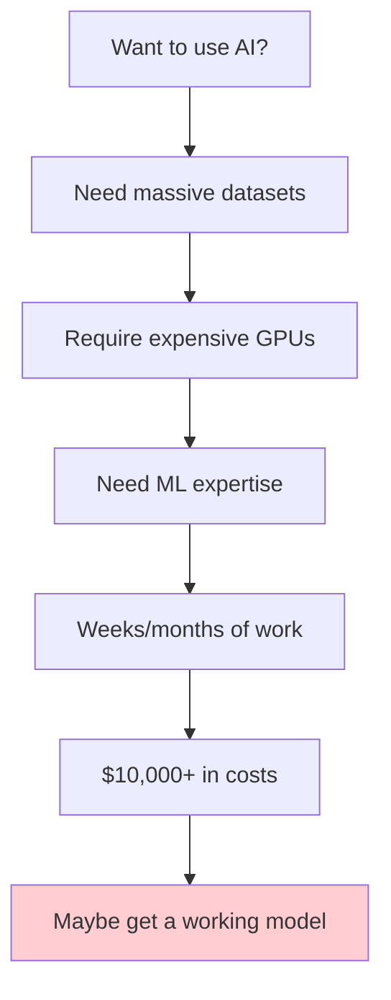

**With Hugging Face:**
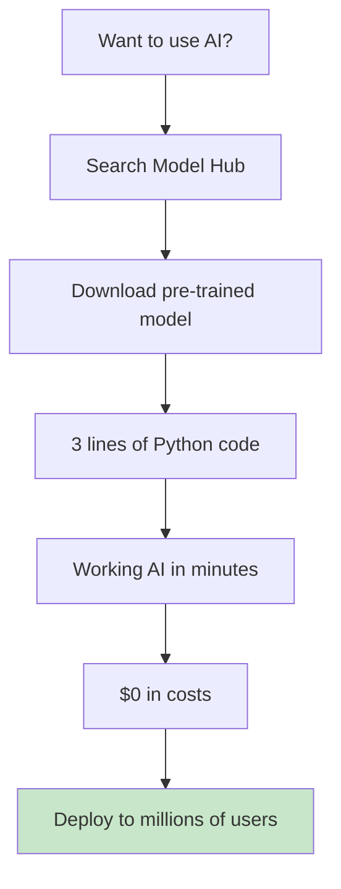

### How It Works: The Complete Flow

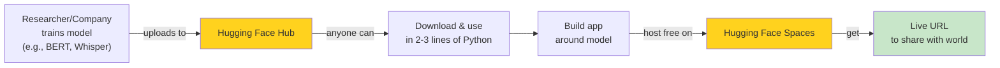

### Why This Matters for You

**Traditional AI Development:**
- Requires PhD-level expertise
- Costs $10,000-$100,000+ for training
- Takes weeks to months
- Needs specialized hardware

**With Hugging Face:**
- No PhD required
- Free to start
- Minutes to first working app
- Runs on your laptop

### Real-World Example: Customer Support Triage

**Scenario:** A 50-person customer support team needs to automatically prioritize incoming tickets.

**Traditional Approach:**
- Hire a data scientist ($120K/year)
- Collect 10,000+ labeled support tickets
- Train a custom model ($5,000 in GPU costs)
- Build and maintain infrastructure
- **Time to production:** 3-6 months
- **Total cost:** $150,000+

**Hugging Face Approach:**
- Junior developer uses pre-trained sentiment model
- Builds Gradio UI in an afternoon
- Deploys to Spaces for free
- Team starts using it immediately
- **Time to production:** 4 hours
- **Total cost:** $0

**Result:** Same functionality, 750x faster, $150,000 cheaper.

### The Hugging Face Advantage

| Aspect | Traditional ML | Hugging Face |
|--------|---------------|--------------|
| **Time to first model** | Weeks-months | Minutes |
| **Cost** | $10K-$100K+ | $0 |
| **Expertise required** | PhD/ML engineer | Basic Python |
| **Hardware** | Expensive GPUs | Laptop CPU works |
| **Maintenance** | Full-time job | Minimal |
| **Scalability** | Build yourself | Free hosting included |

---

## 5. Core AI Concepts You Need First

### Building Your AI Vocabulary

Before writing code, understand these fundamental concepts:

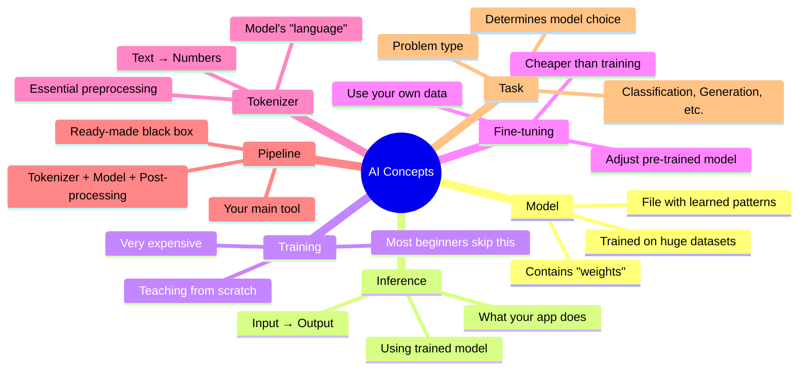

### Detailed Concept Breakdown

#### 1. Model
**Definition:** A file (or set of files) containing millions/billions of learned numeric "weights" that encode patterns from training data.

**Analogy:** Think of a model as a very sophisticated pattern-matching machine that has "learned" from examples. Like how you learned to recognize cats from seeing many cat pictures, a model learns from thousands/millions of examples.

**Example:** BERT-base has 110 million parameters (weights). GPT-3 has 175 billion parameters.

#### 2. Inference
**Definition:** The act of using a trained model to get an answer/prediction.

**Process:**
```
Input → Tokenize → Model Processing → Raw Output → Post-processing → Human-Readable Answer
```

**What you'll do 99% of the time:** Your apps will run inference, not train models.

#### 3. Training
**Definition:** Teaching a model from scratch using massive datasets.

**Reality Check:**
- Requires thousands of GPUs
- Costs $10,000-$1,000,000+
- Takes weeks to months
- **Most beginners never do this**

#### 4. Fine-tuning
**Definition:** Taking an already-trained model and adjusting it slightly with your own smaller dataset.

**When to use:**
- General model needs domain-specific knowledge
- You have 100-10,000 examples in your domain
- Want better performance than generic models

**Example:** Fine-tuning a general chatbot on your company's FAQ documents.

#### 5. Tokenizer
**Definition:** Converts text into numbers the model understands.

**Why needed:** Models can't process raw text. They need numbers.

**Example:**
```
Input: "I loved this movie!"
Tokens: ['I', 'loved', 'this', 'movie', '!']
Numbers: [101, 2293, 2023, 3185, 999, 102]
```

#### 6. Task
**Definition:** The specific problem type you're solving.

**Common Tasks:**
- `text-classification` - Categorize text
- `text-generation` - Continue/generate text
- `summarization` - Condense long text
- `question-answering` - Answer questions from context
- `image-classification` - Label images
- `automatic-speech-recognition` - Speech to text
- `text-to-image` - Generate images from text

#### 7. Pipeline
**Definition:** Hugging Face's high-level API that bundles tokenizer + model + post-processing into one function call.

**Why it's your best friend:**
```python
# Instead of 20+ lines of manual code
from transformers import pipeline
classifier = pipeline("sentiment-analysis")
result = classifier("I loved this!")
# That's it!
```

#### 8. Checkpoint
**Definition:** A specific saved snapshot of a trained model.

**Example:** `distilbert-base-uncased-finetuned-sst-2-english` is a checkpoint name.

#### 9. Weights
**Definition:** The actual learned numbers inside a model.

**What gets downloaded:** When you "download a model," you're downloading these weight files (usually 100MB-500MB).

### How a Model "Thinks" — Complete Flow

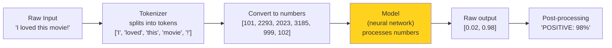

**Detailed Explanation:**

1. **Raw Input:** User provides text
2. **Tokenization:** Text split into pieces (tokens)
3. **Numerical Conversion:** Tokens converted to numbers model understands
4. **Model Processing:** Neural network applies learned patterns
5. **Raw Output:** Probabilities for each possible answer
6. **Post-processing:** Convert to human-readable format

### Concept Relationships

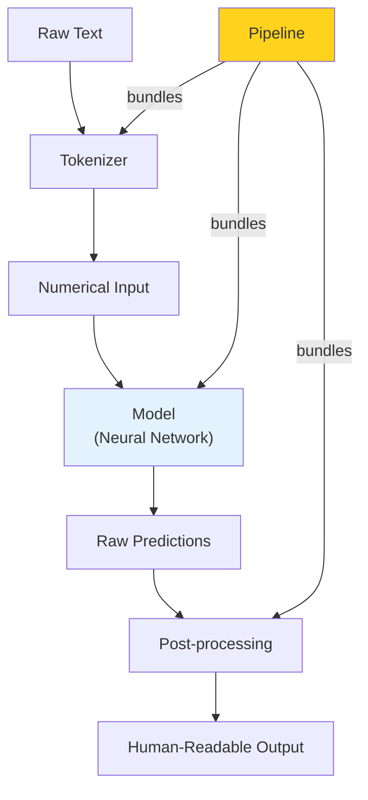

---

## 6. The Hugging Face Ecosystem Map

### Complete Ecosystem Overview

Hugging Face is not one thing — it's a collection of interconnected products and libraries.

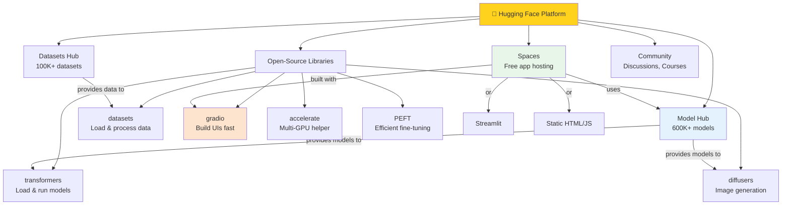

### Component Deep Dive

#### 1. Model Hub (`huggingface.co/models`)
**What it is:** A GitHub-like repository for AI models

**Key Features:**
- 600,000+ pre-trained models
- Version control for models
- Inference widgets (test models in browser)
- Community discussions
- Model cards (documentation)

**You'll use it for:** Finding and downloading models for your apps

#### 2. Datasets Hub
**What it is:** Repository of 100,000+ public datasets

**Key Features:**
- Standardized dataset format
- Streaming support for large datasets
- Pre-processed and ready to use

**You'll use it for:** Occasionally for fine-tuning or demo data

#### 3. Spaces
**What it is:** Free hosting platform for ML/AI apps

**Key Features:**
- Free CPU tier
- Paid GPU tiers available
- Automatic HTTPS
- Custom domains (paid)
- Git-based deployment

**You'll use it for:** Deploying and sharing your finished apps

#### 4. `transformers` Library
**What it is:** Python package to load and run models

**Key Features:**
- 1000+ model architectures supported
- Unified API across tasks
- Pipeline abstraction for beginners
- Manual control for advanced users

**You'll use it for:** The "engine" of your app

#### 5. `gradio` Library
**What it is:** Python package to build web UIs

**Key Features:**
- No HTML/CSS/JS required
- Automatic UI generation
- Shareable links
- Mobile-responsive

**You'll use it for:** The "face" of your app

#### 6. `diffusers` Library
**What it is:** Specialized package for image generation

**Key Features:**
- Stable Diffusion support
- Multiple generation algorithms
- Memory-efficient implementations

**You'll use it for:** Text-to-image applications

### Component Usage Matrix

| Component | Beginner Use | Intermediate Use | Advanced Use |
|-----------|-------------|------------------|--------------|
| **Model Hub** | Browse/download models | Upload fine-tuned models | Contribute model cards |
| **Spaces** | Deploy Gradio apps | Custom domains | Private spaces |
| **transformers** | Use pipelines | Manual model loading | Fine-tuning with Trainer |
| **gradio** | Simple interfaces | Custom layouts | Complex multi-page apps |
| **datasets** | Load public datasets | Custom preprocessing | Large-scale processing |
| **diffusers** | Basic image generation | Custom pipelines | Training diffusion models |

### When to Use What: Decision Tree

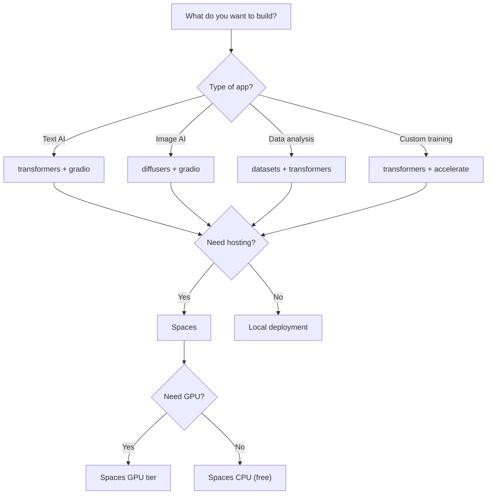

---

## 7. Getting Started: Account, Tokens & Environment

### Step 1: Create Your Hugging Face Account

**Why you need it:**
- Access gated models (like Llama 2, some Stable Diffusion versions)
- Push code to Spaces
- Save your favorite models
- Participate in community discussions

**How to create:**
1. Go to `https://huggingface.co/join`
2. Enter your email and create a password
3. Verify your email
4. Complete your profile (optional but recommended)

**Time required:** 2 minutes  
**Cost:** Free

### Step 2: Generate an Access Token

**What is a token?** A long string of characters that acts as your password for API access.

**When you need it:**
- Accessing gated models
- Pushing to Spaces
- Using the Inference API
- Uploading models/datasets

**How to generate:**

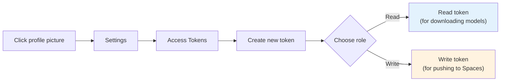

**Step-by-step:**

1. Click your profile picture (top right)
2. Select **Settings**
3. Click **Access Tokens** (left sidebar)
4. Click **Create new token**
5. **Name:** Something descriptive (e.g., "my-local-env")
6. **Role:** 
   - Choose **Read** for just downloading models
   - Choose **Write** if you'll deploy to Spaces
7. Click **Generate token**
8. **COPY THE TOKEN IMMEDIATELY** - you won't see it again!

⚠️ **Security Warning:** Treat your token like a password. Never commit it to Git or share it publicly.

### Step 3: Set Up Your Local Environment

#### Option A: Virtual Environment (Recommended)

**Why use a virtual environment?**
- Keeps dependencies isolated per project
- Avoids version conflicts
- Makes your project reproducible

**Setup commands:**

```bash
# Create project directory
mkdir hugging-face-tutorial
cd hugging-face-tutorial

# Create virtual environment
python -m venv hf-env

# Activate virtual environment
# On Windows:
hf-env\Scripts\activate

# On macOS/Linux:
source hf-env/bin/activate

# Verify activation (should show hf-env in prompt)
which python  # Should point to hf-env/bin/python
```

#### Option B: Conda Environment (Alternative)

```bash
# Create conda environment
conda create -n hf-env python=3.10

# Activate
conda activate hf-env
```

### Step 4: Install Core Libraries

```bash
# Core libraries (required for all cookbooks)
pip install transformers datasets gradio torch huggingface_hub

# For image generation (Cookbook D)
pip install diffusers accelerate

# Optional: For faster downloads
pip install huggingface_hub[cli]
```

**Installation time:** 2-5 minutes depending on internet speed  
**Disk space required:** ~3-5GB for all dependencies

**Verify installation:**
```python
python -c "import transformers; import gradio; import torch; print('✓ All libraries installed successfully')"
```

### Step 5: Log In from Terminal (Optional but Recommended)

**Method 1: CLI Login**
```bash
huggingface-cli login
# Paste your token when prompted
# Token is saved securely in ~/.cache/huggingface/token
```

**Method 2: Python Login**
```python
from huggingface_hub import login
login(token="hf_xxxxxxxxxxxxxxxxxxxx")
```

**Method 3: Environment Variable (for scripts)**
```bash
# Windows (PowerShell)
$env:HF_TOKEN = "hf_xxxxxxxxxxxxxxxxxxxx"

# macOS/Linux
export HF_TOKEN="hf_xxxxxxxxxxxxxxxxxxxx"
```

**Method 4: .env file (for projects)**
```bash
# Install python-dotenv
pip install python-dotenv

# Create .env file
echo HF_TOKEN=hf_xxxxxxxxxxxxxxxxxxxx > .env

# Use in Python
from dotenv import load_dotenv
load_dotenv()
import os
token = os.getenv("HF_TOKEN")
```

### Step 6: Verify Setup

Create a test file `test_setup.py`:

```python
from transformers import pipeline
import gradio as gr

# Test transformers
print("Testing transformers...")
classifier = pipeline("sentiment-analysis")
result = classifier("I love Hugging Face!")
print(f"✓ Transformers working: {result}")

# Test gradio
print("\nTesting gradio...")
print(f"✓ Gradio version: {gr.__version__}")

# Test PyTorch
import torch
print(f"✓ PyTorch version: {torch.__version__}")
print(f"✓ CUDA available: {torch.cuda.is_available()}")

print("\n✅ All systems ready!")
```

Run it:
```bash
python test_setup.py
```

**Expected output:**
```
Testing transformers...
✓ Transformers working: [{'label': 'POSITIVE', 'score': 0.9998}]

Testing gradio...
✓ Gradio version: 4.0.0

✓ PyTorch version: 2.0.0
✓ CUDA available: False

✅ All systems ready!
```

### Complete Setup Checklist

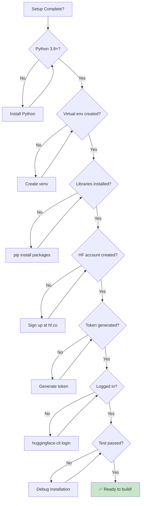

### Common Setup Issues

| Issue | Cause | Solution |
|-------|-------|----------|
| `pip not found` | Python not in PATH | Reinstall Python, check "Add to PATH" |
| `Permission denied` | System Python | Use virtual environment |
| `SSL certificate error` | Corporate firewall | Use `--trusted-host pypi.org` |
| `CUDA out of memory` | No GPU / insufficient VRAM | Use CPU or smaller model |
| `ModuleNotFoundError` | Package not installed | `pip install <package>` |

---

## 8. The `transformers` Library: Pipelines 101

### The Single Most Important Concept

The **`pipeline()`** function is your gateway to using AI models. It's a one-line abstraction that handles:
1. Downloading the model
2. Downloading the tokenizer
3. Pre-processing your input
4. Running inference
5. Post-processing the output

### Your First AI App (30 Seconds)

```python
from transformers import pipeline

# Create a pipeline for sentiment analysis
classifier = pipeline("sentiment-analysis")

# Run inference
result = classifier("I absolutely loved this product!")
print(result)
# Output: [{'label': 'POSITIVE', 'score': 0.9998}]
```

**That's it.** You just built AI-powered text analysis in 3 lines of code.

### How Pipelines Work Under the Hood

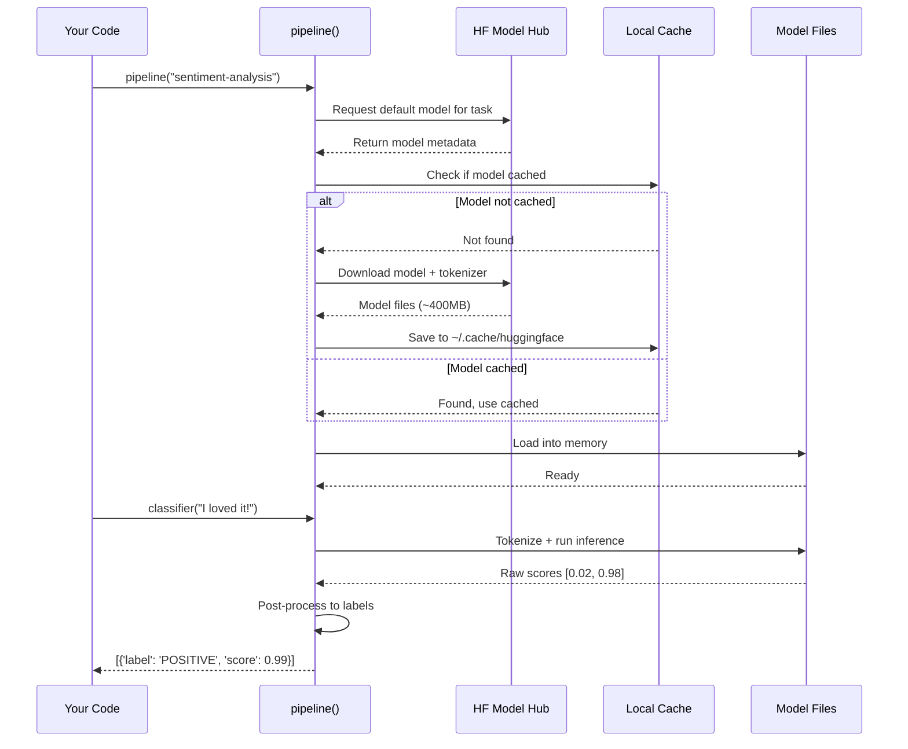

### Pipeline Architecture Deep Dive

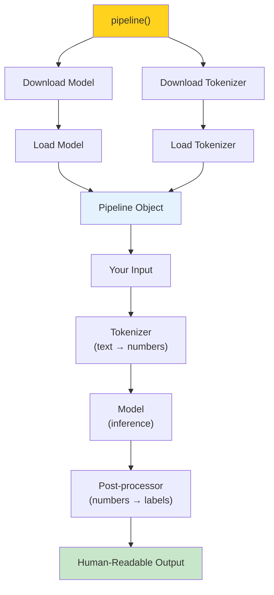

### Complete Pipeline Task Reference

| Task Name | What It Does | Use Case | Default Model | Speed |
|-----------|-------------|----------|---------------|-------|
| `sentiment-analysis` | Positive/negative classification | Review analysis | `distilbert-base-uncased-finetuned-sst-2-english` | ⚡⚡⚡ Fast |
| `text-classification` | General text categorization | Spam detection | Varies by task | ⚡⚡⚡ Fast |
| `zero-shot-classification` | Classify into custom categories | Flexible routing | `facebook/bart-large-mnli` | ⚡⚡ Medium |
| `text-generation` | Continue/generate text | Story writing | `gpt2` | ⚡⚡ Medium |
| `summarization` | Condense long text | Article summaries | `facebook/bart-large-cnn` | ⚡ Slow |
| `translation_en_to_fr` | Translate English to French | Multilingual apps | `Helsinki-NLP/opus-mt-en-fr` | ⚡⚡ Medium |
| `question-answering` | Answer questions from context | Document Q&A | `deepset/roberta-base-squad2` | ⚡⚡⚡ Fast |
| `fill-mask` | Predict masked words | Text completion | `distilbert-base-uncased` | ⚡⚡⚡ Fast |
| `image-classification` | Label images | Photo tagging | `google/vit-base-patch16-224` | ⚡⚡ Medium |
| `object-detection` | Detect and box objects | Security analysis | `facebook/detr-resnet-50` | ⚡ Slow |
| `automatic-speech-recognition` | Speech to text | Transcription | `openai/whisper-base` | ⚡ Slow |
| `text-to-speech` | Text to audio | Voice assistants | `microsoft/speecht5_tts` | ⚡⚡ Medium |
| `text-to-image` | Generate images from text | Creative tools | Not in transformers (use diffusers) | ⚡ Very Slow |
| `conversational` | Multi-turn dialogue | Chatbots | `microsoft/DialoGPT-medium` | ⚡⚡ Medium |

### Specifying Models Explicitly (Best Practice)

**Why specify a model?**
- Default models may change
- Different models have different strengths
- Ensures reproducible results
- Allows optimization for your use case

**How to specify:**

```python
# Bad: Uses default (may change)
classifier = pipeline("sentiment-analysis")

# Good: Explicit model
classifier = pipeline(
    "sentiment-analysis",
    model="distilbert-base-uncased-finetuned-sst-2-english"
)

# Better: Also specify tokenizer explicitly
from transformers import AutoTokenizer, AutoModelForSequenceClassification

model_name = "distilbert-base-uncased-finetuned-sst-2-english"
tokenizer = AutoTokenizer.from_pretrained(model_name)
model = AutoModelForSequenceClassification.from_pretrained(model_name)

classifier = pipeline(
    "sentiment-analysis",
    model=model,
    tokenizer=tokenizer
)
```

### Model Selection Criteria

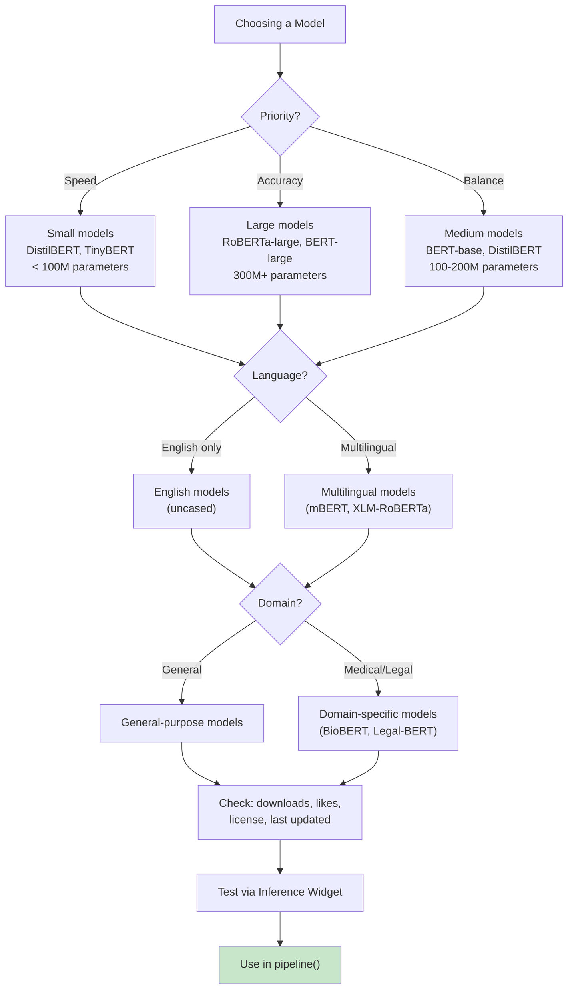

### Advanced Pipeline Options

```python
# Pipeline with custom options
classifier = pipeline(
    "sentiment-analysis",
    model="distilbert-base-uncased-finetuned-sst-2-english",
    
    # Device selection
    device=0,  # 0 = first GPU, -1 = CPU
    
    # Model options
    torch_dtype=torch.float16,  # Use half precision (faster, less memory)
    
    # Generation options (for text generation)
    max_length=512,
    truncation=True,
    padding=True,
    
    # Batch processing
    batch_size=8
)

# Use with multiple inputs
texts = [
    "I love this!",
    "This is terrible.",
    "It's okay, nothing special."
]
results = classifier(texts)  # Batch inference
```

### Performance Comparison: Pipeline vs Manual

| Aspect | Pipeline | Manual (Auto*) |
|--------|----------|----------------|
| **Lines of code** | 3-5 | 15-25 |
| **Ease of use** | ⭐⭐⭐⭐⭐ | ⭐⭐⭐ |
| **Flexibility** | ⭐⭐⭐ | ⭐⭐⭐⭐⭐ |
| **Performance** | Good | Better (optimizable) |
| **Learning curve** | Easy | Steeper |
| **Best for** | Beginners, prototyping | Production, fine-tuning |

---

## 9. Models, Tokenizers & the Model Hub

### Anatomy of a Model Hub Page

When you visit a model page (e.g., `huggingface.co/distilbert-base-uncased-finetuned-sst-2-english`), you'll see:

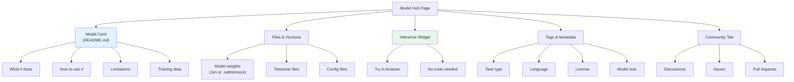

### Reading a Model Card

**Model cards contain critical information:**

```markdown
# Model Name

## Model Description
What the model does and how it was trained.

## Intended Use
What you should use it for.

## Limitations
What it can't do or where it fails.

## Training Data
What data it was trained on.

## Evaluation
How well it performs (accuracy metrics).

## Bias and Ethical Considerations
Known biases and ethical concerns.

## How to Use
Code examples for using the model.
```

**Always read the model card before using a model!**

### Using the Inference Widget

**What it is:** An interactive demo on the model page that lets you test the model in your browser.

**Why it's useful:**
- Test before downloading
- Understand expected input/output
- See example inputs
- No code required

**How to use:**
1. Go to any model page
2. Scroll to the **Inference Widget** section
3. Enter sample input
4. See results instantly
5. Try edge cases to understand limitations

### Model File Structure

When you download a model, you get:

```
model-name/
├── config.json              # Model configuration
├── pytorch_model.bin        # Model weights (400MB-1GB)
├── tokenizer.json           # Tokenizer vocabulary
├── vocab.txt                # Vocabulary file (for some models)
├── special_tokens_map.json  # Special token definitions
├── tokenizer_config.json    # Tokenizer settings
└── README.md                # Model card
```

**File sizes:**
- Small models (DistilBERT): ~250MB
- Medium models (BERT-base): ~420MB
- Large models (BERT-large): ~1.2GB
- Very large models (GPT-2): ~1.5GB

### Loading Models Manually (Beyond Pipelines)

For more control, load components separately:

```python
from transformers import AutoTokenizer, AutoModelForSequenceClassification
import torch

# Specify model
model_name = "distilbert-base-uncased-finetuned-sst-2-english"

# Load tokenizer
tokenizer = AutoTokenizer.from_pretrained(model_name)

# Load model
model = AutoModelForSequenceClassification.from_pretrained(model_name)

# Manual inference
text = "This tutorial is fantastic!"
inputs = tokenizer(text, return_tensors="pt")  # PyTorch tensors

with torch.no_grad():  # Disable gradient calculation
    outputs = model(**inputs)

# Post-process
predictions = torch.nn.functional.softmax(outputs.logits, dim=-1)
print(predictions)
```

**When to use manual loading:**
- Need fine-grained control
- Custom pre/post-processing
- Batch processing optimization
- Fine-tuning preparation

### Model Selection Decision Matrix

| Criteria | Small Model | Medium Model | Large Model |
|----------|-------------|--------------|-------------|
| **Size** | < 100M params | 100-300M params | 300M+ params |
| **Speed** | ⚡⚡⚡ Very Fast | ⚡⚡ Fast | ⚡ Slow |
| **Accuracy** | Good | Better | Best |
| **Memory** | < 500MB | 500MB-1GB | 1GB+ |
| **Use Case** | Production, mobile | General use | Research, high accuracy |
| **Examples** | DistilBERT, TinyBERT | BERT-base, RoBERTa-base | BERT-large, RoBERTa-large |

### Finding the Right Model: Complete Guide

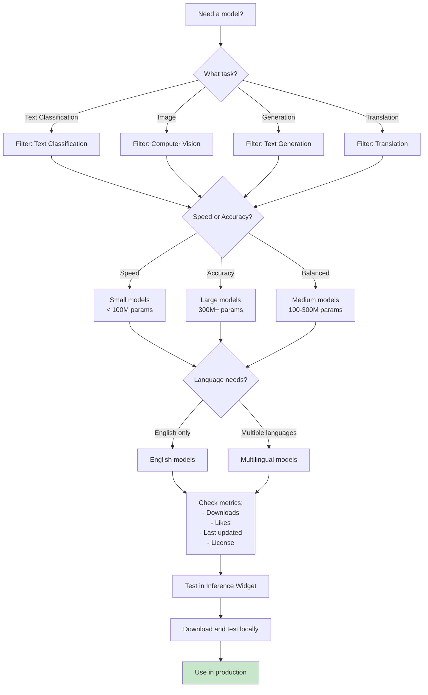

**Model evaluation criteria:**
1. **Downloads:** Popular models are usually better maintained
2. **Likes:** Community approval
3. **Last updated:** Recent updates = active maintenance
4. **License:** Ensure compatible with your use case
5. **Inference Widget:** Test before committing

### Model Formats: SafeTensors vs PyTorch

**PyTorch (legacy):**
```python
model = AutoModel.from_pretrained("model-name")
# Loads: pytorch_model.bin
```

**SafeTensors (modern, recommended):**
```python
model = AutoModel.from_pretrained("model-name")
# Loads: model.safetensors
```

**Benefits of SafeTensors:**
- Faster loading
- Safer (prevents arbitrary code execution)
- Same functionality

**Always prefer SafeTensors when available.**

---

## 10. Datasets Library Basics

### What is the Datasets Library?

A Python library for loading and processing datasets efficiently, designed to work seamlessly with Hugging Face models.

### Why It Matters

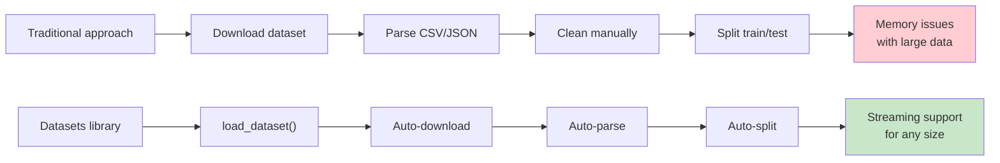

### Loading Your First Dataset

```python
from datasets import load_dataset

# Load a public dataset
dataset = load_dataset("imdb")

print(dataset)
# DatasetDict with 'train', 'test', 'unsupervised' splits

# Access specific split
train_data = dataset["train"]
print(f"Training examples: {len(train_data)}")

# View first example
print(train_data[0])
# {'text': 'This movie was...', 'label': 1}
```

### Common Datasets for Practice

| Dataset | Task | Size | Use Case |
|---------|------|------|----------|
| `imdb` | Sentiment analysis | 50K reviews | Practice classification |
| `squad` | Question answering | 100K questions | Practice QA models |
| `cnn_dailymail` | Summarization | 300K articles | Practice summarization |
| `common_voice` | Speech recognition | Multilingual | Practice transcription |
| `cifar10` | Image classification | 60K images | Practice vision models |

### Dataset Operations

```python
from datasets import load_dataset

# Load dataset
dataset = load_dataset("imdb")

# Filter examples
positive_reviews = dataset["train"].filter(lambda x: x["label"] == 1)

# Map function over dataset
def add_length(example):
    example["length"] = len(example["text"])
    return example

dataset = dataset.map(add_length)

# Shuffle
dataset = dataset.shuffle(seed=42)

# Select subset
small_dataset = dataset["train"].select(range(1000))
```

### Streaming Large Datasets

```python
# For datasets too large to fit in memory
dataset = load_dataset("common_voice", "en", streaming=True)

for example in dataset["train"]:
    print(example)
    break  # Process one at a time
```

### Use Case: Demo Data for Your UI

```python
from datasets import load_dataset

# Load sample data for examples
dataset = load_dataset("imdb", split="train[:10]")

# Extract texts for Gradio examples
examples = [[text] for text in dataset["text"]]

# Use in Gradio interface
demo = gr.Interface(
    fn=analyze_sentiment,
    inputs=gr.Textbox(lines=4, label="Your Text"),
    outputs=gr.Label(label="Sentiment"),
    examples=examples  # Pre-populated examples
)
```

---

## 11. Introduction to Gradio (Your UI Toolkit)

### What is Gradio?

Gradio is a Python library that **turns any function into a web UI** — no HTML, CSS, or JavaScript required.

### The Core Concept

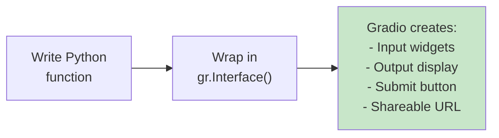

### Minimal Working Example

```python
import gradio as gr

# Your function
def greet(name):
    return f"Hello, {name}!"

# Create UI
demo = gr.Interface(
    fn=greet,              # Function to wrap
    inputs="text",         # Input widget
    outputs="text"         # Output widget
)

# Launch
demo.launch()
```

**Result:** Opens browser at `http://127.0.0.1:7860` with a working UI

### Gradio Building Blocks

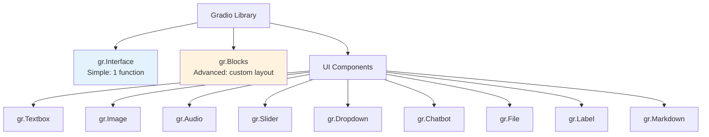

### Component Reference

| Component | Purpose | Example Use |
|-----------|---------|-------------|
| `gr.Textbox` | Text input/output | User input, results display |
| `gr.Image` | Image upload/display | Photo upload, generated images |
| `gr.Audio` | Audio upload/recording | Voice input, audio output |
| `gr.Slider` | Numeric range input | Temperature, steps, parameters |
| `gr.Dropdown` | Selection from list | Model selection, options |
| `gr.Checkbox` | Boolean input | Toggle options |
| `gr.Radio` | Single selection | Summary length, mode |
| `gr.File` | File upload | Document upload |
| `gr.Label` | Classification display | Sentiment results, predictions |
| `gr.Chatbot` | Chat interface | Multi-turn conversations |
| `gr.Markdown` | Rich text | Titles, descriptions, instructions |
| `gr.Button` | Action trigger | Submit, clear, reset |

### Interface vs Blocks: When to Use What

**Use `gr.Interface` when:**
- Simple input → output flow
- Single function
- Quick prototyping
- Standard layout is fine

**Use `gr.Blocks` when:**
- Custom layouts needed
- Multiple functions
- Complex interactions
- Tabs, rows, columns
- Advanced UI patterns

### Interface Example (Simple)

```python
import gradio as gr

def sentiment_analysis(text):
    from transformers import pipeline
    classifier = pipeline("sentiment-analysis")
    result = classifier(text)[0]
    return f"{result['label']}: {result['score']:.2%}"

demo = gr.Interface(
    fn=sentiment_analysis,
    inputs=gr.Textbox(placeholder="Enter text to analyze...", label="Text"),
    outputs=gr.Textbox(label="Sentiment"),
    title="Sentiment Analyzer",
    description="Analyze the sentiment of any text using AI",
    examples=[
        ["I love this product!"],
        ["This is terrible."],
        ["It's okay, nothing special."]
    ]
)

demo.launch()
```

### Blocks Example (Advanced)

```python
import gradio as gr

with gr.Blocks(title="Custom Layout") as demo:
    gr.Markdown("# My Custom App")
    
    with gr.Row():
        with gr.Column():
            input1 = gr.Textbox(label="Input 1")
            input2 = gr.Textbox(label="Input 2")
            btn = gr.Button("Process")
        
        with gr.Column():
            output1 = gr.Textbox(label="Output 1")
            output2 = gr.Label(label="Result")
    
    btn.click(fn=process_function, 
              inputs=[input1, input2], 
              outputs=[output1, output2])

demo.launch()
```

### Layout Components

```python
with gr.Blocks() as demo:
    # Markdown for text
    gr.Markdown("# Title")
    gr.Markdown("**Bold** and *italic* text")
    
    # Row: horizontal layout
    with gr.Row():
        input1 = gr.Textbox()
        input2 = gr.Textbox()
    
    # Column: vertical layout
    with gr.Column():
        btn1 = gr.Button("Button 1")
        btn2 = gr.Button("Button 2")
    
    # Tabs: organize content
    with gr.Tabs():
        with gr.Tab("Tab 1"):
            gr.Textbox(label="Tab 1 Content")
        with gr.Tab("Tab 2"):
            gr.Textbox(label="Tab 2 Content")
    
    # Accordion: collapsible sections
    with gr.Accordion("Advanced Options"):
        gr.Slider(0, 100, label="Parameter")
```

### Event Handling

```python
with gr.Blocks() as demo:
    input_box = gr.Textbox()
    output_box = gr.Textbox()
    btn = gr.Button("Submit")
    
    # Click event
    btn.click(
        fn=my_function,
        inputs=input_box,
        outputs=output_box
    )
    
    # Submit (Enter key)
    input_box.submit(
        fn=my_function,
        inputs=input_box,
        outputs=output_box
    )
    
    # Change event (real-time)
    input_box.change(
        fn=my_function,
        inputs=input_box,
        outputs=output_box
    )
```

### Styling and Theming

```python
demo = gr.Interface(
    fn=my_function,
    inputs=gr.Textbox(label="Input", placeholder="Enter text..."),
    outputs=gr.Textbox(label="Output"),
    title="My App",
    description="Description here",
    article="Additional information",
    theme=gr.themes.Soft(),  # Built-in themes
    css=".gradio-container { max-width: 800px; }"  # Custom CSS
)
```

### Sharing Your App

```python
demo.launch(
    share=True,  # Creates public URL
    debug=True,  # Show errors in UI
    server_name="0.0.0.0",  # Access from network
    server_port=7860  # Custom port
)
```

**Share link example:** `https://12345.gradio.live` (valid for 72 hours)

---

## 12. Introduction to Hugging Face Spaces (Free Hosting)

### What are Spaces?

Spaces is Hugging Face's free hosting platform for ML/AI applications. Deploy your Gradio app and get a public URL in minutes.

### Why Spaces is Revolutionary

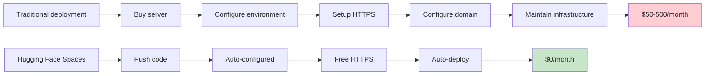

### Space Architecture

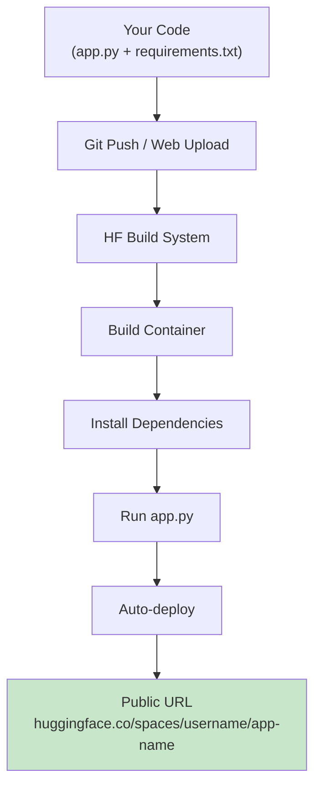

### Hardware Tiers

| Tier | CPU/RAM | GPU | Cost | Best For |
|------|---------|-----|------|----------|
| **CPU Basic** | 2 vCPU, 16GB RAM | None | Free | Text models, demos |
| **CPU Upgrade** | 8 vCPU, 32GB RAM | None | ~$0.50/hr | Faster CPU inference |
| **CPU XL** | 16 vCPU, 64GB RAM | None | ~$1.50/hr | Large CPU models |
| **GPU T4 Small** | 4 vCPU, 16GB RAM | T4 (16GB) | ~$2/hr | Image gen, medium LLMs |
| **GPU A10G Small** | 12 vCPU, 50GB RAM | A10G (24GB) | ~$4/hr | Large models, production |
| **GPU A10G Large** | 24 vCPU, 100GB RAM | A10G (24GB) | ~$8/hr | Very large models |

**Recommendation:** Start with CPU Basic (free), upgrade only when needed.

### Creating Your First Space

**Step-by-step:**

1. **Go to Spaces:**
   ```
   https://huggingface.co/spaces
   ```

2. **Click "Create new Space"**

3. **Fill in details:**
   - **Owner:** Your username
   - **Space name:** `my-first-app`
   - **Select SDK:** Gradio (or Streamlit)
   - **Select hardware:** CPU Basic (free)
   - **Visibility:** Public (or Private for paid)

4. **Click "Create Space"**

5. **You now have:**
   - A Git repository
   - A public URL: `https://huggingface.co/spaces/your-username/my-first-app`
   - A web interface to upload files

### Required Files

**`requirements.txt`:**
```
gradio==4.0.0
transformers==4.35.0
torch==2.0.0
```

**`app.py`:**
```python
import gradio as gr
from transformers import pipeline

# Your app code here
classifier = pipeline("sentiment-analysis")

def analyze(text):
    return classifier(text)[0]

demo = gr.Interface(
    fn=analyze,
    inputs=gr.Textbox(label="Text"),
    outputs=gr.Label(label="Sentiment")
)

if __name__ == "__main__":
    demo.launch()
```

### Deployment Methods

#### Method 1: Git (Recommended)

```bash
# Clone your Space repository
git clone https://huggingface.co/spaces/your-username/my-first-app
cd my-first-app

# Copy your files
cp /path/to/your/app.py .
cp /path/to/your/requirements.txt .

# Commit and push
git add .
git commit -m "Initial app"
git push
```

**Build process:**
1. Push detected
2. HF builds Docker container
3. Installs requirements.txt
4. Runs app.py
5. Deploys to URL

**Build time:** 1-3 minutes

#### Method 2: Web Upload (No Git)

1. Go to your Space page
2. Click **Files** → **Add file** → **Upload files**
3. Drag and drop `app.py` and `requirements.txt`
4. Click **Commit**
5. Wait for build (1-3 minutes)

### Space Features

**Automatic:**
- ✅ HTTPS enabled
- ✅ Custom domain support (paid)
- ✅ Auto-deploy on push
- ✅ Build logs
- ✅ Usage analytics
- ✅ Version history

**Optional:**
- 🔒 Private spaces (paid)
- 🎨 Custom branding
- 📊 Advanced analytics
- 🔌 API access
- 🔐 Authentication

### Monitoring Your Space

**Build logs:**
- View real-time build progress
- See installation logs
- Debug errors

**App logs:**
- Monitor runtime errors
- View request logs
- Check performance metrics

**Analytics:**
- Daily active users
- Request count
- Average response time

### Space Limitations

| Aspect | Free Tier | Paid Tiers |
|--------|-----------|------------|
| **CPU time** | Unlimited | Unlimited |
| **GPU time** | None | As purchased |
| **Idle timeout** | 48 hours | Configurable |
| **Build time** | Unlimited | Unlimited |
| **Storage** | 5GB | 50GB+ |
| **Bandwidth** | 100GB/month | Unlimited |

**Note:** Spaces sleep after 48 hours of inactivity. First request after sleep takes 30-60 seconds to wake up.

---

## 13. The Inference API vs Local Models

### Two Ways to Run Models

```mermaid
flowchart TD
    A["Running Models"] --> B["Local Inference"]
    A --> C["Hosted Inference API"]
    
    B --> B1["✅ Free, unlimited"]
    B --> B2["✅ Works offline"]
    B --> B3["❌ Needs disk space"]
    B --> B4["❌ Needs RAM/GPU"]
    B --> B5["❌ Slow first load"]
    
    C --> C1["✅ No local resources"]
    C --> C2["✅ Instant, no download"]
    C --> C3["❌ Rate limited"]
    C --> C4["❌ Needs internet"]
    C --> C5["❌ Costs money"]
    
    style B fill:#e3f2fd
    style C fill:#fff3e0
```

### Local Inference (What We Use in This Tutorial)

**How it works:**
```python
from transformers import pipeline

# Downloads model to your machine
classifier = pipeline("sentiment-analysis")

# Uses local model
result = classifier("I loved this!")
```

**Advantages:**
- ✅ Completely free
- ✅ Unlimited requests
- ✅ Works offline after download
- ✅ Full control over model
- ✅ No rate limits
- ✅ Privacy (data stays local)

**Disadvantages:**
- ❌ Requires disk space (100MB-5GB per model)
- ❌ Requires RAM/GPU
- ❌ Slow first load (download + load into memory)
- ❌ You manage updates

**Best for:**
- Development and testing
- Production apps on Spaces
- Privacy-sensitive applications
- High-volume usage

### Hosted Inference API

**How it works:**
```python
from huggingface_hub import InferenceClient

client = InferenceClient(token="hf_xxxxxxxxxxxx")
result = client.text_classification(
    "I loved this!",
    model="distilbert-base-uncased-finetuned-sst-2-english"
)
```

**Advantages:**
- ✅ No local resources needed
- ✅ No model download
- ✅ Instant availability
- ✅ Always up-to-date
- ✅ Great for huge models

**Disadvantages:**
- ❌ Rate limited (free tier: ~100 requests/hour)
- ❌ Requires internet
- ❌ Costs money for high usage
- ❌ Less control
- ❌ Privacy concerns (data sent to HF servers)

**Pricing:**
- Free tier: ~100 requests/hour
- Paid: ~$0.001-0.01 per request (varies by model)

**Best for:**
- Prototyping without downloads
- Huge models you can't run locally
- Low-volume applications
- Testing multiple models quickly

### Decision Matrix: Local vs Hosted

| Factor | Choose Local | Choose Hosted API |
|--------|-------------|-------------------|
| **Usage volume** | High (>1000 req/day) | Low (<100 req/day) |
| **Model size** | Small-medium (<1GB) | Large (>1GB) |
| **Hardware** | Have GPU/RAM | Limited hardware |
| **Privacy** | Data sensitive | Not sensitive |
| **Budget** | $0 | Can pay per request |
| **Offline use** | Needed | Not needed |
| **Latency** | Acceptable | Critical (need instant) |

### Hybrid Approach

```python
import os
from transformers import pipeline
from huggingface_hub import InferenceClient

# Configuration
USE_LOCAL = os.getenv("USE_LOCAL", "true").lower() == "true"
HF_TOKEN = os.getenv("HF_TOKEN")

if USE_LOCAL:
    # Use local model
    classifier = pipeline("sentiment-analysis")
    result = classifier(text)
else:
    # Use hosted API
    client = InferenceClient(token=HF_TOKEN)
    result = client.text_classification(text, model="distilbert-base-uncased-finetuned-sst-2-english")
```

**Benefits:**
- Develop locally
- Deploy with hosted API if needed
- Easy switching between modes

### Performance Comparison

| Metric | Local (CPU) | Local (GPU) | Hosted API |
|--------|-------------|-------------|------------|
| **First request** | 5-30s | 2-10s | <1s |
| **Subsequent requests** | 0.1-1s | 0.01-0.1s | 0.5-2s |
| **Throughput** | 1-10 req/s | 10-100 req/s | Limited by rate limit |
| **Cost per 1000 requests** | $0 | $0 | $1-10 |
| **Setup time** | 5-10 min | 10-15 min | 2 min |

---

## 14. 🍳 Cookbook A: Text Sentiment Analyzer UI

### Goal
Build a web app where users type text and instantly see if it's positive or negative, with confidence scores.

### Real-World Use Case
**Customer Support Triage:** A support team pastes incoming chat messages into this tool to automatically flag negative sentiment for urgent escalation.

### Architecture

```mermaid
flowchart LR
    A["User types text"] --> B["Gradio Textbox"]
    B --> C["analyze_sentiment()"]
    C --> D["HF sentiment-analysis\npipeline"]
    D --> C
    C --> E["gr.Label\n(POSITIVE/NEGATIVE\n+ confidence %)"]
    
    style D fill:#ffd21e
    style E fill:#c8e6c9
```

### Complete Code

```python
import gradio as gr
from transformers import pipeline

# ⚠️ CRITICAL: Load pipeline ONCE at module level, NOT inside function!
# This loads model once at startup, not on every button click
sentiment_pipeline = pipeline(
    "sentiment-analysis",
    model="distilbert-base-uncased-finetuned-sst-2-english"
)

def analyze_sentiment(text):
    """
    Analyze sentiment of input text.
    
    Args:
        text (str): Input text to analyze
        
    Returns:
        dict: Sentiment labels with confidence scores
    """
    # Input validation
    if not text or not text.strip():
        return {"No input provided": 1.0}
    
    try:
        # Run inference
        result = sentiment_pipeline(text)[0]
        label = result["label"]
        score = result["score"]
        
        # gr.Label expects dict of {label: confidence}
        # Return both labels with complementary scores
        return {
            label: score,
            "NEGATIVE" if label == "POSITIVE" else "POSITIVE": 1 - score
        }
    except Exception as e:
        return {"Error": 0.0, "message": str(e)}

# Create Gradio interface
demo = gr.Interface(
    fn=analyze_sentiment,
    inputs=gr.Textbox(
        lines=4,
        placeholder="Type a product review, tweet, or any text...",
        label="Your Text"
    ),
    outputs=gr.Label(label="Sentiment Result", num_top_classes=2),
    title="🎭 Sentiment Analyzer",
    description="Type any text and see whether it's Positive or Negative, powered by DistilBERT.",
    examples=[
        ["I absolutely love this product, best purchase ever!"],
        ["This was a complete waste of money and time."],
        ["The service was okay, nothing special."],
        ["Terrible experience, would not recommend to anyone."],
        ["Amazing quality and fast shipping, highly recommend!"]
    ],
    theme=gr.themes.Soft()
)

if __name__ == "__main__":
    demo.launch(share=False, debug=True)
```

### Key Implementation Details

#### 1. Model Loading (Critical!)

```python
# ❌ WRONG: Loads model on EVERY button click (slow!)
def analyze_sentiment(text):
    pipeline = pipeline("sentiment-analysis")  # Don't do this!
    return pipeline(text)

# ✅ RIGHT: Loads model ONCE at startup
sentiment_pipeline = pipeline("sentiment-analysis")  # Do this!

def analyze_sentiment(text):
    return sentiment_pipeline(text)
```

**Why this matters:**
- Wrong: 2-5 second delay on every click
- Right: 2-5 second delay once, then instant responses

#### 2. Input Validation

```python
def analyze_sentiment(text):
    # Always validate input
    if not text or not text.strip():
        return {"No input provided": 1.0}
    
    # Process valid input
    result = sentiment_pipeline(text)[0]
    return {result["label"]: result["score"]}
```

#### 3. Error Handling

```python
def analyze_sentiment(text):
    try:
        if not text or not text.strip():
            return {"No input provided": 1.0}
        
        result = sentiment_pipeline(text)[0]
        return {
            result["label"]: result["score"],
            "NEGATIVE" if result["label"] == "POSITIVE" else "POSITIVE": 1 - result["score"]
        }
    except Exception as e:
        # Log error (in production)
        print(f"Error: {e}")
        return {"Error": 0.0}
```

### Running the App

```bash
# Activate virtual environment
hf-env\Scripts\activate  # Windows
source hf-env/bin/activate  # macOS/Linux

# Run the app
python app.py
```

**Output:**
```
Running on local URL:  http://127.0.0.1:7860
Running on public URL: https://12345.gradio.live
```

**Share link valid for 72 hours**

### Testing the App

**Test cases:**
1. ✅ Positive text: "I love this!"
2. ✅ Negative text: "This is terrible."
3. ✅ Neutral text: "It's okay."
4. ✅ Empty input: ""
5. ✅ Very long text: 1000+ words
6. ✅ Special characters: "😀🎉👍"
7. ✅ Multiple languages: "Je suis heureux"

### Performance Metrics

| Metric | Value |
|--------|-------|
| **Model size** | ~250MB (DistilBERT) |
| **First load time** | 2-5 seconds |
| **Subsequent inference** | 50-200ms |
| **Memory usage** | ~500MB |
| **Max input length** | 512 tokens (~400 words) |

### Enhancements You Could Add

1. **Batch processing:** Analyze multiple texts at once
2. **History:** Save analysis history
3. **Export:** Download results as CSV
4. **Comparison:** Compare multiple models
5. **Visualization:** Charts showing sentiment over time

---

## 15. 🍳 Cookbook B: Image Classifier UI

### Goal
Users upload a photo, and the app tells them what's in it with confidence scores.

### Real-World Use Case
**E-commerce Auto-Tagging:** Sellers upload product photos, and the tool suggests category tags automatically, speeding up product listing creation.

### Architecture

```mermaid
flowchart LR
    A["User uploads image"] --> B["gr.Image component"]
    B --> C["classify_image()"]
    C --> D["HF image-classification\npipeline (ViT model)"]
    D --> C
    C --> E["gr.Label\n(top 5 predictions)"]
    
    style D fill:#ffd21e
    style E fill:#c8e6c9
```

### Complete Code

```python
import gradio as gr
from transformers import pipeline

# Load image classification pipeline
image_classifier = pipeline(
    "image-classification",
    model="google/vit-base-patch16-224"
)

def classify_image(image):
    """
    Classify an uploaded image.
    
    Args:
        image: PIL Image or numpy array
        
    Returns:
        dict: Top 5 predictions with confidence scores
    """
    # Input validation
    if image is None:
        return {}
    
    try:
        # Run inference
        predictions = image_classifier(image)
        
        # Convert to dict for gr.Label
        return {pred["label"]: pred["score"] for pred in predictions}
    except Exception as e:
        print(f"Error: {e}")
        return {"Error": 0.0}

# Create interface
demo = gr.Interface(
    fn=classify_image,
    inputs=gr.Image(
        type="pil",  # PIL Image format
        label="Upload an Image"
    ),
    outputs=gr.Label(
        num_top_classes=5,
        label="Top 5 Predictions"
    ),
    title="🖼️ Image Classifier",
    description="Upload any photo and see what the AI thinks it is (Vision Transformer model).",
    examples=[
        ["examples/dog.jpg"],  # Add sample images
        ["examples/cat.jpg"],
    ],
    theme=gr.themes.Soft()
)

if __name__ == "__main__":
    demo.launch()
```

### How Image Classification Works

```mermaid
flowchart TD
    A["Uploaded Image\n(any size)"] --> B["Resize to 224x224"]
    B --> C["Split into 196 patches\n(16x16 pixels each)"]
    C --> D["Each patch → embedding"]
    D --> E["Transformer processes\npatch relationships"]
    E --> F["Classification head\noutputs 1000 class scores"]
    F --> G["Top 5 predictions\nwith confidence"]
    
    style E fill:#ffd21e
    style G fill:#c8e6c9
```

### Vision Transformer (ViT) Explained

**Traditional CNN approach:**
- Convolutions scan image locally
- Good for spatial patterns
- Requires large datasets

**ViT approach:**
- Split image into patches
- Treat patches like tokens (like in NLP)
- Use transformer architecture
- Better with large datasets

**Why ViT is powerful:**
- Leverages transformer success from NLP
- Captures global image context
- Scales better with data

### Supported Image Formats

| Format | Extension | Notes |
|--------|-----------|-------|
| JPEG | .jpg, .jpeg | Most common, good compression |
| PNG | .png | Lossless, supports transparency |
| GIF | .gif | Animated images supported |
| BMP | .bmp | Uncompressed, large files |
| WebP | .webp | Modern format, good compression |

### Performance Metrics

| Metric | Value |
|--------|-------|
| **Model size** | ~330MB (ViT-base) |
| **Image size** | 224x224 pixels |
| **Inference time (CPU)** | 200-500ms |
| **Inference time (GPU)** | 10-50ms |
| **Memory usage** | ~700MB |
| **Classes** | 1000 ImageNet classes |

### Common Image Classification Models

| Model | Size | Accuracy | Speed | Use Case |
|-------|------|----------|-------|----------|
| `google/vit-base-patch16-224` | 330MB | 88.5% | Medium | General purpose |
| `google/vit-large-patch16-224` | 1GB | 90.5% | Slow | High accuracy |
| `microsoft/resnet-50` | 100MB | 80% | Fast | Fast inference |
| `facebook/convnext-tiny` | 120MB | 82% | Fast | Modern CNN |

### Enhancements

1. **Object detection:** Show bounding boxes
2. **Multiple images:** Batch classification
3. **Custom models:** Fine-tune on your data
4. **Similar images:** Find visually similar images
5. **Classification history:** Track uploads over time

---

## 16. 🍳 Cookbook C: AI Chatbot UI

### Goal
Build a multi-turn conversational chatbot with memory of previous messages.

### Real-World Use Case
**University FAQ Bot:** Students ask questions about admissions, courses, and campus life. The bot provides instant answers 24/7, reducing workload on human staff.

### Architecture

```mermaid
sequenceDiagram
    participant User
    participant UI as gr.Chatbot
    participant Fn as respond()
    participant Model as DialoGPT
    
    User->>UI: Types "Hello"
    UI->>Fn: (message="Hello", history=[])
    Fn->>Model: Generate reply with context
    Model-->>Fn: "Hi there! How can I help?"
    Fn-->>UI: history=[("Hello", "Hi there!...")]
    User->>UI: Types "What's the weather?"
    UI->>Fn: (message="What's weather?", history=[("Hello", "Hi...")])
    Fn->>Model: Generate with full history
    Model-->>Fn: "I don't have weather data..."
    Fn-->>UI: Updated history
```

### Complete Code

```python
import gradio as gr
from transformers import pipeline

# Load conversational model
chat_pipeline = pipeline(
    "text-generation",
    model="microsoft/DialoGPT-medium"
)

def respond(message, chat_history):
    """
    Generate bot response based on conversation history.
    
    Args:
        message (str): User's new message
        chat_history (list): List of (user_msg, bot_msg) tuples
        
    Returns:
        tuple: (cleared_input, updated_history)
    """
    # Build conversation string from history
    conversation = ""
    for user_msg, bot_msg in chat_history:
        conversation += f"User: {user_msg}\nBot: {bot_msg}\n"
    conversation += f"User: {message}\nBot:"
    
    try:
        # Generate response
        result = chat_pipeline(
            conversation,
            max_new_tokens=60,
            pad_token_id=50256,  # EOS token for DialoGPT
            do_sample=True,
            temperature=0.7,
            top_p=0.9,
            repetition_penalty=1.2
        )
        
        # Extract bot reply
        full_text = result[0]["generated_text"]
        bot_reply = full_text.split("Bot:")[-1].strip()
        bot_reply = bot_reply.split("User:")[0].strip()
        
        # Update history
        chat_history.append((message, bot_reply))
        
        # Clear input, return updated history
        return "", chat_history
    except Exception as e:
        print(f"Error: {e}")
        chat_history.append((message, "Sorry, I encountered an error."))
        return "", chat_history

# Build UI with Blocks
with gr.Blocks(title="AI Chatbot") as demo:
    gr.Markdown("# 💬 AI Chatbot")
    gr.Markdown("Have a conversation with an AI powered by DialoGPT.")
    
    chatbot = gr.Chatbot(
        height=400,
        bubble_full_width=False,
        show_copy_button=True
    )
    
    msg = gr.Textbox(
        placeholder="Type your message and press Enter...",
        label="Message",
        scale=4
    )
    
    with gr.Row():
        submit_btn = gr.Button("Send", variant="primary", scale=1)
        clear_btn = gr.Button("Clear", variant="secondary", scale=1)
    
    # Event handlers
    msg.submit(
        fn=respond,
        inputs=[msg, chatbot],
        outputs=[msg, chatbot]
    )
    
    submit_btn.click(
        fn=respond,
        inputs=[msg, chatbot],
        outputs=[msg, chatbot]
    )
    
    clear_btn.click(
        fn=lambda: None,
        inputs=None,
        outputs=chatbot,
        queue=False
    )

if __name__ == "__main__":
    demo.launch()
```

### Conversation Flow Explained

```mermaid
stateDiagram-v2
    [*] --> Empty: Start
    Empty --> HasMessages: User sends message
    HasMessages --> HasMessages: Continue conversation
    HasMessages --> Empty: Clear button
    Empty --> [*]: Close
    
    state HasMessages {
        [*] --> UserMessage: User types
        UserMessage --> BotThinking: Submit
        BotThinking --> BotResponse: Generate
        BotResponse --> UserMessage: User replies
    }
```

### Chatbot Components Explained

**gr.Chatbot:**
```python
chatbot = gr.Chatbot(
    height=400,              # Height in pixels
    bubble_full_width=False,  # Message bubbles
    show_copy_button=True,    # Copy messages
    avatar_images=(           # User/bot avatars
        ("user_avatar.png", "bot_avatar.png")
    )
)
```

**Message format:**
```python
# List of (user_message, bot_message) tuples
chat_history = [
    ("Hello!", "Hi there! How can I help?"),
    ("What's 2+2?", "2+2 equals 4."),
    ("Thanks!", "You're welcome!")
]
```

### Better Chat Models (Production)

**DialoGPT limitations:**
- Can produce inconsistent responses
- Limited context window
- Not instruction-tuned

**Better alternatives:**

```python
# Option 1: Facebook BlenderBot
chat_pipeline = pipeline(
    "conversational",
    model="facebook/blenderbot-400M-distill"
)

# Option 2: Zephyr (instruction-tuned)
chat_pipeline = pipeline(
    "text-generation",
    model="HuggingFaceH4/zephyr-7b-beta",
    torch_dtype=torch.float16,
    device_map="auto"
)

# Option 3: Llama 2 (requires access)
chat_pipeline = pipeline(
    "text-generation",
    model="meta-llama/Llama-2-7b-chat-hf",
    token="hf_xxxxxxxx"  # Required for gated models
)
```

### Chat Template for Modern Models

```python
from transformers import AutoTokenizer, AutoModelForCausalLM

# Load model and tokenizer
tokenizer = AutoTokenizer.from_pretrained("microsoft/DialoGPT-medium")
model = AutoModelForCausalLM.from_pretrained("microsoft/DialoGPT-medium")

def format_conversation(history, new_message):
    """Format conversation for model input."""
    conversation = ""
    for user_msg, bot_msg in history:
        conversation += f"<|user|> {user_msg} <|end|>\n"
        conversation += f"<|assistant|> {bot_msg} <|end|>\n"
    conversation += f"<|user|> {new_message} <|end|>\n"
    conversation += f"<|assistant|>"
    return conversation
```

### Enhancements

1. **Context window management:** Handle long conversations
2. **Personality:** Customize bot personality
3. **Knowledge base:** RAG for factual answers
4. **Multi-modal:** Accept images, files
5. **Streaming:** Show response as it generates

---

## 17. 🍳 Cookbook D: Text-to-Image Generator UI

### Goal
Users type a text prompt and get a generated image.

### Real-World Use Case
**Marketing Concept Generation:** A marketing team generates 10 visual directions for a campaign in minutes instead of commissioning stock photography for every rough idea.

### Architecture

```mermaid
flowchart LR
    A["User types prompt"] --> B["gr.Textbox"]
    B --> C["generate_image()"]
    C --> D["diffusers library\nStableDiffusionPipeline"]
    D --> C
    C --> E["gr.Image\n(generated result)"]
    
    style D fill:#ffd21e
    style E fill:#c8e6c9
```

### Installation

```bash
# Install diffusers and accelerate
pip install diffusers accelerate

# For GPU (recommended)
pip install diffusers[torch]
```

### Complete Code

```python
import gradio as gr
import torch
from diffusers import StableDiffusionPipeline
from diffusers import DPMSolverMultistepScheduler

# Check device
device = "cuda" if torch.cuda.is_available() else "cpu"
print(f"Using device: {device}")

# Load model
model_id = "runwayml/stable-diffusion-v1-5"

pipe = StableDiffusionPipeline.from_pretrained(
    model_id,
    torch_dtype=torch.float16 if device == "cuda" else torch.float32,
    safety_checker=None,  # Disable for speed (use responsibly!)
    requires_safety_checker=False
)

# Use faster scheduler
pipe.scheduler = DPMSolverMultistepScheduler.from_config(pipe.scheduler.config)

# Move to device
pipe = pipe.to(device)

# Enable memory optimization
if device == "cuda":
    pipe.enable_attention_slicing()  # Reduces memory usage

def generate_image(prompt, negative_prompt, num_steps, guidance_scale):
    """
    Generate image from text prompt.
    
    Args:
        prompt (str): Text description of desired image
        negative_prompt (str): What to avoid in image
        num_steps (int): Denoising steps (higher = better quality, slower)
        guidance_scale (float): How strictly to follow prompt
        
    Returns:
        PIL.Image: Generated image
    """
    # Input validation
    if not prompt or not prompt.strip():
        return None
    
    try:
        # Generate image
        result = pipe(
            prompt=prompt,
            negative_prompt=negative_prompt if negative_prompt else None,
            num_inference_steps=int(num_steps),
            guidance_scale=guidance_scale,
            height=512,
            width=512
        )
        
        return result.images[0]
    except Exception as e:
        print(f"Error: {e}")
        return None

# Create interface
demo = gr.Interface(
    fn=generate_image,
    inputs=[
        gr.Textbox(
            label="Prompt",
            placeholder="A cat astronaut on the moon, digital art, highly detailed",
            lines=3
        ),
        gr.Textbox(
            label="Negative Prompt",
            placeholder="blurry, low quality, distorted",
            lines=2
        ),
        gr.Slider(
            minimum=10,
            maximum=50,
            value=25,
            step=1,
            label="Inference Steps (higher = better quality, slower)"
        ),
        gr.Slider(
            minimum=1,
            maximum=20,
            value=7.5,
            step=0.5,
            label="Guidance Scale (higher = follows prompt more)"
        )
    ],
    outputs=gr.Image(label="Generated Image"),
    title="🎨 Text-to-Image Generator",
    description="Generate images from text using Stable Diffusion. Describe anything you can imagine!",
    examples=[
        ["A serene Japanese garden with cherry blossoms, digital art"],
        ["Cyberpunk city at night, neon lights, rain, highly detailed"],
        ["A cute robot learning to paint, watercolor style"]
    ],
    theme=gr.themes.Soft()
)

if __name__ == "__main__":
    demo.launch()
```

### Understanding the Parameters

```mermaid
flowchart TD
    A["Generation Parameters"] --> B["Inference Steps"]
    A --> C["Guidance Scale"]
    A --> D["Seed"]
    A --> E["Negative Prompt"]
    
    B --> B1["Low (10-15):\nFast, rough result"]
    B --> B2["Medium (20-30):\nGood balance"]
    B --> B3["High (40-50):\nSlow, refined"]
    
    C --> C1["Low (1-5):\nCreative, random"]
    C --> C2["Medium (7-10):\nBalanced"]
    C --> C3["High (12-20):\nStrict, literal"]
    
    D --> D1["Same seed:\nReproducible results"]
    D --> D2["Random seed:\nDifferent each time"]
    
    E --> E1["Remove artifacts:\nblurry, distorted"]
    E --> E2["Remove unwanted:\npeople, text"]
    E --> E3["Improve quality:\nlow quality, watermark"]
```

### Parameter Tuning Guide

| Parameter | Low Value | Medium Value | High Value | Recommendation |
|-----------|-----------|--------------|------------|----------------|
| **Inference Steps** | 10-15 | 20-30 | 40-50 | Start with 25 |
| **Guidance Scale** | 1-5 | 7-10 | 12-20 | Start with 7.5 |
| **Seed** | Random | Random | Fixed | Use -1 for random |

### Performance by Hardware

| Hardware | Steps | Time per Image | Quality |
|----------|-------|----------------|---------|
| **CPU** | 20 | 60-120s | Good |
| **CPU** | 50 | 180-300s | Excellent |
| **GPU T4** | 20 | 5-10s | Good |
| **GPU T4** | 50 | 15-25s | Excellent |
| **GPU A10G** | 20 | 2-4s | Good |
| **GPU A10G** | 50 | 5-10s | Excellent |

### Prompt Engineering Tips

**Good prompts:**
```
✅ "A serene Japanese garden with cherry blossoms, digital art, highly detailed, 4k"
✅ "Cyberpunk city at night, neon lights reflecting on wet streets, cinematic, dramatic lighting"
✅ "Cute fluffy cat wearing a space suit, on Mars, digital art, Pixar style"
```

**Bad prompts:**
```
❌ "cat" (too vague)
❌ "A beautiful image" (meaningless)
❌ "High quality, 4k, 8k, best quality, masterpiece" (overused, ignored)
```

**Prompt structure:**
```
[Subject], [Details/Attributes], [Style/Medium], [Quality modifiers]
```

### Negative Prompts

**Common negative prompts:**
```
blurry, low quality, distorted, deformed, ugly, bad anatomy,
watermark, signature, text, cropped, out of frame, duplicate,
poorly drawn, bad proportions, gross proportions, missing arms,
missing legs, extra arms, extra legs, fused fingers, too many fingers
```

### Enhancements

1. **Image-to-image:** Modify existing images
2. **Inpainting:** Edit specific parts of images
3. **ControlNet:** Precise control over composition
4. **Model switching:** Use different SD models
5. **Batch generation:** Generate multiple variations
6. **Gallery:** Save and display generations

---

## 18. 🍳 Cookbook E: Document Summarizer UI

### Goal
Users paste long text or upload a file, and get a concise AI-generated summary.

### Real-World Use Case
**Legal Document Review:** Lawyers scan lengthy contracts by running them through this summarizer to get the gist in seconds, then read the full document only for sections flagged as important.

### Architecture

```mermaid
flowchart LR
    A["User pastes text\nor uploads .txt"] --> B["gr.Textbox / gr.File"]
    B --> C["summarize()"]
    C --> D["HF summarization\npipeline (BART)"]
    D --> C
    C --> E["gr.Textbox\n(summary)"]
    
    style D fill:#ffd21e
    style E fill:#c8e6c9
```

### Complete Code

```python
import gradio as gr
from transformers import pipeline

# Load summarization pipeline
summarizer = pipeline(
    "summarization",
    model="facebook/bart-large-cnn"
)

def summarize_text(text, uploaded_file, summary_length):
    """
    Summarize text from input or file.
    
    Args:
        text (str): Pasted text
        uploaded_file (File): Uploaded .txt file
        summary_length (str): "Short", "Medium", or "Long"
        
    Returns:
        str: Summarized text
    """
    # Prefer uploaded file if provided
    if uploaded_file is not None:
        try:
            with open(uploaded_file.name, "r", encoding="utf-8") as f:
                text = f.read()
        except Exception as e:
            return f"Error reading file: {e}"
    
    # Validate input
    if not text or not text.strip():
        return "Please paste text or upload a .txt file."
    
    # Length mapping
    length_map = {
        "Short": (30, 60),
        "Medium": (60, 130),
        "Long": (130, 250)
    }
    
    min_len, max_len = length_map.get(summary_length, (60, 130))
    
    try:
        # BART has token limit (~1024 tokens), truncate defensively
        result = summarizer(
            text,
            max_length=max_len,
            min_length=min_len,
            do_sample=False,
            truncation=True
        )
        return result[0]["summary_text"]
    except Exception as e:
        return f"Error during summarization: {e}"

# Create interface
demo = gr.Interface(
    fn=summarize_text,
    inputs=[
        gr.Textbox(
            lines=10,
            label="Paste Text Here",
            placeholder="Paste a long article, document, or text to summarize..."
        ),
        gr.File(
            label="...or Upload a .txt File (optional)",
            file_types=[".txt"]
        ),
        gr.Radio(
            ["Short", "Medium", "Long"],
            value="Medium",
            label="Summary Length"
        )
    ],
    outputs=gr.Textbox(
        label="Summary",
        lines=6,
        show_copy_button=True
    ),
    title="📄 Document Summarizer",
    description="Paste long text or upload a .txt file to get a concise AI-generated summary.",
    theme=gr.themes.Soft()
)

if __name__ == "__main__":
    demo.launch()
```

### How Summarization Works

```mermaid
flowchart TD
    A["Long Document\n(1000 words)"] --> B["Tokenizer\n(1024 token limit)"]
    B --> C["Truncate if needed"]
    C --> D["BART Model\n(encoder-decoder)"]
    D --> E["Extract key information"]
    E --> F["Generate summary\n(100-200 words)"]
    F --> G["Human-readable summary"]
    
    style D fill:#ffd21e
    style G fill:#c8e6c9
```

### BART Model Explained

**Architecture:** Encoder-Decoder (like T5, but BART-specific)

**Training:**
- Pre-trained on large text corpus
- Fine-tuned on CNN/Daily Mail dataset (news articles + summaries)

**Strengths:**
- Excellent at abstractive summarization (generates new text)
- Handles long documents well
- High-quality output

**Limitations:**
- 1024 token limit (~750 words)
- Can be slow on CPU
- May hallucinate facts (always verify!)

### Summary Length Guidelines

| Length | Min Words | Max Words | Use Case |
|--------|-----------|-----------|----------|
| **Short** | 30 | 60 | Executive summaries, quick overviews |
| **Medium** | 60 | 130 | Standard summaries, article abstracts |
| **Long** | 130 | 250 | Detailed summaries, report abstracts |

### Performance Metrics

| Metric | Value |
|--------|-------|
| **Model size** | ~1.6GB (BART-large) |
| **Max input** | 1024 tokens (~750 words) |
| **Inference time (CPU)** | 3-10s |
| **Inference time (GPU)** | 0.5-2s |
| **Memory usage** | ~2GB |

### Handling Long Documents

**Problem:** BART has 1024 token limit

**Solutions:**

```python
# Option 1: Truncate (simple, loses information)
text = text[:2000]  # Roughly 1024 tokens

# Option 2: Split and summarize chunks
def summarize_long_text(text, max_chunk_size=1000):
    chunks = [text[i:i+max_chunk_size] for i in range(0, len(text), max_chunk_size)]
    summaries = [summarizer(chunk)[0]['summary_text'] for chunk in chunks]
    return " ".join(summaries)

# Option 3: Use larger model (LED)
summarizer = pipeline(
    "summarization",
    model="allenai/led-large-16384"  # 16K token limit
)
```

### Enhancements

1. **PDF support:** Extract text from PDFs
2. **Multiple formats:** DOCX, HTML
3. **Bullet points:** Format as bullets
4. **Key phrases:** Extract important terms
5. **Multi-language:** Support non-English text

---

## 19. 🍳 Cookbook F: Speech-to-Text Transcriber UI

### Goal
Users record or upload audio, and get a text transcript.

### Real-World Use Case
**Journalist Interview Transcription:** A journalist records interview audio on their phone, uploads it to this internal tool, and gets a rough transcript in minutes for light manual editing instead of full manual transcription.

### Architecture

```mermaid
flowchart LR
    A["User records/upload\naudio"] --> B["gr.Audio component"]
    B --> C["transcribe()"]
    C --> D["HF automatic-speech-recognition\npipeline (Whisper)"]
    D --> C
    C --> E["gr.Textbox\n(transcript)"]
    
    style D fill:#ffd21e
    style E fill:#c8e6c9
```

### Complete Code

```python
import gradio as gr
from transformers import pipeline

# Load Whisper model
transcriber = pipeline(
    "automatic-speech-recognition",
    model="openai/whisper-base"
)

def transcribe_audio(audio_filepath):
    """
    Transcribe audio file to text.
    
    Args:
        audio_filepath (str): Path to audio file
        
    Returns:
        str: Transcribed text
    """
    # Input validation
    if audio_filepath is None:
        return "Please record or upload audio first."
    
    try:
        # Transcribe
        result = transcriber(audio_filepath)
        return result["text"]
    except Exception as e:
        return f"Error during transcription: {e}"

# Create interface
demo = gr.Interface(
    fn=transcribe_audio,
    inputs=gr.Audio(
        sources=["microphone", "upload"],
        type="filepath",
        label="Record or Upload Audio"
    ),
    outputs=gr.Textbox(
        label="Transcript",
        lines=6,
        show_copy_button=True
    ),
    title="🎙️ Speech-to-Text Transcriber",
    description="Record your voice or upload an audio file, powered by OpenAI Whisper.",
    theme=gr.themes.Soft()
)

if __name__ == "__main__":
    demo.launch()
```

### How Whisper Works

```mermaid
flowchart TD
    A["Audio File\n(MP3, WAV, etc.)"] --> B["Load Audio\n(16kHz sampling)"]
    B --> C["Log-Mel Spectrogram\n(audio → visual)"]
    C --> D["Encoder\n(process spectrogram)"]
    D --> E["Decoder\n(generate text)"]
    E --> F["Transcription"]
    
    style D fill:#ffd21e
    style E fill:#e3f2fd
    style F fill:#c8e6c9
```

### Whisper Model Sizes

| Model | Parameters | Speed | Accuracy | VRAM |
|-------|-----------|-------|----------|------|
| `whisper-tiny` | 39M | ⚡⚡⚡ | Good | ~1GB |
| `whisper-base` | 74M | ⚡⚡⚡ | Better | ~1GB |
| `whisper-small` | 244M | ⚡⚡ | Great | ~2GB |
| `whisper-medium` | 769M | ⚡ | Excellent | ~5GB |
| `whisper-large` | 1550M | 🐢 | Best | ~10GB |

**Recommendation:** Start with `whisper-base`, upgrade to `whisper-medium` for production.

### Supported Audio Formats

| Format | Extension | Notes |
|--------|-----------|-------|
| MP3 | .mp3 | Compressed, widely supported |
| WAV | .wav | Uncompressed, large files |
| FLAC | .flac | Lossless compression |
| M4A | .m4a | Apple format |
| OGG | .ogg | Open format |
| WebM | .webm | Web format |

**Sample rate:** Whisper expects 16kHz audio (auto-resampled if needed)

### Performance Metrics

| Metric | Value |
|--------|-------|
| **Model size** | ~150MB (Whisper-base) |
| **Audio length** | No hard limit (memory dependent) |
| **Inference time (CPU)** | 0.5-2x audio duration |
| **Inference time (GPU)** | 0.1-0.5x audio duration |
| **Memory usage** | ~1GB |
| **Languages** | 99+ languages |

### Enhancements

1. **Timestamps:** Word-level timestamps
2. **Speaker diarization:** Identify different speakers
3. **Translation:** Transcribe and translate
4. **Real-time:** Live transcription
5. **Batch processing:** Multiple files

---

## 20. 🍳 Cookbook G: Multi-Tab "AI Toolbox" App

### Goal
Combine multiple AI tools into ONE app with tabs.

### Real-World Use Case
**Internal AI Portal:** A company builds one URL with multiple AI tools (sentiment, classification, summarization) for different departments (marketing, support, ops) to use without installing anything.

### Architecture

```mermaid
graph TD
    A["gr.Blocks App"] --> B["gr.Tabs"]
    B --> C["Tab: Sentiment"]
    B --> D["Tab: Image Classifier"]
    B --> E["Tab: Summarizer"]
    
    C --> C1["sentiment pipeline"]
    D --> D1["image pipeline"]
    E --> E1["summarization pipeline"]
    
    style A fill:#ffd21e
```

### Complete Code

```python
import gradio as gr
from transformers import pipeline

# ⚠️ Load all pipelines ONCE at startup
print("Loading models... (this may take a minute)")

sentiment_pipeline = pipeline(
    "sentiment-analysis",
    model="distilbert-base-uncased-finetuned-sst-2-english"
)

image_pipeline = pipeline(
    "image-classification",
    model="google/vit-base-patch16-224"
)

summarizer_pipeline = pipeline(
    "summarization",
    model="facebook/bart-large-cnn"
)

print("✅ All models loaded!")

# Tab 1: Sentiment Analysis
def analyze_sentiment(text):
    if not text or not text.strip():
        return {}
    try:
        result = sentiment_pipeline(text)[0]
        return {
            result["label"]: result["score"],
            "NEGATIVE" if result["label"] == "POSITIVE" else "POSITIVE": 1 - result["score"]
        }
    except Exception as e:
        return {"Error": 0.0}

# Tab 2: Image Classification
def classify_image(image):
    if image is None:
        return {}
    try:
        predictions = image_pipeline(image)
        return {pred["label"]: pred["score"] for pred in predictions}
    except Exception as e:
        return {"Error": 0.0}

# Tab 3: Summarization
def summarize_text(text):
    if not text or not text.strip():
        return "Please enter some text."
    try:
        result = summarizer_pipeline(
            text,
            max_length=130,
            min_length=30,
            truncation=True
        )
        return result[0]["summary_text"]
    except Exception as e:
        return f"Error: {e}"

# Build multi-tab UI
with gr.Blocks(title="AI Toolbox") as demo:
    gr.Markdown("# 🧰 AI Toolbox")
    gr.Markdown("A suite of Hugging Face-powered tools in one app.")
    
    with gr.Tabs():
        # Tab 1: Sentiment Analysis
        with gr.Tab("😊 Sentiment Analysis"):
            gr.Markdown("Analyze the sentiment of any text.")
            with gr.Row():
                with gr.Column():
                    text_input = gr.Textbox(
                        label="Enter text",
                        lines=3,
                        placeholder="Type or paste text here..."
                    )
                    sentiment_btn = gr.Button("Analyze Sentiment", variant="primary")
                
                with gr.Column():
                    sentiment_output = gr.Label(
                        label="Sentiment Result",
                        num_top_classes=2
                    )
            
            sentiment_btn.click(
                fn=analyze_sentiment,
                inputs=text_input,
                outputs=sentiment_output
            )
        
        # Tab 2: Image Classifier
        with gr.Tab("🖼️ Image Classifier"):
            gr.Markdown("Upload an image to see what the AI thinks it is.")
            with gr.Row():
                with gr.Column():
                    image_input = gr.Image(
                        type="pil",
                        label="Upload Image"
                    )
                    image_btn = gr.Button("Classify Image", variant="primary")
                
                with gr.Column():
                    image_output = gr.Label(
                        label="Top 5 Predictions",
                        num_top_classes=5
                    )
            
            image_btn.click(
                fn=classify_image,
                inputs=image_input,
                outputs=image_output
            )
        
        # Tab 3: Summarizer
        with gr.Tab("📄 Summarizer"):
            gr.Markdown("Paste long text to get a concise summary.")
            with gr.Row():
                with gr.Column():
                    summary_input = gr.Textbox(
                        label="Paste long text",
                        lines=8,
                        placeholder="Paste article, document, or long text here..."
                    )
                    summary_btn = gr.Button("Summarize", variant="primary")
                
                with gr.Column():
                    summary_output = gr.Textbox(
                        label="Summary",
                        lines=6,
                        show_copy_button=True
                    )
            
            summary_btn.click(
                fn=summarize_text,
                inputs=summary_input,
                outputs=summary_output
            )

if __name__ == "__main__":
    demo.launch()
```

### Key Features

**Multi-tab organization:**
- Each tool in its own tab
- Clean separation of concerns
- Easy to add more tabs

**Shared model loading:**
- All models loaded once at startup
- Efficient memory usage
- Fast response times

**Consistent UI:**
- Same theme across all tabs
- Uniform button styles
- Professional appearance

### Adding More Tabs

```python
# Add a new tab
with gr.Tab("🔊 Speech to Text"):
    gr.Markdown("Transcribe audio to text.")
    
    audio_input = gr.Audio(
        sources=["microphone", "upload"],
        type="filepath",
        label="Record or Upload"
    )
    audio_output = gr.Textbox(label="Transcript")
    audio_btn = gr.Button("Transcribe")
    
    audio_btn.click(
        fn=transcribe_audio,
        inputs=audio_input,
        outputs=audio_output
    )
```

### Performance Considerations

**Memory usage:**
- Sentiment model: ~500MB
- Image model: ~700MB
- Summarization model: ~2GB
- **Total:** ~3.2GB RAM

**Optimization:**
```python
# Load models only when tab is first accessed (lazy loading)
loaded_models = {}

def get_sentiment_model():
    if "sentiment" not in loaded_models:
        loaded_models["sentiment"] = pipeline("sentiment-analysis")
    return loaded_models["sentiment"]
```

---

## 21. Deploying Your App to Hugging Face Spaces

### Complete Deployment Guide

### Prerequisites
- Hugging Face account (free)
- Git installed
- App code ready (app.py + requirements.txt)

### Step-by-Step Deployment

#### Step 1: Create Space

```mermaid
flowchart TD
    A["Go to hf.co/spaces"] --> B["Click 'Create new Space'"]
    B --> C["Fill in details:\n- Owner\n- Space name\n- SDK: Gradio\n- Hardware: CPU Basic"]
    C --> D["Click 'Create Space'"]
    D --> E["Space created!\nURL: hf.co/spaces/username/app-name"]
    
    style E fill:#c8e6c9
```

#### Step 2: Prepare Your Files

**requirements.txt:**
```
gradio==4.0.0
transformers==4.35.0
torch==2.0.0
# Add any other dependencies
```

**app.py:**
```python
import gradio as gr
from transformers import pipeline

# Your app code (from any cookbook)

if __name__ == "__main__":
    demo.launch()
```

**Important:** Always include `if __name__ == "__main__":` guard!

#### Step 3: Deploy via Git

```bash
# Clone Space repository
git clone https://huggingface.co/spaces/your-username/your-space-name
cd your-space-name

# Copy your files
cp /path/to/app.py .
cp /path/to/requirements.txt .

# Add files
git add .
git commit -m "Initial app deployment"
git push
```

**What happens next:**
1. Push detected by HF
2. Build starts automatically
3. Dependencies installed
4. App launched
5. Live at your Space URL

**Build time:** 1-3 minutes

#### Step 4: Deploy via Web UI

1. Go to your Space page
2. Click **Files** → **Add file** → **Upload files**
3. Drag and drop `app.py` and `requirements.txt`
4. Click **Commit**
5. Wait for build

### Deployment Checklist

```mermaid
checklist
    [ ] Hugging Face account created
    [ ] Space created with Gradio SDK
    [ ] app.py ready with launch() call
    [ ] requirements.txt includes all dependencies
    [ ] Models specified explicitly (not defaults)
    [ ] Error handling in functions
    [ ] Tested locally first
    [ ] Git configured with credentials
```

### Post-Deployment

**Verify deployment:**
1. Visit your Space URL
2. Test all functionality
3. Check build logs for errors
4. Monitor performance

**Update deployment:**
```bash
# Make changes to app.py
git add .
git commit -m "Update: added new feature"
git push
```

**Automatic redeployment** happens on every push.

### Custom Domain (Paid Feature)

```python
# In Space settings
# Custom domain: myapp.com
# Automatic HTTPS
# CNAME record setup
```

### Monitoring

**Build logs:**
- View in Space → Files & versions → Build logs
- Shows installation and startup
- Debug errors here

**App logs:**
- Real-time logs in Space → Settings
- Monitor errors and performance

**Analytics:**
- Daily active users
- Request count
- Average response time

---

## 22. Best Practices

### Code Quality

#### 1. Load Models Once

```python
# ✅ GOOD
model = pipeline("sentiment-analysis")

def predict(text):
    return model(text)

# ❌ BAD
def predict(text):
    model = pipeline("sentiment-analysis")  # Loads every time!
    return model(text)
```

#### 2. Use Explicit Model Names

```python
# ✅ GOOD
pipeline("sentiment-analysis", model="distilbert-base-uncased-finetuned-sst-2-english")

# ❌ BAD
pipeline("sentiment-analysis")  # Uses default, may change
```

#### 3. Add Input Validation

```python
def predict(text):
    if not text or not text.strip():
        return {"Error": "Please provide input"}
    # Process valid input
```

#### 4. Handle Errors Gracefully

```python
def predict(text):
    try:
        return model(text)
    except Exception as e:
        return {"Error": str(e)}
```

### Performance

#### 5. Use Appropriate Model Sizes

```python
# For production: Use distilled models
model="distilbert-base-uncased"  # 40% smaller, 60% faster

# For highest accuracy: Use full models
model="bert-base-uncased"  # Full size
```

#### 6. Enable Caching

```python
# Models are cached automatically in ~/.cache/huggingface
# First run: Downloads model
# Subsequent runs: Uses cache
```

#### 7. Optimize for Hardware

```python
# GPU
pipe = pipeline(..., device=0)

# CPU with optimizations
pipe = pipeline(..., device=-1)
```

### User Experience

#### 8. Add Examples

```python
demo = gr.Interface(
    fn=predict,
    inputs=gr.Textbox(),
    outputs=gr.Label(),
    examples=[
        ["Example input 1"],
        ["Example input 2"]
    ]
)
```

#### 9. Provide Clear Instructions

```python
demo = gr.Interface(
    fn=predict,
    inputs=gr.Textbox(placeholder="Enter text here..."),
    title="Clear Title",
    description="Clear description of what this does"
)
```

#### 10. Use Appropriate Themes

```python
demo = gr.Interface(
    # ... your config
    theme=gr.themes.Soft()  # Professional appearance
)
```

### Security

#### 11. Never Expose Tokens

```python
# ❌ NEVER DO THIS
api_key = "hf_xxxxxxxxxxxx"  # In code

# ✅ DO THIS
import os
api_key = os.getenv("HF_TOKEN")
```

#### 12. Validate All Inputs

```python
def predict(text):
    # Validate length
    if len(text) > 10000:
        return {"Error": "Text too long"}
    
    # Validate content
    if not isinstance(text, str):
        return {"Error": "Invalid input type"}
```

### Deployment

#### 13. Pin Versions

```txt
# requirements.txt
gradio==4.0.0
transformers==4.35.0
torch==2.0.0
```

#### 14. Test Locally First

```bash
# Always test before deploying
python app.py
# Verify everything works
# Then deploy
```

#### 15. Monitor After Deployment

- Check build logs
- Monitor error rates
- Track performance metrics
- Update dependencies regularly

---

## 23. Anti-Patterns to Avoid

### Anti-Pattern 1: Loading Models Inside Functions

```python
# ❌ WRONG
def predict(text):
    model = pipeline("sentiment-analysis")  # Loads every time!
    return model(text)

# ✅ RIGHT
model = pipeline("sentiment-analysis")  # Load once

def predict(text):
    return model(text)
```

**Why it's bad:** 5-10 second delay on every request

### Anti-Pattern 2: Not Handling Errors

```python
# ❌ WRONG
def predict(text):
    return model(text)[0]  # Crashes if model fails

# ✅ RIGHT
def predict(text):
    try:
        return model(text)[0]
    except Exception as e:
        return {"Error": str(e)}
```

**Why it's bad:** App crashes, poor user experience

### Anti-Pattern 3: Using Default Models

```python
# ❌ WRONG
pipeline("sentiment-analysis")  # Default may change

# ✅ RIGHT
pipeline("sentiment-analysis", model="distilbert-base-uncased-finetuned-sst-2-english")
```

**Why it's bad:** Unpredictable behavior, version drift

### Anti-Pattern 4: Ignoring Input Validation

```python
# ❌ WRONG
def predict(text):
    return model(text)  # Crashes on None, empty, etc.

# ✅ RIGHT
def predict(text):
    if not text or not text.strip():
        return {"Error": "Please provide input"}
    return model(text)
```

**Why it's bad:** Crashes, security vulnerabilities

### Anti-Pattern 5: Not Truncating Long Inputs

```python
# ❌ WRONG
def predict(text):
    return model(text)  # Fails on long text

# ✅ RIGHT
def predict(text):
    return model(text, truncation=True)
```

**Why it's bad:** Crashes on long inputs

### Anti-Pattern 6: Blocking Operations in UI

```python
# ❌ WRONG
def predict(text):
    import time
    time.sleep(10)  # Blocks UI
    return model(text)

# ✅ RIGHT
def predict(text):
    return model(text)  # Non-blocking
```

**Why it's bad:** UI freezes, poor UX

### Anti-Pattern 7: Hardcoding Configuration

```python
# ❌ WRONG
API_KEY = "hf_xxxxxxxxxxxx"
MODEL_PATH = "/home/user/models/model.bin"

# ✅ RIGHT
API_KEY = os.getenv("HF_TOKEN")
MODEL_PATH = os.getenv("MODEL_PATH", "default-model")
```

**Why it's bad:** Not portable, security risk

### Anti-Pattern 8: Not Pinning Dependencies

```txt
# ❌ WRONG
gradio
transformers
torch

# ✅ RIGHT
gradio==4.0.0
transformers==4.35.0
torch==2.0.0
```

**Why it's bad:** Breaking changes, non-reproducible builds

### Anti-Pattern 9: Ignoring Model Limitations

```python
# ❌ WRONG
# Using BART for 10,000 word documents (has 1024 token limit)

# ✅ RIGHT
# Use LED model for long documents
# Or split text into chunks
```

**Why it's bad:** Crashes, poor results

### Anti-Pattern 10: Deploying Without Testing

```bash
# ❌ WRONG
git push  # Deploy without testing

# ✅ RIGHT
python app.py  # Test locally
git add .
git commit -m "Tested and working"
git push
```

**Why it's bad:** Broken deployments, wasted time

---

## 24. Performance Considerations

### Model Selection for Performance

| Model | Size | Speed (CPU) | Speed (GPU) | Accuracy | Use Case |
|-------|------|-------------|-------------|----------|----------|
| DistilBERT | 250MB | ⚡⚡⚡ | ⚡⚡⚡⚡ | Good | Production |
| BERT-base | 420MB | ⚡⚡ | ⚡⚡⚡ | Better | General |
| BERT-large | 1.2GB | ⚡ | ⚡⚡ | Best | High accuracy |

### Optimization Techniques

#### 1. Use Half Precision (FP16)

```python
# On GPU
pipe = pipeline(
    "sentiment-analysis",
    model="model-name",
    torch_dtype=torch.float16  # 2x faster, half memory
)
```

**Benefits:**
- 2x faster inference
- 50% less memory
- Minimal accuracy loss

#### 2. Enable Attention Slicing

```python
pipe.enable_attention_slicing()  # Reduces memory for large models
```

**Benefits:**
- 30-50% less memory
- Slightly slower
- Enables larger models

#### 3. Batch Processing

```python
# Process multiple inputs at once
texts = ["text1", "text2", "text3", ...]
results = pipe(texts, batch_size=8)  # Process 8 at a time
```

**Benefits:**
- 2-5x faster for multiple inputs
- Better GPU utilization

#### 4. Model Quantization

```python
from transformers import AutoModelForSequenceClassification
import torch

model = AutoModelForSequenceClassification.from_pretrained(
    "model-name",
    torch_dtype=torch.float16
)
model = model.quantize()  # 4x smaller, slightly slower
```

**Benefits:**
- 4x smaller model
- Can run on CPU efficiently
- Minimal accuracy loss

### Performance Benchmarks

| Task | Model | CPU Time | GPU Time | Memory |
|------|-------|----------|----------|--------|
| Sentiment | DistilBERT | 50ms | 5ms | 500MB |
| Classification | BERT-base | 100ms | 10ms | 800MB |
| Summarization | BART | 5s | 1s | 2GB |
| Image | ViT | 300ms | 20ms | 700MB |
| Generation | GPT-2 | 200ms | 20ms | 1GB |

### Caching Strategies

```python
from functools import lru_cache

@lru_cache(maxsize=128)
def predict_cached(text):
    return model(text)
```

**Benefits:**
- Instant responses for repeated inputs
- Reduced compute

### Profiling

```python
import time

def predict(text):
    start = time.time()
    result = model(text)
    elapsed = time.time() - start
    print(f"Inference time: {elapsed:.2f}s")
    return result
```

---

## 25. Security Considerations

### Token Security

#### 1. Never Commit Tokens

```python
# ❌ NEVER
token = "hf_xxxxxxxxxxxx"

# ✅ ALWAYS
import os
token = os.getenv("HF_TOKEN")
```

**Use .gitignore:**
```
.env
*.token
secrets/
```

#### 2. Use Environment Variables

```bash
# .env file (add to .gitignore!)
HF_TOKEN=hf_xxxxxxxxxxxx
```

```python
# Load in Python
from dotenv import load_dotenv
load_dotenv()
token = os.getenv("HF_TOKEN")
```

#### 3. Rotate Tokens Regularly

- Generate new token every 90 days
- Revoke old tokens
- Use different tokens for dev/prod

### Input Validation

```python
def predict(text):
    # Length check
    if len(text) > 10000:
        return {"Error": "Input too long"}
    
    # Type check
    if not isinstance(text, str):
        return {"Error": "Invalid input type"}
    
    # Content check
    if contains_malicious_content(text):
        return {"Error": "Invalid content"}
    
    return model(text)
```

### Rate Limiting

```python
from functools import wraps
import time

def rate_limit(max_requests=10, window=60):
    def decorator(func):
        requests = []
        
        @wraps(func)
        def wrapper(*args, **kwargs):
            now = time.time()
            requests[:] = [req for req in requests if now - req < window]
            
            if len(requests) >= max_requests:
                return {"Error": "Rate limit exceeded"}
            
            requests.append(now)
            return func(*args, **kwargs)
        return wrapper
    return decorator

@rate_limit(max_requests=10, window=60)
def predict(text):
    return model(text)
```

### Content Filtering

```python
# Use safety checkers
from transformers import pipeline

pipe = pipeline(
    "text-generation",
    model="model-name",
    safety_checker=True  # Enable content filtering
)
```

### Data Privacy

**Considerations:**
- Don't log sensitive user data
- Encrypt data in transit (HTTPS)
- Don't store user inputs longer than needed
- Inform users about data usage

### Model Security

```python
# Verify model checksums
from huggingface_hub import hf_hub_download

# Download with verification
model_path = hf_hub_download(
    repo_id="model-name",
    filename="pytorch_model.bin",
    force_download=False,
    verify_checksums=True
)
```

---

## 26. Troubleshooting & Common Issues

### Issue 1: Model Download Failures

**Symptom:**
```
OSError: Can't load model
```

**Causes & Solutions:**

| Cause | Solution |
|-------|----------|
| Typo in model name | Double-check on huggingface.co |
| No internet | Check connection |
| Insufficient disk space | Free up space |
| Model requires auth | Run `huggingface-cli login` |
| Corporate firewall | Use `--trusted-host` or VPN |

### Issue 2: Out of Memory (OOM)

**Symptom:**
```
RuntimeError: CUDA out of memory
```

**Solutions:**

```python
# 1. Use smaller model
model="distilbert-base-uncased"  # Instead of bert-large

# 2. Use CPU
pipe = pipeline(..., device=-1)

# 3. Enable attention slicing
pipe.enable_attention_slicing()

# 4. Use FP16
pipe = pipeline(..., torch_dtype=torch.float16)

# 5. Reduce batch size
results = pipe(texts, batch_size=1)
```

### Issue 3: Slow First Request

**Symptom:** First request takes 30+ seconds

**Cause:** Model downloading and loading

**Solutions:**
- Normal behavior, subsequent requests are fast
- Show loading message to user
- Pre-load model at startup
- Use smaller model

### Issue 4: Gradio Space Shows Blank Page

**Symptom:** Space builds but shows blank/white page

**Solutions:**

| Check | Fix |
|-------|-----|
| SDK selected? | Must be "Gradio" not "Streamlit" |
| `demo.launch()` present? | Add `if __name__ == "__main__": demo.launch()` |
| Port conflict? | Use `demo.launch(server_port=7860)` |
| Dependencies missing? | Check requirements.txt |

### Issue 5: ModuleNotFoundError on Spaces

**Symptom:**
```
ModuleNotFoundError: No module named 'transformers'
```

**Solution:** Add to requirements.txt
```txt
transformers
torch
gradio
```

### Issue 6: Slow Responses

**Symptom:** App responds slowly even after caching

**Solutions:**

| Cause | Solution |
|-------|----------|
| Large model | Use smaller/distilled model |
| CPU only | Upgrade to GPU tier |
| No optimization | Enable FP16, attention slicing |
| Network latency | Deploy closer to users |

### Issue 7: Tokenizer Errors

**Symptom:**
```
Tokenizer not found
```

**Solution:**
```python
# Explicitly load tokenizer
from transformers import AutoTokenizer

tokenizer = AutoTokenizer.from_pretrained("model-name")
```

### Issue 8: Version Conflicts

**Symptom:**
```
ImportError: cannot import name
```

**Solution:** Pin versions
```txt
transformers==4.35.0
torch==2.0.0
gradio==4.0.0
```

### Debugging Checklist

```mermaid
checklist
    [ ] Test locally first
    [ ] Check build logs on Spaces
    [ ] Verify requirements.txt
    [ ] Check model name spelling
    [ ] Verify token authentication
    [ ] Test with simple input
    [ ] Check disk space
    [ ] Monitor memory usage
    [ ] Review error messages
    [ ] Check HF status page
```

---

## 27. Practice Exercises

### Exercise 1: Enhanced Sentiment Analyzer with History

**Difficulty:** Beginner  
**Time:** 30 minutes

**Objective:** Build a sentiment analyzer that saves analysis history.

**Requirements:**
1. Analyze sentiment of input text
2. Save last 10 analyses in a list
3. Display history below the main output
4. Allow clearing history
5. Show timestamp for each analysis

**Starter Code:**
```python
import gradio as gr
from transformers import pipeline
from datetime import datetime

sentiment_pipeline = pipeline("sentiment-analysis")

# Global history (in production, use database)
analysis_history = []

def analyze_with_history(text):
    # TODO: Implement
    # 1. Analyze sentiment
    # 2. Add to history with timestamp
    # 3. Keep only last 10
    # 4. Return result and formatted history
    pass

demo = gr.Interface(
    fn=analyze_with_history,
    inputs=gr.Textbox(label="Text"),
    outputs=[
        gr.Label(label="Current Analysis"),
        gr.Dataframe(label="History", headers=["Time", "Text", "Sentiment", "Score"])
    ]
)

if __name__ == "__main__":
    demo.launch()
```

**Solution:**
```python
import gradio as gr
from transformers import pipeline
from datetime import datetime

sentiment_pipeline = pipeline("sentiment-analysis")

# Global history
analysis_history = []

def analyze_with_history(text):
    if not text or not text.strip():
        return {"No input": 1.0}, []
    
    # Analyze
    result = sentiment_pipeline(text)[0]
    label = result["label"]
    score = result["score"]
    
    # Add to history
    timestamp = datetime.now().strftime("%H:%M:%S")
    analysis_history.append({
        "Time": timestamp,
        "Text": text[:50] + "..." if len(text) > 50 else text,
        "Sentiment": label,
        "Score": f"{score:.2%}"
    })
    
    # Keep only last 10
    if len(analysis_history) > 10:
        analysis_history.pop(0)
    
    # Prepare outputs
    sentiment_result = {
        label: score,
        "NEGATIVE" if label == "POSITIVE" else "POSITIVE": 1 - score
    }
    
    # Convert history to dataframe format
    history_df = [[h["Time"], h["Text"], h["Sentiment"], h["Score"]] 
                  for h in analysis_history]
    
    return sentiment_result, history_df

demo = gr.Interface(
    fn=analyze_with_history,
    inputs=gr.Textbox(label="Text", lines=3),
    outputs=[
        gr.Label(label="Current Analysis"),
        gr.Dataframe(
            label="History (Last 10)",
            headers=["Time", "Text", "Sentiment", "Score"]
        )
    ],
    title="Sentiment Analyzer with History"
)

if __name__ == "__main__":
    demo.launch()
```

**Key Concepts Learned:**
- State management in Gradio
- Working with timestamps
- List manipulation
- Dataframe output

---

### Exercise 2: Multi-Model Comparison Tool

**Difficulty:** Intermediate  
**Time:** 45 minutes

**Objective:** Build a tool that compares predictions from 3 different sentiment models.

**Requirements:**
1. Load 3 different sentiment models
2. Run all 3 on the same input
3. Display results side-by-side
4. Show confidence scores
5. Highlight agreement/disagreement

**Starter Code:**
```python
import gradio as gr
from transformers import pipeline

# TODO: Load 3 different models
model1 = None  # DistilBERT
model2 = None  # BERT-base
model3 = None  # RoBERTa

def compare_models(text):
    # TODO: Run all 3 models
    # TODO: Compare results
    # TODO: Return formatted comparison
    pass

demo = gr.Interface(
    fn=compare_models,
    inputs=gr.Textbox(label="Text"),
    outputs=gr.JSON(label="Comparison Results")
)

if __name__ == "__main__":
    demo.launch()
```

**Solution:**
```python
import gradio as gr
from transformers import pipeline

# Load 3 different models
print("Loading models...")
model1 = pipeline("sentiment-analysis", model="distilbert-base-uncased-finetuned-sst-2-english")
model2 = pipeline("sentiment-analysis", model="bert-base-uncased")
model3 = pipeline("sentiment-analysis", model="roberta-base")
print("✅ Models loaded!")

def compare_models(text):
    if not text or not text.strip():
        return {"error": "Please provide text"}
    
    # Run all models
    results = {
        "DistilBERT": model1(text)[0],
        "BERT-base": model2(text)[0],
        "RoBERTa": model3(text)[0]
    }
    
    # Analyze agreement
    labels = [r["label"] for r in results.values()]
    scores = [r["score"] for r in results.values()]
    
    agreement = len(set(labels)) == 1
    avg_score = sum(scores) / len(scores)
    
    # Format output
    comparison = {
        "models": results,
        "analysis": {
            "agreement": "✅ All agree" if agreement else "⚠️ Disagreement",
            "average_confidence": f"{avg_score:.2%}",
            "individual_scores": {name: f"{r['score']:.2%}" 
                                 for name, r in results.items()}
        }
    }
    
    return comparison

demo = gr.Interface(
    fn=compare_models,
    inputs=gr.Textbox(
        label="Text to Analyze",
        lines=3,
        placeholder="Enter text to compare across models..."
    ),
    outputs=gr.JSON(label="Model Comparison"),
    title="Multi-Model Comparison Tool",
    description="Compare predictions from 3 different sentiment models",
    examples=[
        ["I absolutely love this product!"],
        ["This is terrible and disappointing."],
        ["It's okay, nothing special."]
    ]
)

if __name__ == "__main__":
    demo.launch()
```

**Key Concepts Learned:**
- Loading multiple models
- Comparing predictions
- JSON output formatting
- Model agreement analysis

---

### Exercise 3: Batch Document Processor

**Difficulty:** Advanced  
**Time:** 60 minutes

**Objective:** Build a tool that processes multiple documents and generates a summary report.

**Requirements:**
1. Upload multiple .txt files
2. Summarize each document
3. Generate aggregate statistics
4. Export results as JSON
5. Show processing progress

**Starter Code:**
```python
import gradio as gr
from transformers import pipeline
import json

summarizer = pipeline("summarization")

def batch_process(files):
    # TODO: Process multiple files
    # TODO: Generate summaries
    # TODO: Calculate statistics
    # TODO: Return results
    pass

demo = gr.Interface(
    fn=batch_process,
    inputs=gr.File(file_count="multiple", file_types=[".txt"]),
    outputs=gr.File(label="Download Report")
)

if __name__ == "__main__":
    demo.launch()
```

**Solution:**
```python
import gradio as gr
from transformers import pipeline
import json
from datetime import datetime

summarizer = pipeline("summarization", model="facebook/bart-large-cnn")

def batch_process(files):
    if not files:
        return None, "No files uploaded"
    
    results = []
    total_files = len(files)
    
    for idx, file in enumerate(files, 1):
        try:
            # Read file
            with open(file.name, "r", encoding="utf-8") as f:
                text = f.read()
            
            # Summarize
            summary = summarizer(
                text,
                max_length=130,
                min_length=30,
                truncation=True
            )[0]["summary_text"]
            
            # Store result
            results.append({
                "filename": file.name.split("/")[-1],
                "original_length": len(text),
                "summary_length": len(summary),
                "compression_ratio": f"{len(summary)/len(text):.1%}",
                "summary": summary
            })
            
        except Exception as e:
            results.append({
                "filename": file.name.split("/")[-1],
                "error": str(e)
            })
    
    # Calculate statistics
    successful = [r for r in results if "error" not in r]
    failed = [r for r in results if "error" in r]
    
    stats = {
        "total_files": total_files,
        "successful": len(successful),
        "failed": len(failed),
        "avg_compression": f"{sum(float(r['compression_ratio'].strip('%'))/100 for r in successful)/len(successful):.1%}" if successful else "N/A"
    }
    
    # Create report
    report = {
        "timestamp": datetime.now().isoformat(),
        "statistics": stats,
        "results": results
    }
    
    # Save to file
    output_file = "summarization_report.json"
    with open(output_file, "w", encoding="utf-8") as f:
        json.dump(report, f, indent=2)
    
    return output_file, f"Processed {total_files} files. {len(successful)} successful, {len(failed)} failed."

demo = gr.Interface(
    fn=batch_process,
    inputs=gr.File(
        file_count="multiple",
        file_types=[".txt"],
        label="Upload .txt Files"
    ),
    outputs=[
        gr.File(label="Download Report (JSON)"),
        gr.Textbox(label="Status")
    ],
    title="Batch Document Processor",
    description="Upload multiple documents to summarize and generate a report"
)

if __name__ == "__main__":
    demo.launch()
```

**Key Concepts Learned:**
- Batch processing
- File handling
- Statistics calculation
- JSON export
- Error handling for multiple items

---

## 28. Test Your Understanding

### Questions

1. **What is Hugging Face in one sentence?**
   <details>
   <summary>Answer</summary>
   A platform for sharing and using pre-trained AI models, combining features of GitHub and an app store specifically for machine learning models.
   </details>

2. **What's the difference between training and inference?**
   <details>
   <summary>Answer</summary>
   Training is teaching a model from scratch using data (expensive, time-consuming). Inference is using a trained model to make predictions (what your apps do 99% of the time).
   </details>

3. **Why should you load models outside functions?**
   <details>
   <summary>Answer</summary>
   Loading inside functions causes the model to reload on every request (5-10 second delay). Loading once at startup means instant responses after the first load.
   </details>

4. **What does a tokenizer do?**
   <details>
   <summary>Answer</summary>
   Converts text into numbers (tokens) that the model can understand. It's the bridge between human language and model input.
   </details>

5. **When would you use the Inference API vs local models?**
   <details>
   <summary>Answer</summary>
   Use Inference API for huge models you can't run locally or low-volume usage. Use local models for high-volume, privacy-sensitive, or offline use cases.
   </details>

6. **What's the benefit of Gradio?**
   <details>
   <summary>Answer</summary>
   Turns Python functions into web UIs without HTML/CSS/JS. Provides automatic UI generation, shareable links, and mobile-responsive design.
   </details>

7. **What are the 3 main components of a pipeline?**
   <details>
   <summary>Answer</summary>
   Tokenizer (preprocessing), Model (inference), and Post-processor (output formatting).
   </details>

8. **Why pin dependency versions?**
   <details>
   <summary>Answer</summary>
   Prevents breaking changes from automatic updates. Ensures reproducible builds across environments.
   </details>

9. **What's the token limit for BART?**
   <details>
   <summary>Answer</summary>
   1024 tokens (~750 words). Use `truncation=True` or switch to LED model for longer documents.
   </details>

10. **What hardware tier should you start with on Spaces?**
    <details>
    <summary>Answer</summary>
    CPU Basic (free). Upgrade to GPU only when needed for image generation or large models.
    </details>

11. **How do you handle long conversations in chatbots?**
    <details>
    <summary>Answer</summary>
    Implement sliding window (keep last N messages), summarize old messages, or use models with larger context windows.
    </details>

12. **What's the difference between gr.Interface and gr.Blocks?**
    <details>
    <summary>Answer</summary>
    Interface is for simple 1-function apps. Blocks is for complex layouts, multiple functions, tabs, and custom designs.
    </details>

13. **Why use SafeTensors format?**
    <details>
    <summary>Answer</summary>
    Faster loading, prevents arbitrary code execution, same functionality as PyTorch format.
    </details>

14. **What's the purpose of negative prompts in image generation?**
    <details>
    <summary>Answer</summary>
    Tell the model what NOT to include (blurry, distorted, watermark, etc.) to improve output quality.
    </details>

15. **How do you secure your HF token?**
    <details>
    <summary>Answer</summary>
    Use environment variables, never commit to Git, use .env files in .gitignore, rotate regularly.
    </details>

---

## 29. Common Interview Questions

### Questions

1. **Explain the Hugging Face ecosystem in 2 minutes.**
   <details>
   <summary>Answer</summary>
   Hugging Face provides: Model Hub (600K+ pre-trained models), Datasets Hub (100K+ datasets), Spaces (free hosting), and libraries (transformers, gradio, diffusers). It democratizes AI by letting anyone download and use state-of-the-art models in a few lines of code, without needing expensive GPUs or ML expertise.
   </details>

2. **What is a transformer model?**
   <details>
   <summary>Answer</summary>
   A neural network architecture using self-attention mechanisms to process sequential data (text, images, audio). It's the foundation of modern AI models like BERT, GPT, and Vision Transformer. Transformers capture relationships between all elements in a sequence simultaneously, unlike RNNs which process sequentially.
   </details>

3. **What's the difference between BERT and GPT?**
   <details>
   <summary>Answer</summary>
   BERT is bidirectional (reads entire sequence at once, good for understanding tasks like classification). GPT is autoregressive (generates left-to-right, good for generation tasks). BERT uses encoder architecture, GPT uses decoder architecture.
   </details>

4. **Explain how tokenization works.**
   <details>
   <summary>Answer</summary>
   Tokenization converts text into numerical tokens the model can process. For example, "I love AI" → ["I", "love", "AI"] → [1045, 2293, 3221]. Different models use different tokenizers (WordPiece for BERT, BPE for GPT, SentencePiece for T5).
   </details>

5. **What is fine-tuning and when should you use it?**
   <details>
   <summary>Answer</summary>
   Fine-tuning adjusts a pre-trained model on domain-specific data. Use it when you have 100+ examples in your domain and need better performance than generic models. It's cheaper than training from scratch (hours vs weeks, $100 vs $10,000+).
   </details>

6. **What are the trade-offs between local and hosted inference?**
   <details>
   <summary>Answer</summary>
   Local: Free, unlimited, private, but needs hardware and has cold start. Hosted: No hardware needed, instant, but rate-limited, costs money, and sends data to servers. Choose based on volume, privacy needs, and hardware availability.
   </details>

7. **How does Gradio work under the hood?**
   <details>
   <summary>Answer</summary>
   Gradio wraps a Python function, auto-generates input/output UI components, creates a FastAPI backend, serves a web frontend, and handles websocket connections for real-time updates. It abstracts away web development entirely.
   </details>

8. **What is the purpose of the Model Hub?**
   <details>
   <summary>Answer</summary>
   It's a centralized repository for sharing and discovering pre-trained models, similar to GitHub for code. It provides version control, model cards (documentation), inference widgets, and community features. It eliminates the need to train models from scratch.
   </details>

9. **Explain the concept of model distillation.**
   <details>
   <summary>Answer</summary>
   Distillation trains a smaller "student" model to mimic a larger "teacher" model. The student learns to produce similar outputs with fewer parameters. Example: DistilBERT is 40% smaller than BERT but retains 97% of its performance, enabling faster inference on limited hardware.
   </details>

10. **What security considerations are important for AI apps?**
    <details>
    <summary>Answer</summary>
    Never expose API tokens, validate all inputs, implement rate limiting, filter malicious content, encrypt data in transit, don't log sensitive data, verify model checksums, and inform users about data usage. Also consider model inversion attacks and adversarial inputs.
    </details>

11. **How do you choose between different models for the same task?**
    <details>
    <summary>Answer</summary>
    Consider: Speed vs accuracy trade-off, model size vs hardware constraints, language support, domain specificity, license compatibility, community adoption (downloads/likes), and recency of updates. Always test with your specific use case.
    </details>

12. **What is the role of attention in transformers?**
    <details>
    <summary>Answer</summary>
    Attention allows the model to weigh the importance of different parts of the input when processing each element. Self-attention lets every token attend to all other tokens, capturing dependencies regardless of distance. It's the key innovation enabling transformers to outperform RNNs.
   </details>

13. **Explain the concept of context window.**
    <details>
    <summary>Answer</summary>
    The context window is the maximum number of tokens a model can process at once. For example, BERT has 512 tokens, GPT-3 has 4096, and newer models support 32K-128K. Inputs exceeding this must be truncated or split, potentially losing information.
   </details>

14. **What is the difference between zero-shot and few-shot learning?**
    <details>
    <summary>Answer</summary>
    Zero-shot: Model performs a task without any examples (e.g., classify text into categories you provide at runtime). Few-shot: Model given 2-5 examples of the task. Both leverage pre-trained knowledge without fine-tuning. Zero-shot is more flexible but often less accurate.
   </details>

15. **How would you optimize a slow Gradio app?**
    <details>
    <summary>Answer</summary>
    1. Load models once outside functions, 2. Use smaller/distilled models, 3. Enable FP16 on GPU, 4. Use attention slicing, 5. Implement caching for repeated inputs, 6. Batch process multiple requests, 7. Upgrade hardware tier, 8. Add loading states, 9. Optimize preprocessing, 10. Profile to find bottlenecks.
   </details>

---

## 30. Question Bank

### Beginner Questions (1-20)

1. **What is Hugging Face?**
   - A platform for sharing AI models
   - Combines GitHub + App Store for ML models
   - Provides pre-trained models, datasets, and deployment tools

2. **What is a model in machine learning?**
   - A file containing learned patterns/weights
   - Trained on data to perform tasks
   - Can be used for inference

3. **What is inference?**
   - Using a trained model to make predictions
   - Input → Model → Output
   - What your app does 99% of the time

4. **What is the Transformers library?**
   - Python library by Hugging Face
   - Loads and runs pre-trained models
   - Provides pipeline() abstraction

5. **What is Gradio?**
   - Python library for building web UIs
   - No HTML/CSS/JS required
   - Turns functions into web apps

6. **What is a pipeline in Hugging Face?**
   - High-level API bundling tokenizer + model + post-processing
   - One-line way to run AI tasks
   - Handles all complexity

7. **What is a tokenizer?**
   - Converts text to numbers
   - Splits text into tokens
   - Model's "language"

8. **What is the Model Hub?**
   - Repository of 600K+ pre-trained models
   - Like GitHub for AI models
   - Browse, download, share models

9. **What is Spaces?**
   - Free hosting for ML apps
   - Deploy Gradio/Streamlit apps
   - Get public URL instantly

10. **What is fine-tuning?**
    - Adjusting pre-trained model on your data
    - Cheaper than training from scratch
    - Improves domain-specific performance

11. **What is the difference between training and inference?**
    - Training: Teaching model (expensive, slow)
    - Inference: Using model (cheap, fast)

12. **What file formats do models use?**
    - PyTorch (.bin)
    - SafeTensors (.safetensors)
    - TensorFlow (.h5)

13. **What is a checkpoint?**
    - A saved snapshot of a trained model
    - Specific version you can download
    - Example: bert-base-uncased

14. **What are model weights?**
    - The learned numbers inside a model
    - What gets downloaded
    - Encodes patterns from training

15. **What is the Datasets library?**
    - Load and process datasets
    - Integrates with Model Hub
    - Handles large datasets efficiently

16. **What is a task in Hugging Face?**
    - Type of problem: classification, generation, etc.
    - Determines which pipeline to use
    - Examples: sentiment-analysis, text-generation

17. **What is the Inference API?**
    - Hosted API for running models
    - No local download needed
    - Rate-limited, costs money

18. **What is a model card?**
    - Documentation for a model
    - README on model page
    - Describes usage, limitations, biases

19. **What is the difference between CPU and GPU inference?**
    - CPU: Slower, no special hardware needed
    - GPU: 10-100x faster, needs NVIDIA GPU

20. **What is a virtual environment?**
    - Isolated Python environment
    - Keeps dependencies separate
    - Prevents version conflicts

### Intermediate Questions (21-40)

21. **Explain the transformer architecture briefly.**
    - Uses self-attention mechanisms
    - Processes all tokens simultaneously
    - Encoder-decoder or decoder-only variants
    - Foundation of modern NLP

22. **What is attention mechanism?**
    - Weights importance of different parts
    - Allows model to focus on relevant info
    - Key innovation in transformers

23. **What is the difference between encoder and decoder?**
    - Encoder: Understands input (BERT)
    - Decoder: Generates output (GPT)
    - Encoder-decoder: Both (T5, BART)

24. **What is BERT and what makes it special?**
    - Bidirectional Encoder Representations from Transformers
    - Reads text both directions
    - Pre-trained on massive text corpus
    - Excellent for understanding tasks

25. **What is GPT and how does it work?**
    - Generative Pre-trained Transformer
    - Autoregressive (left-to-right)
    - Generates text token by token
    - Excellent for generation tasks

26. **What is the context window?**
    - Max tokens model can process
    - BERT: 512, GPT-3: 4096, newer: 128K
    - Longer = more context, more memory

27. **What is temperature in text generation?**
    - Controls randomness
    - Low (0.1): Deterministic, focused
    - High (1.0): Creative, diverse
    - Affects probability distribution

28. **What is top-p (nucleus) sampling?**
    - Selects from smallest probable tokens
    - Dynamic cutoff based on cumulative probability
    - Balances diversity and quality

29. **What is the purpose of padding tokens?**
    - Makes sequences same length for batching
    - Model ignores padding tokens
    - Essential for efficient processing

30. **What is truncation?**
    - Cutting input to max length
    - Prevents errors on long inputs
    - May lose information

31. **What is the difference between SafeTensors and PyTorch formats?**
    - SafeTensors: Faster, safer, modern
    - PyTorch: Legacy format
    - Both contain same model weights

32. **What is model quantization?**
    - Reducing precision of weights
    - 32-bit → 16-bit → 8-bit
    - Smaller model, less memory, slight accuracy loss

33. **What is attention slicing?**
    - Computes attention in chunks
    - Reduces memory usage
    - Slower but enables larger models

34. **What is the purpose of the [CLS] token in BERT?**
    - Special token added at start
    - Aggregate representation of entire sequence
    - Used for classification tasks

35. **What is masked language modeling?**
    - BERT pre-training task
    - Random tokens masked, model predicts them
    - Teaches bidirectional understanding

36. **What is causal language modeling?**
    - GPT pre-training task
    - Predict next token given previous
    - Teaches generation capabilities

37. **What is the difference between word embeddings and contextual embeddings?**
    - Word: Static (same vector for word)
    - Contextual: Dynamic (changes based on context)
    - BERT/GPT produce contextual embeddings

38. **What is a vocabulary in NLP?**
    - Set of tokens model understands
    - Typically 30K-100K tokens
    - Stored in tokenizer

39. **What is the purpose of special tokens?**
    - [CLS], [SEP], [MASK], [PAD]
    - Mark structure in text
    - Help model understand input format

40. **What is model card and why is it important?**
    - Documentation for model
    - Describes usage, limitations, biases
    - Helps users choose appropriate model

### Advanced Questions (41-60)

41. **Explain the self-attention mechanism mathematically.**
    - Query (Q), Key (K), Value (V) matrices
    - Attention(Q,K,V) = softmax(QK^T/√d_k)V
    - Computes weighted sum of values
    - Weights based on query-key compatibility

42. **What is multi-head attention?**
    - Multiple attention heads in parallel
    - Each learns different relationship types
    - Concatenated and projected
    - Allows model to attend to different aspects

43. **What is the purpose of layer normalization?**
    - Normalizes activations
    - Stabilizes training
    - Allows higher learning rates
    - Reduces internal covariate shift

44. **What is the difference between pre-norm and post-norm?**
    - Pre-norm: Normalize before sublayer (modern, stable)
    - Post-norm: Normalize after sublayer (original transformer)
    - Pre-norm enables deeper models

45. **What is the purpose of positional encoding?**
    - Adds position information
    - Transformers have no inherent order sense
    - Sinusoidal or learned embeddings

46. **What is the transformer's computational complexity?**
    - O(n²) for self-attention
    - n = sequence length
    - Bottleneck for long sequences

47. **What is sparse attention?**
    - Attention over subset of positions
    - Reduces O(n²) complexity
    - Examples: Longformer, BigBird

48. **What is the purpose of the feed-forward network?**
    - Processes each position independently
    - Adds non-linearity
    - Typically 2 linear layers with GELU

49. **What is gradient checkpointing?**
    - Trade compute for memory
    - Recompute activations during backward pass
    - Enables training larger models

50. **What is mixed precision training?**
    - Uses FP16 + FP32
    - Faster, less memory
    - Maintains accuracy with loss scaling

51. **What is the difference between fine-tuning and prompt engineering?**
    - Fine-tuning: Update model weights
    - Prompt engineering: Design input text
    - Fine-tuning: Better but expensive
    - Prompting: Free but less effective

52. **What is parameter-efficient fine-tuning (PEFT)?**
    - Update only small subset of parameters
    - LoRA, Prefix Tuning, Adapters
    - 90% less memory than full fine-tuning

53. **What is LoRA (Low-Rank Adaptation)?**
    - Decompose weight updates into low-rank matrices
    - Train only small matrices
    - Merge with base model for inference

54. **What is RLHF (Reinforcement Learning from Human Feedback)?**
    - Train reward model from human preferences
    - Use RL to optimize policy
    - Aligns models with human values
    - Used in ChatGPT, Claude

55. **What is the alignment problem in AI?**
    - Making AI systems do what humans want
    - Challenge: Specifying goals clearly
    - RLHF is one solution

56. **What are the limitations of large language models?**
    - Hallucination (confident wrong answers)
    - No real-time knowledge (training cutoff)
    - Can't verify facts
    - Biases from training data
    - High computational cost

57. **What is model interpretability?**
    - Understanding model decisions
    - Attention visualization
    - Feature importance
    - LIME, SHAP methods

58. **What is adversarial attack on NLP models?**
    - Inputs designed to fool model
    - Small changes, wrong predictions
    - TextFooler, HotFlip examples
    - Security concern

59. **What is catastrophic forgetting?**
    - Model forgets previous tasks
    - When fine-tuning on new data
    - Solved with replay, elastic weights

60. **What is the difference between few-shot and zero-shot learning?**
    - Zero-shot: No examples, just instruction
    - Few-shot: 2-5 examples provided
    - Both leverage pre-trained knowledge
    - No weight updates needed

---

## 31. Summary & Key Takeaways

### What You've Learned

This tutorial took you from zero to building production-ready AI applications. Here's what you accomplished:

### Core Concepts Mastered

✅ **Hugging Face Ecosystem**
- Model Hub, Spaces, Transformers, Gradio, Datasets
- When and how to use each component
- Complete workflow from model to deployed app

✅ **AI Fundamentals**
- Models, inference, training, fine-tuning
- Tokenizers, pipelines, tasks
- How models "think" and process information

✅ **Practical Skills**
- Loading and using pre-trained models
- Building web UIs with Gradio
- Deploying apps to Spaces
- Error handling and optimization

✅ **7 Complete Applications**
- Sentiment analyzer
- Image classifier
- AI chatbot
- Text-to-image generator
- Document summarizer
- Speech transcriber
- Multi-tab toolbox

### Key Insights

**1. Democratization of AI**
```mermaid
flowchart LR
    A["Before HF"] --> B["PhD required"]
    A --> C["$100K+ costs"]
    A --> D["Months of work"]
    
    E["With HF"] --> F["Python basics"]
    E --> G["$0 costs"]
    E --> H["Hours to first app"]
    
    style B fill:#ffcdd2
    style C fill:#ffcdd2
    style D fill:#ffcdd2
    style F fill:#c8e6c9
    style G fill:#c8e6c9
    style H fill:#c8e6c9
```

**2. The Pipeline Pattern**
- Simplest way to use AI models
- Handles complexity automatically
- Perfect for beginners and prototyping

**3. Model Selection Matters**
- Size vs speed vs accuracy trade-offs
- Domain-specific models perform better
- Always test before committing

**4. Deployment is Easy**
- Spaces provides free hosting
- Git-based deployment
- Auto-scaling and HTTPS included

**5. Best Practices Are Critical**
- Load models once
- Handle errors gracefully
- Validate inputs
- Secure your tokens

### Skills Checklist

```mermaid
checklist
    [x] Understand Hugging Face ecosystem
    [x] Navigate Model Hub
    [x] Use transformers pipeline
    [x] Build Gradio UIs
    [x] Deploy to Spaces
    [x] Choose appropriate models
    [x] Handle errors and edge cases
    [x] Optimize performance
    [x] Secure applications
    [x] Troubleshoot common issues
```

### What You Can Build Now

**Immediate (this week):**
- Sentiment analysis tool for customer feedback
- Image classifier for your photo collection
- Document summarizer for articles

**Short-term (this month):**
- Internal chatbot for your team
- Multi-tab AI toolbox for your department
- Custom image generation tool

**Long-term (this quarter):**
- Fine-tuned model for your domain
- Production app serving thousands of users
- Integrated AI features in your product

### Next Steps

1. **Practice:** Build all 7 cookbooks
2. **Experiment:** Try different models
3. **Deploy:** Push at least one app to Spaces
4. **Share:** Get feedback from users
5. **Iterate:** Add features based on feedback
6. **Learn:** Explore fine-tuning, advanced topics

---

## 32. Further Reading & Resources

### Official Documentation

**Hugging Face:**
- [Transformers Documentation](https://huggingface.co/docs/transformers)
- [Gradio Documentation](https://www.gradio.app/docs)
- [Diffusers Documentation](https://huggingface.co/docs/diffusers)
- [Datasets Documentation](https://huggingface.co/docs/datasets)
- [Model Hub](https://huggingface.co/models)

**Courses:**
- [Hugging Face Course](https://huggingface.co/course) - Free, comprehensive
- [NLP with Transformers](https://www.oreilly.com/library/view/natural-language-processing/) - Book

### Advanced Topics

**Fine-tuning:**
- [Parameter-Efficient Fine-Tuning (PEFT)](https://huggingface.co/docs/peft)
- [LoRA Documentation](https://huggingface.co/docs/peft/lora)
- [Trainer API](https://huggingface.co/docs/transformers/training)

**Deployment:**
- [Spaces Documentation](https://huggingface.co/docs/hub/spaces)
- [Inference Endpoints](https://huggingface.co/docs/inference-endpoints)
- [Optimization with ONNX](https://huggingface.co/docs/optimum)

**Specialized Models:**
- [Vision Models](https://huggingface.co/models?pipeline_tag=image-classification)
- [Audio Models](https://huggingface.co/models?pipeline_tag=automatic-speech-recognition)
- [Multimodal Models](https://huggingface.co/models?pipeline_tag=multimodal)

### Community

**Forums & Discussions:**
- [Hugging Face Forums](https://discuss.huggingface.co)
- [GitHub Discussions](https://github.com/huggingface/transformers/discussions)
- [Discord Community](https://discord.gg/huggingface)

**Stay Updated:**
- [Hugging Face Blog](https://huggingface.co/blog)
- [Twitter @huggingface](https://twitter.com/huggingface)
- [GitHub Repository](https://github.com/huggingface/transformers)

### Books

**Beginner:**
- "Natural Language Processing with Transformers" by Tunstall et al.
- "Hands-On Machine Learning with Scikit-Learn and TensorFlow" by Géron

**Advanced:**
- "Deep Learning" by Goodfellow et al.
- "Speech and Language Processing" by Jurafsky & Martin

### Tools & Libraries

**Development:**
- [Jupyter Notebooks](https://jupyter.org) - Interactive development
- [VS Code](https://code.visualstudio.com) - Code editor
- [Weights & Biases](https://wandb.ai) - Experiment tracking

**Production:**
- [FastAPI](https://fastapi.tiangolo.com) - API framework
- [Docker](https://www.docker.com) - Containerization
- [Kubernetes](https://kubernetes.io) - Orchestration

### Practice Platforms

**Datasets:**
- [Kaggle](https://kaggle.com) - Competitions and datasets
- [UCI ML Repository](https://archive.ics.uci.edu/ml/index.php)
- [Papers With Code](https://paperswithcode.com) - SOTA models and datasets

**Model Exploration:**
- [Hugging Face Model Hub](https://huggingface.co/models)
- [TensorFlow Hub](https://tfhub.dev)
- [PyTorch Hub](https://pytorch.org/hub)

### Career Development

**Learning Paths:**
1. Master Python and ML basics
2. Complete Hugging Face course
3. Build 5+ projects from cookbooks
4. Fine-tune a model on custom data
5. Deploy production app
6. Contribute to open source
7. Build portfolio of AI projects

**Certifications:**
- [Hugging Face Certification](https://huggingface.co/certification)
- [TensorFlow Developer Certificate](https://www.tensorflow.org/certificate)
- [AWS ML Specialty](https://aws.amazon.com/certification/certified-machine-learning-specialty/)

### Contributing

**How to Contribute:**
- Report bugs on GitHub
- Improve documentation
- Share your models on Hub
- Help on forums
- Write blog posts about your projects

**Open Source Projects:**
- [Transformers](https://github.com/huggingface/transformers)
- [Gradio](https://github.com/gradio-app/gradio)
- [Datasets](https://github.com/huggingface/datasets)
- [Diffusers](https://github.com/huggingface/diffusers)

---

## Appendix: Quick Reference

### Common Pipeline Tasks

| Task | Pipeline | Default Model |
|------|----------|---------------|
| Sentiment | `"sentiment-analysis"` | DistilBERT SST-2 |
| Classification | `"text-classification"` | Varies |
| Generation | `"text-generation"` | GPT-2 |
| Summarization | `"summarization"` | BART CNN |
| Translation | `"translation_en_to_fr"` | Helsinki NLP |
| Q&A | `"question-answering"` | RoBERTa SQuAD |
| Image | `"image-classification"` | ViT |
| Speech | `"automatic-speech-recognition"` | Whisper |

### Gradio Components Quick Reference

| Component | Purpose | Key Parameters |
|-----------|---------|----------------|
| `gr.Textbox()` | Text input/output | `lines`, `placeholder`, `label` |
| `gr.Image()` | Image upload/display | `type`, `label` |
| `gr.Audio()` | Audio upload/record | `sources`, `type` |
| `gr.Slider()` | Numeric range | `minimum`, `maximum`, `value`, `step` |
| `gr.Dropdown()` | Selection list | `choices`, `value` |
| `gr.Button()` | Action trigger | `variant` |
| `gr.Label()` | Classification display | `num_top_classes` |
| `gr.Chatbot()` | Chat interface | `height`, `bubble_full_width` |
| `gr.File()` | File upload | `file_count`, `file_types` |
| `gr.Markdown()` | Rich text | Markdown string |

### Common Commands

```bash
# Create virtual environment
python -m venv hf-env

# Activate (Windows)
hf-env\Scripts\activate

# Activate (macOS/Linux)
source hf-env/bin/activate

# Install packages
pip install transformers gradio torch

# Login to HF
huggingface-cli login

# Clone Space
git clone https://huggingface.co/spaces/username/space-name

# Push to Space
git add .
git commit -m "Update"
git push
```

### Troubleshooting Quick Fixes

| Problem | Quick Fix |
|---------|-----------|
| Model won't load | Check spelling, run `huggingface-cli login` |
| Out of memory | Use smaller model, enable FP16, use CPU |
| Slow inference | Use GPU, smaller model, batch processing |
| Blank Space page | Check SDK, ensure `demo.launch()` exists |
| Module not found | Add to requirements.txt |
| Token error | Set HF_TOKEN environment variable |

---

**Congratulations!** You've completed the most comprehensive Hugging Face tutorial available. You now have the skills to build, deploy, and share AI-powered applications with the world.

**Remember:** The best way to learn is by building. Start with Cookbook A, then progressively tackle more complex projects. The Hugging Face community is here to help when you need it.

**Now go build something amazing!** 🚀

---

*Last Updated: January 2026*  
*Tutorial Version: 2.0*  
*Difficulty: Intermediate*  
*Estimated Time: 45-60 minutes reading + 3-5 hours hands-on practice*