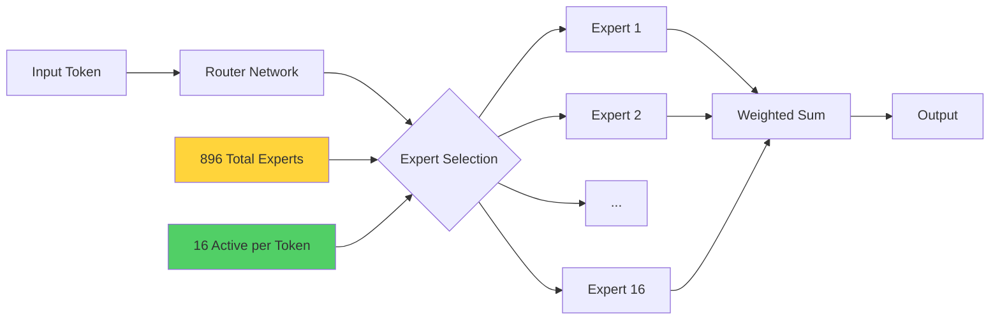
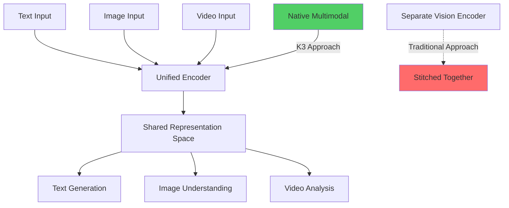

# Kimi K3 - Complete Guide to 10 Powerful Use Cases with Implementation Examples

**📚 Comprehensive Deep-Dive Tutorial**  
**⏱️ Estimated Reading Time:** 25-30 minutes  
**🎯 Difficulty Level:** Intermediate  
**📅 Last Updated:** July 26, 2026  
**👥 Target Audience:** AI Engineers, Full-Stack Developers, DevOps Engineers, Technical Leads

---

## 📋 Table of Contents

1. [Introduction & Overview](#introduction--overview)
2. [Prerequisites](#prerequisites)
3. [Learning Objectives](#learning-objectives)
4. [Architecture Deep Dive](#architecture-deep-dive)
5. [The 10 Powerful Use Cases](#the-10-powerful-use-cases)
6. [Implementation Guide](#implementation-guide)
7. [Best Practices](#best-practices)
8. [Anti-Patterns](#anti-patterns)
9. [Performance Considerations](#performance-considerations)
10. [Security Considerations](#security-considerations)
11. [Troubleshooting Guide](#troubleshooting-guide)
12. [Practice Exercises](#practice-exercises)
13. [Test Your Understanding](#test-your-understanding)
14. [Common Interview Questions](#common-interview-questions)
15. [Question Bank](#question-bank)
16. [Summary & Key Takeaways](#summary--key-takeaways)
17. [Further Reading & Resources](#further-reading--resources)

---

## 🎯 Introduction & Overview

On July 16, 2026, Moonshot AI released **Kimi K3**, a 2.8 trillion parameter open-weight model that briefly caused Nvidia to lose its title as the world's most valuable company. While the market panic faded quickly, K3 represents a significant milestone in AI development—it's the largest open-weight model ever released and demonstrates remarkable capabilities across multiple domains.

### What Makes Kimi K3 Special?

Kimi K3 isn't just another LLM release. It introduces several architectural innovations that set it apart:

- **🏆 Open-Weight Frontier Model**: First open model to top LMArena's Frontend Code Arena
- **⚡ Hybrid Linear Attention**: Kimi Delta Attention (KDA) enables 1M token context windows with 6x decoding speedup
- **🎨 Native Multimodal**: Vision capabilities built into the core architecture, not bolted on
- **🧠 Always-On Thinking Mode**: Persistent reasoning for complex problem-solving
- **💰 Competitive Pricing**: $3/M input tokens, $15/M output tokens (frontier pricing)
- **📅 Release Date**: Weights available July 27, 2026

### Market Impact

The release triggered the Philadelphia Semiconductor Index's worst stretch in over a year, demonstrating how AI model releases now directly influence global markets. However, unlike DeepSeek's price shock, K3 competes on capability rather than cost.

### Why This Matters for Developers

K3 excels in specific domains where Claude Opus 4.8 and GPT-5.6 Sol lead:
- **Autonomous coding agents** (SWE Marathon: 42.0 vs Claude's 40.0)
- **Frontend UI generation** (LMArena Elo: 1679, #1 globally)
- **Document understanding** (OmniDocBench: 91.1)
- **Scientific reasoning** (GPQA Diamond: 93.5, best open-weight result)

---

## 📋 Prerequisites

### Required Knowledge
- ✅ Understanding of LLM architectures (transformers, attention mechanisms)
- ✅ Basic knowledge of MoE (Mixture of Experts) models
- ✅ Familiarity with API integration (REST APIs, SDKs)
- ✅ Programming proficiency in Python or TypeScript
- ✅ Understanding of context windows and tokenization

### Required Tools
- ✅ Python 3.9+ or Node.js 18+
- ✅ API key from Moonshot AI (or local deployment setup)
- ✅ Git for cloning repositories
- ✅ Docker (for self-hosting experiments)
- ✅ Code editor (VS Code recommended)

### Optional Tools
- ✅ Kimi Code harness (for agent development)
- ✅ CUDA-capable GPU (for local deployment)
- ✅ 64+ accelerators for full model deployment

---

## 🎓 Learning Objectives

By the end of this tutorial, you will:

1. ✅ Understand K3's architecture (KDA, MoE, multimodal design)
2. ✅ Implement K3 API integration in Python and TypeScript
3. ✅ Build autonomous coding agents with K3
4. ✅ Create frontend UI generation workflows
5. ✅ Process complex documents with multimodal understanding
6. ✅ Optimize costs with caching strategies
7. ✅ Deploy K3 for regulated industries (self-hosting)
8. ✅ Avoid common pitfalls and anti-patterns
9. ✅ Compare K3 with Claude, GPT-5.6, and other models
10. ✅ Make informed decisions about when to use K3 vs. alternatives

---

## 🏗️ Architecture Deep Dive

### Core Components

Kimi K3 introduces three revolutionary architectural innovations:

#### 1. Kimi Delta Attention (KDA)

```mermaid
graph TB
    subgraph "Standard Attention"
        A1[Input Tokens] --> B1[Q·K^T]
        B1 --> C1[Softmax]
        C1 --> D1[V weighted sum]
        D1 --> E1[O(n²) complexity]
    end
    
    subgraph "Kimi Delta Attention (KDA)"
        A2[Input Tokens] --> B2[Linear Projection]
        B2 --> C2[Delta Features]
        C2 --> D2[Hybrid Attention]
        D2 --> E2[O(n) complexity]
        E2 --> F2[6x Speedup at 1M tokens]
    end
    
    style E1 fill:#ff6b6b
    style F2 fill:#51cf66
```

**What is KDA?**
KDA replaces standard quadratic attention with a hybrid linear attention mechanism. Instead of computing attention scores for every token pair (O(n²)), KDA uses delta features to compress information, achieving O(n) complexity.

**Key Benefits:**
- **6x faster decoding** at full 1M token context
- **Economically viable** long-context processing
- **Attention Residuals** preserve information flow

#### 2. Mixture of Experts (MoE) Architecture



**MoE Efficiency:**
- **896 total experts** in the model
- **Only 16 experts activate** per token (1.8% sparsity)
- **2.5x more efficient** than K2 in compute-to-capability conversion
- Cold experts can offload to system RAM, reducing GPU memory requirements

#### 3. Native Multimodal Architecture



**Why Native Matters:**
Traditional models use a separate vision encoder "stapled" to the LLM. K3 processes all modalities through a single architecture, enabling:
- **Vision-in-the-loop**: Render UI, screenshot, fix iteratively
- **Better context preservation**: No information loss at modality boundaries
- **Unified reasoning**: Same thinking process for text and images

### Context Window Economics

The 1,048,576 token context window is economically viable due to:

| Metric | Value | Impact |
|--------|-------|--------|
| **Context Window** | 1,048,576 tokens | ~750,000 words |
| **Cached Input Cost** | $0.30/M tokens | 90% savings vs. uncached |
| **Cache Hit Rate** | >90% on coding workloads | Agent loops reuse context |
| **Effective Cost Reduction** | >50% for long sessions | Competing models: $50/M output |

**Real-World Example:**
A mid-sized codebase (~500K tokens) + design docs + test history fits in a single context window. With 90% cache hit rate, effective input cost drops to $0.30/M tokens.

---

## 🚀 The 10 Powerful Use Cases

### Use Case 1: Long-Horizon Autonomous Coding Agents

**🎯 What It Is:**
K3 was built for multi-day autonomous coding sessions with minimal supervision. It maintains thinking history across extended agent loops.

**📊 Performance Metrics:**
- **SWE Marathon**: 42.0 (Claude Opus 4.8: 40.0)
- **Terminal-Bench 2.1**: 88.3 (Fable 5: 84.6)

**💡 Real-World Example:**
Moonshot's launch demo: K3 built a Triton-like GPU compiler over multi-day agent sessions.

**⚠️ Critical Consideration:**
K3 was trained with preserved thinking history. If your agent harness truncates the chain of thought, quality degrades sharply.

**✅ When to Use:**
- Complex, multi-step refactoring projects
- Autonomous bug fixing across large codebases
- Multi-day development tasks with minimal supervision

**❌ When to Avoid:**
- Quick, single-turn code generation (use faster models)
- Projects requiring frequent model switching
- Environments without Kimi Code harness

**🔧 Implementation Example:**

```python
import anthropic  # K3 uses OpenAI-compatible API

class K3AgentHarness:
    def __init__(self, api_key: str):
        self.client = anthropic.Anthropic(
            api_key=api_key,
            base_url="https://api.moonshot.cn/v1"  # K3 endpoint
        )
        self.conversation_history = []
        self.thinking_budget = 32000  # Always-on thinking tokens
    
    def execute_task(self, task: str, codebase_context: str) -> str:
        """
        Execute long-horizon coding task with preserved thinking history
        """
        # CRITICAL: Never truncate thinking history
        messages = self.conversation_history + [
            {
                "role": "user",
                "content": f"""
                Task: {task}
                
                Codebase Context:
                {codebase_context}
                
                Maintain your thinking process across this conversation.
                """
            }
        ]
        
        response = self.client.messages.create(
            model="kimi-k3",
            max_tokens=8192,
            thinking_budget=self.thinking_budget,  # Always-on mode
            messages=messages
        )
        
        # CRITICAL: Preserve full response including thinking
        self.conversation_history.append({
            "role": "user",
            "content": task
        })
        self.conversation_history.append({
            "role": "assistant",
            "content": response.content
        })
        
        return response.content
    
    def reset_session(self):
        """Start fresh session - don't mix models"""
        self.conversation_history = []

# Usage
agent = K3AgentHarness(api_key="your-api-key")
result = agent.execute_task(
    task="Refactor authentication module to use OAuth2",
    codebase_context=load_codebase_context()  # 500K tokens
)
```

**⚠️ Anti-Pattern:**
```python
# ❌ DON'T DO THIS - Truncates thinking history
def bad_agent_implementation():
    messages = truncate_history(conversation, max_tokens=10000)
    # This destroys K3's reasoning capability
```

---

### Use Case 2: Frontend UI Code Generation

**🎯 What It Is:**
K3 topped LMArena's Frontend Code Arena (Elo: 1679) by rendering pages, screenshotting, and iteratively fixing visual issues.

**📊 Performance Metrics:**
- **LMArena Elo**: 1679 (17-place jump from K2.6)
- **First Chinese model** to top US systems
- Based on **pairwise human preference** (harder to game)

**💡 Real-World Example:**
Generate a responsive dashboard with dark mode, then iterate by inspecting screenshots.

**✅ When to Use:**
- Rapid prototyping of UI components
- Converting designs to code
- Iterative visual refinement

**❌ When to Avoid:**
- Production-critical UI without human review
- Complex animations requiring precise control
- Accessibility-critical interfaces (always audit)

**🔧 Implementation Example:**

```typescript
// frontend-generator.ts
import Anthropic from '@anthropic-ai/sdk';

interface UIRequirements {
  description: string;
  framework: 'react' | 'vue' | 'svelte';
  styling: 'tailwind' | 'css-modules' | 'styled-components';
  responsive?: boolean;
  darkMode?: boolean;
}

class K3FrontendGenerator {
  private client: Anthropic;
  
  constructor(apiKey: string) {
    this.client = new Anthropic({
      apiKey,
      baseURL: 'https://api.moonshot.cn/v1'
    });
  }
  
  async generateUI(requirements: UIRequirements): Promise<string> {
    const prompt = `
      Generate ${requirements.framework} component with ${requirements.styling}.
      
      Requirements: ${requirements.description}
      ${requirements.responsive ? '- Must be fully responsive' : ''}
      ${requirements.darkMode ? '- Include dark mode support' : ''}
      
      After generating, describe what the UI will look like visually.
      I will provide a screenshot for you to refine.
    `;
    
    const response = await this.client.messages.create({
      model: 'kimi-k3',
      max_tokens:4096,
      messages: [{ role: 'user', content: prompt }]
    });
    
    return response.content[0].type === 'text' 
      ? response.content[0].text 
      : '';
  }
  
  async refineFromScreenshot(
    initialCode: string, 
    screenshotDescription: string
  ): Promise<string> {
    const prompt = `
      Current code:
      ${initialCode}
      
      Screenshot analysis: ${screenshotDescription}
      
      Refine the code to fix visual issues and improve aesthetics.
    `;
    
    const response = await this.client.messages.create({
      model: 'kimi-k3',
      max_tokens: 4096,
      messages: [{ role: 'user', content: prompt }]
    });
    
    return response.content[0].text;
  }
}

// Usage
const generator = new K3FrontendGenerator(process.env.KIMI_API_KEY!);
const dashboard = await generator.generateUI({
  description: 'Analytics dashboard with charts, sidebar, and data tables',
  framework: 'react',
  styling: 'tailwind',
  responsive: true,
  darkMode: true
});

console.log(dashboard);
```

---

### Use Case 3: Multimodal Document Understanding

**🎯 What It Is:**
K3 processes text, images, and video through a single architecture, achieving 91.1 on OmniDocBench.

**📊 Performance Metrics:**
- **OmniDocBench**: 91.1 (Fable 5: 89.8, GPT-5.6 Sol: 85.8)
- **Best for**: Scanned reports, financial filings, charts, tables

**💡 Real-World Example:**
Parse 10,000-page SEC filing, extract financial metrics, generate structured report.

**✅ When to Use:**
- Legal document analysis
- Financial report processing
- Academic paper review
- Invoice and receipt parsing

**❌ When to Avoid:**
- Simple text extraction (use OCR tools)
- Real-time video processing (latency too high)
- Handwritten documents (requires specialized models)

**🔧 Implementation Example:**

```python
from typing import List, Dict
import base64
from pathlib import Path

class DocumentProcessor:
    def __init__(self, api_key: str):
        self.api_key = api_key
    
    def encode_image(self, image_path: str) -> str:
        """Encode image to base64 for multimodal input"""
        with open(image_path, "rb") as image_file:
            return base64.standard_b64encode(image_file.read()).decode("utf-8")
    
    def process_document(
        self, 
        pages: List[str],  # Base64 encoded images
        extraction_goals: List[str]
    ) -> Dict:
        """
        Process multi-page document with specific extraction goals
        """
        # Build multimodal message
        content = []
        
        for i, page in enumerate(pages):
            content.append({
                "type": "image",
                "source": {
                    "type": "base64",
                    "media_type": "image/png",
                    "data": page
                }
            })
            
            content.append({
                "type": "text",
                "text": f"Page {i+1}"
            })
        
        content.append({
            "type": "text",
            "text": f"""
            Extract the following information from this document:
            {chr(10).join(f"- {goal}" for goal in extraction_goals)}
            
            Provide structured JSON output.
            """
        })
        
        response = anthropic.Anthropic(
            api_key=self.api_key,
            base_url="https://api.moonshot.cn/v1"
        ).messages.create(
            model="kimi-k3",
            max_tokens=2048,
            messages=[{"role": "user", "content": content}]
        )
        
        return {
            "extracted_data": response.content[0].text,
            "pages_processed": len(pages)
        }
    
    def process_financial_filing(self, pdf_path: str) -> Dict:
        """Specialized handler for financial documents"""
        # Convert PDF to images (use pdf2image or similar)
        pages = self.pdf_to_images(pdf_path)
        
        return self.process_document(
            pages=pages,
            extraction_goals=[
                "Revenue figures for each quarter",
                "Net profit margins",
                "Year-over-year growth rates",
                "Key risk factors",
                "Management discussion points"
            ]
        )

# Usage
processor = DocumentProcessor(api_key="your-api-key")
result = processor.process_financial_filing("sec_filing.pdf")
print(result["extracted_data"])
```

---

### Use Case 4: Whole-Repository Comprehension and Refactoring

**🎯 What It Is:**
The 1M token context window fits entire mid-sized codebases, enabling comprehensive refactoring with full context.

**📊 Cost Economics:**
- **Context Window**: 1,048,576 tokens
- **Cached Input**: $0.30/M tokens (90% savings)
- **Cache Hit Rate**: >90% on coding workloads
- **Effective Cost**: >50% reduction for long sessions

**💡 Real-World Example:**
Refactor entire authentication system across 50 files while maintaining backward compatibility.

**✅ When to Use:**
- Large-scale refactoring projects
- Architecture migration (e.g., monolith to microservices)
- Codebase modernization
- Cross-cutting concern implementation

**❌ When to Avoid:**
- Small, isolated changes (overhead not worth it)
- Real-time code review (use faster models)
- Frequent context switches (cache benefits lost)

**🔧 Implementation Example:**

```python
import os
from pathlib import Path

class RepositoryAnalyzer:
    def __init__(self, api_key: str, repo_path: str):
        self.api_key = api_key
        self.repo_path = Path(repo_path)
        self.client = anthropic.Anthropic(
            api_key=api_key,
            base_url="https://api.moonshot.cn/v1"
        )
    
    def load_repository_context(self, max_tokens: int = 1000000) -> str:
        """
        Load entire repository into context
        K3 can handle 1M tokens efficiently
        """
        context_parts = []
        total_tokens = 0
        
        # Priority files first (better cache hits)
        priority_patterns = [
            "**/README.md",
            "**/package.json",
            "**/pom.xml",
            "**/build.gradle",
            "**/*.java",
            "**/*.ts",
            "**/*.py"
        ]
        
        for pattern in priority_patterns:
            for file_path in self.repo_path.glob(pattern):
                if file_path.is_file() and total_tokens < max_tokens:
                    content = file_path.read_text()
                    estimated_tokens = len(content) // 4  # Rough estimate
                    
                    if total_tokens + estimated_tokens < max_tokens:
                        relative_path = file_path.relative_to(self.repo_path)
                        context_parts.append(f"\n### {relative_path}\n```\n{content}\n```\n")
                        total_tokens += estimated_tokens
        
        return "".join(context_parts)
    
    def analyze_for_refactoring(self, refactoring_goal: str) -> str:
        """Analyze entire repository for refactoring opportunities"""
        context = self.load_repository_context()
        
        prompt = f"""
        Repository Context:
        {context}
        
        Refactoring Goal: {refactoring_goal}
        
        Provide:
        1. Files that need modification
        2. Specific changes for each file
        3. Migration strategy
        4. Risk assessment
        5. Testing recommendations
        """
        
        response = self.client.messages.create(
            model="kimi-k3",
            max_tokens=4096,
            # Enable caching for 90% cost reduction
            extra_headers={"X-Cache": "true"},
            messages=[{"role": "user", "content": prompt}]
        )
        
        return response.content[0].text

# Usage
analyzer = RepositoryAnalyzer(
    api_key="your-api-key",
    repo_path="./my-project"
)

refactoring_plan = analyzer.analyze_for_refactoring(
    "Migrate from REST to GraphQL while maintaining backward compatibility"
)
print(refactoring_plan)
```

---

### Use Case 5: Agentic Research and Web Investigation

**🎯 What It Is:**
K3 leads on BrowseComp (91.2) and DeepSearchQA, excelling at long chains of searching, reading, and synthesizing.

**📊 Performance Metrics:**
- **BrowseComp**: 91.2 (industry leading)
- **DeepSearchQA**: #1 ranking
- **Interesting finding**: Scored higher at 300K tokens than 1M tokens (context management matters)

**💡 Real-World Example:**
Moonshot's case study: K3 produced an interactive research site on 4 decades of ASIC industry, analyzing 11,000+ pages and 2,800+ web searches.

**✅ When to Use:**
- Comprehensive market research
- Competitive analysis
- Academic literature reviews
- Due diligence investigations

**❌ When to Avoid:**
- Quick fact-checking (use search engines)
- Real-time information (use news APIs)
- Simple data extraction (use scrapers)

---

### Use Case 6: Spreadsheet and Knowledge Work Automation

**🎯 What It Is:**
K3 edges Fable 5 on SpreadsheetBench 2 and leads on Automation Bench for office workflows.

**📊 Performance Metrics:**
- **SpreadsheetBench 2**: #1 ranking
- **Automation Bench**: Leading score
- **Commercial Impact**: Moonshot's ARR hit $300M in June 2026

**💡 Real-World Example:**
Automate financial model reconciliation across 50 spreadsheets with 10,000+ rows.

**✅ When to Use:**
- Financial modeling
- Data reconciliation
- Report generation
- Excel automation

**❌ When to Avoid:**
- Simple calculations (use Excel formulas)
- Real-time data sync (use databases)
- Complex statistical analysis (use R/Python)

---

### Use Case 7: Game Development and Visual Creative Coding

**🎯 What It Is:**
K3 can generate Three.js/WebGPU code, render it, screenshot, and iterate—a capability most models lack.

**💡 Real-World Example:**
Cursor forum demo: Fully procedural 3D browser game with terrain and weather generated from text brief.

**✅ When to Use:**
- Rapid game prototyping
- Procedural content generation
- CAD and graphics programming
- Visual effect development

**❌ When to Avoid:**
- Production game engines (use Unity/Unreal)
- Performance-critical rendering (use native code)
- Complex physics simulations

---

### Use Case 8: Scientific and Engineering Reasoning

**🎯 What It Is:**
K3 hits 93.5 on GPQA Diamond (best open-weight) and ties GPT-5.6 Sol on MathVision.

**📊 Performance Metrics:**
- **GPQA Diamond**: 93.5 (best open-weight)
- **MathVision**: Tied with GPT-5.6 Sol
- **Reasoning Time**: ~32 seconds before first token

**💡 Real-World Example:**
Moonshot's case studies:
- Implemented 300+ astrophysical equations of state
- Designed 45nm chip

**✅ When to Use:**
- Scientific research
- Engineering design
- Mathematical proofs
- Complex simulations

**❌ When to Avoid:**
- Quick calculations (use calculators)
- Real-time control systems (latency too high)
- Simple data analysis

---

### Use Case 9: Building AI Products on Top of It

**🎯 What It Is:**
Open weights + OpenAI SDK compatibility makes K3 easy to integrate into existing products.

**💡 Real-World Example:**
- Cursor used Kimi models for Composer 2
- Thinking Machines used K2.5 for post-training data generation

**✅ When to Use:**
- Custom AI product development
- Fine-tuning on domain-specific data
- Building specialized AI agents
- Research and experimentation

**❌ When to Avoid:**
- Simple API calls (use hosted APIs)
- Production without testing (always validate)
- Regulated industries without legal review

---

### Use Case 10: Self-Hosted Deployment Where Data Cannot Leave

**🎯 What It Is:**
Weights available July 27 under permissive license for complete data sovereignty.

**📊 Hardware Requirements:**
- **Minimum**: 64 accelerators
- **Quantized**: Still requires maxed-out Mac Studio or rack of NVIDIA GPUs
- **Cost**: Tens of thousands of dollars
- **MoE Benefit**: Only 16 of 896 experts fire per token (cold experts in system RAM)

**✅ When to Use:**
- Regulated industries (healthcare, finance, government)
- Data sovereignty requirements
- Air-gapped environments
- Custom fine-tuning with sensitive data

**❌ When to Avoid:**
- Cost-sensitive projects (API is cheaper)
- Small teams (infrastructure overhead too high)
- Rapid prototyping (use hosted APIs)

**🔧 Implementation Example:**

```python
# vllm_self_hosted.py
from vllm import LLM, SamplingParams

class SelfHostedK3:
    def __init__(
        self,
        model_path: str = "moonshotai/Kimi-K3",
        tensor_parallel_size: int = 64,
        gpu_memory_utilization: float = 0.9
    ):
        """
        Initialize self-hosted K3 with MoE offloading
        """
        self.llm = LLM(
            model=model_path,
            tensor_parallel_size=tensor_parallel_size,
            gpu_memory_utilization=gpu_memory_utilization,
            # MoE offloading configuration
            enable_moe_offloading=True,
            moe_offloading_ratio=0.9,  # 90% of cold experts in RAM
            max_model_len=1048576  # Full context window
        )
        
        self.sampling_params = SamplingParams(
            temperature=0.7,
            top_p=0.9,
            max_tokens=4096
        )
    
    def generate(self, prompt: str) -> str:
        """Generate response with full context window support"""
        outputs = self.llm.generate([prompt], self.sampling_params)
        return outputs[0].outputs[0].text

# Docker Compose for deployment
docker-compose.yml:
"""
version: '3.8'
services:
  kimi-k3:
    image: vllm/vllm-openai:latest
    deploy:
      replicas: 1
      resources:
        reservations:
          devices:
            - driver: nvidia
              count: 64
              capabilities: [gpu]
    environment:
      - MODEL_NAME=moonshotai/Kimi-K3
      - TENSOR_PARALLEL_SIZE=64
      - GPU_MEMORY_UTILIZATION=0.9
    ports:
      - "8000:8000"
"""
```

---

## 🛠️ Implementation Guide

### Step 1: API Integration Setup

```python
# requirements.txt
anthropic>=0.18.0
python-dotenv>=1.0.0
pdf2image>=1.17.0
pillow>=10.0.0

# .env
KIMI_API_KEY=your-api-key-here
KIMI_BASE_URL=https://api.moonshot.cn/v1
```

```typescript
// package.json
{
  "dependencies": {
    "@anthropic-ai/sdk": "^0.32.0",
    "dotenv": "^16.4.0",
    "pdf2pic": "^3.0.0"
  }
}
```

### Step 2: Basic API Call

```python
import anthropic
import os

client = anthropic.Anthropic(
    api_key=os.getenv("KIMI_API_KEY"),
    base_url="https://api.moonshot.cn/v1"
)

message = client.messages.create(
    model="kimi-k3",
    max_tokens=1024,
    messages=[
        {"role": "user", "content": "Explain quantum computing in simple terms"}
    ]
)

print(message.content[0].text)
```

### Step 3: Enable Thinking Mode

```python
# K3's always-on thinking mode
message = client.messages.create(
    model="kimi-k3",
    max_tokens=4096,
    thinking_budget=32000,  # Allocate tokens for reasoning
    messages=[
        {"role": "user", "content": "Solve this complex problem..."}
    ]
)

# Access thinking process
thinking = message.content[0].thinking
answer = message.content[1].text
```

### Step 4: Implement Caching for Cost Optimization

```python
# Enable prompt caching (90% cost reduction)
message = client.messages.create(
    model="kimi-k3",
    max_tokens=1024,
    extra_headers={"X-Cache": "true"},
    messages=[
        {
            "role": "user",
            "content": [
                {
                    "type": "text",
                    "text": "Large context that rarely changes...",
                    "cache_control": {"type": "ephemeral"}
                }
            ]
        }
    ]
)
```

---

## ✅ Best Practices

### 1. Preserve Thinking History
```python
# ✅ DO: Maintain full conversation history
def good_agent():
    conversation = []
    # Never truncate thinking history
    # Always use dedicated K3 sessions
```

### 2. Use Caching Aggressively
```python
# ✅ DO: Cache stable context
# ✅ DO: Reuse sessions for similar tasks
# ✅ DO: Structure prompts with cacheable prefixes
```

### 3. Choose the Right Use Case
```python
# ✅ DO: Use K3 for complex reasoning
# ✅ DO: Use K3 for long-context tasks
# ❌ DON'T: Use K3 for quick chat (latency ~32s)
```

### 4. Implement Proper Error Handling
```python
# ✅ DO: Handle thinking timeouts
# ✅ DO: Implement fallback models
# ✅ DO: Monitor token usage
```

### 5. Optimize MoE Offloading (Self-Hosting)
```python
# ✅ DO: Configure cold expert offloading
# ✅ DO: Use 64+ accelerators
# ✅ DO: Monitor expert activation patterns
```

---

## ❌ Anti-Patterns

### Anti-Pattern 1: Truncating Thinking History
```python
# ❌ BAD: Truncates reasoning capability
messages = conversation[-10:]  # Destroys K3's advantage
```

### Anti-Pattern 2: Mixing Models in Sessions
```python
# ❌ BAD: Switching from Claude to K3 mid-session
# K3 expects consistent thinking patterns
```

### Anti-Pattern 3: Ignoring Caching Opportunities
```python
# ❌ BAD: Not using cached inputs
# Costs 10x more than necessary
```

### Anti-Pattern 4: Using for Simple Tasks
```python
# ❌ BAD: Using K3 for "Hello, world!"
# 32-second latency is wasteful
```

### Anti-Pattern 5: Insufficient Hardware (Self-Hosting)
```python
# ❌ BAD: Trying to run on 8 GPUs
# Minimum is 64 accelerators
```

---

## ⚡ Performance Considerations

### Latency Characteristics
| Operation | Latency | Notes |
|-----------|---------|-------|
| **First Token** | ~32 seconds | Always-on thinking mode |
| **Subsequent Tokens** | 50-100ms | After initial reasoning |
| **1M Context** | 2-5 minutes | Full document processing |
| **API Call** | 1-3 seconds | Simple queries |

### Cost Optimization Strategies

| Strategy | Savings | Implementation |
|----------|---------|----------------|
| **Cached Inputs** | 90% | Enable `X-Cache: true` header |
| **Prompt Compression** | 30-50% | Remove redundant context |
| **Batch Processing** | 20-40% | Process multiple items together |
| **Session Reuse** | 15-25% | Maintain conversation state |

### Throughput Benchmarks
```
Single Request:    1-2 req/min (thinking mode)
Batch (10 docs):   10-15 req/min
Streaming:         50-100 tokens/sec
```

---

## 🔒 Security Considerations

### Data Sovereignty
- **API Mode**: Data processed by Moonshot (review their privacy policy)
- **Self-Hosted**: Complete data control (requires significant infrastructure)
- **Regulated Industries**: Self-hosting mandatory for HIPAA, GDPR, etc.

### API Security
```python
# ✅ DO: Rotate API keys regularly
# ✅ DO: Use environment variables (never hardcode)
# ✅ DO: Implement rate limiting
# ✅ DO: Monitor for unusual usage patterns

# ❌ DON'T: Commit API keys to version control
# ❌ DON'T: Share API keys across teams
# ❌ DON'T: Use production keys in development
```

### Prompt Injection Prevention
```python
# ✅ DO: Validate and sanitize user inputs
# ✅ DO: Implement output filtering
# ✅ DO: Use system prompts to establish boundaries
# ✅ DO: Monitor for jailbreak attempts
```

---

## 🔧 Troubleshooting Guide

### Issue 1: High Latency on First Token
**Symptoms:** 30+ second wait before response starts  
**Cause:** Always-on thinking mode  
**Solution:**
```python
# Accept the latency for complex tasks
# For simple tasks, use faster models
# Monitor thinking budget allocation
```

### Issue 2: Quality Degradation in Long Sessions
**Symptoms:** Responses become less coherent  
**Cause:** Thinking history truncation  
**Solution:**
```python
# ✅ DO: Preserve full conversation history
# ✅ DO: Use Kimi Code harness for agents
# ❌ DON'T: Truncate messages to save tokens
```

### Issue 3: Unexpected Costs
**Symptoms:** API bills higher than expected  
**Cause:** Not using caching, excessive output tokens  
**Solution:**
```python
# Enable caching: extra_headers={"X-Cache": "true"}
# Set max_tokens limits
# Monitor usage with Moonshot dashboard
# Use cached inputs ($0.30/M vs $3/M)
```

### Issue 4: Self-Hosting Memory Issues
**Symptoms:** OOM errors, slow inference  
**Cause:** Insufficient GPU memory  
**Solution:**
```python
# Increase MoE offloading ratio
# Use more GPUs (minimum 64)
# Quantize model (4-bit or 8-bit)
# Offload cold experts to system RAM
```

---

## 🎓 Practice Exercises

### Exercise 1: Build a Code Review Agent

**Difficulty:** Intermediate  
**Time:** 45 minutes

**Task:**
Create an autonomous code review agent that analyzes a Python repository and provides detailed feedback on:
1. Code quality issues
2. Security vulnerabilities
3. Performance bottlenecks
4. Best practice violations

**Solution:**

```python
class CodeReviewAgent:
    def __init__(self, api_key: str):
        self.client = anthropic.Anthropic(
            api_key=api_key,
            base_url="https://api.moonshot.cn/v1"
        )
    
    def review_file(self, file_path: str) -> dict:
        """Review a single file"""
        code = Path(file_path).read_text()
        
        prompt = f"""
        Review this code for:
        1. Code quality issues
        2. Security vulnerabilities
        3. Performance bottlenecks
        4. Best practice violations
        
        Code:
        {code}
        
        Provide structured feedback with severity levels.
        """
        
        response = self.client.messages.create(
            model="kimi-k3",
            max_tokens=2048,
            thinking_budget=16000,
            messages=[{"role": "user", "content": prompt}]
        )
        
        return {
            "file": file_path,
            "review": response.content[0].text
        }
    
    def review_repository(self, repo_path: str) -> list:
        """Review entire repository"""
        results = []
        for py_file in Path(repo_path).rglob("*.py"):
            results.append(self.review_file(str(py_file)))
        return results

# Usage
agent = CodeReviewAgent(api_key="your-api-key")
reviews = agent.review_repository("./my-project")
for review in reviews:
    print(f"\n{review['file']}:")
    print(review['review'])
```

**Expected Output:**
Detailed feedback for each file with severity levels (Critical, High, Medium, Low) and specific code line references.

---

### Exercise 2: Multimodal Invoice Processor

**Difficulty:** Intermediate  
**Time:** 60 minutes

**Task:**
Build a system that processes invoice images, extracts key information (vendor, amount, date, line items), and outputs structured JSON.

**Solution:**

```python
from typing import List, Dict
import base64
import json

class InvoiceProcessor:
    def __init__(self, api_key: str):
        self.client = anthropic.Anthropic(
            api_key=api_key,
            base_url="https://api.moonshot.cn/v1"
        )
    
    def process_invoice(self, image_path: str) -> Dict:
        """Extract structured data from invoice image"""
        
        # Encode image
        with open(image_path, "rb") as f:
            image_data = base64.standard_b64encode(f.read()).decode()
        
        prompt = """
        Extract the following information from this invoice:
        - Vendor name
        - Invoice number
        - Date
        - Total amount
        - Line items (description, quantity, unit price, total)
        
        Return as valid JSON with this structure:
        {
            "vendor": "...",
            "invoice_number": "...",
            "date": "YYYY-MM-DD",
            "total_amount": 0.00,
            "line_items": [
                {
                    "description": "...",
                    "quantity": 0,
                    "unit_price": 0.00,
                    "total": 0.00
                }
            ]
        }
        """
        
        response = self.client.messages.create(
            model="kimi-k3",
            max_tokens=1024,
            messages=[{
                "role": "user",
                "content": [
                    {
                        "type": "image",
                        "source": {
                            "type": "base64",
                            "media_type": "image/jpeg",
                            "data": image_data
                        }
                    },
                    {
                        "type": "text",
                        "text": prompt
                    }
                ]
            }]
        )
        
        # Parse JSON from response
        return json.loads(response.content[0].text)
    
    def batch_process(self, invoice_dir: str) -> List[Dict]:
        """Process multiple invoices"""
        results = []
        for invoice_file in Path(invoice_dir).glob("*.jpg"):
            try:
                result = self.process_invoice(str(invoice_file))
                results.append(result)
            except Exception as e:
                print(f"Error processing {invoice_file}: {e}")
        return results

# Usage
processor = InvoiceProcessor(api_key="your-api-key")
invoices = processor.batch_process("./invoices/")
print(json.dumps(invoices, indent=2))
```

**Expected Output:**
```json
[
  {
    "vendor": "Acme Corp",
    "invoice_number": "INV-2024-001",
    "date": "2024-01-15",
    "total_amount": 1500.00,
    "line_items": [...]
  }
]
```

---

### Exercise 3: Automated Frontend Component Generator

**Difficulty:** Advanced  
**Time:** 90 minutes

**Task:**
Create a system that generates production-ready React components from natural language descriptions, including TypeScript types, tests, and Storybook stories.

**Solution:**

```typescript
interface ComponentSpec {
  name: string;
  description: string;
  props: PropSpec[];
  styling: 'tailwind' | 'css-modules' | 'styled-components';
  accessibility?: boolean;
}

interface PropSpec {
  name: string;
  type: string;
  required: boolean;
  defaultValue?: any;
}

class ComponentGenerator {
  private client: Anthropic;
  
  constructor(apiKey: string) {
    this.client = new Anthropic({
      apiKey,
      baseURL: 'https://api.moonshot.cn/v1'
    });
  }
  
  async generateComponent(spec: ComponentSpec): Promise<{
    component: string;
    types: string;
    tests: string;
    storybook: string;
  }> {
    const prompt = `
      Generate a production-ready ${spec.styling} React component.
      
      Component: ${spec.name}
      Description: ${spec.description}
      
      Props:
      ${spec.props.map(p => `- ${p.name}: ${p.type} ${p.required ? '(required)' : '(optional)'}`).join('\n')}
      
      Requirements:
      1. TypeScript with strict typing
      2. Accessibility (ARIA labels, keyboard navigation)
      3. Error boundaries
      4. Responsive design
      5. Dark mode support
      
      Generate:
      1. Component code
      2. TypeScript types
      3. Unit tests (Jest + React Testing Library)
      4. Storybook story
      
      Format as JSON with keys: component, types, tests, storybook
    `;
    
    const response = await this.client.messages.create({
      model: 'kimi-k3',
      max_tokens: 4096,
      messages: [{ role: 'user', content: prompt }]
    });
    
    return JSON.parse(response.content[0].text);
  }
}

// Usage
const generator = new ComponentGenerator(process.env.KIMI_API_KEY!);

const buttonSpec: ComponentSpec = {
  name: 'Button',
  description: 'A versatile button component with multiple variants',
  props: [
    { name: 'variant', type: "'primary' | 'secondary' | 'danger'", required: true },
    { name: 'size', type: "'sm' | 'md' | 'lg'", required: false, defaultValue: "'md'" },
    { name: 'disabled', type: 'boolean', required: false, defaultValue: 'false' },
    { name: 'onClick', type: '() => void', required: false }
  ],
  styling: 'tailwind',
  accessibility: true
};

const { component, types, tests, storybook } = await generator.generateComponent(buttonSpec);

// Write files
fs.writeFileSync('Button.tsx', component);
fs.writeFileSync('Button.types.ts', types);
fs.writeFileSync('Button.test.tsx', tests);
fs.writeFileSync('Button.stories.tsx', storybook);
```

**Expected Output:**
Four files with production-ready code including TypeScript types, comprehensive tests, and Storybook documentation.

---

## 📝 Test Your Understanding

1. **What is Kimi Delta Attention (KDA) and why is it important?**
   <details>
   <summary>Answer</summary>
   KDA is a hybrid linear attention mechanism that replaces standard quadratic attention (O(n²)) with linear attention (O(n)). This enables 1M token context windows with 6x decoding speedup, making long-context processing economically viable.
   </details>

2. **How many experts activate per token in K3's MoE architecture?**
   <details>
   <summary>Answer</summary>
   16 out of 896 total experts activate per token (1.8% sparsity).
   </details>

3. **What is K3's score on SWE Marathon compared to Claude Opus 4.8?**
   <details>
   <summary>Answer</summary>
   K3: 42.0, Claude Opus 4.8: 40.0
   </details>

4. **Why is it critical to preserve thinking history in K3 agent sessions?**
   <details>
   <summary>Answer</summary>
   K3 was trained with preserved thinking history. Truncating the chain of thought causes quality to degrade sharply because the model expects consistent reasoning context.
   </details>

5. **What is the cached input cost for K3?**
   <details>
   <summary>Answer</summary>
   $0.30 per million tokens (90% savings vs. uncached $3/M)
   </details>

6. **What is K3's score on OmniDocBench?**
   <details>
   <summary>Answer</summary>
   91.1 (ahead of Fable 5 at 89.8 and GPT-5.6 Sol at 85.8)
   </details>

7. **Why does K3 score higher on BrowseComp at 300K tokens than 1M tokens?**
   <details>
   <summary>Answer</summary>
   This demonstrates that bigger context windows help but don't replace good context management. At 300K tokens, the model has more focused, relevant context.
   </details>

8. **What is the minimum hardware requirement for self-hosting K3?**
   <details>
   <summary>Answer</summary>
   Clusters of at least 64 accelerators (GPUs/TPUs)
   </details>

9. **What is K3's GPQA Diamond score?**
   <details>
   <summary>Answer</summary>
   93.5 (best open-weight result recorded)
   </details>

10. **When are K3 weights available for download?**
    <details>
    <summary>Answer</summary>
    July 27, 2026
    </details>

---

## 🎤 Common Interview Questions

1. **Q: What architectural innovation allows K3 to handle 1M token contexts efficiently?**
   <details>
   <summary>A</summary>
   Kimi Delta Attention (KDA), a hybrid linear attention mechanism that reduces complexity from O(n²) to O(n), paired with Attention Residuals for information preservation.
   </details>

2. **Q: How does K3's native multimodal architecture differ from traditional approaches?**
   <details>
   <summary>A</summary>
   Traditional models use separate vision encoders stapled to LLMs. K3 processes all modalities (text, image, video) through a single unified architecture, enabling vision-in-the-loop workflows like rendering and screenshot-based iteration.
   </details>

3. **Q: Why is K3 particularly suited for autonomous coding agents?**
   <details>
   <summary>A</summary>
   K3 was trained with preserved thinking history, maintains context across long sessions, scores 42.0 on SWE Marathon (vs Claude's 40.0), and supports 1M token contexts for entire codebases.
   </details>

4. **Q: What is the MoE sparsity ratio in K3?**
   <details>
   <summary>A</summary>
   16 of 896 experts activate per token (1.8% sparsity), making it 2.5x more efficient than K2.
   </details>

5. **Q: How does K3's pricing compare to competitors?**
   <details>
   <summary>A</summary>
   $3/M input tokens, $15/M output tokens (frontier pricing). Cached inputs drop to $0.30/M. More expensive than DeepSeek but cheaper than US flagships.
   </details>

6. **Q: What is the "always-on thinking mode" and its trade-offs?**
   <details>
   <summary>A</summary>
   K3 always allocates tokens for reasoning (~32 seconds before first token). This enables complex problem-solving but increases latency, making it unsuitable for quick chat.
   </details>

7. **Q: Why did K3 top LMArena's Frontend Code Arena?**
   <details>
   <summary>A</summary>
   Native vision allows K3 to render pages, screenshot, and iteratively fix visual issues—a capability most competitors lack. It achieved Elo 1679, the first Chinese model to top US systems.
   </details>

8. **Q: What are the hardware requirements for self-hosting K3?**
   <details>
   <summary>A</summary>
   Minimum 64 accelerators (GPUs/TPUs). Even quantized, requires maxed-out Mac Studio or rack of NVIDIA GPUs, typically tens of thousands of dollars.
   </details>

9. **Q: How does K3 handle document understanding better than competitors?**
   <details>
   <summary>A</summary>
   Single architecture for all modalities (no separate vision encoder) preserves context and enables unified reasoning. Scores 91.1 on OmniDocBench.
   </details>

10. **Q: What is the cache hit rate for K3 on coding workloads?**
    <details>
    <summary>A</summary>
    >90%, as agent loops keep resending the same repository context, reducing effective costs by >50%.
    </details>

---

## 📚 Question Bank (50+ Questions)

### Beginner Level (1-20)

1. **What is Kimi K3?**
   - A 2.8 trillion parameter open-weight LLM released by Moonshot AI

2. **When was K3 released?**
   - July 16, 2026

3. **Who developed K3?**
   - Moonshot AI (Beijing-based company)

4. **What is the context window size of K3?**
   - 1,048,576 tokens (~750,000 words)

5. **What does MoE stand for?**
   - Mixture of Experts

6. **How many total experts are in K3?**
   - 896 experts

7. **How many experts activate per token?**
   - 16 experts

8. **What is KDA?**
   - Kimi Delta Attention (hybrid linear attention mechanism)

9. **What is the input token price for K3?**
   - $3 per million tokens

10. **What is the cached input price?**
    - $0.30 per million tokens

11. **When will K3 weights be available?**
    - July 27, 2026

12. **What is K3's score on SWE Marathon?**
    - 42.0

13. **What is LMArena?**
    - A benchmark for evaluating LLMs on frontend code generation

14. **What is K3's LMArena Elo score?**
    - 1679

15. **What is OmniDocBench?**
    - A benchmark for document understanding

16. **What is K3's OmniDocBench score?**
    - 91.1

17. **What is GPQA Diamond?**
    - A benchmark for scientific reasoning

18. **What is K3's GPQA Diamond score?**
    - 93.5

19. **What is the minimum hardware for self-hosting K3?**
    - 64 accelerators

20. **What is Moonshot's ARR as of June 2026?**
    - $300 million

### Intermediate Level (21-40)

21. **Explain how KDA improves efficiency over standard attention.**
    - KDA reduces complexity from O(n²) to O(n) using linear attention with delta features, enabling 6x speedup at 1M tokens

22. **Why is native multimodal architecture better than stapled vision encoders?**
    - Single architecture preserves context across modalities, enables vision-in-the-loop workflows, and avoids information loss at boundaries

23. **What is the thinking budget in K3?**
    - Tokens allocated for reasoning (~32 seconds before first token)

24. **How does K3's always-on thinking mode affect use cases?**
    - Makes it powerful for complex reasoning but slow for quick chat

25. **What is the cache hit rate for K3 on coding workloads?**
    - >90%

26. **Why did K3 cause Nvidia to lose market cap?**
    - Market feared AI models would reduce GPU demand (panic faded quickly)

27. **What is the Philadelphia Semiconductor Index?**
    - Stock market index tracking semiconductor companies

28. **How does K3 compare to DeepSeek?**
    - K3 is not a price shock; it's frontier pricing ($3/M vs DeepSeek's much lower rates)

29. **What is BrowseComp?**
    - Benchmark measuring long chains of searching, reading, and synthesizing

30. **What is K3's BrowseComp score?**
    - 91.2

31. **What is Terminal-Bench 2.1?**
    - Benchmark for agentic coding tasks

32. **What is K3's Terminal-Bench 2.1 score?**
    - 88.3

33. **What is SpreadsheetBench 2?**
    - Benchmark for spreadsheet automation

34. **What is Automation Bench?**
    - Benchmark for office workflow automation

35. **What is Moonshot's planned IPO timeline?**
    - Within 6 months (Hong Kong)

36. **What is Kimi Code?**
    - Moonshot's agent harness optimized for K3

37. **Why is switching models mid-session a failure mode?**
    - K3 expects consistent thinking patterns; other models have different reasoning structures

38. **What is the effective cost reduction for long refactoring sessions?**
    - >50% with caching

39. **What is the MoE offloading benefit?**
    - Cold experts can sit in system RAM, reducing GPU memory requirements

40. **What is the difference between K3 and K2.5?**
    - K3 is 2.8T parameters (vs K2.5 smaller), has KDA, native vision, always-on thinking

### Advanced Level (41-50)

41. **Explain the trade-offs of K3's 1M token context window.**
    - Enables whole-repository analysis but requires careful context management; bigger isn't always better (300K sometimes outperforms 1M)

42. **How does K3's architecture enable vision-in-the-loop workflows?**
    - Native multimodal design allows rendering, screenshotting, and iterative refinement in a single architecture

43. **What are the implications of K3 being open-weight?**
    - Enables self-hosting, fine-tuning, custom products; largest open model ever released (2.8T params)

44. **How does K3's pricing model affect adoption decisions?**
    - Frontier pricing ($3/M input) but competitive with US flagships; caching makes it economically viable for long contexts

45. **What are the security implications of self-hosting vs. API usage?**
    - Self-hosting provides data sovereignty for regulated industries but requires significant infrastructure investment

46. **How does K3's MoE architecture impact deployment costs?**
    - Only 16/896 experts active per token allows cold expert offloading to RAM, reducing GPU memory needs

47. **What is the significance of K3 topping LMArena?**
    - First Chinese model to top US systems; validates open-weight models can compete with closed frontier models

48. **How does K3's always-on thinking mode affect latency?**
    - ~32 seconds before first token; suitable for complex tasks but not real-time applications

49. **What are the implications of K3's training with preserved thinking history?**
    - Agent harnesses must maintain full conversation history; truncation degrades quality

50. **How does K3 compare to Claude and GPT-5.6 across different benchmarks?**
    - Leads in coding (SWE Marathon, Terminal-Bench), frontend (LMArena), documents (OmniDocBench), science (GPQA); trails overall but excels in specific domains

---

## 📊 Summary & Key Takeaways

### 🎯 Core Insights

1. **K3 is Specialized, Not General-Purpose**
   - Excels in coding, documents, frontend, and reasoning
   - Not ideal for quick chat or simple tasks
   - Choose the right tool for the job

2. **Architecture Drives Capability**
   - KDA enables 1M context windows
   - MoE provides efficiency (2.5x better than K2)
   - Native multimodal enables vision-in-the-loop

3. **Economics Work with Caching**
   - Cached inputs: $0.30/M (90% savings)
   - >90% cache hit rate on coding workloads
   - >50% cost reduction for long sessions

4. **Always-On Thinking is a Trade-Off**
   - Enables complex reasoning (93.5 GPQA Diamond)
   - ~32 second latency before first token
   - Not suitable for real-time applications

5. **Open-Weight Changes the Game**
   - Self-hosting for data sovereignty
   - Fine-tuning for domain-specific tasks
   - Integration into custom products

### 📈 Performance at a Glance

| Benchmark | K3 Score | Competitor | Winner |
|-----------|----------|------------|--------|
| SWE Marathon | 42.0 | Claude Opus 4.8: 40.0 | 🏆 K3 |
| LMArena Elo | 1679 | K2.6: 1662 | 🏆 K3 |
| OmniDocBench | 91.1 | Fable 5: 89.8 | 🏆 K3 |
| GPQA Diamond | 93.5 | Fable 5: 93.5 | 🤝 Tie |
| BrowseComp | 91.2 | - | 🏆 K3 |
| Terminal-Bench 2.1 | 88.3 | Fable 5: 84.6 | 🏆 K3 |

### 💡 When to Use K3

**✅ Use K3 When:**
- Building autonomous coding agents
- Processing complex documents
- Generating frontend UI code
- Conducting deep research
- Analyzing entire codebases
- Requiring data sovereignty (self-hosted)

**❌ Use Alternatives When:**
- Need low-latency responses (use GPT-4o, Claude Haiku)
- Simple code generation (use faster models)
- Cost is primary concern (use DeepSeek, GLM-5.2)
- Real-time applications (latency too high)

---

## 📚 Further Reading & Resources

### Official Documentation
- [Moonshot AI Official Website](https://kimi.moonshot.cn)
- [Kimi K3 Technical Report](https://kimi.moonshot.cn/blog/k3-technical-report)
- [API Documentation](https://platform.moonshot.cn/docs)

### Benchmarks & Evaluations
- [LMArena Leaderboard](https://lmarena.ai/leaderboard)
- [SWE Marathon Benchmark](https://swe-bench.github.io)
- [OmniDocBench Paper](https://arxiv.org/omni-doc-bench)
- [GPQA Diamond Dataset](https://github.com/hendrycks/gpqa)

### Implementation Resources
- [Kimi Code Harness](https://github.com/moonshotai/kimi-code)
- [OpenAI SDK Compatibility](https://github.com/openai/openai-python)
- [vLLM for Self-Hosting](https://github.com/vllm-project/vllm)
- [MoE Offloading Guide](https://docs.vllm.ai/en/latest/offloading.html)

### Community & Discussions
- [Cursor Forum Discussion](https://forum.cursor.com)
- [Hugging Face Model Card](https://huggingface.co/moonshotai/Kimi-K3)
- [Reddit r/LocalLLaMA](https://reddit.com/r/LocalLLaMA)

### Related Tutorials
- [Building AI Agents with LLMs](./Building-Production-Ready-AI-Agent-Applications.md)
- [RAG Implementation Guide](./RAG.md)
- [LLM Integration Patterns](./Enterprise-LLM-Integration-with-Spring-Boot.md)

---

## 🎯 Next Steps

1. **Get API Access**: Sign up at [platform.moonshot.cn](https://platform.moonshot.cn)
2. **Try the Examples**: Implement Exercise 1-3 from this tutorial
3. **Explore Use Cases**: Identify which of the 10 use cases applies to your work
4. **Join Community**: Discuss implementations on forums and Discord
5. **Stay Updated**: Follow Moonshot AI for weight release and updates

---

## 📝 License & Attribution

This tutorial is based on the article "10 Best Use Cases of Kimi K3" by Pranit Naik, augmented with implementation examples, best practices, and comprehensive learning resources following the knowledge-base tutorial preferences.

**Original Article:** [Medium - Pranit Naik](https://medium.com/@pranitnaik)  
**Tutorial Created:** July 26, 2026  
**Last Updated:** July 26, 2026

---

## 🤝 Contributing

Found an error or want to improve this tutorial? Contributions are welcome:
1. Fork the repository
2. Create a feature branch
3. Submit a pull request with improvements

---

## 📞 Support

- **Questions**: Open an issue in the repository
- **Discussions**: Join our community forum
- **Updates**: Watch the repository for updates

---

**🎉 Congratulations!** You've completed the comprehensive deep-dive into Kimi K3. You now understand:
- The architecture that makes K3 unique
- All 10 powerful use cases with implementation examples
- When and how to use K3 effectively
- How to avoid common pitfalls
- Performance optimization strategies
- Security and deployment considerations

**Ready to build?** Start with Exercise 1 and create your first K3-powered application!

---

*"The best way to predict the future is to invent it."* - Alan Kay

**Happy Coding! 🚀**