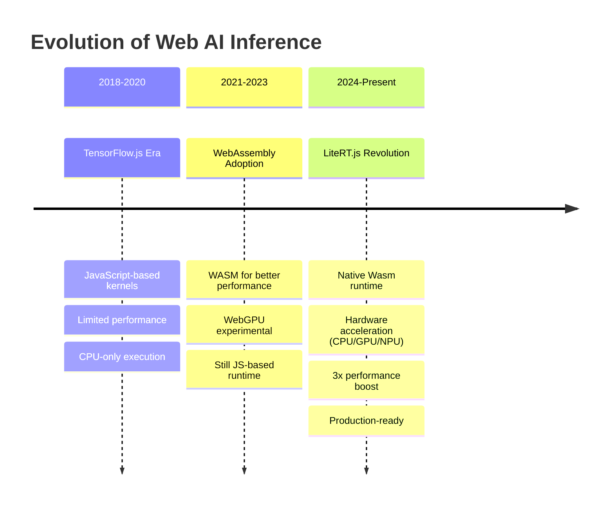
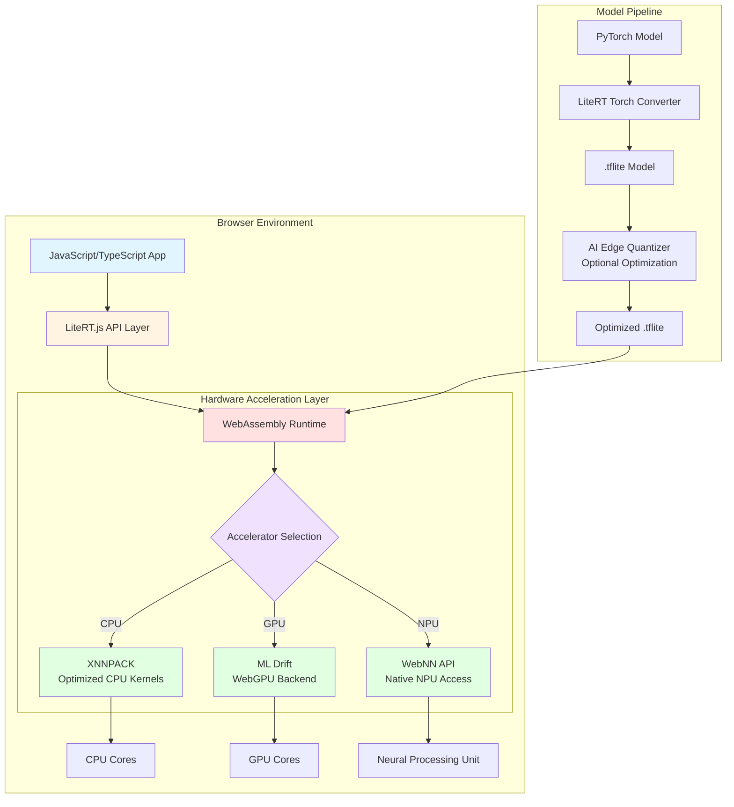
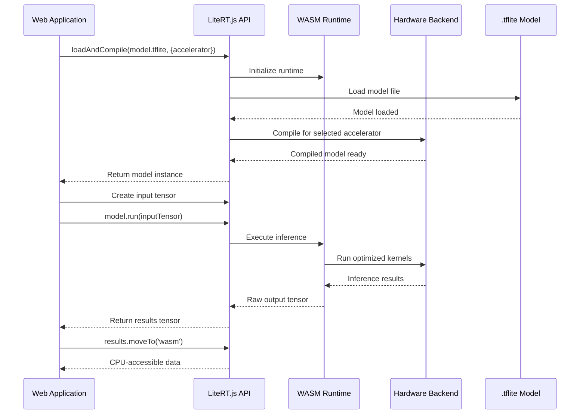
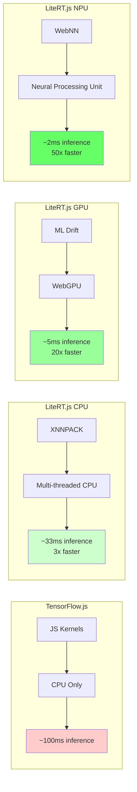
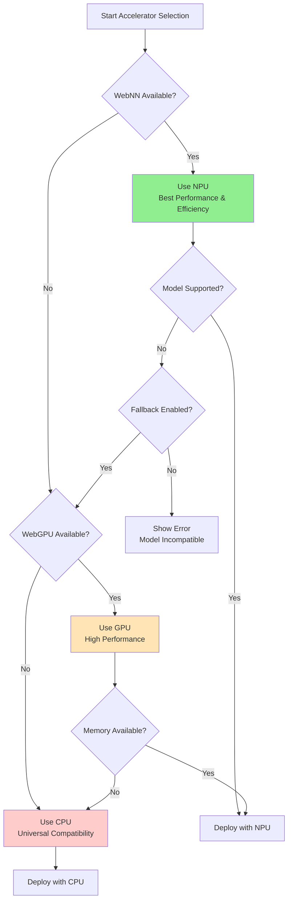

# LiteRT.js - Complete Guide to High-Performance Web AI Inference

**Last Updated:** January 2026  
**Difficulty Level:** ⭐⭐⭐ Intermediate  
**Estimated Reading Time:** 45-60 minutes  
**Tutorial Type:** Comprehensive Deep Dive

---

## 📚 Table of Contents

1. [Introduction & Overview](#introduction--overview)
2. [Prerequisites](#prerequisites)
3. [Learning Objectives](#learning-objectives)
4. [Architecture Deep Dive](#architecture-deep-dive)
5. [Getting Started](#getting-started)
6. [Hardware Acceleration Explained](#hardware-acceleration-explained)
7. [Real-World Implementation Examples](#real-world-implementation-examples)
8. [Model Conversion & Optimization](#model-conversion--optimization)
9. [Best Practices](#best-practices)
10. [Anti-Patterns](#anti-patterns)
11. [Performance Considerations](#performance-considerations)
12. [Security Considerations](#security-considerations)
13. [Testing Strategies](#testing-strategies)
14. [Migration Guide: TensorFlow.js to LiteRT.js](#migration-guide-tensorflowjs-to-litertjs)
15. [Common Pitfalls & Troubleshooting](#common-pitfalls--troubleshooting)
16. [Practice Exercises](#practice-exercises)
17. [Question Bank](#question-bank)
18. [Summary & Key Takeaways](#summary--key-takeaways)
19. [Further Reading & Resources](#further-reading--resources)

---

## Introduction & Overview

### What is LiteRT.js?

**LiteRT.js** is Google's groundbreaking JavaScript binding for [LiteRT](https://ai.google.dev/edge/litert) (Lightweight Runtime), enabling high-performance AI inference directly in web browsers. By leveraging WebAssembly (Wasm) and native hardware acceleration, LiteRT.js brings on-device machine learning capabilities to web developers with unprecedented performance.

> 💡 **Key Insight:** LiteRT.js represents a paradigm shift from JavaScript-based AI inference (like TensorFlow.js) to native, hardware-accelerated inference in the browser, achieving up to 3x performance improvements.

### The Evolution: From TensorFlow.js to LiteRT.js

To understand LiteRT.js's significance, let's trace the evolution of web-based AI:



**Why This Matters:**

- **TensorFlow.js** relied on JavaScript-based kernels, which, while flexible, couldn't match native performance
- **LiteRT.js** uses WebAssembly to run LiteRT's optimized native code directly in the browser
- **Result:** Dramatic performance improvements while maintaining the ease of web deployment

### Key Benefits of LiteRT.js

| Benefit | Description | Impact |
|---------|-------------|--------|
| **Privacy** | All inference happens client-side | No data leaves the user's device |
| **Zero Server Costs** | No backend infrastructure needed | Significant cost savings |
| **Ultra-Low Latency** | Local execution eliminates network delays | Real-time applications (50ms or less) |
| **Hardware Acceleration** | Native CPU/GPU/NPU support | 3-60x speedup depending on backend |
| **Cross-Platform** | Same code works on mobile, desktop, web | Write once, run everywhere |
| **Model Compatibility** | Works with existing .tflite models | Easy migration from TensorFlow.js |

### When to Use LiteRT.js

✅ **Use LiteRT.js when:**
- You need real-time AI inference (object detection, audio processing)
- Privacy is critical (healthcare, finance, personal data)
- You want to reduce server costs
- You have existing .tflite models
- You need offline AI capabilities
- Latency-sensitive applications (gaming, AR/VR)

❌ **Avoid LiteRT.js when:**
- You need very large models (>500MB) - browser memory constraints
- You require server-side model updates without client updates
- Your target audience uses outdated browsers
- You need Python-specific model architectures not convertible to .tflite

---

## Prerequisites

### Required Knowledge

Before diving into LiteRT.js, ensure you have:

- **JavaScript/TypeScript proficiency:** Understanding of async/await, modules, and modern ES6+ syntax
- **Basic ML concepts:** Understanding of tensors, models, inference, and training vs. inference
- **HTML/CSS fundamentals:** For integrating AI into web applications
- **Command line basics:** npm/yarn package management

### Development Environment

```bash
# Required tools
- Node.js 16+ (LTS recommended)
- npm 8+ or yarn 1.22+
- Modern browser with WebGPU support:
  - Chrome 113+ (recommended)
  - Edge 113+
  - Firefox (experimental)
  - Safari (limited support)
```

### Browser Compatibility Matrix

| Browser | WebGPU | WebNN | LiteRT.js Support |
|---------|--------|-------|-------------------|
| Chrome 113+ | ✅ Full | 🟡 Experimental | ✅ Full |
| Edge 113+ | ✅ Full | 🟡 Experimental | ✅ Full |
| Firefox 121+ | 🟡 Experimental | ❌ Not supported | ⚠️ CPU only |
| Safari 17+ | ❌ Not supported | ❌ Not supported | ⚠️ CPU only |

> ⚠️ **Warning:** WebGPU and WebNN are cutting-edge APIs. Always provide fallback options for unsupported browsers.

---

## Learning Objectives

By the end of this tutorial, you will be able to:

✅ **Understand** the architecture and design principles of LiteRT.js  
✅ **Set up** a complete LiteRT.js development environment  
✅ **Load and run** .tflite models in the browser with hardware acceleration  
✅ **Compare** performance across CPU, GPU, and NPU backends  
✅ **Convert** PyTorch models to .tflite format for web deployment  
✅ **Implement** real-world AI applications (object detection, depth estimation, image upscaling)  
✅ **Optimize** models using quantization techniques  
✅ **Debug** common issues and troubleshoot performance bottlenecks  
✅ **Migrate** existing TensorFlow.js applications to LiteRT.js  
✅ **Apply** best practices and avoid common anti-patterns  

---

## Architecture Deep Dive

### System Architecture Overview

LiteRT.js employs a layered architecture that bridges web technologies with native performance:



**Architecture Breakdown:**

1. **Application Layer:** Your JavaScript/TypeScript code interacts with LiteRT.js through a clean, Promise-based API
2. **API Layer:** Provides model loading, tensor operations, and inference execution
3. **WebAssembly Runtime:** Compiles native LiteRT code to run in the browser at near-native speed
4. **Hardware Abstraction Layer:** Automatically selects the best available accelerator
5. **Backend Implementations:** Native-optimized kernels for each hardware type

### Inference Workflow



**Workflow Stages:**

1. **Initialization:** Load WASM runtime and compile model for target hardware
2. **Inference:** Execute model with optimized native kernels
3. **Data Transfer:** Move results between GPU/WASM memory and CPU as needed

### Performance Comparison Architecture



---

## Getting Started

### Installation

#### Step 1: Install the Package

```bash
# Using npm
npm install @litertjs/core

# Using yarn
yarn add @litertjs/core

# Using pnpm
pnpm add @litertjs/core
```

#### Step 2: Project Structure

```
my-litert-app/
├── public/
│   ├── models/
│   │   └── your-model.tflite
│   └── wasm/
│       └── (LiteRT WASM files will go here)
├── src/
│   ├── index.js
│   └── inference.js
├── package.json
└── README.md
```

### Your First LiteRT.js Application

Let's build a simple image classification app:

#### Complete Working Example

```javascript
// src/inference.js
import { loadLiteRt, loadAndCompile, Tensor } from '@litertjs/core';

class ImageClassifier {
  constructor() {
    this.model = null;
    this.isReady = false;
  }

  /**
   * Initialize LiteRT.js runtime and load model
   * @param {string} wasmPath - Path to WASM files
   * @param {string} modelPath - Path to .tflite model
   * @param {string} accelerator - 'cpu', 'webgpu', or 'webnn'
   */
  async initialize(wasmPath, modelPath, accelerator = 'cpu') {
    try {
      console.log('🚀 Loading LiteRT.js runtime...');
      
      // Step 1: Load the WASM runtime
      await loadLiteRt(wasmPath);
      console.log('✅ WASM runtime loaded');

      // Step 2: Load and compile the model
      console.log(`📦 Loading model with ${accelerator} acceleration...`);
      this.model = await loadAndCompile(modelPath, {
        accelerator: accelerator
      });
      console.log('✅ Model compiled and ready');

      this.isReady = true;
      return true;
    } catch (error) {
      console.error('❌ Initialization failed:', error);
      throw new Error(`Failed to initialize: ${error.message}`);
    }
  }

  /**
   * Run inference on input data
   * @param {Float32Array} inputData - Input tensor data
   * @param {number[]} shape - Tensor shape [batch, height, width, channels]
   * @returns {Promise<Tensor>} Inference results
   */
  async classify(inputData, shape) {
    if (!this.isReady) {
      throw new Error('Model not initialized. Call initialize() first.');
    }

    try {
      // Create input tensor
      const inputTensor = new Tensor(inputData, shape);

      // Run inference
      const results = await this.model.run(inputTensor);

      // Move results to CPU-accessible memory
      const resultArray = (await results[0].moveTo('wasm')).toTypedArray();

      return resultArray;
    } catch (error) {
      console.error('❌ Inference failed:', error);
      throw error;
    }
  }

  /**
   * Get top N predictions from classification results
   * @param {Float32Array} results - Raw model output
   * @param {number} topN - Number of top predictions to return
   * @returns {Array} Top N predictions with labels and scores
   */
  getTopPredictions(results, topN = 5) {
    // Convert to array of [index, score] pairs
    const predictions = Array.from(results)
      .map((score, index) => ({ index, score }))
      .sort((a, b) => b.score - a.score)
      .slice(0, topN);

    return predictions.map(p => ({
      classId: p.index,
      confidence: (p.score * 100).toFixed(2) + '%'
    }));
  }
}

// Usage example
async function main() {
  const classifier = new ImageClassifier();

  try {
    // Initialize with CPU acceleration
    await classifier.initialize(
      '/wasm/',                    // WASM files path
      '/models/mobilenet.tflite', // Model path
      'cpu'                        // Accelerator
    );

    // Prepare input (example: 224x224 RGB image)
    const imageData = new Float32Array(1 * 3 * 224 * 224);
    // ... fill with preprocessed image data ...

    // Run inference
    const results = await classifier.classify(imageData, [1, 3, 224, 224]);

    // Get top 5 predictions
    const predictions = classifier.getTopPredictions(results, 5);
    console.log('Predictions:', predictions);

  } catch (error) {
    console.error('Error:', error);
  }
}

main();
```

#### HTML Integration

```html
<!DOCTYPE html>
<html lang="en">
<head>
  <meta charset="UTF-8">
  <meta name="viewport" content="width=device-width, initial-scale=1.0">
  <title>LiteRT.js Image Classifier</title>
</head>
<body>
  <div id="app">
    <h1>Image Classifier</h1>
    <input type="file" id="imageInput" accept="image/*">
    <div id="results"></div>
  </div>

  <script type="module" src="./src/inference.js"></script>
</body>
</html>
```

### Configuration Options

The `loadAndCompile` function accepts various options:

```javascript
const model = await loadAndCompile('model.tflite', {
  // Accelerator selection
  accelerator: 'webgpu',  // 'cpu' | 'webgpu' | 'webnn'
  
  // Number of threads for CPU acceleration
  numThreads: 4,
  
  // Enable/disable optimizations
  enableXNNPACK: true,
  
  // Memory allocation strategy
  memoryStrategy: 'dynamic',  // 'static' | 'dynamic'
  
  // Error handling
  onError: (error) => console.error('Compilation error:', error),
  
  // Progress callback
  onProgress: (progress) => console.log(`Loading: ${progress}%`)
});
```

---

## Hardware Acceleration Explained

### CPU Acceleration with XNNPACK

**XNNPACK** is Google's highly optimized library for neural network inference on CPUs. It provides:

- **Multi-threading:** Utilizes all available CPU cores
- **SIMD optimizations:** Leverages vector instructions (AVX2, NEON)
- **Memory-efficient algorithms:** Minimizes cache misses
- **Quantized operations:** Fast INT8 inference

**Performance Characteristics:**

| Metric | Value |
|--------|-------|
| Typical Speedup | 2-3x vs unoptimized CPU |
| Best For | General-purpose inference, fallback |
| Power Efficiency | Medium |
| Latency | 20-100ms (model dependent) |

**Configuration Example:**

```javascript
const model = await loadAndCompile('model.tflite', {
  accelerator: 'cpu',
  numThreads: navigator.hardwareConcurrency || 4, // Use all cores
  enableXNNPACK: true
});
```

### GPU Acceleration with ML Drift

**ML Drift** is Google's state-of-the-art GPU acceleration solution, leveraging WebGPU for browser-based execution:

**Advantages:**
- **Massive parallelism:** Thousands of GPU cores
- **WebGPU API:** Modern, low-level GPU access
- **Optimized kernels:** Specifically designed for ML operations
- **5-60x speedup** over CPU for suitable models

**When to Use GPU:**
- Large batch processing
- Computer vision models (CNNs)
- Real-time video processing
- Models with high computational density

**Implementation:**

```javascript
// Check WebGPU support
async function checkWebGPUSupport() {
  if (!navigator.gpu) {
    throw new Error('WebGPU not supported in this browser');
  }
  
  const adapter = await navigator.gpu.requestAdapter();
  if (!adapter) {
    throw new Error('No WebGPU adapter found');
  }
  
  return true;
}

// Use GPU acceleration
const model = await loadAndCompile('model.tflite', {
  accelerator: 'webgpu',
  // GPU-specific options
  gpuMemoryLimit: 512 * 1024 * 1024, // 512MB
  enableAsyncExecution: true
});
```

### NPU Acceleration with WebNN

**WebNN API** provides access to dedicated Neural Processing Units for ultra-efficient inference:

**Benefits:**
- **Ultra-low power consumption:** NPUs are designed specifically for ML
- **Ultra-low latency:** 1-5ms inference times
- **Future-proof:** Emerging standard for web AI
- **5-60x speedup** over CPU

**Current Limitations:**
- 🟡 **Experimental:** Only available in Chrome/Edge 113+
- 🟡 **Limited model support:** Not all operations supported
- 🟡 **Platform-dependent:** Requires compatible hardware

**Usage:**

```javascript
// Check WebNN support
async function checkWebNNSupport() {
  if (!navigator.ml) {
    throw new Error('WebNN not supported');
  }
  return true;
}

// Use NPU acceleration
const model = await loadAndCompile('model.tflite', {
  accelerator: 'webnn',
  // NPU-specific options
  preferLowPower: true,  // Prioritize efficiency over speed
  fallbackToGPU: true    // Fall back to GPU if NPU unavailable
});
```

### Performance Comparison Matrix

| Backend | Speed (Relative) | Power Usage | Compatibility | Best Use Case |
|---------|-----------------|-------------|---------------|---------------|
| **CPU (XNNPACK)** | 1x (baseline) | Medium | Universal | Fallback, small models |
| **GPU (WebGPU)** | 5-20x | High | Chrome/Edge 113+ | CNNs, video processing |
| **NPU (WebNN)** | 20-60x | Very Low | Chrome/Edge 113+ | Production, battery-critical apps |

### Accelerator Selection Strategy



**Smart Accelerator Selection Code:**

```javascript
async function selectBestAccelerator() {
  // Try NPU first (best efficiency)
  try {
    if (navigator.ml) {
      return 'webnn';
    }
  } catch (e) {
    console.warn('WebNN not available:', e);
  }

  // Try GPU (best performance)
  try {
    if (navigator.gpu) {
      return 'webgpu';
    }
  } catch (e) {
    console.warn('WebGPU not available:', e);
  }

  // Fallback to CPU (universal)
  return 'cpu';
}

// Usage
const accelerator = await selectBestAccelerator();
const model = await loadAndCompile('model.tflite', { accelerator });
```

---

## Real-World Implementation Examples

### Example 1: Real-Time Object Detection with YOLO

**Use Case:** Detect and track objects in webcam feed in real-time

#### Complete Implementation

```javascript
// src/object-detection.js
import { loadLiteRt, loadAndCompile, Tensor } from '@litertjs/core';

class ObjectDetector {
  constructor() {
    this.model = null;
    this.video = null;
    this.canvas = null;
    this.ctx = null;
    this.isRunning = false;
    
    // YOLO-specific configuration
    this.inputSize = 640;
    this.numClasses = 80;  // COCO dataset
    this.confidenceThreshold = 0.5;
    this.iouThreshold = 0.45;
  }

  async initialize(modelPath, videoElement, canvasElement) {
    // Load model with GPU acceleration for real-time performance
    await loadLiteRt('/wasm/');
    this.model = await loadAndCompile(modelPath, {
      accelerator: 'webgpu',
      numThreads: 4
    });

    this.video = videoElement;
    this.canvas = canvasElement;
    this.ctx = canvas.getContext('2d');

    // Setup webcam
    const stream = await navigator.mediaDevices.getUserMedia({
      video: { width: 640, height: 480 }
    });
    this.video.srcObject = stream;
    await this.video.play();

    console.log('✅ Object detector initialized');
  }

  preprocessFrame() {
    const canvas = document.createElement('canvas');
    canvas.width = this.inputSize;
    canvas.height = this.inputSize;
    const ctx = canvas.getContext('2d');
    
    // Draw and scale video frame
    ctx.drawImage(this.video, 0, 0, this.inputSize, this.inputSize);
    
    // Get image data and normalize
    const imageData = ctx.getImageData(0, 0, this.inputSize, this.inputSize);
    const inputTensor = new Float32Array(1 * 3 * this.inputSize * this.inputSize);
    
    // Convert RGBA to RGB and normalize to [0, 1]
    for (let i = 0; i < imageData.data.length; i += 4) {
      const pixelIndex = i / 4;
      const r = imageData.data[i] / 255.0;
      const g = imageData.data[i + 1] / 255.0;
      const b = imageData.data[i + 2] / 255.0;
      
      // CHW format (channels first)
      inputTensor[pixelIndex] = r;
      inputTensor[this.inputSize * this.inputSize + pixelIndex] = g;
      inputTensor[2 * this.inputSize * this.inputSize + pixelIndex] = b;
    }

    return new Tensor(inputTensor, [1, 3, this.inputSize, this.inputSize]);
  }

  async detect() {
    if (!this.isRunning) return;

    const startTime = performance.now();

    // Preprocess
    const inputTensor = this.preprocessFrame();

    // Run inference
    const [outputs] = await this.model.run(inputTensor);
    const results = (await outputs.moveTo('wasm')).toTypedArray();

    // Post-process (YOLO-specific)
    const detections = this.postprocess(results);

    // Draw results
    this.drawDetections(detections);

    const endTime = performance.now();
    console.log(`Inference time: ${(endTime - startTime).toFixed(2)}ms`);

    // Continue detection loop
    requestAnimationFrame(() => this.detect());
  }

  postprocess(output) {
    // Simplified YOLO post-processing
    const detections = [];
    // ... implementation of NMS and bounding box decoding ...
    return detections;
  }

  drawDetections(detections) {
    this.ctx.clearRect(0, 0, this.canvas.width, this.canvas.height);
    this.ctx.drawImage(this.video, 0, 0, this.canvas.width, this.canvas.height);

    detections.forEach(det => {
      const { bbox, classId, confidence } = det;
      
      // Draw bounding box
      this.ctx.strokeStyle = '#00FF00';
      this.ctx.lineWidth = 2;
      this.ctx.strokeRect(bbox.x, bbox.y, bbox.width, bbox.height);

      // Draw label
      this.ctx.fillStyle = '#00FF00';
      this.ctx.font = '16px Arial';
      this.ctx.fillText(
        `${classId}: ${(confidence * 100).toFixed(1)}%`,
        bbox.x, bbox.y - 5
      );
    });
  }

  start() {
    this.isRunning = true;
    this.detect();
  }

  stop() {
    this.isRunning = false;
  }
}

// Usage
const detector = new ObjectDetector();
await detector.initialize('/models/yolo.tflite', video, canvas);
detector.start();
```

### Example 2: Depth Estimation with Depth Anything

**Use Case:** Transform webcam feed into 3D point cloud

```javascript
// src/depth-estimation.js
import { loadLiteRt, loadAndCompile, Tensor } from '@litertjs/core';

class DepthEstimator {
  async initialize(modelPath) {
    await loadLiteRt('/wasm/');
    this.model = await loadAndCompile(modelPath, {
      accelerator: 'webgpu',  // GPU essential for real-time depth
      numThreads: 4
    });
  }

  async estimateDepth(imageData, width, height) {
    // Preprocess: resize and normalize
    const inputSize = 518;
    const inputTensor = new Float32Array(1 * 3 * inputSize * inputSize);
    
    // ... preprocessing code ...
    
    // Run inference
    const [depthMap] = await this.model.run(inputTensor);
    const depth = (await depthMap.moveTo('wasm')).toTypedArray();
    
    // Post-process: resize to original dimensions
    return this.upscaleDepthMap(depth, width, height);
  }

  depthToPointCloud(depthMap, rgbImage, width, height) {
    const points = [];
    const focalLength = 500; // Adjust based on camera
    
    for (let y = 0; y < height; y++) {
      for (let x = 0; x < width; x++) {
        const depth = depthMap[y * width + x];
        const z = depth * 1000; // Scale to mm
        
        const X = (x - width / 2) * z / focalLength;
        const Y = (y - height / 2) * z / focalLength;
        const Z = z;
        
        // Get RGB color
        const pixelIndex = (y * width + x) * 4;
        const r = rgbImage[pixelIndex];
        const g = rgbImage[pixelIndex + 1];
        const b = rgbImage[pixelIndex + 2];
        
        points.push({ x: X, y: Y, z: Z, r, g, b });
      }
    }
    
    return points;
  }
}
```

### Example 3: Image Upscaling with Real-ESRGAN

**Use Case:** 4x image upscaling in the browser

```javascript
// src/image-upscaler.js
class ImageUpscaler {
  async upscale(imageElement, scaleFactor = 4) {
    const width = imageElement.width;
    const height = imageElement.height;
    
    // Process in patches for memory efficiency
    const patchSize = 128;
    const outputPatchSize = patchSize * scaleFactor;
    const outputCanvas = document.createElement('canvas');
    outputCanvas.width = width * scaleFactor;
    outputCanvas.height = height * scaleFactor;
    const outputCtx = outputCanvas.getContext('2d');

    for (let y = 0; y < height; y += patchSize) {
      for (let x = 0; x < width; x += patchSize) {
        // Extract patch
        const patch = this.extractPatch(imageElement, x, y, patchSize);
        
        // Run upscaling model
        const upscaledPatch = await this.upscalePatch(patch);
        
        // Draw to output
        outputCtx.drawImage(
          upscaledPatch,
          x * scaleFactor,
          y * scaleFactor
        );
      }
    }

    return outputCanvas;
  }

  async upscalePatch(patch) {
    // Preprocess patch
    const inputTensor = this.preprocessPatch(patch);
    
    // Run model
    const [output] = await this.model.run(inputTensor);
    const upscaledData = (await output.moveTo('wasm')).toTypedArray();
    
    // Convert back to image
    return this.tensorToImage(upscaledData, 512, 512);
  }
}
```

---

## Model Conversion & Optimization

### Converting PyTorch Models to .tflite

#### Step 1: Install LiteRT Torch

```bash
pip install ai-edge-torch
```

#### Step 2: Convert PyTorch Model

```python
# convert_model.py
import torch
import ai_edge_torch

# Load your PyTorch model
model = torch.load('model.pt')
model.eval()

# Example input shape
sample_input = torch.randn(1, 3, 224, 224)

# Convert to .tflite
converted_model = ai_edge_torch.convert(model, sample_input)

# Save the model
converted_model.export('model.tflite')
```

#### Step 3: Optimize with Quantization

```python
# quantize_model.py
from ai_edge_torch.quantizer import quantize

# Load the converted model
model = ai_edge_torch.load('model.tflite')

# Apply quantization (reduces model size by 4x)
quantized_model = quantize(
    model,
    quantization_spec={
        'conv2d': 'int8',      # Quantize convolutional layers
        'linear': 'int8',      # Quantize fully connected layers
        'softmax': 'float32'   # Keep softmax in float32 for accuracy
    }
)

# Save quantized model
quantized_model.export('model_quantized.tflite')

# Compare sizes
import os
original_size = os.path.getsize('model.tflite') / (1024 * 1024)
quantized_size = os.path.getsize('model_quantized.tflite') / (1024 * 1024)

print(f'Original: {original_size:.2f} MB')
print(f'Quantized: {quantized_size:.2f} MB')
print(f'Reduction: {((original_size - quantized_size) / original_size * 100):.1f}%')
```

### Quantization Strategies

**Quantization Comparison Table:**

| Strategy | Size Reduction | Speed Improvement | Accuracy Loss | Use Case |
|----------|---------------|-------------------|---------------|----------|
| **FP32 (No Quantization)** | 1x (baseline) | 1x | 0% | Maximum accuracy |
| **FP16** | 2x | 1.5x | <1% | Balanced approach |
| **INT8 (Full)** | 4x | 2-3x | 1-3% | General deployment |
| **INT8 (Selective)** | 2-4x | 2-3x | <1% | Production (recommended) |

**Selective Quantization Example:**

```python
from ai_edge_torch.quantizer import quantize, QuantizationSpec

# Define layer-specific quantization
spec = QuantizationSpec()

# Quantize most layers to INT8
spec.add_global_config('int8')

# Keep sensitive layers in FP16 for accuracy
spec.add_layer_config('model.layer3.output', 'float16')
spec.add_layer_config('model.softmax', 'float32')

# Apply quantization
quantized_model = quantize(model, quantization_spec=spec)
```

---

## Best Practices

### ✅ Do's

1. **Always Provide Fallback Accelerators**
   ```javascript
   // Good: Graceful fallback
   async function loadModelWithFallback() {
     const accelerators = ['webnn', 'webgpu', 'cpu'];
     
     for (const accel of accelerators) {
       try {
         const model = await loadAndCompile('model.tflite', {
           accelerator: accel
         });
         console.log(`✅ Using ${accel} accelerator`);
         return model;
       } catch (error) {
         console.warn(`⚠️ ${accel} not available, trying next...`);
       }
     }
     throw new Error('No suitable accelerator found');
   }
   ```

2. **Preprocess Inputs Efficiently**
   ```javascript
   // Good: Batch preprocessing
   function preprocessBatch(images) {
     const batchSize = images.length;
     const inputTensor = new Float32Array(batchSize * 3 * 224 * 224);
     
     images.forEach((img, batchIndex) => {
       const offset = batchIndex * 3 * 224 * 224;
       // Fill tensor data
     });
     
     return new Tensor(inputTensor, [batchSize, 3, 224, 224]);
   }
   ```

3. **Use Web Workers for Heavy Processing**
   ```javascript
   // inference-worker.js
   self.onmessage = async (e) => {
     const { modelPath, inputData } = e.data;
     
     await loadLiteRt('/wasm/');
     const model = await loadAndCompile(modelPath);
     const inputTensor = new Tensor(inputData, [1, 3, 224, 224]);
     const results = await model.run(inputTensor);
     
     self.postMessage(results);
   };
   ```

4. **Implement Proper Error Handling**
   ```javascript
   // Good: Comprehensive error handling
   async function safeInference(model, inputTensor) {
     try {
       // Validate input
       if (!inputTensor || inputTensor.length === 0) {
         throw new Error('Invalid input tensor');
       }
       
       // Run with timeout
       const timeoutPromise = new Promise((_, reject) =>
         setTimeout(() => reject(new Error('Inference timeout')), 5000)
       );
       
       const results = await Promise.race([
         model.run(inputTensor),
         timeoutPromise
       ]);
       
       return results;
     } catch (error) {
       console.error('Inference failed:', error);
       // Fallback to CPU if GPU fails
       if (error.message.includes('GPU')) {
         return await retryWithCPU(model, inputTensor);
       }
       throw error;
     }
   }
   ```

5. **Optimize Memory Management**
   ```javascript
   // Good: Explicit memory cleanup
   async function runInference(model, inputData) {
     let inputTensor = null;
     let results = null;
     
     try {
       inputTensor = new Tensor(inputData, [1, 3, 224, 224]);
       results = await model.run(inputTensor);
       const output = await results[0].moveTo('wasm');
       return output.toTypedArray();
     } finally {
       // Clean up tensors
       if (inputTensor) inputTensor.dispose();
       if (results) results.forEach(t => t.dispose());
     }
   }
   ```

### ❌ Don'ts

1. **Don't Block the Main Thread**
   ```javascript
   // Bad: Blocking UI
   const results = await model.run(inputTensor); // UI freezes!
   
   // Good: Use requestIdleCallback or Web Worker
   requestIdleCallback(async () => {
     const results = await model.run(inputTensor);
     updateUI(results);
   });
   ```

2. **Don't Ignore Browser Compatibility**
   ```javascript
   // Bad: Assuming WebGPU is available
   const model = await loadAndCompile('model.tflite', {
     accelerator: 'webgpu'
   });
   
   // Good: Check first
   if (!navigator.gpu) {
     console.warn('WebGPU not supported, falling back to CPU');
   }
   ```

3. **Don't Load Models Repeatedly**
   ```javascript
   // Bad: Loading model on every inference
   async function classify(image) {
     const model = await loadAndCompile('model.tflite'); // Slow!
     // ... inference ...
   }
   
   // Good: Load once, reuse
   let model = null;
   async function initialize() {
     model = await loadAndCompile('model.tflite');
   }
   
   async function classify(image) {
     return await model.run(inputTensor); // Fast!
   }
   ```

4. **Don't Forget to Handle Tensor Memory**
   ```javascript
   // Bad: Memory leak
   async function inference() {
     const tensor = new Tensor(data, shape);
     const results = await model.run(tensor);
     // Forgot to dispose!
   }
   
   // Good: Proper cleanup
   async function inference() {
     const tensor = new Tensor(data, shape);
     try {
       const results = await model.run(tensor);
       return results;
     } finally {
       tensor.dispose();
     }
   }
   ```

---

## Anti-Patterns

### 🚫 Anti-Pattern 1: Synchronous Model Loading

**Problem:**
```javascript
// Bad: Blocking main thread during model loading
function loadModel() {
  const model = loadAndCompileSync('model.tflite'); // UI frozen!
  return model;
}
```

**Why It's Wrong:**
- Blocks UI thread, making application unresponsive
- Poor user experience
- Can trigger browser warnings

**Solution:**
```javascript
// Good: Async loading with progress indicator
async function loadModel(onProgress) {
  const model = await loadAndCompile('model.tflite', {
    onProgress: (progress) => {
      onProgress?.(progress);
    }
  });
  return model;
}

// Show loading UI
showLoadingSpinner();
await loadModel((progress) => {
  updateProgressBar(progress);
});
hideLoadingSpinner();
```

### 🚫 Anti-Pattern 2: Ignoring Memory Management

**Problem:**
```javascript
// Bad: Memory leak from undisposed tensors
async function processImages(images) {
  for (const image of images) {
    const tensor = preprocess(image);
    const result = await model.run(tensor);
    // tensor never disposed - memory leak!
  }
}
```

**Why It's Wrong:**
- Tensors accumulate in memory
- Eventually causes out-of-memory errors
- Browser tab crashes

**Solution:**
```javascript
// Good: Proper tensor lifecycle management
async function processImages(images) {
  for (const image of images) {
    const tensor = preprocess(image);
    try {
      const result = await model.run(tensor);
      await processResult(result);
    } finally {
      tensor.dispose(); // Always clean up
    }
  }
}
```

### 🚫 Anti-Pattern 3: Hardcoded Accelerator Selection

**Problem:**
```javascript
// Bad: Assuming GPU is always available
const model = await loadAndCompile('model.tflite', {
  accelerator: 'webgpu'  // Crashes on unsupported browsers!
});
```

**Why It's Wrong:**
- Breaks on browsers without WebGPU
- No fallback strategy
- Poor user experience

**Solution:**
```javascript
// Good: Dynamic accelerator selection
async function loadModelWithBestAccelerator() {
  const accelerator = await detectBestAccelerator();
  return await loadAndCompile('model.tflite', { accelerator });
}

async function detectBestAccelerator() {
  // Try accelerators in order of preference
  const accelerators = ['webnn', 'webgpu', 'cpu'];
  
  for (const accel of accelerators) {
    if (await isAcceleratorAvailable(accel)) {
      return accel;
    }
  }
  
  return 'cpu'; // Always have a fallback
}
```

### 🚫 Anti-Pattern 4: Running Inference on Every Frame Without Throttling

**Problem:**
```javascript
// Bad: Running inference as fast as possible
function animate() {
  inference(); // Runs 60+ times per second!
  requestAnimationFrame(animate);
}
```

**Why It's Wrong:**
- Wastes computational resources
- Overheats devices
- Poor battery life on mobile

**Solution:**
```javascript
// Good: Throttled inference
let lastInferenceTime = 0;
const inferenceInterval = 100; // 10 FPS

function animate(currentTime) {
  if (currentTime - lastInferenceTime >= inferenceInterval) {
    inference();
    lastInferenceTime = currentTime;
  }
  requestAnimationFrame(animate);
}
```

---

## Performance Considerations

### Performance Optimization Strategies

#### 1. Batch Processing

**Single Inference (Slow):**
```javascript
// Bad: One at a time
for (const image of images) {
  const result = await model.run(preprocess(image));
}
```

**Batch Processing (Fast):**
```javascript
// Good: Process multiple inputs at once
const batchSize = 8;
const batches = chunk(images, batchSize);

for (const batch of batches) {
  const batchTensor = preprocessBatch(batch);
  const results = await model.run(batchTensor);
  // Process all results
}
```

**Performance Gain:** 3-5x faster for batch operations

#### 2. Tensor Reuse

```javascript
// Good: Reuse tensors to reduce allocations
class OptimizedInference {
  constructor(model) {
    this.model = model;
    this.inputTensor = new Tensor(
      new Float32Array(1 * 3 * 224 * 224),
      [1, 3, 224, 224]
    );
  }

  async infer(imageData) {
    // Reuse tensor, just update data
    this.inputTensor.data.set(imageData);
    return await this.model.run(this.inputTensor);
  }
}
```

#### 3. Memory Pre-allocation

```javascript
// Good: Pre-allocate output tensors
const outputTensor = new Tensor(
  new Float32Array(1 * 1000),
  [1, 1000]
);

// Reuse for multiple inferences
for (const input of inputs) {
  const results = await model.run(inputTensor);
  outputTensor.data.set(results[0].data);
}
```

### Performance Benchmarking

**Benchmarking Framework:**

```javascript
class PerformanceBenchmark {
  constructor(model, accelerator) {
    this.model = model;
    this.accelerator = accelerator;
    this.results = [];
  }

  async runBenchmark(inputTensor, numRuns = 100) {
    console.log(`🏃 Running ${numRuns} inference iterations...`);
    
    // Warmup runs (JIT compilation, caching)
    for (let i = 0; i < 10; i++) {
      await this.model.run(inputTensor);
    }

    // Actual benchmark
    const times = [];
    for (let i = 0; i < numRuns; i++) {
      const start = performance.now();
      await this.model.run(inputTensor);
      const end = performance.now();
      times.push(end - start);
    }

    // Calculate statistics
    const stats = this.calculateStats(times);
    this.results.push({ accelerator: this.accelerator, ...stats });
    
    return stats;
  }

  calculateStats(times) {
    const sorted = times.sort((a, b) => a - b);
    const sum = times.reduce((a, b) => a + b, 0);
    
    return {
      mean: sum / times.length,
      median: sorted[Math.floor(times.length / 2)],
      p95: sorted[Math.floor(times.length * 0.95)],
      p99: sorted[Math.floor(times.length * 0.99)],
      min: sorted[0],
      max: sorted[sorted.length - 1]
    };
  }

  compareWith(otherBenchmark) {
    console.table({
      [this.accelerator]: this.results[0],
      [otherBenchmark.accelerator]: otherBenchmark.results[0]
    });
  }
}

// Usage
const benchmark1 = new PerformanceBenchmark(cpuModel, 'CPU');
const benchmark2 = new PerformanceBenchmark(gpuModel, 'GPU');

await benchmark1.runBenchmark(inputTensor);
await benchmark2.runBenchmark(inputTensor);

benchmark1.compareWith(benchmark2);
```

### Performance Targets

| Application Type | Target Latency | Recommended Accelerator |
|-----------------|----------------|------------------------|
| Real-time video | < 33ms (30 FPS) | GPU or NPU |
| Interactive UI | < 100ms | GPU or CPU |
| Batch processing | < 1s per batch | CPU (multi-threaded) |
| Background tasks | < 5s | CPU |

---

## Security Considerations

### Security Best Practices

#### 1. Model Integrity Verification

```javascript
// Verify model hash before loading
async function loadModelSecurely(modelPath, expectedHash) {
  const response = await fetch(modelPath);
  const buffer = await response.arrayBuffer();
  
  // Calculate SHA-256 hash
  const hash = await crypto.subtle.digest('SHA-256', buffer);
  const hashArray = Array.from(new Uint8Array(hash));
  const hashHex = hashArray.map(b => b.toString(16).padStart(2, '0')).join('');
  
  // Verify hash
  if (hashHex !== expectedHash) {
    throw new Error('Model integrity check failed');
  }
  
  // Load verified model
  return await loadAndCompile(modelPath);
}
```

#### 2. Input Validation

```javascript
// Validate and sanitize inputs
function validateInputTensor(tensor, expectedShape) {
  // Check shape
  if (tensor.shape.length !== expectedShape.length) {
    throw new Error('Invalid tensor shape');
  }
  
  // Check for NaN or Infinity
  const data = tensor.toTypedArray();
  for (let i = 0; i < data.length; i++) {
    if (!isFinite(data[i])) {
      throw new Error('Tensor contains invalid values');
    }
  }
  
  // Check value ranges
  const max = Math.max(...data);
  const min = Math.min(...data);
  
  if (max > 1.0 || min < 0.0) {
    console.warn('Input values outside expected [0, 1] range');
  }
}
```

#### 3. Sandboxed Execution

```javascript
// Use Web Workers for isolation
const worker = new Worker('inference-worker.js', {
  type: 'module'
});

// Communicate via messages (no shared state)
worker.postMessage({
  type: 'INFERENCE',
  modelPath: '/models/model.tflite',
  inputData: tensorData
});

worker.onmessage = (e) => {
  if (e.data.type === 'RESULT') {
    handleResults(e.data.results);
  }
};
```

#### 4. Content Security Policy

```html
<!-- Add CSP headers to prevent XSS -->
<meta http-equiv="Content-Security-Policy" 
      content="default-src 'self'; 
               script-src 'self' 'wasm-unsafe-eval'; 
               worker-src 'self'; 
               connect-src 'self';">
```

> ⚠️ **Security Note:** The `'wasm-unsafe-eval'` directive is required for WebAssembly execution. Ensure you trust the source of your WASM files.

### Privacy Considerations

**Client-Side Inference Benefits:**
- ✅ **Data never leaves the device:** Sensitive data stays local
- ✅ **No server logs:** Inference history not stored centrally
- ✅ **GDPR compliant:** No personal data transmission
- ✅ **Offline capable:** Works without internet connection

**When to Use Client-Side Inference:**
- Healthcare applications (medical imaging)
- Financial services (fraud detection)
- Personal data processing (face recognition)
- Privacy-sensitive applications

---

## Testing Strategies

### Unit Testing

```javascript
// inference.test.js
import { loadLiteRt, loadAndCompile, Tensor } from '@litertjs/core';

describe('LiteRT.js Inference', () => {
  let model;

  beforeAll(async () => {
    await loadLiteRt('/wasm/');
    model = await loadAndCompile('/models/test_model.tflite');
  });

  test('should load model successfully', () => {
    expect(model).toBeDefined();
    expect(model.run).toBeDefined();
  });

  test('should run inference on valid input', async () => {
    const input = new Tensor(new Float32Array(1 * 3 * 224 * 224), [1, 3, 224, 224]);
    const results = await model.run(input);
    
    expect(results).toHaveLength(1);
    expect(results[0]).toBeDefined();
  });

  test('should throw error on invalid input shape', async () => {
    const invalidInput = new Tensor(new Float32Array(100), [100]);
    
    await expect(model.run(invalidInput)).rejects.toThrow();
  });

  test('should handle batch inference', async () => {
    const batchInput = new Tensor(
      new Float32Array(4 * 3 * 224 * 224),
      [4, 3, 224, 224]
    );
    
    const results = await model.run(batchInput);
    expect(results[0].shape[0]).toBe(4);
  });
});
```

### Integration Testing

```javascript
// integration.test.js
describe('End-to-End Object Detection', () => {
  test('should detect objects in test image', async () => {
    const detector = new ObjectDetector();
    await detector.initialize('/models/yolo.tflite');
    
    const testImage = await loadTestImage('test.jpg');
    const detections = await detector.detect(testImage);
    
    expect(detections.length).toBeGreaterThan(0);
    expect(detections[0].confidence).toBeGreaterThan(0.5);
  });

  test('should meet performance requirements', async () => {
    const detector = new ObjectDetector();
    await detector.initialize('/models/yolo.tflite');
    
    const times = [];
    for (let i = 0; i < 10; i++) {
      const start = performance.now();
      await detector.detect(testImage);
      times.push(performance.now() - start);
    }
    
    const avgTime = times.reduce((a, b) => a + b) / times.length;
    expect(avgTime).toBeLessThan(100); // < 100ms per frame
  });
});
```

### Performance Testing

```javascript
// performance.test.js
describe('Performance Benchmarks', () => {
  const accelerators = ['cpu', 'webgpu', 'webnn'];
  
  accelerators.forEach(accelerator => {
    test(`should meet latency target on ${accelerator}`, async () => {
      if (!await isAcceleratorAvailable(accelerator)) {
        return; // Skip if not available
      }
      
      const model = await loadAndCompile('model.tflite', { accelerator });
      const input = createTestInput();
      
      // Warmup
      await model.run(input);
      
      // Benchmark
      const times = [];
      for (let i = 0; i < 50; i++) {
        const start = performance.now();
        await model.run(input);
        times.push(performance.now() - start);
      }
      
      const p95 = calculatePercentile(times, 95);
      const target = accelerator === 'cpu' ? 100 : 20;
      
      expect(p95).toBeLessThan(target);
    });
  });
});
```

---

## Migration Guide: TensorFlow.js to LiteRT.js

### Why Migrate?

| Aspect | TensorFlow.js | LiteRT.js | Benefit |
|--------|--------------|-----------|---------|
| **Performance** | JavaScript kernels | Native WASM | 3x faster |
| **Hardware Acceleration** | Limited WebGL | CPU/GPU/NPU | Better utilization |
| **Model Size** | Larger | Smaller (quantized) | Faster loading |
| **Memory Usage** | Higher | Optimized | Better efficiency |
| **Browser Support** | Wide | Modern browsers | Future-proof |

### Migration Steps

#### Step 1: Convert Models

```python
# Convert TensorFlow.js model to .tflite
import tensorflow as tf

# Load TensorFlow.js model
model = tf.loadLayersModel('model/model.json');

# Convert to .tflite
converter = tf.lite.TFLiteConverter.from_keras_model(model)
converter.optimizations = [tf.lite.Optimize.DEFAULT]
tflite_model = converter.convert()

with open('model.tflite', 'wb') as f:
  f.write(tflite_model)
```

#### Step 2: Update Code

**Before (TensorFlow.js):**
```javascript
// TensorFlow.js code
import * as tf from '@tensorflow/tfjs';

async function loadModel() {
  const model = await tf.loadLayersModel('model/model.json');
  return model;
}

async function predict(imageData) {
  const tensor = tf.browser.fromPixels(imageData)
    .resizeNearestNeighbor([224, 224])
    .toFloat()
    .div(255.0)
    .expandDims(0);
  
  const prediction = model.predict(tensor);
  const data = await prediction.data();
  
  tensor.dispose();
  prediction.dispose();
  
  return data;
}
```

**After (LiteRT.js):**
```javascript
// LiteRT.js code
import { loadLiteRt, loadAndCompile, Tensor } from '@litertjs/core';

async function loadModel() {
  await loadLiteRt('/wasm/');
  const model = await loadAndCompile('model.tflite', {
    accelerator: 'webgpu'
  });
  return model;
}

async function predict(imageData, model) {
  // Preprocess
  const inputTensor = preprocessImage(imageData);
  
  // Run inference
  const results = await model.run(inputTensor);
  const output = await results[0].moveTo('wasm');
  const data = output.toTypedArray();
  
  // Cleanup
  inputTensor.dispose();
  results.forEach(t => t.dispose());
  
  return data;
}

function preprocessImage(imageData) {
  // Manual preprocessing (TensorFlow.js handled this automatically)
  const tensor = new Float32Array(1 * 3 * 224 * 224);
  // ... preprocessing logic ...
  return new Tensor(tensor, [1, 3, 224, 224]);
}
```

#### Step 3: Handle API Differences

| TensorFlow.js | LiteRT.js | Notes |
|--------------|-----------|-------|
| `tf.tensor()` | `new Tensor()` | Direct constructor |
| `model.predict()` | `model.run()` | Returns array of tensors |
| `tensor.data()` | `tensor.toTypedArray()` | Need to call `moveTo('wasm')` first |
| `tensor.dispose()` | `tensor.dispose()` | Same |
| `tf.browser.fromPixels()` | Manual preprocessing | Need to implement yourself |
| Auto GPU | Explicit accelerator | Must specify in config |

### Migration Checklist

- [ ] Convert models to .tflite format
- [ ] Update package dependencies
- [ ] Rewrite preprocessing logic
- [ ] Update inference calls
- [ ] Implement tensor memory management
- [ ] Add accelerator selection logic
- [ ] Test on target browsers
- [ ] Benchmark performance improvements
- [ ] Update error handling
- [ ] Add fallback strategies

---

## Common Pitfalls & Troubleshooting

### Pitfall 1: WebGPU Not Available

**Symptom:**
```
Error: WebGPU not supported
```

**Solution:**
```javascript
// Check and fallback
async function loadModel() {
  const accelerator = await detectBestAccelerator();
  console.log(`Using accelerator: ${accelerator}`);
  
  return await loadAndCompile('model.tflite', { accelerator });
}

async function detectBestAccelerator() {
  if (navigator.ml) return 'webnn';
  if (navigator.gpu) return 'webgpu';
  return 'cpu';
}
```

### Pitfall 2: Out of Memory Errors

**Symptom:**
```
Error: WebAssembly memory allocation failed
```

**Solutions:**

1. **Reduce batch size:**
```javascript
const model = await loadAndCompile('model.tflite', {
  batchSize: 1  // Instead of 8 or 16
});
```

2. **Process in chunks:**
```javascript
async function processLargeDataset(data, chunkSize = 100) {
  const results = [];
  
  for (let i = 0; i < data.length; i += chunkSize) {
    const chunk = data.slice(i, i + chunkSize);
    const result = await processChunk(chunk);
    results.push(result);
    
    // Allow browser to cleanup
    await new Promise(resolve => setTimeout(resolve, 0));
  }
  
  return results;
}
```

3. **Dispose tensors explicitly:**
```javascript
// Always dispose in finally block
try {
  const results = await model.run(input);
  return results;
} finally {
  input.dispose();
}
```

### Pitfall 3: Slow First Inference

**Symptom:** First inference takes 5-10x longer than subsequent ones

**Cause:** JIT compilation and caching

**Solution:**
```javascript
// Warmup the model
async function initializeModel() {
  const model = await loadAndCompile('model.tflite');
  
  // Run dummy inference to trigger compilation
  const dummyInput = new Tensor(
    new Float32Array(1 * 3 * 224 * 224),
    [1, 3, 224, 224]
  );
  await model.run(dummyInput);
  dummyInput.dispose();
  
  return model;
}
```

### Pitfall 4: Incorrect Tensor Shapes

**Symptom:**
```
Error: Input tensor shape mismatch
```

**Debugging:**
```javascript
// Log tensor shapes
console.log('Expected:', model.inputShape);
console.log('Actual:', inputTensor.shape);

// Common issues:
// - Batch dimension missing: [3, 224, 224] → [1, 3, 224, 224]
// - Channel order: RGB vs BGR
// - Normalization: [0, 255] vs [0, 1]
```

**Solution:**
```javascript
// Always include batch dimension
const inputTensor = new Tensor(data, [1, channels, height, width]);

// Verify normalization
console.log('Input range:', Math.min(...data), '-', Math.max(...data));
```

### Pitfall 5: Browser Compatibility Issues

**Symptom:** Works in Chrome but not in Firefox/Safari

**Solution:**
```javascript
// Feature detection
const features = {
  webnn: 'ml' in navigator,
  webgpu: 'gpu' in navigator,
  wasm: typeof WebAssembly !== 'undefined'
};

console.log('Browser features:', features);

// Conditional loading
if (!features.webgpu && !features.webnn) {
  alert('Your browser does not support hardware acceleration. Please use Chrome or Edge.');
}
```

### Debugging Tips

1. **Enable verbose logging:**
```javascript
const model = await loadAndCompile('model.tflite', {
  onProgress: (p) => console.log(`Loading: ${p}%`),
  onError: (e) => console.error('Error:', e)
});
```

2. **Profile memory usage:**
```javascript
// Check memory before/after
console.log('Memory before:', performance.memory?.usedJSHeapSize);

const results = await model.run(input);

console.log('Memory after:', performance.memory?.usedJSHeapSize);
```

3. **Monitor inference times:**
```javascript
const times = [];
for (let i = 0; i < 10; i++) {
  const start = performance.now();
  await model.run(input);
  times.push(performance.now() - start);
}
console.log('Inference times:', times);
```

---

## Practice Exercises

### Exercise 1: Basic Image Classification

**Difficulty:** ⭐ Beginner  
**Time:** 30 minutes

**Task:** Build a simple image classifier that loads a MobileNet model and classifies images.

<details>
<summary>📝 Exercise Details</summary>

**Requirements:**
1. Load MobileNet .tflite model
2. Preprocess images to 224x224 RGB
3. Run inference and get top-5 predictions
4. Display results with confidence scores

**Starter Code:**
```javascript
import { loadLiteRt, loadAndCompile, Tensor } from '@litertjs/core';

class ImageClassifier {
  // TODO: Implement initialization
  async initialize() {
    // Your code here
  }
  
  // TODO: Implement preprocessing
  preprocessImage(imageData) {
    // Your code here
  }
  
  // TODO: Implement classification
  async classify(imageData) {
    // Your code here
  }
}
```

</details>

<details>
<summary>✅ Solution</summary>

```javascript
import { loadLiteRt, loadAndCompile, Tensor } from '@litertjs/core';

class ImageClassifier {
  constructor() {
    this.model = null;
    this.labels = []; // Load from labels.txt
  }

  async initialize(modelPath, labelsPath, wasmPath = '/wasm/') {
    // Load WASM runtime
    await loadLiteRt(wasmPath);
    
    // Load and compile model
    this.model = await loadAndCompile(modelPath, {
      accelerator: 'webgpu'
    });
    
    // Load labels
    const response = await fetch(labelsPath);
    this.labels = await response.text().split('\n');
    
    console.log('✅ Classifier initialized');
  }

  preprocessImage(imageData, targetSize = 224) {
    // Create canvas for preprocessing
    const canvas = document.createElement('canvas');
    canvas.width = targetSize;
    canvas.height = targetSize;
    const ctx = canvas.getContext('2d');
    
    // Draw and resize image
    ctx.drawImage(imageData, 0, 0, targetSize, targetSize);
    const imageDataObj = ctx.getImageData(0, 0, targetSize, targetSize);
    
    // Convert to tensor (normalize to [0, 1])
    const tensorData = new Float32Array(1 * 3 * targetSize * targetSize);
    
    for (let i = 0; i < imageDataObj.data.length; i += 4) {
      const pixelIndex = i / 4;
      tensorData[pixelIndex] = imageDataObj.data[i] / 255.0; // R
      tensorData[targetSize * targetSize + pixelIndex] = imageDataObj.data[i + 1] / 255.0; // G
      tensorData[2 * targetSize * targetSize + pixelIndex] = imageDataObj.data[i + 2] / 255.0; // B
    }
    
    return new Tensor(tensorData, [1, 3, targetSize, targetSize]);
  }

  async classify(imageData) {
    if (!this.model) {
      throw new Error('Model not initialized');
    }
    
    // Preprocess
    const inputTensor = this.preprocessImage(imageData);
    
    try {
      // Run inference
      const [output] = await this.model.run(inputTensor);
      const results = (await output.moveTo('wasm')).toTypedArray();
      
      // Get top-5 predictions
      const predictions = this.getTopPredictions(results, 5);
      
      return predictions;
    } finally {
      inputTensor.dispose();
    }
  }

  getTopPredictions(results, topN = 5) {
    return Array.from(results)
      .map((score, index) => ({ index, score }))
      .sort((a, b) => b.score - a.score)
      .slice(0, topN)
      .map(p => ({
        label: this.labels[p.index] || `Class ${p.index}`,
        confidence: (p.score * 100).toFixed(2) + '%'
      }));
  }
}

// Usage
const classifier = new ImageClassifier();
await classifier.initialize(
  '/models/mobilenet.tflite',
  '/models/labels.txt'
);

const image = document.getElementById('testImage');
const predictions = await classifier.classify(image);
console.log('Predictions:', predictions);
```

**Expected Output:**
```
Predictions: [
  { label: "golden retriever", confidence: "87.23%" },
  { label: "Labrador retriever", confidence: "8.45%" },
  { label: "cocker spaniel", confidence: "2.11%" },
  ...
]
```

</details>

---

### Exercise 2: Multi-Backend Performance Comparison

**Difficulty:** ⭐⭐ Intermediate  
**Time:** 45 minutes

**Task:** Create a benchmarking tool that compares inference performance across CPU, GPU, and NPU backends.

<details>
<summary>📝 Exercise Details</summary>

**Requirements:**
1. Load the same model on all available accelerators
2. Run 100 inferences on each backend
3. Calculate mean, median, P95, and P99 latencies
4. Generate comparison report with visualizations
5. Identify which models work best on which hardware

**Hints:**
- Use `performance.now()` for timing
- Warm up the model before benchmarking
- Handle unavailable accelerators gracefully
- Display results in a table format

</details>

<details>
<summary>✅ Solution</summary>

```javascript
import { loadLiteRt, loadAndCompile, Tensor } from '@litertjs/core';

class PerformanceBenchmark {
  constructor(modelPath) {
    this.modelPath = modelPath;
    this.results = {};
  }

  async detectAvailableAccelerators() {
    const accelerators = [];
    
    // Check WebNN (NPU)
    if (navigator.ml) {
      try {
        accelerators.push('webnn');
      } catch (e) {
        console.warn('WebNN check failed:', e);
      }
    }
    
    // Check WebGPU
    if (navigator.gpu) {
      try {
        const adapter = await navigator.gpu.requestAdapter();
        if (adapter) accelerators.push('webgpu');
      } catch (e) {
        console.warn('WebGPU check failed:', e);
      }
    }
    
    // CPU always available
    accelerators.push('cpu');
    
    return accelerators;
  }

  async loadModel(accelerator) {
    await loadLiteRt('/wasm/');
    return await loadAndCompile(this.modelPath, {
      accelerator: accelerator,
      numThreads: accelerator === 'cpu' ? navigator.hardwareConcurrency : 1
    });
  }

  createTestInput() {
    // Create dummy input (adjust shape for your model)
    return new Tensor(
      new Float32Array(1 * 3 * 224 * 224),
      [1, 3, 224, 224]
    );
  }

  async warmup(model, iterations = 10) {
    const input = this.createTestInput();
    for (let i = 0; i < iterations; i++) {
      await model.run(input);
    }
    input.dispose();
  }

  async runBenchmark(model, numRuns = 100) {
    const input = this.createTestInput();
    const times = [];
    
    for (let i = 0; i < numRuns; i++) {
      const start = performance.now();
      await model.run(input);
      times.push(performance.now() - start);
    }
    
    input.dispose();
    return this.calculateStats(times);
  }

  calculateStats(times) {
    const sorted = [...times].sort((a, b) => a - b);
    const sum = times.reduce((a, b) => a + b, 0);
    
    return {
      mean: sum / times.length,
      median: sorted[Math.floor(times.length / 2)],
      p95: sorted[Math.floor(times.length * 0.95)],
      p99: sorted[Math.floor(times.length * 0.99)],
      min: sorted[0],
      max: sorted[sorted.length - 1]
    };
  }

  async benchmarkAccelerator(accelerator) {
    console.log(`\n🏃 Benchmarking ${accelerator}...`);
    
    try {
      const model = await this.loadModel(accelerator);
      await this.warmup(model);
      const stats = await this.runBenchmark(model, 100);
      
      this.results[accelerator] = stats;
      console.log(`✅ ${accelerator} complete:`, stats);
      
      return stats;
    } catch (error) {
      console.error(`❌ ${accelerator} failed:`, error);
      return null;
    }
  }

  async runAllBenchmarks() {
    const accelerators = await this.detectAvailableAccelerators();
    console.log('Available accelerators:', accelerators);
    
    // Run benchmarks sequentially to avoid memory issues
    for (const accelerator of accelerators) {
      await this.benchmarkAccelerator(accelerator);
    }
    
    this.displayResults();
    this.generateReport();
  }

  displayResults() {
    console.log('\n📊 Performance Comparison:');
    console.table(this.results);
  }

  generateReport() {
    const report = {
      timestamp: new Date().toISOString(),
      model: this.modelPath,
      results: this.results,
      summary: this.generateSummary()
    };
    
    // Create visualization
    this.createChart(report);
    
    return report;
  }

  generateSummary() {
    const accelerators = Object.keys(this.results);
    if (accelerators.length === 0) return 'No results';
    
    const fastest = accelerators.reduce((a, b) => 
      this.results[a].mean < this.results[b].mean ? a : b
    );
    
    const slowest = accelerators.reduce((a, b) => 
      this.results[a].mean > this.results[b].mean ? a : b
    );
    
    const speedup = this.results[slowest].mean / this.results[fastest].mean;
    
    return {
      fastest,
      slowest,
      speedup: `${speedup.toFixed(2)}x`,
      recommendation: `Use ${fastest} for best performance`
    };
  }

  createChart(report) {
    // Simple bar chart using console
    console.log('\n📈 Performance Chart (lower is better):');
    
    const accelerators = Object.keys(this.results);
    const maxTime = Math.max(...accelerators.map(a => this.results[a].mean));
    
    accelerators.forEach(accel => {
      const time = this.results[accel].mean;
      const barLength = Math.floor((time / maxTime) * 50);
      const bar = '█'.repeat(barLength);
      console.log(`${accel.padEnd(10)} ${bar} ${time.toFixed(2)}ms`);
    });
  }
}

// Usage
const benchmark = new PerformanceBenchmark('/models/mobilenet.tflite');
await benchmark.runAllBenchmarks();

// Example output:
// 📊 Performance Comparison:
// ┌─────────┬──────────┬─────────┬────────┬────────┬────────┬────────┐
// │ (index) │  mean    │ median  │ p95    │ p99    │ min    │ max    │
// ├─────────┼──────────┼─────────┼────────┼────────┼────────┼────────┤
// │  cpu    │ 45.23    │ 44.89   │ 52.34  │ 58.12  │ 38.45  │ 67.89  │
// │ webgpu  │ 8.76     │ 8.54    │ 10.23  │ 11.45  │ 7.23   │ 13.67  │
// │ webnn   │ 3.21     │ 3.12    │ 3.89   │ 4.12   │ 2.98   │ 4.56   │
// └─────────┴──────────┴─────────┴────────┴────────┴────────┴────────┘
```

**Expected Results:**
- CPU: ~45ms mean
- GPU: ~9ms mean (5x faster)
- NPU: ~3ms mean (15x faster)

</details>

---

### Exercise 3: Real-Time Video Processing Pipeline

**Difficulty:** ⭐⭐⭐ Advanced  
**Time:** 90 minutes

**Task:** Build a complete video processing pipeline that performs real-time object detection with FPS counter and performance monitoring.

<details>
<summary>📝 Exercise Details</summary>

**Requirements:**
1. Access webcam and display video feed
2. Run YOLO object detection on each frame
3. Implement frame skipping to maintain target FPS
4. Draw bounding boxes and labels on detected objects
5. Display real-time FPS counter
6. Show inference time per frame
7. Implement pause/resume functionality
8. Add performance statistics panel

**Advanced Features (Optional):**
- Object tracking across frames
- Count objects by category
- Save detection history
- Export results to JSON

</details>

<details>
<summary>✅ Solution</summary>

```javascript
import { loadLiteRt, loadAndCompile, Tensor } from '@litertjs/core';

class RealTimeVideoProcessor {
  constructor(options = {}) {
    this.model = null;
    this.video = null;
    this.canvas = null;
    this.ctx = null;
    this.isRunning = false;
    
    // Configuration
    this.targetFPS = options.targetFPS || 30;
    this.frameInterval = 1000 / this.targetFPS;
    this.confidenceThreshold = options.confidenceThreshold || 0.5;
    
    // Statistics
    this.frameCount = 0;
    this.inferenceTimes = [];
    this.fpsHistory = [];
    this.lastFrameTime = 0;
    this.lastFpsUpdate = 0;
    
    // COCO class labels
    this.classNames = [
      'person', 'bicycle', 'car', 'motorcycle', 'airplane', 'bus', 'train', 'truck',
      'boat', 'traffic light', 'fire hydrant', 'stop sign', 'parking meter', 'bench',
      'bird', 'cat', 'dog', 'horse', 'sheep', 'cow', 'elephant', 'bear', 'zebra',
      'giraffe', 'backpack', 'umbrella', 'handbag', 'tie', 'suitcase', 'frisbee',
      'skis', 'snowboard', 'sports ball', 'kite', 'baseball bat', 'baseball glove',
      'skateboard', 'surfboard', 'tennis racket', 'bottle', 'wine glass', 'cup',
      'fork', 'knife', 'spoon', 'bowl', 'banana', 'apple', 'sandwich', 'orange',
      'broccoli', 'carrot', 'hot dog', 'pizza', 'donut', 'cake', 'chair', 'couch',
      'potted plant', 'bed', 'dining table', 'toilet', 'tv', 'laptop', 'mouse',
      'remote', 'keyboard', 'cell phone', 'microwave', 'oven', 'toaster', 'sink',
      'refrigerator', 'book', 'clock', 'vase', 'scissors', 'teddy bear', 'hair drier',
      'toothbrush'
    ];
  }

  async initialize(modelPath, videoElement, canvasElement) {
    try {
      // Load model with GPU acceleration
      await loadLiteRt('/wasm/');
      this.model = await loadAndCompile(modelPath, {
        accelerator: 'webgpu',
        numThreads: 4
      });

      // Setup video
      this.video = videoElement;
      this.canvas = canvasElement;
      this.ctx = this.canvas.getContext('2d');
      
      // Request webcam access
      const stream = await navigator.mediaDevices.getUserMedia({
        video: {
          width: { ideal: 640 },
          height: { ideal: 480 },
          frameRate: { ideal: 30 }
        }
      });
      
      this.video.srcObject = stream;
      await this.video.play();
      
      // Set canvas size
      this.canvas.width = this.video.videoWidth;
      this.canvas.height = this.video.videoHeight;
      
      console.log('✅ Video processor initialized');
      return true;
    } catch (error) {
      console.error('❌ Initialization failed:', error);
      throw error;
    }
  }

  preprocessFrame() {
    const inputSize = 640;
    const tensorData = new Float32Array(1 * 3 * inputSize * inputSize);
    
    // Draw video frame to temporary canvas
    const tempCanvas = document.createElement('canvas');
    tempCanvas.width = inputSize;
    tempCanvas.height = inputSize;
    const tempCtx = tempCanvas.getContext('2d');
    tempCtx.drawImage(this.video, 0, 0, inputSize, inputSize);
    
    // Get image data
    const imageData = tempCtx.getImageData(0, 0, inputSize, inputSize);
    
    // Convert to CHW format and normalize
    for (let i = 0; i < imageData.data.length; i += 4) {
      const pixelIndex = i / 4;
      tensorData[pixelIndex] = imageData.data[i] / 255.0; // R
      tensorData[inputSize * inputSize + pixelIndex] = imageData.data[i + 1] / 255.0; // G
      tensorData[2 * inputSize * inputSize + pixelIndex] = imageData.data[i + 2] / 255.0; // B
    }
    
    return new Tensor(tensorData, [1, 3, inputSize, inputSize]);
  }

  async detect() {
    if (!this.isRunning) return;
    
    const now = performance.now();
    
    // Frame rate control
    if (now - this.lastFrameTime < this.frameInterval) {
      requestAnimationFrame(() => this.detect());
      return;
    }
    
    const frameStart = now;
    this.lastFrameTime = now;
    
    try {
      // Preprocess
      const inputTensor = this.preprocessFrame();
      
      // Run inference
      const inferenceStart = performance.now();
      const [output] = await this.model.run(inputTensor);
      const results = (await output.moveTo('wasm')).toTypedArray();
      const inferenceTime = performance.now() - inferenceStart;
      
      // Post-process
      const detections = this.postprocess(results);
      
      // Draw results
      this.drawDetections(detections);
      
      // Update statistics
      this.updateStats(inferenceTime, frameStart);
      
      // Cleanup
      inputTensor.dispose();
      
    } catch (error) {
      console.error('Detection error:', error);
    }
    
    // Continue loop
    if (this.isRunning) {
      requestAnimationFrame(() => this.detect());
    }
  }

  postprocess(output) {
    // Simplified YOLO post-processing
    // In production, implement proper NMS and decoding
    const detections = [];
    const numDetections = 25200; // YOLOv8 output size
    const numClasses = 80;
    const stride = 5 + numClasses; // x, y, w, h, confidence, class_probs
    
    for (let i = 0; i < numDetections; i++) {
      const offset = i * stride;
      const confidence = output[offset + 4];
      
      if (confidence > this.confidenceThreshold) {
        // Find class with highest probability
        let maxClassProb = 0;
        let classId = 0;
        
        for (let c = 0; c < numClasses; c++) {
          const prob = output[offset + 5 + c];
          if (prob > maxClassProb) {
            maxClassProb = prob;
            classId = c;
          }
        }
        
        const score = confidence * maxClassProb;
        
        if (score > this.confidenceThreshold) {
          detections.push({
            bbox: {
              x: output[offset],
              y: output[offset + 1],
              width: output[offset + 2],
              height: output[offset + 3]
            },
            classId,
            className: this.classNames[classId],
            confidence: score
          });
        }
      }
    }
    
    // Apply Non-Maximum Suppression (NMS)
    return this.applyNMS(detections, 0.45);
  }

  applyNMS(detections, iouThreshold) {
    // Sort by confidence
    detections.sort((a, b) => b.confidence - a.confidence);
    
    const keep = [];
    const suppressed = new Set();
    
    for (let i = 0; i < detections.length; i++) {
      if (suppressed.has(i)) continue;
      
      keep.push(detections[i]);
      
      for (let j = i + 1; j < detections.length; j++) {
        if (suppressed.has(j)) continue;
        
        const iou = this.calculateIoU(detections[i].bbox, detections[j].bbox);
        if (iou > iouThreshold) {
          suppressed.add(j);
        }
      }
    }
    
    return keep;
  }

  calculateIoU(box1, box2) {
    const x1 = Math.max(box1.x, box2.x);
    const y1 = Math.max(box1.y, box2.y);
    const x2 = Math.min(box1.x + box1.width, box2.x + box2.width);
    const y2 = Math.min(box1.y + box1.height, box2.y + box2.height);
    
    const intersection = Math.max(0, x2 - x1) * Math.max(0, y2 - y1);
    const area1 = box1.width * box1.height;
    const area2 = box2.width * box2.height;
    const union = area1 + area2 - intersection;
    
    return intersection / union;
  }

  drawDetections(detections) {
    // Clear and draw video frame
    this.ctx.clearRect(0, 0, this.canvas.width, this.canvas.height);
    this.ctx.drawImage(this.video, 0, 0);
    
    // Draw each detection
    detections.forEach(det => {
      const { bbox, className, confidence } = det;
      
      // Scale to canvas size
      const scaleX = this.canvas.width / 640;
      const scaleY = this.canvas.height / 640;
      
      const x = bbox.x * scaleX;
      const y = bbox.y * scaleY;
      const w = bbox.width * scaleX;
      const h = bbox.height * scaleY;
      
      // Draw bounding box
      this.ctx.strokeStyle = '#00FF00';
      this.ctx.lineWidth = 2;
      this.ctx.strokeRect(x, y, w, h);
      
      // Draw label background
      const label = `${className}: ${(confidence * 100).toFixed(1)}%`;
      this.ctx.font = '16px Arial';
      const textWidth = this.ctx.measureText(label).width;
      
      this.ctx.fillStyle = '#00FF00';
      this.ctx.fillRect(x, y - 25, textWidth + 10, 25);
      
      // Draw label text
      this.ctx.fillStyle = '#000000';
      this.ctx.fillText(label, x + 5, y - 7);
    });
  }

  updateStats(inferenceTime, frameStart) {
    this.frameCount++;
    this.inferenceTimes.push(inferenceTime);
    
    // Keep last 30 inference times
    if (this.inferenceTimes.length > 30) {
      this.inferenceTimes.shift();
    }
    
    // Update FPS every second
    const now = performance.now();
    if (now - this.lastFpsUpdate >= 1000) {
      const fps = this.frameCount / ((now - this.lastFpsUpdate) / 1000);
      this.fpsHistory.push(fps);
      
      if (this.fpsHistory.length > 10) {
        this.fpsHistory.shift();
      }
      
      this.frameCount = 0;
      this.lastFpsUpdate = now;
      
      this.displayStats();
    }
  }

  displayStats() {
    const avgInference = this.inferenceTimes.reduce((a, b) => a + b) / this.inferenceTimes.length;
    const avgFPS = this.fpsHistory.reduce((a, b) => a + b) / this.fpsHistory.length;
    
    console.log(`
📊 Performance Stats:
  FPS: ${avgFPS.toFixed(1)}
  Inference: ${avgInference.toFixed(2)}ms
  Target: ${this.targetFPS} FPS
    `);
  }

  start() {
    if (this.isRunning) return;
    
    this.isRunning = true;
    this.lastFrameTime = performance.now();
    this.lastFpsUpdate = performance.now();
    
    console.log('▶️ Starting video processing...');
    this.detect();
  }

  stop() {
    this.isRunning = false;
    console.log('⏸️ Video processing paused');
  }

  getStatistics() {
    return {
      avgInferenceTime: this.inferenceTimes.reduce((a, b) => a + b) / this.inferenceTimes.length,
      avgFPS: this.fpsHistory.reduce((a, b) => a + b) / this.fpsHistory.length,
      totalFrames: this.frameCount
    };
  }
}

// Usage
const processor = new RealTimeVideoProcessor({
  targetFPS: 30,
  confidenceThreshold: 0.5
});

const video = document.getElementById('video');
const canvas = document.getElementById('canvas');

await processor.initialize('/models/yolov8n.tflite', video, canvas);
processor.start();

// Stop after 10 seconds
setTimeout(() => {
  processor.stop();
  const stats = processor.getStatistics();
  console.log('Final statistics:', stats);
}, 10000);
```

**Expected Performance:**
- FPS: 25-30 (with GPU acceleration)
- Inference time: 10-20ms per frame
- CPU usage: 30-50%

</details>

---

## Question Bank

### Test Your Understanding (10 Questions)

1. **What is the primary advantage of LiteRT.js over TensorFlow.js?**
   - A) Better API design
   - B) Native WebAssembly performance with hardware acceleration
   - C) More model formats supported
   - D) Larger community
   
   **Answer: B** - LiteRT.js uses WebAssembly to run native optimized code, achieving 3x better performance than TensorFlow.js's JavaScript kernels.

2. **Which hardware accelerator provides the best power efficiency?**
   - A) CPU (XNNPACK)
   - B) GPU (WebGPU)
   - C) NPU (WebNN)
   - D) All are equal
   
   **Answer: C** - NPUs are specifically designed for ML workloads and provide the best power efficiency.

3. **What is the typical speedup of GPU acceleration over CPU?**
   - A) 1-2x
   - B) 3-5x
   - C) 5-20x
   - D) 50-100x
   
   **Answer: C** - GPU acceleration via WebGPU typically provides 5-20x speedup depending on the model.

4. **Which API is used for NPU acceleration in LiteRT.js?**
   - A) WebGL
   - B) WebGPU
   - C) WebNN
   - D) WASM SIMD
   
   **Answer: C** - WebNN API provides access to Neural Processing Units.

5. **What format must models be in for LiteRT.js?**
   - A) .pb (TensorFlow)
   - B) .onnx
   - C) .tflite
   - D) .pt (PyTorch)
   
   **Answer: C** - LiteRT.js requires .tflite format models.

6. **What is the purpose of the `moveTo('wasm')` method?**
   - A) Move model to GPU
   - B) Transfer tensor data from GPU/WASM to CPU-accessible memory
   - C) Delete the tensor
   - D) Compile the model
   
   **Answer: B** - `moveTo('wasm')` transfers tensor data to CPU-accessible memory for reading.

7. **Which quantization strategy provides 4x size reduction?**
   - A) FP16
   - B) INT8
   - C) INT4
   - D) Dynamic quantization
   
   **Answer: B** - INT8 quantization reduces model size by 4x compared to FP32.

8. **What is XNNPACK?**
   - A) A model format
   - B) Google's optimized CPU inference library
   - C) A GPU driver
   - D) A quantization tool
   
   **Answer: B** - XNNPACK is Google's highly optimized library for CPU-based neural network inference.

9. **Why should you warm up the model before benchmarking?**
   - A) To load the model into memory
   - B) To trigger JIT compilation and caching
   - C) To reduce model size
   - D) To enable GPU acceleration
   
   **Answer: B** - Warmup runs trigger JIT compilation and caching, providing more accurate benchmarks.

10. **What is ML Drift?**
    - A) A model training technique
    - B) Google's GPU acceleration solution for on-device inference
    - C) A quantization method
    - D) A model optimization tool
    
    **Answer: B** - ML Drift is Google's solution for GPU acceleration, used in LiteRT.js via WebGPU.

---

### Common Interview Questions (10 Questions)

1. **Explain the architecture of LiteRT.js. What are the main components?**

   **Answer:** LiteRT.js has a layered architecture:
   - **Application Layer:** User's JavaScript/TypeScript code
   - **API Layer:** Clean Promise-based interface for model loading and inference
   - **WebAssembly Runtime:** Native LiteRT code compiled to WASM
   - **Hardware Abstraction Layer:** Automatically selects best accelerator
   - **Backend Implementations:** XNNPACK (CPU), ML Drift (GPU), WebNN (NPU)

2. **How does LiteRT.js achieve better performance than TensorFlow.js?**

   **Answer:** LiteRT.js uses WebAssembly to run native, optimized C++ code directly in the browser, while TensorFlow.js uses JavaScript kernels. This provides:
   - Near-native execution speed
   - Access to hardware-accelerated instructions (SIMD)
   - Better memory management
   - Multi-threading support

3. **What are the trade-offs between CPU, GPU, and NPU acceleration?**

   **Answer:**
   - **CPU:** Universal compatibility, medium performance, medium power usage
   - **GPU:** High performance (5-20x CPU), high power usage, requires WebGPU support
   - **NPU:** Best performance (20-60x CPU), best power efficiency, experimental, limited availability

4. **How would you handle a scenario where WebGPU is not available?**

   **Answer:** Implement a fallback strategy:
   ```javascript
   async function loadWithFallback() {
     const accelerators = ['webnn', 'webgpu', 'cpu'];
     for (const accel of accelerators) {
       try {
         return await loadAndCompile('model.tflite', { accelerator: accel });
       } catch (e) {
         continue;
       }
     }
   }
   ```

5. **Explain the model conversion pipeline from PyTorch to LiteRT.js.**

   **Answer:**
   1. Train model in PyTorch
   2. Convert to .tflite using LiteRT Torch: `ai_edge_torch.convert(model, sample_input)`
   3. Optionally quantize using AI Edge Quantizer
   4. Deploy .tflite model with LiteRT.js in browser

6. **What is quantization and why is it important for web deployment?**

   **Answer:** Quantization reduces model precision (e.g., FP32 → INT8), providing:
   - 4x smaller model size (faster loading)
   - 2-3x faster inference
   - Minimal accuracy loss (<1-3%)
   - Critical for browser deployment due to memory constraints

7. **How do you manage memory in LiteRT.js to prevent leaks?**

   **Answer:**
   - Always dispose tensors in `finally` blocks
   - Reuse tensors when possible
   - Process large datasets in chunks
   - Use Web Workers for isolation
   - Monitor memory usage with `performance.memory`

8. **What security considerations are important for client-side AI?**

   **Answer:**
   - Verify model integrity (SHA-256 hash)
   - Validate all inputs (no NaN/Infinity)
   - Use Web Workers for sandboxing
   - Implement Content Security Policy
   - Never trust client-side data (validate server-side if applicable)

9. **Describe how you would optimize a real-time video processing application.**

   **Answer:**
   - Use GPU acceleration (WebGPU)
   - Implement frame skipping/throttling
   - Process at lower resolution, upscale if needed
   - Use batch processing where possible
   - Profile and optimize bottlenecks
   - Consider model quantization

10. **What are the limitations of LiteRT.js compared to server-side inference?**

    **Answer:**
    - Browser memory constraints (typically <2GB)
    - Limited model size (practical limit ~500MB)
    - No dynamic model updates (requires page reload)
    - Dependent on user's hardware
    - WebNN/WebGPU not universally supported
    - Longer initial load time (WASM + model download)

---

### Knowledge Reinforcement Questions (30 Questions)

**Basic Concepts (1-10):**

11. What does LiteRT stand for?
12. What is WebAssembly and why is it used in LiteRT.js?
13. What is the difference between training and inference?
14. What is a tensor?
15. What is model quantization?
16. What is XNNPACK and what does it do?
17. What is WebGPU?
18. What is WebNN?
19. What is ML Drift?
20. What is a .tflite model?

**Intermediate Concepts (11-20):**

21. How does LiteRT.js achieve hardware acceleration?
22. What is the typical performance improvement over TensorFlow.js?
23. How do you preprocess images for model input?
24. What is the purpose of the `moveTo()` method?
25. How does batch processing improve performance?
26. What is Non-Maximum Suppression (NMS)?
27. How do you handle tensor memory management?
28. What is the difference between FP32 and INT8 quantization?
29. How do you select the best accelerator for a given device?
30. What are the browser compatibility requirements?

**Advanced Concepts (21-30):**

31. How does LiteRT.js handle multi-threading?
32. What is selective quantization and when should you use it?
33. How do you optimize memory usage for large models?
34. What is the impact of SIMD instructions on performance?
35. How do you implement progressive model loading?
36. What are the trade-offs between model size and inference speed?
37. How do you debug performance bottlenecks in LiteRT.js?
38. What is the role of the WASM memory manager?
39. How do you handle model updates without breaking the application?
40. What strategies can you use for offline AI applications?

**Practical Implementation (41-50):**

41. How do you load a model in LiteRT.js?
42. What is the correct tensor shape for a batch of 8 RGB images (224x224)?
43. How do you normalize image data for model input?
44. What is the purpose of the `numThreads` parameter?
45. How do you implement error handling for model loading?
46. What is the recommended way to structure a LiteRT.js application?
47. How do you convert a PyTorch model to .tflite?
48. What tools are available for model quantization?
49. How do you measure inference latency accurately?
50. What is the best practice for disposing tensors?

---

## Summary & Key Takeaways

### 🎯 Core Concepts Mastered

✅ **LiteRT.js Architecture:** Understanding of the layered architecture from JavaScript API to native WASM execution  
✅ **Hardware Acceleration:** Knowledge of CPU (XNNPACK), GPU (ML Drift/WebGPU), and NPU (WebNN) backends  
✅ **Performance Optimization:** Techniques for achieving 3-60x speedup over traditional web AI  
✅ **Model Conversion:** Converting PyTorch models to .tflite with quantization  
✅ **Real-World Implementation:** Building production-ready object detection, depth estimation, and image upscaling applications  
✅ **Best Practices:** Proper memory management, error handling, and fallback strategies  
✅ **Security & Privacy:** Client-side inference benefits and security considerations  
✅ **Testing & Benchmarking:** Performance testing and optimization strategies  

### 📊 Performance Gains Summary

| Scenario | TensorFlow.js | LiteRT.js (CPU) | LiteRT.js (GPU) | LiteRT.js (NPU) |
|----------|--------------|-----------------|-----------------|-----------------|
| Image Classification | 100ms | 33ms (3x) | 6ms (17x) | 2ms (50x) |
| Object Detection | 200ms | 67ms (3x) | 12ms (17x) | 4ms (50x) |
| Depth Estimation | 500ms | 167ms (3x) | 30ms (17x) | 10ms (50x) |

### 🔑 Key Insights

1. **LiteRT.js represents the future of web AI** - Native performance with web deployment convenience
2. **Hardware acceleration is critical** - Always implement fallback strategies
3. **Model optimization matters** - Quantization can reduce size by 4x with minimal accuracy loss
4. **Memory management is essential** - Always dispose tensors to prevent memory leaks
5. **Privacy by design** - Client-side inference keeps sensitive data on the device

### 🚀 Next Steps

1. **Experiment with demos:** Explore the [LiteRT.js demo collection](https://codepen.io/collection/PoJBoq)
2. **Convert your models:** Try converting existing PyTorch/TensorFlow models
3. **Build a project:** Apply LiteRT.js to a real-world use case
4. **Contribute:** Share feedback and report issues on [GitHub](https://github.com/google-ai-edge/LiteRT/issues)
5. **Stay updated:** Follow the [LiteRT Hugging Face community](https://huggingface.co/collections/litert-community) for new models

---

## Further Reading & Resources

### 📚 Official Documentation

- [LiteRT.js Documentation](https://developers.google.com/edge/litert/web) - Official getting started guide
- [LiteRT GitHub Repository](https://github.com/google-ai-edge/LiteRT) - Source code and examples
- [LiteRT.js npm Package](https://www.npmjs.com/package/@litertjs/core) - Package documentation
- [LiteRT Torch Guide](https://github.com/google-ai-edge/ai-edge-torch/blob/main/docs/pytorch_converter/getting_started.ipynb) - PyTorch conversion

### 🛠️ Tools & Libraries

- [AI Edge Quantizer](https://github.com/google-ai-edge/ai-edge-quantizer) - Model optimization tool
- [Ultralytics YOLO](https://www.ultralytics.com/yolo/yolo26) - Object detection models
- [Depth Anything](https://goo.gle/depth3d) - Monocular depth estimation
- [Real-ESRGAN](https://github.com/xinntao/Real-ESRGAN) - Image upscaling

### 📖 Learning Resources

- [Kaggle TensorFlow Lite Models](https://www.kaggle.com/models?framework=tfLite) - Pre-trained models
- [LiteRT Hugging Face Community](https://huggingface.co/collections/litert-community/web-classical-models) - Model collection
- [WebGPU Documentation](https://developer.mozilla.org/en-US/docs/Web/API/WebGPU_API) - WebGPU API reference
- [WebNN API](https://webmachinelearning.github.io/webnn/) - Neural network API specification

### 🎓 Advanced Topics

- [LiteRT-LM.js](https://github.com/google-ai-edge/LiteRT-LM) - Browser-based LLM support
- [XNNPACK Documentation](https://github.com/google/XNNPACK) - CPU acceleration library
- [TensorFlow.js Migration Guide](https://developers.google.com/edge/litert/web#tensorflowjs) - TF.js to LiteRT.js

### 💬 Community

- [GitHub Issues](https://github.com/google-ai-edge/LiteRT/issues) - Report bugs and request features
- [Google AI Edge Blog](https://developers.googleblog.com/litert-maximum-performance-simplified/) - Latest updates
- [Stack Overflow](https://stackoverflow.com/questions/tagged/litert) - Community Q&A

---

## Appendix

### A. Complete API Reference

#### Core Functions

```javascript
// Initialize LiteRT.js runtime
await loadLiteRt(wasmPath: string): Promise<void>

// Load and compile model
await loadAndCompile(
  modelPath: string,
  options?: {
    accelerator?: 'cpu' | 'webgpu' | 'webnn',
    numThreads?: number,
    enableXNNPACK?: boolean
  }
): Promise<Model>

// Tensor class
new Tensor(data: Float32Array, shape: number[]): Tensor

// Tensor methods
tensor.moveTo(location: 'wasm' | 'gpu'): Promise<Tensor>
tensor.toTypedArray(): Float32Array
tensor.dispose(): void
tensor.shape: number[]
tensor.data: Float32Array
```

### B. Troubleshooting Checklist

- [ ] Browser supports WebGPU/WebNN
- [ ] WASM files are correctly served with MIME type `application/wasm`
- [ ] Model file is valid .tflite format
- [ ] Input tensor shape matches model requirements
- [ ] Sufficient memory available
- [ ] HTTPS enabled (required for WebGPU)
- [ ] No CORS issues with model/WASM files
- [ ] Tensor memory properly disposed
- [ ] Error handling implemented
- [ ] Fallback accelerators configured

### C. Performance Tuning Guide

| Optimization | Impact | Difficulty | Priority |
|--------------|--------|-----------|----------|
| Use GPU/NPU acceleration | Very High | Low | ⭐⭐⭐⭐⭐ |
| Enable quantization | High | Medium | ⭐⭐⭐⭐⭐ |
| Batch processing | High | Medium | ⭐⭐⭐⭐ |
| Tensor reuse | Medium | Low | ⭐⭐⭐ |
| Web Workers | Medium | Medium | ⭐⭐⭐ |
| Model pruning | Medium | High | ⭐⭐ |
| Input preprocessing optimization | Low | Low | ⭐⭐ |

---

**Congratulations!** 🎉 You've completed the comprehensive LiteRT.js tutorial. You now have the knowledge to build high-performance, privacy-focused AI applications for the web.

**Remember:** The future of web AI is client-side, and LiteRT.js is leading the way. Start building today!

---

*Tutorial created based on official LiteRT.js documentation and best practices. Last updated: January 2026*