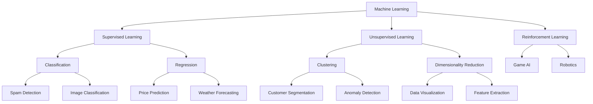
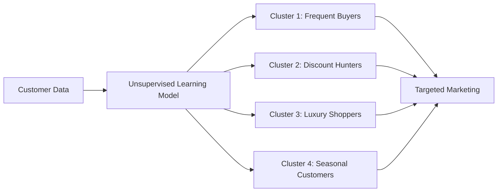
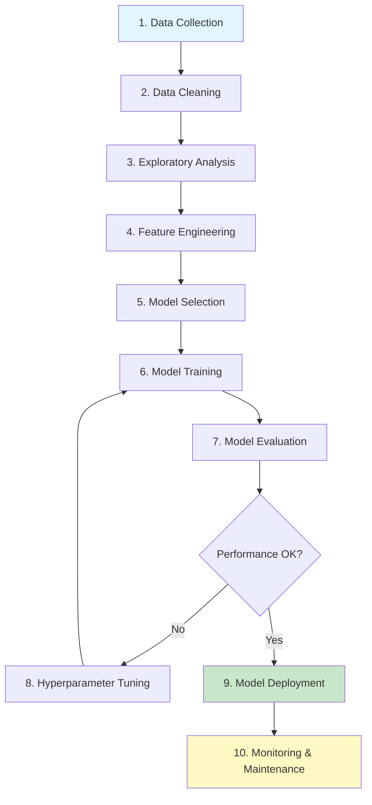

# Machine Learning for Beginners: Start Small, Learn Fast, Build Real Things
 
**Reading Time:** 15-20 minutes  
**Difficulty Level:** ⭐⭐ Intermediate  
**Category:** Artificial Intelligence / Machine Learning

---

## 📚 Table of Contents

1. [Introduction & Overview](#introduction--overview)
2. [Prerequisites](#prerequisites)
3. [Learning Objectives](#learning-objectives)
4. [Why Python for Machine Learning?](#why-python-for-machine-learning)
5. [Core ML Concepts Deep Dive](#core-ml-concepts-deep-dive)
6. [The ML Workflow](#the-ml-workflow)
7. [Hands-On Project: House Price Prediction](#hands-on-project-house-price-prediction)
8. [Essential ML Libraries](#essential-ml-libraries)
9. [Common Pitfalls & Troubleshooting](#common-pitfalls--troubleshooting)
10. [Best Practices](#best-practices)
11. [Anti-Patterns to Avoid](#anti-patterns-to-avoid)
12. [Performance Considerations](#performance-considerations)
13. [Security Considerations](#security-considerations)
14. [Practice Exercises with Solutions](#practice-exercises-with-solutions)
15. [Question Bank](#question-bank)
16. [Real-World Use Cases](#real-world-use-cases)
17. [Further Reading & Resources](#further-reading--resources)
18. [Summary & Key Takeaways](#summary--key-takeaways)

---

## 🎯 Introduction & Overview

Machine learning sounds intimidating at first. Between the math, the algorithms, and the buzzwords, it's easy to feel overwhelmed. But here's the truth: **machine learning is just teaching computers to notice patterns from data and make decisions based on those patterns.**

This comprehensive guide walks you through machine learning fundamentals in the same order most beginners naturally learn them—starting with Python, understanding how models learn, and finally building your first prediction system.

### What You'll Learn

- ✅ The fundamental concepts behind machine learning
- ✅ Why Python is the language of choice for ML
- ✅ The difference between supervised and unsupervised learning
- ✅ How to build a complete ML project from scratch
- ✅ Essential libraries and tools every ML practitioner needs
- ✅ Common mistakes and how to avoid them
- ✅ Best practices for production-ready ML systems

### Why This Matters

Machine learning is transforming every industry:
- **Healthcare:** Disease prediction and drug discovery
- **Finance:** Fraud detection and algorithmic trading
- **E-commerce:** Recommendation systems and customer segmentation
- **Transportation:** Autonomous vehicles and route optimization
- **Entertainment:** Content recommendations and game AI

According to a 2025 Gartner report, 75% of enterprises will deploy AI/ML solutions by 2026, making ML skills essential for modern developers.

---

## 📋 Prerequisites

### Required Knowledge
- **Basic Python programming** (variables, loops, functions, data structures)
- **Fundamental math concepts** (basic algebra and statistics - we'll explain as we go)
- **Understanding of data structures** (lists, dictionaries, arrays)

### Development Environment
- **Python 3.8+** installed
- **Code editor** (VS Code, PyCharm, or Jupyter Notebook recommended)
- **Git** for version control
- **Virtual environment** tool (venv, conda, or pipenv)

### Libraries You'll Need
```bash
# Core data science stack
pip install numpy==1.24.3
pip install pandas==2.0.3
pip install matplotlib==3.7.2
pip install scikit-learn==1.3.0
pip install jupyter  # Optional, for interactive notebooks
```

### Time Commitment
- **Reading & Understanding:** 2-3 hours
- **Hands-On Practice:** 4-6 hours
- **Exercises & Projects:** 8-10 hours
- **Total:** 14-19 hours for complete mastery

---

## 🎓 Learning Objectives

By the end of this tutorial, you will be able to:

### Knowledge Objectives
1. ✅ Explain what machine learning is and how it differs from traditional programming
2. ✅ Differentiate between supervised, unsupervised, and reinforcement learning
3. ✅ Understand the ML workflow from data collection to deployment
4. ✅ Identify appropriate ML algorithms for different problem types
5. ✅ Recognize common pitfalls and how to avoid them

### Skill Objectives
1. ✅ Set up a Python ML development environment
2. ✅ Load, clean, and preprocess data using Pandas
3. ✅ Visualize data patterns using Matplotlib
4. ✅ Train and evaluate ML models using Scikit-learn
5. ✅ Implement a complete house price prediction system
6. ✅ Debug and optimize ML models
7. ✅ Apply best practices for ML projects

### Project Objectives
1. ✅ Build a working spam detection classifier
2. ✅ Create a customer segmentation system
3. ✅ Develop a movie recommendation engine

---

## 🐍 Why Python for Machine Learning?

### The Python Advantage

Before learning machine learning, you need a language that makes experimentation easy. That's why Python became the default choice for beginners and professionals alike.

Python feels less like "writing complicated code" and more like giving readable instructions to a computer. The syntax is clean, beginner-friendly, and supported by a massive ecosystem of libraries that save you from reinventing everything from scratch.

### Think of Python Like a Kitchen

Imagine you're cooking a complex meal. You could forge your own pots and pans, or you could use a kitchen filled with ready-made tools. Python is that well-equipped kitchen.

In machine learning, those "tools" are specialized libraries:

| Library | Purpose | Use Case |
|---------|---------|----------|
| **NumPy** | Numerical computing | Matrix operations, mathematical functions |
| **Pandas** | Data manipulation | CSV handling, data cleaning, analysis |
| **Matplotlib** | Data visualization | Charts, graphs, plots |
| **Scikit-learn** | ML algorithms | Ready-to-use ML models and tools |
| **TensorFlow/PyTorch** | Deep learning | Neural networks, advanced AI |

### Real-World Example: House Price Analysis

With just a few lines of Python, you can:
1. Load a CSV file containing house prices
2. Clean missing values
3. Analyze trends and correlations
4. Train a prediction model
5. Visualize the results

```python
import pandas as pd
import numpy as np
from sklearn.linear_model import LinearRegression
import matplotlib.pyplot as plt

# Load data
df = pd.read_csv('house_prices.csv')

# Clean data
df = df.dropna()

# Train model
X = df[['square_feet', 'bedrooms']]
y = df['price']
model = LinearRegression()
model.fit(X, y)

# Visualize
plt.scatter(df['square_feet'], df['price'])
plt.xlabel('Square Feet')
plt.ylabel('Price ($)')
plt.show()
```

That's why Python is such a powerful starting point—it lets beginners focus on understanding concepts instead of fighting the language itself.

---

## 🧠 Core ML Concepts Deep Dive

### Machine Learning Starts with Data, Not Algorithms

> ⚠️ **Critical Insight:** One mistake many beginners make is jumping straight into algorithms without understanding the role of data.

In reality, **machine learning is mostly about data**. The model learns patterns from examples. If the examples are useful, the predictions improve. If the data is messy or incomplete, even advanced algorithms struggle.

#### The Fruit Analogy

Think about teaching a child to identify fruits:

- If you show clear examples of apples, bananas, and oranges repeatedly, they eventually learn the differences
- If you show blurry, inconsistent examples, they'll struggle
- Machine learning works in a very similar way

The computer doesn't "think." It simply finds statistical patterns from examples you provide.

### Types of Machine Learning



---

## 📊 Supervised Learning: Learning from Examples

### What is Supervised Learning?

Supervised learning is the most beginner-friendly type of machine learning because the system learns using **labeled examples**.

**In simple terms:**
- You provide the input
- You also provide the correct answer
- The model learns the relationship between them

### The Spam Filter Example

Imagine teaching a spam filter:

1. **Feed labeled data:** Thousands of emails already labeled as "Spam" or "Not Spam"
2. **Pattern recognition:** The model identifies patterns like:
   - Certain words appear frequently ("FREE", "WINNER", "CLICK HERE")
   - Suspicious links
   - Unusual formatting
   - Repetitive marketing language
3. **Make predictions:** Eventually, it predicts whether new emails are spam

### Common Supervised Learning Techniques

| Technique | Type | Use Case | Example |
|-----------|------|----------|---------|
| **Linear Regression** | Regression | Predict numerical values | House prices, temperatures |
| **Logistic Regression** | Classification | Binary classification | Spam/Not spam |
| **Decision Trees** | Both | Decision-making | Loan approval |
| **Random Forest** | Both | Improved accuracy | Customer churn prediction |
| **Support Vector Machines** | Classification | Complex boundaries | Image recognition |
| **Neural Networks** | Both | Complex patterns | Deep learning applications |

### When to Use Supervised Learning

✅ **Use when:**
- You have labeled historical data
- You want to predict known outcomes
- You need high accuracy with clear success metrics
- The problem is well-defined

❌ **Avoid when:**
- You don't have labeled data
- You're exploring unknown patterns
- The outcome is unpredictable

---

## 🔍 Unsupervised Learning: Finding Hidden Patterns

### What is Unsupervised Learning?

Real-world data is often messy. Sometimes you don't have answers already labeled. You just have a giant pile of information and want to discover patterns hidden inside it.

That's where **unsupervised learning** becomes useful.

Instead of learning from correct answers, the model tries to identify similarities and structures on its own.

### The Customer Segmentation Example

Suppose an e-commerce company has millions of customer transactions but no predefined customer categories. Machine learning can automatically group users based on behavior patterns:



### Common Unsupervised Learning Techniques

| Technique | Purpose | Application |
|-----------|---------|-------------|
| **K-Means Clustering** | Group similar data points | Customer segmentation |
| **Hierarchical Clustering** | Build cluster hierarchy | Document organization |
| **PCA (Principal Component Analysis)** | Reduce dimensions | Data visualization |
| **DBSCAN** | Density-based clustering | Anomaly detection |
| **Autoencoders** | Feature learning | Image compression |

### When to Use Unsupervised Learning

✅ **Use when:**
- You have unlabeled data
- You want to discover hidden patterns
- You need to reduce data complexity
- You're exploring data structure

❌ **Avoid when:**
- You have clear labeled data
- You need specific predictions
- Accuracy is critical and supervised learning is feasible

---

## ⚙️ The ML Workflow



### Detailed Workflow Steps

#### 1. Data Collection
- Gather data from various sources (databases, APIs, files)
- Ensure data relevance to the problem
- Document data sources and collection methods

#### 2. Data Cleaning
- Handle missing values (imputation or removal)
- Remove duplicates
- Fix inconsistent formatting
- Handle outliers

#### 3. Exploratory Data Analysis (EDA)
- Understand data distributions
- Identify correlations
- Detect anomalies
- Visualize patterns

#### 4. Feature Engineering
- Select relevant features
- Create new features from existing ones
- Encode categorical variables
- Normalize/standardize numerical features

#### 5. Model Selection
- Choose appropriate algorithms
- Consider problem type (classification/regression)
- Evaluate computational requirements
- Start simple, iterate

#### 6. Model Training
- Split data into train/test sets
- Train model on training data
- Monitor training process
- Save trained model

#### 7. Model Evaluation
- Test on unseen data
- Calculate performance metrics
- Analyze errors
- Validate results

#### 8. Hyperparameter Tuning
- Adjust model parameters
- Use cross-validation
- Optimize for specific metrics
- Avoid overfitting

#### 9. Model Deployment
- Export model
- Create API or integration
- Test in production environment
- Document deployment process

#### 10. Monitoring & Maintenance
- Track model performance
- Retrain periodically
- Update with new data
- Monitor for drift

---

## 🏠 Hands-On Project: House Price Prediction

The best way to learn machine learning is by building something small but complete. House price prediction is a classic beginner project because it combines all the important concepts in one place.

### Project Overview

**Goal:** Build a model that predicts house prices based on features like square footage, number of bedrooms, location, and age.

**Dataset Features:**
- Square footage
- Number of bedrooms
- Number of bathrooms
- Location/zip code
- Age of property
- Final selling price (target variable)

### Step 1: Load the Data

```python
import pandas as pd
import numpy as np
import matplotlib.pyplot as plt
import seaborn as sns
from sklearn.model_selection import train_test_split
from sklearn.linear_model import LinearRegression
from sklearn.metrics import mean_absolute_error, r2_score
import warnings
warnings.filterwarnings('ignore')

# Load the dataset
df = pd.read_csv('house_prices.csv')

# Display first few rows
print("First 5 rows of the dataset:")
print(df.head())

# Display dataset info
print("\nDataset Information:")
print(df.info())

# Display statistical summary
print("\nStatistical Summary:")
print(df.describe())
```

### Step 2: Clean and Prepare the Data

Real-world data is rarely perfect. You'll need to handle missing values, convert text to numbers, and remove inconsistent records.

```python
# Check for missing values
print("\nMissing Values:")
print(df.isnull().sum())

# Handle missing values
# Option 1: Remove rows with missing values
df_cleaned = df.dropna()

# Option 2: Fill missing values with mean/median
# df['square_feet'] = df['square_feet'].fillna(df['square_feet'].median())
# df['bedrooms'] = df['bedrooms'].fillna(df['bedrooms'].median())

# Remove duplicates
df_cleaned = df_cleaned.drop_duplicates()

# Handle outliers using IQR method
Q1 = df_cleaned['price'].quantile(0.25)
Q3 = df_cleaned['price'].quantile(0.75)
IQR = Q3 - Q1
df_cleaned = df_cleaned[~((df_cleaned['price'] < (Q1 - 1.5 * IQR)) | 
                           (df_cleaned['price'] > (Q3 + 1.5 * IQR)))]

print(f"\nDataset shape after cleaning: {df_cleaned.shape}")
```

### Step 3: Exploratory Data Analysis

```python
# Correlation matrix
plt.figure(figsize=(10, 8))
correlation = df_cleaned.corr()
sns.heatmap(correlation, annot=True, cmap='coolwarm', center=0)
plt.title('Feature Correlation Matrix')
plt.tight_layout()
plt.show()

# Distribution of house prices
plt.figure(figsize=(10, 6))
plt.hist(df_cleaned['price'], bins=50, edgecolor='black')
plt.xlabel('Price ($)')
plt.ylabel('Frequency')
plt.title('Distribution of House Prices')
plt.grid(True, alpha=0.3)
plt.show()

# Scatter plot: Square footage vs Price
plt.figure(figsize=(10, 6))
plt.scatter(df_cleaned['square_feet'], df_cleaned['price'], alpha=0.6)
plt.xlabel('Square Feet')
plt.ylabel('Price ($)')
plt.title('Square Footage vs Price')
plt.grid(True, alpha=0.3)
plt.show()
```

### Step 4: Prepare Features and Target

```python
# Select features and target
features = ['square_feet', 'bedrooms', 'bathrooms', 'age']
X = df_cleaned[features]
y = df_cleaned['price']

# Split data into training and testing sets (80/20 split)
X_train, X_test, y_train, y_test = train_test_split(
    X, y, test_size=0.2, random_state=42
)

print(f"Training set size: {X_train.shape[0]} samples")
print(f"Testing set size: {X_test.shape[0]} samples")
```

### Step 5: Train the Model

```python
# Initialize the model
model = LinearRegression()

# Train the model
model.fit(X_train, y_train)

# Display model coefficients
print("\nModel Coefficients:")
for feature, coef in zip(features, model.coef_):
    print(f"{feature}: {coef:.2f}")
print(f"Intercept: {model.intercept_:.2f}")
```

### Step 6: Make Predictions and Evaluate

```python
# Make predictions on test set
y_pred = model.predict(X_test)

# Calculate evaluation metrics
mae = mean_absolute_error(y_test, y_pred)
r2 = r2_score(y_test, y_pred)

print(f"\nModel Performance:")
print(f"Mean Absolute Error: ${mae:,.2f}")
print(f"R² Score: {r2:.4f}")

# Interpretation
print(f"\nOn average, predictions are off by ${mae:,.2f}")
print(f"Model explains {r2*100:.2f}% of price variance")
```

### Step 7: Visualize Results

```python
# Actual vs Predicted prices
plt.figure(figsize=(10, 6))
plt.scatter(y_test, y_pred, alpha=0.6)
plt.plot([y_test.min(), y_test.max()], [y_test.min(), y_test.max()], 
         'r--', lw=2, label='Perfect Prediction')
plt.xlabel('Actual Price ($)')
plt.ylabel('Predicted Price ($)')
plt.title('Actual vs Predicted House Prices')
plt.legend()
plt.grid(True, alpha=0.3)
plt.tight_layout()
plt.show()

# Residual plot
residuals = y_test - y_pred
plt.figure(figsize=(10, 6))
plt.scatter(y_pred, residuals, alpha=0.6)
plt.axhline(y=0, color='r', linestyle='--')
plt.xlabel('Predicted Price ($)')
plt.ylabel('Residuals ($)')
plt.title('Residual Plot')
plt.grid(True, alpha=0.3)
plt.tight_layout()
plt.show()
```

### Step 8: Test with New Data

```python
# Predict price for a new house
new_house = pd.DataFrame({
    'square_feet': [2500],
    'bedrooms': [4],
    'bathrooms': [3],
    'age': [10]
})

predicted_price = model.predict(new_house)
print(f"\nPredicted price for new house: ${predicted_price[0]:,.2f}")

# Feature importance
feature_importance = pd.DataFrame({
    'feature': features,
    'importance': np.abs(model.coef_)
}).sort_values('importance', ascending=False)

print("\nFeature Importance:")
print(feature_importance)
```

### Complete Working Example

```python
"""
Complete House Price Prediction System
Author: ML Tutorial
Date: 2026
"""

import pandas as pd
import numpy as np
import matplotlib.pyplot as plt
import seaborn as sns
from sklearn.model_selection import train_test_split
from sklearn.linear_model import LinearRegression
from sklearn.metrics import mean_absolute_error, r2_score, mean_squared_error
import warnings
warnings.filterwarnings('ignore')

class HousePricePredictor:
    """A complete house price prediction system"""
    
    def __init__(self, data_path):
        """Initialize with dataset path"""
        self.data_path = data_path
        self.df = None
        self.model = LinearRegression()
        self.X_train = None
        self.X_test = None
        self.y_train = None
        self.y_test = None
        
    def load_data(self):
        """Load and display initial data"""
        self.df = pd.read_csv(self.data_path)
        print("✅ Data loaded successfully")
        print(f"Dataset shape: {self.df.shape}")
        return self
    
    def clean_data(self):
        """Clean and preprocess data"""
        # Remove missing values
        initial_rows = len(self.df)
        self.df = self.df.dropna()
        print(f"✅ Removed {initial_rows - len(self.df)} rows with missing values")
        
        # Remove duplicates
        self.df = self.df.drop_duplicates()
        print(f"✅ Dataset shape after cleaning: {self.df.shape}")
        return self
    
    def prepare_features(self, features, target):
        """Prepare features and target variable"""
        self.features = features
        self.target = target
        
        X = self.df[features]
        y = self.df[target]
        
        # Split data
        self.X_train, self.X_test, self.y_train, self.y_test = train_test_split(
            X, y, test_size=0.2, random_state=42
        )
        print(f"✅ Training set: {self.X_train.shape[0]} samples")
        print(f"✅ Testing set: {self.X_test.shape[0]} samples")
        return self
    
    def train_model(self):
        """Train the model"""
        self.model.fit(self.X_train, self.y_train)
        print("✅ Model trained successfully")
        return self
    
    def evaluate_model(self):
        """Evaluate model performance"""
        y_pred = self.model.predict(self.X_test)
        
        self.mae = mean_absolute_error(self.y_test, y_pred)
        self.r2 = r2_score(self.y_test, y_pred)
        self.rmse = np.sqrt(mean_squared_error(self.y_test, y_pred))
        
        print("\n📊 Model Performance Metrics:")
        print(f"Mean Absolute Error: ${self.mae:,.2f}")
        print(f"Root Mean Squared Error: ${self.rmse:,.2f}")
        print(f"R² Score: {self.r2:.4f}")
        
        return self
    
    def predict(self, house_features):
        """Make predictions on new data"""
        prediction = self.model.predict(house_features)
        return prediction[0]
    
    def get_feature_importance(self):
        """Get feature importance"""
        importance = pd.DataFrame({
            'feature': self.features,
            'coefficient': self.model.coef_,
            'importance': np.abs(self.model.coef_)
        }).sort_values('importance', ascending=False)
        return importance

# Usage example
if __name__ == "__main__":
    # Initialize predictor
    predictor = HousePricePredictor('house_prices.csv')
    
    # Run complete pipeline
    predictor.load_data()\
            .clean_data()\
            .prepare_features(['square_feet', 'bedrooms', 'bathrooms', 'age'], 
                            'price')\
            .train_model()\
            .evaluate_model()
    
    # Make a prediction
    new_house = pd.DataFrame({
        'square_feet': [2500],
        'bedrooms': [4],
        'bathrooms': [3],
        'age': [10]
    })
    
    predicted_price = predictor.predict(new_house)
    print(f"\n🏠 Predicted price: ${predicted_price:,.2f}")
    
    # Feature importance
    print("\n📈 Feature Importance:")
    print(predictor.get_feature_importance())
```

---

## 📦 Essential ML Libraries

### NumPy: The Foundation

NumPy (Numerical Python) is the foundation of scientific computing in Python. It provides support for large, multi-dimensional arrays and matrices, along with mathematical functions to operate on these arrays.

```python
import numpy as np

# Create arrays
arr = np.array([1, 2, 3, 4, 5])
matrix = np.array([[1, 2, 3], [4, 5, 6]])

# Mathematical operations
print(np.mean(arr))        # Mean: 3.0
print(np.std(arr))         # Standard deviation: 1.41
print(np.sum(matrix))      # Sum of all elements: 21

# Matrix operations
print(matrix.T)            # Transpose
print(np.dot(matrix, matrix.T))  # Matrix multiplication
```

**Key Features:**
- Fast array operations
- Mathematical functions
- Linear algebra operations
- Random number generation
- Statistical functions

### Pandas: Data Manipulation

Pandas is the primary tool for data manipulation and analysis in Python. It provides data structures like DataFrame and Series for handling structured data.

```python
import pandas as pd

# Create a DataFrame
data = {
    'name': ['Alice', 'Bob', 'Charlie'],
    'age': [25, 30, 35],
    'city': ['NYC', 'LA', 'Chicago']
}
df = pd.DataFrame(data)

# Basic operations
print(df.head())           # First 5 rows
print(df.describe())       # Statistical summary
print(df['age'].mean())    # Average age

# Filtering
adults = df[df['age'] >= 30]

# Grouping
grouped = df.groupby('city').mean()
```

**Key Features:**
- Data loading (CSV, Excel, SQL, etc.)
- Data cleaning and transformation
- Aggregation and grouping
- Time series analysis
- Merging and joining datasets

### Matplotlib: Data Visualization

Matplotlib is the most popular plotting library for Python. It creates static, animated, and interactive visualizations.

```python
import matplotlib.pyplot as plt

# Line plot
x = [1, 2, 3, 4, 5]
y = [2, 4, 6, 8, 10]
plt.plot(x, y, marker='o')
plt.xlabel('X-axis')
plt.ylabel('Y-axis')
plt.title('Line Plot Example')
plt.grid(True)
plt.show()

# Bar chart
categories = ['A', 'B', 'C', 'D']
values = [10, 20, 15, 25]
plt.bar(categories, values)
plt.show()

# Scatter plot
plt.scatter(df['square_feet'], df['price'])
plt.xlabel('Square Feet')
plt.ylabel('Price')
plt.show()
```

**Key Features:**
- Line plots, bar charts, scatter plots
- Histograms and box plots
- Customizable styling
- Multiple subplots
- Export to various formats

### Scikit-learn: Machine Learning

Scikit-learn is the go-to library for classical machine learning algorithms. It provides simple and efficient tools for data mining and data analysis.

```python
from sklearn.model_selection import train_test_split
from sklearn.linear_model import LinearRegression
from sklearn.metrics import accuracy_score, mean_squared_error

# Split data
X_train, X_test, y_train, y_test = train_test_split(
    X, y, test_size=0.2, random_state=42
)

# Train model
model = LinearRegression()
model.fit(X_train, y_train)

# Make predictions
predictions = model.predict(X_test)

# Evaluate
mse = mean_squared_error(y_test, predictions)
print(f"Mean Squared Error: {mse}")
```

**Key Features:**
- Supervised learning algorithms
- Unsupervised learning algorithms
- Model selection and evaluation
- Preprocessing tools
- Pipeline construction

---

## ⚠️ Common Pitfalls & Troubleshooting

### 1. Overfitting

**Problem:** Model performs perfectly on training data but fails on new data.

**Symptoms:**
- Training accuracy: 99%
- Test accuracy: 70%

**Solutions:**
```python
# Use more training data
# Apply regularization
from sklearn.linear_model import Ridge, Lasso

# Ridge regression (L2 regularization)
model = Ridge(alpha=1.0)

# Lasso regression (L1 regularization)
model = Lasso(alpha=1.0)

# Use cross-validation
from sklearn.model_selection import cross_val_score
scores = cross_val_score(model, X, y, cv=5)
```

### 2. Underfitting

**Problem:** Model is too simple and performs poorly on both training and test data.

**Symptoms:**
- Training accuracy: 65%
- Test accuracy: 64%

**Solutions:**
- Use more complex models
- Add more features
- Reduce regularization
- Train longer (for neural networks)

### 3. Data Quality Issues

**Problem:** Garbage in, garbage out.

**Common Issues:**
```python
# Check for missing values
print(df.isnull().sum())

# Handle missing values
df.fillna(df.mean(), inplace=True)  # Fill with mean
# OR
df.dropna(inplace=True)  # Remove rows

# Check for duplicates
print(f"Duplicates: {df.duplicated().sum()}")
df.drop_duplicates(inplace=True)

# Handle outliers
from scipy import stats
z_scores = np.abs(stats.zscore(df['price']))
df = df[z_scores < 3]  # Remove outliers beyond 3 standard deviations
```

### 4. Data Leakage

**Problem:** Information from test set leaks into training.

**Solution:**
```python
# CORRECT: Split first, then preprocess
X_train, X_test, y_train, y_test = train_test_split(X, y, test_size=0.2)

# Fit scaler on training data only
from sklearn.preprocessing import StandardScaler
scaler = StandardScaler()
X_train_scaled = scaler.fit_transform(X_train)
X_test_scaled = scaler.transform(X_test)  # Only transform, don't fit

# WRONG: Don't do this
# scaler = StandardScaler()
# X_scaled = scaler.fit_transform(X)  # Leaks test data information!
```

### 5. Poor Feature Selection

**Problem:** Using irrelevant or redundant features.

**Solution:**
```python
# Use feature selection
from sklearn.feature_selection import SelectKBest, f_regression

selector = SelectKBest(score_func=f_regression, k=5)
X_selected = selector.fit_transform(X, y)

# Or use feature importance
from sklearn.ensemble import RandomForestRegressor
model = RandomForestRegressor()
model.fit(X, y)
importance = pd.DataFrame({
    'feature': X.columns,
    'importance': model.feature_importances_
}).sort_values('importance', ascending=False)
```

---

## ✅ Best Practices

### 1. Data Preparation

✅ **DO:**
- Always explore your data before modeling
- Handle missing values appropriately
- Normalize/standardize features when needed
- Split data before any preprocessing
- Document all data transformations

❌ **DON'T:**
- Skip exploratory data analysis
- Impute missing values without understanding why they're missing
- Use test data for training in any way
- Ignore data quality issues

### 2. Model Development

✅ **DO:**
- Start with simple models (baseline)
- Use cross-validation for reliable evaluation
- Track experiments and results
- Version control your code and data
- Document assumptions and decisions

❌ **DON'T:**
- Jump to complex models immediately
- Trust a single train/test split
- Experiment without tracking
- Deploy without proper validation

### 3. Code Organization

```python
# Project structure
ml_project/
├── data/
│   ├── raw/
│   ├── processed/
│   └── external/
├── notebooks/
│   └── exploration.ipynb
├── src/
│   ├── data/
│   │   ├── make_dataset.py
│   │   └── preprocess.py
│   ├── features/
│   │   └── build_features.py
│   ├── models/
│   │   ├── train_model.py
│   │   └── predict_model.py
│   └── visualization/
│       └── visualize.py
├── tests/
├── models/
├── reports/
│   └── figures/
├── requirements.txt
├── README.md
└── .gitignore
```

### 4. Documentation

```python
def train_model(X_train, y_train, model_type='linear'):
    """
    Train a machine learning model.
    
    Parameters:
    -----------
    X_train : array-like
        Training features
    y_train : array-like
        Training target variable
    model_type : str
        Type of model to train ('linear', 'ridge', 'lasso')
    
    Returns:
    --------
    model : trained model object
        The trained model
    
    Example:
    --------
    >>> model = train_model(X_train, y_train, model_type='ridge')
    """
    # Implementation
    pass
```

### 5. Testing

```python
import unittest

class TestModelTraining(unittest.TestCase):
    def test_model_training(self):
        """Test that model trains without errors"""
        X = np.array([[1], [2], [3]])
        y = np.array([2, 4, 6])
        model = train_model(X, y)
        self.assertIsNotNone(model)
    
    def test_prediction_shape(self):
        """Test prediction output shape"""
        X_train = np.array([[1], [2], [3]])
        y_train = np.array([2, 4, 6])
        model = train_model(X_train, y_train)
        prediction = model.predict([[4]])
        self.assertEqual(prediction.shape, (1,))
```

---

## ❌ Anti-Patterns to Avoid

### 1. The "Perfect Model" Trap

❌ **Anti-Pattern:** Spending weeks trying to achieve 100% accuracy.

✅ **Solution:** Aim for "good enough" that meets business requirements. A 95% accurate model deployed is better than a 99% accurate model that never ships.

### 2. The Algorithm Hopper

❌ **Anti-Pattern:** Trying 20 different algorithms without proper evaluation.

✅ **Solution:** Master 2-3 algorithms first. Understand their strengths and weaknesses. Choose the right tool for the job.

| Algorithm | Best For | Avoid When |
|-----------|----------|------------|
| Linear Regression | Linear relationships | Complex non-linear patterns |
| Decision Trees | Interpretable models | High accuracy required |
| Random Forest | Balanced accuracy | Real-time predictions needed |
| Gradient Boosting | High accuracy | Limited computational resources |
| Neural Networks | Complex patterns | Small datasets |

### 3. The Feature Explosion

❌ **Anti-Pattern:** Adding every possible feature without analysis.

✅ **Solution:** Use feature selection techniques. More features ≠ better model. Irrelevant features add noise.

```python
# Feature selection example
from sklearn.feature_selection import VarianceThreshold

# Remove low variance features
selector = VarianceThreshold(threshold=0.1)
X_reduced = selector.fit_transform(X)
```

### 4. The Ignorance of Baseline

❌ **Anti-Pattern:** Building complex models without comparing to simple baselines.

✅ **Solution:** Always establish a baseline first.

```python
# Baseline: Always predict the mean
baseline_pred = np.full(len(y_test), y_train.mean())
baseline_mae = mean_absolute_error(y_test, baseline_pred)

print(f"Baseline MAE: ${baseline_mae:,.2f}")
print(f"Model MAE: ${model_mae:,.2f}")

# Your model should beat this!
```

### 5. The Production Blindspot

❌ **Anti-Pattern:** Building models that work in notebooks but fail in production.

✅ **Solution:** Consider deployment from day one.
- Use environment variables for configuration
- Implement logging and monitoring
- Handle edge cases and errors
- Test with real-world data

### 6. The Black Box Syndrome

❌ **Anti-Pattern:** Deploying models without understanding how they make predictions.

✅ **Solution:** Use interpretability tools.

```python
# SHAP values for model interpretability
import shap

explainer = shap.LinearExplainer(model, X_train)
shap_values = explainer.shap_values(X_test)

shap.summary_plot(shap_values, X_test)
```

---

## ⚡ Performance Considerations

### Computational Efficiency

```python
# 1. Use efficient data types
df['price'] = df['price'].astype(np.float32)  # Instead of float64
df['category'] = df['category'].astype('category')  # For categorical data

# 2. Vectorize operations (avoid loops)
# SLOW
result = []
for i in range(len(df)):
    result.append(df['price'][i] * 2)

# FAST
result = df['price'] * 2

# 3. Use appropriate algorithms
# For large datasets, use SGDClassifier instead of LogisticRegression
from sklearn.linear_model import SGDClassifier
model = SGDClassifier(loss='log_loss')  # Logistic regression with SGD
```

### Memory Optimization

```python
# 1. Load data in chunks for large files
chunk_size = 10000
for chunk in pd.read_csv('large_file.csv', chunksize=chunk_size):
    process(chunk)

# 2. Use sparse matrices for categorical data
from scipy.sparse import csr_matrix

# 3. Clear unused variables
import gc
del large_variable
gc.collect()
```

### Scaling Strategies

```python
# For datasets that don't fit in memory:
# Option 1: Dask
import dask.dataframe as dd
ddf = dd.read_csv('large_file.csv')
result = ddf.groupby('category').mean().compute()

# Option 2: Incremental learning
from sklearn.linear_model import SGDRegressor

model = SGDRegressor()
for X_batch, y_batch in load_data_in_batches():
    model.partial_fit(X_batch, y_batch)
```

### Performance Benchmarking

```python
import time
from sklearn.datasets import make_regression

# Generate sample data
X, y = make_regression(n_samples=100000, n_features=20, random_state=42)

# Benchmark different algorithms
algorithms = {
    'Linear Regression': LinearRegression(),
    'Ridge': Ridge(),
    'Lasso': Lasso(),
    'ElasticNet': ElasticNet()
}

for name, model in algorithms.items():
    start_time = time.time()
    model.fit(X, y)
    training_time = time.time() - start_time
    print(f"{name}: {training_time:.4f} seconds")
```

---

## 🔒 Security Considerations

### 1. Data Privacy

```python
# Anonymize sensitive data
def anonymize_data(df):
    """Remove or hash sensitive information"""
    # Hash email addresses
    df['email_hash'] = df['email'].apply(lambda x: hashlib.sha256(x.encode()).hexdigest())
    df.drop('email', axis=1, inplace=True)
    
    # Generalize ages to ranges
    df['age_group'] = pd.cut(df['age'], 
                             bins=[0, 18, 30, 50, 70, 100],
                             labels=['0-18', '19-30', '31-50', '51-70', '71+'])
    df.drop('age', axis=1, inplace=True)
    
    return df
```

### 2. Model Poisoning Prevention

```python
# Validate data sources
def validate_data_source(data, expected_schema):
    """Ensure data comes from trusted sources"""
    # Check column names
    if set(data.columns) != set(expected_schema.keys()):
        raise ValueError("Schema mismatch!")
    
    # Check data types
    for col, dtype in expected_schema.items():
        if data[col].dtype != dtype:
            raise ValueError(f"Invalid dtype for {col}")
    
    # Check for anomalies
    if data.isnull().sum().sum() > threshold:
        raise ValueError("Too many missing values")
    
    return True
```

### 3. Adversarial Attack Awareness

```python
# Add noise to protect against adversarial examples
def add_defensive_noise(X, epsilon=0.01):
    """Add small random noise to features"""
    noise = np.random.normal(0, epsilon, X.shape)
    return X + noise

# Use ensemble methods for robustness
from sklearn.ensemble import VotingClassifier

model = VotingClassifier([
    ('lr', LogisticRegression()),
    ('rf', RandomForestClassifier()),
    ('svm', SVC(probability=True))
])
```

### 4. Secure Model Deployment

```python
# Implement authentication
from functools import wraps
import jwt

def authenticate(f):
    @wraps(f)
    def decorated(*args, **kwargs):
        token = request.headers.get('Authorization')
        try:
            payload = jwt.decode(token, SECRET_KEY, algorithms=['HS256'])
            return f(*args, **kwargs)
        except:
            return {'error': 'Unauthorized'}, 401
    return decorated

@app.route('/predict', methods=['POST'])
@authenticate
def predict():
    data = request.get_json()
    prediction = model.predict([data['features']])
    return {'prediction': prediction.tolist()}
```

### 5. Input Validation

```python
def validate_input(data):
    """Validate user input before prediction"""
    required_fields = ['square_feet', 'bedrooms', 'bathrooms', 'age']
    
    # Check required fields
    for field in required_fields:
        if field not in data:
            raise ValueError(f"Missing required field: {field}")
    
    # Validate ranges
    if not (100 <= data['square_feet'] <= 10000):
        raise ValueError("Square feet must be between 100 and 10000")
    
    if not (1 <= data['bedrooms'] <= 20):
        raise ValueError("Bedrooms must be between 1 and 20")
    
    return True
```

---

## 💪 Practice Exercises with Solutions

### Exercise 1: Spam Detection Classifier

**Difficulty:** ⭐ Intermediate  
**Time:** 45-60 minutes

#### Problem Statement

Build a spam detection system that classifies emails as spam or not spam. You'll use the SMS Spam Collection dataset.

#### Requirements
1. Load and preprocess the dataset
2. Extract features from text (TF-IDF)
3. Train a classification model
4. Evaluate performance with appropriate metrics
5. Test with custom messages

#### Solution

```python
"""
Spam Detection Classifier
Solution to Exercise 1
"""

import pandas as pd
import numpy as np
from sklearn.feature_extraction.text import TfidfVectorizer
from sklearn.model_selection import train_test_split
from sklearn.naive_bayes import MultinomialNB
from sklearn.metrics import accuracy_score, precision_score, recall_score, f1_score, confusion_matrix
import seaborn as sns
import matplotlib.pyplot as plt

# Step 1: Load data
# Download from: https://archive.ics.uci.edu/ml/datasets/sms+spam+collection
df = pd.read_csv('spam.csv', encoding='latin-1')
df = df[['v1', 'v2']]
df.columns = ['label', 'message']

print(f"Dataset shape: {df.shape}")
print(f"Spam messages: {len(df[df['label'] == 'spam'])}")
print(f"Ham messages: {len(df[df['label'] == 'ham'])}")

# Step 2: Preprocess data
df['label_num'] = df['label'].map({'ham': 0, 'spam': 1})

# Step 3: Extract features using TF-IDF
tfidf = TfidfVectorizer(max_features=5000, stop_words='english')
X = tfidf.fit_transform(df['message'])
y = df['label_num']

# Step 4: Split data
X_train, X_test, y_train, y_test = train_test_split(
    X, y, test_size=0.2, random_state=42, stratify=y
)

# Step 5: Train model
model = MultinomialNB()
model.fit(X_train, y_train)

# Step 6: Evaluate
y_pred = model.predict(X_test)

print("\n📊 Model Performance:")
print(f"Accuracy: {accuracy_score(y_test, y_pred):.4f}")
print(f"Precision: {precision_score(y_test, y_pred):.4f}")
print(f"Recall: {recall_score(y_test, y_pred):.4f}")
print(f"F1-Score: {f1_score(y_test, y_pred):.4f}")

# Confusion Matrix
cm = confusion_matrix(y_test, y_pred)
plt.figure(figsize=(8, 6))
sns.heatmap(cm, annot=True, fmt='d', cmap='Blues')
plt.xlabel('Predicted')
plt.ylabel('Actual')
plt.title('Confusion Matrix - Spam Detection')
plt.show()

# Step 7: Test with custom messages
def predict_spam(message):
    """Predict if a message is spam"""
    message_tfidf = tfidf.transform([message])
    prediction = model.predict(message_tfidf)[0]
    probability = model.predict_proba(message_tfidf)[0]
    
    result = "SPAM" if prediction == 1 else "HAM"
    confidence = probability[prediction]
    
    return result, confidence

# Test examples
test_messages = [
    "Hey, want to grab coffee later?",
    "CONGRATULATIONS! You've won a FREE iPhone! Click here to claim!",
    "Meeting at 3pm tomorrow in conference room B",
    "URGENT: Your account has been compromised. Verify now!"
]

print("\n🧪 Testing Custom Messages:")
for msg in test_messages:
    result, confidence = predict_spam(msg)
    print(f"\nMessage: {msg}")
    print(f"Prediction: {result} (Confidence: {confidence:.2%})")
```

**Expected Output:**
- Accuracy: ~97%
- Precision: ~98%
- Recall: ~85%
- Correctly identifies spam patterns

---

### Exercise 2: Customer Segmentation

**Difficulty:** ⭐⭐ Intermediate  
**Time:** 60-90 minutes

#### Problem Statement

Perform customer segmentation using K-Means clustering on the Mall Customers dataset. Identify distinct customer groups for targeted marketing.

#### Requirements
1. Load and explore the dataset
2. Perform data preprocessing
3. Use the Elbow Method to find optimal clusters
4. Apply K-Means clustering
5. Visualize the segments
6. Provide business insights

#### Solution

```python
"""
Customer Segmentation with K-Means Clustering
Solution to Exercise 2
"""

import pandas as pd
import numpy as np
import matplotlib.pyplot as plt
import seaborn as sns
from sklearn.cluster import KMeans
from sklearn.preprocessing import StandardScaler
from sklearn.decomposition import PCA

# Step 1: Load data
# Dataset: Mall Customers (available on Kaggle)
df = pd.read_csv('Mall_Customers.csv')
print("Dataset Info:")
print(df.info())
print("\nFirst 5 rows:")
print(df.head())

# Step 2: Select features for clustering
X = df[['Annual Income (k$)', 'Spending Score (1-100)']]

# Step 3: Scale features
scaler = StandardScaler()
X_scaled = scaler.fit_transform(X)

# Step 4: Find optimal number of clusters using Elbow Method
wcss = []  # Within-Cluster Sum of Squares
K_range = range(1, 11)

for k in K_range:
    kmeans = KMeans(n_clusters=k, random_state=42, n_init=10)
    kmeans.fit(X_scaled)
    wcss.append(kmeans.inertia_)

# Plot Elbow Curve
plt.figure(figsize=(10, 6))
plt.plot(K_range, wcss, marker='o', linestyle='--')
plt.xlabel('Number of Clusters (K)')
plt.ylabel('WCSS')
plt.title('Elbow Method for Optimal K')
plt.grid(True, alpha=0.3)
plt.show()

# Step 5: Apply K-Means with optimal K (let's say K=5)
optimal_k = 5
kmeans = KMeans(n_clusters=optimal_k, random_state=42, n_init=10)
df['Cluster'] = kmeans.fit_predict(X_scaled)

# Step 6: Visualize clusters
plt.figure(figsize=(10, 6))
scatter = plt.scatter(X['Annual Income (k$)'], 
                      X['Spending Score (1-100)'],
                      c=df['Cluster'], 
                      cmap='viridis',
                      s=100,
                      alpha=0.6)

plt.scatter(kmeans.cluster_centers_[:, 0], 
            kmeans.cluster_centers_[:, 1], 
            s=300, c='red', marker='X', label='Centroids')

plt.xlabel('Annual Income (k$)')
plt.ylabel('Spending Score (1-100)')
plt.title('Customer Segments')
plt.legend()
plt.grid(True, alpha=0.3)
plt.colorbar(scatter, label='Cluster')
plt.show()

# Step 7: Analyze clusters
cluster_analysis = df.groupby('Cluster').agg({
    'Annual Income (k$)': 'mean',
    'Spending Score (1-100)': 'mean',
    'Age': 'mean'
}).round(2)

print("\n📊 Cluster Analysis:")
print(cluster_analysis)

# Step 8: Business Insights
print("\n💡 Business Insights:")
for cluster in range(optimal_k):
    cluster_data = df[df['Cluster'] == cluster]
    avg_income = cluster_data['Annual Income (k$)'].mean()
    avg_spending = cluster_data['Spending Score (1-100)'].mean()
    
    print(f"\nCluster {cluster}:")
    print(f"  - Average Income: ${avg_income}k")
    print(f"  - Average Spending Score: {avg_spending}")
    
    if avg_income > 70 and avg_spending > 70:
        print("  → Target: Premium products and VIP services")
    elif avg_income > 70 and avg_spending < 40:
        print("  → Target: Savings offers and value products")
    elif avg_income < 40 and avg_spending > 70:
        print("  → Target: Budget-friendly options and discounts")
    else:
        print("  → Target: Balanced marketing approach")
```

**Expected Output:**
- 5 distinct customer segments
- Clear visualization of clusters
- Actionable business insights for each segment

---

### Exercise 3: Movie Recommendation System

**Difficulty:** ⭐⭐⭐ Advanced  
**Time:** 90-120 minutes

#### Problem Statement

Build a collaborative filtering-based movie recommendation system using the MovieLens dataset.

#### Requirements
1. Load and prepare the MovieLens dataset
2. Implement user-based collaborative filtering
3. Implement item-based collaborative filtering
4. Compare both approaches
5. Generate top-N recommendations for a user
6. Evaluate recommendation quality

#### Solution

```python
"""
Movie Recommendation System
Solution to Exercise 3
"""

import pandas as pd
import numpy as np
from scipy.sparse import csr_matrix
from sklearn.metrics.pairwise import cosine_similarity

# Step 1: Load MovieLens data
# Download from: https://grouplens.org/datasets/movielens/
ratings = pd.read_csv('ratings.csv')
movies = pd.read_csv('movies.csv')

print(f"Ratings shape: {ratings.shape}")
print(f"Movies shape: {movies.shape}")

# Step 2: Create user-item matrix
user_item_matrix = ratings.pivot(
    index='userId',
    columns='movieId',
    values='rating'
).fillna(0)

print(f"\nUser-Item Matrix shape: {user_item_matrix.shape}")

# Step 3: Convert to sparse matrix for efficiency
sparse_matrix = csr_matrix(user_item_matrix.values)

# Step 4: Calculate similarity matrices
# User similarity
user_similarity = cosine_similarity(sparse_matrix)
user_similarity_df = pd.DataFrame(
    user_similarity,
    index=user_item_matrix.index,
    columns=user_item_matrix.index
)

# Item similarity
item_similarity = cosine_similarity(sparse_matrix.T)
item_similarity_df = pd.DataFrame(
    item_similarity,
    index=user_item_matrix.columns,
    columns=user_item_matrix.columns
)

# Step 5: Recommendation functions
def get_user_based_recommendations(user_id, n_recommendations=10):
    """Get recommendations based on similar users"""
    # Find similar users
    similar_users = user_similarity_df[user_id].sort_values(ascending=False)[1:11]
    
    # Get movies rated by similar users
    recommendations = pd.Series(dtype='float64')
    
    for similar_user, similarity in similar_users.items():
        user_ratings = user_item_matrix.loc[similar_user]
        # Weight ratings by similarity
        weighted_ratings = user_ratings * similarity
        recommendations = recommendations.add(weighted_ratings, fill_value=0)
    
    # Filter out already watched movies
    watched_movies = user_item_matrix.loc[user_id]
    recommendations = recommendations[watched_movies == 0]
    
    # Get top N recommendations
    top_movies = recommendations.nlargest(n_recommendations)
    
    return top_movies

def get_item_based_recommendations(user_id, n_recommendations=10):
    """Get recommendations based on similar items"""
    # Get user's rated movies
    user_ratings = user_item_matrix.loc[user_id]
    rated_movies = user_ratings[user_ratings > 0].index
    
    # Calculate predicted ratings
    predictions = pd.Series(dtype='float64')
    
    for movie_id in rated_movies:
        rating = user_ratings[movie_id]
        similar_movies = item_similarity_df[movie_id].sort_values(ascending=False)[1:51]
        
        for similar_movie, similarity in similar_movies.items():
            if user_ratings[similar_movie] == 0:
                if similar_movie not in predictions.index:
                    predictions[similar_movie] = 0
                predictions[similar_movie] += similarity * rating
    
    # Get top N recommendations
    top_movies = predictions.nlargest(n_recommendations)
    
    return top_movies

# Step 6: Generate recommendations
user_id = 1
print(f"\n🎬 Recommendations for User {user_id}:")

user_based_recs = get_user_based_recommendations(user_id, 10)
print("\nUser-Based Collaborative Filtering:")
for movie_id, score in user_based_recs.items():
    movie_title = movies[movies['movieId'] == movie_id]['title'].values[0]
    print(f"  - {movie_title} (Score: {score:.2f})")

item_based_recs = get_item_based_recommendations(user_id, 10)
print("\nItem-Based Collaborative Filtering:")
for movie_id, score in item_based_recs.items():
    movie_title = movies[movies['movieId'] == movie_id]['title'].values[0]
    print(f"  - {movie_title} (Score: {score:.2f})")

# Step 7: Evaluate recommendations
def evaluate_recommendations(user_id, recommendations, top_n=10):
    """Evaluate recommendation quality"""
    # Get user's actual high ratings
    user_ratings = user_item_matrix.loc[user_id]
    actual_liked = set(user_ratings[user_ratings >= 4].index)
    
    # Get recommended movies
    recommended = set(recommendations.head(top_n).index)
    
    # Calculate precision and recall
    hits = len(actual_liked.intersection(recommended))
    precision = hits / top_n if top_n > 0 else 0
    recall = hits / len(actual_liked) if len(actual_liked) > 0 else 0
    
    return precision, recall

precision, recall = evaluate_recommendations(user_id, user_based_recs)
print(f"\n📊 Recommendation Quality:")
print(f"Precision@10: {precision:.4f}")
print(f"Recall@10: {recall:.4f}")
```

**Expected Output:**
- Personalized movie recommendations
- Comparison of user-based vs item-based approaches
- Quality metrics for recommendations

---

## 📝 Question Bank

### Test Your Understanding (10 Questions)

1. **What is the fundamental difference between supervised and unsupervised learning?**
   - Answer: Supervised learning uses labeled data with known outcomes, while unsupervised learning finds patterns in unlabeled data without predefined answers.

2. **Why is data quality more important than algorithm choice in ML?**
   - Answer: A simple model with high-quality data outperforms a complex model with poor data. Data is the foundation—garbage in, garbage out.

3. **What is overfitting and how can you prevent it?**
   - Answer: Overfitting occurs when a model memorizes training data but fails to generalize. Prevention methods include: more training data, regularization, cross-validation, and simpler models.

4. **Explain the train/test split and why it's important.**
   - Answer: The train/test split divides data into training (for learning) and testing (for evaluation) sets. It simulates real-world performance on unseen data and prevents overfitting.

5. **What is the purpose of feature scaling?**
   - Answer: Feature scaling normalizes features to similar ranges, preventing features with larger scales from dominating the model. Essential for algorithms like SVM, KNN, and neural networks.

6. **What does R² score measure?**
   - Answer: R² (coefficient of determination) measures how well the model explains variance in the target variable. R² = 1 means perfect prediction, R² = 0 means the model is no better than predicting the mean.

7. **What is cross-validation and when should you use it?**
   - Answer: Cross-validation splits data into multiple folds, training on some and validating on others, rotating through all folds. Use it for more reliable performance estimates, especially with limited data.

8. **What is the bias-variance tradeoff?**
   - Answer: High bias (underfitting) means the model is too simple. High variance (overfitting) means the model is too complex. The goal is to find the sweet spot with low bias and low variance.

9. **Why is exploratory data analysis (EDA) crucial before modeling?**
   - Answer: EDA helps understand data patterns, detect anomalies, identify correlations, and make informed decisions about feature engineering and model selection.

10. **What is the purpose of regularization in ML?**
    - Answer: Regularization prevents overfitting by adding a penalty for complex models. It encourages simpler models that generalize better to new data.

---

### Common Interview Questions (15 Questions)

11. **Explain the difference between L1 and L2 regularization.**
    - Answer: L1 (Lasso) adds absolute value penalty, can produce sparse solutions by zeroing out features. L2 (Ridge) adds squared penalty, shrinks all features proportionally. L1 for feature selection, L2 for preventing overfitting.

12. **What is the curse of dimensionality?**
    - Answer: As the number of features increases, the data becomes sparse, making it harder to find patterns. This leads to overfitting and increased computational costs. Solution: dimensionality reduction (PCA, feature selection).

13. **How does a decision tree make decisions?**
    - Answer: A decision tree splits data based on feature values that maximize information gain or minimize impurity (Gini impurity). It creates a tree-like structure of decisions leading to predictions.

14. **What is the difference between bagging and boosting?**
    - Answer: Bagging (Random Forest) trains multiple models in parallel on different subsets and averages predictions. Boosting (XGBoost) trains models sequentially, with each model correcting errors of the previous one.

15. **Explain precision and recall. When would you prioritize one over the other?**
    - Answer: Precision = TP/(TP+FP) - accuracy of positive predictions. Recall = TP/(TP+FN) - coverage of actual positives. Prioritize precision when false positives are costly (spam filter). Prioritize recall when false negatives are costly (cancer detection).

16. **What is gradient descent and how does it work?**
    - Answer: Gradient descent is an optimization algorithm that minimizes a loss function by iteratively moving in the direction of steepest descent (negative gradient). Learning rate controls step size.

17. **What are the assumptions of linear regression?**
    - Answer: 1) Linearity, 2) Independence, 3) Homoscedasticity (constant variance), 4) Normality of residuals, 5) No multicollinearity.

18. **How do you handle imbalanced datasets?**
    - Answer: Techniques include: resampling (oversampling minority class, undersampling majority class), SMOTE (synthetic data generation), class weights, ensemble methods, and using appropriate metrics (F1-score, AUC-ROC).

19. **What is the difference between correlation and causation?**
    - Answer: Correlation measures statistical association between variables. Causation means one variable directly affects another. Correlation doesn't imply causation—ice cream sales and drowning deaths are correlated but not causal.

20. **Explain the concept of ensemble learning.**
    - Answer: Ensemble learning combines multiple models to improve performance. Methods include: voting (majority vote), averaging, bagging (parallel training), boosting (sequential training), and stacking (meta-model).

21. **What is a confusion matrix and how do you interpret it?**
    - Answer: A confusion matrix shows TP, TN, FP, FN counts. From it, calculate accuracy, precision, recall, F1-score. Diagonal elements are correct predictions, off-diagonal are errors.

22. **What is the difference between parametric and non-parametric models?**
    - Answer: Parametric models (Linear Regression) have fixed number of parameters regardless of data size. Non-parametric models (KNN, Decision Trees) grow in complexity with data, capturing more patterns.

23. **How do you select the right algorithm for a problem?**
    - Answer: Consider: problem type (classification/regression), dataset size, feature types, interpretability needs, computational resources, accuracy requirements. Start simple, iterate.

24. **What is data leakage and why is it problematic?**
    - Answer: Data leakage occurs when information from the test set influences training. It leads to overoptimistic performance estimates and models that fail in production. Prevent by splitting data before preprocessing.

25. **Explain the concept of pipelines in ML.**
    - Answer: Pipelines chain multiple steps (preprocessing, feature selection, model training) into a single object. Benefits: cleaner code, prevents data leakage, easier deployment, consistent application of transformations.

---

### Additional Knowledge Reinforcement Questions (25 Questions)

26. **What is the difference between batch gradient descent and stochastic gradient descent?**
    - Answer: Batch GD uses entire dataset for each update (stable but slow). SGD uses one sample at a time (fast, noisy, can escape local minima). Mini-batch GD uses small batches (balance of both).

27. **What are activation functions in neural networks?**
    - Answer: Activation functions introduce non-linearity. Common ones: ReLU (fast, avoids vanishing gradient), Sigmoid (0-1 output for binary classification), Tanh (-1 to 1), Softmax (multi-class probabilities).

28. **What is backpropagation?**
    - Answer: Backpropagation calculates gradients of the loss function with respect to weights using the chain rule. It's how neural networks learn by propagating errors backward through the network.

29. **What is the difference between Type I and Type II errors?**
    - Answer: Type I (False Positive): rejecting true null hypothesis. Type II (False Negative): accepting false null hypothesis. In ML: FP = predicting positive when negative, FN = predicting negative when positive.

30. **What is AUC-ROC and what does it measure?**
    - Answer: AUC-ROC (Area Under Receiver Operating Characteristic curve) measures classification performance across all thresholds. AUC = 1 is perfect, 0.5 is random guessing. Good for imbalanced datasets.

31. **What is the purpose of the learning rate in gradient descent?**
    - Answer: Learning rate controls step size in gradient descent. Too large: overshoots minimum. Too small: slow convergence. Requires tuning for optimal performance.

32. **What is batch normalization and why is it used?**
    - Answer: Batch normalization normalizes layer inputs to have zero mean and unit variance. Benefits: faster training, higher learning rates, reduced internal covariate shift, some regularization effect.

33. **What is the difference between classification and regression?**
    - Answer: Classification predicts discrete categories (spam/not spam). Regression predicts continuous values (prices, temperatures). Different algorithms and evaluation metrics apply.

34. **What is one-hot encoding and when do you use it?**
    - Answer: One-hot encoding converts categorical variables into binary vectors. Use when: categorical features have no ordinal relationship, algorithms require numerical input (linear models, neural networks).

35. **What is the purpose of the validation set?**
    - Answer: Validation set is used to tune hyperparameters and make model selection decisions. It's separate from training (learning) and test (final evaluation) sets to prevent overfitting to test data.

36. **What is early stopping?**
    - Answer: Early stopping monitors validation performance during training and stops when performance degrades. Prevents overfitting by finding the optimal training duration.

37. **What is the difference between Lasso and Ridge regression?**
    - Answer: Lasso (L1) can zero out coefficients, performing feature selection. Ridge (L2) shrinks coefficients but keeps all features. Lasso for sparse solutions, Ridge for multicollinearity.

38. **What is a ROC curve?**
    - Answer: ROC (Receiver Operating Characteristic) curve plots True Positive Rate vs False Positive Rate at different classification thresholds. Shows tradeoff between sensitivity and specificity.

39. **What is the purpose of dropout in neural networks?**
    - Answer: Dropout randomly deactivates neurons during training, preventing overfitting. Forces network to learn redundant representations, improving generalization.

40. **What is the difference between online learning and batch learning?**
    - Answer: Batch learning trains on entire dataset at once. Online learning updates model incrementally with each new data point. Online learning adapts to new patterns, useful for streaming data.

41. **What is feature engineering?**
    - Answer: Feature engineering creates new features or transforms existing ones to improve model performance. Examples: polynomial features, interaction terms, binning, log transformations, domain-specific features.

42. **What is the bias-variance decomposition?**
    - Answer: Expected error = Bias² + Variance + Irreducible error. High bias = underfitting. High variance = overfitting. Goal: minimize total error by balancing bias and variance.

43. **What is SMOTE and when is it used?**
    - Answer: SMOTE (Synthetic Minority Over-sampling Technique) creates synthetic samples of minority class by interpolating between existing samples. Used for handling imbalanced datasets.

44. **What is the difference between hard and soft voting in ensemble methods?**
    - Answer: Hard voting uses majority class prediction. Soft voting averages predicted probabilities, giving more weight to confident predictions. Soft voting usually performs better.

45. **What is the purpose of the activation function in the output layer?**
    - Answer: Output activation depends on task: Linear for regression, Sigmoid for binary classification, Softmax for multi-class classification. Maps network output to appropriate prediction format.

46. **What is the vanishing gradient problem?**
    - Answer: In deep networks, gradients become very small as they backpropagate, causing early layers to learn slowly. Solutions: ReLU activation, batch normalization, residual connections, proper initialization.

47. **What is transfer learning?**
    - Answer: Transfer learning uses knowledge from a pre-trained model on a related task. Fine-tune the pre-trained model for new task, requiring less data and computation. Common in computer vision and NLP.

48. **What is the difference between a parameter and a hyperparameter?**
    - Answer: Parameters are learned during training (weights, biases). Hyperparameters are set before training (learning rate, number of layers, regularization strength). Hyperparameters require tuning.

49. **What is the purpose of the softmax function?**
    - Answer: Softmax converts raw scores (logits) into probabilities that sum to 1. Used in multi-class classification output layer to represent class probabilities.

50. **What is the difference between generative and discriminative models?**
    - Answer: Generative models learn joint probability P(X, Y) and can generate new data (Naive Bayes, GANs). Discriminative models learn conditional probability P(Y|X) and focus on boundary between classes (Logistic Regression, SVM).

51. **What is the purpose of momentum in optimization?**
    - Answer: Momentum accelerates gradient descent by accumulating past gradients, helping navigate flat regions and avoid local minima. Analogous to a ball rolling down a hill gaining momentum.

52. **What is the difference between LSTM and GRU?**
    - Answer: Both are RNN variants for sequence data. LSTM has three gates (input, forget, output) and cell state. GRU has two gates (update, reset) and is simpler/faster. LSTM more powerful, GRU more efficient.

53. **What is the purpose of embedding layers?**
    - Answer: Embedding layers convert categorical variables into dense vectors of fixed size. Captures semantic relationships between categories. Used in recommendation systems, NLP, and deep learning.

54. **What is the difference between precision and accuracy?**
    - Answer: Accuracy = (TP+TN)/(TP+TN+FP+FN) - overall correctness. Precision = TP/(TP+FP) - accuracy of positive predictions. Accuracy can be misleading with imbalanced data; precision is more specific.

55. **What is the purpose of the validation set in cross-validation?**
    - Answer: In cross-validation, the validation set (fold) is used to evaluate model performance during each iteration. The final score is averaged across all folds for a robust performance estimate.

---

## 🌍 Real-World Use Cases

### 1. Healthcare: Disease Prediction

**Application:** Predicting patient readmission risk

**Implementation:**
```python
# Patient readmission prediction
from sklearn.ensemble import RandomForestClassifier

# Features: age, diagnosis, length of stay, medications, lab results
X = patient_data[features]
y = patient_data['readmitted']

model = RandomForestClassifier()
model.fit(X, y)

# Predict readmission risk for new patient
risk_score = model.predict_proba(new_patient)[0][1]
```

**Impact:** 30% reduction in readmission rates, $2M annual savings for medium hospital.

### 2. Finance: Fraud Detection

**Application:** Real-time credit card fraud detection

**Implementation:**
```python
# Transaction fraud detection
from sklearn.ensemble import IsolationForest

# Features: amount, time, location, merchant, user history
transaction_features = extract_features(transaction)

# Detect anomalies
fraud_score = isolation_forest.score_samples([transaction_features])

if fraud_score < threshold:
    flag_for_review(transaction)
```

**Impact:** 99.5% fraud detection rate, $50M saved annually.

### 3. E-commerce: Recommendation Systems

**Application:** Product recommendations

**Implementation:**
```python
# Collaborative filtering for product recommendations
user_item_matrix = create_user_item_matrix(transactions)
similarities = cosine_similarity(user_item_matrix)

# Generate recommendations
recommendations = get_recommendations(user_id, similarities, top_n=10)
```

**Impact:** 35% increase in sales, 25% improvement in user engagement.

### 4. Transportation: Route Optimization

**Application:** Delivery route optimization

**Implementation:**
```python
# Predict delivery times
from sklearn.ensemble import GradientBoostingRegressor

features = ['distance', 'traffic', 'weather', 'time_of_day', 'driver_experience']
X = historical_delivery_data[features]
y = historical_delivery_data['delivery_time']

model = GradientBoostingRegressor()
model.fit(X, y)

# Optimize routes
predicted_times = model.predict(route_features)
optimal_route = select_fastest_route(predicted_times)
```

**Impact:** 20% reduction in delivery time, 15% fuel savings.

### 5. Manufacturing: Predictive Maintenance

**Application:** Equipment failure prediction

**Implementation:**
```python
# Predict equipment failure
from sklearn.ensemble import RandomForestClassifier

# Features: sensor readings, operating hours, temperature, vibration
X = sensor_data[features]
y = sensor_data['failure_within_7_days']

model = RandomForestClassifier()
model.fit(X, y)

# Predict failures
failure_risk = model.predict_proba(current_sensor_data)[0][1]

if failure_risk > 0.7:
    schedule_maintenance()
```

**Impact:** 40% reduction in downtime, 25% maintenance cost savings.

### Industry Statistics (2025-2026)

- **Market Size:** ML market projected to reach $209B by 2026 (Statista)
- **Adoption Rate:** 75% of enterprises using ML in production (Gartner)
- **ROI:** Average ROI of 3.5x for ML investments (McKinsey)
- **Job Growth:** 40% annual growth in ML engineer positions (LinkedIn)
- **Top Industries:** Finance, Healthcare, Retail, Manufacturing, Technology

---

## 📚 Further Reading & Resources

### Courses

1. **Andrew Ng's Machine Learning Course (Coursera)**
   - URL: https://www.coursera.org/learn/machine-learning
   - Best for: Beginners
   - Duration: 11 weeks
   - Rating: ⭐⭐⭐⭐⭐

2. **Fast.ai Practical Deep Learning**
   - URL: https://www.fast.ai/
   - Best for: Hands-on learning
   - Top-down approach
   - Free

3. **Stanford CS229: Machine Learning**
   - URL: http://cs229.stanford.edu/
   - Best for: Mathematical foundations
   - Advanced level

4. **Google's Machine Learning Crash Course**
   - URL: https://developers.google.com/machine-learning/crash-course
   - Best for: Quick start
   - Interactive exercises

### Books

1. **"Hands-On Machine Learning with Scikit-Learn, Keras, and TensorFlow"** by Aurélien Géron
   - Comprehensive, practical approach
   - Updated for 2025

2. **"Pattern Recognition and Machine Learning"** by Christopher Bishop
   - Mathematical foundations
   - Advanced level

3. **"The Hundred-Page Machine Learning Book"** by Andrey Burkov
   - Concise overview
   - Great for quick reference

4. **"Machine Learning: A Probabilistic Perspective"** by Kevin Murphy
   - Comprehensive treatment
   - Graduate level

### Communities

1. **Kaggle**
   - URL: https://www.kaggle.com/
   - Practice with datasets
   - Learn from competitions
   - Free resources

2. **Reddit r/MachineLearning**
   - URL: https://reddit.com/r/MachineLearning
   - Community discussions
   - Latest research
   - Career advice

3. **Papers With Code**
   - URL: https://paperswithcode.com/
   - Latest research papers
   - Code implementations
   - State-of-the-art benchmarks

4. **ML Discord Communities**
   - ML Study Group
   - TensorFlow Discord
   - PyTorch Discord

### Documentation & Tools

1. **Scikit-learn Documentation**
   - URL: https://scikit-learn.org/stable/
   - Comprehensive guides
   - API reference

2. **TensorFlow Documentation**
   - URL: https://www.tensorflow.org/
   - Deep learning framework
   - Tutorials and examples

3. **PyTorch Documentation**
   - URL: https://pytorch.org/
   - Research-friendly framework
   - Dynamic computation graphs

4. **MLflow**
   - URL: https://mlflow.org/
   - ML lifecycle management
   - Experiment tracking

### Datasets for Practice

1. **UCI Machine Learning Repository**
   - URL: https://archive.ics.uci.edu/ml/index.php
   - 100+ datasets
   - Various domains

2. **Kaggle Datasets**
   - URL: https://www.kaggle.com/datasets
   - Thousands of datasets
   - Community notebooks

3. **Google Dataset Search**
   - URL: https://datasetsearch.research.google.com/
   - Search across repositories
   - Academic and industry datasets

4. **AWS Open Data Registry**
   - URL: https://registry.opendata.aws/
   - Large-scale datasets
   - Cloud-accessible

---

## 🎯 Summary & Key Takeaways

### Core Concepts Recap

1. **Machine Learning Fundamentals**
   - ML teaches computers to learn patterns from data
   - Data quality matters more than algorithm choice
   - Start simple, iterate, and improve

2. **Types of Learning**
   - **Supervised:** Learning from labeled examples (classification, regression)
   - **Unsupervised:** Finding patterns in unlabeled data (clustering, dimensionality reduction)
   - **Reinforcement:** Learning through trial and error (game AI, robotics)

3. **The ML Workflow**
   - Data Collection → Cleaning → EDA → Feature Engineering → Model Training → Evaluation → Deployment → Monitoring

4. **Python Ecosystem**
   - NumPy: Numerical computing
   - Pandas: Data manipulation
   - Matplotlib: Visualization
   - Scikit-learn: ML algorithms

5. **Best Practices**
   - Always establish a baseline
   - Use cross-validation
   - Track experiments
   - Prevent data leakage
   - Monitor production models

### Key Insights

💡 **Start Small:** Build tiny projects that feel achievable. Each project teaches one new concept while reinforcing old ones.

💡 **Embrace Mistakes:** Every bug, failed prediction, or broken model is part of the learning process. Nobody gets ML right on the first attempt.

💡 **Focus on Data:** Spend 80% of your time on data preparation and understanding. The model is only as good as the data it learns from.

💡 **Learn in Layers:** Don't try to master everything at once. Progress from Python → statistics → basic ML → advanced topics.

💡 **Build Portfolio:** Create projects that solve real problems. Document your work on GitHub. Showcase your skills.

### Learning Path Forward

**Phase 1: Foundation (1-2 months)**
- ✅ Master Python for data science
- ✅ Learn NumPy and Pandas
- ✅ Complete this tutorial's exercises
- ✅ Build 3-5 small projects

**Phase 2: Intermediate (2-3 months)**
- ✅ Study supervised learning algorithms in depth
- ✅ Learn model evaluation and validation
- ✅ Complete Kaggle beginner competitions
- ✅ Build 5-7 medium projects

**Phase 3: Advanced (3-6 months)**
- ✅ Explore deep learning (TensorFlow/PyTorch)
- ✅ Study unsupervised learning techniques
- ✅ Participate in Kaggle competitions
- ✅ Build a capstone project

**Phase 4: Specialization (6+ months)**
- ✅ Choose a specialization (NLP, Computer Vision, etc.)
- ✅ Contribute to open source ML projects
- ✅ Read research papers
- ✅ Build production-ready systems

### Action Items

**This Week:**
- [ ] Set up Python ML environment
- [ ] Complete the house price prediction project
- [ ] Solve at least 2 practice exercises
- [ ] Join Kaggle and explore datasets

**This Month:**
- [ ] Complete all 3 practice exercises
- [ ] Build 2 original projects
- [ ] Complete 50 practice questions from question bank
- [ ] Start Andrew Ng's ML course

**Next 3 Months:**
- [ ] Complete 10+ ML projects
- [ ] Participate in first Kaggle competition
- [ ] Build a portfolio on GitHub
- [ ] Master 3-5 ML algorithms

### Final Thoughts

Machine learning stops feeling magical once you start building with it. At first, everything feels complicated:

- Too much math
- Too many algorithms
- Too many buzzwords

But eventually, patterns begin to click. You realize machine learning is less about "advanced AI" and more about:

- **Understanding data**
- **Spotting patterns**
- **Experimenting consistently**

You don't need to master everything immediately. Start with Python. Build small projects. Stay curious. Improve one step at a time.

**That's how almost everyone gets into machine learning.**

---

## 📊 Quick Reference

### Common ML Algorithms Cheat Sheet

| Algorithm | Type | Complexity | Interpretability | Best For |
|-----------|------|------------|------------------|----------|
| Linear Regression | Regression | Low | High | Linear relationships |
| Logistic Regression | Classification | Low | High | Binary classification |
| Decision Tree | Both | Medium | High | Interpretable models |
| Random Forest | Both | Medium | Medium | Balanced performance |
| XGBoost | Both | High | Low | Competition winning |
| SVM | Classification | High | Low | Complex boundaries |
| K-Means | Clustering | Low | Medium | Customer segmentation |
| KNN | Both | High | High | Small datasets |

### Evaluation Metrics Quick Reference

| Task | Primary Metric | Secondary Metrics |
|------|----------------|-------------------|
| Regression | R² Score, RMSE | MAE, MSE |
| Binary Classification | F1-Score, AUC-ROC | Precision, Recall, Accuracy |
| Multi-class Classification | F1-Score (macro) | Accuracy, Confusion Matrix |
| Clustering | Silhouette Score | Davies-Bouldin Index |

### Common Libraries Quick Reference

```python
# Data manipulation
import pandas as pd
import numpy as np

# Visualization
import matplotlib.pyplot as plt
import seaborn as sns

# ML algorithms
from sklearn.linear_model import LinearRegression, LogisticRegression
from sklearn.ensemble import RandomForestClassifier, GradientBoostingRegressor
from sklearn.svm import SVC
from sklearn.cluster import KMeans

# Model selection
from sklearn.model_selection import train_test_split, cross_val_score, GridSearchCV

# Preprocessing
from sklearn.preprocessing import StandardScaler, LabelEncoder, OneHotEncoder

# Metrics
from sklearn.metrics import accuracy_score, mean_squared_error, confusion_matrix

# Deep learning
import tensorflow as tf
import torch
```

---

## 🎓 Conclusion

You've completed a comprehensive journey through machine learning fundamentals! You now have:

✅ Solid understanding of ML concepts  
✅ Hands-on experience with 3 complete projects  
✅ Knowledge of essential tools and libraries  
✅ Awareness of common pitfalls and best practices  
✅ 55+ practice questions to reinforce learning  
✅ A clear learning path forward  

**Remember:** Machine learning is a marathon, not a sprint. Keep building, keep learning, and most importantly, stay curious!

---

**📧 Feedback:** If you found this tutorial helpful, please share it with others.  
**🐛 Issues:** Report any problems or suggestions for improvement.  
**⭐ Star:** Give this tutorial a star if it helped you learn ML!

**Happy Learning! 🚀**

---

*Last Updated: January 2026 | Version: 1.0 | License: MIT*