# Mastering Claude: The Complete Tutorial to Building a Real AI Working Environment

> **Tutorial Level:** Beginner → Advanced
> **What you'll learn:** How to combine Projects, Connectors, Skills, Plugins, Memory, Research tools, and Claude's different surfaces (Chat, Code, Cowork) into a coherent system — instead of treating every conversation as a blank slate.

---

## 📋 Table of Contents

1. [Why "Better Prompts" Isn't the Real Fix](#1)
2. [The Three-Layer Model: Context, Access, Process](#2)
3. [Projects: Giving Claude a Home Base](#3)
4. [Connectors: Live Data and Controlled Actions](#4)
5. [Skills: Turning Instructions into Repeatable Methods](#5)
6. [Plugins: Pre-Packaged Toolkits](#6)
7. [Memory, Instructions, and Styles — Where Preferences Belong](#7)
8. [Web Search vs. Research vs. Extended Thinking](#8)
9. [File Creation, Data Analysis, and Artifacts](#9)
10. [Choosing the Right Claude Surface](#10)
11. [Prompt Engineering That Actually Works](#11)
12. [Verification: Why the First Draft Is Never the Last Draft](#12)
13. [Three End-to-End Workflows](#13)
14. [Limitations You Still Need to Respect](#14)
15. [Your 8-Step Starter Setup](#15)

---

<a name="1"></a>
## 1. Why "Better Prompts" Isn't the Real Fix

Most people troubleshoot bad AI output the same way: they rewrite the prompt. Add more adjectives. Add "please be thorough." Add "you are an expert."

This treats every conversation like a **stateless vending machine** — you insert a request, you get an output, and if the output is wrong, you insert a *different* request.

But if every single conversation with Claude starts with you re-explaining:

- Who you are
- What the project is
- What tone you want
- What your team's coding standards are
- What "done" looks like

...then the problem isn't your phrasing. It's that **Claude has no persistent environment**. You're rebuilding the workshop from scratch every time you want to use a hammer.

### The Core Insight

> Claude becomes dramatically more useful once it has three things **before** you ask your question: the right background knowledge, the ability to reach live information, and a defined process to follow.

That's the entire thesis of this tutorial. Everything below is about building that environment once, so your actual prompts can get shorter and your results get better.

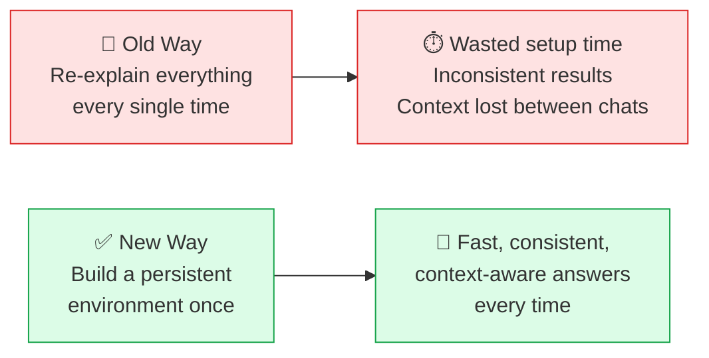

---

<a name="2"></a>
## 2. The Three-Layer Model: Context, Access, Process

Before touching any Claude feature, separate your task into three distinct questions:

| Layer | Question it Answers | Claude Feature |
|---|---|---|
| **Context** | What does Claude need to *know*? | Projects |
| **Access** | What does Claude need to *reach*? | Connectors |
| **Process** | What does Claude need to *do, in order*? | Skills |

### Worked Example: Reviewing Pull Requests for an ASP.NET Core App

Let's make this concrete with the example the original article used, expanded into full detail.

**Context (Project knowledge base):**
- Solution architecture diagram and explanation
- Coding conventions (naming, folder structure, DI patterns)
- Architectural Decision Records (ADRs) — e.g., "we chose MediatR over direct service calls because..."
- API design guidelines (REST conventions, versioning rules)
- Database guidelines (EF Core migration policy, indexing rules)
- The team's definition of "done" for a PR

**Access (Connector):**
- A connector to GitHub/GitLab/Azure DevOps so Claude can read the actual diff, comments, and linked issues — not a diff you copy-pasted (which loses metadata, related files, and history)

**Process (Skill):**
1. Check correctness before style
2. Look specifically for auth/authz mistakes
3. Flag EF Core N+1 query patterns
4. Separate "blockers" from "suggestions"
5. Recommend tests for every risky change
6. Return findings in one consistent format every time

### Why You Can't Merge These Layers

A common beginner mistake is dumping everything into one bucket. Here's why that fails:

- **Codebase inside a Skill?** Skills are meant to be portable, reusable *methods*. A 50,000-line codebase pasted into a Skill bloats every single invocation and mixes "how to review" with "what to review."
- **Review checklist copied into every Project?** Now you have five slightly different versions of the same checklist across five Projects. When you improve the checklist, you have to remember to update it five times.
- **Repository connected without architecture rules?** Claude can now *see* the code but has no idea whether a pattern is intentional or a mistake. Access without context produces confident-sounding but ungrounded reviews.

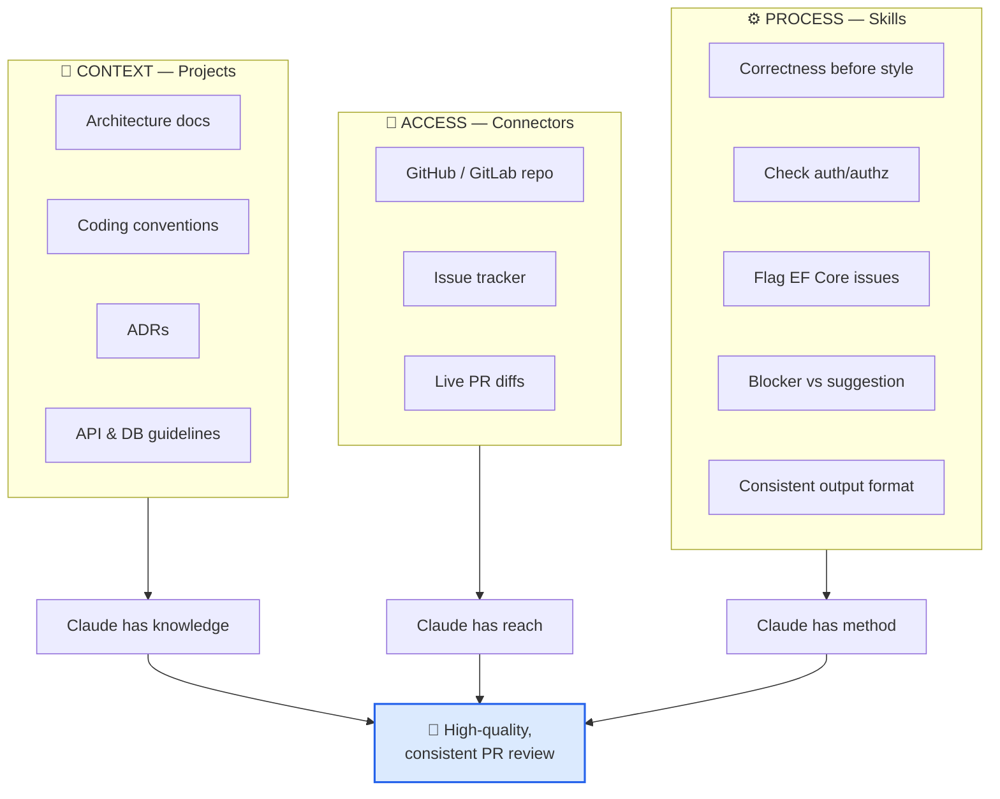

**Use case beyond code review:** The same three-layer thinking applies to a marketing team. Context = brand guidelines and past campaigns. Access = a connector to your analytics/CRM. Process = a Skill defining how a campaign brief should be structured, reviewed, and approved.

---

<a name="3"></a>
## 3. Projects: Giving Claude a Home Base

### What a Project Actually Is

A **Project** is a persistent workspace containing:
1. A **knowledge base** — files Claude can reference across every conversation inside that Project
2. **Project instructions** — standing guidance applied to most chats inside it

Think of a Project less like a folder and more like **onboarding a new team member once**, so you don't have to onboard them again for every task.

### ⚠️ The Detail Everyone Misses

Conversations *inside* a Project do **not** automatically share context with each other beyond what's in the knowledge base and instructions. If Conversation A discovers something important, that insight is lost to Conversation B **unless you add it to the shared knowledge base**.

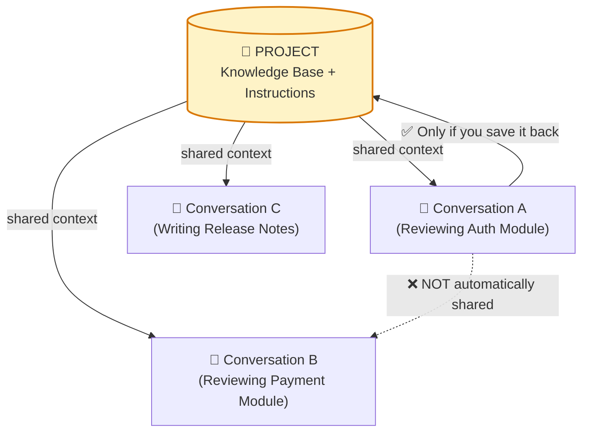

**Practical rule of thumb:** if you learn something in a conversation that would help *future* conversations, paste it into the Project's knowledge base before you forget.

### When to Create a Project (and When Not To)

✅ **Create one for:**
- A software product you maintain long-term
- A newsletter or publication with a consistent voice
- A multi-week research assignment
- A course you're building
- A client engagement
- A job search (yes — really; your resume, target roles, and interview notes benefit enormously from shared context)
- A digital product you're iterating on

❌ **Don't create one for:**
- "What's a good regex for validating an email?" — a one-off question doesn't need a home
- A task you'll do exactly once

### Example Knowledge Base: .NET Application

```
📁 Project: "Acme Inventory API"
├── solution-overview.md
├── architecture-decision-records/
│   ├── adr-001-mediatr-vs-direct-calls.md
│   └── adr-002-postgres-over-sqlserver.md
├── entity-relationships.png
├── api-conventions.md
├── deployment-notes.md
├── representative-code-samples/
│   ├── OrderController.cs
│   └── OrderRepository.cs
├── testing-standards.md
└── security-requirements.md
```

### Example Knowledge Base: Substack Newsletter

```
📁 Project: "The Weekly Signal"
├── audience-description.md      (who reads this, what they know)
├── writing-guidelines.md         (voice, sentence length, banned clichés)
├── previous-articles/            (5-10 representative pieces)
├── topics-already-covered.md     (avoid repetition)
├── formatting-preferences.md
├── linking-rules.md
└── cta-guidelines.md
```

### Structuring Project Instructions

Here's an expanded, ready-to-copy template — six sections, each answering one question:

```markdown
## Purpose
What is this project trying to achieve? (1-2 sentences, outcome-focused)

## Audience
Who is the work for, and what do they already understand?
Avoid explaining things they already know; avoid assuming things they don't.

## Standards
Which technical, editorial, legal, or brand rules must be followed?
List them as concrete rules, not vibes. "Use British English" not "sound professional."

## Preferred Output
Tone, depth, formatting, and level of explanation Claude should default to.

## Boundaries
What should Claude avoid, verify, or ask about before proceeding?
E.g. "Never invent statistics." "Ask before modifying production config."

## Definition of Done
Which checks must pass before this is considered complete?
E.g. "Every claim has a citation." "Code must pass `dotnet test`."
```

> **Golden rule:** Ten clear instructions beat fifty vague ones. And a curated knowledge base of 10 relevant documents beats 200 documents where half of them contradict each other. Claude can't tell which of two conflicting specs is current — you have to keep the storeroom clean.

---

<a name="4"></a>
## 4. Connectors: Live Data and Controlled Actions

### The Core Difference: Snapshot vs. Live Access

| | Uploading a Document | Using a Connector |
|---|---|---|
| **Freshness** | Frozen at the moment of upload | Live, current at query time |
| **Scope** | Only what you exported | Whatever the connector is permitted to reach |
| **Actions** | Read-only, always | Can potentially read *and write* (create issues, update records) |
| **Maintenance** | You re-upload every time it changes | Updates automatically |

A connector gives Claude **controlled access to a live service** — search, retrieve, summarize, and (with permission) create or update items.

**Concrete example from the field:** connect a project-management tool like Linear, and instead of saying "here's a CSV of our open bugs, summarize it," you can say "what P1 bugs were opened this week?" and get a live answer — then follow up with "create a ticket for the caching issue we just discussed," and Claude can create it directly, provided the connector supports write actions and you've granted that permission.

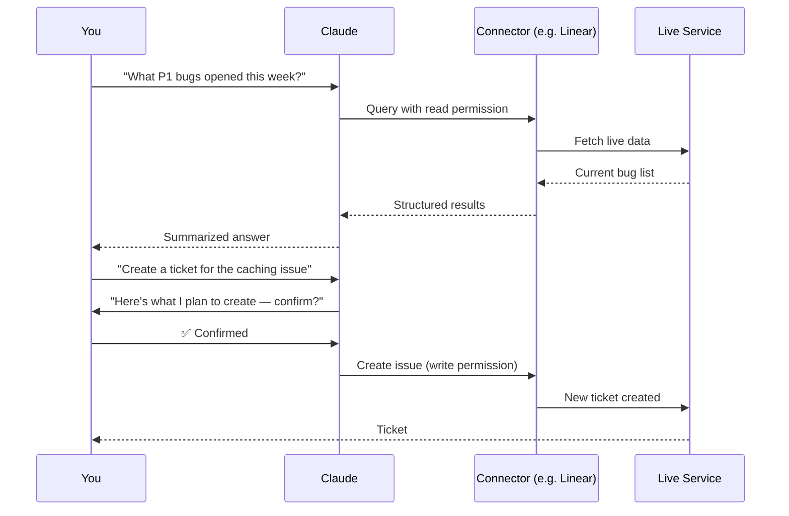

### Built-In vs. Custom Connectors

- **Built-in connectors** come from Claude's directory — pre-vetted integrations for common tools.
- **Custom connectors** connect to remote **Model Context Protocol (MCP)** servers — an open standard for linking AI systems to tools and data. Useful when your company has an internal service (an incident-management tool, a private documentation portal, a reporting API) that no off-the-shelf connector covers.

### ⚠️ Custom ≠ Safe: A Pre-Connection Checklist

Before connecting *any* custom connector, run through this checklist:

- [ ] **Who created it?** A vetted vendor, or an unknown third party?
- [ ] **What permissions does it request?** Read-only, or read+write?
- [ ] **How does authentication work?** OAuth token, API key, something else?
- [ ] **Which data can it actually access?** The whole workspace, or a scoped subset?
- [ ] **Can it perform write actions?** Create, update, delete?
- [ ] **Is the provider trustworthy?** Would you give this same access to a new contractor on day one?

### The Principle of Least Privilege

> Start with **one** trusted connector and the **narrowest useful permission**. Expand only when you hit a real limitation.

**Real-world use case:** A support team connects a helpdesk tool with *read-only* access first, so Claude can summarize ticket trends. Only after weeks of trust-building do they enable a *write* permission that lets Claude draft (not send) responses for human approval. This staged rollout catches misunderstandings before they become customer-facing mistakes.

**Before any external action, always ask Claude to show its plan first.** Review:

- Recipients
- Dates
- Filters applied
- Records selected
- Generated content
- Destructive actions (deletes, overwrites)
- Permission changes

> AI can make a *confident, fluent, wrong* decision at impressive speed. A five-second review of the plan is cheap insurance against an expensive mistake.

One more nuance: **a connector inherits the permissions of the connected account.** If you personally can't see a record in the source system, Claude can't see it either through the connector — the AI doesn't bypass your organization's access controls.

---

<a name="5"></a>
## 5. Skills: Turning Instructions into Repeatable Methods

### Prompt vs. Skill

A great prompt guides *one* conversation well. A **Skill** guides *every future occurrence of that task*, consistently, without you re-typing the method each time.

Skills are folders containing:

- A **workflow** Claude should follow, step by step
- **Reference material** (style guides, checklists, standards)
- **Templates** for expected output
- **Examples** of acceptable (and unacceptable) output
- **Scripts** used during the task, when relevant
- **Validation checks** — how to verify the result before returning it
- **Trigger conditions** — when this Skill should activate at all

### Anatomy of a Well-Built Skill

Every good Skill answers four questions explicitly:

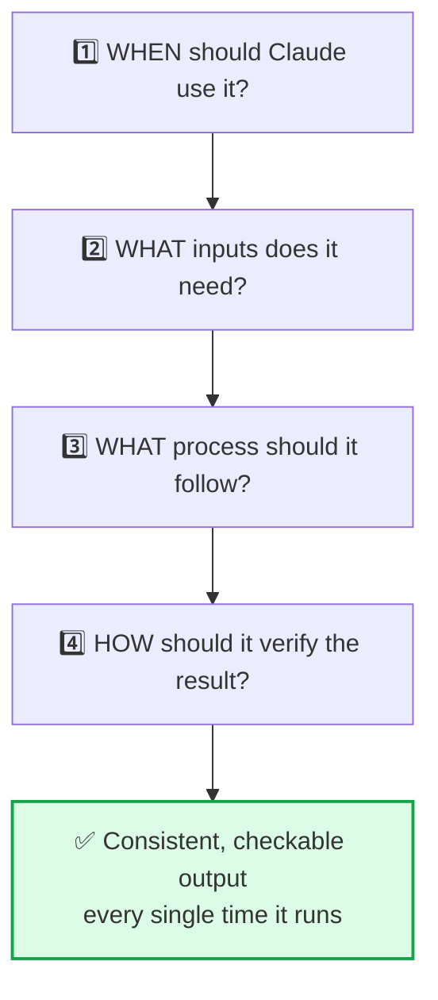

### Example 1: A .NET Code-Review Skill

**When:** Triggered whenever reviewing a `.cs` file diff or pull request in an ASP.NET Core repository.

**Inputs required:** The diff, the target branch, and (if available) linked issue context.

**Process — check specifically for:**
1. Missing `CancellationToken` propagation through async chains
2. Incorrect dependency-injection lifetimes (e.g., a Scoped service injected into a Singleton)
3. EF Core N+1 query patterns
4. Authorization gaps (missing `[Authorize]`, overly broad policies)
5. Sensitive data leaking into logs
6. Risky EF Core migrations (data loss, missing rollback path)
7. Swallowed or overly broad exception handling
8. Missing unit or integration tests for the changed logic

**Verification:** Every finding must cite a file and line, be labeled blocker/important/suggestion, and include a recommended smallest safe fix.

### Example 2: An Article-Writing Skill

**When:** Triggered when drafting or editing a long-form article for the newsletter Project.

**Process:**
1. Preserve the author's original argument — don't smooth it into something generic
2. Use plain English, short paragraphs
3. Avoid repetitive section structures (no "In today's fast-paced world..." openers)
4. **Never** invent personal experiences, quotes, or statistics
5. Verify any current product claims (use web search if needed)
6. Remove duplicated ideas across sections
7. Do a final read for awkward sentence rhythm
8. Keep calls-to-action short — one sentence, no hype

### Example 3: A Weekly-Report Skill

**When:** Every Monday, or on request, for the ops Project.

**Process:**
1. Pull data from the connected analytics/CRM source
2. Calculate this week's defined metrics (revenue, churn, active users — whatever the Project defines)
3. Apply the missing-data rule (e.g., "if a data source is unavailable, flag it — never estimate silently")
4. Compare against the prior period using the Project's defined comparison window
5. Format the output using the standard report template
6. Run a final validation: do the totals reconcile with the source system?

### Skill Design Anti-Patterns

| ❌ Too broad | ✅ Properly scoped |
|---|---|
| "Help me with software development" | "Review ASP.NET Core API changes for correctness, security, performance, and test coverage" |
| "Write good content" | "Edit long-form articles to preserve the author's argument, cut filler, and verify current claims" |
| "Analyze the business" | "Produce the weekly ops report following the defined metric set and comparison rules" |

**Key discipline:** don't bury project-specific information (like your specific database schema) inside a reusable Skill. The Skill is the *method*; the Project holds the *local facts*. Mixing them means you can't reuse the Skill on your next project without editing it first.

---

<a name="6"></a>
## 6. Plugins: Pre-Packaged Toolkits

A **Plugin** bundles Skills and Connectors together for a category of work — engineering, marketing, finance, legal, HR, design, operations, data analysis.

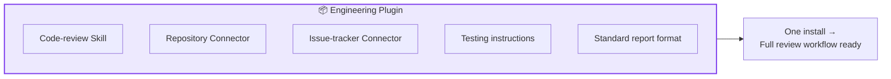

### Why Plugins Exist

Setting up Context + Access + Process manually every time you start a new type of work is repetitive. A Plugin packages a trusted, tested combination so you don't reinvent it.

**Use case:** A consultancy onboarding a new client project doesn't want to rebuild "our standard financial due-diligence workflow" from scratch. A Finance Plugin bundling a spreadsheet-analysis Skill, a document-connector, and a standard report Skill gets the team productive on day one.

### The Same Trust Question, One Level Up

A Plugin can include connectors with real access. Treat installing one with the same scrutiny as connecting a custom connector:
- Read what it actually installs
- Use reputable sources
- **Install one Plugin because it solves a real problem — not ten because they look interesting.** Every installed Plugin is more surface area to audit later.

---

<a name="7"></a>
## 7. Memory, Instructions, and Styles — Where Preferences Belong

This is the section people get wrong most often: putting the right preference in the wrong place.

| Setting | Scope | Good for |
|---|---|---|
| **Profile instructions** | Every conversation, across your whole account | "Always answer concisely." "I'm a senior backend engineer — skip beginner explanations." |
| **Project instructions** | One body of work only | "This client requires British English and a formal tone." |
| **Styles** | Reusable formatting/voice presets | A consistent visual or writing style you apply on demand |
| **Memory** | Auto-retained background from past conversations | Your role, ongoing projects, communication preferences |

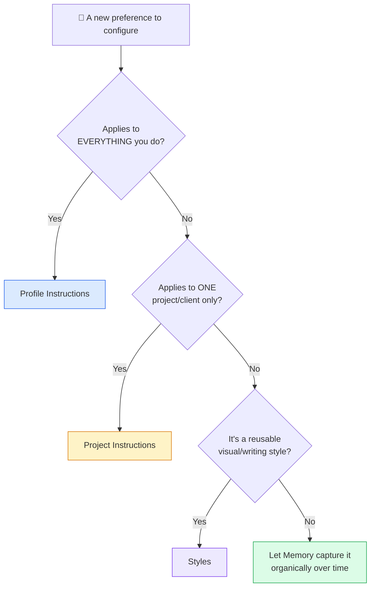

### The Classic Mistake

Putting **"the database schema rules for Client X's application"** into your account-wide profile instructions. Now every conversation — including ones about Client Y — carries irrelevant baggage, and you'll spend time explaining why those rules *don't* apply this time. That information belongs in Client X's Project.

### What Memory Can and Can't Do

Memory can retain things like your role, current projects, communication preferences, technical/coding choices, and ongoing work threads — without you re-stating them.

**But memory is not a substitute for a written spec.** A remembered preference is soft and can be misread or superseded; an explicit acceptance criterion in your Project instructions is a hard rule Claude checks against. If something is truly non-negotiable — a legal requirement, a security rule — write it down explicitly rather than relying on memory to have picked it up correctly.

**Incognito chats** are excluded from memory and history entirely — useful for a one-off sensitive or exploratory conversation you don't want influencing future answers.

---

<a name="8"></a>
## 8. Web Search vs. Research vs. Extended Thinking

These three are commonly treated as "three levels of trying harder." They're actually built for **three different kinds of problems**.

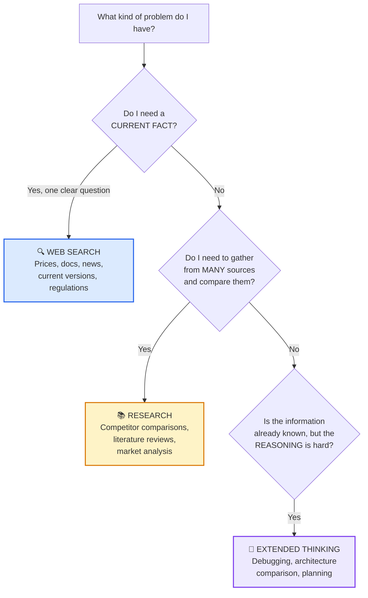

### Web Search — For Current, Verifiable Facts

**Use when the answer depends on something that changes over time:**
- Product features and prices
- Current documentation
- Breaking news
- Regulations
- Schedules
- A company's current leadership or status
- Software version numbers
- Market data

**Example:** "What's the current pricing tier structure for [product]?" — this changes; Claude's training data goes stale. A search grounds the answer in the current page.

⚠️ **Important nuance:** ask Claude to cite sources, then **open the important ones yourself**. A citation proves *where a claim came from* — it does not guarantee the source itself is correct, unbiased, or that Claude interpreted it properly. Citations are a starting point for verification, not a stamp of truth.

### Research — For Multi-Source Investigation

**Use when one search wouldn't be enough** — the task requires gathering, comparing, and synthesizing across many sources, sometimes combined with your connected internal data:
- Competitor comparisons
- Literature reviews
- Market research
- Product evaluations
- Industry reports
- Updating an internal doc with the latest external evidence
- Blending public information with your approved internal data

Research takes longer because it performs multiple searches, cross-references sources, and produces a synthesized answer rather than a quick lookup.

> **Don't use a sledgehammer to hang a picture frame.** If a single search answers your question, Research is overkill and slower for no benefit.

### Extended Thinking — For Hard Reasoning, Not Missing Facts

**Use when the information is already available but the reasoning is genuinely difficult:**
- Debugging a gnarly, non-obvious bug
- Comparing two architecture options with real trade-offs
- Analyzing a business decision with competing priorities
- Solving a multi-step math problem
- Stress-testing a plan for hidden weaknesses
- Planning a multi-step implementation

**Instead of asking Claude to "show its private reasoning,"** ask for structured, checkable evidence:
- State the assumptions used
- List the options considered
- Explain the trade-offs behind the recommendation
- Cite the source for every current claim
- Provide a test/verification plan
- Identify what would change the conclusion

These outputs are far easier to audit than a raw stream of internal reasoning — they force the answer into a form you can actually check.

### Real-World Combination Example

**Task:** "Should we migrate our checkout service from a monolith to a microservice?"

1. **Web Search** → confirm current best-practice guidance and any recent case studies on similar migrations
2. **Research** → gather and compare multiple companies' documented migration experiences, cost outcomes, and failure modes
3. **Extended Thinking** → reason through *your specific* trade-offs: team size, current tech debt, deployment cadence, and produce a structured recommendation with assumptions and a decision checklist

---

<a name="9"></a>
## 9. File Creation, Data Analysis, and Artifacts

### Files: The Real Deliverable

Claude can create and edit Word documents, Excel spreadsheets, PowerPoint presentations, PDFs, charts, and data-generated images. Its code-execution environment can process datasets, run Python, build visualizations, and verify calculations.

> The point of most real work isn't another chat message — it's a **file** someone opens, edits, and ships.

**Your responsibility doesn't disappear because the file looks polished:**

| Claude produced... | You should always... |
|---|---|
| A financial model | Inspect every formula and stated assumption |
| A presentation | Review every slide for layout issues and unsupported claims |
| Code | Actually run the tests |

File creation removes the tedious formatting and copying work. It does not remove your obligation to check the substance.

### Artifacts: Self-Contained, Iteratable Work

**Artifacts** are for content you want to edit, reuse, or share separately from the flow of conversation:

- Documents
- Code
- Diagrams and flowcharts
- Single-page websites
- SVG graphics
- Interactive components

Claude keeps **version history** as you iterate — dramatically better than scrolling a long chat trying to find "the third version, before we changed the heading."

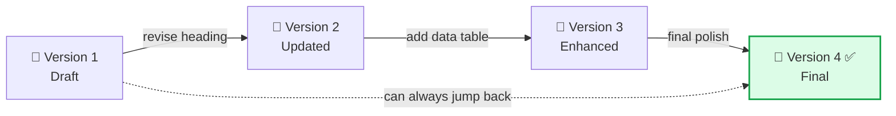

**Use case:** Iterating on a landing-page mockup as an HTML Artifact lets you see each revision rendered live and roll back if version 3 was actually better than version 4 — without re-explaining the whole design brief from scratch.

---

<a name="10"></a>
## 10. Choosing the Right Claude Surface

Claude isn't one interface — it's several, each suited to different work.

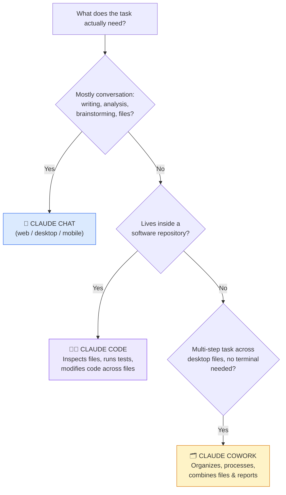

### Claude Chat
**Best for:** writing, analysis, questions, research, brainstorming, file creation, and any workflow driven mainly through conversation. For most day-to-day work, this is genuinely sufficient — don't over-engineer a setup you don't need.

### Claude Code
**Best for:** work that lives inside a real repository. It can inspect project files, modify code, run commands, execute tests, search references across files, and follow repository-specific instructions.

A `CLAUDE.md` file at the repo root can hold architecture notes, conventions, common commands, and rules Claude should follow specifically for that codebase — similar in spirit to a Project's instructions, but scoped to the repo itself.

**Use case:** A genuine multi-file refactor — renaming a core interface used across 40 files — is a job for Claude Code, which can actually run the build and tests to confirm nothing broke. Pasting one file into a browser chat can't verify that.

### Claude Cowork
**Best for:** longer, multi-step tasks involving desktop files and workflows, without needing to work directly in a terminal — organizing folders, renaming files, processing documents, combining research, analyzing notes, preparing reports, and carrying out approved actions across several related files.

> **Access scales with risk.** Start Cowork with a limited, specific folder rather than granting broad access to everything on your machine. Expand only once you trust the workflow.

---

<a name="11"></a>
## 11. Prompt Engineering That Actually Works

Even with a perfect Project/Connector/Skill setup, the prompt for a specific task still matters. Features build the environment; the prompt still defines the task.

### The Five-Part Reliable Prompt

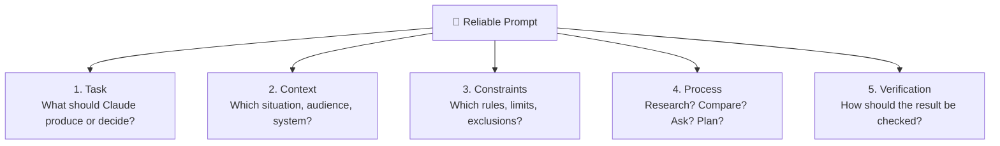

### Side-by-Side: Weak vs. Useful Prompt

**❌ Weak prompt:**
```
Review this API code.
```

**✅ Useful prompt:**
```
Review the attached ASP.NET Core API changes.

Prioritize: correctness, authorization, data exposure,
EF Core query behavior, and missing tests.
Ignore formatting issues already covered by analyzers.

For every finding:
- Cite the relevant file and code location
- Explain the runtime impact
- Label it as blocker, important, or suggestion
- Recommend the smallest safe change

Do not modify the code yet.
End with the tests you would run to verify the fix.
```

**Why the second one works better:**
- It defines a clear standard to measure the response against
- It's easier to evaluate — you know exactly what "good" looks like before you read the answer
- It removes ambiguity about scope ("ignore formatting issues") so Claude doesn't waste effort on things analyzers already catch
- It separates *review* from *fix* — a critical safety boundary for real production code

### A Note on Role-Play Prompts

A long fictional framing like *"You are the world's greatest expert with 30 years of experience"* usually adds less value than:
- A real checklist
- One representative example of good output
- Clear, explicit acceptance criteria

Specificity beats theater.

---

<a name="12"></a>
## 12. Verification: Why the First Draft Is Never the Last Draft

Claude can produce a fluent, polished-sounding answer that is still shallow, factually wrong, or wrong *for your specific audience*. Smooth sentences are cheap to generate. Sound judgment is the part that actually needs checking.

### The Verification Loop

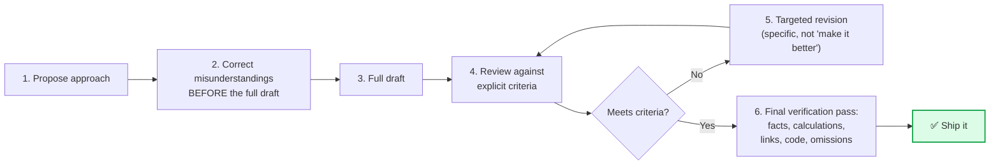

### Vague Feedback vs. Specific Feedback

**❌ Vague:** "Make it better."

**✅ Specific:**
```
The explanation of caching is clear, but it recommends cache
invalidation without describing ownership or failure behavior.

Add one realistic example showing what happens when the
database update succeeds but the cache removal fails.

Keep the rest of the section unchanged.
```

Specific feedback is faster to act on and produces predictable results. Vague feedback often produces a *completely different* draft — which forces you to re-review everything, not just the part that was wrong.

---

<a name="13"></a>
## 13. Three End-to-End Workflows

### Workflow 1: Publishing a Technical Article

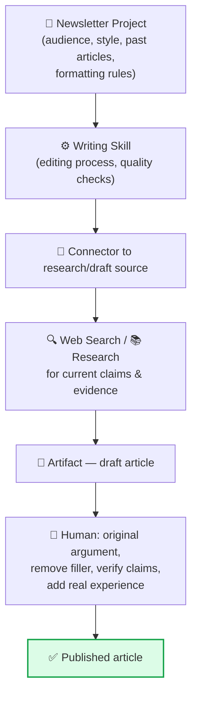

**The human job stays essential** at Step F: providing the original argument, removing generic filler, verifying technical claims, adding genuine lived experience, and ensuring the piece says something actually worth publishing. Claude accelerates the writing — it doesn't manufacture your point of view.

### Workflow 2: Reviewing a .NET Feature

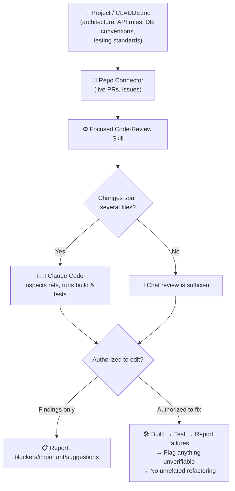

**Critical safeguard:** if Claude is authorized to edit code, require it to build the solution, run the relevant tests, report any failed commands, identify what it couldn't verify, explain meaningful design decisions, and explicitly avoid unrelated refactoring. This is what prevents "fix a null-check bug" from silently becoming "rewrite the module I found ugly."

### Workflow 3: Preparing a Weekly Business Review

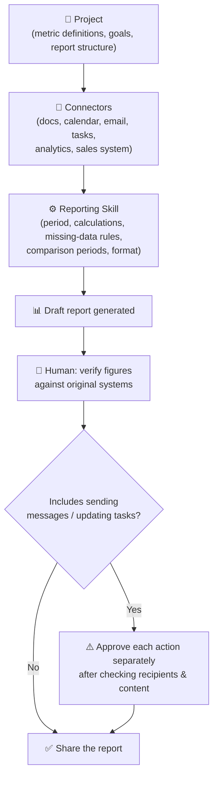

---

<a name="14"></a>
## 14. Limitations You Still Need to Respect

Claude's capabilities have genuinely expanded — it can browse, connect to live services, and take real actions now, which wasn't always true. But new capability brings **new failure modes**, not zero failure modes.

| Risk | What It Looks Like | Mitigation |
|---|---|---|
| **Confident false claims** | Fluent, plausible, wrong | Cross-check important claims against authoritative sources |
| **Weak search results** | Incomplete or low-quality sources | Open the actual sources yourself for anything important |
| **Stale/ambiguous connected data** | Missing fields, outdated records | Spot-check against the source system periodically |
| **Unintended write access** | A connector exposes an action you didn't mean to enable | Review connector permissions regularly; default to read-only |
| **Malicious/misleading external content** | A fetched page contains hidden instructions | Treat external content as data, not commands, when reviewing |
| **Conflicting knowledge base docs** | Two specs disagree, Claude can't tell which is current | Keep your Project knowledge base curated and current |
| **Insecure or logically wrong generated code** | Compiles fine, but has a flaw | Always run tests; never merge unreviewed |
| **Bad assumptions behind correct math** | The calculation is right, the premise is wrong | Have Claude state its assumptions explicitly, and check them |

### The Non-Negotiable Checklist

- ✅ Use authoritative sources for important claims
- ✅ Test code before merging it
- ✅ Inspect formulas in generated spreadsheets
- ✅ Keep permissions narrow
- ✅ Confirm external actions before they execute
- ❌ Never place secrets inside a Project or Skill "for convenience"

> Claude is capable enough to take on genuinely meaningful work. **That capability is exactly why verification matters more, not less.**

---

<a name="15"></a>
## 15. Your 8-Step Starter Setup

Don't redesign your entire working life around AI in one afternoon. Start with **one** recurring task.

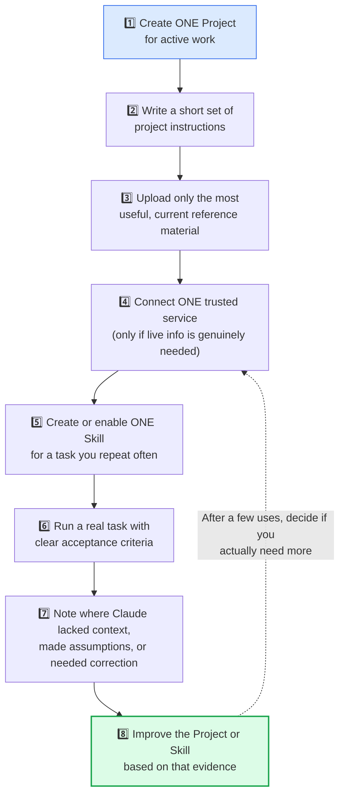

Until you've completed this loop at least once, adding more connectors, Skills, or Plugins is mostly decoration — setup for the sake of setup.

---

## 🎯 Key Takeaways

1. **Getting better results from Claude is no longer mainly about writing an elaborate prompt.** It's about building a cleaner system around it.
2. **Put durable context inside a Project.** Don't re-explain the same background every conversation.
3. **Use Connectors for live data and carefully controlled actions** — start with the narrowest permission that works.
4. **Capture repeatable methods inside Skills**, kept narrow enough to have one clear job.
5. **Install Plugins only when a trusted package genuinely combines what you need.**
6. **Match the tool to the problem:** Web Search for current facts, Research for multi-source investigation, Extended Thinking for hard reasoning over known information.
7. **Move to Claude Code or Cowork** when the work requires deeper access to repositories or files than chat alone can offer.
8. **Verify anything that touches customers, production systems, money, or reputation.** Every time.

You don't need every feature Claude offers turned on at once. You need **the right context, the right access, and a clear definition of done.**

That's where the useful work actually begins.