# Mastering the Claude "ADHD Skill": A Complete Tutorial for Breaking Out of AI Mediocrity

## Table of Contents
1. [Introduction: Why Your AI Answers Feel "Correct but Boring"](#introduction)
2. [The Core Problem: Understanding LLM Autoregressive Bias](#core-problem)
3. [What Is the ADHD Skill?](#what-is-adhd-skill)
4. [The Three Pillars of ADHD Skill Design](#three-pillars)
5. [ADHD vs. Chain-of-Thought vs. Tree-of-Thought](#comparison)
6. [The Research: What the ADHD Paper Actually Found](#research)
7. [Step-by-Step Installation Guide](#installation)
8. [A Realistic 4-Stage Adoption Roadmap](#roadmap)
9. [Real-World Use Cases](#use-cases)
10. [Risks, Side Effects, and Guardrails](#risks)
11. [Summary & Quick Reference](#summary)

---

<a name="introduction"></a>
## 1. Introduction: Why Your AI Answers Feel "Correct but Boring"

Anyone who has used Claude, ChatGPT, or Codex for open-ended brainstorming has hit the same wall: you ask for "ideas on pricing strategy" or "ways to restructure this system," and you get back the same four bullet points you could have found on the first page of a Google search.

This isn't a bug — it's a structural property of how large language models generate text. This tutorial breaks down **why** this happens, and walks through a practical technique — the **"ADHD Skill"** — that restructures *how* you call the model (not the model itself) to produce genuinely novel, non-obvious outputs.

By the end of this tutorial, you'll understand:
- The theoretical reason LLMs default to "mediocre" answers
- How the ADHD Skill's multi-agent architecture works
- How to install and run it in Claude Code and Codex
- A safe, staged plan to introduce it into your workflow without becoming overly dependent on it

---

<a name="core-problem"></a>
## 2. The Core Problem: Understanding LLM Autoregressive Bias

### 2.1 The Mechanism

LLMs generate text **token by token**, where each new token is sampled from a probability distribution conditioned on everything written so far. Temperature and sampling strategies add controlled randomness, but the overall distribution is still anchored heavily by the model's training data.

**Key insight:** Once the model writes its first two or three sentences, it has effectively "locked in" a direction. Every subsequent token statistically reinforces the initial framing.

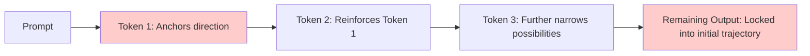

### 2.2 Why This Is Fine for Closed Questions, But Bad for Open Ones

| Question Type | Example | Does Autoregressive Bias Hurt? | Why |
|---|---|---|---|
| Closed / deterministic | "Write a quicksort function in Python" | ❌ No | There's one broadly "correct" answer — convergence is desirable |
| Open-ended / creative | "How should I price this SaaS product?" | ✅ Yes | Many valid answers exist; the model collapses to the *most statistically common* one, not the *most useful* one |
| Architectural decisions | "How should I structure this microservice?" | ✅ Yes | Textbook patterns dominate over context-specific insight |
| Debugging with unclear root cause | "Why is this system slow under load?" | ✅ Yes | The model anchors on the first plausible hypothesis and under-explores alternatives |

### 2.3 The Insight

> Truly valuable, "unconventional" ideas are statistically rare in training data — which means a standard LLM call is structurally biased *against* producing them.

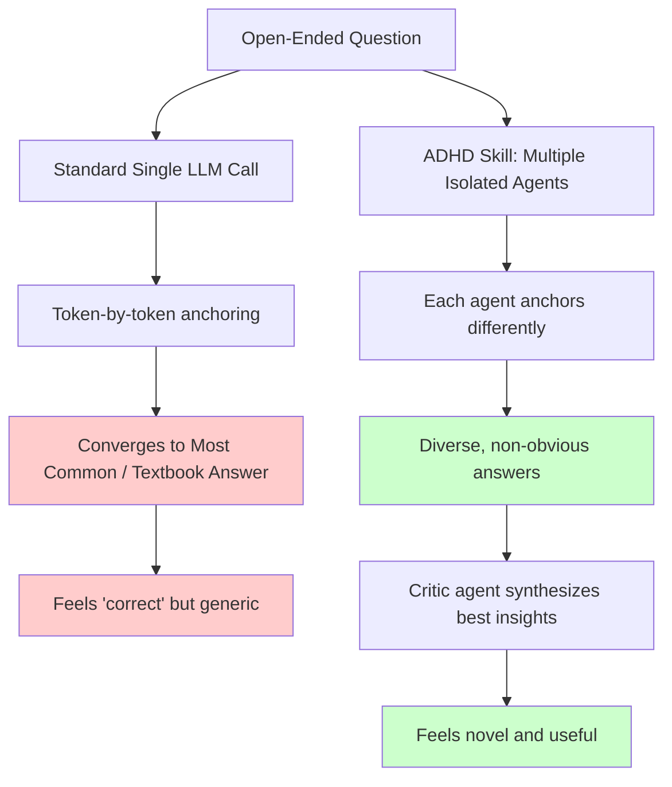

---

<a name="what-is-adhd-skill"></a>
## 3. What Is the ADHD Skill?

The **ADHD Skill** (formally documented in the paper *"ADHD: Parallel Divergent Ideation for Coding Agents"*) is a **prompt-orchestration technique**, not a model fine-tune. It doesn't change model weights — it changes *how* and *how many times* the model is called, and under what constraints.

The name is a deliberate metaphor: people with ADHD often experience "weak executive function" — difficulty deciding where to start amid a flood of parallel thoughts. But that same trait, reframed, is also associated with **divergent, multi-threaded thinking** — the ability to consider a problem from many unrelated angles simultaneously rather than following one linear train of thought.

The Skill simulates this multi-threaded cognition deliberately and *safely* — using isolated LLM calls instead of a single continuous reasoning chain.

### Analogy: The Brainstorming Room

Imagine two ways of running a brainstorm:

**Method A (Standard LLM call):** One person in a room, thinking out loud. Whatever they say first shapes everything they say next.

**Method B (ADHD Skill):** Five people in five *separate, soundproofed rooms*, each given a different persona ("think like a auditor," "think like a 10-year-old," "think like a hacker trying to break this"). None of them hear each other. Afterward, a sixth person — a dedicated critic — reviews all five transcripts and picks out the sharpest, most useful insights.

Method B produces more variety because the five thinkers can't accidentally converge on the same idea.

---

<a name="three-pillars"></a>
## 4. The Three Pillars of ADHD Skill Design

### Pillar 1: Five Independent Agents (Context Isolation)

Instead of one model "thinking five times" in a single context window, the Skill makes **five completely separate LLM calls**, each with its own fresh context. Agent A's output is *physically invisible* to Agent B — not filtered out, not summarized away, but never present in the first place.

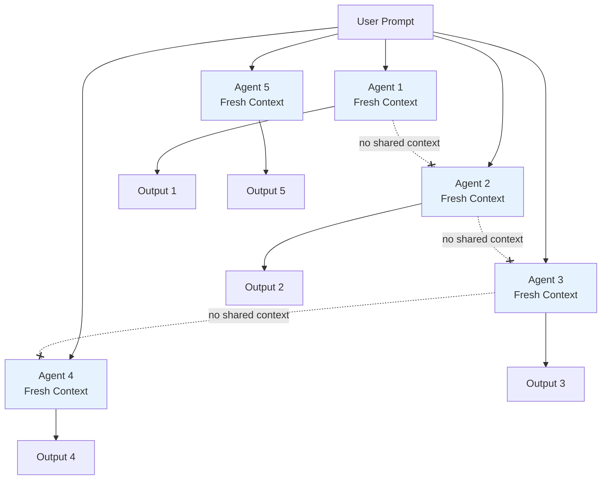

**Why this matters:** This mirrors guidance from Anthropic's own agent-harness design research, which recommends *resetting* context for long-running tasks rather than compressing or summarizing it — because compression itself introduces bias toward whatever the summarizer judged "important."

### Pillar 2: Cognitive Framework-Driven Roles

Each of the five agents is assigned a distinct **persona/framework** from a bank of 15 predefined roles. Examples include:

- *"You are a compliance auditor, hunting for failure modes and regulatory risk."*
- *"You are a curious 10-year-old who has never seen software before — explain and reason about this as naively as possible."*
- *"You are a cynical cost-cutting CFO who assumes every solution is too expensive."*
- *"You are a security researcher looking for the ways this could be exploited."*
- *"You are a minimalist engineer who believes the best code is no code."*

Five of the fifteen are randomly selected on each run, guaranteeing that outputs come from meaningfully different angles rather than five nearly-identical "expert" answers.

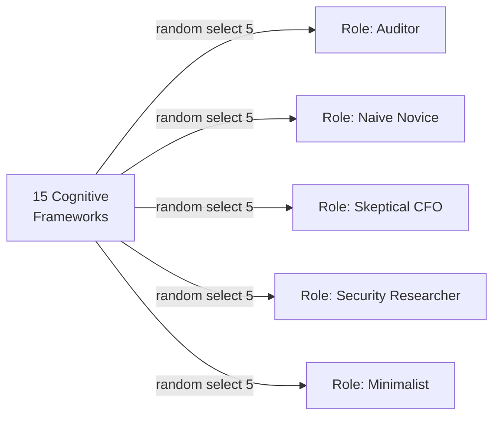

### Pillar 3: Separated Generation and Critique Phases

This is arguably the most important design decision. The Skill strictly separates two cognitive modes into **different calls with different system prompts**:

| Phase | Role Instruction | Rules |
|---|---|---|
| **Divergence** | "You are a generator, not a critic." | No evaluation, no ranking, no hedging — pure idea generation |
| **Convergence** | "You are now a critic — engage in adversarial reading." | Score, find traps, rank, and synthesize the best insights from all 5 generator outputs |

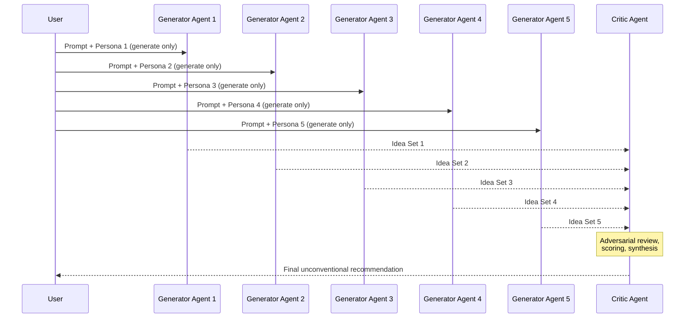

**Why separating these matters:** Writing and editing simultaneously produces worse writing — this is well documented in human cognition too. A writer trying to self-edit mid-sentence tends to freeze up or produce watered-down prose. The same interference happens in a single LLM call asked to "brainstorm and then evaluate" — the evaluative instinct suppresses the generative one before it can fully explore the idea space.

---

<a name="comparison"></a>
## 5. ADHD vs. Chain-of-Thought vs. Tree-of-Thought

A natural question: doesn't Chain-of-Thought (CoT) or Tree-of-Thought (ToT) already solve this?

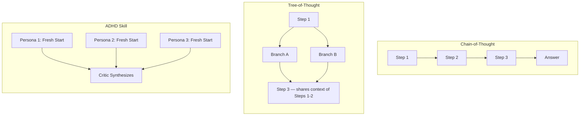

| Technique | What it changes | Limitation |
|---|---|---|
| **Chain-of-Thought** | Makes one line of reasoning *deeper* (slower, more careful) | Still a single linear path — the initial framing is never questioned |
| **Tree-of-Thought** | Explores multiple *next steps* at decision forks | Branches still share the context of earlier steps — so the fundamental "angle" of the problem rarely changes |
| **ADHD Skill** | Runs multiple *fully independent* reasoning attempts, each anchored differently from the start | Requires more API calls (cost/latency trade-off) |

**The key differentiator:** CoT and ToT can make a model think longer or search wider, but they cannot make it question its *own framing* of the problem — because the framing was set in the first few tokens and every subsequent step (or branch) inherits it. ADHD Skill sidesteps this entirely by never letting that initial framing propagate.

---

<a name="research"></a>
## 6. The Research: What the ADHD Paper Actually Found

The technique isn't just anecdotal — it was tested formally in the paper *"ADHD: Parallel Divergent Ideation for Coding Agents."*

**Methodology:** Six open-ended engineering questions were given to the same underlying model, once as a standard single-call response, and once using the ADHD Skill pipeline.

**Results:**
- ADHD-style responses were preferred **5 out of 6 times** over single-call responses
- Measured **novelty** improved by a reported margin of ~5.17 (on the paper's scoring scale)
- Measured **breadth** of solutions improved by ~4.17

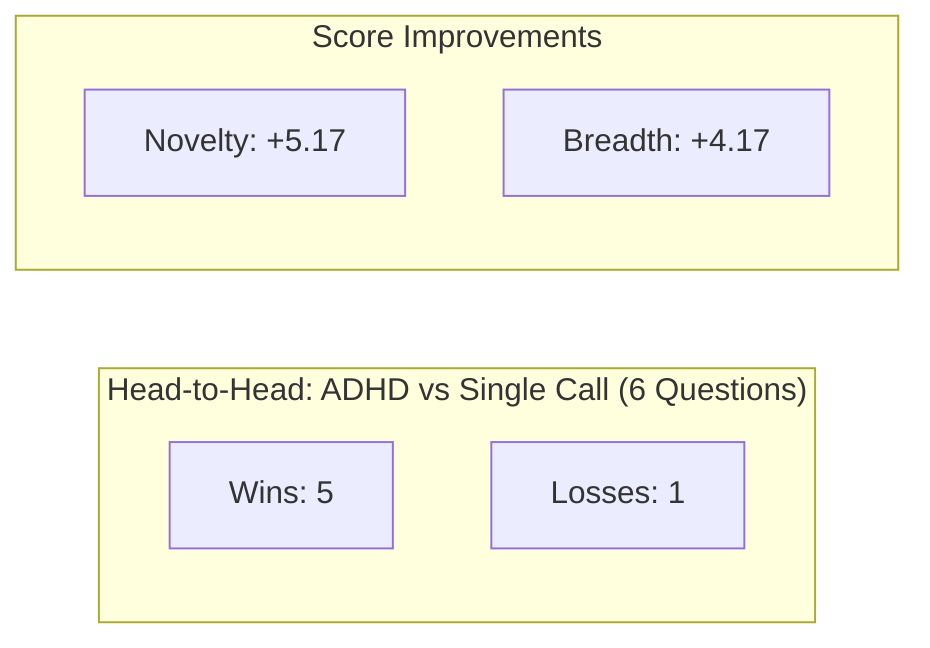

**Interpretation:** This is a small-sample study (6 questions), so treat the specific numbers as directional rather than statistically definitive. But the pattern — isolated, role-diverse generation followed by adversarial synthesis — aligns with well-established findings in human group ideation research (e.g., "nominal group technique," where individuals brainstorm separately before group discussion to avoid groupthink).

---

<a name="installation"></a>
## 7. Step-by-Step Installation Guide

### 7.1 Installing in Claude Code

**Step 1 — Add the plugin marketplace:**
```bash
claude plugin marketplace add ayghri/i-have-adhd
```

**Step 2 — Install the plugin:**
```bash
claude plugin install i-have-adhd@i-have-adhd
```

**Step 3 — Verify installation:**
```bash
claude plugin list
```

**Step 4 — Update when needed:**
```bash
claude plugin marketplace update i-have-adhd
```

**Optional — Disable temporarily (without uninstalling):**
```bash
claude plugin disable i-have-adhd
```

**Optional — Full uninstall:**
```bash
claude plugin uninstall i-have-adhd
claude plugin marketplace remove i-have-adhd
```

**Step 5 — Activate in a session:**
```
/i-have-adhd
```
> ⚠️ **Troubleshooting tip:** If the slash command doesn't appear in autocomplete, restart Claude Code. Plugin indexes are typically only read at startup.

### 7.2 Installing in Codex

The Codex CLI syntax differs slightly:

```bash
# Add marketplace
codex plugin marketplace add ayghri/i-have-adhd --ref main

# Install
codex plugin add i-have-adhd@i-have-adhd

# Verify
codex plugin list

# Update
codex plugin marketplace upgrade i-have-adhd
codex plugin remove i-have-adhd
codex plugin add i-have-adhd@i-have-adhd

# Uninstall
codex plugin remove i-have-adhd
codex plugin marketplace remove i-have-adhd
```

**Activation in Codex:**
```
$i-have-adhd
```

**Returning to normal mode:** Simply tell the agent directly:
```
stop adhd mode
```
or
```
normal mode
```

> ⚠️ **Important:** If the agent seems "stuck" in ADHD-style output after switching back, it's usually safer to **start a new session** rather than repeatedly re-instructing within the same context — old instructions can linger in context and cause inconsistent behavior.

### 7.3 Setting a Persistent Default (Advanced)

If you want ADHD-style output active by default across sessions, add this to your global config file:

- Claude Code: `~/.claude/CLAUDE.md`
- Codex: `~/.codex/AGENTS.md`

```markdown
## Output style
Always follow the rules in the `i-have-adhd` skill: action-first, numbered steps, no preamble, no closers, state restated each turn.
```

> ⚠️ **Caution:** This affects *all* projects and sessions globally. It's strongly recommended to manually invoke the skill in several sessions first and confirm it actually fits your workflow before committing to a global default.

---

<a name="roadmap"></a>
## 8. A Realistic 4-Stage Adoption Roadmap

Jumping straight into "5 parallel personas + adversarial critique" for every task is overkill and can be overwhelming — especially for users with ADHD traits themselves. A staged rollout works better.

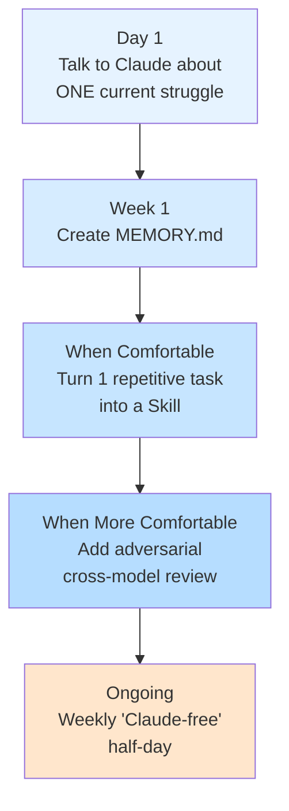

### Stage 1 — Day 1: Name One Struggle
No installation needed. Just describe a real friction point to Claude (browser or Claude Code, free tier is fine):
- *"I can't start work in the mornings."*
- *"I keep forgetting to review the tasks I wrote in Notion."*
- *"Writing meeting minutes takes forever and I dread it."*

The goal isn't necessarily a perfect answer — it's the low-friction experience of externalizing a vague problem into words and getting *some* structured response back.

### Stage 2 — Week 1: Build a MEMORY.md
Create a simple file where Claude records things worth remembering, one line at a time:

**✅ Good things to store:**
- Your personal decision-making rules ("Always ship the MVP before adding config options")
- Past mistakes you don't want to repeat
- Recurring phrases/instructions you give often
- Project-specific constraints or prerequisites

**❌ Never store:**
- Account numbers, credit card info, addresses
- Authentication tokens/credentials
- Family or health information

> Sensitive data should be managed in a separate, properly secured location — never in a persistent memory file readable by an AI assistant.

### Stage 3 — Once Comfortable: Turn a Repetitive Task into a Skill
Pick one recurring task — formatting meeting notes, organizing a task list, drafting a weekly report — and package it into a reusable Skill triggered by a simple phrase like "do this." Once you've built one, the pattern becomes reusable for others.

### Stage 4 — More Comfortable: Add Adversarial Review
Have a *different* model (Codex, ChatGPT, Gemini) review Claude's output. Why? Claude has a documented tendency toward **conformity bias** — a tendency to affirm ("that's great!") rather than challenge. Getting review from a different model helps break the "cognitive tunneling" that can happen during your own hyperfocus sessions.

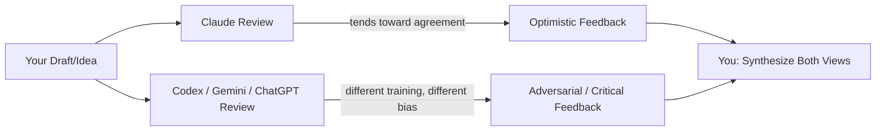

### Ongoing — Weekly "Claude Ban"
Set aside a fixed block of time — e.g., Sunday mornings, Wednesday evenings — where you use **only pen and paper**, no AI at all. This measures your actual dependence. If you find yourself unable to function during that window, that's valuable, early information.

> As the original author puts it: *"Addiction itself isn't bad. It's only unmeasured addiction that's dangerous."*

---

<a name="use-cases"></a>
## 9. Real-World Use Cases

### Use Case 1: Product Pricing Strategy
**Standard prompt result:** Tiered pricing, pay-as-you-go, token-based billing, ad-supported free tier — the four "textbook" answers.

**ADHD Skill result (hypothetical, using diverse personas):**
- *Auditor persona:* Flags that usage-based billing creates unpredictable customer bills → suggests a "billing cap with rollover credits" model to reduce churn from bill shock.
- *10-year-old persona:* "Why not let people pay with their *time* instead of money — like watching an ad to unlock a feature for a day?" → leads to a hybrid attention-based micro-unlock model.
- *Skeptical CFO persona:* Challenges whether free tier is even sustainable → suggests invite-gated free access to control CAC.
- *Critic synthesis:* Combines the rollover-credit idea with the invite-gated free tier into a novel "credit vault" pricing model not present in any single generator output.

### Use Case 2: Software Architecture Decisions
When deciding between microservices vs. monolith, a single LLM call tends to regurgitate the standard trade-off table. ADHD Skill can surface angles like:
- A "minimalist engineer" persona arguing the real problem is organizational, not technical
- A "security researcher" persona focused purely on attack surface implications of each architecture
- A "compliance auditor" persona focused on audit trail and data residency implications

### Use Case 3: Debugging Ambiguous Production Issues
When the root cause of a performance issue isn't obvious, a single-threaded CoT investigation can get anchored on the first plausible hypothesis (e.g., "it's probably the database"). Running isolated agents with different starting assumptions ("assume it's not the database — what else could it be?") forces genuine hypothesis diversity before convergence.

### Use Case 4: Creative/Marketing Ideation
Campaign taglines, positioning angles, or content series ideas benefit enormously from persona diversity — a "skeptical customer" persona will generate very different copy angles than a "loyal superfan" persona.

### Use Case 5: Personal Productivity / Executive Function Support
As described in the roadmap above, even without the multi-agent pipeline, simply using Claude as an external "structuring" partner — turning a chaotic to-do list into a logical, ordered sequence — reduces the cognitive load of decision-making for anyone (not just people with ADHD).

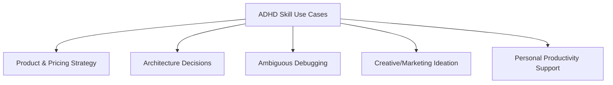

---

<a name="risks"></a>
## 10. Risks, Side Effects, and Guardrails

| Risk | Description | Mitigation |
|---|---|---|
| **Cost/latency** | 5 generator calls + 1 critic call = 6x the API usage of a single call | Reserve for genuinely open-ended, high-stakes decisions — not routine tasks |
| **Over-reliance / dependence** | Outsourcing all structuring/decision work to AI can atrophy your own executive function over time | Weekly "Claude ban" period; track whether you can still function without it |
| **Context bleed after switching modes** | Old ADHD-style instructions can linger and produce inconsistent output even after telling the agent to stop | Start a fresh session rather than fighting the current context |
| **Sensitive data in memory files** | MEMORY.md is a persistent, AI-readable file | Never store credentials, financial data, or health information there |
| **Global config affecting all projects** | Setting ADHD mode as default in CLAUDE.md/AGENTS.md applies everywhere | Test manually per-session first before committing to a global default |
| **Small sample size in research** | The formal evaluation used only 6 questions | Treat novelty/breadth improvement numbers as directional, not conclusive |

---

<a name="summary"></a>
## 11. Summary & Quick Reference

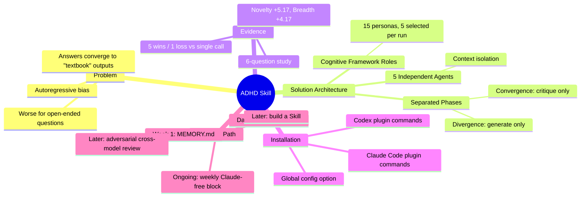

### Key Takeaways
1. **The root problem** is structural: token-by-token generation anchors LLM output to the most statistically common answer, which is often the least useful one for open-ended questions.
2. **The ADHD Skill fixes this** not by making the model "smarter," but by changing the *call pattern*: multiple isolated agents with diverse personas, followed by a strict generate-then-critique pipeline.
3. **It outperforms CoT/ToT** on divergent-thinking tasks specifically because those techniques still share context across steps, while ADHD Skill starts fresh each time.
4. **Adopt gradually.** Don't jump straight to full multi-agent mode — start with simple conversational use, build a memory file, then a custom skill, then add cross-model adversarial review.
5. **Measure your dependence.** A regular AI-free period isn't anti-productivity — it's a diagnostic tool to make sure the tool is serving you, not the other way around.

---

*This tutorial expands on concepts originally discussed by Gao Dalie (高達烈) regarding the "i-have-adhd" Claude Code/Codex plugin and its underlying research paper, "ADHD: Parallel Divergent Ideation for Coding Agents."*