# Most People Use AI Wrong — The 4-Layer System That Actually Works

> **A comprehensive tutorial on building a structured, intelligent AI workflow that deepens thinking, retains knowledge, and scales with you.**


---

## 📌 Table of Contents

1. [The Real Problem: Speed Without Depth](#the-real-problem)
2. [Why Random Prompts Don't Scale](#why-random-prompts-dont-scale)
3. [The 4-Layer AI System Overview](#the-4-layer-system)
4. [Layer 1 — Grounding: Start With Reality](#layer-1-grounding)
5. [Layer 2 — Exploration: Think at Scale](#layer-2-exploration)
6. [Layer 3 — Specialization: Build Your AI Team](#layer-3-specialization)
7. [Layer 4 — Execution: Where Work Happens](#layer-4-execution)
8. [How the Brain Learns: Focus vs Diffuse Mode](#how-the-brain-learns)
9. [Real-World Use Cases](#real-world-use-cases)
10. [Quick-Start Guide](#quick-start-guide)

---

## 🧠 The Real Problem: Speed Without Depth {#the-real-problem}

Most people approach AI tools the same way they approach a search engine:

1. Type a question
2. Copy the answer
3. Move on

It feels productive. And on the surface, it is — you produce more, ship faster, write more.

But here's the uncomfortable truth: **you're outsourcing your thinking.**

### What the Research Says

A study from MIT Media Lab found that heavy reliance on AI for writing **weakens recall and cognitive engagement**. When you skip the struggle — the confusion, the wrestling with an idea — you also skip the part where **real learning happens**.

This is the paradox:

| AI Usage Style | Output Volume | Depth of Thinking | Retention |
|---|---|---|---|
| Reactive (ask → copy → move on) | High | Low | Low |
| Structured (guided, layered, intentional) | High | High | High |

### The Cognitive Tax of Shallow AI Use

Think of your brain like a muscle. When AI does the heavy lifting every time, the muscle atrophies.

```
Shallow AI Use Loop:
┌─────────────────────────────────────────────────┐
│  Question → AI Answer → Copy → Done             │
│       ↓                                          │
│  No synthesis. No retention. No growth.          │
│       ↓                                          │
│  Next session: Start from zero. Again.           │
└─────────────────────────────────────────────────┘
```

The fix isn't using *less* AI. It's using it *differently* — with a system.

---

## ❌ Why Random Prompts Don't Scale {#why-random-prompts-dont-scale}

The typical AI workflow looks like this:

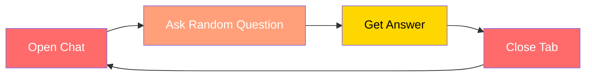

**What's missing:**
- No memory between sessions
- No context continuity
- No layered intelligence
- No compounding value over time

You're renting intelligence for a few seconds at a time. Not building it.

### The Compounding Problem

Every disconnected session is a **zero-sum game**. Compare this to a structured system where every session builds on the last:

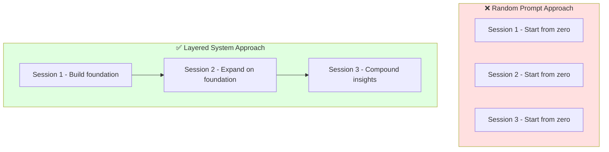

---

## 🏗️ The 4-Layer AI System Overview {#the-4-layer-system}

Think of your AI workflow as a **four-story building**, where each floor has a clear responsibility and each one builds on the one below it.

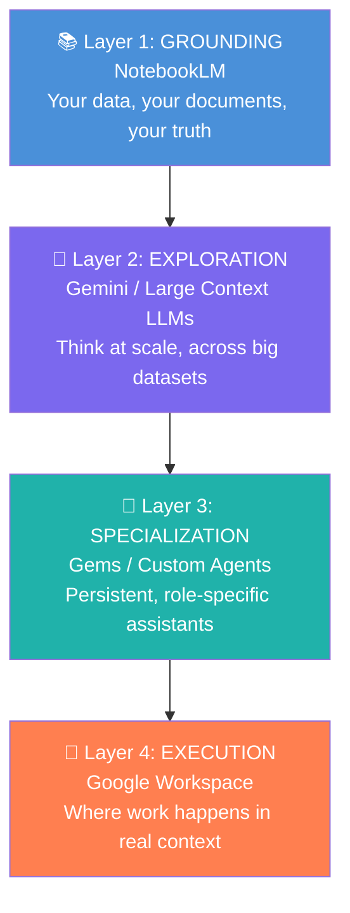

Here's the full system at a glance:

| Layer | Name | Tool | Core Job |
|---|---|---|---|
| 1 | Grounding | NotebookLM | Anchor AI to *your* reality |
| 2 | Exploration | Gemini | Think deeply across large contexts |
| 3 | Specialization | Gems / Custom Agents | Build persistent, role-aware assistants |
| 4 | Execution | Google Workspace | Bring AI into your actual workflow |

---

## 📚 Layer 1 — Grounding: Start With Reality {#layer-1-grounding}

### The Problem This Solves

AI is confident, even when it's wrong. Generic outputs based on training data can sound authoritative while being entirely irrelevant to your specific situation.

**Grounding** means feeding AI *your own material* so it reasons about your reality — not a statistical average.

### What to Feed It

- Your documents and reports
- Meeting transcripts
- Research notes
- Case studies you've collected
- Project briefs

### What Changes

Instead of asking:
> "What are best practices for system design?"

You ask:
> "Given the documents I've uploaded, where are the gaps in our current architecture and what patterns keep appearing?"

This shift moves you from **passive consumer** to **active analyst**.

### Detailed Example: System Design Interview Prep

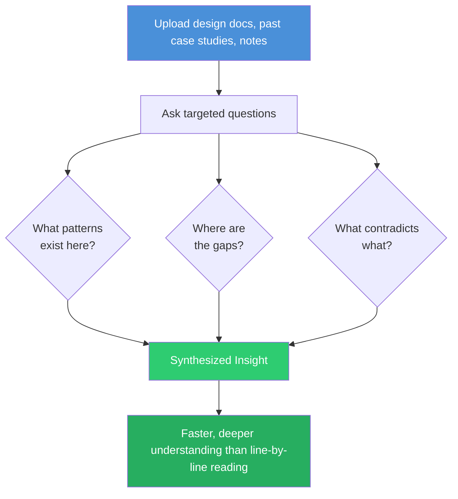

**Step-by-step:**

1. Upload 5–10 system design case studies to NotebookLM
2. Add your own notes from previous interviews
3. Ask: *"What architectural patterns appear most frequently?"*
4. Ask: *"What failure modes are commonly underestimated?"*
5. Ask: *"What questions could an interviewer derive from this material?"*

You get a synthesis that would take hours to construct manually — built from *your* curated sources.

---

## 🔭 Layer 2 — Exploration: Think at Scale {#layer-2-exploration}

### Why You Need a Thinking Engine

Once your knowledge foundation is solid, you need an AI that can hold **massive context** and reason across it. This is where tools like Gemini shine — they can process long documents, code, images, and data in a single session.

### The Power of Guidance: The Actor-Input-Mission Framework

Random prompts get random results. Great prompts follow a structure:

```
┌─────────────────────────────────────────────┐
│  ACTOR   → Define the role                  │
│  INPUT   → Provide full context              │
│  MISSION → Specify the desired outcome       │
└─────────────────────────────────────────────┘
```

### Examples: Weak vs Strong Prompts

| Scenario | Weak Prompt | Strong Prompt (AIM Framework) |
|---|---|---|
| API Review | "Review my API" | "Act as a senior backend architect. Review this API design and suggest improvements for scalability and failure handling." |
| Writing Help | "Make this better" | "Act as a technical editor for developer blogs. Here is my draft [paste]. Improve clarity for a beginner audience without losing technical depth." |
| Data Analysis | "What does this data say?" | "Act as a data analyst. Here is our Q3 user engagement data [paste]. Identify the top 3 trends and hypothesize root causes for each." |

### Exploration Questions That Go Deep

Use these question structures to unlock deeper insights:

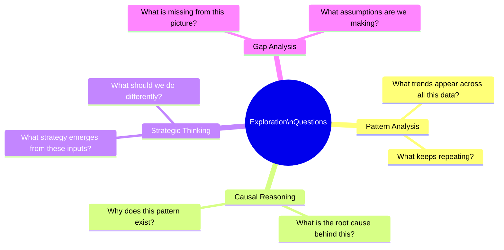

---

## 🤖 Layer 3 — Specialization: Build Your AI Team {#layer-3-specialization}

### The Memory Problem

Every new chat session resets context. This forces you to:
- Re-explain your preferences every time
- Repeat your coding style or writing voice
- Start from scratch on continuity

**Specialization solves this** by creating persistent agents with defined roles, accumulated context, and stable identities.

### How to Build Your AI Team

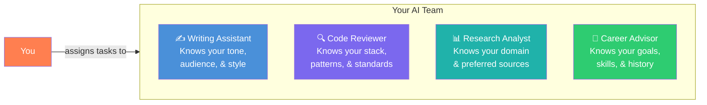

### Building a "Code Reviewer" Agent — Step by Step

1. **Create the agent** with a clear system prompt:
```
   You are my personal Code Reviewer. You know I work primarily in Python 
   and TypeScript. I follow clean architecture patterns. I value readability 
   over cleverness. Flag anything that violates SOLID principles.
```

2. **Feed it context** over time:
   - Share your style guide
   - Show it examples of code you've approved and rejected
   - Explain your team's conventions

3. **Use it consistently** for every PR before you submit

4. **Iterate** — when it misses something, correct it and explain why

### Benefits vs One-Off Prompts

| Approach | Setup Time | Consistency | Learning Curve | Long-Term Value |
|---|---|---|---|---|
| One-off prompts | None | Low | None | None |
| Specialized agents | Medium | High | Medium | Compounds over time |

---

## 🏢 Layer 4 — Execution: Where Work Happens {#layer-4-execution}

### The Hidden Cost of Fragmentation

Most people use AI in a separate tab, disconnected from their real work. This creates constant context switching.

Research shows that switching between tools and contexts can **reduce productivity by up to 40%**.

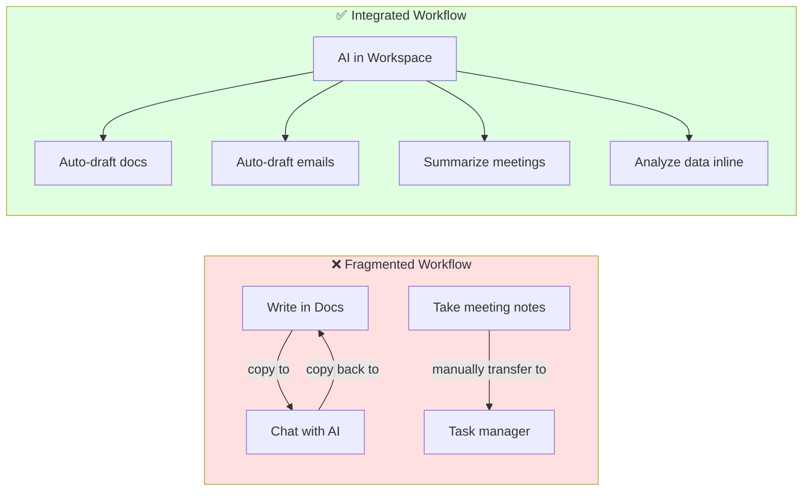

### What Integration Looks Like in Practice

| Task | Without Integration | With Integration |
|---|---|---|
| Meeting follow-up | Manually transcribe → summarize in AI → copy to email → send | Meeting auto-summarized → email drafted from context → one-click send |
| Document drafting | Write outline → paste to AI → improve → paste back | Start in workspace → AI assists inline → done |
| Data analysis | Export CSV → describe to AI → implement suggestions | AI analyzes data directly in spreadsheet |

### Getting Started with an Integrated Workspace

1. Enable AI features inside Google Workspace (Gemini for Workspace)
2. Use AI directly in Gmail, Docs, Sheets, and Meet
3. Set up automation flows: Meeting → Summary → Task → Email
4. Eliminate the copy-paste layer entirely

---

## 🧩 How the Brain Learns: Focus vs Diffuse Mode {#how-the-brain-learns}

Understanding *how your brain actually learns* is what makes this system work at a deeper level.

### The Two Learning Modes

```mermaid
flowchart LR
    subgraph FOCUS["🔦 Focus Mode"]
        F1[Sit down and engage deeply]
        F2[Question assumptions]
        F3[Pull ideas apart]
        F4[Analyze data carefully]
        F5[Stay with the problem]
    end

    subgraph DIFFUSE["🌊 Diffuse Mode"]
        D1[Step back and rest]
        D2[Take a walk]
        D3[Sit quietly]
        D4[Brain connects ideas in background]
        D5[Unexpected insights emerge]
    end

    FOCUS -->|"After deep work"| DIFFUSE
    DIFFUSE -->|"Return refreshed"| FOCUS

    style FOCUS fill:#4a90d9,color:#fff
    style DIFFUSE fill:#7b68ee,color:#fff
```

### How AI Supports Both Modes

Most people only use AI during *focus mode*. The system described here supports both:

| Mode | AI Role | Example |
|---|---|---|
| Focus | Active partner | Exploring, questioning, going deep with Gemini |
| Diffuse | Passive support | Converting notes to audio → listen on a walk |

This means **learning doesn't stop when you step away from the screen**. Content can be converted to audio discussions. You continue absorbing ideas in a low-friction way.

### Why This Increases Retention

Traditional learning:
```
Read → Test → Forget
```

System-supported learning:
```
Ground (Layer 1) → Explore deeply (Layer 2) → Revisit in diffuse mode → Synthesize with specialized agent (Layer 3) → Apply in real work (Layer 4)
```

Every stage reinforces the last. Retention compounds naturally.

---

## 🌍 Real-World Use Cases {#real-world-use-cases}

### Use Case 1: Software Engineer Preparing for a Senior Role

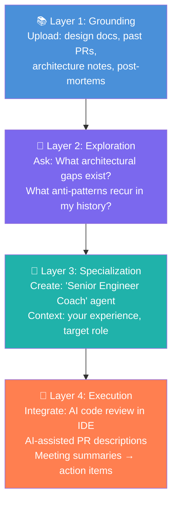

### Use Case 2: Content Creator Building a Newsletter

1. **Grounding:** Upload past issues, reader feedback, niche research
2. **Exploration:** "What topics generated the most engagement? What gaps exist in my content?"
3. **Specialization:** "Newsletter Editor" agent that knows your voice, audience, and formatting preferences
4. **Execution:** Draft, refine, and schedule — entirely within your workspace

### Use Case 3: Student Doing Research

1. **Grounding:** Upload papers, lecture notes, textbook chapters
2. **Exploration:** "What are the three most contested claims in this literature? What evidence supports each side?"
3. **Specialization:** "Research Synthesizer" agent aligned to your academic discipline
4. **Execution:** Write directly in Docs with AI assistance, citing your own uploaded sources

### Use Case 4: Manager Preparing for Strategy Meeting

1. **Grounding:** Upload team reports, KPIs, competitor analysis, previous meeting notes
2. **Exploration:** "What are the top 3 risks that appear across these reports? What strategic options emerge?"
3. **Specialization:** "Strategy Advisor" agent tuned to your industry and company context
4. **Execution:** Presentation drafts itself; email follow-ups auto-generate from meeting notes

---

## 🚀 Quick-Start Guide {#quick-start-guide}

You don't need to implement everything at once. Here's a phased approach:

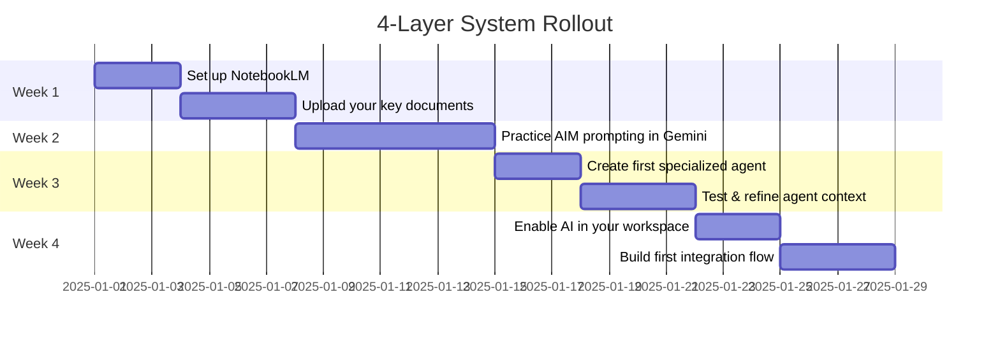

### The 4 Steps to Start Today

| Step | Action | Time Needed |
|---|---|---|
| 1 | Upload your key documents to NotebookLM | 20 minutes |
| 2 | Ask 5 analytical questions about them | 15 minutes |
| 3 | Create one specialized agent with a clear role prompt | 30 minutes |
| 4 | Enable AI in one existing tool you use daily | 15 minutes |

**Total:** Under 90 minutes to go from zero to a working system.

---

## 🎯 The Bigger Picture

AI will automate the **mechanics** of work. But every job has two parts:

```
Work = Mechanics + Meaning
         ↓              ↓
      AI handles    You provide
```

**Meaning** comes from:
- Judgment (what matters and why)
- Creativity (what to build and how)
- Intent (why this problem deserves solving)

The 4-Layer System doesn't replace your thinking. It **amplifies** it — so more of your energy goes to the parts that only you can provide.

> *"AI stops being a shortcut. It becomes a partner."*

---

## ✅ Summary

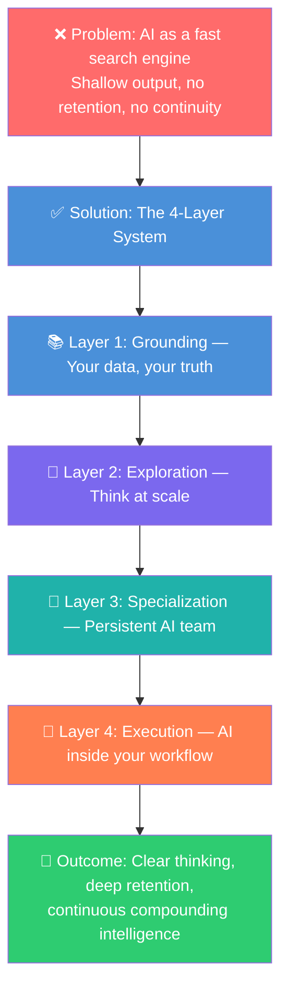

---

*Tutorial expanded from the original article "Most People Use AI Wrong" by CodeWithYog. All diagrams, examples, use cases, and frameworks added for educational depth.*