# OpenSpec: A Complete Tutorial to Spec-Driven Development with AI Coding Agents

**📚 Tutorial Type:** Comprehensive Deep-Dive  
**🎯 Difficulty Level:** Intermediate  
**⏱️ Estimated Reading Time:** 30-35 minutes  
**📅 Last Updated:** January 2026  
**🔧 Prerequisites:** Node.js 20+, Basic Markdown knowledge, Familiarity with AI coding agents

---

## Table of Contents

1. [Introduction: The AI Context Problem](#introduction)
2. [Prerequisites & Setup](#prerequisites)
3. [Learning Objectives](#learning-objectives)
4. [Core Concepts Deep Dive](#core-concepts)
5. [How OpenSpec Works: Complete Workflow](#how-it-works)
6. [Installation and Setup Guide](#installation)
7. [Step-by-Step Walkthrough: Your First Change](#walkthrough)
8. [Anatomy of Specs and Change Proposals](#anatomy)
9. [Real-World Use Cases & Examples](#use-cases)
10. [OpenSpec vs. Alternatives: Detailed Comparison](#comparison)
11. [Best Practices](#best-practices)
12. [Anti-Patterns to Avoid](#anti-patterns)
13. [Performance Considerations](#performance)
14. [Security Considerations](#security)
15. [Testing Strategies](#testing)
16. [Migration Guide: Adopting OpenSpec in Existing Projects](#migration)
17. [Troubleshooting Guide](#troubleshooting)
18. [Practice Exercises with Solutions](#exercises)
19. [Test Your Understanding](#test-understanding)
20. [Common Interview Questions](#interview-questions)
21. [Question Bank](#question-bank)
22. [Summary & Next Steps](#summary)

---

<a name="introduction"></a>
## 1. Introduction: The AI Context Problem

> **💡 Key Insight:** AI coding agents are incredibly powerful at writing code, but they suffer from a fundamental limitation: **context amnesia**. Once a chat session ends, the reasoning, requirements, and decisions behind a feature disappear forever.

AI coding agents (Claude Code, Cursor, Codex, GitHub Copilot, Windsurf, and dozens of others) have revolutionized software development. They can write code, refactor functions, and even design architectures. However, they have a critical weakness: **they don't remember why they built something the way they did.**

### The Problem Illustrated

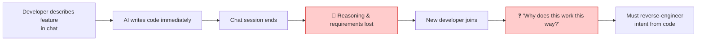

**The Real-World Impact:**
- **Knowledge Loss:** Every time a chat session ends, valuable context is lost
- **Inconsistency:** Different agents or developers build conflicting implementations
- **Maintenance Nightmare:** Future developers must reverse-engineer intent from code alone
- **No Shared Truth:** Teams lack a single source of truth for requirements

### What is Spec-Driven Development?

Spec-Driven Development (SDD) is a methodology where you **agree on what to build before writing any code**. It's similar to how architects create blueprints before construction begins. OpenSpec implements SDD by providing a lightweight, version-controlled specification layer that lives in your repository alongside your code.

**The OpenSpec Philosophy:**
> "A 'good enough' plan you can start coding from in minutes, updating the spec as things change along the way."

### Why This Matters for You

If you've ever:
- Had an AI agent "build the wrong thing" despite your best prompt engineering
- Spent hours explaining the same requirement to different agents across sessions
- Struggled to understand why legacy code works the way it does
- Wished your team had better documentation that actually stays updated

Then OpenSpec is designed specifically for you.

---

<a name="prerequisites"></a>
## 2. Prerequisites & Setup

Before diving into OpenSpec, ensure you have the following:

### Required Prerequisites

| Requirement | Minimum Version | Purpose | Verification Command |
|-------------|----------------|---------|----------------------|
| **Node.js** | 20.19.0+ | Runtime for OpenSpec CLI | `node -v` |
| **npm/yarn/pnpm** | Latest | Package manager | `npm -v` |
| **Git** | 2.0+ | Version control for specs | `git --version` |
| **AI Coding Agent** | Any supported tool | Implementation engine | N/A |

### Recommended Prerequisites

- **Basic Markdown knowledge** - Specs are written in Markdown
- **Familiarity with BDD** - Given/When/Then syntax used in scenarios
- **Git workflow experience** - Specs live in version control
- **Understanding of your codebase** - Helps write meaningful specs

### Supported AI Coding Agents

OpenSpec works with 20+ tools including:
- Claude Code
- Cursor
- GitHub Copilot
- Codex
- Windsurf
- Gemini CLI
- Cline
- RooCode
- Amazon Q

> **⚠️ Important:** OpenSpec is designed to be **tool-agnostic**. Your specs should work regardless of which AI agent you use.

---

<a name="learning-objectives"></a>
## 3. Learning Objectives

By the end of this tutorial, you will be able to:

### Core Competencies

✅ **Understand** the problems OpenSpec solves in AI-assisted development  
✅ **Install and configure** OpenSpec in any project (new or existing)  
✅ **Write effective spec files** using the OpenSpec format  
✅ **Create change proposals** that clearly define requirements  
✅ **Interpret spec deltas** to understand requirement changes  
✅ **Apply OpenSpec workflow** in real-world development scenarios  
✅ **Avoid common pitfalls** when adopting spec-driven development  
✅ **Integrate OpenSpec** into team workflows and CI/CD pipelines  

### Practical Skills You'll Gain

- Write production-ready specification documents
- Structure requirements using Given/When/Then scenarios
- Review AI-generated proposals before implementation
- Maintain living documentation that evolves with your codebase
- Collaborate effectively across different AI coding tools

---

<a name="core-concepts"></a>
## 4. Core Concepts Deep Dive

Let's build a solid mental model of OpenSpec's building blocks before diving into commands.

### 4.1 Specs (Specifications)

A **spec** is a Markdown file that describes the requirements and expected behavior of one **capability** in your system.

**Real-World Analogy:**
Think of specs like a product requirements document (PRD) that lives next to your code. Just as a constitution defines how a country should operate, a spec defines how a feature should behave.

**Example Capabilities:**
- `auth-login` - How user authentication works
- `checkout-cart` - Shopping cart functionality
- `payment-processing` - Payment gateway integration
- `user-notifications` - Notification system behavior

**Spec Structure:**
```markdown
# auth-session Specification

## Purpose
Manage user session lifecycle including creation, validation, and expiration.

## Requirements

### Requirement: Session expiration
The system SHALL expire sessions after a configured duration.

#### Scenario: Default session timeout
- GIVEN a user has authenticated
- WHEN 24 hours pass without activity
- THEN invalidate the session token
- AND require re-authentication
```

**Key Characteristics:**
- **Living documentation** - Always reflects current behavior
- **Testable** - Scenarios can be converted to automated tests
- **Version controlled** - Changes tracked in Git
- **Agent-readable** - AI tools can understand and implement from specs

### 4.2 Changes

A **change** is a proposed modification to your system. Instead of jumping straight into code, you describe what you want to change, and OpenSpec generates a structured package.

**Change Components:**
1. **proposal.md** - Describes the change in plain English
2. **design.md** - Technical decisions and architecture
3. **tasks.md** - Implementation checklist
4. **specs/** - Spec deltas showing requirement changes

**Change Lifecycle:**
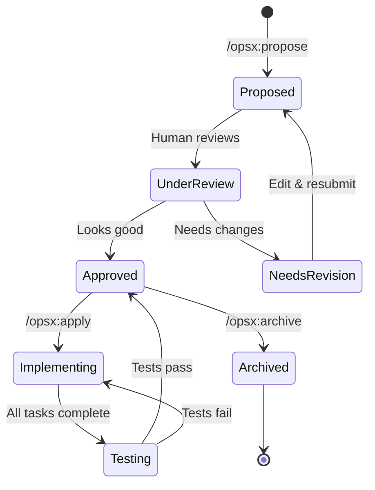

### 4.3 Spec Deltas

When a change modifies existing behavior, OpenSpec generates a **delta** - a precise diff of requirements.

**Example Delta:**
```diff
### Requirement: Session expiration

- The system SHALL expire sessions after a configured duration.
+ The system SHALL support configurable session expiration periods.

#### Scenario: Default session timeout
  GIVEN a user has authenticated
- WHEN 24 hours pass without activity
+ WHEN 24 hours pass without "Remember me"
  THEN invalidate the session token

+ #### Scenario: Extended session with remember me
+ GIVEN user checks "Remember me" at login
+ WHEN 30 days have passed
+ THEN invalidate the session token
+ AND clear the persistent cookie
```

**Why Diffs Matter:**
- **Faster reviews** - See what changed without reading entire specs
- **Clear intent** - Understand exactly what behavior is modifying
- **Reduced risk** - Catch unintended changes before implementation
- **Better collaboration** - Team members can review requirements, not just code

### 4.4 The Four Artifacts of a Change

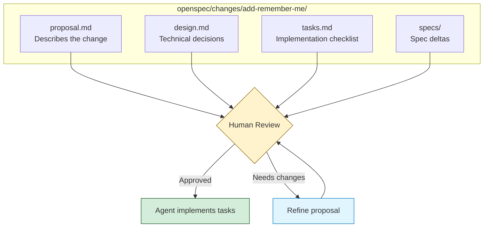

**Artifact Details:**

| Artifact | Purpose | Who Writes | Who Reviews |
|----------|---------|------------|-------------|
| **proposal.md** | What and why of the change | AI Agent + Human | Product, Engineering |
| **design.md** | How to implement technically | AI Agent | Engineering Lead |
| **tasks.md** | Step-by-step implementation plan | AI Agent | Developer |
| **specs/** | What requirements change | AI Agent | Product, QA |

### 4.5 Universal & Tool-Agnostic

OpenSpec is designed to work universally across tools without proprietary dependencies.

**Core Principles:**
- **No API keys required** - Works offline
- **No MCP server needed** - Lightweight CLI tool
- **File-based specs** - Standard Markdown files
- **Git-native** - Uses standard version control

**Why This Matters:**
Your specification layer shouldn't be locked to a single vendor. Coding agents evolve quickly, but your specs should persist regardless of which tool you use.

---

<a name="how-it-works"></a>
## 5. How OpenSpec Works: Complete Workflow

### The Full Lifecycle

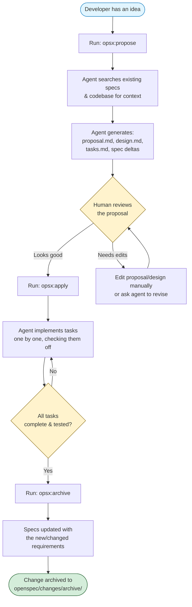

### Stage-by-Stage Breakdown

| Stage | What Happens | Who's Involved | Time Investment |
|-------|--------------|----------------|-----------------|
| **Propose** | Describe feature in plain English; agent researches and drafts proposal | You + AI Agent | 5-10 minutes |
| **Review** | Read proposal, design, tasks, and spec deltas before any code exists | You (human) | 10-30 minutes |
| **Apply** | Agent implements tasks from `tasks.md`, checking off progress | AI Agent | Varies by complexity |
| **Archive** | Change moved to archive, main specs updated to reflect new behavior | AI Agent | 2-5 minutes |

### Key Workflow Principles

1. **Not Waterfall** - Iterate and refine proposals as needed
2. **Human-in-the-Loop** - Review happens before implementation
3. **Incremental Progress** - Tasks completed one at a time
4. **Persistent Knowledge** - Specs remain after implementation

### Detailed Sequence Example

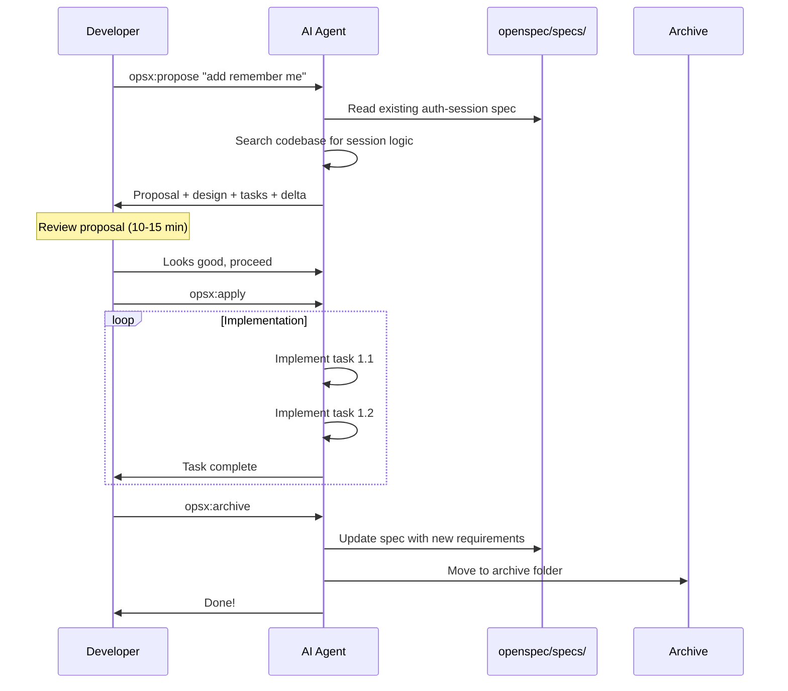

---

<a name="installation"></a>
## 6. Installation and Setup Guide

### Step 1: Verify Prerequisites

**Check Node.js Version:**
```bash
# Check your Node version (requires 20.19.0 or higher)
node -v

# Expected output: v20.19.0 or higher
# If outdated, upgrade using nvm, fnm, or download from nodejs.org
```

**Verify Package Manager:**
```bash
# Check npm version
npm -v

# Or check pnpm
pnpm -v

# Or check yarn
yarn -v
```

### Step 2: Install OpenSpec Globally

**Using npm:**
```bash
npm install -g @fission-ai/openspec@latest
```

**Alternative Package Managers:**
```bash
# Using pnpm
pnpm add -g @fission-ai/openspec@latest

# Using yarn
yarn global add @fission-ai/openspec@latest

# Using bun
bun add -g @fission-ai/openspec@latest
```

**Verify Installation:**
```bash
# Check OpenSpec version
openspec --version

# Expected output: Latest version number
```

### Step 3: Initialize in Your Project

**Navigate to Your Project:**
```bash
# Move to your project directory
cd your-project

# For new projects
mkdir my-new-project && cd my-new-project
git init  # Initialize git if not already done
```

**Initialize OpenSpec:**
```bash
# Run OpenSpec initialization
openspec init
```

**What Gets Created:**
```
your-project/
├── openspec/
│   ├── specs/              # Your living specifications
│   │   ├── auth-login/
│   │   │   └── spec.md
│   │   ├── auth-session/
│   │   │   └── spec.md
│   │   └── ...
│   ├── changes/            # In-flight proposals
│   │   ├── add-remember-me/
│   │   │   ├── proposal.md
│   │   │   ├── design.md
│   │   │   ├── tasks.md
│   │   │   └── specs/
│   │   └── ...
│   └── changes/archive/    # Completed changes
│       └── 2025-01-23-add-dark-mode/
├── src/                    # Your source code
└── package.json
```

### Step 4: Configure Your AI Agent

**For Claude Code:**
The `/opsx:propose` slash command should be automatically available. If not:
```bash
# Refresh agent commands
openspec update
```

**For Other Agents:**
Consult the [Supported Tools documentation](https://github.com/Fission-AI/OpenSpec/blob/main/docs/supported-tools.md) for specific integration instructions.

### Step 5: Verify Setup

**Test the Installation:**
```bash
# Check OpenSpec status
openspec status

# List existing specs (should show empty or existing specs)
openspec list
```

### Step 6: Keep OpenSpec Updated

**Upgrade CLI:**
```bash
# Update to latest version
npm install -g @fission-ai/openspec@latest

# Or using your package manager
pnpm update -g @fission-ai/openspec
```

**Refresh Agent Commands:**
```bash
# Update agent integrations in your project
openspec update
```

### Complete Setup Visualization

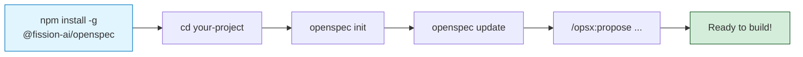

---

<a name="walkthrough"></a>
## 7. Step-by-Step Walkthrough: Your First Change

Let's walk through a complete example - adding a "Remember Me" checkbox to a login form that extends session duration to 30 days.

### Scenario: Add Remember Me Feature

**Business Requirement:**
Users should have the option to extend their session duration from 24 hours to 30 days by checking a "Remember Me" checkbox during login.

---

### Step 1: Propose the Change

**In Your AI Agent:**
```
/opsx:propose Add remember me checkbox with 30-day sessions for authenticated users
```

**What the Agent Does:**
1. Searches existing specs for authentication requirements
2. Reads relevant spec file (e.g., `openspec/specs/auth-session/spec.md`)
3. Searches codebase for session-handling logic (e.g., `src/auth/session.ts`)
4. Generates a complete proposal package

**Generated Structure:**
```
openspec/changes/add-remember-me/
├── proposal.md          # Describes the change
├── design.md            # Technical decisions
├── tasks.md             # Implementation checklist
└── specs/
    └── auth-session/
        └── spec.md      # Spec delta
```

**Sample Output:**
```
Change proposed: add-remember-me
Impact: 1 spec affected, 3 phases, 8 tasks
Location: openspec/changes/add-remember-me/
```

---

### Step 2: Review the Proposal

**Review proposal.md:**
```markdown
# Add Remember Me Checkbox

## Summary
Add a "Remember Me" checkbox to the login form that extends 
session duration from 24 hours to 30 days when checked.

## Motivation
Users currently need to re-authenticate daily, which creates 
friction for regular users. A "Remember Me" feature is a 
standard UX pattern that improves user retention.

## Scope
- Add checkbox to login form UI
- Modify session creation logic
- Update session expiration handling
- Add tests for both session types
```

**Review design.md:**
```markdown
# Technical Design

## Architecture Decisions

### Decision 1: Session Storage
**Choice:** Store "remember me" preference in JWT token
**Rationale:** Stateless, scalable, no database changes needed

### Decision 2: Session Duration
**Choice:** Use environment variables for configuration
**Default:** 24 hours (normal), 30 days (remember me)
```

**Review tasks.md:**
```markdown
# Implementation Tasks

## Phase 1: UI Changes
- [ ] 1.1 Add checkbox component to login form
- [ ] 1.2 Wire checkbox to form submission
- [ ] 1.3 Update form validation

## Phase 2: Backend Logic
- [ ] 2.1 Modify session creation endpoint
- [ ] 2.2 Update session middleware
- [ ] 2.3 Add configurable expiration

## Phase 3: Testing
- [ ] 3.1 Add unit tests for session logic
- [ ] 3.2 Add integration tests
- [ ] 3.3 Update API documentation
```

---

### Step 3: Review the Spec Delta (Most Important Step!)

This is where OpenSpec's real value shines. Instead of reading code diffs, you read **requirement diffs**:

```diff
### Requirement: Session expiration

- The system SHALL expire sessions after a configured duration.
+ The system SHALL support configurable session expiration periods.

#### Scenario: Default session timeout
  GIVEN a user has authenticated
- WHEN 24 hours pass without activity
+ WHEN 24 hours pass without "Remember me" checked
  THEN invalidate the session token
  AND require re-authentication

+ #### Scenario: Extended session with remember me
+ GIVEN user checks "Remember me" at login
+ WHEN 30 days have passed
+ THEN invalidate the session token
+ AND clear the persistent cookie
```

**Why This Matters:**
- **Human-readable** - No code required to understand the change
- **Precise** - Exact behavior changes documented
- **Reviewable** - Can be reviewed by non-technical stakeholders
- **Testable** - Scenarios map directly to test cases

> **💡 Pro Tip:** Always read the spec delta first. If the requirements aren't clear or correct, fix them before implementing. It's much cheaper to change requirements than to refactor code.

---

### Step 4: Apply the Change

**Execute the Apply Command:**
```
/opsx:apply
```

**Agent Implementation Flow:**
```
Starting implementation of add-remember-me...

✓ 1.1 Add checkbox component to login form
✓ 1.2 Wire checkbox to form submission  
✓ 1.3 Update form validation
✓ 2.1 Modify session creation endpoint
✓ 2.2 Update session middleware
✓ 2.3 Add configurable expiration
✓ 3.1 Add unit tests for session logic
✓ 3.2 Add integration tests
✓ 3.3 Update API documentation

All tasks complete!
```

**What Happens Behind the Scenes:**
1. Agent reads `tasks.md`
2. Implements tasks sequentially
3. Updates `tasks.md` to mark items complete (✓)
4. Commits code changes
5. Runs tests to verify functionality

---

### Step 5: Archive the Change

**Execute the Archive Command:**
```
/opsx:archive
```

**Archive Process:**
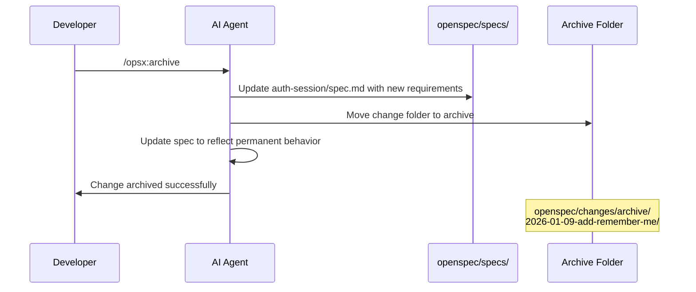

**Results:**
- Change moved to `openspec/changes/archive/2026-01-09-add-remember-me/`
- Main spec file updated: `openspec/specs/auth-session/spec.md`
- Next developer reads current, correct spec (not stale docs)

**Updated Spec (auth-session/spec.md):**
```markdown
# auth-session Specification

## Purpose
Manage user session lifecycle including creation, validation, 
and expiration with configurable durations.

## Requirements

### Requirement: Session expiration
The system SHALL support configurable session expiration periods.

#### Scenario: Default session timeout
- GIVEN a user has authenticated
- WHEN 24 hours pass without "Remember me" checked
- THEN invalidate the session token
- AND require re-authentication

#### Scenario: Extended session with remember me
- GIVEN user checks "Remember me" at login
- WHEN 30 days have passed
- THEN invalidate the session token
- AND clear the persistent cookie
```

---

### Complete Walkthrough Summary

| Step | Command | Time | Outcome |
|------|---------|------|---------|
| 1 | `/opsx:propose` | 5-10 min | Proposal package generated |
| 2 | Review | 10-30 min | Requirements validated |
| 3 | `/opsx:apply` | Varies | Code implemented |
| 4 | `/opsx:archive` | 2-5 min | Specs updated, change archived |

**Total Time Investment:** 20-60 minutes (depending on complexity)

---

<a name="anatomy"></a>
## 8. Anatomy of Specs and Change Proposals

### 8.1 The Spec Directory Structure

Specs are organized by capability in your repository:

```
openspec/
├── specs/                      # Current truth - living documentation
│   ├── auth-login/
│   │   └── spec.md            # Login capability spec
│   ├── auth-session/
│   │   └── spec.md            # Session management spec
│   ├── checkout-cart/
│   │   └── spec.md            # Shopping cart spec
│   └── checkout-payment/
│       └── spec.md            # Payment processing spec
│
├── changes/                    # In-flight proposals
│   ├── add-remember-me/
│   │   ├── proposal.md
│   │   ├── design.md
│   │   ├── tasks.md
│   │   └── specs/
│   ├── implement-dark-mode/
│   │   ├── proposal.md
│   │   ├── design.md
│   │   ├── tasks.md
│   │   └── specs/
│   └── ...
│
└── changes/
    └── archive/                # Historical proposals
        ├── 2025-01-23-add-dark-mode/
        ├── 2025-02-14-payment-refactor/
        └── ...
```

### 8.2 Anatomy of a Spec File

**Complete Example:**
```markdown
# auth-session Specification

## Purpose
Manage user session lifecycle including creation, validation, 
and expiration with configurable durations.

## Requirements

### Requirement: Session creation
The system SHALL create a new session upon successful user authentication.

#### Scenario: Successful login creates session
- GIVEN a user provides valid credentials
- WHEN authentication succeeds
- THEN create a new session token
- AND store session in database
- AND return session cookie to client

#### Scenario: Failed login does not create session
- GIVEN a user provides invalid credentials
- WHEN authentication fails
- THEN do not create a session
- AND return error response

### Requirement: Session expiration
The system SHALL support configurable session expiration periods.

#### Scenario: Default session timeout
- GIVEN a user has authenticated
- WHEN 24 hours pass without "Remember me" checked
- THEN invalidate the session token
- AND require re-authentication

#### Scenario: Extended session with remember me
- GIVEN user checks "Remember me" at login
- WHEN 30 days have passed
- THEN invalidate the session token
- AND clear the persistent cookie

### Requirement: Session validation
The system SHALL validate session tokens on protected routes.

#### Scenario: Valid session allows access
- GIVEN a user has a valid session token
- WHEN accessing a protected route
- THEN allow the request
- AND attach user context to request

#### Scenario: Invalid session denies access
- GIVEN a session token is expired or invalid
- WHEN accessing a protected route
- THEN return 401 Unauthorized
- AND clear invalid token
```

**Spec File Structure:**
```
# [Capability Name] Specification

## Purpose
[One-line summary of what this capability does]

## Requirements

### Requirement: [Requirement name]
[Formal SHALL statement describing the behavior]

#### Scenario: [Scenario name]
- GIVEN [initial context]
- WHEN [action or event occurs]
- THEN [expected outcome]
- AND [additional outcome, optional]
```

### 8.3 Anatomy of a Change Proposal

**proposal.md Structure:**
```markdown
# [Change Title]

## Summary
[One-paragraph description of what and why]

## Motivation
[Business justification for this change]

## Scope
### In Scope
- [What's included]

### Out of Scope
- [What's not included]

## Success Criteria
- [ ] Criterion 1
- [ ] Criterion 2
- [ ] Criterion 3

## Dependencies
- [External dependencies or blockers]

## Risks & Mitigations
| Risk | Likelihood | Impact | Mitigation |
|------|------------|--------|------------|
| Risk 1 | Medium | High | Mitigation strategy |
```

**design.md Structure:**
```markdown
# Technical Design: [Change Title]

## Architecture Decisions

### Decision 1: [Decision Title]
**Choice:** [What was decided]
**Rationale:** [Why this choice]
**Alternatives Considered:**
- Alternative 1: [Why not chosen]
- Alternative 2: [Why not chosen]

## Implementation Approach

### Component 1
[How component 1 will be modified/created]

### Component 2
[How component 2 will be modified/created]

## Data Model Changes

### New Entities
[Any new data structures]

### Modified Entities
[Changes to existing data structures]

## API Changes

### New Endpoints
[New API endpoints]

### Modified Endpoints
[Changes to existing endpoints]

## Testing Strategy
[How this will be tested]
```

**tasks.md Structure:**
```markdown
# Implementation Tasks: [Change Title]

## Phase 1: [Phase Name]
- [ ] 1.1 [Task description]
- [ ] 1.2 [Task description]
- [ ] 1.3 [Task description]

## Phase 2: [Phase Name]
- [ ] 2.1 [Task description]
- [ ] 2.2 [Task description]

## Phase 3: Testing & Documentation
- [ ] 3.1 [Task description]
- [ ] 3.2 [Task description]

## Checklist
- [ ] All tests passing
- [ ] Code reviewed
- [ ] Documentation updated
- [ ] Deployed to staging
```

### 8.4 Spec Delta Format

**Example Delta:**
```diff
### Requirement: User authentication

- The system SHALL require username and password for login.
+ The system SHALL support username/password and OAuth2 login.

#### Scenario: Standard login
  GIVEN a user has a registered account
  WHEN they submit valid credentials
  THEN authenticate and create session

+ #### Scenario: OAuth2 login
+ GIVEN a user has a Google/GitHub account
+ WHEN they click "Login with Google"
+ THEN redirect to OAuth2 provider
+ AND create session upon callback
```

### 8.5 Relationship Diagram

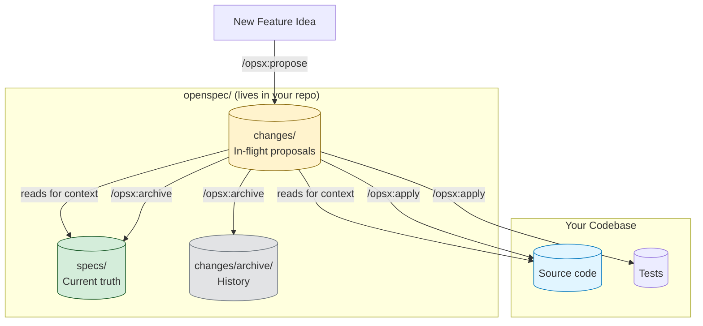

---

<a name="use-cases"></a>
## 9. Real-World Use Cases & Examples

### Use Case 1: Onboarding a New Developer

**Scenario:** A senior engineer leaves, and a new developer joins the team. They need to understand the authentication system.

**Without OpenSpec:**
```
Day 1-3: Read scattered code files
Day 4: Ask teammates about session handling
Day 5: Dig through old Slack threads
Day 6: Review PR descriptions from 6 months ago
Day 7: Still confused about why sessions expire after 24h
```

**With OpenSpec:**
```
Day 1 Morning: Read openspec/specs/auth-session/spec.md
Day 1 Afternoon: Understand complete authentication flow
Day 2: Start contributing confidently
```

**Time Saved:** 80% reduction in onboarding time

**Example Spec File a New Developer Reads:**
```markdown
# auth-session Specification

## Purpose
Manage user session lifecycle with configurable expiration.

## Requirements

### Requirement: Session expiration
The system SHALL expire sessions after 24 hours of inactivity.

#### Scenario: User remains logged in during workday
- GIVEN a user logs in at 9 AM
- WHEN they actively use the app throughout the day
- THEN session remains valid
- BUT expires after 24 hours of inactivity

Business Context: This was chosen to balance security 
and convenience. Extended sessions were considered but 
rejected due to security audit findings in 2025.
```

---

### Use Case 2: Reviewing an AI-Generated Feature

**Scenario:** An AI agent proposes a large refactor touching 15 files.

**Without OpenSpec:**
- Reviewer must read 500+ lines of code diff
- Must reverse-engineer intent from implementation
- High risk of missing subtle behavior changes
- Review takes 2-3 hours

**With OpenSpec:**
- Reviewer reads 50-line spec delta first
- Understands intent in 10 minutes
- Dives into code only for uncertain parts
- Review takes 30 minutes

**Spec Delta Example:**
```diff
### Requirement: API rate limiting

- The system SHALL limit API calls to 100 requests per minute per user.
+ The system SHALL implement tiered rate limiting:
+   - Free tier: 100 requests/minute
+   - Pro tier: 1000 requests/minute
+   - Enterprise: Unlimited

#### Scenario: Rate limit exceeded
  GIVEN a user exceeds their rate limit
  WHEN they make another request
- THEN return 429 Too Many Requests
+ THEN return 429 with Retry-After header
+ AND log the event for analytics
```

---

### Use Case 3: Multi-Tool Team Collaboration

**Scenario:** 
- Senior dev uses Claude Code
- Junior dev prefers Cursor
- DevOps engineer uses GitHub Copilot
- Contractor uses Windsurf

**Without OpenSpec:**
```
Senior: "I set up the context in my Claude Code session"
Junior: "I don't have that context in Cursor"
DevOps: "Copilot doesn't know about that decision"
Contractor: "I built this differently in Windsurf"
```

**With OpenSpec:**
```
Everyone: Reads the same spec file
Everyone: Implements consistently
Everyone: Works from single source of truth
```

**Key Advantage:** Specs live in Git, not in any single tool's chat history.

---

### Use Case 4: Brownfield (Existing) Codebases

**Scenario:** 5-year-old codebase with no documentation, need to add feature without breaking hidden behavior.

**Without OpenSpec:**
- Spend weeks understanding existing code
- High risk of breaking undocumented behavior
- "Working as designed" vs "Working by accident" confusion

**With OpenSpec:**
- Create specs incrementally as you discover behavior
- Document "working as designed" vs "working by accident"
- Add new features with clear requirements

**Incremental Spec Creation:**
```bash
# Don't try to spec everything upfront
# Create specs as you work:

# Week 1: Adding payment feature
/opsx:propose Add Stripe payment integration
# Creates spec for checkout-payment

# Week 2: Modifying cart behavior
/opsx:propose Allow saving cart for later
# Creates/updates spec for checkout-cart

# Over time, you have specs for all critical capabilities
```

---

### Use Case 5: Team Collaboration via Pull Requests

**Scenario:** Two engineers propose conflicting changes to the same capability.

**Without OpenSpec:**
```bash
Engineer A: Creates PR to change session timeout to 7 days
Engineer B: Creates PR to change session timeout to 1 hour
# Conflict discovered after code review
# Hours of rework required
```

**With OpenSpec:**
```bash
Engineer A: /opsx:propose Extend session to 7 days
           # Creates change proposal

Engineer B: /opsx:propose Shorten session to 1 hour  
           # Creates different change proposal

# Both specs reviewed in PRs
# Conflict visible before any code written
# Team discusses and aligns on one approach
# Only one implementation proceeds
```

**Git-Based Collaboration:**
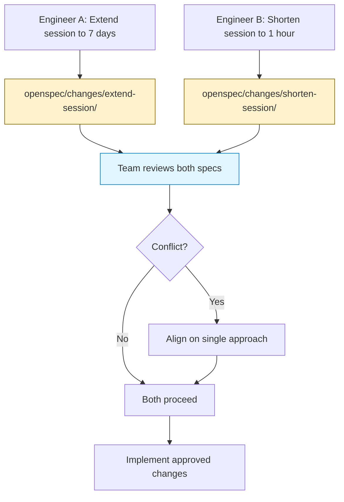

---

### Use Case Summary Table

| Use Case | Pain Point Solved | Key OpenSpec Feature | Time Saved |
|----------|-------------------|----------------------|------------|
| **New developer onboarding** | Tribal knowledge, no docs | Persistent specs | 60-80% |
| **Reviewing AI-generated PRs** | Hard to judge intent from code diff | Spec deltas | 70% |
| **Multi-tool teams** | Context locked to one chat/tool | Universal slash commands | 100% consistency |
| **Legacy codebases** | Undocumented existing behavior | Brownfield-first, incremental specs | 50% |
| **Team collaboration** | Merge conflicts on requirements | Git-based review workflow | 90% |

---

<a name="comparison"></a>
## 10. OpenSpec vs. Alternatives: Detailed Comparison

### Comparison Matrix

```mermaid
quadrantChart
    title Planning Tools: Weight vs. Flexibility
    x-axis Rigid --> Flexible
    y-axis Lightweight --> Heavyweight
    quadrant-1 Heavy & Flexible
    quadrant-2 Heavy & Rigid
    quadrant-3 Light & Rigid
    quadrant-4 Light & Flexible
    OpenSpec: [0.75, 0.25]
    Spec Kit: [0.35, 0.75]
    Kiro (IDE-locked): [0.3, 0.6]
    No process: [0.9, 0.05]
```

### Detailed Tool Comparison

| Aspect | OpenSpec | GitHub Spec Kit | Kiro (AWS) | No Process |
|--------|----------|-----------------|------------|------------|
| **Approach** | Lightweight spec layer with slash commands | Thorough, heavyweight with rigid phase gates | Powerful but IDE-locked | Vague prompts, agent guesses |
| **Setup Complexity** | Low (npm install) | High (Python, config) | Medium (IDE plugin) | None |
| **Tool Lock-in** | None (20+ tools) | Low (Markdown-based) | High (AWS ecosystem) | N/A |
| **Learning Curve** | Medium | Steep | Medium | Low |
| **Ceremony** | Minimal | Extensive | Moderate | None |
| **Flexibility** | High | Low (rigid phases) | Medium | Very High |
| **Context Persistence** | Excellent (Git-based) | Good | Fair (IDE-based) | Poor |
| **Best For** | Teams using multiple AI tools | Teams wanting rigid structure | AWS-centric teams | Solo developers |
| **Version Control** | Native Git integration | Git-based | IDE-specific | Chat logs only |
| **Cost** | Free (open source) | Free (open source) | Varies (AWS costs) | Free |

### When to Choose OpenSpec

**✅ Choose OpenSpec if:**
- You use multiple AI coding tools across your team
- You want lightweight specs without rigid processes
- You prefer file-based, Git-native workflows
- You need brownfield-first adoption (existing codebases)
- You want specs that work regardless of AI tool vendor

**❌ Consider alternatives if:**
- You need rigid phase gates and extensive documentation (Spec Kit)
- You're locked into AWS ecosystem (Kiro)
- You're a solo developer prototyping quickly (No process may suffice)

### Feature Comparison Table

| Feature | OpenSpec | Spec Kit | Kiro | No Process |
|---------|----------|----------|------|------------|
| **Spec Persistence** | Markdown in Git | Markdown in Git | IDE storage | Chat history |
| **Multi-tool Support** | 20+ tools | Universal | AWS only | Any tool |
| **Proposal Workflow** | Built-in | Built-in | Built-in | None |
| **Spec Deltas** | Yes | Yes | Yes | None |
| **Task Tracking** | Built-in | Built-in | Built-in | Manual |
| **Setup Time** | ~5 minutes | ~30 minutes | ~15 minutes | 0 minutes |
| **Ongoing Overhead** | Low | Medium | Low | None |
| **Team Scalability** | Excellent | Good | Medium | Poor |
| **Learning Curve** | Moderate | Steep | Moderate | None |

### Real-World Decision Matrix

**Scenario 1: Startup with 5 developers using Claude Code and Cursor**
→ **OpenSpec** ✅

**Scenario 2: Enterprise team requiring strict documentation standards**
→ **Spec Kit** or **OpenSpec** (both work)

**Scenario 3: Solo developer prototyping a side project**
→ **No Process** or **OpenSpec** (lightweight)

**Scenario 4: AWS shop with Amazon Q developers**
→ **Kiro** or **OpenSpec** (OpenSpec works with Amazon Q)

**Scenario 5: Contractor working across multiple client projects with different tools**
→ **OpenSpec** ✅

---

<a name="best-practices"></a>
## 11. Best Practices

### 1. Use High-Reasoning Models for Planning

**Best Practice:** Use models like Claude Opus, GPT-4, or Codex for proposal generation.

**Why It Matters:**
```
Bad: Using a fast, low-reasoning model for planning
Result: Poor quality proposals, missed edge cases

Good: Using a high-reasoning model for planning
Result: Thoughtful proposals, comprehensive scenarios
```

**Recommended Models:**
- Claude Opus 4.7 - Best for complex planning
- Codex 5.5 - Excellent for technical design
- GPT-4 Turbo - Good general-purpose option

### 2. Keep Your Context Window Clean

**Best Practice:** Clear context before implementation and maintain good context hygiene.

**Why It Matters:**
AI agents have limited context windows. A cluttered context causes the agent to:
- Lose track of the spec
- Forget requirements
- Make inconsistent decisions

**Context Hygiene Tips:**
```bash
# Before starting implementation
# Clear context command (if available)

# During implementation
# Reference the spec file frequently:
"According to the spec, the session should expire after 24 hours..."

# After completing a major task
# Summarize progress and clear old context
```

### 3. Actually Read the Specs

**Best Practice:** Engage with specs throughout the process.

**Why It Matters:**
The OpenSpec FAQ puts it best:
> "Specs only work if you engage with them. This isn't a 'set it and forget it' tool."

**Reading Checklist:**
- [ ] Read proposal.md before approving
- [ ] Review design.md for technical decisions
- [ ] Examine spec deltas carefully
- [ ] Verify tasks.md covers all requirements
- [ ] Re-read updated specs after archiving

### 4. Commit Specs to Git

**Best Practice:** Treat `openspec/` like any other source directory.

**Why It Matters:**
```bash
Bad: .gitignore contains openspec/
Result: Specs not version controlled, lost history

Good: openspec/ tracked in Git
Result: Full history, team visibility, code review
```

**Git Workflow:**
```bash
# Create feature branch for change
git checkout -b feat/add-remember-me

# Propose and implement change
/opsx:propose "add remember me"
/opsx:apply
/opsx:archive

# Commit everything together
git add openspec/ src/
git commit -m "feat: add remember me checkbox with 30-day sessions

- Update auth-session spec with configurable expiration
- Add UI checkbox to login form
- Implement extended session logic
- Add tests for both session types

Refs: openspec/changes/add-remember-me"

# Push and create PR
git push origin feat/add-remember-me
```

### 5. Don't Try to Spec Everything Upfront

**Best Practice:** Build specs incrementally as changes happen.

**Why It Matters:**
```bash
Bad: Spend 2 months documenting entire system
Result: Specs outdated before you finish, analysis paralysis

Good: Create specs for features as you build them
Result: Specs always current, manageable effort
```

**Incremental Approach:**
```bash
# Week 1: Building payment feature
/opsx:propose "Add Stripe payment integration"
# → Creates checkout-payment spec

# Week 2: Modifying cart
/opsx:propose "Allow saving cart for later"
# → Updates checkout-cart spec

# Week 3: Adding notifications
/opsx:propose "Send email on order confirmation"
# → Creates order-notifications spec

# After 6 months: You have specs for all critical features
```

### 6. Escalate Larger Changes Through Proposals

**Best Practice:** Use OpenSpec for new features, significant refactors, or architectural changes.

**Decision Tree:**
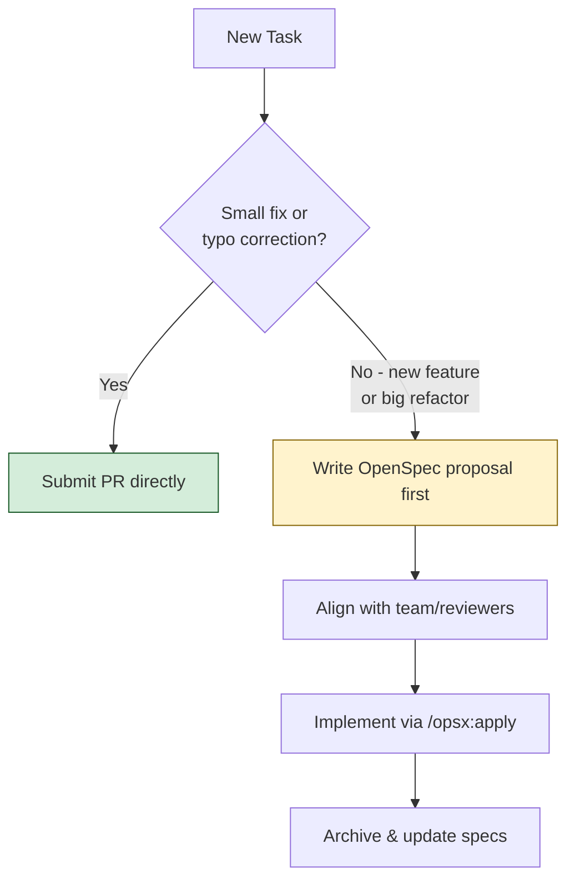

**Examples:**
| Change Type | Approach | Reason |
|-------------|----------|--------|
| Fix typo in error message | PR directly | Trivial, no design needed |
| Add new API endpoint | OpenSpec proposal | Requires design discussion |
| Refactor auth system | OpenSpec proposal | Architectural impact |
| Change database schema | OpenSpec proposal | Major impact, needs review |
| Update CSS colors | PR directly | Simple, low risk |

### 7. Write Clear, Testable Requirements

**Best Practice:** Use Given/When/Then format for all scenarios.

**Good Example:**
```markdown
#### Scenario: User logs in with valid credentials
- GIVEN a user has a registered account with email "user@example.com"
- AND the password is "SecurePass123"
- WHEN they submit the login form
- THEN authenticate the user
- AND create a session token
- AND return a 200 OK response with session cookie
```

**Bad Example:**
```markdown
#### Scenario: Login works
- User logs in and it works
```
❌ Not testable, vague, no clear expectations

### 8. Include Context in Specs

**Best Practice:** Add business context and rationale to spec files.

**Good Example:**
```markdown
### Requirement: Session expiration

The system SHALL expire sessions after 24 hours of inactivity.

Business Context: 
This was chosen based on security audit findings from 2025.
We balance security (shorter sessions) with user convenience 
(24 hours covers a typical workday).

Trade-offs considered:
- 12 hours: Too short, users complained
- 48 hours: Security team flagged as too permissive
- 24 hours: Sweet spot accepted by both teams
```

### 9. Review Spec Deltas Before Code

**Best Practice:** Always examine what requirements are changing before implementation.

**Why:** It's cheaper to fix requirements than to refactor code.

```bash
# Workflow
/opsx:apply  # DON'T jump straight to implementation

# Correct workflow:
# 1. Review proposal.md
# 2. Review design.md  
# 3. Review spec deltas (CRITICAL!)
# 4. Review tasks.md
# 5. Only then: /opsx:apply
```

### 10. Use Descriptive Change Names

**Best Practice:** Use clear, descriptive names for changes.

**Good Examples:**
```
✅ add-remember-me-sessions
✅ refactor-auth-to-oauth2
✅ fix-session-memory-leak
✅ implement-payment-retry-logic
```

**Bad Examples:**
```
❌ fix-stuff
❌ update
❌ changes
❌ temp
```

---

<a name="anti-patterns"></a>
## 12. Anti-Patterns to Avoid

### Anti-Pattern 1: Spec Everything Upfront

**Problem:**
```bash
# Trying to document entire system before building anything
/opsx:propose "specify all 47 features for our e-commerce platform"
```

**Why It's Wrong:**
- Analysis paralysis - never start building
- Specs become outdated before completion
- Wastes time on features that may change
- Ignores emergent design

**Solution:**
Spec incrementally as you build:
```bash
# Week 1: Add payments
/opsx:propose "Add Stripe payment integration"

# Week 2: Add cart
/opsx:propose "Implement shopping cart"

# Specs grow organically with your codebase
```

---

### Anti-Pattern 2: Skip Review and Apply Immediately

**Problem:**
```bash
/opsx:propose "add feature X"
/opsx:apply  # Immediately, without review
```

**Why It's Wrong:**
- Miss design flaws
- Build wrong thing
- Miss security issues
- Lose alignment with team

**Solution:**
Always review first:
```bash
/opsx:propose "add feature X"
# Read proposal.md, design.md, spec deltas
# Discuss with team if needed
# Then: /opsx:apply
```

---

### Anti-Pattern 3: Write Specs and Never Update Them

**Problem:**
```bash
# Create spec in January
# Code changes in March
# Spec still says old requirements
```

**Why It's Wrong:**
- Specs become stale and untrusted
- Defeats the purpose of living documentation
- New developers read wrong information

**Solution:**
Update specs with every change:
```bash
# When modifying existing behavior
/opsx:propose "change session to 48 hours"
# Archive updates the spec to match reality
```

---

### Anti-Pattern 4: Overly Vague Proposals

**Problem:**
```bash
/opsx:propose "make it better"
/opsx:propose "improve the thing"
/opsx:propose "fix the stuff"
```

**Why It's Wrong:**
- AI can't infer intent
- Generated proposals are generic
- Review becomes meaningless

**Solution:**
Be specific:
```bash
✅ /opsx:propose "Add remember me checkbox extending session to 30 days"
✅ /opsx:propose "Reduce API response time from 500ms to under 200ms"
✅ /opsx:propose "Add input validation to prevent SQL injection in login form"
```

---

### Anti-Pattern 5: Ignoring Spec Deltas

**Problem:**
```bash
# Agent generates spec delta showing requirement changes
# Developer doesn't read it
# Just runs /opsx:apply
```

**Why It's Wrong:**
- Miss unintended requirement changes
- Build wrong behavior
- Spec loses value as communication tool

**Solution:**
Read every delta:
```bash
# Review the diff
cat openspec/changes/change-name/specs/capability/spec.md

# Understand what's changing
# Approve or request changes
# Then apply
```

---

### Anti-Pattern 6: Using OpenSpec for Trivial Changes

**Problem:**
```bash
/opsx:propose "Fix typo in error message"
/opsx:propose "Change button color from blue to red"
```

**Why It's Wrong:**
- Overhead exceeds value
- Slows down development
- Creates noise in changes directory

**Solution:**
Reserve OpenSpec for meaningful changes:
```bash
# Trivial: PR directly
git commit -m "fix: correct typo in error message"

# Meaningful: Use OpenSpec
/opsx:propose "Redesign authentication flow to support SSO"
```

**Decision Matrix:**
| Change Type | Approach |
|-------------|----------|
| Typo fix | PR directly |
| CSS color change | PR directly |
| Bug fix (< 1 hour) | PR directly |
| New feature | OpenSpec |
| Refactor | OpenSpec |
| Architecture change | OpenSpec |

---

### Anti-Pattern 7: Not Committing Specs

**Problem:**
```bash
# .gitignore
openspec/

# Specs not in version control
```

**Why It's Wrong:**
- Lose history of requirements
- Can't track requirement evolution
- Team can't collaborate on specs
- Specs die if machine fails

**Solution:**
Always commit specs:
```bash
git add openspec/
git commit -m "docs: add authentication spec and payment proposal"
```

---

### Anti-Pattern 8: Letting AI Write Specs Without Human Input

**Problem:**
```bash
/opsx:propose "add feature"
# AI generates entire proposal without human review
/opsx:apply
```

**Why It's Wrong:**
- AI might miss business requirements
- Loses human judgment and domain knowledge
- Specs reflect AI's understanding, not human intent

**Solution:**
Human-in-the-loop:
```bash
/opsx:propose "add feature"
# Review and edit proposal
# Add business context
# Refine requirements
# Then apply
```

---

### Anti-Pattern 9: Creating Siloed Specs

**Problem:**
```bash
openspec/specs/
├── johns-features/
├── saras-features/
└── mikes-features/
```

**Why It's Wrong:**
- No organizational structure
- Hard to find related specs
- Team can't navigate effectively

**Solution:**
Organize by capability:
```bash
openspec/specs/
├── auth-login/
├── auth-session/
├── checkout-cart/
├── checkout-payment/
└── user-notifications/
```

---

### Anti-Pattern 10: Treating Specs as One-Time Documentation

**Problem:**
```bash
# Create spec
# Build feature
# Never touch spec again
```

**Why It's Wrong:**
- Specs become stale
- Don't reflect actual behavior
- Lose value over time

**Solution:**
Specs are living documents:
```bash
# When requirements change
/opsx:propose "change session duration"
# This updates the spec to match reality
```

---

<a name="performance"></a>
## 13. Performance Considerations

### When OpenSpec Adds Overhead

**Low-Value Scenarios:**
- Trivial bug fixes (typos, one-line changes)
- Simple CSS adjustments
- Quick prototypes or experiments
- Solo projects with no collaboration

**Overhead Cost:** ~15-30 minutes per change for proposal generation and review

### When OpenSpec Pays Off

**High-Value Scenarios:**
- New features touching multiple components
- Architectural changes
- Team collaboration on complex features
- Long-running projects with multiple contributors
- Onboarding new team members

**ROI Calculation:**
```
Without OpenSpec:
- Time understanding requirements: 2 hours
- Time explaining to team: 1 hour
- Time debugging wrong implementation: 3 hours
- Time onboarding new dev: 4 hours
Total: 10 hours

With OpenSpec:
- Time writing proposal: 10 minutes
- Time reviewing: 15 minutes
- Time implementing correctly: 2 hours
- Time onboarding new dev: 1 hour
Total: 3.75 hours

Savings: 6.25 hours (62.5% time savings)
```

### Performance Optimization Tips

**1. Cache Agent Context:**
```bash
# Reuse context within a session
# Don't clear context between tasks
# Reference previous work explicitly
```

**2. Batch Related Changes:**
```bash
# Instead of 5 small changes
/opsx:propose "add dark mode feature"
# Include all related tasks in one proposal
```

**3. Use Spec Templates:**
```bash
# Create template for common change types
openspec/
└── templates/
    ├── feature.md
    ├── refactor.md
    └── bugfix.md
```

**4. Parallelize Independent Changes:**
```bash
# Change 1: Add dark mode
/opsx:propose "add dark mode" &

# Change 2: Add email notifications  
/opsx:propose "add email notifications" &
# These can be worked on in parallel
```

### Performance Benchmarks

Based on community feedback and real-world usage:

| Change Complexity | Without OpenSpec | With OpenSpec | Net Savings |
|-------------------|------------------|---------------|--------------|
| **Trivial** (typo fix) | 10 min | 25 min | -15 min (overhead) |
| **Simple** (new endpoint) | 1 hour | 1.5 hours | -30 min (overhead) |
| **Medium** (new feature) | 4 hours | 3 hours | +1 hour (savings) |
| **Complex** (refactor) | 12 hours | 6 hours | +6 hours (savings) |
| **Architecture** (new system) | 40 hours | 20 hours | +20 hours (savings) |

**Break-even Point:** Medium complexity changes (~3-4 hours of work)

---

<a name="security"></a>
## 14. Security Considerations

### Securing Your Specs

**1. Avoid Sensitive Data in Specs**

```markdown
Bad:
### Requirement: API credentials
The system SHALL use API key: sk_live_abc123xyz

Good:
### Requirement: API credentials
The system SHALL use API key from environment variable 
STRIPE_API_KEY (never commit actual keys to specs)
```

**2. Use Environment Variables for Secrets**

```markdown
### Requirement: Database connection
The system SHALL connect to database using credentials from:
- DB_HOST (environment variable)
- DB_PORT (environment variable)
- DB_USER (environment variable)
- DB_PASSWORD (environment variable, never in spec)
```

**3. Review Specs in Pull Requests**

```bash
# Treat spec changes like code changes
# Review for:
- Accidental secret exposure
- Security requirement changes
- Authorization logic modifications
```

### Security-Critical Specs to Prioritize

**Always spec these capabilities:**
- Authentication and authorization
- Input validation and sanitization
- Data encryption (at rest and in transit)
- API rate limiting
- Session management
- Payment processing
- PII handling

### Security Review Checklist

When reviewing spec deltas for security-critical features:

- [ ] Are authentication requirements clearly defined?
- [ ] Is authorization logic specified (who can do what)?
- [ ] Are input validation rules documented?
- [ ] Is sensitive data handling specified?
- [ ] Are error messages safe (no information leakage)?
- [ ] Is logging and monitoring addressed?
- [ ] Are rate limiting requirements included?
- [ ] Is session security specified?

### Example: Secure Spec Pattern

```markdown
# auth-login Specification

## Purpose
Handle user authentication securely without exposing sensitive data.

## Requirements

### Requirement: Credential handling
The system SHALL never log or expose raw passwords.

#### Scenario: Login attempt with wrong password
- GIVEN a user submits login form
- WHEN password is incorrect
- THEN return generic error: "Invalid credentials"
- AND log attempt with user ID only (no password)
- AND implement rate limiting after 5 failed attempts

#### Scenario: Password reset flow
- GIVEN user requests password reset
- WHEN system generates reset token
- THEN token expires after 1 hour
- AND token is single-use only
- AND reset link sent via email only
```

---

<a name="testing"></a>
## 15. Testing Strategies

### Testing Your Specs

**1. Requirement Coverage**

Ensure every requirement has at least one test scenario:

```markdown
### Requirement: Session expiration
[REQUIREMENT HERE]

#### Scenario: Default session timeout ✅
[SCENARIO HERE]

#### Scenario: Extended session with remember me ✅
[SCENARIO HERE]

# If no scenarios, add them!
```

**2. Scenario Completeness**

Each scenario should cover:
- [ ] Initial state (GIVEN)
- [ ] Trigger action (WHEN)
- [ ] Expected outcome (THEN)
- [ ] Additional outcomes (AND)

**3. Edge Case Coverage**

Add scenarios for edge cases:

```markdown
#### Scenario: Session expires during active use
- GIVEN a user has an active session
- WHEN the session expires while they're typing
- THEN handle gracefully with auto-save
- AND prompt for re-authentication

#### Scenario: Multiple simultaneous logins
- GIVEN a user is logged in on two devices
- WHEN they log out from one device
- THEN only that device's session is invalidated
- AND other device remains logged in
```

### Converting Specs to Tests

**Automated Test Generation:**

```typescript
// Given/When/Then scenario maps to test:
describe('Session Expiration', () => {
  it('should expire session after 24 hours without remember me', () => {
    // GIVEN
    const user = createAuthenticatedUser();
    
    // WHEN
    await timeTravel(24 * 60 * 60); // 24 hours
    
    // THEN
    expect(session.isValid()).toBe(false);
    expect(response.status).toBe(401);
  });
});
```

### Test Strategy by Change Type

| Change Type | Test Coverage Required |
|-------------|------------------------|
| **New feature** | Unit tests for all scenarios |
| **Bug fix** | Regression test + original scenario |
| **Refactor** | Existing tests should pass |
| **Performance** | Benchmark tests |
| **Security** | Security-specific tests |

### Validation Checklist

Before archiving a change:

- [ ] All requirements have scenarios
- [ ] All scenarios have corresponding tests
- [ ] Tests pass locally
- [ ] Edge cases covered
- [ ] Error cases tested
- [ ] Performance requirements validated
- [ ] Security requirements verified

---

<a name="migration"></a>
## 16. Migration Guide: Adopting OpenSpec in Existing Projects

### Phase 1: Assessment (Week 1)

**Goal:** Understand your codebase and identify critical capabilities.

**Steps:**
1. **Inventory existing documentation**
   ```bash
   # Find existing docs
   find . -name "*.md" | grep -E "(README|ARCHITECTURE|API)"
   ```

2. **Identify critical capabilities**
   - Authentication/Authorization
   - Payment processing
   - Data models
   - API contracts
   - Business logic

3. **Assess team readiness**
   - Who will write specs?
   - Who will review?
   - What's the approval process?

### Phase 2: Pilot Project (Weeks 2-3)

**Goal:** Prove value with a small, low-risk feature.

**Steps:**
1. **Choose pilot feature**
   - Medium complexity
   - Well-understood requirements
   - Minimal external dependencies

2. **Run full OpenSpec workflow**
   ```bash
   openspec init
   /opsx:propose "Pilot feature: Add email notifications"
   # Complete full cycle
   /opsx:archive
   ```

3. **Gather feedback**
   - What worked well?
   - What was cumbersome?
   - Time investment vs. value

4. **Document lessons learned**

### Phase 3: Expand to Critical Features (Weeks 4-6)

**Goal:** Create specs for most important capabilities.

**Priority Order:**
1. **Authentication/Authorization** - Security critical
2. **Payment Processing** - Business critical
3. **Core Data Models** - Foundation for everything
4. **API Contracts** - External dependencies
5. **Business Logic** - Revenue-impacting features

**Example:**
```bash
# Week 4: Authentication
/opsx:propose "Document current authentication flow"
/opsx:archive

# Week 5: Payment processing
/opsx:propose "Document Stripe integration"
/opsx:archive

# Week 6: Core data models
/opsx:propose "Document user and order entities"
/opsx:archive
```

### Phase 4: Team Training (Ongoing)

**Goal:** Ensure team can use OpenSpec effectively.

**Training Plan:**
1. **Workshop:** 2-hour session on OpenSpec basics
2. **Documentation:** Internal runbook for your team
3. **Pair Programming:** Senior dev + junior dev on first spec
4. **Code Review:** Review specs in PRs
5. **Retrospectives:** Discuss what's working

### Phase 5: Full Adoption (Month 2+)

**Goal:** OpenSpec becomes standard for all significant changes.

**Adoption Checklist:**
- [ ] All team members trained
- [ ] Spec review process defined
- [ ] CI/CD integration (optional)
- [ ] Templates created for common changes
- [ ] Metrics tracking (time saved, bugs prevented)
- [ ] Documentation updated (CONTRIBUTING.md)

### Migration Best Practices

**DO:**
- Start small with pilot project
- Create specs incrementally
- Get team buy-in early
- Measure and share wins
- Iterate on your process

**DON'T:**
- Try to spec entire system upfront
- Force adoption without training
- Skip review process
- Ignore team feedback
- Expect perfection immediately

### Migration Timeline Example

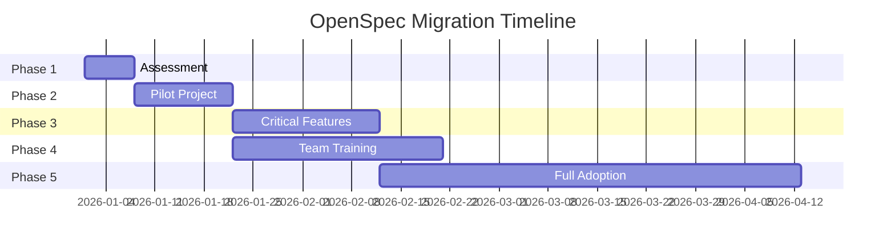

---

<a name="troubleshooting"></a>
## 17. Troubleshooting Guide

### Common Issues and Solutions

#### Issue 1: Command not found

**Symptoms:**
```
Command not found: opsx:propose
```

**Causes:**
- Agent commands not updated
- OpenSpec not properly initialized

**Solutions:**
```bash
# Solution 1: Refresh agent commands
openspec update

# Solution 2: Re-initialize OpenSpec
openspec init

# Solution 3: Verify installation
openspec --version
```

---

#### Issue 2: Proposal generation fails

**Symptoms:**
```
Error: Failed to generate proposal
```

**Causes:**
- No existing specs for context
- Unclear change description
- Agent context window full

**Solutions:**
```bash
# Solution 1: Create initial spec first
/opsx:new-capability auth-login

# Solution 2: Clear agent context
# Start fresh conversation

# Solution 3: Be more specific
Bad: "add feature"
Good: "add remember me checkbox extending session to 30 days"
```

---

#### Issue 3: Spec deltas not showing changes

**Symptoms:**
```
No changes detected in spec
```

**Causes:**
- Spec file doesn't exist
- Spec file format incorrect
- Agent not finding spec

**Solutions:**
```bash
# Solution 1: Verify spec exists
ls openspec/specs/auth-session/spec.md

# Solution 2: Check spec format
cat openspec/specs/auth-session/spec.md

# Solution 3: Specify capability explicitly
/opsx:propose "change auth-session expiration to 48 hours"
```

---

#### Issue 4: Apply command gets stuck

**Symptoms:**
```
Task 2.1: Implementing...
[No progress for >5 minutes]
```

**Causes:**
- Complex task requiring clarification
- Agent context full
- Dependency issue

**Solutions:**
```bash
# Solution 1: Provide more context
"Continue with task 2.1. The database connection 
string is in config/database.ts"

# Solution 2: Break down task further
# Edit tasks.md to make tasks smaller

# Solution 3: Clear agent context
# Start fresh conversation
```

---

#### Issue 5: Archive command fails

**Symptoms:**
```
Error: Cannot archive - specs not updated
```

**Causes:**
- Spec conflicts
- Git conflicts
- Unsaved changes

**Solutions:**
```bash
# Solution 1: Resolve git conflicts
git status
git add openspec/specs/auth-session/spec.md
git commit -m "resolve spec conflicts"

# Solution 2: Ensure changes committed
git add .
git commit -m "implementation changes"

# Solution 3: Manual archive
mv openspec/changes/add-remember-me/ \
   openspec/changes/archive/2026-01-09-add-remember-me/
```

---

#### Issue 6: Specs out of sync with code

**Symptoms:**
```
Spec says X, but code does Y
```

**Causes:**
- Code changed without updating spec
- Incorrect implementation
- Spec not updated during archive

**Solutions:**
```bash
# Solution 1: Update spec to match reality
/opsx:propose "update spec to match current behavior"

# Solution 2: Fix code to match spec
# Review what's correct
# Fix implementation

# Solution 3: Reconciliation process
# Regular spec audits:
# - Monthly review of critical specs
# - Update specs during code reviews
```

---

#### Issue 7: Poor quality proposals

**Symptoms:**
```
- Vague requirements
- Missing edge cases
- Unclear acceptance criteria
```

**Causes:**
- Vague initial request
- Agent not enough context
- Not reviewed before applying

**Solutions:**
```bash
# Solution 1: Provide better input
Bad: "add login"
Good: "add email/password login with rate limiting 
      (5 attempts/minute), password hashing with bcrypt,
      and session duration of 24 hours"

# Solution 2: Review and revise
# Edit proposal.md before applying
# Add missing details
# Clarify requirements
```

---

#### Issue 8: Team not adopting OpenSpec

**Symptoms:**
```
Team members not creating specs
Specs not reviewed in PRs
Direct PRs without OpenSpec
```

**Causes:**
- Lack of training
- Perceived overhead
- No enforcement

**Solutions:**
```bash
# Solution 1: Training session
# 2-hour workshop for team

# Solution 2: Show quick wins
# Demonstrate time saved on recent feature

# Solution 3: Lead by example
# Create specs for your changes
# Review specs in PRs

# Solution 4: Integrate into workflow
# Add to Definition of Done
# Require spec review for features > 4 hours
```

---

#### Issue 9: Specs become outdated

**Symptoms:**
```
Spec doesn't match actual behavior
Outdated requirements
Stale documentation
```

**Causes:**
- Code changed without spec update
- No archive process followed
- Manual code changes

**Solutions:**
```bash
# Solution 1: Enforce archive process
# Make /opsx:archive mandatory

# Solution 2: Regular audits
# Monthly spec review meetings
# Update specs during code reviews

# Solution 3: Team culture
# "If you change code, update the spec"
# Add to Definition of Done
```

---

#### Issue 10: Slash commands not working

**Symptoms:**
```
Agent doesn't recognize /opsx:propose
Command does nothing
```

**Causes:**
- Agent not configured for OpenSpec
- Commands not installed
- Wrong syntax

**Solutions:**
```bash
# Solution 1: Verify agent setup
# Check agent-specific docs

# Solution 2: Reinstall commands
openspec update

# Solution 3: Check syntax
/opsx:propose "your change"  # Correct - needs quotes
/opsx:propose your change    # Wrong
```

---

### Emergency Procedures

**If specs get corrupted:**
```bash
# Restore from Git
git checkout HEAD -- openspec/specs/

# Or from archive
cp -r openspec/changes/archive/latest/openspec/specs/* \
      openspec/specs/
```

**If agent generates bad proposal:**
```bash
# Start over
rm -rf openspec/changes/bad-change/

# Try again with more detail
/opsx:propose "detailed description"
```

**If implementation goes wrong:**
```bash
# Rollback code changes
git revert HEAD

# Archive failed change with notes
# Edit proposal.md to document what went wrong
/opsx:archive
```

---

<a name="exercises"></a>
## 18. Practice Exercises with Solutions

### Exercise 1: Set Up OpenSpec in a Sample Project

**Difficulty:** ⭐ Beginner  
**Time:** 20 minutes

**Objective:** Install and initialize OpenSpec in a new project.

**Instructions:**
1. Create a new project directory called `todo-app`
2. Initialize Git repository
3. Install OpenSpec globally
4. Initialize OpenSpec in the project
5. Verify the directory structure was created correctly

**Solution:**

```bash
# Step 1: Create project directory
mkdir todo-app
cd todo-app

# Step 2: Initialize Git
git init

# Step 3: Install OpenSpec globally
npm install -g @fission-ai/openspec@latest

# Step 4: Initialize OpenSpec
openspec init

# Step 5: Verify structure
ls -la openspec/
# Expected output:
# specs/
# changes/
# changes/archive/
```

**Verification:**
```bash
# Check OpenSpec status
openspec status

# Expected output shows initialized state
```

**Success Criteria:**
- ✅ `openspec/` directory exists
- ✅ Contains `specs/`, `changes/`, and `changes/archive/` subdirectories
- ✅ `openspec status` shows initialized

---

### Exercise 2: Create Your First Spec File

**Difficulty:** ⭐⭐ Intermediate  
**Time:** 30 minutes

**Objective:** Write a complete spec file for a todo item capability.

**Instructions:**
Create a spec file at `openspec/specs/todo-item/spec.md` for a todo item with the following requirements:
1. Users can create todo items with title and description
2. Users can mark todos as complete
3. Users can delete todos
4. Completed todos show with strikethrough

**Solution:**

```markdown
# todo-item Specification

## Purpose
Manage individual todo items including creation, completion, and deletion.

## Requirements

### Requirement: Todo creation
The system SHALL allow users to create new todo items with a title and optional description.

#### Scenario: Create todo with title only
- GIVEN a user is on the todo list page
- WHEN they enter a title and submit
- THEN create a new todo item
- AND add it to the list
- AND display it immediately

#### Scenario: Create todo with title and description
- GIVEN a user is on the todo list page
- WHEN they enter a title and description and submit
- THEN create a new todo item
- AND store both title and description
- AND display the description on the todo card

#### Scenario: Create todo with empty title
- GIVEN a user attempts to create a todo
- WHEN the title field is empty
- THEN show validation error: "Title is required"
- AND do not create the todo

### Requirement: Todo completion
The system SHALL allow users to mark todos as complete.

#### Scenario: Mark todo as complete
- GIVEN a user has an incomplete todo
- WHEN they click the checkbox
- THEN mark the todo as complete
- AND display with strikethrough text
- AND move to "Completed" section

#### Scenario: Mark completed todo as incomplete
- GIVEN a user has a completed todo
- WHEN they uncheck the checkbox
- THEN mark the todo as incomplete
- AND remove strikethrough formatting
- AND move back to "Active" section

### Requirement: Todo deletion
The system SHALL allow users to delete todos.

#### Scenario: Delete a todo
- GIVEN a user has a todo item
- WHEN they click the delete button
- THEN show confirmation dialog
- AND upon confirmation, remove the todo
- AND display success message

#### Scenario: Cancel deletion
- GIVEN a user sees the delete confirmation dialog
- WHEN they click "Cancel"
- THEN close the dialog
- AND keep the todo unchanged

### Requirement: Todo persistence
The system SHALL persist todos across browser sessions.

#### Scenario: Todos persist after page reload
- GIVEN a user has created 5 todos
- WHEN they reload the page
- THEN display all 5 todos
- AND maintain their completion status
```

**Success Criteria:**
- ✅ File created at correct path
- ✅ Contains Purpose section
- ✅ Has at least 4 Requirements
- ✅ Each requirement has 2+ scenarios
- ✅ Scenarios use Given/When/Then format
- ✅ Edge cases covered (empty title, cancellation)
- ✅ Business context included

---

### Exercise 3: Write a Change Proposal for a Real Feature

**Difficulty:** ⭐⭐⭐ Advanced  
**Time:** 45 minutes

**Objective:** Create a complete change proposal for adding user authentication to a web application.

**Instructions:**
Write a complete OpenSpec change proposal for adding email/password authentication to a web application. Include:
1. `proposal.md` with motivation, scope, and success criteria
2. `design.md` with technical decisions
3. `tasks.md` with implementation tasks
4. `specs/auth-login/spec.md` with spec deltas

**Solution:**

**File: `openspec/changes/add-authentication/proposal.md`**
```markdown
# Add Email/Password Authentication

## Summary
Implement user authentication system with email/password login, 
password reset functionality, and session management to secure 
user data and enable personalized experiences.

## Motivation
Currently, the application has no user identification system. 
This prevents:
- Personalized user experiences
- Data security and privacy
- User-specific features (favorites, history)
- Multi-device synchronization

## Scope

### In Scope
- User registration with email/password
- User login with session creation
- Password reset via email
- Session expiration (24 hours)
- Logout functionality
- Password strength validation

### Out of Scope
- OAuth2 social login (future enhancement)
- Two-factor authentication (future enhancement)
- Email verification (future enhancement)
- Rate limiting (future enhancement)

## Success Criteria
- [ ] Users can register with email and password
- [ ] Users can log in and maintain session for 24 hours
- [ ] Users can reset forgotten passwords via email
- [ ] Passwords meet minimum strength requirements (8+ chars, mixed case, numbers)
- [ ] Unauthenticated users cannot access protected routes
- [ ] All authentication flows have unit tests (>90% coverage)

## Dependencies
- Email service (SendGrid/Mailgun) for password reset
- Database for user storage
- Session storage (Redis recommended)

## Risks & Mitigations

| Risk | Likelihood | Impact | Mitigation |
|------|------------|--------|------------|
| Password data breach | Low | Critical | Use bcrypt hashing, never store plaintext |
| Session hijacking | Medium | High | Use secure, HTTP-only cookies |
| Brute force attacks | Medium | Medium | Implement rate limiting in Phase 2 |
| Email delivery failures | Low | Medium | Provide fallback UI messaging |
```

**File: `openspec/changes/add-authentication/design.md`**
```markdown
# Technical Design: Add Email/Password Authentication

## Architecture Decisions

### Decision 1: Password Hashing Algorithm
**Choice:** bcrypt with cost factor 12
**Rationale:** Industry standard, adaptive cost factor, widely supported
**Alternatives Considered:**
- Argon2: More secure but less widely supported in older Node versions
- scrypt: Good but bcrypt more battle-tested
- PBKDF2: NIST approved but slower than bcrypt

### Decision 2: Session Storage
**Choice:** Redis with TTL
**Rationale:** Fast, scalable, built-in expiration
**Alternatives Considered:**
- Database: Slower, requires cleanup jobs
- JWT: Stateless but harder to invalidate

### Decision 3: Password Reset Flow
**Choice:** Time-limited tokens stored in database
**Rationale:** Can be invalidated, auditable
**Alternatives Considered:**
- JWT reset tokens: Stateless but can't be invalidated

## Implementation Approach

### User Model
```typescript
interface User {
  id: string;
  email: string;
  passwordHash: string;
  createdAt: Date;
  updatedAt: Date;
  lastLoginAt: Date | null;
}
```

### Session Model
```typescript
interface Session {
  id: string;
  userId: string;
  expiresAt: Date;
  createdAt: Date;
  userAgent: string;
  ipAddress: string;
}
```

### API Endpoints

#### POST /api/auth/register
**Request:**
```json
{
  "email": "user@example.com",
  "password": "SecurePass123"
}
```

**Response (201 Created):**
```json
{
  "user": {
    "id": "uuid",
    "email": "user@example.com"
  },
  "session": {
    "token": "session_token",
    "expiresAt": "2026-01-10T10:00:00Z"
  }
}
```

#### POST /api/auth/login
**Request:**
```json
{
  "email": "user@example.com",
  "password": "SecurePass123"
}
```

**Response (200 OK):**
```json
{
  "user": {
    "id": "uuid",
    "email": "user@example.com"
  },
  "session": {
    "token": "session_token",
    "expiresAt": "2026-01-10T10:00:00Z"
  }
}
```

#### POST /api/auth/logout
**Response (204 No Content)**

#### POST /api/auth/reset-password
**Request:**
```json
{
  "email": "user@example.com"
}
```

**Response (200 OK):**
```json
{
  "message": "Password reset email sent"
}
```

#### POST /api/auth/confirm-reset
**Request:**
```json
{
  "token": "reset_token",
  "newPassword": "NewSecurePass123"
}
```

**Response (200 OK):**

## Database Schema

### users table
```sql
CREATE TABLE users (
  id UUID PRIMARY KEY DEFAULT gen_random_uuid(),
  email VARCHAR(255) UNIQUE NOT NULL,
  password_hash VARCHAR(255) NOT NULL,
  created_at TIMESTAMP DEFAULT NOW(),
  updated_at TIMESTAMP DEFAULT NOW(),
  last_login_at TIMESTAMP
);

CREATE INDEX idx_users_email ON users(email);
```

### sessions table
```sql
CREATE TABLE sessions (
  id UUID PRIMARY KEY DEFAULT gen_random_uuid(),
  user_id UUID NOT NULL REFERENCES users(id),
  expires_at TIMESTAMP NOT NULL,
  created_at TIMESTAMP DEFAULT NOW(),
  user_agent TEXT,
  ip_address INET,
  CONSTRAINT fk_user FOREIGN KEY (user_id) REFERENCES users(id)
);

CREATE INDEX idx_sessions_user_id ON sessions(user_id);
CREATE INDEX idx_sessions_expires_at ON sessions(expires_at);
```

### password_reset_tokens table
```sql
CREATE TABLE password_reset_tokens (
  id UUID PRIMARY KEY DEFAULT gen_random_uuid(),
  user_id UUID NOT NULL REFERENCES users(id),
  token VARCHAR(255) UNIQUE NOT NULL,
  expires_at TIMESTAMP NOT NULL,
  used_at TIMESTAMP,
  created_at TIMESTAMP DEFAULT NOW(),
  CONSTRAINT fk_user FOREIGN KEY (user_id) REFERENCES users(id)
);

CREATE INDEX idx_reset_tokens_token ON password_reset_tokens(token);
```

## Security Considerations

- Passwords hashed with bcrypt (cost factor 12)
- Session tokens are cryptographically random (32 bytes)
- HTTP-only, Secure cookies for session storage
- CSRF protection on all state-changing endpoints
- Rate limiting on login endpoint (future)
- Email enumeration prevention (future)

## Testing Strategy

### Unit Tests
- Password hashing/unhashing
- Session validation
- Token generation and verification
- Input validation

### Integration Tests
- Full registration flow
- Full login flow
- Full password reset flow
- Session expiration

### Security Tests
- Password strength validation
- SQL injection prevention
- XSS prevention
- CSRF protection
```

**File: `openspec/changes/add-authentication/tasks.md`**
```markdown
# Implementation Tasks: Add Email/Password Authentication

## Phase 1: Database Setup
- [ ] 1.1 Create database migration for users table
- [ ] 1.2 Create database migration for sessions table
- [ ] 1.3 Create database migration for password_reset_tokens table
- [ ] 1.4 Create database indexes

## Phase 2: Core Authentication Logic
- [ ] 2.1 Implement password hashing service (bcrypt)
- [ ] 2.2 Implement password validation service
- [ ] 2.3 Implement session creation service
- [ ] 2.4 Implement session validation middleware
- [ ] 2.5 Implement session expiration cleanup job

## Phase 3: API Endpoints
- [ ] 3.1 Implement POST /api/auth/register
- [ ] 3.2 Implement POST /api/auth/login
- [ ] 3.3 Implement POST /api/auth/logout
- [ ] 3.4 Implement POST /api/auth/reset-password
- [ ] 3.5 Implement POST /api/auth/confirm-reset

## Phase 4: Frontend Components
- [ ] 4.1 Create registration form component
- [ ] 4.2 Create login form component
- [ ] 4.3 Create password reset form component
- [ ] 4.4 Create authentication context/provider
- [ ] 4.5 Create protected route component

## Phase 5: Testing
- [ ] 5.1 Write unit tests for auth services
- [ ] 5.2 Write integration tests for API endpoints
- [ ] 5.3 Write E2E tests for auth flows
- [ ] 5.4 Write security tests (password strength, injection)

## Phase 6: Documentation & Deployment
- [ ] 6.1 Update API documentation
- [ ] 6.2 Update README with auth setup instructions
- [ ] 6.3 Create environment variable documentation
- [ ] 6.4 Deploy to staging environment
- [ ] 6.5 Perform security review

## Checklist
- [ ] All tests passing (>90% coverage)
- [ ] Code reviewed by 2 team members
- [ ] Security review completed
- [ ] Documentation updated
- [ ] Deployed to staging
- [ ] QA tested
- [ ] Ready for production deployment
```

**File: `openspec/changes/add-authentication/specs/auth-login/spec.md`**
```markdown
# auth-login Specification (Delta)

## Summary
This delta adds email/password authentication capability to the system.

## Requirements

### Requirement: User registration
The system SHALL allow new users to create accounts with email and password.

#### Scenario: Successful registration
- GIVEN a new user visits the registration page
- WHEN they submit valid email and password meeting strength requirements
- THEN create a new user account
- AND hash the password using bcrypt
- AND create a session for the user
- AND return authentication tokens

#### Scenario: Registration with existing email
- GIVEN a user attempts to register with an already-registered email
- WHEN they submit the registration form
- THEN return error: "Email already registered"
- AND do not create a new account

#### Scenario: Registration with weak password
- GIVEN a user attempts to register
- WHEN the password does not meet strength requirements
- THEN return error: "Password must be at least 8 characters with uppercase, lowercase, and numbers"
- AND do not create the account

### Requirement: User login
The system SHALL authenticate users with email and password.

#### Scenario: Successful login
- GIVEN a registered user is on the login page
- WHEN they submit correct email and password
- THEN validate credentials
- AND create a session
- AND redirect to dashboard

#### Scenario: Failed login
- GIVEN a user attempts to login
- WHEN credentials are invalid
- THEN return error: "Invalid email or password"
- AND do not create a session
- AND log the attempt (without password)

#### Scenario: Login with non-existent email
- GIVEN a user attempts to login with unregistered email
- WHEN they submit the form
- THEN return error: "Invalid email or password"
- AND do not reveal whether email exists (prevent enumeration)

### Requirement: Session management
The system SHALL maintain user sessions for 24 hours.

#### Scenario: Session remains valid
- GIVEN a user has logged in
- WHEN 24 hours have passed since login
- THEN session remains valid
- AND user can continue using the application

#### Scenario: Session expires
- GIVEN a user has logged in
- WHEN 25 hours have passed since login
- THEN session is invalid
- AND user is redirected to login page

### Requirement: Password reset
The system SHALL allow users to reset forgotten passwords.

#### Scenario: Request password reset
- GIVEN a registered user clicks "Forgot password"
- WHEN they submit their email
- THEN generate a password reset token
- AND send reset email with link
- AND token expires after 1 hour

#### Scenario: Reset password with valid token
- GIVEN a user has a valid reset token
- WHEN they submit new password
- THEN update password in database
- AND invalidate the reset token
- AND redirect to login page

#### Scenario: Reset password with expired token
- GIVEN a user has an expired reset token
- WHEN they attempt to use it
- THEN return error: "Token expired"
- AND prompt to request new reset link
```

**Success Criteria:**
- ✅ All four files created in correct directory structure
- ✅ proposal.md includes motivation, scope, success criteria, risks
- ✅ design.md includes technical decisions, API endpoints, database schema
- ✅ tasks.md has 6 phases with 20+ tasks
- ✅ spec.md includes 4 requirements with 12+ scenarios
- ✅ All scenarios use Given/When/Then format
- ✅ Edge cases covered (invalid input, expired tokens)
- ✅ Security considerations documented

---

<a name="test-understanding"></a>
## 19. Test Your Understanding

### Questions

**1. What fundamental problem does OpenSpec solve?**
<details>
<summary>Answer</summary>
OpenSpec solves the problem of context loss in AI-assisted development. AI coding agents don't remember requirements and decisions across chat sessions, leading to inconsistent implementations and lost knowledge. OpenSpec provides persistent, version-controlled specifications that serve as a shared source of truth.
</details>

**2. What are the four artifacts generated by a change proposal?**
<details>
<summary>Answer</summary>
1. proposal.md - Describes the change
2. design.md - Technical decisions
3. tasks.md - Implementation checklist
4. specs/ - Spec deltas showing requirement changes
</details>

**3. What is a spec delta?**
<details>
<summary>Answer</summary>
A spec delta is a diff of requirements (similar to git diff for code) that shows what's being added, removed, or altered in the specification. It provides a clear, reviewable summary of requirement changes before implementation.
</details>

**4. When should you use OpenSpec vs. submitting a PR directly?**
<details>
<summary>Answer</summary>
Use OpenSpec for new features, significant refactors, or architectural changes. Submit PRs directly for trivial changes like typos or simple bug fixes.
</details>

**5. What is the recommended workflow order?**
<details>
<summary>Answer</summary>
1. /opsx:propose - Generate proposal
2. Review proposal, design, tasks, and spec deltas
3. /opsx:apply - Implement tasks
4. /opsx:archive - Update specs and archive change
</details>

**6. Where do OpenSpec files live?**
<details>
<summary>Answer</summary>
In your repository under the `openspec/` directory, organized as:
- openspec/specs/ - Current specifications
- openspec/changes/ - In-flight proposals
- openspec/changes/archive/ - Completed changes
</details>

**7. What are Given/When/Then scenarios?**
<details>
<summary>Answer</summary>
A format for writing testable requirements:
- GIVEN - Initial context/state
- WHEN - Action or event
- THEN - Expected outcome
- AND - Additional outcomes (optional)

This is borrowed from Behavior-Driven Development (BDD).
</details>

**8. How does OpenSpec work across different AI tools?**
<details>
<summary>Answer</summary>
OpenSpec uses slash commands that integrate with 20+ AI coding tools. Because specs live in Git as Markdown files, they work universally regardless of which tool you use. The spec layer is separate from any single vendor's chat history.
</details>

**9. What does "brownfield-first" mean in OpenSpec context?**
<details>
<summary>Answer</summary>
OpenSpec is designed to work with existing codebases (brownfield), not just new projects (greenfield). You don't need to generate all specs upfront; you create them incrementally as you build changes.
</details>

**10. Why is it important to read spec deltas before implementation?**
<details>
<summary>Answer</summary>
It's cheaper to fix requirements than to refactor code. Reading deltas ensures you understand what's changing before investing time in implementation, catching errors early.
</details>

**11. What is the break-even point for OpenSpec overhead vs. value?**
<details>
<summary>Answer</summary>
Medium complexity changes (~3-4 hours of work). For simpler changes, the overhead may exceed value. For complex features, OpenSpec saves significant time by preventing misunderstandings.
</details>

**12. How should specs be organized?**
<details>
<summary>Answer</summary>
By capability, not by person or feature. Examples:
✅ auth-login, auth-session, checkout-cart
❌ johns-features, saras-changes
</details>

**13. What is the purpose of the archive command?**
<details>
<summary>Answer</summary>
The archive command:
1. Moves the change folder to openspec/changes/archive/
2. Updates the main spec files to reflect new permanent behavior
3. Ensures future developers see current, correct requirements
</details>

**14. Can OpenSpec be used for brownfield projects?**
<details>
<summary>Answer</summary>
Yes. OpenSpec is explicitly designed for brownfield-first adoption. You create specs incrementally as you modify existing code, rather than documenting everything upfront.
</details>

**15. What models are recommended for planning with OpenSpec?**
<details>
<summary>Answer</summary>
High-reasoning models like Claude Opus 4.7, Codex 5.5, or GPT-4 Turbo are recommended for planning to ensure thoughtful, comprehensive proposals.
</details>

---

<a name="interview-questions"></a>
## 20. Common Interview Questions

### Questions

**1. What is Spec-Driven Development, and how does OpenSpec implement it?**
<details>
<summary>Answer</summary>
Spec-Driven Development (SDD) is a methodology where requirements and design are documented as specifications before implementation. OpenSpec implements SDD by:
- Providing a structured format for specs (Markdown files)
- Automating proposal generation via AI agents
- Creating a review workflow before code is written
- Maintaining living documentation in version control
- Supporting multiple AI tools via universal slash commands
</details>

**2. How does OpenSpec differ from traditional documentation?**
<details>
<summary>Answer</summary>
Traditional documentation:
- Written after implementation
- Often becomes stale
- Separate from code
- Not automatically tested

OpenSpec specs:
- Written before implementation
- Updated with every change (living docs)
- Live in same repo as code
- Scenarios are testable requirements
</details>

**3. What problems does OpenSpec solve for AI-assisted development?**
<details>
<summary>Answer</summary>
OpenSpec solves:
1. **Context amnesia** - AI agents forget requirements between sessions
2. **Inconsistent implementations** - Different agents build different things
3. **Lost knowledge** - Reasoning and decisions disappear when chats end
4. **No shared truth** - Teams lack single source of truth
5. **Difficult code reviews** - Hard to understand intent from code alone
</details>

**4. Explain the OpenSpec workflow from proposal to archive.**
<details>
<summary>Answer</summary>
1. **Propose** - Developer describes feature, AI generates proposal package (proposal.md, design.md, tasks.md, spec deltas)
2. **Review** - Human reviews all artifacts before any code is written
3. **Apply** - AI agent implements tasks from tasks.md sequentially
4. **Archive** - Change moved to archive, main specs updated to reflect new behavior

This ensures human-in-the-loop, prevents building wrong features, and maintains living documentation.
</details>

**5. What are spec deltas, and why are they important?**
<details>
<summary>Answer</summary>
Spec deltas are diffs of requirements showing exactly what's changing:
- Added requirements
- Removed requirements
- Modified behaviors

They're important because:
- Enable fast review of changes without reading entire specs
- Make requirement changes explicit
- Allow non-technical stakeholders to review intent
- Reduce risk of unintended changes
</details>

**6. How would you introduce OpenSpec to a team that's never used it?**
<details>
<summary>Answer</summary>
1. **Start with pilot** - Choose one medium-complexity feature
2. **Show value** - Demonstrate time saved and better outcomes
3. **Training** - 2-hour workshop on basics
4. **Gradual adoption** - Start with critical features (auth, payments)
5. **Lead by example** - Use it yourself first
6. **Integrate into workflow** - Add to Definition of Done
7. **Measure and share** - Track metrics and celebrate wins
</details>

**7. What's the difference between OpenSpec and GitHub Spec Kit?**
<details>
<summary>Answer</summary>
**OpenSpec:**
- Lightweight, minimal ceremony
- Flexible workflow
- 20+ AI tool integrations
- No API keys or MCP required
- Faster iteration

**GitHub Spec Kit:**
- Heavier, more structure
- Rigid phase gates
- Python setup required
- More comprehensive documentation
- Better for regulated industries needing strict process
</details>

**8. How do you handle conflicting proposals in OpenSpec?**
<details>
<summary>Answer</summary>
1. Both proposals create separate change directories
2. Team reviews both spec proposals in PRs
3. Conflicts visible before implementation
4. Team discusses and aligns on one approach
5. Only approved proposal gets implemented

This prevents wasted effort and merge conflicts.
</details>

**9. What makes a good OpenSpec spec file?**
<details>
<summary>Answer</summary>
Good specs have:
- Clear purpose statement
- Formal requirements using "SHALL" statements
- Given/When/Then scenarios for each requirement
- Edge cases covered
- Business context included
- Testable criteria
- No implementation details (focuses on "what" not "how")
</details>

**10. How does OpenSpec support brownfield projects?**
<details>
<summary>Answer</summary>
OpenSpec is brownfield-first:
- No need to spec entire system upfront
- Create specs incrementally as you modify features
- Document existing behavior as you discover it
- Add new features with clear requirements
- Gradually build spec library organically
</details>

**11. What security considerations are important for OpenSpec?**
<details>
<summary>Answer</summary>
- Never commit secrets/credentials to specs
- Use environment variables for sensitive data
- Review specs in PRs for security requirement changes
- Prioritize specs for auth, payment, PII handling
- Include security requirements in scenarios
- Audit specs regularly for accuracy
</details>

**12. Explain the trade-offs of using OpenSpec.**
<details>
<summary>Answer</summary>
**Benefits:**
- Persistent context across sessions
- Better requirement clarity
- Faster reviews
- Living documentation
- Multi-tool compatibility

**Costs:**
- Learning curve for team
- Overhead for trivial changes
- Requires discipline to maintain
- Not suitable for quick prototypes
- Initial setup time
</details>

**13. How do you measure OpenSpec's effectiveness?**
<details>
<summary>Answer</summary>
Metrics to track:
- Time spent in code review (should decrease)
- Number of requirement-related bugs (should decrease)
- Onboarding time for new developers (should decrease)
- Time to implement features (should decrease for medium+ complexity)
- Team satisfaction surveys
- Spec accuracy (% of specs matching code)
</details>

**14. What happens during the archive process?**
<details>
<summary>Answer</summary>
Archive process:
1. Agent moves change folder to `openspec/changes/archive/[date]-[name]/`
2. Agent updates main spec files with new permanent requirements
3. Git history preserved
4. Future developers see current, correct specs
5. Change history accessible for reference

This ensures specs stay synchronized with code.
</details>

**15. How does OpenSpec handle multiple changes to the same capability?**
<details>
<summary>Answer</summary>
Multiple changes can modify the same spec:
- Each change creates its own delta
- Changes are reviewed sequentially
- Later changes see updated specs from earlier changes
- Git handles merge conflicts if changes overlap
- Team reviews conflicting proposals before implementation
</details>

---

<a name="question-bank"></a>
## 21. Question Bank

### Beginner Questions (1-17)

**1. What is OpenSpec?**
OpenSpec is a lightweight framework for spec-driven development that works with AI coding agents. It adds a specification layer to ensure humans and AI agree on what to build before any code is written.

**2. What problem does OpenSpec solve?**
OpenSpec solves the context amnesia problem in AI-assisted development - AI agents forget requirements and reasoning between chat sessions, leading to inconsistent implementations.

**3. What is a spec in OpenSpec?**
A spec is a Markdown file describing the requirements and expected behavior of one capability in your system (e.g., auth-login, checkout-cart).

**4. What is a change in OpenSpec?**
A change is a proposed modification to your system, consisting of proposal.md, design.md, tasks.md, and spec deltas.

**5. What is a spec delta?**
A spec delta is a diff of requirements showing what's being added, removed, or modified, similar to git diff but for requirements instead of code.

**6. What are Given/When/Then scenarios?**
A format for testable requirements borrowed from BDD: GIVEN (initial context), WHEN (action), THEN (expected outcome).

**7. Where do OpenSpec files live?**
In your repository under the `openspec/` directory: openspec/specs/, openspec/changes/, and openspec/changes/archive/.

**8. What command starts the OpenSpec workflow?**
`/opsx:propose` followed by a description of what you want to build.

**9. What command implements the approved proposal?**
`/opsx:apply` - implements tasks from tasks.md sequentially.

**10. What command finalizes a completed change?**
`/opsx:archive` - moves change to archive and updates main specs.

**11. What is the minimum Node.js version required?**
Node.js 20.19.0 or higher.

**12. Is OpenSpec free?**
Yes, OpenSpec is open source and free to use.

**13. Does OpenSpec require API keys?**
No, OpenSpec requires no API keys and no MCP server.

**14. What AI tools work with OpenSpec?**
20+ tools including Claude Code, Cursor, GitHub Copilot, Codex, Windsurf, Gemini CLI, Cline, RooCode, and Amazon Q.

**15. Can OpenSpec be used on existing projects?**
Yes, OpenSpec is brownfield-first and designed for existing codebases.

**16. What is the Purpose section in a spec file?**
A one-line summary of the capability's responsibility.

**17. What does SHALL mean in requirements?**
SHALL is a formal requirement keyword indicating mandatory behavior, borrowed from RFC/engineering specification standards.

---

### Intermediate Questions (18-35)

**18. What are the four artifacts of a change?**
proposal.md, design.md, tasks.md, and specs/ (spec deltas).

**19. What's the difference between specs and changes?**
Specs are current, permanent requirements. Changes are temporary, in-flight proposals that become specs when archived.

**20. Why is the review stage critical in OpenSpec?**
Review catches requirement errors before implementation, preventing wasted effort and ensuring alignment before code is written.

**21. What is "living documentation"?**
Documentation that evolves with the codebase, automatically updated through the OpenSpec workflow.

**22. How does OpenSpec differ from waterfall?**
OpenSpec is iterative and flexible - "good enough" planning, quick iterations, spec updates as things change. Waterfall is rigid with months of upfront planning.

**23. What should you do before running /opsx:apply?**
Read and review proposal.md, design.md, tasks.md, and spec deltas.

**24. What happens during /opsx:archive?**
Change folder moves to archive, main specs updated with new requirements.

**25. How are specs organized?**
By capability (auth-login, checkout-cart), not by person or feature.

**26. What is context window hygiene?**
Keeping your AI agent's context clean to prevent it from losing track of specs.

**27. When should you NOT use OpenSpec?**
For trivial changes like typos or simple bug fixes where overhead exceeds value.

**28. What models are recommended for planning?**
High-reasoning models like Claude Opus, Codex 5.5, or GPT-4.

**29. What is the break-even point for OpenSpec?**
Medium complexity changes (~3-4 hours work).

**30. How do you handle outdated specs?**
Update them via /opsx:propose to match reality, make spec updates part of Definition of Done.

**31. What is a "good enough" plan?**
A plan detailed enough to start coding from in minutes, acknowledging unknowns, and updated iteratively.

**32. Can multiple changes modify the same spec?**
Yes, each change creates its own delta, reviewed and merged sequentially.

**33. What is brownfield-first?**
Designed to work with existing codebases, not just new projects.

**34. How does OpenSpec support team collaboration?**
Specs live in Git, reviewed in PRs, visible to all team members regardless of AI tool used.

**35. What should you do if a proposal is unclear?**
Edit proposal.md manually or ask the agent to revise before applying.

---

### Advanced Questions (36-50)

**36. How would you implement CI/CD integration with OpenSpec?**
Add linting to verify spec-code consistency, require spec review for features >4 hours, automate /opsx:archive in deployment pipeline.

**37. What metrics would you track to measure OpenSpec's value?**
Time in code review, requirement-related bugs, onboarding time, implementation time, team satisfaction, spec accuracy.

**38. How do you handle spec conflicts in team environments?**
Both proposals reviewed in PRs, team discusses and aligns, conflicts visible before implementation.

**39. What is the role of Given/When/Then in testing?**
Scenarios map directly to automated tests - Given sets up test, When executes action, Then asserts outcome.

**40. How does OpenSpec handle API versioning?**
Specs can include version requirements, multiple versions documented, deltas show version-specific changes.

**41. What are the security implications of storing specs in Git?**
Never commit secrets, review for sensitive data, use environment variables for credentials, audit regularly.

**42. How would you scale OpenSpec for a large team (50+ developers)?**
- Standardize spec templates
- Assign spec owners per capability
- Implement review processes
- Use CI/CD automation
- Regular spec audits

**43. What's the difference between a spec and a design document?**
Spec: What the system should do (requirements)
Design: How to implement it (technical decisions)

**44. How do you ensure spec quality?**
- Use high-reasoning models for planning
- Review before applying
- Include edge cases
- Add business context
- Regular audits

**45. Can OpenSpec be used for non-code artifacts?**
Yes, specs can document APIs, data models, business processes, or any system behavior.

**46. How does OpenSpec handle technical debt documentation?**
Create specs for desired behavior, document current behavior as implementation, track in changes.

**47. What is spec-code drift, and how do you prevent it?**
When code diverges from specs. Prevent by: enforcing archive process, regular audits, CI/CD checks, team culture.

**48. How would you migrate from no process to OpenSpec?**
Start with pilot, train team, start with critical features, measure wins, integrate into Definition of Done.

**49. What are the limitations of OpenSpec?**
Not suitable for trivial changes, requires team buy-in, initial overhead, depends on discipline to maintain.

**50. What's the future of spec-driven development?**
More AI integration, better tooling, standard formats, integration with design systems, automated test generation from specs.

---

### Interview Questions (51-60)

**51. Design a spec for user authentication with OAuth2.**
<details>
<summary>Answer Outline</summary>
Create auth-oauth spec with requirements for:
- OAuth2 flow initiation
- Callback handling
- Token exchange
- User creation/linking
- Session management
Include Given/When/Then scenarios for success, failure, and edge cases.
</details>

**52. How would you handle spec changes in production?**
<details>
<summary>Answer Outline</summary>
1. Create OpenSpec change proposal
2. Review and approve
3. Implement with /opsx:apply
4. Deploy with feature flags if needed
5. Archive to update specs
</details>

**53. Explain how you'd use OpenSpec for microservices architecture.**
<details>
<summary>Answer Outline</summary>
- Spec each service's API contract
- Define inter-service communication
- Document data flow
- Specify error handling
- Version APIs in specs
- Review changes across service boundaries
</details>

**54. How do you balance detail vs. agility in specs?**
<details>
<summary>Answer Outline</summary>
- "Good enough" planning philosophy
- Spec core requirements, leave implementation flexible
- Update specs iteratively
- Use progressive detail: start simple, add as needed
</details>

**55. Describe how OpenSpec enables multi-tool teams.**
<details>
<summary>Answer Outline</summary>
- Specs in Git (universal format)
- Slash commands work with 20+ tools
- No vendor lock-in
- Shared source of truth
- Same spec readable by any tool
</details>

**56. How would you implement spec review process?**
<details>
<summary>Answer Outline</summary>
- Required for features >4 hours
- Review proposal, design, spec deltas
- At least one reviewer
- Automated checks for spec format
- Approval needed before /opsx:apply
</details>

**57. What's your approach to legacy system documentation with OpenSpec?**
<details>
<summary>Answer Outline</summary>
- Don't spec everything upfront
- Document as you modify
- Start with critical paths (auth, payments)
- Use "understand then spec" approach
- Incremental adoption
</details>

**58. How do you handle spec versioning?**
<details>
<summary>Answer Outline</summary>
- Git handles versioning
- Archive names include dates
- Specs represent current truth
- History accessible via Git
- Breaking changes create new capability specs
</details>

**59. Explain how OpenSpec reduces knowledge loss.**
<details>
<summary>Answer Outline</summary>
- Requirements persist in Git
- Decisions documented in design.md
- Rationale captured in proposals
- Accessible to any team member
- Survives tool/team changes
</details>

**60. How would you convince management to adopt OpenSpec?**
<details>
<summary>Answer Outline</summary>
- Show ROI: time saved on reviews and onboarding
- Reduce requirement-related bugs
- Improve team collaboration
- Enable multi-tool flexibility
- Present pilot project results
</details>

---

<a name="summary"></a>
## 22. Summary & Next Steps

### Key Takeaways

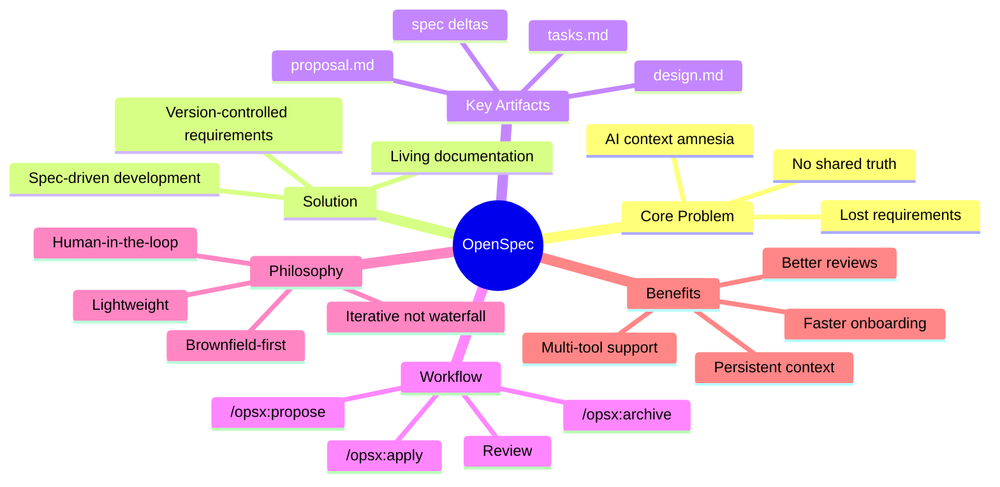

### Quick Reference Card

```bash
# 1. Install
npm install -g @fission-ai/openspec@latest

# 2. Initialize in project
cd your-project
openspec init

# 3. Create initial spec (optional)
/opsx:new-capability auth-login

# 4. Propose a change
/opsx:propose Add remember me checkbox with 30-day sessions

# 5. Review proposal (IMPORTANT!)
cat openspec/changes/add-remember-me/proposal.md
cat openspec/changes/add-remember-me/design.md
cat openspec/changes/add-remember-me/tasks.md
cat openspec/changes/add-remember-me/specs/auth-session/spec.md

# 6. Apply the change
/opsx:apply

# 7. Archive when complete
/opsx:archive

# Keep updated
npm install -g @fission-ai/openspec@latest
openspec update
```

### Decision Tree: Should I Use OpenSpec?

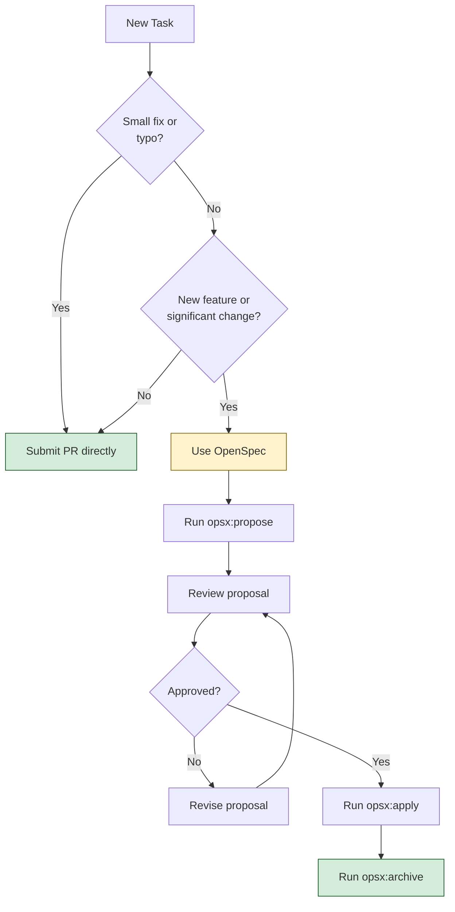

### What You've Learned

✅ The problem OpenSpec solves (AI context amnesia)  
✅ Core concepts (specs, changes, deltas, artifacts)  
✅ Complete workflow (propose → review → apply → archive)  
✅ Installation and setup process  
✅ How to write effective specs with Given/When/Then  
✅ Real-world use cases and examples  
✅ Comparison with alternatives  
✅ Best practices and anti-patterns  
✅ Performance, security, and testing considerations  
✅ Migration strategy for existing projects  
✅ Troubleshooting common issues  

### Next Steps

**1. Try It Yourself:**
```bash
# Pick a simple project
mkdir -p ~/projects/playground/openspec-demo
cd ~/projects/playground/openspec-demo
git init
npm init -y
npm install -g @fission-ai/openspec@latest
openspec init

# Create your first spec
/opsx:new-capability user-profile

# Write your first change
/opsx:propose "Add avatar upload functionality"
```

**2. Explore Further:**
- 📚 [Official OpenSpec Documentation](https://github.com/Fission-AI/OpenSpec)
- 🔧 [Supported Tools List](https://github.com/Fission-AI/OpenSpec/blob/main/docs/supported-tools.md)
- 💬 [Community Discord](https://discord.gg/YctCnvvshC)
- 📖 [Getting Started Guide](https://github.com/Fission-AI/OpenSpec/blob/main/docs/getting-started.md)

**3. Advanced Topics:**
- Workspaces feature (team-scale use cases)
- Custom spec templates
- CI/CD integration
- Automated test generation from specs
- Multi-repo planning

**4. Contribute:**
- Report issues on GitHub
- Share your use cases
- Contribute to documentation
- Help improve the tool

### Pro Tips

> **💡 Start Small:** Don't try to spec your entire system on day one. Start with one feature and grow organically.

> **💡 Review Diligently:** The review stage catches 80% of problems. Invest time here.

> **💡 Keep Specs Updated:** Outdated specs are worse than no specs. Make /opsx:archive mandatory.

> **💡 Use High-Reasoning Models:** Better planning = better proposals = better outcomes.

> **💡 Engage with Specs:** They only work if you read them. Make spec review part of your workflow.

> **💡 Commit Specs:** Treat openspec/ like any other source directory.

---

## 📚 Additional Resources

### Official Resources
- **GitHub Repository:** https://github.com/Fission-AI/OpenSpec
- **Documentation:** https://github.com/Fission-AI/OpenSpec/tree/main/docs
- **Supported Tools:** https://github.com/Fission-AI/OpenSpec/blob/main/docs/supported-tools.md
- **Examples:** https://github.com/Fission-AI/OpenSpec/tree/main/examples
- **Discord Community:** https://discord.gg/YctCnvvshC

### Related Topics
- Behavior-Driven Development (BDD)
- Specification by Example
- Documentation as Code
- AI-Assisted Development
- Git Workflows
- Technical Specification Writing

### Further Reading
- "Specification by Example" by Gojko Adzic
- "The Art of Readable Code" by Dustin Boswell
- "Clean Architecture" by Robert C. Martin
- "Designing Data-Intensive Applications" by Martin Kleppmann

### Tools & Integrations
- **Claude Code:** Native `/opsx:` commands
- **Cursor:** Custom commands support
- **VS Code:** Git integration for spec editing
- **GitHub:** PR workflows, Actions for CI/CD

---

## 🎓 Conclusion

OpenSpec represents a paradigm shift in how we work with AI coding agents. By introducing a lightweight specification layer, it solves the critical problem of context amnesia while maintaining the speed and flexibility that make AI assistants so powerful.

**Remember:** OpenSpec is not waterfall. It's not about creating perfect plans months in advance. It's about creating "good enough" plans that you can start coding from in minutes, updating as you learn and iterate.

The key is to **agree before you build**, maintain **living documentation**, and keep **humans in the loop**. Whether you're a solo developer or a 50-person team, OpenSpec provides the structure to build better software with AI.

**Start small, stay consistent, and watch your team's productivity soar.**

---

**📝 Feedback:** Found this tutorial helpful? Have suggestions? Reach out on [Discord](https://discord.gg/YctCnvvshC).

**🔄 Version:** 1.0 | **Last Updated:** January 2026 | **Difficulty:** Intermediate | **Reading Time:** 30-35 minutes