# Supercharging Claude Code: A Complete Tutorial to 10 GitHub Repos That Transform Your AI Coding Workflow

## Introduction

If you've been using Claude Code the way most people start — open a terminal, type a prompt, get some code back, repeat — you're only scratching the surface of what's possible. This tutorial walks you through **ten community-built GitHub repositories** that extend Claude Code from a simple "prompt-and-generate" tool into a fully context-aware, test-driven, multi-agent development environment.

By the end of this tutorial, you'll understand:

- What each repo does and *why* it matters
- How to install and configure each one
- Real-world scenarios where each tool saves you time
- How these tools fit together into a single coherent workflow

Let's start with the big picture before diving into each tool individually.

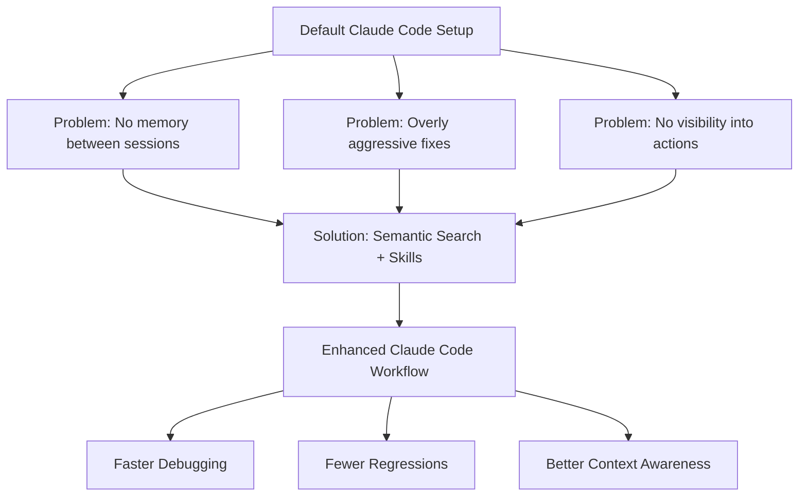

---

## Why Extend Claude Code At All?

Out of the box, Claude Code is powerful but generic. It doesn't know your team's testing philosophy, doesn't remember what it did yesterday, and doesn't have direct access to your GitHub issues or production error logs unless you tell it. The repos in this tutorial each solve **one specific gap** in that experience.

Think of it like this: Claude Code is the engine, and these repos are the instrument panel, GPS, and toolbox you bolt onto it.

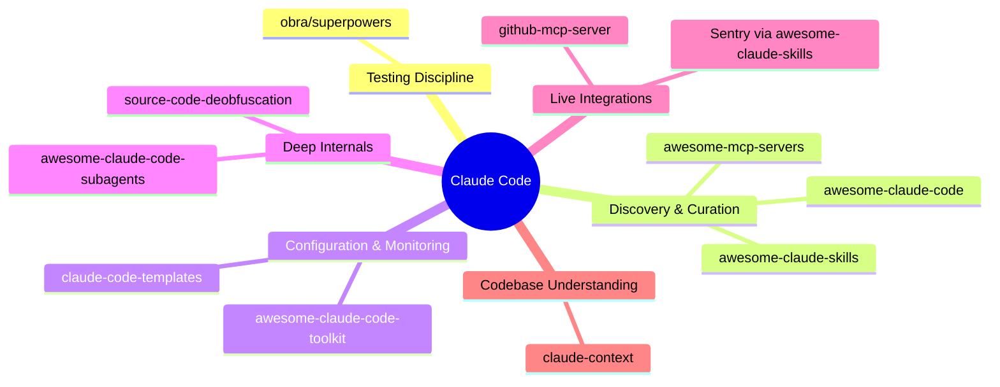

---

## Part 1: Enforcing Discipline — `obra/superpowers`

**Repo:** `github.com/obra/superpowers`
**Category:** Skills library / Development methodology

### What It Does

Superpowers is a skills library that forces Claude Code into a strict **red-green-refactor** cycle — the classic test-driven development (TDD) loop:

1. **Red** — Write a failing test that describes the desired behavior
2. **Green** — Write the smallest amount of code that makes the test pass
3. **Refactor** — Clean up the implementation without changing behavior

It also adds a **brainstorming step** that pushes back on vague requests before any code is written, forcing you to think through edge cases up front.

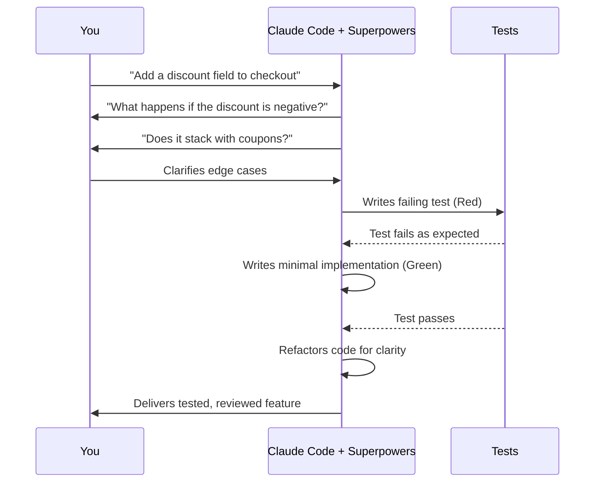

### Step-by-Step: Getting Started

1. Install Superpowers as a Claude Code plugin (check the repo's README for the current plugin install command).
2. Once installed, the skills trigger **automatically** — no need to remember slash commands.
3. Give Claude Code a feature request as usual, e.g., *"add a discount field to checkout."*
4. Instead of immediately generating code, Claude will ask clarifying questions about edge cases.
5. Claude writes a failing test first, then implements the feature, then refactors.

### Example: Before vs. After

**Before Superpowers:**
```
You: Add a discount field to checkout
Claude: [writes a discount field, no validation, no tests]
```

**After Superpowers:**
```
You: Add a discount field to checkout
Claude: Before I start — what should happen if the discount is negative?
        Should discounts stack with coupon codes?
You: No negative discounts, and no stacking with coupons.
Claude: [writes test_discount_rejects_negative_values]
Claude: [writes test_discount_does_not_stack_with_coupons]
Claude: [implements minimal code to pass both tests]
Claude: [refactors for readability]
```

### Use Cases

- **Teams enforcing code quality standards** — Superpowers bakes TDD into every interaction instead of relying on developer discipline.
- **Solo developers prone to "vibe coding"** — the brainstorming step catches assumptions before they become bugs.
- **Legacy codebases** — refactor steps reduce the risk of Claude "fixing" a bug by rewriting half a file.

---

## Part 2: Discovery Repos — Curated Catalogs You Browse, Not Install

Three repos in this list aren't tools themselves — they're **directories**. You don't "use" them directly; you browse them like a catalog and pull out the two or three things relevant to you.

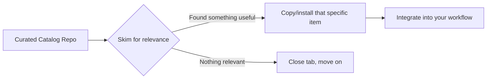

### 2a. `hesreallyhim/awesome-claude-code`

A directory of hooks, slash commands, subagent setups, and full workflows shared by the community.

**Practical example:** A hook that logs every file Claude touches during a session. This is invaluable when you need to explain a change to a teammate later — instead of reconstructing what happened from memory, you have an actual audit trail.

**Use case:** Code review handoffs. If a teammate asks "why did this file change?", you can show them the session log instead of guessing.

### 2b. `appcypher/awesome-mcp-servers`

A long, curated list of MCP (Model Context Protocol) servers covering databases, testing frameworks, cloud services, and more.

**How to approach it:** Don't try to read the whole list. Search for your specific need (e.g., "database" or "testing"), install the one or two servers relevant to your stack, and stop there.

**Use case:** A team using PostgreSQL could find and connect a Postgres MCP server so Claude Code can query schema and data directly instead of guessing table structures from migration files.

### 2c. `ComposioHQ/awesome-claude-skills`

A curated skills list leaning toward **integrations** — GitHub automation, GitLab, PagerDuty, Sentry, Supabase, and more.

**Example workflow:** Pull the Sentry skill so Claude Code can retrieve an actual production stack trace when asked to fix a bug, rather than requiring you to copy-paste the error manually.

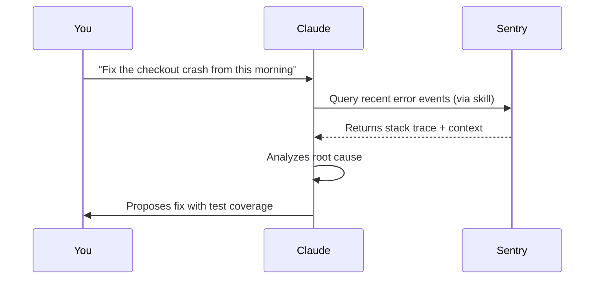

**Use case:** On-call debugging. Instead of switching between Sentry's dashboard and your terminal, Claude pulls the trace directly into the conversation.

---

## Part 3: Configuration & Monitoring

### 3a. `davila7/claude-code-templates`

**What it does:** A CLI tool for configuring and monitoring Claude Code sessions.

If you run multiple terminal windows with Claude Code active simultaneously (which is more common than you'd think for developers juggling several tasks), this gives you:

- A **dashboard** showing which session is doing what
- A way to **port your preferred configuration** into a new project with a single command instead of manually copying files

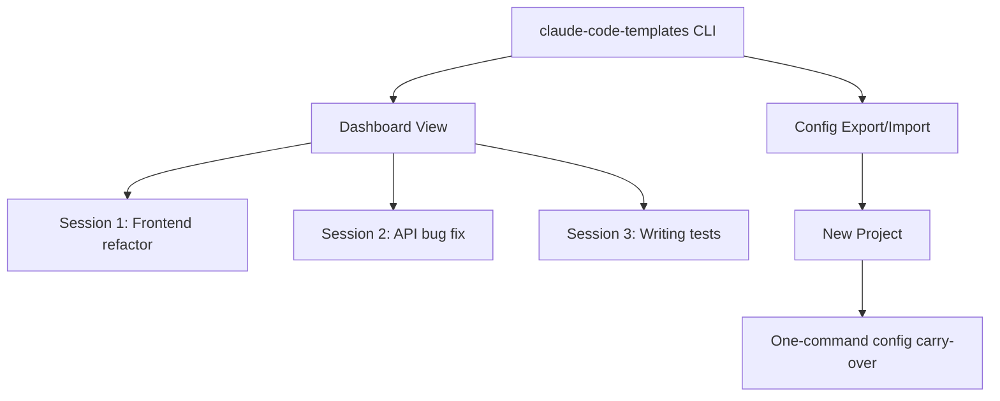

**Use case:** A developer starting a new microservice can carry over linting rules, preferred agent behaviors, and hook configurations from an existing project in seconds, rather than reassembling them from memory or old notes.

### 3b. `rohitg00/awesome-claude-code-toolkit`

**What it does:** An "everything bundle" — roughly 130+ agents, dozens of skills, custom commands, and hooks in a single install.

Most users won't touch the majority of what's bundled here. The standout feature is a small utility that **backs up and syncs your entire Claude Code configuration to a private repo.**

**Use case:** Switching machines. If you get a new laptop or your development environment gets wiped, you restore your entire Claude Code setup from your private backup repo instead of rebuilding hooks, skills, and agent configs from scratch.

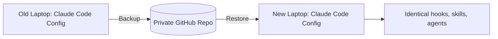

---

## Part 4: Understanding the Internals

Two repos in this list aren't productivity tools at all — they're for developers who want to understand **how Claude Code actually works under the hood**.

### 4a. `VoltAgent/awesome-claude-code-subagents`

Tracks Claude Code's actual system prompts, subagent instructions, and how they've changed across versions.

**Use case:** If a subagent behaves unexpectedly (e.g., a "code reviewer" subagent focusing on style over logic), you can read its actual instructions instead of guessing why it's making certain choices.

### 4b. `ghuntley/claude-code-source-code-deobfuscation`

A cleanroom deobfuscation of the Claude Code npm package itself.

**Use case:** Understanding exactly how project context gets loaded when Claude Code starts up — useful for developers troubleshooting why certain files are or aren't being picked up.

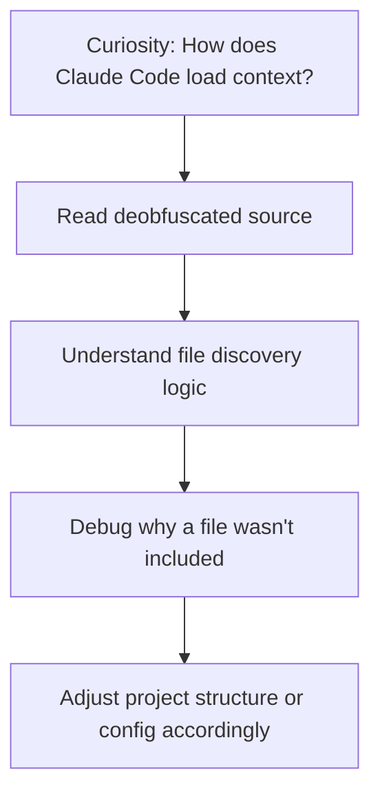

---

## Part 5: Live Integrations

### 5a. `github/github-mcp-server`

GitHub's own official MCP server. Instead of Claude Code inferring repo state from local files alone, it can query GitHub's API directly — open PRs, issue threads, review comments, and more.

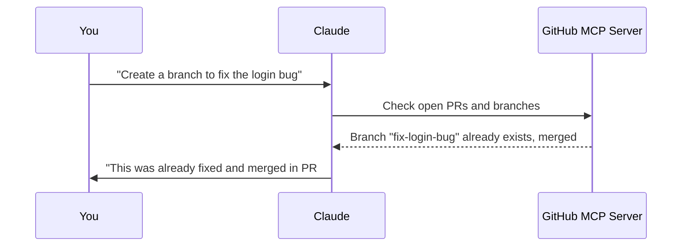

**Use case:** Avoiding duplicate work. Before creating a new branch or PR, Claude checks whether the fix already exists — eliminating an entire category of "wait, didn't we already do this?" moments.

### 5b. `zilliztech/claude-context`

**What it does:** Adds **semantic code search** over an entire codebase using a vector database, so Claude Code doesn't need to be manually pointed at individual files.

This is arguably the most impactful tool on the list for large codebases, because it changes *how* Claude finds relevant code — from manual file-by-file guidance to automatic semantic retrieval.

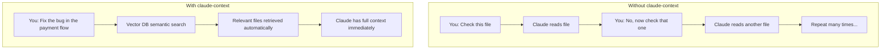

**Use case:** Large monorepos. On a codebase with hundreds of files, this cuts down the "check this file, now check that one" back-and-forth to almost nothing, because Claude can semantically locate relevant code without being told exactly where to look.

---

## Putting It All Together: A Complete Workflow

Here's how these ten repos combine into a single, coherent Claude Code setup:

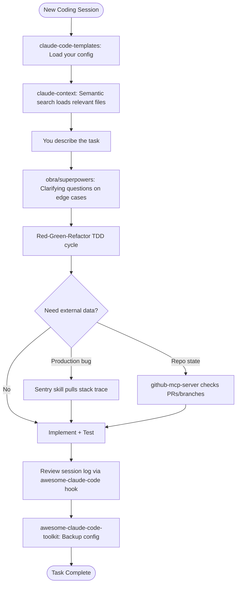

### Recommended Installation Order

If you're starting from scratch, here's a sensible order to adopt these tools:

1. **`zilliztech/claude-context`** — Fix the "Claude doesn't know my codebase" problem first; it has the highest immediate impact.
2. **`obra/superpowers`** — Add testing discipline early, before bad habits form.
3. **`davila7/claude-code-templates`** — Set up monitoring and config portability once you're running multiple sessions.
4. **`github/github-mcp-server`** — Connect live repo state once you're collaborating with a team.
5. **Browse the curated lists** (`awesome-claude-code`, `awesome-mcp-servers`, `awesome-claude-skills`) as needed — pull specific hooks or skills relevant to your stack rather than installing everything.
6. **`rohitg00/awesome-claude-code-toolkit`** — Mainly for the config backup utility, once your setup is worth protecting.
7. **The internals repos** (`awesome-claude-code-subagents`, `claude-code-source-code-deobfuscation`) — Optional, for developers curious about the mechanics.

---

## Summary Table

| Repo | Category | Primary Benefit |
|---|---|---|
| obra/superpowers | Skills / TDD | Enforces test-driven development and edge-case thinking |
| hesreallyhim/awesome-claude-code | Curated directory | Hooks, commands, and workflows to browse and adopt |
| davila7/claude-code-templates | CLI tool | Multi-session dashboard + config portability |
| rohitg00/awesome-claude-code-toolkit | Bundle | Config backup/sync across machines |
| VoltAgent/awesome-claude-code-subagents | Research | Tracks internal subagent prompt behavior |
| appcypher/awesome-mcp-servers | Curated directory | Long list of MCP servers by category |
| github/github-mcp-server | MCP server | Live GitHub API access (PRs, issues, branches) |
| ghuntley/claude-code-source-code-deobfuscation | Research | Deobfuscated internals of the CLI |
| ComposioHQ/awesome-claude-skills | Curated directory | Integration skills (Sentry, PagerDuty, etc.) |
| zilliztech/claude-context | Semantic search | Codebase-wide context without manual file pointing |

---

## Closing Thoughts

None of these repos are magic on their own — the value comes from **combining a few of them deliberately** rather than installing everything at once. Start with the tool that solves your single biggest pain point (for most people, that's either codebase context or testing discipline), get comfortable with it, and layer in the rest as new friction points appear.

The common thread across all ten is this: Claude Code gets dramatically better not from a bigger model, but from **better context and better process** — exactly what these community tools are built to provide.