# The AI-Native Engineer: A Complete Guide to Mastering AI-Assisted Development

**Learn how to transform from a traditional developer into an AI orchestrator who builds better software with AI agents, proper guardrails, and systematic workflows**

---

## Table of Contents

1. [Introduction](#introduction)
2. [The Shift from Engineer to Orchestrator](#the-shift-from-engineer-to-orchestrator)
3. [The Four Foundations of AI-Native Engineering](#the-four-foundations-of-ai-native-engineering)
4. [Your AI-Native Journey: Three Phases](#your-ai-native-journey-three-phases)
5. [Time Allocation for AI-Native Work](#time-allocation-for-ai-native-work)
6. [Team Transformation](#team-transformation)
7. [The Agentic Development Life Cycle](#the-agentic-development-life-cycle)
8. [Where AI Creates Real Leverage](#where-ai-creates-real-leverage)
9. [Guardrails & Security](#guardrails--security)
10. [Implementation Playbook](#implementation-playbook)

---

## Introduction

A lot of people are talking about "AI-native engineering" right now. Some say AI will make everyone an engineer. Some say coding will become easy. Some say teams will move faster just because they are using AI tools.

But the real picture is more practical than that.

### The Reality Check

AI is already changing how software gets built:

- **Google** says AI now generates more than 75% of its new code
- **OpenAI and Anthropic** have stated AI is involved in almost every fresh line of code they produce
- **Amazon** moved around 30,000 production applications from Java 8 to Java 17 in just a few months—work that could have taken thousands of developer-years without AI
- **Mark Zuckerberg** has said AI agents may work like mid-level engineers by the end of 2026

We're standing at the end of one era and watching a new one begin. But there's one critical question: **If AI can write so much code, why are many engineering teams still dealing with more bugs, more incidents, and more technical debt than before?**

### The Code Overload Problem

In an article published in The New York Times, Mike Isaac and Erin Griffith described this situation as **"code overload."**

The idea is simple: AI helps teams produce code very quickly, but now many teams are producing more code than they can properly review, test, understand, and maintain.

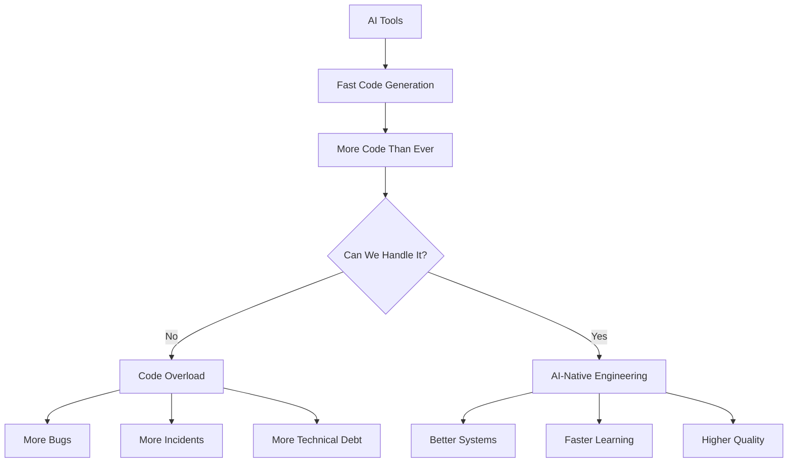

**The result:** Instead of becoming more productive, some teams are creating more chaos. They're shipping faster, but they're also creating more security issues, more broken flows, and more messy systems.

### The Real Difference

Some engineers use AI only to generate code quickly. Others use AI to plan, reason, verify, review, test, and improve their work.

**That is the real shift.** The future is not just about writing code with AI. It is about learning how to orchestrate code with AI.

### What You'll Learn

By the end of this tutorial, you'll understand:

- The mindset shift from coder to orchestrator
- The four foundations of AI-native engineering
- A practical three-phase learning journey
- How to build effective team workflows
- The Agentic Development Life Cycle (ADLC)
- Security guardrails and risk management
- How to avoid code overload and build better systems

---

## The Shift from Engineer to Orchestrator

Let's clear up one thing first: **Engineers are not becoming useless.** This is one of the biggest misunderstandings in the AI era.

### Understanding the Engineer's Role

Writing code is only one part of software engineering. In many cases, coding is maybe 20-30% of the real work. The rest is:

- Understanding the problem
- Designing the system
- Making technical decisions
- Reviewing trade-offs
- Debugging
- Testing
- Securing the application
- Making sure everything works reliably in production

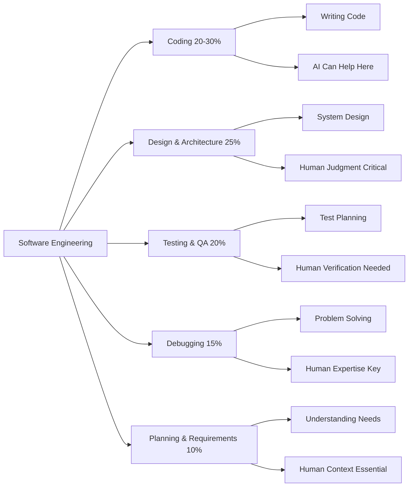

AI has made this reality more visible. Now that AI tools can generate code quickly, we're seeing something important: **more code does not always mean more progress.**

### Vibe Coding vs AI-Native Engineering

When Andrej Karpathy used the term "vibe coding" in early 2025, it described a real and useful trend. A person can now describe what they want, and AI can help them build a working app, prototype, or feature.

**Vibe Coding:**
- Describe what you want → AI builds it
- Great for prototypes and non-engineers
- Democratizes software creation
- Fast but potentially uncontrolled

**AI-Native Engineering:**
- Guide AI with context and specifications
- Verify every output carefully
- Control the process with guardrails
- Build production-ready systems

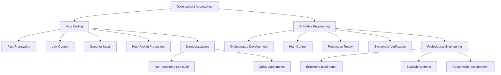

**The key difference:** Vibe coding can help you create. AI-native engineering helps you build responsibly.

### The Orchestrator Mindset

The AI-native engineer is not just a person who writes code faster. The AI-native engineer becomes an **orchestrator**.

They know how to:
- Guide AI agents
- Split big problems into smaller tasks
- Review generated output
- Connect different tools
- Keep the whole system moving in the right direction

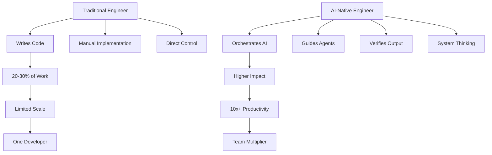

**The real leverage:** A strong engineer using AI properly can turn 10x productivity into something much bigger. But that doesn't happen by blindly accepting whatever the model gives. It happens through **orchestration**.

---

## The Four Foundations of AI-Native Engineering

### 1. Synchronized Context Engineering

The first and most important practice is **context engineering**. This is quickly becoming one of the most valuable skills for AI-native engineers.

#### What is Context Engineering?

In simple words, context engineering means giving AI the right information before asking it to work.

Think about how a new developer joins a team. Before they can write good code, they need to understand:
- Project structure
- Coding standards
- Business rules
- Architecture
- Database flow
- Naming conventions
- How the team usually works

**AI agents need the same thing.**

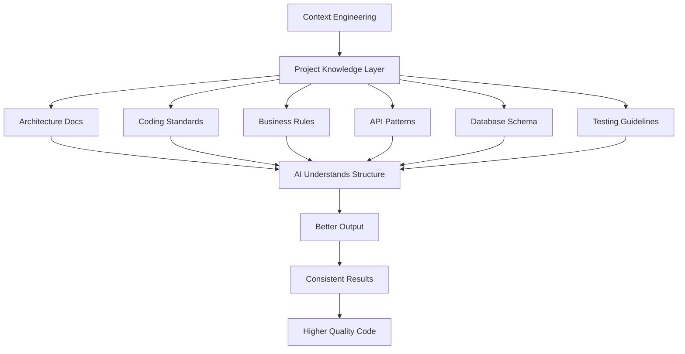

If you only give an AI tool a short prompt, it will guess a lot. Sometimes the output will look correct, but it may not match your actual codebase, your team's standards, or your production needs.

#### From Prompt Engineering to Context Engineering

This is the big shift:

- **Prompt Engineering:** Asking better questions
- **Context Engineering:** Giving AI the right background so it can produce better answers

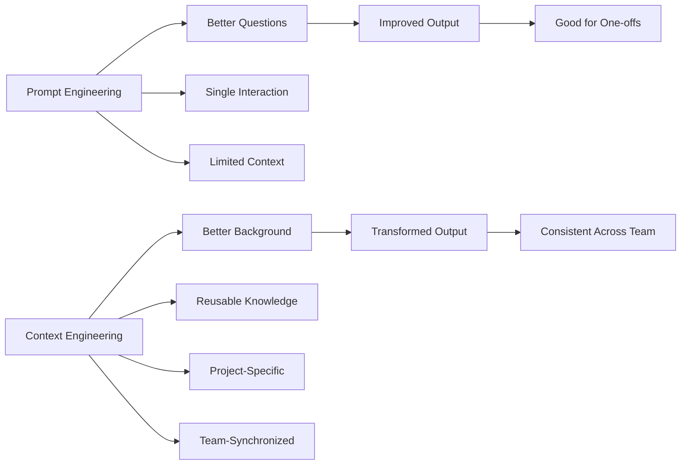

#### Building Your Context Layer

The context layer can include:

**1. Project Documentation**
- Architecture diagrams
- System design documents
- API specifications
- Database schemas

**2. Coding Standards**
- Naming conventions
- Code organization patterns
- Error handling approaches
- Logging standards

**3. Business Rules**
- Domain logic
- Validation rules
- Business constraints
- Edge cases to handle

**4. Team Practices**
- Git workflow
- PR review process
- Testing requirements
- Deployment procedures

#### Tools for Context Engineering

**CLAUDE.md Files:**
These files are becoming part of the AI working environment. They tell the AI:
- How the project works
- What rules it should follow
- What patterns it should use
- What mistakes it should avoid

**MCP (Model Context Protocol):**
Often described as "USB-C for AI" because it helps AI agents connect with external tools, systems, and data sources in a standard way.

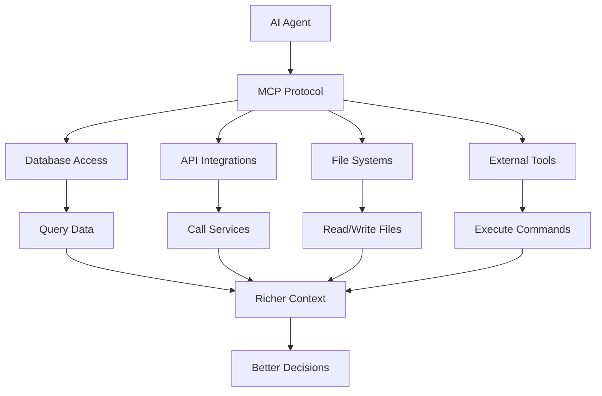

**Best Practices:**
- Keep context updated and relevant
- Make it reusable across the team
- Don't let it live in one person's mind
- Standardize across projects

---

### 2. Specification-Driven Development

The second core practice is **specification-driven development**. This means: before you ask AI to build something, first explain clearly what you want.

#### The Problem with Random Prompts

Many developers use AI like this:
- "Build this feature."
- "Fix this bug."
- "Create this page."
- "Make it better."

Sometimes this works for small tasks. But for real engineering work, this kind of random prompting often creates confusion.

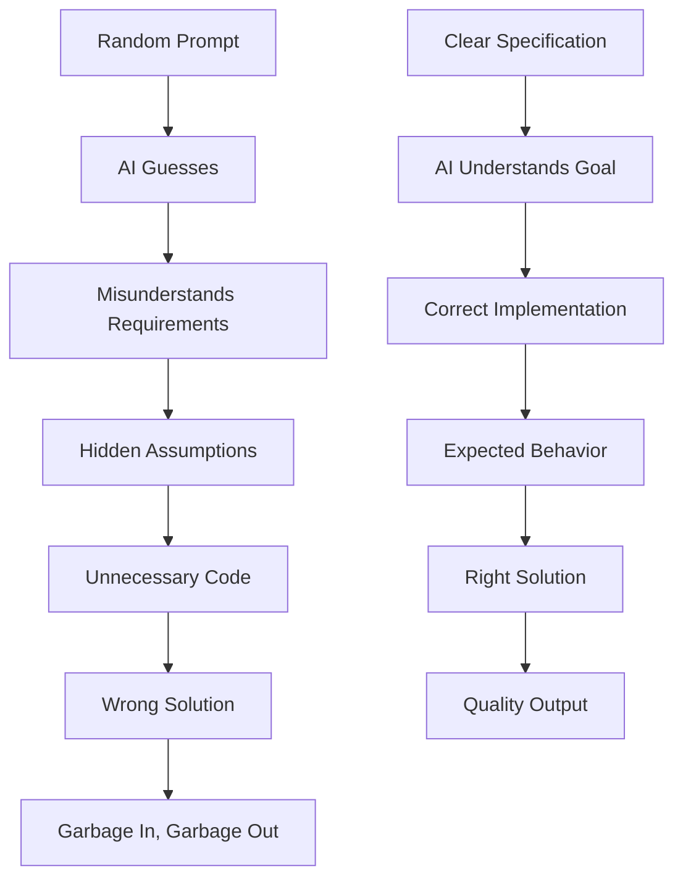

**The old rule still applies:** Garbage in, garbage out. But in the AI era, this becomes even more serious because AI can generate bad code much faster and in much larger amounts.

#### What Makes a Good Specification?

A good specification explains:

1. **What** we are building
2. **Why** we are building it
3. **How** it should behave
4. **What** rules it must follow
5. **How** we will know it is correct

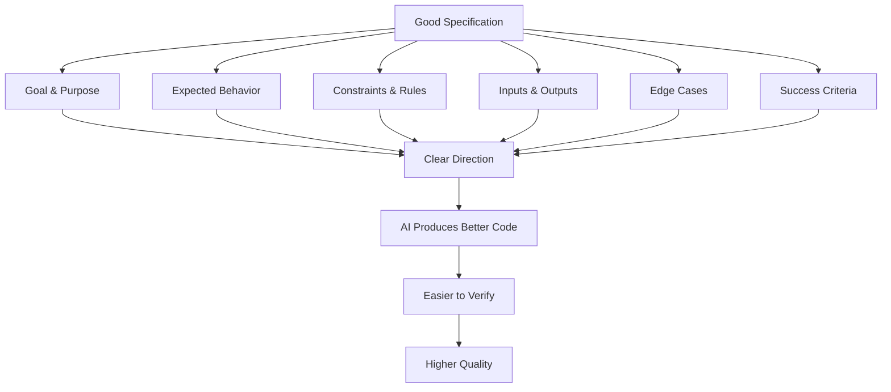

#### The Specification-Driven Workflow

Instead of asking AI to "just build everything," an AI-native engineer breaks the work into smaller milestones:

1. **Define** the problem clearly
2. **Plan** the solution
3. **Build** one part
4. **Test** it
5. **Review** it
6. **Move** to the next part

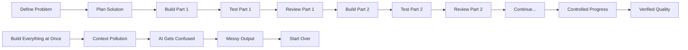

**Key Principle:** A good AI workflow should force the agent to stop and ask questions when something is unclear. If there are open questions, the AI should not guess—it should ask you.

---

### 3. Critical Verification

The third core practice is **critical verification**. This means you should never blindly trust AI-generated code.

#### The Verification Challenge

AI can write code very fast, but fast does not always mean correct. In many cases, AI-generated code is similar to code written by a junior developer:

- It may look clean at first
- It can still contain hidden bugs
- It may have weak security
- It can have bad assumptions
- It may fail in real production use

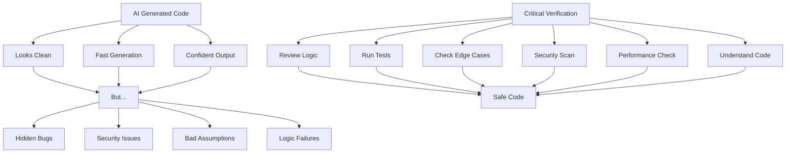

#### The False Confidence Problem

This is one of the biggest risks of AI-assisted development:

- The code looks confident
- The explanation sounds convincing
- The solution feels complete
- **But that does not mean it is safe**

Research has shown:
- Large amounts of AI-generated code can contain security issues
- Developers using AI assistants may write less secure code while feeling more confident
- Experienced developers can become slower with AI on familiar codebases (because they spend time checking and fixing)

#### What to Verify

AI-native engineers need to become very strong at verification. Check whether the code is:

- ✅ Correct (does it solve the problem?)
- ✅ Secure (any vulnerabilities?)
- ✅ Scalable (will it handle load?)
- ✅ Maintainable (is it readable?)
- ✅ Aligned with requirements (does it match specs?)

**The value shift:** In the AI-native era, your value is not only in how fast you can produce code. Your value is in how well you can prove that the code is safe, reliable, and ready for real users.

---

### 4. Problem Decomposition

The fourth core practice is **problem decomposition**. This means breaking a large problem into smaller, clear, manageable parts before giving it to AI.

#### The Context Pollution Problem

One common mistake: asking AI to solve a big and complex problem in one shot.

Examples:
- "Build the full dashboard."
- "Create the complete backend."
- "Refactor this entire module."
- "Fix all issues in this system."

**What happens:**
- AI starts well
- Context becomes too large
- Requirements become mixed
- Agent starts making assumptions
- Output becomes messy, incomplete, or hard to trust

This is called **context pollution**: when the AI has too much mixed, unclear, or outdated information in its working memory.

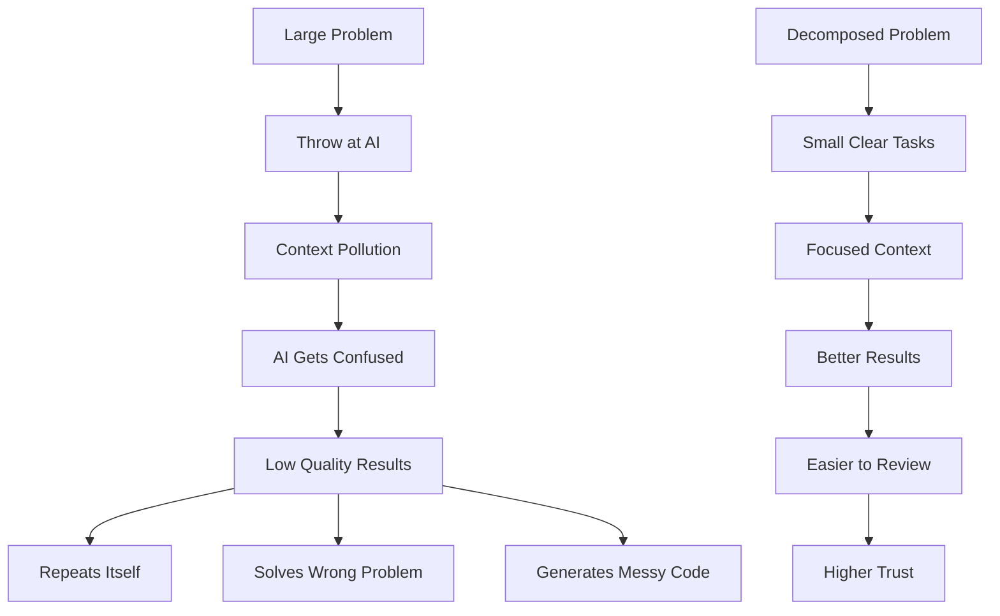

#### The Decomposition Strategy

AI is very useful for the routine 70-80% of implementation work:
- Create boilerplate
- Write helper functions
- Generate basic UI
- Draft tests
- Refactor simple logic
- Speed up repetitive tasks

**But humans still need to control the difficult parts:**
- Edge cases
- Domain-specific logic
- Architecture decisions
- Security concerns
- Product behavior
- Final judgment

#### The Better Workflow

1. **Define** the full problem
2. **Break** it into smaller tasks
3. **Give** one task to the AI
4. **Verify** the output
5. **Move** to the next task

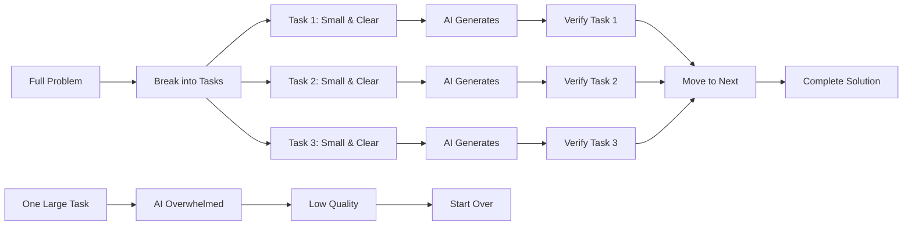

**The lesson:** Do not ask AI to carry the entire problem at once. Give it a clear piece of the problem, with clear context, clear instructions, and clear success criteria.

---

## Your AI-Native Journey: Three Phases

Becoming AI-native is not a one-month journey. It's a progression through three distinct phases.

### Phase 1: Foundation (Weeks 1-2)

The first phase is about building your foundation. For most engineers, a couple of focused weeks is enough to get started.

#### Goals for Phase 1

1. **Pick One AI Tool**
   - Codex, Claude Code, Cursor, or any tool you prefer
   - Don't jump between too many tools
   - Use it daily
   - Understand how it behaves

2. **Learn What AI Is Good At**
   - Start with small, practical tasks
   - Ask it to explain code
   - Generate simple functions
   - Write tests
   - Refactor small files
   - Fix basic bugs

3. **Learn Where AI Fails**
   - Notice when it saves time
   - Notice when it creates extra work
   - Identify misunderstanding patterns
   - Document failure cases

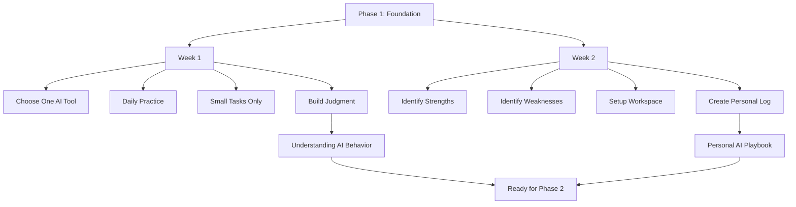

#### Your Personal AI Log

Keep a simple log of what works:

```
✅ What prompts worked well?
❌ Where did the AI fail?
⚡ Which tasks were faster with AI?
😤 Which tasks became more confusing?
📝 What rules should you give the AI next time?
```

This log becomes your **personal AI engineering playbook**.

**Key Insight:** Becoming AI-native is not about using AI for everything. It's about knowing when to use it and how to use it properly.

---

### Phase 2: Integration (Weeks 3-4)

The second phase is about integration. This should take around a month at most.

#### Goals for Phase 2

1. **Structured Prompts**
   - Don't ask AI to "build this feature"
   - Give clear structure: goal, problem, expected output, constraints, success criteria

2. **Project-Specific Context**
   - Create context files
   - Document coding standards
   - Explain architecture patterns
   - Define folder structure
   - Set naming rules
   - Document API patterns

3. **Build Repeatable Workflow**
   - Plan first, execute second
   - Review after every small task
   - Use approval gates and guardrails

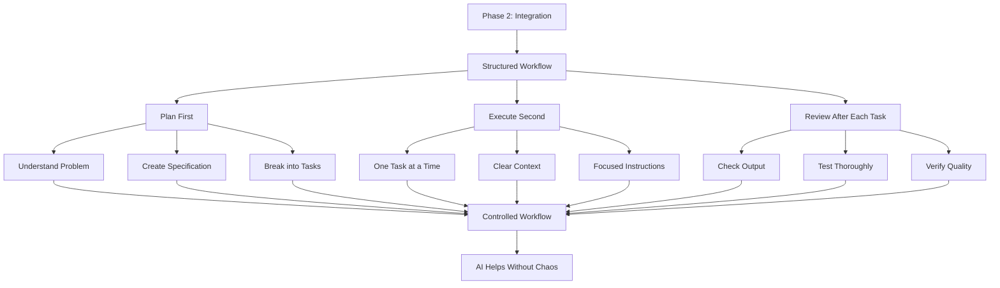

#### Preventing Agent Drift

**Agent drift** means the AI slowly moves away from your actual goal:
- Solving the wrong problem
- Adding unnecessary code
- Changing things you did not ask for
- Making assumptions without asking

**Solution:** Small loops with verification checkpoints:
1. Give AI a small task
2. Check the output
3. Test it
4. Review it
5. Move to the next task

**Why this matters:** Large autonomous runs often create a lot of useless code. Many times, that output has only one destination: **delete it and start again.**

**Key Insight:** Your goal is not to make AI fully autonomous. Your goal is to build a controlled workflow where AI helps you move faster without losing quality, direction, or engineering judgment.

---

### Phase 3: Mastery (Ongoing)

The third phase is mastery. This continues as long as AI tools keep improving.

#### Goals for Phase 3

1. **Advanced AI-Native Work**
   - Use AI agents for bigger, multi-step work
   - Work across multiple files
   - Refactor entire features
   - Write comprehensive tests
   - Review code systematically

2. **Multi-Agent Workflows**
   - One agent for planning
   - One agent for implementation
   - One agent for review/testing
   - Parallel sessions for comparison

3. **Continuous Learning**
   - Stay updated with new tools
   - Learn from advanced engineers
   - Experiment with new workflows
   - Adapt to your team's needs

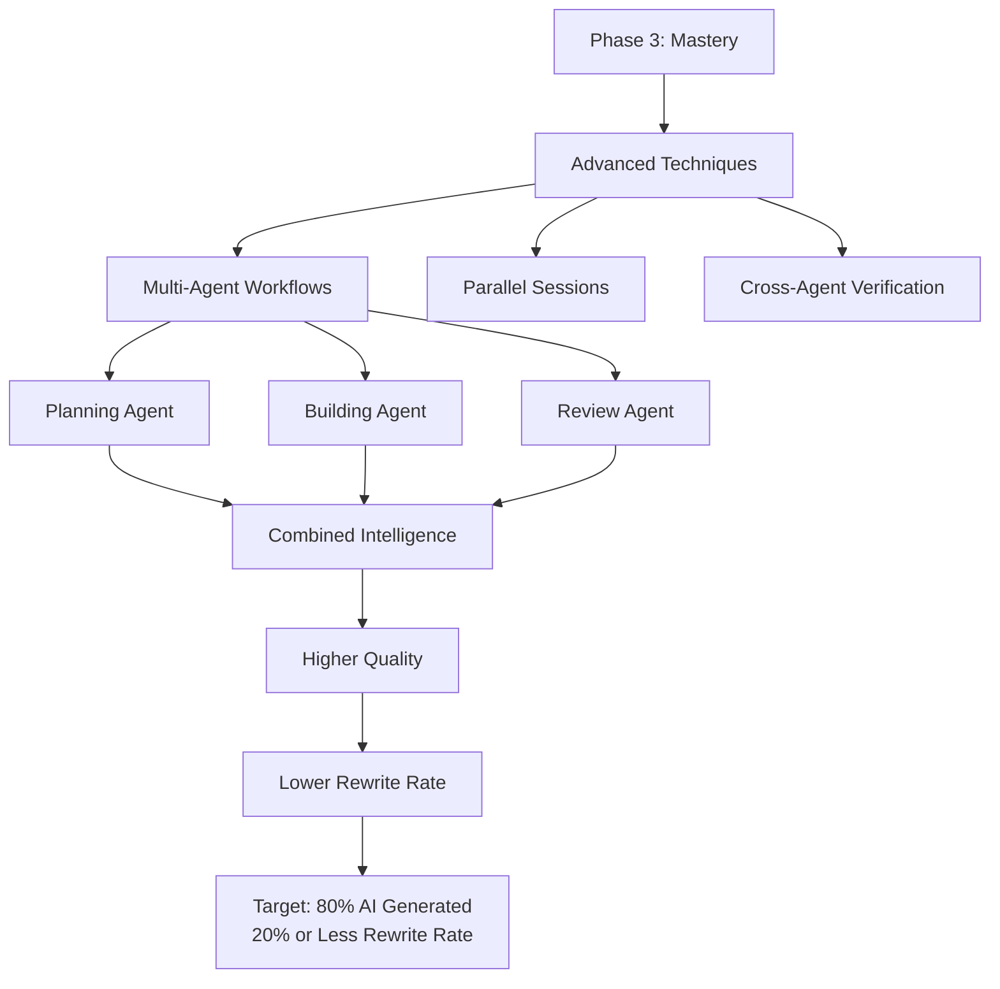

#### The Mastery Metric

A good target at this stage:

**80% or more of coding work AI-generated, but less than 20% needs to be rewritten.**

This means:
- Your context is clear
- Your specifications are strong
- Your verification process is solid
- Your AI assistant is helping instead of creating cleanup work

#### Sharing Knowledge

Once you reach this level:
- Share your context files
- Document your workflows
- Teach review patterns
- Help others avoid mistakes
- Build team-wide AI-native proficiency

**Key Insight:** Mastery is not about letting AI do everything. It's about knowing how to guide AI at a higher level, use agents responsibly, and keep improving your engineering system as tools evolve.

---

## Time Allocation for AI-Native Work

A good AI-native workflow is not only about generating code faster. It's about spending your time in the right places.

### The Time Distribution

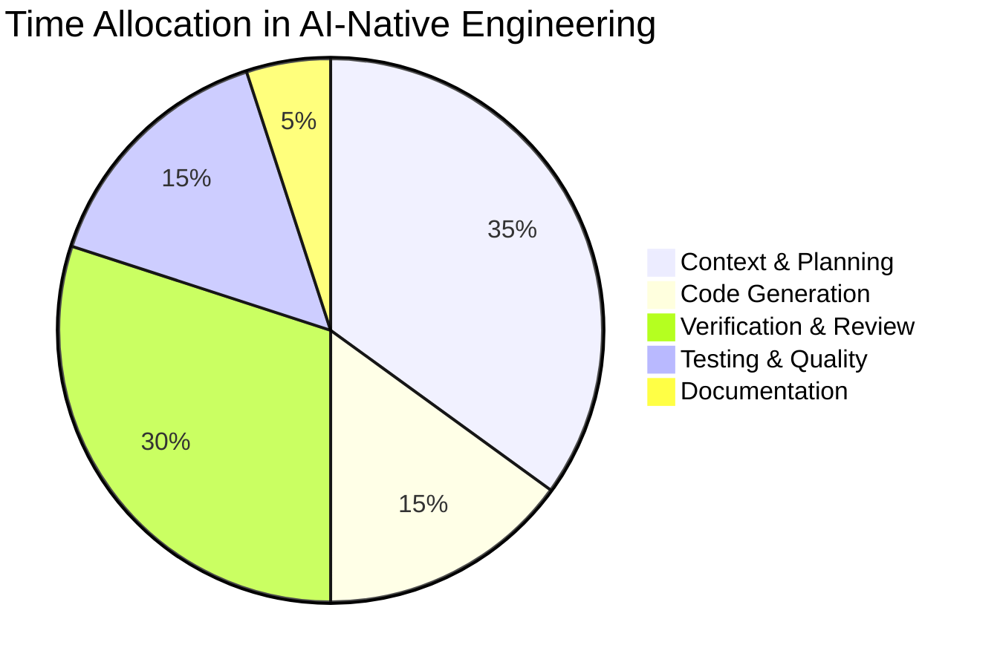

**This surprises many developers** because they expect most time to be spent on code generation. But in real AI-native work:

- **Generation is usually the fastest part** (15%)
- **Context preparation takes the most time** (35%)
- **Verification is critical** (30%)
- **Testing ensures quality** (15%)

### Where Time Goes

**Before Generation (35%):**
- Explaining the problem
- Defining requirements
- Sharing project rules
- Giving AI enough background
- Writing clear specifications

**During Generation (15%):**
- AI writes code quickly
- You guide and direct
- You answer questions

**After Generation (55%):**
- Testing the code
- Reviewing carefully
- Verifying edge cases
- Checking security
- Ensuring it fits the system

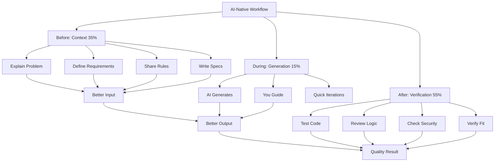

### The Work Shift

In the AI-native era, the engineer's time moves away from:
- ❌ Typing every line of code
- ❌ Manual implementation of routine tasks

And toward:
- ✅ Guiding the AI
- ✅ Checking the output
- ✅ Improving the system
- ✅ Making better decisions

**The best engineers will not be the ones who generate the most code. They will be the ones who set better context and verify the output more carefully.**

---

## Team Transformation

Becoming AI-native is not only a technical shift. It's also a cultural shift.

### Why Culture Matters

A team cannot become AI-native just by buying AI tools or asking everyone to use coding agents. The real change happens when the team changes:

- How it works
- How it reviews code
- How it shares knowledge
- How it learns from mistakes

**Research shows:** Most transformation success comes from operational and cultural change, not only from technology.

### The Three Foundations of AI-Native Teams

#### 1. Psychological Safety

People should feel safe to:
- Experiment
- Make mistakes
- Talk openly about what went wrong

**Why this matters:** Everyone is still learning with AI. Sometimes AI will generate bad code. Sometimes an agent will misunderstand the task. Sometimes a workflow will fail.

**That should not be treated as embarrassment. It should be treated as learning.**

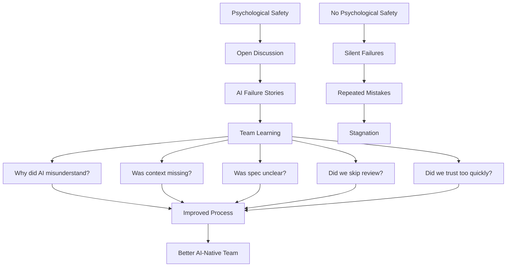

**The goal:** Create a learning culture where everyone feels included in improving together.

---

#### 2. Evolved Code Review

AI can generate code very quickly. But this creates a new problem: traditional code review processes can easily become overwhelmed.

**The Challenge:**
- Developer opens a PR with hundreds/thousands of AI-generated lines
- Reviewing it properly becomes difficult
- Reviewers may miss issues in large diffs

**The Solution:**
AI-native teams need to evolve their review process:

1. **Separate AI-generated from human-written code**
2. **Review both with the right expectations**
3. **Pay special attention to AI-generated code**
   - May look clean but contain hidden bugs
   - May have security issues
   - May have unnecessary complexity
   - May not match business requirements

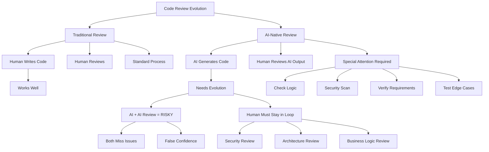

**Critical Warning:** Be careful with AI-generated and AI-reviewed PRs. If AI writes the code and another AI reviews it without strong human oversight, mistakes can easily pass through.

**Human judgment must stay in the loop**, especially for:
- Security
- Architecture
- Business logic
- Production-critical changes

---

#### 3. Shared Context Libraries

Context becomes extremely valuable in AI-native teams.

**What to Standardize:**
- Important context files
- Evaluation examples
- Coding rules
- Agent instructions
- Workflow configurations

```mermaid
graph TD
    A[Shared Context Library] --> B[Project Architecture]
    A --> C[Coding Standards]
    A --> D[API Patterns]
    A --> E[Testing Rules]
    A --> F[Security Expectations]
    A --> G[Review Guidelines]
    A --> H[Common Mistakes]
    A --> I[Agent Instructions]
    
    B --> J[Team Consistency]
    C --> J
    D --> J
    E --> J
    F --> J
    G --> J
    H --> J
    I --> J
    
    J --> K[Better AI Output]
    K --> L[Faster Onboarding]
    L --> M[Higher Quality]
    
    N[No Standardization] --> O[Everyone Creates Own Tools]
    O --> P[Chaos]
    P --> Q[Confusion]
    Q --> R[Inferior Results]
```

**The Goal:** Standardization, not chaos.

Teams should collaborate on shared AI workflows instead of competing to create separate ones. A strong AI-native team does not just use AI tools—it builds a **shared operating system for working with AI**.

---

## The Agentic Development Life Cycle

Traditional software development was designed for humans writing software step by step. Even Agile was built around human teams planning, coding, reviewing, testing, and shipping in short cycles.

But AI-native engineering changes this workflow. Now, software is built by **humans working with AI agents**.

### What is ADLC?

The **Agentic Development Life Cycle (ADLC)** is a new way to think about software development when AI agents are active participants in the workflow.

It does not remove human engineers. It changes their role:
- **Engineer** becomes: planner, reviewer, verifier, orchestrator
- **AI Agent** becomes: assistant that executes tasks, generates code, explores solutions, speeds up repetitive work

```mermaid
graph TD
    A[Traditional SDLC] --> A1[Plan]
    A --> A2[Code]
    A --> A3[Review]
    A --> A4[Test]
    A --> A5[Deploy]
    
    B[Agentic Development Life Cycle] --> B1[Plan + AI Exploration]
    B --> B2[Build + AI Generation]
    B --> B3[Test + AI Test Writing]
    B --> B4[Review + AI Analysis]
    B --> B5[Document + AI Documentation]
    B --> B6[Continuous Learning]
    
    A1 --> C[Human Only]
    A2 --> C
    A3 --> C
    A4 --> C
    A5 --> C
    
    B1 --> D[Human + AI Collaboration]
    B2 --> D
    B3 --> D
    B4 --> D
    B5 --> D
    B6 --> D
    
    C --> E[Slower]
    D --> F[Faster + Higher Quality]
```

### The Six Phases of ADLC

#### 1. Planning

Planning is the most important step in ADLC.

**Before asking AI to build anything:**
- Use AI to understand the problem clearly
- Let AI explore the codebase
- Find possible issues
- Ask open questions
- Break work into smaller tasks

**Output:** A simple roadmap with clear milestones

```mermaid
graph LR
    A[Planning Phase] --> B[AI Explores Codebase]
    B --> C[Identify Issues]
    C --> D[Break into Tasks]
    D --> E[Create Roadmap]
    
    E --> E1[Milestone 1]
    E --> E2[Milestone 2]
    E --> E3[Milestone 3]
    
    E1 --> F[Clear Direction]
    E2 --> F
    E3 --> F
    
    F --> G[AI Moves Step by Step]
    G --> H[Better Results]
```

**Advanced:** Use multiple agents for planning:
- One agent explores the code
- One agent checks risks
- One agent suggests implementation paths
- Planning agent combines everything into one strategy

---

#### 2. Building

In the building phase, AI agents help turn the plan into working code.

**Think of the AI agent like a junior or mid-level developer:**
- Can implement features
- Can update files
- Can write basic logic
- Can handle routine coding work

**Your role:** Tech lead
- Guide the agent
- Check its direction
- Make sure it follows the roadmap

```mermaid
graph TD
    A[Building Phase] --> B[AI as Developer]
    B --> B1[Implements Features]
    B --> B2[Writes Boilerplate]
    B --> B3[Creates Tests]
    B --> B4[Updates Files]
    
    C[You as Tech Lead] --> C1[Guide Direction]
    C --> C2[Review Progress]
    C --> C3[Make Decisions]
    C --> C4[Ensure Quality]
    
    B1 --> D[Collaborative Work]
    B2 --> D
    B3 --> D
    B4 --> D
    C1 --> D
    C2 --> D
    C3 --> D
    C4 --> D
    
    D --> E[Working Code]
```

**Tools in this space:** Claude Code, Cursor, GitHub Copilot Agent Mode, Codex

---

#### 3. Testing

Testing is where you make sure the AI-generated code actually works.

**Best Practice:** Let agents write the test plan first, before writing the final code.

**Testing Levels:**
1. **Unit Tests** - Small, isolated tests
2. **Integration Tests** - How features work together
3. **End-to-End Tests** - Full user flows

```mermaid
graph TD
    A[Testing Phase] --> B[Test Strategy]
    
    B --> B1[Unit Tests]
    B --> B2[Integration Tests]
    B --> B3[E2E Tests]
    
    B1 --> C1[Test Individual Functions]
    B2 --> C2[Test Feature Interaction]
    B3 --> C3[Test Complete Flows]
    
    C1 --> D[AI Writes Tests]
    C2 --> D
    C3 --> D
    
    D --> E[Tests May Fail Initially]
    E --> F[AI Improves Code]
    F --> G[Tests Pass]
    
    H[Multi-Agent Testing] --> H1[Planning Agent]
    H --> H2[Building Agent]
    H --> H3[Testing Agent]
    H --> H4[Review Agent]
    
    H1 --> I[Stronger Workflow]
    H2 --> I
    H3 --> I
    H4 --> I
    
    I --> J[Agents Challenge Each Other]
    J --> K[Better Quality]
```

**Advanced:** Use separate agents for different testing perspectives. This creates a stronger workflow because agents can challenge each other instead of blindly agreeing.

---

#### 4. Review

Review is the final safety check before trusting AI-generated work.

**Multi-Agent Review:**
- One agent checks functionality
- One agent checks code quality
- One agent checks performance
- One agent checks security
- One agent checks privacy
- One agent checks scalability
- One agent checks reliability

**Process:**
1. Agents create review reports
2. Human engineers read reports carefully
3. Humans make final decisions

```mermaid
graph TD
    A[Review Phase] --> B[Multi-Agent Review]
    
    B --> B1[Functionality Check]
    B --> B2[Code Quality Check]
    B --> B3[Performance Check]
    B --> B4[Security Check]
    B --> B5[Privacy Check]
    B --> B6[Scalability Check]
    
    B1 --> C[Review Reports]
    B2 --> C
    B3 --> C
    B4 --> C
    B5 --> C
    B6 --> C
    
    C --> D[Human Review]
    D --> E[Final Decision]
    
    F[If Issue Found] --> G[Check Whole Codebase]
    G --> H[One Bug = Similar Bugs May Exist]
    H --> I[Fix Systematically]
```

**Critical:** If one agent finds a serious issue (e.g., injection vulnerability), don't fix only that one place. Look for the same type of issue across the whole codebase.

---

#### 5. Documentation

Documentation should no longer be something written only after work is finished.

**In AI-native workflow:** Documentation is created continuously while work is happening.

**AI can help generate:**
- Summaries
- Design decisions
- Architecture notes
- Changelogs
- Simple diagrams
- API docs
- Feature notes
- Internal guides
- Customer-facing content

```mermaid
graph LR
    A[Traditional Documentation] --> B[After Work Complete]
    B --> C[Often Outdated]
    C --> D[Incomplete]
    D --> E[Inconsistent]
    
    F[AI-Native Documentation] --> G[During Development]
    G --> H[Always Current]
    H --> I[More Accurate]
    I --> J[Easier to Maintain]
    
    G --> G1[AI Generates Summaries]
    G --> G2[AI Creates Diagrams]
    G --> G3[AI Writes API Docs]
    G --> G4[AI Updates Changelogs]
    
    G1 --> H
    G2 --> H
    G3 --> H
    G4 --> H
```

**Benefit:** Solves the long-standing problem of outdated, incomplete, and inconsistent documentation.

---

#### 6. Codify ADLC

Once your Agentic Development Life Cycle starts working, don't keep it only in people's heads.

**Turn practices into reusable systems:**
- Shared context files
- Prompt libraries
- AI skills
- Workflow guides
- MCP tools

**Goal:** Make ADLC easy to repeat across the whole organization.

```mermaid
graph TD
    A[Individual Practice] --> B[Document Best Practices]
    B --> C[Create Reusable Systems]
    C --> D[Share Across Team]
    D --> E[Organization-Wide ADLC]
    
    E --> E1[Shared Context Files]
    E --> E2[Prompt Libraries]
    E --> E3[AI Skills]
    E --> E4[Workflow Guides]
    E --> E5[MCP Tools]
    
    E1 --> F[Tribal Knowledge → System]
    E2 --> F
    E3 --> F
    E4 --> F
    E5 --> F
    
    F --> G[Everyone Can Learn]
    G --> H[Faster Improvement]
```

**The goal:** Create an internal ADLC toolkit that contains the rules, context, tools, and patterns that help engineers work with AI agents consistently.

---

## Where AI Creates Real Leverage

AI creates the most value when it helps teams **learn faster**, **test ideas faster**, and **reduce wasted effort**.

### 1. Cheaper Experimentation

AI makes experimentation much cheaper. Teams can test more ideas in less time without spending weeks building full features.

**The Discipline:**
- Don't fall in love with every idea
- Test quickly, learn quickly
- Remove ideas that don't work

```mermaid
graph LR
    A[New Idea] --> B[AI Prototype]
    B --> C[User Testing]
    C --> D{Works?}
    
    D -->|Yes| E[Build Properly]
    D -->|No| F[Learn & Move On]
    
    E --> G[Success]
    F --> H[No Wasted Time]
    
    I[Traditional Approach] --> J[Weeks of Development]
    J --> K[Test Idea]
    K --> L[Often Fails]
    L --> M[Wasted Effort]
    
    B --> N[Hours of Development]
    N --> C
```

---

### 2. Faster Prototyping for User Research

Instead of writing long documents to explain an idea, teams can create working prototypes in minutes.

**Tools:** v0, Replit Agent, Bolt.new

**Why this matters:** Users react better to something they can actually click, use, and experience.

```mermaid
graph TD
    A[Idea] --> B{Approach}
    
    B -->|Traditional| C[Write Long Document]
    C --> D[Users Read]
    D --> E[Abstract Understanding]
    
    B -->|AI-Native| F[Build Prototype in Minutes]
    F --> G[Users Interact]
    G --> H[Real Feedback]
    
    E --> I[Unclear Value]
    H --> J[Clear Insights]
    
    J --> K[Better Decisions]
```

**The Process:**
1. Create a simple prototype
2. Show it to users
3. Watch how they use it
4. Decide if the idea is worth building properly

---

### 3. Automated Boilerplate, Not Automated Judgment

AI is great at routine work:
- Scaffolding
- Repetitive code
- Basic tests
- Documentation
- Data models
- Simple implementation tasks

**But AI should not replace human judgment.**

```mermaid
graph TD
    A[Work Types] --> B[Routine Work 70-80%]
    A --> C[Judgment Work 20-30%]
    
    B --> B1[Boilerplate]
    B --> B2[Helper Functions]
    B --> B3[Basic UI]
    B --> B4[Simple Tests]
    B --> B5[Documentation]
    
    C --> C1[Core Business Logic]
    C --> C2[User Experience]
    C --> C3[Product Decisions]
    C --> C4[Security]
    C --> C5[Architecture]
    
    B1 --> D[Let AI Handle]
    B2 --> D
    B3 --> D
    B4 --> D
    B5 --> D
    
    C1 --> E[Humans Handle]
    C2 --> E
    C3 --> E
    C4 --> E
    C5 --> E
    
    D --> F[AI Strengths]
    E --> G[Human Strengths]
```

**Simple Rule:** Let AI handle the repetitive work. Let humans handle the judgment.

---

### 4. The "Design to 50%" Principle

You don't always need to build the full feature first.

**Better approach:** Build only the smallest useful version that allows users to complete the main journey.

Then observe:
- Where do users hesitate?
- Where do they get confused?
- Where do they stop?
- What do they ignore?

This teaches you what the real product problem is.

```mermaid
graph LR
    A[Full Feature Plan] --> B{Approach}
    
    B -->|Traditional| C[Build 100%]
    C --> D[Weeks of Work]
    D --> E[User Testing]
    E --> F[Often Wrong]
    F --> G[Wasted Effort]
    
    B -->|AI-Native| H[Build 50%]
    H --> I[Hours of Work]
    I --> J[User Testing]
    J --> K[Learn Fast]
    K --> L[Iterate Based on Data]
    
    L --> M[Right Product]
```

AI makes this approach much easier because creating small versions, prototypes, and test flows is now much cheaper.

---

## Guardrails & Security

AI can help teams build faster, but it also creates new security risks.

### The Security Challenge

When AI generates code quickly, it can also generate unsafe patterns quickly. This makes it easier for:
- Bugs to enter the codebase
- Weak integrations to be created
- Insecure logic to be introduced
- Hidden vulnerabilities to appear

**Guardrails are no longer optional.** Every AI-native workflow needs clear security checks before code reaches production.

### Real Incidents

AI security risks are not just theory. Real incidents are already happening:

1. **Remote Code Execution:** A chat integration built quickly with AI created serious RCE risk. Attackers bypassed 2FA and used weak access controls.

2. **Database Access:** An AI coding agent accessed around 1,500 database tables it shouldn't have touched, exposing sensitive data.

3. **Prompt Injection:** Hidden instructions inside documents (like Google Docs) tricked AI agents into unsafe actions.

4. **Supply Chain Poisoning:** "Slopsquatting" - AI suggests fake package names, attackers register them with malicious code.

```mermaid
graph TD
    A[AI Security Risks] --> B[Real Incidents]
    
    B --> B1[RCE from AI Code]
    B --> B2[Database Over-Access]
    B --> B3[Prompt Injection]
    B --> B4[Supply Chain Attacks]
    
    B1 --> C[Code Overload]
    B2 --> C
    B3 --> C
    B4 --> C
    
    C --> D[Speed Without Control]
    D --> E[Weak Code Reaches Production]
    E --> F[Security Breaches]
```

### Emerging Security Controls

#### 1. Agent Identity and Access Control

Every AI agent should have:
- Clear identity
- Limited permissions
- Proper authentication

**Best Practice:**
- Don't give agents shared credentials
- Don't give open access to everything
- Start with safe, read-only access
- Only give wider permissions after testing

#### 2. Data Classification Awareness

AI agents must understand which data is:
- Public
- Internal
- Confidential
- Highly sensitive

**They should not freely move across sensitive systems.**

#### 3. Prompt Injection Protection

Documents, websites, user inputs, and external files can contain hidden instructions that try to control the AI agent.

**Protections:**
- Input filtering
- Content validation
- Context cleaning
- Never let agents execute untrusted commands
- Don't blindly accept every suggestion

#### 4. Infrastructure Sandboxing

AI agents should work inside controlled environments where:
- Actions can be observed
- Actions can be logged
- Actions can be audited

**Keep blocked until verified:**
- Production configuration
- Critical execution systems
- Sensitive storage

```mermaid
graph TD
    A[Security Layers] --> B[Agent Controls]
    A --> C[Data Controls]
    A --> D[Code Controls]
    A --> E[Org Controls]
    
    B --> B1[Identity & Auth]
    B --> B2[Limited Permissions]
    B --> B3[Sandboxing]
    
    C --> C1[Data Classification]
    C --> C2[Access Boundaries]
    C --> C3[Context Cleaning]
    
    D --> D1[Static Analysis]
    D --> D2[Automated Gates]
    D --> D3[Skills-Based Security]
    
    E --> E1[Skill Atrophy Prevention]
    E --> E2[Productivity Metrics]
    E --> E3[Human Oversight]
    
    B1 --> F[Secure AI-Native System]
    B2 --> F
    B3 --> F
    C1 --> F
    C2 --> F
    C3 --> F
    D1 --> F
    D2 --> F
    D3 --> F
    E1 --> F
    E2 --> F
    E3 --> F
```

### Technical Guardrails

#### 1. Static Analysis

AI can generate code with hidden security weaknesses, especially in Python and JavaScript.

**Solution:** Use static analysis tools in CI/CD to automatically scan for risky patterns before merge.

#### 2. Automated Quality Gates

Before AI-generated change is accepted, it should pass:
- Type checking
- Linting
- Tests
- Security scans

**Advanced:** Autonomous verification loops where the agent keeps improving code until checks pass.

**But:** Production deployment should not be automatic. Use:
- Staged rollouts
- Canary releases
- Strict approval gates

#### 3. Skills-Based Security

Train agents to follow secure coding patterns while generating code:
- Know common risks (injection attacks, weak authentication)
- Avoid unsafe data handling
- Use secure dependencies

### Organizational Guardrails

#### 1. Skill Atrophy Prevention

If engineers depend on AI for everything, their core skills can slowly become weaker.

**Risk:** AI tools may be unavailable, limited, or confidently wrong.

**Solution:**
- Use AI as a learning partner, not just a shortcut
- Ask AI to explain logic
- Review reasoning
- Understand trade-offs
- Practice without AI sometimes

**Goal:** Make sure engineers still understand what they're building.

#### 2. Understanding the Productivity Paradox

AI can make one developer faster, but that doesn't always mean the whole team becomes faster.

**If the process is already broken, AI may only help produce more messy code at higher speed.**

**Measure the full cycle:**
- How fast are we shipping useful features?
- How often are we creating bugs?
- How much rework is happening?
- Are users actually getting value?

---

## Implementation Playbook

### Quick Start Checklist

#### Week 1: Foundation
- [ ] Choose one AI coding assistant (Claude Code, Cursor, Copilot, etc.)
- [ ] Install and configure the tool
- [ ] Use it daily for small tasks
- [ ] Start your personal AI log
- [ ] Identify what works and what doesn't

#### Week 2: Context Building
- [ ] Create CLAUDE.md or similar context file
- [ ] Document project structure
- [ ] Document coding standards
- [ ] Document common patterns
- [ ] Test AI with this context

#### Week 3: Structured Workflow
- [ ] Practice specification-driven development
- [ ] Write clear specs before asking AI to build
- [ ] Break tasks into small pieces
- [ ] Implement review checkpoints
- [ ] Verify every AI output

#### Week 4: Team Alignment
- [ ] Share learnings with team
- [ ] Create shared context library
- [ ] Establish code review process for AI code
- [ ] Set up security guardrails
- [ ] Document team ADLC process

### Common Pitfalls to Avoid

#### ❌ Pitfall 1: Blind Trust
**Problem:** Accepting AI output without verification
**Solution:** Always review, test, and verify

#### ❌ Pitfall 2: Context Pollution
**Problem:** Throwing huge problems at AI
**Solution:** Decompose into small, clear tasks

#### ❌ Pitfall 3: No Specifications
**Problem:** Random prompts without clear requirements
**Solution:** Write specs before building

#### ❌ Pitfall 4: Skipping Review
**Problem:** Trusting AI-generated code without human review
**Solution:** Human judgment stays in the loop

#### ❌ Pitfall 5: Ignoring Security
**Problem:** Shipping AI code without security checks
**Solution:** Implement guardrails from day one

### Success Metrics

Track these metrics to measure your AI-native maturity:

**Individual Level:**
- % of code AI-generated: Target 80%+
- Rewrite rate: Target <20%
- Time spent on context: Should increase
- Time spent on generation: Should decrease
- Bug rate: Should decrease or stay same

**Team Level:**
- Feature delivery speed
- Bug introduction rate
- Rework percentage
- Developer satisfaction
- Code review time

**Business Level:**
- User value delivered
- Feature success rate
- Production incidents
- Time to market
- Engineering efficiency

---

## Conclusion

Becoming AI-native is not about using AI tools. It's about transforming how you think, work, and build software.

### The Key Mindset Shift

**From:** I write code  
**To:** I orchestrate AI to build better systems

### The Four Foundations

1. **Context Engineering** - Give AI the right background
2. **Specification-Driven Development** - Clear requirements before building
3. **Critical Verification** - Never trust blindly
4. **Problem Decomposition** - Break it down, don't dump it all

### The Three-Phase Journey

1. **Foundation** - Learn one tool, build judgment
2. **Integration** - Create workflows, prevent drift
3. **Mastery** - Multi-agent systems, continuous improvement

### Remember

- AI can help you move faster, but verification keeps you from moving fast in the wrong direction
- The best engineers will not be the ones who generate the most code
- They will be the ones who set better context and verify output more carefully
- Your domain knowledge is now your biggest advantage
- AI-native engineering is a long-term shift, not a one-time tool upgrade

### The Real Question

The future engineer is not just a coder. The future engineer is a thinker, reviewer, planner, and orchestrator.

**Are you already building this way?**

---

## Quick Reference Card

### The Four Foundations

| Foundation | Key Practice | Tool/Technique |
|------------|--------------|-----------------|
| Context Engineering | Build knowledge layer | CLAUDE.md, MCP |
| Specification-Driven | Write clear specs | Structured prompts |
| Critical Verification | Never trust blindly | Review, test, verify |
| Problem Decomposition | Break it down | Small tasks, clear context |

### ADLC Phases

```
1. Planning → 2. Building → 3. Testing → 4. Review → 5. Documentation → 6. Codify
```

### Time Allocation

```
Context & Planning: 35%
Code Generation: 15%
Verification & Review: 30%
Testing & Quality: 15%
Documentation: 5%
```

### Success Metrics

- AI-generated code: 80%+
- Rewrite rate: <20%
- Context time: Increasing
- Generation time: Decreasing
- Bug rate: Stable or decreasing

---

**Start your AI-native journey today.** Pick one tool, build your foundation, and transform how you engineer software in the AI era.

🚀