# The Complete Guide to Hermes Agent: Understanding, Setting Up, and Using Nous Research's Persistent AI Agent

## Table of Contents
1. Introduction: Why This Guide Exists
2. Foundational Concepts: What "Agent" Really Means
3. Who Built Hermes Agent and Why It Matters
4. Architecture Deep Dive: How Hermes Actually Works
5. Core Capabilities and Tools
6. The Skills System Explained
7. Memory and Learning: The Three-Layer System
8. Scheduling and Automation
9. Step-by-Step Setup Walkthrough
10. Real-World Use Cases
11. Hermes vs. Alternatives (Detailed Comparison)
12. Honest Strengths and Weaknesses
13. Who Should (and Shouldn't) Use Hermes
14. The Bigger Picture: What Hermes Represents
15. Quick-Start Checklist
16. Final Thoughts

---

## 1. Introduction: Why This Guide Exists

If you've spent any time on X (formerly Twitter) or in AI-focused Discord servers in 2026, you've probably seen someone mention **Hermes Agent** in that particular tone that's half genuine excitement and half flex. You clicked the link, saw a dark-themed landing page with a `curl` command and the tagline "the agent that grows with you," and then... closed the tab, still unsure what you were even looking at.

This guide exists to fix that. We're going to build up your understanding from the ground floor — starting with what an "agent" even means — all the way to a working mental model of Hermes Agent, complete with setup instructions, real use cases, and an honest assessment of where it shines and where it struggles.

By the end, you should be able to answer three questions confidently:
- What is Hermes Agent, technically and conceptually?
- Is it the right tool for what I'm trying to do?
- If yes, how do I actually get it running?

Let's start at the beginning.

---

## 2. Foundational Concepts: What "Agent" Really Means

The word "agent" has been stretched and marketed into near-meaninglessness. Before we can talk about Hermes specifically, we need to rebuild a precise definition.

### Chatbot vs. Agent: The Core Distinction

A **chatbot** is a conversational loop: you type a message, the model generates a response, and that's the entire transaction. The moment you close the window, the interaction is over. Nothing persists, nothing happens in the background, and the model has no ability to act — only to respond.

An **agent** is the same underlying language model, but wired up with the ability to *do things*:

- Execute code
- Read and write files
- Browse the web and click on real pages
- Send messages
- SSH into remote machines
- Wait for a period of time, then resume
- Report back to you when a task is complete

The critical shift is from **passive response** to **active execution**. A chatbot answers a question about how to back up a database. An agent backs up the database.

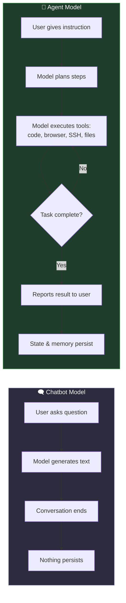

### The Coding Agent Precedent

Most people's first real exposure to agents is through tools like **Claude Code** or **OpenAI's Codex** — coding-focused agents that live in your terminal. These are excellent at what they do, but they share two limitations:

1. **Narrow scope**: they're built almost exclusively for coding tasks.
2. **Ephemeral existence**: they run only while your laptop is open and the process is active. Close the lid, and the agent's session dies. Switch machines, and you start from zero.

Hermes Agent takes the same fundamental idea — a model with hands — and removes both limitations. It's not restricted to coding, and critically, **it doesn't live on your laptop.**

> 💡 **Beginner tip:** Think of a coding agent like a assistant who only helps you at your desk and forgets everything when you leave the office. Hermes is more like an assistant with their own office who remembers every conversation, and you can call them from your phone, your laptop, or a friend's computer — it's always the same assistant, in the same place.

---

## 3. Who Built Hermes Agent and Why It Matters

Hermes Agent comes from **Nous Research**, an AI lab that, while smaller than OpenAI or Anthropic, has built a strong reputation in the open-source LLM community.

### Key facts about Nous Research:

| Attribute | Detail |
|---|---|
| Founded | Operating since 2023 |
| Known for | The "Hermes" series of fine-tuned language models |
| Community | Large, active Discord full of researchers and tinkerers |
| Track record | Consistent ship record — actual releases, not just announcements |
| License model | MIT license (fully open source) |

### Why the license matters

Hermes Agent isn't a SaaS product you subscribe to — it's software you **install, own, and modify**. This is a meaningful distinction:

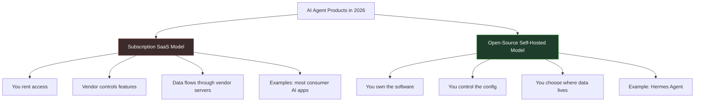

Released in February 2026 under an MIT license, Hermes has accumulated around 144,000 GitHub stars — a strong signal of developer interest, though star count alone doesn't tell you about ease of use (more on that later).

---

## 4. Architecture Deep Dive: How Hermes Actually Works

This is the part that took me longest to understand clearly, so let's slow down here.

### The Basic Setup Flow

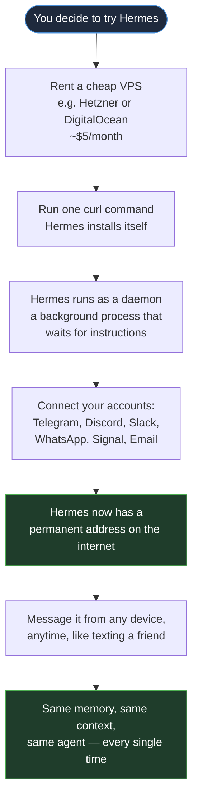

### The Key Architectural Insight

Here's the sentence that unlocks the whole concept:

> **Hermes has a permanent address, while you do not.**

Every other feature — the skills, the memory, the integrations — is a *downstream consequence* of this one design decision. Because the agent lives on a server rather than your device, it can:

- Keep running while you sleep
- Execute scheduled tasks without you present
- Accumulate memory across sessions indefinitely
- Be reached from literally any device with internet access

### A Day in the Life: Example Interaction Flow

Let's trace a concrete example — asking Hermes to monitor your AWS bill:

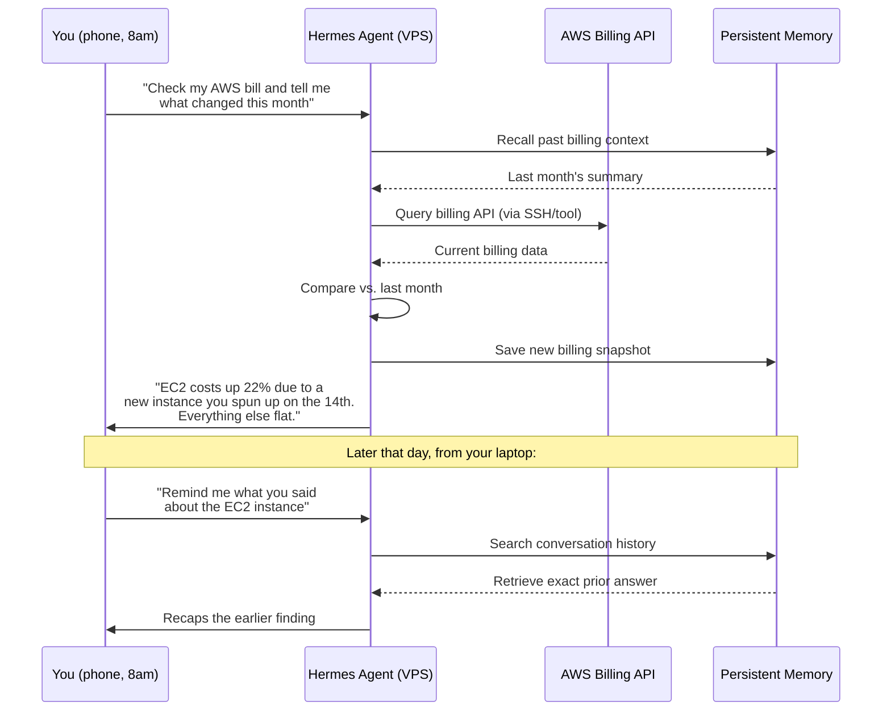

Notice: you asked from your phone, followed up from your laptop, and Hermes maintained full continuity. That's the persistent-agent model in action.

---

## 5. Core Capabilities and Tools

Out of the box, Hermes ships with roughly **40 built-in tools** — a fairly comprehensive baseline toolkit for a 2026-era agent.

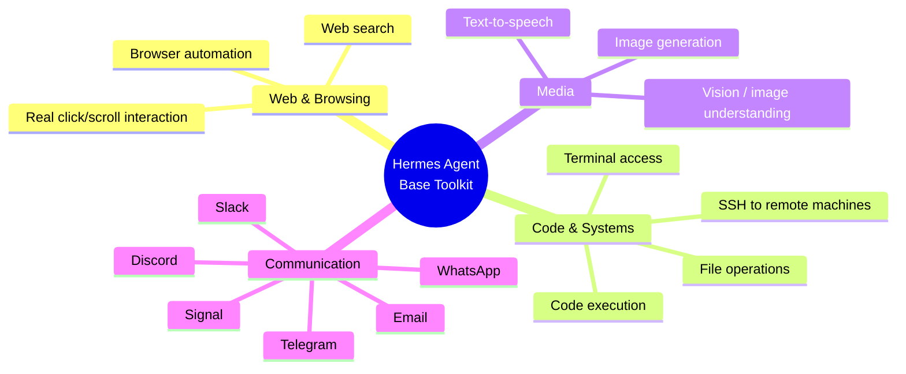

### Example: Multiple Ways the Toolkit Combines

**Example 1 — Research task:**
> "Find me three recent papers on quantization in earth observation foundation models."
Uses: web search → browser automation → summarization → message reply.

**Example 2 — Systems task:**
> "SSH into my staging server and check if the deploy from last night succeeded."
Uses: SSH tool → terminal command execution → log parsing → message reply.

**Example 3 — Creative task:**
> "Generate a diagram explaining our onboarding flow and send it to the #product channel."
Uses: image generation → Slack integration.

Each of these is a single natural-language instruction, but under the hood, Hermes is chaining multiple tools together autonomously — this chaining is the essence of what makes it an "agent" rather than a chatbot.

---

## 6. The Skills System Explained

This is arguably Hermes's most distinctive feature relative to competitors.

### What Is a Skill?

A **skill** is a small markdown file that teaches the agent a specific procedure or capability. Think of it as a recipe card the agent can reference and follow — except the agent can also *write new recipe cards itself* after solving a hard problem once.

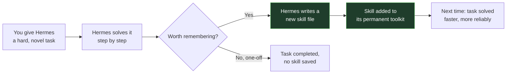

### Community Skills Hub — Notable Examples

| Skill Name | What It Does |
|---|---|
| **HyperFrames** | Generates videos by writing HTML compositions and rendering them frame-by-frame into MP4 — essentially "video as code" |
| **Manim** | Produces math explainer videos in the style of 3Blue1Brown |
| **ComfyUI driver** | Orchestrates image/audio generation pipelines |
| **Minecraft host** | Spins up and manages modded Minecraft servers |
| **Pokémon player** | Plays Pokémon through a headless emulator |
| **Kanban orchestrator** | Manages multiple worker subagents in a kanban-style workflow |
| **ASCII art generator** | Produces text-based art |
| **Knowledge-comic builder** | Turns information into comic-style visual explainers |
| **Infographic templates** | Generates structured infographics from data |

### Why This Matters More Than It Sounds

The individual skills are fun demos, but the underlying principle is what's genuinely valuable: **the system is open and extensible, and what you teach it stays taught.** This creates a compounding effect — the longer you use Hermes and the more problems it solves for you, the more capable and personalized it becomes, similar to how a well-maintained cookbook of personal recipes becomes more valuable the more you cook from it.

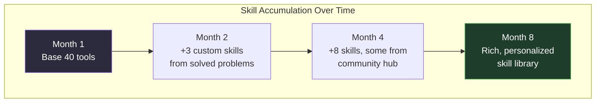

---

## 7. Memory and Learning: The Three-Layer System

Nous Research emphasizes this feature heavily in their marketing, and based on independent reviews, it's one of the few claims that actually holds up under scrutiny.

Most agents are, functionally, amnesiacs — they simulate continuity within a session but forget everything once it ends. Hermes is explicitly designed to avoid this.

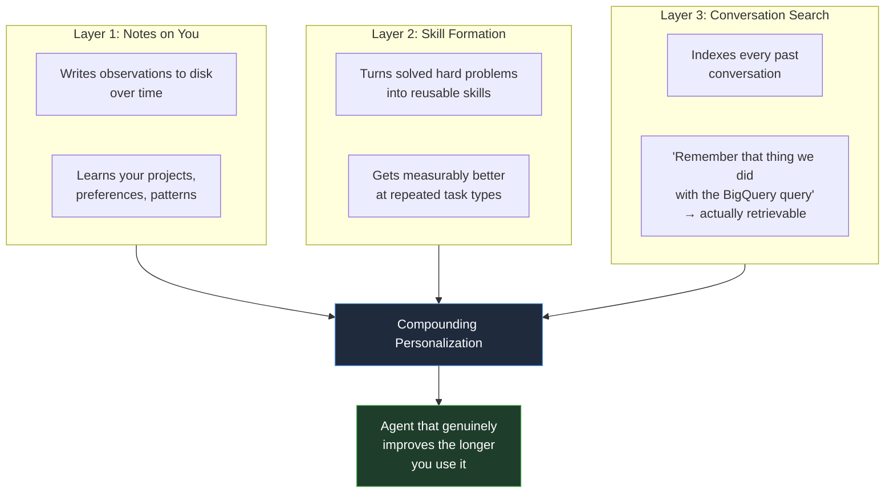

### Worked Example: Memory in Practice

**Week 1:** You tell Hermes, "I prefer concise summaries, no bullet points, under 100 words."
→ *Layer 1* logs this preference.

**Week 3:** You ask Hermes to debug a tricky race condition in your codebase. It takes 45 minutes but succeeds.
→ *Layer 2* converts the successful debugging approach into a reusable skill.

**Week 6:** You ask, "What was that fix we did for the race condition issue back in [month]?"
→ *Layer 3* searches conversation history and retrieves the exact prior exchange — and the response comes back concise, under 100 words, per your Week 1 preference.

This is the practical difference between a tool that "remembers" in name only and one that actually accumulates usable context.

---

## 8. Scheduling and Automation

Hermes includes built-in cron-style scheduling, but expressed entirely in natural language rather than cron syntax.

### Traditional cron vs. Hermes scheduling

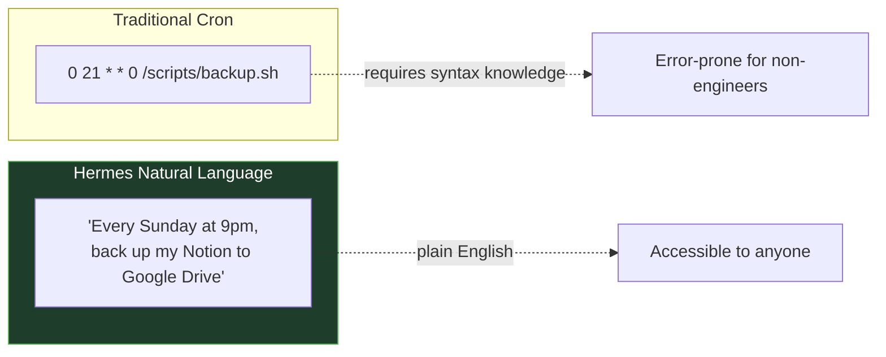

### Example Scheduled Tasks

- *"Every weekday at 8am, summarize my unread emails and DM me the result."*
- *"Every Sunday at 9pm, back up my Notion to Google Drive."*
- *"Check my server's disk usage every 6 hours and alert me if it's above 85%."*
- *"Every Friday afternoon, compile this week's GitHub PR activity into a summary."*

These tasks run indefinitely once set, requiring no further intervention — this is only possible *because* the agent lives on a persistent server rather than your local device.

---

## 9. Step-by-Step Setup Walkthrough

Here's a generalized walkthrough of what setting up Hermes typically involves. (Always check the official docs for the latest exact steps, as install processes evolve.)

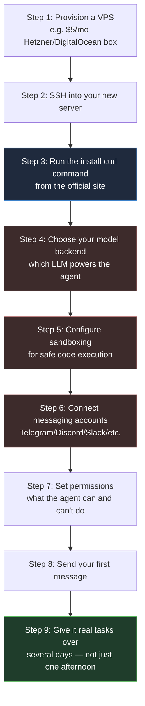

> ⚠️ **Where people actually get stuck:** Independent analysis of over 1,300 community comments identified setup complexity — specifically steps 4 through 7 above — as the single biggest reason people abandon Hermes before getting real value from it. The install command itself (Step 3) is easy. It's the configuration layer that trips people up.

### Practical Setup Tips

1. **Pick your model backend deliberately.** Hermes is model-agnostic — you're not locked into one LLM provider. If a better model releases next week, you can typically swap it in via a single config change.
2. **Don't skip sandboxing.** Since the agent can execute code and SSH into machines, proper sandboxing prevents a bad instruction (or bad output) from causing real damage.
3. **Start with one or two integrations.** Don't connect all five messaging platforms on day one — connect Telegram or Discord first, get comfortable, then expand.
4. **Write down your use case before installing.** People who install Hermes "just to try it" with no specific task in mind tend to abandon it faster than people who install it to solve one concrete recurring problem.

---

## 10. Real-World Use Cases

Let's ground all of this in concrete scenarios, organized by category.

### 📊 Personal Finance & Monitoring

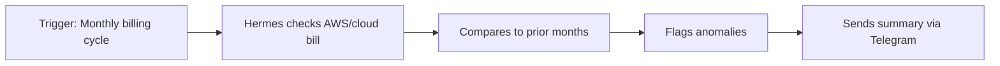
*Example prompt:* "Check my AWS bill weekly and alert me if any category jumps more than 15%."

### 🔬 Research Aggregation

*Example prompt:* "Every Monday, find and summarize new papers on [your research area] published that week."

### 📧 Inbox Management

*Example prompt:* "Every weekday at 8am, summarize my unread emails and DM me the result on Signal."

### 🖥️ DevOps & Server Monitoring

*Example prompt:* "SSH into my production server every hour and alert me if CPU usage exceeds 90% for more than 5 minutes."

### 🎨 Content Creation Pipelines

*Example prompt:* "Using the HyperFrames skill, generate a short explainer video from this outline and post it to our team Slack."

### 🗂️ Personal Knowledge Management

*Example prompt:* "Every Sunday night, back up my Notion workspace to Google Drive, and let me know if the backup fails."

### 🎮 Novelty / Hobby Projects

*Example prompt:* "Host a modded Minecraft server for my friend group and restart it automatically if it crashes."

### Comparison Table: Use Case Fit

| Use Case Type | Good Fit for Hermes? | Why |
|---|---|---|
| Recurring scheduled tasks | ✅ Excellent | Built for persistence and cron-style automation |
| Long-running research | ✅ Excellent | Can work for hours without you present |
| 24/7 monitoring/alerts | ✅ Excellent | Server-based, always on |
| Quick one-off coding help | ❌ Poor | Claude Code / Cursor are faster and more polished |
| "I want to try AI in 5 minutes" | ❌ Poor | Setup overhead is real |
| Multi-device continuity | ✅ Excellent | Same agent, same memory, any device |

---

## 11. Hermes vs. Alternatives (Detailed Comparison)

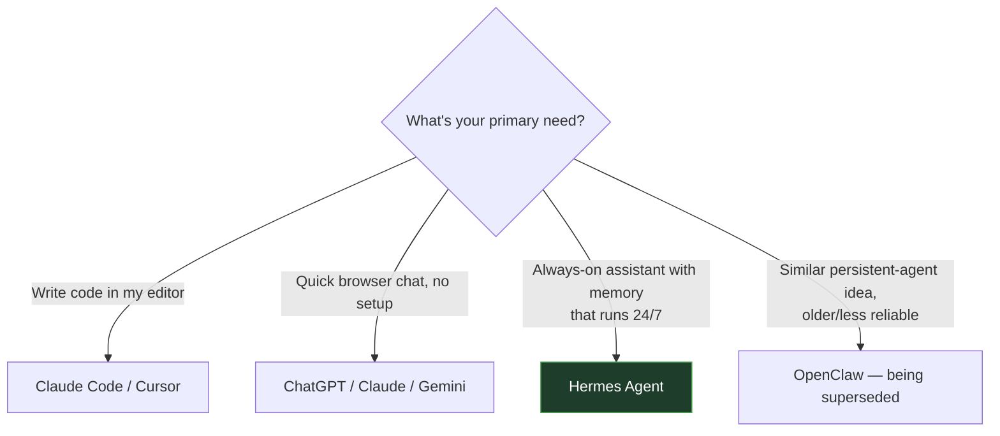

### Benchmark Snapshot: Coding Specifically

| Tool | SWE-bench Verified Score |
|---|---|
| Claude Code (on Opus 4.6) | 70–75% |
| Hermes Agent (varies by backend model) | 40–72% |

**Takeaway:** If coding output quality is your *primary* metric, a specialist coding agent currently outperforms Hermes. Hermes's strength isn't specialist coding performance — it's the generalist, persistent, memory-driven architecture wrapped around whatever model you plug in.

### Feature Comparison Matrix

| Feature | Hermes Agent | Claude Code | ChatGPT/Claude (browser) |
|---|---|---|---|
| Persistent across sessions | ✅ Yes | ❌ No | ❌ No |
| Runs when your device is off | ✅ Yes | ❌ No | ❌ No (unless using scheduled tasks features) |
| Reachable from multiple devices | ✅ Yes | ❌ No | ✅ Yes (but no task execution) |
| Specialist coding performance | 🟡 Good | ✅ Excellent | ❌ N/A |
| Setup time | 🔴 High | 🟢 Low | 🟢 Minimal |
| Model flexibility | ✅ Model-agnostic | 🟡 Limited | ❌ Fixed |
| Cost structure | Pay for VPS (~$5/mo) + model usage | Subscription/API | Subscription |

---

## 12. Honest Strengths and Weaknesses

### ✅ What's Genuinely Good

- **Reliability improvements over OpenClaw**, its closest predecessor/competitor.
- **Proactive communication** — it tells you what it's doing and pings you when scheduled jobs complete.
- **Model-agnostic design** — swapping to a better underlying model is a config change, not a migration project.
- **Compounding skill value** — the longer you use it, the more it knows and can do.

### ⚠️ What's Genuinely Hard

- **Setup friction is the #1 abandonment cause**, per community data analysis. The last 20% of configuration (accounts, permissions, model backend, sandboxing) is where most people give up.
- **Not a coding specialist** — if code generation quality is your top priority, dedicated tools currently win.
- **Requires ongoing patience** — the value proposition (getting better over time) means a single afternoon of testing won't show you what it's capable of.

```mermaid
quadrantChart
    title Hermes Agent: Effort vs Reward Profile
    x-axis Low Effort --> High Effort
    y-axis Low Reward --> High Reward
    quadrant-1 High Reward, High Effort
    quadrant-2 High Reward, Low Effort
    quadrant-3 Low Reward, Low Effort
    quadrant-4 Low Reward, High Effort
    Hermes Agent (long-term use): [0.75, 0.85]
    Hermes Agent (single afternoon): [0.75, 0.25]
    Browser chatbot: [0.15, 0.5]
    Claude Code for coding: [0.35, 0.85]
```

---

## 13. Who Should (and Shouldn't) Use Hermes

### ✅ Good Fit If You Are:
- Comfortable with a terminal and basic server administration
- Willing to invest an evening (or more) in setup
- Working on tasks that benefit from 24/7 execution: monitoring, scheduled research, recurring reports, automation
- Someone who wants a tool that improves the longer you use it, not an instant-gratification product

### ❌ Poor Fit If You Are:
- Primarily looking for a coding assistant → use **Claude Code** or **Cursor**
- Looking for instant value with zero configuration → use **ChatGPT**, **Claude**, or **Gemini** in your browser
- Unsure what you'd even use a persistent agent for → that's a legitimate reason to wait; the use case landscape is still being figured out even by early adopters

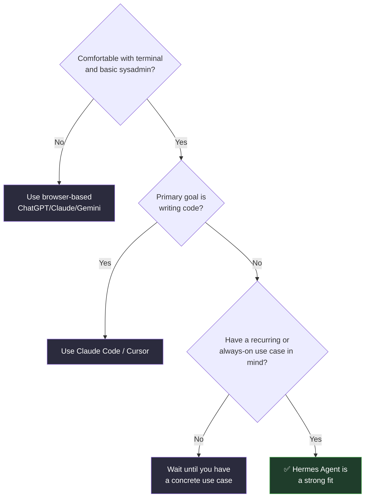

---

## 14. The Bigger Picture: What Hermes Represents

Every major AI product in 2026 is implicitly betting on a different vision of how people will use AI going forward:

| Product | Implicit Bet |
|---|---|
| ChatGPT | The conversation is the interface |
| Claude Code | The code editor is the interface |
| Cursor | The IDE is the interface |
| **Hermes Agent** | **A persistent, memory-rich presence is the interface** |

Hermes is making a distinct architectural bet: instead of a *session* you open and close, it's aiming for something closer to a *relationship* — an assistant with a permanent home, a growing memory, and a widening set of taught capabilities, reachable from wherever you happen to be.

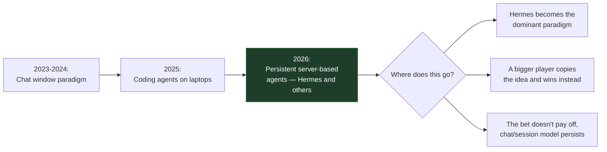

Whether Hermes specifically becomes the winning implementation of this idea, or simply the proof-of-concept that a larger competitor later absorbs and polishes, is genuinely uncertain. Both outcomes are plausible, and importantly — both would still validate the underlying architectural bet.

---

## 15. Quick-Start Checklist

Use this checklist before and during your first Hermes install:

- [ ] I have a concrete, recurring use case in mind (not just "trying it out")
- [ ] I have access to a VPS (Hetzner, DigitalOcean, or similar; ~$5/month tier is sufficient to start)
- [ ] I'm comfortable with basic terminal/SSH usage
- [ ] I've set aside a full evening for setup, not 15 minutes
- [ ] I've decided which model backend I want to start with
- [ ] I've picked ONE messaging platform to connect first (don't connect all five immediately)
- [ ] I understand sandboxing basics before giving the agent broad system access
- [ ] I've committed to giving it at least several days of real use before judging it
- [ ] I know where the community Discord and docs are, for when I get stuck

---

## 16. Final Thoughts

Hermes Agent isn't trying to be a better ChatGPT, and it isn't trying to be a better Claude Code. It's making a different bet entirely: that the future of AI assistance looks less like a window you open and more like a colleague with a permanent address who remembers you, learns your patterns, and works while you're not watching.

That bet comes with real costs — setup friction chief among them — and it isn't the right tool for everyone. But if your work involves anything recurring, anything that benefits from running while you sleep, or anything that would benefit from an assistant that actually remembers what you did together three months ago, Hermes represents one of the more architecturally honest attempts at that vision currently available, backed by a fully open-source, self-owned codebase rather than a subscription you're renting.

The install is one `curl` command away. The real work — and the real payoff — happens after that.