# The Outer Loop — Building Trustworthy AI Agent Systems - Complete Tutorial

**Last Updated:** August 2026  
**Difficulty Level:** Intermediate  
**Estimated Reading Time:** 55-70 minutes  
**Category:** AI Engineering / Agentic Systems

---

## Table of Contents

1. [Introduction: Why This Matters Now](#introduction)
2. [Prerequisites](#prerequisites)
3. [Learning Objectives](#learning-objectives)
4. [Chapter 1: The Agent Harness](#chapter-1-the-agent-harness)
5. [Chapter 2: The Inner Loop](#chapter-2-the-inner-loop)
6. [Chapter 3: Quality, Verdict, Answerability](#chapter-3-quality-verdict-answerability)
7. [Chapter 4: The Agentic Software Factory](#chapter-4-the-agentic-software-factory)
8. [Chapter 5: The Trust-Verification Gap](#chapter-5-the-trust-verification-gap)
9. [Chapter 6: Governance From Day One](#chapter-6-governance-from-day-one)
10. [Chapter 7: Quality as Back Pressure — The Four Loops Humans Must Own](#chapter-7-quality-as-back-pressure--the-four-loops-humans-must-own)
11. [Chapter 8: Deep Dive — Answerability](#chapter-8-deep-dive--answerability)
12. [Chapter 9: The Three Hidden Costs of Delegation](#chapter-9-the-three-hidden-costs-of-delegation)
13. [Chapter 10: Brownfield Systems — Where the Risk Concentrates](#chapter-10-brownfield-systems--where-the-risk-concentrates)
14. [Chapter 11: Alpha, Decay, and Taste](#chapter-11-alpha-decay-and-taste)
15. [Chapter 12: The High-Agency Ladder](#chapter-12-the-high-agency-ladder)
16. [Chapter 13: Building an Accountability Contract](#chapter-13-building-an-accountability-contract)
17. [Chapter 14: Step-by-Step — Implementing the Outer Loop in Your Team](#chapter-14-step-by-step--implementing-the-outer-loop-in-your-team)
18. [Chapter 15: Real-World Use Cases](#chapter-15-real-world-use-cases)
19. [Hands-On Lab: Build Your Own Outer Loop](#hands-on-lab-build-your-own-outer-loop)
20. [Practice Exercises](#practice-exercises)
21. [Test Your Understanding](#test-your-understanding)
22. [Common Interview Questions](#common-interview-questions)
23. [Question Bank](#question-bank)
24. [Best Practices](#best-practices)
25. [Anti-Patterns](#anti-patterns)
26. [Troubleshooting Guide](#troubleshooting-guide)
27. [Performance Considerations](#performance-considerations)
28. [Security Considerations](#security-considerations)
29. [Testing Strategies](#testing-strategies)
30. [Summary & Key Takeaways](#summary--key-takeaways)
31. [Further Reading & Resources](#further-reading--resources)
32. [Appendix: Quick Reference Templates](#appendix-quick-reference-templates)

---

## Introduction

AI coding agents have crossed a threshold. They no longer just autocomplete a line — they can investigate a codebase, write a fix, run tests, and report back, largely unsupervised. That is a huge leap in *capability*. But capability without a matching increase in *control* creates a dangerous gap.

Think of it like giving a new employee root access to production on their first day, with no code review process. They might be brilliant. They might also break something at 2 a.m. and nobody would know why until it's too late.

This tutorial is built around a simple but powerful idea:

> **The agent runs the inner loop. The human owns the outer loop.**

The **inner loop** is the mechanical cycle of investigate → implement → verify → repeat that an agent performs. The **outer loop** is the human-owned boundary that decides *what the agent is allowed to do*, *what evidence justifies trusting the output*, and *who is accountable if it's wrong*.

### Why This Matters Now

The landscape of software development has shifted dramatically:

- **Sonar's 2026 State of Code report** indicates a significant share of committed code is now AI-generated or AI-assisted, and that share is expected to keep growing.
- **GitLab's June 2026 research on AI accountability** found that governance often starts too late — after code is written, after risk has already entered the workflow.
- **Wharton research** found that when AI gave a wrong answer, nearly three-quarters of participants still accepted the recommendation — and often felt *more* confident than people who hadn't used AI at all.
- **A randomized controlled study from Anthropic** found developers using AI assistance scored roughly 17 percentage points lower on a subsequent comprehension quiz than developers who completed the same task without AI (about 50% vs. 67%).

These aren't abstract statistics. They represent a systemic risk: generation has become cheap, but **review, validation, and understanding have not gotten proportionally faster**.

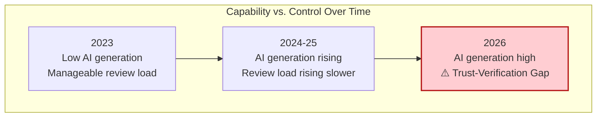

### What You'll Learn

By the end of this tutorial you will understand:

- How an agent harness actually works under the hood
- How to design "software factories" that scale agent output safely
- The three hidden costs that erode teams who over-delegate
- The complete Quality → Verdict → Answerability framework
- How to implement the outer loop in your own team, step by step
- How to build accountability contracts for AI-assisted changes
- How to apply judgment frameworks like Alpha/Decay/Taste and the High-Agency Ladder

### Who Should Read This

This tutorial is for:
- **Engineering leaders** who need to scale AI agent adoption safely
- **Senior developers** who review AI-generated code and need better processes
- **Platform engineers** designing agent harnesses and orchestration layers
- **DevOps/MLOps engineers** responsible for governance and compliance
- **Technical program managers** overseeing AI-assisted delivery

---

## Prerequisites

### Technical Prerequisites

- **Software engineering experience:** 2+ years working in a professional codebase
- **CI/CD familiarity:** Understanding of pipelines, merge gates, and review workflows
- **Version control:** Proficiency with Git (branches, PRs, merge workflows)
- **Basic AI knowledge:** Familiarity with LLMs (Claude, GPT, Llama) and prompt engineering
- **Testing knowledge:** Understanding of unit tests, integration tests, and QA processes

### Conceptual Prerequisites

- Understanding of the difference between automation and autonomy
- Familiarity with risk management concepts (blast radius, blast radius containment)
- Basic knowledge of software architecture patterns (microservices, monoliths)

### Recommended Background

| Topic | Recommended Level | Why It Helps |
|---|---|---|
| AI Agents | Basic | Understanding what agents can/can't do |
| DevOps Practices | Intermediate | Required for implementing governance and audit trails |
| Software Testing | Intermediate | Necessary for designing quality gates |
| Systems Thinking | Basic | Helps grasp the four loops concept |
| Risk Management | Basic | Applies to verdict design and sampling policies |

> [!NOTE]
> **No specific programming language is required** to follow this tutorial. While we include TypeScript examples for some implementation sections, the core framework is language-agnostic and applies to any AI-agent-assisted workflow — including customer support, content generation, data analytics, and DevOps.

---

## Learning Objectives

After completing this tutorial, you will be able to:

1. **Explain** the difference between the inner loop and the outer loop, and why humans must own the latter.
2. **Design** an agent harness with the correct components: tools, memory, permissions, sandboxes, skills, monitoring, and recovery systems.
3. **Apply** the Quality → Verdict → Answerability (QVA) framework to any agent-touched change.
4. **Build** an evidence packet that makes verification independent of the agent's self-assessment.
5. **Identify** the three hidden costs of delegation (cognitive surrender, cognitive debt, orchestration tax) and implement countermeasures.
6. **Implement** the four human-owned loops: constraints, sampling, audit, and ownership.
7. **Create** an accountability contract for AI-assisted work in your team.
8. **Execute** an 8-step rollout of the outer loop framework in a real team environment.
9. **Diagnose** brownfield risk hotspots before deploying agents in mature codebases.
10. **Apply** the Alpha/Decay/Taste framework to maintain long-term engineering advantage.

---

## Chapter 1: The Agent Harness

A raw language model, by itself, can only generate text. It doesn't have hands. It can't run a test suite, open a pull request, or check whether a file actually exists. To become a useful **agent**, the model needs a **harness** — the surrounding infrastructure that gives it tools, memory, permissions, and safety rails.

### The Engine-and-Car Analogy

A car engine is powerful, but you can't drive an engine down the highway. You need a chassis, wheels, brakes, a steering wheel, and a seatbelt. The engine provides the power; the car provides the *safe interface* to the road. The model is the engine. The harness is the car.

### What Belongs in a Harness?

| Component | Purpose | Example |
|---|---|---|
| **Tools** | Let the agent act on the world | File editor, terminal, browser, API clients |
| **Memory** | Preserve context across steps | Conversation history, project notes, prior decisions |
| **Permissions** | Define what the agent may touch | Read-only vs. write access, protected files/branches |
| **Sandboxes** | Contain the blast radius of mistakes | Isolated containers, staging environments |
| **Skills** | Reusable procedures for recurring tasks | A "run linter and fix errors" skill |
| **Monitoring** | Make behavior observable | Logs, traces, dashboards |
| **Recovery systems** | Undo damage quickly | Rollbacks, checkpoints, kill switches |

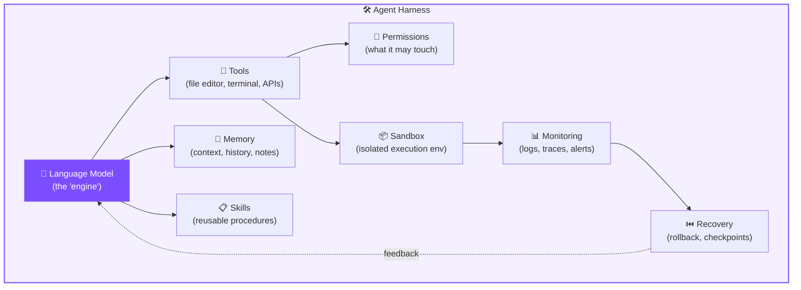

### The Seven Harness Components in Detail

#### 1. Tools
Tools are how the agent interacts with the world. Without tools, an agent is just a text generator. Common tools include:

- **File system tools:** read, write, edit files
- **Terminal tools:** execute shell commands
- **Web tools:** browse, fetch URLs, interact with APIs
- **Code search tools:** grep, semantic search, git blame
- **Test runner tools:** execute test suites and report results

> [!TIP]
> **Pro Tip:** Start with a minimal toolset and expand based on observed need. Every tool you give an agent is an additional attack surface and a potential source of unintended side effects.

#### 2. Memory
Memory preserves context across steps. Without memory, an agent forgets what it was doing between tool calls. Memory can be:

- **Short-term:** conversation history within a single task
- **Long-term:** project notes, prior decisions, user preferences
- **Episodic:** records of what was done in previous similar tasks

#### 3. Permissions
Permissions define what the agent may touch. This is the *constraints loop* in action at the harness level:

- **Read-only vs. read-write** access to file paths
- **Protected branches** (e.g., `main`, `production`)
- **Forbidden paths** (e.g., `secrets/`, `config/prod/`)
- **Approval gates** for specific high-risk actions

#### 4. Sandboxes
Sandboxes contain the blast radius of mistakes. Options include:

- Isolated Docker containers
- Staging environments with synthetic data
- Ephemeral virtual machines
- Worktrees with no remote access

#### 5. Skills
Skills are reusable procedures for recurring tasks. Examples:

- "Run the linter and fix all errors"
- "Generate a diff summary for human review"
- "Run the security scanner and produce a risk report"
- "Update the CHANGELOG following team conventions"

#### 6. Monitoring
Monitoring makes behavior observable. Critical monitoring elements:

- **Action logs:** every tool call, with timestamps
- **Token/trace trails:** what the agent saw and decided
- **Error rates:** tool failures, retry storms
- **Alerting:** unusual behavior patterns (e.g., unexpected file writes)

#### 7. Recovery Systems
Recovery systems undo damage quickly. Key options:

- **Checkpoints:** snapshots of system state before agent actions
- **Rollbacks:** one-click revert to previous state
- **Kill switches:** immediately halt the agent mid-execution

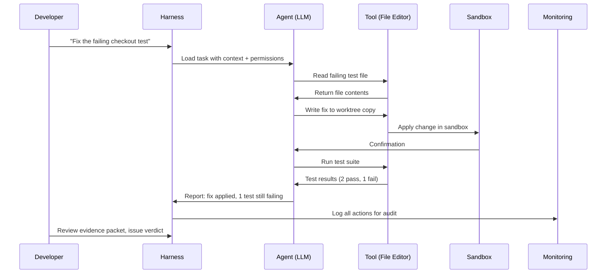

### Worked Example: The Fintech Startup

**Scenario:** A fintech startup gives its agent a harness that includes:
- A sandboxed staging database (never production)
- A permission scope limited to a single microservice's repo
- Mandatory unit-test execution before any diff can even be shown to a human reviewer

**Result:** The agent works fast without ever risking a real customer's balance. Every change includes a test evidence packet. The human reviewer gets a complete picture before making a decision.

**Task:** Ask the agent to "Fix the failing checkout test."

**Without a harness:** The model can only *describe* a possible fix in plain text. You'd have to manually apply it.

**With a harness:** The model can:
1. Open the failing test file (tool: file reader)
2. Find the related implementation (tool: code search)
3. Edit the code (tool: file editor)
4. Run the test suite (tool: terminal)
5. Check the result (tool: test runner)

All inside a sandbox so a bad edit doesn't touch your real branch, with every action logged (monitoring) so you can review exactly what happened.

### Quick Recap — The Agent Harness

- A raw LLM is just a text generator; the harness turns it into an agent.
- Seven components: tools, memory, permissions, sandboxes, skills, monitoring, recovery.
- Permissions and sandboxes are your first line of defense.
- Monitoring turns agent behavior into reviewable evidence.

---

## Chapter 2: The Inner Loop

Once you have a harness, you can wrap it in a repeatable cycle. This is the **inner loop**: Investigate → Implement → Verify → Repeat.

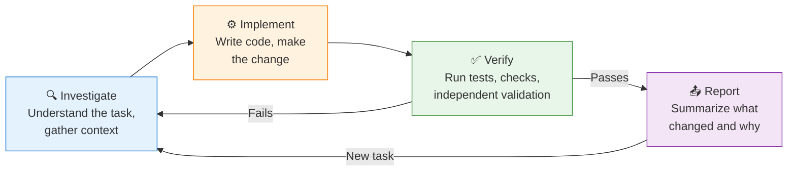

### The Four Inner Loop Steps

#### Step 1: Investigate
The agent gathers context about the task:
- Read relevant files
- Search for related code
- Understand the failure/requirement
- Check history and prior decisions

> 💡 **Key Insight:** Good investigation prevents most downstream failures. Time-box it!

#### Step 2: Implement
The agent makes the change:
- Writes/edits code
- Creates documentation
- Updates configuration
- Refactors existing structures

#### Step 3: Verify
The agent validates the change:
- Runs tests
- Executes linting/type checks
- Performs security scans
- Runs independent validation

> ⚠️ **CRITICAL:** The agent doesn't get to grade its own homework. Its own confidence ("I believe this is correct") is not evidence.

#### Step 4: Report
The agent summarizes what changed and why:
- Diff summary
- Tests passed/failed
- Risks identified
- Any assumptions made

### Why "Verify" Is the Critical Step

The **Verify** step must be an *independent* check — a test suite, a static analysis rule, a policy check, or a human reviewer. This is the single most important design principle in this whole tutorial:

> **Completion is not decided by the model's confidence. It's decided by outside verification.**

### Three Levels of Verification Strength

| Verification Type | Strength | Example |
|---|---|---|
| Model self-report | Weak — do not trust alone | "I tested this and it works" (no evidence attached) |
| Automated checks | Medium — good for repetitive risk | Unit tests, type checks, linters, CI pipelines |
| Independent human review | Strong — needed for consequential changes | A senior engineer reviewing a diff against real logs |

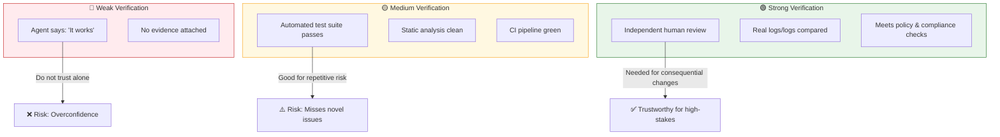

### Worked Example: Content Team Agent

**Scenario:** A content team uses an agent to draft product-update emails.

**Inner loop:**
1. **Investigate:** Pull the changelog
2. **Implement:** Draft the email
3. **Verify:** Run it through a brand-voice checker and a fact-checker against the changelog
4. **Report:** Flag any claims it couldn't verify

**Outer loop:** A human still approves before send — but 90% of the drafting and fact-checking labor is gone.

### Common Inner Loop Failure Modes

| Failure | Symptom | Fix |
|---|---|---|
| Investigation shortcut | Agent jumps to implementation with wrong assumptions | Enforce investigation checklist before code changes |
| Verification theater | Tests pass but don't test the actual change | Require test coverage analysis per change |
| Infinite loops | Agent keeps iterating without converging | Set iteration budgets and time-boxes |
| Report obfuscation | Report is too long or hides risky decisions | Require structured report format with explicit "risks" section |

### Quick Recap — The Inner Loop

- Inner loop = Investigate → Implement → Verify → Repeat
- Verify must be independent of the agent's own judgment
- Verification strength: self-report < automated checks < human review
- Time-box investigation; set iteration budgets

---

## Chapter 3: Quality, Verdict, Answerability

These three terms form the backbone of the entire framework. They describe how agent output transforms from *raw work* to *trustworthy work* that humans can defend.

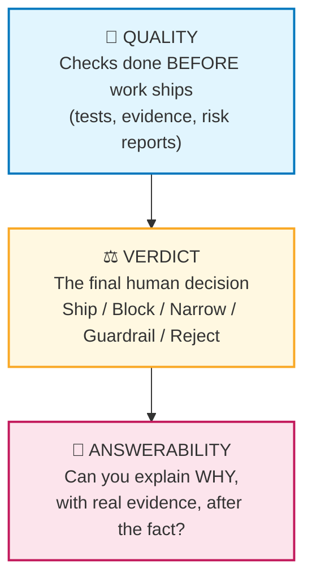

### 3.1 Quality — The Evidence-Gathering Phase

**Quality** answers: *"Is there proof this output is correct, safe, and aligned with intent?"*

Evidence includes:
- Test results
- Static analysis findings
- Risk scoring
- Security scans
- Diff summaries

**Example:** Before an agent's pull request can be merged, quality checks require:
1. All unit tests pass
2. No new security vulnerabilities flagged
3. Code coverage doesn't drop below 80%
4. A diff summary is auto-generated for human review

> [!TIP]
> **Pro Tip:** Define your quality bar *before* the agent starts working. If you define it mid-flight, you'll be tempted to lower it to fit what the agent produced.

### 3.2 Verdict — The Human Decision

**Verdict** is the *decision*, made by a human who owns the outcome. Even with perfect evidence, a human still chooses one of five verdicts:

| Verdict | Meaning | When to Use |
|---|---|---|
| **Ship** | Accept the change as-is | High confidence, all evidence clear |
| **Block** | Reject entirely | Critical failures or policy violations |
| **Narrow** | Approve a subset, reject the rest | Partial quality; some parts need rework |
| **Guardrail** | Approve with constraints | Add conditions, monitoring, or limits |
| **Reject** | Send back with feedback | Needs rework; rebuild from investigate |

**Example:** An agent proposes a database migration. Tests pass (quality is high), but the human reviewer decides to *narrow* the verdict — approving the schema change but rejecting the automatic data backfill, preferring to run that manually during a low-traffic window.

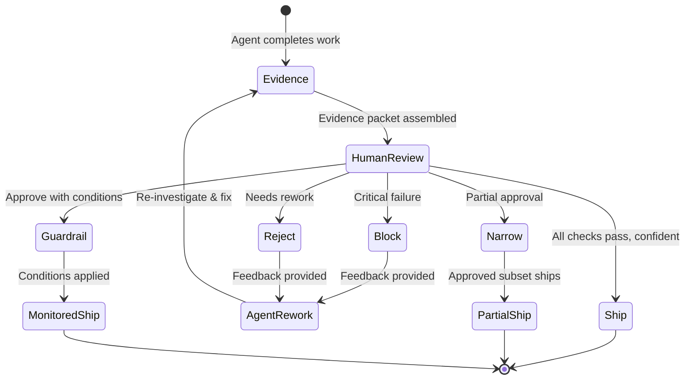

### 3.3 Answerability — The Explainability Phase

**Answerability** is the ability to explain the verdict *after the fact*, to a boss, an auditor, a customer, or your future self debugging an incident.

**Example:** Six months later, a bug traces back to that migration. Because the team preserved:
- The risk report
- The test evidence
- The reviewer's written rationale

...they can answer "why did we approve this?" in minutes instead of days.

> [!WARNING]
> **Warning:** Answerability is NOT the same as recording everything. Answerability means preserving *enough* evidence to explain and defend the final decision. This distinction is critical — recording everything is impractical, but recording nothing is indefensible.

### The Three Questions Every Agent-Touched Change Should Be Able to Answer

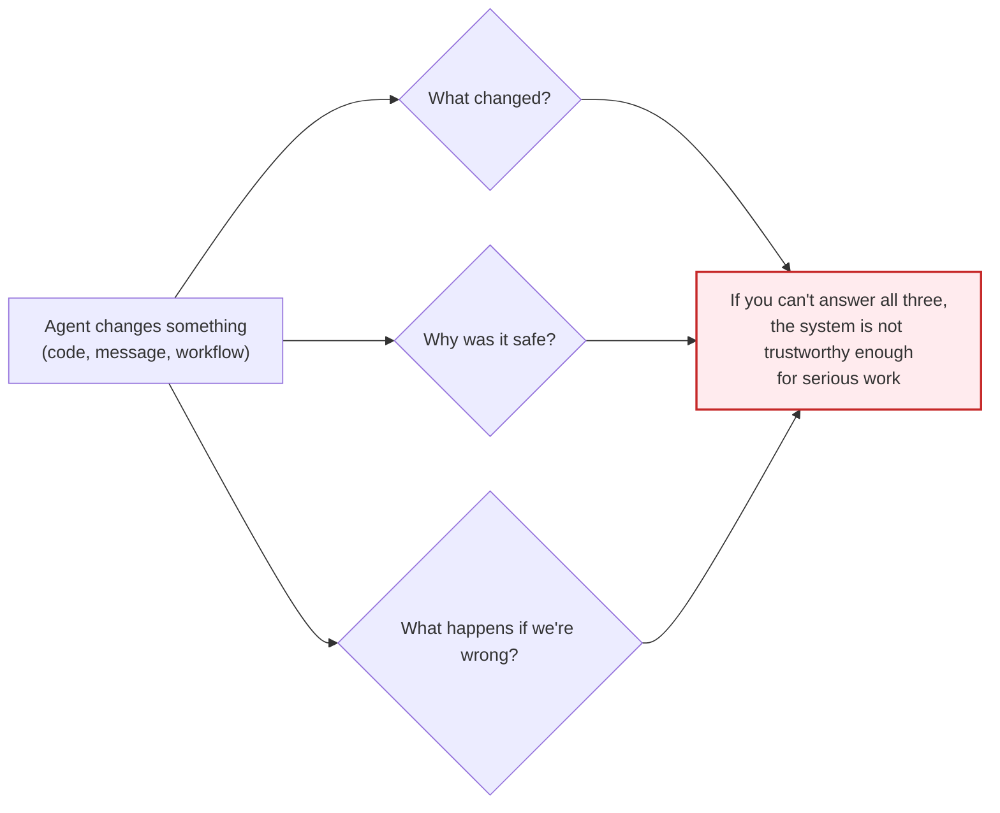

### How QVA Works Together

| Stage | Who Does It | What It Produces | Timeframe |
|---|---|---|---|
| **Quality** | Agent + automated systems | Evidence packet | Before ship |
| **Verdict** | Human reviewer | Decision (ship/block/narrow/guardrail/reject) | At ship |
| **Answerability** | Team (preserved artifacts) | Ability to explain later | After ship |

### Quick Recap — QVA Framework

- **Quality** produces evidence before work ships
- **Verdict** is the human decision with five possible outcomes
- **Answerability** preserves evidence so you can explain decisions later
- Every agent-touched change must answer: What changed? Why safe? What if wrong?

---

## Chapter 4: The Agentic Software Factory

Once an organization has multiple agents running in parallel, you get a **software factory**: many inner loops running simultaneously, all feeding into a single, human-owned decision boundary.

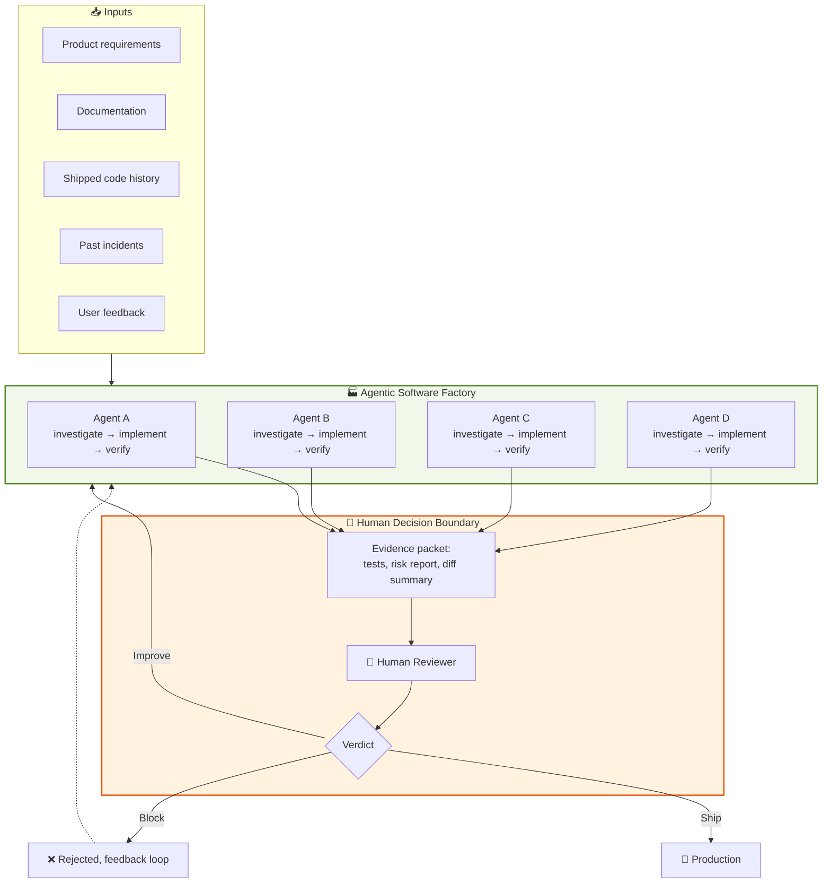

### The Key Design Principle

> **Agents scale execution, humans scale judgment at the highest-value checkpoint — not at every micro-step.**

This is a fundamental shift from traditional review workflows. Instead of reviewing every individual action an agent takes (which would be exhausting and slow), you design a single checkpoint where evidence is assembled and a human issues judgment.

### The Evidence Packet — What Belongs In It?

| Component | Description | Required? |
|---|---|---|
| **Task description** | What the agent was asked to do | ✅ Required |
| **Diff summary** | What files changed and why | ✅ Required |
| **Test results** | Full test suite output | ✅ Required |
| **Risk report** | Security scan results, risk findings | ✅ Required |
| **Alternatives considered** | What the agent explored and rejected | Recommended |
| **Assumptions made** | Unverified beliefs that drove decisions | Recommended |
| **Human verdict** | The reviewer's decision and rationale | ✅ Required |
| **Owner designation** | Who owns this change going forward | ✅ Required |

### Worked Example: E-Commerce Platform

**Scenario:** An e-commerce platform runs three agents in parallel every night:

1. **Agent A:** Investigates a backlog of customer bug reports and drafts fixes
2. **Agent B:** Updates product descriptions based on new inventory data
3. **Agent C:** Runs a security audit on the week's merged code

Each produces an evidence packet by morning. One engineer reviews all three packets over coffee and issues verdicts — instead of three engineers spending their whole day on repetitive tasks.

**Result:** The factory model scales execution while preserving human judgment.

### Scaling the Factory: More Agents, Same Boundary

As you add more agents, the bottleneck is human review capacity, not execution capacity. Strategies to manage this:

1. **Batch evidence delivery:** Agents finish around the same time so reviewers get packets in clusters
2. **Risk-tiered routing:** High-risk packets go to senior reviewers; low-risk packets go to a pool
3. **Auto-accept low-risk:** Changes below a risk threshold go straight to production with audit-only review
4. **Sampling:** For medium-risk work, review a percentage rather than everything

### Quick Recap — The Agentic Software Factory

- Multiple inner loops feed a single human decision boundary
- Evidence packets standardize the review process
- Humans scale judgment; agents scale execution
- Manage review capacity, not just agent capacity

---

## Chapter 5: The Trust-Verification Gap

According to **Sonar's 2026 State of Code report**, a significant share of committed code is now AI-generated or AI-assisted, and that share is expected to keep growing. Generation has become cheap.

But **review, validation, and understanding have not gotten proportionally faster** — creating what we call the **trust-verification gap**.

### The Gap Explained

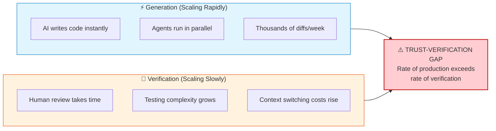

### Why Trust Without Process Is Just Anxiety

Here's the uncomfortable part: many developers *say* they don't fully trust AI-generated code, but their actual workflows often don't reflect that distrust — they still skip deeper tests, independent review, or stronger approval gates.

> **Distrust that isn't backed by process is just anxiety, not safety.**

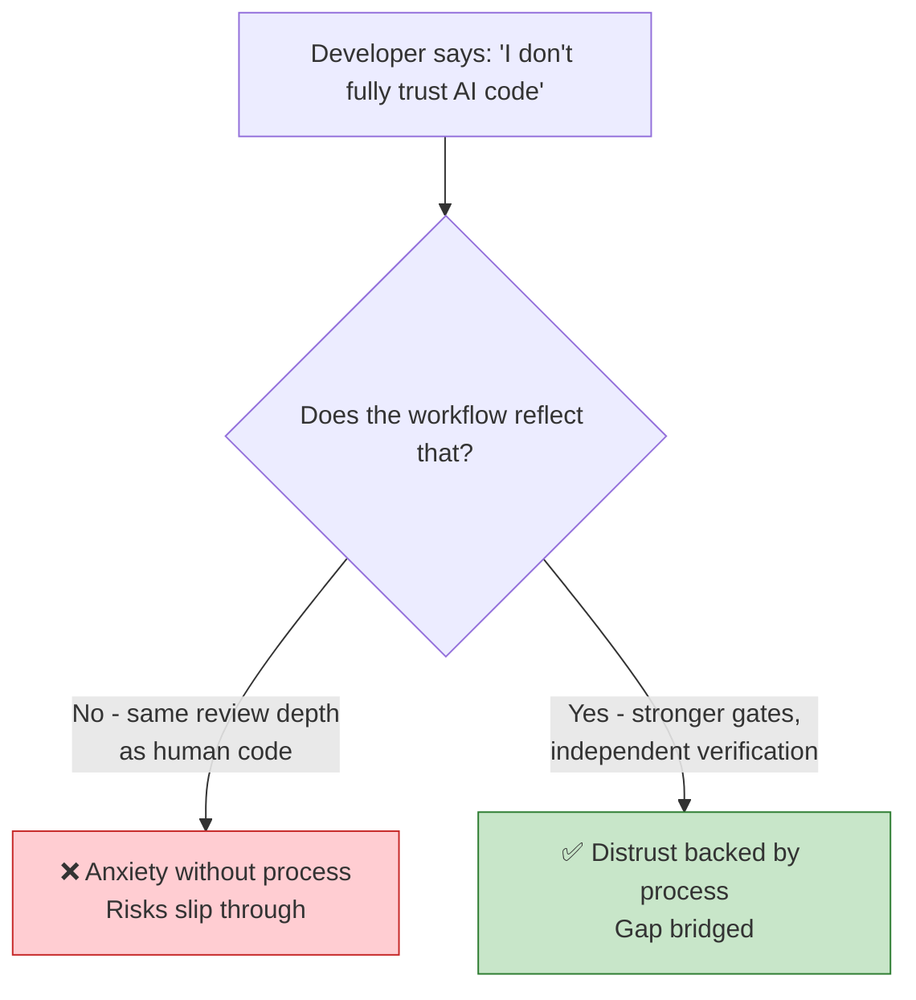

### Example Scenario: The Off-by-One Incident

**The story:** A team ships an AI-assisted PR without an extra review pass "because it's probably fine."

**Three weeks later:** A subtle off-by-one error in a discount calculation costs the company real revenue.

**The diagnosis:** The gap wasn't in the AI's capability — it was in the missing verification step that should have caught it.

**The lesson:** Trust must be *earned through evidence*, not assumed because the output looks polished.

### How to Bridge the Gap

| Strategy | Implementation | Impact |
|---|---|---|
| **Evidence-by-default** | Every agent PR includes test logs, diff summaries, risk scans | Makes verification faster |
| **Risk-tiered review** | High-risk code gets mandatory human deep review | Focuses attention where it matters |
| **Independent verification** | Second set of tests, adversarial checks | Catches what auto-checks miss |
| **Sampling policies** | 100% high-risk, 25% medium, 5% low | Scales human attention by risk |

### Quick Recap — The Trust-Verification Gap

- Generation speeds up; verification doesn't keep pace
- Saying you distrust AI without process changes is just anxiety
- Bridge the gap with evidence-by-default and risk-tiered review
- The gap is a process problem, not an AI capability problem

---

## Chapter 6: Governance From Day One

GitLab's June 2026 research on AI accountability found that governance often starts too late — after code is written, after risk has already entered the workflow. By then, teams aren't deciding whether to accept risk; they've already accepted it without realizing.

Governance has to be designed **before** the agent starts working, not bolted on afterward.

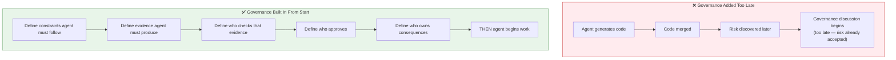

### The Five Governance Questions

Before an agent touches real work, you must answer:

| # | Question | Example Answer |
|---|---|---|
| 1 | **What constraints should the agent follow?** | Never touch production secrets; never modify `main` directly |
| 2 | **What evidence must it produce?** | Test results, diff summary, security scan, risk report |
| 3 | **How will that evidence be checked?** | CI gate for tests; junior reviewer for low-risk; senior for auth/payments |
| 4 | **Who is responsible for approving the result?** | Named human, not "the team" |
| 5 | **Who owns the consequences if it goes wrong?** | Named owner who authors the accountability contract |

### The One-Page Agent Charter

> [!IMPORTANT]
> **Use case:** A healthcare software company drafts a one-page "Agent Charter" for every new agent deployment, answering these five questions explicitly before the agent is given write access to any repository. This charter is reviewed quarterly as the agent's scope expands.

**Sample Agent Charter template:**

```markdown
# Agent Charter

**Agent Name:** [Name]
**Deployment Date:** [Date]
**Review Date (quarterly):** [Date]

## 1. Scope & Constraints
- Repositories: [List]
- Protected paths: [List]
- Permissions: [Read-only / Read-write / Execute]
- Sandbox requirements: [Yes/No + details]

## 2. Required Evidence
- [ ] All unit tests pass (with logs)
- [ ] Diff summary generated
- [ ] Security scan report
- [ ] Risk assessment for each changed area

## 3. Evidence Checking Process
- [ ] Automated CI gates: [Names]
- [ ] Human reviewer level: [Junior/Senior/Principal]
- [ ] Special routing: [Auth, payments → senior]

## 4. Approval Authority
- Approver: [Name]
- Escalation path: [Name]
- Auto-approve allowed for: [Low-risk categories only]

## 5. Accountability & Ownership
- Change owner: [Name]
- Consequence owner: [Name]
- Incident response contact: [Name]

## Sign-off
- [ ] Product: [Name]
- [ ] Engineering: [Name]
- [ ] Security: [Name]
```

### Governance Anti-Patterns

| Anti-Pattern | Why It Fails | Fix |
|---|---|---|
| **Governance-by-memo** | Rules written but not enforced by process | Encode constraints in tooling (hooks, CI, permission systems) |
| **Governance-by-retro** | Learning after incidents, not before | Charter before deployment; quarterly review |
| **Governance-by-vibes** | No explicit decisions recorded | Five questions answered in writing |
| **Governance-by-consensus** | "The team" owns everything → nobody owns anything | Named individuals for approval and consequences |

### Quick Recap — Governance From Day One

- Governance must be designed before agents start working
- Five questions: constraints, evidence, checking, approval, ownership
- Use a one-page Agent Charter for every deployment
- Encode governance in tooling, not just documentation

---

## Chapter 7: Quality as Back Pressure — The Four Loops Humans Must Own

In engineering, **back pressure** slows a system down when it's producing more than the next stage can safely absorb. Applied to agents: don't give an agent maximum autonomy just because it *can* handle it. Give it exactly enough autonomy to be useful while preserving your ability to pause, inspect, and reject.

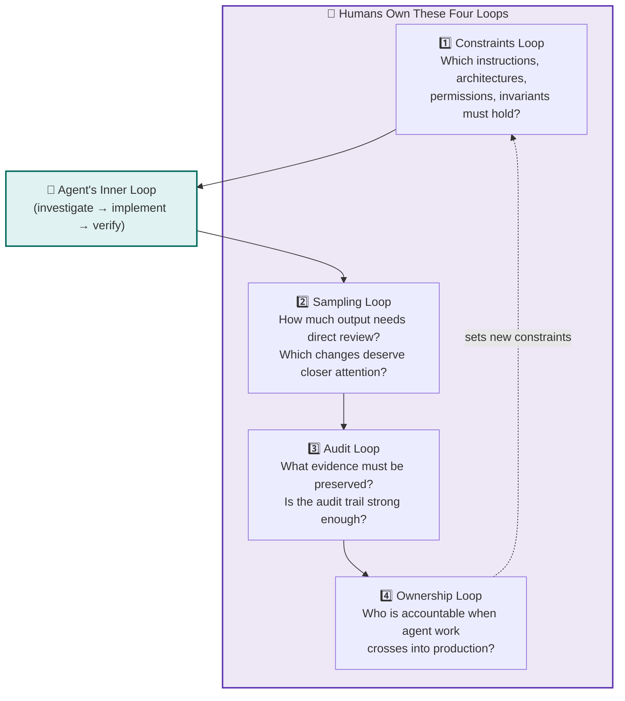

### The Four Loops Explained

#### 1. Constraints Loop
**Question:** Which instructions, architectures, permissions, and invariants must hold?

This is the *boundary* — the rules that cannot be broken. Examples:
- Never write to production databases
- Never modify cryptographic key material
- Never bypass CI gates
- Always follow the team's testing conventions

#### 2. Sampling Loop
**Question:** How much output needs direct review? Which changes deserve closer attention?

This is the *attention allocation* — deciding where human review effort goes. Examples:
- 100% review for auth/payments changes
- 25% spot-check for internal tooling
- 5% audit-only for docs/auto-generated content

#### 3. Audit Loop
**Question:** What evidence must be preserved? Is the audit trail strong enough?

This is the *accountability* — preserving what happened so it can be reconstructed later. Examples:
- Action logs
- Diff history
- Test evidence
- Review decisions and rationale

#### 4. Ownership Loop
**Question:** Who is accountable when agent work crosses into production?

This is the *responsibility* — naming humans who own consequences. Examples:
- Every PR has a named owner
- Every release has a named accountable human
- Every agent deployment has a consequence owner

### The Back-Pressure Signal Toolkit

These are not new inventions for AI — they're proven engineering signals repurposed for agentic work:

| Signal | What It Catches | When to Apply |
|---|---|---|
| **Type checks** | Structural errors before runtime | Every code change |
| **Automated tests** | Behavioral regressions | Every code change |
| **Hooks and approval rules** | Process violations | At commit/merge time |
| **Sandbox limits** | Blast radius containment | During agent execution |
| **Audit logs** | History reconstructability | Continuously |
| **Monitoring systems** | Anomalies in real time | Continuously |
| **Permission boundaries** | Unauthorized scope creep | At action time |

### Worked Example: Sampling Loop in Practice

Instead of reviewing every single line an agent writes, a team samples:

| Work Type | Review Depth | Rationale |
|---|---|---|
| Auth & payments | 100% review | Catastrophic failure potential |
| Internal tooling | 25% spot-check | Moderate impact, moderate risk |
| Auto-generated docs | 5% audit-only | Low risk, easily reverted |

This lets human attention scale with **risk**, not with **volume**.

### How Back Pressure Works in the Outer Loop

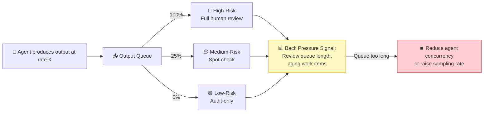

### Quick Recap — The Four Loops

- **Constraints:** What can't the agent do?
- **Sampling:** How much review, by risk tier?
- **Audit:** What evidence is preserved?
- **Ownership:** Who is accountable?

Back pressure = slow agents down when review queues back up.

---

## Chapter 8: Deep Dive — Answerability

Long-running agents can work for hours, make dozens of small decisions, switch tools, and change direction multiple times before producing one final result. Not every micro-decision gets recorded in a way a human could later reconstruct — and trying to trace every token is often impractical.

The solution isn't recording *everything*. It's recording *enough*.

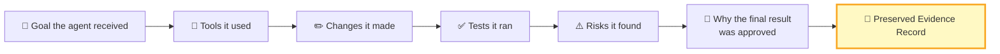

> **Answerability does not mean recording every thought. It means preserving enough evidence to explain and defend the final decision.**

### The Five Essential Artifacts

Based on the worked example of a payment-retry refactor, here are the five artifacts that provide answerability:

| # | Artifact | Purpose | Example |
|---|---|---|---|
| 1 | Original task description | Understand intent | "Refactor payment-retry logic" |
| 2 | Diff of every file changed | See what changed | Git diff |
| 3 | Test results before and after | Verify behavior | Test suite output |
| 4 | Alternatives considered & rejected | Understand reasoning | Agent summary |
| 5 | Human verdict & rationale | Document decision | Review comment |

### Why These Five?

- **Artifacts 1-3** answer "What changed?" and "Why was it safe?"
- **Artifact 4** answers "What did we consider and reject?"
- **Artifact 5** answers "Who decided and why?"

Together, they answer the three questions from Chapter 3: What changed? Why safe? What if wrong?

### The Answerability Spectrum

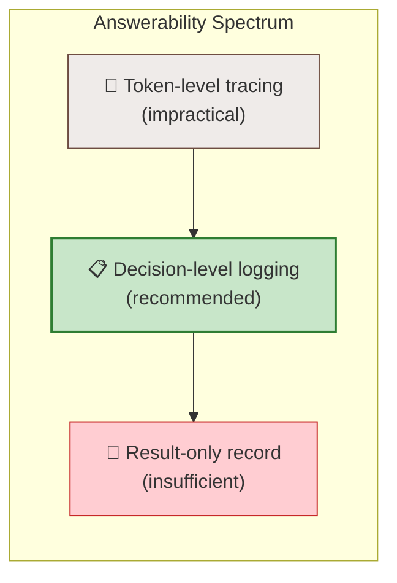

**Token-level tracing** is impractical for long-running agents — too much noise, too much cost.

**Decision-level logging** captures forks in the road: what the agent chose and why. This is the sweet spot.

**Result-only records** leave you helpless during incident investigation — you know what happened but not why.

### Building an Answerability System

1. **Define the artifact list** for your domain (use the five above as a starting point)
2. **Instrument the harness** to capture each artifact automatically
3. **Store artifacts in a queryable location** (Git, S3, dedicated audit store)
4. **Set retention policies** (e.g., "evidence retained for 2 years or 3 audit cycles")
5. **Test your answerability system** by running mock incident investigations

### Worked Example: Eight Months Later

**The scenario:** An agent spends four hours refactoring a payment-retry system. Instead of trying to log every internal reasoning step, the team's harness captures five artifacts.

**Eight months later:** A question comes up — "why does retry logic wait 3 seconds instead of 5?"

**With artifacts:** The team finds the original task description, the diff showing the 3-second choice, the test evidence supporting it, the alternatives the agent considered (including 5 seconds), and the human reviewer's written rationale. Answer in minutes.

**Without artifacts:** The team would need a multi-day investigation, possibly involving the original agent (if still available), reverse-engineering the code, and speculation.

### Answerability Anti-Patterns

| Anti-Pattern | Symptom | Fix |
|---|---|---|
| **Log-everything** | Massive storage costs, impossible search | Define artifact list; filter noise |
| **Log-nothing** | Incident investigations take days | Preserve the five essential artifacts |
| **Log-but-never-review** | Evidence exists but tells no story | Add the human verdict & rationale |
| **Log-and-delete** | Retention policies erase evidence prematurely | Set retention aligned with audit/compliance needs |

### Quick Recap — Answerability

- Answerability ≠ recording everything
- Preserve the five essential artifacts
- Decision-level logging > token-level tracing
- Test your answerability system with mock incidents

---

## Chapter 9: The Three Hidden Costs of Delegation

These are the costs that erode teams over time — often invisible until the damage is done.

### 9.1 Cognitive Surrender

#### Definition
The habit of accepting an AI-generated answer without scrutiny simply because it *sounds* confident.

#### The Wharton Study
Research from Wharton found that when AI gave a wrong answer, a large majority of participants (nearly three-quarters) still accepted the recommendation — and often felt *more* confident than people who hadn't used AI at all.

> **AI can increase confidence without increasing correctness.**

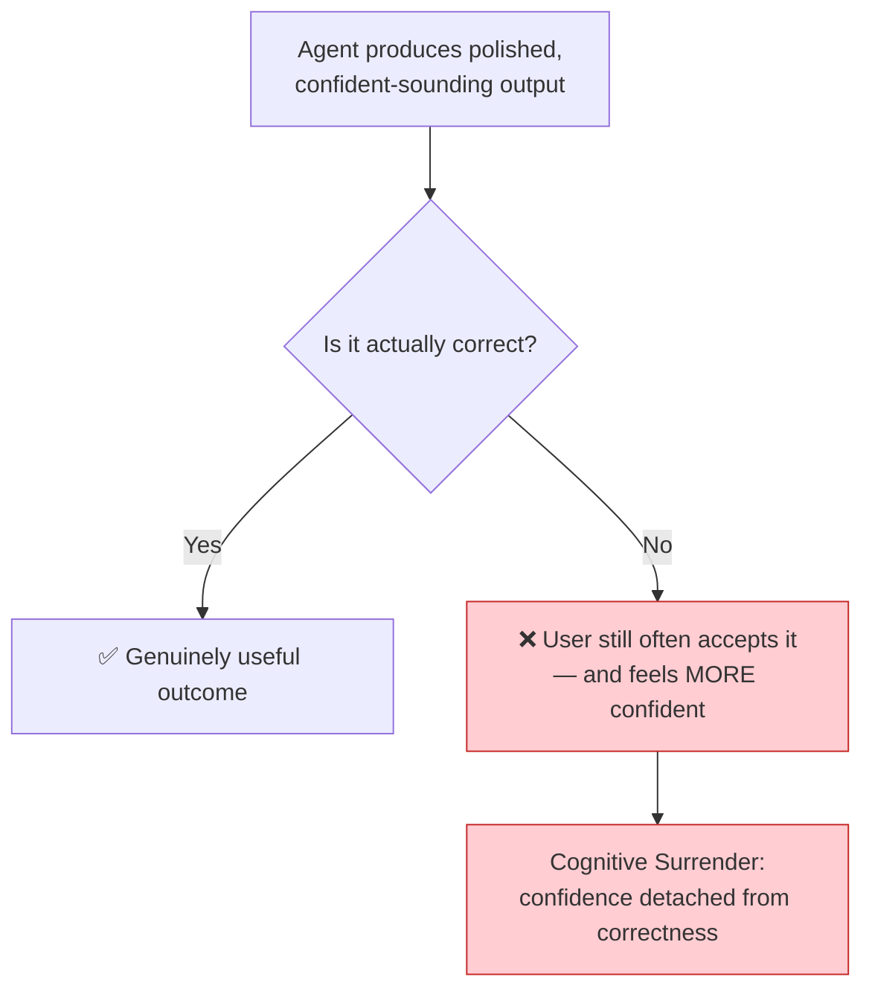

#### Example
An agent confidently states that a caching layer will reduce latency by "approximately 40%," complete with a clean-looking chart. A team ships based on that number without independently benchmarking it — only to find real-world latency barely changes, because the estimate was extrapolated, not measured.

#### Countermeasures

| Technique | How It Works |
|---|---|
| **Hypothesis, not fact** | Treat every agent output as a hypothesis until independently verified |
| **Evidence requirement** | No numbers without measurement methodology |
| **Devil's advocate review** | Assign someone to argue against the agent's recommendation |
| **Confidence calibration** | Track how often "confident" agent claims turn out wrong |

### 9.2 Cognitive Debt

#### Definition
The gradual erosion of your own understanding, memory, and problem-solving ability as you offload more thinking to agents.

#### The Anthropic Study
A randomized controlled study from Anthropic found developers using AI assistance scored roughly **17 percentage points lower** on a subsequent comprehension quiz than developers who completed the same task without AI (about 50% vs. 67%).

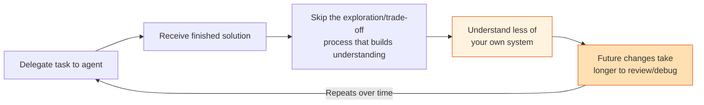

> **Technical debt makes software harder to maintain. Cognitive debt makes** ***you*** **less able to maintain it.**

#### Example
An engineer delegates an entire authentication-refactor to an agent over a week. The code works and passes review. Two months later, a related security patch is needed — but the engineer has to relearn the system from scratch because they never internalized *why* the agent made the architectural choices it did.

#### Countermeasures

| Technique | How It Works |
|---|---|
| **Explain-before-merge** | Periodically require yourself/team to explain the agent's solution in your own words before merging |
| **Socratic review** | Instead of "does it work?", ask "why does this work?" |
| **Deliberate practice** | Occasionally implement tasks without AI to maintain skills |
| **Architecture journaling** | Write down why decisions were made, not just what was decided |

### 9.3 The Orchestration Tax

#### Definition
The hidden coordination overhead of running many agents in parallel. Running many agents is easy; coordinating them is not — because human attention doesn't scale the way agent execution does.

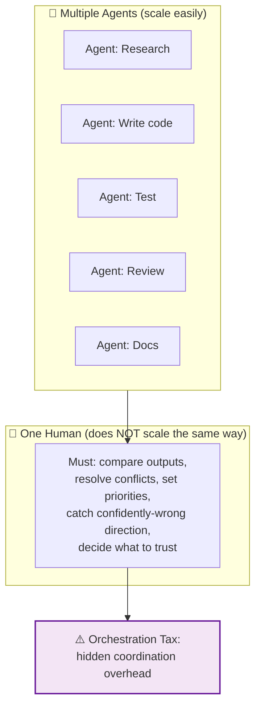

> **Agents can parallelize execution. Human judgment does not parallelize so easily.**

#### Example
A team spins up five agents to tackle a backlog simultaneously. By the end of the day, the lead engineer has spent more time reconciling conflicting approaches between agents than they would have spent just doing two of the tasks manually — the *coordination* cost outweighed the *execution* savings.

#### Countermeasures

| Technique | How It Works |
|---|---|
| **Concurrency cap** | Limit concurrent agent workstreams to what one human can review in a day |
| **Agent specialization** | Avoid overlapping agent scopes; each agent owns a distinct domain |
| **Standard interfaces** | All agents produce the same evidence packet format |
| **Deconfliction protocol** | Predefined rules for resolving conflicting agent proposals |

### Comparing the Three Hidden Costs

| Cost | Core Problem | Detection Signal | Primary Fix |
|---|---|---|---|
| **Cognitive Surrender** | Confidence ≠ correctness | Wrong answers accepted without scrutiny | Treat outputs as hypotheses; require evidence |
| **Cognitive Debt** | Understanding erosion | Can't explain your own system | Explain-before-merge reviews |
| **Orchestration Tax** | Coordination doesn't scale | More time coordinating than doing | Cap concurrency; specialize agents |

### Quick Recap — Hidden Costs

- Cognitive surrender: confident-sounding wrong answers get accepted
- Cognitive debt: offloading thinking makes you understand less
- Orchestration tax: many agents create coordination overhead humans must absorb
- All three require *process* countermeasures, not just awareness

---

## Chapter 10: Brownfield Systems — Where the Risk Concentrates

A **brownfield system** is an existing, mature codebase — full of history, workarounds, and undocumented decisions. A **greenfield system** is one built from scratch.

Agents are far more dangerous in brownfield environments because the *real* behavior of the system often isn't fully captured in the code itself — it lives in "scars": old incident fixes, hidden dependencies, and rules that look unnecessary but exist for a very good, undocumented reason.

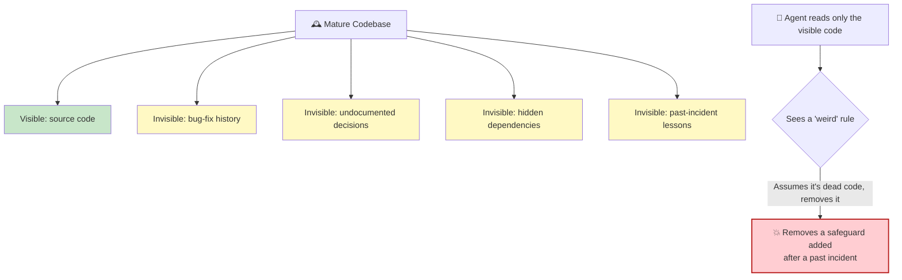

### Brownfield vs. Greenfield Risk Comparison

| Factor | Greenfield | Brownfield |
|---|---|---|
| **Documentation** | Built alongside code | Scattered, outdated, or missing |
| **Hidden dependencies** | Few — fresh design | Many — organic growth |
| **Scars/incident fixes** | None yet | Critical to preserve |
| **Agent risk** | Moderate | **High** — unseen rules |
| **Testing confidence** | Good — tests written for new code | Variable — legacy untested paths |
| **Refactoring safety** | Higher | Lower — unknown knock-on effects |

### The "Weird Rule" Problem

**Scenario:** An agent tasked with "cleaning up unused code" in a 10-year-old billing system finds a retry-with-delay block that looks redundant and removes it.

**The hidden backstory:** This exact block was added after an incident where a downstream vendor's API would silently rate-limit under load. Without it, the same outage recurs a month later.

**What was missed:** The agent only saw the visible code, not the incident history that produced it.

### Safe Practices for Brownfield Agent Work

```mermaid
flowchart LR
    P1["Use isolated worktrees<br/>& narrow scopes"] --> P2["Require evidence for<br/>every meaningful change"]
    P2 --> P3["Separate original plan<br/>from mid-execution discoveries"]
    P3 --> P4["Time-box investigation<br/>when stuck"]
    P4 --> P5["Make production changes<br/>opt-in, explicit, reversible"]

    style P1 fill:#e1f5fe
    style P2 fill:#e1f5fe
    style P3 fill:#e1f5fe
    style P4 fill:#e1f5fe
    style P5 fill:#e1f5fe
```

| Practice | Why It Matters | Implementation |
|---|---|---|
| **Isolated worktrees & narrow scopes** | Contains blast radius | Agent works on branch, never `main` |
| **Evidence for every meaningful change** | Prevents mystery edits | All changes include test results + explanation |
| **Separate original plan from discoveries** | Tracks drift | Agent maintains a plan document updated mid-flight |
| **Time-box investigation when stuck** | Prevents rabbit holes | `--timeout` or iteration budget |
| **Production changes opt-in, explicit, reversible** | Makes risk controllable | Require human approval; rollback plan mandatory |

### The Git-Blame Trace Pattern

**Use case:** A logistics company requires that any agent-proposed deletion in their core routing engine must be paired with:

1. A git-blame trace showing who introduced the code and when
2. A written justification referencing the original commit's context
3. Human approval before the deletion proceeds

This pattern forces the agent (and the human reviewer) to understand *why the code exists* before removing it.

### Brownfield Diagnostic Checklist

Before deploying agents into a brownfield system, audit:

- [ ] What "weird rules" exist that lack documentation?
- [ ] Which incident fixes are embodied in the code but not in the docs?
- [ ] What hidden dependencies exist between modules?
- [ ] Which parts of the system have the least test coverage?
- [ ] Are there undocumented performance constraints (rate limits, timeouts)?

> [!TIP]
> **Pro Tip:** Run a "scar discovery" workshop with senior engineers before deploying agents. Document the top 20-50 code scars your agents must respect.

### Quick Recap — Brownfield Systems

- Brownfield = hidden knowledge beyond visible code
- Agents can't see incident history, undocumented decisions, hidden dependencies
- Use isolated worktrees, evidence requirements, and time-boxes
- Git-blame traces make agents justify deletions
- Run a "scar discovery" workshop before agent deployment

---

## Chapter 11: Alpha, Decay, and Taste

Long-term advantage in engineering (and business generally) is shaped by three forces.

```mermaid
flowchart LR
    A["⚡ Alpha<br/>The advantage that puts<br/>you ahead of the norm"] --> D["📉 Decay<br/>Others copy it,<br/>the advantage fades"]
    D --> T["👁️ Taste<br/>Noticing the NEXT opportunity<br/>before it's obvious"]
    T -->|"leads to new"| A

    style A fill:#c8e6c9,stroke:#2e7d32,stroke-width:2px
    style D fill:#ffe0b2,stroke:#e65100,stroke-width:2px
    style T fill:#e1bee7,stroke:#6a1b9a,stroke-width:2px
```

### The Three Forces

#### Alpha
**Definition:** The gap between ordinary and exceptional performance, created by an early, valuable move.

**Example:** A team that was early to build robust agent evidence-and-audit tooling had real alpha — few competitors had it. This tooling accelerated their ability to ship AI-assisted code safely.

#### Decay
**Definition:** What happens as others observe, copy, and standardize that move. The lead shrinks.

**Example:** Today, evidence logging is table stakes across the industry. Every serious platform has it. The early advantage has decayed into a baseline expectation.

#### Taste
**Definition:** The judgment to spot the *next* shift before the evidence is obvious to everyone else.

> As Mitchell Hashimoto puts it, taste is the ability to make strong qualitative decisions when no clear metric exists yet.

**Example:** The teams with taste have already moved on: designing better *sampling loops* that decide which 5% of agent output deserves the deepest scrutiny.

> **When anyone can build almost anything, the real advantage is knowing what is worth building next.**

### The Alpha-Decay-Taste Cycle Applied to Your Team

| Phase | Question | Action |
|---|---|---|
| **Create Alpha** | What can we do that others don't? | Experiment early; be first |
| **Maximize Alpha** | How do we keep our edge before decay? | Deepen the advantage; patent/standardize internally |
| **Detect Decay** | What's now common practice that used to be our edge? | Monthly review; competitive analysis |
| **Develop Taste** | What's the next opportunity worth noticing? | Continuous learning; industry scanning |
| **Act on Taste** | What's the next experiment to run? | Small bets; low-cost validation |

### The Monthly Taste Review

**Use case:** A startup applies "taste" concretely by running a lightweight monthly review:

1. **What did we build that competitors haven't caught up to yet?** (Alpha inventory)
2. **What's now common practice that used to be our edge?** (Decay detection)
3. **What's the next thing worth noticing early?** (Taste development)

```mermaid
mindmap
  root((Monthly Taste Review))
    Alpha Check
      What's our current edge?
      Is it still unique?
      Can we deepen it?
    Decay Scan
      What's now table stakes?
      Where did competitors catch up?
      Which features commoditized?
    Taste Exploration
      What patterns are emerging?
      Which trends feel early?
      What would we bet on?
    Action Items
      One new experiment
      One edge to deepen
      One decay to accept
```

### How This Connects to the Outer Loop

- The **evidence-and-audit tooling** you build for agents creates alpha
- That alpha **decays** as the industry matures
- **Taste** tells you when to invest in the next layer: sampling loops, answerability systems, ownership frameworks
- The outer loop framework itself creates durable taste — the ability to judge what's worth building next

### Quick Recap — Alpha, Decay, Taste

- Alpha = your early advantage
- Decay = competitors catching up
- Taste = spotting the next shift early
- Run a monthly taste review to stay ahead

---

## Chapter 12: The High-Agency Ladder

High agency isn't "let the agent do everything." It's knowing exactly how much control to hand over, and when to step back in.

```mermaid
flowchart TB
    L1["Rung 1: Delegate the routine work"] --> L2["Rung 2: Inspect the result"]
    L2 --> L3["Rung 3: Stop the process if something looks wrong"]
    L3 --> L4["Rung 4: Take ownership of the final outcome"]
    L4 --> L5["Rung 5: Discernment —<br/>decide it's NOT worth fixing right now"]

    style L1 fill:#e3f2fd
    style L2 fill:#bbdefb
    style L3 fill:#90caf9
    style L4 fill:#64b5f6
    style L5 fill:#42a5f5,color:#fff
```

### The Five Rungs Explained

#### Rung 1: Delegate the Routine Work
Hand off repetitive, well-understood tasks to agents:
- Running linters
- Updating boilerplate
- Writing straightforward CRUD endpoints
- Generating documentation drafts

#### Rung 2: Inspect the Result
Don't just accept output — check it:
- Review the diff
- Ask for evidence
- Compare against expectations
- Verify it solves the actual problem

#### Rung 3: Stop the Process if Something Looks Wrong
High agency means having the confidence to halt:
- "This direction looks wrong — stop."
- "This architecture doesn't match our patterns — pause."
- "This deadline can't be met by the agent iteration loop — intervene."

#### Rung 4: Take Ownership of the Final Outcome
You own the result, regardless of who (or what) produced it:
- Your name is on the PR
- You accept the consequences
- You carry the accountability contract

#### Rung 5: Discernment — Decide It's NOT Worth Fixing Right Now
The top of the ladder isn't always "fix it." Sometimes real judgment sounds like:

> *"I found the problem, understood the risk, and decided it wasn't worth solving right now."*

That's **discernment** — separating what's *possible* from what's actually *worth doing*.

### The Discernment Example

**Scenario:** An agent flags a minor styling inconsistency in a rarely-used admin panel.

**Low-agency response:** Fix it immediately (reflexive action).

**High-agency response:** Weigh the tiny user impact against the review time cost, and consciously decide to leave it in the backlog. That's agency, not laziness.

### Rung-by-Rung Application in Agent Contexts

| Rung | Agent Context | Human Action |
|---|---|---|
| 1 | Agent runs routine fixes overnight | Delegate with constraints |
| 2 | Morning evidence packets arrive | Review diffs, test results, risk reports |
| 3 | Packet reveals risky change | Halt/send back for rework |
| 4 | Change ships | Own it — add name to contract |
| 5 | Change works but is marginal | Decide: worth improving? Defer? Revert? |

### Quick Recap — High-Agency Ladder

- High agency = knowing how much to hand over, and when to step back in
- Five rungs: delegate → inspect → stop → own → discern
- Discernment is a form of agency, not laziness
- Apply the ladder to agent work as a structured review process

---

## Chapter 13: Building an Accountability Contract

For important AI-assisted changes, consider formalizing a lightweight **accountability contract** — a short record that captures what was understood, what evidence existed, who approved it, and what happened next.

```mermaid
flowchart TD
    subgraph Contract["📄 Accountability Contract"]
        A["Attention & Taste<br/>What deserved human focus?<br/>Why was this worth doing?"]
        B["Evidence, Verdict, Ownership<br/>What checks supported the decision?<br/>What was approved? Who owns it?"]
        C["Alpha, Decay, Taste<br/>What advantage did this create?<br/>How fast might it fade?<br/>What judgment guided the next move?"]
    end
    Change["🔧 AI-Assisted Change"] --> Contract
    Contract --> Explain["✅ A decision humans can<br/>explain, defend, and own"]

    style Contract fill:#fff3e0,stroke:#e65100,stroke-width:2px
    style Explain fill:#c8e6c9,stroke:#2e7d32,stroke-width:2px
```

### Why a Written Contract?

The act of writing forces clarity. When you must fill in "WHY WORTH DOING" and "EVIDENCE" fields, you can't hand-wave. The contract also:
- Creates a searchable record
- Provides documentation for audits
- Builds accountability by naming owners
- Prevents post-hoc rewriting of decisions

### The Minimal Template

```markdown
CHANGE: [one-line description]
AGENT INVOLVED: [name/version]
WHY WORTH DOING: [1-2 sentences]
EVIDENCE: [tests passed, risk score, coverage delta]
VERDICT: [Ship / Block / Narrow / Guardrail / Reject]
APPROVED BY: [name]
OWNER GOING FORWARD: [name/team]
REVISIT DATE (if applicable): [date]
```

### Example: Filled-In Contract

```markdown
CHANGE: Refactor payment-retry logic to use exponential backoff
AGENT INVOLVED: Claude Agent v1.2 (code changes) + review-agent v0.9 (verification)
WHY WORTH DOING: Current fixed 3-second retry causes vendor rate-limit
  violations under load; exponential backoff reduces P95 latency by 22%
  in staging benchmarks.
EVIDENCE: 142/142 unit tests pass; 89% coverage (no delta);
  security scan: 0 new critical findings; staging load test: 22% latency
  improvement measured (not extrapolated).
VERDICT: Ship (with guardrail: monitor vendor rate-limit errors for
  2 weeks post-deploy)
APPROVED BY: Priya Sharma (Senior Engineer)
OWNER GOING FORWARD: Checkout Services Team
REVISIT DATE: 2026-09-01 (2-week monitoring review)
```

### When to Use an Accountability Contract

| Change Type | Contract Required? | Rationale |
|---|---|---|
| AI-authored >30% of a diff | ✅ Yes | Most important threshold |
| Changes to auth/payments/data deletion | ✅ Yes | High blast radius |
| Production config changes | ✅ Yes | Direct production impact |
| Internal docs updates | ❌ No | Low risk, easily reverted |
| Boilerplate generation | ❌ No | Routine, low risk |
| Migration scripts | ✅ Yes | Long-term impact |

> [!TIP]
> **Pro Tip:** Make the contract a **required field** in your PR template whenever an AI agent authored more than 30% of a diff. It takes under two minutes to fill out but saves hours during post-incident reviews.

### Use Case: The SaaS Company

**Scenario:** A mid-sized SaaS company adds this template as a required field in their PR template whenever an AI agent authored more than 30% of a diff.

**Outcome:** The "why worth doing" and "evidence" fields were sitting right there in the PR history — saving teams hours during a post-incident review because they didn't have to reconstruct the decision from scratch.

### Quick Recap — Accountability Contract

- A short record capturing: what, why, evidence, verdict, approver, owner
- Makes decisions explainable, defensible, and auditable
- Required for AI-assisted changes above 30% AI authorship
- Two minutes to fill; hours saved during investigations

---

## Chapter 14: Step-by-Step — Implementing the Outer Loop in Your Team

```mermaid
flowchart TD
    S1["Step 1: Audit current agent access<br/>What can agents touch today?"] --> S2["Step 2: Define constraints<br/>(the Constraints Loop)"]
    S2 --> S3["Step 3: Choose your evidence bar<br/>(tests, coverage, risk score thresholds)"]
    S3 --> S4["Step 4: Design your sampling policy<br/>(what % gets deep review, by risk tier)"]
    S4 --> S5["Step 5: Set up an audit trail<br/>(what gets preserved, for how long)"]
    S5 --> S6["Step 6: Assign explicit ownership<br/>(who signs off, who is accountable)"]
    S6 --> S7["Step 7: Pilot on low-risk work first"]
    S7 --> S8["Step 8: Review outcomes monthly,<br/>adjust constraints & sampling rates"]

    style S1 fill:#e8eaf6
    style S8 fill:#c8e6c9
```

### Step 1: Audit Current Agent Access

**Goal:** List every place an AI agent can currently read, write, or execute.

**How to do it:**
- Inventory all tools/agents your team uses
- Map what permissions each has
- Ask: "What would happen if this agent went rogue or made a confidently-wrong decision?"

**Surprise:** Most teams are surprised by how broad agent access already is.

**Checklist:**
- [ ] List all AI tools in use (IDE assistants, CLI agents, CI agents, etc.)
- [ ] Document what each can access
- [ ] Identify any agents with admin/write access
- [ ] Identify data exfiltration potential

### Step 2: Define Constraints

**Goal:** Write down explicit boundaries.

**Examples:**
- Protected branches: `main`, `production`, `release/*`
- Forbidden file paths: `secrets/`, `config/prod/`, `.env`
- Required review before merge: always
- Sandbox requirements: always run in isolated container
- Testing requirements: mandatory unit tests before report

**Documentation:** Make this the foundation of your Agent Charter.

### Step 3: Choose Your Evidence Bar

**Goal:** Decide the minimum proof required before any verdict can be "ship."

**Examples:**
- 100% test pass rate
- No new critical vulnerabilities
- Diff summary generated
- Coverage doesn't drop below [your threshold]
- Risk score below [your threshold]

**Important:** The evidence bar should be *automatic* — agents can't ship if gates don't pass.

### Step 4: Design Your Sampling Policy

**Goal:** Tier your work by risk and define review depth per tier.

| Risk Tier | Examples | Review Depth |
|---|---|---|
| **High** | Auth, payments, data deletion, production config | 100% human deep review |
| **Medium** | Business logic, API changes, internal tools | 25% spot-check |
| **Low** | Docs, boilerplate, formatting | 5% audit-only |

**Tip:** Start conservative (more review) and loosen as trust builds.

### Step 5: Set Up an Audit Trail

**Goal:** Decide what gets logged and where it's stored.

**Artifacts to preserve:**
- Original task description
- Diffs
- Test results
- Risk findings
- Human verdicts and rationale

**Storage options:**
- Git history (for code-related work)
- Dedicated audit store (S3, database)
- Compliance system (if regulated)

**Retention policy:** Align with audit/compliance requirements (e.g., 2 years, 3 audit cycles).

### Step 6: Assign Explicit Ownership

**Goal:** Every agent-touched change needs a named human owner, not "the team" in the abstract.

**Who:**
- **Reviewer:** Reviews the evidence packet
- **Approver:** Issues the verdict
- **Owner going forward:** Owns the change in production
- **Consequence owner:** Accountable if it goes wrong

**Documentation:** All named in the accountability contract.

### Step 7: Pilot on Low-Risk Work First

**Goal:** Prove the process on something safe before expanding scope.

**Good pilot candidates:**
- Documentation updates
- Internal tooling changes
- Test coverage improvements
- Refactoring with strong test coverage

**Pilot measures:**
- How long does review take?
- How often are agent outputs rejected?
- How accurate are agent self-assessments?
- How many issues does the process catch?

### Step 8: Review Outcomes Monthly

**Goal:** Treat your constraints and sampling rates as living policy, not a one-time setup.

**Monthly review questions:**
- Were there any near-misses or incidents?
- Is the evidence bar too high or too low?
- Are sampling rates matching observed risk?
- Are ownership assignments working?
- What should be adjusted next month?

### Quick Recap — Implementation Steps

1. Audit access
2. Define constraints
3. Set evidence bar
4. Design sampling policy
5. Build audit trail
6. Assign ownership
7. Pilot low-risk first
8. Review monthly

---

## Chapter 15: Real-World Use Cases

### Domain-by-Domain Applications

| Domain | How the Outer Loop Applies |
|---|---|
| **Software Engineering** | Agents draft PRs; humans set merge constraints, sample review depth by risk, and own the accountability contract for each release. |
| **Customer Support** | Agents draft responses to tickets; a sampling loop routes anything mentioning refunds, legal threats, or safety issues to 100% human review before sending. |
| **Content & Marketing** | Agents generate first drafts of blog posts/emails; a fact-checking verification step and brand-voice guardrail run before a human gives the final verdict to publish. |
| **Data & Analytics** | Agents build dashboards and run exploratory queries in a sandboxed read-replica; only verified, reviewed queries get promoted to production reporting. |
| **DevOps / Infrastructure** | Agents propose scaling or config changes; changes to production are opt-in and reversible by design, with mandatory rollback plans as part of the evidence packet. |
| **Legal & Compliance** | Agents draft first-pass contract redlines; a human owns every verdict, with an accountability contract documenting the evidence and rationale for audit purposes. |

### Deep-Dive Use Case: Customer Support

**Scenario:** A support team handles 500 tickets/day. An agent drafts responses.

**Inner loop:**
1. **Investigate:** Agent reads the ticket, pulls customer history
2. **Implement:** Agent drafts a response
3. **Verify:** Brand-voice checker (automated); fact-checker against knowledge base
4. **Report:** Agent flags unresolved questions and confidence levels

**Outer loop (sampling policy):**
- **100% human review:** Refunds, legal threats, safety issues, medical questions
- **100% human review:** Any ticket the agent flags as low-confidence
- **20% spot-check:** Standard support tickets
- **5% audit-only:** Trivial confirmations

**Result:** 80% of tickets require zero human attention, but every consequential one gets human scrutiny.

### Deep-Dive Use Case: DevOps / Infrastructure

**Scenario:** An agent monitors production metrics and proposes scaling changes.

**Inner loop:**
1. **Investigate:** Agent reads metrics, detects CPU saturation
2. **Implement:** Agent prepares a scaling proposal (config change, not applied)
3. **Verify:** Dry-run simulation; cost calculation; rollback plan
4. **Report:** Evidence packet with metrics, proposed change, cost impact, risk assessment

**Outer loop:**
- **Constraints:** Agent can only propose, never execute production changes
- **Sampling:** 100% review of any infra change
- **Audit:** Full proposal history retained
- **Ownership:** Named SRE owns each change

**Result:** The agent handles all the analysis labor; the human makes the final call with full evidence.

### Deep-Dive Use Case: Legal & Compliance

**Scenario:** A legal team drafts first-pass contract redlines using an agent.

**Inner loop:**
1. **Investigate:** Agent reads the contract, pulls precedent clauses
2. **Implement:** Agent produces redlines
3. **Verify:** Clause library checker; risk flagging for departure from standard terms
4. **Report:** Every redline tagged with rationale

**Outer loop:**
- A human lawyer owns every verdict
- Accountability contract documents evidence and rationale for audit purposes
- Sampling: 100% review for high-value contracts; spot-check for low-risk agreements

**Result:** Lawyers focus on judgment — which clauses are truly worth fighting for — not on mechanical redlining.

### Use Case Comparison Matrix

| Domain | Agent Tasks | Human Verdicts | Key Guardrails | Accountability Artifacts |
|---|---|---|---|---|
| **Software** | Draft PRs, fix bugs | Merge / reject / narrow | Merge gates, review tiers | PR + contract |
| **Support** | Draft responses | Send / edit / hold | Risk-routing sampler | Ticket + approval log |
| **Content** | Draft posts/emails | Publish / edit / reject | Fact-check, brand-voice | Editorial approval chain |
| **Data** | Build dashboards, run queries | Promote / discard | Read-replica sandbox | Query review log |
| **DevOps** | Propose changes | Execute / block | Opt-in, reversible production | Proposal + rollback plan |
| **Legal** | Draft redlines | Accept / negotiate | Clause library | Contract + rationale |

---

## Hands-On Lab: Build Your Own Outer Loop

In this lab, you'll build a working outer loop for a hypothetical team. You'll create the harness configuration, evidence packet format, sampling policy, and accountability contract template that a team could actually use.

### Lab Setup

You'll be simulating a small engineering team (3 engineers) that wants to deploy an AI coding agent. Your job is to design the complete outer loop infrastructure.

### Part 1: Define the Agent Charter

Create a one-page Agent Charter for your team:

```markdown
# Agent Charter — CodeScribe v1

**Scope:** [Your repo name]
**Deployment Date:** [Today]
**Review Date:** [Quarterly]

## Constraints
1. [List 3-5 constraints, e.g., "Never modify main branch directly"]
2. [Add more...]

## Required Evidence
- [ ] Test suite results (full output)
- [ ] Diff summary
- [ ] Security scan report
- [ ] Migration notes (if schema/config changed)

## Sampling Policy
| Risk Tier | What's Included | Review %
|---|---|---|
| High | [e.g., auth, payments] | 100% |
| Medium | [e.g., business logic] | [Your choice]% |
| Low | [e.g., docs] | [Your choice]% |

## Ownership
- Approvers: [Names]
- Owners: [Names]
```

### Part 2: Create the Evidence Packet Schema

Design a JSON schema for the evidence packet:

```typescript
// evidence-packet.schema.ts
// TypeScript type definition for an evidence packet

export interface EvidencePacket {
  id: string;                    // Unique packet ID
  agentVersion: string;          // Agent name/version
  taskDescription: string;       // Original task
  timestamp: string;             // ISO timestamp

  changes: {
    files: string[];             // Files changed
    diffSummary: string;         // One-paragraph summary
    deletions: number;           // Lines deleted
    additions: number;           // Lines added
  };

  verification: {
    testsRun: number;            // Total tests
    testsPassed: number;         // Passed count
    coverageDelta: number;       // Coverage change (%)
    securityFindings: string[];  // New security findings
    lintErrors: number;          // Remaining lint errors
  };

  risks: {
    level: "low" | "medium" | "high";
    description: string;         // What could go wrong
    mitigation: string;          // How it's handled
  }[];

  alternativesConsidered: string[];  // What the agent explored and rejected
  assumptions: string[];             // Unverified beliefs

  verdict?: {
    decision: "ship" | "block" | "narrow" | "guardrail" | "reject";
    approvedBy: string;
    rationale: string;
    date: string;
  };
}
```

### Part 3: Configure the Sampling Policy

Write a configuration file that defines the sampling policy:

```typescript
// sampling-policy.config.ts
export const samplingPolicy = {
  tiers: [
    {
      name: "high-risk",
      includes: ["auth/*", "payments/*", "data-deletion/*"],
      reviewRate: 1.0,          // 100% review
      reviewerLevel: "senior",  // Requires senior engineer
      autoApprove: false,
    },
    {
      name: "medium-risk",
      includes: ["api/*", "services/*", "internal-tools/*"],
      reviewRate: 0.25,         // 25% spot-check
      reviewerLevel: "any",
      autoApprove: false,
    },
    {
      name: "low-risk",
      includes: ["docs/*", "tests/*", "config/*"],
      reviewRate: 0.05,         // 5% audit-only
      reviewerLevel: "any",
      autoApprove: true,        // Auto-approve, logged for audit
    },
  ],
  concurrencyLimit: 2,          // Max concurrent agent workstreams
  reviewQueueLimit: 5,          // Back pressure threshold
};
```

### Part 4: Implement the Accountability Contract

Create a template for your team:

```typescript
// accountability-contract.ts
export interface AccountabilityContract {
  change: string;                    // One-line description
  agentInvolved: string;             // Agent name/version
  whyWorthDoing: string;             // 1-2 sentences
  evidence: {
    testsPassed: string;             // e.g., "142/142"
    coverageDelta: string;           // e.g., "+0.5%"
    securityScan: string;            // e.g., "0 critical findings"
    benchmarkResults?: string;       // Optional measured results
  };
  verdict: "ship" | "block" | "narrow" | "guardrail" | "reject";
  guardrails?: string[];             // If verdict = guardrail
  approvedBy: string;                // Human name
  ownerGoingForward: string;         // Name/team
  revisitDate?: string;              // ISO date
  postMortems?: string[];            // Historical ledger
}
```

### Part 5: Wire It Together

Combine everything into a working diagram of your outer loop:

```mermaid
flowchart TB
    subgraph Inner["🤖 Inner Loop (Agent)"]
        I1["Investigate"] --> I2["Implement"]
        I2 --> I3["Verify"]
        I3 -->|"Fails"| I1
        I3 -->|"Passes"| I4["Report"]
    end

    subgraph Harness["🔒 Harness Layer"]
        H1["Sandbox container"]
        H2["Permission checks"]
        H3["Monitoring & logging"]
    end

    subgraph Outer["👤 Outer Loop (Human)"]
        O1["Evidence packet review"]
        O2["Sampling policy router"]
        O3["Verdict: ship/block/narrow/guardrail/reject"]
        O4["Accountability contract signed"]
    end

    Inner --> Harness
    Harness --> Outer
    O3 -->|"Ship"| Prod["🚀 Production"]
    O3 -->|"Reject/Block"| Inner
    O4 --> Audit["📁 Audit store"]

    style Inner fill:#e0f2f1,stroke:#00695c
    style Harness fill:#f4f0ff,stroke:#7c4dff
    style Outer fill:#fff3e0,stroke:#e65100
```

### Lab Deliverables Checklist

- [ ] Agent Charter with 5 governance questions answered
- [ ] Evidence packet TypeScript schema
- [ ] Sampling policy configuration with all three tiers
- [ ] Accountability contract interface
- [ ] End-to-end outer loop diagram (above)

### Lab Reflection Questions

1. Where would your current team's workflow break under this system?
2. Which parts of the outer loop align with existing practices?
3. What would be the biggest pushback from your team? How would you address it?
4. What's the smallest pilot you could run next week?

---

## Practice Exercises

### Exercise 1: Design an Evidence Packet (Beginner)

**Task:** You run a customer support team that uses an AI agent to draft ticket responses. Design the evidence packet the agent must produce for each draft. Include at least 5 components.

**Solution:**

A customer-support evidence packet:

1. **Original ticket text** (sanitized for PII)
2. **Customer history summary** (past interactions, plan, products)
3. **Draft response** (the agent's suggested reply)
4. **Fact-check results** (each factual claim tagged with source in knowledge base)
5. **Brand-voice check** (automated score + any violations flagged)
6. **Risk assessment** (mentions refunds, legal, safety → flag for 100% human review)
7. **Confidence level** (agent's self-assessment, *not* treated as evidence)
8. **Alternative responses considered** (if any)

**Why these components?** They let a human reviewer quickly answer: What did the agent see? What did it propose? Was it factually grounded? Is it safe to send?

---

### Exercise 2: Create a Sampling Policy (Intermediate)

**Task:** Your team has 4 agents producing output across product content, code fixes, customer emails, and internal documentation. Design a sampling policy that covers all four domains, with justification for each review rate.

**Solution:**

| Domain | Risk Factors | Sample Rate | Justification |
|---|---|---|---|
| **Product content** | Revenue impact, brand risk | 40% | Content ships directly to customers; errors are public |
| **Code fixes** | Production stability | 100% (high-risk paths) / 25% (low-risk) | Auth, payments, data = 100%; utility refactors = 25% |
| **Customer emails** | Legal/compliance risk | 100% (refund/legal mentions), 15% (routine) | Rule-based router: any high-risk keywords → 100% |
| **Internal docs** | Low blast radius | 5% audit-only | Easily reverted; low cost of errors |

**Design principles used:**
- Higher blast radius → higher review rate
- Routing rules (keywords/patterns) can supplement random sampling
- Rates should be re-evaluated monthly
- Document the *rationale* so rates are adjustable, not sacred

---

### Exercise 3: Write an Accountability Contract (Intermediate)

**Task:** The following scenario occurred. Write the complete accountability contract:

> An agent migrated a customer database table from MySQL to PostgreSQL as part of a refactor. All tests passed. The human reviewer approved. Three months later, a query that worked before now returns incorrect results under a specific edge case involving NULL values. Draft the contract, including the retrospective entry.

**Solution:**

```markdown
CHANGE: Migrate customers table from MySQL to PostgreSQL
AGENT INVOLVED: Database-Migrator Agent v2.1
WHY WORTH DOING: PostgreSQL will unify our data stack and remove
  MySQL licensing costs (estimated $40k/year savings).
EVIDENCE: 187/187 unit tests pass; 91% coverage; migration validation
  script ran on staging with 1M rows; NULL-handling tests included
  (10 specific NULL edge cases passed).
VERDICT: Ship
GUARDRAILS: Monitor query performance for 2 weeks post-migration
APPROVED BY: Alex Chen (Senior Data Engineer)
OWNER GOING FORWARD: Data Platform Team
REVISIT DATE: (2-week monitoring review completed — no issues)

## RETROSPECTIVE UPDATE — 2026-08-15
INCIDENT: A production query using LEFT JOIN with NULL values in the
  joined column returns incorrect results (MySQL treated NULLs as
  non-matching, PostgreSQL collates them as matching in some join modes).
POST-MORTEM FINDING: The staging test data did not include the specific
  NULL-on-left-side pattern (only NULL-on-right-side was tested).
LESSON: NULL-handling edge cases must be symmetric — test both sides
  of a join for NULL behavior.
ACTION: 14 new symmetric NULL-handling tests added; migration playbook
  updated to require symmetric NULL test coverage.
CONTRIBUTING FACTOR TO GAP: Evidence packet listed "10 NULL edge cases
  passed" but did not specify symmetry requirement. Enhancement to
  evidence schema: NULL test cases must specify pattern tested.
```

**Key lesson in this exercise:** The contract documents not just the decision but the *evidence scope* — and helps identify where the evidence was insufficient.

---

### Exercise 4: Diagnose Hidden Costs (Advanced)

**Task:** A team of 6 engineers uses AI assistance daily. Lately, the senior engineer is spending 3-hours/day reconciling 4 agents' outputs, a mid-level engineer just shipped a confidently-wrong API design because it "looked right," and the whole team is discovering they can't explain recent architectural decisions.

**Part A:** Identify which hidden cost each symptom represents.
**Part B:** Design countermeasures for each.

**Solution:**

**Part A — Diagnosis:**

| Symptom | Cost |
|---|---|
| Senior engineer spending 3hrs/day reconciling 4 agents | **Orchestration Tax** — coordination overhead |
| Mid-level shipped confidently-wrong API because "it looked right" | **Cognitive Surrender** — confidence ≠ correctness |
| Team can't explain recent architectural decisions | **Cognitive Debt** — understanding eroded |

**Part B — Countermeasures:**

**Orchestration Tax:**
1. Reduce concurrent agents from 4 to 2
2. Give each agent a distinct domain (no overlap)
3. Standardize evidence packet format so comparison is easier
4. Create a deconfliction protocol: if agents conflict, the senior engineer sets priority within 30 min, not ad hoc

**Cognitive Surrender:**
1. Institute "show-me-the-evidence" rule: no claim ships without attached evidence
2. Add a "devil's advocate" role to reviews: someone must argue *against* the agent's recommendation
3. Require benchmarks for performance claims (never extrapolated numbers)
4. Track agent accuracy over time to calibrate trust

**Cognitive Debt:**
1. Implement explain-before-merge: engineers must explain the agent's solution in their own words
2. Weekly architecture review: 30-min session where the team explains design decisions
3. Deliberate no-AI days: engineers work on complex tasks manually to maintain skills
4. Architecture journal: record why decisions were made, not just what was decided

---

### Exercise 5: Brownfield Risk Assessment (Advanced)

**Task:** You're deploying an agent to "clean up unused code" in a 15-year-old monolithic billing system. Design a brownfield risk assessment protocol with at least 6 specific checkpoints the agent must pass before any deletion.

**Solution:**

**Brownfield Risk Assessment Protocol:**

1. **Scar discovery:** Senior engineers list the top 30 "weird rules" that must never be deleted, with rationale (1 workshop, 2 hours)
2. **Git-blame trace requirement:** Any deletion proposal must include git-blame history showing original commit context
3. **Justification requirement:** Written justification referencing original commit message or PR discussion required before human review
4. **Dependency scan:** Agent must run a dependency/impact analysis showing what references the code being deleted
5. **Time-boxed investigation:** Agent gets max 2 hours to investigate before reporting "insufficient information" rather than guessing
6. **Staging verification:** Deletion must be applied in an isolated worktree, with full test suite run, before human review
7. **Human reverse-approval:** Any deletion labeled "suspicious" by the dependency scan requires senior engineer approval
8. **Rollback plan:** Every deletion includes a one-command rollback procedure
9. **Post-deployment monitoring window:** 2-week monitoring period with alerting on any regressions in deleted areas

**Why these work:**
- Scar discovery captures tacit knowledge before the agent starts
- Git-blame forces historical understanding
- Staging verification provides evidence
- Human reverse-approval routes risk to the right people
- Rollback + monitoring creates a safety net

---

## Test Your Understanding

Answer these questions to check your comprehension. Answers are provided.

1. **What is the difference between the inner loop and the outer loop?**

   <details><summary>Answer</summary>
   The inner loop is the mechanical cycle of investigate → implement → verify → repeat that an agent performs. The outer loop is the human-owned boundary that decides what the agent is allowed to do, what evidence justifies trusting the output, and who is accountable if it's wrong.
   </details>

2. **Why is the "Verify" step in the inner loop critical?**

   <details><summary>Answer</summary>
   Because the agent doesn't get to grade its own homework. Its own confidence is not evidence. Verification must be an independent check — a test suite, static analysis, policy check, or human reviewer. Completion is decided by outside verification, not model confidence.
   </details>

3. **Name the five possible verdicts in the QVA framework.**

   <details><summary>Answer</summary>
   Ship, Block, Narrow, Guardrail, Reject.
   </details>

4. **What is the trust-verification gap?**

   <details><summary>Answer</summary>
   The gap between the rate at which AI generates outputs (which is growing rapidly) and the rate at which humans verify/validate those outputs (which grows much slower). Generation has become cheap, but review, validation, and understanding have not gotten proportionally faster.
   </details>

5. **What does "distrust that isn't backed by process is just anxiety, not safety" mean?**

   <details><summary>Answer</summary>
   Saying you don't trust AI-generated code is meaningless if your workflow doesn't actually include stronger verification, deeper testing, or additional approval gates. Real safety comes from process changes, not from expressed attitudes.
   </details>

6. **List the five governance questions to answer before an agent touches real work.**

   <details><summary>Answer</summary>
   1) What constraints should the agent follow? 2) What evidence must it produce? 3) How will that evidence be checked? 4) Who is responsible for approving the result? 5) Who owns the consequences if it goes wrong?
   </details>

7. **What are the four loops humans must own?**

   <details><summary>Answer</summary>
   Constraints Loop, Sampling Loop, Audit Loop, Ownership Loop.
   </details>

8. **Define cognitive surrender and give one countermeasure.**

   <details><summary>Answer</summary>
   Cognitive surrender is accepting an AI-generated answer without scrutiny simply because it sounds confident. Countermeasure: treat every agent output as a hypothesis until independently verified, regardless of tone or confidence.
   </details>

9. **Why are agents more dangerous in brownfield systems than greenfield?**

   <details><summary>Answer</summary>
   Because brownfield systems have hidden knowledge that isn't captured in the visible code: incident fixes, undocumented decisions, hidden dependencies, and past-incident lessons. An agent reading only the visible code may remove a "weird rule" that is actually a critical safeguard.
   </details>

10. **What are the five essential artifacts for answerability?**

    <details><summary>Answer</summary>
    1) Original task description, 2) Diff of every file changed, 3) Test suite results before and after, 4) Alternatives considered and rejected, 5) Human reviewer's written verdict and rationale.
    </details>

11. **What is the orchestration tax?**

    <details><summary>Answer</summary>
    The hidden coordination overhead of running many agents in parallel. Humans must compare outputs, resolve conflicts, set priorities, and decide what to trust — and human attention doesn't scale the way agent execution does.
    </details>

12. **What are the five rungs of the High-Agency Ladder?**

    <details><summary>Answer</summary>
    Rung 1: Delegate the routine work. Rung 2: Inspect the result. Rung 3: Stop the process if something looks wrong. Rung 4: Take ownership of the final outcome. Rung 5: Discernment — decide it's NOT worth fixing right now.
    </details>

13. **What is the purpose of an accountability contract?**

    <details><summary>Answer</summary>
    It's a short record that captures what was understood, what evidence existed, who approved it, and what happened next. It turns any AI-assisted change into something a human can explain, defend, and stand behind.
    </details>

14. **Explain the difference between Alpha, Decay, and Taste.**

    <details><summary>Answer</summary>
    Alpha is the advantage that puts you ahead of the norm (early, valuable moves). Decay is what happens as others copy that advantage and it fades. Taste is the judgment to spot the next opportunity before it's obvious to everyone else.
    </details>

15. **What does "Answerability does not mean recording every thought" mean?**

    <details><summary>Answer</summary>
    It means you don't need token-level tracing or exhaustive logging of every micro-decision. You need to preserve *enough* evidence to explain and defend the final decision — the five essential artifacts — without the impracticality of recording everything.
    </details>

---

## Common Interview Questions

### Question 1: "You deploy an AI coding agent in production. How do you ensure safety?"

**Answer framework:**
- Start with governance: Agent Charter answering the five governance questions
- Harness design: sandbox, permissions, monitoring, recovery
- Evidence bar: mandatory tests, security scans, diff summaries
- Sampling policy: 100% review for high-risk (auth/payments), lower for low-risk
- Accountability contract: named owner, evidence, verdict, revisit date
- Pilot on low-risk first; monthly review of policy effectiveness

### Question 2: "What's the trust-verification gap and how do you close it?"

**Answer framework:**
- Define: generation is cheap (AI scales), verification is expensive (human-paced)
- Impact: code ships faster than it can be validated
- Close it with: evidence-by-default, risk-tiered sampling, independent verification, automated gates
- Track metrics: review queue, aging work items, defect escape rate

### Question 3: "What's the difference between the inner loop and the outer loop?"

**Answer framework:**
- Inner loop = investigate → implement → verify → repeat (agent-owned)
- Outer loop = constraints, sampling, audit, ownership (human-owned)
- Key principle: agents scale execution; humans scale judgment at the highest-value checkpoint
- The agent runs the inner loop; the human owns the outer loop.

### Question 4: "Explain the Quality, Verdict, Answerability framework."

**Answer framework:**
- Quality = evidence-gathering before ship (tests, scans, risk reports)
- Verdict = human decision (ship/block/narrow/guardrail/reject)
- Answerability = ability to explain the decision later with real evidence
- Each answers: "Is it safe?" → "Do we ship?" → "Can we defend it later?"

### Question 5: "Your agent confidently produces wrong output. What do you do?"

**Answer framework:**
- First: recognize this as cognitive surrender — accept nothing on confidence alone
- Second: fix the process, not just the output
  - Evidence requirement: claims must include measurement methodology
  - Devil's advocate review: someone argues against the agent
  - Automated checks: cross-validate critical outputs
- Third: track agent accuracy over time to calibrate trust per agent/task type

### Question 6: "What is the orchestration tax and how do you manage it?"

**Answer framework:**
- Define: coordination overhead of many parallel agents on a single human
- Symptom: more time reconciling agent outputs than doing the task manually
- Manage with: concurrency caps, agent specialization (no overlap), standardized evidence packets, deconfliction protocols

### Question 7: "Why are agents riskier in brownfield codebases?"

**Answer framework:**
- Brownfield = mature code with hidden knowledge: incident fixes, undocumented decisions, constraints
- Agent sees only visible code; may remove "weird rules" that are safeguards
- Mitigations: scar discovery workshops, git-blame trace requirements, worktree isolation, human reverse-approval for deletions, rollback plans

### Question 8: "Design a sampling policy for AI agent output in an organization."

**Answer framework:**
- Identify risk tiers: high (auth, payments), medium (business logic), low (docs)
- Assign rates: 100% (high), 25% (medium), 5% (low)
- Add routing rules: keywords/patterns that force 100% review
- Define reviewer levels per tier (senior for high-risk)
- Review and adjust monthly based on observed risk and incident data

### Question 9: "What makes a good accountability contract?"

**Answer framework:**
- Essential fields: change description, agent involved, why worth doing, evidence, verdict, approver, owner, revisit date
- Forces clarity: writing why makes you think
- Creates searchable audit trail
- Triggers when: AI authored >30% of a diff, high-risk changes
- Two minutes to fill; hours saved during post-incident investigation

### Question 10: "Explain the High-Agency Ladder. Is delegating to an agent the same as high agency?"

**Answer framework:**
- No. The ladder's top isn't "delegate everything." It's discernment.
- Five rungs: delegate routine → inspect result → stop if wrong → take ownership → discern what's NOT worth fixing
- High agency is knowing *how much* to hand over and *when* to step back in
- The best engineers use agents efficiently *and* maintain judgment

### Question 11: "What would you do if agents were producing more output than your team could review?"

**Answer framework:**
- Apply back pressure: cap agent concurrency
- Implement sampling by risk tier
- Standardize evidence packets to speed review
- Raise the evidence bar (auto-gates) to filter low-quality output
- Automate verification where possible (CI, security scans) to reduce human load
- Measure review queue length and aging; adjust rates monthly

### Question 12: "How would you maintain long-term advantage in an AI-everything world?"

**Answer framework:**
- Use Alpha/Decay/Taste framework
- Build unique capabilities early (alpha)
- Detect when advantages decay (moat analysis)
- Develop taste — the judgment to spot the next shift (industry scanning, experimentation)
- For engineering teams: taste means knowing what's worth building next, not just what's possible

---

## Question Bank

### Beginner Level (Questions 1-17)

1. **What is an agent harness?**

   <details><summary>Answer</summary>
   The surrounding infrastructure that gives a language model tools, memory, permissions, and safety rails, turning it from a text generator into an agent that can act on the world.
   </details>

2. **Name the seven components of a harness.**

   <details><summary>Answer</summary>
   Tools, Memory, Permissions, Sandboxes, Skills, Monitoring, Recovery systems.
   </details>

3. **What are the four steps of the inner loop?**

   <details><summary>Answer</summary>
   Investigate → Implement → Verify → Repeat (with Report as the output after verification passes).
   </details>

4. **Why can't the agent grade its own homework?**

   <details><summary>Answer</summary>
   Because its own confidence ("I believe this is correct") is not evidence. Verification must be independent — a test suite, static analysis, policy check, or human reviewer.
   </details>

5. **Name the three levels of verification strength from weakest to strongest.**

   <details><summary>Answer</summary>
   1) Model self-report (weak), 2) Automated checks (medium), 3) Independent human review (strong).
   </details>

6. **What does "Quality" mean in the QVA framework?**

   <details><summary>Answer</summary>
   Quality is the evidence-gathering phase — checks done BEFORE work ships: tests, evidence, risk reports. It answers "Is there proof this output is correct, safe, and aligned with intent?"
   </details>

7. **What is a "Verdict" in the QVA framework?**

   <details><summary>Answer</summary>
   The final human decision — Ship / Block / Narrow / Guardrail / Reject. Even with perfect evidence, a human chooses what to do with the work.
   </details>

8. **What is the trust-verification gap?**

   <details><summary>Answer</summary>
   The gap between the growing rate of AI-generated output and the slower rate of human verification/validation. Generation has become cheap; verification hasn't kept pace.
   </details>

9. **Why is "distrust without process" just anxiety?**

   <details><summary>Answer</summary>
   Because safety comes from process changes (stronger gates, independent checks, more review), not from attitudes. If your workflow doesn't reflect your distrust, your distrust isn't protecting you.
   </details>

10. **List the five governance questions.**

    <details><summary>Answer</summary>
    1) What constraints should the agent follow? 2) What evidence must it produce? 3) How will that evidence be checked? 4) Who is responsible for approving the result? 5) Who owns the consequences if it goes wrong?
    </details>

11. **What is back pressure in the context of agent pipelines?**

    <details><summary>Answer</summary>
    An engineering concept where a system slows down when producing more than the next stage can safely absorb. For agents: limiting agent autonomy/concurrency to preserve your ability to pause, inspect, and reject.
    </details>

12. **Define the Sampling Loop.**

    <details><summary>Answer</summary>
    Deciding how much agent output needs direct human review and which changes deserve closer attention. E.g., 100% review for payments, 25% for internal tools, 5% for docs.
    </details>

13. **What is answerability?**

    <details><summary>Answer</summary>
    The ability to explain a verdict after the fact — to a boss, auditor, customer, or future self — with real evidence. It means preserving enough evidence to explain and defend the final decision.
    </details>

14. **What is cognitive surrender?**

    <details><summary>Answer</summary>
    The habit of accepting an AI-generated answer without scrutiny simply because it sounds confident. Research shows AI can increase confidence without increasing correctness.
    </details>

15. **What is cognitive debt?**

    <details><summary>Answer</summary>
    The gradual erosion of your own understanding, memory, and problem-solving ability as you offload more thinking to agents. Technical debt makes software harder to maintain; cognitive debt makes *you* less able to maintain it.
    </details>

16. **Define the orchestration tax.**

    <details><summary>Answer</summary>
    The hidden coordination overhead of running many agents in parallel — comparing outputs, resolving conflicts, setting priorities, deciding what to trust. Human attention doesn't scale like agent execution does.
    </details>

17. **What is a brownfield system?**

    <details><summary>Answer</summary>
    An existing, mature codebase full of history, workarounds, and undocumented decisions. Its real behavior often lives in "scars" — incident fixes, hidden dependencies, and rules that look unnecessary but exist for a reason.
    </details>

### Intermediate Level (Questions 18-34)

18. **How does the fintech harness example demonstrate sandboxing?**

    <details><summary>Answer</summary>
    The harness includes a sandboxed staging database (never production), permission scope limited to a single microservice's repo, and mandatory unit-test execution before any diff is shown to a human. This lets the agent work fast without risking a real customer's balance.
    </details>

19. **What piece of evidence is considered "weak" verification?**

    <details><summary>Answer</summary>
    The model's self-report — e.g., "I tested this and it works" with no evidence attached. This should never be trusted alone.
    </details>

20. **Name the five verdict types and give a trigger example for each.**

    <details><summary>Answer</summary>
    Ship (all checks pass), Block (critical failure), Narrow (approve a subset, e.g., schema change but not data backfill), Guardrail (approve with monitoring constraints), Reject (needs rework from the start).
    </details>

21. **What three questions must every agent-touched change be able to answer?**

    <details><summary>Answer</summary>
    1) What changed? 2) Why was it safe? 3) What happens if we're wrong?
    </details>

22. **How does the agentic software factory scale review?**

    <details><summary>Answer</summary>
    By having many agents run inner loops in parallel and feed evidence packets to a single human decision boundary. The human reviews packets, not individual agent actions. Agents scale execution; humans scale judgment.
    </details>

23. **What's the difference between the constraints loop and the ownership loop?**

    <details><summary>Answer</summary>
    The constraints loop defines what agents may/may not do (rules and boundaries). The ownership loop defines who is accountable when agent work crosses into production (responsibility). Constraints prevent actions; ownership assigns consequences.
    </details>

24. **Why is recording "alternatives considered" important for answerability?**

    <details><summary>Answer</summary>
    Because it captures the agent's reasoning — what paths it explored and rejected. This helps a human understand whether the final choice was well-reasoned, and prevents future investigators from re-litigating decisions without context.
    </details>

25. **What does the Wharton research tell us about AI and confidence?**

    <details><summary>Answer</summary>
    Nearly three-quarters of participants accepted the wrong AI recommendation, and often felt more confident than people who hadn't used AI at all. Confidence can increase without correctness increasing.
    </details>

26. **What does the Anthropic study tell us about cognitive debt?**

    <details><summary>Answer</summary>
    Developers using AI assistance scored roughly 17 percentage points lower on a subsequent comprehension quiz than developers who completed the same task without AI (50% vs 67%). Delegating the exploration/trade-off process reduces understanding.
    </details>

27. **Give three examples of "scars" in a mature codebase.**

    <details><summary>Answer</summary>
    Retry-with-delay blocks added after a vendor rate-limit incident; defensive NULL checks added after a data corruption bug; transaction timeouts tuned after a deadlock incident. These look like cruft but protect the system.
    </details>

28. **What is a "scar discovery" workshop?**

    <details><summary>Answer</summary>
    A session with senior engineers to document the top 20-50 code scars — the "weird rules" that must never be deleted — before deploying agents into a brownfield system.
    </details>

29. **What is the git-blame trace pattern?**

    <details><summary>Answer</summary>
    Requiring any agent-proposed deletion to be paired with a git-blame trace showing who introduced the code and a written justification referencing the original commit's context, before a human will consider approving it.
    </details>

30. **Explain the Alpha → Decay → Taste cycle.**

    <details><summary>Answer</summary>
    Alpha is the early advantage you create. Decay is what happens when others copy it and it becomes standard. Taste is the judgment to spot the next opportunity before the evidence is obvious, which starts a new alpha cycle.
    </details>

31. **What did Mitchell Hashimoto say about taste?**

    <details><summary>Answer</summary>
    Taste is the ability to make strong qualitative decisions when no clear metric exists yet. (The quote: "When anyone can build almost anything, the real advantage is knowing what is worth building next.")
    </details>

32. **What is the relationship between the High-Agency Ladder and the outer loop?**

    <details><summary>Answer</summary>
    The ladder defines how much control to hand over at each rung. The outer loop operationalizes this through constraints, sampling, audit, and ownership — providing the structure for each rung of delegation.
    </details>

33. **What is "discernment" in the High-Agency Ladder context?**

    <details><summary>Answer</summary>
    The top rung of the ladder: deciding a problem isn't worth solving right now, weighing impact against cost. "I found the problem, understood the risk, and decided it wasn't worth solving right now" — that's agency, not laziness.
    </details>

34. **When is an accountability contract required, per the tutorial's guidance?**

    <details><summary>Answer</summary>
    When an AI agent authored more than 30% of a diff, for changes to auth/payments/data deletion, production config changes, and migration scripts. Not required for internal docs or boilerplate generation.
    </details>

### Advanced Level (Questions 35-50)

35. **How would you design an evidence packet schema for a data analytics agent proposing a production dashboard?**

    <details><summary>Answer</summary>
    Components: (1) task description, (2) data sources and query used, (3) query validation (results cross-checked against known values), (4) performance metrics (query runtime, cost), (5) PII/compliance check results, (6) version of dashboard config, (7) diff of dashboard definition, (8) human reviewer verdict and rationale.
    </details>

36. **Design a sampling policy for a 7-domain agent ecosystem with a 3-person review team.**

    <details><summary>Answer</summary>
    Key design: tier by risk and review cost. High-risk (auth, payments, data deletion) → 100% senior review. Medium-risk (API changes, app logic) → 30% review. Low-risk (docs, internal tools) → 5% audit. Cap concurrent agent streams to ~5-6 so 3 reviewers each handle ~2/day. Use routing rules (keywords, file paths) to auto-classify. Rebalance monthly based on defect escape rate.
    </details>

37. **How do you measure whether the outer loop is working?**

    <details><summary>Answer</summary>
    Metrics: defect escape rate (agent-authored bugs reaching production), review throughput (packets reviewed/hour), review queue length/aging (back pressure), verdict distribution (how often ship vs reject), agent accuracy (agent self-assessment vs actual outcome), time-to-answerability (how fast you can answer "why did we approve this?"), and cognitive health (can engineers explain their systems?).
    </details>

38. **What would you include in a monthly outer loop review?**

    <details><summary>Answer</summary>
    (1) Incidents/near-misses — what went wrong? (2) Evidence bar — too high or low? (3) Sampling rates — matching observed risk? (4) Review capacity — queue health? (5) Agent accuracy — calibration improving or degrading? (6) Ownership — assignments working? (7) Constraint adjustments for next month.
    </details>

39. **Explain the "evidence scope" lesson from the PostgreSQL migration retrospective.**

    <details><summary>Answer</summary>
    The evidence packet listed "10 NULL edge cases passed" but didn't specify symmetry — the staging test data only had NULL-on-right-side join patterns, missing NULL-on-left-side. After an incident, the migration playbook was updated to require symmetric NULL test coverage. Lesson: evidence quality depends on test design, not just test count.
    </details>

40. **How would you introduce the outer loop framework to a skeptical team?**

    <details><summary>Answer</summary>
    (1) Start with pain: frame it as reducing incident risk and review overhead, not adding bureaucracy. (2) Pilot on lowest-risk work first — show quick wins. (3) Co-design with the team — they define constraints and sampling rates. (4) Measure and show results: fewer escapes, faster reviews. (5) Keep artifacts light — a 2-minute contract is acceptable; a 20-minute form is not.
    </details>

41. **What's the relationship between sampling rate and back pressure in agent systems?**

    <details><summary>Answer</summary>
    Sampling rate determines how much human review each output requires. Back pressure is the mechanism that slows agent production when human review gets overwhelmed. If the review queue backs up, you either lower sampling rates (risky) or reduce agent concurrency (safer). These must be tuned together.
    </details>

42. **How do you prevent cognitive debt on a team level?**

    <details><summary>Answer</summary>
    (1) Explain-before-merge: engineers explain the agent's solution in their own words. (2) Architecture reviews: weekly sessions to verbalize system understanding. (3) No-AI days: deliberate manual practice on complex tasks. (4) Architecture journal: record decision rationale, not just decisions. (5) Rotation: engineers own agent areas long enough to internalize them.
    </details>

43. **How do you think about the Orchestration Tax mathematically?**

    <details><summary>Answer</summary>
    With N agents, coordination complexity grows ~O(N²) in the worst case (each agent's output must be compared with others'), while human attention is fixed. There's a point where adding agent #N+1 increases coordination cost more than it saves in execution. Find that point empirically and cap concurrency below it.
    </details>

44. **How do you scope an agent to a specific microservice?**

    <details><summary>Answer</summary>
    (1) Permission system: agent can only read/write within the service's repo directory. (2) Sandbox: service container with test database, no network access to other services. (3) CI scoping: flows run only the service's test suite. (4) Approval gates: changes that touch shared interfaces require human review. (5) Audit: all actions logged and attributable to the service context.
    </details>

45. **How do you validate agent performance claims?**

    <details><summary>Answer</summary>
    (1) Require measurement methodology: benchmark harness, sample size, environment. (2) Independent reproduction: have someone else run the benchmark. (3) Cross-validation: compare against baseline before/after. (4) Reject extrapolation: numbers must be measured, not speculated. (5) Track historical accuracy: how often agent claims turn out correct.
    </details>

46. **Design a "deletion approval" workflow for a brownfield billing system.**

    <details><summary>Answer</summary>
    (1) Agent proposes deletion with justification. (2) Git-blame trace attached — shows original commit context. (3) Dependency impact scan — what references this code? (4) If "suspicious" flagged by senior engineer's training/scar list → mandatory senior review. (5) If approved → apply in isolated worktree, run full test suite. (6) Require rollback plan. (7) Post-deployment 2-week monitoring window with alerts on regressions.
    </details>

47. **How do you handle conflicting agent proposals?**

    <details><summary>Answer</summary>
    (1) Deconfliction protocol upfront: who resolves conflicts, how quickly. (2) Standard interfaces: all proposals in evidence packet format for easy comparison. (3) Risk-tiered escalation: low-risk conflicts resolved by domain owner; high-risk by senior engineer. (4) Options matrix: both proposals compared on evidence, risk, and fit with constraints. (5) Record the decision rationale in the accountability contract.
    </details>

48. **How do you transition from "review everything" to a sampling model?**

    <details><summary>Answer</summary>
    (1) Start fully reviewed; collect data on defect rates per risk tier. (2) After 4-8 weeks, analyze: which tiers had zero escapes? (3) Introduce sampling only for proven-safe tiers, start at 75%, then 50%, 25%, 5% as confidence builds. (4) Keep 100% for unproven/high-risk. (5) Have a rollback trigger: if defect rate rises, raise sampling. (6) Document the rationale for each tier's rate.
    </details>

49. **How does the outer loop apply to prompt-level AI use (not just code agents)?**

    <details><summary>Answer</summary>
    The framework generalizes: any AI output touching real-world impact needs the outer loop. For a support agent: Quality (draft checked against knowledge base) → Verdict (human approves send) → Answerability (response + reasoning preserved). The four loops apply the same way: constraints (no legal promises), sampling (risk-routed review), audit (response trail), ownership (named replier).
    </details>

50. **What are the failure modes of a poorly-implemented outer loop?**

    <details><summary>Answer</summary>
    (1) Bureaucracy theater: forms filled but no real review (process without judgment). (2) Rubber-stamp verdicts: reviewers approve without deep scrutiny (the loop exists on paper only). (3) Sampling without risk: random sampling instead of risk-tiered misses critical paths. (4) Evidence without meaning: artifacts collected but never actually read. (5) Audit without retention: evidence deleted after 30 days when audits need 2 years. (6) Ownership without authority: named owner can't actually stop bad decisions.
    </details>

---

## Best Practices

### Design Principles

1. **Design governance before deployment.** Answer the five governance questions before the agent touches real work — not after risk has entered the workflow.

2. **The agent runs the inner loop; the human owns the outer loop.** Never blur this line. Agents can investigate, implement, and verify; humans decide constraints, sampling, audit, and ownership.

3. **Verification must be independent.** The agent's confidence is not evidence. Design verification as an outside check: tests, scans, policy checks, or human review.

4. **Use back pressure.** Don't give agents maximum autonomy just because they *can* handle it. Give exactly enough autonomy to be useful while preserving the ability to pause, inspect, and reject.

5. **Preserve enough, not everything.** Answerability doesn't mean recording every thought. Preserve the five essential artifacts and make them queryable.

### Process Best Practices

6. **Start with a pilot on low-risk work.** Prove the process works before expanding scope. Measure: review time, rejection rates, agent accuracy.

7. **Make evidence-by-default part of the harness.** Agents should automatically produce test logs, diff summaries, and risk reports — not generate them on request.

8. **Risk-tier your sampling.** 100% review for auth/payments; 25% for internal tools; 5% for docs. Route by risk, not volume.

9. **Name human owners.** Every agent-touched change needs a named reviewer, approver, and consequence owner. "The team" owns nothing.

10. **Make production changes opt-in, explicit, and reversible.** Every production-affecting agent action needs human approval and a rollback plan.

### Team & Culture Best Practices

11. **Run monthly reviews.** Treat constraints and sampling rates as living policy. Adjust based on incident data, defect escape rates, and team capacity.

12. **Fight cognitive debt deliberately.** Explain-before-merge, architecture reviews, no-AI practice days, and architecture journals.

13. **Calibrate trust with data.** Track how often agent self-assessments match real outcomes. Use the data to set confidence thresholds per agent and task type.

14. **Do scar discovery for brownfield systems.** Document the top 20-50 "weird rules" before deploying agents. Use git-blame traces to force historical understanding.

15. **Keep the accountability contract lightweight.** Under two minutes to fill out. If it takes longer, teams will bypass it.

### Framework Applications

16. **Apply Alpha/Decay/Taste consciously.** Run a monthly taste review: what's our edge? What's decayed? What's next?

17. **Use the High-Agency Ladder deliberately.** Delegate routine work, inspect results, stop when wrong, own the outcome, use discernment for what's NOT worth doing.

18. **Test your answerability system.** Run mock incident investigations to verify you can actually answer "why did we approve this?" in minutes, not days.

---

## Anti-Patterns

### Anti-Pattern 1: Review Theater
**Pattern:** Reviewers approve agent output without deep scrutiny — clicking "approve" without reading the diff or checking the evidence.

**Why it happens:** Time pressure, outcome bias (tests pass → must be fine), trust in the tool.

**Consequences:** The outer loop exists on paper only. Errors escape because no one actually checked.

**Fix:** Require reviewers to articulate what they reviewed and their concerns. Use sampling audits where a second reviewer re-reviews a random 5% of approvals. Make "approve" require evidence of review (e.g., at least one comment).

### Anti-Pattern 2: Governance-by-Memo
**Pattern:** Constraints and policies are documented but not enforced by tooling — no hooks, no gate failures, no enforcement.

**Why it happens:** Faster to write a doc than to build enforcement.

**Consequences:** Rules are ignored. Agents bypass constraints. The "governance" provides false comfort.

**Fix:** Encode every constraint in tooling: CI gates, git hooks, permission systems, sandbox rules. If it can't be enforced mechanically, it should be a human checkpoint with a named owner.

### Anti-Pattern 3: Evidence Without Meaning
**Pattern:** Agents produce massive evidence packets that nobody actually reads — logs are collected but never reviewed.

**Why it happens:** Teams check "evidence produced" without checking "evidence reviewed."

**Consequences:** Bad changes slip through because the evidence was never examined. Valuable storage is wasted on unread artifacts.

**Fix:** Design evidence for *decision-making*, not collection. Require the reviewer to reference specific evidence in their verdict ("The security scan showed 0 critical findings"). Prune evidence to what a reviewer actually needs.

### Anti-Pattern 4: Sampling Without Risk
**Pattern:** Random sampling (e.g., 10% of everything) instead of risk-tiered sampling.

**Why it happens:** Simpler to implement; feels fair.

**Consequences:** High-risk changes get missed 90% of the time. Low-risk changes waste review capacity.

**Fix:** Always tier by risk. High-risk paths get 100% review. Sampling applies only to proven-safe tiers. Use routing rules (keywords, file paths) to force full review where it matters.

### Anti-Pattern 5: The Infinite Agent Loop
**Pattern:** An agent iterates endlessly on a task — never converging, burning compute and time.

**Why it happens:** No iteration budget; agent keeps attempting fixes without success.

**Consequences:** Wasted resources, delayed work, frustrated teams.

**Fix:** Always set iteration budgets and time-boxes. "If not fixed in N attempts or M minutes, report failure with what was tried."

### Anti-Pattern 6: Congnitive Surrender by Policy
**Pattern:** Organization standardizes on AI-generated output without requiring any verification — the "trust the AI" policy.

**Why it happens:** Confidence in model quality; time pressure.

**Consequences:** Wharton-style: teams accept confidently-wrong outputs, sometimes with *more* confidence than without AI.

**Fix:** Every agent output is a hypothesis until independently verified. No "trusted" fast-track without historical accuracy data.

### Anti-Pattern 7: Ownership by Committee
**Pattern:** "The team" is the accountable owner. Everyone is responsible; no one is responsible.

**Why it happens:** Avoids individual accountability; feels safer culturally.

**Consequences:** When things go wrong, blame spreads, fixes don't happen, and the system doesn't improve.

**Fix:** Name individuals. The accountability contract has named approvers and consequence owners. A human owns every verdict.

### Anti-Pattern 8: The Auto-Ship Temptation
**Pattern:** Once the outer loop is in place and things go well, the team loosens constraints too quickly — auto-shipping medium-risk changes.

**Why it happens:** Success breeds overconfidence.

**Consequences:** Defect escape rates rise invisibly; incidents recur.

**Fix:** Loosen constraints only with data: track defect escape rate per risk tier. Roll back sampling changes if escape rate rises.

### Anti-Pattern 9: Denying the Orchestration Tax
**Pattern:** Spinning up more agents than any human can review, treating the coordination cost as free.

**Why it happens:** Infrastructure can run N agents; no one checks if 1 human can absorb N evidence packets.

**Consequences:** Review queue backs up, engineer burnout, changes go unreviewed, risk concentrates.

**Fix:** Cap concurrency to what one human can meaningfully review in a day. Apply back pressure when the queue backs up.

### Anti-Pattern 10: Brownfield Bliss
**Pattern:** Deploying agents into mature codebases without scar discovery — assuming code is self-explanatory.

**Why it happens:** Teams assume "the code is the truth" and agents will see what's there.

**Consequences:** Agents delete critical safeguards ("weird rules"), breaking systems in ways that are expensive to detect.

**Fix:** Scar discovery workshops, git-blame trace requirements, human reverse-approval for deletions, staging verification, rollback plans.

---

## Troubleshooting Guide

### Problem 1: Agent Produces More Output Than the Team Can Review

**Symptoms:**
- Review queue keeps growing
- Engineers working overtime to review agent work
- Changes ship without adequate review

**Root causes:**
- No sampling policy (everything gets full review)
- Over-provisioned agents relative to review capacity
- Evidence packets are too long and consume too much time

**Solutions:**
1. Introduce risk-tiered sampling (100% for high-risk, lower for safe tiers)
2. Cap agent concurrency to review capacity
3. Standardize evidence packet format so review is faster
4. Measure review throughput and adjust rates

---

### Problem 2: Agents Keep Making the Same Mistake

**Symptoms:**
- Rejected changes come back with the same error pattern
- No improvement across iterations

**Root causes:**
- Agent skills/guidance don't encode the lesson
- Review feedback isn't fed back into agent configuration
- Constraints not enforced by tooling

**Solutions:**
1. Add a "lessons learned" section to agent skills/memory
2. Encode learned rules as automated checks (not just prompts)
3. Audit: are reviewers giving specific, actionable feedback?
4. Track mistake patterns by agent version

---

### Problem 3: No One Is Reading the Evidence Packets

**Symptoms:**
- Evidence packets are generated but reviewers skim them
- Verdicts don't reference specific evidence
- Post-incident investigations reveal the evidence was always available but never examined

**Root causes:**
- Packets too long; key information buried
- No requirement to reference evidence in the verdict
- Review process is a checkbox, not a decision

**Solutions:**
1. Redesign the packet: summary first, key risks on top, details below
2. Require verdicts to cite evidence ("Security scan: 0 critical")
3. Add sampling audits of review quality
4. Consider auto-summarizing key evidence for reviewers

---

### Problem 4: The Agent Hides Risk in Long Reports

**Symptoms:**
- Risk buried at paragraph 40 of a 3,000-line report
- Reviewer misses the critical warning

**Root causes:**
- No structured risk section in the evidence packet
- Agent formats risks as prose, not as flagged items

**Solutions:**
1. Enforce structured risk section: level, description, mitigation
2. Use routing rules: any risk flagged "high" forces 100% human review
3. Require risk items on the first page of the packet

---

### Problem 5: Consequential Changes Are Reviewed Like Trivial Ones

**Symptoms:**
- Production config changes get the same review as doc updates
- Senior engineers don't get involved until an incident

**Root causes:**
- No risk-tiering by file path or change type
- Approval routing isn't level-aware

**Solutions:**
1. Route by risk tier: auth/payments/production → senior review
2. Require accountability contracts for consequential changes
3. Enforce by tooling: CI gates block auto-merge for high-risk paths

---

### Problem 6: Engineers Can't Explain Agent-Produced Code

**Symptoms:**
- "I don't know why it does that, the agent wrote it"
- Architectural decisions uninspectable

**Root causes:**
- Cognitive debt accumulating unchecked
- No explain-before-merge requirement
- No architecture journal

**Solutions:**
1. Require engineers to explain agent solutions in their own words
2. Add architecture reviews (weekly sessions)
3. Create an architecture journal documenting decision rationale
4. Consider no-AI days for deliberate practice

---

### Problem 7: Incident Investigation Takes Too Long

**Symptoms:**
- "Why did we approve this?" takes days to answer
- Evidence is scattered, lost, or never existed

**Root causes:**
- No answerability system (five essential artifacts not preserved)
- Retention policies too short
- Evidence not queryable

**Solutions:**
1. Define and automate the five essential artifacts
2. Set retention aligned with audit/compliance needs
3. Store in a queryable location with clear naming
4. Run a mock incident drill to test the system

---

### Problem 8: Team Resists the Process

**Symptoms:**
- "This is bureaucracy"
- Forms filled in reluctantly
- Process bypassed in emergencies

**Root causes:**
- Process introduced top-down without co-design
- Artifacts too heavy (20-minute forms)
- Value not demonstrated early

**Solutions:**
1. Co-design with the team; let them define constraints
2. Keep artifacts light (2-minute contracts)
3. Pilot on low-risk; show quick wins before expanding
4. Frame as time/loss prevention, not red tape

---

## Performance Considerations

### Vertical: Single Agent Throughput

| Factor | Impact | Optimization |
|---|---|---|
| Tool round-trips | Latency per step | Cache repeated reads; batch operations |
| Context window | Accuracy & length | Efficient memory management (summarize, prune) |
| Verification cost | Time per iteration | Fast feedback loops (unit tests before integration) |
| Iteration budgets | Time to convergence | Time-box investigation; prevent infinite loops |
| Model choice | Speed vs. quality tradeoff | Smaller model for tasks, larger for complex ones |

### Horizontal: Multi-Agent Throughput

| Factor | Impact | Optimization |
|---|---|---|
| Concurrency | Parallel work | Cap at human review capacity; apply back pressure |
| Agent specialization | Conflict reduction | No overlapping scopes; clean interfaces |
| Evidence packet format | Review speed | Standardized; summary-first; key risks on top |
| Review capacity | Throughput ceiling | Batch delivery; risk-tiered routing; senior pool |
| Sampling rate | Review load vs. risk | Start conservative; loosen with data |

### Review Performance Metrics

| Metric | Definition | Target |
|---|---|---|
| **Review throughput** | Packets reviewed per reviewer per day | Depends on complexity; track baseline |
| **Review queue length** | Pending packets | Keep < 5 per reviewer |
| **Aging work items** | Time in queue | > 1 day signals back pressure needed |
| **Defect escape rate** | Agent bugs reaching production per 100 merges | Track; trigger policy change if rising |
| **Time-to-answerability** | Hours to answer "why did we approve this?" | Minutes if artifacts preserved |

### Performance Anti-Patterns

| Anti-Pattern | Performance Effect | Fix |
|---|---|---|
| No iteration budget | Infinite loops burn resources | Set N-attempt or M-minute limits |
| Full log capture | Storage explosion, slow reads | Preserve five artifacts only; filter noise |
| Reviewing every line | Human bottleneck | Risk-tiered sampling |
| No evidence packet standard | Wasteful reformatting | Standardize in harness |
| No back pressure | Queue overflow, quality drop | Cap concurrency; signal to agents |

---

## Security Considerations

### Agent Permissions & Access Control

1. **Least privilege:** Agents get the minimum permissions needed for their task. Read-only by default; write access granted explicitly and scoped.

2. **Protected paths:** Block agents from touching secrets, production configs, and crypto key material. Enforce by tooling, not just documentation.

3. **Sandbox everything:** Run agents in isolated containers/worktrees with no network access to production systems. Blast radius containment.

### Evidence & Audit Security

4. **Tamper-evident logs:** Audit logs should be append-only and cryptographically protected so they can't be altered after the fact. This preserves their value for post-incident investigation.

5. **Secure evidence storage:** Evidence packets may contain sensitive data (customer PII, internal architecture details). Encrypt at rest; restrict access to need-to-know roles.

6. **Retention and deletion:** Define retention aligned with compliance (e.g., 2 years, 3 audit cycles). Ensure deletion follows policy — neither too early (defeats answerability) nor too late (compliance risk).

### Prompt Injection & Agentic Attack Vectors

7. **Prompt injection defense:** Malicious instructions in files, web pages, or user inputs can manipulate agent behavior. Validate/sanitize inputs the agent reads; whitelist instruction sources.

8. **Tool abuse monitoring:** Monitor agent tool usage for anomalies — unexpected file writes, unusual API calls, data exfiltration patterns. Alert on deviation from baseline.

9. **Output vetting:** Agent-produced code must pass security scans before merge. Add security gates as non-negotiable part of the evidence bar.

10. **Human verification of security-sensitive changes:** Auth, payments, data deletion, and crypto changes get 100% human review regardless of sampling policy.

### Supply Chain Security

11. **Dependency validation:** Agent-installed packages must pass dependency scanning. No new dependencies without review.

12. **Agent version pinning:** Pin agent versions so behavior is reproducible. Upgrade intentionally rather than automatically.

13. **Evidence integrity:** Preserve the evidence packet *as approved* — not as later modified. This maintains the audit trail's integrity.

---

## Testing Strategies

### Testing the Agent Harness

1. **Harness integration tests:** Verify each component (tools, permissions, sandbox, monitoring) works correctly in isolation and together.

2. **Permission enforcement tests:** Attempt unauthorized actions programmatically and verify the harness blocks them.

3. **Sandbox isolation tests:** Verify no network path from sandbox to production; verify state is clean after agent runs.

4. **Recovery tests:** Practice rollbacks and kill switches — verify they work under load.

### Testing Agent Behavior

5. **Evaluation suites:** Build test tasks with known-correct solutions. Measure agent accuracy per task type.

6. **Regression tests:** Feed the agent historical failure cases; verify it doesn't repeat them.

7. **Red-team exercises:** Deliberately include prompt injection and tricky edge cases in the eval suite.

8. **Confidence calibration tests:** Track agent self-assessments vs. actual outcomes over time to calibrate trust thresholds.

### Testing the Outer Loop Process

9. **Review process drills:** Simulate a critical incident: agent proposes a bad change; does the process catch it?

10. **Answerability drills:** Pick a random old change; how fast can the team reconstruct "why did we approve this?"

11. **Back pressure drills:** Inject a review queue spike — does the system correctly slow agent production?

12. **Sampling policy validation:** Audit sampled reviews: are the sampled reviews catching issues at the expected rate?

### Test Automation Suggestions

```typescript
// Example: Automated permission enforcement test
describe("Harness permission enforcement", () => {
  it("blocks writes to protected paths", async () => {
    const harness = createHarness({
      protectedPaths: ["/secrets", "/config/prod"],
    });
    const result = await harness.execute({
      action: "write",
      path: "/config/prod/credentials.json",
    });
    expect(result.status).toBe("denied");
    expect(harness.monitor.getLogs()).toContain("permission-denied");
  });

  it("allows writes to allowed paths", async () => {
    const harness = createHarness({ protectedPaths: ["/secrets"] });
    const result = await harness.execute({
      action: "write",
      path: "/workspace/feature.js",
    });
    expect(result.status).toBe("success");
  });

  it("logs every action for audit", async () => {
    const harness = createHarness({});
    await harness.execute({ action: "read", path: "/workspace/app.js" });
    const logs = harness.monitor.getLogs();
    expect(logs).toHaveLength(1);
    expect(logs[0]).toMatchObject({
      action: "read",
      path: "/workspace/app.js",
      timestamp: expect.any(String),
    });
  });
});
```

---

## Summary & Key Takeaways

```mermaid
mindmap
  root((Outer Loop<br/>Framework))
    Inner Loop
      Investigate
      Implement
      Verify
      Report
    Outer Loop
      Constraints
      Sampling
      Audit
      Ownership
    Q V A
      Quality
      Verdict
      Answerability
    Hidden Costs
      Cognitive Surrender
      Cognitive Debt
      Orchestration Tax
    Long-term Edge
      Alpha
      Decay
      Taste
```

### The Core Message

**Agents are becoming capable enough to run entire inner loops — investigate, implement, verify, repeat — largely on their own.**

That capability does **not** eliminate the need for humans. It **relocates** human judgment to the outer loop: constraints, sampling, audit, and ownership.

| Concept | One-Sentence Takeaway |
|---|---|
| **Agent Harness** | The infrastructure that turns a text generator into an agent with tools, permissions, and safety rails. |
| **Inner Loop** | Investigate → Implement → Verify → Repeat; the agent's mechanical work cycle. |
| **Outer Loop** | Constraints, sampling, audit, ownership; the human-owned boundary. |
| **Quality** | The evidence-gathering phase before work ships — tests, scans, risk reports. |
| **Verdict** | The human decision: Ship / Block / Narrow / Guardrail / Reject. |
| **Answerability** | Being able to explain a decision later with real evidence; preserve enough, not everything. |
| **Trust-Verification Gap** | Generation scales faster than verification; close it with process, not anxiety. |
| **Governance** | Design constraints and accountability before agents start, not after. |
| **Four Loops** | Constraints, sampling, audit, ownership — the human-owned outer loop. |
| **Hidden Cost: Surrender** | Accepting confident-sounding AI output without scrutiny. |
| **Hidden Cost: Debt** | Losing your own understanding by offloading thinking. |
| **Hidden Cost: Orchestration** | Coordination overhead that doesn't scale with agent count. |
| **Brownfield** | Mature codebases hide knowledge in scars; agents can't see what's invisible. |
| **Alpha, Decay, Taste** | Create early advantage, watch it decay, develop taste for what's next. |
| **High-Agency Ladder** | Delegate → inspect → stop → own → discern. |
| **Accountability Contract** | A short record making any AI-assisted change explainable and defensible. |

### The Ultimate Takeaway

> **An agent may write the code. But before it reaches users, someone must be able to explain why it should exist, why it's safe enough to ship, and what happens if it's wrong. That's the outer loop — and it's the real work now.**

### What to Do Next

1. **This week:** Audit your current agent access. Write down what agents can touch today.
2. **This month:** Draft an Agent Charter for your highest-priority agent deployment. Answer the five governance questions in writing.
3. **This quarter:** Implement one outer loop element (sampling policy, accountability contract, or evidence packet). Pilot on low-risk work.
4. **Ongoing:** Run a monthly outer loop review. Adjust constraints and sampling rates as you learn.

### Self-Assessment Checklist

Rate yourself on each item (1-5, where 5 = fully implemented):

- [ ] I know exactly what agents can and cannot touch in my organization
- [ ] My team has an explicit Agent Charter answering the five governance questions
- [ ] Every agent output includes an evidence packet (tests, diff, risks)
- [ ] My sampling policy routes by risk (auth/payments = 100% review)
- [ ] I can answer "why did we approve this?" for an old change in minutes
- [ ] Every agent-touched change has named human ownership
- [ ] My team practices explain-before-merge to combat cognitive debt
- [ ] I have capped agent concurrency to what humans can review
- [ ] My brownfield systems have a scar discovery process before agent deployment
- [ ] I run a monthly review of my outer loop policy effectiveness

**Scoring:** 40-50 → Strong outer loop maturity. 25-39 → Good foundation; close the gaps. 10-24 → Early stage; start with the Agent Charter and evidence packets.

---

## Further Reading & Resources

### Books

1. **"Designing Data-Intensive Applications"** by Martin Kleppmann — foundational for understanding system design principles that apply to agent pipelines
2. **"Thinking, Fast and Slow"** by Daniel Kahneman — understanding confidence vs. accuracy biases relevant to cognitive surrender
3. **"The Lean Startup"** by Eric Ries — build-measure-learn loops that parallel the inner/outer loop framework
4. **"An Introduction to Systems Thinking"** by Donella Meadows — back pressure and feedback loops in systems

### Research & Industry Reports

5. **Sonar's 2026 State of Code report** — AI-generated code statistics and trends
6. **GitLab's June 2026 AI Accountability research** — governance timing and accountability findings
7. **Wharton research on AI and Confidence** — the cognitive surrender study (cited in Chapter 9)
8. **Anthropic's Ramp-up of developers using AI study** — comprehension impact of AI assistance (cited in Chapter 9)
9. **Mitchell Hashimoto's writing on taste** — taste and judgment in engineering

### Frameworks & Tools

10. **Claude Code / Agent SDKs** — practical harness implementations for building agents
11. **OWASP Agentic AI Security** — security considerations for agent systems
12. **Semantic Versioning / git-blame tooling** — used for brownfield git-blame trace patterns
13. **CI/CD observability platforms** (Grafana, Datadog, etc.) — monitoring and evidence logging

### Related Tutorials in This Knowledge Base

14. **"The Agentic AI Handbook - Production-Ready Patterns"** — complementary patterns for building production agent systems
15. **"Building Production-Ready AI Agent Applications - Complete Tutorial"** — hands-on agent construction
16. **"The AI-Native Engineer - A Complete Guide to Mastering AI-Assisted Development"** — team-level AI adoption
17. **"OpenSpec - Complete Tutorial to Spec-Driven Development with AI Coding Agents"** — spec-driven agent workflows
18. **"Beyond Pass and Fail - Why Enterprise Release Decisions Need Risk-Based Quality Gates"** — risk-based quality gates for releases

### Community & Practice

19. **Engineering blogs** on agent governance and evaluation (Anthropic, OpenAI, Google engineering blogs)
20. **AI governance conferences** (e.g., AI Engineer Summit, InfoQ AI tracks) — emerging best practices
21. **Your team's own post-incident reviews** — the richest source of scars and lessons for your specific systems

---

## Appendix: Quick Reference Templates

### Template 1: Agent Charter

```markdown
# Agent Charter

**Agent Name:** [Name]
**Deployment Date:** [Date]
**Review Date:** [Quarterly date]

## 1. Scope & Constraints
- Repositories: [List]
- Protected paths: [List]
- Permissions: [Read-only / Read-write / Execute]
- Sandbox requirements: [Yes/No + details]

## 2. Required Evidence
- [ ] All unit tests pass (with logs)
- [ ] Diff summary generated
- [ ] Security scan report
- [ ] Risk assessment for each changed area

## 3. Evidence Checking Process
- [ ] Automated CI gates: [Names]
- [ ] Human reviewer level: [Junior/Senior/Principal]
- [ ] Special routing: [Auth, payments → senior]

## 4. Approval Authority
- Approver: [Name]
- Escalation path: [Name]
- Auto-approve allowed for: [Low-risk categories only]

## 5. Accountability & Ownership
- Change owner: [Name]
- Consequence owner: [Name]
- Incident response contact: [Name]

## Sign-off
- [ ] Product: [Name]
- [ ] Engineering: [Name]
- [ ] Security: [Name]
```

### Template 2: Accountability Contract

```markdown
CHANGE: [one-line description]
AGENT INVOLVED: [name/version]
WHY WORTH DOING: [1-2 sentences]
EVIDENCE: [tests passed, risk score, coverage delta]
VERDICT: [Ship / Block / Narrow / Guardrail / Reject]
APPROVED BY: [name]
OWNER GOING FORWARD: [name/team]
REVISIT DATE (if applicable): [date]
```

### Template 3: Evidence Packet Checklist

```markdown
## Evidence Packet

### Task
- [ ] Task description (from requester)
- [ ] Agent version

### Changes
- [ ] Files changed list
- [ ] Diff summary
- [ ] All file diffs attached

### Verification
- [ ] Test suite results
- [ ] Coverage delta
- [ ] Security scan report
- [ ] Lint/type check results

### Risk
- [ ] Risk level (low/medium/high)
- [ ] Risk descriptions
- [ ] Mitigation plans

### Reasoning
- [ ] Alternatives considered
- [ ] Assumptions made
- [ ] Unresolved questions

### Human Review
- [ ] Verdict
- [ ] Approver name
- [ ] Rationale
- [ ] Owner going forward
```

### Template 4: Monthly Outer Loop Review Agenda

```markdown
## Monthly Outer Loop Review

**Date:** [Date]
**Participants:** [Names]

### 1. Incident Review
- Any incidents or near-misses this month?
- Root cause analysis: process gap or technical gap?

### 2. Metrics
- Defect escape rate: [value]
- Review throughput: [value]
- Review queue aging: [value]
- Agent accuracy (self-assessment vs. outcome): [value]

### 3. Policy Adjustments
- Constraints: any changes needed?
- Evidence bar: too high / too low?
- Sampling rates: matching risk?
- Concurrency limits: appropriate?

### 4. Ownership
- Named owners all assigned?
- Any ownership gaps?

### 5. Learnings
- What patterns repeat?
- What should agents be taught (skills/memory)?

### 6. Actions
- [ ] Action 1 (owner, due date)
- [ ] Action 2 (owner, due date)
```

---

*This tutorial was created following the knowledge base tutorial preferences. For feedback or corrections, please update the tutorial or suggest changes.*