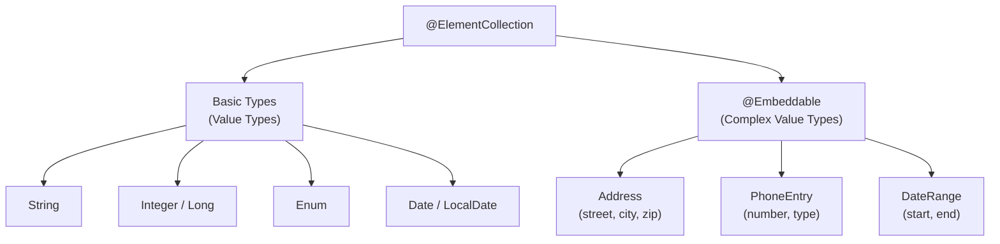
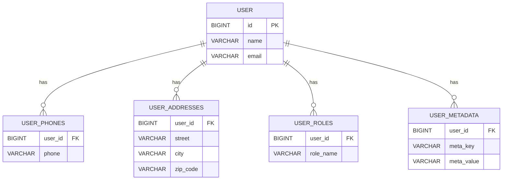
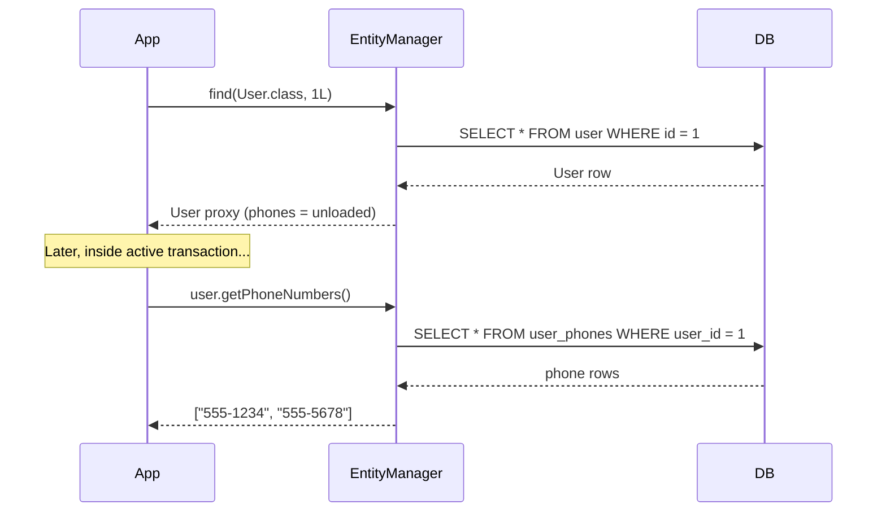
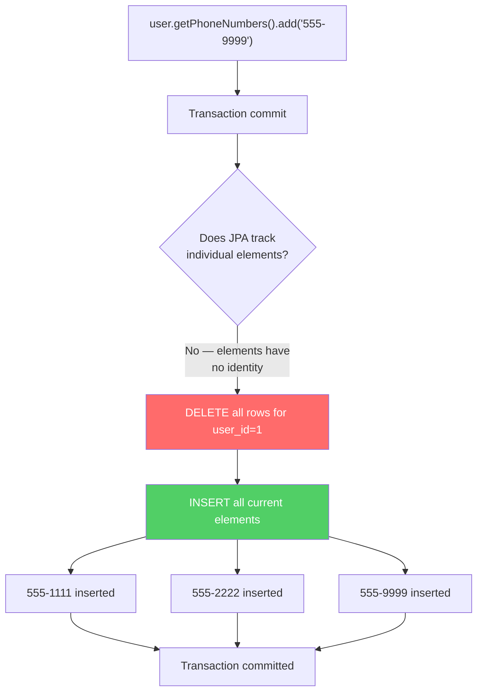
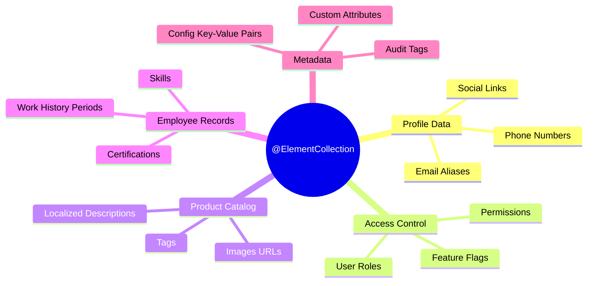
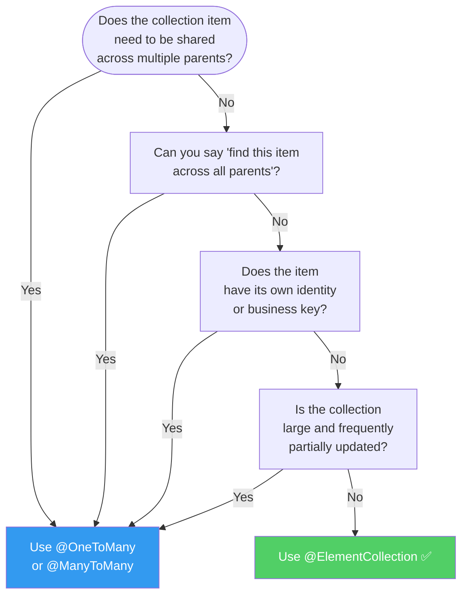
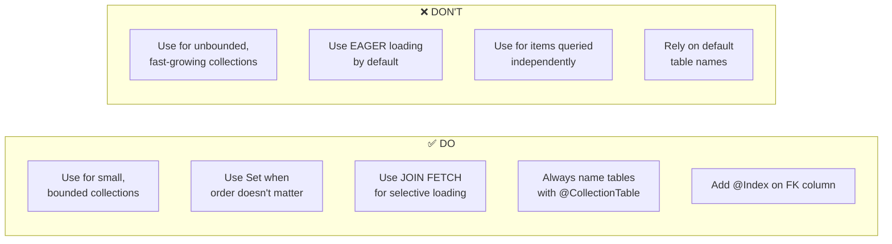
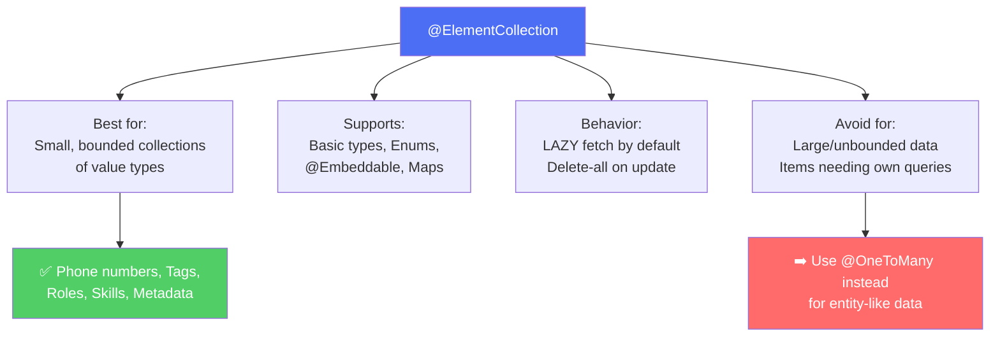

# `@ElementCollection` in JPA — A Complete Tutorial

> **"The simplest solution is often the best one."** JPA's `@ElementCollection` is proof that you don't need a full entity for every piece of data you store.

---

## 📚 Table of Contents

1. [The Problem — Why This Annotation Exists](#1-the-problem)
2. [What Is `@ElementCollection`?](#2-what-is-elementcollection)
3. [Simple String Collections](#3-simple-string-collections)
4. [Controlling Table & Column Names](#4-controlling-table--column-names)
5. [Using `@Embeddable` for Multi-Column Elements](#5-using-embeddable-for-multi-column-elements)
6. [Fetch Types: LAZY vs EAGER](#6-fetch-types-lazy-vs-eager)
7. [How Updates Work (The Gotcha Everyone Hits)](#7-how-updates-work)
8. [Map Collections](#8-map-collections)
9. [Ordering with `@OrderColumn`](#9-ordering-with-ordercolumn)
10. [Real-World Use Cases](#10-real-world-use-cases)
11. [When to Use `@ElementCollection` vs `@OneToMany`](#11-elementcollection-vs-onetomany)
12. [Performance Considerations & Best Practices](#12-performance-considerations)
13. [Complete Reference Example](#13-complete-reference-example)
14. [Summary](#14-summary)

---

## 1. The Problem

Imagine you're building a `User` entity. Each user can have multiple phone numbers. Your first instinct:

```java
@Entity
public class PhoneNumber {
    @Id
    @GeneratedValue
    private Long id;

    private String number;

    @ManyToOne
    private User user;
}

@Entity
public class User {
    @Id
    @GeneratedValue
    private Long id;

    @OneToMany(mappedBy = "user")
    private List<PhoneNumber> phoneNumbers;
}
```

This works, but notice what you just created for a **list of strings**:
- A full `PhoneNumber` entity with its own `@Id`
- A `PhoneNumberRepository`
- Entity lifecycle management (persist, merge, detach, remove)
- Cascade and orphan removal configuration
- A primary key that has **no business meaning**

This is **over-engineering**. Phone numbers, addresses, tags, roles, skill names — these are *values*, not *entities*. They don't have an identity of their own. They only make sense in the context of their parent.

This is the exact problem `@ElementCollection` was designed to solve.

```mermaid
flowchart LR
    subgraph Overkill["❌ Over-Engineered: @OneToMany"]
        direction TB
        A1[User Entity] --> B1[PhoneNumber Entity]
        B1 --> C1[@Id on PhoneNumber]
        B1 --> D1[PhoneNumberRepository]
        B1 --> E1[Cascade Config]
        B1 --> F1[Lifecycle Management]
    end

    subgraph Simple["✅ Right Tool: @ElementCollection"]
        direction TB
        A2[User Entity] --> B2[Collection Table]
        B2 --> C2[No extra Entity]
        B2 --> D2[No Repository needed]
        B2 --> E2[JPA manages it all]
    end

    Overkill -->|"Replace with"| Simple
```

---

## 2. What Is `@ElementCollection`?

`@ElementCollection` is a JPA annotation that tells the persistence provider:

> "This field is a **collection of value types** (simple scalars or `@Embeddable` objects). Store them in a **separate table**, but **do not treat them as independent entities**."

### Key Characteristics

| Feature | `@ElementCollection` | `@OneToMany` |
|---|---|---|
| Separate `@Entity` class needed | ❌ No | ✅ Yes |
| `@Id` on elements | ❌ No | ✅ Yes |
| Own Repository | ❌ No | ✅ Yes |
| Independent lifecycle | ❌ No | ✅ Yes |
| Stored in separate table | ✅ Yes | ✅ Yes |
| Can have multiple fields | ✅ (via `@Embeddable`) | ✅ |
| Query elements independently | ❌ Limited | ✅ Full JPQL |

### Supported Element Types

`@ElementCollection` works with two kinds of elements:



---

## 3. Simple String Collections

### Minimal Example

```java
@Entity
public class User {

    @Id
    @GeneratedValue(strategy = GenerationType.IDENTITY)
    private Long id;

    private String name;

    @ElementCollection
    private List<String> phoneNumbers;
}
```

**What JPA generates automatically:**

```sql
-- Entity table
CREATE TABLE user (
    id   BIGINT PRIMARY KEY AUTO_INCREMENT,
    name VARCHAR(255)
);

-- Collection table (auto-named: entity_fieldName)
CREATE TABLE user_phone_numbers (
    user_id      BIGINT NOT NULL,  -- FK back to user
    phone_numbers VARCHAR(255)     -- the value itself
);
```

### Example 2 — Collection of Enums

```java
public enum Role { ADMIN, EDITOR, VIEWER }

@Entity
public class AppUser {

    @Id
    @GeneratedValue
    private Long id;

    @ElementCollection
    @Enumerated(EnumType.STRING)
    private Set<Role> roles = new HashSet<>();
}
```

Stores roles like `ADMIN`, `EDITOR` as strings in an `appuser_roles` table.

### Example 3 — Collection of Dates

```java
@Entity
public class Employee {

    @Id
    @GeneratedValue
    private Long id;

    @ElementCollection
    @Temporal(TemporalType.DATE)
    private List<Date> vacationDays;
}
```

---

## 4. Controlling Table & Column Names

Default names like `user_phone_numbers` and `phone_numbers` are not production-friendly. Use `@CollectionTable` and `@Column` to customize:

```java
@ElementCollection
@CollectionTable(
    name        = "user_phones",              // Custom table name
    joinColumns = @JoinColumn(name = "user_id") // Custom FK column name
)
@Column(name = "phone")                        // Custom value column name
private List<String> phoneNumbers;
```

**Resulting schema:**

```sql
CREATE TABLE user_phones (
    user_id BIGINT NOT NULL,
    phone   VARCHAR(255)
);
```

### Real-World Naming Example — Employee Skills

```java
@ElementCollection
@CollectionTable(
    name        = "emp_skills",
    joinColumns = @JoinColumn(name = "emp_id")
)
@Column(name = "skill_name", length = 100, nullable = false)
private Set<String> skills;
```

### Adding Indexes for Performance

Collection tables are often queried by the FK. Add an index directly:

```java
@ElementCollection
@CollectionTable(
    name    = "user_phones",
    joinColumns = @JoinColumn(name = "user_id"),
    indexes = @Index(name = "idx_user_phones_user_id", columnList = "user_id")
)
@Column(name = "phone")
private List<String> phoneNumbers;
```

---

## 5. Using `@Embeddable` for Multi-Column Elements

When your collection elements have **more than one field**, use `@Embeddable`. The fields get flattened into columns in the collection table.

### Defining the Embeddable

```java
@Embeddable
public class Address {
    private String street;
    private String city;

    @Column(name = "zip_code", length = 10)
    private String zipCode;

    // Constructors, getters, setters...
}
```

> ⚠️ **Rule:** `@Embeddable` classes must have a **no-argument constructor** (can be protected).

### Using It in an Entity

```java
@Entity
public class User {

    @Id
    @GeneratedValue
    private Long id;

    @ElementCollection
    @CollectionTable(
        name        = "user_addresses",
        joinColumns = @JoinColumn(name = "user_id")
    )
    private List<Address> addresses;
}
```

**Resulting schema:**

```sql
CREATE TABLE user_addresses (
    user_id BIGINT NOT NULL,  -- FK
    street  VARCHAR(255),
    city    VARCHAR(255),
    zip_code VARCHAR(10)
);
```

### Database Schema Visualization



### Example 2 — Contact with Phone Number Type

```java
@Embeddable
public class PhoneEntry {
    private String number;

    @Enumerated(EnumType.STRING)
    private PhoneType type; // HOME, WORK, MOBILE

    public enum PhoneType { HOME, WORK, MOBILE }
}

@Entity
public class Contact {

    @Id
    @GeneratedValue
    private Long id;

    @ElementCollection
    @CollectionTable(name = "contact_phones",
        joinColumns = @JoinColumn(name = "contact_id"))
    private List<PhoneEntry> phoneEntries;
}
```

**Resulting table `contact_phones`:**

| contact_id | number | type |
|---|---|---|
| 1 | 555-1234 | HOME |
| 1 | 555-5678 | WORK |
| 2 | 555-9999 | MOBILE |

---

## 6. Fetch Types: LAZY vs EAGER

By default, `@ElementCollection` uses **LAZY** loading — the collection is not fetched until you access it.



### The `LazyInitializationException`

If you access the collection **outside an active Hibernate session**, you'll get:

```
org.hibernate.LazyInitializationException: 
  could not initialize proxy - no Session
```

**Three solutions:**

**Option 1 — Switch to EAGER (use carefully):**

```java
@ElementCollection(fetch = FetchType.EAGER)
private List<String> phoneNumbers;
```

**Option 2 — JOIN FETCH in JPQL (recommended):**

```java
// Only loads phones when you explicitly need them
TypedQuery<User> q = em.createQuery(
    "SELECT u FROM User u JOIN FETCH u.phoneNumbers WHERE u.id = :id",
    User.class
);
q.setParameter("id", userId);
User user = q.getSingleResult();
```

**Option 3 — Spring Data JPA `@EntityGraph`:**

```java
@EntityGraph(attributePaths = {"phoneNumbers"})
Optional<User> findById(Long id);
```

### Comparison Table

| Strategy | When to Use | Risk |
|---|---|---|
| `LAZY` (default) | Always preferred | `LazyInitializationException` if accessed outside session |
| `EAGER` | Collection always needed with parent | N+1 queries, over-fetching |
| `JOIN FETCH` | Collection needed selectively | None — best practice |
| `@EntityGraph` | Spring Data JPA | None — recommended approach |

---

## 7. How Updates Work

This is the behavior that **surprises most developers**. When you modify an `@ElementCollection`, JPA does **not** diff the collection. It **deletes all existing rows and re-inserts everything**.

### The Delete-All-Reinsert Behavior

```java
// Existing state: user has phones ["555-1111", "555-2222"]
User user = em.find(User.class, 1L);
user.getPhoneNumbers().add("555-9999");

// What JPA actually executes:
// DELETE FROM user_phones WHERE user_id = 1    ← ALL rows deleted
// INSERT INTO user_phones VALUES (1, '555-1111')  ← re-inserted
// INSERT INTO user_phones VALUES (1, '555-2222')  ← re-inserted
// INSERT INTO user_phones VALUES (1, '555-9999')  ← new value
```

### Update Lifecycle Diagram



### Why Does This Happen?

Elements in an `@ElementCollection` have **no identity** (no `@Id`). JPA cannot tell which element was modified, added, or removed. So it takes the nuclear option: clear the table and rewrite everything.

### Performance Implications

```java
// ✅ FINE for small collections (< 20 items)
@ElementCollection
private List<String> tags; // blog post tags — typically 3-8 items

// ⚠️ CONCERN for large collections (> 100 items)
@ElementCollection
private List<String> auditLog; // grows unbounded — bad fit
```

**Rule of thumb:**
- Small, bounded collections: `@ElementCollection` is fine
- Large, unbounded collections where elements are frequently modified individually: consider `@OneToMany` instead

---

## 8. Map Collections

`@ElementCollection` also supports `Map<K, V>` — perfect for key-value metadata, custom attributes, or localized strings.

### Basic `Map<String, String>`

```java
@ElementCollection
@CollectionTable(
    name = "user_metadata",
    joinColumns = @JoinColumn(name = "user_id")
)
@MapKeyColumn(name = "meta_key")
@Column(name = "meta_value")
private Map<String, String> metadata;
```

**Schema:**

```sql
CREATE TABLE user_metadata (
    user_id    BIGINT NOT NULL,
    meta_key   VARCHAR(255) NOT NULL,
    meta_value VARCHAR(255)
);
```

**Usage:**

```java
user.getMetadata().put("theme", "dark");
user.getMetadata().put("language", "en");
user.getMetadata().put("timezone", "America/New_York");
```

### Map with Enum Keys

```java
public enum Language { EN, FR, DE, JA }

@Entity
public class Product {

    @Id
    @GeneratedValue
    private Long id;

    @ElementCollection
    @CollectionTable(name = "product_descriptions",
        joinColumns = @JoinColumn(name = "product_id"))
    @MapKeyEnumerated(EnumType.STRING)
    @MapKeyColumn(name = "lang")
    @Column(name = "description", length = 2000)
    private Map<Language, String> localizedDescriptions;
}
```

**Usage:**

```java
product.getLocalizedDescriptions().put(Language.EN, "Premium wireless headphones");
product.getLocalizedDescriptions().put(Language.FR, "Casque sans fil premium");
product.getLocalizedDescriptions().put(Language.DE, "Premium kabellose Kopfhörer");
```

### Map with Embeddable Values

```java
@Embeddable
public class PriceInfo {
    private BigDecimal amount;
    private String currency;
}

@Entity
public class Product {
    @ElementCollection
    @CollectionTable(name = "product_regional_prices",
        joinColumns = @JoinColumn(name = "product_id"))
    @MapKeyColumn(name = "region")
    private Map<String, PriceInfo> regionalPrices;
}
```

---

## 9. Ordering with `@OrderColumn`

By default, there is **no guaranteed order** when reading a collection back. If you need a stable `List` ordering, add `@OrderColumn`:

```java
@ElementCollection
@CollectionTable(
    name = "user_phones",
    joinColumns = @JoinColumn(name = "user_id")
)
@Column(name = "phone")
@OrderColumn(name = "phone_order")
private List<String> phoneNumbers;
```

**Schema with ordering:**

```sql
CREATE TABLE user_phones (
    user_id     BIGINT NOT NULL,
    phone       VARCHAR(255),
    phone_order INT NOT NULL      -- JPA manages this automatically
);
```

| user_id | phone | phone_order |
|---|---|---|
| 1 | 555-1111 | 0 |
| 1 | 555-2222 | 1 |
| 1 | 555-9999 | 2 |

### `@OrderBy` Alternative

Instead of persisting the order, you can sort by a field value:

```java
@ElementCollection
@OrderBy("city ASC, street ASC")
private List<Address> addresses;
```

This sorts in memory after loading, using the field names of the `@Embeddable`.

---

## 10. Real-World Use Cases



### Use Case 1 — User Roles & Permissions (Security)

```java
@Entity
public class AppUser {

    @Id
    @GeneratedValue
    private Long id;

    private String username;

    @ElementCollection(fetch = FetchType.EAGER) // Loaded with user for security checks
    @Enumerated(EnumType.STRING)
    @CollectionTable(name = "user_roles", joinColumns = @JoinColumn(name = "user_id"))
    @Column(name = "role")
    private Set<Role> roles = new HashSet<>();

    public enum Role { ROLE_ADMIN, ROLE_USER, ROLE_MODERATOR }
}
```

**Why `@ElementCollection` fits:** Roles have no identity of their own. You never query for "role by ID". They are always fetched alongside the user.

### Use Case 2 — Product Tags (E-Commerce)

```java
@Entity
public class Product {

    @Id
    @GeneratedValue
    private Long id;

    private String name;
    private BigDecimal price;

    @ElementCollection
    @CollectionTable(name = "product_tags",
        joinColumns = @JoinColumn(name = "product_id"))
    @Column(name = "tag", length = 50)
    private Set<String> tags = new HashSet<>(); // "electronics", "sale", "new"
}
```

### Use Case 3 — Employee Skills Matrix (HR System)

```java
@Embeddable
public class SkillEntry {
    private String skillName;

    @Enumerated(EnumType.STRING)
    private ProficiencyLevel level; // BEGINNER, INTERMEDIATE, EXPERT

    @Temporal(TemporalType.DATE)
    private Date acquiredOn;
}

@Entity
public class Employee {

    @Id
    @GeneratedValue
    private Long id;

    private String name;

    @ElementCollection
    @CollectionTable(name = "employee_skills",
        joinColumns = @JoinColumn(name = "employee_id"))
    private List<SkillEntry> skills;
}
```

### Use Case 4 — Localized Content (CMS)

```java
@Entity
public class Article {

    @Id
    @GeneratedValue
    private Long id;

    @ElementCollection
    @CollectionTable(name = "article_titles",
        joinColumns = @JoinColumn(name = "article_id"))
    @MapKeyColumn(name = "locale")
    @Column(name = "title", length = 500)
    private Map<String, String> localizedTitles; // "en" -> "Hello World", "es" -> "Hola Mundo"
}
```

---

## 11. `@ElementCollection` vs `@OneToMany`



### Decision Examples

| Scenario | Choice | Reason |
|---|---|---|
| User → phone numbers | `@ElementCollection` | Phones have no identity; only accessed via user |
| User → orders | `@OneToMany` | Orders have their own lifecycle, are queried independently |
| Product → tags (`Set<String>`) | `@ElementCollection` | Tags are just strings; no entity needed |
| Product → reviews | `@OneToMany` | Reviews have authors, dates, votes — independent entities |
| Employee → skills (`Set<String>`) | `@ElementCollection` | Skill names are values |
| Company → employees | `@OneToMany` | Employees are full entities with their own data |
| Article → localized titles | `@ElementCollection` (Map) | Key-value metadata, no identity |
| Post → comments | `@OneToMany` | Comments have authors, timestamps, likes |

---

## 12. Performance Considerations

### Avoid Large, Frequently-Updated Collections

```java
// ❌ BAD — this can grow to thousands of entries
// Every add/remove triggers DELETE + INSERT ALL
@ElementCollection
private List<String> allTimeActivityLog; // unbounded!

// ✅ BETTER — use a proper entity for this
@Entity
public class ActivityLogEntry {
    @Id @GeneratedValue
    private Long id;
    
    @ManyToOne
    private User user;
    
    private String action;
    private Instant timestamp;
}
```

### Use `Set` Over `List` When Order Doesn't Matter

```java
// With List, JPA uses @OrderColumn or arbitrary order
// → can cause extra UPDATE statements

// ✅ Use Set when order doesn't matter
@ElementCollection
private Set<String> tags; // No order column needed, cleaner deletes
```

### Prefer `JOIN FETCH` Over `EAGER` Loading

```java
// ❌ EAGER — always loads collection, even when not needed
@ElementCollection(fetch = FetchType.EAGER)
private Set<String> tags;

// ✅ LAZY + JOIN FETCH — loads only when you ask
@ElementCollection  // LAZY by default
private Set<String> tags;

// In repository
@Query("SELECT p FROM Product p JOIN FETCH p.tags WHERE p.id = :id")
Optional<Product> findByIdWithTags(@Param("id") Long id);
```

### Summary of Best Practices



---

## 13. Complete Reference Example

```java
/* ──────────────────────────────────────────────
   Embeddable: Address
   ────────────────────────────────────────────── */
@Embeddable
public class Address {
    @Column(name = "street", length = 200)
    private String street;

    @Column(name = "city", length = 100)
    private String city;

    @Column(name = "zip_code", length = 10)
    private String zipCode;

    @Column(name = "country", length = 50)
    private String country;

    // No-arg constructor required by JPA
    protected Address() {}

    public Address(String street, String city, String zipCode, String country) {
        this.street = street;
        this.city = city;
        this.zipCode = zipCode;
        this.country = country;
    }
    // getters...
}

/* ──────────────────────────────────────────────
   Entity: Employee
   ────────────────────────────────────────────── */
@Entity
@Table(name = "employee")
public class Employee {

    @Id
    @GeneratedValue(strategy = GenerationType.IDENTITY)
    private Long id;

    @Column(nullable = false)
    private String name;

    /* ─── 1. Simple string collection ─── */
    @ElementCollection
    @CollectionTable(
        name        = "employee_skills",
        joinColumns = @JoinColumn(name = "employee_id"),
        indexes     = @Index(name = "idx_skills_emp", columnList = "employee_id")
    )
    @Column(name = "skill", length = 100, nullable = false)
    private Set<String> skills = new HashSet<>();

    /* ─── 2. Embeddable collection ─── */
    @ElementCollection
    @CollectionTable(
        name        = "employee_addresses",
        joinColumns = @JoinColumn(name = "employee_id")
    )
    @OrderColumn(name = "address_order")
    private List<Address> addresses = new ArrayList<>();

    /* ─── 3. Enum collection ─── */
    @ElementCollection
    @Enumerated(EnumType.STRING)
    @CollectionTable(
        name        = "employee_certifications",
        joinColumns = @JoinColumn(name = "employee_id")
    )
    @Column(name = "cert_name")
    private Set<Certification> certifications = new HashSet<>();

    public enum Certification { AWS, GCP, AZURE, KUBERNETES, JAVA_EXPERT }

    /* ─── 4. Map collection ─── */
    @ElementCollection
    @CollectionTable(
        name        = "employee_metadata",
        joinColumns = @JoinColumn(name = "employee_id")
    )
    @MapKeyColumn(name = "meta_key", length = 100)
    @Column(name = "meta_value", length = 500)
    private Map<String, String> metadata = new HashMap<>();

    // getters, setters, constructors...
}
```

### Generated Schema

```sql
-- Main entity table
CREATE TABLE employee (
    id   BIGINT       PRIMARY KEY AUTO_INCREMENT,
    name VARCHAR(255) NOT NULL
);

-- String set
CREATE TABLE employee_skills (
    employee_id BIGINT       NOT NULL,
    skill       VARCHAR(100) NOT NULL,
    CONSTRAINT fk_skills_emp FOREIGN KEY (employee_id) REFERENCES employee(id)
);
CREATE INDEX idx_skills_emp ON employee_skills(employee_id);

-- Embeddable list (with ordering)
CREATE TABLE employee_addresses (
    employee_id   BIGINT       NOT NULL,
    street        VARCHAR(200),
    city          VARCHAR(100),
    zip_code      VARCHAR(10),
    country       VARCHAR(50),
    address_order INT          NOT NULL
);

-- Enum set
CREATE TABLE employee_certifications (
    employee_id BIGINT      NOT NULL,
    cert_name   VARCHAR(255)
);

-- Map
CREATE TABLE employee_metadata (
    employee_id BIGINT       NOT NULL,
    meta_key    VARCHAR(100) NOT NULL,
    meta_value  VARCHAR(500)
);
```

### Sample Operations

```java
// Create
Employee emp = new Employee();
emp.setName("Alice Johnson");
emp.getSkills().addAll(Set.of("Java", "Spring Boot", "Kafka"));
emp.getAddresses().add(new Address("123 Main St", "Austin", "78701", "US"));
emp.getCertifications().add(Employee.Certification.AWS);
emp.getMetadata().put("department", "Engineering");
emp.getMetadata().put("team", "Platform");
em.persist(emp);

// Read with collection (avoid LazyInitializationException)
Employee loaded = em.createQuery(
    "SELECT e FROM Employee e JOIN FETCH e.skills WHERE e.id = :id",
    Employee.class
).setParameter("id", empId).getSingleResult();

// Update skills (triggers delete-all + reinsert)
loaded.getSkills().add("Kubernetes");
// JPA: DELETE FROM employee_skills WHERE employee_id = ?
// JPA: INSERT INTO employee_skills VALUES (?, 'Java'), (?, 'Spring Boot'),
//                                         (?, 'Kafka'), (?, 'Kubernetes')
```

---

## 14. Summary



### Quick Reference Card

| Annotation | Purpose |
|---|---|
| `@ElementCollection` | Marks a collection of value types |
| `@CollectionTable` | Names the backing table and FK |
| `@Column` | Names the value column |
| `@Embeddable` | Makes a multi-field element a value type |
| `@OrderColumn` | Persists list ordering |
| `@OrderBy` | Sorts by field value after load |
| `@MapKeyColumn` | Names the key column in a Map collection |
| `@MapKeyEnumerated` | Specifies enum mapping for Map keys |
| `fetch = LAZY` | Default; loads collection on access |
| `fetch = EAGER` | Loads collection with parent always |

> **The mental model:** If collection items only make sense in the context of their parent, and they have no identity of their own — use `@ElementCollection`. The moment you need to say *"find me this specific item across all parents"* — it deserves its own `@Entity`.