# API Design Patterns: Why Many Companies Don't Use PUT and DELETE Anymore - Complete Tutorial

> **REST is the foundation, but real-world business makes APIs more practical.**

**📚 Tutorial Information**
- **Difficulty Level:** Intermediate
- **Estimated Reading Time:** 25-30 minutes
- **Last Updated:** January 2026
- **Target Audience:** Backend developers, API designers, and software architects

---

## Table of Contents

1. [Introduction](#introduction)
2. [Prerequisites & Learning Objectives](#prerequisites--learning-objectives)
3. [The Original REST Design](#1-the-original-rest-design)
4. [Why Real-World Systems Rarely Use PUT and DELETE](#2-why-real-world-systems-rarely-use-put-and-delete)
5. [The PUT Problem: Full Replacement](#3-the-put-problem-full-replacement)
6. [PATCH: Partial Updates Done Right](#4-patch-partial-updates-done-right)
7. [How Large Companies Design Their APIs (Hybrid Strategy)](#5-how-large-companies-design-their-apis-hybrid-strategy)
8. [Real-World Use Cases](#6-real-world-use-cases)
9. [Common Pitfalls and How to Avoid Them](#7-common-pitfalls-and-how-to-avoid-them)
10. [Best Practices for Modern API Design](#best-practices-for-modern-api-design)
11. [Anti-Patterns to Avoid](#anti-patterns-to-avoid)
12. [Performance Considerations](#performance-considerations)
13. [Security Considerations](#security-considerations)
14. [Testing Strategies](#testing-strategies)
15. [Summary](#8-summary)
16. [Further Reading & Resources](#further-reading--resources)
17. [Practice Exercises](#practice-exercises)
18. [Test Your Understanding](#test-your-understanding)
19. [Common Interview Questions](#common-interview-questions)
20. [Question Bank](#question-bank)
21. [Quick Reference Cheat Sheet](#9-quick-reference-cheat-sheet)

---

## Introduction

When you first learn REST API design, you're taught a clean, elegant rule: each HTTP verb maps to a CRUD operation.

- `GET` → Read
- `POST` → Create
- `PUT` → Update (full replace)
- `PATCH` → Update (partial)
- `DELETE` → Delete

This is a beautiful theory. But if you look at the public APIs of Stripe, GitHub, Slack, or Shopify, you'll notice something surprising: **`PUT` and `DELETE` are used far less than textbooks suggest**, and are often replaced entirely by `POST` with an action-oriented URL.

This tutorial explains **why**, walks through the exact failure modes that push engineering teams away from strict REST, and shows you the hybrid pattern that most large-scale companies actually use in production.

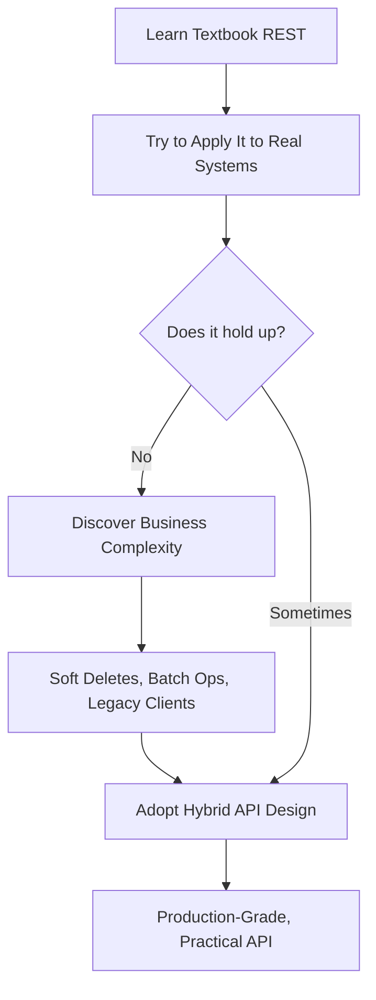

### 💡 Key Insight

> **The best APIs aren't RESTful by the textbook — they're meaningful and practical.** The goal is to clearly express business intent, protect data integrity, and scale to real operational needs.

---

## Prerequisites & Learning Objectives

### Prerequisites

Before starting this tutorial, you should have:
- ✅ Basic understanding of HTTP protocol and HTTP methods
- ✅ Familiarity with REST API concepts and principles
- ✅ Experience with JSON data formats
- ✅ Understanding of CRUD operations (Create, Read, Update, Delete)
- ✅ Basic knowledge of API design principles
- ✅ Familiarity with database concepts (especially soft deletes)

### Learning Objectives

By the end of this tutorial, you will be able to:

1. **Understand** why strict REST principles often fail in production environments
2. **Identify** the four major forces that push teams away from PUT/DELETE
3. **Recognize** the dangers of using PUT for partial updates
4. **Apply** PATCH correctly for safe partial updates
5. **Design** hybrid API strategies that combine REST with action-oriented endpoints
6. **Implement** soft delete patterns for compliance and data recovery
7. **Create** batch operation endpoints for performance optimization
8. **Avoid** common pitfalls and anti-patterns in API design
9. **Apply** best practices for production-grade API design
10. **Evaluate** when to use each HTTP method in real-world scenarios

---

## 1. The Original REST Design

Textbook REST maps each HTTP method to a single, predictable meaning against a **resource** (a noun, like `/users/123`).

| Method | Meaning | Idempotent | Safe |
|--------|---------|------------|------|
| `GET` | Retrieve resource(s) | Yes | Yes |
| `POST` | Create resource(s) | No | No |
| `PUT` | Replace (fully update) a resource | Yes | No |
| `PATCH` | Partially update a resource | No | No |
| `DELETE` | Delete a resource | Yes | No |

### Example: The "Pure REST" User API

```http
GET    /users/123        → Retrieve user 123
POST   /users             → Create a new user
PUT    /users/123         → Replace user 123 entirely
PATCH  /users/123         → Update part of user 123
DELETE /users/123         → Delete user 123
```

**Sample `PUT` request:**

```http
PUT /users/123
Content-Type: application/json

{
  "name": "Alice",
  "email": "alice@example.com",
  "age": 30
}
```

**Sample response:**

```http
HTTP/1.1 204 No Content
```

At first glance, this looks perfect: predictable, symmetrical, and easy to memorize. So why do so few large-scale APIs actually work this way once they leave the classroom?

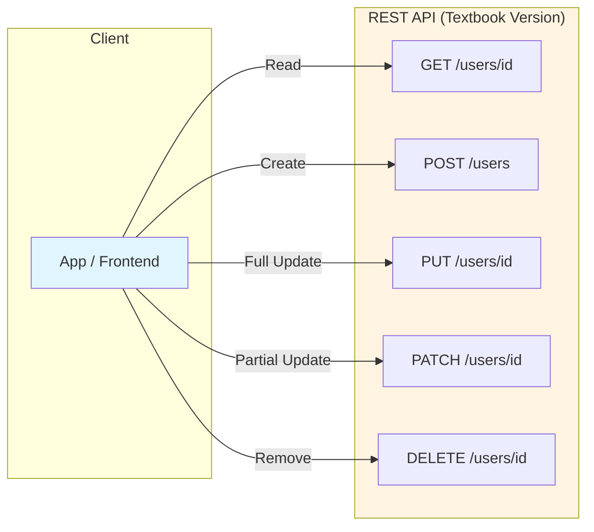

### 📝 Important Notes

- **Idempotent:** Making the same request multiple times produces the same result
- **Safe:** The operation doesn't modify server state (read-only)
- **PUT is idempotent** because replacing a resource with the same data multiple times yields the same result
- **DELETE is idempotent** because deleting an already-deleted resource still returns success

---

## 2. Why Real-World Systems Rarely Use PUT and DELETE

Once an API has to serve real customers, real compliance requirements, and real legacy clients, four forces push teams away from strict `PUT`/`DELETE` usage.

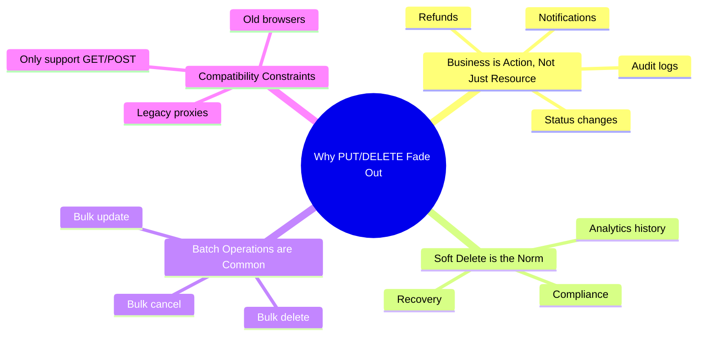

### 2.1 Business is Action, Not Just Resource

Real business operations are rarely "replace this whole object." They're verbs: **cancel**, **refund**, **restore**, **notify**, **audit**.

**❌ Bad (forcing a business action into a resource update):**

```http
PATCH /orders/456
{
  "status": "cancelled"
}
```

This *looks* fine, but it hides intent. What if cancelling also needs to trigger a refund, notify the customer, and write an audit log entry — atomically?

**✅ Better (explicit action endpoint):**

```http
POST /orders/456/cancel
{
  "reason": "customer_request"
}
```

**Why this matters:** The URL itself documents the business event. Logging, monitoring, and permissions can all be scoped to `/cancel` instead of trying to infer intent from a diff of JSON fields.

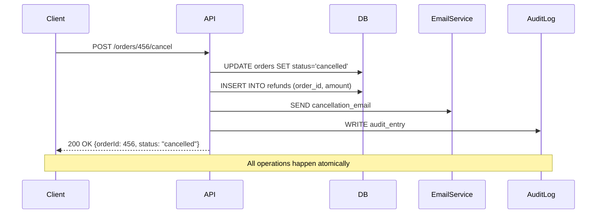

### 2.2 Soft Delete is the Norm

Companies almost never want data to physically vanish. Deleting a user's account might need to be reversible for 30 days (GDPR-style "right to be forgotten" grace periods, fraud investigation, accidental deletes).

**Textbook DELETE:**
```http
DELETE /users/123
```

**Real-world soft delete:**
```http
POST /users/123/delete
{
  "is_deleted": true,
  "deleted_at": "2026-03-13T00:00:00Z"
}
```

Internally, this just flips a flag:

```sql
UPDATE users
SET is_deleted = true, deleted_at = NOW()
WHERE id = 123;
```

The record still exists — it's just filtered out of normal queries. This enables "Trash" folders, undo buttons, and compliance holds.

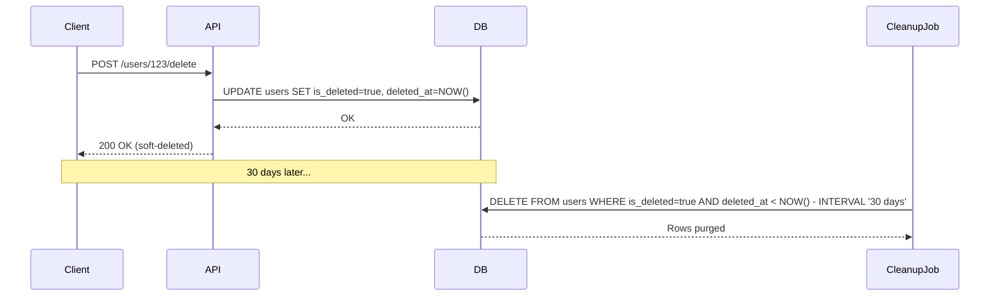

**Benefits of Soft Delete:**
- ✅ **Recovery:** Users can restore accidentally deleted data
- ✅ **Compliance:** Meet GDPR, HIPAA, and other regulatory requirements
- ✅ **Analytics:** Maintain historical data for reporting
- ✅ **Audit trails:** Keep records for security and compliance
- ✅ **Undo functionality:** Implement "Trash" or "Recently Deleted" features

### 2.3 Batch Operations Are Common

Real applications rarely operate on one resource at a time. Think: "select 50 emails and archive them," or "delete 200 stale API keys."

**Textbook approach (100 separate calls):**
```http
DELETE /users/1
DELETE /users/2
DELETE /users/3
... (× 50)
```

This is slow, hard to make atomic, and murders your rate limits.

**Real-world batch approach:**
```http
POST /users/batch-delete
{
  "userIds": [1, 2, 3, 4, 5]
}
```

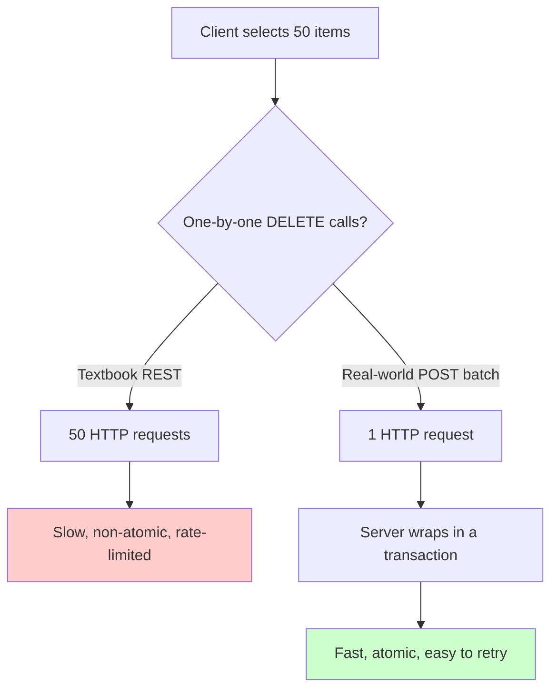

**Batch Operation Benefits:**
- **Performance:** Single network round-trip vs. multiple
- **Atomicity:** All operations succeed or fail together
- **Rate limits:** One API call instead of hundreds
- **Consistency:** Easier to maintain data integrity
- **Cost:** Reduced API gateway and server load

### 2.4 Compatibility Constraints

Some environments — old corporate proxies, certain webhook providers, restrictive browser sandboxes, older HTML forms — only reliably support `GET` and `POST`. Standard HTML `<form>` elements, for example, natively support only `GET` and `POST`; `PUT`, `PATCH`, and `DELETE` require JavaScript workarounds.

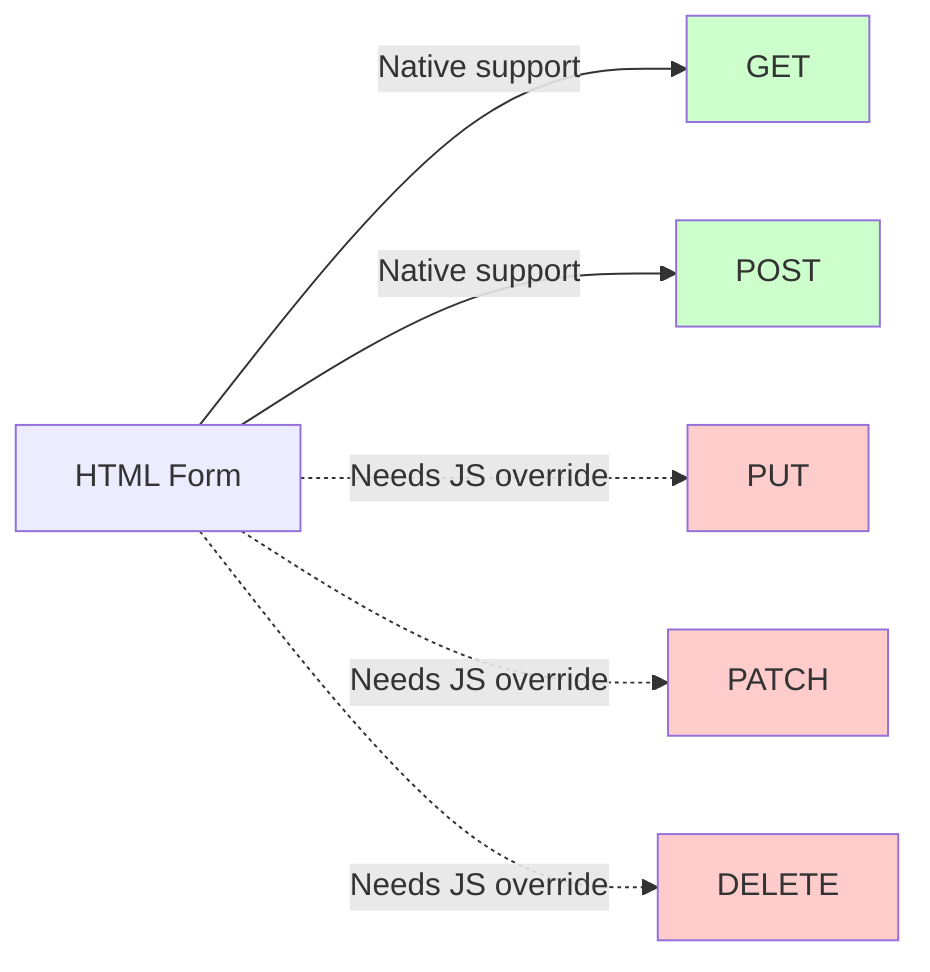

**Practical impact:** teams that need to support the widest possible range of clients (old enterprise gateways, embedded devices, certain webhook consumers) design their public API surface around `GET`/`POST` to avoid an entire category of "why doesn't this work through our corporate proxy" support tickets.

**Real-World Example:**
- **Legacy enterprise proxies** often block non-GET/POST methods
- **Embedded devices** with limited HTTP client libraries
- **Webhook providers** that only support POST callbacks
- **HTML forms** without JavaScript enhancement
- **Older browsers** with incomplete HTTP method support

---

## 3. The PUT Problem: Full Replacement

`PUT` is defined as a **full replacement**. This is the single biggest source of accidental data loss in naive REST implementations.

### The Scenario

**Existing user record:**
```json
{
  "name": "Alice",
  "email": "old@email.com",
  "age": 30
}
```

**Client sends a PUT intending to update only the email:**
```http
PUT /users/123
Content-Type: application/json

{
  "email": "new@email.com"
}
```

**What actually happens (per REST spec, PUT = replace):**
```json
{
  "email": "new@email.com"
}
```

😱 **`name` and `age` are silently wiped out**, because `PUT` means "this is now the entire resource," not "update these fields."

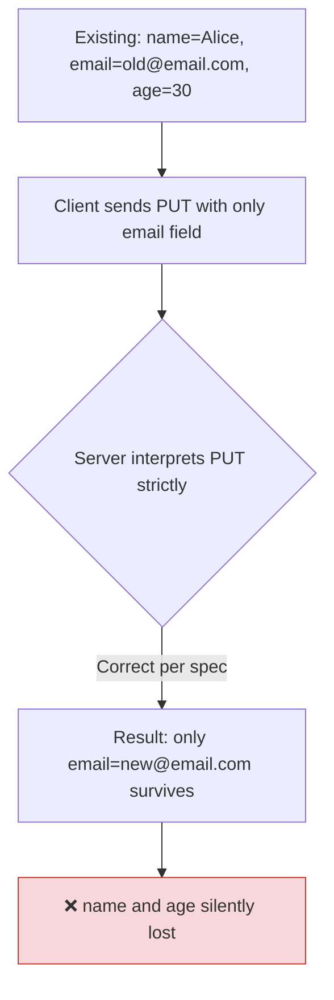

### Why This Is So Dangerous

1. **Silent data loss** — no error is thrown; the request "succeeds."
2. **Client-server coupling** — the frontend must *always* send the complete object, every time, or risk corrupting data.
3. **Race conditions** — if two clients edit different fields concurrently and both `PUT` their (differently stale) full copies, one client's changes overwrite the other's.

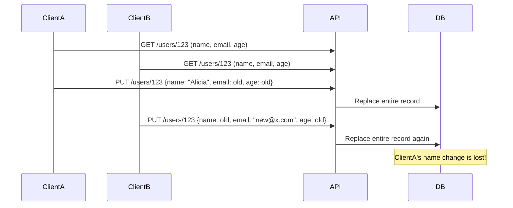

### ⚠️ Warning: The Last-Write-Wins Problem

This scenario demonstrates a **lost update** problem. In concurrent systems:
- Both clients read the same initial state
- Both modify different fields
- Both send complete PUT requests
- The second request overwrites the first completely

**Solution approaches:**
1. Use PATCH instead of PUT for partial updates
2. Implement optimistic locking with version numbers
3. Use ETags and conditional requests
4. Design APIs to minimize concurrent full-object updates

---

## 4. PATCH: Partial Updates Done Right

`PATCH` solves this by only modifying the fields explicitly included.

```http
PATCH /users/123
Content-Type: application/json

{
  "email": "new@email.com"
}
```

**Result (expected and correct):**
```json
{
  "name": "Alice",
  "email": "new@email.com",
  "age": 30
}
```

`name` and `age` are untouched. 🎉

### Two Common PATCH Styles

**1. Merge-style JSON (most common in practice)** — send only changed keys; server merges them into the existing record.

**Example:**
```http
PATCH /users/123
Content-Type: application/json

{
  "email": "new@email.com",
  "age": 31
}
```

**Server behavior:**
```javascript
// Pseudocode
const existingUser = db.users.find(123);
const updates = { email: "new@email.com", age: 31 };
const updatedUser = { ...existingUser, ...updates };
db.users.update(updatedUser);
```

**2. JSON Patch (RFC 6902)** — a formal, more explicit format:

```http
PATCH /users/123
Content-Type: application/json-patch+json

[
  { "op": "replace", "path": "/email", "value": "new@email.com" },
  { "op": "replace", "path": "/age", "value": 31 }
]
```

JSON Patch operations:
- `add` - Add a new field or value
- `remove` - Remove a field
- `replace` - Replace an existing value
- `move` - Move a value from one location to another
- `copy` - Copy a value from one location to another
- `test` - Test that a value matches (for validation)

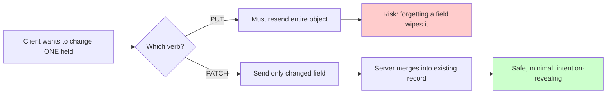

### When to Use PATCH vs PUT

| Scenario | Use PATCH | Use PUT |
|----------|-----------|---------|
| Update email only | ✅ | ❌ (must send all fields) |
| Replace entire profile | ❌ | ✅ |
| Update multiple specific fields | ✅ | ❌ (must send all fields) |
| Client has complete object | ❌ | ✅ |
| Partial update with unknown state | ✅ | ❌ |

### 💡 Pro Tip

**Default to PATCH for updates** unless you specifically need full replacement semantics. It's safer, more efficient, and less prone to accidental data loss.

---

## 5. How Large Companies Design Their APIs (Hybrid Strategy)

In production, most mature APIs (Stripe, Shopify, GitHub, Twilio-style patterns) don't pick one verb ideology — they use a **hybrid model** depending on the *category* of operation.

| Category | Verb(s) Used | Example | Rationale |
|----------|--------------|---------|-----------|
| Standard Resource | `GET`, `POST`, `PUT`, `DELETE` | `GET /users/{id}` | Simple CRUD operations |
| Business Action | `POST` | `POST /orders/{id}/cancel` | Explicit business events |
| Batch Operations | `POST` | `POST /users/batch-delete` | Bulk operations |
| Partial Updates | `PATCH` | `PATCH /users/{id}` | Safe field updates |

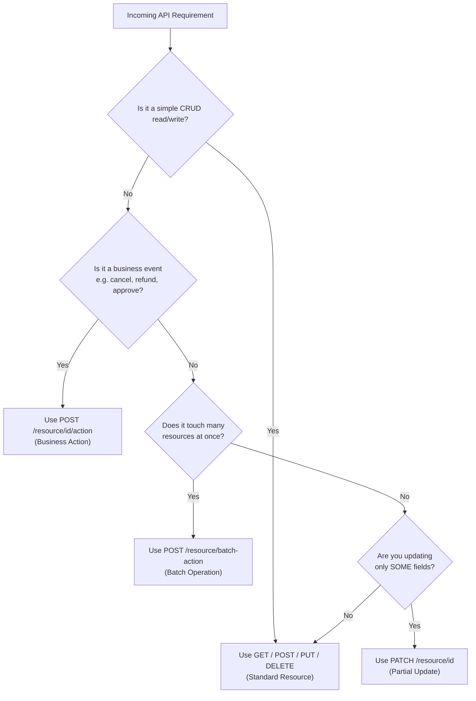

### Worked Example: An E-Commerce Order API

```http
# Standard resource operations
GET    /orders/789              → Fetch order details
POST   /orders                  → Create new order
DELETE /orders/789               → Delete a draft/unplaced order

# Business actions (NOT PUT/PATCH)
POST   /orders/789/cancel        → Cancel the order (triggers refund + notify)
POST   /orders/789/refund        → Issue a refund
POST   /orders/789/ship          → Mark as shipped, trigger tracking email

# Batch operations
POST   /orders/batch-cancel      → Cancel 100 stale orders at once

# Partial updates
PATCH  /orders/789               → Update shipping address only
```

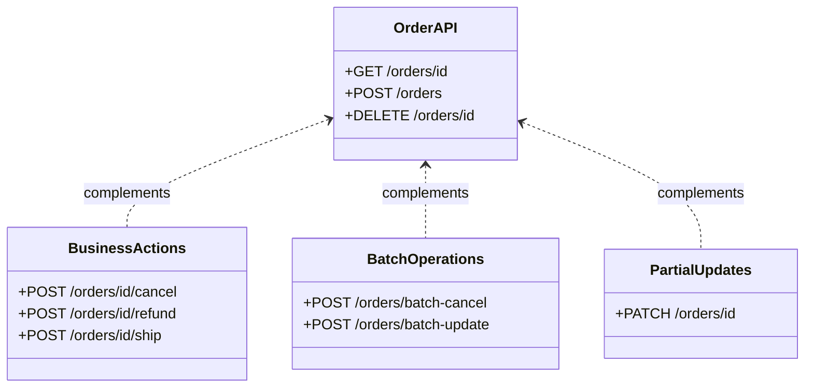

### Real Company Examples

**Stripe:**
- Uses POST for most actions: `/v1/charges/{id}/refund`
- Rarely uses DELETE; prefers marking as inactive
- Heavy use of batch operations

**GitHub:**
- Uses DELETE for actual deletion: `DELETE /repos/{owner}/{repo}`
- Uses POST for actions: `POST /repos/{owner}/{repo}/dispatches`
- PATCH for updates: `PATCH /repos/{owner}/{repo}`

**Shopify:**
- POST for actions: `POST /admin/api/2024-01/orders/{order_id}/cancel.json`
- Soft deletes via status changes
- Batch operations via POST

---

## 6. Real-World Use Cases

### Use Case 1: Banking App — Freezing an Account

Freezing an account isn't "replacing" the account resource — it's a security action with side effects (notifications, compliance logging, blocked transactions).

```http
POST /accounts/456/freeze
{
  "reason": "suspicious_activity",
  "notify_user": true
}
```

**Response:**
```http
HTTP/1.1 200 OK
Content-Type: application/json

{
  "accountId": 456,
  "status": "frozen",
  "frozen_at": "2026-03-13T10:30:00Z",
  "reason": "suspicious_activity"
}
```

**Side effects triggered:**
- ✅ Send SMS/email notification to account holder
- ✅ Block all pending transactions
- ✅ Create compliance audit log entry
- ✅ Notify fraud detection system
- ✅ Update account status in real-time

### Use Case 2: SaaS Billing — Cancelling a Subscription

```http
POST /subscriptions/321/cancel
{
  "cancel_at_period_end": true,
  "reason": "too_expensive"
}
```

**Response:**
```http
HTTP/1.1 200 OK
Content-Type: application/json

{
  "subscriptionId": 321,
  "status": "cancelling",
  "effective_date": "2026-04-13T00:00:00Z",
  "prorated_refund": 15.50
}
```

This single call can trigger:
- Prorated refund calculation
- Downgrade scheduling
- Cancellation email
- Analytics event
- Customer success team notification

### Use Case 3: Content Platform — Soft-Deleting a Post

```http
POST /posts/999/delete
```

**Response:**
```http
HTTP/1.1 200 OK
Content-Type: application/json

{
  "postId": 999,
  "status": "deleted",
  "deleted_at": "2026-03-13T10:30:00Z",
  "recovery_available_until": "2026-04-12T10:30:00Z"
}
```

Internally sets `is_deleted = true`, allowing a "Recently Deleted" recovery view for 30 days, similar to Gmail's Trash or Notion's Trash.

### Use Case 4: HR System — Bulk Archiving Old Employee Records

```http
POST /employees/batch-archive
{
  "employeeIds": [101, 102, 103, 104],
  "archive_reason": "retirement_2025"
}
```

**Response:**
```http
HTTP/1.1 200 OK
Content-Type: application/json

{
  "archived_count": 4,
  "failed_ids": [],
  "job_id": "batch_20260313_001"
}
```

One transaction, one audit log entry, one email digest to HR — instead of 4 separate calls.

### Use Case 5: Profile Settings — Updating Just a Display Name

```http
PATCH /users/123
{
  "displayName": "Alice W."
}
```

**Response:**
```http
HTTP/1.1 200 OK
Content-Type: application/json

{
  "userId": 123,
  "displayName": "Alice W.",
  "name": "Alice",
  "email": "alice@example.com",
  "age": 30
}
```

Everything else on the profile (avatar, bio, preferences) stays untouched.

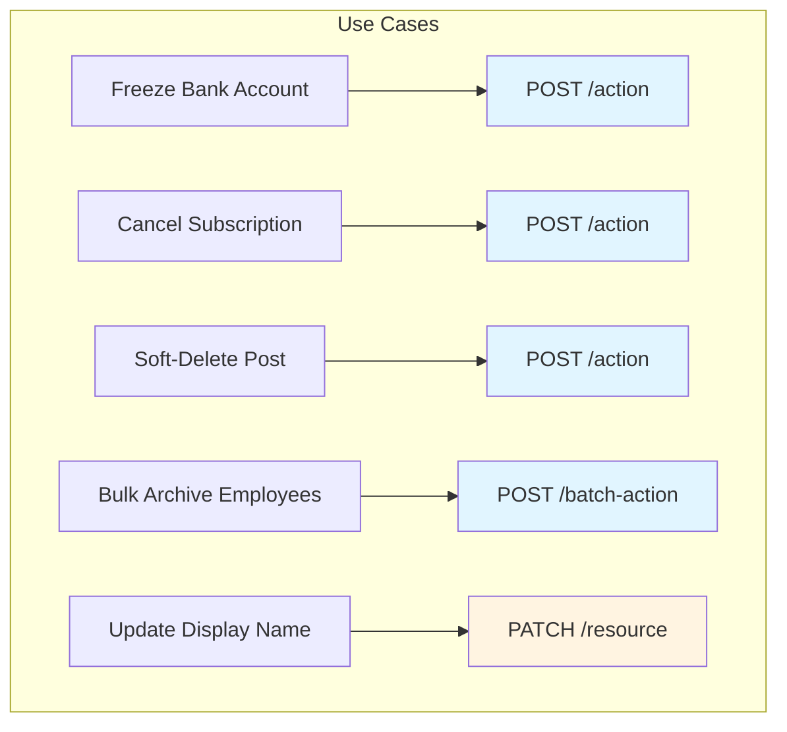

---

## 7. Common Pitfalls and How to Avoid Them

| Pitfall | Why It Happens | Fix | Severity |
|----------|----------------|-----|----------|
| Using `PUT` for partial updates | Developers treat `PUT`/`PATCH` as interchangeable | Reserve `PUT` for full-object replacement only; use `PATCH` for partial | 🔴 High |
| Hard `DELETE` on user-facing data | No plan for recovery/compliance | Default to soft delete (`is_deleted` flag) with scheduled hard-delete job | 🔴 High |
| Encoding business logic as a `status` field `PATCH` | Feels "RESTful" but hides intent | Model the business action as its own `POST /resource/id/action` endpoint | 🟡 Medium |
| One-by-one loops for bulk changes | No batch endpoint designed upfront | Add explicit `POST /resource/batch-action` endpoints for common bulk operations | 🟡 Medium |
| Assuming all clients support all verbs | Forgetting about legacy proxies/forms | Provide `POST`-based fallbacks for critical actions | 🟡 Medium |
| Not validating PATCH inputs | Assuming partial updates are always safe | Validate all incoming fields, even in PATCH requests | 🟡 Medium |
| Missing idempotency in POST actions | POST is not idempotent by default | Use idempotency keys for critical financial operations | 🔴 High |
| Over-engineering with JSON Patch | Using RFC 6902 when merge-style PATCH suffices | Start with simple merge-style PATCH; only use JSON Patch if you need advanced operations | 🟢 Low |

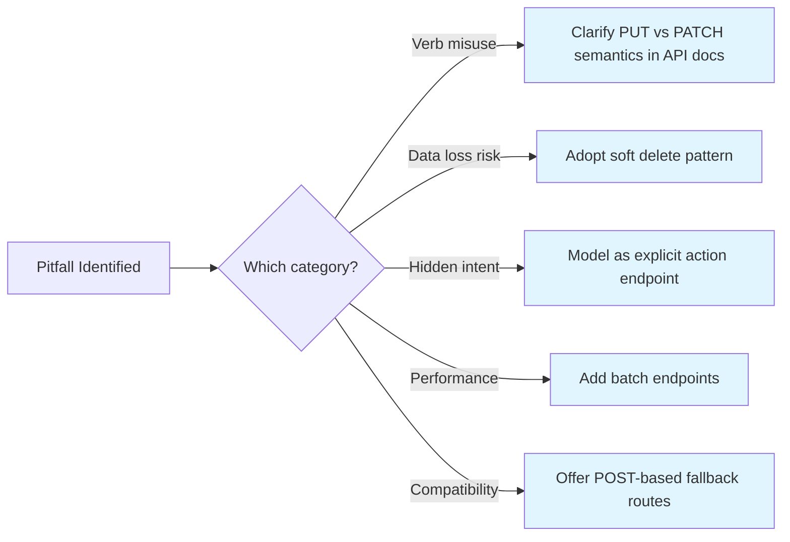

### Detailed Pitfall Explanations

#### Pitfall 1: Using PUT for Partial Updates

**Problem:**
```http
PUT /users/123
{
  "email": "new@email.com"
}
```
Result: `name` and `age` are deleted!

**Solution:**
```http
PATCH /users/123
{
  "email": "new@email.com"
}
```
Result: Only `email` is updated, other fields preserved.

#### Pitfall 2: Hard DELETE Without Recovery Plan

**Problem:**
```http
DELETE /users/123
```
Data is permanently gone. User accidentally deleted? Too bad.

**Solution:**
```http
POST /users/123/delete
```
Sets `is_deleted = true`. Data recoverable for 30 days.

#### Pitfall 3: Business Logic Hidden in Status Fields

**Problem:**
```http
PATCH /orders/456
{
  "status": "cancelled"
}
```
What does "cancelled" mean? Does it trigger refunds? Notifications?

**Solution:**
```http
POST /orders/456/cancel
{
  "reason": "customer_request"
}
```
Clear intent, explicit side effects.

---

## Best Practices for Modern API Design

### 1. Use Semantic, Action-Oriented URLs

**✅ Good:**
```http
POST /orders/456/cancel
POST /users/123/verify-email
POST /payments/789/refund
```

**❌ Bad:**
```http
PATCH /orders/456 { "status": "cancelled" }
PATCH /users/123 { "email_verified": true }
PATCH /payments/789 { "refunded": true }
```

### 2. Default to PATCH for Updates

Unless you specifically need full replacement semantics, use PATCH. It's safer and more intuitive.

### 3. Implement Soft Deletes by Default

Always use soft deletes for user-facing data. Schedule hard deletes after a retention period.

```sql
-- Soft delete
UPDATE users SET is_deleted = true, deleted_at = NOW() WHERE id = 123;

-- Query excludes deleted
SELECT * FROM users WHERE is_deleted = false;

-- Hard delete (scheduled job)
DELETE FROM users WHERE is_deleted = true AND deleted_at < NOW() - INTERVAL '30 days';
```

### 4. Design Batch Endpoints Early

Don't wait until you need them. Common batch operations:
- `POST /resource/batch-create`
- `POST /resource/batch-update`
- `POST /resource/batch-delete`

### 5. Use Idempotency Keys for POST Actions

For critical operations (payments, orders), accept an idempotency key to prevent duplicate operations:

```http
POST /payments/789/refund
Idempotency-Key: unique-request-id-123
{
  "amount": 50.00,
  "reason": "duplicate_charge"
}
```

### 6. Document Side Effects Explicitly

If a POST action triggers multiple operations, document them:

```markdown
## POST /orders/{id}/cancel

**Triggers:**
1. Updates order status to "cancelled"
2. Initiates refund process
3. Sends cancellation email to customer
4. Creates audit log entry
5. Notifies warehouse system

**Response time:** 2-5 seconds (async operations continue in background)
```

### 7. Version Your API

Use URL versioning for breaking changes:
```http
/api/v1/orders
/api/v2/orders
```

### 8. Provide Consistent Error Responses

```json
{
  "error": {
    "code": "VALIDATION_ERROR",
    "message": "Invalid request parameters",
    "details": [
      {
        "field": "email",
        "issue": "Invalid email format"
      }
    ],
    "request_id": "req_abc123"
  }
}
```

### 9. Use Standard HTTP Status Codes

| Status | Meaning | Use Case |
|--------|---------|----------|
| 200 | OK | Successful GET, PATCH, POST |
| 201 | Created | Successful POST (resource created) |
| 204 | No Content | Successful DELETE, PUT |
| 400 | Bad Request | Validation errors |
| 401 | Unauthorized | Missing/invalid authentication |
| 403 | Forbidden | Insufficient permissions |
| 404 | Not Found | Resource doesn't exist |
| 409 | Conflict | Duplicate resource, state conflict |
| 422 | Unprocessable Entity | Semantic errors |
| 429 | Too Many Requests | Rate limit exceeded |
| 500 | Internal Server Error | Server error |

### 10. Implement Proper Authentication and Authorization

- Use OAuth 2.0 or JWT for authentication
- Implement role-based access control (RBAC)
- Validate permissions on every request
- Use API keys for service-to-service communication

---

## Anti-Patterns to Avoid

### ❌ Anti-Pattern 1: PUT for Partial Updates

**Problem:** Using PUT when you only want to update some fields.

**Why it's bad:** Causes accidental data loss.

**Solution:** Use PATCH instead.

### ❌ Anti-Pattern 2: DELETE for Soft Deletes

**Problem:** Using DELETE when you actually want soft delete.

**Why it's bad:** Data loss, no recovery option, compliance violations.

**Solution:** Use POST /resource/id/delete with soft delete flag.

### ❌ Anti-Pattern 3: Business Logic in Status Fields

**Problem:**
```http
PATCH /orders/456 { "status": "cancelled" }
```

**Why it's bad:** Hides business intent, unclear side effects, hard to maintain.

**Solution:** Use explicit action endpoints:
```http
POST /orders/456/cancel
```

### ❌ Anti-Pattern 4: No Batch Operations

**Problem:** Making clients call your API 100 times for bulk operations.

**Why it's bad:** Poor performance, rate limit issues, non-atomic operations.

**Solution:** Design batch endpoints from the start.

### ❌ Anti-Pattern 5: Inconsistent URL Patterns

**Problem:**
```http
POST /cancel-order/456
POST /orders/456/refund
POST /refund-order/789
```

**Why it's bad:** Confusing, hard to learn, inconsistent.

**Solution:** Consistent pattern:
```http
POST /orders/456/cancel
POST /orders/456/refund
POST /orders/789/refund
```

### ❌ Anti-Pattern 6: Overusing GET for State Changes

**Problem:**
```http
GET /users/123/delete?confirm=true
```

**Why it's bad:** GET should be safe (no side effects), breaks caching, violates HTTP spec.

**Solution:** Use POST for all state-changing operations.

### ❌ Anti-Pattern 7: Ignoring HTTP Method Semantics

**Problem:** Using POST for everything because "it works."

**Why it's bad:** Loses the benefits of HTTP semantics (caching, idempotency, safety).

**Solution:** Use appropriate methods:
- GET for reads (safe, cacheable)
- POST for creates and actions
- PUT for full replacements
- PATCH for partial updates
- DELETE for deletions

### ❌ Anti-Pattern 8: No Input Validation

**Problem:** Trusting client input without validation.

**Why it's bad:** Security vulnerabilities, data corruption, crashes.

**Solution:** Validate all inputs on the server side.

```javascript
// Bad
app.post('/users', (req, res) => {
  db.users.create(req.body); // No validation!
});

// Good
app.post('/users', (req, res) => {
  const { error, value } = userSchema.validate(req.body);
  if (error) {
    return res.status(400).json({ error: error.details });
  }
  db.users.create(value);
});
```

---

## Performance Considerations

### 1. Batch Operations Reduce Network Overhead

**Without batch:**
- 1000 deletes = 1000 HTTP requests
- Network latency: 1000 × 50ms = 50 seconds
- Rate limit consumption: 1000 requests

**With batch:**
- 1000 deletes = 1 HTTP request
- Network latency: 1 × 50ms = 50ms
- Rate limit consumption: 1 request
- **Performance gain: 1000x improvement**

### 2. Connection Pooling

Use connection pooling for database connections:

```java
// Spring Boot example
spring:
  datasource:
    hikari:
      maximum-pool-size: 20
      minimum-idle: 5
      connection-timeout: 30000
```

### 3. Caching Strategies

Implement caching for read-heavy endpoints:

```http
GET /users/123

Response headers:
Cache-Control: public, max-age=300
ETag: "abc123"
```

### 4. Pagination for Large Datasets

```http
GET /users?page=2&limit=50

Response:
{
  "data": [...],
  "pagination": {
    "page": 2,
    "limit": 50,
    "total": 1000,
    "total_pages": 20
  }
}
```

### 5. Asynchronous Processing for Long-Running Actions

For actions that take time (bulk operations, report generation):

```http
POST /reports/generate
{
  "type": "sales_summary",
  "date_range": "2026-01-01 to 2026-03-13"
}

Response:
HTTP/1.1 202 Accepted
{
  "job_id": "report_123",
  "status": "processing",
  "estimated_completion": "2026-03-13T11:00:00Z"
}

# Check status
GET /reports/report_123/status

# Download when ready
GET /reports/report_123/download
```

### 6. Database Query Optimization

```sql
-- Bad: N+1 query problem
SELECT * FROM orders WHERE user_id = 123;
-- Then for each order:
SELECT * FROM order_items WHERE order_id = ?;

-- Good: Single query with JOIN
SELECT 
  o.*, 
  json_agg(oi.*) as items
FROM orders o
LEFT JOIN order_items oi ON oi.order_id = o.id
WHERE o.user_id = 123
GROUP BY o.id;
```

### 7. Rate Limiting

Implement rate limiting to prevent abuse:

```http
HTTP/1.1 429 Too Many Requests
X-RateLimit-Limit: 1000
X-RateLimit-Remaining: 0
X-RateLimit-Reset: 1615680000

{
  "error": {
    "message": "Rate limit exceeded. Retry after 60 seconds."
  }
}
```

---

## Security Considerations

### 1. Authentication and Authorization

**Always authenticate and authorize every request:**

```javascript
// Middleware example
const authenticate = (req, res, next) => {
  const token = req.headers.authorization;
  if (!token) {
    return res.status(401).json({ error: 'Unauthorized' });
  }
  
  try {
    const user = verifyToken(token);
    req.user = user;
    next();
  } catch (error) {
    return res.status(401).json({ error: 'Invalid token' });
  }
};

// Authorization check
const authorize = (resource, action) => {
  return (req, res, next) => {
    if (!can(req.user, resource, action)) {
      return res.status(403).json({ error: 'Forbidden' });
    }
    next();
  };
};

// Usage
app.post('/orders/:id/cancel', 
  authenticate, 
  authorize('order', 'cancel'), 
  cancelOrder
);
```

### 2. Input Validation and Sanitization

**Never trust client input:**

```javascript
// Validate all inputs
const { body, validationResult } = require('express-validator');

app.post('/users',
  [
    body('email').isEmail().normalizeEmail(),
    body('name').trim().escape().isLength({ min: 2, max: 100 }),
    body('age').isInt({ min: 0, max: 150 })
  ],
  (req, res) => {
    const errors = validationResult(req);
    if (!errors.isEmpty()) {
      return res.status(400).json({ errors: errors.array() });
    }
    // Process valid data
  }
);
```

### 3. SQL Injection Prevention

**❌ Bad:**
```javascript
const query = `SELECT * FROM users WHERE id = ${req.params.id}`;
```

**✅ Good:**
```javascript
const query = 'SELECT * FROM users WHERE id = ?';
db.query(query, [req.params.id]);
```

### 4. Rate Limiting

Prevent brute force attacks:

```javascript
const rateLimit = require('express-rate-limit');

const loginLimiter = rateLimit({
  windowMs: 15 * 60 * 1000, // 15 minutes
  max: 5, // 5 attempts
  message: 'Too many login attempts, please try again later'
});

app.post('/auth/login', loginLimiter, login);
```

### 5. CORS Configuration

```javascript
const cors = require('cors');

const corsOptions = {
  origin: ['https://yourdomain.com', 'https://app.yourdomain.com'],
  methods: ['GET', 'POST', 'PUT', 'PATCH', 'DELETE'],
  allowedHeaders: ['Content-Type', 'Authorization'],
  credentials: true
};

app.use(cors(corsOptions));
```

### 6. HTTPS Only

Always use HTTPS in production:

```javascript
// Redirect HTTP to HTTPS
app.use((req, res, next) => {
  if (req.headers['x-forwarded-proto'] !== 'https') {
    return res.redirect(`https://${req.hostname}${req.url}`);
  }
  next();
});
```

### 7. Sensitive Data Exposure

**Never expose sensitive data in responses:**

```javascript
// Bad
res.json(user);

// Good
const { password, ssn, creditCard, ...safeUser } = user;
res.json(safeUser);
```

### 8. Audit Logging

Log all critical operations:

```javascript
app.post('/orders/:id/cancel', async (req, res) => {
  const user = req.user;
  const orderId = req.params.id;
  
  // Log the action
  await auditLog.create({
    user_id: user.id,
    action: 'order_cancel',
    resource_type: 'order',
    resource_id: orderId,
    ip_address: req.ip,
    user_agent: req.headers['user-agent'],
    timestamp: new Date()
  });
  
  // Process cancellation
});
```

### 9. API Key Management

```javascript
// Rotate API keys regularly
// Store hashed keys in database
// Use different keys for different environments
// Implement key expiration
```

### 10. Protection Against Common Attacks

- **CSRF:** Use CSRF tokens for state-changing operations
- **XSS:** Sanitize all user input, use Content-Security-Policy headers
- **SQL Injection:** Use parameterized queries
- **Mass Assignment:** Whitelist allowed fields for updates
- **Insecure Deserialization:** Validate all serialized data

---

## Testing Strategies

### 1. Unit Tests

Test individual endpoint logic:

```javascript
// Example using Jest
describe('POST /orders/:id/cancel', () => {
  it('should cancel an order successfully', async () => {
    const response = await request(app)
      .post('/orders/123/cancel')
      .set('Authorization', `Bearer ${validToken}`)
      .send({ reason: 'customer_request' });
    
    expect(response.status).toBe(200);
    expect(response.body.status).toBe('cancelled');
  });
  
  it('should return 404 for non-existent order', async () => {
    const response = await request(app)
      .post('/orders/99999/cancel')
      .set('Authorization', `Bearer ${validToken}`);
    
    expect(response.status).toBe(404);
  });
  
  it('should return 401 without authentication', async () => {
    const response = await request(app)
      .post('/orders/123/cancel');
    
    expect(response.status).toBe(401);
  });
});
```

### 2. Integration Tests

Test complete workflows:

```javascript
describe('Order cancellation flow', () => {
  it('should cancel order and trigger refund', async () => {
    // 1. Create order
    const order = await createOrder(testUser);
    
    // 2. Cancel order
    const cancelResponse = await cancelOrder(order.id);
    
    // 3. Verify order status
    const orderStatus = await getOrder(order.id);
    expect(orderStatus.status).toBe('cancelled');
    
    // 4. Verify refund was created
    const refund = await getRefund(order.id);
    expect(refund).toBeDefined();
    
    // 5. Verify email was sent
    expect(sendEmail).toHaveBeenCalledWith(
      order.user.email,
      'Order Cancellation Confirmation'
    );
  });
});
```

### 3. Contract Tests

Ensure API contracts are maintained:

```javascript
// Using Pact or similar
const expectedContract = {
  provider: 'order-service',
  consumer: 'web-app',
  interactions: [
    {
      state: 'order 123 exists',
      uponReceiving: 'a request to cancel order 123',
      withRequest: {
        method: 'POST',
        path: '/orders/123/cancel',
        headers: {
          Authorization: 'Bearer token'
        },
        body: {
          reason: 'customer_request'
        }
      },
      willRespondWith: {
        status: 200,
        body: {
          orderId: 123,
          status: 'cancelled'
        }
      }
    }
  ]
};
```

### 4. Load Testing

Test performance under load:

```bash
# Using Apache Bench
ab -n 10000 -c 100 -H "Authorization: Bearer token" \
  -p cancel_request.json \
  -T application/json \
  http://localhost:3000/orders/123/cancel

# Using k6
k6 run --vus 100 --duration 30s load-test.js
```

```javascript
// load-test.js
import http from 'k6/http';
import { check, sleep } from 'k6';

export let options = {
  stages: [
    { duration: '2m', target: 100 },
    { duration: '5m', target: 100 },
    { duration: '2m', target: 0 }
  ]
};

export default function() {
  let response = http.post(
    'http://localhost:3000/orders/123/cancel',
    JSON.stringify({ reason: 'test' }),
    {
      headers: { 'Content-Type': 'application/json' },
      tags: { name: 'CancelOrder' }
    }
  );
  
  check(response, {
    'status is 200': (r) => r.status === 200,
    'response time < 500ms': (r) => r.timings.duration < 500
  });
  
  sleep(1);
}
```

### 5. Security Testing

Test for common vulnerabilities:

```javascript
// SQL Injection test
it('should prevent SQL injection', async () => {
  const response = await request(app)
    .get('/users?id=1;DROP TABLE users;--');
  
  expect(response.status).toBe(400);
});

// XSS test
it('should sanitize XSS in input', async () => {
  const response = await request(app)
    .post('/users')
    .send({
      name: '<script>alert("xss")</script>'
    });
  
  expect(response.body.name).not.toContain('<script>');
});

// Authorization test
it('should prevent unauthorized access', async () => {
  const response = await request(app)
    .post('/admin/users/123/delete');
  
  expect(response.status).toBe(403);
});
```

### 6. Contract Testing with OpenAPI

```yaml
# openapi.yaml
paths:
  /orders/{id}/cancel:
    post:
      summary: Cancel an order
      parameters:
        - name: id
          in: path
          required: true
          schema:
            type: integer
      requestBody:
        required: true
        content:
          application/json:
            schema:
              type: object
              properties:
                reason:
                  type: string
                  enum: [customer_request, fraud, payment_failed]
      responses:
        '200':
          description: Order cancelled successfully
          content:
            application/json:
              schema:
                $ref: '#/components/schemas/Order'
        '404':
          $ref: '#/components/responses/NotFound'
        '401':
          $ref: '#/components/responses/Unauthorized'
```

### 7. Automated Testing Pipeline

```yaml
# .github/workflows/test.yml
name: API Tests

on: [push, pull_request]

jobs:
  test:
    runs-on: ubuntu-latest
    steps:
      - uses: actions/checkout@v2
      - name: Run unit tests
        run: npm test
      - name: Run integration tests
        run: npm run test:integration
      - name: Run security tests
        run: npm run test:security
      - name: Run load tests
        run: npm run test:load
```

---

## 8. Summary

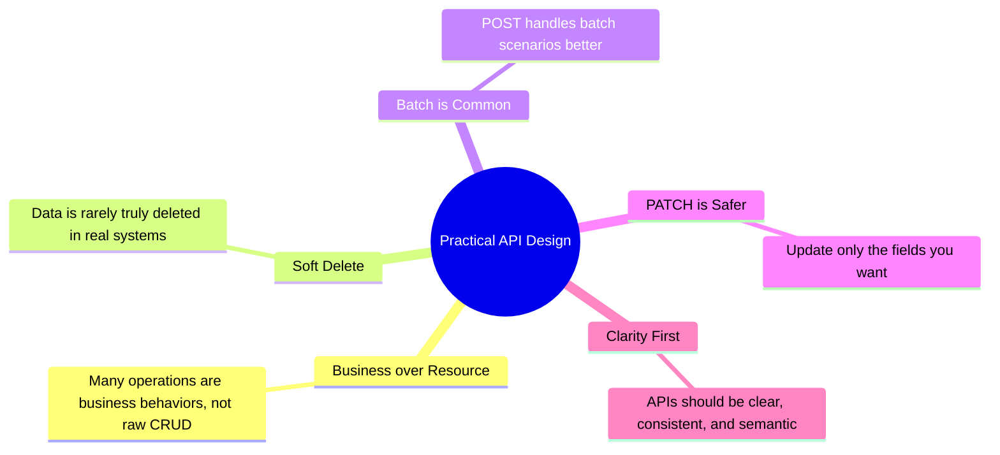

### Key Takeaways

1. **Textbook REST is a starting point, not a destination.** Real-world APIs need to balance purity with practicality.

2. **PUT is dangerous for partial updates.** It causes silent data loss. Use PATCH instead.

3. **Business actions deserve their own endpoints.** `POST /orders/456/cancel` is clearer than `PATCH /orders/456 { "status": "cancelled" }`.

4. **Soft deletes are the norm.** Hard deletes are rare in production systems due to compliance, recovery, and analytics needs.

5. **Batch operations are essential.** Design them early to avoid performance bottlenecks.

6. **Compatibility matters.** Supporting only GET/POST widens your client compatibility.

7. **The hybrid approach wins.** Use standard REST for simple CRUD, POST for actions and batch operations, and PATCH for partial updates.

8. **Good APIs express business intent.** The URL should tell you what's happening, not just what resource is being modified.

### The Decision Framework

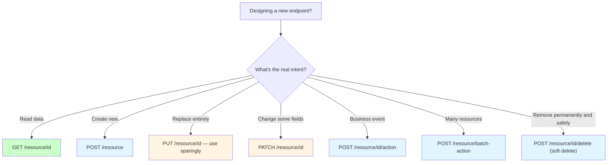

---

## Further Reading & Resources

### Official Documentation

- **RFC 7231** - HTTP/1.1 Semantics and Content: https://tools.ietf.org/html/rfc7231
- **RFC 5789** - PATCH Method for HTTP: https://tools.ietf.org/html/rfc5789
- **RFC 6902** - JSON Patch: https://tools.ietf.org/html/rfc6902
- **RFC 6901** - JSON Pointer: https://tools.ietf.org/html/rfc6901

### Books

1. **"REST API Design Rulebook"** by Mark Masse - Comprehensive guide to REST API design principles
2. **"API Design Patterns"** by JJ Geewax - Modern API design patterns and best practices
3. **"Building Microservices"** by Sam Newman - Includes excellent API design chapters
4. **"RESTful Web APIs"** by Leonard Richardson - Deep dive into REST principles

### Online Resources

- **Stripe API Design Guide:** https://stripe.com/docs/api
- **GitHub REST API Documentation:** https://docs.github.com/en/rest
- **Shopify API Documentation:** https://shopify.dev/docs/api
- **Google API Design Guide:** https://cloud.google.com/apis/design
- **Microsoft REST API Guidelines:** https://github.com/microsoft/api-guidelines

### Tools and Libraries

- **OpenAPI Specification:** https://swagger.io/specification/
- **Postman:** API testing and documentation
- **Swagger UI:** Interactive API documentation
- **Insomnia:** REST client for testing APIs
- **Dredd:** API blueprint testing tool

### Articles and Blog Posts

- "The API Design Manifesto" by Stripe Engineering
- "REST API Design: Best Practices for PUT vs PATCH" by Nordic APIs
- "Why PUT and DELETE Are Not Widely Used in Real-World APIs" by various authors
- "Soft Delete vs Hard Delete: Database Design Best Practices"

### Video Resources

- **YouTube:** "REST API Design" conferences and talks
- **Pluralsight:** API design courses
- **Udemy:** REST API design courses

### Community Resources

- **API Evangelist:** https://apievangelist.com/
- **ProgrammableWeb:** https://www.programmableweb.com/
- **API Directory:** https://api.directory/

---

## Practice Exercises

### Exercise 1: Convert a RESTful API to Hybrid Design

**Difficulty:** Intermediate | **Time:** 20 minutes

**Scenario:** You have a simple blog API that strictly follows REST principles. Convert it to a hybrid design that better handles real-world use cases.

**Original REST API:**
```http
GET    /posts/{id}
POST   /posts
PUT    /posts/{id}
PATCH  /posts/{id}
DELETE /posts/{id}
```

**Requirements:**
1. Add an endpoint to publish a post (triggers email to subscribers)
2. Add an endpoint to archive multiple posts at once
3. Implement soft delete for posts
4. Add an endpoint to like a post (increments counter, creates notification)

**Solution:**

```javascript
// 1. Publish endpoint (business action)
POST /posts/{id}/publish
{
  "notify_subscribers": true
}

// Triggers:
// - Updates post status to "published"
// - Sets published_at timestamp
// - Sends emails to subscribers
// - Creates notification records

// 2. Batch archive endpoint
POST /posts/batch-archive
{
  "post_ids": [1, 2, 3, 4, 5],
  "reason": "outdated_content"
}

// 3. Soft delete (already using DELETE, convert to POST)
POST /posts/{id}/delete
{
  "is_deleted": true,
  "deleted_at": "2026-03-13T00:00:00Z"
}

// 4. Like endpoint (business action)
POST /posts/{id}/like
{
  "user_id": 456
}

// Triggers:
// - Increments like counter
// - Creates notification for post author
// - Prevents duplicate likes
```

**Complete Implementation Example:**

```javascript
// Express.js implementation
const express = require('express');
const app = express();

// Soft delete
app.post('/posts/:id/delete', async (req, res) => {
  try {
    const post = await Post.findById(req.params.id);
    if (!post) {
      return res.status(404).json({ error: 'Post not found' });
    }
    
    post.is_deleted = true;
    post.deleted_at = new Date();
    await post.save();
    
    res.json({
      post_id: post.id,
      status: 'deleted',
      deleted_at: post.deleted_at,
      recovery_available_until: new Date(Date.now() + 30 * 24 * 60 * 60 * 1000)
    });
  } catch (error) {
    res.status(500).json({ error: error.message });
  }
});

// Publish with side effects
app.post('/posts/:id/publish', async (req, res) => {
  try {
    const { notify_subscribers } = req.body;
    const post = await Post.findById(req.params.id);
    
    if (!post) {
      return res.status(404).json({ error: 'Post not found' });
    }
    
    post.status = 'published';
    post.published_at = new Date();
    await post.save();
    
    // Trigger side effects asynchronously
    if (notify_subscribers) {
      setTimeout(async () => {
        const subscribers = await Subscriber.findActive();
        await EmailService.sendBatch(subscribers, 'New Post Published', post);
        await Analytics.track('post_published', { post_id: post.id });
      }, 0);
    }
    
    res.json({
      post_id: post.id,
      status: 'published',
      published_at: post.published_at
    });
  } catch (error) {
    res.status(500).json({ error: error.message });
  }
});

// Batch archive
app.post('/posts/batch-archive', async (req, res) => {
  try {
    const { post_ids, reason } = req.body;
    
    const result = await Post.updateMany(
      { _id: { $in: post_ids } },
      { 
        status: 'archived',
        archived_at: new Date(),
        archive_reason: reason
      }
    );
    
    // Create audit log
    await AuditLog.create({
      action: 'batch_archive',
      count: result.modifiedCount,
      reason: reason,
      performed_by: req.user.id
    });
    
    res.json({
      archived_count: result.modifiedCount,
      job_id: `archive_${Date.now()}`
    });
  } catch (error) {
    res.status(500).json({ error: error.message });
  }
});

// Like post
app.post('/posts/:id/like', async (req, res) => {
  try {
    const { user_id } = req.body;
    const post = await Post.findById(req.params.id);
    
    if (!post) {
      return res.status(404).json({ error: 'Post not found' });
    }
    
    // Check if already liked
    const existingLike = await Like.findOne({
      post_id: post.id,
      user_id: user_id
    });
    
    if (existingLike) {
      return res.status(409).json({ error: 'Already liked' });
    }
    
    // Create like
    await Like.create({
      post_id: post.id,
      user_id: user_id,
      created_at: new Date()
    });
    
    // Increment counter
    post.likes_count += 1;
    await post.save();
    
    // Create notification for post author
    await Notification.create({
      user_id: post.author_id,
      type: 'post_liked',
      message: `${user_id} liked your post`,
      post_id: post.id
    });
    
    res.json({
      post_id: post.id,
      likes_count: post.likes_count,
      liked: true
    });
  } catch (error) {
    res.status(500).json({ error: error.message });
  }
});
```

**Testing the Solution:**

```javascript
// Test 1: Soft delete
POST /posts/123/delete
Expected: 200 OK with recovery info

// Test 2: Publish with notifications
POST /posts/123/publish
Body: { "notify_subscribers": true }
Expected: 200 OK, async email sending triggered

// Test 3: Batch archive
POST /posts/batch-archive
Body: { "post_ids": [1,2,3], "reason": "outdated" }
Expected: 200 OK with count

// Test 4: Like post
POST /posts/123/like
Body: { "user_id": 456 }
Expected: 200 OK with updated count
```

---

### Exercise 2: Identify and Fix API Design Issues

**Difficulty:** Intermediate | **Time:** 15 minutes

**Scenario:** Review the following API design and identify all issues. Then provide corrected versions.

**Problematic API:**
```http
# Issue 1: GET used for state change
GET /users/123/delete?confirm=true

# Issue 2: PUT for partial update
PUT /users/123
{
  "email": "new@email.com"
}

# Issue 3: Business logic hidden in status
PATCH /orders/456
{
  "status": "cancelled"
}

# Issue 4: No batch operations
DELETE /users/1
DELETE /users/2
DELETE /users/3

# Issue 5: Hard delete
DELETE /posts/789
```

**Solution:**

```http
# Fix 1: Use POST for state change
POST /users/123/delete
{
  "confirm": true
}

# Fix 2: Use PATCH for partial update
PATCH /users/123
{
  "email": "new@email.com"
}

# Fix 3: Use explicit action endpoint
POST /orders/456/cancel
{
  "reason": "customer_request"
}

# Fix 4: Use batch endpoint
POST /users/batch-delete
{
  "user_ids": [1, 2, 3]
}

# Fix 5: Use soft delete
POST /posts/789/delete
{
  "is_deleted": true
}
```

**Explanation of Issues:**

1. **GET for state change:** Violates HTTP spec (GET should be safe). Breaks caching. Can cause CSRF vulnerabilities.

2. **PUT for partial update:** Causes silent data loss. Client must send entire object.

3. **Business logic in status:** Hides intent. Unclear side effects. Hard to maintain.

4. **No batch operations:** Poor performance. Rate limit issues. Non-atomic.

5. **Hard delete:** No recovery option. Compliance violations. Data loss.

---

### Exercise 3: Design a Complete E-Commerce API

**Difficulty:** Advanced | **Time:** 30 minutes

**Scenario:** Design a complete API for an e-commerce platform with the following requirements:

**Requirements:**
1. Products can be created, updated, viewed, and soft-deleted
2. Orders can be created, cancelled, refunded, and shipped
3. Support bulk price updates for products
4. Support bulk order cancellation
5. Users can add items to cart (business action)
6. Implement inventory management (decrease stock when order placed)

**Solution:**

```javascript
// Products
GET    /products/{id}              # View product
POST   /products                   # Create product
PATCH  /products/{id}              # Update product fields
POST   /products/{id}/delete       # Soft delete product
POST   /products/batch-update-price # Bulk price update

// Orders
GET    /orders/{id}                # View order
POST   /orders                     # Create order
POST   /orders/{id}/cancel         # Cancel order (triggers refund)
POST   /orders/{id}/refund         # Issue refund
POST   /orders/{id}/ship           # Mark as shipped
POST   /orders/batch-cancel        # Bulk cancel orders

// Cart (business action)
POST   /cart/items                 # Add item to cart
PATCH  /cart/items/{id}            # Update quantity
DELETE /cart/items/{id}            # Remove from cart
POST   /cart/checkout              # Convert cart to order

// Inventory
PATCH  /products/{id}/inventory    # Update stock level
POST   /inventory/adjust           # Adjust inventory (business action)
```

**Implementation Example:**

```javascript
// Create order with inventory check
app.post('/orders', async (req, res) => {
  const session = await mongoose.startSession();
  session.startTransaction();
  
  try {
    const { items } = req.body;
    const order = await Order.create([{ items, status: 'pending' }], { session });
    
    // Check and decrease inventory
    for (const item of items) {
      const product = await Product.findById(item.product_id).session(session);
      
      if (product.stock < item.quantity) {
        await session.abortTransaction();
        return res.status(409).json({
          error: 'Insufficient stock',
          product_id: product.id,
          available: product.stock,
          requested: item.quantity
        });
      }
      
      product.stock -= item.quantity;
      await product.save({ session });
    }
    
    await session.commitTransaction();
    
    res.status(201).json({
      order_id: order[0].id,
      status: 'pending',
      items: order[0].items
    });
  } catch (error) {
    await session.abortTransaction();
    res.status(500).json({ error: error.message });
  } finally {
    session.endSession();
  }
});

// Cancel order with refund
app.post('/orders/:id/cancel', async (req, res) => {
  const session = await mongoose.startSession();
  session.startTransaction();
  
  try {
    const order = await Order.findById(req.params.id).session(session);
    
    if (!order) {
      return res.status(404).json({ error: 'Order not found' });
    }
    
    if (order.status === 'cancelled') {
      return res.status(409).json({ error: 'Order already cancelled' });
    }
    
    // Update order
    order.status = 'cancelled';
    order.cancelled_at = new Date();
    order.cancel_reason = req.body.reason;
    await order.save({ session });
    
    // Restore inventory
    for (const item of order.items) {
      await Product.findByIdAndUpdate(
        item.product_id,
        { $inc: { stock: item.quantity } },
        { session }
      );
    }
    
    // Create refund
    const refund = await Refund.create([{
      order_id: order.id,
      amount: order.total,
      reason: req.body.reason
    }], { session });
    
    // Send email (async)
    setTimeout(async () => {
      await EmailService.send(order.user_id, 'order_cancelled', {
        order_id: order.id,
        refund_amount: refund[0].amount
      });
    }, 0);
    
    await session.commitTransaction();
    
    res.json({
      order_id: order.id,
      status: 'cancelled',
      refund_id: refund[0].id,
      refund_amount: refund[0].amount
    });
  } catch (error) {
    await session.abortTransaction();
    res.status(500).json({ error: error.message });
  } finally {
    session.endSession();
  }
});

// Batch price update
app.post('/products/batch-update-price', async (req, res) => {
  const session = await mongoose.startSession();
  session.startTransaction();
  
  try {
    const { updates } = req.body;
    // updates: [{ product_id: 1, new_price: 29.99 }, ...]
    
    const bulkOps = updates.map(update => ({
      updateOne: {
        filter: { _id: update.product_id },
        update: { 
          price: update.new_price,
          price_updated_at: new Date()
        }
      }
    }));
    
    const result = await Product.bulkWrite(bulkOps, { session });
    
    // Log price changes
    await PriceHistory.create(
      updates.map(u => ({
        product_id: u.product_id,
        old_price: u.old_price,
        new_price: u.new_price,
        changed_by: req.user.id
      })),
      { session }
    );
    
    await session.commitTransaction();
    
    res.json({
      updated_count: result.modifiedCount,
      job_id: `price_update_${Date.now()}`
    });
  } catch (error) {
    await session.abortTransaction();
    res.status(500).json({ error: error.message });
  } finally {
    session.endSession();
  }
});
```

**Testing the Solution:**

```javascript
// Test 1: Create order with inventory check
POST /orders
Body: { "items": [{ "product_id": 1, "quantity": 5 }] }
Expected: 201 Created with order details

// Test 2: Cancel order with refund
POST /orders/123/cancel
Body: { "reason": "changed_mind" }
Expected: 200 OK with refund details, inventory restored

// Test 3: Batch price update
POST /products/batch-update-price
Body: { "updates": [{ "product_id": 1, "new_price": 29.99 }] }
Expected: 200 OK with update count

// Test 4: Soft delete product
POST /products/123/delete
Expected: 200 OK with recovery info
```

---

## Test Your Understanding

Test your knowledge with these questions. Answers are provided at the end.

### Questions

1. **What is the main problem with using PUT for partial updates?**
   - A) It's slower than PATCH
   - B) It causes silent data loss
   - C) It's not idempotent
   - D) It requires more bandwidth

2. **Why do large companies prefer POST over DELETE for removing user-facing data?**
   - A) POST is faster
   - B) DELETE is deprecated
   - C) Soft deletes enable recovery and compliance
   - D) POST is more secure

3. **Which HTTP method is idempotent?**
   - A) POST
   - B) PUT
   - C) PATCH
   - D) Both B and C

4. **What is the primary benefit of batch operations?**
   - A) Better code organization
   - B) Reduced network overhead and improved performance
   - C) More RESTful design
   - D) Easier debugging

5. **When should you use PATCH instead of PUT?**
   - A) Always
   - B) When updating only specific fields
   - C) When creating new resources
   - D) When deleting resources

6. **What does "business is action, not just resource" mean?**
   - A) APIs should only use POST
   - B) Many operations represent business events, not just CRUD
   - C) Resources don't matter
   - D) Actions are faster than resources

7. **Why is soft delete important for compliance?**
   - A) It's required by HTTP spec
   - B) It enables data recovery and audit trails
   - C) It's faster than hard delete
   - D) It uses less storage

8. **What is a common compatibility constraint with PUT, PATCH, and DELETE?**
   - A) They're slower than POST
   - B) Some clients only support GET and POST
   - C) They're not secure
   - D) They're deprecated

9. **Which pattern is best for triggering business events?**
   - A) PATCH with status field
   - B) POST /resource/id/action
   - C) PUT with action parameter
   - D) DELETE and recreate

10. **What is the main advantage of action-oriented URLs?**
    - A) They're shorter
    - B) They clearly express business intent
    - C) They're faster
    - D) They use less bandwidth

### Answers

1. **B) It causes silent data loss** - PUT replaces the entire resource, so missing fields are deleted.
2. **C) Soft deletes enable recovery and compliance** - Data can be recovered and audit trails maintained.
3. **D) Both B and C** - PUT and DELETE are idempotent; POST and PATCH are not.
4. **B) Reduced network overhead and improved performance** - One request instead of many.
5. **B) When updating only specific fields** - PATCH is designed for partial updates.
6. **B) Many operations represent business events, not just CRUD** - Cancel, refund, approve are actions.
7. **B) It enables data recovery and audit trails** - Required for GDPR, HIPAA, and other regulations.
8. **B) Some clients only support GET and POST** - Legacy systems, HTML forms, certain proxies.
9. **B) POST /resource/id/action** - Explicit, clear, and supports side effects.
10. **B) They clearly express business intent** - The URL documents what's happening.

---

## Common Interview Questions

### Question 1: What's the difference between PUT and PATCH?

**Answer:**
PUT is a **full replacement** operation - the client sends the complete resource, and the server replaces the entire resource with the new version. If fields are missing, they're deleted.

PATCH is a **partial update** operation - the client sends only the fields that need to be changed, and the server merges them with the existing resource.

**Example:**
```http
PUT /users/123
{ "email": "new@email.com" }
# Result: { "email": "new@email.com" } - name and age are LOST!

PATCH /users/123
{ "email": "new@email.com" }
# Result: { "name": "Alice", "email": "new@email.com", "age": 30 } - safe!
```

### Question 2: Why don't large companies use DELETE for removing data?

**Answer:**
Large companies rarely use hard DELETE because:

1. **Compliance:** Regulations like GDPR require data retention periods
2. **Recovery:** Users accidentally delete data and need to recover it
3. **Analytics:** Historical data is needed for reporting and analysis
4. **Audit trails:** Security and compliance require keeping records
5. **Business continuity:** Accidental deletions can be catastrophic

Instead, they use soft deletes via POST /resource/id/delete, which sets an `is_deleted` flag.

### Question 3: When would you use POST instead of PUT or DELETE?

**Answer:**
Use POST when:

1. **Business actions:** Cancel, refund, approve, freeze - these are events, not resource updates
2. **Batch operations:** Operating on multiple resources at once
3. **Soft deletes:** When you don't want permanent deletion
4. **Compatibility:** When clients don't support PUT/DELETE
5. **Non-idempotent operations:** When the operation should create something new each time

### Question 4: What is idempotency and why does it matter?

**Answer:**
Idempotency means making the same request multiple times produces the same result.

**Idempotent methods:** GET, PUT, DELETE
**Non-idempotent methods:** POST, PATCH

**Why it matters:**
- **Network reliability:** If a request times out, the client can safely retry
- **Accidental duplicates:** Prevents issues from duplicate requests
- **Caching:** Idempotent operations can be safely cached
- **Predictability:** Easier to reason about system behavior

**Example:**
```http
PUT /users/123 { "name": "Alice" }
# Call it 1 time or 100 times - result is the same

POST /users { "name": "Alice" }
# Call it 1 time - 1 user created
# Call it 100 times - 100 users created!
```

### Question 5: How do you handle batch operations efficiently?

**Answer:**
1. **Design batch endpoints:** POST /resource/batch-action
2. **Use transactions:** Ensure atomicity - all succeed or all fail
3. **Limit batch size:** Prevent abuse (e.g., max 1000 items per request)
4. **Process asynchronously:** For large batches, return 202 Accepted with job ID
5. **Provide progress tracking:** GET /jobs/{id}/status
6. **Implement rate limiting:** Prevent resource exhaustion

**Example:**
```http
POST /users/batch-delete
{
  "user_ids": [1, 2, 3, ..., 1000],
  "reason": "inactive_accounts"
}

Response:
{
  "job_id": "batch_123",
  "status": "processing",
  "total": 1000,
  "processed": 0
}
```

### Question 6: What are the security implications of using GET for state changes?

**Answer:**
Using GET for state changes is a **critical security vulnerability**:

1. **CSRF attacks:** Browsers automatically send GET requests with cookies
2. **Caching:** Proxies might cache the request, causing unintended side effects
3. **Web crawlers:** Search engines might trigger state changes
4. **Link prefetching:** Browsers might prefetch links, causing actions
5. **Violates HTTP spec:** GET should be safe (no side effects)

**Example attack:**
```html

```
If the user is logged in, their browser automatically sends the GET request with their cookies, transferring money!

### Question 7: How do you ensure data consistency in batch operations?

**Answer:**
1. **Use database transactions:** All operations succeed or fail together
2. **Implement optimistic locking:** Use version numbers to prevent conflicts
3. **Validate all inputs:** Check each item before processing
4. **Provide partial success responses:** Return which items succeeded/failed
5. **Use idempotency keys:** Prevent duplicate processing
6. **Implement retry logic:** For transient failures
7. **Log all operations:** For debugging and audit trails

**Example:**
```javascript
const session = await mongoose.startSession();
session.startTransaction();

try {
  for (const userId of userIds) {
    await User.deleteOne({ _id: userId }).session(session);
  }
  
  await session.commitTransaction();
} catch (error) {
  await session.abortTransaction();
  throw error;
} finally {
  session.endSession();
}
```

### Question 8: What's the difference between soft delete and hard delete?

**Answer:**

**Soft Delete:**
- Sets a flag (e.g., `is_deleted = true`)
- Data remains in database
- Can be recovered
- Maintains referential integrity
- Supports audit trails
- Example: `UPDATE users SET is_deleted = true WHERE id = 123`

**Hard Delete:**
- Permanently removes data
- Cannot be recovered
- Breaks referential integrity if not careful
- No audit trail
- Example: `DELETE FROM users WHERE id = 123`

**When to use:**
- **Soft delete:** User-facing data, compliance requirements, data that might be needed later
- **Hard delete:** Temporary data, cache entries, truly disposable data

### Question 9: How do you handle concurrent updates to the same resource?

**Answer:**
Several strategies:

1. **Optimistic Locking:**
```http
GET /users/123
Response: { "id": 123, "name": "Alice", "version": 5 }

PATCH /users/123
If-Match: 5
{ "name": "Alicia" }
```

2. **PATCH instead of PUT:** Reduces conflict window

3. **Last-write-wins with timestamps:**
```json
{
  "name": "Alicia",
  "updated_at": "2026-03-13T10:30:00Z"
}
```

4. **Operational Transformation:** For collaborative editing

5. **Conflict resolution:** Return 409 Conflict with current state

### Question 10: What HTTP status codes should you return for business actions?

**Answer:**

| Scenario | Status Code | Reason |
|----------|-------------|--------|
| Action completed successfully | 200 OK | Standard success |
| Action triggered, processing async | 202 Accepted | Long-running operation |
| Resource created by action | 201 Created | New resource created |
| Action not allowed in current state | 409 Conflict | Business rule violation |
| Resource not found | 404 Not Found | Can't perform action |
| Not authorized | 403 Forbidden | Insufficient permissions |
| Validation error | 422 Unprocessable Entity | Semantic errors |

**Example:**
```http
POST /orders/123/cancel

# Success
200 OK
{
  "order_id": 123,
  "status": "cancelled"
}

# Already cancelled
409 Conflict
{
  "error": "Order is already cancelled"
}

# Not found
404 Not Found
{
  "error": "Order not found"
}
```

---

## Question Bank

A comprehensive set of 50+ questions covering all difficulty levels.

### Beginner Questions (1-17)

1. **What does REST stand for?**
   - Answer: Representational State Transfer

2. **What is a resource in REST?**
   - Answer: A resource is any entity that can be identified and manipulated via API (e.g., users, orders, products)

3. **What HTTP method is typically used to retrieve data?**
   - Answer: GET

4. **What HTTP method is typically used to create new resources?**
   - Answer: POST

5. **What is the main issue with using PUT for partial updates?**
   - Answer: PUT replaces the entire resource, causing missing fields to be deleted (silent data loss)

6. **What HTTP method is designed for partial updates?**
   - Answer: PATCH

7. **What is soft delete?**
   - Answer: Marking data as deleted (e.g., setting `is_deleted = true`) without physically removing it from the database

8. **Why is soft delete important?**
   - Answer: Enables data recovery, maintains compliance, preserves audit trails, and supports analytics

9. **What is a batch operation?**
   - Answer: An operation that processes multiple resources in a single API call

10. **Why are batch operations important?**
    - Answer: They reduce network overhead, improve performance, and enable atomic operations

11. **What does idempotent mean?**
    - Answer: Making the same request multiple times produces the same result

12. **Which HTTP methods are idempotent?**
    - Answer: GET, PUT, DELETE

13. **What is a business action in API design?**
    - Answer: An operation that represents a business event (e.g., cancel, refund, approve) rather than simple CRUD

14. **Why use POST for business actions instead of PATCH?**
    - Answer: POST clearly expresses intent, supports side effects, and is more semantically correct for events

15. **What is the hybrid API design strategy?**
    - Answer: Using different HTTP methods based on the operation type: REST for CRUD, POST for actions and batch operations, PATCH for partial updates

16. **What is the main advantage of action-oriented URLs?**
    - Answer: They clearly express business intent and make the API self-documenting

17. **What is a common compatibility constraint with PUT, PATCH, and DELETE?**
    - Answer: Some clients (legacy proxies, HTML forms, embedded devices) only support GET and POST

### Intermediate Questions (18-35)

18. **Explain the race condition problem with PUT.**
    - Answer: If two clients concurrently PUT different versions of a resource, the second request overwrites the first completely, causing lost updates. This happens because both clients read the full resource, modify different fields, and send complete replacements.

19. **What is JSON Patch (RFC 6902)?**
    - Answer: A formal format for expressing partial updates using operations like add, remove, replace, move, copy, and test

20. **What are the two common PATCH styles?**
    - Answer: Merge-style JSON (send only changed keys) and JSON Patch (RFC 6902 format with explicit operations)

21. **Why do companies like Stripe and GitHub use POST for most actions?**
    - Answer: POST clearly expresses business intent, supports complex side effects, and provides better compatibility

22. **What side effects might a "cancel order" action trigger?**
    - Answer: Refund processing, customer notification, inventory restoration, audit logging, analytics events

23. **How does soft delete support GDPR compliance?**
    - Answer: Allows data to be "deleted" (hidden from normal queries) while maintaining the ability to fully purge after a retention period or restore if needed

24. **What is the difference between idempotent and safe HTTP methods?**
    - Answer: Safe methods (GET) don't modify server state. Idempotent methods (GET, PUT, DELETE) produce the same result when called multiple times.

25. **Why is PATCH not idempotent by default?**
    - Answer: Because applying the same patch twice might have different effects (e.g., incrementing a counter twice)

26. **What is the Last-Write-Wins problem?**
    - Answer: In concurrent systems, when multiple clients update different fields of the same resource using PUT, the last request overwrites all previous changes

27. **How can you prevent the Last-Write-Wins problem?**
    - Answer: Use PATCH instead of PUT, implement optimistic locking with version numbers, or use ETags with conditional requests

28. **What is an idempotency key and when is it used?**
    - Answer: A unique identifier sent by the client to ensure that multiple identical requests have the same effect as a single request. Used for critical operations like payments to prevent duplicates.

29. **Why might HTML forms not support PUT, PATCH, or DELETE?**
    - Answer: Standard HTML forms only natively support GET and POST methods. PUT, PATCH, and DELETE require JavaScript workarounds.

30. **What is the main benefit of using POST for batch operations?**
    - Answer: Single network round-trip, atomicity (all succeed or fail together), and reduced rate limit consumption

31. **How do you ensure atomicity in batch operations?**
    - Answer: Use database transactions to wrap all operations, ensuring they all succeed or all fail together

32. **What HTTP status code should be returned for a successful soft delete?**
    - Answer: 200 OK (with details) or 204 No Content

33. **What is the difference between 200 OK and 204 No Content?**
    - Answer: 200 OK includes a response body, 204 No Content indicates success but with no data to return

34. **Why is it important to document side effects of POST actions?**
    - Answer: So clients understand what will happen (emails sent, notifications created, etc.) and can set appropriate expectations

35. **What is optimistic locking?**
    - Answer: A concurrency control mechanism where a version number is used to detect conflicts. If the version has changed since the client read it, the update is rejected.

### Advanced Questions (36-50+)

36. **Design a hybrid API for a social media platform. What endpoints would you create for:**
    - Creating a post
    - Deleting a post
    - Liking a post
    - Reporting a post
    - Bulk deleting user's posts
    
    **Answer:**
    ```http
    POST   /posts                    # Create post
    POST   /posts/{id}/delete        # Soft delete
    POST   /posts/{id}/like          # Like post
    POST   /posts/{id}/report        # Report post
    POST   /posts/batch-delete       # Bulk delete
    PATCH  /posts/{id}               # Update post content
    ```

37. **How would you handle a "publish" action that needs to:**
    - Update post status
    - Send notifications to subscribers
    - Update search index
    - Create analytics event
    
    **Answer:** Use POST /posts/{id}/publish and trigger all side effects asynchronously. Return 200 OK immediately, process side effects in background jobs.

38. **Explain how you would implement idempotency for a payment refund endpoint.**
    - Answer: Accept an `Idempotency-Key` header. Store the key with the result. If the same key is received again, return the stored result instead of processing again.

39. **What considerations are important when designing APIs for mobile clients with unreliable connections?**
    - Answer: Implement idempotency, support retry logic, use appropriate timeouts, provide clear error messages, consider offline mode, use exponential backoff

40. **How do you version APIs and when should you create a new version?**
    - Answer: Use URL versioning (/v1/, /v2/). Create new versions for breaking changes. Maintain backward compatibility when possible.

41. **What is the N+1 query problem and how does it relate to API design?**
    - Answer: Making N+1 database queries to fetch N items and their relationships. Solution: Use JOINs or batch loading to fetch all data in 1-2 queries.

42. **How would you design an API for a multi-tenant SaaS application?**
    - Answer: Include tenant identification in JWT or headers, use tenant-specific database schemas or row-level security, validate tenant access on every request, implement tenant isolation

43. **What is HATEOAS and should you implement it?**
    - Answer: Hypermedia as the Engine of Application State. It's a REST constraint where responses include links to related actions. Most modern APIs don't implement it due to complexity and limited client benefit.

44. **How do you handle file uploads in REST APIs?**
    - Answer: Use POST /upload with multipart/form-data, or POST /resources with base64-encoded file in JSON. For large files, use presigned URLs (S3, GCS) and direct upload.

45. **What is the difference between authentication and authorization?**
    - Answer: Authentication verifies identity (who are you?). Authorization verifies permissions (what can you do?).

46. **How do you prevent CSRF attacks in APIs?**
    - Answer: Use CSRF tokens for browser-based clients, check Origin/Referer headers, use CORS properly, require custom headers (X-CSRF-Token), use SameSite cookies

47. **What is rate limiting and why is it important?**
    - Answer: Limiting the number of requests a client can make in a time period. Prevents abuse, ensures fair usage, protects against DDoS, and maintains service quality.

48. **How do you handle long-running operations in APIs?**
    - Answer: Return 202 Accepted with a job ID, provide GET /jobs/{id} to check status, use webhooks for notifications, process asynchronously in background

49. **What is API contract testing and why is it important?**
    - Answer: Testing that the API provider and consumer agree on the interface. Prevents breaking changes, ensures compatibility, enables independent development.

50. **How do you design error responses for APIs?**
    - Answer: Use standard HTTP status codes, provide error codes, include human-readable messages, add request IDs for support, include field-level validation errors, maintain consistency

51. **What are the trade-offs of using POST vs PUT for creating resources?**
    - Answer: POST is not idempotent (creates new each time), server assigns ID. PUT is idempotent, client assigns ID. POST is more flexible, PUT is more precise.

52. **Explain the concept of "resource nesting" and when it's appropriate.**
    - Answer: Organizing resources hierarchically (e.g., /users/123/orders). Appropriate when resources have a clear parent-child relationship and you frequently need to access children in context of parent. Don't over-nest (max 2-3 levels).

53. **How do you handle pagination for large datasets?**
    - Answer: Use offset/limit or cursor-based pagination. Include total count, current page, and total pages in response. Consider keyset pagination for real-time data.

54. **What is the difference between 401 Unauthorized and 403 Forbidden?**
    - Answer: 401 means authentication is missing or invalid (who are you?). 403 means authentication succeeded but the user lacks permission (you can't do that).

55. **How do you secure API keys and secrets?**
    - Answer: Never commit to version control, use environment variables or secret managers, rotate regularly, use different keys for dev/staging/prod, implement key expiration, monitor for abuse

---

## Quick Reference Cheat Sheet

| Situation | Recommended Pattern | Example |
|-----------|---------------------|---------|
| Fetch a resource | `GET /resource/{id}` | `GET /users/123` |
| Create a new resource | `POST /resource` | `POST /users` |
| Fully replace a resource (rare) | `PUT /resource/{id}` | `PUT /users/123` |
| Update specific fields | `PATCH /resource/{id}` | `PATCH /users/123` |
| Remove a draft/never-used resource | `DELETE /resource/{id}` | `DELETE /drafts/456` |
| Remove user-facing/production data | `POST /resource/{id}/delete` (soft delete) | `POST /users/123/delete` |
| Trigger a business event (cancel, refund, approve) | `POST /resource/{id}/action` | `POST /orders/456/cancel` |
| Operate on many resources at once | `POST /resource/batch-action` | `POST /users/batch-delete` |


### Decision Tree

```
Start: What do you want to do?
│
├─ Read data? → GET /resource/{id}
│
├─ Create new resource? → POST /resource
│
├─ Update resource?
│  ├─ Replace entire resource? → PUT /resource/{id}
│  └─ Update specific fields? → PATCH /resource/{id}
│
├─ Delete resource?
│  ├─ Temporary/draft? → DELETE /resource/{id}
│  └─ User-facing data? → POST /resource/{id}/delete
│
├─ Trigger business event? → POST /resource/{id}/action
│
└─ Operate on multiple resources? → POST /resource/batch-action
```

### HTTP Methods at a Glance

| Method | Purpose | Idempotent | Safe | Use Case |
|--------|---------|------------|------|----------|
| GET | Retrieve | ✅ | ✅ | Fetch resources |
| POST | Create/Action | ❌ | ❌ | Create resources, business actions, batch ops |
| PUT | Replace | ✅ | ❌ | Full resource replacement (rare) |
| PATCH | Partial update | ❌ | ❌ | Update specific fields |
| DELETE | Delete | ✅ | ❌ | Permanent deletion (rare) |

### Common Status Codes

| Code | Meaning | When to Use |
|------|---------|-------------|
| 200 | OK | Successful GET, PATCH, POST |
| 201 | Created | Successful resource creation |
| 204 | No Content | Successful DELETE, PUT |
| 400 | Bad Request | Validation errors |
| 401 | Unauthorized | Missing/invalid auth |
| 403 | Forbidden | Insufficient permissions |
| 404 | Not Found | Resource doesn't exist |
| 409 | Conflict | Duplicate, state conflict |
| 422 | Unprocessable Entity | Semantic errors |
| 429 | Too Many Requests | Rate limit exceeded |
| 500 | Internal Server Error | Server error |

---

### Final Thought

The next time you design an endpoint, ask yourself: *"Am I modeling a resource, or am I modeling a business event?"* That single question is the difference between a textbook-correct API and a production-grade one.

**Remember:**
- ✅ Use PATCH for partial updates (not PUT)
- ✅ Use POST for business actions
- ✅ Use soft deletes for user-facing data
- ✅ Design batch endpoints early
- ✅ Document side effects clearly
- ✅ Prioritize clarity and intent over REST purity

**The best APIs aren't just RESTful — they're practical, clear, and business-aligned.**

---

## Appendix: Complete API Example

Here's a complete example of a hybrid API design for a simple task management system:

```javascript
// Tasks API - Hybrid Design

// Standard CRUD
GET    /tasks/{id}              # Get task
GET    /tasks                   # List tasks (with filters)
POST   /tasks                   # Create task
PATCH  /tasks/{id}              # Update task fields
DELETE /tasks/{id}              # Delete draft task

// Business Actions
POST   /tasks/{id}/complete     # Mark as complete
POST   /tasks/{id}/archive      # Archive task
POST   /tasks/{id}/assign       # Assign to user
POST   /tasks/{id}/comment      # Add comment

// Batch Operations
POST   /tasks/batch-complete    # Complete multiple tasks
POST   /tasks/batch-delete      # Delete multiple tasks
POST   /tasks/batch-assign      # Assign multiple tasks

// Soft Delete
POST   /tasks/{id}/delete       # Soft delete task
POST   /tasks/{id}/restore      # Restore soft-deleted task

// Example Implementation
app.post('/tasks/:id/complete', async (req, res) => {
  const task = await Task.findById(req.params.id);
  
  task.status = 'completed';
  task.completed_at = new Date();
  task.completed_by = req.user.id;
  
  await task.save();
  
  // Side effects
  await Notification.create({
    user_id: task.assigned_to,
    message: `Task "${task.title}" was completed`,
    type: 'task_completed'
  });
  
  await Analytics.track('task_completed', {
    task_id: task.id,
    user_id: req.user.id,
    project_id: task.project_id
  });
  
  res.json({
    task_id: task.id,
    status: 'completed',
    completed_at: task.completed_at
  });
});

app.post('/tasks/batch-complete', async (req, res) => {
  const session = await mongoose.startSession();
  session.startTransaction();
  
  try {
    const { task_ids } = req.body;
    
    const result = await Task.updateMany(
      { _id: { $in: task_ids }, status: 'in_progress' },
      { 
        status: 'completed',
        completed_at: new Date(),
        completed_by: req.user.id
      },
      { session }
    );
    
    // Bulk create notifications
    const tasks = await Task.find({ _id: { $in: task_ids } }).session(session);
    const notifications = tasks.map(task => ({
      user_id: task.assigned_to,
      message: `Task "${task.title}" was completed`,
      type: 'task_completed'
    }));
    
    await Notification.insertMany(notifications, { session });
    
    await session.commitTransaction();
    
    res.json({
      completed_count: result.modifiedCount,
      job_id: `batch_complete_${Date.now()}`
    });
  } catch (error) {
    await session.abortTransaction();
    res.status(500).json({ error: error.message });
  } finally {
    session.endSession();
  }
});
```

---

**🎉 Congratulations! You've completed the comprehensive tutorial on API design patterns.**

**Next Steps:**
1. Review the practice exercises and try implementing them
2. Test your knowledge with the question bank
3. Apply these patterns to your own APIs
4. Read the further reading resources for deeper understanding
5. Share this knowledge with your team

**Remember:** Good API design is a balance between REST principles and practical business needs. Always prioritize clarity, intent, and maintainability over strict adherence to textbook rules.

---

*Last Updated: January 2026 | Version: 1.0*