# Apache Causeway: The Complete Guide to Building Domain-Driven Applications on Spring Boot

## Table of Contents
1. [Overview](#1-overview)
2. [Core Mental Model](#2-core-mental-model)
3. [Causeway vs Traditional Spring MVC](#3-causeway-vs-traditional-spring-mvc)
4. [When to Use Apache Causeway](#4-when-to-use-apache-causeway)
5. [Building an Asset Management Application](#5-building-an-asset-management-application)
6. [Running and Testing the Application](#6-running-and-testing-the-application)
7. [Real-World Use Cases](#7-real-world-use-cases)
8. [Common Pitfalls and Best Practices](#8-common-pitfalls-and-best-practices)
9. [Conclusion](#9-conclusion)

---

## 1. Overview

**Apache Causeway** is a framework for building domain-driven applications on top of **Spring Boot**. Rather than starting development with controllers, DTOs, and HTML templates, developers describe **domain objects** — their state, their behavior, and their business rules — and Causeway automatically builds a runtime **metamodel** from that description.

That metamodel is then consumed by two built-in viewers:

- The **Wicket viewer**, which renders a full, navigable web UI.
- The **RESTful Objects viewer**, which exposes the same domain as a hypermedia REST API.

This makes Causeway especially powerful for **internal management software** — admin panels, back-office tools, inventory systems — where broad domain coverage and fast iteration matter more than a hand-crafted, pixel-perfect UI.

In this tutorial, we'll use **Apache Causeway 3.6.0**, **Java 21**, and **Maven** to build a small **asset management application** — tracking laptops, monitors, and phones through their lifecycle, enforcing business rules, and exposing everything through both a generated UI and a REST API.

### Why This Matters

Think about how many internal tools a mid-sized company needs: an asset tracker, a leave-management system, a vendor-onboarding tool, a ticketing dashboard. Each one typically needs the same repetitive scaffolding — forms, validation, CRUD screens — built again and again by hand. Causeway's pitch is: **describe the domain once, and get the UI and API for free.**

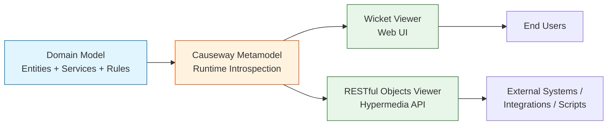

---

## 2. Core Mental Model

### 2.1 What Is a "Domain" in Causeway Terms?

The **domain** is simply the business area the software addresses. In our example, the domain is **company hardware management**:

- Which assets exist
- Who currently holds them
- Which lifecycle transitions are legal

Causeway maps these domain concepts to concrete building blocks:

| Domain Concept | Causeway Building Block | Example |
|---|---|---|
| A "thing" with identity and state | **Entity** | `Asset` |
| Temporary/calculated data, no persistent identity | **View Model** | A dashboard summary object |
| A scalar attribute | **Property** | `serialNumber`, `status` |
| A relationship to many other objects | **Collection** | `assignmentHistory` |
| Something the object *can do* | **Action** | `assignTo()`, `retire()` |
| An operation that doesn't belong to one instance | **Domain Service** | `Assets.create()`, `Assets.listAll()` |

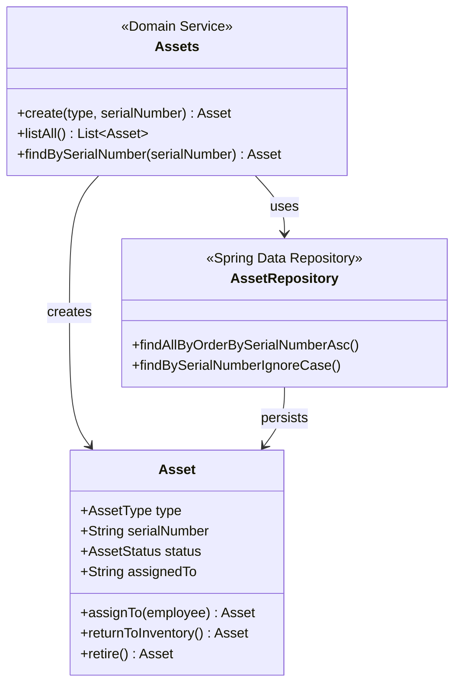

**Example — mapping a real-world concept to Causeway vocabulary:**

Imagine extending this domain to a *library management* system instead of assets:

- Entity → `Book`
- Properties → `isbn`, `title`, `status` (AVAILABLE / BORROWED / LOST)
- Actions → `checkOut()`, `returnBook()`, `markLost()`
- Domain Service → `Books.create()`, `Books.searchByTitle()`

The pattern repeats across almost any back-office domain — assets, books, tickets, invoices, employees — which is exactly why Causeway generalizes so well.

### 2.2 The Metamodel: Causeway's Secret Sauce

At startup, Causeway scans your annotated classes (`@DomainObject`, `@DomainService`, `@Action`, etc.) and builds an in-memory **metamodel**: a structured description of every object type, its properties, collections, actions, and validation rules.

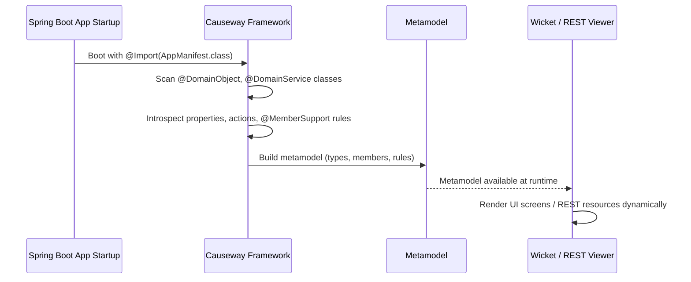

This is the key architectural idea: **the UI and API are not hand-written — they are a runtime reflection of the metamodel**, which is itself a reflection of your domain code.

---

## 3. Causeway vs Traditional Spring MVC

### 3.1 The Traditional Flow

In a conventional [Spring MVC](/spring-mvc-tutorial) application, every new use case typically requires new web-layer code:

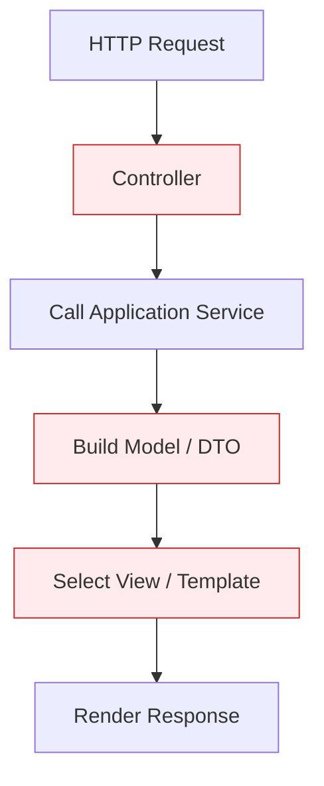

Every red box above is **code you write by hand, per use case** — even when the underlying business logic is trivial. Adding a "retire this asset" button means: a controller endpoint, a form, validation logic, a template, and wiring between them.

### 3.2 The Causeway Flow

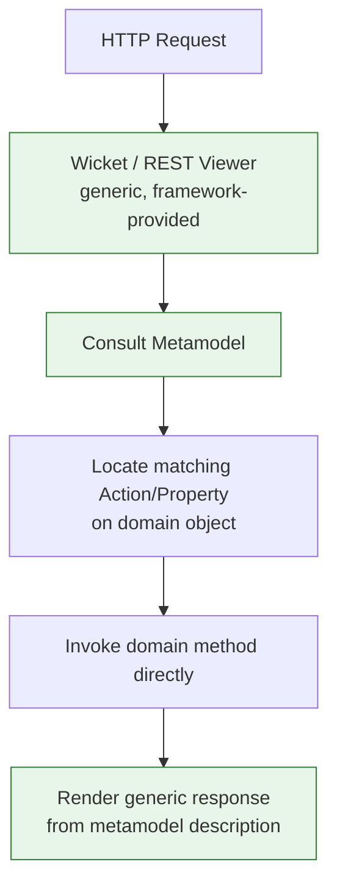

Here, **only the domain method (`retire()`) is new code**. The viewer, form generation, and validation display are already built into the framework and driven entirely by metadata.

### 3.3 Side-by-Side Comparison

| Aspect | Traditional Spring MVC | Apache Causeway |
|---|---|---|
| New use case = | Controller + DTO + template | Just a domain method |
| Business rules live in | Controller/service + duplicated in frontend | Single source of truth: `@MemberSupport` methods |
| UI generation | Hand-crafted per screen | Auto-generated from metamodel |
| REST API | Hand-written endpoints | Auto-generated hypermedia API |
| Best for | Custom, branded UX | Internal tools, admin systems, prototypes |
| Development speed for CRUD-heavy domains | Slower | Much faster |
| Customization ceiling | Very high | Bounded by generic viewer capabilities |

**Important nuance:** Causeway doesn't eliminate your architecture — you still configure persistence, security, and Spring modules, and you can still put complex orchestration logic in application services. What it removes is the **repetitive presentation-layer glue code** for each new domain capability.

---

## 4. When to Use Apache Causeway

### 4.1 Good Fit ✅

- **Back-office / admin tools** — internal dashboards where correctness and speed of delivery beat visual polish.
- **Domain-heavy prototypes** — validating business rules and terminology with stakeholders before investing in a custom UI.
- **Line-of-business applications** — inventory, HR tools, claims processing, compliance tracking.
- **Rapid internal tooling for startups** — small teams that can't afford to hand-build admin UIs for every internal system.

### 4.2 Poor Fit ❌

- **Consumer-facing, highly branded products** — Causeway's generic UI isn't meant to compete with a custom-designed storefront or marketing site.
- **Pixel-perfect interaction design** — animations, custom layouts, and non-standard navigation flows fight against the generic viewer.
- **Non-domain-driven page flows** — wizards or flows that don't map cleanly onto "objects with actions."

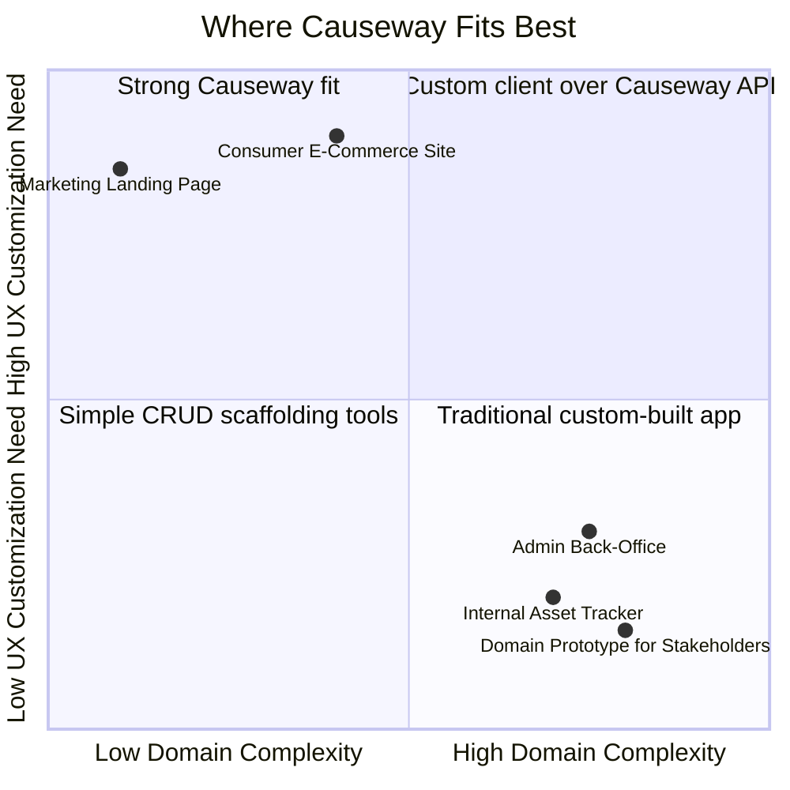

### 4.3 Use Case Snapshot

| Scenario | Why Causeway Helps |
|---|---|
| A logistics company needs an internal tool to track equipment across warehouses | Fast to model entities like `Equipment`, `Warehouse`, and lifecycle actions like `transferTo()` |
| A startup needs an admin panel to manage subscriptions before hiring a frontend team | Get a working, secured UI without writing any HTML |
| A compliance team needs to prototype a workflow to validate rules with legal | Business rules expressed directly in code, immediately testable via generated UI |
| An enterprise wants to expose internal data to a partner integration | The RESTful Objects API works as a hypermedia interface out of the box |

---

## 5. Building an Asset Management Application

We'll model an `Asset` with:

- `type` (LAPTOP, MONITOR, PHONE)
- `serialNumber`
- `status` (AVAILABLE, ASSIGNED, RETIRED)
- `assignedTo` (optional employee name)

### 5.1 Asset Lifecycle

Before writing any code, it helps to visualize the state machine we're enforcing:

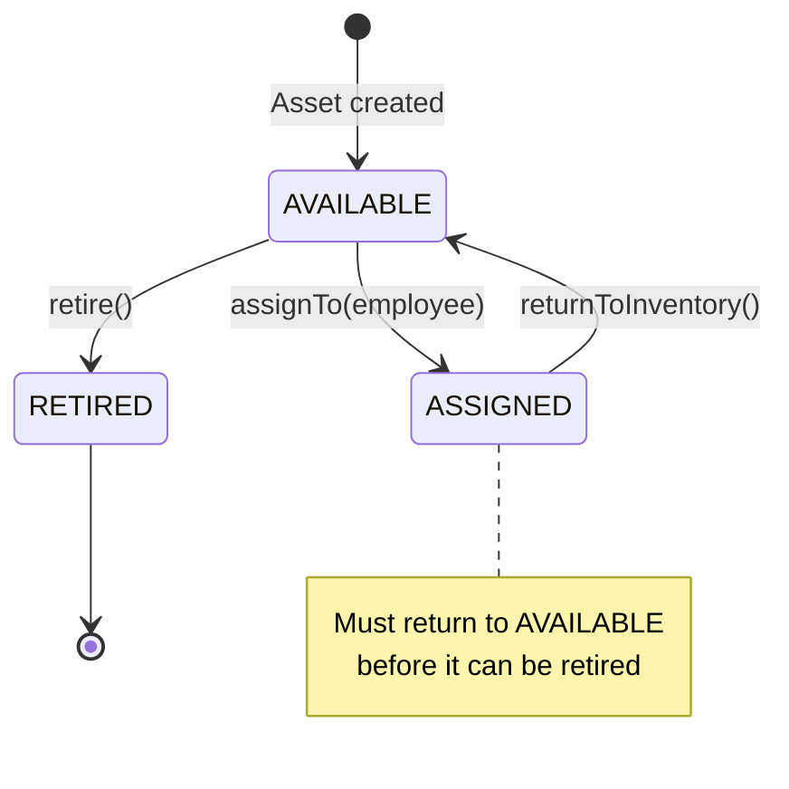

This diagram *is* effectively the business logic we're going to encode in `@MemberSupport` guard methods later — Causeway just makes the state machine explicit and enforced consistently across UI and API.

### 5.2 Project Setup

We need **JDK 21** and **Maven 3.9.11**. The **Causeway application starter parent** manages compatible Spring Boot and framework versions.

```xml
<project xmlns="http://maven.apache.org/POM/4.0.0"
    xmlns:xsi="http://www.w3.org/2001/XMLSchema-instance"
    xsi:schemaLocation="http://maven.apache.org/POM/4.0.0 https://maven.apache.org/xsd/maven-4.0.0.xsd">
    <modelVersion>4.0.0</modelVersion>

    <parent>
        <groupId>org.apache.causeway.app</groupId>
        <artifactId>causeway-app-starter-parent</artifactId>
        <version>3.6.0</version>
        <relativePath/>
    </parent>

    <groupId>com.baeldung</groupId>
    <artifactId>apache-causeway</artifactId>
    <version>1.0.0-SNAPSHOT</version>

    <dependencies>
        <dependency>
            <groupId>org.apache.causeway.mavendeps</groupId>
            <artifactId>causeway-mavendeps-webapp</artifactId>
            <type>pom</type>
        </dependency>
        <dependency>
            <groupId>org.apache.causeway.viewer</groupId>
            <artifactId>causeway-viewer-wicket-viewer</artifactId>
        </dependency>
        <dependency>
            <groupId>org.apache.causeway.viewer</groupId>
            <artifactId>causeway-viewer-restfulobjects-jaxrsresteasy</artifactId>
        </dependency>
        <dependency>
            <groupId>org.apache.causeway.security</groupId>
            <artifactId>causeway-security-simple</artifactId>
        </dependency>
        <dependency>
            <groupId>org.apache.causeway.persistence</groupId>
            <artifactId>causeway-persistence-jpa-eclipselink</artifactId>
        </dependency>
        <dependency>
            <groupId>org.apache.causeway.viewer</groupId>
            <artifactId>causeway-viewer-wicket-applib</artifactId>
        </dependency>
        <dependency>
            <groupId>com.h2database</groupId>
            <artifactId>h2</artifactId>
            <scope>runtime</scope>
        </dependency>
        <dependency>
            <groupId>org.springframework</groupId>
            <artifactId>spring-instrument</artifactId>
        </dependency>
        <!-- JUnit, Mockito, and Causeway test dependencies omitted for brevity -->
    </dependencies>

    <properties>
        <java.version>21</java.version>
        <maven.compiler.release>21</maven.compiler.release>
    </properties>
</project>
```

**What each dependency buys you:**

| Dependency | Purpose |
|---|---|
| `causeway-mavendeps-webapp` | Common runtime bundle (core services, config) |
| `causeway-viewer-wicket-viewer` | The generated web UI |
| `causeway-viewer-restfulobjects-jaxrsresteasy` | The generated hypermedia REST API |
| `causeway-security-simple` | Lightweight in-memory security for demos |
| `causeway-persistence-jpa-eclipselink` | JPA persistence via EclipseLink |
| `h2` | Embedded database for local development |

> 💡 **Beginner tip:** Think of `causeway-app-starter-parent` the same way you'd think of `spring-boot-starter-parent` — it pins compatible versions so you don't have to chase dependency conflicts manually.

Next, a Spring configuration class scopes the application code:

```java
@Configuration
@ComponentScan(basePackageClasses = Assets.class)
@EnableJpaRepositories(basePackageClasses = AssetRepository.class)
@EntityScan(basePackageClasses = Asset.class)
public class AssetManagementModule {
}
```

- `@ComponentScan` discovers the domain service (`Assets`).
- `@EnableJpaRepositories` activates the Spring Data repository.
- `@EntityScan` registers the JPA entity (`Asset`).

We then assemble everything in `AppManifest`:

```java
@Configuration
@Import({
    CausewayModuleApplibMixins.class,
    CausewayModuleCoreRuntimeServices.class,
    CausewayModuleSecuritySimple.class,
    CausewayModulePersistenceJpaEclipselink.class,
    CausewayModuleViewerRestfulObjectsJaxrsResteasy.class,
    CausewayModuleViewerWicketApplibMixins.class,
    CausewayModuleViewerWicketViewer.class,
    AssetManagementModule.class
})
@PropertySource(CausewayPresets.NoTranslations)
public class AppManifest {
    // Password encoding and demo-only SimpleRealm configuration omitted
}
```

In `application.yml`, set:

```yaml
causeway:
  applib:
    annotation:
      action:
        explicit: true
```

This means: **only methods explicitly annotated with `@Action` become actions** — a safety net against accidentally exposing helper methods.

### 5.3 The `Asset` Entity

```java
@Entity
@Table(
    schema = "assets",
    name = "Asset",
    uniqueConstraints = @UniqueConstraint(
        name = "Asset__serialNumber__UNQ",
        columnNames = "serial_number"
    )
)
@EntityListeners(CausewayEntityListener.class)
@Named("assets.Asset")
@DomainObject
@DomainObjectLayout
public class Asset implements Comparable<Asset> {

    protected Asset() {
    }

    public Asset(final AssetType type, final String serialNumber) {
        this.type = type;
        this.serialNumber = serialNumber;
        this.status = AssetStatus.AVAILABLE;
    }
}
```

**Annotation breakdown:**

- **JPA annotations** map the entity and enforce a DB-level unique constraint on `serial_number`.
- `@Named` gives Causeway a stable logical identifier, independent of the Java package (important — renaming a package won't break existing REST clients).
- `@DomainObject` marks the class as part of the Causeway metamodel.
- `CausewayEntityListener` wires JPA lifecycle events (like injection of services into freshly-loaded entities) into Causeway.
- The constructor enforces the **first invariant**: every asset starts life as `AVAILABLE`.

Identity properties:

```java
@Enumerated(EnumType.STRING)
@Column(name = "type", nullable = false, length = 20)
private AssetType type;

@PropertyLayout(fieldSetId = LayoutConstants.FieldSetId.IDENTITY, sequence = "1")
public AssetType getType() {
    return type;
}

@Column(name = "serial_number", nullable = false, length = 80)
private String serialNumber;

@Title(prepend = "Asset: ")
@Property(maxLength = 80)
@PropertyLayout(fieldSetId = LayoutConstants.FieldSetId.IDENTITY, sequence = "2")
public String getSerialNumber() {
    return serialNumber;
}
```

- `EnumType.STRING` stores readable values (`LAPTOP`) rather than fragile ordinals — **always prefer this** in production, since reordering an enum with ordinal storage silently corrupts data.
- `@PropertyLayout` controls grouping/ordering in the generated UI.
- `@Title` contributes to the object's display title shown throughout the UI (e.g., in dropdowns, breadcrumbs, and search results).

### 5.4 Adding Behavior With Actions

Rather than exposing raw setters, the entity exposes **actions that change related state together** — this keeps invariants intact.

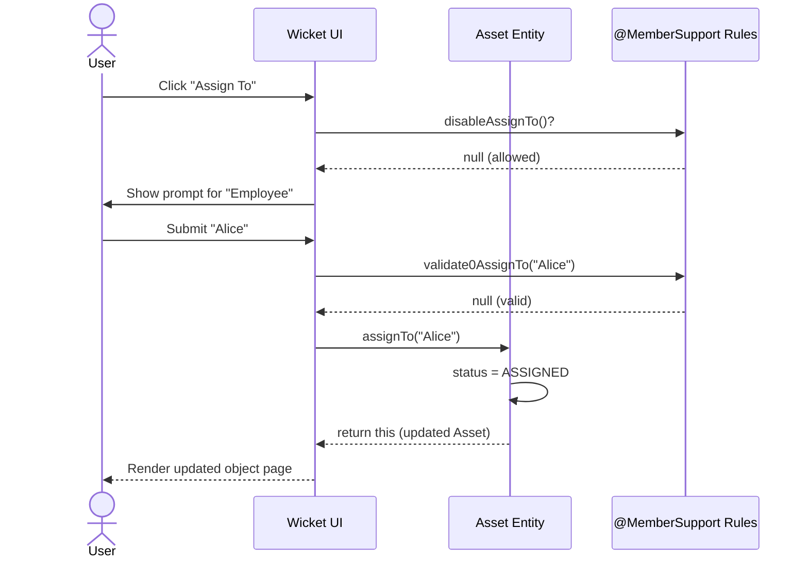

**Assign an asset:**

```java
@Action(semantics = SemanticsOf.IDEMPOTENT)
@ActionLayout(
    fieldSetId = LayoutConstants.FieldSetId.DETAILS,
    position = ActionLayout.Position.PANEL,
    describedAs = "Assigns an available asset to an employee"
)
public Asset assignTo(
    @Parameter(maxLength = 100)
    @ParameterLayout(named = "Employee") final String employee) {
    assignedTo = employee.trim();
    status = AssetStatus.ASSIGNED;
    return this;
}
```

Returning `this` tells the viewer "stay on this object's page, showing the updated state" — a small but important UX detail.

**Return to inventory and retire:**

```java
@Action(semantics = SemanticsOf.IDEMPOTENT)
@ActionLayout(
    fieldSetId = LayoutConstants.FieldSetId.DETAILS,
    position = ActionLayout.Position.PANEL,
    describedAs = "Returns an assigned asset to inventory"
)
public Asset returnToInventory() {
    assignedTo = null;
    status = AssetStatus.AVAILABLE;
    return this;
}

@Action(semantics = SemanticsOf.IDEMPOTENT_ARE_YOU_SURE)
@ActionLayout(
    fieldSetId = LayoutConstants.FieldSetId.DETAILS,
    position = ActionLayout.Position.PANEL,
    describedAs = "Permanently retires an asset"
)
public Asset retire() {
    assignedTo = null;
    status = AssetStatus.RETIRED;
    return this;
}
```

`IDEMPOTENT_ARE_YOU_SURE` is a nice touch — it automatically triggers a confirmation dialog in the Wicket viewer for destructive actions, **without any extra frontend code**.

> ⚠️ **Semantics annotations describe intent, not guarantee.** Marking a method `IDEMPOTENT` documents that repeated calls should have the same effect — it doesn't automatically make sloppy Java code idempotent. You still have to write it that way.

### 5.5 Enforcing Business Rules

Causeway uses **naming conventions** to wire supporting methods to domain members:

| Convention | Purpose |
|---|---|
| `disableXxx()` | Returns `null` to allow, or a message to disable the action/property |
| `validateNXxx(param)` | Validates parameter N (zero-indexed) |
| `hideXxx()` | Hides a member entirely from certain contexts |

```java
@MemberSupport
public String disableAssignTo() {
    return status == AssetStatus.AVAILABLE
        ? null
        : "Only available assets can be assigned";
}

@MemberSupport
public String validate0AssignTo(final String employee) {
    return employee == null || employee.isBlank()
        ? "Employee name is required"
        : null;
}

@MemberSupport
public String disableReturnToInventory() {
    return status == AssetStatus.ASSIGNED
        ? null
        : "Only assigned assets can be returned";
}

@MemberSupport
public String disableRetire() {
    if (status == AssetStatus.ASSIGNED) {
        return "Return the asset before retiring it";
    }
    return status == AssetStatus.RETIRED
        ? "The asset is already retired"
        : null;
}
```

**How this maps to our state diagram:** every transition arrow from Section 5.1 corresponds to exactly one `disableXxx()` guard. This is the single biggest win of the domain-driven approach — **the rules are written once, in one place, and enforced identically whether the request comes from the Wicket UI or the REST API.**

> 🔑 **Key point:** These checks only apply to Causeway-managed interactions (through the viewers). A direct Java call to `asset.assignTo("Bob")` from unrelated code is still just a plain method call — it bypasses `validate0AssignTo()` and `disableAssignTo()` entirely. If you need these guarantees enforced universally, consider calling through the Causeway `WrapperFactory`, or duplicating critical invariants inside the method body itself.

### 5.6 The `Assets` Domain Service

Entity actions operate on *one* asset. Creation and search logic that isn't tied to a single instance belongs in a **domain service**:

```java
@Named("assets.Assets")
@DomainService
@Priority(PriorityPrecedence.EARLY)
public class Assets {

    private final RepositoryService repositoryService;
    private final AssetRepository assetRepository;

    @Inject
    public Assets(
        final RepositoryService repositoryService,
        final AssetRepository assetRepository) {
        this.repositoryService = repositoryService;
        this.assetRepository = assetRepository;
    }

    @Action(semantics = SemanticsOf.NON_IDEMPOTENT)
    @ActionLayout(promptStyle = PromptStyle.DIALOG_MODAL)
    public Asset create(
        @ParameterLayout(named = "Type") final AssetType type,
        @Parameter(maxLength = 80)
        @ParameterLayout(named = "Serial number") final String serialNumber) {
        return repositoryService.persist(new Asset(type, serialNumber.trim()));
    }

    @MemberSupport
    public String validate1Create(final String serialNumber) {
        if (serialNumber == null || serialNumber.isBlank()) {
            return "Serial number is required";
        }
        return assetRepository.findBySerialNumberIgnoreCase(serialNumber.trim()).isPresent()
            ? "An asset with this serial number already exists"
            : null;
    }
}
```

Backed by a Spring Data repository — no implementation class needed:

```java
public interface AssetRepository extends JpaRepository<Asset, Long> {

    List<Asset> findAllByOrderBySerialNumberAsc();

    List<Asset> findBySerialNumberContainingIgnoreCaseOrderBySerialNumberAsc(
        String serialNumber
    );

    Optional<Asset> findBySerialNumberIgnoreCase(String serialNumber);
}
```

Finally, wire the actions into the menu:

```xml
<mb3:menu>
    <mb3:named>Assets</mb3:named>
    <mb3:section>
        <mb3:serviceAction objectType="assets.Assets" id="create"/>
        <mb3:serviceAction objectType="assets.Assets" id="findBySerialNumber"/>
        <mb3:serviceAction objectType="assets.Assets" id="listAll"/>
    </mb3:section>
</mb3:menu>
```

### 5.7 Application Entry Point

```java
@SpringBootApplication
@Import(AppManifest.class)
public class AssetManagementApplication extends SpringBootServletInitializer {

    public static void main(final String[] args) {
        CausewayPresets.prototyping();
        SpringApplication.run(AssetManagementApplication.class, args);
    }
}
```

`CausewayPresets.prototyping()` activates convenient defaults (in-memory DB, permissive security) suitable **only** for local exploration — never production.

---

## 6. Running and Testing the Application

### 6.1 Build and Run

```bash
mvn clean install
mvn spring-boot:run
```

Then open `http://localhost:8080/wicket/` and log in with `admin` / `pass`.

### 6.2 Walking Through the Demo

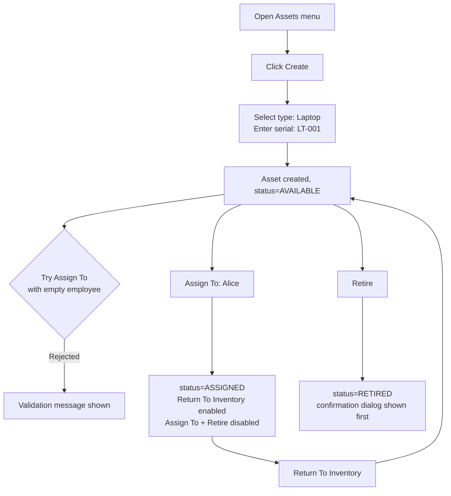

1. From the **Assets** menu, choose **Create**, select **Laptop**, enter `LT-001`.
2. Causeway renders the new object immediately, with title, properties, and available actions derived purely from the metamodel.
3. Submitting **Assign To** with a blank employee is rejected client-side — the mandatory parameter rule from `String` fields kicks in automatically.
4. After entering `Alice`, the asset flips to `ASSIGNED`. The page **re-renders with different enabled/disabled actions** — no page-specific conditional logic was written for this; it all comes from the `disableXxx()` methods.

**No controller, no form, no HTML template was written for any of this.**

### 6.3 The Generated REST API

```java
@Action(semantics = SemanticsOf.SAFE)
public List<Asset> listAll() {
    return assetRepository.findAllByOrderBySerialNumberAsc();
}
```

The **RESTful Objects viewer** maps this `SAFE` action to an authenticated `GET`:

```bash
curl -i -u admin:pass \
    -H 'Accept: application/json' \
    'http://localhost:8080/restful/services/assets.Assets/actions/listAll/invoke'
```

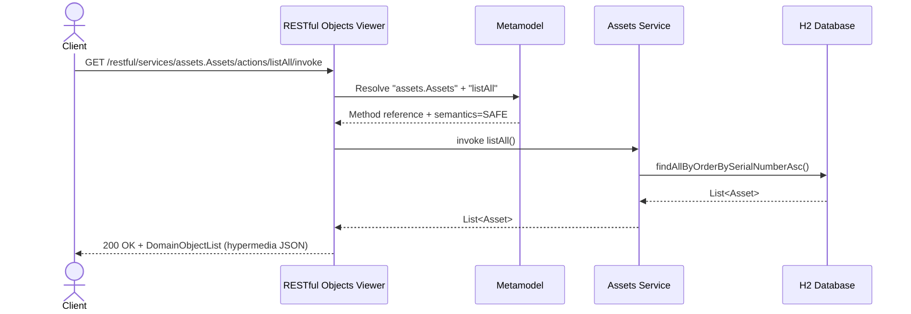

The response is a **`DomainObjectList`** hypermedia representation — links, relation types, and media-type profiles — not a bare JSON array. This is powerful for generic clients that can navigate the API, but **before treating it as a stable public API, deliberately design and version the exposed surface**.

**Example — invoking the create action via REST:**

```bash
curl -i -u admin:pass \
    -X POST \
    -H 'Content-Type: application/json' \
    -H 'Accept: application/json' \
    -d '{"type": {"value":"LAPTOP"}, "serialNumber": {"value":"LT-002"}}' \
    'http://localhost:8080/restful/services/assets.Assets/actions/create/invoke'
```

This demonstrates the real power of the pattern: **the same validation rule (`validate1Create`) that protects the Wicket form also protects this REST call**, with zero duplicated logic.

---

## 7. Real-World Use Cases

### 7.1 IT Asset Tracking (this tutorial's example)
A mid-size company tracks laptops, monitors, and phones assigned to employees. HR and IT both need visibility, but neither team wants to build a custom app. Causeway gives them a working system in days, with an audit-friendly action history.

### 7.2 Internal Approval Workflows
Modeling a `PurchaseRequest` entity with actions like `submit()`, `approve()`, `reject()`, each guarded by `disableXxx()` rules based on role and current status — mirrors the exact pattern used here for asset lifecycle.

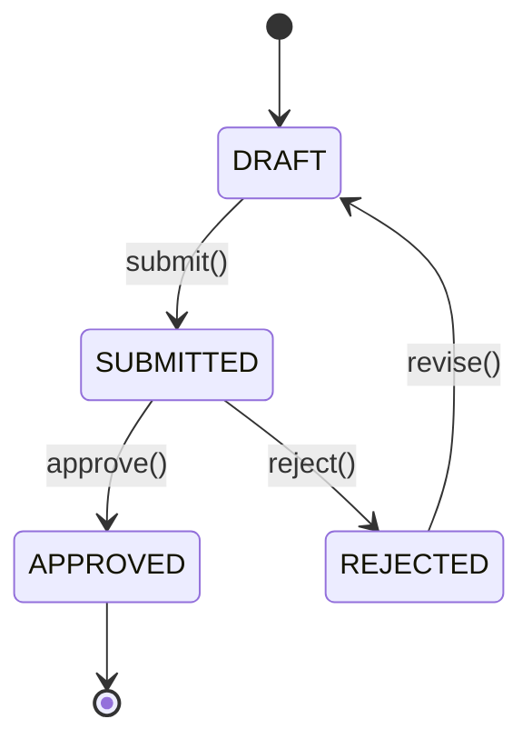

### 7.3 Rapid Domain Prototyping for Stakeholder Review
Business analysts and domain experts can click through a real, working system to validate terminology and rules — long before a pixel of custom UI is designed. This catches misunderstandings early, when they're cheap to fix.

### 7.4 Data Migration / Back-Office Admin Consoles
Teams migrating legacy systems often need a temporary admin console to inspect, fix, and manage records during the transition. Causeway can stand this up quickly, then be retired once migration completes.

### 7.5 Exposing a Hypermedia API for Integration Partners
Because the RESTful Objects API is generated from the same rules as the UI, integration partners get a governed, validated API surface without a separate REST layer being hand-built and kept in sync.

---

## 8. Common Pitfalls and Best Practices

| Pitfall | Why It Happens | Better Approach |
|---|---|---|
| Treating raw REST output as a stable public API | `DomainObjectList` exposes internal structure directly | Define an explicit, versioned client-facing representation |
| Calling entity methods directly in Java, bypassing rules | `@MemberSupport` guards only apply via Causeway viewers | Use `WrapperFactory` or duplicate critical checks in the method body |
| Storing enums as ordinals | Default JPA behavior without `@Enumerated(EnumType.STRING)` | Always use `EnumType.STRING` for stability |
| Shipping `CausewayPresets.prototyping()` to production | Convenient for local dev, insecure by default | Use production security, real persistence, and schema migrations |
| Expecting full UX customization | Causeway's viewer is generic by design | Layer a custom client over the REST API for branded experiences |

---

## 9. Conclusion

We began with Causeway's **domain-first mental model** and built a working internal asset management application from scratch:

- Mapped a JPA entity with identity properties.
- Modeled lifecycle behavior as **actions**, not raw setters.
- Enforced valid state transitions using `@MemberSupport` guard methods — the same rules driving both the UI and REST API.
- Added a domain service for creation and queries, backed by Spring Data JPA.
- Ran the generated Wicket UI and invoked the RESTful Objects API directly.

Apache Causeway shines when a **behavior-rich domain** and **rapid, consistent delivery** of management screens matter more than a fully custom interface. For internal tools, prototypes, and back-office systems, that trade-off is often exactly right.

**Complete source code:** [GitHub — apache-causeway tutorial](https://github.com/eugenp/tutorials/tree/master/apache-causeway)

### Further Reading
- [Apache Causeway official docs — common use cases](https://causeway.apache.org/docs/3.6.0/what-is-apache-causeway/common-use-cases.html)
- [RESTful Objects viewer documentation](https://causeway.apache.org/vro/3.6.0/about.html)
- [Spring Boot fundamentals](/spring-boot-start)
- [Spring Data JPA persistence layer](/the-persistence-layer-with-spring-data-jpa)