# BYOC Anywhere: A Complete Tutorial on the Spectrum of Bring-Your-Own-Cloud Deployments

**Last Updated:** January 2026  
**Difficulty Level:** Intermediate  
**Estimated Reading Time:** 45-60 minutes  
**Category:** Cloud Architecture / Enterprise Software

---

## Table of Contents

1. [Introduction: Why "BYOC" Is Not One Thing](#1-introduction-why-byoc-is-not-one-thing)
2. [Prerequisites](#prerequisites)
3. [Learning Objectives](#learning-objectives)
4. [Core Concept: SaaS vs. BYOC](#2-core-concept-saas-vs-byoc)
5. [The BYOC Spectrum: Five Deployment Models](#3-the-byoc-spectrum-five-deployment-models)
6. [Why Customers Ask for BYOC (With Real-World Examples)](#4-why-customers-ask-for-byoc-with-real-world-examples)
7. [Deep Dive: BYOC-Account](#5-deep-dive-byoc-account)
8. [Deep Dive: BYOC-VPC](#6-deep-dive-byoc-vpc)
9. [Deep Dive: BYOC-K8s](#7-deep-dive-byoc-k8s)
10. [Deep Dive: Air-Gapped Delivery](#8-deep-dive-air-gapped-delivery)
11. [Decision Framework: Matching Customer Needs to BYOC Flavors](#9-decision-framework-matching-customer-needs-to-byoc-flavors)
12. [The Security Challenge: Building BYOC Securely by Design](#10-the-security-challenge-building-byoc-securely-by-design)
13. [The Portability Challenge: One Product, Many Environments](#11-the-portability-challenge-one-product-many-environments)
14. [The Operations Challenge: Day 2 and Beyond](#12-the-operations-challenge-day-2-and-beyond)
15. [Putting It All Together: BYOC as a Product Architecture](#13-putting-it-all-together-byoc-as-a-product-architecture)
16. [Practical Checklist for Building a BYOC Platform](#14-practical-checklist-for-building-a-byoc-platform)
17. [Best Practices](#best-practices)
18. [Anti-Patterns to Avoid](#anti-patterns-to-avoid)
19. [Performance Considerations](#performance-considerations)
20. [Security Considerations](#security-considerations)
21. [Testing Strategies](#testing-strategies)
22. [Migration Guide](#migration-guide)
23. [Troubleshooting Guide](#troubleshooting-guide)
24. [Practice Exercises](#practice-exercises)
25. [Test Your Understanding](#test-your-understanding)
26. [Common Interview Questions](#common-interview-questions)
27. [Question Bank](#question-bank)
28. [Summary and Key Takeaways](#15-summary-and-key-takeaways)
29. [Further Reading & Resources](#further-reading--resources)

---

## Prerequisites

Before diving into this tutorial, you should have:

- **Basic cloud computing knowledge** - Familiarity with AWS, Azure, or GCP concepts
- **Understanding of networking fundamentals** - VPCs, subnets, firewalls, DNS
- **Kubernetes basics** - Pods, deployments, services, namespaces (helpful but not mandatory)
- **Infrastructure as Code familiarity** - Basic understanding of Terraform or CloudFormation
- **Security concepts** - IAM, encryption, zero-trust principles
- **Enterprise software experience** - Understanding of SaaS deployment models

**Recommended background:**
- 1+ year working with cloud infrastructure
- Exposure to enterprise customer requirements
- Basic understanding of compliance and regulatory frameworks (GDPR, HIPAA, etc.)

---

## Learning Objectives

By the end of this comprehensive tutorial, you will be able to:

- ✅ **Define** BYOC and explain why it's a spectrum, not a single pattern
- ✅ **Differentiate** between the five BYOC deployment models (SaaS, Account, VPC, K8s, Air-gapped)
- ✅ **Identify** customer drivers for BYOC requirements (data residency, security, compliance, cost)
- ✅ **Evaluate** which BYOC flavor fits specific enterprise requirements
- ✅ **Design** security-first BYOC architectures with zero-trust principles
- ✅ **Address** the three core BYOC challenges: security, portability, and operations
- ✅ **Create** least-privilege IAM policies for BYOC deployments
- ✅ **Implement** outbound-only agent architectures for zero-inbound access
- ✅ **Build** multi-environment deployment strategies using Kubernetes operators
- ✅ **Develop** operational playbooks for Day 2 BYOC management
- ✅ **Avoid** common anti-patterns and pitfalls in BYOC implementations
- ✅ **Design** migration paths between BYOC deployment models

---

## 1. Introduction: Why "BYOC" Is Not One Thing

If you've been in enterprise software, infrastructure, or AI platform circles recently, you've probably heard the term **BYOC — Bring Your Own Cloud**. It's often used loosely, as if it describes a single, well-defined deployment pattern. In reality, BYOC is closer to a **spectrum of deployment and operating models**, each with different technical requirements, security postures, and operational responsibilities.

This tutorial will walk you through:
- What BYOC actually means (and doesn't mean)
- The five major points on the BYOC spectrum
- Concrete examples and diagrams for each model
- How to decide which model fits a given customer
- The three hardest challenges vendors face when building BYOC products: **security, portability, and operations**

By the end, you should be able to look at a customer requirement like *"we need private networking and no vendor access to raw data"* and immediately know which BYOC flavor applies — and what it will take to build it.

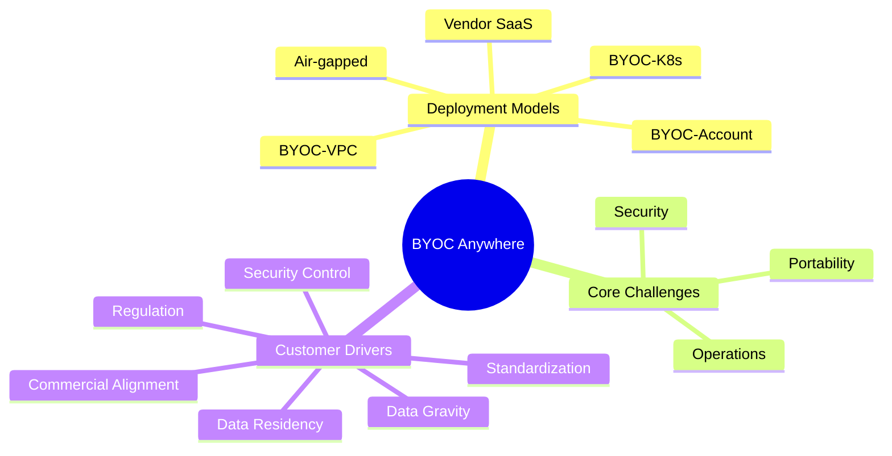

**💡 Key Insight:** BYOC is not "no vendor involvement." It's "vendor involvement, but inside a boundary the customer controls."

---

## 2. Core Concept: SaaS vs. BYOC

Before diving into the spectrum, let's firmly establish the baseline distinction.

### Traditional SaaS Model

In classic SaaS, **the vendor owns everything**:
- The application
- The data plane (where customer data actually lives and is processed)
- The infrastructure (compute, storage, networking)
- The operations (monitoring, scaling, patching)

The customer simply logs in and uses the product. Think of tools like a typical project management SaaS tool — you never think about which AWS account it runs in.

### BYOC Model

In BYOC, **the boundary shifts**. The customer retains:
- The workload (compute resources)
- The data (databases, files, logs)
- Network controls (VPCs, firewalls, routing)
- Audit logs (who did what, when)
- Often, billing (usage is billed to the customer's own cloud account)

But the vendor **still provides the managed product experience** — meaning the customer doesn't have to become infrastructure experts to run the vendor's software. The vendor deploys, upgrades, monitors, and supports the product; it just does so *inside the customer's environment* instead of its own.

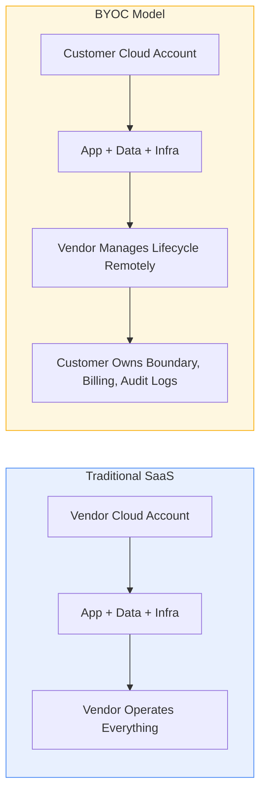

**Key takeaway:** BYOC is not "no vendor involvement." It's "vendor involvement, but inside a boundary the customer controls."

---

## 3. The BYOC Spectrum: Five Deployment Models

The article's central insight is that BYOC is not binary — it's a spectrum ranging from "mostly like SaaS" to "fully disconnected." Here's the full spectrum, visualized:

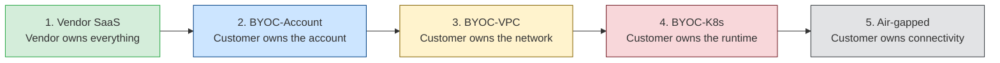

Notice the pattern: **as you move right, the customer takes ownership of more layers of the stack**, and correspondingly, the vendor has to give up direct control over more of the environment. Each step to the right typically means:

| Moving right means... | Example |
|---|---|
| Less direct vendor visibility | No more "just SSH into the box" |
| More customer-side approval gates | IAM reviews, network change requests |
| More constraints on connectivity | Public endpoints → private endpoints → no endpoints |
| More operational complexity for the vendor | Must support heterogeneous environments |

---

## 4. Why Customers Ask for BYOC (With Real-World Examples)

Customers rarely ask for BYOC for just one reason. Let's break down the five main drivers with worked examples.

### 4.1 Data Residency & Sovereignty
**The need:** Data must legally or contractually stay within a specific region, country, or even a specific cloud account.

**Example:** A European healthcare company must keep all patient data within EU borders to comply with GDPR-adjacent data protection rules. Even if the vendor's SaaS is hosted in the EU, the customer's legal team may still require that the data plane live inside *their own* Azure subscription, subject to their own data processing agreements and audit trail — not the vendor's.

### 4.2 Security Control
**The need:** Private networking, customer-owned encryption keys, full audit logging, and no vendor access to raw data.

**Example:** A financial services firm running fraud-detection software wants the vendor's product to process transaction data, but their security policy prohibits any third party from having direct access to unencrypted account numbers. With BYOC, the data never leaves the customer's account, and the customer holds the encryption keys (customer-managed keys, or CMKs).

### 4.3 Commercial Alignment
**The need:** Customers with existing cloud spend commitments (e.g., AWS Enterprise Discount Program, Azure commitments) want new workloads to count against that spend rather than paying a vendor separately.

**Example:** A large enterprise has committed to $10M/year in AWS spend as part of a negotiated discount. If they adopt a new AI platform vendor's SaaS product, that spend goes to the vendor's AWS bill — not theirs — meaning it doesn't count against their commitment. With BYOC-Account, the vendor's compute runs inside the customer's AWS account, so the spend counts toward their existing commitment.

### 4.4 Data Gravity (Especially for AI Workloads)
**The need:** Moving large volumes of data (embeddings, logs, training data, model outputs) into a vendor's environment is slow, expensive, or simply not allowed.

**Example:** A company with 500TB of proprietary documents wants to run a vendor's RAG (Retrieval-Augmented Generation) pipeline over that data. Transferring 500TB into a vendor's SaaS environment could cost thousands of dollars in egress fees and take days. With BYOC, the vendor's compute is brought to the data instead of the data being moved to the vendor.

### 4.5 Standardization (Platform Engineering Teams)
**The need:** Enterprises with mature platform engineering functions already have approved patterns: specific VPC layouts, Kubernetes clusters, service meshes, CI/CD pipelines, and security scanning tools. A vendor that doesn't fit these patterns creates friction and gets rejected by internal architecture review boards.

**Example:** A platform team mandates that *all* workloads — internal or third-party — run on their internal Kubernetes platform (built on top of EKS/GKE/AKS) with Istio service mesh and OPA/Gatekeeper policy enforcement. A vendor offering only "give us your AWS account" (BYOC-Account) won't pass their review. They need BYOC-K8s.

### 4.6 Regulatory / Air-Gapped Requirements
**The need:** Some environments (defense, intelligence, critical infrastructure, sovereign clouds) cannot have any live internet connectivity at all.

**Example:** A government defense contractor operates in a classified network with zero external connectivity. Software updates arrive via approved physical media or one-way data diodes, scanned and verified before import. This is the hardest end of the spectrum — full air-gapped delivery.

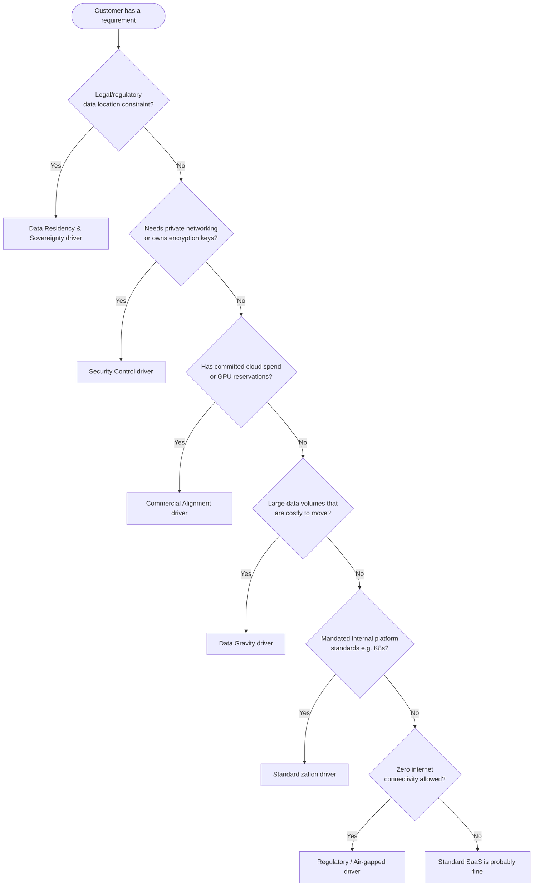

---

## 5. Deep Dive: BYOC-Account

### What It Is
The customer creates a **dedicated cloud account, project, or subscription** (e.g., a fresh AWS account, GCP project, or Azure subscription). The vendor deploys its data plane into that environment using scoped IAM roles, often automated via a lightweight installer/agent, or through Infrastructure-as-Code (Terraform, CloudFormation, ARM templates).

### Step-by-Step Customer Journey

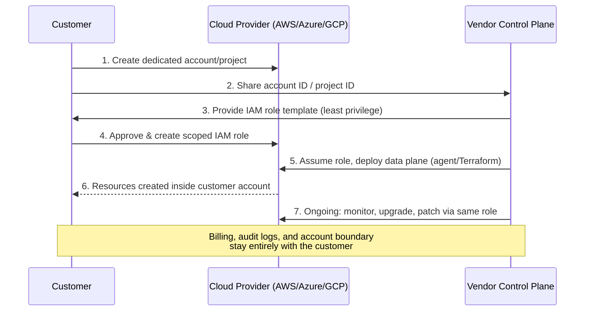

### Worked Example
Imagine a company called **Northwind Analytics** wants to deploy a vendor's data-pipeline product.

1. Northwind's cloud team spins up a new AWS account: `northwind-vendor-prod`.
2. They share the AWS Account ID with the vendor.
3. The vendor provides a CloudFormation template defining an IAM role scoped to exactly what's needed: e.g., `ec2:RunInstances`, `s3:GetObject` on a specific bucket prefix, `logs:PutLogEvents` — nothing more.
4. Northwind's security team reviews the template, approves it, and deploys the role via their own change-management process.
5. The vendor's control plane assumes that role remotely and deploys the product using Terraform or an agent that runs inside the account.
6. All resulting resources (EC2 instances, RDS databases, S3 buckets) live inside `northwind-vendor-prod`. Northwind sees them in their own AWS bill and CloudTrail logs.

### Strengths
- Clean separation of concerns — the account boundary is the security boundary.
- Customer keeps billing, logs, and region control.
- Relatively fast to stand up compared to VPC or K8s models.
- Works well for customers who mainly care about **commercial alignment** and basic **data residency**.

### Limitations
- Does **not** solve strict networking requirements (e.g., "no public endpoints ever").
- Doesn't integrate with a customer's existing VPC/subnet layout — it typically creates its own.
- Not sufficient for customers with mandated platform standards (they'll want BYOC-K8s instead).

### Use Cases
- A startup vendor's first "enterprise-ready" offering, letting large customers use committed cloud spend.
- Customers who mainly care about who pays the cloud bill and who owns the audit trail, but are otherwise flexible on networking.
- Mid-market companies without a dedicated platform engineering team.

---

## 6. Deep Dive: BYOC-VPC

### What It Is
BYOC-VPC goes a level deeper than BYOC-Account: the software must run **inside a customer-approved network boundary** — an existing VPC (AWS), VNet (Azure), or equivalent — respecting the customer's subnetting, routing, DNS, firewall rules, and egress policies.

### Step-by-Step Customer Journey

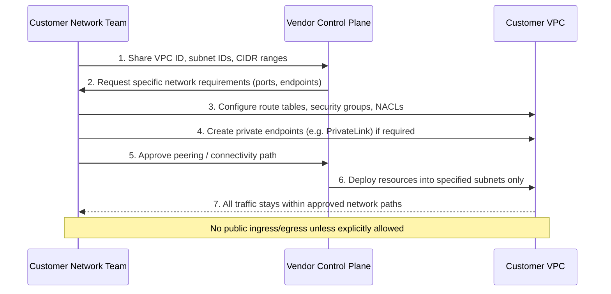

### Worked Example
**Contoso Financial** requires that no vendor software ever have a public IP address, and all connectivity between the vendor's product and Contoso's internal data warehouse must go over private links.

1. Contoso's network team provisions a dedicated subnet within their existing VPC and shares the subnet ID and CIDR block with the vendor.
2. The vendor specifies it needs outbound HTTPS (443) access to its control plane and inbound access from Contoso's internal application servers on port 8443.
3. Contoso configures security groups to allow exactly those flows — nothing else.
4. Contoso sets up an AWS PrivateLink endpoint so the vendor's service can reach Contoso's data warehouse without traversing the public internet.
5. The vendor deploys its application into the provided subnet, using only the private connectivity paths that were explicitly approved.

### Why This Matters: Private Connectivity
Traditional public cloud connectivity often relies on public IPs, NAT gateways, and internet gateways — all of which create potential attack surface. Private connectivity services (like AWS PrivateLink) let two parties connect without traversing the public internet at all, drastically reducing exposure.

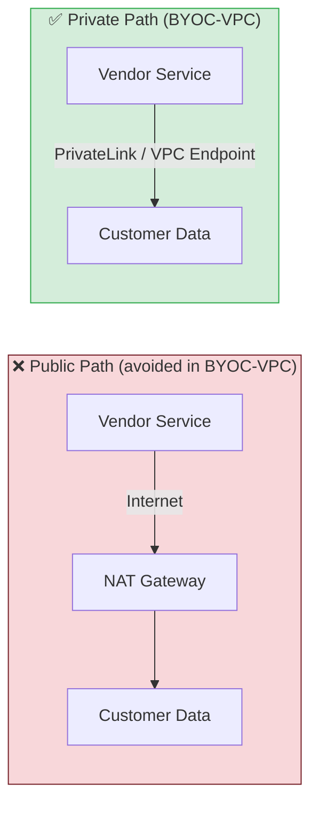

### Strengths
- Satisfies strict "no public endpoint" requirements.
- Integrates with existing DNS, firewall, and routing policies.
- Enables centralized network security inspection (customers can route traffic through their own firewall appliances).

### Limitations
- Significantly more engineering effort per customer — network topologies vary widely.
- The vendor cannot assume open outbound internet, default DNS resolution, or permissive security groups.
- Debugging connectivity issues is harder because the vendor has less visibility into the customer's network internals.

### Use Cases
- Regulated industries: banking, insurance, healthcare.
- Enterprises with centralized network security (SOC-monitored egress, mandatory firewall inspection).
- Any customer requiring PrivateLink/Private Service Connect-style connectivity to internal systems.

---

## 7. Deep Dive: BYOC-K8s

### What It Is
In BYOC-K8s, the **customer provides the Kubernetes runtime itself** — the vendor doesn't provision infrastructure at all. Instead, the vendor deploys via Helm charts, Kubernetes Operators, Custom Resource Definitions (CRDs), namespaces, and service accounts onto a cluster the customer already manages.

### Step-by-Step Customer Journey

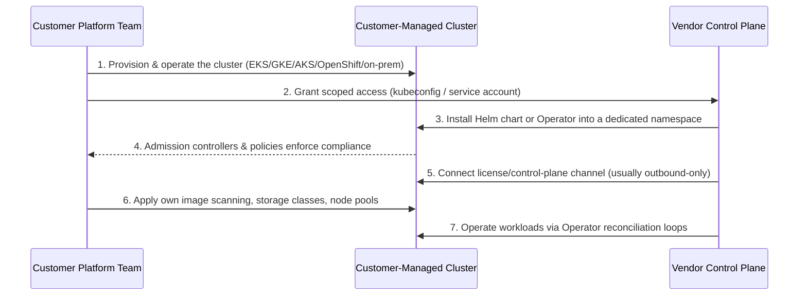

### Worked Example
**Meridian Labs** is an AI infrastructure company that already runs all workloads — internal and third-party — on Kubernetes clusters spanning AWS, on-prem GPU racks, and edge sites, standardized via OpenShift.

1. Meridian's platform team provisions a namespace, `vendor-app-prod`, with resource quotas and network policies already defined.
2. They grant the vendor a scoped Kubernetes service account with RBAC permissions limited to that namespace (create/update Deployments, Services, ConfigMaps — but not cluster-wide permissions).
3. The vendor installs its product using a Helm chart, referencing container images that have already passed through Meridian's internal image scanner and private registry.
4. The vendor's Operator watches for CRDs (e.g., `VendorApp` custom resources) and reconciles the desired state automatically, without needing SSH or direct node access.
5. The vendor connects an outbound-only channel to its control plane for license validation and telemetry (respecting Meridian's egress allowlist).
6. Meridian's own GPU scheduling, storage classes (e.g., for their on-prem NVMe arrays), and observability stack (Prometheus/Grafana) are used — the vendor doesn't bring its own.

### Why Kubernetes Is a Natural Fit for BYOC
Kubernetes is explicitly designed as a portable abstraction layer over infrastructure — the same YAML manifests can (in principle) run on AWS, GCP, Azure, on-prem, or edge hardware. This makes it an attractive "common denominator" for vendors trying to support many environments with one deployment model.

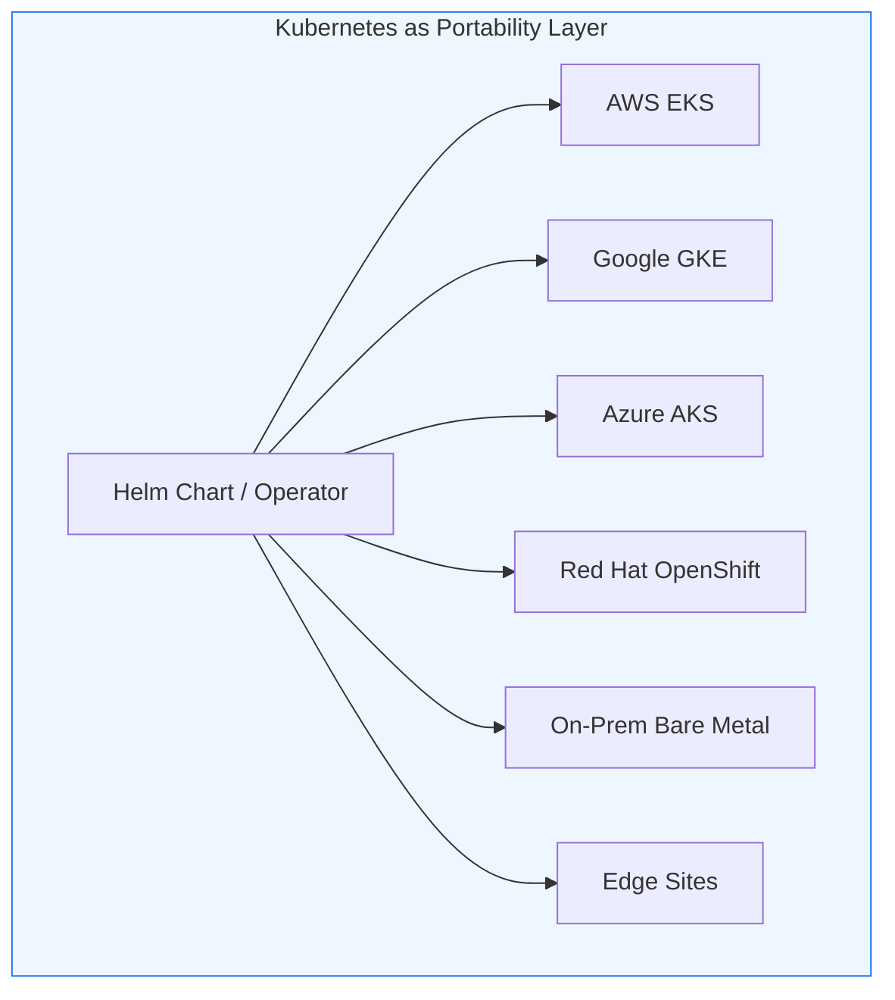

### Strengths
- Lets platform teams enforce their own admission policies, image scanners, secrets managers, storage classes, and service mesh rules.
- Naturally spans cloud, on-prem, and edge — one deployment model, many substrates.
- Strong isolation via namespaces, RBAC, and network policies.

### Limitations
- The vendor loses control over the underlying substrate: cluster version, CNI plugin behavior, storage driver quirks, and node autoscaling all vary.
- Troubleshooting often requires coordination with the customer's platform team, especially in heterogeneous on-prem environments.
- Version skew between customer clusters can create a support matrix nightmare if not carefully managed.

### Use Cases
- AI/ML infrastructure companies deploying onto customer GPU clusters.
- Enterprises with mature internal platform engineering teams (common in fintech, telco, and large SaaS-consuming enterprises).
- Multi-cloud or hybrid-cloud customers who don't want cloud-specific vendor integrations.

---

## 8. Deep Dive: Air-Gapped Delivery

### What It Is
Air-gapped delivery is the extreme end of the spectrum: software runs in an environment with **no direct internet connectivity at all**. This isn't strictly "BYOC" in the account/network/K8s sense — it's better understood as the natural extension of customer-controlled delivery, where the customer also owns the *connectivity boundary*.

### Step-by-Step Customer Journey

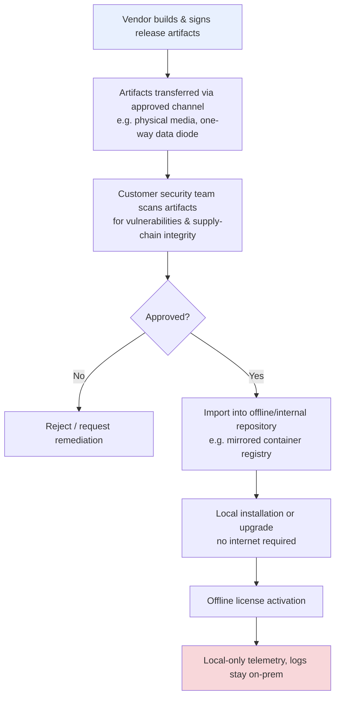

### Worked Example
**Sentinel Defense Systems** operates in a classified network with zero external connectivity — not even outbound.

1. The vendor builds a new release, signs every container image and artifact cryptographically, and generates a Software Bill of Materials (SBOM).
2. These artifacts are transferred to Sentinel via an approved one-way transfer mechanism (e.g., a data diode, or physically via an approved and scanned USB device).
3. Sentinel's internal security team independently verifies signatures, scans for known vulnerabilities, and manually approves the release for import.
4. The artifacts are loaded into an internal, offline container registry and package repository — no external internet route exists to pull them.
5. Installation and upgrades run entirely against this internal mirror.
6. Licensing is handled through offline, cryptographically signed license files rather than live activation calls.
7. All logs, metrics, and diagnostics stay entirely within Sentinel's network; the vendor never receives live telemetry.

### Strengths
- Meets the strictest sovereignty and classification requirements.
- Removes all runtime dependency on external connectivity.
- Fits defense, intelligence, critical infrastructure, and highly regulated financial/healthcare environments.

### Limitations
- The vendor cannot assume live telemetry, remote debugging, or automatic updates.
- Support and diagnostics require exporting sanitized "support bundles" rather than live access.
- Release cadence is inherently slower — every update requires a manual transfer-and-approval cycle.

### Use Cases
- Defense and government contractors.
- Financial services in highly regulated jurisdictions.
- Critical infrastructure (energy grids, water systems).
- Any environment where "always connected" is a security anti-pattern rather than a convenience.

---

## 9. Decision Framework: Matching Customer Needs to BYOC Flavors

Here's an expanded, more actionable version of the mapping table from the original article, plus a decision diagram you can actually use with prospects.

| Customer Need | Best-Fit Flavor(s) | Why |
|---|---|---|
| Use committed cloud spend | BYOC-Account | Workloads run under the customer's own billing account |
| Minimize vendor access to infrastructure | BYOC-Account / BYOC-VPC | Scoped IAM roles + auditability + governance |
| Keep data inside customer-controlled cloud | BYOC-Account / BYOC-VPC | Data plane never leaves the customer's boundary |
| Integrate with existing supply-chain tooling | BYOC-Account / BYOC-VPC | Enables image scanning, signing, private registries |
| Enforce private networking (no public IPs) | BYOC-VPC | Supports private endpoints, routes, DNS, encryption |
| Reuse internal platform standards (Helm, Operators) | BYOC-K8s | Runs on already-approved clusters and policies |
| Support on-prem, GPU clusters, or edge sites | BYOC-K8s / Air-gapped | Kubernetes or offline bundles span non-cloud environments |
| Meet classified / zero-connectivity requirements | Air-gapped | Removes all live external connectivity dependency |

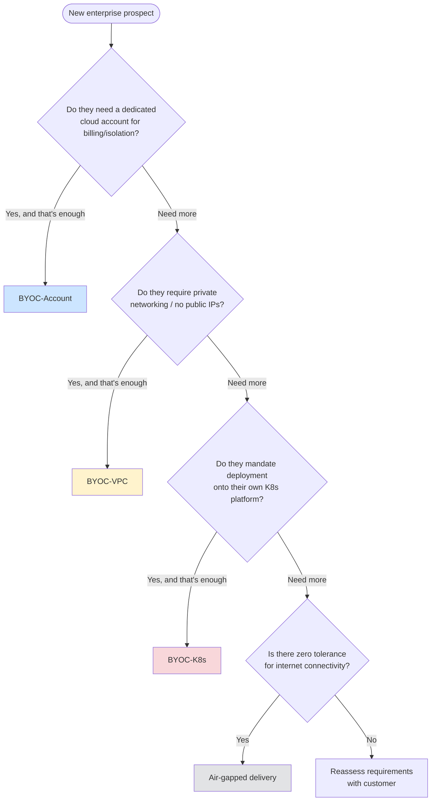

**Practical tip:** Many enterprise deals start as BYOC-Account during a proof-of-concept, then migrate to BYOC-VPC or BYOC-K8s once the customer's security and platform teams get involved in the production rollout. Design your product architecture so this migration doesn't require a rewrite.

---

## 10. The Security Challenge: Building BYOC Securely by Design

A BYOC platform isn't just deployment automation — it has to deliver enterprise-grade security posture. Let's unpack each requirement with concrete implementation guidance.

### 10.1 Least-Privilege Permissions
**Principle:** The vendor should receive only the permissions strictly required to install, operate, update, and observe the product — scoped by account, project, namespace, resource type, and lifecycle phase.

**Example implementation:** Instead of requesting `AdministratorAccess`, define a custom IAM policy that grants exactly:
```
s3:GetObject, s3:PutObject   (only on prefix: /vendor-app/*)
ec2:DescribeInstances
ec2:RunInstances             (only with tag: ManagedBy=vendor-app)
logs:PutLogEvents
```

### 10.2 End-to-End Encryption
**Principle:** Data encrypted in transit (TLS 1.2+) and at rest, with support for customer-managed encryption keys (CMKs) where required — so the vendor never holds the keys that unlock customer data.

### 10.3 Zero-Inbound Access
**Principle:** Many customers won't allow inbound connections from a vendor network at all. The safer pattern is an **outbound-only agent** that the customer's environment initiates, polling or maintaining a persistent outbound connection to the vendor's control plane.

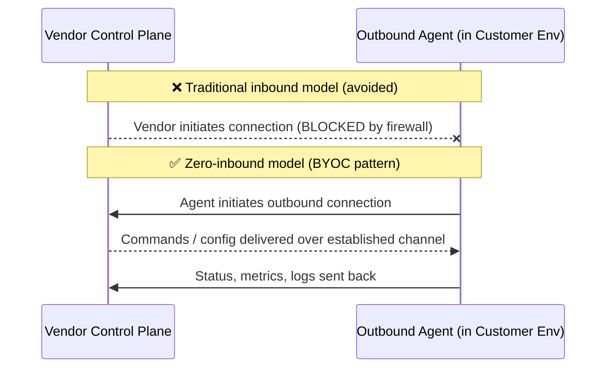

### 10.4 Egress Allowlists
**Principle:** Customers need an exact, documented list of domains, APIs, package repositories, and telemetry endpoints the product requires — so their firewall/proxy teams can allowlist precisely those and nothing else.

**Example egress allowlist for a hypothetical vendor:**
```
api.vendor.com          (control plane, HTTPS 443)
registry.vendor.com     (container image pulls, HTTPS 443)
telemetry.vendor.com    (metrics/logs, HTTPS 443)
```

### 10.5 Private Connectivity
**Principle:** Some environments require PrivateLink, Private Service Connect, VPC peering, VPN, or dedicated network paths instead of any public internet access — even outbound.

### 10.6 Customer Supply-Chain Integration
**Principle:** Container images, Terraform modules, Helm charts, SBOMs, signatures, attestations, and vulnerability scans need to fit into the customer's own approval workflows — not bypass them.

### 10.7 Governance and Auditability
**Principle:** Customers need logs, change history, access records, and policy mappings that clearly show what the vendor did, when, and under what authorization.

### The Zero-Trust Foundation
All of the above principles are expressions of a single underlying idea: **zero trust**. Rather than granting implicit trust because something sits "inside the perimeter," every access decision is made at the resource level, continuously, based on identity and context rather than network location.

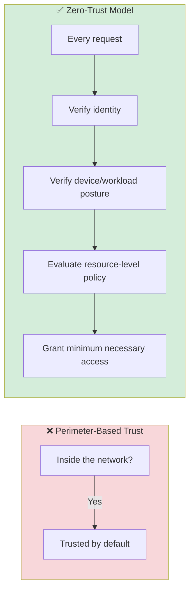

**Practical use case:** A vendor implementing zero-trust BYOC would give its deployment agent a short-lived, automatically-rotating credential (rather than a long-lived static API key), scoped to only the specific namespace or resource group it needs, and would log every single API call the agent makes back to the customer's audit system.

---

## 11. The Portability Challenge: One Product, Many Environments

### The Core Problem
A narrow BYOC product that only works in one cloud, one account type, with public egress and vendor-managed Terraform, might be enough to close early deals — but it won't scale to enterprise customers with diverse environments.

### The Environment Matrix
BYOC products need to work across a wide and growing matrix of environments:

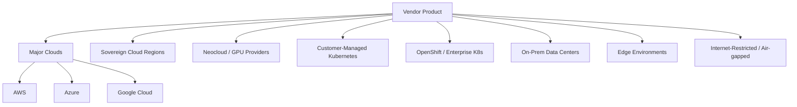

### Why This Is Hard
Each environment changes fundamental assumptions:

| Layer | Varies By Environment |
|---|---|
| Identity | IAM (AWS) vs. Azure AD vs. GCP IAM vs. on-prem LDAP |
| Networking | VPC/VNet models, default DNS behavior, NAT availability |
| Storage | EBS vs. Azure Disk vs. persistent volumes vs. NVMe arrays |
| Load balancing | ALB/NLB vs. Azure LB vs. MetalLB (on-prem) |
| Secrets | AWS Secrets Manager vs. Azure Key Vault vs. HashiCorp Vault |
| GPUs | Cloud GPU instances vs. bare-metal GPU clusters |
| Logging/Metrics | CloudWatch vs. Azure Monitor vs. self-hosted Prometheus |
| Security scanning | Different customer-mandated scanners and policies |

### The Real Insight
> BYOC is not a cloud-specific problem. It is a **portability** problem across clouds, neoclouds, and on-prem environments.

The architectural answer is to isolate these differences behind a consistent abstraction layer — often achieved through:
- A unified Infrastructure-as-Code layer that can target multiple providers
- Kubernetes as a common runtime abstraction (see Section 7)
- A control plane that understands "environment capabilities" and adapts deployment strategy accordingly

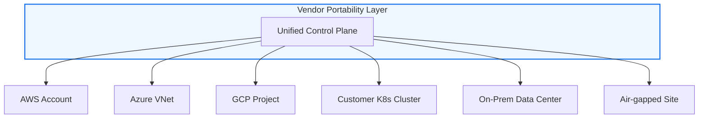

**Use case example:** An AI infrastructure vendor wants to support customers running GPU workloads across AWS, on-prem NVIDIA DGX clusters, and specialized neocloud providers (e.g., GPU-focused clouds). Rather than writing separate deployment code for each, they build a Kubernetes Operator that behaves consistently everywhere Kubernetes runs, treating GPU scheduling and storage provisioning as pluggable capabilities rather than hardcoded, cloud-specific logic.

---

## 12. The Operations Challenge: Day 2 and Beyond

### Why "Day 2" Is Harder Than "Day 1"
Getting software deployed once is the easy part. Running it reliably, securely, and efficiently — indefinitely, across potentially hundreds of customer environments — is the real challenge.

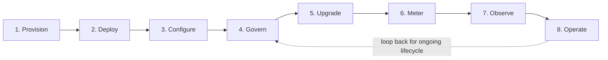

### Breaking Down Each Operational Requirement

**Infrastructure provisioning and management**
Consistent Infrastructure-as-Code across environments is necessary but not sufficient. Infrastructure management must be:
- **Tenant-aware** — knows which resources belong to which customer
- **Transaction-safe** — a failed deployment doesn't leave orphaned or half-configured resources
- **AI-enabled** — increasingly, platforms use automation/AI to detect drift, recommend fixes, and predict capacity needs

*Example:* If a deployment to Customer A's environment partially fails (say, the database is created but the application layer fails), a transaction-safe system automatically rolls back or clearly flags the partial state — rather than leaving dangling resources that create both cost and security risk.

**Customer-managed deployments**
Customers need self-service capabilities: subscribe, deploy, customize, configure, visualize, and receive notifications — without needing to file a support ticket for every routine change.

**Governance controls**
Break-glass emergency access procedures, approval workflows, audit trails, RBAC, SSO/enterprise IdP integration (e.g., Okta, Azure AD), and tenant isolation.

*Example:* If a vendor support engineer needs emergency access to debug a production issue in a customer's air-gapped environment, a "break-glass" procedure might require: (1) the customer approves a time-boxed access grant, (2) all actions during that window are recorded, (3) access automatically expires after a set duration.

**Upgrades and patches**
Safe rollouts, versioned releases, rollback capability, dependency management, configuration drift detection, and emergency fixes.

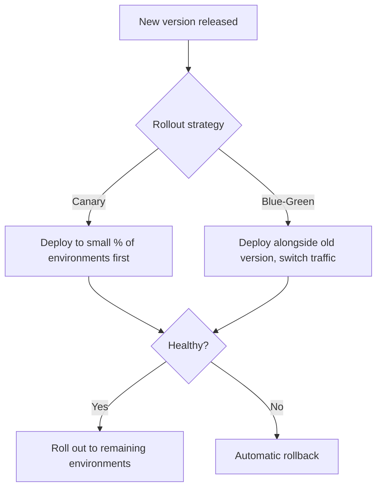

**Metering and billing**
Usage collection, aggregation, invoicing, and integration with payment processors (like Stripe) and cloud marketplaces (AWS Marketplace, Azure Marketplace).

*Example:* A vendor's agent running inside the customer's BYOC-K8s cluster reports usage metrics (e.g., API calls processed, GB processed) back through the outbound-only telemetry channel, which feeds into a billing system that reconciles against the customer's contract terms.

**Licensing**
Online activation for connected environments; signed offline license files for disconnected/air-gapped ones (see Section 8).

**Observability**
Health checks, logs, metrics, traces, alerts, SLOs, and — critically — support bundles that are automatically sanitized to avoid leaking customer data back to the vendor.

**Day-2 automation**
Backups, restores, snapshots, alerting, scaling recommendations, certificate rotation, secret rotation, failover, diagnostics, policy compliance checks, and audit evidence generation.

### The Shared Responsibility Model
Just as cloud providers describe security as a shared responsibility between provider and customer (the provider secures the underlying infrastructure; the customer secures what they build on top of it), BYOC introduces an analogous shared responsibility split between vendor and customer:

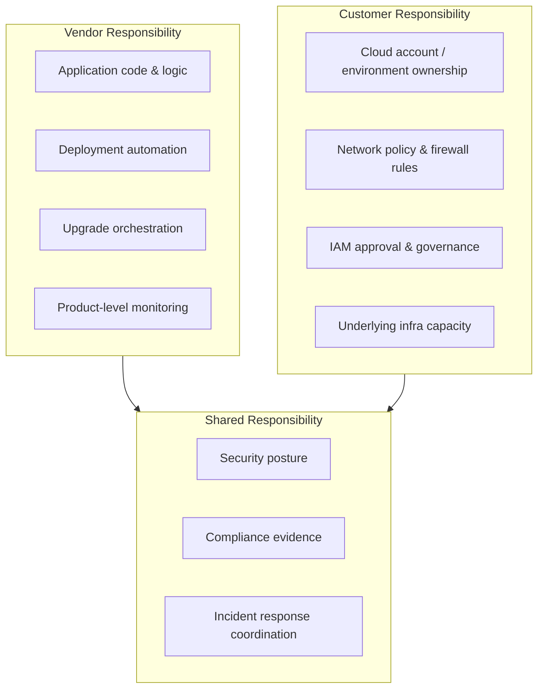

---

## 13. Putting It All Together: BYOC as a Product Architecture

The biggest misconception about BYOC is treating it as a deployment script: connect to an account, run Terraform, deploy containers, done. That works for a demo. It does not work for production.

A production-grade BYOC platform requires:

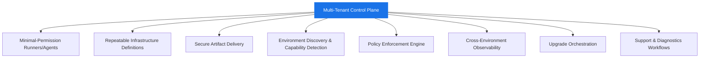

### The Four Flavors, Recapped

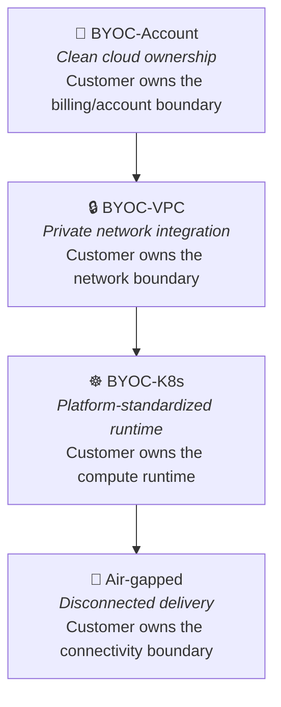

### The Real Promise of BYOC Anywhere
> The real promise isn't that software can be installed somewhere else. It's that **customers can keep control of their infrastructure, data, network, and compliance posture while still getting a fully managed product experience.**

That's a fundamentally different (and much larger) engineering undertaking than "connect the account and deploy." It requires solving zero-trust security, multi-environment portability, supply-chain integration, lifecycle automation, metering, licensing, observability, and governance — simultaneously, and across every environment a customer might require.

---

## 14. Practical Checklist for Building a BYOC Platform

Use this checklist when evaluating or building a BYOC-capable product:

**Security**
- [ ] Least-privilege IAM roles defined per environment type
- [ ] End-to-end encryption in transit and at rest supported
- [ ] Customer-managed key (CMK) support available
- [ ] Zero-inbound / outbound-only agent architecture implemented
- [ ] Documented egress allowlist maintained and versioned
- [ ] Private connectivity options (PrivateLink, VPN, peering) supported
- [ ] Supply-chain artifacts signed, SBOMs generated

**Portability**
- [ ] Deployment logic abstracted from cloud-specific APIs where possible
- [ ] Kubernetes-based deployment path available for platform-standardized customers
- [ ] Tested against at least AWS, Azure, and GCP
- [ ] On-prem / air-gapped deployment path documented and tested

**Operations**
- [ ] Tenant-aware, transaction-safe infrastructure automation
- [ ] Self-service customer deployment/configuration UI or API
- [ ] Versioned releases with rollback capability
- [ ] Usage metering pipeline connected to billing
- [ ] Sanitized support bundle generation (no accidental data leakage)
- [ ] Offline license activation supported for air-gapped customers

---

## Best Practices

### 1. Start with BYOC-Account, Design for BYOC-K8s
Begin with the simplest model (Account) to prove value, but architect your platform so it can scale to VPC, K8s, and air-gapped without rewrites. Use abstraction layers from day one.

### 2. Implement Outbound-Only Architecture by Default
Never rely on inbound connections. Design your agents and control plane communication to be outbound-initiated. This works for 90% of enterprise use cases and dramatically simplifies security reviews.

### 3. Version Everything
Version your IAM policies, Terraform modules, Helm charts, container images, API schemas, and documentation. This makes rollbacks, audits, and compliance evidence trivial.

### 4. Document Egress Requirements Meticulously
Maintain a living document of every domain, IP, and port your product needs. Update it with every release. This single document can accelerate security reviews by weeks.

### 5. Build for Observability from Day One
Instrument your agents and control plane with structured logging, metrics, and distributed tracing. BYOC debugging is hard — good observability is your lifeline.

### 6. Create a "BYOC Readiness" Assessment
Before engaging with enterprise customers, assess which BYOC flavors your product actually supports. Don't claim "full BYOC support" if you only have BYOC-Account working.

### 7. Automate Tenant Isolation
Ensure that multi-tenant control planes have strong logical isolation. Use separate IAM roles, namespaces, or accounts per customer. Never rely on "soft" tenancy.

### 8. Test in Heterogeneous Environments
Regularly test your deployment automation in different environments: different Kubernetes versions, different cloud providers, restricted networks. Don't wait for a customer to discover the bug.

### 9. Provide Self-Service Deployment Tooling
Customers should be able to deploy, configure, and upgrade your product without opening a support ticket. Invest in good CLI tools, APIs, and documentation.

### 10. Build Break-Glass Procedures for Air-Gapped Support
Plan how you'll support customers with no internet connectivity before you sign the contract. Pre-negotiate support bundle formats and secure transfer channels.

---

## Anti-Patterns to Avoid

### ❌ Anti-Pattern 1: "SaaS-First, BYOC Later"
Building your product exclusively for SaaS and bolting on BYOC support later leads to massive technical debt and slow enterprise deals. Design for BYOC from the start.

**Impact:** 6-12 month delays for enterprise deals; expensive rewrites; security vulnerabilities from rushed implementations.

### ❌ Anti-Pattern 2: Over-Privileged IAM Roles
Requesting `AdministratorAccess` or broad wildcard permissions because it's "easier." This will fail every enterprise security review.

**Impact:** Deals stall in security review; customers lose trust; compliance violations.

### ❌ Anti-Pattern 3: Hardcoded Cloud-Specific Logic
Writing deployment code that only works on AWS with specific instance types and networking assumptions.

**Impact:** Cannot expand to Azure/GCP customers; limits market reach; creates maintenance burden.

### ❌ Anti-Pattern 4: Ignoring the Operations Burden
Treating BYOC as a "deploy once and forget" exercise. Day 2 operations (upgrades, monitoring, incident response) are where most BYOC products fail.

**Impact:** Customer churn after initial deployment; overwhelmed support teams; SLA violations.

### ❌ Anti-Pattern 5: Single-Flavor Focus
Building only BYOC-Account and telling VPC/K8s customers to "wait for the next release." Enterprise customers need flexibility.

**Impact:** Lost deals to competitors with broader BYOC support; technical debt accumulates.

### ❌ Anti-Pattern 6: No Offline Support Plan
Assuming all customers will have internet connectivity. Air-gapped customers exist and will ask about offline deployment during sales cycles.

**Impact:** Surprise requirements during procurement; rushed, insecure offline implementations.

### ❌ Anti-Pattern 7: Vendor-Lock-In Through BYOC
Using BYOC as a way to create lock-in by making migration difficult. This backfires when customers realize they're trapped.

**Impact:** Damaged reputation; customer resistance; negative word-of-mouth.

### ❌ Anti-Pattern 8: Insufficient Testing Matrix
Testing only in your own AWS account with permissive security groups. Real customer environments are hostile by design.

**Impact:** Production failures; security incidents; emergency support tickets.

---

## Performance Considerations

### Deployment Speed
- **Cold start times** vary dramatically: AWS account provisioning takes ~5 minutes; Kubernetes operator reconciliation takes ~2-5 minutes; air-gapped deployment can take days due to manual approval cycles.
- **Optimization:** Cache Infrastructure-as-Code modules; pre-pull container images where possible; provide deployment status APIs for customer visibility.

### Agent Overhead
- Agents running inside customer environments should use <100MB RAM and <0.1 CPU when idle.
- **Optimization:** Use lightweight runtimes (Go, Rust); implement efficient polling intervals; compress telemetry data.

### Network Efficiency
- BYOC deployments often run over limited bandwidth or metered connections.
- **Optimization:** Compress API payloads; use protobuf instead of JSON; implement delta sync for configuration changes; batch telemetry uploads.

### Multi-Tenant Control Plane Scalability
- A single control plane may manage hundreds or thousands of customer environments.
- **Optimization:** Use connection pooling for agent communication; implement backpressure mechanisms; horizontally control plane components; cache environment capabilities.

### Storage and Data Gravity
- BYOC-K8s and air-gapped deployments often involve large datasets that can't be moved.
- **Optimization:** Implement data locality awareness; use edge caching; provide data pipeline integration rather than data movement.

### Upgrade Performance
- Rolling upgrades across heterogeneous environments must account for different resource constraints.
- **Optimization:** Implement canary deployments; respect customer-defined maintenance windows; provide rollback automation.

---

## Security Considerations

### Zero-Trust Architecture
Every BYOC deployment must implement zero-trust principles:
- **Never trust, always verify** — authenticate every API call
- **Least privilege** — minimum permissions required for each component
- **Assume breach** — design for containment and rapid rotation

### Encryption Standards
- **In transit:** TLS 1.3 minimum; disable weak cipher suites; use certificate pinning where possible
- **At rest:** AES-256 encryption; support customer-managed keys (CMKs); key rotation every 90 days
- **Key management:** Never store keys in code; use cloud-native KMS or HashiCorp Vault

### Audit Logging
- Log every API call with: timestamp, actor identity, action, resource, outcome
- Integrate with customer's SIEM (Splunk, Elastic, Azure Sentinel) via outbound webhooks
- Tamper-evident log shipping using signed log entries

### Supply Chain Security
- Sign all artifacts (container images, binaries, Terraform modules) with Sigstore/Cosign
- Generate SBOMs (Software Bill of Materials) using Syft
- Implement image scanning (Trivy, Snyk) before deployment
- Provide provenance attestations for compliance

### Secrets Management
- Never hardcode credentials; use short-lived tokens (OAuth2, OIDC)
- Rotate all secrets automatically (certificates, API keys, database passwords)
- Support customer-provided secrets managers (AWS Secrets Manager, Azure Key Vault, HashiCorp Vault)

### Network Security
- Implement mTLS for all internal service communication
- Use network policies (Kubernetes) or security groups (cloud) to restrict traffic
- Enable egress filtering and allowlisting
- Disable public IP assignment by default

### Compliance Frameworks
BYOC implementations should support:
- **SOC 2 Type II** — audit trails, access controls, change management
- **ISO 27001** — information security management
- **GDPR** — data residency, right to erasure, consent management
- **HIPAA** — healthcare data protection (if applicable)
- **FedRAMP** — government cloud security (if applicable)

---

## Testing Strategies

### Unit Testing
- Test individual components: deployment logic, policy enforcement, API clients
- Mock cloud provider APIs using tools like LocalStack (AWS), Azurite (Azure)
- Achieve >80% code coverage for core BYOC logic

### Integration Testing
- Test end-to-end deployment flows in isolated test accounts
- Use ephemeral environments that are destroyed after testing
- Verify IAM policies are correctly scoped and enforced
- Test upgrade and rollback scenarios

### Security Testing
- **Static analysis:** SAST tools (SonarQube, Checkov) for IaC and code
- **Dependency scanning:** Snyk, Dependabot for vulnerable libraries
- **Container scanning:** Trivy, Grype for image vulnerabilities
- **Penetration testing:** Regular third-party security assessments
- **IAM policy validation:** Use tools like AWS IAM Access Analyzer, Azure AD permissions insights

### Chaos Engineering
- Test resilience to partial failures (network partitions, API throttling)
- Simulate agent disconnections and verify reconnection logic
- Test upgrade failures and automatic rollback
- Validate multi-region failover scenarios

### Performance Testing
- Load test control plane with 1000+ concurrent agent connections
- Benchmark deployment times across environment types
- Test under network latency and bandwidth constraints
- Profile agent resource consumption

### Compliance Testing
- Automated compliance checks using Open Policy Agent (OPA)
- Audit trail validation: ensure all actions are logged
- Data residency verification: confirm data doesn't leave approved regions
- Encryption validation: verify all data is encrypted at rest and in transit

### Customer Acceptance Testing (UAT)
- Provide customers with test environments that mirror production
- Document test scenarios and expected outcomes
- Include security team in UAT process
- Sign off on deployment procedures before production

---

## Migration Guide

### Migrating from BYOC-Account to BYOC-VPC

**When to migrate:** Customer needs private networking, no public IPs, or integration with existing VPC infrastructure.

**Steps:**
1. **Assess current deployment:** Document all resources, IAM roles, and networking setup
2. **Design VPC integration plan:** Identify subnets, security groups, route tables, and private endpoints needed
3. **Create new networking resources:** Provision subnets, configure security groups, set up PrivateLink/VPC peering
4. **Update IAM permissions:** Add VPC-specific permissions (e.g., `ec2:CreateNetworkInterface`)
5. **Test connectivity:** Verify agent can communicate through private paths
6. **Migrate workloads:** Use blue-green deployment to move workloads to VPC
7. **Decommission old resources:** Remove public-facing resources after validation
8. **Update monitoring:** Adjust observability for private network paths

**Estimated effort:** 2-4 weeks for initial migration; 1-2 weeks per subsequent customer

**Common pitfalls:** DNS resolution differences; security group misconfigurations; route table conflicts

### Migrating from BYOC-VPC to BYOC-K8s

**When to migrate:** Customer mandates Kubernetes platform standards or needs multi-cloud/hybrid deployment.

**Steps:**
1. **Assess cluster compatibility:** Verify customer's Kubernetes version, CNI plugin, and storage classes
2. **Package application as Helm chart:** Containerize all components; create Helm templates
3. **Develop Kubernetes Operator:** Implement CRDs and reconciliation logic
4. **Define RBAC requirements:** Create least-privilege service accounts and roles
5. **Test in customer's cluster:** Deploy to staging namespace; validate functionality
6. **Migrate state:** Handle database migrations, persistent volume claims, and configuration
7. **Decommission VM-based deployment:** Remove old EC2/VM instances after cutover
8. **Update observability:** Integrate with customer's Prometheus/Grafana stack

**Estimated effort:** 4-8 weeks for initial migration; 2-4 weeks per subsequent customer

**Common pitfalls:** Storage class incompatibilities; network policy restrictions; resource quota limits

### Migrating from Connected to Air-Gapped

**When to migrate:** Customer requires zero internet connectivity (defense, intelligence, critical infrastructure).

**Steps:**
1. **Implement artifact signing:** Sign all container images and binaries with Sigstore
2. **Generate SBOMs:** Create Software Bill of Materials for every release
3. **Build offline deployment package:** Include all dependencies, scripts, and configuration
4. **Implement offline licensing:** Develop cryptographically signed license files
5. **Create support bundle tooling:** Build sanitized diagnostic export functionality
6. **Document manual procedures:** Write step-by-step installation/upgrade guides
7. **Test in isolated environment:** Validate complete offline deployment
8. **Negotiate transfer channels:** Agree on approved media transfer methods (data diode, physical media)

**Estimated effort:** 8-12 weeks for initial implementation; ongoing for each release

**Common pitfalls:** Missing dependencies; expired certificates; insufficient diagnostic data in support bundles

---

## Troubleshooting Guide

### Issue 1: Agent Can't Connect to Control Plane

**Symptoms:** Agent shows "connection failed" or "timeout" in logs.

**Possible causes:**
- Firewall blocking outbound traffic
- DNS resolution failures
- Control plane endpoint incorrect
- TLS certificate validation failures

**Diagnostic steps:**
```bash
# 1. Check agent logs
kubectl logs -n vendor-app deployment/vendor-agent

# 2. Test DNS resolution
nslookup api.vendor.com

# 3. Test connectivity
curl -v https://api.vendor.com/health

# 4. Check firewall rules
# (Customer-side) Verify egress rules allow HTTPS (443) to api.vendor.com
```

**Resolution:**
- Add egress rule to allowlist `api.vendor.com:443`
- Verify DNS configuration in customer environment
- Check if proxy is required and configured in agent settings
- Update CA certificates if using custom CA

### Issue 2: IAM Permissions Insufficient

**Symptoms:** Deployment fails with "AccessDenied" errors; CloudTrail shows denied API calls.

**Possible causes:**
- IAM role missing required permissions
- Resource-based policies blocking access
- SCP (Service Control Policies) restricting permissions

**Diagnostic steps:**
```bash
# 1. Check CloudTrail for denied events
aws cloudtrail lookup-events \
  --lookup-attributes AttributeKey=EventName,AttributeValue=RunInstances \
  --start-time 2026-01-01 --end-time 2026-01-09

# 2. Simulate IAM policy
aws iam simulate-principal-policy \
  --policy-source-arn arn:aws:iam::123456789012:role/vendor-role \
  --action-names ec2:RunInstances s3:GetObject

# 3. Check for SCPs
aws organizations list-policies --filter SERVICE_CONTROL_POLICY
```

**Resolution:**
- Update IAM policy with missing permissions (maintain least privilege)
- Review and adjust SCPs if necessary
- Check resource-based policies (S3 bucket policies, KMS key policies)

### Issue 3: Kubernetes Operator Not Reconciling

**Symptoms:** Custom resources created but no pods deployed; operator logs show errors.

**Possible causes:**
- Insufficient RBAC permissions
- Admission controllers rejecting resources
- Resource quotas exceeded
- Image pull failures

**Diagnostic steps:**
```bash
# 1. Check operator logs
kubectl logs -n vendor-system deployment/vendor-operator

# 2. Check CRD status
kubectl describe vendorapp <resource-name> -n vendor-app

# 3. Check RBAC
kubectl auth can-i create deployments --as=system:serviceaccount:vendor-app:vendor-sa -n vendor-app

# 4. Check events
kubectl get events -n vendor-app --sort-by='.lastTimestamp'
```

**Resolution:**
- Update RBAC roles with missing permissions
- Work with customer to adjust admission controller policies
- Increase resource quotas or request additional resources
- Configure image pull secrets if using private registry

### Issue 4: Air-Gapped Deployment Fails

**Symptoms:** Container image pull fails with "connection refused" or "not found."

**Possible causes:**
- Image not present in internal registry
- Image tag mismatch
- Image pull secret misconfigured
- Registry certificate issues

**Diagnostic steps:**
```bash
# 1. Verify image in internal registry
curl -k https://internal-registry.example.com/v2/vendor-app/tags/list

# 2. Check image pull secret
kubectl get secret regcred -o jsonpath='{.data.\.dockerconfigjson}' | base64 -d

# 3. Test image pull manually
docker pull internal-registry.example.com/vendor-app:v1.2.3
```

**Resolution:**
- Import missing images to internal registry
- Correct image tags in deployment manifests
- Recreate image pull secrets with correct credentials
- Import registry CA certificates if using self-signed cert

### Issue 5: Upgrade Fails Mid-Way

**Symptoms:** Partial upgrade; some components updated, others not; inconsistent state.

**Possible causes:**
- Insufficient resource availability
- Network partition during upgrade
- Database migration failures
- Configuration incompatibility

**Diagnostic steps:**
```bash
# 1. Check deployment status
kubectl rollout status deployment/vendor-app -n vendor-app

# 2. Check pod status
kubectl get pods -n vendor-app

# 3. Review database migration logs
kubectl logs -n vendor-app job/db-migration

# 4. Check for configuration drift
kubectl diff -f deployment.yaml
```

**Resolution:**
- Rollback to previous version using versioned manifests
- Fix resource constraints or request additional quota
- Resolve database migration issues with customer DBA
- Implement pre-upgrade validation checks

---

## Practice Exercises

### Exercise 1: Design a Least-Privilege IAM Policy

**Scenario:** You're building a BYOC-Account deployment for an AI inference service. The service needs to:
- Read/write to an S3 bucket `s3://customer-models/`
- Launch EC2 instances with specific tags
- Write logs to CloudWatch
- Read secrets from AWS Secrets Manager

**Task:** Design a least-privilege IAM policy that grants only these permissions. Include resource-level restrictions and condition keys where appropriate.

**Solution:**

```json
{
  "Version": "2012-10-17",
  "Statement": [
    {
      "Sid": "S3Access",
      "Effect": "Allow",
      "Action": [
        "s3:GetObject",
        "s3:PutObject",
        "s3:ListBucket"
      ],
      "Resource": [
        "arn:aws:s3:::customer-models",
        "arn:aws:s3:::customer-models/*"
      ],
      "Condition": {
        "StringEquals": {
          "aws:ResourceTag/ManagedBy": "vendor-ai-inference"
        }
      }
    },
    {
      "Sid": "EC2Access",
      "Effect": "Allow",
      "Action": [
        "ec2:RunInstances",
        "ec2:TerminateInstances",
        "ec2:DescribeInstances"
      ],
      "Resource": "*",
      "Condition": {
        "StringEquals": {
          "aws:RequestTag/ManagedBy": "vendor-ai-inference"
        },
        "ForAllValues:StringEquals": {
          "aws:TagKeys": ["ManagedBy"]
        }
      }
    },
    {
      "Sid": "CloudWatchLogs",
      "Effect": "Allow",
      "Action": [
        "logs:CreateLogGroup",
        "logs:CreateLogStream",
        "logs:PutLogEvents"
      ],
      "Resource": "arn:aws:logs:*:*:log-group:/vendor/ai-inference/*"
    },
    {
      "Sid": "SecretsManager",
      "Effect": "Allow",
      "Action": [
        "secretsmanager:GetSecretValue"
      ],
      "Resource": "arn:aws:secretsmanager:*:*:secret:vendor/*",
      "Condition": {
        "StringEquals": {
          "aws:ResourceTag/ManagedBy": "vendor-ai-inference"
        }
      }
    }
  ]
}
```

**Key points:**
- S3 access scoped to specific bucket with resource tag condition
- EC2 actions restricted by request tags (ensures instances are tagged)
- CloudWatch logs scoped to specific log group prefix
- Secrets Manager access restricted to secrets with `ManagedBy=vendor-ai-inference` tag
- No wildcard permissions on resources

### Exercise 2: Design a BYOC Deployment Architecture

**Scenario:** Your company sells a real-time analytics platform. A customer (large financial services firm) requires:
- No public IPs (BYOC-VPC)
- Integration with their existing VPC
- Access to their internal data warehouse via private link
- Compliance with their security team's requirements

**Task:** Design the deployment architecture including:
1. Network topology
2. Security groups/NSGs
3. IAM roles
4. Connectivity to customer's data warehouse

**Solution:**

**Network Topology:**
```
Customer VPC (10.0.0.0/16)
├── Public Subnet (10.0.1.0/24) - NAT Gateway
├── Private App Subnet (10.0.2.0/24) - Vendor Application
├── Private Data Subnet (10.0.3.0/24) - Customer Data Warehouse
└── VPC Endpoints
    ├── S3 VPC Endpoint
    ├── Secrets Manager VPC Endpoint
    └── PrivateLink Endpoint to Vendor Control Plane
```

**Security Groups:**
```yaml
# Vendor Application Security Group
AppSecurityGroup:
  Type: AWS::EC2::SecurityGroup
  Properties:
    GroupDescription: "Vendor application security group"
    VpcId: !Ref CustomerVPC
    SecurityGroupIngress:
      - IpProtocol: tcp
        FromPort: 8443
        ToPort: 8443
        SourceSecurityGroupId: !Ref InternalAppSG
      - IpProtocol: tcp
        FromPort: 443
        ToPort: 443
        SourceSecurityGroupId: !Ref VPCEndpointSG
    SecurityGroupEgress:
      - IpProtocol: tcp
        FromPort: 443
        ToPort: 443
        DestinationSecurityGroupId: !Ref VPCEndpointSG

# Data Warehouse Access Security Group
DataWarehouseSG:
  Type: AWS::EC2::SecurityGroup
  Properties:
    GroupDescription: "Data warehouse access"
    VpcId: !Ref CustomerVPC
    SecurityGroupIngress:
      - IpProtocol: tcp
        FromPort: 5432
        ToPort: 5432
        SourceSecurityGroupId: !Ref AppSecurityGroup
```

**IAM Role:**
```json
{
  "Version": "2012-10-17",
  "Statement": [
    {
      "Sid": "VPCDeployment",
      "Effect": "Allow",
      "Action": [
        "ec2:CreateNetworkInterface",
        "ec2:AssignPrivateIpAddresses",
        "ec2:UnassignPrivateIpAddresses"
      ],
      "Resource": "*",
      "Condition": {
        "StringEquals": {
          "aws:ResourceTag/ManagedBy": "vendor-analytics"
        }
      }
    },
    {
      "Sid": "SecretsAccess",
      "Effect": "Allow",
      "Action": "secretsmanager:GetSecretValue",
      "Resource": "arn:aws:secretsmanager:*:*:secret:vendor/*"
    }
  ]
}
```

**PrivateLink Setup:**
1. Customer creates VPC endpoint service for their data warehouse
2. Vendor creates VPC endpoint in their VPC (or accepts connection)
3. Route tables updated to route traffic through PrivateLink
4. Security groups configured to allow traffic on port 5432

**Key design principles:**
- No public IPs assigned to vendor resources
- All traffic routed through private paths
- Least-privilege security groups (specific ports only)
- IAM permissions scoped to VPC resources with tags

### Exercise 3: Build a Kubernetes Operator for BYOC-K8s

**Scenario:** You need to deploy your analytics platform onto customer-managed Kubernetes clusters. The platform consists of:
- 1 API server (Deployment)
- 2 worker nodes (StatefulSet)
- 1 message queue (Deployment)
- ConfigMaps for configuration
- Secrets for credentials

**Task:** Create a Kubernetes Operator using the Operator SDK that:
1. Watches for a custom resource `AnalyticsCluster`
2. Deploys all components when the CR is created
3. Updates deployments when the CR is modified
4. Cleans up resources when the CR is deleted

**Solution:**

**1. Define the Custom Resource Definition (CRD):**
```yaml
apiVersion: apiextensions.k8s.io/v1
kind: CustomResourceDefinition
metadata:
  name: analyticsclusters.platform.vendor.com
spec:
  group: platform.vendor.com
  versions:
    - name: v1alpha1
      served: true
      storage: true
      schema:
        openAPIV3Schema:
          type: object
          properties:
            spec:
              type: object
              properties:
                replicas:
                  type: integer
                  minimum: 1
                  maximum: 10
                  default: 2
                image:
                  type: string
                  default: "vendor/analytics:latest"
                resources:
                  type: object
                  properties:
                    requests:
                      type: object
                      properties:
                        cpu:
                          type: string
                        memory:
                          type: string
                    limits:
                      type: object
                      properties:
                        cpu:
                          type: string
                        memory:
                          type: string
  scope: Namespaced
  names:
    plural: analyticsclusters
    singular: analyticscluster
    kind: AnalyticsCluster
    shortNames:
      - ac
```

**2. Create the Reconciler (Go):**
```go
package controller

import (
    "context"
    "fmt"
    
    appsv1 "k8s.io/api/apps/v1"
    corev1 "k8s.io/api/core/v1"
    "k8s.io/apimachinery/pkg/api/errors"
    metav1 "k8s.io/apimachinery/pkg/apis/meta/v1"
    "k8s.io/apimachinery/pkg/runtime"
    "k8s.io/apimachinery/pkg/types"
    "sigs.k8s.io/controller-runtime/pkg/controller/controllerutil"
    "sigs.k8s.io/controller-runtime/pkg/reconcile"
    
    platformv1alpha1 "github.com/vendor/operator/pkg/apis/platform/v1alpha1"
)

type AnalyticsClusterReconciler struct {
    Client    client.Client
    Log       logr.Logger
    Scheme    *runtime.Scheme
}

func (r *AnalyticsClusterReconciler) Reconcile(ctx context.Context, req ctrl.Request) (ctrl.Result, error) {
    log := r.Log.WithValues("analyticscluster", req.NamespacedName)
    
    // Fetch the AnalyticsCluster instance
    var cluster platformv1alpha1.AnalyticsCluster
    if err := r.Get(ctx, req.NamespacedName, &cluster); err != nil {
        if errors.IsNotFound(err) {
            log.Info("AnalyticsCluster resource not found. Ignoring since object must be deleted.")
            return ctrl.Result{}, nil
        }
        log.Error(err, "Failed to get AnalyticsCluster")
        return ctrl.Result{}, err
    }
    
    // Define the desired API server Deployment
    apiDeployment := r.apiServerDeployment(&cluster)
    
    // Check if deployment already exists
    found := &appsv1.Deployment{}
    err := r.Get(ctx, types.NamespacedName{Name: apiDeployment.Name, Namespace: cluster.Namespace}, found)
    if err != nil && errors.IsNotFound(err) {
        log.Info("Creating a new API server Deployment", "Deployment.Namespace", apiDeployment.Namespace, "Deployment.Name", apiDeployment.Name)
        err = r.Create(ctx, apiDeployment)
        if err != nil {
            return reconcile.Result{}, err
        }
        return reconcile.Result{Requeue: true}, nil
    } else if err != nil {
        return reconcile.Result{}, err
    }
    
    // Update if spec changed
    if *apiDeployment.Spec.Replicas != *found.Spec.Replicas {
        found.Spec.Replicas = apiDeployment.Spec.Replicas
        err = r.Update(ctx, found)
        if err != nil {
            return reconcile.Result{}, err
        }
    }
    
    return reconcile.Result{}, nil
}

func (r *AnalyticsClusterReconciler) apiServerDeployment(cluster *platformv1alpha1.AnalyticsCluster) *appsv1.Deployment {
    replicas := int32(cluster.Spec.Replicas)
    labels := map[string]string{
        "app": "analytics-api",
    }
    
    deployment := &appsv1.Deployment{
        ObjectMeta: metav1.ObjectMeta{
            Name:      "analytics-api",
            Namespace: cluster.Namespace,
        },
        Spec: appsv1.DeploymentSpec{
            Replicas: &replicas,
            Selector: &metav1.LabelSelector{
                MatchLabels: labels,
            },
            Template: corev1.PodTemplateSpec{
                ObjectMeta: metav1.ObjectMeta{
                    Labels: labels,
                },
                Spec: corev1.PodSpec{
                    Containers: []corev1.Container{{
                        Image: cluster.Spec.Image,
                        Name:  "api",
                        Ports: []corev1.ContainerPort{{
                            ContainerPort: 8080,
                            Name:          "http",
                        }},
                        Resources: cluster.Spec.Resources,
                    }},
                },
            },
        },
    }
    
    // Set the owner reference for garbage collection
    controllerutil.SetControllerReference(cluster, deployment, r.Scheme)
    return deployment
}
```

**3. Deploy the Operator:**
```bash
# Generate manifests
make deploy IMG=vendor/analytics-operator:v0.1.0

# Install CRDs
kubectl apply -f config/crd/bases/platform.vendor.com_analyticsclusters.yaml

# Deploy operator
kubectl apply -f config/manager/manager.yaml

# Create an AnalyticsCluster instance
kubectl apply -f - <<EOF
apiVersion: platform.vendor.com/v1alpha1
kind: AnalyticsCluster
metadata:
  name: prod-cluster
  namespace: vendor-app
spec:
  replicas: 3
  image: vendor/analytics:v2.1.0
  resources:
    requests:
      cpu: "500m"
      memory: "1Gi"
    limits:
      cpu: "2"
      memory: "4Gi"
EOF
```

**Key features:**
- Declarative API via Custom Resource
- Automatic reconciliation loop
- Namespace-scoped for multi-tenancy
- Owner references for garbage collection
- Resource requests/limits from CR spec

---

## Test Your Understanding

Test your knowledge with these 10 questions. Answers are provided at the end.

1. **What is the primary difference between SaaS and BYOC models?**
   - A) SaaS is more secure
   - B) In BYOC, the customer owns the infrastructure boundary while the vendor manages the product
   - C) SaaS is always cheaper
   - D) BYOC doesn't require the internet

2. **Which BYOC flavor is best suited for a customer with zero internet connectivity?**
   - A) BYOC-Account
   - B) BYOC-VPC
   - C) BYOC-K8s
   - D) Air-gapped

3. **What does "zero-inbound access" mean in BYOC architectures?**
   - A) The vendor cannot access the customer's network
   - B) All connections are initiated from inside the customer's environment outward
   - C) No data enters the customer's environment
   - D) The customer cannot access the vendor's product

4. **Which customer driver is NOT typically a reason for BYOC adoption?**
   - A) Data residency requirements
   - B) Desire to reduce cloud costs (if paying vendor)
   - C) Using committed cloud spend
   - D) Integration with internal platform standards

5. **In BYOC-VPC, what is the primary purpose of PrivateLink/VPC Endpoints?**
   - A) Reduce costs
   - B) Enable public internet access
   - C) Establish private connectivity without traversing the internet
   - D) Increase bandwidth

6. **What is the main advantage of Kubernetes for BYOC deployments?**
   - A) It's cheaper than VMs
   - B) It provides a portable abstraction layer across environments
   - C) It requires less security
   - D) It's easier to use

7. **Which of the following is a Day 2 operations challenge?**
   - A) Initial deployment
   - B) Upgrades and patches
   - C) Creating IAM roles
   - D) Writing documentation

8. **What is the purpose of an SBOM in air-gapped deployments?**
   - A) Reduce costs
   - B) Provide software bill of materials for security scanning
   - C) Speed up deployments
   - D) Improve performance

9. **In the shared responsibility model for BYOC, who is responsible for IAM approval and governance?**
   - A) Vendor only
   - B) Customer only
   - C) Shared responsibility
   - D) Cloud provider only

10. **Which BYOC flavor typically requires the least engineering effort from the vendor?**
    - A) BYOC-Account
    - B) BYOC-VPC
    - C) BYOC-K8s
    - D) Air-gapped

**Answers:**
1. B
2. D
3. B
4. B
5. C
6. B
7. B
8. B
9. B
10. A

---

## Common Interview Questions

Prepare for these 15 common interview questions about BYOC.

1. **Q:** What is BYOC and how does it differ from traditional SaaS?
   **A:** BYOC (Bring Your Own Cloud) is a deployment model where the customer owns the infrastructure boundary (account, VPC, K8s cluster) while the vendor manages the product lifecycle. In traditional SaaS, the vendor owns everything.

2. **Q:** Explain the BYOC spectrum and name the five deployment models.
   **A:** The BYOC spectrum ranges from vendor SaaS to air-gapped. The five models are: (1) Vendor SaaS, (2) BYOC-Account, (3) BYOC-VPC, (4) BYOC-K8s, (5) Air-gapped. Each represents increasing customer control over infrastructure layers.

3. **Q:** What are the three hardest challenges vendors face when building BYOC products?
   **A:** (1) Security - implementing zero-trust, least-privilege access in customer environments; (2) Portability - supporting diverse environments (clouds, on-prem, edge); (3) Operations - managing Day 2 operations (upgrades, monitoring, support) across heterogeneous environments.

4. **Q:** How do you implement zero-inbound access in a BYOC architecture?
   **A:** Deploy an outbound-only agent inside the customer's environment that initiates a persistent connection to the vendor's control plane. All commands and configuration flow through this established channel. The vendor never initiates inbound connections.

5. **Q:** What is an egress allowlist and why is it important?
   **A:** An egress allowlist is a documented list of domains, IPs, and ports that a BYOC product requires. It's critical for customer security teams to configure firewalls and proxy rules. Without it, customers must open overly broad network access.

6. **Q:** When would you recommend BYOC-VPC over BYOC-Account?
   **A:** When the customer requires private networking, no public IPs, integration with existing VPC infrastructure, or compliance with network security policies. BYOC-VPC satisfies "no public endpoint" requirements.

7. **Q:** What is the main advantage of Kubernetes for BYOC deployments?
   **A:** Kubernetes provides a portable abstraction layer. The same Helm charts/Operators can run across AWS EKS, Azure AKS, GCP GKE, OpenShift, on-prem, and edge environments, reducing the need for cloud-specific deployment code.

8. **Q:** Describe how you would handle an air-gapped deployment.
   **A:** (1) Sign all artifacts and generate SBOMs; (2) Transfer via approved channels (data diode, physical media); (3) Customer scans and approves artifacts; (4) Import into internal registry; (5) Install from internal mirror; (6) Use offline license files; (7) Support bundles for diagnostics.

9. **Q:** What is the shared responsibility model in BYOC?
   **A:** Vendor is responsible for application code, deployment automation, upgrade orchestration, and product monitoring. Customer is responsible for account ownership, network policies, IAM approval, and infrastructure capacity. Security posture and compliance evidence are shared.

10. **Q:** How do you ensure least-privilege in BYOC deployments?
    **A:** Design scoped IAM policies with specific actions, resource ARNs, and condition keys. Avoid wildcards. Use separate roles per lifecycle phase (deploy, operate, observe). Implement just-in-time access with short-lived credentials.

11. **Q:** What is tenant-aware infrastructure automation?
    **A:** Infrastructure automation that knows which resources belong to which customer, maintains isolation between tenants, and prevents cross-tenant access. Achieved through separate accounts/namespaces and tagged resources.

12. **Q:** How would you test a BYOC deployment across multiple cloud providers?
    **A:** Use Infrastructure-as-Code (Terraform) with provider abstractions. Deploy to test accounts in AWS, Azure, and GCP. Use CI/CD pipelines to run integration tests in each environment. Maintain compatibility matrix.

13. **Q:** What is a break-glass procedure and when is it used?
    **A:** An emergency access procedure for vendor support to debug critical issues in customer environments. Requires customer approval, time-boxed access, full audit logging, and automatic expiry. Essential for air-gapped deployments.

14. **Q:** How do you handle upgrades in BYOC-K8s without disrupting customer workloads?
    **A:** Use rolling updates with pod disruption budgets. Implement canary deployments (deploy to small percentage first). Provide rollback capability via versioned Helm releases. Respect customer maintenance windows.

15. **Q:** What metrics would you track for BYOC operational health?
    **A:** Deployment success rate, upgrade success rate, mean time to recovery (MTTR), agent uptime, API latency, error rates, resource utilization (CPU/memory), customer satisfaction scores, support ticket volume by severity.

---

## Question Bank

Test your knowledge with these 50+ questions covering beginner to advanced topics.

### Beginner Questions (1-15)

1. **What does BYOC stand for?**
   - Answer: Bring Your Own Cloud

2. **In BYOC, who owns the cloud bill?**
   - Answer: The customer (in most models)

3. **Name one advantage of BYOC for customers.**
   - Answer: Data residency, security control, commercial alignment, etc.

4. **What is the primary difference between BYOC-Account and BYOC-VPC?**
   - Answer: BYOC-Account gives the customer account-level control; BYOC-VPC adds network-level control within an existing VPC.

5. **What is an air-gapped environment?**
   - Answer: An environment with no direct internet connectivity.

6. **Why is Kubernetes popular for BYOC deployments?**
   - Answer: It provides a portable abstraction layer across different infrastructure providers.

7. **What is an SBOM?**
   - Answer: Software Bill of Materials - a list of all components in a software artifact.

8. **What is the purpose of least-privilege IAM?**
   - Answer: To grant only the minimum permissions necessary for a component to function.

9. **What is a private endpoint (e.g., AWS PrivateLink)?**
   - Answer: A network interface that enables private connectivity between VPCs without traversing the public internet.

10. **Name one regulated industry that might require BYOC.**
    - Answer: Healthcare, financial services, defense, government.

11. **What is a Helm chart?**
    - Answer: A package manager for Kubernetes that defines, installs, and upgrades applications.

12. **What is a Kubernetes Operator?**
    - Answer: A method of packaging, deploying, and managing a Kubernetes application using custom resources and controllers.

13. **What is the purpose of RBAC in Kubernetes?**
    - Answer: Role-Based Access Control - defines who can do what within a cluster.

14. **What is Terraform?**
    - Answer: An Infrastructure-as-Code tool for provisioning and managing cloud resources.

15. **What is a custom resource definition (CRD)?**
    - Answer: A Kubernetes extension mechanism that allows you to define custom resource types.

### Intermediate Questions (16-35)

16. **Explain the five points on the BYOC spectrum in order.**
    - Answer: Vendor SaaS → BYOC-Account → BYOC-VPC → BYOC-K8s → Air-gapped

17. **What is data gravity and why does it drive BYOC adoption?**
    - Answer: Data gravity refers to the difficulty and cost of moving large datasets. BYOC brings compute to the data rather than moving data to compute, reducing egress costs and latency.

18. **Describe the zero-trust security model.**
    - Answer: A security model that assumes no implicit trust based on network location. Every request must be authenticated, authorized, and encrypted, regardless of origin.

19. **What is an egress allowlist?**
    - Answer: A documented list of domains, IPs, and ports that an application requires for outbound connectivity, used by firewall teams to configure security policies.

20. **How does BYOC address commercial alignment for customers?**
    - Answer: BYOC allows customer workloads to run in the customer's cloud account, counting toward their existing cloud spend commitments and negotiated discounts.

21. **What is the difference between SaaS and BYOC from a customer perspective?**
    - Answer: In SaaS, the vendor owns and manages everything. In BYOC, the customer owns the infrastructure boundary while the vendor manages the product.

22. **Why is BYOC-VPC more complex than BYOC-Account?**
    - Answer: BYOC-VPC requires integration with existing network infrastructure (subnets, security groups, routing, DNS), which varies significantly across customers.

23. **What is transaction-safe infrastructure automation?**
    - Answer: Automation that ensures failed deployments don't leave orphaned resources or half-configured states, typically through rollback mechanisms.

24. **How do you implement offline licensing for air-gapped environments?**
    - Answer: Use cryptographically signed license files that are validated locally without contacting a licensing server.

25. **What is a support bundle in BYOC contexts?**
    - Answer: A sanitized export of logs, metrics, and diagnostics from a customer environment that can be securely transferred to the vendor for troubleshooting.

26. **Describe the shared responsibility model in BYOC.**
    - Answer: Vendor is responsible for application code, deployment automation, upgrades, and product monitoring. Customer is responsible for account ownership, network policies, IAM governance, and infrastructure capacity.

27. **What is a Kubernetes namespace and why is it important for BYOC?**
    - Answer: A namespace provides isolation for resources within a cluster, allowing multiple tenants or applications to coexist securely.

28. **How do you handle secrets in BYOC-K8s deployments?**
    - Answer: Use Kubernetes Secrets or integrate with customer-provided secrets managers (HashiCorp Vault, AWS Secrets Manager), never hardcode credentials.

29. **What is a CRD (Custom Resource Definition)?**
    - Answer: A Kubernetes API extension that allows you to define custom resource types, enabling domain-specific abstractions.

30. **What is an admission controller in Kubernetes?**
    - Answer: A piece of code that intercepts requests to the Kubernetes API server before persistence, used for validation and mutation.

31. **Why is versioning critical in BYOC platforms?**
    - Answer: Enables rollbacks, audit trails, compliance evidence, and safe upgrades across heterogeneous environments.

32. **What is a canary deployment?**
    - Answer: A rollout strategy where a new version is deployed to a small subset of users/environments first, then gradually expanded if healthy.

33. **How do you detect configuration drift in BYOC environments?**
    - Answer: Compare actual resource configurations against desired state stored in version control, using tools like Terraform plan or custom drift detectors.

34. **What is a Software Bill of Materials (SBOM)?**
    - Answer: A nested inventory of open source and third-party components in a software artifact, used for vulnerability management and compliance.

35. **What is Sigstore/Cosign used for?**
    - Answer: Cryptographic signing of software artifacts (container images, binaries) to ensure authenticity and integrity.

### Advanced Questions (36-50)

36. **Design a multi-tenant control plane architecture for BYOC that supports 1000+ customers.**
    - Answer: Horizontal scaling of control plane components, connection pooling for agents, tenant isolation via separate namespaces/accounts, database sharding by tenant, rate limiting per tenant, distributed caching, and monitoring/alerting per tenant.

37. **How would you implement zero-trust networking in BYOC-K8s?**
    - Answer: (1) mTLS for all service communication; (2) Network policies restricting traffic to only required flows; (3) Service mesh (Istio/Linkerd) for fine-grained access control; (4) Short-lived certificates via cert-manager; (5) Audit logging for all network requests.

38. **Explain how you would migrate a customer from BYOC-Account to BYOC-VPC.**
    - Answer: (1) Assess current deployment; (2) Design VPC integration (subnets, SGs, endpoints); (3) Provision networking resources; (4) Update IAM; (5) Test connectivity; (6) Blue-green migration; (7) Decommission old resources; (8) Update monitoring.

39. **What are the trade-offs between BYOC-VPC and BYOC-K8s?**
    - Answer: BYOC-VPC provides network-level control but vendor manages compute. BYOC-K8s gives customer full compute/runtime control but vendor loses substrate control. BYOC-K8s is more portable but more complex to support across cluster versions.

40. **How do you handle database schema migrations in BYOC-K8s?**
    - Answer: Use init containers or Kubernetes jobs to run migrations before application pods start. Implement versioned migration scripts. Use locks to prevent concurrent migrations. Rollback on failure. Notify customer before migrations.

41. **Describe a strategy for metering usage in BYOC environments.**
    - Answer: Agents report usage metrics (API calls, data processed, compute time) via outbound channel. Control plane aggregates per customer, applies contract terms, and feeds billing system. Use sampled metrics for high-volume events. Provide customer-facing usage dashboard.

42. **How would you secure the communication between BYOC agents and the control plane?**
    - Answer: (1) mTLS with short-lived certificates; (2) Token-based authentication (OAuth2/OIDC); (3) Certificate pinning; (4) Encrypted payloads; (5) Audit all communication; (6) Rate limiting; (7) IP allowlisting as defense-in-depth.

43. **What is drift detection and why is it important in BYOC?**
    - Answer: Drift detection identifies when actual infrastructure state differs from desired state (e.g., manual changes by customer). Critical for BYOC because customers may modify resources, breaking vendor assumptions and causing outages.

44. **Design an observability stack for a BYOC platform supporting 500 customers.**
    - Answer: (1) OpenTelemetry for instrumentation; (2) Agent collects metrics/logs/traces; (3) Outbound streaming to vendor observability backend; (4) Per-tenant data isolation; (5) Alerting with customer-specific thresholds; (6) Sanitization to prevent data leakage; (7) Self-service dashboards.

45. **How do you handle certificate rotation in BYOC without downtime?**
    - Answer: (1) Use long grace periods (30+ days); (2) Implement hot-reload of certificates; (3) Rotate certificates before expiry; (4) Use Kubernetes secrets with rolling updates; (5) Test rotation in staging; (6) Provide customer notification.

46. **Explain the CAP theorem and its relevance to BYOC control planes.**
    - Answer: CAP theorem states distributed systems can provide at most two of: Consistency, Availability, Partition tolerance. BYOC control planes must choose: CP (consistent but unavailable during partitions) or AP (available but may have stale data). Typically choose AP with eventual consistency, using CRDTs or vector clocks.

47. **What is GitOps and how can it apply to BYOC?**
    - Answer: GitOps uses Git repositories as the source of truth for declarative infrastructure. For BYOC, customers can maintain deployment manifests in their own Git repos, with automated sync to clusters. Provides audit trail, version control, and self-service deployments.

48. **How would you implement rate limiting per tenant in a BYOC control plane?**
    - Answer: (1) Token bucket algorithm per tenant; (2) Distributed rate limiter (Redis/Leaky Bucket); (3) API gateway with per-tenant quotas; (4) Graceful degradation with backpressure; (5) Monitoring and alerting on rate limit hits; (6) Customer-facing usage metrics.

49. **Describe a disaster recovery strategy for a BYOC control plane.**
    - Answer: Multi-region control plane deployment, active-active configuration, database replication (cross-region), automated failover, regular DR drills, RTO < 1 hour, RPO < 5 minutes, customer communication plan.

50. **How do you ensure BYOC platforms comply with GDPR's "right to erasure"?**
    - Answer: (1) Tag all customer data; (2) Implement data deletion APIs; (3) Handle backups with data expiration; (4) Audit deletion completeness; (5) Provide deletion certificates; (6) Coordinate with cloud provider deletion; (7) Document process for compliance audits.

---

## Summary and Key Takeaways

```mermaid
mindmap
  root((Key Takeaways))
    BYOC is a spectrum
      Not a single deployment pattern
      Five points: SaaS → Account → VPC → K8s → Air-gapped
    Customer drivers vary
      Residency, security, cost, data gravity, standards, regulation
    Three hard challenges
      Security by design
      Multi-environment portability
      Full lifecycle operations
    BYOC is architecture
      Not a one-time deployment script
      Requires ongoing control plane, agents, and governance
```

1. **BYOC is not one thing.** It's a spectrum from vendor-owned SaaS all the way to fully air-gapped, disconnected delivery — with BYOC-Account, BYOC-VPC, and BYOC-K8s occupying the middle ground.

2. **Customer motivations compound.** Data residency, security control, commercial alignment, data gravity, standardization, and regulation often overlap in a single customer's requirement.

3. **Each flavor has a distinct technical shape.** Account ownership, network ownership, runtime ownership, and connectivity ownership each demand different engineering approaches from the vendor.

4. **Security must be designed in, not bolted on.** Least privilege, zero-inbound architecture, egress allowlists, private connectivity, and supply-chain integration are foundational — not optional add-ons.

5. **Portability is a first-class engineering problem.** Supporting many environments requires abstraction layers (often Kubernetes-based) rather than one-off, cloud-specific integrations.

6. **Day 2 operations are the hardest part.** Provisioning, deployment, governance, upgrades, metering, licensing, observability, and automation must all work reliably — for every customer, in every environment, indefinitely.

7. **BYOC is a product architecture decision**, not a deployment script. Vendors that treat it as the latter will hit a wall the moment they try to scale past their first few enterprise customers.

---

## Further Reading & Resources

### Books
- **"Designing Data-Intensive Applications"** by Martin Kleppmann - Essential reading for understanding distributed systems challenges
- **"Kubernetes in Action"** by Marko Lukša - Comprehensive guide to Kubernetes operations
- **"Zero Trust Networks"** by Evan Gilman - Deep dive into zero-trust architectures
- **"The Phoenix Project"** by Gene Kim - Understanding operational excellence

### Official Documentation
- [AWS Well-Architected Framework](https://aws.amazon.com/architecture/well-architected/)
- [Azure Architecture Center](https://docs.microsoft.com/en-us/azure/architecture/)
- [Google Cloud Architecture Framework](https://cloud.google.com/architecture/framework)
- [Kubernetes Documentation](https://kubernetes.io/docs/)
- [CNCF Cloud Native Interactive Landscape](https://landscape.cncf.io/)

### Industry Standards
- [NIST Cybersecurity Framework](https://www.nist.gov/cyberframework)
- [CIS Controls](https://www.cisecurity.org/controls/)
- [OWASP Top 10](https://owasp.org/www-project-top-ten/)
- [Cloud Security Alliance (CSA) Guidance](https://cloudsecurityalliance.org/)

### Tools & Technologies
- **Infrastructure as Code:** Terraform, CloudFormation, Pulumi, CDK
- **Kubernetes:** Helm, Operators, Kustomize, Argo CD, Flux
- **Security:** Open Policy Agent (OPA), Trivy, Cosign, Vault
- **Observability:** Prometheus, Grafana, OpenTelemetry, Jaeger
- **CI/CD:** GitHub Actions, GitLab CI, Jenkins, Argo CD

### Community Resources
- [CNCF Blog](https://www.cncf.io/blog/)
- [Kubernetes Blog](https://kubernetes.io/blog/)
- [AWS Architecture Blog](https://aws.amazon.com/blogs/architecture/)
- [Azure Architecture Center](https://docs.microsoft.com/en-us/azure/architecture/)

### Courses & Certifications
- **CKA (Certified Kubernetes Administrator)** - Essential for BYOC-K8s
- **CKAD (Certified Kubernetes Application Developer)** - For building Kubernetes-native applications
- **AWS Solutions Architect** - Understanding cloud architecture patterns
- **Certified TrustOps Professional** - For zero-trust security implementation

### Research Papers & Articles
- "The Zero Trust Model" - NIST Special Publication 800-207
- "Kubernetes Operators: Automating the Container Orchestration Platform" - Red Hat
- "Infrastructure as Code: Dynamic Systems for the Cloud Age" - Kief Morris
- "Site Reliability Engineering: How Google Runs Production Systems" - Google

---

**📚 Tutorial Complete!**

You now have a comprehensive understanding of the BYOC spectrum, from SaaS to air-gapped deployments. You can evaluate customer requirements, design secure architectures, and avoid common pitfalls.

**Next Steps:**
1. Review the practice exercises and attempt them independently
2. Study the question bank to reinforce your knowledge
3. Explore the further reading resources
4. Consider implementing a small BYOC proof-of-concept to gain hands-on experience
5. Join BYOC/cloud-native communities to learn from real-world implementations

---

*This tutorial was created following comprehensive deep-dive methodology with real-world examples, practical exercises, and extensive knowledge reinforcement materials.*