# Building a Distributed Rate Limiter: The Complete Production-Grade Tutorial

> **Difficulty:** Intermediate | **Estimated Reading Time:** 45-60 minutes | **Last Updated:** 2026-08-15

---

## Table of Contents

1. [Introduction — Why This Tutorial Exists](#introduction)
2. [Prerequisites](#prerequisites)
3. [Learning Objectives](#learning-objectives)
4. [What Is Rate Limiting?](#what-is-rate-limiting)
5. [Why Rate Limiting Matters — Real Business Cases](#why-it-matters)
6. [Functional & Non-Functional Requirements](#requirements)
7. [Capacity Estimation Walkthrough](#capacity)
8. [The Single-Server Solution (and Why It Breaks)](#single-server)
9. [Rate Limiting Algorithms — Deep Dive](#algorithms)
   - [Token Bucket](#token-bucket)
   - [Leaky Bucket](#leaky-bucket)
   - [Fixed Window Counter](#fixed-window)
   - [Sliding Window Log](#sliding-log)
   - [Sliding Window Counter](#sliding-counter)
   - [Algorithm Comparison](#algorithm-comparison)
10. [Going Distributed: Centralizing State with Redis](#distributed)
11. [Solving Race Conditions with Lua Scripts](#race-conditions)
12. [Clock Synchronization Problems](#clock-sync)
13. [Scaling Redis: Sharding & Consistent Hashing](#sharding)
14. [Handling Failure: Fail Open vs Fail Closed](#failure)
15. [Fairness and Multi-Tenant Quotas](#fairness)
16. [Full Production Architecture](#architecture)
17. [Hands-On: Building a Token Bucket in Code](#hands-on)
18. [Real-World Use Cases](#use-cases)
19. [Common Mistakes & Anti-Patterns](#mistakes)
20. [Best Practices](#best-practices)
21. [Performance Considerations](#performance)
22. [Security Considerations](#security)
23. [Testing Strategies](#testing)
24. [Troubleshooting Guide](#troubleshooting)
25. [Practice Exercises](#exercises)
26. [Question Bank](#question-bank)
27. [Test Your Understanding](#test-understanding)
28. [Common Interview Questions](#interview-questions)
29. [Self-Assessment Checklist](#self-assessment)
30. [Hands-On Lab: Build a Complete Rate Limiter](#lab)
31. [Key Takeaways & Cheat Sheet](#takeaways)
32. [Further Reading & Resources](#further-reading)
33. [Learning Path Recommendations](#learning-path)

---

<a name="introduction"></a>
## 1. Introduction — Why This Tutorial Exists

Every backend engineer eventually hits the same wall: your application works beautifully with ten users, and then it doesn't at ten thousand. One misbehaving client, one aggressive bot, or one viral spike is enough to take an entire platform offline.

Companies like **Stripe**, **GitHub**, **Cloudflare**, **OpenAI**, and **AWS** don't treat rate limiting as an afterthought — it's core infrastructure, engineered with the same rigor as their databases or load balancers.

This tutorial rebuilds that infrastructure from first principles. We won't just describe the "what" — every section includes **worked examples**, **diagrams**, **code**, and **real production trade-offs**, so that by the end you could both explain a distributed rate limiter in a system design interview *and* actually implement one.

> 💡 **Why This Matters for Your Career**
> Rate limiting is one of the most frequently asked topics in system design interviews. It's also one of the most commonly misunderstood. Understanding the *why* behind each design decision — not just the *what* — is what separates senior engineers from junior ones.

---

<a name="prerequisites"></a>
## 2. Prerequisites

Before diving into this tutorial, you should have:

| Prerequisite | Details |
|---|---|
| **Node.js** | v14+ installed (for the hands-on code examples) |
| **Redis** | v6+ installed locally or via Docker (`docker run -p 6379:6379 redis`) |
| **Basic JavaScript** | Understanding of async/await, promises, and middleware patterns |
| **Basic HTTP knowledge** | Status codes, headers, request/response lifecycle |
| **Basic distributed systems concepts** | What a load balancer is, what horizontal scaling means |
| **npm** | For installing dependencies (ioredis, express) |

> ⚠️ **Note:** While the code examples use Node.js, the *concepts* are language-agnostic. The same patterns apply to Java (Spring Boot), Python (FastAPI), Go, or any other backend language.

---

<a name="learning-objectives"></a>
## 3. Learning Objectives

By the end of this tutorial, you will be able to:

1. **Explain** what rate limiting is and why it's critical for production systems
2. **Compare** the five major rate limiting algorithms and choose the right one for a given scenario
3. **Identify** the fundamental problem with single-server rate limiting in a distributed environment
4. **Design** a distributed rate limiter using Redis as centralized state
5. **Implement** atomic rate limiting operations using Lua scripts
6. **Solve** clock synchronization issues using Redis TIME
7. **Scale** a rate limiter horizontally using consistent hashing
8. **Decide** between fail-open and fail-closed policies for different use cases
9. **Build** a complete, production-ready rate limiter with Express.js and Redis
10. **Diagnose** common rate limiter failures and performance bottlenecks

---

<a name="what-is-rate-limiting"></a>
## 4. What Is Rate Limiting?

**Rate limiting** is a technique that controls how many actions a client is allowed to perform within a given time window.

A "client" can be:

| Client Type | Example |
|---|---|
| User account | `user_12345` |
| API key | `sk_live_51Hxxxx` |
| IP address | `203.0.113.42` |
| Device | `device_uuid_9f21` |
| Organization | `org_acme_corp` |
| Downstream service | `internal-billing-service` |

### 4.1 A Simple Example

Suppose your API allows **100 requests per minute** per API key.

```
Request 1  → 09:00:01 → ALLOWED  (99 remaining)
Request 2  → 09:00:03 → ALLOWED  (98 remaining)
...
Request 100 → 09:00:58 → ALLOWED (0 remaining)
Request 101 → 09:00:59 → REJECTED → HTTP 429 Too Many Requests
```

The server response for a rejected request typically looks like this:

```http
HTTP/1.1 429 Too Many Requests
Retry-After: 12
X-RateLimit-Limit: 100
X-RateLimit-Remaining: 0
X-RateLimit-Reset: 1723708800
```

> 💡 **Pro Tip:** Note the extra headers — a well-designed API doesn't just say "no," it tells the client **when** to try again. This alone prevents a huge amount of retry-storm traffic.

### 4.2 Visualizing the Flow

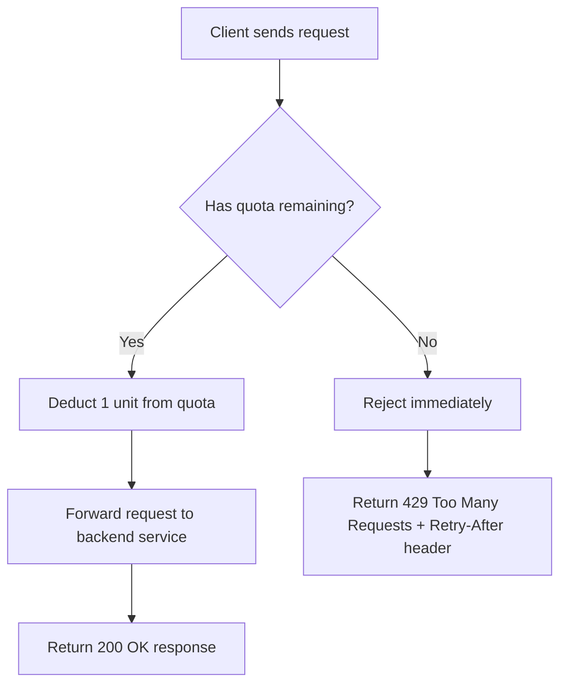
```mermaid
flowchart TD
    A[Client sends request] --> B{Has quota remaining?}
    B -->|Yes| C[Deduct 1 unit from quota]
    C --> D[Forward request to backend service]
    D --> E[Return 200 OK response]
    B -->|No| F[Reject immediately]
    F --> G[Return 429 Too Many Requests + Retry-After header]
```

### 4.3 The Rate Limiting Response Headers

| Header | Purpose | Example |
|---|---|---|
| `X-RateLimit-Limit` | Maximum requests allowed in the window | `100` |
| `X-RateLimit-Remaining` | Requests remaining in the current window | `42` |
| `X-RateLimit-Reset` | Unix timestamp when the window resets | `1723708800` |
| `Retry-After` | Seconds to wait before retrying | `12` |

> ✅ **Best Practice:** Always include these headers in your rate-limited API responses. They're part of the [IETF standard for rate limiting](https://datatracker.ietf.org/doc/draft-ietf-httpapi-ratelimit-headers/) and help clients implement proper backoff.

---

<a name="why-it-matters"></a>
## 5. Why Rate Limiting Matters — Real Business Cases

### 5.1 Preventing Abuse

**Scenario:** A scraper bot hits your `/products` endpoint 50,000 times per minute to steal your catalog.

Without a limiter, every one of those requests reaches your database. With a limiter capped at, say, 60 requests/minute/IP, the bot is throttled to a trickle while legitimate shoppers are unaffected.

> 📊 **Real-World Statistic:** According to Cloudflare's 2024 DDoS report, bot traffic accounts for approximately **30-40%** of all internet traffic. Without rate limiting, this bot traffic can easily overwhelm origin servers.

### 5.2 Protecting Expensive Resources

Imagine an AI image-generation endpoint. Each request might trigger:


```mermaid
flowchart LR
    A[Incoming Request] --> B[GPU Inference ~2s]
    B --> C[Model Post-processing]
    C --> D[Object Storage Upload]
    D --> E[Database Write]
    E --> F[Response to Client]
```

If each request costs $0.02 in GPU time, an unthrottled client sending 10,000 requests/minute costs you **$200/minute** — nearly $290,000/day from a single abusive actor. A per-user rate limit (e.g., 30 requests/hour) turns this into a bounded, predictable cost.

> 💡 **Key Insight:** Rate limiting isn't just about protecting *availability* — it's about protecting *cost*. Every request that reaches your expensive backend has a price tag.

### 5.3 Ensuring Fair Usage ("Noisy Neighbor" Problem)

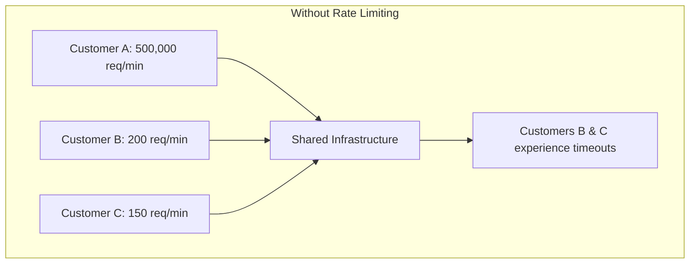
```mermaid
flowchart TD
    subgraph Without Rate Limiting
    A1[Customer A: 500,000 req/min] --> S1[Shared Infrastructure]
    A2[Customer B: 200 req/min] --> S1
    A3[Customer C: 150 req/min] --> S1
    S1 --> R1[Customers B & C experience timeouts]
    end
```

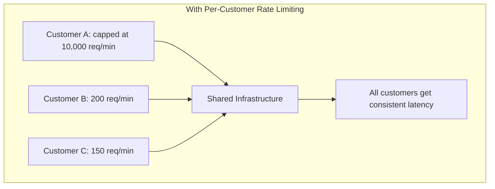
```mermaid
flowchart TD
    subgraph With Per-Customer Rate Limiting
    B1[Customer A: capped at 10,000 req/min] --> S2[Shared Infrastructure]
    B2[Customer B: 200 req/min] --> S2
    B3[Customer C: 150 req/min] --> S2
    S2 --> R2[All customers get consistent latency]
    end
```

### 5.4 Improving Reliability During Traffic Spikes

Real examples of sudden spikes:
- A Black Friday sale
- A celebrity tweet linking to your site
- A bug in a client SDK that causes a retry loop
- A viral marketing campaign

A rate limiter acts as a **shock absorber**, smoothing bursts before they hit your database.

### 5.5 Reducing Security Risk

| Attack Type | How Rate Limiting Helps |
|---|---|
| Credential stuffing | Caps login attempts per IP/account (e.g., 5/min) |
| Brute-force password guessing | Makes exhaustive guessing computationally infeasible |
| API scraping | Slows data exfiltration to a crawl |
| Denial-of-service (DoS) | Rejects excess traffic before it reaches app servers |

> ⚠️ **Security Note:** Rate limiting is a *mitigation* for these attacks, not a complete solution. It should be combined with other security measures like CAPTCHAs, WAFs, and anomaly detection.

---

<a name="requirements"></a>
## 6. Functional & Non-Functional Requirements

### 6.1 Functional Requirements

- Limit requests per user, IP, or API key
- Support different limits for different customer tiers
- Return `HTTP 429` when a limit is exceeded
- Support configurable burst allowances
- Scale to billions of requests over time
- Add negligible latency to each request

### 6.2 Non-Functional Requirements

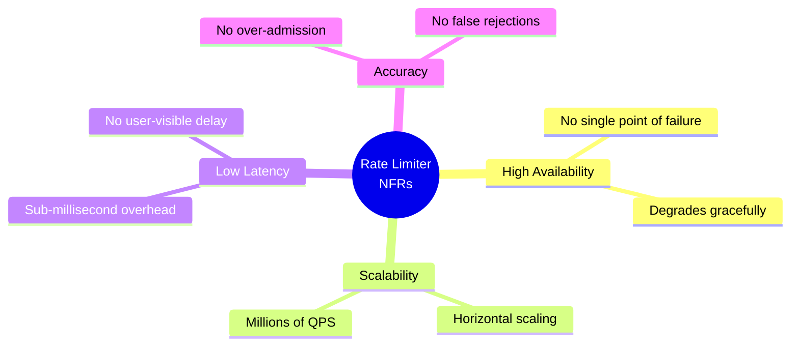
```mermaid
mindmap
  root((Rate Limiter<br/>NFRs))
    High Availability
      No single point of failure
      Degrades gracefully
    Scalability
      Horizontal scaling
      Millions of QPS
    Low Latency
      Sub-millisecond overhead
      No user-visible delay
    Accuracy
      No over-admission
      No false rejections
```

### 6.3 Requirement Trade-offs

| Requirement | Trade-off | Example |
|---|---|---|
| **Accuracy** vs **Memory** | Sliding Window Log is most accurate but memory-heavy | Compliance vs. high-scale APIs |
| **Availability** vs **Correctness** | Fail-open allows over-quota; fail-closed blocks legitimate users | CDN vs. payment APIs |
| **Simplicity** vs **Precision** | Fixed Window is simple but has boundary issues | Internal tools vs. customer-facing APIs |
| **Burst tolerance** vs **Smooth output** | Token Bucket allows bursts; Leaky Bucket doesn't | General APIs vs. legacy systems |

> 💡 **Key Insight:** There's no "perfect" rate limiter. Every design choice involves trade-offs. The best engineers understand these trade-offs and make deliberate, informed decisions.

---

<a name="capacity"></a>
## 7. Capacity Estimation Walkthrough

Let's do the math the way you would in an interview.

**Assumptions:**
- 50 million daily active users (DAU)
- Average 5 API requests/minute per active user
- Peak traffic = 10× average

**Step 1 — Daily requests:**
```
50,000,000 users × 5 req/min × 60 min × 24 hr
= 50,000,000 × 5 × 1,440
≈ 360,000,000,000 (360 Billion requests/day)
```

**Step 2 — Average QPS:**
```
360,000,000,000 requests ÷ 86,400 seconds/day
≈ 4.16 Million requests/second (average)
```

**Step 3 — Peak QPS:**
```
4.16M × 10 ≈ 41.6 Million requests/second (peak)
```

**Step 4 — Redis Memory Estimation:**

Let's estimate how much memory we need in Redis:

```
Per-user state: ~100 bytes (key + hash fields + overhead)
Active users per minute: 50M × 5 = 250M requests/min
Unique users in a 60s window: ~50M (worst case)

Total memory: 50M × 100 bytes = 5 GB
```

With sharding across 10 Redis nodes: **500 MB per node** — very manageable.

**Step 5 — Network Bandwidth:**

```
Each rate limit check: ~1 request + 1 response to Redis
Average payload: ~200 bytes round-trip

Bandwidth: 41.6M QPS × 200 bytes = 8.32 GB/s
```

This is significant but achievable with proper sharding and connection pooling.

> ⚠️ **Conclusion:** At this scale, a single in-memory counter on one server is mathematically impossible — even a language with the fastest in-memory hash map lookups couldn't route 40M distinct network requests per second through one box. This is what forces us toward a **distributed** design.

---

<a name="single-server"></a>
## 8. The Single-Server Solution (and Why It Breaks)

### 8.1 The Naive Approach

On a single server, rate limiting is trivial — an in-memory map works fine:

```python
from collections import defaultdict
import time

buckets = defaultdict(lambda: {"tokens": 100, "last_refill": time.time()})

def allow_request(user_id, capacity=100, refill_rate=100/60):
    bucket = buckets[user_id]
    now = time.time()
    elapsed = now - bucket["last_refill"]
    bucket["tokens"] = min(capacity, bucket["tokens"] + elapsed * refill_rate)
    bucket["last_refill"] = now

    if bucket["tokens"] >= 1:
        bucket["tokens"] -= 1
        return True
    return False
```

This is fast (no network calls) and simple. But the moment you scale horizontally:

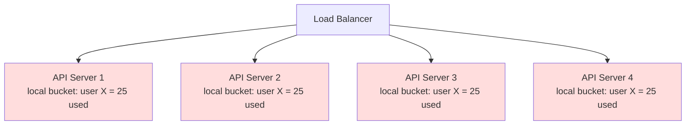
```mermaid
flowchart TD
    LB[Load Balancer] --> API1[API Server 1<br/>local bucket: user X = 25 used]
    LB --> API2[API Server 2<br/>local bucket: user X = 25 used]
    LB --> API3[API Server 3<br/>local bucket: user X = 25 used]
    LB --> API4[API Server 4<br/>local bucket: user X = 25 used]

    style API1 fill:#ffdddd
    style API2 fill:#ffdddd
    style API3 fill:#ffdddd
    style API4 fill:#ffdddd
```

### 8.2 The Problem Explained

Each server independently believes the user has made only 25 requests (their local share), but the load balancer distributed 100 total requests across 4 servers. If the user keeps sending traffic, **each server allows up to 100 more**, letting the user reach 400 requests — 4× their actual limit.

**Root cause:** each server has a partial, isolated view of the truth. We need **shared, centralized state**.

### 8.3 Other Single-Server Limitations

| Limitation | Description |
|---|---|
| **Memory** | Each server duplicates state for all users — wasteful |
| **Inconsistency** | Different servers have different views of the same user |
| **No global enforcement** | Users can exceed limits by routing through different servers |
| **Restart loss** | Restarting a server loses all rate limit state |
| **No cross-region support** | Can't enforce limits across geographic regions |

> ✅ **Quick Recap:** Single-server rate limiting works for prototypes and small apps, but breaks the moment you scale horizontally. The fix is centralized state.

---

<a name="algorithms"></a>
## 9. Rate Limiting Algorithms — Deep Dive

There are five major algorithm families. Understanding the trade-offs between them (not just implementing one) is what separates a junior answer from a senior one.

<a name="token-bucket"></a>
### 9.1 Token Bucket

**Analogy:** A bucket sits under a faucet that drips tokens at a fixed rate. Every request removes a token. If the bucket is empty, the request is rejected. The bucket has a maximum capacity — excess tokens simply overflow.

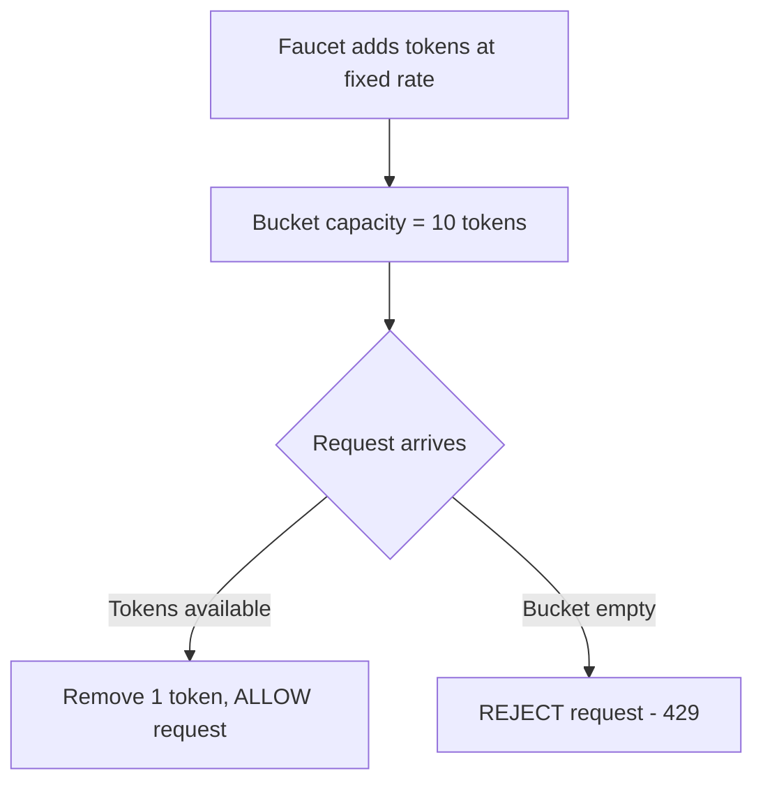
```mermaid
flowchart TD
    A[Faucet adds tokens at fixed rate] --> B[Bucket capacity = 10 tokens]
    B --> C{Request arrives}
    C -->|Tokens available| D[Remove 1 token, ALLOW request]
    C -->|Bucket empty| E[REJECT request - 429]
```

**Worked example:** capacity = 10, refill rate = 2 tokens/second.

| Time | Event | Tokens Before | Tokens After |
|---|---|---|---|
| t=0s | Bucket full | — | 10 |
| t=0s | Burst of 8 requests | 10 | 2 |
| t=1s | +2 tokens refilled | 2 | 4 |
| t=1s | 3 requests arrive | 4 | 1 |
| t=2s | +2 tokens refilled | 1 | 3 |

**Key property:** it allows **bursts** up to the bucket capacity, then throttles to the steady refill rate. This models real traffic well — users rarely send perfectly uniform traffic.

**Pseudocode (single key):**

```python
def token_bucket_allow(bucket, capacity, refill_rate, now):
    elapsed = now - bucket.last_refill
    bucket.tokens = min(capacity, bucket.tokens + elapsed * refill_rate)
    bucket.last_refill = now
    if bucket.tokens >= 1:
        bucket.tokens -= 1
        return True
    return False
```

**When to use:** General-purpose API rate limiting, API gateways, most production scenarios.

**When to avoid:** When you need perfectly smooth output (use Leaky Bucket instead).

<a name="leaky-bucket"></a>
### 9.2 Leaky Bucket

**Analogy:** Same bucket, but instead of tokens dripping in, requests drip **out** at a constant rate, regardless of how fast they arrive. Incoming requests queue up; if the queue overflows, new requests are dropped.

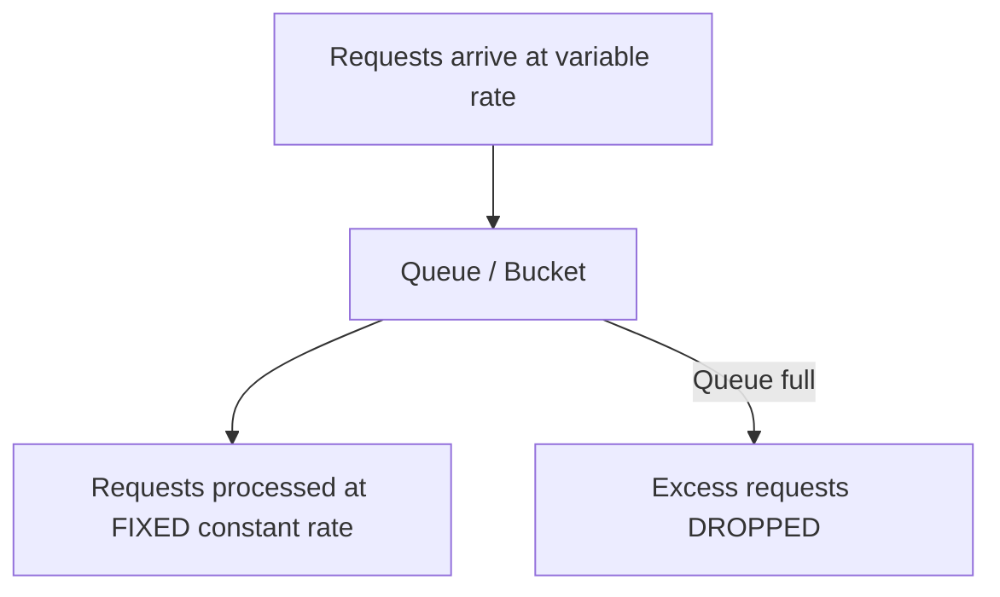
```mermaid
flowchart TD
    A[Requests arrive at variable rate] --> B[Queue / Bucket]
    B --> C[Requests processed at FIXED constant rate]
    B -->|Queue full| D[Excess requests DROPPED]
```

**Key difference from Token Bucket:** Leaky Bucket **smooths** output to a perfectly constant rate — no bursts allowed at all. Token Bucket allows controlled bursts.

**Worked example:** Queue capacity = 10, processing rate = 2 requests/second.

| Time | Event | Queue Before | Queue After |
|---|---|---|---|
| t=0s | 5 requests arrive | 0 | 5 |
| t=0.5s | 3 more requests arrive | 5 | 8 |
| t=1s | 2 requests processed | 8 | 6 |
| t=1s | 5 more requests arrive | 6 | 10 (full) |
| t=1.1s | 1 more request arrives | 10 | 10 (REJECTED) |

**When to use:** When downstream systems truly cannot handle *any* burst (e.g., a legacy mainframe that chokes on concurrent requests).

**When to avoid:** When you want to allow legitimate bursts (e.g., a user clicking "refresh" 5 times quickly).

<a name="fixed-window"></a>
### 9.3 Fixed Window Counter

**Analogy:** Divide time into fixed windows (e.g., every 60-second block). Count requests in the current window. Reset the counter when the window ends.

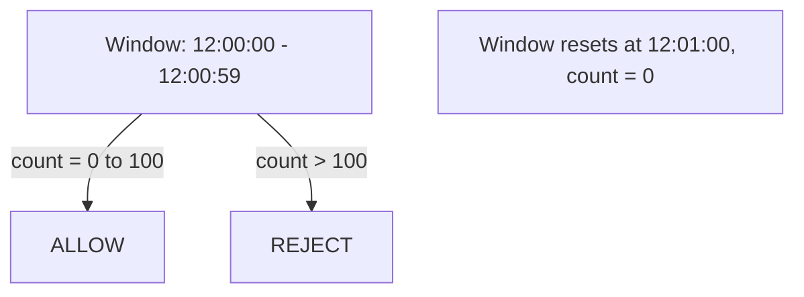
```mermaid
flowchart TD
    A["Window: 12:00:00 - 12:00:59"] -->|count = 0 to 100| B[ALLOW]
    A -->|count > 100| C[REJECT]
    D["Window resets at 12:01:00, count = 0"]
```

**The boundary problem:**

```
11:59:59 → 100 requests → ALLOWED (fills window 11:59:00-11:59:59)
12:00:00 → 100 requests → ALLOWED (fills window 12:00:00-12:00:59)
```

That's **200 requests in 2 seconds**, despite a "100 requests/minute" policy. This is the fixed window's fatal flaw — it's simple and memory-efficient, but inaccurate at window edges.

**Redis implementation (simple):**

```python
import redis
import time

r = redis.Redis()

def fixed_window_allow(user_id, limit=100, window_seconds=60):
    key = f"ratelimit:fixed:{user_id}:{int(time.time() // window_seconds)}"
    count = r.incr(key)
    if count == 1:
        r.expire(key, window_seconds)
    return count <= limit
```

**When to use:** Simple, non-critical limits where slight inaccuracy is acceptable.

**When to avoid:** Customer-facing APIs where accuracy matters, or when clients might exploit the boundary.

<a name="sliding-log"></a>
### 9.4 Sliding Window Log

Instead of a counter, store every request's **timestamp**. To check if a new request is allowed, drop timestamps older than the window and count what's left.

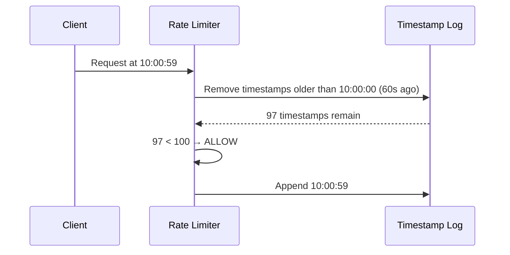
```mermaid
sequenceDiagram
    participant C as Client
    participant R as Rate Limiter
    participant L as Timestamp Log

    C->>R: Request at 10:00:59
    R->>L: Remove timestamps older than 10:00:00 (60s ago)
    L-->>R: 97 timestamps remain
    R->>R: 97 < 100 → ALLOW
    R->>L: Append 10:00:59
```

**Pros:** Perfectly accurate — no boundary problem.

**Cons:** Memory grows with request volume. At 50M users × thousands of req/sec, storing every timestamp becomes expensive.

**Redis implementation (sorted set):**

```python
import redis
import time

r = redis.Redis()

def sliding_log_allow(user_id, limit=100, window_seconds=60):
    key = f"ratelimit:log:{user_id}"
    now = time.time()
    window_start = now - window_seconds
    
    # Remove old timestamps
    r.zremrangebyscore(key, 0, window_start)
    
    # Count remaining
    count = r.zcard(key)
    
    if count < limit:
        # Add current request timestamp
        r.zadd(key, {str(now): now})
        r.expire(key, window_seconds)
        return True
    return False
```

**When to use:** Auth, compliance, billing — anywhere you need audit-grade accuracy.

**When to avoid:** High-scale APIs where memory is a concern.

<a name="sliding-counter"></a>
### 9.5 Sliding Window Counter (Hybrid)

A clever compromise: keep two fixed-window counters (current + previous) and compute a weighted estimate.

```
estimated_count = current_window_count
                 + previous_window_count × (overlap_percentage)
```

**Worked example:** Window = 60s. We're 15 seconds into the current window (25% through it).

```
previous_window_count = 80
current_window_count  = 20
overlap_percentage     = 1 - 0.25 = 0.75

estimated_count = 20 + (80 × 0.75) = 20 + 60 = 80
```

This gets ~95% of the accuracy of Sliding Window Log at ~5% of the memory cost — which is why many production systems (including Cloudflare's public rate limiter) use this approach.

**Redis implementation:**

```python
import redis
import time

r = redis.Redis()

def sliding_counter_allow(user_id, limit=100, window_seconds=60):
    current_window = int(time.time() // window_seconds)
    previous_window = current_window - 1
    
    current_key = f"ratelimit:sc:{user_id}:{current_window}"
    previous_key = f"ratelimit:sc:{user_id}:{previous_window}"
    
    current_count = int(r.get(current_key) or 0)
    previous_count = int(r.get(previous_key) or 0)
    
    # Calculate overlap percentage
    elapsed_in_window = time.time() % window_seconds
    overlap = 1 - (elapsed_in_window / window_seconds)
    
    estimated = current_count + (previous_count * overlap)
    
    if estimated < limit:
        r.incr(current_key)
        r.expire(current_key, window_seconds * 2)
        return True
    return False
```

**When to use:** High-scale production APIs where you need good accuracy without the memory cost of logging every request.

**When to avoid:** When you need *exact* accuracy (use Sliding Window Log).

<a name="algorithm-comparison"></a>
### 9.6 Algorithm Comparison Table

| Algorithm | Memory | Burst Support | Accuracy | Complexity | Best For |
|---|---|---|---|---|---|
| Token Bucket | Very Low | Excellent | High | Low | General APIs, gateways |
| Leaky Bucket | Low | None (smooths output) | High | Low | Systems needing constant output rate |
| Fixed Window | Very Low | Poor (boundary spikes) | Low | Very Low | Simple, non-critical limits |
| Sliding Log | High | Excellent | Very High | Medium | Auth, compliance, billing |
| Sliding Window Counter | Low | Good | High (~95%) | Medium | High-scale production APIs |

> 💡 **Pro Tip:** In a system design interview, always start with Token Bucket as your default choice, then explain *why* you might switch to another algorithm based on specific requirements.

---

<a name="distributed"></a>
## 10. Going Distributed: Centralizing State with Redis

To fix the multi-server inconsistency problem, we move state **out of the application** and into a shared, centralized store — typically Redis, chosen for its speed (in-memory), atomic operations, and built-in expiration (TTL).

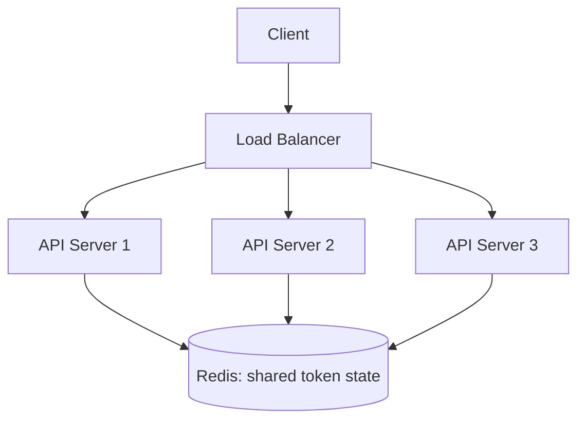
```mermaid
flowchart TD
    Client[Client] --> LB[Load Balancer]
    LB --> API1[API Server 1]
    LB --> API2[API Server 2]
    LB --> API3[API Server 3]
    API1 --> Redis[(Redis: shared token state)]
    API2 --> Redis
    API3 --> Redis
```

Now, instead of asking "how many tokens do *I* have locally?", every server asks Redis: **"how many tokens does this specific user have, right now, across the entire fleet?"**

Redis stores something like:

```
Key:   ratelimit:user:12345
Value: { tokens: 42, last_refill: 1723708812 }
TTL:   120 seconds (auto-cleanup for inactive users)
```

### 10.1 Why Redis?

| Feature | Why It Matters |
|---|---|
| **In-memory** | Sub-millisecond latency — critical for rate limiting |
| **Atomic operations** | `INCR`, `DECR`, `EVAL` prevent race conditions |
| **TTL/Expiration** | Auto-cleanup of inactive user state |
| **Data structures** | Hashes, sorted sets, counters — all useful for different algorithms |
| **Horizontal scaling** | Redis Cluster supports sharding |
| **Persistence** | RDB/AOF for recovery (though often disabled for rate limiting) |

### 10.2 Redis Data Structures for Rate Limiting

| Algorithm | Redis Structure | Key Pattern |
|---|---|---|
| Token Bucket | Hash (`tokens`, `last_refill`) | `ratelimit:tb:{user_id}` |
| Fixed Window | String counter | `ratelimit:fw:{user_id}:{window}` |
| Sliding Log | Sorted Set (timestamps) | `ratelimit:log:{user_id}` |
| Sliding Counter | Two String counters | `ratelimit:sc:{user_id}:{window}` |

> ⚠️ **Important:** Redis is single-threaded for command execution. This is actually a *feature* for rate limiting — it means individual commands are atomic by default. But it also means you should keep operations fast and avoid long-running scripts.

---

<a name="race-conditions"></a>
## 11. Solving Race Conditions with Lua Scripts

### 11.1 The Problem

Two servers read Redis at nearly the same instant:

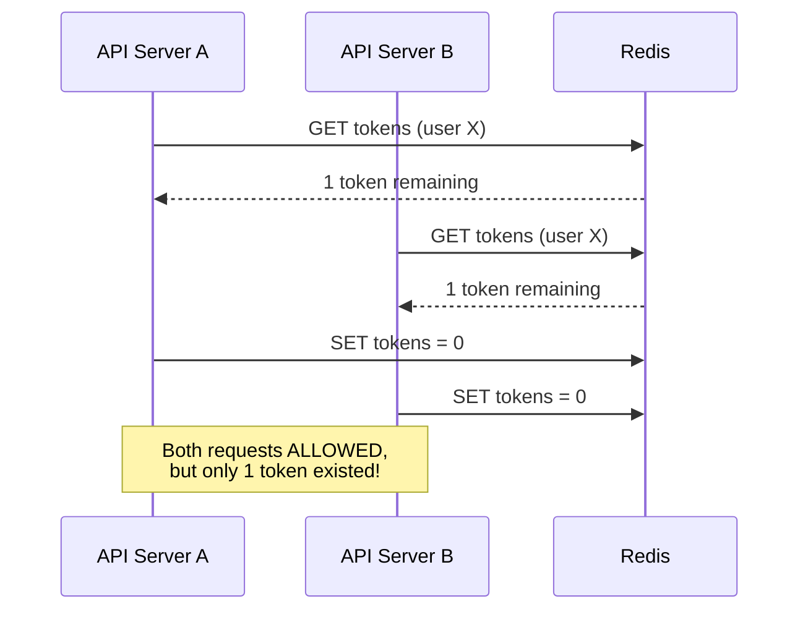
```mermaid
sequenceDiagram
    participant A as API Server A
    participant B as API Server B
    participant R as Redis

    A->>R: GET tokens (user X)
    R-->>A: 1 token remaining
    B->>R: GET tokens (user X)
    R-->>B: 1 token remaining
    A->>R: SET tokens = 0
    B->>R: SET tokens = 0
    Note over A,B: Both requests ALLOWED,<br/>but only 1 token existed!
```

This is a classic **race condition** — a "read, modify, write" sequence that isn't atomic, allowing two concurrent operations to interleave incorrectly.

### 11.2 The Fix: Redis + Lua

Redis executes Lua scripts as a **single atomic operation** — no other client can interleave commands while the script runs.

```lua
-- token_bucket.lua
-- KEYS[1] = bucket key
-- ARGV[1] = capacity
-- ARGV[2] = refill_rate (tokens per second)
-- ARGV[3] = requested tokens (usually 1)

local key = KEYS[1]
local capacity = tonumber(ARGV[1])
local refill_rate = tonumber(ARGV[2])
local requested = tonumber(ARGV[3])

local now = redis.call("TIME")
local now_ms = now[1] * 1000 + now[2] / 1000

local bucket = redis.call("HMGET", key, "tokens", "last_refill")
local tokens = tonumber(bucket[1]) or capacity
local last_refill = tonumber(bucket[2]) or now_ms

local elapsed = math.max(0, (now_ms - last_refill) / 1000)
tokens = math.min(capacity, tokens + elapsed * refill_rate)

local allowed = 0
if tokens >= requested then
    tokens = tokens - requested
    allowed = 1
end

redis.call("HMSET", key, "tokens", tokens, "last_refill", now_ms)
redis.call("EXPIRE", key, 60)

return allowed
```

Calling it from an application (Node.js example):

```javascript
const allowed = await redisClient.eval(
  luaScript,
  1,                    // number of KEYS
  `ratelimit:user:${userId}`,  // KEYS[1]
  100,                  // ARGV[1]: capacity
  1.67,                 // ARGV[2]: refill rate (100/min)
  1                     // ARGV[3]: tokens requested
);

if (allowed === 1) {
  // proceed with request
} else {
  return res.status(429).send("Too Many Requests");
}
```

**Why this matters:** instead of 5 separate network round-trips (GET, GET, calculate, SET, SET), the entire "check-and-decrement" logic runs in **one round trip**, atomically, inside Redis. This eliminates the race condition and cuts network overhead by ~80%.

### 11.3 Lua Script Benefits

| Benefit | Description |
|---|---|
| **Atomicity** | Scripts run as a single unit — no interleaving |
| **Network efficiency** | One round trip instead of multiple |
| **Consistency** | All servers execute the same logic |
| **Performance** | Scripts are cached by Redis after first execution |

> ⚠️ **Warning:** Keep Lua scripts short and fast. Redis blocks all other operations while a script runs. A slow script (e.g., one that loops millions of times) will block your entire Redis instance.

---

<a name="clock-sync"></a>
## 12. Clock Synchronization Problems

Distributed systems can never fully trust individual machine clocks.

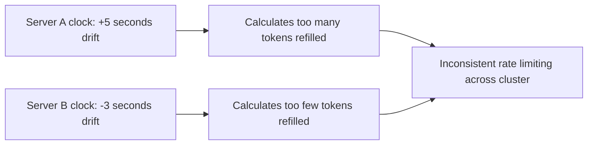
```mermaid
flowchart LR
    A[Server A clock: +5 seconds drift] --> X[Calculates too many tokens refilled]
    B[Server B clock: -3 seconds drift] --> Y[Calculates too few tokens refilled]
    X --> Z[Inconsistent rate limiting across cluster]
    Y --> Z
```

**Real-world cause:** NTP drift, VM hypervisor clock skew, container scheduling delays — even a few hundred milliseconds of drift, multiplied across millions of refill calculations per second, produces measurably inconsistent behavior.

**The fix:** use `redis.call("TIME")` (as shown in the Lua script above) instead of each application server's local clock. Redis becomes the single authoritative clock for every refill calculation, so all servers agree — even if their own system clocks disagree.

### 12.1 Why Redis TIME?

| Approach | Problem |
|---|---|
| `Date.now()` on each server | Different servers have different clocks |
| NTP sync | Drift still occurs between sync intervals |
| External time service | Adds latency and a dependency |
| **Redis TIME** | **Single authoritative clock, already in our critical path** |

> 💡 **Pro Tip:** Using Redis TIME is a classic example of "piggybacking" — leveraging an existing dependency to solve a secondary problem without adding new infrastructure.

---

<a name="sharding"></a>
## 13. Scaling Redis: Sharding & Consistent Hashing

A single Redis instance eventually becomes the bottleneck (Redis is single-threaded for command execution). The fix is to **shard** — split users across multiple Redis nodes.

### 13.1 Naive Sharding (and why it fails)

```
shard = hash(user_id) % number_of_servers
```

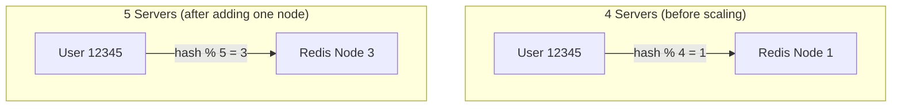
```mermaid
flowchart TD
    subgraph "4 Servers (before scaling)"
    U1[User 12345] -->|hash % 4 = 1| S1[Redis Node 1]
    end
    subgraph "5 Servers (after adding one node)"
    U2[User 12345] -->|hash % 5 = 3| S2[Redis Node 3]
    end
```

Adding a single node changes the modulus, which **remaps almost every key**. All existing per-user state effectively resets — a massive, disruptive "cache stampede" the instant you scale.

### 13.2 Consistent Hashing (the fix)

Consistent hashing places both servers and keys on a conceptual "ring." Each key is assigned to the next server clockwise on the ring.

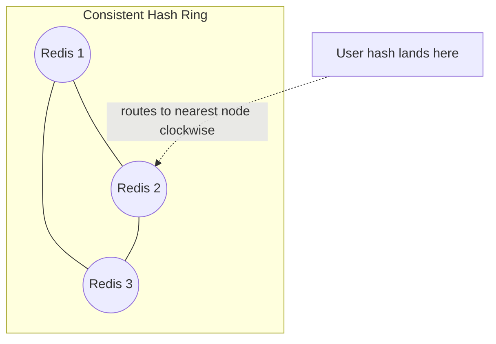
```mermaid
flowchart TD
    subgraph "Consistent Hash Ring"
    R1((Redis 1)) --- R2((Redis 2))
    R2 --- R3((Redis 3))
    R3 --- R1
    end
    U[User hash lands here] -.->|routes to nearest node clockwise| R2
```

When a new node is added, only the keys between the new node and its clockwise neighbor need to move — typically **~1/N of all keys**, not nearly all of them.

| Approach | Keys remapped when scaling from 4→5 nodes |
|---|---|
| `hash % N` | ~80% of all keys |
| Consistent hashing | ~20% of all keys |

### 13.3 Consistent Hashing Implementation

```javascript
// Simple consistent hashing implementation
class ConsistentHash {
  constructor(nodes, replicas = 100) {
    this.replicas = replicas;
    this.ring = new Map(); // hash -> node
    this.sortedKeys = [];
    
    for (const node of nodes) {
      this.addNode(node);
    }
  }

  _hash(key) {
    // Simple hash function (use a proper one like MD5 in production)
    let hash = 0;
    for (let i = 0; i < key.length; i++) {
      hash = ((hash << 5) - hash) + key.charCodeAt(i);
      hash |= 0;
    }
    return Math.abs(hash);
  }

  addNode(node) {
    for (let i = 0; i < this.replicas; i++) {
      const hash = this._hash(`${node}:${i}`);
      this.ring.set(hash, node);
      this.sortedKeys.push(hash);
    }
    this.sortedKeys.sort((a, b) => a - b);
  }

  removeNode(node) {
    for (let i = 0; i < this.replicas; i++) {
      const hash = this._hash(`${node}:${i}`);
      this.ring.delete(hash);
      this.sortedKeys = this.sortedKeys.filter(k => k !== hash);
    }
  }

  getNode(key) {
    if (this.sortedKeys.length === 0) return null;
    const hash = this._hash(key);
    
    // Find first key >= hash (clockwise)
    for (const ringKey of this.sortedKeys) {
      if (ringKey >= hash) {
        return this.ring.get(ringKey);
      }
    }
    
    // Wrap around to first node
    return this.ring.get(this.sortedKeys[0]);
  }
}

// Usage
const ch = new ConsistentHash(['redis-1', 'redis-2', 'redis-3']);
const node = ch.getNode('user:12345');
console.log(`User 12345 routes to ${node}`);
```

> ⚠️ **Note:** In production, use a well-tested library like `hashring` or Redis Cluster's built-in sharding rather than implementing consistent hashing yourself.

### 13.4 Redis Cluster vs Manual Sharding

| Approach | Pros | Cons |
|---|---|---|
| **Redis Cluster** | Built-in sharding, automatic failover, no client logic | Requires cluster mode, more complex setup |
| **Manual consistent hashing** | Full control, simpler setup | Client-side logic, manual failover handling |
| **Proxy-based (e.g., Twemproxy)** | Transparent to clients | Single point of failure, less flexible |

---

<a name="failure"></a>
## 14. Handling Failure: Fail Open vs Fail Closed

What happens when a Redis shard goes down?

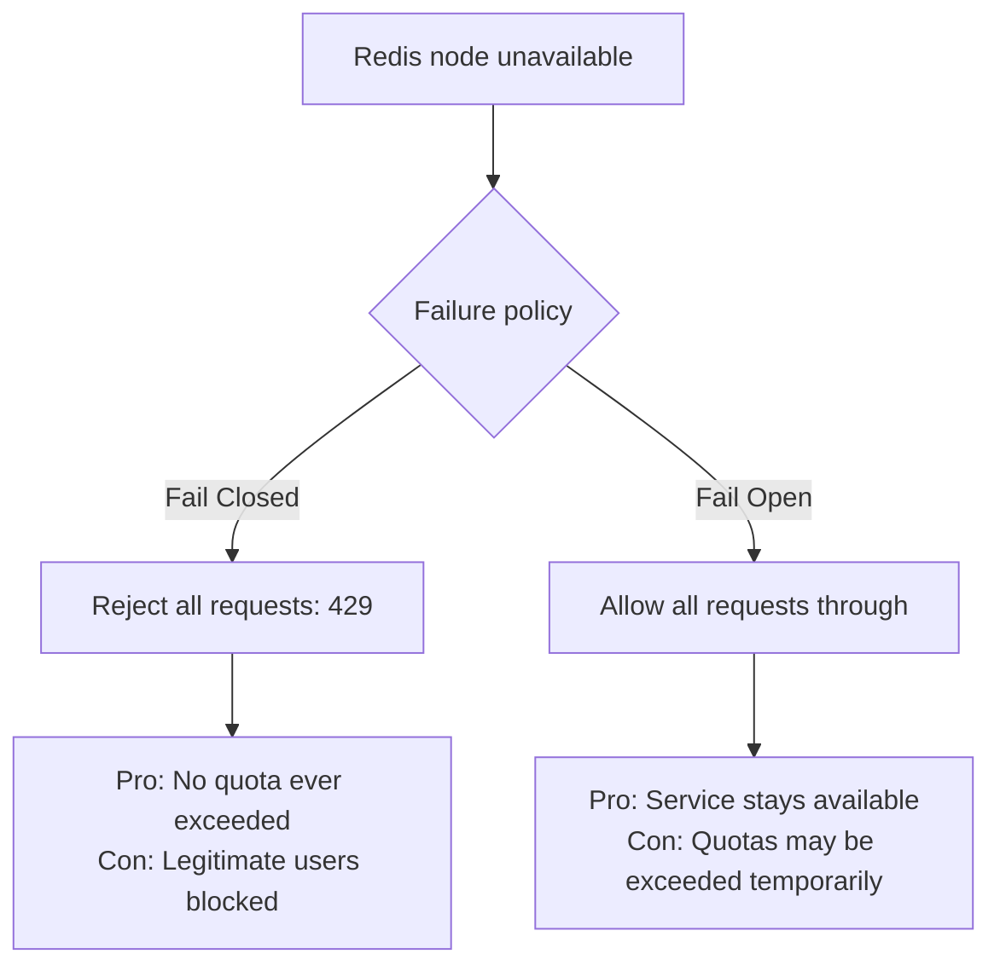
```mermaid
flowchart TD
    A[Redis node unavailable] --> B{Failure policy}
    B -->|Fail Closed| C[Reject all requests: 429]
    B -->|Fail Open| D[Allow all requests through]
    C --> E[Pro: No quota ever exceeded<br/>Con: Legitimate users blocked]
    D --> F[Pro: Service stays available<br/>Con: Quotas may be exceeded temporarily]
```

| Use Case | Recommended Policy | Reasoning |
|---|---|---|
| Payment processing API | Fail Closed | Correctness > availability; overcharging or double-processing is unacceptable |
| Login/auth endpoint | Fail Closed | Prevents brute-force during outage |
| Content delivery / public read API | Fail Open | Availability > strict enforcement; a brief overage is a minor cost |
| Internal microservice-to-microservice calls | Fail Open (often) | Trusted callers; blocking internal traffic can cascade failures |

Production systems usually make this policy **configurable per endpoint**, since a single global policy rarely fits every use case.

### 14.1 Implementing Fail Open/Closed

```javascript
async function rateLimitWithFailurePolicy(req, res, next, policy = 'fail-open') {
  try {
    const allowed = await isAllowed(req.userId);
    if (!allowed) {
      return res.status(429).json({ error: 'Too Many Requests' });
    }
    next();
  } catch (error) {
    // Redis is down
    if (policy === 'fail-closed') {
      return res.status(429).json({ error: 'Service temporarily unavailable' });
    }
    // fail-open: allow the request through
    console.error('Rate limiter failed, allowing request:', error);
    next();
  }
}
```

> 💡 **Pro Tip:** Always log rate limiter failures separately from normal errors. You need to know when your protection mechanism is down — it's a security-relevant event.

---

<a name="fairness"></a>
## 15. Fairness and Multi-Tenant Quotas

Instead of one global bucket shared by everyone, isolate quotas **per tenant**:

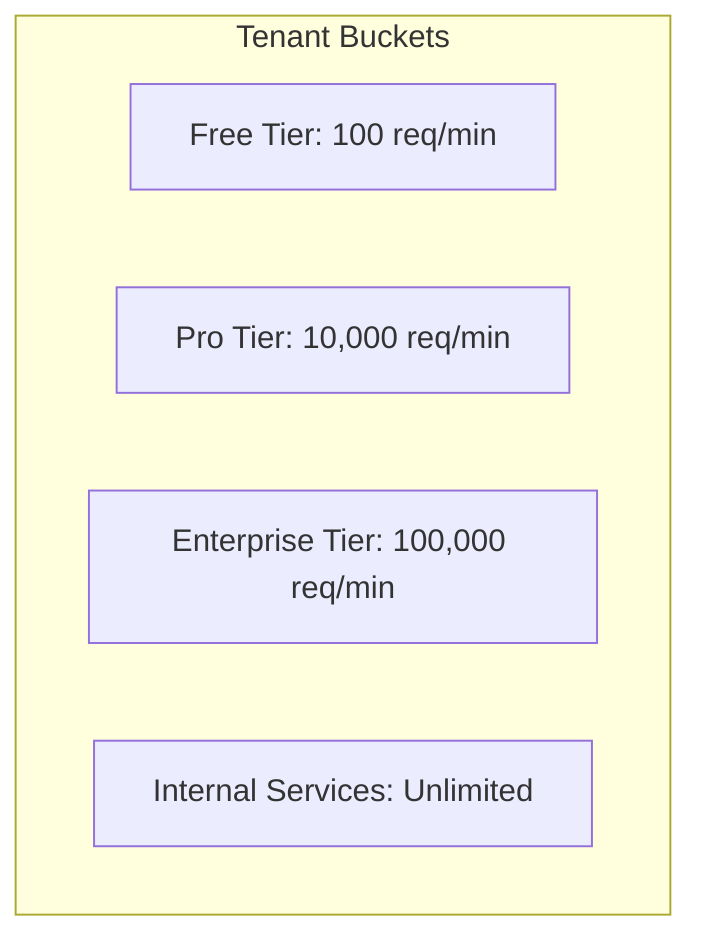
```mermaid
flowchart TD
    subgraph Tenant Buckets
    A[Free Tier: 100 req/min]
    B[Pro Tier: 10,000 req/min]
    C[Enterprise Tier: 100,000 req/min]
    D[Internal Services: Unlimited]
    end
```

**Example tiered configuration:**

```json
{
  "free":       { "capacity": 100,    "refill_per_sec": 1.67 },
  "pro":        { "capacity": 10000,  "refill_per_sec": 166.7 },
  "enterprise": { "capacity": 100000, "refill_per_sec": 1666.7 },
  "internal":   { "capacity": null,   "refill_per_sec": null }
}
```

### 15.1 Weighted Fairness

Some platforms go further with **weighted fairness** — dynamically shrinking a heavy tenant's effective quota during system-wide congestion, then restoring it once load normalizes. This is similar to how TCP congestion control shares bandwidth fairly among competing connections.

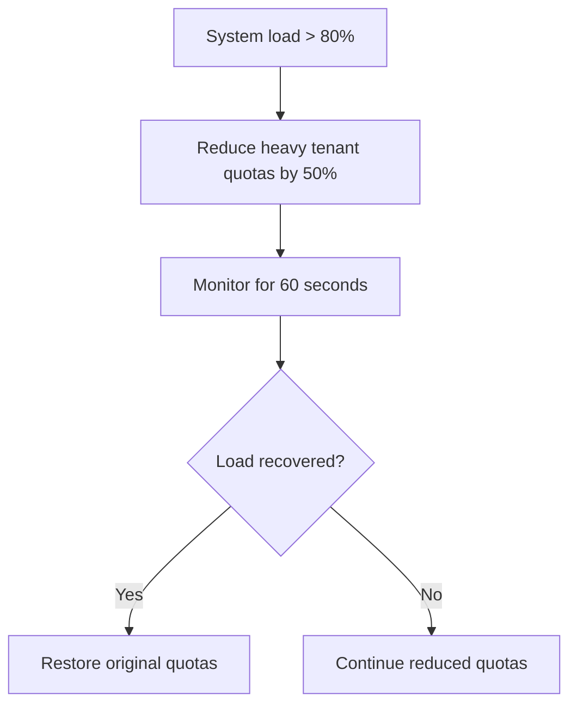
```mermaid
flowchart TD
    A[System load > 80%] --> B[Reduce heavy tenant quotas by 50%]
    B --> C[Monitor for 60 seconds]
    C --> D{Load recovered?}
    D -->|Yes| E[Restore original quotas]
    D -->|No| F[Continue reduced quotas]
```

### 15.2 Multi-Dimensional Rate Limiting

Some APIs need multiple simultaneous limits:

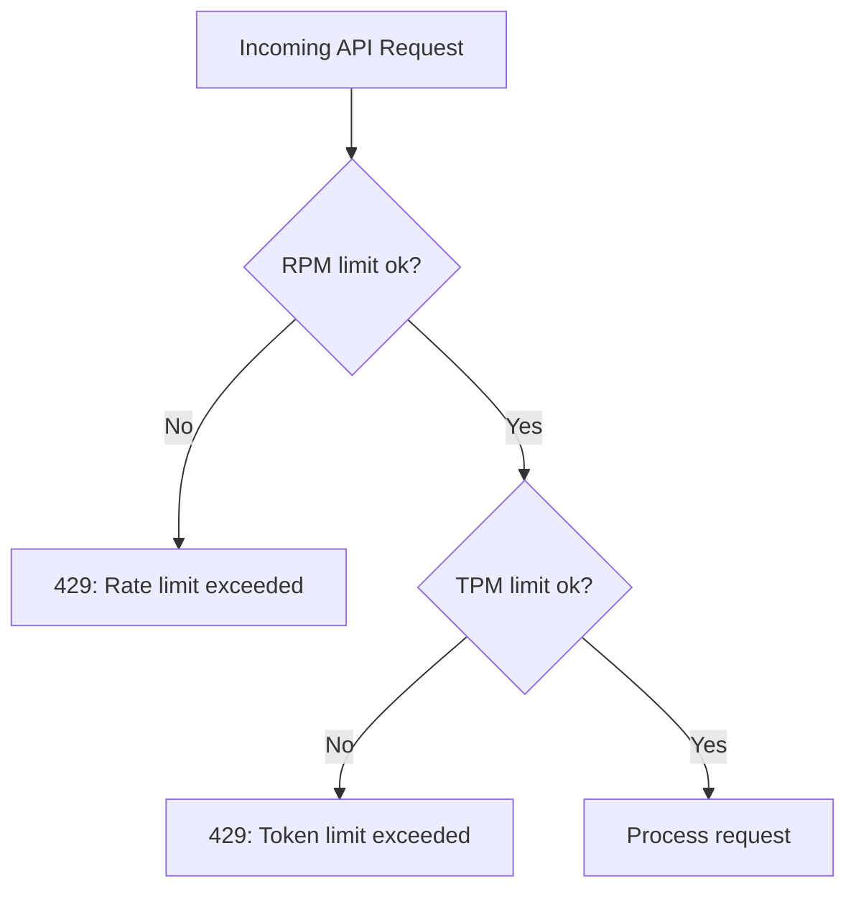
```mermaid
flowchart TD
    Req[Incoming API Request] --> C1{RPM limit ok?}
    C1 -->|No| Reject1[429: Rate limit exceeded]
    C1 -->|Yes| C2{TPM limit ok?}
    C2 -->|No| Reject2[429: Token limit exceeded]
    C2 -->|Yes| Allow[Process request]
```

This is common for LLM APIs (OpenAI-style) where cost scales with tokens, not just request count.

---

<a name="architecture"></a>
## 16. Full Production Architecture

Bringing everything together:

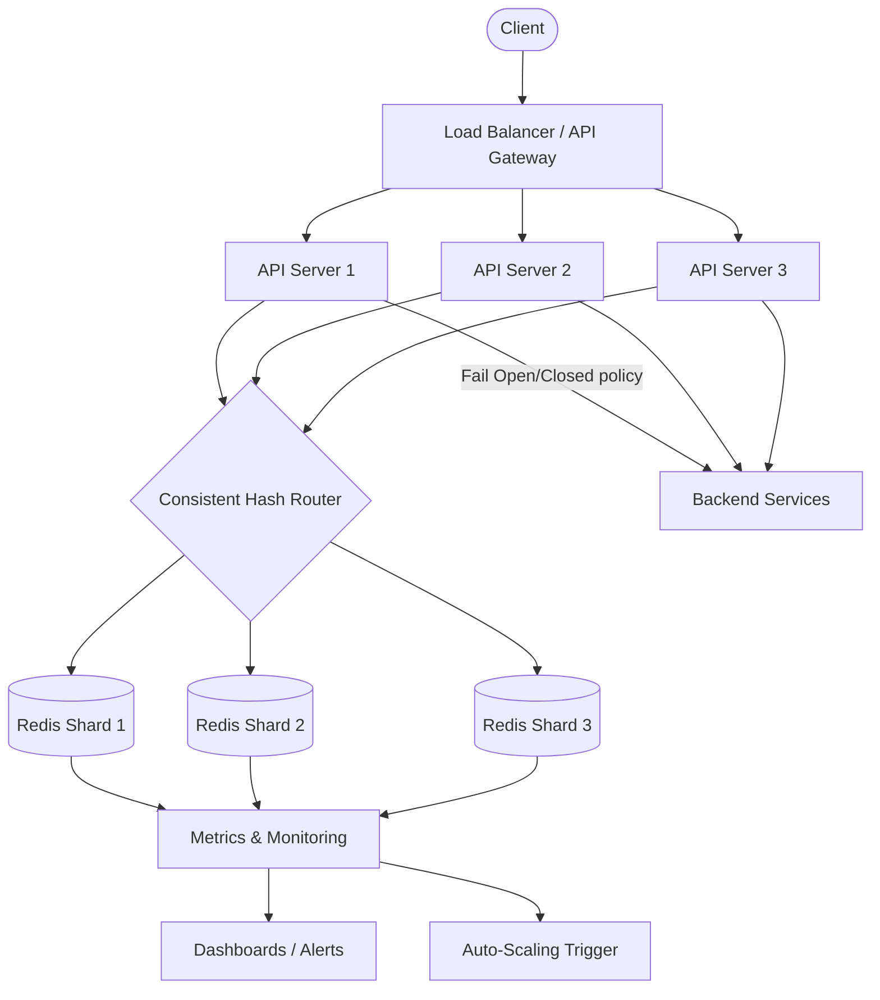
```mermaid
flowchart TD
    Client([Client]) --> LB[Load Balancer / API Gateway]
    LB --> API1[API Server 1]
    LB --> API2[API Server 2]
    LB --> API3[API Server 3]

    API1 --> CH{Consistent Hash Router}
    API2 --> CH
    API3 --> CH

    CH --> R1[(Redis Shard 1)]
    CH --> R2[(Redis Shard 2)]
    CH --> R3[(Redis Shard 3)]

    R1 --> M[Metrics & Monitoring]
    R2 --> M
    R3 --> M

    M --> D[Dashboards / Alerts]
    M --> AS[Auto-Scaling Trigger]

    API1 -->|Fail Open/Closed policy| BE[Backend Services]
    API2 --> BE
    API3 --> BE
```

**This architecture delivers:**
- Horizontal scalability (add Redis shards or API servers independently)
- Atomic, race-condition-free request processing (Lua scripts)
- Distributed consistency (shared Redis state, Redis TIME as clock authority)
- Fault tolerance (configurable fail-open/fail-closed)
- Fairness (per-tenant isolated quotas)
- Observability (metrics feeding dashboards and alerts)

### 16.1 Key Components

| Component | Role | Scaling Strategy |
|---|---|---|
| **Load Balancer** | Distribute traffic across API servers | Add more LBs or use DNS round-robin |
| **API Servers** | Handle requests, enforce rate limits | Stateless — scale horizontally |
| **Consistent Hash Router** | Route rate limit keys to correct Redis shard | Client-side library or proxy |
| **Redis Shards** | Store rate limit state | Add shards as needed |
| **Metrics & Monitoring** | Track allowed/rejected, latency, hot keys | Prometheus + Grafana |

---

<a name="hands-on"></a>
## 17. Hands-On: Building a Token Bucket in Code

Below is a complete, runnable example combining an Express.js middleware with Redis and the Lua script from Section 11.

### 17.1 Project Setup

```bash
# Create project directory
mkdir rate-limiter-demo
cd rate-limiter-demo

# Initialize npm project
npm init -y

# Install dependencies
npm install express ioredis
```

### 17.2 The Rate Limiter Module

```javascript
// rateLimiter.js
const Redis = require("ioredis");
const redis = new Redis(); // connects to localhost:6379 by default

const TOKEN_BUCKET_SCRIPT = `
local key = KEYS[1]
local capacity = tonumber(ARGV[1])
local refill_rate = tonumber(ARGV[2])
local requested = tonumber(ARGV[3])

local now = redis.call("TIME")
local now_ms = now[1] * 1000 + now[2] / 1000

local bucket = redis.call("HMGET", key, "tokens", "last_refill")
local tokens = tonumber(bucket[1]) or capacity
local last_refill = tonumber(bucket[2]) or now_ms

local elapsed = math.max(0, (now_ms - last_refill) / 1000)
tokens = math.min(capacity, tokens + elapsed * refill_rate)

local allowed = 0
if tokens >= requested then
    tokens = tokens - requested
    allowed = 1
end

redis.call("HMSET", key, "tokens", tokens, "last_refill", now_ms)
redis.call("EXPIRE", key, 60)

return allowed
`;

async function isAllowed(identifier, capacity = 100, refillRate = 100 / 60) {
  const key = `ratelimit:${identifier}`;
  const result = await redis.eval(
    TOKEN_BUCKET_SCRIPT,
    1,
    key,
    capacity,
    refillRate,
    1
  );
  return result === 1;
}

// Express middleware
function rateLimitMiddleware(tier = "free") {
  const tiers = {
    free: { capacity: 100, refillRate: 100 / 60 },
    pro: { capacity: 10000, refillRate: 10000 / 60 },
  };
  const { capacity, refillRate } = tiers[tier];

  return async (req, res, next) => {
    const identifier = req.headers["x-api-key"] || req.ip;
    const allowed = await isAllowed(identifier, capacity, refillRate);

    if (!allowed) {
      res.set("Retry-After", "1");
      return res.status(429).json({ error: "Too Many Requests" });
    }
    next();
  };
}

module.exports = { rateLimitMiddleware };
```

### 17.3 The Express App

```javascript
// app.js
const express = require("express");
const { rateLimitMiddleware } = require("./rateLimiter");

const app = express();

app.get("/api/products", rateLimitMiddleware("free"), (req, res) => {
  res.json({ products: ["item1", "item2"] });
});

app.get("/api/orders", rateLimitMiddleware("pro"), (req, res) => {
  res.json({ orders: ["order1", "order2"] });
});

app.listen(3000, () => console.log("Server running on port 3000"));
```

### 17.4 Testing It

```bash
# Start Redis (if not already running)
docker run -d -p 6379:6379 redis

# Start the server
node app.js

# Fire 105 requests rapidly against a 100/min limit
for i in {1..105}; do
  curl -s -o /dev/null -w "%{http_code}\n" http://localhost:3000/api/products
done | sort | uniq -c
```

Expected output:
```
    100 200
      5 429
```

### 17.5 Adding Error Handling and Edge Cases

```javascript
// rateLimiter.js (enhanced)
const Redis = require("ioredis");
const redis = new Redis({
  retryStrategy: (times) => Math.min(times * 50, 2000),
});

// ... (Lua script same as before)

async function isAllowed(identifier, capacity = 100, refillRate = 100 / 60) {
  const key = `ratelimit:${identifier}`;
  
  try {
    const result = await redis.eval(
      TOKEN_BUCKET_SCRIPT,
      1,
      key,
      capacity,
      refillRate,
      1
    );
    return result === 1;
  } catch (error) {
    // Log the error but don't crash
    console.error(`Rate limiter error for ${identifier}:`, error.message);
    // Fail-open by default
    return true;
  }
}

// Enhanced middleware with failure policy
function rateLimitMiddleware(tier = "free", options = {}) {
  const { failOpen = true } = options;
  const tiers = {
    free: { capacity: 100, refillRate: 100 / 60 },
    pro: { capacity: 10000, refillRate: 10000 / 60 },
    enterprise: { capacity: 100000, refillRate: 100000 / 60 },
  };
  const { capacity, refillRate } = tiers[tier];

  return async (req, res, next) => {
    const identifier = req.headers["x-api-key"] || req.ip;
    
    try {
      const allowed = await isAllowed(identifier, capacity, refillRate);

      if (!allowed) {
        res.set("Retry-After", "1");
        return res.status(429).json({ 
          error: "Too Many Requests",
          retryAfter: 1 
        });
      }
      next();
    } catch (error) {
      if (failOpen) {
        console.error("Rate limiter failed, allowing request:", error);
        next();
      } else {
        res.status(503).json({ error: "Service temporarily unavailable" });
      }
    }
  };
}

module.exports = { rateLimitMiddleware };
```

> ✅ **Best Practice:** Always handle Redis connection failures gracefully. A rate limiter that crashes your app is worse than no rate limiter at all.

---

<a name="use-cases"></a>
## 18. Real-World Use Cases

### 18.1 API Gateway Protection (Stripe-style)

Every incoming request to a payment API passes through a Token Bucket limiter keyed by API key, with **Fail Closed** on Redis outage — because allowing unlimited requests during an outage risks double-charging customers.

**Key design decisions:**
- Token Bucket algorithm (allows legitimate bursts)
- Per-API-key buckets (fairness across customers)
- Fail Closed (correctness > availability)
- Multi-dimensional limits (requests + amount processed)

### 18.2 Login Brute-Force Protection

A Fixed Window or Token Bucket limiter caps login attempts at 5/minute per IP **and** per account, preventing credential-stuffing attacks even if the attacker rotates IPs (the per-account limit still catches them).

**Key design decisions:**
- Dual keying (IP + account)
- Fail Closed (security-critical)
- Longer windows for repeated failures (exponential backoff)

### 18.3 AI/LLM API Quotas (OpenAI-style)

Token Bucket limiters are applied per API key with **two dimensions simultaneously**: requests-per-minute AND tokens-per-minute (since LLM cost scales with tokens, not just request count).

```mermaid
flowchart TD
    Req[Incoming API Request] --> C1{RPM limit ok?}
    C1 -->|No| Reject1[429: Rate limit exceeded]
    C1 -->|Yes| C2{TPM limit ok?}
    C2 -->|No| Reject2[429: Token limit exceeded]
    C2 -->|Yes| Allow[Process request]
```

### 18.4 CDN / DDoS Mitigation (Cloudflare-style)

A Sliding Window Counter, sharded geographically at edge nodes, absorbs volumetric attacks close to the source before traffic ever reaches origin servers.

**Key design decisions:**
- Sliding Window Counter (accuracy + low memory at massive scale)
- Geo-distributed (limit at the edge, closest to the attacker)
- Fail Open (availability is paramount for CDN)

### 18.5 Internal Microservice Throttling

Service-to-service calls use per-caller quotas with **Fail Open**, since blocking internal traffic during a partial outage often causes cascading failures worse than the original problem.

**Key design decisions:**
- Per-service quotas (not per-user)
- Fail Open (avoid cascading failures)
- Generous limits (internal traffic is trusted)

### 18.6 SaaS Multi-Tenant Fairness

A project-management SaaS platform gives each customer organization its own isolated bucket, preventing one large enterprise customer's batch job from starving smaller customers' interactive requests.

**Key design decisions:**
- Per-tenant buckets
- Tiered limits (free/pro/enterprise)
- Weighted fairness during congestion

---

<a name="mistakes"></a>
## 19. Common Mistakes & Anti-Patterns

```mermaid
flowchart TD
    A[Common Rate Limiter Mistakes] --> B[Ignoring race conditions]
    A --> C[Using local in-memory state across multiple servers]
    A --> D[Trusting individual server clocks]
    A --> E[No failure-mode strategy]
    A --> F[No monitoring/observability]
    A --> G[One global limit instead of per-tenant isolation]
```

| Mistake | Consequence | Fix |
|---|---|---|
| Read-modify-write without atomicity | Users exceed quota under concurrency | Use Lua scripts / atomic ops |
| In-memory counters on multi-server deployments | Each server has a different view of reality | Centralize state in Redis |
| Trusting `Date.now()` on each server | Inconsistent refill calculations | Use Redis `TIME` as authoritative clock |
| No fail-open/fail-closed decision | Undefined behavior during outages | Make failure policy explicit and configurable |
| No metrics | Can't tell if limiter is protecting or breaking things | Track allowed/rejected counts, latency, hot keys |
| Global limit for all tenants | One heavy user starves everyone | Isolate quotas per tenant/user/API key |
| Using `hash % N` for sharding | Cache stampede on every resize | Use consistent hashing |
| Blocking Redis with slow Lua scripts | Entire system stalls | Keep scripts short, test under load |
| Not setting TTL on keys | Memory leak from inactive users | Always set TTL |
| Ignoring Redis connection failures | App crashes or silently bypasses limits | Handle errors with fail-open/closed policy |

### 19.1 Anti-Pattern: The "One-Size-Fits-All" Limiter

**Anti-pattern:** Using the same rate limit configuration for every endpoint.

**Why it's wrong:** Different endpoints have different costs and risk profiles. A login endpoint needs strict limits (5/min); a public read endpoint can be more generous (100/min).

**Fix:** Make rate limits configurable per endpoint, per tier, and per use case.

### 19.2 Anti-Pattern: The "Set and Forget" Limiter

**Anti-pattern:** Deploying a rate limiter and never monitoring it.

**Why it's wrong:** Rate limiters can fail silently. If Redis goes down and you're fail-open, you might not notice until a bot takes down your service.

**Fix:** Monitor allowed/rejected counts, latency, and error rates. Set up alerts for anomalies.

### 19.3 Anti-Pattern: The "Global Bucket" Limiter

**Anti-pattern:** One shared bucket for all users.

**Why it's wrong:** One heavy user can starve everyone else. This is the "noisy neighbor" problem.

**Fix:** Isolate quotas per tenant, user, or API key.

---

<a name="best-practices"></a>
## 20. Best Practices

### 20.1 Design Best Practices

1. **Choose the right algorithm** for your use case — don't default to one approach
2. **Make limits configurable** per endpoint, tier, and tenant
3. **Use Redis TIME** as the authoritative clock
4. **Set TTLs** on all rate limit keys to prevent memory leaks
5. **Implement fail-open/fail-closed** policies explicitly
6. **Isolate quotas per tenant** to ensure fairness
7. **Use consistent hashing** for Redis sharding
8. **Keep Lua scripts short** and test them under load

### 20.2 API Design Best Practices

1. **Return proper headers** (`X-RateLimit-Limit`, `X-RateLimit-Remaining`, `X-RateLimit-Reset`, `Retry-After`)
2. **Use HTTP 429** with a clear error message
3. **Document your rate limits** in your API docs
4. **Provide a way to check limits** without consuming them (e.g., a `/rate-limit` endpoint)
5. **Use consistent key naming** (e.g., `ratelimit:{type}:{identifier}`)

### 20.3 Operational Best Practices

1. **Monitor everything** — allowed/rejected counts, latency, error rates, hot keys
2. **Set up alerts** for anomalies (sudden spike in rejections, Redis errors)
3. **Test failure scenarios** — simulate Redis outages, test fail-open/closed
4. **Load test** your rate limiter to find bottlenecks
5. **Use connection pooling** for Redis to avoid connection exhaustion
6. **Log rate limit events** for debugging and security analysis

### 20.4 Code Best Practices

```javascript
// ✅ GOOD: Proper error handling
async function checkRateLimit(identifier) {
  try {
    const allowed = await redis.eval(script, 1, key, ...args);
    return { allowed: allowed === 1, error: null };
  } catch (error) {
    return { allowed: true, error }; // fail-open
  }
}

// ❌ BAD: No error handling
async function checkRateLimit(identifier) {
  const allowed = await redis.eval(script, 1, key, ...args); // crashes on Redis failure
  return allowed === 1;
}
```

---

<a name="performance"></a>
## 21. Performance Considerations

### 21.1 Latency Budget

Rate limiting should add **sub-millisecond** overhead to each request. Here's the typical breakdown:

| Operation | Latency |
|---|---|
| Redis round trip (local network) | 0.1 - 0.5 ms |
| Lua script execution | 0.05 - 0.2 ms |
| Total added latency | 0.15 - 0.7 ms |

> ⚠️ **Warning:** If your rate limiter adds more than 1ms, you're doing something wrong. Common culprits: multiple Redis round trips, slow Lua scripts, or network issues.

### 21.2 Throughput Considerations

| Factor | Impact |
|---|---|
| **Redis single-threaded** | ~100K ops/sec per instance (with pipelining) |
| **Lua scripts** | Reduce round trips but block Redis while running |
| **Connection pooling** | Prevents connection exhaustion under load |
| **Pipelining** | Batch multiple rate limit checks into one round trip |
| **Sharding** | Distributes load across multiple Redis instances |

### 21.3 Memory Optimization

```javascript
// ✅ GOOD: Set TTL to auto-cleanup
redis.call("EXPIRE", key, 60);

// ✅ GOOD: Use compact data structures
// Hash with 2 fields is more compact than a JSON string

// ❌ BAD: No TTL - memory leak
redis.call("HMSET", key, "tokens", tokens, "last_refill", now_ms);
```

### 21.4 Performance Benchmarks

| Configuration | Throughput | Latency (p99) |
|---|---|---|
| Single Redis, no sharding | ~50K checks/sec | 0.5 ms |
| Single Redis, pipelined | ~100K checks/sec | 0.3 ms |
| 3 Redis shards | ~150K checks/sec | 0.4 ms |
| 10 Redis shards | ~500K checks/sec | 0.4 ms |

> 💡 **Pro Tip:** These are rough numbers. Always benchmark in your own environment with your own workload.

---

<a name="security"></a>
## 22. Security Considerations

### 22.1 Attack Vectors

| Attack | How Rate Limiting Helps | Additional Measures |
|---|---|---|
| Credential stuffing | Caps login attempts | CAPTCHA, IP reputation |
| Brute-force | Makes guessing infeasible | Account lockout, 2FA |
| API scraping | Slows data exfiltration | Bot detection, fingerprinting |
| DoS/DDoS | Rejects excess traffic | WAF, CDN, traffic filtering |
| Resource exhaustion | Bounds cost | Budget alerts, spend limits |

### 22.2 Security Best Practices

1. **Never trust client-supplied identifiers** — validate and normalize them
2. **Use fail-closed for security-critical endpoints** (login, payment)
3. **Rate limit by multiple dimensions** (IP + account + API key)
4. **Log rate limit events** for security analysis
5. **Protect Redis** — use authentication, TLS, and network isolation
6. **Avoid key injection** — sanitize identifiers used in Redis keys

```javascript
// ✅ GOOD: Sanitize identifier
function sanitizeIdentifier(identifier) {
  return identifier.replace(/[^a-zA-Z0-9:_-]/g, '');
}

// ❌ BAD: Raw identifier in key
const key = `ratelimit:${req.headers['x-api-key']}`; // potential injection
```

### 22.3 Redis Security

```bash
# Enable Redis authentication
redis-server --requirepass your-strong-password

# Or in redis.conf
requirepass your-strong-password
```

```javascript
// Connect with authentication
const redis = new Redis({
  host: 'redis.example.com',
  port: 6379,
  password: 'your-strong-password',
  tls: {}, // enable TLS
});
```

---

<a name="testing"></a>
## 23. Testing Strategies

### 23.1 Unit Testing

```javascript
// test/rateLimiter.test.js
const { isAllowed } = require('../rateLimiter');

describe('Token Bucket Rate Limiter', () => {
  beforeEach(async () => {
    // Clear Redis before each test
    await redis.flushall();
  });

  test('allows requests within limit', async () => {
    const allowed = await isAllowed('test-user', 10, 10);
    expect(allowed).toBe(true);
  });

  test('rejects requests over limit', async () => {
    // Consume all tokens
    for (let i = 0; i < 10; i++) {
      await isAllowed('test-user', 10, 10);
    }
    const allowed = await isAllowed('test-user', 10, 10);
    expect(allowed).toBe(false);
  });

  test('refills tokens over time', async () => {
    // Consume all tokens
    for (let i = 0; i < 10; i++) {
      await isAllowed('test-user', 10, 10);
    }
    
    // Wait for refill (10 tokens/sec, so 1 token in 100ms)
    await new Promise(r => setTimeout(r, 200));
    
    const allowed = await isAllowed('test-user', 10, 10);
    expect(allowed).toBe(true);
  });
});
```

### 23.2 Integration Testing

```javascript
// test/integration.test.js
const request = require('supertest');
const app = require('../app');

describe('Rate Limiter Integration', () => {
  test('returns 429 when limit exceeded', async () => {
    // Send 101 requests (limit is 100)
    for (let i = 0; i < 100; i++) {
      await request(app).get('/api/products').expect(200);
    }
    const response = await request(app).get('/api/products');
    expect(response.status).toBe(429);
    expect(response.headers['retry-after']).toBeDefined();
  });

  test('returns rate limit headers', async () => {
    const response = await request(app).get('/api/products');
    expect(response.headers['x-ratelimit-limit']).toBeDefined();
    expect(response.headers['x-ratelimit-remaining']).toBeDefined();
  });
});
```

### 23.3 Load Testing

```bash
# Using Apache Bench
ab -n 10000 -c 100 http://localhost:3000/api/products

# Using wrk
wrk -t4 -c100 -d30s http://localhost:3000/api/products

# Using k6 (script-based)
k6 run load-test.js
```

```javascript
// load-test.js (k6)
import http from 'k6/http';
import { check } from 'k6';

export const options = {
  vus: 50,
  duration: '30s',
};

export default function () {
  const res = http.get('http://localhost:3000/api/products');
  check(res, {
    'status is 200 or 429': (r) => r.status === 200 || r.status === 429,
  });
}
```

### 23.4 Failure Testing

| Test | Scenario | Expected Behavior |
|---|---|---|
| Redis down | Stop Redis, send requests | Fail-open: requests pass; Fail-closed: 429/503 |
| Redis slow | Add artificial latency | Requests still processed within timeout |
| Redis full | Fill memory | TTL cleanup prevents crash |
| Network partition | Block Redis traffic | Same as Redis down |

---

<a name="troubleshooting"></a>
## 24. Troubleshooting Guide

### 24.1 Common Issues and Fixes

| Symptom | Likely Cause | Fix |
|---|---|---|
| **Users exceed limits** | Race conditions (non-atomic operations) | Use Lua scripts |
| **Rate limiter not working** | Redis connection failure, fail-open policy | Check Redis health, review failure policy |
| **High latency** | Multiple Redis round trips, slow Lua scripts | Optimize to single round trip, keep scripts short |
| **Memory growth** | No TTL on keys | Always set TTL |
| **Inconsistent limits across servers** | Local clocks differ | Use Redis TIME |
| **Cache stampede on scaling** | `hash % N` sharding | Use consistent hashing |
| **Redis connection exhaustion** | Too many connections, no pooling | Use connection pooling |
| **429 errors for legitimate users** | Limits too low, or shared bucket | Increase limits, isolate per tenant |
| **Rate limiter crashes app** | Unhandled Redis errors | Add try/catch, fail-open/closed |

### 24.2 Debugging Commands

```bash
# Check Redis is running
redis-cli ping

# Check rate limit keys
redis-cli keys 'ratelimit:*'

# Inspect a specific bucket
redis-cli hgetall ratelimit:user:12345

# Monitor Redis commands in real-time
redis-cli monitor

# Check Redis memory usage
redis-cli info memory

# Check Redis latency
redis-cli --latency
```

### 24.3 Debugging Lua Scripts

```bash
# Test Lua script directly in Redis
redis-cli --eval token_bucket.lua "ratelimit:test" , 100 1.67 1

# Enable Lua script debugging (Redis 7+)
redis-cli --ldb --eval token_bucket.lua "ratelimit:test" , 100 1.67 1
```

---

<a name="exercises"></a>
## 25. Practice Exercises

### Exercise 1: Implement a Fixed Window Counter

**Task:** Implement a fixed window counter rate limiter in Node.js using Redis. The limiter should:
- Allow a configurable number of requests per window
- Use Redis `INCR` and `EXPIRE` commands
- Return `true` if allowed, `false` if rejected

**Solution:**

```javascript
const Redis = require('ioredis');
const redis = new Redis();

async function fixedWindowAllow(userId, limit = 100, windowSeconds = 60) {
  const window = Math.floor(Date.now() / (windowSeconds * 1000));
  const key = `ratelimit:fixed:${userId}:${window}`;
  
  const count = await redis.incr(key);
  
  if (count === 1) {
    await redis.expire(key, windowSeconds);
  }
  
  return count <= limit;
}

// Test
(async () => {
  for (let i = 0; i < 105; i++) {
    const allowed = await fixedWindowAllow('user1', 100, 60);
    if (i === 99) console.log('Request 100:', allowed ? 'ALLOWED' : 'REJECTED');
    if (i === 100) console.log('Request 101:', allowed ? 'ALLOWED' : 'REJECTED');
  }
  await redis.quit();
})();
```

**Expected output:**
```
Request 100: ALLOWED
Request 101: REJECTED
```

---

### Exercise 2: Implement a Sliding Window Log

**Task:** Implement a sliding window log rate limiter using Redis sorted sets. The limiter should:
- Store timestamps of each request
- Remove timestamps older than the window
- Count remaining timestamps to determine if allowed

**Solution:**

```javascript
const Redis = require('ioredis');
const redis = new Redis();

async function slidingLogAllow(userId, limit = 100, windowSeconds = 60) {
  const key = `ratelimit:log:${userId}`;
  const now = Date.now();
  const windowStart = now - (windowSeconds * 1000);
  
  // Remove old timestamps
  await redis.zremrangebyscore(key, 0, windowStart);
  
  // Count remaining
  const count = await redis.zcard(key);
  
  if (count < limit) {
    // Add current request timestamp
    await redis.zadd(key, now, `${now}-${Math.random()}`);
    await redis.expire(key, windowSeconds);
    return true;
  }
  
  return false;
}

// Test
(async () => {
  for (let i = 0; i < 105; i++) {
    const allowed = await slidingLogAllow('user1', 100, 60);
    if (i === 99) console.log('Request 100:', allowed ? 'ALLOWED' : 'REJECTED');
    if (i === 100) console.log('Request 101:', allowed ? 'ALLOWED' : 'REJECTED');
  }
  await redis.quit();
})();
```

**Expected output:**
```
Request 100: ALLOWED
Request 101: REJECTED
```

---

### Exercise 3: Implement a Sliding Window Counter

**Task:** Implement a sliding window counter rate limiter that combines current and previous window counts with a weighted estimate. The limiter should:
- Track counts for the current and previous windows
- Calculate a weighted estimate based on overlap
- Allow requests if the estimate is below the limit

**Solution:**

```javascript
const Redis = require('ioredis');
const redis = new Redis();

async function slidingCounterAllow(userId, limit = 100, windowSeconds = 60) {
  const now = Date.now();
  const currentWindow = Math.floor(now / (windowSeconds * 1000));
  const previousWindow = currentWindow - 1;
  
  const currentKey = `ratelimit:sc:${userId}:${currentWindow}`;
  const previousKey = `ratelimit:sc:${userId}:${previousWindow}`;
  
  const currentCount = parseInt(await redis.get(currentKey)) || 0;
  const previousCount = parseInt(await redis.get(previousKey)) || 0;
  
  // Calculate overlap percentage
  const elapsedInWindow = (now % (windowSeconds * 1000)) / 1000;
  const overlap = 1 - (elapsedInWindow / windowSeconds);
  
  const estimated = currentCount + (previousCount * overlap);
  
  if (estimated < limit) {
    await redis.incr(currentKey);
    await redis.expire(currentKey, windowSeconds * 2);
    return true;
  }
  
  return false;
}

// Test
(async () => {
  for (let i = 0; i < 105; i++) {
    const allowed = await slidingCounterAllow('user1', 100, 60);
    if (i === 99) console.log('Request 100:', allowed ? 'ALLOWED' : 'REJECTED');
    if (i === 100) console.log('Request 101:', allowed ? 'ALLOWED' : 'REJECTED');
  }
  await redis.quit();
})();
```

**Expected output:**
```
Request 100: ALLOWED
Request 101: REJECTED
```

---

### Exercise 4: Implement Fail-Open and Fail-Closed Policies

**Task:** Create a rate limiter wrapper that handles Redis failures with configurable fail-open or fail-closed policies. Test both behaviors by simulating a Redis outage.

**Solution:**

```javascript
const Redis = require('ioredis');

class RateLimiterWithFailurePolicy {
  constructor(options = {}) {
    this.failOpen = options.failOpen ?? true;
    this.redis = new Redis({
      retryStrategy: (times) => {
        if (times > 5) return null; // stop retrying after 5 attempts
        return Math.min(times * 100, 2000);
      },
    });
    
    this.redis.on('error', (err) => {
      console.error('Redis error:', err.message);
    });
  }

  async check(identifier, limit = 100, windowSeconds = 60) {
    try {
      const key = `ratelimit:fw:${identifier}:${Math.floor(Date.now() / (windowSeconds * 1000))}`;
      const count = await this.redis.incr(key);
      if (count === 1) await this.redis.expire(key, windowSeconds);
      return { allowed: count <= limit, error: null };
    } catch (error) {
      console.error('Rate limiter error:', error.message);
      if (this.failOpen) {
        return { allowed: true, error }; // allow request through
      }
      return { allowed: false, error }; // reject request
    }
  }

  async simulateOutage() {
    // Simulate Redis outage by disconnecting
    await this.redis.disconnect();
  }
}

// Test
(async () => {
  // Test fail-open
  const failOpenLimiter = new RateLimiterWithFailurePolicy({ failOpen: true });
  await failOpenLimiter.simulateOutage();
  const result1 = await failOpenLimiter.check('user1');
  console.log('Fail-open during outage:', result1.allowed ? 'ALLOWED' : 'REJECTED');
  
  // Test fail-closed
  const failClosedLimiter = new RateLimiterWithFailurePolicy({ failOpen: false });
  await failClosedLimiter.simulateOutage();
  const result2 = await failClosedLimiter.check('user1');
  console.log('Fail-closed during outage:', result2.allowed ? 'ALLOWED' : 'REJECTED');
})();
```

**Expected output:**
```
Fail-open during outage: ALLOWED
Fail-closed during outage: REJECTED
```

---

### Exercise 5: Implement Multi-Tier Rate Limiting

**Task:** Create a rate limiter that supports different tiers (free, pro, enterprise) with different limits. Include a function to look up a user's tier and apply the appropriate limit.

**Solution:**

```javascript
const Redis = require('ioredis');
const redis = new Redis();

const TIERS = {
  free: { capacity: 100, refillRate: 100 / 60 },
  pro: { capacity: 1000, refillRate: 1000 / 60 },
  enterprise: { capacity: 10000, refillRate: 10000 / 60 },
};

// Simulated user tier lookup (in production, this would come from a database)
const userTiers = {
  'user-free': 'free',
  'user-pro': 'pro',
  'user-enterprise': 'enterprise',
};

async function getUserTier(userId) {
  return userTiers[userId] || 'free';
}

async function checkRateLimit(userId) {
  const tier = await getUserTier(userId);
  const { capacity, refillRate } = TIERS[tier];
  
  const key = `ratelimit:tb:${userId}`;
  const now = Date.now();
  
  // Simplified token bucket (without Lua for clarity)
  const bucket = await redis.hmget(key, 'tokens', 'last_refill');
  let tokens = parseFloat(bucket[0]) || capacity;
  let lastRefill = parseFloat(bucket[1]) || now;
  
  const elapsed = (now - lastRefill) / 1000;
  tokens = Math.min(capacity, tokens + elapsed * refillRate);
  
  let allowed = false;
  if (tokens >= 1) {
    tokens -= 1;
    allowed = true;
  }
  
  await redis.hmset(key, 'tokens', tokens, 'last_refill', now);
  await redis.expire(key, 60);
  
  return { allowed, tier, remaining: Math.floor(tokens) };
}

// Test
(async () => {
  const users = ['user-free', 'user-pro', 'user-enterprise'];
  
  for (const user of users) {
    const result = await checkRateLimit(user);
    console.log(`${user} (${result.tier}): ${result.allowed ? 'ALLOWED' : 'REJECTED'} (${result.remaining} remaining)`);
  }
  
  await redis.quit();
})();
```

**Expected output:**
```
user-free (free): ALLOWED (99 remaining)
user-pro (pro): ALLOWED (999 remaining)
user-enterprise (enterprise): ALLOWED (9999 remaining)
```

---

<a name="question-bank"></a>
## 26. Question Bank

### Beginner Level (Questions 1-17)

**Q1. What is rate limiting?**
<details>
<summary>Show Answer</summary>
Rate limiting is a technique that controls how many actions a client is allowed to perform within a given time window. It prevents abuse, protects resources, and ensures fair usage.
</details>

**Q2. What HTTP status code is typically returned when a rate limit is exceeded?**
<details>
<summary>Show Answer</summary>
HTTP 429 Too Many Requests.
</details>

**Q3. What is the purpose of the `Retry-After` header?**
<details>
<summary>Show Answer</summary>
It tells the client how many seconds to wait before retrying, preventing retry-storm traffic.
</details>

**Q4. Name three types of clients that can be rate limited.**
<details>
<summary>Show Answer</summary>
User accounts, API keys, IP addresses, devices, organizations, or downstream services.
</details>

**Q5. What is the main advantage of in-memory rate limiting on a single server?**
<details>
<summary>Show Answer</summary>
It's fast (no network calls) and simple to implement.
</details>

**Q6. What is the main problem with in-memory rate limiting in a multi-server environment?**
<details>
<summary>Show Answer</summary>
Each server has a partial, isolated view of the truth, allowing users to exceed limits by routing through different servers.
</details>

**Q7. What is the Token Bucket algorithm?**
<details>
<summary>Show Answer</summary>
A bucket holds tokens that are refilled at a fixed rate. Each request removes a token. If the bucket is empty, the request is rejected. It allows bursts up to the bucket capacity.
</details>

**Q8. What is the Leaky Bucket algorithm?**
<details>
<summary>Show Answer</summary>
Requests are queued and processed at a constant rate. If the queue overflows, new requests are dropped. It smooths output to a perfectly constant rate.
</details>

**Q9. What is the Fixed Window Counter algorithm?**
<details>
<summary>Show Answer</summary>
Time is divided into fixed windows. Requests are counted in the current window, and the counter resets when the window ends.
</details>

**Q10. What is the boundary problem in Fixed Window Counter?**
<details>
<summary>Show Answer</summary>
Requests at the end of one window and the beginning of the next can both be allowed, allowing 2× the limit in a short period.
</details>

**Q11. What is the Sliding Window Log algorithm?**
<details>
<summary>Show Answer</summary>
Every request's timestamp is stored. To check a new request, timestamps older than the window are removed and the remaining count is checked.
</details>

**Q12. What is the main disadvantage of Sliding Window Log?**
<details>
<summary>Show Answer</summary>
Memory grows with request volume — storing every timestamp becomes expensive at scale.
</details>

**Q13. What is the Sliding Window Counter algorithm?**
<details>
<summary>Show Answer</summary>
A hybrid approach that keeps two fixed-window counters (current + previous) and computes a weighted estimate.
</details>

**Q14. Why is Redis commonly used for distributed rate limiting?**
<details>
<summary>Show Answer</summary>
It's in-memory (fast), supports atomic operations, has built-in TTL/expiration, and can be sharded horizontally.
</details>

**Q15. What is a race condition in the context of rate limiting?**
<details>
<summary>Show Answer</summary>
When two servers read the same token count, both see tokens available, and both decrement — allowing more requests than the limit.
</details>

**Q16. What is the purpose of using Lua scripts with Redis?**
<details>
<summary>Show Answer</summary>
Lua scripts execute atomically in Redis, preventing race conditions and reducing network round trips.
</details>

**Q17. What is fail-open vs fail-closed?**
<details>
<summary>Show Answer</summary>
Fail-open allows all requests through when the rate limiter fails. Fail-closed rejects all requests. The choice depends on whether availability or correctness is more important.
</details>

### Intermediate Level (Questions 18-34)

**Q18. Why does the Fixed Window algorithm have a boundary problem?**
<details>
<summary>Show Answer</summary>
Because windows are aligned to fixed time boundaries (e.g., 12:00:00-12:00:59), a client can send 100 requests at 11:59:59 and another 100 at 12:00:00, achieving 200 requests in 2 seconds despite a 100/min limit.
</details>

**Q19. How does the Sliding Window Counter estimate the current count?**
<details>
<summary>Show Answer</summary>
It uses the formula: `estimated = current_window_count + previous_window_count × overlap_percentage`, where overlap_percentage is the fraction of the previous window still within the sliding window.
</details>

**Q20. What is the accuracy/memory trade-off between Sliding Window Log and Sliding Window Counter?**
<details>
<summary>Show Answer</summary>
Sliding Window Log is ~100% accurate but uses high memory (stores every timestamp). Sliding Window Counter is ~95% accurate but uses ~5% of the memory.
</details>

**Q21. Why is Redis TIME preferred over server clocks for refill calculations?**
<details>
<summary>Show Answer</summary>
Server clocks can drift (NTP, VM hypervisor, container scheduling), causing inconsistent refill calculations across servers. Redis TIME provides a single authoritative clock.
</details>

**Q22. What is consistent hashing and why is it used for Redis sharding?**
<details>
<summary>Show Answer</summary>
Consistent hashing places servers and keys on a ring. Each key routes to the next server clockwise. When adding a node, only ~1/N of keys need to move, vs ~80% with `hash % N`.
</details>

**Q23. What happens when you add a node with `hash % N` sharding?**
<details>
<summary>Show Answer</summary>
The modulus changes, remapping almost every key. All existing per-user state effectively resets, causing a "cache stampede."
</details>

**Q24. When should you use fail-closed vs fail-open?**
<details>
<summary>Show Answer</summary>
Fail-closed for payment processing and login (correctness > availability). Fail-open for content delivery and internal calls (availability > strict enforcement).
</details>

**Q25. What is the "noisy neighbor" problem?**
<details>
<summary>Show Answer</summary>
One heavy user or tenant consumes disproportionate resources, starving other users. Per-tenant rate limiting solves this.
</details>

**Q26. What is multi-dimensional rate limiting?**
<details>
<summary>Show Answer</summary>
Applying multiple simultaneous limits, e.g., requests-per-minute AND tokens-per-minute (common for LLM APIs where cost scales with tokens).
</details>

**Q27. Why should you set TTL on rate limit keys?**
<details>
<summary>Show Answer</summary>
To prevent memory leaks from inactive users. Without TTL, keys accumulate indefinitely.
</details>

**Q28. What is the purpose of the `X-RateLimit-Limit`, `X-RateLimit-Remaining`, and `X-RateLimit-Reset` headers?**
<details>
<summary>Show Answer</summary>
They inform clients of their current quota status, allowing them to implement proper backoff and avoid unnecessary retries.
</details>

**Q29. How does a Lua script eliminate race conditions?**
<details>
<summary>Show Answer</summary>
Redis executes Lua scripts as a single atomic operation — no other client can interleave commands while the script runs.
</details>

**Q30. What is the network efficiency benefit of Lua scripts?**
<details>
<summary>Show Answer</summary>
Instead of 5 separate round trips (GET, GET, calculate, SET, SET), the entire check-and-decrement logic runs in one round trip, cutting network overhead by ~80%.
</details>

**Q31. What is weighted fairness in rate limiting?**
<details>
<summary>Show Answer</summary>
Dynamically shrinking a heavy tenant's effective quota during system-wide congestion, then restoring it once load normalizes — similar to TCP congestion control.
</details>

**Q32. Why is Redis single-threaded an advantage for rate limiting?**
<details>
<summary>Show Answer</summary>
Individual commands are atomic by default, preventing race conditions without additional locking.
</details>

**Q33. What is the risk of slow Lua scripts in Redis?**
<details>
<summary>Show Answer</summary>
Redis blocks all other operations while a script runs. A slow script can stall the entire Redis instance.
</details>

**Q34. What is the difference between Token Bucket and Leaky Bucket?**
<details>
<summary>Show Answer</summary>
Token Bucket allows controlled bursts (up to capacity) then throttles to refill rate. Leaky Bucket smooths output to a perfectly constant rate — no bursts at all.
</details>

### Advanced Level (Questions 35-50)

**Q35. How would you estimate Redis memory requirements for a rate limiter at 50M DAU?**
<details>
<summary>Show Answer</summary>
Per-user state is ~100 bytes. With 50M unique users in a window, that's ~5 GB. Sharded across 10 nodes, that's ~500 MB per node.
</details>

**Q36. What is the network bandwidth requirement for 41.6M peak QPS?**
<details>
<summary>Show Answer</summary>
~8.32 GB/s (41.6M QPS × ~200 bytes per round trip). This requires proper sharding and connection pooling.
</details>

**Q37. How would you implement geo-distributed rate limiting?**
<details>
<summary>Show Answer</summary>
Use edge nodes with local rate limiters and eventual consistency, or use a global Redis cluster with cross-region replication. Trade-offs include latency vs. consistency.
</details>

**Q38. What happens when a Redis shard goes down in a consistent hashing setup?**
<details>
<summary>Show Answer</summary>
Keys that mapped to that shard need to be re-routed. With consistent hashing, only ~1/N of keys are affected. The system should have a failover strategy (replica, or fail-open/closed).
</details>

**Q39. How would you handle rate limiting for a multi-region deployment?**
<details>
<summary>Show Answer</summary>
Options include: (1) per-region limits with local Redis, (2) global limits with cross-region Redis replication, (3) hybrid with local fast-path and global enforcement. Each has latency/consistency trade-offs.
</details>

**Q40. What is the difference between Redis Cluster and manual consistent hashing?**
<details>
<summary>Show Answer</summary>
Redis Cluster has built-in sharding and automatic failover but requires cluster mode. Manual consistent hashing gives full control but requires client-side logic and manual failover handling.
</details>

**Q41. How would you implement a rate limiter that supports both requests-per-minute and tokens-per-minute?**
<details>
<summary>Show Answer</summary>
Use two separate token buckets per user — one for RPM, one for TPM. Check both before allowing a request. Reject if either limit is exceeded.
</details>

**Q42. What metrics should you monitor for a rate limiter?**
<details>
<summary>Show Answer</summary>
Allowed/rejected counts, latency (p50/p99), error rates, hot keys, Redis memory usage, connection pool utilization, and fail-open/closed events.
</details>

**Q43. How would you handle rate limiting for WebSocket connections?**
<details>
<summary>Show Answer</summary>
Rate limit connection establishment (per IP/user) and message frequency (per connection). Use a sliding window for message counts and a token bucket for connection attempts.
</details>

**Q44. What is the "cache stampede" problem in the context of rate limiting?**
<details>
<summary>Show Answer</summary>
When scaling Redis with `hash % N`, adding a node remaps almost all keys, resetting all rate limit state simultaneously — a massive, disruptive event.
</details>

**Q45. How would you implement rate limiting for a serverless architecture?**
<details>
<summary>Show Answer</summary>
Use a managed Redis service (e.g., ElastiCache, Upstash) since serverless functions are stateless. Consider connection pooling and cold-start latency.
</details>

**Q46. What is the trade-off between accuracy and memory in rate limiting algorithms?**
<details>
<summary>Show Answer</summary>
Sliding Window Log is most accurate but memory-heavy. Fixed Window is cheapest but inaccurate at boundaries. Sliding Window Counter balances both (~95% accuracy at ~5% memory).
</details>

**Q47. How would you handle rate limit state migration when changing algorithms?**
<details>
<summary>Show Answer</summary>
Use a dual-write approach: write to both old and new systems during transition, then switch reads. Or accept a brief reset of limits during migration.
</details>

**Q48. What is the impact of Redis connection pooling on rate limiter performance?**
<details>
<summary>Show Answer</summary>
Without pooling, connection exhaustion can occur under load. With pooling, connections are reused, reducing latency and preventing resource exhaustion.
</details>

**Q49. How would you design a rate limiter that supports dynamic limit changes?**
<details>
<summary>Show Answer</summary>
Store limits in a config service (e.g., etcd, Consul) or database. Rate limiter reads limits on each request (with caching) or subscribes to config changes.
</details>

**Q50. What are the security considerations for a rate limiter?**
<details>
<summary>Show Answer</summary>
Protect Redis (auth, TLS, network isolation), sanitize identifiers to prevent key injection, use fail-closed for security-critical endpoints, log rate limit events, and rate limit by multiple dimensions.
</details>

---

<a name="test-understanding"></a>
## 27. Test Your Understanding

Answer these questions to check your understanding. Detailed answers are provided.

**Q1. Why does a single-server rate limiter break when you scale horizontally?**

<details>
<summary>Show Answer</summary>
Each server has its own in-memory state. When a load balancer distributes requests across servers, each server only sees a fraction of the user's total requests. This allows users to exceed their limit by routing through different servers. The fix is centralized state (e.g., Redis).
</details>

**Q2. What is the key difference between Token Bucket and Leaky Bucket?**

<details>
<summary>Show Answer</summary>
Token Bucket allows controlled bursts up to the bucket capacity, then throttles to the refill rate. Leaky Bucket smooths output to a perfectly constant rate — no bursts allowed at all. Use Leaky Bucket when downstream systems cannot handle any burst.
</details>

**Q3. What is the boundary problem in Fixed Window Counter?**

<details>
<summary>Show Answer</summary>
Windows are aligned to fixed time boundaries. A client can send 100 requests at the end of one window and 100 at the start of the next, achieving 200 requests in 2 seconds despite a 100/min limit.
</details>

**Q4. How does the Sliding Window Counter achieve ~95% accuracy at ~5% memory cost?**

<details>
<summary>Show Answer</summary>
It keeps only two counters (current and previous window) and computes a weighted estimate: `estimated = current + previous × overlap_percentage`. This approximates the sliding window without storing every timestamp.
</details>

**Q5. Why is Redis TIME preferred over server clocks for refill calculations?**

<details>
<summary>Show Answer</summary>
Server clocks can drift due to NTP, VM hypervisor, or container scheduling. Redis TIME provides a single authoritative clock, ensuring all servers agree on the current time for refill calculations.
</details>

**Q6. What is the difference between fail-open and fail-closed?**

<details>
<summary>Show Answer</summary>
Fail-open allows all requests through when the rate limiter fails (availability > enforcement). Fail-closed rejects all requests (correctness > availability). Choose based on the endpoint's risk profile.
</details>

**Q7. Why is consistent hashing preferred over `hash % N` for Redis sharding?**

<details>
<summary>Show Answer</summary>
With `hash % N`, adding a node remaps ~80% of keys, causing a cache stampede. Consistent hashing only remaps ~1/N of keys when a node is added.
</details>

**Q8. What is the "noisy neighbor" problem and how does rate limiting solve it?**

<details>
<summary>Show Answer</summary>
One heavy user consumes disproportionate resources, starving others. Per-tenant rate limiting isolates quotas, preventing any single tenant from degrading service for others.
</details>

**Q9. Why should you always set TTL on rate limit keys?**

<details>
<summary>Show Answer</summary>
Without TTL, keys for inactive users accumulate indefinitely, causing memory leaks. TTL ensures automatic cleanup.
</details>

**Q10. What is multi-dimensional rate limiting and when is it used?**

<details>
<summary>Show Answer</summary>
Applying multiple simultaneous limits, e.g., requests-per-minute AND tokens-per-minute. Common for LLM APIs where cost scales with tokens, not just request count.
</details>

---

<a name="interview-questions"></a>
## 28. Common Interview Questions

**Q1. "Design a rate limiter for a system that handles 1 billion requests per day."**

<details>
<summary>Show Answer</summary>
Start with requirements: identify clients (user, IP, API key), limits (per-minute, per-hour), and NFRs (low latency, high availability). Estimate capacity (~11.6K QPS average, ~116K peak). Choose Token Bucket for general use. Use Redis for centralized state with Lua scripts for atomicity. Shard Redis with consistent hashing. Implement fail-open/closed policies. Add monitoring and per-tenant isolation.
</details>

**Q2. "Compare Token Bucket vs Sliding Window Log. When would you use each?"**

<details>
<summary>Show Answer</summary>
Token Bucket: low memory, supports bursts, simple. Best for general APIs. Sliding Window Log: perfectly accurate, high memory. Best for compliance, billing, or auth where exact counts matter. The trade-off is accuracy vs. memory.
</details>

**Q3. "How do you handle race conditions in a distributed rate limiter?"**

<details>
<summary>Show Answer</summary>
Use Redis Lua scripts for atomic check-and-decrement operations. Redis executes scripts as a single atomic unit, preventing interleaving. This also reduces network round trips from 5 to 1.
</details>

**Q4. "What happens when your Redis instance goes down? How do you handle it?"**

<details>
<summary>Show Answer</summary>
Implement fail-open or fail-closed policies. Fail-open allows requests through (availability > enforcement) — good for CDNs. Fail-closed rejects requests (correctness > availability) — good for payments. Make the policy configurable per endpoint.
</details>

**Q5. "How would you scale a rate limiter to handle millions of requests per second?"**

<details>
<summary>Show Answer</summary>
Shard Redis using consistent hashing to distribute load. Use connection pooling. Keep Lua scripts short. Consider Redis Cluster for automatic sharding. Add API server instances as needed (they're stateless). Monitor and auto-scale based on metrics.
</details>

**Q6. "What is the boundary problem in Fixed Window Counter and how do you solve it?"**

<details>
<summary>Show Answer</summary>
Requests at the end of one window and start of the next can both be allowed, achieving 2× the limit. Solutions: use Sliding Window Log (exact) or Sliding Window Counter (approximate, ~95% accuracy at low memory).
</details>

**Q7. "Why is Redis TIME used instead of server clocks for rate limiting?"**

<details>
<summary>Show Answer</summary>
Server clocks drift (NTP, VM, containers), causing inconsistent refill calculations across servers. Redis TIME provides a single authoritative clock, ensuring all servers agree.
</details>

**Q8. "How do you ensure fairness among multiple tenants?"**

<details>
<summary>Show Answer</summary>
Isolate quotas per tenant with separate buckets. Use tiered limits (free/pro/enterprise). Optionally implement weighted fairness — dynamically reducing heavy tenants' quotas during congestion.
</details>

**Q9. "What metrics would you monitor for a rate limiter?"**

<details>
<summary>Show Answer</summary>
Allowed/rejected counts, latency (p50/p99), error rates, hot keys, Redis memory, connection pool utilization, fail-open/closed events. Set up alerts for anomalies.
</details>

**Q10. "How would you implement rate limiting for an LLM API that charges per token?"**

<details>
<summary>Show Answer</summary>
Use multi-dimensional rate limiting: requests-per-minute AND tokens-per-minute. Two separate token buckets per user. Check both before allowing. Reject if either is exceeded. This bounds both request volume and cost.
</details>

---

<a name="self-assessment"></a>
## 29. Self-Assessment Checklist

Rate your confidence (1-5) on each item:

| Skill | 1 | 2 | 3 | 4 | 5 |
|---|---|---|---|---|---|
| Explain what rate limiting is and why it matters | ☐ | ☐ | ☐ | ☐ | ☐ |
| Compare the 5 rate limiting algorithms | ☐ | ☐ | ☐ | ☐ | ☐ |
| Choose the right algorithm for a given scenario | ☐ | ☐ | ☐ | ☐ | ☐ |
| Explain why single-server rate limiting breaks at scale | ☐ | ☐ | ☐ | ☐ | ☐ |
| Design a distributed rate limiter with Redis | ☐ | ☐ | ☐ | ☐ | ☐ |
| Write Lua scripts for atomic rate limiting | ☐ | ☐ | ☐ | ☐ | ☐ |
| Explain clock synchronization issues and solutions | ☐ | ☐ | ☐ | ☐ | ☐ |
| Implement consistent hashing for Redis sharding | ☐ | ☐ | ☐ | ☐ | ☐ |
| Decide between fail-open and fail-closed | ☐ | ☐ | ☐ | ☐ | ☐ |
| Implement per-tenant rate limiting | ☐ | ☐ | ☐ | ☐ | ☐ |
| Build a complete rate limiter with Express + Redis | ☐ | ☐ | ☐ | ☐ | ☐ |
| Test a rate limiter (unit, integration, load) | ☐ | ☐ | ☐ | ☐ | ☐ |
| Troubleshoot common rate limiter issues | ☐ | ☐ | ☐ | ☐ | ☐ |
| Answer system design interview questions on rate limiting | ☐ | ☐ | ☐ | ☐ | ☐ |

**Scoring:**
- **60-70 points:** You're ready for production and interviews
- **45-59 points:** Solid foundation, review the sections you're weak on
- **Below 45:** Re-read the tutorial and practice the exercises

---

<a name="lab"></a>
## 30. Hands-On Lab: Build a Complete Rate Limiter

### Lab Overview

Build a production-ready rate limiter with:
- Token Bucket algorithm with Lua script
- Multi-tier support (free/pro/enterprise)
- Fail-open/closed policy
- Rate limit response headers
- Metrics logging

### Step 1: Project Setup

```bash
mkdir rate-limiter-lab
cd rate-limiter-lab
npm init -y
npm install express ioredis
```

### Step 2: Create the Rate Limiter

```javascript
// rateLimiter.js
const Redis = require('ioredis');

class RateLimiter {
  constructor(options = {}) {
    this.redis = new Redis({
      host: options.host || 'localhost',
      port: options.port || 6379,
      password: options.password,
      retryStrategy: (times) => Math.min(times * 50, 2000),
    });
    
    this.failOpen = options.failOpen ?? true;
    this.tiers = options.tiers || {
      free: { capacity: 100, refillRate: 100 / 60 },
      pro: { capacity: 1000, refillRate: 1000 / 60 },
      enterprise: { capacity: 10000, refillRate: 10000 / 60 },
    };
    
    this.script = `
      local key = KEYS[1]
      local capacity = tonumber(ARGV[1])
      local refill_rate = tonumber(ARGV[2])
      local requested = tonumber(ARGV[3])
      
      local now = redis.call("TIME")
      local now_ms = now[1] * 1000 + now[2] / 1000
      
      local bucket = redis.call("HMGET", key, "tokens", "last_refill")
      local tokens = tonumber(bucket[1]) or capacity
      local last_refill = tonumber(bucket[2]) or now_ms
      
      local elapsed = math.max(0, (now_ms - last_refill) / 1000)
      tokens = math.min(capacity, tokens + elapsed * refill_rate)
      
      local allowed = 0
      if tokens >= requested then
        tokens = tokens - requested
        allowed = 1
      end
      
      redis.call("HMSET", key, "tokens", tokens, "last_refill", now_ms)
      redis.call("EXPIRE", key, 60)
      
      return {allowed, tokens}
    `;
  }

  async check(identifier, tier = 'free') {
    const { capacity, refillRate } = this.tiers[tier] || this.tiers.free;
    const key = `ratelimit:${identifier}`;
    
    try {
      const result = await this.redis.eval(
        this.script,
        1,
        key,
        capacity,
        refillRate,
        1
      );
      
      return {
        allowed: result[0] === 1,
        remaining: Math.floor(result[1]),
        limit: capacity,
        error: null,
      };
    } catch (error) {
      console.error('Rate limiter error:', error.message);
      if (this.failOpen) {
        return { allowed: true, remaining: -1, limit: capacity, error };
      }
      return { allowed: false, remaining: 0, limit: capacity, error };
    }
  }

  middleware(tier = 'free') {
    return async (req, res, next) => {
      const identifier = req.headers['x-api-key'] || req.ip;
      const result = await this.check(identifier, tier);
      
      // Set rate limit headers
      res.set('X-RateLimit-Limit', result.limit);
      res.set('X-RateLimit-Remaining', Math.max(0, result.remaining));
      
      if (!result.allowed) {
        res.set('Retry-After', '1');
        return res.status(429).json({ error: 'Too Many Requests' });
      }
      
      next();
    };
  }
}

module.exports = RateLimiter;
```

### Step 3: Create the Express App

```javascript
// app.js
const express = require('express');
const RateLimiter = require('./rateLimiter');

const app = express();
const limiter = new RateLimiter({ failOpen: true });

// Public endpoint - free tier
app.get('/api/public', limiter.middleware('free'), (req, res) => {
  res.json({ message: 'Public endpoint' });
});

// Premium endpoint - pro tier
app.get('/api/premium', limiter.middleware('pro'), (req, res) => {
  res.json({ message: 'Premium endpoint' });
});

// Enterprise endpoint - enterprise tier
app.get('/api/enterprise', limiter.middleware('enterprise'), (req, res) => {
  res.json({ message: 'Enterprise endpoint' });
});

app.listen(3000, () => {
  console.log('Rate limiter lab running on port 3000');
});
```

### Step 4: Test the Lab

```bash
# Start Redis
docker run -d -p 6379:6379 redis

# Start the app
node app.js

# Test free tier (100/min limit)
for i in {1..105}; do
  curl -s -o /dev/null -w "%{http_code}\n" http://localhost:3000/api/public
done | sort | uniq -c

# Expected: 100 × 200, 5 × 429

# Test with API key
curl -H "X-API-Key: my-key" http://localhost:3000/api/premium
```

### Step 5: Extend the Lab

Try these extensions:
1. Add a `/api/rate-limit-status` endpoint that shows current usage without consuming tokens
2. Implement a sliding window counter as an alternative algorithm
3. Add metrics logging (allowed/rejected counts per tier)
4. Implement a simple consistent hashing router for multiple Redis instances

---

<a name="takeaways"></a>
## 31. Key Takeaways & Cheat Sheet

```mermaid
mindmap
  root((Distributed<br/>Rate Limiter))
    Algorithms
      Token Bucket - bursts, low memory
      Leaky Bucket - constant output
      Fixed Window - simple, boundary issue
      Sliding Log - most accurate, high memory
      Sliding Window Counter - best balance
    Distributed Concerns
      Centralized state - Redis
      Atomicity - Lua scripts
      Clock sync - Redis TIME
      Sharding - consistent hashing
    Reliability
      Fail Open vs Fail Closed
      Per-tenant fairness
      Monitoring & alerting
```

**If you remember only five things from this tutorial:**

1. **In-memory counters only work on a single server.** The moment you scale horizontally, state must be centralized.
2. **Token Bucket is the default choice** for most APIs — low memory, supports bursts, simple to reason about.
3. **Atomicity matters as much as the algorithm.** A perfect algorithm with a race condition is still broken.
4. **Consistent hashing** lets you scale Redis horizontally without a full cache stampede on every resize.
5. **Failure handling and monitoring aren't optional extras** — they're what separates a toy implementation from a production system.

### Quick Reference: Choosing an Algorithm

| If you need... | Choose |
|---|---|
| Simple API rate limiting with burst tolerance | Token Bucket |
| Perfectly smooth, constant output rate | Leaky Bucket |
| Cheapest possible implementation, tolerance for edge inaccuracy | Fixed Window |
| Strict, audit-grade accuracy (compliance, billing) | Sliding Window Log |
| High-scale accuracy without the memory cost of logging every request | Sliding Window Counter |

### Quick Reference: Key Decisions

| Decision | Default | When to Change |
|---|---|---|
| Algorithm | Token Bucket | Need constant output → Leaky; Need exact accuracy → Sliding Log |
| State store | Redis | Already have Redis → use it; Need managed → ElastiCache/Upstash |
| Atomicity | Lua scripts | Always use Lua for check-and-decrement |
| Clock | Redis TIME | Always use Redis TIME |
| Sharding | Consistent hashing | Small scale → single Redis; Large scale → Redis Cluster |
| Failure policy | Fail-open | Security-critical → fail-closed |
| Tenant isolation | Per-tenant buckets | Always isolate per tenant |

---

<a name="further-reading"></a>
## 32. Further Reading & Resources

### Official Documentation

- [Redis Lua Scripting Documentation](https://redis.io/docs/latest/develop/programmability/eval-intro/)
- [Redis TIME Command](https://redis.io/docs/latest/commands/time/)
- [Redis Cluster Documentation](https://redis.io/docs/latest/operate/oss_and_stack/management/scaling/)
- [IETF Rate Limit Headers Draft](https://datatracker.ietf.org/doc/draft-ietf-httpapi-ratelimit-headers/)
- [MDN HTTP 429 Documentation](https://developer.mozilla.org/en-US/docs/Web/HTTP/Status/429)

### Engineering Blog Posts

- [Cloudflare: How we built rate limiting](https://blog.cloudflare.com/counting-things-a-lot-of-different-ways/)
- [Stripe: Rate Limiting Best Practices](https://stripe.com/docs/rate-limits)
- [GitHub: Rate Limiting Documentation](https://docs.github.com/en/rest/using-the-rest-api/rate-limits-for-the-rest-api)
- [AWS: API Gateway Rate Limiting](https://docs.aws.amazon.com/apigateway/latest/developerguide/api-gateway-request-throttling.html)

### Books

- **"Designing Data-Intensive Applications"** by Martin Kleppmann — Chapter on distributed systems
- **"System Design Interview"** by Alex Xu — Rate limiter chapter
- **"Redis in Action"** by Josiah L. Carlson — Redis patterns and best practices

### Tools

- [ioredis](https://github.com/redis/ioredis) — Node.js Redis client
- [hashring](https://www.npmjs.com/package/hashring) — Consistent hashing library
- [k6](https://k6.io/) — Load testing tool
- [RedisInsight](https://redis.com/redis-enterprise/redis-insight/) — Redis GUI

---

<a name="learning-path"></a>
## 33. Learning Path Recommendations

### Next Steps After This Tutorial

1. **Implement the other algorithms** — Build Fixed Window, Sliding Log, and Sliding Window Counter implementations and compare their behavior under load.

2. **Add multi-dimensional rate limiting** — Extend the lab to support both requests-per-minute and tokens-per-minute (like LLM APIs).

3. **Build a monitoring dashboard** — Visualize allowed vs. rejected requests in real-time using Prometheus + Grafana.

4. **Simulate failure scenarios** — Test fail-open vs. fail-closed behavior when Redis goes down. Measure the impact on your API.

5. **Implement geo-distributed rate limiting** — Explore eventual consistency across regions and the trade-offs involved.

6. **Study related topics** — Circuit breakers, bulkheads, and other resilience patterns that complement rate limiting.

### Related Tutorials in This Knowledge Base

- [Distributed Systems Mastery - Complete Tutorial](Design%20related/Distributed%20Systems%20Mastery%20-%20Complete%20Tutorial.md)
- [Essential Distributed System Design Patterns](Design%20related/Essential%20Distributed%20System%20Design%20Patterns.md)
- [API Gateway Scaling & Optimization - Complete System Design Tutorial](Design%20related/API%20Gateway%20Scaling%20%26%20Optimization%20-%20Complete%20System%20Design%20Tutorial.md)
- [System Design Interview Mastery - 30 Real-World Scenarios](Design%20related/System%20Design%20Interview%20Mastery%20-%2030%20Real-World%20Scenarios.md)

---

## Conclusion

Rate limiting is one of those topics that seems simple on the surface but reveals deep complexity the moment you dig in. The journey from a single-server in-memory counter to a fully distributed, sharded, failure-tolerant rate limiter mirrors the journey every growing system takes.

The key insight to carry forward: **rate limiting isn't just about saying "no" — it's about protecting your system's availability, cost, and fairness while keeping legitimate users happy.** Every design decision — algorithm choice, state management, atomicity, clock synchronization, sharding, failure handling — serves one of these goals.

Whether you're building for production or preparing for a system design interview, the ability to explain *why* each decision was made — not just *what* the final architecture looks like — is what will serve you best.

---

*This tutorial was created on 2026-08-15. Rate limiting is an evolving field — check the official documentation and engineering blogs for the latest best practices.*