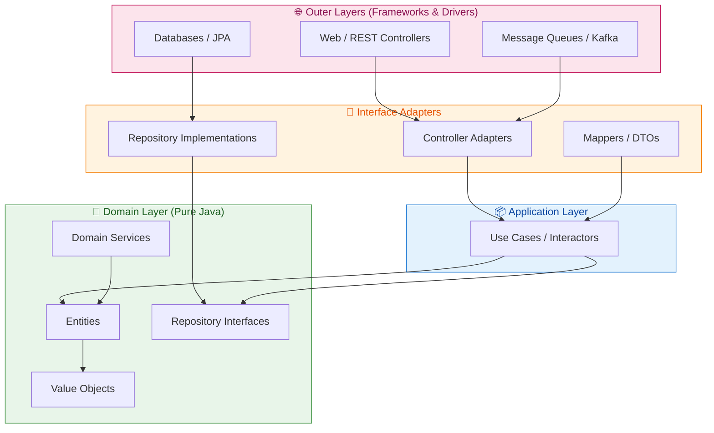
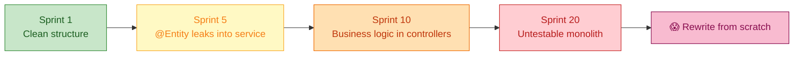
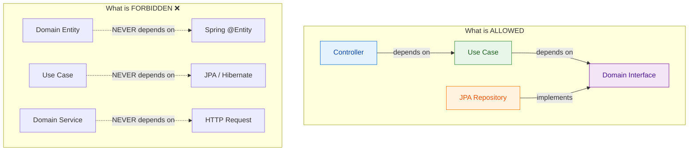
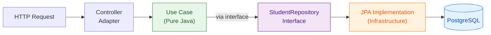
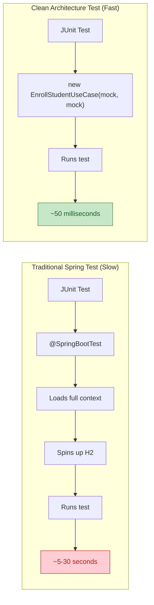
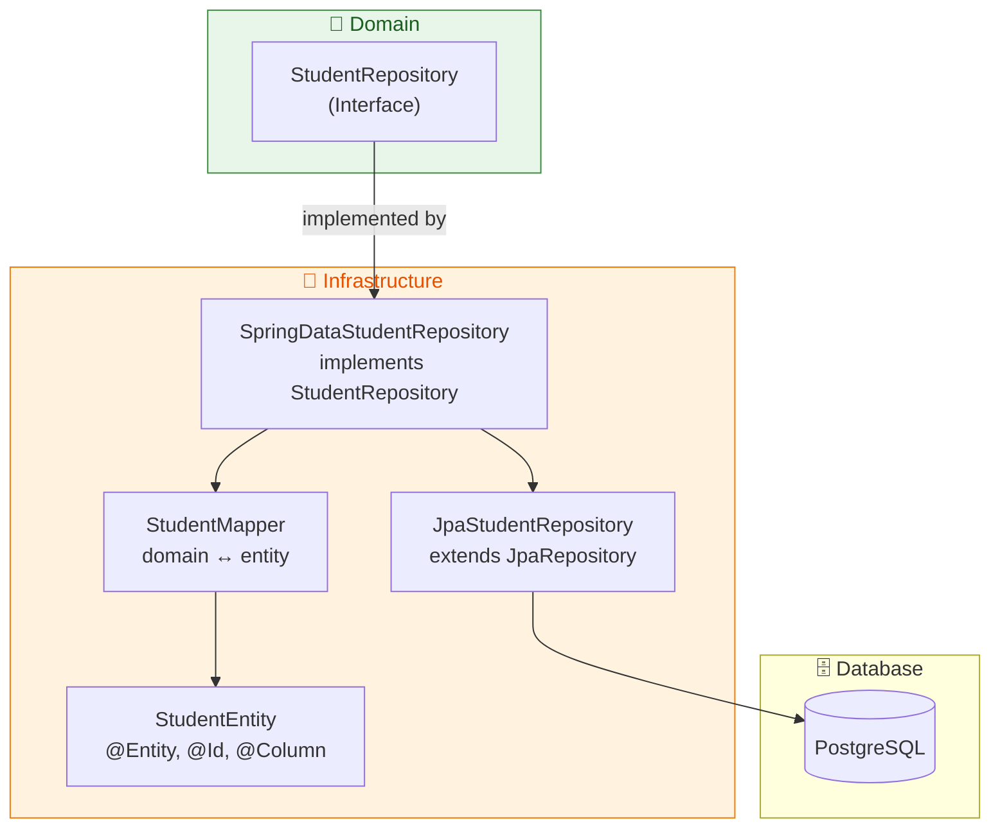
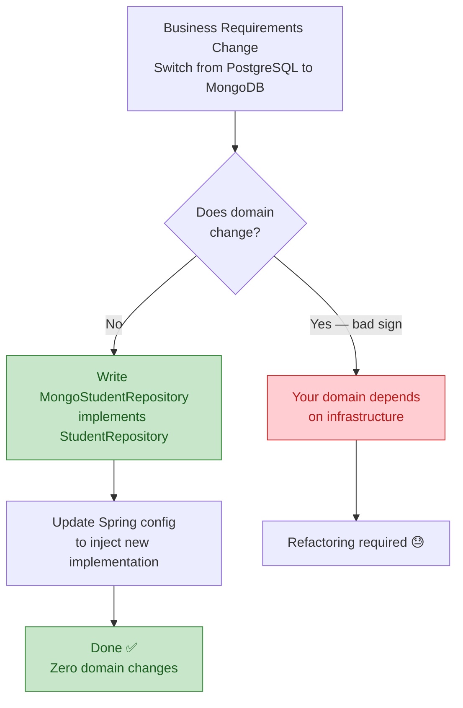
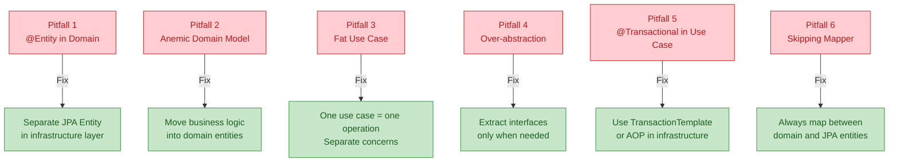
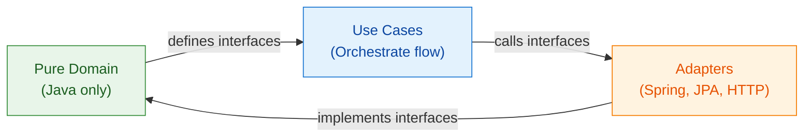

# Clean Architecture in Spring Boot: A Comprehensive Tutorial

> *Keep your domain pure, your dependencies inverted, and your sanity intact.*


---

## Table of Contents

1. [What is Clean Architecture?](#what-is-clean-architecture)
2. [Why It Matters for Spring Boot](#why-it-matters)
3. [The Dependency Rule Explained](#dependency-rule)
4. [Setting Up the Domain Layer](#domain-layer)
5. [Value Objects — No More Primitive Obsession](#value-objects)
6. [Repository Interfaces in the Domain](#repository-interfaces)
7. [Implementing Use Cases](#use-cases)
8. [Writing Framework-Free Tests](#testing)
9. [Adapters — Bridging Domain and Infrastructure](#adapters)
10. [Transaction Handling Without Polluting Use Cases](#transactions)
11. [Real-World Use Cases](#real-world-use-cases)
12. [Common Pitfalls](#pitfalls)
13. [Project Structure Reference](#project-structure)

---

## 1. What is Clean Architecture? {#what-is-clean-architecture}

Clean Architecture, introduced by Robert C. Martin (Uncle Bob), organises software into **concentric layers** where the most important business logic lives at the centre and has zero knowledge of the outer world.



### The Golden Rule

> **Inner layers must never depend on outer layers.** Dependencies always point inward — toward the domain.

This means:
- Your `Student` entity knows nothing about Spring, JPA, or HTTP.
- Your use case calls a `StudentRepository` *interface* — it has no idea whether that interface is backed by PostgreSQL, MongoDB, or an in-memory map.
- Your controller is just a translation adapter — it speaks HTTP out and domain objects in.

---

## 2. Why It Matters for Spring Boot {#why-it-matters}

Most Spring Boot projects evolve into **"big ball of mud"** architectures over time. Here's how the degradation typically happens:



**The core problems:**

- `@Entity` annotations and `javax.persistence` imports bleeding into your business logic
- Services importing `HttpServletRequest` directly
- Testing requires spinning up a full Spring context with an embedded H2 database
- Changing your ORM (e.g., Hibernate → jOOQ) requires touching dozens of business files
- You can't run a simple unit test without a database connection

**Clean Architecture solves all of this** by enforcing layer boundaries from the start.

---

## 3. The Dependency Rule Explained {#dependency-rule}

The dependency rule is deceptively simple but requires deliberate structure.



**Example of a violation (bad code):**

```java
// ❌ WRONG — Domain entity depends on JPA framework
import javax.persistence.Entity;
import javax.persistence.Id;

@Entity  // ← Framework annotation in domain!
public class Student {
    @Id
    private Long id;
    private String name;
    // ...
}
```

**Example of clean domain entity (good code):**

```java
// ✅ CORRECT — Pure Java, zero framework imports
public class Student {
    private final StudentId id;
    private final String name;
    private final Email email;
    private EnrollmentStatus status;

    public Student(StudentId id, String name, Email email) {
        this.id = Objects.requireNonNull(id, "id must not be null");
        this.name = Objects.requireNonNull(name, "name must not be null");
        this.email = Objects.requireNonNull(email, "email must not be null");
        this.status = EnrollmentStatus.ACTIVE;
    }

    // Business logic lives HERE, not in services
    public void enrollCourse(Course course) {
        if (status != EnrollmentStatus.ACTIVE) {
            throw new IllegalStateException("Cannot enroll inactive student");
        }
        if (course.isFull()) {
            throw new CourseCapacityExceededException(course.getId());
        }
        // domain event can be raised here
    }

    public void deactivate() {
        this.status = EnrollmentStatus.INACTIVE;
    }
}
```

---

## 4. Setting Up the Domain Layer {#domain-layer}

The domain layer contains your **entities**, **value objects**, **domain services**, and **repository interfaces**. It must have **no compile-time dependency on any framework**.

### Module Structure

```
university-system/
├── domain/           ← Zero framework dependencies
│   └── src/main/java/com/example/domain/
│       ├── student/
│       │   ├── Student.java
│       │   ├── StudentId.java
│       │   ├── StudentRepository.java     ← Interface only
│       │   └── EnrollmentStatus.java
│       ├── course/
│       │   ├── Course.java
│       │   ├── CourseId.java
│       │   └── CourseRepository.java
│       └── shared/
│           ├── Email.java
│           └── DomainException.java
├── application/      ← Orchestration, use cases
├── infrastructure/   ← Spring Boot, JPA, HTTP
└── bootstrap/        ← Main app, Spring config
```

### Full Student Entity Example

```java
// domain/src/main/java/com/example/domain/student/Student.java
public class Student {
    private final StudentId id;
    private String name;
    private final Email email;
    private EnrollmentStatus status;
    private final List<CourseId> enrolledCourses;
    private static final int MAX_COURSES = 6;

    public Student(StudentId id, String name, Email email) {
        this.id = id;
        this.name = name;
        this.email = email;
        this.status = EnrollmentStatus.ACTIVE;
        this.enrolledCourses = new ArrayList<>();
    }

    // Business method with rules
    public void enrollCourse(Course course) {
        if (status != EnrollmentStatus.ACTIVE) {
            throw new IllegalStateException(
                "Student " + id.getValue() + " is not active");
        }
        if (enrolledCourses.size() >= MAX_COURSES) {
            throw new EnrollmentLimitExceededException(id, MAX_COURSES);
        }
        if (enrolledCourses.contains(course.getId())) {
            throw new DuplicateEnrollmentException(id, course.getId());
        }
        enrolledCourses.add(course.getId());
    }

    public void dropCourse(CourseId courseId) {
        if (!enrolledCourses.remove(courseId)) {
            throw new CourseNotEnrolledException(id, courseId);
        }
    }

    public void deactivate() {
        this.status = EnrollmentStatus.INACTIVE;
    }

    // Getters — no setters for invariant fields
    public StudentId getId()                     { return id; }
    public String getName()                      { return name; }
    public Email getEmail()                      { return email; }
    public EnrollmentStatus getStatus()          { return status; }
    public List<CourseId> getEnrolledCourses()   { return Collections.unmodifiableList(enrolledCourses); }
}
```

---

## 5. Value Objects — No More Primitive Obsession {#value-objects}

**Primitive obsession** is a code smell where you use `String studentId` instead of `StudentId id`. Problems:
- No validation at construction time
- Easy to pass the wrong string to the wrong parameter
- No semantic meaning

### Email Value Object

```java
// domain/src/main/java/com/example/domain/shared/Email.java
public final class Email {
    private static final Pattern EMAIL_PATTERN =
        Pattern.compile("^[A-Za-z0-9+_.-]+@[A-Za-z0-9.-]+\\.[A-Za-z]{2,}$");

    private final String value;

    public Email(String value) {
        if (value == null || value.isBlank()) {
            throw new IllegalArgumentException("Email must not be blank");
        }
        if (!EMAIL_PATTERN.matcher(value).matches()) {
            throw new IllegalArgumentException(
                "Invalid email format: " + value);
        }
        this.value = value.toLowerCase();
    }

    public String getValue() { return value; }

    @Override
    public boolean equals(Object o) {
        if (this == o) return true;
        if (!(o instanceof Email)) return false;
        return value.equals(((Email) o).value);
    }

    @Override
    public int hashCode() { return value.hashCode(); }

    @Override
    public String toString() { return value; }
}
```

### StudentId Value Object

```java
// domain/src/main/java/com/example/domain/student/StudentId.java
public final class StudentId {
    private final String value;

    public StudentId(String value) {
        if (value == null || value.isBlank()) {
            throw new IllegalArgumentException("StudentId must not be blank");
        }
        this.value = value;
    }

    // Factory method from UUID
    public static StudentId newId() {
        return new StudentId(UUID.randomUUID().toString());
    }

    public String getValue() { return value; }

    @Override
    public boolean equals(Object o) {
        if (this == o) return true;
        if (!(o instanceof StudentId)) return false;
        return value.equals(((StudentId) o).value);
    }

    @Override
    public int hashCode() { return value.hashCode(); }
}
```

**Why this matters:**

```java
// ❌ Without value objects — easy to swap args by mistake
enrollStudent(String studentId, String courseId) {...}
enrollStudent("CS101", "student-123");  // Compiles! Bug at runtime.

// ✅ With value objects — compiler catches this
enrollStudent(StudentId studentId, CourseId courseId) {...}
enrollStudent(new CourseId("CS101"), new StudentId("123"));  // Compile error!
```

---

## 6. Repository Interfaces in the Domain {#repository-interfaces}

The repository interface belongs in the **domain layer** — not the infrastructure layer. This is the key to Dependency Inversion.

```java
// domain/src/main/java/com/example/domain/student/StudentRepository.java
public interface StudentRepository {
    Optional<Student> findById(StudentId id);
    Optional<Student> findByEmail(Email email);
    List<Student> findAllActive();
    void save(Student student);
    void delete(StudentId id);
    boolean existsByEmail(Email email);
}
```

```java
// domain/src/main/java/com/example/domain/course/CourseRepository.java
public interface CourseRepository {
    Optional<Course> findById(CourseId id);
    List<Course> findAvailableCourses();
    void save(Course course);
}
```

Notice:
- No `@Repository` annotation
- No `JpaRepository` extension
- No `findAll(Pageable pageable)` (that's an infrastructure concern)
- Returns `Optional<T>`, not `T` (forces callers to handle absence)

---

## 7. Implementing Use Cases {#use-cases}

Use cases are the **application layer's heart**. Each use case represents one thing the system can do.



### Enroll Student Use Case

```java
// application/src/main/java/com/example/application/usecase/EnrollStudentUseCase.java
public class EnrollStudentUseCase {
    private final StudentRepository studentRepository;
    private final CourseRepository courseRepository;

    // Constructor injection — no Spring magic
    public EnrollStudentUseCase(StudentRepository studentRepository,
                                CourseRepository courseRepository) {
        this.studentRepository = studentRepository;
        this.courseRepository = courseRepository;
    }

    public EnrollStudentResult execute(EnrollStudentCommand command) {
        Student student = studentRepository
            .findById(new StudentId(command.studentId()))
            .orElseThrow(() -> new StudentNotFoundException(command.studentId()));

        Course course = courseRepository
            .findById(new CourseId(command.courseId()))
            .orElseThrow(() -> new CourseNotFoundException(command.courseId()));

        // All business rules enforced in the domain
        student.enrollCourse(course);

        studentRepository.save(student);

        return new EnrollStudentResult(
            student.getId().getValue(),
            course.getId().getValue(),
            student.getEnrolledCourses().size()
        );
    }
}
```

### Request / Response Objects (DTOs for Use Cases)

```java
// Command (input)
public record EnrollStudentCommand(String studentId, String courseId) {}

// Result (output)
public record EnrollStudentResult(
    String studentId,
    String courseId,
    int totalEnrolledCourses
) {}
```

### More Use Case Examples

```java
// Register a new student
public class RegisterStudentUseCase {
    private final StudentRepository studentRepository;

    public RegisterStudentUseCase(StudentRepository studentRepository) {
        this.studentRepository = studentRepository;
    }

    public StudentId execute(RegisterStudentCommand command) {
        Email email = new Email(command.email());

        if (studentRepository.existsByEmail(email)) {
            throw new DuplicateEmailException(command.email());
        }

        Student student = new Student(
            StudentId.newId(),
            command.name(),
            email
        );

        studentRepository.save(student);
        return student.getId();
    }
}

// Deactivate student
public class DeactivateStudentUseCase {
    private final StudentRepository studentRepository;

    public DeactivateStudentUseCase(StudentRepository studentRepository) {
        this.studentRepository = studentRepository;
    }

    public void execute(String studentId) {
        Student student = studentRepository
            .findById(new StudentId(studentId))
            .orElseThrow(() -> new StudentNotFoundException(studentId));

        student.deactivate();
        studentRepository.save(student);
    }
}
```

---

## 8. Writing Framework-Free Tests {#testing}

This is the biggest payoff of Clean Architecture. No `@SpringBootTest`, no embedded H2, no slow context loading.



### Unit Test for EnrollStudentUseCase

```java
// test/java/com/example/application/usecase/EnrollStudentUseCaseTest.java
class EnrollStudentUseCaseTest {

    private StudentRepository studentRepository;
    private CourseRepository courseRepository;
    private EnrollStudentUseCase useCase;

    @BeforeEach
    void setUp() {
        studentRepository = mock(StudentRepository.class);
        courseRepository = mock(CourseRepository.class);
        useCase = new EnrollStudentUseCase(studentRepository, courseRepository);
    }

    @Test
    void shouldEnrollActiveStudentInAvailableCourse() {
        // Arrange
        Student student = new Student(
            new StudentId("s-123"),
            "Alice Johnson",
            new Email("alice@university.edu")
        );
        Course course = new Course(
            new CourseId("CS101"),
            "Introduction to Algorithms",
            30
        );

        when(studentRepository.findById(new StudentId("s-123")))
            .thenReturn(Optional.of(student));
        when(courseRepository.findById(new CourseId("CS101")))
            .thenReturn(Optional.of(course));

        // Act
        EnrollStudentResult result = useCase.execute(
            new EnrollStudentCommand("s-123", "CS101")
        );

        // Assert
        assertThat(result.totalEnrolledCourses()).isEqualTo(1);
        verify(studentRepository).save(student);
    }

    @Test
    void shouldThrowWhenStudentIsInactive() {
        Student student = new Student(
            new StudentId("s-456"),
            "Bob Smith",
            new Email("bob@university.edu")
        );
        student.deactivate(); // Make student inactive

        when(studentRepository.findById(new StudentId("s-456")))
            .thenReturn(Optional.of(student));
        when(courseRepository.findById(new CourseId("MATH201")))
            .thenReturn(Optional.of(
                new Course(new CourseId("MATH201"), "Calculus II", 25)
            ));

        // Act & Assert
        assertThatThrownBy(() ->
            useCase.execute(new EnrollStudentCommand("s-456", "MATH201"))
        ).isInstanceOf(IllegalStateException.class)
         .hasMessageContaining("not active");

        verify(studentRepository, never()).save(any());
    }

    @Test
    void shouldThrowWhenStudentNotFound() {
        when(studentRepository.findById(any())).thenReturn(Optional.empty());

        assertThatThrownBy(() ->
            useCase.execute(new EnrollStudentCommand("ghost", "CS101"))
        ).isInstanceOf(StudentNotFoundException.class);
    }
}
```

### Unit Test for Email Value Object

```java
class EmailTest {
    @Test
    void shouldCreateValidEmail() {
        Email email = new Email("test@example.com");
        assertThat(email.getValue()).isEqualTo("test@example.com");
    }

    @Test
    void shouldNormalizeToLowercase() {
        Email email = new Email("TEST@EXAMPLE.COM");
        assertThat(email.getValue()).isEqualTo("test@example.com");
    }

    @ParameterizedTest
    @ValueSource(strings = {"", "  ", "not-an-email", "@missing.com", "missing@"})
    void shouldRejectInvalidEmails(String invalid) {
        assertThatThrownBy(() -> new Email(invalid))
            .isInstanceOf(IllegalArgumentException.class);
    }

    @Test
    void shouldImplementValueEquality() {
        Email e1 = new Email("same@test.com");
        Email e2 = new Email("same@test.com");
        assertThat(e1).isEqualTo(e2);
        assertThat(e1.hashCode()).isEqualTo(e2.hashCode());
    }
}
```

---

## 9. Adapters — Bridging Domain and Infrastructure {#adapters}

Adapters live in the **infrastructure layer** and implement the domain's interfaces.



### JPA Entity (Infrastructure Only)

```java
// infrastructure/.../persistence/StudentEntity.java
@Entity
@Table(name = "students")
public class StudentEntity {
    @Id
    private String id;

    @Column(nullable = false)
    private String name;

    @Column(nullable = false, unique = true)
    private String email;

    @Enumerated(EnumType.STRING)
    private EnrollmentStatus status;

    @ElementCollection
    @CollectionTable(name = "student_enrollments",
                     joinColumns = @JoinColumn(name = "student_id"))
    @Column(name = "course_id")
    private List<String> enrolledCourseIds = new ArrayList<>();

    // JPA needs a no-arg constructor
    protected StudentEntity() {}

    // Getters and setters...
}
```

### Repository Implementation

```java
// infrastructure/.../persistence/SpringDataStudentRepository.java
@Repository
@RequiredArgsConstructor
public class SpringDataStudentRepository implements StudentRepository {
    private final JpaStudentRepository jpaRepository;
    private final StudentMapper mapper;

    @Override
    public Optional<Student> findById(StudentId id) {
        return jpaRepository.findById(id.getValue())
            .map(mapper::toDomain);
    }

    @Override
    public Optional<Student> findByEmail(Email email) {
        return jpaRepository.findByEmail(email.getValue())
            .map(mapper::toDomain);
    }

    @Override
    public List<Student> findAllActive() {
        return jpaRepository.findByStatus(EnrollmentStatus.ACTIVE)
            .stream()
            .map(mapper::toDomain)
            .collect(toList());
    }

    @Override
    public void save(Student student) {
        StudentEntity entity = mapper.toEntity(student);
        jpaRepository.save(entity);
    }

    @Override
    public void delete(StudentId id) {
        jpaRepository.deleteById(id.getValue());
    }

    @Override
    public boolean existsByEmail(Email email) {
        return jpaRepository.existsByEmail(email.getValue());
    }
}
```

### Mapper

```java
// infrastructure/.../persistence/StudentMapper.java
@Component
public class StudentMapper {

    public Student toDomain(StudentEntity entity) {
        Student student = new Student(
            new StudentId(entity.getId()),
            entity.getName(),
            new Email(entity.getEmail())
        );
        if (entity.getStatus() == EnrollmentStatus.INACTIVE) {
            student.deactivate();
        }
        entity.getEnrolledCourseIds()
            .forEach(id -> student.restoreEnrollment(new CourseId(id)));
        return student;
    }

    public StudentEntity toEntity(Student student) {
        StudentEntity entity = new StudentEntity();
        entity.setId(student.getId().getValue());
        entity.setName(student.getName());
        entity.setEmail(student.getEmail().getValue());
        entity.setStatus(student.getStatus());
        entity.setEnrolledCourseIds(
            student.getEnrolledCourses()
                .stream()
                .map(CourseId::getValue)
                .collect(toList())
        );
        return entity;
    }
}
```

### Web Controller Adapter

```java
// infrastructure/.../web/StudentController.java
@RestController
@RequestMapping("/api/v1/students")
@RequiredArgsConstructor
public class StudentController {
    private final RegisterStudentUseCase registerStudentUseCase;
    private final EnrollStudentUseCase enrollStudentUseCase;
    private final DeactivateStudentUseCase deactivateStudentUseCase;

    @PostMapping
    public ResponseEntity<RegisterStudentResponse> register(
            @RequestBody @Valid RegisterStudentRequest request) {
        StudentId id = registerStudentUseCase.execute(
            new RegisterStudentCommand(request.name(), request.email())
        );
        return ResponseEntity.created(URI.create("/api/v1/students/" + id.getValue()))
            .body(new RegisterStudentResponse(id.getValue()));
    }

    @PostMapping("/{studentId}/enrollments")
    public ResponseEntity<EnrollStudentResponse> enroll(
            @PathVariable String studentId,
            @RequestBody @Valid EnrollRequest request) {
        EnrollStudentResult result = enrollStudentUseCase.execute(
            new EnrollStudentCommand(studentId, request.courseId())
        );
        return ResponseEntity.ok(
            new EnrollStudentResponse(
                result.studentId(),
                result.courseId(),
                result.totalEnrolledCourses()
            )
        );
    }

    @DeleteMapping("/{studentId}/activate")
    public ResponseEntity<Void> deactivate(@PathVariable String studentId) {
        deactivateStudentUseCase.execute(studentId);
        return ResponseEntity.noContent().build();
    }
}
```

---

## 10. Transaction Handling Without Polluting Use Cases {#transactions}

`@Transactional` belongs in the infrastructure layer, not the use case.

### Option 1: Transactional Decorator

```java
// infrastructure/.../transaction/TransactionalEnrollStudentUseCase.java
@Primary
@Component
public class TransactionalEnrollStudentUseCase extends EnrollStudentUseCase {
    private final TransactionTemplate transactionTemplate;

    public TransactionalEnrollStudentUseCase(
            StudentRepository studentRepository,
            CourseRepository courseRepository,
            TransactionTemplate transactionTemplate) {
        super(studentRepository, courseRepository);
        this.transactionTemplate = transactionTemplate;
    }

    @Override
    public EnrollStudentResult execute(EnrollStudentCommand command) {
        return transactionTemplate.execute(status ->
            super.execute(command)
        );
    }
}
```

### Option 2: Transactional Service Wrapper (Simpler)

```java
// infrastructure/.../transaction/UseCaseExecutor.java
@Component
@RequiredArgsConstructor
public class UseCaseExecutor {
    private final TransactionTemplate transactionTemplate;

    public <T> T executeInTransaction(Supplier<T> useCase) {
        return transactionTemplate.execute(status -> useCase.get());
    }

    public void executeInTransaction(Runnable useCase) {
        transactionTemplate.execute(status -> {
            useCase.run();
            return null;
        });
    }
}

// Usage in controller
@PostMapping("/{studentId}/enrollments")
public ResponseEntity<EnrollStudentResponse> enroll(...) {
    EnrollStudentResult result = useCaseExecutor.executeInTransaction(() ->
        enrollStudentUseCase.execute(new EnrollStudentCommand(studentId, request.courseId()))
    );
    return ResponseEntity.ok(new EnrollStudentResponse(...));
}
```

### Option 3: Spring's AOP (Most Pragmatic)

```java
// infrastructure/.../config/TransactionConfig.java
@Configuration
@EnableTransactionManagement
public class TransactionConfig {

    @Bean
    @Transactional
    public EnrollStudentUseCase enrollStudentUseCase(
            StudentRepository studentRepository,
            CourseRepository courseRepository) {
        // Spring wraps this in a transactional proxy
        return new EnrollStudentUseCase(studentRepository, courseRepository);
    }
}
```

---

## 11. Real-World Use Cases {#real-world-use-cases}

### When to Swap Storage Backends



**MongoDB adapter — domain stays unchanged:**

```java
@Repository
public class MongoStudentRepository implements StudentRepository {
    private final MongoTemplate mongoTemplate;
    private final StudentDocumentMapper mapper;

    @Override
    public Optional<Student> findById(StudentId id) {
        StudentDocument doc = mongoTemplate.findById(
            id.getValue(), StudentDocument.class
        );
        return Optional.ofNullable(doc).map(mapper::toDomain);
    }

    @Override
    public void save(Student student) {
        mongoTemplate.save(mapper.toDocument(student));
    }
    // ... other methods
}
```

### Adding a New API (GraphQL alongside REST)

```java
// New adapter — no domain changes at all
@Component
public class StudentGraphQLAdapter {
    private final RegisterStudentUseCase registerStudentUseCase;
    private final EnrollStudentUseCase enrollStudentUseCase;

    @MutationMapping
    public StudentPayload registerStudent(
            @Argument RegisterStudentInput input) {
        StudentId id = registerStudentUseCase.execute(
            new RegisterStudentCommand(input.name(), input.email())
        );
        return new StudentPayload(id.getValue());
    }
}
```

### Event-Driven Architecture Integration

```java
// Kafka consumer adapter — domain untouched
@Component
@RequiredArgsConstructor
public class EnrollmentRequestConsumer {
    private final EnrollStudentUseCase enrollStudentUseCase;

    @KafkaListener(topics = "enrollment-requests")
    public void consume(EnrollmentRequestEvent event) {
        enrollStudentUseCase.execute(
            new EnrollStudentCommand(event.studentId(), event.courseId())
        );
    }
}
```

---

## 12. Common Pitfalls {#pitfalls}



### Pitfall 1: Anemic Domain Model

```java
// ❌ Bad — Student is just a data bag
public class Student {
    private String id;
    private String name;
    private String status;
    // Only getters and setters, no behaviour
}

// The logic is scattered in a service
@Service
public class StudentService {
    public void enrollStudent(String studentId, String courseId) {
        Student student = repo.findById(studentId);
        if (!student.getStatus().equals("ACTIVE")) { // Magic string!
            throw new RuntimeException("Not active");
        }
        // More procedural logic...
    }
}
```

```java
// ✅ Good — Business rules live in the entity
public class Student {
    public void enrollCourse(Course course) {
        // Validation is part of the object, not a service
        if (status != EnrollmentStatus.ACTIVE) {
            throw new IllegalStateException("...");
        }
        enrolledCourses.add(course.getId());
    }
}
```

### Pitfall 4: Over-Abstracting

```java
// ❌ Overkill — interface for everything
public interface Logger {
    void log(String message);
}
public interface EmailSender {
    void send(String to, String body);
}
public interface DateProvider {
    LocalDate today();
}

// ✅ Pragmatic — only extract when you need to swap
// Repository interfaces: YES (swap PostgreSQL for MongoDB)
// Logger interfaces: NO (just use SLF4J directly)
// DateProvider: ONLY if you need to mock time in tests
```

---

## 13. Project Structure Reference {#project-structure}

```
university-system/
├── pom.xml (parent)
│
├── domain/                        ← NO Spring/JPA dependencies
│   ├── pom.xml
│   └── src/main/java/com/example/domain/
│       ├── student/
│       │   ├── Student.java
│       │   ├── StudentId.java
│       │   ├── EnrollmentStatus.java
│       │   ├── StudentRepository.java
│       │   └── exceptions/
│       │       ├── StudentNotFoundException.java
│       │       └── DuplicateEnrollmentException.java
│       ├── course/
│       │   ├── Course.java
│       │   ├── CourseId.java
│       │   └── CourseRepository.java
│       └── shared/
│           ├── Email.java
│           └── DomainException.java
│
├── application/                   ← Depends on domain only
│   ├── pom.xml
│   └── src/main/java/com/example/application/
│       └── usecase/
│           ├── RegisterStudentUseCase.java
│           ├── EnrollStudentUseCase.java
│           ├── DeactivateStudentUseCase.java
│           └── dto/
│               ├── RegisterStudentCommand.java
│               ├── EnrollStudentCommand.java
│               └── EnrollStudentResult.java
│
├── infrastructure/               ← Depends on domain + application
│   ├── pom.xml (Spring Boot, JPA, etc.)
│   └── src/main/java/com/example/infrastructure/
│       ├── persistence/
│       │   ├── StudentEntity.java
│       │   ├── JpaStudentRepository.java
│       │   ├── SpringDataStudentRepository.java
│       │   └── StudentMapper.java
│       ├── web/
│       │   ├── StudentController.java
│       │   └── dto/
│       │       ├── RegisterStudentRequest.java
│       │       └── EnrollRequest.java
│       └── transaction/
│           └── TransactionalEnrollStudentUseCase.java
│
└── bootstrap/                    ← Main app, Spring config, wiring
    ├── pom.xml
    └── src/main/java/com/example/
        ├── Application.java
        └── config/
            ├── UseCaseConfig.java
            └── TransactionConfig.java
```

---

## Quick Reference: Do's and Don'ts

| **Scenario** | **Do ✅** | **Don't ❌** |
|---|---|---|
| Domain entity persistence | Separate `@Entity` in infrastructure | `@Entity` on domain class |
| Business validation | Method on domain entity | Logic in service/controller |
| Repository definition | Interface in domain package | Extend `JpaRepository` in domain |
| Use case dependencies | Constructor-injected interfaces | `@Autowired` in use case |
| Transactions | `TransactionTemplate` or AOP | `@Transactional` on use case |
| Testing | Plain `JUnit + Mockito`, no Spring | `@SpringBootTest` for logic tests |
| Adding new API | Write new adapter | Modify use case |
| Changing DB | Write new repository impl | Change domain or use case |

---

## Summary



The upfront investment in Clean Architecture pays dividends as your project scales:

- **Tests run in milliseconds**, not minutes — because they never touch Spring
- **Swapping databases** takes an afternoon, not a week
- **Adding new APIs** (REST → GraphQL → Kafka) means writing new adapters, never touching business logic
- **Onboarding new developers** is faster — the domain is readable, pure Java with no framework magic

Start small. Keep your domain clean. Let the adapters handle the noise.

---

*Tutorial based on the original article by Ahmet Emre DEMİRŞEN, significantly expanded with additional examples, diagrams, and real-world applications.*