# Distributed Systems Mastery: From Fundamentals to Production Patterns

**📚 A Comprehensive Deep-Dive Tutorial**

**Difficulty Level:** ⭐⭐⭐ Intermediate to Advanced

**Estimated Reading Time:** 4-5 hours

**Last Updated:** January 2026

---

## Table of Contents

1. [Introduction & Overview](#introduction--overview)
2. [Prerequisites](#prerequisites)
3. [Learning Objectives](#learning-objectives)
4. [Chapter 1: Thinking in Distributed Systems](#chapter-1-thinking-in-distributed-systems)
5. [Chapter 2: System Models, Order, and Time](#chapter-2-system-models-order-and-time)
6. [Chapter 3: Failure Tolerance](#chapter-3-failure-tolerance)
7. [Chapter 4: Message Delivery and Processing](#chapter-4-message-delivery-and-processing)
8. [Chapter 5: Transactions](#chapter-5-transactions)
9. [Chapter 6: Distributed Transactions](#chapter-6-distributed-transactions)
10. [Chapter 7: Partitioning](#chapter-7-partitioning)
11. [Chapter 8: Replication](#chapter-8-replication)
12. [Chapter 9: Consistency](#chapter-9-consistency)
13. [Chapter 10: Distributed Consensus](#chapter-10-distributed-consensus)
14. [Chapter 11: Durable Executions](#chapter-11-durable-executions)
15. [Chapter 12: Cloud and Services](#chapter-12-cloud-and-services)
16. [Practice Exercises with Solutions](#practice-exercises-with-solutions)
17. [Test Your Understanding](#test-your-understanding)
18. [Common Interview Questions](#common-interview-questions)
19. [Question Bank](#question-bank)
20. [Best Practices](#best-practices)
21. [Anti-Patterns](#anti-patterns)
22. [Troubleshooting Guide](#troubleshooting-guide)
23. [Performance Considerations](#performance-considerations)
24. [Security Considerations](#security-considerations)
25. [Summary & Key Takeaways](#summary--key-takeaways)
26. [Further Reading & Resources](#further-reading--resources)

---

## Introduction & Overview

Welcome to **Distributed Systems Mastery** - your comprehensive guide to understanding, designing, and implementing distributed systems. In today's world, nearly every significant software system is distributed, from web applications to cloud services, from financial systems to social networks.

### What Are Distributed Systems?

A **distributed system** is a collection of independent computers that appears to its users as a single coherent system. These systems work together to achieve a common goal while maintaining the illusion of a unified whole.

> 💡 **Key Insight:** Think of a distributed system like a symphony orchestra. Each musician (node) plays their part independently, but together they create a harmonious performance that feels unified to the audience.

### Why Distributed Systems Matter

**Real-World Impact:**
- **Google** processes over 3.5 billion searches per day across thousands of servers
- **Amazon** handles millions of transactions per second during peak shopping seasons
- **Netflix** streams content to 200+ million subscribers with 99.99% availability
- **Banking systems** process trillions of dollars in transactions globally

### The Challenges

Building distributed systems is inherently complex due to:

1. **Partial Failures** - Components can fail independently
2. **No Global Clock** - Nodes have different perceptions of time
3. **Network Uncertainty** - Messages can be delayed, lost, or duplicated
4. **Concurrency** - Multiple operations happen simultaneously
5. **Consistency vs. Availability** - Fundamental trade-offs

### What You'll Learn

This tutorial takes you on a journey from fundamental concepts to advanced production patterns.

---

## Prerequisites

### Required Knowledge
- **Programming:** Proficiency in at least one programming language (Java examples used throughout)
- **Networking:** Basic understanding of TCP/IP, HTTP, and network protocols
- **Databases:** Familiarity with relational and NoSQL databases
- **Operating Systems:** Understanding of processes, threads, and concurrency
- **Data Structures:** Arrays, linked lists, hash maps, trees

### Recommended Background
- Experience with microservices architecture
- Understanding of message queues (Kafka, RabbitMQ)
- Basic knowledge of cloud platforms (AWS, Azure, GCP)
- Familiarity with containerization (Docker, Kubernetes)

### Tools Needed
- **Java 11+** (for code examples)
- **Maven or Gradle** (build tool)
- **Docker** (for running examples)
- **Git** (version control)
- **IDE:** IntelliJ IDEA, Eclipse, or VS Code

---

## Learning Objectives

By the end of this tutorial, you will be able to:

### Knowledge Objectives
1. ✅ Explain the fundamental challenges of distributed systems
2. ✅ Differentiate between synchronous, asynchronous, and partially synchronous systems
3. ✅ Understand failure modes and tolerance strategies
4. ✅ Describe message delivery semantics and idempotence
5. ✅ Explain transaction properties (ACID) in distributed contexts
6. ✅ Compare partitioning and replication strategies
7. ✅ Analyze consistency models and their trade-offs
8. ✅ Implement consensus algorithms (Raft)
9. ✅ Design failure-transparent recovery mechanisms
10. ✅ Apply cloud-native patterns to real-world problems

### Practical Objectives
1. ✅ Implement a two-phase commit protocol
2. ✅ Build a distributed key-value store with replication
3. ✅ Design a partition strategy for a multi-tenant application
4. ✅ Implement idempotent APIs
5. ✅ Create a Raft consensus implementation
6. ✅ Build a saga-based transaction system
7. ✅ Design a circuit breaker for fault tolerance
8. ✅ Implement consistent hashing for load balancing

---

## Chapter 1: Thinking in Distributed Systems

### 1.1 Software Engineering and Mental Models

#### 1.1.1 Mental Models: The Foundation of Reasoning

A **mental model** is an internal representation of how something works in the real world. In software engineering, mental models help us reason about system behavior, predict outcomes, and debug issues.

> 🧠 **Analogy:** Think of mental models like a GPS navigation system. Just as GPS uses maps and algorithms to predict the best route, your mental models help you navigate complex system behaviors.

**Example:**
```java
// Mental model: "A stack is LIFO (Last In, First Out)"
Stack<String> stack = new Stack<>();
stack.push("A");  // Mental model: A is at the bottom
stack.push("B");  // Mental model: B is on top of A
stack.push("C");  // Mental model: C is on top

String top = stack.pop();  // Expected: "C" (LIFO behavior)
```

#### 1.1.2 Correct Mental Models

A **correct mental model** accurately predicts system behavior. Incorrect mental models lead to bugs and unexpected behavior.

**Example of Incorrect Mental Model:**
```java
// ❌ INCORRECT mental model: "Integer objects are cached for all values"
Integer a = 1000;
Integer b = 1000;
System.out.println(a == b);  // false! (outside cache range -128 to 127)

// ✅ CORRECT mental model: "Only small integers are cached"
Integer c = 100;
Integer d = 100;
System.out.println(c == d);  // true (within cache range)
```

#### 1.1.3 Complete Mental Models

A **complete mental model** accounts for all relevant behaviors and edge cases.

```java
// Incomplete mental model: "HashMap maintains insertion order"
Map<String, Integer> map = new HashMap<>();
map.put("A", 1);
map.put("B", 2);
map.put("C", 3);
// ❌ Surprise: Order is NOT guaranteed!

// Complete mental model: "HashMap provides O(1) access but no ordering guarantees"
// Use LinkedHashMap if insertion order matters
Map<String, Integer> orderedMap = new LinkedHashMap<>();
```

### 1.2 Mental Model of Software Systems

Building correct mental models for distributed systems requires understanding:

1. **Components** - Individual nodes/services
2. **Communication** - How components interact
3. **State** - Data stored and shared
4. **Failure modes** - What can go wrong
5. **Time** - Ordering and synchronization

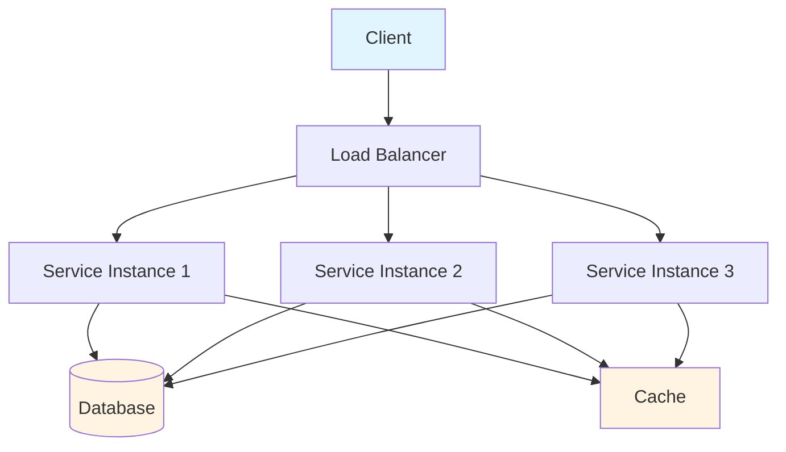

**Figure 1.1:** Basic distributed system architecture showing clients, load balancer, service instances, and shared resources.

### 1.3 Different Types of Models

#### 1.3.1 Different Models Describing the Same Aspects

Multiple models can describe the same system from different perspectives:

- **Architectural Model:** High-level component structure
- **Deployment Model:** Physical infrastructure layout
- **Data Model:** How data is stored and accessed
- **Behavioral Model:** How components interact over time

#### 1.3.2 Different Models Describing Different Aspects

Each model focuses on specific concerns:

| Model Type | Focus | Example |
|------------|-------|---------|
| **System Model** | Failure assumptions | Synchronous vs. asynchronous |
| **Consistency Model** | Data visibility | Strong vs. eventual consistency |
| **Failure Model** | Error handling | Crash vs. Byzantine failures |
| **Timing Model** | Time assumptions | Bounded vs. unbounded delays |

### 1.4 Thinking About Distributed Systems

#### 1.4.1 Correctness

**Correctness** in distributed systems means the system behaves as specified, even in the presence of failures and concurrency.

**Key Properties:**
- **Safety:** Nothing bad happens (consistency maintained)
- **Liveness:** Something good eventually happens (system makes progress)

```java
// Example: Safety vs. Liveness
public class BankAccount {
    private int balance;
    
    // ✅ SAFE: Never allows negative balance
    public synchronized void withdraw(int amount) {
        if (balance >= amount) {
            balance -= amount;
        }
    }
    
    // ✅ LIVE: Eventually processes all requests
    public synchronized void deposit(int amount) {
        balance += amount;
    }
}
```

#### 1.4.2 Scalability and Reliability

**Scalability** is the ability to handle increased load by adding resources.

**Types of Scalability:**
- **Vertical Scaling:** Add more power to existing nodes (CPU, RAM)
- **Horizontal Scaling:** Add more nodes to the system

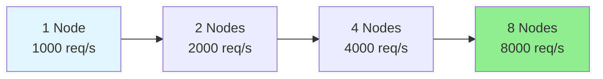

**Figure 1.2:** Horizontal scaling - adding nodes to increase capacity linearly.

**Reliability** is the probability that a system will function without failure for a specified period.

**Reliability Metrics:**
- **MTBF (Mean Time Between Failures):** Average time between failures
- **MTTR (Mean Time To Repair):** Average time to recover from failure
- **Availability:** MTBF / (MTBF + MTTR)

| Nines | Availability | Downtime/Year |
|-------|--------------|---------------|
| 2 nines | 99% | 3.65 days |
| 3 nines | 99.9% | 8.76 hours |
| 4 nines | 99.99% | 52.56 minutes |
| 5 nines | 99.999% | 5.26 minutes |
| 6 nines | 99.9999% | 31.5 seconds |

#### 1.4.3 Responsiveness

**Responsiveness** measures how quickly a system responds to user requests.

**Factors Affecting Responsiveness:**
- Network latency
- Processing time
- Queue delays
- Database query time
- Serialization/deserialization overhead

### 1.5 Two Big Ideas

#### 1.5.1 Systems of Systems

Distributed systems are composed of multiple independent systems working together:

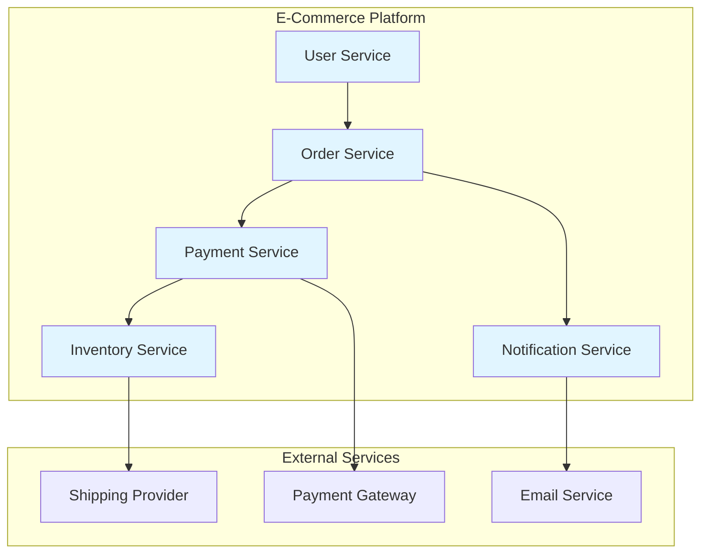

**Figure 1.3:** E-commerce platform as a system of systems.

#### 1.5.2 Global View vs. Local View

**Global View:** The entire system as a single entity
**Local View:** Each node's perspective of the system

```java
// Global view: System has 1000 total requests/sec
// Local view: Each node sees ~125 requests/sec (with 8 nodes)

// The challenge: No single node has complete information
public class DistributedCounter {
    private final Map<String, AtomicInteger> localCounts;
    
    // Local view: Each node tracks its own count
    public void increment(String nodeId) {
        localCounts.get(nodeId).incrementAndGet();
    }
    
    // Global view: Aggregate all local counts
    public int getTotalCount() {
        return localCounts.values().stream()
            .mapToInt(AtomicInteger::get)
            .sum();
    }
}
```

### 1.6 Distributed Systems Incorporated

Real-world distributed systems incorporate multiple patterns and principles:

**Key Characteristics:**
1. **Concurrency:** Multiple operations execute simultaneously
2. **No Global Clock:** Each node has its own clock
3. **Independent Failures:** Components fail independently
4. **Network Communication:** Components communicate via messages

### 1.7 Navigating Complexity

#### 1.7.1 Simple yet Complex

Distributed systems follow simple rules but exhibit complex behavior:

> 🌊 **Analogy:** Like water molecules following simple physics rules, but collectively creating complex wave patterns.

#### 1.7.2 Emergent Behavior

**Emergent behavior** arises from interactions between components, not from individual components themselves.

**Example:** Traffic jams
- Individual cars follow simple rules (maintain distance, stay in lane)
- But collectively, traffic jams emerge from these interactions

#### 1.7.3 Changing Perspective

Different perspectives reveal different insights:

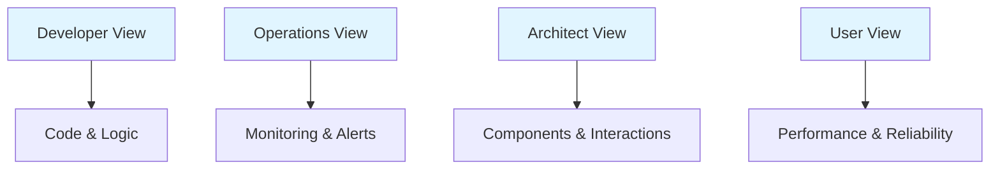

**Figure 1.4:** Different perspectives on the same distributed system.

#### 1.7.4 Think Globally; Act Locally

Each node makes decisions based on local information, but the system achieves global goals:

```java
// Local action: Each node routes based on local routing table
public class Router {
    private RoutingTable localTable;
    
    public Node route(Request request) {
        // Act locally based on local information
        return localTable.getNextHop(request.getDestination());
    }
}

// Global result: Requests reach their destinations efficiently
```

---

## Chapter 2: System Models, Order, and Time

### 2.1 System Models

#### 2.1.1 Theory and Practice

**System models** are abstractions that define assumptions about component behavior and communication.

**Why System Models Matter:**
- Help reason about system behavior
- Define what's possible/impossible
- Guide algorithm design
- Set expectations for performance

#### 2.1.2 Synchronous Distributed Systems

**Synchronous systems** have known bounds on:
- Message delivery time
- Processing speed
- Clock drift

**Assumptions:**
- Messages delivered within Δ time units
- Processes execute at speeds between s_min and s_max
- Clocks drift at most ρ rate

```java
// Synchronous system example with timeout
public class SynchronousClient {
    private static final int TIMEOUT_MS = 100; // Known upper bound
    
    public Response sendRequest(Request request) {
        long startTime = System.currentTimeMillis();
        
        // Send request
        send(request);
        
        // Wait for response (bounded time)
        while (System.currentTimeMillis() - startTime < TIMEOUT_MS) {
            Response response = checkForResponse();
            if (response != null) {
                return response;
            }
            Thread.sleep(1);
        }
        
        throw new TimeoutException("Response not received within bound");
    }
}
```

**Pros:**
- Easier to reason about
- Simpler algorithms possible
- Predictable behavior

**Cons:**
- Unrealistic for most real-world systems
- Network delays are variable
- Can't guarantee bounds in practice

#### 2.1.3 Asynchronous Distributed Systems

**Asynchronous systems** have NO timing guarantees:
- Message delays are unbounded
- Processing speeds are arbitrary
- No clock synchronization

```java
// Asynchronous system - no timing guarantees
public class AsynchronousClient {
    public void sendRequest(Request request, Callback callback) {
        // Send request
        sendAsync(request);
        
        // No timeout - wait indefinitely
        // Callback invoked when response arrives (whenever that is)
    }
}
```

**Pros:**
- Realistic model for most systems
- More flexible

**Cons:**
- Harder to reason about
- Impossible to detect failures (node might be slow, not crashed)
- Stronger impossibility results (FLP impossibility)

#### 2.1.4 Partially Synchronous Systems

**Partially synchronous systems** are synchronous "most of the time" but can have periods of asynchrony.

**Real-World Model:**
- Network is usually reliable but occasionally congested
- Nodes are usually responsive but occasionally slow
- Clocks are usually synchronized but occasionally drift

```java
// Partially synchronous with adaptive timeout
public class AdaptiveClient {
    private int currentTimeout = 100; // Start with 100ms
    private final int minTimeout = 50;
    private final int maxTimeout = 5000;
    
    public Response sendRequest(Request request) {
        long startTime = System.currentTimeMillis();
        send(request);
        
        while (true) {
            if (System.currentTimeMillis() - startTime > currentTimeout) {
                // Timeout - adjust based on recent history
                currentTimeout = Math.min(currentTimeout * 2, maxTimeout);
                throw new TimeoutException("Adaptive timeout: " + currentTimeout);
            }
            
            Response response = checkForResponse();
            if (response != null) {
                // Success - decrease timeout
                currentTimeout = Math.max(currentTimeout / 2, minTimeout);
                return response;
            }
            Thread.sleep(1);
        }
    }
}
```

#### 2.1.5 Component and Network Behavior

**Component Behaviors:**
- **Correct:** Follows the algorithm specification
- **Crash:** Stops executing (crash-stop or crash-recovery)
- **Byzantine:** Behaves arbitrarily (malicious or buggy)

**Network Behaviors:**
- **Reliable:** Delivers all messages exactly once
- **Fair loss:** May lose, duplicate, or reorder messages
- **Arbitrary:** Adversarial network (Byzantine)

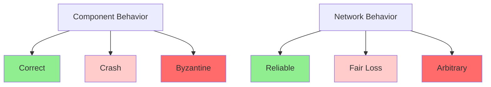

**Figure 2.1:** Taxonomy of component and network failure behaviors.

#### 2.1.6 Realistic System Models

**Production System Model:**
- **Synchrony:** Partially synchronous (99.9% of time)
- **Failures:** Crash-recovery (most common)
- **Network:** Fair loss with occasional partitions
- **Clocks:** Physically synchronized within milliseconds

### 2.2 Order and Time

#### 2.2.1 The Happened-Before Relationship

**Happened-before (→)** is a partial ordering of events:

1. If events a and b are in the same process and a comes before b, then a → b
2. If a is sending a message and b is receiving that message, then a → b
3. If a → b and b → c, then a → c (transitivity)

```java
// Process 1
send(m1, "P1->P2");  // Event a
int x = 1;           // Event b

// Process 2
receive(m1);         // Event c (a → c)
int y = 2;           // Event d
send(m2, "P2->P1");  // Event e (c → e)

// Process 1
receive(m2);         // Event f (e → f)

// Ordering: a → c → e → f
// b and d are concurrent (no relation)
```

#### 2.2.2 Time and Clocks

**Physical Time:** Wall clock time (seconds, milliseconds)
**Logical Time:** Ordering of events without physical time

#### 2.2.3 Physical Time and Physical Clocks

**Physical Clocks:**
- Based on quartz crystals or atomic oscillations
- Subject to drift and skew
- Synchronized via NTP (Network Time Protocol)

```java
// Physical clock example
public class PhysicalClock {
    private long offset; // Offset from true time
    
    public long getTime() {
        return System.currentTimeMillis() + offset;
    }
    
    // NTP-style synchronization
    public void sync(long serverTime, long networkDelay) {
        // Estimate offset
        this.offset = serverTime - System.currentTimeMillis();
    }
}
```

**Clock Synchronization Issues:**
- **Skew:** Difference in clock rates
- **Drift:** Accumulated difference over time
- **Network delay:** Uncertainty in synchronization

#### 2.2.4 Logical Time and Logical Clocks

**Logical Clocks** capture causality without physical time.

**Lamport Timestamps:**
1. Each process maintains a counter
2. Increment counter before sending event
3. Include counter in message
4. Receiver sets clock to max(local, received) + 1

```java
public class LamportClock {
    private int counter;
    private final String processId;
    
    // Local event
    public int tick() {
        return ++counter;
    }
    
    // Send event
    public int send() {
        return ++counter;
    }
    
    // Receive event
    public int receive(int receivedTimestamp) {
        counter = Math.max(counter, receivedTimestamp) + 1;
        return counter;
    }
}

// Usage
LamportClock clock1 = new LamportClock("P1");
LamportClock clock2 = new LamportClock("P2");

int ts1 = clock1.send(); // P1 sends at time 1
// ... network delay ...
int ts2 = clock2.receive(ts1); // P2 receives, sets to max(0,1)+1 = 2
```

**Vector Clocks:**
More precise than Lamport clocks - detect concurrency.

```java
public class VectorClock {
    private final Map<String, Integer> clock;
    private final String processId;
    
    public VectorClock(String processId, int size) {
        this.processId = processId;
        this.clock = new HashMap<>();
        for (int i = 0; i < size; i++) {
            clock.put("P" + i, 0);
        }
    }
    
    // Local event
    public void tick() {
        clock.put(processId, clock.get(processId) + 1);
    }
    
    // Send event
    public Map<String, Integer> send() {
        tick();
        return new HashMap<>(clock);
    }
    
    // Receive event
    public void receive(Map<String, Integer> received) {
        // Take max of each component
        for (String pid : clock.keySet()) {
            clock.put(pid, Math.max(clock.get(pid), received.get(pid)));
        }
        tick();
    }
    
    // Compare clocks
    public boolean happensBefore(VectorClock other) {
        boolean atLeastOneSmaller = false;
        for (String pid : clock.keySet()) {
            if (this.clock.get(pid) > other.clock.get(pid)) {
                return false; // This is not before other
            }
            if (this.clock.get(pid) < other.clock.get(pid)) {
                atLeastOneSmaller = true;
            }
        }
        return atLeastOneSmaller;
    }
    
    public boolean concurrent(VectorClock other) {
        return !happensBefore(other) && !other.happensBefore(this);
    }
}
```

#### 2.2.5 Physical Clocks vs. Logical Clocks

| Aspect | Physical Clocks | Logical Clocks |
|--------|----------------|----------------|
| **Purpose** | Measure real time | Order events |
| **Synchronization** | Requires NTP | No synchronization needed |
| **Accuracy** | Subject to drift | Perfect ordering |
| **Use Case** | Timestamps, deadlines | Causality, debugging |
| **Overhead** | Network sync required | Minimal overhead |

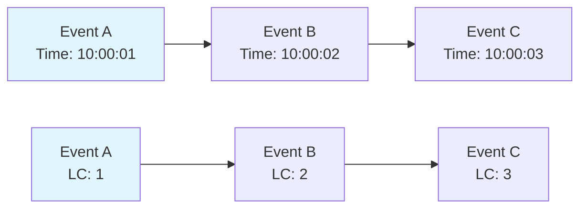

**Figure 2.2:** Physical vs. logical time - both capture the same ordering.

---

## Chapter 3: Failure Tolerance

### 3.1 In Theory

**Failure tolerance** is the ability of a system to continue operating despite component failures.

**Key Question:** What failures can occur, and how should the system respond?

### 3.2 Types of Failure Tolerance

#### 3.2.1 Masking Failure Tolerance

**Masking failures** means hiding failures from users - the system continues as if nothing happened.

```java
// Example: RAID 1 (mirroring) masks disk failures
public class RAID1Storage {
    private final Disk primary;
    private final Disk mirror;
    
    public byte[] read(int block) {
        try {
            return primary.read(block);
        } catch (DiskFailureException e) {
            // Mask failure by reading from mirror
            return mirror.read(block);
        }
    }
    
    public void write(int block, byte[] data) {
        try {
            primary.write(block, data);
            mirror.write(block, data);
        } catch (DiskFailureException e) {
            // Continue with remaining disk
            if (primary.isFailed()) {
                mirror.write(block, data);
            } else {
                primary.write(block, data);
            }
        }
    }
}
```

**Use Cases:**
- Replicated databases
- Redundant network paths
- Backup systems

#### 3.2.2 Nonmasking Failure Tolerance

**Nonmasking failures** are visible to users but the system continues operating.

```java
// Example: Degraded service during partial failure
public class SearchService {
    private final SearchEngine primary;
    private final SearchEngine fallback;
    
    public SearchResults search(String query) {
        try {
            return primary.search(query); // Full results
        } catch (SearchEngineException e) {
            // Return degraded results from fallback
            return fallback.search(query); // Limited results
        }
    }
}
```

**Use Cases:**
- Graceful degradation
- Feature flags
- Circuit breakers

#### 3.2.3 Fail-Safe Failure Tolerance

**Fail-safe** means the system enters a safe state when failures occur.

```java
// Example: Elevator system - fail-safe to nearest floor
public class ElevatorController {
    private int currentFloor;
    private boolean moving;
    
    public void onFailure() {
        // Fail-safe: Stop at nearest floor and open doors
        this.moving = false;
        openDoors();
        triggerAlarm();
        logFailure();
    }
    
    private void openDoors() {
        // Safety-critical: Always open doors on failure
        doorSystem.open(currentFloor);
    }
}
```

**Use Cases:**
- Safety-critical systems (aviation, medical)
- Financial systems (prevent double-spending)
- Access control systems

#### 3.2.4 None of the Above

Some systems don't provide failure tolerance and simply fail:

```java
// Example: Non-tolerant system
public class SimpleService {
    public Response process(Request request) {
        if (database.isDown()) {
            throw new ServiceUnavailableException("Database unavailable");
        }
        return database.query(request);
    }
}
```

### 3.3 In Practice

#### 3.3.1 System Model

**Production System Model:**
- **Components:** Crash-recovery (most common)
- **Network:** Fair loss with occasional partitions
- **Timing:** Partially synchronous
- **Byzantine:** Rare (usually only in adversarial contexts)

#### 3.3.2 Failure Handling

**Failure Handling Strategies:**

1. **Detection:** Identify that a failure occurred
2. **Classification:** Determine the type of failure
3. **Mitigation:** Take corrective action
4. **Recovery:** Restore normal operation

```java
public class FailureHandler {
    private final HealthChecker healthChecker;
    private final CircuitBreaker circuitBreaker;
    private final FallbackService fallback;
    
    public Response handleWithFailureTolerance(Request request) {
        // Step 1: Check health
        if (!healthChecker.isHealthy()) {
            // Step 2: Classify as degraded
            return fallback.handle(request);
        }
        
        try {
            // Step 3: Attempt normal processing
            return primaryService.process(request);
        } catch (Exception e) {
            // Step 4: Mitigate with circuit breaker
            circuitBreaker.recordFailure();
            return fallback.handle(request);
        }
    }
}
```

#### 3.3.3 Failure Classification

**Failure Types:**

| Failure Type | Description | Detection | Example |
|--------------|-------------|-----------|---------|
| **Crash** | Node stops executing | Timeout, heartbeat | Server crash |
| **Omission** | Node skips steps | Missing responses | Packet loss |
| **Timing** | Node responds late | Deadline exceeded | Slow database query |
| **Byzantine** | Arbitrary behavior | Inconsistency checks | Corrupted data, malicious node |

#### 3.3.4 Failure Detection

**Heartbeat Mechanism:**

```java
public class HeartbeatMonitor {
    private final Map<String, Long> lastHeartbeat;
    private final long TIMEOUT_MS = 5000;
    
    public void recordHeartbeat(String nodeId) {
        lastHeartbeat.put(nodeId, System.currentTimeMillis());
    }
    
    public List<String> detectFailures() {
        long now = System.currentTimeMillis();
        return lastHeartbeat.entrySet().stream()
            .filter(entry -> now - entry.getValue() > TIMEOUT_MS)
            .map(Map.Entry::getKey)
            .collect(Collectors.toList());
    }
}

// Usage
HeartbeatMonitor monitor = new HeartbeatMonitor();

// Each node sends heartbeat every 1 second
ScheduledExecutorService scheduler = Executors.newScheduledThreadPool(10);
scheduler.scheduleAtFixedRate(() -> {
    monitor.recordHeartbeat(getNodeId());
}, 0, 1, TimeUnit.SECONDS);

// Check for failures every 2 seconds
scheduler.scheduleAtFixedRate(() -> {
    List<String> failed = monitor.detectFailures();
    failed.forEach(nodeId -> handleFailure(nodeId));
}, 2, 2, TimeUnit.SECONDS);
```

**Phi Accrual Failure Detector (Cassandra-style):**

```java
public class PhiAccrualDetector {
    private final Window<Long> heartbeatHistory;
    private final double threshold = 8.0; // Phi threshold
    
    public double computePhi(long now, long lastHeartbeat) {
        long t = now - lastHeartbeat;
        double mean = heartbeatHistory.mean();
        double variance = heartbeatHistory.variance();
        
        // Compute probability that node has failed
        double p = cumulativeDistribution(t, mean, variance);
        
        // Convert to phi (log of inverse probability)
        return -Math.log10(1 - p);
    }
    
    public boolean isFailed(double phi) {
        return phi > threshold;
    }
}
```

#### 3.3.5 Failure Mitigation

**Mitigation Strategies:**

1. **Retry:** Attempt operation again
2. **Timeout:** Give up after waiting too long
3. **Fallback:** Use alternative service
4. **Circuit Breaker:** Stop trying after repeated failures
5. **Bulkhead:** Isolate failures to prevent cascade

```java
// Circuit Breaker Pattern
public class CircuitBreaker {
    public enum State { CLOSED, OPEN, HALF_OPEN }
    
    private State state = State.CLOSED;
    private int failureCount = 0;
    private int successCount = 0;
    private final int failureThreshold = 5;
    private final int successThreshold = 2;
    private final long timeoutMs = 60000;
    private long lastFailureTime;
    
    public <T> T execute(Callable<T> operation, Callable<T> fallback) throws Exception {
        if (state == State.OPEN) {
            // Check if timeout has elapsed
            if (System.currentTimeMillis() - lastFailureTime > timeoutMs) {
                state = State.HALF_OPEN;
            } else {
                return fallback.call(); // Circuit is open
            }
        }
        
        try {
            T result = operation.call();
            onSuccess();
            return result;
        } catch (Exception e) {
            onFailure();
            return fallback.call();
        }
    }
    
    private void onSuccess() {
        failureCount = 0;
        if (state == State.HALF_OPEN) {
            successCount++;
            if (successCount >= successThreshold) {
                state = State.CLOSED;
            }
        }
    }
    
    private void onFailure() {
        failureCount++;
        lastFailureTime = System.currentTimeMillis();
        if (failureCount >= failureThreshold) {
            state = State.OPEN;
        }
    }
}
```

#### 3.3.6 Putting Everything Together

**Complete Failure Tolerance Example:**

```java
@Service
public class ResilientUserService {
    private final CircuitBreaker circuitBreaker;
    private final UserRepository primaryRepo;
    private final UserRepository cacheRepo;
    private final FallbackUserService fallback;
    private final RetryTemplate retryTemplate;
    
    public User getUser(String userId) {
        return circuitBreaker.execute(() -> {
            // Retry with exponential backoff
            return retryTemplate.execute(context -> {
                try {
                    return primaryRepo.findById(userId)
                        .orElseThrow(() -> new UserNotFoundException(userId));
                } catch (DatabaseException e) {
                    // Fallback to cache
                    return cacheRepo.findById(userId)
                        .orElseThrow(() -> new UserNotFoundException(userId));
                }
            });
        }, () -> {
            // Fallback when circuit is open
            return fallback.getCachedUser(userId);
        });
    }
}
```

---

## Chapter 4: Message Delivery and Processing

### 4.1 Exchanging Messages

**Message passing** is the fundamental communication mechanism in distributed systems.

**Message Properties:**
- **Sender:** Who sent the message
- **Receiver:** Who should receive it
- **Payload:** The actual data
- **Timestamp:** When it was sent
- **Message ID:** Unique identifier

```java
// Message structure
public class Message {
    private final String messageId;
    private final String senderId;
    private final String receiverId;
    private final Object payload;
    private final long timestamp;
    private final int sequenceNumber;
    
    // Getters and constructors
}

// Message channel
public interface MessageChannel {
    void send(Message message) throws ChannelException;
    Message receive(long timeout) throws ChannelException;
    boolean isConnected();
}
```

### 4.2 The Uncertainty Principle of Message Delivery

**The Uncertainty Principle:** After sending a message, the sender cannot know the state of the receiver until receiving a response.

#### 4.2.1 Before Sending the Request

**State:** Sender knows its own state, doesn't know receiver's state.

```java
// Before sending
public class OrderService {
    public OrderResult placeOrder(Order order) {
        // We know: order is valid, user has sufficient balance
        // We don't know: Is inventory service available?
        //                 Is payment service responding?
        
        return sendOrderToInventory(order);
    }
}
```

#### 4.2.2 After Sending the Request and Before Receiving a Response

**State:** Message is "in flight" - sender doesn't know if/when it will arrive.

```java
// After sending, before response
public OrderResult sendOrderToInventory(Order order) {
    Message request = new Message(order);
    messageChannel.send(request);
    
    // Uncertainty period:
    // - Message might be lost
    // - Message might be delayed
    // - Receiver might have crashed
    // - Network might be partitioned
    
    Message response = messageChannel.receive(5000);
    return parseResponse(response);
}
```

#### 4.2.3 After Receiving a Response

**State:** Sender knows receiver processed the request, but...

```java
// After receiving response
Message response = messageChannel.receive(5000);

// We know: Receiver processed our request
// We DON'T know:
// - Did receiver crash after processing but before persisting?
// - Did receiver process our request or a duplicate?
// - Is the response from the real receiver or an attacker?
```

### 4.3 Silence and Chatter

**Silence:** No messages received (could mean failure or just slow network)
**Chatter:** Many messages (could mean retries, duplicates, or attacks)

```java
// Handling silence
public class MessageHandler {
    private static final int MAX_RETRIES = 3;
    private static final long INITIAL_TIMEOUT = 1000;
    
    public Message sendWithRetry(Message message) {
        int retries = 0;
        long timeout = INITIAL_TIMEOUT;
        
        while (retries < MAX_RETRIES) {
            try {
                messageChannel.send(message);
                return messageChannel.receive(timeout);
            } catch (TimeoutException e) {
                retries++;
                timeout *= 2; // Exponential backoff
                logRetry(message.getMessageId(), retries);
            }
        }
        
        throw new MaxRetriesExceededException(message.getMessageId());
    }
}
```

### 4.4 Exactly-Once Processing Semantics

**Delivery Guarantees:**
- **At-most-once:** Message might be lost (fire-and-forget)
- **At-least-once:** Message might be duplicated (retry on failure)
- **Exactly-once:** Message delivered exactly once (ideal but hard)

```java
// Achieving exactly-once processing
public class ExactlyOnceProcessor {
    private final MessageStore messageStore;
    private final IdempotencyChecker idempotencyChecker;
    
    public void processMessage(Message message) {
        String messageId = message.getMessageId();
        
        // Check if already processed
        if (idempotencyChecker.isProcessed(messageId)) {
            log.info("Message {} already processed, skipping", messageId);
            return; // Idempotent: skip duplicate
        }
        
        // Process message
        try {
            process(message.getPayload());
            
            // Mark as processed
            idempotencyChecker.markProcessed(messageId);
        } catch (Exception e) {
            // Handle failure
            log.error("Failed to process message {}", messageId, e);
            throw e;
        }
    }
}
```

### 4.5 Idempotence

**Idempotence** means performing an operation multiple times has the same effect as performing it once.

**Idempotent Operations:**
- Setting a value: `set(x, 5)` - calling multiple times = same result
- Deleting a resource: `delete(id)` - already deleted = still deleted
- Creating if not exists: `createIfNotExists(key, value)`

**Non-Idempotent Operations:**
- Incrementing: `increment(x)` - calling twice = double effect
- Transferring money: `transfer($100)` - calling twice = $200 transferred

```java
// ❌ NON-IDEMPOTENT: Transfer money
public void transferMoney(String from, String to, BigDecimal amount) {
    fromAccount.withdraw(amount);
    toAccount.deposit(amount);
}

// ✅ IDEMPOTENT: Transfer with idempotency key
public void transferMoneyIdempotent(String from, String to, BigDecimal amount, String idempotencyKey) {
    // Check if already processed
    if (transferRepository.existsByIdempotencyKey(idempotencyKey)) {
        return; // Already processed
    }
    
    // Perform transfer
    fromAccount.withdraw(amount);
    toAccount.deposit(amount);
    
    // Record completion
    transferRepository.save(new Transfer(idempotencyKey, from, to, amount));
}
```

### 4.6 Case Study: Charging a Credit Card

**Scenario:** Charge a customer's credit card for an order.

**Challenges:**
1. Network might fail after charging but before confirming
2. Customer might retry, leading to double charge
3. Payment gateway might be slow or unavailable

**Solution: Idempotent Payment Processing**

```java
@Service
public class PaymentService {
    private final PaymentGateway paymentGateway;
    private final PaymentRepository paymentRepository;
    
    public PaymentResult chargeCard(PaymentRequest request) {
        String idempotencyKey = request.getOrderId(); // Use order ID as idempotency key
        
        // Check if already processed
        Payment existingPayment = paymentRepository.findByIdempotencyKey(idempotencyKey);
        if (existingPayment != null) {
            log.info("Payment already processed for order: {}", request.getOrderId());
            return existingPayment.getResult();
        }
        
        // Charge the card
        PaymentResult result = paymentGateway.charge(
            request.getCardToken(),
            request.getAmount(),
            idempotencyKey // Gateway uses this to prevent duplicates
        );
        
        // Save payment record
        Payment payment = new Payment(
            idempotencyKey,
            request.getOrderId(),
            result.getStatus(),
            result.getTransactionId()
        );
        paymentRepository.save(payment);
        
        return result;
    }
}
```

**Real-World Example: Stripe**

Stripe uses idempotency keys to prevent duplicate charges:

```bash
POST https://api.stripe.com/v1/charges
Idempotency-Key: order_12345

# If you retry with the same key, Stripe returns the same result
# No double charge!
```

---

## Chapter 5: Transactions

### 5.1 Abstractions

**Transactions** provide an abstraction for grouping multiple operations into a single logical unit of work.

**Key Idea:** All operations in a transaction either complete successfully (commit) or have no effect (abort).

### 5.2 The Magic of Transactions

Transactions solve two fundamental problems:

#### 5.2.1 Concurrency

Multiple transactions executing simultaneously without interfering with each other.

```java
// Without transactions - lost update problem
Account account = getAccount("A");
int balance = account.getBalance(); // balance = 100
balance = balance - 50; // balance = 50
account.setBalance(balance);

// Meanwhile, another thread:
Account account2 = getAccount("A");
int balance2 = account2.getBalance(); // balance2 = 100 (stale!)
balance2 = balance2 - 30; // balance2 = 70
account2.setBalance(balance2);

// Final balance = 70, but should be 20! (100 - 50 - 30)
```

```java
// With transactions - isolation prevents lost updates
@Transactional
public void withdraw(String accountId, int amount) {
    Account account = getAccount(accountId);
    int balance = account.getBalance();
    balance = balance - amount;
    account.setBalance(balance);
    // Transaction isolation ensures no other transaction sees intermediate state
}
```

#### 5.2.2 Failure

Transactions ensure atomicity - either all operations complete or none do.

```java
// Without transactions - partial failure
public void transferMoney(String from, String to, int amount) {
    withdraw(from, amount); // ✅ Success
    deposit(to, amount);    // ❌ Crash! Money is lost
    
    // Money withdrawn from 'from' but never deposited to 'to'
}

// With transactions - atomicity
@Transactional
public void transferMoney(String from, String to, int amount) {
    withdraw(from, amount);    // Part of transaction
    deposit(to, amount);       // Part of transaction
    // If crash occurs, both operations are rolled back
}
```

### 5.3 The Model of Transactions

#### 5.3.1 Correctness

**ACID Properties:**

| Property | Description | Example |
|----------|-------------|---------|
| **Atomicity** | All or nothing | Transfer: withdraw AND deposit, or neither |
| **Consistency** | Valid state to valid state | Balance never negative |
| **Isolation** | Concurrent transactions don't interfere | Two withdrawals don't cause overdraft |
| **Durability** | Committed data survives failures | Power loss doesn't lose committed data |

#### 5.3.2 Serializability

**Serializability** means concurrent transactions produce the same result as if executed sequentially.

**Example:**

```java
// Transaction T1: Transfer $50 from A to B
T1: read(A), A = A - 50, write(A), read(B), B = B + 50, write(B)

// Transaction T2: Transfer $30 from A to C
T2: read(A), A = A - 30, write(A), read(C), C = C + 30, write(C)

// Initial: A=100, B=100, C=100
// Serial execution (T1 then T2): A=20, B=150, C=130
// Serial execution (T2 then T1): A=20, B=150, C=130
// Concurrent execution must give same result
```

#### 5.3.3 Completeness

**Completeness** means all operations in a transaction are durable once committed.

```java
// Transaction log ensures completeness
public class TransactionManager {
    private final WriteAheadLog writeAheadLog;
    
    public void commit(Transaction tx) {
        // Step 1: Write to log (durable storage)
        writeAheadLog.append(tx.getOperations());
        
        // Step 2: Flush to disk (ensure durability)
        writeAheadLog.flush();
        
        // Step 3: Mark transaction as committed
        tx.setStatus(TransactionStatus.COMMITTED);
        
        // Step 4: Apply changes to database
        applyChanges(tx);
    }
}
```

#### 5.3.4 Application-Level Abort

**Application abort** occurs when the application decides to abort a transaction.

```java
@Transactional
public void placeOrder(Order order) {
    // Validate order
    if (order.getItems().isEmpty()) {
        throw new InvalidOrderException("Order must have items");
    }
    
    // Check inventory
    for (OrderItem item : order.getItems()) {
        if (!inventoryService.hasStock(item.getProductId(), item.getQuantity())) {
            throw new OutOfStockException(item.getProductId());
        }
    }
    
    // Process order
    orderRepository.save(order);
    inventoryService.reserveStock(order.getItems());
    paymentService.charge(order.getPayment());
    
    // Transaction commits automatically if no exception
}
```

#### 5.3.5 Platform-Level Abort

**Platform abort** occurs when the database/system aborts a transaction.

**Reasons for Platform Abort:**
- Deadlock detection
- Constraint violation
- System failure during transaction
- Timeout

```java
@Transactional(retryable = true, maxRetries = 3)
public void updateInventory(InventoryUpdate update) {
    // This transaction might be aborted and retried by the platform
    inventoryRepository.update(update);
}
```

---

## Chapter 6: Distributed Transactions

### 6.1 Atomic Commitment: From a Single RM to Multiple RMs

#### 6.1.1 Transaction on a Single RM

**RM (Resource Manager)** manages a single resource (database, message queue, etc.).

```java
// Single RM transaction
@Transactional
public void updateUser(User user) {
    userRepository.save(user);
    auditLogRepository.log("User updated: " + user.getId());
}
```

**Single RM guarantees:**
- Atomicity: All operations commit or abort together
- Single point of control
- Simple commit protocol

#### 6.1.2 Transaction on Multiple RMs

**Challenge:** Coordinating commit across multiple RMs.

```java
// Multiple RM transaction
@Transactional
public void placeOrder(Order order) {
    // RM1: Order database
    orderRepository.save(order);
    
    // RM2: Inventory database
    inventoryRepository.reserve(order.getItems());
    
    // RM3: Payment gateway
    paymentService.charge(order.getPayment());
    
    // All must commit or all must abort!
}
```

**The Problem:**
- What if orderRepository commits but inventoryRepository fails?
- What if network fails after some RMs commit?
- How do we ensure atomicity across RMs?

#### 6.1.3 Blocking and Nonblocking

**Blocking Protocol:** Participants wait for coordinator decision (2PC)
**Nonblocking Protocol:** Participants can make progress without coordinator (3PC, Paxos)

### 6.2 The Essence of Distributed Transactions

**Core Problem:** Achieving atomic commit across multiple nodes.

**Requirements:**
1. **Agreement:** All participants agree on commit/abort
2. **Validity:** If all participants vote commit, decision is commit
3. **Termination:** All participants eventually reach a decision
4. **Integrity:** Only committed transactions are visible

### 6.3 Two-Phase Commit Protocol

**2PC** is the classic distributed transaction protocol.

#### 6.3.1 In the Absence of Failure

**Phase 1: Prepare**
1. Coordinator sends `prepare` message to all participants
2. Each participant:
   - Executes transaction
   - Writes undo/redo logs
   - Votes `commit` or `abort`
3. Participants send votes to coordinator

**Phase 2: Commit/Abort**
4. Coordinator collects votes
5. If all vote `commit`, sends `commit` to all
6. If any votes `abort`, sends `abort` to all
7. Participants execute decision

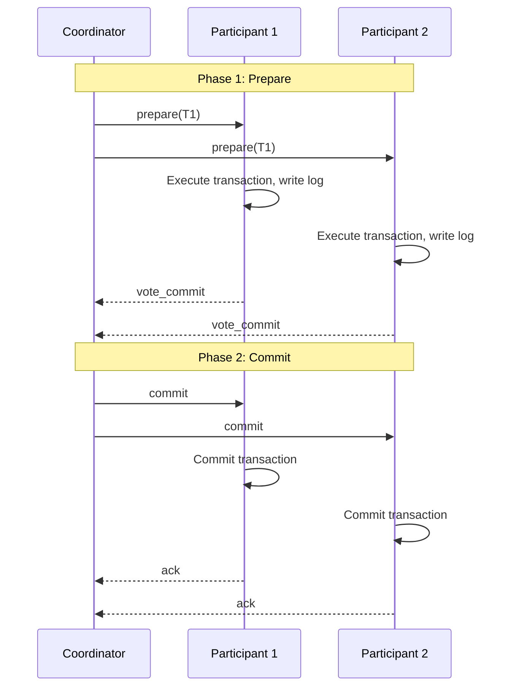

**Figure 6.1:** Two-Phase Commit protocol sequence diagram.

**2PC Implementation:**

```java
// Coordinator
public class TwoPhaseCommitCoordinator {
    private final List<Participant> participants;
    private final Transaction transaction;
    
    public void execute() throws TransactionException {
        // Phase 1: Prepare
        List<Vote> votes = new ArrayList<>();
        for (Participant p : participants) {
            Vote vote = p.prepare(transaction);
            votes.add(vote);
            
            if (vote == Vote.ABORT) {
                // Early abort if any participant votes abort
                abortAll(participants, transaction);
                throw new TransactionAbortedException("Participant voted abort");
            }
        }
        
        // Phase 2: Commit
        if (votes.stream().allMatch(v -> v == Vote.COMMIT)) {
            commitAll(participants, transaction);
        } else {
            abortAll(participants, transaction);
        }
    }
    
    private void commitAll(List<Participant> participants, Transaction tx) {
        for (Participant p : participants) {
            try {
                p.commit(tx);
            } catch (Exception e) {
                log.error("Failed to commit transaction on participant", e);
                // Critical: Must retry or alert
            }
        }
    }
    
    private void abortAll(List<Participant> participants, Transaction tx) {
        for (Participant p : participants) {
            try {
                p.abort(tx);
            } catch (Exception e) {
                log.error("Failed to abort transaction on participant", e);
            }
        }
    }
}

// Participant
public class TwoPhaseCommitParticipant {
    private final ResourceManager resourceManager;
    private final WriteAheadLog log;
    
    public Vote prepare(Transaction transaction) {
        try {
            // Execute transaction
            transaction.execute(resourceManager);
            
            // Write prepare record to log
            log.write(new LogRecord(LogRecordType.PREPARE, transaction));
            log.flush();
            
            return Vote.COMMIT;
        } catch (Exception e) {
            // Write abort record to log
            log.write(new LogRecord(LogRecordType.ABORT, transaction));
            log.flush();
            
            return Vote.ABORT;
        }
    }
    
    public void commit(Transaction transaction) {
        // Write commit record to log
        log.write(new LogRecord(LogRecordType.COMMIT, transaction));
        log.flush();
        
        // Apply changes
        transaction.commit(resourceManager);
    }
    
    public void abort(Transaction transaction) {
        // Write abort record to log
        log.write(new LogRecord(LogRecordType.ABORT, transaction));
        log.flush();
        
        // Rollback changes
        transaction.rollback(resourceManager);
    }
}
```

#### 6.3.2 In the Presence of Failure

**Failure Scenarios:**

1. **Coordinator fails after sending prepare:**
   - Participants wait for decision (blocking!)
   - When coordinator recovers, it reads log and completes protocol

2. **Participant fails after voting commit:**
   - Coordinator waits for vote (timeout)
   - Coordinator aborts transaction
   - When participant recovers, it reads log and asks coordinator for decision

3. **Network partition:**
   - Coordinator can't reach some participants
   - Coordinator times out and aborts
   - Participants may have voted commit but never receive decision

**Handling Failures:**

```java
// Participant recovery
public class RecoveringParticipant {
    public void recover() {
        // Read last log record
        LogRecord lastRecord = log.readLast();
        
        if (lastRecord == null) {
            return; // No transaction in progress
        }
        
        switch (lastRecord.getType()) {
            case PREPARE:
                // Voted commit but don't know final decision
                // Contact coordinator for decision
                Decision decision = contactCoordinator(lastRecord.getTransactionId());
                if (decision == Decision.COMMIT) {
                    commit(lastRecord.getTransaction());
                } else {
                    abort(lastRecord.getTransaction());
                }
                break;
                
            case COMMIT:
                // Committed but might not have applied changes
                commit(lastRecord.getTransaction());
                break;
                
            case ABORT:
                // Aborted but might not have rolled back
                abort(lastRecord.getTransaction());
                break;
        }
    }
}
```

#### 6.3.3 Improvement

**2PC Limitations:**
- **Blocking:** Participants wait indefinitely for coordinator
- **Single point of failure:** Coordinator failure blocks all transactions
- **No automatic recovery:** Requires manual intervention

**Improvements:**

1. **Timeout-based recovery:** Participants timeout and make autonomous decisions
2. **Multiple coordinators:** Backup coordinators for failover
3. **Presumed abort/commit:** Optimize log writes
4. **Read-only optimization:** Skip prepare phase for read-only transactions

```java
// Optimized 2PC with timeout
public class OptimizedTwoPC {
    private static final long COORDINATOR_TIMEOUT = 30000;
    
    public void execute(Transaction tx) {
        // Phase 1: Prepare
        List<Vote> votes = prepare(tx);
        
        // Phase 2: Decision with timeout
        try {
            Decision decision = waitForDecision(tx, COORDINATOR_TIMEOUT);
            if (decision == Decision.COMMIT) {
                commit(tx);
            } else {
                abort(tx);
            }
        } catch (TimeoutException e) {
            // Coordinator failed - use presumed abort
            log.warn("Coordinator timeout, presuming abort");
            abort(tx);
        }
    }
}
```

---

## Chapter 7: Partitioning

### 7.1 Encyclopedias and Volumes

**Analogy:** Think of partitioning like organizing an encyclopedia:
- **Single volume:** Easy to search but heavy to carry
- **Multiple volumes:** Lighter, organized by topic (A-G, H-N, O-Z)
- **Multiple copies:** Available in different locations

### 7.2 Thinking in Partitions

**Partitioning** (sharding) splits data across multiple nodes to:
- Scale storage beyond single node capacity
- Distribute load across multiple nodes
- Improve query performance by reducing data scanned

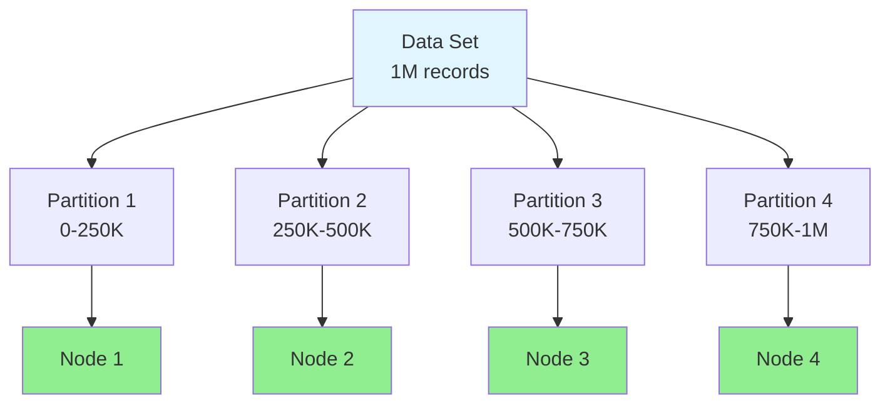

**Figure 7.1:** Data partitioning across multiple nodes.

### 7.3 The Mechanics of Partitioning and Balancing

**Partitioning:** Splitting data into partitions
**Balancing:** Distributing partitions evenly across nodes

**Goals:**
- **Even distribution:** No node is overloaded
- **Minimal movement:** Reduce data movement during rebalancing
- **Locality:** Related data on same node when possible

### 7.4 (Re)partitioning

#### 7.4.1 Types of Partitioning

**Horizontal Partitioning:** Split rows across nodes
**Vertical Partitioning:** Split columns across nodes
**Hybrid Partitioning:** Combination of both

```java
// Horizontal partitioning: Split by user ID range
public class HorizontalPartitioning {
    private final int numPartitions;
    
    public int getPartition(String userId) {
        // Hash user ID to determine partition
        return Math.abs(userId.hashCode() % numPartitions);
    }
    
    public Node getNode(int partition) {
        // Map partition to node
        return partitionToNode.get(partition);
    }
}

// Vertical partitioning: Split columns by domain
public class VerticalPartitioning {
    // User profile in one database
    public UserProfile getUserProfile(String userId) {
        return userProfileDb.findById(userId);
    }
    
    // User orders in another database
    public List<Order> getUserOrders(String userId) {
        return orderDb.findByUserId(userId);
    }
}
```

#### 7.4.2 Data Item to Partition Assignment Strategies

**Assignment Strategies:**
1. **Hash-based:** `partition = hash(key) % N`
2. **Range-based:** `partition = range_lookup(key)`
3. **Directory-based:** Lookup table maps keys to partitions

### 7.5 Common Item-Based Assignment Strategies

#### 7.5.1 Range Partitioning

**Range partitioning** assigns contiguous key ranges to partitions.

```java
public class RangePartitioner {
    private final NavigableMap<String, Integer> ranges;
    
    public RangePartitioner() {
        ranges = new TreeMap<>();
        ranges.put("A", 0);   // A-M → Partition 0
        ranges.put("N", 1);   // N-Z → Partition 1
    }
    
    public int getPartition(String key) {
        // Find partition for key
        Map.Entry<String, Integer> entry = ranges.floorEntry(key);
        return entry != null ? entry.getValue() : 0;
    }
}

// Example usage:
// "Alice" → Partition 0 (A-M)
// "Nancy" → Partition 1 (N-Z)
// "Zoe" → Partition 1 (N-Z)
```

**Pros:**
- Efficient range queries
- Easy to understand
- Supports ordered operations

**Cons:**
- Hotspots (popular ranges overloaded)
- Difficult to rebalance

#### 7.5.2 Hash Partitioning

**Hash partitioning** uses a hash function to distribute keys.

```java
public class HashPartitioner {
    private final int numPartitions;
    
    public HashPartitioner(int numPartitions) {
        this.numPartitions = numPartitions;
    }
    
    public int getPartition(String key) {
        // Consistent hash function
        return Math.abs(key.hashCode() % numPartitions);
    }
}

// Example with 4 partitions:
// "user:123" → hash = 12345 → partition = 12345 % 4 = 1
// "user:456" → hash = 67890 → partition = 67890 % 4 = 2
// "user:789" → hash = 11111 → partition = 11111 % 4 = 3
```

**Pros:**
- Even distribution (with good hash function)
- Simple to implement
- Easy to add nodes

**Cons:**
- No range queries (keys scattered)
- Hash collisions possible
- Rebalancing requires remapping all keys

### 7.6 Repartitioning

**Repartitioning** redistributes data when nodes are added/removed.

#### 7.6.1 Range Repartitioning

```java
// Adding a new partition splits existing ranges
// Before: [A-M] → P0, [N-Z] → P1
// After:  [A-G] → P0, [H-M] → P1, [N-T] → P2, [U-Z] → P3

public class RangeRepartitioner {
    public void addPartition(String splitPoint) {
        // Find partition containing split point
        int partition = findPartition(splitPoint);
        
        // Split partition into two
        Partition oldPartition = partitions.get(partition);
        Partition newPartition = oldPartition.split(splitPoint);
        
        // Update partition mapping
        partitions.add(newPartition);
        updateRangeMapping(oldPartition, newPartition);
    }
}
```

#### 7.6.2 Hash Repartitioning

```java
// Adding nodes requires remapping most keys
// Before: 4 nodes, hash % 4
// After: 6 nodes, hash % 6

public class HashRepartitioner {
    public void addNode(Node newNode) {
        int newPartitionCount = nodes.size() + 1;
        
        // Remap all keys
        for (String key : allKeys) {
            int oldPartition = hash(key) % oldPartitionCount;
            int newPartition = hash(key) % newPartitionCount;
            
            if (oldPartition != newPartition) {
                // Migrate key to new node
                migrateKey(key, oldPartition, newPartition);
            }
        }
        
        nodes.add(newNode);
    }
}
```

### 7.7 Consistent Hashing

**Consistent hashing** minimizes data movement when nodes are added/removed.

```java
public class ConsistentHash {
    private final TreeMap<Integer, Node> ring;
    private final int virtualNodes;
    
    public ConsistentHash(List<Node> nodes, int virtualNodes) {
        this.ring = new TreeMap<>();
        this.virtualNodes = virtualNodes;
        
        // Add virtual nodes for each physical node
        for (Node node : nodes) {
            for (int i = 0; i < virtualNodes; i++) {
                String virtualNodeName = node.getId() + "#" + i;
                int hash = hash(virtualNodeName);
                ring.put(hash, node);
            }
        }
    }
    
    public Node getNode(String key) {
        if (ring.isEmpty()) {
            return null;
        }
        
        int hash = hash(key);
        
        // Find first node clockwise from hash
        Map.Entry<Integer, Node> entry = ring.ceilingEntry(hash);
        if (entry == null) {
            // Wrap around to first node
            entry = ring.firstEntry();
        }
        
        return entry.getValue();
    }
    
    public void addNode(Node node) {
        // Add virtual nodes
        for (int i = 0; i < virtualNodes; i++) {
            String virtualNodeName = node.getId() + "#" + i;
            int hash = hash(virtualNodeName);
            ring.put(hash, node);
        }
    }
    
    public void removeNode(Node node) {
        // Remove all virtual nodes for this physical node
        ring.entrySet().removeIf(
            entry -> entry.getValue().equals(node)
        );
    }
    
    private int hash(String key) {
        // Use consistent hash function
        return MurmurHash.hash(key);
    }
}

// Usage:
ConsistentHash hash = new ConsistentHash(nodes, 150);
Node node = hash.getNode("user:123"); // Find node for key

// Adding a node only migrates ~1/N of keys
hash.addNode(newNode);
```

**Benefits:**
- Adding/removing nodes only affects ~1/N of keys
- Minimal data movement
- Even distribution (with virtual nodes)

### 7.8 (Re)balancing and Overpartitioning

**Overpartitioning:** Creating more partitions than nodes.

```java
// Overpartitioning: 1000 partitions, 10 nodes
// Each node handles 100 partitions

public class OverpartitionedSystem {
    private final int numPartitions = 1000;
    private final int numNodes = 10;
    private final ConsistentHash hash;
    
    public OverpartitionedSystem(List<Node> nodes) {
        this.hash = new ConsistentHash(nodes, 100); // 100 virtual nodes per physical node
    }
    
    public void rebalance() {
        // Move partitions to balance load
        for (Node node : nodes) {
            int targetPartitions = numPartitions / numNodes;
            int currentPartitions = getPartitionCount(node);
            
            if (currentPartitions > targetPartitions * 1.2) {
                // Overloaded - migrate some partitions
                migratePartitions(node, currentPartitions - targetPartitions);
            } else if (currentPartitions < targetPartitions * 0.8) {
                // Underloaded - accept more partitions
                acceptPartitions(node, targetPartitions - currentPartitions);
            }
        }
    }
}
```

**Benefits of Overpartitioning:**
- Fine-grained load balancing
- Easier rebalancing
- Better handling of skewed workloads

---

## Chapter 8: Replication

### 8.1 Redundancy

**Replication** creates copies of data across multiple nodes for:
- **Availability:** Data accessible even if some nodes fail
- **Durability:** Data survives node failures
- **Performance:** Read from nearest replica
- **Scalability:** Distribute read load

### 8.2 Thinking About Replication and Consistency

**The Replication Dilemma:**
- More replicas = better availability and performance
- More replicas = harder to keep consistent
- More replicas = higher cost

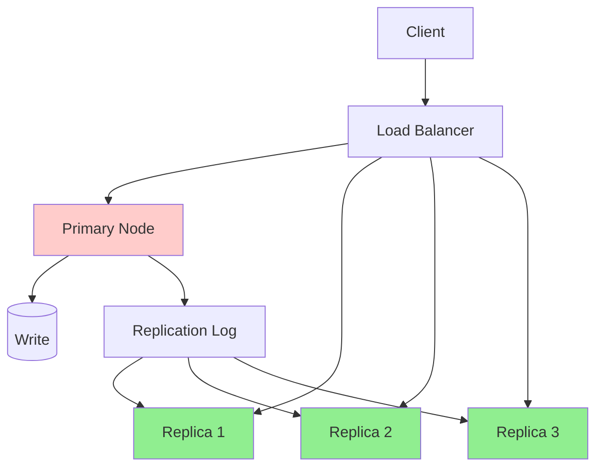

**Figure 8.1:** Primary-replica replication architecture.

### 8.3 Replication

**Replication Factor (N):** Number of copies of data
**Write Consistency (W):** Number of replicas that must acknowledge write
**Read Consistency (R):** Number of replicas to query for read

**Quorum:** W + R > N ensures strong consistency

### 8.4 The Mechanics of Replication

#### 8.4.1 System Model

**Replication System Model:**
- **Nodes:** Primary + N-1 replicas
- **Network:** Asynchronous or synchronous replication
- **Failures:** Crash-recovery
- **Consistency:** Eventual to strong

#### 8.4.2 Replication Lag

**Replication lag** is the delay between write on primary and availability on replicas.

```java
// Measuring replication lag
public class ReplicationMonitor {
    private final Clock primaryClock;
    private final Clock replicaClock;
    
    public long measureLag() {
        // Write timestamp on primary
        long writeTime = primaryClock.getTime();
        primaryDb.write("test", writeTime);
        
        // Read from replica
        long readTime = replicaDb.read("test");
        
        // Lag = current time - write time
        return System.currentTimeMillis() - writeTime;
    }
}
```

**Typical Lag:**
- Synchronous replication: 0-10ms
- Asynchronous replication: 10ms - several seconds
- Geo-replication: 100ms - several seconds

#### 8.4.3 Synchronous vs. Asynchronous Replication

| Aspect | Synchronous | Asynchronous |
|--------|-------------|--------------|
| **Write latency** | High (wait for replicas) | Low (ack from primary only) |
| **Consistency** | Strong | Eventual |
| **Availability** | Lower (need quorum) | Higher (primary always available) |
| **Failure handling** | Automatic failover | Potential data loss |
| **Use case** | Financial systems | Content delivery, caching |

```java
// Synchronous replication
public class SynchronousReplication {
    public void write(Data data) {
        // Write to primary
        primary.write(data);
        
        // Wait for all replicas to acknowledge
        CompletableFuture.allOf(
            replica1.writeAsync(data),
            replica2.writeAsync(data),
            replica3.writeAsync(data)
        ).join(); // Block until all complete
        
        // Return success
    }
}

// Asynchronous replication
public class AsynchronousReplication {
    public void write(Data data) {
        // Write to primary
        primary.write(data);
        
        // Replicate in background (fire-and-forget)
        CompletableFuture.allOf(
            replica1.writeAsync(data),
            replica2.writeAsync(data),
            replica3.writeAsync(data)
        ); // Don't wait
        
        // Return immediately
    }
}
```

#### 8.4.4 State-based vs. Log-based Replication

**State-based (Full State Transfer):**
- Send entire state to replicas
- Simple but inefficient for large state

```java
// State-based replication
public class StateReplication {
    public void replicate() {
        // Send entire database state
        DatabaseState state = primary.getFullState();
        replica.setState(state);
    }
}
```

**Log-based (Logical Replication):**
- Send write-ahead log (WAL) to replicas
- Efficient, ordered, supports partial replication

```java
// Log-based replication
public class LogReplication {
    private final WriteAheadLog wal;
    
    public void replicate() {
        // Send only new log entries
        List<LogEntry> newEntries = wal.getEntriesSince(lastSentPosition);
        replica.applyLog(newEntries);
        lastSentPosition = wal.getCurrentPosition();
    }
}
```

#### 8.4.5 Single-leader, Multileader, and Leaderless Systems

**Single-Leader (Primary-Replica):**
- One leader handles all writes
- Replicas handle reads
- Simple, strong consistency possible

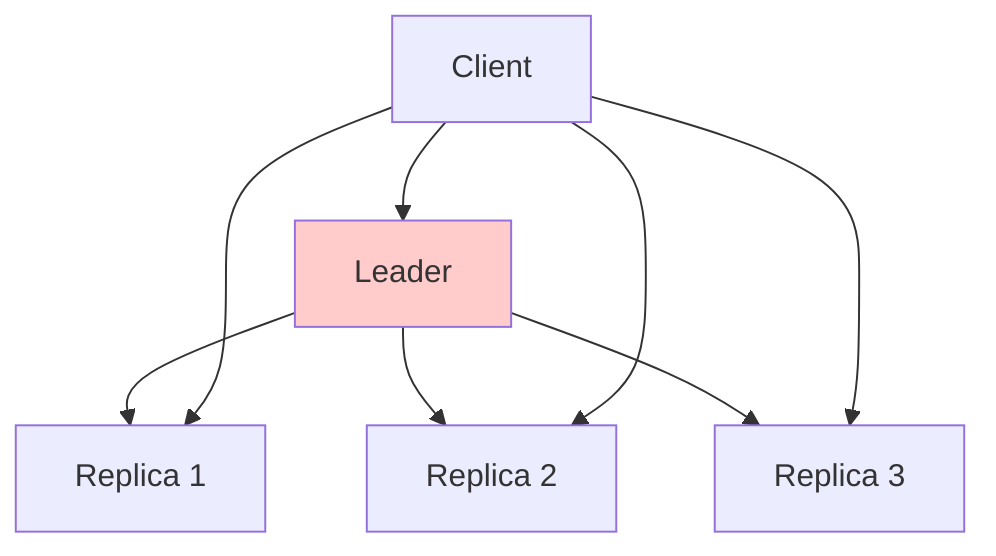

**Figure 8.2:** Single-leader replication.

**Multi-Leader:**
- Multiple leaders accept writes
- Conflict resolution required
- Better availability, eventual consistency

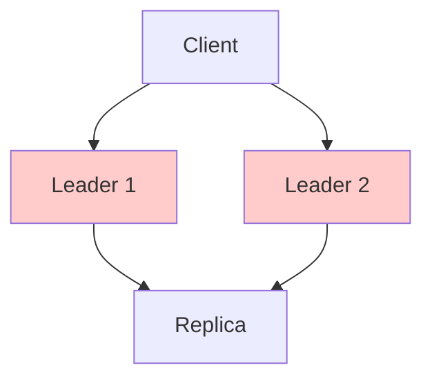

**Figure 8.3:** Multi-leader replication.

**Leaderless:**
- All nodes accept reads and writes
- Quorum-based consistency
- High availability (Dynamo-style)

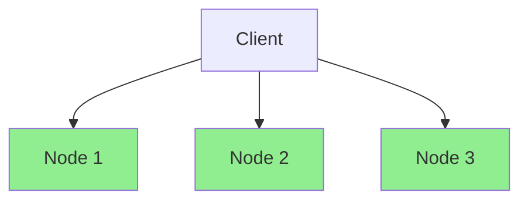

**Figure 8.4:** Leaderless replication.

---

## Chapter 9: Consistency

### 9.1 Consistency Models

**Consistency model** defines what values can be read from replicated data.

#### 9.1.1 Common Consistency Models

| Model | Guarantee | Example |
|-------|-----------|---------|
| **Strong** | All reads see latest write | Traditional RDBMS |
| **Linearizable** | Real-time ordering | ZooKeeper, etcd |
| **Sequential** | All replicas see same order | MongoDB (with write concern) |
| **Causal** | Causally related operations ordered | Amazon DynamoDB |
| **Eventual** | Eventually all replicas converge | DNS, Cassandra |

#### 9.1.2 Virtues and Limitations

**Strong Consistency:**
- ✅ Simple mental model
- ✅ No surprises
- ❌ Higher latency
- ❌ Lower availability during partitions

**Eventual Consistency:**
- ✅ Low latency
- ✅ High availability
- ❌ Complex reasoning
- ❌ Stale reads possible

### 9.2 Linearizability

**Linearizability** is the strongest consistency model.

**Definition:** Operations appear to execute atomically at some point between invocation and response.

```java
// Linearizable example
public class LinearizableCounter {
    private final AtomicInteger value = new AtomicInteger(0);
    private final Lock lock = new ReentrantLock();
    
    public int get() {
        lock.lock();
        try {
            return value.get(); // Atomic read
        } finally {
            lock.unlock();
        }
    }
    
    public void increment() {
        lock.lock();
        try {
            value.incrementAndGet(); // Atomic increment
        } finally {
            lock.unlock();
        }
    }
}
```

#### 9.2.1 Queue and Stack

**Linearizable Queue (FIFO):**
```java
public class LinearizableQueue<T> {
    private final Queue<T> queue = new ConcurrentLinkedQueue<>();
    private final Lock lock = new ReentrantLock();
    
    public void enqueue(T item) {
        lock.lock();
        try {
            queue.add(item);
        } finally {
            lock.unlock();
        }
    }
    
    public T dequeue() {
        lock.lock();
        try {
            return queue.poll();
        } finally {
            lock.unlock();
        }
    }
}
```

**Linearizable Stack (LIFO):**
```java
public class LinearizableStack<T> {
    private final Deque<T> stack = new ConcurrentLinkedDeque<>();
    private final Lock lock = new ReentrantLock();
    
    public void push(T item) {
        lock.lock();
        try {
            stack.push(item);
        } finally {
            lock.unlock();
        }
    }
    
    public T pop() {
        lock.lock();
        try {
            return stack.pop();
        } finally {
            lock.unlock();
        }
    }
}
```

#### 9.2.2 Formal Definition of Linearizability

**Formal Definition:**
A history H is linearizable if:
1. **Program order:** Operations appear in order within each process
2. **Real-time order:** If operation A completes before B starts, A appears before B
3. **Atomicity:** Each operation appears to execute instantaneously

```mermaid
graph LR
    A[P1: write(x, 1)<br/>t=1] --> B[P2: read(x)<br/>t=2]
    B --> C[P2: read(x)=1<br/>t=3]
    C --> D[P1: write(x, 2)<br/>t=4]
    D --> E[P2: read(x)<br/>t=5]
    E --> F[P2: read(x)=2<br/>t=6]
    
    style A fill:#e1f5ff
    style D fill:#e1f5ff
```

**Figure 9.1:** Linearizable execution history.

### 9.3 Eventual Consistency

**Eventual consistency** guarantees that if no new updates are made, eventually all replicas converge to the same value.

#### 9.3.1 The Shopping Cart

**Example: Shopping Cart with Eventual Consistency**

```java
public class ShoppingCart {
    private final Map<String, Integer> items;
    private final Node node;
    
    public void addItem(String productId, int quantity) {
        // Add to local replica
        items.merge(productId, quantity, Integer::sum);
        
        // Replicate asynchronously
        replicateAsync(new AddItemOperation(productId, quantity));
    }
    
    public Map<String, Integer> getItems() {
        // Return local replica (might be stale)
        return new HashMap<>(items);
    }
}

// User adds item on replica 1
cart1.addItem("product:123", 1); // Local: {product:123: 1}

// User views cart on replica 2 (before replication)
cart2.getItems(); // Local: {} (empty - stale read!)

// After replication completes
cart2.getItems(); // Local: {product:123: 1} (consistent)
```

#### 9.3.2 Variants of Eventual Consistency

**Read-your-writes:**
- User always sees their own writes
- Other users might see stale data

```java
public class ReadYourWritesCart {
    private final Map<String, Integer> localItems;
    private final Map<String, Integer> replicatedItems;
    private final String userId;
    
    public void addItem(String productId, int quantity) {
        // Add to local (immediate)
        localItems.merge(productId, quantity, Integer::sum);
        
        // Replicate in background
        replicateAsync(new AddItemOperation(userId, productId, quantity));
    }
    
    public Map<String, Integer> getItems() {
        // Merge local + replicated
        Map<String, Integer> result = new HashMap<>(replicatedItems);
        result.putAll(localItems); // Local writes take precedence
        return result;
    }
}
```

**Session consistency:**
- Within a session, user sees consistent view
- Across sessions, eventual consistency

**Monotonic reads:**
- Once you see a value, you never see older values

```java
public class MonotonicReadCache {
    private final Map<String, Long> lastReadTimestamp;
    
    public Data read(String key) {
        long lastTimestamp = lastReadTimestamp.getOrDefault(key, 0L);
        
        // Query replica with timestamp >= last read
        Data data = replica.readAfter(key, lastTimestamp);
        
        // Update timestamp
        lastReadTimestamp.put(key, data.getTimestamp());
        
        return data;
    }
}
```

#### 9.3.3 Implementation

**Implementation with Vector Clocks:**

```java
public class EventuallyConsistentStore {
    private final Map<String, VersionedValue> data;
    private final VectorClock vectorClock;
    
    public void put(String key, String value) {
        // Increment vector clock
        vectorClock.tick();
        
        // Store with version
        data.put(key, new VersionedValue(value, vectorClock.getClock()));
        
        // Replicate asynchronously
        replicateAsync(key, value, vectorClock.getClock());
    }
    
    public String get(String key) {
        VersionedValue local = data.get(key);
        
        // Check for updates from other replicas
        VersionedValue remote = checkForUpdates(key);
        
        // Return most recent version
        if (remote != null && remote.isNewerThan(local)) {
            return remote.getValue();
        }
        
        return local != null ? local.getValue() : null;
    }
}

class VersionedValue {
    private final String value;
    private final Map<String, Integer> version;
    
    public boolean isNewerThan(VersionedValue other) {
        // Compare vector clocks
        return this.version.get(nodeId) > other.version.get(nodeId);
    }
}
```

### 9.4 Consistency, Availability, and Partition Tolerance

#### 9.4.1 History

**The CAP Theorem** was introduced by Eric Brewer in 2000.

**Context:** Distributed systems face three challenges:
- **Consistency (C):** All nodes see same data
- **Availability (A):** Every request receives a response
- **Partition Tolerance (P):** System works despite network partitions

#### 9.4.2 Conjecture vs. Theorem

**CAP Conjecture (Brewer):** In presence of partitions, must choose between C and A.

**CAP Theorem (Proven):** In asynchronous systems with even one partition, cannot have both C and A.

#### 9.4.3 CAP Theorem

**The CAP Theorem States:**
In a distributed system, you can only guarantee two of the three:
- **CP:** Consistent and Partition-tolerant (sacrifices availability)
- **AP:** Available and Partition-tolerant (sacrifices consistency)
- **CA:** Consistent and Available (impossible with partitions)

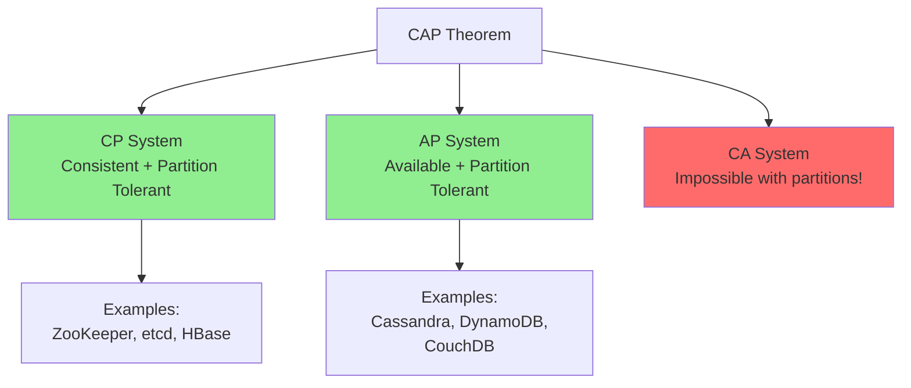

**Figure 9.2:** CAP theorem - only two of three properties can be guaranteed.

**Real-World CAP:**

```java
// CP System: ZooKeeper
public class ZooKeeperClient {
    public void write(String path, byte[] data) {
        // If partition occurs, write might fail
        // But if it succeeds, all nodes agree on value
        zk.setData(path, data, -1);
    }
}

// AP System: Cassandra
public class CassandraClient {
    public void write(String key, byte[] data) {
        // Write succeeds even during partition
        // But replicas might diverge temporarily
        session.execute("INSERT INTO users VALUES (?, ?)", key, data);
    }
}
```

**Important Nuance:**
- CAP applies during partitions, not normal operation
- Most systems are CP or AP, not CA
- "CA" systems work fine until a partition occurs

---

## Chapter 10: Distributed Consensus

### 10.1 The Challenge of Reaching Agreement

**Consensus** is the problem of getting multiple nodes to agree on a single value.

**Requirements:**
1. **Agreement:** All correct nodes agree on same value
2. **Validity:** If all nodes propose v, then v is chosen
3. **Termination:** All correct nodes eventually decide
4. **Integrity:** Each node decides at most once

**Real-World Examples:**
- Electing a leader
- Agreeing on transaction commit/abort
- Lock acquisition
- Configuration updates

### 10.2 System Model

**Consensus System Model:**
- **Nodes:** N nodes, up to F can fail (crash)
- **Communication:** Reliable message passing
- **Timing:** Partially synchronous
- **Requirement:** N > 2F (majority needed)

**Impossibility Result (FLP):** Consensus impossible in purely asynchronous systems with even one faulty node.

### 10.3 State Machine Replication

**State Machine Replication (SMR):** All nodes execute same operations in same order.

```java
// State machine
public class KeyValueStore {
    private final Map<String, String> state;
    
    public void apply(Operation op) {
        switch (op.getType()) {
            case PUT:
                state.put(op.getKey(), op.getValue());
                break;
            case DELETE:
                state.remove(op.getKey());
                break;
        }
    }
    
    public String get(String key) {
        return state.get(key);
    }
}

// If all replicas apply operations in same order, they have same state
```

**SMR Requirements:**
1. Deterministic state machine
2. All operations logged
3. Consensus on log order
4. All replicas apply log in order

### 10.4 The Origin—and Irony—of Consensus

**Origin:** Paxos (Lamport, 1989) - theoretical solution to consensus
**Irony:** Paxos is notoriously difficult to understand and implement

**Why Consensus is Hard:**
- Nodes can fail at any time
- Messages can be delayed or lost
- Network partitions can split the system
- Need to make progress despite failures

### 10.5 Implementing Consensus

#### 10.5.1 Leader-based Consensus

**Basic Idea:** Elect a leader, leader decides values.

```java
// Leader-based consensus
public class LeaderConsensus {
    private Node leader;
    
    public void propose(Value value) {
        if (isLeader()) {
            // Leader decides
            decide(value);
        } else {
            // Forward to leader
            leader.propose(value);
        }
    }
}
```

**Problem:** Leader can fail, need to elect new leader.

#### 10.5.2 Quorum-based Consensus

**Quorum:** Majority of nodes (N/2 + 1)

```java
// Quorum-based read/write
public class QuorumConsensus {
    private final List<Node> nodes;
    private final int quorumSize;
    
    public void write(Data data) {
        // Send to all nodes
        List<CompletableFuture<Ack>> futures = nodes.stream()
            .map(node -> node.writeAsync(data))
            .collect(Collectors.toList());
        
        // Wait for quorum
        CompletableFuture.allOf(futures.toArray(new CompletableFuture[0]))
            .thenApply(v -> {
                long acks = futures.stream()
                    .filter(f -> f.join().isSuccess())
                    .count();
                
                if (acks >= quorumSize) {
                    return true; // Write successful
                } else {
                    throw new QuorumNotReachedException();
                }
            });
    }
    
    public Data read(String key) {
        // Query all nodes
        List<CompletableFuture<Data>> futures = nodes.stream()
            .map(node -> node.readAsync(key))
            .collect(Collectors.toList());
        
        // Wait for quorum
        CompletableFuture.allOf(futures.toArray(new CompletableFuture[0]))
            .thenApply(v -> {
                // Return most recent version from quorum
                return getMostRecentVersion(futures);
            });
    }
}
```

**Quorum Properties:**
- Read quorum (R) + Write quorum (W) > N ensures strong consistency
- Example: N=3, R=2, W=2 → reads always see latest write

#### 10.5.3 Combining Leader and Quorum

**Paxos-style:** Leader proposes, quorum accepts.

```java
// Paxos-inspired consensus
public class PaxosConsensus {
    private Node leader;
    private final List<Node> acceptors;
    private final int quorumSize;
    
    public Value propose(Value value) {
        // Phase 1: Prepare
        List<Promise> promises = new ArrayList<>();
        for (Node acceptor : acceptors) {
            Promise promise = acceptor.prepare(leader.getId(), value);
            promises.add(promise);
        }
        
        if (promises.size() < quorumSize) {
            throw new QuorumNotReachedException();
        }
        
        // Phase 2: Accept
        List<Accepted> accepted = new ArrayList<>();
        for (Node acceptor : acceptors) {
            Accepted ack = acceptor.accept(leader.getId(), value);
            accepted.add(ack);
        }
        
        if (accepted.size() >= quorumSize) {
            return value; // Consensus reached
        } else {
            throw new ConsensusNotReachedException();
        }
    }
}
```

### 10.6 Raft

**Raft** is a consensus algorithm designed for understandability.

**Key Ideas:**
1. **Strong leader:** All decisions go through leader
2. **Term:** Logical time period with one leader
3. **Log replication:** Leader replicates log to followers
4. **Safety:** Committed entries never lost

#### 10.6.1 The Log

**Log Structure:**
```java
public class Log {
    private final List<LogEntry> entries;
    
    public void append(LogEntry entry) {
        entries.add(entry);
    }
    
    public LogEntry get(int index) {
        return entries.get(index);
    }
    
    public int getLastIndex() {
        return entries.size() - 1;
    }
    
    public int getLastTerm() {
        if (entries.isEmpty()) {
            return 0;
        }
        return entries.get(entries.size() - 1).getTerm();
    }
}

class LogEntry {
    private final int term;
    private final int index;
    private final Command command;
    private final boolean committed;
    
    // Getters and constructors
}
```

#### 10.6.2 Terms

**Terms** prevent ambiguity in leader election.

```java
public class Term {
    private int currentTerm;
    private Node votedFor;
    
    public void increment() {
        currentTerm++;
        votedFor = null;
    }
    
    public int getCurrentTerm() {
        return currentTerm;
    }
    
    public void vote(Node candidate) {
        this.votedFor = candidate;
    }
}
```

#### 10.6.3 Leader Election Protocol

**Leader Election:**
1. Follower becomes candidate after election timeout
2. Candidate increments term, votes for self
3. Candidate requests votes from other nodes
4. If majority votes yes, becomes leader
5. If another leader discovered, step down

```java
public class RaftNode {
    private enum State { FOLLOWER, CANDIDATE, LEADER }
    
    private State state = State.FOLLOWER;
    private int currentTerm = 0;
    private Node votedFor = null;
    private int votesReceived = 0;
    private final Random random = new Random();
    
    public void onElectionTimeout() {
        // Become candidate
        state = State.CANDIDATE;
        currentTerm++;
        votesReceived = 1; // Vote for self
        votedFor = this;
        
        // Request votes from all other nodes
        for (Node peer : peers) {
            sendRequestVote(peer, currentTerm);
        }
    }
    
    public void onRequestVote(RequestVoteRequest request) {
        if (request.getTerm() > currentTerm) {
            // Update term
            currentTerm = request.getTerm();
            state = State.FOLLOWER;
            votedFor = null;
        }
        
        boolean voteGranted = false;
        if (request.getTerm() == currentTerm && 
            (votedFor == null || votedFor.equals(request.getCandidateId()))) {
            // Grant vote
            votedFor = request.getCandidateId();
            voteGranted = true;
        }
        
        sendResponse(request.getCandidateId(), 
            new RequestVoteResponse(currentTerm, voteGranted));
    }
    
    public void onRequestVoteResponse(RequestVoteResponse response) {
        if (response.getTerm() > currentTerm) {
            currentTerm = response.getTerm();
            state = State.FOLLOWER;
            return;
        }
        
        if (state == State.CANDIDATE && response.isVoteGranted()) {
            votesReceived++;
            
            if (votesReceived > peers.size() / 2) {
                // Won election - become leader
                state = State.LEADER;
                startReplication();
            }
        }
    }
}
```

#### 10.6.4 Log Replication Protocol

**Log Replication:**
1. Leader receives client request
2. Leader appends to log
3. Leader sends AppendEntries to all followers
4. Followers append to log and acknowledge
5. Leader commits entry after majority acknowledges
6. Leader applies entry to state machine
7. Leader notifies followers of commit

```java
public class RaftLeader {
    public void handleClientRequest(Command command) {
        // Append to leader's log
        LogEntry entry = new LogEntry(currentTerm, log.getLastIndex() + 1, command, false);
        log.append(entry);
        
        // Replicate to followers
        replicateToFollowers(entry);
    }
    
    public void replicateToFollowers(LogEntry entry) {
        for (Node follower : followers) {
            sendAppendEntries(follower, entry);
        }
    }
    
    public void onAppendEntriesResponse(Node follower, AppendEntriesResponse response) {
        if (response.isSuccess()) {
            // Follower accepted entry
            matchIndex.put(follower.getId(), response.getLastIndex());
            
            // Check if majority replicated
            if (hasMajorityReplicated(entry.getIndex())) {
                // Commit entry
                entry.setCommitted(true);
                applyToStateMachine(entry);
                
                // Notify followers of commit
                sendCommitNotifications(entry.getIndex());
            }
        } else {
            // Follower rejected - retry with earlier entry
            int prevIndex = response.getLastMatchIndex();
            retryReplication(follower, prevIndex + 1);
        }
    }
    
    private boolean hasMajorityReplicated(int index) {
        int count = 1; // Leader
        for (Node follower : followers) {
            if (matchIndex.getOrDefault(follower.getId(), -1) >= index) {
                count++;
            }
        }
        return count > (peers.size() + 1) / 2;
    }
}
```

#### 10.6.5 State Machine Safety

**Safety Guarantee:** If a log entry is committed, it will not be lost.

```java
public class RaftSafety {
    // Leader completeness: If log entry is committed in term T,
    // it will be present in logs of all future leaders
    
    public boolean canBecomeLeader(Node candidate) {
        // Check if candidate's log is at least as up-to-date as current leader
        int candidateLastTerm = candidate.getLog().getLastTerm();
        int candidateLastIndex = candidate.getLog().getLastIndex();
        
        int leaderLastTerm = leader.getLog().getLastTerm();
        int leaderLastIndex = leader.getLog().getLastIndex();
        
        return candidateLastTerm > leaderLastTerm ||
               (candidateLastTerm == leaderLastTerm && 
                candidateLastIndex >= leaderLastIndex);
    }
}
```

### 10.7 Raft Puzzles

#### 10.7.1 Puzzle 1: Leader Election with Split Vote

**Scenario:** 5 nodes, 2 candidates each get 2 votes.

**Solution:** Random election timeout prevents repeated split votes.

```java
// Randomized election timeout
public class RandomizedTimeout {
    private final Random random = new Random();
    private final int baseTimeout = 150; // ms
    private final int randomRange = 150; // ms
    
    public long getElectionTimeout() {
        return baseTimeout + random.nextInt(randomRange);
    }
}
```

#### 10.7.2 Puzzle 2: Stale Leader

**Scenario:** Leader partitioned from majority, new leader elected, partition heals.

**Solution:** Leader steps down when it sees higher term.

```java
public void onAppendEntries(AppendEntriesRequest request) {
    if (request.getTerm() > currentTerm) {
        // Discovered new leader with higher term
        currentTerm = request.getTerm();
        state = State.FOLLOWER;
    }
}
```

#### 10.7.3 Puzzle 3: Log Inconsistency

**Scenario:** Follower's log diverges from leader's log.

**Solution:** Leader decrements nextIndex and retries.

```java
public void onAppendEntriesResponse(AppendEntriesResponse response) {
    if (!response.isSuccess()) {
        // Decrement nextIndex and retry
        int prevIndex = response.getLastMatchIndex();
        nextIndex.put(follower.getId(), prevIndex + 1);
        retryAppendEntries(follower, nextIndex.get(follower.getId()));
    }
}
```

---

## Chapter 11: Durable Executions

### 11.1 The Pitfalls of Partial Executions

**Partial execution** occurs when a process crashes mid-execution, leaving the system in an inconsistent state.

**Example:**
```java
public void processOrder(Order order) {
    // Step 1: Charge customer
    paymentService.charge(order.getPayment());
    
    // Step 2: Reserve inventory
    inventoryService.reserve(order.getItems());
    
    // Step 3: Send confirmation email
    emailService.sendConfirmation(order);
    
    // ❌ Crash after step 2!
    // Result: Customer charged, inventory reserved, but no confirmation email
}
```

### 11.2 System Model

#### 11.2.1 Process Definition

**Process:** Sequence of steps that transforms input to output.

**Properties:**
- **Deterministic:** Same input → same output
- **Atomic:** Either completes fully or has no effect
- **Isolated:** Concurrent processes don't interfere

#### 11.2.2 Process Execution

**Execution States:**
- **Not started:** Initial state
- **Running:** Executing steps
- **Suspended:** Paused (can resume)
- **Completed:** All steps finished
- **Failed:** Error occurred

```java
public class Process {
    public enum State { NOT_STARTED, RUNNING, SUSPENDED, COMPLETED, FAILED }
    
    private State state = State.NOT_STARTED;
    private int currentStep = 0;
    private List<Step> steps;
    
    public void execute() {
        state = State.RUNNING;
        
        for (int i = currentStep; i < steps.size(); i++) {
            try {
                steps.get(i).execute();
                currentStep = i + 1;
            } catch (Exception e) {
                state = State.FAILED;
                throw e;
            }
        }
        
        state = State.COMPLETED;
    }
}
```

### 11.3 The Concept of Failure-Transparent Recovery

**Failure-transparent recovery** means the system recovers from failures without users noticing.

**Key Idea:** Resume execution from where it left off, not from the beginning.

```java
// Without failure transparency: Restart from beginning
public void processOrderWithoutRecovery(Order order) {
    chargeCustomer(order); // ❌ Already charged in previous attempt
    reserveInventory(order); // ❌ Already reserved
    sendConfirmation(order); // ✅ This time it works
    // Result: Customer charged twice!
}

// With failure transparency: Resume from last checkpoint
public void processOrderWithRecovery(Order order) {
    Checkpoint checkpoint = loadCheckpoint(order.getId());
    
    if (checkpoint == null) {
        chargeCustomer(order);
        saveCheckpoint(order.getId(), "charged");
    } else if (checkpoint.getStep().equals("charged")) {
        // Skip already completed step
        reserveInventory(order);
        saveCheckpoint(order.getId(), "reserved");
    } else if (checkpoint.getStep().equals("reserved")) {
        sendConfirmation(order);
        saveCheckpoint(order.getId(), "completed");
    }
}
```

### 11.4 Strategies of Failure-Transparent Recovery

#### 11.4.1 Restart

**Restart:** Start process from beginning.

```java
public class RestartStrategy {
    public void executeWithRestart(Process process) {
        while (true) {
            try {
                process.execute();
                break; // Success
            } catch (Exception e) {
                log.error("Process failed, restarting", e);
                process.reset(); // Start from beginning
            }
        }
    }
}
```

**Use Cases:**
- Idempotent processes
- Fast execution
- No side effects

#### 11.4.2 Resume

**Resume:** Continue from last checkpoint.

```java
public class ResumeStrategy {
    public void executeWithResume(Process process) {
        Checkpoint checkpoint = loadCheckpoint(process.getId());
        
        if (checkpoint != null) {
            // Resume from checkpoint
            process.resumeFrom(checkpoint.getStep());
        }
        
        while (!process.isCompleted()) {
            try {
                process.executeNextStep();
                saveCheckpoint(process.getId(), process.getCurrentStep());
            } catch (Exception e) {
                log.error("Process failed at step " + process.getCurrentStep(), e);
                // Will resume from this step on restart
                throw e;
            }
        }
    }
}
```

**Use Cases:**
- Long-running processes
- Non-idempotent operations
- Expensive operations

### 11.5 Implementation of Failure-Transparent Recovery

#### 11.5.1 Application-level Implementation: Sagas

**Saga Pattern:** Break long transaction into sequence of local transactions with compensating actions.

```java
// Saga for order processing
public class OrderSaga {
    private final List<SagaStep> steps;
    
    public OrderSaga() {
        steps = new ArrayList<>();
        
        // Step 1: Charge customer
        steps.add(new SagaStep(
            "charge",
            () -> paymentService.charge(order.getPayment()),
            () -> paymentService.refund(order.getPayment()) // Compensating action
        ));
        
        // Step 2: Reserve inventory
        steps.add(new SagaStep(
            "reserve",
            () -> inventoryService.reserve(order.getItems()),
            () -> inventoryService.release(order.getItems()) // Compensating action
        ));
        
        // Step 3: Send confirmation
        steps.add(new SagaStep(
            "confirm",
            () -> emailService.sendConfirmation(order),
            null // No compensation needed
        ));
    }
    
    public void execute() {
        List<String> completedSteps = new ArrayList<>();
        
        for (SagaStep step : steps) {
            try {
                step.execute();
                completedSteps.add(step.getName());
                saveProgress(completedSteps);
            } catch (Exception e) {
                // Compensate in reverse order
                for (int i = completedSteps.size() - 1; i >= 0; i--) {
                    steps.get(i).compensate();
                }
                throw e;
            }
        }
    }
}

class SagaStep {
    private String name;
    private Runnable action;
    private Runnable compensation;
    
    public void execute() {
        action.run();
    }
    
    public void compensate() {
        if (compensation != null) {
            compensation.run();
        }
    }
}
```

**Saga Example:**
```java
// Order processing saga
Saga saga = new OrderSaga(order);

try {
    saga.execute();
} catch (Exception e) {
    log.error("Saga failed, compensated", e);
    // All previous steps have been compensated
}
```

#### 11.5.2 Platform-level Implementation: Durable Execution

**Durable Execution Frameworks:**
- **Temporal.io:** Workflow orchestration
- **AWS Step Functions:** Serverless workflows
- **Netflix Conductor:** Microservices orchestration

**Temporal Example:**

```java
// Temporal workflow
@WorkflowInterface
public interface OrderWorkflow {
    @WorkflowMethod
    void processOrder(Order order);
}

public class OrderWorkflowImpl implements OrderWorkflow {
    @Override
    public void processOrder(Order order) {
        // Step 1: Charge customer
        ActivityOptions options = ActivityOptions.newBuilder()
            .setStartToCloseTimeout(Duration.ofSeconds(30))
            .build();
        PaymentActivity payment = Workflow.newActivityStub(PaymentActivity.class, options);
        
        payment.charge(order.getPayment());
        
        // Step 2: Reserve inventory
        InventoryActivity inventory = Workflow.newActivityStub(InventoryActivity.class, options);
        inventory.reserve(order.getItems());
        
        // Step 3: Send confirmation
        NotificationActivity notification = Workflow.newActivityStub(NotificationActivity.class, options);
        notification.sendConfirmation(order);
    }
}

// Temporal automatically:
// - Records each step completion
// - Retries failed steps
// - Resumes from last successful step after crash
// - Provides visibility into workflow state
```

**Benefits of Durable Execution:**
- Automatic retry and recovery
- Visibility into execution state
- No manual checkpoint management
- Built-in timeout and retry logic

---

## Chapter 12: Cloud and Services

### 12.1 From Proactive to Reactive

**Traditional (Proactive):** Provision resources for peak load
**Modern (Reactive):** Scale resources based on actual demand

```java
// Proactive: Fixed capacity
@Service
public class ProactiveService {
    private static final int POOL_SIZE = 100; // Fixed
    
    public void handleRequest(Request request) {
        // Always have 100 threads available
        executorService.submit(() -> process(request));
    }
}

// Reactive: Dynamic scaling
@Service
public class ReactiveService {
    public void handleRequest(Request request) {
        // Scale based on demand
        executorService.submit(() -> process(request));
        
        // Auto-scaling adjusts pool size based on queue length
    }
}
```

### 12.2 Cloud Computing

**Cloud Computing:** On-demand access to computing resources.

**Service Models:**
- **IaaS:** Infrastructure (VMs, storage, networking)
- **PaaS:** Platform (databases, messaging, runtime)
- **SaaS:** Software (applications)

**Deployment Models:**
- **Public Cloud:** AWS, Azure, GCP
- **Private Cloud:** On-premises
- **Hybrid Cloud:** Combination
- **Multi-cloud:** Multiple public clouds

### 12.3 Cloud-Native Computing

**Cloud-Native Principles:**
1. **Microservices:** Small, independent services
2. **Containers:** Docker, Kubernetes
3. **Dynamic Orchestration:** Auto-scaling, self-healing
4. **DevOps:** CI/CD, infrastructure as code

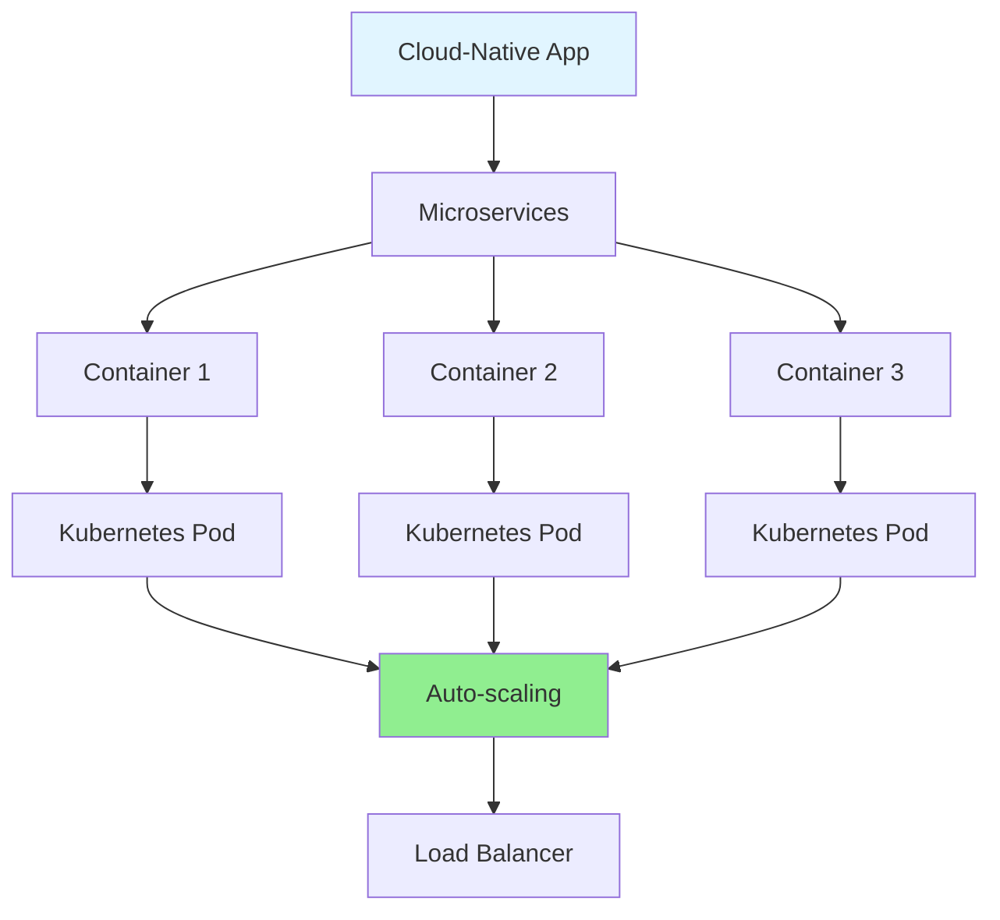

**Figure 12.1:** Cloud-native architecture with Kubernetes orchestration.

### 12.4 Serverless Computing

#### 12.4.1 Traditional

**Traditional Deployment:**
- Provision servers
- Deploy application
- Monitor and maintain
- Scale manually or with auto-scaling

```java
// Traditional: Always running
@RestController
public class TraditionalController {
    @PostMapping("/process")
    public ResponseEntity process(@RequestBody Request request) {
        // Server always running, waiting for requests
        return ResponseEntity.ok(processRequest(request));
    }
}
```

#### 12.4.2 Serverless

**Serverless (FaaS):** Code runs only when triggered.

```java
// Serverless: Runs only when triggered
public class ServerlessFunction {
    public Response handleRequest(Request request, Context context) {
        // Cold start: ~100-500ms
        // Warm start: ~10-50ms
        return processRequest(request);
    }
}

// Deploy to AWS Lambda, Azure Functions, Google Cloud Functions
// Auto-scales from 0 to millions of requests
// Pay only for execution time
```

**Serverless Benefits:**
- No server management
- Auto-scaling (0 to infinity)
- Pay-per-use pricing
- High availability built-in

**Serverless Limitations:**
- Cold start latency
- Execution time limits (15 minutes on AWS Lambda)
- Vendor lock-in
- Debugging complexity

#### 12.4.3 Cold Path vs. Hot Path

**Cold Path:** Infrequent, can tolerate latency
**Hot Path:** Frequent, requires low latency

```java
// Cold path: Image processing (runs occasionally)
public class ImageProcessor {
    public Image processImage(Image image) {
        // Can tolerate 1-2 second cold start
        return applyFilters(image);
    }
}

// Hot path: User authentication (runs on every request)
public class AuthService {
    public boolean authenticate(User user) {
        // Cannot tolerate cold start - keep warm
        return validateCredentials(user);
    }
}
```

### 12.5 Service

#### 12.5.1 Global View vs. Local View

**Service Design Principle:** Each service has local view, collectively achieves global goals.

```java
// User Service: Local view of user data
@Service
public class UserService {
    private final UserRepository userRepo;
    
    public User getUser(String userId) {
        return userRepo.findById(userId);
    }
}

// Order Service: Local view of orders
@Service
public class OrderService {
    private final OrderRepository orderRepo;
    private final UserService userService; // Calls User Service
    
    public Order getOrder(String orderId) {
        Order order = orderRepo.findById(orderId);
        User user = userService.getUser(order.getUserId());
        order.setUser(user);
        return order;
    }
}
```

#### 12.5.2 Example Recommendation Service

**Recommendation Service Architecture:**

```java
@Service
public class RecommendationService {
    private final UserService userService;
    private final ProductService productService;
    private final MLModel mlModel;
    
    public List<Product> getRecommendations(String userId) {
        // Get user preferences
        User user = userService.getUser(userId);
        
        // Get user's purchase history
        List<Product> purchased = productService.getPurchaseHistory(userId);
        
        // Get candidate products
        List<Product> candidates = productService.getCandidateProducts(user);
        
        // Score candidates using ML model
        List<ScoredProduct> scored = mlModel.score(user, candidates);
        
        // Filter out already purchased
        List<Product> recommendations = scored.stream()
            .filter(sp -> !purchased.contains(sp.getProduct()))
            .sorted(Comparator.comparingDouble(ScoredProduct::getScore).reversed())
            .limit(10)
            .map(ScoredProduct::getProduct)
            .collect(Collectors.toList());
        
        return recommendations;
    }
}
```

**Service Communication:**

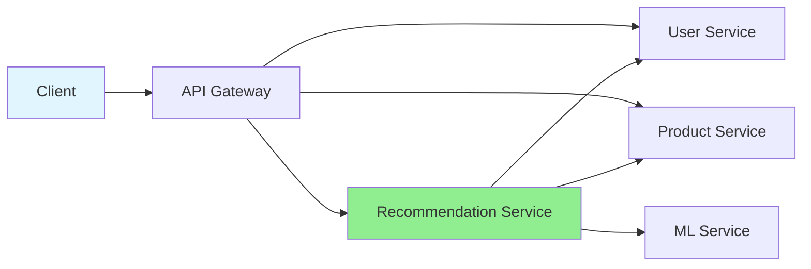

**Figure 12.2:** Recommendation service calling multiple downstream services.

### 12.6 Final Thoughts

**Key Takeaways:**
1. Distributed systems are complex but manageable with good abstractions
2. Mental models are crucial for reasoning about system behavior
3. Failure is inevitable - design for it
4. Consistency, availability, and partition tolerance involve trade-offs
5. Cloud-native patterns enable scalable, resilient systems

**The Journey Continues:**
- Explore specific technologies (Kafka, Kubernetes, etc.)
- Build production systems
- Learn from failures
- Stay curious!

---

## Practice Exercises with Solutions

### Exercise 1: Implement Vector Clocks

**Problem:** Implement vector clocks and detect concurrency.

**Solution:**

```java
import java.util.*;

public class VectorClockExercise {
    public static class VectorClock {
        private final Map<String, Integer> clock;
        private final String processId;
        
        public VectorClock(String processId, int numProcesses) {
            this.processId = processId;
            this.clock = new HashMap<>();
            for (int i = 0; i < numProcesses; i++) {
                clock.put("P" + i, 0);
            }
        }
        
        public void localEvent() {
            clock.put(processId, clock.get(processId) + 1);
        }
        
        public void sendEvent() {
            localEvent();
        }
        
        public void receiveEvent(Map<String, Integer> receivedClock) {
            for (String pid : clock.keySet()) {
                clock.put(pid, Math.max(clock.get(pid), receivedClock.get(pid)));
            }
            localEvent();
        }
        
        public boolean happensBefore(VectorClock other) {
            boolean atLeastOneSmaller = false;
            for (String pid : clock.keySet()) {
                if (this.clock.get(pid) > other.clock.get(pid)) {
                    return false;
                }
                if (this.clock.get(pid) < other.clock.get(pid)) {
                    atLeastOneSmaller = true;
                }
            }
            return atLeastOneSmaller;
        }
        
        public boolean concurrent(VectorClock other) {
            return !happensBefore(other) && !other.happensBefore(this);
        }
        
        @Override
        public String toString() {
            return clock.toString();
        }
    }
    
    public static void main(String[] args) {
        // Create vector clocks for 3 processes
        VectorClock p1 = new VectorClock("P0", 3);
        VectorClock p2 = new VectorClock("P1", 3);
        VectorClock p3 = new VectorClock("P2", 3);
        
        // P1: Local event
        p1.localEvent();
        System.out.println("P1 after local event: " + p1);
        
        // P1 sends to P2
        p1.sendEvent();
        Map<String, Integer> p1Clock = new HashMap<>(p1.clock);
        
        // P2 receives from P1
        p2.receiveEvent(p1Clock);
        System.out.println("P2 after receiving from P1: " + p2);
        
        // P2 local event
        p2.localEvent();
        System.out.println("P2 after local event: " + p2);
        
        // Check relationships
        System.out.println("P1 happens before P2: " + p1.happensBefore(p2));
        System.out.println("P2 happens before P1: " + p2.happensBefore(p1));
        System.out.println("P1 and P2 are concurrent: " + p1.concurrent(p2));
    }
}
```

**Expected Output:**
```
P1 after local event: {P0=1, P1=0, P2=0}
P2 after receiving from P1: {P0=1, P1=1, P2=0}
P2 after local event: {P0=1, P1=2, P2=0}
P1 happens before P2: true
P2 happens before P1: false
P1 and P2 are concurrent: false
```

### Exercise 2: Implement Circuit Breaker

**Problem:** Implement a circuit breaker with three states (CLOSED, OPEN, HALF_OPEN).

**Solution:**

```java
import java.util.concurrent.*;
import java.util.function.Supplier;

public class CircuitBreakerExercise {
    public enum State { CLOSED, OPEN, HALF_OPEN }
    
    public static class CircuitBreaker {
        private State state = State.CLOSED;
        private int failureCount = 0;
        private int successCount = 0;
        private final int failureThreshold;
        private final int successThreshold;
        private final long timeoutMs;
        private long lastFailureTime;
        private final ScheduledExecutorService scheduler;
        
        public CircuitBreaker(int failureThreshold, int successThreshold, 
                            long timeoutMs) {
            this.failureThreshold = failureThreshold;
            this.successThreshold = successThreshold;
            this.timeoutMs = timeoutMs;
            this.scheduler = Executors.newScheduledThreadPool(1);
        }
        
        public <T> T execute(Supplier<T> operation, Supplier<T> fallback) 
            throws Exception {
            
            if (state == State.OPEN) {
                if (System.currentTimeMillis() - lastFailureTime > timeoutMs) {
                    state = State.HALF_OPEN;
                    System.out.println("Circuit breaker: OPEN -> HALF_OPEN");
                } else {
                    System.out.println("Circuit breaker: OPEN, using fallback");
                    return fallback.get();
                }
            }
            
            try {
                T result = operation.get();
                onSuccess();
                return result;
            } catch (Exception e) {
                onFailure();
                return fallback.get();
            }
        }
        
        private void onSuccess() {
            failureCount = 0;
            if (state == State.HALF_OPEN) {
                successCount++;
                if (successCount >= successThreshold) {
                    state = State.CLOSED;
                    System.out.println("Circuit breaker: HALF_OPEN -> CLOSED");
                }
            }
        }
        
        private void onFailure() {
            failureCount++;
            lastFailureTime = System.currentTimeMillis();
            if (failureCount >= failureThreshold) {
                state = State.OPEN;
                System.out.println("Circuit breaker: CLOSED -> OPEN");
            }
        }
        
        public State getState() {
            return state;
        }
    }
    
    public static void main(String[] args) throws Exception {
        CircuitBreaker cb = new CircuitBreaker(3, 2, 5000);
        
        // Simulate failing service
        Supplier<String> failingService = () -> {
            if (Math.random() > 0.3) {
                throw new RuntimeException("Service failure");
            }
            return "Success";
        };
        
        Supplier<String> fallback = () -> "Fallback response";
        
        // Test circuit breaker
        for (int i = 0; i < 10; i++) {
            try {
                String result = cb.execute(failingService, fallback);
                System.out.println("Attempt " + (i + 1) + ": " + result + 
                                 " (State: " + cb.getState() + ")");
            } catch (Exception e) {
                System.out.println("Attempt " + (i + 1) + ": Exception");
            }
            Thread.sleep(500);
        }
    }
}
```

**Expected Behavior:**
- First 3 failures: Circuit stays CLOSED
- After 3rd failure: Circuit opens
- While OPEN: All calls return fallback
- After timeout: Circuit moves to HALF_OPEN
- After 2 successes: Circuit closes

### Exercise 3: Implement Two-Phase Commit

**Problem:** Implement a simple 2PC coordinator and participant.

**Solution:**

```java
import java.util.*;
import java.util.concurrent.*;

public class TwoPCExercise {
    public enum Vote { COMMIT, ABORT }
    public enum Decision { COMMIT, ABORT }
    
    public static class Transaction {
        private final String id;
        private final String data;
        
        public Transaction(String id, String data) {
            this.id = id;
            this.data = data;
        }
        
        public String getId() { return id; }
        public String getData() { return data; }
    }
    
    public interface Participant {
        Vote prepare(Transaction tx);
        void commit(Transaction tx);
        void abort(Transaction tx);
    }
    
    public static class Coordinator {
        private final List<Participant> participants;
        
        public Coordinator(List<Participant> participants) {
            this.participants = new ArrayList<>(participants);
        }
        
        public Decision execute(Transaction tx) {
            System.out.println("Coordinator: Starting 2PC for transaction " + tx.getId());
            
            // Phase 1: Prepare
            System.out.println("Phase 1: Prepare");
            List<Vote> votes = new ArrayList<>();
            
            for (Participant p : participants) {
                Vote vote = p.prepare(tx);
                votes.add(vote);
                System.out.println("Participant voted: " + vote);
                
                if (vote == Vote.ABORT) {
                    System.out.println("Coordinator: Aborting transaction");
                    abortAll(tx);
                    return Decision.ABORT;
                }
            }
            
            // Phase 2: Commit
            System.out.println("Phase 2: Commit");
            commitAll(tx);
            return Decision.COMMIT;
        }
        
        private void commitAll(Transaction tx) {
            for (Participant p : participants) {
                try {
                    p.commit(tx);
                } catch (Exception e) {
                    System.err.println("Error committing: " + e.getMessage());
                }
            }
        }
        
        private void abortAll(Transaction tx) {
            for (Participant p : participants) {
                try {
                    p.abort(tx);
                } catch (Exception e) {
                    System.err.println("Error aborting: " + e.getMessage());
                }
            }
        }
    }
    
    public static class DatabaseParticipant implements Participant {
        private final String name;
        private final Map<String, String> data;
        
        public DatabaseParticipant(String name) {
            this.name = name;
            this.data = new HashMap<>();
        }
        
        @Override
        public Vote prepare(Transaction tx) {
            System.out.println(name + ": Preparing transaction " + tx.getId());
            
            // Simulate validation
            if (tx.getData().contains("invalid")) {
                System.out.println(name + ": Validation failed");
                return Vote.ABORT;
            }
            
            // Write to log (simulated)
            System.out.println(name + ": Writing prepare log");
            return Vote.COMMIT;
        }
        
        @Override
        public void commit(Transaction tx) {
            System.out.println(name + ": Committing transaction " + tx.getId());
            data.put(tx.getId(), tx.getData());
        }
        
        @Override
        public void abort(Transaction tx) {
            System.out.println(name + ": Aborting transaction " + tx.getId());
            // Remove from log (simulated)
        }
        
        public String getData(String txId) {
            return data.get(txId);
        }
    }
    
    public static void main(String[] args) {
        // Create participants
        Participant db1 = new DatabaseParticipant("DB1");
        Participant db2 = new DatabaseParticipant("DB2");
        Participant db3 = new DatabaseParticipant("DB3");
        
        // Create coordinator
        Coordinator coordinator = new Coordinator(
            Arrays.asList(db1, db2, db3)
        );
        
        // Execute successful transaction
        Transaction tx1 = new Transaction("TX1", "valid data");
        Decision decision1 = coordinator.execute(tx1);
        System.out.println("Transaction 1 decision: " + decision1);
        
        System.out.println("\n---\n");
        
        // Execute failed transaction
        Transaction tx2 = new Transaction("TX2", "invalid data");
        Decision decision2 = coordinator.execute(tx2);
        System.out.println("Transaction 2 decision: " + decision2);
    }
}
```

**Expected Output:**
```
Coordinator: Starting 2PC for transaction TX1
Phase 1: Prepare
DB1: Preparing transaction TX1
DB1: Writing prepare log
Participant voted: COMMIT
DB2: Preparing transaction TX1
DB2: Writing prepare log
Participant voted: COMMIT
DB3: Preparing transaction TX1
DB3: Writing prepare log
Participant voted: COMMIT
Phase 2: Commit
DB1: Committing transaction TX1
DB2: Committing transaction TX1
DB3: Committing transaction TX1
Transaction 1 decision: COMMIT

---

Coordinator: Starting 2PC for transaction TX2
Phase 1: Prepare
DB1: Preparing transaction TX2
DB1: Writing prepare log
Participant voted: COMMIT
DB2: Preparing transaction TX2
DB2: Validation failed
Participant voted: ABORT
Coordinator: Aborting transaction
DB1: Aborting transaction TX2
DB2: Aborting transaction TX2
DB3: Aborting transaction TX2
Transaction 2 decision: ABORT
```

### Exercise 4: Implement Consistent Hashing

**Problem:** Implement consistent hashing with virtual nodes.

**Solution:**

```java
import java.util.*;

public class ConsistentHashingExercise {
    public static class Node {
        private final String id;
        private final String host;
        private final int port;
        
        public Node(String id, String host, int port) {
            this.id = id;
            this.host = host;
            this.port = port;
        }
        
        public String getId() { return id; }
        
        @Override
        public String toString() {
            return id;
        }
    }
    
    public static class ConsistentHash {
        private final TreeMap<Integer, Node> ring;
        private final int virtualNodes;
        
        public ConsistentHash(int virtualNodes) {
            this.ring = new TreeMap<>();
            this.virtualNodes = virtualNodes;
        }
        
        public void addNode(Node node) {
            for (int i = 0; i < virtualNodes; i++) {
                String virtualNode = node.getId() + "#" + i;
                int hash = hash(virtualNode);
                ring.put(hash, node);
                System.out.println("Added virtual node: " + virtualNode + 
                                 " (hash: " + hash + ") -> " + node.getId());
            }
        }
        
        public void removeNode(Node node) {
            ring.entrySet().removeIf(entry -> 
                entry.getValue().getId().equals(node.getId())
            );
        }
        
        public Node getNode(String key) {
            if (ring.isEmpty()) {
                return null;
            }
            
            int hash = hash(key);
            Map.Entry<Integer, Node> entry = ring.ceilingEntry(hash);
            
            if (entry == null) {
                // Wrap around to first node
                entry = ring.firstEntry();
            }
            
            return entry.getValue();
        }
        
        private int hash(String key) {
            // Simple hash function (use MurmurHash in production)
            int hash = 0;
            for (char c : key.toCharArray()) {
                hash = (hash * 31 + c) & 0xFFFFFFFF;
            }
            return Math.abs(hash);
        }
        
        public void printRing() {
            System.out.println("\nHash Ring:");
            for (Map.Entry<Integer, Node> entry : ring.entrySet()) {
                System.out.println("  " + entry.getKey() + " -> " + entry.getValue());
            }
        }
    }
    
    public static void main(String[] args) {
        ConsistentHash hash = new ConsistentHash(3); // 3 virtual nodes per physical node
        
        // Add nodes
        Node node1 = new Node("node1", "host1", 8080);
        Node node2 = new Node("node2", "host2", 8080);
        Node node3 = new Node("node3", "host3", 8080);
        
        hash.addNode(node1);
        hash.addNode(node2);
        hash.addNode(node3);
        
        hash.printRing();
        
        // Map keys to nodes
        String[] keys = {"user:1", "user:2", "user:3", "user:4", "user:5"};
        System.out.println("\nKey mapping:");
        for (String key : keys) {
            Node node = hash.getNode(key);
            System.out.println(key + " -> " + node);
        }
        
        // Add new node
        System.out.println("\n--- Adding node4 ---");
        Node node4 = new Node("node4", "host4", 8080);
        hash.addNode(node4);
        hash.printRing();
        
        // Check how many keys moved
        System.out.println("\nKey mapping after adding node4:");
        Map<String, Node> before = new HashMap<>();
        for (String key : keys) {
            before.put(key, hash.getNode(key));
        }
        
        // Re-add node4 to see effect
        hash.addNode(node4);
        
        int moved = 0;
        for (String key : keys) {
            Node after = hash.getNode(key);
            if (!before.get(key).equals(after)) {
                moved++;
                System.out.println(key + " moved from " + before.get(key) + 
                                 " to " + after);
            }
        }
        System.out.println("\nKeys moved: " + moved + "/" + keys.length + 
                         " (" + (moved * 100.0 / keys.length) + "%)");
    }
}
```

**Expected Behavior:**
- With 3 nodes and 3 virtual nodes each = 9 total virtual nodes
- Adding 4th node: ~25% of keys should move (1/4)
- With more virtual nodes, percentage approaches theoretical minimum

### Exercise 5: Implement Idempotent Payment Processing

**Problem:** Implement idempotent payment processing to prevent duplicate charges.

**Solution:**

```java
import java.util.*;
import java.util.concurrent.*;

public class IdempotentPaymentExercise {
    public static class PaymentRequest {
        private final String orderId;
        private final String customerId;
        private final double amount;
        private final String cardToken;
        
        public PaymentRequest(String orderId, String customerId, 
                            double amount, String cardToken) {
            this.orderId = orderId;
            this.customerId = customerId;
            this.amount = amount;
            this.cardToken = cardToken;
        }
        
        public String getOrderId() { return orderId; }
        public String getCustomerId() { return customerId; }
        public double getAmount() { return amount; }
        public String getCardToken() { return cardToken; }
    }
    
    public static class PaymentResult {
        private final String transactionId;
        private final String status;
        private final double amount;
        private final long timestamp;
        
        public PaymentResult(String transactionId, String status, double amount) {
            this.transactionId = transactionId;
            this.status = status;
            this.amount = amount;
            this.timestamp = System.currentTimeMillis();
        }
        
        @Override
        public String toString() {
            return String.format("PaymentResult{txnId='%s', status='%s', amount=%.2f, time=%d}",
                transactionId, status, amount, timestamp);
        }
    }
    
    public static class PaymentService {
        private final Map<String, PaymentResult> processedPayments;
        private final Random random = new Random();
        
        public PaymentService() {
            this.processedPayments = new ConcurrentHashMap<>();
        }
        
        public PaymentResult processPayment(PaymentRequest request) {
            String idempotencyKey = request.getOrderId();
            
            // Check if already processed
            PaymentResult existing = processedPayments.get(idempotencyKey);
            if (existing != null) {
                System.out.println("Payment already processed for order: " + 
                                 request.getOrderId());
                System.out.println("Returning existing result: " + existing);
                return existing;
            }
            
            // Simulate payment processing
            System.out.println("Processing payment for order: " + request.getOrderId());
            
            // Simulate network delay
            try {
                Thread.sleep(100 + random.nextInt(200));
            } catch (InterruptedException e) {
                Thread.currentThread().interrupt();
            }
            
            // Simulate occasional failures
            if (random.nextDouble() < 0.1) {
                throw new RuntimeException("Payment gateway timeout");
            }
            
            // Create payment result
            String transactionId = "TXN" + System.currentTimeMillis();
            PaymentResult result = new PaymentResult(
                transactionId,
                "SUCCESS",
                request.getAmount()
            );
            
            // Save to processed payments
            processedPayments.put(idempotencyKey, result);
            System.out.println("Payment processed: " + result);
            
            return result;
        }
    }
    
    public static void main(String[] args) {
        PaymentService paymentService = new PaymentService();
        
        // Create payment request
        PaymentRequest request = new PaymentRequest(
            "ORDER-123",
            "CUSTOMER-456",
            99.99,
            "tok_visa_1234"
        );
        
        // Simulate multiple attempts (e.g., network retry)
        System.out.println("=== Attempt 1 ===");
        PaymentResult result1 = paymentService.processPayment(request);
        
        System.out.println("\n=== Attempt 2 (Retry) ===");
        PaymentResult result2 = paymentService.processPayment(request);
        
        System.out.println("\n=== Attempt 3 (Another Retry) ===");
        PaymentResult result3 = paymentService.processPayment(request);
        
        // Verify all results are the same
        System.out.println("\n=== Verification ===");
        System.out.println("Result 1 == Result 2: " + 
                         (result1.getTransactionId().equals(result2.getTransactionId())));
        System.out.println("Result 2 == Result 3: " + 
                         (result2.getTransactionId().equals(result3.getTransactionId())));
        System.out.println("All results identical: " + 
                         (result1.getTransactionId().equals(result2.getTransactionId()) &&
                          result2.getTransactionId().equals(result3.getTransactionId())));
    }
}
```

**Expected Output:**
```
=== Attempt 1 ===
Processing payment for order: ORDER-123
Payment processed: PaymentResult{txnId='TXN1234567890', status='SUCCESS', amount=99.99, time=1234567890123}

=== Attempt 2 (Retry) ===
Payment already processed for order: ORDER-123
Returning existing result: PaymentResult{txnId='TXN1234567890', status='SUCCESS', amount=99.99, time=1234567890123}

=== Attempt 3 (Another Retry) ===
Payment already processed for order: ORDER-123
Returning existing result: PaymentResult{txnId='TXN1234567890', status='SUCCESS', amount=99.99, time=1234567890123}

=== Verification ===
Result 1 == Result 2: true
Result 2 == Result 3: true
All results identical: true
```

---

## Test Your Understanding

Test your knowledge with these questions (answers provided at the end).

### Questions

1. What is the key difference between synchronous and asynchronous distributed systems?
2. Explain the happened-before relationship with an example.
3. What are the three types of failure tolerance?
4. How does a circuit breaker work?
5. What is the uncertainty principle of message delivery?
6. What is idempotence and why is it important?
7. What are the ACID properties?
8. Explain the two-phase commit protocol.
9. What is the difference between range and hash partitioning?
10. What is consistent hashing and why is it useful?
11. Compare synchronous and asynchronous replication.
12. What is the CAP theorem?
13. What is linearizability?
14. What is the difference between strong consistency and eventual consistency?
15. What is consensus and why is it important?
16. Explain the Raft consensus algorithm at a high level.
17. What is a saga pattern?
18. What is the difference between restart and resume strategies?
19. What is the difference between CP and AP systems?
20. What are virtual nodes in consistent hashing?

---

## Common Interview Questions

Prepare for these commonly asked interview questions.

### Questions

1. **What is a distributed system?** Provide examples.
2. **Why are distributed systems challenging?** List at least 3 challenges.
3. **What is the FLP impossibility result?**
4. **Explain the difference between Lamport clocks and vector clocks.**
5. **What is a Byzantine fault?** Give an example.
6. **How does a heartbeat mechanism work for failure detection?**
7. **What is the difference between masking and nonmasking failure tolerance?**
8. **Explain exactly-once processing semantics.**
9. **What is a distributed transaction?** Why is it challenging?
10. **What is two-phase commit?** What are its limitations?
11. **What is the difference between horizontal and vertical partitioning?**
12. **When would you use range partitioning vs. hash partitioning?**
13. **What is replication lag?** How do you handle it?
14. **What is the difference between single-leader and multi-leader replication?**
15. **Explain the CAP theorem with real-world examples.**
16. **What is linearizability?** How is it different from sequential consistency?
17. **What is consensus?** Why is it impossible in asynchronous systems?
18. **Explain the Raft consensus algorithm.**
19. **What is state machine replication?**
20. **What is the saga pattern?** When should you use it?
21. **What is the difference between crash failures and Byzantine failures?**
22. **How do you handle network partitions in distributed systems?**
23. **What is a quorum?** How is it used in distributed systems?
24. **Explain the difference between strong consistency and eventual consistency.**
25. **What are the trade-offs of serverless computing?**

---

## Question Bank

Comprehensive questions covering all difficulty levels.

### Beginner Questions (1-20)

1. What is a distributed system?
2. What is the main advantage of distributed systems?
3. What is a node in a distributed system?
4. What is network latency?
5. What is a message in distributed systems?
6. What is a transaction?
7. What does ACID stand for?
8. What is a partition in distributed systems?
9. What is replication?
10. What is a consensus algorithm?
11. What is a leader in Raft?
12. What is a log in Raft?
13. What is a term in Raft?
14. What is a follower in Raft?
15. What is a candidate in Raft?
16. What is a heartbeat in Raft?
17. What is an election timeout?
18. What is a commit in Raft?
19. What is a checkpoint?
20. What is a saga?

### Intermediate Questions (21-40)

21. What is the difference between synchronous and asynchronous systems?
22. What is partial synchrony?
23. What is the happened-before relationship?
24. What are Lamport clocks?
25. What are vector clocks?
26. What is the difference between physical and logical clocks?
27. What is failure tolerance?
28. What is masking failure tolerance?
29. What is a circuit breaker pattern?
30. What is idempotence?
31. What is exactly-once processing?
32. What is two-phase commit?
33. What is the blocking problem in 2PC?
34. What is range partitioning?
35. What is hash partitioning?
36. What is consistent hashing?
37. What is a virtual node?
38. What is replication lag?
39. What is synchronous replication?
40. What is asynchronous replication?

### Advanced Questions (41-60)

41. What is the FLP impossibility result?
42. What is a Byzantine fault?
43. What is the CAP theorem?
44. What is linearizability?
45. What is sequential consistency?
46. What is causal consistency?
47. What is eventual consistency?
48. What is the difference between CP and AP systems?
49. What is state machine replication?
50. What is the Raft consensus algorithm?
51. What is leader election in Raft?
52. What is log replication in Raft?
53. What is the safety property in Raft?
54. What is a durable execution?
55. What is the difference between restart and resume?
56. What is cloud-native computing?
57. What is serverless computing?
58. What is the cold start problem in serverless?
59. What is the difference between IaaS, PaaS, and SaaS?
60. What are the challenges of multi-leader replication?

---

## Best Practices

### System Design

1. **Design for failure:** Assume components will fail
2. **Use timeouts:** Always set timeouts for network calls
3. **Implement retries:** With exponential backoff
4. **Use circuit breakers:** Prevent cascade failures
5. **Monitor everything:** Metrics, logs, traces
6. **Test failure scenarios:** Chaos engineering
7. **Document assumptions:** System model, failure modes
8. **Keep it simple:** Avoid over-engineering

### Data Management

1. **Choose the right consistency model:** Match to use case
2. **Use idempotent operations:** Prevent duplicates
3. **Implement proper indexing:** For query performance
4. **Plan for data growth:** Partition early
5. **Backup regularly:** Test restore procedures
6. **Use transactions:** For data integrity
7. **Avoid distributed transactions:** When possible
8. **Cache wisely:** Consider consistency requirements

### Communication

1. **Use message IDs:** For deduplication
2. **Implement request-reply:** For synchronous communication
3. **Use events:** For asynchronous communication
4. **Version APIs:** For backward compatibility
5. **Handle backpressure:** Prevent overload
6. **Compress messages:** For large payloads
7. **Secure communication:** TLS, authentication
8. **Log all messages:** For debugging

### Operations

1. **Automate deployments:** CI/CD pipelines
2. **Use infrastructure as code:** Terraform, CloudFormation
3. **Implement blue-green deployments:** Zero downtime
4. **Monitor SLIs/SLOs:** Define service level objectives
5. **Set up alerts:** For critical metrics
6. **Document runbooks:** For incident response
7. **Practice incident response:** Game days
8. **Postmortems:** Learn from failures

---

## Anti-Patterns

### Design Anti-Patterns

1. **Distributed Monolith:** Microservices that all depend on each other
2. **Chatty Services:** Too many fine-grained API calls
3. **Shared Database:** Multiple services accessing same database
4. **Ignoring Network Failures:** Assuming network is reliable
5. **No Timeouts:** Waiting indefinitely for responses
6. **Retry Storms:** Uncontrolled retries causing overload
7. **Magic Data:** Assuming data is consistent without verification
8. **Premature Optimization:** Optimizing before measuring

### Implementation Anti-Patterns

1. **Ignoring Backpressure:** Not handling slow consumers
2. **Blocking Operations:** In async code
3. **No Circuit Breakers:** Cascading failures
4. **No Graceful Degradation:** Complete failure on partial outage
5. **Hardcoded Configuration:** Environment-specific values in code
6. **No Monitoring:** Flying blind
7. **Synchronous Everything:** Blocking on every call
8. **No Idempotency:** Duplicate operations on retry

### Operational Anti-Patterns

1. **Manual Deployments:** Error-prone, slow
2. **No Rollback Plan:** Can't recover from bad deployments
3. **Ignoring Alerts:** Alert fatigue
4. **No Postmortems:** Repeating same mistakes
5. **Single Points of Failure:** No redundancy
6. **Over-provisioning:** Wasting resources
7. **Under-provisioning:** Poor performance
8. **No Testing in Production:** Can't validate behavior

---

## Troubleshooting Guide

### Common Issues and Solutions

#### Issue: High Latency

**Symptoms:** Slow response times, timeouts

**Possible Causes:**
- Network congestion
- Database queries without indexes
- Insufficient resources (CPU, memory)
- Synchronous dependencies

**Solutions:**
```java
// 1. Add caching
@Cacheable("users")
public User getUser(String id) {
    return userRepository.findById(id);
}

// 2. Use async processing
@Async
public CompletableFuture<Data> fetchDataAsync() {
    return CompletableFuture.completedFuture(fetchData());
}

// 3. Add indexes
CREATE INDEX idx_user_email ON users(email);

// 4. Use connection pooling
HikariConfig config = new HikariConfig();
config.setMaximumPoolSize(20);
```

#### Issue: Inconsistent Data

**Symptoms:** Different values read from different replicas

**Possible Causes:**
- Replication lag
- Eventual consistency
- Stale cache

**Solutions:**
```java
// 1. Read from primary for critical operations
public User getCriticalUser(String id) {
    return primaryDatabase.findById(id);
}

// 2. Use read-your-writes consistency
public class ReadYourWrites {
    private final Map<String, Long> lastReadTimestamp;
    
    public Data read(String key) {
        long lastTimestamp = lastReadTimestamp.getOrDefault(key, 0L);
        Data data = replica.readAfter(key, lastTimestamp);
        lastReadTimestamp.put(key, data.getTimestamp());
        return data;
    }
}

// 3. Verify data version
public Data readWithVersion(String key, long minVersion) {
    Data data = replica.read(key);
    if (data.getVersion() < minVersion) {
        throw new StaleDataException();
    }
    return data;
}
```

#### Issue: Cascading Failures

**Symptoms:** One service failure causes others to fail

**Possible Causes:**
- No circuit breakers
- No timeouts
- Shared resources
- Synchronous chains

**Solutions:**
```java
// 1. Implement circuit breaker
CircuitBreaker circuitBreaker = new CircuitBreaker(5, 60000);

// 2. Set timeouts
WebClient client = WebClient.builder()
    .clientConnector(new ReactorClientHttpConnector(
        HttpClient.create()
            .responseTimeout(Duration.ofSeconds(3))
    ))
    .build();

// 3. Use bulkheads
ThreadPoolExecutor orderPool = new ThreadPoolExecutor(
    10, 10, 0L, TimeUnit.MILLISECONDS,
    new ArrayBlockingQueue<>(100)
);

// 4. Implement fallbacks
public Data getDataWithFallback(String key) {
    try {
        return primaryService.getData(key);
    } catch (Exception e) {
        return fallbackService.getData(key);
    }
}
```

#### Issue: Split Brain

**Symptoms:** Two leaders active simultaneously

**Possible Causes:**
- Network partition
- Leader failure not detected
- Incorrect leader election

**Solutions:**
```java
// 1. Use quorum for decisions
if (votesReceived > nodes.size() / 2) {
    becomeLeader();
}

// 2. Implement leader lease
public class LeaderLease {
    private long leaseExpiry;
    
    public boolean isLeader() {
        return System.currentTimeMillis() < leaseExpiry;
    }
    
    public void renewLease() {
        leaseExpiry = System.currentTimeMillis() + LEASE_DURATION;
    }
}

// 3. Verify leadership before acting
public void processRequest(Request request) {
    if (!isLeader()) {
        throw new NotLeaderException();
    }
    
    // Process request
}
```

#### Issue: Data Loss

**Symptoms:** Committed data not available after failure

**Possible Causes:**
- No replication
- Async replication without confirmation
- No write-ahead log

**Solutions:**
```java
// 1. Use synchronous replication
public void writeWithReplication(Data data) {
    CompletableFuture.allOf(
        replica1.writeAsync(data),
        replica2.writeAsync(data),
        replica3.writeAsync(data)
    ).join();
}

// 2. Write-ahead log
public void commit(Transaction tx) {
    writeAheadLog.append(tx);
    writeAheadLog.flush(); // Ensure durability
    applyChanges(tx);
}

// 3. Acknowledge only after replication
public void write(Data data) {
    primary.write(data);
    
    // Wait for quorum
    if (replicas.acknowledgedCount() >= quorumSize) {
        return success;
    } else {
        throw new QuorumNotReachedException();
    }
}
```

---

## Performance Considerations

### Latency Optimization

1. **Minimize network hops:** Co-locate related services
2. **Use connection pooling:** Reduce connection overhead
3. **Cache frequently accessed data:** Redis, Memcached
4. **Batch operations:** Reduce round trips
5. **Use binary protocols:** Protocol Buffers, gRPC
6. **Compress data:** Reduce transfer time
7. **Edge computing:** Process data closer to users
8. **CDN:** Cache static content at edge

### Throughput Optimization

1. **Horizontal scaling:** Add more nodes
2. **Partition data:** Distribute load
3. **Async processing:** Don't block on I/O
4. **Load balancing:** Distribute requests evenly
5. **Connection pooling:** Reuse connections
6. **Batch processing:** Process multiple items together
7. **Parallel execution:** Concurrent operations
8. **Backpressure handling:** Prevent overload

### Resource Utilization

1. **Right-size instances:** Match resources to workload
2. **Auto-scaling:** Scale based on demand
3. **Resource pooling:** Share expensive resources
4. **Lazy initialization:** Create resources on-demand
5. **Connection limits:** Prevent resource exhaustion
6. **Memory management:** Avoid leaks
7. **CPU optimization:** Efficient algorithms
8. **I/O optimization:** Minimize disk/network access

### Performance Monitoring

```java
// Metrics to track
public class PerformanceMetrics {
    // Latency metrics
    private final Histogram requestLatency;
    private final Histogram dbQueryLatency;
    
    // Throughput metrics
    private final Meter requestsPerSecond;
    private final Meter errorsPerSecond;
    
    // Resource metrics
    private final Gauge activeConnections;
    private final Gauge queueSize;
    
    // Business metrics
    private final Counter ordersPlaced;
    private final Counter paymentsProcessed;
}
```

---

## Security Considerations

### Authentication and Authorization

1. **Mutual TLS:** Authenticate services
2. **OAuth 2.0:** Delegated authorization
3. **JWT:** Stateless authentication tokens
4. **API Keys:** Service-to-service authentication
5. **RBAC:** Role-based access control
6. **Fine-grained permissions:** Least privilege

```java
// Secure service-to-service communication
@FeignClient(name = "payment-service", configuration = SecureFeignConfig.class)
public interface PaymentServiceClient {
    @PostMapping("/api/payments")
    PaymentResult charge(@RequestBody PaymentRequest request);
}

@Configuration
public class SecureFeignConfig {
    @Bean
    public AuthRequestInterceptor authInterceptor() {
        return new AuthRequestInterceptor();
    }
}

class AuthRequestInterceptor implements RequestInterceptor {
    @Override
    public void apply(RequestTemplate template) {
        // Add authentication token
        template.header("Authorization", "Bearer " + getServiceToken());
        
        // Add request signature
        template.header("X-Signature", signRequest(template));
    }
}
```

### Data Protection

1. **Encryption at rest:** Database encryption
2. **Encryption in transit:** TLS for all communication
3. **Secrets management:** Vault, AWS Secrets Manager
4. **Data masking:** Hide sensitive data in logs
5. **Key rotation:** Regular key updates
6. **Access logging:** Audit trail

### Network Security

1. **Firewalls:** Restrict network access
2. **Security groups:** AWS/Azure/GCP network controls
3. **Service mesh:** Istio, Linkerd for mTLS
4. **API gateway:** Centralized authentication
5. **Rate limiting:** Prevent abuse
6. **DDoS protection:** CloudFlare, AWS Shield

### Common Vulnerabilities

1. **Injection attacks:** SQL, NoSQL, command injection
2. **Insecure deserialization:** Untrusted data
3. **Broken authentication:** Weak credentials
4. **Sensitive data exposure:** Unencrypted data
5. **XXE attacks:** XML external entities
6. **Broken access control:** Privilege escalation
7. **Security misconfiguration:** Default credentials
8. **Insufficient logging:** Can't detect attacks

---

## Summary & Key Takeaways

### Core Concepts

1. **Distributed systems are complex:** Partial failures, no global clock, network uncertainty
2. **Mental models matter:** Build correct and complete mental models
3. **Failure is inevitable:** Design for failure from the start
4. **Trade-offs are fundamental:** CAP theorem, consistency vs. availability
5. **Consensus is hard:** But achievable with algorithms like Raft

### Key Patterns

1. **Circuit Breaker:** Prevent cascade failures
2. **Retry with Backoff:** Handle transient failures
3. **Idempotency:** Safe retries
4. **Saga:** Distributed transactions without 2PC
5. **Partitioning:** Scale data across nodes
6. **Replication:** High availability and durability
7. **Consistent Hashing:** Minimize data movement
8. **Leader Election:** Coordinate distributed nodes

### Lessons Learned

1. **Start simple:** Don't over-engineer
2. **Measure everything:** You can't improve what you don't measure
3. **Test failure scenarios:** Chaos engineering
4. **Learn from incidents:** Postmortems are valuable
5. **Stay updated:** Distributed systems evolve rapidly

### Next Steps

1. **Build projects:** Apply concepts to real systems
2. **Read papers:** Paxos, Raft, Dynamo, Spanner
3. **Use technologies:** Kafka, Kubernetes, etcd, Consul
4. **Join communities:** Distributed systems forums, conferences
5. **Practice:** Contribute to open source projects

---

## Further Reading & Resources

### Books

1. **"Designing Data-Intensive Applications"** by Martin Kleppmann
   - Comprehensive guide to data systems
   - Covers distributed systems fundamentals

2. **"Distributed Systems: Concepts and Design"** by Coulouris et al.
   - Academic textbook
   - Thorough coverage of concepts

3. **"Release It!"** by Michael Nygard
   - Production-ready patterns
   - Real-world case studies

4. **"Site Reliability Engineering"** by Google
   - SRE practices
   - Large-scale systems

### Papers

1. **"Paxos Made Simple"** - Leslie Lamport
2. **"In Search of an Understandable Consensus Algorithm"** - Raft paper
3. **"Dynamo: Amazon's Highly Available Key-value Store"**
4. **"The Google File System"**
5. **"Spanner: Google's Globally-Distributed Database"**

### Online Resources

1. **MIT 6.824: Distributed Systems** - Course materials
2. **CMU 15-440: Distributed Systems** - Lectures and assignments
3. **Raft Visualization:** https://raft.github.io/
4. **Distributed Systems Weekly:** Newsletter
5. **Randy Shoup's Blog:** Google, eBay, Stitch Fix architecture

### Tools and Technologies

1. **Consensus:** etcd, Consul, ZooKeeper
2. **Messaging:** Kafka, RabbitMQ, NATS
3. **Databases:** Cassandra, MongoDB, CockroachDB
4. **Coordination:** etcd, Consul, ZooKeeper
5. **Monitoring:** Prometheus, Grafana, Jaeger
6. **Service Mesh:** Istio, Linkerd

### Communities

1. **Reddit:** r/distributedcomputing, r/sre
2. **Discord:** Distributed Systems Slack
3. **Conferences:** QCon, Velocity, SREcon
4. **Meetups:** Local distributed systems groups

---

## Appendix: Quick Reference

### Consistency Models Comparison

| Model | Guarantee | Latency | Availability | Use Case |
|-------|-----------|---------|--------------|----------|
| Strong | All reads see latest write | High | Lower | Financial systems |
| Linearizable | Real-time ordering | High | Lower | Coordination services |
| Sequential | Same order on all replicas | Medium | Medium | Databases |
| Causal | Causally related ops ordered | Low | High | Social networks |
| Eventual | Eventually consistent | Low | High | CDNs, caching |

### Replication Strategies

| Strategy | Write Latency | Read Latency | Consistency | Availability |
|----------|---------------|--------------|-------------|--------------|
| Single-leader sync | High | Low | Strong | Lower |
| Single-leader async | Low | Low | Eventual | Higher |
| Multi-leader | Low | Low | Eventual | Higher |
| Leaderless quorum | Medium | Medium | Tunable | High |

### Partitioning Strategies

| Strategy | Range Queries | Load Balance | Rebalancing | Use Case |
|----------|---------------|--------------|-------------|----------|
| Range | ✅ Excellent | ❌ Poor | ❌ Difficult | Time-series data |
| Hash | ❌ Poor | ✅ Good | ⚠️ Moderate | Key-value stores |
| Consistent Hash | ❌ Poor | ✅ Good | ✅ Easy | Distributed caches |

### Failure Tolerance Types

| Type | User Impact | System State | Example |
|------|-------------|--------------|---------|
| Masking | None | Continues normally | RAID, replication |
| Nonmasking | Visible | Continues degraded | Circuit breaker |
| Fail-safe | Visible | Safe state | Elevator, financial holds |
| None | Complete failure | Stops | Simple services |

---

**Congratulations!** You've completed the comprehensive Distributed Systems Mastery tutorial. You now have a solid foundation in distributed systems concepts, patterns, and practices. Keep learning, building, and exploring!

**Last Updated:** January 2026

**Version:** 1.0

---

*This tutorial was created with ❤️ to help you master distributed systems.*