# From Cron to Distributed Schedulers: A Comprehensive Tutorial on Scaling Job Execution

> **Designing high-throughput, fault-tolerant job schedulers — from 10 users to 200,000+ jobs per second**

---

## 📋 Table of Contents

1. [Introduction & Motivation](#1-introduction--motivation)
2. [Prerequisites & Learning Objectives](#2-prerequisites--learning-objectives)
3. [The Problem Space: What Are Scheduled Jobs?](#3-the-problem-space-what-are-scheduled-jobs)
4. [Stage 1 — Cron Jobs: Simple & Effective at Small Scale](#4-stage-1--cron-jobs-simple--effective-at-small-scale)
5. [Stage 2 — ScheduledExecutorService: Centralizing Logic](#5-stage-2--scheduledexecutorservice-centralizing-logic)
6. [Stage 3 — Multi-Node Deployment: The Correctness Crisis](#6-stage-3--multi-node-deployment-the-correctness-crisis)
7. [Stage 4 — Job Scheduler with Distributed Locking](#7-stage-4--job-scheduler-with-distributed-locking)
8. [Core Principles: Jobs vs. Triggers & the Priority Queue](#8-core-principles-jobs-vs-triggers--the-priority-queue)
9. [Stage 5 — The Distributed Scheduler: Decoupling at Scale](#9-stage-5--the-distributed-scheduler-decoupling-at-scale)
10. [Stage 6 — Job Isolation: Dedicated Queues per Feature](#10-stage-6--job-isolation-dedicated-queues-per-feature)
11. [Stage 7 — Solving the Database Bottleneck: Partitioning](#11-stage-7--solving-the-database-bottleneck-partitioning)
12. [Real-World Use Cases](#12-real-world-use-cases)
13. [Architecture Evolution Summary](#13-architecture-evolution-summary)
14. [Comparison Table: Approaches at a Glance](#14-comparison-table-approaches-at-a-glance)
15. [Key Takeaways & Best Practices](#15-key-takeaways--best-practices)

---

## 1. Introduction & Motivation

Have you ever wondered:
- How your credit card reminder arrives **exactly** 2 days before the due date?
- How Netflix **automatically** renews your subscription at midnight?
- How a stock trading platform places a **limit order** exactly at market open?
- How millions of users receive a **daily digest email** at 8 AM their local time?

All of these are powered by **scheduled jobs** — a mechanism to execute a function at a predefined time or interval.

### The Scaling Challenge

Scheduling a handful of jobs is trivial. The real engineering challenge begins when you need to:

| Scale | Jobs/Second | Complexity |
|-------|------------|------------|
| Startup (10–20 users) | < 1 | Cron jobs work fine |
| Growing app (200 users) | ~10 | Single-node scheduler |
| Mid-scale (200K users) | ~1,000 | Distributed coordination needed |
| Large platform (2M+ users) | ~100,000+ | Full distributed scheduler |

This tutorial walks you through the **complete architectural evolution** — from a single cron entry to a distributed, fault-tolerant scheduler capable of handling **hundreds of thousands of jobs per second**.

---

## 2. Prerequisites & Learning Objectives

### Prerequisites

- Basic understanding of threads and concurrency
- Familiarity with databases (SQL/NoSQL)
- General knowledge of distributed systems concepts (optional, but helpful)

### 🎯 Learning Objectives

By the end of this tutorial, you will be able to:

1. Explain the difference between a **Job** and a **Trigger**
2. Identify the bottlenecks of each scheduling architecture
3. Design a scheduler that guarantees **exactly-once execution**
4. Apply **decoupling**, **partitioning**, and **isolation** to scale a scheduler
5. Choose the right technology stack (Cassandra vs PostgreSQL, Kafka vs RabbitMQ) for a given scale

---

## 3. The Problem Space: What Are Scheduled Jobs?

A **scheduled job** is a unit of work that is automatically triggered based on time. There are two primary patterns:

### 3.1 Recurring Jobs (Cron-style)
Run repeatedly on a fixed schedule.

```
Examples:
  - Send a daily report at 9:00 AM every weekday
  - Fetch market data every 30 minutes during trading hours
  - Clear expired session tokens every hour
```

### 3.2 One-Time Deferred Jobs
Run once at a future point in time.

```
Examples:
  - Send a payment reminder 2 days before a due date
  - Cancel an unconfirmed reservation after 15 minutes
  - Execute a limit order when the stock price hits $150
```

### System Architecture Overview

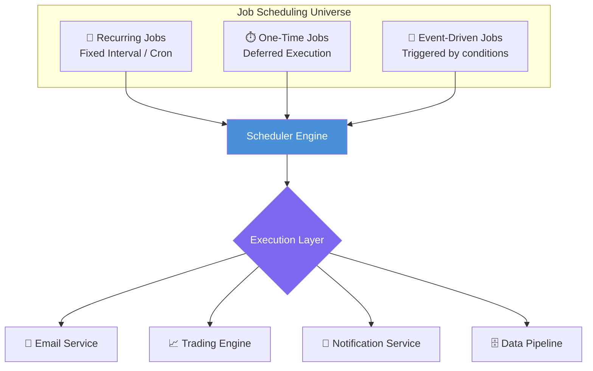
```mermaid
flowchart TD
    subgraph "Job Scheduling Universe"
        A[📅 Recurring Jobs\nFixed Interval / Cron] 
        B[⏱️ One-Time Jobs\nDeferred Execution]
        C[🔁 Event-Driven Jobs\nTriggered by conditions]
    end

    A --> D[Scheduler Engine]
    B --> D
    C --> D

    D --> E{Execution Layer}

    E --> F[📧 Email Service]
    E --> G[📈 Trading Engine]
    E --> H[🔔 Notification Service]
    E --> I[🗄️ Data Pipeline]

    style D fill:#4A90D9,color:#fff
    style E fill:#7B68EE,color:#fff
```

---

## 4. Stage 1 — Cron Jobs: Simple & Effective at Small Scale

### What Is a Cron Job?

A **cron job** is a time-based job scheduler built into Unix/Linux operating systems. It uses a specific syntax to define when a job should run.

### Cron Syntax Explained

```
┌───────────── minute (0–59)
│ ┌───────────── hour (0–23)
│ │ ┌───────────── day of month (1–31)
│ │ │ ┌───────────── month (1–12)
│ │ │ │ ┌───────────── day of week (0–6, Sunday=0)
│ │ │ │ │
* * * * *  command_to_execute
```

### Example: Trading Application Cron Setup

```bash
# Fetch market data every day at 9:30 AM (market open)
30 9 * * 1-5  /usr/bin/java -jar market-data-fetcher.jar

# Send daily email summaries at 6:00 PM
0 18 * * 1-5  /usr/bin/java -jar email-notifier.jar

# Process corporate actions every Monday at 8:00 AM
0 8 * * 1     /usr/bin/java -jar corporate-actions.jar

# Renew subscriptions on the 1st of every month at midnight
0 0 1 * *     /usr/bin/java -jar subscription-renewal.jar
```

### Architecture at This Stage

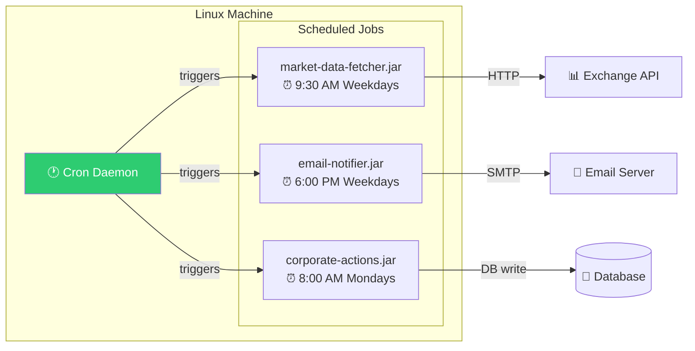
```mermaid
flowchart LR
    subgraph "Linux Machine"
        CRON[🕐 Cron Daemon]
        
        subgraph "Scheduled Jobs"
            J1[market-data-fetcher.jar\n⏰ 9:30 AM Weekdays]
            J2[email-notifier.jar\n⏰ 6:00 PM Weekdays]
            J3[corporate-actions.jar\n⏰ 8:00 AM Mondays]
        end
        
        CRON -->|triggers| J1
        CRON -->|triggers| J2
        CRON -->|triggers| J3
    end

    J1 -->|HTTP| EX[📊 Exchange API]
    J2 -->|SMTP| EM[📧 Email Server]
    J3 -->|DB write| DB[(📁 Database)]

    style CRON fill:#2ECC71,color:#fff
```

### ✅ When Cron Jobs Work Well

- Small number of jobs (< 20)
- Jobs are independent
- Low user base (< 100)
- Each job runs infrequently

### ❌ Limitations of Cron Jobs

| Problem | Description |
|---------|-------------|
| **No monitoring** | No built-in tracking of success/failure |
| **No retry logic** | Failed jobs are silently dropped |
| **Single machine** | If the server crashes, jobs are missed |
| **Maintenance hell** | Managing 50+ cron entries is error-prone |
| **No inter-job dependencies** | Can't express "run B only after A succeeds" |

---

## 5. Stage 2 — ScheduledExecutorService: Centralizing Logic

As the app grows, we consolidate all job logic into a single Java service using `ScheduledExecutorService`.

### What Is ScheduledExecutorService?

Java's `ScheduledExecutorService` provides a thread pool with scheduling capabilities. It supports:
- `schedule()` — run once after a delay
- `scheduleAtFixedRate()` — run repeatedly at a fixed interval
- `scheduleWithFixedDelay()` — run repeatedly with a fixed delay between completions

### Implementation Example

```java
import java.util.concurrent.*;

public class TradingJobScheduler {

    // Create a thread pool with 4 worker threads
    private final ScheduledExecutorService scheduler =
        Executors.newScheduledThreadPool(4);

    public void startJobs() {
        // ✅ Fetch market data every 30 minutes
        scheduler.scheduleAtFixedRate(
            this::fetchMarketData,
            0,          // initial delay
            30,         // period
            TimeUnit.MINUTES
        );

        // ✅ Send daily email at 6 PM
        long delayUntil6PM = computeDelayUntil(18, 0);
        scheduler.scheduleAtFixedRate(
            this::sendDailyEmails,
            delayUntil6PM,
            24,
            TimeUnit.HOURS
        );

        // ✅ Process corporate actions every Monday at 8 AM
        scheduler.scheduleAtFixedRate(
            this::processCorporateActions,
            computeDelayUntilNextMonday(),
            7,
            TimeUnit.DAYS
        );
    }

    private void fetchMarketData() {
        System.out.println("Fetching market data at: " + LocalTime.now());
        // ... actual logic
    }

    private void sendDailyEmails() {
        System.out.println("Sending emails at: " + LocalTime.now());
        // ... actual logic
    }

    private void processCorporateActions() {
        System.out.println("Processing corporate actions at: " + LocalTime.now());
        // ... actual logic
    }
}
```

### How ScheduledExecutorService Works Internally

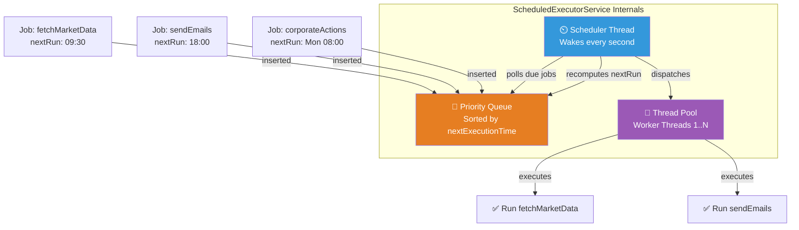
```mermaid
flowchart TD
    subgraph "ScheduledExecutorService Internals"
        PQ[🔢 Priority Queue\nSorted by nextExecutionTime]
        ST[⏲️ Scheduler Thread\nWakes every second]
        TP[🧵 Thread Pool\nWorker Threads 1..N]
    end

    J1[Job: fetchMarketData\nnextRun: 09:30] -->|inserted| PQ
    J2[Job: sendEmails\nnextRun: 18:00] -->|inserted| PQ
    J3[Job: corporateActions\nnextRun: Mon 08:00] -->|inserted| PQ

    ST -->|polls due jobs| PQ
    ST -->|dispatches| TP

    TP -->|executes| R1[✅ Run fetchMarketData]
    TP -->|executes| R2[✅ Run sendEmails]

    ST -->|recomputes nextRun| PQ

    style PQ fill:#E67E22,color:#fff
    style ST fill:#3498DB,color:#fff
    style TP fill:#9B59B6,color:#fff
```

### ✅ Advantages Over Cron

- All jobs in one place (single deployment)
- Easier to monitor with logging
- Can share database connections and resources
- Retry logic can be implemented per job
- Thread pool is configurable

### ❌ New Limitations

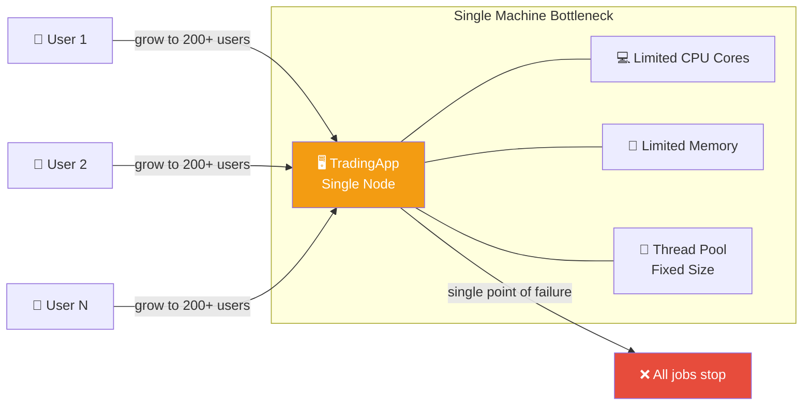
```mermaid
flowchart LR
    subgraph "Single Machine Bottleneck"
        APP[🖥️ TradingApp\nSingle Node]
        CPU[💻 Limited CPU Cores]
        MEM[🧠 Limited Memory]
        TP[🧵 Thread Pool\nFixed Size]
    end

    U1[👤 User 1]
    U2[👤 User 2]
    UN[👤 User N]

    U1 & U2 & UN -->|grow to 200+ users| APP
    APP --- CPU
    APP --- MEM
    APP --- TP

    APP -->|single point of failure| FAIL[❌ All jobs stop]

    style FAIL fill:#E74C3C,color:#fff
    style APP fill:#F39C12,color:#fff
```

**Thread count dilemma:** Too few threads → jobs queue up and run late. Too many threads → context switching overhead degrades performance.

**Rule of thumb for thread pool sizing:**
- **CPU-bound tasks:** `N_threads = N_cores + 1`
- **I/O-bound tasks:** `N_threads = N_cores × (1 + Wait_time / Service_time)`

---

## 6. Stage 3 — Multi-Node Deployment: The Correctness Crisis

### The Naive Solution: Just Add More Servers

When a single machine is the bottleneck, the instinct is to deploy multiple instances:

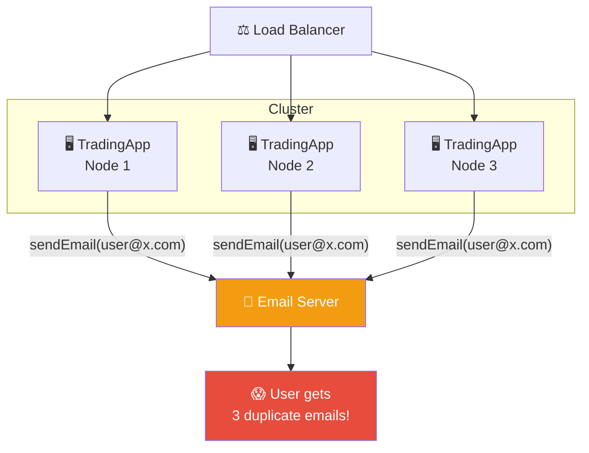
```mermaid
flowchart TD
    LB[⚖️ Load Balancer]
    
    subgraph "Cluster"
        N1[🖥️ TradingApp\nNode 1]
        N2[🖥️ TradingApp\nNode 2]
        N3[🖥️ TradingApp\nNode 3]
    end

    LB --> N1 & N2 & N3

    N1 -->|"sendEmail(user@x.com)"| ES[📧 Email Server]
    N2 -->|"sendEmail(user@x.com)"| ES
    N3 -->|"sendEmail(user@x.com)"| ES

    ES --> RESULT[😱 User gets\n3 duplicate emails!]

    style RESULT fill:#E74C3C,color:#fff
    style ES fill:#F39C12,color:#fff
```

### The Duplicate Execution Problem

Each node runs its own internal scheduler. They all wake up at the same time and independently trigger the same job.

**Real-world impact in a trading app:**
- A user receives **3 duplicate order confirmations**
- The same market order is placed **3 times** → financial loss
- Account balance is debited **multiple times** for a subscription renewal

This is the **correctness problem**: without coordination, distributed schedulers execute the same job multiple times.

---

## 7. Stage 4 — Job Scheduler with Distributed Locking

### The Solution: Shared State + Mutual Exclusion

The fix is to use a **shared database** as the source of truth. Each job has a state, and only one node can transition that state from `SCHEDULED → RUNNING` at a time.

### Job State Machine

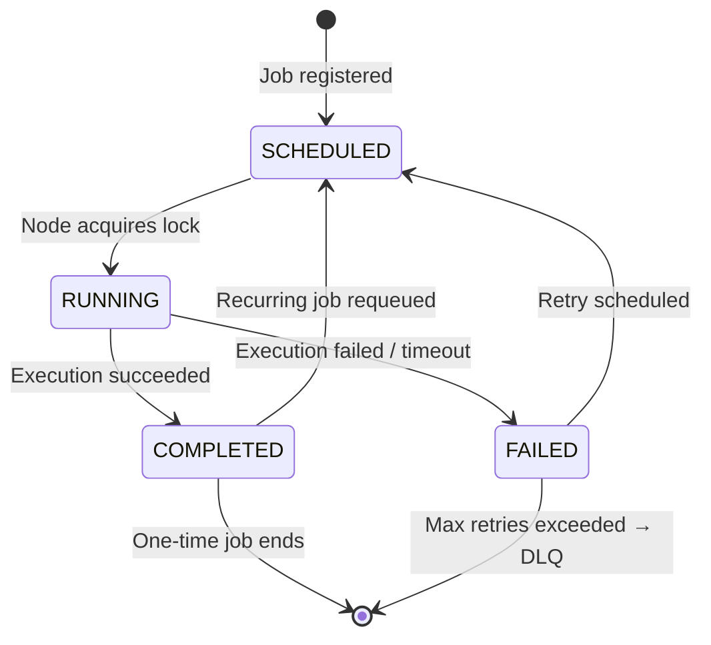
```mermaid
stateDiagram-v2
    [*] --> SCHEDULED : Job registered
    SCHEDULED --> RUNNING : Node acquires lock
    RUNNING --> COMPLETED : Execution succeeded
    RUNNING --> FAILED : Execution failed / timeout
    FAILED --> SCHEDULED : Retry scheduled
    COMPLETED --> SCHEDULED : Recurring job requeued
    COMPLETED --> [*] : One-time job ends
    FAILED --> [*] : Max retries exceeded → DLQ
```

### Database Schema

```sql
CREATE TABLE jobs (
    job_id          VARCHAR(36)   PRIMARY KEY,
    name            VARCHAR(255)  NOT NULL,
    cron_expression VARCHAR(100),          -- e.g., "0 18 * * 1-5"
    job_type        VARCHAR(50)   NOT NULL, -- RECURRING / ONE_TIME
    handler_class   VARCHAR(255)  NOT NULL,
    status          VARCHAR(20)   DEFAULT 'SCHEDULED',
    next_exec_time  TIMESTAMP     NOT NULL,
    last_exec_time  TIMESTAMP,
    locked_by       VARCHAR(100),          -- node that holds the lock
    lock_expires_at TIMESTAMP,
    retry_count     INT           DEFAULT 0,
    max_retries     INT           DEFAULT 3,
    created_at      TIMESTAMP     DEFAULT NOW()
);

-- Critical index for efficient polling
CREATE INDEX idx_jobs_next_exec ON jobs (status, next_exec_time);
```

### Locking Flow (Mutual Exclusion)

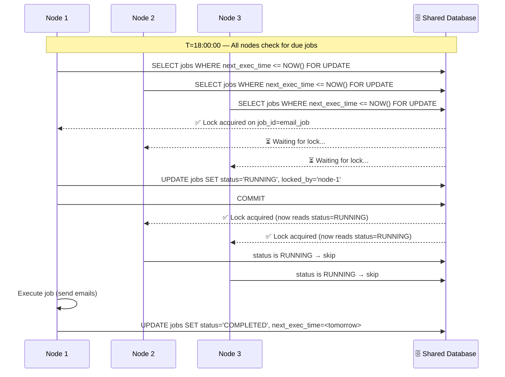
```mermaid
sequenceDiagram
    participant N1 as Node 1
    participant N2 as Node 2
    participant N3 as Node 3
    participant DB as 🗄️ Shared Database

    Note over N1,DB: T=18:00:00 — All nodes check for due jobs

    N1->>DB: SELECT jobs WHERE next_exec_time <= NOW() FOR UPDATE
    N2->>DB: SELECT jobs WHERE next_exec_time <= NOW() FOR UPDATE
    N3->>DB: SELECT jobs WHERE next_exec_time <= NOW() FOR UPDATE

    DB-->>N1: ✅ Lock acquired on job_id=email_job
    DB-->>N2: ⏳ Waiting for lock...
    DB-->>N3: ⏳ Waiting for lock...

    N1->>DB: UPDATE jobs SET status='RUNNING', locked_by='node-1'
    N1->>DB: COMMIT

    DB-->>N2: ✅ Lock acquired (now reads status=RUNNING)
    DB-->>N3: ✅ Lock acquired (now reads status=RUNNING)

    N2->>DB: status is RUNNING → skip
    N3->>DB: status is RUNNING → skip

    N1->>N1: Execute job (send emails)
    N1->>DB: UPDATE jobs SET status='COMPLETED', next_exec_time=<tomorrow>
```

### Java Implementation with Quartz Scheduler

```java
@Component
public class EmailJob implements Job {

    @Override
    public void execute(JobExecutionContext context) throws JobExecutionException {
        String jobKey = context.getJobDetail().getKey().toString();
        System.out.println("Executing job: " + jobKey + " on node: " + getHostname());

        try {
            // Business logic — guaranteed to run exactly once
            emailService.sendDailySummaries();
            System.out.println("Job completed successfully: " + jobKey);
        } catch (Exception e) {
            throw new JobExecutionException("Job failed: " + jobKey, e, true); // true = refire
        }
    }
}

// Quartz configuration with JDBC store for distributed locking
@Configuration
public class QuartzConfig {

    @Bean
    public SchedulerFactoryBean schedulerFactory(DataSource dataSource) {
        SchedulerFactoryBean factory = new SchedulerFactoryBean();
        factory.setDataSource(dataSource);

        Properties props = new Properties();
        // Use JDBC store to share job state across cluster nodes
        props.put("org.quartz.jobStore.class",
                  "org.quartz.impl.jdbcjobstore.JobStoreTX");
        props.put("org.quartz.jobStore.isClustered", "true");
        props.put("org.quartz.jobStore.clusterCheckinInterval", "5000");
        // Limit cluster size to avoid DB contention (Quartz recommendation)
        props.put("org.quartz.threadPool.threadCount", "10");

        factory.setQuartzProperties(props);
        return factory;
    }
}
```

### ⚠️ The Hard Limit of This Approach

Quartz's documentation recommends **3–5 nodes maximum** in a cluster. Why?

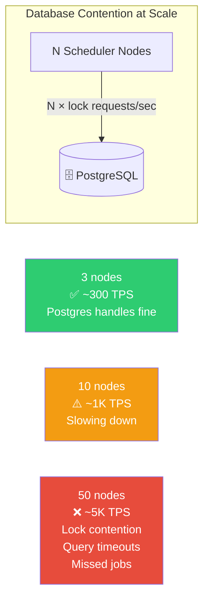
```mermaid
flowchart LR
    subgraph "Database Contention at Scale"
        direction TB
        N[N Scheduler Nodes]
        DB[(🗄️ PostgreSQL)]
        
        N -->|"N × lock requests/sec"| DB
    end

    SMALL["3 nodes\n✅ ~300 TPS\nPostgres handles fine"] 
    MED["10 nodes\n⚠️ ~1K TPS\nSlowing down"]
    LARGE["50 nodes\n❌ ~5K TPS\nLock contention\nQuery timeouts\nMissed jobs"]

    style SMALL fill:#2ECC71,color:#fff
    style MED fill:#F39C12,color:#fff
    style LARGE fill:#E74C3C,color:#fff
```

**PostgreSQL can handle ~3,000–10,000 TPS under normal load.** With 200,000 jobs/second, this is completely untenable.

---

## 8. Core Principles: Jobs vs. Triggers & the Priority Queue

Before scaling further, understand the fundamental data structures powering every scheduler.

### 8.1 Job vs. Trigger: A Critical Distinction

| Concept | Definition | Example |
|---------|-----------|---------|
| **Job** | *What* to run and *how often* | "Send email summary every day at 6 PM" |
| **Trigger** | A *specific scheduled execution* of a job | "Send email summary at 6 PM on June 10, 2026" |

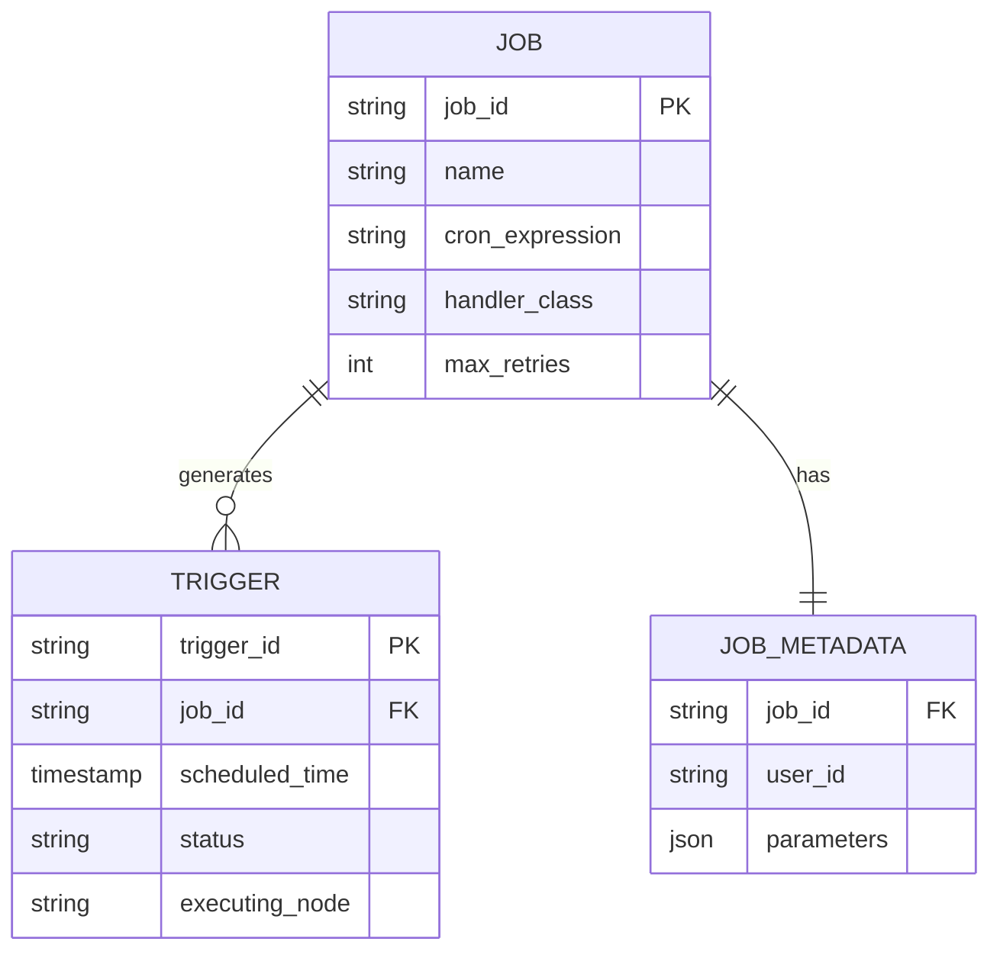
```mermaid
erDiagram
    JOB {
        string job_id PK
        string name
        string cron_expression
        string handler_class
        int max_retries
    }

    TRIGGER {
        string trigger_id PK
        string job_id FK
        timestamp scheduled_time
        string status
        string executing_node
    }

    JOB_METADATA {
        string job_id FK
        string user_id
        json   parameters
    }

    JOB ||--o{ TRIGGER : "generates"
    JOB ||--|| JOB_METADATA : "has"
```

**Why this distinction matters:**
- One `Job` definition → many `Trigger` instances over time
- A trigger can fail without invalidating the job
- Different users can share the same job definition but have different trigger times

### 8.2 The Priority Queue at the Heart of Every Scheduler

Every scheduler — from cron to Kubernetes — uses a **min-heap priority queue** where jobs are sorted by `nextExecutionTime`.

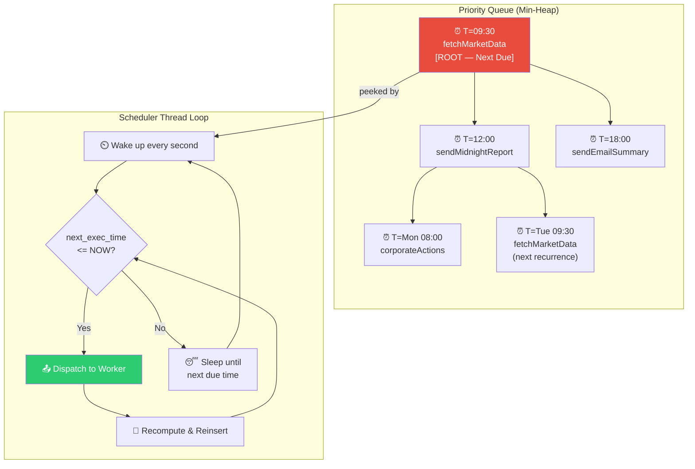
```mermaid
flowchart TD
    subgraph "Priority Queue (Min-Heap)"
        ROOT["⏰ T=09:30\nfetchMarketData\n[ROOT — Next Due]"]
        L1["⏰ T=12:00\nsendMidnightReport"]
        R1["⏰ T=18:00\nsendEmailSummary"]
        LL["⏰ T=Mon 08:00\ncorporateActions"]
        LR["⏰ T=Tue 09:30\nfetchMarketData\n(next recurrence)"]

        ROOT --> L1 & R1
        L1 --> LL & LR
    end

    subgraph "Scheduler Thread Loop"
        WAKE[⏲️ Wake up every second]
        CHECK{next_exec_time\n<= NOW?}
        DISPATCH[📤 Dispatch to Worker]
        REINSERT[🔄 Recompute & Reinsert]
        SLEEP[😴 Sleep until\nnext due time]

        WAKE --> CHECK
        CHECK -->|Yes| DISPATCH
        DISPATCH --> REINSERT
        REINSERT --> CHECK
        CHECK -->|No| SLEEP
        SLEEP --> WAKE
    end

    ROOT -->|peeked by| WAKE

    style ROOT fill:#E74C3C,color:#fff
    style DISPATCH fill:#2ECC71,color:#fff
```

### 8.3 Pseudocode: The Scheduler Loop

```python
class Scheduler:
    def __init__(self):
        self.priority_queue = MinHeap(key=lambda job: job.next_exec_time)
        self.worker_pool = ThreadPool(size=N)

    def run(self):
        while True:
            now = current_time()

            # Collect all due jobs
            due_jobs = []
            while not self.priority_queue.empty():
                next_job = self.priority_queue.peek()
                if next_job.next_exec_time <= now:
                    due_jobs.append(self.priority_queue.pop())
                else:
                    break  # remaining jobs are in the future

            # Dispatch to workers
            for job in due_jobs:
                self.worker_pool.submit(job.execute)

                # Reinsert recurring job with updated execution time
                if job.is_recurring:
                    job.next_exec_time = compute_next_run(job.cron_expression, now)
                    self.priority_queue.insert(job)

            # Sleep until the next job is due
            if not self.priority_queue.empty():
                sleep_duration = self.priority_queue.peek().next_exec_time - now
                sleep(max(0, sleep_duration))
            else:
                sleep(1_second)
```

---

## 9. Stage 5 — The Distributed Scheduler: Decoupling at Scale

### The Core Problem: Tight Coupling

At 200,000 users, "send emails at midnight" means **200,000 email tasks** in a single second. A monolithic scheduler trying to both *schedule* and *execute* all 200,000 tasks will always be the bottleneck.

**The insight:** Scheduling (deciding *when*) and Execution (doing the *work*) are two fundamentally different concerns with different scaling requirements.

### Decoupling with a Message Queue

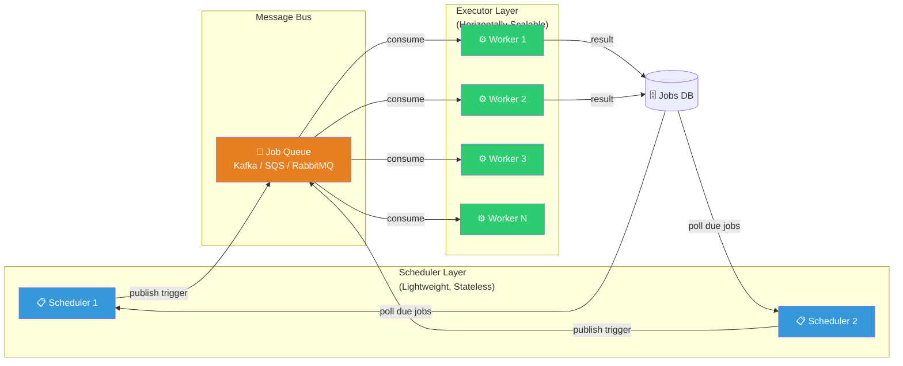
```mermaid
flowchart LR
    subgraph "Scheduler Layer\n(Lightweight, Stateless)"
        S1[📋 Scheduler 1]
        S2[📋 Scheduler 2]
    end

    subgraph "Message Bus"
        Q1[📨 Job Queue\nKafka / SQS / RabbitMQ]
    end

    subgraph "Executor Layer\n(Horizontally Scalable)"
        W1[⚙️ Worker 1]
        W2[⚙️ Worker 2]
        W3[⚙️ Worker 3]
        WN[⚙️ Worker N]
    end

    DB[(🗄️ Jobs DB)] -->|poll due jobs| S1
    DB -->|poll due jobs| S2

    S1 -->|publish trigger| Q1
    S2 -->|publish trigger| Q1

    Q1 -->|consume| W1
    Q1 -->|consume| W2
    Q1 -->|consume| W3
    Q1 -->|consume| WN

    W1 -->|result| DB
    W2 -->|result| DB

    style S1 fill:#3498DB,color:#fff
    style S2 fill:#3498DB,color:#fff
    style Q1 fill:#E67E22,color:#fff
    style W1 fill:#2ECC71,color:#fff
    style W2 fill:#2ECC71,color:#fff
    style W3 fill:#2ECC71,color:#fff
    style WN fill:#2ECC71,color:#fff
```

### Message Payload Design

```json
{
  "triggerId": "trig-550e8400-e29b-41d4-a716",
  "jobId": "job-email-daily-summary",
  "scheduledTime": "2026-06-10T18:00:00Z",
  "enqueuedAt": "2026-06-10T17:59:59.800Z",
  "jobType": "SEND_EMAIL_SUMMARY",
  "parameters": {
    "userSegment": "ALL_ACTIVE",
    "templateId": "daily-summary-v3"
  },
  "retryCount": 0,
  "maxRetries": 3,
  "partition": 42
}
```

### Choosing the Right Queue

| Queue | Best For | Throughput | Ordering | Replay |
|-------|---------|-----------|---------|--------|
| **Apache Kafka** | High-throughput, replayable, event-driven | Very High (1M+/sec) | Per partition | ✅ Yes |
| **Amazon SQS** | Cloud-native, simple, managed | High (~300K/sec) | FIFO optional | ❌ No |
| **RabbitMQ** | Complex routing, low latency | Medium (~50K/sec) | Per queue | ❌ No |
| **Redis Streams** | Ultra-low latency, simple setup | High | Per stream | ✅ Yes |

**For a trading application at high scale → Kafka** is the natural choice:
- Supports replay for debugging missed jobs
- Partition-based parallelism aligns with the scheduler's partitioning model
- Durable, high-throughput, and battle-tested at scale

---

## 10. Stage 6 — Job Isolation: Dedicated Queues per Feature

### The Head-of-Line Blocking Problem

Without isolation, a flood of one job type starves other job types:

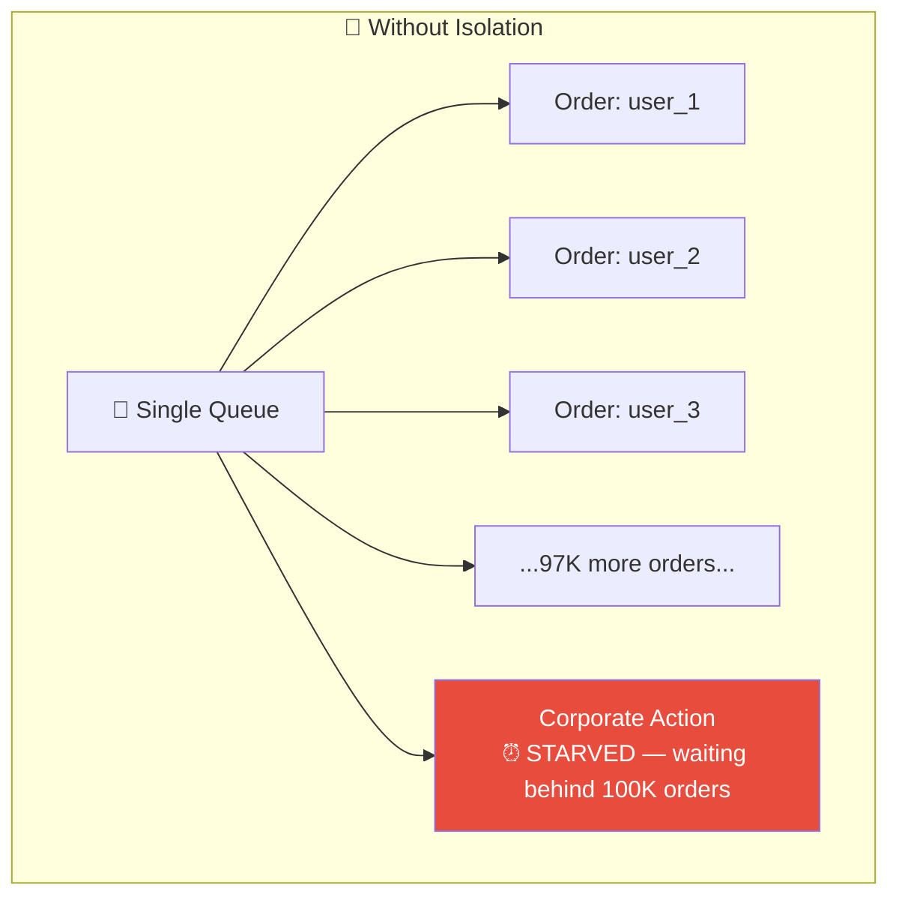
```mermaid
flowchart TD
    subgraph "🚨 Without Isolation"
        SINGLE[📨 Single Queue]
        SINGLE --> M1[Order: user_1]
        SINGLE --> M2[Order: user_2]
        SINGLE --> M3[Order: user_3]
        SINGLE --> M4[...97K more orders...]
        SINGLE --> M5[Corporate Action\n⏰ STARVED — waiting behind 100K orders]
        
        style M5 fill:#E74C3C,color:#fff
    end
```

### Solution: Dedicated Queues + Worker Pools

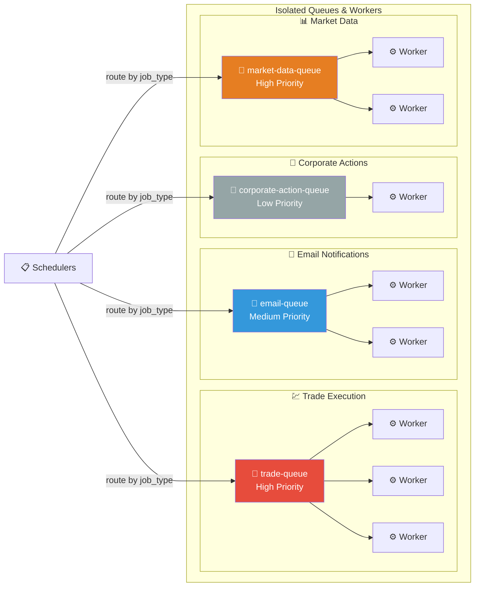
```mermaid
flowchart LR
    SCHED[📋 Schedulers]

    subgraph "Isolated Queues & Workers"
        direction TB
        
        subgraph "💹 Trade Execution"
            TQ[📨 trade-queue\nHigh Priority]
            TW1[⚙️ Worker] & TW2[⚙️ Worker] & TW3[⚙️ Worker]
            TQ --> TW1 & TW2 & TW3
        end

        subgraph "📧 Email Notifications"
            EQ[📨 email-queue\nMedium Priority]
            EW1[⚙️ Worker] & EW2[⚙️ Worker]
            EQ --> EW1 & EW2
        end

        subgraph "🏢 Corporate Actions"
            CAQ[📨 corporate-action-queue\nLow Priority]
            CAW1[⚙️ Worker]
            CAQ --> CAW1
        end

        subgraph "📊 Market Data"
            MDQ[📨 market-data-queue\nHigh Priority]
            MDW1[⚙️ Worker] & MDW2[⚙️ Worker]
            MDQ --> MDW1 & MDW2
        end
    end

    SCHED -->|route by job_type| TQ & EQ & CAQ & MDQ

    style TQ fill:#E74C3C,color:#fff
    style EQ fill:#3498DB,color:#fff
    style CAQ fill:#95A5A6,color:#fff
    style MDQ fill:#E67E22,color:#fff
```

### Worker Scaling Policies per Queue

```yaml
# Kubernetes HPA configuration per worker type
---
apiVersion: autoscaling/v2
kind: HorizontalPodAutoscaler
metadata:
  name: trade-execution-workers
spec:
  scaleTargetRef:
    name: trade-execution-worker
  minReplicas: 3
  maxReplicas: 100
  metrics:
  - type: External
    external:
      metric:
        name: kafka_consumer_lag
        selector:
          matchLabels:
            queue: trade-execution-queue
      target:
        type: AverageValue
        averageValue: 1000  # scale up if lag > 1000 messages per pod

---
apiVersion: autoscaling/v2
kind: HorizontalPodAutoscaler
metadata:
  name: corporate-action-workers
spec:
  scaleTargetRef:
    name: corporate-action-worker
  minReplicas: 1
  maxReplicas: 5  # Corporate actions are rare — keep small
```

### Dead Letter Queue (DLQ) for Failed Jobs

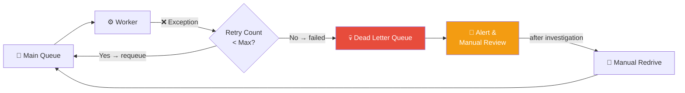
```mermaid
flowchart LR
    Q[📨 Main Queue]
    W[⚙️ Worker]
    RETRY{Retry Count\n< Max?}
    DLQ[💀 Dead Letter Queue]
    ALERT[🚨 Alert &\nManual Review]
    REDRIVE[🔄 Manual Redrive]

    Q --> W
    W -->|❌ Exception| RETRY
    RETRY -->|Yes → requeue| Q
    RETRY -->|No → failed| DLQ
    DLQ --> ALERT
    ALERT -->|after investigation| REDRIVE
    REDRIVE --> Q

    style DLQ fill:#E74C3C,color:#fff
    style ALERT fill:#F39C12,color:#fff
```

---

## 11. Stage 7 — Solving the Database Bottleneck: Partitioning

### The Challenge

With hundreds of scheduler instances all querying the same `jobs` table for due triggers, the database becomes the new bottleneck.

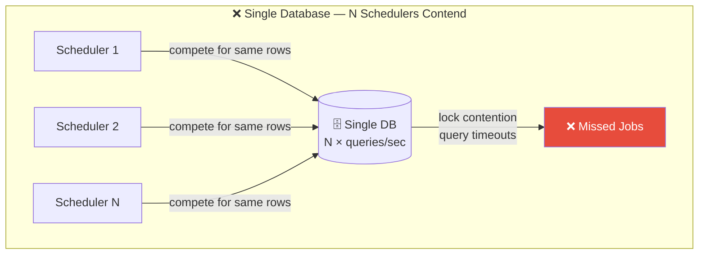
```mermaid
flowchart TD
    subgraph "❌ Single Database — N Schedulers Contend"
        S1[Scheduler 1] & S2[Scheduler 2] & SN[Scheduler N]
        DB[(🗄️ Single DB\nN × queries/sec)]
        S1 & S2 & SN -->|compete for same rows| DB
        DB -->|lock contention\nquery timeouts| FAIL[❌ Missed Jobs]
    end

    style FAIL fill:#E74C3C,color:#fff
```

### The Solution: Horizontal Sharding

**Step 1:** Predetermine a fixed number of partitions (e.g., 100).

**Step 2:** Assign each job to a partition using consistent hashing:
```python
partition_id = hash(job_id) % NUM_PARTITIONS  # e.g., 100
```

**Step 3:** Assign partitions to scheduler instances:
```
Scheduler-1  → partitions 0–9
Scheduler-2  → partitions 10–19
...
Scheduler-10 → partitions 90–99
```

### Partitioned Data Model (Cassandra)

```sql
-- Cassandra table: partition key on (partition_id)
-- Clustering key on (next_exec_time) for efficient time-range scans

CREATE TABLE job_triggers (
    partition_id    INT,
    next_exec_time  TIMESTAMP,
    job_id          UUID,
    trigger_id      UUID,
    job_type        TEXT,
    parameters      TEXT,   -- JSON
    status          TEXT,
    PRIMARY KEY ((partition_id), next_exec_time, trigger_id)
) WITH CLUSTERING ORDER BY (next_exec_time ASC);
```

**Why Cassandra?**
- Native horizontal partitioning
- Efficient time-ordered reads within a partition
- Linear scalability — add nodes to increase throughput
- Built-in replication for fault tolerance

### Full Distributed Architecture

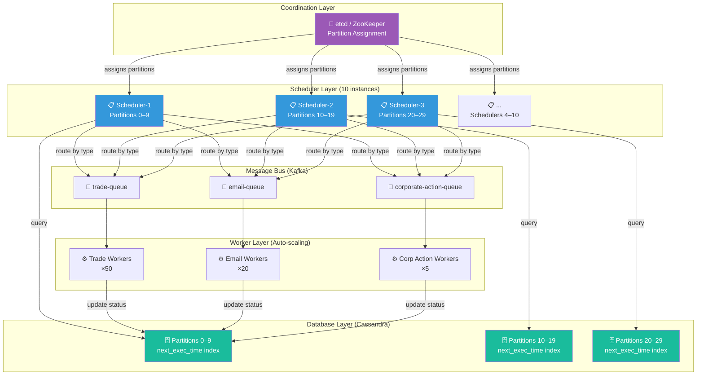
```mermaid
flowchart TD
    subgraph "Coordination Layer"
        ETCD[🔗 etcd / ZooKeeper\nPartition Assignment]
    end

    subgraph "Scheduler Layer (10 instances)"
        SC1[📋 Scheduler-1\nPartitions 0–9]
        SC2[📋 Scheduler-2\nPartitions 10–19]
        SC3[📋 Scheduler-3\nPartitions 20–29]
        SCD[📋 ...\nSchedulers 4–10]
    end

    subgraph "Database Layer (Cassandra)"
        P0["🗄️ Partitions 0–9\nnext_exec_time index"]
        P1["🗄️ Partitions 10–19\nnext_exec_time index"]
        P2["🗄️ Partitions 20–29\nnext_exec_time index"]
    end

    subgraph "Message Bus (Kafka)"
        KT[📨 trade-queue]
        KE[📨 email-queue]
        KCA[📨 corporate-action-queue]
    end

    subgraph "Worker Layer (Auto-scaling)"
        TW[⚙️ Trade Workers\n×50]
        EW[⚙️ Email Workers\n×20]
        CAW[⚙️ Corp Action Workers\n×5]
    end

    ETCD -->|assigns partitions| SC1 & SC2 & SC3 & SCD

    SC1 -->|query| P0
    SC2 -->|query| P1
    SC3 -->|query| P2

    SC1 & SC2 & SC3 -->|route by type| KT & KE & KCA

    KT --> TW
    KE --> EW
    KCA --> CAW

    TW & EW & CAW -->|update status| P0

    style ETCD fill:#9B59B6,color:#fff
    style SC1 fill:#3498DB,color:#fff
    style SC2 fill:#3498DB,color:#fff
    style SC3 fill:#3498DB,color:#fff
    style P0 fill:#1ABC9C,color:#fff
    style P1 fill:#1ABC9C,color:#fff
    style P2 fill:#1ABC9C,color:#fff
```

### Hot Partition Problem & Mitigation

A "hot partition" occurs when many jobs cluster around the same `next_exec_time` (e.g., midnight).

```
Problem: At midnight, 200,000 jobs all have next_exec_time = 00:00:00
         → All schedulers flood their respective partitions simultaneously
         → Uneven load

Solution 1: Time jitter — spread execution within a small window
    next_exec_time = midnight + random(0, 60) seconds

Solution 2: Time-bucket partitioning
    partition_id = (job_category_hash + minute_bucket) % NUM_PARTITIONS

Solution 3: Priority tiers — high-priority jobs in fewer, dedicated partitions
```

### Scheduler Fault Tolerance with etcd

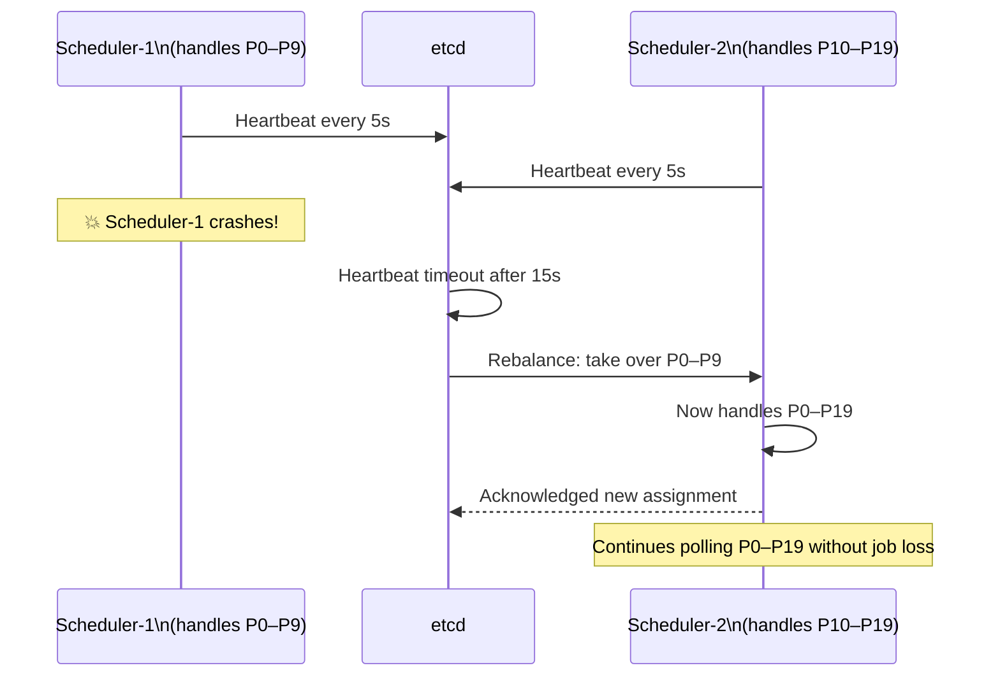
```mermaid
sequenceDiagram
    participant SC1 as Scheduler-1\n(handles P0–P9)
    participant ETCD as etcd
    participant SC2 as Scheduler-2\n(handles P10–P19)

    SC1->>ETCD: Heartbeat every 5s
    SC2->>ETCD: Heartbeat every 5s

    Note over SC1: 💥 Scheduler-1 crashes!

    ETCD->>ETCD: Heartbeat timeout after 15s
    ETCD->>SC2: Rebalance: take over P0–P9
    SC2->>SC2: Now handles P0–P19
    SC2-->>ETCD: Acknowledged new assignment

    Note over SC2: Continues polling P0–P19 without job loss
```

---

## 12. Real-World Use Cases

### Use Case 1: E-Commerce Order Management

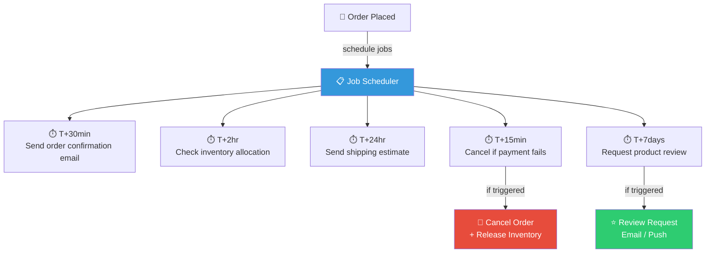
```mermaid
flowchart TD
    ORDER[🛒 Order Placed] -->|schedule jobs| SCHED[📋 Job Scheduler]

    SCHED --> J1["⏱️ T+30min\nSend order confirmation email"]
    SCHED --> J2["⏱️ T+2hr\nCheck inventory allocation"]
    SCHED --> J3["⏱️ T+24hr\nSend shipping estimate"]
    SCHED --> J4["⏱️ T+15min\nCancel if payment fails"]
    SCHED --> J5["⏱️ T+7days\nRequest product review"]

    J4 -->|if triggered| CANCEL[🚫 Cancel Order\n+ Release Inventory]
    J5 -->|if triggered| REVIEW[⭐ Review Request\nEmail / Push]

    style SCHED fill:#3498DB,color:#fff
    style CANCEL fill:#E74C3C,color:#fff
    style REVIEW fill:#2ECC71,color:#fff
```

### Use Case 2: Financial Services


```mermaid
gantt
    title Scheduled Jobs in a Trading Platform (Daily Timeline)
    dateFormat  HH:mm
    axisFormat  %H:%M

    section Market Data
    Pre-market data sync       :08:00, 90m
    Real-time price updates    :09:30, 390m
    Post-market data sync      :16:00, 60m

    section Trading
    Market open order processing :09:30, 30m
    Automated stop-loss checks   :09:30, 390m
    Market close settlements     :16:00, 30m

    section Notifications
    Morning digest emails        :08:00, 30m
    Trade confirmation alerts    :09:30, 390m
    End-of-day summary emails    :18:00, 60m

    section Compliance
    Regulatory report generation :17:00, 60m
    Audit log archival           :23:00, 60m
```

### Use Case 3: SaaS Platform — Subscription Lifecycle

| Job | Trigger | Action |
|-----|---------|--------|
| Trial expiry warning | `trial_end - 3 days` | Email: "Your trial ends soon" |
| Trial ended | `trial_end` | Downgrade to free tier |
| Invoice generation | 1st of every month | Generate & email invoice |
| Payment retry | `payment_failed + 24h` | Retry charge |
| Account suspension | `payment_failed + 7 days` | Suspend account |
| Renewal reminder | `renewal_date - 14 days` | Email: "Renew your plan" |

### Use Case 4: Social Media Platform

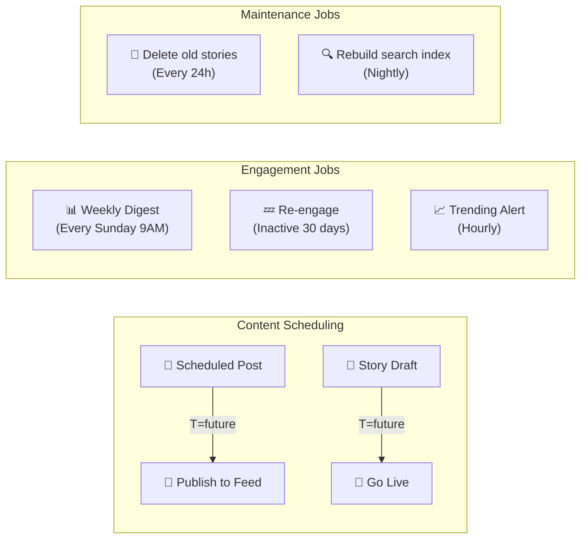
```mermaid
flowchart LR
    subgraph "Content Scheduling"
        POST[📝 Scheduled Post] -->|T=future| PUBLISH[📢 Publish to Feed]
        STORY[📸 Story Draft] -->|T=future| LIVESTORY[🔴 Go Live]
    end

    subgraph "Engagement Jobs"
        DIGEST["📊 Weekly Digest\n(Every Sunday 9AM)"]
        INACTIVE["💤 Re-engage\n(Inactive 30 days)"]
        TRENDING["📈 Trending Alert\n(Hourly)"]
    end

    subgraph "Maintenance Jobs"
        CLEANUP["🧹 Delete old stories\n(Every 24h)"]
        INDEX["🔍 Rebuild search index\n(Nightly)"]
    end
```

---

## 13. Architecture Evolution Summary

```mermaid
flowchart TD
    subgraph "Stage 1: Cron"
        C1[🖥️ Linux Machine]
        C2[📋 Cron Daemon]
        C3[📜 job1.sh\njob2.sh]
        C1 --- C2 --- C3
    end

    subgraph "Stage 2: Centralized"
        D1[🖥️ Single Java App]
        D2[🧵 ScheduledExecutorService]
        D3[📦 All jobs in one\nthread pool]
        D1 --- D2 --- D3
    end

    subgraph "Stage 3: Multi-Node"
        E1[🖥️ Node 1]
        E2[🖥️ Node 2]
        E3[🗄️ Shared DB\n+ Locking]
        E1 & E2 --- E3
    end

    subgraph "Stage 4: Decoupled"
        F1[📋 Scheduler]
        F2[📨 Message Queue]
        F3[⚙️⚙️⚙️ Worker Pool]
        F1 --> F2 --> F3
    end

    subgraph "Stage 5: Fully Distributed"
        G1[📋📋 Scheduler Cluster\n+ Partition Assignment]
        G2[📨📨 Isolated Queues\nper Feature]
        G3[⚙️×N Workers\nAuto-scaling]
        G4[🗄️ Sharded DB\nCassandra]
        G1 --> G2 --> G3
        G1 <--> G4
    end

    C1 -->|"Growing\nRequirements"| D1
    D1 -->|"User\nGrowth"| E1
    E1 -->|"10K+\nJobs/sec"| F1
    F1 -->|"100K+\nJobs/sec"| G1

    style C1 fill:#BDC3C7,color:#333
    style D1 fill:#85C1E9,color:#333
    style E1 fill:#82E0AA,color:#333
    style F1 fill:#F8C471,color:#333
    style G1 fill:#F1948A,color:#333
```

---

## 14. Comparison Table: Approaches at a Glance

| Dimension | Cron | ScheduledExecutor | Quartz (Multi-node) | Distributed Scheduler |
|-----------|------|------------------|---------------------|----------------------|
| **Max Jobs/sec** | < 10 | ~100 | ~1,000 | ~100,000+ |
| **Exactly-once** | ❌ No | ❌ No | ✅ Yes | ✅ Yes |
| **Fault tolerant** | ❌ No | ❌ No | ⚠️ Partial | ✅ Yes |
| **Horizontal scale** | ❌ No | ❌ No | ⚠️ Limited (3–5 nodes) | ✅ Yes |
| **Job isolation** | ✅ Yes | ❌ No | ❌ No | ✅ Yes |
| **Monitoring** | ❌ Manual | ⚠️ Custom | ⚠️ Custom | ✅ Built-in |
| **Retry/DLQ** | ❌ No | ⚠️ Custom | ⚠️ Custom | ✅ Yes |
| **Complexity** | Low | Low | Medium | High |
| **Database needed** | ❌ No | ❌ No | ✅ Relational | ✅ Distributed DB |
| **Examples** | Linux cron | Java apps | Spring Batch | Uber Cadence, Temporal, AWS EventBridge |

---

## 15. Key Takeaways & Best Practices

### The Three Core Principles

```mermaid
mindmap
  root((Distributed\nScheduler\nDesign))
    Correctness
      Distributed locking
      Exactly-once execution
      State machine per job
      Idempotent job handlers
    Scale
      Decouple scheduling\nfrom execution
      Partition job data
      Isolate queues\nper job type
      Auto-scale workers\nindependently
    Resilience
      Dead Letter Queues
      Automatic retries\nwith backoff
      Scheduler failover\nvia etcd/ZooKeeper
      Heartbeat monitoring
```

### Best Practices Checklist

**Designing the Data Model**
- [ ] Always index `next_exec_time` — this is your most-read column
- [ ] Store triggers separately from job definitions
- [ ] Include `idempotency_key` in every trigger to prevent accidental duplicates
- [ ] Design job handlers to be **idempotent** (safe to run twice)

**Choosing the Message Queue**
- [ ] Use **Kafka** for high-throughput, replayable job streams
- [ ] Use **SQS** for managed, cloud-native simplicity
- [ ] Always configure a **Dead Letter Queue** with alerting
- [ ] Set appropriate **visibility timeouts** to handle worker crashes

**Operational Concerns**
- [ ] Monitor **consumer lag** per queue as your primary scaling signal
- [ ] Set up **hot partition alerts** (disproportionately large partition sizes)
- [ ] Test **scheduler failover** regularly in staging
- [ ] Implement **gradual rollout** for new job types (shadow mode first)

### The Golden Question for Every Job Scheduler Design

> **"What scales first — the scheduler, the executor, or the database?"**

- Scheduler bottleneck → add partitions + scheduler instances
- Executor bottleneck → add workers / increase thread pool
- Database bottleneck → shard the data / migrate to Cassandra

Finding the answer reveals where to invest your engineering effort next.

---

## 📚 Further Reading & Tools

| Tool | Category | Use When |
|------|----------|----------|
| **Temporal** | Distributed Workflow | Complex multi-step job orchestration |
| **Cadence (Uber)** | Distributed Workflow | Long-running, stateful workflows |
| **Quartz** | Java Scheduler | Java apps needing multi-node scheduling |
| **Spring Batch** | Batch Processing | ETL pipelines, data processing |
| **AWS EventBridge** | Cloud Scheduler | Cloud-native, serverless scheduling |
| **Airflow** | DAG Scheduler | Data pipeline scheduling with dependencies |
| **Celery Beat** | Python Scheduler | Python microservices |
| **Sidekiq** | Ruby Scheduler | Ruby on Rails background jobs |

---
