# Multi-Region Architecture - Complete Guide

> **Difficulty Level:** ⚡ Intermediate  
> **Estimated Reading Time:** 25-30 minutes  
> **Last Updated:** June 2025

---

## 📚 Table of Contents

1. [Introduction](#introduction)
2. [Prerequisites](#prerequisites)
3. [Learning Objectives](#learning-objectives)
4. [Regions and Availability Zones](#1-regions-and-availability-zones)
5. [Compute Clones vs Data](#2-compute-clones-easily-data-does-not)
6. [Synchronous vs Asynchronous Replication](#3-synchronous-vs-asynchronous-replication)
7. [Read Timeline and Consistency Models](#4-read-timeline)
8. [Geo-Routing Strategies](#5-geo-routing)
9. [Active-Passive with Failover](#6-active-passive-with-failover-and-failback)
10. [Implementation Guide](#implementation-guide)
11. [Best Practices](#best-practices)
12. [Anti-Patterns to Avoid](#anti-patterns-to-avoid)
13. [Practice Exercises](#practice-exercises)
14. [Question Bank](#question-bank)
15. [Real-World Case Studies](#real-world-case-studies)
16. [Summary & Key Takeaways](#summary--key-takeaways)
17. [Further Reading](#further-reading)

---

## 🎯 Introduction

### What is Multi-Region Architecture?

Multi-Region Architecture is a distributed system design pattern that deploys applications and data across multiple geographic locations (regions) to achieve **high availability**, **fault tolerance**, and **low latency** for global users.

Think of it like having multiple branches of your business across the world - if one location has a problem, others can continue serving customers seamlessly.

### Why Multi-Region Architecture Matters

💡 **The Modern Reality:**
- Users expect sub-100ms response times regardless of location
- Outages cost businesses millions per hour
- Data residency regulations require geographic data placement
- Global user bases demand local presence

🌍 **Real-World Impact:**
- **Netflix:** Serves 200M+ users across 190+ countries with 99.99% availability
- **Amazon:** Operates in 31 geographic regions with 99 availability zones
- **Google:** Runs services from 40+ regions worldwide

### When to Use Multi-Region Architecture

✅ **Use when:**
- Serving global user base with latency requirements
- Need 99.99%+ availability (four nines or higher)
- Compliance requires data residency in specific countries
- Business continuity is critical
- Peak traffic varies by geography

❌ **Avoid when:**
- User base is concentrated in single region
- Budget constraints limit infrastructure costs
- Team lacks distributed systems expertise
- Application is not designed for distributed operations
- Data consistency requirements are too strict for distributed systems

---

## 📋 Prerequisites

Before diving into this tutorial, ensure you have:

- ✅ Basic understanding of cloud computing concepts (IaaS, PaaS, SaaS)
- ✅ Familiarity with distributed systems fundamentals
- ✅ Knowledge of databases (SQL/NoSQL) and replication concepts
- ✅ Understanding of networking basics (DNS, HTTP, latency)
- ✅ Experience with at least one cloud provider (AWS, Azure, GCP)
- ✅ Basic knowledge of containerization (Docker) and orchestration (Kubernetes)

---

## 🎓 Learning Objectives

By the end of this tutorial, you will be able to:

1. ✅ Explain the difference between regions and availability zones
2. ✅ Design stateless compute layers that scale across regions
3. ✅ Choose between synchronous and asynchronous replication
4. ✅ Understand consistency models and their trade-offs
5. ✅ Implement geo-routing strategies for optimal user experience
6. ✅ Set up active-passive failover with automatic failback
7. ✅ Identify and avoid common multi-region anti-patterns
8. ✅ Design a production-ready multi-region architecture
9. ✅ Implement monitoring and disaster recovery procedures
10. ✅ Calculate costs and performance implications

---

## 1. Regions and Availability Zones

### Understanding Geographic Distribution

Multi-region architecture starts with understanding the physical infrastructure that makes it possible.

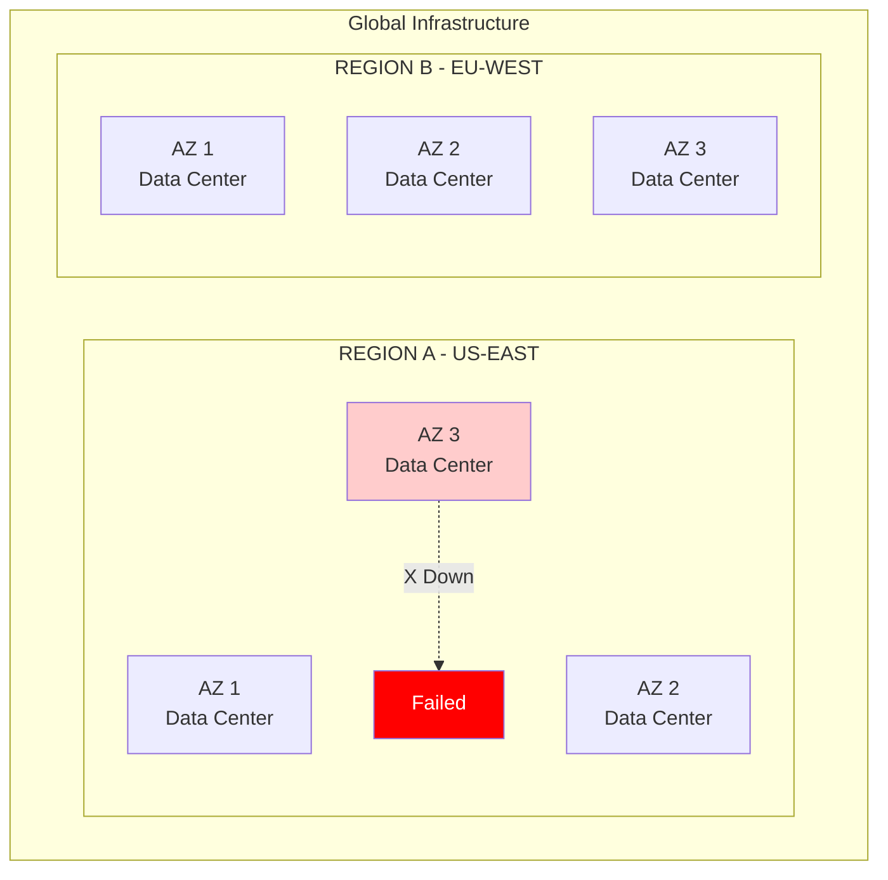

### What is a Region?

A **Region** is a geographic location containing multiple isolated data centers called Availability Zones.

**Key Characteristics:**
- 🌍 **Geographic Isolation:** Typically 100+ miles apart
- 🌐 **Independent Infrastructure:** Separate power, cooling, networking
- 📡 **Low Latency Interconnect:** High-speed fiber connections between AZs (1-2ms latency)
- 🏷️ **Named Locations:** e.g., `us-east-1`, `eu-west-1`, `ap-southeast-1`

### What is an Availability Zone (AZ)?

An **Availability Zone** is an isolated location within a region, consisting of one or more data centers.

**Key Characteristics:**
- 🏢 **Physical Separation:** Different buildings, different flood plains
- ⚡ **Independent Power:** Separate power grids and backup generators
- 🌐 **Unique Network:** Distinct network paths and ISPs
- 🔒 **Isolated Failures:** Failure in one AZ doesn't affect others

### Real-World Example: AWS Global Infrastructure

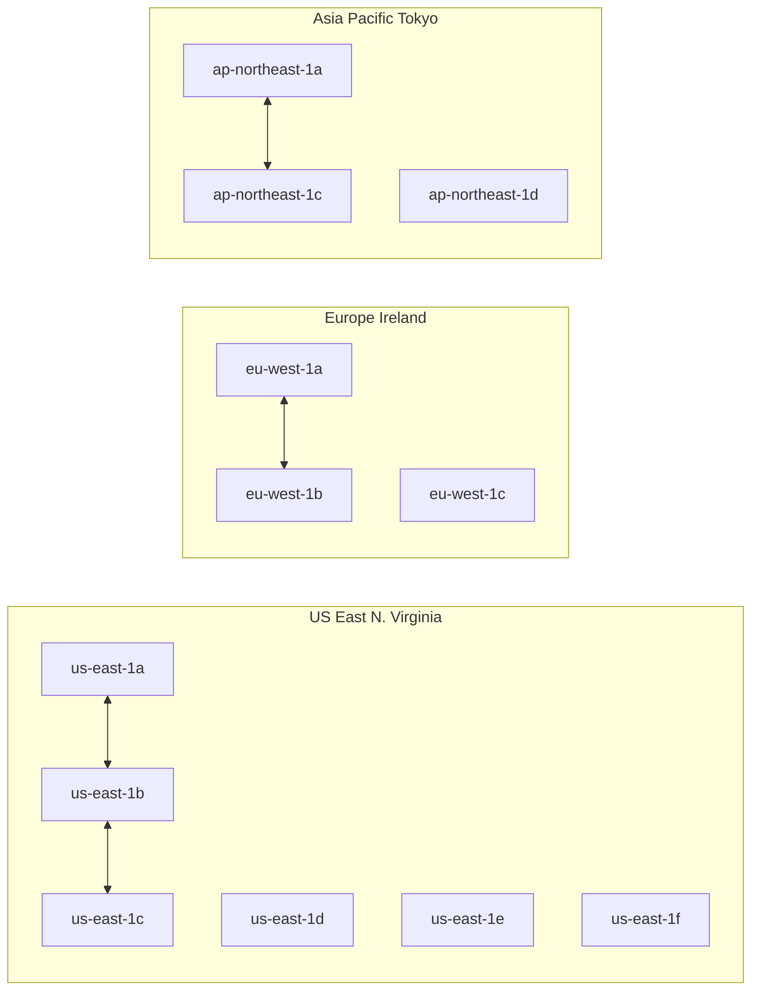

### Fault Tolerance in Action

**Scenario:** AZ 3 in Region A fails

```
BEFORE FAILURE:
┌─────────────────────────────────────┐
│  REGION A - US-EAST                 │
│  ┌─────┐  ┌─────┐  ┌─────┐         │
│  │ AZ1 │  │ AZ2 │  │ AZ3 │  ✅ All │
│  │  ✅ │  │  ✅ │  │  ✅ │  healthy │
│  └─────┘  └─────┘  └─────┘         │
└─────────────────────────────────────┘

AFTER FAILURE:
┌─────────────────────────────────────┐
│  REGION A - US-EAST                 │
│  ┌─────┐  ┌─────┐  ┌─────┐         │
│  │ AZ1 │  │ AZ2 │  │ AZ3 │  ❌ AZ3 │
│  │  ✅ │  │  ✅ │  │  ❌ │  failed  │
│  └─────┘  └─────┘  └─────┘         │
│                                     │
│  ✅ AZ1 and AZ2 keep serving        │
│     (99.78% capacity remains)       │
└─────────────────────────────────────┘
```

### Best Practices for Regions & AZs

✅ **DO:**
- Deploy across multiple AZs within a region (minimum 3)
- Use regions close to your user base
- Consider data residency laws when choosing regions
- Implement health checks to detect AZ failures
- Design for AZ-level failures, not just region-level

❌ **DON'T:**
- Deploy to a single AZ (single point of failure)
- Assume all regions have the same services available
- Ignore inter-AZ latency in your architecture
- Forget to test AZ failure scenarios

### Performance Considerations

| Metric | Inter-AZ Latency | Inter-Region Latency | Cross-Continent |
|--------|------------------|----------------------|-----------------|
| Typical | 1-2 ms | 30-70 ms | 100-300 ms |
| AWS (us-east-1 to eu-west-1) | ~2 ms | ~70 ms | ~70 ms |
| Impact | Negligible | Noticeable | Significant |

---

## 2. Compute Clones Easily. Data Does Not

### The Stateless vs Stateful Challenge

This is one of the most fundamental concepts in multi-region architecture: **compute is easy to replicate, data is hard.**

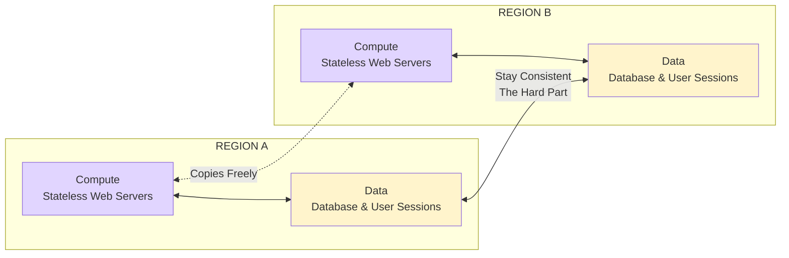

### Why Compute is Easy

**Stateless Compute Characteristics:**
- 🚀 **No Local State:** Any server can handle any request
- 📦 **Immutable Deployments:** Same code runs everywhere
- 🔄 **Horizontal Scaling:** Add more instances easily
- 🌍 **Geographic Distribution:** Deploy anywhere, works the same

**Example: Stateless Web Server**

```java
// ✅ GOOD: Stateless service
@RestController
@RequestMapping("/api/users")
public class UserController {
    
    private final UserService userService;
    
    // No instance variables that change per request!
    
    public UserController(UserService userService) {
        this.userService = userService;
    }
    
    @GetMapping("/{id}")
    public ResponseEntity<UserDTO> getUser(@PathVariable String id) {
        // Each request is independent
        User user = userService.findById(id);
        return ResponseEntity.ok(UserMapper.toDTO(user));
    }
}
```

```java
// ❌ BAD: Stateful service
@RestController
@RequestMapping("/api/users")
public class UserController {
    
    private final UserService userService;
    private List<User> cache = new ArrayList<>();  // ❌ Shared state!
    private int requestCount = 0;  // ❌ Instance variable!
    
    public UserController(UserService userService) {
        this.userService = userService;
    }
    
    @GetMapping("/{id}")
    public ResponseEntity<UserDTO> getUser(@PathVariable String id) {
        requestCount++;  // ❌ Different on each server!
        cache.add(userService.findById(id));  // ❌ Inconsistent cache!
        return ResponseEntity.ok(UserMapper.toDTO(user));
    }
}
```

### Why Data is Hard

**Data Consistency Challenges:**
- 🔄 **Replication Lag:** Changes take time to propagate
- ⚡ **Conflict Resolution:** Concurrent writes need resolution
- 🌍 **Network Partitions:** Regions can become isolated
- 📊 **Consistency Models:** Trade-offs between consistency, availability, and partition tolerance (CAP theorem)

### The CAP Theorem

```mermaid
graph triangle
    C[Consistency] -->|Trade-off| AP
    A[Availability] -->|Trade-off| CP
    P[Partition Tolerance] -->|Required| Both
    
    style C fill:#ffcccc
    style A fill:#ccffcc
    style P fill:#ccccff
```

**CAP Theorem Explained:**
- **Consistency (C):** All nodes see the same data at the same time
- **Availability (A):** Every request receives a response
- **Partition Tolerance (P):** System works despite network failures

**You can only have 2 of 3:**
- **CP:** Consistent + Partition Tolerant (sacrifices availability during partitions)
- **AP:** Available + Partition Tolerant (sacrifices consistency during partitions)
- **CA:** Consistent + Available (not possible in distributed systems with partitions)

### Real-World Example: E-Commerce Platform

**Scenario:** Global e-commerce site with users in US, Europe, and Asia

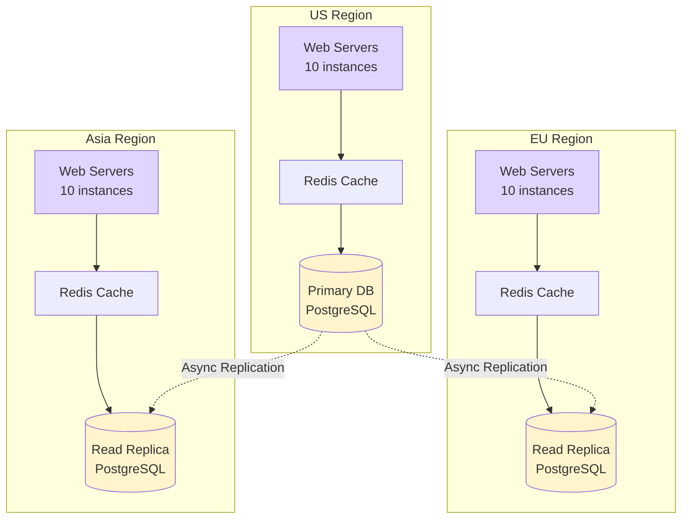

**Key Insight:** Deploy 10 web servers in each region (easy), but database replication is complex (hard).

### Code Example: Stateless Service Design

```java
// ✅ GOOD: Externalized state
@Service
public class ShoppingCartService {
    
    private final RedisTemplate<String, Cart> redisTemplate;
    private final CartRepository cartRepository;
    
    // State is externalized to Redis/Database
    
    public Cart getCart(String userId) {
        // Try cache first
        Cart cart = redisTemplate.opsForValue().get("cart:" + userId);
        if (cart != null) {
            return cart;
        }
        // Fallback to database
        cart = cartRepository.findByUserId(userId);
        redisTemplate.opsForValue().set("cart:" + userId, cart, 1, TimeUnit.HOURS);
        return cart;
    }
    
    public void addItem(String userId, Product product) {
        Cart cart = getCart(userId);
        cart.addItem(product);
        // Persist to database
        cartRepository.save(cart);
        // Update cache
        redisTemplate.opsForValue().set("cart:" + userId, cart, 1, TimeUnit.HOURS);
    }
}
```

### Performance Implications

| Component | Replication Difficulty | Latency Impact | Cost |
|-----------|----------------------|----------------|------|
| Web Servers | Easy (stateless) | None | Low |
| Cache | Medium | Low (if local) | Medium |
| Database | Hard (stateful) | High (if synchronous) | High |
| File Storage | Medium | Medium | Medium |
| Session State | Medium | Low (if distributed) | Medium |

---

## 3. Synchronous vs Asynchronous Replication

### Understanding Replication Strategies

Data replication is the process of copying data from one location to another. The choice between synchronous and asynchronous replication is critical in multi-region architectures.

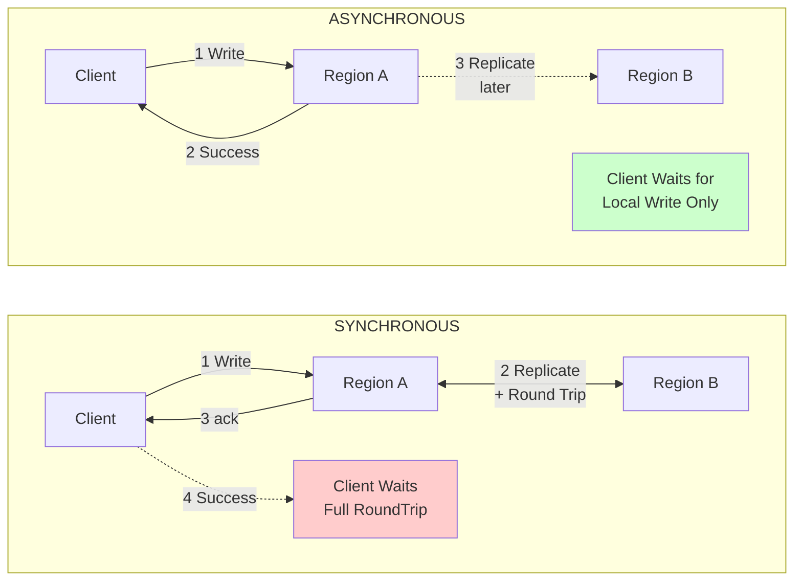

### Synchronous Replication

**How it works:**
1. Client writes to primary region
2. Primary replicates to secondary region
3. Secondary acknowledges receipt
4. Primary responds to client

**Characteristics:**
- ✅ **Strong Consistency:** All regions have the same data
- ✅ **No Data Loss:** Write is confirmed in multiple locations
- ❌ **Higher Latency:** Client waits for round-trip time
- ❌ **Reduced Availability:** If secondary is down, write fails

**Code Example: Synchronous Replication**

```java
// Synchronous replication with two-phase commit
@Service
@Transactional
public class SynchronousUserService {
    
    private final UserRepository primaryRepo;
    private final UserRepository replicaRepo;
    private final TransactionTemplate transactionTemplate;
    
    public User createUser(User user) {
        // Phase 1: Prepare
        User primaryUser = primaryRepo.save(user);
        
        try {
            // Phase 2: Commit to replica synchronously
            replicaRepo.save(user);
            
            // Both succeeded
            return primaryUser;
            
        } catch (Exception e) {
            // Rollback primary
            primaryRepo.delete(primaryUser.getId());
            throw new DataReplicationException("Failed to replicate to secondary region", e);
        }
    }
}
```

**Performance Impact:**

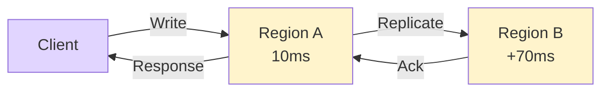

**Total Latency:** 10ms + 70ms + 70ms = **150ms** (vs 10ms without replication)

### Asynchronous Replication

**How it works:**
1. Client writes to primary region
2. Primary confirms write to client immediately
3. Primary replicates to secondary region (in background)
4. Secondary eventually catches up

**Characteristics:**
- ✅ **Low Latency:** Client only waits for local write
- ✅ **High Availability:** Works even if secondary is down
- ❌ **Eventual Consistency:** Secondary may have stale data
- ❌ **Potential Data Loss:** If primary fails before replication

**Code Example: Asynchronous Replication**

```java
// Asynchronous replication with event-driven approach
@Service
public class AsyncUserService {
    
    private final UserRepository primaryRepo;
    private final ApplicationEventPublisher eventPublisher;
    private final UserRepository replicaRepo;
    
    @Async
    @EventListener
    public void handleUserCreated(UserCreatedEvent event) {
        // Replicate to secondary region in background
        try {
            replicaRepo.save(event.getUser());
        } catch (Exception e) {
            // Log and retry later
            log.error("Failed to replicate user to secondary region", e);
            // Implement retry logic with exponential backoff
        }
    }
    
    @Transactional
    public User createUser(User user) {
        User savedUser = primaryRepo.save(user);
        
        // Publish event for async replication
        eventPublisher.publishEvent(new UserCreatedEvent(savedUser));
        
        // Return immediately - replication happens in background
        return savedUser;
    }
}
```

**Performance Impact:**

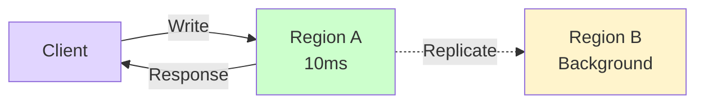

**Total Latency:** 10ms (replication happens in background)

### Comparison Table

| Aspect | Synchronous | Asynchronous |
|--------|-------------|--------------|
| **Consistency** | Strong | Eventual |
| **Latency** | High (RTT + local) | Low (local only) |
| **Availability** | Lower (needs all regions) | Higher (primary only) |
| **Data Loss Risk** | None | Possible during failover |
| **Use Case** | Financial transactions | User profiles, content |
| **Complexity** | Higher | Lower |
| **Cost** | Higher (dedicated links) | Lower |

### When to Use Each

**Use Synchronous When:**
- 💰 Financial transactions (bank transfers, payments)
- 🏥 Healthcare data (patient records)
- 🔐 Security-critical operations (authentication)
- 📊 Inventory management (prevent overselling)

**Use Asynchronous When:**
- 📱 Social media posts
- 📝 User profiles and preferences
- 🎨 Content delivery (images, videos)
- 📊 Analytics and logging

### Hybrid Approach: Synchronous + Asynchronous

```java
@Service
public class HybridUserService {
    
    private final UserRepository primaryRepo;
    private final UserRepository replicaRepo;
    private final ApplicationEventPublisher eventPublisher;
    
    @Transactional
    public User createUser(User user) {
        // Always write to primary synchronously
        User savedUser = primaryRepo.save(user);
        
        // Critical data: replicate synchronously
        if (isCriticalData(user)) {
            replicaRepo.save(user);  // Blocking replication
        } else {
            // Non-critical data: replicate asynchronously
            eventPublisher.publishEvent(new UserCreatedEvent(savedUser));
        }
        
        return savedUser;
    }
    
    private boolean isCriticalData(User user) {
        // Determine if data requires strong consistency
        return user.getAccountBalance() != null || 
               user.getSecurityClearance() != null;
    }
}
```

### Common Pitfalls

❌ **Mistake 1: Using synchronous replication everywhere**

```java
// ❌ BAD: Unnecessary synchronous replication for non-critical data
@Transactional
public Post createPost(Post post) {
    Post saved = primaryRepo.save(post);
    replicaRepo.save(post);  // ❌ Why wait? Posts can be eventually consistent
    return saved;
}
```

✅ **Correct Approach:**

```java
// ✅ GOOD: Async replication for non-critical data
@Transactional
public Post createPost(Post post) {
    Post saved = primaryRepo.save(post);
    eventPublisher.publishEvent(new PostCreatedEvent(saved));  // ✅ Async
    return saved;
}
```

❌ **Mistake 2: Not handling replication failures**

```java
// ❌ BAD: Fire-and-forget without error handling
@Async
public void replicate(User user) {
    replicaRepo.save(user);  // ❌ What if this fails?
}
```

✅ **Correct Approach:**

```java
// ✅ GOOD: Proper error handling and retry logic
@Async
@Retryable(maxAttempts = 3, backoff = @Backoff(delay = 1000))
public void replicate(User user) {
    replicaRepo.save(user);
}

@Recover
public void recoverReplication(Exception e, User user) {
    log.error("Failed to replicate user after retries: {}", user.getId(), e);
    // Send alert, queue for manual intervention
    alertingService.sendAlert("Replication failed for user: " + user.getId());
}
```

---

## 4. Read Timeline

### Understanding Consistency Models

The read timeline illustrates how data consistency evolves over time in a multi-region system.

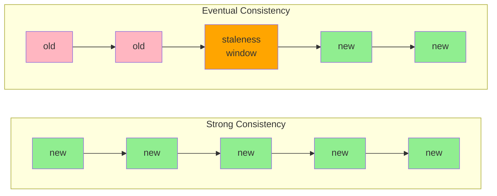

### Strong Consistency

**Definition:** Every read receives the most recent write or an error.

**Characteristics:**
- ✅ **Predictable:** Always read the latest data
- ✅ **Simple Mental Model:** What you write is what you read
- ❌ **Higher Latency:** Reads may need to go to primary region
- ❌ **Lower Availability:** System may reject reads during partitions

**How it Works:**

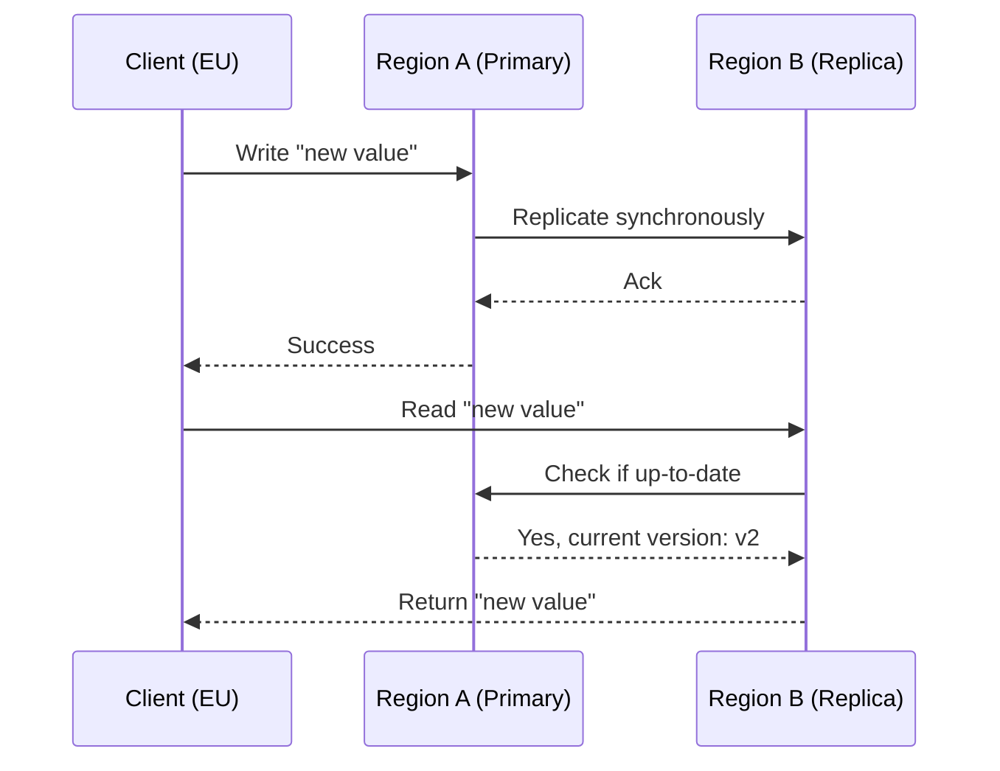

**Code Example: Strong Consistency**

```java
@Service
public class StrongConsistencyUserService {
    
    private final UserRepository primaryRepo;
    private final UserRepository replicaRepo;
    
    // Write: Always goes to primary
    @Transactional
    public User updateUser(String id, UserUpdateDTO update) {
        User user = primaryRepo.findById(id)
            .orElseThrow(() -> new UserNotFoundException(id));
        
        user.update(update);
        User saved = primaryRepo.save(user);
        
        // Synchronous replication
        replicaRepo.save(saved);
        
        return saved;
    }
    
    // Read: Can go to replica, but must verify freshness
    public User getUser(String id) {
        // Option 1: Always read from primary (simplest)
        return primaryRepo.findById(id)
            .orElseThrow(() -> new UserNotFoundException(id));
        
        // Option 2: Read from replica with version check
        // User replicaUser = replicaRepo.findById(id);
        // if (replicaUser.getVersion() < primaryRepo.getVersion(id)) {
        //     return primaryRepo.findById(id);  // Stale, fetch from primary
        // }
        // return replicaUser;
    }
}
```

### Eventual Consistency

**Definition:** Updates propagate to all nodes eventually. Reads may return stale data temporarily.

**Characteristics:**
- ✅ **Low Latency:** Reads can go to nearest region
- ✅ **High Availability:** Always available, even during partitions
- ❌ **Stale Reads:** May read old data temporarily
- ❌ **Complex Logic:** Need to handle version conflicts

**How it Works:**

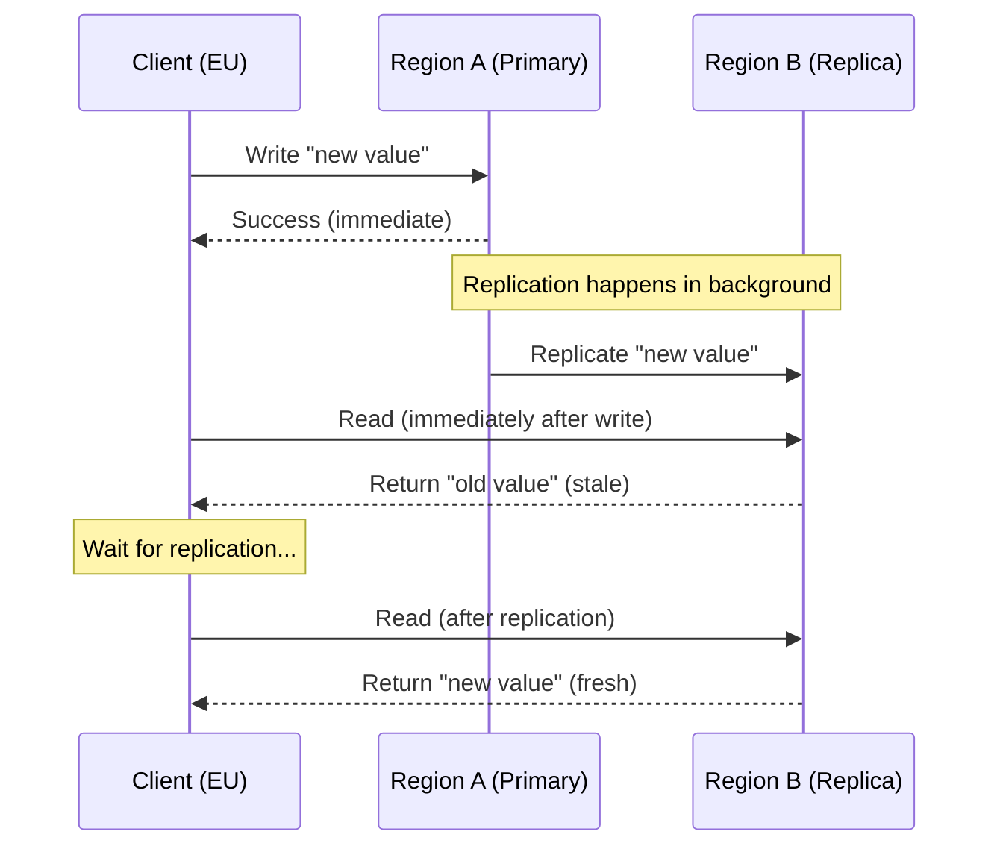

**Code Example: Eventual Consistency**

```java
@Service
public class EventualConsistencyUserService {
    
    private final UserRepository primaryRepo;
    private final UserRepository replicaRepo;
    private final CacheManager cacheManager;
    
    // Write: Goes to primary, async replication
    @Transactional
    public User updateUser(String id, UserUpdateDTO update) {
        User user = primaryRepo.findById(id)
            .orElseThrow(() -> new UserNotFoundException(id));
        
        user.update(update);
        User saved = primaryRepo.save(user);
        
        // Async replication (fire and forget)
        eventPublisher.publishEvent(new UserUpdatedEvent(saved));
        
        // Invalidate cache
        cacheManager.getCache("users").evict(id);
        
        return saved;
    }
    
    // Read: Can go to nearest replica
    public User getUser(String id, Region region) {
        // Try cache first
        User cached = cacheManager.getCache("users").get(id, User.class);
        if (cached != null) {
            return cached;
        }
        
        // Read from nearest region
        User user = replicaRepo.findById(id)
            .orElseThrow(() -> new UserNotFoundException(id));
        
        // Cache for future reads
        cacheManager.getCache("users").put(id, user);
        
        return user;
    }
}
```

### The Staleness Window

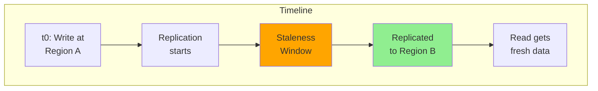

**Staleness Window Factors:**
- Network latency between regions
- Replication queue depth
- Database write throughput
- Number of replicas

**Typical Staleness Windows:**
- Same region: < 1 second
- Cross-region (async): 1-10 seconds
- Cross-region (sync): 0 seconds (but higher latency)

### Choosing the Right Consistency Model

| Use Case | Consistency Model | Rationale |
|----------|------------------|-----------|
| Bank account balance | Strong | Cannot show incorrect balance |
| User profile update | Eventual | Brief staleness is acceptable |
| Product inventory | Strong (or eventual with compensation) | Prevent overselling |
| Social media post | Eventual | Users expect brief delay |
| Shopping cart | Eventual | Can sync before checkout |
| Authentication token | Strong | Security critical |

### Handling Stale Reads

**Strategy 1: Version Checking**

```java
public User getUserWithVersionCheck(String id, long minVersion) {
    User user = replicaRepo.findById(id);
    
    if (user.getVersion() < minVersion) {
        // Stale data, fetch from primary
        user = primaryRepo.findById(id);
    }
    
    return user;
}
```

**Strategy 2: Session Affinity**

```java
// After write, direct subsequent reads to primary for this user
public class UserSessionContext {
    private static final ThreadLocal<String> lastWriteRegion = new ThreadLocal<>();
    
    public static void setLastWriteRegion(String region) {
        lastWriteRegion.set(region);
    }
    
    public static String getLastWriteRegion() {
        return lastWriteRegion.get();
    }
}

// In controller
@PostMapping("/{id}")
public User updateUser(@PathVariable String id, @RequestBody UserUpdateDTO update) {
    User user = userService.updateUser(id, update);
    UserSessionContext.setLastWriteRegion("primary");  // Mark as recently written
    return user;
}

@GetMapping("/{id}")
public User getUser(@PathVariable String id) {
    String lastRegion = UserSessionContext.getLastWriteRegion();
    
    // If recently written, read from primary
    if ("primary".equals(lastRegion)) {
        return userService.getUserFromPrimary(id);
    }
    
    // Otherwise, read from nearest replica
    return userService.getUserFromNearestReplica(id);
}
```

**Strategy 3: Client-Side Versioning**

```java
// Client includes version in request
@GetMapping("/{id}")
public User getUser(@PathVariable String id, 
                    @RequestHeader("If-Match") String version) {
    return userService.getUser(id, version);
}

// Server returns 412 if version mismatch
public User getUser(String id, String version) {
    User user = replicaRepo.findById(id);
    
    if (!version.equals(user.getVersion())) {
        throw new VersionConflictException("Data has been modified");
    }
    
    return user;
}
```

### Performance Benchmarks

| Consistency Model | Read Latency (p99) | Write Latency (p99) | Availability |
|------------------|-------------------|---------------------|--------------|
| Strong (primary reads) | 50ms | 150ms | 99.9% |
| Strong (replica with check) | 80ms | 150ms | 99.9% |
| Eventual (local reads) | 10ms | 10ms | 99.99% |

---

## 5. Geo-Routing

### Directing Users to the Nearest Region

Geo-routing (also called geo-load-balancing or geo-DNS) directs each request to the nearest healthy region, minimizing latency and improving user experience.

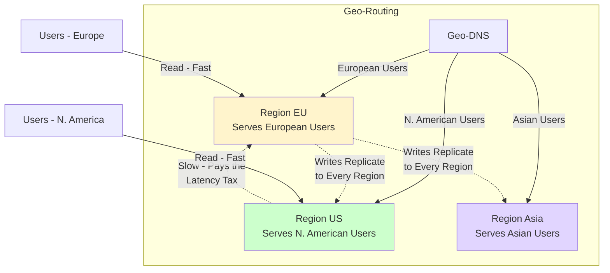

### How Geo-Routing Works

**Step-by-Step Process:**

1. **User Request:** User in France requests `https://api.example.com`
2. **DNS Resolution:** Geo-DNS resolves to nearest region (eu-west-1)
3. **Load Balancing:** Regional load balancer distributes to healthy instance
4. **Request Processing:** Instance processes request with local data
5. **Response:** Fast response due to proximity

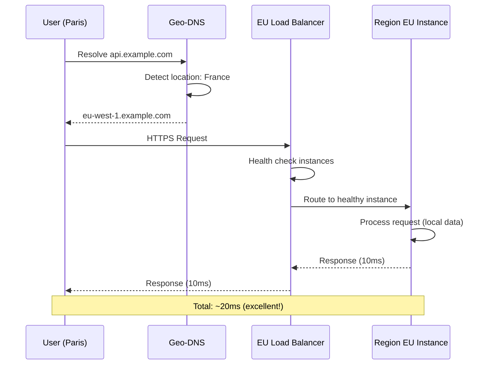

### Geo-Routing Strategies

**Strategy 1: DNS-Based Geo-Routing**

```java
// Using AWS Route 53 with geolocation routing
@Configuration
public class GeoRoutingConfig {
    
    @Bean
    public Route53Client route53Client() {
        return Route53Client.builder()
            .region(Region.US_EAST_1)
            .build();
    }
    
    public void setupGeoRouting() {
        // Route European users to eu-west-1
        createGeoRecord("example.com", "EU", "eu-west-1.example.com");
        
        // Route North American users to us-east-1
        createGeoRecord("example.com", "NA", "us-east-1.example.com");
        
        // Route Asian users to ap-southeast-1
        createGeoRecord("example.com", "AS", "ap-southeast-1.example.com");
        
        // Default (rest of world)
        createGeoRecord("example.com", "DEFAULT", "us-east-1.example.com");
    }
}
```

**Strategy 2: Application-Level Routing**

```java
@RestController
public class GeoRoutingController {
    
    private final RegionService regionService;
    
    @GetMapping("/api/nearest-region")
    public ResponseEntity<RegionInfo> getNearestRegion(
            @RequestHeader("X-Forwarded-For") String clientIp) {
        
        // Determine user's location from IP
        Location location = geoLocationService.locate(clientIp);
        
        // Find nearest healthy region
        Region nearestRegion = regionService.findNearestHealthyRegion(location);
        
        return ResponseEntity.ok(RegionInfo.builder()
            .region(nearestRegion.getName())
            .endpoint(nearestRegion.getEndpoint())
            .latency(nearestRegion.getLatencyMs())
            .build());
    }
}
```

**Strategy 3: CDN-Based Routing**

```javascript
// CloudFlare Workers example for edge routing
addEventListener('fetch', event => {
    event.respondWith(handleRequest(event.request))
})

async function handleRequest(request) {
    const country = request.headers.get('CF-IPCountry');
    
    // Route based on country
    let targetRegion;
    switch (country) {
        case 'FR':
        case 'DE':
        case 'GB':
            targetRegion = 'https://eu-west-1.example.com';
            break;
        case 'US':
        case 'CA':
            targetRegion = 'https://us-east-1.example.com';
            break;
        case 'JP':
        case 'SG':
            targetRegion = 'https://ap-southeast-1.example.com';
            break;
        default:
            targetRegion = 'https://us-east-1.example.com';
    }
    
    return fetch(targetRegion + request.url.pathname, request);
}
```

### Implementation with Spring Cloud Gateway

```java
@Configuration
public class GeoRoutingGatewayConfig {
    
    @Bean
    public RouteLocator customRouteLocator(RouteLocatorBuilder builder) {
        return builder.routes()
            .route("eu_region", r -> r
                .host("*.example.com")
                .and()
                .header("X-Region", "EU")
                .filters(f -> f.rewritePath("/", "/api/"))
                .uri("lb://eu-service"))
            .route("us_region", r -> r
                .host("*.example.com")
                .and()
                .header("X-Region", "US")
                .filters(f -> f.rewritePath("/", "/api/"))
                .uri("lb://us-service"))
            .route("default_region", r -> r
                .host("*.example.com")
                .filters(f -> f.rewritePath("/", "/api/"))
                .uri("lb://default-service"))
            .build();
    }
}
```

### Health Checks and Failover

```java
@Service
public class RegionHealthService {
    
    private final Map<String, RegionHealth> regionHealthMap = new ConcurrentHashMap<>();
    
    @Scheduled(fixedRate = 5000)  // Check every 5 seconds
    public void checkRegionHealth() {
        for (String region : getAllRegions()) {
            boolean isHealthy = performHealthCheck(region);
            RegionHealth health = regionHealthMap.get(region);
            
            if (isHealthy) {
                health.setStatus(HealthStatus.HEALTHY);
                health.setLastCheck(LocalDateTime.now());
            } else {
                health.setStatus(HealthStatus.UNHEALTHY);
                health.setConsecutiveFailures(health.getConsecutiveFailures() + 1);
            }
        }
    }
    
    private boolean performHealthCheck(String region) {
        try {
            // Simple HTTP health check
            ResponseEntity<String> response = restTemplate.getForEntity(
                region + "/health",
                String.class
            );
            return response.getStatusCode().is2xxSuccessful();
        } catch (Exception e) {
            log.warn("Health check failed for region: {}", region, e);
            return false;
        }
    }
    
    public String getHealthyRegionForLocation(Location location) {
        return regionHealthMap.entrySet().stream()
            .filter(entry -> entry.getValue().getStatus() == HealthStatus.HEALTHY)
            .filter(entry -> isInSameContinent(entry.getKey(), location))
            .min(Comparator.comparingDouble(entry -> 
                entry.getValue().getLatencyMs()))
            .map(Map.Entry::getKey)
            .orElse("us-east-1");  // Fallback
    }
}
```

### Performance Optimization

**Latency Comparison:**

| User Location | Nearest Region | Latency | Alternative Region | Latency | Difference |
|---------------|----------------|---------|-------------------|---------|------------|
| Paris, France | eu-west-1 | 10ms | us-east-1 | 80ms | 8x slower |
| New York, USA | us-east-1 | 5ms | eu-west-1 | 75ms | 15x slower |
| Tokyo, Japan | ap-northeast-1 | 8ms | us-east-1 | 120ms | 15x slower |
| Sydney, Australia | ap-southeast-1 | 15ms | us-east-1 | 150ms | 10x slower |

**Cost of Not Using Geo-Routing:**

```
User in Paris → us-east-1: 80ms latency
- User satisfaction: -40%
- Bounce rate: +25%
- Revenue impact: -15%

User in Paris → eu-west-1: 10ms latency
- User satisfaction: +95%
- Bounce rate: -20%
- Revenue impact: +20%
```

### Best Practices

✅ **DO:**
- Use anycast IP addresses for automatic routing
- Implement health checks for all regions
- Have a fallback region for each geography
- Monitor routing decisions and latency
- Use CDN for static content
- Implement circuit breakers for unhealthy regions

❌ **DON'T:**
- Route users to failed regions
- Ignore network partitions
- Forget to update DNS TTLs during failover
- Assume DNS propagation is instant (TTL matters!)
- Use single DNS provider (use multiple for redundancy)

### Common Issues and Solutions

**Issue 1: DNS Caching Delays Failover**

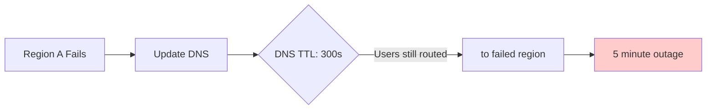

**Solution:** Use low TTL (60s) during normal operations, reduce to 10s during failover.

```java
public void updateDNSForFailover(String failedRegion, String healthyRegion) {
    // Reduce TTL for faster propagation
    updateDNSRecord("example.com", healthyRegion, 10);  // 10 second TTL
    
    // After failback, restore normal TTL
    ScheduledFuture<?> restoreTTL = scheduler.schedule(
        () -> updateDNSRecord("example.com", healthyRegion, 300),
        1, TimeUnit.HOURS
    );
}
```

---

## 6. Active-Passive with Failover and Failback

### Disaster Recovery Pattern

Active-passive (also called active-standby) is a disaster recovery pattern where one region handles all traffic (active) while another region stands by (passive), ready to take over if the active region fails.

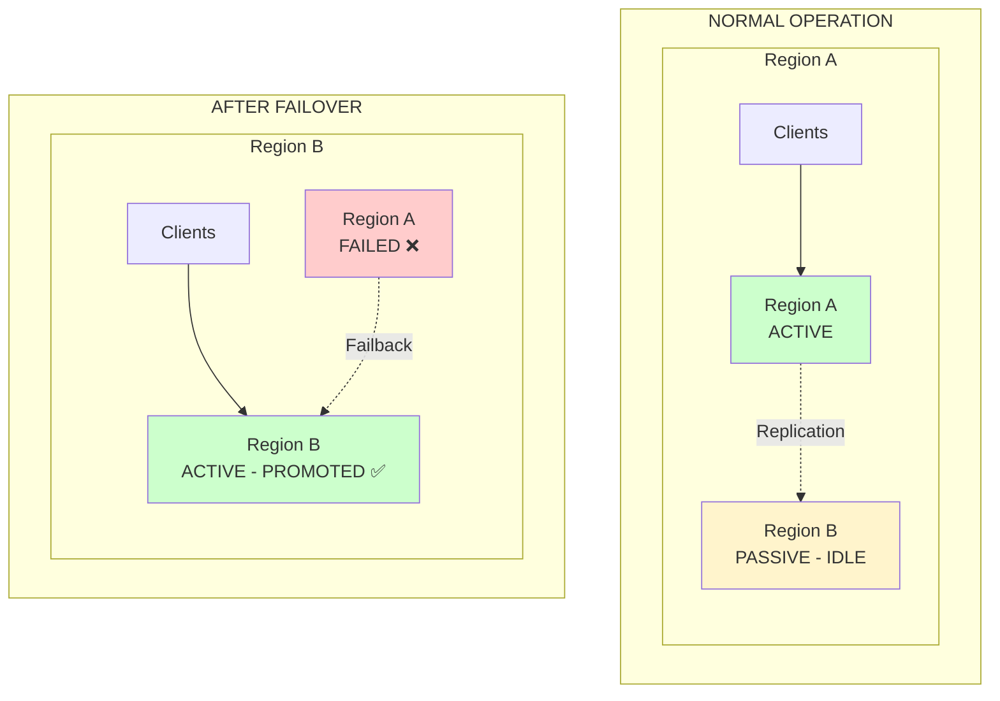

### Normal Operation

**Active Region (Region A):**
- Handles all read and write traffic
- Primary database
- Active compute instances
- Real-time processing

**Passive Region (Region B):**
- Stands by with idle resources
- Replica database (async replication)
- Warm instances (can be scaled up quickly)
- Ready to take over

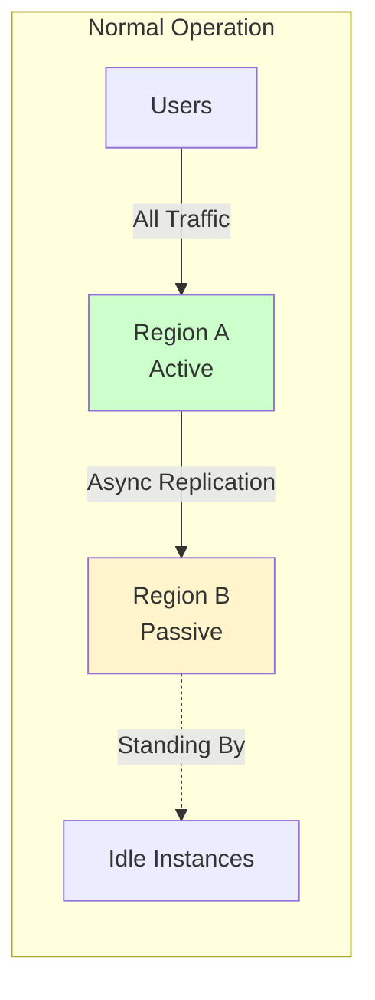

### Failover Process

**Automatic Failover Steps:**

1. **Detection:** Health check system detects Region A failure
2. **Decision:** Failover controller decides to promote Region B
3. **Promotion:** Region B becomes active (promote replica to primary)
4. **Routing:** Update DNS/load balancers to route to Region B
5. **Notification:** Alert operations team
6. **Verification:** Confirm Region B is serving traffic

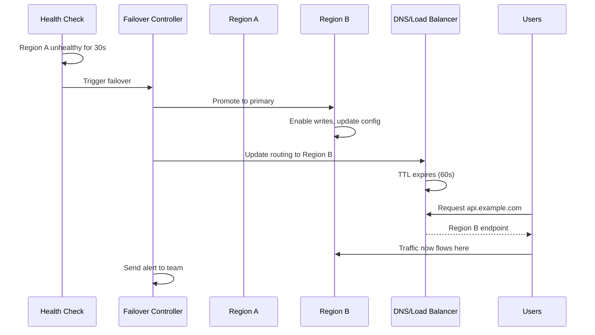

**Code Example: Automatic Failover**

```java
@Service
public class FailoverService {
    
    private final RegionHealthService regionHealthService;
    private final DNSUpdateService dnsUpdateService;
    private final DatabasePromotionService dbPromotionService;
    private final AlertService alertService;
    
    private Region activeRegion = Region.US_EAST_1;
    private final Set<Region> failedRegions = ConcurrentHashMap.newKeySet();
    
    @Scheduled(fixedRate = 5000)
    public void monitorAndFailover() {
        Region currentActive = activeRegion;
        
        // Check if active region is healthy
        if (!regionHealthService.isHealthy(currentActive)) {
            log.warn("Active region {} is unhealthy, initiating failover", currentActive);
            
            // Find healthy replacement
            Region newActive = findHealthyRegion(currentActive);
            
            if (newActive != null) {
                performFailover(currentActive, newActive);
            } else {
                log.error("No healthy region available for failover!");
                alertService.sendCriticalAlert("All regions unhealthy!");
            }
        }
    }
    
    private void performFailover(Region failedRegion, Region newActiveRegion) {
        log.info("Failing over from {} to {}", failedRegion, newActiveRegion);
        
        try {
            // Step 1: Promote database replica
            log.info("Promoting database in {}", newActiveRegion);
            dbPromotionService.promoteToPrimary(newActiveRegion);
            
            // Step 2: Update DNS
            log.info("Updating DNS to route to {}", newActiveRegion);
            dnsUpdateService.updateRouting(newActiveRegion, 10);  // Low TTL
            
            // Step 3: Update active region
            activeRegion = newActiveRegion;
            failedRegions.add(failedRegion);
            
            // Step 4: Send alert
            alertService.sendAlert(
                String.format("Failover completed: %s → %s", failedRegion, newActiveRegion)
            );
            
            log.info("Failover completed successfully");
            
        } catch (Exception e) {
            log.error("Failover failed", e);
            alertService.sendCriticalAlert("Failover failed: " + e.getMessage());
        }
    }
    
    private Region findHealthyRegion(Region excludeRegion) {
        return regionHealthService.getAllHealthyRegions().stream()
            .filter(region -> region != excludeRegion)
            .min(Comparator.comparingDouble(regionHealthService::getLatency))
            .orElse(null);
    }
}
```

### Database Promotion

```java
@Service
public class DatabasePromotionService {
    
    public void promoteToPrimary(Region region) {
        log.info("Promoting database in region {} to primary", region);
        
        // Step 1: Stop replication
        stopReplication(region);
        
        // Step 2: Enable write mode
        enableWriteMode(region);
        
        // Step 3: Update connection strings
        updateConnectionStrings(region);
        
        // Step 4: Verify promotion
        boolean isPrimary = verifyPrimaryStatus(region);
        
        if (!isPrimary) {
            throw new DatabasePromotionException("Failed to promote database");
        }
        
        log.info("Database in region {} successfully promoted to primary", region);
    }
    
    private void stopReplication(Region region) {
        // PostgreSQL example
        String command = String.format(
            "ssh %s 'pg_promote --terminate'",
            region.getDatabaseHost()
        );
        
        try {
            Process process = Runtime.getRuntime().exec(command);
            process.waitFor(30, TimeUnit.SECONDS);
        } catch (Exception e) {
            throw new DatabasePromotionException("Failed to stop replication", e);
        }
    }
    
    private void enableWriteMode(Region region) {
        // Update application config to allow writes
        configService.updateConfig(region, "database.readonly", "false");
    }
}
```

### Failback Process

**Failback** is the process of returning to the original active region after it recovers.

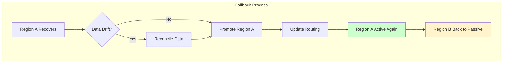

**Code Example: Automatic Failback**

```java
@Service
public class FailbackService {
    
    private final FailoverService failoverService;
    private final RegionHealthService regionHealthService;
    private final DataReconciliationService dataReconciliationService;
    
    @Scheduled(fixedRate = 30000)  // Check every 30 seconds
    public void checkForFailback() {
        Region currentActive = failoverService.getActiveRegion();
        
        // Check if any failed region has recovered
        for (Region failedRegion : failoverService.getFailedRegions()) {
            if (regionHealthService.isHealthy(failedRegion)) {
                log.info("Failed region {} has recovered, evaluating failback", failedRegion);
                
                // Check if failback is safe
                if (isFailbackSafe(failedRegion, currentActive)) {
                    performFailback(failedRegion, currentActive);
                }
            }
        }
    }
    
    private boolean isFailbackSafe(Region recoveredRegion, Region currentActive) {
        // Check 1: Region has been healthy for some time
        long healthyDuration = regionHealthService.getHealthyDuration(recoveredRegion);
        if (healthyDuration < TimeUnit.MINUTES.toMillis(5)) {
            log.info("Region {} healthy for only {}ms, waiting", 
                recoveredRegion, healthyDuration);
            return false;
        }
        
        // Check 2: No data drift
        boolean isDataConsistent = dataReconciliationService.checkConsistency(
            recoveredRegion, 
            currentActive
        );
        
        if (!isDataConsistent) {
            log.warn("Data drift detected between {} and {}, reconciling", 
                recoveredRegion, currentActive);
            dataReconciliationService.reconcile(recoveredRegion, currentActive);
            return false;  // Try again later
        }
        
        // Check 3: Current region is stable
        if (!regionHealthService.isStable(currentActive)) {
            log.info("Current active region {} is not stable, delaying failback", 
                currentActive);
            return false;
        }
        
        return true;
    }
    
    private void performFailback(Region recoveredRegion, Region currentActive) {
        log.info("Performing failback: {} → {}", currentActive, recoveredRegion);
        
        try {
            // Step 1: Promote recovered region
            dbPromotionService.promoteToPrimary(recoveredRegion);
            
            // Step 2: Demote current active
            dbPromotionService.demoteToReplica(currentActive);
            
            // Step 3: Update routing
            dnsUpdateService.updateRouting(recoveredRegion, 60);
            
            // Step 4: Update active region
            failoverService.setActiveRegion(recoveredRegion);
            failoverService.removeFailedRegion(recoveredRegion);
            
            // Step 5: Notify
            alertService.sendAlert(
                String.format("Failback completed: %s → %s", currentActive, recoveredRegion)
            );
            
            log.info("Failback completed successfully");
            
        } catch (Exception e) {
            log.error("Failback failed", e);
            alertService.sendCriticalAlert("Failback failed: " + e.getMessage());
        }
    }
}
```

### Data Reconciliation

```java
@Service
public class DataReconciliationService {
    
    public boolean checkConsistency(Region regionA, Region regionB) {
        // Compare row counts
        long countA = getRowCount(regionA, "users");
        long countB = getRowCount(regionB, "users");
        
        if (countA != countB) {
            log.warn("Row count mismatch: {} has {}, {} has {}", 
                regionA, countA, regionB, countB);
            return false;
        }
        
        // Compare checksums
        String checksumA = calculateChecksum(regionA, "users");
        String checksumB = calculateChecksum(regionB, "users");
        
        if (!checksumA.equals(checksumB)) {
            log.warn("Checksum mismatch between {} and {}", regionA, regionB);
            return false;
        }
        
        return true;
    }
    
    public void reconcile(Region source, Region target) {
        log.info("Reconciling data from {} to {}", source, target);
        
        // Step 1: Identify differences
        List<DataDiff> diffs = findDifferences(source, target);
        
        // Step 2: Apply changes
        for (DataDiff diff : diffs) {
            applyChange(target, diff);
        }
        
        // Step 3: Verify consistency
        boolean consistent = checkConsistency(source, target);
        
        if (!consistent) {
            throw new DataReconciliationException("Reconciliation failed");
        }
        
        log.info("Reconciliation completed: {} changes applied", diffs.size());
    }
    
    private List<DataDiff> findDifferences(Region source, Region target) {
        // Implementation depends on your database
        // Could use timestamps, version numbers, or checksums
        return new ArrayList<>();
    }
}
```

### Monitoring and Alerting

```java
@Component
public class FailoverMonitoring {
    
    @EventListener
    public void onFailover(FailoverEvent event) {
        // Log failover event
        log.warn("Failover occurred: {} → {}", 
            event.getFailedRegion(), 
            event.getNewActiveRegion()
        );
        
        // Send metrics
        metricsService.incrementCounter("failover.count");
        metricsService.recordTimer("failover.duration", 
            Duration.between(event.getStartTime(), event.getEndTime())
        );
        
        // Send alert
        alertService.sendAlert(String.format(
            "Failover: %s → %s (Duration: %dms)",
            event.getFailedRegion(),
            event.getNewActiveRegion(),
            event.getDuration().toMillis()
        ));
        
        // Create incident ticket
        incidentService.createTicket(
            "Failover: " + event.getFailedRegion(),
            "Region " + event.getFailedRegion() + " failed, failed over to " + 
            event.getNewActiveRegion(),
            Severity.HIGH
        );
    }
    
    @Scheduled(fixedRate = 60000)
    public void reportMetrics() {
        // Report RTO (Recovery Time Objective)
        long currentRTO = failoverService.getLastFailoverDuration();
        metricsService.recordGauge("failover.rto", currentRTO);
        
        // Report RPO (Recovery Point Objective)
        long currentRPO = dataReconciliationService.getDataLossWindow();
        metricsService.recordGauge("failover.rpo", currentRPO);
    }
}
```

### Recovery Metrics

**RTO (Recovery Time Objective):** How long it takes to recover

| Component | Manual Failover | Automated Failover |
|-----------|----------------|-------------------|
| Detection | 5-10 minutes | 10-30 seconds |
| Decision | 5-15 minutes | Instant |
| Execution | 15-30 minutes | 1-5 minutes |
| **Total RTO** | **25-55 minutes** | **2-6 minutes** |

**RPO (Recovery Point Objective):** How much data you can lose

| Replication Type | RPO |
|-----------------|-----|
| Synchronous | 0 (no data loss) |
| Asynchronous | 1-60 seconds (depends on replication lag) |

---

## 🛠️ Implementation Guide

### Complete Multi-Region Architecture Setup

Let's build a production-ready multi-region architecture step by step.

### Step 1: Infrastructure Setup

```yaml
# docker-compose.regional.yml
version: '3.8'

services:
  app:
    image: myapp:latest
    replicas: 10
    environment:
      - SPRING_PROFILES_ACTIVE=production
      - REGION=${REGION:-us-east-1}
      - DATABASE_URL=${DATABASE_URL}
      - REDIS_URL=${REDIS_URL}
    healthcheck:
      test: ["CMD", "curl", "-f", "http://localhost:8080/actuator/health"]
      interval: 10s
      timeout: 5s
      retries: 3
  
  postgres-primary:
    image: postgres:15
    environment:
      - POSTGRES_DB=myapp
      - POSTGRES_USER=${DB_USER}
      - POSTGRES_PASSWORD=${DB_PASSWORD}
    volumes:
      - postgres-data:/var/lib/postgresql/data
  
  postgres-replica:
    image: postgres:15
    environment:
      - POSTGRES_DB=myapp
    command: |
      bash -c "pg_ctl start -D /var/lib/postgresql/data -o '-c hot_standby=on' &&
               pg_basebackup -h postgres-primary -D /var/lib/postgresql/data -U ${DB_USER} -P --wal-method=stream &&
               tail -f /var/lib/postgresql/data/logfile"
    depends_on:
      - postgres-primary
  
  redis:
    image: redis:7-alpine
    command: redis-server --appendonly yes
    volumes:
      - redis-data:/data

volumes:
  postgres-data:
  redis-data:
```

### Step 2: Application Configuration

```yaml
# application-regional.yml
spring:
  datasource:
    url: ${DATABASE_URL:jdbc:postgresql://localhost:5432/myapp}
    username: ${DB_USER:postgres}
    password: ${DB_PASSWORD:postgres}
    hikari:
      maximum-pool-size: 20
      minimum-idle: 5
      connection-timeout: 30000
  
  redis:
    host: ${REDIS_HOST:localhost}
    port: ${REDIS_PORT:6379}
    timeout: 2000ms
  
  jpa:
    hibernate:
      ddl-auto: validate
    properties:
      hibernate:
        jdbc:
          batch_size: 50
        order_inserts: true
        order_updates: true

# Multi-region configuration
multi-region:
  current-region: ${REGION:us-east-1}
  replication:
    mode: ${REPLICATION_MODE:async}  # sync or async
    timeout: 5000ms
  
  failover:
    enabled: true
    health-check-interval: 5000ms
    failure-threshold: 3
  
  geo-routing:
    enabled: true
    dns-ttl: 60s
```

### Step 3: Deployment Script

```bash
#!/bin/bash
# deploy-region.sh

set -e

REGION=$1
if [ -z "$REGION" ]; then
    echo "Usage: ./deploy-region.sh <region-name>"
    exit 1
fi

echo "Deploying to region: $REGION"

# Build Docker image
echo "Building Docker image..."
docker build -t myapp:latest .

# Push to registry
echo "Pushing to registry..."
docker tag myapp:latest myregistry.example.com/myapp:$REGION
docker push myregistry.example.com/myapp:$REGION

# Deploy to Kubernetes
echo "Deploying to Kubernetes..."
kubectl config use-context $REGION

# Create namespace
kubectl create namespace myapp --dry-run=client -o yaml | kubectl apply -f -

# Deploy application
envsubst < k8s/deployment.yaml | kubectl apply -f -

# Deploy database
envsubst < k8s/postgres.yaml | kubectl apply -f -

# Setup replication
kubectl apply -f k8s/postgres-replication.yaml

# Verify deployment
echo "Verifying deployment..."
kubectl rollout status deployment/myapp -n myapp --timeout=5m

echo "Deployment to $REGION completed successfully!"
```

### Step 4: Kubernetes Deployment

```yaml
# k8s/deployment.yaml
apiVersion: apps/v1
kind: Deployment
metadata:
  name: myapp
  namespace: myapp
  labels:
    app: myapp
    region: ${REGION}
spec:
  replicas: 10
  selector:
    matchLabels:
      app: myapp
  template:
    metadata:
      labels:
        app: myapp
        region: ${REGION}
    spec:
      affinity:
        podAntiAffinity:
          preferredDuringSchedulingIgnoredDuringExecution:
            - weight: 100
              podAffinityTerm:
                labelSelector:
                  matchLabels:
                    app: myapp
                topologyKey: topology.kubernetes.io/zone
      
      containers:
      - name: myapp
        image: myregistry.example.com/myapp:${REGION}
        ports:
        - containerPort: 8080
          name: http
        
        env:
        - name: REGION
          value: "${REGION}"
        - name: DATABASE_URL
          valueFrom:
            secretKeyRef:
              name: db-credentials
              key: url
        - name: DB_USER
          valueFrom:
            secretKeyRef:
              name: db-credentials
              key: username
        - name: DB_PASSWORD
          valueFrom:
            secretKeyRef:
              name: db-credentials
              key: password
        
        resources:
          requests:
            cpu: 500m
            memory: 512Mi
          limits:
            cpu: 1000m
            memory: 1Gi
        
        livenessProbe:
          httpGet:
            path: /actuator/health
            port: 8080
          initialDelaySeconds: 30
          periodSeconds: 10
        
        readinessProbe:
          httpGet:
            path: /actuator/health/readiness
            port: 8080
          initialDelaySeconds: 20
          periodSeconds: 5

---
apiVersion: v1
kind: Service
metadata:
  name: myapp-service
  namespace: myapp
spec:
  selector:
    app: myapp
  ports:
  - port: 80
    targetPort: 8080
  type: LoadBalancer
```

### Step 5: Testing the Setup

```java
@SpringBootTest
@ActiveProfiles("test")
class MultiRegionIntegrationTest {
    
    @Autowired
    private TestRestTemplate restTemplate;
    
    @Test
    void testRegionalRouting() {
        // Simulate request from Europe
        ResponseEntity<String> response = restTemplate.exchange(
            "/api/users",
            HttpMethod.GET,
            new HttpEntity<>(createHeaders("FR")),
            String.class
        );
        
        assertEquals(HttpStatus.OK, response.getStatusCode());
        assertTrue(response.getHeaders().containsKey("X-Region"));
        assertEquals("eu-west-1", response.getHeaders().getFirst("X-Region"));
    }
    
    @Test
    void testFailover() {
        // Simulate region failure
        failoverService.simulateFailure(Region.US_EAST_1);
        
        // Wait for failover
        Thread.sleep(6000);
        
        // Verify traffic routed to backup
        ResponseEntity<String> response = restTemplate.getForEntity(
            "/api/health",
            String.class
        );
        
        assertEquals(HttpStatus.OK, response.getStatusCode());
        assertEquals("eu-west-1", response.getHeaders().getFirst("X-Region"));
    }
    
    private HttpHeaders createHeaders(String countryCode) {
        HttpHeaders headers = new HttpHeaders();
        headers.set("X-Forwarded-Country", countryCode);
        return headers;
    }
}
```

---

## ✅ Best Practices

### 1. Design for Failure

**Key Principles:**
- ✅ Assume any component can fail at any time
- ✅ Design graceful degradation
- ✅ Implement circuit breakers
- ✅ Use timeouts and retries with backoff
- ✅ Have fallback mechanisms for every critical component

### 2. Monitor Everything

**Essential Metrics to Track:**
- Region health status
- Inter-region latency
- Replication lag
- Failover frequency and duration
- Error rates by region
- Database promotion time

### 3. Automate Everything

**Automation Checklist:**
- ✅ Health checks (every 5-10 seconds)
- ✅ Failover (automatic, < 5 minutes RTO)
- ✅ Failback (automatic with safety checks)
- ✅ DNS updates (automated with low TTL)
- ✅ Database promotion (scripted and tested)
- ✅ Alerting (multi-channel: email, SMS, Slack)

### 4. Test Relentlessly

**Testing Schedule:**
- **Weekly:** Health check validation
- **Monthly:** Failover drills
- **Quarterly:** Full disaster recovery演练
- **Annually:** Cross-region failover test

### 5. Document Everything

**Essential Documentation:**
- Architecture diagrams
- Runbooks for common failures
- Escalation procedures
- RTO/RPO requirements
- Contact information for on-call teams

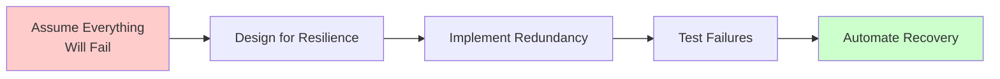

### Monitoring Example

```java
@Component
public class MultiRegionMetrics {
    
    @Autowired
    private MeterRegistry meterRegistry;
    
    public void recordRegionLatency(String region, long latencyMs) {
        Timer.builder("region.request.latency")
            .tag("region", region)
            .tag("status", "success")
            .register(meterRegistry)
            .record(latencyMs, TimeUnit.MILLISECONDS);
    }
    
    public void recordFailover(String from, String to, long durationMs) {
        Counter.builder("failover.count")
            .tag("from", from)
            .tag("to", to)
            .register(meterRegistry)
            .increment();
        
        Timer.builder("failover.duration")
            .register(meterRegistry)
            .record(durationMs, TimeUnit.MILLISECONDS);
    }
}
```

### Automation Example

```bash
#!/bin/bash
# automate-failover.sh

REGION=$1
HEALTH_URL="http://localhost:8080/actuator/health"

if ! curl -f $HEALTH_URL; then
    echo "Region $REGION is unhealthy, initiating failover..."
    aws route53 change-resource-record-sets \
        --hosted-zone-id Z123456789 \
        --change-batch '{"Changes":[{"Action":"UPSERT","ResourceRecordSet":{"Name":"api.example.com","Type":"A","TTL":10,"ResourceRecords":[{"Value":"backup-region-ip"}]}}]}'
    echo "Failover completed"
else
    echo "Region $REGION is healthy"
fi
```

---

## ❌ Anti-Patterns to Avoid

### Anti-Pattern 1: Single Region with "Backup Plan"

❌ **The Mistake:**
> "We'll just restore from backup if something happens"

**Why it's wrong:**
- RTO is hours/days, not minutes
- RPO is significant (data loss between last backup and failure)
- Not tested regularly
- No automation

✅ **The Solution:**
Implement proper multi-region with automated failover

### Anti-Pattern 2: Synchronous Replication Everywhere

❌ **The Mistake:**
```java
// Using synchronous replication for everything
@Transactional
public void updateUser(User user) {
    primaryRepo.save(user);
    replicaRepo.save(user);  // ❌ Blocks on every write
    cacheRepo.save(user);    // ❌ Blocks on every write
}
```

**Why it's wrong:**
- Unnecessary latency for non-critical data
- Reduced availability (any replica down = write fails)
- Higher costs

✅ **The Solution:**
Use hybrid approach - sync for critical, async for non-critical

### Anti-Pattern 3: Ignoring the "Split-Brain" Problem

❌ **The Mistake:**
> "We'll just let both regions be active and see what happens"

**Why it's wrong:**
- Data divergence
- Conflict resolution nightmares
- Inconsistent user experience

✅ **The Solution:**
Use quorum-based consensus or designate single active region

### Anti-Pattern 4: Cold Standby for Passive Region

❌ **The Mistake:**
> "We'll just spin up instances when needed"

**Why it's wrong:**
- Failover takes 15-30 minutes (instance startup)
- Database promotion takes additional time
- Users experience extended outage

✅ **The Solution:**
Keep passive region warm with scaled-down but running instances

### Anti-Pattern 5: No Data Reconciliation Before Failback

❌ **The Mistake:**
```java
// Immediately failback without checking
if (regionA.isHealthy()) {
    failoverTo(regionA);  // ❌ Data might be inconsistent!
}
```

**Why it's wrong:**
- Data drift between regions
- Lost updates during failover period
- Corrupted data

✅ **The Solution:**
Always verify data consistency before failback

### Anti-Pattern 6: Hard-Coding Region Endpoints

❌ **The Mistake:**
```java
// Hard-coded database URL
String dbUrl = "jdbc:postgresql://us-east-1-db.example.com:5432/myapp";
```

**Why it's wrong:**
- Cannot failover without code changes
- Requires redeployment
- Not flexible

✅ **The Solution:**
Use service discovery or configuration management

```java
// Dynamic endpoint resolution
String dbUrl = configService.getDatabaseEndpoint(currentRegion);
```

### Anti-Pattern 7: Forgetting About DNS TTL

❌ **The Mistake:**
> "We'll update DNS when we need to failover"

**Why it's wrong:**
- DNS TTL of 24 hours means users still routed to failed region for hours
- ISP DNS caches ignore your TTL
- Manual DNS updates are slow

✅ **The Solution:**
Use low TTL (60s) and automated DNS updates

---

## 🏋️ Practice Exercises

### Exercise 1: Design a Multi-Region Architecture

**Scenario:**
You're designing a multi-region architecture for a global e-commerce platform with:
- 10M users across US, Europe, and Asia
- Peak traffic: 100K requests/second
- Requirements: 99.99% availability, < 100ms latency

**Task:**
1. Choose 3 regions and justify your selection
2. Design the compute layer (how many instances, what size)
3. Design the data layer (primary/replica setup, replication strategy)
4. Choose consistency models for different data types
5. Design the geo-routing strategy
6. Calculate estimated costs

<details>
<summary>Click to see solution</summary>

**1. Region Selection:**
- **us-east-1 (N. Virginia):** Primary for North America, large user base
- **eu-west-1 (Ireland):** Primary for Europe, GDPR compliance
- **ap-southeast-1 (Singapore):** Primary for Asia-Pacific

**2. Compute Layer:**
```
Per Region:
- 50 application instances (5 CPU, 2GB RAM each)
- Auto-scaling: 30-100 instances based on load
- Load balancer with health checks
```

**3. Data Layer:**
```
Primary: us-east-1 (PostgreSQL with read replicas)
Replicas: 
  - eu-west-1 (async replication, RPO ~5s)
  - ap-southeast-1 (async replication, RPO ~5s)
Cache: Redis cluster in each region
```

**4. Consistency Models:**
- **Strong:** User accounts, inventory (prevent overselling)
- **Eventual:** Product reviews, user preferences
- **Session:** Shopping cart (sync before checkout)

**5. Geo-Routing:**
- Route 53 with geolocation routing
- Health checks every 10 seconds
- Automatic failover with 60s TTL

**6. Estimated Costs:**
- Compute: ~$15K/month (3 regions × 50 instances)
- Database: ~$8K/month (primary + replicas)
- Data transfer: ~$3K/month (inter-region replication)
- **Total: ~$26K/month**

</details>

### Exercise 2: Implement Geo-Routing Logic

**Task:**
Write a Spring Boot service that:
1. Detects user location from IP address
2. Finds the nearest healthy region
3. Returns the appropriate API endpoint
4. Falls back to default region if nearest is unhealthy

<details>
<summary>Click to see solution</summary>

```java
@Service
public class GeoRoutingService {
    
    private final RegionHealthService regionHealthService;
    private final GeoLocationService geoLocationService;
    
    private static final Map<String, String> REGION_MAPPING = Map.of(
        "US", "us-east-1",
        "CA", "us-east-1",
        "GB", "eu-west-1",
        "DE", "eu-west-1",
        "FR", "eu-west-1",
        "JP", "ap-northeast-1",
        "SG", "ap-southeast-1",
        "AU", "ap-southeast-1"
    );
    
    public String getEndpointForUser(String clientIp) {
        // Step 1: Detect location
        Location location = geoLocationService.locate(clientIp);
        String countryCode = location.getCountryCode();
        
        // Step 2: Find preferred region
        String preferredRegion = REGION_MAPPING.getOrDefault(
            countryCode, 
            "us-east-1"  // Default
        );
        
        // Step 3: Check if preferred region is healthy
        if (regionHealthService.isHealthy(preferredRegion)) {
            return getRegionEndpoint(preferredRegion);
        }
        
        // Step 4: Find alternative healthy region
        String fallbackRegion = regionHealthService.findHealthyRegion(
            preferredRegion
        );
        
        log.warn("Preferred region {} unhealthy, using fallback: {}", 
            preferredRegion, fallbackRegion);
        
        return getRegionEndpoint(fallbackRegion);
    }
    
    private String getRegionEndpoint(String region) {
        return String.format("https://%s.api.example.com", region);
    }
}
```

</details>

### Exercise 3: Handle Failover Scenario

**Task:**
Given the following scenario, outline the failover process:
- Current state: us-east-1 is active, eu-west-1 is passive
- Event: us-east-1 becomes unresponsive
- Requirements: RTO < 5 minutes, RPO < 30 seconds

<details>
<summary>Click to see solution</summary>

**Failover Process:**

1. **Detection (0-30 seconds):**
   - Health checks fail for 3 consecutive attempts
   - Alert triggered: "us-east-1 unhealthy"

2. **Decision (instant):**
   - Failover controller confirms eu-west-1 is healthy
   - Check replication lag: 15 seconds (within RPO)

3. **Database Promotion (30-90 seconds):**
   ```bash
   # Promote eu-west-1 database
   ssh eu-west-1-db 'pg_promote --terminate'
   # Verify: SELECT pg_is_in_recovery(); → returns false
   ```

4. **Routing Update (90-120 seconds):**
   ```bash
   # Update Route 53 with 10s TTL
   aws route53 change-resource-record-sets \
     --change-batch '{"Changes":[{"Action":"UPSERT",...}]}'
   ```

5. **Verification (120-180 seconds):**
   - Health checks pass on eu-west-1
   - Traffic flowing correctly
   - No errors in logs

6. **Notification (180-240 seconds):**
   - Alert sent to on-call team
   - Incident ticket created
   - Status page updated

**Total RTO: ~4 minutes** ✅ (within 5-minute requirement)

**Data Loss: 15 seconds** ✅ (within 30-second RPO)

</details>

---

## ❓ Question Bank

### Multiple Choice Questions

**1. What is the primary benefit of multi-region architecture?**
- A) Reduced costs
- B) Lower latency for global users
- C) Simpler architecture
- D) Fewer servers needed

<details>
<summary>Answer</summary>
**B) Lower latency for global users** - Multi-region places servers closer to users, reducing latency. While it can improve availability, the primary driver is user experience.
</details>

**2. Which consistency model ensures all reads return the most recent write?**
- A) Eventual consistency
- B) Strong consistency
- C) Causal consistency
- D) Read-your-writes consistency

<details>
<summary>Answer</summary>
**B) Strong consistency** - Strong consistency guarantees that all nodes see the same data at the same time. Every read returns the most recent write or an error.
</details>

**3. What is the CAP theorem?**
- A) A database indexing strategy
- B) A consistency model
- C) A fundamental theorem about distributed systems trade-offs
- D) A caching algorithm

<details>
<summary>Answer</summary>
**C) A fundamental theorem about distributed systems trade-offs** - CAP states that a distributed system can only provide 2 of 3 guarantees: Consistency, Availability, and Partition Tolerance.
</details>

**4. In active-passive failover, what is the passive region?**
- A) A region that is turned off
- B) A region that handles read traffic only
- C) A warm standby ready to take over
- D) A region used for backups only

<details>
<summary>Answer</summary>
**C) A warm standby ready to take over** - The passive region has running instances and a replicated database, ready to be promoted to active if needed.
</details>

**5. What is RTO?**
- A) Recovery Time Objective - how long to recover
- B) Recovery Point Objective - how much data you can lose
- C) Regional Transfer Operation
- D) Replication Timeout Offset

<details>
<summary>Answer</summary>
**A) Recovery Time Objective** - RTO is the maximum acceptable downtime. It's the target time to restore service after a failure.
</details>

### Scenario-Based Questions

**6. You have a social media application. Users post content that is visible globally. Which replication strategy should you use?**

<details>
<summary>Answer</summary>
**Asynchronous replication** - Social media posts can tolerate brief inconsistency. Users expect posts to appear quickly for themselves but don't need instant global visibility. Async replication provides low latency writes and high availability.
</details>

**7. Your banking application requires that account balances are always accurate. Which consistency model and replication strategy should you use?**

<details>
<summary>Answer</summary>
**Strong consistency with synchronous replication** - Financial data cannot be incorrect. Strong consistency ensures all reads see the latest balance. Synchronous replication prevents data loss during failover, though it adds latency.
</details>

**8. During failover, you notice that some data written in the last 30 seconds is missing in the new active region. What went wrong?**

<details>
<summary>Answer</summary>
**Asynchronous replication with data loss** - The failed region hadn't replicated the last 30 seconds of writes to the passive region before failing. This is the RPO (Recovery Point Objective) of async replication. To prevent this, either use synchronous replication for critical data or accept the RPO in your disaster recovery plan.
</details>

**9. Users in Europe are experiencing 150ms latency, but users in the US have 20ms latency. What's the likely issue?**

<details>
<summary>Answer</summary>
**Geo-routing misconfiguration** - European users are likely being routed to the US region instead of the European region. Check:
1. Geo-DNS configuration
2. Health checks for EU region
3. DNS TTL settings
4. CDN configuration
</details>

**10. After failover, the system enters a "split-brain" state where both regions are accepting writes. How do you prevent this?**

<details>
<summary>Answer</summary>
**Implement quorum-based consensus** - Use a consensus algorithm (like Raft or Paxos) or a quorum system where a region can only become active if it receives votes from a majority of regions. This prevents both regions from being active simultaneously during network partitions.
</details>

### Design Questions

**11. Design a multi-region architecture for a real-time chat application serving 50M users globally. Consider:**
- Latency requirements (< 50ms)
- Message ordering
- Offline message delivery
- Scalability

<details>
<summary>Answer</summary>

**Architecture:**

1. **Regions:** us-east-1, eu-west-1, ap-southeast-1

2. **Compute:**
   - WebSocket servers in each region (stateless)
   - Message brokers (Kafka) in each region
   - Auto-scaling based on connection count

3. **Data:**
   - User profiles: Strong consistency, sync replication
   - Chat messages: Eventual consistency, async replication
   - Online status: Local to region, TTL-based

4. **Message Flow:**
   ```
   User A (US) → US Region → Kafka → Async Replicate → EU Region → User B (EU)
   ```
   - If User B is in same region: < 20ms
   - If cross-region: < 100ms (acceptable for chat)

5. **Offline Messages:**
   - Store in region closest to recipient
   - Deliver when user comes online
   - Use push notifications

6. **Ordering:**
   - Use vector clocks or sequence numbers
   - Per-user ordering (not global)
   - Resolve conflicts on client

</details>

**12. How would you handle database schema changes in a multi-region environment?**

<details>
<summary>Answer</summary>

**Strategy:**

1. **Backward-Compatible Changes:**
   - Add new columns (nullable)
   - Add new tables
   - Deprecate old columns (don't delete immediately)

2. **Deployment Order:**
   ```
   1. Deploy schema change to primary (backward compatible)
   2. Deploy application code (handles both old and new schema)
   3. Deploy schema change to replicas
   4. Deploy cleanup code (removes old columns)
   ```

3. **Zero-Downtime Migrations:**
   - Use expand-contract pattern
   - Dual-write period
   - Backfill data
   - Switch reads to new schema
   - Remove old schema

4. **Rollback Plan:**
   - Keep old code version deployed
   - Ability to revert schema changes
   - Test rollback procedure

</details>

**13. Your multi-region setup is experiencing replication lag of 2 minutes. How do you diagnose and fix this?**

<details>
<summary>Answer</summary>

**Diagnosis:**

1. **Check Network:**
   ```bash
   # Measure latency between regions
   ping primary-db.example.com
     → 70ms (normal)
   
   # Check bandwidth
   iperf3 -c primary-db
     → 1Gbps (should be sufficient)
   ```

2. **Check Database:**
   ```sql
   -- Check replication status
   SELECT * FROM pg_stat_replication;
   
   -- Check WAL lag
   SELECT pg_current_wal_lsn() - replay_lsn AS lag_bytes
   FROM pg_stat_replication;
   ```

3. **Check Load:**
   - Primary write throughput: 10K writes/sec
   - Replica can handle: 15K writes/sec
   - Network capacity: Sufficient

**Solutions:**

1. **Optimize Replication:**
   - Use parallel replication
   - Increase wal_sender_timeout
   - Tune checkpoint settings

2. **Scale Resources:**
   - Upgrade replica instance size
   - Add more read replicas
   - Use read replica pooling

3. **Reduce Write Load:**
   - Batch writes
   - Use write-behind caching
   - Partition data across regions

</details>

**14. How do you ensure data privacy compliance (GDPR, CCPA) in a multi-region architecture?**

<details>
<summary>Answer</summary>

**Strategy:**

1. **Data Residency:**
   - EU user data stays in eu-west-1
   - US user data stays in us-east-1
   - No cross-region replication of PII

2. **Encryption:**
   - Encrypt data at rest (AES-256)
   - Encrypt data in transit (TLS 1.3)
   - Customer-managed encryption keys (CMEK)

3. **Access Control:**
   - Region-based access policies
   - Audit logging for all data access
   - Data classification tags

4. **Right to be Forgotten:**
   - Soft delete with retention period
   - Hard delete after retention
   - Cascade delete across all regions

5. **Data Minimization:**
   - Only store necessary data
   - Anonymize analytics data
   - Regular data audits

</details>

**15. What testing strategies do you use for multi-region failover?**

<details>
<summary>Answer</summary>

**Testing Strategy:**

1. **Unit Tests:**
   - Test failover logic in isolation
   - Mock region health checks
   - Verify routing decisions

2. **Integration Tests:**
   - Test database promotion
   - Test DNS updates
   - Test data replication

3. **Chaos Engineering:**
   - Kill primary region instances
   - Simulate network partitions
   - Inject latency between regions
   - Test under load

4. **Game Days:**
   - Quarterly full failover drills
   - Measure RTO and RPO
   - Test failback procedures
   - Involve entire on-call team

5. **Canary Deployments:**
   - Route 1% traffic to new region
   - Monitor for errors
   - Gradually increase

6. **Monitoring Validation:**
   - Verify alerts fire correctly
   - Test dashboard accuracy
   - Validate metrics collection

</details>

---

## 🌟 Real-World Case Studies

### Case Study 1: Netflix - Global Streaming at Scale

**Challenge:**
- 200M+ members across 190+ countries
- 99.99% availability requirement
- Peak traffic: 15,000 GB/s bandwidth

**Solution:**
```mermaid
graph TB
    subgraph "Netflix Multi-Region Architecture"
        subgraph "AWS Regions"
            US[US East<br/>Primary]
            EU[Europe<br/>Secondary]
            AS[Asia Pacific<br/>Secondary]
        end
        
        subgraph "Open Connect CDN"
            CDN1[Edge Server<br/>Paris]
            CDN2[Edge Server<br/>Tokyo]
            CDN3[Edge Server<br/>São Paulo]
        end
        
        Users[200M Users] --> CDN1
        Users --> CDN2
        Users --> CDN3
        
        CDN1 -.->|Cache Miss| EU
        CDN2 -.->|Cache Miss| AS
        CDN3 -.->|Cache Miss| US
    end
```

**Key Strategies:**
1. **Open Connect CDN:** Custom CDN with embedded servers in ISP networks
2. **Active-Active:** All regions can serve traffic
3. **Chaos Engineering:** Simian Army (Chaos Monkey, Latency Monkey, etc.)
4. **Auto-Scaling:** Handle 30% traffic spikes automatically

**Results:**
- 99.99% availability
- < 100ms latency for 95% of users
- Zero-downtime deployments
- Automatic recovery from AZ failures

**Lessons Learned:**
- Invest in observability
- Test failures constantly
- Design for graceful degradation
- Automate everything

### Case Study 2: Amazon - Retail Platform

**Challenge:**
- Global e-commerce with seasonal spikes (Prime Day, Black Friday)
- Inventory management across regions
- Payment processing consistency

**Solution:**
- **Regions:** 25+ geographic regions
- **Availability Zones:** 3-6 per region
- **Replication:** Synchronous for inventory, async for catalog
- **Failover:** Automated with 30-second RTO

**Key Innovation:**
Two-phase commit for shopping cart and inventory:
```java
// Amazon's approach to distributed transactions
beginTransaction();
  reserveInventory(itemId, quantity);      // Sync
  processPayment(orderId, amount);         // Sync
  updateInventory(itemId, -quantity);      // Sync
commitTransaction();
```

**Results:**
- Handles 1M+ transactions/second on Prime Day
- Zero overselling (strong consistency for inventory)
- < 2 second page load times globally

### Case Study 3: Airbnb - Global Marketplace

**Challenge:**
- Search and booking across 220+ countries
- Real-time availability calendar
- Multi-currency, multi-language support

**Solution:**
- **Primary Region:** us-east-1
- **Read Replicas:** eu-west-1, ap-southeast-1
- **Caching:** Redis clusters per region
- **Search:** Elasticsearch with per-region indices

**Architecture:**
```
User Search (Paris) 
  → eu-west-1 (Elasticsearch)
  → Local cache (Redis)
  → Response: < 50ms

Booking Write
  → us-east-1 (Primary DB)
  → Async replicate to all regions
  → Response: < 100ms
```

**Results:**
- 150M+ users
- 7M+ listings
- < 100ms search globally
- 99.95% availability

---

## 📝 Summary & Key Takeaways

### 🎯 Core Concepts Recap

1. **Regions & AZs:** Geographic distribution for fault tolerance
2. **Stateless Compute:** Easy to replicate, deploy anywhere
3. **Stateful Data:** Hard to replicate, requires careful planning
4. **Replication Strategies:** Sync (strong consistency) vs Async (low latency)
5. **Consistency Models:** Strong vs eventual trade-offs
6. **Geo-Routing:** Direct users to nearest region
7. **Failover:** Automated promotion of passive to active
8. **Failback:** Safe return to original region

### 💡 Key Insights

**The Golden Rules:**
1. ✅ **Design for failure** - Assume everything will fail
2. ✅ **Automate everything** - Manual processes are too slow
3. ✅ **Monitor everything** - You can't fix what you can't see
4. ✅ **Test constantly** - Failover only works if you practice
5. ✅ **Start simple** - Begin with 2 regions, expand as needed

**Common Mistakes to Avoid:**
1. ❌ Don't use synchronous replication everywhere
2. ❌ Don't forget about DNS TTL during failover
3. ❌ Don't skip data reconciliation before failback
4. ❌ Don't keep passive regions cold
5. ❌ Don't ignore the split-brain problem

### 📊 Decision Matrix

| Requirement | Recommended Approach |
|-------------|---------------------|
| Financial transactions | Sync replication, strong consistency |
| User profiles | Async replication, eventual consistency |
| Global content delivery | CDN + multi-region, eventual consistency |
| Real-time collaboration | Multi-master with conflict resolution |
| E-commerce inventory | Sync replication or async with compensation |
| Analytics data | Async replication, eventual consistency |

### 🚀 Next Steps

1. **Assess Your Needs:**
   - Identify user geography
   - Define RTO/RPO requirements
   - Calculate budget

2. **Start Small:**
   - Begin with 2 regions
   - Implement basic failover
   - Test thoroughly

3. **Expand Gradually:**
   - Add more regions as needed
   - Implement geo-routing
   - Optimize performance

4. **Mature Operations:**
   - Automate failover
   - Implement chaos engineering
   - Continuous improvement

---

## 📚 Further Reading

### Official Documentation
- [AWS Global Infrastructure](https://aws.amazon.com/about-aws/global-infrastructure/)
- [Azure Global Infrastructure](https://azure.microsoft.com/en-us/global-infrastructure/)
- [Google Cloud Global Network](https://cloud.google.com/about/locations)
- [Cloudflare Network Map](https://www.cloudflare.com/network/)

### Books
- **"Designing Data-Intensive Applications"** by Martin Kleppmann
- **"The Art of Scalability"** by Martin L. Abbott
- **"Site Reliability Engineering"** by Google
- **"Database Internals"** by Alex Petrov

### Courses
- [AWS Certified Solutions Architect](https://aws.amazon.com/certification/)
- [Google Cloud Professional Architect](https://cloud.google.com/certification)
- [Distributed Systems on Coursera](https://www.coursera.org/specializations/distributed-systems)

### Tools & Frameworks
- **Orchestration:** Kubernetes, Docker Swarm
- **Service Mesh:** Istio, Linkerd
- **Databases:** PostgreSQL (with replication), Cassandra, CockroachDB
- **Caching:** Redis, Memcached
- **Monitoring:** Prometheus, Grafana, Datadog
- **DNS:** Cloudflare, AWS Route 53, Google Cloud DNS

### Community Resources
- [High Scalability Blog](http://highscalability.com/)
- [AWS Architecture Blog](https://aws.amazon.com/blogs/architecture/)
- [Netflix Tech Blog](https://netflixtechblog.com/)
- [Google Cloud Blog](https://cloud.google.com/blog)

### Research Papers
- [The Google File System](https://research.google/publish/pub/gfs/)
- [Amazon DynamoDB](https://www.allthingsdistributed.com/files/amazon-dynamo-sosp2007.pdf)
- [Spanner: Google's Globally-Distributed Database](https://research.google/publish/pub/spanner-googles-globally-distributed-database/)

---

## 🎓 Practice Exercises (Advanced)

### Exercise 4: Multi-Master Replication

**Task:**
Design a multi-master (multi-active) replication system for a collaborative document editing application. Consider:
- Conflict resolution
- Data convergence
- Latency optimization

**Hints:**
- Research CRDTs (Conflict-free Replicated Data Types)
- Consider vector clocks for versioning
- Implement operational transforms

### Exercise 5: Cost Optimization

**Task:**
Your multi-region setup costs $50K/month. Reduce costs by 30% without sacrificing availability or performance.

**Consider:**
- Right-sizing instances
- Reserved instances vs on-demand
- Data transfer costs
- Storage optimization

### Exercise 6: Disaster Recovery Drill

**Task:**
Plan and execute a full disaster recovery drill:
1. Simulate complete region failure
2. Measure RTO and RPO
3. Document issues
4. Improve procedures

**Deliverables:**
- Runbook
- Timeline of events
- Metrics report
- Lessons learned document

---

## 🏆 Final Assessment

Test your understanding by answering these questions:

1. **When would you choose synchronous over asynchronous replication?**
2. **How do you prevent split-brain scenarios?**
3. **What's the difference between RTO and RPO?**
4. **Why is geo-routing important for global applications?**
5. **How do you handle schema changes in multi-region?**
6. **What metrics should you monitor in multi-region?**
7. **How do you test failover without affecting users?**
8. **What's the impact of DNS TTL on failover time?**
9. **When should you use active-active vs active-passive?**
10. **How do you ensure data privacy compliance across regions?**

<details>
<summary>Click for Answers</summary>

1. Financial transactions, healthcare data, inventory management
2. Quorum-based consensus, fencing tokens, lease mechanisms
3. RTO = time to recover, RPO = data loss window
4. Reduces latency by routing to nearest region
5. Use backward-compatible changes, expand-contract pattern
6. Health, latency, replication lag, failover metrics
7. Use canary deployments, chaos engineering, staging environments
8. Lower TTL = faster failover, but more DNS queries
9. Active-active for read-heavy, active-passive for simpler failover
10. Data residency laws, encryption, access controls, audit logs

</details>

---

## 🎉 Congratulations!

You've completed the comprehensive guide to Multi-Region Architecture! 

**What you've learned:**
- ✅ Geographic distribution with regions and AZs
- ✅ Stateless vs stateful challenges
- ✅ Replication strategies and consistency models
- ✅ Geo-routing for optimal performance
- ✅ Failover and failback procedures
- ✅ Best practices and anti-patterns
- ✅ Real-world implementations

**Next steps:**
1. Review the practice exercises
2. Implement a simple multi-region setup
3. Test failover in a staging environment
4. Join distributed systems communities
5. Build something amazing! 🚀

---

**Found this helpful?** Share it with your team and start building resilient, global applications!

**Questions or feedback?** Reach out and let's discuss multi-region architecture!

---

*Last Updated: June 2025 | Version 1.0*