# Must-Know Failure Modes in Distributed Systems: A Comprehensive Tutorial

## Introduction

Distributed systems power almost everything we use today — from banking applications and e-commerce platforms to social media and cloud storage. But distributing data and computation across multiple machines introduces a unique set of failure modes that don't exist in single-machine systems.

Understanding these failure modes isn't just academic — it's essential for designing systems that degrade gracefully instead of catastrophically. In this tutorial, we'll explore **six critical failure modes** that every backend engineer, SRE, and system architect should deeply understand:

1. **Network Partitions**
2. **Split-Brain Scenarios**
3. **Partial Failures**
4. **Gray Failures**
5. **The Amplification Loop**
6. **Cascading Failures**

For each failure mode, we'll cover the **core concept**, **why it happens**, **real-world examples**, **detailed diagrams**, and **mitigation strategies**.

---

## Overview: How These Failures Relate

Before diving in, it helps to see the big picture. These failure modes are not isolated — they often *cause* or *feed into* each other.

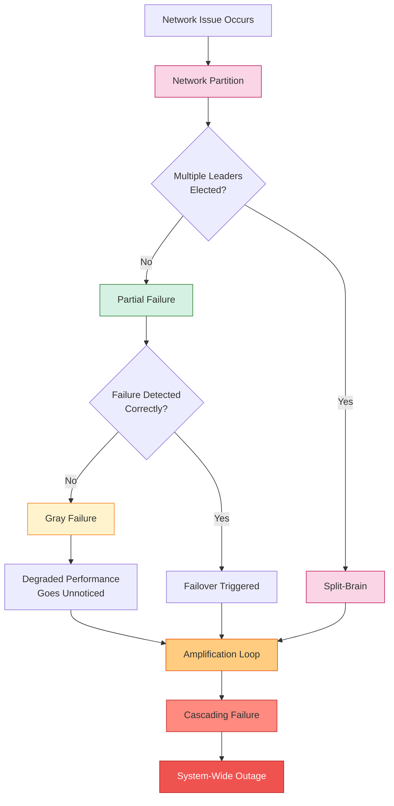

This diagram shows the typical "failure chain" — a small network blip can spiral into a full outage if the system isn't designed to handle each link in this chain correctly.

---

## 1. Network Partition

### What Is It?

A **network partition** (often called a "split" in network terms) occurs when a network failure divides a cluster of nodes into two or more groups that **cannot communicate with each other**, even though all the nodes themselves are still alive and functioning.

The critical insight is this: **each side of the partition believes it is the "whole world."** Cluster Half A keeps working normally, internally consistent, completely unaware that Cluster Half B exists — and vice versa.

### Visualizing a Network Partition

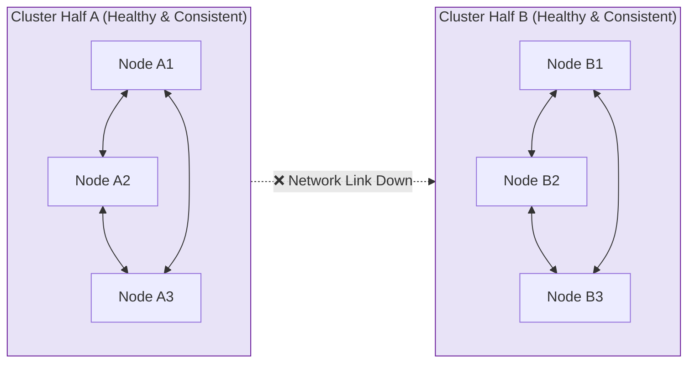

### Step-by-Step Explanation

1. **Normal Operation**: All six nodes (A1, A2, A3, B1, B2, B3) form one cohesive cluster, communicating freely and replicating data.
2. **The Partition Occurs**: A switch fails, a fiber cable is cut, a cloud provider's availability zone loses connectivity, or a firewall misconfiguration blocks traffic. Suddenly, A1-A2-A3 can talk to each other, and B1-B2-B3 can talk to each other, but **no messages cross the divide**.
3. **Both Sides Continue Operating**: Since each side still has a majority of *its own* members talking to each other, neither side immediately "knows" something is wrong. They each assume the other side has crashed (or simply don't have enough information to tell the difference between "crashed" and "unreachable").
4. **Divergence Begins**: If both sides accept writes (more on this in Split-Brain below), the data on each side starts to diverge.

### Real-World Examples

**Example 1: Cross-Region Database Cluster**
Imagine a PostgreSQL cluster with synchronous replicas in `us-east-1` and `us-west-2`. A transatlantic/cross-region network link experiences a 5-minute outage due to a routing misconfiguration at the cloud provider. During those 5 minutes:
- The `us-east-1` nodes can't reach `us-west-2` nodes.
- Each region thinks the other has gone down.

**Example 2: Kubernetes Cluster Node Isolation**
A worker node in a Kubernetes cluster loses connectivity to the control plane (etcd) due to a misconfigured VPC routing table, but the node itself, and the pods running on it, remain healthy and serving traffic. The control plane marks the node as `NotReady` and may try to reschedule its pods elsewhere — even though the pods are still running and serving requests from the "partitioned" node.

**Example 3: Microservices Behind a Service Mesh**
A service mesh sidecar proxy (like Envoy) experiences a DNS resolution failure, causing Service A to lose the ability to reach Service B's pods in a different availability zone, even though both services are healthy individually.

### Use Cases — Where This Matters

| Scenario | Why It Matters |
|----------|----------------|
| **Multi-region databases** | Determines whether you favor consistency (reject writes during partition) or availability (accept writes on both sides and reconcile later) — this is the heart of the CAP theorem |
| **Distributed caches (e.g., Redis Cluster)** | Partitioned cache nodes might serve stale data to part of your fleet |
| **Consensus systems (etcd, ZooKeeper, Raft-based systems)** | Designed explicitly to handle partitions by requiring a quorum (majority) before accepting writes |
| **Microservice service discovery** | A partitioned service registry can cause services to route to dead endpoints or fail to find healthy ones |

### Mitigation Strategies

- **Quorum-based consensus** (Raft, Paxos): Require a majority of nodes to agree before committing writes, so a minority partition cannot make conflicting decisions.
- **Timeouts and heartbeats**: Use well-tuned heartbeat intervals to detect partitions quickly without causing false positives.
- **Multi-region active-passive setups**: Designate a clear "source of truth" region to avoid ambiguity.
- **Chaos engineering**: Regularly simulate network partitions (e.g., using tools like Chaos Monkey, Toxiproxy, or Gremlin) to validate your system's behavior.

---

## 2. Split-Brain

### What Is It?

**Split-brain** is what happens when a network partition causes **both halves of a cluster to elect their own leader** and continue accepting writes independently. The result: two "valid" but conflicting histories of data that cannot be cleanly merged once the partition heals.

This is one of the most dangerous failure modes because it can lead to **silent data corruption** or **data loss** — and by the time anyone notices, both sides may have accepted hundreds or thousands of conflicting transactions.

### Visualizing Split-Brain

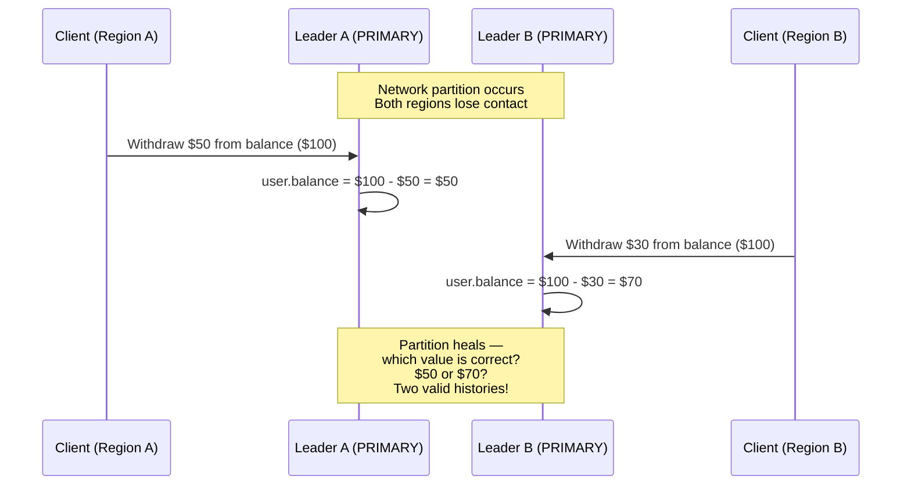

### Step-by-Step Explanation

1. **Initial State**: Both Cluster Half A and Cluster Half B believe they are the "PRIMARY" (leader) for `user.balance`, which starts at $100.
2. **The Partition Hits**: As shown in the original diagram, the network link between A and B goes down.
3. **Each Side Elects/Retains a Leader**: Because each side can still see a "majority" of *itself* (or because the leader election mechanism is flawed), both Leader A and Leader B believe they are the sole authority.
4. **Conflicting Writes Happen**:
   - Cluster A processes a transaction, updating `user.balance` to $100.
   - Cluster B *independently* processes a different transaction, updating `user.balance` to $50.
5. **The Partition Heals**: Network connectivity is restored. Now the system has two different values for `user.balance` — $100 (from A) and $50 (from B) — and **no way to know which one is "correct"** without additional context, because both were valid operations from each side's perspective.

### Real-World Examples

**Example 1: MySQL Master-Master Replication Gone Wrong**
Two MySQL servers are configured in a master-master setup for high availability. A network blip causes both to believe the other has failed. Both continue accepting writes from their respective application servers. When the network heals, replication conflicts occur — auto-increment IDs collide, or the same row is updated with different values on each side.

**Example 2: Elasticsearch Cluster Without Proper Quorum Settings**
Before Elasticsearch enforced strict quorum settings (`minimum_master_nodes`), a network partition in a 3-node cluster could result in two nodes each believing they were the master, leading to **two different cluster states** and potential data loss when shards were reassigned differently on each side.

**Example 3: Distributed Lock Services**
Imagine a distributed lock manager (used to ensure only one worker processes a job at a time). If split-brain occurs, **two workers might both believe they hold the lock** and process the same job twice — for example, sending a duplicate payment or shipping notification.

**Example 4: Banking/Financial Systems**
This is the scenario depicted in the original diagram. A user's account balance of $100 is modified independently on both sides of a partition — one side processes a $50 charge (leaving $50) and the other processes a $50 deposit (leaving... wait, conflicting values). When the partition heals, **reconciling these two histories may require manual intervention**, and in the worst case, money can simply "disappear" or be double-spent.

### Use Cases — Where This Matters

| Scenario | Impact of Split-Brain |
|----------|----------------------|
| **Financial transactions** | Double-spending, incorrect balances, regulatory/compliance violations |
| **Inventory management systems** | Overselling products (two warehouses both think they have the last item) |
| **Distributed task queues** | Duplicate job execution (e.g., sending an email twice) |
| **DNS/Configuration management** | Conflicting configuration states across regions leading to inconsistent behavior |
| **Booking systems (flights, hotels)** | Double-booking the same seat or room |

### Mitigation Strategies

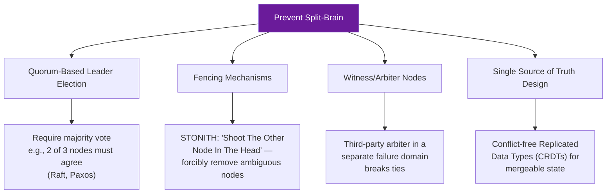

- **Quorum-based systems** (Raft, Paxos, ZAB): A leader can only be elected and can only commit writes if it has the support of a *majority* of nodes. In a 2-way split of a 3-node cluster, only one side can have a majority.
- **Fencing tokens**: Issue monotonically increasing tokens to leaders; downstream systems reject writes from a leader with an outdated token.
- **STONITH (Shoot The Other Node In The Head)**: In high-availability clusters, forcibly power off or isolate a node suspected of being part of a stale partition before allowing a new leader to take over.
- **CRDTs (Conflict-free Replicated Data Types)**: For systems where availability is more important than strict consistency, use data structures that can be merged automatically without conflicts (e.g., counters, sets).
- **Odd number of nodes**: Always deploy clusters with an odd number of voting members (3, 5, 7) to avoid tie situations during elections.

---

## 3. Partial Failures

### What Is It?

A **partial failure** occurs when a request between a client and server fails in a way that leaves the **outcome ambiguous**. Critically, there are **four different things that could have happened**, and from the client's perspective, **all four look identical**: the client simply doesn't get a response.

### Visualizing the Four Indistinguishable Outcomes

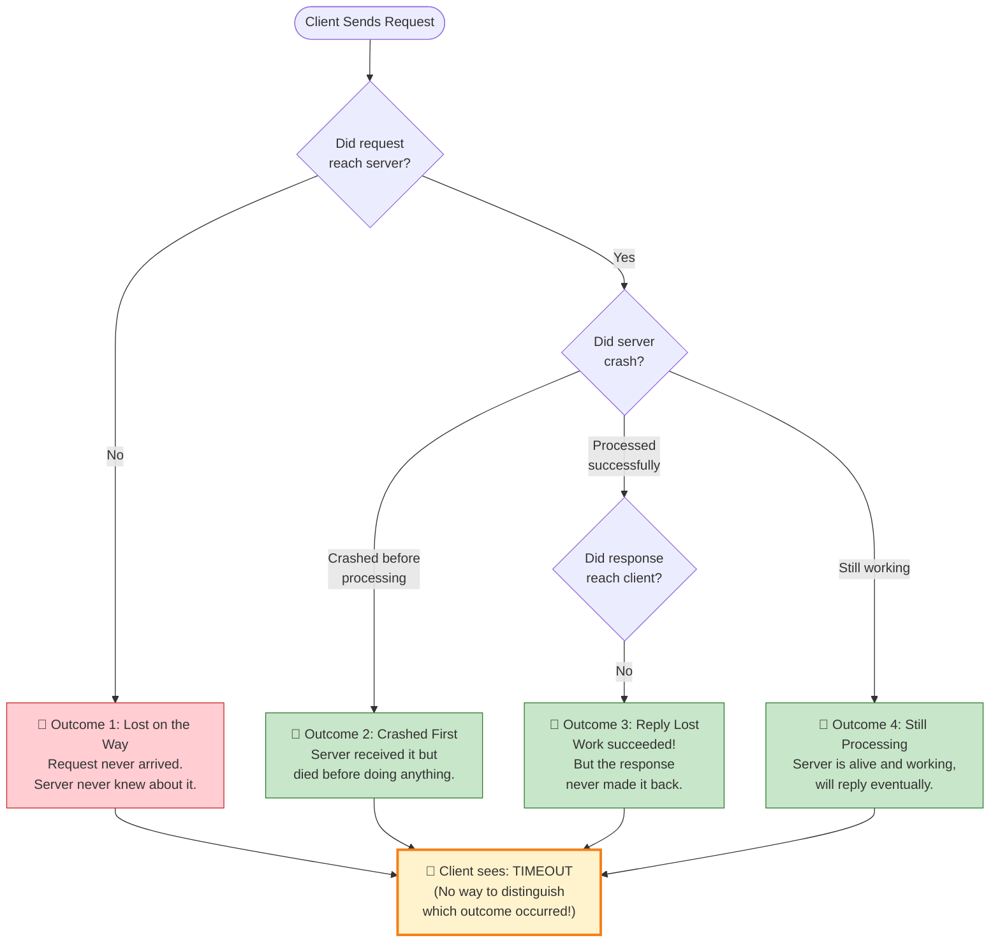

### Step-by-Step Explanation

Let's break down each of the four outcomes in detail:

1. **Lost on the Way (Request Lost)**
   - The client sends a request, but it never arrives at the server — perhaps due to a dropped packet, a network partition, or a load balancer routing it to a dead node.
   - **From the client's view**: No response received, timeout occurs.
   - **From the server's view**: Nothing happened at all — it has zero knowledge a request was ever sent.

2. **Crashed First (Server Crash Before Processing)**
   - The request arrives at the server, but the server crashes (OOM kill, hardware failure, process restart) *before* it can process the request.
   - **From the client's view**: Identical to Outcome 1 — a timeout.
   - **From the server's view**: It may have logged "received request" but never executed the associated logic.

3. **Reply Lost (Work Succeeded, Response Lost)**
   - The server successfully processes the request — maybe it even writes to a database or charges a credit card — but the response message is lost on the way back to the client (network issue, client crashed while waiting, etc.).
   - **From the client's view**: Identical to Outcomes 1 and 2 — a timeout.
   - **From the server's view**: The work is *done*. This is the most dangerous outcome because **the side effect has already happened**.

4. **Still Processing (Slow but Alive)**
   - The server received the request and is still working on it — maybe it's a long-running computation, a slow database query, or a queue backlog.
   - **From the client's view**: Looks the same as the other three if the client gives up too early (timeout).
   - **From the server's view**: Everything is fine, just slow.

### Why This Matters: The Core Problem

> **The client cannot distinguish between these four outcomes using a timeout alone.** This ambiguity is at the heart of why "exactly-once" delivery is famously difficult (often considered effectively impossible without idempotency) in distributed systems.

### Real-World Examples

**Example 1: Payment Processing**
A user clicks "Pay $50" on an e-commerce checkout page. The request reaches the payment gateway, the charge succeeds (Outcome 3 — Reply Lost), but the response times out due to a network blip. The client (browser) shows an error, and the user clicks "Pay" again. **Result**: The user is charged twice — unless the payment system implements **idempotency keys**.

**Example 2: Distributed Job Queues**
A worker picks up a job to "send welcome email to new user," processes it successfully (Outcome 3), but crashes before acknowledging (ACKing) the message back to the queue. The queue, seeing no ACK, redelivers the job to another worker. **Result**: The user receives two welcome emails — unless the email-sending logic is idempotent (e.g., checks "has this user already received a welcome email?").

**Example 3: Database Write Followed by Network Timeout**
An application sends an `INSERT` statement to a database. The database successfully commits the row (Outcome 3), but the TCP connection drops before the "success" acknowledgment reaches the application. The application, seeing a timeout, retries the `INSERT`. **Result**: A duplicate row is created — unless there's a unique constraint or upsert logic.

**Example 4: API Gateway Timeout During Slow Processing**
A request to generate a PDF report takes 35 seconds, but the API gateway has a 30-second timeout (Outcome 4). The client sees a `504 Gateway Timeout` and assumes failure, but the backend continues processing and eventually writes the PDF to storage — wasting resources on work whose result will never be retrieved.

### Use Cases — Where This Matters

| Scenario | Risk | Solution Pattern |
|----------|------|-------------------|
| **Payment processing** | Double-charging customers | Idempotency keys |
| **Order placement (e-commerce)** | Duplicate orders | Idempotent APIs + deduplication |
| **Email/SMS notifications** | Duplicate messages annoying users | Idempotent sends with dedup checks |
| **Database writes** | Duplicate rows | Unique constraints, upserts |
| **Inventory deduction** | Overselling or underselling stock | Idempotent operations tied to a unique request ID |

### Mitigation Strategies

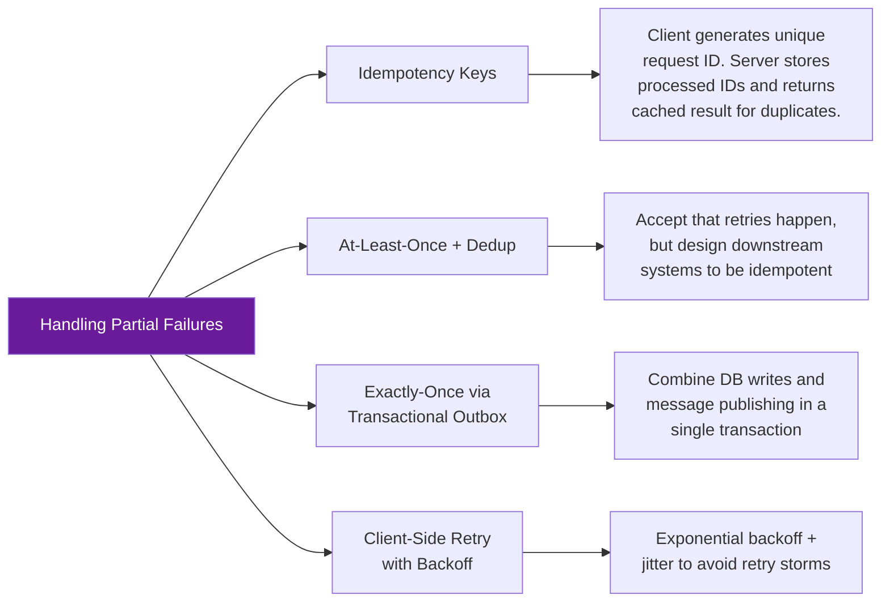

- **Idempotency keys**: Every mutating request includes a unique client-generated key (e.g., a UUID). The server stores which keys it has already processed and, on a duplicate, returns the cached result instead of redoing the work.
- **At-least-once delivery + idempotent consumers**: Accept that messages may be delivered more than once, but ensure processing them multiple times has the same effect as processing them once.
- **Transactional outbox pattern**: Ensure that a database write and an event publication happen atomically, avoiding the "wrote to DB but the event was lost" problem.
- **Timeouts tuned to the operation**: Avoid overly aggressive timeouts that turn "Still Processing" (Outcome 4) into wasted, abandoned work.

---

## 4. Gray Failures

### What Is It?

A **gray failure** is one of the most insidious failure modes because the affected component **appears completely healthy from the outside** (e.g., it responds "OK" to health checks) while it is **actually failing** to do its real job for real users. The component is, in effect, "healthy on the outside, broken on the inside."

### Visualizing Gray Failures

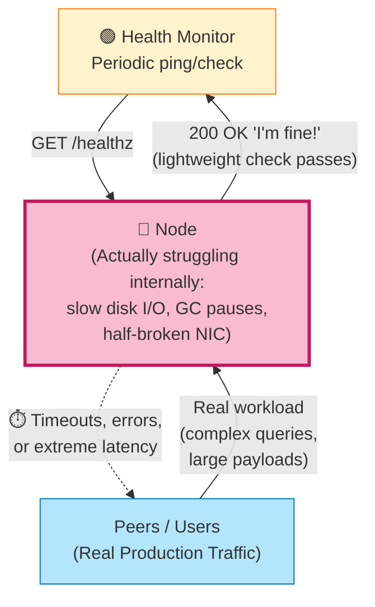

### Step-by-Step Explanation

1. **The Health Check is Too Simple**: Most health checks (e.g., `/healthz` endpoints) test only basic things: "Is the process running?", "Can I open a TCP connection?", "Does a trivial query return in <10ms?" These checks **pass** even when the node is in serious trouble.

2. **The Underlying Resource is Degraded**: Meanwhile, the node might be experiencing:
   - A **failing disk** that's returning I/O errors intermittently or operating at 5% of normal speed.
   - **Long garbage collection (GC) pauses** in a JVM-based service, causing the process to "freeze" for seconds at a time.
   - A **partially failed network interface card (NIC)** that drops a percentage of packets.
   - **Memory pressure** causing excessive swapping.

3. **Lightweight Checks Pass, Real Work Fails**: The health monitor's simple check happens to avoid touching the broken resource (e.g., it doesn't hit the disk, or it's a request small enough to complete during a gap between GC pauses), so it reports "I'm fine!"

4. **Real Traffic Suffers**: Meanwhile, actual production traffic — which involves heavier operations (larger queries, bigger payloads, more I/O) — hits the broken resource and experiences timeouts, errors, or severe latency.

5. **The Node Stays in the Pool**: Because the orchestration system (load balancer, Kubernetes, service mesh) relies on the health check, **this struggling node continues receiving traffic**, degrading the experience for a fraction of users while looking perfectly fine on dashboards.

### Real-World Examples

**Example 1: Disk Degradation in a Database Node**
A database node's SSD begins to fail, causing write latencies to spike from 1ms to 500ms for large transactions, but small read-only health check queries (`SELECT 1`) still complete quickly because they don't touch disk. The node stays in the connection pool, and a subset of write-heavy transactions begin timing out.

**Example 2: JVM Garbage Collection Pauses**
A Java-based microservice experiences "stop-the-world" GC pauses of 2-3 seconds under high memory pressure. The health check, which runs every 5 seconds and takes <1ms when it *does* execute, happens to dodge most of the pause windows and reports healthy 95% of the time. Meanwhile, ~30% of real user requests (which take longer and are more likely to overlap with a GC pause) experience massive latency spikes.

**Example 3: Network Interface Packet Loss**
A server's NIC develops a hardware fault causing it to drop roughly 10% of packets — particularly larger packets (which get fragmented). Small health-check pings (a few bytes) almost never get dropped, so the load balancer marks the node healthy. However, real API responses (often larger, containing JSON payloads) experience a 10% failure rate, causing a steady stream of client-side errors.

**Example 4: A "Zombie" Cache Node**
A Redis node experiences memory fragmentation issues and starts evicting keys far more aggressively than configured. The `PING` command (used for health checks) still returns `PONG` instantly, but the cache hit rate for the node drops from 95% to 20%, causing a surge of requests to hit the backend database — without any health check ever flagging the node as unhealthy.

### Use Cases — Where This Matters

| Component | Gray Failure Symptom | Why Health Checks Miss It |
|-----------|----------------------|----------------------------|
| **Database replicas** | Replication lag growing silently | Health check only verifies process is up, not lag |
| **Load balancer backends** | Slow responses to specific endpoints | Health check hits a cheap `/ping` endpoint |
| **Message queue consumers** | Consumer is "connected" but not actually consuming messages | Health check verifies TCP connection, not consumption rate |
| **CDN edge nodes** | Cache misses causing origin overload | Health check verifies the edge node is reachable, not cache effectiveness |

### Mitigation Strategies

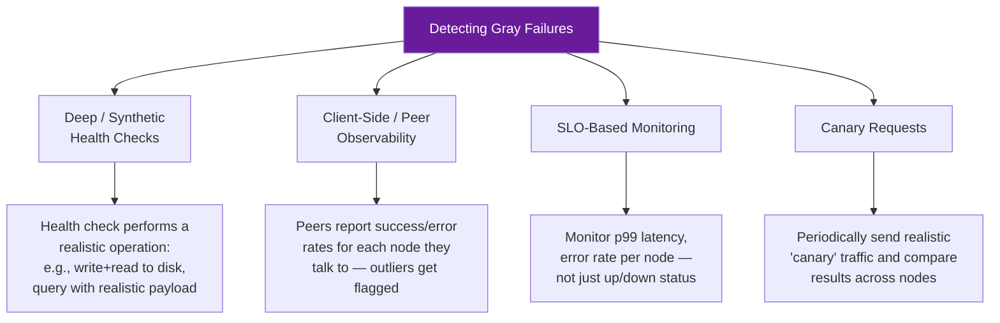

- **Deep health checks**: Make health checks exercise the actual resources that matter — e.g., perform a real disk write/read, run a representative query, or check replication lag — rather than trivial pings.
- **Peer-based health signals**: Have nodes report on each other's behavior. If 90% of peers report errors talking to Node X, that's a stronger signal than Node X's self-reported health.
- **Outlier detection / latency-based load balancing**: Tools like Envoy's "outlier detection" automatically eject nodes that show abnormally high error rates or latency, regardless of what their health check says.
- **Golden signals monitoring**: Track the "four golden signals" (latency, traffic, errors, saturation) per node, not just binary up/down status.

---

## 5. The Amplification Loop

### What Is It?

The **amplification loop** describes a vicious cycle in which a system's *automatic response* to a problem makes the problem **worse**, which triggers an even stronger response, which makes things worse still — a positive feedback loop that can quickly spiral out of control.

### Visualizing the Amplification Loop

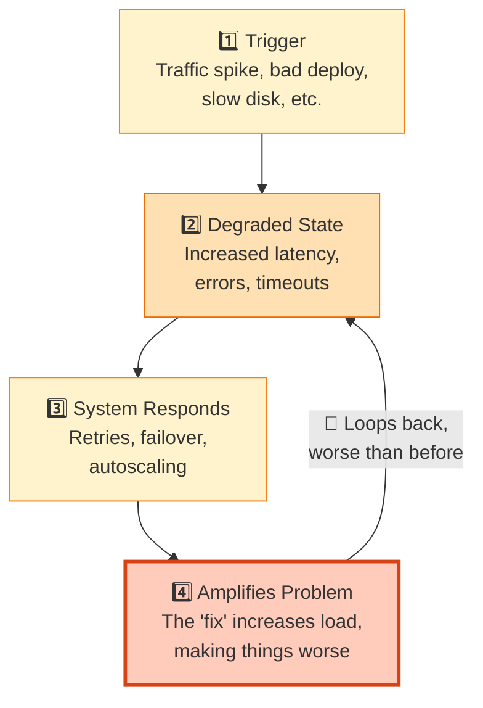

### Step-by-Step Explanation

1. **Trigger**: Something initiates the problem — a sudden traffic spike, a new deployment with a performance regression, a slow disk, or a database that's running a heavy maintenance operation.

2. **Degraded State**: The system starts showing symptoms — increased response latency, a rise in error rates (e.g., HTTP 503s), and timeouts on downstream calls.

3. **System Responds (The Well-Intentioned "Fix")**: Automated systems kick in to try to fix the problem:
   - **Retries**: Clients automatically retry failed requests.
   - **Failover**: Traffic is rerouted to "healthy" nodes.
   - **Autoscaling**: New instances are spun up to handle the load.

4. **Amplifies Problem**: Here's the trap — each of these "fixes" can backfire:
   - **Retries multiply load**: If 1,000 requests fail and each client retries 3 times, that's now 4,000 requests hitting an already-struggling system.
   - **Failover concentrates load**: Traffic rerouted away from a "bad" node piles onto the "good" nodes, which may not have spare capacity, pushing *them* into degradation too.
   - **Autoscaling has a cold-start cost**: New instances take time to boot, register with load balancers, warm up caches, and establish database connection pools — during which they consume resources (CPU for startup, connections to shared databases) without yet contributing useful capacity. If the autoscaler also overshoots, it can overwhelm shared resources like a database connection limit.

5. **The Loop Repeats, Worse Each Time**: The amplified problem (e.g., 4x the load) causes even more degradation, triggering even more retries, more failover, and more autoscaling — accelerating toward total collapse.

### Real-World Examples

**Example 1: The Retry Storm**
A downstream payment API starts responding slowly (2 seconds instead of 200ms) due to a database issue. Client services, configured with a 1-second timeout and 3 retries with no backoff, start timing out and immediately retrying. The payment API, now receiving **4x its normal request volume** (1 original + 3 retries) while already struggling, slows down further — to 5 seconds. Now *every* request times out and retries, and the API receives **even more** load, eventually crashing entirely.

**Example 2: Cache Stampede (Thundering Herd)**
A popular cache key (e.g., "homepage data") expires. Within the same millisecond, 10,000 concurrent requests all miss the cache and hit the database simultaneously to regenerate the value. The database, suddenly receiving 10,000 identical heavy queries, slows to a crawl — causing *more* requests to time out on their cache lookups (because the cache-fill request itself is now slow), leading to even more cache misses and even more database load.

**Example 3: Autoscaling and Database Connection Exhaustion**
A web application autoscales from 10 to 100 instances in response to a traffic spike. Each instance opens a connection pool of 20 connections to the shared PostgreSQL database, which has a `max_connections` limit of 500. The 100 instances try to open 2,000 connections total. The database rejects most connection attempts, causing the application instances to error out — and the autoscaler, seeing high error rates, **scales up even further**, making the connection exhaustion worse.

**Example 4: Health-Check-Triggered Failover Loop**
A load balancer marks Node A as unhealthy after it misses 3 health checks (due to a brief GC pause) and shifts all of Node A's traffic to Node B. Node B, now handling 2x its normal load, also starts missing health checks. The load balancer shifts traffic from both A and B to Node C, which now handles 3x normal load and also fails — a cascading "hot potato" of traffic.

### Use Cases — Where This Matters

| System Component | Amplification Risk | Watch For |
|-------------------|---------------------|-----------|
| **API client retry logic** | Retry storms | Missing exponential backoff and jitter |
| **Caching layers** | Cache stampedes | No request coalescing or lock on cache miss |
| **Autoscaling policies** | Resource exhaustion (DB connections, IPs) | Scaling decoupled from shared resource limits |
| **Circuit breakers** | Cascading load shifts | Health checks too sensitive, causing flapping |

### Mitigation Strategies

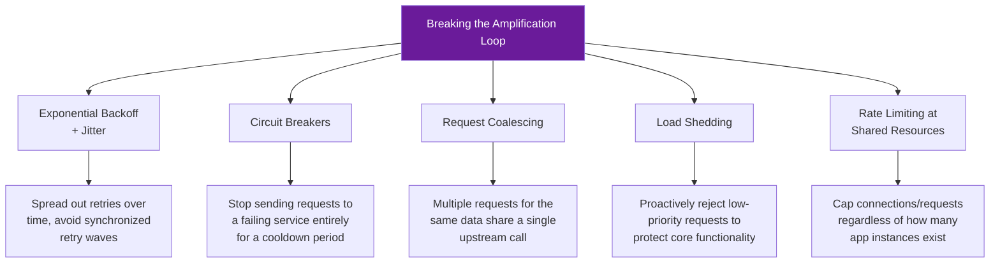

- **Exponential backoff with jitter**: Instead of retrying immediately (or at fixed intervals, which synchronize retries), wait progressively longer between retries with randomized jitter to spread out the load.
- **Circuit breakers**: After a threshold of failures, "open" the circuit and stop sending requests to the failing dependency for a cooldown period, giving it time to recover. Libraries like Hystrix (Java), resilience4j, or Polly (.NET) implement this pattern.
- **Request coalescing / single-flight**: When many requests need the same data (e.g., a cache-fill operation), ensure only **one** actual request goes to the backend, and all callers share that result.
- **Load shedding**: When a system detects it's overloaded, proactively reject some incoming requests (preferably low-priority ones) to preserve capacity for critical operations.
- **Connection pool limits tied to shared resource capacity**: Calculate connection pool sizes based on the *total* capacity of shared resources (like a database's `max_connections`), divided by the *maximum* number of instances — not the *current* number.

---

## 6. Cascading Failures

### What Is It?

A **cascading failure** occurs when the failure of one component increases the load on remaining components beyond their capacity, causing them to fail too — and this process repeats, spreading through the system like a chain reaction (similar to a row of dominoes falling).

### Visualizing a Cascading Failure

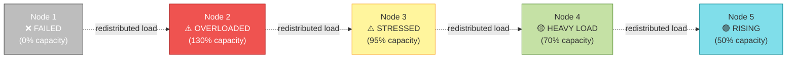

### Step-by-Step Explanation

1. **Node 1 Fails Completely (0% capacity)**: This could be due to a hardware failure, an out-of-memory crash, or a deployment issue.

2. **Load Redistributes to Node 2 (130% capacity)**: The load balancer or service mesh redirects Node 1's traffic to the remaining nodes. Node 2, which was already near its limit (let's say it was at 95% before), now receives extra traffic pushing it to **130% of its safe capacity** — meaning it's now operating *beyond* what it can sustainably handle.

3. **Node 2 Becomes Overloaded and Starts Failing**: Operating at 130% capacity, Node 2 starts experiencing its own failures — slow responses, dropped connections, or crashes due to resource exhaustion (memory, CPU, file descriptors).

4. **Load Redistributes Further to Node 3 (95% → stressed)**: As Node 2 starts failing, *its* load (plus Node 1's original load) gets redistributed again — this time to Node 3, pushing it from a comfortable level to 95% — dangerously close to its limit.

5. **The Chain Continues to Node 4 and Node 5**: Each subsequent node absorbs more and more redirected load — Node 4 goes to 70% capacity (heavy load), and Node 5 rises to 50% (still has headroom, but climbing).

6. **The Critical Insight — "More Nodes ≠ More Help"**: As the original diagram notes, **adding more nodes during a cascade simply gives the failure more places to spread** — unless those new nodes can absorb load *fast enough* and the redistribution logic doesn't overload them too. If new nodes take time to warm up (cold caches, no established connections), they can become the *next* domino rather than a relief valve.

### Real-World Examples

**Example 1: The Classic Database Connection Cascade**
In a 5-node web server cluster behind a load balancer, each connecting to a shared database with a connection pool, Node 1 crashes due to a memory leak. The load balancer redirects its traffic to Nodes 2-5. Each of these nodes now needs more database connections to handle the extra traffic, but the database's `max_connections` limit is shared — so Node 2 starts experiencing connection pool exhaustion, slows down, and is also marked unhealthy. Its traffic redistributes to Nodes 3-5, and the cycle continues until the entire database is overwhelmed and all nodes fail.

**Example 2: Microservices Dependency Chain Collapse**
Service A depends on Service B, which depends on Service C. Service C experiences a slowdown (e.g., due to a slow downstream API). Requests to Service B start piling up waiting on Service C, exhausting Service B's thread pool. Now Service A's requests to Service B start timing out, exhausting *Service A's* thread pool too. The failure has now cascaded "upstream" through the call chain, affecting services that had nothing inherently wrong with them.

**Example 3: A Major Cloud Provider Outage Pattern**
This pattern has played out in several well-documented major cloud outages: an initial component failure (e.g., a load balancer or DNS issue in one availability zone) causes traffic to shift to other availability zones. Those zones, now handling extra load on top of their normal traffic, hit capacity limits on shared backend services (like a metadata service or authentication service), causing *those* services to degrade across **all** availability zones — turning a single-zone issue into a region-wide (or even multi-region) outage.

**Example 4: Stock Trading System "Flash Crash" Analogy**
While not a pure software example, the concept of cascading failures mirrors financial "flash crashes": automated trading systems detect a price drop and trigger sell orders (their "response" to the trigger), which pushes prices down further, triggering *more* automated sell orders from other systems, in a rapid cascading collapse — directly analogous to load redistribution causing cascading overload.

### Use Cases — Where This Matters

| System | Cascade Trigger | Cascade Path |
|--------|------------------|--------------|
| **Web server fleets** | One server crashes | Load balancer redistributes → remaining servers overload |
| **Microservice meshes** | One service slows down | Thread pool exhaustion propagates upstream through callers |
| **Database replica sets** | Primary fails over | Replicas absorb write load they weren't sized for |
| **CDN / Edge networks** | One PoP (Point of Presence) goes down | Traffic shifts to nearby PoPs, which may not have capacity |
| **Message queue consumers** | One consumer group fails | Remaining consumers fall behind, backlog grows, triggers more scaling/retries |

### Mitigation Strategies

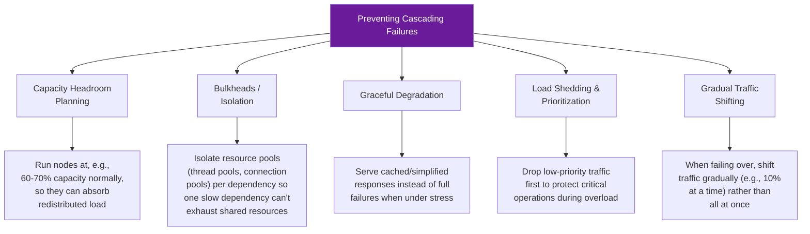

- **Capacity headroom**: Don't run infrastructure at 90%+ utilization under normal conditions. Maintain enough headroom (e.g., target 50-70% utilization) so that nodes can absorb a reasonable amount of redistributed load without immediately becoming overloaded themselves.
- **Bulkhead pattern**: Named after the watertight compartments in a ship's hull, this pattern isolates resources (thread pools, connection pools) for different dependencies so that a failure in one dependency can't exhaust resources needed for unrelated operations.
- **Graceful degradation**: Design services to degrade functionality gracefully under load — e.g., serve a cached or simplified version of a page instead of a full error when a downstream dependency is unavailable.
- **Load shedding with priority tiers**: When overloaded, reject lower-priority requests (e.g., analytics/logging calls) first, to preserve capacity for critical user-facing operations.
- **Gradual traffic shifting**: When performing failovers or rebalancing, shift traffic incrementally (e.g., 10% every 30 seconds) rather than instantly dumping 100% of traffic onto remaining nodes — this gives autoscalers and caches time to "warm up."
- **Chaos engineering and load testing**: Regularly test how your system behaves when individual nodes fail under realistic production load, to validate that your headroom and bulkheads actually work as designed.

---

## Putting It All Together: A Resilience Checklist

Here's a consolidated diagram summarizing how these failure modes interconnect and the key defenses against each:

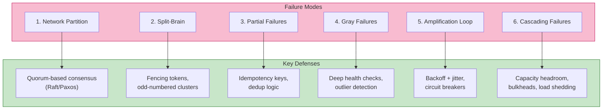

### Final Takeaways

1. **Network partitions are inevitable** — design your system to handle "the network is unreliable" as a fundamental assumption, not an edge case.
2. **Split-brain is a consequence of ambiguous leadership** — solve it with quorum-based consensus and fencing, not "best effort" leader election.
3. **Partial failures are fundamentally ambiguous** — embrace idempotency rather than trying to achieve impossible "exactly-once" guarantees.
4. **Gray failures hide in plain sight** — your health checks are only as good as the scenarios they actually test. Make them realistic.
5. **Automated responses can amplify problems** — every retry, failover, and autoscale action has a cost; make sure that cost doesn't exceed the benefit.
6. **Cascading failures spread through shared resources** — isolate failure domains with bulkheads, and always keep capacity headroom.

By internalizing these six failure modes — and proactively designing defenses against each — you'll be far better equipped to build distributed systems that are resilient, predictable, and gracefully degrade under stress rather than collapsing catastrophically.

---

## Further Learning

To deepen your understanding, consider exploring:
- **The CAP Theorem** and its implications for distributed databases
- **Raft Consensus Algorithm** (a more approachable alternative to Paxos)
- **Site Reliability Engineering (SRE)** practices from Google's SRE Book, particularly chapters on cascading failures and addressing overload
- **Chaos Engineering** principles and tools (Chaos Monkey, Gremlin, Litmus)
- **Circuit Breaker and Bulkhead patterns** in microservices architecture (Hystrix, resilience4j, Istio)