# NATS JetStream for .NET Developers: A Complete Guide to High-Performance Messaging

**Learn how to build durable, high-performance message queues in .NET using NATS JetStream - the lightweight alternative to RabbitMQ and Azure Service Bus**

---

## Table of Contents

1. [Introduction](#introduction)
2. [Understanding NATS Architecture](#understanding-nats-architecture)
3. [Why NATS JetStream](#why-nats-jetstream)
4. [Getting Started](#getting-started)
5. [Core Concepts](#core-concepts)
6. [Publishing Messages](#publishing-messages)
7. [Processing Messages](#processing-messages)
8. [Critical Patterns](#critical-patterns)
9. [Configuration Deep Dive](#configuration-deep-dive)
10. [Production Considerations](#production-considerations)
11. [Complete Working Example](#complete-working-example)
12. [Troubleshooting & Best Practices](#troubleshooting--best-practices)

---

## Introduction

When .NET developers need a message queue, they typically reach for RabbitMQ, Azure Service Bus, or even a Postgres table. NATS almost never comes up. That's a shame: it's quietly become one of the most powerful tools for messaging.

### What is NATS?

**NATS** is a messaging system written in Go that runs as a single binary with no external dependencies. It's designed to be simple, fast, and reliable.

**JetStream** is NATS's durable persistence layer that turns it into a real message queue with at-least-once delivery guarantees.

### Why This Matters for .NET Developers

The .NET client for NATS (`NATS.Net`) is a pleasure to work with, and JetStream provides:

- **Durability** - Messages persist to disk
- **Reliability** - At-least-once delivery guarantees
- **Performance** - Hundreds of thousands of messages per second
- **Simplicity** - Single binary, no complex infrastructure
- **Flexibility** - Multiple stream and consumer configurations

### What You'll Learn

By the end of this tutorial, you'll understand:

- The difference between Core NATS and JetStream
- How to set up NATS JetStream with Docker
- How to publish messages from .NET Minimal API
- How to process messages with BackgroundService workers
- Critical patterns for reliable messaging
- Production deployment considerations

---

## Understanding NATS Architecture

### Core NATS vs JetStream

NATS has two layers, and understanding the difference is crucial.

#### Core NATS: Fire-and-Forget Pub/Sub

Core NATS is a simple publish-subscribe system:

- You publish to a **subject**
- Whoever is subscribed at that moment gets the message
- If no one is listening, the message is gone
- Best for live notifications and real-time communication

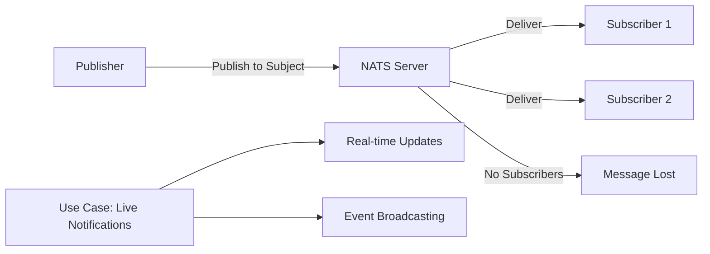

#### JetStream: Durable Persistence Layer

JetStream adds persistence on top of Core NATS:

- Captures messages published to a subject into a **stream** on disk
- Consumers can read messages later, even after a restart
- Turns a subject into a durable queue
- Provides at-least-once delivery guarantees

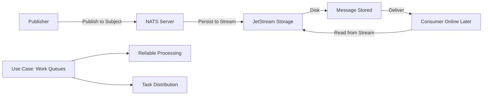

#### Visual Comparison

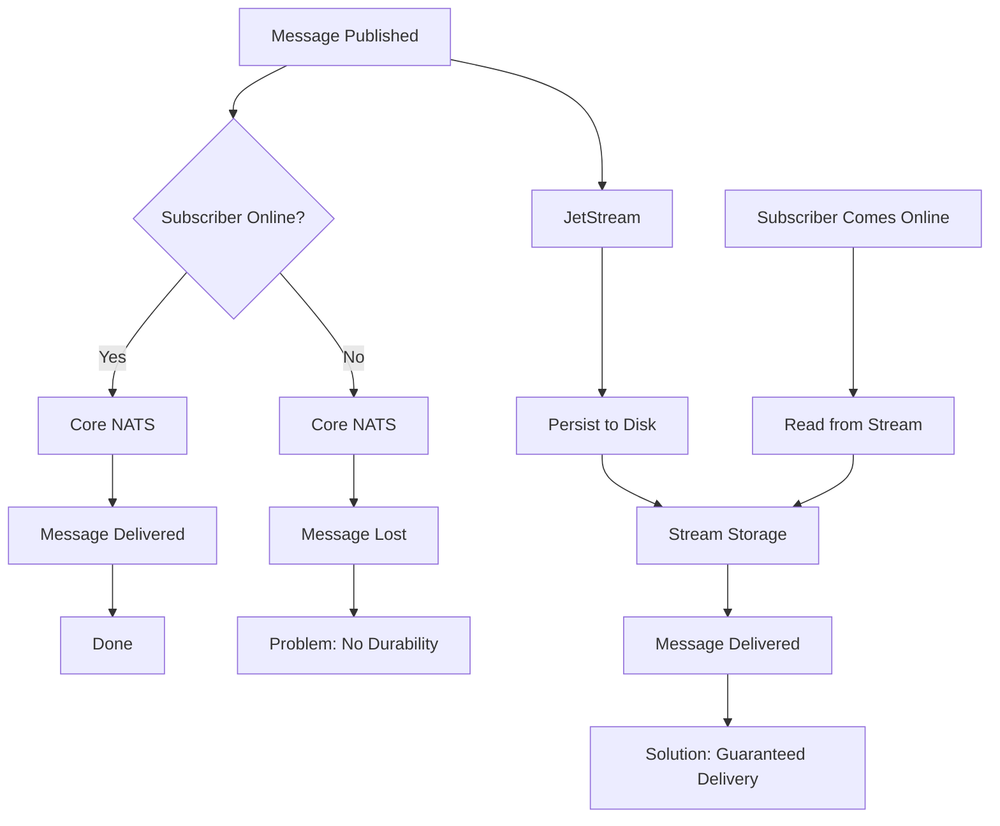

**Key Difference:**
- **Core NATS:** Ephemeral, fast, fire-and-forget
- **JetStream:** Durable, persistent, reliable

---

## Why NATS JetStream

Coming from traditional message brokers, several things make NATS JetStream stand out:

### 1. Tiny Footprint

The official NATS server image is about **18 MB** - a single Go binary with no ZooKeeper or Erlang to babysit.

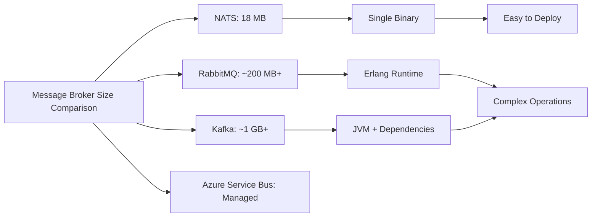

### 2. Blazing Fast Performance

- **Core NATS:** Pushes **millions** of small messages per second on a single node
- **JetStream:** Adds disk persistence, so it's slower, but still comfortably in the **hundreds of thousands** per second

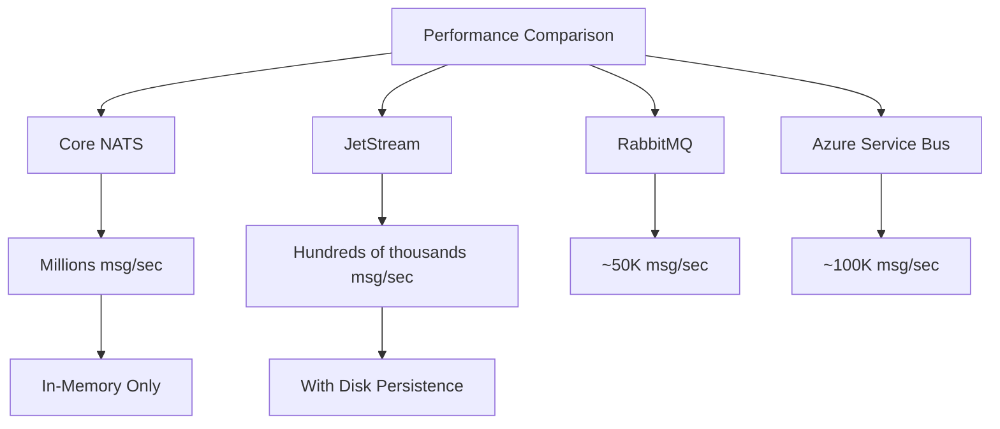

### 3. Cheap to Run

A NATS server idles in tens of megabytes of RAM, so it can run right next to your application.

### 4. Flexible Per-Stream Configuration

Each stream sets its own storage and retention policy, so one server can host multiple types of queues:

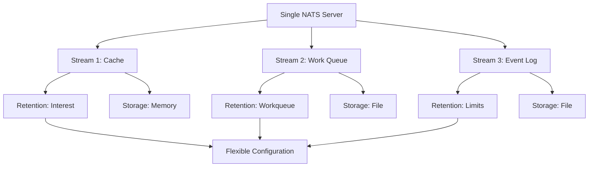

### Comparison with Other Brokers

| Feature | NATS JetStream | RabbitMQ | Azure Service Bus | Kafka |
|---------|----------------|----------|-------------------|-------|
| **Footprint** | 18 MB | ~200 MB | Managed | ~1 GB |
| **Setup Complexity** | Very Low | Medium | Low (managed) | High |
| **Performance** | 100K+ msg/sec | ~50K msg/sec | ~100K msg/sec | ~100K msg/sec |
| **Dependencies** | None | Erlang | None | JVM, ZooKeeper |
| **Persistence** | Optional | Yes | Yes | Yes |
| **Clustering** | Raft-based | Built-in | Built-in | Built-in |
| **Best For** | Microservices, Edge | Enterprise | Cloud-native | Big Data |

---

## Getting Started

Let's get NATS JetStream running with a .NET application.

### Prerequisites

- Docker and Docker Compose
- .NET 6+ SDK
- Your favorite IDE (Visual Studio, Rider, VS Code)

### Step 1: Set Up NATS Server with Docker Compose

Create a `docker-compose.yml` file:

```yaml
version: '3.8'

services:
  nats:
    image: nats:2.14-alpine
    command: ['-js', '-sd', '/data']
    ports:
      - '4222:4222'
    volumes:
      - nats-data:/data
    restart: unless-stopped

volumes:
  nats-data:
```

**Key flags:**
- `-js` - Enables JetStream
- `-sd /data` - Points to a directory for stream data (survives restarts)

Start the server:

```bash
docker-compose up -d
```

Verify it's running:

```bash
docker-compose ps
# Should show nats service as "Up"

# Test connection
nats server report
```

### Step 2: Add NuGet Packages

Add the NATS client and dependency injection integration:

```bash
dotnet add package NATS.Net
dotnet add package NATS.Extensions.Microsoft.DependencyInjection
```

### Step 3: Configure in Program.cs

Wire NATS into your application's dependency injection container:

```csharp
using NATS.Net;
using NATS.Client.JetStream;

var builder = WebApplication.CreateBuilder(args);

// Add NATS client
builder.Services.AddNatsClient(nats =>
    nats.ConfigureOptions(opts => opts with 
    { 
        Url = "nats://localhost:4222" 
    }));

// Add JetStream context (injectable anywhere)
builder.Services.AddSingleton(sp =>
    sp.GetRequiredService<INatsConnection>().CreateJetStreamContext());

// Add other services
builder.Services.AddHostedService<JobWorker>();

var app = builder.Build();

// Your endpoints here
app.MapPost("/jobs", async (CreateJobRequest request, INatsJSContext js, CancellationToken ct) =>
{
    // Publish logic here
});

app.Run();
```

**What's happening:**
1. `AddNatsClient` registers a multiplexed, self-reconnecting NATS connection
2. `CreateJetStreamContext()` exposes JetStream functionality for dependency injection
3. You can now inject `INatsJSContext` anywhere in your application

---

## Core Concepts

Before diving into code, let's understand the key NATS JetStream concepts.

### The Building Blocks

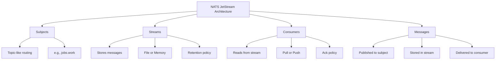

### Subjects

Subjects are the routing mechanism - similar to topics in other message brokers:

- Hierarchical naming: `jobs.work`, `orders.created`, `users.signup`
- Wildcards supported: `jobs.*`, `orders.>`
- Publishers send to subjects
- Consumers subscribe to subjects

### Streams

Streams store messages that match a subject filter:

- **Configuration:** Name, subjects, retention, storage
- **Storage:** File (persistent) or Memory (fast, non-persistent)
- **Retention:** Limits, Workqueue, or Interest
- **Purpose:** Turns subjects into durable storage

### Consumers

Consumers read messages from streams:

- **Types:** Pull (consumer requests messages) or Push (server delivers)
- **Ack Policy:** None, All, or Explicit
- **Configuration:** Name, ack wait, max deliver, filter subject
- **Purpose:** Controls how messages are delivered and processed

### Messages

Messages are the data units:

- **Data:** The payload (any serializable type)
- **Headers:** Optional metadata
- **Subject:** Where it was published
- **Sequence:** Order in the stream

```mermaid
graph LR
    A[Publisher] -->|1. Publish| B[Subject: jobs.work]
    B -->|2. Route| C[Stream: JOBS]
    C -->|3. Store| D[Message on Disk]
    
    E[Consumer] -->|4. Pull| C
    C -->|5. Deliver| E
    E -->|6. Process| F[Business Logic]
    F -->|7. Ack| C
    C -->|8. Remove (if Workqueue)| G[Message Removed]
```

---

## Publishing Messages

Publishing messages with JetStream is straightforward, especially with the .NET client's typed message support.

### Define Your Message Type

Create a simple record type for your message:

```csharp
public record Job(Guid Id, string Payload);
```

NATS.Net automatically serializes this to JSON - no extra setup needed.

### Publish from a Minimal API Endpoint

```csharp
app.MapPost("/jobs", async (
    CreateJobRequest request, 
    INatsJSContext js, 
    CancellationToken ct) =>
{
    // Create the job
    var job = new Job(Guid.NewGuid(), request.Payload);
    
    // Publish to the stream
    PubAckResponse ack = await js.PublishAsync(
        "jobs.work",      // Subject
        job,              // Message data (auto-serialized)
        cancellationToken: ct);
    
    // Ensure the message was stored
    ack.EnsureSuccess();
    
    // Return 202 Accepted
    return Results.Accepted($"/jobs/{job.Id}");
});
```

**What's happening:**
1. Create a typed message (`Job`)
2. Publish to subject `jobs.work`
3. JetStream stores it in the configured stream
4. `PubAckResponse` confirms successful storage
5. `EnsureSuccess()` throws if storage failed

### Understanding PubAckResponse

```msharp
PubAckResponse ack = await js.PublishAsync("jobs.work", job);

// Check if successful
if (ack.Success)
{
    // Message stored
    Console.WriteLine($"Message stored with sequence: {ack.Sequence}");
}
else
{
    // Failed to store
    Console.WriteLine($"Error: {ack.Error}");
}

// Or use EnsureSuccess() to throw on failure
ack.EnsureSuccess();
```

### Publishing Multiple Messages

```csharp
app.MapPost("/jobs/batch", async (
    CreateBatchJobsRequest request, 
    INatsJSContext js, 
    CancellationToken ct) =>
{
    var jobs = request.Payloads.Select(p => new Job(Guid.NewGuid(), p));
    
    var tasks = jobs.Select(job => 
        js.PublishAsync("jobs.work", job, cancellationToken: ct));
    
    PubAckResponse[] acks = await Task.WhenAll(tasks);
    
    // Check all acks
    foreach (var ack in acks)
    {
        ack.EnsureSuccess();
    }
    
    return Results.Accepted();
});
```

---

## Processing Messages

Processing messages requires a `BackgroundService` that creates the stream and consumer, then pulls messages in a loop.

### The Worker Pattern

```csharp
public class JobWorker(INatsJSContext js) : BackgroundService
{
    protected override async Task ExecuteAsync(CancellationToken ct)
    {
        // 1. Create the stream
        await js.CreateStreamAsync(new StreamConfig("JOBS", ["jobs.work"])
        {
            Retention = StreamConfigRetention.Workqueue,
            Storage   = StreamConfigStorage.File
        }, ct);
        
        // 2. Create the consumer
        var consumer = await js.CreateOrUpdateConsumerAsync("JOBS", new ConsumerConfig("workers")
        {
            AckPolicy  = ConsumerConfigAckPolicy.Explicit,
            AckWait    = TimeSpan.FromSeconds(30),
            MaxDeliver = 5
        }, ct);
        
        // 3. Process messages
        await foreach (var msg in consumer.ConsumeAsync<Job>(cancellationToken: ct))
        {
            // Process the job
            await ProcessAsync(msg.Data, ct);
            
            // Acknowledge after successful processing
            await msg.AckAsync(cancellationToken: ct);
        }
    }
    
    private async Task ProcessAsync(Job job, CancellationToken ct)
    {
        // Your business logic here
        Console.WriteLine($"Processing job {job.Id}: {job.Payload}");
        
        // Simulate work
        await Task.Delay(1000, ct);
    }
}
```

**Register the worker:**

```csharp
builder.Services.AddHostedService<JobWorker>();
```

### Understanding the Worker Components

#### 1. Stream Creation

```csharp
await js.CreateStreamAsync(new StreamConfig("JOBS", ["jobs.work"])
{
    Retention = StreamConfigRetention.Workqueue,
    Storage   = StreamConfigStorage.File
}, ct);
```

**Parameters:**
- `"JOBS"` - Stream name
- `["jobs.work"]` - Subjects to capture
- `Retention` - When to delete messages
- `Storage` - Where to store messages

#### 2. Consumer Creation

```csharp
var consumer = await js.CreateOrUpdateConsumerAsync("JOBS", new ConsumerConfig("workers")
{
    AckPolicy  = ConsumerConfigAckPolicy.Explicit,
    AckWait    = TimeSpan.FromSeconds(30),
    MaxDeliver = 5
}, ct);
```

**Parameters:**
- `"JOBS"` - Stream name
- `"workers"` - Consumer name (durable, shared across instances)
- `AckPolicy` - When to consider message delivered
- `AckWait` - Time before redelivery
- `MaxDeliver` - Max delivery attempts

#### 3. Message Consumption Loop

```csharp
await foreach (var msg in consumer.ConsumeAsync<Job>(cancellationToken: ct))
{
    // msg.Data contains the deserialized Job
    // msg.AckAsync() acknowledges processing
}
```

**Key points:**
- `ConsumeAsync<Job>()` automatically deserializes JSON to `Job` type
- The loop runs continuously until cancellation
- Each message must be acknowledged

### Handling Scoped Dependencies

Since `JobWorker` is a singleton, resolve scoped dependencies through `IServiceScopeFactory`:

```csharp
public class JobWorker(
    INatsJSContext js,
    IServiceScopeFactory scopeFactory) : BackgroundService
{
    protected override async Task ExecuteAsync(CancellationToken ct)
    {
        // ... stream and consumer setup ...
        
        await foreach (var msg in consumer.ConsumeAsync<Job>(cancellationToken: ct))
        {
            using var scope = scopeFactory.CreateScope();
            var dbContext = scope.ServiceProvider.GetRequiredService<AppDbContext>();
            
            await ProcessAsync(msg.Data, dbContext, ct);
            await msg.AckAsync(cancellationToken: ct);
        }
    }
}
```

---

## Critical Patterns

### The Ack-After-Side-Effect Pattern

This is the most critical pattern in JetStream, and most quickstarts skip it.

**The Rule:** Acknowledge the message **after** the side effect, never before.

#### Why This Matters

JetStream provides **at-least-once delivery**. If a worker:
1. Processes a job
2. Crashes before acknowledging
3. JetStream redelivers the job

But if the worker:
1. Acknowledges first
2. Crashes before completing the work
3. The job is marked done but never finished

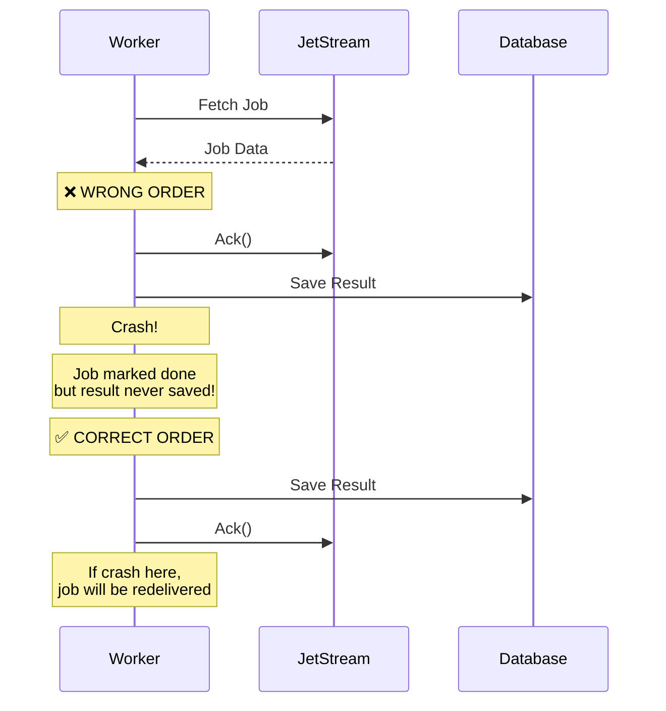

#### Correct Implementation

```csharp
await foreach (var msg in consumer.ConsumeAsync<Job>(cancellationToken: ct))
{
    try
    {
        // 1. Process first (side effect)
        await ProcessJobAsync(msg.Data, ct);
        
        // 2. Ack after successful processing
        await msg.AckAsync(cancellationToken: ct);
    }
    catch (Exception ex)
    {
        // Don't ack - message will be redelivered
        Console.WriteLine($"Error processing job: {ex.Message}");
        
        // Optionally: negative ack to trigger redelivery sooner
        await msg.NakAsync(cancellationToken: ct);
    }
}
```

### The Idempotent Consumer Pattern

Since JetStream provides at-least-once delivery, a job can run more than once. Your handler **must be idempotent**.

#### What is Idempotency?

An operation is idempotent if running it multiple times produces the same result as running it once.

**Example:**
- ✅ Setting a value: `user.Name = "John"` (idempotent)
- ❌ Incrementing a counter: `counter++` (not idempotent)

#### Implementing Idempotency

Track processed messages and skip duplicates:

```csharp
public class IdempotentJobWorker(
    INatsJSContext js,
    AppDbContext dbContext) : BackgroundService
{
    protected override async Task ExecuteAsync(CancellationToken ct)
    {
        // ... stream and consumer setup ...
        
        await foreach (var msg in consumer.ConsumeAsync<Job>(cancellationToken: ct))
        {
            try
            {
                // Check if already processed
                bool alreadyProcessed = await dbContext.ProcessedJobs
                    .AnyAsync(j => j.JobId == msg.Data.Id, ct);
                
                if (alreadyProcessed)
                {
                    Console.WriteLine($"Job {msg.Data.Id} already processed, skipping");
                    await msg.AckAsync(cancellationToken: ct);
                    continue;
                }
                
                // Process the job
                await ProcessJobAsync(msg.Data, dbContext, ct);
                
                // Mark as processed (in same transaction as side effect)
                dbContext.ProcessedJobs.Add(new ProcessedJob 
                { 
                    JobId = msg.Data.Id,
                    ProcessedAt = DateTime.UtcNow 
                });
                await dbContext.SaveChangesAsync(ct);
                
                // Ack after successful processing AND marking
                await msg.AckAsync(cancellationToken: ct);
            }
            catch (Exception ex)
            {
                Console.WriteLine($"Error: {ex.Message}");
                await msg.NakAsync(cancellationToken: ct);
            }
        }
    }
}
```

**Database entity:**

```csharp
public class ProcessedJob
{
    public Guid JobId { get; set; }
    public DateTime ProcessedAt { get; set; }
}
```

**Key points:**
- Track processed messages in the database
- Check before processing
- Mark as processed in the **same transaction** as the side effect
- This ensures true idempotency

### Error Handling and Redelivery

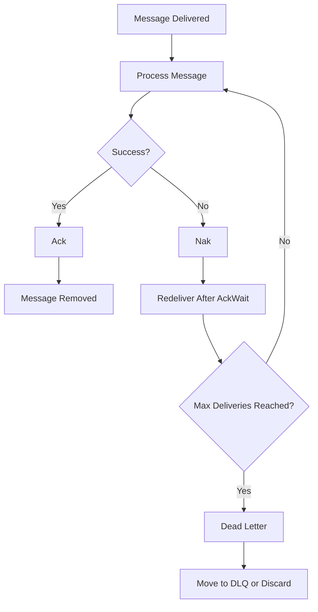

#### Ack Policies

```csharp
// Explicit Ack - you must ack/nak manually
AckPolicy = ConsumerConfigAckPolicy.Explicit

// All - ack after all instances process (for fanout)
AckPolicy = ConsumerConfigAckPolicy.All

// None - auto ack on delivery (fire-and-forget)
AckPolicy = ConsumerConfigAckPolicy.None
```

#### Nak vs Term

```csharp
// Nak - negative ack, redeliver after AckWait
await msg.NakAsync(cancellationToken: ct);

// Term - terminate, don't redeliver
await msg.TermAsync(cancellationToken: ct);

// Ack - positive ack, message done
await msg.AckAsync(cancellationToken: ct);
```

---

## Configuration Deep Dive

### Stream Configuration

#### Storage Options

```csharp
// File storage - persists to disk, survives restarts
Storage = StreamConfigStorage.File

// Memory storage - faster, but lost on restart
Storage = StreamConfigStorage.Memory
```

**When to use:**
- **File:** Production, durable queues, work queues
- **Memory:** Development, testing, caching

#### Retention Policies

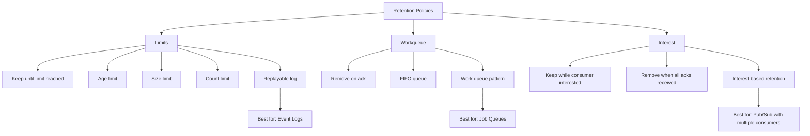

**Limits (default):**
```csharp
Retention = StreamConfigRetention.Limits
// Keeps every message until it hits an age, size, or count limit
// Stream is a replayable log
// Reading a message doesn't remove it
```

**Workqueue:**
```csharp
Retention = StreamConfigRetention.Workqueue
// Drops a message the moment a consumer acks it
// Stream itself is the queue
// Messages delivered in publish order, oldest first (FIFO)
// Best for job queues
```

**Interest:**
```csharp
Retention = StreamConfigRetention.Interest
// Keeps a message only while a consumer still needs it
// Drops once every interested consumer acks
// Best for pub/sub with multiple consumers
```

### Consumer Configuration

#### Ack Policy

```csharp
// Explicit - manual ack required
AckPolicy = ConsumerConfigAckPolicy.Explicit

// All - all interested consumers must ack
AckPolicy = ConsumerConfigAckPolicy.All

// None - auto ack on delivery
AckPolicy = ConsumerConfigAckPolicy.None
```

#### Ack Wait

```csharp
// Time before message is redelivered if not acked
AckWait = TimeSpan.FromSeconds(30)

// Should exceed your worst-case processing time
// If processing takes 20s, set AckWait to 30s+
```

**Guideline:** Set `AckWait` to 2-3x your maximum expected processing time.

#### Max Deliver

```csharp
// Maximum delivery attempts before giving up
MaxDeliver = 5

// After 5 attempts, message is moved to dead letter or discarded
// Prevents poison messages from blocking the queue
```

**When to use:**
- Set to 3-5 for most cases
- Higher for unreliable consumers
- Consider dead letter queue for failed messages

#### Complete Consumer Configuration Example

```csharp
var consumer = await js.CreateOrUpdateConsumerAsync("JOBS", new ConsumerConfig("workers")
{
    // Delivery
    AckPolicy = ConsumerConfigAckPolicy.Explicit,
    AckWait = TimeSpan.FromSeconds(30),
    MaxDeliver = 5,
    
    // Filtering (optional)
    FilterSubject = "jobs.work", // Only process this subject
    
    // Rate limiting (optional)
    RateLimit = 100, // Max 100 messages per second
    
    // Backoff (optional)
    BackOff = new[]
    {
        TimeSpan.FromSeconds(1),
        TimeSpan.FromSeconds(2),
        TimeSpan.FromSeconds(4)
    }, // Exponential backoff between retries
    
    // Description
    Description = "Worker pool for processing jobs"
}, ct);
```

---

## Production Considerations

### Clustering and High Availability

NATS supports Raft-based clustering for high availability:

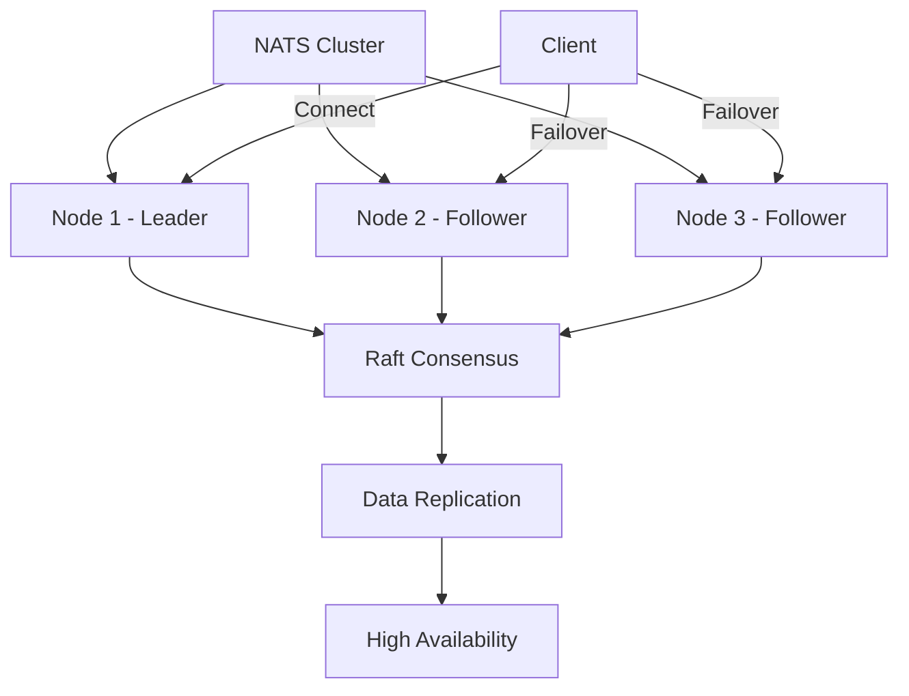

**Docker Compose for clustering:**

```yaml
version: '3.8'

services:
  nats-1:
    image: nats:2.14-alpine
    command: ['-js', '-sd', '/data', '-cluster', 'nats://nats-1:6222', '-cluster', 'nats://nats-2:6222', '-cluster', 'nats://nats-3:6222']
    ports:
      - '4222:4222'
    volumes:
      - nats-data-1:/data
  
  nats-2:
    image: nats:2.14-alpine
    command: ['-js', '-sd', '/data', '-cluster', 'nats://nats-1:6222', '-cluster', 'nats://nats-2:6222', '-cluster', 'nats://nats-3:6222']
    ports:
      - '4223:4222'
    volumes:
      - nats-data-2:/data
  
  nats-3:
    image: nats:2.14-alpine
    command: ['-js', '-sd', '/data', '-cluster', 'nats://nats-1:6222', '-cluster', 'nats://nats-2:6222', '-cluster', 'nats://nats-3:6222']
    ports:
      - '4224:4222'
    volumes:
      - nats-data-3:/data

volumes:
  nats-data-1:
  nats-data-2:
  nats-data-3:
```

### Monitoring and Observability

NATS provides built-in monitoring:

```csharp
// Enable monitoring in Program.cs
builder.Services.AddNatsClient(nats =>
    nats.ConfigureOptions(opts => opts with 
    { 
        Url = "nats://localhost:4222",
        // Monitoring endpoint
        NoEcho = false
    }));
```

**Key metrics to monitor:**
- Message publish rate
- Message delivery rate
- Consumer lag
- Stream storage usage
- Connection count

### Security Best Practices

#### 1. Authentication

```csharp
// Username/Password
builder.Services.AddNatsClient(nats =>
    nats.ConfigureOptions(opts => opts with 
    { 
        Url = "nats://localhost:4222",
        Auth = new NatsAuthOptions
        {
            Username = "user",
            Password = "pass"
        }
    }));

// Token-based
Auth = new NatsAuthOptions
{
    Token = "your-token"
}

// NKey (more secure)
Auth = new NatsAuthOptions
{
    Nkey = "your-nkey"
}
```

#### 2. TLS/SSL

```csharp
builder.Services.AddNatsClient(nats =>
    nats.ConfigureOptions(opts => opts with 
    { 
        Url = "tls://localhost:4222",
        Tls = new NatsTlsOptions
        {
            RootCerts = File.ReadAllBytes("ca.pem"),
            Cert = File.ReadAllBytes("client-cert.pem"),
            Key = File.ReadAllBytes("client-key.pem")
        }
    }));
```

### Performance Tuning

#### Connection Pooling

```csharp
// NATS client automatically handles connection pooling
// and reconnection with default settings

// For high-throughput scenarios, tune reconnection
builder.Services.AddNatsClient(nats =>
    nats.ConfigureOptions(opts => opts with 
    { 
        Url = "nats://localhost:4222",
        MaxReconnect = 10,
        ReconnectWait = TimeSpan.FromSeconds(1),
        PingInterval = TimeSpan.FromMinutes(2)
    }));
```

#### Batch Processing

```csharp
// Process multiple messages concurrently
var options = new ParallelOptions
{
    MaxDegreeOfParallelism = 4,
    CancellationToken = ct
};

await foreach (var msg in consumer.ConsumeAsync<Job>(cancellationToken: ct))
{
    await Parallel.ForEachAsync(messages, options, async (msg, ct) =>
    {
        await ProcessAsync(msg.Data, ct);
        await msg.AckAsync(cancellationToken: ct);
    });
}
```

---

## Complete Working Example

Let's put everything together in a complete, production-ready example.

### Project Structure

```
NatsJobQueue/
├── Program.cs
├── JobWorker.cs
├── Models/
│   ├── Job.cs
│   └── CreateJobRequest.cs
├── Data/
│   └── AppDbContext.cs
└── Entities/
    └── ProcessedJob.cs
```

### Complete Program.cs

```csharp
using NATS.Net;
using NATS.Client.JetStream;
using Microsoft.EntityFrameworkCore;

var builder = WebApplication.CreateBuilder(args);

// Add DbContext
builder.Services.AddDbContext<AppDbContext>(options =>
    options.UseSqlite("Data Source=jobs.db"));

// Add NATS client
builder.Services.AddNatsClient(nats =>
    nats.ConfigureOptions(opts => opts with 
    { 
        Url = "nats://localhost:4222" 
    }));

// Add JetStream context
builder.Services.AddSingleton(sp =>
    sp.GetRequiredService<INatsConnection>().CreateJetStreamContext());

// Add worker
builder.Services.AddHostedService<JobWorker>();

var app = WebApplication.CreateBuilder(args).Build();

// Endpoint to create jobs
app.MapPost("/jobs", async (
    CreateJobRequest request, 
    INatsJSContext js, 
    CancellationToken ct) =>
{
    var job = new Job(Guid.NewGuid(), request.Payload);
    
    PubAckResponse ack = await js.PublishAsync(
        "jobs.work", 
        job, 
        cancellationToken: ct);
    
    ack.EnsureSuccess();
    
    return Results.Accepted($"/jobs/{job.Id}");
});

// Endpoint to check job status
app.MapGet("/jobs/{jobId:guid}", async (
    Guid jobId, 
    AppDbContext db) =>
{
    var processedJob = await db.ProcessedJobs
        .FirstOrDefaultAsync(j => j.JobId == jobId);
    
    if (processedJob == null)
    {
        return Results.NotFound();
    }
    
    return Results.Ok(new
    {
        JobId = processedJob.JobId,
        ProcessedAt = processedJob.ProcessedAt
    });
});

app.Run();

// Models
public record Job(Guid Id, string Payload);
public record CreateJobRequest(string Payload);

// DbContext
public class AppDbContext : DbContext
{
    public AppDbContext(DbContextOptions<AppDbContext> options) 
        : base(options) { }
    
    public DbSet<ProcessedJob> ProcessedJobs => Set<ProcessedJob>();
}

public class ProcessedJob
{
    public Guid JobId { get; set; }
    public DateTime ProcessedAt { get; set; }
}
```

### Complete JobWorker.cs

```csharp
using NATS.Client.JetStream;

public class JobWorker(
    INatsJSContext js,
    IServiceScopeFactory scopeFactory,
    ILogger<JobWorker> logger) : BackgroundService
{
    protected override async Task ExecuteAsync(CancellationToken ct)
    {
        logger.LogInformation("Job Worker starting...");
        
        try
        {
            // Create stream
            await js.CreateStreamAsync(new StreamConfig("JOBS", ["jobs.work"])
            {
                Retention = StreamConfigRetention.Workqueue,
                Storage = StreamConfigStorage.File,
                Description = "Job queue for async processing"
            }, ct);
            
            logger.LogInformation("Stream 'JOBS' created");
            
            // Create consumer
            var consumer = await js.CreateOrUpdateConsumerAsync("JOBS", new ConsumerConfig("workers")
            {
                AckPolicy = ConsumerConfigAckPolicy.Explicit,
                AckWait = TimeSpan.FromSeconds(30),
                MaxDeliver = 5,
                Description = "Worker pool for processing jobs",
                BackOff = new[]
                {
                    TimeSpan.FromSeconds(1),
                    TimeSpan.FromSeconds(2),
                    TimeSpan.FromSeconds(4)
                }
            }, ct);
            
            logger.LogInformation("Consumer 'workers' created");
            
            // Process messages
            await foreach (var msg in consumer.ConsumeAsync<Job>(cancellationToken: ct))
            {
                using var scope = scopeFactory.CreateScope();
                var dbContext = scope.ServiceProvider.GetRequiredService<AppDbContext>();
                
                try
                {
                    logger.LogInformation(
                        "Processing job {JobId}: {Payload}", 
                        msg.Data.Id, 
                        msg.Data.Payload);
                    
                    // Check if already processed (idempotency)
                    bool alreadyProcessed = await dbContext.ProcessedJobs
                        .AnyAsync(j => j.JobId == msg.Data.Id, ct);
                    
                    if (alreadyProcessed)
                    {
                        logger.LogInformation(
                            "Job {JobId} already processed, skipping", 
                            msg.Data.Id);
                        await msg.AckAsync(cancellationToken: ct);
                        continue;
                    }
                    
                    // Process the job
                    await ProcessJobAsync(msg.Data, ct);
                    
                    // Mark as processed
                    dbContext.ProcessedJobs.Add(new ProcessedJob
                    {
                        JobId = msg.Data.Id,
                        ProcessedAt = DateTime.UtcNow
                    });
                    await dbContext.SaveChangesAsync(ct);
                    
                    // Ack after successful processing
                    await msg.AckAsync(cancellationToken: ct);
                    
                    logger.LogInformation("Job {JobId} completed", msg.Data.Id);
                }
                catch (Exception ex)
                {
                    logger.LogError(ex, "Error processing job {JobId}", msg.Data.Id);
                    
                    // Nak to trigger redelivery
                    await msg.NakAsync(cancellationToken: ct);
                }
            }
        }
        catch (Exception ex)
        {
            logger.LogError(ex, "Fatal error in JobWorker");
            throw;
        }
    }
    
    private async Task ProcessJobAsync(Job job, CancellationToken ct)
    {
        // Simulate work
        await Task.Delay(1000, ct);
        
        // Your actual business logic here
        Console.WriteLine($"Processed: {job.Payload}");
    }
}
```

### Running the Example

1. **Start NATS:**
   ```bash
   docker-compose up -d
   ```

2. **Run the application:**
   ```bash
   dotnet run
   ```

3. **Create a job:**
   ```bash
   curl -X POST http://localhost:5000/jobs \
     -H "Content-Type: application/json" \
     -d '{"payload": "Hello, NATS!"}'
   ```

4. **Check job status:**
   ```bash
   curl http://localhost:5000/jobs/{job-id}
   ```

5. **View logs:**
   ```bash
   # Worker logs will show processing
   # Job completion will be logged
   ```

---

## Troubleshooting & Best Practices

### Common Issues

#### 1. Messages Not Being Delivered

**Problem:** Messages published but never received by consumer.

**Solutions:**
- Ensure stream exists and matches subject
- Check consumer is created on correct stream
- Verify AckPolicy (Explicit requires manual ack)
- Check if message is being acked before processing

#### 2. Messages Being Redelivered Repeatedly

**Problem:** Same message processed multiple times.

**Solutions:**
- Implement idempotent consumer pattern
- Check AckWait is appropriate for processing time
- Ensure ack happens after side effect
- Verify no exceptions during processing

#### 3. Stream Creation Fails

**Problem:** Stream already exists with different configuration.

**Solutions:**
- Use `CreateOrUpdateStreamAsync` instead of `CreateStreamAsync`
- Delete and recreate stream for testing
- Use consistent stream configuration

### Best Practices

#### 1. Always Ack After Side Effects

```csharp
// ✅ Correct
await ProcessAsync(msg.Data, ct);
await msg.AckAsync(ct);

// ❌ Wrong
await msg.AckAsync(ct);
await ProcessAsync(msg.Data, ct);
```

#### 2. Implement Idempotency

Track processed messages to handle redeliveries safely.

#### 3. Set Appropriate Timeouts

```csharp
AckWait = TimeSpan.FromSeconds(30) // 2-3x max processing time
MaxDeliver = 5 // Prevent infinite redeliveries
```

#### 4. Use Structured Logging

```csharp
logger.LogInformation(
    "Processing job {JobId} of type {JobType}", 
    job.Id, 
    job.GetType().Name);
```

#### 5. Handle Graceful Shutdown

```csharp
protected override async Task StopAsync(CancellationToken cancellationToken)
{
    logger.LogInformation("Job Worker stopping...");
    
    // Finish processing current message
    // Clean up resources
    
    await base.StopAsync(cancellationToken);
}
```

#### 6. Monitor Consumer Lag

```csharp
// Check consumer info
var info = await consumer.InfoAsync(ct);
long messagesPending = info.NumPending;
long messagesAckPending = info.NumAckPending;

if (messagesPending > 1000)
{
    logger.LogWarning("Consumer lag high: {Pending} messages", messagesPending);
}
```

---

## Conclusion

NATS JetStream provides a powerful, lightweight alternative to traditional message brokers for .NET applications.

### Key Takeaways

✅ **Simple Setup** - Single binary, Docker Compose, minimal configuration  
✅ **High Performance** - Hundreds of thousands of messages per second  
✅ **Durable Messaging** - At-least-once delivery with JetStream  
✅ **Flexible Configuration** - Multiple stream and consumer options  
✅ **Great .NET Client** - NATS.Net with DI integration  
✅ **Production Ready** - Clustering, monitoring, security features  

### When to Use NATS JetStream

**Perfect for:**
- Microservices communication
- Job queues and work distribution
- Event-driven architectures
- Real-time notifications (with Core NATS)
- Edge computing (small footprint)

**Consider alternatives when:**
- You need exactly-once semantics (use transactional outbox pattern)
- You require complex routing (consider RabbitMQ)
- You're all-in on Azure (consider Service Bus)

### Next Steps

1. **Try it out:** Spin up the Docker container and publish a message
2. **Experiment:** Try different stream and consumer configurations
3. **Scale:** Test clustering with multiple NATS nodes
4. **Monitor:** Set up monitoring and alerting
5. **Secure:** Implement authentication and TLS

### Resources

- **NATS Documentation:** https://docs.nats.io
- **JetStream Concepts:** https://docs.nats.io/nats-concepts/jetstream
- **NATS.Net GitHub:** https://github.com/nats-io/nats.net
- **NATS Examples:** https://github.com/nats-io/nats.net/tree/main/examples

---

## Quick Reference Card

### Essential Commands

```bash
# Start NATS with JetStream
docker-compose up -d

# Check server status
nats server report

# Publish a message
nats pub jobs.work "Hello World"

# Subscribe to messages
nats sub jobs.work
```

### Key Configuration

```csharp
// Stream
new StreamConfig("STREAM_NAME", ["subject.>"])
{
    Retention = StreamConfigRetention.Workqueue,
    Storage = StreamConfigStorage.File
}

// Consumer
new ConsumerConfig("consumer-name")
{
    AckPolicy = ConsumerConfigAckPolicy.Explicit,
    AckWait = TimeSpan.FromSeconds(30),
    MaxDeliver = 5
}
```

### Critical Patterns

```csharp
// ✅ Ack after side effect
await ProcessAsync(msg.Data, ct);
await msg.AckAsync(ct);

// ✅ Idempotent processing
if (alreadyProcessed) { ack(); continue; }
await ProcessAsync(msg.Data, ct);
await SaveToDatabase(msg.Data, ct);
await msg.AckAsync(ct);
```

---

**Start building with NATS JetStream today.** It's fast, simple, and might just become your new favorite message queue.

🚀