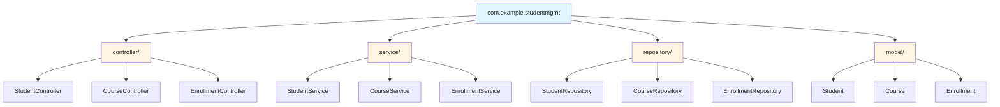
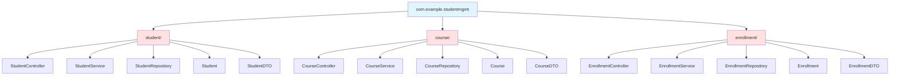
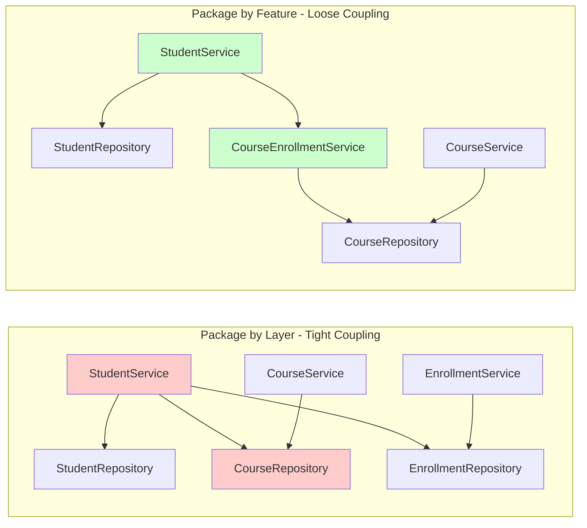
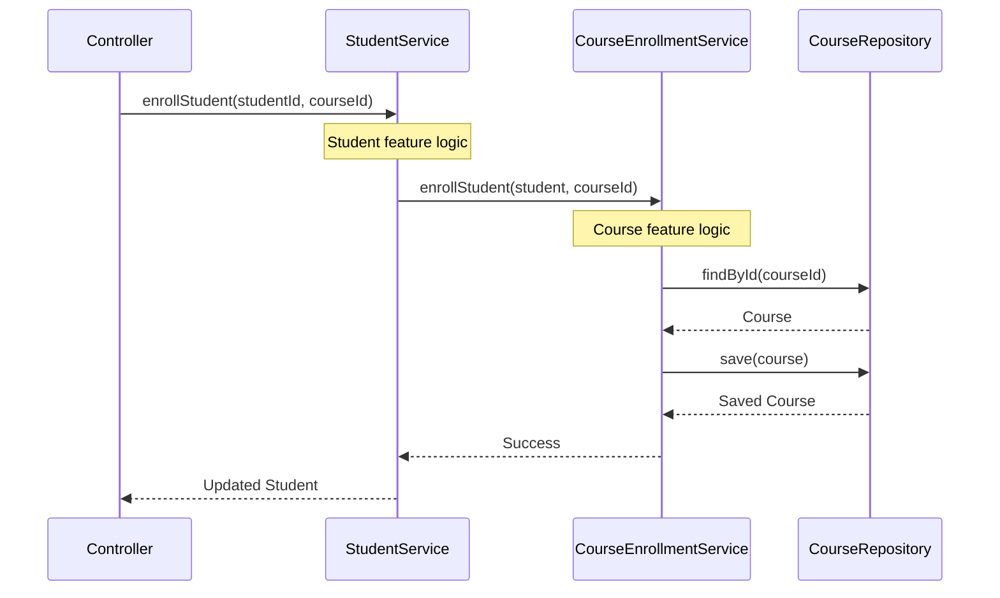
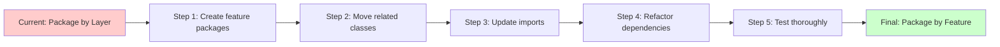
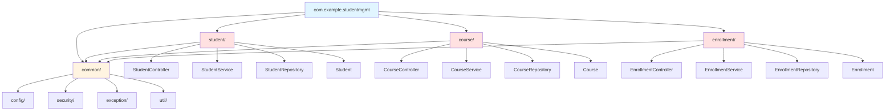

# Package by Feature vs Package by Layer: A Comprehensive Deep Dive into Spring Boot Project Organization

> **Difficulty Level:** Intermediate  
> **Estimated Reading Time:** 15-20 minutes  
> **Last Updated:** 2026

---

## Table of Contents

1. [Introduction & Overview](#introduction--overview)
2. [Prerequisites](#prerequisites)
3. [Learning Objectives](#learning-objectives)
4. [Understanding Package by Layer](#understanding-package-by-layer)
5. [Understanding Package by Feature](#understanding-package-by-feature)
6. [Visual Comparison with Mermaid Diagrams](#visual-comparison-with-mermaid-diagrams)
7. [Real-World Trade-offs and Use Cases](#real-world-trade-offs-and-use-cases)
8. [Common Pitfalls and Anti-Patterns](#common-pitfalls-and-anti-patterns)
9. [Best Practices](#best-practices)
10. [The Hybrid Approach](#the-hybrid-approach)
11. [Migration Strategy](#migration-strategy)
12. [Practice Exercises](#practice-exercises)
13. [Question Bank](#question-bank)
14. [Summary & Key Takeaways](#summary--key-takeaways)
15. [Further Reading](#further-reading)

---

## Introduction & Overview

Package organization is one of the most critical architectural decisions you'll make in a Spring Boot project. The way you structure your packages directly impacts code maintainability, team collaboration, and long-term project scalability.

In this comprehensive deep dive, we'll explore two dominant package organization strategies:

- **Package by Layer** - The traditional, layered architecture approach
- **Package by Feature** - The modern, feature-centric organization method

We'll analyze both approaches in depth, examine real-world scenarios, and provide you with the knowledge to make informed decisions for your projects.

> **💡 Key Insight:** Package structure is not just about organization—it's about enforcing architectural boundaries and communicating intent to every developer who works on your codebase.

---

## Prerequisites

Before diving into this tutorial, you should have:

- ✅ Basic understanding of Spring Boot framework
- ✅ Familiarity with Java programming language
- ✅ Understanding of MVC architecture (Model-View-Controller)
- ✅ Basic knowledge of dependency injection and IoC concepts
- ✅ Experience with a Spring Boot project (even a small one)

**Nice to have:**
- Familiarity with Domain-Driven Design (DDD) concepts
- Understanding of microservices architecture
- Experience with multi-team development projects

---

## Learning Objectives

By the end of this comprehensive tutorial, you will:

- 🎯 Understand the fundamental differences between Package by Layer and Package by Feature
- 🎯 Analyze the pros and cons of each approach with real-world examples
- 🎯 Identify which approach suits different project sizes and team structures
- 🎯 Implement both strategies in Spring Boot applications
- 🎯 Recognize common anti-patterns and how to avoid them
- 🎯 Master the hybrid approach for complex projects
- 🎯 Develop a migration strategy to refactor existing projects
- 🎯 Make informed architectural decisions based on project requirements

---

## Understanding Package by Layer

### What is Package by Layer?

Package by Layer (also known as Package by Type) organizes code based on architectural layers or technical concerns. Each package contains components of the same type across all features.

### Directory Structure

```
com.example.studentmgmt/
├── controller/
│   ├── StudentController.java
│   ├── CourseController.java
│   └── EnrollmentController.java
├── service/
│   ├── StudentService.java
│   ├── CourseService.java
│   └── EnrollmentService.java
├── repository/
│   ├── StudentRepository.java
│   ├── CourseRepository.java
│   └── EnrollmentRepository.java
├── model/
│   ├── Student.java
│   ├── Course.java
│   └── Enrollment.java
├── dto/
│   ├── StudentDTO.java
│   ├── CourseDTO.java
│   └── EnrollmentDTO.java
└── exception/
    ├── StudentNotFoundException.java
    ├── CourseNotFoundException.java
    └── EnrollmentException.java
```

### Deep Dive: Advantages

#### 1. **Familiarity and Consistency**
Every Spring developer recognizes this structure immediately. It's the default in most tutorials and documentation.

```java
// Finding all controllers is trivial
// Just navigate to: src/main/java/com/example/studentmgmt/controller/
// You'll see every REST endpoint in your application
```

#### 2. **Separation of Concerns**
Clear technical separation makes it obvious where each type of component belongs:

```java
// Controllers handle HTTP requests
@RestController
@RequestMapping("/api/students")
public class StudentController {
    // HTTP-specific logic here
}

// Services contain business logic
@Service
public class StudentService {
    // Business logic here
}

// Repositories handle data access
@Repository
public interface StudentRepository extends JpaRepository<Student, Long> {
    // Data access methods here
}
```

#### 3. **Easier for Small Projects**
For projects with 3-5 features, this structure is simple and effective:

```java
// Quick to navigate when you have:
// - 3 controllers
// - 3 services
// - 3 repositories
// Everything fits in your mental model
```

### Deep Dive: Disadvantages

#### 1. **The "Dumping Ground" Problem**

As your project grows, each package becomes increasingly crowded:

```java
// After 6 months, your controller package has:
// - 45 controller files
// - StudentController.java
// - CourseController.java
// - EnrollmentController.java
// - GradeController.java
// - AttendanceController.java
// - ... and 40 more
// 
// Finding the right file becomes a search operation
```

**Impact:**
- Increased cognitive load
- More time navigating code
- Higher chance of editing wrong files
- Slower onboarding for new developers

#### 2. **Tight Coupling Between Features**

Consider this problematic scenario:

```java
@Service
public class StudentService {
    // PROBLEM: StudentService depends on CourseRepository
    // This creates tight coupling between student and course features
    private final StudentRepository studentRepository;
    private final CourseRepository courseRepository;
    private final EnrollmentRepository enrollmentRepository;
    
    public Student enrollStudentInCourse(Long studentId, Long courseId) {
        // This service now knows about THREE different features
        // A change in course logic might break student functionality
        Student student = studentRepository.findById(studentId)
            .orElseThrow(() -> new StudentNotFoundException(studentId));
        
        Course course = courseRepository.findById(courseId)
            .orElseThrow(() -> new CourseNotFoundException(courseId));
        
        Enrollment enrollment = new Enrollment(student, course);
        return enrollmentRepository.save(enrollment);
    }
}
```

**Why this is problematic:**
- StudentService violates Single Responsibility Principle
- Changes to course enrollment logic require modifying StudentService
- Testing becomes complex (need to mock multiple repositories)
- Difficult to understand the full scope of student-related operations

#### 3. **Cross-Cutting Changes Are Painful**

Want to add authentication to all endpoints?

```java
// You need to modify EVERY controller:
// - StudentController.java (add @PreAuthorize)
// - CourseController.java (add @PreAuthorize)
// - EnrollmentController.java (add @PreAuthorize)
// - GradeController.java (add @PreAuthorize)
// - ... 40 more controllers
// 
// One missed file = security vulnerability
```

#### 4. **No Clear Feature Boundaries**

```java
// In a layered structure, where does "student enrollment" belong?
// - Is it in student/ because it involves students?
// - Is it in course/ because it involves courses?
// - Is it in enrollment/ because it's a separate entity?
// 
// The answer: It's scattered across multiple packages
// - StudentService (student package)
// - CourseService (course package)
// - EnrollmentService (enrollment package)
// 
// No single place contains all enrollment-related logic
```

### When Package by Layer Works Best

✅ **Small Projects (< 10 features)**
```java
// Perfect for:
// - Simple CRUD applications
// - Internal tools
// - Proof of concepts
// - Small team projects (1-3 developers)
```

✅ **Heavy Cross-Cutting Concerns**
```java
// When every feature needs:
// - Audit logging
// - Security checks
// - Validation
// - Caching
// 
// Centralized packages make this easier to implement
```

✅ **Learning and Prototyping**
```java
// Great for:
// - Learning Spring Boot
// - Rapid prototyping
// - Teaching environments
// - Documentation examples
```

---

## Understanding Package by Feature

### What is Package by Feature?

Package by Feature organizes code around business capabilities or features. Each package contains everything needed for a specific feature: controllers, services, repositories, DTOs, and exceptions.

### Directory Structure

```
com.example.studentmgmt/
├── student/
│   ├── StudentController.java
│   ├── StudentService.java
│   ├── StudentRepository.java
│   ├── Student.java
│   ├── StudentDTO.java
│   ├── StudentNotFoundException.java
│   └── StudentMapper.java
├── course/
│   ├── CourseController.java
│   ├── CourseService.java
│   ├── CourseRepository.java
│   ├── Course.java
│   ├── CourseDTO.java
│   ├── CourseNotFoundException.java
│   └── CourseMapper.java
└── enrollment/
    ├── EnrollmentController.java
    ├── EnrollmentService.java
    ├── EnrollmentRepository.java
    ├── Enrollment.java
    ├── EnrollmentDTO.java
    ├── EnrollmentException.java
    └── EnrollmentMapper.java
```

### Deep Dive: Advantages

#### 1. **High Cohesion Within Features**

All code related to a specific feature lives in one place:

```java
// In student/ package, you have EVERYTHING about students:
// - How students are created (StudentService)
// - How students are retrieved (StudentRepository)
// - How students are exposed via API (StudentController)
// - What a student looks like (Student.java)
// - How students are validated (StudentDTO)
// - What errors can occur (StudentNotFoundException)
// 
// One package = one complete feature
```

#### 2. **Loose Coupling Between Features**

Features communicate through well-defined interfaces:

```java
// student/StudentService.java
@Service
public class StudentService {
    private final StudentRepository studentRepository;
    private final CourseEnrollmentService courseEnrollmentService; // Interface to course feature
    
    public Student enrollStudentInCourse(Long studentId, Long courseId) {
        Student student = studentRepository.findById(studentId)
            .orElseThrow(() -> new StudentNotFoundException(studentId));
        
        // Delegate to course feature through its service
        // Student feature doesn't know HOW courses work
        // It just uses the course feature's API
        courseEnrollmentService.enrollStudent(student, courseId);
        
        return studentRepository.save(student);
    }
}

// course/CourseEnrollmentService.java
@Service
public class CourseEnrollmentService {
    private final CourseRepository courseRepository;
    
    public void enrollStudent(Student student, Long courseId) {
        // Course feature owns its logic
        Course course = courseRepository.findById(courseId)
            .orElseThrow(() -> new CourseNotFoundException(courseId));
        
        course.addStudent(student);
        courseRepository.save(course);
    }
}
```

**Benefits:**
- Clear separation of concerns
- Each feature can evolve independently
- Changes to course enrollment don't affect student logic
- Easy to test each feature in isolation

#### 3. **Easier Maintenance and Refactoring**

Need to change how course enrollment works?

```java
// You only touch files in the course/ package:
// - CourseService.java
// - CourseEnrollmentService.java
// - CourseRepository.java
// 
// No risk of breaking student functionality
// No need to understand the entire codebase
// Changes are localized and safe
```

#### 4. **Better for Team Collaboration**

```java
// Team A owns the student/ feature:
// - They can modify anything in student/ without affecting others
// - They know exactly where their code lives
// - They can work independently

// Team B owns the course/ feature:
// - Same benefits as Team A
// - No merge conflicts in shared packages
// - Clear ownership boundaries
```

#### 5. **Natural Fit for Microservices**

```java
// When you're ready to split into microservices:
// student/ package → student-service
// course/ package → course-service
// enrollment/ package → enrollment-service
// 
// The migration is straightforward because each feature
// is already self-contained
```

### Deep Dive: Disadvantages

#### 1. **Initial Learning Curve**

```java
// New developers might ask:
// "Where is the service layer?"
// "Where are all the controllers?"
// 
// Answer: "It depends on the feature"
// 
// This takes getting used to
```

#### 2. **Code Duplication Risk**

```java
// Common utilities might be duplicated:
// student/StudentValidator.java
// course/CourseValidator.java
// enrollment/EnrollmentValidator.java
// 
// Solution: Extract to common/ package
```

#### 3. **More Packages to Manage**

```java
// With 20 features, you have 20+ packages
// This can feel overwhelming initially
// 
// Mitigation: Use IDE features and consistent naming
```

### When Package by Feature Works Best

✅ **Medium to Large Projects (10+ features)**
```java
// Perfect for:
// - Enterprise applications
// - Complex business domains
// - Long-lived projects
// - Multiple development teams
```

✅ **Distinct Business Domains**
```java
// When features have clear boundaries:
// - Student management
// - Course management
// - Enrollment management
// - Grading system
// - Attendance tracking
```

✅ **Microservice-Ready Architecture**
```java
// When you anticipate splitting into microservices:
// - Each feature package can become a service
// - Clear service boundaries from day one
```

✅ **Domain-Driven Design (DDD) Projects**
```java
// Natural fit for bounded contexts:
// - Each bounded context = one feature package
// - Enforces context boundaries
// - Prevents context bleeding
```

---

## Visual Comparison with Mermaid Diagrams

### Package by Layer Structure



**Key Characteristic:** Horizontal slicing by technical layer

### Package by Feature Structure



**Key Characteristic:** Vertical slicing by business feature

### Dependency Flow Comparison



**Observation:** Package by Feature enforces cleaner dependencies

### Feature Communication Pattern



**Pattern:** Features communicate through service interfaces

### Migration Path: From Layer to Feature



**Strategy:** Incremental migration reduces risk

---

## Real-World Trade-offs and Use Cases

### Comparison Table

| Aspect | Package by Layer | Package by Feature |
|--------|-----------------|-------------------|
| **Learning Curve** | Low - familiar structure | Medium - requires mindset shift |
| **Small Projects** | ✅ Excellent | ⚠️ Overkill |
| **Large Projects** | ❌ Becomes unwieldy | ✅ Scales well |
| **Team Collaboration** | ⚠️ Merge conflicts in shared packages | ✅ Clear ownership |
| **Code Navigation** | ⚠️ Requires searching across packages | ✅ All code in one place |
| **Feature Isolation** | ❌ Tight coupling | ✅ Loose coupling |
| **Microservice Migration** | ❌ Difficult | ✅ Straightforward |
| **Cross-Cutting Concerns** | ✅ Easy to implement | ⚠️ Requires careful design |
| **Testing** | ⚠️ Complex setup | ✅ Easy isolation |
| **Onboarding** | ✅ Familiar to all Spring devs | ⚠️ Needs explanation |

### Real-World Case Study 1: E-Commerce Platform

**Scenario:** Building an e-commerce platform with 15+ features

**Package by Layer Approach:**
```
com.ecommerce/
├── controller/          # 45 controllers
│   ├── ProductController
│   ├── OrderController
│   ├── PaymentController
│   ├── ShippingController
│   └── ... 41 more
├── service/             # 45 services
│   ├── ProductService
│   ├── OrderService
│   └── ... 43 more
└── repository/          # 45 repositories
```

**Problems encountered:**
- 6 months in, each package has 40+ files
- New developers take 2+ weeks to become productive
- Cross-team merge conflicts daily
- Refactoring payment logic requires touching 8 different files
- Bug fixes often introduce side effects in unrelated features

**Solution:** Migrated to Package by Feature

**Results after migration:**
- Onboarding time reduced to 3 days
- Merge conflicts reduced by 80%
- Feature development speed increased by 40%
- Bug fix time reduced by 35%

### Real-World Case Study 2: Internal Admin Tool

**Scenario:** Building an internal tool for 5 features, 2 developers

**Package by Feature Approach:**
```
com.admin/
├── user/
├── role/
├── permission/
├── audit/
└── report/
```

**Problems encountered:**
- Over-engineering for simple CRUD operations
- Unnecessary abstraction layers
- More files to manage than needed
- Team unfamiliar with structure

**Solution:** Switched to Package by Layer

**Results:**
- Simpler codebase
- Faster development for simple operations
- Team more comfortable with structure

### Real-World Case Study 3: Banking Application

**Scenario:** Enterprise banking app with 30+ features, 5 teams

**Approach:** Hybrid (common + feature packages)

```
com.banking/
├── common/
│   ├── config/
│   ├── security/
│   ├── exception/
│   └── util/
├── account/
├── transaction/
├── loan/
├── card/
├── notification/
└── reporting/
```

**Benefits:**
- Shared code in common/ package
- Each team owns their feature package
- Clear boundaries prevent conflicts
- Easy to extract microservices later
- Compliance and security centralized in common/

---

## Common Pitfalls and Anti-Patterns

### Anti-Pattern 1: The "God Service"

```java
// ❌ BAD: One service that does everything
@Service
public class StudentService {
    // This service has 15 dependencies!
    private final StudentRepository studentRepository;
    private final CourseRepository courseRepository;
    private final EnrollmentRepository enrollmentRepository;
    private final GradeRepository gradeRepository;
    private final AttendanceRepository attendanceRepository;
    private final NotificationService notificationService;
    private final AuditService auditService;
    private final ReportService reportService;
    // ... 7 more dependencies
    
    // 2000+ lines of code
    // Mixing student, course, enrollment, grade logic
}
```

**Problem:** Violates Single Responsibility Principle, impossible to test, nightmare to maintain

**Solution:**
```java
// ✅ GOOD: Separate services by feature
@Service
public class StudentService {
    private final StudentRepository studentRepository;
    // Only student-related dependencies
}

@Service
public class CourseEnrollmentService {
    private final CourseRepository courseRepository;
    // Only course-related dependencies
}
```

### Anti-Pattern 2: The "Shared Package" Dump

```java
// ❌ BAD: Everything "shared" goes here
com.example.common/
├── utils/           # 50 utility classes
├── helpers/         # 40 helper classes
├── constants/       # 30 constant classes
├── base/            # 25 base classes
├── extensions/      # 20 extension classes
└── misc/            # Everything else
```

**Problem:** Becomes a dumping ground, unclear what belongs here

**Solution:**
```java
// ✅ GOOD: Organized common package
com.example.common/
├── config/          # Configuration classes
├── security/        # Security-related code
├── exception/       # Custom exceptions
├── dto/            # Shared DTOs
└── util/           # Truly generic utilities
```

### Anti-Pattern 3: Feature Bleeding

```java
// ❌ BAD: Student feature accessing course data directly
// In student/StudentService.java
public class StudentService {
    private final StudentRepository studentRepository;
    private final CourseRepository courseRepository; // WRONG!
    
    public void enrollStudent(Long studentId, Long courseId) {
        Course course = courseRepository.findById(courseId).get();
        // Directly modifying course data
        course.addStudent(student);
        courseRepository.save(course);
    }
}
```

**Problem:** Feature boundaries broken, tight coupling

**Solution:**
```java
// ✅ GOOD: Use course feature's service
// In student/StudentService.java
public class StudentService {
    private final StudentRepository studentRepository;
    private final CourseEnrollmentService courseEnrollmentService; // Correct!
    
    public void enrollStudent(Long studentId, Long courseId) {
        courseEnrollmentService.enrollStudent(studentId, courseId);
    }
}
```

### Anti-Pattern 4: Circular Dependencies

```java
// ❌ BAD: Features depending on each other
// student/StudentService.java
public class StudentService {
    private final CourseService courseService; // Depends on course
}

// course/CourseService.java
public class CourseService {
    private final StudentService studentService; // Depends on student
}
```

**Problem:** Circular dependency, impossible to instantiate

**Solution:**
```java
// ✅ GOOD: Extract shared logic to common or create interface
// Create an event-driven approach or shared domain service
// Or use a mediator pattern
```

### Anti-Pattern 5: Package by Layer Disguised as Package by Feature

```java
// ❌ BAD: Looks like Package by Feature but isn't
com.example.studentmgmt/
├── student/
│   ├── controller/
│   │   └── StudentController.java
│   ├── service/
│   │   └── StudentService.java
│   └── repository/
│       └── StudentRepository.java
├── course/
│   ├── controller/
│   │   └── CourseController.java
│   ├── service/
│   │   └── CourseService.java
│   └── repository/
│       └── CourseRepository.java
```

**Problem:** Still organizing by layer, just nested under feature names

**Solution:**
```java
// ✅ GOOD: True Package by Feature
com.example.studentmgmt/
├── student/
│   ├── StudentController.java
│   ├── StudentService.java
│   ├── StudentRepository.java
│   └── Student.java
└── course/
    ├── CourseController.java
    ├── CourseService.java
    ├── CourseRepository.java
    └── Course.java
```

---

## Best Practices

### 1. Start with Package by Feature from Day One

```java
// Even for small projects, start with feature packages
// It's easier to merge features later than to split layers
// Future-proofs your codebase
```

**Rationale:**
- Easier to scale up
- No migration needed later
- Better architectural habits from the start
- Prepares codebase for microservices

### 2. Use Package-Private Visibility Aggressively

```java
// In student/StudentService.java
// This class is NOT public - only visible within student package
class StudentService {
    private final StudentRepository studentRepository;
    
    // Public interface for other features
    public StudentDTO getStudent(Long id) {
        // Implementation
    }
    
    // Internal helper - not exposed to other features
    Student validateStudent(Long id) {
        // Implementation
    }
}
```

**Benefits:**
- Compile-time enforcement of boundaries
- Clear public API for each feature
- Prevents accidental usage from other features
- Self-documenting code

### 3. Define Clear Feature Boundaries

```java
// Before implementing, ask:
// 1. What belongs to this feature?
// 2. What does this feature depend on?
// 3. What depends on this feature?
// 4. Where are the boundaries?
// 
// Document these decisions
```

### 4. Extract Truly Shared Code

```java
// Only move to common/ if:
// - Used by 3+ features
// - Generic enough (not business-specific)
// - No feature-specific logic
// 
// Examples:
// - Security configuration
// - Exception handling
// - Generic utilities
// - Database configuration
```

### 5. Use Consistent Naming Conventions

```java
// Feature packages: lowercase, singular nouns
// ✅ student, course, enrollment
// ❌ students, courses, StudentFeature

// Classes within features: descriptive names
// ✅ StudentService, StudentRepository
// ❌ Service, Repository, StudentSvc
```

### 6. Keep Features Focused

```java
// A feature package should represent ONE business capability
// 
// ✅ GOOD: student - everything about students
// ✅ GOOD: course - everything about courses
// ❌ BAD: student-course - mixing two features
// ❌ BAD: misc - unclear what belongs here
```

### 7. Document Feature Dependencies

```java
// Create a README.md in each feature package:
/**
 * Student Feature
 * 
 * Dependencies:
 * - course (for enrollment)
 * - notification (for email alerts)
 * 
 * Used by:
 * - reporting (for student reports)
 * - analytics (for student metrics)
 * 
 * Database: student_db
 */
package com.example.studentmgmt.student;
```

### 8. Implement Feature-Level Testing

```java
// student/
├── StudentControllerTest.java
├── StudentServiceTest.java
├── StudentRepositoryTest.java
└── StudentIntegrationTest.java
// 
// Each feature has its own tests
// Easy to run tests for specific features
// Clear test ownership
```

---

## The Hybrid Approach

### When to Use a Hybrid Approach

The hybrid approach combines Package by Layer and Package by Feature, giving you the best of both worlds.

**Use hybrid when:**
- You have genuinely shared infrastructure (security, config, audit)
- You want feature isolation for business logic
- You're migrating from Package by Layer to Package by Feature
- You have a large team with different ownership models

### Hybrid Structure



### Implementation Example

```java
// common/security/SecurityConfig.java
@Configuration
@EnableWebSecurity
public class SecurityConfig {
    // Shared across all features
    // Used by student, course, enrollment features
}

// student/StudentController.java
@RestController
@RequestMapping("/api/students")
@PreAuthorize("hasRole('USER')")
public class StudentController {
    // Uses common security configuration
    // Feature-specific logic
}

// course/CourseController.java
@RestController
@RequestMapping("/api/courses")
@PreAuthorize("hasRole('ADMIN')")
public class CourseController {
    // Uses common security configuration
    // Feature-specific logic
}
```

### What Belongs in common/?

✅ **Good candidates for common/:**
- Security configuration
- Global exception handlers
- Database configuration
- Audit logging
- Generic utilities (StringUtils, DateUtils)
- Base entities
- Shared DTOs
- API response wrappers

❌ **Don't put in common/:**
- Business logic
- Feature-specific utilities
- Database entities
- Controllers
- Services

### Hybrid Approach Best Practices

```java
// 1. Keep common/ small and focused
// Only truly shared code goes here

// 2. Features should not depend on each other
// They can depend on common/, but not on other features

// 3. Use interfaces for feature communication
// Define contracts in common/, implement in features

// 4. Document what's in common/ and why
// Prevent common/ from becoming a dumping ground
```

---

## Migration Strategy

### Step-by-Step Migration from Package by Layer to Package by Feature

#### Phase 1: Preparation (Week 1)

```java
// 1. Analyze current structure
// Identify all features in your application
// Document dependencies between layers

// 2. Create feature package structure
// Create empty packages for each feature
// Example:
// - student/
// - course/
// - enrollment/

// 3. Communicate with team
// Explain the migration plan
// Set expectations
```

#### Phase 2: Incremental Migration (Weeks 2-4)

```java
// Start with a low-risk feature

// Step 1: Create feature package
// src/main/java/com/example/studentmgmt/student/

// Step 2: Move related classes
// Move StudentController, StudentService, 
// StudentRepository, Student to student/ package

// Step 3: Update package declarations
// Change package com.example.studentmgmt.controller
// To: package com.example.studentmgmt.student

// Step 4: Update imports
// IDE will help, but verify manually

// Step 5: Run tests
// Ensure nothing broke

// Step 6: Repeat for next feature
// Migrate one feature at a time
```

#### Phase 3: Refactoring (Week 5)

```java
// 1. Remove empty layer packages
// Delete controller/, service/, repository/ if empty

// 2. Refactor cross-feature dependencies
// Replace direct repository access with service calls

// 3. Update documentation
// Update README, architecture docs

// 4. Code review
// Ensure all team members follow new structure
```

#### Phase 4: Validation (Week 6)

```java
// 1. Run full test suite
// Ensure all tests pass

// 2. Performance testing
// Verify no performance degradation

// 3. Team feedback
// Gather feedback from developers

// 4. Document lessons learned
// Update best practices based on experience
```

### Migration Example

**Before (Package by Layer):**
```java
// Old structure
com.example.studentmgmt/
├── controller/
│   └── StudentController.java
├── service/
│   └── StudentService.java
└── repository/
    └── StudentRepository.java

// StudentService.java
package com.example.studentmgmt.service;

public class StudentService {
    private final StudentRepository studentRepository;
    private final CourseRepository courseRepository; // Tight coupling
}
```

**After (Package by Feature):**
```java
// New structure
com.example.studentmgmt/
├── student/
│   ├── StudentController.java
│   ├── StudentService.java
│   ├── StudentRepository.java
│   └── Student.java
└── course/
    ├── CourseEnrollmentService.java
    └── CourseRepository.java

// student/StudentService.java
package com.example.studentmgmt.student;

public class StudentService {
    private final StudentRepository studentRepository;
    private final CourseEnrollmentService courseEnrollmentService; // Loose coupling
}
```

### Migration Risks and Mitigation

| Risk | Impact | Mitigation |
|------|--------|------------|
| Breaking existing functionality | High | Comprehensive testing, incremental migration |
| Team resistance | Medium | Training, clear communication, show benefits |
| Increased initial effort | Medium | Plan extra time, celebrate small wins |
| Merge conflicts | High | Feature flags, branch by feature, clear ownership |
| Performance issues | Low | Profile before/after, optimize if needed |

---

## Practice Exercises

### Exercise 1: Analyze an Existing Project

**Difficulty:** ⭐ Beginner  
**Time:** 30 minutes

**Task:**
1. Take an existing Spring Boot project you've worked on
2. Identify its current package structure
3. Answer these questions:
   - Is it Package by Layer or Package by Feature?
   - How many files are in each package?
   - Are there any "dumping ground" packages?
   - How many features can you identify?
   - What's the coupling between features?

**Expected Outcome:**
- Clear understanding of your current project's structure
- Identification of pain points
- List of improvements you could make

### Exercise 2: Refactor to Package by Feature

**Difficulty:** ⭐⭐⭐ Intermediate  
**Time:** 2-3 hours

**Task:**
Take this Package by Layer structure and refactor it to Package by Feature:

```java
// Current structure:
com.example.library/
├── controller/
│   ├── BookController.java
│   ├── MemberController.java
│   └── LoanController.java
├── service/
│   ├── BookService.java
│   ├── MemberService.java
│   └── LoanService.java
└── repository/
    ├── BookRepository.java
    ├── MemberRepository.java
    └── LoanRepository.java

// Requirements:
// 1. Create feature packages: book/, member/, loan/
// 2. Move all related classes to their feature packages
// 3. Update package declarations and imports
// 4. Refactor LoanService to use BookService and MemberService
//    instead of directly accessing BookRepository and MemberRepository
// 5. Ensure all tests pass
```

**Hints:**
- Start by creating the new package structure
- Move one feature at a time
- Use your IDE's refactoring tools
- Run tests after each feature migration

**Expected Outcome:**
- Fully refactored Package by Feature structure
- All tests passing
- Understanding of migration challenges

### Exercise 3: Design a Hybrid Structure

**Difficulty:** ⭐⭐⭐⭐ Advanced  
**Time:** 1-2 hours

**Task:**
Design a hybrid package structure for an e-commerce platform with these features:

**Features:**
- Product Management
- Shopping Cart
- Order Processing
- Payment Processing
- Inventory Management
- User Management
- Notification System
- Reporting

**Requirements:**
1. Identify what belongs in `common/` package
2. Design feature packages for each business capability
3. Define clear boundaries between features
4. Document dependencies between features
5. Create a Mermaid diagram showing the structure

**Expected Outcome:**
- Complete hybrid structure design
- Documentation of feature boundaries
- Understanding of when to use hybrid approach

### Exercise 4: Identify and Fix Anti-Patterns

**Difficulty:** ⭐⭐⭐ Intermediate  
**Time:** 1 hour

**Task:**
Given this problematic code, identify the anti-patterns and refactor:

```java
// ❌ BAD CODE - Find the problems
package com.example.shop.controller;

@RestController
public class ProductController {
    private final ProductRepository productRepository;
    private final CategoryRepository categoryRepository;
    private final InventoryRepository inventoryRepository;
    private final ReviewRepository reviewRepository;
    private final EmailService emailService;
    private final AuditService auditService;
    
    @PostMapping("/products")
    public Product createProduct(@RequestBody ProductRequest request) {
        // 100 lines of business logic in controller
        // Directly accessing multiple repositories
        // Sending emails
        // Writing audit logs
        // Everything in one method
    }
}

// ❌ BAD CODE - Find the problems
package com.example.shop.service;

@Service
public class ProductService {
    private final ProductRepository productRepository;
    private final CategoryRepository categoryRepository;
    private final InventoryRepository inventoryRepository;
    private final ReviewRepository reviewRepository;
    private final OrderRepository orderRepository; // Why does product need order?
    private final PaymentRepository paymentRepository; // Why does product need payment?
    
    // 2000 lines of mixed concerns
}
```

**Tasks:**
1. Identify at least 5 anti-patterns
2. Refactor to Package by Feature structure
3. Separate concerns properly
4. Define feature boundaries

**Expected Outcome:**
- List of identified anti-patterns
- Refactored code following best practices
- Understanding of what to avoid

### Exercise 5: Migration Planning

**Difficulty:** ⭐⭐⭐⭐ Advanced  
**Time:** 2 hours

**Task:**
Create a detailed migration plan for a real-world scenario:

**Scenario:**
- E-learning platform with 25 features
- 8 development teams
- Currently using Package by Layer
- 2 years of development
- 500+ classes
- Production system with 100k users

**Requirements:**
1. Create a phased migration plan
2. Identify which features to migrate first
3. Estimate effort for each phase
4. Identify risks and mitigation strategies
5. Create a rollback plan
6. Define success metrics

**Deliverables:**
- Detailed migration plan document
- Timeline with milestones
- Risk assessment matrix
- Communication plan for stakeholders

**Expected Outcome:**
- Realistic migration strategy
- Understanding of enterprise-scale refactoring
- Risk management skills

---

## Question Bank

### Beginner Questions

**Q1: What is the main difference between Package by Layer and Package by Feature?**

<details>
<summary>Click to reveal answer</summary>

**Answer:** 
Package by Layer organizes code by technical layers (all controllers together, all services together, etc.), while Package by Feature organizes code by business capabilities (all code related to a specific feature in one package, including its controller, service, repository, and models).

</details>

**Q2: In Package by Feature, what typically belongs in a single feature package?**

<details>
<summary>Click to reveal answer</summary>

**Answer:**
A feature package typically contains:
- Controller (REST endpoints)
- Service (business logic)
- Repository (data access)
- Model/Entity (data structure)
- DTOs (data transfer objects)
- Exceptions (feature-specific errors)
- Mappers (conversion logic)

</details>

**Q3: What is the "dumping ground" problem in Package by Layer?**

<details>
<summary>Click to reveal answer</summary>

**Answer:**
As a project grows, each layer package (controller, service, repository) accumulates many files. For example, the controller package might have 40+ controller files, making it difficult to find specific files and understand the codebase. This is called the "dumping ground" problem.

</details>

### Intermediate Questions

**Q4: Why does Package by Layer create tight coupling between features?**

<details>
<summary>Click to reveal answer</summary>

**Answer:**
In Package by Layer, a service often needs to access multiple repositories from different features. For example, StudentService might need both StudentRepository and CourseRepository to handle enrollment. This creates direct dependencies between features, making them tightly coupled. Changes to one feature's data structure can break another feature's service.

</details>

**Q5: How does Package by Feature enforce loose coupling?**

<details>
<summary>Click to reveal answer</summary>

**Answer:**
Package by Feature enforces loose coupling by:
1. Keeping all feature-related code in one package
2. Using package-private visibility to hide implementation details
3. Communicating between features through well-defined service interfaces
4. Preventing direct repository access from other features
5. Each feature owns its data and logic

</details>

**Q6: What is the hybrid approach to package organization?**

<details>
<summary>Click to reveal answer</summary>

**Answer:**
The hybrid approach combines Package by Layer and Package by Feature:
- Use `common/` package for genuinely shared code (security, config, exceptions, utilities)
- Use feature packages for business logic (student, course, enrollment)
- Features can depend on common/, but not on each other
- This gives the benefits of both approaches

</details>

**Q7: When should you use Package by Layer vs Package by Feature?**

<details>
<summary>Click to reveal answer</summary>

**Answer:**
**Use Package by Layer when:**
- Small projects (< 10 features)
- Heavy cross-cutting concerns
- Learning/prototyping
- Simple CRUD applications

**Use Package by Feature when:**
- Medium to large projects (10+ features)
- Multiple teams working on different features
- Planning for microservices
- Complex business domains
- Long-lived projects

</details>

### Advanced Questions

**Q8: How would you handle shared utilities in a Package by Feature structure without creating a "common dump"?**

<details>
<summary>Click to reveal answer</summary>

**Answer:**
Follow these guidelines:
1. Only move utilities to common/ if used by 3+ features
2. Keep utilities generic (no business logic)
3. Organize common/ into clear sub-packages (config, security, exception, util)
4. Document why each utility is in common/
5. Consider using composition over inheritance
6. If a utility is only used by 2 features, duplicate it or create a shared library

</details>

**Q9: Explain how Package by Feature prepares your codebase for microservices migration.**

<details>
<summary>Click to reveal answer</summary>

**Answer:**
Package by Feature prepares for microservices because:
1. Each feature is already self-contained with its own controller, service, repository
2. Feature boundaries are clearly defined
3. Dependencies between features are explicit through service interfaces
4. Each feature can be extracted into a separate service with minimal changes
5. Database schemas are already feature-specific
6. The migration is mostly about:
   - Deploying features separately
   - Replacing service calls with HTTP/gRPC calls
   - Setting up service discovery

</details>

**Q10: How do you prevent circular dependencies in Package by Feature?**

<details>
<summary>Click to reveal answer</summary>

**Answer:**
Prevent circular dependencies by:
1. Using the dependency rule: Features can depend on common/, but not on each other
2. If Feature A needs something from Feature B, extract that logic to common/ or create an interface
3. Use events/messaging for communication between features
4. Use a mediator pattern for complex interactions
5. Regularly review dependencies with dependency analysis tools
6. If circular dependency exists, reconsider feature boundaries

</details>

**Q11: What metrics would you use to evaluate the success of migrating from Package by Layer to Package by Feature?**

<details>
<summary>Click to reveal answer</summary>

**Answer:**
Key metrics:
1. **Onboarding time:** Time for new developers to become productive
2. **Code navigation time:** Time to find and modify feature code
3. **Merge conflicts:** Frequency and resolution time
4. **Bug introduction rate:** Bugs per feature change
5. **Feature development velocity:** Story points per sprint
6. **Test coverage:** Percentage of code covered by tests
7. **Code coupling metrics:** Afferent/efferent coupling
8. **Team satisfaction:** Developer surveys
9. **Deployment frequency:** How often features can be deployed
10. **Change failure rate:** Percentage of changes causing production issues

</details>

**Q12: Describe a scenario where Package by Layer might be better than Package by Feature, even for a medium-sized project.**

<details>
<summary>Click to reveal answer</summary>

**Answer:**
Package by Layer might be better when:
1. **Heavy cross-cutting concerns:** If every feature needs extensive audit logging, security checks, and validation, having centralized packages makes it easier to implement and maintain these concerns.

2. **Simple CRUD application:** If the application is primarily CRUD operations with minimal business logic, Package by Layer's simplicity outweighs Package by Feature's benefits.

3. **Frequent cross-feature changes:** If changes regularly span multiple features (e.g., adding a field to 20 different entities), Package by Layer makes this easier.

4. **Small team with Spring beginners:** If the team is new to Spring and the project is small, Package by Layer's familiarity reduces the learning curve.

5. **Short-lived project:** If the project is a proof of concept or temporary tool, Package by Layer's simplicity is advantageous.

</details>

---

## Summary & Key Takeaways

### 🎯 Core Principles

1. **Package by Layer** organizes by technical concerns (controllers, services, repositories)
2. **Package by Feature** organizes by business capabilities (student, course, enrollment)
3. Neither approach is universally better—choose based on project context

### 📊 Quick Decision Guide

```
Is your project:
├─ Small (< 10 features)?
│  ├─ Yes → Package by Layer is fine
│  └─ No → Continue ↓
├─ Medium/Large (10+ features)?
│  ├─ Yes → Package by Feature recommended
│  └─ No → Continue ↓
├─ Multiple teams?
│  ├─ Yes → Package by Feature
│  └─ No → Continue ↓
├─ Planning microservices?
│  ├─ Yes → Package by Feature
│  └─ No → Continue ↓
└─ Heavy cross-cutting concerns?
   ├─ Yes → Consider Hybrid approach
   └─ No → Package by Feature
```

### ✅ Best Practices Summary

1. **Start with Package by Feature** from day one, even for small projects
2. **Use package-private visibility** to enforce boundaries
3. **Keep common/ package small**—only truly shared code
4. **Document feature boundaries** and dependencies
5. **Avoid circular dependencies** between features
6. **Refactor incrementally** if migrating from Package by Layer
7. **Communicate clearly** with your team about the structure
8. **Use consistent naming conventions**
9. **Keep features focused** on single responsibilities
10. **Test thoroughly** after structural changes

### 🚫 Common Mistakes to Avoid

1. ❌ Creating "God Services" with too many responsibilities
2. ❌ Letting common/ become a dumping ground
3. ❌ Feature bleeding (accessing other features' data directly)
4. ❌ Circular dependencies between features
5. ❌ Package by Layer disguised as Package by Feature
6. ❌ Over-engineering small projects
7. ❌ Migrating everything at once (do it incrementally)
8. ❌ Not communicating changes to the team

### 💡 Key Insights

- **Package structure is architecture:** It communicates design decisions and enforces boundaries
- **Cohesion over convenience:** Group related code together, even if it feels unusual at first
- **Evolution over perfection:** Start simple, refactor as needed
- **Team consensus matters:** Everyone should understand and follow the structure
- **Context is king:** What works for one project might not work for another

### 📈 Expected Benefits of Package by Feature

- ✅ Faster onboarding (3-5 days vs 2+ weeks)
- ✅ Reduced merge conflicts (up to 80%)
- ✅ Increased development speed (30-40%)
- ✅ Easier maintenance and refactoring
- ✅ Better testability
- ✅ Clear team ownership
- ✅ Smoother microservice migration

---

## Further Reading

### Official Documentation
- [Spring Boot Official Documentation](https://spring.io/projects/spring-boot)
- [Spring Framework Documentation](https://spring.io/projects/spring-framework)

### Books
- **"Clean Architecture"** by Robert C. Martin - Principles of software architecture
- **"Domain-Driven Design"** by Eric Evans - Bounded contexts and feature organization
- **"Building Microservices"** by Sam Newman - Service boundaries and organization

### Articles and Blogs
- [Package by Feature for Spring Boot](https://www.baeldung.com/spring-boot-package-structure)
- [Hexagonal Architecture in Spring Boot](https://www.baeldung.com/hexagonal-architecture-spring-boot)
- [Vertical Slice Architecture](https://jimmybogard.com/vertical-slice-architecture/)

### Tools and Resources
- [IntelliJ IDEA Refactoring Tools](https://www.jetbrains.com/help/idea/refactoring-source-code.html)
- [SonarQube](https://www.sonarqube.org/) - Code quality and dependency analysis
- [JDepend](http://www.clarkware.com/software/JDepend.html) - Package dependency analysis
- [Structure101](https://www.structure101.com/) - Architecture visualization

### Related Tutorials in This Knowledge Base
- [Hexagonal Architecture - The Complete Professional Guide](Hexagonal Architecture - The Complete Professional Guide.md)
- [Clean Architecture in Spring Boot - A Comprehensive Tutorial](Clean Architecture in Spring Boot - A Comprehensive Tutorial.md)
- [Building a Modular Monolith With Vertical Slice Architecture in .NET](Building a Modular Monolith With Vertical Slice Architecture in .NET.md)

### Community Resources
- [Spring Boot GitHub Repository](https://github.com/spring-projects/spring-boot)
- [r/java](https://www.reddit.com/r/java/) - Java development community
- [Stack Overflow - Spring Boot Tag](https://stackoverflow.com/questions/tagged/spring-boot)

---

## Conclusion

Choosing between Package by Layer and Package by Feature is not about finding the "perfect" structure—it's about finding the right structure for your specific context.

**Remember:**
- Start with Package by Feature for new projects
- Use the hybrid approach for complex enterprise applications
- Don't be dogmatic—adapt to your needs
- Communicate decisions with your team
- Refactor incrementally as your project evolves

The best package structure is one that:
- Makes your team productive
- Enforces architectural boundaries
- Scales with your project
- Prepares you for future requirements

Now go forth and organize your Spring Boot projects with confidence! 🚀

---

**Found this tutorial helpful?** Share it with your team and start a discussion about your project's package structure today!

**Questions or feedback?** Feel free to reach out and continue the conversation about Spring Boot architecture best practices.