# 🕐 Spring Boot Scheduled Tasks: A Complete Implementation Guide

> **A Deep Dive into Java and Spring Scheduling Mechanisms**
> *For Java Developers, Spring Boot Engineers, and System Architects*

---

## 📖 Table of Contents

1. [Why Scheduled Tasks Matter](#why-scheduled-tasks-matter)
2. [The Scheduling Landscape in Java](#the-scheduling-landscape-in-java)
3. [Approach 1 — Legacy Java `Timer`](#approach-1--legacy-java-timer)
4. [Approach 2 — Modern `ScheduledExecutorService`](#approach-2--modern-scheduledexecutorservice)
5. [Approach 3 — Spring Boot `@Scheduled`](#approach-3--spring-boot-scheduled)
6. [Side-by-Side Comparison](#side-by-side-comparison)
7. [Advanced Spring Scheduling Patterns](#advanced-spring-scheduling-patterns)
8. [Real-World Use Cases](#real-world-use-cases)
9. [Error Handling & Observability](#error-handling--observability)
10. [Best Practices & Pitfalls](#best-practices--pitfalls)

---

## Why Scheduled Tasks Matter

Almost every enterprise application requires background, time-driven processing. Here are typical real-world needs:

| Domain | Example Scheduled Tasks |
|---|---|
| **Finance** | Generate daily/monthly reports, reconcile transactions |
| **E-commerce** | Sync inventory with suppliers, send cart-abandonment emails |
| **Healthcare** | Send appointment reminders, archive old patient records |
| **DevOps** | Rotate secrets, clean stale logs, update SSL certificates |
| **Analytics** | Aggregate metrics, rebuild dashboards, export to data warehouses |
| **SaaS** | Trial expiry emails, subscription renewal reminders |

Scheduling is not a feature — it is infrastructure. Choosing the wrong mechanism leads to **silent failures**, **resource leaks**, or **entire services going down** because one bad task killed the only scheduling thread.

---

## The Scheduling Landscape in Java

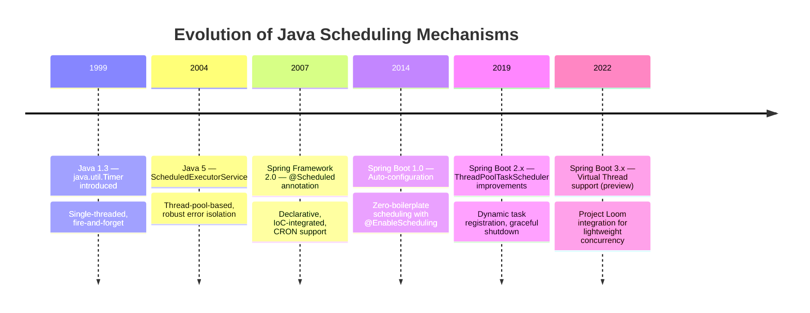

---

## Approach 1 — Legacy Java `Timer`

### What Is It?

`java.util.Timer` is the oldest scheduling API in Java, available since JDK 1.3. Internally it uses **a single background daemon thread** to execute all scheduled `TimerTask` objects sequentially.

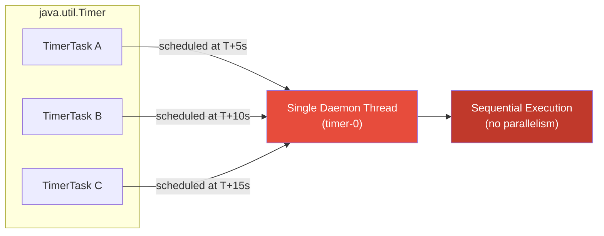

### Basic Example — Fixed-Rate Notification Check

```java
import java.util.Timer;
import java.util.TimerTask;

public class LegacyTimerDemo {

    public static void main(String[] args) {
        Timer timer = new Timer("notification-checker");

        TimerTask checkNotifications = new TimerTask() {
            @Override
            public void run() {
                System.out.println("[" + System.currentTimeMillis() + "] Checking for new notifications...");
                // Simulate work
                fetchAndDispatchNotifications();
            }
        };

        // Schedule: start after 1 second, repeat every 5 seconds
        timer.scheduleAtFixedRate(checkNotifications, 1_000, 5_000);
    }

    private static void fetchAndDispatchNotifications() {
        // DB query, push to users, etc.
    }
}
```

### All Three Scheduling Modes

```java
Timer timer = new Timer();

// 1. Run once after a delay
timer.schedule(task, 3000);                         // in 3 seconds

// 2. Fixed-delay: next run starts AFTER previous run finishes
timer.schedule(task, 0, 5000);                      // every 5s from completion

// 3. Fixed-rate: runs at fixed calendar intervals regardless of duration
timer.scheduleAtFixedRate(task, 0, 5000);           // every 5s from start
```

**Key difference — fixed delay vs fixed rate:**

```mermaid
gantt
    title Fixed-Delay vs Fixed-Rate Scheduling
    dateFormat  ss
    axisFormat %Ss

    section Fixed-Rate (scheduleAtFixedRate)
    Task Run 1 (2s) :a1, 00, 2s
    Task Run 2 (2s) :a2, 05, 2s
    Task Run 3 (2s) :a3, 10, 2s

    section Fixed-Delay (schedule)
    Task Run 1 (2s) :b1, 00, 2s
    Delay (5s)      :crit, b2, after b1, 5s
    Task Run 2 (2s) :b3, after b2, 2s
    Delay (5s)      :crit, b4, after b3, 5s
    Task Run 3 (2s) :b5, after b4, 2s
```

### ⚠️ The Fatal Flaw — Single-Thread Exception Propagation

```java
Timer timer = new Timer();

// Task A throws a RuntimeException
timer.scheduleAtFixedRate(new TimerTask() {
    @Override
    public void run() {
        System.out.println("Task A running...");
        throw new RuntimeException("Simulated failure!");
        // ❌ This KILLS the timer thread permanently.
        // Task B below will NEVER run again after this point.
    }
}, 0, 2000);

// Task B - becomes a casualty of Task A's failure
timer.scheduleAtFixedRate(new TimerTask() {
    @Override
    public void run() {
        System.out.println("Task B running... (will stop if Task A fails)");
    }
}, 0, 3000);
```

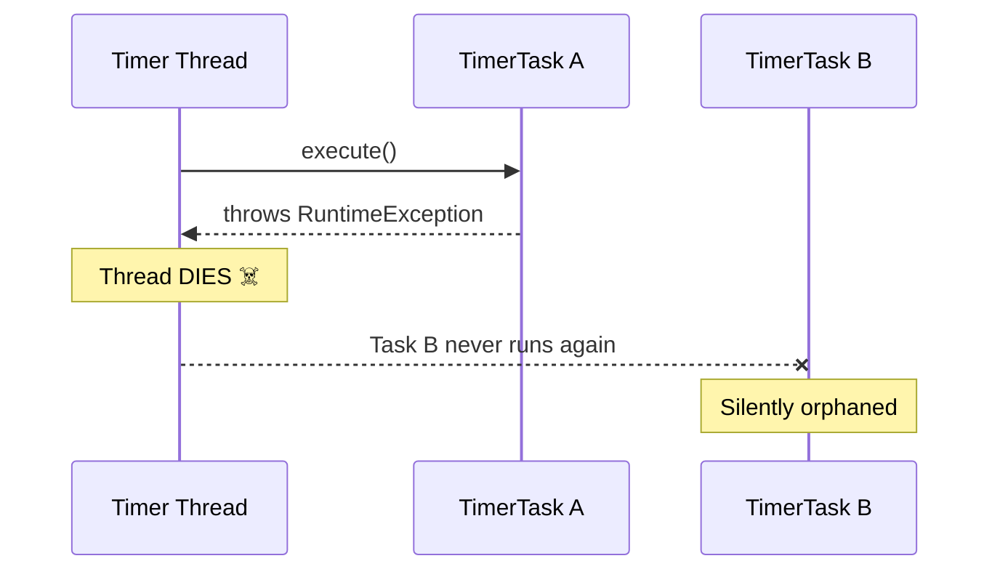

### When to Use `Timer`

✅ Only appropriate for:
- Quick scripts and throwaway utilities
- Unit tests with simple delay assertions
- Prototype code that will be replaced

❌ Never use for:
- Production workloads
- Tasks that must survive failures
- Concurrent task execution

---

## Approach 2 — Modern `ScheduledExecutorService`

### What Is It?

Introduced in Java 5's `java.util.concurrent` package, `ScheduledExecutorService` addresses every limitation of `Timer` using a **configurable thread pool**.

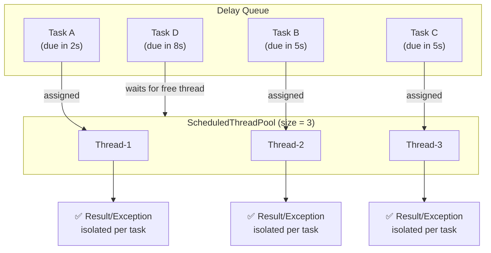

### Basic Example — Data Synchronization Service

```java
import java.util.concurrent.*;

public class DataSyncScheduler {

    public static void main(String[] args) {
        // Create a pool of 3 threads
        ScheduledExecutorService scheduler =
            Executors.newScheduledThreadPool(3);

        Runnable syncInventory = () -> {
            try {
                System.out.println("[Thread: " + Thread.currentThread().getName()
                    + "] Syncing inventory...");
                Thread.sleep(1500); // Simulate external API call
                System.out.println("Inventory sync complete.");
            } catch (InterruptedException e) {
                Thread.currentThread().interrupt();
            }
        };

        Runnable cleanExpiredSessions = () -> {
            System.out.println("[Thread: " + Thread.currentThread().getName()
                + "] Cleaning expired sessions...");
        };

        // Both tasks run concurrently on separate threads
        scheduler.scheduleAtFixedRate(syncInventory,      0, 10, TimeUnit.SECONDS);
        scheduler.scheduleAtFixedRate(cleanExpiredSessions, 0,  5, TimeUnit.MINUTES);
    }
}
```

### Exception Isolation — The Key Advantage

```java
ScheduledExecutorService scheduler = Executors.newScheduledThreadPool(2);

ScheduledFuture<?> taskFuture = scheduler.scheduleAtFixedRate(() -> {
    System.out.println("Attempting report generation...");
    if (Math.random() < 0.5) {
        throw new RuntimeException("DB connection failed!");
        // ✅ Only THIS task stops. Other tasks continue running.
    }
    System.out.println("Report generated.");
}, 0, 5, TimeUnit.SECONDS);

// Check for failures proactively
scheduler.scheduleAtFixedRate(() -> {
    if (taskFuture.isDone()) {
        System.err.println("ALERT: Report task has died! Investigate.");
        // Restart logic, alerting, etc.
    }
}, 10, 10, TimeUnit.SECONDS);
```

### Graceful Shutdown Pattern

```java
public class GracefulSchedulerShutdown {

    private final ScheduledExecutorService scheduler =
        Executors.newScheduledThreadPool(4);

    public void start() {
        scheduler.scheduleAtFixedRate(this::generateDailyReport, 0, 24, TimeUnit.HOURS);
        scheduler.scheduleAtFixedRate(this::sendReminders,       0, 1,  TimeUnit.HOURS);

        // Register JVM shutdown hook
        Runtime.getRuntime().addShutdownHook(new Thread(() -> {
            System.out.println("Shutdown initiated. Waiting for tasks to finish...");
            scheduler.shutdown();
            try {
                if (!scheduler.awaitTermination(30, TimeUnit.SECONDS)) {
                    System.err.println("Forcing shutdown after 30s timeout.");
                    scheduler.shutdownNow();
                }
            } catch (InterruptedException e) {
                scheduler.shutdownNow();
                Thread.currentThread().interrupt();
            }
        }));
    }

    private void generateDailyReport() { /* ... */ }
    private void sendReminders()       { /* ... */ }
}
```

### `Timer` vs `ScheduledExecutorService` — Feature Matrix

| Feature | `Timer` | `ScheduledExecutorService` |
|---|---|---|
| Thread model | Single daemon thread | Configurable thread pool |
| Task isolation | ❌ One failure kills all | ✅ Failures isolated per task |
| Concurrency | ❌ Sequential only | ✅ True parallel execution |
| `Future` support | ❌ No | ✅ Yes (`ScheduledFuture`) |
| Graceful shutdown | ❌ Limited | ✅ `shutdown()` + `awaitTermination()` |
| Time unit precision | Milliseconds | Nanoseconds |
| Spring integration | ❌ Manual | ⚠️ Possible but verbose |

---

## Approach 3 — Spring Boot `@Scheduled`

### Architecture Overview

`@Scheduled` is the declarative, idiomatic Spring way to schedule tasks. It sits on top of `ScheduledExecutorService` internally but integrates fully with Spring's IoC container, dependency injection, environment, and lifecycle management.

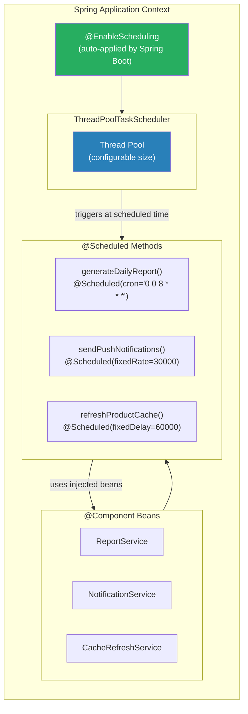

### Step 1 — Enable Scheduling

```java
// Option A: Main application class (recommended for Spring Boot)
@SpringBootApplication
// @EnableScheduling is auto-applied when spring-boot-starter is present
// but you can be explicit:
@EnableScheduling
public class MyApplication {
    public static void main(String[] args) {
        SpringApplication.run(MyApplication.class, args);
    }
}

// Option B: Dedicated configuration class
@Configuration
@EnableScheduling
public class SchedulingConfig {
    // Thread pool configuration goes here
}
```

### Step 2 — Three Timing Modes

#### Mode A: `fixedRate` — Consistent Polling Interval

```java
@Component
public class StockPricePoller {

    @Autowired
    private StockApiClient stockApiClient;

    @Autowired
    private PriceCache priceCache;

    /**
     * Polls stock prices every 30 seconds FROM THE MOMENT the previous
     * execution STARTED. Overlapping runs are possible if execution > 30s.
     */
    @Scheduled(fixedRate = 30_000)
    public void pollStockPrices() {
        System.out.println("Polling stock prices at: " + LocalDateTime.now());
        Map<String, Double> prices = stockApiClient.fetchLatestPrices();
        priceCache.updateAll(prices);
    }

    // Using time units for readability (Spring Boot 2.2+)
    @Scheduled(fixedRate = 30, timeUnit = TimeUnit.SECONDS)
    public void pollWithTimeUnit() {
        // Same as above but more readable
    }
}
```

#### Mode B: `fixedDelay` — Wait-and-Retry Pattern

```java
@Component
public class EmailDispatchService {

    @Autowired
    private EmailQueue emailQueue;

    @Autowired
    private SmtpClient smtpClient;

    /**
     * Waits 5 seconds AFTER the previous execution COMPLETES before running again.
     * Guarantees sequential processing — great for queues where order matters.
     */
    @Scheduled(fixedDelay = 5_000)
    public void processEmailQueue() {
        List<Email> pending = emailQueue.fetchBatch(50);
        if (!pending.isEmpty()) {
            System.out.printf("Dispatching %d emails%n", pending.size());
            smtpClient.sendBatch(pending);
        }
    }
}
```

#### Mode C: `cron` — Calendar-Based Scheduling

```java
@Component
public class ReportGenerationService {

    @Autowired
    private ReportRepository reportRepository;

    /**
     * Cron expression format:
     * ┌─ second (0-59)
     * │ ┌─ minute (0-59)
     * │ │ ┌─ hour (0-23)
     * │ │ │ ┌─ day of month (1-31)
     * │ │ │ │ ┌─ month (1-12 or JAN-DEC)
     * │ │ │ │ │ ┌─ day of week (0-7 or SUN-SAT)
     * │ │ │ │ │ │
     * * * * * * *
     */

    // Every day at 8:00 AM
    @Scheduled(cron = "0 0 8 * * *")
    public void generateDailyReport() {
        System.out.println("Generating daily report at 8 AM...");
        reportRepository.generateAndStore("DAILY");
    }

    // Every Monday at 9:00 AM
    @Scheduled(cron = "0 0 9 * * MON")
    public void generateWeeklyReport() {
        reportRepository.generateAndStore("WEEKLY");
    }

    // Last day of every month at 11:59 PM
    @Scheduled(cron = "0 59 23 L * *")
    public void generateMonthlyReport() {
        reportRepository.generateAndStore("MONTHLY");
    }

    // Every 15 minutes during business hours (9 AM - 6 PM, Mon-Fri)
    @Scheduled(cron = "0 */15 9-18 * * MON-FRI")
    public void businessHourHeartbeat() {
        System.out.println("Heartbeat: " + LocalDateTime.now());
    }
}
```

### Cron Expression Quick Reference

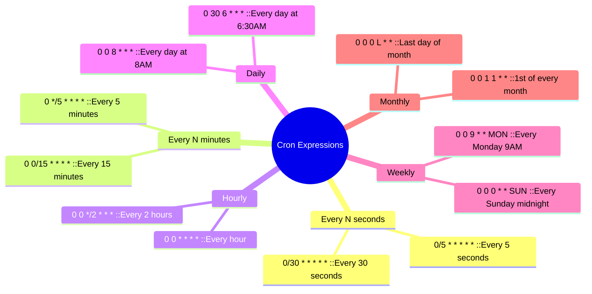

### Step 3 — Configuring the Thread Pool

By default, `@Scheduled` uses a **single-threaded** scheduler. For production, always configure a pool:

```java
@Configuration
@EnableScheduling
public class SchedulingConfiguration implements SchedulingConfigurer {

    @Override
    public void configureTasks(ScheduledTaskRegistrar registrar) {
        ThreadPoolTaskScheduler scheduler = new ThreadPoolTaskScheduler();
        scheduler.setPoolSize(10);                           // 10 concurrent tasks
        scheduler.setThreadNamePrefix("scheduled-task-");
        scheduler.setAwaitTerminationSeconds(60);            // Graceful shutdown
        scheduler.setWaitForTasksToCompleteOnShutdown(true); // Don't abandon running tasks
        scheduler.setErrorHandler(t ->
            System.err.println("Scheduled task failed: " + t.getMessage())
        );
        scheduler.initialize();
        registrar.setTaskScheduler(scheduler);
    }
}
```

Alternatively, via `application.properties`:

```properties
# Spring Boot 2.1+
spring.task.scheduling.pool.size=10
spring.task.scheduling.thread-name-prefix=sched-task-
spring.task.scheduling.shutdown.await-termination=true
spring.task.scheduling.shutdown.await-termination-period=60s
```

### Step 4 — Externalizing Cron Expressions

Never hardcode schedules. Store them in configuration:

```properties
# application.properties
app.scheduling.report.cron=0 0 8 * * *
app.scheduling.inventory-sync.fixed-rate=300000
app.scheduling.cache-refresh.fixed-delay=60000
```

```java
@Component
public class ExternalizedScheduler {

    // Value injected from application.properties
    @Scheduled(cron = "${app.scheduling.report.cron}")
    public void generateReport() {
        System.out.println("Running externalized cron task...");
    }

    @Scheduled(fixedRateString = "${app.scheduling.inventory-sync.fixed-rate}")
    public void syncInventory() {
        System.out.println("Syncing inventory...");
    }

    // With Spring Expression Language fallback value
    @Scheduled(cron = "${app.scheduling.audit.cron:0 0 0 * * *}")
    public void runAudit() {
        // Falls back to midnight daily if property not set
    }
}
```

---

## Side-by-Side Comparison

```mermaid
quadrantChart
    title Scheduling Mechanism Selection Guide
    x-axis Low Complexity --> High Complexity
    y-axis Low Production Readiness --> High Production Readiness
    quadrant-1 Enterprise Choice
    quadrant-2 Advanced Custom Solutions
    quadrant-3 Avoid in Production
    quadrant-4 Transitional
    Timer: [0.15, 0.10]
    ScheduledExecutorService: [0.55, 0.70]
    Spring @Scheduled: [0.70, 0.90]
    Quartz Scheduler: [0.90, 0.85]
```

| Criterion | `Timer` | `ScheduledExecutorService` | `@Scheduled` |
|---|---|---|---|
| **Setup complexity** | Minimal | Moderate | Minimal (with Spring) |
| **Thread safety** | ❌ Single thread | ✅ Thread pool | ✅ Thread pool |
| **Failure isolation** | ❌ Global crash | ✅ Per-task | ✅ Per-task |
| **Spring DI support** | ❌ Manual wiring | ⚠️ Manual wiring | ✅ Native |
| **CRON support** | ❌ None | ❌ None | ✅ Full CRON |
| **Externalized config** | ❌ | ⚠️ Manual | ✅ `@Value` / properties |
| **Graceful shutdown** | ❌ | ✅ `awaitTermination` | ✅ Auto via Spring lifecycle |
| **Observability (Actuator)** | ❌ | ❌ | ✅ `/actuator/scheduledtasks` |
| **Dynamic registration** | ❌ | ⚠️ Workarounds | ✅ `ScheduledTaskRegistrar` |
| **Testing support** | ⚠️ | ⚠️ | ✅ `@MockBean`, `@SpyBean` |

---

## Advanced Spring Scheduling Patterns

### Pattern 1 — Conditional Task Execution

```java
@Component
public class ConditionalScheduler {

    @Value("${feature.nightly-cleanup.enabled:true}")
    private boolean cleanupEnabled;

    @Scheduled(cron = "0 0 2 * * *")
    public void nightlyCleanup() {
        if (!cleanupEnabled) {
            System.out.println("Cleanup disabled via config. Skipping.");
            return;
        }
        performCleanup();
    }

    private void performCleanup() { /* ... */ }
}
```

### Pattern 2 — Dynamic Task Registration

```java
@Configuration
@EnableScheduling
public class DynamicScheduler implements SchedulingConfigurer {

    @Autowired
    private TaskConfigRepository taskConfigRepository; // DB-driven

    @Override
    public void configureTasks(ScheduledTaskRegistrar registrar) {
        // Load cron expressions from database at startup
        List<TaskConfig> configs = taskConfigRepository.findAllActive();
        for (TaskConfig config : configs) {
            registrar.addCronTask(
                () -> runTask(config.getTaskName()),
                config.getCronExpression()
            );
        }
    }

    private void runTask(String taskName) {
        System.out.println("Running DB-configured task: " + taskName);
    }
}
```

### Pattern 3 — Async Scheduled Tasks

Combining `@Scheduled` with `@Async` allows the scheduler thread to return immediately while the actual work runs on a separate async executor:

```java
@Configuration
@EnableAsync
@EnableScheduling
public class AsyncSchedulingConfig {

    @Bean(name = "asyncTaskExecutor")
    public Executor asyncTaskExecutor() {
        ThreadPoolTaskExecutor executor = new ThreadPoolTaskExecutor();
        executor.setCorePoolSize(5);
        executor.setMaxPoolSize(20);
        executor.setQueueCapacity(100);
        executor.setThreadNamePrefix("async-task-");
        executor.initialize();
        return executor;
    }
}

@Component
public class AsyncReportService {

    /**
     * The scheduler fires every 10 minutes.
     * @Async means the actual report generation runs on the asyncTaskExecutor,
     * freeing the scheduler thread immediately for other tasks.
     */
    @Scheduled(fixedRate = 600_000)
    @Async("asyncTaskExecutor")
    public CompletableFuture<Void> generateLargeReport() {
        System.out.println("Generating large report on: "
            + Thread.currentThread().getName());
        // Long-running operation...
        return CompletableFuture.completedFuture(null);
    }
}
```

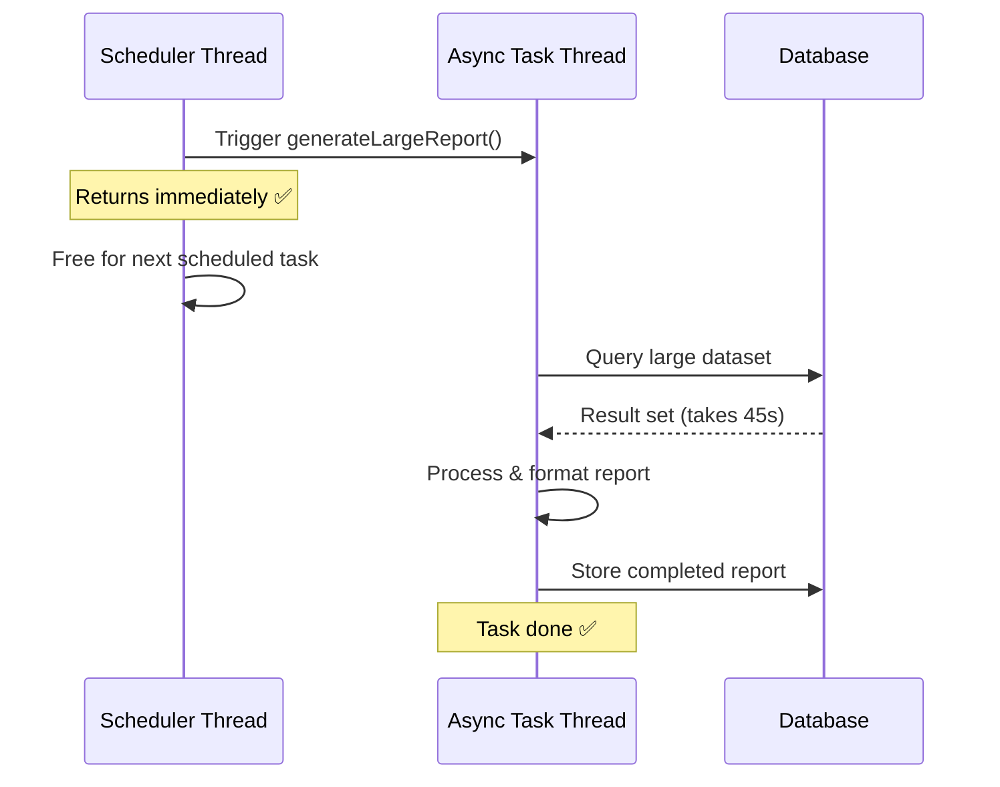

### Pattern 4 — Distributed Scheduling with ShedLock

In clustered (multi-node) deployments, `@Scheduled` runs on **every node simultaneously**, causing duplicate processing. Use ShedLock to ensure only one node executes:

```xml
<!-- pom.xml -->
<dependency>
    <groupId>net.javacrumbs.shedlock</groupId>
    <artifactId>shedlock-spring</artifactId>
    <version>5.10.0</version>
</dependency>
<dependency>
    <groupId>net.javacrumbs.shedlock</groupId>
    <artifactId>shedlock-provider-jdbc-template</artifactId>
    <version>5.10.0</version>
</dependency>
```

```java
@Configuration
@EnableScheduling
@EnableSchedulerLock(defaultLockAtMostFor = "PT30M")
public class DistributedSchedulingConfig {

    @Bean
    public LockProvider lockProvider(DataSource dataSource) {
        return new JdbcTemplateLockProvider(
            JdbcTemplateLockProvider.Configuration.builder()
                .withJdbcTemplate(new JdbcTemplate(dataSource))
                .usingDbTime()
                .build()
        );
    }
}

@Component
public class ClusterSafeScheduler {

    @Scheduled(cron = "0 0 1 * * *")
    @SchedulerLock(
        name = "nightly-invoice-generator",
        lockAtLeastFor = "PT5M",
        lockAtMostFor = "PT30M"
    )
    public void generateInvoices() {
        // Only runs on ONE node in the cluster
        System.out.println("Generating invoices on: "
            + InetAddress.getLocalHost().getHostName());
    }
}
```

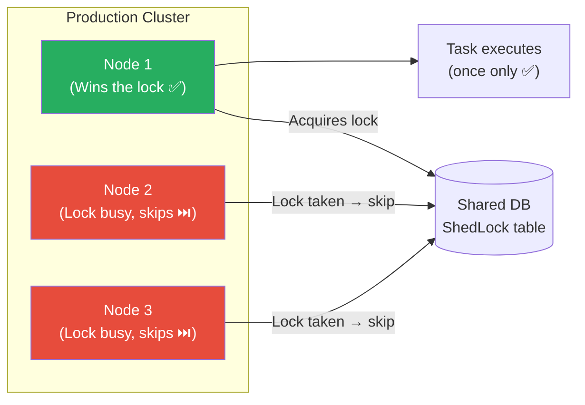

---

## Real-World Use Cases

### Use Case 1 — E-commerce: Order Status Poller

```java
@Component
@Slf4j
public class OrderFulfillmentPoller {

    @Autowired private OrderRepository orderRepository;
    @Autowired private FulfillmentApiClient fulfillmentApi;
    @Autowired private NotificationService notificationService;

    @Scheduled(fixedDelay = 60_000) // 1 minute after last run completes
    public void syncOrderStatuses() {
        List<Order> pendingOrders = orderRepository.findByStatus(OrderStatus.PROCESSING);

        log.info("Checking fulfillment status for {} orders", pendingOrders.size());

        for (Order order : pendingOrders) {
            FulfillmentStatus status = fulfillmentApi.getStatus(order.getTrackingId());
            if (status == FulfillmentStatus.SHIPPED) {
                order.setStatus(OrderStatus.SHIPPED);
                orderRepository.save(order);
                notificationService.sendShippingNotification(order.getCustomerEmail(),
                    order.getTrackingId());
                log.info("Order {} marked as SHIPPED", order.getId());
            }
        }
    }
}
```

### Use Case 2 — SaaS: Trial Expiry Reminder Emails

```java
@Component
@Slf4j
public class TrialExpiryReminder {

    @Autowired private UserRepository userRepository;
    @Autowired private EmailService emailService;

    // Runs daily at 10 AM
    @Scheduled(cron = "0 0 10 * * *")
    public void sendTrialExpiryReminders() {
        LocalDate threeDaysFromNow = LocalDate.now().plusDays(3);
        LocalDate oneDayFromNow   = LocalDate.now().plusDays(1);

        // 3-day warning
        List<User> trialsExpiringSoon =
            userRepository.findByTrialExpiresOn(threeDaysFromNow);
        trialsExpiringSoon.forEach(user ->
            emailService.send(TrialExpiryEmailTemplate.threeDayWarning(user))
        );
        log.info("Sent 3-day trial warning to {} users", trialsExpiringSoon.size());

        // Final day warning
        List<User> trialsExpiringTomorrow =
            userRepository.findByTrialExpiresOn(oneDayFromNow);
        trialsExpiringTomorrow.forEach(user ->
            emailService.send(TrialExpiryEmailTemplate.lastDayWarning(user))
        );
        log.info("Sent last-day trial warning to {} users", trialsExpiringTomorrow.size());
    }
}
```

### Use Case 3 — Healthcare: Appointment Reminders

```java
@Component
public class AppointmentReminderService {

    @Autowired private AppointmentRepository appointmentRepo;
    @Autowired private SmsGateway smsGateway;
    @Autowired private EmailService emailService;

    // Every 30 minutes, check for appointments in the next 24 hours
    @Scheduled(fixedRate = 30, timeUnit = TimeUnit.MINUTES)
    public void sendAppointmentReminders() {
        LocalDateTime now     = LocalDateTime.now();
        LocalDateTime in24hrs = now.plusHours(24);

        List<Appointment> upcoming = appointmentRepo
            .findUnreminedBetween(now, in24hrs);

        for (Appointment appt : upcoming) {
            if (appt.getPatient().prefersSms()) {
                smsGateway.send(appt.getPatient().getPhone(),
                    "Reminder: Your appointment with Dr. " + appt.getDoctorName()
                    + " is on " + appt.getFormattedTime());
            } else {
                emailService.sendAppointmentReminder(appt);
            }
            appt.markReminderSent();
            appointmentRepo.save(appt);
        }
    }
}
```

### Use Case 4 — Data Engineering: Nightly ETL Pipeline

```java
@Component
@Slf4j
public class NightlyEtlPipeline {

    @Autowired private DataWarehouseClient dwClient;
    @Autowired private TransactionRepository txRepo;
    @Autowired private MetricsService metricsService;

    // Runs at 2:00 AM every night
    @Scheduled(cron = "0 0 2 * * *")
    public void runNightlyEtl() {
        Instant start = Instant.now();
        log.info("ETL pipeline started at {}", start);

        try {
            // Step 1: Extract
            LocalDate yesterday = LocalDate.now().minusDays(1);
            List<Transaction> transactions = txRepo.findByDate(yesterday);
            log.info("Extracted {} transactions", transactions.size());

            // Step 2: Transform
            List<DwTransaction> transformed = transactions.stream()
                .map(this::transformForWarehouse)
                .collect(Collectors.toList());

            // Step 3: Load
            dwClient.bulkInsert(transformed);
            log.info("Loaded {} records to data warehouse", transformed.size());

            // Record success metrics
            long durationMs = Duration.between(start, Instant.now()).toMillis();
            metricsService.recordEtlSuccess(transactions.size(), durationMs);

        } catch (Exception e) {
            log.error("ETL pipeline failed!", e);
            metricsService.recordEtlFailure(e.getMessage());
            // Could also trigger PagerDuty alert here
        }
    }

    private DwTransaction transformForWarehouse(Transaction tx) {
        // Normalize, enrich, flatten
        return new DwTransaction(tx);
    }
}
```

---

## Error Handling & Observability

### Global Error Handler

```java
@Component
public class SchedulingErrorHandler implements ErrorHandler {

    @Autowired private AlertingService alertingService;

    @Override
    public void handleError(Throwable t) {
        String message = "Scheduled task failed: " + t.getMessage();
        System.err.println(message);
        alertingService.sendSlackAlert("#ops-alerts", message);
        // Could also write to a DB failure log for auditing
    }
}

@Configuration
@EnableScheduling
public class SchedulingConfig implements SchedulingConfigurer {

    @Autowired
    private SchedulingErrorHandler errorHandler;

    @Override
    public void configureTasks(ScheduledTaskRegistrar registrar) {
        ThreadPoolTaskScheduler scheduler = new ThreadPoolTaskScheduler();
        scheduler.setPoolSize(5);
        scheduler.setErrorHandler(errorHandler); // Attach global error handler
        scheduler.initialize();
        registrar.setTaskScheduler(scheduler);
    }
}
```

### Monitoring with Spring Boot Actuator

Add the dependency:

```xml
<dependency>
    <groupId>org.springframework.boot</groupId>
    <artifactId>spring-boot-starter-actuator</artifactId>
</dependency>
```

Expose the endpoint:

```properties
management.endpoints.web.exposure.include=health,scheduledtasks,metrics
```

Sample Actuator response from `GET /actuator/scheduledtasks`:

```json
{
  "fixedRateTaskCount": 2,
  "fixedDelayTaskCount": 1,
  "cronTaskCount": 3,
  "fixedRateTasks": [
    {
      "runnable": { "target": "com.example.StockPricePoller.pollStockPrices" },
      "initialDelay": 0,
      "interval": 30000
    }
  ],
  "cronTasks": [
    {
      "runnable": { "target": "com.example.ReportService.generateDailyReport" },
      "expression": "0 0 8 * * *"
    }
  ]
}
```

### Task Execution Metrics with Micrometer

```java
@Component
public class InstrumentedScheduledTask {

    @Autowired private MeterRegistry meterRegistry;

    @Scheduled(cron = "0 0 * * * *")
    public void hourlyDataSync() {
        Timer.Sample sample = Timer.start(meterRegistry);
        try {
            performSync();
            meterRegistry.counter("scheduled.task.success",
                "task", "hourly-data-sync").increment();
        } catch (Exception e) {
            meterRegistry.counter("scheduled.task.failure",
                "task", "hourly-data-sync",
                "exception", e.getClass().getSimpleName()).increment();
            throw e;
        } finally {
            sample.stop(meterRegistry.timer("scheduled.task.duration",
                "task", "hourly-data-sync"));
        }
    }

    private void performSync() { /* ... */ }
}
```

---

## Best Practices & Pitfalls

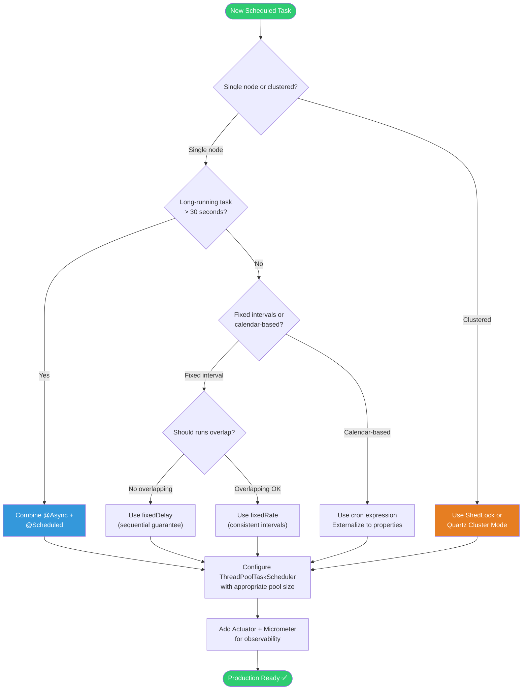

### ✅ Best Practices Checklist

| # | Practice | Why |
|---|---|---|
| 1 | **Always configure a thread pool** | Default is single-threaded; tasks will queue up |
| 2 | **Externalize cron to properties** | Change schedules without rebuilding the artifact |
| 3 | **Use `@Async` for tasks > 10s** | Keeps the scheduler thread free |
| 4 | **Add error handling** | Silent failures are worse than visible ones |
| 5 | **Use ShedLock in clusters** | Prevents duplicate task execution |
| 6 | **Log start, end, and duration** | Essential for debugging timing issues |
| 7 | **Make tasks idempotent** | Safeguard against double-execution edge cases |
| 8 | **Test with `@SpyBean`** | Verify `@Scheduled` methods are invoked correctly |
| 9 | **Enable Actuator endpoint** | Real-time visibility into registered tasks |
| 10 | **Emit metrics via Micrometer** | Build dashboards and alerts around task health |

### ⚠️ Common Pitfalls

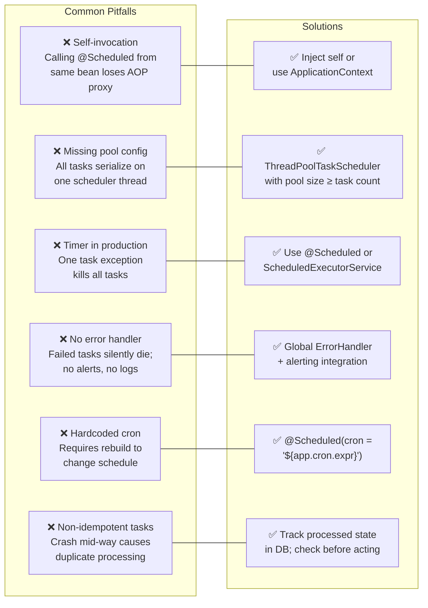

---

## Quick Decision Guide

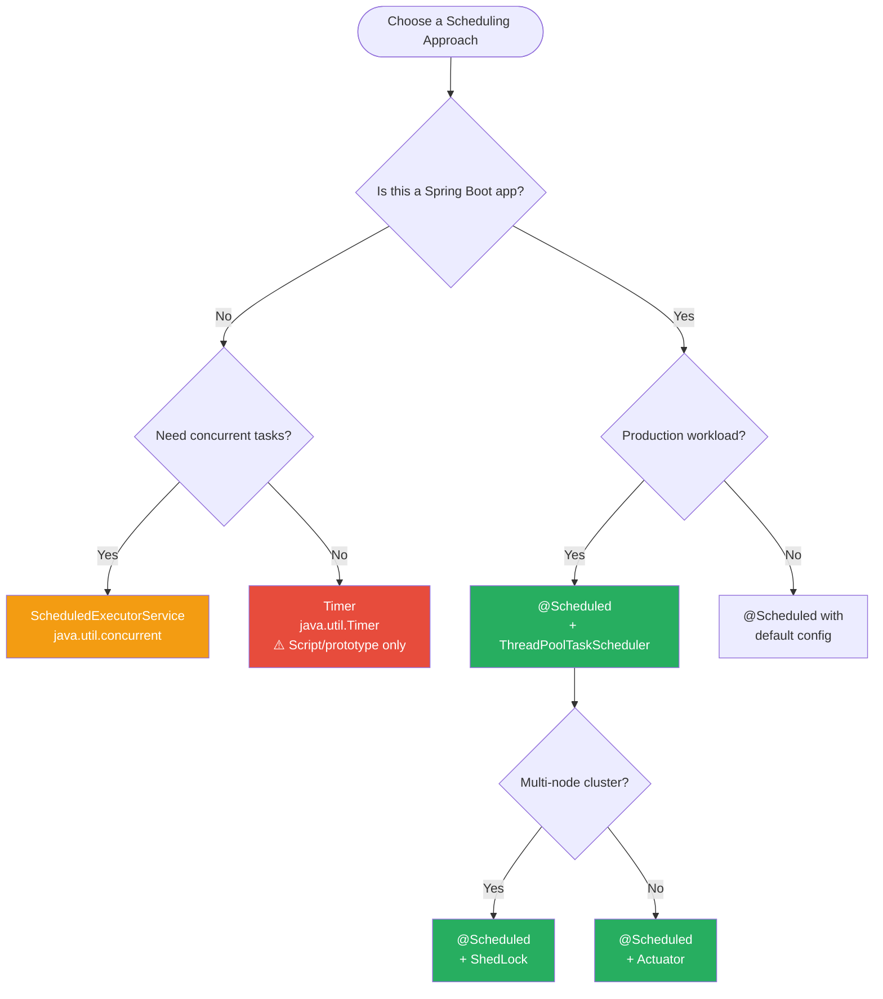

---

## Summary

| Approach | Best For | Avoid When |
|---|---|---|
| `Timer` | Quick scripts, prototypes, unit test helpers | Any production use |
| `ScheduledExecutorService` | Non-Spring Java apps needing concurrent scheduling | You already use Spring (use `@Scheduled` instead) |
| `@Scheduled` | All Spring Boot production workloads | You need guaranteed distributed task uniqueness without ShedLock |
| `@Scheduled` + ShedLock | Multi-node Spring Boot clusters | Single-node deployments (unnecessary overhead) |
| `@Scheduled` + `@Async` | Long-running background jobs in Spring Boot | Tasks that must be synchronous or sequential |

Spring Boot's `@Scheduled` is the clear winner for enterprise Spring applications. Combine it with a properly sized `ThreadPoolTaskScheduler`, externalised configuration, ShedLock for distributed setups, and Micrometer for observability — and you have a production-grade scheduling system that is resilient, maintainable, and observable.

---

*Happy Scheduling! ☕*