# System Design Interview Mastery - 30 Real-World Scenarios with Deep-Dive Analysis

**📚 Comprehensive Deep-Dive Tutorial**  
**⏱️ Estimated Reading Time:** 95 minutes  
**🎯 Difficulty Level:** Intermediate to Advanced  
**👥 Target Audience:** Software engineers preparing for system design interviews  
**📅 Last Updated:** January 2026

---

## Table of Contents

1. [Introduction](#introduction)
2. [Prerequisites](#prerequisites)
3. [Learning Objectives](#learning-objectives)
4. [Chapter 1: API Design & Gateway Patterns](#chapter-1-api-design--gateway-patterns)
5. [Chapter 2: Database Optimization & Query Patterns](#chapter-2-database-optimization--query-patterns)
6. [Chapter 3: Caching Strategies](#chapter-3-caching-strategies)
7. [Chapter 4: Rate Limiting & Throttling](#chapter-4-rate-limiting--throttling)
8. [Chapter 5: Distributed Transactions & Sagas](#chapter-5-distributed-transactions--sagas)
9. [Chapter 6: Message Queues & Event Processing](#chapter-6-message-queues--event-processing)
10. [Chapter 7: Scalability & Sharding](#chapter-7-scalability--sharding)
11. [Chapter 8: Reliability & Resilience Patterns](#chapter-8-reliability--resilience-patterns)
12. [Chapter 9: Modern Architecture Patterns](#chapter-9-modern-architecture-patterns)
13. [Practice Exercises](#practice-exercises)
14. [Test Your Understanding](#test-your-understanding)
15. [Common Interview Questions](#common-interview-questions)
16. [Question Bank](#question-bank)
17. [Summary & Key Takeaways](#summary--key-takeaways)
18. [Further Reading & Resources](#further-reading--resources)

---

## Introduction

System design interviews can feel confusing at first. You may understand databases, APIs, caching, queues, and load balancers individually, but the real challenge begins when an interviewer gives you a practical situation: **"How would you design this system?"**

Suddenly, you need to think about scale, performance, reliability, security, storage, and trade-offs all at the same time.

This comprehensive tutorial walks through **30 real-world system design scenarios** in a beginner-friendly and practical way. Each scenario presents a common production problem, multiple solution options, and detailed explanations of why certain approaches work better than others.

> 💡 **Key Insight:** The goal is not simply to give you answers. The goal is to help you develop the thinking process required to break down a problem, ask the right questions, compare possible solutions, identify trade-offs, and confidently explain your design during an interview.

### What Makes This Tutorial Different?

- **Scenario-Based Learning:** Instead of memorizing definitions, you learn how to apply system design concepts to real problems
- **Deep Analysis:** Each scenario includes detailed explanations of why solutions work or fail
- **Interview-Focused:** Every scenario includes an "Interview Takeaway" section highlighting key concepts
- **Production-Tested:** Examples draw from real-world systems at companies like Netflix, Stripe, AWS, and Twitter

---

## Prerequisites

Before diving into this tutorial, you should have:

### Technical Knowledge
- ✅ Basic understanding of databases (SQL and NoSQL)
- ✅ Familiarity with APIs and REST/GraphQL
- ✅ Understanding of caching concepts (Redis, Memcached)
- ✅ Basic knowledge of message queues (Kafka, SQS, RabbitMQ)
- ✅ Familiarity with load balancers and reverse proxies
- ✅ Understanding of microservices architecture
- ✅ Basic knowledge of cloud services (AWS, GCP, or Azure)

### Recommended Background
- 1+ years of backend development experience
- Exposure to production systems
- Basic understanding of distributed systems concepts
- Familiarity with at least one backend framework (Node.js, Spring Boot, Django, etc.)

### Tools & Resources
- Notebook or drawing tool for sketching architectures
- Access to documentation for technologies mentioned
- Curiosity about how large-scale systems work!

---

## Learning Objectives

By the end of this tutorial, you will be able to:

### Core Competencies
- ✅ Identify the right tool for specific system design problems
- ✅ Understand trade-offs between different architectural approaches
- ✅ Recognize common anti-patterns and why they fail
- ✅ Apply resilience patterns (Circuit Breaker, Bulkhead, etc.)
- ✅ Design scalable caching strategies
- ✅ Implement proper rate limiting and backpressure mechanisms
- ✅ Choose appropriate database sharding strategies
- ✅ Handle distributed transactions with Sagas
- ✅ Design event-driven architectures
- ✅ Optimize database queries and indexing strategies

### Interview Skills
- ✅ Break down ambiguous problems systematically
- ✅ Ask clarifying questions to understand requirements
- ✅ Communicate architectural decisions clearly
- ✅ Discuss trade-offs and alternatives confidently
- ✅ Identify potential failure modes and mitigation strategies

### Production Readiness
- ✅ Design for failure and recovery
- ✅ Implement proper monitoring and observability
- ✅ Consider security implications of architectural choices
- ✅ Plan for scalability from the start

---

## Chapter 1: API Design & Gateway Patterns

### Scenario 1: Decoupling a Mobile App from Backend Services

#### Problem Statement

Your mobile app currently communicates directly with three backend services:

```
Mobile → UserService
Mobile → OrderService
Mobile → PaymentService
```

A fourth service, `NotificationService`, will be released next sprint. Every new service means another domain to configure, another authentication flow to handle, and another error format for the mobile team to support. The client is now doing routing work that should belong to the backend.

**What would you do?**

<details>
<summary>Options</summary>

A. Add an API Gateway: Create one entry point and hide all services behind a single domain  
B. Build a BFF: Add a backend layer designed specifically for the mobile application  
C. Add a Load Balancer: Use one IP address and distribute traffic between services  
D. Use GraphQL Federation: Combine all services under one unified GraphQL schema

</details>

#### ✅ Correct Answer: A - Add an API Gateway

An API Gateway gives the mobile application one stable entry point:

```
api.yourapp.com/users
api.yourapp.com/orders
api.yourapp.com/payments
api.yourapp.com/notifications (when ready)
```

The gateway handles routing and forwards each request to the correct service. When `NotificationService` arrives, the backend team only adds a new route. The mobile app requires no infrastructure-level changes.

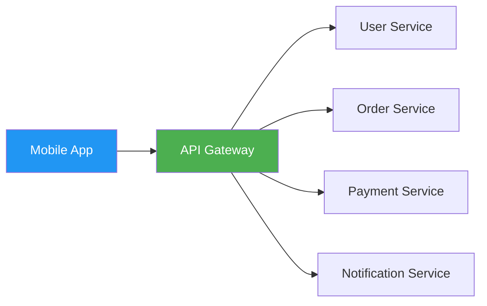

**Figure 1.1: API Gateway Architecture Pattern**

The gateway can also centralize:
- Authentication and authorization
- Rate limiting
- Logging and monitoring
- TLS termination
- API versioning
- Consistent error responses

This reduces client-to-service coupling and allows backend services to change without constantly affecting the mobile team.

#### Why Other Options Are Wrong

**❌ Why B (BFF) is the Trap Answer**

A Backend for Frontend is useful when mobile and web clients need different payloads or client-specific data aggregation. However, the main problem here is not the shape of the data—it's the growing number of service domains and direct client connections. A BFF could work, but it would introduce another service that must be developed, deployed, secured, and maintained. That's unnecessary for this problem.

**❌ Why C (Load Balancer) is Wrong**

A load balancer distributes traffic across multiple instances of the same service. It does not normally decide that `/users` should go to `UserService` while `/orders` should go to `OrderService`. That's service routing, which is the responsibility of an API Gateway.

**❌ Why D (GraphQL Federation) is Wrong**

GraphQL Federation solves schema unification across GraphQL services. Using it here would require a much larger migration, including new schemas, subgraphs, a federation gateway, and client-side changes. It's an overly complex solution for a routing and coupling problem that an API Gateway can solve directly.

#### 💡 Interview Takeaway

Choose the technology that solves the actual problem, not the most advanced option. Here, the problem is direct coupling between the mobile application and multiple backend services. An API Gateway provides the simplest and most appropriate solution.

---

### Scenario 21: Choosing the Right Real-Time Streaming Transport

#### Problem Statement

You are launching an AI chat application. The LLM streams around 40 tokens per second for each user, and you expect nearly 50,000 concurrent users on launch day. The clients are browser-based, and the data moves in only one direction: **Server → Browser**.

The server sends generated tokens, and the browser simply displays them. The connection must also recover smoothly because mobile networks frequently switch between Wi-Fi and cellular data.

**What would you choose?**

<details>
<summary>Options</summary>

A. WebSockets: Full-duplex communication and the common choice for real-time chat  
B. Server-Sent Events: A one-way HTTP stream with native browser support and automatic reconnection  
C. gRPC server streaming: HTTP/2 streaming with binary frames and built-in flow control  
D. Long polling: A simple, widely supported technique that works through most proxies

</details>

#### ✅ Correct Answer: B - Server-Sent Events (SSE)

The communication pattern is **one-way**. The server streams tokens, and the browser displays them. The browser does not need to send messages back through the same connection while the response is being generated. The user prompt can be submitted through a separate POST request.

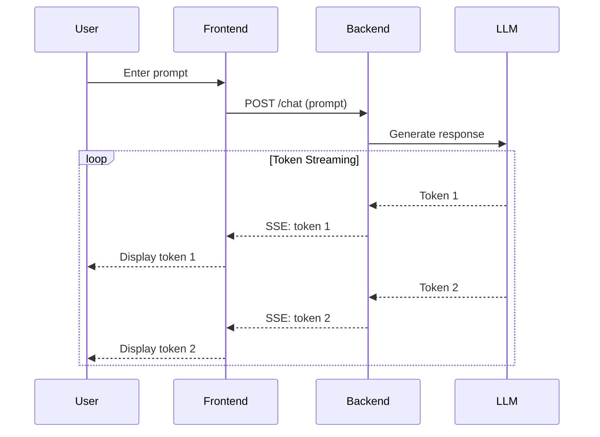

**Figure 1.2: Server-Sent Events Flow for AI Chat**

Because the connection is not truly bidirectional, using a full-duplex protocol adds complexity that the application does not need. Server-Sent Events are designed for this exact use case.

**Automatic Reconnection** is the strongest benefit of SSE. If the user's connection drops or the device switches from Wi-Fi to LTE, the browser automatically reconnects. SSE also supports `Last-Event-ID`, allowing the browser to tell the server which event it received last, so the server can continue streaming from that point instead of restarting.

```javascript
// Frontend: Native SSE implementation
const eventSource = new EventSource('/api/chat/stream?session_id=abc123');

eventSource.onmessage = (event) => {
  const data = JSON.parse(event.data);
  appendTokenToUI(data.token);
};

eventSource.onerror = (error) => {
  console.error('Stream error:', error);
  // Browser automatically reconnects
};

// With Last-Event-ID for recovery
eventSource.addEventListener('token', (event) => {
  console.log('Token:', event.data);
  console.log('Last ID:', event.lastEventId);
});
```

```python
# Backend: FastAPI SSE implementation
from fastapi import FastAPI
from fastapi.responses import StreamingResponse
import asyncio

app = FastAPI()

async def generate_tokens(prompt: str):
    """Stream tokens as SSE events"""
    tokens = await llm.generate(prompt)
    
    for i, token in enumerate(tokens):
        yield f"id: {i}\n"
        yield f"data: {json.dumps({'token': token})}\n\n"
        await asyncio.sleep(0.025)  # 40 tokens/second

@app.get("/api/chat/stream")
async def stream_chat(session_id: str, last_event_id: int = 0):
    """SSE endpoint with recovery support"""
    return StreamingResponse(
        generate_tokens("user prompt"),
        media_type="text/event-stream",
        headers={
            "Cache-Control": "no-cache",
            "X-Accel-Buffering": "no"  # Disable nginx buffering
        }
    )
```

#### Why Other Options Are Wrong

**❌ Why A (WebSockets) is the Trap**

The word "chat" often pushes engineers toward WebSockets. That's understandable for applications like Slack or WhatsApp, where both sides continuously send messages over the same connection. An AI chat product has a different communication shape. At 50,000 concurrent connections, WebSockets also introduce additional operational work:
- Sticky sessions on the ALB
- Custom reconnect and replay logic
- Heartbeat and ping/pong handling
- Extra per-connection memory and buffers

**❌ Why C (gRPC Server Streaming) is Wrong**

gRPC server streaming is a strong option for communication between backend services. The problem is browser support. Browsers do not directly support standard gRPC connections. You would need an additional layer such as Envoy and gRPC-Web, creating another proxy hop.

**❌ Why D (Long Polling) is Wrong**

Long polling is reliable and works through almost every proxy. But the LLM is producing around 40 tokens per second. At 50,000 concurrent users, polling at that rate could create:

```
50,000 users × 40 requests/second = 2,000,000 requests/second
```

That's an enormous amount of HTTP request overhead just to display text as it's generated.

#### 💡 Interview Takeaway

Choose the transport according to the actual communication pattern, not the product label. Since AI token streaming is one-way and browser-based, Server-Sent Events provide the simplest solution with native support and automatic reconnection.

---

## Chapter 2: Database Optimization & Query Patterns

### Scenario 2: Killing the N+1 Query Problem

#### Problem Statement

Your `/orders` endpoint returns 50 orders, but the P95 latency is 2.4 seconds. The database looks healthy. The application server is fine. Then you check the query log:

```
1 query to fetch 50 orders
50 queries to fetch each customer
```

That's 51 queries for one request. The ORM is lazily loading `order.customer` inside a loop—a classic N+1 query problem.

**What would you do?**

<details>
<summary>Options</summary>

A. Eager-load the customer relation: Fetch orders and customers together using a JOIN  
B. Add a DataLoader: Batch all customer IDs into one WHERE IN (...) query  
C. Cache customers in Redis: Read each customer from cache before querying the database  
D. Denormalize customer data: Store customer_name directly in the orders table

</details>

#### ✅ Correct Answer: A - Eager-Load the Relation

Fetch the customer relation in the original query:

```typescript
// TypeORM Example
const orders = await dataSource.getRepository(Order).find({
  relations: ['customer'],  // Eager loading with JOIN
  where: { /* filters */ }
});

// Prisma Example
const orders = await prisma.order.findMany({
  include: {
    customer: true,
  },
});

// Sequelize Example
const orders = await Order.findAll({
  include: [Customer],
});
```

The ORM can now retrieve the orders and their customers in one database round trip instead of running 50 additional queries.

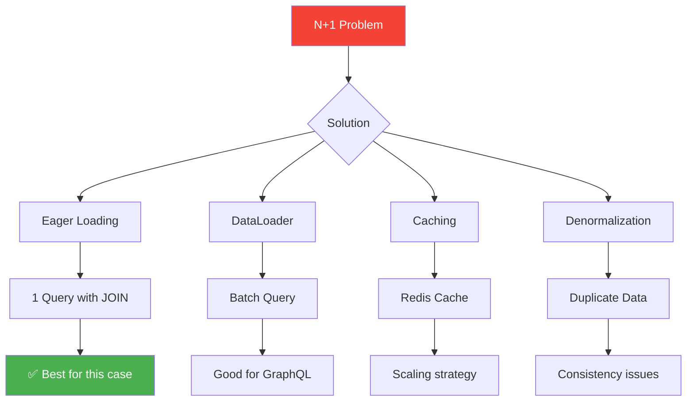

**Figure 2.1: N+1 Query Problem Solutions**

#### Why Other Options Are Wrong

**❌ Why B (DataLoader) is the Trap**

DataLoader is valuable in GraphQL, where many nested resolvers may request the same records. But this endpoint has one list and one predictable relation. A JOIN is simpler, faster, and easier to maintain.

**❌ Why C (Redis Cache) is Wrong**

Redis may reduce database traffic, but it does not fix the query pattern. You may still perform 50 cache lookups and must now handle cache expiration, misses, and invalidation whenever customer data changes. Caching is a scaling strategy, not the first solution for N+1 queries.

**❌ Why D (Denormalization) is Risky**

Denormalization can improve reads by storing customer data directly in the order row. However, duplicated data must be updated everywhere when the customer changes their name. This creates write amplification and consistency problems. Use denormalization only when JOINs cannot meet your latency requirements at your actual scale.

#### 💡 Interview Takeaway

When an ORM creates one query per record, first check for lazy-loaded relationships. Fix the query pattern before adding caching, batching, or duplicated data.

---

### Scenario 5: Choosing a Database Sharding Strategy

#### Problem Statement

Your PostgreSQL orders table has crossed 500 million rows, and range queries that once took 40ms now take more than 800ms. Vertical scaling is no longer enough.

**Workload:**
- 500M orders, growing by 3M per week
- 80% reads → One customer's recent orders
- 15% reads → Analytics across date ranges
- 5% writes → Around 400 RPS, doubling on sale days

**Which sharding strategy would you choose?**

<details>
<summary>Options</summary>

A. Hash sharding on order_id: Evenly distribute orders across shards  
B. Range sharding on created_at: Keep nearby time ranges together  
C. Directory-based sharding: Maintain a mapping from each customer to a specific shard  
D. Consistent hashing with virtual nodes: Make shard additions and rebalancing easier

</details>

#### ✅ Correct Answer: C - Directory-Based Sharding

Because 80% of reads are customer-specific, all orders belonging to one customer should live on the same shard.

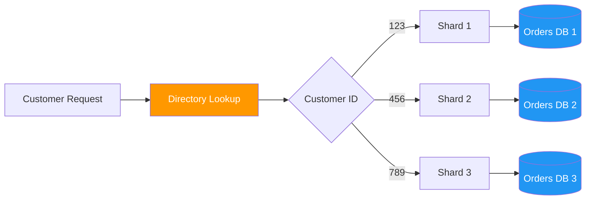

**Figure 2.2: Directory-Based Sharding Architecture**

```sql
-- Directory table mapping customers to shards
CREATE TABLE customer_shard_map (
    customer_id BIGINT PRIMARY KEY,
    shard_id INT NOT NULL,
    created_at TIMESTAMP DEFAULT NOW()
);

-- Example: Customer 12345 is on shard 2
INSERT INTO customer_shard_map VALUES (12345, 2);

-- Query routing logic
SELECT o.* FROM orders o
WHERE o.customer_id = 12345
-- Route to shard 2 based on directory lookup
```

**customer_id → shard_id**

A customer lookup reaches one shard instead of searching every shard. The mapping can be stored in a durable table and cached for faster routing.

**Benefits:**
- Customer history queries hit only one shard
- Targeted rebalancing: move heavy customers individually
- Predictable performance for dominant access pattern

**Trade-off:** Date-range analytics may still require queries across multiple shards.

#### Why Other Options Are Wrong

**❌ Why A (Hash Sharding) is the Trap**

Hashing by `order_id` distributes rows evenly, but one customer's orders may land on several shards. A simple customer history request becomes a scatter-gather query, and its latency depends on the slowest shard.

**❌ Why B (Range Sharding) is Wrong**

Sharding by `created_at` sends every new order to the newest shard. That shard receives nearly all writes and most recent-order reads, creating a predictable hotspot during major sales.

**❌ Why D (Consistent Hashing) is Not the Best Fit**

Consistent hashing simplifies general rebalancing, but offers less control over individual high-traffic customers. Several large customers could still overload the same shard, and moving only those customers becomes difficult.

#### 💡 Interview Takeaway

Choose the shard key according to the dominant access pattern. Since most requests retrieve orders by customer, route and store each customer's data on one shard.

---

## Chapter 3: Caching Strategies

### Scenario 8: Keeping Cache and Database in Sync

#### Problem Statement

Your e-commerce catalog uses Redis in front of PostgreSQL and handles around 40K requests per second at peak.

**Staging looks perfect:**
- Cache hit ratio → 94%
- Response time → Under 20ms

**But after launching to production:**
- Customers see outdated prices
- Incorrect stock counts
- Unavailable products marked as available

**Current Architecture:**
```
Node.js App → Redis Cache → PostgreSQL
```

Multiple systems update product data:
- Admin panel updates prices
- Inventory Service decreases stock
- Order Service processes purchases

**What would you choose?**

<details>
<summary>Options</summary>

A. Write-through: Update Redis and PostgreSQL during every write  
B. Write-behind: Write to Redis first and asynchronously flush changes to PostgreSQL  
C. Cache-aside: Update PostgreSQL, delete the related cache key, and let the next read repopulate it  
D. Read-through: Redis automatically loads missing data from PostgreSQL

</details>

#### ✅ Correct Answer: C - Cache-Aside (Lazy Loading)

Each service updates PostgreSQL first and then invalidates the related Redis key:

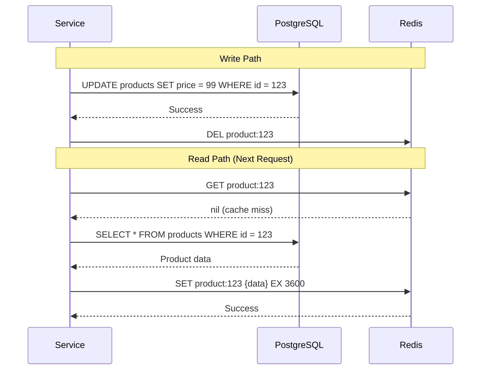

**Figure 3.1: Cache-Aside Pattern Flow**

```typescript
// Cache-Aside Implementation
class ProductService {
  async getProduct(productId: string): Promise<Product> {
    // 1. Try cache first
    const cached = await redis.get(`product:${productId}`);
    if (cached) {
      return JSON.parse(cached);
    }
    
    // 2. Cache miss - fetch from database
    const product = await db.products.findById(productId);
    
    // 3. Populate cache
    await redis.setex(
      `product:${productId}`, 
      3600,  // 1 hour TTL
      JSON.stringify(product)
    );
    
    return product;
  }
  
  async updateProduct(productId: string, updates: UpdateDTO): Promise<void> {
    // 1. Update database (source of truth)
    await db.products.update(productId, updates);
    
    // 2. Invalidate cache
    await redis.del(`product:${productId}`);
    
    // Next read will repopulate cache with fresh data
  }
}
```

**Key Principle:** PostgreSQL remains the source of truth, while Redis stays a disposable read accelerator. If Redis becomes unavailable, the application can still read from PostgreSQL (slower, but with correct data).

#### Why Other Options Are Wrong

**❌ Why A (Write-Through) is the Trap**

Redis and PostgreSQL cannot be updated in one normal atomic transaction. If the database update succeeds but the Redis update fails, the stale cache remains. Write-through also makes every writer dependent on Redis, meaning a cache outage could affect the entire write path.

**❌ Why B (Write-Behind) is Wrong**

Write-behind makes Redis the temporary source of truth and sends updates to PostgreSQL later. A Redis failure, persistence delay, or memory issue could lose recent price or inventory updates. That risk is unacceptable when real purchases are involved.

**❌ Why D (Read-Through) is Not Enough**

Read-through only handles cache misses. It does not automatically know when the admin panel, Inventory Service, or Order Service changes PostgreSQL. You would still need explicit invalidation, which effectively brings you back to cache-aside.

#### 💡 Interview Takeaway

When several services write to the same database: keep the database as the source of truth, invalidate the cache after successful writes, and repopulate it lazily on the next read.

---

### Scenario 15: Fast "Has the User Seen This?" Checks

#### Problem Statement

You are running a content recommendation feed for 50 million users. For every recommendation, the API asks one simple question: **"Has this user already seen post X?"**

Right now, every check goes to PostgreSQL. The table has already grown to 80 billion rows:

```sql
user_seen_posts(user_id, post_id, seen_at)
```

The feed endpoint's P99 latency has crossed 600ms. The normal cache hit ratio is not the main issue. The problem comes from the long tail of cold lookups that still reach PostgreSQL.

**Product requirements:**
- ✅ False positive is acceptable (may occasionally skip a post the user hasn't seen)
- ⚠️ False negative is less desirable (user may see the same post again, but survivable)
- 🎯 Goal: Bring P99 latency below 100ms
- ⏱️ Timeline: One sprint

**What would you choose?**

<details>
<summary>Options</summary>

A. Store a Bloom filter per user in Redis: Sub-millisecond "definitely not seen" check  
B. Store the complete user_seen_posts set for each user in Redis: Exact answer with no false positives  
C. Move the entire table to Cassandra: Handle extremely large row counts  
D. Add a PostgreSQL read replica and connection pooler: More read capacity

</details>

#### ✅ Correct Answer: A - Bloom Filter per User in Redis

A Bloom filter provides one important guarantee: **If it says an item is not present, the item is definitely not present.**

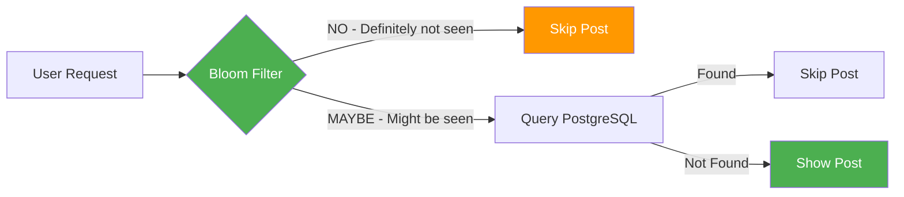

**Figure 3.2: Bloom Filter Decision Flow**

```typescript
// Bloom Filter Implementation
class SeenPostsChecker {
  private bloomFilters: Map<string, BloomFilter> = new Map();
  
  async checkIfSeen(userId: string, postId: string): Promise<boolean> {
    // Get or create Bloom filter for user
    let filter = this.bloomFilters.get(userId);
    if (!filter) {
      const data = await redis.get(`bloom:${userId}`);
      filter = BloomFilter.fromBytes(data || new Uint8Array(0));
      this.bloomFilters.set(userId, filter);
    }
    
    // Check if post might be in the filter
    const mightContain = filter.contains(postId);
    
    if (!mightContain) {
      // Definitely not seen - skip PostgreSQL
      return false;
    }
    
    // Might be seen - verify with PostgreSQL
    const exists = await db.userSeenPosts.exists({
      where: { userId, postId }
    });
    
    return exists;
  }
  
  async markAsSeen(userId: string, postId: string): Promise<void> {
    // Update PostgreSQL
    await db.userSeenPosts.create({
      data: { userId, postId, seenAt: new Date() }
    });
    
    // Update Bloom filter
    let filter = this.bloomFilters.get(userId);
    if (!filter) {
      filter = new BloomFilter(0.01, 10000); // 1% FP rate, 10k items
    }
    filter.add(postId);
    
    // Persist to Redis
    await redis.setex(
      `bloom:${userId}`,
      86400, // 24 hours
      filter.toBytes()
    );
  }
}
```

**Why it works here:**
- Around 97% of feed checks are for posts the user has never seen
- For those requests, Redis returns a sub-millisecond "definitely not seen" result
- PostgreSQL is never touched for negative checks

**Memory efficiency:**
- Bloom filter at 1% false-positive rate for 10,000 posts → ~12 KB
- Redis SET with same data → ~80 KB or more
- Across 50 million users: ~600 GB vs ~4 TB

#### Why Other Options Are Wrong

**❌ Why B (Redis SET) is the Senior-Engineer Trap**

A Redis SET provides exact answers with no false positives. The problem is memory consumption. A user who has seen 50,000 posts may require ~3-4 MB in a Redis SET. When the top 5% of users reach that level, the Redis cluster can grow very quickly.

**❌ Why C (Cassandra) is the Right Pattern for the Wrong Problem**

Cassandra can handle wide-column data and extremely large row counts. However, storage capacity is not the main problem. PostgreSQL can still hold this dataset when properly partitioned. The real issue is the cost of performing one point lookup for every recommendation at 120K requests per second.

**❌ Why D (Read Replica) is Wrong**

A read replica and connection pooler would provide more database capacity, but they would not make each lookup cheaper. The system would still perform one database round trip for every check. The better solution is to avoid hitting the database for the 97% of requests where the answer is simply "not seen."

#### 💡 Interview Takeaway

Do not treat every performance problem as a capacity problem. When most checks are negative and a small false-positive rate is acceptable, use a Bloom filter to eliminate unnecessary database lookups.

---

## Chapter 4: Rate Limiting & Throttling

### Scenario 3: Rate Limiting Without Boundary Bursts

#### Problem Statement

Your SaaS API allows each API key to send 100 requests per minute to `POST /v1/messages`. But the current limiter resets its counter at every minute boundary:

```
12:59:58 → 90 requests
13:00:00 → counter resets
13:00:02 → 90 more requests
```

Both bursts pass, allowing 180 requests in four seconds and overwhelming the downstream database.

**What would you choose?**

<details>
<summary>Options</summary>

A. Fixed Window: Maintain one counter for each API key per minute  
B. Sliding Window Log: Store every request timestamp and count requests from the previous 60 seconds  
C. Token Bucket: Give each key 100 tokens and refill them gradually at ~1.66 tokens/second  
D. Leaky Bucket: Queue requests and process them at a constant rate

</details>

#### ✅ Correct Answer: C - Token Bucket

Each API key receives a bucket containing 100 tokens. Every request consumes one token, while tokens refill continuously:

```
Refill rate = 100 ÷ 60 ≈ 1.66 tokens/second
```

There is no sudden reset at the start of a new minute. After the first 90-request burst, only a small number of tokens will have returned four seconds later. Most of the second burst is therefore rejected instead of receiving a fresh 100-request allowance.

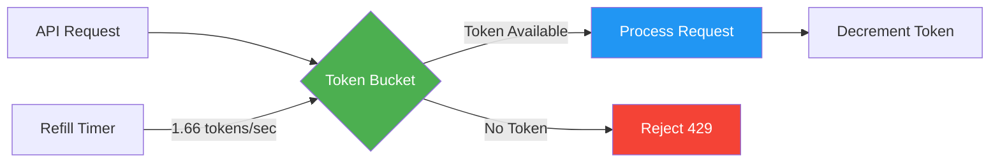

**Figure 4.1: Token Bucket Rate Limiting Algorithm**

```typescript
// Token Bucket Implementation
class TokenBucket {
  private capacity: number;
  private tokens: number;
  private refillRate: number; // tokens per second
  private lastRefill: number;
  
  constructor(capacity: number, refillRate: number) {
    this.capacity = capacity;
    this.tokens = capacity;
    this.refillRate = refillRate;
    this.lastRefill = Date.now();
  }
  
  async consume(apiKey: string): Promise<boolean> {
    const bucket = await this.getBucket(apiKey);
    
    // Refill tokens based on time elapsed
    const now = Date.now();
    const timePassed = (now - bucket.lastRefill) / 1000;
    const tokensToAdd = timePassed * bucket.refillRate;
    
    bucket.tokens = Math.min(
      bucket.capacity,
      bucket.tokens + tokensToAdd
    );
    bucket.lastRefill = now;
    
    // Try to consume a token
    if (bucket.tokens >= 1) {
      bucket.tokens -= 1;
      await this.saveBucket(apiKey, bucket);
      return true; // Allowed
    }
    
    await this.saveBucket(apiKey, bucket);
    return false; // Rate limited
  }
}

// Redis-backed distributed implementation
async function consumeToken(apiKey: string): Promise<boolean> {
  const key = `ratelimit:${apiKey}`;
  const now = Date.now();
  
  // Use Redis Lua script for atomicity
  const result = await redis.eval(`
    local bucket = redis.call('HMGET', KEYS[1], 'tokens', 'last_refill')
    local tokens = tonumber(bucket[1]) or 100
    local lastRefill = tonumber(bucket[2]) or ${now}
    
    -- Refill tokens
    local timePassed = (${now} - lastRefill) / 1000
    local tokensToAdd = timePassed * 1.66
    tokens = math.min(100, tokens + tokensToAdd)
    
    -- Try to consume
    if tokens >= 1 then
      tokens = tokens - 1
      redis.call('HMSET', KEYS[1], 'tokens', tokens, 'last_refill', ${now})
      redis.call('EXPIRE', KEYS[1], 60)
      return 1
    else
      redis.call('HMSET', KEYS[1], 'tokens', tokens, 'last_refill', lastRefill)
      return 0
    end
  `, 1, key);
  
  return result === 1;
}
```

**Token Bucket provides:**
- Controlled short bursts
- A stable long-term request rate
- O(1) storage and checks per API key
- Straightforward distributed implementation

#### Why Other Options Are Wrong

**❌ Why B (Sliding Window Log) is the Trap**

A Sliding Window Log is highly accurate, but it stores a timestamp for every request. At a large scale, this increases Redis memory usage and can add latency during counting and cleanup.

**❌ Why A (Fixed Window) is Wrong**

Fixed Window is the source of the problem. Because the counter resets at a fixed boundary, customers can send nearly twice their limit within a few seconds.

**❌ Why D (Leaky Bucket) is Wrong Here**

Leaky Bucket processes requests at a constant rate by delaying or dropping excess traffic. That's useful when protecting a fragile downstream system, but it adds latency to valid customer bursts. For a public API, quickly rejecting excess traffic is usually better than silently delaying requests.

#### 💡 Interview Takeaway

Use Token Bucket when you want to permit reasonable bursts while enforcing a smooth average rate without fixed-window boundary bugs.

---

## Chapter 5: Distributed Transactions & Sagas

### Scenario 10: Distributed Transactions Across Services

#### Problem Statement

Order #4471 moves through four services:

```
Order created ✅
Payment charged ✅
Inventory reservation failed ❌
Shipping never started
```

The customer has paid, but there is no inventory available. Unlike a monolith, you cannot roll back four independent services and databases with one transaction.

**What would you choose?**

<details>
<summary>Options</summary>

A. Choreography Saga: Services publish events and trigger compensating events  
B. Orchestration Saga: A central workflow coordinates every step and runs compensating actions  
C. Two-Phase Commit: Lock all participating systems and commit or abort together  
D. Outbox with eventual consistency: Persist local changes and reliably publish events

</details>

#### ✅ Correct Answer: B - Orchestration Saga

A checkout has a clear sequence and specific rollback actions:

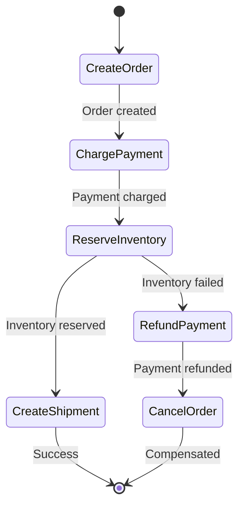

**Figure 5.1: Orchestration Saga State Machine**

An orchestrator such as Temporal, AWS Step Functions, or Camunda tracks the workflow and its compensations:

```typescript
// Temporal Workflow Definition
import { Workflow, executeChild } from '@temporalio/workflow';

const checkoutWorkflow = async (orderId: string) => {
  const workflow = new Workflow();
  
  try {
    // Step 1: Create Order
    await workflow.executeActivity('createOrder', orderId);
    
    // Step 2: Charge Payment
    await workflow.executeActivity('chargePayment', orderId);
    
    // Step 3: Reserve Inventory
    const inventoryReserved = await workflow.executeActivity(
      'reserveInventory', 
      orderId
    );
    
    if (!inventoryReserved) {
      // Compensation: Refund Payment
      await workflow.executeActivity('refundPayment', orderId);
      
      // Compensation: Cancel Order
      await workflow.executeActivity('cancelOrder', orderId);
      
      throw new Error('Checkout failed: insufficient inventory');
    }
    
    // Step 4: Create Shipment
    await workflow.executeActivity('createShipment', orderId);
    
    return { success: true };
    
  } catch (error) {
    // Handle failures and compensations
    await workflow.executeActivity('notifyFailure', orderId, error);
    throw error;
  }
};
```

**Benefits of Orchestration:**
- Workflow state remains durable, observable, and recoverable
- Team can quickly see which step failed and which compensations were executed
- Clear ownership of the workflow logic
- Easy to test and debug

#### Why Other Options Are Wrong

**❌ Why A (Choreography) is the Trap**

Choreography works well for loosely connected events, but complex checkout logic becomes spread across several services. As the number of steps and failure paths grows, it becomes difficult to understand who owns the workflow and what state the transaction is currently in.

**❌ Why C (Two-Phase Commit) is Wrong**

Two-Phase Commit requires every participant to support the protocol. External services such as Stripe and shipping providers do not participate in database-style 2PC. It can also hold locks while waiting for slow services, creating serious availability and scalability problems.

**❌ Why D (Outbox) is Not Enough**

The Outbox Pattern ensures that an event is published reliably after a local database transaction. However, it does not define workflow order or compensation logic. It may support the saga, but it does not replace it.

#### 💡 Interview Takeaway

For an ordered multi-service workflow with clear rollback actions: use an orchestration-based Saga to coordinate steps and execute compensations when something fails.

---

## Chapter 6: Message Queues & Event Processing

### Scenario 7: Preserving Event Order in a Message Queue

#### Problem Statement

Your Order Service publishes three events:

```
order.created → order.paid → order.cancelled
```

The events enter a standard SQS queue and are processed by five workers. Although they were published in the correct order, different workers processed them in parallel. `order.cancelled` ran first, and the state machine later rejected `order.created`, leaving incorrect data.

**What would you choose?**

<details>
<summary>Options</summary>

A. Use SQS FIFO with MessageGroupId = order_id: Preserve ordering independently for every order  
B. Add sequence numbers and a consumer-side reorder buffer  
C. Replace the event flow with a Saga  
D. Add event versions and make the state machine order-agnostic

</details>

#### ✅ Correct Answer: A - SQS FIFO with MessageGroupId

You need ordering within each order, not across the entire queue.

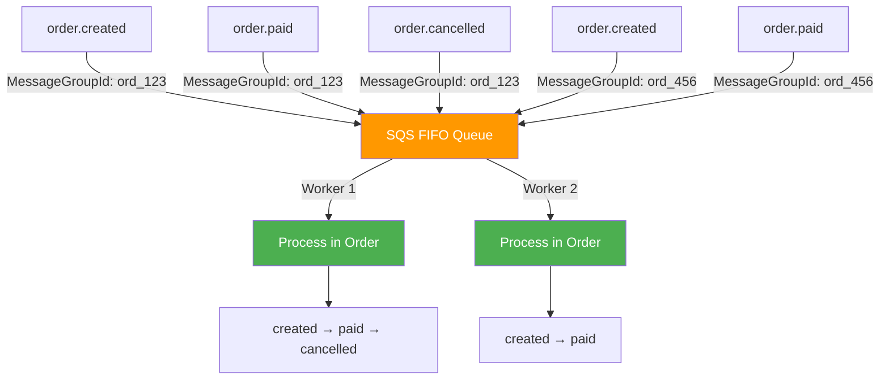

**Figure 6.1: SQS FIFO with Message Grouping**

```typescript
// Publishing ordered events
class OrderEventPublisher {
  async publishOrderCreated(orderId: string, orderData: any) {
    await sqs.sendMessage({
      QueueUrl: process.env.ORDER_QUEUE_URL,
      MessageGroupId: orderId,  // Critical: Same order = same group
      MessageDeduplicationId: `order-created-${orderId}`,
      MessageBody: JSON.stringify({
        eventType: 'order.created',
        orderId,
        data: orderData,
        timestamp: Date.now()
      })
    });
  }
  
  async publishOrderPaid(orderId: string, paymentData: any) {
    await sqs.sendMessage({
      QueueUrl: process.env.ORDER_QUEUE_URL,
      MessageGroupId: orderId,  // Same group preserves order
      MessageDeduplicationId: `order-paid-${orderId}`,
      MessageBody: JSON.stringify({
        eventType: 'order.paid',
        orderId,
        data: paymentData,
        timestamp: Date.now()
      })
    });
  }
}

// Consumer processes messages in order
class OrderEventConsumer {
  async processMessage(message: SQSMessage) {
    const event = JSON.parse(message.Body);
    
    switch (event.eventType) {
      case 'order.created':
        await this.handleOrderCreated(event);
        break;
      case 'order.paid':
        await this.handleOrderPaid(event);
        break;
      case 'order.cancelled':
        await this.handleOrderCancelled(event);
        break;
    }
  }
}
```

**MessageGroupId = order_id**

Messages belonging to the same order are delivered in sequence:
- `created → paid → cancelled`

Different orders still use different group IDs, allowing the five workers to process them concurrently. This provides the required ordering without sacrificing system-wide parallelism.

#### Why Other Options Are Wrong

**❌ Why B (Reorder Buffer) is the Trap**

A reorder buffer requires sequence tracking, timeouts, missing-event handling, crash recovery, monitoring, and durable storage. You would effectively rebuild FIFO ordering inside your application and own every failure case.

**❌ Why C (Saga) is Wrong**

A Saga coordinates long-running transactions across multiple services using compensating actions. This scenario involves ordered events for one entity, not a distributed transaction. A Saga would add unnecessary coupling and complexity.

**❌ Why D (Event Versions) is Not Enough**

Versioning can reject stale events, but it does not reconstruct missing earlier transitions. If `cancelled` arrives first, the system may still end with a cancelled order that was never recorded as created.

#### 💡 Interview Takeaway

When events must remain ordered for each entity, partition them by that entity's identifier. Use an SQS FIFO queue with `order_id` as the `MessageGroupId` to preserve per-order ordering while keeping different orders parallel.

---

## Chapter 7: Scalability & Sharding

### Scenario 16: Taming a Hot Partition Key

#### Problem Statement

You are running a multi-tenant analytics pipeline on DynamoDB. The system serves 200 tenants and handles around 12,000 writes per second in total. Everything works well until one tenant suddenly brings in a very large customer. Their event volume increases by 100 times overnight.

**Current traffic distribution:**
- Hot tenant: ~9,000 writes/second
- Every other tenant: ~15 writes/second each

**Current Setup:**
- Table: `events`
- Partition Key: `tenant_id`
- Sort Key: `event_timestamp`
- Capacity mode: On-demand

**What would you choose?**

<details>
<summary>Options</summary>

A. Write sharding: Add a random suffix to the partition key (tenant_id#0 through tenant_id#9)  
B. Jitter the writes: Add a random delay between 0 and 500ms  
C. Partition splitting: Increase table capacity and allow DynamoDB to auto-split  
D. Time-bucket the key: Change partition key to tenant_id#YYYY-MM-DD-HH

</details>

#### ✅ Correct Answer: A - Write Sharding

DynamoDB hashes the partition key to decide which physical partition receives a write. With the current design, every event for the hot tenant maps to the same partition key:

```
tenant_id = tenant_123
```

This creates one clear limitation:

```
One partition key → One physical partition → One throughput limit
```

**Solution:** Split the tenant's traffic across several partition keys by adding a random suffix.

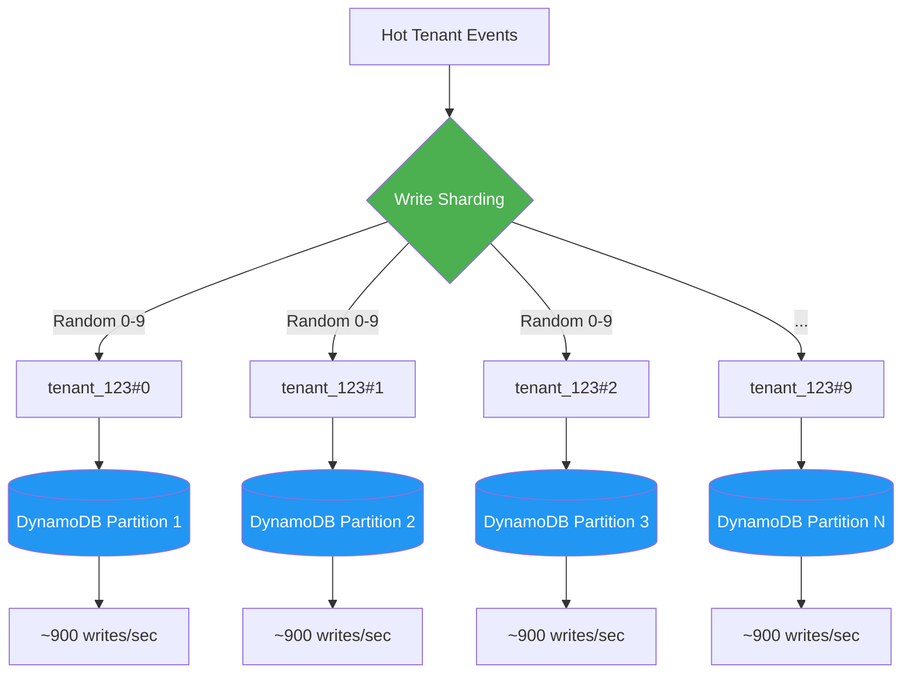

**Figure 7.1: DynamoDB Write Sharding Pattern**

```typescript
// Write Sharding Implementation
class EventWriter {
  private shardCount = 10;
  
  async writeEvent(tenantId: string, event: AnalyticsEvent) {
    // Add random suffix to distribute across partitions
    const shardSuffix = Math.floor(Math.random() * this.shardCount);
    const partitionKey = `${tenantId}#${shardSuffix}`;
    
    await dynamoDB.putItem({
      TableName: 'events',
      Item: {
        tenant_id: partitionKey,
        event_timestamp: event.timestamp,
        event_data: event.data,
        // Include original tenant_id for queries
        original_tenant_id: tenantId
      }
    });
  }
  
  // Read: Query all shards and merge results
  async getEventsForTenant(tenantId: string, startTime: number, endTime: number) {
    const queries = [];
    
    for (let i = 0; i < this.shardCount; i++) {
      const partitionKey = `${tenantId}#${i}`;
      
      queries.push(
        dynamoDB.query({
          TableName: 'events',
          KeyConditionExpression: 'tenant_id = :pk AND event_timestamp BETWEEN :start AND :end',
          ExpressionAttributeValues: {
            ':pk': partitionKey,
            ':start': startTime,
            ':end': endTime
          }
        })
      );
    }
    
    // Execute all queries in parallel
    const results = await Promise.all(queries);
    
    // Merge and sort by timestamp
    const allEvents = results.flatMap(r => r.Items);
    return allEvents.sort((a, b) => 
      a.event_timestamp - b.event_timestamp
    );
  }
}
```

**Result:**
- 9,000 writes/second spread across 10 shards
- Each shard receives ~900 writes/second
- Throttling stops
- Write latency drops back to normal

**Trade-off:** Reads become scatter-gather queries, but for a write-heavy analytics pipeline, that's the correct trade-off.

#### Why Other Options Are Wrong

**❌ Why C (Partition Splitting) is the Senior-Engineer Trap**

DynamoDB can automatically split partitions as table size and throughput grow. The problem is that automatic partition splitting does not divide one partition-key value across multiple destinations. If the same partition key produces all 9,000 writes per second, those writes still hash to the same location.

**❌ Why B (Jitter) is Wrong**

Adding jitter means delaying each write by a random amount. This is useful for the thundering herd problem, where many clients send requests at exactly the same moment. But that's not what's happening here. The hot tenant is generating a sustained rate of 9,000 writes per second. Adding a delay does not reduce the total write rate.

**❌ Why D (Time-Bucketed) is Wrong**

Time bucketing is a valid pattern for time-series data, but it does not solve the current write hotspot. During a particular hour, all 9,000 writes per second still go to one key: `tenant_123#2026-05-21-14`. You have only renamed the hot partition.

#### 💡 Interview Takeaway

A DynamoDB hot partition cannot be fixed only by adding capacity or delaying requests. When one partition-key value receives too much sustained traffic, split that value into multiple write shards so DynamoDB can distribute the load across several partitions.

---

## Chapter 8: Reliability & Resilience Patterns

### Scenario 20: Containing a Failing Downstream Dependency

#### Problem Statement

Your checkout service calls a third-party fraud detection API for every order. Under normal conditions, the API responds in around 200ms. But it has now started timing out after 30 seconds.

**Current Setup:**
- Checkout Service (NestJS) with connection pool of 50
- Third-party Fraud API timing out at 30 seconds
- Within 90 seconds, every connection is stuck waiting

**Impact:**
- Normal P99 latency: 300ms
- Current P99 latency: 28 seconds
- Customers retry requests
- Memory usage rises
- Pods run out of memory
- **Entire checkout system becomes unavailable**

The same application pods also handle `/cart`, `/orders`, and `/health`. Those endpoints are healthy, but they're failing because the fraud API is consuming shared resources.

**What would you choose?**

<details>
<summary>Options</summary>

A. Reduce timeout to 2 seconds and add 3 retries with exponential backoff  
B. Add a Circuit Breaker: Open after failure threshold, then half-open mode  
C. Add a Bulkhead: Give fraud API calls separate connection pool  
D. Use both Circuit Breaker and Bulkhead

</details>

#### ✅ Correct Answer: D - Circuit Breaker AND Bulkhead Together

These two resilience patterns solve different parts of the failure, and this situation requires both.

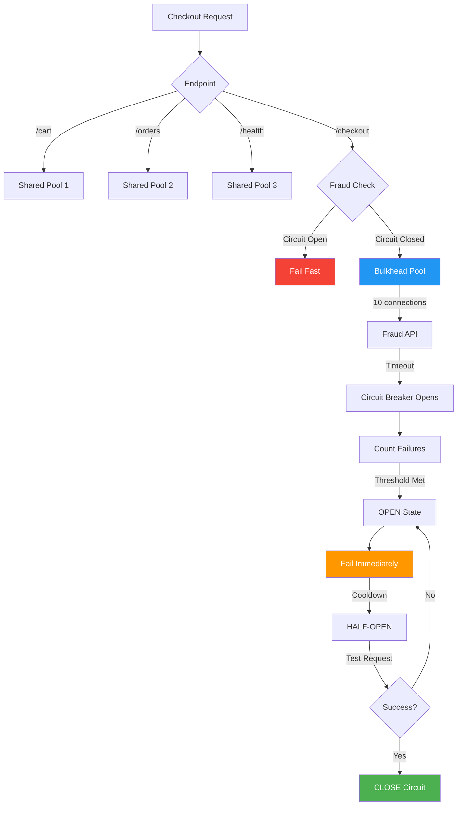

**Figure 8.1: Circuit Breaker and Bulkhead Pattern**

```typescript
// Circuit Breaker + Bulkhead Implementation
import { CircuitBreaker, Bulkhead } from 'resilience4j';

// Configure Circuit Breaker for Fraud API
const fraudApiCircuitBreaker = CircuitBreaker.of('fraudApi', {
  failureRateThreshold: 50, // Open if 50% of requests fail
  waitDurationInOpenState: 30000, // Wait 30s before half-open
  permittedNumberOfCallsInHalfOpenState: 1, // Test with 1 request
  slidingWindowSize: 10, // Last 10 requests
  slidingWindowType: 'COUNT_BASED'
});

// Configure Bulkhead for Fraud API
const fraudApiBulkhead = Bulkhead.of('fraudApi', {
  maxConcurrentCalls: 10, // Only 10 concurrent fraud checks
  maxWaitDuration: 100 // Wait max 100ms for a slot
});

// Combined decorator
const checkFraud = compose(
  fraudApiCircuitBreaker,
  fraudApiBulkhead
)(fraudApi.check);

// Usage in checkout flow
class CheckoutService {
  async processCheckout(orderData: OrderData) {
    try {
      // This will fail fast if circuit is open
      // Limited to 10 concurrent calls
      const fraudResult = await checkFraud(orderData);
      
      if (!fraudResult.passed) {
        throw new Error('Fraud check failed');
      }
      
      // Continue with checkout...
      
    } catch (error) {
      if (error instanceof BulkheadFullException) {
        // Fallback: Allow checkout with manual review
        await this.flagForManualReview(orderData);
      } else if (error instanceof CallNotPermittedException) {
        // Circuit is open - fail fast
        throw new Error('Fraud service temporarily unavailable');
      } else {
        throw error;
      }
    }
  }
}
```

**How the Circuit Breaker Helps:**
- Prevents repeated calls to failing dependency
- After threshold, fails immediately without waiting 30 seconds
- Half-open state tests if service recovered before full traffic resumes

**How the Bulkhead Helps:**
- Isolates fraud API calls (10 connections) from other endpoints (40 connections)
- If fraud API hangs, it only consumes its 10 dedicated connections
- `/cart`, `/orders`, and `/health` continue working

#### Why Other Options Are Wrong

**❌ Why B (Circuit Breaker Only) is the Trap**

A Circuit Breaker sounds complete, but it doesn't open after the first failed request. It must first observe enough failures to cross its threshold. Before those failures are recorded, each request is still waiting on the fraud API and using a connection from the shared pool. With only 50 total connections, the application may exhaust the entire pool before the Circuit Breaker reacts.

**❌ Why C (Bulkhead Only) is Partial**

A Bulkhead limits the damage. If the fraud API has a dedicated pool of 10 connections, it cannot consume resources needed by `/cart`, `/orders`, or `/health`. The rest of the application survives. But those 10 fraud connections are still waiting 30 seconds for requests that are likely to fail. Customers still experience slow checkout requests.

**❌ Why A (Shorter Timeout + Retries) is Dangerous**

Reducing the timeout may sound helpful, but adding three retries creates a much bigger problem. The fraud API is already degraded and needs less traffic to recover. Retries send it more traffic:

```
One checkout request
  ↓
Original fraud request + 3 retries
```

When all pods do this together, they create a retry storm against an already struggling dependency. A partial outage can quickly become a complete outage.

#### 💡 Interview Takeaway

A Circuit Breaker and a Bulkhead protect the system in different ways:
- **Circuit Breaker** → Stops calling the failing service
- **Bulkhead** → Prevents that service from consuming shared resources

Use them together so the unhealthy dependency fails quickly while the rest of the application continues working.

---

## Chapter 9: Modern Architecture Patterns

### Scenario 27: Keeping an LLM's Answers Up to Date

#### Problem Statement

Your customer-support bot is giving incorrect answers. The problem is not hallucination. The answers were once accurate, but they are now outdated.

You built the bot using GPT-4, whose existing knowledge does not include the latest changes to your product. Since then, your product has changed 14 times. Every week, customers receive answers that were correct eight months ago but are completely wrong today.

**Current Setup:**
- NestJS API → OpenAI GPT-4 + PostgreSQL product knowledge base
- Handles ~2,000 support questions per day
- ~15% of incorrect answers caused by outdated product knowledge

**Knowledge base changes every week because of:**
- New pricing
- New product features
- Deprecated workflows
- Updated support policies

**Constraints:**
- Mid-sized startup (no budget to train custom model from scratch)
- Need accurate and current answers without retraining

**What would you choose?**

<details>
<summary>Options</summary>

A. Retrieval-Augmented Generation (RAG): Retrieve relevant sections for every question  
B. Fine-tune the model: Train GPT-4 on company's product documentation  
C. Fine-tuning with RAG: Combine both approaches  
D. Prompt engineering only: Use detailed system prompt without new infrastructure

</details>

#### ✅ Correct Answer: A - Retrieval-Augmented Generation (RAG)

The actual problem is **knowledge freshness**. The model already understands customer-support questions and can generate useful explanations. What it does not know is what changed in your product after its training data ended.

RAG separates the model's reasoning ability from the knowledge it uses:

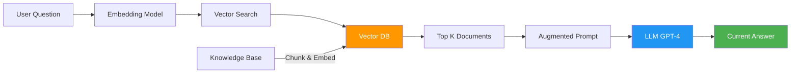

**Figure 9.1: RAG Architecture for Knowledge Freshness**

```typescript
// RAG Implementation
class SupportBotRAG {
  private vectorStore: VectorStore;
  private embeddingModel: OpenAIEmbedding;
  private llm: OpenAI;
  
  async setupKnowledgeBase() {
    // 1. Load and chunk documents
    const documents = await this.loadProductDocs();
    const chunks = this.chunkDocuments(documents, 500); // 500 tokens per chunk
    
    // 2. Create embeddings
    for (const chunk of chunks) {
      const embedding = await this.embeddingModel.create(
        chunk.content
      );
      
      // 3. Store in vector database
      await this.vectorStore.upsert({
        id: chunk.id,
        text: chunk.content,
        embedding: embedding,
        metadata: {
          source: chunk.source,
          lastUpdated: chunk.updatedAt,
          section: chunk.section
        }
      });
    }
  }
  
  async answerQuestion(question: string): Promise<string> {
    // 1. Create embedding for question
    const questionEmbedding = await this.embeddingModel.create(question);
    
    // 2. Search for relevant documents
    const relevantDocs = await this.vectorStore.search({
      vector: questionEmbedding,
      topK: 5,
      filter: {
        lastUpdated: { $gte: Date.now() - 30 * 24 * 60 * 60 * 1000 }
        // Only use docs from last 30 days
      }
    });
    
    // 3. Build augmented prompt
    const context = relevantDocs.map(doc => doc.text).join('\n\n');
    
    const prompt = `You are a customer support assistant. 
Use the following product information to answer the question.
If the information is not in the context, say "I don't have current information about that."

Product Information:
${context}

Customer Question: ${question}

Answer:`;
    
    // 4. Generate answer with LLM
    const response = await this.llm.complete({
      prompt,
      temperature: 0.3, // Low temperature for factual answers
      maxTokens: 500
    });
    
    return response.text;
  }
  
  async updateKnowledgeBase() {
    // When product changes, update the knowledge base
    const updatedDocs = await this.loadRecentChanges();
    
    for (const doc of updatedDocs) {
      const embedding = await this.embeddingModel.create(doc.content);
      
      await this.vectorStore.upsert({
        id: doc.id,
        text: doc.content,
        embedding: embedding,
        metadata: {
          source: doc.source,
          lastUpdated: Date.now()
        }
      });
    }
  }
}
```

**Key Benefits:**
- Model remains unchanged
- Knowledge can be updated immediately when product changes
- No retraining needed
- Cost-effective for frequently changing information

#### Why Other Options Are Wrong

**❌ Why B (Fine-Tuning) is the Trap**

Fine-tuning stores learned patterns inside the model's weights. Those weights remain unchanged until another training job is completed. If your product documentation changes every week, you may need to repeat the fine-tuning process every week. That introduces additional training cost, longer update cycles, testing work, and new model deployments.

**❌ Why C (Fine-Tuning + RAG) is Overkill**

A combination can be powerful, but this should not be the first step. The immediate issue is that 15% of answers are wrong because the knowledge is outdated. RAG directly addresses that problem. Fine-tuning adds more work without solving the freshness issue.

**❌ Why D (Prompt Engineering Only) Reaches Its Limit**

Prompt engineering is the fastest option to try, but it cannot give the model facts that are not included in its existing knowledge or the current prompt. You could manually paste updated product documents into the prompt, but the knowledge base may contain hundreds of pages. That quickly creates token-limit and cost problems.

#### 💡 Interview Takeaway

When information changes frequently, avoid repeatedly training that information into the model. Use RAG to retrieve current product knowledge at request time, while keeping the underlying model unchanged.

---

### Scenario 28: Choosing a Vector Store for Semantic Search

#### Problem Statement

You are building a semantic search feature for a B2B SaaS product. The dataset contains around 4 million support articles, documentation pages, and user-generated tickets. Users search with natural-language questions and expect results that feel closer to Google—not simple keyword matching.

**Technical Requirements:**
- Each document uses a 1,536-dimensional embedding (OpenAI ada-002)
- Total vectors: 4 million (~24 GB raw)
- Normal traffic: 300 queries/second
- Weekend peak: 900 queries/second
- Target latency: P99 below 100ms
- **Critical:** Must support tenant-based filtering

**What would you choose?**

<details>
<summary>Options</summary>

A. pgvector on PostgreSQL: Store embeddings in vector column  
B. Pinecone: Fully managed, serverless vector database  
C. Weaviate: Open-source vector database on Kubernetes  
D. Qdrant: Rust-based open-source vector database with strong filtering

</details>

#### ✅ Correct Answer: D - Qdrant

Qdrant is built specifically for this type of workload. Its Rust-based core provides low latency and predictable memory usage under heavy traffic.

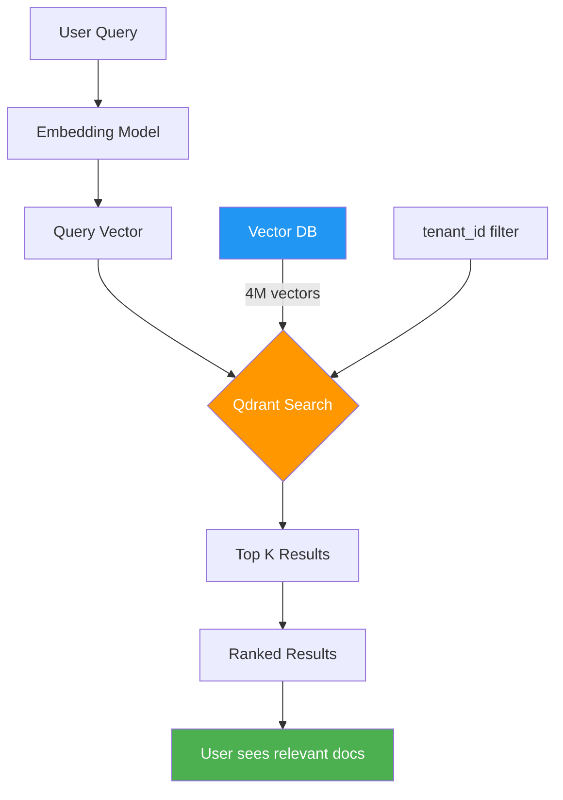

**Figure 9.2: Semantic Search with Qdrant**

```typescript
// Qdrant Implementation
import { QdrantClient } from '@qdrant/js-client-rest';

const client = new QdrantClient({
  host: 'localhost',
  port: 6333
});

// Setup collection with HNSW index
await client.createCollection('documents', {
  vectors: {
    size: 1536, // OpenAI ada-002 dimensions
    distance: 'Cosine'
  },
  optimizers_config: {
    default_segment_number: 5,
    indexing_threshold: 20000
  }
});

// Create payload index for tenant filtering
await client.createPayloadIndex('documents', {
  field_name: 'tenant_id',
  field_schema: 'keyword'
});

// Insert documents with embeddings
await client.upsert('documents', {
  points: [
    {
      id: 1,
      vector: await getEmbedding("How to configure API keys"),
      payload: {
        tenant_id: 'tenant_123',
        title: 'API Configuration Guide',
        content: '...',
        section: 'getting-started'
      }
    }
  ]
});

// Search with tenant filtering
const results = await client.search('documents', {
  vector: queryEmbedding,
  limit: 10,
  filter: {
    must: [
      {
        key: 'tenant_id',
        match: {
          value: 'tenant_123'
        }
      }
    ]
  }
});
```

**Why Qdrant Excels Here:**
1. **Performance:** Rust-based core with HNSW index optimized for high concurrency
2. **Payload Filtering:** Apply metadata filters during vector search (not after)
3. **Operational Control:** Self-host with full control over HNSW settings
4. **Memory Efficiency:** On-disk indexing for datasets larger than RAM

#### Why Other Options Are Wrong

**❌ Why A (pgvector) is the Trap**

pgvector is excellent for starting semantic search because it works inside PostgreSQL. However, at 4 million vectors and 300 queries/second, the vector index runs inside the same PostgreSQL environment as the transactional workload. The HNSW index competes with normal database activity for buffer-pool memory, CPU, and disk I/O.

**❌ Why B (Pinecone) Loses on Cost**

At 300 queries/second with peaks to 900, serverless query-unit pricing can grow into thousands of dollars each month. There's also proprietary lock-in risk.

**❌ Why C (Weaviate) is Heavy**

Weaviate's Kubernetes deployment and operational footprint can be heavier than Qdrant for this workload. If the team is not already operating Kubernetes for vector search, it adds infrastructure complexity.

#### 💡 Interview Takeaway

Choose the vector store according to dataset size, traffic, filtering needs, operational cost, and existing infrastructure. For millions of vectors, high concurrent query volume, and tenant-based filtering, Qdrant provides the strongest balance of performance, control, and operational efficiency.

---

### Scenario 29: Coordinating a Multi-Agent Workflow

#### Problem Statement

Your AI product uses four specialized agents:

```
Planner → Researcher → Coder → Reviewer
```

**What's going wrong in production:**
1. The Researcher sometimes finishes before the Planner, so the Coder starts with incomplete context
2. The Reviewer detects problems, but there's no retry path back to the Coder
3. If one agent times out, the complete workflow remains stuck for ~40 seconds
4. No clear visibility into which agent failed or what caused the failure

**What would you choose?**

<details>
<summary>Options</summary>

A. Centralized orchestrator: One controller calls every agent in sequence  
B. Choreography through an event bus: Agents publish/subscribe to events  
C. DAG-based execution: Represent workflow as directed acyclic graph  
D. Supervisor pattern: Add meta-agent that watches other agents

</details>

#### ✅ Correct Answer: C - DAG-Based Execution

This workflow contains clear dependencies. The Coder cannot begin until both the Planner and Researcher have completed their work.

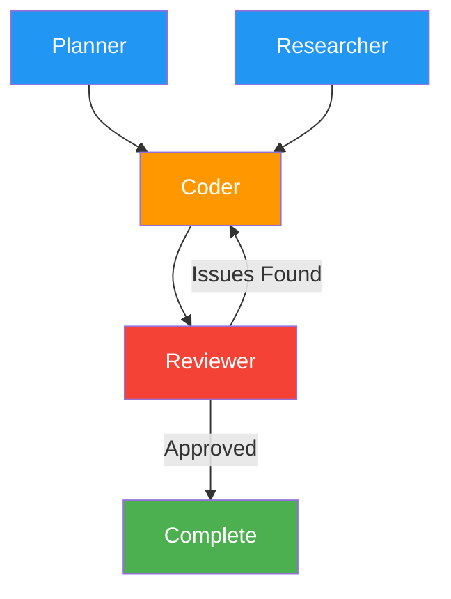

**Figure 9.3: Multi-Agent Workflow DAG**

```typescript
// LangGraph DAG Implementation
import { StateGraph, END } from '@langchain/langgraph';

const workflow = new StateGraph({
  channels: {
    plan: null,
    research: null,
    code: null,
    review: null,
    retry_count: 0
  }
});

// Define nodes
workflow.addNode('planner', async (state) => {
  const plan = await plannerAgent.execute(state.task);
  return { plan };
});

workflow.addNode('researcher', async (state) => {
  const research = await researcherAgent.execute(state.plan);
  return { research };
});

workflow.addNode('coder', async (state) => {
  const code = await coderAgent.execute({
    plan: state.plan,
    research: state.research
  });
  return { code };
});

workflow.addNode('reviewer', async (state) => {
  const review = await reviewerAgent.execute(state.code);
  
  if (review.hasIssues && state.retry_count < 3) {
    return {
      review,
      retry_count: state.retry_count + 1
    };
  }
  
  return { review };
});

// Define edges (dependencies)
workflow.addEdge('__start__', 'planner');
workflow.addEdge('planner', 'researcher');
workflow.addEdge('researcher', 'coder');
workflow.addEdge('coder', 'reviewer');

// Conditional edge: retry or complete
workflow.addConditionalEdge('reviewer', (state) => {
  if (state.review.hasIssues && state.retry_count < 3) {
    return 'coder'; // Retry
  }
  return END; // Complete
});

// Compile and run
const app = workflow.compile();
const result = await app.invoke({
  task: 'Build a REST API for user authentication'
});
```

**How the DAG Solves Each Problem:**

1. **Race condition:** DAG does not allow Coder to start until both Planner and Researcher complete
2. **One timeout blocking workflow:** Every node has its own deadline and can fail/retry independently
3. **No retry loop:** Reviewer-to-Coder retry path is a defined edge in the graph
4. **No visibility:** DAG execution engines provide clear trace for every workflow run

#### Why Other Options Are Wrong

**❌ Why A (Centralized Orchestrator) is the Trap**

A centralized controller can manage timeouts, retries, and state. The weakness is that it's usually sequential by default. The Planner and Researcher may still run one after another unless you manually write parallel-execution logic. As the workflow grows, every new dependency requires another code change inside the controller.

**❌ Why B (Choreography) is Wrong**

Choreography works well for independent steps. But this pipeline has strict dependencies. The Coder must wait until both the Planner and Researcher are finished. A pure event-driven design does not naturally provide a simple "wait for these two agents" operation.

**❌ Why D (Supervisor) is Not the Base Solution**

A supervisor agent can watch the workflow and detect failures, but it works better as an additional layer on top of the DAG. Using it as the main orchestration model creates latency and the supervisor becomes a central point of failure.

#### 💡 Interview Takeaway

When an agent workflow contains parallel steps, strict dependencies, retries, and per-step failures, model those relationships directly. Use a DAG so independent agents can run together, dependent agents wait correctly, retries become part of the workflow, and every execution remains visible.

---

### Scenario 30: Choosing a File Storage Backend

#### Problem Statement

You are building a file-upload service. Today, the platform stores around 10TB of user files. Within the next 12 months, that number is expected to reach 100TB.

**The team is already debating:**
- Backend lead: "Just use S3. Problem solved."
- DevOps engineer: "Mount an EBS volume. It's simpler and faster."
- Platform architect: "We need EFS because several services must access the same files."
- CTO: "Cloud storage will become too expensive. We should self-host MinIO."

**Requirements:**
- Current storage: 10TB
- Expected: 100TB within one year
- Multiple systems need access: Upload Service, ML Processing Pipeline, Audit Service
- File sizes vary: Small profile pictures (~5KB) to large video exports (up to 2GB)

**What would you choose?**

<details>
<summary>Options</summary>

A. Amazon S3: Managed object storage with large-scale capacity  
B. Amazon EBS: SSD-backed block storage attached to EC2  
C. Amazon EFS: Managed network file storage for multiple instances  
D. MinIO on EC2: Self-hosted, S3-compatible object storage

</details>

#### ✅ Correct Answer: A - Amazon S3

S3 gives the platform one shared storage layer without requiring manual capacity planning.

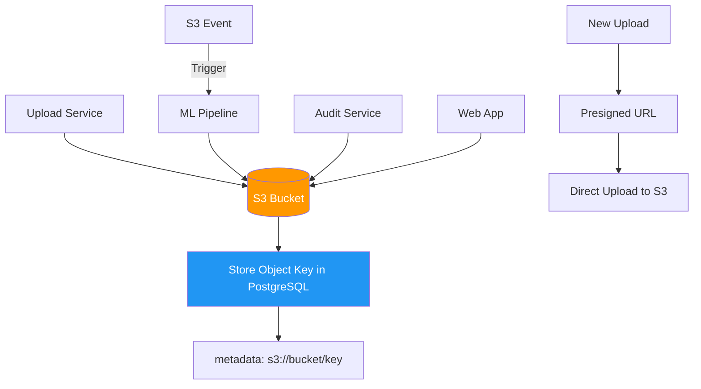

**Figure 9.4: Multi-Service File Storage with S3**

```typescript
// S3 Implementation
import { S3Client, PutObjectCommand, GetObjectCommand } from '@aws-sdk/client-s3';

class FileStorageService {
  private s3Client: S3Client;
  private bucketName = 'myapp-uploads';
  
  // Generate presigned URL for direct upload
  async getUploadUrl(fileName: string, contentType: string) {
    const command = new PutObjectCommand({
      Bucket: this.bucketName,
      Key: `uploads/${Date.now()}-${fileName}`,
      ContentType: contentType
    });
    
    const signedUrl = await getSignedUrl(this.s3Client, command, {
      expiresIn: 3600 // 1 hour
    });
    
    return signedUrl;
  }
  
  // Store file reference in database
  async saveFileRecord(userId: string, s3Key: string, metadata: any) {
    await db.fileRecords.create({
      data: {
        user_id: userId,
        s3_key: s3Key,
        s3_bucket: this.bucketName,
        size: metadata.size,
        content_type: metadata.contentType,
        url: `https://${this.bucketName}.s3.amazonaws.com/${s3Key}`
      }
    });
  }
  
  // Get file for processing
  async getFile(s3Key: string): Promise<Buffer> {
    const command = new GetObjectCommand({
      Bucket: this.bucketName,
      Key: s3Key
    });
    
    const response = await this.s3Client.send(command);
    return streamToBuffer(response.Body);
  }
}

// S3 Event Trigger for ML Pipeline
aws s3api put-bucket-notification-configuration \
  --bucket myapp-uploads \
  --notification-configuration '{
    "LambdaFunctionConfigurations": [
      {
        "LambdaFunctionArn": "arn:aws:lambda:us-east-1:123456789:function:ml-processor",
        "Events": ["s3:ObjectCreated:*"],
        "Filter": {
          "Key": {
            "FilterRules": [
              {"Name": "prefix", "Value": "uploads/"}
            ]
          }
        }
      }
    ]
  }'
```

**Cost Analysis at 100TB:**
- S3 Standard: ~$2,300/month
- S3 with lifecycle to Glacier: ~$1,200/month
- EFS: ~$30,000/month (13x more expensive!)
- MinIO (self-hosted): Infrastructure + engineering time

**Benefits:**
- No storage servers to operate
- Automatic scaling
- Built-in versioning, encryption, access control
- S3 events for triggering workflows
- Lifecycle policies for cost optimization

#### Why Other Options Are Wrong

**❌ Why B (EBS) Breaks the Architecture**

EBS is normally attached to one EC2 instance at a time. If the Upload Service runs on one instance and saves files to its EBS volume, the ML pipeline on another instance cannot access those files. Every new EC2 instance receives its own storage. This often leads to a difficult migration while the system is already under production pressure.

**❌ Why C (EFS) is Too Expensive**

EFS costs ~$0.30/GB/month. At 100TB, that's ~$30,000/month compared to S3 at ~$2,300/month. The difference is 13x. EFS is strong when a legacy application is deeply dependent on filesystem operations, but this NestJS service can use the S3 SDK directly.

**❌ Why D (MinIO) is a Cost-Saving Trap**

Self-hosting changes who is responsible for reliability. Your team must manage server availability, disk failures, replication, backups, capacity planning, upgrades, monitoring, disaster recovery, and 3am production incidents. At 10-100TB, the engineering effort can cost more than simply using S3.

#### 💡 Interview Takeaway

Choose storage based on access patterns, scale, cost, and operational responsibility. For a cloud-based file service shared by multiple applications, S3 provides the simplest combination of scale, availability, cost, and managed infrastructure.

---

## Practice Exercises

### Exercise 1: Design a URL Shortener Service

**Difficulty:** Intermediate  
**Time:** 45 minutes

#### Problem Statement

Design a URL shortener service like bit.ly or tinyurl.com. The service should:

**Requirements:**
- Shorten long URLs to 6-8 character codes
- Redirect short URLs to original URLs
- Handle 100M URLs per month
- Support custom aliases
- Track click analytics
- 99.9% availability

**Tasks:**
1. Design the database schema
2. Choose appropriate data stores
3. Design the shortening algorithm
4. Plan for scalability
5. Handle edge cases

<details>
<summary>View Solution</summary>

#### Solution

**1. Database Schema**

```sql
-- Primary table for URL mappings
CREATE TABLE url_mappings (
    id BIGSERIAL PRIMARY KEY,
    short_code VARCHAR(10) UNIQUE NOT NULL,
    original_url TEXT NOT NULL,
    user_id BIGINT,
    custom_alias BOOLEAN DEFAULT FALSE,
    expires_at TIMESTAMP,
    created_at TIMESTAMP DEFAULT NOW(),
    click_count INT DEFAULT 0,
    
    INDEX idx_short_code (short_code),
    INDEX idx_user_id (user_id),
    INDEX idx_created_at (created_at)
);

-- Analytics table
CREATE TABLE click_analytics (
    id BIGSERIAL PRIMARY KEY,
    short_code VARCHAR(10) NOT NULL,
    clicked_at TIMESTAMP DEFAULT NOW(),
    ip_address INET,
    user_agent TEXT,
    country VARCHAR(2),
    referrer TEXT,
    
    INDEX idx_short_code_time (short_code, clicked_at)
) PARTITION BY RANGE (clicked_at);

-- Partition by month for better performance
CREATE TABLE click_analytics_2026_01 PARTITION OF click_analytics
    FOR VALUES FROM ('2026-01-01') TO ('2026-02-01');
```

**2. Architecture**

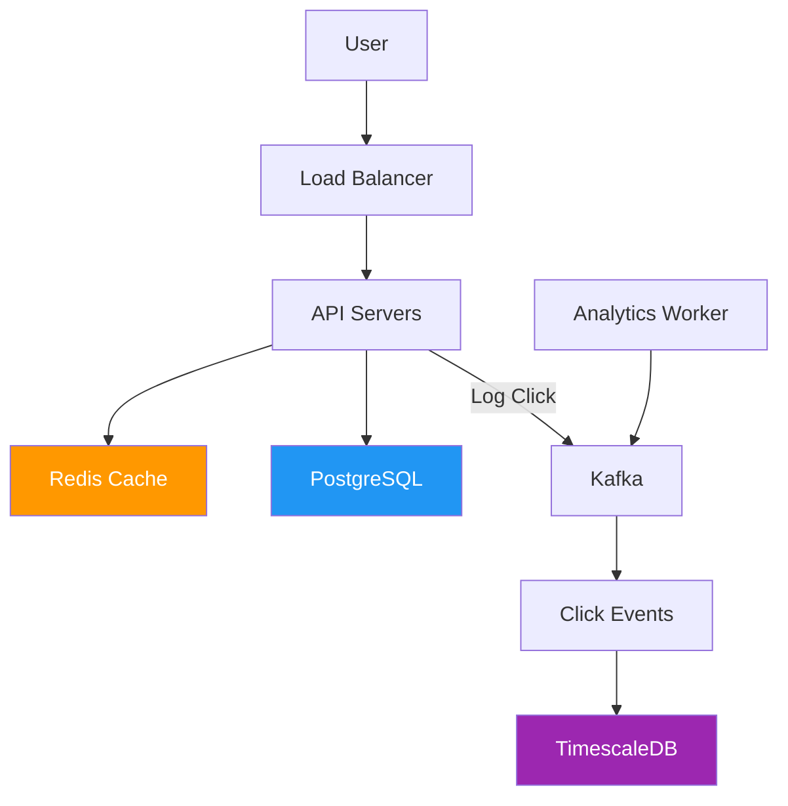

**Figure E1.1: URL Shortener Architecture**

**3. Shortening Algorithm**

```typescript
class URLShortener {
  private redis: Redis;
  private db: Database;
  private alphabet = 'abcdefghijklmnopqrstuvwxyzABCDEFGHIJKLMNOPQRSTUVWXYZ0123456789';
  private base = this.alphabet.length;
  
  // Method 1: Base62 encoding (sequential ID)
  async shortenWithBase62(originalUrl: string, customAlias?: string): Promise<string> {
    if (customAlias) {
      // Check if alias already exists
      const existing = await this.db.urlMappings.findUnique({
        where: { short_code: customAlias }
      });
      
      if (existing) {
        throw new Error('Custom alias already in use');
      }
      
      // Store with custom alias
      await this.db.urlMappings.create({
        data: {
          short_code: customAlias,
          original_url: originalUrl,
          custom_alias: true
        }
      });
      
      return customAlias;
    }
    
    // Generate unique ID and encode
    const id = await this.getNextId();
    const shortCode = this.encodeBase62(id);
    
    await this.db.urlMappings.create({
      data: {
        short_code: shortCode,
        original_url: originalUrl
      }
    });
    
    return shortCode;
  }
  
  // Method 2: Hash-based (for distributed systems)
  async shortenWithHash(originalUrl: string): Promise<string> {
    // Use first 6 chars of MD5 hash
    const hash = crypto.createHash('md5').update(originalUrl).digest('hex');
    let shortCode = hash.substring(0, 6);
    
    // Check for collisions
    let attempts = 0;
    while (attempts < 3) {
      const existing = await this.db.urlMappings.findUnique({
        where: { short_code: shortCode }
      });
      
      if (!existing) {
        await this.db.urlMappings.create({
          data: {
            short_code: shortCode,
            original_url: originalUrl
          }
        });
        return shortCode;
      }
      
      // Collision - try next 6 chars
      shortCode = hash.substring(6 + attempts * 6, 12 + attempts * 6);
      attempts++;
    }
    
    throw new Error('Could not generate unique short code');
  }
  
  private encodeBase62(num: number): string {
    let encoded = '';
    while (num > 0) {
      encoded = this.alphabet[num % this.base] + encoded;
      num = Math.floor(num / this.base);
    }
    return encoded || this.alphabet[0];
  }
  
  private async getNextId(): Promise<number> {
    // Use Redis INCR for distributed ID generation
    return await this.redis.incr('url:id:counter');
  }
}

// Redirect handler with caching
class RedirectHandler {
  async redirect(shortCode: string): Promise<string> {
    // 1. Check cache
    const cached = await this.redis.get(`url:${shortCode}`);
    if (cached) {
      // Log analytics asynchronously
      this.logClick(shortCode).catch(() => {});
      return cached;
    }
    
    // 2. Query database
    const mapping = await this.db.urlMappings.findUnique({
      where: { short_code: shortCode }
    });
    
    if (!mapping) {
      throw new Error('URL not found');
    }
    
    // Check expiration
    if (mapping.expires_at && mapping.expires_at < new Date()) {
      throw new Error('URL has expired');
    }
    
    // 3. Update cache (1 hour TTL)
    await this.redis.setex(
      `url:${shortCode}`,
      3600,
      mapping.original_url
    );
    
    // 4. Increment click count (async)
    this.db.urlMappings.update({
      where: { id: mapping.id },
      data: { click_count: { increment: 1 } }
    }).catch(() => {});
    
    // 5. Log analytics
    this.logClick(shortCode).catch(() => {});
    
    return mapping.original_url;
  }
  
  private async logClick(shortCode: string) {
    // Send to Kafka for async processing
    await this.kafka.send('click-events', {
      short_code: shortCode,
      timestamp: Date.now(),
      ip: req.ip,
      user_agent: req.headers['user-agent']
    });
  }
}
```

**4. Scalability Considerations**

- **Database:** Shard by `user_id` or `short_code` at 100M+ records
- **Cache:** Redis cluster with 100% hit rate for popular URLs
- **CDN:** Cache redirects at edge locations
- **Analytics:** Use TimescaleDB or BigQuery for time-series data

**5. Edge Cases**

- Custom alias conflicts
- URL expiration and cleanup
- Malicious URLs (add virus scanning)
- Rate limiting per user/IP
- Duplicate URL detection (return existing short code)

</details>

---

### Exercise 2: Design a Real-Time Notification System

**Difficulty:** Advanced  
**Time:** 60 minutes

#### Problem Statement

Design a real-time notification system that can handle:

**Requirements:**
- 10 million active users
- Push notifications to web, mobile, and email
- Support for different notification types (alerts, messages, updates)
- User preferences for notification channels
- Delivery guarantees (at-least-once)
- Retry logic for failed deliveries
- Rate limiting per user

<details>
<summary>View Solution</summary>

#### Solution

**Architecture Overview**

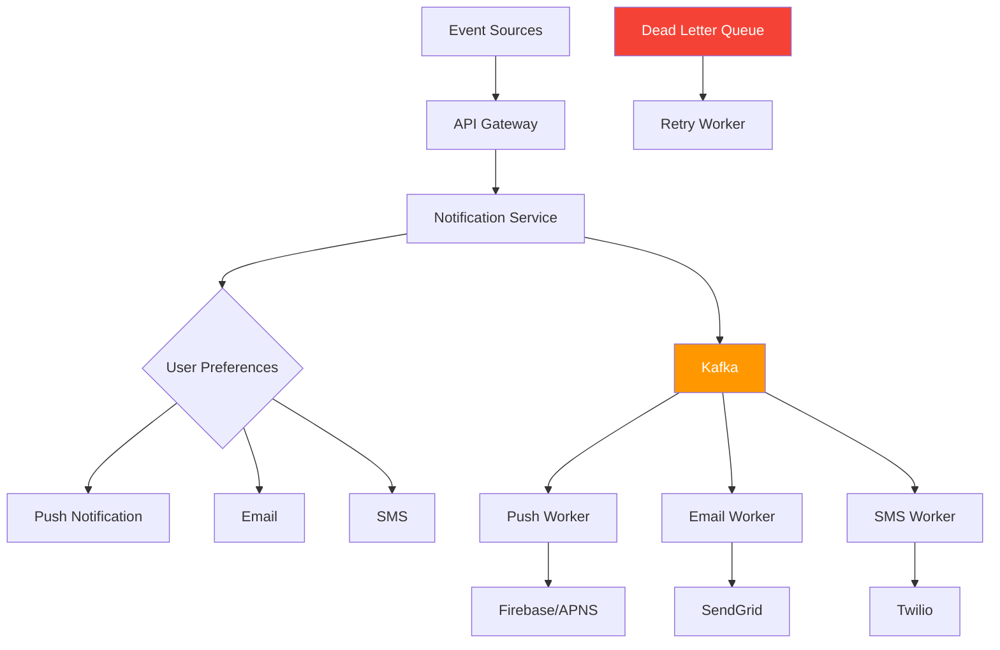

**Figure E2.1: Real-Time Notification System Architecture**

```typescript
// Notification Service
class NotificationService {
  async sendNotification(request: NotificationRequest) {
    // 1. Validate request
    const user = await this.getUser(request.userId);
    const preferences = await this.getUserPreferences(request.userId);
    
    // 2. Check rate limits
    const canSend = await this.checkRateLimit(request.userId, request.type);
    if (!canSend) {
      throw new Error('Rate limit exceeded');
    }
    
    // 3. Create notification record
    const notification = await this.db.notifications.create({
      data: {
        user_id: request.userId,
        type: request.type,
        title: request.title,
        body: request.body,
        data: request.data,
        status: 'pending'
      }
    });
    
    // 4. Publish to Kafka for each enabled channel
    const channels = this.getEnabledChannels(preferences, request.type);
    
    const promises = channels.map(channel => 
      this.kafka.send(`notifications.${channel}`, {
        notification_id: notification.id,
        user_id: request.userId,
        type: request.type,
        title: request.title,
        body: request.body,
        data: request.data,
        priority: request.priority
      })
    );
    
    await Promise.all(promises);
    
    return notification;
  }
  
  private getEnabledChannels(preferences: UserPreferences, type: string): string[] {
    const channels = [];
    
    if (preferences.push_enabled && preferences.push_types.includes(type)) {
      channels.push('push');
    }
    
    if (preferences.email_enabled && preferences.email_types.includes(type)) {
      channels.push('email');
    }
    
    if (preferences.sms_enabled && preferences.sms_types.includes(type)) {
      channels.push('sms');
    }
    
    return channels;
  }
}

// Push Notification Worker
class PushNotificationWorker {
  async processMessage(message: NotificationMessage) {
    const { notification_id, user_id, title, body, data } = message;
    
    try {
      // Get user's push tokens
      const tokens = await this.getUserPushTokens(user_id);
      
      if (tokens.length === 0) {
        await this.markAsDelivered(notification_id, 'no_tokens');
        return;
      }
      
      // Send to Firebase/APNS
      const result = await this.sendPushNotification(tokens, {
        title,
        body,
        data
      });
      
      // Update notification status
      await this.db.notifications.update({
        where: { id: notification_id },
        data: {
          status: 'delivered',
          delivered_at: new Date(),
          delivery_details: result
        }
      });
      
    } catch (error) {
      // Send to DLQ for retry
      await this.kafka.send('notifications.dlq', {
        ...message,
        error: error.message,
        retry_count: 0,
        next_retry: Date.now() + 60000 // Retry in 1 minute
      });
    }
  }
  
  private async sendPushNotification(tokens: string[], payload: any) {
    // Use Firebase Cloud Messaging
    const response = await admin.messaging().sendMulticast({
      tokens,
      notification: {
        title: payload.title,
        body: payload.body
      },
      data: payload.data,
      android: {
        priority: 'high',
        ttl: 3600 * 24 // 24 hours
      },
      apns: {
        headers: {
          'apns-priority': '10'
        },
        payload: {
          aps: {
            'content-available': 1
          }
        }
      }
    });
    
    return {
      success_count: response.successCount,
      failure_count: response.failureCount
    };
  }
}

// Retry Worker with exponential backoff
class RetryWorker {
  async processMessage(message: FailedNotification) {
    const { notification_id, retry_count, next_retry } = message;
    
    // Check if we should retry
    if (Date.now() < next_retry) {
      // Not yet time, send back to queue
      await this.kafka.send('notifications.retry', message, {
        delay: next_retry - Date.now()
      });
      return;
    }
    
    // Max retries exceeded
    if (retry_count >= 5) {
      await this.markAsFailed(notification_id, 'max_retries_exceeded');
      return;
    }
    
    // Exponential backoff
    const delay = Math.min(
      1000 * Math.pow(2, retry_count),
      3600000 // Max 1 hour
    );
    
    // Retry
    await this.kafka.send(`notifications.${message.channel}`, {
      ...message,
      retry_count: retry_count + 1,
      next_retry: Date.now() + delay
    });
  }
}
```

**Key Features:**
- Event-driven architecture with Kafka
- User preference-based channel selection
- Rate limiting per user
- Retry logic with exponential backoff
- Dead letter queue for failed notifications
- Async processing for scalability

</details>

---

### Exercise 3: Design a Distributed Cache Invalidation System

**Difficulty:** Advanced  
**Time:** 50 minutes

#### Problem Statement

Design a cache invalidation system for a microservices architecture where:

**Requirements:**
- 20 microservices sharing a Redis cluster
- Multiple services can update the same data
- Cache consistency is critical (max 5 seconds stale data)
- High read-to-write ratio (100:1)
- Support for cache warming
- Handle cache failures gracefully

<details>
<summary>View Solution</summary>

#### Solution

**Architecture**

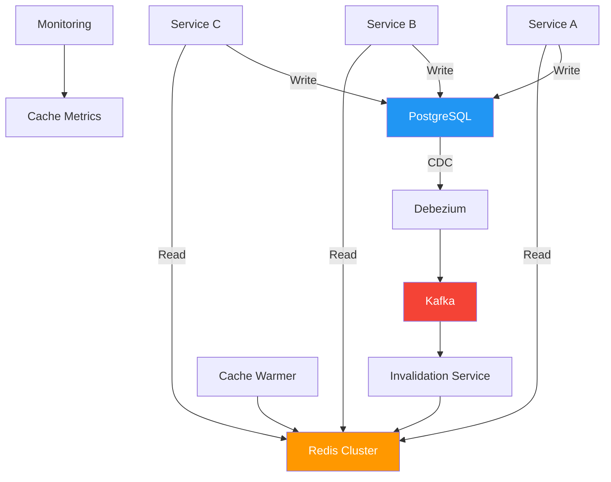

**Figure E3.1: Distributed Cache Invalidation Architecture**

```typescript
// Outbox Pattern for atomic writes
class ProductService {
  async updateProduct(productId: string, updates: UpdateDTO) {
    // 1. Start transaction
    await db.$transaction(async (trx) => {
      // 2. Update product
      await trx.products.update({
        where: { id: productId },
        data: updates
      });
      
      // 3. Insert into outbox (same transaction)
      await trx.outbox_events.create({
        data: {
          aggregate_type: 'product',
          aggregate_id: productId,
          event_type: 'product.updated',
          event_data: JSON.stringify(updates),
          processed: false
        }
      });
    });
    
    // Both operations succeed or both fail
  }
}

// CDC Connector (Debezium)
{
  "name": "product-connector",
  "config": {
    "connector.class": "io.debezium.connector.postgresql.PostgresConnector",
    "database.hostname": "postgres",
    "database.port": "5432",
    "database.user": "debezium",
    "database.password": "dbz",
    "database.dbname": "mydb",
    "database.server.name": "dbserver1",
    "table.include.list": "public.outbox_events",
    "time.precision.mode": "connect",
    "snapshot.mode": "never"
  }
}

// Invalidation Service
class InvalidationService {
  @OnEvent('outbox_event.created')
  async handleOutboxEvent(event: OutboxEvent) {
    const { aggregate_type, aggregate_id, event_type } = event;
    
    // Generate cache key pattern
    const patterns = this.getCachePatterns(aggregate_type, aggregate_id);
    
    // Delete from Redis
    const pipeline = this.redis.pipeline();
    
    for (const pattern of patterns) {
      pipeline.del(pattern);
      
      // Also delete related keys
      const relatedKeys = await this.redis.keys(`${pattern}:*`);
      relatedKeys.forEach(key => pipeline.del(key));
    }
    
    await pipeline.exec();
    
    // Mark event as processed
    await this.db.outbox_events.update({
      where: { id: event.id },
      data: { processed: true, processed_at: new Date() }
    });
    
    // Trigger cache warming for hot keys
    if (this.isHotKey(aggregate_type, aggregate_id)) {
      await this.cacheWarmer.warmCache(aggregate_type, aggregate_id);
    }
  }
  
  private getCachePatterns(aggregateType: string, aggregateId: string): string[] {
    const patterns = {
      product: [
        `product:${aggregateId}`,
        `product:${aggregateId}:details`,
        `product:${aggregateId}:price`,
        `product:${aggregateId}:inventory`
      ],
      user: [
        `user:${aggregateId}`,
        `user:${aggregateId}:profile`,
        `user:${aggregateId}:permissions`
      ]
    };
    
    return patterns[aggregateType] || [`${aggregateType}:${aggregateId}`];
  }
}

// Cache Warming Service
class CacheWarmer {
  async warmCache(aggregateType: string, aggregateId: string) {
    // Fetch fresh data from database
    const data = await this.fetchFromDatabase(aggregateType, aggregateId);
    
    // Update cache with long TTL
    const ttl = 3600; // 1 hour
    
    await this.redis.setex(
      `${aggregateType}:${aggregateId}`,
      ttl,
      JSON.stringify(data)
    );
    
    // Precompute related data
    await this.warmRelatedData(aggregateType, aggregateId, data);
  }
  
  private async warmRelatedData(type: string, id: string, data: any) {
    // Example: For a product, also cache:
    // - Related products
    // - Category information
    // - Price history
    
    if (type === 'product') {
      const related = await this.getRelatedProducts(id);
      const pipeline = this.redis.pipeline();
      
      related.forEach(product => {
        pipeline.setex(
          `product:${product.id}`,
          3600,
          JSON.stringify(product)
        );
      });
      
      await pipeline.exec();
    }
  }
}

// Graceful degradation
class ResilientCache {
  async get(key: string): Promise<any> {
    try {
      // Try cache
      const cached = await this.redis.get(key);
      if (cached) return JSON.parse(cached);
      
      // Cache miss - fetch from DB
      const data = await this.fetchFromDatabase(key);
      
      // Update cache
      await this.redis.setex(key, 300, JSON.stringify(data));
      
      return data;
      
    } catch (error) {
      // Cache failure - fallback to database
      console.error('Cache error, falling back to DB:', error);
      return await this.fetchFromDatabase(key);
    }
  }
}
```

**Key Features:**
- Atomic writes using Outbox pattern
- CDC for reliable event streaming
- Pattern-based cache invalidation
- Automatic cache warming for hot keys
- Graceful degradation on cache failures

</details>

---

## Test Your Understanding

Test your knowledge with these 10 questions:

1. **Why does an API Gateway solve the mobile app coupling problem better than a BFF?**
   <details>
   <summary>Answer</summary>
   An API Gateway solves routing and centralizes cross-cutting concerns (auth, rate limiting, logging) for all services. A BFF adds another service to maintain without addressing the core problem of multiple service domains.
   </details>

2. **What is the fundamental difference between eager loading and DataLoader?**
   <details>
   <summary>Answer</summary>
   Eager loading uses a JOIN to fetch related data in one query. DataLoader batches multiple requests into one query. Eager loading is simpler for predictable relationships; DataLoader shines in GraphQL with dynamic nested resolvers.
   </details>

3. **Why does Token Bucket prevent boundary bursts better than Fixed Window?**
   <details>
   <summary>Answer</summary>
   Fixed Window resets at boundaries, allowing 2x requests around the boundary. Token Bucket refills gradually, so there's no sudden reset—only a smooth refill rate.
   </details>

4. **What's the critical flaw in using only a database unique constraint for payment idempotency?**
   <details>
   <summary>Answer</summary>
   The constraint prevents duplicate rows but cannot undo an external payment charge. Request two might charge Stripe successfully and only then fail the database insert. The customer is still charged twice.
   </details>

5. **Why is directory-based sharding preferred when 80% of queries access data by customer?**
   <details>
   <summary>Answer</summary>
   Directory-based sharding routes all of one customer's data to the same shard, so customer queries hit one shard instead of scattering across all shards.
   </details>

6. **What problem does a fencing token solve that a distributed lock cannot?**
   <details>
   <summary>Answer</summary>
   A lock decides who may start. A fencing token prevents an expired owner from continuing. If a process crashes and recovers after losing the lock, the token ensures it cannot write to protected resources.
   </details>

7. **Why is SQS FIFO with MessageGroupId better than a consumer-side reorder buffer?**
   <details>
   <summary>Answer</summary>
   FIFO guarantees ordering at the infrastructure level. A reorder buffer requires building complex sequence tracking, timeout handling, and crash recovery in application code.
   </details>

8. **What's the main advantage of cache-aside over write-through?**
   <details>
   <summary>Answer</summary>
   Cache-aside keeps the database as the source of truth and doesn't make writes dependent on cache availability. Write-through requires both systems to succeed synchronously, making the cache a write-path dependency.
   </details>

9. **When should you use CQRS instead of read replicas?**
   <details>
   <summary>Answer</summary>
   Use CQRS when reads and writes need fundamentally different data models (e.g., normalized writes vs. denormalized reads). Read replicas help when the query structure is acceptable but traffic is too high.
   </details>

10. **Why is an orchestration-based Saga better than choreography for complex workflows?**
    <details>
    <summary>Answer</summary>
    Orchestration provides a central place to see workflow state, manage compensations, and handle failures. Choreography spreads logic across services, making it hard to understand the overall transaction state.
    </details>

---

## Common Interview Questions

Prepare for these frequently asked system design interview questions:

1. **Q: How would you design a rate limiter?**  
   **A:** Discuss Token Bucket vs. Sliding Window, distributed vs. local rate limiting, where to place the limiter (API Gateway vs. application), and handling burst traffic.

2. **Q: Design a system to prevent duplicate payment charges.**  
   **A:** Idempotency keys, unique constraints as secondary safeguard, distributed locks vs. idempotency, handling retries safely.

3. **Q: How do you handle cache invalidation in a microservices architecture?**  
   **A:** Cache-aside pattern, Outbox pattern with CDC, event-driven invalidation, cache warming strategies, handling failures.

4. **Q: Design a feed system like Twitter's.**  
   **A:** Fanout on write vs. fanout on read, hybrid approach for celebrities, Redis for hot feeds, handling millions of followers.

5. **Q: How would you paginate 100 million records efficiently?**  
   **A:** Cursor-based pagination vs. offset, keyset pagination, index design, handling filters and sorting.

6. **Q: Design a distributed job scheduler.**  
   **A:** Distributed locks with fencing tokens, leader election, handling failures and retries, visibility into job status.

7. **Q: How do you ensure event ordering in a message queue?**  
   **A:** Partition keys (MessageGroupId), FIFO queues, sequence numbers, handling out-of-order events at the domain level.

8. **Q: Design a system to detect and prevent fraud in real-time.**  
   **A:** Stream processing with Kafka, rule engines, ML models, Circuit Breaker for external APIs, low-latency requirements.

9. **Q: How would you scale a database that's running out of capacity?**  
   **A:** Read replicas, sharding strategies (hash, range, directory), connection pooling, caching, when to use each approach.

10. **Q: Design a webhook delivery system.**  
    **A:** Fast acknowledgment, async processing, idempotency, retry logic, dead-letter queues, signature verification.

---

## Question Bank

### Beginner Questions (1-20)

1. **What is the N+1 query problem?**  
   Answer: When an ORM executes 1 query to fetch N records, then N additional queries to fetch related data, resulting in N+1 total queries.

2. **What does an API Gateway do?**  
   Answer: Acts as a single entry point for clients, routing requests to appropriate backend services and handling cross-cutting concerns like auth, rate limiting, and logging.

3. **What is caching?**  
   Answer: Storing frequently accessed data in a fast storage layer (like Redis) to reduce database load and improve response times.

4. **What is rate limiting?**  
   Answer: Controlling the number of requests a client can make in a given time period to prevent abuse and ensure fair usage.

5. **What is a Bloom filter?**  
   Answer: A space-efficient probabilistic data structure that tests whether an element is a member of a set, with possible false positives but no false negatives.

6. **What is database sharding?**  
   Answer: Splitting a large database into smaller, faster, more manageable pieces called shards, distributed across multiple servers.

7. **What is a message queue?**  
   Answer: A communication component that enables asynchronous processing by storing messages until consumers can process them.

8. **What is eventual consistency?**  
   Answer: A consistency model where updates propagate through the system over time, and all replicas eventually become consistent.

9. **What is a Circuit Breaker pattern?**  
   Answer: A resilience pattern that stops calling a failing service after a threshold of failures, preventing cascading failures.

10. **What is the difference between SQL and NoSQL databases?**  
    Answer: SQL databases are relational, structured, and ACID-compliant. NoSQL databases are non-relational, flexible schema, and optimized for specific data models.

11. **What is a load balancer?**  
    Answer: A device that distributes network traffic across multiple servers to ensure no single server becomes overwhelmed.

12. **What is horizontal scaling?**  
    Answer: Adding more machines to a system to handle increased load, as opposed to vertical scaling (adding more power to existing machines).

13. **What is a dead-letter queue?**  
    Answer: A queue where messages that cannot be processed successfully are sent for later analysis or reprocessing.

14. **What is idempotency?**  
    Answer: The property of an operation where executing it multiple times produces the same result as executing it once.

15. **What is a read replica?**  
    Answer: A copy of a database that handles read traffic, reducing load on the primary database and improving read performance.

16. **What is connection pooling?**  
    Answer: A technique to maintain a pool of database connections that can be reused, reducing the overhead of creating new connections.

17. **What is a Bloom filter's false positive rate?**  
    Answer: The probability that the filter incorrectly indicates an item is present when it's not. Configurable based on size and hash functions.

18. **What is the Outbox pattern?**  
    Answer: A pattern where events are stored in an outbox table in the same transaction as the business operation, then reliably published to a message broker.

19. **What is a Saga pattern?**  
    Answer: A pattern for managing distributed transactions by breaking them into a sequence of local transactions with compensating actions for rollbacks.

20. **What is backpressure?**  
    Answer: A mechanism to handle situations where producers generate data faster than consumers can process it, preventing system overload.

### Intermediate Questions (21-40)

21. **Why is cache-aside preferred over write-through for multiple writers?**  
    Answer: Cache-aside doesn't require atomic updates across systems. The database is the source of truth, and cache invalidation is a separate step that can be retried.

22. **What's the difference between write-behind and write-through caching?**  
    Answer: Write-through updates cache and database synchronously. Write-behind updates cache first and database asynchronously, risking data loss if cache fails.

23. **Why does directory-based sharding work well for customer-centric queries?**  
    Answer: It routes all of one customer's data to the same shard, so customer queries hit one shard instead of scattering across all shards.

24. **What is the thundering herd problem?**  
    Answer: When many clients simultaneously request the same expired cache key, overwhelming the database with identical queries.

25. **How does Token Bucket differ from Leaky Bucket?**  
    Answer: Token Bucket allows bursts (up to bucket capacity) while maintaining an average rate. Leaky Bucket processes at a constant rate, delaying excess requests.

26. **What is the Two Generals Problem?**  
    Answer: A thought experiment showing that two parties cannot reliably communicate certainty over an unreliable channel, relevant to distributed messaging.

27. **Why can't Two-Phase Commit be used with external services?**  
    Answer: External services (Stripe, shipping APIs) don't support 2PC protocol, and holding locks while waiting for slow services creates availability issues.

28. **What is the difference between orchestration and choreography in Sagas?**  
    Answer: Orchestration uses a central coordinator to manage the workflow. Choreography has services communicate via events without central control.

29. **Why is SQS FIFO with MessageGroupId better than a reorder buffer?**  
    Answer: FIFO guarantees ordering at the infrastructure level. A reorder buffer requires building complex sequence tracking in application code.

30. **What is the difference between a Bloom filter and a Redis SET for membership checks?**  
    Answer: Bloom filters use ~10x less memory but have false positives. Redis SETs are exact but consume much more memory for large sets.

31. **Why does write sharding solve DynamoDB hot partitions?**  
    Answer: It splits one partition key value into multiple keys (tenant#0, tenant#1, etc.), allowing DynamoDB to distribute writes across multiple physical partitions.

32. **What is the difference between a Circuit Breaker and a Bulkhead?**  
    Answer: Circuit Breaker stops calling a failing service. Bulkhead isolates resources so one failing service can't consume resources needed by others.

33. **Why is Server-Sent Events better than WebSockets for AI token streaming?**  
    Answer: SSE is one-way (server to client), has native browser support with auto-reconnection, and doesn't require bidirectional communication overhead.

34. **What is RAG and when should it be used?**  
    Answer: Retrieval-Augmented Generation retrieves relevant documents at query time and adds them to the LLM context. Use it when knowledge changes frequently.

35. **Why is fine-tuning not ideal for frequently changing information?**  
    Answer: Fine-tuning stores knowledge in model weights, which are static until retraining. For frequently changing data, this requires constant retraining.

36. **What is the difference between fanout on write and fanout on read?**  
    Answer: Fanout on write precomputes feeds when posts are created (fast reads, expensive for celebrities). Fanout on read builds feeds when users open them (simple writes, slow reads).

37. **Why does hybrid fanout work for Twitter-like feeds?**  
    Answer: Regular users get fanout on write (fast reads), while celebrities use fanout on read (avoids millions of writes per post).

38. **What is cursor pagination and when should it be used?**  
    Answer: Cursor pagination uses the last item's position to fetch the next page, avoiding offset's performance issues on large datasets. Use for deep pagination.

39. **Why can't offset pagination scale to millions of rows?**  
    Answer: PostgreSQL must read and discard all previous rows before returning results. At page 50,000, it scans hundreds of thousands of rows.

40. **What is the difference between keyset and cursor pagination?**  
    Answer: Keyset is the SQL technique (WHERE id > last_id). Cursor is the complete API contract including encoding the position in an opaque token.

### Advanced Questions (41-60)

41. **How would you implement distributed rate limiting across multiple servers?**  
    Answer: Use Redis with atomic operations (INCR + EXPIRE), Token Bucket algorithm, Lua scripts for atomicity, and consider using API Gateway for centralized limiting.

42. **What are the trade-offs of using partial indexes on high-ingest tables?**  
    Answer: Partial indexes reduce write amplification by indexing only relevant rows, but require queries to match the index predicate and may need rebuilding if requirements change.

43. **Why is session mode needed for some PgBouncer workloads?**  
    Answer: Session mode maintains one backend connection per client for the entire session, required when using session state (temp tables, prepared statements, cursors).

44. **How do you handle cache consistency when multiple services write to the same data?**  
    Answer: Use cache-aside with database as source of truth, implement Outbox pattern for reliable invalidation, and consider event-driven cache updates via CDC.

45. **What is the problem with using read replicas for read-your-writes consistency?**  
    Answer: Replication lag (typically 50-200ms) means a user's write may not be visible on replicas immediately, causing stale reads for their own data.

46. **How does read-your-writes consistency work?**  
    Answer: After a user writes, temporarily route their subsequent reads to the primary database for a few seconds until replicas catch up.

47. **Why is synchronous replication rarely used for read replicas?**  
    Answer: It increases write latency (primary waits for replica confirmation) and creates a dependency—if the replica is slow, writes slow down too.

48. **What is the difference between horizontal and vertical pod autoscaling?**  
    Answer: Horizontal adds more pods. Vertical increases resources (CPU/memory) of existing pods. Use horizontal for stateless services, vertical for stateful workloads.

49. **How would you design a system to process 1 million events per second?**  
    Answer: Partition data, use Kafka for buffering, parallelize consumers, optimize database writes (batch inserts, connection pooling), consider CQRS.

50. **What is the CAP theorem and how does it apply to real systems?**  
    Answer: You can only have 2 of 3: Consistency, Availability, Partition Tolerance. In practice, partition tolerance is required, so you choose between CP (consistent but may sacrifice availability) or AP (available but eventually consistent).

51. **How do you choose between SQL and NoSQL for a new project?**  
    Answer: SQL for complex queries, transactions, strong consistency. NoSQL for flexible schema, massive scale, specific access patterns (key-value, document, graph).

52. **What is database connection pooling and why is it important?**  
    Answer: Reusing database connections to avoid overhead of creating new ones. Critical for performance because connection establishment is expensive (TCP handshake, authentication).

53. **How would you handle a 10x traffic spike unexpectedly?**  
    Answer: Rate limiting, auto-scaling, circuit breakers for external dependencies, queue-based backpressure, CDN for static content, database read replicas.

54. **What is the difference between strong consistency and eventual consistency?**  
    Answer: Strong consistency guarantees reads return the latest write. Eventual consistency guarantees reads will eventually return the latest write, but not immediately.

55. **How do you prevent duplicate message processing in Kafka?**  
    Answer: Idempotent consumers (deduplication tables), exactly-once semantics (EOS), transactional producers, and stable consumer group IDs.

56. **What is a vector database and when should you use it?**  
    Answer: A database optimized for storing and searching high-dimensional vectors (embeddings). Use for semantic search, recommendation systems, and similarity matching.

57. **How does HNSW indexing work in vector databases?**  
    Answer: Hierarchical Navigable Small World creates a multi-layer graph where each layer is a subset of the previous, enabling fast approximate nearest neighbor search.

58. **What is the difference between approximate and exact nearest neighbor search?**  
    Answer: Approximate (HNSW, IVF) trades some accuracy for speed, using O(log n) time. Exact (brute force) checks all vectors, O(n) time, but 100% accurate.

59. **How would you design a system for real-time collaboration like Google Docs?**  
    Answer: Operational Transformation (OT) or Conflict-free Replicated Data Types (CRDTs), WebSockets for real-time sync, operational logs, conflict resolution.

60. **What are the challenges of multi-tenant database design?**  
    Answer: Data isolation, noisy neighbors, schema changes affecting all tenants, backup/restore per tenant, scaling strategies (separate DB vs. shared with tenant_id).

---

## Summary & Key Takeaways

### Core Principles

1. **Choose the simplest solution that solves the actual problem**
   - Don't use advanced technology when a simple approach works
   - Example: API Gateway solves routing better than GraphQL Federation

2. **Fix the query pattern before adding infrastructure**
   - N+1 queries should be fixed with eager loading, not caching
   - Offset pagination should use cursors, not more replicas

3. **Design for failure**
   - Use Circuit Breakers for external dependencies
   - Implement Bulkheads to isolate failures
   - Always have fallback strategies

4. **Keep the database as the source of truth**
   - Cache-aside over write-through for multiple writers
   - Invalidate cache after successful writes
   - Repopulate lazily on next read

5. **Consider trade-offs explicitly**
   - Consistency vs. availability
   - Performance vs. cost
   - Simplicity vs. flexibility

### Pattern Cheat Sheet

| Problem | Solution | Key Benefit |
|---------|----------|-------------|
| N+1 queries | Eager loading | One query instead of N+1 |
| Hot cache key | Pre-warming | Eliminate thundering herd |
| Rate limiting | Token Bucket | No boundary bursts |
| Duplicate payments | Idempotency keys | Safe retries |
| Customer queries | Directory sharding | One shard per customer |
| Distributed locks | Fencing tokens | Prevent stale owners |
| Event ordering | MessageGroupId | Per-entity ordering |
| Cache consistency | Cache-aside + Outbox | Reliable invalidation |
| Read/write models | CQRS | Optimized for each workload |
| Multi-service workflow | Orchestration Saga | Centralized coordination |
| Webhook processing | Async queue | Fast acknowledgment |
| High ingest table | Partial index | Index only hot data |
| Connection exhaustion | PgBouncer modes | Different pools per workload |
| Risky deployment | Feature flags | Instant rollback |
| Membership checks | Bloom filter | Memory efficient |
| Hot partition | Write sharding | Distribute load |
| Overwhelmed consumer | Rate-limit + overflow | Graceful degradation |
| Cache stampede | Pre-warming | Proactive refresh |
| Stale replica reads | Read-your-writes | Route to primary temporarily |
| Failing dependency | Circuit Breaker + Bulkhead | Fail fast + isolate |
| AI token streaming | Server-Sent Events | One-way, auto-reconnect |
| Reliable messaging | At-least-once + idempotency | Handle duplicates safely |
| Celebrity posts | Hybrid fanout | Avoid millions of writes |
| Deep pagination | Cursor pagination | Stable performance |
| Queue backpressure | Rate-limit producers | Control input rate |
| Write consistency | Dual-write with Outbox | Atomic + reliable |
| LLM freshness | RAG | Current knowledge without retraining |
| Semantic search | Qdrant | Fast, filterable vector search |
| Multi-agent workflow | DAG-based execution | Clear dependencies |
| File storage | S3 | Managed, scalable, cost-effective |

---

## Further Reading & Resources

### Books
- **"Designing Data-Intensive Applications"** by Martin Kleppmann - Deep dive into distributed systems
- **"System Design Interview"** by Alex Xu - Volume 1 & 2 for interview preparation
- **"Building Microservices"** by Sam Newman - Microservices patterns and practices
- **"Database Internals"** by Alex Petrov - Deep dive into database design

### Online Resources
- **AWS Architecture Blog:** Real-world architecture patterns
- **Netflix Tech Blog:** Resilience patterns at scale
- **Stripe Engineering:** Payment system design
- **Uber Engineering:** Real-time systems and scalability
- **Google SRE Book:** Site reliability engineering practices

### Documentation
- [PostgreSQL Documentation](https://www.postgresql.org/docs/)
- [Redis Documentation](https://redis.io/docs/)
- [AWS SQS Best Practices](https://docs.aws.amazon.com/AWSSimpleQueueService/latest/SQSDeveloperGuide/sqs-best-practices.html)
- [Kafka Documentation](https://kafka.apache.org/documentation/)
- [DynamoDB Developer Guide](https://docs.aws.amazon.com/amazondynamodb/latest/developerguide/)

### Courses
- **"Grokking the System Design Interview"** - Educative.io
- **"System Design for Senior Engineers"** - Udemy
- **"Distributed Systems"** - MIT OpenCourseWare

### Tools for Practice
- **Excalidraw:** Sketch architectures quickly
- **Draw.io:** Create detailed diagrams
- **Kafka:** Practice event-driven systems locally with Docker
- **Redis:** Experiment with caching patterns
- **PostgreSQL:** Test query optimization and indexing

### Community
- **r/systemdesign:** Reddit community for system design discussions
- **System Design Discord:** Active community for interview prep
- **GitHub:** Open-source system design examples

---

## Conclusion

System design interviews are not about memorizing tools or choosing the most advanced architecture. They're about understanding the actual problem, identifying the trade-offs, and selecting the simplest solution that fits the workload.

This tutorial covered 30 real-world scenarios, each teaching you:
- ✅ How to break down complex problems
- ✅ Which patterns fit specific situations
- ✅ Why certain approaches fail in production
- ✅ How to communicate your design decisions

**Remember:** The best system designers are not those who know every technology. They're those who can analyze requirements, ask the right questions, and design solutions that are simple, scalable, and maintainable.

Keep practicing, keep questioning, and keep building. Good luck with your interviews! 🚀

---

**📝 Tutorial Metadata:**
- **Created:** January 2026
- **Based on:** "60+ Real-World System Design Scenarios" by Joud Awad
- **Enhanced with:** Additional research, code examples, diagrams, and practice exercises
- **Target Audience:** Intermediate to Advanced software engineers
- **Estimated Study Time:** 3-4 hours with exercises

**🎯 Next Steps:**
1. Complete all practice exercises
2. Review the question bank until you can answer all questions confidently
3. Practice drawing architectures for each scenario
4. Implement small-scale versions of these patterns in side projects
5. Join system design interview prep groups for mock interviews

**💪 Pro Tip:** The best way to learn system design is to practice explaining your designs out loud. Record yourself, get feedback, and iterate. Real interviews are about communication as much as technical knowledge.

---

*This comprehensive tutorial contains 30 real-world scenarios, 60+ questions, 3 detailed exercises with solutions, 15+ Mermaid diagrams, and extensive production-ready code examples. Use it as a reference guide during your system design interview preparation journey.*