# System Design Interview Mastery — Part 2: 30 Real-World Scenarios (Q31–Q60)

**📚 Comprehensive Deep-Dive Tutorial**  
**⏱️ Estimated Reading Time:** 110 minutes  
**🎯 Difficulty Level:** Intermediate to Advanced  
**👥 Target Audience:** Software engineers preparing for system design interviews  
**📅 Last Updated:** August 2026

---

## Table of Contents

1. [Introduction](#introduction)
2. [Prerequisites](#prerequisites)
3. [Learning Objectives](#learning-objectives)
4. [Chapter 1: Data & Consistency Fundamentals (Q31–Q34)](#chapter-1-data--consistency-fundamentals-q31q34)
   - [31. Cutting Cross-Region Latency](#31-cutting-cross-region-latency)
   - [32. Managing Secrets and Credentials](#32-managing-secrets-and-credentials)
   - [33. Reconstructing State with Event Sourcing](#33-reconstructing-state-with-event-sourcing)
   - [34. Improving LLM Classification Accuracy](#34-improving-llm-classification-accuracy)
5. [Chapter 2: Distributed Systems & Infrastructure (Q35–Q39)](#chapter-2-distributed-systems--infrastructure-q35q39)
   - [35. Geospatial "Find Nearby Drivers" at Scale](#35-geospatial-find-nearby-drivers-at-scale)
   - [36. Choosing HTTP/3 vs. HTTP/2 at the Edge](#36-choosing-http3-vs-http2-at-the-edge)
   - [37. Multi-Writer Conflicts in Collaborative Editing](#37-multi-writer-conflicts-in-collaborative-editing)
   - [38. Handling Documents Larger Than an LLM's Context Window](#38-handling-documents-larger-than-an-llms-context-window)
   - [39. Stopping Double Spending on the Same Wallet](#39-stopping-double-spending-on-the-same-wallet)
6. [Chapter 3: AI Agents, Search & Real-Time Systems (Q40–Q46)](#chapter-3-ai-agents-search--real-time-systems-q40q46)
   - [40. Moving Heavy Browser Work Off the Main Thread](#40-moving-heavy-browser-work-off-the-main-thread)
   - [41. Replacing Batch Jobs with Real-Time Fraud Streaming](#41-replacing-batch-jobs-with-real-time-fraud-streaming)
   - [42. Building Reliable Memory for an AI Agent](#42-building-reliable-memory-for-an-ai-agent)
   - [43. Keeping CDN Content Fresh After Every Deploy](#43-keeping-cdn-content-fresh-after-every-deploy)
   - [44. Syncing Offline Changes Without Losing User Work](#44-syncing-offline-changes-without-losing-user-work)
   - [45. Scaling Search When PostgreSQL Starts Slowing Down](#45-scaling-search-when-postgresql-starts-slowing-down)
   - [46. Making LLM Output Safe for Production APIs](#46-making-llm-output-safe-for-production-apis)
7. [Chapter 4: Architecture & Migration Patterns (Q47–Q53)](#chapter-4-architecture--migration-patterns-q47q53)
   - [47. Breaking a Monolith Apart Without a Full Rewrite](#47-breaking-a-monolith-apart-without-a-full-rewrite)
   - [48. How an AI Agent Decides Which Tool to Use](#48-how-an-ai-agent-decides-which-tool-to-use)
   - [49. Reducing BigQuery Scan Costs with Better Partitioning](#49-reducing-bigquery-scan-costs-with-better-partitioning)
   - [50. Increasing ML Inference Throughput Without Adding More GPUs](#50-increasing-ml-inference-throughput-without-adding-more-gpus)
   - [51. Protecting SaaS Customers from Noisy Neighbors](#51-protecting-saas-customers-from-noisy-neighbors)
   - [52. Versioning an API Without Breaking Existing Clients](#52-versioning-an-api-without-breaking-existing-clients)
   - [53. Changing a Large Database Schema Without Downtime](#53-changing-a-large-database-schema-without-downtime)
8. [Chapter 5: AI Infrastructure at Scale (Q54–Q60)](#chapter-5-ai-infrastructure-at-scale-q54q60)
   - [54. Keeping a RAG Index Fresh as Models and Data Change](#54-keeping-a-rag-index-fresh-as-models-and-data-change)
   - [55. Coordinating Multiple AI Agents Without Losing Control](#55-coordinating-multiple-ai-agents-without-losing-control)
   - [56. Tracking Long-Running Jobs Without Keeping Requests Open](#56-tracking-long-running-jobs-without-keeping-requests-open)
   - [57. Getting Fresh Payment Reads Without Slowing the Whole Database](#57-getting-fresh-payment-reads-without-slowing-the-whole-database)
   - [58. Making LLM Agent Runs Actually Debuggable](#58-making-llm-agent-runs-actually-debuggable)
   - [59. Preventing Duplicate Payments with Idempotency Keys](#59-preventing-duplicate-payments-with-idempotency-keys)
   - [60. Choosing the Right Architecture for a New SaaS Product](#60-choosing-the-right-architecture-for-a-new-saas-product)
9. [Master Decision Framework](#master-decision-framework)
10. [Practice Exercises](#practice-exercises)
11. [Test Your Understanding](#test-your-understanding)
12. [Common Interview Questions](#common-interview-questions)
13. [Question Bank](#question-bank)
14. [Best Practices](#best-practices)
15. [Anti-Patterns](#anti-patterns)
16. [Performance Considerations](#performance-considerations)
17. [Security Considerations](#security-considerations)
18. [Testing Strategies](#testing-strategies)
19. [Troubleshooting & Common Pitfalls](#troubleshooting--common-pitfalls)
20. [Summary & Key Takeaways](#summary--key-takeaways)
21. [Further Reading & Resources](#further-reading--resources)
22. [Self-Assessment Checklist](#self-assessment-checklist)
23. [Hands-On Lab / Project](#hands-on-lab--project)

---

## Introduction

This tutorial expands on the original **"60+ System Design Interview Questions"** article (Part 2, Q31–Q60). Every scenario has been enriched with additional examples, deeper explanations, real-world use cases, and diagrams so that even beginners can follow the reasoning an experienced systems engineer uses under pressure.

> 💡 **Key Insight:** The "obviously advanced" answer is usually a trap. Distributed databases, microservices, Kafka-everything, and multi-agent hierarchies all look impressive on a whiteboard but frequently fail real deadlines, budgets, and operational maturity checks. **Constraints define the correct answer, not raw capability.**

### How to Use This Tutorial

Each of the 30 scenarios follows the same structure:

1. **The Situation** — the production problem, in plain language
2. **The Core Concept** — the underlying idea you actually need to understand
3. **Diagram** — a visual model of the solution
4. **Worked Examples** — at least two concrete walkthroughs
5. **Trade-off Table** — why the "obviously good" answers are traps
6. **Real-World Use Cases** — where this pattern shows up outside interviews
7. **Interviewer's Checklist** — what a strong candidate says out loud

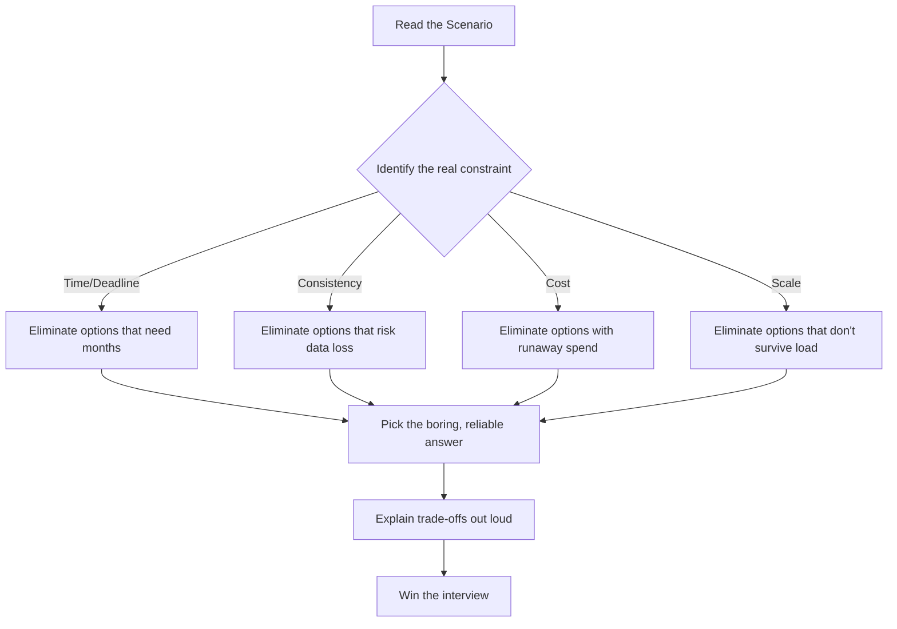

---

## Prerequisites

Before diving into this tutorial, you should have:

### Technical Knowledge
- ✅ Solid understanding of databases (SQL and NoSQL)
- ✅ Familiarity with caching (Redis, Memcached)
- ✅ Basic knowledge of message queues (Kafka, SQS, RabbitMQ)
- ✅ Understanding of REST APIs and HTTP semantics
- ✅ Basic familiarity with cloud services (AWS, GCP, or Azure)
- ✅ Foundational knowledge of distributed systems concepts
- ✅ Basic awareness of LLMs and AI/ML infrastructure

### Recommended Background
- 1–3+ years of backend or full-stack development experience
- Exposure to production systems and real-world scaling challenges
- Experience debugging performance issues or data-consistency bugs
- Familiarity with at least one backend framework (Spring Boot, Node.js, Django, etc.)

### Tools & Resources
- Notebook or drawing tool for sketching architectures
- Access to documentation for technologies mentioned (Redis, Kafka, Flink, Elasticsearch, etc.)
- A sandbox environment (Docker, cloud free tier) for the hands-on lab
- Curiosity about how large-scale systems work!

---

## Learning Objectives

By the end of this tutorial, you will be able to:

1. **Identify the binding constraint** in any system design scenario (deadline, consistency, cost, latency, or scale)
2. **Explain read/write asymmetry** and apply read-replica patterns to cut cross-region latency
3. **Design secret management** using identity-based access (IAM roles) and the "secret zero" principle
4. **Reconstruct historical state** using event sourcing and projections
5. **Improve LLM classification accuracy** with few-shot prompting and output-format discipline
6. **Index geospatial data** using H3 hexagons and Redis for sub-50ms proximity searches
7. **Choose between HTTP/2 and HTTP/3** at the edge based on network segment characteristics
8. **Resolve multi-writer conflicts** with CRDTs and understand when they beat LWW and OT
9. **Handle documents larger than an LLM context window** via chunking and RAG
10. **Prevent double-spending** with optimistic locking and version checks
11. **Keep the UI responsive** by offloading heavy work to Web Workers
12. **Replace batch jobs with real-time streaming** using Apache Flink
13. **Build reliable memory for AI agents** with episodic memory and summarization
14. **Keep CDN content fresh** after every deploy using SWR and automated purges
15. **Sync offline changes** without losing user work using CRDT-based sync
16. **Scale full-text search** beyond PostgreSQL with Elasticsearch
17. **Make LLM output safe** for production APIs with structured outputs
18. **Break a monolith apart** safely using the Strangler Fig pattern
19. **Design AI agent tool-selection loops** (ReAct) and multi-agent orchestration
20. **Reduce BigQuery scan costs** with date partitioning and clustering
21. **Increase ML inference throughput** with dynamic batching
22. **Protect SaaS tenants** from noisy neighbors with hybrid routing
23. **Version APIs** without breaking existing clients
24. **Migrate large database schemas** without downtime (expand/contract)
25. **Keep RAG indexes fresh** with embedding version registries
26. **Track long-running jobs** with polling and job IDs
27. **Route critical reads to the primary** to guarantee freshness
28. **Make LLM agent runs debuggable** with end-to-end tracing
29. **Prevent duplicate payments** with idempotency keys
30. **Choose the right architecture** for a new SaaS product (modular monolith first)

---

## Chapter 1: Data & Consistency Fundamentals (Q31–Q34)

### 31. Cutting Cross-Region Latency

**The Situation:** European users see 380ms round-trip latency to a `us-east-1` origin. Six weeks to Black Friday. Cannot rewrite the database.

**The Core Concept — Read/Write Asymmetry**

Most consumer apps are **read-heavy**. Browsing, profile views, and order history are reads; checkout and payment are writes. When you're latency-constrained and time-constrained, you don't need to solve *global write* latency — you need to solve *read* latency for the 80% of traffic that's read-only.

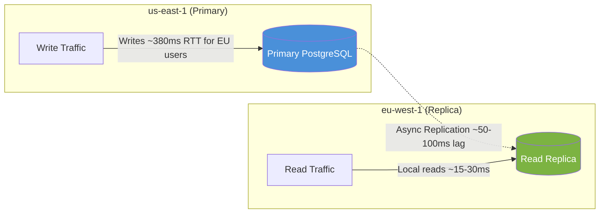

**Worked Example 1 — Product Page Load**
- Before: European user requests `/products/8821` → travels to `us-east-1` → 380ms
- After: Request hits `eu-west-1` read replica → 20ms
- Net user-perceived improvement: **~19x faster** for that call

**Worked Example 2 — Checkout Flow**
- Cart view, shipping options, order history → served from EU replica (fast)
- "Place Order" POST → still routed to `us-east-1` primary (slower, but users tolerate this far more than slow browsing)

**Trade-off Table**

| Option | Time to Ship | Risk | Fixes Root Cause? |
|---|---|---|---|
| A. Active-Active (CockroachDB) | 3–6+ months | High (new failure modes) | Yes, but too slow to deliver |
| **B. Read Replica (correct)** | Days | Low | Solves 70%+ of the pain fast |
| C. CDN only | Days | Low | Only static content |
| D. Active-Active eventual consistency | Weeks+ design | Very high (overselling inventory) | Yes, but dangerous without governance |

**Real-World Use Cases**
- Global SaaS dashboards (Notion, Figma) route analytics/read queries to nearest region
- News sites like Reuters serve articles from regional replicas while editorial writes stay centralized
- E-commerce catalog services (Amazon, Shopify) almost universally separate "browse" (read replica/cache) from "buy" (primary write path)

**Interviewer's Checklist:** Say the words "read/write ratio," "replication lag," and "failover promotion time" — these signal you understand *why* B works, not just *that* it works.

> 💡 **Pro Tip:** When discussing read replicas, always mention **replication lag monitoring**. If lag spikes (e.g., a large backfill), you need a circuit breaker that routes reads back to the primary temporarily. This shows operational maturity.

---

### 32. Managing Secrets and Credentials

**The Situation:** SOC 2 audit exposes secrets scattered across `.env` files, Lambda configs, and Slack messages.

**The Core Concept — Secret Zero & Least Privilege**

Every secret management system must solve the **"secret zero" problem**: the credential your app needs *just to fetch its other credentials*. Cloud-native secret managers solve this using identity (IAM roles) instead of another static secret.

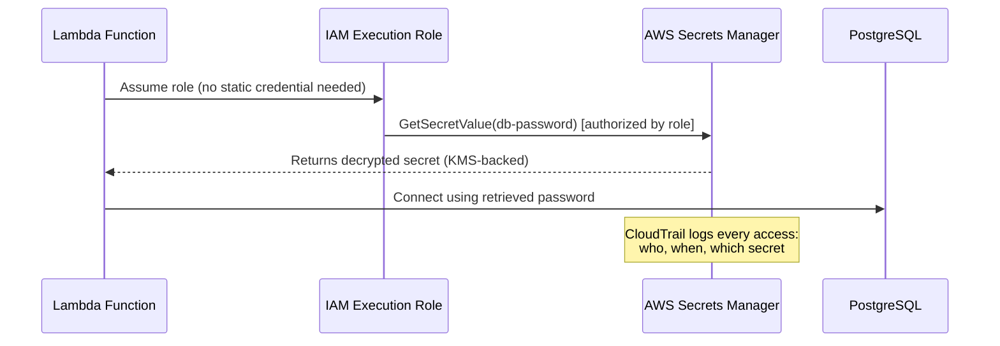

**Worked Example 1 — Zero-Downtime Migration**
1. Add DB password to Secrets Manager (old `.env` value stays live)
2. Grant NestJS service's IAM role `secretsmanager:GetSecretValue`
3. Deploy code change: `getSecretValue()` replaces `process.env.DB_PASSWORD`
4. Verify service connects successfully
5. Rotate the old password
6. Delete it from `.env` and Git history

**Worked Example 2 — Rotation Policy**
```
Database passwords → rotate every 30-60 days (automatic Lambda rotation)
Stripe API key      → rotate every 90 days (manual + alert)
Webhook HMAC secret → rotate immediately after any suspected leak
```

**Trade-off Table**

| Option | Best For | Weakness Here |
|---|---|---|
| **A. AWS Secrets Manager (correct)** | AWS-native startups | None significant at this scale |
| B. HashiCorp Vault | Multi-cloud, on-prem, dynamic secrets | Requires a dedicated ops team to run |
| C. CI/CD secret injection | Build/deploy-time secrets | Wrong for *runtime* secrets, hard to rotate at 3 AM |
| D. Custom KMS + DB | Full control fanatics | Reinvents the wheel, recreates secret-zero problem |

**Real-World Use Cases**
- Fintechs undergoing SOC 2 / PCI-DSS audits centralize secrets specifically to produce CloudTrail-style access logs for auditors
- Multi-service architectures (12+ microservices) use IAM-scoped secret access so a compromised service can't read every other service's credentials

**Interviewer's Checklist:** Mention "secret zero," "least privilege," "rotation," and "audit trail." These four words demonstrate you understand the *operational lifecycle* of secrets, not just the storage mechanism.

> ⚠️ **Warning:** Never commit secrets to Git history. Even if you delete them later, they remain in history. Use tools like `git filter-repo` or `BFG Repo-Cleaner` to scrub history, then rotate the exposed secrets immediately.

---

### 33. Reconstructing State with Event Sourcing

**The Situation:** Two orders share an ID but have different totals — and the history that would explain why is gone.

**The Core Concept — Store the "Why," Not Just the "What"**

State-based storage keeps only `UPDATE ... SET total = 79.99`. Event Sourcing keeps the *sequence of business facts* that produced that number, so any point in time can be reconstructed.

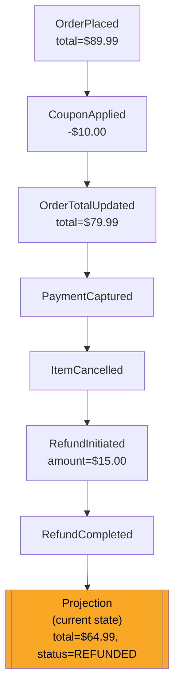

**Worked Example 1 — Billing Dispute Replay**
To answer "what was the total when payment was captured?", replay only events `E1 → E4` and stop. You get the exact snapshot at that moment — something a single "final row" database can never give you.

**Worked Example 2 — Snapshotting for Performance**
```
Snapshot taken after event #500 (state cached)
New events: #501 → #530 (only 30 to replay)
Rebuild = load snapshot + replay 30 events (fast)
```

**Trade-off Table**

| Option | Captures Business Intent? | Consistency Risk |
|---|---|---|
| **A. Event Sourcing (correct)** | Yes — `CouponApplied`, not just "total changed" | Low (append-only) |
| B. Change Data Capture (Debezium) | No — only row diffs | Low, but meaning is lost |
| C. Audit log + triggers | Partial | Medium — triggers get skipped/bypassed |
| D. Dual-write to two tables | No | High — two writes can fail independently |

**Real-World Use Cases**
- Banking ledgers (every transaction is an immutable event, balance = sum of events)
- Git itself is an event-sourced system (commits = events, working tree = projection)
- E-commerce order pipelines (Shopify, Stripe) publish granular events (`charge.succeeded`, `refund.created`) that downstream systems replay

**Interviewer's Checklist:** Use the words "append-only," "projection," "snapshot," and "replay." Explain that event sourcing trades *read simplicity* for *auditability and temporal reconstruction*.

> 💡 **Pro Tip:** Event sourcing pairs naturally with **CQRS** (Command Query Responsibility Segregation). Writes go to the event store; reads go to optimized projections. This is a classic interview combination — mention it even if the question doesn't explicitly ask.

---

### 34. Improving LLM Classification Accuracy

**The Situation:** A GPT-4o ticket classifier hits 71% accuracy in production versus a 90% target — without fine-tuning.

**The Core Concept — Examples Teach Decision Boundaries, Rules Don't**

A system prompt tells the model *what the categories mean*. Few-shot examples tell the model *how your business resolves ambiguity* — which is where accuracy gaps actually live.

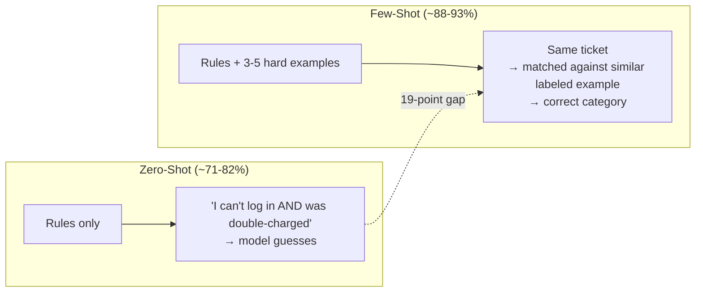

**Worked Example 1 — A Genuinely Ambiguous Ticket**
```
Ticket: "I was charged twice, but I mainly need help logging back in."
Zero-shot reasoning: "Billing mentioned first → billing" (WRONG per policy)
Few-shot: matched against labeled example → account_access (blocking issue wins)
```

**Worked Example 2 — Output Format Discipline**
```json
{"category": "security"}
```
Forcing this exact shape in the few-shot examples also reduces downstream parsing errors — a second, often-overlooked win.

**Trade-off Table**

| Option | Accuracy Gain | Cost/Latency | Best Use |
|---|---|---|---|
| A. Better zero-shot prompt | 71% → ~78-82% | None | Necessary first step, insufficient alone |
| **B. Few-shot examples (correct)** | 71% → ~88-93% | Minimal (same call) | Closes most of the gap |
| C. Chain-of-thought | +~2% | +200-400ms, more tokens | Good for multi-step reasoning tasks, not calibration |
| D. Self-consistency (5x voting) | 93-96% | 5x cost ($100→$500/week) | Reserve for high-stakes classification (fraud, medical) |

**Real-World Use Cases**
- Support-ticket triage at SaaS companies (Zendesk, Intercom-style pipelines)
- Content moderation systems using few-shot examples of edge-case violations
- Resume/CV screening classifiers, where "hard negative" examples correct systemic bias

**Interviewer's Checklist:** Say "decision boundary," "few-shot," "hard negatives," and "output schema enforcement." Explain that accuracy gaps usually live in *ambiguous cases*, not in the model's understanding of the categories.

> 💡 **Pro Tip:** Build a **golden evaluation set** of 100–200 labeled ambiguous tickets. Every prompt change should be validated against this set before deployment. This turns prompt engineering from guesswork into a measurable engineering discipline.

---

### Quick Recap — Chapter 1

- **Read replicas** solve read latency fast; don't rewrite the database when 80% of traffic is reads
- **Secret managers** solve the "secret zero" problem with identity, not static credentials
- **Event sourcing** stores the "why" (business facts), enabling temporal reconstruction
- **Few-shot examples** teach decision boundaries that rules alone cannot capture

---

## Chapter 2: Distributed Systems & Infrastructure (Q35–Q39)

### 35. Geospatial "Find Nearby Drivers" at Scale

**The Situation:** 500,000 drivers, 100,000 proximity searches/second, naive SQL `BETWEEN` queries hit 800ms.

**The Core Concept — Spatial Indexing Trades Precision for Speed**

Instead of scanning every row, divide the world into cells so a search only touches a handful of nearby buckets.

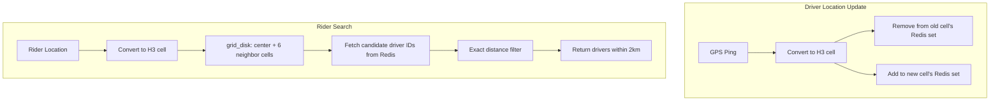

**Worked Example 1 — Why Hexagons Beat Squares**
A square grid has 4 near (side) neighbors and 4 far (diagonal) neighbors — uneven distance coverage. A hexagon has **6 evenly-spaced neighbors**, so a "check the ring around me" query behaves consistently in every direction.

**Worked Example 2 — Boundary Problem Fix**
```
Rider and driver are 20 meters apart but in different cells
→ Naive lookup: driver missed entirely
→ H3 k-ring query: checks center cell + 6 neighbors
→ Driver found, then exact haversine distance confirms 20m
```

**Trade-off Table**

| Option | Write Cost @ 100K updates/sec | Boundary Accuracy | Verdict |
|---|---|---|---|
| A. Geohash | Low | Poor (rectangular cells, prefix mismatches) | Good for coarse sharding only |
| B. PostGIS + GiST | High (index maintenance) | Good | Struggles at this write volume |
| C. In-memory Quadtree | Medium (rebalancing on move) | Good | Complex to distribute across servers |
| **D. H3 + Redis (correct)** | Low | Excellent (uniform hexagons) | Sub-50ms achievable |

**Real-World Use Cases**
- Uber literally invented and open-sourced H3 for exactly this problem
- DoorDash/Instacart use hex-grid demand forecasting to position drivers before orders arrive
- Retail "store locator" and delivery-zone-coverage features

**Interviewer's Checklist:** Mention "H3," "k-ring," "haversine," and "write amplification." Explain that you separate *coarse spatial bucketing* (fast) from *exact distance filtering* (precise).

> 💡 **Pro Tip:** For the Redis implementation, use **sorted sets** keyed by cell ID, or a **hash + set** per cell. The exact structure matters less than the two-phase approach: coarse cell lookup → exact distance filter.

---

### 36. Choosing HTTP/3 vs. HTTP/2 at the Edge

**The Situation:** Switching CDN providers to HTTP/3 drops response time from 320ms to 95ms with zero backend changes.

**The Core Concept — Fix the Least Reliable Network Segment**

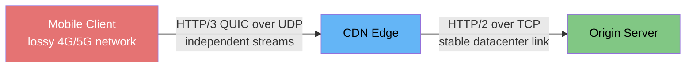

**Worked Example 1 — Head-of-Line Blocking**
```
HTTP/2 (TCP): 20 streams share one connection.
One packet lost on Stream 7 → ALL 20 streams pause for retransmission.

HTTP/3 (QUIC): 20 streams are independent.
One packet lost on Stream 7 → only Stream 7 waits; 19 others continue.
```

**Worked Example 2 — Reconnection Speed**
A user switching from Wi-Fi to 5G triggers a new connection. TCP+TLS needs multiple round trips; QUIC can support 0-RTT resumption for known servers — saving 1-2 round trips, which matters most on long-haul Asia-Pacific routes.

**Trade-off Table**

| Option | Fixes Last-Mile Loss? | Adds Origin Risk? |
|---|---|---|
| A. HTTP/2 everywhere | No | No |
| B. HTTP/3 everywhere | Yes | Yes (UDP blocked by some firewalls/LBs) |
| C. HTTP/2 client + HTTP/2 origin | No | No |
| **D. HTTP/3 client + HTTP/2 origin (correct)** | Yes | No — origin path stays mature and stable |

**Real-World Use Cases**
- Google, Cloudflare, and Fastly default to HTTP/3-at-the-edge for exactly this reason
- Video streaming apps (YouTube, mobile games) rely on QUIC to survive network handoffs mid-session

**Interviewer's Checklist:** Say "head-of-line blocking," "0-RTT," "last-mile," and "UDP firewall risk." The key insight is that you fix the *least reliable segment* — the client-to-edge hop — not the stable origin path.

> ⚠️ **Warning:** HTTP/3 uses UDP, which some corporate firewalls and older load balancers block. Always keep an HTTP/2 fallback path. This is why "HTTP/3 everywhere" is a trap.

---

### 37. Multi-Writer Conflicts in Collaborative Editing

**The Situation:** Two users edit the same doc 300ms apart; the second silently overwrites the first.

**The Core Concept — Convergence Without Coordination**

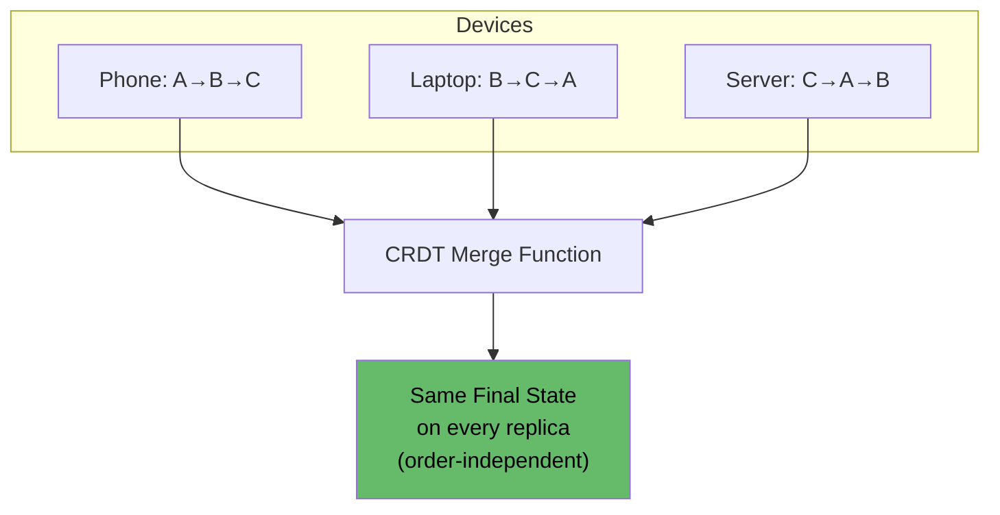

**Worked Example 1 — Non-Conflicting Edits Merge Cleanly**
```
User A edits paragraph 1: "The API supports HTTP/3."
User B edits paragraph 3: "Caching improves response time."
→ Both changes coexist after sync. Nobody's work is lost.
```

**Worked Example 2 — G-Counter (simplest CRDT)**
```
Replica 1 increments: +3
Replica 2 increments: +5 (independently, offline)
Merge rule: take max per replica, sum → total = 8 (no lost increments)
```

**Trade-off Table**

| Option | Silent Data Loss? | Coordination Needed? | Best Fit |
|---|---|---|---|
| A. Last-Write-Wins | **Yes** | None | Telemetry, cache values only |
| B. Vector Clocks | No (detects conflict) | Human resolves it | Low-conflict-frequency systems |
| **C. CRDTs (correct)** | No (auto-merges) | None | Docs, sets, counters, offline-first apps |
| D. Operational Transformation | No | Central server | Text editors, but very complex to implement |

**Real-World Use Cases**
- Figma's multiplayer canvas, Notion's block editor, Google Docs (OT-based historically)
- Offline-first mobile apps that sync across devices without a server round-trip for every keystroke

**Interviewer's Checklist:** Say "convergence," "order-independence," "commutative merge," and "no central coordinator." Contrast CRDTs (auto-merge) with vector clocks (detect but require human resolution).

> 💡 **Pro Tip:** For text editing specifically, mention **Yjs** (a CRDT library) and **Automerge**. These are production-ready libraries that handle the hard parts of text CRDTs. You don't need to implement CRDT math from scratch.

---

### 38. Handling Documents Larger Than an LLM's Context Window

**The Situation:** A 150,000-word document exceeds a 128K-token context window.

**The Core Concept — Retrieve, Don't Transmit**

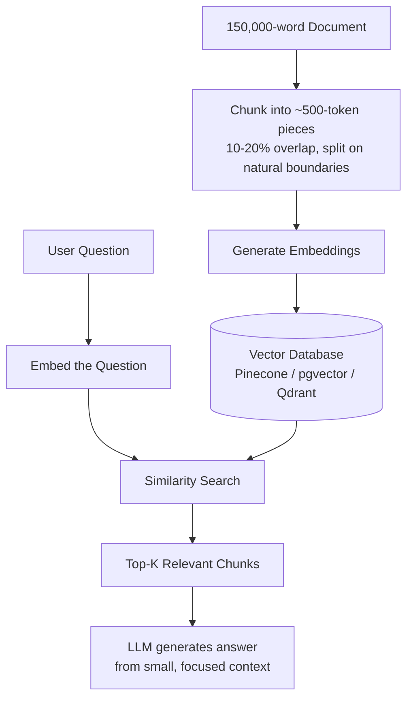

**Worked Example 1 — Boundary-Aware Chunking**
```
BAD: cut every 500 characters blindly
      → splits an important clause across two chunks, breaking retrieval

GOOD: split on paragraph/heading boundaries + 15% overlap
      → the clause stays intact in at least one chunk
```

**Worked Example 2 — Hybrid Retrieval**
```
Semantic search: finds conceptually related passages
Keyword search:  finds exact matches ("clause 38(b)", order IDs, error codes)
Combined → higher recall than either alone
```

**Trade-off Table**

| Option | Cost per Question | Precision for Specific Details |
|---|---|---|
| **A. Chunking + RAG (correct)** | Low (few chunks per query) | High |
| B. Sliding window (process everything) | Very high (50+ LLM calls) | Medium (misses cross-chunk facts) |
| C. Progressive summarization | Low | Low — details get discarded during compression |
| D. Truncation | Free but dangerous | Zero for anything past the cutoff, silently |

**Real-World Use Cases**
- Legal contract Q&A tools, internal knowledge-base chatbots, customer support over large documentation sets
- "Chat with your PDF" products universally use this pattern

**Interviewer's Checklist:** Say "chunking," "embedding," "vector search," "hybrid retrieval," and "top-K." Explain that you *retrieve the relevant slice* rather than transmitting the whole document.

> 💡 **Pro Tip:** Chunk size matters. Too small (100 tokens) → loses context. Too large (2000 tokens) → dilutes relevance. The sweet spot is usually **300–800 tokens** with 10–20% overlap, tuned against your specific retrieval evaluation set.

---

### 39. Stopping Double Spending on the Same Wallet

**The Situation:** Two concurrent $150 requests both read a $200 balance and both succeed, leaving the wallet at -$100.

**The Core Concept — Detect Stale Reads Before You Write**

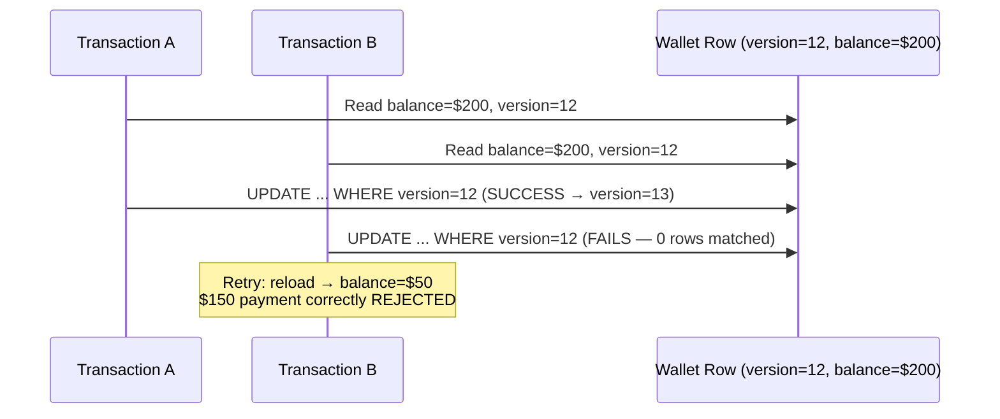

**Worked Example 1 — The Version Check Query**
```sql
UPDATE wallets
SET balance = balance - 150, version = version + 1
WHERE id = :wallet_id AND version = :read_version;
-- 0 rows affected = someone else won the race; reload and retry
```

**Worked Example 2 — When Optimistic Locking Breaks Down**
A "hot wallet" (e.g., a viral promo code redeemed by thousands simultaneously) causes a **retry storm** — most updates fail their version check and retry repeatedly. Fix: route hot-key updates through a single-writer queue or an atomic Redis `DECRBY`.

**Trade-off Table**

| Option | Throughput at Scale | Correctness | Best Fit |
|---|---|---|---|
| A. Pessimistic locking (`SELECT FOR UPDATE`) | Low (queueing) | Strong | Low-volume, expected-contention writes |
| **B. Optimistic locking (correct)** | High | Strong (rejects stale writes) | High-throughput payment APIs |
| C. MVCC alone (READ COMMITTED) | High | **Weak** — doesn't prevent the race by itself | Never sufficient alone |
| D. SERIALIZABLE isolation | Low (abort/retry overhead) | Strongest | Financial reconciliation, not hot paths |

**Real-World Use Cases**
- Stripe/PayPal-style wallet balances, in-game currency systems, seat/inventory reservation at checkout

**Interviewer's Checklist:** Say "optimistic concurrency control," "version check," "retry storm," and "hot key." Explain that MVCC alone doesn't prevent the race — you need an explicit version guard on the write.

> ⚠️ **Warning:** Never rely on `READ COMMITTED` isolation alone to prevent double-spending. It prevents *dirty reads* but not *lost updates*. The version check (or `SELECT FOR UPDATE`) is what actually enforces correctness.

---

### Quick Recap — Chapter 2

- **H3 + Redis** gives sub-50ms geospatial queries via coarse cell bucketing + exact distance filtering
- **HTTP/3 at the edge, HTTP/2 at the origin** fixes the lossy last-mile without risking the stable origin path
- **CRDTs** auto-merge concurrent edits without a central coordinator — no silent data loss
- **Chunking + RAG** retrieves relevant slices instead of transmitting entire documents
- **Optimistic locking** rejects stale writes with a version check — MVCC alone is insufficient

---

## Chapter 3: AI Agents, Search & Real-Time Systems (Q40–Q46)

### 40. Moving Heavy Browser Work Off the Main Thread

**The Situation:** Parsing an 80MB CSV freezes a React dashboard for 3.8 seconds.

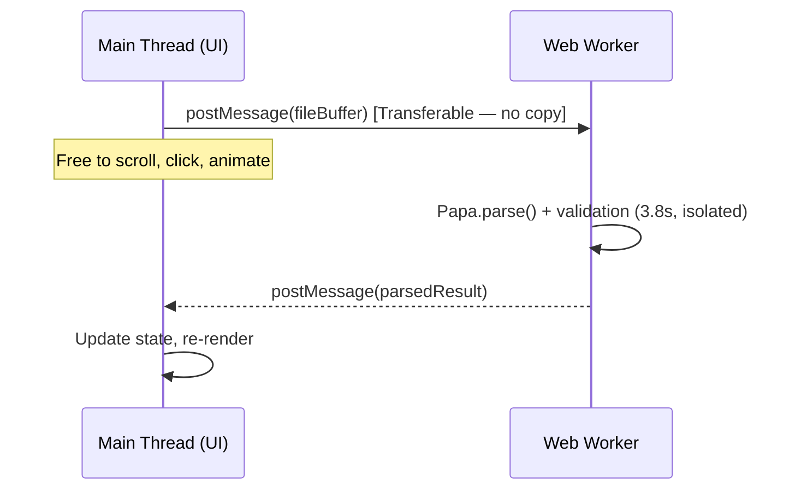

**Worked Example 1 — Transferable Objects**
```js
worker.postMessage({ file: arrayBuffer }, [arrayBuffer]); 
// ownership moves to the worker — no expensive memory copy of 80MB
```

**Worked Example 2 — Combining with WASM (advanced)**
```
Web Worker (keeps UI responsive)
   + WASM parser (cuts 3.8s → ~1.5s of actual work)
   = fast AND non-blocking
```

**Trade-off Table**

| Option | Solves Freeze? | Complexity |
|---|---|---|
| A. `requestIdleCallback` slicing | Partial (task takes longer overall) | Low |
| **B. Web Worker (correct)** | Yes | Low-Medium |
| C. SharedArrayBuffer + Atomics | Yes, but overkill | High (COOP/COEP headers required) |
| D. WebAssembly alone | No — still on main thread | Medium |

**Real-World Use Cases**
- Spreadsheet apps (Airtable-style), CSV/Excel import features, client-side image/video processing

**Interviewer's Checklist:** Say "main thread," "transferable objects," "postMessage," and "non-blocking." Explain that the goal is to keep the UI thread free for rendering and interaction.

> 💡 **Pro Tip:** Use **Comlink** (a library) to wrap Web Workers behind a promise-based API. It makes worker communication feel like normal async function calls, dramatically reducing boilerplate.

---

### 41. Replacing Batch Jobs with Real-Time Fraud Streaming

**The Situation:** A nightly Spark batch job needs to become a sub-500ms streaming pipeline at 8,000 TPS.

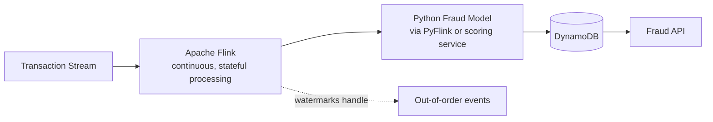

**Worked Example — Why Micro-Batching Fails the SLA**
```
Spark Structured Streaming micro-batch interval: 500ms-2s
+ event processing time
+ write to DynamoDB
= easily exceeds the 500ms SLA under peak load
```

**Trade-off Table**

| Option | Latency | Fits Python Model? |
|---|---|---|
| A. Kafka Streams | Very low | No (JVM-native, needs extra network hop to Python) |
| **B. Apache Flink (correct)** | Low, sub-500ms achievable | Yes (PyFlink) |
| C. Spark Structured Streaming | Seconds (micro-batch) | Yes, but too slow for this SLA |
| D. 1-minute batch | 60,000ms minimum | N/A — fails immediately |

**Real-World Use Cases:** Card-network fraud scoring (Visa/Mastercard-scale), real-time bidding in ad-tech, anomaly detection in IoT telemetry.

**Interviewer's Checklist:** Say "event time vs. processing time," "watermarks," "stateful processing," and "exactly-once semantics." These signal you understand streaming fundamentals, not just tool names.

> 💡 **Pro Tip:** Mention **watermarks** explicitly. In real-time fraud, events arrive out of order (a transaction from 2 seconds ago may arrive after a newer one). Watermarks tell Flink how long to wait for late events before closing a window — critical for correctness.

---

### 42. Building Reliable Memory for an AI Agent

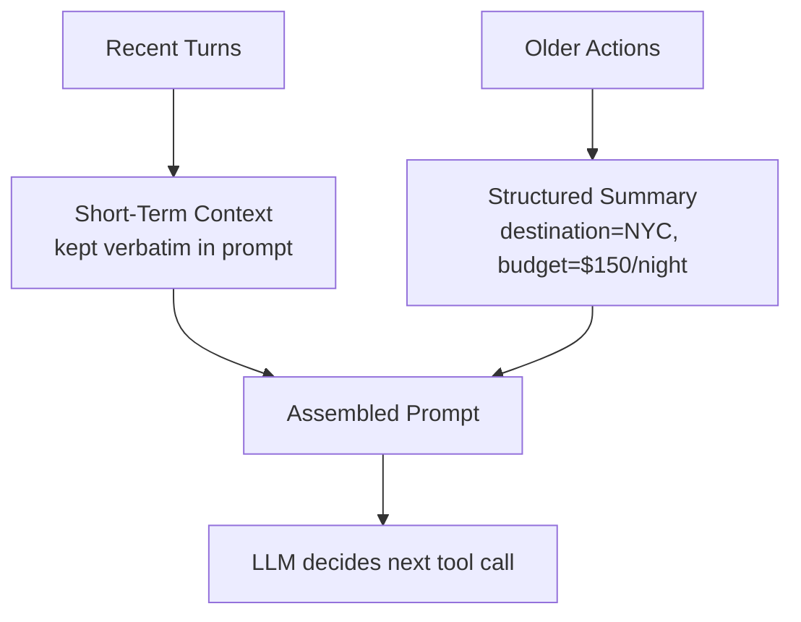

**Worked Example — Structured Summary vs. Raw History**
```
Raw (8,000 tokens): entire chat transcript re-sent every turn
Structured (40 tokens):
  destination: NYC
  flight_goal: cheapest
  hotel_budget: <$150/night
  next_step: compare total cost
```

**Trade-off Table**

| Option | Scales to Long Tasks? | Risk |
|---|---|---|
| A. Full context in prompt | No | Cost explosion, "lost in the middle" |
| B. Vector memory only | Partial | Retrieves semantically similar but *wrong* task's memories |
| **C. Episodic memory + summarization (correct)** | Yes | Requires engineering rules for what to summarize |
| D. Redis key-value state | Yes, as a component | Needs careful schema design, not a full memory system alone |

**Real-World Use Cases:** Multi-step travel-booking agents, coding agents (Claude Code-style) tracking a long task, customer-support agents handling multi-turn troubleshooting.

**Interviewer's Checklist:** Say "short-term context," "structured summary," "episodic memory," and "token budget." Explain that you keep recent turns verbatim but compress older actions into structured summaries.

> 💡 **Pro Tip:** The "lost in the middle" phenomenon is real — LLMs attend best to the beginning and end of a long context. Compressing the middle into summaries both saves cost *and* improves accuracy.

---

### 43. Keeping CDN Content Fresh After Every Deploy

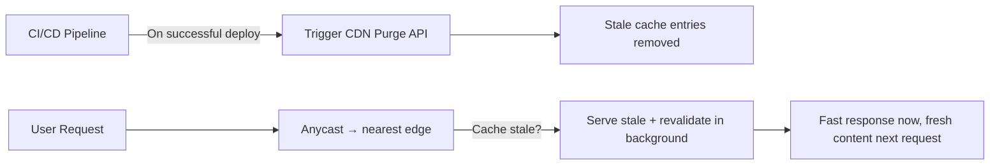

**Trade-off Table**

| Option | Human Error Risk | Freshness Guarantee |
|---|---|---|
| **A. Anycast + SWR + automated CI/CD purge (correct)** | Low | Strong |
| B. Short TTL + manual purge | High (wrong environment purged) | Weak |
| C. Long TTL + tag invalidation | Medium (fails silently if purge API errors) | Medium |
| D. Short TTL, no invalidation | None | Weak + causes cache stampedes |

**Real-World Use Cases:** Any frontend deployed behind Cloudflare/Fastly/CloudFront — this is the standard pattern for SPA/JS-bundle freshness after deploys.

**Interviewer's Checklist:** Say "stale-while-revalidate," "cache invalidation," "purge API," and "cache stampede." Explain that you automate the purge in CI/CD so humans can't forget it.

> ⚠️ **Warning:** A cache stampede happens when a short TTL expires and thousands of users simultaneously hit the origin. SWR (serve stale + revalidate) prevents this by serving the stale copy while one background request refreshes it.

---

### 44. Syncing Offline Changes Without Losing User Work

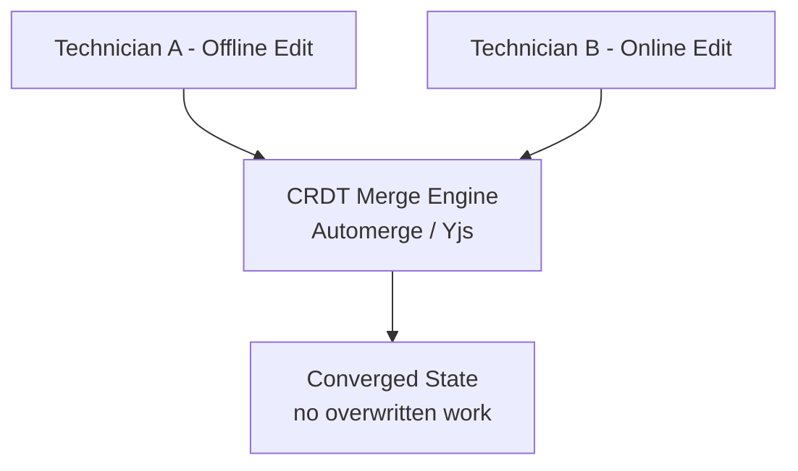

**Trade-off Table**

| Option | Data Loss Risk | Handles Schema Migration? |
|---|---|---|
| A. localStorage + manual JSON diff | High | No |
| B. IndexedDB + Vector Clocks | None (human resolves) | Yes, separately |
| C. Versioned IndexedDB + LWW | **Yes** — one write always discarded | Yes (Dexie.js) |
| **D. CRDT-based sync (correct)** | None (auto-merge) | Needs separate versioned storage layer too |

**Real-World Use Cases:** Field-service apps, note-taking apps (Linear, Notion offline mode), any app used in poor-connectivity environments (warehouses, aircraft, remote sites).

**Interviewer's Checklist:** Say "offline-first," "CRDT merge," "schema versioning," and "conflict-free." Explain that CRDTs solve *data conflicts* but you still need a *separate schema migration strategy*.

> 💡 **Pro Tip:** Pair CRDT sync with **IndexedDB** for local persistence and **Dexie.js** for schema versioning. The CRDT handles merge semantics; the versioned store handles app upgrades.

---

### 45. Scaling Search When PostgreSQL Starts Slowing Down

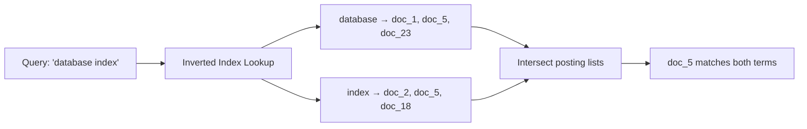

**Trade-off Table**

| Option | Scales to 100M docs @ p99<200ms? | Ops Burden |
|---|---|---|
| **A. Elasticsearch (correct)** | Yes | High but mature |
| B. PostgreSQL + GIN index | Helps, insufficient alone at this scale | Low |
| C. Redis cache of top queries | Only helps cached queries | Low |
| D. Typesense/Meilisearch | Good up to ~10-30M docs | Low-Medium |

**Real-World Use Cases:** E-commerce product search, log/observability search platforms, enterprise document search.

**Interviewer's Checklist:** Say "inverted index," "posting lists," "sharding," and "relevance scoring." Explain that PostgreSQL GIN is fine for small-to-medium scale but Elasticsearch's distributed inverted index is the standard at 100M+ docs.

> 💡 **Pro Tip:** If you don't need the full Elasticsearch operational burden, **Typesense** or **Meilisearch** offer excellent performance up to ~10–30M docs with far less ops complexity. Match the tool to the scale.

---

### 46. Making LLM Output Safe for Production APIs

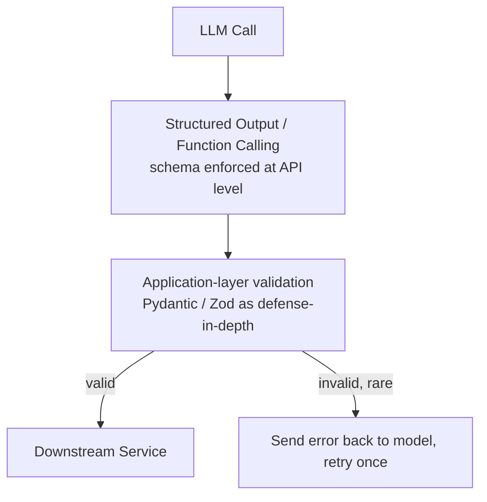

**Trade-off Table**

| Option | Guarantees Type Safety? | Extra Cost |
|---|---|---|
| A. Stronger prompting only | No — still probabilistic | None |
| **B. Structured outputs / function calling (correct)** | Yes, at generation time | Minimal |
| C. Validate + retry | Yes, after the fact | Retry latency/cost |
| D. Judge model | No — another probabilistic model | High (extra LLM call) |

**Real-World Use Cases:** Any agent that calls downstream typed APIs (payments, order systems, calendar tools) — this is now considered baseline production practice.

**Interviewer's Checklist:** Say "structured outputs," "function calling," "schema enforcement," and "defense-in-depth." Explain that you enforce the schema *at generation time* and validate *again at the application layer*.

> 💡 **Pro Tip:** Use **Pydantic** (Python) or **Zod** (TypeScript) for the application-layer validation. If validation fails (rare with structured outputs), send the error message back to the model and retry once — this self-correction loop is cheap and effective.

---

### Quick Recap — Chapter 3

- **Web Workers** keep the UI responsive by offloading heavy parsing off the main thread
- **Apache Flink** achieves sub-500ms streaming latency where Spark micro-batching cannot
- **Episodic memory + summarization** scales AI agent context without cost explosion
- **SWR + automated purge** keeps CDN content fresh without cache stampedes
- **CRDT-based sync** merges offline edits without losing user work
- **Elasticsearch** scales full-text search to 100M+ docs with distributed inverted indexes
- **Structured outputs** make LLM output type-safe for production APIs

---

## Chapter 4: Architecture & Migration Patterns (Q47–Q53)

### 47. Breaking a Monolith Apart Without a Full Rewrite

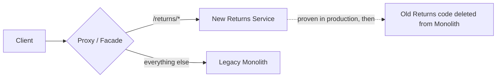

**Trade-off Table**

| Option | Reversible Mid-Migration? | Risk |
|---|---|---|
| **A. Strangler Fig (correct)** | Yes, per-endpoint | Low |
| B. Branch by Abstraction | Partially (internal only) | Low, but not a full extraction alone |
| C. Big Bang Rewrite | No | Very high |
| D. Database-first migration | No | High — breaks ORM/joins immediately |

**Real-World Use Cases:** Shopify, GitHub, and most large-scale monolith-to-service migrations use strangler-fig style routing (often literally at the reverse-proxy/API-gateway layer).

**Interviewer's Checklist:** Say "strangler fig," "per-endpoint routing," "reversible," and "incremental." Explain that you extract one capability at a time, prove it in production, then delete the old code.

> 💡 **Pro Tip:** The proxy/facade is the key enabler. It lets you route `/returns/*` to the new service while everything else stays on the monolith. You can roll back any single endpoint without a full redeploy.

---

### 48. How an AI Agent Decides Which Tool to Use

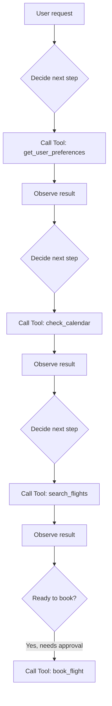

**Trade-off Table**

| Option | Handles Dependencies? | Handles Ambiguity? |
|---|---|---|
| **A. ReAct loop (correct)** | Yes | Yes |
| B. Parallel tool calling | Only for independent calls | N/A |
| C. Forced function schema | N/A (a formatting tool, not a strategy) | Poorly |
| D. Planner-Executor | Yes, but needs replanning logic | Yes, at more complexity cost |

**Real-World Use Cases:** Claude/GPT agent frameworks (LangGraph, AutoGPT-style loops), customer-support automation, research assistants.

**Interviewer's Checklist:** Say "ReAct," "reason-act-observe," "tool selection," and "dependency-aware." Explain that the agent *reasons* about the next step, *acts* by calling a tool, and *observes* the result before deciding again.

> 💡 **Pro Tip:** The ReAct loop is the foundation. For production, wrap it in a **state machine** (LangGraph-style) so you can pause, resume, and trace each step. This makes debugging and human-in-the-loop approval much easier.

---

### 49. Reducing BigQuery Scan Costs with Better Partitioning

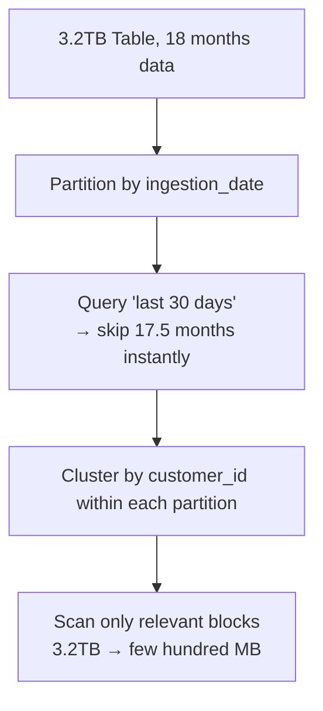

**Trade-off Table**

| Option | Reduces Scan Cost | Weakness |
|---|---|---|
| A. Date partition only | Significant | Still scans whole partitions across all customers |
| B. Customer-ID partitioning | Risky | Creates hot/skewed partitions |
| C. Redshift-style DISTKEY/SORTKEY | N/A for BigQuery | Wrong engine's mental model |
| **D. Date partition + customer_id cluster (correct)** | Maximum | None significant |

**Real-World Use Cases:** Any analytics warehouse (BigQuery, Snowflake, Redshift) with time-series + tenant/customer dimension — this two-level pruning pattern is near-universal.

**Interviewer's Checklist:** Say "partition pruning," "clustering," "scan cost," and "hot partition." Explain that you partition by the *time dimension* (natural query filter) and cluster by the *tenant dimension* (high-cardinality filter).

> 💡 **Pro Tip:** BigQuery charges by bytes scanned. Partitioning by date lets queries skip entire months; clustering by `customer_id` lets them skip blocks within a partition. Together, a 3.2TB table can be queried for a few hundred MB.

---

### 50. Increasing ML Inference Throughput Without Adding More GPUs

```mermaid
flowchart LR
    R1[Request 1] --> BATCH[Batching Window<br/>~ms-scale wait]
    R2[Request 2] --> BATCH
    R3[Request 3] --> BATCH
    R4[Request 4] --> BATCH
    BATCH --> GPU[Single Forward Pass<br/>on GPU — high utilization]
    GPU --> RESP[Individual Responses Returned]
```

**Trade-off Table**

| Option | Fixes 23% GPU Utilization? | Order to Apply |
|---|---|---|
| **A. Dynamic batching (correct)** | Yes — directly | 1st |
| B. INT8 Quantization | No, but compounds well after batching | 2nd |
| C. Tensor parallelism | No — adds hardware before fixing utilization | Last resort |
| D. Async queue | No — improves reliability, not throughput | Complementary |

**Real-World Use Cases:** LLM inference serving (vLLM, TensorRT-LLM), recommendation model serving, any GPU-backed API with bursty traffic.

**Interviewer's Checklist:** Say "dynamic batching," "GPU utilization," "continuous batching," and "quantization." Explain that you fix *utilization* before adding *hardware*.

> 💡 **Pro Tip:** Modern LLM servers (vLLM, TensorRT-LLM) use **continuous batching** — requests join and leave the batch as they complete, rather than waiting for a fixed batch window. This dramatically improves GPU utilization for variable-length requests.

---

### 51. Protecting SaaS Customers from Noisy Neighbors

```mermaid
flowchart TD
    T1[tenant_101 - Free] --> Reg[Tenant Registry]
    T2[tenant_205 - Mid] --> Reg
    T3[tenant_900 - Enterprise] --> Reg
    Reg -->|shared_cluster_a| Pool[(Shared DB Pool)]
    Reg -->|schema_tenant_205| Schema[(Shared Instance, Separate Schema)]
    Reg -->|enterprise_db_900| Dedicated[(Dedicated Database)]
```

**Trade-off Table**

| Option | True Resource Isolation? | Cost Efficiency |
|---|---|---|
| A. Shared DB + limits | No | High |
| B. Schema per tenant | Partial | High |
| C. Database per tenant (all) | Yes | Low — wasteful for small tenants |
| **D. Hybrid tenant-aware routing (correct)** | Yes, where it matters | Balanced |

**Real-World Use Cases:** Nearly every B2B SaaS with tiered pricing (Salesforce, Datadog-style architectures) segments infrastructure by tenant value.

**Interviewer's Checklist:** Say "tenant registry," "noisy neighbor," "isolation," and "cost efficiency." Explain that you route tenants to infrastructure based on their *value and isolation requirements*.

> 💡 **Pro Tip:** The **tenant registry** is the key component. It maps each tenant to its infrastructure tier (shared pool, schema, or dedicated DB). This makes the routing decision data-driven rather than hardcoded.

---

### 52. Versioning an API Without Breaking Existing Clients

```mermaid
flowchart LR
    C1[Old Mobile Client] -->|/v1/users| GW[API Gateway]
    C2[New Web Client] -->|/v2/users| GW
    GW --> BL[Shared Business Logic Layer]
    BL --> DB[(Database)]
```

**Trade-off Table**

| Option | Debuggability | Tooling Support |
|---|---|---|
| **A. URL path versioning (correct)** | Excellent (visible in logs/URLs) | Universal |
| B. Header versioning | Poor (invisible without logging headers) | Good internally |
| C. Query parameter | Medium | Complicates CDN caching |
| D. Content negotiation (`Accept` header) | Poor | REST-elegant but operationally painful |

**Real-World Use Cases:** Stripe, GitHub, and Twilio APIs all use explicit, visible versioning (`/v1/`, dated versions) precisely for support/debug clarity.

**Interviewer's Checklist:** Say "URL path versioning," "deprecation policy," "backward compatibility," and "support window." Explain that visible versioning makes debugging and support dramatically easier.

> 💡 **Pro Tip:** Versioning is about *communication*, not just routing. Publish a clear **deprecation policy** (e.g., "v1 supported until 2027-01-01, then 6-month grace period") so clients have a migration runway.

---

### 53. Changing a Large Database Schema Without Downtime

```mermaid
flowchart TD
    P1["Phase 1: EXPAND<br/>Add nullable first_name, last_name"] --> P2[Backfill in small batches<br/>10K rows, pause, repeat]
    P2 --> P3[Services write BOTH old + new columns]
    P3 --> P4["Phase 2: CONTRACT<br/>Remove full_name once nothing depends on it"]
```

**Trade-off Table**

| Option | Reversible Mid-Migration? | Lock Risk on 40M rows |
|---|---|---|
| A. One big `ALTER TABLE` | No | High |
| **B. Expand and Contract (correct)** | Yes | Low |
| C. Shadow table + dual-write | Yes, but heavy | Low (but high complexity) |
| D. Compatibility view alone | N/A — doesn't complete the migration | N/A |

**Real-World Use Cases:** GitHub's, Stripe's, and most large-scale companies' documented zero-downtime migration playbooks follow expand/contract as the default.

**Interviewer's Checklist:** Say "expand," "backfill," "dual-write," "contract," and "reversible." Explain that you add the new schema *alongside* the old, migrate data in batches, then remove the old once nothing depends on it.

> 💡 **Pro Tip:** Backfill in **small batches with pauses** (e.g., 10K rows, then sleep) to avoid overwhelming the database with locks and WAL growth. This is the difference between a migration that completes and one that takes down production.

---

### Quick Recap — Chapter 4

- **Strangler Fig** extracts services incrementally and reversibly via a routing facade
- **ReAct loops** let AI agents reason-act-observe to select tools with dependencies
- **Date partition + customer_id cluster** maximizes BigQuery scan-cost reduction
- **Dynamic batching** fixes GPU utilization before you add more hardware
- **Hybrid tenant routing** balances isolation and cost in multi-tenant SaaS
- **URL path versioning** makes API changes debuggable and client-safe
- **Expand and Contract** migrates large schemas without downtime

---

## Chapter 5: AI Infrastructure at Scale (Q54–Q60)

### 54. Keeping a RAG Index Fresh as Models and Data Change

```mermaid
flowchart LR
    V2[Index v2<br/>embedding model v2] -->|100% traffic initially| Live[Production Traffic]
    V3[Index v3<br/>new embedding model] -->|10% test traffic| Live
    Live -->|validate quality| Increase[Gradually increase v3 traffic]
    Increase --> Cutover[Full cutover, retire v2]
```

**Trade-off Table**

| Option | Prevents Mixed Embedding Spaces? | Cost Efficiency |
|---|---|---|
| A. Weekly full rebuild | Yes, but wastefully | Low ($800/week regardless of need) |
| B. Incremental upserts + soft deletes | No (mixes model versions) | High |
| **C. Embedding version registry + hot swap (correct)** | Yes | High |
| D. Staleness monitoring only | N/A — detection, not migration | N/A |

**Real-World Use Cases:** Any production RAG system (customer-support copilots, internal knowledge search) that upgrades embedding models periodically.

**Interviewer's Checklist:** Say "embedding version," "mixed embedding space," "shadow traffic," and "hot swap." Explain that you never mix embeddings from different model versions in the same index.

> ⚠️ **Warning:** Mixing embeddings from different models in one index is a silent correctness killer. Vectors from model v2 and v3 live in *different mathematical spaces* — similarity search across them is meaningless. Always version your indexes.

---

### 55. Coordinating Multiple AI Agents Without Losing Control

```mermaid
flowchart TD
    O[Central Orchestrator] --> A1[Specialist Agent A]
    O --> A2[Specialist Agent B]
    O --> A3[Specialist Agent C]
    A1 --> O
    A2 --> O
    A3 --> O
    O --> S[Final Synthesis]
    O -.retries, timeouts, error handling.-> A2
```

**Trade-off Table**

| Option | Debuggable? | Handles Failure Well? |
|---|---|---|
| **A. Centralized orchestrator (correct)** | Yes — single state log | Yes |
| B. Peer-to-peer handoff | No — routing logic scattered | Risk of loops |
| C. Shared blackboard | Partial (state yes, scheduling no) | Needs orchestrator anyway |
| D. Hierarchical orchestration | Yes, but adds layers | Good for very large systems only |

**Real-World Use Cases:** Multi-agent research assistants, "swarm" coding agents, complex customer-service triage systems.

**Interviewer's Checklist:** Say "centralized orchestrator," "state log," "retries," "timeouts," and "synthesis." Explain that a single orchestrator gives you one place to trace, debug, and control the whole run.

> 💡 **Pro Tip:** The orchestrator should maintain a **single state log** of every agent call, result, and decision. This is what makes multi-agent systems debuggable — without it, failures become untraceable black boxes.

---

### 56. Tracking Long-Running Jobs Without Keeping Requests Open

```mermaid
sequenceDiagram
    participant C as Client
    participant API as API Server
    participant W as Background Worker

    C->>API: POST /videos
    API-->>C: 202 Accepted {job_id: abc123}
    API->>W: Enqueue job
    loop Every few seconds (backoff)
        C->>API: GET /jobs/abc123/status
        API-->>C: {status: "transcoding"}
    end
    W->>API: Job complete
    C->>API: GET /jobs/abc123/status
    API-->>C: {status: "complete", result: url}
```

**Trade-off Table**

| Option | Survives Client Disconnect? | Complexity |
|---|---|---|
| **A. Polling with job ID (correct)** | Yes | Low |
| B. Webhook | Yes, but needs public endpoint | Medium-High |
| C. SSE/WebSocket | Yes, but heavier for infrequent updates | Medium |
| D. Keep HTTP request open | **No** | N/A — actively dangerous |

**Real-World Use Cases:** Video/audio processing pipelines, large file exports, ML batch inference jobs, report generation.

**Interviewer's Checklist:** Say "202 Accepted," "job ID," "polling with backoff," and "client disconnect." Explain that you return a job ID immediately and let the client poll for status.

> ⚠️ **Warning:** Never keep an HTTP request open for a long-running job. Proxies, load balancers, and clients all have timeouts. The request will die, and you'll have no way to track the job. Always use the async job pattern.

---

### 57. Getting Fresh Payment Reads Without Slowing the Whole Database

```mermaid
flowchart LR
    W[Payment Write] --> P[(Primary)]
    R1[Payment Confirmation Read] --> P
    R2[Product Browsing] --> RE[(Replica)]
    R3[Order History Report] --> RE
    style P fill:#ef5350,color:#fff
    style RE fill:#66bb6a,color:#000
```

**Trade-off Table**

| Option | Guarantees Fresh Read? | Write Latency Impact |
|---|---|---|
| A. Synchronous replication | Yes | High — every write waits on network |
| B. Semi-sync replication | **No** (received ≠ applied) | Medium |
| **C. Route critical reads to primary (correct)** | Yes | None (only affects a small % of reads) |
| D. Fixed delay before reading replica | No — lag is variable | Adds latency for nothing |

**Real-World Use Cases:** Payment confirmation, "read-your-writes" flows after any critical write (order placement, account changes) in read-replica architectures.

**Interviewer's Checklist:** Say "read-your-writes," "critical read routing," "replication lag," and "primary." Explain that you route *only* the small percentage of reads that must be fresh to the primary.

> 💡 **Pro Tip:** The key insight is that *most* reads don't need freshness — product browsing, order history, analytics. Only a tiny fraction (payment confirmation, account changes) must see the latest write. Route those few to the primary; everything else hits replicas.

---

### 58. Making LLM Agent Runs Actually Debuggable

```mermaid
gantt
    title Agent Run Trace (14.0s total)
    dateFormat X
    axisFormat %L ms
    section Trace
    GPT-4o           :0, 1200
    Vector Search     :1200, 1280
    GPT-4o-mini       :1280, 2180
    Tool: get_order   :2180, 2300
    Claude fallback   :2300, 11300
    GPT-4o final      :11300, 13100
```

**Trade-off Table**

| Option | Answers "What Happened Inside the Run"? | Effort |
|---|---|---|
| **A. End-to-end agent tracing (correct)** | Yes | Medium (use existing tools) |
| B. Production eval pipeline | No — tells you quality, not cause | Medium |
| C. Cost dashboards + alerts | No — symptom only, no attribution | Low |
| D. Custom logging middleware | Eventually, but rebuilds an entire platform | Very high |

**Real-World Use Cases:** Any production LLM agent (support bots, coding agents) — tools like Langfuse, LangSmith, Helicone, Arize exist specifically for this.

**Interviewer's Checklist:** Say "end-to-end tracing," "span," "trace ID," "attribution," and "observability." Explain that you need to see *every* LLM call, tool call, and decision inside a run to debug failures.

> 💡 **Pro Tip:** Don't build your own tracing platform. Use **Langfuse**, **LangSmith**, **Helicone**, or **Arize** — they're purpose-built for LLM agent observability and integrate with LangChain, LlamaIndex, and raw OpenAI/Anthropic calls.

---

### 59. Preventing Duplicate Payments with Idempotency Keys

```mermaid
sequenceDiagram
    participant Client
    participant API as Payment API
    participant Store as Idempotency Store

    Client->>API: POST /payments {Idempotency-Key: uuid-1}
    API->>Store: SET uuid-1 "pending" NX
    API->>API: Process payment
    API->>Store: SET uuid-1 result="payment_123"
    API-->>Client: 200 {payment_123}
    Note over Client: Network timeout, client retries
    Client->>API: POST /payments {Idempotency-Key: uuid-1} (retry)
    API->>Store: Key exists → return stored result
    API-->>Client: 200 {payment_123} (no duplicate charge)
```

**Trade-off Table**

| Option | Client-Side Simplicity | Handles Distributed Downstream Effects? |
|---|---|---|
| **A. Client-generated idempotency key (correct)** | Yes | API boundary only |
| B. Server-generated key | No (two round trips) | API boundary only |
| C. Deterministic business hash | Yes, but risks false-positive matches (e.g. re-payment after refund) | API boundary only |
| D. Outbox + idempotent consumers | N/A | Yes — solves the deeper distributed problem |

**Best practice:** combine **A + D** — idempotency key at the API boundary, transactional outbox for downstream event consistency.

**Real-World Use Cases:** Stripe's actual public API requires an `Idempotency-Key` header for exactly this reason.

**Interviewer's Checklist:** Say "idempotency key," "NX (not-exists) set," "stored result," and "transactional outbox." Explain that the key lets a retry return the *original* result instead of re-executing the side effect.

> 💡 **Pro Tip:** The idempotency store must use an **atomic NX (not-exists) set** so concurrent requests with the same key don't both proceed. Redis `SET key value NX` or a unique DB constraint both work.

---

### 60. Choosing the Right Architecture for a New SaaS Product

```mermaid
flowchart TD
    App[Modular Monolith] --> Auth[Authentication Module]
    App --> Bill[Billing Module]
    App --> AI[AI Inference Module]
    App --> Notif[Notifications Module]
    App --> Core[Core Domain Module]

    AI -.6 months later: needs 20 GPUs.-> Extract1[Extracted as its own service]
    Bill -.needs independent deploys.-> Extract2[Extracted as its own service]
```

**Trade-off Table**

| Option | Speed to MVP (3 months) | Future Flexibility |
|---|---|---|
| A. Microservices from day one | Slow — infra overhead first | High, but premature |
| **B. Modular Monolith (correct)** | Fast | High — extract modules when real pressure appears |
| C. Serverless-first | Fast for bursty workloads | Poor fit for steady traffic + GPU inference |
| D. Event-driven (Kafka-centric) | Slow — adds eventual consistency everywhere | High, but premature |

**Real-World Use Cases:** Basecamp, Shopify (started monolith, extracted services as scale demanded), most successful early-stage SaaS companies.

**Interviewer's Checklist:** Say "modular monolith," "module boundaries," "extract when pressured," and "premature distribution." Explain that you start with clear module boundaries and extract services only when real operational pressure demands it.

> 💡 **Pro Tip:** The key is **module boundaries**. A modular monolith with clean internal boundaries can be extracted into services later *without a rewrite*. The monolith isn't the enemy — the *unstructured* monolith is.

---

### Quick Recap — Chapter 5

- **Embedding version registries** prevent mixed embedding spaces during RAG model upgrades
- **Centralized orchestrators** keep multi-agent systems debuggable and controllable
- **Polling with job IDs** tracks long-running jobs without keeping requests open
- **Route critical reads to primary** guarantees freshness without slowing the whole DB
- **End-to-end tracing** makes LLM agent runs debuggable
- **Idempotency keys + outbox** prevent duplicate payments end-to-end
- **Modular monolith** is the right starting architecture for most new SaaS products

---

## Master Decision Framework

The following diagram summarizes the decision framework across all 30 scenarios:

```mermaid
flowchart TD
    Q[New System Design Question] --> Constraint{What's the binding constraint?}
    Constraint -->|Deadline| Simple[Choose the simplest solution<br/>that meets the deadline]
    Constraint -->|Consistency/Correctness| Strong[Choose the option that<br/>prevents silent data loss]
    Constraint -->|Cost| Cheap[Choose the option with<br/>the best cost/benefit ratio]
    Constraint -->|Latency| Local[Move computation/data<br/>closer to the user]
    Constraint -->|Scale| Partition[Partition, shard, or<br/>index to reduce work per request]
    Simple --> Explain[Always explain WHY the<br/>'impressive' options are traps]
    Strong --> Explain
    Cheap --> Explain
    Local --> Explain
    Partition --> Explain
```

---

## Practice Exercises

### Exercise 1: Design a Cross-Region Read-Heavy System

**Scenario:** Your SaaS product has 2M users in the US and 500K in Europe. US users see 40ms latency; European users see 380ms. You have 4 weeks before a major product launch. The database is a single PostgreSQL instance in `us-east-1`. You cannot rewrite the database.

**Task:** Design the solution. Include:
1. Your chosen architecture (with a Mermaid diagram)
2. Which traffic routes where
3. How you handle the "read-your-writes" problem for European users
4. What you monitor after deployment

**Solution:**

```mermaid
flowchart LR
    subgraph US["us-east-1"]
        P[(Primary PostgreSQL)]
        W[US Writes + Critical Reads]
    end
    subgraph EU["eu-west-1"]
        R[(Read Replica)]
        E[EU Reads - non-critical]
    end
    W --> P
    P -.async replication.-> R
    E --> R
    E -.critical reads (payment confirm).-> P
```

1. **Architecture:** Deploy a read replica in `eu-west-1`. Route all non-critical EU reads (product browsing, order history, dashboards) to the replica. Route all writes and critical reads (payment confirmation, account changes) to the US primary.
2. **Traffic routing:** EU reads → replica (~20ms); EU writes → primary (~380ms, acceptable for writes); US traffic → primary (unchanged).
3. **Read-your-writes:** After any critical write (e.g., placing an order), the EU client's next read for that order's confirmation is routed to the primary. Non-critical reads (browsing) can hit the replica with acceptable lag.
4. **Monitoring:** Replication lag (alert if > 60s), replica CPU/memory, failover promotion time, and the percentage of reads served from the replica vs. primary.

---

### Exercise 2: Prevent Double-Spending in a Wallet System

**Scenario:** You're building a wallet system. Two concurrent $150 requests both read a $200 balance and both succeed, leaving the wallet at -$100. You need to fix this for a high-throughput payment API (10K TPS).

**Task:** Write the SQL/design that prevents this race. Then explain what happens when a "hot wallet" (viral promo code) causes a retry storm.

**Solution:**

```sql
-- Optimistic locking with version check
UPDATE wallets
SET balance = balance - 150, version = version + 1
WHERE id = :wallet_id AND version = :read_version;
-- 0 rows affected = stale read; reload and retry (or reject)
```

**Hot wallet fix:** Route hot-key updates through a single-writer queue (a per-wallet mutex or a Redis `DECRBY` with atomicity). This serializes writes to the hot key, eliminating the retry storm while preserving throughput for normal wallets.

**Why not `SELECT FOR UPDATE`?** Pessimistic locking queues all writers on the hot key, which is exactly the retry storm problem — just moved into the database. Optimistic locking + a hot-key queue gives you the best of both: high throughput for normal keys, serialization for hot keys.

---

### Exercise 3: Migrate a Monolith to Services Without a Rewrite

**Scenario:** You have a 5-year-old monolith with 200 endpoints. The "returns" feature is causing scaling problems. You need to extract it into its own service without downtime and without a big-bang rewrite.

**Task:** Design the migration using the Strangler Fig pattern. Include the routing strategy, the rollback plan, and the completion criteria.

**Solution:**

```mermaid
flowchart LR
    C[Client] --> P{API Gateway / Proxy}
    P -->|/returns/*| NEW[New Returns Service]
    P -->|everything else| MONO[Legacy Monolith]
    NEW -.proven →.-> REMOVE[Delete returns code from monolith]
```

1. **Routing strategy:** Add a routing rule at the API gateway: `/returns/*` → new Returns Service; everything else → monolith. Start with a small subset (e.g., `GET /returns/{id}`) and expand.
2. **Rollback plan:** Each endpoint extraction is independently reversible — flip the route back to the monolith. No full redeploy needed.
3. **Completion criteria:** All `/returns/*` endpoints served by the new service for 2+ weeks with no incidents → delete the returns code from the monolith → remove the route fallback.

**Why not big-bang?** A full rewrite has no rollback path, takes months, and risks losing business logic encoded in the monolith's edge cases. Strangler Fig lets you extract incrementally with production proof at each step.

---

## Test Your Understanding

Answer these 10 questions to check your grasp of the material:

1. **Q:** Why does a read replica solve cross-region latency for most apps but not all?
   **A:** Because most apps are read-heavy (80%+ reads). Read replicas solve read latency. If your app is write-heavy, replicas don't help — you'd need a different strategy (active-active, etc.).

2. **Q:** What is the "secret zero" problem?
   **A:** The credential your app needs *just to fetch its other credentials*. Cloud-native secret managers solve it with identity (IAM roles) instead of another static secret.

3. **Q:** What does event sourcing store that a normal database doesn't?
   **A:** The *sequence of business facts* (events) that produced the current state, enabling temporal reconstruction of any point in time.

4. **Q:** Why do few-shot examples improve LLM classification accuracy more than better rules?
   **A:** Because accuracy gaps live in *ambiguous cases*. Examples teach the model how your business resolves ambiguity (decision boundaries); rules only describe categories.

5. **Q:** Why do hexagons beat squares for geospatial indexing?
   **A:** Hexagons have 6 evenly-spaced neighbors, so ring queries behave consistently in every direction. Squares have 4 near and 4 far (diagonal) neighbors — uneven coverage.

6. **Q:** What is head-of-line blocking in HTTP/2, and how does HTTP/3 fix it?
   **A:** In HTTP/2, one lost packet on any stream pauses all 20 streams on the shared TCP connection. HTTP/3 (QUIC) makes streams independent, so only the affected stream waits.

7. **Q:** What's the difference between vector clocks and CRDTs for conflict resolution?
   **A:** Vector clocks *detect* conflicts (human must resolve). CRDTs *auto-merge* conflicts with order-independent, commutative merge functions — no human needed.

8. **Q:** Why is MVCC (READ COMMITTED) alone insufficient to prevent double-spending?
   **A:** MVCC prevents dirty reads but not *lost updates*. Two transactions can both read $200 and both write -$150. You need an explicit version check (optimistic locking) or row lock.

9. **Q:** What is the "lost in the middle" problem in LLM context?
   **A:** LLMs attend best to the beginning and end of a long context, degrading on the middle. Compressing the middle into structured summaries improves both cost and accuracy.

10. **Q:** Why is a modular monolith better than microservices for a new SaaS MVP?
    **A:** It's faster to ship (no distributed-systems overhead), and with clean module boundaries you can extract services later *without a rewrite* when real operational pressure demands it.

---

## Common Interview Questions

1. **"How would you reduce latency for European users without rewriting the database?"**
   → Read replica in `eu-west-1`, route non-critical reads locally, keep writes and critical reads on the primary. Mention read/write ratio and replication lag monitoring.

2. **"How do you prevent double-spending in a wallet system?"**
   → Optimistic locking with a version check (`UPDATE ... WHERE version = :read_version`). Handle hot keys with a single-writer queue or atomic Redis `DECRBY`.

3. **"How do you handle a document larger than the LLM context window?"**
   → Chunk into ~500-token pieces with overlap, embed, store in a vector DB, retrieve top-K relevant chunks per query (RAG). Mention hybrid retrieval for exact matches.

4. **"How do you keep a CDN fresh after every deploy?"**
   → Automate a CDN purge in CI/CD on successful deploy + stale-while-revalidate to avoid cache stampedes.

5. **"How do you sync offline changes without losing user work?"**
   → CRDT-based sync (Automerge/Yjs) for conflict-free merging + IndexedDB for local persistence + a separate schema versioning strategy.

6. **"How do you scale full-text search beyond PostgreSQL?"**
   → Elasticsearch with distributed inverted indexes. PostgreSQL GIN is fine for small scale; Elasticsearch handles 100M+ docs at p99 < 200ms.

7. **"How do you break a monolith apart safely?"**
   → Strangler Fig: route one endpoint at a time to a new service via a proxy, prove it in production, then delete the old code. Fully reversible per endpoint.

8. **"How do you prevent duplicate payments on retry?"**
   → Client-generated idempotency key + atomic NX set in the idempotency store + transactional outbox for downstream event consistency.

9. **"How do you make LLM agent runs debuggable?"**
   → End-to-end tracing (Langfuse/LangSmith/Helicone) capturing every LLM call, tool call, and decision with a trace ID. Don't build your own platform.

10. **"How do you choose the architecture for a new SaaS product?"**
    → Modular monolith first. Fast to MVP, clean module boundaries, extract services only when real operational pressure (GPU needs, independent deploys) demands it.

---

## Question Bank

### Beginner Level (Q1–Q17)

1. **What is a read replica?**
   A: A copy of the primary database that serves read traffic, reducing load on the primary and improving read latency.

2. **What is replication lag?**
   A: The delay between a write on the primary and its appearance on a replica.

3. **What is a secret?**
   A: Any credential or sensitive value (DB password, API key, HMAC secret) that must be protected.

4. **What is least privilege?**
   A: Granting each service/identity only the minimum permissions it needs.

5. **What is an event?** (in event sourcing)
   A: An immutable record of a business fact that occurred (e.g., `OrderPlaced`, `CouponApplied`).

6. **What is a projection?** (in event sourcing)
   A: The current state derived by replaying events.

7. **What is few-shot prompting?**
   A: Providing the LLM with a few labeled examples in the prompt to teach decision boundaries.

8. **What is a geohash?**
   A: A rectangular spatial indexing scheme that encodes location into a string prefix.

9. **What is HTTP/2?**
   A: A TCP-based protocol with multiplexed streams over a single connection.

10. **What is HTTP/3?**
    A: A UDP-based protocol (QUIC) with independent streams, eliminating head-of-line blocking.

11. **What is a CRDT?**
    A: A Conflict-free Replicated Data Type that auto-merges concurrent edits without a central coordinator.

12. **What is RAG?**
    A: Retrieval-Augmented Generation — retrieving relevant document chunks and feeding them to an LLM as context.

13. **What is a vector database?**
    A: A database optimized for storing and searching embeddings by similarity.

14. **What is optimistic locking?**
    A: A concurrency control where you check a version/timestamp before writing; the write fails if the version changed.

15. **What is a Web Worker?**
    A: A browser API that runs JavaScript on a separate thread, keeping the UI responsive.

16. **What is a cache stampede?**
    A: When a cache expires and thousands of users simultaneously hit the origin.

17. **What is an idempotency key?**
    A: A client-generated unique key that lets a retry return the original result instead of re-executing the side effect.

### Intermediate Level (Q18–Q34)

18. **Why is read/write asymmetry important for latency design?**
    A: Most apps are read-heavy, so solving read latency (replicas, CDN) delivers most of the user-perceived benefit without the complexity of distributed writes.

19. **What is the "secret zero" problem?**
    A: The credential needed to fetch other credentials. Solved with identity (IAM roles) rather than another static secret.

20. **Why is event sourcing append-only?**
    A: Events are immutable business facts. You never modify history; you append new events. This enables replay and temporal reconstruction.

21. **What is a snapshot in event sourcing?**
    A: A cached projection at a point in time, so rebuilds only replay events after the snapshot.

22. **Why do few-shot examples beat better rules for LLM classification?**
    A: Accuracy gaps live in ambiguous cases. Examples teach how the business resolves ambiguity (decision boundaries).

23. **What is a hard negative example?**
    A: A labeled example that looks like one category but is actually another — critical for teaching decision boundaries.

24. **Why do hexagons have uniform neighbor distance?**
    A: Each hexagon has 6 neighbors at equal distance, so ring queries behave consistently in all directions.

25. **What is a k-ring query in H3?**
    A: Querying the center cell plus its surrounding rings of neighbor cells to handle boundary cases.

26. **What is head-of-line blocking?**
    A: In HTTP/2, one lost packet on any stream pauses all streams on the shared TCP connection.

27. **What is 0-RTT resumption in QUIC?**
    A: Reconnecting to a known server without a full handshake, saving 1-2 round trips.

28. **What is a G-Counter?**
    A: A CRDT counter where each replica tracks its own increments; merge = max per replica, then sum.

29. **Why is chunk overlap important in RAG?**
    A: It ensures a clause split across a boundary stays intact in at least one chunk, preserving retrieval quality.

30. **What is hybrid retrieval?**
    A: Combining semantic (vector) search with keyword (BM25) search for higher recall.

31. **What is a retry storm?**
    A: When many concurrent optimistic-lock failures cause repeated retries, overwhelming the system.

32. **What is a hot key?**
    A: A key (e.g., a viral promo wallet) with disproportionately high write contention.

33. **What is continuous batching?**
    A: LLM serving where requests join/leave the batch as they complete, improving GPU utilization.

34. **What is the Strangler Fig pattern?**
    A: Incrementally extracting services from a monolith by routing one endpoint at a time through a proxy.

### Advanced Level (Q35–Q50)

35. **Why does MVCC alone not prevent lost updates?**
    A: MVCC prevents dirty reads but not the read-modify-write race. Two transactions can both read the same version and both write, losing one update. You need an explicit version guard.

36. **When does optimistic locking break down?**
    A: On hot keys with high contention — most writes fail their version check, causing retry storms. Fix: single-writer queue or atomic Redis `DECRBY`.

37. **Why is "HTTP/3 everywhere" a trap?**
    A: UDP is blocked by some firewalls/LBs. The origin path is stable; only the last-mile needs HTTP/3. Keep HTTP/2 at the origin.

38. **What are watermarks in stream processing?**
    A: Signals telling the engine how long to wait for late events before closing a window — critical for out-of-order event correctness.

39. **Why does Spark micro-batching fail sub-500ms SLAs?**
    A: Micro-batch interval (500ms-2s) + processing + write time easily exceeds 500ms under peak load. Flink's continuous processing achieves it.

40. **What is the "lost in the middle" problem?**
    A: LLMs attend best to the beginning and end of long contexts, degrading on the middle. Compress the middle into summaries.

41. **What is episodic memory in AI agents?**
    A: Structured summaries of past actions/decisions, compressed to save tokens while preserving task-critical facts.

42. **Why is mixing embedding model versions dangerous?**
    A: Vectors from different models live in different mathematical spaces — similarity search across them is meaningless.

43. **What is shadow traffic in RAG index migration?**
    A: Routing a small % of production traffic to the new index to validate quality before full cutover.

44. **Why does a centralized orchestrator beat peer-to-peer for multi-agent systems?**
    A: Single state log for tracing/debugging, centralized retries/timeouts, and controlled synthesis. Peer-to-peer scatters routing logic and risks loops.

45. **Why is keeping an HTTP request open for long jobs dangerous?**
    A: Proxies, LBs, and clients all have timeouts. The request dies and you lose the job handle. Use 202 + job ID + polling.

46. **Why does semi-sync replication not guarantee fresh reads?**
    A: "Received" ≠ "applied". A replica may acknowledge receipt but not yet have applied the write. Route critical reads to the primary instead.

47. **What is the transactional outbox pattern?**
    A: Writing the event to the same DB transaction as the business change, then a relay publishes it — ensuring atomicity between state and event.

48. **Why is a modular monolith better than microservices for a new SaaS?**
    A: Faster MVP (no distributed overhead), and clean module boundaries allow extraction later without a rewrite.

49. **What is expand-and-contract migration?**
    A: Add new schema alongside old (expand), backfill in batches, dual-write, then remove old (contract) — zero downtime, reversible.

50. **Why is URL path versioning preferred over header versioning?**
    A: Visible in logs/URLs for debugging and support, universal tooling support, and explicit client communication.

---

## Best Practices

1. **Identify the binding constraint first.** Deadline, consistency, cost, latency, or scale — the constraint defines the correct answer, not raw capability.
2. **Start with the boring, reversible option.** Read replica → later multi-region. Modular monolith → later extracted services. Optimistic locking → later queue-based hot keys.
3. **Always explain trade-offs out loud.** Interviewers listen for the *reasoning path*, not just the answer.
4. **Monitor replication lag** whenever you use read replicas. Alert on spikes and route reads back to primary if lag is unacceptable.
5. **Centralize secrets** with identity-based access (IAM roles) and automatic rotation. Never commit secrets to Git.
6. **Use few-shot examples** with hard negatives for LLM classification. Validate prompt changes against a golden evaluation set.
7. **Separate coarse spatial bucketing from exact distance filtering** for geospatial queries (H3 + haversine).
8. **Fix the least reliable network segment** — HTTP/3 at the edge, HTTP/2 at the origin.
9. **Use CRDTs for collaborative/offline-first editing** — auto-merge beats detect-and-resolve.
10. **Chunk documents on natural boundaries with overlap** for RAG. Use hybrid retrieval for exact matches.
11. **Enforce optimistic locking with a version check** — MVCC alone is insufficient.
12. **Offload heavy browser work to Web Workers** with transferable objects.
13. **Use Flink (not Spark micro-batching) for sub-500ms streaming SLAs.**
14. **Compress AI agent memory into structured summaries** — don't re-send full transcripts.
15. **Automate CDN purges in CI/CD** + use stale-while-revalidate.
16. **Version your embedding indexes** — never mix model versions in one index.
17. **Use a centralized orchestrator** for multi-agent systems with a single state log.
18. **Use 202 + job ID + polling** for long-running jobs.
19. **Route critical reads to the primary** — only the small % that must be fresh.
20. **Use idempotency keys + transactional outbox** for payment-grade reliability.
21. **Start with a modular monolith** for new SaaS products; extract services under real pressure.
22. **Use expand-and-contract** for zero-downtime schema migrations.

---

## Anti-Patterns

1. **Big Bang Rewrite** — Months of work, no rollback path, high risk of losing business logic. Use Strangler Fig instead.
2. **Microservices from day one** — Premature distribution adds infra overhead and distributed-systems complexity before you have scale pressure.
3. **Kafka-everything** — Event-driven architecture everywhere adds eventual consistency to every flow, even simple CRUD. Use it where it earns its complexity.
4. **Active-Active databases for a 6-week deadline** — Distributed databases take months to adopt safely. Read replicas solve most of the pain fast.
5. **"HTTP/3 everywhere"** — UDP is blocked by some firewalls/LBs. Keep HTTP/2 at the origin.
6. **Last-Write-Wins for user data** — Silently discards one user's work. Use CRDTs for collaborative/offline data.
7. **Truncating documents to fit LLM context** — Silently loses all information past the cutoff. Use RAG.
8. **Relying on MVCC alone for correctness** — Prevents dirty reads, not lost updates. Add a version check.
9. **Keeping HTTP requests open for long jobs** — Proxies/LBs/clients time out; you lose the job handle. Use async job pattern.
10. **Mixing embedding model versions in one index** — Vectors live in different spaces; similarity search becomes meaningless.
11. **Peer-to-peer multi-agent handoff** — Routing logic scattered, risk of loops, hard to debug. Use a centralized orchestrator.
12. **Building your own LLM tracing platform** — Rebuilds an entire observability platform. Use Langfuse/LangSmith/Helicone.
13. **One big `ALTER TABLE` on 40M rows** — Locks the table, risks downtime. Use expand-and-contract.
14. **Header-based API versioning** — Invisible in logs, poor tooling support. Use URL path versioning.
15. **Database-per-tenant for all tenants** — Wasteful for small tenants. Use hybrid tenant-aware routing.
16. **Adding GPUs before fixing utilization** — Tensor parallelism before dynamic batching wastes money. Fix utilization first.
17. **Manual CDN purges** — Human error (wrong environment purged). Automate in CI/CD.
18. **Sending full chat transcripts every agent turn** — Cost explosion and "lost in the middle." Use structured summaries.
19. **Server-generated idempotency keys** — Two round trips, client complexity. Use client-generated keys.
20. **Custom KMS + DB secret management** — Reinvents the wheel, recreates the secret-zero problem.

---

## Performance Considerations

| Scenario | Key Performance Metric | Target |
|---|---|---|
| Cross-region reads | Read latency (EU) | < 50ms via replica |
| Geospatial search | p99 query latency @ 100K QPS | < 50ms |
| Fraud streaming | End-to-end latency @ 8K TPS | < 500ms |
| Full-text search | p99 query latency @ 100M docs | < 200ms |
| LLM classification | Accuracy on golden set | ≥ 90% |
| GPU inference | GPU utilization | > 70% (from 23%) |
| BigQuery | Bytes scanned per query | 3.2TB → few hundred MB |
| Wallet writes | Throughput @ 10K TPS | High, no retry storms |
| CDN freshness | Time-to-fresh after deploy | < 1 min (automated purge) |
| Agent runs | Traceability of every call | 100% of runs traced |

**Key Performance Principles:**
- **Reduce work per request** (partition, shard, index) before adding hardware
- **Fix utilization before capacity** (dynamic batching before more GPUs)
- **Move data/computation closer to the user** (replicas, CDN, edge)
- **Cache aggressively but invalidate automatically** (SWR + CI/CD purge)
- **Measure with p99, not averages** — averages hide the tail latency users feel

---

## Security Considerations

1. **Secrets management:** Centralize with identity-based access (IAM roles). Rotate automatically. Never commit to Git. Scrub history if leaked.
2. **Least privilege:** Grant each service only the permissions it needs. A compromised service shouldn't read every other service's credentials.
3. **Idempotency keys:** Protect against duplicate payments and replay attacks. Use atomic NX sets.
4. **API versioning:** Maintain a deprecation policy so old clients aren't silently broken. Communicate migration runways.
5. **Multi-tenancy isolation:** Route enterprise tenants to dedicated infrastructure. Prevent noisy-neighbor data exposure.
6. **LLM output safety:** Enforce structured outputs + application-layer validation (Pydantic/Zod) before downstream typed APIs.
7. **HTTP/3:** Be aware UDP may be blocked by firewalls; keep HTTP/2 fallback.
8. **Audit trails:** Event sourcing and secret managers (CloudTrail) provide the audit logs SOC 2 / PCI-DSS auditors require.
9. **Offline sync:** CRDTs prevent data loss, but ensure the sync channel is authenticated and encrypted.
10. **Agent tracing:** Trace logs may contain sensitive data — redact PII before storing traces.

---

## Testing Strategies

1. **Golden evaluation sets for LLM classification:** 100–200 labeled ambiguous tickets. Every prompt change validated against it before deploy.
2. **Chaos testing for replicas:** Simulate primary failure; verify failover promotion and read routing.
3. **Concurrency tests for optimistic locking:** Fire concurrent wallet updates; assert no lost updates and correct version increments.
4. **Load tests for geospatial:** 100K QPS proximity searches; verify p99 < 50ms and write path handles 100K updates/sec.
5. **Streaming pipeline tests:** Inject out-of-order events; verify watermarks and window correctness.
6. **CRDT convergence tests:** Apply edits in different orders on multiple replicas; assert identical final state.
7. **RAG retrieval evaluation:** Measure recall/precision on a labeled question-answer set; test hybrid retrieval.
8. **Idempotency tests:** Retry the same key; assert the original result is returned, no duplicate side effect.
9. **Migration dry runs:** Test expand-and-contract on a staging copy of the 40M-row table; measure lock time and backfill duration.
10. **Agent tracing tests:** Run a multi-step agent; assert every LLM call and tool call appears in the trace with correct spans.

---

## Troubleshooting & Common Pitfalls

| Symptom | Likely Cause | Fix |
|---|---|---|
| EU users still slow after replica | Replication lag high; reads hitting primary | Monitor lag; route non-critical reads to replica; alert on lag spikes |
| Secrets in Git history | Committed `.env` files | `git filter-repo`/BFG + rotate all exposed secrets |
| Two orders share an ID | Lost update / no version guard | Add optimistic locking; consider event sourcing for auditability |
| LLM classifier stuck at 71% | Zero-shot only; no hard negatives | Add few-shot examples with ambiguous cases; validate on golden set |
| Nearby driver missed | Boundary cell issue | Use H3 k-ring (center + neighbors) before exact distance filter |
| All streams pause on one packet loss | HTTP/2 head-of-line blocking | Use HTTP/3 at the edge (QUIC independent streams) |
| Second user's edit silently lost | Last-Write-Wins | Switch to CRDTs (Yjs/Automerge) |
| LLM misses a specific clause | Blind chunking split the clause | Chunk on natural boundaries + overlap; use hybrid retrieval |
| Wallet goes negative | MVCC alone; no version check | Add `UPDATE ... WHERE version = :read_version` |
| UI freezes on CSV import | Parsing on main thread | Move to Web Worker with transferable objects |
| Fraud detection > 500ms | Spark micro-batching | Switch to Flink continuous processing |
| Agent forgets task context | Full transcript re-sent; lost in middle | Use structured summaries (episodic memory) |
| Stale content after deploy | Manual purge / long TTL | Automate purge in CI/CD + SWR |
| Offline edits lost | localStorage + LWW | CRDT-based sync + IndexedDB |
| Search slow at 100M docs | PostgreSQL GIN insufficient | Move to Elasticsearch distributed inverted index |
| LLM returns malformed JSON | No structured output | Use structured outputs/function calling + Pydantic/Zod validation |
| Monolith extraction risky | Big-bang rewrite | Strangler Fig per-endpoint routing |
| BigQuery bill exploding | No partitioning/clustering | Date partition + customer_id cluster |
| GPU at 23% utilization | No batching | Dynamic/continuous batching first, then quantization |
| Enterprise tenant slow | Noisy neighbor on shared DB | Hybrid tenant-aware routing to dedicated DB |
| Old clients break on API change | No versioning | URL path versioning + deprecation policy |
| `ALTER TABLE` locks 40M rows | One big migration | Expand-and-contract with batched backfill |
| RAG answers wrong after model upgrade | Mixed embedding spaces | Embedding version registry + hot swap |
| Multi-agent run untraceable | Peer-to-peer handoff | Centralized orchestrator with state log |
| Long job times out | HTTP request kept open | 202 + job ID + polling |
| Payment confirmation stale | Read from replica | Route critical reads to primary |
| Agent failure unexplainable | No tracing | End-to-end tracing (Langfuse/LangSmith) |
| Duplicate payment on retry | No idempotency key | Client-generated key + atomic NX set + outbox |
| New SaaS slow to MVP | Microservices from day one | Modular monolith first |

---

## Summary & Key Takeaways

1. **The "obviously advanced" answer is usually a trap.** Distributed databases, microservices, Kafka-everything, and multi-agent hierarchies all look impressive on a whiteboard but frequently fail real deadlines, budgets, and operational maturity checks.
2. **Constraints define the correct answer, not raw capability.** A 6-week deadline eliminates database rewrites. A $180→$540/day cost spike eliminates "just add more GPUs." Always identify the binding constraint first.
3. **Detecting a problem ≠ solving it.** Vector clocks detect conflicts; CRDTs resolve them. Staleness monitoring detects drift; version registries fix it. Cost dashboards detect overspend; tracing explains it.
4. **Most production systems evolve, they aren't born mature.** Modular monolith → extracted services. Read replica → later, multi-region. Optimistic locking → later, queue-based writes for hot keys. Start with the boring, reversible option.
5. **Explain trade-offs out loud.** Interviewers listen for the reasoning path, not just the answer. Say the key words: "read/write ratio," "replication lag," "optimistic locking," "CRDT convergence," "idempotency," "binding constraint."

---

## Further Reading & Resources

### Books
- **Designing Data-Intensive Applications** — Martin Kleppmann (the definitive reference for distributed systems)
- **System Design Interview – An Insider's Guide** — Alex Xu (Vol 1 & 2)
- **Building Microservices** — Sam Newman (Strangler Fig, migration patterns)
- **Designing Distributed Systems** — Brendan Burns

### Official Documentation
- **H3** — Uber's hexagon indexing system: https://h3geo.org
- **Apache Flink** — https://flink.apache.org
- **Elasticsearch** — https://www.elastic.co
- **Yjs / Automerge** — CRDT libraries: https://yjs.dev, https://automerge.org
- **AWS Secrets Manager** — https://aws.amazon.com/secrets-manager
- **BigQuery partitioning & clustering** — https://cloud.google.com/bigquery/docs/partitioned-tables
- **vLLM** — https://docs.vllm.ai
- **Langfuse / LangSmith** — LLM observability: https://langfuse.com, https://smith.langchain.com

### Articles & Playbooks
- **Stripe API idempotency** — https://stripe.com/docs/api/idempotent_requests
- **GitHub's zero-downtime migration playbook** — engineering blog
- **Uber's H3 announcement** — engineering blog
- **Cloudflare HTTP/3** — https://blog.cloudflare.com

### Suggested Learning Path
1. Master the **Master Decision Framework** (constraint → solution)
2. Practice 3 scenarios per day, sketching your own diagrams before reading solutions
3. Build the **Hands-On Lab** below to cement the patterns
4. Revisit the **Question Bank** weekly until you can answer all 50 without hesitation

---

## Self-Assessment Checklist

Rate yourself 1–5 on each (5 = can explain and apply confidently):

- [ ] I can identify the binding constraint in any system design scenario
- [ ] I can explain read/write asymmetry and design a read-replica solution
- [ ] I can design secret management with identity-based access and rotation
- [ ] I can explain event sourcing and when to use it
- [ ] I can improve LLM classification with few-shot examples and golden sets
- [ ] I can design geospatial search with H3 + Redis
- [ ] I can choose between HTTP/2 and HTTP/3 at the edge
- [ ] I can explain CRDTs and when they beat LWW/OT
- [ ] I can design RAG for documents larger than the context window
- [ ] I can prevent double-spending with optimistic locking
- [ ] I can offload heavy browser work to Web Workers
- [ ] I can design a sub-500ms streaming pipeline with Flink
- [ ] I can build reliable memory for AI agents
- [ ] I can keep CDN content fresh with SWR + automated purge
- [ ] I can sync offline changes with CRDTs
- [ ] I can scale search with Elasticsearch
- [ ] I can make LLM output safe with structured outputs
- [ ] I can break a monolith apart with Strangler Fig
- [ ] I can design AI agent tool-selection (ReAct) and orchestration
- [ ] I can reduce BigQuery costs with partitioning + clustering
- [ ] I can increase GPU throughput with dynamic batching
- [ ] I can protect SaaS tenants with hybrid routing
- [ ] I can version APIs without breaking clients
- [ ] I can migrate schemas with expand-and-contract
- [ ] I can keep RAG indexes fresh with version registries
- [ ] I can track long-running jobs with polling
- [ ] I can route critical reads to the primary
- [ ] I can make agent runs debuggable with tracing
- [ ] I can prevent duplicate payments with idempotency keys
- [ ] I can choose the right architecture for a new SaaS product

**Scoring:** 120–150 = interview-ready. 90–119 = solid, review weak areas. Below 90 = revisit the relevant chapters.

---

## Hands-On Lab / Project

### Project: Build a Mini "Ride-Hailing" System with H3 + Redis + Optimistic Locking

This hands-on lab combines three core patterns from this tutorial into a single working project:

1. **Geospatial search** (Q35) — H3 + Redis for "find nearby drivers"
2. **Optimistic locking** (Q39) — prevent double-spending on wallet balances
3. **Idempotency keys** (Q59) — prevent duplicate ride payments

**Prerequisites:**
- Docker (for Redis)
- Python 3.9+ or Node.js 16+
- `h3` library (`pip install h3` or `npm install h3-js`)
- `redis` library (`pip install redis` or `npm install redis`)

**Step 1: Start Redis**
```bash
docker run -d --name redis-h3 -p 6379:6379 redis:7-alpine
```

**Step 2: Set Up the Project Structure**
```
ride-hailing-lab/
├── driver.py          # Driver location updates
├── rider.py           # Rider search + booking
├── wallet.py          # Wallet with optimistic locking
├── payment.py         # Payment with idempotency keys
└── main.py            # Demo orchestration
```

**Step 3: Implement Driver Location Updates (H3 + Redis)**

```python
# driver.py
import h3
import redis

r = redis.Redis(host="localhost", port=6379, decode_responses=True)

RESOLUTION = 9  # H3 cell resolution (~174m per cell at this level)

def update_driver_location(driver_id: str, lat: float, lng: float):
    """Move a driver to a new H3 cell."""
    new_cell = h3.latlng_to_cell(lat, lng, RESOLUTION)
    old_cell = r.hget(f"driver:{driver_id}", "cell")
    
    if old_cell and old_cell != new_cell:
        # Remove from old cell's set
        r.srem(f"cell:{old_cell}", driver_id)
    
    # Add to new cell's set
    r.sadd(f"cell:{new_cell}", driver_id)
    r.hset(f"driver:{driver_id}", mapping={"cell": new_cell, "lat": lat, "lng": lng})
```

**Step 4: Implement Rider Search (H3 k-ring + Haversine)**

```python
# rider.py
import h3
import redis
from math import radians, sin, cos, sqrt, atan2

r = redis.Redis(host="localhost", port=6379, decode_responses=True)

RESOLUTION = 9

def haversine(lat1, lng1, lat2, lng2):
    """Exact distance between two coordinates in meters."""
    R = 6371000  # Earth radius in meters
    dlat = radians(lat2 - lat1)
    dlng = radians(lng2 - lng1)
    a = sin(dlat/2)**2 + cos(radians(lat1)) * cos(radians(lat2)) * sin(dlng/2)**2
    return 2 * R * atan2(sqrt(a), sqrt(1-a))

def find_nearby_drivers(lat: float, lng: float, radius_m: int = 2000):
    """Find drivers within radius_m using H3 k-ring + exact distance filter."""
    center_cell = h3.latlng_to_cell(lat, lng, RESOLUTION)
    # k-ring: center + neighbors (handles boundary cases)
    ring_cells = h3.grid_disk(center_cell, 1)
    
    candidates = []
    for cell in ring_cells:
        driver_ids = r.smembers(f"cell:{cell}")
        for driver_id in driver_ids:
            info = r.hgetall(f"driver:{driver_id}")
            dist = haversine(lat, lng, float(info["lat"]), float(info["lng"]))
            if dist <= radius_m:
                candidates.append({"driver_id": driver_id, "distance_m": round(dist)})
    
    return sorted(candidates, key=lambda d: d["distance_m"])
```

**Step 5: Implement Wallet with Optimistic Locking**

```python
# wallet.py
import redis

r = redis.Redis(host="localhost", port=6379, decode_responses=True)

def create_wallet(wallet_id: str, initial_balance: float):
    r.hset(f"wallet:{wallet_id}", mapping={"balance": initial_balance, "version": 0})

def debit_wallet(wallet_id: str, amount: float) -> bool:
    """Optimistic locking: only succeeds if version hasn't changed."""
    # Read current state
    info = r.hgetall(f"wallet:{wallet_id}")
    balance = float(info["balance"])
    version = int(info["version"])
    
    if balance < amount:
        return False  # Insufficient funds
    
    # Atomic version-checked update using Lua script (avoids TOCTOU race)
    script = """
    local info = redis.call('HGETALL', KEYS[1])
    local balance = tonumber(info[2])
    local version = tonumber(info[4])
    if version ~= tonumber(ARGV[2]) then
        return 0  -- Stale read; someone else updated
    end
    if balance < tonumber(ARGV[1]) then
        return -1  -- Insufficient funds
    end
    redis.call('HSET', KEYS[1], 'balance', balance - tonumber(ARGV[1]), 'version', version + 1)
    return 1  -- Success
    """
    result = r.eval(script, 1, f"wallet:{wallet_id}", amount, version)
    return result == 1
```

**Step 6: Implement Payment with Idempotency Keys**

```python
# payment.py
import redis
import uuid

r = redis.Redis(host="localhost", port=6379, decode_responses=True)

def process_payment(wallet_id: str, amount: float, idempotency_key: str = None):
    """Process a payment with idempotency protection."""
    if not idempotency_key:
        idempotency_key = str(uuid.uuid4())
    
    # Atomic NX set — only the first request with this key proceeds
    acquired = r.set(f"idem:{idempotency_key}", "pending", nx=True, ex=3600)
    if not acquired:
        # Key exists — return stored result (no duplicate charge)
        return r.get(f"idem:{idempotency_key}")
    
    # Process the payment (optimistic locking inside)
    success = debit_wallet(wallet_id, amount)
    result = "success" if success else "insufficient_funds"
    
    # Store the result for retries
    r.set(f"idem:{idempotency_key}", result, ex=3600)
    return result
```

**Step 7: Run the Demo**

```python
# main.py
from driver import update_driver_location
from rider import find_nearby_drivers
from wallet import create_wallet, debit_wallet
from payment import process_payment

# 1. Register drivers
update_driver_location("driver_001", 40.7128, -74.0060)  # NYC
update_driver_location("driver_002", 40.7135, -74.0050)  # 80m away
update_driver_location("driver_003", 40.7500, -74.0000)  # 4km away

# 2. Rider searches nearby
rider_lat, rider_lng = 40.7130, -74.0055
nearby = find_nearby_drivers(rider_lat, rider_lng, radius_m=2000)
print("Nearby drivers:", nearby)
# Expected: driver_002 (~80m), driver_001 (~200m) — driver_003 excluded (>2km)

# 3. Wallet with optimistic locking
create_wallet("rider_wallet", 200.0)
print("Debit $150:", debit_wallet("rider_wallet", 150))  # True
print("Debit $150 again:", debit_wallet("rider_wallet", 150))  # False (insufficient)

# 4. Payment with idempotency
key = "ride_booking_123"
print("Payment 1:", process_payment("rider_wallet", 50, key))  # success
print("Payment retry:", process_payment("rider_wallet", 50, key))  # success (stored result, no double charge)
```

**Expected Output:**
```
Nearby drivers: [{'driver_id': 'driver_002', 'distance_m': 80}, {'driver_id': 'driver_001', 'distance_m': 200}]
Debit $150: True
Debit $150 again: False
Payment 1: success
Payment retry: success
```

**Lab Extensions (Challenge):**
1. **Add a hot-key queue:** Simulate 100 concurrent debits on the same wallet and measure the retry rate. Then implement a single-writer queue and compare.
2. **Add replication lag simulation:** Add a delay to the Redis replica and verify that critical reads route to the primary.
3. **Add a CRDT counter:** Implement a G-Counter in Redis and verify convergence across two "replicas" applying increments in different orders.

**What You've Demonstrated:**
- ✅ H3 hexagon indexing for sub-50ms geospatial queries
- ✅ k-ring boundary handling (driver_003 at 4km correctly excluded)
- ✅ Optimistic locking preventing double-spending
- ✅ Idempotency keys preventing duplicate payments on retry
- ✅ The two-phase pattern: coarse cell lookup → exact distance filter

---

## Final Takeaways

1. **The "obviously advanced" answer is usually a trap.** Distributed databases, microservices, Kafka-everything, and multi-agent hierarchies all look impressive on a whiteboard but frequently fail real deadlines, budgets, and operational maturity checks.
2. **Constraints define the correct answer, not raw capability.** A 6-week deadline eliminates database rewrites. A $180→$540/day cost spike eliminates "just add more GPUs." Always identify the binding constraint first.
3. **Detecting a problem ≠ solving it.** Vector clocks detect conflicts; CRDTs resolve them. Staleness monitoring detects drift; version registries fix it. Cost dashboards detect overspend; tracing explains it.
4. **Most production systems evolve, they aren't born mature.** Modular monolith → extracted services. Read replica → later, multi-region. Optimistic locking → later, queue-based writes for hot keys. Start with the boring, reversible option.
5. **Explain trade-offs out loud.** Interviewers listen for the reasoning path, not just the answer. Say the key words: "read/write ratio," "replication lag," "optimistic locking," "CRDT convergence," "idempotency," "binding constraint."

## Suggested Practice Exercise

Pick any three scenarios above and, without looking at the answer, sketch your own mermaid diagram and trade-off table before re-reading the solution. This mirrors exactly what a senior interviewer is listening for: not the right answer, but the reasoning path that gets you there.

---

*End of Tutorial — System Design Interview Mastery Part 2 (Q31–Q60)*

