# The Art of Defensive Programming: Mastering Java Records and Immutability

> *Write safer, more predictable Java code by designing systems that are impossible to corrupt.*

---

## 📚 Table of Contents

1. [What Is Defensive Programming?](#1-what-is-defensive-programming)
2. [The Problem with Mutable State](#2-the-problem-with-mutable-state)
3. [Java Records: A First-Class Solution](#3-java-records-a-first-class-solution)
4. [Implementing Defensive Copies](#4-implementing-defensive-copies)
5. [Advanced Patterns for Immutable Data](#5-advanced-patterns-for-immutable-data)
6. [The Builder Pattern with Records](#6-the-builder-pattern-with-records)
7. [Common Pitfalls and How to Avoid Them](#7-common-pitfalls-and-how-to-avoid-them)
8. [Real-World Use Cases](#8-real-world-use-cases)
9. [Performance Considerations](#9-performance-considerations)
10. [Best Practices Cheat Sheet](#10-best-practices-cheat-sheet)

---

## 1. What Is Defensive Programming?

**Defensive programming** is a design philosophy where you write code that anticipates and handles unexpected inputs, misuse, or failures — *before* they cause bugs. It is the software equivalent of wearing a seatbelt: you hope you never need it, but it saves lives when you do.

The central premise is simple:

> *"Never trust that the caller will use your code correctly."*

### Core Principles of Defensive Programming

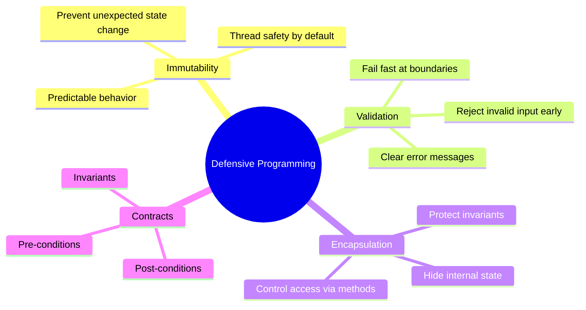

### Why It Matters

| Scenario | Without Defensive Programming | With Defensive Programming |
|---|---|---|
| Shared object passed between methods | Any method can silently corrupt state | State is immutable; corruption is impossible |
| Concurrent access | Race conditions, unpredictable bugs | Thread-safe by design |
| Invalid input to a method | Corrupted state discovered later | Exception thrown immediately at the boundary |
| Refactoring large codebases | Ripple effects everywhere | Isolated, predictable data contracts |

---

## 2. The Problem with Mutable State

### 2.1 A Classic Bug Scenario

Consider this innocent-looking `Order` class:

```java
public class Order {
    private List<String> items;
    private String status;

    public Order(List<String> items, String status) {
        this.items = items;       // ⚠️ Stores the reference — not a copy!
        this.status = status;
    }

    public List<String> getItems() {
        return items;             // ⚠️ Exposes internal mutable state!
    }

    public void setStatus(String status) {
        this.status = status;     // ⚠️ No validation, anyone can change status
    }
}
```

Here is what can go wrong:

```java
// Scenario 1: Mutation via the original reference
List<String> shoppingCart = new ArrayList<>();
shoppingCart.add("Laptop");
Order order = new Order(shoppingCart, "PENDING");

// Someone modifies the original list AFTER the order is created
shoppingCart.add("Free iPhone");  // 💥 order.getItems() now contains "Free iPhone"!

// Scenario 2: Mutation via the getter
order.getItems().clear();         // 💥 The entire order's items are gone!
order.getItems().add("maliciousItem");

// Scenario 3: Unvalidated state change
order.setStatus(null);            // 💥 Null status could crash downstream code
order.setStatus("HACKED_STATUS"); // 💥 Invalid status bypasses business rules
```

### 2.2 How Mutable State Spreads

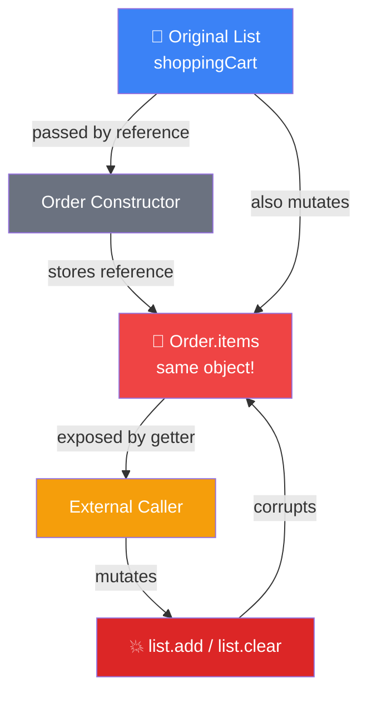

### 2.3 The Thread-Safety Dimension

In a multi-threaded application, mutable shared state is even more dangerous:

```java
// Thread 1
order.getItems().add("item-from-thread-1");

// Thread 2 — running simultaneously!
order.getItems().remove(0);

// Result: ConcurrentModificationException or silent data corruption
```

---

## 3. Java Records: A First-Class Solution

Java 16 introduced **Records** as a special-purpose class designed for immutable data carriers. They eliminate boilerplate and communicate intent clearly.

### 3.1 Anatomy of a Java Record

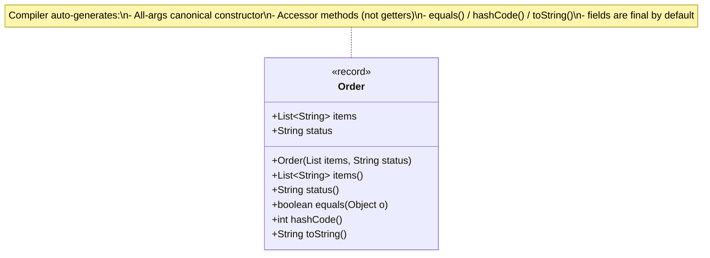

### 3.2 Records vs Traditional Classes

```java
// ❌ Traditional class: 40+ lines of boilerplate
public final class PointOld {
    private final int x;
    private final int y;

    public PointOld(int x, int y) {
        this.x = x;
        this.y = y;
    }

    public int getX() { return x; }
    public int getY() { return y; }

    @Override
    public boolean equals(Object o) { /* 10+ lines */ }

    @Override
    public int hashCode() { /* 5+ lines */ }

    @Override
    public String toString() { /* 3+ lines */ }
}

// ✅ Record: 1 line, same behavior
public record Point(int x, int y) {}
```

### 3.3 What Records Guarantee (and What They Don't)

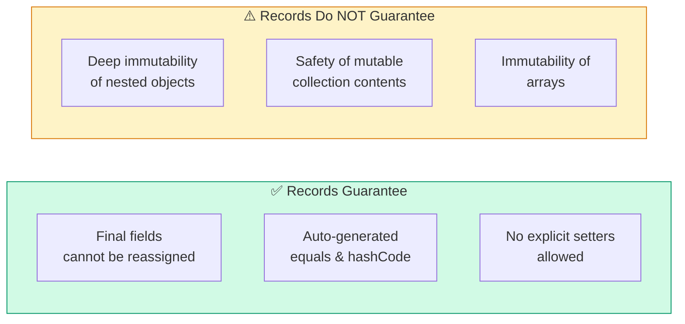

> **Key insight:** Records are *shallowly* immutable. The field reference is final, but what it points to can still be mutable. This is the core problem we solve next.

---

## 4. Implementing Defensive Copies

### 4.1 The Defensive Copy Strategy

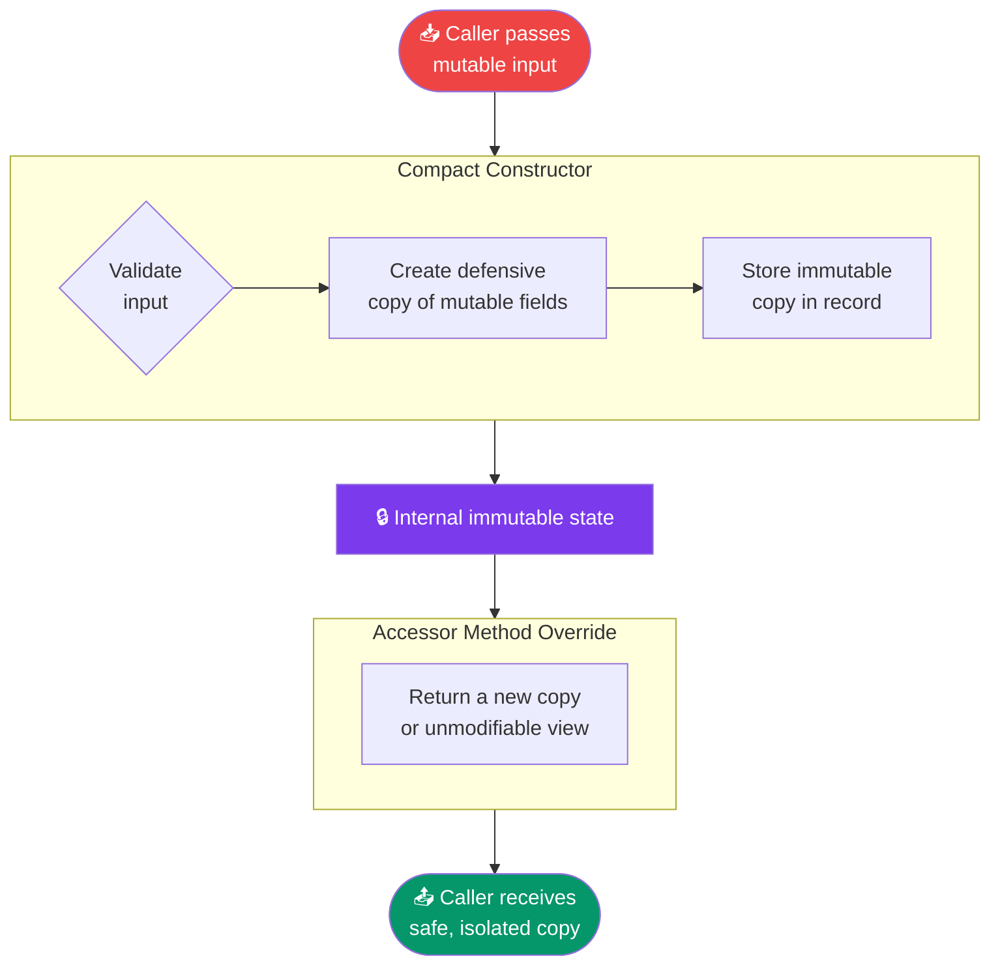

### 4.2 Building a Truly Immutable Order Record

```java
public record Order(List<String> items, String status) {

    // ===== Compact Constructor =====
    // Note: In compact constructors, parameter names == component names.
    // We reassign the parameter directly (not this.items).
    public Order {
        // Step 1: Defensive copy on the way IN
        // List.copyOf() creates an unmodifiable snapshot
        items = List.copyOf(items);   // NullPointerException if items is null — intentional!

        // Step 2: Validate invariants
        if (status == null || status.isBlank()) {
            throw new IllegalArgumentException("Status cannot be null or blank");
        }

        // Only allow known valid statuses
        Set<String> validStatuses = Set.of("PENDING", "CONFIRMED", "SHIPPED", "DELIVERED", "CANCELLED");
        if (!validStatuses.contains(status)) {
            throw new IllegalArgumentException("Unknown status: " + status);
        }
    }

    // Step 3: Defensive copy on the way OUT
    @Override
    public List<String> items() {
        return List.copyOf(items);    // Caller gets their own isolated copy
    }
}
```

### 4.3 Proving It Works

```java
// --- Test 1: Input mutation cannot corrupt the record ---
var cart = new ArrayList<String>();
cart.add("Laptop");
cart.add("Mouse");
var order = new Order(cart, "PENDING");

cart.add("Free Item");             // Mutate the original
System.out.println(order.items()); // [Laptop, Mouse] — unchanged ✅

// --- Test 2: Output mutation is rejected ---
try {
    order.items().add("Hacked");   // Throws UnsupportedOperationException ✅
} catch (UnsupportedOperationException e) {
    System.out.println("Mutation blocked: " + e.getMessage());
}

// --- Test 3: Validation prevents invalid state ---
try {
    var badOrder = new Order(cart, "INVENTED_STATUS"); // Throws IllegalArgumentException ✅
} catch (IllegalArgumentException e) {
    System.out.println("Invalid status rejected: " + e.getMessage());
}

// --- Test 4: Null protection ---
try {
    var nullOrder = new Order(null, "PENDING"); // Throws NullPointerException ✅
} catch (NullPointerException e) {
    System.out.println("Null input rejected");
}
```

### 4.4 List.copyOf vs Collections.unmodifiableList

A common question: which copy strategy is best?

```java
import java.util.Collections;
import java.util.List;

var source = new ArrayList<>(List.of("a", "b"));

// Option 1: Collections.unmodifiableList — DANGEROUS!
// It's a VIEW of the original. Mutations to source still affect it.
var unsafe = Collections.unmodifiableList(source);
source.add("c");
System.out.println(unsafe); // [a, b, c] — 💥 still leaked!

// Option 2: List.copyOf — SAFE ✅
// Creates a new, independent, unmodifiable snapshot.
var safe = List.copyOf(source);
source.add("d");
System.out.println(safe);   // [a, b, c] — unchanged ✅

// Option 3: new ArrayList<>(source) — SAFE but MUTABLE ⚠️
// Independent copy, but the copy itself can be modified by the caller.
var mutableCopy = new ArrayList<>(source);
mutableCopy.add("e");       // The caller can mutate their own copy — ok
System.out.println(source); // original unaffected ✅ but we exposed a mutable list
```

**Summary table:**

| Strategy | Independent? | Caller can mutate? | Recommended for? |
|---|---|---|---|
| `Collections.unmodifiableList(x)` | ❌ (view) | ❌ | Wrapping final internal fields you control |
| `List.copyOf(x)` | ✅ | ❌ | Defensive copies in Records |
| `new ArrayList<>(x)` | ✅ | ✅ | When the caller needs their own mutable copy |

---

## 5. Advanced Patterns for Immutable Data

### 5.1 Sealed Interfaces + Records: The Power Combination

Java's sealed interfaces let you define *closed* type hierarchies — you know every possible subtype at compile time. This pairs perfectly with Records.

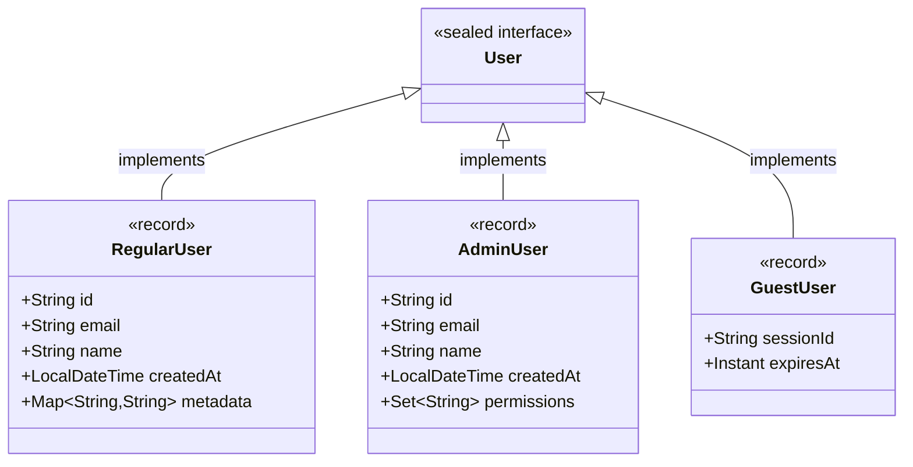

```java
// The sealed interface — locks down the hierarchy
public sealed interface User permits RegularUser, AdminUser, GuestUser {}

// --- RegularUser ---
public record RegularUser(
    String id,
    String email,
    String name,
    LocalDateTime createdAt,
    Map<String, String> metadata
) implements User {

    public RegularUser {
        Objects.requireNonNull(id,    "User id is required");
        Objects.requireNonNull(email, "User email is required");
        Objects.requireNonNull(name,  "User name is required");

        if (!email.matches("^[\\w-.]+@[\\w-]+\\.[a-z]{2,}$")) {
            throw new IllegalArgumentException("Invalid email: " + email);
        }

        metadata = Map.copyOf(metadata != null ? metadata : Map.of());
    }

    @Override
    public Map<String, String> metadata() {
        return Map.copyOf(metadata);
    }

    // Records can still have methods!
    public RegularUser withEmail(String newEmail) {
        return new RegularUser(id, newEmail, name, createdAt, metadata);
    }
}

// --- AdminUser ---
public record AdminUser(
    String id,
    String email,
    String name,
    LocalDateTime createdAt,
    Set<String> permissions
) implements User {

    public AdminUser {
        Objects.requireNonNull(id);
        Objects.requireNonNull(email);
        if (permissions == null || permissions.isEmpty()) {
            throw new IllegalArgumentException("Admin must have at least one permission");
        }
        permissions = Set.copyOf(permissions);
    }

    @Override
    public Set<String> permissions() {
        return Set.copyOf(permissions);
    }

    public boolean hasPermission(String perm) {
        return permissions.contains(perm);
    }
}

// --- GuestUser ---
public record GuestUser(
    String sessionId,
    Instant expiresAt
) implements User {
    public GuestUser {
        Objects.requireNonNull(sessionId, "Session ID required");
        Objects.requireNonNull(expiresAt, "Expiry required");
        if (expiresAt.isBefore(Instant.now())) {
            throw new IllegalArgumentException("Cannot create already-expired guest session");
        }
    }

    public boolean isExpired() {
        return Instant.now().isAfter(expiresAt);
    }
}
```

### 5.2 Pattern Matching with Sealed Records (Java 21+)

Once you have sealed types, pattern matching in `switch` becomes exhaustive and compile-time safe:

```java
public String describeUser(User user) {
    return switch (user) {
        case RegularUser r  -> "Regular user %s (%s)".formatted(r.name(), r.email());
        case AdminUser a    -> "Admin %s with %d permissions".formatted(a.name(), a.permissions().size());
        case GuestUser g    -> g.isExpired()
                                 ? "Expired guest session"
                                 : "Active guest until " + g.expiresAt();
        // No default needed — compiler verifies exhaustiveness!
    };
}
```

### 5.3 Nested Records: Full Immutability Across the Graph

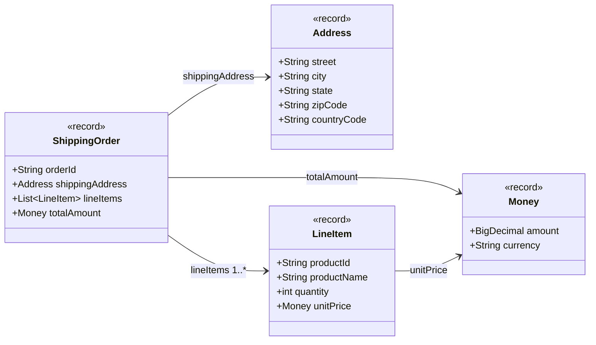

```java
public record Money(BigDecimal amount, String currency) {
    public Money {
        Objects.requireNonNull(amount, "Amount required");
        Objects.requireNonNull(currency, "Currency required");
        if (amount.compareTo(BigDecimal.ZERO) < 0) {
            throw new IllegalArgumentException("Amount cannot be negative");
        }
        if (currency.length() != 3) {
            throw new IllegalArgumentException("Currency must be ISO 4217 (3 chars): " + currency);
        }
        // Normalize scale to 2 decimal places
        amount = amount.setScale(2, RoundingMode.HALF_UP);
    }

    public Money add(Money other) {
        if (!this.currency.equals(other.currency)) {
            throw new IllegalArgumentException("Cannot add different currencies");
        }
        return new Money(this.amount.add(other.amount), this.currency);
    }
}

public record LineItem(String productId, String productName, int quantity, Money unitPrice) {
    public LineItem {
        Objects.requireNonNull(productId);
        Objects.requireNonNull(productName);
        if (quantity <= 0) throw new IllegalArgumentException("Quantity must be positive");
        Objects.requireNonNull(unitPrice);
    }

    public Money subtotal() {
        return new Money(unitPrice.amount().multiply(BigDecimal.valueOf(quantity)), unitPrice.currency());
    }
}

public record Address(String street, String city, String state, String zipCode, String countryCode) {
    public Address {
        Objects.requireNonNull(street);
        Objects.requireNonNull(city);
        Objects.requireNonNull(countryCode);
        if (countryCode.length() != 2) throw new IllegalArgumentException("Country must be ISO 3166-1 alpha-2");
    }
}

public record ShippingOrder(String orderId, Address shippingAddress, List<LineItem> lineItems, Money totalAmount) {
    public ShippingOrder {
        Objects.requireNonNull(orderId);
        Objects.requireNonNull(shippingAddress);
        Objects.requireNonNull(totalAmount);

        if (lineItems == null || lineItems.isEmpty()) {
            throw new IllegalArgumentException("Order must have at least one item");
        }

        // Defensive copy — since LineItem and Money are also records, they're already immutable
        lineItems = List.copyOf(lineItems);

        // Cross-field validation: verify total matches line items
        Money computed = lineItems.stream()
            .map(LineItem::subtotal)
            .reduce(new Money(BigDecimal.ZERO, totalAmount.currency()), Money::add);

        if (!computed.amount().equals(totalAmount.amount())) {
            throw new IllegalArgumentException(
                "Total mismatch: declared %s, computed %s".formatted(totalAmount.amount(), computed.amount())
            );
        }
    }
}
```

---

## 6. The Builder Pattern with Records

Sometimes you build objects incrementally. Since records are immutable, the builder returns *new record instances* at each step — this is the **Wither/Copy-with pattern**.


```java
public final class OrderBuilder {
    private final List<String> items;
    private final String status;

    // Private constructor — use static factory
    private OrderBuilder(List<String> items, String status) {
        this.items = items;
        this.status = status;
    }

    // Static factory: start with a fresh builder
    public static OrderBuilder empty() {
        return new OrderBuilder(List.of(), "PENDING");
    }

    // Each "wither" returns a new builder — the old one is unaffected
    public OrderBuilder withItem(String item) {
        Objects.requireNonNull(item, "Item cannot be null");
        var newItems = new ArrayList<>(this.items);
        newItems.add(item);
        return new OrderBuilder(List.copyOf(newItems), this.status);
    }

    public OrderBuilder withItems(Collection<String> newItems) {
        return new OrderBuilder(List.copyOf(newItems), this.status);
    }

    public OrderBuilder withStatus(String status) {
        return new OrderBuilder(this.items, status);
    }

    public OrderBuilder removeItem(String item) {
        var filtered = this.items.stream()
            .filter(i -> !i.equals(item))
            .collect(Collectors.toList());
        return new OrderBuilder(List.copyOf(filtered), this.status);
    }

    // Terminal operation: produces the final immutable Record
    public Order build() {
        return new Order(items, status);
    }

    // Utility: inspect the current build state
    public int itemCount() { return items.size(); }
}
```

**Usage:**

```java
Order order = OrderBuilder.empty()
    .withItem("Laptop")
    .withItem("Mouse")
    .withItem("Keyboard")
    .removeItem("Mouse")         // Changed my mind
    .withStatus("CONFIRMED")
    .build();

System.out.println(order.items());  // [Laptop, Keyboard]
System.out.println(order.status()); // CONFIRMED

// The intermediate builders are untouched
OrderBuilder draft = OrderBuilder.empty().withItem("Laptop");
OrderBuilder v1 = draft.withItem("Mouse");
OrderBuilder v2 = draft.withItem("Keyboard"); // Different item from the same draft

System.out.println(v1.build().items()); // [Laptop, Mouse]
System.out.println(v2.build().items()); // [Laptop, Keyboard]  ✅ Independent!
```

---

## 7. Common Pitfalls and How to Avoid Them

### Pitfall 1: Arrays Are Always Mutable

Java arrays cannot be made unmodifiable — you must clone them defensively.

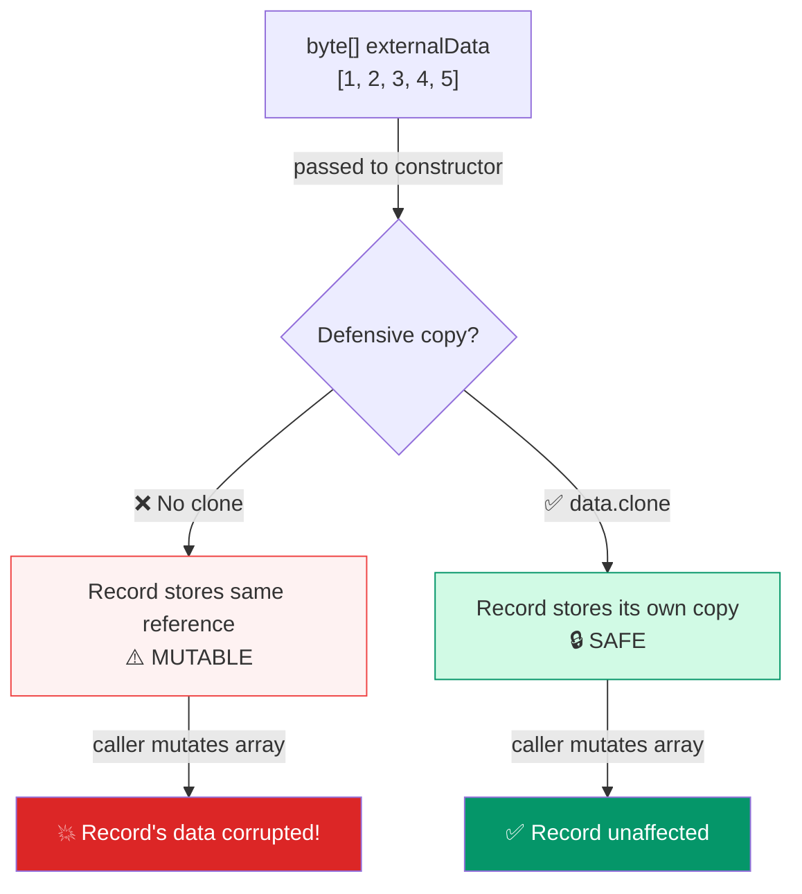

```java
// ❌ Broken: array is mutable and shared
public record BadFilePayload(byte[] data) {}

// Proof:
byte[] secret = {1, 2, 3};
var payload = new BadFilePayload(secret);
secret[0] = 99;  // 💥 payload.data()[0] is now 99!

// ✅ Fixed: clone on the way in and out
public record SafeFilePayload(byte[] data) {
    public SafeFilePayload {
        Objects.requireNonNull(data, "data cannot be null");
        data = data.clone();           // Defensive copy in
    }

    @Override
    public byte[] data() {
        return data.clone();           // Defensive copy out
    }

    // Utility: safe way to work with data without exposing the array
    public int dataLength() { return data.length; }
    public byte byteAt(int index) { return data[index]; }
}
```

### Pitfall 2: Nested Mutable Objects

If a record holds a reference to a mutable legacy class, that class breaks the immutability chain.

```java
// ❌ Dangerous: Address has setters, so Person is mutable-by-proxy
public class Address {
    private String street;
    public void setStreet(String s) { this.street = s; }
    public String getStreet() { return street; }
}

public record Person(String name, Address address) {}  // ⚠️ NOT truly immutable

// Fix 1: Convert Address to a Record too (preferred)
public record Address(String street, String city, String zip) {}
public record Person(String name, Address address) {}  // ✅

// Fix 2: If you can't change Address, copy on construction and hide it
public record PersonWithLegacyAddress(String name, Address address) {
    public PersonWithLegacyAddress {
        // Copy all fields we care about into a new Address
        var copy = new Address();
        copy.setStreet(address.getStreet());
        // ... copy all other fields
        address = copy;  // Store the copy, not the original
    }

    @Override
    public Address address() {
        var copy = new Address();
        copy.setStreet(address.getStreet());
        return copy;   // Always return a fresh copy
    }
}
```

### Pitfall 3: Date/Time Mutability

`java.util.Date` is mutable. Always use the modern `java.time` API.

```java
import java.util.Date;
import java.time.Instant;

// ❌ Date is mutable!
public record BadEvent(String name, Date occurredAt) {
    public BadEvent {
        occurredAt = new Date(occurredAt.getTime()); // Must manually copy
    }

    @Override
    public Date occurredAt() {
        return new Date(occurredAt.getTime()); // Must manually copy on return too
    }
}

// ✅ Prefer java.time — Instant, LocalDateTime etc. are already immutable
public record GoodEvent(String name, Instant occurredAt) {
    public GoodEvent {
        Objects.requireNonNull(name);
        Objects.requireNonNull(occurredAt);
        // No copy needed — Instant is immutable ✅
    }
}
```

### Pitfall 4: Serialization with Jackson

Jackson's default deserialization won't work with Records unless configured correctly.

```java
import com.fasterxml.jackson.databind.ObjectMapper;
import com.fasterxml.jackson.annotation.JsonCreator;
import com.fasterxml.jackson.annotation.JsonProperty;
import com.fasterxml.jackson.databind.json.JsonMapper;
import com.fasterxml.jackson.datatype.jsr310.JavaTimeModule;

// ✅ Option 1: Use @JsonProperty to guide Jackson
public record ApiResponse(
    @JsonProperty("user_id")    String userId,
    @JsonProperty("items")      List<String> items,
    @JsonProperty("created_at") Instant createdAt
) {
    public ApiResponse {
        items = List.copyOf(items != null ? items : List.of());
    }
}

// ✅ Option 2: Configure ObjectMapper to understand Records (Jackson 2.12+)
ObjectMapper mapper = JsonMapper.builder()
    .addModule(new JavaTimeModule())
    .build();
// Jackson 2.12+ automatically handles Records via their canonical constructors
```

### Pitfall 5: Lazy Copy Anti-Pattern

The lazy copy pattern breaks thread safety and introduces subtle bugs. Avoid it.

```java
// ❌ Lazy copy — broken in concurrent environments
public record LargeData(List<String> items) {
    private List<String> safeItems;  // ⚠️ Records can't have instance fields!

    // This won't even compile! Records only have component fields.
    // And even if it did, two threads racing on safeItems == null is a data race.
}

// ✅ Better: pay the copy cost upfront (usually negligible vs. correctness bugs)
public record LargeData(List<String> items) {
    public LargeData {
        items = List.copyOf(items);  // Always copy; it's O(n) but safe
    }
}

// ✅ If truly performance-critical: use a truly immutable library collection
// e.g., Guava's ImmutableList, Vavr's List, or Eclipse Collections
import com.google.common.collect.ImmutableList;

public record HighPerfData(ImmutableList<String> items) {
    public HighPerfData {
        Objects.requireNonNull(items);
        // ImmutableList is already immutable — no copy needed! ✅
    }
}
```

---

## 8. Real-World Use Cases

### 8.1 Use Case: Domain-Driven Design (DDD) Value Objects

Records are *perfect* for DDD Value Objects — objects defined by their values, not their identity.

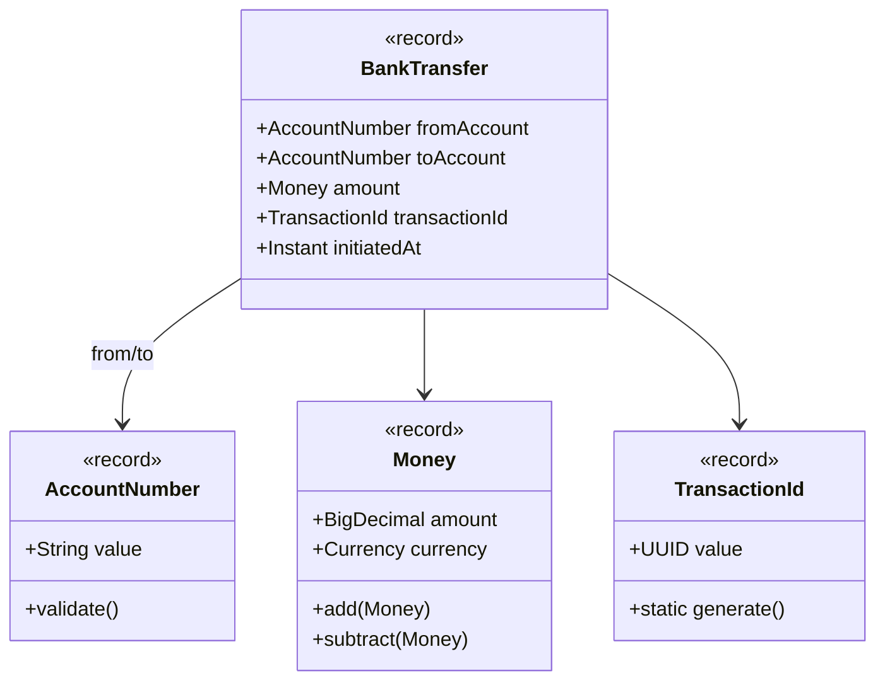

```java
public record AccountNumber(String value) {
    private static final Pattern IBAN_PATTERN = Pattern.compile("[A-Z]{2}[0-9]{2}[A-Z0-9]{4,}");

    public AccountNumber {
        Objects.requireNonNull(value);
        if (!IBAN_PATTERN.matcher(value.trim()).matches()) {
            throw new IllegalArgumentException("Invalid IBAN: " + value);
        }
        value = value.trim().toUpperCase();  // Normalize
    }
}

public record TransactionId(UUID value) {
    public TransactionId {
        Objects.requireNonNull(value);
    }

    public static TransactionId generate() {
        return new TransactionId(UUID.randomUUID());
    }

    @Override
    public String toString() { return value.toString(); }
}

public record BankTransfer(
    AccountNumber fromAccount,
    AccountNumber toAccount,
    Money amount,
    TransactionId transactionId,
    Instant initiatedAt
) {
    public BankTransfer {
        Objects.requireNonNull(fromAccount);
        Objects.requireNonNull(toAccount);
        Objects.requireNonNull(amount);
        if (fromAccount.equals(toAccount)) {
            throw new IllegalArgumentException("Cannot transfer to the same account");
        }
        transactionId = transactionId != null ? transactionId : TransactionId.generate();
        initiatedAt   = initiatedAt   != null ? initiatedAt   : Instant.now();
    }
}
```

### 8.2 Use Case: REST API DTOs

Records eliminate boilerplate in REST layers and enforce consistent validation:

```java
// Request DTO — validate everything at the boundary
public record CreateUserRequest(
    String email,
    String password,
    String firstName,
    String lastName,
    Optional<String> phoneNumber
) {
    public CreateUserRequest {
        // Validate
        if (email == null || !email.contains("@")) throw new IllegalArgumentException("Invalid email");
        if (password == null || password.length() < 8)  throw new IllegalArgumentException("Password too short");
        if (firstName == null || firstName.isBlank())   throw new IllegalArgumentException("First name required");
        if (lastName == null || lastName.isBlank())     throw new IllegalArgumentException("Last name required");

        // Normalize
        email = email.toLowerCase().trim();
        phoneNumber = phoneNumber != null ? phoneNumber : Optional.empty();
    }
}

// Response DTO — safe to expose; contains only what we want to share
public record UserResponse(
    String id,
    String email,
    String fullName,
    Instant createdAt
) {
    // Factory method: control what gets exposed from the domain entity
    public static UserResponse from(User user) {
        return new UserResponse(
            user.getId(),
            user.getEmail(),
            user.getFirstName() + " " + user.getLastName(),
            user.getCreatedAt()
        );
    }
}
```

### 8.3 Use Case: Event Sourcing

Immutable records are ideal for event logs — events should *never* change once written.

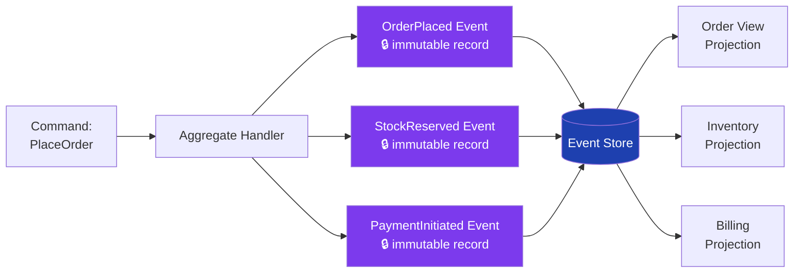

```java
public sealed interface OrderEvent permits OrderPlaced, OrderCancelled, OrderShipped {}

public record OrderPlaced(
    String orderId,
    String customerId,
    List<LineItem> lineItems,
    Money totalAmount,
    Instant occurredAt
) implements OrderEvent {
    public OrderPlaced {
        Objects.requireNonNull(orderId);
        Objects.requireNonNull(customerId);
        lineItems   = List.copyOf(lineItems);
        occurredAt  = occurredAt != null ? occurredAt : Instant.now();
    }
}

public record OrderCancelled(
    String orderId,
    String reason,
    String cancelledBy,
    Instant occurredAt
) implements OrderEvent {
    public OrderCancelled {
        Objects.requireNonNull(orderId);
        Objects.requireNonNull(reason);
        occurredAt = occurredAt != null ? occurredAt : Instant.now();
    }
}

public record OrderShipped(
    String orderId,
    String trackingNumber,
    String carrier,
    Instant occurredAt
) implements OrderEvent {
    public OrderShipped {
        Objects.requireNonNull(orderId);
        Objects.requireNonNull(trackingNumber);
        occurredAt = occurredAt != null ? occurredAt : Instant.now();
    }
}
```

### 8.4 Use Case: Configuration Objects

Prevent accidental mutation of application configuration:

```java
public record DatabaseConfig(
    String host,
    int port,
    String databaseName,
    String username,
    Duration connectionTimeout,
    int maxPoolSize
) {
    public DatabaseConfig {
        Objects.requireNonNull(host, "Database host required");
        if (port < 1 || port > 65535) throw new IllegalArgumentException("Invalid port: " + port);
        Objects.requireNonNull(databaseName, "Database name required");
        Objects.requireNonNull(username, "Username required");
        if (connectionTimeout == null || connectionTimeout.isNegative()) {
            throw new IllegalArgumentException("Connection timeout must be positive");
        }
        if (maxPoolSize < 1) throw new IllegalArgumentException("Pool size must be at least 1");
    }

    // Convenience: build a JDBC URL
    public String jdbcUrl() {
        return "jdbc:postgresql://%s:%d/%s".formatted(host, port, databaseName);
    }
}
```

---

## 9. Performance Considerations

### 9.1 When Copy Cost Matters

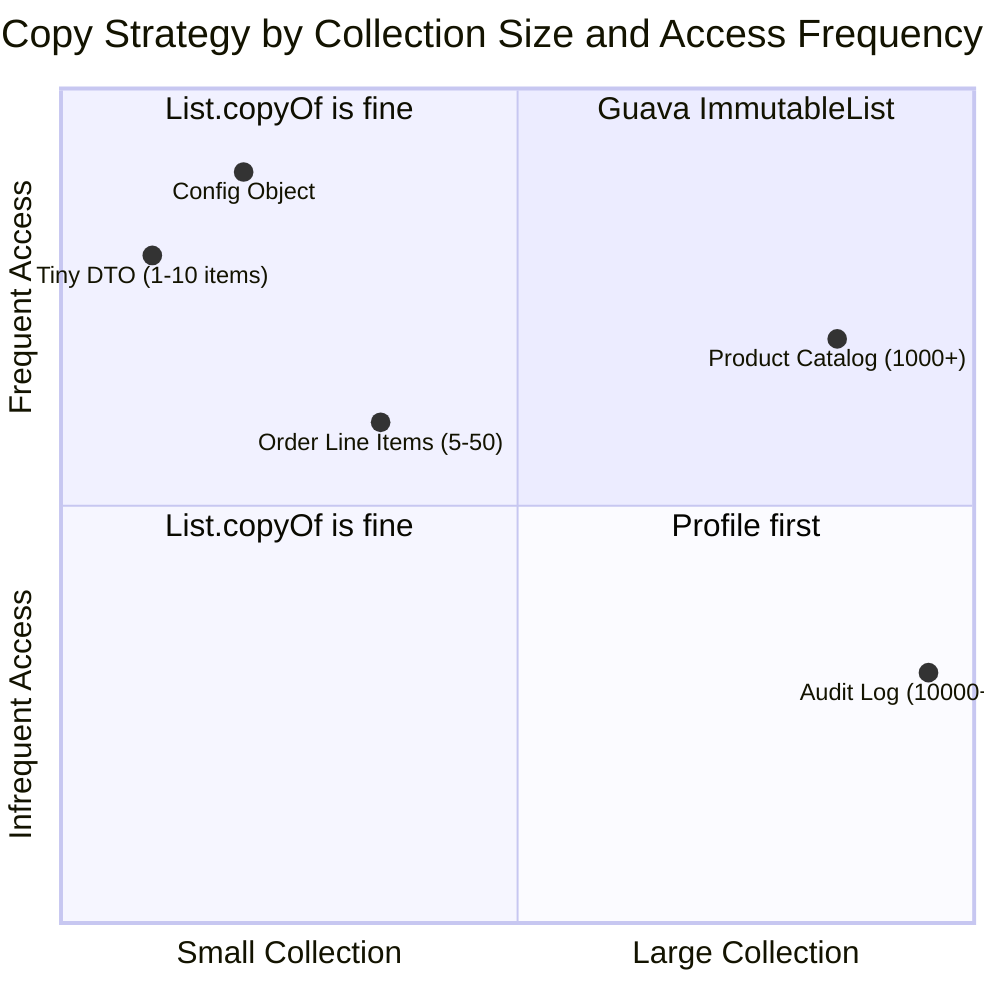

### 9.2 Practical Benchmarking Guidance

```java
// For truly large collections, consider:
// 1. Guava ImmutableList — avoids copy at access time since it's already immutable
import com.google.common.collect.ImmutableList;

public record ProductCatalog(ImmutableList<Product> products) {
    public ProductCatalog {
        // ImmutableList.copyOf is still O(n) once, but the result is genuinely immutable
        products = products instanceof ImmutableList<Product> p ? p : ImmutableList.copyOf(products);
    }
    // No override needed — ImmutableList.copyOf already ensures safety
}

// 2. Lazy population with volatile (only if truly justified by profiling)
//    Note: Record fields cannot be non-component instance fields,
//    so this pattern requires a wrapper class, not a record.
//    Records are the wrong tool if you need lazy mutable internal state.

// 3. Structural sharing via persistent data structures (Vavr)
import io.vavr.collection.List;

public record VavrOrder(String id, io.vavr.collection.List<String> items) {
    public VavrOrder {
        items = items != null ? items : List.empty();
        // Vavr lists are persistent — append creates O(1) new structure sharing old data
    }

    public VavrOrder addItem(String item) {
        return new VavrOrder(id, items.append(item)); // O(1) structural share ✅
    }
}
```

---

## 10. Best Practices Cheat Sheet

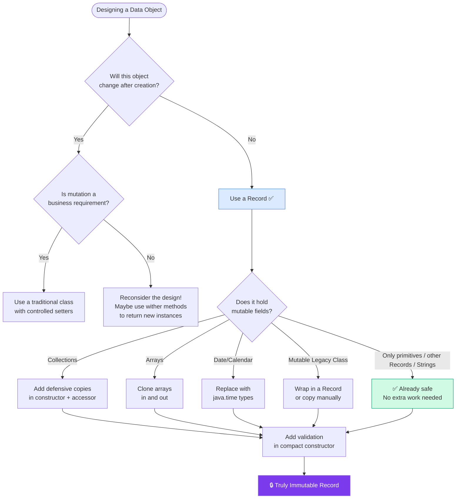

### Quick Reference: Defensive Copy Rules

| Field Type | Constructor | Accessor Override |
|---|---|---|
| `List<T>` | `field = List.copyOf(field)` | `return List.copyOf(field)` |
| `Set<T>` | `field = Set.copyOf(field)` | `return Set.copyOf(field)` |
| `Map<K,V>` | `field = Map.copyOf(field)` | `return Map.copyOf(field)` |
| `byte[]` / `int[]` | `field = field.clone()` | `return field.clone()` |
| `java.util.Date` | Replace with `Instant` / `LocalDateTime` | N/A — use `java.time` |
| Primitive types | No copy needed | No override needed |
| `String` | No copy needed (immutable) | No override needed |
| Another `Record` | No copy needed (immutable) | No override needed |
| `ImmutableList` (Guava) | No copy needed | No override needed |

### Summary of Rules

1. **Use Records** for DTOs, Value Objects, events, configuration, and any data that shouldn't change.
2. **Always validate** in the compact constructor — fail fast, fail clearly.
3. **Defensive copy in** mutable collections and arrays in the constructor.
4. **Defensive copy out** — override accessors to return copies or unmodifiable views.
5. **Use `java.time`** — `Instant`, `LocalDate`, `LocalDateTime` are immutable by design.
6. **Nest Records** throughout your model — immutability should be a property of the whole graph, not just the root.
7. **Use sealed interfaces** with Records for closed hierarchies to enable exhaustive pattern matching.
8. **Use builders** (with the wither pattern) for objects that require incremental construction.
9. **Avoid `Collections.unmodifiableList`** as a defensive copy strategy — it's a view, not a copy.
10. **Profile before optimizing** — `List.copyOf` is fast for typical collection sizes in business applications.

---

*This tutorial covered Java Records as a defensive programming tool, from basic shallow immutability to complex nested object graphs. The next steps are to apply these patterns to your DTOs and domain model, starting with the objects that cross the most method boundaries in your codebase — those are the highest-risk mutable state holders.*