# The Command Design Pattern — A Comprehensive Tutorial

> *"The Command pattern gives your application a time machine."*
> It transforms a fleeting function call into a first-class object you can queue, schedule, log, retry, and undo.

---

## Table of Contents

1. [What is the Command Pattern?](#1-what-is-the-command-pattern)
2. [The Restaurant Analogy — Understanding the Four Participants](#2-the-restaurant-analogy)
3. [Why Not Just Call a Method? — The Case for Reification](#3-why-not-just-call-a-method)
4. [Core Structure — Interfaces and Classes](#4-core-structure)
5. [Classic Example — Smart Home Remote Control](#5-classic-example-smart-home-remote-control)
6. [Advanced Example — Undo / Redo Stack](#6-advanced-example-undo--redo-stack)
7. [Enterprise Example — Spring Boot Async Task Orchestrator](#7-enterprise-example-spring-boot-async-task-orchestrator)
8. [Real-World Use Cases](#8-real-world-use-cases)
9. [Command Pattern in Game Engines](#9-command-pattern-in-game-engines)
10. [Anti-Patterns and Common Mistakes](#10-anti-patterns-and-common-mistakes)
11. [When to Use (and When Not to Use) the Command Pattern](#11-when-to-use-and-when-not-to-use)
12. [Quick Reference Cheat Sheet](#12-quick-reference-cheat-sheet)

---

## 1. What is the Command Pattern?

The **Command Pattern** is a *behavioral* design pattern that encapsulates a request as a standalone object. That object contains everything needed to perform — and potentially reverse — an action:

- **The action itself** (which method to invoke on which object)
- **The parameters** required to perform it
- **An undo operation** that reverts the state change

This tiny conceptual shift — *a request is an object, not a method call* — unlocks enormous architectural power:

| Without Command Pattern | With Command Pattern |
|-------------------------|----------------------|
| `light.turnOn()` — call and forget | `new LightOnCommand(light)` — store, schedule, replay |
| Cannot undo | `command.undo()` reverses the action |
| Cannot queue | Serialize to DB, push to MQ |
| Audit trail is hard | Every command carries its own metadata |
| Retry logic is scattered | Processor handles retry centrally |

### The "Time Machine" Insight

Because a command is an object, you can:

1. **Execute it now** — `command.execute()`
2. **Execute it later** — store in a queue, process at midnight
3. **Execute it again** — retry on failure
4. **Un-execute it** — `command.undo()` (if supported)
5. **Replay the past** — re-run a recorded history of commands
6. **Send it elsewhere** — serialize over a network, another machine runs it

---

## 2. The Restaurant Analogy

The four participants of the Command pattern map perfectly to a restaurant:

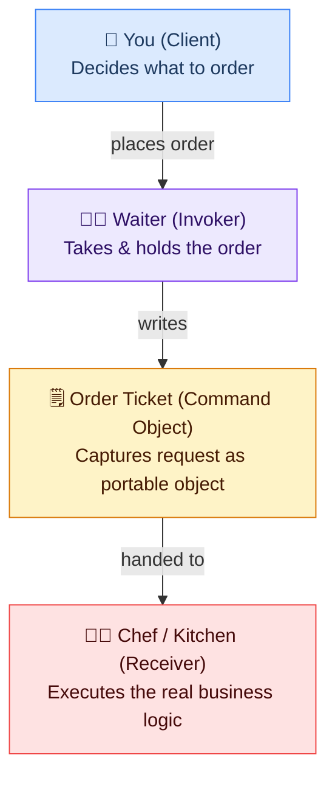

| Pattern Role | Restaurant Equivalent | Responsibility |
|---|---|---|
| **Client** | You, the customer | Decides what action is needed; creates the command |
| **Invoker** | The waiter | Holds the command and triggers it at the right time |
| **Command Object** | The order ticket | Captures the request as a portable, storable thing |
| **Receiver** | The kitchen / chef | Contains the actual business logic |

**Why does this matter?**

- You (Client) never shout directly into the kitchen — you are *decoupled* from the chef.
- The waiter can **cancel** the ticket (undo) before it reaches the kitchen.
- The kitchen can process tickets in **any order** (priority queue).
- Every ticket is a **log entry** — the restaurant knows exactly what was ordered and when.

### TV Remote Mapping

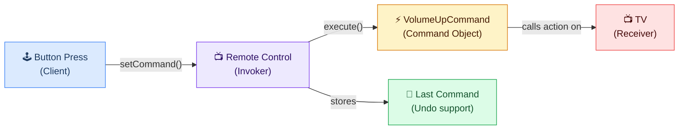

---

## 3. Why Not Just Call a Method?

Consider an enterprise loan-approval workflow. Naïve approach:

```java
// Naïve — direct call
loanService.approve(loanId);
```

Now your product manager says: *"We need..."*

| Requirement | How the naïve approach fails |
|---|---|
| Undo approval (compliance flag raised later) | No reversibility; must write custom compensating code everywhere |
| Audit trail of every approval attempt | Must sprinkle logging into every caller |
| Queue approvals for off-peak processing | Service can't be called async without restructuring |
| Schedule for future date | Need a new scheduling layer wired to the service |
| Retry when credit-check service is down | Retry logic must live inside the service or every caller |
| Serialize and replay for disaster recovery | No portable representation of the action |

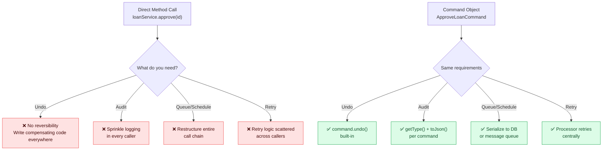

---

## 4. Core Structure

### The Command Interface

```java
public interface Command {
    void execute();
    void undo();        // optional but strongly recommended
}
```

### Extended Interface for Enterprise Use

```java
public interface TaskCommand {
    void execute();
    void undo();
    String getType();       // e.g. "SEND_EMAIL" — used for serialization
    String toJson();        // serialize all parameters to JSON for DB persistence
}
```

### Full Structural Diagram

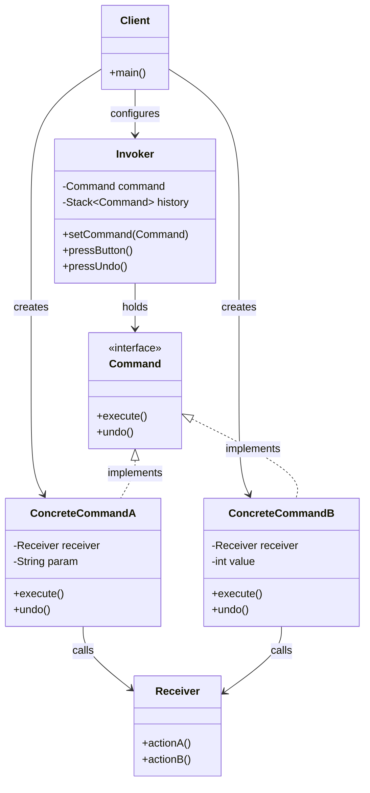

---

## 5. Classic Example — Smart Home Remote Control

### Receiver

```java
public class Light {
    private final String location;

    public Light(String location) { this.location = location; }

    public void turnOn()  { System.out.println(location + " light is ON");  }
    public void turnOff() { System.out.println(location + " light is OFF"); }
}

public class Fan {
    public void startHigh() { System.out.println("Fan spinning HIGH"); }
    public void startLow()  { System.out.println("Fan spinning LOW");  }
    public void stop()      { System.out.println("Fan stopped");       }
}
```

### Concrete Commands

```java
public class LightOnCommand implements Command {
    private final Light light;
    public LightOnCommand(Light light) { this.light = light; }

    @Override public void execute() { light.turnOn();  }
    @Override public void undo()    { light.turnOff(); }
}

public class LightOffCommand implements Command {
    private final Light light;
    public LightOffCommand(Light light) { this.light = light; }

    @Override public void execute() { light.turnOff(); }
    @Override public void undo()    { light.turnOn();  }
}

public class FanHighCommand implements Command {
    private final Fan fan;
    private String previousSpeed = "OFF";

    public FanHighCommand(Fan fan) { this.fan = fan; }

    @Override
    public void execute() {
        previousSpeed = "OFF";
        fan.startHigh();
    }

    @Override
    public void undo() {
        if ("LOW".equals(previousSpeed)) fan.startLow();
        else fan.stop();
    }
}
```

### Invoker — Multi-Slot Remote

```java
public class RemoteControl {
    private final Command[] onCommands;
    private final Command[] offCommands;
    private Command lastCommand;
    private static final Command NO_OP = new NoOpCommand();

    public RemoteControl(int slots) {
        onCommands  = new Command[slots];
        offCommands = new Command[slots];
        Arrays.fill(onCommands,  NO_OP);
        Arrays.fill(offCommands, NO_OP);
    }

    public void setCommand(int slot, Command on, Command off) {
        onCommands[slot]  = on;
        offCommands[slot] = off;
    }

    public void pressOn(int slot)  { onCommands[slot].execute();  lastCommand = onCommands[slot];  }
    public void pressOff(int slot) { offCommands[slot].execute(); lastCommand = offCommands[slot]; }
    public void pressUndo()        { lastCommand.undo(); }
}
```

### Client

```java
public class HomeAutomationApp {
    public static void main(String[] args) {
        RemoteControl remote = new RemoteControl(3);

        Light livingRoom = new Light("Living room");
        Light bedroom    = new Light("Bedroom");
        Fan   ceilingFan = new Fan();

        remote.setCommand(0, new LightOnCommand(livingRoom),  new LightOffCommand(livingRoom));
        remote.setCommand(1, new LightOnCommand(bedroom),     new LightOffCommand(bedroom));
        remote.setCommand(2, new FanHighCommand(ceilingFan),  new FanStopCommand(ceilingFan));

        remote.pressOn(0);   // Living room light is ON
        remote.pressOn(1);   // Bedroom light is ON
        remote.pressOn(2);   // Fan spinning HIGH
        remote.pressUndo();  // Undo → Fan stopped
        remote.pressOff(0);  // Living room light is OFF
    }
}
```

---

## 6. Advanced Example — Undo / Redo Stack

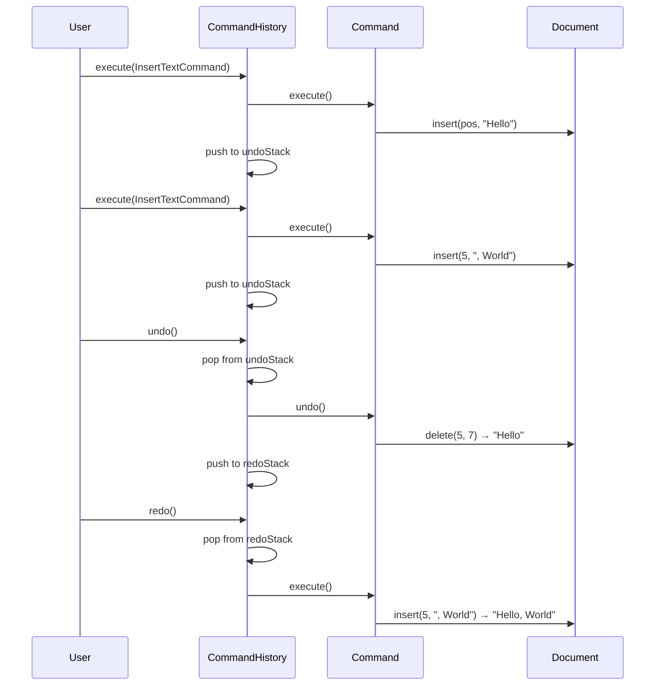

### Implementation

```java
public class CommandHistory {
    private final Deque<Command> undoStack = new ArrayDeque<>();
    private final Deque<Command> redoStack = new ArrayDeque<>();

    public void execute(Command command) {
        command.execute();
        undoStack.push(command);
        redoStack.clear(); // new action invalidates redo history
    }

    public void undo() {
        if (undoStack.isEmpty()) return;
        Command last = undoStack.pop();
        last.undo();
        redoStack.push(last);
    }

    public void redo() {
        if (redoStack.isEmpty()) return;
        Command next = redoStack.pop();
        next.execute();
        undoStack.push(next);
    }
}
```

### Text Editor Commands

```java
public class InsertTextCommand implements Command {
    private final Document document;
    private final int position;
    private final String text;

    public InsertTextCommand(Document doc, int pos, String text) {
        this.document = doc; this.position = pos; this.text = text;
    }

    @Override public void execute() { document.insert(position, text);          }
    @Override public void undo()    { document.delete(position, text.length()); }
}

public class DeleteTextCommand implements Command {
    private final Document document;
    private final int position;
    private final int length;
    private String deletedText; // captured at execution time

    @Override
    public void execute() {
        deletedText = document.getText(position, length);
        document.delete(position, length);
    }

    @Override
    public void undo() { document.insert(position, deletedText); }
}
```

---

## 7. Enterprise Example — Spring Boot Async Task Orchestrator

### Architecture Overview

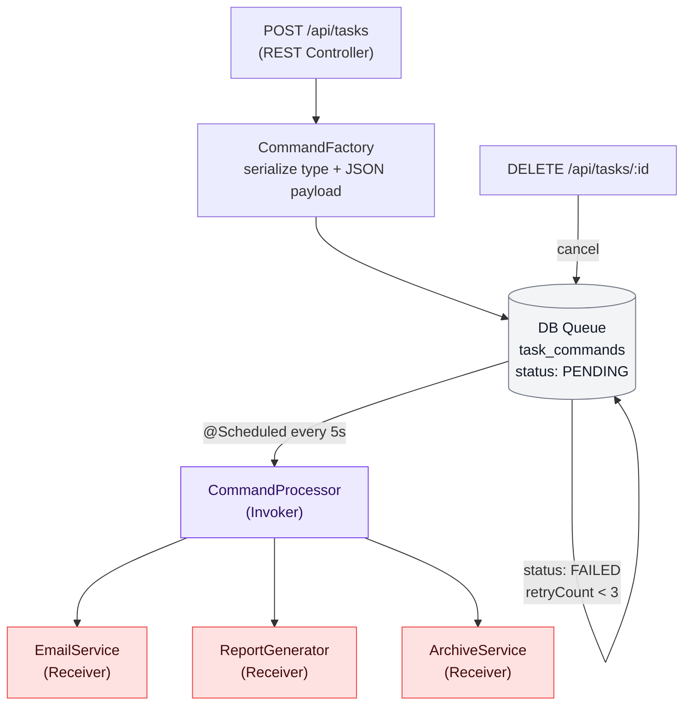

### 1. The Database Entity

```java
@Entity
@Table(name = "task_commands")
public class TaskCommandEntity {
    @Id @GeneratedValue
    private UUID id;

    private String type;           // e.g. "SEND_EMAIL"

    @Column(columnDefinition = "TEXT")
    private String payloadJson;    // serialized parameters

    @Enumerated(EnumType.STRING)
    private TaskStatus status;     // PENDING, RUNNING, COMPLETED, FAILED

    private int retryCount;
    private LocalDateTime createdAt;
    private LocalDateTime executedAt;
}
```

### 2. The Command Interface

```java
public interface TaskCommand {
    void execute();
    void undo();
    String getType();
    String toJson();
}
```

### 3. Concrete Command — SendEmailCommand

```java
public class SendEmailCommand implements TaskCommand {
    private final EmailService emailService;
    private final String to, subject, body;

    @Override
    public void execute() { emailService.sendEmail(to, subject, body); }

    @Override
    public void undo() {
        emailService.logCompensation("Undone: email to " + to);
    }

    @Override public String getType() { return "SEND_EMAIL"; }

    @Override
    public String toJson() {
        return new ObjectMapper().writeValueAsString(
            Map.of("to", to, "subject", subject, "body", body)
        );
    }
}
```

### 4. REST Controller — Submitting and Cancelling Commands

```java
@RestController
@RequestMapping("/api/tasks")
public class TaskController {
    @Autowired private TaskCommandRepository repo;

    @PostMapping("/email")
    public ResponseEntity<UUID> submitEmail(@RequestBody EmailRequest req) {
        TaskCommandEntity entity = new TaskCommandEntity();
        entity.setType("SEND_EMAIL");
        entity.setPayloadJson(req.toJson());
        entity.setStatus(TaskStatus.PENDING);
        entity.setCreatedAt(LocalDateTime.now());
        repo.save(entity);
        return ResponseEntity.accepted().body(entity.getId());
    }

    @DeleteMapping("/{id}")
    public ResponseEntity<Void> cancel(@PathVariable UUID id) {
        TaskCommandEntity entity = repo.findById(id).orElseThrow();
        if (entity.getStatus() == TaskStatus.PENDING) {
            entity.setStatus(TaskStatus.CANCELLED);
            repo.save(entity);
            return ResponseEntity.noContent().build();
        }
        return ResponseEntity.status(HttpStatus.CONFLICT).build();
    }
}
```

### 5. Command Processor (Invoker)

```java
@Component
public class CommandProcessor {
    private static final int MAX_RETRIES = 3;

    @Autowired private TaskCommandRepository repo;
    @Autowired private EmailService emailService;
    @Autowired private ReportGenerator reportGenerator;

    @Scheduled(fixedDelay = 5000)
    @Transactional
    public void processPendingCommands() {
        List<TaskCommandEntity> pending = repo.findByStatusOrderByCreatedAtAsc(TaskStatus.PENDING);

        for (TaskCommandEntity entity : pending) {
            entity.setStatus(TaskStatus.RUNNING);
            repo.save(entity);

            TaskCommand command = deserialize(entity);
            try {
                command.execute();
                entity.setStatus(TaskStatus.COMPLETED);
                entity.setExecutedAt(LocalDateTime.now());
            } catch (Exception e) {
                entity.setRetryCount(entity.getRetryCount() + 1);
                entity.setStatus(entity.getRetryCount() >= MAX_RETRIES
                    ? TaskStatus.FAILED
                    : TaskStatus.PENDING);
            }
            repo.save(entity);
        }
    }

    private TaskCommand deserialize(TaskCommandEntity entity) {
        ObjectMapper mapper = new ObjectMapper();
        switch (entity.getType()) {
            case "SEND_EMAIL": {
                Map<String,String> p = mapper.readValue(entity.getPayloadJson(), Map.class);
                return new SendEmailCommand(emailService, p.get("to"), p.get("subject"), p.get("body"));
            }
            case "GENERATE_REPORT": {
                Map<String,String> p = mapper.readValue(entity.getPayloadJson(), Map.class);
                return new GenerateReportCommand(reportGenerator, p.get("reportId"));
            }
            default: throw new IllegalArgumentException("Unknown: " + entity.getType());
        }
    }
}
```

### 6. Command Status Lifecycle

```mermaid
flowchart TD
    START([Start]) --> PENDING[PENDING\nPOST /api/tasks]
    PENDING -->|processor picks up| RUNNING[RUNNING]
    PENDING -->|DELETE /api/tasks/:id| CANCELLED[CANCELLED]
    RUNNING -->|execute() succeeds| COMPLETED[COMPLETED]
    RUNNING -->|exception + retryCount &lt; 3| PENDING
    RUNNING -->|exception + retryCount &gt;= 3| FAILED[FAILED]
    FAILED -->|dead-letter / alert| END([End])
    COMPLETED --> END
    CANCELLED --> END
```

---

## 8. Real-World Use Cases

### 8.1 — Food Delivery (Swiggy / Zomato / DoorDash)

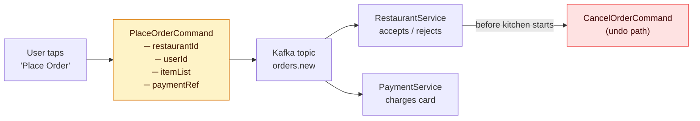

The `PlaceOrderCommand` being a durable object means:
- **Cancellable** before acceptance — mark it CANCELLED in the queue.
- **Retryable** — if the payment service is briefly down, replay the command.
- **Auditable** — every order has a full trace from creation to delivery.

### 8.2 — Version Control (Git)

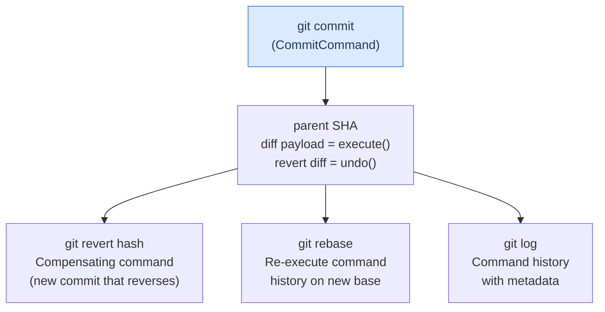

### 8.3 — Financial Transaction Systems

```java
public class TransferFundsCommand implements TaskCommand {
    private final AccountService accounts;
    private final String fromAccountId, toAccountId;
    private final BigDecimal amount;
    private String transactionId; // set during execute

    @Override
    public void execute() {
        transactionId = accounts.transfer(fromAccountId, toAccountId, amount);
    }

    @Override
    public void undo() {
        // Compensating transaction — the industry-standard approach
        accounts.transfer(toAccountId, fromAccountId, amount, "REVERSAL:" + transactionId);
    }
}
```

### 8.4 — CI/CD Pipeline Rollbacks

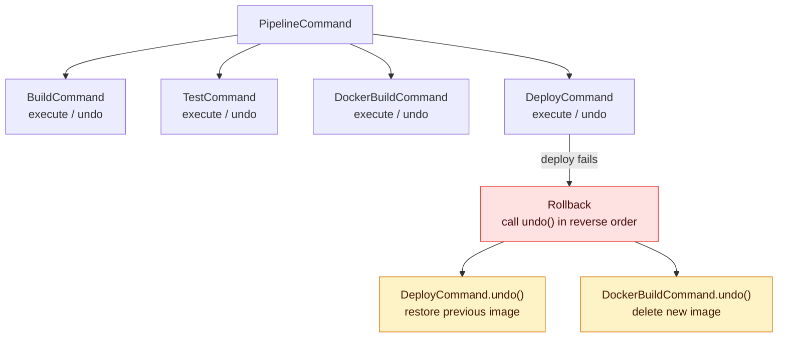

---

## 9. Command Pattern in Game Engines

### Input Mapping (Button Remapping)

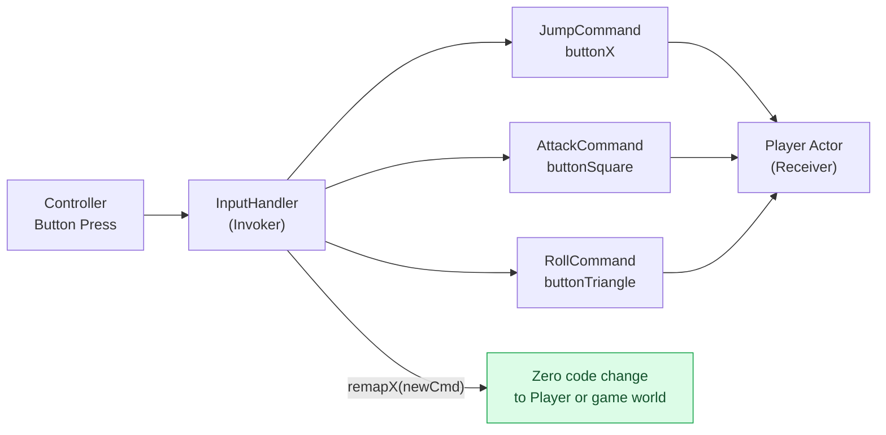

### Command Queue — Enabling Replay, Multiplayer, Macros

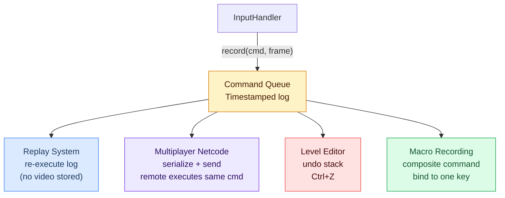

### Replay System

```java
public class ReplayRecorder {
    private final List<TimestampedCommand> recording = new ArrayList<>();

    public void record(Command command, long frameNumber) {
        recording.add(new TimestampedCommand(command, frameNumber));
    }

    public void playback(Actor player) {
        for (TimestampedCommand entry : recording) {
            // Advance simulation to entry.frameNumber, then:
            entry.command().execute(player);
        }
    }
}
```

No video is stored. The entire replay is a list of command objects — kilobytes, not gigabytes.

---

## 10. Anti-Patterns and Common Mistakes

### ❌ Fat Commands (Logic in the Wrong Place)

```java
// BAD — command contains business logic
public class ApproveOrderCommand implements Command {
    @Override
    public void execute() {
        // 150 lines of approval logic...
        order.setStatus(APPROVED);
        inventory.reserve(order.getItems());
        email.send(...);
        audit.log(...);
    }
}

// GOOD — thin command delegates to receiver
public class ApproveOrderCommand implements Command {
    private final OrderService orderService;
    private final String orderId;

    @Override public void execute() { orderService.approve(orderId);        }
    @Override public void undo()    { orderService.revokeApproval(orderId); }
}
```

### ❌ Forgetting State for Undo

```java
// BAD — item is gone, undo impossible
public class DeleteItemCommand implements Command {
    @Override public void execute() { repository.delete(itemId); }
    @Override public void undo()    { /* item is gone! */        }
}

// GOOD — capture state before deletion
public class DeleteItemCommand implements Command {
    private Item snapshot;

    @Override
    public void execute() {
        snapshot = repository.findById(itemId); // save first
        repository.delete(itemId);
    }

    @Override
    public void undo() { repository.save(snapshot); }
}
```

### Anti-Pattern Summary

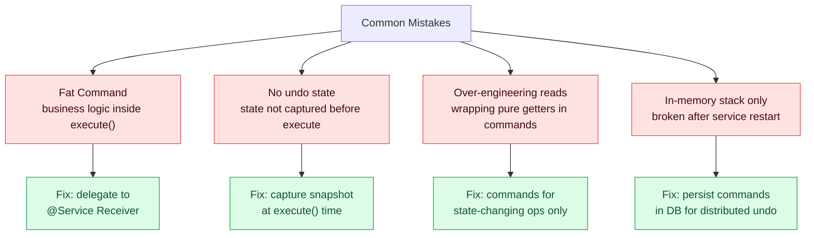

---

## 11. When to Use (and When Not to Use) the Command Pattern

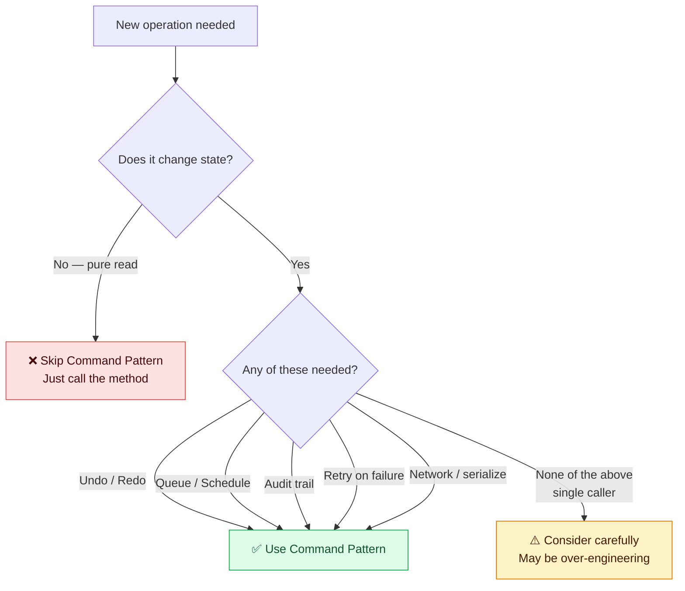

| ✅ Use when... | ❌ Skip when... |
|---|---|
| You need undo/redo | Operation is a read-only query |
| Operations must be queued or scheduled | There is only one caller and one receiver |
| You need a full audit trail | Undo, queuing, and retry are genuinely never needed |
| Operations may need to be retried | The indirection adds no value |
| Building a transaction system | Simple CRUD with no cross-cutting concerns |
| Decoupling sender from action | Tight, stable relationship between caller and action |
| Macro recording needed | Single-use one-off operations |

---

## 12. Quick Reference Cheat Sheet

```
Command Pattern Participants
────────────────────────────
Client          → creates ConcreteCommand, wires Receiver, hands to Invoker
Invoker         → calls command.execute(); manages history stack
Command         → interface: execute(), undo()
ConcreteCommand → holds Receiver ref + parameters; implements execute/undo
Receiver        → contains the actual business logic (@Service)

Command Lifecycle
─────────────────
1. Client creates:   new SendEmailCommand(emailService, to, subj, body)
2. Client registers: invoker.setCommand(cmd)  OR  repository.save(entity)
3. Invoker fires:    cmd.execute()
4. On failure:       cmd.undo()  OR  enqueue compensating command
5. For audit:        cmd.getType() + cmd.toJson() → stored to DB
6. For undo:         pop from history stack, call .undo()

Design Checklist
────────────────
☐ Command interface has execute() and undo()
☐ ConcreteCommand is thin — delegates to Receiver
☐ State needed for undo is captured at execute() time, not construction time
☐ Commands are serializable (getType + toJson) for persistence/queuing
☐ Invoker maintains a history stack (in-memory) or command log (distributed)
☐ CommandFactory (or registry) deserializes commands from stored JSON
☐ Processor handles status: PENDING → RUNNING → COMPLETED/FAILED
☐ Retry logic lives in the Processor, not the Command or Receiver
```

---

*The Command pattern is one of the most versatile tools in enterprise design. Master it and you gain undo, queuing, scheduling, auditing, and retry — essentially for free — on any operation in your system.*