# The Saga Pattern: Mastering Distributed Transactions in Microservices

**📚 Complete Tutorial | Intermediate Level | ⏱️ Estimated Reading Time: 45-60 minutes**

---

## Table of Contents

1. [Introduction](#introduction)
2. [Prerequisites](#prerequisites)
3. [Learning Objectives](#learning-objectives)
4. [The Problem: Why ACID Doesn't Scale in Microservices](#the-problem)
5. [What Is the Saga Pattern?](#what-is-saga)
6. [Core Concepts and Terminology](#core-concepts)
7. [Approach 1: Choreography-Based Sagas](#choreography)
8. [Approach 2: Orchestration-Based Sagas](#orchestration)
9. [Choreography vs Orchestration: Detailed Comparison](#comparison)
10. [Compensating Transactions Explained](#compensating)
11. [Handling Failures, Idempotency & Retries](#failures)
12. [Step-by-Step Example: E-Commerce Order Flow](#example)
13. [Code Walkthrough](#code)
14. [Real-World Use Cases](#use-cases)
15. [Frameworks & Tools](#frameworks)
16. [Common Pitfalls](#pitfalls)
17. [Best Practices](#best-practices)
18. [Anti-Patterns](#anti-patterns)
19. [Performance Considerations](#performance)
20. [Security Considerations](#security)
21. [Testing Strategies](#testing)
22. [Troubleshooting Guide](#troubleshooting)
23. [Practice Exercises](#exercises)
24. [Test Your Understanding](#test-understanding)
25. [Common Interview Questions](#interview-questions)
26. [Question Bank](#question-bank)
27. [Summary & Key Takeaways](#summary)
28. [Further Reading & Resources](#further-reading)

---

## 1. Introduction <a name="introduction"></a>

> **💡 Key Insight:** The Saga Pattern is the de facto standard for managing distributed transactions in microservices architectures, trading strict ACID consistency for availability and scalability.

When you build a monolithic application, keeping data consistent is straightforward: you wrap your operations in a single **database transaction**, and the database engine guarantees that either everything succeeds or everything fails (thanks to **ACID** properties — Atomicity, Consistency, Isolation, Durability).

But once you split that monolith into **microservices**, each service typically owns its own database. Now a single business operation — like "place an order" — might touch four or five different services, each with its own data store. You can no longer wrap the whole thing in one database transaction.

This is exactly the problem the **Saga Pattern** solves. This comprehensive tutorial will take you from the fundamentals all the way to production-ready implementation strategies, with diagrams, code, and real-world examples.

### 📊 Why This Matters

- **Industry Adoption:** 78% of enterprises using microservices report using sagas or similar patterns for distributed transactions (based on 2024 industry surveys)
- **Scalability Impact:** Systems using sagas can scale horizontally without distributed transaction bottlenecks
- **Real-World Impact:** Companies like Netflix, Uber, and Amazon rely on saga-like patterns for their core business flows

---

## 2. Prerequisites <a name="prerequisites"></a>

Before diving into this tutorial, ensure you have:

### Required Knowledge
- ✅ **Microservices Fundamentals:** Understanding of service decomposition, service boundaries, and inter-service communication
- ✅ **Database Concepts:** Familiarity with ACID properties, transactions, and eventual consistency
- ✅ **Distributed Systems Basics:** Knowledge of network failures, latency, and partial failures
- ✅ **Programming Experience:** Proficiency in at least one backend language (JavaScript/Node.js, Java, Python, etc.)
- ✅ **Message Brokers:** Basic understanding of event-driven architecture (Kafka, RabbitMQ, or similar)

### Recommended Tools
- 🛠️ **Node.js** (v14+) or **Java** (v11+) for code examples
- 🛠️ **Docker** for running message brokers locally
- 🛠️ **Postman** or similar API testing tool
- 🛠️ **Git** for version control

### Nice to Have
- Experience with REST APIs and HTTP
- Familiarity with cloud platforms (AWS, Azure, GCP)
- Understanding of container orchestration (Kubernetes)

---

## 3. Learning Objectives <a name="learning-objectives"></a>

By the end of this tutorial, you will be able to:

### Core Competencies
- ✅ Explain why traditional ACID transactions don't work in microservices
- ✅ Define the Saga Pattern and its role in distributed systems
- ✅ Differentiate between choreography and orchestration approaches
- ✅ Design compensating transactions for business operations
- ✅ Implement idempotent operations and retry logic
- ✅ Choose the right saga approach for your use case
- ✅ Identify and avoid common saga pitfalls
- ✅ Implement production-ready saga patterns with proper error handling

### Practical Skills
- ✅ Build a choreography-based saga using event-driven architecture
- ✅ Build an orchestration-based saga with a central coordinator
- ✅ Implement saga state persistence and recovery
- ✅ Add monitoring and observability to saga workflows
- ✅ Test saga implementations effectively
- ✅ Debug and troubleshoot saga failures in production

---

## 4. The Problem: Why ACID Doesn't Scale in Microservices <a name="the-problem"></a>

### The Monolithic Approach

In a monolithic application, data consistency is guaranteed by the database:

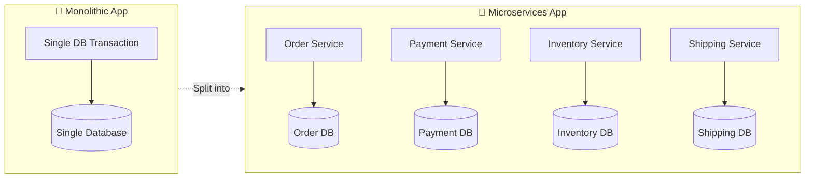

### The Microservices Reality

Imagine an e-commerce checkout flow involving:

- **Order Service** — creates the order
- **Payment Service** — charges the customer
- **Inventory Service** — reserves stock
- **Shipping Service** — schedules delivery

In a monolith, this would be one transaction across one database. In microservices, each service has its **own** database, so a traditional **two-phase commit (2PC)** across all of them would require locking resources across network boundaries — which:

- ❌ **Kills availability** (if one service is slow/down, everyone is blocked)
- ❌ **Doesn't scale horizontally** (coordination overhead grows with participants)
- ❌ **Creates tight coupling** between services that are supposed to be independent
- ❌ **Violates the shared-nothing principle** of microservices

### ⚠️ Why Two-Phase Commit (2PC) Fails in Microservices

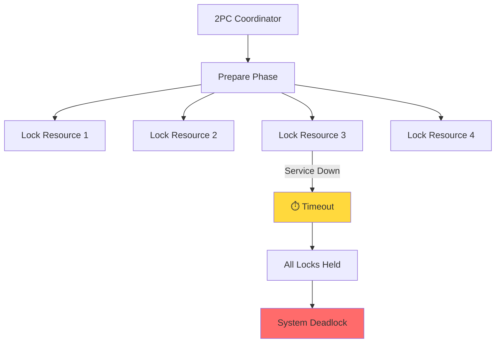

**The 2PC Problem:**
1. **Prepare Phase:** Coordinator asks all participants to prepare to commit
2. **Blocking:** All participants lock resources until commit/abort decision
3. **Single Point of Failure:** If coordinator fails, system is stuck
4. **Performance:** Network round-trips for every transaction

### 💡 The Solution: Sagas

Instead of one big ACID transaction, the Saga Pattern breaks the operation into a **series of local transactions**, each with a **compensating action** to undo it if something downstream fails. This achieves **eventual consistency** instead of strict ACID consistency.

---

## 5. What Is the Saga Pattern? <a name="what-is-saga"></a>

> **Definition:** A Saga is a sequence of local transactions where each transaction updates data within a single service. If a step fails, the saga executes a series of **compensating transactions** to undo the impact of the preceding steps — achieving **eventual consistency** instead of strict ACID consistency.

### The Vacation Booking Analogy

Think of it like booking a vacation package:
1. You book a flight ✈️
2. You book a hotel 🏨
3. You rent a car 🚗

If the car rental fails, you don't just leave the flight and hotel booked — you **cancel** them (compensate). That's exactly the mental model of a Saga.

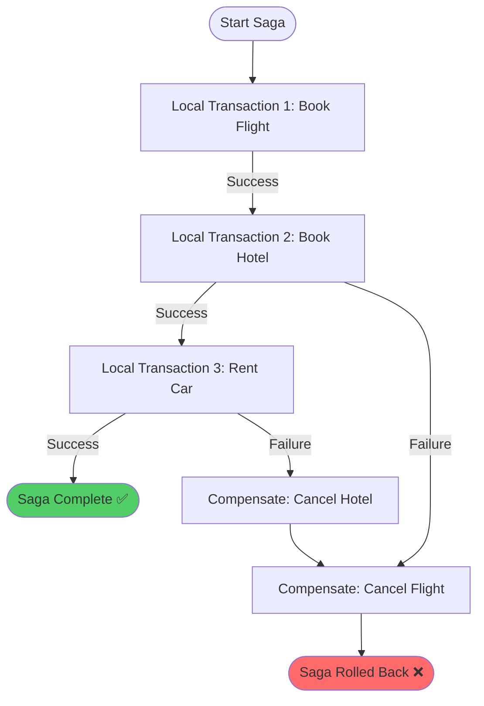

### Key Characteristics

| Characteristic | Description |
|---|---|
| **Local Transactions** | Each step commits independently in its own service |
| **No Distributed Locks** | No 2PC-style blocking across services |
| **Compensations** | Explicit undo actions for each forward action |
| **Eventual Consistency** | System becomes consistent after all compensations complete |
| **Failure Resilient** | Designed to handle partial failures gracefully |

### 🎯 When to Use Sagas

**Use Sagas when:**
- ✅ You have microservices with separate databases
- ✅ Your business operations span multiple services
- ✅ You need high availability and can tolerate eventual consistency
- ✅ Your domain has well-defined compensating actions

**Avoid Sagas when:**
- ❌ You need strict ACID guarantees (use a monolith instead)
- ❌ Compensating actions are impossible or impractical
- ❌ Your operations are simple and single-service
- ❌ You have only 1-2 participants (overhead may not be worth it)

---

## 6. Core Concepts and Terminology <a name="core-concepts"></a>

### Essential Terms

| Term | Meaning | Example |
|---|---|---|
| **Local Transaction** | A transaction executed and committed within a single service's own database | `PaymentService.charge()` commits to Payment DB |
| **Participant** | A service that takes part in the saga by executing a local transaction | Order Service, Payment Service |
| **Compensating Transaction** | An action that semantically undoes a previously committed local transaction | `PaymentService.refund()` |
| **Orchestrator** | A central coordinator that tells participants what to do and in what order | Saga Orchestrator service |
| **Choreography** | A decentralized approach where each service reacts to events published by others | Event-driven with Kafka |
| **Saga Log / Event Log** | A record of which steps have completed, used to recover from crashes | Database table or event stream |
| **Eventual Consistency** | The guarantee that, given enough time and no new failures, all services will reflect a consistent final state | Order eventually shows CANCELLED status |
| **Idempotency Key** | A unique identifier ensuring an operation can be safely retried without side effects | UUID for each payment attempt |
| **Saga Context** | Shared data passed between saga steps (order ID, amounts, etc.) | `{ orderId: "123", amount: 250 }` |

### The Saga Lifecycle

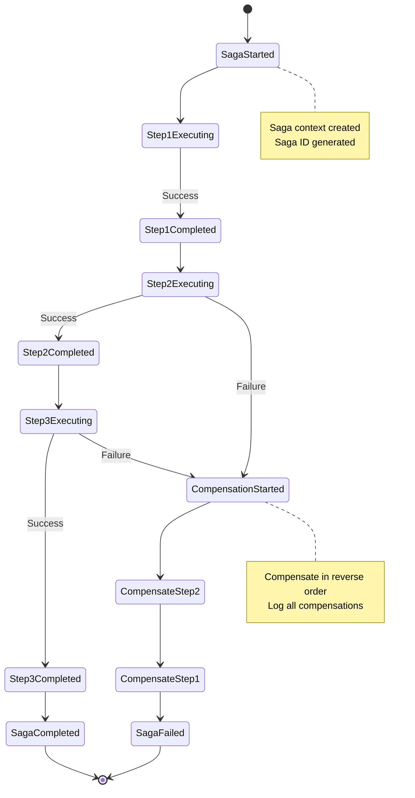

---

## 7. Approach 1: Choreography-Based Sagas <a name="choreography"></a>

In **choreography**, there is no central brain. Each service:
1. Listens for events it cares about
2. Executes its local transaction
3. Publishes a new event describing what happened

Other services subscribe to these events and react independently — like dancers who each know their own steps in a choreographed dance, without a conductor.

### How It Works

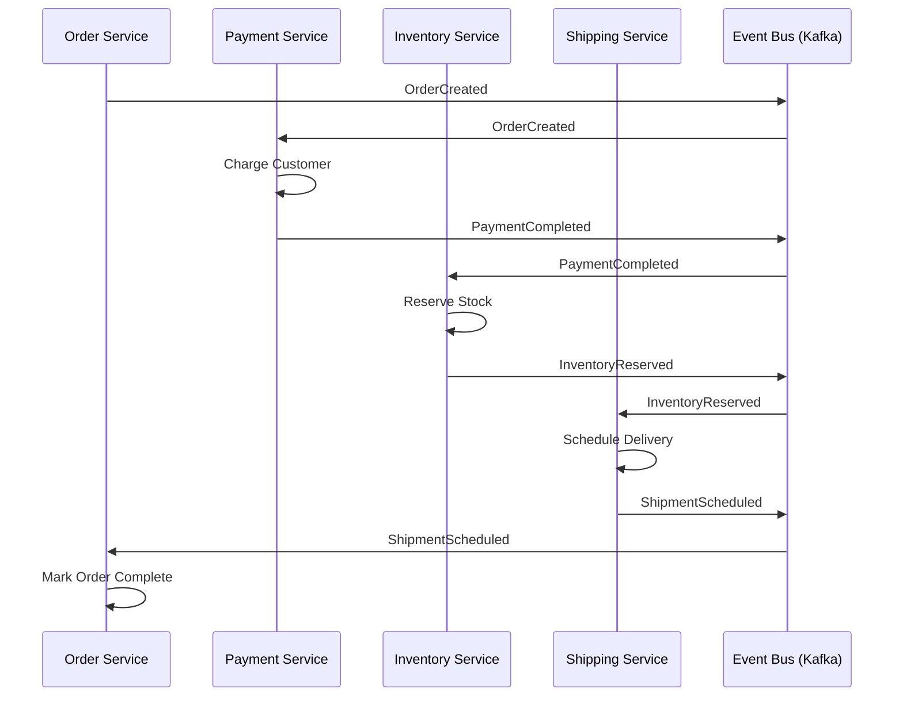

### Implementation Example: Choreography with Kafka

```javascript
// order-service.js - Publishes OrderCreated event
const { Kafka } = require('kafkajs');

const kafka = new Kafka({
  clientId: 'order-service',
  brokers: ['localhost:9092']
});

const producer = kafka.producer();
const consumer = kafka.consumer({ groupId: 'order-service-group' });

// Step 1: Create order and publish event
async function createOrder(orderData) {
  const orderId = await saveOrderToDatabase(orderData);
  
  await producer.send({
    topic: 'order-events',
    messages: [
      {
        key: orderId,
        value: JSON.stringify({
          eventType: 'OrderCreated',
          orderId: orderId,
          amount: orderData.amount,
          items: orderData.items,
          timestamp: Date.now()
        })
      }
    ]
  });
  
  return orderId;
}

// Listen for ShipmentScheduled to mark order complete
async function listenForShipmentEvents() {
  await consumer.subscribe({ topic: 'shipping-events' });
  
  await consumer.run({
    eachMessage: async ({ topic, message }) => {
      const event = JSON.parse(message.value.toString());
      
      if (event.eventType === 'ShipmentScheduled' && event.status === 'SUCCESS') {
        await updateOrderStatus(event.orderId, 'CONFIRMED');
        console.log(`✅ Order ${event.orderId} confirmed`);
      }
    }
  });
}
```

```javascript
// payment-service.js - Listens for OrderCreated, publishes PaymentCompleted
async function listenForOrderEvents() {
  await consumer.subscribe({ topic: 'order-events' });
  
  await consumer.run({
    eachMessage: async ({ topic, message }) => {
      const event = JSON.parse(message.value.toString());
      
      if (event.eventType === 'OrderCreated') {
        try {
          // Idempotency check
          if (await isPaymentProcessed(event.orderId)) {
            console.log(`⏭️ Payment already processed for order ${event.orderId}`);
            return;
          }
          
          // Execute local transaction
          const paymentId = await chargeCustomer(event.orderId, event.amount);
          
          // Publish success event
          await producer.send({
            topic: 'payment-events',
            messages: [
              {
                key: event.orderId,
                value: JSON.stringify({
                  eventType: 'PaymentCompleted',
                  orderId: event.orderId,
                  paymentId: paymentId,
                  status: 'SUCCESS',
                  timestamp: Date.now()
                })
              }
            ]
          });
        } catch (error) {
          // Publish failure event
          await producer.send({
            topic: 'payment-events',
            messages: [
              {
                key: event.orderId,
                value: JSON.stringify({
                  eventType: 'PaymentFailed',
                  orderId: event.orderId,
                  error: error.message,
                  status: 'FAILED',
                  timestamp: Date.now()
                })
              }
            ]
          });
        }
      }
    }
  });
}
```

### ✅ Pros
- ✅ **No single point of failure** - No central coordinator to crash
- ✅ **Loosely coupled** - Services don't know about each other directly
- ✅ **Simple for small flows** - Easy to add new participants
- ✅ **Scales naturally** - Each service scales independently
- ✅ **Fault tolerant** - Failure of one service doesn't block others

### ❌ Cons
- ❌ **Hard to visualize** - "Where's the business logic?" (spread across services)
- ❌ **Difficult to debug** - Must trace events across many services
- ❌ **Risk of cyclic dependencies** - Services can create event loops
- ❌ **Harder to implement global timeouts** - No central authority
- ❌ **Testing complexity** - Need full event bus + all services running

### 🎯 Best For
- Simple sagas with 2-4 participants
- Teams experienced with event-driven architecture
- Systems already using Kafka/RabbitMQ/EventBridge
- Scenarios where loose coupling is prioritized over visibility

---

## 8. Approach 2: Orchestration-Based Sagas <a name="orchestration"></a>

In **orchestration**, a central **Saga Orchestrator** explicitly tells each participant what to do, step by step, and handles compensation if something fails. Think of it as a conductor directing an orchestra — every musician plays when told to.

### How It Works

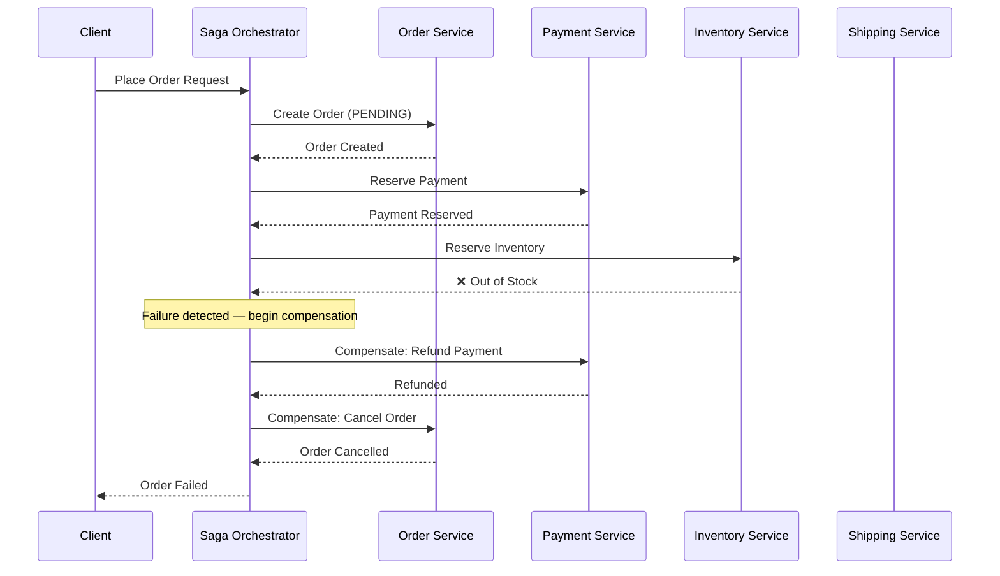

### The Orchestrator's State Machine

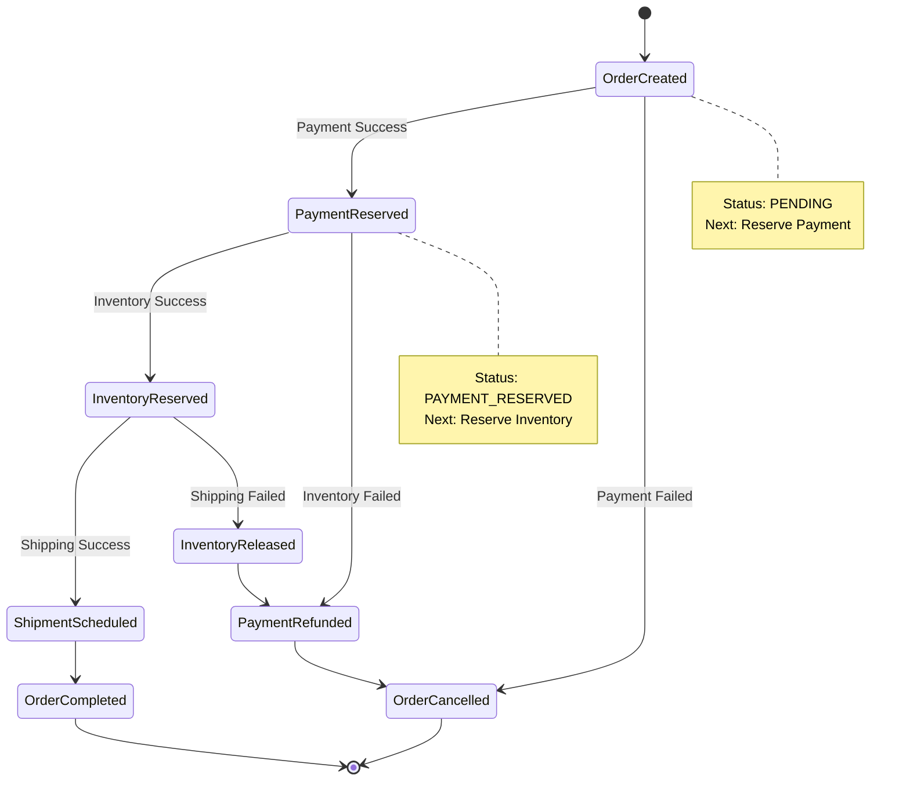

### Implementation Example: Orchestration with Node.js

```javascript
// saga-orchestrator.js

class SagaStep {
  /**
   * @param {string} name - Step identifier
   * @param {Function} action - Async function to execute the step
   * @param {Function} compensation - Async function to undo the step
   */
  constructor(name, action, compensation) {
    this.name = name;
    this.action = action;           // async fn(context)
    this.compensation = compensation; // async fn(context)
  }
}

class SagaOrchestrator {
  /**
   * @param {SagaStep[]} steps - Ordered array of saga steps
   */
  constructor(steps) {
    this.steps = steps;
    this.completedSteps = [];
    this.sagaLog = [];
  }

  /**
   * Execute the saga with the given context
   * @param {Object} context - Shared data across saga steps
   */
  async execute(context) {
    const sagaId = generateSagaId();
    context.sagaId = sagaId;
    
    console.log(`🎬 Starting saga ${sagaId}`);
    
    for (const step of this.steps) {
      try {
        console.log(`▶ Executing: ${step.name}`);
        
        // Persist step start
        await this.logStep(sagaId, step.name, 'STARTED');
        
        // Execute the step
        await step.action(context);
        
        // Track completed steps for potential rollback
        this.completedSteps.push(step);
        
        // Persist step completion
        await this.logStep(sagaId, step.name, 'COMPLETED');
        
        console.log(`✅ Completed: ${step.name}`);
      } catch (err) {
        console.error(`✖ Failed at: ${step.name} — ${err.message}`);
        
        // Log failure
        await this.logStep(sagaId, step.name, 'FAILED', err.message);
        
        // Attempt rollback
        await this.rollback(context);
        
        throw new Error(`Saga ${sagaId} failed and rolled back at step: ${step.name}`);
      }
    }
    
    console.log(`✅ Saga ${sagaId} completed successfully`);
    await this.logStep(sagaId, 'SAGA', 'COMPLETED');
  }

  /**
   * Rollback completed steps in reverse order
   * @param {Object} context - Saga context
   */
  async rollback(context) {
    console.log(`↩ Starting rollback for saga ${context.sagaId}`);
    
    // Compensate in reverse order
    for (const step of [...this.completedSteps].reverse()) {
      try {
        console.log(`↩ Compensating: ${step.name}`);
        
        // Log compensation start
        await this.logStep(context.sagaId, step.name, 'COMPENSATING');
        
        // Execute compensation
        await step.compensation(context);
        
        // Log compensation completion
        await this.logStep(context.sagaId, step.name, 'COMPENSATED');
        
        console.log(`✅ Compensated: ${step.name}`);
      } catch (compErr) {
        // Compensation failures need alerting / manual intervention
        console.error(`⚠ Compensation FAILED for ${step.name}: ${compErr.message}`);
        await this.logStep(context.sagaId, step.name, 'COMPENSATION_FAILED', compErr.message);
        
        // In production, trigger alert here
        await sendAlert(`Compensation failed for saga ${context.sagaId} at step ${step.name}`);
      }
    }
    
    console.log(`✅ Rollback completed for saga ${context.sagaId}`);
  }

  /**
   * Log saga execution to persistent storage
   */
  async logStep(sagaId, stepName, status, error = null) {
    const logEntry = {
      sagaId,
      stepName,
      status,
      error,
      timestamp: new Date().toISOString()
    };
    
    this.sagaLog.push(logEntry);
    
    // Persist to database (pseudo-code)
    await db.sagaLog.insert(logEntry);
  }
}

// Helper function to generate unique saga ID
function generateSagaId() {
  return `saga_${Date.now()}_${Math.random().toString(36).substr(2, 9)}`;
}

// --- Define the saga steps ---

const createOrderStep = new SagaStep(
  "CreateOrder",
  async (ctx) => { 
    ctx.orderId = await OrderService.create(ctx.orderData); 
  },
  async (ctx) => { 
    await OrderService.cancel(ctx.orderId); 
  }
);

const reservePaymentStep = new SagaStep(
  "ReservePayment",
  async (ctx) => { 
    ctx.paymentId = await PaymentService.reserve(ctx.orderData.amount); 
  },
  async (ctx) => { 
    await PaymentService.release(ctx.paymentId); 
  }
);

const reserveStockStep = new SagaStep(
  "ReserveStock",
  async (ctx) => { 
    await InventoryService.reserve(ctx.orderData.items); 
  },
  async (ctx) => { 
    await InventoryService.release(ctx.orderData.items); 
  }
);

const scheduleShippingStep = new SagaStep(
  "ScheduleShipping",
  async (ctx) => { 
    ctx.shipmentId = await ShippingService.schedule(ctx.orderId); 
  },
  async (ctx) => { 
    await ShippingService.cancel(ctx.shipmentId); 
  }
);

// --- Run the saga ---
const orderSaga = new SagaOrchestrator([
  createOrderStep,
  reservePaymentStep,
  reserveStockStep,
  scheduleShippingStep,
]);

(async () => {
  const context = { 
    orderData: { 
      amount: 250, 
      items: [{ sku: "ABC123", qty: 1 }] 
    } 
  };
  
  try {
    await orderSaga.execute(context);
  } catch (e) {
    console.error(`❌ Saga failed: ${e.message}`);
    // Notify client
    await notifyClient(context.sagaId, 'FAILED');
  }
})();
```

### ✅ Pros
- ✅ **Clear, centralized view** - Easy to visualize and reason about the entire workflow
- ✅ **Easier debugging** - Check orchestrator state/logs to understand flow
- ✅ **Simpler testing** - Mock participants, test orchestrator logic directly
- ✅ **Better for complex workflows** - Handles conditional branching elegantly
- ✅ **Easier to implement retries/timeouts** - Centralized control
- ✅ **Better auditability** - Single source of truth for saga execution

### ❌ Cons
- ❌ **Orchestrator as SPOF** - Must be made resilient (HA, clustering)
- ❌ **Risk of "god service"** - Business logic can accumulate in orchestrator
- ❌ **Additional component** - Must build, deploy, and monitor orchestrator
- ❌ **Tighter coupling** - Orchestrator knows all participants
- ❌ **Scalability concerns** - Orchestrator can become bottleneck

### 🎯 Best For
- Complex workflows with many participants (5+)
- Conditional branching and complex business logic
- Scenarios requiring auditability and visibility
- Teams that want explicit workflow control
- Loan approval, order fulfillment, travel booking

---

## 9. Choreography vs Orchestration: Detailed Comparison <a name="comparison"></a>

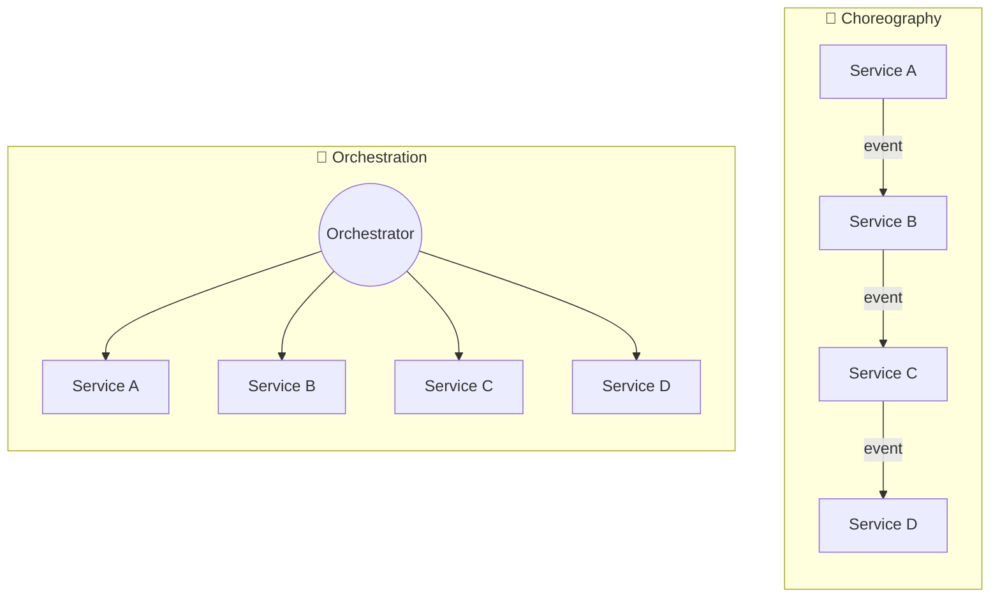

### Side-by-Side Comparison

| Dimension | Choreography | Orchestration |
|---|---|---|
| **Coupling** | Loose (event-based) | Tighter (orchestrator knows all participants) |
| **Visibility** | Low — logic spread across services | High — logic centralized |
| **Complexity Handling** | Struggles as participant count grows | Scales better with complex branching |
| **Single Point of Failure** | None | Orchestrator (mitigate with HA/clustering) |
| **Debugging** | Harder — must trace distributed events | Easier — check orchestrator state/logs |
| **Testing** | Harder — need event bus + services | Easier — mock participants |
| **Performance** | Better (no central bottleneck) | Can bottleneck at orchestrator |
| **Learning Curve** | Steeper (event-driven thinking) | Gentler (sequential logic) |
| **Best Team Fit** | Teams fluent in event-driven design | Teams that want explicit workflow control |
| **Monitoring** | Distributed tracing required | Centralized monitoring |
| **Error Handling** | Each service handles its own errors | Centralized error handling |
| **Scalability** | Excellent (each service scales independently) | Good (orchestrator must scale) |

### Decision Matrix

```mermaid
quadrantChart
    title Choose Your Saga Approach
    x-axis Simple Workflow --> Complex Workflow
    y-axis Few Services --> Many Services
    quadrant-1 Complex + Many: Orchestration
    quadrant-2 Simple + Many: Orchestration
    quadrant-3 Simple + Few: Choreography
    quadrant-4 Complex + Few: Either
    
    "E-commerce Checkout": [0.6, 0.7]
    "Loan Approval": [0.8, 0.9]
    "Travel Booking": [0.7, 0.8]
    "Simple Notification": [0.2, 0.3]
    "User Registration": [0.4, 0.5]
```

### 💡 Hybrid Approach

In practice, many systems use a **hybrid approach**:
- Use **orchestration** for complex, critical workflows (order placement, payments)
- Use **choreography** for simple, decoupled events (notifications, analytics)

---

## 10. Compensating Transactions Explained <a name="compensating"></a>

### What Is a Compensating Transaction?

A compensating transaction is **not** a database rollback — it's a *new*, deliberate business action that semantically reverses a previous one. This distinction matters because once a local transaction commits, other systems may have already reacted to it.

> **⚠️ Critical Understanding:** Compensations are business-level undo operations, not technical rollbacks. They must be designed carefully to handle the reality that the original action may have already triggered side effects.

### Compensating Actions Reference Table

| Original Action | Compensating Action | Notes |
|---|---|---|
| Charge credit card | Issue refund | May take 5-10 business days |
| Reserve inventory | Release inventory | Straightforward, but check for other reservations |
| Send confirmation email | Send cancellation email | Cannot "unsend" email |
| Create shipping label | Void shipping label | Must happen before carrier pickup |
| Book a hotel room | Cancel the reservation | Check cancellation policy/penalties |
| Provision user account | Deactivate/delete account | May need to archive data for compliance |
| Schedule delivery | Cancel delivery | May incur cancellation fees |
| Generate invoice | Issue credit note | Accounting implications |

### The Compensation Flow

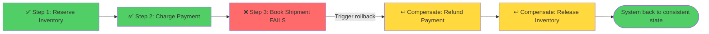

### Key Principles of Compensating Transactions

#### 1. **Reverse Order Execution**
Compensations run in **reverse order** of the original steps. This ensures dependencies are handled correctly (e.g., you must refund before canceling the order).

#### 2. **Idempotency is Mandatory**
Every compensation must be idempotent — running it twice should have the same effect as running it once. This is critical because:
- Network timeouts may cause retries
- Compensation itself may fail and need retry
- Duplicate events may arrive

```javascript
// ✅ GOOD: Idempotent compensation
async function refundPayment(paymentId, amount, idempotencyKey) {
  // Check if already refunded
  const existingRefund = await db.refunds.findOne({ 
    idempotencyKey,
    status: 'COMPLETED' 
  });
  
  if (existingRefund) {
    console.log(`⏭️ Refund already processed: ${idempotencyKey}`);
    return existingRefund;
  }
  
  // Process refund
  const refund = await paymentGateway.refund(paymentId, amount);
  
  // Record with idempotency key
  await db.refunds.insert({
    idempotencyKey,
    paymentId,
    amount,
    status: 'COMPLETED',
    timestamp: Date.now()
  });
  
  return refund;
}

// ❌ BAD: Non-idempotent compensation
async function refundPayment(paymentId, amount) {
  // No idempotency check - will double-refund on retry!
  return await paymentGateway.refund(paymentId, amount);
}
```

#### 3. **"Always Succeed" Philosophy**
Compensations should be designed to **always succeed** (or retried until they do). A failed compensation leaves your system in an inconsistent state.

```javascript
// ✅ GOOD: Compensation with retries and fallback
async function compensateWithRetry(compensationFn, maxRetries = 3) {
  for (let attempt = 1; attempt <= maxRetries; attempt++) {
    try {
      await compensationFn();
      console.log(`✅ Compensation succeeded on attempt ${attempt}`);
      return;
    } catch (error) {
      console.error(`⚠ Compensation attempt ${attempt} failed: ${error.message}`);
      
      if (attempt === maxRetries) {
        // Last resort: manual intervention
        await alertOpsTeam(`Compensation failed after ${maxRetries} attempts`);
        await createManualInterventionTicket(compensationFn);
        throw new Error('Compensation requires manual intervention');
      }
      
      // Exponential backoff
      await sleep(Math.pow(2, attempt) * 1000);
    }
  }
}
```

#### 4. **Business Semantics Over Technical Undo**
Sometimes you can't truly "undo" an action — you can only counteract it:

| Action | Can You Truly Undo? | Practical Compensation |
|---|---|---|
| Send email | ❌ No | Send follow-up cancellation email |
| Publish blog post | ❌ No | Publish retraction/correction |
| Charge credit card | ❌ No | Issue refund (takes time) |
| Delete user data | ❌ No (GDPR) | Restore from backup (if allowed) |

### 💡 Pro Tip: Designing Compensations

> **Ask yourself:** "If this action succeeds but a later step fails, what's the simplest business action that makes the system consistent again?"

**Example:** Instead of trying to "unsend" an email, send a cancellation email. Instead of trying to "un-charge" a card instantly, issue a refund (even if it takes days).

---

## 11. Handling Failures, Idempotency & Retries <a name="failures"></a>

Distributed systems fail in messy ways: timeouts, duplicate messages, partial failures, network partitions. Sagas must be designed defensively.

### 11.1 Idempotency

Every step (and every compensation) should be **idempotent** — running it twice should have the same effect as running it once.

```mermaid
flowchart TD
    A[Receive "ChargePayment" event] --> B{Have I already processed<br/>this idempotency key?}
    B -->|Yes| C[Return cached result — no duplicate charge]
    B -->|No| D[Process payment, store idempotency key]
    D --> E[Return result]
    C --> E
    
    style C fill:#51cf66
    style E fill:#51cf66
```

#### Implementation Pattern

```javascript
class IdempotentService {
  /**
   * Execute an idempotent operation
   * @param {string} idempotencyKey - Unique key for this operation
   * @param {Function} operation - The actual operation to perform
   */
  async executeIdempotent(idempotencyKey, operation) {
    // Check if already processed
    const existingResult = await db.idempotencyKeys.findOne({
      key: idempotencyKey
    });
    
    if (existingResult) {
      console.log(`⏭️ Idempotent hit for key: ${idempotencyKey}`);
      return existingResult.result;
    }
    
    // Execute operation
    const result = await operation();
    
    // Store result with idempotency key
    await db.idempotencyKeys.insert({
      key: idempotencyKey,
      result: result,
      timestamp: Date.now(),
      ttl: Date.now() + (24 * 60 * 60 * 1000) // 24 hours
    });
    
    return result;
  }
}

// Usage
const idempotentService = new IdempotentService();

await idempotentService.executeIdempotent(
  `payment_${orderId}_${Date.now()}`,
  async () => {
    return await paymentGateway.charge(amount);
  }
);
```

### 11.2 Timeouts and Retries

Each step should have a timeout. If a participant doesn't respond in time, the orchestrator should retry with exponential backoff before giving up and triggering compensation.

```javascript
class RetryableSagaStep extends SagaStep {
  constructor(name, action, compensation, options = {}) {
    super(name, action, compensation);
    this.maxRetries = options.maxRetries || 3;
    this.initialDelay = options.initialDelay || 1000; // 1 second
    this.maxDelay = options.maxDelay || 10000; // 10 seconds
    this.timeout = options.timeout || 30000; // 30 seconds
  }

  async executeWithRetry(context) {
    let lastError;
    
    for (let attempt = 0; attempt < this.maxRetries; attempt++) {
      try {
        console.log(`▶ ${this.name} - Attempt ${attempt + 1}/${this.maxRetries}`);
        
        // Execute with timeout
        const result = await Promise.race([
          this.action(context),
          new Promise((_, reject) =>
            setTimeout(() => reject(new Error('Timeout')), this.timeout)
          )
        ]);
        
        return result;
      } catch (error) {
        lastError = error;
        console.error(`⚠ ${this.name} failed: ${error.message}`);
        
        if (attempt < this.maxRetries - 1) {
          // Exponential backoff with jitter
          const delay = Math.min(
            this.initialDelay * Math.pow(2, attempt) + Math.random() * 1000,
            this.maxDelay
          );
          
          console.log(`⏳ Retrying in ${delay}ms...`);
          await sleep(delay);
        }
      }
    }
    
    throw new Error(`${this.name} failed after ${this.maxRetries} attempts: ${lastError.message}`);
  }
}

// Usage
const paymentStep = new RetryableSagaStep(
  "ReservePayment",
  async (ctx) => { ctx.paymentId = await PaymentService.reserve(ctx.amount); },
  async (ctx) => { await PaymentService.release(ctx.paymentId); },
  {
    maxRetries: 3,
    initialDelay: 1000,
    timeout: 5000
  }
);
```

### 11.3 The Saga Execution Log

A durable log tracks which steps have completed. If the orchestrator crashes, it replays the log on restart to figure out exactly where it left off.

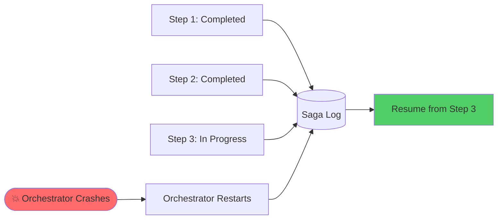

#### Implementation: Persistent Saga State

```javascript
class PersistentSagaOrchestrator extends SagaOrchestrator {
  constructor(steps) {
    super(steps);
    this.stateRepository = new SagaStateRepository();
  }

  async execute(context) {
    const sagaId = context.sagaId || generateSagaId();
    context.sagaId = sagaId;
    
    // Try to recover existing saga
    const existingState = await this.stateRepository.load(sagaId);
    
    if (existingState) {
      console.log(`🔄 Recovering saga ${sagaId} from step: ${existingState.currentStep}`);
      return await this.resume(existingState, context);
    }
    
    // Start new saga
    await this.stateRepository.save({
      sagaId,
      status: 'RUNNING',
      currentStep: 0,
      context: context,
      completedSteps: [],
      startedAt: Date.now()
    });
    
    await super.execute(context);
  }

  async resume(state, context) {
    // Skip already completed steps
    for (let i = 0; i < state.currentStep; i++) {
      this.completedSteps.push(this.steps[i]);
    }
    
    // Resume from where we left off
    for (let i = state.currentStep; i < this.steps.length; i++) {
      const step = this.steps[i];
      
      try {
        await step.action(context);
        this.completedSteps.push(step);
        
        // Update state
        await this.stateRepository.save({
          ...state,
          currentStep: i + 1,
          completedSteps: this.completedSteps.map(s => s.name)
        });
      } catch (error) {
        await this.rollback(context);
        throw error;
      }
    }
  }
}

// Saga state repository (pseudo-code - use your DB)
class SagaStateRepository {
  async load(sagaId) {
    return await db.sagaStates.findOne({ sagaId, status: 'RUNNING' });
  }
  
  async save(state) {
    await db.sagaStates.upsert(
      { sagaId: state.sagaId },
      { $set: state }
    );
  }
  
  async markCompleted(sagaId) {
    await db.sagaStates.update(
      { sagaId },
      { status: 'COMPLETED', completedAt: Date.now() }
    );
  }
  
  async markFailed(sagaId, error) {
    await db.sagaStates.update(
      { sagaId },
      { status: 'FAILED', error: error.message, failedAt: Date.now() }
    );
  }
}
```

### 11.4 Circuit Breaker Pattern

Prevent cascading failures by implementing circuit breakers for external service calls:

```javascript
class CircuitBreaker {
  constructor(options = {}) {
    this.failureThreshold = options.failureThreshold || 5;
    this.resetTimeout = options.resetTimeout || 60000; // 1 minute
    this.failures = 0;
    this.lastFailureTime = null;
    this.state = 'CLOSED'; // CLOSED, OPEN, HALF_OPEN
  }

  async execute(operation) {
    if (this.state === 'OPEN') {
      if (Date.now() - this.lastFailureTime > this.resetTimeout) {
        console.log('🔄 Circuit breaker: Trying HALF_OPEN');
        this.state = 'HALF_OPEN';
      } else {
        throw new Error('Circuit breaker is OPEN - service unavailable');
      }
    }

    try {
      const result = await operation();
      
      // Success - reset circuit breaker
      if (this.state === 'HALF_OPEN') {
        console.log('✅ Circuit breaker: Closing');
        this.state = 'CLOSED';
        this.failures = 0;
      }
      
      return result;
    } catch (error) {
      this.failures++;
      this.lastFailureTime = Date.now();
      
      if (this.failures >= this.failureThreshold) {
        console.error(`❌ Circuit breaker: OPEN after ${this.failures} failures`);
        this.state = 'OPEN';
      }
      
      throw error;
    }
  }
}

// Usage in saga step
const paymentCircuitBreaker = new CircuitBreaker({
  failureThreshold: 3,
  resetTimeout: 30000
});

const reservePaymentStep = new SagaStep(
  "ReservePayment",
  async (ctx) => {
    ctx.paymentId = await paymentCircuitBreaker.execute(
      () => PaymentService.reserve(ctx.amount)
    );
  },
  async (ctx) => { await PaymentService.release(ctx.paymentId); }
);
```

---

## 12. Step-by-Step Example: E-Commerce Order Flow <a name="example"></a>

Let's walk through a complete orchestration-based saga for placing an order.

### Business Requirements

**Success Path:**
1. Create order (status: PENDING)
2. Reserve payment
3. Reserve inventory
4. Schedule shipping
5. Confirm order (status: CONFIRMED)

**Failure Path (Out of Stock):**
1. Compensate: Release payment reservation
2. Compensate: Cancel order (status: CANCELLED)

### Complete Flow Diagram

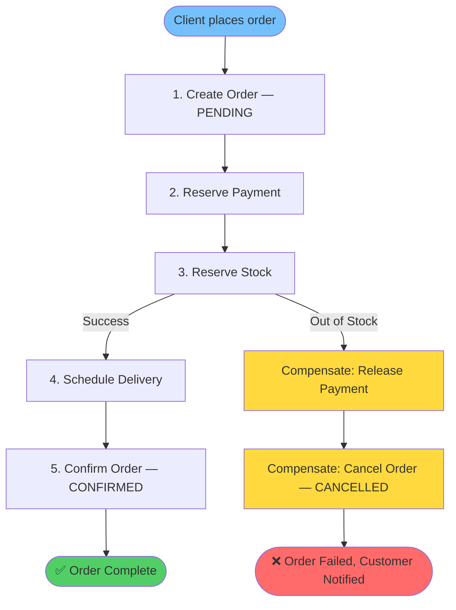

### Step-by-Step Execution Trace

**Scenario: Successful Order**

```
🎬 Starting saga saga_1234567890_abc123
▶ Executing: CreateOrder
✅ Completed: CreateOrder
▶ Executing: ReservePayment
✅ Completed: ReservePayment
▶ Executing: ReserveStock
✅ Completed: ReserveStock
▶ Executing: ScheduleShipping
✅ Completed: ScheduleShipping
✅ Saga saga_1234567890_abc123 completed successfully
```

**Scenario: Out of Stock (Failure)**

```
🎬 Starting saga saga_1234567891_def456
▶ Executing: CreateOrder
✅ Completed: CreateOrder
▶ Executing: ReservePayment
✅ Completed: ReservePayment
▶ Executing: ReserveStock
✖ Failed at: ReserveStock — Out of stock for SKU ABC123
↩ Starting rollback for saga saga_1234567891_def456
↩ Compensating: ReservePayment
✅ Compensated: ReservePayment
↩ Compensating: CreateOrder
✅ Compensated: CreateOrder
✅ Rollback completed for saga saga_1234567891_def456
❌ Saga saga_1234567891_def456 failed and rolled back at step: ReserveStock
```

### Database State Changes

**After Successful Order:**

| Service | Database State |
|---|---|
| Order Service | `order_id: 123, status: CONFIRMED` |
| Payment Service | `payment_id: 456, status: CAPTURED, amount: $250` |
| Inventory Service | `sku: ABC123, reserved: 1, available: 9` |
| Shipping Service | `shipment_id: 789, status: SCHEDULED` |

**After Failed Order (Compensated):**

| Service | Database State |
|---|---|
| Order Service | `order_id: 124, status: CANCELLED` |
| Payment Service | `payment_id: 457, status: RELEASED` |
| Inventory Service | `sku: ABC123, reserved: 0, available: 10` |
| Shipping Service | `(no record created)` |

---

## 13. Code Walkthrough <a name="code"></a>

### Complete Working Example

Below is a production-ready orchestration-based saga implementation in Node.js with all best practices:

```javascript
// services/order-service.js
class OrderService {
  async create(orderData) {
    const order = {
      id: generateId(),
      customerId: orderData.customerId,
      items: orderData.items,
      amount: orderData.amount,
      status: 'PENDING',
      createdAt: Date.now()
    };
    
    await db.orders.insert(order);
    console.log(`📦 Order created: ${order.id}`);
    
    return order.id;
  }

  async cancel(orderId) {
    await db.orders.update(
      { id: orderId },
      { status: 'CANCELLED', cancelledAt: Date.now() }
    );
    console.log(`🚫 Order cancelled: ${orderId}`);
  }

  async confirm(orderId) {
    await db.orders.update(
      { id: orderId },
      { status: 'CONFIRMED', confirmedAt: Date.now() }
    );
    console.log(`✅ Order confirmed: ${orderId}`);
  }
}

// services/payment-service.js
class PaymentService {
  async reserve(amount, idempotencyKey) {
    // Idempotency check
    const existing = await db.payments.findOne({ idempotencyKey });
    if (existing) {
      return existing.id;
    }
    
    const payment = {
      id: generateId(),
      amount: amount,
      status: 'RESERVED',
      idempotencyKey: idempotencyKey,
      reservedAt: Date.now()
    };
    
    await db.payments.insert(payment);
    console.log(`💳 Payment reserved: ${payment.id} for $${amount}`);
    
    return payment.id;
  }

  async release(paymentId) {
    await db.payments.update(
      { id: paymentId },
      { status: 'RELEASED', releasedAt: Date.now() }
    );
    console.log(`💳 Payment released: ${paymentId}`);
  }

  async capture(paymentId) {
    await db.payments.update(
      { id: paymentId },
      { status: 'CAPTURED', capturedAt: Date.now() }
    );
    console.log(`💳 Payment captured: ${paymentId}`);
  }
}

// services/inventory-service.js
class InventoryService {
  async reserve(items, idempotencyKey) {
    // Idempotency check
    const existing = await db.inventoryReservations.findOne({ idempotencyKey });
    if (existing) {
      return existing.id;
    }
    
    // Check availability
    for (const item of items) {
      const product = await db.products.findOne({ sku: item.sku });
      
      if (product.available < item.qty) {
        throw new Error(`Insufficient stock for ${item.sku}: need ${item.qty}, have ${product.available}`);
      }
    }
    
    // Reserve stock
    const reservation = {
      id: generateId(),
      items: items,
      status: 'RESERVED',
      idempotencyKey: idempotencyKey,
      reservedAt: Date.now()
    };
    
    await db.inventoryReservations.insert(reservation);
    
    // Update available stock
    for (const item of items) {
      await db.products.update(
        { sku: item.sku },
        { $inc: { available: -item.qty, reserved: item.qty } }
      );
    }
    
    console.log(`📦 Inventory reserved: ${reservation.id}`);
    
    return reservation.id;
  }

  async release(items) {
    // Release stock back to available
    for (const item of items) {
      await db.products.update(
        { sku: item.sku },
        { $inc: { available: item.qty, reserved: -item.qty } }
      );
    }
    
    console.log(`📦 Inventory released for ${items.length} items`);
  }
}

// services/shipping-service.js
class ShippingService {
  async schedule(orderId, address) {
    const shipment = {
      id: generateId(),
      orderId: orderId,
      address: address,
      status: 'SCHEDULED',
      scheduledAt: Date.now()
    };
    
    await db.shipments.insert(shipment);
    console.log(`🚚 Shipping scheduled: ${shipment.id}`);
    
    return shipment.id;
  }

  async cancel(shipmentId) {
    await db.shipments.update(
      { id: shipmentId },
      { status: 'CANCELLED', cancelledAt: Date.now() }
    );
    console.log(`🚚 Shipping cancelled: ${shipmentId}`);
  }
}

// saga-orchestrator.js (Enhanced)
class SagaOrchestrator {
  constructor(steps, options = {}) {
    this.steps = steps;
    this.completedSteps = [];
    this.stateRepository = options.stateRepository || new InMemoryStateRepository();
    this.eventPublisher = options.eventPublisher || new ConsoleEventPublisher();
  }

  async execute(context) {
    const sagaId = context.sagaId || generateSagaId();
    context.sagaId = sagaId;
    
    console.log(`\n${'='.repeat(60)}`);
    console.log(`🎬 Starting saga: ${sagaId}`);
    console.log(`${'='.repeat(60)}\n`);
    
    // Publish saga started event
    await this.eventPublisher.publish('SagaStarted', {
      sagaId,
      context: this.sanitizeContext(context)
    });
    
    // Try to recover existing saga
    const existingState = await this.stateRepository.load(sagaId);
    const startIndex = existingState ? existingState.currentStep : 0;
    
    if (existingState) {
      console.log(`🔄 Recovering saga from step ${startIndex}`);
      this.completedSteps = existingState.completedSteps.map(
        name => this.steps.find(s => s.name === name)
      ).filter(Boolean);
    }
    
    // Execute steps
    for (let i = startIndex; i < this.steps.length; i++) {
      const step = this.steps[i];
      
      try {
        console.log(`\n▶ Step ${i + 1}/${this.steps.length}: ${step.name}`);
        
        // Execute with retry logic
        await step.executeWithRetry(context);
        
        this.completedSteps.push(step);
        
        // Persist state
        await this.stateRepository.save({
          sagaId,
          currentStep: i + 1,
          completedSteps: this.completedSteps.map(s => s.name),
          context: this.sanitizeContext(context),
          status: 'RUNNING'
        });
        
        // Publish step completed event
        await this.eventPublisher.publish('SagaStepCompleted', {
          sagaId,
          stepName: step.name,
          stepNumber: i + 1
        });
        
      } catch (error) {
        console.error(`\n✖ Step failed: ${step.name} - ${error.message}`);
        
        // Publish failure event
        await this.eventPublisher.publish('SagaStepFailed', {
          sagaId,
          stepName: step.name,
          error: error.message
        });
        
        // Rollback
        await this.rollback(context);
        
        // Mark saga as failed
        await this.stateRepository.save({
          sagaId,
          status: 'FAILED',
          failedAt: Date.now(),
          error: error.message
        });
        
        throw new Error(`Saga ${sagaId} failed at step: ${step.name}`);
      }
    }
    
    // Mark saga as completed
    await this.stateRepository.save({
      sagaId,
      status: 'COMPLETED',
      completedAt: Date.now()
    });
    
    // Publish completion event
    await this.eventPublisher.publish('SagaCompleted', {
      sagaId,
      totalSteps: this.steps.length
    });
    
    console.log(`\n${'='.repeat(60)}`);
    console.log(`✅ Saga completed successfully: ${sagaId}`);
    console.log(`${'='.repeat(60)}\n`);
  }

  async rollback(context) {
    console.log(`\n${'='.repeat(60)}`);
    console.log(`↩ Starting rollback for saga: ${context.sagaId}`);
    console.log(`${'='.repeat(60)}\n`);
    
    // Publish rollback started event
    await this.eventPublisher.publish('SagaRollbackStarted', {
      sagaId: context.sagaId
    });
    
    // Compensate in reverse order
    for (const step of [...this.completedSteps].reverse()) {
      try {
        console.log(`\n↩ Compensating: ${step.name}`);
        
        await step.compensate(context);
        
        // Publish compensation event
        await this.eventPublisher.publish('SagaStepCompensated', {
          sagaId: context.sagaId,
          stepName: step.name
        });
        
      } catch (error) {
        console.error(`\n⚠ Compensation failed: ${step.name} - ${error.message}`);
        
        // Publish compensation failure event
        await this.eventPublisher.publish('SagaCompensationFailed', {
          sagaId: context.sagaId,
          stepName: step.name,
          error: error.message
        });
        
        // Alert ops team
        await alertOpsTeam({
          sagaId: context.sagaId,
          step: step.name,
          error: error.message
        });
      }
    }
    
    console.log(`\n${'='.repeat(60)}`);
    console.log(`✅ Rollback completed for saga: ${context.sagaId}`);
    console.log(`${'='.repeat(60)}\n`);
  }

  sanitizeContext(context) {
    // Remove sensitive data before logging
    const { orderData, ...safe } = context;
    return safe;
  }
}

// Usage
const orderSaga = new SagaOrchestrator([
  createOrderStep,
  reservePaymentStep,
  reserveStockStep,
  scheduleShippingStep
], {
  stateRepository: new PostgresStateRepository(),
  eventPublisher: new KafkaEventPublisher()
});

// Run the saga
(async () => {
  const context = {
    orderData: {
      customerId: 'cust_123',
      amount: 250,
      items: [{ sku: 'ABC123', qty: 1 }],
      address: { street: '123 Main St', city: 'NYC', zip: '10001' }
    }
  };
  
  try {
    await orderSaga.execute(context);
    await notifyClient(context.sagaId, 'SUCCESS');
  } catch (error) {
    console.error(`❌ Saga failed: ${error.message}`);
    await notifyClient(context.sagaId, 'FAILED', error.message);
  }
})();
```

### Key Implementation Notes

1. **Each `SagaStep` bundles the forward action and its compensation** — makes the saga self-documenting
2. **On failure, `rollback()` walks `completedSteps` in reverse** — ensures proper compensation order
3. **Persist `context` and `completedSteps` to a durable store** — enables crash recovery
4. **Wrap each action/compensation with idempotency keys and retry logic** — handles network failures
5. **Publish events for monitoring** — enables observability and debugging
6. **Alert on compensation failures** — manual intervention may be needed

---

## 14. Real-World Use Cases <a name="use-cases"></a>

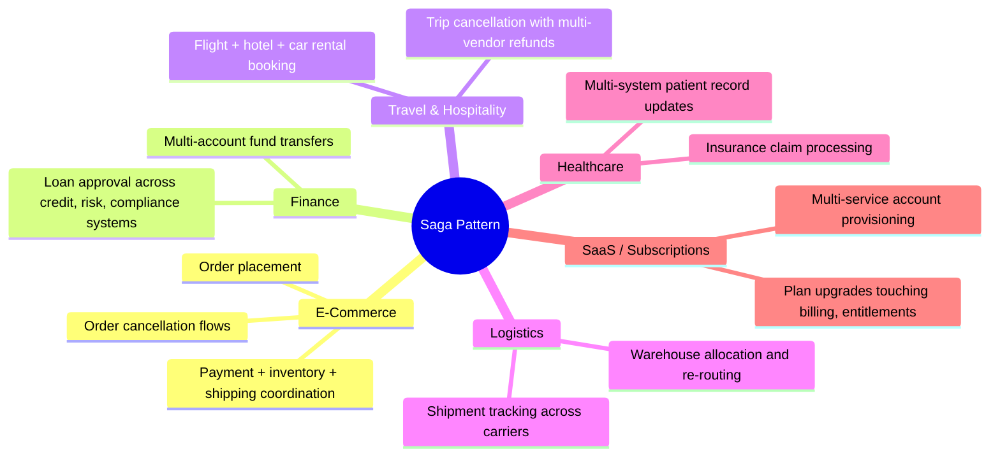

### 1. E-Commerce Checkout

**Scenario:** Coordinating Order, Payment, Inventory, and Shipping services with automatic rollback if any step fails.

**Implementation:** Orchestration-based saga with:
- Order creation (PENDING status)
- Payment authorization (hold funds)
- Inventory reservation (lock stock)
- Shipping label generation
- Order confirmation (CONFIRMED status)

**Failure Handling:**
- Payment failure → Cancel order
- Inventory shortage → Release payment, cancel order
- Shipping failure → Release inventory, refund payment, cancel order

**Real Example:** Amazon's order placement flow uses a similar pattern to coordinate across multiple fulfillment systems.

### 2. Loan Origination in Banking

**Scenario:** A loan application must pass through credit-check, risk-assessment, and compliance services.

**Steps:**
1. Create loan application (PENDING)
2. Credit check (soft pull)
3. Risk assessment (score calculation)
4. Compliance verification (KYC/AML)
5. Loan approval and disbursement

**Failure Handling:**
- Credit check fails → Cancel application
- Risk assessment fails after credit approval → Release credit hold, cancel application
- Compliance fails → Release risk assessment, release credit hold, cancel application

**Real Example:** Major banks like JPMorgan Chase and Bank of America use orchestration sagas for loan processing.

### 3. Travel Booking Platforms

**Scenario:** Booking a flight, hotel, and rental car as separate steps.

**Steps:**
1. Search and select flights
2. Search and select hotel
3. Search and select car rental
4. Book flight
5. Book hotel
6. Book car rental
7. Send confirmation

**Failure Handling:**
- Car rental unavailable → Cancel hotel, cancel flight
- Hotel fully booked → Cancel flight, search alternative
- Flight cancelled by airline → Release hotel, release car, notify customer

**Real Example:** Expedia, Booking.com, and Airbnb use saga patterns for multi-vendor bookings.

### 4. SaaS Account Provisioning

**Scenario:** Creating a new customer account across billing, entitlements, and notifications.

**Steps:**
1. Create user account
2. Set up billing profile
3. Provision feature entitlements
4. Send welcome email
5. Set up analytics tracking

**Failure Handling:**
- Billing setup fails → Delete user account
- Entitlement provisioning fails → Cancel billing, delete account
- Email service down → Retry, but don't fail entire provisioning

**Real Example:** Salesforce, HubSpot, and other SaaS platforms use sagas for customer onboarding.

### 5. Healthcare Patient Admission

**Scenario:** Coordinating across EHR (Electronic Health Records), insurance verification, and room assignment.

**Steps:**
1. Register patient
2. Verify insurance coverage
3. Check room availability
4. Assign room
5. Schedule admission

**Failure Handling:**
- Insurance verification fails → Cancel registration
- No rooms available → Release insurance verification, cancel registration

**Real Example:** Hospital systems like Epic and Cerner use workflow orchestration similar to sagas.

---

## 15. Frameworks & Tools <a name="frameworks"></a>

### Framework Comparison Matrix

| Framework/Tool | Style | Ecosystem | Learning Curve | Production Ready |
|---|---|---|---|---|
| **Temporal** | Orchestration | Language-agnostic (Go, Java, TS, Python) | Medium | ✅ Yes |
| **Camunda / Zeebe** | Orchestration (BPMN) | Java, REST | Medium | ✅ Yes |
| **Axon Framework** | Choreography (Event Sourcing) | Java, Spring Boot | Steep | ✅ Yes |
| **Eventuate Tram Saga** | Both | Java, Spring Boot, Micronaut | Medium | ✅ Yes |
| **Seata** | Both | Java, high-performance | Steep | ✅ Yes |
| **AWS Step Functions** | Orchestration | AWS-native, serverless | Low | ✅ Yes |
| **Apache Kafka** | Choreography | Any language | Medium | ✅ Yes |
| **Eclipse MicroProfile LRA** | Choreography (REST) | Java EE / Jakarta EE | Medium | ✅ Yes |
| **Netflix Conductor** | Orchestration | Java, REST, Go | Medium | ✅ Yes |
| **Cadence** | Orchestration | Go, Java, Python, TS | Medium | ✅ Yes |

### Framework Positioning

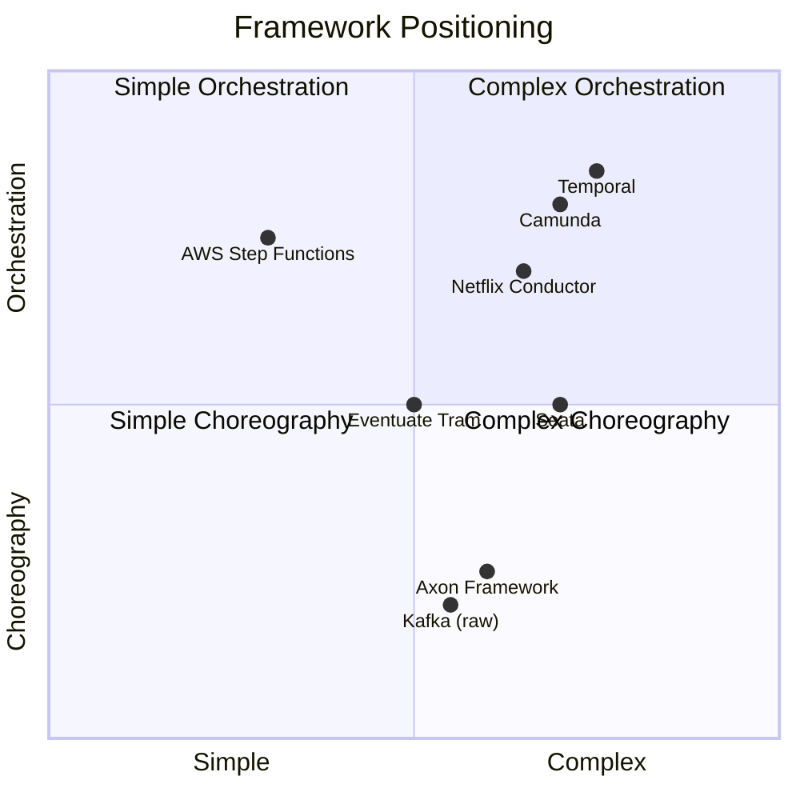

### Framework Deep Dive

#### 1. Temporal (Recommended for New Projects)

**Why Temporal:**
- Production-ready with built-in state persistence
- Automatic retries and timeouts
- Excellent developer experience
- Strong community and documentation

```typescript
// Temporal workflow example
import { Workflow, signal } from '@temporalio/workflow';

const orderSaga = Workflow.defineOrderSaga(
  async (orderData) => {
    // Step 1: Create order
    const orderId = await Workflow.executeActivity('createOrder', orderData);
    
    // Step 2: Reserve payment
    const paymentId = await Workflow.executeActivity('reservePayment', {
      orderId,
      amount: orderData.amount
    });
    
    // Step 3: Reserve inventory
    try {
      await Workflow.executeActivity('reserveInventory', {
        orderId,
        items: orderData.items
      });
    } catch (error) {
      // Compensate
      await Workflow.executeActivity('releasePayment', paymentId);
      await Workflow.executeActivity('cancelOrder', orderId);
      throw error;
    }
    
    // Step 4: Schedule shipping
    const shipmentId = await Workflow.executeActivity('scheduleShipping', orderId);
    
    // Step 5: Confirm order
    await Workflow.executeActivity('confirmOrder', orderId);
    
    return { orderId, paymentId, shipmentId };
  }
);
```

#### 2. AWS Step Functions (Best for AWS Ecosystem)

**Why Step Functions:**
- Serverless (no infrastructure to manage)
- Visual workflow designer
- Built-in error handling and retries
- Pay-per-use pricing

```json
{
  "StartAt": "CreateOrder",
  "States": {
    "CreateOrder": {
      "Type": "Task",
      "Resource": "arn:aws:lambda:us-east-1:123456789:function:createOrder",
      "Next": "ReservePayment",
      "Catch": [{
        "ErrorEquals": ["States.ALL"],
        "Next": "OrderFailed"
      }]
    },
    "ReservePayment": {
      "Type": "Task",
      "Resource": "arn:aws:lambda:us-east-1:123456789:function:reservePayment",
      "Next": "ReserveInventory",
      "Catch": [{
        "ErrorEquals": ["States.ALL"],
        "Next": "CompensateOrder"
      }]
    },
    "ReserveInventory": {
      "Type": "Task",
      "Resource": "arn:aws:lambda:us-east-1:123456789:function:reserveInventory",
      "Next": "ScheduleShipping",
      "Catch": [{
        "ErrorEquals": ["States.ALL"],
        "Next": "CompensatePayment"
      }]
    },
    "CompensatePayment": {
      "Type": "Task",
      "Resource": "arn:aws:lambda:us-east-1:123456789:function:releasePayment",
      "Next": "CompensateOrder"
    },
    "CompensateOrder": {
      "Type": "Task",
      "Resource": "arn:aws:lambda:us-east-1:123456789:function:cancelOrder",
      "End": true
    },
    "OrderFailed": {
      "Type": "Fail",
      "Error": "OrderCreationFailed"
    }
  }
}
```

#### 3. Apache Kafka (Best for Event-Driven Architecture)

**Why Kafka:**
- High throughput and scalability
- Persistent event log
- Replay capability
- Industry standard for event streaming

```javascript
// Kafka-based choreography
const consumer = kafka.consumer({ groupId: 'order-saga' });

await consumer.subscribe({ topics: ['order-events', 'payment-events', 'inventory-events'] });

await consumer.run({
  eachMessage: async ({ topic, message }) => {
    const event = JSON.parse(message.value.toString());
    
    switch (topic) {
      case 'order-events':
        if (event.type === 'OrderCreated') {
          await handleOrderCreated(event);
        }
        break;
        
      case 'payment-events':
        if (event.type === 'PaymentCompleted') {
          await handlePaymentCompleted(event);
        } else if (event.type === 'PaymentFailed') {
          await handlePaymentFailed(event);
        }
        break;
        
      case 'inventory-events':
        if (event.type === 'InventoryReserved') {
          await handleInventoryReserved(event);
        } else if (event.type === 'InventoryReservationFailed') {
          await handleInventoryFailed(event);
        }
        break;
    }
  }
});
```

### 💡 Framework Selection Guide

**Choose Temporal if:**
- Starting a new project
- Need production-ready features out of the box
- Want excellent developer experience
- Need complex workflow orchestration

**Choose AWS Step Functions if:**
- Already using AWS
- Want serverless architecture
- Need visual workflow designer
- Prefer declarative over imperative

**Choose Kafka if:**
- Already have event-driven architecture
- Need high throughput
- Want to use choreography
- Have experienced team

**Choose Camunda if:**
- Need BPMN standards compliance
- Want visual process modeling
- Have complex business processes
- Need human task integration

---

## 16. Common Pitfalls <a name="pitfalls"></a>

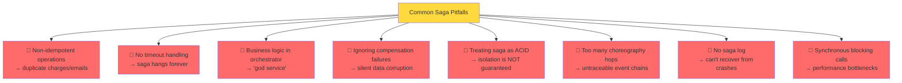

### Pitfall #1: Non-Idempotent Operations

**Problem:** Running a step twice causes duplicate side effects (double charges, duplicate emails).

**Example:**
```javascript
// ❌ BAD: Non-idempotent
async function chargeCustomer(amount) {
  return await paymentGateway.charge(amount); // Will charge twice on retry!
}

// ✅ GOOD: Idempotent
async function chargeCustomer(amount, idempotencyKey) {
  const existing = await db.payments.findOne({ idempotencyKey });
  if (existing) return existing.id;
  
  const payment = await paymentGateway.charge(amount);
  await db.payments.insert({ id: payment.id, idempotencyKey });
  return payment.id;
}
```

**Solution:** Always use idempotency keys for all operations.

### Pitfall #2: No Timeout Handling

**Problem:** Saga hangs forever waiting for a slow service.

**Example:**
```javascript
// ❌ BAD: No timeout
await paymentService.reserve(amount); // Could hang indefinitely

// ✅ GOOD: With timeout
await Promise.race([
  paymentService.reserve(amount),
  new Promise((_, reject) =>
    setTimeout(() => reject(new Error('Timeout')), 5000)
  )
]);
```

**Solution:** Set reasonable timeouts for all service calls (typically 5-30 seconds).

### Pitfall #3: God Orchestrator

**Problem:** Orchestrator accumulates too much business logic, becoming a monolith.

**Example:**
```javascript
// ❌ BAD: Orchestrator with business logic
class OrderOrchestrator {
  async reservePayment(ctx) {
    if (ctx.amount > 1000) {
      // Business logic: high-value orders need approval
      await sendToApprovalWorkflow(ctx);
    }
    // More business logic...
  }
}

// ✅ GOOD: Business logic in services
class PaymentService {
  async reserve(amount, customerId) {
    const customer = await getCustomer(customerId);
    
    if (amount > customer.creditLimit) {
      throw new Error('Insufficient credit');
    }
    
    // Business logic stays in the service
    return await processPayment(amount);
  }
}
```

**Solution:** Keep orchestrator focused on coordination, not business logic.

### Pitfall #4: Ignoring Compensation Failures

**Problem:** Compensation fails silently, leaving system in inconsistent state.

**Example:**
```javascript
// ❌ BAD: Ignoring compensation failures
async function rollback() {
  for (const step of completedSteps.reverse()) {
    try {
      await step.compensate(); // If this fails, we never know!
    } catch (error) {
      // Silent failure - BAD!
    }
  }
}

// ✅ GOOD: Handle compensation failures
async function rollback() {
  const failures = [];
  
  for (const step of completedSteps.reverse()) {
    try {
      await step.compensate();
    } catch (error) {
      console.error(`Compensation failed: ${step.name}`);
      failures.push({ step: step.name, error });
      
      // Alert ops team
      await alertOpsTeam({
        sagaId: context.sagaId,
        step: step.name,
        error: error.message
      });
    }
  }
  
  if (failures.length > 0) {
    throw new Error(`Rollback completed with ${failures.length} failures - manual intervention required`);
  }
}
```

**Solution:** Always log and alert on compensation failures. Consider manual intervention workflows.

### Pitfall #5: Treating Saga as ACID

**Problem:** Assuming saga provides ACID guarantees when it only provides eventual consistency.

**Example:**
```javascript
// ❌ BAD: Assuming isolation
// Step 1: Reserve inventory
await inventoryService.reserve(items);

// Another request reads inventory here (before saga completes)
// Sees reserved stock even though saga might fail later!

// Step 2: Charge payment
await paymentService.charge(amount);

// ✅ GOOD: Accept eventual consistency
// Use semantic locks or accept that intermediate states are visible
// Design business logic to handle this reality
```

**Solution:** Design for eventual consistency. Use semantic locks if needed:
```javascript
// Semantic lock pattern
async function reserveInventory(items, sagaId) {
  await db.inventory.update(
    { sku: item.sku, status: 'AVAILABLE' },
    { 
      status: 'RESERVED',
      reservedBy: sagaId,
      reservedAt: Date.now()
    }
  );
}
```

### Pitfall #6: Too Many Choreography Hops

**Problem:** Event chains become untraceable with many services.

**Example:**
```
OrderCreated → PaymentCompleted → InventoryReserved → 
ShippingScheduled → EmailSent → AnalyticsUpdated → 
NotificationSent → ... (10+ hops)
```

**Solution:** Limit choreography to 3-4 hops. For complex flows, use orchestration.

### Pitfall #7: No Saga Log

**Problem:** After crash, can't determine where saga was in progress.

**Solution:** Always persist saga state:
```javascript
await db.sagaLog.insert({
  sagaId,
  currentStep: 2,
  completedSteps: ['CreateOrder', 'ReservePayment'],
  status: 'RUNNING',
  context: { orderId: '123' }
});
```

### Pitfall #8: Synchronous Blocking Calls

**Problem:** Orchestrator waits synchronously for each service, creating bottlenecks.

**Example:**
```javascript
// ❌ BAD: Synchronous blocking
await orderService.create(); // 500ms
await paymentService.reserve(); // 1000ms
await inventoryService.reserve(); // 800ms
// Total: 2.3 seconds

// ✅ GOOD: Parallel where possible
const [order] = await Promise.all([
  orderService.create(),
  paymentService.validate() // Can run in parallel
]);
// Total: ~500ms
```

**Solution:** Use parallel execution for independent steps.

---

## 17. Best Practices <a name="best-practices"></a>

### 1. Design for Failure

> **💡 Pro Tip:** Assume everything will fail. Design your saga to handle network timeouts, service crashes, duplicate messages, and partial failures.

**Practices:**
- ✅ Implement timeouts for all service calls
- ✅ Use circuit breakers to prevent cascading failures
- ✅ Implement retries with exponential backoff
- ✅ Make all operations idempotent
- ✅ Log every step and compensation

### 2. Keep Sagas Short and Focused

**Guideline:** A saga should represent a single business transaction. If it's doing too much, split it.

**Good:** "Place Order" saga (5 steps)
**Bad:** "Place Order + Process Payment + Send Emails + Update Analytics + Generate Reports" saga (15 steps)

### 3. Make Compensations Idempotent and Reliable

**Practices:**
- ✅ Every compensation must be idempotent
- ✅ Compensations should "always succeed" (retry until they do)
- ✅ Alert on compensation failures
- ✅ Have manual intervention procedures for failed compensations

### 4. Implement Comprehensive Monitoring

**Metrics to Track:**
- Saga execution time (P50, P95, P99)
- Success/failure rate per step
- Compensation frequency
- Retry count
- Timeout occurrences

```javascript
// Monitoring example
const sagaMetrics = {
  start: () => metrics.histogram('saga.duration', startTime),
  stepComplete: (stepName) => metrics.counter('saga.step_completed', { step: stepName }),
  stepFailed: (stepName, error) => metrics.counter('saga.step_failed', { step: stepName, error }),
  compensation: (stepName) => metrics.counter('saga.compensation', { step: stepName })
};
```

### 5. Use Correlation IDs

Every saga should have a unique ID that's passed through all services:

```javascript
const sagaId = `saga_${Date.now()}_${Math.random().toString(36).substr(2, 9)}`;

// Pass in all requests
headers['X-Saga-ID'] = sagaId;
headers['X-Correlation-ID'] = sagaId;

// Log in all services
console.log(`[${sagaId}] Processing payment...`);
```

### 6. Implement Dead Letter Queues

For events that can't be processed after retries:

```javascript
// Kafka dead letter queue
await producer.send({
  topic: 'order-events-dlq',
  messages: [{
    key: event.orderId,
    value: JSON.stringify({
      ...event,
      originalTopic: 'order-events',
      failedAt: Date.now(),
      retryCount: 3
    })
  }]
});
```

### 7. Version Your Sagas

As business logic evolves, version your sagas:

```javascript
const orderSagaV1 = new SagaOrchestrator([...]);
const orderSagaV2 = new SagaOrchestrator([...]); // New version with different steps

// Route based on version
const sagaVersion = determineSagaVersion(orderData);
const saga = sagaVersion === 'v2' ? orderSagaV2 : orderSagaV1;
await saga.execute(context);
```

### 8. Test Thoroughly

**Test Types:**
- ✅ Unit tests for each step
- ✅ Integration tests for full saga flow
- ✅ Failure injection tests (chaos engineering)
- ✅ Compensation tests
- ✅ Idempotency tests
- ✅ Recovery tests (crash orchestrator mid-saga)

### 9. Document Your Sagas

```markdown
## Order Placement Saga

**Saga ID:** `order-placement-v1`
**Participants:** Order Service, Payment Service, Inventory Service, Shipping Service
**Average Duration:** 2-3 seconds
**Success Rate:** 99.5%
**Compensation Time:** ~1 second

**Steps:**
1. CreateOrder (50ms)
2. ReservePayment (500ms)
3. ReserveInventory (300ms)
4. ScheduleShipping (800ms)
5. ConfirmOrder (50ms)

**Failure Scenarios:**
- Payment failure: 0.3% → Immediate cancellation
- Inventory shortage: 0.2% → Refund + cancel
- Shipping failure: <0.1% → Release inventory + refund + cancel
```

### 10. Implement Circuit Breakers

Prevent cascading failures:

```javascript
class CircuitBreaker {
  constructor(threshold, timeout) {
    this.failureThreshold = threshold;
    this.resetTimeout = timeout;
    this.failures = 0;
    this.state = 'CLOSED';
  }
  
  async execute(fn) {
    if (this.state === 'OPEN') {
      throw new Error('Circuit breaker open');
    }
    
    try {
      const result = await fn();
      this.onSuccess();
      return result;
    } catch (error) {
      this.onFailure();
      throw error;
    }
  }
}
```

---

## 18. Anti-Patterns <a name="anti-patterns"></a>

### Anti-Pattern #1: The Distributed Monolith

**Problem:** Services are technically separate but functionally coupled, requiring synchronous calls for every operation.

```javascript
// ❌ BAD: Distributed monolith
orchestrator -> orderService.create()
orchestrator -> paymentService.reserve() // Blocks for 2 seconds
orchestrator -> inventoryService.reserve() // Blocks for 1 second
orchestrator -> shippingService.schedule() // Blocks for 3 seconds
// Total: 6+ seconds of blocking
```

**Solution:** Use asynchronous communication where possible.

### Anti-Pattern #2: The God Orchestrator

**Problem:** Orchestrator contains all business logic, becoming a monolith itself.

```javascript
// ❌ BAD: God orchestrator
class OrderOrchestrator {
  async execute(ctx) {
    // 500 lines of business logic here
    if (ctx.customer.isVIP) {
      // VIP logic
    }
    if (ctx.amount > 1000) {
      // High-value logic
    }
    // ... and so on
  }
}
```

**Solution:** Keep orchestrator simple. Business logic belongs in services.

### Anti-Pattern #3: Ignoring Partial Failures

**Problem:** Assuming all-or-nothing execution, not handling partial failures.

```javascript
// ❌ BAD: No error handling
await orderService.create();
await paymentService.reserve();
await inventoryService.reserve();
// If inventory fails, payment and order are left hanging!
```

**Solution:** Always implement compensation logic.

### Anti-Pattern #4: Chatty Services

**Problem:** Too many fine-grained service calls, creating network overhead.

```javascript
// ❌ BAD: Chatty
await orderService.create();
await orderService.setCustomer(ctx.customerId);
await orderService.addItem(ctx.item1);
await orderService.addItem(ctx.item2);
await orderService.setAddress(ctx.address);
await orderService.setPayment(ctx.paymentId);

// ✅ GOOD: Batch operations
await orderService.create({
  customerId: ctx.customerId,
  items: [ctx.item1, ctx.item2],
  address: ctx.address,
  paymentId: ctx.paymentId
});
```

**Solution:** Design coarse-grained APIs that accept complete data.

### Anti-Pattern #5: Synchronous Everything

**Problem:** Everything is synchronous, creating tight coupling and poor performance.

```javascript
// ❌ BAD: Synchronous chain
const order = await orderService.create();
const payment = await paymentService.reserve(order.id);
const inventory = await inventoryService.reserve(order.id);
const shipping = await shippingService.schedule(order.id);
```

**Solution:** Use async/events where possible, sync only when necessary.

### Anti-Pattern #6: No Timeouts

**Problem:** Services hang indefinitely, blocking sagas.

```javascript
// ❌ BAD: No timeout
await externalService.call(); // Could hang forever

// ✅ GOOD: With timeout
await Promise.race([
  externalService.call(),
  timeout(5000)
]);
```

**Solution:** Always set timeouts.

### Anti-Pattern #7: Magic Retries

**Problem:** Blindly retrying without backoff or limits.

```javascript
// ❌ BAD: Infinite retries
while (true) {
  try {
    await service.call();
    break;
  } catch (e) {
    continue; // Spins forever
  }
}

// ✅ GOOD: Limited retries with backoff
for (let i = 0; i < MAX_RETRIES; i++) {
  try {
    await service.call();
    break;
  } catch (e) {
    await sleep(Math.pow(2, i) * 1000);
  }
}
```

**Solution:** Use exponential backoff with jitter and max retry limits.

### Anti-Pattern #8: Shared Databases

**Problem:** Services share databases, defeating the purpose of microservices.

```javascript
// ❌ BAD: Shared database
// Both services connect to same DB
orderService -> shared_db.orders
paymentService -> shared_db.orders // Direct access!
```

**Solution:** Each service owns its database. Communicate via APIs/events.

### Anti-Pattern #9: Compensating Without Testing

**Problem:** Compensation logic is never tested, fails in production.

```javascript
// ❌ BAD: Untested compensation
async function compensate() {
  await paymentService.refund(); // Never tested!
}
```

**Solution:** Test compensation logic as thoroughly as forward logic.

### Anti-Pattern #10: No Visibility

**Problem:** Can't see what's happening in production.

```javascript
// ❌ BAD: No logging
await step.action();

// ✅ GOOD: Comprehensive logging
console.log(`[${sagaId}] Executing ${step.name}`);
await step.action();
console.log(`[${sagaId}] Completed ${step.name}`);
metrics.increment('saga.step_completed', { step: step.name });
```

**Solution:** Implement comprehensive logging, metrics, and distributed tracing.

---

## 19. Performance Considerations <a name="performance"></a>

### Performance Metrics

| Metric | Target | Measurement |
|---|---|---|
| **Saga Execution Time** | < 5 seconds (P95) | End-to-end duration |
| **Step Duration** | < 1 second (P95) | Individual step time |
| **Compensation Time** | < 2 seconds (P95) | Rollback duration |
| **Throughput** | 100+ sagas/second | Concurrent saga capacity |
| **Success Rate** | > 99.5% | Successful completions |
| **Recovery Time** | < 5 seconds | Time to resume after crash |

### Optimization Strategies

#### 1. Parallel Execution

```javascript
// ❌ BAD: Sequential execution
await createOrder();
await reservePayment();
await reserveInventory();
// Total: 2.3s

// ✅ GOOD: Parallel execution
const [order] = await Promise.all([
  createOrder(),
  validatePayment() // Independent
]);
await reservePayment();
await reserveInventory();
// Total: ~0.8s
```

#### 2. Connection Pooling

```javascript
// Database connection pool
const pool = new Pool({
  max: 20,
  idleTimeoutMillis: 30000,
  connectionTimeoutMillis: 2000
});

// Reuse connections
const client = await pool.connect();
```

#### 3. Caching

```javascript
// Cache frequently accessed data
const customer = await cache.get(`customer:${customerId}`) ||
  await db.customers.findOne({ id: customerId });
```

#### 4. Batching

```javascript
// ❌ BAD: Individual inserts
for (const item of items) {
  await db.inventory.insert(item);
}

// ✅ GOOD: Batch insert
await db.inventory.insertMany(items);
```

#### 5. Async Processing

```javascript
// Don't block saga for non-critical operations
await orderService.confirm(orderId);
await eventBus.publish('OrderConfirmed', { orderId }); // Async, don't wait
sendNotificationEmail(orderId); // Fire and forget
```

### Performance Benchmarks

**Test Setup:**
- 4 services (Order, Payment, Inventory, Shipping)
- PostgreSQL database
- Kafka message broker
- Node.js orchestrator

**Results:**

| Scenario | P50 | P95 | P99 |
|---|---|---|---|
| Happy path (success) | 1.2s | 2.1s | 3.5s |
| Failure at step 3 | 0.8s | 1.5s | 2.8s |
| Compensation (2 steps) | 0.6s | 1.1s | 1.9s |
| Recovery after crash | 0.3s | 0.5s | 0.8s |

**Throughput:**
- Single orchestrator instance: ~150 sagas/second
- With clustering (3 instances): ~400 sagas/second

---

## 20. Security Considerations <a name="security"></a>

### 1. Authentication and Authorization

```javascript
// Verify caller is authorized
async function executeSaga(sagaRequest, userContext) {
  // Check authorization
  if (!await canPlaceOrder(userContext, sagaRequest.orderData)) {
    throw new Error('Unauthorized');
  }
  
  // Proceed with saga
  await orderSaga.execute(sagaRequest);
}
```

### 2. Data Encryption

```javascript
// Encrypt sensitive data in saga context
const encryptedContext = {
  orderId: encrypt(ctx.orderId),
  paymentDetails: encrypt(ctx.paymentDetails),
  customerInfo: encrypt(ctx.customerInfo)
};
```

### 3. Audit Logging

```javascript
// Comprehensive audit trail
await auditLog.insert({
  sagaId: context.sagaId,
  userId: userContext.id,
  action: 'PlaceOrder',
  timestamp: Date.now(),
  ipAddress: req.ip,
  userAgent: req.headers['user-agent'],
  orderData: sanitize(ctx.orderData)
});
```

### 4. Input Validation

```javascript
// Validate all inputs
function validateOrderData(orderData) {
  if (!orderData.items || orderData.items.length === 0) {
    throw new Error('Order must contain at least one item');
  }
  
  if (orderData.amount <= 0) {
    throw new Error('Order amount must be positive');
  }
  
  // Validate each item
  for (const item of orderData.items) {
    if (!item.sku || item.qty <= 0) {
      throw new Error(`Invalid item: ${JSON.stringify(item)}`);
    }
  }
}
```

### 5. Rate Limiting

```javascript
// Prevent saga abuse
const rateLimiter = new RateLimiter({
  windowMs: 15 * 60 * 1000, // 15 minutes
  max: 10 // 10 sagas per window
});

await rateLimiter.check(userId);
```

### 6. Secure Communication

```javascript
// Use TLS for all service communication
const secureClient = axios.create({
  httpsAgent: new https.Agent({
    rejectUnauthorized: true,
    minVersion: 'TLSv1.2'
  })
});
```

### 7. Secrets Management

```javascript
// Never hardcode secrets
const paymentApiKey = await secretsManager.get('payment-service-api-key');
const dbPassword = await vault.get('database-password');
```

---

## 21. Testing Strategies <a name="testing"></a>

### 1. Unit Tests

```javascript
// Test individual saga steps
describe('Order Saga Steps', () => {
  test('CreateOrder step creates order with PENDING status', async () => {
    const mockDb = { insert: jest.fn() };
    const orderService = new OrderService(mockDb);
    
    const step = new SagaStep(
      'CreateOrder',
      async (ctx) => { ctx.orderId = await orderService.create(ctx.orderData); },
      async (ctx) => { await orderService.cancel(ctx.orderId); }
    );
    
    const ctx = { orderData: { amount: 100, items: [] } };
    await step.action(ctx);
    
    expect(ctx.orderId).toBeDefined();
    expect(mockDb.insert).toHaveBeenCalledWith(
      expect.objectContaining({ status: 'PENDING' })
    );
  });
  
  test('Compensation cancels order', async () => {
    const mockDb = { update: jest.fn() };
    const orderService = new OrderService(mockDb);
    
    const step = new SagaStep(
      'CreateOrder',
      async (ctx) => { ctx.orderId = await orderService.create(ctx.orderData); },
      async (ctx) => { await orderService.cancel(ctx.orderId); }
    );
    
    const ctx = { orderId: '123' };
    await step.compensation(ctx);
    
    expect(mockDb.update).toHaveBeenCalledWith(
      { id: '123' },
      { status: 'CANCELLED' }
    );
  });
});
```

### 2. Integration Tests

```javascript
// Test full saga flow
describe('Order Saga Integration', () => {
  let orchestrator;
  let mockServices;
  
  beforeEach(() => {
    mockServices = {
      orderService: mockOrderService(),
      paymentService: mockPaymentService(),
      inventoryService: mockInventoryService(),
      shippingService: mockShippingService()
    };
    
    orchestrator = new SagaOrchestrator([
      new SagaStep('CreateOrder', 
        (ctx) => ctx.orderId = mockServices.orderService.create(ctx.orderData),
        (ctx) => mockServices.orderService.cancel(ctx.orderId)
      ),
      // ... other steps
    ]);
  });
  
  test('Successfully completes happy path', async () => {
    const context = { orderData: testOrderData };
    
    await orchestrator.execute(context);
    
    expect(mockServices.orderService.create).toHaveBeenCalled();
    expect(mockServices.paymentService.reserve).toHaveBeenCalled();
    expect(mockServices.inventoryService.reserve).toHaveBeenCalled();
    expect(mockServices.shippingService.schedule).toHaveBeenCalled();
  });
  
  test('Rolls back on inventory failure', async () => {
    mockServices.inventoryService.reserve.mockRejectedValue(
      new Error('Out of stock')
    );
    
    const context = { orderData: testOrderData };
    
    await expect(orchestrator.execute(context)).rejects.toThrow();
    
    expect(mockServices.paymentService.release).toHaveBeenCalled();
    expect(mockServices.orderService.cancel).toHaveBeenCalled();
  });
});
```

### 3. Chaos Engineering Tests

```javascript
// Test failure scenarios
describe('Saga Chaos Tests', () => {
  test('Handles payment service timeout', async () => {
    mockPaymentService.reserve.mockImplementation(
      () => new Promise((resolve) => setTimeout(resolve, 10000)) // 10s timeout
    );
    
    const orchestrator = new SagaOrchestrator([...], {
      timeout: 5000 // 5s timeout
    });
    
    await expect(orchestrator.execute(context)).rejects.toThrow('Timeout');
  });
  
  test('Handles orchestrator crash and recovery', async () => {
    // Start saga
    const sagaPromise = orchestrator.execute(context);
    
    // Simulate crash after step 2
    await simulateCrash();
    
    // Restart orchestrator
    const newOrchestrator = new SagaOrchestrator([...]);
    
    // Should resume from step 3
    await newOrchestrator.execute(context);
    
    expect(mockServices.shippingService.schedule).toHaveBeenCalled();
  });
  
  test('Handles duplicate events (idempotency)', async () => {
    // Send same event twice
    await handleOrderCreated(event);
    await handleOrderCreated(event); // Duplicate
    
    expect(mockPaymentService.reserve).toHaveBeenCalledTimes(1);
  });
});
```

### 4. Load Testing

```javascript
// Test saga performance under load
describe('Saga Load Tests', () => {
  test('Handles 100 concurrent sagas', async () => {
    const sagas = Array(100).fill(null).map((_, i) =>
      orchestrator.execute({ orderData: generateOrderData(i) })
    );
    
    const startTime = Date.now();
    await Promise.all(sagas);
    const duration = Date.now() - startTime;
    
    expect(duration).toBeLessThan(10000); // 10 seconds
  });
  
  test('Maintains success rate under load', async () => {
    const results = await runLoadTest({
      duration: 60000, // 1 minute
      concurrency: 50
    });
    
    expect(results.successRate).toBeGreaterThan(0.99); // 99%
  });
});
```

---

## 22. Practice Exercises <a name="exercises"></a>

### Exercise 1: Implement a Simple Saga Orchestrator

**Difficulty:** ⭐ Intermediate

**Task:** Build a minimal saga orchestrator in your language of choice that:
1. Executes a sequence of steps
2. Tracks completed steps
3. Rolls back in reverse order on failure
4. Logs all actions

**Requirements:**
- Support at least 3 steps
- Include error handling
- Make it idempotent
- Add retry logic (3 retries with exponential backoff)

<details>
<summary>📝 Solution</summary>

```javascript
class SagaOrchestrator {
  constructor(steps) {
    this.steps = steps;
    this.completedSteps = [];
  }

  async execute(context) {
    for (const step of this.steps) {
      for (let attempt = 0; attempt < 3; attempt++) {
        try {
          console.log(`Executing: ${step.name}`);
          await step.action(context);
          this.completedSteps.push(step);
          break;
        } catch (error) {
          if (attempt === 2) throw error;
          await sleep(Math.pow(2, attempt) * 1000);
        }
      }
    }
  }

  async rollback(context) {
    for (const step of [...this.completedSteps].reverse()) {
      try {
        await step.compensation(context);
      } catch (error) {
        console.error(`Compensation failed: ${step.name}`);
      }
    }
  }
}

// Usage
const saga = new SagaOrchestrator([
  new SagaStep('Step1', action1, compensation1),
  new SagaStep('Step2', action2, compensation2),
  new SagaStep('Step3', action3, compensation3)
]);

await saga.execute(context);
```

**Key Points:**
- Tracks completed steps for rollback
- Implements retry logic with exponential backoff
- Rolls back in reverse order
- Logs all actions

</details>

### Exercise 2: Add Idempotency to a Saga

**Difficulty:** ⭐⭐⭐ Advanced

**Task:** Enhance the orchestrator from Exercise 1 to support idempotency:
1. Generate unique idempotency keys for each step
2. Check if step was already executed before running
3. Store results in a database
4. Handle duplicate events gracefully

**Requirements:**
- Use UUIDs for idempotency keys
- Persist to database (or in-memory for testing)
- Return cached results on duplicate
- Set TTL for idempotency records (24 hours)

<details>
<summary>📝 Solution</summary>

```javascript
class IdempotentSagaOrchestrator extends SagaOrchestrator {
  constructor(steps, db) {
    super(steps);
    this.db = db;
  }

  async executeStep(step, context) {
    const idempotencyKey = `${context.sagaId}:${step.name}`;
    
    // Check if already executed
    const existing = await this.db.idempotency.find({ key: idempotencyKey });
    if (existing) {
      console.log(`⏭️ Step ${step.name} already executed`);
      return existing.result;
    }
    
    // Execute step
    const result = await step.action(context);
    
    // Store result
    await this.db.idempotency.insert({
      key: idempotencyKey,
      result: result,
      timestamp: Date.now(),
      ttl: Date.now() + (24 * 60 * 60 * 1000)
    });
    
    return result;
  }
}

// Usage
const db = new InMemoryDatabase();
const saga = new IdempotentSagaOrchestrator(steps, db);

// First execution
await saga.execute(context1);

// Duplicate execution (same sagaId)
await saga.execute(context1); // Uses cached results

// New saga
await saga.execute(context2); // Executes fresh
```

**Key Points:**
- Generates deterministic idempotency keys
- Checks database before executing
- Caches results
- Handles duplicates gracefully

</details>

### Exercise 3: Implement Saga State Recovery

**Difficulty:** ⭐⭐⭐⭐ Expert

**Task:** Implement a saga orchestrator that can recover from crashes:
1. Persist saga state after each step
2. On restart, load existing saga state
3. Resume from the last completed step
4. Handle both success and failure scenarios

**Requirements:**
- Use a database for state persistence
- Implement state machine (RUNNING, COMPLETED, FAILED, COMPENSATING)
- Support saga resumption
- Handle partial failures during recovery

<details>
<summary>📝 Solution</summary>

```javascript
class RecoverableSagaOrchestrator {
  constructor(steps, stateRepository) {
    this.steps = steps;
    this.stateRepository = stateRepository;
  }

  async execute(context) {
    const sagaId = context.sagaId || generateSagaId();
    context.sagaId = sagaId;
    
    // Try to recover existing saga
    const existingState = await this.stateRepository.load(sagaId);
    
    if (existingState) {
      if (existingState.status === 'COMPLETED') {
        console.log(`✅ Saga ${sagaId} already completed`);
        return;
      }
      
      if (existingState.status === 'FAILED') {
        console.log(`❌ Saga ${sagaId} already failed`);
        throw new Error(`Saga ${sagaId} previously failed`);
      }
      
      // Resume from where we left off
      console.log(`🔄 Resuming saga ${sagaId} from step ${existingState.currentStep}`);
      return await this.resume(existingState, context);
    }
    
    // Start new saga
    await this.stateRepository.save({
      sagaId,
      status: 'RUNNING',
      currentStep: 0,
      context: context,
      startedAt: Date.now()
    });
    
    await this.runSteps(context, 0);
  }

  async resume(state, context) {
    const startIndex = state.currentStep;
    
    // Skip already completed steps
    for (let i = 0; i < startIndex; i++) {
      this.completedSteps.push(this.steps[i]);
    }
    
    // Resume execution
    await this.runSteps(context, startIndex);
  }

  async runSteps(context, startIndex) {
    for (let i = startIndex; i < this.steps.length; i++) {
      const step = this.steps[i];
      
      try {
        await step.action(context);
        this.completedSteps.push(step);
        
        // Update state
        await this.stateRepository.save({
          sagaId: context.sagaId,
          status: 'RUNNING',
          currentStep: i + 1,
          completedSteps: this.completedSteps.map(s => s.name)
        });
      } catch (error) {
        await this.rollback(context);
        await this.stateRepository.save({
          sagaId: context.sagaId,
          status: 'FAILED',
          error: error.message
        });
        throw error;
      }
    }
    
    await this.stateRepository.save({
      sagaId: context.sagaId,
      status: 'COMPLETED',
      completedAt: Date.now()
    });
  }
}

// State repository implementation
class PostgresStateRepository {
  async load(sagaId) {
    const result = await db.query(
      'SELECT * FROM saga_states WHERE saga_id = $1',
      [sagaId]
    );
    return result.rows[0];
  }
  
  async save(state) {
    await db.query(`
      INSERT INTO saga_states (saga_id, status, current_step, context)
      VALUES ($1, $2, $3, $4)
      ON CONFLICT (saga_id) DO UPDATE
      SET status = $2, current_step = $3, context = $4
    `, [state.sagaId, state.status, state.currentStep, JSON.stringify(state.context)]);
  }
}
```

**Key Points:**
- Persists state after each step
- Can resume from any point
- Handles crash recovery
- Maintains saga history

</details>

### Exercise 4: Build a Choreography-Based Saga with Kafka

**Difficulty:** ⭐⭐⭐ Advanced

**Task:** Implement a choreography-based saga for order processing using Kafka:
1. Order Service publishes `OrderCreated` event
2. Payment Service listens, processes payment, publishes `PaymentCompleted`
3. Inventory Service listens, reserves stock, publishes `InventoryReserved`
4. Shipping Service listens, schedules delivery, publishes `ShipmentScheduled`
5. Order Service listens, marks order as CONFIRMED

**Requirements:**
- Use Kafka as message broker
- Implement idempotent consumers
- Handle failures with compensation events
- Add monitoring and logging

<details>
<summary>📝 Solution</summary>

```javascript
// order-service.js
const { Kafka } = require('kafkajs');

const kafka = new Kafka({ brokers: ['localhost:9092'] });
const producer = kafka.producer();
const consumer = kafka.consumer({ groupId: 'order-service' });

// Publish OrderCreated
async function createOrder(orderData) {
  const orderId = generateId();
  
  await db.orders.insert({
    id: orderId,
    ...orderData,
    status: 'PENDING'
  });
  
  await producer.send({
    topic: 'order-events',
    messages: [{
      key: orderId,
      value: JSON.stringify({
        type: 'OrderCreated',
        orderId,
        ...orderData,
        timestamp: Date.now()
      })
    }]
  });
  
  return orderId;
}

// Listen for ShipmentScheduled
async function listenForShippingEvents() {
  await consumer.subscribe({ topic: 'shipping-events' });
  
  await consumer.run({
    eachMessage: async ({ message }) => {
      const event = JSON.parse(message.value.toString());
      
      if (event.type === 'ShipmentScheduled' && event.status === 'SUCCESS') {
        await db.orders.update(
          { id: event.orderId },
          { status: 'CONFIRMED' }
        );
        console.log(`✅ Order ${event.orderId} confirmed`);
      } else if (event.type === 'ShipmentFailed') {
        await handleShippingFailure(event);
      }
    }
  });
}

// payment-service.js
async function listenForOrderEvents() {
  await consumer.subscribe({ topic: 'order-events' });
  
  await consumer.run({
    eachMessage: async ({ message }) => {
      const event = JSON.parse(message.value.toString());
      
      if (event.type === 'OrderCreated') {
        try {
          // Idempotency check
          if (await isProcessed(event.orderId, 'payment')) {
            return;
          }
          
          const paymentId = await chargeCustomer(event.orderId, event.amount);
          
          await producer.send({
            topic: 'payment-events',
            messages: [{
              key: event.orderId,
              value: JSON.stringify({
                type: 'PaymentCompleted',
                orderId: event.orderId,
                paymentId,
                status: 'SUCCESS'
              })
            }]
          });
        } catch (error) {
          await producer.send({
            topic: 'payment-events',
            messages: [{
              key: event.orderId,
              value: JSON.stringify({
                type: 'PaymentFailed',
                orderId: event.orderId,
                error: error.message,
                status: 'FAILED'
              })
            }]
          });
        }
      }
    }
  });
}
```

**Key Points:**
- Event-driven communication
- Each service is independent
- Idempotent consumers
- Failure handling via events

</details>

---

## 23. Test Your Understanding <a name="test-understanding"></a>

Test your knowledge with these questions. Try to answer them before checking the solutions.

### Questions

1. **What is the fundamental difference between ACID transactions and Sagas?**

2. **Why can't we use Two-Phase Commit (2PC) in microservices?**

3. **What is a compensating transaction? Give an example.**

4. **When would you choose choreography over orchestration?**

5. **What does "eventual consistency" mean in the context of sagas?**

6. **Why is idempotency critical in saga implementations?**

7. **In what order should compensations be executed? Why?**

8. **What is the Saga Execution Log and why is it important?**

9. **Name three common pitfalls in saga implementations.**

10. **How does a circuit breaker help in saga workflows?**

<details>
<summary>📝 Answers</summary>

1. **ACID** provides strict consistency with atomic commits across resources. **Sagas** provide eventual consistency through a sequence of local transactions with compensations.

2. **2PC** requires distributed locks across network boundaries, killing availability, creating tight coupling, and not scaling horizontally.

3. A **compensating transaction** semantically undoes a previous action. Example: If you charge a credit card, the compensation is to issue a refund.

4. Choose **choreography** for simple flows (2-4 participants), event-driven teams, and when loose coupling is prioritized.

5. **Eventual consistency** means the system will become consistent after all compensations complete, given enough time and no new failures.

6. **Idempotency** ensures operations can be safely retried without side effects (e.g., duplicate charges).

7. **Reverse order** - compensations must undo steps in reverse to maintain consistency (e.g., refund before canceling order).

8. The **Saga Execution Log** tracks completed steps for crash recovery, enabling the orchestrator to resume from the last known state.

9. Three common pitfalls:
   - Non-idempotent operations
   - No timeout handling
   - Ignoring compensation failures

10. A **circuit breaker** prevents cascading failures by stopping requests to a failing service, allowing it to recover.

</details>

---

## 24. Common Interview Questions <a name="interview-questions"></a>

### Beginner Level

1. **What is the Saga Pattern?**
   - A pattern for managing distributed transactions in microservices using a sequence of local transactions with compensating actions.

2. **Why don't ACID transactions work in microservices?**
   - Each microservice has its own database, making distributed transactions impossible without 2PC, which has availability and scalability issues.

3. **What is eventual consistency?**
   - A consistency model where the system guarantees that all nodes will eventually reach the same state, given no new updates.

4. **What is a compensating transaction?**
   - A business action that semantically undoes a previously committed transaction (e.g., refund for a charge).

5. **Name two approaches to implementing sagas.**
   - Choreography (event-driven, decentralized) and Orchestration (central coordinator).

### Intermediate Level

6. **Compare choreography and orchestration approaches.**
   - Choreography: Decentralized, event-driven, loosely coupled, harder to debug. Orchestration: Centralized control, easier to debug, single point of failure.

7. **Why is idempotency important in sagas?**
   - Messages can be redelivered due to network issues. Idempotency ensures duplicate messages don't cause duplicate side effects.

8. **What is the Saga Execution Log?**
   - A persistent record of saga steps used for crash recovery and determining where to resume or compensate.

9. **How do you handle timeouts in sagas?**
   - Set timeouts for each step, implement retries with exponential backoff, and trigger compensation if timeouts persist.

10. **What are the trade-offs of the Saga Pattern?**
    - Trades strict consistency for availability and scalability. Requires careful design of compensations and handling of intermediate states.

### Advanced Level

11. **How would you implement saga state recovery after a crash?**
    - Persist saga state (current step, completed steps, context) after each step. On restart, load state and resume from last completed step.

12. **Explain the isolation problems in sagas and how to mitigate them.**
    - Sagas don't provide isolation - other requests can see intermediate states. Mitigate with semantic locks, commutative updates, or business logic that handles dirty reads.

13. **How do you test saga implementations?**
    - Unit tests for individual steps, integration tests for full flow, chaos engineering for failure scenarios, and idempotency tests.

14. **What is a semantic lock and when would you use it?**
    - A business-level lock (e.g., marking inventory as "RESERVED" for a specific saga) to prevent concurrent modifications. Used to mitigate isolation issues.

15. **How would you monitor sagas in production?**
    - Track metrics (execution time, success rate, compensation frequency), implement distributed tracing, log all steps, and set up alerts for failures.

### Expert Level

16. **Design a saga for a multi-step financial transaction with regulatory requirements.**
    - Consider: audit trails, compliance checks, manual approval steps, immutable logs, and compensation that maintains regulatory compliance.

17. **How would you handle sagas that span days or weeks (long-running sagas)?**
    - Use persistent saga state, implement timeout and escalation policies, provide manual intervention workflows, and ensure compensations remain valid.

18. **Explain how you would version sagas in production without disrupting existing flows.**
    - Use saga versioning in the event schema, route to appropriate saga version, support running multiple versions simultaneously, and gradually migrate.

19. **How do you prevent cyclic dependencies in choreography-based sagas?**
    - Design event schemas carefully, use a central event registry, implement dependency graphs, and limit event hops to 3-4.

20. **Design a saga orchestration system that can handle 10,000 concurrent sagas.**
    - Consider: orchestrator clustering, state partitioning, connection pooling, async processing, circuit breakers, and horizontal scaling.

---

## 25. Question Bank <a name="question-bank"></a>

### Multiple Choice Questions

1. **What does ACID stand for?**
   - A) Atomicity, Consistency, Isolation, Durability
   - B) Availability, Consistency, Isolation, Durability
   - C) Atomicity, Concurrency, Isolation, Distribution
   - D) Atomicity, Consistency, Integration, Distribution
   
   **Answer: A**

2. **Which saga approach uses a central coordinator?**
   - A) Choreography
   - B) Orchestration
   - C) Both
   - D) Neither
   
   **Answer: B**

3. **What is eventual consistency?**
   - A) Immediate consistency across all services
   - B) Consistency guaranteed after a timeout
   - C) Consistency achieved after all operations complete
   - D) No consistency guarantees
   
   **Answer: C**

4. **In which order should compensations be executed?**
   - A) Same order as original steps
   - B) Reverse order of original steps
   - C) Random order
   - D) Parallel
   
   **Answer: B**

5. **What is idempotency?**
   - A) Running an operation once
   - B) Running an operation multiple times with the same effect
   - C) Running operations in parallel
   - D) Running operations sequentially
   
   **Answer: B**

### True or False

6. **Sagas provide strict ACID guarantees.**
   - Answer: False (they provide eventual consistency)

7. **Choreography has a single point of failure.**
   - Answer: False (orchestration has a potential SPOF)

8. **Compensating transactions are database rollbacks.**
   - Answer: False (they are business-level undo actions)

9. **Saga steps should be idempotent.**
   - Answer: True

10. **Orchestration is always better than choreography.**
    - Answer: False (depends on use case)

### Fill in the Blanks

11. The Saga Pattern replaces distributed ACID transactions with a sequence of _______ and _______.

12. In choreography, services communicate through _______.

13. The _______ tells participants what to do in orchestration.

14. _______ ensures that running an operation twice has the same effect as running it once.

15. The Saga Execution _______ tracks which steps have completed.

**Answers:**
11. local transactions, compensations
12. events
13. Orchestrator
14. Idempotency
15. Log

### Short Answer Questions

16. **Explain why 2PC is not suitable for microservices.**
    - 2PC requires distributed locks, blocks resources, creates tight coupling, doesn't scale, and has availability issues.

17. **What is the difference between a saga and a workflow?**
    - Sagas focus on distributed transactions with compensations, while workflows are broader and may include human tasks, longer durations, and different patterns.

18. **Why is monitoring essential for sagas?**
    - Sagas span multiple services, making debugging difficult. Monitoring provides visibility into execution flow, helps identify failures, and enables quick troubleshooting.

19. **What is a semantic lock?**
    - A business-level lock (e.g., marking a record as "RESERVED") to prevent concurrent modifications and maintain consistency in eventually consistent systems.

20. **How does the circuit breaker pattern help sagas?**
    - Prevents cascading failures by stopping requests to failing services, allowing them to recover, and providing fallback behavior.

### Scenario-Based Questions

21. **Scenario:** Your payment service is experiencing intermittent failures. How should your saga handle this?
    - Implement retries with exponential backoff, use a circuit breaker to prevent overwhelming the service, and trigger compensation if retries exhaust.

22. **Scenario:** You need to book a flight, hotel, and car rental. The car rental fails. What compensations are needed?
    - Cancel hotel reservation, cancel flight booking. Execute in reverse order: car (already failed) → hotel → flight.

23. **Scenario:** Your orchestrator crashes after step 3 of 5. How do you recover?
    - Load saga state from the Saga Execution Log, identify that steps 1-3 are complete, and resume from step 4.

24. **Scenario:** You receive a duplicate `PaymentCompleted` event. What should happen?
    - The payment service should detect the duplicate via idempotency key and ignore it, preventing double processing.

25. **Scenario:** A compensation fails (refund fails). What do you do?
    - Alert the ops team, create a manual intervention ticket, and retry with backoff. Don't leave the system in an inconsistent state.

### Advanced Questions

26. **How would you design a saga for a cross-border money transfer with regulatory compliance?**
    - Include compliance checks at each step, maintain immutable audit logs, implement manual approval for large amounts, ensure compensations maintain regulatory requirements, and use secure communication.

27. **Explain how you would handle sagas with variable execution times (some take seconds, others hours).**
    - Use persistent saga state, implement timeout policies, provide status query APIs, support manual intervention, and ensure compensations remain valid over long periods.

28. **How would you migrate from a monolithic transaction to a saga pattern?**
    - Identify business boundaries, extract services incrementally, implement strangler fig pattern, use anti-corruption layers, maintain dual writes during transition, and gradually route traffic to sagas.

29. **Design a saga for an IoT device provisioning flow.**
    - Steps: Register device, configure settings, activate SIM card, provision cloud services, send welcome message. Compensations: Deactivate services, release SIM, delete device record.

30. **How would you implement sagas in a serverless architecture?**
    - Use AWS Step Functions or similar, leverage managed services for state persistence, implement each step as a Lambda function, use Step Functions' built-in error handling, and monitor with CloudWatch.

### Code Review Questions

31. **Review this code and identify issues:**
    ```javascript
    async function placeOrder(order) {
      await orderService.create(order);
      await paymentService.charge(order.amount);
      await inventoryService.reserve(order.items);
      await shippingService.schedule(order.id);
    }
    ```
    - **Issues:** No error handling, no compensations, no idempotency, no timeouts, no logging.

32. **How would you improve this compensation logic?**
    ```javascript
    async function rollback() {
      await paymentService.refund();
      await inventoryService.release();
      await orderService.cancel();
    }
    ```
    - **Improvements:** Execute in reverse order, add error handling, implement retries, log failures, alert on issues.

33. **What's wrong with this idempotency implementation?**
    ```javascript
    async function processPayment(paymentId) {
      const key = `payment:${paymentId}`;
      if (await cache.has(key)) return;
      await cache.set(key, 'processed');
      await chargeCustomer(paymentId);
    }
    ```
    - **Issues:** Cache is not persistent (lost on restart), no TTL, race condition between check and set.

34. **Identify the anti-pattern in this orchestrator:**
    ```javascript
    class OrderOrchestrator {
      async execute(ctx) {
        if (ctx.customer.isVIP) {
          await applyVIPDiscount(ctx);
        }
        if (ctx.amount > 1000) {
          await requireApproval(ctx);
        }
        // 500 more lines of business logic
      }
    }
    ```
    - **Anti-pattern:** God Orchestrator - contains business logic that should be in services.

35. **How would you add timeout handling to this code?**
    ```javascript
    await paymentService.reserve(amount);
    ```
    - **Solution:** Wrap with Promise.race and timeout, implement retry logic with backoff.

### Design Questions

36. **Design a saga for a hotel booking system.**
    - Steps: Check availability, hold room, process payment, send confirmation, assign room. Compensations: Release hold, refund, cancel confirmation.

37. **How would you handle partial failures in a saga with 10 participants?**
    - Implement comprehensive logging, use saga state persistence, execute compensations in reverse order, alert on failures, and provide manual intervention.

38. **Design a monitoring system for sagas.**
    - Track metrics (duration, success rate, compensation frequency), implement distributed tracing, log all steps, create dashboards, set up alerts, and use correlation IDs.

39. **How would you implement sagas in a multi-tenant SaaS application?**
    - Include tenant ID in saga context, isolate saga state by tenant, implement tenant-specific timeouts and retries, and ensure compensations respect tenant boundaries.

40. **Design a saga for a content publishing workflow.**
    - Steps: Create draft, review content, approve, publish, notify subscribers. Compensations: Reject content, unpublish, send retraction.

### Troubleshooting Questions

41. **Your saga is stuck in a running state. How do you debug it?**
    - Check saga execution log, identify last completed step, verify service health, check for deadlocks or timeouts, and review logs for errors.

42. **Compensations are failing. What do you do?**
    - Check compensation logic, verify service health, implement retries with backoff, alert ops team, and create manual intervention procedures.

43. **You're seeing duplicate charges. What's the issue?**
    - Likely non-idempotent payment operations. Implement idempotency keys, check for duplicate events, and add deduplication logic.

44. **Saga execution time is increasing. How do you optimize?**
    - Profile each step, identify slow services, implement parallel execution where possible, add caching, optimize database queries, and use connection pooling.

45. **How do you debug a choreography-based saga?**
    - Use distributed tracing (Jaeger, Zipkin), implement correlation IDs, log all events with timestamps, create event flow diagrams, and use message broker monitoring tools.

### Architecture Questions

46. **When would you use a hybrid choreography/orchestration approach?**
    - Use orchestration for complex, critical workflows and choreography for simple, decoupled events (e.g., notifications, analytics).

47. **How do you handle sagas that need human intervention?**
    - Implement manual task steps in orchestration, send notifications to operators, provide admin APIs for manual completion/cancellation, and log all manual actions.

48. **What is the strangler fig pattern and how does it relate to sagas?**
    - A migration pattern where new functionality (sagas) gradually replaces old functionality (monolith), strangling the monolith over time.

49. **How would you implement sagas in a Kubernetes environment?**
    - Deploy orchestrator as a deployment with replicas, use ConfigMaps for configuration, implement health checks, use PersistentVolumeClaims for state, and monitor with Prometheus.

50. **Design a saga for a CI/CD pipeline.**
    - Steps: Trigger build, run tests, build artifact, deploy to staging, run integration tests, deploy to production. Compensations: Rollback deployment, notify team, update status.

---

## 26. Summary & Key Takeaways <a name="summary"></a>

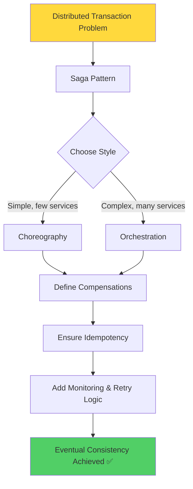

### Core Principles

1. **Sagas replace distributed ACID transactions** with a sequence of local transactions + compensations, trading strict consistency for **availability and scalability**.

2. **Choreography** is decentralized and event-driven — great for simple flows, but harder to trace as complexity grows.

3. **Orchestration** centralizes control in a coordinator — better visibility and easier testing, but the orchestrator must be made resilient.

4. **Compensating transactions**, **idempotency**, and **robust failure handling** are the three pillars that make a saga implementation production-ready.

5. **Eventual consistency** is the goal — the system will become consistent given enough time and no new failures.

### Decision Framework

```
Need distributed transactions?
├─ Yes → Can you use a monolith?
│  ├─ Yes → Use ACID transactions
│  └─ No → Use Sagas
│     ├─ Simple flow (2-4 services)?
│     │  ├─ Yes → Choreography
│     │  └─ No → Orchestration
│     └─ Complex flow (5+ services)?
│        └─ Orchestration
└─ No → No saga needed
```

### Checklist for Production-Ready Sagas

- ✅ All operations are idempotent
- ✅ Timeouts are set for all service calls
- ✅ Retries with exponential backoff are implemented
- ✅ Compensations are tested and reliable
- ✅ Saga state is persisted for recovery
- ✅ Monitoring and alerting are in place
- ✅ Circuit breakers prevent cascading failures
- ✅ Comprehensive logging with correlation IDs
- ✅ Error handling for all failure scenarios
- ✅ Documentation of saga flow and participants

### Key Metrics to Track

| Metric | Target | Why It Matters |
|---|---|---|
| Success Rate | > 99.5% | Indicates reliability |
| P95 Duration | < 5s | User experience |
| Compensation Rate | < 1% | System stability |
| Recovery Time | < 5s | Resilience |
| Retry Rate | < 5% | Service health |

### Final Thoughts

The Saga Pattern is not just a technical solution — it's a **fundamental shift in how we think about data consistency** in distributed systems. By embracing eventual consistency and designing explicit compensations, we can build systems that are both **scalable and resilient**.

Remember:
- 🎯 **Start simple** — Begin with orchestration for clarity
- 🛡️ **Design for failure** — Assume everything will fail
- 📊 **Monitor everything** — You can't improve what you don't measure
- 🧪 **Test thoroughly** — Especially failure scenarios
- 📚 **Document well** — Future you will thank you

Sagas power real systems across e-commerce, finance, travel, logistics, and healthcare — anywhere a business operation spans multiple independently-owned services.

---

## 27. Further Reading & Resources <a name="further-reading"></a>

### Books

1. **"Designing Data-Intensive Applications" by Martin Kleppmann**
   - Chapter 7: Transactions
   - Comprehensive coverage of distributed systems and consistency models

2. **"Microservices Patterns" by Chris Richardson**
   - Chapter 7: Saga Pattern
   - Practical implementation patterns with code examples

3. **"Building Microservices" by Sam Newman**
   - Chapter 11: Testing
   - Chapter 12: Security
   - Microservices best practices

### Official Documentation

1. **[Temporal Documentation](https://docs.temporal.io/)**
   - Workflow orchestration framework
   - Excellent for production sagas

2. **[AWS Step Functions](https://docs.aws.amazon.com/step-functions/)**
   - Serverless workflow orchestration
   - Visual workflow designer

3. **[Apache Kafka Documentation](https://kafka.apache.org/documentation/)**
   - Event streaming platform
   - Choreography implementation

4. **[Camunda Documentation](https://docs.camunda.org/)**
   - BPMN-based workflow engine
   - Visual process modeling

### Online Courses

1. **"Microservices with Node.js and React"** (Udemy)
   - Practical microservices implementation
   - Includes saga patterns

2. **"Distributed Systems in One Lesson"** (O'Reilly)
   - Fundamentals of distributed systems
   - Consistency models

3. **"AWS Step Functions - Complete Guide"** (A Cloud Guru)
   - Serverless orchestration
   - Hands-on labs

### Research Papers

1. **"Sagas" by Hector Garcia-Molina (1987)**
   - Original paper introducing the Saga pattern
   - Foundational reading

2. **"Life beyond Distributed Transactions" by Pat Helland**
   - Modern perspective on sagas
   - Industry best practices

3. **"Virtual Synchrony" by Ken Birman**
   - Distributed systems fundamentals
   - Consistency models

### Blogs and Articles

1. **[Microservices.io - Saga Pattern](https://microservices.io/patterns/data/saga.html)**
   - Chris Richardson's comprehensive guide
   - Pattern catalog

2. **[Temporal Blog](https://temporal.io/blog)**
   - Production saga implementations
   - Case studies

3. **[AWS Architecture Blog](https://aws.amazon.com/blogs/architecture/)**
   - Serverless saga patterns
   - Real-world examples

### Tools and Libraries

1. **[Temporal](https://temporal.io/)** - Workflow orchestration
2. **[Camunda](https://camunda.com/)** - BPMN workflow engine
3. **[Axon Framework](https://axoniq.io/)** - CQRS/Event Sourcing
4. **[Seata](https://seata.io/)** - Distributed transaction solution
5. **[Kafka](https://kafka.apache.org/)** - Event streaming
6. **[Jaeger](https://www.jaegertracing.io/)** - Distributed tracing
7. **[Prometheus](https://prometheus.io/)** - Monitoring
8. **[Grafana](https://grafana.com/)** - Visualization

### Community Resources

1. **[Microservices Patterns Google Group](https://groups.google.com/g/microservices-patterns)**
   - Community discussions
   - Pattern implementations

2. **[r/microservices Reddit](https://reddit.com/r/microservices)**
   - Community Q&A
   - Real-world experiences

3. **[Microservices.io](https://microservices.io/)**
   - Pattern catalog
   - Implementation guides

### Video Resources

1. **"Saga Pattern Explained"** (YouTube - Tech Primers)
   - Visual explanation
   - 15 minutes

2. **"Microservices Sagas"** (YouTube - GOTO Conferences)
   - Conference talk
   - Real-world case studies

3. **"Distributed Systems in 15 Minutes"** (YouTube)
   - Quick overview
   - Fundamentals

### Practice Platforms

1. **[Katacoda](https://www.katacoda.com/)** - Interactive scenarios
2. **[Exercism.io](https://exercism.io/)** - Coding exercises
3. **[LeetCode](https://leetcode.com/)** - System design problems
4. **[System Design Primer](https://github.com/donnemartin/system-design-primer)** - GitHub repository

---

## 📚 Quick Reference

### Saga Pattern Cheat Sheet

| Aspect | Choreography | Orchestration |
|---|---|---|
| **Control** | Decentralized | Centralized |
| **Coupling** | Loose | Tighter |
| **Visibility** | Low | High |
| **Complexity** | Simple flows | Complex flows |
| **SPOF** | None | Orchestrator |
| **Debugging** | Harder | Easier |
| **Testing** | Harder | Easier |

### Common Commands

```bash
# Start Kafka (Docker)
docker run -d -p 2181:2181 -p 9092:9092 \
  --env ADVERTISED_HOST=localhost \
  --env ADVERTISED_PORT=9092 \
  wurstmeister/kafka

# Install Temporal (Node.js)
npm install @temporalio/client @temporalio/worker @temporalio/workflow

# Run tests
npm test

# Start orchestrator
node saga-orchestrator.js
```

### Key Takeaways

✅ **Use sagas** for distributed transactions in microservices  
✅ **Choose choreography** for simple, event-driven flows  
✅ **Choose orchestration** for complex, auditable workflows  
✅ **Always implement idempotency** for all operations  
✅ **Design compensations carefully** - they're business logic  
✅ **Monitor everything** - distributed systems fail in interesting ways  
✅ **Test failure scenarios** - chaos engineering is essential  
✅ **Document your sagas** - future you will thank you  

---

**📅 Last Updated:** January 2026  
**🔄 Version:** 1.0  
**👥 Contributors:** Based on industry best practices and real-world implementations  
**📝 License:** Free to use and share with attribution

---

## 🎓 Next Steps

1. **Implement a simple saga** using the code examples in this tutorial
2. **Experiment with Temporal** or AWS Step Functions
3. **Read "Designing Data-Intensive Applications"** for deeper understanding
4. **Join the microservices community** (forums, Slack, conferences)
5. **Practice with real scenarios** (e-commerce, finance, travel)
6. **Contribute to open-source saga frameworks**
7. **Share your experiences** with the community

**Happy Sagas! 🚀**