# 🗄️ Top 10 Database Scaling Strategies: A Comprehensive Engineer's Tutorial

> *"Most database outages are scaling failures, not correctness bugs."*

Modern systems can be beautifully architected and still collapse under real production traffic. This tutorial goes deep on the 10 essential database scaling strategies — with detailed examples, diagrams, trade-off analysis, and real-world use cases so you can design systems that survive success.

---

## 📋 Table of Contents

1. [Why Scaling Matters](#why-scaling-matters)
2. [Vertical Scaling (Scale Up)](#1-vertical-scaling-scale-up)
3. [Read Replicas](#2-read-replicas)
4. [Database Sharding](#3-database-sharding)
5. [Partitioning](#4-partitioning)
6. [Caching Layer](#5-caching-layer)
7. [CQRS](#6-cqrs-command-query-responsibility-segregation)
8. [Denormalization](#7-denormalization)
9. [Asynchronous Writes](#8-asynchronous-writes)
10. [Index Optimization](#9-index-optimization)
11. [Data Archival & Tiered Storage](#10-data-archival--tiered-storage)
12. [Choosing the Right Strategy](#choosing-the-right-strategy)

---

## Why Scaling Matters

Systems don't fail because the code was wrong. They fail because:

- Traffic grows 10× overnight after a marketing campaign
- One enterprise client signs up and floods the system
- Data grows faster than hardware can keep up
- Architecture decisions from "year one" weren't built for "year three"

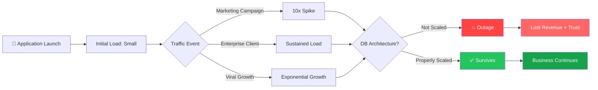
```mermaid
flowchart LR
    A[🚀 Application Launch] --> B[Initial Load: Small]
    B --> C{Traffic Event}
    C -->|Marketing Campaign| D[10x Spike]
    C -->|Enterprise Client| E[Sustained Load]
    C -->|Viral Growth| F[Exponential Growth]
    D --> G{DB Architecture?}
    E --> G
    F --> G
    G -->|Not Scaled| H[💥 Outage]
    G -->|Properly Scaled| I[✅ Survives]
    H --> J[Lost Revenue + Trust]
    I --> K[Business Continues]

    style H fill:#ff4444,color:#fff
    style I fill:#22c55e,color:#fff
    style J fill:#ff6666,color:#fff
    style K fill:#16a34a,color:#fff
```

The goal of this tutorial is to arm you with the vocabulary, mental models, and practical knowledge to design for scale **before** it becomes painful.

---

## 1. Vertical Scaling (Scale Up)

### What It Is

Vertical scaling means upgrading a single database server with more powerful hardware:

| Resource | Before | After |
|----------|--------|-------|
| RAM | 8 GB | 64 GB |
| CPU | 4 cores | 32 cores |
| Storage | HDD | NVMe SSD |
| Network | 1 Gbps | 25 Gbps |

No code changes. No architecture changes. Just a bigger machine.

### How It Works

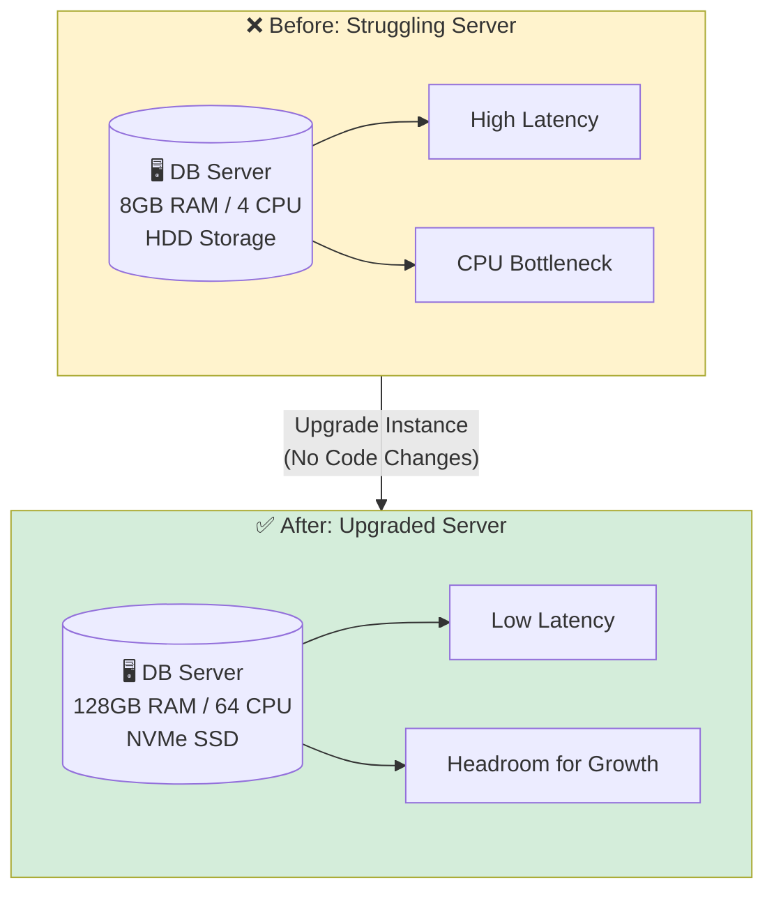
```mermaid
flowchart TD
    subgraph Before["❌ Before: Struggling Server"]
        A1[("🖥️ DB Server\n8GB RAM / 4 CPU\nHDD Storage")]
        B1[High Latency]
        C1[CPU Bottleneck]
        A1 --> B1
        A1 --> C1
    end

    subgraph After["✅ After: Upgraded Server"]
        A2[("🖥️ DB Server\n128GB RAM / 64 CPU\nNVMe SSD")]
        B2[Low Latency]
        C2[Headroom for Growth]
        A2 --> B2
        A2 --> C2
    end

    Before -->|"Upgrade Instance\n(No Code Changes)"| After

    style Before fill:#fff3cd
    style After fill:#d4edda
```

### Step-by-Step: When to Apply Vertical Scaling

1. **Identify the bottleneck** — Use `EXPLAIN ANALYZE` in PostgreSQL or `SHOW PROCESSLIST` in MySQL to understand if the issue is CPU, memory, or I/O.
2. **Profile memory usage** — If your working set fits in RAM, more RAM = massive gains.
3. **Upgrade instance** — In AWS RDS, this means changing `db.t3.medium` → `db.r6g.4xlarge`. Downtime: typically 5–15 minutes.
4. **Validate** — Check query latencies, CPU utilization, and IOPS post-upgrade.

### Real-World Example: SaaS Startup Growth

```
Timeline:
  Month 1:  50,000 users   → db.t3.medium   ✅ Fast enough
  Month 6:  200,000 users  → db.t3.large    ⚠️  Getting slow
  Month 12: 500,000 users  → db.r6g.2xlarge ✅ Breathing room
  Month 18: 1,000,000 users → db.r6g.4xlarge ⚠️  Approaching ceiling
  Month 24: 2,000,000 users → Need new strategy! ❌
```

### Practical Code Example: Monitoring Before Scaling

```sql
-- PostgreSQL: Check which queries are consuming most resources
SELECT 
    query,
    calls,
    total_exec_time / calls AS avg_ms,
    rows / calls AS avg_rows
FROM pg_stat_statements
ORDER BY total_exec_time DESC
LIMIT 10;

-- Check memory usage vs buffer cache hits
SELECT 
    sum(heap_blks_hit) / (sum(heap_blks_hit) + sum(heap_blks_read)) AS cache_hit_ratio
FROM pg_statio_user_tables;
-- If cache_hit_ratio < 0.95, more RAM will help significantly
```

### Trade-offs

| ✅ Pros | ❌ Cons |
|--------|--------|
| Zero code changes | Hardware ceiling exists |
| Immediate results | Exponential cost increase |
| No operational complexity | Single point of failure |
| Great first move | Downtime during upgrade |

> 💡 **Rule of Thumb**: Vertical scaling buys you time. Use it as a short-term move while designing your long-term horizontal strategy.

---

## 2. Read Replicas

### What It Is

Instead of one database handling everything, you create **read-only copies** of your primary. The primary handles all writes; replicas handle reads.

### Architecture Diagram

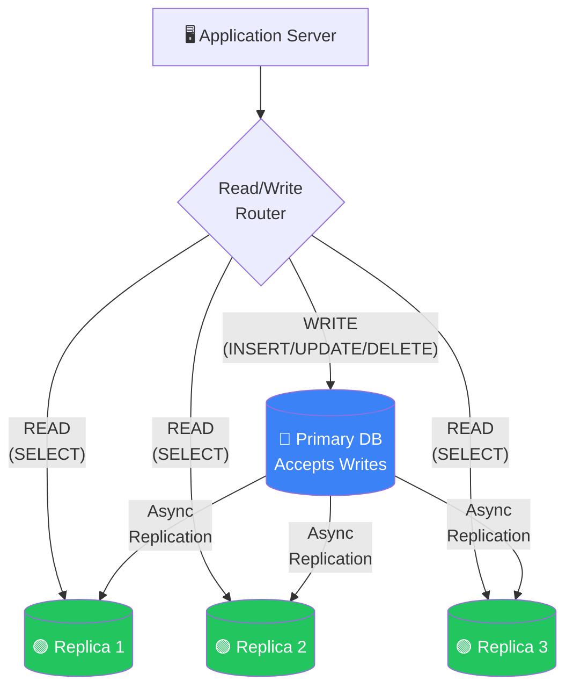
```mermaid
flowchart TD
    App[🖥️ Application Server]
    LB{Read/Write\nRouter}

    App --> LB

    LB -->|"WRITE\n(INSERT/UPDATE/DELETE)"| Primary[("🔵 Primary DB\nAccepts Writes")]
    LB -->|"READ\n(SELECT)"| R1[("🟢 Replica 1")]
    LB -->|"READ\n(SELECT)"| R2[("🟢 Replica 2")]
    LB -->|"READ\n(SELECT)"| R3[("🟢 Replica 3")]

    Primary -->|"Async\nReplication"| R1
    Primary -->|"Async\nReplication"| R2
    Primary -->|"Async\nReplication"| R3

    style Primary fill:#3b82f6,color:#fff
    style R1 fill:#22c55e,color:#fff
    style R2 fill:#22c55e,color:#fff
    style R3 fill:#22c55e,color:#fff
```

### Understanding Replication Lag

This is the most important nuance. Replication is **asynchronous** by default:

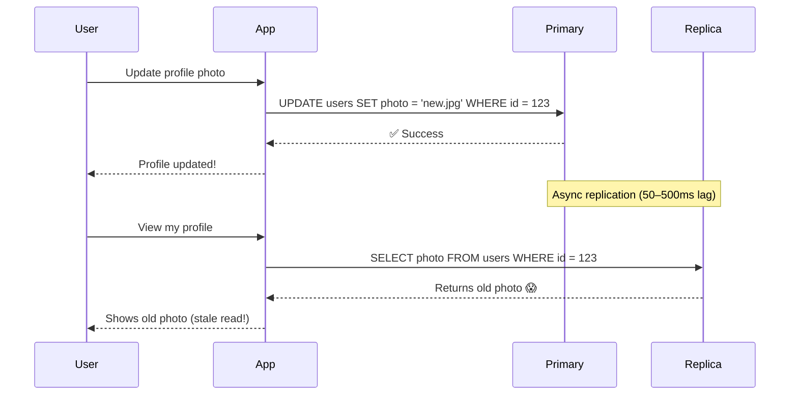
```mermaid
sequenceDiagram
    participant User
    participant App
    participant Primary
    participant Replica

    User->>App: Update profile photo
    App->>Primary: UPDATE users SET photo = 'new.jpg' WHERE id = 123
    Primary-->>App: ✅ Success
    App-->>User: Profile updated!

    Note over Primary,Replica: Async replication (50–500ms lag)

    User->>App: View my profile
    App->>Replica: SELECT photo FROM users WHERE id = 123
    Replica-->>App: Returns old photo 😱
    App-->>User: Shows old photo (stale read!)
```

### Handling Replication Lag: Code Pattern

```python
class DatabaseRouter:
    
    def get_connection(self, operation: str, require_fresh: bool = False):
        """
        Smart router that directs reads to replicas
        but handles consistency-sensitive operations.
        """
        if operation == "write":
            return self.primary_connection
        
        if require_fresh:
            # Read-after-write consistency: go to primary
            return self.primary_connection
        
        # Default: distribute reads across replicas
        return random.choice(self.replica_connections)

# Usage:
db = DatabaseRouter()

# Write always goes to primary
db.get_connection("write").execute(
    "UPDATE users SET name = %s WHERE id = %s", 
    ["Alice", 123]
)

# Immediately read back — use primary for consistency
user = db.get_connection("read", require_fresh=True).execute(
    "SELECT * FROM users WHERE id = %s", [123]
)

# General reads (feeds, listings) — replicas are fine
products = db.get_connection("read").execute(
    "SELECT * FROM products WHERE category = 'electronics'"
)
```

### Real-World Use Case: EdTech Platform

```
Traffic breakdown:
  95% → Students viewing course content (READ)
   4% → Instructors uploading/editing content (WRITE)
   1% → Admin operations (WRITE)

Solution:
  Primary DB:    Handles 5% write traffic + critical reads
  Replica 1–3:  Handles 95% read traffic distributed evenly

Result:
  Before: Primary at 85% CPU during peak
  After:  Primary at ~10% CPU, each replica at ~30%
  Cost:   3× replicas added, but smaller instance classes work
```

### When to Use Read Replicas

- E-commerce product listings and search
- Social media feeds
- Reporting and analytics dashboards
- Content delivery platforms
- Any system where reads >> writes

---

## 3. Database Sharding

### What It Is

Sharding horizontally partitions data across **multiple independent database instances**, each called a shard. Each shard is a full database — it has its own compute, storage, and connection pool.

### Sharding Architecture

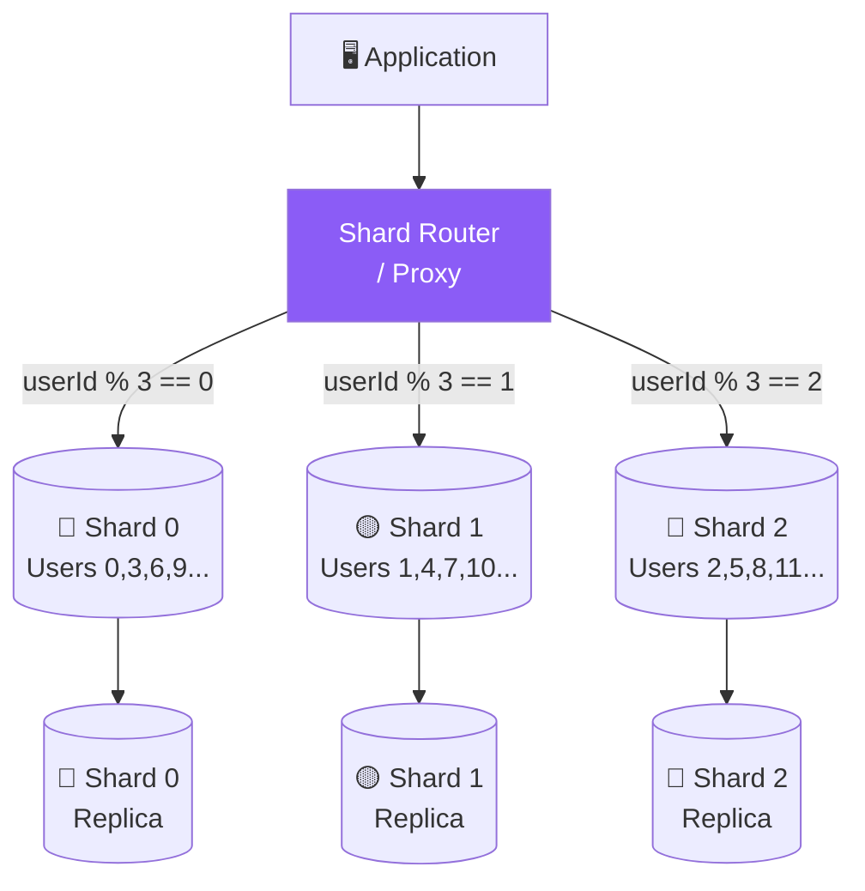
```mermaid
flowchart TD
    App[🖥️ Application]
    SR[Shard Router\n/ Proxy]
    
    App --> SR

    SR -->|"userId % 3 == 0"| S0[("🔴 Shard 0\nUsers 0,3,6,9...")]
    SR -->|"userId % 3 == 1"| S1[("🟡 Shard 1\nUsers 1,4,7,10...")]
    SR -->|"userId % 3 == 2"| S2[("🔵 Shard 2\nUsers 2,5,8,11...")]

    S0 --> R0[("🔴 Shard 0\nReplica")]
    S1 --> R1[("🟡 Shard 1\nReplica")]
    S2 --> R2[("🔵 Shard 2\nReplica")]

    style SR fill:#8b5cf6,color:#fff
```

### Types of Sharding

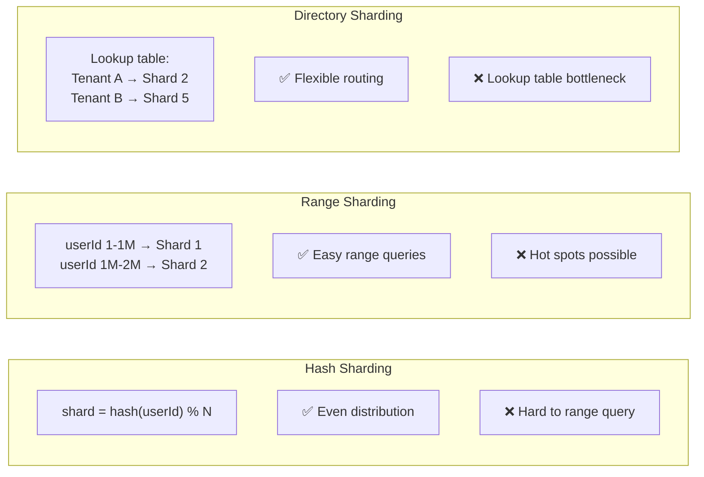
```mermaid
flowchart LR
    subgraph Hash["Hash Sharding"]
        H1["shard = hash(userId) % N"]
        H2["✅ Even distribution"]
        H3["❌ Hard to range query"]
    end

    subgraph Range["Range Sharding"]
        R1["userId 1-1M → Shard 1\nuserId 1M-2M → Shard 2"]
        R2["✅ Easy range queries"]
        R3["❌ Hot spots possible"]
    end

    subgraph Dir["Directory Sharding"]
        D1["Lookup table:\nTenant A → Shard 2\nTenant B → Shard 5"]
        D2["✅ Flexible routing"]
        D3["❌ Lookup table bottleneck"]
    end
```

### Step-by-Step: Implementing Shard Routing

```python
class ShardRouter:
    def __init__(self, shard_count: int, shard_connections: list):
        self.shard_count = shard_count
        self.shards = shard_connections

    def get_shard(self, shard_key: int):
        """Consistent hash routing."""
        shard_index = shard_key % self.shard_count
        return self.shards[shard_index]

    def get_all_shards(self):
        """For scatter-gather queries across all shards."""
        return self.shards


router = ShardRouter(shard_count=4, shard_connections=[...])

# Single-shard query (fast)
shard = router.get_shard(user_id=12345)
user = shard.execute("SELECT * FROM users WHERE id = %s", [12345])

# Cross-shard aggregation (expensive — avoid when possible)
results = []
for shard in router.get_all_shards():
    results.extend(shard.execute("SELECT COUNT(*) FROM orders"))
total_orders = sum(results)
```

### The Hard Problems with Sharding

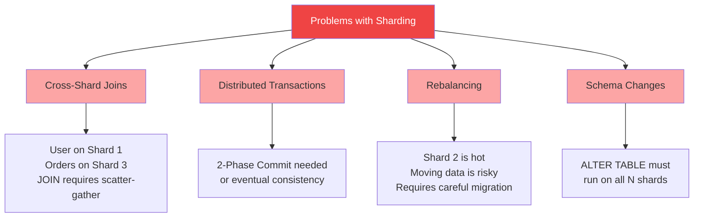
```mermaid
flowchart TD
    P[Problems with Sharding]
    P --> A[Cross-Shard Joins]
    P --> B[Distributed Transactions]
    P --> C[Rebalancing]
    P --> D[Schema Changes]

    A --> A1["User on Shard 1\nOrders on Shard 3\nJOIN requires scatter-gather"]
    B --> B1["2-Phase Commit needed\nor eventual consistency"]
    C --> C1["Shard 2 is hot\nMoving data is risky\nRequires careful migration"]
    D --> D1["ALTER TABLE must\nrun on all N shards"]

    style P fill:#ef4444,color:#fff
    style A fill:#fca5a5
    style B fill:#fca5a5
    style C fill:#fca5a5
    style D fill:#fca5a5
```

### Real-World Use Case: Multi-Tenant SaaS

```
Company: B2B SaaS with 10,000 enterprise tenants

Shard Key: tenantId

Routing logic:
  tenantId % 8 → 8 shards

Benefits:
  ✅ Each tenant's data lives in one shard
  ✅ No cross-shard queries for normal operations
  ✅ Large tenants can be isolated to dedicated shards
  ✅ Shard 0-6: shared infrastructure
  ✅ Shard 7: "Enterprise tier" — dedicated resources

Example: GitHub uses this model — large orgs get dedicated DB resources
```

---

## 4. Partitioning

### What It Is

Partitioning divides a **single logical table** into multiple physical storage segments. Unlike sharding, it happens within one database instance and is transparent to the application.

### Partitioning Strategies

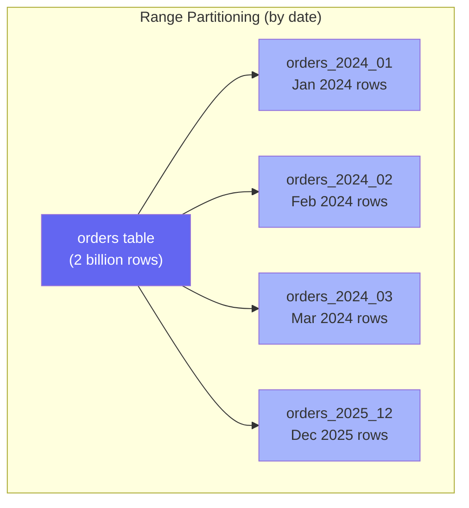
```mermaid
flowchart TD
    T["orders table\n(2 billion rows)"]
    
    subgraph Range["Range Partitioning (by date)"]
        T --> P1["orders_2024_01\nJan 2024 rows"]
        T --> P2["orders_2024_02\nFeb 2024 rows"]
        T --> P3["orders_2024_03\nMar 2024 rows"]
        T --> Pn["orders_2025_12\nDec 2025 rows"]
    end
    
    style T fill:#6366f1,color:#fff
    style P1 fill:#a5b4fc
    style P2 fill:#a5b4fc
    style P3 fill:#a5b4fc
    style Pn fill:#a5b4fc
```

### Setting Up Range Partitioning in PostgreSQL

```sql
-- Step 1: Create partitioned parent table
CREATE TABLE orders (
    id          BIGINT,
    customer_id BIGINT,
    total       DECIMAL(10,2),
    created_at  TIMESTAMPTZ NOT NULL
) PARTITION BY RANGE (created_at);

-- Step 2: Create monthly partitions
CREATE TABLE orders_2025_01 
    PARTITION OF orders 
    FOR VALUES FROM ('2025-01-01') TO ('2025-02-01');

CREATE TABLE orders_2025_02 
    PARTITION OF orders 
    FOR VALUES FROM ('2025-02-01') TO ('2025-03-01');

-- Step 3: Create index on each partition
CREATE INDEX ON orders_2025_01 (customer_id);
CREATE INDEX ON orders_2025_02 (customer_id);

-- Step 4: Query as normal — PostgreSQL handles partition pruning
EXPLAIN SELECT * FROM orders
WHERE created_at BETWEEN '2025-01-01' AND '2025-01-31';
-- Output: Scans only orders_2025_01 ✅

-- Step 5: Archive old partitions easily
ALTER TABLE orders DETACH PARTITION orders_2023_01;
-- Now orders_2023_01 is a standalone table — can be moved to cold storage
```

### Query Performance: With vs Without Partitioning

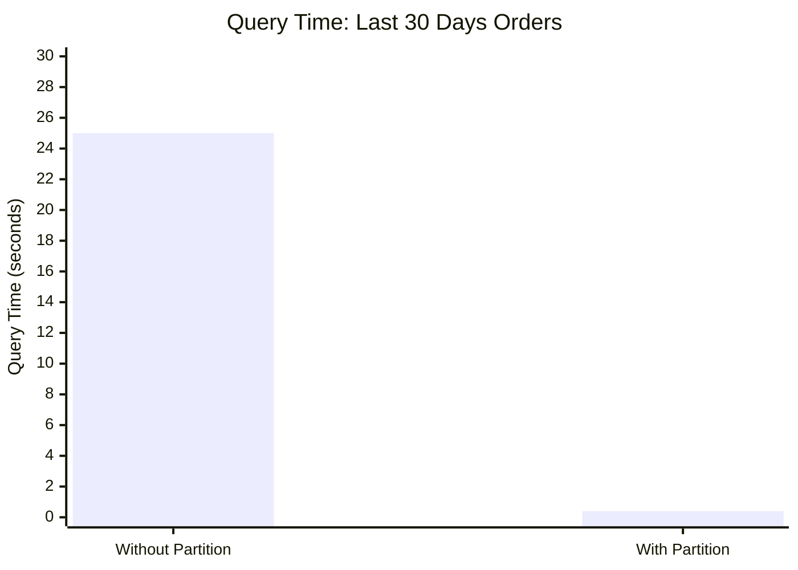
```mermaid
xychart-beta
    title "Query Time: Last 30 Days Orders"
    x-axis ["Without Partition", "With Partition"]
    y-axis "Query Time (seconds)" 0 --> 30
    bar [25, 0.4]
```

### Real-World Use Case: IoT Event Logging

```
System: IoT platform ingesting 50,000 events/second
Table:  sensor_events — 2 billion rows/year

Partitioning scheme:
  PARTITION BY RANGE (recorded_at)
  Monthly partitions: sensor_events_2025_01, sensor_events_2025_02...

Benefits:
  ✅ Query "last 7 days" touches only 1–2 partitions
  ✅ Index size per partition: 500MB vs 12GB for full table
  ✅ Monthly archival: DETACH old partition in milliseconds
  ✅ Parallel query: PostgreSQL can scan partitions concurrently
```

---

## 5. Caching Layer

### What It Is

A caching layer stores frequently read data in **memory**, dramatically reducing database load and query latency.

### Cache Architecture Patterns

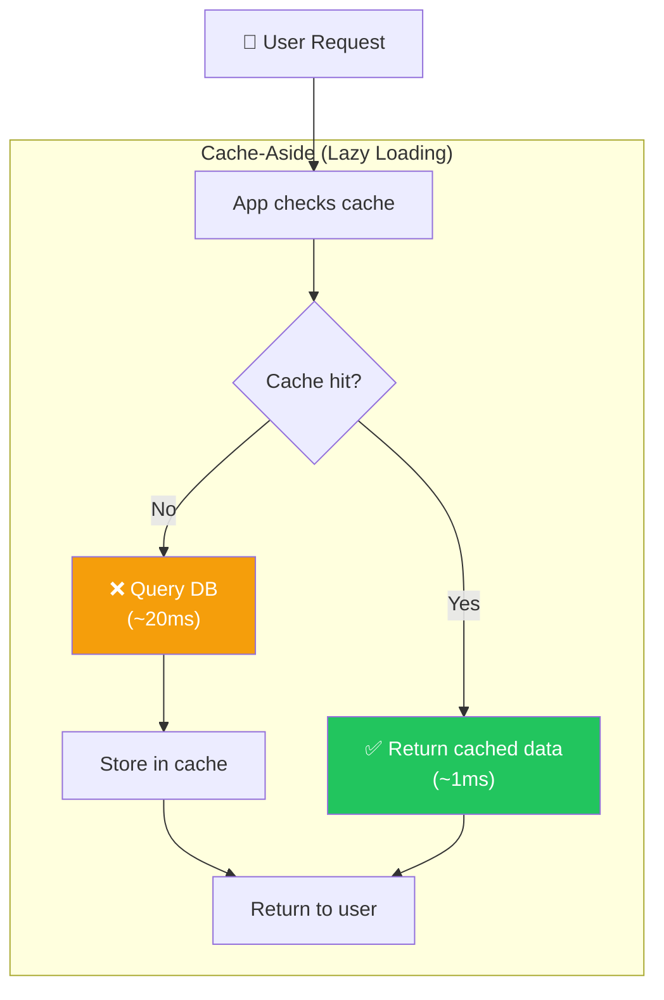
```mermaid
flowchart TD
    User[👤 User Request]

    subgraph CacheAside["Cache-Aside (Lazy Loading)"]
        CA1[App checks cache]
        CA2{Cache hit?}
        CA3["✅ Return cached data\n(~1ms)"]
        CA4["❌ Query DB\n(~20ms)"]
        CA5[Store in cache]
        CA6[Return to user]

        CA1 --> CA2
        CA2 -->|Yes| CA3
        CA2 -->|No| CA4
        CA4 --> CA5
        CA5 --> CA6
        CA3 --> CA6
    end

    User --> CA1
    style CA3 fill:#22c55e,color:#fff
    style CA4 fill:#f59e0b,color:#fff
```

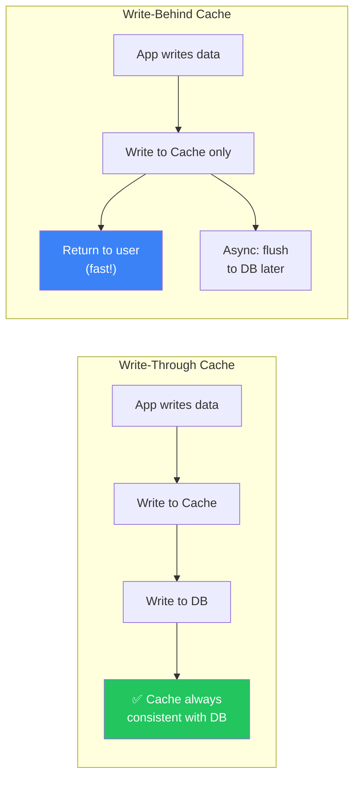
```mermaid
flowchart LR
    subgraph WriteThrough["Write-Through Cache"]
        WT1[App writes data]
        WT2[Write to Cache]
        WT3[Write to DB]
        WT4["✅ Cache always\nconsistent with DB"]
        WT1 --> WT2 --> WT3 --> WT4
    end

    subgraph WriteBehind["Write-Behind Cache"]
        WB1[App writes data]
        WB2[Write to Cache only]
        WB3["Return to user\n(fast!)"]
        WB4["Async: flush\nto DB later"]
        WB1 --> WB2 --> WB3
        WB2 --> WB4
    end

    style WT4 fill:#22c55e,color:#fff
    style WB3 fill:#3b82f6,color:#fff
```

### Implementation: Redis Cache-Aside Pattern

```python
import redis
import json
import hashlib
from functools import wraps

redis_client = redis.Redis(host='localhost', port=6379, decode_responses=True)

class Cache:
    def __init__(self, ttl_seconds: int = 300):
        self.ttl = ttl_seconds
    
    def cache_aside(self, key_prefix: str):
        """Decorator for cache-aside pattern."""
        def decorator(func):
            @wraps(func)
            def wrapper(*args, **kwargs):
                # Build cache key
                cache_key = f"{key_prefix}:{hashlib.md5(str(args).encode()).hexdigest()}"
                
                # Try cache first
                cached = redis_client.get(cache_key)
                if cached:
                    print(f"✅ Cache HIT: {cache_key}")
                    return json.loads(cached)
                
                # Cache miss → hit DB
                print(f"❌ Cache MISS: {cache_key} — querying DB")
                result = func(*args, **kwargs)
                
                # Store in cache
                redis_client.setex(cache_key, self.ttl, json.dumps(result))
                return result
            return wrapper
        return decorator

cache = Cache(ttl_seconds=300)

@cache.cache_aside("product")
def get_product(product_id: int):
    """This only runs on cache miss."""
    return db.execute("SELECT * FROM products WHERE id = %s", [product_id])

# First call: DB hit, caches result
product = get_product(42)  # ❌ Cache MISS

# Second call: returns instantly from Redis
product = get_product(42)  # ✅ Cache HIT (~1ms!)
```

### Cache Invalidation Strategies

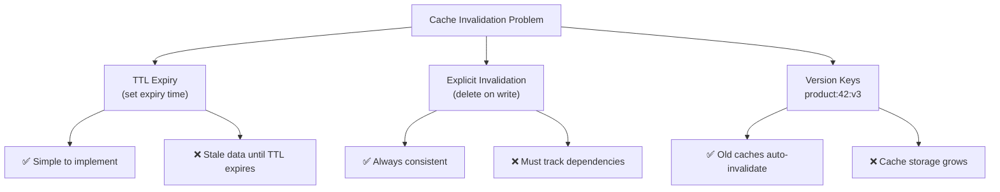
```mermaid
flowchart TD
    I[Cache Invalidation Problem]
    I --> TTL["TTL Expiry\n(set expiry time)"]
    I --> EXP["Explicit Invalidation\n(delete on write)"]
    I --> VER["Version Keys\nproduct:42:v3"]

    TTL --> T1["✅ Simple to implement"]
    TTL --> T2["❌ Stale data until TTL expires"]

    EXP --> E1["✅ Always consistent"]
    EXP --> E2["❌ Must track dependencies"]

    VER --> V1["✅ Old caches auto-invalidate"]
    VER --> V2["❌ Cache storage grows"]
```

### Real-World Use Case: Flash Sale

```
Scenario: E-commerce flash sale — 1M concurrent users hitting same 20 products

Without Cache:
  1,000,000 requests × 20ms/query = 20,000 seconds of DB work/second
  → Database melts at ~5,000 QPS → 💥 Outage

With Redis Cache:
  1,000,000 requests → 999,800 hit Redis (0.2ms each)
                     → 200 miss Redis, hit DB (20ms each)
  
  DB load: 200 QPS instead of 1,000,000 QPS
  → Database survives easily ✅
  
  Cache hit rate: 99.98%
  p99 latency: 2ms (was 200ms)
```

---

## 6. CQRS (Command Query Responsibility Segregation)

### What It Is

CQRS separates your application into two distinct models:
- **Command side** — handles writes (insert, update, delete) — optimized for consistency
- **Query side** — handles reads — optimized for speed and flexibility

### CQRS Architecture

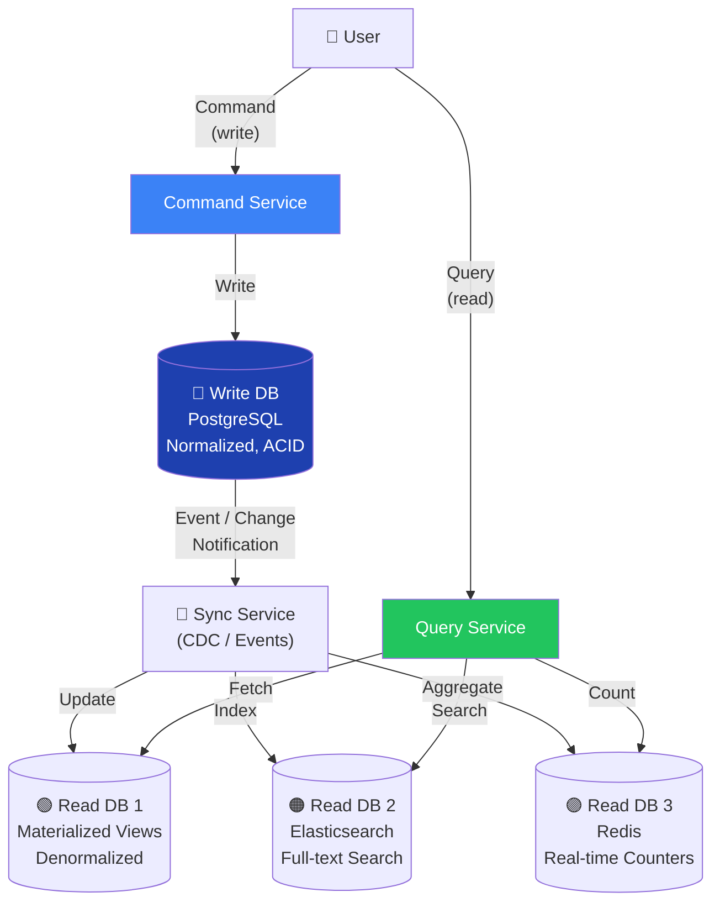
```mermaid
flowchart TD
    User[👤 User]
    
    User -->|"Command\n(write)"| CS[Command Service]
    User -->|"Query\n(read)"| QS[Query Service]

    CS -->|"Write"| WDB[("🔵 Write DB\nPostgreSQL\nNormalized, ACID")]
    WDB -->|"Event / Change\nNotification"| Sync["🔄 Sync Service\n(CDC / Events)"]
    Sync -->|"Update"| RDB1[("🟢 Read DB 1\nMaterialized Views\nDenormalized")]
    Sync -->|"Index"| RDB2[("🟠 Read DB 2\nElasticsearch\nFull-text Search")]
    Sync -->|"Aggregate"| RDB3[("🟣 Read DB 3\nRedis\nReal-time Counters")]

    QS -->|"Fetch"| RDB1
    QS -->|"Search"| RDB2
    QS -->|"Count"| RDB3

    style CS fill:#3b82f6,color:#fff
    style QS fill:#22c55e,color:#fff
    style WDB fill:#1e40af,color:#fff
```

### Step-by-Step Implementation

```python
# ---- COMMAND SIDE ----

class OrderCommandHandler:
    """Handles writes — consistency is paramount."""
    
    def place_order(self, user_id: int, items: list, total: float):
        with postgres.transaction():
            order = postgres.execute("""
                INSERT INTO orders (user_id, total, status, created_at)
                VALUES (%s, %s, 'pending', NOW())
                RETURNING id
            """, [user_id, total])
            
            for item in items:
                postgres.execute("""
                    INSERT INTO order_items (order_id, product_id, qty, price)
                    VALUES (%s, %s, %s, %s)
                """, [order.id, item.product_id, item.qty, item.price])
            
            # Publish event for read-side synchronization
            event_bus.publish("order.placed", {
                "order_id": order.id,
                "user_id": user_id,
                "total": total,
                "items": items
            })
        
        return order.id


# ---- QUERY SIDE ----

class OrderQueryHandler:
    """Handles reads — speed is paramount."""
    
    def get_order_summary(self, order_id: int):
        # Hit pre-computed materialized view — much faster than joining 5 tables
        return read_db.execute("""
            SELECT * FROM order_summaries_mv WHERE order_id = %s
        """, [order_id])
    
    def search_orders(self, query: str, user_id: int):
        # Use Elasticsearch for full-text search — impossible in SQL efficiently
        return elasticsearch.search(
            index="orders",
            body={"query": {"bool": {"must": [
                {"match": {"description": query}},
                {"term": {"user_id": user_id}}
            ]}}}
        )
```

### Real-World Use Case: Analytics-Heavy E-Commerce

```
Problem: Product dashboard requires:
  - Transaction history (normalized, ACID)
  - Sales analytics (aggregated, fast)
  - Full-text search (inverted index)
  - Real-time inventory counts (counter)

With CQRS:
  Write DB (PostgreSQL):
    ✅ Handles orders, payments, inventory updates
    ✅ ACID guarantees, foreign keys, constraints

  Read DB 1 (Materialized Views):
    ✅ SELECT * FROM sales_by_region_mv — returns in 5ms
    ✅ Pre-aggregated nightly (or via CDC)

  Read DB 2 (Elasticsearch):
    ✅ Full-text product search
    ✅ Faceted filtering by brand, price, rating

  Read DB 3 (Redis):
    ✅ Real-time counters: `INCRBY inventory:product:42 -1`
    ✅ Sub-millisecond reads
```

---

## 7. Denormalization

### What It Is

Denormalization intentionally introduces **data redundancy** to reduce expensive JOIN operations at read time.

### Normalization vs Denormalization

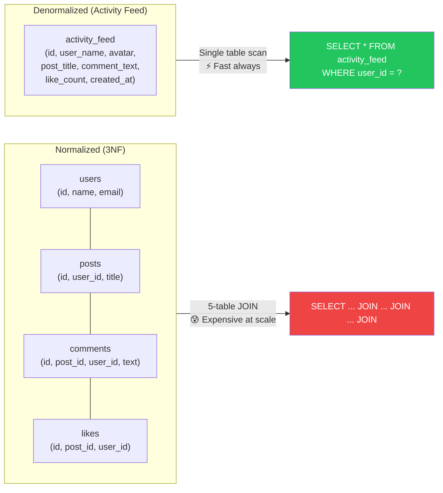
```mermaid
flowchart LR
    subgraph Normalized["Normalized (3NF)"]
        direction TB
        U["users\n(id, name, email)"]
        P["posts\n(id, user_id, title)"]
        C["comments\n(id, post_id, user_id, text)"]
        L["likes\n(id, post_id, user_id)"]
        U --- P --- C --- L
    end

    subgraph Denorm["Denormalized (Activity Feed)"]
        direction TB
        F["activity_feed\n(id, user_name, avatar,\npost_title, comment_text,\nlike_count, created_at)"]
    end

    Normalized -->|"5-table JOIN\n😰 Expensive at scale"| Q1["SELECT ... JOIN ... JOIN ... JOIN"]
    Denorm -->|"Single table scan\n⚡ Fast always"| Q2["SELECT * FROM activity_feed\nWHERE user_id = ?"]

    style Q1 fill:#ef4444,color:#fff
    style Q2 fill:#22c55e,color:#fff
```

### When to Denormalize: Decision Framework

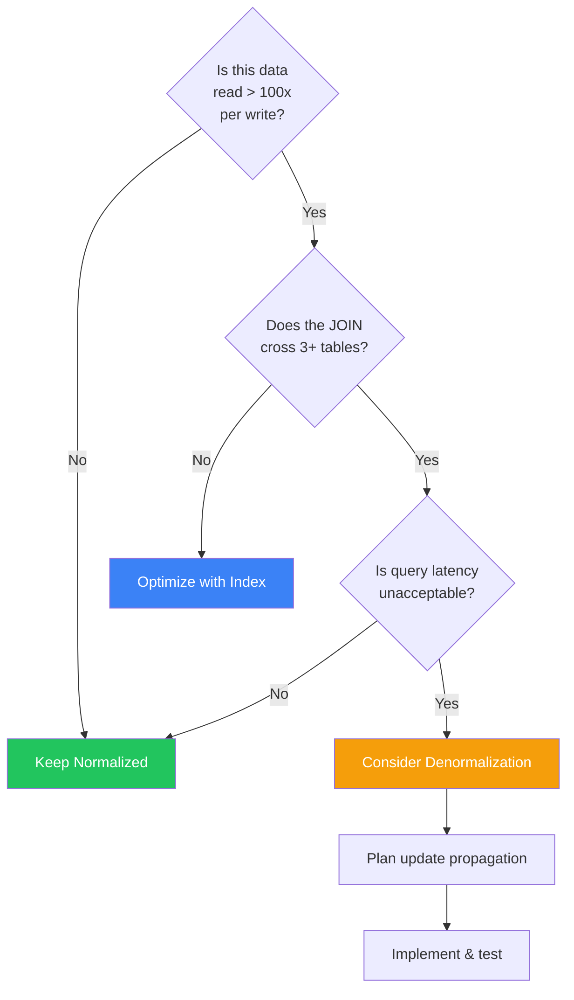
```mermaid
flowchart TD
    Q1{Is this data\nread > 100x\nper write?}
    Q1 -->|No| KEEP[Keep Normalized]
    Q1 -->|Yes| Q2{Does the JOIN\ncross 3+ tables?}
    Q2 -->|No| OPT[Optimize with Index]
    Q2 -->|Yes| Q3{Is query latency\nunacceptable?}
    Q3 -->|No| KEEP
    Q3 -->|Yes| DENORM[Consider Denormalization]
    DENORM --> PLAN[Plan update propagation]
    PLAN --> IMPL[Implement & test]

    style KEEP fill:#22c55e,color:#fff
    style DENORM fill:#f59e0b,color:#fff
    style OPT fill:#3b82f6,color:#fff
```

### Implementation Example

```sql
-- BEFORE: 5-table JOIN for every feed item
SELECT 
    u.name, u.avatar_url,
    p.title, p.body,
    COUNT(l.id) AS like_count,
    COUNT(c.id) AS comment_count
FROM posts p
JOIN users u ON p.user_id = u.id
LEFT JOIN likes l ON l.post_id = p.id
LEFT JOIN comments c ON c.post_id = p.id
WHERE p.user_id IN (SELECT following_id FROM follows WHERE user_id = ?)
GROUP BY p.id, u.id
ORDER BY p.created_at DESC
LIMIT 50;
-- ⏱️ 200-500ms at scale

-- AFTER: Single table read
SELECT * FROM feed_items
WHERE viewer_user_id = ?
ORDER BY created_at DESC
LIMIT 50;
-- ⏱️ 5-10ms always ✅

-- Maintaining denormalized table via trigger:
CREATE OR REPLACE FUNCTION sync_feed_on_like() RETURNS TRIGGER AS $$
BEGIN
    UPDATE feed_items 
    SET like_count = like_count + 1
    WHERE post_id = NEW.post_id;
    RETURN NEW;
END;
$$ LANGUAGE plpgsql;

CREATE TRIGGER trg_like_insert
AFTER INSERT ON likes
FOR EACH ROW EXECUTE FUNCTION sync_feed_on_like();
```

---

## 8. Asynchronous Writes

### What It Is

Instead of writing to the database synchronously during the user's request, you **accept the request immediately** and process the write in the background.

### Synchronous vs Asynchronous Write Flow

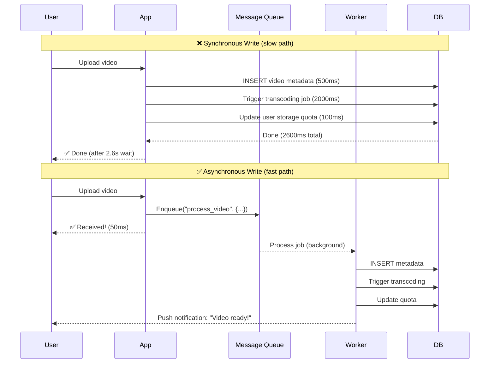
```mermaid
sequenceDiagram
    participant User
    participant App
    participant Queue as Message Queue
    participant Worker
    participant DB

    Note over User,DB: ❌ Synchronous Write (slow path)
    User->>App: Upload video
    App->>DB: INSERT video metadata (500ms)
    App->>DB: Trigger transcoding job (2000ms)
    App->>DB: Update user storage quota (100ms)
    DB-->>App: Done (2600ms total)
    App-->>User: ✅ Done (after 2.6s wait)

    Note over User,DB: ✅ Asynchronous Write (fast path)
    User->>App: Upload video
    App->>Queue: Enqueue("process_video", {...})
    App-->>User: ✅ Received! (50ms)
    Queue-->>Worker: Process job (background)
    Worker->>DB: INSERT metadata
    Worker->>DB: Trigger transcoding
    Worker->>DB: Update quota
    Worker-->>User: Push notification: "Video ready!"
```

### Implementation with a Message Queue

```python
import json
from kafka import KafkaProducer, KafkaConsumer

producer = KafkaProducer(
    bootstrap_servers=['localhost:9092'],
    value_serializer=lambda v: json.dumps(v).encode('utf-8')
)

# ---- API Handler (returns in ~50ms) ----
def place_order(user_id: int, cart: dict):
    # 1. Validate basic request
    if not cart.get("items"):
        raise ValueError("Empty cart")
    
    # 2. Generate idempotency key
    idempotency_key = f"order:{user_id}:{hash(str(cart))}"
    
    # 3. Publish to queue (non-blocking)
    producer.send("order-events", {
        "type": "ORDER_PLACED",
        "user_id": user_id,
        "cart": cart,
        "idempotency_key": idempotency_key,
        "timestamp": time.time()
    })
    
    return {"status": "accepted", "message": "Your order is being processed!"}

# ---- Background Worker ----
consumer = KafkaConsumer("order-events", ...)

for message in consumer:
    event = json.loads(message.value)
    
    if event["type"] == "ORDER_PLACED":
        try:
            # Idempotency check — prevent duplicate processing
            if db.exists("processed_events", event["idempotency_key"]):
                continue
            
            # Heavy processing happens here, not blocking the user
            with db.transaction():
                order_id = create_order(event["user_id"], event["cart"])
                update_inventory(event["cart"]["items"])
                send_confirmation_email(event["user_id"], order_id)
                db.insert("processed_events", event["idempotency_key"])
        
        except Exception as e:
            # Retry with exponential backoff
            retry_queue.publish(event, delay=2 ** event.get("retry_count", 0))
```

### Retry and Idempotency Pattern

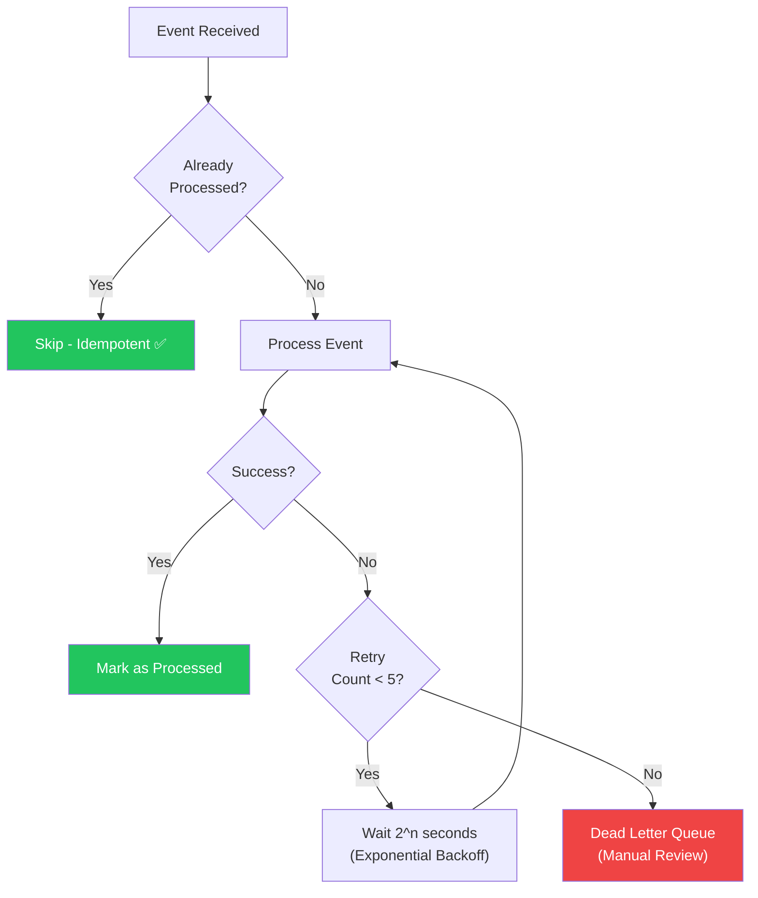
```mermaid
flowchart TD
    E[Event Received] --> IC{Already\nProcessed?}
    IC -->|Yes| SKIP[Skip - Idempotent ✅]
    IC -->|No| PROC[Process Event]
    PROC --> OK{Success?}
    OK -->|Yes| MARK[Mark as Processed]
    OK -->|No| RETRY{Retry\nCount < 5?}
    RETRY -->|Yes| WAIT["Wait 2^n seconds\n(Exponential Backoff)"]
    WAIT --> PROC
    RETRY -->|No| DLQ["Dead Letter Queue\n(Manual Review)"]

    style SKIP fill:#22c55e,color:#fff
    style MARK fill:#22c55e,color:#fff
    style DLQ fill:#ef4444,color:#fff
```

---

## 9. Index Optimization

### What It Is

Indexes are auxiliary data structures that allow the database engine to locate rows in **O(log n)** time instead of scanning the entire table **O(n)**.

### How a B-Tree Index Works

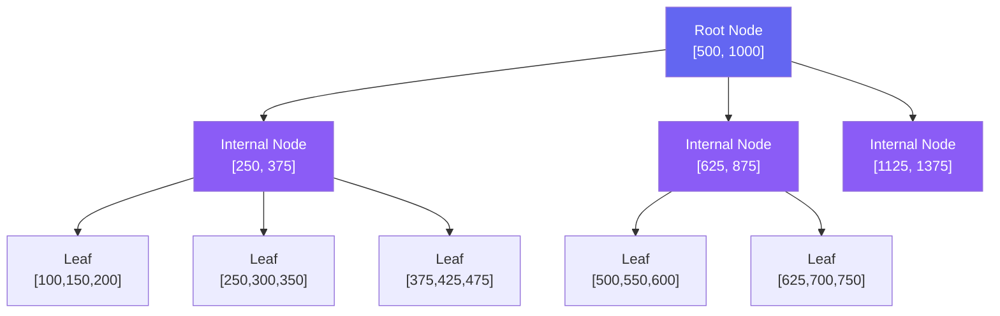
```mermaid
flowchart TD
    R["Root Node\n[500, 1000]"]
    
    L1["Internal Node\n[250, 375]"]
    L2["Internal Node\n[625, 875]"]
    L3["Internal Node\n[1125, 1375]"]
    
    D1["Leaf\n[100,150,200]"]
    D2["Leaf\n[250,300,350]"]
    D3["Leaf\n[375,425,475]"]
    D4["Leaf\n[500,550,600]"]
    D5["Leaf\n[625,700,750]"]
    
    R --> L1
    R --> L2
    R --> L3
    L1 --> D1
    L1 --> D2
    L1 --> D3
    L2 --> D4
    L2 --> D5

    style R fill:#6366f1,color:#fff
    style L1 fill:#8b5cf6,color:#fff
    style L2 fill:#8b5cf6,color:#fff
    style L3 fill:#8b5cf6,color:#fff
```

### Index Types and When to Use Each

| Index Type | Best For | Example |
|-----------|---------|---------|
| B-Tree (default) | Equality & range queries | `WHERE created_at > '2025-01-01'` |
| Hash | Equality only | `WHERE session_token = 'abc123'` |
| Composite | Multi-column filters | `WHERE status = 'active' AND user_id = 42` |
| Partial | Filtered subsets | `WHERE status = 'pending'` (only indexes pending rows) |
| GIN | JSON, arrays, full-text | `WHERE tags @> '{"redis"}'` |

### The Golden Rule: EXPLAIN ANALYZE

```sql
-- Always profile before adding an index!

-- Step 1: Run EXPLAIN ANALYZE
EXPLAIN (ANALYZE, BUFFERS, FORMAT TEXT)
SELECT * FROM orders 
WHERE customer_id = 12345 
  AND status = 'completed'
  AND created_at > '2025-01-01';

-- Output shows:
--   Seq Scan on orders  (cost=0.00..45231.00 rows=1 width=156)
--                       (actual time=3241.ms rows=47 loops=1)
--   Filter: (customer_id = 12345 AND status = 'completed' ...)
--   Rows Removed by Filter: 2847653  ← 😱 scanned 2.8M rows to find 47!

-- Step 2: Add targeted composite index
CREATE INDEX CONCURRENTLY idx_orders_customer_status_date
ON orders (customer_id, status, created_at DESC);
-- CONCURRENTLY = no table lock! Safe in production.

-- Step 3: Re-run EXPLAIN ANALYZE
--   Index Scan using idx_orders_customer_status_date
--   (actual time=0.3ms rows=47 loops=1)  ← ✅ 10,000x faster
```

### Index Bloat: The Hidden Cost

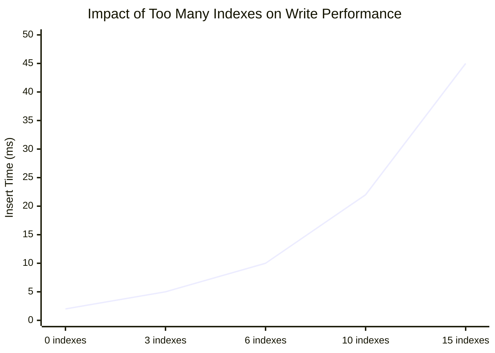
```mermaid
xychart-beta
    title "Impact of Too Many Indexes on Write Performance"
    x-axis ["0 indexes", "3 indexes", "6 indexes", "10 indexes", "15 indexes"]
    y-axis "Insert Time (ms)" 0 --> 50
    line [2, 5, 10, 22, 45]
```

```sql
-- Find unused indexes (safe to drop!)
SELECT 
    schemaname,
    tablename,
    indexname,
    idx_scan AS times_used
FROM pg_stat_user_indexes
WHERE idx_scan = 0
  AND indexname NOT LIKE '%pkey%'
ORDER BY pg_relation_size(indexrelid) DESC;

-- Drop an index safely
DROP INDEX CONCURRENTLY idx_old_unused_index;
```

---

## 10. Data Archival & Tiered Storage

### What It Is

Move rarely accessed ("cold") data to cheaper, slower storage while keeping recent ("hot") data in the fast primary database.

### Tiered Storage Architecture

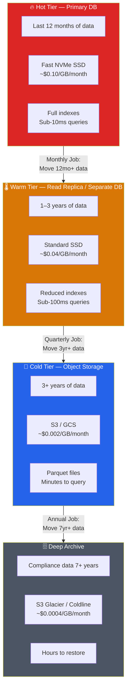
```mermaid
flowchart TD
    subgraph Hot["🔥 Hot Tier — Primary DB"]
        H[Last 12 months of data]
        H1["Fast NVMe SSD\n~$0.10/GB/month"]
        H2["Full indexes\nSub-10ms queries"]
    end

    subgraph Warm["🌡️ Warm Tier — Read Replica / Separate DB"]
        W[1–3 years of data]
        W1["Standard SSD\n~$0.04/GB/month"]
        W2["Reduced indexes\nSub-100ms queries"]
    end

    subgraph Cold["🧊 Cold Tier — Object Storage"]
        C[3+ years of data]
        C1["S3 / GCS\n~$0.002/GB/month"]
        C2["Parquet files\nMinutes to query"]
    end

    subgraph Archive["🗄️ Deep Archive"]
        A[Compliance data 7+ years]
        A1["S3 Glacier / Coldline\n~$0.0004/GB/month"]
        A2["Hours to restore"]
    end

    Hot -->|"Monthly Job:\nMove 12mo+ data"| Warm
    Warm -->|"Quarterly Job:\nMove 3yr+ data"| Cold
    Cold -->|"Annual Job:\nMove 7yr+ data"| Archive

    style Hot fill:#dc2626,color:#fff
    style Warm fill:#d97706,color:#fff
    style Cold fill:#2563eb,color:#fff
    style Archive fill:#4b5563,color:#fff
```

### Implementing an Archival Job

```python
import boto3
import psycopg2
import pandas as pd
from datetime import datetime, timedelta

class DataArchiver:
    def __init__(self, db_conn, s3_bucket: str):
        self.db = db_conn
        self.s3 = boto3.client('s3')
        self.bucket = s3_bucket
    
    def archive_old_transactions(self, older_than_months: int = 24):
        cutoff_date = datetime.now() - timedelta(days=older_than_months * 30)
        
        print(f"Archiving transactions before {cutoff_date.date()}")
        
        # Step 1: Export to S3 as Parquet (compressed, queryable with Athena)
        rows = self.db.execute("""
            SELECT * FROM transactions
            WHERE created_at < %s
            ORDER BY created_at
        """, [cutoff_date])
        
        df = pd.DataFrame(rows)
        
        s3_key = f"archive/transactions/{cutoff_date.year}/{cutoff_date.month:02d}/transactions.parquet"
        
        # Write parquet to S3
        df.to_parquet("/tmp/transactions.parquet", compression='snappy')
        self.s3.upload_file("/tmp/transactions.parquet", self.bucket, s3_key)
        
        print(f"✅ Exported {len(df)} rows to s3://{self.bucket}/{s3_key}")
        
        # Step 2: Delete from primary DB (within transaction for safety)
        with self.db.transaction():
            deleted = self.db.execute("""
                DELETE FROM transactions
                WHERE created_at < %s
                RETURNING id
            """, [cutoff_date])
            
            # Log the archival operation
            self.db.execute("""
                INSERT INTO archival_log (table_name, s3_path, row_count, archived_at)
                VALUES ('transactions', %s, %s, NOW())
            """, [s3_key, len(deleted)])
        
        print(f"✅ Deleted {len(deleted)} rows from primary DB")
        print(f"💰 Freed ~{len(df) * 0.5 / 1024:.1f} GB of primary DB storage")
```

### Cost Analysis: Archival ROI

```
Scenario: Fintech with 500GB of transaction data, growing 50GB/month

Without Archival (after 2 years):
  Primary DB storage: 1.7TB × $0.10/GB = $170/month
  Index overhead: 2× storage = $340/month
  Query time on full table: 30–200ms

With Archival (last 12 months hot):
  Hot tier:   600GB × $0.10/GB  = $60/month
  Cold tier:  1.1TB × $0.002/GB = $2.20/month
  Total:      $62.20/month

  Monthly savings: $278
  Annual savings:  $3,336 💰
  Query time (recent data): 5–20ms ✅
```

---

## Choosing the Right Strategy

No single strategy works for every system. Use this decision framework:

```mermaid
flowchart TD
    START[What's your primary problem?]
    
    START --> S1{Query latency\ntoo high?}
    START --> S2{Write throughput\nnot enough?}
    START --> S3{Storage too\nexpensive/slow?}
    START --> S4{Availability\nconcerns?}
    
    S1 -->|First step| VS[Vertical Scale\n+ Index Optimize]
    VS --> S1B{Still slow?}
    S1B -->|Reads| RR[Add Read Replicas]
    S1B -->|Aggregations| CACHE[Add Caching Layer]
    S1B -->|Complex queries| CQRS_N[Consider CQRS]
    
    S2 -->|First step| AW[Async Writes]
    AW --> S2B{Still not enough?}
    S2B --> SHARD[Database Sharding]
    
    S3 -->|Old data| ARCH[Data Archival]
    S3 -->|Recent data| PART[Partitioning]
    
    S4 --> RR2[Read Replicas\n+ Multi-AZ]
    
    style VS fill:#6366f1,color:#fff
    style RR fill:#22c55e,color:#fff
    style CACHE fill:#f59e0b,color:#fff
    style SHARD fill:#ef4444,color:#fff
    style ARCH fill:#64748b,color:#fff
    style AW fill:#8b5cf6,color:#fff
```

### Strategy Selection Matrix

| Strategy | Best For | Complexity | Impact |
|----------|----------|------------|--------|
| Vertical Scaling | Early growth | 🟢 Low | 🟡 Medium |
| Read Replicas | Read-heavy systems | 🟢 Low | 🟢 High |
| Caching | Repeated reads, hot data | 🟡 Medium | 🟢 Very High |
| Partitioning | Time-series, large tables | 🟡 Medium | 🟢 High |
| Index Optimization | Slow queries | 🟢 Low | 🟢 Very High |
| Data Archival | Old data, cost savings | 🟡 Medium | 🟢 High |
| CQRS | Mixed read/write workloads | 🔴 High | 🟢 High |
| Async Writes | Write-heavy, latency-sensitive | 🟡 Medium | 🟢 High |
| Denormalization | Read-heavy, complex joins | 🟡 Medium | 🟡 Medium |
| Sharding | Massive scale, multi-tenant | 🔴 Very High | 🟢 Very High |

### The Scaling Ladder

```mermaid
flowchart LR
    A["Level 1\nVertical Scale\n+ Indexes"] -->
    B["Level 2\nRead Replicas\n+ Caching"] -->
    C["Level 3\nPartitioning\n+ Archival"] -->
    D["Level 4\nCQRS\n+ Async Writes"] -->
    E["Level 5\nSharding\n+ Global Distribution"]

    style A fill:#22c55e,color:#fff
    style B fill:#84cc16,color:#fff
    style C fill:#f59e0b,color:#fff
    style D fill:#ef4444,color:#fff
    style E fill:#7c3aed,color:#fff
```

Start at Level 1. Only move to the next level when the current level can't handle your growth. Each level adds significant operational complexity — don't pay that tax before you need to.

---

## Summary

The best engineers don't wait for a production outage to learn these strategies. They design with future scale in mind — but don't over-engineer prematurely.

**The pragmatic path:**

1. **Start here**: Vertical scale + index optimization
2. **Add as you grow**: Read replicas → caching → partitioning + archival
3. **Introduce gradually**: CQRS + async writes when needed
4. **Last resort**: Sharding — powerful but complex

The goal isn't to implement all 10 strategies. It's to know them deeply enough to reach for the right one at the right time.

> 💡 "The best scaling strategy is the simplest one that solves your current problem while leaving room to grow."

---

*Tutorial based on "Top 10 Database Scaling Strategies Every Engineer Should Know" — enhanced with diagrams, code examples, and production-grade patterns.*
~~~markdown