# Beyond Pass/Fail: Why Enterprise Release Decisions Need Risk-Based Quality Gates

> *A green pipeline means your tests ran. It does not mean your release is safe. In enterprise environments, the gap between those two statements is where production incidents are born.*

---

## The Problem With Binary Signals at Scale

CI/CD pipelines solved a genuinely hard problem: consistent, automated validation at scale. Hundreds or thousands of checks run automatically, and a single signal — green or red — tells you whether to proceed. For small, isolated systems, this works well.

For enterprise systems, it breaks down in a specific and predictable way.

Consider what a binary pipeline signal actually communicates:

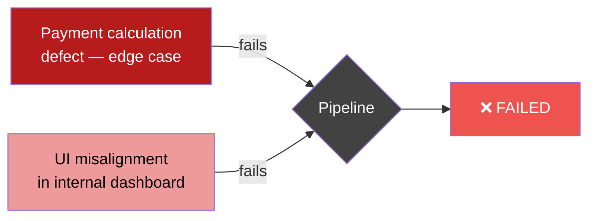

From the pipeline's perspective, these two failures are identical. From a business perspective, one is a potential regulatory violation affecting financial correctness for real customers, and the other is an inconvenience visible only to internal analysts. The binary signal hides this distinction entirely.

This is the core failure mode: **pipeline signals are optimized for automation, not for release decisions.** As systems grow in complexity, the gap between "tests passed" and "safe to release" widens — and that gap is exactly where production incidents live.

---

## Why Enterprise Systems Compound the Problem

Enterprise systems have structural properties that make binary signals progressively less useful as they scale.

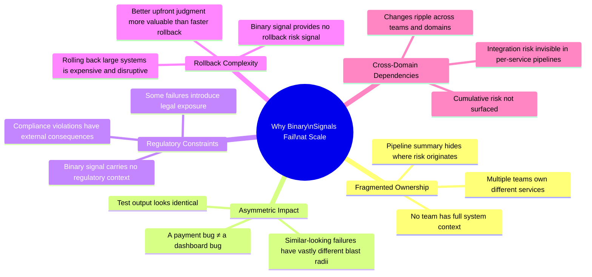

Each of these factors exists independently. Together, they create an environment where a green pipeline can systematically mislead release decision-makers — not occasionally, but as a structural property of how binary signals work.

---

## A Familiar Enterprise Release Scenario

To make this concrete, consider a large insurance platform handling claims processing, billing, policy updates, and customer communication. A typical release triggers thousands of automated checks. At the end of the pipeline, two failures remain.

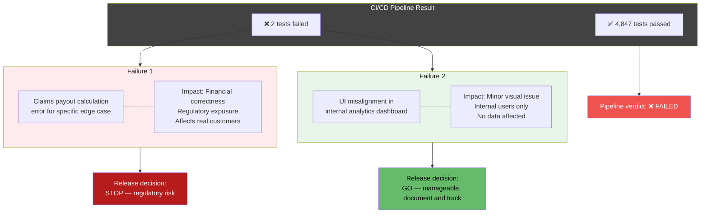

The pipeline shows two failures. The release team immediately knows one is a blocker and one is not. But they reconstruct this context manually, in a meeting, under time pressure, relying on tribal knowledge about which services are critical. This does not scale. As teams, systems, and release frequency grow, the manual reconstruction becomes the bottleneck — and the point where mistakes happen.

---

## The Gap Between Pipeline Execution and Release Readiness

The confusion stems from conflating two distinct questions that pipelines were never designed to answer simultaneously:

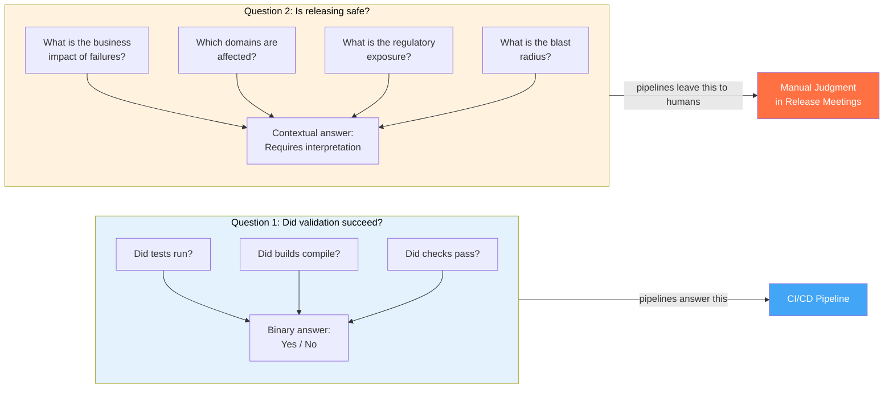

Risk-based quality gates are designed to answer Question 2 systematically — not to replace human judgment, but to make the reasoning that humans already perform explicit, consistent, and traceable.

---

## The Risk-Based Quality Gate Pattern

A risk-based quality gate introduces an interpretation layer between test execution and deployment decisions. Instead of collapsing results to pass/fail, it evaluates failures in context and produces structured guidance aligned with how release conversations actually happen.

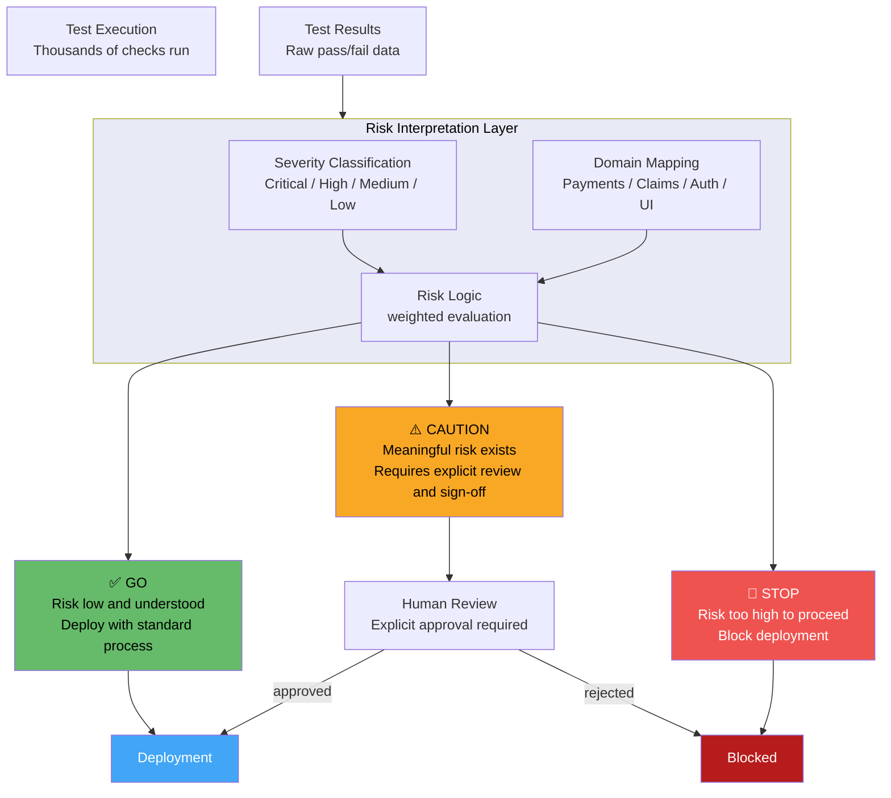

The three outcomes map directly to the language release teams already use:

- **GO**: the risk profile is acceptable — proceed with standard deployment process
- **CAUTION**: there is meaningful risk that warrants deliberate human review before proceeding
- **STOP**: the risk profile makes proceeding unsafe — the release must be held

The gate doesn't make decisions. It structures the information that humans need to make better decisions faster.

---

## Building the Interpretation Layer: Four Components

### Component 1: Severity Classification

Every test in the suite is classified according to the business impact of its failure. This classification lives outside the test itself — it's metadata maintained by the team that owns the service or domain.

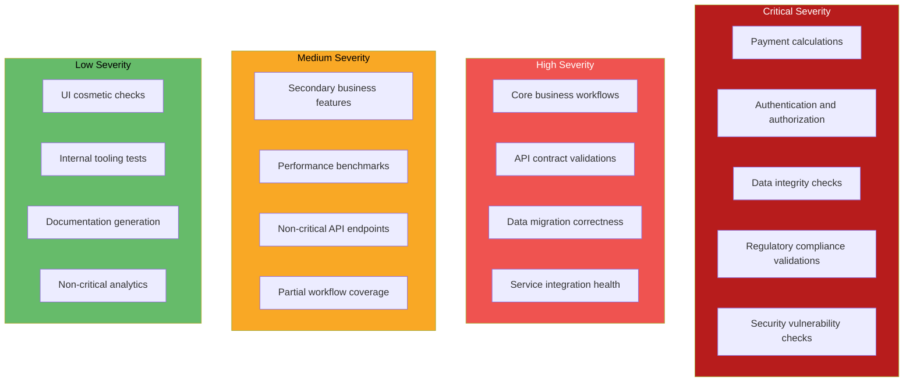

The classification doesn't change frequently — it reflects stable knowledge about which parts of the system are most critical. It should be version-controlled alongside the tests and reviewed when system architecture changes significantly.

### Component 2: Domain Risk Mapping

Different business domains carry different inherent risk levels. A failure in the payments domain has different consequences than an identical-looking failure in the internal reporting domain.

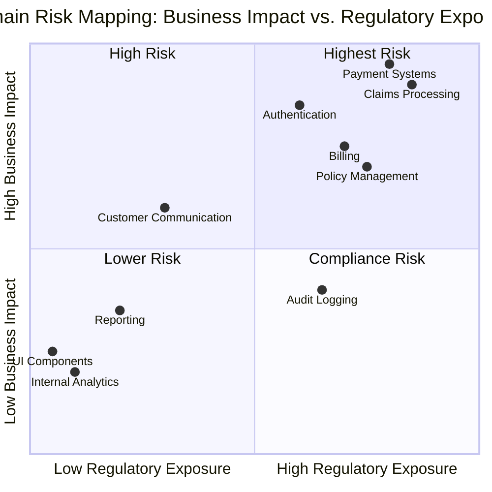

This mapping becomes the basis for weighting failures differently depending on where they occur. A medium-severity failure in the payments domain might trigger CAUTION. The same failure in internal tooling might be a GO.

### Component 3: Risk Decision Logic

The decision logic translates classified, domain-weighted failures into a GO/CAUTION/STOP recommendation. The logic should be simple enough to be readable, auditable, and debatable by non-engineers:

```python
from dataclasses import dataclass
from enum import Enum
from typing import List

class Severity(Enum):
   CRITICAL = "critical"
   HIGH = "high"
   MEDIUM = "medium"
   LOW = "low"

class RiskDecision(Enum):
   GO = "GO"
   CAUTION = "CAUTION"
   STOP = "STOP"

# Domain risk multipliers — maintained by platform/release team
DOMAIN_RISK_WEIGHTS = {
   "payments":              2.0,
   "claims":                2.0,
   "authentication":        1.8,
   "policy_management":     1.5,
   "billing":               1.5,
   "customer_communication":1.2,
   "reporting":             0.8,
   "internal_analytics":    0.5,
   "ui_components":         0.4,
}

@dataclass
class TestFailure:
   test_id: str
   severity: Severity
   domain: str
   description: str

   def effective_severity_score(self) -> float:
       base_scores = {
           Severity.CRITICAL: 100,
           Severity.HIGH: 40,
           Severity.MEDIUM: 10,
           Severity.LOW: 1,
       }
       domain_weight = DOMAIN_RISK_WEIGHTS.get(self.domain, 1.0)
       return base_scores[self.severity] * domain_weight

def evaluate_release_risk(failures: List[TestFailure]) -> dict:
   """
   Evaluate release risk from a list of test failures.
   Returns decision, rationale, and supporting detail.
   """
   if not failures:
       return {
           "decision": RiskDecision.GO,
           "rationale": "All checks passed. No failures to evaluate.",
           "risk_score": 0,
           "failures_by_severity": {}
       }

   # Group failures by effective severity
   critical = [f for f in failures if f.severity == Severity.CRITICAL]
   high     = [f for f in failures if f.severity == Severity.HIGH]
   medium   = [f for f in failures if f.severity == Severity.MEDIUM]
   low      = [f for f in failures if f.severity == Severity.LOW]

   # Weighted critical failures — domain context matters
   weighted_critical = sum(
       f.effective_severity_score() for f in critical
   )
   weighted_high = sum(
       f.effective_severity_score() for f in high
   )

   total_risk_score = sum(f.effective_severity_score() for f in failures)

   # Decision logic — explicit, auditable, debatable
   if critical:
       decision = RiskDecision.STOP
       rationale = (
           f"{len(critical)} critical failure(s) detected. "
           f"Affected domains: {', '.join(set(f.domain for f in critical))}. "
           f"Release cannot proceed safely."
       )
   elif weighted_high > 80:
       decision = RiskDecision.STOP
       rationale = (
           f"High-severity failures in risk-weighted domains exceed threshold. "
           f"Weighted score: {weighted_high:.1f}. "
           f"Requires architectural review before proceeding."
       )
   elif high or (weighted_high > 40):
       decision = RiskDecision.CAUTION
       rationale = (
           f"{len(high)} high-severity failure(s) require explicit review. "
           f"Affected domains: {', '.join(set(f.domain for f in high))}. "
           f"Proceed only with sign-off from domain owner."
       )
   elif len(medium) > 5:
       decision = RiskDecision.CAUTION
       rationale = (
           f"{len(medium)} medium-severity failures exceed acceptable threshold. "
           f"Review for potential cumulative impact before releasing."
       )
   else:
       decision = RiskDecision.GO
       rationale = (
           f"Risk profile acceptable. {len(low)} low-severity issue(s) noted — "
           f"track and address in next cycle."
       )

   return {
       "decision": decision,
       "rationale": rationale,
       "risk_score": total_risk_score,
       "failures_by_severity": {
           "critical": [f.test_id for f in critical],
           "high":     [f.test_id for f in high],
           "medium":   [f.test_id for f in medium],
           "low":      [f.test_id for f in low],
       }
   }
```

The logic above is illustrative — the specific thresholds (80, 40, 5) are starting points that teams calibrate against their own release history. The important property is that the logic is explicit, version-controlled, and readable by non-engineers who participate in release decisions.

### Component 4: Pipeline Integration

The gate integrates as a step in the existing pipeline — after test execution, before deployment:

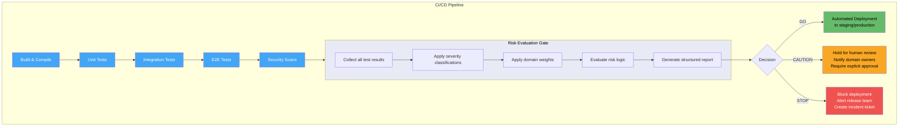

```yaml
# GitHub Actions: risk gate as a pipeline step
name: Release Pipeline

on:
 push:
   branches: [main]

jobs:
 test:
   runs-on: ubuntu-latest
   steps:
     - uses: actions/checkout@v4

     - name: Run test suite
       run: |
         ./gradlew test --continue
         ./gradlew integrationTest --continue
       continue-on-error: true  # Collect all results, don't stop on first failure

     - name: Export test results
       run: |
         # Collect results in standard format for the gate
         ./scripts/export-test-results.sh > test-results.json

     - name: Upload test results
       uses: actions/upload-artifact@v4
       with:
         name: test-results
         path: test-results.json

 risk-evaluation:
   needs: test
   runs-on: ubuntu-latest
   outputs:
     decision: ${{ steps.gate.outputs.decision }}
     risk-score: ${{ steps.gate.outputs.risk_score }}

   steps:
     - uses: actions/checkout@v4

     - name: Download test results
       uses: actions/download-artifact@v4
       with:
         name: test-results

     - name: Evaluate release risk
       id: gate
       run: |
         python scripts/risk_gate.py \
           --results test-results.json \
           --severity-config config/severity-classifications.yaml \
           --domain-config config/domain-risk-weights.yaml \
           --output gate-report.json

         DECISION=$(jq -r '.decision' gate-report.json)
         SCORE=$(jq -r '.risk_score' gate-report.json)

         echo "decision=$DECISION" >> $GITHUB_OUTPUT
         echo "risk_score=$SCORE" >> $GITHUB_OUTPUT

         # Print structured report to pipeline logs
         jq . gate-report.json

     - name: Upload risk report
       uses: actions/upload-artifact@v4
       with:
         name: risk-gate-report
         path: gate-report.json

 deploy-staging:
   needs: risk-evaluation
   if: needs.risk-evaluation.outputs.decision == 'GO'
   runs-on: ubuntu-latest
   steps:
     - name: Deploy to staging
       run: ./scripts/deploy.sh staging

 require-review:
   needs: risk-evaluation
   if: needs.risk-evaluation.outputs.decision == 'CAUTION'
   runs-on: ubuntu-latest
   environment:
     name: caution-review
     # GitHub environment protection rules require explicit approval
   steps:
     - name: Notify domain owners
       run: |
         ./scripts/notify-owners.sh \
           --report gate-report.json \
           --channel "#release-decisions"

     - name: Deploy after approval
       run: ./scripts/deploy.sh staging

 block-release:
   needs: risk-evaluation
   if: needs.risk-evaluation.outputs.decision == 'STOP'
   runs-on: ubuntu-latest
   steps:
     - name: Block and alert
       run: |
         ./scripts/create-incident-ticket.sh \
           --report gate-report.json \
           --severity high
         exit 1
```

---

## The Output: Structured Risk Report

The gate's output replaces the binary pass/fail with a structured report that maps directly to release conversation language:

```json
{
 "decision": "CAUTION",
 "rationale": "2 high-severity failures require explicit review. Affected domains: payments, authentication. Proceed only with sign-off from domain owners.",
 "risk_score": 112.5,
 "pipeline_run": "pipeline-4821",
 "timestamp": "2026-05-17T14:32:01Z",
 "total_tests": 4849,
 "total_failures": 4,
 "failures_by_severity": {
   "critical": [],
   "high": ["test_payment_edge_case_refund", "test_auth_token_expiry_boundary"],
   "medium": ["test_report_filter_combination"],
   "low": ["test_dashboard_tooltip_alignment"]
 },
 "failures_by_domain": {
   "payments": {
     "risk_weight": 2.0,
     "failures": ["test_payment_edge_case_refund"],
     "weighted_score": 80.0
   },
   "authentication": {
     "risk_weight": 1.8,
     "failures": ["test_auth_token_expiry_boundary"],
     "weighted_score": 72.0
   }
 },
 "recommended_reviewers": ["payments-team-lead", "security-team"],
 "required_approvals": ["payments-domain-owner"]
}
```

This report makes the release conversation concrete. Instead of "two tests failed," the release team sees exactly which domains are affected, what the risk weighting is, who needs to review it, and what approval is required to proceed.

---

## Calibrating the Gate: Learning From Release History

A risk gate deployed without calibration is guessing. The thresholds and weights should be derived from actual release history in your organization.

```mermaid
flowchart LR
   subgraph HISTORY [Release History Analysis]
       GOOD[Successful releases\nthat felt safe]
       BAD[Problematic releases\nthat caused incidents]
       NEAR[Near-misses\ncaught in staging]
   end

   subgraph PATTERNS [Pattern Extraction]
       WF[What failure patterns\npreceded incidents?]
       DS[Which domains had\nhighest blast radius?]
       TH[What thresholds\ndistinguish safe from unsafe?]
   end

   subgraph CONFIG [Gate Configuration]
       SW[Severity weights]
       DW[Domain risk weights]
       DT[Decision thresholds]
   end

   HISTORY --> PATTERNS
   PATTERNS --> CONFIG
   CONFIG --> GATE[Calibrated Gate]
   GATE --> FEEDBACK[Release outcomes\nfeed back into calibration]
   FEEDBACK --> HISTORY

   style HISTORY fill:#e3f2fd,color:#000
   style PATTERNS fill:#fff3e0,color:#000
   style CONFIG fill:#e8f5e9,color:#000
   style GATE fill:#42a5f5,color:#fff
   style FEEDBACK fill:#f3e5f5,color:#000
```

A practical calibration process:

```python
def calibrate_from_history(release_records: list) -> dict:
   """
   Analyze historical release records to suggest gate calibration.
   release_records: list of {failures: [...], outcome: 'safe'|'incident'|'near_miss'}
   """
   incident_patterns = [r for r in release_records if r['outcome'] == 'incident']
   safe_patterns = [r for r in release_records if r['outcome'] == 'safe']

   # Find what failure patterns predict incidents
   incident_domain_failures = {}
   for record in incident_patterns:
       for failure in record['failures']:
           domain = failure['domain']
           incident_domain_failures[domain] = \
               incident_domain_failures.get(domain, 0) + 1

   # Calculate domain risk based on incident correlation
   total_incidents = len(incident_patterns)
   suggested_weights = {}
   for domain, incident_count in incident_domain_failures.items():
       incident_correlation = incident_count / total_incidents
       suggested_weights[domain] = round(1.0 + incident_correlation * 2.0, 2)

   # Find threshold where safe/incident releases diverge
   safe_risk_scores = [calculate_risk_score(r['failures']) for r in safe_patterns]
   incident_risk_scores = [calculate_risk_score(r['failures']) for r in incident_patterns]

   suggested_stop_threshold = (
       min(incident_risk_scores) + max(safe_risk_scores)
   ) / 2 if incident_risk_scores and safe_risk_scores else 80

   return {
       "suggested_domain_weights": suggested_weights,
       "suggested_stop_threshold": suggested_stop_threshold,
       "calibration_confidence": len(release_records),
       "incidents_analyzed": len(incident_patterns),
       "safe_releases_analyzed": len(safe_patterns)
   }
```

The gate should be re-calibrated quarterly, or after any significant incident — treating the calibration data as organizational memory about what actually predicts release risk.

---

## What Changes When You Make Risk Explicit

The most significant impact of risk-based quality gates is not technical — it's conversational. When pipelines surface structured risk context, release meetings change in a measurable way.

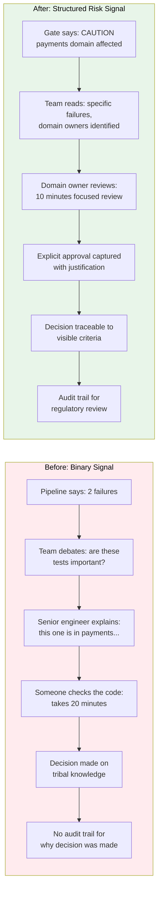

The shift is from implicit, tribal reasoning reconstructed under pressure, to explicit, traceable reasoning built into the process. In regulated industries, this traceability has direct compliance value — release decisions become auditable events with documented rationale, not informal judgments reconstructed after the fact.

---

## Adoption Path: Gradual Implementation

Risk-based quality gates don't require a big-bang adoption. They can be layered onto existing pipelines gradually, starting with observation and moving toward enforcement.

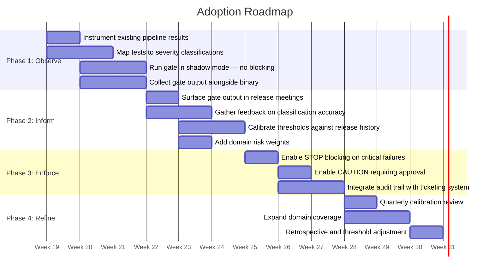

**Phase 1 — Observe:** run the gate in shadow mode. It produces output but doesn't block anything. Teams see what the gate would have decided alongside what the pipeline actually reported. This builds trust and reveals miscalibrations without risk.

**Phase 2 — Inform:** surface gate output in release meetings as a structured input. It doesn't override human judgment yet — it informs it. Teams calibrate the thresholds and classifications against their own release history.

**Phase 3 — Enforce:** enable blocking for STOP decisions (typically: any critical failure). Enable explicit approval requirements for CAUTION. The gate is now part of the release process, not just a report.

**Phase 4 — Refine:** treat the gate as a living configuration. Review calibration quarterly. Update domain weights when architecture changes. Adjust thresholds based on incident retrospectives.

---

## Who Benefits Most

Risk-based quality gates deliver the most value in specific organizational contexts:

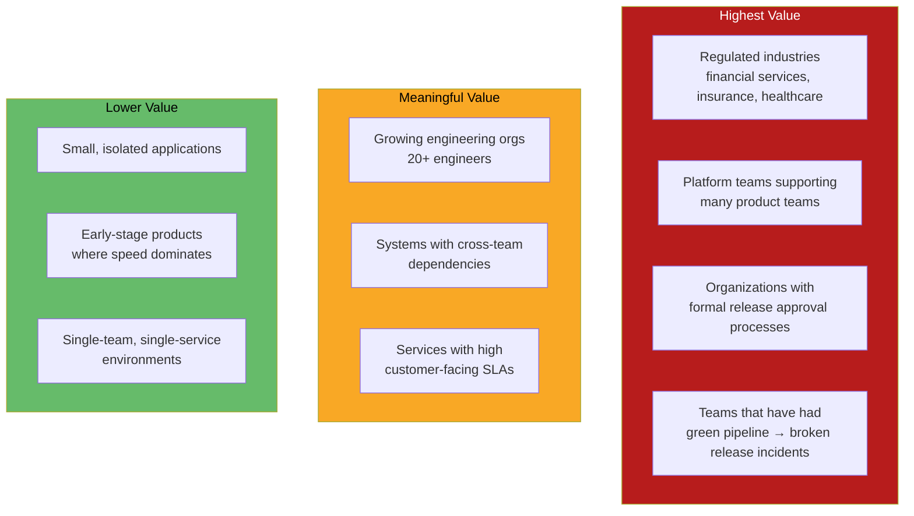

If your organization has never experienced "green pipeline, broken release," you may not yet have the scale or complexity where binary signals break down. But the pattern becomes increasingly valuable as systems, teams, and regulatory constraints grow — and it's far easier to implement before the first major incident than after it.

---

## The Broader Principle: Pipelines as Decision Support

The design shift that risk-based quality gates represent is worth naming explicitly:

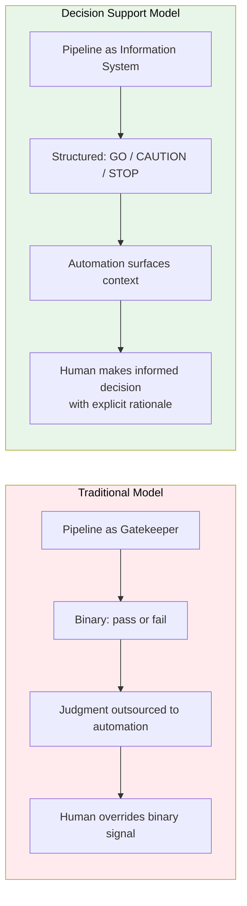

Binary gates were never designed to represent release risk. They were designed to confirm that automation ran correctly. For small systems, that was enough. For enterprise systems operating under regulatory constraints with multiple teams and complex dependencies, it has never been enough.

Risk-based quality gates don't replace human judgment — they make it explicit, consistent, traceable, and scalable. In complex environments, knowing *why* a release is risky, *which domain* is affected, and *who needs to approve it* is worth more than knowing that a test failed.

The pipeline becomes a shared source of context rather than a gatekeeper that teams learn to work around. That shift — from implicit tribal reasoning to explicit structured reasoning — is what makes release decisions accountable at the scale enterprise systems actually operate at.
~~~markdown~~~