# Istio Service Mesh: The Complete Hands-On Tutorial
### From "What is a Service Mesh?" to Multi-Cluster Failover, Security, and Observability

**Last Updated:** January 2026  
**Difficulty Level:** Intermediate  
**Estimated Reading Time:** 60-75 minutes  
**Tutorial Type:** Comprehensive Deep Dive  

---

## Table of Contents

1. [Introduction](#introduction)
2. [Prerequisites](#prerequisites)
3. [Learning Objectives](#learning-objectives)
4. [What is a Service Mesh, and When Do You Actually Need One?](#1-what-is-a-service-mesh-and-when-do-you-actually-need-one)
5. [Istio Architecture: Control Plane & Data Plane](#2-istio-architecture-control-plane--data-plane)
6. [Sidecar Mode vs Ambient Mode](#3-sidecar-mode-vs-ambient-mode)
7. [Istio Gateways: Ingress, Egress & East-West](#4-istio-gateways-ingress-egress--east-west)
8. [Envoy Sidecar Injection](#5-envoy-sidecar-injection)
9. [Request Routing Using Headers](#6-request-routing-using-headers)
10. [Traffic Mirroring for Testing New Versions](#7-traffic-mirroring-for-testing-new-versions)
11. [Traffic Shifting & Canary Releases](#8-traffic-shifting--canary-releases)
12. [Automating Canary Releases with Flagger](#9-automating-canary-releases-with-flagger)
13. [Istio Authorization Policies](#10-istio-authorization-policies)
14. [External Authorization](#11-external-authorization)
15. [Mutual TLS (mTLS) and PeerAuthentication](#12-mutual-tls-mtls-and-peerauthentication)
16. [Multi-Cluster Istio Architecture](#13-multi-cluster-istio-architecture)
17. [Cross-Cluster Service Discovery and Communication](#14-cross-cluster-service-discovery-and-communication)
18. [East-West Gateway Setup](#15-east-west-gateway-setup)
19. [Cross-Cluster Traffic and Failover](#16-cross-cluster-traffic-and-failover)
20. [Observability using Kiali, Grafana & Prometheus](#17-observability-using-kiali-grafana--prometheus)
21. [Visualizing mTLS and Service-to-Service Traffic](#18-visualizing-mtls-and-service-to-service-traffic)
22. [Troubleshooting Exercises](#19-troubleshooting-exercises)
23. [Best Practices](#best-practices)
24. [Anti-Patterns to Avoid](#anti-patterns-to-avoid)
25. [Performance Considerations](#performance-considerations)
26. [Security Considerations](#security-considerations)
27. [Testing Strategies](#testing-strategies)
28. [Practice Exercises](#practice-exercises)
29. [Test Your Understanding](#test-your-understanding)
30. [Common Interview Questions](#common-interview-questions)
31. [Question Bank](#question-bank)
32. [Further Reading & Resources](#further-reading--resources)
33. [Summary & Next Steps](#summary--next-steps)

---

## Introduction

Welcome to the most comprehensive hands-on tutorial on **Istio Service Mesh**. If you're running microservices on Kubernetes and struggling with the "plumbing" — retries, timeouts, mutual TLS, canary releases, observability — this guide is for you.

Service meshes have become the de facto standard for managing production-grade microservices at scale. According to the CNCF, over 60% of organizations running Kubernetes in production have adopted or evaluated a service mesh. Istio, backed by Google, IBM, and Lyft, leads the pack with its robust feature set and enterprise-ready capabilities.

This tutorial takes you from **zero to production-ready** — answering the fundamental "do I even need this?" question, walking through architecture decisions, and building real-world configurations you can adapt directly to your cluster. We'll cover everything from basic sidecar injection to multi-cluster failover across continents.

### 💡 What Makes This Tutorial Different

- **No fluff, all substance**: Every concept includes production-grade YAML examples
- **Mermaid diagrams throughout**: Visualize architecture, flows, and decision trees
- **Real-world case studies**: Learn from actual production incidents and solutions
- **Troubleshooting-ready**: Diagnostic commands and common failure modes
- **Progressive complexity**: Start with fundamentals, build toward advanced multi-cluster setups

---

## Prerequisites

Before diving into this tutorial, ensure you have:

### Required Knowledge
- ✅ **Kubernetes fundamentals**: Pods, Services, Deployments, Namespaces
- ✅ **Basic networking concepts**: TCP/IP, HTTP, DNS, TLS
- ✅ **Command-line proficiency**: kubectl, bash/zsh
- ✅ **YAML syntax**: Reading and writing Kubernetes manifests

### Required Tools
- ✅ **kubectl**: Configured to communicate with your Kubernetes cluster
- ✅ **Docker Desktop** or **minikube** or **kind** (for local testing)
- ✅ **istioctl**: Istio's CLI tool (we'll install it in Section 2)
- ✅ **Helm** (optional, for advanced installations)

### Environment Setup
- ✅ A running Kubernetes cluster (v1.24+ recommended)
- ✅ Cluster admin permissions (to install CRDs and operators)
- ✅ At least 4 CPU cores and 8GB RAM available for Istio components
- ✅ `kubectl config current-context` points to your target cluster

### Optional (For Advanced Sections)
- 📦 Two Kubernetes clusters (for multi-cluster sections)
- 📦 cloud provider CLI (aws, gcloud, az) for LoadBalancer provisioning
- 📦 Prometheus & Grafana (we'll cover installation in Section 17)

> **⚠️ Warning**: Never practice Istio configurations directly on a production cluster without first testing in a staging environment. Service mesh misconfigurations can cause widespread connectivity issues.

---

## Learning Objectives

By the end of this tutorial, you will be able to:

### Core Competencies
- ✅ Explain what a service mesh is and when to adopt one
- ✅ Install and configure Istio on a Kubernetes cluster
- ✅ Choose between sidecar and ambient data plane modes
- ✅ Configure ingress, egress, and east-west gateways
- ✅ Implement header-based traffic routing for A/B testing
- ✅ Set up traffic mirroring for safe version testing
- ✅ Execute canary releases with progressive traffic shifting
- ✅ Automate canary releases using Flagger
- ✅ Write AuthorizationPolicies for zero-trust security
- ✅ Configure external authorization with custom business logic
- ✅ Implement mutual TLS (mTLS) and PeerAuthentication
- ✅ Design multi-cluster Istio architectures
- ✅ Configure cross-cluster service discovery and failover
- ✅ Set up observability with Kiali, Grafana, and Prometheus
- ✅ Troubleshoot common Istio issues using istioctl

### Advanced Skills
- 🎯 Design multi-region, multi-cluster topologies
- 🎯 Implement cross-cluster automatic failover
- 🎯 Create custom dashboards for mesh observability
- 🎯 Optimize mesh performance for high-throughput services
- 🎯 Conduct security audits using Kiali's mTLS visualization

---

## 1. What is a Service Mesh, and When Do You Actually Need One?

### The Problem Before Service Meshes

Imagine you have 30 microservices. Every service needs to:

- Encrypt traffic to every other service
- Retry failed requests
- Time out slow requests
- Load balance across replicas
- Authenticate and authorize callers
- Emit metrics, logs, and traces

Traditionally, every team wrote this logic **into their application code** using libraries like Netflix's Hystrix or Ribbon. That means:

- Java services, Go services, and Python services all had to re-implement the same resilience logic in different languages.
- Upgrading a retry policy meant redeploying every single service.
- Security policies were inconsistent across teams.

### What a Service Mesh Does

A **service mesh** moves all of this "networking logic" out of your application and into the **infrastructure layer**, typically as a **proxy** that sits next to (or in front of) every service instance.

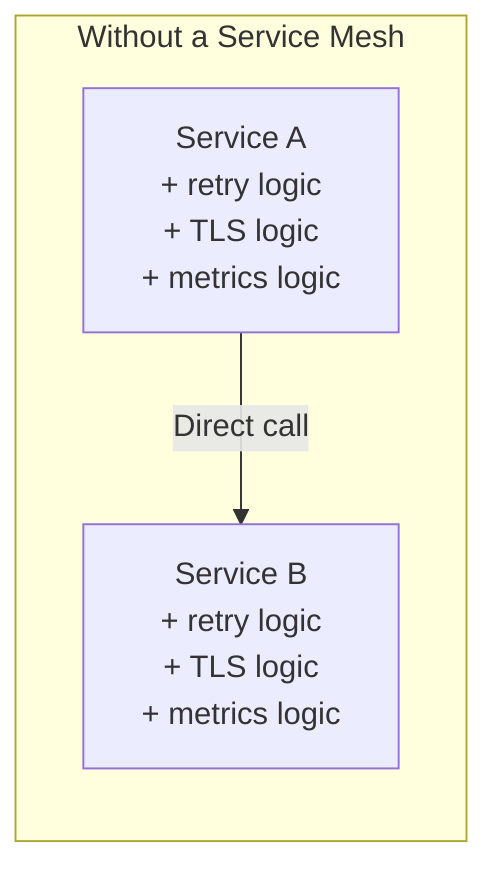

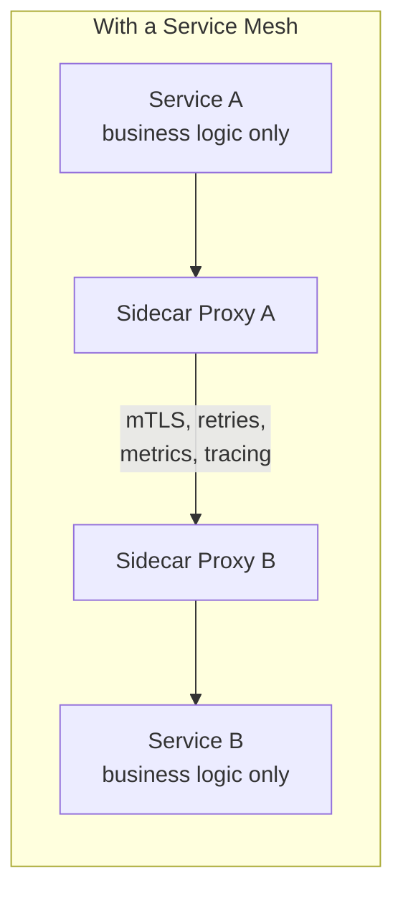

The mesh gives you, **uniformly and without code changes**:

| Capability | Example |
|---|---|
| **Traffic management** | Canary releases, A/B testing, retries, timeouts, circuit breaking |
| **Security** | Automatic mTLS between services, fine-grained authorization |
| **Observability** | Golden-signal metrics (latency, traffic, errors, saturation), distributed tracing, service graphs |
| **Reliability** | Failover across zones/clusters, outlier detection |

### Do You Actually Need One?

This is the most important question, and the honest answer is: **not always**. A service mesh adds operational complexity, so weigh it against your situation.

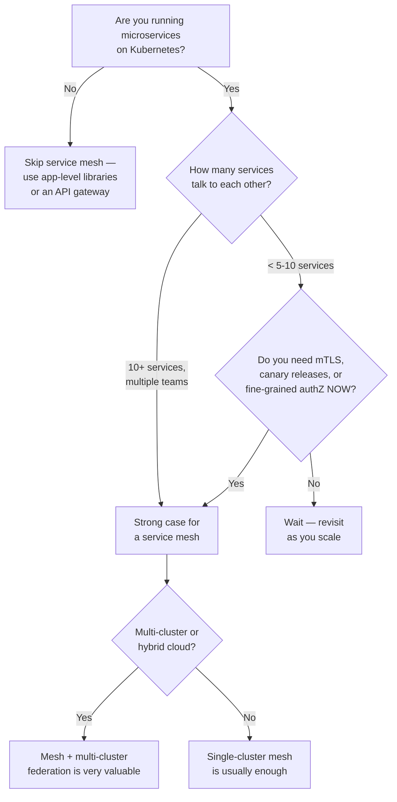

**Good reasons to adopt a service mesh:**
- You operate **10+ microservices** across multiple teams and languages.
- You need **zero-trust security** (mTLS everywhere) for compliance (PCI-DSS, HIPAA, SOC2).
- You want **progressive delivery** (canary, blue-green) without building custom tooling.
- You run **multi-cluster or multi-region** deployments and need cross-cluster failover.
- You need **consistent observability** without instrumenting every service by hand.

**Reasons to hold off:**
- You have a handful of services and a small team — the operational overhead (learning curve, upgrade cadence, resource cost) may outweigh benefits.
- Your traffic patterns are simple (monolith-to-database, no service-to-service mesh).
- You can't yet afford the extra CPU/memory per pod (sidecars) or the platform-team investment required to run it well.

### Real-World Use Cases

1. **E-commerce platform during Black Friday**: Use traffic shifting to canary a new checkout service to 5% of users before rolling out to 100%.
2. **Fintech company**: Enforce mTLS and AuthorizationPolicies so that only the `payments` service account can call the `ledger` service — auditable, zero app code changes.
3. **Global SaaS company**: Run clusters in `us-east`, `eu-west`, and `ap-south`; use multi-cluster Istio so that if the `eu-west` cluster's `orders` service goes down, traffic fails over to `us-east` automatically.
4. **Platform engineering team**: Give every team golden-signal dashboards (via Kiali/Grafana) without asking each team to instrument their code with Prometheus client libraries.

---

## 2. Istio Architecture: Control Plane & Data Plane

Istio has two logical halves:

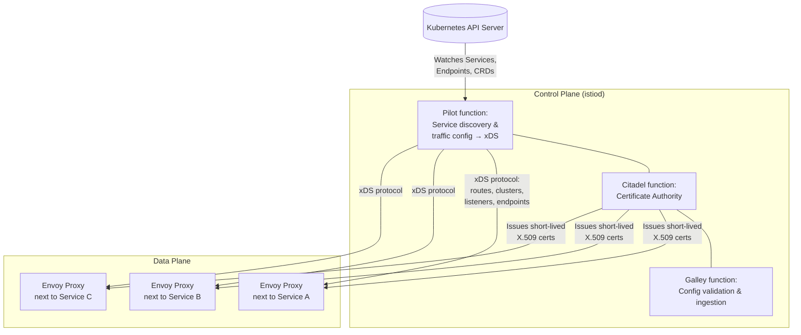

### Control Plane: `istiod`

Since Istio 1.5, all control plane functions were consolidated into a single binary/deployment called **`istiod`**. It performs three jobs that used to be separate components:

| Legacy name | Function in `istiod` today |
|---|---|
| **Pilot** | Converts your Istio config (VirtualService, DestinationRule, Gateway) + Kubernetes Service/Endpoint objects into Envoy-native configuration, and pushes it via **xDS APIs** (LDS, RDS, CDS, EDS). |
| **Citadel** | Acts as the mesh's **Certificate Authority (CA)** — issues and rotates short-lived X.509 certificates to every workload for mTLS. |
| **Galley** | Validates and processes Istio configuration (webhooks reject malformed YAML before it's applied). |

### Data Plane: Envoy Proxies

The data plane consists of **Envoy proxy instances** — either as sidecars (one per pod) or as shared node/service proxies (ambient mode, covered next). Envoy:

- Intercepts **all inbound and outbound traffic** for the workload (via `iptables` rules in sidecar mode).
- Applies routing rules, retries, timeouts, circuit breakers.
- Terminates/originates mTLS.
- Emits telemetry (metrics, access logs, traces).

### The xDS Protocol

Envoy doesn't read Istio's `VirtualService` or `DestinationRule` YAML directly — `istiod` translates those into Envoy's own configuration language and streams it over gRPC using the **xDS APIs**:

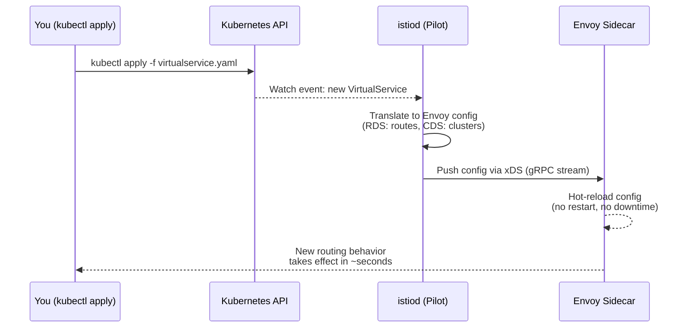

- **LDS** (Listener Discovery Service) — which ports/protocols to listen on
- **RDS** (Route Discovery Service) — HTTP routing rules
- **CDS** (Cluster Discovery Service) — upstream service definitions
- **EDS** (Endpoint Discovery Service) — actual pod IPs behind a service
- **SDS** (Secret Discovery Service) — TLS certificates/keys

### Use Case

A platform team pushes a new `DestinationRule` adding a circuit breaker to the `inventory` service. Because of xDS, **every Envoy proxy in the mesh gets this update within seconds, with zero pod restarts and zero downtime** — something impossible with app-embedded libraries.

---

## 3. Sidecar Mode vs Ambient Mode

Istio has evolved to support two distinct data plane architectures.

### Sidecar Mode (the classic model)

Every pod gets an **Envoy container injected next to your application container**. All traffic in/out of the pod is transparently redirected through this sidecar using `iptables`.

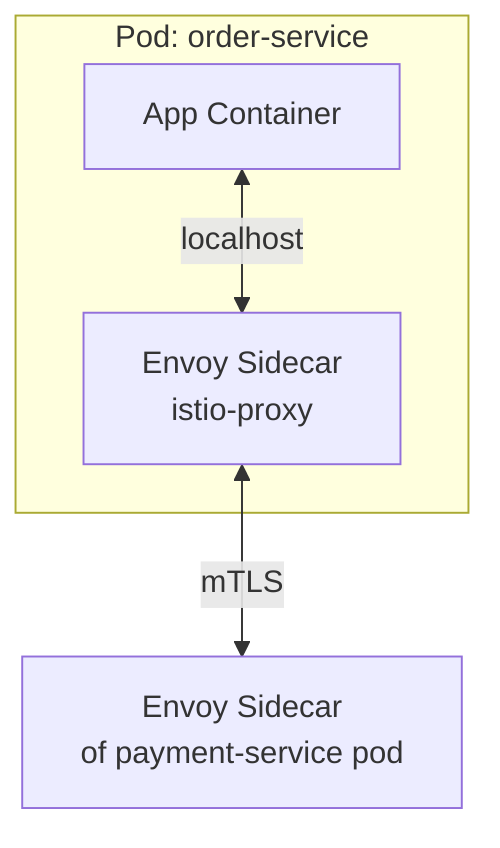

**Pros:** Full L4 + L7 features per pod, mature, most documented.
**Cons:** Extra container per pod (50–150MB RAM each), pod restart required to inject/upgrade, resource cost multiplies with pod count.

### Ambient Mode (sidecar-less)

Introduced to remove the per-pod resource tax. It splits functionality into two layers:

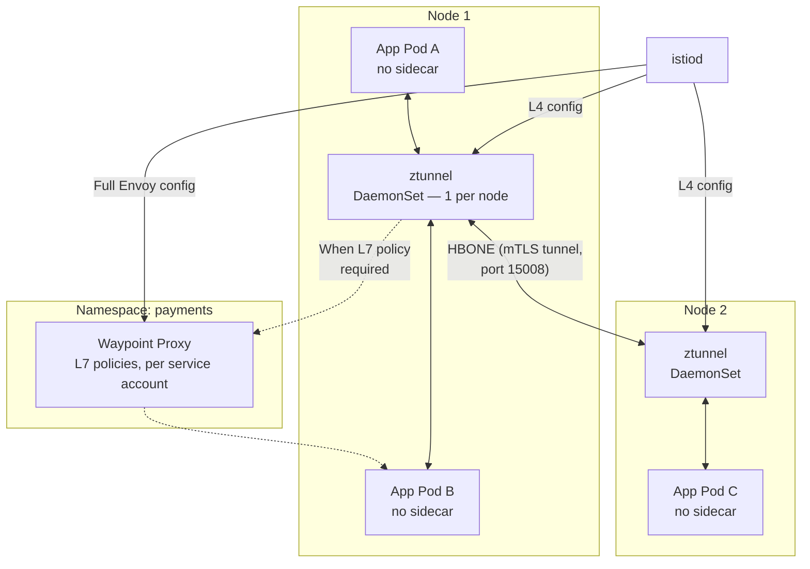

- ztunnel is a lightweight, purpose-built proxy that runs on every node as a DaemonSet, handling L3/L4 functionality: mTLS encryption, TCP-level authorization, and basic telemetry. It is written in Rust rather than being Envoy-based.
- Waypoint proxies are optional, per-service proxies that handle HTTP routing, load balancing, and advanced L7 policies — applied only where you actually need L7 features.
- Istiod generates different xDS configurations for the two proxy types: ztunnel receives simplified L4-level configuration (service identities, endpoints, certs, L4 authZ) while waypoints receive full Envoy configuration (HTTP routes, virtual services, destination rules, L7 authZ).

**Pros:** Achieves 70%+ resource savings and dramatic latency improvements, no pod restarts needed to onboard/upgrade workloads.
**Cons:** Per-pod L7 policies aren't possible with ztunnel alone — you need waypoints scoped to service accounts for that; egress gateways still use traditional Envoy gateways; multicluster ambient support is comparatively newer.

### Side-by-Side Comparison

| Aspect | Sidecar Mode | Ambient Mode |
|---|---|---|
| Proxy placement | 1 Envoy per pod | 1 ztunnel per node + optional waypoints per service |
| Onboarding | Requires pod restart (injection webhook) | Just label the namespace — no restart |
| Resource overhead | Higher (per-pod) | ~70% lower resource usage |
| L7 features (HTTP routing, retries) | Always available | Only where a waypoint is deployed |
| mTLS | Always available | Always available (via ztunnel) |
| Maturity | Very mature | Newer, rapidly evolving (multi-cluster still maturing) |

### How to Choose

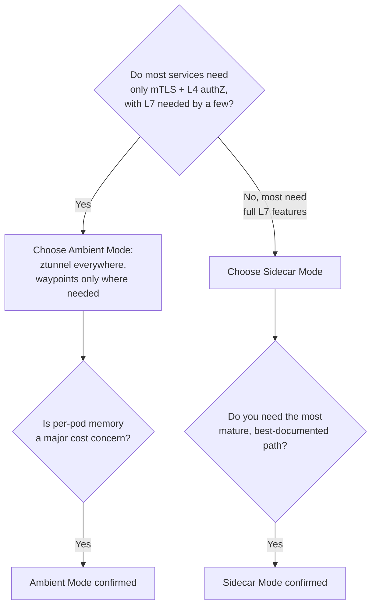

**Enabling ambient mode:**

```bash
# Install Istio with the ambient profile
istioctl install --set profile=ambient --skip-confirmation

# Enroll a namespace into the ambient mesh (no restart required!)
kubectl label namespace bookinfo istio.io/dataplane-mode=ambient

# Verify — no istio-proxy container present, yet traffic is encrypted
kubectl get pods -n bookinfo -o jsonpath='{.items[*].spec.containers[*].name}'
```

---

## 4. Istio Gateways: Ingress, Egress & East-West

Gateways are Envoy proxies deployed at the **edge** of the mesh to manage traffic entering, leaving, or crossing between meshes/clusters.

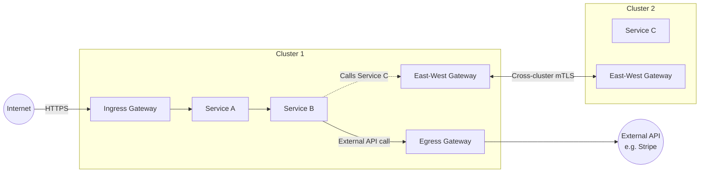

### 1. Ingress Gateway

Manages traffic **entering** the mesh from outside (north-south traffic).

```yaml
apiVersion: networking.istio.io/v1
kind: Gateway
metadata:
  name: main-gateway
spec:
  selector:
    istio: ingressgateway
  servers:
  - port:
      number: 443
      name: https
      protocol: HTTPS
    tls:
      mode: SIMPLE
      credentialName: my-tls-cert
    hosts:
    - "shop.example.com"
---
apiVersion: networking.istio.io/v1
kind: VirtualService
metadata:
  name: shop-routes
spec:
  hosts:
  - "shop.example.com"
  gateways:
  - main-gateway
  http:
  - route:
    - destination:
        host: frontend-service
        port:
          number: 80
```

### 2. Egress Gateway

Manages traffic **leaving** the mesh to external services — used to centralize control (audit logging, policy) over outbound calls.

```yaml
apiVersion: networking.istio.io/v1
kind: Gateway
metadata:
  name: egress-gateway
spec:
  selector:
    istio: egressgateway
  servers:
  - port:
      number: 443
      name: tls
      protocol: TLS
    hosts:
    - "api.stripe.com"
    tls:
      mode: PASSTHROUGH
```

**Use case:** A bank requires all outbound traffic to third-party APIs to flow through a single, auditable egress point — enabling network policy enforcement (only the egress gateway's IP is whitelisted at the firewall) without touching application code.

### 3. East-West Gateway

Handles traffic **between clusters** (or between meshes) — this is the backbone of multi-cluster Istio (covered fully in Section 15).

```yaml
apiVersion: install.istio.io/v1alpha1
kind: IstioOperator
metadata:
  name: eastwest-gateway
spec:
  profile: empty
  components:
    ingressGateways:
    - name: istio-eastwestgateway
      label:
        istio: eastwestgateway
        topology.istio.io/network: network1
      enabled: true
      k8s:
        service:
          ports:
          - name: status-port
            port: 15021
            targetPort: 15021
          - name: tls
            port: 15443
            targetPort: 15443
```

### Comparison Table

| Gateway type | Direction | Traffic | Common use case |
|---|---|---|---|
| **Ingress** | Into the mesh | North-South | Expose your app to the internet with TLS termination |
| **Egress** | Out of the mesh | North-South | Control/audit calls to third-party APIs |
| **East-West** | Between meshes/clusters | Mesh-to-mesh | Multi-cluster service discovery & failover |

---

## 5. Envoy Sidecar Injection

Sidecar injection is how Istio gets an Envoy proxy running alongside your application container without you editing your Deployment manifests by hand.

### Two Ways to Inject

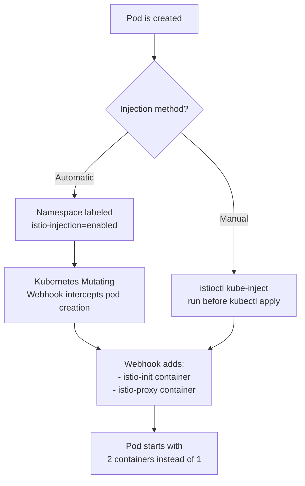

### Automatic Injection (recommended)

```bash
kubectl label namespace default istio-injection=enabled
kubectl rollout restart deployment -n default
```

Once labeled, Kubernetes' **MutatingAdmissionWebhook** intercepts every new pod creation request in that namespace and injects:

1. An **init container** (`istio-init`) that sets up `iptables` rules to redirect all traffic through the sidecar.
2. The **`istio-proxy`** sidecar container itself (Envoy).

### Manual Injection

```bash
istioctl kube-inject -f deployment.yaml | kubectl apply -f -
```

Useful for air-gapped environments or when you want to inspect exactly what gets added before applying.

### What Gets Added — Before/After

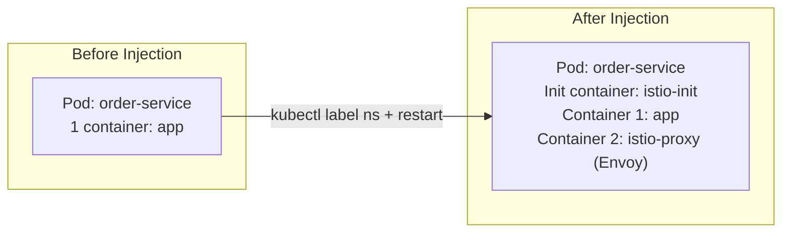

### Verifying Injection

```bash
kubectl get pods -n default -o jsonpath='{.items[*].spec.containers[*].name}'
# Expected output: order-service istio-proxy

istioctl proxy-status
# Shows sync status of every Envoy proxy with istiod (SYNCED / STALE)
```

### Per-Pod Override

You can opt individual pods out of injection even in a labeled namespace:

```yaml
metadata:
  annotations:
    sidecar.istio.io/inject: "false"
```

**Use case:** Batch jobs that run for seconds and exit — you often disable injection for `CronJob` pods to avoid the sidecar blocking pod termination (the sidecar has its own lifecycle and can keep the pod "Running" after the main container finishes, unless you use `holdApplicationUntilProxyStarts` / native sidecar containers on Kubernetes 1.29+).

---

## 6. Request Routing Using Headers

Header-based routing lets you send traffic to different service versions based on **HTTP request attributes** — this is the foundation of A/B testing, internal dogfooding, and beta programs.

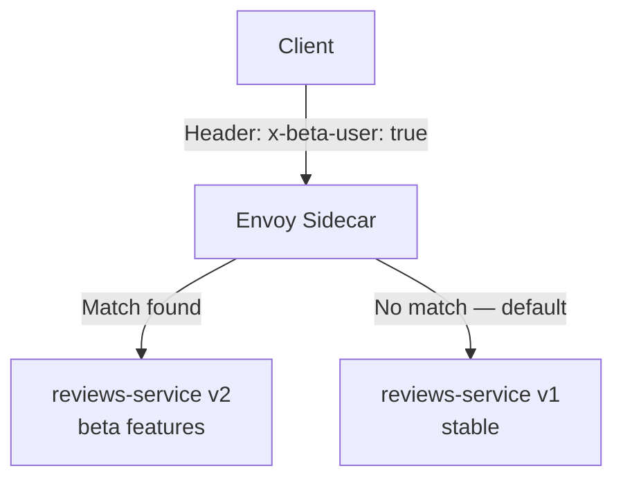

### Example: Route by Custom Header

```yaml
apiVersion: networking.istio.io/v1
kind: VirtualService
metadata:
  name: reviews-route
spec:
  hosts:
  - reviews
  http:
  - match:
    - headers:
        x-beta-user:
          exact: "true"
    route:
    - destination:
        host: reviews
        subset: v2
  - route:                     # Default fallback
    - destination:
        host: reviews
        subset: v1
---
apiVersion: networking.istio.io/v1
kind: DestinationRule
metadata:
  name: reviews-destination
spec:
  host: reviews
  subsets:
  - name: v1
    labels:
      version: v1
  - name: v2
    labels:
      version: v2
```

### Example: Route by User-Agent (Mobile vs Desktop)

```yaml
  http:
  - match:
    - headers:
        user-agent:
          regex: ".*Mobile.*"
    route:
    - destination:
        host: frontend
        subset: mobile-optimized
  - route:
    - destination:
        host: frontend
        subset: desktop
```

### Example: Route by Cookie (Sticky Beta Testers)

```yaml
  http:
  - match:
    - headers:
        cookie:
          regex: "^(.*?;)?(beta_tester=true)(;.*)?$"
    route:
    - destination:
        host: checkout
        subset: v2
```

### Match Types Reference

| Match type | YAML field | Example |
|---|---|---|
| Exact match | `exact` | `x-beta-user: exact: "true"` |
| Prefix match | `prefix` | `authorization: prefix: "Bearer "` |
| Regex match | `regex` | `user-agent: regex: ".*Mobile.*"` |

### Real-World Use Cases

1. **Internal dogfooding**: Employees send `x-env: staging-preview` header (via a browser extension) and get routed to the newest, unreleased build.
2. **Geo-based routing**: Route requests with `x-country: DE` to a GDPR-compliant service subset that stores data in EU-only infrastructure.
3. **Gradual API versioning**: Clients sending `Accept: application/vnd.api.v2+json` get routed to the v2 backend while everyone else stays on v1 — no need to change the URL path.

---

## 7. Traffic Mirroring for Testing New Versions

Traffic mirroring (a.k.a. **shadowing**) sends a **copy** of live production traffic to a new version, without impacting real users — the mirrored response is discarded.

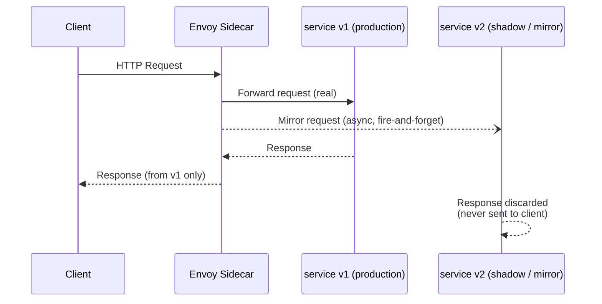

### Why This Matters

Unlike canary releases (Section 8), mirroring carries **zero user-facing risk** — the new version's response never reaches the client, even if it crashes or returns garbage. This makes it perfect for testing:
- Performance under real production load
- Data-layer changes (verify the new version reads/writes correctly)
- Refactors where you want byte-for-byte behavior comparison

### Configuration

```yaml
apiVersion: networking.istio.io/v1
kind: VirtualService
metadata:
  name: ratings-mirror
spec:
  hosts:
  - ratings
  http:
  - route:
    - destination:
        host: ratings
        subset: v1
      weight: 100
    mirror:
      host: ratings
      subset: v2
    mirrorPercentage:
      value: 100.0   # Mirror 100% of traffic; reduce for high-volume services
```

### Gradual Mirror Percentage

Start small, especially for expensive-to-run shadow versions:

```yaml
    mirrorPercentage:
      value: 10.0   # Mirror only 10% of production traffic initially
```

### Real-World Use Cases

1. **Database migration validation**: Mirror traffic to a `v2` of the `orders` service that writes to a new PostgreSQL schema, and compare logs/metrics against `v1` (which still writes to the old schema) before cutting over.
2. **Load testing with real traffic shapes**: Instead of synthetic load tests, mirror a fraction of real production traffic to a new instance type to validate it can handle real-world request patterns.
3. **ML model shadow deployment**: Mirror requests to a new fraud-detection model version, log its predictions, and compare accuracy against the production model — before ever serving a live decision from it.

### Caveats

- Mirrored traffic is normally **async and best-effort** — if the shadow service is unreachable, it does not affect the primary response.
- Be careful with **non-idempotent operations** (e.g., `POST /charge-card`) — mirroring will literally duplicate the side effect (double-charging a test card) unless your shadow environment points to a sandboxed/mocked downstream.

---

## 8. Traffic Shifting & Canary Releases

Traffic shifting gradually moves a **percentage of real user traffic** from one version to another — the core mechanism behind canary releases.

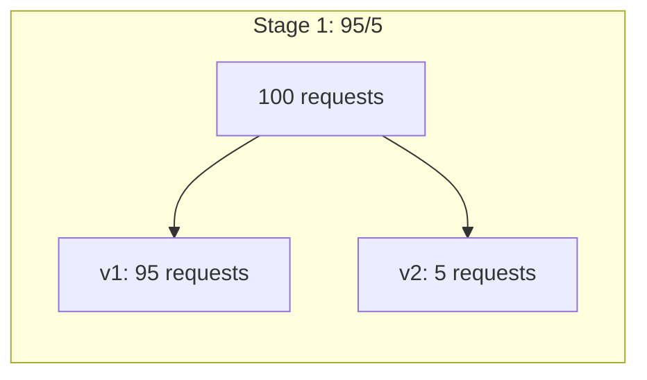

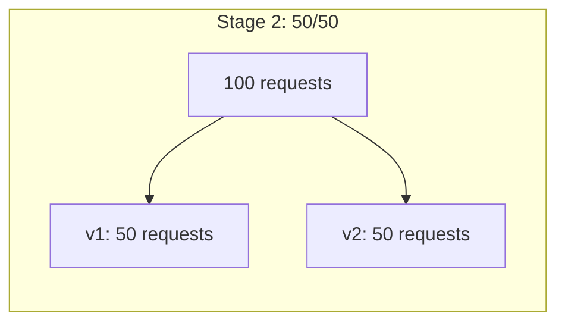

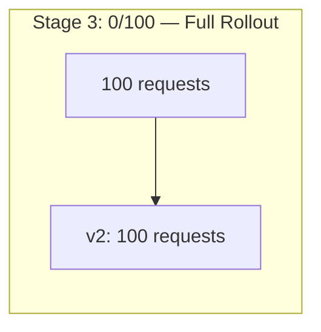

### Weighted Routing Configuration

```yaml
apiVersion: networking.istio.io/v1
kind: VirtualService
metadata:
  name: checkout-canary
spec:
  hosts:
  - checkout
  http:
  - route:
    - destination:
        host: checkout
        subset: v1
      weight: 95
    - destination:
        host: checkout
        subset: v2
      weight: 5
```

### Canary Progression Workflow

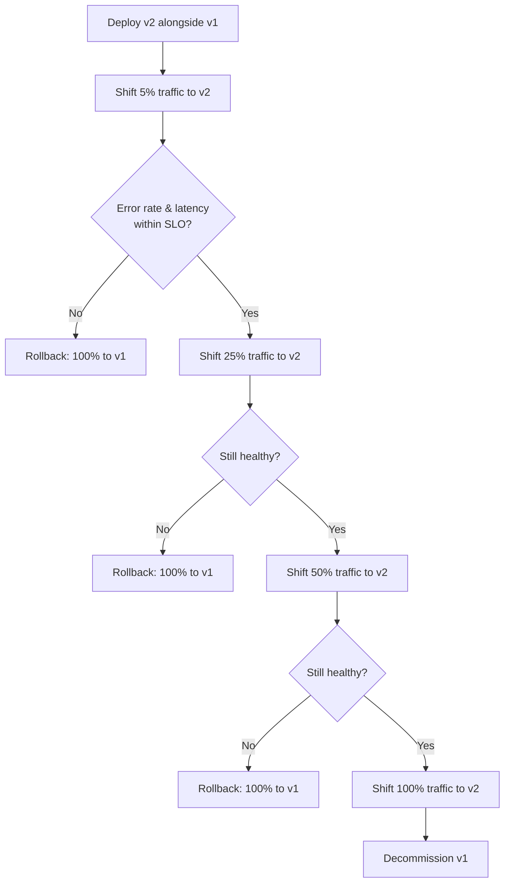

### Canary vs Blue-Green vs A/B Testing

| Strategy | How it works | Best for |
|---|---|---|
| **Canary** | Gradually shift a small, increasing % of traffic to the new version | Detecting regressions before full rollout |
| **Blue-Green** | Instantly switch 100% of traffic from old to new environment | Fast rollback needs, infrastructure-level swaps |
| **A/B Testing** | Route based on user attributes (not %), to compare business metrics | Product experimentation, feature testing |

### Real-World Use Case

An airline's booking service ships a rewritten pricing engine. Instead of a risky big-bang deploy, they:
1. Deploy `pricing-v2` with 2% traffic weight.
2. Watch Grafana dashboards for 30 minutes — error rate and p99 latency stay flat.
3. Increase to 10%, then 50%, then 100% over 2 hours.
4. If error rate spikes at any stage, instantly revert the `VirtualService` weight to `100/0`.

---

## 9. Automating Canary Releases with Flagger

Manually editing weight percentages and watching dashboards doesn't scale. **Flagger** is a progressive delivery operator (CNCF project) that automates the entire canary process using Istio's traffic shifting + metrics from Prometheus.

### How Flagger Works

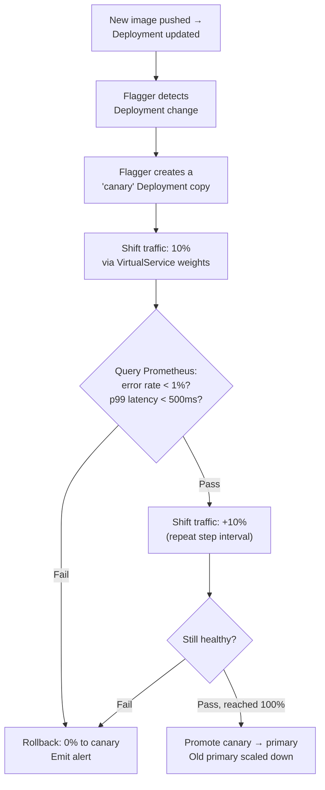

### Example Canary Resource

```yaml
apiVersion: flagger.app/v1beta1
kind: Canary
metadata:
  name: checkout
  namespace: production
spec:
  provider: istio
  targetRef:
    apiVersion: apps/v1
    kind: Deployment
    name: checkout
  service:
    port: 80
    targetPort: 8080
    gateways:
    - public-gateway.istio-system.svc.cluster.local
    hosts:
    - checkout.example.com
  analysis:
    interval: 1m          # Run analysis every 1 minute
    threshold: 5          # Allow 5 consecutive failed checks before rollback
    maxWeight: 50          # Never exceed 50% traffic to canary
    stepWeight: 5           # Increase by 5% each interval
    metrics:
    - name: request-success-rate
      thresholdRange:
        min: 99
      interval: 1m
    - name: request-duration
      thresholdRange:
        max: 500
      interval: 1m
    webhooks:
    - name: load-test
      url: http://flagger-loadtester.test/
      timeout: 5s
      metadata:
        cmd: "hey -z 1m -q 10 -c 2 http://checkout-canary.production/"
```

### What Flagger Automates That You'd Otherwise Do by Hand

| Manual process | Flagger automation |
|---|---|
| Edit VirtualService weights | Automatically increments `stepWeight` on a timer |
| Watch Grafana dashboards | Queries Prometheus metrics against thresholds automatically |
| Decide to rollback | Automatic rollback on threshold breach, with Slack/webhook alerts |
| Promote canary to primary | Automatic promotion once `maxWeight` is sustained and healthy |
| Run smoke/load tests mid-rollout | Built-in webhook support to trigger load tests during analysis |

### Real-World Use Case

A payments team wires Flagger to their CI/CD pipeline: every merge to `main` triggers a new image build → Deployment update → Flagger takes over, gradually shifting traffic in 5% steps every minute, running a synthetic load test at each step, and automatically rolling back within 5 minutes if the success-rate metric dips below 99% — with zero human intervention needed for a successful release, and zero customer impact for a failed one.

---

## 10. Istio Authorization Policies

`AuthorizationPolicy` provides fine-grained, identity-based access control — **zero-trust "who can talk to whom"** rules enforced at the proxy, independent of application code.

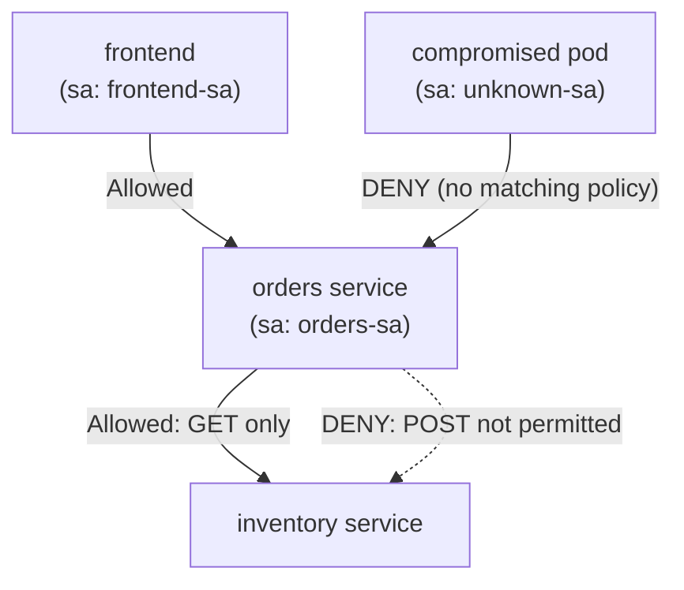

### Deny-by-Default, Then Allow

Once **any** `AuthorizationPolicy` targets a workload, that workload becomes **deny-by-default** for everything not explicitly allowed.

### Example: Allow Only `frontend` to Call `orders`

```yaml
apiVersion: security.istio.io/v1
kind: AuthorizationPolicy
metadata:
  name: orders-authz
  namespace: production
spec:
  selector:
    matchLabels:
      app: orders
  action: ALLOW
  rules:
  - from:
    - source:
        principals: ["cluster.local/ns/production/sa/frontend-sa"]
    to:
    - operation:
        methods: ["GET", "POST"]
        paths: ["/api/orders/*"]
```

### Example: Namespace-Level Isolation

```yaml
apiVersion: security.istio.io/v1
kind: AuthorizationPolicy
metadata:
  name: deny-cross-namespace
  namespace: production
spec:
  action: DENY
  rules:
  - from:
    - source:
        notNamespaces: ["production", "istio-system"]
```

### Example: Deny Specific Paths (Admin Endpoints)

```yaml
apiVersion: security.istio.io/v1
kind: AuthorizationPolicy
metadata:
  name: deny-admin-external
  namespace: production
spec:
  selector:
    matchLabels:
      app: orders
  action: DENY
  rules:
  - to:
    - operation:
        paths: ["/admin/*"]
    from:
    - source:
        notPrincipals: ["cluster.local/ns/production/sa/admin-console-sa"]
```

### Policy Evaluation Order

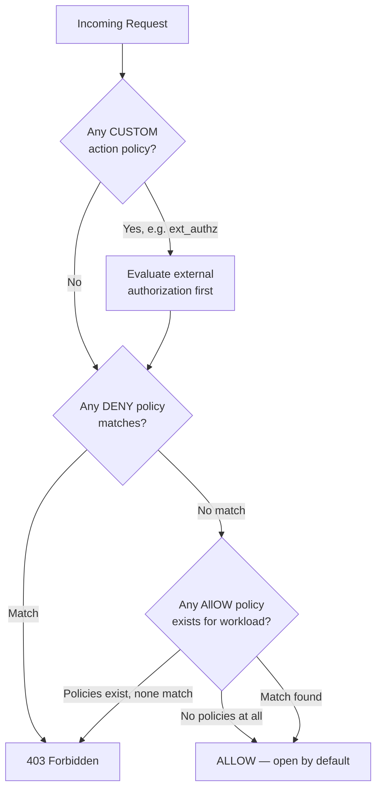

### Real-World Use Case

A healthcare company enforces that only the `billing-service` (identified by its **SPIFFE identity**, not IP address, which is unforgeable and works even across pod restarts/rescheduling) can call the `patient-records` service, and only via `GET /records/summary` — never the full record endpoint. This is auditable and enforced at the network layer, independent of whatever bugs might exist in application code.

---

## 11. External Authorization

Sometimes built-in `AuthorizationPolicy` (which only understands paths, methods, headers, and identities) isn't enough — you need **custom business logic** (e.g., "check this JWT against our internal entitlements service," or "rate-limit this specific customer tier"). Istio delegates that decision to an **external authorization service** via `ext_authz`.

```mermaid
sequenceDiagram
    participant Client
    participant Envoy as Envoy Sidecar (orders)
    participant ExtAuthz as External AuthZ Service
    participant Orders as orders service

    Client->>Envoy: HTTP Request + JWT
    Envoy->>ExtAuthz: CheckRequest (gRPC or HTTP)<br/>headers, path, method
    ExtAuthz->>ExtAuthz: Custom logic:<br/>validate entitlement,<br/>check rate limits, etc.
    alt Authorized
        ExtAuthz-->>Envoy: OK (200 / ALLOWED)
        Envoy->>Orders: Forward request
        Orders-->>Client: Response
    else Denied
        ExtAuthz-->>Envoy: DENIED (403)
        Envoy-->>Client: 403 Forbidden<br/>(request never reaches orders)
    end
```

### Step 1: Register the External Authorizer (Mesh Config)

```yaml
apiVersion: install.istio.io/v1alpha1
kind: IstioOperator
spec:
  meshConfig:
    extensionProviders:
    - name: "my-ext-authz"
      envoyExtAuthzHttp:
        service: "ext-authz.security.svc.cluster.local"
        port: "9000"
        includeRequestHeadersInCheck: ["authorization", "x-customer-tier"]
        timeout: 1s
```

### Step 2: Apply the AuthorizationPolicy with CUSTOM Action

```yaml
apiVersion: security.istio.io/v1
kind: AuthorizationPolicy
metadata:
  name: ext-authz-orders
  namespace: production
spec:
  selector:
    matchLabels:
      app: orders
  action: CUSTOM
  provider:
    name: "my-ext-authz"
  rules:
  - to:
    - operation:
        paths: ["/api/orders/*"]
```

### When to Use External Authorization vs Built-in AuthorizationPolicy

| Need | Solution |
|---|---|
| Simple identity/path/method-based access control | Built-in `AuthorizationPolicy` (ALLOW/DENY) |
| Validate JWT claims against a live entitlements database | External Authorization |
| Per-customer rate limiting tied to a billing plan | External Authorization |
| Complex business rules ("only allow during business hours for this region") | External Authorization |
| OPA (Open Policy Agent) style policy-as-code | External Authorization (OPA is a common `ext_authz` backend) |

### Real-World Use Case

A SaaS company gates API access by subscription tier. Their `ext-authz` service checks the caller's JWT against a live database: free-tier users are capped at 100 req/min, enterprise users get unlimited access, and expired subscriptions are rejected — all enforced at the mesh layer, so no individual service needs to implement billing logic.

---

## 12. Mutual TLS (mTLS) and PeerAuthentication

mTLS ensures that **both** the client and server prove their identity via certificates (unlike standard TLS, where only the server authenticates) — this is the foundation of **zero-trust networking**.

```mermaid
sequenceDiagram
    participant SidecarA as Sidecar A (client)
    participant SidecarB as Sidecar B (server)

    Note over SidecarA,SidecarB: Both hold X.509 certs<br/>issued by istiod's CA
    SidecarA->>SidecarB: ClientHello
    SidecarB-->>SidecarA: ServerHello + Server Cert
    SidecarA->>SidecarA: Verify server cert<br/>against mesh CA
    SidecarA->>SidecarB: Client Cert (mutual!)
    SidecarB->>SidecarB: Verify client cert<br/>against mesh CA
    Note over SidecarA,SidecarB: mTLS tunnel established.<br/>Both sides cryptographically<br/>verified each other's identity.
    SidecarA->>SidecarB: Encrypted application traffic
```

### Certificate Lifecycle

```mermaid
flowchart LR
    Workload[New Pod Starts] --> Request["Sidecar requests cert<br/>(SDS: Secret Discovery Service)"]
    Request --> Istiod[istiod CA]
    Istiod --> Issue["Issues short-lived cert<br/>(SPIFFE identity, ~24h TTL)"]
    Issue --> Rotate{Cert nearing<br/>expiry?}
    Rotate -->|Yes| Request
    Rotate -->|No| InUse[Cert used for mTLS<br/>handshakes]
```

Every workload identity is expressed as a **SPIFFE ID**: `spiffe://cluster.local/ns/<namespace>/sa/<service-account>` — this is what `AuthorizationPolicy` principals reference.

### PeerAuthentication: Controlling mTLS Mode

```yaml
apiVersion: security.istio.io/v1
kind: PeerAuthentication
metadata:
  name: default
  namespace: istio-system
spec:
  mtls:
    mode: STRICT   # Reject all plaintext traffic mesh-wide
```

### mTLS Modes

| Mode | Behavior | When to use |
|---|---|---|
| `STRICT` | Only mTLS traffic accepted; plaintext rejected | Production, zero-trust environments |
| `PERMISSIVE` | Accepts both mTLS and plaintext | Migration period — onboarding legacy workloads gradually |
| `DISABLE` | mTLS disabled | Debugging only — **not recommended for production** |

### Migration Strategy (Zero Downtime)

```mermaid
flowchart TD
    Start["Start: PERMISSIVE mesh-wide<br/>(accepts mTLS + plaintext)"] --> Inject[Inject sidecars into<br/>all workloads, namespace by namespace]
    Inject --> Verify["Verify via Kiali:<br/>all traffic now shows as mTLS (padlock icon)"]
    Verify --> Strict["Switch to STRICT<br/>mesh-wide or per-namespace"]
    Strict --> Confirm[Confirm no plaintext<br/>traffic is broken]
```

### Namespace-Scoped and Workload-Scoped Policies

```yaml
# Namespace-level: applies only to "legacy" namespace
apiVersion: security.istio.io/v1
kind: PeerAuthentication
metadata:
  name: legacy-permissive
  namespace: legacy
spec:
  mtls:
    mode: PERMISSIVE
---
# Workload-level: overrides for one specific app
apiVersion: security.istio.io/v1
kind: PeerAuthentication
metadata:
  name: metrics-endpoint
  namespace: production
spec:
  selector:
    matchLabels:
      app: orders
  portLevelMtls:
    9090:                # Prometheus scrape port stays plaintext
      mode: DISABLE
```

### Real-World Use Case

A company undergoing a PCI-DSS audit needs to prove that **all cardholder data in transit between services is encrypted**. By setting mesh-wide `STRICT` mTLS, they get automatic, auditable encryption for every service-to-service call — with certificate rotation handled entirely by `istiod`, no manual cert management, no expired-cert outages.

---

## 13. Multi-Cluster Istio Architecture

As organizations grow, a single Kubernetes cluster often isn't enough — you need multiple clusters for **fault isolation, regional latency, regulatory data residency, or capacity**. Istio can stitch multiple clusters into **one logical mesh**.

### Multi-Cluster Deployment Models

```mermaid
flowchart TB
    subgraph "Model 1: Primary-Remote (shared control plane)"
        direction TB
        Istiod1[istiod<br/>Cluster A]
        DPA1[Data Plane<br/>Cluster A]
        DPB1[Data Plane<br/>Cluster B — no istiod]
        Istiod1 -->|Manages both| DPA1
        Istiod1 -->|Manages both<br/>cross-cluster| DPB1
    end
```

```mermaid
flowchart TB
    subgraph "Model 2: Multi-Primary (istiod in every cluster)"
        direction TB
        Istiod2A[istiod<br/>Cluster A]
        Istiod2B[istiod<br/>Cluster B]
        DPA2[Data Plane<br/>Cluster A]
        DPB2[Data Plane<br/>Cluster B]
        Istiod2A --> DPA2
        Istiod2B --> DPB2
        Istiod2A <-.->|Shared trust domain,<br/>shared root CA| Istiod2B
    end
```

| Model | Description | Trade-off |
|---|---|---|
| **Multi-Primary** | Every cluster runs its own `istiod`, sharing a common root CA/trust domain | Higher availability (no single point of failure), more resources used |
| **Primary-Remote** | One cluster runs `istiod`; other clusters' data planes are managed remotely | Simpler, but the primary cluster is a control-plane SPOF |
| **External Control Plane** | `istiod` runs entirely outside any workload cluster | Used for fully managed/hosted mesh scenarios |

### Network Topology Concepts

```mermaid
flowchart TB
    subgraph "Network: network1"
        subgraph "Cluster A"
            A1[Pod A]
        end
    end
    subgraph "Network: network2"
        subgraph "Cluster B"
            B1[Pod B]
        end
    end
    A1 <-->|"Direct pod-to-pod IP<br/>routing possible if<br/>SAME network"| B1
```

- **Single network**: Pod IPs are directly routable across clusters (e.g., via a flat VPC or VPC peering). No East-West gateway strictly required, but still commonly used for consistent mTLS/ingress control.
- **Multi-network**: Pod IPs are **not** directly routable (separate VPCs, on-prem + cloud, different cloud providers). Cross-cluster traffic **must** flow through **East-West Gateways**.

### Shared Trust Requirement

For workloads across clusters to establish mTLS with each other, all clusters must share a **common root of trust** — either:
1. A shared root CA that signs each cluster's intermediate CA, or
2. An external CA (e.g., HashiCorp Vault, cert-manager with a shared issuer) signing all clusters' certs.

### Real-World Use Case

A global logistics company runs Kubernetes clusters in AWS `us-east-1` and GCP `europe-west1` (different networks, different cloud providers). They deploy Istio in **multi-primary, multi-network** mode so that the `tracking` service in Europe can call the `warehouse` service in the US securely over mTLS, through East-West gateways, appearing to developers as if it were all one mesh.

---

## 14. Cross-Cluster Service Discovery and Communication

For Cluster A's services to "see" Cluster B's services, Istio needs a mechanism to discover remote endpoints — this is done via a **remote secret**.

```mermaid
sequenceDiagram
    participant IstiodA as istiod (Cluster A)
    participant K8sB as Kubernetes API (Cluster B)
    participant IstiodB as istiod (Cluster B)
    participant K8sA as Kubernetes API (Cluster A)

    Note over IstiodA,K8sA: Admin generates a "remote secret"<br/>for Cluster A containing<br/>read-only credentials to Cluster B's API
    IstiodA->>K8sB: Watch Services & Endpoints<br/>(using remote secret)
    K8sB-->>IstiodA: Service/Endpoint updates
    IstiodA->>IstiodA: Merge Cluster B's endpoints<br/>into local service registry
    Note over IstiodB,K8sB: Same process happens<br/>in reverse for Cluster B
```

### Step 1: Generate and Apply Remote Secrets

```bash
# Create a secret in Cluster A that lets its istiod watch Cluster B
istioctl create-remote-secret \
  --context=cluster-b \
  --name=cluster-b > secret-b.yaml

kubectl apply -f secret-b.yaml --context=cluster-a

# And the reverse, so Cluster B can see Cluster A
istioctl create-remote-secret \
  --context=cluster-a \
  --name=cluster-a > secret-a.yaml

kubectl apply -f secret-a.yaml --context=cluster-b
```

### Step 2: Deploy the Same Service in Both Clusters

For cross-cluster discovery to work seamlessly, the **Service name and namespace must match** in both clusters:

```yaml
# Deployed identically in both Cluster A and Cluster B
apiVersion: v1
kind: Service
metadata:
  name: reviews
  namespace: production
  labels:
    app: reviews
spec:
  ports:
  - port: 9080
    name: http
  selector:
    app: reviews
```

Istio then automatically merges endpoints from both clusters under one logical `reviews.production.svc.cluster.local` identity:

```mermaid
flowchart TB
    Client["Client in Cluster A<br/>calls reviews.production.svc.cluster.local"] --> LB{Envoy Load<br/>Balancer}
    LB -->|Local endpoint,<br/>lower latency, preferred| ReviewsA["reviews pod<br/>(Cluster A)"]
    LB -->|Remote endpoint,<br/>used on failover or<br/>locality-weighted routing| ReviewsB["reviews pod<br/>(Cluster B, via<br/>East-West Gateway)"]
```

### Locality-Aware Load Balancing

By default, Istio **prefers local endpoints** (same cluster, same zone) and only spills over to remote clusters when local endpoints are unhealthy or overloaded — this is controlled via `DestinationRule` locality settings, detailed in Section 16.

### Real-World Use Case

An online retailer deploys the `inventory` service identically in both `us-cluster` and `eu-cluster`. During a US regional outage, requests from US customers automatically start being served by the `eu-cluster` copy of `inventory` — invisible to end users, no DNS changes, no manual failover runbook execution.

---

## 15. East-West Gateway Setup

The East-West Gateway is a specialized Istio ingress gateway that accepts **mesh-internal, mTLS-encrypted traffic from other clusters** — distinct from the regular ingress gateway, which accepts external client traffic.

```mermaid
flowchart LR
    subgraph "Cluster A"
        SvcA[order-service] --> EnvoyA[Envoy Sidecar]
        EnvoyA -->|"mTLS, port 15443<br/>SNI-routed"| EWGWA[East-West Gateway<br/>Cluster A]
    end
    EWGWA <-->|Cross-cluster<br/>network link| EWGWB[East-West Gateway<br/>Cluster B]
    subgraph "Cluster B"
        EWGWB --> EnvoyB[Envoy Sidecar]
        EnvoyB --> SvcB[inventory-service]
    end
```

### Step 1: Deploy the East-West Gateway

```bash
istioctl install -f eastwest-gateway.yaml --context=cluster-a
istioctl install -f eastwest-gateway.yaml --context=cluster-b
```

```yaml
# eastwest-gateway.yaml
apiVersion: install.istio.io/v1alpha1
kind: IstioOperator
metadata:
  name: eastwest-gateway
spec:
  profile: empty
  components:
    ingressGateways:
    - name: istio-eastwestgateway
      label:
        istio: eastwestgateway
        topology.istio.io/network: network1
      enabled: true
      k8s:
        service:
          type: LoadBalancer
          ports:
          - name: tls
            port: 15443
            targetPort: 15443
          - name: tls-istiod
            port: 15012
            targetPort: 15012
          - name: tls-webhook
            port: 15017
            targetPort: 15017
```

### Step 2: Expose Services Through the East-West Gateway

```yaml
apiVersion: networking.istio.io/v1
kind: Gateway
metadata:
  name: cross-network-gateway
  namespace: istio-system
spec:
  selector:
    istio: eastwestgateway
  servers:
  - port:
      number: 15443
      name: tls
      protocol: TLS
    tls:
      mode: AUTO_PASSTHROUGH   # Preserves mTLS end-to-end;
                                # gateway routes by SNI, doesn't terminate TLS
    hosts:
    - "*.local"
```

### Why `AUTO_PASSTHROUGH` Matters

The East-West gateway does **not** decrypt traffic — it routes based on the **SNI (Server Name Indication)** in the TLS handshake, preserving true end-to-end mTLS between the original client sidecar and the destination sidecar in the remote cluster. This is critical for maintaining zero-trust guarantees across cluster boundaries.

```mermaid
sequenceDiagram
    participant SidecarA as Sidecar (Cluster A)
    participant GWA as East-West Gateway A
    participant GWB as East-West Gateway B
    participant SidecarB as Sidecar (Cluster B)

    SidecarA->>GWA: mTLS ClientHello (SNI: outbound_.svc.cluster.local)
    Note over GWA: Gateway reads SNI only,<br/>does NOT terminate TLS
    GWA->>GWB: Forward encrypted bytes (passthrough)
    GWB->>SidecarB: Forward encrypted bytes (passthrough)
    Note over SidecarA,SidecarB: mTLS handshake completes<br/>END-TO-END, gateway never<br/>saw plaintext or private keys
```

### Verification

```bash
kubectl get svc istio-eastwestgateway -n istio-system --context=cluster-a
# Confirm EXTERNAL-IP is assigned (LoadBalancer)

istioctl x precheck --context=cluster-a
```

---

## 16. Cross-Cluster Traffic and Failover

With discovery (Section 14) and East-West gateways (Section 15) in place, you now control **how** traffic is distributed and how failover behaves using `DestinationRule` locality and outlier detection settings.

### Locality-Weighted Load Balancing

```yaml
apiVersion: networking.istio.io/v1
kind: DestinationRule
metadata:
  name: reviews-locality
  namespace: production
spec:
  host: reviews.production.svc.cluster.local
  trafficPolicy:
    loadBalancer:
      localityLbSetting:
        enabled: true
        failover:
        - from: us-east
          to: eu-west
    outlierDetection:
      consecutive5xxErrors: 5
      interval: 30s
      baseEjectionTime: 30s
```

### Failover Sequence

```mermaid
flowchart TD
    Request[Request arrives at<br/>Cluster A sidecar] --> CheckLocal{Local cluster<br/>endpoints healthy?}
    CheckLocal -->|Yes| RouteLocal[Route to local<br/>reviews pods — lowest latency]
    CheckLocal -->|"No — all local<br/>endpoints ejected"| CheckFailover{Failover region<br/>defined?}
    CheckFailover -->|Yes| RouteRemote["Route via East-West Gateway<br/>to remote cluster's<br/>reviews pods"]
    CheckFailover -->|No| Fail[Return 503<br/>Service Unavailable]
    RouteLocal --> OutlierCheck{Outlier detection:<br/>5xx errors exceed<br/>threshold?}
    OutlierCheck -->|Yes| Eject["Eject unhealthy pod<br/>from load balancing pool<br/>for baseEjectionTime"]
```

### Outlier Detection (Circuit Breaking Per Endpoint)

Outlier detection automatically **ejects unhealthy endpoints** (not the whole cluster — individual pods) from the load-balancing pool:

```yaml
    outlierDetection:
      consecutive5xxErrors: 5      # Eject after 5 consecutive 5xx responses
      interval: 30s                 # Check every 30 seconds
      baseEjectionTime: 30s         # Minimum ejection time
      maxEjectionPercent: 50        # Never eject more than 50% of the pool
```

### Full Regional Failover Test

```mermaid
sequenceDiagram
    participant User
    participant DNS as Global Load Balancer / DNS
    participant ClusterA as Cluster A (us-east) — HEALTHY
    participant ClusterB as Cluster B (eu-west) — HEALTHY

    User->>DNS: Request
    DNS->>ClusterA: Route (nearest region)
    ClusterA->>ClusterA: Serve locally (fast path)

    Note over ClusterA: 🔥 Cluster A's reviews<br/>service starts failing 5xx
    ClusterA->>ClusterA: Outlier detection ejects<br/>local reviews endpoints
    ClusterA->>ClusterB: Failover via East-West Gateway<br/>(locality failover rule)
    ClusterB-->>ClusterA: Response
    ClusterA-->>User: Response<br/>(user never notices — just<br/>slightly higher latency)
```

### Real-World Use Case

A video streaming platform runs clusters in three regions. When the `recommendation-service` in `ap-southeast` experiences a memory leak and starts returning 500s, Istio's outlier detection ejects the failing pods within 30 seconds, and locality failover automatically reroutes Southeast Asian users' requests to the healthy `us-west` cluster — adding ~150ms of latency but **zero downtime**, while the on-call engineer investigates.

---

## 17. Observability using Kiali, Grafana & Prometheus

Istio doesn't just move traffic — every Envoy proxy emits rich telemetry by default. Three tools turn that raw data into actionable dashboards.

```mermaid
flowchart LR
    Envoy1[Envoy Sidecars<br/>across the mesh] -->|"Metrics<br/>(/stats/prometheus)"| Prom[Prometheus<br/>Scrapes & stores time-series]
    Prom --> Grafana[Grafana<br/>Dashboards & alerts]
    Prom --> Kiali[Kiali<br/>Service graph + config validation]
    Envoy1 -->|Distributed traces| Jaeger[Jaeger / Zipkin<br/>Trace visualization]
    Kiali -.->|Reads| K8sAPI[(Kubernetes API<br/>for Istio config)]
```

### Prometheus: The Metrics Foundation

Every Istio-enabled proxy exposes standard metrics like:

- `istio_requests_total` — request count, labeled by source, destination, response code
- `istio_request_duration_milliseconds` — latency histograms
- `istio_tcp_connections_opened_total` — for TCP traffic

```bash
kubectl port-forward -n istio-system svc/prometheus 9090:9090
# Visit http://localhost:9090, try query:
# sum(rate(istio_requests_total{destination_service="checkout.production.svc.cluster.local"}[5m])) by (response_code)
```

### Grafana: Pre-Built Dashboards

Istio ships official Grafana dashboards out of the box:

| Dashboard | Shows |
|---|---|
| **Istio Mesh Dashboard** | Global request volume, success rate, p50/p90/p99 latency across the whole mesh |
| **Istio Service Dashboard** | Per-service golden signals (traffic, errors, latency, saturation) |
| **Istio Workload Dashboard** | Per-pod resource + traffic breakdown |
| **Istio Control Plane Dashboard** | `istiod` health — config push latency, CPU/memory |

```bash
kubectl port-forward -n istio-system svc/grafana 3000:3000
```

### Kiali: The Service Mesh Console

Kiali is purpose-built for Istio — it visualizes the **live service graph**, validates configuration, and shows mTLS status at a glance.

```mermaid
flowchart LR
    subgraph "Kiali Service Graph (conceptual)"
        GW((Ingress<br/>Gateway)) -->|"100% success<br/>🔒 mTLS"| FE[frontend]
        FE -->|"98% success<br/>🔒 mTLS"| Reviews[reviews v1]
        FE -->|"95% success<br/>🔒 mTLS"| ReviewsV2[reviews v2<br/>canary — 5% traffic]
        Reviews -->|"🔒 mTLS"| Ratings[ratings]
        ReviewsV2 -->|"🔒 mTLS"| Ratings
    end
```

```bash
kubectl port-forward -n istio-system svc/kiali 20001:20001
istioctl dashboard kiali   # Shortcut that opens it automatically
```

Kiali also flags **configuration issues** directly — e.g., a `VirtualService` referencing a `DestinationRule` subset that doesn't exist shows up as a validation error icon on the graph.

### What to Watch (Golden Signals)

```mermaid
flowchart TD
    Golden[Golden Signals] --> Traffic["Traffic<br/>(requests/sec)"]
    Golden --> Errors["Errors<br/>(4xx/5xx rate)"]
    Golden --> Latency["Latency<br/>(p50/p90/p99)"]
    Golden --> Saturation["Saturation<br/>(CPU/memory/connections)"]
```

### Real-World Use Case

During an incident, an SRE opens Kiali and immediately sees a red edge between `checkout` and `payment-gateway` — the service graph shows a 40% error rate on that specific link. They pivot to the pre-built Grafana **Istio Service Dashboard**, filter to `payment-gateway`, and see p99 latency spiking to 8 seconds starting at 14:02 — correlating exactly with a deploy event, letting them roll back within minutes instead of guessing.

---

## 18. Visualizing mTLS and Service-to-Service Traffic

Kiali specifically surfaces **mTLS status** visually, which is invaluable for security audits and troubleshooting "why can't service A reach service B."

```mermaid
flowchart TD
    subgraph "Kiali mTLS Indicators"
        Lock["🔒 Solid padlock<br/>= mTLS enforced"]
        HalfLock["🔓 Half padlock<br/>= PERMISSIVE mode<br/>(mixed plaintext + mTLS)"]
        NoLock["⚠️ No padlock<br/>= plaintext traffic<br/>(mTLS not in use)"]
    end
```

### Verifying mTLS via CLI

```bash
istioctl x authz check <pod-name>.<namespace>
# Shows applicable AuthorizationPolicies for a given pod

istioctl proxy-config secret <pod-name>.<namespace>
# Shows the certificate currently loaded in the sidecar,
# including SPIFFE identity, expiry, and issuer

istioctl x describe pod <pod-name> -n <namespace>
# Human-readable summary: injection status, mTLS mode, applicable policies
```

### Traffic Flow Visualization Example

```mermaid
sequenceDiagram
    participant User
    participant Kiali
    participant Prom as Prometheus

    User->>Kiali: Open service graph for "production" namespace
    Kiali->>Prom: Query istio_requests_total,<br/>istio_tcp_connections rates
    Prom-->>Kiali: Time-series data
    Kiali->>Kiali: Render graph: nodes = services,<br/>edges = traffic, color = health,<br/>padlock = mTLS status
    Kiali-->>User: Interactive graph<br/>(click edge → see metrics, click node → see config)
```

### Percentage of mTLS Traffic (Prometheus Query)

```promql
sum(rate(istio_requests_total{connection_security_policy="mutual_tls"}[5m]))
/
sum(rate(istio_requests_total[5m]))
* 100
```

Use this as a Grafana panel to track **"% of mesh traffic using mTLS"** — a common security compliance KPI, and a great gate for deciding when it's safe to flip `PERMISSIVE` → `STRICT`.

### Real-World Use Case

A security team preparing for a SOC2 audit uses Kiali's mTLS overlay to visually confirm **every single edge in the service graph shows a padlock** before their audit date — and uses the Prometheus query above as evidence in their compliance report, showing 100% mTLS coverage sustained over the prior 90 days.

---

## 19. Troubleshooting Exercises

Below are common real-world Istio problems, presented as hands-on exercises with diagnostic steps.

### Exercise 1: "503 UF" errors between two services

```mermaid
flowchart TD
    Symptom["Symptom: 503 UF<br/>(upstream failed connection)"] --> Check1["Check: istioctl proxy-status<br/>— is the caller's sidecar SYNCED?"]
    Check1 -->|STALE| Fix1[Restart istiod or check<br/>istiod resource limits/CPU throttling]
    Check1 -->|SYNCED| Check2["Check: kubectl get pods<br/>— is destination pod Ready?"]
    Check2 -->|Not Ready| Fix2[Check app container<br/>readiness probe]
    Check2 -->|Ready| Check3["Check: DestinationRule<br/>mTLS mode mismatch?"]
    Check3 -->|"Mismatch<br/>(caller STRICT, dest DISABLE)"| Fix3["Align PeerAuthentication<br/>mode on both sides"]
```

**Commands:**
```bash
istioctl proxy-status
istioctl proxy-config cluster <pod>.<namespace> --fqdn <destination-service>
kubectl logs <pod> -c istio-proxy -n <namespace>  # Envoy access logs
```

### Exercise 2: Traffic not splitting according to VirtualService weights

**Common causes:**
1. `DestinationRule` subsets don't match pod labels (`version: v1` label missing on some pods).
2. Multiple `VirtualService` resources for the same host, conflicting.
3. Config not yet propagated — check sync status.

```bash
istioctl analyze -n production
# Runs built-in static analysis — catches most config mismatches instantly

kubectl get pods -n production --show-labels
# Confirm 'version' labels match DestinationRule subset selectors
```

### Exercise 3: mTLS handshake failures after enabling STRICT mode

```mermaid
flowchart TD
    Symptom[Symptom: Connections<br/>refused after STRICT enabled] --> Check1{Is the calling<br/>workload's pod<br/>sidecar-injected?}
    Check1 -->|No| Fix1["Non-mesh pod calling a<br/>STRICT workload — either<br/>inject a sidecar or use<br/>PERMISSIVE for that path"]
    Check1 -->|Yes| Check2{Check probes:<br/>livenessProbe using<br/>HTTP to app port?}
    Check2 -->|"Kubelet probes<br/>bypass the sidecar"| Fix2["Istio auto-rewrites probes<br/>by default; verify with<br/>istioctl proxy-config listener"]
```

**Key insight:** Kubernetes' kubelet performs health checks **directly** against the pod IP, bypassing Envoy — Istio has a feature (`ProbeRewrite`, on by default) that redirects these probes through the sidecar so they don't fail under `STRICT` mTLS. If disabled or misconfigured, this is a classic cause of pods failing readiness checks right after enabling STRICT mode.

### Exercise 4: Canary release stuck at 10% (Flagger)

```bash
kubectl describe canary checkout -n production
kubectl -n production logs deployment/flagger -f
```

Look for `analysis failed` events — usually caused by:
- Prometheus metric queries returning no data (metric name mismatch)
- Load tester webhook unreachable (network policy blocking it)
- `stepWeight` progression exceeding `maxWeight` too fast, tripping error thresholds due to insufficient traffic sample size

### Exercise 5: Cross-cluster requests timing out

```mermaid
flowchart TD
    Symptom[Cross-cluster request<br/>times out] --> Check1{East-West Gateway<br/>EXTERNAL-IP assigned?}
    Check1 -->|Pending| Fix1[LoadBalancer provisioning<br/>issue — check cloud provider]
    Check1 -->|Assigned| Check2{Remote secret<br/>applied correctly?}
    Check2 -->|"kubectl get secret<br/>istio-remote-secret-*<br/>missing"| Fix2[Re-run istioctl<br/>create-remote-secret]
    Check2 -->|Present| Check3{Firewall allows<br/>port 15443 between<br/>cluster networks?}
    Check3 -->|Blocked| Fix3["Open port 15443<br/>(and 15012 for istiod<br/>if remote/primary model)"]
```

**Diagnostic commands:**
```bash
kubectl get secret -n istio-system | grep istio-remote-secret
istioctl remote-clusters
# Should list all connected clusters with their sync status

kubectl exec -it <pod> -n production -c istio-proxy -- \
  curl -v https://<eastwest-gateway-external-ip>:15443
```

### General Troubleshooting Toolkit

| Command | Purpose |
|---|---|
| `istioctl analyze` | Static analysis of all Istio config in a namespace/cluster |
| `istioctl proxy-status` | Sync status of every Envoy proxy vs istiod |
| `istioctl proxy-config <type> <pod>` | Dump Envoy's actual live config (listeners, clusters, routes, endpoints) |
| `istioctl x describe pod <pod>` | Human-readable summary of a pod's mesh config |
| `kubectl logs <pod> -c istio-proxy` | Envoy access logs (per-request detail) |
| `istioctl dashboard <kiali\|grafana\|prometheus\|jaeger>` | Quick port-forward + browser launch for each tool |

---

## Best Practices

### Production Readiness

1. **Start with PERMISSIVE mTLS** during onboarding, then switch to STRICT once all workloads have sidecars injected and verified.
2. **Use namespace-scoped injection labels** rather than cluster-wide injection for gradual rollout.
3. **Implement canary releases** for every production change — never big-bang deploy.
4. **Monitor istiod health** — set up alerts for CPU/memory and config push latency.
5. **Tag all resources** with `app`, `version`, and `team` labels for easier filtering in Kiali/Grafana.

### Security Hardening

1. **Enable STRICT mTLS mesh-wide** after the migration period — this is non-negotiable for production.
2. **Use AuthorizationPolicy** to enforce least-privilege access between services.
3. **Rotate credentials** — if using external authorization, ensure tokens/JWTs have short TTLs.
4. **Audit regularly** — use `istioctl authz check` to review policies monthly.
5. **Never expose East-West gateways** to the public internet — they're for mesh-internal traffic only.

### Performance Optimization

1. **Right-size sidecar containers** — Envoy typically needs 50-100MB RAM and 0.1 CPU per pod.
2. **Use ambient mode** where L7 features aren't needed — saves 70%+ resources.
3. **Tune connection pool settings** in `DestinationRule` to prevent socket exhaustion.
4. **Avoid overly broad AuthorizationPolicy selectors** — they increase proxy memory usage.
5. **Enable proxy merge** in istiod to reduce config push volume for large meshes.

### Operational Excellence

1. **Version-lock Istio** — pin to a specific minor version and test upgrades in staging first.
2. **Use GitOps** (ArgoCD/Flux) to manage Istio config — track changes, enable rollback.
3. **Tag clusters with topology labels** (`topology.istio.io/network`, `topology.istio.io/subnetwork`) for locality-aware routing.
4. **Set up SLO alerts** on golden signals (latency p99, error rate, saturation) before you need them.
5. **Document your mesh architecture** — diagram gateways, clusters, and trust domains.

---

## Anti-Patterns to Avoid

### 1. ❌ Deploying a Mesh Before You Have 5+ Services

**Problem**: Adding sidecars to 2-3 monoliths provides minimal value but adds operational complexity.

**Better Approach**: Start with an API gateway (like Kong or Envoy standalone). Revisit Istio when you have 10+ services, multiple teams, and genuine needs for traffic management, mTLS, and observability.

### 2. ❌ Enabling STRICT mTLS Without Validating All Callers

**Problem**: One non-mesh pod (e.g., a legacy app or external service) calls a STRICT workload → immediate connection failures.

**Better Approach**: Use PERMISSIVE mode during migration. Run `istioctl proxy-config listeners <pod>` to verify all callers are sidecar-injected before flipping to STRICT.

### 3. ❌ Using IP-based Authorization Instead of SPIFFE Identity

**Problem**: Pod IPs change on restart, scale events, and failover. An AuthorizationPolicy based on IP is brittle and provides a false sense of security.

**Better Approach**: Always use `principals` (SPIFFE IDs) or `namespaces` in AuthorizationPolicy rules.

### 4. ❌ Configuring Multiple VirtualServices for the Same Host

**Problem**: Conflicting routing rules — the last one applied wins, silently overriding your intended behavior.

**Better Approach**: One `VirtualService` per host. If you need multi-team coordination, use Kubernetes RBAC to restrict who can edit it.

### 5. ❌ Mirroring Non-Idempotent Operations

**Problem**: Mirroring a `POST /charge` duplicates the charge to your sandbox environment, leading to double-billing confusion.

**Better Approach**: Only mirror `GET` and `POST` that are idempotent by design. For payment flows, use a dedicated shadow environment with mocked downstreams.

### 6. ❌ Forgetting East-West Gateway Exposure in Multi-Network Setups

**Problem**: Cross-cluster traffic times out because East-West gateway service is `ClusterIP` instead of `LoadBalancer`.

**Better Approach**: Always verify with `kubectl get svc istio-eastwestgateway -n istio-system` that you have an external IP.

### 7. ❌ Skipping DestinationRule When Using Subsets

**Problem**: Traffic shifting to a subset that doesn't exist → 503 errors for all requests.

**Better Approach**: Always pair `VirtualService` subsets with a matching `DestinationRule` that defines those subsets.

### 8. ❌ Running Flagger Without Sufficient Traffic Volume

**Problem**: Canary stuck at 10% because error rate fluctuates wildly with low traffic (statistical noise).

**Better Approach**: Use Flagger only on services receiving >10 requests/minute, or increase `analysis.threshold` and `interval` to smooth variance.

---

## Performance Considerations

### Resource Overhead

| Component | CPU per instance | Memory per instance | Notes |
|---|---|---|---|
| **istiod** | 1-2 cores | 2-4 GB | Scales with mesh size (number of configs, proxies) |
| **Envoy sidecar** | 0.05-0.1 CPU | 50-150 MB | Depends on config complexity, connection churn |
| **ztunnel (ambient)** | 0.01-0.02 CPU | 10-20 MB | Per node, handles all pods on that node |
| **Waypoint proxy** | 0.1-0.2 CPU | 100-200 MB | Per service account when L7 needed |
| **Ingress/Egress gateway** | 0.5-1 CPU per pod | 256-512 MB | Scale horizontally with traffic |

### Latency Impact

- **Sidecar mode**: Adds ~1-2ms p50 latency per hop (TCP handshake + mTLS)
- **Ambient mode (ztunnel)**: Adds ~0.5-1ms p50 latency per hop (lighter weight)
- **East-West gateway**: Adds ~2-5ms latency due to extra network hop + TLS termination/termination (but preserves end-to-end mTLS)
- **Config propagation**: xDS pushes take 1-5 seconds to reach all proxies after `kubectl apply`

### Optimization Techniques

1. **Connection Pooling**: Configure `connectionPool` in `DestinationRule` to reuse upstream connections:
   ```yaml
   trafficPolicy:
     connectionPool:
       tcp:
         maxConnections: 100
       http:
         h1UpgradePolicy: UPGRADE
         http2MaxRequests: 1000
   ```

2. **Keep-Alive**: Set `tcpKeepalive` to detect dead peers faster:
   ```yaml
   trafficPolicy:
     tls:
       mode: ISTIO_MUTUAL
     connectionPool:
       tcp:
         tcpKeepalive:
           time: 300s
           interval: 75s
   ```

3. **Proxy Merge**: Enable in istiod to reduce config push volume:
   ```yaml
   meshConfig:
     defaultConfig:
       proxyMetadata:
         ISTIO_MERGE_XDS: "true"
   ```

4. **Avoid Over-Engineering**: Don't create 50 VirtualServices for every permutation — use a single `VirtualService` with multiple `match` blocks.

### Benchmarking Recommendations

- Test with a load generator (hey, wrk, k6) before and after sidecar injection to quantify overhead.
- Monitor `istio_request_duration_milliseconds` in Prometheus to track mesh latency impact.
- For high-throughput services (>10k RPS), consider ambient mode or splitting traffic through dedicated gateways.

---

## Security Considerations

### Zero-Trust Implementation Checklist

- [ ] **mTLS**: Mesh-wide `STRICT` PeerAuthentication enabled
- [ ] **Authorization**: Every service has an `AuthorizationPolicy` (no implicit allow)
- [ ] **Identity**: Workloads use service accounts, not default tokens
- [ ] **Secrets**: No secrets in environment variables — use Kubernetes Secrets with encryption at rest
- [ ] **Least Privilege**: RBAC restricts who can edit Istio config
- [ ] **Audit**: All configuration changes logged via Kubernetes audit trail
- [ ] **Network Segmentation**: Namespace isolation via `AuthorizationPolicy`
- [ ] **Certificate Rotation**: Verify certs rotate automatically (check `istioctl proxy-config secret`)

### Threat Model

| Threat | Mitigation |
|---|---|
| **Man-in-the-middle (MITM)** | mTLS encrypts all service-to-service traffic with short-lived certs |
| **Rogue service impersonation** | SPIFFE identities prevent IP spoofing; only workloads with valid certs can join mesh |
| **Lateral movement** | AuthorizationPolicy enforces explicit allow rules between services |
| **Data exfiltration** | Egress gateway + `AuthorizationPolicy` restricts outbound traffic |
| **Configuration tampering** | GitOps + Kubernetes RBAC + admission webhooks validate all config changes |

### Compliance Alignment

- **PCI-DSS**: mTLS + audit logs + authorization policies satisfy Requirement 4 (encrypt transmission of cardholder data)
- **HIPAA**: mTLS + access controls + audit trails meet Security Rule requirements for transmission security
- **SOC2**: AuthorizationPolicy provides evidence for logical access controls; Prometheus metrics support availability monitoring
- **GDPR**: mTLS protects personal data in transit; namespace isolation enables data residency controls

### Security Best Practices

1. **Never run istiod with root privileges** — use the provided security context constraints.
2. **Rotate root CA** periodically (annually) using `istioctl x create-root-cert`.
3. **Use external authorization** for business-critical access control (keeps policy logic outside the mesh).
4. **Disable health check access logs** if they contain PHI/PII — configure Envoy's `access_log` filter.
5. **Enable strict mTLS on gateways** — ingress gateways should validate client certificates if your clients support it.

---

## Testing Strategies

### 1. Unit Testing Istio Config

Use `istioctl analyze` in CI pipelines:
```yaml
# GitHub Actions example
- name: Validate Istio Config
  run: |
    istioctl analyze -n production --use-kubeconfig
```

### 2. Integration Testing with Service Mesh

**Test traffic routing:**
```bash
# Deploy v1 and v2
kubectl apply -f reviews-v1.yaml
kubectl apply -f reviews-v2.yaml

# Verify routing
for i in {1..20}; do curl -s http://reviews.production/api/ratings | jq; done
# Should see ~50% v1 and ~50% v2 responses if weights are 50/50
```

**Test mTLS enforcement:**
```bash
# Attempt plaintext connection from non-mesh pod
kubectl exec -ti test-pod -- curl -v telnet://orders.production:9080
# Should fail with connection reset under STRICT mode
```

**Test AuthorizationPolicy:**
```bash
# From allowed service
kubectl exec -ti frontend-pod -- curl -v http://orders.production/api/orders
# Should succeed

# From unauthorized service
kubectl exec -ti unauthorized-pod -- curl -v http://orders.production/api/orders
# Should get 403 Forbidden
```

### 3. Chaos Engineering

Test resilience with chaos mesh or manual failure injection:
```bash
# Kill 50% of reviews pods
kubectl scale deployment reviews --replicas=1 -n production

# Verify outlier detection ejects failing pod and traffic routes to healthy pods
istioctl proxy-config cluster <pod> -n production --fqdn reviews.production
```

### 4. Load Testing

Test canary progression with synthetic load:
```bash
# Using hey
hey -z 5m -c 50 -q 10 http://checkout.production/

# Monitor in Grafana: error rate, latency p99, pod resource utilization
```

### 5. Multi-Cluster Failover Testing

1. Stop a service in Cluster A (scale to 0)
2. Verify traffic routes to Cluster B via East-West gateway
3. Restore service in Cluster A
4. Verify traffic returns to local cluster

---

## Practice Exercises

### Exercise 1: Implement Header-Based Canary Routing

**Scenario**: You need to route 10% of traffic from `checkout` service to a new `v2` that includes a redesigned payment flow. Beta testers (identified by `x-beta-user: true` header) should go 100% to `v2`. Everyone else gets 90/10 split.

**Solution**:

```yaml
apiVersion: networking.istio.io/v1
kind: VirtualService
metadata:
  name: checkout-route
spec:
  hosts:
  - checkout
  http:
  # Beta testers get 100% v2
  - match:
    - headers:
        x-beta-user:
          exact: "true"
    route:
    - destination:
        host: checkout
        subset: v2
  # Default traffic: 90% v1, 10% v2
  - route:
    - destination:
        host: checkout
        subset: v1
      weight: 90
    - destination:
        host: checkout
        subset: v2
      weight: 10
---
apiVersion: networking.istio.io/v1
kind: DestinationRule
metadata:
  name: checkout-destination
spec:
  host: checkout
  subsets:
  - name: v1
    labels:
      version: v1
  - name: v2
    labels:
      version: v2
```

**Verification**:
```bash
# Without header
curl -v http://checkout/api/health
# Should return v1 ~90% of the time

# With header
curl -v -H "x-beta-user: true" http://checkout/api/health
# Should always return v2
```

---

### Exercise 2: Enable mTLS for a Namespace

**Scenario**: The `production` namespace currently has `PERMISSIVE` mTLS. You need to migrate to `STRICT` mode with zero downtime.

**Solution**:

```yaml
# Step 1: Verify all workloads have sidecars injected
kubectl get pods -n production -o jsonpath='{.items[*].spec.containers[*].name}'
# Expected: app-name istio-proxy

# Step 2: Check current mTLS mode
kubectl get peerauthentication -n production
# Should show PERMISSIVE or no policy (default PERMISSIVE in older Istio)

# Step 3: Apply STRICT mode at namespace level
apiVersion: security.istio.io/v1
kind: PeerAuthentication
metadata:
  name: production-strict
  namespace: production
spec:
  mtls:
    mode: STRICT
```

**Verification**:
```bash
# Check mTLS coverage in Kiali
istioctl dashboard kiali
# Navigate to Graph → Namespace: production → Show mTLS: All edges should show padlock

# Verify from within the namespace
kubectl exec -ti <pod> -n production -c istio-proxy -- \
  curl -v https://another-service.production/api
# Should succeed with mTLS
```

---

### Exercise 3: Configure Cross-Cluster Failover

**Scenario**: You have two clusters (`us-east`, `eu-west`). The `inventory` service runs in both. If `us-east` pods fail, traffic should fail over to `eu-west` automatically.

**Solution**:

```yaml
# Step 1: Apply DestinationRule with locality failover
apiVersion: networking.istio.io/v1
kind: DestinationRule
metadata:
  name: inventory-failover
  namespace: production
spec:
  host: inventory.production.svc.cluster.local
  trafficPolicy:
    loadBalancer:
      localityLbSetting:
        enabled: true
        failover:
        - from: us-east
          to: eu-west
    outlierDetection:
      consecutive5xxErrors: 3
      interval: 10s
      baseEjectionTime: 30s
      maxEjectionPercent: 100  # Allow full failover
```

**Verification**:
```bash
# Step 1: Scale down us-east inventory pods
kubectl scale deployment inventory --replicas=0 -n production --context=us-east

# Step 2: Send traffic from us-east cluster
kubectl exec -ti <pod> -n production -- curl -v http://inventory.production/api/stock

# Step 3: Verify in Kiali graph that traffic flows to eu-west cluster
istioctl dashboard kiali
# Graph should show edge to remote cluster endpoint
```

---

### Exercise 4: Implement External Authorization

**Scenario**: The `billing` service needs to validate JWT tokens against an external entitlements service before processing requests.

**Solution**:

```yaml
# Step 1: Register ext_authz provider in IstioOperator
apiVersion: install.istio.io/v1alpha1
kind: IstioOperator
metadata:
  name: istio-controlplane
spec:
  meshConfig:
    extensionProviders:
    - name: "entitlements-ext-authz"
      envoyExtAuthzHttp:
        service: "entitlements.security.svc.cluster.local"
        port: "9000"
        includeRequestHeadersInCheck: ["authorization", "x-customer-id"]
        timeout: 2s

# Step 2: Apply AuthorizationPolicy
apiVersion: security.istio.io/v1
kind: AuthorizationPolicy
metadata:
  name: billing-ext-authz
  namespace: production
spec:
  selector:
    matchLabels:
      app: billing
  action: CUSTOM
  provider:
    name: "entitlements-ext-authz"
  rules:
  - to:
    - operation:
        paths: ["/api/charge", "/api/refund"]
        methods: ["POST"]
```

**Test**:
```bash
# Valid JWT
curl -H "Authorization: Bearer <valid-jwt>" http://billing.production/api/charge
# Should succeed

# Expired JWT
curl -H "Authorization: Bearer <expired-jwt>" http://billing.production/api/charge
# Should return 403
```

---

### Exercise 5: Traffic Mirroring for Safe Validation

**Scenario**: You're deploying a new ML fraud-detection model to `fraud-detection` service. Mirror 20% of traffic to `v2` for 24 hours to compare accuracy without impacting users.

**Solution**:

```yaml
apiVersion: networking.istio.io/v1
kind: VirtualService
metadata:
  name: fraud-detection-mirror
spec:
  hosts:
  - fraud-detection
  http:
  - route:
    - destination:
        host: fraud-detection
        subset: v1
      weight: 100
    mirror:
      host: fraud-detection
      subset: v2
    mirrorPercentage:
      value: 20.0  # Mirror 20% of traffic
---
apiVersion: networking.istio.io/v1
kind: DestinationRule
metadata:
  name: fraud-detection-destination
spec:
  host: fraud-detection
  subsets:
  - name: v1
    labels:
      version: v1
  - name: v2
    labels:
      version: v2
```

**Monitoring**:
```bash
# Compare metrics in Grafana
# - v1: production model predictions (ground truth)
# - v2: shadow model predictions (log separately, don't serve to users)
```

---

## Test Your Understanding

**Instructions**: Try to answer these questions without looking back at the content. Check your answers at the end.

1. What is the primary benefit of moving networking logic from application code to the data plane?
2. Name the three main components of Istio's control plane and their responsibilities.
3. What xDS API does Envoy use to discover upstream service endpoints?
4. In sidecar mode, how is traffic transparently redirected through the Envoy proxy?
5. What is the key difference between PERMISSIVE and STRICT mTLS modes?
6. What protocol does the East-West gateway use for cross-cluster traffic?
7. What is a SPIFFE ID and why does it matter for AuthorizationPolicy?
8. How does Flagger determine when to promote a canary deployment?
9. What is the difference between traffic mirroring and traffic shifting?
10. What are the three types of Istio gateways and their primary use cases?
11. When would you choose ambient mode over sidecar mode?
12. What is the purpose of `istioctl create-remote-secret`?
13. How does outlier detection differ from circuit breaking?
14. What metrics would you monitor to detect a failing canary release?
15. Why is `AUTO_PASSTHROUGH` critical for East-West gateways?
16. What happens when an AuthorizationPolicy is applied to a workload that previously had none?
17. How does Kiali visualize mTLS status in the service graph?
18. What is the recommended way to onboard legacy workloads into a STRICT mTLS mesh?
19. When should you use external authorization instead of built-in AuthorizationPolicy?
20. What is the typical latency overhead of a sidecar proxy per hop?

<details>
<summary><strong>Click to reveal answers</strong></summary>

1. Uniform behavior across languages without code changes, plus centralized policy management.
2. Pilot (xDS config distribution), Citadel (certificate authority), Galley (config validation).
3. EDS (Endpoint Discovery Service).
4. `iptables` rules set up by the `istio-init` init container.
5. PERMISSIVE accepts both mTLS and plaintext; STRICT rejects all plaintext.
6. mTLS over TCP port 15443, with SNI-based routing.
7. A SPIFFE ID (`spiffe://cluster.local/ns/.../sa/...`) is a workload's unforgeable identity used in AuthorizationPolicy principals.
8. It queries Prometheus for error rate and latency thresholds; if both pass for `maxWeight`, it promotes.
9. Mirroring sends a copy of traffic to a shadow service (response discarded); shifting moves real user traffic between versions.
10. Ingress (external → mesh), Egress (mesh → external), East-West (mesh ↔ mesh across clusters).
11. When most services need only mTLS + L4 policies, with L7 needed by a few — saves ~70% resources.
12. It generates a Kubernetes secret with read-only credentials so istiod can watch another cluster's API server.
13. Outlier detection ejects individual unhealthy endpoints; circuit breaking (via connection pools) prevents overwhelming a service.
14. Request success rate (should be >99%), request duration p99 (should be <500ms), error rate (4xx/5xx).
15. It preserves end-to-end mTLS — the gateway routes by SNI without decrypting traffic.
16. The workload becomes deny-by-default — only explicitly allowed traffic passes.
17. Solid padlock = mTLS enforced; half padlock = PERMISSIVE; no padlock = plaintext.
18. Start PERMISSIVE mesh-wide, inject sidecars namespace by namespace, verify mTLS coverage in Kiali, then flip to STRICT.
19. When you need custom business logic (rate limiting by tier, validating JWTs against live DB, OPA policies).
20. ~1-2ms p50 per hop for sidecars; ~0.5-1ms for ambient ztunnel.

</details>

---

## Common Interview Questions

### Beginner Level

1. **What is a service mesh?**
   - A service mesh is an infrastructure layer that manages service-to-service communication, providing traffic management, security (mTLS), observability, and resilience without requiring application code changes. It works by deploying lightweight proxies (sidecars) next to each service instance.

2. **Why would you use Istio instead of building these features into your application?**
   - Istio provides language-agnostic implementation, centralized policy management, zero downtime updates via xDS, and avoids duplicating logic across teams using different languages.

3. **What is the difference between Istio and a traditional API gateway?**
   - API gateways handle north-south traffic (external clients → services); Istio manages east-west traffic (service-to-service) with mTLS, retries, circuit breaking, and fine-grained authorization. Often used together.

4. **What is Envoy and why did Istio choose it?**
   - Envoy is a high-performance C++ proxy originally built by Lyft. Istio uses it because of its rich feature set, extensible xDS APIs, large community, and production-grade performance.

5. **What is a sidecar proxy?**
   - A sidecar proxy is a secondary container deployed alongside the main application container in the same pod, intercepting all network traffic to apply mesh policies.

### Intermediate Level

6. **Explain the xDS protocol family and which APIs Istio uses.**
   - xDS is a set of Envoy discovery services: LDS (listeners), RDS (routes), CDS (clusters), EDS (endpoints), SDS (secrets). Istio's Pilot component translates VirtualService/DestinationRule into these and pushes via gRPC streams.

7. **What is the difference between LDS, RDS, CDS, and EDS?**
   - LDS: which ports to listen on. RDS: HTTP routing rules. CDS: upstream service definitions (clusters). EDS: actual pod IPs (endpoints) behind a service.

8. **How does sidecar injection work?**
   - You label a namespace with `istio-injection=enabled`, which registers a Kubernetes MutatingAdmissionWebhook. When pods are created in that namespace, the webhook injects an init container (for iptables setup) and the `istio-proxy` container.

9. **What is mTLS and how does Istio implement it?**
   - mTLS (mutual TLS) authenticates both client and server via certificates. Istio's Citadel (in istiod) acts as CA, issuing short-lived X.509 certs with SPIFFE IDs. Sidecars automatically establish mTLS connections.

10. **What are the three mTLS modes in PeerAuthentication and when do you use each?**
    - STRICT (only mTLS allowed, for production), PERMISSIVE (accept both mTLS and plaintext, for migration), DISABLE (mTLS off, for debugging only).

### Advanced Level

11. **How would you design a multi-cluster Istio architecture for a global SaaS with 3 regions?**
    - Use multi-primary, multi-network model. Each cluster runs its own istiod sharing a common root CA. Deploy East-West gateways in each cluster with LoadBalancer IPs. Configure remote secrets for service discovery. Set locality failover rules in DestinationRules. Use a global ingress with geo-DNS.

12. **Explain how locality-aware load balancing and failover work in Istio.**
    - Istio prefers local endpoints (same zone/region) by default. You configure `localityLbSetting.failover` to define fallback regions. Outlier detection ejects failing endpoints, triggering failover to remote clusters via East-West gateways.

13. **What is the difference between VirtualService and DestinationRule?**
    - VirtualService defines *how* to route traffic (hosts, routes, weights, timeouts, retries, fault injection). DestinationRule defines *where* to route traffic (subsets, load balancing, connection pool, TLS mode, outlier detection).

14. **How does Flagger automate canary releases? What metrics does it need?**
    - Flagger watches a Deployment, creates a canary copy, gradually shifts traffic via VirtualService weights, queries Prometheus for metrics (error rate, latency), and either promotes or rolls back based on thresholds.

15. **Describe Istio's authorization policy evaluation order.**
    - CUSTOM (ext_authz) is evaluated first, then DENY policies, then ALLOW policies. If any policy exists for a workload, it's deny-by-default. If no policy exists, it's implicitly allowed.

16. **What is the purpose of the East-West gateway and why does it use AUTO_PASSTHROUGH?**
    - It handles cross-cluster traffic. AUTO_PASSTHROUGH routes based on SNI without decrypting traffic, preserving end-to-end mTLS between sidecars in different clusters.

17. **How would you troubleshoot a 503 UF error between two services?**
    - Check `istioctl proxy-status` (SYNCED?), verify destination pod is Ready, check mTLS mode alignment (STRICT vs PERMISSIVE), inspect Envoy access logs, and verify `istioctl analyze` for config errors.

18. **What are the trade-offs between sidecar and ambient modes?**
    - Sidecar: Full L7 features per pod, mature, but high resource overhead (50-150MB RAM per pod) and requires restarts. Ambient: 70% resource savings, no restarts, but L7 requires waypoints and multi-cluster is newer.

19. **Explain how Istio's certificate lifecycle works.**
    - istiod's CA issues short-lived X.509 certs (typically 24h). Sidecars request certs via SDS (Secret Discovery Service). Certs auto-rotate before expiry. Identity is SPIFFE ID based on namespace/service-account.

20. **What security considerations are important when operating a service mesh in production?**
    - Enable STRICT mTLS, use AuthorizationPolicy for least privilege, rotate root CA, restrict istioctl access, audit config changes, avoid IP-based auth, secure gateways, and encrypt etcd.

---

## Question Bank

**Total: 60+ questions across beginner, intermediate, and advanced levels.**

### Beginner Questions

1. What problem does a service mesh solve?
2. What is the name of the proxy Istio uses in its data plane?
3. What Kubernetes component enables automatic sidecar injection?
4. True or False: Istio requires you to rewrite your application code.
5. What is the default namespace for Istio control plane components?
6. Name one benefit of mTLS over standard TLS.
7. What command installs Istio on a cluster?
8. What is a VirtualService used for?
9. What is a DestinationRule used for?
10. What port does the ingress gateway typically listen on for HTTPS?

### Intermediate Questions

11. Describe the three functions consolidated into istiod.
12. What is xDS and which gRPC APIs does it include?
13. How does traffic mirroring differ from traffic shifting?
14. What is a SPIFFE ID format?
15. Explain how Flagger determines canary progression.
16. What is the purpose of `istioctl analyze`?
17. How does locality-aware load balancing work?
18. What is outlier detection and how does it differ from circuit breaking?
19. Describe how you would debug a service that's not reachable through the mesh.
20. What are the three types of Istio gateways?
21. How do you enable ambient mode for a namespace?
22. What is the difference between PERMISSIVE and STRICT mTLS?
23. Explain the role of the East-West gateway.
24. How does Kiali visualize mTLS status?
25. What is a remote secret and why is it needed?

### Advanced Questions

26. Design a multi-primary, multi-network Istio deployment for a company with clusters in AWS and GCP.
27. How would you implement rate limiting at the mesh layer?
28. Explain the trade-offs of using external authorization vs. built-in AuthorizationPolicy.
29. How does Istio handle certificate rotation and what happens if a certificate expires?
30. Describe the process of migrating a 100-service mesh from sidecar to ambient mode.
31. What are the security implications of using `AUTO_PASSTHROUGH` vs. `ISTIO_MUTUAL` on gateways?
32. How would you troubleshoot a memory leak in istiod?
33. Explain how Istio's locality failover interacts with outlier detection.
34. What is proxy merge and how does it improve performance for large meshes?
35. How do you implement A/B testing for a new UI feature using header-based routing?
36. Describe the steps to configure a service-to-service authorization policy that only allows access during business hours.
37. What metrics would you collect to prove mTLS coverage compliance for an audit?
38. How does Istio's control plane scale with 10,000 pods?
39. What is the difference between a subset in VirtualService and a subset in DestinationRule?
40. Explain the implications of using `ISTIO_MUTUAL` on an egress gateway vs. a sidecar.
41. How would you secure cross-cluster traffic when clusters are in different trust domains?
42. What are the limitations of using AuthorizationPolicy with external authorization?
43. Describe how you would implement a blue-green deployment using Istio.
44. How does Istio handle service discovery for headless services?
45. What is the impact of disabling Envoy access logs on troubleshooting?
46. How would you validate that all traffic in your mesh is encrypted?
47. Explain the role of the `istio-init` container and why it needs NET_ADMIN capabilities.
48. What happens if two VirtualServices target the same host?
49. How do you prevent a sidecar from being injected into a specific pod?
50. Describe how Istio integrates with Prometheus and what metrics it exposes.
51. What is the purpose of `holdApplicationUntilProxyStarts` and when should you use it?
52. How would you design zero-downtime upgrades for Istio control plane?
53. Explain how `tls` mode `ISTIO_MUTUAL` works on a DestinationRule.
54. What is the purpose of `maxEjectionPercent` in outlier detection?
55. How does Istio's authorization policy interact with Kubernetes NetworkPolicy?
56. Describe the steps to configure a custom certificate for the ingress gateway.
57. What is the difference between a Gateway and a VirtualService?
58. How would you implement request timeouts and retries for a service that calls an external API?
59. Explain how `match` and `route` blocks work together in a VirtualService.
60. What is the purpose of `exportTo` in Istio resources?

<details>
<summary><strong>Click to reveal answers</strong></summary>

**Beginner Answers:**
1. It standardizes and offloads service-to-service communication logic (retries, timeouts, mTLS, observability) from application code.
2. Envoy.
3. MutatingAdmissionWebhook (triggered by namespace label).
4. False. Istio injects proxies without code changes.
5. `istio-system`.
6. mTLS authenticates both client and server, preventing man-in-the-middle attacks.
7. `istioctl install`.
8. Defining routing rules for traffic entering or within the mesh.
9. Defining subsets, load balancing, and connection pool settings for a service.
10. 443.

**Intermediate Answers:**
11. Pilot (xDS config distribution), Citadel (certificate authority), Galley (config validation).
12. xDS is Envoy's discovery protocol family: LDS (listeners), RDS (routes), CDS (clusters), EDS (endpoints), SDS (secrets).
13. Mirroring sends a copy of traffic to a shadow service (response discarded); shifting moves actual user traffic between versions.
14. `spiffe://<trust-domain>/ns/<namespace>/sa/<service-account>`
15. It queries Prometheus for configured metrics (error rate, latency) and increments traffic weight if thresholds pass.
16. Static analysis of Istio configuration to catch errors, conflicts, and best practice violations.
17. Istio prefers local endpoints and uses `failover` rules to route to remote regions when local endpoints are unhealthy.
18. Outlier detection ejects individual failing endpoints from the pool temporarily; circuit breaking prevents overwhelming a service by limiting concurrent connections.
19. Check `istioctl proxy-status`, verify pod health, inspect Envoy logs, check mTLS alignment, run `istioctl analyze`.
20. Ingress (external → mesh), Egress (mesh → external), East-West (between clusters/meshes).
21. `kubectl label namespace <name> istio.io/dataplane-mode=ambient`
22. PERMISSIVE accepts both mTLS and plaintext; STRICT rejects all plaintext.
23. It accepts mesh-internal mTLS traffic from remote clusters and routes it via SNI without decrypting.
24. Padlock icons: solid = mTLS, half = PERMISSIVE, none = plaintext.
25. It grants istiod read-only access to another cluster's API server for cross-cluster service discovery.

**Advanced Answers:**
26. Deploy istiod in each cluster (multi-primary), share root CA, deploy East-West gateways with LoadBalancer services, configure remote secrets in both directions, set locality failover rules.
27. Use external authorization with an OPA or Envoy-based rate limiter, configure via `AuthorizationPolicy` with CUSTOM action.
28. External authz: flexible, supports business logic, OPA, but adds latency and operational complexity. Built-in: fast, simple, but limited to identity/path/method rules.
29. istiod rotates certs automatically via SDS before expiry. If rotation fails, sidecar uses cached cert until it can reach istiod.
30. Start with PERMISSIVE, label namespaces for ambient, verify mTLS in Kiali, remove sidecars from namespaces, monitor ztunnel/waypoints, eventually remove istio sidecar injection webhook.
31. AUTO_PASSTHROUGH preserves end-to-end mTLS but doesn't allow mesh-level inspection; ISTIO_MUTUAL terminates at gateway, enabling L7 policies but breaking zero-trust to gateway.
32. Check istiod metrics for config push queue depth, reduce number of Istio configs, enable proxy merge, scale istiod replicas.
33. Locality failover sends traffic to remote region; outlier detection ejects endpoints within a region. If all local endpoints ejected, failover activates.
34. Proxy merge combines xDS responses for multiple proxies into one stream, reducing memory and CPU on istiod for large meshes.
35. Use `VirtualService.match.headers` to route based on `x-beta-user` or `x-experiment-group` headers to subsets.
36. Create an ext_authz service that checks current time against allowed hours; use AuthorizationPolicy with CUSTOM action referencing it.
37. `sum(rate(istio_requests_total{connection_security_policy="mutual_tls"}[5m])) / sum(rate(istio_requests_total[5m])) * 100`
38. istiod scales linearly with number of proxies and configs. For 10k pods, use 4-8 istiod replicas with 4 CPU/8GB each. Enable proxy merge.
39. VirtualService subset selects pods by labels for routing; DestinationRule subset defines the actual pod group with its own config (load balancing, TLS, etc.).
40. On egress gateway: terminates mTLS from sidecars, initiates new connection to external service. On sidecar: mTLS between sidecars only.
41. Deploy separate istiod instances with separate root CAs, use egress gateways for cross-trust-domain communication, configure mTLS with `SIMPLE` or `MUTUAL` using external CA certs.
42. ext_authz policies can't use built-in `ALLOW/DENY` logic; all decisions are deferred to external service. Ensure external service is highly available.
43. Deploy v2 with `weight: 0` in VirtualService, switch weight to 100 for instant cutover, keep v1 running for quick rollback, then scale down v1.
44. Headless services bypass cluster-level load balancing; Envoy gets endpoints directly via EDS.
45. Without access logs, you lose per-request diagnostics for 503s, 504s, authz failures — critical for debugging.
46. Run Kiali's mTLS overlay, query Prometheus for `connection_security_policy="mutual_tls"`, verify PeerAuthentication STRICT, test with `openssl s_client`.
47. `istio-init` sets up iptables rules to redirect traffic through the sidecar; needs NET_ADMIN to modify iptables.
48. Last one wins, silently overriding earlier rules — leads to unexpected routing.
49. Add annotation `sidecar.istio.io/inject: "false"` to pod metadata.
50. Istio exports Prometheus metrics from every Envoy proxy; scrape `/stats/prometheus` endpoint. Key metrics: `istio_requests_total`, `istio_request_duration_milliseconds`.
51. Makes init container wait for proxy to start before running app container; prevents app from starting before mesh is ready (useful for strict startup ordering).
52. Use canary upgrades: deploy new istiod version alongside old, drain old pods, monitor control plane health, then decommission.
53. `ISTIO_MUTUAL` tells Envoy to use mTLS with certificates issued by istiod's CA for upstream connections.
54. Prevents cascading failures by limiting how many endpoints can be ejected simultaneously (e.g., never eject >50% of pool).
55. NetworkPolicy operates at L3/L4 (IP/port); AuthorizationPolicy operates at L7 (HTTP method, path, headers) using workload identity. Use both for defense in depth.
56. Create Kubernetes TLS secret with your cert, reference `credentialName` in Gateway's `tls.credentialName` field.
57. Gateway defines load balancer, ports, TLS settings for edge traffic. VirtualService defines routing rules for specific hosts through that gateway.
58. Define `timeout` and `retries` in VirtualService's `http` block.
59. `match` defines conditions to select traffic (headers, uri, method); `route` defines destination(s) with weights.
60. Controls whether the resource is exported to other namespaces/clusters; useful for multi-tenant isolation.

</details>

---

## Further Reading & Resources

### Official Documentation
- 📚 [Istio Official Docs](https://istio.io/latest/docs/) — The primary source of truth
- 📚 [Istio Concepts](https://istio.io/latest/docs/concepts/) — Deep dive into architecture
- 📚 [Istio Tasks](https://istio.io/latest/docs/tasks/) — Step-by-step guides
- 📚 [Istio Reference](https://istio.io/latest/docs/reference/) — API reference for all CRDs
- 📚 [Envoy Proxy Docs](https://www.envoyproxy.io/docs/envoy/latest/) — Understand the underlying proxy

### Books
- 📖 "Istio in Action" by Rinor Maloku and Christy Rion — Comprehensive practical guide
- 📖 "Service Mesh Patterns" by Lee Calcote and Zachary Butcher — Architectural patterns
- 📖 "Kubernetes in Action" by Marko Lukša — Solidify Kubernetes fundamentals before Istio

### Courses
- 🎥 [Istio Official Training](https://istio.io/latest/docs/training/) — Free videos from the Istio team
- 🎥 [Linux Foundation: Service Mesh with Istio](https://training.linuxfoundation.org/training/service-mesh-with-istio/) — Certified course
- 🎥 [Udemy: Istio Hands-On](https://www.udemy.com/course/istio-hands-on/) — Practical exercises

### Community & Support
- 💬 [Istio Slack](https://slack.istio.io/) — Active community, #users channel for questions
- 💬 [CNCF Service Mesh Slack](https://slack.cncf.io/) — Broader service mesh community
- 🐙 [Istio GitHub](https://github.com/istio/istio) — Source code, issues, RFCs
- 📅 [Istio Community Meetings](https://github.com/istio/community#community-meetings) — Weekly syncs, open to all

### Tools
- 🔧 [istioctl](https://istio.io/latest/docs/reference/commands/istioctl/) — Your primary CLI
- 🔧 [Kiali](https://kiali.io/) — Service mesh visualization
- 🔧 [Flagger](https://flagger.app/) — Progressive delivery automation
- 🔧 [Jaeger](https://www.jaegertracing.io/) — Distributed tracing
- 🔧 [Grafana Tempo](https://grafana.com/oss/tempo/) — Modern tracing backend

### Blog Posts & Articles
- 📝 [Google Cloud: Understanding Istio](https://cloud.google.com/learn/what-is-istio) — Conceptual overview
- 📝 [Tetrate: Istio Best Practices](https://tetrate.io/blog/istio-best-practices/) — Production tips
- 📝 [Ambient Mesh Blog](https://istio.io/latest/blog/2022/introducing-ambient-mesh/) — Deep dive into ambient mode
- 📝 [Flagger Canary Deployments](https://docs.flagger.app/) — Progressive delivery guide

---

## Summary & Next Steps

### Key Takeaways

1. **Service meshes solve real problems** — but only at scale. Evaluate your needs honestly (Section 1).
2. **Istio's architecture is elegant** — istiod consolidates control plane functions, Envoy handles data plane, xDS enables hot-reloading (Section 2).
3. **Choose your data plane wisely** — sidecar for full L7 features, ambient for resource efficiency (Section 3).
4. **Gateways are the mesh edges** — ingress for external traffic, egress for controlled outbound, east-west for cross-cluster (Section 4).
5. **Traffic management is Istio's superpower** — header routing, mirroring, canary releases, and Flagger automation (Sections 6-9).
6. **Security is built-in** — mTLS, AuthorizationPolicy, and external authz give you zero-trust without code changes (Sections 10-12).
7. **Multi-cluster is achievable** — remote secrets + East-West gateways + locality failover = global mesh (Sections 13-16).
8. **Observability comes free** — Kiali, Grafana, and Prometheus integration gives you golden signals out of the box (Section 17).

### Recommended Learning Path

**Phase 1: Foundation (Week 1-2)**
- Install Istio on a local cluster (minikube/Docker Desktop)
- Deploy the Bookinfo sample app
- Explore Kiali service graph
- Enable mTLS in PERMISSIVE mode, observe in Kiali

**Phase 2: Traffic Management (Week 3-4)**
- Implement header-based routing for internal dogfooding
- Set up traffic mirroring for a staging service
- Execute a manual canary release using VirtualService weights
- Install Flagger and automate a canary deployment

**Phase 3: Security (Week 5-6)**
- Enable STRICT mTLS mesh-wide
- Write AuthorizationPolicies for namespace isolation
- Configure external authorization with OPA or a custom service
- Perform a security audit using Kiali and istioctl

**Phase 4: Multi-Cluster (Week 7-8)**
- Set up a second cluster (kind or cloud)
- Configure remote secrets and East-West gateways
- Deploy a service in both clusters
- Test cross-cluster failover by killing pods in one cluster

**Phase 5: Production Hardening (Week 9-10)**
- Set up SLO alerts in Grafana
- Configure backup/restore for Istio config (GitOps)
- Perform chaos testing (kill pods, inject latency)
- Document your mesh architecture and runbooks

### What's Next?

- **Explore advanced routing**: Fault injection, retries, timeouts, circuit breaking (DestinationRule)
- **Add distributed tracing**: Deploy Jaeger/Tempo and instrument your apps with OpenTelemetry
- **Try service mesh standards**: Evaluate how Kuma and Linkerd compare for your use case
- **Contribute to Istio**: Report bugs, improve docs, or submit PRs to the [Istio repo](https://github.com/istio/istio)

---

## Quick Recap

You've just completed a comprehensive deep dive into Istio Service Mesh — from the fundamentals of what a mesh is, through architecture decisions (sidecar vs ambient), traffic management techniques (routing, mirroring, canary), security (mTLS, AuthorizationPolicy, external authz), multi-cluster topologies, and operational excellence (observability, troubleshooting).

Istio is a powerful platform, but with great power comes great responsibility. Start small (a single namespace, PERMISSIVE mTLS), prove value with canary releases and observability, then expand to full mesh-wide STRICT mode and multi-cluster as your scale demands it.

**Remember**: The best service mesh is the one your team can operate confidently. Don't adopt features just because they exist — adopt them because they solve a real problem you have today.

---

*This tutorial was crafted to be your definitive guide to Istio. Bookmark it, share it with your team, and revisit sections as you implement each feature in your own environment.*

---

**Last Updated:** January 2026  
**Version:** 1.0  
**Author:** AI Assistant  
**Feedback:** For corrections or suggestions, please open an issue on GitHub.