# Mastering Azure Pipelines: A Complete Journey From First Build to Enterprise-Grade CI/CD

> This guide takes you from "what even is a pipeline?" all the way to designing template ecosystems the way a senior platform engineer would. Every section has working YAML, diagrams, and real-world context. Keep this open while you experiment in a real Azure DevOps project — that's the fastest way to make it stick.

---

## Table of Contents

1. Foundations — What Azure Pipelines Actually Is
2. Anatomy of a Pipeline — The Building Blocks
3. Your First Pipeline (Hands-On)
4. Triggers — What Starts a Pipeline
5. Agents and Pools
6. Variables, Parameters & Expressions
7. Multi-Stage Pipelines (Build → Test → Deploy)
8. Artifacts
9. Environments, Approvals & Deployment Strategies
10. A Complete Real-World Pipeline
11. Templates — The Reusability Engine
12. How to Read and Understand Someone Else's Template
13. When and How to Create Your Own Templates
14. Senior-Level Pipeline Architecture & Best Practices
15. Troubleshooting Azure Pipelines
16. Cheat Sheet & Glossary

---

## 1. Foundations — What Azure Pipelines Actually Is

Azure Pipelines is the CI/CD (Continuous Integration / Continuous Delivery) service inside **Azure DevOps**. Its job is simple to state and deep to master: **every time something changes (usually code), automatically build it, test it, and optionally deploy it — without a human manually running commands.**

Think of it like a tireless assembly-line worker who:
- Watches your repository for changes
- Pulls the latest code the instant something changes
- Compiles/builds it
- Runs your tests
- Packages the result
- Ships it to one or more environments (Dev, Staging, Production)
- Tells you immediately if anything breaks

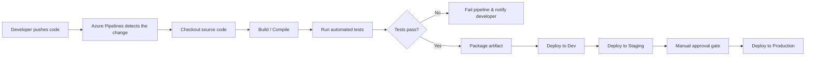

### Why this matters (use cases)

| Without a pipeline | With Azure Pipelines |
|---|---|
| Developer manually builds and zips a file, emails it to ops | Build happens automatically on every commit |
| "It works on my machine" bugs slip through | Tests run in a clean, identical environment every time |
| Deployments happen late at night, manually, with checklists | Deployments are one click, repeatable, and logged |
| No audit trail of what was deployed when | Every deployment is tied to a commit, a build number, and a person who approved it |

### Key terminology you'll see everywhere

| Term | Meaning |
|---|---|
| **Pipeline** | The entire automated process — defined in a YAML file (usually `azure-pipelines.yml`) |
| **Stage** | A major phase of the pipeline (e.g., Build, Test, DeployDev, DeployProd) |
| **Job** | A unit of work within a stage that runs on one agent |
| **Step** | A single action inside a job (run a script, run a task) |
| **Task** | A pre-packaged, reusable step (e.g., `PublishBuildArtifacts@1`, `DotNetCoreCLI@2`) |
| **Agent** | The machine (VM or container) that actually executes your job |
| **Pool** | A group of agents you can run jobs on |
| **Trigger** | The event that starts the pipeline (a push, a PR, a schedule) |
| **Artifact** | A file or set of files produced by one stage and consumed by another |
| **Environment** | A named deployment target (Dev, QA, Prod) with optional approval gates |

---

## 2. Anatomy of a Pipeline — The Building Blocks

Everything in Azure Pipelines nests inside everything else like Russian dolls:

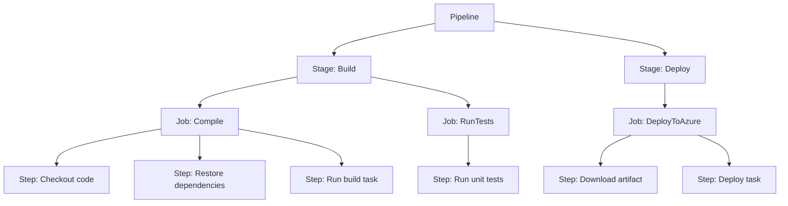

**Important nuance for beginners:** you don't always need stages. A simple pipeline can be just jobs, or even just steps — Azure Pipelines automatically wraps things in an implicit single stage and single job if you don't specify them. As your pipeline grows in complexity, you add stages and jobs deliberately.

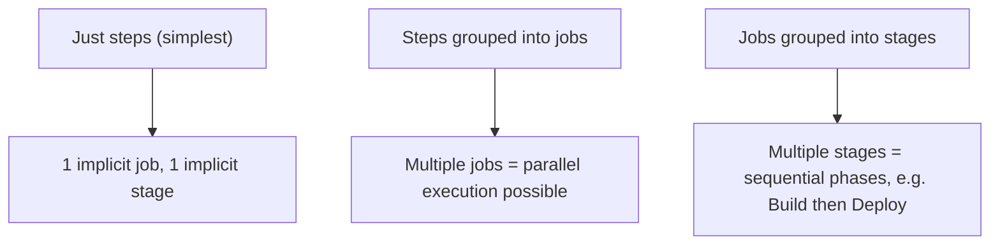

### Why jobs vs steps vs stages matters

- **Steps** run **sequentially**, on the **same agent**, sharing the same filesystem.
- **Jobs** can run **in parallel** (if you have multiple agents), and each job gets its **own fresh agent/workspace** — meaning files don't automatically carry over between jobs (you need artifacts for that).
- **Stages** are for **logical separation and gating** — e.g., you might require manual approval before a stage runs (perfect for "Deploy to Production").

---

## 3. Your First Pipeline (Hands-On)

Let's build the simplest possible pipeline — printing "Hello World" — and grow it.

### Example 1: The absolute minimum

```yaml
# azure-pipelines.yml
steps:
  - script: echo "Hello, Azure Pipelines!"
    displayName: 'Say hello'
```

That's a complete, valid pipeline. Azure Pipelines silently expands this to:

```yaml
trigger:
  - main          # implicit: triggers on commits to main
pool:
  vmImage: 'ubuntu-latest'  # if not specified, a default is chosen
stages:
  - stage: __default
    jobs:
      - job: __default
        steps:
          - script: echo "Hello, Azure Pipelines!"
            displayName: 'Say hello'
```

### Example 2: A real beginner pipeline — building a Node.js app

```yaml
trigger:
  - main

pool:
  vmImage: 'ubuntu-latest'

steps:
  - task: NodeTool@0
    inputs:
      versionSpec: '20.x'
    displayName: 'Install Node.js 20'

  - script: npm install
    displayName: 'Install dependencies'

  - script: npm run build
    displayName: 'Build the application'

  - script: npm test
    displayName: 'Run unit tests'
```

Walk through this line by line:

| Line | What it does |
|---|---|
| `trigger: [main]` | Run this pipeline automatically whenever code is pushed to `main` |
| `pool: vmImage: ubuntu-latest` | Run on a Microsoft-hosted Ubuntu VM |
| `task: NodeTool@0` | A **task** — pre-built logic Microsoft maintains to install Node.js |
| `script: npm install` | A **script step** — runs a raw shell command directly |
| Each step runs in order, top to bottom |

### Example 3: A beginner pipeline — building a .NET app

```yaml
trigger:
  - main

pool:
  vmImage: 'windows-latest'

steps:
  - task: UseDotNet@2
    inputs:
      version: '8.x'
    displayName: 'Install .NET 8 SDK'

  - task: DotNetCoreCLI@2
    inputs:
      command: 'restore'
      projects: '**/*.csproj'
    displayName: 'Restore NuGet packages'

  - task: DotNetCoreCLI@2
    inputs:
      command: 'build'
      projects: '**/*.csproj'
      arguments: '--configuration Release'
    displayName: 'Build solution'

  - task: DotNetCoreCLI@2
    inputs:
      command: 'test'
      projects: '**/*Tests.csproj'
    displayName: 'Run tests'
```

**Mental model tip for novices:** a `task` is just a step someone already wrote and packaged with proper input validation, logging, and cross-platform handling. A `script` is you writing the raw command yourself. When a task exists for what you need, prefer it — it's more robust.

---

## 4. Triggers — What Starts a Pipeline

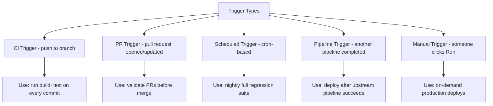

### CI Trigger examples

```yaml
# Trigger only on main branch
trigger:
  - main

# Trigger on multiple branches with path filtering
trigger:
  branches:
    include:
      - main
      - release/*
    exclude:
      - release/old-*
  paths:
    include:
      - src/*
    exclude:
      - docs/*
```

**Use case:** in a monorepo, you don't want a documentation change to trigger a 20-minute build. The `paths` filter solves exactly that.

### PR Trigger example

```yaml
pr:
  branches:
    include:
      - main
  drafts: false   # skip draft PRs
```

**Use case:** require every pull request targeting `main` to pass build+test before it can be merged — this is enforced via branch policies in Azure Repos, which point at this PR-triggered pipeline.

### Scheduled Trigger example

```yaml
schedules:
  - cron: '0 2 * * *'     # every day at 2 AM UTC
    displayName: 'Nightly full regression'
    branches:
      include:
        - main
    always: true   # run even if no code changed
```

### Disabling automatic triggers entirely

```yaml
trigger: none   # only runs when manually started or called by another pipeline
```

**Use case:** a "Deploy to Production" pipeline should usually NOT trigger automatically on every commit — you trigger it manually or chain it from a successful release pipeline.

---

## 5. Agents and Pools

An **agent** is the actual compute that runs your steps. You have two choices:

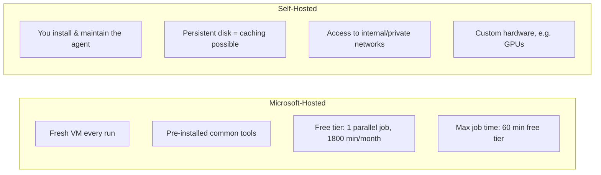

### Example: Microsoft-hosted pool

```yaml
pool:
  vmImage: 'ubuntu-latest'   # or windows-latest, macOS-latest
```

### Example: Self-hosted pool

```yaml
pool:
  name: 'MyCompany-OnPrem-Pool'
  demands:
    - Agent.OS -equals Linux
    - docker
```

### When to choose which

| Scenario | Recommendation |
|---|---|
| Open-source project, simple build | Microsoft-hosted |
| Need access to an internal database/VPN | Self-hosted |
| Build takes >60 minutes regularly | Self-hosted (no time cap) |
| Need a specific old SDK version not on hosted images | Self-hosted, or container job |
| Want zero maintenance overhead | Microsoft-hosted |
| Heavy compliance/data residency requirements | Self-hosted in your own subscription |

### Container jobs (a powerful middle ground)

```yaml
pool:
  vmImage: 'ubuntu-latest'

container: node:20-alpine   # the JOB runs inside this container

steps:
  - script: npm ci
  - script: npm test
```

**Use case:** you need an exact, pinned toolchain version (e.g., `node:20.11.1-bullseye`) for reproducibility — rather than whatever Microsoft happens to have installed on `ubuntu-latest` this month.

---

## 6. Variables, Parameters & Expressions

This is the part beginners find most confusing, so let's build the mental model carefully.

### 6.1 The three "moments" expressions get evaluated

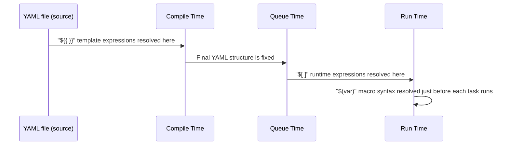

| Syntax | Name | When evaluated | Typical use |
|---|---|---|---|
| `${{ variables.x }}` | **Template expression** | At compile time, before the pipeline even starts running | Looping, conditionally including steps/stages, parameters |
| `$[ variables.x ]` | **Runtime expression** | At the start of a run, before each stage | Conditions on stages/jobs based on earlier results |
| `$(x)` | **Macro syntax** | Just before a task executes, value substituted as plain text | The vast majority of everyday variable usage |

### 6.2 Pipeline variables — basic example

```yaml
variables:
  buildConfiguration: 'Release'
  appName: 'MyWebApp'

steps:
  - script: echo "Building $(appName) in $(buildConfiguration) mode"
  - task: DotNetCoreCLI@2
    inputs:
      command: 'build'
      arguments: '--configuration $(buildConfiguration)'
```

### 6.3 Variables defined as objects (with extra properties)

```yaml
variables:
  - name: buildConfiguration
    value: 'Release'
  - name: isProd
    value: false
```

Use this longer form when you need `readonly: true` or want to source from a **variable group**:

```yaml
variables:
  - group: 'Production-Secrets'   # pulled from a Library variable group
  - name: buildConfiguration
    value: 'Release'
```

**Use case:** store database connection strings, API keys, and environment-specific config centrally in **Library > Variable Groups** in Azure DevOps (optionally linked to Azure Key Vault), instead of hardcoding them in every YAML file. One update in the Library propagates to every pipeline that references the group.

### 6.4 Secret variables

Secrets set in the UI (Pipeline > Edit > Variables, marking "keep this value secret") are **automatically masked** in logs and **not available** via `${{ }}` template expressions — only via `$(x)` macro syntax or environment variables, and only inside the task that explicitly maps them:

```yaml
steps:
  - script: echo "Connecting with key $(mySecretApiKey)"
    env:
      MY_SECRET: $(mySecretApiKey)
```

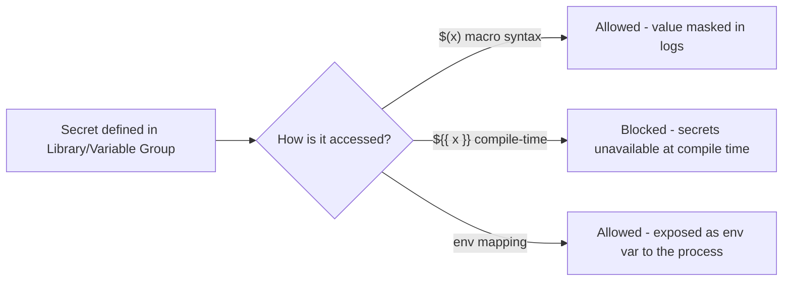

### 6.5 Key Vault integration

```yaml
- task: AzureKeyVault@2
  inputs:
    azureSubscription: 'MyServiceConnection'
    KeyVaultName: 'my-keyvault'
    SecretsFilter: '*'
    RunAsPreJob: true
```

**Use case:** instead of copy-pasting secrets into Azure DevOps Library (another system to keep in sync), pull them live from Key Vault at pipeline run time — single source of truth, easier rotation, better audit trail.

### 6.6 Parameters vs Variables — the distinction that confuses everyone

| | **Parameters** | **Variables** |
|---|---|---|
| When set | At **queue time**, before the run starts | Can change **during** the run |
| Typed? | Yes (string, number, boolean, object, list) | No, always treated as strings |
| Visible in UI as inputs | Yes — shows as a form when manually running | No |
| Used in `${{ }}` only | Yes | Mostly `$()`, sometimes `${{ }}` |
| Best for | Controlling pipeline *shape* (which stages run, which template, how many times to loop) | Holding *values* used during execution |

```yaml
parameters:
  - name: deployToProd
    displayName: 'Deploy to Production?'
    type: boolean
    default: false
  - name: environment
    displayName: 'Target Environment'
    type: string
    default: 'dev'
    values:
      - dev
      - staging
      - prod

trigger: none

stages:
  - stage: Deploy
    jobs:
      - deployment: DeployJob
        environment: ${{ parameters.environment }}
        strategy:
          runOnce:
            deploy:
              steps:
                - script: echo "Deploying to ${{ parameters.environment }}"

  - ${{ if eq(parameters.deployToProd, true) }}:
      - stage: ProdGate
        jobs:
          - job: Notify
            steps:
              - script: echo "Production deployment confirmed"
```

**Mental picture:** parameters are the **knobs and dropdowns someone turns before starting the machine**. Variables are **values flowing through the machine while it's running**.

### 6.7 Conditions

```yaml
steps:
  - script: echo "Only runs on main branch"
    condition: eq(variables['Build.SourceBranch'], 'refs/heads/main')

  - script: echo "Only runs if the previous step succeeded AND it's a PR"
    condition: and(succeeded(), eq(variables['Build.Reason'], 'PullRequest'))

  - script: echo "Runs even if a previous step failed"
    condition: always()

  - script: echo "Only runs if a previous step failed"
    condition: failed()
```

**Use case table:**

| Condition | Real scenario |
|---|---|
| `eq(variables['Build.SourceBranch'], 'refs/heads/main')` | Only publish NuGet package from `main`, not from feature branches |
| `and(succeeded(), eq(variables['Build.Reason'], 'Schedule'))` | Send a Slack message only for nightly scheduled builds, not normal CI |
| `always()` | Always upload test result logs, even if tests failed |
| `failed()` | Send a failure alert email only when something broke |

---

## 7. Multi-Stage Pipelines (Build → Test → Deploy)

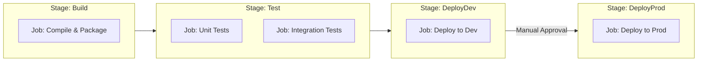

```yaml
trigger:
  - main

stages:
  - stage: Build
    displayName: 'Build the application'
    jobs:
      - job: BuildJob
        pool:
          vmImage: 'ubuntu-latest'
        steps:
          - script: npm install && npm run build
          - publish: $(System.DefaultWorkingDirectory)/dist
            artifact: drop

  - stage: Test
    displayName: 'Run automated tests'
    dependsOn: Build
    jobs:
      - job: UnitTests
        pool:
          vmImage: 'ubuntu-latest'
        steps:
          - script: npm test

  - stage: DeployDev
    displayName: 'Deploy to Dev'
    dependsOn: Test
    condition: succeeded()
    jobs:
      - deployment: DeployDevJob
        environment: 'Development'
        pool:
          vmImage: 'ubuntu-latest'
        strategy:
          runOnce:
            deploy:
              steps:
                - download: current
                  artifact: drop
                - script: echo "Deploying to Dev environment"

  - stage: DeployProd
    displayName: 'Deploy to Production'
    dependsOn: DeployDev
    condition: succeeded()
    jobs:
      - deployment: DeployProdJob
        environment: 'Production'    # this environment has approval checks configured
        pool:
          vmImage: 'ubuntu-latest'
        strategy:
          runOnce:
            deploy:
              steps:
                - download: current
                  artifact: drop
                - script: echo "Deploying to Production"
```

### Key things to notice

1. `dependsOn: Build` makes stages **sequential**. Without it, stages run **in parallel** by default!
2. `deployment` jobs (instead of plain `job`) unlock **deployment strategies** (`runOnce`, `rolling`, `canary`) and integrate with **Environments**.
3. Each stage runs on a **fresh agent** — that's why we `publish` an artifact in Build and `download` it again in Deploy.

### Running jobs in parallel within a stage

```yaml
stages:
  - stage: Test
    jobs:
      - job: UnitTests
        steps:
          - script: npm run test:unit
      - job: LintCheck
        steps:
          - script: npm run lint
      - job: SecurityScan
        steps:
          - script: npm audit
```

These three jobs have no `dependsOn` between them, so (agent capacity permitting) they run **simultaneously**, cutting your pipeline time significantly.

```mermaid
gantt
    title Parallel vs Sequential Jobs
    dateFormat ss
    axisFormat %S s
    section Sequential (no parallelism)
    UnitTests      :a1, 00, 5s
    LintCheck      :a2, after a1, 3s
    SecurityScan   :a3, after a2, 4s
    section Parallel (3 agents)
    UnitTests (p)    :b1, 00, 5s
    LintCheck (p)    :b2, 00, 3s
    SecurityScan (p) :b3, 00, 4s
```

---

## 8. Artifacts

An artifact is how files travel **between stages/jobs**, since each gets a fresh, isolated workspace.

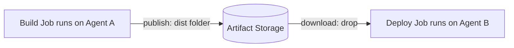

### Publishing

```yaml
- publish: $(System.DefaultWorkingDirectory)/bin/Release
  artifact: WebAppDrop
```

Or the older task syntax (still very common, especially in Classic-converted pipelines):

```yaml
- task: PublishBuildArtifacts@1
  inputs:
    PathtoPublish: '$(Build.ArtifactStagingDirectory)'
    ArtifactName: 'drop'
```

### Downloading

```yaml
- download: current
  artifact: WebAppDrop
```

By default, deployment jobs **auto-download all artifacts** from the current pipeline run — you only need an explicit `download` step if you want to be selective or skip it (`download: none`).

**Use case:** a build produces a compiled `.zip` of your web app once. That exact same `.zip` — never rebuilt — gets deployed to Dev, then Staging, then Production. This guarantees **what you tested is exactly what you shipped** (no "rebuilt slightly differently" surprises).

---

## 9. Environments, Approvals & Deployment Strategies

### 9.1 What an Environment is

An **Environment** (Pipelines > Environments in Azure DevOps) is a named deployment target that gives you:
- A deployment history specific to that target (e.g., "Production")
- **Checks** — gates like manual approval, business hours restriction, required template usage, Azure Monitor health check
- Optional **resources** registered to it (Kubernetes namespace, VMs)

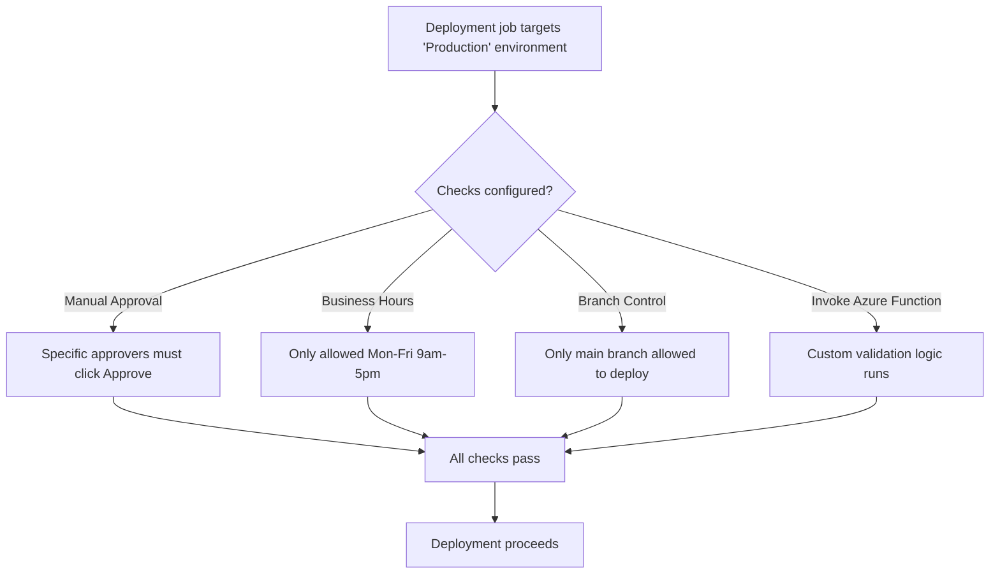

**Real-world use case:** your Production environment requires 2 named approvers AND only allows deploys Monday–Friday 9–5 AND only from the `main` branch. All of this is configured once on the Environment itself — no YAML changes needed, and it can't be bypassed by editing the pipeline file (a huge security win).

### 9.2 Deployment strategies

```yaml
strategy:
  runOnce:
    deploy:
      steps:
        - script: echo "deploy once, simplest strategy"
```

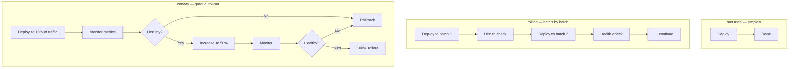

#### Rolling deployment example (VM scale set)

```yaml
strategy:
  rolling:
    maxParallel: 2   # update 2 VMs at a time
    preDeploy:
      steps:
        - script: echo "Pre-deploy validation"
    deploy:
      steps:
        - script: echo "Deploying new version to this batch"
    routeTraffic:
      steps:
        - script: echo "Switching traffic to new version"
    postRouteTraffic:
      steps:
        - script: echo "Smoke test this batch"
    on:
      failure:
        steps:
          - script: echo "Rolling back this batch"
      success:
        steps:
          - script: echo "Batch deployed successfully"
```

#### Canary deployment example (Kubernetes)

```yaml
strategy:
  canary:
    increments: [10, 50, 100]
    preDeploy:
      steps:
        - script: echo "Preparing canary"
    deploy:
      steps:
        - task: KubernetesManifest@1
          inputs:
            action: 'deploy'
            manifests: 'manifests/deployment.yaml'
    postRouteTraffic:
      steps:
        - script: echo "Monitoring canary metrics for 5 minutes"
    on:
      failure:
        steps:
          - script: echo "Canary failed — rolling back"
      success:
        steps:
          - script: echo "Canary succeeded — proceeding to next increment"
```

| Strategy | Best for | Risk profile |
|---|---|---|
| `runOnce` | Simple apps, low-traffic services, internal tools | Higher risk — all-or-nothing |
| `rolling` | VM scale sets, services where you control batch size | Medium — bad batch can be caught before full rollout |
| `canary` | High-traffic production services (e-commerce, APIs) | Lowest — issues caught at 10% blast radius, not 100% |

---

## 10. A Complete Real-World Pipeline

Let's tie everything together: a Node.js API, built once, tested, and deployed through Dev → Staging → Production with an approval gate before Production.

```yaml
trigger:
  branches:
    include: [main]
  paths:
    exclude: [docs/*, '*.md']

variables:
  - group: 'Shared-Config'
  - name: nodeVersion
    value: '20.x'

stages:
  # ---------- BUILD ----------
  - stage: Build
    displayName: 'Build & Unit Test'
    jobs:
      - job: BuildAndTest
        pool:
          vmImage: 'ubuntu-latest'
        steps:
          - task: NodeTool@0
            inputs:
              versionSpec: $(nodeVersion)
          - script: npm ci
            displayName: 'Install dependencies'
          - script: npm run build
            displayName: 'Build'
          - script: npm test -- --ci --reporters=default --reporters=jest-junit
            displayName: 'Run unit tests'
          - task: PublishTestResults@2
            condition: always()
            inputs:
              testResultsFiles: '**/junit.xml'
          - publish: $(System.DefaultWorkingDirectory)/dist
            artifact: api-build

  # ---------- DEV ----------
  - stage: DeployDev
    displayName: 'Deploy to Dev'
    dependsOn: Build
    jobs:
      - deployment: DeployDev
        environment: 'dev'
        pool:
          vmImage: 'ubuntu-latest'
        strategy:
          runOnce:
            deploy:
              steps:
                - script: echo "Deploying build $(Build.BuildId) to Dev"
                - task: AzureWebApp@1
                  inputs:
                    azureSubscription: 'Dev-ServiceConnection'
                    appName: 'myapp-dev'
                    package: '$(Pipeline.Workspace)/api-build'

  # ---------- STAGING ----------
  - stage: DeployStaging
    displayName: 'Deploy to Staging'
    dependsOn: DeployDev
    jobs:
      - deployment: DeployStaging
        environment: 'staging'
        pool:
          vmImage: 'ubuntu-latest'
        strategy:
          runOnce:
            deploy:
              steps:
                - task: AzureWebApp@1
                  inputs:
                    azureSubscription: 'Staging-ServiceConnection'
                    appName: 'myapp-staging'
                    package: '$(Pipeline.Workspace)/api-build'

  # ---------- PRODUCTION (gated by Environment approval) ----------
  - stage: DeployProd
    displayName: 'Deploy to Production'
    dependsOn: DeployStaging
    jobs:
      - deployment: DeployProd
        environment: 'production'   # approval check lives on this Environment in the UI
        pool:
          vmImage: 'ubuntu-latest'
        strategy:
          canary:
            increments: [25, 100]
            deploy:
              steps:
                - task: AzureWebApp@1
                  inputs:
                    azureSubscription: 'Prod-ServiceConnection'
                    appName: 'myapp-prod'
                    package: '$(Pipeline.Workspace)/api-build'
```

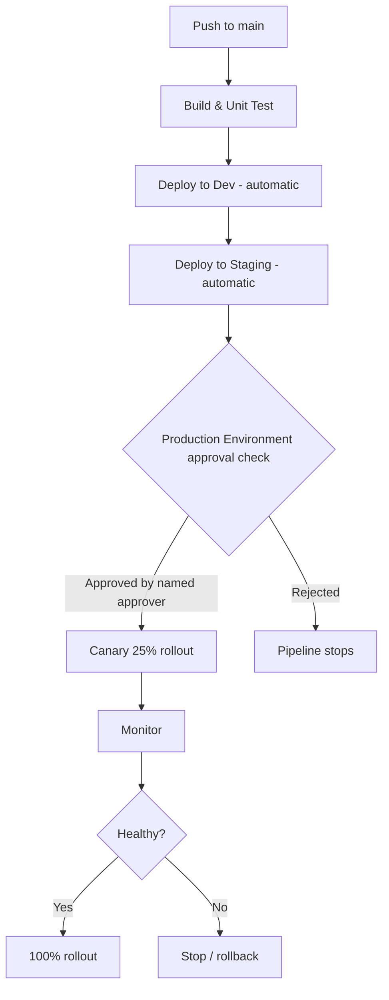

---

## 11. Templates — The Reusability Engine

### 11.1 The problem templates solve

Imagine you have 15 microservices, each with nearly identical pipelines — same build steps, same security scan, same deployment pattern, only the app name and port differ. Without templates, a bug fix to your build process means editing 15 files. **Templates let you write the logic once and reuse it everywhere**, like a function in programming.

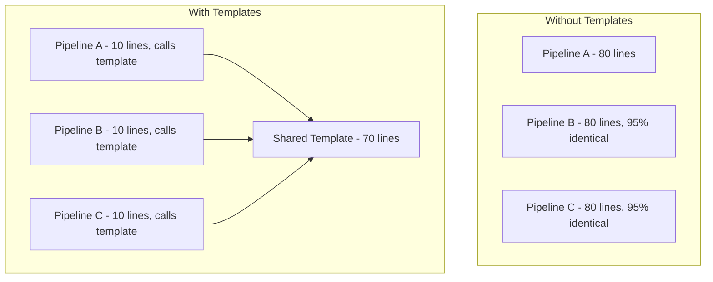

### 11.2 The four types of templates

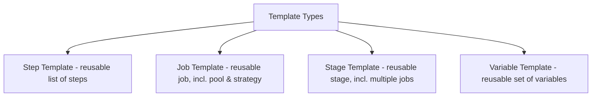

#### a) Step template

`templates/build-steps.yml`:
```yaml
parameters:
  - name: nodeVersion
    type: string
    default: '20.x'

steps:
  - task: NodeTool@0
    inputs:
      versionSpec: ${{ parameters.nodeVersion }}
  - script: npm ci
    displayName: 'Install dependencies'
  - script: npm run build
    displayName: 'Build'
```

Calling it:
```yaml
steps:
  - template: templates/build-steps.yml
    parameters:
      nodeVersion: '18.x'
```

#### b) Job template

`templates/build-job.yml`:
```yaml
parameters:
  - name: vmImage
    type: string
    default: 'ubuntu-latest'

jobs:
  - job: Build
    pool:
      vmImage: ${{ parameters.vmImage }}
    steps:
      - script: npm ci
      - script: npm run build
```

Calling it:
```yaml
jobs:
  - template: templates/build-job.yml
    parameters:
      vmImage: 'windows-latest'
```

#### c) Stage template

`templates/deploy-stage.yml`:
```yaml
parameters:
  - name: environmentName
    type: string
  - name: serviceConnection
    type: string
  - name: appName
    type: string

stages:
  - stage: Deploy_${{ parameters.environmentName }}
    jobs:
      - deployment: Deploy
        environment: ${{ parameters.environmentName }}
        strategy:
          runOnce:
            deploy:
              steps:
                - task: AzureWebApp@1
                  inputs:
                    azureSubscription: ${{ parameters.serviceConnection }}
                    appName: ${{ parameters.appName }}
                    package: '$(Pipeline.Workspace)/drop'
```

Calling it three times for three environments (look how powerful this is):
```yaml
stages:
  - template: templates/deploy-stage.yml
    parameters:
      environmentName: 'dev'
      serviceConnection: 'Dev-SC'
      appName: 'myapp-dev'

  - template: templates/deploy-stage.yml
    parameters:
      environmentName: 'staging'
      serviceConnection: 'Staging-SC'
      appName: 'myapp-staging'

  - template: templates/deploy-stage.yml
    parameters:
      environmentName: 'prod'
      serviceConnection: 'Prod-SC'
      appName: 'myapp-prod'
```

#### d) Variable template

`templates/common-variables.yml`:
```yaml
variables:
  - name: buildConfiguration
    value: 'Release'
  - name: dotnetVersion
    value: '8.x'
```

Calling it:
```yaml
variables:
  - template: templates/common-variables.yml
```

### 11.3 Looping inside templates (`each`)

```yaml
parameters:
  - name: environments
    type: object
    default:
      - name: dev
        approvalRequired: false
      - name: prod
        approvalRequired: true

stages:
  - ${{ each env in parameters.environments }}:
      - stage: Deploy_${{ env.name }}
        jobs:
          - deployment: Deploy
            environment: ${{ env.name }}
            strategy:
              runOnce:
                deploy:
                  steps:
                    - script: echo "Deploying to ${{ env.name }}"
```

**Use case:** one template definition generates an entire set of stages — add a new environment to the `parameters` list and a whole new stage appears, with zero copy-paste.

### 11.4 `extends` templates — enforcing governance

This is the **most powerful and least understood** template type. Instead of a pipeline *calling* a template, the pipeline's entire content is *handed to* a template, which controls the final shape — enforcing security scanning, required stages, or banned patterns organization-wide.

`templates/secure-pipeline.yml`:
```yaml
parameters:
  - name: stages
    type: stageList
    default: []

stages:
  - stage: SecurityScan
    jobs:
      - job: Scan
        steps:
          - script: echo "Running mandatory security scan"
          - task: CredScan@3

  - ${{ parameters.stages }}    # the caller's own stages get inserted here
```

Caller pipeline — note `extends` instead of normal stages:
```yaml
extends:
  template: templates/secure-pipeline.yml
  parameters:
    stages:
      - stage: Build
        jobs:
          - job: Build
            steps:
              - script: npm run build
```

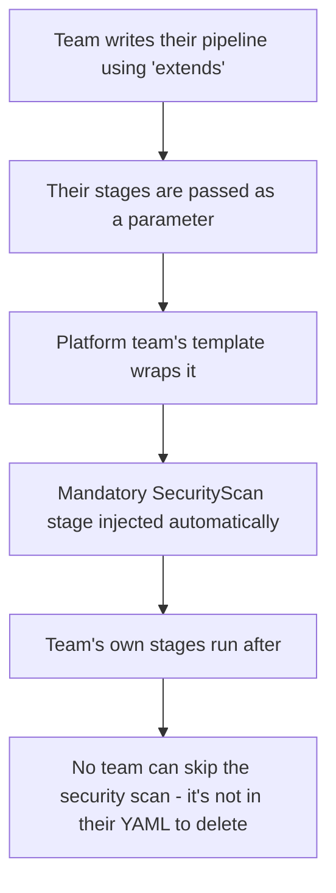

**Use case:** a platform/DevOps team mandates that *every* pipeline in the company runs a CredScan and a license-compliance check, regardless of what individual teams write. Teams literally cannot remove this step because it isn't in their file — it lives in the central template, and pipelines can even be **restricted via branch policy to only allow `extends` of approved templates**.

---

## 12. How to Read and Understand Someone Else's Template

When you inherit a large, unfamiliar template (very common in real jobs), follow this systematic process:

```mermaid
flowchart TD
    A[Step 1: Find the parameters block at the top] --> B[Step 2: Note each param's type & default]
    B --> C[Step 3: Find where each parameter is USED in the body]
    C --> D[Step 4: Identify syntax - is it template '${{ }}' or runtime '$[ ]' or macro '$()'?]
    D --> E[Step 5: Trace conditionals - 'if', 'each' blocks]
    E --> F[Step 6: Check for nested template calls]
    F --> G[Step 7: Mentally 'compile' it - substitute real values you'd pass in]
    G --> H[You now understand the template]
```

### Worked example: dissecting an unfamiliar template

Suppose you're handed this template and asked to use it:

```yaml
# templates/ci-template.yml
parameters:
  - name: services
    type: object
    default: []
  - name: runIntegrationTests
    type: boolean
    default: false
  - name: dockerRegistry
    type: string

jobs:
  - ${{ each svc in parameters.services }}:
      - job: Build_${{ svc.name }}
        pool:
          vmImage: 'ubuntu-latest'
        steps:
          - script: docker build -t ${{ parameters.dockerRegistry }}/${{ svc.name }}:$(Build.BuildId) ${{ svc.path }}
            displayName: 'Build ${{ svc.name }}'
          - ${{ if eq(parameters.runIntegrationTests, true) }}:
              - script: ./run-integration-tests.sh ${{ svc.name }}
                displayName: 'Integration tests for ${{ svc.name }}'
          - script: docker push ${{ parameters.dockerRegistry }}/${{ svc.name }}:$(Build.BuildId)
            displayName: 'Push ${{ svc.name }}'
```

**Reading it step by step:**

1. **Parameters**: `services` (a list of objects, each presumably with `name` and `path`), `runIntegrationTests` (boolean, defaults off), `dockerRegistry` (required string, no default — caller MUST supply it).
2. **`each svc in parameters.services`**: this entire job block repeats once *per service* in the list you pass in. If you pass 4 services, you get 4 jobs.
3. **`${{ svc.name }}` / `${{ svc.path }}`**: these read fields off each object in your list — so your caller must pass objects shaped like `{name: ..., path: ...}`.
4. **`if eq(parameters.runIntegrationTests, true)`**: the integration test step only appears in the compiled YAML if you pass `true` — it's not just skipped, it's literally not generated.
5. **`$(Build.BuildId)`**: this is **runtime/macro** syntax (single `$()`), not a template parameter — it's a built-in pipeline variable resolved when the job actually runs.

**Now you can confidently call it:**

```yaml
extends:
  template: templates/ci-template.yml
  parameters:
    dockerRegistry: 'myacr.azurecr.io'
    runIntegrationTests: true
    services:
      - name: auth-service
        path: ./services/auth
      - name: payments-service
        path: ./services/payments
```

### Quick reference: spotting syntax at a glance

| You see | It means |
|---|---|
| `${{ parameters.x }}` | A parameter, resolved at compile time — value MUST be known before the run starts |
| `${{ variables.x }}` | A variable read at compile time (rare, only works for variables already known then) |
| `${{ if ... }}` / `${{ each ... }}` | Compile-time logic — literally changes what YAML gets generated |
| `$[ variables.x ]` | Runtime expression — used almost exclusively in `condition:` blocks |
| `$(x)` | Macro — resolved right before a task runs; this is what you use 95% of the time for normal variables |
| `parameters: type: stageList / jobList / step` | This template expects to receive a chunk of *pipeline structure*, not a simple value — a strong signal it's an `extends` or wrapper template |

---

## 13. When and How to Create Your Own Templates

### 13.1 Signals you need a template

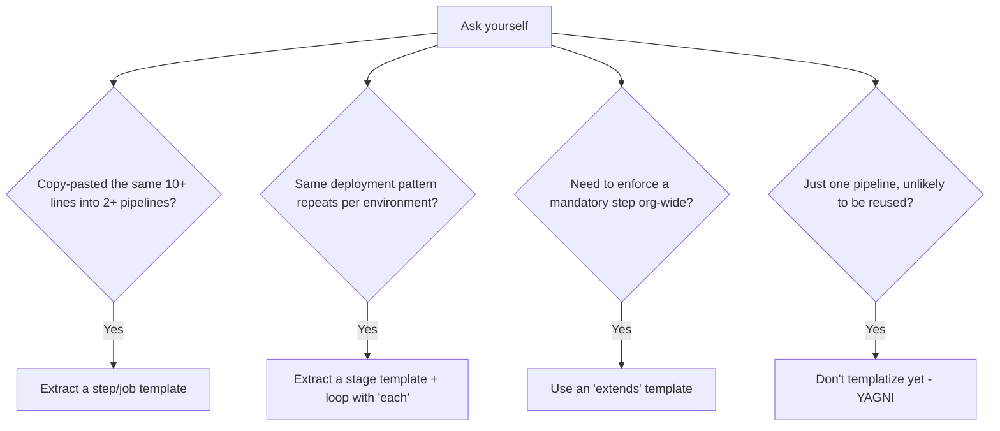

A good rule of thumb borrowed from software engineering: **"rule of three"** — the first time you write something, just write it. The second time, copy it but make a mental note. The **third time** you'd be duplicating the same logic, extract it into a template.

### 13.2 Designing a good template "API"

Treat your `parameters` block like a function signature — this is the API contract other teams will use.

**Bad** (too rigid, leaks implementation detail):
```yaml
parameters:
  - name: webAppName1
  - name: webAppName2
  - name: webAppName3
```

**Good** (flexible, scales to any number of items):
```yaml
parameters:
  - name: webApps
    type: object
    default: []
```

**Best practices for template parameters:**

| Practice | Why |
|---|---|
| Give every parameter a sensible `default` where possible | Lowers the barrier for callers — they only override what they need |
| Use `type` strictly (`boolean`, `number`, `object`, specific `values: []`) | Catches mistakes at compile time instead of confusing runtime failures |
| Name parameters from the **caller's** perspective, not the implementer's | `environmentName` not `envVarStageSuffix123` |
| Document with comments above the parameter | The next person reading it won't have to reverse-engineer intent |
| Keep one template focused on one responsibility | A "build" template shouldn't also handle deployment — compose multiple templates instead |

### 13.3 Where to put templates — repo structure

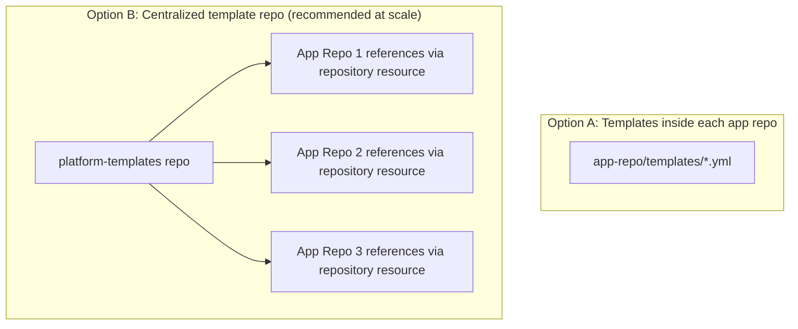

Referencing templates from another repository:

```yaml
resources:
  repositories:
    - repository: templates
      type: git
      name: MyProject/platform-templates
      ref: refs/tags/v1.2.0   # pin to a specific version!

extends:
  template: pipelines/secure-pipeline.yml@templates
  parameters:
    stages:
      - stage: Build
        jobs:
          - job: Build
            steps:
              - script: npm run build
```

**Critical best practice — version pinning.** Always reference templates by a **tag** or specific **commit**, not a moving branch like `main`. Otherwise, someone updating the central template repo can silently break every consuming pipeline in the company simultaneously — a classic, very real production incident pattern.

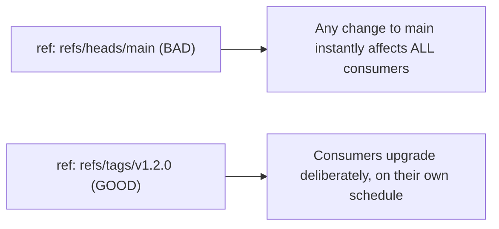

### 13.4 Step-by-step: extracting your first template

1. Identify the duplicated block across pipelines.
2. Create a new file: `templates/<purpose>.yml`.
3. Move the duplicated YAML into it.
4. Replace anything that varies between callers with a `${{ parameters.x }}`.
5. Add a `parameters:` block at the top with types and sensible defaults.
6. Replace the original block in each pipeline with a `- template: templates/<purpose>.yml` call, passing parameters.
7. Test each caller pipeline still produces identical behavior.
8. Commit, tag if it's a shared repo, document the parameters in a README.

---

## 14. Senior-Level Pipeline Architecture & Best Practices

A senior engineer doesn't just make pipelines *work* — they make them **safe, fast, observable, and hard to misuse**. Here's how that thinking plays out.

### 14.1 Security — least privilege everywhere

```mermaid
flowchart TD
    A[Security Principles] --> B[Service connections scoped per-environment, not one god-connection]
    A --> C[Use OIDC / Workload Identity Federation instead of long-lived secrets]
    A --> D[Approval checks on Production environment, enforced outside YAML]
    A --> E[Branch policies restrict who can edit pipeline YAML]
    A --> F[Secrets only via Key Vault / variable groups, never hardcoded]
    A --> G['extends' templates enforce mandatory scans org-wide]
```

**Example: separate service connections per environment**, each scoped to only that environment's Azure subscription/resource group — a compromised Dev pipeline can never touch Production resources because the credentials simply don't have access.

```yaml
# Dev stage uses Dev-only credentials
- task: AzureWebApp@1
  inputs:
    azureSubscription: 'Dev-ServiceConnection'   # scoped to dev-rg only

# Prod stage uses entirely separate, tightly scoped credentials
- task: AzureWebApp@1
  inputs:
    azureSubscription: 'Prod-ServiceConnection'  # scoped to prod-rg only, requires approval to even create
```

### 14.2 Repo structure for pipeline-as-code at scale

```
platform-templates/               (central, versioned, tagged)
├── pipelines/
│   ├── secure-pipeline.yml       (extends template, mandatory)
├── stages/
│   ├── deploy-stage.yml
├── jobs/
│   ├── build-job.yml
├── steps/
│   ├── security-scan-steps.yml
│   ├── notify-steps.yml
└── README.md                     (documents every template's parameters)

my-app-repo/
├── src/
├── azure-pipelines.yml           (short — just calls extends template)
```

### 14.3 Monorepo strategy with path filters and matrix builds

```yaml
trigger:
  branches:
    include: [main]
  paths:
    include:
      - services/*

parameters:
  - name: services
    type: object
    default:
      - { name: auth, path: services/auth }
      - { name: billing, path: services/billing }
      - { name: notifications, path: services/notifications }

stages:
  - stage: Build
    jobs:
      - ${{ each svc in parameters.services }}:
          - job: Build_${{ svc.name }}
            steps:
              - script: |
                  CHANGED=$(git diff --name-only HEAD~1 HEAD | grep "^${{ svc.path }}" || true)
                  if [ -z "$CHANGED" ]; then
                    echo "##vso[task.complete result=Skipped;]No changes in ${{ svc.name }}"
                  fi
                displayName: 'Skip if unchanged'
              - script: cd ${{ svc.path }} && npm ci && npm run build
                displayName: 'Build ${{ svc.name }}'
```

**Use case:** a monorepo with 10 microservices — a commit touching only `services/billing` should not rebuild and redeploy the other 9 services. This pattern (path-filter + per-service change detection) is the backbone of efficient monorepo CI.

### 14.4 Caching for speed

```yaml
- task: Cache@2
  inputs:
    key: 'npm | "$(Agent.OS)" | package-lock.json'
    restoreKeys: |
      npm | "$(Agent.OS)"
    path: $(npm_config_cache)
  displayName: 'Cache npm packages'
```

**Use case:** without caching, every run re-downloads every dependency from scratch (slow, and adds external network dependency/flakiness). With caching keyed on the lockfile hash, unchanged dependency trees restore from cache in seconds.

### 14.5 Observability — make failures self-explanatory

```yaml
- script: npm test
  displayName: 'Run tests'
  continueOnError: false

- task: PublishTestResults@2
  condition: always()        # publish results even if tests failed
  inputs:
    testResultsFormat: 'JUnit'
    testResultsFiles: '**/junit.xml'

- task: PublishCodeCoverageResults@2
  condition: always()
  inputs:
    summaryFileLocation: '**/coverage.xml'

- script: |
    echo "##vso[task.logissue type=warning]Build exceeded normal duration"
  condition: gt(variables['Agent.JobStatus'], 1800)
```

### 14.6 Designing for failure — rollback patterns

```yaml
strategy:
  runOnce:
    deploy:
      steps:
        - script: ./deploy.sh
    on:
      failure:
        steps:
          - script: ./rollback.sh
            displayName: 'Automatic rollback on failure'
      success:
        steps:
          - script: ./notify-success.sh
```

### 14.7 Senior checklist before merging a new pipeline

| ✅ | Check |
|---|---|
| ☐ | Secrets come from Key Vault/variable groups, never hardcoded |
| ☐ | Production requires manual approval via Environment checks |
| ☐ | Service connections are scoped per environment |
| ☐ | Templates are version-pinned (`ref: refs/tags/...`), not pinned to `main` |
| ☐ | Test results and coverage are published even on failure (`condition: always()`) |
| ☐ | Build artifact is built once and promoted through environments, not rebuilt per stage |
| ☐ | Pipeline file is short and readable — heavy logic lives in well-named templates |
| ☐ | Path filters prevent unrelated changes from triggering unnecessary runs |
| ☐ | A rollback or failure-handling path exists for production deploys |
| ☐ | Branch policies prevent unreviewed changes to the pipeline YAML itself |

---

## 15. Troubleshooting Azure Pipelines

```mermaid
flowchart TD
    A[Pipeline failed] --> B{Where did it fail?}
    B -->|YAML won't even parse| C[Syntax/schema error - check indentation, first-key rule]
    B -->|Fails before any step runs| D[Trigger / pool / permission issue]
    B -->|Fails during a specific step| E[Read that step's raw log carefully]
    B -->|Fails only on hosted agent, not local| F[Environment difference - missing tool/version]
    B -->|Fails intermittently| G[Flaky test, network, or race condition]
    B -->|Template not resolving as expected| H[Check parameter types & compile-time vs runtime syntax]
```

### 15.1 Common errors and how to fix them

| Error / Symptom | Likely Cause | Fix |
|---|---|---|
| `A template expression is not allowed in this context` | Used `${{ }}` where a `$(x)` was expected, or vice versa | Check if the value needs to exist at compile time (template) or run time (macro) |
| `Unexpected value 'xyz'` near a job/stage | YAML indentation off, or stage/job/task isn't the first key in its mapping | Azure Pipelines requires `stage`, `job`, `task`, or a task shortcut as the FIRST key in that mapping |
| Pipeline doesn't trigger at all | `trigger` missing, `trigger: none` set, or path filters exclude the changed files | Check the trigger block and confirm which files actually changed |
| `##[error]No hosted parallelism has been purchased or granted` | Free tier parallelism not yet granted to a new org/project | Request free tier grant via Microsoft form, or buy a parallel job, or use self-hosted agents |
| Secret shows as `***` unexpectedly breaking a script | Secret masking — this is by design | Don't try to `echo` secrets directly; pass via `env:` mapping instead |
| Variable is empty/unset inside a template | Tried to access a runtime variable using `${{ }}` (compile-time) | Variables set during the run aren't known at compile time — use `$()` or `$[ ]` instead |
| Artifact not found in Deploy stage | Forgot to `publish` it in Build, or wrong artifact name | Confirm `publish`/`PublishBuildArtifacts` ran and names match exactly |
| Deployment "stuck" / never starts | Waiting on an Environment approval check | Check Pipelines > Environments > the specific environment for pending approvals |
| Works locally, fails on Microsoft-hosted agent | Different OS/tool version than your machine | Pin exact versions with tasks like `UseDotNet@2`/`NodeTool@0`, or use a container job |
| `each` loop in template produces nothing | Passed an empty list, or wrong parameter name/type mismatch | Double check the actual value passed matches the parameter's declared `type` |

### 15.2 Debugging techniques

**1. Turn on system diagnostics** — re-queue the run with this variable set:
```yaml
variables:
  system.debug: true
```
This dramatically increases log verbosity, showing exactly which expressions resolved to which values.

**2. Print variables to confirm what the pipeline actually sees:**
```yaml
- script: |
    echo "Branch: $(Build.SourceBranch)"
    echo "Reason: $(Build.Reason)"
    echo "Build ID: $(Build.BuildId)"
  displayName: 'Debug: print key variables'
```

**3. Dump ALL available variables (great for discovering exact names):**
```yaml
- script: env | sort
  displayName: 'Debug: dump environment variables'
```

**4. Use logging commands to mark issues explicitly:**
```yaml
- script: echo "##vso[task.logissue type=warning]This is a warning"
- script: echo "##vso[task.logissue type=error]This is an error"
- script: echo "##vso[task.complete result=SucceededWithIssues;]Done with caveats"
```

**5. Validate YAML before pushing**, using the "Preview" button in the pipeline editor — it shows the exact compiled YAML (post template-expansion) without actually running it. This is the single best tool for understanding what a complex template-based pipeline will actually do.

### 15.3 Diagnosing flaky pipelines

```mermaid
flowchart TD
    A[Intermittent failure] --> B{Same step every time?}
    B -->|Yes| C[Likely a real bug or race condition in that step]
    B -->|No, random steps| D{Same agent pool?}
    D -->|Microsoft-hosted| E[Possible transient network/agent issue - add retry]
    D -->|Self-hosted| F[Check agent health, disk space, concurrent job conflicts]
    A --> G{Timing-dependent test?}
    G -->|Yes| H[Add explicit waits/retries instead of relying on timing]
```

**Retry pattern for flaky external calls:**
```yaml
- task: PowerShell@2
  inputs:
    targetType: 'inline'
    script: |
      $maxRetries = 3
      for ($i=1; $i -le $maxRetries; $i++) {
        try {
          # your flaky command here
          npm publish
          break
        } catch {
          Write-Host "Attempt $i failed, retrying..."
          Start-Sleep -Seconds 10
          if ($i -eq $maxRetries) { throw }
        }
      }
```

Or, simpler, many tasks natively support `retryCountOnTaskFailure`:
```yaml
- task: AzureWebApp@1
  retryCountOnTaskFailure: 3
  inputs:
    azureSubscription: 'Prod-ServiceConnection'
    appName: 'myapp-prod'
```

---

## 16. Cheat Sheet & Glossary

```mermaid
mindmap
  root((Azure Pipelines))
    Triggers
      CI trigger
      PR trigger
      Scheduled
      Pipeline-to-pipeline
    Structure
      Stages
      Jobs
      Steps
      Tasks
    Reusability
      Step templates
      Job templates
      Stage templates
      Variable templates
      extends templates
    Data Flow
      Variables
      Parameters
      Artifacts
      Variable groups / Key Vault
    Deployment
      Environments
      Approvals/Checks
      runOnce / rolling / canary
    Governance
      Service connections
      Branch policies
      Template version pinning
```

| Symbol | Meaning |
|---|---|
| `$(x)` | Macro syntax — runtime value substitution |
| `$[ x ]` | Runtime expression — used in `condition:` |
| `${{ x }}` | Template/compile-time expression |
| `@N` (e.g. `DotNetCoreCLI@2`) | Task version number |
| `dependsOn` | Controls stage/job ordering |
| `condition` | Controls whether a step/job/stage runs |
| `strategy` | Deployment rollout pattern |
| `environment` | Named deploy target with approval checks |

### Recommended learning path from here

1. Build the simple Node/.NET pipeline from Section 3 in a real sandbox project.
2. Add a second stage and practice `dependsOn` and artifacts.
3. Create an `Environment` and add a manual approval check — watch a pipeline actually pause and wait for you.
4. Extract your first template once you've duplicated something twice.
5. Set up a central `platform-templates` repo and try an `extends` template — this is the single biggest unlock for senior-level pipeline design.
6. Intentionally break a pipeline (bad indentation, wrong parameter type) and practice using `system.debug: true` and the YAML "Preview" feature to diagnose it.