# 🚀 The Complete DevOps Engineering Guide — Comprehensive Learning Hub

> **Difficulty:** Intermediate  
> **Estimated Reading Time:** 45–60 minutes  
> **Last Updated:** 2026-08-14  
> **Version:** 1.0

---

## 📚 Table of Contents

1. [Introduction / Overview](#1-introduction--overview)
2. [Prerequisites](#2-prerequisites)
3. [Learning Objectives](#3-learning-objectives)
4. [The DevOps Learning Roadmap](#4-the-devops-learning-roadmap)
5. [Linux Administration](#5-linux-administration)
6. [Version Control with Git](#6-version-control-with-git)
7. [Containerization with Docker](#7-containerization-with-docker)
8. [Orchestration with Kubernetes](#8-orchestration-with-kubernetes)
9. [Infrastructure as Code with Terraform](#9-infrastructure-as-code-with-terraform)
10. [Configuration Management with Ansible](#10-configuration-management-with-ansible)
11. [CI/CD with Jenkins](#11-cicd-with-jenkins)
12. [Cloud Computing with AWS](#12-cloud-computing-with-aws)
13. [Databases for DevOps](#13-databases-for-devops)
14. [Observability & Monitoring](#14-observability--monitoring)
15. [Interview Preparation Hub](#15-interview-preparation-hub)
16. [Troubleshooting Guides](#16-troubleshooting-guides)
17. [DevOps Best Practices](#17-devops-best-practices)
18. [Common Anti-Patterns](#18-common-anti-patterns)
19. [Performance Considerations](#19-performance-considerations)
20. [Security Considerations](#20-security-considerations)
21. [Testing Strategies](#21-testing-strategies)
22. [Practice Exercises with Solutions](#22-practice-exercises-with-solutions)
23. [Question Bank (50+ Questions)](#23-question-bank-50-questions)
24. [Test Your Understanding](#24-test-your-understanding)
25. [Common Interview Questions](#25-common-interview-questions)
26. [Self-Assessment Checklist](#26-self-assessment-checklist)
27. [Summary & Key Takeaways](#27-summary--key-takeaways)
28. [Further Reading & Resources](#28-further-reading--resources)

---

## 1. Introduction / Overview

The DevOps ecosystem is constantly evolving. Every year, new tools, best practices, cloud services, and automation techniques emerge, making it difficult to know what to learn next. This guide serves as a **centralized, comprehensive DevOps Knowledge Hub** — a master index and learning companion covering **200+ practical guides** across Linux, Docker, Kubernetes, Terraform, Ansible, Jenkins, Git, AWS, and Databases.

### Who Is This Guide For?

| Role | What You'll Gain |
|------|-----------------|
| 👨‍🎓 **DevOps Beginner** | A structured learning path with clear progression |
| 👨‍💻 **Linux System Administrator** | Modern DevOps tools and automated workflows |
| ☁️ **Cloud Engineer** | Infrastructure-as-Code and cloud-native patterns |
| ⚙️ **DevOps Engineer** | Production-grade reference and troubleshooting playbooks |
| 🚀 **Platform Engineer** | Kubernetes, GitOps, and platform architecture insights |
| 🏢 **Interview Candidate** | 500+ curated interview questions and preparation strategies |

> 💡 **Pro Tip:** This guide is not just an index — it's a roadmap. Each section explains the **what**, the **why**, and the **how** of a core DevOps domain, enriched with real-world examples, Mermaid diagrams, exercises, and interview prep.

### The DevOps Landscape in 2026

```mermaid
mindmap
  root((DevOps Ecosystem 2026))
    Linux Foundation
      Administration
      Bash Scripting
      Networking
      Storage & LVM
      Security & PAM
    Containers
      Docker
      Podman
      Container Security
      Image Optimization
    Orchestration
      Kubernetes
      K3s
      Minikube
      Service Mesh
    Infrastructure as Code
      Terraform
      Ansible
      CloudFormation
      GitOps
    CI/CD
      Jenkins
      GitHub Actions
      GitLab CI
      Argo CD
    Cloud Platforms
      AWS
      GCP
      Azure
      Multi-Cloud
    Databases
      MySQL
      MongoDB
      Redis
      TimescaleDB
      Cassandra
    Observability
      Prometheus
      Grafana
      Loki
      ELK Stack
    AI & MLOps
      MLflow
      LLM Integration
      MLOps Pipelines
````

### Why This Hub Exists

The challenges of modern infrastructure engineering:

- __Tool sprawl__ — Hundreds of tools, each with a steep learning curve
- __Rapid change__ — Knowledge becomes outdated within 18 months
- __Production complexity__ — What works in a lab often fails in production
- __Interview pressure__ — Hiring managers form opinions within 5–15 minutes

This guide addresses all of these by organizing knowledge into __12 core disciplines__ with a structured learning sequence.

---

## 2. Prerequisites

Before diving into the DevOps depth path, ensure you have:

### Fundamental Knowledge

- ✅ __Basic computer science concepts__ — processes, memory, filesystems, networking
- ✅ __Comfort with at least one text editor__ (Vim, VS Code, Nano)
- ✅ __Basic terminal navigation__ — `cd`, `ls`, `mkdir`, `cp`, `mv`, `rm`
- ✅ __Basic understanding of binary/octal notation__ (for Linux permissions)

### Recommended Tools to Install

| Tool              | Purpose              | Install Command                                      |
|-------------------|----------------------|------------------------------------------------------|
| **WSL / Linux VM**| Linux environment    | `wsl --install` (Windows)                            |
| **Docker Desktop**| Container runtime    | Download from docker.com                             |
| **Git**           | Version control      | `sudo apt install git` / `choco install git`         |
| **kubectl**       | Kubernetes CLI       | `choco install kubernetes-cli` / `brew install kubectl` |
| **Terraform**     | IaC tool             | Download from terraform.io                           |
| **AWS CLI**       | AWS management       | `pip install awscli`                                 |
| **VS Code**       | Code editor          | Download from code.visualstudio.com                  |


> ⚠️ __Note:__ If you're on Windows, WSL2 is strongly recommended for most of these exercises. Many tools assume a Unix-like environment.

---

## 3. Learning Objectives

By the end of this comprehensive guide, you will be able to:

1. __Administer Linux systems__ — user management, permissions, networking, storage, and troubleshooting
2. __Version control with Git__ — branching strategies, remotes, rebase vs merge, and teamwork
3. __Containerize applications__ — Dockerfiles, volumes, networks, and multi-stage builds
4. __Orchestrate workloads__ — Kubernetes Deployments, Services, Ingress, RBAC, and Volumes
5. __Automate infrastructure__ — Terraform for provisioning, Ansible for configuration
6. __Build CI/CD pipelines__ — Jenkins, GitHub Actions, and production deployment patterns
7. __Deploy to the cloud__ — AWS core services, VPC design, Auto Scaling, and IAM
8. __Manage databases in production__ — MySQL, MongoDB, Redis, replication, and backups
9. __Monitor and troubleshoot__ — Prometheus, Grafana, and systematic debugging
10. __Ace DevOps interviews__ — 500+ curated questions and preparation strategies

---

## 4. The DevOps Learning Roadmap

The sequence below is carefully designed so each skill builds on the previous one.

```mermaid
flowchart TD
    A[🐧 Linux Administration] --> B[🌐 Git & Version Control]
    B --> C[🐳 Docker & Containers]
    C --> D[☸️ Kubernetes]
    D --> E[🌍 Terraform & IaC]
    E --> F[🤖 Ansible & Automation]
    F --> G[🔧 Jenkins & CI/CD]
    G --> H[☁️ AWS & Cloud]
    H --> I[🗄️ Databases]
    I --> J[📊 Monitoring & Observability]
    J --> K[🚀 Production Projects]
    K --> L[🔍 Troubleshooting]
    L --> M[🏢 Interview Preparation]
```

### Why This Order?

| Step                     | Why It Comes Here                                                                 |
|--------------------------|-----------------------------------------------------------------------------------|
| **Linux first**          | Everything runs on Linux. A weak foundation breaks everything above.              |
| **Git second**           | Version control is needed for every tool that follows (Terraform, Ansible, CI/CD).|
| **Docker before Kubernetes** | K8s orchestrates containers — you must understand the unit first.             |
| **Terraform before Ansible** | Provision infrastructure first, then configure it.                            |
| **AWS after automation** | Cloud becomes manageable once automation is second nature.                        |
| **Databases later**      | DBs are production systems requiring the full stack of skills above.              |


> 💡 __Pro Tip:__ Don't skip ahead. Each pillar reinforces the ones before it. A common interview failure mode is "knowing Kubernetes but not Linux networking."

---

## 5. Linux Administration

### 5.1 The Foundation

Linux is the backbone of modern infrastructure. Every cloud instance, container, and Kubernetes node runs a Linux kernel. Before touching Kubernetes or cloud technology, every engineer should have a __strong Linux foundation__.

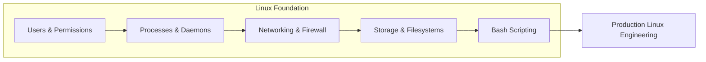

### 5.2 Core Domains & Key Skills

#### 🔐 Users, Permissions & Security

| Concept                  | Why It Matters                          | Key Commands                       |
|--------------------------|------------------------------------------|------------------------------------|
| **File permissions**     | Security enforcement at file level       | `chmod 755`, `chown`, `umask`      |
| **User administration**  | Least-privilege access                   | `useradd`, `usermod`, `passwd`     |
| **PAM (Pluggable Auth Modules)** | How login authentication works   | `/etc/pam.d/`                      |
| **SSH key authentication** | Passwordless, secure access            | `ssh-keygen`, `ssh-copy-id`        |
| **Sudoers**              | Privilege escalation control             | `visudo`                           |

__Example — Setting secure file permissions:__

```bash
# Set umask so new files are not world-readable
umask 027

# Directory: rwxr-x--- (owner rwx, group rx, no others)
chmod 750 /var/www/html

# Restore ownership
chown -R www-data:www-data /var/www/html

# Secure SSH configuration
sudo sed -i 's/#PermitRootLogin yes/PermitRootLogin no/' /etc/ssh/sshd_config
sudo systemctl restart sshd
```

#### 🛠️ Networking & Firewall

| Concept          | Purpose                                   |
|------------------|-------------------------------------------|
| **iptables**     | Packet filtering firewall rules           |
| **NFS**          | Network-attached file sharing             |
| **DNS**          | Name resolution                           |
| **Netstat / ss** | Network statistics and connection analysis|

__Example — Basic iptables rule:__

```bash
# Allow established connections
iptables -A INPUT -m state --state ESTABLISHED,RELATED -j ACCEPT

# Allow SSH
iptables -A INPUT -p tcp --dport 22 -j ACCEPT

# Allow HTTP/HTTPS
iptables -A INPUT -p tcp --dport 80 -j ACCEPT
iptables -A INPUT -p tcp --dport 443 -j ACCEPT

# Block everything else
iptables -P INPUT DROP
```

#### 💾 Storage & Filesystems

| Topic                     | Key Takeaway                                                   |
|---------------------------|----------------------------------------------------------------|
| **LVM**                   | Dynamic logical volume resizing without downtime               |
| **Partitioning (fdisk)**  | Disk layout across RHEL versions                               |
| **Swap**                  | Virtual memory breathing room                                  |
| **tar/gzip/bzip2**        | Archive and compress with the right tool                       |
| **Hard vs symbolic links**| Inode-level vs path-level references                           |

__Example — Extending an LVM volume:__

```bash
# Check current usage
df -h /var
vgs

# Extend the physical volume from unallocated disk space
pvresize /dev/sdb

# Extend the logical volume
lvextend -l +100%FREE /dev/vg01/lv_var

# Resize the filesystem (XFS)
xfs_growfs /var

# OR for ext4
resize2fs /dev/vg01/lv_var
```

#### 🐚 Bash Scripting

Bash is the glue of DevOps automation. Key progression:

1. __Day 1 — Basics:__ Variables, loops, conditionals, functions
2. __Day 2 — Practical:__ Parsing, error handling, cron integration
3. __Day 3 — Advanced:__ Parallelism, traps, system interaction
4. __Enterprise:__ Idempotency, logging, monitoring integrations

__Example — System health check script:__

```bash
#!/bin/bash
# system_health.sh — works on Ubuntu, RHEL, CentOS
set -euo pipefail

THRESHOLD_CPU=80
THRESHOLD_DISK=85

check_cpu() {
    local load=$(uptime | awk -F'load average:' '{print $2}' | cut -d, -f1 | tr -d ' ')
    echo "⚠️  CPU Load: $load"
}

check_disk() {
    df -h | awk 'NR>1 { if ($5+0 > '"$THRESHOLD_DISK"') print "⚠️  Disk alert on "$1": "$5" used" }'
}

check_memory() {
    free -m | awk 'NR==2 { printf "🧠 Memory: %sMB used / %sMB total (%.0f%%)\n", $3, $2, ($3/$2)*100 }'
}

# Main
echo "🔍 System Health Report — $(date)"
echo "================================"
check_cpu
check_memory
check_disk
```

#### ⚠️ Linux Troubleshooting

The three alerts that wake engineers at 2 a.m., and how to diagnose them:

| Alert        | First Commands                          | Likely Cause                       |
|--------------|-----------------------------------------|------------------------------------|
| **High CPU** | `top`, `htop`, `ps aux --sort=-%cpu`    | Application spin, runaway process  |
| **High Memory** | `free -m`, `top`, `vmstat`           | Memory leak, OOM pressure          |
| **Disk Full** | `df -h`, `du -sh *`, `lsof +L1`        | Log files, temp files, unlinked files |


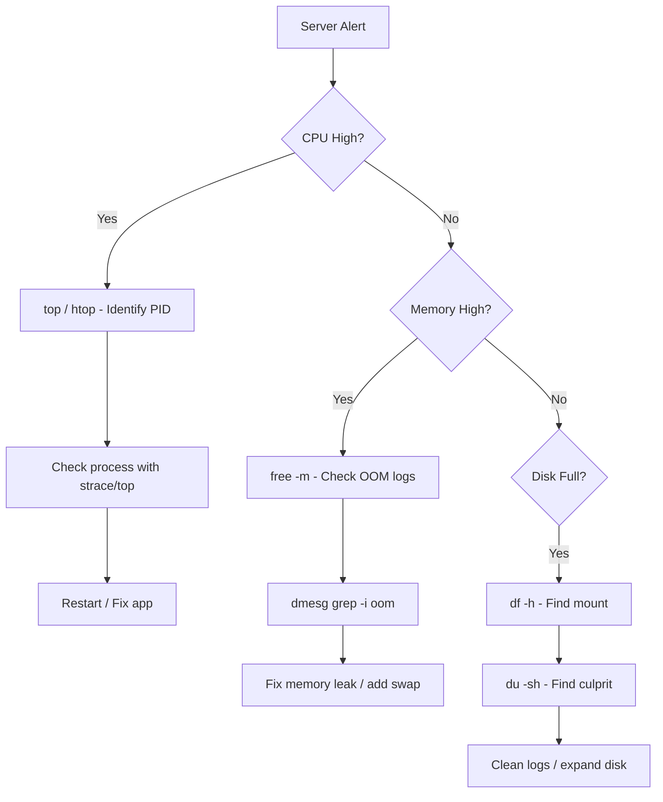

---

### 📌 Quick Recap — Linux

- ✅ Linux is the __foundation__ of all cloud and container technologies
- ✅ Master __permissions, networking, storage, and bash__ first
- ✅ Troubleshooting is systematic: measure → identify → fix → verify
- ✅ Use `umask`, `chmod`, `chown` for least-privilege security

---

## 6. Version Control with Git

### 6.1 Overview

Git is the de-facto version control system. A DevOps engineer uses Git for __everything__: code, infrastructure definitions, CI/CD pipeline configurations, and documentation.

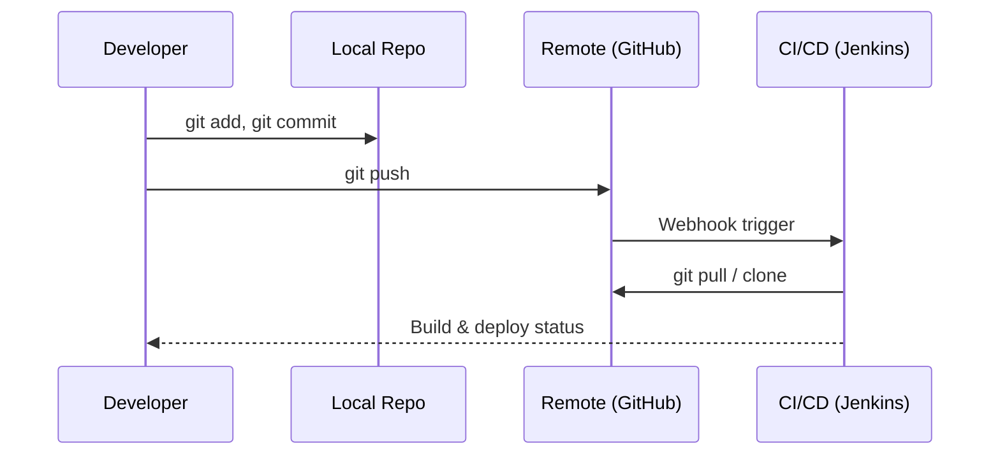

### 6.2 Essential Git Commands

| Command                     | Purpose                                   |
|-----------------------------|-------------------------------------------|
| `git init`                  | Initialize a repository                   |
| `git clone <url>`           | Copy a remote repository                  |
| `git add .`                 | Stage all changes                         |
| `git commit -m "msg"`       | Commit staged changes                     |
| `git push`                  | Upload commits to remote                  |
| `git pull`                  | Fetch and merge remote changes            |
| `git branch`                | List/create branches                      |
| `git checkout -b feature`   | Create and switch to new branch            |
| `git merge <branch>`        | Merge branch into current                 |
| `git rebase <branch>`       | Replay commits on top of another branch   |
| `git stash`                 | Temporarily save uncommitted changes      |
| `git log --oneline --graph` | Visual commit history                     |

### 6.3 Branching Strategy (Git Flow Example)

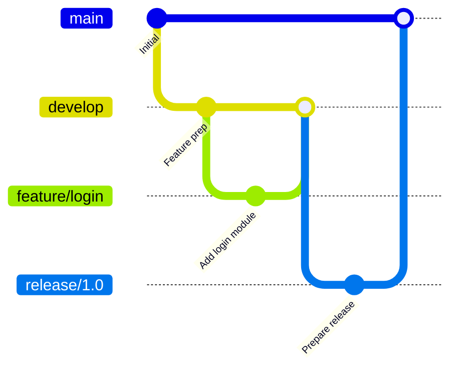

> ⚠️ __Anti-Pattern:__ Committing directly to `main`. Always use feature branches and pull requests.

### 6.4 Merge vs Rebase

| Operation | Pros                                           | Cons                                         |
|-----------|-----------------------------------------------|----------------------------------------------|
| **Merge** | Preserves true history, safe for shared branches | Creates merge commits, messier graph         |
| **Rebase**| Linear history, clean log                     | Rewrites history — never use on shared branches |


__Example — Safe rebase workflow:__

```bash
# Fetch latest
git fetch origin

# Rebase feature branch on top of updated main
git checkout feature/xyz
git rebase origin/main

# Resolve conflicts if any, then force-push (if branch is private)
git push --force-with-lease
```

---

## 7. Containerization with Docker

### 7.1 Overview

Docker packages applications with their dependencies into __portable containers__. Containers isolate processes, not full operating systems, making them lightweight and fast to start.

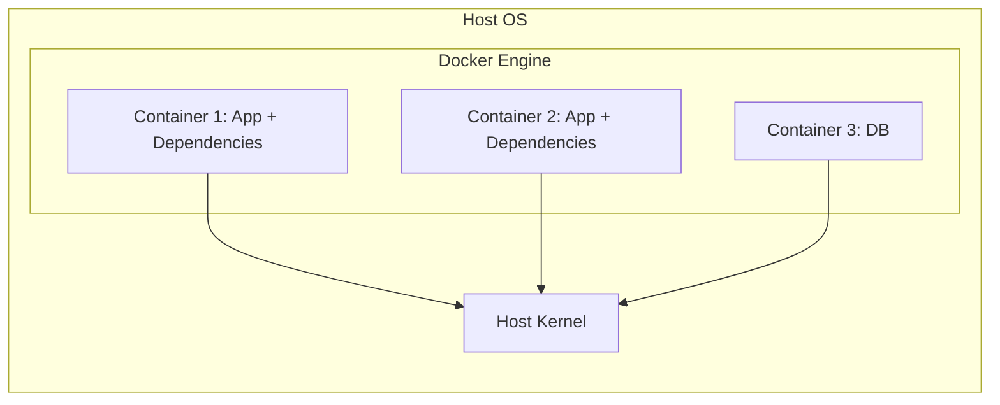

### 7.2 Docker Fundamentals

| Concept       | Explanation                          | Example                     |
|---------------|--------------------------------------|-----------------------------|
| **Image**     | Immutable blueprint                  | `python:3.12-slim`          |
| **Container** | Running instance of an image         | `docker run nginx`          |
| **Dockerfile**| Build recipe                         | `FROM nginx:alpine`         |
| **Volume**    | Persistent storage                   | `-v /host:/container`       |
| **Network**   | Container communication              | `--network bridge`          |

### 7.3 Dockerfile Best Practices

```dockerfile
# ✅ GOOD — multi-stage, small base, exact versions
FROM node:20-alpine AS build
WORKDIR /app
COPY package*.json ./
RUN npm ci --omit=dev
COPY . .
RUN npm run build

FROM nginx:1.27-alpine
COPY --from=build /app/dist /usr/share/nginx/html
EXPOSE 80
HEALTHCHECK --interval=30s CMD wget -qO- http://localhost/ || exit 1
```

__Anti-patterns to avoid:__

- ❌ Using `latest` tag — non-reproducible builds
- ❌ Installing unnecessary packages — bloated images
- ❌ Putting secrets in the image (`ENV` vs build args)
- ❌ Single-stage builds for production

### 7.4 Essential Docker Commands (50+ Mastery)

```bash
# Build & run
docker build -t myapp:1.0 .        # Build image
docker run -d -p 8080:80 myapp:1.0 # Run detached, publish port
docker ps                          # List running containers
docker logs -f <container>         # Follow logs
docker exec -it <container> sh     # Shell into container

# Cleanup
docker system prune -a             # Remove all unused images/containers
docker rm -f $(docker ps -aq)      # Force remove all containers

# Networking & Volumes
docker network create mynet        # Create network
docker volume create mydata        # Create persistent volume

# Images
docker images                      # List images
docker image inspect         # Inspect image metadata
docker push <registry>/       # Push to registry
```

### 7.5 Docker Compose for Multi-Service Apps

```yaml
# docker-compose.yml
version: "3.8"
services:
  web:
    build: .
    ports:
      - "3000:3000"
    environment:
      - DB_HOST=db
    depends_on:
      - db
  db:
    image: postgres:16-alpine
    volumes:
      - db_data:/var/lib/postgresql/data
    environment:
      POSTGRES_PASSWORD: secret

volumes:
  db_data:
```

---

## 8. Orchestration with Kubernetes

### 8.1 Why Kubernetes?

Kubernetes (K8s) is the de-facto orchestration platform. It automates deployment, scaling, and management of containerized applications.

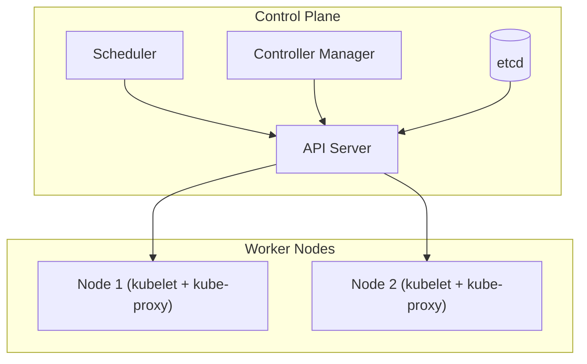

### 8.2 Core Kubernetes Workloads

| Resource                  | Purpose                        | Example                                      |
|---------------------------|--------------------------------|----------------------------------------------|
| **Pod**                   | Smallest deployable unit       | One or more containers                       |
| **Deployment**            | Declarative rollout & scaling  | Manage app replicas                          |
| **ReplicaSet**            | Ensures desired pod count      | Maintains 3 replicas                         |
| **Service**               | Stable network endpoint        | Load-balance across pods                     |
| **Ingress**               | HTTP routing into cluster      | Host-based path routing                      |
| **ConfigMap / Secret**    | Configuration injection        | API keys, app configs                        |
| **PersistentVolume (PV/PVC)** | Durable storage            | Database data                                |
| **RBAC**                  | Access control                 | `Role`, `RoleBinding`, `ClusterRole`         |

### 8.3 Example — Deploying the Voting App

```yaml
# deployment.yaml
apiVersion: apps/v1
kind: Deployment
metadata:
  name: vote
  labels:
    app: vote
spec:
  replicas: 3
  selector:
    matchLabels:
      app: vote
  template:
    metadata:
      labels:
        app: vote
    spec:
      containers:
        - name: vote
          image: dockersamples/examplevotingapp_vote:latest
          ports:
            - containerPort: 80
          readinessProbe:
            httpGet:
              path: /
              port: 80
```

```yaml
# service.yaml — expose the deployment
apiVersion: v1
kind: Service
metadata:
  name: vote
spec:
  type: LoadBalancer
  selector:
    app: vote
  ports:
    - port: 80
      targetPort: 80
```

### 8.4 Key Operations

```bash
# Deployments
kubectl apply -f deployment.yaml
kubectl rollout status deployment/vote
kubectl rollout history deployment/vote
kubectl rollout undo deployment/vote   # Rollback

# Scaling
kubectl scale deployment/vote --replicas=5

# Debugging
kubectl get pods -o wide
kubectl describe pod <pod-name>
kubectl logs -f <pod-name>
kubectl exec -it <pod-name> -- sh
```

### 8.5 Ingress — Advanced Routing

```yaml
apiVersion: networking.k8s.io/v1
kind: Ingress
metadata:
  name: app-ingress
  annotations:
    nginx.ingress.kubernetes.io/rewrite-target: /
spec:
  rules:
    - host: api.example.com
      http:
        paths:
          - path: /v1
            pathType: Prefix
            backend:
              service:
                name: api-service
                port:
                  number: 8080
          - path: /web
            pathType: Prefix
            backend:
              service:
                name: web-service
                port:
                  number: 80
```

> 💡 __Pro Tip:__ In production, always pair Deployments with __readiness and liveness probes__, and use __HorizontalPodAutoscaler (HPA)__ for automatic scaling.

---

## 9. Infrastructure as Code with Terraform

### 9.1 Overview

Terraform is the industry-standard __Infrastructure as Code (IaC)__ tool. It lets you define cloud resources (VMs, networks, databases) in declarative HCL code and apply them consistently.

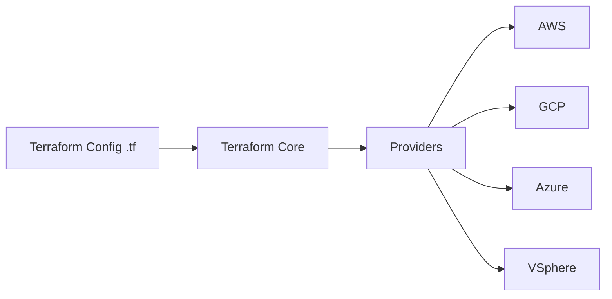

### 9.2 Core Concepts

| Concept   | Explanation                          |
|-----------|--------------------------------------|
| **Provider** | Plugin to interact with cloud/APIs |
| **Resource** | A cloud component (VM, subnet, bucket) |
| **State**    | Snapshot of deployed infrastructure |
| **Plan**     | Preview of changes before applying  |
| **Apply**    | Execute the changes                 |
| **Destroy**  | Tear down managed resources         |

### 9.3 Example — Provisioning an AWS EC2 Instance

```hcl
# main.tf
terraform {
  required_version = ">= 1.5"
  required_providers {
    aws = {
      source  = "hashicorp/aws"
      version = "~> 5.0"
    }
  }
}

provider "aws" {
  region = var.region
}

resource "aws_instance" "web" {
  ami           = data.aws_ami.ubuntu.id
  instance_type = var.instance_type
  key_name      = aws_key_pair.deploy.key_name

  tags = {
    Name = "web-server"
    Env  = var.environment
  }
}
```

### 9.4 Terraform Workflow

```bash
# 1. Initialize
terraform init

# 2. Format & validate
terraform fmt
terraform validate

# 3. Preview
terraform plan -out=tfplan

# 4. Apply
terraform apply tfplan

# 5. Inspect
terraform state list
terraform show

# 6. Destroy
terraform destroy
```

> ⚠️ __Warning:__ Never store state locally in production. Use __remote state__ with S3 (plus DynamoDB locking) or Terraform Cloud.

---

## 10. Configuration Management with Ansible

### 10.1 Overview

While Terraform __provisions__ infrastructure, Ansible __configures__ it — installing packages, managing services, deploying applications, and enforcing state.

### 10.2 Key Concepts

| Concept          | Explanation                                |
|------------------|--------------------------------------------|
| **Control Node** | Machine running Ansible                    |
| **Managed Nodes**| Targets being configured                   |
| **Inventory**    | List of managed hosts                      |
| **Playbook**     | YAML file with automation tasks            |
| **Module**       | Pre-built task units (package, service, copy) |
| **Idempotency**  | Running twice produces the same result     |

### 10.3 Example — Playbook to Install and Start Nginx

```yaml
---
- name: Setup Nginx web server
  hosts: webservers
  become: yes
  tasks:
    - name: Install nginx
      apt:
        name: nginx
        state: present

    - name: Enable and start nginx
      service:
        name: nginx
        state: started
        enabled: yes

    - name: Deploy index.html
      template:
        src: index.html.j2
        dest: /var/www/html/index.html
      notify: reload nginx

  handlers:
    - name: reload nginx
      service:
        name: nginx
        state: reloaded
```

### 10.4 Running Ansible

```bash
# Test connectivity
ansible all -i inventory.ini -m ping

# Run a playbook
ansible-playbook -i inventory.ini setup.yml

# Run with a specific user
ansible-playbook -i inventory.ini -u deploy setup.yml

# Dry-run (check mode)
ansible-playbook -i inventory.ini --check setup.yml
```

### 10.5 Ansible vs Terraform — Comparison

| Aspect             | Ansible                          | Terraform                          |
|--------------------|----------------------------------|------------------------------------|
| **Primary focus**  | Configuration management         | Infrastructure provisioning        |
| **Language**       | YAML (declarative w/ imperative) | HCL (fully declarative)            |
| **State management** | Stateless (idempotent tasks)   | Stateful (state files)             |
| **Best for**       | Installing software, configuring hosts | Creating cloud resources, networks |
| **Agent**          | Agentless (SSH)                 | API-based providers                |

> 💡 __Pro Tip:__ Use them together — Terraform provisions the VMs, network, and load balancers; Ansible configures the OS, installs apps, and deploys code.

---

## 11. CI/CD with Jenkins

### 11.1 Overview

Jenkins is the industry-standard CI/CD tool. It automates the pipeline from code commit to production deployment — building, testing, and deploying your application.

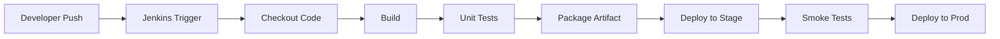

### 11.2 Core Jenkins Concepts

| Concept              | Description                          |
|----------------------|--------------------------------------|
| **Job / Pipeline**   | CI/CD workflow definition            |
| **Node / Agent**     | Worker machine executing jobs        |
| **Plugin**           | Extension mechanism (Git, Docker, AWS) |
| **Blue Ocean**       | Modern Jenkins UI                    |
| **Pipeline as Code** | Define pipelines in Jenkinsfile      |

### 11.3 Example — Declarative Jenkinsfile

```groovy
pipeline {
    agent any

    environment {
        DOCKER_REGISTRY = 'registry.example.com'
    }

    stages {
        stage('Checkout') {
            steps {
                checkout scm
            }
        }
        stage('Build') {
            steps {
                sh 'docker build -t ${DOCKER_REGISTRY}/myapp:${BUILD_NUMBER} .'
            }
        }
        stage('Test') {
            steps {
                sh 'docker run --rm ${DOCKER_REGISTRY}/myapp:${BUILD_NUMBER} npm test'
            }
        }
        stage('Deploy to Staging') {
            steps {
                sh 'kubectl set image deployment/myapp myapp=${DOCKER_REGISTRY}/myapp:${BUILD_NUMBER} -n staging'
            }
        }
        stage('Smoke Test') {
            steps {
                sh 'curl -f http://staging.example.com/health'
            }
        }
        stage('Deploy to Production') {
            input {
                message "Approve production deployment?"
                ok "Deploy"
            }
            steps {
                sh 'kubectl set image deployment/myapp myapp=${DOCKER_REGISTRY}/myapp:${BUILD_NUMBER} -n production'
            }
        }
    }
    post {
        failure {
            mail to: 'devops@example.com', subject: 'Pipeline FAILED'
        }
    }
}
```

### 11.4 Jenkins Anti-Patterns

- ❌ __Monolithic pipelines__ — everything in one giant stage
- ❌ __Manual deployment steps__ — defeats automation purpose
- ❌ __Storing credentials in the Jenkinsfile__ — use credential store
- ❌ __No rollback strategy__ — always have a fallback path

---

## 12. Cloud Computing with AWS

### 12.1 Overview

AWS is the largest public cloud platform. DevOps engineers interact with it for provisioning compute, networking, storage, and managed services — all scriptable via CLI/IaC.

### 12.2 Core AWS Services for DevOps

| Category        | Service      | Purpose                          |
|-----------------|--------------|----------------------------------|
| **Compute**     | EC2          | Virtual machines, resizable      |
| **Compute**     | Lambda       | Serverless functions             |
| **Networking**  | VPC          | Isolated virtual network         |
| **Networking**  | Route 53     | DNS service                      |
| **Storage**     | S3           | Object storage                   |
| **Storage**     | EBS          | Persistent block storage         |
| **Database**    | RDS          | Managed relational databases     |
| **Database**    | DynamoDB     | Managed NoSQL                    |
| **Security**    | IAM          | Identity and access management   |
| **Orchestration** | ECS/EKS    | Containers / Kubernetes          |
| **CI/CD**       | CodePipeline | Managed pipelines                |

### 12.3 Sample AWS CLI Workflow

```bash
# Configure
aws configure

# EC2 — launch instance
aws ec2 run-instances \
  --image-id ami-0abcdef1234567890 \
  --instance-type t3.micro \
  --key-name my-key \
  --security-group-ids sg-12345678 \
  --subnet-id subnet-12345678

# S3 — bucket operations
aws s3 mb s3://my-devops-bucket
aws s3 cp build/ s3://my-devops-bucket/build/ --recursive

# IAM — create read-only user
aws iam create-user --user-name read-only-user
aws iam attach-user-policy \
  --user-name read-only-user \
  --policy-arn arn:aws:iam::aws:policy/ReadOnlyAccess
```

### 12.4 AWS VPC Architecture Example

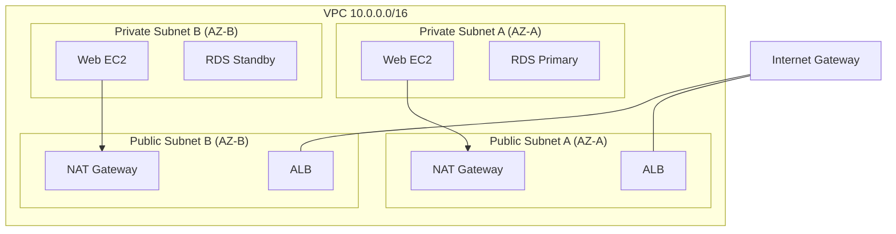

---

## 13. Databases for DevOps

### 13.1 Overview

Every DevOps engineer must understand database deployment, monitoring, backup, replication, and troubleshooting. The database ecosystem splits into __relational (MySQL)__ and __NoSQL (MongoDB, Redis)__.

### 13.2 Database Comparison

| Database     | Type          | Best For                  | Strong Suit            |
|--------------|---------------|---------------------------|------------------------|
| **MySQL**    | Relational    | Transactions, ACID        | Web apps, finance      |
| **MongoDB**  | Document NoSQL| Flexible schemas          | Rapid iteration        |
| **Redis**    | In-memory KV  | Caching, sessions         | Ultra-low latency      |
| **TimescaleDB** | Time-series | IoT metrics              | Temporal data          |
| **Cassandra**| Wide-column   | High write throughput     | Distributed scale      |
| **Percona**  | MySQL fork    | Performance tuning        | Production MySQL       |


### 13.3 MySQL Master–Slave Replication

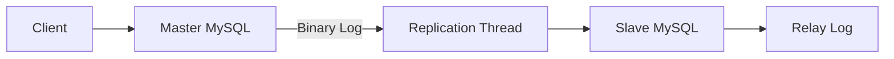

__Key configuration (master):__

```ini
# /etc/mysql/mysql.conf.d/master.cnf
[mysqld]
server-id = 1
log_bin = /var/log/mysql/mysql-bin.log
binlog_do_db = myapp
```

__On the slave:__

```sql
-- On master: create replication user
CREATE USER 'replica'@'%' IDENTIFIED BY 'secure_pass';
GRANT REPLICATION SLAVE ON *.* TO 'replica'@'%';
FLUSH PRIVILEGES;
SHOW MASTER STATUS;

-- On slave
CHANGE MASTER TO
  MASTER_HOST='master.example.com',
  MASTER_USER='replica',
  MASTER_PASSWORD='secure_pass',
  MASTER_LOG_FILE='mysql-bin.000001',
  MASTER_LOG_POS=154;
START SLAVE;
SHOW SLAVE STATUS\G;
```

### 13.4 MongoDB Replica Set

```bash
# Start first member
mongod --replSet rs0 --dbpath /data/rs0-1 --port 27017 --bind_ip 0.0.0.0

# Initiate replica set
mongosh --port 27017
rs.initiate({
  _id: "rs0",
  members: [
    { _id: 0, host: "mongo1.example.com:27017" },
    { _id: 1, host: "mongo2.example.com:27017" },
    { _id: 2, host: "mongo3.example.com:27017", arbiterOnly: true }
  ]
})
```

### 13.5 Redis — Production Essential

```bash
# Start
redis-server --port 6379 --requirepass secure

# Test
redis-cli -a secure ping
redis-cli -a secure SET session:123 '{"user": "alice"}' EX 3600

# Monitoring
redis-cli INFO stats
redis-cli MONITOR
```

> 💡 __Pro Tip:__ Always configure __persistence (RDB/AOF)__, __maxmemory__ eviction policy, and __sentinel/cluster__ for production Redis.

---

## 14. Observability & Monitoring

### 14.1 Overview

You can't fix what you can't see. Monitoring (metrics), logging, and tracing form the three pillars of observability.

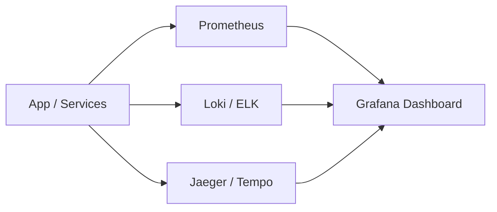

### 14.2 The Monitoring Stack

| Tool            | Role                                      |
|-----------------|-------------------------------------------|
| **Prometheus**  | Time-series metrics collection & alerting |
| **Grafana**     | Visualization dashboards                  |
| **Loki**        | Log aggregation (Grafana-native)          |
| **ELK**         | Elasticsearch, Logstash, Kibana log stack |
| **Nagios**      | Legacy infrastructure monitoring          |
| **Alertmanager**| Prometheus alert routing                  |


__Example — Prometheus config:__

```yaml
# prometheus.yml
global:
  scrape_interval: 15s

scrape_configs:
  - job_name: 'node'
    static_configs:
      - targets: ['node-exporter:9100']

  - job_name: 'myapp'
    static_configs:
      - targets: ['myapp:8080']
    metrics_path: /actuator/prometheus
```

### 14.3 Common Monitoring Fixes

| Problem                 | Cause                                | Fix                                             |
|--------------------------|--------------------------------------|-------------------------------------------------|
| **No metrics in Grafana** | Scrape failure / port mismatch       | `curl localhost:9100/metrics`, check network    |
| **Alert fatigue**        | Thresholds too sensitive              | Adjust thresholds, add `for` duration           |
| **Loki not receiving logs** | Promtail not installed             | Verify Promtail config & agent on nodes         |
| **High cardinality**     | Labels with unique values (user IDs)  | Replace with `_total`, aggregate labels         |

---

## 15. Interview Preparation Hub

### 15.1 Reality Check

Research on hiring behavior consistently shows that many hiring managers begin forming opinions within the __first 5–15 minutes__ of the conversation. First impressions significantly impact the final decision.

### 15.2 The Structured Preparation Approach

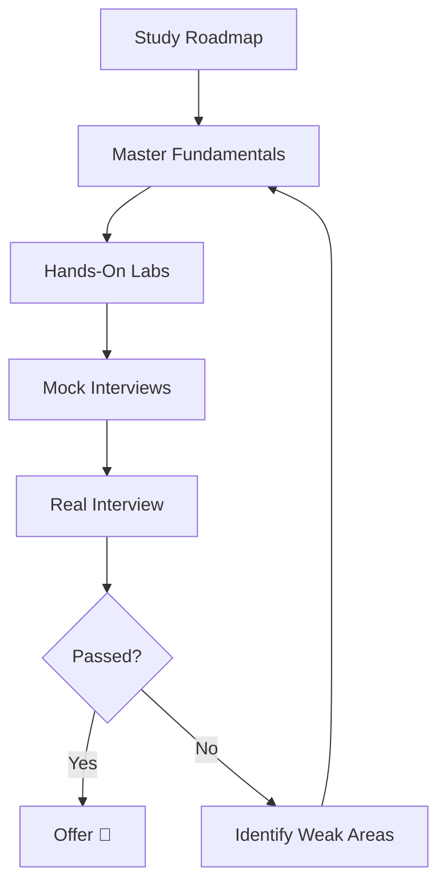

### 15.3 Curated Question Collections Referenced

| Domain                 | Key Topics to Master                                        |
|------------------------|-------------------------------------------------------------|
| **Linux (200+ Qs)**    | Permissions, commands, processes, networking, bash          |
| **Kubernetes (Real-World)** | Pods, Deployments, Services, RBAC, troubleshooting    |
| **Terraform (50+ Qs)** | State, providers, modules, remote state, best practices     |
| **AWS DevOps (50 Qs)** | VPC, IAM, EC2, Auto Scaling, CI/CD services                 |
| **Git**                | Rebase vs merge, remote workflows, branch strategies        |
| **Bash**               | Scripting logic, error handling, automation patterns        |
| **Jenkins (50+ Qs)**   | Pipelines, plugins, agents, security, integrations          |
| **Ansible**            | Playbooks, modules, inventory, idempotency                  |
| **SRE (71 Qs)**        | SLIs/SLOs, error budgets, incident management               |
| **DevOps/SRE Hub (500+)** | Everything above, combined                               |


> 💡 __Pro Tip:__ Focus one week on each domain, then blend. Mock interviews with time pressure (5 minutes per behavioral, 15 minutes per technical scenario) are crucial.

---

## 16. Troubleshooting Guides

A structured, reusable troubleshooting methodology:

1. __Reproduce__ — Get a consistent reproduction
2. __Isolate__ — Narrow to a single component
3. __Inspect__ — Logs, metrics, configuration
4. __Hypothesize__ — Form a testable theory
5. __Test__ — Apply the smallest fix first
6. __Verify__ — Confirm the fix persists under load

### Interactively-searchable troubleshooting references

| Symptom                        | Likely Root Cause                     | First Actions                                      |
|--------------------------------|----------------------------------------|---------------------------------------------------|
| **App not reachable**          | Firewall, service down                 | `ss -tlnp`, `systemctl status`                    |
| **K8s pod CrashLoopBackOff**   | App start failure                      | `kubectl logs`, `kubectl describe`                |
| **Docker container exits immediately** | Command mismatch                | `docker logs`, check entrypoint                   |
| **Terraform state drift**      | Manual changes                         | `terraform plan` to detect                        |
| **Jenkins job fails at checkout** | Credentials/URL                      | Check SCM config, permissions                     |
| **MySQL "Host is blocked"**    | Too many failed connections            | `FLUSH HOSTS;`, raise `max_connect_errors`        |
| **MongoDB "Too many open files"** | ulimit too low                       | Raise `nofile`, adjust systemd limits             |
| **Redis high memory**          | No eviction policy                     | Set `maxmemory-policy allkeys-lru`                |
| **NFS mount hanging**          | Network / server down                  | `mount -v`, `showmount -e`                        |
| **sudoers corrupt**            | Bad syntax                             | Boot to single-user, use `pkexec visudo`          |


---

## 17. DevOps Best Practices

### 17.1 Core Principles

1. __Infrastructure as Code (IaC)__ — Everything versioned in Git
2. __Everything as Code__ — Pipelines, monitoring, documentation
3. __CI/CD Automation__ — Build, test, deploy automatically
4. __Immutable Infrastructure__ — Replace, don't patch
5. __Observability by Design__ — Metrics, logs, traces from day one
6. __Least Privilege__ — Minimal access for users, services, and pods
7. __Fail Fast, Fail Safe__ — Quick detection, safe rollback
8. __Continuous Improvement__ — Blameless postmortems and feedback loops

### 17.2 Toolchain Best Practices

| Domain       | Best Practice                                                                 |
|--------------|-------------------------------------------------------------------------------|
| **Linux**    | Use least-privilege accounts; automate with Ansible; monitor with Prometheus  |
| **Git**      | Feature branches + review; semantic commits; protect main branch              |
| **Docker**   | Multi-stage builds; pin versions; scan images; use `--no-cache` in CI only    |
| **Kubernetes** | Use namespaces; apply resources; use probes; enable RBAC; set resource limits |
| **Terraform** | Remote state + locking; module composition; plan before apply; drift detection |
| **Ansible**  | Idempotent playbooks; use roles; manage secrets with Ansible Vault            |
| **Jenkins**  | Pipeline-as-code; credential store; shared libraries; artifact retention policy |
| **AWS**      | IAM roles over keys; VPC isolation; CloudWatch + CloudTrail; cost tagging     |


### 17.3 Security Best Practices

- 🔐 __All traffic encrypted__ — TLS everywhere, even internally
- 🔑 __Secrets management__ — Use Vault, AWS Secrets Manager, or Kubernetes Secrets (encrypted)
- 🛡️ __Image scanning__ — Scan containers for known CVEs (Trivy, Clair)
- 👥 __RBAC enforcement__ — Kubernetes, AWS IAM, and database users least-privilege
- 📜 __Audit logging__ — Enable CloudTrail, Kubectl audit, database query logs
- 🔄 __Backup & DR__ — Automated backups, tested restores, replication across AZs

---

## 18. Common Anti-Patterns

| Anti-Pattern                          | Why It's Harmful                          | Correct Alternative                        |
|---------------------------------------|-------------------------------------------|--------------------------------------------|
| **Golden images that are manually patched** | Configuration drift, unrepeatable        | Immutable images built in CI                |
| **`latest` tags everywhere**          | Non-reproducible builds                   | Explicit, semantic version tags             |
| **Snowflake servers**                 | No one can rebuild them                   | IaC + Ansible, fully reproducible           |
| **Manual deployment**                 | Human error, no audit trail               | Automated CI/CD pipeline                    |
| **No rollback plan**                  | Outages extend unpredictably              | Blue/green or canary with revert            |
| **All-in-one Kubernetes cluster**     | Security and blast-radius issues          | Namespaces, separate clusters per env       |
| **Backing up without testing restores** | Data loss on real failure                 | Fire-drill restores quarterly               |
| **Copy-paste Terraform**              | Duplication, hidden drift                 | Modules + remote state                      |
| **Monitoring only in production**     | Late detection of bugs                    | Observability in CI/stage too               |
| **Blaming culture**                   | Fear, hidden problems                     | Blameless postmortems                       |


---

## 19. Performance Considerations

### 19.1 Key Performance Areas

| Layer        | Considerations                                                                 |
|--------------|--------------------------------------------------------------------------------|
| **Linux**    | I/O scheduler, kernel tuning (`sysctl`), swap usage, filesystem choice         |
| **Docker**   | Image size, layer count, resource limits (`--memory`, `--cpus`)                |
| **Kubernetes** | Request/limit settings, HPA, node autoscaling, efficient image pulls         |
| **Terraform** | Parallelism, state size, provider caching                                     |
| **Ansible**  | SSH pipelining, `forks` parallelism, `delegate_to`                             |
| **Jenkins**  | Agent pool sizing, build cache, artifact cleanup                               |
| **AWS**      | Reserved/spot instances, Auto Scaling, S3 lifecycle rules                      |
| **MySQL**    | Index design, Buffer Pool sizing, slow query log, query caching                |
| **Redis**    | `maxmemory` policy, persistence tuning, connection pooling                     |

### 19.2 Kubernetes Resource Quotes

```yaml
resources:
  requests:
    cpu: 500m
    memory: 512Mi
  limits:
    cpu: "1"
    memory: 1Gi
```

> ⚠️ __Warning:__ Setting only `requests` without `limits` can starve the node. Setting only `limits` without `requests` can cause QoS misbehavior and eviction issues.

---

## 20. Security Considerations

### 20.1 Defense-in-Depth Layers

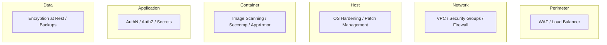

### 20.2 Key Security Controls for Each Layer

| Layer        | Control                                                                 |
|--------------|-------------------------------------------------------------------------|
| **Network**  | Security groups, NACLs, egress control, mTLS                            |
| **Host**     | OS updates, CIS benchmarks, fail2ban                                    |
| **Container**| Non-root user in container, read-only rootfs, no privileged             |
| **Kubernetes** | RBAC, PodSecurityAdmission, NetworkPolicies, Secrets encryption       |
| **Cloud**    | IAM roles, CloudTrail, S3 bucket policies, MFA                          |
| **Database** | Least-privilege DB users, TLS connections, encrypted backups            |
| **CI/CD**    | Signed artifacts, credential isolation, pipeline RBAC                   |
|

### 20.3 Example — Secure Container

```dockerfile
FROM node:20-alpine

# Non-root user
RUN addgroup -S appgroup && adduser -S appuser -G appgroup

COPY --chown=appuser:appgroup . /app
USER appuser

# Read-only filesystem in orchestration
# Set readOnlyRootFilesystem: true in K8s
```

---

## 21. Testing Strategies

### 21.1 The Testing Pyramid in DevOps

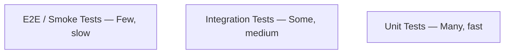

| Test Level          | Frequency        | Environment        | Tooling                               |
|---------------------|------------------|--------------------|---------------------------------------|
| **Unit**            | On every commit  | Developer machine  | JUnit, Jest, pytest                   |
| **Integration**     | On every PR      | CI                 | Testcontainers, Docker                 |
| **Contract**        | On every release | CI                 | Pact                                  |
| **E2E / Smoke**     | Before deploy    | Staging            | Cypress, Selenium, Playwright         |
| **Availability**    | After deploy     | Production         | Synthetic checks, health endpoints    |


### 21.2 CI/CD Testing Strategy

| Stage               | Tests Run                                      |
|---------------------|------------------------------------------------|
| **Commit**          | Linting, unit tests, vulnerability scan        |
| **PR**              | Build, integration tests, coverage gates       |
| **Merge to main**   | Full build, image build + scan                 |
| **Staging deploy**  | Smoke tests, contract tests                    |
| **Production deploy** | Health checks, canary traffic, rollback trigger |


---

## 22. Practice Exercises with Solutions

### Exercise 1: Containerize a Node.js Application and Run It Locally

__Objective:__ Create a Dockerfile for a simple Node.js app, build the image, and run it with a persistent volume and health check.

__Steps:__

1. Create a minimal Node.js app
2. Write an efficient multi-stage Dockerfile
3. Build the image with a version tag
4. Run it with a named volume and published port
5. Verify the health endpoint

__Solution:__

```javascript
// app.js
const express = require('express');
const app = express();
const port = 3000;

app.get('/', (req, res) => res.send('Hello DevOps!'));
app.get('/health', (req, res) => res.status(200).send('ok'));

app.listen(port, () => console.log(`App listening on ${port}`));
```

```dockerfile
# Dockerfile
FROM node:20-alpine AS build
WORKDIR /app
COPY package*.json ./
RUN npm ci --omit=dev
COPY . .

FROM node:20-alpine
WORKDIR /app
COPY --from=build /app/node_modules ./node_modules
COPY --from=build /app/app.js .
RUN addgroup -S appgroup && adduser -S appuser -G appgroup
USER appuser
EXPOSE 3000
HEALTHCHECK --interval=15s --timeout=3s --retries=3 CMD wget -qO- http://localhost:3000/health || exit 1
CMD ["node", "app.js"]
```

Run:

```bash
docker build -t myapp:1.0 .
docker volume create appdata
docker run -d --name myapp -p 3000:3000 -v appdata:/data myapp:1.0
curl localhost:3000/health   # expect "ok"
docker logs myapp
```

---

### Exercise 2: Deploy a Three-Service App to Kubernetes with Ingress and HPA

__Objective:__ Deploy a frontend + backend + database to a local Kubernetes cluster (Minikube), expose via Ingress, and enable autoscaling.

__Solution:__

```yaml
# backend-deployment.yaml
apiVersion: apps/v1
kind: Deployment
metadata:
  name: backend
spec:
  replicas: 2
  selector:
    matchLabels:
      app: backend
  template:
    metadata:
      labels:
        app: backend
    spec:
      containers:
        - name: backend
          image: nginx:alpine
          ports:
            - containerPort: 80
          resources:
            requests:
              cpu: 100m
              memory: 128Mi
            limits:
              cpu: 200m
              memory: 256Mi
          readinessProbe:
            httpGet:
              path: /
              port: 80
```

```yaml
# hpa.yaml
apiVersion: autoscaling/v2
kind: HorizontalPodAutoscaler
metadata:
  name: backend-hpa
spec:
  scaleTargetRef:
    apiVersion: apps/v1
    kind: Deployment
    name: backend
  minReplicas: 2
  maxReplicas: 10
  metrics:
    - type: Resource
      resource:
        name: cpu
        target:
          type: Utilization
          averageUtilization: 70
```

Apply sequence:

```bash
kubectl apply -f backend-deployment.yaml
kubectl apply -f hpa.yaml
kubectl get hpa
kubectl get pods
```

---

### Exercise 3: Write a Terraform Module to Provision an EC2 Instance with Security Groups and Tags

__Objective:__ Create a reusable Terraform module that provisions an EC2 instance, associated security group, and tags.

__Solution:__

```hcl
# modules/ec2-instance/main.tf
variable "ami" {}
variable "instance_type" { default = "t3.micro" }
variable "name" {}
variable "environment" {}

resource "aws_security_group" "sg" {
  name = "${var.name}-sg"

  ingress {
    from_port   = 22
    to_port     = 22
    protocol    = "tcp"
    cidr_blocks = ["0.0.0.0/0"]
  }

  egress {
    from_port   = 0
    to_port     = 0
    protocol    = "-1"
    cidr_blocks = ["0.0.0.0/0"]
  }

  tags = {
    Name        = var.name
    Environment = var.environment
  }
}

resource "aws_instance" "instance" {
  ami                    = var.ami
  instance_type          = var.instance_type
  vpc_security_group_ids = [aws_security_group.sg.id]

  tags = {
    Name        = var.name
    Environment = var.environment
  }
}
```

```hcl
# main.tf
module "web" {
  source      = "./modules/ec2-instance"
  ami         = "ami-0abcdef1234567890"
  name        = "web-server"
  environment = "production"
}

output "web_public_ip" {
  value = module.web.instance.public_ip
}
```

```bash
terraform init
terraform plan
terraform apply -auto-approve
```

---

## 23. Question Bank (50+ Questions)

### Beginner Level (1–15)

1. What is DevOps and what problems does it solve?
2. What are the three pillars of observability?
3. What is the difference between a virtual machine and a container?
4. Explain the Linux directory structure (`/etc`, `/var`, `/usr`, `/bin`).
5. What is the difference between hard links and symbolic links?
6. How do you check disk usage and the largest files?
7. What is the difference between `git merge` and `git rebase`?
8. What is a Docker volume and when would you use one?
9. What is the difference between a Pod and a Deployment in Kubernetes?
10. How do you check running services on a Linux system?
11. What is a Jenkinsfile?
12. What is Infrastructure as Code and why is it important?
13. What is the difference between `terraform plan` and `terraform apply`?
14. What is a security group in AWS and how does it work?
15. How do you check the status of a service with `systemctl`?

### Intermediate Level (16–35)

16. Explain the Linux boot process.
17. What is umask and how does it affect new file permissions?
18. How do you create a cron job and where are cron logs?
19. Explain inode usage and what happens when inodes are exhausted.
20. How do you configure passwordless SSH login?
21. What are iptables chains and how do you persist rules?
22. How do you set up a Docker multi-stage build and why is it beneficial?
23. What is the difference between Docker `CMD` and `ENTRYPOINT`?
24. How do you run a one-off command inside a running container?
25. What are Kubernetes namespaces and how do you restrict access across them (RBAC)?
26. Explain `kubectl rollout undo` and when you'd use it.
27. What is a Kubernetes Ingress and how does it differ from a Service?
28. How do you make Terraform state shareable across a team?
29. Explain Terraform modules and provider versioning.
30. What is Ansible idempotency and how do you ensure it?
31. How does Ansible connect to remote nodes (agentless)? What SSH requirements exist?
32. How do you store secrets in Jenkins?
33. What is a multi-branch pipeline in Jenkins?
34. Explain AWS VPC, subnets, and the Internet Gateway relationship.
35. How do you enable VPC flow logs?

### Advanced Level (36–50+)

36. Design a multi-AZ, high-availability web architecture in AWS. What components would you choose?
37. Compare Kubernetes native monitoring vs third-party (Prometheus + Grafana).
38. Explain how you'd recover from a corrupted `sudoers` file on a headless Azure VM.
39. How do you zero-downtime deploy a Kubernetes application? Walk through the rollout strategy.
40. Design an alerting system that avoids alert fatigue while catching real issues.
41. Explain MySQL replication failure modes and recovery steps.
42. How do you tune MySQL for high connection counts?
43. What is the `Too many open files` error in MongoDB and how do you fix it?
44. Explain Redis eviction policies — when would you use `allkeys-lru` vs `volatile-ttl`?
45. Design a CI/CD pipeline for a microservices architecture across multiple teams.
46. How do you implement Blue/Green deployment with Ansible or Jenkins?
47. Explain how Terraform state drift occurs and how you'd remediate it.
48. What strategies exist for secrets management across production environments?
49. How do you implement canary releases with traffic splitting in Kubernetes?
50. Design an observability strategy for a 100-service microservices platform.
51. Explain Chaos Engineering and how you'd introduce it safely.
52. How do you secure a Kubernetes cluster against container breakout?
53. Explain the CAP theorem and its practical implications for database selection.
54. Design an automated MySQL backup + restore validation strategy.
55. Compare Platform Engineering vs DevOps roles and their tooling implications.

---

## 24. Test Your Understanding

Answer these questions in one or two sentences each:

1. Why does Linux knowledge matter for cloud/DevOps engineers?
2. What is the difference between a Docker image and a container?
3. How does Kubernetes self-heal a crashed Pod?
4. What is Terraform remote state and why is it better than local state?
5. Explain the role of Ansible `handlers`.
6. When would you use `kubectl rollout undo`?
7. What is a readiness probe vs a liveness probe?
8. Why are `resources.requests` and `resources.limits` important in K8s?
9. What are the four stages of a standard Jenkins declarative pipeline?
10. What is an error budget in SRE terms?

__Answers:__

1. __Why Linux matters:__ All cloud VMs, containers, and K8s nodes run Linux — your ability to diagnose anything depends on it.
2. __Image vs container:__ An image is an immutable blueprint; a container is a running instance of that image with its own filesystem layer and process.
3. __Self-healing:__ The ReplicaSet controller continuously reconciles desired vs actual pod count, recreating replaced pods in seconds.
4. __Remote state:__ Stores Terraform state in a shared backend (S3 + locking), enabling team collaboration, locking, and drift detection.
5. __Handlers:__ Tasks that only run when notified (e.g., restart service after config change) — they don't run on every play.
6. __Rollout undo:__ To roll back a Deployment to a previous revision, e.g., after a bad config or image.
7. __Probes:__ Readiness = is the pod ready to receive traffic; liveness = should this pod be restarted if the app is stuck/broken.
8. __Requests/limits:__ Requests reserve resources for scheduling; limits cap usage to prevent noisy neighbors.
9. __Pipeline stages:__ Typically Checkout → Build → Test → Deploy (with optional post-deploy verification).
10. __Error budget:__ The acceptable amount of failure (e.g., 99.9% SLO = 43 min/month downtime) before shipping slows down.

---

## 25. Common Interview Questions

1. __"Tell me about yourself."__ — 2-minute structured answer: current role → key skills → a flagship project → why this role.
2. __"Describe a production incident you resolved."__ — Use STAR: Situation → Task → Action → Result, include metrics.
3. __"How would you automate deploying a new web app?"__ — Walk through: Git → Jenkins → Docker → Terraform (provision) → Ansible (configure) → K8s (orchestrate) → smoke test.
4. __"What's your experience with Kubernetes troubleshooting?"__ — `kubectl get events`, logs, describe, resource exhaustion, network policies.
5. __"How do you handle Terraform state conflicts?"__ — Remote state + locking, and recover with `terraform plan` + `terraform state` commands.
6. __"Explain how you'd scale MySQL to handle 10x traffic."__ — Read replicas, caching (Redis), connection pooling, query optimization, connection limits.
7. __"Design a CI/CD pipeline from scratch."__ — Source control triggers, build, test, scan, artifact, stage deploy, smoke test, prod deploy with approval, rollback.
8. __"How do you secure your CI/CD pipeline?"__ — Least-privilege credentials, signed artifacts, no secrets in code, pipeline RBAC, audit logs.
9. __"What's the difference between monitoring and observability?"__ — Monitoring = known failure signals; observability = ability to ask unknown questions via metrics/logs/traces.
10. __"How do you implement a zero-downtime deployment?"__ — Rolling updates with readiness probes, or blue/green with load balancer switch + rollback path.

---

## 26. Self-Assessment Checklist

Use this to track your readiness before interviews or production responsibilities.

- [ ] I can administer Linux: users, permissions, processes, networking, storage, and bash scripting
- [ ] I can diagnose high CPU, high memory, and disk-full incidents methodically
- [ ] I use Git fluently: branches, merge, rebase, stash, and remote collaboration
- [ ] I can write an optimized multi-stage Dockerfile and debug containers
- [ ] I can deploy a multi-service app to Kubernetes with Deployments, Services, Ingress, and HPA
- [ ] I understand Kubernetes RBAC, Networking, and Volumes
- [ ] I can write Terraform modules, use remote state, and handle drift
- [ ] I can write idempotent Ansible playbooks with variables and handlers
- [ ] I can build a production-grade Jenkins pipeline with approvals and rollback
- [ ] I understand AWS core services: VPC, IAM, EC2, S3, Auto Scaling, RDS
- [ ] I can set up MySQL replication and basic backup/restore
- [ ] I can configure Redis with persistence and eviction policies
- [ ] I can deploy a monitoring stack (Prometheus + Grafana + Loki)
- [ ] I can systematically troubleshoot containers, K8s, and cloud infrastructure
- [ ] I practice security: least privilege, secrets management, encrypted traffic, image scanning
- [ ] I can explain my decisions and trade-offs clearly in an interview

---

## 27. Summary & Key Takeaways

### 🏆 The DevOps Pillars

1. __Linux is non-negotiable__ — Master users, permissions, networking, storage, and bash.
2. __Version everything__ — Git for code, IaC, configs, and pipelines.
3. __Containers are the building blocks__ — Optimize images, understand volumes/networks.
4. __Kubernetes is the orchestrator__ — Deployments, Services, Ingress, RBAC, autoscaling.
5. __Provision with Terraform, configure with Ansible__ — The IaC two-step.
6. __Automate everything with CI/CD__ — Jenkins pipelines as code.
7. __Cloud is the platform__ — AWS VPC, IAM, and core compute/storage services.
8. __Databases need production care__ — Replication, backup, monitoring, tuning.
9. __Observe everything__ — Metrics, logs, traces with Prometheus/Grafana/Loki.
10. __Interviews reward fundamentals + hands-on experience__ — Study, practice, and mock.

### 🚀 Your Recommended Next Steps

1. __If you're a beginner:__ Complete the Linux roadmap first, then Git, then Docker.
2. __If you're intermediate:__ Rebuild your last manual deployment as IaC + CI/CD.
3. __If you're preparing for interviews:__ Use the Interview Preparation Hub, practice mocks daily.

---

## 28. Further Reading & Resources

### 🐧 Linux

- Linux Mastery Hub — Linux Administrator (2026 Edition)
- Linux File Permissions Explained (Symbolic & Octal)
- IPTABLES (Linux Firewall) — Complete Practical Guide
- A Practical Guide to Linux LVM
- Linux Troubleshooting — High CPU vs Memory vs Disk Full
- 100+ DevOps Commands Every Engineer Must Know

### ☸️ Kubernetes

- YAML for DevOps & Kubernetes — Beginner to Advanced
- Kubernetes Architecture — Clear and Easy to Memorize
- Kubernetes Deployments: Rolling Updates & Zero-Downtime
- Kubernetes Ingress — Advanced Routing Deep Dive
- Kubernetes Troubleshooting Guide (Part 1 & 2)
- 50+ Essential Helm Commands

### 🐳 Docker

- Mastering Docker: The Complete Professional Guide
- Docker — Day 2: 50+ Docker Commands
- Docker — Day 3: Container Volumes in Docker
- Elastic Stack (ELK) on Docker

### 🌍 Terraform

- Terraform Explained Simply — Part 1 & 2
- Terraform Made Practical — Build Cloud VMs with Code
- Terraform Interview Guide (Beginner → Architect)

### 🤖 Ansible & Automation

- Ansible Made Simple — A Beginner-Friendly Guide
- Automate Web App Deployment with Ansible — Zero-Downtime
- Ansible Production CI/CD with Jenkins & GitHub Actions

### 🔧 Jenkins

- Jenkins Installation Guide
- Jenkins Tutorial 2026 Part 1–6 (Zero to Production)
- The Ultimate DevOps Handbook — 120+ Essential Concepts

### 🌐 Git

- Git Tutorial for Beginners
- Git Complete Practical Guide
- Git Essentials Commands with Real-World Examples

### ☁️ AWS

- AWS DevOps Overview Guide 2026
- AWS Networking Fundamentals: VPCs, Subnets, Routing
- AWS CLI Commands Cheat Sheet
- AWS Secure Multi-AZ VPC Architecture Project

### 🗄️ Databases

- MySQL for DevOps Engineers
- MySQL Master–Slave Replication Configuration
- MongoDB Installation & Replica Set Configuration
- Redis Master Guide: From Beginner to Production-Level

### 🏆 Interview & Career

- DevOps/SRE, Linux Admin Interview Preparation Hub (2026 Edition)
- 71 SRE Interview Questions
- 200+ Linux Technical Interview Questions
- 50 AWS DevOps Interview Questions
- Ansible Interview Questions (2026)

### 🎬 Additional Learning

- ▶️ YouTube, 📸 Instagram, 💼 LinkedIn, ✍️ Medium — follow for continuous updates
- MLOps Series (Parts 1–4) for AI-infrastructure convergence
- Topic-wise merged guides for on-the-job quick reference

---

> 🎯 __Final Thought:__ DevOps is a continuous journey, not a destination. Choose one project, apply this roadmap, and iterate. In 6 months, you'll be a different engineer.

---

*Generated as a comprehensive knowledge hub based on the 200+ DevOps guide index. All referenced guides are part of the original collection and are linked from the master index.*
