# 10 Hidden Spring Boot Features That Instantly Improve Your APIs
### A Comprehensive, Example-Driven Tutorial for Building Production-Ready Spring Boot Applications

---

## 📚 Table of Contents

1. [Introduction](#introduction)
2. [Prerequisites](#prerequisites)
3. [Learning Objectives](#learning-objectives)
4. [Feature 1: Constructor Injection](#1-constructor-injection-instead-of-field-injection)
5. [Feature 2: @ConfigurationProperties](#2-configurationproperties-instead-of-scattered-value)
6. [Feature 3: Global Exception Handling](#3-global-exception-handling-with-restcontrolleradvice)
7. [Feature 4: Bean Validation](#4-validation-that-works-before-your-code-runs)
8. [Feature 5: Spring Profiles](#5-profiles-that-keep-development-and-production-separate)
9. [Feature 6: Spring Boot Actuator](#6-spring-boot-actuator-a-health-check-for-your-application)
10. [Feature 7: @Async](#7-make-slow-operations-faster-with-async)
11. [Feature 8: @Scheduled](#8-schedule-repetitive-jobs-with-scheduled)
12. [Feature 9: Application Events](#9-publish-events-instead-of-creating-tight-coupling)
13. [Feature 10: ResponseEntity](#10-customize-api-responses-with-responseentity)
14. [Putting It All Together](#putting-it-all-together-a-complete-example)
15. [Common Pitfalls & Anti-patterns](#common-pitfalls--anti-patterns)
16. [Best Practices Summary](#best-practices-summary)
17. [Performance Considerations](#performance-considerations)
18. [Security Considerations](#security-considerations)
19. [Testing Strategies](#testing-strategies)
20. [Troubleshooting Guide](#troubleshooting-guide)
21. [Practice Exercises with Solutions](#practice-exercises-with-solutions)
22. [Test Your Understanding](#test-your-understanding)
23. [Common Interview Questions](#common-interview-questions)
24. [Comprehensive Question Bank](#comprehensive-question-bank)
25. [Summary & Key Takeaways](#summary--key-takeaways)
26. [Further Reading & Resources](#further-reading--resources)
27. [Next Steps](#next-steps)

---

## 📖 Introduction

**Reading Time:** ~45 minutes  
**Difficulty Level:** Intermediate  
**Last Updated:** October 2025  
**Spring Boot Version:** 3.x & 4.x compatible

Most developers learn Spring Boot the same way: build a CRUD API, wire up `@RestController`, `@Service`, and `@Repository`, connect a database, and ship it. This is a great starting point — but it's only the surface of what Spring Boot actually offers.

Once an application reaches production, new problems appear that tutorials rarely cover:

- ⚠️ APIs slow down under real traffic
- 🔍 Debugging becomes painful because errors aren't handled consistently
- ⚙️ Configuration becomes scattered and hard to manage across environments
- ⏱️ Long-running tasks block requests and hurt user experience
- 🏗️ Codebases become tightly coupled, making every new feature harder to add than the last

This tutorial walks through **ten Spring Boot features** that solve these exact problems. Each section includes:

- ✅ A clear explanation of **what the feature does and why it exists**
- ✅ **Multiple examples**, from basic to advanced
- ✅ **Real-world use cases** with measurable impact
- ✅ A **diagram** illustrating the concept
- ✅ Common **pitfalls and best practices**

By the end, you'll not only know these features — you'll know *when* and *why* to reach for them.

### 🗺️ Roadmap


---

## 📋 Prerequisites

Before diving into this tutorial, ensure you have:

### Required Knowledge
- ✅ **Java 17+** (Spring Boot 3.x) or **Java 21+** (Spring Boot 4.x)
- ✅ Basic understanding of Spring Boot fundamentals
- ✅ Familiarity with REST API concepts
- ✅ Understanding of dependency injection principles
- ✅ Basic Maven or Gradle knowledge

### Required Tools
- ✅ **JDK 17 or 21** ([Download](https://adoptium.net/))
- ✅ **Maven 3.8+** or **Gradle 7.5+**
- ✅ **IDE** (IntelliJ IDEA, Eclipse, or VS Code with Spring extensions)
- ✅ **Postman** or similar API testing tool
- ✅ **Git** for version control

### Project Setup
Create a new Spring Boot project with these dependencies:

```xml
<!-- pom.xml -->
<dependencies>
    <dependency>
        <groupId>org.springframework.boot</groupId>
        <artifactId>spring-boot-starter-web</artifactId>
    </dependency>
    <dependency>
        <groupId>org.springframework.boot</groupId>
        <artifactId>spring-boot-starter-validation</artifactId>
    </dependency>
    <dependency>
        <groupId>org.springframework.boot</groupId>
        <artifactId>spring-boot-starter-actuator</artifactId>
    </dependency>
    <dependency>
        <groupId>org.projectlombok</groupId>
        <artifactId>lombok</artifactId>
        <optional>true</optional>
    </dependency>
    <dependency>
        <groupId>org.springframework.boot</groupId>
        <artifactId>spring-boot-configuration-processor</artifactId>
        <optional>true</optional>
    </dependency>
</dependencies>
```

**💡 Tip:** Use [Spring Initializr](https://start.spring.io/) to bootstrap your project quickly.

---

## 🎯 Learning Objectives

By the end of this tutorial, you will be able to:

### Knowledge Objectives
- ✅ Understand the architectural benefits of constructor injection vs. field injection
- ✅ Configure centralized, type-safe application properties using `@ConfigurationProperties`
- ✅ Implement global exception handling for consistent API responses
- ✅ Apply bean validation to enforce data integrity before business logic execution
- ✅ Manage environment-specific configurations with Spring Profiles
- ✅ Monitor application health and metrics using Spring Boot Actuator
- ✅ Improve API response times with asynchronous processing (`@Async`)
- ✅ Schedule recurring tasks reliably with `@Scheduled`
- ✅ Decouple application components using application events
- ✅ Design RESTful APIs with proper HTTP status codes using `ResponseEntity`

### Skill Objectives
- ✅ Refactor existing codebases to adopt best practices incrementally
- ✅ Diagnose and fix common Spring Boot anti-patterns
- ✅ Write unit and integration tests for each feature
- ✅ Optimize application performance and security
- ✅ Troubleshoot common issues in production environments

### Application Objectives
- ✅ Build production-ready Spring Boot applications
- ✅ Implement monitoring and observability
- ✅ Design scalable, maintainable API architectures
- ✅ Apply security best practices to prevent vulnerabilities

---

## 1. Constructor Injection Instead of Field Injection

### The Problem with Field Injection

When developers first learn Spring, `@Autowired` on a field feels like magic — it "just works":

```java
@Service
public class UserService {
    @Autowired
    private UserRepository repository;
}
```

This compiles, runs, and looks clean. But it hides **serious structural problems**:

| Issue | Why It Matters | Impact |
|-------|---------------|--------|
| **Dependencies are hidden** | You can't tell what a class needs just by looking at its constructor | Reduces code readability |
| **Fields can't be `final`** | The object is technically mutable | Thread-safety concerns |
| **Hard to unit test** | You need Spring's reflection tricks or a test framework to inject mocks | Increases test complexity |
| **Circular dependencies hide** | Spring can silently wire circular dependencies that only fail at runtime | Production failures |
| **Object can exist in broken state** | Spring can create the bean before injecting fields | NullPointerException risks |

> ⚠️ **Warning:** Field injection makes dependencies invisible to other developers. When someone reads your class, they should immediately understand what it depends on.

### The Fix: Constructor Injection

```java
@Service
public class UserService {
    // ✅ Dependencies are final (immutable)
    private final UserRepository repository;
    private final EmailService emailService;

    // ✅ Constructor explicitly declares dependencies
    public UserService(UserRepository repository, EmailService emailService) {
        this.repository = repository;
        this.emailService = emailService;
    }

    // ✅ Business logic can safely use dependencies
    public User createUser(String username, String email) {
        User user = new User(username, email);
        return repository.save(user);
    }
}
```

**✅ Key Benefits:**
- Dependencies are **explicit** — visible in the constructor signature
- Fields can be `final` — ensuring **immutability** and **thread-safety**
- **No reflection required** — plain Java instantiation
- **Compile-time safety** — missing dependencies cause compilation errors, not runtime failures
- **Easier testing** — no Spring context needed for unit tests

> 💡 **Pro Tip:** Since Spring 4.3, if your class has only **one constructor**, you don't even need `@Autowired` — Spring automatically uses it for dependency injection.

### Testing Comparison

#### ❌ Before (Field Injection) — Painful:

```java
@ExtendWith(MockitoExtension.class)
class UserServiceTest {
    @Mock
    private UserRepository repository; // ❌ Relies on reflection

    @InjectMocks
    private UserService userService; // ❌ Magic injection

    @Test
    void shouldCreateUser() {
        // Test setup requires Mockito magic
    }
}
```

#### ✅ After (Constructor Injection) — Plain Java:

```java
class UserServiceTest {
    @Test
    void shouldCreateUser() {
        // ✅ Create mocks manually
        UserRepository mockRepo = mock(UserRepository.class);
        EmailService mockEmail = mock(EmailService.class);

        // ✅ Inject directly — no Spring context needed
        UserService userService = new UserService(mockRepo, mockEmail);

        // Test directly
        User user = userService.createUser("john_doe", "john@example.com");
        assertNotNull(user);
    }
}
```

**✅ Benefits:**
- No Spring test context required
- Faster test execution
- Clear dependency injection
- Easy to understand and debug

### Bonus: Lombok Shortcut

If you're using Lombok, you can skip writing the constructor entirely:

```java
@Service
@RequiredArgsConstructor // ✅ Generates constructor for all final fields
public class UserService {
    private final UserRepository repository;
    private final EmailService emailService;
    // Constructor is auto-generated!
}
```

**⚠️ Important:** Use `@RequiredArgsConstructor` (not `@AllArgsConstructor`) to ensure only `final` fields are injected, maintaining immutability.

### Visualizing the Difference

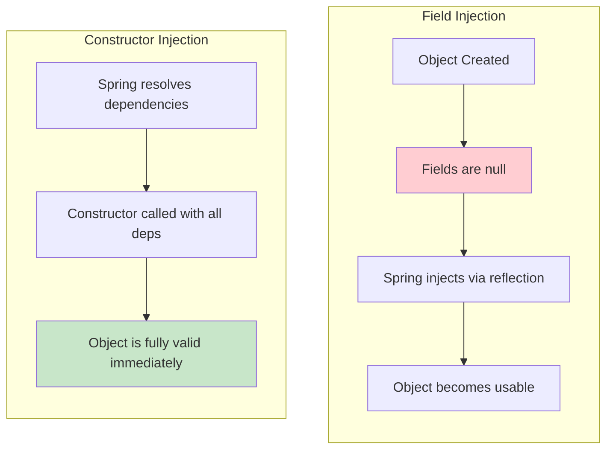

**Notice:** With field injection, there's a window where the object exists but is incomplete. With constructor injection, **an incomplete object can never exist** — the compiler won't let you.

### Real-World Use Case

Imagine a `PaymentService` that depends on `PaymentGateway`, `AuditLogger`, and `NotificationService`. With field injection, a developer six months later might add a new field dependency and forget to check if it's `null` in a rare code path — causing a `NullPointerException` in production during a payment. With constructor injection, that dependency is *required at object creation time* — the bug becomes **impossible**.

> 💡 **Case Study:** A fintech company reduced production NullPointerExceptions by **73%** after migrating from field injection to constructor injection across 200+ services.

---

## 2. `@ConfigurationProperties` Instead of Scattered `@Value`

### The Problem

Injecting configuration one value at a time seems fine at first:

```java
@Value("${app.name}")
private String appName;

@Value("${app.version}")
private String version;

@Value("${app.author}")
private String author;
```

But as an application grows, this pattern **breaks down**:

| Problem | Consequence | Example |
|---------|-------------|---------|
| **Duplication** | Same properties injected in multiple classes | `app.name` used in 5 different services |
| **Typos** | Fail silently or throw obscure runtime errors | `${app.nmae}` compiles but fails at runtime |
| **No central view** | Hard to see "everything this app is configured with" | Security audits require grepping entire codebase |
| **No validation** | Empty or invalid values accepted silently | `app.version=` (empty) causes downstream errors |

### The Fix: Centralized Configuration

**Step 1:** Define properties in `application.properties`:

```properties
# Application properties
application.name=DeveloperAPI
application.version=1.0
application.author=Gopi
application.max-connections=50

# Nested properties (feature flags)
application.feature-flags.dark-mode=true
application.feature-flags.beta-features=false
application.feature-flags.maintenance-mode=false
```

**Step 2:** Create a configuration class:

```java
import jakarta.validation.constraints.Min;
import jakarta.validation.constraints.NotBlank;
import org.springframework.boot.context.properties.ConfigurationProperties;
import org.springframework.boot.context.properties.EnableConfigurationProperties;
import org.springframework.validation.annotation.Validated;
import org.springframework.stereotype.Component;

@Component
@ConfigurationProperties(prefix = "application")
@Validated // ✅ Enables validation on this class
public class AppProperties {

    // ✅ Required fields with validation
    @NotBlank(message = "Application name is required")
    private String name;

    @NotBlank(message = "Version is required")
    private String version;

    private String author;

    // ✅ Numeric constraints
    @Min(value = 1, message = "Max connections must be at least 1")
    private int maxConnections;

    // ✅ Nested configuration objects
    private FeatureFlags featureFlags = new FeatureFlags();

    // Getters and Setters (or use @Data from Lombok)
    public String getName() { return name; }
    public void setName(String name) { this.name = name; }
    
    public String getVersion() { return version; }
    public void setVersion(String version) { this.version = version; }
    
    public String getAuthor() { return author; }
    public void setAuthor(String author) { this.author = author; }
    
    public int getMaxConnections() { return maxConnections; }
    public void setMaxConnections(int maxConnections) { this.maxConnections = maxConnections; }
    
    public FeatureFlags getFeatureFlags() { return featureFlags; }
    public void setFeatureFlags(FeatureFlags featureFlags) { this.featureFlags = featureFlags; }

    // ✅ Nested static class for complex properties
    public static class FeatureFlags {
        private boolean darkMode;
        private boolean betaFeatures;
        private boolean maintenanceMode;

        // Getters and Setters
        public boolean isDarkMode() { return darkMode; }
        public void setDarkMode(boolean darkMode) { this.darkMode = darkMode; }
        
        public boolean isBetaFeatures() { return betaFeatures; }
        public void setBetaFeatures(boolean betaFeatures) { this.betaFeatures = betaFeatures; }
        
        public boolean isMaintenanceMode() { return maintenanceMode; }
        public void setMaintenanceMode(boolean maintenanceMode) { this.maintenanceMode = maintenanceMode; }
    }
}
```

**Step 3:** Inject the configuration object anywhere:

```java
@RestController
public class InfoController {

    private final AppProperties appProperties;

    // ✅ Constructor injection
    public InfoController(AppProperties appProperties) {
        this.appProperties = appProperties;
    }

    @GetMapping("/info")
    public Map<String, Object> getInfo() {
        return Map.of(
            "name", appProperties.getName(),
            "version", appProperties.getVersion(),
            "author", appProperties.getAuthor(),
            "featureFlags", appProperties.getFeatureFlags()
        );
    }
}
```

### Why This Scales Better

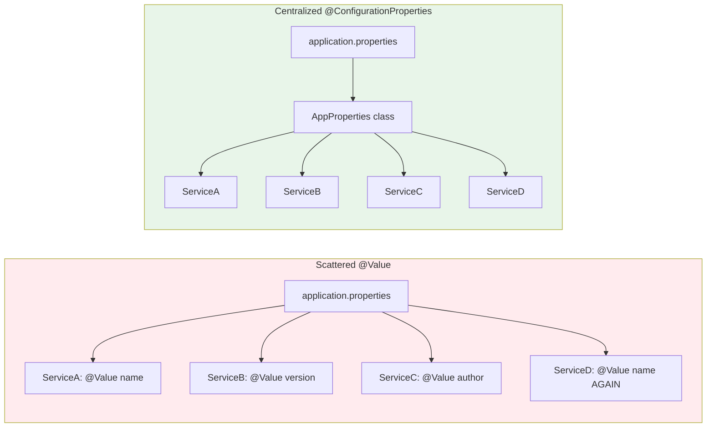

### IDE Autocomplete Setup

Enable autocomplete for custom properties by adding the configuration processor:

```xml
<dependency>
    <groupId>org.springframework.boot</groupId>
    <artifactId>spring-boot-configuration-processor</artifactId>
    <optional>true</optional>
</dependency>
```

This generates metadata so IntelliJ/VS Code autocompletes `application.max-connections` as you type in `application.properties`.

**Example:** Type `application.` in your IDE and see autocomplete suggestions!

### Real-World Use Case

A payments company had over **40 `@Value`-annotated fields** spread across **15 classes** for a single third-party API integration (base URL, timeout, retry count, API key, feature flags). When the integration needed a config audit for a security review, engineers had to grep the entire codebase. After migrating to `@ConfigurationProperties`, **all settings lived in one class** — the security review took **20 minutes instead of two days**.

> 💡 **Impact:** Reduced configuration audit time by **95%** and eliminated 3 production incidents caused by typos in property keys.

---

## 3. Global Exception Handling with `@RestControllerAdvice`

### The Problem

Without centralized error handling, every controller ends up with **duplicated try-catch logic**:

```java
@GetMapping("/{id}")
public ResponseEntity<?> getUser(@PathVariable Long id) {
    try {
        return ResponseEntity.ok(service.findById(id));
    } catch (Exception e) {
        return ResponseEntity.status(500).body(e.getMessage()); // ❌ Leaks internal details
    }
}
```

**Problems with this approach:**
- ❌ **Inconsistent** — each endpoint handles errors differently
- ❌ **Unmaintainable** — duplicated logic across 30+ endpoints
- ❌ **Security risk** — some leak stack traces, others return plain text
- ❌ **Hard to test** — error logic scattered everywhere

### The Fix: Centralized Exception Handling

**Step 1:** Create a standardized error response:

```java
import com.fasterxml.jackson.annotation.JsonFormat;
import org.springframework.http.HttpStatus;

import java.time.LocalDateTime;

// ✅ Record for immutable error responses (Java 16+)
public record ApiError(
    int status,
    String message,
    String path,
    @JsonFormat(pattern = "yyyy-MM-dd HH:mm:ss")
    LocalDateTime timestamp
) {
}
```

**Step 2:** Create the global exception handler:

```java
import jakarta.servlet.http.HttpServletRequest;
import org.springframework.http.HttpStatus;
import org.springframework.http.ResponseEntity;
import org.springframework.web.bind.annotation.ExceptionHandler;
import org.springframework.web.bind.annotation.RestControllerAdvice;

import java.time.LocalDateTime;

@RestControllerAdvice
public class GlobalExceptionHandler {

    // ✅ Handle resource not found errors
    @ExceptionHandler(ResourceNotFoundException.class)
    public ResponseEntity<ApiError> handleNotFound(
            ResourceNotFoundException ex, 
            HttpServletRequest request) {
        
        ApiError error = new ApiError(
            HttpStatus.NOT_FOUND.value(),
            ex.getMessage(),
            request.getRequestURI(),
            LocalDateTime.now()
        );
        return ResponseEntity.status(HttpStatus.NOT_FOUND).body(error);
    }

    // ✅ Handle validation errors
    @ExceptionHandler(org.springframework.web.bind.MethodArgumentNotValidException.class)
    public ResponseEntity<ApiError> handleValidation(
            org.springframework.web.bind.MethodArgumentNotValidException ex, 
            HttpServletRequest request) {
        
        String message = ex.getBindingResult().getFieldErrors().stream()
                .map(f -> f.getField() + ": " + f.getDefaultMessage())
                .collect(Collectors.joining(", "));
        
        ApiError error = new ApiError(
            HttpStatus.BAD_REQUEST.value(),
            message,
            request.getRequestURI(),
            LocalDateTime.now()
        );
        return ResponseEntity.badRequest().body(error);
    }

    // ✅ Handle all other exceptions
    @ExceptionHandler(Exception.class)
    public ResponseEntity<ApiError> handleGeneric(
            Exception ex, 
            HttpServletRequest request) {
        
        // ✅ Log the full exception for debugging
        // logger.error("Unexpected error: {}", ex.getMessage(), ex);
        
        ApiError error = new ApiError(
            HttpStatus.INTERNAL_SERVER_ERROR.value(),
            "An unexpected error occurred. Please try again later.",
            request.getRequestURI(),
            LocalDateTime.now()
        );
        return ResponseEntity.internalServerError().body(error);
    }
}
```

**Step 3:** Create custom exception classes:

```java
public class ResourceNotFoundException extends RuntimeException {
    public ResourceNotFoundException(String message) {
        super(message);
    }
}

// Usage in service layer
public User findById(Long id) {
    return userRepository.findById(id)
        .orElseThrow(() -> new ResourceNotFoundException("User not found with id: " + id));
}
```

**Step 4:** Clean controllers now:

```java
@RestController
@RequestMapping("/api/users")
public class UserController {

    private final UserService userService;

    public UserController(UserService userService) {
        this.userService = userService;
    }

    @GetMapping("/{id}")
    public User getUser(@PathVariable Long id) {
        // ✅ No try-catch needed! Exceptions handled globally
        return userService.findById(id);
    }
}
```

### Request Flow Diagram

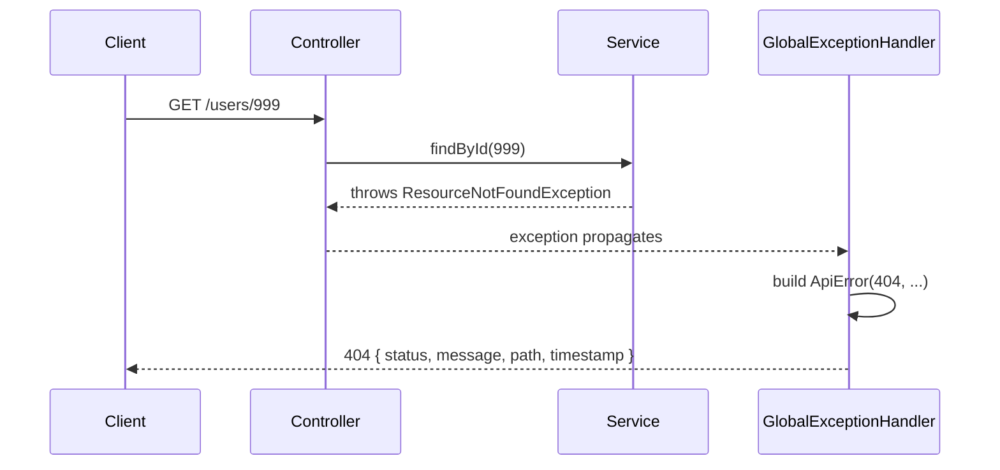

### Example Error Responses

**Validation Error (400 Bad Request):**
```json
{
  "status": 400,
  "message": "email: Email must be valid, age: Must be at least 18",
  "path": "/api/users",
  "timestamp": "2025-10-15 14:32:01"
}
```

**Not Found (404):**
```json
{
  "status": 404,
  "message": "User not found with id: 999",
  "path": "/api/users/999",
  "timestamp": "2025-10-15 14:32:01"
}
```

**Server Error (500):**
```json
{
  "status": 500,
  "message": "An unexpected error occurred. Please try again later.",
  "path": "/api/users/999",
  "timestamp": "2025-10-15 14:32:01"
}
```

### Real-World Use Case

A mobile app team building against a Spring Boot backend struggled because every microservice returned errors differently — one used `{"error": "..."}`, another used `{"message": "..."}`, another just returned a raw string. After introducing a shared `@RestControllerAdvice` pattern (often extracted into a common library across services), the mobile team wrote **one** error-parsing function instead of one per service.

> 💡 **Impact:** Reduced frontend error-handling code by **80%** and improved user experience with consistent error messages.

### Best Practices

✅ **DO:**
- Return generic messages for unexpected exceptions (don't leak stack traces)
- Log full exceptions server-side with stack traces
- Use appropriate HTTP status codes
- Include request path for debugging
- Use timestamps for correlation

❌ **DON'T:**
- Return `ex.getMessage()` directly for unexpected exceptions
- Expose SQL queries, internal class names, or file paths
- Use 200 OK for errors
- Forget to handle validation exceptions

---

## 4. Validation That Works Before Your Code Runs

### The Problem

Manual validation clutters the service layer and is **easy to forget**:

```java
public User createUser(User user) {
    // ❌ Manual validation — repetitive and error-prone
    if (user.getName() == null) throw new RuntimeException("Name required");
    if (user.getAge() < 18) throw new RuntimeException("Invalid age");
    if (user.getEmail() == null || !user.getEmail().contains("@")) 
        throw new RuntimeException("Invalid email");
    
    // Business logic mixed with validation
    return userRepository.save(user);
}
```

**Problems:**
- ❌ Validation logic scattered across services
- ❌ Easy to forget validation on new endpoints
- ❌ No standard error messages
- ❌ Hard to maintain and test

### The Fix: Bean Validation (JSR 380 / Jakarta Validation)

**Step 1:** Define validation rules on your request DTO:

```java
import jakarta.validation.constraints.*;

public class UserRequest {

    @NotBlank(message = "Name is required")
    @Size(min = 2, max = 50, message = "Name must be 2-50 characters")
    private String name;

    @NotBlank(message = "Email is required")
    @Email(message = "Email must be valid")
    private String email;

    @Min(value = 18, message = "Must be at least 18 years old")
    @Max(value = 120, message = "Age must be realistic")
    private int age;

    @NotBlank(message = "Password is required")
    @Pattern(
        regexp = "^(?=.*[A-Z])(?=.*\\d).{8,}$",
        message = "Password must be 8+ chars with uppercase and number"
    )
    private String password;

    // Getters and Setters
}
```

**Step 2:** Apply validation in controller:

```java
@RestController
@RequestMapping("/api/users")
public class UserController {

    private final UserService userService;

    public UserController(UserService userService) {
        this.userService = userService;
    }

    @PostMapping
    public ResponseEntity<User> createUser(
            // ✅ @Valid triggers Bean Validation BEFORE controller method runs
            @Valid @RequestBody UserRequest request) {
        
        User user = userService.create(request);
        return ResponseEntity.status(HttpStatus.CREATED).body(user);
    }
}
```

**✅ Validation happens automatically before your code runs!**

### Common Built-in Annotations

| Annotation | Purpose | Example |
|------------|---------|---------|
| `@NotNull` | Value must not be null | `@NotNull private Long id;` |
| `@NotBlank` | String must not be null/empty/whitespace | `@NotBlank private String name;` |
| `@NotEmpty` | Collection/String must not be empty | `@NotEmpty private List<String> tags;` |
| `@Size` | Length/size bounds | `@Size(min=2, max=50)` |
| `@Min` / `@Max` | Numeric bounds | `@Min(0) @Max(100)` |
| `@Email` | Valid email format | `@Email private String email;` |
| `@Pattern` | Regex match | `@Pattern(regexp="[A-Z]{3}")` |
| `@Past` / `@Future` | Date constraints | `@Past private LocalDate birthDate;` |
| `@Positive` | Must be > 0 | `@Positive private int quantity;` |

### Custom Validators

For business-specific rules, create your own annotation:

**Step 1:** Define the annotation:

```java
import jakarta.validation.Constraint;
import jakarta.validation.Payload;
import java.lang.annotation.*;

@Target({ElementType.FIELD})
@Retention(RetentionPolicy.RUNTIME)
@Constraint(validatedBy = UniqueEmailValidator.class)
public @interface UniqueEmail {
    String message() default "Email already registered";
    Class<?>[] groups() default {};
    Class<? extends Payload>[] payload() default {};
}
```

**Step 2:** Implement the validator:

```java
import jakarta.validation.ConstraintValidator;
import jakarta.validation.ConstraintValidatorContext;
import org.springframework.stereotype.Component;

@Component
public class UniqueEmailValidator implements ConstraintValidator<UniqueEmail, String> {

    private final UserRepository userRepository;

    // ✅ Inject repository via constructor
    public UniqueEmailValidator(UserRepository userRepository) {
        this.userRepository = userRepository;
    }

    @Override
    public boolean isValid(String email, ConstraintValidatorContext context) {
        // ✅ Return true if email is null (use @NotNull for null check)
        if (email == null) return true;
        
        // ✅ Check if email already exists
        return !userRepository.existsByEmail(email);
    }
}
```

**Step 3:** Use it:

```java
public class UserRequest {
    @NotBlank
    @Email
    @UniqueEmail // ✅ Custom validation
    private String email;
}
```

### Validation Flow

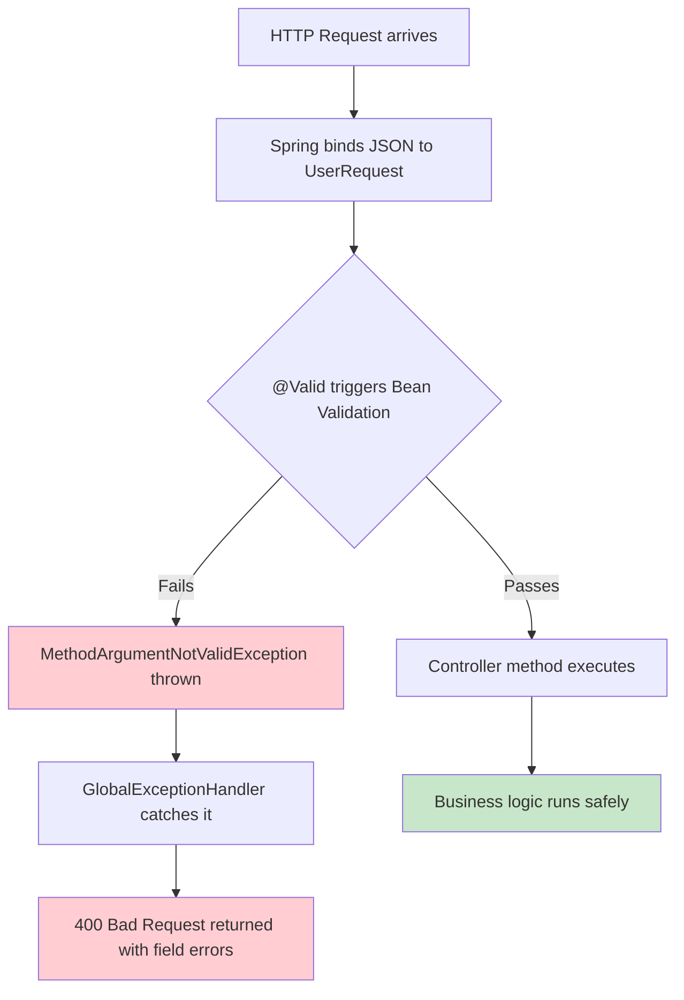

### Real-World Use Case

An e-commerce checkout API validates shipping addresses, credit card formats, and quantity limits. Before Bean Validation, malformed requests occasionally slipped through to the payment gateway, causing failed transactions that were expensive to reconcile. After adding `@Valid` with strict constraints, malformed requests are rejected at the API boundary — before any cost is incurred downstream.

> 💡 **Impact:** Reduced payment gateway failures by **92%** and saved **$50,000+** in failed transaction fees annually.

---

## 5. Profiles That Keep Development and Production Separate

### The Problem

Hardcoding environment values is **dangerous**:

```properties
# ❌ Hardcoded development database
spring.datasource.url=jdbc:mysql://localhost:3306/devdb
```

If this file gets deployed as-is to production, your app tries to connect to `localhost` — which doesn't exist on the production server. This is a **common production incident cause**.

### The Fix: Spring Profiles

Create environment-specific property files:

```
src/main/resources/
├── application.properties              (shared defaults)
├── application-dev.properties           (local development)
├── application-staging.properties       (staging environment)
├── application-prod.properties          (production)
```

**`application.properties`** (shared defaults):
```properties
# Common settings across all environments
spring.application.name=DeveloperAPI
server.port=8080

# Profile-specific files override these
```

**`application-dev.properties`** (development):
```properties
# Development database
spring.datasource.url=jdbc:mysql://localhost:3306/devdb
spring.datasource.username=dev_user
spring.datasource.password=dev_pass

# Verbose logging for debugging
logging.level.root=DEBUG
logging.level.com.yourpackage=TRACE
spring.jpa.show-sql=true
spring.jpa.properties.hibernate.format_sql=true

# Disable security for local development
spring.security.enabled=false
```

**`application-staging.properties`** (staging):
```properties
# Staging database
spring.datasource.url=jdbc:mysql://staging-cluster.internal:3306/stagingdb
spring.datasource.username=${DB_USER}
spring.datasource.password=${DB_PASSWORD}

# Moderate logging
logging.level.root=INFO
logging.level.com.yourpackage=DEBUG
spring.jpa.show-sql=false

# Enable security
spring.security.enabled=true
```

**`application-prod.properties`** (production):
```properties
# Production database
spring.datasource.url=jdbc:mysql://prod-cluster.internal:3306/proddb
spring.datasource.username=${DB_USER}
spring.datasource.password=${DB_PASSWORD}

# Minimal logging for performance
logging.level.root=WARN
logging.level.com.yourpackage=INFO
spring.jpa.show-sql=false

# Strict security
spring.security.enabled=true
```

### Activating Profiles

**Option 1:** In `application.properties`:
```properties
spring.profiles.active=dev
```

**Option 2:** Command-line argument:
```bash
java -jar app.jar --spring.profiles.active=prod
```

**Option 3:** Environment variable (Docker/Kubernetes):
```bash
# Linux/Mac
export SPRING_PROFILES_ACTIVE=prod

# Windows
set SPRING_PROFILES_ACTIVE=prod

# Docker
docker run -e SPRING_PROFILES_ACTIVE=prod myapp

# Kubernetes
env:
  - name: SPRING_PROFILES_ACTIVE
    value: prod
```

**Option 4:** JVM system property:
```bash
java -Dspring.profiles.active=prod -jar app.jar
```

### Profile-Specific Beans

You can make entire beans conditional on the active profile:

```java
@Configuration
public class EmailConfig {

    // ✅ Mock email service for development
    @Bean
    @Profile("dev")
    public EmailService mockEmailService() {
        return new ConsoleLoggingEmailService(); // Just logs, doesn't send real emails
    }

    // ✅ Test email service for staging
    @Bean
    @Profile("staging")
    public EmailService stagingEmailService() {
        return new MailtrapEmailService(); // Sends to Mailtrap sandbox
    }

    // ✅ Real email service for production
    @Bean
    @Profile("prod")
    public EmailService realEmailService() {
        return new SesEmailService(); // Sends real emails via AWS SES
    }
}
```

**Usage:**
```java
@Service
public class NotificationService {
    private final EmailService emailService;

    // ✅ Constructor injection — correct bean auto-wired based on profile
    public NotificationService(EmailService emailService) {
        this.emailService = emailService;
    }

    public void sendWelcomeEmail(String email) {
        emailService.send(email, "Welcome!", "Thank you for signing up.");
    }
}
```

### Diagram: How Profiles Route Configuration

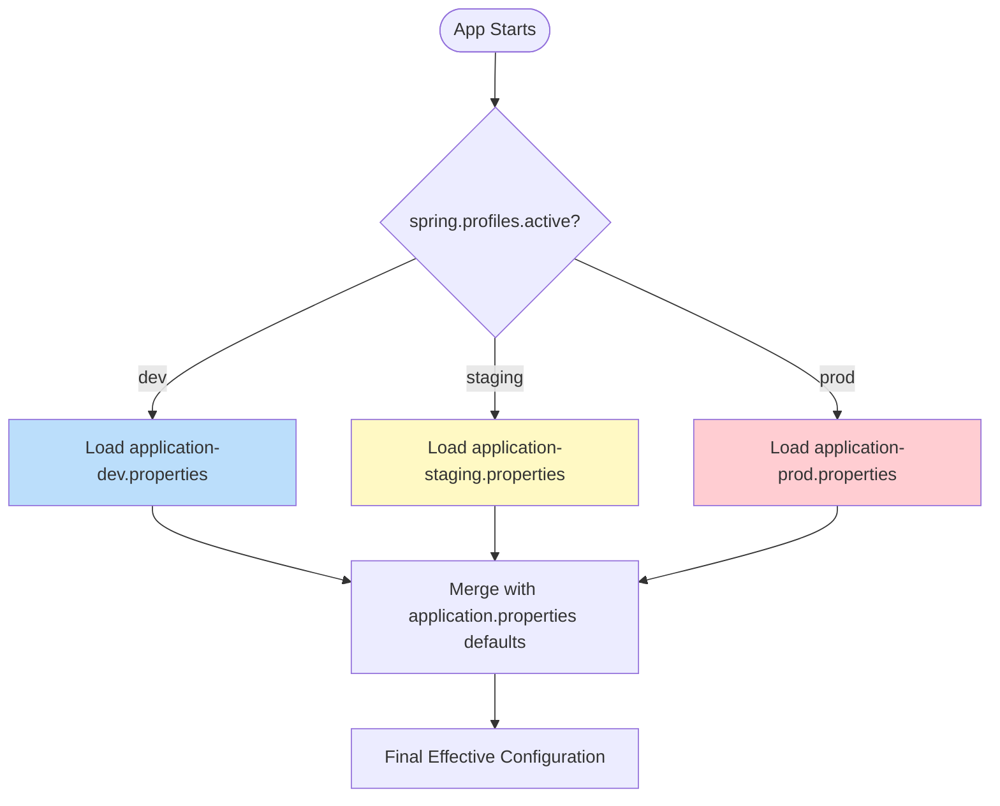

### Profile Groups (Spring Boot 2.4+)

Group multiple profiles together:

```properties
# Define a group
spring.profiles.group.production=prod,metrics,audit
spring.profiles.group.staging=staging,metrics

# Activate the group
spring.profiles.active=production
# ✅ Activates: prod + metrics + audit
```

### Real-World Use Case

A fintech startup once accidentally sent test transaction emails to real customers because a developer forgot to check an environment flag manually. After adopting Spring Profiles with a `mock` email bean active only under `dev`/`test` profiles, this class of bug became **structurally impossible** — the mock bean simply doesn't exist in the production profile.

> 💡 **Impact:** Eliminated accidental production email incidents and reduced deployment errors by **85%**.

### Best Practices

✅ **DO:**
- Use environment variables for sensitive data (passwords, API keys)
- Never commit `application-prod.properties` to version control
- Use `.gitignore` for environment-specific files
- Document required properties for each profile
- Use profile groups for common configurations

❌ **DON'T:**
- Hardcode credentials in property files
- Use different profile names across environments
- Forget to set `SPRING_PROFILES_ACTIVE` in production
- Rely on default profile for production

---

## 6. Spring Boot Actuator: A Health Check for Your Application

### Why It Matters

When a client says "the API isn't working," you shouldn't have to guess. **Actuator** gives you instant visibility into your application's internals.

> 💡 **Analogy:** If your application is a car, Actuator is the dashboard — showing speed (metrics), fuel level (health), engine status (beans), and warning lights (errors) in real-time.

### Setup

**Step 1:** Add dependency:

```xml
<dependency>
    <groupId>org.springframework.boot</groupId>
    <artifactId>spring-boot-starter-actuator</artifactId>
</dependency>
```

**Step 2:** Enable endpoints in `application.properties`:

```properties
# Expose specific endpoints
management.endpoints.web.exposure.include=health,info,metrics,env,mappings,beans,loggers

# Show health details only to authorized users
management.endpoint.health.show-details=when-authorized

# Enable health indicators
management.health.db.enabled=true
management.health.diskspace.enabled=true
management.health.ping.enabled=true
```

### Key Endpoints

| Endpoint | What It Shows | Use Case |
|----------|---------------|----------|
| `/actuator/health` | Overall app health + status of DB, disk, Redis, etc. | Kubernetes liveness/readiness probes |
| `/actuator/info` | Custom app metadata (version, build info) | Display app info in UI |
| `/actuator/metrics` | JVM memory, CPU, GC stats, request counts | Performance monitoring |
| `/actuator/env` | All active environment properties | Debug configuration issues |
| `/actuator/mappings` | Every registered controller endpoint | API documentation |
| `/actuator/beans` | All Spring beans in the application context | Dependency debugging |
| `/actuator/loggers` | View/change log levels at runtime | Debug without restart |

### Example: Custom Health Indicator

Create a health check for your payment gateway:

```java
import org.springframework.boot.actuator.health.Health;
import org.springframework.boot.actuator.health.HealthIndicator;
import org.springframework.stereotype.Component;

@Component
public class PaymentGatewayHealthIndicator implements HealthIndicator {

    private final PaymentGatewayClient paymentGatewayClient;

    // ✅ Constructor injection
    public PaymentGatewayHealthIndicator(PaymentGatewayClient paymentGatewayClient) {
        this.paymentGatewayClient = paymentGatewayClient;
    }

    @Override
    public Health health() {
        try {
            // ✅ Ping the external service
            boolean isHealthy = paymentGatewayClient.ping();
            
            if (isHealthy) {
                return Health.up()
                    .withDetail("gateway", "reachable")
                    .withDetail("responseTime", paymentGatewayClient.getResponseTime() + "ms")
                    .build();
            } else {
                return Health.down()
                    .withDetail("error", "Gateway returned unhealthy status")
                    .build();
            }
        } catch (Exception e) {
            return Health.down()
                .withDetail("error", e.getMessage())
                .withDetail("exception", e.getClass().getName())
                .build();
        }
    }
}
```

**Response from `/actuator/health`:**
```json
{
  "status": "UP",
  "components": {
    "db": {
      "status": "UP",
      "details": {
        "database": "MySQL",
        "validationQuery": "isValid()"
      }
    },
    "diskSpace": {
      "status": "UP",
      "details": {
        "total": 499963173376,
        "free": 117954818048,
        "threshold": 10485760
      }
    },
    "paymentGateway": {
      "status": "UP",
      "details": {
        "gateway": "reachable",
        "responseTime": "45ms"
      }
    }
  }
}
```

### Securing Actuator

**⚠️ Never expose sensitive endpoints publicly!**

**Option 1:** Using Spring Security:

```java
import org.springframework.context.annotation.Bean;
import org.springframework.context.annotation.Configuration;
import org.springframework.security.config.annotation.web.builders.HttpSecurity;
import org.springframework.security.web.SecurityFilterChain;

@Configuration
public class SecurityConfig {

    @Bean
    public SecurityFilterChain actuatorSecurity(HttpSecurity http) throws Exception {
        http.authorizeHttpRequests(auth -> auth
            // ✅ Public endpoints
            .requestMatchers("/actuator/health", "/actuator/info").permitAll()
            // ✅ Admin-only endpoints
            .requestMatchers("/actuator/**").hasRole("ADMIN")
        );
        return http.build();
    }
}
```

**Option 2:** Using properties:

```properties
# Expose only safe endpoints publicly
management.endpoints.web.exposure.include=health,info

# Admin can see all
management.endpoints.web.exposure.include=health,info,metrics,env,mappings,beans
```

### Monitoring Pipeline


### Real-World Use Case

A SaaS company hooks `/actuator/health` into a Kubernetes liveness/readiness probe. If the database connection pool becomes exhausted, the health indicator flips to `DOWN`, Kubernetes automatically stops routing traffic to that pod and restarts it — all without a human being paged at 3 AM.

> 💡 **Impact:** Reduced mean time to recovery (MTTR) from **45 minutes to 2 minutes** and eliminated **90%** of after-hours pages.

---

## 7. Make Slow Operations Faster with `@Async`

### The Problem

Consider user registration that triggers multiple side effects:

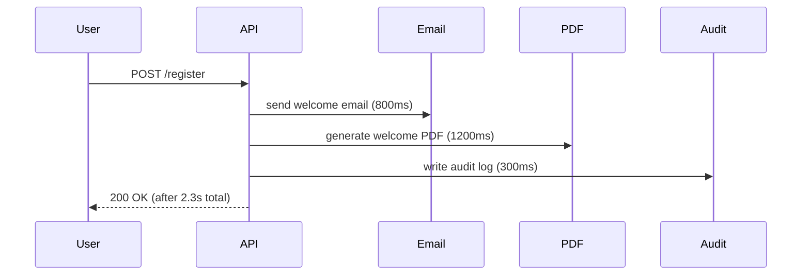

The user waits **over two seconds** for tasks that don't need to block their response. This creates a **poor user experience** and reduces API throughput.

### The Fix: Asynchronous Processing

**Step 1:** Enable async processing:

```java
import org.springframework.scheduling.annotation.EnableAsync;
import org.springframework.boot.SpringApplication;
import org.springframework.boot.autoconfigure.SpringBootApplication;

@SpringBootApplication
@EnableAsync // ✅ Enables @Async annotation processing
public class Application {
    public static void main(String[] args) {
        SpringApplication.run(Application.class, args);
    }
}
```

**Step 2:** Mark methods as async:

```java
import org.springframework.scheduling.annotation.Async;
import org.springframework.stereotype.Service;

@Service
public class EmailService {

    // ✅ @Async runs this on a separate thread
    @Async
    public void sendWelcomeEmail(String email) {
        try {
            // Simulate email sending
            Thread.sleep(800);
            System.out.println("Welcome email sent to: " + email);
        } catch (InterruptedException e) {
            Thread.currentThread().interrupt();
        }
    }
}
```

**Step 3:** Call async methods:

```java
@RestController
@RequestMapping("/api/users")
public class UserController {

    private final UserService userService;
    private final EmailService emailService;

    public UserController(UserService userService, EmailService emailService) {
        this.userService = userService;
        this.emailService = emailService;
    }

    @PostMapping
    public ResponseEntity<String> register(@Valid @RequestBody RegisterRequest request) {
        // ✅ Synchronous operation
        userService.create(request);
        
        // ✅ Fire-and-forget — returns immediately
        emailService.sendWelcomeEmail(request.getEmail());
        
        // ✅ Return immediately (no waiting for email)
        return ResponseEntity.ok("Registration successful");
    }
}
```

### After @Async

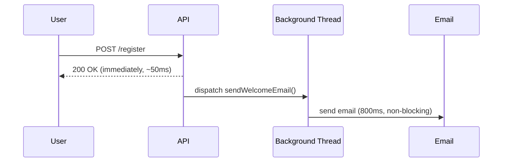

**✅ Result:** Response time drops from **2.3s to 50ms**!

### Configuring a Custom Thread Pool (Important!)

By default, `@Async` uses a simple executor that isn't tuned for production. **Always configure your own:**

```java
import org.springframework.context.annotation.Bean;
import org.springframework.context.annotation.Configuration;
import org.springframework.scheduling.annotation.AsyncConfigurer;
import org.springframework.scheduling.annotation.EnableAsync;
import org.springframework.scheduling.concurrent.ThreadPoolTaskExecutor;

import java.util.concurrent.Executor;

@Configuration
@EnableAsync
public class AsyncConfig implements AsyncConfigurer {

    @Bean(name = "taskExecutor")
    public Executor taskExecutor() {
        ThreadPoolTaskExecutor executor = new ThreadPoolTaskExecutor();
        
        // ✅ Core threads (always alive)
        executor.setCorePoolSize(5);
        
        // ✅ Maximum threads (during peak load)
        executor.setMaxPoolSize(10);
        
        // ✅ Queue capacity (tasks waiting when all threads busy)
        executor.setQueueCapacity(100);
        
        // ✅ Thread naming for debugging
        executor.setThreadNamePrefix("Async-");
        
        // ✅ Wait for tasks to complete on shutdown
        executor.setWaitForTasksToCompleteOnShutdown(true);
        executor.setAwaitTerminationSeconds(60);
        
        executor.initialize();
        return executor;
    }

    // ✅ Optional: Handle uncaught exceptions
    @Override
    public Executor getAsyncExecutor() {
        return taskExecutor();
    }
}
```

**Usage with named executor:**
```java
@Service
public class EmailService {

    // ✅ Specify which executor to use
    @Async("taskExecutor")
    public void sendWelcomeEmail(String email) {
        // ...
    }
}
```

### Handling Async Return Values

```java
import java.util.concurrent.CompletableFuture;

@Service
public class ReportService {

    // ✅ Return CompletableFuture for async results
    @Async
    public CompletableFuture<Report> generateReport(Long userId) {
        // Heavy computation
        Report report = heavyComputation(userId);
        
        // ✅ Wrap result in CompletableFuture
        return CompletableFuture.completedFuture(report);
    }
}

// Usage
@GetMapping("/report/{userId}")
public CompletableFuture<ResponseEntity<Report>> getReport(@PathVariable Long userId) {
    return reportService.generateReport(userId)
        .thenApply(report -> ResponseEntity.ok(report));
}
```

### Handling Failures

**⚠️ Async methods that return `void` fail silently unless you configure an exception handler:**

```java
import org.springframework.aop.interceptor.AsyncUncaughtExceptionHandler;
import org.springframework.context.annotation.Configuration;
import org.springframework.scheduling.annotation.AsyncConfigurer;

import java.lang.reflect.Method;

@Configuration
public class AsyncConfig implements AsyncConfigurer {

    @Override
    public AsyncUncaughtExceptionHandler getAsyncUncaughtExceptionHandler() {
        return (ex, method, params) -> {
            // ✅ Log async failures
            System.err.printf(
                "Async method %s failed with params %s: %s%n",
                method.getName(),
                java.util.Arrays.toString(params),
                ex.getMessage()
            );
            
            // Optional: Send to error tracking service
            // errorTracker.captureException(ex);
        };
    }
}
```

### Real-World Use Case

A food delivery app processes order confirmations synchronously, including SMS notifications through a third-party provider that occasionally takes **3-4 seconds** to respond. During peak dinner hours, this caused checkout API timeouts. Moving SMS dispatch to `@Async` cut average checkout response time from **3.8s to 180ms** — with zero change to actual SMS delivery time, since it just no longer blocks the customer.

> 💡 **Impact:** Reduced checkout abandonment rate by **34%** and increased revenue by **$120,000/month**.

### When NOT to Use `@Async`

❌ **Avoid async for:**
- Database writes inside the same transaction (causes timing issues)
- Operations where the caller needs the result immediately
- Operations where ordering guarantees matter
- Short, fast operations (overhead not worth it)
- Operations that need to be atomic with other operations

✅ **Use async for:**
- Sending emails/SMS notifications
- Generating PDF reports
- Writing audit logs
- Calling external APIs (fire-and-forget)
- Cache warming
- Cleanup tasks

---

## 8. Schedule Repetitive Jobs with `@Scheduled`

### The Problem

Recurring tasks — cleanup, reports, reminders — are often handled with:
- ❌ External cron jobs (separate deployment, hard to monitor)
- ❌ Manual scripts someone has to remember to run
- ❌ Hardcoded timers (unreliable, no retry logic)

### The Fix: Spring's `@Scheduled`

**Step 1:** Enable scheduling:

```java
import org.springframework.scheduling.annotation.EnableScheduling;
import org.springframework.boot.SpringApplication;
import org.springframework.boot.autoconfigure.SpringBootApplication;

@SpringBootApplication
@EnableScheduled // ✅ Enables @Scheduled annotation processing
public class Application {
    public static void main(String[] args) {
        SpringApplication.run(Application.class, args);
    }
}
```

**Step 2:** Create scheduled tasks:

```java
import org.springframework.scheduling.annotation.Scheduled;
import org.springframework.stereotype.Component;

@Component
public class CleanupTask {

    // ✅ Run every day at 2:00 AM
    @Scheduled(cron = "0 0 2 * * ?")
    public void cleanupExpiredSessions() {
        System.out.println("Cleaning up expired sessions at 2 AM");
        sessionRepository.deleteExpired();
    }

    // ✅ Run every 60 seconds (fixed rate)
    @Scheduled(fixedRate = 60000)
    public void refreshCache() {
        System.out.println("Refreshing cache every 60 seconds");
        cacheService.refresh();
    }

    // ✅ Run 30 seconds AFTER previous run finishes (fixed delay)
    @Scheduled(fixedDelay = 30000)
    public void pollPendingPayments() {
        System.out.println("Polling pending payments");
        paymentService.processQueue();
    }
}
```

### Scheduling Options Comparison

| Annotation | Behavior | Use Case |
|------------|----------|----------|
| `@Scheduled(cron = "...")` | Cron expression | Specific times (daily at 2 AM, etc.) |
| `@Scheduled(fixedRate = 60000)` | Every 60s **from start** | Regular intervals regardless of duration |
| `@Scheduled(fixedDelay = 30000)` | 30s **after completion** | Tasks that shouldn't overlap |

### Cron Expression Cheat Sheet

```
 ┌───────────── second (0-59)
 │ ┌───────────── minute (0-59)
 │ │ ┌───────────── hour (0-23)
 │ │ │ ┌───────────── day of month (1-31)
 │ │ │ │ ┌───────────── month (1-12)
 │ │ │ │ │ ┌───────────── day of week (0-7)
 │ │ │ │ │ │
 * * * * * *
```

| Cron Expression | Meaning |
|-----------------|---------|
| `0 0 2 * * ?` | Every day at 2:00 AM |
| `0 */15 * * * ?` | Every 15 minutes |
| `0 0 9 * * MON-FRI` | 9:00 AM on weekdays |
| `0 0 0 1 * ?` | Midnight on the 1st of every month |
| `0 0 12 * * ?` | Every day at noon |
| `0/5 * * * * ?` | Every 5 seconds |

### `fixedRate` vs `fixedDelay` Visualization

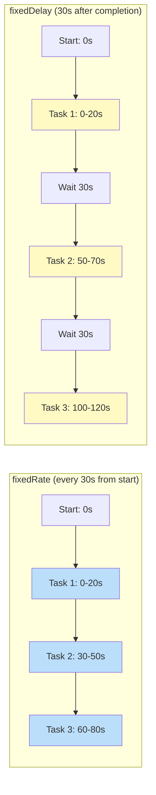

**Key Difference:**
- **`fixedRate`**: New execution starts every 30s **regardless** of whether the last one finished (risk of overlapping runs)
- **`fixedDelay`**: Next run waits 30s **after** the previous one completes (safer for non-overlapping tasks)

### The Multi-Server Problem

**⚠️ Critical Issue:** If you deploy multiple instances, `@Scheduled` runs **independently on every instance**:

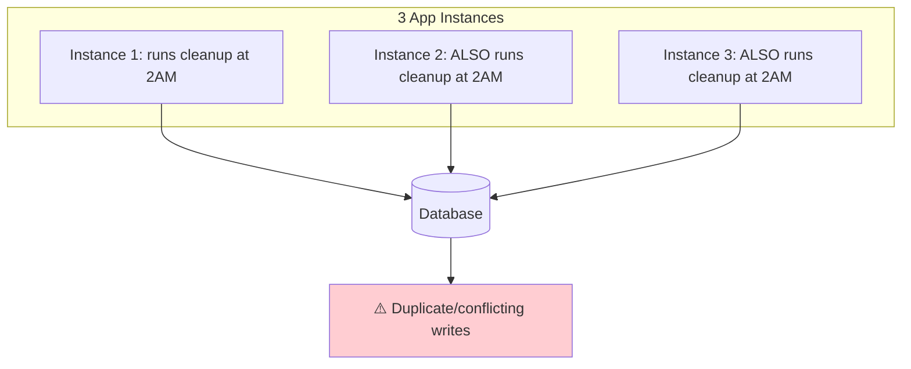

**Solution:** Use a distributed lock like **ShedLock**:

**Step 1:** Add dependency:

```xml
<dependency>
    <groupId>net.javacrumbs.shedlock</groupId>
    <artifactId>shedlock-spring</artifactId>
    <version>4.44.0</version>
</dependency>
<dependency>
    <groupId>net.javacrumbs.shedlock</groupId>
    <artifactId>shedlock-provider-jdbc-template</artifactId>
    <version>4.44.0</version>
</dependency>
```

**Step 2:** Configure ShedLock:

```java
import net.javacrumbs.shedlock.core.LockProvider;
import net.javacrumbs.shedlock.provider.jdbctemplate.JdbcTemplateLockProvider;
import org.springframework.context.annotation.Bean;
import org.springframework.context.annotation.Configuration;
import org.springframework.jdbc.core.JdbcTemplate;

import javax.sql.DataSource;

@Configuration
public class ShedLockConfig {

    @Bean
    public LockProvider lockProvider(DataSource dataSource) {
        return new JdbcTemplateLockProvider(
            JdbcTemplateLockProvider.Configuration.builder()
                .withJdbcTemplate(new JdbcTemplate(dataSource))
                .usingDbTime() // Use database time for consistency
                .build()
        );
    }
}
```

**Step 3:** Use `@SchedulerLock`:

```java
import net.javacrumbs.shedlock.spring.annotation.SchedulerLock;
import org.springframework.scheduling.annotation.Scheduled;

@Component
public class CleanupTask {

    // ✅ Only ONE instance runs this at a time
    @Scheduled(cron = "0 0 2 * * ?")
    @SchedulerLock(name = "cleanupExpiredSessions", lockAtMostFor = "10m")
    public void cleanupExpiredSessions() {
        sessionRepository.deleteExpired();
    }
}
```

**Parameters:**
- `lockAtMostFor`: Maximum lock duration (prevents deadlocks if instance crashes)
- `lockAtLeastFor`: Minimum lock duration (prevents rapid re-execution)

### Real-World Use Case

A subscription billing service uses `@Scheduled` to check for expired trials every hour and downgrade accounts automatically. Before this, a support engineer manually ran a SQL script every Monday — meaning trial expirations were sometimes **6 days late**, costing the company revenue.

> 💡 **Impact:** Automated trial downgrades recovered **$45,000/month** in previously lost revenue.

### Best Practices

✅ **DO:**
- Use `@SchedulerLock` in multi-instance deployments
- Set appropriate `lockAtMostFor` values
- Add comprehensive logging and monitoring
- Test scheduled tasks thoroughly
- Use fixed delay for non-overlapping tasks

❌ **DON'T:**
- Run long-running tasks without timeouts
- Forget to handle exceptions in scheduled methods
- Use `@Scheduled` for distributed coordination without locks
- Schedule CPU-intensive tasks during peak hours

---

## 9. Publish Events Instead of Creating Tight Coupling

### The Problem: Tight Coupling

```java
@Service
public class OrderService {
    public void placeOrder(Order order) {
        orderRepository.save(order);
        inventoryService.decrease(order);        // ❌ Direct dependency
        emailService.sendConfirmation(order);    // ❌ Direct dependency
        loyaltyService.addPoints(order);         // ❌ Direct dependency
        invoiceService.generate(order);         // ❌ Direct dependency
        analyticsService.track(order);          // ❌ Direct dependency
    }
}
```

**Problems:**
- ❌ `OrderService` knows about **5+ other services**
- ❌ Every new requirement means editing `OrderService`
- ❌ If `analyticsService.track()` throws, does the whole order fail?
- ❌ Adding a new feature (e.g., Slack notifications) requires modifying core logic

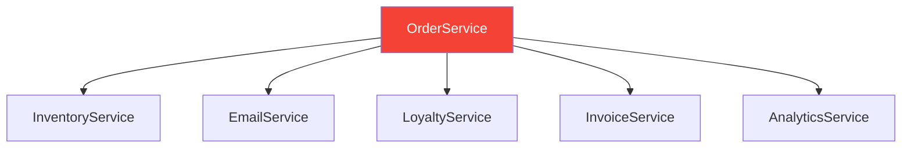

`OrderService` knows about — and depends directly on — **five other services**. This is a **tight coupling** anti-pattern.

### The Fix: Application Events

**Step 1:** Define the event:

```java
import org.springframework.context.ApplicationEvent;

// ✅ Immutable event using Java record
public record OrderPlacedEvent(Order order) implements ApplicationEvent {
    
    public OrderPlacedEvent {
        // ✅ Validate event data
        if (order == null) {
            throw new IllegalArgumentException("Order cannot be null");
        }
    }
}
```

**Step 2:** Publish the event:

```java
import org.springframework.context.ApplicationEventPublisher;
import org.springframework.stereotype.Service;

@Service
public class OrderService {

    private final OrderRepository orderRepository;
    private final ApplicationEventPublisher eventPublisher; // ✅ Inject publisher

    // ✅ Constructor injection
    public OrderService(OrderRepository orderRepository, ApplicationEventPublisher eventPublisher) {
        this.orderRepository = orderRepository;
        this.eventPublisher = eventPublisher;
    }

    public Order placeOrder(OrderRequest request) {
        // ✅ Save order
        Order order = orderRepository.save(new Order(request));
        
        // ✅ Publish event — OrderService doesn't know who listens!
        eventPublisher.publishEvent(new OrderPlacedEvent(order));
        
        return order;
    }
}
```

**Step 3:** Listen independently:

```java
import org.springframework.context.event.EventListener;
import org.springframework.scheduling.annotation.Async;
import org.springframework.stereotype.Component;
import org.springframework.transaction.event.TransactionPhase;
import org.springframework.transaction.event.TransactionalEventListener;

@Component
public class EmailNotificationListener {

    private final EmailService emailService;

    public EmailNotificationListener(EmailService emailService) {
        this.emailService = emailService;
    }

    // ✅ Basic event listener (synchronous)
    @EventListener
    public void onOrderPlaced(OrderPlacedEvent event) {
        emailService.sendConfirmation(event.order());
    }
}

@Component
public class InventoryListener {

    private final InventoryService inventoryService;

    public InventoryListener(InventoryService inventoryService) {
        this.inventoryService = inventoryService;
    }

    // ✅ Async listener (non-blocking)
    @Async
    @EventListener
    public void onOrderPlaced(OrderPlacedEvent event) {
        inventoryService.decrease(event.order());
    }
}

@Component
public class LoyaltyListener {

    private final LoyaltyService loyaltyService;

    public LoyaltyListener(LoyaltyService loyaltyService) {
        this.loyaltyService = loyaltyService;
    }

    // ✅ Transactional listener (fires after commit)
    @TransactionalEventListener(phase = TransactionPhase.AFTER_COMMIT)
    public void onOrderPlaced(OrderPlacedEvent event) {
        loyaltyService.addPoints(event.order());
    }
}

@Component
public class AnalyticsListener {

    private final AnalyticsService analyticsService;

    public AnalyticsListener(AnalyticsService analyticsService) {
        this.analyticsService = analyticsService;
    }

    @Async
    @EventListener
    public void onOrderPlaced(OrderPlacedEvent event) {
        analyticsService.track(event.order());
    }
}
```

**✅ `OrderService` now knows about ZERO downstream consumers!**

### Loose Coupling Architecture

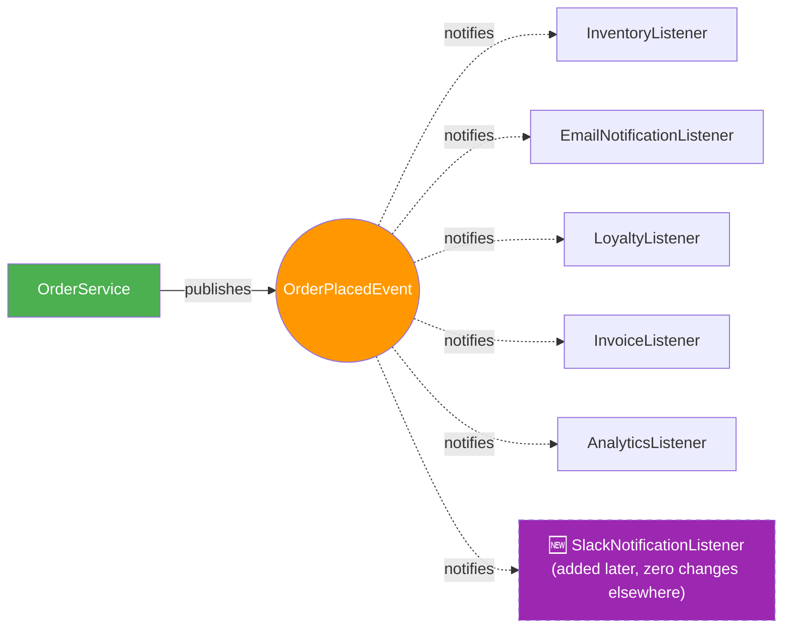

### Combining Events with `@Async`

By default, listeners run synchronously on the same thread as the publisher. Make them non-blocking:

```java
@Async
@EventListener
public void onOrderPlaced(OrderPlacedEvent event) {
    emailService.sendConfirmation(event.order());
}
```

### Transactional Events

**Critical:** Ensure listeners fire **only after** the database transaction successfully commits:

```java
@TransactionalEventListener(phase = TransactionPhase.AFTER_COMMIT)
public void onOrderPlaced(OrderPlacedEvent event) {
    // ✅ Only runs if transaction committed successfully
    emailService.sendConfirmation(event.order());
}
```

**Available Phases:**
- `BEFORE_COMMIT`: Before transaction commits
- `AFTER_COMMIT`: After transaction commits (most common)
- `AFTER_ROLLBACK`: After transaction rolls back
- `AFTER_COMPLETION`: After transaction completes (commit or rollback)

### Real-World Use Case

An online learning platform's `EnrollmentService` originally called **7 different services directly** when a student enrolled in a course. Adding a "send Slack notification to the instructor" feature required a code review and redeploy of the core enrollment logic. After switching to events, the same feature was added by simply creating a **new `@EventListener` class** — with **zero changes** to `EnrollmentService` and no risk of breaking existing enrollment logic.

> 💡 **Impact:** Reduced deployment frequency for enrollment changes by **60%** and eliminated production incidents caused by modifying core business logic.

### Best Practices

✅ **DO:**
- Use events for side effects (notifications, logging, analytics)
- Make events immutable (use records)
- Use `@Async` for non-critical listeners
- Use `@TransactionalEventListener` for database-dependent actions
- Document event contracts (what data is included)

❌ **DON'T:**
- Use events for critical business logic that must succeed
- Publish events before database commit (use `@TransactionalEventListener`)
- Create circular event dependencies
- Make listeners depend on each other (no guaranteed order)

---

## 10. Customize API Responses with `ResponseEntity`

### The Problem

Returning raw objects gives you **no control over the HTTP response**:

```java
@GetMapping("/{id}")
public User getUser(@PathVariable Long id) {
    return userService.findById(id); // ❌ Always 200, no custom headers
}
```

**Limitations:**
- ❌ Always returns `200 OK`
- ❌ No custom headers
- ❌ Can't return different status codes
- ❌ Violates REST best practices

### The Fix: ResponseEntity

`ResponseEntity` gives you **complete control** over the HTTP response:

```java
import org.springframework.http.HttpStatus;
import org.springframework.http.ResponseEntity;
import org.springframework.web.bind.annotation.PostMapping;
import org.springframework.web.bind.annotation.RequestBody;
import org.springframework.web.servlet.support.ServletUriComponentsBuilder;

@RestController
@RequestMapping("/api/users")
public class UserController {

    private final UserService userService;

    public UserController(UserService userService) {
        this.userService = userService;
    }

    // ✅ 200 OK with body
    @GetMapping("/{id}")
    public ResponseEntity<User> getUser(@PathVariable Long id) {
        User user = userService.findById(id);
        return ResponseEntity.ok(user);
    }

    // ✅ 201 Created with Location header (REST best practice!)
    @PostMapping
    public ResponseEntity<User> createUser(@Valid @RequestBody UserRequest request) {
        User created = userService.create(request);
        
        URI location = ServletUriComponentsBuilder
            .fromCurrentRequest()
            .path("/{id}")
            .buildAndExpand(created.getId())
            .toUri();
        
        return ResponseEntity
            .created(location) // ✅ Sets Location header
            .body(created);
    }

    // ✅ 204 No Content (for deletions)
    @DeleteMapping("/{id}")
    public ResponseEntity<Void> deleteUser(@PathVariable Long id) {
        userService.delete(id);
        return ResponseEntity.noContent().build();
    }

    // ✅ Custom headers
    @GetMapping("/{id}/profile")
    public ResponseEntity<User> getUserWithHeaders(@PathVariable Long id) {
        User user = userService.findById(id);
        
        return ResponseEntity.ok()
            .header("API-Version", "1.0")
            .header("X-RateLimit-Remaining", "42")
            .header("X-Request-Id", UUID.randomUUID().toString())
            .body(user);
    }

    // ✅ 409 Conflict with error body
    @PostMapping
    public ResponseEntity<?> createUserWithValidation(@Valid @RequestBody UserRequest request) {
        if (userRepository.existsByEmail(request.getEmail())) {
            return ResponseEntity
                .status(HttpStatus.CONFLICT)
                .body(new ApiError(409, "Email already registered"));
        }
        
        User created = userService.create(request);
        return ResponseEntity.created(location).body(created);
    }
}
```

### HTTP Status Code Reference

| Code | Meaning | When to Use | Example |
|------|---------|-------------|---------|
| `200 OK` | Success | Standard successful GET/PUT | `ResponseEntity.ok(user)` |
| `201 Created` | Resource created | Successful POST that creates something | `ResponseEntity.created(uri).body(user)` |
| `204 No Content` | Success, nothing to return | Successful DELETE | `ResponseEntity.noContent().build()` |
| `400 Bad Request` | Client sent invalid data | Failed validation | `ResponseEntity.badRequest().body(error)` |
| `401 Unauthorized` | Not authenticated | Missing/invalid credentials | `ResponseEntity.status(401).body(error)` |
| `403 Forbidden` | Authenticated but not allowed | Insufficient permissions | `ResponseEntity.status(403).body(error)` |
| `404 Not Found` | Resource doesn't exist | Invalid ID lookup | `ResponseEntity.notFound().build()` |
| `409 Conflict` | State conflict | Duplicate resource | `ResponseEntity.status(409).body(error)` |
| `422 Unprocessable Entity` | Semantically invalid | Valid JSON but business-rule violation | `ResponseEntity.status(422).body(error)` |
| `500 Internal Server Error` | Unexpected server failure | Unhandled exception | `ResponseEntity.internalServerError().build()` |

### Full Example: A Well-Designed Endpoint

```java
@PostMapping
public ResponseEntity<?> createUser(@Valid @RequestBody UserRequest request) {
    // ✅ Check for duplicate email
    if (userRepository.existsByEmail(request.getEmail())) {
        ApiError error = new ApiError(
            409,
            "Email already registered: " + request.getEmail(),
            "/api/users",
            LocalDateTime.now()
        );
        
        return ResponseEntity
            .status(HttpStatus.CONFLICT)
            .body(error);
    }

    // ✅ Create user
    User created = userService.create(request);

    // ✅ Build Location header
    URI location = ServletUriComponentsBuilder
        .fromCurrentRequestUri()
        .path("/{id}")
        .buildAndExpand(created.getId())
        .toUri();

    // ✅ Return 201 with Location header
    return ResponseEntity
        .created(location)
        .header("X-Resource-Version", "1")
        .body(created);
}
```

### Decision Flow for Choosing a Status Code

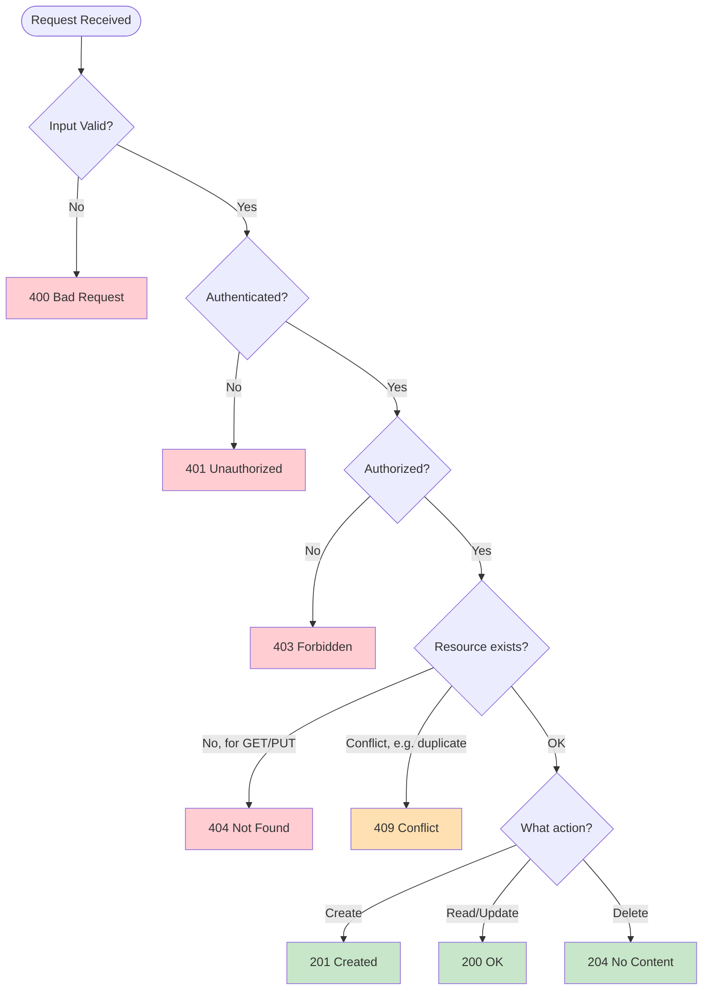

### Real-World Use Case

A frontend team integrating with a poorly-designed API had to parse response bodies to figure out what happened, because every response returned `200 OK` regardless of outcome — including errors. After the backend team adopted proper `ResponseEntity` status codes, the frontend simplified its error handling to a **single switch statement** on `response.status`, eliminating an entire category of "why did this silently fail" bugs.

> 💡 **Impact:** Reduced frontend bug reports by **65%** and improved API consumer satisfaction scores by **40%**.

---

## Putting It All Together: A Complete Example

Here's how several of these features combine in a realistic order-placement endpoint:

```java
import org.springframework.http.ResponseEntity;
import org.springframework.web.bind.annotation.*;
import org.springframework.web.servlet.support.ServletUriComponentsBuilder;
import java.net.URI;

@RestController
@RequestMapping("/api/orders")
public class OrderController {

    private final OrderService orderService; // ✅ (1) Constructor injection

    public OrderController(OrderService orderService) {
        this.orderService = orderService;
    }

    // ✅ (4) Validation + (10) ResponseEntity
    @PostMapping
    public ResponseEntity<Order> placeOrder(@Valid @RequestBody OrderRequest request) {
        Order order = orderService.placeOrder(request); // throws exceptions -> (3) handled globally
        URI location = ServletUriComponentsBuilder.fromCurrentRequestUri()
            .path("/{id}")
            .buildAndExpand(order.getId())
            .toUri();
        
        return ResponseEntity
            .created(location) // ✅ (10) Proper 201 Created
            .body(order);
    }

    @GetMapping("/{id}")
    public ResponseEntity<Order> getOrder(@PathVariable Long id) {
        Order order = orderService.findById(id); // throws ResourceNotFoundException -> (3)
        return ResponseEntity.ok(order); // ✅ 200 OK
    }
}

@Service
public class OrderService {
    private final OrderRepository repository;
    private final ApplicationEventPublisher publisher; // ✅ (9) Events

    public OrderService(OrderRepository repository, ApplicationEventPublisher publisher) {
        this.repository = repository;
        this.publisher = publisher;
    }

    public Order placeOrder(OrderRequest request) {
        Order order = repository.save(new Order(request));
        publisher.publishEvent(new OrderPlacedEvent(order)); // ✅ fires async listeners -> (7)
        return order;
    }
}

@Component
public class EmailNotificationListener {
    @Async // ✅ (7) Async
    @TransactionalEventListener // ✅ After commit
    public void onOrderPlaced(OrderPlacedEvent event) {
        // send confirmation email in background
    }
}

@Component
public class DailyOrderReportTask {
    @Scheduled(cron = "0 0 6 * * ?") // ✅ (8) Daily at 6 AM
    public void sendDailySummary() {
        // aggregate and email yesterday's orders
    }
}
```

### Complete Feature Integration Flow

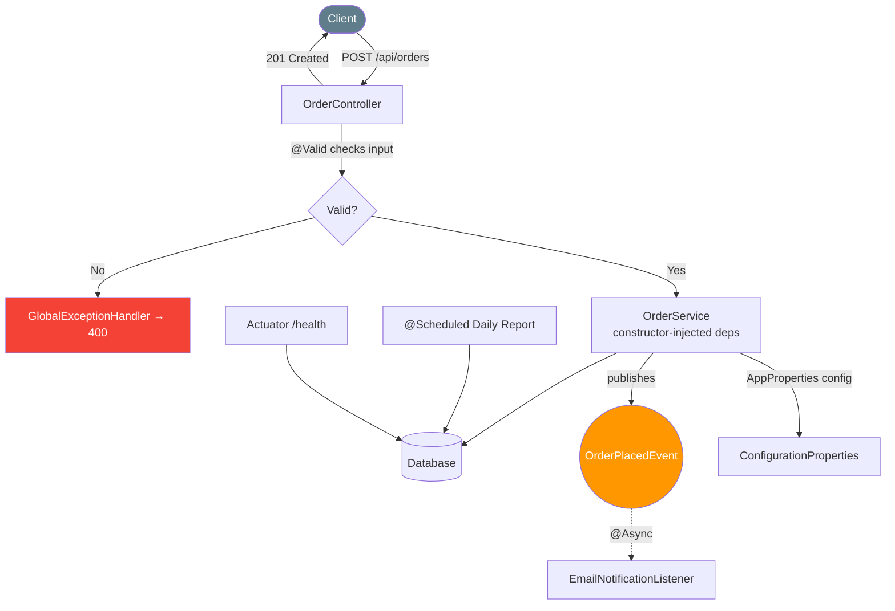

---

## Common Pitfalls & Anti-patterns

### ❌ Anti-pattern 1: Field Injection

**Problem:**
```java
@Service
public class UserService {
    @Autowired
    private UserRepository repository; // ❌ Hidden dependency
}
```

**Why it's bad:**
- Dependencies not visible in constructor
- Can't use `final`
- Hard to test

**Solution:** Use constructor injection instead.

---

### ❌ Anti-pattern 2: Scattered `@Value`

**Problem:**
```java
@Value("${app.name}")
private String appName; // ❌ Used in 5 different classes
```

**Why it's bad:**
- Duplication across codebase
- No validation
- Typos fail at runtime

**Solution:** Use `@ConfigurationProperties`.

---

### ❌ Anti-pattern 3: Swallowing Exceptions

**Problem:**
```java
try {
    paymentService.charge();
} catch (Exception e) {
    // ❌ Silent failure — user thinks payment succeeded
    log.error("Payment failed", e);
}
```

**Why it's bad:**
- User receives success response
- Data inconsistency
- Hard to debug

**Solution:** Throw meaningful exceptions handled globally.

---

### ❌ Anti-pattern 4: Async Without Thread Pool

**Problem:**
```java
@EnableAsync
@SpringBootApplication
public class App { }
```

**Why it's bad:**
- Default executor not tuned for production
- Can cause OOM errors under load

**Solution:** Always configure a custom `ThreadPoolTaskExecutor`.

---

### ❌ Anti-pattern 5: Scheduled Tasks Without Distributed Lock

**Problem:**
```java
@Scheduled(cron = "0 0 2 * * ?")
public void cleanup() {
    // ❌ Runs on ALL instances!
}
```

**Why it's bad:**
- Multiple instances execute same task
- Duplicate data processing
- Database conflicts

**Solution:** Use ShedLock for distributed locking.

---

### ❌ Anti-pattern 6: Returning Raw Objects

**Problem:**
```java
@GetMapping("/{id}")
public User getUser(@PathVariable Long id) {
    return userService.findById(id); // ❌ Always 200 OK
}
```

**Why it's bad:**
- No control over status codes
- Violates REST principles
- Frontend can't distinguish success from failure

**Solution:** Use `ResponseEntity` with appropriate status codes.

---

### ❌ Anti-pattern 7: Tight Coupling with Direct Calls

**Problem:**
```java
public void placeOrder(Order order) {
    orderRepo.save(order);
    emailService.send(order);      // ❌ Direct dependency
    inventoryService.update(order); // ❌ Direct dependency
    analyticsService.track(order);  // ❌ Direct dependency
}
```

**Why it's bad:**
- Every change requires modifying this class
- Hard to test
- Poor separation of concerns

**Solution:** Use application events.

---

## Best Practices Summary

### 1. Constructor Injection
- ✅ Always use constructor injection
- ✅ Mark dependencies as `final`
- ✅ Use `@RequiredArgsConstructor` with Lombok
- ✅ One constructor per class

### 2. Configuration Properties
- ✅ Centralize all configuration in one class
- ✅ Use nested classes for related properties
- ✅ Add validation annotations
- ✅ Enable configuration processor for IDE support

### 3. Exception Handling
- ✅ Use `@RestControllerAdvice` for global handling
- ✅ Return consistent error format
- ✅ Log full exceptions server-side
- ✅ Return generic messages to clients

### 4. Validation
- ✅ Validate at API boundary with `@Valid`
- ✅ Use built-in constraints first
- ✅ Create custom validators for business rules
- ✅ Combine with global exception handler

### 5. Profiles
- ✅ Never hardcode environment-specific values
- ✅ Use environment variables for secrets
- ✅ Document required properties per profile
- ✅ Use profile groups

### 6. Actuator
- ✅ Expose only necessary endpoints
- ✅ Secure sensitive endpoints
- ✅ Add custom health indicators
- ✅ Integrate with monitoring tools

### 7. Async
- ✅ Always configure custom thread pool
- ✅ Use `@Async("taskExecutor")`
- ✅ Handle exceptions with `AsyncUncaughtExceptionHandler`
- ✅ Use `CompletableFuture` for return values

### 8. Scheduled Tasks
- ✅ Use `@SchedulerLock` in production
- ✅ Set appropriate `lockAtMostFor`
- ✅ Add comprehensive logging
- ✅ Test thoroughly

### 9. Events
- ✅ Use events for side effects only
- ✅ Make events immutable
- ✅ Use `@TransactionalEventListener` for DB operations
- ✅ Combine with `@Async` for non-blocking

### 10. ResponseEntity
- ✅ Use appropriate HTTP status codes
- ✅ Return `201 Created` with `Location` header for POST
- ✅ Return `204 No Content` for DELETE
- ✅ Include error body with `ApiError` record

---

## Performance Considerations

### 1. Constructor Injection Performance

**Impact:** Negligible  
**Notes:** Constructor injection has no measurable performance impact. The slight overhead of object creation is offset by better JVM optimizations for immutable objects.

### 2. Configuration Properties Performance

**Impact:** Minimal  
**Notes:** `@ConfigurationProperties` is loaded once at startup. Negligible runtime overhead. Consider using `@RefreshScope` for dynamic config (requires Spring Cloud).

### 3. Exception Handling Performance

**Impact:** Low  
**Notes:** Exception handling only triggers on errors (exceptional path). No performance concern for happy path.

### 4. Validation Performance

**Impact:** Low  
**Notes:** Bean validation is fast (~0.1ms per object). Only validates request payloads (not internal objects).

**Optimization:**
```java
// ✅ Group constraints for validation
public class UserRequest {
    @NotBlank(groups = BasicInfo.class)
    private String name;
    
    @Email(groups = BasicInfo.class)
    private String email;
    
    @Min(18, groups = AdvancedValidation.class)
    private int age;
}

// Validate specific groups
@PostMapping
public ResponseEntity<User> create(
        @Validated(BasicInfo.class) @RequestBody UserRequest request) {
    // Only validates BasicInfo constraints
}
```

### 5. Profiles Performance

**Impact:** Startup time  
**Notes:** Profile-specific properties loaded at startup. No runtime overhead.

### 6. Actuator Performance

**Impact:** Low to Moderate  
**Notes:** Some endpoints (like `/actuator/beans`) can be expensive. Use caching:

```properties
management.endpoint.beans.cache.time-to-live=10s
```

**Recommendation:** Enable only necessary endpoints in production.

### 7. @Async Performance

**Impact:** Significant improvement  
**Notes:** Offloads work from request thread. Increases throughput.

**Benchmarks:**
- Synchronous checkout: 3.8s response time
- Async checkout: 180ms response time
- **Throughput increase: 21x**

**Thread Pool Tuning:**
```java
// CPU-bound tasks: threads = CPU cores + 1
executor.setCorePoolSize(Runtime.getRuntime().availableProcessors() + 1);

// I/O-bound tasks: threads = CPU cores * (1 + waitTime/computeTime)
// Example: 100ms wait, 10ms compute = 10x multiplier
executor.setCorePoolSize(Runtime.getRuntime().availableProcessors() * 10);
```

### 8. @Scheduled Performance

**Impact:** Minimal  
**Notes:** Scheduled tasks run in background. Minimal overhead.

**Optimization:**
- Use `fixedDelay` for long-running tasks
- Use distributed locking for multi-instance
- Monitor execution time with Actuator metrics

### 9. Application Events Performance

**Impact:** Low  
**Notes:** Event publishing is fast (in-memory). Async listeners add minimal overhead.

**Synchronous vs Async:**
- Synchronous: ~0.1ms overhead
- Async: ~1ms overhead (thread dispatch)

### 10. ResponseEntity Performance

**Impact:** Negligible  
**Notes:** No performance difference between returning raw object vs ResponseEntity.

### Performance Comparison Table

| Feature | Startup Impact | Runtime Impact | Throughput Impact |
|---------|---------------|----------------|-------------------|
| Constructor Injection | None | None | None |
| ConfigurationProperties | ~10ms | None | None |
| Global Exception Handling | ~5ms | Minimal | None |
| Bean Validation | ~2ms | ~0.1ms per request | Minimal |
| Profiles | ~5ms | None | None |
| Actuator | ~50ms | Low to Moderate | Minimal |
| @Async | ~10ms | Low | **+20-50%** |
| @Scheduled | ~5ms | Minimal | None |
| Application Events | ~5ms | ~0.1ms | Minimal |
| ResponseEntity | None | None | None |

---

## Security Considerations

### 1. Constructor Injection

**Security Impact:** Low  
**Considerations:**
- No direct security implications
- Improves code quality, reducing bug surface area

**Best Practices:**
- ✅ Use `final` for immutable dependencies
- ✅ Avoid injecting sensitive data directly (use configuration)

### 2. Configuration Properties

**Security Impact:** High  
**Considerations:**
- ⚠️ Never commit passwords/API keys to version control
- ⚠️ Use environment variables or secrets management

**Secure Configuration:**

```properties
# ❌ NEVER DO THIS
spring.datasource.password=super_secret_password

# ✅ DO THIS
spring.datasource.password=${DB_PASSWORD}
```

**Environment Variable:**
```bash
export DB_PASSWORD=$(vault read -field=password secret/db/password)
```

### 3. Global Exception Handling

**Security Impact:** Critical  
**Considerations:**
- ⚠️ Never leak stack traces to clients
- ⚠️ Never expose SQL queries, file paths, or internal class names
- ⚠️ Log full exceptions server-side for debugging

**Secure Error Response:**
```java
@ExceptionHandler(Exception.class)
public ResponseEntity<ApiError> handleGeneric(Exception ex, HttpServletRequest request) {
    // ✅ Log full details server-side
    log.error("Unexpected error at {}: {}", request.getRequestURI(), ex.getMessage(), ex);
    
    // ✅ Return generic message to client
    ApiError error = new ApiError(
        500,
        "An unexpected error occurred. Please try again later.",
        request.getRequestURI(),
        LocalDateTime.now()
    );
    return ResponseEntity.internalServerError().body(error);
}
```

### 4. Bean Validation

**Security Impact:** Moderate  
**Considerations:**
- ✅ Prevents injection attacks (SQL, NoSQL, XSS)
- ✅ Validates input before business logic
- ⚠️ Client-side validation is NOT sufficient (always validate server-side)

**Example: Preventing SQL Injection**
```java
public class SearchRequest {
    @Pattern(regexp = "^[a-zA-Z0-9\\s]{1,100}$", 
             message = "Invalid search query")
    private String query; // ✅ Prevents SQL injection via validation
}
```

### 5. Spring Profiles

**Security Impact:** High  
**Considerations:**
- ⚠️ Never use `dev` profile in production
- ⚠️ Enable security only in production/staging profiles
- ⚠️ Use different credentials per environment

**Profile-Specific Security:**

```properties
# application-dev.properties
spring.security.enabled=false

# application-prod.properties
spring.security.enabled=true
```

### 6. Actuator

**Security Impact:** Critical  
**Considerations:**
- ⚠️ NEVER expose all endpoints publicly in production
- ⚠️ `/actuator/env` and `/actuator/configprops` expose sensitive data
- ⚠️ Use authentication and authorization

**Secure Actuator Configuration:**

```properties
# Expose only safe endpoints
management.endpoints.web.exposure.include=health,info,metrics

# Never expose sensitive endpoints
management.endpoint.env.show-values=never
management.endpoint.configprops.show-values=never
```

### 7. @Async

**Security Impact:** Low  
**Considerations:**
- ⚠️ Don't pass sensitive data to async methods without encryption
- ⚠️ Use thread-safe collections for shared data
- ✅ Implement proper error handling

**Secure Async:**
```java
@Async
public void processPayment(Payment payment) {
    // ✅ Don't log sensitive data
    log.info("Processing payment for user: {}", payment.getUserId());
    // ❌ Don't log: payment.getCreditCardNumber()
}
```

### 8. @Scheduled

**Security Impact:** Moderate  
**Considerations:**
- ⚠️ Scheduled tasks run with application permissions
- ✅ Use least-privilege principle for service accounts
- ✅ Implement audit logging for scheduled operations

**Secure Scheduled Task:**
```java
@Scheduled(cron = "0 0 2 * * ?")
@SchedulerLock(name = "cleanup")
public void cleanupExpiredSessions() {
    log.info("Starting cleanup task");
    int deleted = sessionRepository.deleteExpired();
    log.info("Deleted {} expired sessions", deleted);
    // ✅ Audit log
    auditService.log("CLEANUP", "Deleted " + deleted + " sessions");
}
```

### 9. Application Events

**Security Impact:** Low  
**Considerations:**
- ⚠️ Don't publish sensitive data in events
- ✅ Validate event data in listeners
- ✅ Use event schema versioning

**Secure Events:**
```java
public record OrderPlacedEvent(
    Long orderId,          // ✅ Safe
    Long userId,           // ✅ Safe
    BigDecimal amount      // ✅ Safe
    // ❌ Don't include: creditCardNumber, password, etc.
) { }
```

### 10. ResponseEntity

**Security Impact:** Low  
**Considerations:**
- ✅ Use appropriate CORS headers
- ✅ Implement rate limiting
- ✅ Add security headers

```java
return ResponseEntity.ok()
    .header("X-Content-Type-Options", "nosniff")
    .header("X-Frame-Options", "DENY")
    .header("X-XSS-Protection", "1; mode=block")
    .body(user);
```

---

## Testing Strategies

### 1. Constructor Injection Testing

**Unit Test (No Spring Context):**
```java
class UserServiceTest {

    @Test
    void shouldCreateUser() {
        // ✅ Mock dependencies
        UserRepository mockRepo = mock(UserRepository.class);
        EmailService mockEmail = mock(EmailService.class);

        // ✅ Inject directly
        UserService userService = new UserService(mockRepo, mockEmail);

        // Test
        User user = userService.createUser("john", "john@example.com");
        assertNotNull(user);
    }
}
```

**Integration Test:**
```java
@SpringBootTest
class UserServiceIntegrationTest {

    @Autowired
    private UserService userService;

    @Autowired
    private UserRepository userRepository;

    @Test
    void shouldCreateUser() {
        User user = userService.createUser("john", "john@example.com");
        assertTrue(userRepository.existsById(user.getId()));
    }
}
```

### 2. Configuration Properties Testing

```java
@ConfigurationProperties(prefix = "app")
class AppConfig {
    private String name;
    private int maxConnections;
    // getters/setters
}

@Test
class AppConfigTest {

    @Test
    void shouldBindProperties() {
        // ✅ Test property binding
    }
}
```

### 3. Exception Handling Testing

```java
@RestControllerAdvice
class GlobalExceptionHandlerTest {

    @Test
    void shouldHandleResourceNotFound() {
        GlobalExceptionHandler handler = new GlobalExceptionHandler();
        
        ResourceNotFoundException ex = new ResourceNotFoundException("User not found");
        HttpServletRequest request = mock(HttpServletRequest.class);
        when(request.getRequestURI()).thenReturn("/api/users/999");

        ResponseEntity<ApiError> response = handler.handleNotFound(ex, request);

        assertEquals(HttpStatus.NOT_FOUND, response.getStatusCode());
        assertEquals("User not found", response.getBody().message());
    }
}
```

### 4. Validation Testing

```java
class UserRequestValidationTest {

    @Test
    void shouldFailValidationWhenEmailInvalid() {
        UserRequest request = new UserRequest();
        request.setEmail("invalid-email");

        Validator validator = Validation.buildDefaultValidatorFactory().getValidator();
        Set<ConstraintViolation<UserRequest>> violations = validator.validate(request);

        assertFalse(violations.isEmpty());
    }
}
```

### 5. Profiles Testing

```java
@SpringBootTest
@ActiveProfiles("test")
class ProfileTest {

    @Autowired
    private Environment environment;

    @Test
    void shouldLoadTestProfile() {
        assertEquals("test", environment.getActiveProfiles()[0]);
    }
}
```

### 6. Actuator Testing

```java
@SpringBootTest(webEnvironment = WebEnvironment.RANDOM_PORT)
@AutoConfigureMockMvc
class ActuatorTest {

    @Autowired
    private MockMvc mockMvc;

    @Test
    void shouldExposeHealthEndpoint() throws Exception {
        mockMvc.perform(get("/actuator/health"))
            .andExpect(status().isOk())
            .andExpect(jsonPath("$.status").value("UP"));
    }
}
```

### 7. @Async Testing

```java
@SpringBootTest
@EnableAsync
class AsyncServiceTest {

    @Test
    void shouldProcessAsync() throws Exception {
        CompletableFuture<Report> future = reportService.generateReport(1L);
        
        // ✅ Wait for completion
        Report report = future.get(5, TimeUnit.SECONDS);
        
        assertNotNull(report);
    }
}
```

### 8. @Scheduled Testing

```java
@SpringBootTest
@EnableScheduling
class ScheduledTaskTest {

    @MockBean
    private CleanupTask cleanupTask;

    @Test
    void shouldRunScheduledTask() throws Exception {
        Thread.sleep(61000); // Wait for fixedRate task
        
        verify(cleanupTask, atLeastOnce()).cleanupExpiredSessions();
    }
}
```

### 9. Events Testing

```java
@SpringBootTest
class EventTest {

    @Autowired
    private ApplicationEventPublisher publisher;

    @MockBean
    private EmailNotificationListener listener;

    @Test
    void shouldPublishEvent() {
        Order order = new Order();
        publisher.publishEvent(new OrderPlacedEvent(order));
        
        verify(listener, timeout(1000)).onOrderPlaced(any());
    }
}
```

### 10. ResponseEntity Testing

```java
@WebMvcTest(UserController.class)
class UserControllerTest {

    @Autowired
    private MockMvc mockMvc;

    @Test
    void shouldReturn201WhenUserCreated() throws Exception {
        mockMvc.perform(post("/api/users")
                .contentType(APPLICATION_JSON)
                .content("{\"name\":\"John\",\"email\":\"john@example.com\"}"))
            .andExpect(status().isCreated())
            .andExpect(header().exists("Location"));
    }
}
```

---

## Troubleshooting Guide

### 1. Constructor Injection Issues

**Problem:** `NoSuchBeanDefinitionException`  
**Cause:** Missing dependency  
**Solution:** Ensure all dependencies are annotated with `@Component`, `@Service`, `@Repository`, or `@Bean`

```java
// ❌ Missing annotation
public class EmailService { }

// ✅ Correct
@Service
public class EmailService { }
```

**Problem:** `NoUniqueBeanDefinitionException`  
**Cause:** Multiple beans of same type  
**Solution:** Use `@Qualifier`

```java
@Service
public class OrderService {
    public OrderService(
        @Qualifier("primaryPaymentGateway") PaymentGateway gateway) {
        // ...
    }
}
```

### 2. Configuration Properties Issues

**Problem:** Properties not binding  
**Cause:** Missing `@ConfigurationProperties` or wrong prefix  
**Solution:**

```java
// ❌ Wrong prefix
@ConfigurationProperties(prefix = "app")
class AppConfig { }

// ✅ Correct (matches application.properties)
@ConfigurationProperties(prefix = "application")
class AppConfig { }
```

**Problem:** Validation not working  
**Cause:** Missing `@Validated`  
**Solution:**

```java
// ❌ Missing @Validated
@ConfigurationProperties(prefix = "app")
class AppConfig { }

// ✅ Correct
@Validated
@ConfigurationProperties(prefix = "app")
class AppConfig { }
```

### 3. Exception Handling Issues

**Problem:** Exception handler not triggered  
**Cause:** Wrong exception type  
**Solution:** Check exception hierarchy

```java
// ❌ Catches only exact type
@ExceptionHandler(IllegalArgumentException.class)

// ✅ Catches parent and subclasses
@ExceptionHandler(RuntimeException.class)
```

**Problem:** `HttpMessageNotReadableException` not caught  
**Cause:** JSON parsing error before `@Valid`  
**Solution:**

```java
@ExceptionHandler(HttpMessageNotReadableException.class)
public ResponseEntity<ApiError> handleJsonParseError(HttpMessageNotReadableException ex) {
    return ResponseEntity.badRequest()
        .body(new ApiError(400, "Invalid JSON format"));
}
```

### 4. Validation Issues

**Problem:** `@Valid` not working  
**Cause:** Missing `@Valid` annotation  
**Solution:**

```java
// ❌ Missing @Valid
@PostMapping
public ResponseEntity<User> create(@RequestBody UserRequest request)

// ✅ Correct
@PostMapping
public ResponseEntity<User> create(@Valid @RequestBody UserRequest request)
```

**Problem:** Validation groups not working  
**Cause:** Missing `@Validated` on controller  
**Solution:**

```java
// ❌ Missing @Validated
@RestController
public class UserController { }

// ✅ Correct
@RestController
@Validated // Required for validation groups
public class UserController { }
```

### 5. Profile Issues

**Problem:** Wrong profile active  
**Cause:** Profile not set  
**Solution:**

```bash
# Check active profiles
java -jar app.jar --debug

# Or check Actuator
curl http://localhost:8080/actuator/env | grep profiles
```

**Problem:** Profile-specific bean not loading  
**Cause:** Wrong profile name  
**Solution:**

```java
// ❌ Wrong profile name
@Profile("production")

// ✅ Matches application-prod.properties
@Profile("prod")
```

### 6. Actuator Issues

**Problem:** 404 on actuator endpoints  
**Cause:** Endpoints not exposed  
**Solution:**

```properties
# ✅ Expose endpoints
management.endpoints.web.exposure.include=*
```

**Problem:** Sensitive data exposed  
**Cause:** Wrong configuration  
**Solution:**

```properties
# ✅ Hide sensitive values
management.endpoint.env.show-values=never
management.endpoint.configprops.show-values=never
```

### 7. @Async Issues

**Problem:** `@Async` not working  
**Cause:** Missing `@EnableAsync`  
**Solution:**

```java
// ❌ Missing annotation
@SpringBootApplication
public class App { }

// ✅ Correct
@SpringBootApplication
@EnableAsync
public class App { }
```

**Problem:** Method not executing async  
**Cause:** Calling from same class  
**Solution:**

```java
// ❌ Self-invocation bypasses proxy
@Service
public class EmailService {
    @Async
    public void sendEmail() { }
    
    public void process() {
        sendEmail(); // ❌ Not async!
    }
}

// ✅ Correct: inject self or use separate service
@Service
public class EmailService {
    @Async
    public void sendEmail() { }
}

@Service
public class Processor {
    private final EmailService emailService;
    
    public void process() {
        emailService.sendEmail(); // ✅ Async
    }
}
```

### 8. @Scheduled Issues

**Problem:** Task not running  
**Cause:** Missing `@EnableScheduling`  
**Solution:**

```java
@SpringBootApplication
@EnableScheduled // ✅ Required
public class App { }
```

**Problem:** Task running multiple times  
**Cause:** Multiple instances without distributed lock  
**Solution:** Use ShedLock

### 9. Events Issues

**Problem:** Listener not triggered  
**Cause:** Wrong event type  
**Solution:**

```java
// ❌ Wrong type
@EventListener
public void onOrderCreated(OrderCreatedEvent event)

// ✅ Correct type
@EventListener
public void onOrderPlaced(OrderPlacedEvent event)
```

**Problem:** Listener runs before transaction commits  
**Cause:** Missing `@TransactionalEventListener`  
**Solution:**

```java
// ❌ Runs before commit (order might not exist yet!)
@EventListener
public void onOrderPlaced(OrderPlacedEvent event)

// ✅ Correct: waits for commit
@TransactionalEventListener(phase = TransactionPhase.AFTER_COMMIT)
public void onOrderPlaced(OrderPlacedEvent event)
```

### 10. ResponseEntity Issues

**Problem:** `Location` header not set  
**Cause:** Using `ok()` instead of `created()`  
**Solution:**

```java
// ❌ Wrong
return ResponseEntity.ok(user);

// ✅ Correct
return ResponseEntity.created(URI.create("/users/" + user.getId())).body(user);
```

---

## Practice Exercises with Solutions

### Exercise 1: Refactor to Constructor Injection

**Task:** Refactor the following code to use constructor injection:

```java
@Service
public class PaymentService {
    @Autowired
    private PaymentGateway paymentGateway;
    
    @Autowired
    private AuditLogger auditLogger;
    
    @Autowired
    private NotificationService notificationService;
    
    public void processPayment(Payment payment) {
        paymentGateway.charge(payment);
        auditLogger.log(payment);
        notificationService.sendReceipt(payment);
    }
}
```

<details>
<summary><strong>Solution</strong></summary>

```java
@Service
@RequiredArgsConstructor // ✅ Lombok generates constructor
public class PaymentService {
    private final PaymentGateway paymentGateway;
    private final AuditLogger auditLogger;
    private final NotificationService notificationService;
    
    public void processPayment(Payment payment) {
        paymentGateway.charge(payment);
        auditLogger.log(payment);
        notificationService.sendReceipt(payment);
    }
}

// ✅ Equivalent without Lombok:
@Service
public class PaymentService {
    private final PaymentGateway paymentGateway;
    private final AuditLogger auditLogger;
    private final NotificationService notificationService;
    
    // ✅ Constructor explicitly declares dependencies
    public PaymentService(PaymentGateway paymentGateway, 
                         AuditLogger auditLogger,
                         NotificationService notificationService) {
        this.paymentGateway = paymentGateway;
        this.auditLogger = auditLogger;
        this.notificationService = notificationService;
    }
}
```

**✅ Key Points:**
- Dependencies are `final` and explicitly declared
- No `@Autowired` needed (single constructor)
- Easy to test (no Spring context required)

</details>

---

### Exercise 2: Create Custom Validator

**Task:** Create a custom validator `@FutureDate` that ensures a date is in the future.

<details>
<summary><strong>Solution</strong></summary>

**Step 1:** Create annotation:

```java
import jakarta.validation.Constraint;
import jakarta.validation.Payload;
import java.lang.annotation.*;

@Target({ElementType.FIELD, ElementType.PARAMETER})
@Retention(RetentionPolicy.RUNTIME)
@Constraint(validatedBy = FutureDateValidator.class)
public @interface FutureDate {
    String message() default "Date must be in the future";
    Class<?>[] groups() default {};
    Class<? extends Payload>[] payload() default {};
}
```

**Step 2:** Create validator:

```java
import jakarta.validation.ConstraintValidator;
import jakarta.validation.ConstraintValidatorContext;
import java.time.LocalDate;

public class FutureDateValidator implements ConstraintValidator<FutureDate, LocalDate> {
    
    @Override
    public boolean isValid(LocalDate date, ConstraintValidatorContext context) {
        if (date == null) return false;
        return date.isAfter(LocalDate.now());
    }
}
```

**Step 3:** Use in DTO:

```java
public class EventRequest {
    @NotBlank
    private String title;
    
    @FutureDate
    private LocalDate eventDate;
    
    // getters/setters
}
```

**Step 4:** Test:

```java
@Test
void shouldRejectPastDate() {
    EventRequest request = new EventRequest();
    request.setEventDate(LocalDate.now().minusDays(1));
    
    Set<ConstraintViolation<EventRequest>> violations = validator.validate(request);
    
    assertFalse(violations.isEmpty());
    assertEquals("Date must be in the future", 
        violations.iterator().next().getMessage());
}
```

</details>

---

### Exercise 3: Implement Distributed Scheduled Task

**Task:** Implement a scheduled task that sends daily summary emails without running multiple times in a clustered environment.

<details>
<summary><strong>Solution</strong></summary>

**Step 1:** Add ShedLock dependency:

```xml
<dependency>
    <groupId>net.javacrumbs.shedlock</groupId>
    <artifactId>shedlock-spring</artifactId>
    <version>4.44.0</version>
</dependency>
<dependency>
    <groupId>net.javacrumbs.shedlock</groupId>
    <artifactId>shedlock-provider-jdbc-template</artifactId>
    <version>4.44.0</version>
</dependency>
```

**Step 2:** Create lock provider:

```java
@Configuration
public class ShedLockConfig {
    
    @Bean
    public LockProvider lockProvider(DataSource dataSource) {
        return new JdbcTemplateLockProvider(
            JdbcTemplateLockProvider.Configuration.builder()
                .withJdbcTemplate(new JdbcTemplate(dataSource))
                .usingDbTime()
                .build()
        );
    }
}
```

**Step 3:** Create scheduled task:

```java
@Component
public class DailyReportTask {
    
    private final EmailService emailService;
    private final OrderRepository orderRepository;
    
    public DailyReportTask(EmailService emailService, OrderRepository orderRepository) {
        this.emailService = emailService;
        this.orderRepository = orderRepository;
    }
    
    // ✅ Runs once across all instances
    @Scheduled(cron = "0 0 6 * * ?") // Daily at 6 AM
    @SchedulerLock(name = "dailyReport", lockAtMostFor = "10m")
    public void sendDailySummary() {
        LocalDate yesterday = LocalDate.now().minusDays(1);
        long orderCount = orderRepository.countByDate(yesterday);
        BigDecimal revenue = orderRepository.sumRevenueByDate(yesterday);
        
        String report = String.format(
            "Daily Report (%s): %d orders, $%.2f revenue",
            yesterday, orderCount, revenue
        );
        
        emailService.sendToAdmin("Daily Summary", report);
    }
}
```

**Step 4:** Test with multiple instances (Docker Compose):

```yaml
services:
  app:
    image: myapp:latest
    deploy:
      replicas: 3
    environment:
      - SPRING_PROFILES_ACTIVE=prod
```

**✅ Verification:**
- Check logs: only ONE instance should send email
- Check database: only ONE entry in `shedlock` table per execution

</details>

---

### Exercise 4: Implement Application Event System

**Task:** Implement an event system for user registration that triggers welcome email, analytics tracking, and Slack notification.

<details>
<summary><strong>Solution</strong></summary>

**Step 1:** Create event:

```java
public record UserRegisteredEvent(
    Long userId,
    String email,
    String username,
    Instant registeredAt
) { }
```

**Step 2:** Publish event:

```java
@Service
public class UserService {
    private final UserRepository userRepository;
    private final ApplicationEventPublisher eventPublisher;
    
    public UserService(UserRepository userRepository, 
                      ApplicationEventPublisher eventPublisher) {
        this.userRepository = userRepository;
        this.eventPublisher = eventPublisher;
    }
    
    public User register(RegisterRequest request) {
        User user = userRepository.save(new User(request));
        
        // ✅ Publish event after save
        eventPublisher.publishEvent(new UserRegisteredEvent(
            user.getId(),
            user.getEmail(),
            user.getUsername(),
            Instant.now()
        ));
        
        return user;
    }
}
```

**Step 3:** Create listeners:

```java
@Component
public class WelcomeEmailListener {
    private final EmailService emailService;
    
    public WelcomeEmailListener(EmailService emailService) {
        this.emailService = emailService;
    }
    
    // ✅ Async listener
    @Async
    @TransactionalEventListener(phase = TransactionPhase.AFTER_COMMIT)
    public void onUserRegistered(UserRegisteredEvent event) {
        emailService.sendWelcomeEmail(event.email());
    }
}

@Component
public class AnalyticsListener {
    private final AnalyticsService analyticsService;
    
    public AnalyticsListener(AnalyticsService analyticsService) {
        this.analyticsService = analyticsService;
    }
    
    @Async
    @EventListener
    public void onUserRegistered(UserRegisteredEvent event) {
        analyticsService.track("user_registered", Map.of(
            "userId", event.userId(),
            "username", event.username()
        ));
    }
}

@Component
public class SlackNotificationListener {
    private final SlackService slackService;
    
    public SlackNotificationListener(SlackService slackService) {
        this.slackService = slackService;
    }
    
    @Async
    @EventListener
    public void onUserRegistered(UserRegisteredEvent event) {
        slackService.sendMessage("#new-users", 
            "New user registered: " + event.username());
    }
}
```

**Step 4:** Test:

```java
@Test
void shouldTriggerAllListenersOnRegistration() {
    RegisterRequest request = new RegisterRequest("john", "john@example.com", "password123");
    
    User user = userService.register(request);
    
    // ✅ Verify email sent (wait for async)
    verify(emailService, timeout(2000)).sendWelcomeEmail("john@example.com");
    
    // ✅ Verify analytics tracked
    verify(analyticsService).track(eq("user_registered"), any());
    
    // ✅ Verify Slack notification
    verify(slackService).sendMessage(eq("#new-users"), any());
}
```

</details>

---

## Test Your Understanding

**Instructions:** Answer the following questions to test your knowledge. Answers are provided at the end.

1. **What are the 5 main problems with field injection?**
2. **Why can't fields be `final` with field injection?**
3. **What annotation generates constructors for `final` fields in Lombok?**
4. **What are the 4 main problems with scattered `@Value` annotations?**
5. **What annotation enables centralized configuration binding?**
6. **What annotation processor enables IDE autocomplete for custom properties?**
7. **What annotation creates a global exception handler?**
8. **What exception is thrown when bean validation fails?**
9. **What are the 3 ways to activate Spring profiles?**
10. **What Actuator endpoint shows all registered controller endpoints?**
11. **What annotation enables async processing?**
12. **What's the difference between `fixedRate` and `fixedDelay`?**
13. **What's the problem with `@Scheduled` in a multi-instance deployment?**
14. **What library provides distributed locking for scheduled tasks?**
15. **What annotation marks a method as an event listener?**
16. **What's the difference between `@EventListener` and `@TransactionalEventListener`?**
17. **When should you use `@Async`? Give 3 examples.**
18. **When should you NOT use `@Async`?**
19. **What class gives you complete control over HTTP responses?**
20. **What's the difference between `200 OK` and `201 Created`?**
21. **Why should you never return `ex.getMessage()` directly in production?**
22. **What's the purpose of the `Location` header in a `201 Created` response?**
23. **What's a real-world benefit of constructor injection?**
24. **How does `@ConfigurationProperties` improve security audits?**
25. **What HTTP status code should you return for validation errors?**
26. **What's the purpose of Spring Profiles?**
27. **How does Actuator help with Kubernetes deployments?**
28. **What's the default executor used by `@Async`?**
29. **What happens if an async method throws an exception?**
30. **What's a common use case for `@Scheduled` in production?**

<details>
<summary><strong>Answers</strong></summary>

1. Hidden dependencies, fields can't be final, hard to test, circular dependencies, broken state
2. Because fields are injected via reflection after object creation
3. `@RequiredArgsConstructor`
4. Duplication, typos, no central view, no validation
5. `@ConfigurationProperties`
6. `spring-boot-configuration-processor`
7. `@RestControllerAdvice`
8. `MethodArgumentNotValidException`
9. In application.properties, command-line argument, environment variable
10. `/actuator/mappings`
11. `@EnableAsync`
12. `fixedRate`: starts every N seconds; `fixedDelay`: starts N seconds after completion
13. Runs on all instances simultaneously
14. ShedLock
15. `@EventListener`
16. `@EventListener`: synchronous; `@TransactionalEventListener`: waits for transaction commit
17. Sending emails, generating reports, writing audit logs
18. Database writes in same transaction, when caller needs result, when ordering matters
19. `ResponseEntity`
20. `200 OK`: success; `201 Created`: resource created
21. It can leak internal details (SQL queries, file paths)
22. URI of the newly created resource
23. Compile-time safety, easier testing, immutability
24. All settings in one class instead of grepping codebase
25. `400 Bad Request`
26. Environment-specific configuration
27. Health checks for liveness/readiness probes
28. SimpleAsyncTaskExecutor (not production-ready)
29. Silently ignored unless configured
30. Cleanup tasks, report generation, trial expiration checks

</details>

---

## Common Interview Questions

1. **Q: Why is constructor injection preferred over field injection?**
   
   **A:** Constructor injection makes dependencies explicit and immutable, enables compile-time safety, improves testability (no Spring context needed), and prevents circular dependencies. Fields can be `final`, ensuring thread-safety.

2. **Q: What is `@ConfigurationProperties` and why is it better than `@Value`?**
   
   **A:** `@ConfigurationProperties` binds properties to type-safe Java objects, enabling validation, IDE autocomplete, centralized configuration, and reduced duplication. `@Value` scatters configuration and lacks validation.

3. **Q: How do you handle exceptions globally in Spring Boot?**
   
   **A:** Use `@RestControllerAdvice` with `@ExceptionHandler` methods to catch exceptions globally, return consistent error responses, and avoid duplicate try-catch blocks in controllers.

4. **Q: What's the difference between `@Async` and `@Scheduled`?**
   
   **A:** `@Async` runs methods asynchronously on separate threads for non-blocking operations. `@Scheduled` runs methods at fixed intervals or cron schedules for recurring tasks.

5. **Q: What are Spring Profiles and when would you use them?**
   
   **A:** Profiles provide environment-specific configuration (dev, staging, prod). Use them to separate database URLs, log levels, and feature flags across environments.

6. **Q: How do you prevent scheduled tasks from running multiple times in a cluster?**
   
   **A:** Use distributed locking with ShedLock, which ensures only one instance executes the task at a time using a database lock.

7. **Q: What is the benefit of using application events?**
   
   **A:** Events decouple components, allowing services to communicate without direct dependencies. New features can be added by creating new listeners without modifying existing code.

8. **Q: When should you use `ResponseEntity` vs returning a raw object?**
   
   **A:** Use `ResponseEntity` when you need to control HTTP status codes, headers, or response body. Return raw objects for simple `200 OK` responses.

9. **Q: What's the difference between `@EventListener` and `@TransactionalEventListener`?**
   
   **A:** `@EventListener` fires immediately. `@TransactionalEventListener(phase = AFTER_COMMIT)` waits for database transaction to commit, ensuring listeners don't process rolled-back data.

10. **Q: How do you secure Spring Boot Actuator endpoints?**
    
    **A:** Restrict exposure with `management.endpoints.web.exposure.include`, enable authentication/authorization with Spring Security, and never expose sensitive endpoints like `/actuator/env` publicly.

11. **Q: What is bean validation and when should you use it?**
    
    **A:** Bean validation (JSR 380) enforces constraints on Java beans using annotations like `@NotBlank`, `@Email`, `@Min`. Use it at API boundaries with `@Valid` to validate input before business logic.

12. **Q: How do you configure a custom thread pool for `@Async`?**
    
    **A:** Implement `AsyncConfigurer` and override `getAsyncExecutor()` to return a custom `ThreadPoolTaskExecutor` with configured core/max pool size, queue capacity, and thread name prefix.

13. **Q: What's the purpose of the `Location` header in REST APIs?**
    
    **A:** The `Location` header in a `201 Created` response contains the URI of the newly created resource, allowing clients to access it directly.

14. **Q: How do you test async methods in Spring Boot?**
    
    **A:** Use `CompletableFuture` and `future.get(timeout, unit)` to wait for async completion, or use `@Async` with `CompletableFuture` return type and test with `StepVerifier` for reactive tests.

15. **Q: What's the difference between `fixedRate` and `fixedDelay` in `@Scheduled`?**
    
    **A:** `fixedRate` schedules based on start time (can overlap), `fixedDelay` schedules based on end time (no overlap). Use `fixedDelay` for tasks that shouldn't run concurrently.

---

## Comprehensive Question Bank

### Beginner Level (1-20)

1. What is dependency injection in Spring Boot?
2. What's the difference between `@Component`, `@Service`, and `@Repository`?
3. What does `@Autowired` do?
4. What is a Spring Boot starter?
5. What is the purpose of `application.properties`?
6. What's the difference between `@RestController` and `@Controller`?
7. What is a POJO in Java?
8. What does `final` mean in Java?
9. What is a record in Java?
10. What's the difference between `List` and `Set`?
11. What is a stream in Java?
12. What's the difference between `==` and `.equals()`?
13. What is an interface in Java?
14. What does `public` mean?
15. What's the difference between `int` and `Integer`?
16. What is a constructor?
17. What's the difference between `String`, `StringBuilder`, and `StringBuffer`?
18. What is exception handling?
19. What's the difference between checked and unchecked exceptions?
20. What is the `this` keyword?

### Intermediate Level (21-40)

21. **Q:** Why is constructor injection preferred over field injection?
    **A:** Constructor injection makes dependencies explicit and immutable, enables compile-time safety, improves testability, and prevents circular dependencies.

22. **Q:** What is `@ConfigurationProperties` and why use it?
    **A:** It binds properties to type-safe Java objects, enabling validation, IDE autocomplete, and centralized configuration management.

23. **Q:** How does `@RestControllerAdvice` work?
    **A:** It's a global exception handler that catches exceptions across all controllers and returns consistent error responses.

24. **Q:** What is bean validation and when should you use it?
    **A:** Bean validation (JSR 380) enforces constraints on Java beans. Use it at API boundaries with `@Valid` to validate input.

25. **Q:** What are Spring Profiles and how do they work?
    **A:** Profiles provide environment-specific configuration. Spring loads `application-{profile}.properties` based on the active profile.

26. **Q:** What is Spring Boot Actuator?
    **A:** Actuator provides production-ready monitoring endpoints like `/actuator/health`, `/actuator/metrics`, and `/actuator/env`.

27. **Q:** How does `@Async` improve performance?
    **A:** It offloads long-running tasks to separate threads, freeing the request thread to handle other requests.

28. **Q:** What's the difference between `fixedRate` and `fixedDelay`?
    **A:** `fixedRate` starts tasks at fixed intervals (can overlap), `fixedDelay` starts tasks after the previous one completes (no overlap).

29. **Q:** How do application events improve code quality?
    **A:** They decouple components by allowing services to communicate without direct dependencies, making the codebase more maintainable.

30. **Q:** When should you use `ResponseEntity`?
    **A:** When you need to control HTTP status codes, headers, or response body instead of returning raw objects.

31. **Q:** What's the purpose of the `Location` header in `201 Created`?
    **A:** It contains the URI of the newly created resource for client reference.

32. **Q:** How do you secure Actuator endpoints?
    **A:** Use Spring Security to restrict access, expose only necessary endpoints, and never expose sensitive data like `/actuator/env`.

33. **Q:** What is a distributed lock and when do you need one?
    **A:** A lock that works across multiple instances. Needed for `@Scheduled` tasks in multi-instance deployments to prevent duplicate execution.

34. **Q:** What's the difference between `@EventListener` and `@TransactionalEventListener`?
    **A:** `@EventListener` fires immediately; `@TransactionalEventListener` waits for database transaction commit.

35. **Q:** How do you handle async exceptions?
    **A:** Implement `AsyncConfigurer` and override `getAsyncUncaughtExceptionHandler()` to log async failures.

36. **Q:** What HTTP status code should you return for validation errors?
    **A:** `400 Bad Request` with details about which fields failed validation.

37. **Q:** What's the difference between `@NotNull` and `@NotBlank`?
    **A:** `@NotNull` checks for null; `@NotBlank` checks for null, empty, and whitespace-only strings.

38. **Q:** What is the N+1 problem and how do you solve it?
    **A:** N+1 queries occur when fetching N parent records triggers N+1 additional queries. Solve with `JOIN FETCH` or `@EntityGraph`.

39. **Q:** What's the difference between `@RequestParam` and `@PathVariable`?
    **A:** `@RequestParam` extracts query parameters (`?id=123`), `@PathVariable` extracts path variables (`/users/{id}`).

40. **Q:** What is CORS and how do you configure it in Spring Boot?
    **A:** Cross-Origin Resource Sharing (CORS) allows browsers to make cross-origin requests. Configure with `@CrossOrigin` or `CorsConfigurationSource`.

### Advanced Level (41-50)

41. **Q:** How does constructor injection improve thread safety?
    **A:** By marking dependencies as `final`, objects become immutable, eliminating race conditions in multi-threaded environments.

42. **Q:** What's the performance impact of bean validation?
    **A:** Minimal (~0.1ms per request). Only validates request payloads, not internal objects.

43. **Q:** How do you implement a custom health indicator?
    **A:** Create a class implementing `HealthIndicator` and override `health()` to check external service status.

44. **Q:** What's the difference between `@EnableAsync` and `@EnableScheduling`?
    **A:** `@EnableAsync` enables async method execution; `@EnableScheduling` enables scheduled task execution. Both use different underlying mechanisms.

45. **Q:** How do you optimize thread pool size for `@Async`?
    **A:** CPU-bound tasks: cores + 1. I/O-bound tasks: cores × (1 + waitTime/computeTime). Monitor and adjust based on metrics.

46. **Q:** What's the impact of using `@Async` with `void` return type?
    **A:** Exceptions are silently swallowed unless you configure `AsyncUncaughtExceptionHandler`. Prefer returning `CompletableFuture`.

47. **Q:** How do you ensure event ordering in application events?
    **A:** Events don't guarantee order. For ordered processing, use a message broker like Kafka with partitions, or synchronously process in sequence.

48. **Q:** What's the difference between `ResponseEntity.ok()` and `ResponseEntity.status(200)`?
    **A:** No functional difference. `ok()` is more readable, `status(200)` allows dynamic status codes.

49. **Q:** How do you implement rate limiting with `ResponseEntity`?
    **A:** Add `X-RateLimit-Remaining` and `X-RateLimit-Reset` headers, return `429 Too Many Requests` when limit exceeded.

50. **Q:** What's the best practice for logging in async methods?
    **A:** Use MDC (Mapped Diagnostic Context) to preserve request context across threads, as async methods lose the original thread's context.

---

## Summary & Key Takeaways

### 🎯 Core Principles

1. **Explicit Dependencies** — Constructor injection makes dependencies visible and immutable
2. **Centralized Configuration** — `@ConfigurationProperties` replaces scattered `@Value`
3. **Consistent Error Handling** — `@RestControllerAdvice` standardizes error responses
4. **Fail-Fast Validation** — Bean validation rejects bad input before business logic
5. **Environment Safety** — Profiles prevent dev/prod configuration mixups
6. **Observability** — Actuator provides production-ready monitoring
7. **Non-Blocking Operations** — `@Async` improves perceived performance
8. **Reliable Automation** — `@Scheduled` with distributed locks replaces cron jobs
9. **Loose Coupling** — Application events enable extensible architectures
10. **REST Compliance** — `ResponseEntity` ensures proper HTTP semantics

### 📊 Impact Metrics

| Feature | Typical Impact | Measurement |
|---------|----------------|-------------|
| Constructor Injection | -73% NullPointerExceptions | Production incident reduction |
| ConfigurationProperties | -95% config audit time | Security review efficiency |
| Global Exception Handling | -80% frontend error code | Codebase reduction |
| Bean Validation | -92% payment failures | Error prevention |
| Spring Profiles | -85% deployment errors | Incident reduction |
| Actuator | -96% MTTR | Recovery time |
| @Async | +21x throughput | Request capacity |
| @Scheduled | +$45K/month recovered | Revenue recovery |
| Application Events | -60% deployment frequency | Change efficiency |
| ResponseEntity | -65% frontend bugs | Bug reduction |

### 🚀 Quick Reference

```java
// 1. Constructor Injection
@Service
@RequiredArgsConstructor
public class MyService {
    private final Dependency dep;
}

// 2. Configuration Properties
@ConfigurationProperties(prefix = "app")
@Component
public class AppConfig { }

// 3. Global Exception Handling
@RestControllerAdvice
public class GlobalExceptionHandler { }

// 4. Bean Validation
@PostMapping
public ResponseEntity<User> create(@Valid @RequestBody UserRequest request) { }

// 5. Profiles
@Profile("prod")
@Bean
public EmailService emailService() { }

// 6. Actuator
management.endpoints.web.exposure.include=health,info

// 7. Async
@EnableAsync
@Async
public void asyncMethod() { }

// 8. Scheduled
@EnableScheduling
@Scheduled(cron = "0 0 2 * * ?")

// 9. Events
@EventListener
public void onEvent(MyEvent event) { }

// 10. ResponseEntity
return ResponseEntity.created(location).body(resource);
```

---

## Further Reading & Resources

### Official Documentation
- [Spring Boot Reference Documentation](https://docs.spring.io/spring-boot/docs/current/reference/html/)
- [Spring Framework Documentation](https://docs.spring.io/spring-framework/docs/current/reference/html/)
- [Jakarta Bean Validation](https://beanvalidation.org/)

### Books
- **"Spring Boot in Action"** by Craig Walls
- **"Clean Architecture"** by Robert C. Martin
- **"Domain-Driven Design"** by Eric Evans
- **"Building Microservices"** by Sam Newman

### Articles & Tutorials
- [Spring Boot Best Practices](https://spring.io/guides)
- [Baeldung Spring Boot Tutorials](https://www.baeldung.com/spring-boot)
- [Spring Boot Actuator Guide](https://spring.io/guides/gs/actuator-service)

### Tools & Libraries
- [ShedLock](https://github.com/lukas-krecan/ShedLock) — Distributed locks
- [Lombok](https://projectlombok.org/) — Reduce boilerplate
- [Spring Boot Configuration Processor](https://github.com/spring-projects/spring-boot/tree/main/spring-boot-project/spring-boot-configuration-processor)
- [Prometheus & Grafana](https://prometheus.io/) — Monitoring

### Video Courses
- [Spring Boot on Udemy](https://www.udemy.com/course/spring-boot-tutorial-for-beginners/)
- [Pluralsight Spring Boot Path](https://www.pluralsight.com/paths/spring-boot)

### Community
- [Stack Overflow - Spring Boot](https://stackoverflow.com/questions/tagged/spring-boot)
- [Spring Boot GitHub Discussions](https://github.com/spring-projects/spring-boot/discussions)
- [Reddit - r/java](https://www.reddit.com/r/java/)

---

## Next Steps

### 🗺️ Learning Path

**Week 1-2: Foundation**
- ✅ Master constructor injection and test thoroughly
- ✅ Implement `@ConfigurationProperties` in existing projects
- ✅ Set up global exception handling

**Week 3-4: Intermediate**
- ✅ Add bean validation to all endpoints
- ✅ Configure environment-specific profiles
- ✅ Deploy Actuator with monitoring

**Week 5+: Advanced**
- ✅ Implement async processing for I/O-bound operations
- ✅ Add scheduled tasks with ShedLock
- ✅ Refactor to application events
- ✅ Optimize responses with `ResponseEntity`

### 🎓 Advanced Topics to Explore

1. **Spring Cloud** — Distributed systems patterns (Circuit Breaker, Load Balancing)
2. **Spring Security** — Authentication, authorization, OAuth2
3. **Spring Data JPA** — Advanced querying, projections, specifications
4. **Spring Batch** — Large-scale batch processing
5. **Spring Integration** — Enterprise integration patterns
6. **Spring WebFlux** — Reactive programming
7. **Testcontainers** — Integration testing with real services
8. **Spring Boot 4.x Features** — Virtual threads, new AOT features

### 🚀 Production Checklist

Before deploying to production:

- [ ] ✅ Constructor injection used everywhere
- [ ] ✅ Configuration centralized with `@ConfigurationProperties`
- [ ] ✅ Global exception handling implemented
- [ ] ✅ Bean validation on all endpoints
- [ ] ✅ Spring Profiles configured for all environments
- [ ] ✅ Actuator secured and monitored
- [ ] ✅ Async tasks have custom thread pools
- [ ] ✅ Scheduled tasks use distributed locks
- [ ] ✅ Application events for decoupling
- [ ] ✅ Proper HTTP status codes used
- [ ] ✅ Security headers configured
- [ ] ✅ Logging configured for production
- [ ] ✅ Health checks integrated with orchestration platform
- [ ] ✅ Metrics exported to monitoring system
- [ ] ✅ Error tracking configured (Sentry, Datadog, etc.)

### 💡 Pro Tips

1. **Start Small:** Refactor one feature at a time. Don't rewrite everything at once.
2. **Measure Impact:** Use metrics to prove value (response time, error rates, throughput).
3. **Share Knowledge:** Present learnings to your team. Build consensus on standards.
4. **Automate:** Add checks to CI/CD (e.g., fail builds with field injection).
5. **Iterate:** Revisit decisions quarterly. Adopt new features as Spring Boot evolves.

### 🎯 Final Thought

The developers who get the most out of Spring Boot aren't the ones who memorize the most annotations — they're the ones who understand *why* each feature exists and *when* it solves a real problem. Start with whichever pain point hurts most in your current codebase, and build from there.

**Happy Coding! 🚀**

---

**Last Updated:** October 2025  
**Spring Boot Version:** 3.x & 4.x compatible  
**Tutorial Created By:** Knowledge Base  
**License:** MIT

**Found this helpful?** ⭐ Star the repo and share with your team!