# What Hibernate Doesn't Tell You About Database Round Trips
### A Deep-Dive Tutorial on Hibernate Performance Debugging, Query Counting, and the Hidden SQL Iceberg

---

> **"Hibernate's query count is a polite fiction."**  
> This tutorial teaches you how to find the truth — and protect your production systems.

---

## 📋 Table of Contents

1. [The Core Problem: Why Query Counts Lie](#1-the-core-problem)
2. [Hibernate's Internal Architecture](#2-hibernates-internal-architecture)
3. [The N+1 Problem: A Disaster in Plain Sight](#3-the-n1-problem)
4. [Dirty Checking: Stealth UPDATE Bombs](#4-dirty-checking)
5. [Flush Modes and When SQL Fires](#5-flush-modes)
6. [JDBC Batching and Why Counts Get Confusing](#6-jdbc-batching)
7. [First and Second-Level Cache](#7-caching)
8. [Tools for Accurate Query Counting](#8-tools-for-accurate-counting)
9. [Real-World Debugging Strategies](#9-real-world-debugging)
10. [Common Misconceptions & Interview Questions](#10-misconceptions--interview-questions)
11. [Best Practices Summary](#11-best-practices-summary)

---

## 1. The Core Problem

### What Happened at 2:37 AM

Imagine you're on-call. PagerDuty fires. Your order-processing service — normally snappy at 80ms — has ballooned to 12 seconds per request. Database CPU is pinned at 100%. You check the logs:

```
Hibernate: select order0_.id, order0_.customer_id from orders order0_ where order0_.id=?
```

**One query.** Hibernate statistics confirms: `queryExecutionCount: 1`.

But then you SSH into the database and run `pg_stat_statements`. The truth: **600+ SQL statements per second** for that single API call.

This is the central lesson of Hibernate performance debugging: **the query count you see in your application is not the query count hitting your database.**

### The Iceberg Analogy

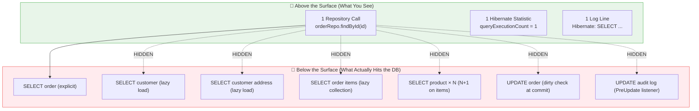

### A Simple Endpoint That Melts Databases

```java
@RestController
public class OrderController {
    @Autowired private OrderService orderService;

    @GetMapping("/orders/{id}/summary")
    public OrderSummaryDto getSummary(@PathVariable Long id) {
        return orderService.buildSummary(id);
    }
}

@Service
@Transactional
public class OrderService {
    @Autowired private OrderRepository orderRepo;

    public OrderSummaryDto buildSummary(Long orderId) {
        Order order = orderRepo.findById(orderId).orElseThrow();
        // Accessing lazy associations here is where the chaos begins:
        String customerName = order.getCustomer().getName();  // lazy load #1
        String address = order.getCustomer().getAddress().getCity(); // lazy load #2
        List<OrderItem> items = order.getItems(); // lazy collection load #3
        for (OrderItem item : items) {
            item.getProduct().getName(); // lazy load per item — N+1!
        }
        return buildDto(order);
    }
}
```

**Actual DB calls for 1 API request (order with 5 items):**

| # | SQL | Triggered By |
|---|-----|--------------|
| 1 | `SELECT * FROM orders WHERE id=?` | `findById()` |
| 2 | `SELECT * FROM customers WHERE id=?` | `order.getCustomer()` |
| 3 | `SELECT * FROM addresses WHERE customer_id=?` | `.getAddress()` |
| 4 | `SELECT * FROM order_items WHERE order_id=?` | `order.getItems()` |
| 5–9 | `SELECT * FROM products WHERE id=?` × 5 | `item.getProduct()` per item |
| 10 | `UPDATE orders SET ...` | Dirty check at flush |

**Total: 10 SQL statements. Hibernate says: 1.**

---

## 2. Hibernate's Internal Architecture

To understand why counts lie, you need to understand what Hibernate actually *is* internally.

### The Session as a State Machine

A Hibernate `Session` (implemented as `SessionImpl`) is not a database connection wrapper. It is a **stateful engine** containing:

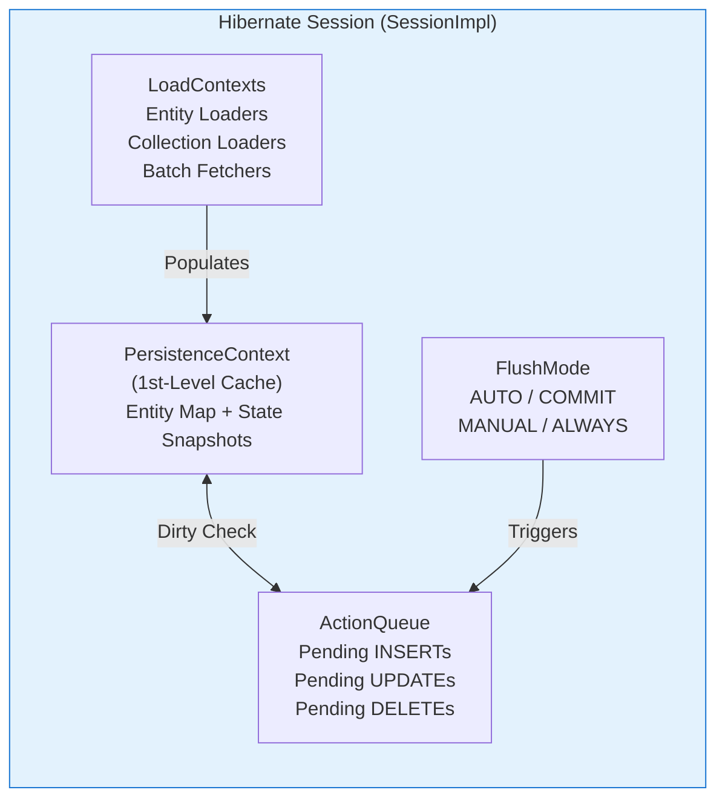

### The Complete Lifecycle of a `findById()` Call

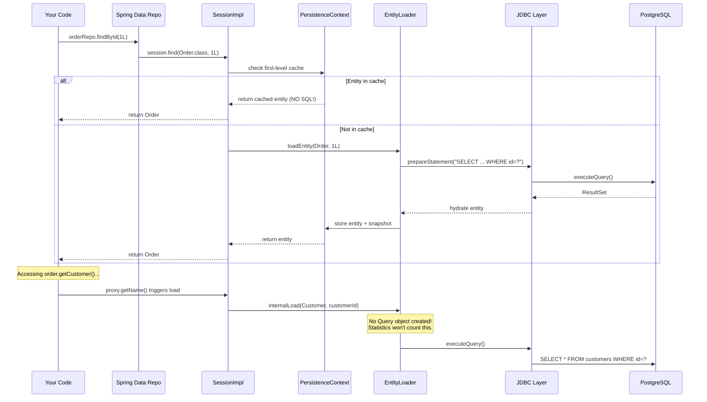

**Key insight:** The lazy load path (`internalLoad`) **never creates a `org.hibernate.query.Query` object**. This is why `Statistics.getQueryExecutionCount()` stays at 1.

---

## 3. The N+1 Problem

### Why It's Called N+1

The pattern: **1 query** to load a collection, then **N queries** (one per element) to load related data.

```java
@Entity
public class Order {
    @ManyToOne(fetch = FetchType.LAZY)
    private Customer customer;

    @OneToMany(mappedBy = "order", fetch = FetchType.LAZY)
    private List<OrderItem> items = new ArrayList<>();
}

@Entity
public class OrderItem {
    @ManyToOne(fetch = FetchType.LAZY)
    private Product product;
}
```

```java
@Transactional(readOnly = true)
public void sendOrderEmails() {
    List<Order> orders = orderRepo.findAll();       // Query #1
    for (Order o : orders) {
        o.getCustomer().getName();                  // Query per order (N)
        for (OrderItem item : o.getItems()) {       // Query per order (N)
            item.getProduct().getName();            // Query per item (N×M)
        }
    }
}
```

### Query Explosion Table

| Orders | Items per Order | Hibernate Says | DB Actually Sees |
|--------|----------------|----------------|-----------------|
| 10     | 3              | 1 query        | 1+10+10+30 = **51** |
| 50     | 5              | 1 query        | 1+50+50+250 = **351** |
| 100    | 10             | 1 query        | 1+100+100+1000 = **1,201** |

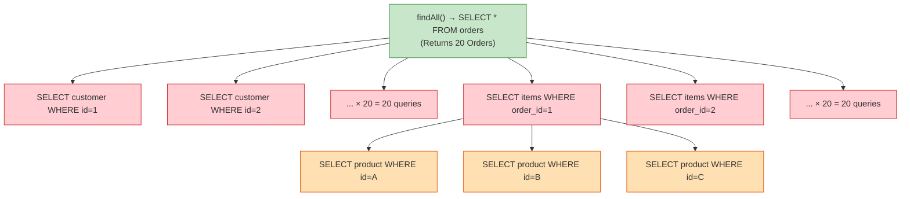

### Solutions

#### Option 1: JOIN FETCH (JPQL)

```java
@Query("SELECT o FROM Order o " +
       "JOIN FETCH o.customer c " +
       "JOIN FETCH o.items i " +
       "JOIN FETCH i.product " +
       "WHERE o.status = :status")
List<Order> findWithAllAssociations(@Param("status") String status);
```

✅ **1 SQL query** with joins. But beware: multiple `JOIN FETCH` on collections causes a cartesian product. Use separate queries or `@EntityGraph` for multiple collections.

#### Option 2: @EntityGraph

```java
@EntityGraph(attributePaths = {"customer", "items", "items.product"})
List<Order> findByStatus(String status);
```

#### Option 3: @BatchSize (reduces N+1 to N/batch)

```java
@OneToMany(mappedBy = "order")
@BatchSize(size = 20)
private List<OrderItem> items;
```

Instead of 50 queries for 50 orders, Hibernate executes: `SELECT * FROM order_items WHERE order_id IN (?,?,?,...,?)` — **3 queries** for 50 orders (batches of 20).

#### Comparison

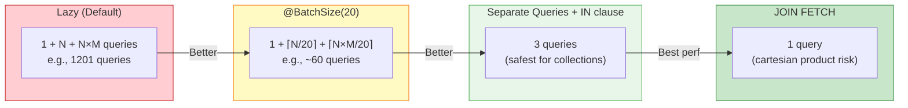

---

## 4. Dirty Checking

### What It Is

When Hibernate loads an entity, it **snapshots** all its field values. At flush time, it compares current values with the snapshot. Any difference → an `UPDATE` is queued.

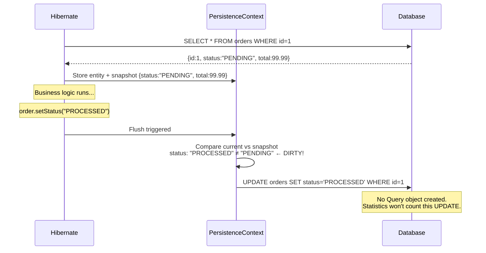

### The Accidental Mutation Trap

```java
@Entity
public class Order {
    private Instant lastViewed;

    // ⚠️ This getter has a SIDE EFFECT
    public String getDisplayStatus() {
        this.lastViewed = Instant.now(); // Mutates entity!
        return status.toUpperCase();
    }
}

@Transactional(readOnly = true) // readOnly doesn't save you!
public OrderSummaryDto getSummary(Long id) {
    Order order = orderRepo.findById(id).orElseThrow();
    dto.setStatus(order.getDisplayStatus()); // Triggers dirty check mutation
    return dto; // At commit: UPDATE orders SET last_viewed=? WHERE id=?
}
```

> **⚠️ Gotcha:** `@Transactional(readOnly = true)` does NOT prevent dirty checking by default. Hibernate still flushes unless you set `FlushMode.MANUAL`.

### Real-World Examples of Accidental Dirtiness

| Accidental Mutation | What Happens |
|--------------------|--------------|
| Setting audit fields in getters | UPDATE fires on every read |
| `@PreUpdate` listener always setting timestamps | Every read-only transaction causes writes |
| Collections being replaced with new instances | Hibernate detects collection identity change |
| `@Version` field bumped unexpectedly | OptimisticLockException in concurrent requests |

### Fixing It

```java
// Option 1: Use readOnly + MANUAL flush
@Transactional(readOnly = true)
public OrderSummaryDto getSummary(Long id) {
    entityManager.setFlushMode(FlushModeType.COMMIT); // or use MANUAL
    // ...
}

// Option 2: Use @Immutable for read-only entities
@Entity
@Immutable
public class OrderSummaryView { ... }

// Option 3: Use DTOs / projections directly — never load full entities for reads
public interface OrderSummary {
    String getStatus();
    String getCustomerName();
}
// Spring Data will generate a SELECT with only those fields
List<OrderSummary> findProjectedByStatus(String status);
```

---

## 5. Flush Modes

### How Flush Timing Determines SQL Timing

```mermaid
flowchart TD
    A[Entity Modified in Session] --> B{FlushMode?}

    B -->|"AUTO (default)"| C{Is a Query About to Execute?}
    C -->|"Yes, and tables overlap"| D[Flush NOW before query]
    C -->|"No"| E[Wait]
    D --> F[SQL fired mid-transaction]

    B -->|"COMMIT"| G[Wait until transaction commit]
    G --> H[SQL fired at end]

    B -->|"MANUAL"| I[NEVER flush automatically]
    I --> J[Flush only when session.flush() called]

    B -->|"ALWAYS"| K[Flush before EVERY query]
    K --> L[Maximum SQL, safest for data consistency]

    style D fill:#ffcdd2,stroke:#c62828
    style F fill:#ffcdd2,stroke:#c62828
    style H fill:#fff9c4,stroke:#f57f17
    style J fill:#c8e6c9,stroke:#388e3c
```

### FlushMode.AUTO: The Surprise Generator

```java
@Transactional
public void processOrder(Long orderId) {
    Order order = orderRepo.findById(orderId).orElseThrow();
    order.setStatus("PROCESSED");  // Entity is now dirty

    // ← Hibernate may flush HERE before the next query!
    Customer customer = customerRepo.findById(order.getCustomer().getId()).orElseThrow();
    // DB sees: UPDATE orders ... then SELECT customers ...
    // You only wrote one findById in code!
}
```

### Practical FlushMode Strategy

| Scenario | Recommended FlushMode |
|----------|----------------------|
| Write-heavy transactional logic | `AUTO` (default) |
| Pure read operations | `COMMIT` or `MANUAL` |
| Reporting queries on stale data OK | `MANUAL` |
| Integration tests that need to see writes immediately | `ALWAYS` |

---

## 6. JDBC Batching

### What JDBC Batching Does

Instead of sending each INSERT/UPDATE as a separate network round trip, JDBC batching groups them:

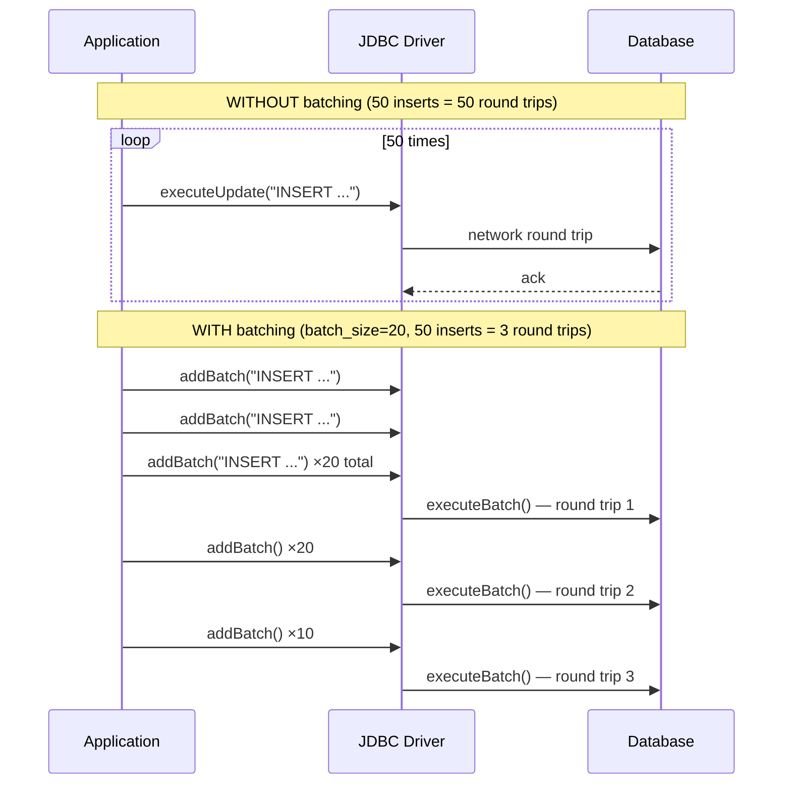

### Configuration

```properties
# application.properties
spring.jpa.properties.hibernate.jdbc.batch_size=20
spring.jpa.properties.hibernate.order_inserts=true
spring.jpa.properties.hibernate.order_updates=true

# Required for PostgreSQL to use batch rewriting
spring.datasource.url=jdbc:postgresql://localhost/mydb?reWriteBatchedInserts=true
```

### Why This Confuses Query Counts

```java
for (int i = 0; i < 50; i++) {
    Order o = new Order(...);
    entityManager.persist(o); // No INSERT yet — added to ActionQueue
}
// At flush:
// Hibernate Statistics: entityInsertCount = 50, queryExecutionCount = 0
// JDBC actual round trips: 3 (batches of 20, 20, 10)
// show-sql shows: 50 INSERT statements
// Reality: 3 network packets
```

**Hibernate's stats show 0 queries and 50 inserts. show-sql shows 50 SQLs. The database received 3 batch packets.** All three numbers are "correct" but describe different things.

---

## 7. Caching

### First-Level Cache (Session Cache)

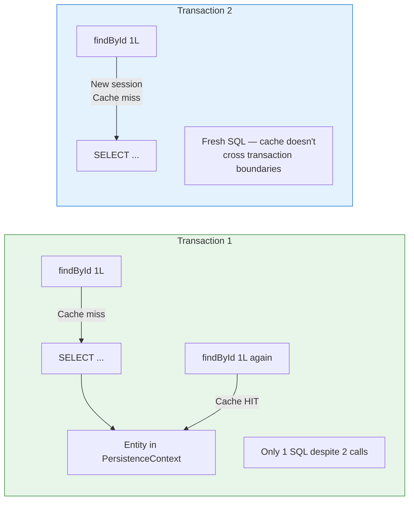

### Second-Level Cache (Cross-Session)

```java
@Entity
@Cache(usage = CacheConcurrencyStrategy.READ_WRITE) // Ehcache, Infinispan, Redis
public class Product {
    @Id private Long id;
    private String name;
    private BigDecimal price;
}
```

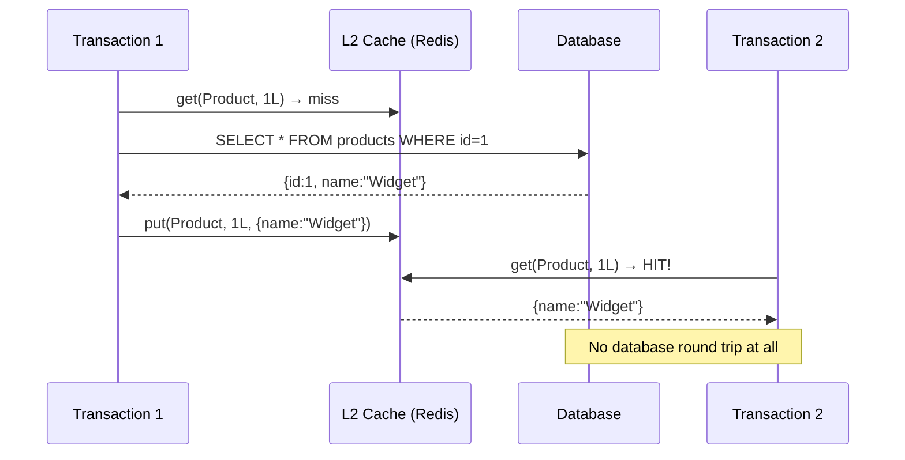

**Impact on query counts:** With L2 cache hits, your application makes fewer JDBC calls. Your DB metrics drop. But `queryExecutionCount` from Hibernate may remain the same or higher (it still processes the cache lookup through the Session). **Neither number reflects true DB workload accurately.**

---

## 8. Tools for Accurate Query Counting

### The Monitoring Stack

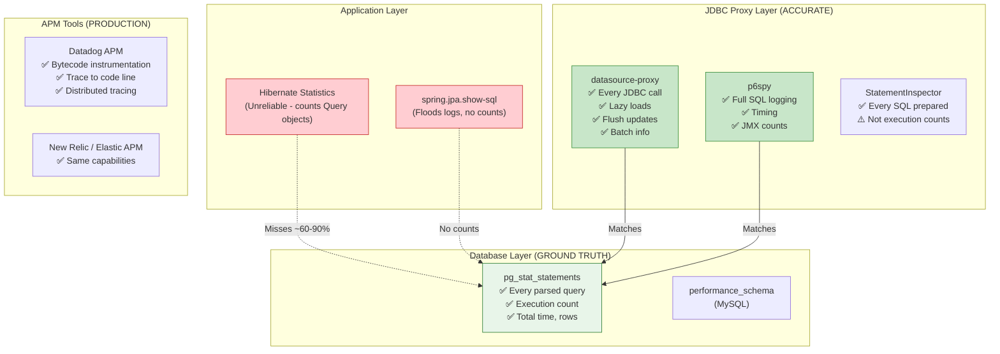

### Tool 1: datasource-proxy (Recommended)

```xml
<!-- pom.xml -->
<dependency>
    <groupId>net.ttddyy</groupId>
    <artifactId>datasource-proxy</artifactId>
    <version>1.9</version>
</dependency>
```

```java
@Component
public class ProxyDataSourceDecorator implements BeanPostProcessor {

    @Override
    public Object postProcessAfterInitialization(Object bean, String beanName) {
        if (bean instanceof DataSource dataSource) {
            return ProxyDataSourceBuilder.create(dataSource)
                .name("MyDS")
                .logQueryBySlf4j(SLF4JLogLevel.INFO, "SQL-LOG")
                .countQuery()       // Enables query counting
                .multiline()        // Pretty SQL
                .build();
        }
        return bean;
    }
}

// Expose count as metric
@Component
public class SqlQueryMetrics {
    @Scheduled(fixedDelay = 1000)
    public void reportCounts() {
        QueryCount count = QueryCountHolder.getGrandTotal();
        log.info("SELECT={}, INSERT={}, UPDATE={}, DELETE={}, TOTAL={}",
            count.getSelect(), count.getInsert(),
            count.getUpdate(), count.getDelete(), count.getTotal());
    }
}
```

**Output:**
```
INFO SQL-LOG - query:1  time:3ms  batch:false  type:Prepared
 SELECT o.id, o.customer_id FROM orders o WHERE o.id=?

INFO SQL-LOG - query:2  time:2ms  batch:false  type:Prepared
 SELECT c.id, c.name FROM customers c WHERE c.id=?

INFO SQL-LOG - query:3  time:1ms  batch:false  type:Prepared
 UPDATE orders SET status=? WHERE id=?

Total queries this request: 3  ← The REAL count
```

### Tool 2: Hibernate StatementInspector

```java
public class CountingStatementInspector implements StatementInspector {
    private static final ThreadLocal<AtomicInteger> counter =
        ThreadLocal.withInitial(AtomicInteger::new);

    @Override
    public String inspect(String sql) {
        counter.get().incrementAndGet();
        return sql; // can also modify or tag the SQL here
    }

    public static int getCount() { return counter.get().get(); }
    public static void reset() { counter.get().set(0); }
}

// Registration in application.properties:
// spring.jpa.properties.hibernate.session_factory.statement_inspector=\
//     com.example.CountingStatementInspector

// Usage in tests:
@Test
void loadOrderShouldNotTriggerNPlusOne() {
    CountingStatementInspector.reset();
    
    orderService.buildSummary(1L);
    
    int actualQueries = CountingStatementInspector.getCount();
    assertThat(actualQueries)
        .as("Expected JOIN FETCH to give us 1 query, not N+1")
        .isLessThanOrEqualTo(2);
}
```

### Tool 3: p6spy

```xml
<dependency>
    <groupId>p6spy</groupId>
    <artifactId>p6spy</artifactId>
    <version>3.9.1</version>
</dependency>
```

```properties
# application.properties
spring.datasource.driver-class-name=com.p6spy.engine.spy.P6SpyDriver
spring.datasource.url=jdbc:p6spy:postgresql://localhost:5432/mydb
```

```
# spy.properties
appender=com.p6spy.engine.spy.appender.Slf4JLogger
logMessageFormat=com.p6spy.engine.spy.appender.CustomLineFormat
customLogMessageFormat=%(executionTime)ms | %(category) | %(effectiveSql)
```

### Tool 4: Database-Side — pg_stat_statements

```sql
-- Enable in postgresql.conf
-- shared_preload_libraries = 'pg_stat_statements'

-- Query the view
SELECT 
    query,
    calls,
    total_exec_time / calls AS avg_ms,
    rows / calls AS avg_rows,
    100.0 * total_exec_time / sum(total_exec_time) OVER () AS pct_time
FROM pg_stat_statements
WHERE query NOT LIKE '%pg_stat%'
ORDER BY total_exec_time DESC
LIMIT 20;
```

This is the **absolute ground truth** — every statement the database actually parsed and executed.

### Comparison Summary

| Tool | Catches Lazy Loads | Catches Flush Updates | Counts Batches | Production Safe |
|------|-------------------|----------------------|----------------|-----------------|
| `show-sql` | ✅ (logs, no count) | ✅ (logs, no count) | ❌ | ❌ |
| Hibernate Statistics | ❌ | ❌ | ❌ | ✅ |
| `datasource-proxy` | ✅ | ✅ | ✅ | ✅ (low overhead) |
| `p6spy` | ✅ | ✅ | ✅ | ⚠️ (some overhead) |
| `StatementInspector` | ✅ | ✅ | ⚠️ (partial) | ✅ |
| `pg_stat_statements` | ✅ | ✅ | ✅ | ✅ |
| APM (Datadog, etc.) | ✅ | ✅ | ✅ | ✅ |

---

## 9. Real-World Debugging Strategies

### Strategy 1: Differential Counting

Compare Hibernate's count vs JDBC-level count to find the gap.

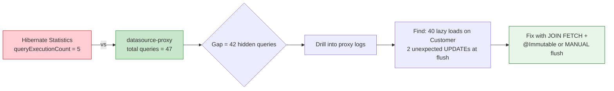

### Strategy 2: SQL Tagging for Production Tracing

```java
public class ContextTaggingInspector implements StatementInspector {
    @Override
    public String inspect(String sql) {
        // Add endpoint context to every SQL for pg_stat_statements tracing
        String endpoint = RequestContextHolder.getCurrentEndpoint();
        String traceId = MDC.get("traceId");
        return "/* endpoint=" + endpoint + " trace=" + traceId + " */ " + sql;
    }
}
```

In `pg_stat_statements`, you'll see:
```sql
/* endpoint=GET /orders/{id}/summary trace=abc123 */ SELECT * FROM orders WHERE id=?
```

Now you can aggregate: "How many DB statements does `/orders/{id}/summary` generate on average?"

### Strategy 3: Writing Assertion Tests

Prevent N+1 from ever reaching production:

```java
@SpringBootTest
@Transactional
class OrderServiceQueryTest {

    @Autowired OrderService orderService;

    // datasource-proxy bean for counting
    @Autowired QueryCountHolder queryCountHolder;

    @Test
    void buildSummary_shouldNotTriggerNPlusOne() {
        // given: 10 orders with 5 items each (in test DB)

        QueryCountHolder.clearGrandTotal();

        // when
        orderService.buildSummary(1L);

        // then
        QueryCount count = QueryCountHolder.getGrandTotal();
        assertThat(count.getSelect())
            .as("Should use JOIN FETCH — max 2 SELECTs")
            .isLessThanOrEqualTo(2);
        assertThat(count.getUpdate())
            .as("Read-only service should have no UPDATEs")
            .isEqualTo(0);
    }
}
```

### Strategy 4: APM Waterfall Analysis

In production, use Datadog / Elastic APM to see database spans in a distributed trace:

```
GET /orders/123/summary                             [12,340ms]
├── SELECT * FROM orders WHERE id=123               [3ms]
├── SELECT * FROM customers WHERE id=456            [2ms]  ← lazy load
├── SELECT * FROM customers WHERE id=456            [2ms]  ← duplicate!
├── SELECT * FROM order_items WHERE order_id=123    [4ms]
├── SELECT * FROM products WHERE id=1               [2ms]  ← N+1 start
├── SELECT * FROM products WHERE id=2               [2ms]
├── SELECT * FROM products WHERE id=3               [2ms]
│   ... × 47 more
└── UPDATE orders SET last_viewed=? WHERE id=123    [3ms]  ← phantom UPDATE
```

This waterfall view instantly reveals:
- Duplicate queries (L1 cache miss — different sessions?)
- N+1 patterns (identical queries in a loop)
- Phantom writes (unexpected UPDATEs)

---

## 10. Misconceptions & Interview Questions

### Misconception Busters

| Misconception | Reality |
|---------------|---------|
| "I see 1 Hibernate log line → 1 SQL" | That's 1 *explicit* query. Lazy loads scroll past unnoticed. |
| "`queryExecutionCount` = SQL statements" | It counts `Query` object executions only. Implicit SQL is invisible. |
| "`readOnly=true` prevents all writes" | Dirty checking still fires unless flush mode is MANUAL. |
| "Disabling `show-sql` reduces queries" | No. Queries still execute. You just lost visibility. |
| "Batching means fewer SQL statements" | Fewer round trips, but same number of logical statements. |
| "L2 cache reduces query count" | It reduces DB round trips, but Hibernate stats may still count cache-served loads. |

### Interview Questions Deep-Dive

**Q: How would you detect N+1 in production without enabling Hibernate SQL logging?**

> Use a JDBC-level proxy (`datasource-proxy`) or APM agent (Datadog, Elastic). These instrument the JDBC driver, capturing all actual SQL. Compare the JDBC SELECT count to the expected count per request. Alternatively, query `pg_stat_statements` and look for statement types with anomalously high `calls` relative to request count.

**Q: What's the difference between `getQueryExecutionCount()` and `getEntityLoadCount()`?**

> `getQueryExecutionCount()` counts explicit `Query`/`Criteria` executions — things you deliberately fired. `getEntityLoadCount()` counts all entity instances loaded from the database, including those loaded implicitly by lazy proxies and loaders. If `entityLoadCount >> queryExecutionCount`, you almost certainly have N+1.

**Q: Why does a `@Transactional(readOnly=true)` method sometimes generate UPDATE statements?**

> Because `readOnly=true` is a hint to the transaction manager (e.g., it may optimize by using a read replica or marking the JDBC connection read-only), but it doesn't change Hibernate's `FlushMode`. If `FlushMode` is `AUTO` or `COMMIT`, dirty entities will still be flushed. To truly prevent writes, also set `entityManager.setFlushMode(FlushModeType.MANUAL)`.

**Q: An API endpoint goes from 80ms to 12 seconds. DB CPU is 100%. `queryExecutionCount` shows 1. What do you do?**

> 1. Install `datasource-proxy` in staging and reproduce — get the real query count.
> 2. Check `pg_stat_statements` in production — look for high `calls` on queries correlated with the endpoint's timing.
> 3. Use APM (if available) to see the distributed trace waterfall.
> 4. Specifically look for: N+1 lazy loads (identical SELECTs in a loop), phantom UPDATEs from dirty checking, and accidental eager loading causing massive JOINs.

---

## 11. Best Practices Summary

### The Golden Rules of Hibernate Query Hygiene

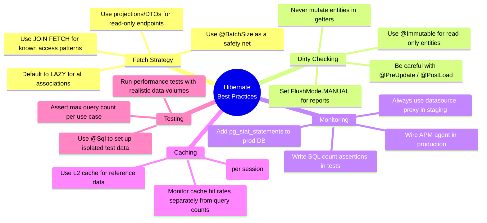

### The Decision Flowchart for Performance Issues

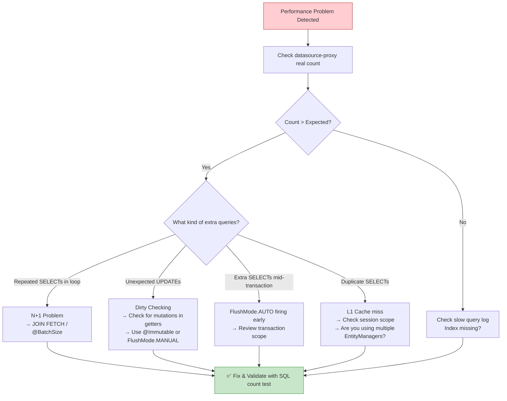

---

## 🏁 Conclusion

Hibernate is a powerful abstraction — but every abstraction leaks. The `queryExecutionCount` metric tells you about **one narrow slice** of Hibernate's internal activity: explicit `Query` object executions. It misses:

- ❌ Lazy loading (entity and collection)
- ❌ Dirty-check-triggered UPDATEs
- ❌ Flush-driven statements mid-transaction
- ❌ Batch execution boundaries

**The hierarchy of truth:**

```
spring.jpa.show-sql
    ↓ (no counts, no context)
Hibernate Statistics
    ↓ (misses ~60-90% of actual SQL)
datasource-proxy / p6spy
    ↓ (complete JDBC picture)
pg_stat_statements
    = Ground Truth
```

To protect your production systems:
1. **Never rely on Hibernate statistics alone** for performance decisions.
2. **Use `datasource-proxy`** in staging to count real round trips.
3. **Write SQL count assertions** in your test suite to prevent N+1 from shipping.
4. **Wire `pg_stat_statements`** and correlate it with your API endpoint metrics.
5. **Make SQL count a first-class Grafana metric** — alert when it grows.

The next time someone says "this endpoint only makes one query," you know what to do: grab a JDBC proxy and find out the truth.

---

*Tutorial based on the article "What Hibernate Doesn't Tell You About Database Round Trips" by Gaddam.Naveen, expanded with architectural diagrams, examples, and debugging strategies.*
