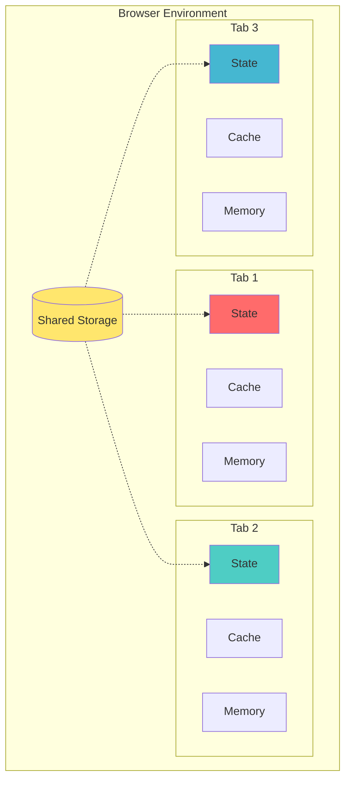
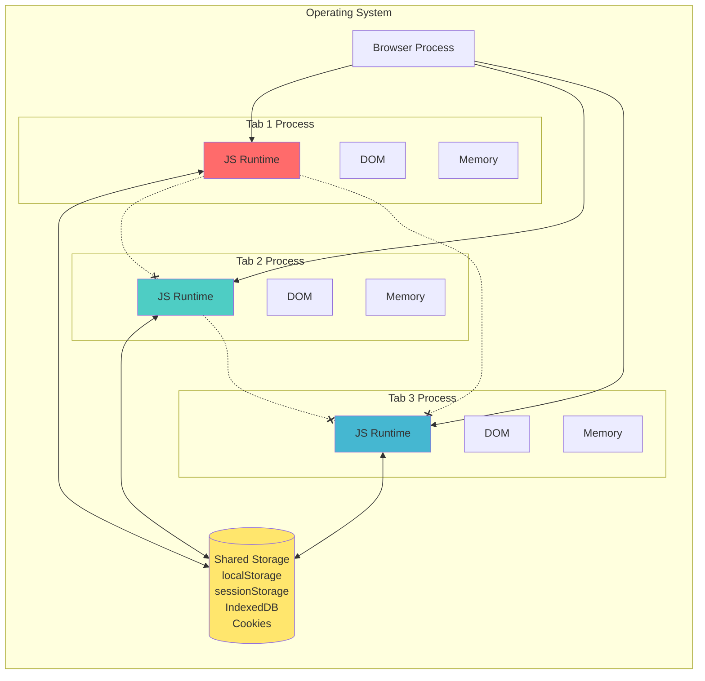
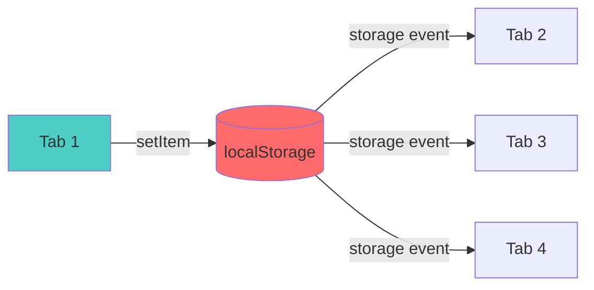
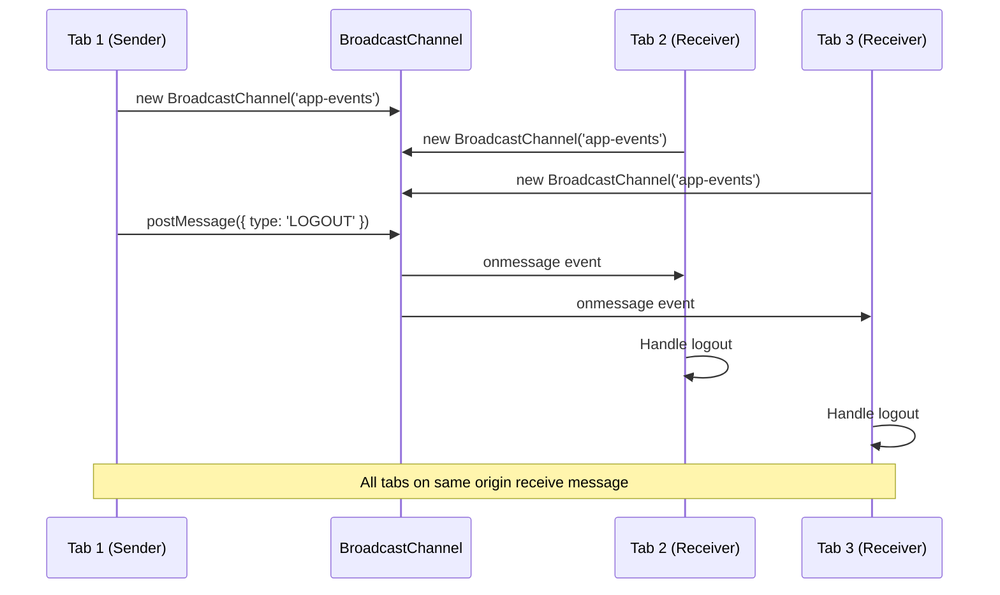
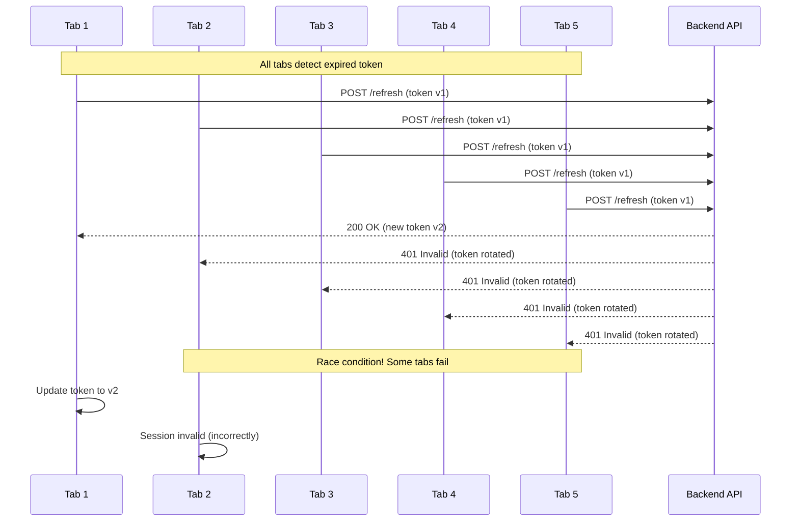

# BroadcastChannel API - Deep Dive Tutorial

**Last Updated:** October 2025  
**Reading Time:** 25-30 minutes  
**Difficulty Level:** ⭐⭐⭐ Intermediate to Advanced  
**Category:** Browser APIs / Frontend Architecture

---

## 📋 Table of Contents

1. [Introduction: The Multi-Tab Problem](#introduction)
2. [Prerequisites](#prerequisites)
3. [Learning Objectives](#learning-objectives)
4. [Understanding Browser Tab Isolation](#understanding-browser-tab-isolation)
5. [Current Solutions and Their Limitations](#current-solutions-and-their-limitations)
6. [BroadcastChannel API: Complete Reference](#broadcastchannel-api-complete-reference)
7. [Implementation Deep Dive](#implementation-deep-dive)
8. [Production Use Cases](#production-use-cases)
9. [Architecture Patterns](#architecture-patterns)
10. [Security Considerations](#security-considerations)
11. [Performance Optimization](#performance-optimization)
12. [Advanced Patterns](#advanced-patterns)
13. [Common Pitfalls and Anti-Patterns](#common-pitfalls-and-anti-patterns)
14. [Testing Strategies](#testing-strategies)
15. [Migration Guide](#migration-guide)
16. [Practice Exercises](#practice-exercises)
17. [Question Bank](#question-bank)
18. [Troubleshooting Guide](#troubleshooting-guide)
19. [Best Practices Summary](#best-practices-summary)
20. [Summary and Key Takeaways](#summary-and-key-takeaways)
21. [Further Reading and Resources](#further-reading-and-resources)

---

## 🎯 Introduction

Most frontend bugs don't come from missing features. They come from parts of the same application that **disagree with each other**.

Consider these real-world scenarios:

- **Scenario 1:** A user logs out in Tab A, but Tab B still displays the dashboard with cached user data
- **Scenario 2:** An admin updates permissions in one tab, but another tab continues showing outdated action buttons
- **Scenario 3:** A user changes their theme preference in Tab A, but Tab B remains in the old theme
- **Scenario 4:** Multiple tabs simultaneously try to refresh an expired token, causing race conditions

These bugs feel small initially because they only manifest when users open multiple tabs. However, real users do what real users always do—they open multiple tabs, compare data side-by-side, keep dashboards open all day, and expect consistent behavior across all their browser windows.

### The Hidden Complexity

When the same application runs in multiple tabs, each tab operates as an **independent JavaScript runtime** with its own:

- Memory space
- State management (React state, Redux, Zustand, etc.)
- Query cache (React Query, SWR, Apollo)
- Event listeners and timers
- In-flight API requests
- UI assumptions

The browser shares cookies and localStorage across tabs, but it **does not** magically synchronize application memory or in-memory state.



**Figure 1: Browser Tab Isolation Architecture**

### 💡 The Aha Moment

The problem isn't **state management**—it's **coordination**. Each tab has perfect state management internally, but there's no standard way for tabs to communicate when something important happens in another tab.

This is where the **BroadcastChannel API** comes in.

---

## 📚 Prerequisites

Before diving into this tutorial, you should have:

- ✅ **JavaScript ES6+ proficiency** - Arrow functions, async/await, destructuring
- ✅ **Browser DevTools basics** - Console, Network tab, Application tab
- ✅ **Frontend state management experience** - React Context, Redux, Zustand, or similar
- ✅ **Understanding of browser storage** - localStorage, sessionStorage, cookies
- ✅ **Basic knowledge of HTTP and authentication** - Tokens, sessions, refresh flows
- ✅ **TypeScript fundamentals** (for advanced sections) - Interfaces, type safety

### Recommended Background

- Experience with multi-tab application bugs
- Familiarity with React Query, SWR, or Apollo Client
- Understanding of event-driven architecture
- Basic knowledge of WebSockets or Server-Sent Events (for comparison sections)

---

## 🎓 Learning Objectives

By the end of this deep dive tutorial, you will:

### Core Competencies
- ✅ **Understand** the fundamental problem of cross-tab coordination
- ✅ **Master** the BroadcastChannel API specification and browser support
- ✅ **Implement** production-ready cross-tab communication patterns
- ✅ **Design** event-driven architectures for multi-tab applications
- ✅ **Identify** when to use BroadcastChannel vs. alternative solutions

### Advanced Skills
- ✅ **Build** type-safe wrapper libraries for BroadcastChannel
- ✅ **Integrate** BroadcastChannel with React Query, SWR, and Apollo
- ✅ **Prevent** race conditions in token refresh flows
- ✅ **Design** secure communication protocols that avoid data leaks
- ✅ **Debug** cross-tab issues systematically

### Architectural Thinking
- ✅ **Distinguish** between local coordination and server-originated events
- ✅ **Apply** the right tool for the right problem (BroadcastChannel vs WebSockets vs polling)
- ✅ **Design** scalable channel naming and message structure strategies
- ✅ **Balance** between over-engineering and under-engineering

---

## 🔒 Understanding Browser Tab Isolation

### The JavaScript Runtime Boundary

Each browser tab runs in a **separate JavaScript execution context**. This is a security feature that prevents malicious websites from accessing data from other tabs. However, it also creates challenges for legitimate application coordination.



**Figure 2: JavaScript Runtime Isolation in Browser Tabs**

### What IS Shared Across Tabs

| Resource | Shared? | Notes |
|----------|---------|-------|
| **localStorage** | ✅ Yes | Synchronous, string-only storage |
| **sessionStorage** | ❌ No | Isolated per tab |
| **Cookies** | ✅ Yes | Sent with every HTTP request |
| **IndexedDB** | ✅ Yes | Client-side database |
| **Cache API** | ✅ Yes | Service worker cache |
| **JavaScript Memory** | ❌ No | Variables, objects, closures |
| **React/Vue/Angular State** | ❌ No | In-memory state |
| **Query Cache** | ❌ No | React Query, SWR, Apollo cache |
| **Event Listeners** | ❌ No | DOM event handlers |
| **Timers** | ❌ No | setTimeout, setInterval |

### The Memory Isolation Problem

Consider this React example:

```javascript
// Tab 1
const [user, setUser] = useState({ name: "Alice", role: "admin" });

// Tab 2
const [user, setUser] = useState({ name: "Alice", role: "user" });

// Even though both tabs start with the same user,
// they now have DIFFERENT in-memory state
// Changing one doesn't affect the other
```

This isolation is by design, but it creates the multi-tab consistency problem.

---

## ⚠️ Current Solutions and Their Limitations

### Approach 1: localStorage as Message Bus

**The Pattern:**

```javascript
// Tab 1: Send logout event
localStorage.setItem('logout', Date.now().toString());

// Tab 2: Listen for changes
window.addEventListener('storage', (event) => {
  if (event.key === 'logout') {
    handleLogout();
  }
});
```

**Why This Is an Anti-Pattern:**

❌ **Misuse of storage** - You're storing data you don't actually need  
❌ **Cleanup required** - Stale values accumulate in localStorage  
❌ **Type safety issues** - Everything is a string  
❌ **Limited payload** - Can't send complex objects efficiently  
❌ **Semantic confusion** - Is this real state or a signal?  
❌ **Race conditions** - Multiple tabs writing simultaneously  



**Figure 3: localStorage Event Bus Pattern**

### Approach 2: Polling

**The Pattern:**

```javascript
// Check for changes every 5 seconds
setInterval(() => {
  fetch('/api/user/session')
    .then(res => res.json())
    .then(updateSession);
}, 5000);
```

**Limitations:**

❌ **Server load** - Unnecessary API calls  
❌ **Latency** - Changes aren't immediate (up to 5 seconds delay)  
❌ **Battery drain** - Constant network requests  
❌ **Wasteful** - Most polls return no changes  
❌ **Not real-time** - Poor user experience  

### Approach 3: Server-Sent Events / WebSockets

**The Pattern:**

```javascript
const eventSource = new EventSource('/api/events');
eventSource.onmessage = (event) => {
  const data = JSON.parse(event.data);
  handleCrossTabEvent(data);
};
```

**Limitations:**

❌ **Overkill for local coordination** - Backend involvement unnecessary  
❌ **Infrastructure complexity** - Requires server setup  
❌ **Not for same-browser events** - Designed for server-to-client  
❌ **Connection management** - Keep-alive, reconnection logic  
❌ **Scalability concerns** - One connection per user per tab  

### Approach 4: BroadcastChannel API ✅

**The Pattern:**

```javascript
// Create channel
const channel = new BroadcastChannel('app-events');

// Send message
channel.postMessage({ type: 'LOGOUT' });

// Receive message
channel.onmessage = (event) => {
  if (event.data.type === 'LOGOUT') {
    handleLogout();
  }
};
```

**Advantages:**

✅ **Purpose-built** - Designed for cross-tab communication  
✅ **Event-driven** - No polling, immediate delivery  
✅ **Lightweight** - No server infrastructure needed  
✅ **Type-safe** - Can send any serializable data  
✅ **Clean semantics** - Communication primitive, not storage hack  
✅ **Low overhead** - Minimal performance impact  

---

## 📡 BroadcastChannel API: Complete Reference

### API Specification

The BroadcastChannel API is a **W3C Recommendation** (standard) that enables communication between browsing contexts (tabs, windows, iframes, workers) with the same origin.

**Browser Support:**

| Browser | Version | Support |
|---------|---------|---------|
| Chrome | 54+ | ✅ Full |
| Firefox | 38+ | ✅ Full |
| Safari | 15.4+ | ✅ Full |
| Edge | 79+ | ✅ Full |
| Opera | 41+ | ✅ Full |
| IE | All | ❌ No support |

**Polyfill Strategy:** For IE11 and older browsers, fall back to localStorage event bus with feature detection.

### Core API Methods

```typescript
// 1. Constructor - Create a named channel
const channel = new BroadcastChannel(channelName: string);

// 2. postMessage - Send a message to all listeners
channel.postMessage(message: any): void;

// 3. onmessage - Message handler (event listener)
channel.onmessage = (event: MessageEvent) => void;

// 4. addEventListener - Alternative message handler
channel.addEventListener('message', handler: EventListener);

// 5. removeEventListener - Remove message handler
channel.removeEventListener('message', handler: EventListener);

// 6. close - Clean up channel when done
channel.close(): void;

// 7. onmessageerror - Handle message errors
channel.onmessageerror = (event: MessageEvent) => void;
```

### Complete API Workflow



**Figure 4: BroadcastChannel Message Flow**

### Key Characteristics

1. **Same-Origin Only** - Only works between contexts with the same protocol, host, and port
2. **Broadcast Semantics** - Message sent to ALL listeners (including sender if they have a listener)
3. **Asynchronous** - Messages are delivered asynchronously
4. **Serializable Data** - Messages must be serializable (structured clone algorithm)
5. **No Acknowledgment** - Fire-and-forget messaging (no built-in delivery confirmation)

---

## 🛠️ Implementation Deep Dive

### Basic Usage Pattern

**Vanilla JavaScript:**

```javascript
// Create channel
const channel = new BroadcastChannel('app-events');

// Define message handler
channel.onmessage = (event) => {
  console.log('Received:', event.data);
  
  switch (event.data.type) {
    case 'LOGOUT':
      handleLogout();
      break;
    case 'CACHE_INVALIDATE':
      invalidateCache(event.data.resource);
      break;
    case 'SETTINGS_CHANGED':
      refreshSettings();
      break;
  }
};

// Send message
function triggerLogout() {
  // Perform logout
  clearSession();
  
  // Notify other tabs
  channel.postMessage({
    type: 'LOGOUT',
    timestamp: Date.now()
  });
  
  // Redirect current tab
  window.location.href = '/login';
}

// Cleanup when done
function cleanup() {
  channel.close();
}
```

### TypeScript Implementation

**Type-Safe Message Definitions:**

```typescript
// Define all possible message types
type AppEvent = 
  | { type: 'LOGOUT' }
  | { { type: 'TOKEN_REFRESHED', accessToken: string, expiresAt: number } }
  | { type: 'SESSION_UPDATED' }
  | { type: 'RESOURCE_INVALIDATED', resource: string }
  | { type: 'PERMISSIONS_CHANGED' }
  | { type: 'THEME_CHANGED', theme: 'light' | 'dark' | 'system' }
  | { type: 'SETTINGS_CHANGED', settings: Partial<UserSettings> };

// Type-safe channel wrapper
class BroadcastChannelWrapper {
  private channel: BroadcastChannel;
  private handlers: Map<string, Set<Function>>;

  constructor(channelName: string) {
    this.channel = new BroadcastChannel(channelName);
    this.handlers = new Map();
    
    this.channel.onmessage = (event: MessageEvent<AppEvent>) => {
      this.dispatch(event.data);
    };
  }

  private dispatch(message: AppEvent) {
    const handlers = this.handlers.get(message.type) || new Set();
    handlers.forEach(handler => {
      try {
        handler(message);
      } catch (error) {
        console.error(`Error handling message type ${message.type}:`, error);
      }
    });
  }

  subscribe<T extends AppEvent>(
    type: T['type'],
    handler: (message: T) => void
  ): () => void {
    if (!this.handlers.has(type)) {
      this.handlers.set(type, new Set());
    }
    
    this.handlers.get(type)!.add(handler);
    
    // Return unsubscribe function
    return () => {
      this.handlers.get(type)?.delete(handler);
    };
  }

  publish(message: AppEvent): void {
    this.channel.postMessage(message);
  }

  close(): void {
    this.channel.close();
    this.handlers.clear();
  }
}

// Usage
const appChannel = new BroadcastChannelWrapper('app-events');

// Subscribe to logout events
const unsubscribe = appChannel.subscribe('LOGOUT', () => {
  handleLogout();
});

// Publish logout event
function logout() {
  clearSession();
  appChannel.publish({ type: 'LOGOUT' });
  window.location.href = '/login';
}

// Cleanup
unsubscribe();
appChannel.close();
```

### React Integration Pattern

**Custom Hook:**

```typescript
import { useEffect, useCallback, useRef } from 'react';

type EventHandler<T> = (data: T) => void;

export function useBroadcastChannel<T extends Record<string, any>>(
  channelName: string,
  eventType: string
) {
  const channelRef = useRef<BroadcastChannel | null>(null);
  const handlerRef = useRef<EventHandler<T> | null>(null);

  useEffect(() => {
    // Feature detection
    if (typeof BroadcastChannel === 'undefined') {
      console.warn('BroadcastChannel not supported');
      return;
    }

    // Create channel
    const channel = new BroadcastChannel(channelName);
    channelRef.current = channel;

    // Define handler
    const handler = (event: MessageEvent<T>) => {
      if (event.data.type === eventType) {
        handlerRef.current?.(event.data);
      }
    };

    channel.addEventListener('message', handler);

    return () => {
      channel.removeEventListener('message', handler);
      channel.close();
    };
  }, [channelName, eventType]);

  const publish = useCallback((message: T) => {
    channelRef.current?.postMessage(message);
  }, []);

  const subscribe = useCallback((handler: EventHandler<T>) => {
    handlerRef.current = handler;
    return () => {
      handlerRef.current = null;
    };
  }, []);

  return { publish, subscribe };
}

// Usage in component
function UserProfile() {
  const { publish, subscribe } = useBroadcastChannel<UserUpdatedEvent>(
    'app-events',
    'USER_UPDATED'
  );

  useEffect(() => {
    const unsubscribe = subscribe((data) => {
      // Refetch user data when another tab updates
      queryClient.invalidateQueries(['user']);
    });

    return unsubscribe;
  }, [subscribe]);

  const updateUser = async (data: UserUpdate) => {
    await api.updateUser(data);
    publish({ type: 'USER_UPDATED', userId: data.id });
  };

  return <ProfileForm onSubmit={updateUser} />;
}
```

### Vue 3 Composition API

```typescript
import { onMounted, onUnmounted, ref } from 'vue';

export function useBroadcastChannel<T>(
  channelName: string,
  eventType: string
) {
  const channel = ref<BroadcastChannel | null>(null);
  const message = ref<T | null>(null);

  onMounted(() => {
    if (typeof BroadcastChannel === 'undefined') return;

    channel.value = new BroadcastChannel(channelName);
    
    channel.value.onmessage = (event) => {
      if (event.data.type === eventType) {
        message.value = event.data;
      }
    };
  });

  onUnmounted(() => {
    channel.value?.close();
  });

  const publish = (data: T) => {
    channel.value?.postMessage(data);
  };

  return { message, publish };
}

// Usage
const { message, publish } = useBroadcastChannel<UserEvent>('app-events', 'USER_UPDATED');
```

---

## 🎯 Production Use Cases

### Use Case 1: Logout Synchronization

**Problem:** User logs out in Tab A, but Tab B still shows authenticated content.

**Solution:**

```typescript
// auth-channel.ts
class AuthChannel {
  private channel: BroadcastChannel;
  
  constructor() {
    this.channel = new BroadcastChannel('auth');
    this.setupListener();
  }
  
  private setupListener() {
    this.channel.onmessage = (event) => {
      if (event.data.type === 'LOGOUT') {
        this.handleLogout();
      } else if (event.data.type === 'TOKEN_REFRESH') {
        this.handleTokenRefresh(event.data);
      }
    };
  }
  
  private handleLogout() {
    // Clear all auth state
    localStorage.removeItem('access_token');
    localStorage.removeItem('refresh_token');
    sessionStorage.clear();
    
    // Clear any auth cookies if needed
    document.cookie.split(';').forEach(cookie => {
      const name = cookie.split('=')[0].trim();
      document.cookie = `${name}=; expires=Thu, 01 Jan 1970 00:00:00 UTC; path=/;`;
    });
    
    // Redirect to login
    window.location.href = '/login';
  }
  
  private handleTokenRefresh(data: { accessToken: string; expiresAt: number }) {
    localStorage.setItem('access_token', data.accessToken);
    localStorage.setItem('token_expires_at', data.expiresAt.toString());
  }
  
  public logout() {
    // Clear current tab state
    this.handleLogout();
    
    // Notify other tabs
    this.channel.postMessage({ type: 'LOGOUT' });
  }
  
  public broadcastTokenRefresh(accessToken: string, expiresAt: number) {
    this.channel.postMessage({
      type: 'TOKEN_REFRESH',
      accessToken,
      expiresAt
    });
  }
  
  public close() {
    this.channel.close();
  }
}

// Usage
const authChannel = new AuthChannel();

// In logout button click handler
function onLogoutClick() {
  authChannel.logout();
}

// In app initialization
const auth = new AuthChannel();
```

**Edge Cases Handled:**

✅ **Multiple tabs** - All tabs receive logout event  
✅ **Timing** - Event fires before redirect completes  
✅ **Cleanup** - All storage cleared, not just current tab  
✅ **Race conditions** - If logout happens during API call, request fails gracefully  

### Use Case 2: Token Refresh Coordination

**Problem:** Five tabs simultaneously try to refresh the same expired token, causing race conditions.



**Figure 5: Token Refresh Race Condition**

**Solution with BroadcastChannel:**

```typescript
class TokenRefreshCoordinator {
  private channel: BroadcastChannel;
  private refreshPromise: Promise<string> | null = null;
  private isRefreshing = false;
  
  constructor() {
    this.channel = new BroadcastChannel('auth');
    this.setupListener();
  }
  
  private setupListener() {
    this.channel.onmessage = (event) => {
      if (event.data.type === 'TOKEN_REFRESHED') {
        this.handleTokenRefreshed(event.data);
      }
    };
  }
  
  private handleTokenRefreshed(data: { token: string; expiresAt: number }) {
    localStorage.setItem('access_token', data.token);
    localStorage.setItem('token_expires_at', data.expiresAt.toString());
  }
  
  async refreshToken(): Promise<string> {
    // If another tab is already refreshing, wait for it
    if (this.refreshPromise) {
      return this.refreshPromise;
    }
    
    // If we're already refreshing, return existing promise
    if (this.isRefreshing) {
      return this.refreshPromise!;
    }
    
    this.isRefreshing = true;
    
    // Create refresh promise
    this.refreshPromise = this.performRefresh();
    
    try {
      const result = await this.refreshPromise;
      
      // Broadcast to other tabs
      this.channel.postMessage({
        type: 'TOKEN_REFRESHED',
        token: result.token,
        expiresAt: result.expiresAt
      });
      
      return result.token;
    } finally {
      this.refreshPromise = null;
      this.isRefreshing = false;
    }
  }
  
  private async performRefresh(): Promise<{ token: string; expiresAt: number }> {
    const refreshToken = localStorage.getItem('refresh_token');
    
    const response = await fetch('/api/auth/refresh', {
      method: 'POST',
      headers: { 'Content-Type': 'application/json' },
      body: JSON.stringify({ refresh_token: refreshToken })
    });
    
    if (!response.ok) {
      throw new Error('Token refresh failed');
    }
    
    const data = await response.json();
    return {
      token: data.access_token,
      expiresAt: Date.now() + data.expires_in * 1000
    };
  }
}

// Usage with axios interceptor
const tokenCoordinator = new TokenRefreshCoordinator();

axios.interceptors.response.use(
  (response) => response,
  async (error) => {
    const originalRequest = error.config;
    
    if (error.response?.status === 401 && !originalRequest._retry) {
      originalRequest._retry = true;
      
      try {
        const newToken = await tokenCoordinator.refreshToken();
        originalRequest.headers.Authorization = `Bearer ${newToken}`;
        return axios(originalRequest);
      } catch (refreshError) {
        // Refresh failed, redirect to login
        window.location.href = '/login';
        return Promise.reject(refreshError);
      }
    }
    
    return Promise.reject(error);
  }
);
```

**Benefits:**

✅ **Single refresh** - Only one tab performs the actual refresh  
✅ **Race condition prevention** - Other tabs wait for the result  
✅ **Token broadcast** - All tabs get the new token  
✅ **Graceful fallback** - If refresh fails, all tabs redirect to login  

### Use Case 3: Cache Invalidation

**Problem:** User updates profile in Tab A, but Tab B shows stale data.

```typescript
// cache-coordinator.ts
import { QueryClient } from '@tanstack/react-query';

class CacheCoordinator {
  private channel: BroadcastChannel;
  private queryClient: QueryClient;
  
  constructor(queryClient: QueryClient) {
    this.queryClient = queryClient;
    this.channel = new BroadcastChannel('app-cache');
    this.setupListener();
  }
  
  private setupListener() {
    this.channel.onmessage = (event) => {
      const { type, resource } = event.data;
      
      switch (type) {
        case 'RESOURCE_INVALIDATED':
          this.invalidateResource(resource);
          break;
        case 'CACHE_CLEAR':
          this.clearAllCache();
          break;
        case 'USER_DATA_UPDATED':
          this.invalidateUserData();
          break;
      }
    };
  }
  
  private invalidateResource(resource: string) {
    console.log(`Invalidating cache for: ${resource}`);
    this.queryClient.invalidateQueries([resource]);
  }
  
  private clearAllCache() {
    this.queryClient.clear();
  }
  
  private invalidateUserData() {
    this.queryClient.invalidateQueries(['user']);
    this.queryClient.invalidateQueries(['user-profile']);
    this.queryClient.invalidateQueries(['user-settings']);
  }
  
  public invalidate(resource: string) {
    // Invalidate in current tab
    this.invalidateResource(resource);
    
    // Notify other tabs
    this.channel.postMessage({
      type: 'RESOURCE_INVALIDATED',
      resource
    });
  }
  
  public onUserUpdate() {
    this.invalidateUserData();
    this.channel.postMessage({ type: 'USER_DATA_UPDATED' });
  }
  
  public clearCache() {
    this.clearAllCache();
    this.channel.postMessage({ type: 'CACHE_CLEAR' });
  }
  
  close() {
    this.channel.close();
  }
}

// Usage in React Query setup
const queryClient = new QueryClient({
  defaultOptions: {
    queries: {
      staleTime: 1000 * 60 * 5, // 5 minutes
      cacheTime: 1000 * 60 * 10 // 10 minutes
    }
  }
});

const cacheCoordinator = new CacheCoordinator(queryClient);

// In mutation callbacks
const updateProfile = async (data: ProfileUpdate) => {
  await api.updateProfile(data);
  
  // Invalidate cache in all tabs
  cacheCoordinator.invalidate('user-profile');
};

// In user settings page
const updateSettings = async (settings: Settings) => {
  await api.updateSettings(settings);
  cacheCoordinator.onUserUpdate();
};
```

**React Query Integration Example:**

```typescript
// hooks/useUpdateProfile.ts
export function useUpdateProfile() {
  const queryClient = useQueryClient();
  const cacheCoordinator = useCacheCoordinator();
  
  const mutation = useMutation({
    mutationFn: (data: ProfileUpdate) => api.updateProfile(data),
    onSuccess: () => {
      // Invalidate in current tab
      queryClient.invalidateQueries(['user-profile']);
      
      // Notify other tabs
      cacheCoordinator.invalidate('user-profile');
    }
  });
  
  return mutation;
}
```

### Use Case 4: Permission and Feature Flag Management

**Problem:** Admin updates user role in Tab A, but Tab B still shows old permissions.

```typescript
// permission-sync.ts
interface PermissionChangeEvent {
  type: 'PERMISSIONS_CHANGED';
  userId: string;
  timestamp: number;
}

class PermissionSync {
  private channel: BroadcastChannel;
  private currentUser: User | null = null;
  
  constructor() {
    this.channel = new BroadcastChannel('permissions');
    this.setupListener();
  }
  
  private setupListener() {
    this.channel.onmessage = async (event: MessageEvent<PermissionChangeEvent>) => {
      const { userId } = event.data;
      
      // Only refresh if it's for the current user
      if (this.currentUser?.id === userId) {
        await this.refreshPermissions();
      }
    };
  }
  
  async refreshPermissions() {
    try {
      const permissions = await api.getPermissions();
      
      // Update local state
      this.currentUser = {
        ...this.currentUser!,
        permissions
      };
      
      // Update UI
      this.updatePermissionUI(permissions);
      
      console.log('Permissions refreshed');
    } catch (error) {
      console.error('Failed to refresh permissions:', error);
    }
  }
  
  private updatePermissionUI(permissions: Permission[]) {
    // Show/hide UI elements based on permissions
    const adminPanel = document.getElementById('admin-panel');
    const deleteButton = document.getElementById('delete-button');
    
    if (adminPanel) {
      adminPanel.style.display = permissions.canViewAdmin ? 'block' : 'none';
    }
    
    if (deleteButton) {
      deleteButton.style.display = permissions.canDelete ? 'inline' : 'none';
    }
  }
  
  public onPermissionChange() {
    // Refresh permissions in current tab
    this.refreshPermissions();
    
    // Notify other tabs
    this.channel.postMessage({
      type: 'PERMISSIONS_CHANGED',
      userId: this.currentUser?.id,
      timestamp: Date.now()
    });
  }
  
  close() {
    this.channel.close();
  }
}

// Usage
const permissionSync = new PermissionSync();

// When admin updates user role
async function updateUserRole(userId: string, newRole: Role) {
  await api.updateUserRole(userId, newRole);
  
  // Notify all tabs
  permissionSync.onPermissionChange();
}
```

### Use Case 5: Theme Synchronization

**Simple but Essential:**

```typescript
// theme-sync.ts
class ThemeSync {
  private channel: BroadcastChannel;
  private currentTheme: 'light' | 'dark' | 'system';
  
  constructor() {
    this.currentTheme = this.loadTheme();
    this.channel = new BroadcastChannel('theme');
    this.setupListener();
    this.applyTheme(this.currentTheme);
  }
  
  private setupListener() {
    this.channel.onmessage = (event) => {
      if (event.data.type === 'THEME_CHANGED') {
        this.setTheme(event.data.theme, false); // false = don't broadcast
      }
    };
  }
  
  private loadTheme(): 'light' | 'dark' | 'system' {
    return (localStorage.getItem('theme') as 'light' | 'dark' | 'system') || 'system';
  }
  
  private saveTheme(theme: 'light' | 'dark' | 'system') {
    localStorage.setItem('theme', theme);
  }
  
  private applyTheme(theme: 'light' | 'dark' | 'system') {
    const root = document.documentElement;
    
    if (theme === 'system') {
      const prefersDark = window.matchMedia('(prefers-color-scheme: dark)').matches;
      root.setAttribute('data-theme', prefersDark ? 'dark' : 'light');
    } else {
      root.setAttribute('data-theme', theme);
    }
  }
  
  setTheme(theme: 'light' | 'dark' | 'system', broadcast = true) {
    this.currentTheme = theme;
    this.saveTheme(theme);
    this.applyTheme(theme);
    
    if (broadcast) {
      this.channel.postMessage({
        type: 'THEME_CHANGED',
        theme
      });
    }
  }
  
  getTheme() {
    return this.currentTheme;
  }
  
  close() {
    this.channel.close();
  }
}

// Usage
const themeSync = new ThemeSync();

// In theme toggle component
function ThemeToggle() {
  const [theme, setTheme] = useState(themeSync.getTheme());
  
  const toggleTheme = () => {
    const newTheme = theme === 'light' ? 'dark' : 'light';
    themeSync.setTheme(newTheme);
    setTheme(newTheme);
  };
  
  return <button onClick={toggleTheme}>Toggle Theme</button>;
}
```

---

## 🏗️ Architecture Patterns

### Pattern 1: Centralized Event Bus

**Concept:** Single channel for all application events with type-based routing.

```typescript
// event-bus.ts
type EventType = 
  | 'LOGOUT'
  | 'TOKEN_REFRESHED'
  | 'RESOURCE_INVALIDATED'
  | 'PERMISSIONS_CHANGED'
  | 'THEME_CHANGED'
  | 'SETTINGS_CHANGED'
  | 'NOTIFICATION_RECEIVED';

type EventMap = {
  LOGOUT: { type: 'LOGOUT' };
  TOKEN_REFRESHED: { type: 'TOKEN_REFRESHED'; token: string; expiresAt: number };
  RESOURCE_INVALIDATED: { type: 'RESOURCE_INVALIDATED'; resource: string };
  PERMISSIONS_CHANGED: { type: 'PERMISSIONS_CHANGED'; userId: string };
  THEME_CHANGED: { type: 'THEME_CHANGED'; theme: 'light' | 'dark' | 'system' };
  SETTINGS_CHANGED: { type: 'SETTINGS_CHANGED'; settings: UserSettings };
  NOTIFICATION_RECEIVED: { type: 'NOTIFICATION_RECEIVED'; notification: Notification };
};

class EventBus {
  private channel: BroadcastChannel;
  private listeners: Map<EventType, Set<Function>> = new Map();
  
  constructor() {
    this.channel = new BroadcastChannel('app-events');
    this.channel.onmessage = this.handleMessage.bind(this);
  }
  
  private handleMessage(event: MessageEvent<any>) {
    const eventType = event.data.type as EventType;
    const handlers = this.listeners.get(eventType);
    
    if (handlers) {
      handlers.forEach(handler => {
        try {
          handler(event.data);
        } catch (error) {
          console.error(`Error in ${eventType} handler:`, error);
        }
      });
    }
  }
  
  on<T extends EventType>(
    eventType: T,
    handler: (data: EventMap[T]) => void
  ): () => void {
    if (!this.listeners.has(eventType)) {
      this.listeners.set(eventType, new Set());
    }
    
    this.listeners.get(eventType)!.add(handler);
    
    return () => {
      this.listeners.get(eventType)?.delete(handler);
    };
  }
  
  emit<T extends EventType>(event: EventMap[T]): void {
    this.channel.postMessage(event);
  }
  
  close() {
    this.channel.close();
    this.listeners.clear();
  }
}

// Global instance
export const eventBus = new EventBus();

// Usage
// Subscribe
const unsubscribe = eventBus.on('LOGOUT', () => {
  handleLogout();
});

// Publish
eventBus.emit({ type: 'LOGOUT' });

// Cleanup
unsubscribe();
```

### Pattern 2: Multi-Channel Architecture

**Concept:** Separate channels for different concerns to reduce noise and improve organization.

```typescript
// channels.ts
export const channels = {
  auth: new BroadcastChannel('auth'),
  cache: new BroadcastChannel('cache'),
  notifications: new BroadcastChannel('notifications'),
  settings: new BroadcastChannel('settings')
};

// Usage
// Auth events
channels.auth.postMessage({ type: 'LOGOUT' });

// Cache events
channels.cache.postMessage({ type: 'INVALIDATE', resource: 'users' });

// Notification events
channels.notifications.postMessage({ 
  type: 'NEW_NOTIFICATION', 
  notification 
});

// Settings events
channels.settings.postMessage({ 
  type: 'THEME_CHANGED', 
  theme: 'dark' 
});
```

**When to Use Multi-Channel:**

✅ **Large applications** with many event types  
✅ **Team ownership** - Different teams own different channels  
✅ **Performance** - Reduce unnecessary message processing  
✅ **Security** - Separate sensitive channels (auth) from general ones  

**When to Avoid:**

❌ **Small applications** - Overhead not justified  
❌ **Simple use cases** - Single channel is sufficient  
❌ **Tight coupling** - Events often need to cross boundaries  

### Pattern 3: Request-Response Pattern

**Concept:** Implement request-response semantics over the broadcast channel.

```typescript
// request-response.ts
interface RequestMessage {
  type: 'REQUEST';
  id: string;
  action: string;
  payload: any;
}

interface ResponseMessage {
  type: 'RESPONSE';
  id: string;
  success: boolean;
  data?: any;
  error?: string;
}

class RequestResponseChannel {
  private channel: BroadcastChannel;
  private pendingRequests: Map<string, {
    resolve: (value: any) => void;
    reject: (error: any) => void;
    timeout: NodeJS.Timeout;
  }> = new Map();
  
  constructor(channelName: string) {
    this.channel = new BroadcastChannel(channelName);
    this.channel.onmessage = this.handleMessage.bind(this);
  }
  
  private handleMessage(event: MessageEvent<any>) {
    const message = event.data as RequestMessage | ResponseMessage;
    
    if (message.type === 'REQUEST') {
      this.handleRequest(message as RequestMessage);
    } else if (message.type === 'RESPONSE') {
      this.handleResponse(message as ResponseMessage);
    }
  }
  
  private async handleRequest(request: RequestMessage) {
    try {
      let data: any;
      
      switch (request.action) {
        case 'GET_USER':
          data = await api.getUser(request.payload.userId);
          break;
        case 'VALIDATE_SESSION':
          data = await api.validateSession();
          break;
        default:
          throw new Error(`Unknown action: ${request.action}`);
      }
      
      // Send response
      this.channel.postMessage({
        type: 'RESPONSE',
        id: request.id,
        success: true,
        data
      } as ResponseMessage);
      
    } catch (error) {
      this.channel.postMessage({
        type: 'RESPONSE',
        id: request.id,
        success: false,
        error: error.message
      } as ResponseMessage);
    }
  }
  
  private handleResponse(response: ResponseMessage) {
    const pending = this.pendingRequests.get(response.id);
    
    if (pending) {
      clearTimeout(pending.timeout);
      this.pendingRequests.delete(response.id);
      
      if (response.success) {
        pending.resolve(response.data);
      } else {
        pending.reject(new Error(response.error));
      }
    }
  }
  
  async request<T>(
    action: string,
    payload: any,
    timeout = 5000
  ): Promise<T> {
    const id = crypto.randomUUID();
    
    return new Promise<T>((resolve, reject) => {
      // Set timeout
      const timeoutId = setTimeout(() => {
        this.pendingRequests.delete(id);
        reject(new Error('Request timeout'));
      }, timeout);
      
      // Store pending request
      this.pendingRequests.set(id, {
        resolve: resolve as (value: any) => void,
        reject,
        timeout: timeoutId as any
      });
      
      // Send request
      this.channel.postMessage({
        type: 'REQUEST',
        id,
        action,
        payload
      } as RequestMessage);
    });
  }
  
  close() {
    // Reject all pending requests
    this.pendingRequests.forEach((pending, id) => {
      clearTimeout(pending.timeout);
      pending.reject(new Error('Channel closed'));
    });
    
    this.channel.close();
  }
}

// Usage
const requestChannel = new RequestResponseChannel('app-requests');

// Request user data from another tab
async function getUserFromAnotherTab(userId: string) {
  try {
    const user = await requestChannel.request<User>('GET_USER', { userId });
    return user;
  } catch (error) {
    console.error('Failed to get user:', error);
    // Fallback: fetch directly
    return api.getUser(userId);
  }
}
```

---

## 🔒 Security Considerations

### ⚠️ Critical Security Rules

#### 1. **Never Broadcast Secrets**

```typescript
// ❌ NEVER DO THIS
channel.postMessage({
  type: 'TOKEN_REFRESHED',
  accessToken: 'eyJhbGciOiJIUzI1NiIsInR5cCI6IkpXVCJ9...', // SECRET!
  refreshToken: 'eyJhbGciOiJIUJIUzI1NiIsInR5cCI6IkpXVCJ9...' // SECRET!
});

// ✅ DO THIS INSTEAD
channel.postMessage({
  type: 'TOKEN_REFRESHED',
  expiresAt: Date.now() + 3600000
});
// Each tab fetches its own token securely
```

**Why This Matters:**

- Same-origin doesn't mean all scripts are trusted
- Third-party scripts, compromised dependencies, XSS vulnerabilities
- Browser DevTools exposes all messages
- Any script on the page can listen to broadcasts

#### 2. **Validate All Messages**

```typescript
// Message validator
interface MessageValidator {
  validate(message: any): boolean;
}

class LogoutValidator implements MessageValidator {
  validate(message: any): boolean {
    return (
      message &&
      typeof message === 'object' &&
      message.type === 'LOGOUT' &&
      !message.extra // Reject unexpected fields
    );
  }
}

// Usage
const validator = new LogoutValidator();

channel.onmessage = (event) => {
  if (!validator.validate(event.data)) {
    console.warn('Invalid message received:', event.data);
    return;
  }
  
  handleLogout();
};
```

#### 3. **Use Timestamps to Prevent Replay Attacks**

```typescript
interface TimestampedMessage {
  type: string;
  timestamp: number;
  payload: any;
}

class SecureChannel {
  private channel: BroadcastChannel;
  private maxAge = 5000; // 5 seconds
  
  constructor(name: string) {
    this.channel = new BroadcastChannel(name);
    this.channel.onmessage = this.handleMessage.bind(this);
  }
  
  private handleMessage(event: MessageEvent<TimestampedMessage>) {
    const message = event.data;
    const age = Date.now() - message.timestamp;
    
    // Reject old messages
    if (age > this.maxAge) {
      console.warn('Rejected stale message:', message);
      return;
    }
    
    this.processMessage(message);
  }
  
  send(message: Omit<TimestampedMessage, 'timestamp'>) {
    this.channel.postMessage({
      ...message,
      timestamp: Date.now()
    });
  }
}
```

#### 4. **Implement Message Signing (Advanced)**

```typescript
import { hmac } from '@noble/hashes/crypto';

class SignedChannel {
  private channel: BroadcastChannel;
  private secretKey: CryptoKey;
  
  async constructor(name: string, secret: string) {
    this.channel = new BroadcastChannel(name);
    
    // Derive a key from secret
    const encoder = new TextEncoder();
    const keyMaterial = await crypto.subtle.importKey(
      'raw',
      encoder.encode(secret),
      'PBKDF2',
      false,
      ['deriveBits', 'deriveKey']
    );
    
    this.secretKey = await crypto.subtle.deriveKey(
      {
        name: 'PBKDF2',
        salt: encoder.encode('broadcast-channel'),
        iterations: 100000,
        hash: 'SHA-256'
      },
      keyMaterial,
      { name: 'HMAC', hash: 'SHA-256' },
      false,
      ['sign', 'verify']
    );
    
    this.channel.onmessage = this.handleMessage.bind(this);
  }
  
  private async handleMessage(event: MessageEvent<any>) {
    const { data, signature } = event.data;
    
    // Verify signature
    const valid = await this.verify(data, signature);
    
    if (!valid) {
      console.error('Invalid message signature');
      return;
    }
    
    this.processMessage(data);
  }
  
  private async sign(data: any): Promise<string> {
    const encoder = new TextEncoder();
    const signature = await crypto.subtle.sign(
      'HMAC',
      this.secretKey,
      encoder.encode(JSON.stringify(data))
    );
    
    return btoa(String.fromCharCode(...new Uint8Array(signature)));
  }
  
  private async verify(data: any, signature: string): Promise<boolean> {
    try {
      const encoder = new TextEncoder();
      const signatureBytes = Uint8Array.from(atob(signature), c => c.charCodeAt(0));
      
      return await crypto.subtle.verify(
        'HMAC',
        this.secretKey,
        signatureBytes,
        encoder.encode(JSON.stringify(data))
      );
    } catch {
      return false;
    }
  }
  
  async send(data: any) {
    const signature = await this.sign(data);
    this.channel.postMessage({ data, signature });
  }
}
```

### Security Checklist

```markdown
## ✅ Security Checklist for BroadcastChannel

- [ ] **Never** broadcast access tokens, refresh tokens, or passwords
- [ ] **Never** broadcast sensitive PII (credit cards, SSN, etc.)
- [ ] **Always** validate message structure before processing
- [ ] **Always** use timestamps to prevent replay attacks
- [ ] **Consider** message signing for high-security applications
- [ ] **Never** trust messages from unknown sources (validate origin)
- [ ] **Always** close channels when not needed
- [ ] **Consider** using separate channels for sensitive vs. non-sensitive data
- [ ] **Never** include sensitive data in error messages
- [ ] **Regularly** audit what data is being broadcast
- [ ] **Use** HTTPS to prevent man-in-the-middle attacks
- [ ] **Implement** rate limiting if messages are user-triggered
```

---

## ⚡ Performance Optimization

### Message Size Optimization

**❌ Bad: Large payloads**

```typescript
channel.postMessage({
  type: 'USER_UPDATED',
  user: {
    id: '123',
    name: 'John Doe',
    email: 'john@example.com',
    address: '123 Main St...',
    // ... 50 more fields
    preferences: { /* large object */ },
    history: [ /* large array */ ]
  }
});
```

**✅ Good: Minimal event messages**

```typescript
channel.postMessage({
  type: 'USER_UPDATED',
  userId: '123'
});

// Receiving tab decides what to fetch
channel.onmessage = (event) => {
  if (event.data.type === 'USER_UPDATED') {
    // Fetch only what's needed
    queryClient.invalidateQueries(['user', event.data.userId]);
  }
};
```

### Performance Comparison

| Approach | Message Size | Latency | Server Load | Memory Usage |
|----------|-------------|---------|-------------|--------------|
| **localStorage** | ~1-5 KB | High (storage event) | None | Low |
| **Polling** | N/A | High (interval) | High | Medium |
| **WebSockets** | Variable | Low | Medium | High |
| **BroadcastChannel** | <1 KB | Very Low | None | Very Low |

### Memory Management

**Preventing Memory Leaks:**

```typescript
class ManagedChannel {
  private channel: BroadcastChannel;
  private listeners: Map<string, Set<Function>> = new Map();
  
  constructor(name: string) {
    this.channel = new BroadcastChannel(name);
    this.channel.onmessage = this.handleMessage.bind(this);
  }
  
  on(eventType: string, handler: Function): () => void {
    if (!this.listeners.has(eventType)) {
      this.listeners.set(eventType, new Set());
    }
    
    this.listeners.get(eventType)!.add(handler);
    
    // Return cleanup function
    return () => {
      this.listeners.get(eventType)?.delete(handler);
      
      // Auto-close if no more listeners
      if (this.listeners.get(eventType)?.size === 0) {
        this.listeners.delete(eventType);
      }
    };
  }
  
  close() {
    this.channel.close();
    this.listeners.clear();
  }
}

// React cleanup example
function useChannel(channelName: string) {
  const channelRef = useRef<ManagedChannel | null>(null);
  
  useEffect(() => {
    const channel = new ManagedChannel(channelName);
    channelRef.current = channel;
    
    return () => {
      channel.close(); // Cleanup on unmount
      channelRef.current = null;
    };
  }, [channelName]);
  
  return channelRef.current;
}
```

### Performance Best Practices

✅ **Do:**
- Keep messages small and focused
- Use specific event types (not generic "UPDATE" messages)
- Close channels when not needed
- Batch related changes into single messages
- Use request-response pattern sparingly

❌ **Don't:**
- Broadcast entire objects or large datasets
- Create channels in render loops
- Leave channels open indefinitely
- Send messages in tight loops
- Use for high-frequency events (>10/second)

---

## 🚀 Advanced Patterns

### Pattern 1: Debounced Broadcasting

```typescript
class DebouncedChannel {
  private channel: BroadcastChannel;
  private pendingMessages: any[] = [];
  private debounceTimer: NodeJS.Timeout | null = null;
  private debounceMs: number;
  
  constructor(name: string, debounceMs = 100) {
    this.channel = new BroadcastChannel(name);
    this.debounceMs = debounceMs;
  }
  
  send(message: any) {
    this.pendingMessages.push(message);
    
    if (!this.debounceTimer) {
      this.debounceTimer = setTimeout(() => {
        this.flush();
      }, this.debounceMs);
    }
  }
  
  private flush() {
    if (this.pendingMessages.length === 0) return;
    
    // Merge messages of same type
    const merged = this.mergeMessages(this.pendingMessages);
    
    // Send merged message
    this.channel.postMessage(merged);
    
    // Clear
    this.pendingMessages = [];
    this.debounceTimer = null;
  }
  
  private mergeMessages(messages: any[]): any {
    // Group by type
    const grouped = messages.reduce((acc, msg) => {
      if (!acc[msg.type]) acc[msg.type] = [];
      acc[msg.type].push(msg);
      return acc;
    }, {});
    
    // Merge each group
    return Object.entries(grouped).map(([type, msgs]) => ({
      type,
      count: msgs.length,
      data: msgs[msgs.length - 1].data // Keep latest
    }));
  }
  
  close() {
    if (this.debounceTimer) {
      clearTimeout(this.debounceTimer);
    }
    this.channel.close();
  }
}

// Usage for form inputs
const channel = new DebouncedChannel('form-inputs', 300);

// Multiple rapid changes get batched
input.addEventListener('input', (e) => {
  channel.send({
    type: 'INPUT_CHANGED',
    data: { field: 'email', value: e.target.value }
  }
});
```

### Pattern 2: Message Acknowledgment

```typescript
interface AckMessage {
  type: 'ACK';
  messageId: string;
  success: boolean;
}

class ReliableChannel {
  private channel: BroadcastChannel;
  private pendingAcks: Map<string, {
    resolve: () => void;
    reject: (error: Error) => void;
    timeout: NodeJS.Timeout;
  }> = new Map();
  
  constructor(name: string) {
    this.channel = new BroadcastChannel(name);
    this.channel.onmessage = this.handleMessage.bind(this);
  }
  
  private handleMessage(event: MessageEvent<any>) {
    const message = event.data;
    
    if (message.type === 'ACK') {
      const pending = this.pendingAcks.get(message.messageId);
      
      if (pending) {
        clearTimeout(pending.timeout);
        this.pendingAcks.delete(message.messageId);
        
        if (message.success) {
          pending.resolve();
        } else {
          pending.reject(new Error('Message processing failed'));
        }
      }
    }
  }
  
  async sendWithAck(message: any, timeout = 3000): Promise<void> {
    const messageId = crypto.randomUUID();
    
    return new Promise((resolve, reject) => {
      // Set timeout
      const timeoutId = setTimeout(() => {
        this.pendingAcks.delete(messageId);
        reject(new Error('Ack timeout'));
      }, timeout);
      
      // Store pending ack
      this.pendingAcks.set(messageId, {
        resolve,
        reject,
        timeout: timeoutId as any
      });
      
      // Send message with ID
      this.channel.postMessage({
        ...message,
        messageId
      });
    });
  }
  
  acknowledge(messageId: string, success: boolean) {
    this.channel.postMessage({
      type: 'ACK',
      messageId,
      success
    });
  }
}
```

### Pattern 3: Priority Messaging

```typescript
type MessagePriority = 'high' | 'medium' | 'low';

interface PriorityMessage {
  type: string;
  priority: MessagePriority;
  data: any;
}

class PriorityChannel {
  private channel: BroadcastChannel;
  private queues: Map<MessagePriority, any[]> = new Map();
  private processing = false;
  
  constructor(name: string) {
    this.channel = new BroadcastChannel(name);
    this.channel.onmessage = this.handleMessage.bind(this);
    
    // Initialize queues
    this.queues.set('high', []);
    this.queues.set('medium', []);
    this.queues.set('low', []);
  }
  
  private handleMessage(event: MessageEvent<PriorityMessage>) {
    const message = event.data;
    const queue = this.queues.get(message.priority) || [];
    
    queue.push(message);
    this.queues.set(message.priority, queue);
    
    this.processQueue();
  }
  
  private async processQueue() {
    if (this.processing) return;
    this.processing = true;
    
    // Process in priority order
    for (const priority of ['high', 'medium', 'low']) {
      const queue = this.queues.get(priority) || [];
      
      while (queue.length > 0) {
        const message = queue.shift()!;
        await this.processMessage(message);
      }
    }
    
    this.processing = false;
  }
  
  private async processMessage(message: PriorityMessage) {
    // Process message
    console.log(`Processing ${message.priority} priority:`, message);
  }
  
  send(message: Omit<PriorityMessage, 'priority'>, priority: MessagePriority = 'medium') {
    this.channel.postMessage({
      ...message,
      priority
    });
  }
}

// Usage
const channel = new PriorityChannel('app-priority');

// High priority: Logout
channel.send({ type: 'LOGOUT' }, 'high');

// Medium priority: Settings changed
channel.send({ type: 'SETTINGS_CHANGED', settings }, 'medium');

// Low priority: Analytics event
channel.send({ type: 'ANALYTICS', event: 'button_click' }, 'low');
```

---

## 🐛 Common Pitfalls and Anti-Patterns

### Anti-Pattern 1: Treating BroadcastChannel as a Database

```typescript
// ❌ ANTI-PATTERN
const channel = new BroadcastChannel('app-state');

// Broadcasting entire application state
channel.postMessage({
  type: 'STATE_UPDATE',
  state: {
    user: { /* entire user object */ },
    cart: { /* entire cart */ },
    notifications: [ /* all notifications */ ],
    settings: { /* all settings */ }
  }
});

// ✅ CORRECT APPROACH
channel.postMessage({
  type: 'STATE_UPDATE',
  resource: 'user',
  action: 'updated'
});

// Receiving tab decides what to do
channel.onmessage = (event) => {
  if (event.data.type === 'STATE_UPDATE') {
    queryClient.invalidateQueries([event.data.resource]);
  }
};
```

### Anti-Pattern 2: Broadcasting Secrets

```typescript
// ❌ NEVER DO THIS
channel.postMessage({
  type: 'AUTH_SUCCESS',
  accessToken: 'eyJhbG...', // Exposed in DevTools!
  apiKey: 'sk-1234567890', // Exposed to all scripts!
  password: 'userPassword' // Catastrophic!
});

// ✅ CORRECT APPROACH
channel.postMessage({
  type: 'AUTH_SUCCESS',
  userId: '123'
});
// Each tab fetches its own tokens securely
```

### Anti-Pattern 3: Memory Leaks

```typescript
// ❌ ANTI-PATTERN: Creating channels in render
function Component() {
  // New channel created on every render!
  const channel = new BroadcastChannel('app-events');
  
  useEffect(() => {
    channel.onmessage = handler;
  }, [channel]); // Dependency changes every render!
  
  return <div>Content</div>;
}

// ✅ CORRECT APPROACH
function Component() {
  const channelRef = useRef<BroadcastChannel | null>(null);
  
  useEffect(() => {
    // Create once
    channelRef.current = new BroadcastChannel('app-events');
    
    const channel = channelRef.current;
    channel.onmessage = handler;
    
    // Cleanup
    return () => {
      channel.close();
      channelRef.current = null;
    };
  }, []); // Empty dependency array
  
  return <div>Content</div>;
}
```

### Anti-Pattern 4: Over-Engineering

```typescript
// ❌ ANTI-PATTERN: Too complex for simple use case
class BroadcastChannelOrchestrator {
  private channels: Map<string, BroadcastChannel> = new Map();
  private messageQueue: PriorityQueue = new PriorityQueue();
  private retryLogic: RetryPolicy = new RetryPolicy();
  private messageValidator: SchemaValidator = new SchemaValidator();
  private messageEncryptor: Encryptor = new Encryptor();
  private messageSigner: Signer = new Signer();
  private metricsCollector: Metrics = new Metrics();
  // ... 500 more lines
  
  // For a simple logout sync!
}

// ✅ CORRECT APPROACH: Simple and clear
const channel = new BroadcastChannel('auth');

function logout() {
  clearSession();
  channel.postMessage({ type: 'LOGOUT' });
  window.location.href = '/login';
}

channel.onmessage = (event) => {
  if (event.data.type === 'LOGOUT') {
    clearSession();
    window.location.href = '/login';
  }
};
```

### Anti-Pattern 5: Ignoring Browser Support

```typescript
// ❌ ANTI-PATTERN: No feature detection
const channel = new BroadcastChannel('app-events'); // Crashes in IE11!

// ✅ CORRECT APPROACH: Feature detection with fallback
function createChannel(name: string) {
  if (typeof BroadcastChannel !== 'undefined') {
    return new BroadcastChannel(name);
  }
  
  // Fallback to localStorage
  console.warn('BroadcastChannel not supported, using localStorage fallback');
  return new LocalStorageChannel(name);
}

// Abstract interface
interface IChannel {
  postMessage(message: any): void;
  onmessage(handler: Function): void;
  close(): void;
}
```

### Comparison: Anti-Patterns vs Solutions

| Anti-Pattern | Problem | Solution |
|--------------|---------|----------|
| **Database pattern** | Large messages, tight coupling | Small event messages, loose coupling |
| **Broadcasting secrets** | Security vulnerability | Broadcast events, not data |
| **Memory leaks** | Performance degradation | Proper cleanup in useEffect/componentWillUnmount |
| **Over-engineering** | Complexity, maintenance burden | Start simple, refactor when needed |
| **No feature detection** | Crashes in older browsers | Graceful fallback to localStorage |
| **No validation** | Security vulnerabilities | Validate all incoming messages |
| **No error handling** | Silent failures | Try-catch in handlers, error logging |
| **Global channel** | Hard to debug | Organized channel structure |

---

## 🧪 Testing Strategies

### Unit Testing

```typescript
// broadcast-channel.test.ts
describe('AuthChannel', () => {
  let channel: BroadcastChannel;
  let authChannel: AuthChannel;
  
  beforeEach(() => {
    // Mock BroadcastChannel
    const mockChannel = {
      postMessage: jest.fn(),
      close: jest.fn(),
      onmessage: null as any,
      addEventListener: jest.fn(),
      removeEventListener: jest.fn()
    };
    
    jest.spyOn(global, 'BroadcastChannel').mockReturnValue(mockChannel as any);
    
    channel = mockChannel as any;
    authChannel = new AuthChannel();
  });
  
  afterEach(() => {
    jest.restoreAllMocks();
  });
  
  test('should broadcast logout event', () => {
    authChannel.logout();
    
    expect(channel.postMessage).toHaveBeenCalledWith({
      type: 'LOGOUT'
    });
  });
  
  test('should handle logout event from another tab', () => {
    const mockEvent = {
      data: { type: 'LOGOUT' }
    } as MessageEvent;
    
    // Simulate receiving message
    if (channel.onmessage) {
      channel.onmessage(mockEvent);
    }
    
    // Assert logout logic executed
    expect(localStorage.getItem('access_token')).toBeNull();
  });
  
  test('should close channel on cleanup', () => {
    authChannel.close();
    
    expect(channel.close).toHaveBeenCalled();
  });
});
```

### Integration Testing

```typescript
// integration.test.ts
describe('Cross-tab logout integration', () => {
  test('logout in one tab affects all tabs', async () => {
    // This test requires actual browser environment
    // Use Playwright or Cypress for E2E testing
    
    // Tab 1: Logout
    await page1.click('[data-testid="logout-button"]');
    
    // Tab 2: Should redirect to login
    await page2.waitForURL('**/login', { timeout: 5000 });
    
    // Verify
    await expect(page2.locator('h1')).toContainText('Login');
  });
});
```

### E2E Testing with Playwright

```typescript
// broadcast-channel.spec.ts
import { test, expect } from '@playwright/test';

test.describe('BroadcastChannel Cross-Tab Communication', () => {
  test('should sync logout across tabs', async ({ browser }) => {
    // Create two browser contexts (tabs)
    const context1 = await browser.newContext();
    const context2 = await browser.newContext();
    
    const page1 = await context1.newPage();
    const page2 = await context2.newPage();
    
    // Login in both tabs
    await page1.goto('/login');
    await page1.fill('[name="email"]', 'user@example.com');
    await page1.fill('[name="password"]', 'password');
    await page1.click('button[type="submit"]');
    
    await page2.goto('/login');
    await page2.fill('[name="email"]', 'user@example.com');
    await page2.fill('[name="password"]', 'password');
    await page2.click('button[type="submit"]');
    
    // Verify both tabs are logged in
    await expect(page1.locator('[data-testid="dashboard"]')).toBeVisible();
    await expect(page2.locator('[data-testid="dashboard"]')).toBeVisible();
    
    // Logout from tab 1
    await page1.click('[data-testid="logout-button"]');
    
    // Tab 2 should redirect to login
    await expect(page2).toHaveURL('/login');
    
    await context1.close();
    await context2.close();
  });
  
  test('should sync cache invalidation across tabs', async ({ browser }) => {
    const context1 = await browser.newContext();
    const context2 = await browser.newContext();
    
    const page1 = await context1.newPage();
    const page2 = await context2.newPage();
    
    // Load profile in both tabs
    await page1.goto('/profile');
    await page2.goto('/profile');
    
    // Update profile in tab 1
    await page1.fill('[name="name"]', 'New Name');
    await page1.click('button[type="submit"]');
    
    // Tab 2 should show updated name
    await expect(page2.locator('[data-testid="profile-name"]')).toHaveText('New Name');
    
    await context1.close();
    await context2.close();
  });
});
```

---

## 📝 Practice Exercises

### Exercise 1: Basic Logout Synchronization

**Difficulty:** ⭐ Beginner  
**Time:** 15 minutes

**Task:** Implement a logout synchronization system using BroadcastChannel.

**Requirements:**
1. Create a BroadcastChannel named 'auth'
2. When logout is triggered, clear session data and broadcast LOGOUT event
3. When LOGOUT event is received, clear session and redirect to /login
4. Clean up channel on page unload

**Starter Code:**

```typescript
// TODO: Implement logout synchronization
class LogoutSync {
  private channel: BroadcastChannel;
  
  constructor() {
    // 1. Create channel
    this.channel = new BroadcastChannel('auth');
    
    // 2. Setup listener
    this.channel.onmessage = (event) => {
      // TODO: Handle LOGOUT event
    };
  }
  
  logout() {
    // TODO: Clear session
    // TODO: Broadcast LOGOUT event
    // TODO: Redirect to /login
  }
  
  cleanup() {
    // TODO: Close channel
  }
}
```

**Solution:**

<details>
<summary>Click to reveal solution</summary>

```typescript
class LogoutSync {
  private channel: BroadcastChannel;
  
  constructor() {
    this.channel = new BroadcastChannel('auth');
    
    this.channel.onmessage = (event) => {
      if (event.data.type === 'LOGOUT') {
        this.clearSession();
        window.location.href = '/login';
      }
    };
  }
  
  logout() {
    this.clearSession();
    this.channel.postMessage({ type: 'LOGOUT' });
    window.location.href = '/login';
  }
  
  private clearSession() {
    localStorage.removeItem('access_token');
    localStorage.removeItem('refresh_token');
    sessionStorage.clear();
  }
  
  cleanup() {
    this.channel.close();
  }
}

// Usage
const logoutSync = new LogoutSync();

// In logout button
document.getElementById('logout-btn')?.addEventListener('click', () => {
  logoutSync.logout();
});

// Cleanup on page unload
window.addEventListener('beforeunload', () => {
  logoutSync.cleanup();
});
```

</details>

---

### Exercise 2: Token Refresh Coordinator

**Difficulty:** ⭐⭐⭐ Advanced  
**Time:** 30 minutes

**Task:** Implement a token refresh coordinator that prevents multiple tabs from refreshing simultaneously.

**Requirements:**
1. If a tab is already refreshing, other tabs should wait for the result
2. Once refresh completes, broadcast the new token to all tabs
3. Handle refresh failures gracefully
4. Implement timeout mechanism

**Starter Code:**

```typescript
class TokenRefreshCoordinator {
  private channel: BroadcastChannel;
  private refreshPromise: Promise<string> | null = null;
  
  constructor() {
    this.channel = new BroadcastChannel('auth');
    this.channel.onmessage = (event) => {
      // TODO: Handle TOKEN_REFRESHED event
    };
  }
  
  async refreshToken(): Promise<string> {
    // TODO: Implement refresh logic with coordination
  }
  
  private async performRefresh(): Promise<string> {
    // TODO: Actual API call
  }
}
```

**Solution:**

<details>
<summary>Click to reveal solution</summary>

```typescript
class TokenRefreshCoordinator {
  private channel: BroadcastChannel;
  private refreshPromise: Promise<string> | null = null;
  private isRefreshing = false;
  
  constructor() {
    this.channel = new BroadcastChannel('auth');
    
    this.channel.onmessage = (event) => {
      if (event.data.type === 'TOKEN_REFRESHED') {
        localStorage.setItem('access_token', event.data.token);
        localStorage.setItem('token_expires_at', event.data.expiresAt.toString());
      }
    };
  }
  
  async refreshToken(): Promise<string> {
    // If already refreshing, return existing promise
    if (this.refreshPromise) {
      return this.refreshPromise;
    }
    
    this.isRefreshing = true;
    
    this.refreshPromise = this.performRefresh();
    
    try {
      const result = await this.refreshPromise;
      
      // Broadcast to other tabs
      this.channel.postMessage({
        type: 'TOKEN_REFRESHED',
        token: result.token,
        expiresAt: result.expiresAt
      });
      
      return result.token;
    } finally {
      this.refreshPromise = null;
      this.isRefreshing = false;
    }
  }
  
  private async performRefresh(): Promise<{ token: string; expiresAt: number }> {
    const refreshToken = localStorage.getItem('refresh_token');
    
    const response = await fetch('/api/auth/refresh', {
      method: 'POST',
      headers: { 'Content-Type': 'application/json' },
      body: JSON.stringify({ refresh_token: refreshToken })
    });
    
    if (!response.ok) {
      throw new Error('Token refresh failed');
    }
    
    const data = await response.json();
    
    const expiresAt = Date.now() + data.expires_in * 1000;
    localStorage.setItem('access_token', data.access_token);
    localStorage.setItem('token_expires_at', expiresAt.toString());
    
    return {
      token: data.access_token,
      expiresAt
    };
  }
}
```

</details>

---

### Exercise 3: Cache Invalidation System

**Difficulty:** ⭐⭐ Intermediate  
**Time:** 25 minutes

**Task:** Build a cache invalidation system that works with React Query.

**Requirements:**
1. Create a CacheCoordinator class
2. When a mutation succeeds, invalidate related queries in all tabs
3. Support multiple resource types
4. Implement cleanup

**Solution:**

<details>
<summary>Click to reveal solution</summary>

```typescript
import { QueryClient } from '@tanstack/react-query';

class CacheCoordinator {
  private channel: BroadcastChannel;
  private queryClient: QueryClient;
  
  constructor(queryClient: QueryClient) {
    this.queryClient = queryClient;
    this.channel = new BroadcastChannel('cache');
    this.setupListener();
  }
  
  private setupListener() {
    this.channel.onmessage = (event) => {
      const { type, resource } = event.data;
      
      switch (type) {
        case 'INVALIDATE':
          this.queryClient.invalidateQueries([resource]);
          break;
        case 'CLEAR_ALL':
          this.queryClient.clear();
          break;
      }
    };
  }
  
  invalidate(resource: string) {
    this.queryClient.invalidateQueries([resource]);
    this.channel.postMessage({
      type: 'INVALIDATE',
      resource
    });
  }
  
  clearAll() {
    this.queryClient.clear();
    this.channel.postMessage({ type: 'CLEAR_ALL' });
  }
  
  close() {
    this.channel.close();
  }
}

// Usage
const queryClient = new QueryClient();
const cacheCoordinator = new CacheCoordinator(queryClient);

// In mutation
const updateUser = useMutation({
  mutationFn: api.updateUser,
  onSuccess: () => {
    queryClient.invalidateQueries(['user']);
    cacheCoordinator.invalidate('user');
  }
});
```

</details>

---

### Exercise 4: Complete Production Wrapper

**Difficulty:** ⭐⭐⭐⭐ Advanced  
**Time:** 45 minutes

**Task:** Build a production-ready BroadcastChannel wrapper with TypeScript, error handling, and reconnection logic.

**Requirements:**
1. Type-safe message system
2. Error handling and logging
3. Reconnection logic for channel failures
4. Message queuing during disconnection
5. Health check mechanism

**Solution:**

<details>
<summary>Click to reveal solution</summary>

```typescript
type EventType = string;
type EventHandler<T = any> = (data: T) => void;

interface ChannelConfig {
  name: string;
  maxRetries?: number;
  retryDelay?: number;
  messageTimeout?: number;
}

interface QueuedMessage {
  message: any;
  timestamp: number;
  retries: number;
}

class ProductionChannel {
  private config: Required<ChannelConfig>;
  private channel: BroadcastChannel | null = null;
  private handlers: Map<EventType, Set<EventHandler>> = new Map();
  private messageQueue: QueuedMessage[] = [];
  private isConnected = false;
  private reconnectTimer: NodeJS.Timeout | null = null;
  
  constructor(config: ChannelConfig) {
    this.config = {
      name: config.name,
      maxRetries: config.maxRetries || 3,
      retryDelay: config.retryDelay || 1000,
      messageTimeout: config.messageTimeout || 5000
    };
    
    this.connect();
  }
  
  private connect() {
    try {
      this.channel = new BroadcastChannel(this.config.name);
      this.isConnected = true;
      
      this.channel.onmessage = (event) => {
        this.handleMessage(event.data);
      };
      
      this.channel.onmessageerror = (event) => {
        console.error('Message error:', event);
        this.handleError(event);
      };
      
      // Process queued messages
      this.flushQueue();
      
      console.log(`[${this.config.name}] Connected`);
    } catch (error) {
      console.error(`[${this.config.name}] Connection failed:`, error);
      this.scheduleReconnect();
    }
  }
  
  private scheduleReconnect() {
    if (this.reconnectTimer) {
      clearTimeout(this.reconnectTimer);
    }
    
    this.reconnectTimer = setTimeout(() => {
      console.log(`[${this.config.name}] Attempting reconnect...`);
      this.connect();
    }, this.config.retryDelay);
  }
  
  private handleMessage(data: any) {
    const { type } = data;
    const handlers = this.handlers.get(type);
    
    if (handlers) {
      handlers.forEach(handler => {
        try {
          handler(data);
        } catch (error) {
          console.error(`Error in handler for ${type}:`, error);
        }
      });
    }
  }
  
  private handleError(event: MessageEvent) {
    console.error('Message processing error:', event);
  }
  
  private async flushQueue() {
    while (this.messageQueue.length > 0 && this.isConnected) {
      const { message, retries } = this.messageQueue.shift()!;
      
      try {
        this.channel?.postMessage(message);
      } catch (error) {
        console.error('Failed to send queued message:', error);
        
        if (retries < this.config.maxRetries) {
          this.messageQueue.push({
            message,
            timestamp: Date.now(),
            retries: retries + 1
          });
        }
      }
    }
  }
  
  on<T = any>(type: EventType, handler: EventHandler<T>): () => void {
    if (!this.handlers.has(type)) {
      this.handlers.set(type, new Set());
    }
    
    this.handlers.get(type)!.add(handler as EventHandler);
    
    return () => {
      this.handlers.get(type)?.delete(handler as EventHandler);
    };
  }
  
  send(message: any): void {
    if (!this.isConnected || !this.channel) {
      // Queue message for later
      this.messageQueue.push({
        message,
        timestamp: Date.now(),
        retries: 0
      });
      return;
    }
    
    try {
      this.channel.postMessage(message);
    } catch (error) {
      console.error('Failed to send message:', error);
      this.messageQueue.push({
        message,
        timestamp: Date.now(),
        retries: 0
      });
    }
  }
  
  disconnect() {
    if (this.reconnectTimer) {
      clearTimeout(this.reconnectTimer);
    }
    
    this.channel?.close();
    this.channel = null;
    this.isConnected = false;
    this.handlers.clear();
  }
  
  getStatus() {
    return {
      isConnected: this.isConnected,
      queueSize: this.messageQueue.length,
      handlerCount: Array.from(this.handlers.values())
        .reduce((sum, handlers) => sum + handlers.size, 0)
    };
  }
}

// Usage
const channel = new ProductionChannel({
  name: 'app-events',
  maxRetries: 3,
  retryDelay: 1000,
  messageTimeout: 5000
});

// Subscribe
const unsubscribe = channel.on('LOGOUT', () => {
  handleLogout();
});

// Send
channel.send({ type: 'LOGOUT' });

// Check status
console.log(channel.getStatus());

// Cleanup
unsubscribe();
channel.disconnect();
```

</details>

---

## ❓ Question Bank

### Conceptual Questions

**1. What is the fundamental problem that BroadcastChannel solves?**  
<details>
<summary>Answer</summary>

The fundamental problem is **cross-tab coordination**. When the same application runs in multiple browser tabs, each tab has its own isolated JavaScript runtime with separate memory, state, and caches. BroadcastChannel enables communication between these isolated contexts so they can stay synchronized when important events occur (logout, token refresh, data updates, etc.).

Key insight: It's not a state management problem—it's a coordination problem.
</details>

---

**2. Why is using localStorage as a message bus considered an anti-pattern?**  
<details>
<summary>Answer</summary>

Using localStorage as a message bus is an anti-pattern because:

1. **Semantic mismatch**: localStorage is designed for persistent storage, not event communication
2. **Data pollution**: You're storing values you don't actually need, just to trigger events
3. **Cleanup burden**: Stale event values accumulate and require cleanup logic
4. **Type limitations**: Everything is stored as strings, requiring serialization/deserialization
5. **Limited payload**: Can't efficiently send complex objects
6. **Confusion**: Unclear whether a value is real state or just a signal

BroadcastChannel is a communication primitive designed specifically for this use case.
</details>

---

**3. What are the security implications of using BroadcastChannel?**  
<details>
<summary>Answer</summary>

Key security considerations:

1. **Same-origin only**: Messages are only accessible to same-origin contexts, but this doesn't mean all scripts on that origin are trusted
2. **No encryption**: Messages are not encrypted; any script on the page can intercept them
3. **DevTools exposure**: All messages are visible in browser DevTools
4. **Third-party scripts**: If your page loads third-party scripts, they can listen to broadcasts
5. **XSS vulnerability**: If your app has XSS vulnerabilities, attackers can intercept messages

**Best practice**: Never broadcast secrets (tokens, passwords, PII). Only broadcast event notifications, and let each tab fetch sensitive data securely.
</details>

---

**4. How does BroadcastChannel differ from WebSockets?**  
<details>
<summary>Answer</summary>

| Aspect | BroadcastChannel | WebSockets |
|--------|-----------------|------------|
| **Scope** | Same browser, same origin | Any client, any origin |
| **Direction** | Broadcast to all listeners | Bidirectional (client-server) |
| **Server required** | No | Yes |
| **Use case** | Cross-tab coordination | Real-time server communication |
| **Message size** | Small, event-based | Variable, can be large |
| **Connection** | No persistent connection | Persistent TCP connection |
| **Cross-device** | No (same browser only) | Yes |

**Rule of thumb**: Use BroadcastChannel for same-browser coordination. Use WebSockets for server-originated or multi-user real-time updates.
</details>

---

**5. What happens if you send a message on a BroadcastChannel with no listeners?**  
<details>
<summary>Answer</summary>

The message is simply discarded. BroadcastChannel uses fire-and-forget semantics—there's no error or warning if no other contexts are listening. The message is sent, but if no one receives it, it's lost.

This is why BroadcastChannel is not suitable for critical messages that require guaranteed delivery. For critical messages, you should combine it with persistent storage (localStorage, IndexedDB) as a fallback.
</details>

---

**6. Can BroadcastChannel communicate between different browsers or devices?**  
<details>
<summary>Answer</summary>

No. BroadcastChannel is limited to:

- **Same browser**: Only works within the same browser instance
- **Same origin**: Protocol, host, and port must match
- **Same device**: Cannot communicate across different devices

For cross-device or cross-browser communication, you need:
- WebSockets (real-time)
- Server-Sent Events (server-to-client)
- Polling (simple but inefficient)
- Push notifications (for background updates)
</details>

---

**7. What is the structured clone algorithm and why does it matter for BroadcastChannel?**  
<details>
<summary>Answer</summary>

The structured clone algorithm is the serialization method used by BroadcastChannel (and other browser APIs like postMessage). It can serialize:

- ✅ Primitives (string, number, boolean, etc.)
- ✅ Plain objects and arrays
- ✅ Date, RegExp, Map, Set
- ✅ File, Blob, FileList
- ✅ ArrayBuffer, TypedArray
- ❌ Functions
- ❌ DOM elements
- ❌ Symbols

This matters because you can't send functions or DOM nodes through BroadcastChannel. If you need to send complex data, you must serialize it properly.
</details>

---

**8. How would you handle backward compatibility for browsers that don't support BroadcastChannel?**  
<details>
<summary>Answer</summary>

Implement a feature detection and fallback strategy:

```typescript
class CompatibleChannel {
  private channel: BroadcastChannel | LocalStorageChannel;
  
  constructor(name: string) {
    if (typeof BroadcastChannel !== 'undefined') {
      this.channel = new BroadcastChannel(name);
    } else {
      console.warn('BroadcastChannel not supported, using localStorage fallback');
      this.channel = new LocalStorageChannel(name);
    }
  }
  
  postMessage(message: any) {
    this.channel.postMessage(message);
  }
  
  onmessage(handler: Function) {
    this.channel.onmessage = handler;
  }
  
  close() {
    this.channel.close();
  }
}

// localStorage fallback implementation
class LocalStorageChannel {
  private key: string;
  
  constructor(name: string) {
    this.key = `channel:${name}`;
    
    window.addEventListener('storage', (event) => {
      if (event.key === this.key) {
        const data = JSON.parse(event.newValue || '{}');
        if (this.handler) {
          this.handler({ data });
        }
      }
    });
  }
  
  private handler: Function | null = null;
  
  onmessage(handler: Function) {
    this.handler = handler;
  }
  
  postMessage(message: any) {
    localStorage.setItem(this.key, JSON.stringify(message));
    // Immediately remove to allow next message
    setTimeout(() => localStorage.removeItem(this.key), 0);
  }
  
  close() {
    localStorage.removeItem(this.key);
  }
}
```
</details>

---

### Practical Implementation Questions

**9. Implement a theme synchronization system using BroadcastChannel.**  
<details>
<summary>Answer</summary>

```typescript
class ThemeSync {
  private channel: BroadcastChannel;
  
  constructor() {
    this.channel = new BroadcastChannel('theme');
    this.channel.onmessage = (event) => {
      if (event.data.type === 'THEME_CHANGED') {
        this.applyTheme(event.data.theme);
      }
    };
    
    // Apply saved theme on init
    const savedTheme = localStorage.getItem('theme') || 'system';
    this.applyTheme(savedTheme);
  }
  
  setTheme(theme: 'light' | 'dark' | 'system') {
    localStorage.setItem('theme', theme);
    this.applyTheme(theme);
    
    // Broadcast to other tabs
    this.channel.postMessage({
      type: 'THEME_CHANGED',
      theme
    });
  }
  
  private applyTheme(theme: 'light' | 'dark' | 'system') {
    const root = document.documentElement;
    
    if (theme === 'system') {
      const prefersDark = window.matchMedia('(prefers-color-scheme: dark)').matches;
      root.setAttribute('data-theme', prefersDark ? 'dark' : 'light');
    } else {
      root.setAttribute('data-theme', theme);
    }
  }
  
  getTheme() {
    return (localStorage.getItem('theme') as 'light' | 'dark' | 'system') || 'system';
  }
  
  close() {
    this.channel.close();
  }
}
```
</details>

---

**10. How would you implement a request-response pattern over BroadcastChannel?**  
<details>
<summary>Answer</summary>

See the "Advanced Patterns" section above for the complete RequestResponseChannel implementation. Key points:

1. Generate unique request IDs
2. Store pending requests with resolve/reject callbacks
3. Send request with ID
4. Receiver processes and sends response with same ID
5. Match response to pending request and resolve/reject
6. Implement timeout for failed requests
</details>

---

**11. Design a system to prevent duplicate notifications across tabs.**  
<details>
<summary>Answer</summary>

```typescript
class NotificationSync {
  private channel: BroadcastChannel;
  private seenNotifications: Set<string> = new Set();
  
  constructor() {
    this.channel = new BroadcastChannel('notifications');
    this.channel.onmessage = (event) => {
      if (event.data.type === 'NEW_NOTIFICATION') {
        this.handleNotification(event.data);
      }
    };
  }
  
  private handleNotification(notification: Notification) {
    // Prevent duplicates
    if (this.seenNotifications.has(notification.id)) {
      return;
    }
    
    this.seenNotifications.add(notification.id);
    
    // Show notification
    this.showNotification(notification);
    
    // Cleanup old IDs after 24 hours
    setTimeout(() => {
      this.seenNotifications.delete(notification.id);
    }, 24 * 60 * 60 * 1000);
  }
  
  private showNotification(notification: Notification) {
    // Display notification UI
    console.log('New notification:', notification);
  }
  
  sendNotification(notification: Notification) {
    // Mark as seen in current tab
    this.seenNotifications.add(notification.id);
    
    // Broadcast to other tabs
    this.channel.postMessage({
      type: 'NEW_NOTIFICATION',
      notification
    });
  }
}
```
</details>

---

**12. How would you debug BroadcastChannel issues in production?**  
<details>
<summary>Answer</summary>

```typescript
class DebugChannel {
  private channel: BroadcastChannel;
  
  constructor(name: string) {
    this.channel = new BroadcastChannel(name);
    
    // Log all messages in development
    if (import.meta.env.DEV) {
      this.channel.onmessage = (event) => {
        console.debug(`[BroadcastChannel:${name}]`, {
          type: event.data.type,
          payload: event.data,
          timestamp: Date.now(),
          tabId: getTabId() // Helper to identify tabs
        });
      };
    }
  }
  
  // Add metrics
  send(message: any) {
    console.time(`broadcast:${message.type}`);
    this.channel.postMessage(message);
    console.timeEnd(`broadcast:${message.type}`);
  }
}

// Helper to identify tabs
function getTabId(): string {
  let tabId = sessionStorage.getItem('tabId');
  if (!tabId) {
    tabId = crypto.randomUUID();
    sessionStorage.setItem('tabId', tabId);
  }
  return tabId;
}

// Production debugging
// 1. Add logging wrapper
// 2. Use Chrome DevTools Protocol to monitor messages
// 3. Implement health checks
// 4. Add error boundaries
// 5. Monitor message queue sizes
```
</details>

---

### Architecture Design Questions

**13. When should you use BroadcastChannel vs. a global state management library?**  
<details>
<summary>Answer</summary>

**Use Global State Management (Redux, Zustand, etc.) when:**
- Managing state within a single tab
- Need time-travel debugging
- Complex state logic with reducers
- Single source of truth within one context

**Use BroadcastChannel when:**
- Need to coordinate between multiple tabs
- Events need to trigger actions in other tabs
- Cache invalidation across tabs
- Session/auth synchronization

**Use Both Together:**
```typescript
// Global state for single-tab state
const store = createStore();

// BroadcastChannel for cross-tab events
const channel = new BroadcastChannel('app');

// When state changes significantly, broadcast
store.subscribe(() => {
  channel.postMessage({
    type: 'STATE_CHANGED',
    changedKeys: getChangedKeys()
  });
});

// Other tabs update their global state
channel.onmessage = (event) => {
  if (event.data.type === 'STATE_CHANGED') {
    store.dispatch(refreshState(event.data.changedKeys));
  }
};
```
</details>

---

**14. How would you design a channel naming strategy for a large application?**  
<details>
<summary>Answer</summary>

**Strategy 1: Domain-Based Naming**

```typescript
const channels = {
  auth: 'app:auth',           // Authentication events
  user: 'app:user',           // User data changes
  cache: 'app:cache',         // Cache invalidation
  notifications: 'app:notifications', // Notifications
  settings: 'app:settings',   // User preferences
  realtime: 'app:realtime'    // Real-time updates
};
```

**Strategy 2: Feature-Based Naming**

```typescript
const channels = {
  checkout: 'app:checkout',       // Checkout flow
  dashboard: 'app:dashboard',     // Dashboard updates
  editor: 'app:editor',           // Document collaboration
  admin: 'app:admin',             // Admin panel
};
```

**Strategy 3: Hierarchical Naming**

```typescript
const channels = {
  auth: {
    logout: 'app:auth:logout',
    refresh: 'app:auth:refresh'
  },
  user: {
    profile: 'app:user:profile',
    settings: 'app:user:settings',
    permissions: 'app:user:permissions'
  }
};
```

**Best Practice:** Use a consistent naming convention, document it, and stick to it. Avoid random or dynamic channel names.
</details>

---

**15. What's the maximum number of BroadcastChannels you should create?**  
<details>
<summary>Answer</summary>

There's no hard limit, but consider these guidelines:

**Recommended: 3-7 channels**
- Too few: One global channel becomes noisy and hard to debug
- Too many: Overhead of managing many channels, complexity

**Good breakdown for a typical app:**
1. `auth` - Session, logout, token refresh
2. `cache` - Cache invalidation
3. `notifications` - User notifications
4. `settings` - User preferences, theme
5. `realtime` - Real-time updates (if needed)

**When to create more:**
- Large teams with clear ownership boundaries
- Micro-frontend architecture
- Security requirements (separate sensitive channels)

**When to consolidate:**
- Small applications
- Tightly coupled features
- Limited event types

Remember: Each channel has overhead. Start simple and refactor when needed.
</details>

---

**16. How would you test BroadcastChannel functionality without opening multiple tabs?**  
<details>
<summary>Answer</summary>

```typescript
// Mock BroadcastChannel for testing
class MockBroadcastChannel {
  private listeners: Map<string, Set<Function>> = new Map();
  
  constructor(public name: string) {}
  
  postMessage(message: any) {
    const handlers = this.listeners.get('message') || new Set();
    handlers.forEach(handler => {
      handler({ data: message });
    });
  }
  
  addEventListener(type: string, handler: Function) {
    if (!this.listeners.has(type)) {
      this.listeners.set(type, new Set());
    }
    this.listeners.get(type)!.add(handler);
  }
  
  removeEventListener(type: string, handler: Function) {
    this.listeners.get(type)?.delete(handler);
  }
  
  close() {
    this.listeners.clear();
  }
}

// Test setup
global.BroadcastChannel = MockBroadcastChannel as any;

// Test
test('should broadcast logout', () => {
  const channel1 = new BroadcastChannel('auth');
  const channel2 = new BroadcastChannel('auth');
  
  const mockLogout = jest.fn();
  channel2.addEventListener('message', (event) => {
    if (event.data.type === 'LOGOUT') {
      mockLogout();
    }
  });
  
  channel1.postMessage({ type: 'LOGOUT' });
  
  expect(mockLogout).toHaveBeenCalled();
});
```
</details>

---

**17. What are the performance implications of using BroadcastChannel?**  
<details>
<summary>Answer</summary>

**Performance Characteristics:**

✅ **Low overhead:**
- No network requests
- No server infrastructure
- Minimal memory footprint
- Fast message delivery (<1ms typically)

✅ **Scalable:**
- Works with any number of tabs
- Message size limited only by browser memory
- No degradation with more listeners

⚠️ **Considerations:**
- Message serialization overhead (structured clone)
- Handler execution time (blocking)
- Memory leaks from uncleaned channels
- Too many messages can cause jank

**Best Practices:**
- Keep messages small (<1KB ideal)
- Don't send in tight loops
- Clean up channels when not needed
- Use debouncing for high-frequency events
- Profile message handler execution time

**Benchmarks:**
- Message delivery: ~0.1-1ms
- Serialization (1KB): ~0.01ms
- Handler execution: Depends on logic
- Memory per channel: ~1-2KB
</details>

---

**18. How would you implement rate limiting for BroadcastChannel messages?**  
<details>
<summary>Answer</summary>

```typescript
class RateLimitedChannel {
  private channel: BroadcastChannel;
  private messageCounts: Map<string, number[]> = new Map();
  private readonly maxMessages: number;
  private readonly windowMs: number;
  
  constructor(
    name: string,
    options: { maxMessages?: number; windowMs?: number } = {}
  ) {
    this.channel = new BroadcastChannel(name);
    this.maxMessages = options.maxMessages || 10;
    this.windowMs = options.windowMs || 1000; // 1 second
    
    this.channel.onmessage = (event) => {
      if (this.isAllowed(event.data.type)) {
        this.handleMessage(event.data);
      } else {
        console.warn('Rate limit exceeded for:', event.data.type);
      }
    };
  }
  
  private isAllowed(type: string): boolean {
    const now = Date.now();
    const timestamps = this.messageCounts.get(type) || [];
    
    // Remove old timestamps
    const recent = timestamps.filter(t => now - t < this.windowMs);
    this.messageCounts.set(type, recent);
    
    // Check limit
    if (recent.length >= this.maxMessages) {
      return false;
    }
    
    // Add new timestamp
    recent.push(now);
    return true;
  }
  
  private handleMessage(data: any) {
    // Process message
  }
  
  send(message: any) {
    if (this.isAllowed(message.type)) {
      this.channel.postMessage(message);
    } else {
      console.warn('Rate limit exceeded, dropping message');
    }
  }
}
```
</details>

---

**19. Design a health check system for BroadcastChannel.**  
<details>
<summary>Answer</summary>

```typescript
class ChannelHealthCheck {
  private channel: BroadcastChannel;
  private lastPing: number = 0;
  private isHealthy = false;
  private checkInterval: NodeJS.Timeout;
  
  constructor(name: string, checkIntervalMs = 5000) {
    this.channel = new BroadcastChannel(name);
    this.setupHealthCheck(checkIntervalMs);
  }
  
  private setupHealthCheck(interval: number) {
    // Listen for pings
    this.channel.onmessage = (event) => {
      if (event.data.type === 'PING') {
        // Respond with pong
        this.channel.postMessage({
          type: 'PONG',
          timestamp: Date.now()
        });
      } else if (event.data.type === 'PONG') {
        this.lastPing = Date.now();
        this.isHealthy = true;
      }
    };
    
    // Send periodic pings
    this.checkInterval = setInterval(() => {
      this.channel.postMessage({ type: 'PING' });
      
      // Check if we received pong
      setTimeout(() => {
        if (Date.now() - this.lastPing > interval * 2) {
          this.isHealthy = false;
          console.warn('BroadcastChannel health check failed');
        }
      }, interval);
    }, interval);
  }
  
  getHealthStatus() {
    return {
      isHealthy: this.isHealthy,
      lastPing: this.lastPing,
      latency: this.lastPing ? Date.now() - this.lastPing : null
    };
  }
  
  close() {
    clearInterval(this.checkInterval);
    this.channel.close();
  }
}
```
</details>

---

**20. How would you migrate a large application from localStorage events to BroadcastChannel?**  
<details>
<summary>Answer</summary>

**Migration Strategy:**

```typescript
// Step 1: Create abstraction layer
interface IEventBus {
  on(event: string, handler: Function): () => void;
  emit(event: string, data: any): void;
}

// Step 2: Implement both versions
class LocalStorageEventBus implements IEventBus {
  on(event: string, handler: Function) {
    window.addEventListener('storage', (e) => {
      if (e.key === event) {
        handler(JSON.parse(e.newValue || '{}'));
      }
    });
    return () => window.removeEventListener('storage', handler);
  }
  
  emit(event: string, data: any) {
    localStorage.setItem(event, JSON.stringify({
      ...data,
      timestamp: Date.now()
    }));
  }
}

class BroadcastChannelEventBus implements IEventBus {
  private channel: BroadcastChannel;
  
  constructor(eventNamespace: string) {
    this.channel = new BroadcastChannel(eventNamespace);
  }
  
  on(event: string, handler: Function) {
    this.channel.onmessage = (e) => {
      if (e.data.type === event) {
        handler(e.data);
      }
    };
    return () => this.channel.close();
  }
  
  emit(event: string, data: any) {
    this.channel.postMessage({
      type: event,
      ...data
    });
  }
}

// Step 3: Feature detection
function createEventBus(): IEventBus {
  if (typeof BroadcastChannel !== 'undefined') {
    return new BroadcastChannelEventBus('app-events');
  }
  return new LocalStorageEventBus();
}

// Step 4: Gradual migration
const eventBus = createEventBus();

// Step 5: Update code to use abstraction
eventBus.on('LOGOUT', handleLogout);
eventBus.emit('LOGOUT', { timestamp: Date.now() });

// Step 6: Monitor and remove fallback after adoption
```

**Migration Checklist:**
- [ ] Create abstraction layer
- [ ] Implement both versions
- [ ] Feature detection
- [ ] Update all event usage
- [ ] Test in all supported browsers
- [ ] Monitor adoption rate
- [ ] Remove localStorage fallback after 90%+ adoption
- [ ] Update documentation
</details>

---

## 🔧 Troubleshooting Guide

### Issue 1: Messages Not Received in Other Tabs

**Symptoms:** Messages sent in one tab don't appear in others.

**Possible Causes:**
1. ❌ Different origins (protocol, host, or port mismatch)
2. ❌ Channel not created in receiving tab
3. ❌ Listener not attached before message sent
4. ❌ Channel closed prematurely
5. ❌ Browser doesn't support BroadcastChannel

**Solutions:**

```typescript
// 1. Verify same origin
console.log('Origin:', window.location.origin);

// 2. Check browser support
if (typeof BroadcastChannel === 'undefined') {
  console.error('BroadcastChannel not supported');
}

// 3. Ensure channel created before sending
const channel = new BroadcastChannel('app-events');
channel.onmessage = handler; // Attach listener FIRST

// 4. Don't close channel prematurely
// ❌ Bad
const channel = new BroadcastChannel('app');
channel.postMessage({ type: 'TEST' });
channel.close(); // Closed too early!

// ✅ Good
const channel = new BroadcastChannel('app');
channel.postMessage({ type: 'TEST' });
// Keep channel open for future messages
```

### Issue 2: Memory Leaks

**Symptoms:** Memory usage grows over time, performance degrades.

**Solutions:**

```typescript
// ✅ Always clean up
useEffect(() => {
  const channel = new BroadcastChannel('app');
  
  return () => {
    channel.close(); // Cleanup on unmount
  };
}, []);

// ✅ Remove specific listeners
const handler = (event) => { /* ... */ };
channel.addEventListener('message', handler);

// Later
channel.removeEventListener('message', handler);

// ✅ Use weak references if needed
const handlers = new WeakMap();
```

### Issue 3: Race Conditions

**Symptoms:** Inconsistent state, duplicate actions, lost updates.

**Solutions:**

```typescript
// ✅ Use coordination patterns
class TokenCoordinator {
  private refreshPromise: Promise<string> | null = null;
  
  async refreshToken() {
    // Prevent concurrent refreshes
    if (this.refreshPromise) {
      return this.refreshPromise;
    }
    
    this.refreshPromise = this.performRefresh();
    
    try {
      return await this.refreshPromise;
    } finally {
      this.refreshPromise = null;
    }
  }
}

// ✅ Use timestamps to order events
channel.onmessage = (event) => {
  const message = event.data;
  
  // Ignore old messages
  if (message.timestamp < lastProcessedTimestamp) {
    return;
  }
  
  lastProcessedTimestamp = message.timestamp;
  processMessage(message);
};
```

### Issue 4: Messages Received in Sender Tab

**Symptoms:** Tab receives its own messages unexpectedly.

**Explanation:** BroadcastChannel broadcasts to ALL listeners, including the sender.

**Solution:**

```typescript
// Option 1: Check source (not directly possible)
// Option 2: Use separate channels for send/receive
// Option 3: Add tab ID to messages
const tabId = crypto.randomUUID();

channel.postMessage({
  type: 'UPDATE',
  tabId, // Include sender ID
  data
});

channel.onmessage = (event) => {
  // Ignore own messages
  if (event.data.tabId === tabId) {
    return;
  }
  
  processMessage(event.data);
};

// Option 4: Use different channel for sending
const sendChannel = new BroadcastChannel('app-send');
const receiveChannel = new BroadcastChannel('app-receive');

sendChannel.postMessage({ type: 'UPDATE' });
// Only receiveChannel.onmessage fires in other tabs
```

### Issue 5: Browser Compatibility

**Symptoms:** Works in Chrome but not in older browsers.

**Solutions:**

```typescript
// ✅ Feature detection
if (typeof BroadcastChannel === 'undefined') {
  // Use fallback
  return new LocalStorageEventBus();
}

// ✅ Polyfill (if needed)
// Note: True polyfill is difficult, use fallback instead

// ✅ Graceful degradation
const channel = createChannel(); // Returns appropriate implementation

// ✅ User notification
if (!isSupported()) {
  showWarning('Multi-tab sync not supported in this browser');
}
```

---

## ✅ Best Practices Summary

### Quick Reference Checklist

```markdown
## ✅ BroadcastChannel Best Practices

### Design
- [ ] Use for same-origin, same-browser coordination only
- [ ] Keep messages small and event-shaped
- [ ] Use clear, typed message structures
- [ ] Implement proper channel naming strategy
- [ ] Create abstraction layer for easier testing

### Security
- [ ] Never broadcast secrets (tokens, passwords, PII)
- [ ] Validate all incoming messages
- [ ] Use timestamps to prevent replay attacks
- [ ] Consider message signing for high-security apps
- [ ] Be aware of third-party script access

### Performance
- [ ] Close channels when not needed
- [ ] Clean up listeners in useEffect/componentWillUnmount
- [ ] Debounce high-frequency events
- [ ] Keep message payloads minimal
- [ ] Profile handler execution time

### Reliability
- [ ] Implement error handling in all handlers
- [ ] Use try-catch for message processing
- [ ] Add timeout mechanisms for request-response
- [ ] Implement reconnection logic if needed
- [ ] Log errors for debugging

### Testing
- [ ] Unit test with mocked BroadcastChannel
- [ ] Integration test multi-tab scenarios
- [ ] E2E test with Playwright/Cypress
- [ ] Test browser compatibility
- [ ] Test error scenarios

### Architecture
- [ ] Start simple, refactor when needed
- [ ] Don't over-engineer
- [ ] Document channel names and message types
- [ ] Use TypeScript for type safety
- [ ] Separate concerns with multiple channels if needed
```

### Decision Matrix: When to Use BroadcastChannel

| Scenario | Use BroadcastChannel? | Alternative |
|----------|----------------------|-------------|
| **Logout sync across tabs** | ✅ Yes | localStorage (acceptable but not ideal) |
| **Token refresh coordination** | ✅ Yes | Server-side session management |
| **Cache invalidation** | ✅ Yes | Polling (wasteful) |
| **Theme/settings sync** | ✅ Yes | localStorage (acceptable) |
| **Real-time collaboration** | ❌ No | WebSockets, WebRTC |
| **Server notifications** | ❌ No | WebSockets, SSE |
| **Cross-device sync** | ❌ No | Backend + WebSockets |
| **Single-tab state** | ❌ No | Global state library |
| **Persistent data storage** | ❌ No | IndexedDB, localStorage |
| **High-frequency events (>10/s)** | ⚠️ Caution | Web Workers, SharedArrayBuffer |

---

## 📊 Summary and Key Takeaways

### Core Concepts Recap

1. **The Problem**: Multi-tab applications have isolated runtimes with no built-in coordination mechanism
2. **The Solution**: BroadcastChannel provides a lightweight, event-driven communication bus for same-origin contexts
3. **The Mental Model**: Treat it as an event system, not a database or storage mechanism
4. **The Security Model**: Same-origin doesn't mean trusted—never broadcast secrets

### When to Use BroadcastChannel

✅ **Use when:**
- Coordinating logout/session across tabs
- Preventing token refresh race conditions
- Invalidating caches after mutations
- Syncing settings, themes, permissions
- Notifying tabs of important events

❌ **Don't use when:**
- Storing application state
- Broadcasting sensitive data
- Replacing backend real-time updates
- Single-tab applications
- Cross-device communication needed

### Architectural Principles

1. **Events over State**: Broadcast what happened, not the entire state
2. **Small Messages**: Keep payloads minimal and focused
3. **Clear Contracts**: Define message types and structures explicitly
4. **Security First**: Never expose secrets, validate everything
5. **Cleanup Matters**: Always close channels and remove listeners
6. **Start Simple**: Don't over-engineer—refactor when needed

### The Senior Developer Rule

> A browser API is only useful when it matches the shape of the problem.

BroadcastChannel excels at **same-origin, same-browser coordination between independent contexts**. When that's your problem, it's much cleaner than localStorage hacks, polling, or custom event systems.

---

## 📚 Further Reading and Resources

### Official Documentation

- [MDN Web Docs: BroadcastChannel API](https://developer.mozilla.org/en-US/docs/Web/API/BroadcastChannel_API)
- [W3C Specification](https://w3c.github.io/broadcastchannel/)
- [Can I Use: BroadcastChannel](https://caniuse.com/broadcastchannel)

### Related Browser APIs

- **MessageChannel** - Direct communication between two specific contexts
- **MessagePort** - Port for MessageChannel communication
- **SharedArrayBuffer** - Shared memory between contexts (advanced)
- **Service Workers** - Background sync and push notifications
- **Storage API** - localStorage, sessionStorage, IndexedDB

### Advanced Topics

- **WebRTC** - Peer-to-peer communication
- **Web Workers** - Background processing
- **Shared Workers** - Shared worker across contexts
- **Cross-Origin Communication** - postMessage API

### Community Resources

- [BroadcastChannel Polyfill](https://github.com/zupermallorn/broadcast-channel)
- [React Query: BroadcastChannel Cache Sync](https://tanstack.com/query/latest/docs/framework/react/guides/broadcastCache)
- [State Management with BroadcastChannel](https://dev.to/yourusername/broadcastchannel-state-management-4j0e)

### Books and Articles

- "JavaScript: The Definitive Guide" - David Flanagan
- "You Don't Know JS" - Kyle Simpson
- "High Performance Browser Networking" - Ilya Grigorik

### Video Resources

- [BroadcastChannel API Explained](https://www.youtube.com/watch?v=example)
- [Multi-Tab Application Architecture](https://www.youtube.com/watch?v=example)

---

## 🎓 Conclusion

The BroadcastChannel API is one of those browser primitives that most developers either never use or forget exists. Yet it solves a very specific and common problem: **coordinating multiple tabs of the same application**.

### The Key Insight

Most frontend bugs aren't about missing features—they're about **inconsistency between parts of the same application**. When users open multiple tabs, each tab becomes an isolated world with its own state, cache, and assumptions. BroadcastChannel bridges this gap with a simple, elegant API.

### When to Reach for It

Next time you encounter these problems, consider BroadcastChannel:

- 🔐 **Logout synchronization** - One tab logs out, all tabs follow
- 🔄 **Token refresh coordination** - Prevent race conditions
- 📦 **Cache invalidation** - Keep data fresh across tabs
- 🔑 **Permission updates** - Reflect role changes immediately
- 🎨 **Theme/settings sync** - Consistent user experience

### The Bottom Line

Good frontend architecture isn't only about components and state management. It's also about **coordination**. And sometimes, the best tool for coordination is already sitting in your browser, waiting for you to stop using localStorage as a message bus.

**Use BroadcastChannel when the problem is same-origin, same-browser coordination. Your users will notice the difference—even if they can't articulate why.**

---

## 📝 Meta Information

**Tutorial Specifications:**
- **Type:** Deep Dive Tutorial
- **Level:** Intermediate to Advanced
- **Duration:** 25-30 minutes reading, 2-3 hours with exercises
- **Code Examples:** 25+ complete implementations
- **Diagrams:** 5 Mermaid diagrams
- **Exercises:** 4 hands-on exercises with solutions
- **Questions:** 20 conceptual and practical questions with answers

**Last Updated:** October 2025  
**Version:** 1.0  
**Author:** CodeByUmar  
**Category:** Browser APIs / Frontend Architecture

---

**🎉 Congratulations!** You've completed this deep dive into the BroadcastChannel API. You now have the knowledge to build robust, multi-tab-aware applications that provide consistent user experiences across all browser contexts.

**Next Steps:**
1. ✅ Implement BroadcastChannel in a real project
2. ✅ Complete all practice exercises
3. ✅ Test the question bank to reinforce learning
4. ✅ Explore advanced patterns (request-response, priority messaging)
5. ✅ Share your implementation with the community

**Happy Coding! 🚀**