# ⚡ CPU vs GPU vs TPU — The Ultimate Deep-Dive Tutorial

> *Understanding the three pillars of modern computing: from everyday tasks to training billion-parameter AI models.*

---

## 📌 Table of Contents

1. [Introduction — Why Does the Processor Matter?](#introduction)
2. [CPU — The Brain of the Computer](#cpu)
3. [GPU — The Parallel Powerhouse](#gpu)
4. [TPU — The AI Accelerator](#tpu)
5. [Architecture Deep Dive](#architecture)
6. [Performance Comparison](#performance)
7. [Real-World Use Cases](#use-cases)
8. [Choosing the Right Processor](#choosing)
9. [Cloud Offerings](#cloud)
10. [Quick Reference Summary](#summary)

---

## 1. Introduction — Why Does the Processor Matter? {#introduction}

Every computation your device performs — from loading a webpage to training a neural network — goes through a **processor**. The type of processor you use can mean the difference between:

- A model training in **days vs. hours vs. minutes**
- An application running **smoothly vs. stuttering**
- An inference engine costing **$100/month vs. $2/month**

There are three dominant processor types in modern computing:

| Processor | Full Name | Designed For |
|-----------|-----------|--------------|
| **CPU** | Central Processing Unit | General-purpose sequential tasks |
| **GPU** | Graphics Processing Unit | Massively parallel tasks |
| **TPU** | Tensor Processing Unit | Tensor/matrix operations (AI/ML) |

Think of them this way:

> 🏎️ **CPU** = A Formula 1 car — incredibly fast, built for one task at a time.  
> 🚌 **GPU** = A fleet of buses — slower individually, but moves thousands simultaneously.  
> 🏭 **TPU** = An assembly line — purpose-built for one job, done at insane throughput.

---

## 2. CPU — The Brain of the Computer {#cpu}

### 2.1 What Is a CPU?

The **Central Processing Unit** is the primary component that executes instructions in a computer program. It handles **logic, control flow, I/O operations, and sequential computation**.

Modern CPUs are designed with:
- **Few but powerful cores** (4 to 128+ cores)
- **High clock speeds** (3–5+ GHz)
- **Large, fast caches** (L1, L2, L3)
- **Branch predictors and out-of-order execution** for efficiency
- **Advanced instruction pipelines** (fetch → decode → execute → write-back)

### 2.2 CPU Architecture

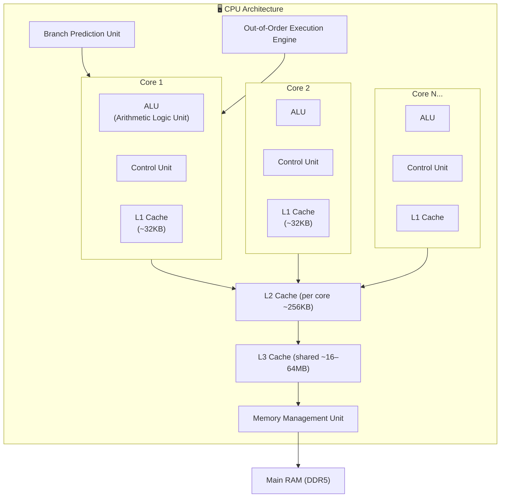

### 2.3 How a CPU Executes Instructions

The CPU uses a **Von Neumann pipeline** to process instructions:


### 2.4 CPU Example — Sequential Task Execution

```
Task: Add 1000 numbers together

CPU approach (4 cores):
Core 1: adds numbers 1–250      → result_1
Core 2: adds numbers 251–500    → result_2
Core 3: adds numbers 501–750    → result_3
Core 4: adds numbers 751–1000   → result_4
CPU final: result_1 + result_2 + result_3 + result_4 → Final Sum
```

CPUs excel when:
- Tasks have **complex conditional logic** (`if/else`, `switch`)
- Tasks are **sequential** (each step depends on the previous)
- Tasks need **fast single-thread performance** (e.g., game engines)
- Low-latency **I/O operations** are needed

### 2.5 CPU Real-World Examples

| Task | Why CPU Wins |
|------|--------------|
| Running an OS | Complex scheduling, I/O, branching |
| Database queries | Complex joins, transactions, ACID compliance |
| Web server routing | Request parsing, business logic |
| Compiling code | Complex dependency resolution |
| Video game physics | Sequential physics engine calculations |
| File compression | Huffman coding, LZ77 — sequential algorithms |

---

## 3. GPU — The Parallel Powerhouse {#gpu}

### 3.1 What Is a GPU?

Originally designed to render **millions of pixels simultaneously**, the GPU evolved into a **general-purpose parallel computing engine**. The key insight: rendering a 4K screen means computing 8.3 million independent pixel values — a perfect parallel task.

Modern GPUs feature:
- **Thousands of small cores** (NVIDIA H100: 16,896 CUDA cores)
- **High memory bandwidth** (H100: 3.35 TB/s HBM3)
- **Specialized tensor cores** for matrix multiplication
- **SIMD architecture** (Single Instruction, Multiple Data)
- **Dedicated video memory (VRAM)** separate from system RAM

### 3.2 GPU Architecture

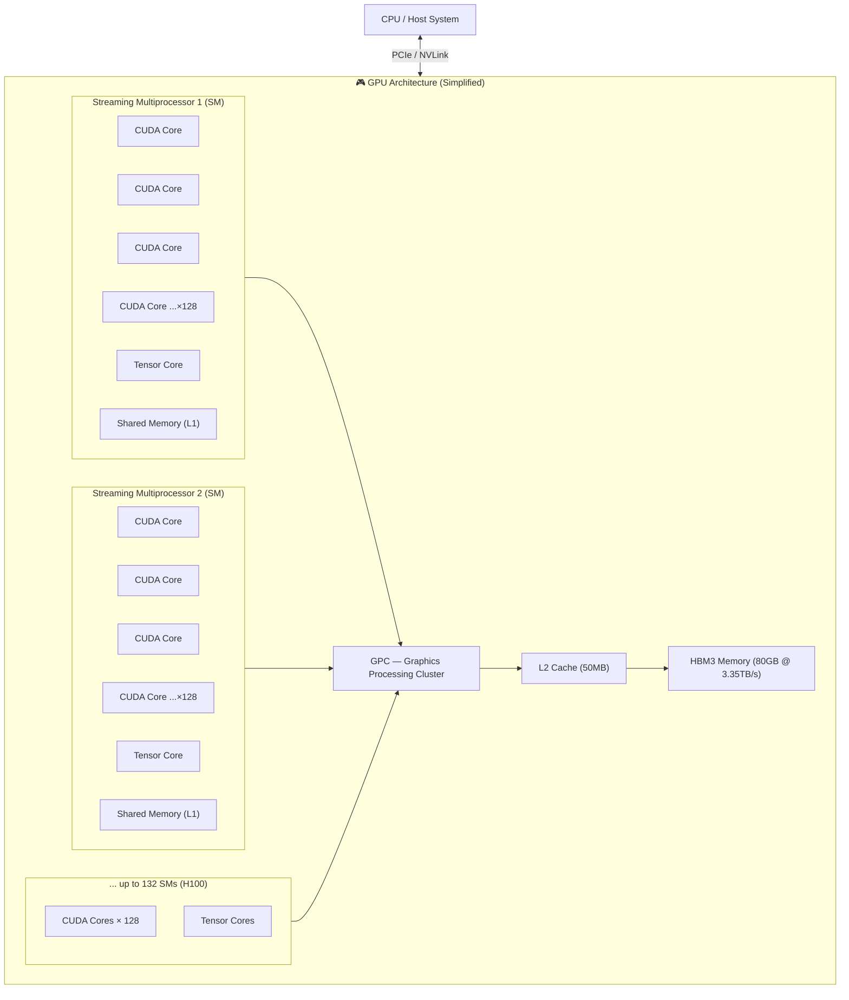

### 3.3 SIMD — The GPU Superpower

The GPU uses **SIMD (Single Instruction, Multiple Data)** — one instruction applied to thousands of data points simultaneously.

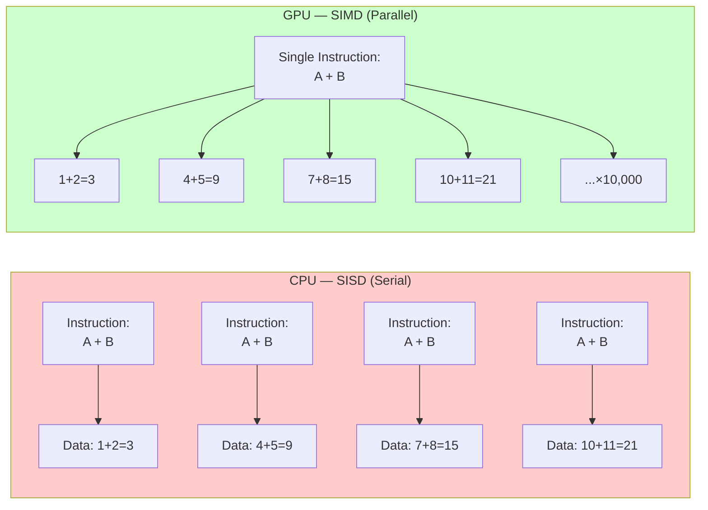

### 3.4 GPU Thread Hierarchy

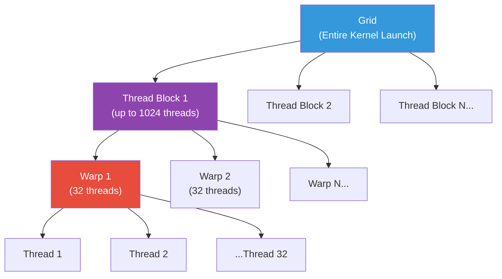

### 3.5 GPU Real-World Examples

| Task | Why GPU Wins |
|------|--------------|
| Training neural networks | Matrix multiplications on millions of parameters |
| Image/video rendering | Millions of independent pixel computations |
| Cryptocurrency mining | SHA-256 hashing — massively parallel |
| Scientific simulations | Fluid dynamics, molecular dynamics |
| Physics simulation | Thousands of independent rigid bodies |
| Video encoding/decoding | Frame processing in parallel |
| Computer vision | Convolution operations across feature maps |

### 3.6 GPU Example — Matrix Multiplication in ML

In deep learning, a forward pass involves:
```
Input (batch_size × features) × Weights (features × hidden)
= (32 × 784) × (784 × 512) = 32 × 512 output matrix
```

This requires **~25 million multiply-add operations** — each independent, perfect for GPU parallelism.

---

## 4. TPU — The AI Accelerator {#tpu}

### 4.1 What Is a TPU?

**Tensor Processing Units** are **custom ASICs (Application-Specific Integrated Circuits)** designed by Google specifically for **tensor operations** — the mathematical core of deep learning.

TPUs are built around one insight:
> 💡 **90% of neural network computation is matrix multiplication.**

So Google engineered a chip that does *almost nothing but matrix multiplication* — and does it faster and more efficiently than any general-purpose chip.

Key characteristics:
- **Systolic array architecture** — data flows through a grid of multiplier-adder units
- **Bfloat16 precision** — 16-bit format optimized for ML (same exponent range as float32)
- **High bandwidth memory (HBM)** on-chip
- **Designed for TensorFlow, JAX, PyTorch-XLA**
- **Multi-chip pods** (TPU v4 Pod: 4096 chips, 1.1 exaFLOPS)

### 4.2 Systolic Array — How TPUs Compute

A **systolic array** is a grid of processing elements (PEs) where data "pulses" through like a heartbeat (hence "systolic").

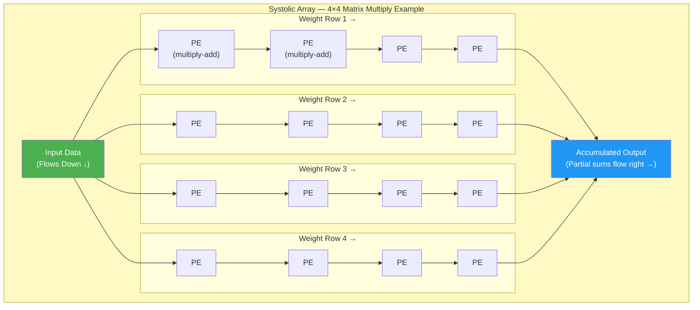

**Why systolic arrays are brilliant:**
- Each PE multiplies its weight × input, adds to accumulator, and passes to the next
- No memory reads in the inner loop — data flows through registers
- **O(N²) operations with O(N) memory accesses** for matrix multiply
- Eliminates the memory bottleneck that plagues CPUs and GPUs

### 4.3 TPU Generations

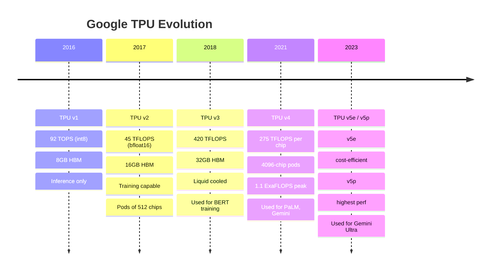

### 4.4 TPU Real-World Examples

| Task | Why TPU Wins |
|------|--------------|
| Training LLMs (GPT, Gemini, PaLM) | Optimized matrix ops at massive scale |
| BERT fine-tuning | Transformer attention is pure matrix multiplication |
| TensorFlow/JAX production serving | Native framework integration |
| Research at Google DeepMind | AlphaFold, AlphaCode trained on TPUs |
| Image generation (Imagen) | Diffusion model computations |
| High-volume ML inference | Low cost per FLOP at scale |

---

## 5. Architecture Deep Dive {#architecture}

### 5.1 Side-by-Side Architecture Comparison

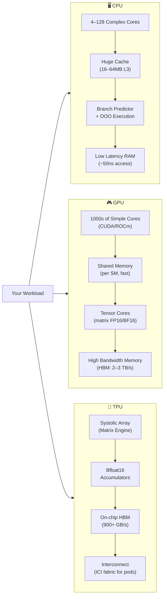

### 5.2 Memory Hierarchy Comparison

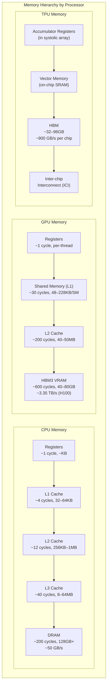

### 5.3 Latency vs. Throughput Trade-off

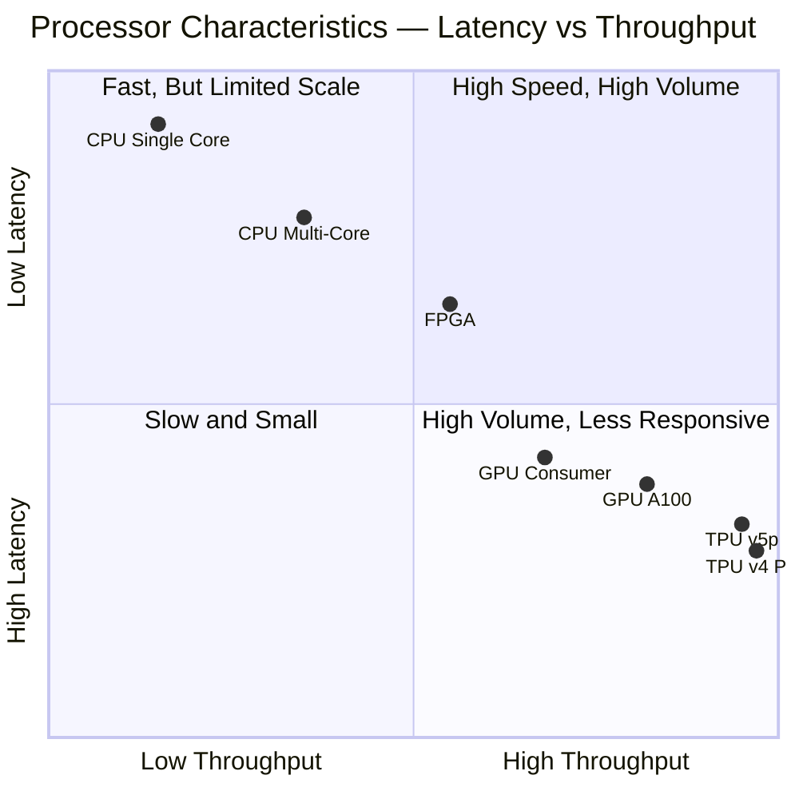

---

## 6. Performance Comparison {#performance}

### 6.1 Peak Compute Performance

| Processor | Peak FP32 TFLOPS | Peak BF16/FP16 TFLOPS | Memory BW |
|-----------|------------------|-----------------------|-----------|
| Intel Core i9-14900K | 1.5 | — | 89 GB/s |
| AMD Threadripper 7980X | 5.7 | — | 256 GB/s |
| NVIDIA RTX 4090 | 82.6 | 165 (FP16) | 1,008 GB/s |
| NVIDIA H100 SXM | 67 | 1,979 (BF16 w/ sparsity) | 3,350 GB/s |
| Google TPU v4 | 275/chip | 275 (BF16) | 1,200 GB/s |
| Google TPU v5p | 459/chip | 459 (BF16) | 2,765 GB/s |

### 6.2 Real ML Training Benchmark — ResNet-50

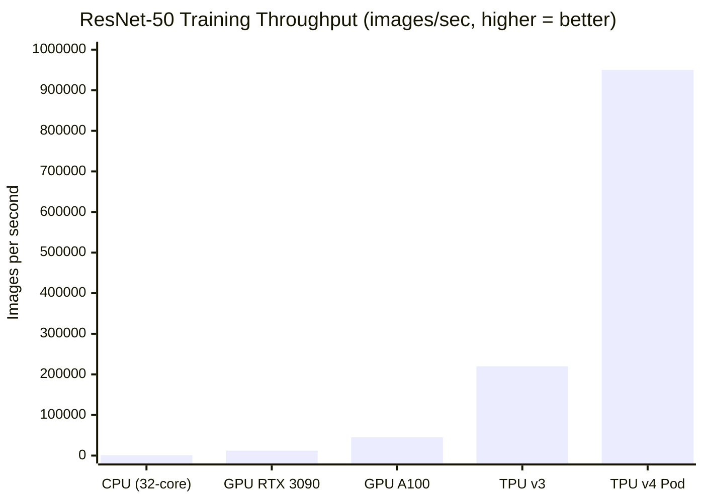

### 6.3 Cost Efficiency for ML Inference

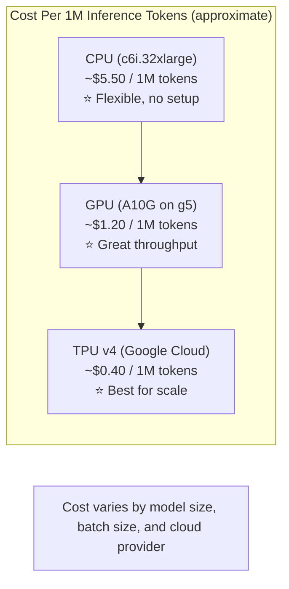

### 6.4 Power Efficiency Comparison

| Processor | TDP (Watts) | TFLOPS/Watt (BF16) |
|-----------|-------------|---------------------|
| Intel i9-14900K | 253W | ~0.006 |
| NVIDIA H100 SXM | 700W | ~2.83 |
| Google TPU v4 | 170W/chip | ~1.6 |
| Google TPU v5e | 197W/chip | ~2.1 |

---

## 7. Real-World Use Cases {#use-cases}

### 7.1 Complete Workflow — Training a Large Language Model

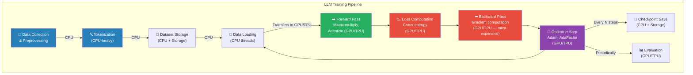

### 7.2 Use Case Matrix

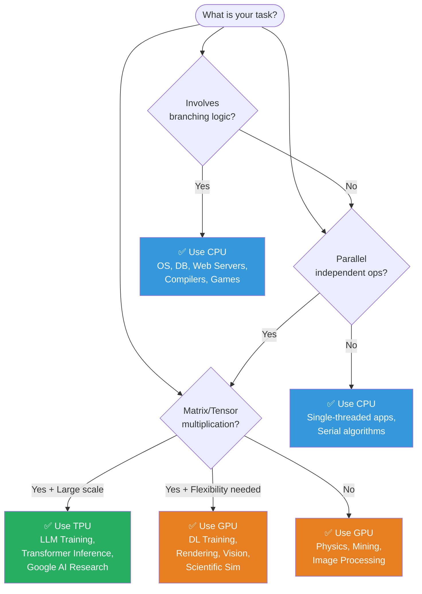

### 7.3 Industry Use Cases

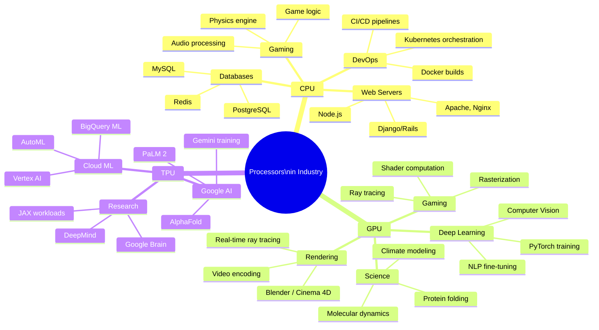

### 7.4 Concrete Example — Image Classification Pipeline

**Scenario:** Deploy a ResNet-50 model to classify product images at 10,000 requests/second.

| Stage | Component | Processor |
|-------|-----------|-----------|
| HTTP Request Handling | Load balancer, routing | **CPU** |
| Image Decoding | JPEG/PNG → tensor | **CPU** (or GPU NVJPEG) |
| Pre-processing | Resize, normalize, batch | **CPU** or **GPU** |
| Model Inference | ResNet-50 forward pass | **GPU** or **TPU** |
| Post-processing | Softmax, top-K classes | **GPU** or **CPU** |
| Database Write | Log result to PostgreSQL | **CPU** |
| Cache Lookup | Redis check for seen images | **CPU** |

---

## 8. Choosing the Right Processor {#choosing}

### 8.1 Decision Framework

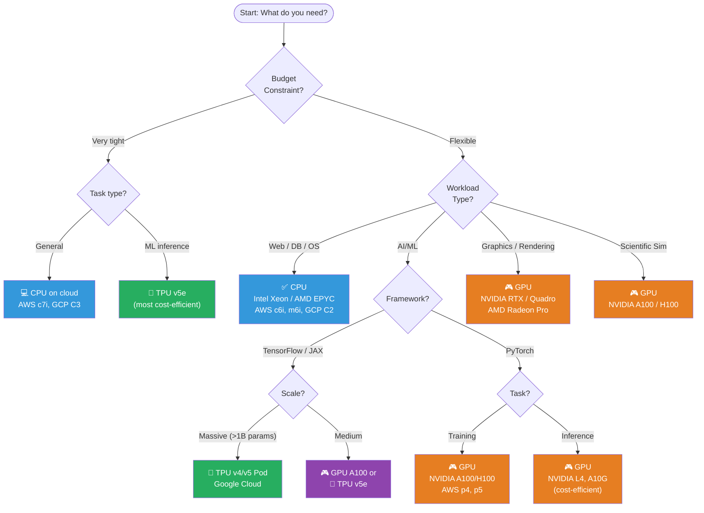

### 8.2 Summary Comparison Table

| Feature | CPU | GPU | TPU |
|---------|-----|-----|-----|
| **Cores** | 4–128 powerful | 1,000s simple | Systolic array |
| **Clock Speed** | 3–5+ GHz | 1–2 GHz | ~1 GHz |
| **Memory** | 128GB+ DDR5 | 16–80GB HBM2/3 | 32–96GB HBM |
| **Bandwidth** | 50–150 GB/s | 900–3,350 GB/s | 900–2,765 GB/s |
| **Best For** | General / sequential | Parallel / graphics | Tensor ops / ML |
| **Frameworks** | All | PyTorch, TF, CUDA | TensorFlow, JAX |
| **Flexibility** | ⭐⭐⭐⭐⭐ | ⭐⭐⭐⭐ | ⭐⭐ |
| **ML Performance** | ⭐ | ⭐⭐⭐⭐ | ⭐⭐⭐⭐⭐ |
| **Cost/TFLOP** | High | Medium | Low (at scale) |
| **Availability** | Everywhere | Widely available | Google Cloud only |

---

## 9. Cloud Offerings {#cloud}

### 9.1 Major Cloud Processor Options

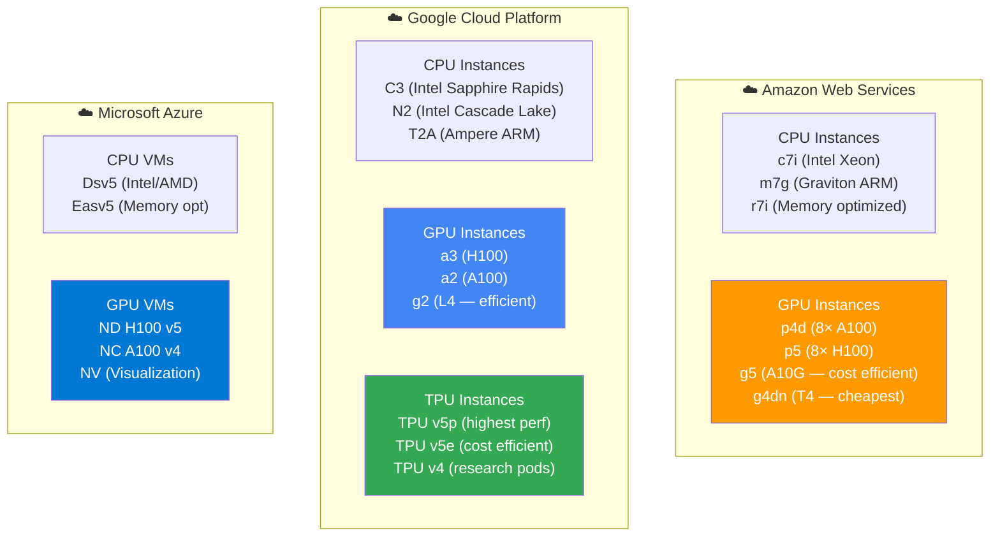

### 9.2 Recommended Cloud Setup by Task

| Task | Recommended | Monthly Estimate |
|------|-------------|-----------------|
| Small web API | CPU: 4 vCPU, 8GB RAM | ~$50/month |
| ML research (PyTorch) | GPU: 1× A10G | ~$300/month |
| Production DL training | GPU: 8× A100 | ~$25,000/month |
| LLM training at scale | TPU v5p Pod | Custom pricing |
| Cost-efficient inference | TPU v5e or L4 GPU | ~$0.40–$0.80/hr |

---

## 10. Quick Reference Summary {#summary}

### 10.1 The 3-Second Rule

> - **Something needs to think** → CPU  
> - **Something needs to see** → GPU  
> - **Something needs to learn** → TPU (or GPU)

### 10.2 Complete System — How All Three Work Together

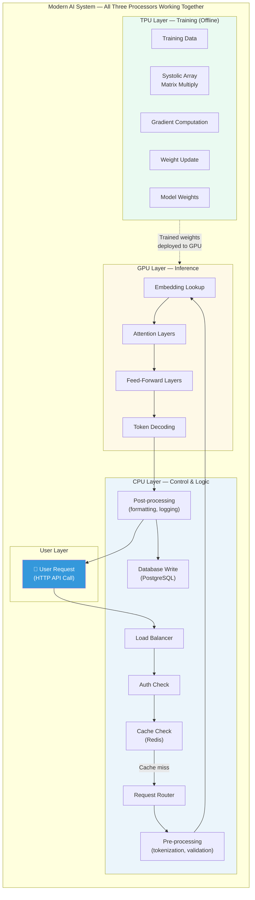

### 10.3 Key Takeaways

| Takeaway | Detail |
|----------|--------|
| 🧠 **CPUs are versatile** | Handle any task — but shine at complex, sequential, low-latency work |
| ⚡ **GPUs democratized AI** | Enabled the deep learning revolution — CUDA changed everything in 2012 |
| 🚀 **TPUs are purpose-built** | 10–80× more efficient than GPUs for the specific operations LLMs need |
| 🔗 **They complement each other** | Production systems always use all three in tandem |
| 💰 **Cost matters** | TPUs win on $/FLOP at scale; GPUs win on flexibility; CPUs win on general workloads |
| 🔮 **The future** | Custom silicon (Apple Neural Engine, AWS Inferentia, NVIDIA GB200) blurs the lines |

---

## 📚 Further Learning

| Resource | Topic |
|----------|-------|
| [NVIDIA CUDA Docs](https://docs.nvidia.com/cuda/) | GPU programming |
| [Google TPU Research Cloud](https://sites.research.google/trc/) | Free TPU access for researchers |
| [JAX Documentation](https://jax.readthedocs.io/) | High-performance ML on TPUs |
| [NVIDIA Deep Learning Institute](https://www.nvidia.com/en-us/training/) | GPU ML courses |
| [Chip Huyen's ML Systems](https://huyenchip.com/) | ML infrastructure design |

---

*Tutorial created from: [CPU vs GPU vs TPU — YouTube](https://www.youtube.com/watch?v=MUWAbpg1xLo)*  
*Enhanced with architecture details, diagrams, benchmarks, and real-world use cases.*