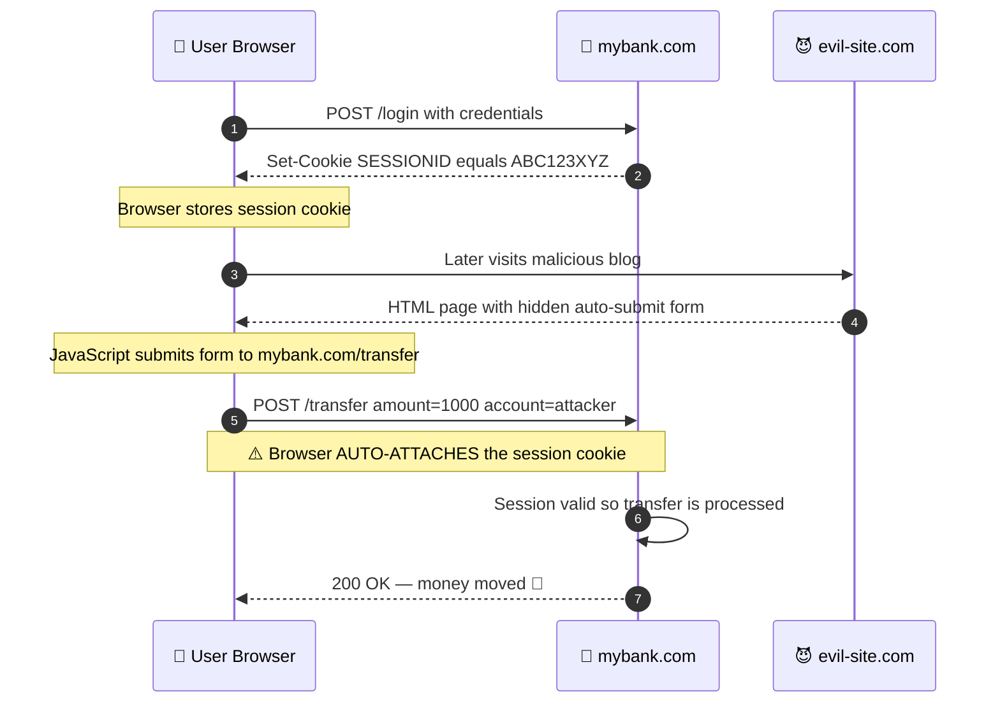
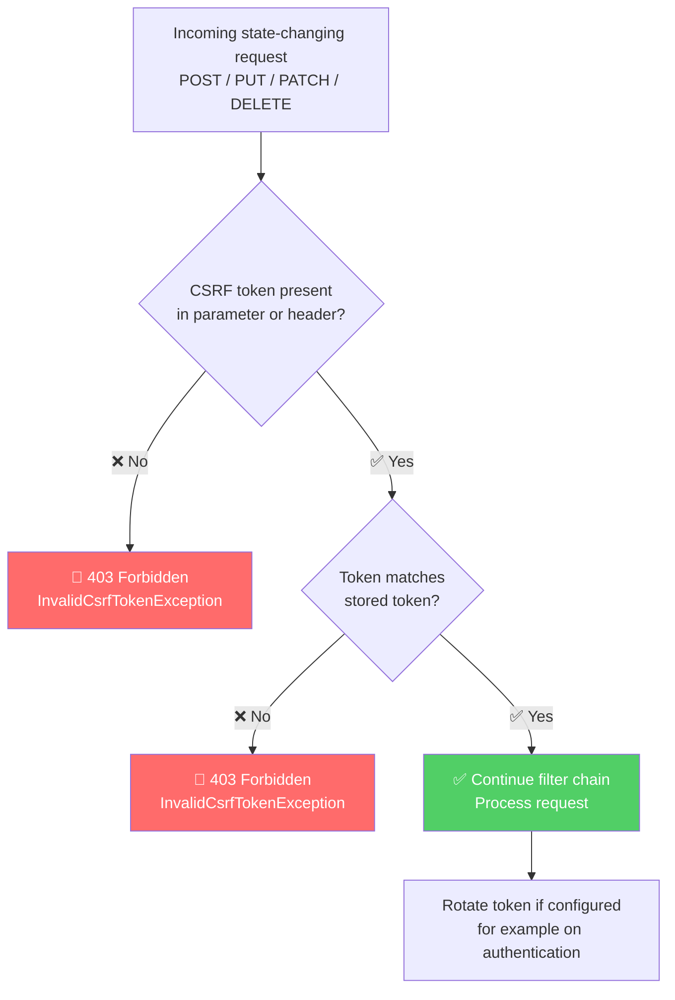
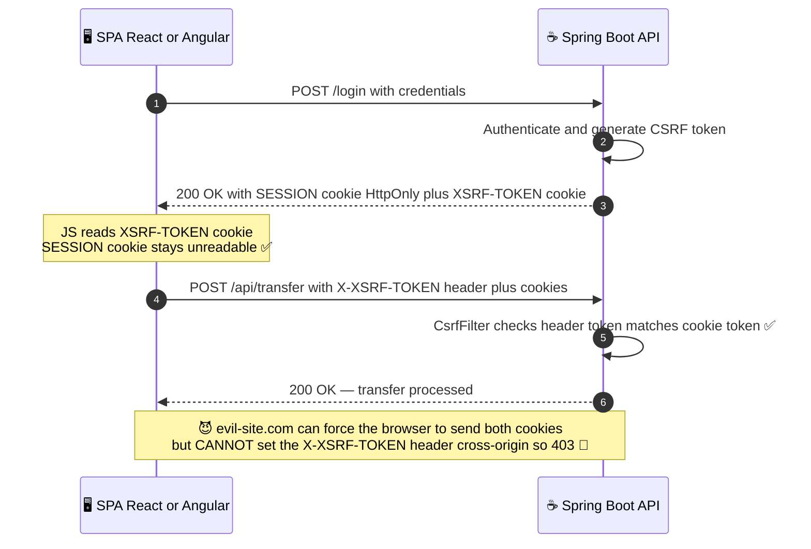
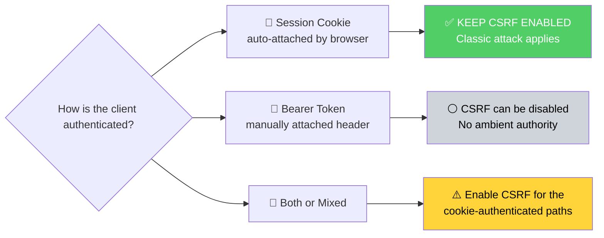
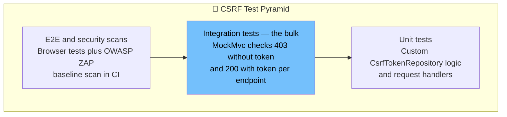

# CSRF Protection in Java & Spring Boot — The Complete Tutorial

> **A comprehensive deep-dive into Cross-Site Request Forgery: how the attack works, why browsers allow it, how CSRF tokens defeat it, and how to configure Spring Security 6 correctly for both server-rendered apps and modern SPAs.**

---

| 📋 Metadata | Details |
|---|---|
| 🎯 **Difficulty Level** | Intermediate |
| ⏱️ **Estimated Reading Time** | ~40 minutes |
| 🛠️ **Tech Stack** | Java 17+, Spring Boot 3.x, Spring Security 6.x, Thymeleaf, JavaScript (SPA) |
| 📅 **Last Updated** | 2026-07-31 |
| 🏷️ **Category** | Security / Backend Development |

---

## Table of Contents

1. [Introduction — The Attack You Never Clicked](#1-introduction--the-attack-you-never-clicked)
2. [Prerequisites](#2-prerequisites)
3. [Learning Objectives](#3-learning-objectives)
4. [What Is CSRF? Core Concepts](#4-what-is-csrf-core-concepts)
5. [Why CSRF Happens — The Browser's Cookie Habit](#5-why-csrf-happens--the-browsers-cookie-habit)
6. [Anatomy of a Real Attack](#6-anatomy-of-a-real-attack)
7. [Why the Browser Won't Save You](#7-why-the-browser-wont-save-you)
8. [HTTP Methods and CSRF Surface Area](#8-http-methods-and-csrf-surface-area)
9. [CSRF Tokens — The Synchronizer Token Pattern](#9-csrf-tokens--the-synchronizer-token-pattern)
10. [CSRF Protection in Spring Security 6](#10-csrf-protection-in-spring-security-6)
11. [Server-Rendered Apps (Thymeleaf)](#11-server-rendered-apps-thymeleaf)
12. [Single Page Applications (React/Angular)](#12-single-page-applications-reactangular)
13. [When to Disable CSRF (and When Not To)](#13-when-to-disable-csrf-and-when-not-to)
14. [Modern Defenses: SameSite Cookies & Custom Headers](#14-modern-defenses-samesite-cookies--custom-headers)
15. [Authentication vs Authorization vs CSRF](#15-authentication-vs-authorization-vs-csrf)
16. [Testing Strategies](#16-testing-strategies)
17. [Real-World Examples & Case Studies](#17-real-world-examples--case-studies)
18. [Best Practices](#18-best-practices)
19. [Anti-Patterns](#19-anti-patterns)
20. [Common Pitfalls & Troubleshooting](#20-common-pitfalls--troubleshooting)
21. [Performance Considerations](#21-performance-considerations)
22. [Security Considerations (Advanced)](#22-security-considerations-advanced)
23. [Practice Exercises (With Solutions)](#23-practice-exercises-with-solutions)
24. [Test Your Understanding](#24-test-your-understanding)
25. [Common Interview Questions](#25-common-interview-questions)
26. [Question Bank (50+ Questions)](#26-question-bank-50-questions)
27. [Summary & Key Takeaways](#27-summary--key-takeaways)
28. [Self-Assessment Checklist](#28-self-assessment-checklist)
29. [Pro Tips](#29-pro-tips)
30. [Learning Path & Next Steps](#30-learning-path--next-steps)
31. [Further Reading & Resources](#31-further-reading--resources)

---

## 1. Introduction — The Attack You Never Clicked

Imagine this situation.

You log into your online banking application in the morning. You check your balance and leave the tab open because you're still working. Later that day, you visit another website. It looks like a normal blog, but hidden inside the page is a malicious auto-submitting form.

Without clicking any button on your banking website, money is transferred from your account.

- ❌ You never intended to make that transaction.
- ❌ You never saw a confirmation page.
- ✅ Yet the bank processed the request — because you were already logged in.

This is exactly what a **Cross-Site Request Forgery (CSRF)** attack is.

When most developers first learn about CSRF, they ask: *"How can another website send requests to my application?"* The answer — and the fix — fundamentally changes how you design secure backend applications.

> 💡 **The one-sentence summary:** The browser automatically sends your session cookie, but the attacker cannot automatically send the correct CSRF token. That asymmetry is the entire foundation of CSRF defense.

In this tutorial, we'll go far beyond the definition. You'll learn how CSRF works internally, why browsers behave the way they do, how Spring Security's token machinery operates under the hood, when CSRF protection is genuinely unnecessary, and how to test all of it.

---

## 2. Prerequisites

Before starting, you should be comfortable with:

- ✅ Basic Java (Java 17+) and Spring Boot 3.x project setup
- ✅ HTTP fundamentals: methods, headers, cookies, status codes
- ✅ What a session cookie is and how login works in a web app
- ✅ Basic Spring Security configuration (`SecurityFilterChain`)
- ✅ Familiarity with either Thymeleaf or a frontend framework (React/Angular) is helpful but not required

**To follow the code hands-on, you need:**

| Tool | Version |
|---|---|
| JDK | 17+ |
| Spring Boot | 3.x |
| Spring Security | 6.x |
| Maven or Gradle | Any recent version |

---

## 3. Learning Objectives

By the end of this tutorial, you will be able to:

- 🎯 Explain precisely why browsers make CSRF possible (automatic cookie attachment)
- 🎯 Draw the complete CSRF attack sequence and identify every trust assumption it exploits
- 🎯 Explain how the Synchronizer Token Pattern defeats CSRF and why the Same-Origin Policy protects the token
- 🎯 Configure Spring Security 6 CSRF protection for server-rendered apps, SPAs, and mixed architectures
- 🎯 Decide correctly when `csrf.disable()` is safe — and articulate why
- 🎯 Write integration tests that prove your CSRF protection works (and catches regressions)
- 🎯 Apply layered defenses: SameSite cookies, custom headers, proper HTTP method usage
- 🎯 Recognize and fix the most common CSRF anti-patterns in real codebases

---

## 4. What Is CSRF? Core Concepts

### 4.1 Definition

**Cross-Site Request Forgery (CSRF)** is a web security attack where a malicious website tricks a user's browser into sending an unwanted request to another website where the user is already authenticated.

The critical insight:

> ⚠️ **The attacker doesn't steal your password.** They abuse the trust your application *already has* in the user's browser.

### 4.2 The Three Ingredients of a CSRF Attack

A CSRF attack is only possible when **all three** of these conditions hold:

| # | Condition | Example |
|---|---|---|
| 1 | **A privileged action exists** | `POST /transfer` moves money |
| 2 | **Authentication is cookie-based** | Browser auto-sends `SESSIONID` |
| 3 | **The request is fully predictable** | Attacker knows all parameters (`amount`, `account`) |

Remove *any one* of these, and CSRF fails. CSRF tokens work by destroying condition #3 — they add an unpredictable parameter the attacker cannot know.

### 4.3 CSRF vs. Other Attacks (Don't Confuse These)

| Attack | What the attacker does | Steals credentials? |
|---|---|---|
| **CSRF** | Forces victim's browser to send a request | ❌ No — abuses existing session |
| **XSS** | Injects malicious JS *into* the target site | ✅ Can steal tokens/cookies |
| **Session Hijacking** | Steals the session ID directly | ✅ Yes |
| **Phishing** | Tricks user into typing credentials on a fake site | ✅ Yes |

> 💡 **Key distinction:** In XSS, malicious code runs *in the context of the trusted site*. In CSRF, code runs on the *attacker's site* and merely *points the browser* at the trusted site. XSS can defeat CSRF tokens (the injected script can read them); CSRF cannot defeat anything on its own — it only rides on existing trust.

---

## 5. Why CSRF Happens — The Browser's Cookie Habit

To understand CSRF, you first need to understand how browsers handle cookies.

### 5.1 The Login Flow

When you log into `https://mybank.com`, the server responds with:

```http
HTTP/1.1 200 OK
Set-Cookie: SESSIONID=ABC123XYZ; Path=/; HttpOnly; Secure
```

The browser stores this cookie. **Every future request to `mybank.com` automatically includes it:**

```http
POST /transfer HTTP/1.1
Host: mybank.com
Cookie: SESSIONID=ABC123XYZ
```

### 5.2 The Dangerous Sentence

Notice something important: **the browser attaches cookies automatically.** It never asks:

> *"Did the user really want to send this request?"*

It only asks:

> *"Is this request going to mybank.com? Then the mybank.com cookie goes along."*

If another website causes your browser to send a request to your bank, the cookie still rides along. The bank sees a **valid session** and assumes the request came from you.

**That's where the vulnerability begins.**



*Diagram 1: The complete CSRF attack sequence. The attacker never talks to the bank directly — the victim's browser does all the work.*

---

## 6. Anatomy of a Real Attack

### 6.1 The Vulnerable Endpoint

Suppose your banking application exposes:

```java
@RestController
@RequestMapping("/transfer")
public class TransferController {

    private final TransferService transferService;

    public TransferController(TransferService transferService) {
        this.transferService = transferService;
    }

    // ⚠️ Session-authenticated endpoint with NO CSRF protection
    @PostMapping
    public ResponseEntity<String> transfer(@RequestParam BigDecimal amount,
                                           @RequestParam String account,
                                           Authentication authentication) {
        transferService.transfer(authentication.getName(), account, amount);
        return ResponseEntity.ok("Transfer completed");
    }
}
```

A legitimate request looks like:

```http
POST /transfer HTTP/1.1
Host: mybank.com
Cookie: SESSIONID=ABC123XYZ
Content-Type: application/x-www-form-urlencoded

amount=1000&account=987654321
```

### 6.2 The Attacker's Page

The attacker hosts this HTML anywhere — a blog, a forum post, an ad network, a phishing email link:

```html
<!-- Hosted on https://evil-site.com -->
<html>
<body onload="document.forms[0].submit()">
  <h1>Cute Cat Pictures! 🐱</h1>

  <!-- Hidden forged request to the bank -->
  <form action="https://mybank.com/transfer" method="POST" style="display:none">
      <input type="hidden" name="amount" value="1000">
      <input type="hidden" name="account" value="ATTACKER_ACCOUNT">
  </form>
</body>
</html>
```

### 6.3 What Happens Step by Step

1. The victim visits `evil-site.com` while still logged into the bank in another tab.
2. The page loads; JavaScript auto-submits the hidden form.
3. The browser issues `POST https://mybank.com/transfer` — **and attaches the bank's session cookie**, because that's what browsers do.
4. The bank sees: valid session ✅, valid parameters ✅, valid request ✅.
5. Transaction completed. The attacker never knew the victim's password.

> ⚠️ **Why this is so insidious:** From the server's perspective, the forged request is *indistinguishable* from a legitimate one — unless you add something to legitimate requests that the attacker cannot reproduce. That "something" is the CSRF token (Section 9).

---

## 7. Why the Browser Won't Save You

One of the biggest questions junior developers ask: *"Why doesn't the browser just block this?"*

### 7.1 Browsers Follow HTTP Rules, Not Intent

Browsers are designed to attach cookies for the domain they belong to. The browser cannot know:

- Which requests are genuine
- Which requests are malicious

It simply follows HTTP rules. A form submission to `mybank.com` gets `mybank.com` cookies. Period.

### 7.2 The Same-Origin Policy Helps — But Not Here

The **Same-Origin Policy (SOP)** prevents `evil-site.com` from *reading responses* or *reading cookies/DOM* belonging to `mybank.com`. But SOP does **not** prevent `evil-site.com` from *sending* requests to `mybank.com`. Sending is allowed; reading is blocked.

That's the crucial asymmetry:

| Action | Allowed cross-origin? |
|---|---|
| Send a form POST to another origin | ✅ Yes (SOP permits "simple" requests) |
| Load another origin in an `` tag | ✅ Yes |
| Read the response body from another origin | ❌ No (blocked by SOP/CORS) |
| Read another origin's cookies or DOM | ❌ No (blocked by SOP) |

### 7.3 Therefore: CSRF Is a Server-Side Responsibility

> 💡 **Key insight:** The server must verify that the request actually *originated from its own application*. The browser cannot and will not do this for you. CSRF protection is primarily a **server-side responsibility**.

---

## 8. HTTP Methods and CSRF Surface Area

### 8.1 GET Should Never Change State

A well-designed application follows REST principles: **GET requests only retrieve data.**

```java
// ✅ GOOD — safe, idempotent read
@GetMapping("/users")
public List<User> listUsers() { ... }
```

But imagine this legacy mistake:

```java
// ❌ CATASTROPHIC — state change via GET
@GetMapping("/deleteUser")
public void deleteUser(@RequestParam Long id) {
    userRepository.deleteById(id);
}
```

Now the attacker doesn't even need a form or JavaScript. An image tag is enough:

```html

```

The browser tries to load the "image." The request executes. The user never clicked anything. Worse: GET requests are also triggered by link prefetchers, email scanners, and browser pre-rendering — so state-changing GETs can be triggered *accidentally* too.

### 8.2 Method Safety Reference

| Method | Should change state? | CSRF risk if misused | Triggerable by ``/link? |
|---|---|---|---|
| GET | ❌ Never | 🔥 Critical | ✅ Trivially |
| HEAD/OPTIONS | ❌ Never | Low | ✅ |
| POST | ✅ Yes | Protected by CSRF token | ❌ (needs form/JS) |
| PUT | ✅ Yes | Protected by CSRF token | ❌ (needs JS/fetch) |
| PATCH | ✅ Yes | Protected by CSRF token | ❌ |
| DELETE | ✅ Yes | Protected by CSRF token | ❌ |

> ⚠️ **Important nuance:** Spring Security (by default) only validates CSRF tokens on **POST, PUT, PATCH, DELETE** — the state-changing methods. GET/HEAD/OPTIONS are exempt. This is *only* safe if you actually keep GET side-effect-free. A state-changing GET punches a hole straight through your CSRF defenses.

---

## 9. CSRF Tokens — The Synchronizer Token Pattern

### 9.1 The Solution Is Surprisingly Simple

The fix: the server generates a **random, unpredictable secret token** and embeds it in every legitimate form/request it renders.

```text
Token: 8d92fkj28dj293jd9
```

The server stores the token (in the session, or in a cookie — more on both later) and requires it back on every state-changing request:

```html
<input type="hidden" name="_csrf" value="8d92fkj28dj293jd9">
```

Now the request becomes:

```http
POST /transfer HTTP/1.1
Cookie: SESSIONID=ABC123XYZ
Content-Type: application/x-www-form-urlencoded

amount=1000&account=987654321&_csrf=8d92fkj28dj293jd9
```

### 9.2 Server-Side Validation

```text
Session Token == Request Token ?
    ├── YES → ✅ Request Accepted
    └── NO  → ❌ 403 Forbidden
```



*Diagram 2: The CSRF token validation workflow (Synchronizer Token Pattern).*

### 9.3 Why Can't the Attacker Just... Get the Token?

The attacker's options, and why each fails:

| Attacker strategy | Why it fails |
|---|---|
| **Guess the token** | It's cryptographically random (Spring uses `SecureRandom`); guessing is computationally infeasible |
| **Read it from the page** | Same-Origin Policy blocks `evil-site.com` from reading `mybank.com`'s DOM |
| **Read it from the cookie** | SOP blocks reading another origin's cookies |
| **Reuse their own token** | The token is tied to *their* session, not the victim's — it won't match the victim's stored token |
| **Force the browser to send it** | The browser auto-sends *cookies*, not arbitrary form parameters or custom headers — and the attacker can't know what value to send |

> 💡 **The core asymmetry, again:** The browser automatically sends the session cookie. The attacker **cannot** automatically send the correct CSRF token. That is the entire foundation of CSRF protection.

### 9.4 Token Storage Strategies

| Strategy | How it works | Best for |
|---|---|---|
| **HttpSessionCsrfTokenRepository** (Spring default) | Token stored server-side in the HTTP session | Traditional server-rendered apps |
| **CookieCsrfTokenRepository** | Token stored in a cookie readable by JS; frontend echoes it back in a header | SPAs (React/Angular) — "Double Submit Cookie" variant |
| **Custom repository** | e.g., Redis-backed for clustered/sessionless setups | Distributed systems, stateless-ish architectures |

---

## 10. CSRF Protection in Spring Security 6

### 10.1 The Great News: It's On By Default

One of the best features of Spring Security is that **CSRF protection is enabled by default** for session-based applications.

```java
package com.example.demo.config;

import org.springframework.context.annotation.Bean;
import org.springframework.context.annotation.Configuration;
import org.springframework.security.config.annotation.web.builders.HttpSecurity;
import org.springframework.security.config.annotation.web.configuration.EnableWebSecurity;
import org.springframework.security.web.SecurityFilterChain;

@Configuration
@EnableWebSecurity
public class SecurityConfig {

    @Bean
    SecurityFilterChain securityFilterChain(HttpSecurity http) throws Exception {
        http
            .authorizeHttpRequests(auth -> auth
                .anyRequest().authenticated()
            )
            .formLogin(form -> form.permitAll());
        // ✅ No CSRF config needed — protection is ON by default
        return http.build();
    }
}
```

Without adding anything else, Spring Security automatically:

- Generates a per-session CSRF token (`SecureRandom`-backed)
- Validates it on every POST/PUT/PATCH/DELETE request
- Returns **HTTP 403 Forbidden** when the token is missing or invalid

### 10.2 How It Works Under the Hood

The `CsrfFilter` sits in the Spring Security filter chain, before authorization filters:

```text
Client Request
    ↓
[SecurityContextPersistenceFilter]
    ↓
[UsernamePasswordAuthenticationFilter]
    ↓
[CsrfFilter]  ← 🛡️ Validates token on state-changing methods
    ↓
[AuthorizationFilter]
    ↓
Your Controller
```

`CsrfFilter` logic (simplified from the actual Spring Security source):

```java
// Simplified view of Spring Security's CsrfFilter.doFilterInternal()
@Override
protected void doFilterInternal(HttpServletRequest request,
                                HttpServletResponse response,
                                FilterChain filterChain) {
    // 1. Load (or lazily defer loading of) the token from the repository
    DeferredCsrfToken deferredCsrfToken =
            this.csrfTokenRepository.loadDeferredToken(request, response);
    request.setAttribute(CsrfToken.class.getName(), deferredCsrfToken);

    // 2. Skip validation for safe methods (GET, HEAD, TRACE, OPTIONS)
    if (!this.requireCsrfProtectionMatcher.matches(request)) {
        filterChain.doFilter(request, response);
        return;
    }

    // 3. Read the token sent with the request (header or parameter)
    String actualToken = this.requestHandler.resolveCsrfTokenValue(request, deferredCsrfToken.get());

    // 4. Compare — constant-time comparison to prevent timing attacks
    if (!equalsConstantTime(deferredCsrfToken.get().getToken(), actualToken)) {
        this.accessDeniedHandler.handle(request, response,
                new InvalidCsrfTokenException(deferredCsrfToken.get(), actualToken));
        return; // 🚫 403 Forbidden
    }

    filterChain.doFilter(request, response); // ✅ proceed
}
```

> 🔍 **Pro detail:** Spring Security compares tokens using a **constant-time comparison** (`MessageDigest.isEqual`) to prevent timing attacks that could otherwise leak the token character by character.

### 10.3 Where the Token Comes From

By default, Spring uses `HttpSessionCsrfTokenRepository`:

- Token name in request: parameter `_csrf` **or** header `X-CSRF-TOKEN`
- Stored in the session under the attribute `org.springframework.security.web.csrf.HttpSessionCsrfTokenRepository.CSRF_TOKEN`

---

## 11. Server-Rendered Apps (Thymeleaf)

### 11.1 Forms: The Easy Path

If you use Thymeleaf with `th:action`, **the CSRF token is injected automatically** as a hidden field — zero manual work:

```html
<!-- src/main/resources/templates/transfer.html -->
<form th:action="@{/transfer}" method="post">
    <label>Amount: <input type="number" name="amount" required></label>
    <label>To Account: <input type="text" name="account" required></label>
    <button type="submit">Transfer</button>
    <!-- ✅ CSRF hidden input added AUTOMATICALLY by Thymeleaf -->
</form>
```

Rendered output:

```html
<form action="/transfer" method="post">
    <label>Amount: <input type="number" name="amount" required></label>
    <label>To Account: <input type="text" name="account" required></label>
    <button type="submit">Transfer</button>
    <input type="hidden" name="_csrf" value="8d92fkj2-8dj2-93jd-9abc...">
</form>
```

### 11.2 Manual Token Inclusion (Plain HTML or Non-Spring Forms)

If you're not using `th:action`, add the token explicitly:

```html
<form action="/transfer" method="post">
    <input type="hidden"
           th:name="${_csrf.parameterName}"
           th:value="${_csrf.token}">
    <!-- other fields -->
</form>
```

### 11.3 AJAX Requests from Server-Rendered Pages

For `fetch`/XHR calls, expose the token via meta tags and send it as a header:

```html
<head>
    <meta name="_csrf" th:content="${_csrf.token}">
    <meta name="_csrf_header" th:content="${_csrf.headerName}">
</head>
```

```javascript
// static/js/app.js
const token = document.querySelector('meta[name="_csrf"]').content;
const header = document.querySelector('meta[name="_csrf_header"]').content;

fetch('/transfer', {
    method: 'POST',
    headers: {
        'Content-Type': 'application/json',
        [header]: token               // ✅ e.g. X-CSRF-TOKEN: 8d92fkj2-...
    },
    body: JSON.stringify({ amount: 100, account: '12345' })
});
```

---

## 12. Single Page Applications (React/Angular)

SPAs can't rely on server-side template injection, so we use the **Cookie-to-Header** approach (a Double Submit Cookie variant): the token lives in a cookie that JavaScript can read, and the frontend echoes it back in a header on every mutating request.

### 12.1 Spring Security 6 Configuration

> ⚠️ **Version note:** Spring Security 6 introduced the `CsrfTokenRequestAttributeHandler` and deferred token loading (a BREACH-attack mitigation). With `CookieCsrfTokenRepository`, you must ensure the token is actually resolved on each request — the `SpaCsrfTokenRequestHandler` pattern below is the currently recommended approach (from the official Spring Security docs).

```java
package com.example.demo.config;

import jakarta.servlet.http.HttpServletRequest;
import jakarta.servlet.http.HttpServletResponse;
import org.springframework.context.annotation.Bean;
import org.springframework.context.annotation.Configuration;
import org.springframework.security.config.annotation.web.builders.HttpSecurity;
import org.springframework.security.config.annotation.web.configuration.EnableWebSecurity;
import org.springframework.security.web.SecurityFilterChain;
import org.springframework.security.web.authentication.www.BasicAuthenticationFilter;
import org.springframework.security.web.csrf.*;
import org.springframework.util.StringUtils;
import org.springframework.web.filter.OncePerRequestFilter;

import java.io.IOException;
import java.util.function.Supplier;

@Configuration
@EnableWebSecurity
public class SpaSecurityConfig {

    @Bean
    SecurityFilterChain spaSecurityFilterChain(HttpSecurity http) throws Exception {
        http
            .authorizeHttpRequests(auth -> auth
                .requestMatchers("/api/public/**").permitAll()
                .anyRequest().authenticated()
            )
            .csrf(csrf -> csrf
                // 1️⃣ Store token in a JS-readable cookie (XSRF-TOKEN)
                .csrfTokenRepository(CookieCsrfTokenRepository.withHttpOnlyFalse())
                // 2️⃣ SPA-aware handler: header-based validation + eager token loading
                .csrfTokenRequestHandler(new SpaCsrfTokenRequestHandler())
            )
            // 3️⃣ Emit the cookie on every response so the SPA always has a fresh token
            .addFilterAfter(new CsrfCookieFilter(), BasicAuthenticationFilter.class);

        return http.build();
    }
}

/**
 * Handles CSRF for SPAs:
 * - Validates the token from the X-XSRF-TOKEN header (or _csrf parameter as fallback)
 * - Forces the deferred token to be RESOLVED so it's available for rendering
 */
final class SpaCsrfTokenRequestHandler extends CsrfTokenRequestAttributeHandler {

    private final CsrfTokenRequestHandler delegate = new XorCsrfTokenRequestAttributeHandler();

    @Override
    public void handle(HttpServletRequest request, HttpServletResponse response,
                       Supplier<CsrfToken> csrfToken) {
        // Always resolve the token eagerly (renders cookie, BREACH-protected via delegate on value)
        this.delegate.handle(request, response, csrfToken);
    }

    @Override
    public String resolveCsrfTokenValue(HttpServletRequest request, CsrfToken csrfToken) {
        // Prefer the header (sent by SPA); fall back to request parameter
        if (StringUtils.hasText(request.getHeader(csrfToken.getHeaderName()))) {
            return super.resolveCsrfTokenValue(request, csrfToken);
        }
        return this.delegate.resolveCsrfTokenValue(request, csrfToken);
    }
}

/**
 * Guarantees the XSRF-TOKEN cookie is written on every response,
 * so the SPA can read it after any request (including login).
 */
final class CsrfCookieFilter extends OncePerRequestFilter {

    @Override
    protected void doFilterInternal(HttpServletRequest request,
                                    HttpServletResponse response,
                                    jakarta.servlet.FilterChain filterChain)
            throws jakarta.servlet.ServletException, IOException {
        CsrfToken csrfToken = (CsrfToken) request.getAttribute(CsrfToken.class.getName());
        if (csrfToken != null) {
            csrfToken.getToken(); // 👈 touching the token triggers cookie rendering
        }
        filterChain.doFilter(request, response);
    }
}
```

### 12.2 Angular: Built-In Support

Angular's `HttpClient` has **native XSRF support** — it automatically reads the `XSRF-TOKEN` cookie and sends it as the `X-XSRF-TOKEN` header. It works out of the box with the configuration above:

```typescript
// app.config.ts
import { provideHttpClient, withXsrfConfiguration } from '@angular/common/http';

export const appConfig = {
  providers: [
    provideHttpClient(
      withXsrfConfiguration({
        cookieName: 'XSRF-TOKEN',     // matches Spring's cookie
        headerName: 'X-XSRF-TOKEN'    // matches Spring's expected header
      })
    )
  ]
};
```

```typescript
// No manual token handling needed — Angular attaches the header automatically
this.http.post('/api/transfer', { amount: 100, account: '12345' }).subscribe();
```

### 12.3 React: Manual (But Simple) Approach

```javascript
// utils/csrf.js — read the XSRF-TOKEN cookie set by Spring
export function getCsrfToken() {
    const match = document.cookie.match(/XSRF-TOKEN=([^;]+)/);
    return match ? decodeURIComponent(match[1]) : null;
}

// api/client.js — Axios interceptor attaching the token to every mutation
import axios from 'axios';
import { getCsrfToken } from './utils/csrf';

const api = axios.create({ baseURL: '/api' });

api.interceptors.request.use((config) => {
    const method = config.method?.toUpperCase();
    if (['POST', 'PUT', 'PATCH', 'DELETE'].includes(method)) {
        const token = getCsrfToken();
        if (token) {
            config.headers['X-XSRF-TOKEN'] = token; // ✅ echo token back
        }
    }
    return config;
});

export default api;
```

```javascript
// Usage — token attached automatically
import api from './api/client';
await api.post('/transfer', { amount: 100, account: '12345' });
```



*Diagram 3: Cookie-to-Header CSRF protection for SPAs. The forged request can carry the cookies, but never the matching custom header.*

---

## 13. When to Disable CSRF (and When Not To)

This is where many developers make mistakes. You've probably seen this in tutorials:

```java
http.csrf(csrf -> csrf.disable());
```

Many beginners copy this line without understanding its purpose. **Disabling CSRF is appropriate only in specific scenarios.**

### 13.1 The Decision Rule

> 🧭 **Golden rule:**
> - **Session-based authentication (cookies)** → ✅ **Keep CSRF enabled.**
> - **Token-based authentication (JWT/OAuth2 Bearer in `Authorization` header)** → CSRF is generally unnecessary.

Why? The classic CSRF attack depends on the browser *automatically attaching credentials* (cookies). A `Bearer` token stored in memory/localStorage and attached manually as a header is **never auto-attached by the browser** — so a cross-site form cannot leverage it. No ambient authority, no CSRF.



*Diagram 4: The CSRF enable/disable decision flow.*

### 13.2 Legitimate Disable Scenarios

```java
@Configuration
@EnableWebSecurity
public class StatelessApiConfig {

    @Bean
    SecurityFilterChain apiSecurityFilterChain(HttpSecurity http) throws Exception {
        http
            .securityMatcher("/api/**")
            // ✅ Safe to disable: this API is purely stateless, JWT in Authorization header
            .csrf(csrf -> csrf.disable())
            .sessionManagement(session -> session
                .sessionCreationPolicy(SessionCreationPolicy.STATELESS)
            )
            .oauth2ResourceServer(oauth2 -> oauth2.jwt(Customizer.withDefaults()))
            .authorizeHttpRequests(auth -> auth.anyRequest().authenticated());
        return http.build();
    }
}
```

Valid scenarios:

- ✅ REST APIs secured with JWT in the `Authorization` header
- ✅ OAuth2 Bearer Token authentication
- ✅ Mobile app backends using access tokens (no browser, no cookies)
- ✅ Machine-to-machine services (no browser involved at all)

### 13.3 Dangerous Disable Scenarios

- ❌ Any app using session cookies for authentication
- ❌ Admin panels and dashboards ("nobody will target our internal tool" — famous last words)
- ❌ Mixed apps where *some* endpoints use cookies
- ❌ "The tutorial did it" / "it made my Postman tests easier"

> ⚠️ **If your application uses session cookies for authentication, disabling CSRF exposes users to real risk.** Fix your test setup instead (see Section 16) — don't weaken production security for developer convenience.

### 13.4 Selective CSRF: Ignoring Specific Endpoints

Sometimes only *some* endpoints are safe to exempt — e.g., a webhook called by a third party that authenticates via signature, not cookies:

```java
.csrf(csrf -> csrf
    // Webhook authenticates via HMAC signature, not cookies → exempt safely
    .ignoringRequestMatchers("/webhooks/payment-gateway")
)
```

> 💡 Only exempt endpoints whose requests **cannot be forged by a browser** — typically because they authenticate with something other than cookies (signatures, mTLS, bearer tokens).

---

## 14. Modern Defenses: SameSite Cookies & Custom Headers

CSRF tokens are the primary defense, but defense-in-depth layers make exploitation dramatically harder.

### 14.1 SameSite Cookie Attribute

`SameSite` tells the browser **when it's allowed to attach the cookie to cross-site requests**:

| Value | Cross-site cookie sending | CSRF impact |
|---|---|---|
| `Strict` | Never sent cross-site | 🔒 Strongest; may break legitimate cross-site navigation flows |
| `Lax` (browser default) | Sent only on top-level GET navigations | 🛡️ Blocks CSRF via POST forms; safe default for most apps |
| `None` | Always sent (requires `Secure`) | ⚠️ No CSRF protection — tokens still required |

```properties
# application.properties — Spring Boot session cookie hardening
server.servlet.session.cookie.same-site=strict
server.servlet.session.cookie.secure=true
server.servlet.session.cookie.http-only=true
server.servlet.session.cookie.name=__Host-SESSION
```

> ⚠️ **Don't rely on SameSite alone.** Reasons: older browsers, `Lax` still allows top-level GETs (another reason GET must be side-effect-free), subdomain quirks, and non-browser clients. Treat SameSite as a **second layer**, with CSRF tokens as the primary control.

### 14.2 Custom Header as an Implicit Defense

Cross-origin HTML forms can only send "simple" requests (limited headers). A requirement like `X-Requested-With: XMLHttpRequest` or a custom header is itself a CSRF barrier, because setting custom headers cross-origin triggers a CORS preflight that your server can refuse. This is *why* the SPA header-echo pattern works — but explicit token validation is stronger and auditable, so keep both.

### 14.3 Defense-in-Depth Summary

| Layer | Mechanism | Strength |
|---|---|---|
| 1️⃣ Primary | CSRF synchronizer token (Spring default) | 🟢 Strong, explicit, auditable |
| 2️⃣ Secondary | `SameSite=Lax/Strict` on session cookie | 🟢 Strong in modern browsers |
| 3️⃣ Tertiary | Custom header requirement on mutating endpoints | 🟡 Helpful, implicit |
| 4️⃣ Hygiene | No state-changing GETs | 🟢 Removes trivial vectors |
| 5️⃣ Hygiene | `Secure`, `HttpOnly`, short session timeouts | 🟢 General session hardening |

---

## 15. Authentication vs Authorization vs CSRF

These three terms are constantly confused — including in interviews. They solve **different problems**:

| Concept | Question it answers | Spring mechanism |
|---|---|---|
| **Authentication** | *Who are you?* | `AuthenticationManager`, form login, OAuth2 |
| **Authorization** | *What are you allowed to do?* | `authorizeHttpRequests`, `@PreAuthorize` |
| **CSRF Protection** | *Did this request genuinely originate from my application?* | `CsrfFilter`, synchronizer tokens |

A secure application typically uses **all three together**:

```java
http
    // 1️⃣ CSRF: verify request origin
    .csrf(csrf -> csrf.csrfTokenRepository(CookieCsrfTokenRepository.withHttpOnlyFalse()))
    // 2️⃣ Authorization: what can the user do?
    .authorizeHttpRequests(auth -> auth
        .requestMatchers("/admin/**").hasRole("ADMIN")
        .anyRequest().authenticated()
    )
    // 3️⃣ Authentication: who is the user?
    .formLogin(form -> form.permitAll());
```

> 💡 **Interview gold:** "Authentication proves *who* the user is. CSRF protection verifies *whether the request genuinely originated from your application*. A perfectly authenticated request can still be forged."

---

## 16. Testing Strategies

CSRF protection is security-critical — **prove it with automated tests**. Spring Security's test support makes this straightforward.

### 16.1 Test Dependencies

```xml
<!-- Maven -->
<dependency>
    <groupId>org.springframework.security</groupId>
    <artifactId>spring-security-test</artifactId>
    <scope>test</scope>
</dependency>
```

### 16.2 The Three Essential CSRF Tests

```java
package com.example.demo;

import org.junit.jupiter.api.Test;
import org.springframework.beans.factory.annotation.Autowired;
import org.springframework.boot.test.autoconfigure.web.servlet.AutoConfigureMockMvc;
import org.springframework.boot.test.context.SpringBootTest;
import org.springframework.security.test.context.support.WithMockUser;
import org.springframework.test.web.servlet.MockMvc;

import static org.springframework.security.test.web.servlet.request.SecurityMockMvcRequestPostProcessors.csrf;
import static org.springframework.test.web.servlet.request.MockMvcRequestBuilders.post;
import static org.springframework.test.web.servlet.request.MockMvcRequestBuilders.get;
import static org.springframework.test.web.servlet.result.MockMvcResultMatchers.status;

@SpringBootTest
@AutoConfigureMockMvc
class CsrfProtectionTest {

    @Autowired
    private MockMvc mockMvc;

    // ✅ TEST 1: Valid token → request succeeds
    @Test
    @WithMockUser
    void transfer_withValidCsrfToken_shouldSucceed() throws Exception {
        mockMvc.perform(post("/transfer")
                        .param("amount", "100")
                        .param("account", "12345")
                        .with(csrf())) // 👈 attaches a valid test CSRF token
                .andExpect(status().isOk());
    }

    // 🚫 TEST 2: Missing token → 403 Forbidden
    @Test
    @WithMockUser
    void transfer_withoutCsrfToken_shouldReturn403() throws Exception {
        mockMvc.perform(post("/transfer")
                        .param("amount", "100")
                        .param("account", "12345"))
                // 👆 no .with(csrf()) — simulates a forged request
                .andExpect(status().isForbidden());
    }

    // 🚫 TEST 3: Invalid token → 403 Forbidden
    @Test
    @WithMockUser
    void transfer_withInvalidCsrfToken_shouldReturn403() throws Exception {
        mockMvc.perform(post("/transfer")
                        .param("amount", "100")
                        .param("account", "12345")
                        .with(csrf().useInvalidToken())) // 👈 deliberately wrong token
                .andExpect(status().isForbidden());
    }

    // ✅ TEST 4: GET requests remain unaffected (as designed)
    @Test
    @WithMockUser
    void getBalance_withoutCsrfToken_shouldSucceed() throws Exception {
        mockMvc.perform(get("/balance"))
                .andExpect(status().isOk());
    }
}
```

### 16.3 Useful `csrf()` Variants

| Variant | Purpose |
|---|---|
| `.with(csrf())` | Attach a valid token (as param + attribute) |
| `.with(csrf().asHeader())` | Send token via `X-CSRF-TOKEN` header (SPA style) |
| `.with(csrf().useInvalidToken())` | Send a deliberately wrong token → expect 403 |

### 16.4 Manual Verification with curl

```bash
# 1. Login and capture cookies + CSRF token
curl -c cookies.txt -X POST http://localhost:8080/login \
     -d "username=user&password=password" -i

# 2. ❌ Forged request (no token) — MUST return 403
curl -b cookies.txt -X POST http://localhost:8080/transfer \
     -d "amount=1000&account=attacker" -i
# Expected: HTTP/1.1 403 Forbidden

# 3. ✅ Legitimate request (with token) — returns 200
TOKEN=$(grep XSRF-TOKEN cookies.txt | awk '{print $7}')
curl -b cookies.txt -X POST http://localhost:8080/transfer \
     -H "X-XSRF-TOKEN: $TOKEN" \
     -d "amount=100&account=12345" -i
# Expected: HTTP/1.1 200 OK
```

> 💡 **If step 2 succeeds, you have a CSRF vulnerability.** Add this check to your security regression suite.

### 16.5 Testing Pyramid for CSRF



*Diagram 5: Where CSRF verification belongs in the test pyramid.*

---

## 17. Real-World Examples & Case Studies

### 17.1 🏦 The Classic: Banking Transfer

Covered in Section 6 — the canonical CSRF scenario. State-changing financial operation + cookie auth + predictable parameters = exploitation without a token.

### 17.2 📧 Real Incident Pattern: Email Settings Change (Gmail, 2007-era)

Early webmail CSRF flaws allowed attackers to silently add **email forwarding rules** or change the reply-to address via forged requests while victims browsed other sites. The fix pattern: tokenize *all* settings mutations. **Lesson:** the most damaging CSRF targets aren't always money — they're *account recovery and forwarding settings*, which enable full account takeover later.

### 17.3 🛠️ Admin Panel Privilege Escalation

```java
// ❌ A vulnerable admin endpoint in a session-based dashboard
@PostMapping("/admin/users/{id}/role")
public String changeRole(@PathVariable Long id, @RequestParam String role) { ... }
```

An attacker who gets an admin to visit a malicious page can silently promote an attacker-controlled account to `ROLE_ADMIN`. Admin dashboards often perform the most sensitive actions in the system (create users, change permissions, delete records) — **if they rely on session cookies, they need CSRF protection just as much as public-facing apps. Arguably more.**

### 17.4 🏠 IoT / Router Administration

Home router admin consoles (cookie-authenticated, on predictable LAN addresses like `192.168.0.1`) have historically been CSRF goldmines: a malicious page in the victim's browser forges requests to change DNS servers — redirecting *all* the victim's traffic through attacker-controlled DNS. **Lesson:** CSRF works against anything the victim's browser can reach, including intranet hosts invisible to the attacker.

### 17.5 📱 Social Media Actions

Like/follow/post endpoints on cookie-authenticated platforms are CSRF targets for spam propagation. A forged "post" request can turn every visitor into an unwitting spammer.

### 17.6 Use-Case Decision Matrix

| Application type | Auth mechanism | CSRF protection |
|---|---|---|
| Bank web portal (MVC) | Session cookie | ✅ Mandatory (tokens + SameSite) |
| Admin dashboard (Thymeleaf) | Session cookie | ✅ Mandatory |
| SPA + Spring API (same company) | Session cookie | ✅ Mandatory (cookie-to-header pattern) |
| Public mobile API | JWT in header | ⚪ Not needed — disable |
| OAuth2 resource server | Bearer token | ⚪ Not needed — disable |
| Payment webhook receiver | HMAC signature | ⚪ Exempt via `ignoringRequestMatchers` |
| Mixed: `/api/**` JWT + `/web/**` session | Both | 🔀 CSRF on `/web/**`, disabled on `/api/**` |

---

## 18. Best Practices

| # | Practice | Why |
|---|---|---|
| 1 | ✅ **Keep Spring Security's CSRF protection enabled** for all session-based apps | It's on by default — the safe path requires zero effort |
| 2 | ✅ **Never change state via GET/HEAD/OPTIONS** | Safe methods are exempt from token checks; a state-changing GET is an unprotected hole |
| 3 | ✅ **Decide CSRF per authentication mechanism**, not per convenience | Cookie auth → enabled; Bearer auth → may disable |
| 4 | ✅ **Use `CookieCsrfTokenRepository.withHttpOnlyFalse()` + SPA handler** for JavaScript frontends | The standard, documented cookie-to-header pattern |
| 5 | ✅ **Add `SameSite=Strict` (or `Lax`) + `Secure` + `HttpOnly`** to session cookies | Defense in depth at the browser level |
| 6 | ✅ **Rotate the CSRF token on authentication** | Prevents token-fixation issues after login (Spring does this via session fixation protection) |
| 7 | ✅ **Write the three CSRF tests** (valid → 200, missing → 403, invalid → 403) | Regressions in security config get caught in CI, not in production |
| 8 | ✅ **Document *why* CSRF is disabled** wherever you disable it | The next developer (future you) needs the reasoning, not just the line |
| 9 | ✅ **Apply CSRF protection to admin/internal panels too** | Sensitive actions behind a login page are prime targets |
| 10 | ✅ **Exempt only non-cookie-authenticated endpoints** (webhooks etc.) via `ignoringRequestMatchers` | Surgical exemptions, not blanket disables |

---

## 19. Anti-Patterns

### ❌ Anti-Pattern 1: Cargo-Cult Disabling

```java
// ❌ Copied from a blog without understanding WHY
http.csrf(csrf -> csrf.disable());
```

> **Fix:** Ask: *"Is my application using session-based or token-based authentication?"* If session — delete that line. If token — add a comment documenting the reasoning.

### ❌ Anti-Pattern 2: State-Changing GET

```java
// ❌ A GET that deletes data — exploitable via a single  tag
@GetMapping("/deleteUser")
public void delete(@RequestParam Long id) { ... }
```

> **Fix:** Use `@DeleteMapping("/users/{id}")`. Safe methods must stay safe.

### ❌ Anti-Pattern 3: "Authentication = CSRF Protection"

> *"The user has to be logged in, so CSRF isn't possible."*

Wrong — that's exactly when CSRF works. Authentication proves *who* the user is; it says nothing about whether the *request* was intentional.

### ❌ Anti-Pattern 4: Ignoring Admin Panels

> *"It's an internal tool, nobody will CSRF it."*

Attackers specifically target admins (highest privileges). One spear-phished link + one open admin session = full compromise.

### ❌ Anti-Pattern 5: Storing JWTs in localStorage "to avoid CSRF" — then creating an XSS problem

Trading CSRF risk for XSS token-theft risk is often a bad bargain. If you store tokens in cookies, you need CSRF protection again. Evaluate honestly:

| Storage | CSRF risk | XSS theft risk |
|---|---|---|
| JWT in localStorage | ✅ None | 🔥 High (any XSS steals it) |
| JWT in HttpOnly cookie + CSRF token | 🟡 Mitigated by tokens | ✅ Cookie unreadable by JS |
| Session cookie + CSRF token | 🟡 Mitigated by tokens | ✅ HttpOnly protects it |

### ❌ Anti-Pattern 6: Rolling Your Own Token Logic

Hand-rolled "security" (predictable tokens, timestamps-as-tokens, comparing with `==` on untrusted lengths) reintroduces vulnerabilities Spring already solved. Use `CsrfTokenRepository` implementations; extend via composition if you must customize.

### ❌ Anti-Pattern 7: Exempting Everything "Temporarily"

```java
// ❌ "We'll fix it before launch" (narrator: they did not)
.csrf(csrf -> csrf.ignoringRequestMatchers("/**"))
```

---

## 20. Common Pitfalls & Troubleshooting

| Symptom | Likely cause | Fix |
|---|---|---|
| 🚫 **403 on all POSTs after adding Spring Security** | Frontend/form isn't sending the CSRF token | Use `th:action` (Thymeleaf) or add the token header/param manually |
| 🚫 **403 from SPA even though cookie exists** | Token cookie is `HttpOnly` (JS can't read it) | Use `CookieCsrfTokenRepository.withHttpOnlyFalse()` |
| 🚫 **403 on first request after login** | SPA never received/loaded the token | Add the `CsrfCookieFilter` so the cookie is emitted on every response |
| 🚫 **403 in Spring Security 6 with `CookieCsrfTokenRepository`** | Deferred token loading never resolves the token | Use `CsrfTokenRequestAttributeHandler` / SPA handler (Section 12) |
| 🔁 **Works in dev, 403 behind proxy/LB** | Proxy strips headers or cookies; multiple domains | Preserve `X-XSRF-TOKEN` header; align cookie `Domain`/path; terminate TLS consistently |
| 🧪 **MockMvc test gets 403 unexpectedly** | Missing `.with(csrf())` | Add `SecurityMockMvcRequestPostProcessors.csrf()` |
| 🧪 **Test passes but browser fails** | Test used param token; app expects header (or vice versa) | Match the client's actual transport: `.with(csrf().asHeader())` |
| 🌐 **CORS preflight failures with credentials** | `Access-Control-Allow-Credentials` + wildcard origin misconfiguration | Never combine `allowedOrigins("*")` with `allowCredentials(true)`; whitelist exact origins |
| 🍪 **Token cookie not set on Safari/ITP** | Third-party cookie blocking (cross-site SPA+API) | Serve API and SPA from the same site/origin where possible |
| 🕐 **403 after long idle, then works on retry** | Session expired → token gone; SPA didn't handle it | Intercept 403, re-fetch token, retry once, else redirect to login |

> 🔍 **Debugging tip:** Enable CSRF debug logging:
> ```properties
> logging.level.org.springframework.security.web.csrf=TRACE
> logging.level.org.springframework.security=DEBUG
> ```
> You'll see exactly which check failed: missing token, mismatched token, or repository issues.

---

## 21. Performance Considerations

CSRF protection is cheap, but not free. Know where the costs are:

| Aspect | Cost | Notes & optimizations |
|---|---|---|
| **Token generation** | One `SecureRandom` call per session (default) | Negligible; cached in session |
| **Token comparison** | Constant-time compare per mutating request | Microseconds; not a bottleneck |
| **Session storage** | One small attribute per session | At scale with Redis sessions: trivial object, but factor into session payload size |
| **Deferred token loading (Spring Security 6)** | Token only loaded/saved when accessed | ✅ Reduces unnecessary session reads/writes — a deliberate performance improvement; don't defeat it by touching the token on every request (only the SPA cookie filter needs to) |
| **Cookie-to-header pattern** | One extra cookie + one extra header per request | ~100 bytes; irrelevant vs typical payloads |
| **BREACH protection (`XorCsrfTokenRequestAttributeHandler`)** | New masked token value generated per request | Slightly more random generation; acceptable — and you can switch to plain `CsrfTokenRequestAttributeHandler` on endpoints serving no sensitive compressed content |

**Recommendations:**

- ✅ Keep deferred loading benefits — resolve the token only where needed.
- ✅ For high-throughput stateless APIs, the question isn't token *cost* — it's that you should be using Bearer tokens and disabling CSRF entirely (no session, no ambient authority).
- ✅ Don't build per-request token rotation schemes "for extra security" — they add latency and race conditions (parallel SPA requests failing) for no real gain. Rotate on authentication events, not per request.

---

## 22. Security Considerations (Advanced)

### 22.1 BREACH Attack & Token Masking

If responses are **compressed** and reflect attacker-controlled input alongside the CSRF token, the BREACH attack can infer the token byte-by-byte by observing compressed response sizes. Spring Security 6's `XorCsrfTokenRequestAttributeHandler` mitigates this by returning a **fresh XOR-masked token value on every request** — the raw token never appears in responses. This is why the Spring 6 handler classes exist; don't bypass them without reason.

### 22.2 Token Rotation on Login

Session-fixation-style attacks apply to CSRF tokens too: an attacker who can *set* the victim's pre-login token could predict post-login requests. Spring's session-fixation protection (new session on auth) combined with token-per-session storage mitigates this. Ensure you don't copy pre-auth tokens into post-auth sessions in custom code.

### 22.3 Constant-Time Comparison

As noted in Section 10.2, Spring uses `MessageDigest.isEqual` for token comparison, preventing timing side-channels. If you write any custom validation, **never compare secrets with `String.equals` in a way that short-circuits** — and ideally, don't write custom validation at all.

### 22.4 Multi-Tab / Multi-Request Consistency

Per-session tokens (Spring's default) are multi-tab friendly: all tabs share one token. Beware custom per-request tokens in SPAs — parallel requests (common in React apps) can race and invalidate each other, producing flaky 403s.

### 22.5 Login CSRF

A subtle variant: forging the victim's *login* request with the **attacker's credentials** — the victim then uses the site while logged in *as the attacker*, potentially entering sensitive data the attacker can later read. Spring Security protects the login form with CSRF tokens by default, too. Keep it that way.

### 22.6 CSRF and CORS Are Not Substitutes

- **CORS** controls which origins may *read* cross-origin responses via fetch/XHR.
- **CSRF protection** controls whether a state-changing request is accepted.

A permissive CORS policy doesn't cause CSRF, and a strict CORS policy doesn't prevent classic form-based CSRF (forms aren't subject to CORS). You need both configured correctly:

```java
// ✅ Strict, explicit CORS — never "*" with credentials
@Bean
CorsConfigurationSource corsConfigurationSource() {
    CorsConfiguration config = new CorsConfiguration();
    config.setAllowedOrigins(List.of("https://app.example.com"));
    config.setAllowedMethods(List.of("GET", "POST", "PUT", "DELETE"));
    config.setAllowCredentials(true);
    config.setAllowedHeaders(List.of("Authorization", "Content-Type", "X-XSRF-TOKEN"));
    UrlBasedCorsConfigurationSource source = new UrlBasedCorsConfigurationSource();
    source.registerCorsConfiguration("/api/**", config);
    return source;
}
```

---

## 23. Practice Exercises (With Solutions)

> 🧪 Three hands-on exercises, from guided to open-ended. Try each before reading the solution.

---

### 📝 Exercise 1: Secure a Vulnerable Legacy Controller (Guided)

**Scenario.** You've inherited this controller in a session-based Spring Boot app. It's live in production:

```java
@RestController
@RequestMapping("/account")
public class LegacyAccountController {

    @GetMapping("/close")                       // 😱
    public String closeAccount(@RequestParam String id) {
        accountService.close(id);
        return "Account closed";
    }

    @PostMapping("/email")
    public String changeEmail(@RequestParam String email) {
        accountService.updateEmail(email);
        return "Email updated";
    }
}
```

**Tasks:**
1. Identify every CSRF-relevant flaw.
2. Refactor the endpoints to be method-safe.
3. State (in one sentence) what now protects each endpoint, without any new config.

**Hint:** Which HTTP methods does `CsrfFilter` validate?

<details>
<summary><strong>✅ Solution</strong></summary>

**Flaws identified:**
1. `GET /account/close` performs a destructive state change via a safe method → CSRF-token-exempt *and* exploitable by a plain `` tag, link prefetcher, or email scanner.
2. `POST /account/email` is method-correct, but only safe *because* Spring Security's default CSRF protection validates the token — worth verifying it's actually enabled (someone may have disabled it).

**Refactored controller:**

```java
@RestController
@RequestMapping("/account")
public class AccountController {

    // ✅ State change moved to DELETE — now covered by CSRF token validation
    @DeleteMapping("/{id}")
    public ResponseEntity<Void> closeAccount(@PathVariable String id) {
        accountService.close(id);
        return ResponseEntity.noContent().build();
    }

    // ✅ Already a POST — protected by default CSRF validation
    @PostMapping("/email")
    public ResponseEntity<Void> changeEmail(@RequestParam String email) {
        accountService.updateEmail(email);
        return ResponseEntity.ok().build();
    }
}
```

**One-sentence answer:** Both endpoints now use state-changing HTTP methods (DELETE/POST), so Spring Security's default `CsrfFilter` requires a valid synchronizer token on every request — and the destructive operation is additionally no longer triggerable by image tags, prefetchers, or simple navigations.

</details>

---

### 📝 Exercise 2: Wire Up a React SPA End-to-End (Intermediate)

**Scenario.** Your team is splitting a monolith: React frontend on `http://localhost:3000`, Spring Boot API on `http://localhost:8080`, **session-cookie authentication** (product requirement — no JWTs).

**Tasks:**
1. Configure Spring Security so the SPA can obtain and use CSRF tokens.
2. Write the Axios interceptor.
3. Handle the "403 after session expiry" case gracefully in the interceptor's *response* phase.

**Hint:** You need three things server-side (repository, request handler, cookie-emitting filter) and one thing client-side.

<details>
<summary><strong>✅ Solution</strong></summary>

**1. Server side** — reuse the full configuration from Section 12.1 (`CookieCsrfTokenRepository.withHttpOnlyFalse()`, `SpaCsrfTokenRequestHandler`, `CsrfCookieFilter`), plus CORS for the dev setup:

```java
.cors(cors -> cors.configurationSource(request -> {
    CorsConfiguration c = new CorsConfiguration();
    c.setAllowedOrigins(List.of("http://localhost:3000"));
    c.setAllowedMethods(List.of("GET", "POST", "PUT", "PATCH", "DELETE"));
    c.setAllowedHeaders(List.of("Content-Type", "X-XSRF-TOKEN"));
    c.setAllowCredentials(true);
    return c;
}))
```

**2 + 3. Client side** — request interceptor attaches the token; response interceptor handles expiry:

```javascript
import axios from 'axios';

const api = axios.create({ baseURL: 'http://localhost:8080', withCredentials: true });

function getCsrfToken() {
    const m = document.cookie.match(/XSRF-TOKEN=([^;]+)/);
    return m ? decodeURIComponent(m[1]) : null;
}

// ✅ Attach token on mutating requests
api.interceptors.request.use((config) => {
    if (['post', 'put', 'patch', 'delete'].includes(config.method)) {
        config.headers['X-XSRF-TOKEN'] = getCsrfToken();
    }
    return config;
});

// ✅ On 403: refresh token cookie with a harmless GET, retry once
api.interceptors.response.use(
    (response) => response,
    async (error) => {
        const original = error.config;
        if (error.response?.status === 403 && !original._retriedCsrf) {
            original._retriedCsrf = true;
            await api.get('/auth/me');        // refreshes session + XSRF-TOKEN cookie
            original.headers['X-XSRF-TOKEN'] = getCsrfToken();
            return api(original);              // retry the original request
        }
        if (error.response?.status === 401) {
            window.location.href = '/login';   // session truly expired
        }
        return Promise.reject(error);
    }
);

export default api;
```

**Why this works:** the retry loop is bounded (`_retriedCsrf` flag), the GET refresh re-emits the cookie thanks to `CsrfCookieFilter`, and 401-vs-403 are handled distinctly.

</details>

---

### 📝 Exercise 3: Prove It With Tests + Kill a Regression (Advanced)

**Scenario.** A teammate opens a PR that adds this to `SecurityConfig` "to fix failing Postman tests":

```java
http.csrf(csrf -> csrf.disable());
```

**Tasks:**
1. Write a test class that would have **failed on that PR** and passes on `main` — covering all mutating endpoints of a small `OrderController` (`POST /orders`, `DELETE /orders/{id}`).
2. Add a second test verifying that a *genuinely stateless* endpoint (`POST /api/webhook`, exempted intentionally) does **not** require a token.
3. Write the PR review comment (2–3 sentences) you would leave.

<details>
<summary><strong>✅ Solution</strong></summary>

**1. Regression-catching tests:**

```java
@SpringBootTest
@AutoConfigureMockMvc
class OrderCsrfRegressionTest {

    @Autowired MockMvc mockMvc;

    @Test
    @WithMockUser
    void createOrder_withoutCsrfToken_isForbidden() throws Exception {
        mockMvc.perform(post("/orders").param("item", "book"))
                .andExpect(status().isForbidden());   // 🔴 fails if csrf.disable() merges
    }

    @Test
    @WithMockUser
    void deleteOrder_withoutCsrfToken_isForbidden() throws Exception {
        mockMvc.perform(delete("/orders/42"))
                .andExpect(status().isForbidden());
    }

    @Test
    @WithMockUser
    void createOrder_withCsrfToken_succeeds() throws Exception {
        mockMvc.perform(post("/orders").param("item", "book").with(csrf()))
                .andExpect(status().isOk());
    }

    // 2. Intentionally exempt webhook stays exempt
    @Test
    void webhook_withoutCsrfToken_isAccepted() throws Exception {
        mockMvc.perform(post("/api/webhook")
                        .header("X-Signature", "valid-hmac")
                        .content("{}"))
                .andExpect(status().isOk());
    }
}
```

**3. PR review comment:**

> "Disabling CSRF globally removes request-origin verification for every session-authenticated endpoint — `POST /orders` and `DELETE /orders/{id}` become forgeable from any malicious page a logged-in user visits. The failing Postman calls are missing the CSRF token, which is the correct behavior; fix the client (send the `X-XSRF-TOKEN` header) instead of the security config. Our `OrderCsrfRegressionTest` now fails on this change, which is the intended guardrail. 🙂"

</details>

---

## 24. Test Your Understanding

> 🧠 10 questions. Answers at the end of the section — no peeking!

**Q1.** Why doesn't the Same-Origin Policy stop a CSRF attack?

**Q2.** Which three conditions must all hold for a CSRF attack to succeed?

**Q3.** Why is a state-changing `GET /deleteUser?id=5` *worse* than an unprotected `POST /deleteUser`?

**Q4.** Your Spring Security 6 config uses `CookieCsrfTokenRepository.withHttpOnlyFalse()`, but the SPA gets 403s on every POST even though the `XSRF-TOKEN` cookie exists. Name the two most likely causes.

**Q5.** True or false: "Since our API requires authentication, CSRF attacks cannot work against it."

**Q6.** Why is it safe to disable CSRF for an API that *only* accepts `Authorization: Bearer <jwt>` with tokens kept in memory?

**Q7.** What does `SameSite=Lax` allow that `SameSite=Strict` does not — and why does that difference matter for CSRF?

**Q8.** In MockMvc, what's the difference between `.with(csrf())` and `.with(csrf().useInvalidToken())`, and what status do you expect for each?

**Q9.** Why does Spring Security compare CSRF tokens with a constant-time comparison?

**Q10.** An attacker forces a victim's browser to submit the *login form* with the attacker's own credentials. What is this attack called, and does default Spring Security mitigate it?

<details>
<summary><strong>✅ Answers</strong></summary>

1. SOP prevents cross-origin *reading* (responses, DOM, cookies) — not cross-origin *sending* of requests. Forms and image loads to other origins are permitted.
2. (1) A privileged state-changing action exists, (2) authentication is ambient/cookie-based, (3) all request parameters are predictable to the attacker.
3. Safe methods are exempt from CSRF token validation *and* GETs can be triggered by `` tags, links, prefetchers, and email scanners — no JavaScript or form needed, and even accidental execution is possible.
4. (a) The deferred token is never resolved — missing `CsrfTokenRequestAttributeHandler`/SPA handler or the cookie-emitting filter; (b) the frontend isn't sending the `X-XSRF-TOKEN` header back (cookie present ≠ header sent).
5. **False.** CSRF attacks *depend* on the victim being authenticated — that's the whole point. Authentication proves identity, not request intent.
6. The browser never auto-attaches `Authorization` headers — only cookies. With no ambient credentials, a forged cross-site request arrives unauthenticated, so there's nothing for CSRF to exploit.
7. `Lax` sends the cookie on top-level cross-site GET navigations; `Strict` never sends it cross-site. The `Lax` exception is exactly why state-changing GETs remain dangerous even with SameSite set.
8. `csrf()` attaches a valid token → expect 2xx (assuming authorization passes); `csrf().useInvalidToken()` sends a wrong token → expect 403.
9. To prevent timing side-channel attacks, where measuring response-time differences could let an attacker infer the correct token character by character.
10. **Login CSRF.** Yes — Spring Security protects the login form with CSRF tokens by default, so the forged login submission is rejected with 403.

</details>

---
