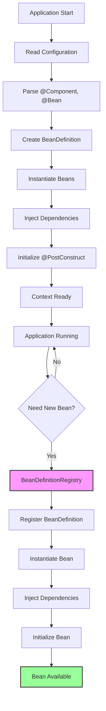
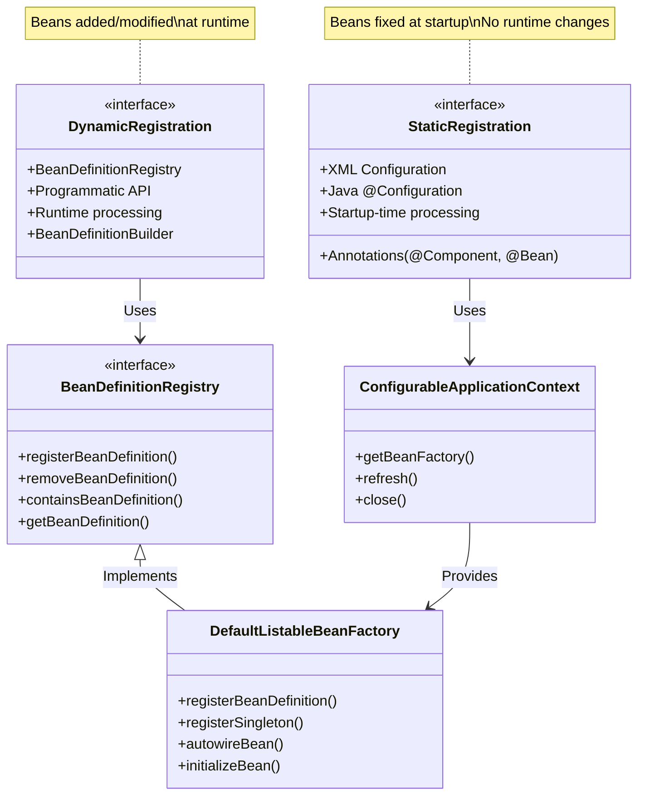
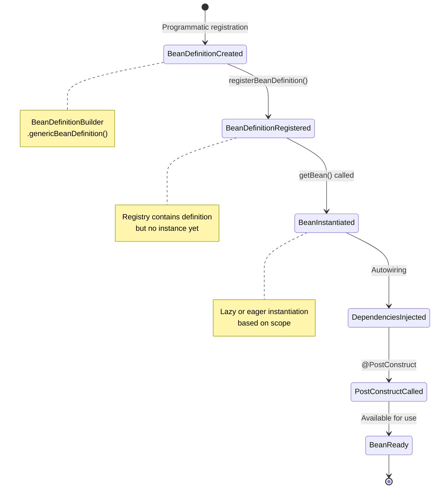

# Dynamic Bean Registration in Spring: Complete Runtime Context Management Guide

**Author:** Ahmet Emre DEMİRŞEN  
**Reading Time:** 15 min read  
**Difficulty Level:** ⚡⚡⚡ Intermediate-Advanced  
**Last Updated:** January 2026  

---

## Table of Contents

1. [Introduction](#introduction)
2. [Prerequisites](#prerequisites)
3. [Learning Objectives](#learning-objectives)
4. [Why Dynamic Bean Registration Matters](#why-dynamic-bean-registration-matters)
5. [Core Spring IoC Architecture](#core-spring-ioc-architecture)
6. [The Core APIs: BeanDefinitionRegistry and DefaultListableBeanFactory](#the-core-apis-beandefinitionregistry-and-defaultlistablebeanfactory)
7. [Building a Runtime Bean Registrar](#building-a-runtime-bean-registrar)
8. [Advanced Registration Techniques](#advanced-registration-techniques)
9. [Real-World Use Cases](#real-world-use-cases)
10. [Common Pitfalls and Solutions](#common-pitfalls-and-solutions)
11. [Best Practices](#best-practices)
12. [Anti-Patterns](#anti-patterns)
13. [Performance Considerations](#performance-considerations)
14. [Security Considerations](#security-considerations)
15. [Testing Strategies](#testing-strategies)
16. [Practice Exercises](#practice-exercises)
17. [Test Your Understanding](#test-your-understanding)
18. [Common Interview Questions](#common-interview-questions)
19. [Question Bank](#question-bank)
20. [Summary and Key Takeaways](#summary-and-key-takeaways)
21. [Further Reading and Resources](#further-reading-and-resources)

---

## Introduction

In traditional Spring applications, beans are defined statically at startup through annotations, XML configuration, or Java-based configuration. The IoC (Inversion of Control) container reads these definitions, creates bean instances, and wires their dependencies. Once the application context is initialized, the bean registry is essentially frozen.

But what if you need to add, modify, or remove beans **while the application is running**?

This is where **dynamic bean registration** comes into play—a powerful technique that allows you to programmatically manage Spring's IoC container at runtime. This capability is essential for:

- **Plugin architectures** where third-party modules register services dynamically
- **Multi-tenant systems** requiring tenant-specific bean configurations
- **Feature flag systems** that switch implementations based on runtime conditions
- **Custom validation engines** that load rules from external sources
- **Microservices** that need to adapt to changing requirements without restarts

In this comprehensive guide, we'll explore the core APIs, build production-ready examples, identify common pitfalls, and implement best practices for dynamic bean management in Spring applications.

---

## Prerequisites

Before diving into this tutorial, ensure you have:

### Technical Requirements
- **Java 8 or higher** (Java 17+ recommended for Spring Boot 3.x)
- **Spring Boot 2.5+** or **Spring Framework 5.3+**
- **Basic understanding of Spring IoC and Dependency Injection**
- **Familiarity with reflection and classloading mechanisms**
- **Maven or Gradle** build tool knowledge

### Conceptual Knowledge
- Understanding of design patterns (Factory, Registry, Strategy)
- Basic knowledge of JVM classloading
- Familiarity with bean scopes and lifecycle in Spring
- Understanding of thread-safety concepts

---

## Learning Objectives

By the end of this tutorial, you will be able to:

✅ **Master the Core APIs:** Understand and use `BeanDefinitionRegistry`, `DefaultListableBeanFactory`, and `ConfigurableApplicationContext` for runtime bean management

✅ **Implement Dynamic Registration:** Build production-ready services that register beans programmatically with proper dependency injection

✅ **Handle Complex Scenarios:** Manage singleton bean caching, annotation processing, and lifecycle callbacks for dynamically registered beans

✅ **Avoid Common Pitfalls:** Recognize and solve issues related to autowiring, bean scope conflicts, and classloader management

✅ **Build Real-World Systems:** Implement plugin systems, multi-tenant architectures, and feature flag systems using dynamic bean registration

✅ **Ensure Quality:** Write comprehensive tests for dynamically registered beans and implement proper error handling

✅ **Optimize Performance:** Understand the performance implications and implement caching strategies

✅ **Maintain Security:** Apply security best practices when accepting and registering external bean definitions

---

## Why Dynamic Bean Registration Matters

### The Static Bean Challenge

Most Spring applications define beans upfront:

```java
@Service
public class UserService {
    // Bean is registered at startup
}

@Configuration
public class AppConfig {
    @Bean
    public PaymentProcessor paymentProcessor() {
        return new StripeProcessor(); // Fixed at startup
    }
}
```

Once the application context initializes, you **cannot** add new beans without restarting the JVM. This limitation creates problems in scenarios where:

1. **Plugin Systems:** Third-party developers create plugins that register services
2. **Multi-Tenant Applications:** Each tenant needs custom-configured beans
3. **Rule Engines:** Validation/business rules are loaded from databases or files
4. **Feature Flags:** Different implementations activated based on user segments
5. **Microservices:** Services need to discover and register dependencies dynamically

### The Cost of Application Restarts

Restarting an application in production is expensive:

| Impact Category | Static Approach (Restart) | Dynamic Registration |
|----------------|---------------------------|---------------------|
| **Downtime** | 5-30 seconds | 0 seconds |
| **Memory Overhead** | Full JVM restart | Minimal overhead |
| **State Preservation** | Lost (requires session replication) | Preserved |
| **User Experience** | Disruption | Seamless |
| **Scalability** | Limited by restart frequency | Highly scalable |

### When to Use Dynamic Registration

**✅ Use dynamic registration when:**
- Bean definitions aren't known at compile time
- You're building extensible/plugin architectures
- Runtime configuration varies significantly per tenant/environment
- You need hot-swappable implementations
- Rules or strategies are loaded from external sources

**❌ Avoid dynamic registration when:**
- All beans are known at startup
- You don't need runtime flexibility
- Simplicity and maintainability are priorities
- Performance is critical and registration overhead is unacceptable

---

## Core Spring IoC Architecture

Before diving into implementation, let's understand how Spring's IoC container works and where dynamic registration fits.

### Standard Bean Registration Flow



### Static vs Dynamic Bean Registration Comparison



### The Bean Lifecycle in Dynamic Registration



---

## The Core APIs: BeanDefinitionRegistry and DefaultListableBeanFactory

### Understanding BeanDefinitionRegistry

`BeanDefinitionRegistry` is the central interface for managing bean definitions in Spring's IoC container. It provides methods to register, remove, and query bean definitions.

**Key Methods:**
```java
public interface BeanDefinitionRegistry {
    void registerBeanDefinition(String beanName, BeanDefinition beanDefinition)
        throws BeanDefinitionStoreException;
    
    void removeBeanDefinition(String beanName) throws NoSuchBeanDefinitionException;
    
    BeanDefinition getBeanDefinition(String beanName) throws NoSuchBeanDefinitionException;
    
    boolean containsBeanDefinition(String beanName);
    
    String[] getBeanDefinitionNames();
    
    int getBeanDefinitionCount();
}
```

### Understanding DefaultListableBeanFactory

`DefaultListableBeanFactory` is the default implementation of `ConfigurableListableBeanFactory` and implements `BeanDefinitionRegistry`. It's the workhorse of Spring's bean factory.

**Key Capabilities:**
- Registering bean definitions programmatically
- Registering singleton instances directly
- Autowiring existing bean instances
- Managing bean scopes (singleton, prototype, custom)
- Processing lifecycle annotations (@PostConstruct, @PreDestroy)

### Accessing the BeanFactory from ApplicationContext

To access the registry, you need to cast your `ApplicationContext` to `ConfigurableApplicationContext`:

```java
import org.springframework.context.ConfigurableApplicationContext;
import org.springframework.context.ApplicationContext;
import org.springframework.beans.factory.config.ConfigurableListableBeanFactory;
import org.springframework.beans.factory.support.DefaultListableBeanFactory;

@Autowired
private ApplicationContext applicationContext;

public void accessBeanFactory() {
    // Step 1: Cast to ConfigurableApplicationContext
    if (applicationContext instanceof ConfigurableApplicationContext) {
        ConfigurableApplicationContext configurableContext = 
            (ConfigurableApplicationContext) applicationContext;
        
        // Step 2: Get the BeanFactory
        DefaultListableBeanFactory beanFactory = 
            (DefaultListableBeanFactory) configurableContext.getBeanFactory();
        
        // Now you have full access to the registry
        System.out.println("Bean count: " + beanFactory.getBeanDefinitionCount());
    } else {
        throw new IllegalStateException(
            "ApplicationContext does not support dynamic bean registration"
        );
    }
}
```

**⚠️ Important Notes:**
- Not all `ApplicationContext` implementations are configurable (e.g., `AnnotationConfigApplicationContext` is, but some custom contexts might not be)
- Always check with `instanceof` before casting
- The cast to `DefaultListableBeanFactory` is safe for standard Spring Boot applications

---

## Building a Runtime Bean Registrar

Let's build a production-ready dynamic bean registrar service.

### Basic DynamicBeanRegistrar Implementation

```java
package com.example.dynamic.beans;

import org.springframework.beans.factory.config.BeanDefinition;
import org.springframework.beans.factory.support.BeanDefinitionBuilder;
import org.springframework.beans.factory.support.DefaultListableBeanFactory;
import org.springframework.context.ConfigurableApplicationContext;
import org.springframework.stereotype.Component;
import org.springframework.beans.factory.config.ConfigurableBeanFactory;

@Component
public class DynamicBeanRegistrar {
    
    private final DefaultListableBeanFactory beanFactory;
    private final ConfigurableApplicationContext context;
    
    /**
     * Constructor injection for dependencies
     */
    public DynamicBeanRegistrar(ConfigurableApplicationContext context) {
        this.context = context;
        this.beanFactory = (DefaultListableBeanFactory) context.getBeanFactory();
    }
    
    /**
     * Register a simple bean with default singleton scope
     * 
     * @param beanName The name for the bean in the context
     * @param beanClass The class of the bean to instantiate
     * @throws IllegalArgumentException if bean already exists or class is invalid
     */
    public void registerBean(String beanName, Class<?> beanClass) {
        validateBeanRegistration(beanName, beanClass);
        
        try {
            BeanDefinitionBuilder builder = BeanDefinitionBuilder
                .genericBeanDefinition(beanClass)
                .setScope(ConfigurableBeanFactory.SCOPE_SINGLETON);
            
            BeanDefinition beanDefinition = builder.getBeanDefinition();
            beanFactory.registerBeanDefinition(beanName, beanDefinition);
            
            System.out.printf("✅ Successfully registered bean: %s (%s)%n", 
                beanName, beanClass.getSimpleName());
        } catch (Exception e) {
            throw new BeanRegistrationException(
                String.format("Failed to register bean '%s' of type %s", 
                beanName, beanClass.getName()), e
            );
        }
    }
    
    /**
     * Register a bean with custom property values
     * 
     * @param beanName The name for the bean
     * @param beanClass The class to instantiate
     * @param properties Map of property names to values
     */
    public void registerBeanWithProperties(
            String beanName, 
            Class<?> beanClass, 
            java.util.Map<String, Object> properties) {
        
        validateBeanRegistration(beanName, beanClass);
        
        try {
            BeanDefinitionBuilder builder = BeanDefinitionBuilder
                .genericBeanDefinition(beanClass)
                .setScope(ConfigurableBeanFactory.SCOPE_SINGLETON);
            
            // Set property values
            properties.forEach((key, value) -> {
                builder.addPropertyValue(key, value);
            });
            
            BeanDefinition beanDefinition = builder.getBeanDefinition();
            beanFactory.registerBeanDefinition(beanName, beanDefinition);
            
            System.out.printf("✅ Registered bean '%s' with %d properties%n", 
                beanName, properties.size());
        } catch (Exception e) {
            throw new BeanRegistrationException(
                String.format("Failed to register bean '%s' with properties", beanName), e
            );
        }
    }
    
    /**
     * Register a bean with constructor arguments
     * 
     * @param beanName The name for the bean
     * @param beanClass The class to instantiate
     * @param constructorArgs Arguments for the constructor
     */
    public void registerBeanWithConstructor(
            String beanName,
            Class<?> beanClass,
            Object... constructorArgs) {
        
        validateBeanRegistration(beanName, beanClass);
        
        try {
            BeanDefinitionBuilder builder = BeanDefinitionBuilder
                .genericBeanDefinition(beanClass, constructorArgs)
                .setScope(ConfigurableBeanFactory.SCOPE_SINGLETON);
            
            BeanDefinition beanDefinition = builder.getBeanDefinition();
            beanFactory.registerBeanDefinition(beanName, beanDefinition);
            
            System.out.printf("✅ Registered bean '%s' with %d constructor args%n", 
                beanName, constructorArgs.length);
        } catch (Exception e) {
            throw new BeanRegistrationException(
                String.format("Failed to register bean '%s' with constructor args", 
                beanName), e
            );
        }
    }
    
    /**
     * Check if a bean is already registered
     */
    public boolean isBeanRegistered(String beanName) {
        return beanFactory.containsBeanDefinition(beanName) || 
               beanFactory.containsSingleton(beanName);
    }
    
    /**
     * Remove a dynamically registered bean
     * Note: This only works for beans registered via registerBeanDefinition
     */
    public void removeBean(String beanName) {
        if (!beanFactory.containsBeanDefinition(beanName)) {
            throw new IllegalArgumentException(
                String.format("Bean '%s' is not registered or was not dynamically registered", 
                beanName));
        }
        
        beanFactory.removeBeanDefinition(beanName);
        System.out.printf("🗑️  Removed bean: %s%n", beanName);
    }
    
    /**
     * Validate bean registration prerequisites
     */
    private void validateBeanRegistration(String beanName, Class<?> beanClass) {
        if (beanName == null || beanName.trim().isEmpty()) {
            throw new IllegalArgumentException("Bean name cannot be null or empty");
        }
        
        if (beanClass == null) {
            throw new IllegalArgumentException("Bean class cannot be null");
        }
        
        if (isBeanRegistered(beanName)) {
            throw new IllegalArgumentException(
                String.format("Bean '%s' is already registered", beanName));
        }
        
        // Verify the class is concrete and instantiable
        if (java.lang.reflect.Modifier.isAbstract(beanClass.getModifiers())) {
            throw new IllegalArgumentException(
                String.format("Cannot register abstract class: %s", beanClass.getName()));
        }
    }
    
    /**
     * Custom exception for bean registration failures
     */
    public static class BeanRegistrationException extends RuntimeException {
        public BeanRegistrationException(String message, Throwable cause) {
            super(message, cause);
        }
    }
}
```

### Using the DynamicBeanRegistrar

```java
package com.example.dynamic.services;

import com.example.dynamic.beans.DynamicBeanRegistrar;
import org.springframework.stereotype.Service;
import org.springframework.beans.factory.annotation.Autowired;
import org.springframework.context.ApplicationContext;

@Service
public class PluginService {
    
    private final DynamicBeanRegistrar registrar;
    private final ApplicationContext context;
    
    @Autowired
    public PluginService(DynamicBeanRegistrar registrar, ApplicationContext context) {
        this.registrar = registrar;
        this.context = context;
    }
    
    /**
     * Load and register a plugin at runtime
     */
    public void loadPlugin(String pluginClassName) {
        try {
            // Step 1: Load the plugin class
            Class<?> pluginClass = Class.forName(pluginClassName);
            
            // Step 2: Generate bean name (simple class name, decapitalized)
            String beanName = generateBeanName(pluginClass);
            
            // Step 3: Register the bean
            registrar.registerBean(beanName, pluginClass);
            
            // Step 4: Retrieve and use the bean
            Object pluginBean = context.getBean(beanName);
            
            System.out.printf("🚀 Plugin loaded: %s%n", pluginBean.getClass().getSimpleName());
            
        } catch (ClassNotFoundException e) {
            throw new PluginLoadException(
                String.format("Plugin class not found: %s", pluginClassName), e);
        } catch (Exception e) {
            throw new PluginLoadException(
                String.format("Failed to load plugin: %s", pluginClassName), e);
        }
    }
    
    /**
     * Load plugin with custom properties
     */
    public void loadPluginWithConfig(String pluginClassName, java.util.Map<String, Object> config) {
        try {
            Class<?> pluginClass = Class.forName(pluginClassName);
            String beanName = generateBeanName(pluginClass);
            
            registrar.registerBeanWithProperties(beanName, pluginClass, config);
            
            Object pluginBean = context.getBean(beanName);
            System.out.printf("🚀 Plugin loaded with config: %s%n", 
                pluginBean.getClass().getSimpleName());
            
        } catch (Exception e) {
            throw new PluginLoadException("Failed to load plugin with config", e);
        }
    }
    
    /**
     * Generate a valid Spring bean name from a class
     */
    private String generateBeanName(Class<?> clazz) {
        String simpleName = clazz.getSimpleName();
        // Decapitalize first letter (Spring convention)
        if (simpleName.length() > 1) {
            return Character.toLowerCase(simpleName.charAt(0)) + simpleName.substring(1);
        }
        return simpleName.toLowerCase();
    }
    
    public static class PluginLoadException extends RuntimeException {
        public PluginLoadException(String message, Throwable cause) {
            super(message, cause);
        }
    }
}
```

---

## Advanced Registration Techniques

### Handling Dependencies in Dynamically Registered Beans

One of the biggest challenges: **Spring doesn't automatically inject dependencies into dynamically registered beans**. We need to enable autowiring explicitly.

```java
@Component
public class AdvancedDynamicBeanRegistrar {
    
    private final DefaultListableBeanFactory beanFactory;
    
    public AdvancedDynamicBeanRegistrar(ConfigurableApplicationContext context) {
        this.beanFactory = (DefaultListableBeanFactory) context.getBeanFactory();
    }
    
    /**
     * Register a bean with autowiring enabled
     * This injects dependencies via constructor and setter injection
     */
    public void registerBeanWithAutowiring(String beanName, Class<?> beanClass) {
        BeanDefinitionBuilder builder = BeanDefinitionBuilder
            .genericBeanDefinition(beanClass)
            .setScope(ConfigurableBeanFactory.SCOPE_SINGLETON)
            .setAutowireMode(AbstractBeanDefinition.AUTOWIRE_BY_TYPE) // ⭐ Enable autowiring
            .setAutowireCandidate(true); // Make it available for injection into other beans
        
        beanFactory.registerBeanDefinition(beanName, builder.getBeanDefinition());
    }
    
    /**
     * Register a bean and fully initialize it (including @Autowired and @PostConstruct)
     * This is the most complete approach
     */
    public void registerAndInitializeBean(String beanName, Class<?> beanClass) {
        // Step 1: Register bean definition
        BeanDefinitionBuilder builder = BeanDefinitionBuilder
            .genericBeanDefinition(beanClass)
            .setScope(ConfigurableBeanFactory.SCOPE_SINGLETON)
            .setAutowireMode(AbstractBeanDefinition.AUTOWIRE_BY_TYPE);
        
        beanFactory.registerBeanDefinition(beanName, builder.getBeanDefinition());
        
        // Step 2: Get bean instance (triggers instantiation and DI)
        Object beanInstance = beanFactory.getBean(beanName);
        
        // Step 3: Initialize the bean (processes @PostConstruct, etc.)
        beanFactory.initializeBean(beanInstance, beanName);
    }
    
    /**
     * Register an existing bean instance with full initialization
     * Best when you need to create the instance yourself
     */
    public void registerExistingBean(String beanName, Object beanInstance) {
        // Get the AutowireCapableBeanFactory
        AutowireCapableBeanFactory autowireFactory = 
            beanFactory.getAutowireCapableBeanFactory();
        
        // Step 1: Autowire the bean (processes @Autowired fields)
        autowireFactory.autowireBean(beanInstance);
        
        // Step 2: Initialize the bean (processes @PostConstruct, @PreDestroy, etc.)
        autowireFactory.initializeBean(beanInstance, beanName);
        
        // Step 3: Register as singleton
        beanFactory.registerSingleton(beanName, beanInstance);
    }
}
```

### Handling @PostConstruct and @Autowired in Dynamic Beans

The `AutowireCapableBeanFactory` is the key to processing Spring annotations:

```java
import org.springframework.beans.factory.config.AutowireCapableBeanFactory;

public class AnnotationAwareBeanRegistrar {
    
    private final AutowireCapableBeanFactory autowireFactory;
    private final DefaultListableBeanFactory beanFactory;
    
    public AnnotationAwareBeanRegistrar(ConfigurableApplicationContext context) {
        this.autowireFactory = context.getAutowireCapableBeanFactory();
        this.beanFactory = (DefaultListableBeanFactory) context.getBeanFactory();
    }
    
    /**
     * Register a bean with full annotation support
     */
    public void registerBeanWithAnnotations(String beanName, Class<?> beanClass) {
        try {
            // Step 1: Create instance
            Object instance = beanClass.getDeclaredConstructor().newInstance();
            
            // Step 2: Autowire dependencies (@Autowired fields)
            autowireFactory.autowireBean(instance);
            
            // Step 3: Initialize bean (@PostConstruct, @PreDestroy registration)
            autowireFactory.initializeBean(instance, beanName);
            
            // Step 4: Register as singleton
            beanFactory.registerSingleton(beanName, instance);
            
            System.out.printf("✅ Registered bean with annotations: %s%n", beanName);
            
        } catch (Exception e) {
            throw new BeanRegistrationException(
                String.format("Failed to register bean '%s' with annotations", beanName), e);
        }
    }
    
    /**
     * Register bean with constructor injection support
     */
    public void registerBeanWithConstructorInjection(
            String beanName, 
            Class<?> beanClass,
            Object... constructorArgs) {
        
        try {
            // Find matching constructor
            java.lang.reflect.Constructor<?> constructor = findMatchingConstructor(
                beanClass, 
                constructorArgs
            );
            
            // Create instance with constructor args
            Object instance = constructor.newInstance(constructorArgs);
            
            // Autowire remaining dependencies
            autowireFactory.autowireBean(instance);
            
            // Initialize
            autowireFactory.initializeBean(instance, beanName);
            
            // Register
            beanFactory.registerSingleton(beanName, instance);
            
        } catch (Exception e) {
            throw new BeanRegistrationException(
                "Failed to register bean with constructor injection", e);
        }
    }
    
    private java.lang.reflect.Constructor<?> findMatchingConstructor(
            Class<?> clazz, 
            Object... args) {
        
        for (java.lang.reflect.Constructor<?> constructor : clazz.getConstructors()) {
            if (constructor.getParameterCount() == args.length) {
                return constructor;
            }
        }
        throw new IllegalArgumentException(
            String.format("No matching constructor found for %s with %d args", 
            clazz.getSimpleName(), args.length));
    }
}
```

### Prototype-Scoped Dynamic Beans

For beans that should create new instances each time:

```java
@Component
public class PrototypeBeanRegistrar {
    
    private final DefaultListableBeanFactory beanFactory;
    
    public PrototypeBeanRegistrar(ConfigurableApplicationContext context) {
        this.beanFactory = (DefaultListableBeanFactory) context.getBeanFactory();
    }
    
    /**
     * Register a prototype-scoped bean
     * Each getBean() call returns a new instance
     */
    public void registerPrototypeBean(String beanName, Class<?> beanClass) {
        BeanDefinitionBuilder builder = BeanDefinitionBuilder
            .genericBeanDefinition(beanClass)
            .setScope(ConfigurableBeanFactory.SCOPE_PROTOTYPE) // ⭐ Prototype scope
            .setAutowireMode(AbstractBeanDefinition.AUTOWIRE_BY_TYPE);
        
        beanFactory.registerBeanDefinition(beanName, builder.getBeanDefinition());
    }
    
    /**
     * Get a new instance of a prototype bean
     */
    public <T> T getPrototypeBean(String beanName, Class<T> type) {
        return beanFactory.getBean(beanName, type);
    }
}
```

---

## Real-World Use Cases

### Use Case 1: Plugin System with Dynamic Discovery

```java
package com.example.plugins;

import org.springframework.stereotype.Service;
import org.springframework.beans.factory.annotation.Autowired;
import com.example.dynamic.beans.DynamicBeanRegistrar;
import java.nio.file.*;
import java.io.IOException;
import java.util.stream.Stream;

@Service
public class PluginLoaderService {
    
    private final DynamicBeanRegistrar registrar;
    private final ApplicationContext context;
    
    @Autowired
    public PluginLoaderService(DynamicBeanRegistrar registrar, ApplicationContext context) {
        this.registrar = registrar;
        this.context = context;
    }
    
    /**
     * Load all plugins from a directory
     */
    public void loadPluginsFromDirectory(String pluginDirectoryPath) throws IOException {
        Path pluginDir = Paths.get(pluginDirectoryPath);
        
        if (!Files.exists(pluginDir) || !Files.isDirectory(pluginDir)) {
            throw new IllegalArgumentException("Invalid plugin directory: " + pluginDirectoryPath);
        }
        
        // Walk the directory tree
        try (Stream<Path> paths = Files.walk(pluginDir)) {
            paths.filter(Files::isRegularFile)
                 .filter(path -> path.toString().endsWith(".class"))
                 .forEach(this::loadPluginFromClassFile);
        }
        
        System.out.printf("✅ Loaded plugins from: %s%n", pluginDirectoryPath);
    }
    
    /**
     * Load a single plugin from a .class file
     */
    private void loadPluginFromClassFile(Path classFilePath) {
        try {
            // Load class using custom classloader
            Class<?> pluginClass = loadClassFromFile(classFilePath);
            
            // Verify it implements Plugin interface
            if (!Plugin.class.isAssignableFrom(pluginClass)) {
                System.out.printf("⚠️  Skipped %s: doesn't implement Plugin interface%n", 
                    classFilePath.getFileName());
                return;
            }
            
            // Register the plugin
            String beanName = generateBeanName(pluginClass);
            registrar.registerBeanWithAutowiring(beanName, pluginClass);
            
            // Activate the plugin
            Plugin plugin = context.getBean(beanName, Plugin.class);
            plugin.activate();
            
            System.out.printf("🔌 Plugin loaded: %s (v%s)%n", 
                plugin.getName(), plugin.getVersion());
            
        } catch (Exception e) {
            System.err.printf("❌ Failed to load plugin from %s: %s%n", 
                classFilePath.getFileName(), e.getMessage());
        }
    }
    
    /**
     * Load a class from a file path
     */
    private Class<?> loadClassFromFile(Path classFilePath) throws Exception {
        // This is a simplified version - in production, use a proper URLClassLoader
        URLClassLoader classLoader = new URLClassLoader(
            new URL[] { classFilePath.getParent().toUri().toURL() },
            this.getClass().getClassLoader()
        );
        
        String className = extractClassName(classFilePath);
        return Class.forName(className, true, classLoader);
    }
    
    private String extractClassName(Path classFilePath) {
        String path = classFilePath.toString();
        int startIndex = path.indexOf("plugins") + 8; // After "plugins/"
        int endIndex = path.lastIndexOf(".class");
        
        String className = path.substring(startIndex, endIndex);
        return className.replace(File.separatorChar, '.');
    }
    
    private String generateBeanName(Class<?> clazz) {
        String name = clazz.getSimpleName();
        return Character.toLowerCase(name.charAt(0)) + name.substring(1);
    }
}

// Plugin interface
interface Plugin {
    void activate();
    String getName();
    String getVersion();
}

// Example plugin implementation
class EmailNotificationPlugin implements Plugin {
    
    @Autowired
    private EmailService emailService; // Dependency injected!
    
    @Override
    public void activate() {
        System.out.println("Email notification plugin activated");
    }
    
    @Override
    public String getName() {
        return "EmailNotification";
    }
    
    @Override
    public String getVersion() {
        return "1.0.0";
    }
}
```

### Use Case 2: Multi-Tenant Service Configuration

```java
package com.example.multitenant;

import org.springframework.stereotype.Service;
import com.example.dynamic.beans.DynamicBeanRegistrar;
import org.springframework.beans.factory.config.BeanDefinitionBuilder;
import org.springframework.beans.factory.config.ConfigurableBeanFactory;

@Service
public class TenantServiceManager {
    
    private final DynamicBeanRegistrar registrar;
    private final Map<String, TenantConfig> tenantConfigs = new ConcurrentHashMap<>();
    
    @Autowired
    public TenantServiceManager(DynamicBeanRegistrar registrar) {
        this.registrar = registrar;
    }
    
    /**
     * Onboard a new tenant with custom configuration
     */
    public void onboardTenant(String tenantId, TenantConfig config) {
        String beanName = "tenantService_" + tenantId;
        
        // Store config
        tenantConfigs.put(tenantId, config);
        
        // Create bean definition with tenant-specific properties
        BeanDefinitionBuilder builder = BeanDefinitionBuilder
            .genericBeanDefinition(TenantService.class)
            .setScope(ConfigurableBeanFactory.SCOPE_SINGLETON)
            .addPropertyValue("tenantId", tenantId)
            .addPropertyValue("databaseUrl", config.getDatabaseUrl())
            .addPropertyValue("apiKey", config.getApiKey())
            .addPropertyValue("maxConnections", config.getMaxConnections())
            .setAutowireMode(AbstractBeanDefinition.AUTOWIRE_BY_TYPE);
        
        registrar.registerBean(beanName, TenantService.class);
        
        // Manually set properties (since we bypassed the builder above)
        // Alternative: Use registerBeanWithProperties instead
        
        System.out.printf("🏢 Tenant onboarded: %s%n", tenantId);
    }
    
    /**
     * Get service for a specific tenant
     */
    public TenantService getTenantService(String tenantId) {
        String beanName = "tenantService_" + tenantId;
        
        if (!registrar.isBeanRegistered(beanName)) {
            throw new IllegalArgumentException(
                String.format("Tenant '%s' not onboarded", tenantId));
        }
        
        // This will return the tenant-specific instance
        return (TenantService) context.getBean(beanName);
    }
    
    /**
     * Offboard a tenant (remove their beans)
     */
    public void offboardTenant(String tenantId) {
        String beanName = "tenantService_" + tenantId;
        
        try {
            registrar.removeBean(beanName);
            tenantConfigs.remove(tenantId);
            
            System.out.printf("👋 Tenant offboarded: %s%n", tenantId);
        } catch (Exception e) {
            throw new TenantManagementException(
                String.format("Failed to offboard tenant: %s", tenantId), e);
        }
    }
    
    // Tenant configuration record
    public record TenantConfig(
        String databaseUrl,
        String apiKey,
        int maxConnections,
        String region
    ) {}
    
    // Tenant service with injected configuration
    public static class TenantService {
        private String tenantId;
        private String databaseUrl;
        private String apiKey;
        private int maxConnections;
        
        // Setters for properties
        public void setTenantId(String tenantId) { this.tenantId = tenantId; }
        public void setDatabaseUrl(String databaseUrl) { this.databaseUrl = databaseUrl; }
        public void setApiKey(String apiKey) { this.apiKey = apiKey; }
        public void setMaxConnections(int maxConnections) { this.maxConnections = maxConnections; }
        
        @PostConstruct
        public void initialize() {
            System.out.printf("🔧 TenantService initialized for: %s%n", tenantId);
            // Initialize tenant-specific resources
        }
    }
}
```

### Use Case 3: Feature Flag System

```java
package com.example.featureflags;

import org.springframework.stereotype.Service;

@Service
public class FeatureFlagService {
    
    private final DynamicBeanRegistrar registrar;
    private final Map<String, FeatureConfig> activeFeatures = new ConcurrentHashMap<>();
    
    @Autowired
    public FeatureFlagService(DynamicBeanRegistrar registrar) {
        this.registrar = registrar;
    }
    
    /**
     * Activate a feature with a specific implementation version
     */
    public void activateFeature(String featureName, String version) {
        String beanName = featureName + "Service";
        
        // Remove existing implementation if any
        if (registrar.isBeanRegistered(beanName)) {
            registrar.removeBean(beanName);
        }
        
        // Determine implementation class
        Class<?> implementationClass = resolveImplementation(featureName, version);
        
        // Register new implementation
        registrar.registerBeanWithAutowiring(beanName, implementationClass);
        
        // Track active feature
        activeFeatures.put(featureName, new FeatureConfig(version, implementationClass));
        
        System.out.printf("🚩 Feature activated: %s (v%s)%n", featureName, version);
    }
    
    /**
     * Get the active feature implementation
     */
    @SuppressWarnings("unchecked")
    public <T> T getFeature(String featureName, Class<T> type) {
        String beanName = featureName + "Service";
        
        if (!registrar.isBeanRegistered(beanName)) {
            throw new IllegalArgumentException(
                String.format("Feature '%s' is not active", featureName));
        }
        
        return (T) context.getBean(beanName);
    }
    
    /**
     * Deactivate a feature
     */
    public void deactivateFeature(String featureName) {
        String beanName = featureName + "Service";
        
        if (registrar.isBeanRegistered(beanName)) {
            registrar.removeBean(beanName);
            activeFeatures.remove(featureName);
            
            System.out.printf("🚩 Feature deactivated: %s%n", featureName);
        }
    }
    
    private Class<?> resolveImplementation(String featureName, String version) {
        return switch (featureName) {
            case "search" -> version.equals("v2") 
                ? SearchServiceV2.class 
                : SearchServiceV1.class;
            case "recommendation" -> version.equals("ml") 
                ? MLRecommendationService.class 
                : RuleBasedRecommendationService.class;
            default -> throw new IllegalArgumentException(
                String.format("Unknown feature: %s", featureName));
        };
    }
    
    public record FeatureConfig(String version, Class<?> implementationClass) {}
}

// Feature service implementations
interface SearchService {
    List<Product> search(String query);
}

class SearchServiceV1 implements SearchService {
    @Override
    public List<Product> search(String query) {
        // Legacy implementation
        return List.of();
    }
}

class SearchServiceV2 implements SearchService {
    @Override
    public List<Product> search(String query) {
        // New implementation with better algorithms
        return List.of();
    }
}
```

---

## Common Pitfalls and Solutions

### Pitfall 1: Dependency Injection Failures

**❌ Problem:**
```java
// Dynamically registered bean with @Autowired fields
public class MyService {
    @Autowired
    private Dependency dependency; // ❌ Won't be injected!
    
    @PostConstruct
    public void init() { // ❌ Won't be called!
        // Initialization logic
    }
}
```

**✅ Solution:**
```java
public void registerBeanWithFullInitialization(String beanName, Class<?> beanClass) {
    // Enable autowiring in bean definition
    BeanDefinitionBuilder builder = BeanDefinitionBuilder
        .genericBeanDefinition(beanClass)
        .setAutowireMode(AbstractBeanDefinition.AUTOWIRE_BY_TYPE);
    
    beanFactory.registerBeanDefinition(beanName, builder.getBeanDefinition());
    
    // Get and initialize the bean
    Object bean = beanFactory.getBean(beanName);
    beanFactory.initializeBean(bean, beanName);
}
```

### Pitfall 2: Singleton Bean List Caching

**❌ Problem:**
```java
@Service
public class PluginManager {
    // This list is FIXED at startup
    @Autowired
    private List<Plugin> plugins;
    
    // Adding a new plugin won't update this list!
}
```

**✅ Solution:**
```java
@Service
public class PluginManager {
    @Autowired
    private ApplicationContext context;
    
    // Always fetch fresh list
    public List<Plugin> getActivePlugins() {
        return new ArrayList<>(context.getBeansOfType(Plugin.class).values());
    }
    
    // Or use a cached list that you manually update
    private volatile List<Plugin> cachedPlugins = List.of();
    
    public void refreshPluginList() {
        this.cachedPlugins = getActivePlugins();
    }
}
```

### Pitfall 3: Bean Already Exists Exception

**❌ Problem:**
```java
// Second registration attempt throws BeanDefinitionStoreException
registrar.registerBean("userService", UserService.class);
registrar.registerBean("userService", UserService.class); // ❌ Exception!
```

**✅ Solution:**
```java
public void safeRegisterBean(String beanName, Class<?> beanClass) {
    if (registrar.isBeanRegistered(beanName)) {
        // Option 1: Remove and re-register
        registrar.removeBean(beanName);
        
        // Option 2: Skip registration
        // return;
        
        // Option 3: Update existing bean
        // updateBean(beanName, beanClass);
    }
    
    registrar.registerBean(beanName, beanClass);
}
```

### Pitfall 4: ClassLoader Issues

**❌ Problem:**
```java
// Classes loaded by different classloaders can't be cast
Class<?> pluginClass = customClassLoader.loadClass("com.example.Plugin");
Plugin plugin = context.getBean("plugin", Plugin.class); // ❌ ClassCastException!
```

**✅ Solution:**
```java
// Use the application context's classloader
Class<?> pluginClass = Class.forName(
    "com.example.Plugin", 
    true, 
    context.getClass().getClassLoader()
);

// Or register the classloader for later use
registrar.registerBean("pluginClassLoader", customClassLoader);
```

### Pitfall 5: Memory Leaks

**❌ Problem:**
```java
// Registering beans without cleanup
for (String tenantId : tenantIds) {
    registrar.registerBean("tenantService_" + tenantId, TenantService.class);
    // Never removed, even when tenant is deleted!
}
```

**✅ Solution:**
```java
public void cleanupTenantBeans(String tenantId) {
    String beanName = "tenantService_" + tenantId;
    
    if (registrar.isBeanRegistered(beanName)) {
        // Get bean instance
        TenantService service = context.getBean(beanName, TenantService.class);
        
        // Cleanup resources
        service.cleanup();
        
        // Remove bean
        registrar.removeBean(beanName);
        
        // Clear any caches
        tenantCache.remove(tenantId);
    }
}
```

---

## Best Practices

### 1. Always Validate Bean Names and Classes

```java
public void safeRegister(String beanName, Class<?> beanClass) {
    // Validate inputs
    validateBeanName(beanName);
    validateBeanClass(beanClass);
    
    // Check for conflicts
    if (isBeanRegistered(beanName)) {
        handleBeanConflict(beanName);
    }
    
    // Register with error handling
    try {
        registrar.registerBean(beanName, beanClass);
    } catch (Exception e) {
        log.error("Failed to register bean: {}", beanName, e);
        throw new BeanRegistrationException(e);
    }
}
```

### 2. Use Descriptive Bean Naming Conventions

```java
// ✅ Good: Clear, consistent naming
"plugin_" + pluginId
"tenantService_" + tenantId
"feature_" + featureName + "_v" + version

// ❌ Bad: Unclear, inconsistent
"bean1"
"service"
"impl"
```

### 3. Implement Proper Error Handling

```java
public class RobustBeanRegistrar {
    
    private static final Logger logger = LoggerFactory.getLogger(RobustBeanRegistrar.class);
    
    public RegistrationResult registerBeanSafely(String beanName, Class<?> beanClass) {
        try {
            validateInputs(beanName, beanClass);
            checkExistingBean(beanName);
            performRegistration(beanName, beanClass);
            
            return RegistrationResult.success(beanName);
            
        } catch (BeanAlreadyExistsException e) {
            logger.warn("Bean already exists: {}", beanName);
            return RegistrationResult.alreadyExists(beanName);
            
        } catch (InvalidBeanDefinitionException e) {
            logger.error("Invalid bean definition: {}", beanName, e);
            return RegistrationResult.failure("Invalid definition: " + e.getMessage());
            
        } catch (Exception e) {
            logger.error("Unexpected error registering bean: {}", beanName, e);
            return RegistrationResult.failure("Unexpected error: " + e.getMessage());
        }
    }
    
    public record RegistrationResult(
        boolean success,
        String beanName,
        String errorMessage
    ) {
        public static RegistrationResult success(String beanName) {
            return new RegistrationResult(true, beanName, null);
        }
        
        public static RegistrationResult alreadyExists(String beanName) {
            return new RegistrationResult(false, beanName, "Bean already exists");
        }
        
        public static RegistrationResult failure(String error) {
            return new RegistrationResult(false, null, error);
        }
    }
}
```

### 4. Thread-Safe Registration

```java
@Component
public class ThreadSafeBeanRegistrar {
    
    private final DefaultListableBeanFactory beanFactory;
    private final ReadWriteLock lock = new ReentrantReadWriteLock();
    
    public ThreadSafeBeanRegistrar(ConfigurableApplicationContext context) {
        this.beanFactory = (DefaultListableBeanFactory) context.getBeanFactory();
    }
    
    public void registerBean(String beanName, Class<?> beanClass) {
        lock.writeLock().lock();
        try {
            // Validate and register
            validateAndRegister(beanName, beanClass);
        } finally {
            lock.writeLock().unlock();
        }
    }
    
    public boolean isBeanRegistered(String beanName) {
        lock.readLock().lock();
        try {
            return beanFactory.containsBeanDefinition(beanName);
        } finally {
            lock.readLock().unlock();
        }
    }
}
```

### 5. Maintain Registration Audit Trail

```java
@Component
public class AuditedBeanRegistrar {
    
    private final DynamicBeanRegistrar registrar;
    private final List<BeanRegistrationEvent> registrationHistory = new CopyOnWriteArrayList<>();
    
    public AuditedBeanRegistrar(DynamicBeanRegistrar registrar) {
        this.registrar = registrar;
    }
    
    public void registerBean(String beanName, Class<?> beanClass, String registeredBy) {
        // Record registration event
        BeanRegistrationEvent event = new BeanRegistrationEvent(
            beanName,
            beanClass.getName(),
            registeredBy,
            Instant.now(),
            BeanRegistrationEvent.Type.REGISTER
        );
        
        try {
            registrar.registerBean(beanName, beanClass);
            registrationHistory.add(event);
            
            logger.info("Bean registered: {} by {}", beanName, registeredBy);
            
        } catch (Exception e) {
            registrationHistory.add(new BeanRegistrationEvent(
                beanName,
                beanClass.getName(),
                registeredBy,
                Instant.now(),
                BeanRegistrationEvent.Type.FAILED,
                e.getMessage()
            ));
            throw e;
        }
    }
    
    public List<BeanRegistrationEvent> getRegistrationHistory() {
        return List.copyOf(registrationHistory);
    }
    
    public record BeanRegistrationEvent(
        String beanName,
        String beanClass,
        String registeredBy,
        Instant timestamp,
        Type type,
        String errorMessage
    ) {
        public enum Type { REGISTER, REMOVE, FAILED }
    }
}
```

---

## Anti-Patterns

### ❌ Anti-Pattern 1: Dynamic Registration for Static Beans

```java
// ❌ DON'T DO THIS
// There's no reason to register statically-defined beans dynamically
public void initializeApp() {
    // UserService is already defined with @Service
    registrar.registerBean("userService", UserService.class); // Unnecessary!
}

// ✅ DO THIS INSTEAD
// Use standard Spring annotations
@Service
public class UserService { }
```

**Why it's bad:**
- Adds unnecessary complexity
- Bypasses Spring's optimized startup process
- Makes the code harder to understand and maintain

### ❌ Anti-Pattern 2: Ignoring Bean Lifecycle

```java
// ❌ DON'T DO THIS
public void quickAndDirtyRegistration(String beanName, Object instance) {
    beanFactory.registerSingleton(beanName, instance);
    // Missing: @Autowired injection, @PostConstruct, etc.
}
```

**Why it's bad:**
- Beans aren't properly initialized
- Dependencies remain null
- Lifecycle callbacks don't fire

### ❌ Anti-Pattern 3: Excessive Dynamic Registration

```java
// ❌ DON'T DO THIS
// Registering hundreds of beans at startup defeats the purpose
public void initialize() {
    for (int i = 0; i < 1000; i++) {
        registrar.registerBean("service_" + i, Service.class);
    }
}

// ✅ DO THIS INSTEAD
// Use proper Spring configuration for known beans
@Configuration
public class ServiceConfig {
    @Bean
    public Service service1() { return new Service(); }
    
    @Bean
    public Service service2() { return new Service(); }
}
```

**Why it's bad:**
- Performance overhead at registration time
- Harder to debug and trace
- Defeats the purpose of IoC container optimization

### ❌ Anti-Pattern 4: Not Handling Registration Failures

```java
// ❌ DON'T DO THIS
public void loadPlugin(String className) {
    Class<?> clazz = Class.forName(className);
    registrar.registerBean(generateName(clazz), clazz);
    // No error handling, no validation, no cleanup on failure
}
```

**Why it's bad:**
- Application crashes on invalid plugins
- Partial state if registration fails midway
- No audit trail or debugging information

### ❌ Anti-Pattern 5: Exposing BeanFactory Directly

```java
// ❌ DON'T DO THIS
@RestController
public class BeanController {
    @Autowired
    private DefaultListableBeanFactory beanFactory; // Exposed!
    
    @GetMapping("/beans")
    public List<String> getAllBeans() {
        return List.of(beanFactory.getBeanDefinitionNames());
    }
}
```

**Why it's bad:**
- Security vulnerability (information disclosure)
- Breaks encapsulation
- Allows external modification of internal state

---

## Performance Considerations

### Registration Overhead Analysis

Dynamic bean registration involves several steps, each with performance implications:

```java
// Registration process breakdown:
// 1. BeanDefinitionBuilder creation: ~0.1ms
// 2. Property/constructor argument setup: ~0.05ms per property
// 3. BeanDefinition instantiation: ~0.2ms
// 4. Registry validation: ~0.3ms
// 5. Bean instantiation (on first getBean): ~1-10ms depending on complexity
// Total: ~1.7-11ms per bean (excluding instantiation)
```

### Performance Optimization Strategies

**1. Batch Registration:**
```java
public class BatchBeanRegistrar {
    
    public void registerBeansInBatch(List<BeanDefinition> definitions) {
        long startTime = System.currentTimeMillis();
        
        // Disable automatic validation during batch
        beanFactory.setAllowBeanDefinitionOverriding(true);
        
        definitions.forEach(def -> {
            try {
                beanFactory.registerBeanDefinition(def.getBeanName(), def.getBeanDefinition());
            } catch (Exception e) {
                logger.error("Failed to register bean: {}", def.getBeanName(), e);
            }
        });
        
        // Re-enable validation
        beanFactory.setAllowBeanDefinitionOverriding(false);
        
        long duration = System.currentTimeMillis() - startTime;
        logger.info("Registered {} beans in {}ms", definitions.size(), duration);
    }
}
```

**2. Lazy Initialization:**
```java
public void registerLazyBean(String beanName, Class<?> beanClass) {
    BeanDefinitionBuilder builder = BeanDefinitionBuilder
        .genericBeanDefinition(beanClass)
        .setScope(ConfigurableBeanFactory.SCOPE_SINGLETON)
        .setLazyInit(true); // ⭐ Lazy initialization
    
    beanFactory.registerBeanDefinition(beanName, builder.getBeanDefinition());
}
```

**3. Caching Registered Beans:**
```java
@Component
public class CachedBeanRegistrar {
    
    private final DynamicBeanRegistrar registrar;
    private final LoadingCache<String, Class<?>> beanCache;
    
    public CachedBeanRegistrar(DynamicBeanRegistrar registrar) {
        this.registrar = registrar;
        
        this.beanCache = Caffeine.newBuilder()
            .maximumSize(1000)
            .expireAfterWrite(Duration.ofHours(1))
            .build(className -> {
                try {
                    return Class.forName(className);
                } catch (ClassNotFoundException e) {
                    throw new IllegalArgumentException("Class not found: " + className);
                }
            });
    }
    
    public void registerBean(String beanName, String className) {
        Class<?> beanClass = beanCache.get(className);
        registrar.registerBean(beanName, beanClass);
    }
}
```

### Performance Comparison Table

| Approach | Registration Time | Memory Overhead | First Use Latency | Use Case |
|----------|------------------|-----------------|-------------------|----------|
| Static (@Component) | Startup | Low | Low | Known beans |
| Dynamic (eager) | ~5-10ms | Low | Low | Frequently used |
| Dynamic (lazy) | ~2-5ms | Low | Medium (~1-5ms) | Infrequently used |
| Dynamic (batch) | ~1-2ms per bean | Low | Low | Bulk operations |

---

## Security Considerations

### 1. ClassLoader Security

```java
public class SecureClassLoader {
    
    private static final Set<String> ALLOWED_PACKAGES = Set.of(
        "com.example.plugins",
        "com.example.extensions"
    );
    
    public Class<?> loadSafely(String className) throws ClassNotFoundException {
        // Validate package
        String packageName = extractPackage(className);
        
        if (!ALLOWED_PACKAGES.contains(packageName)) {
            throw new SecurityException(
                String.format("Package not allowed: %s", packageName));
        }
        
        // Load only from trusted sources
        return Class.forName(className, true, 
            getClass().getClassLoader());
    }
    
    private String extractPackage(String className) {
        int lastDot = className.lastIndexOf('.');
        return lastDot > 0 ? className.substring(0, lastDot) : "";
    }
}
```

### 2. Bean Validation

```java
public class SecureBeanRegistrar {
    
    public void registerBeanSecurely(String beanName, Class<?> beanClass) {
        // Validate class implements expected interface
        if (!isAllowedType(beanClass)) {
            throw new SecurityException(
                String.format("Bean type not permitted: %s", beanClass.getName()));
        }
        
        // Check for dangerous methods
        if (hasDangerousMethods(beanClass)) {
            throw new SecurityException(
                "Bean contains potentially dangerous methods");
        }
        
        // Verify no system exit calls
        if (callsSystemExit(beanClass)) {
            throw new SecurityException("Bean attempts to call System.exit()");
        }
        
        // Safe to register
        registrar.registerBean(beanName, beanClass);
    }
    
    private boolean isAllowedType(Class<?> clazz) {
        return Plugin.class.isAssignableFrom(clazz) ||
               Validator.class.isAssignableFrom(clazz);
    }
    
    private boolean hasDangerousMethods(Class<?> clazz) {
        // Check for Runtime.getRuntime().exec(), ProcessBuilder, etc.
        return Arrays.stream(clazz.getMethods())
            .anyMatch(method -> isDangerousMethod(method));
    }
}
```

### 3. Access Control

```java
@PreAuthorize("hasRole('ADMIN')")
public class SecuredDynamicBeanRegistrar {
    
    private final DynamicBeanRegistrar registrar;
    
    public SecuredDynamicBeanRegistrar(DynamicBeanRegistrar registrar) {
        this.registrar = registrar;
    }
    
    @PreAuthorize("hasAuthority('BEAN_REGISTER')")
    public void registerBean(String beanName, Class<?> beanClass) {
        // Only authorized users can register beans
        registrar.registerBean(beanName, beanClass);
    }
    
    @PreAuthorize("hasAuthority('BEAN_LIST')")
    public List<String> listRegisteredBeans() {
        return registrar.listRegisteredBeans();
    }
}
```

### 4. Sandboxing Plugin Execution

```java
public class SandboxedPluginExecutor {
    
    private final SecurityManager securityManager;
    
    public Object executePlugin(String beanName, Method method, Object... args) {
        // Set security manager before execution
        securityManager = System.getSecurityManager();
        
        try {
            // Execute in controlled environment
            return method.invoke(context.getBean(beanName), args);
            
        } catch (InvocationTargetException e) {
            // Check if plugin tried to perform forbidden operations
            if (securityManager != null) {
                SecurityException se = securityManager.getSecurityException();
                if (se != null) {
                    throw new PluginSecurityException("Plugin attempted forbidden operation", se);
                }
            }
            throw e;
            
        } finally {
            // Reset security manager
            if (securityManager != null) {
                System.setSecurityManager(null);
            }
        }
    }
}
```

---

## Testing Strategies

### Unit Testing Dynamic Bean Registration

```java
package com.example.dynamic.test;

import com.example.dynamic.beans.DynamicBeanRegistrar;
import org.junit.jupiter.api.Test;
import org.springframework.context.ConfigurableApplicationContext;
import org.springframework.beans.factory.support.DefaultListableBeanFactory;
import static org.mockito.Mockito.*;

class DynamicBeanRegistrarTest {
    
    @Test
    void testRegisterBean() {
        // Mock dependencies
        ConfigurableApplicationContext context = mock(ConfigurableApplicationContext.class);
        DefaultListableBeanFactory beanFactory = mock(DefaultListableBeanFactory.class);
        
        when(context.getBeanFactory()).thenReturn(beanFactory);
        
        // Create registrar
        DynamicBeanRegistrar registrar = new DynamicBeanRegistrar(context);
        
        // Test registration
        registrar.registerBean("testService", TestService.class);
        
        // Verify
        verify(beanFactory).registerBeanDefinition(
            eq("testService"), 
            any(BeanDefinition.class)
        );
    }
    
    @Test
    void testRegisterBeanWithProperties() {
        ConfigurableApplicationContext context = mock(ConfigurableApplicationContext.class);
        DefaultListableBeanFactory beanFactory = mock(DefaultListableBeanFactory.class);
        
        when(context.getBeanFactory()).thenReturn(beanFactory);
        
        DynamicBeanRegistrar registrar = new DynamicBeanRegistrar(context);
        
        Map<String, Object> properties = Map.of(
            "url", "jdbc:mysql://localhost:3306/test",
            "username", "admin"
        );
        
        registrar.registerBeanWithProperties("dataSource", DataSource.class, properties);
        
        verify(beanFactory).registerBeanDefinition(
            eq("dataSource"), 
            any(BeanDefinition.class)
        );
    }
    
    @Test
    void testRegisterDuplicateBeanThrowsException() {
        ConfigurableApplicationContext context = mock(ConfigurableApplicationContext.class);
        DefaultListableBeanFactory beanFactory = mock(DefaultListableBeanFactory.class);
        
        when(context.getBeanFactory()).thenReturn(beanFactory);
        when(beanFactory.containsBeanDefinition("testService")).thenReturn(true);
        
        DynamicBeanRegistrar registrar = new DynamicBeanRegistrar(context);
        
        assertThrows(IllegalArgumentException.class, () -> {
            registrar.registerBean("testService", TestService.class);
        });
    }
    
    // Test fixtures
    static class TestService { }
    static class DataSource { 
        public void setUrl(String url) { }
        public void setUsername(String username) { }
    }
}
```

### Integration Testing

```java
@SpringBootTest
class DynamicBeanRegistrationIntegrationTest {
    
    @Autowired
    private ConfigurableApplicationContext context;
    
    @Autowired
    private DynamicBeanRegistrar registrar;
    
    @Test
    void testFullBeanRegistrationLifecycle() {
        // Register bean
        registrar.registerBean("dynamicService", DynamicService.class);
        
        // Verify registration
        assertTrue(context.containsBean("dynamicService"));
        
        // Get bean
        DynamicService service = context.getBean("dynamicService", DynamicService.class);
        assertNotNull(service);
        
        // Verify dependencies injected
        assertNotNull(service.getDependency());
        
        // Remove bean
        registrar.removeBean("dynamicService");
        
        // Verify removal
        assertFalse(context.containsBean("dynamicService"));
    }
    
    @Test
    void testPluginLoadingEndToEnd() {
        // Load plugins
        pluginService.loadPlugin("com.example.plugins.EmailPlugin");
        
        // Verify plugin is available
        List<Plugin> plugins = pluginManager.getActivePlugins();
        
        assertTrue(plugins.stream()
            .anyMatch(p -> p.getName().equals("EmailNotification")));
    }
}
```

---

## Practice Exercises

### Exercise 1: Build a Simple Plugin Loader

**Difficulty:** ⚡ Intermediate  
**Time:** 20 minutes

**Task:** Create a plugin loader that dynamically loads and registers plugins from a directory.

**Requirements:**
1. Scan a directory for `.class` files
2. Load classes that implement a `Plugin` interface
3. Register them as beans dynamically
4. Provide a method to list all loaded plugins

<details>
<summary>📝 Solution</summary>

```java
package com.exercise.plugins;

import org.springframework.stereotype.Service;
import org.springframework.beans.factory.annotation.Autowired;
import com.example.dynamic.beans.DynamicBeanRegistrar;
import java.nio.file.*;
import java.io.IOException;

@Service
public class PluginLoader {
    
    private final DynamicBeanRegistrar registrar;
    private final ApplicationContext context;
    
    @Autowired
    public PluginLoader(DynamicBeanRegistrar registrar, ApplicationContext context) {
        this.registrar = registrar;
        this.context = context;
    }
    
    public void loadPlugins(String directoryPath) throws IOException {
        Path dir = Paths.get(directoryPath);
        
        if (!Files.exists(dir)) {
            throw new IllegalArgumentException("Directory not found: " + directoryPath);
        }
        
        try (Stream<Path> stream = Files.walk(dir)) {
            stream.filter(p -> p.toString().endsWith(".class"))
                  .forEach(this::loadPlugin);
        }
    }
    
    private void loadPlugin(Path classFile) {
        try {
            // Simplified class loading
            String className = extractClassName(classFile);
            Class<?> clazz = Class.forName(className);
            
            if (!Plugin.class.isAssignableFrom(clazz)) {
                return; // Not a plugin
            }
            
            String beanName = clazz.getSimpleName();
            registrar.registerBeanWithAutowiring(
                beanName.toLowerCase(), 
                clazz
            );
            
        } catch (Exception e) {
            System.err.println("Failed to load plugin: " + classFile);
        }
    }
    
    private String extractClassName(Path path) {
        String fullPath = path.toString();
        int start = fullPath.indexOf("plugins") + 8;
        int end = fullPath.lastIndexOf(".class");
        return fullPath.substring(start, end).replace(File.separatorChar, '.');
    }
    
    public List<Plugin> getLoadedPlugins() {
        return new ArrayList<>(context.getBeansOfType(Plugin.class).values());
    }
}

interface Plugin {
    String getName();
    void execute();
}
```

**Verification:**
```java
@Test
void testPluginLoading() {
    pluginLoader.loadPlugins("src/main/resources/plugins");
    
    List<Plugin> plugins = pluginLoader.getLoadedPlugins();
    assertFalse(plugins.isEmpty());
    assertTrue(plugins.stream().anyMatch(p -> p.getName().equals("EmailPlugin")));
}
```
</details>

---

### Exercise 2: Multi-Tenant Service Registry

**Difficulty:** ⚡⚡ Advanced  
**Time:** 35 minutes

**Task:** Build a multi-tenant service registry that creates tenant-specific service instances with custom configurations.

**Requirements:**
1. Accept tenant configuration from a database or file
2. Create tenant-specific service beans with custom properties
3. Provide methods to onboard/offboard tenants
4. Handle tenant isolation properly

<details>
<summary>📝 Solution</summary>

```java
package com.exercise.multitenant;

import org.springframework.stereotype.Service;
import com.example.dynamic.beans.DynamicBeanRegistrar;
import org.springframework.beans.factory.config.BeanDefinitionBuilder;
import org.springframework.beans.factory.config.ConfigurableBeanFactory;
import java.util.concurrent.*;

@Service
public class MultiTenantServiceRegistry {
    
    private final DynamicBeanRegistrar registrar;
    private final ConcurrentHashMap<String, TenantConfig> tenantConfigs = new ConcurrentHashMap<>();
    
    @Autowired
    public MultiTenantServiceRegistry(DynamicBeanRegistrar registrar) {
        this.registrar = registrar;
    }
    
    public void onboardTenant(String tenantId, TenantConfig config) {
        // Validate tenant doesn't already exist
        if (tenantConfigs.containsKey(tenantId)) {
            throw new IllegalArgumentException("Tenant already exists: " + tenantId);
        }
        
        // Store configuration
        tenantConfigs.put(tenantId, config);
        
        // Create bean definition with tenant-specific properties
        BeanDefinitionBuilder builder = BeanDefinitionBuilder
            .genericBeanDefinition(TenantService.class)
            .setScope(ConfigurableBeanFactory.SCOPE_SINGLETON)
            .addPropertyValue("tenantId", tenantId)
            .addPropertyValue("databaseUrl", config.databaseUrl())
            .addPropertyValue("apiKey", config.apiKey())
            .addPropertyValue("maxConnections", config.maxConnections())
            .setAutowireMode(AbstractBeanDefinition.AUTOWIRE_BY_TYPE);
        
        // Register bean
        String beanName = "tenantService_" + tenantId;
        registrar.registerBean(beanName, TenantService.class);
        
        System.out.printf("✅ Tenant onboarded: %s%n", tenantId);
    }
    
    public TenantService getTenantService(String tenantId) {
        String beanName = "tenantService_" + tenantId;
        
        if (!registrar.isBeanRegistered(beanName)) {
            throw new IllegalArgumentException("Tenant not found: " + tenantId);
        }
        
        return (TenantService) context.getBean(beanName);
    }
    
    public void offboardTenant(String tenantId) {
        String beanName = "tenantService_" + tenantId;
        
        // Cleanup tenant resources
        TenantService service = getTenantService(tenantId);
        service.cleanup();
        
        // Remove bean
        registrar.removeBean(beanName);
        tenantConfigs.remove(tenantId);
        
        System.out.printf("👋 Tenant offboarded: %s%n", tenantId);
    }
    
    public record TenantConfig(
        String databaseUrl,
        String apiKey,
        int maxConnections,
        String region
    ) {}
    
    public static class TenantService {
        private String tenantId;
        private String databaseUrl;
        private String apiKey;
        private int maxConnections;
        
        public void setTenantId(String tenantId) { this.tenantId = tenantId; }
        public void setDatabaseUrl(String databaseUrl) { this.databaseUrl = databaseUrl; }
        public void setApiKey(String apiKey) { this.apiKey = apiKey; }
        public void setMaxConnections(int maxConnections) { this.maxConnections = maxConnections; }
        
        @PostConstruct
        public void init() {
            System.out.printf("TenantService initialized for: %s%n", tenantId);
            // Initialize tenant-specific connections
        }
        
        public void cleanup() {
            System.out.printf("TenantService cleanup for: %s%n", tenantId);
            // Close connections, clear caches
        }
    }
}
```

**Verification:**
```java
@Test
void testMultiTenantOnboarding() {
    TenantConfig config = new TenantConfig(
        "jdbc:mysql://localhost/tenant1",
        "key123",
        50,
        "us-east-1"
    );
    
    registry.onboardTenant("tenant1", config);
    
    TenantService service = registry.getTenantService("tenant1");
    assertEquals("tenant1", service.getTenantId());
    assertEquals("key123", service.getApiKey());
    
    registry.offboardTenant("tenant1");
    assertThrows(IllegalArgumentException.class, () -> {
        registry.getTenantService("tenant1");
    });
}
```
</details>

---

### Exercise 3: Feature Flag System

**Difficulty:** ⚡⚡ Advanced  
**Time:** 30 minutes

**Task:** Implement a feature flag system that can switch between different service implementations at runtime.

**Requirements:**
1. Define at least 2 implementations for a feature
2. Create a registry to manage feature flags
3. Implement hot-swapping of implementations
4. Track active features and their versions

<details>
<summary>📝 Solution</summary>

```java
package com.exercise.featureflags;

import org.springframework.stereotype.Service;
import com.example.dynamic.beans.DynamicBeanRegistrar;
import java.util.concurrent.ConcurrentHashMap;

@Service
public class FeatureFlagRegistry {
    
    private final DynamicBeanRegistrar registrar;
    private final ConcurrentHashMap<String, FeatureInfo> activeFeatures = new ConcurrentHashMap<>();
    
    @Autowired
    public FeatureFlagRegistry(DynamicBeanRegistrar registrar) {
        this.registrar = registrar;
    }
    
    public void activateFeature(String featureName, String version) {
        String beanName = featureName + "Service";
        
        // Remove existing if present
        if (registrar.isBeanRegistered(beanName)) {
            registrar.removeBean(beanName);
        }
        
        // Resolve implementation
        Class<?> implClass = resolveImplementation(featureName, version);
        
        // Register new implementation
        registrar.registerBeanWithAutowiring(beanName, implClass);
        
        // Track feature
        activeFeatures.put(featureName, new FeatureInfo(version, implClass));
        
        System.out.printf("🚩 Feature activated: %s (v%s)%n", featureName, version);
    }
    
    @SuppressWarnings("unchecked")
    public <T> T getFeature(String featureName, Class<T> type) {
        String beanName = featureName + "Service";
        
        if (!registrar.isBeanRegistered(beanName)) {
            throw new IllegalArgumentException("Feature not active: " + featureName);
        }
        
        return (T) context.getBean(beanName);
    }
    
    public void deactivateFeature(String featureName) {
        String beanName = featureName + "Service";
        
        if (registrar.isBeanRegistered(beanName)) {
            registrar.removeBean(beanName);
            activeFeatures.remove(featureName);
        }
    }
    
    private Class<?> resolveImplementation(String feature, String version) {
        return switch (feature) {
            case "payment" -> version.equals("v2") 
                ? PaymentProcessorV2.class 
                : PaymentProcessorV1.class;
            case "notification" -> version.equals("advanced")
                ? AdvancedNotificationService.class
                : BasicNotificationService.class;
            default -> throw new IllegalArgumentException("Unknown feature: " + feature);
        };
    }
    
    public record FeatureInfo(String version, Class<?> implementation) {}
}

// Feature implementations
interface PaymentProcessor {
    void processPayment(double amount);
}

class PaymentProcessorV1 implements PaymentProcessor {
    @Override
    public void processPayment(double amount) {
        System.out.println("Processing payment v1: $" + amount);
    }
}

class PaymentProcessorV2 implements PaymentProcessor {
    @Override
    public void processPayment(double amount) {
        System.out.println("Processing payment v2 with enhanced features: $" + amount);
    }
}
```

**Verification:**
```java
@Test
void testFeatureFlagSwitching() {
    // Activate v1
    featureFlagRegistry.activateFeature("payment", "v1");
    
    PaymentProcessor processor = featureFlagRegistry.getFeature("payment", PaymentProcessor.class);
    assertTrue(processor instanceof PaymentProcessorV1);
    
    // Switch to v2
    featureFlagRegistry.activateFeature("payment", "v2");
    
    processor = featureFlagRegistry.getFeature("payment", PaymentProcessor.class);
    assertTrue(processor instanceof PaymentProcessorV2);
}
```
</details>

---

## Test Your Understanding

### Questions

1. **What is the primary purpose of dynamic bean registration in Spring?**
   - A) To improve application startup time
   - B) To add/modify beans at runtime without restarting
   - C) To replace XML configuration
   - D) To enable AOP functionality

   **Answer: B** - Dynamic bean registration allows adding/modifying beans at runtime without restarting the application.

2. **Which interface provides methods for registering bean definitions?**
   - A) ApplicationContext
   - B) BeanFactory
   - C) BeanDefinitionRegistry
   - D) AutowireCapableBeanFactory

   **Answer: C** - BeanDefinitionRegistry is the interface that provides `registerBeanDefinition()` and related methods.

3. **What must you cast ApplicationContext to in order to access the BeanFactory?**
   - A) WebApplicationContext
   - B) ConfigurableApplicationContext
   - C) AnnotationConfigApplicationContext
   - D) BeanFactory

   **Answer: B** - You must cast to ConfigurableApplicationContext to access getBeanFactory().

4. **Which method enables autowiring in dynamically registered beans?**
   - A) setAutowireCandidate()
   - B) setAutowireMode(AUTOWIRE_BY_TYPE)
   - C) autowireBean()
   - D) Both B and C

   **Answer: D** - Both setAutowireMode() in BeanDefinitionBuilder and autowireBean() on AutowireCapableBeanFactory enable autowiring.

5. **Why doesn't @PostConstruct work in dynamically registered beans by default?**
   - A) Spring doesn't process annotations for dynamic beans
   - B) The annotation isn't inherited
   - C) Bean definition is incomplete
   - D) PostConstruct is deprecated

   **Answer: A** - Spring's annotation processing happens during standard bean creation, which is bypassed by programmatic registration.

6. **What happens to @Autowired List<Plugin> when a new Plugin is registered dynamically?**
   - A) The list is automatically updated
   - B) The list remains unchanged
   - C) An exception is thrown
   - D) The list is re-initialized

   **Answer: B** - The list is cached at injection time and doesn't automatically update.

7. **Which scope should you use for beans that create new instances each time?**
   - A) singleton
   - B) prototype
   - C) request
   - D) session

   **Answer: B** - Prototype scope creates a new instance for each request.

8. **What is a key security concern with dynamic bean registration?**
   - A) Slow performance
   - B) Loading untrusted classes
   - C) Memory leaks
   - D) Thread safety

   **Answer: B** - Loading untrusted classes can execute malicious code.

9. **How do you remove a dynamically registered bean?**
   - A) beanFactory.removeBean(beanName)
   - B) beanFactory.removeBeanDefinition(beanName)
   - C) context.removeBean(beanName)
   - D) context.close()

   **Answer: B** - Use removeBeanDefinition() on the BeanFactory.

10. **When should you use dynamic bean registration?**
    - A) For all beans in your application
    - B) When bean definitions aren't known at startup
    - C) To improve performance
    - D) To simplify configuration

    **Answer: B** - Use it when bean definitions aren't known at startup (plugins, multi-tenant, etc.).

<details>
<summary>✅ Check Answers</summary>

1-B, 2-C, 3-B, 4-D, 5-A, 6-B, 7-B, 8-B, 9-B, 10-B
</details>

---

## Common Interview Questions

### Question 1: Explain the difference between BeanFactory and ApplicationContext.

**Answer:**
- **BeanFactory:** Basic container providing IoC functionality. Lazy initialization, minimal features.
- **ApplicationContext:** Advanced container built on BeanFactory. Eager initialization, adds AOP, events, i18n, etc.
- **Key difference:** ApplicationContext provides more enterprise-specific functionality and is generally preferred in modern Spring applications.

### Question 2: What are the different bean scopes in Spring?

**Answer:**
1. **singleton** (default): One instance per Spring IoC container
2. **prototype:** New instance each time bean is requested
3. **request:** One instance per HTTP request (web only)
4. **session:** One instance per HTTP session (web only)
5. **application:** One instance per ServletContext (web only)
6. **websocket:** One instance per WebSocket session (web only)

### Question 3: How does Spring handle circular dependencies?

**Answer:**
Spring resolves circular dependencies through:
1. **Constructor injection:** Doesn't work with circular dependencies (throws exception)
2. **Setter injection:** Works via exposing bean instance during creation (三级缓存)
3. **Lazy annotation:** Delays bean initialization
4. **@PostConstruct:** Initialization after all dependencies are set

### Question 4: What is the purpose of @Autowired?

**Answer:**
- Marks a field, constructor, or method for dependency injection
- Spring automatically injects matching beans from the context
- Required by default (throws exception if no matching bean)
- Can be made optional with @Autowired(required = false)

### Question 5: Explain the Spring bean lifecycle.

**Answer:**
1. **Instantiation:** Bean instance created
2. **Populate properties:** Dependency injection
3. **BeanNameAware:** setName() called
4. **BeanFactoryAware:** setBeanFactory() called
5. **ApplicationContextAware:** setApplicationContext() called
6. **BeanPostProcessor:** postProcessBeforeInitialization()
7. **@PostConstruct:** Initialization method
8. **InitializingBean:** afterPropertiesSet()
9. **Custom init-method:** Called if defined
10. **BeanPostProcessor:** postProcessAfterInitialization()
11. **Bean ready for use**
12. **@PreDestroy:** Destruction callback
13. **DisposableBean:** destroy()
14. **Custom destroy-method:** Called if defined

### Question 6: What is the difference between @Component, @Service, @Repository, and @Controller?

**Answer:**
- **@Component:** Generic stereotype for any Spring-managed component
- **@Service:** Specialized for service layer (business logic)
- **@Repository:** Specialized for data access layer (exception translation)
- **@Controller/@RestController:** Specialized for presentation layer (Spring MVC)

Functionally identical except for:
- **@Repository** enables automatic exception translation (PersistenceExceptionTranslationPostProcessor)
- **@RestController** combines @Controller + @ResponseBody

### Question 7: What is BeanDefinition in Spring?

**Answer:**
BeanDefinition is a configuration metadata class that describes:
- Bean class name
- Bean scope (singleton, prototype, etc.)
- Constructor arguments
- Property values
- Autowire mode
- Initialization/destroy methods
- Primary bean flag
- etc.

It's the programmatic representation of a bean before instantiation.

### Question 8: How do you make a bean lazily initialized?

**Answer:**
Three approaches:
1. **Annotation:** `@Lazy` on @Bean method or injection point
2. **XML:** `lazy-init="true"` attribute
3. **Programmatic:** `beanFactory.registerBeanDefinition(name, definition)` with `setLazyInit(true)`

```java
@Bean
@Lazy
public ExpensiveService expensiveService() {
    return new ExpensiveService();
}
```

### Question 9: What is ApplicationEventPublisher used for?

**Answer:**
ApplicationEventPublisher enables event-driven programming in Spring:
- **Publish events:** `publisher.publishEvent(new CustomEvent(this))`
- **Listen to events:** `@EventListener` annotation
- **Event types:** ContextRefreshedEvent, ContextStartedEvent, ContextStoppedEvent, ContextClosedEvent, RequestHandledEvent
- **Use cases:** Decoupling components, audit logging, cache invalidation

### Question 10: Explain the difference between @Bean and @Component.

**Answer:**
- **@Component:** Class-level annotation. Spring automatically detects and registers via component scanning.
- **@Bean:** Method-level annotation in @Configuration classes. Explicitly declares a bean and returns its instance.
- **Flexibility:** @Bean allows programmatic bean creation with custom logic; @Component is declarative.
- **Use @Component:** For POJOs that should be managed by Spring.
- **Use @Bean:** For third-party classes, custom instantiation logic, or when you need fine-grained control.

### Question 11: What is a BeanPostProcessor and when would you use one?

**Answer:**
BeanPostProcessor allows custom modification of bean instances after initialization:
- **Methods:** postProcessBeforeInitialization() and postProcessAfterInitialization()
- **Use cases:** 
  - Wrapping beans with proxies (AOP)
  - Modifying bean properties
  - Validating bean state
  - Security checks

```java
@Component
public class CustomBeanPostProcessor implements BeanPostProcessor {
    @Override
    public Object postProcessAfterInitialization(Object bean, String beanName) {
        // Wrap bean in proxy or modify
        return bean;
    }
}
```

### Question 12: How does Spring's autowiring work?

**Answer:**
Spring autowiring resolves dependencies automatically:
1. **By type:** Matches beans by their type (constructor/setter injection)
2. **ByName:** Matches beans by field/parameter name
3. **Qualifier:** @Qualifier narrows down candidates when multiple matches exist
4. **Primary:** @Primary marks preferred bean when multiple candidates exist
5. **Resolution order:** Primary > Qualifier > Bean name match

### Question 13: What is the purpose of @Configuration and @Bean annotations?

**Answer:**
- **@Configuration:** Marks a class as a source of bean definitions
- **@Bean:** Marks a method as producing a bean managed by Spring container
- Together, they replace XML configuration for Java-based configuration
- Spring ensures @Bean methods are called only once (CGLIB proxy)

```java
@Configuration
public class AppConfig {
    @Bean
    public DataSource dataSource() {
        return new DataSource();
    }
}
```

### Question 14: Explain the concept of bean definition inheritance.

**Answer:**
Bean definitions can inherit from parent definitions:
- **Parent bean:** Abstract bean definition with common properties
- **Child bean:** Inherits and overrides specific properties
- **Benefits:** Reduces duplication, promotes consistency
- **Syntax:** `@Bean(parent = "parentBean")` or `<bean parent="parentBean">`

```java
@Bean
@Scope("prototype")
public abstract class BaseDataSource {
    private String driver;
    private int maxConnections;
    // getters/setters
}

@Bean
public DataSource reportingDataSource(BaseDataSource base) {
    DataSource ds = new DataSource();
    ds.setDriver(base.getDriver());
    ds.setMaxConnections(base.getMaxConnections());
    ds.setUrl("jdbc:mysql://reporting");
    return ds;
}
```

### Question 15: What is the difference between setBeanName() and setApplicationContext()?

**Answer:**
- **setBeanName():** From BeanNameAware interface. Receives the bean's name in the container.
- **setApplicationContext():** From ApplicationContextAware interface. Receives the entire application context.
- **Use cases:**
  - setBeanName(): When bean needs to know its own name
  - setApplicationContext(): When bean needs to access other beans programmatically

### Question 16: What is a BeanFactoryPostProcessor?

**Answer:**
BeanFactoryPostProcessor modifies bean definitions before instantiation:
- **Called:** After all bean definitions loaded, before any beans created
- **Use cases:** Modifying property values, replacing bean definitions, custom validation
- **Example:** PropertySourcesPlaceholderConfigurer resolves @Value placeholders

### Question 17: How do you handle database connections in multi-tenant applications?

**Answer:**
Three approaches:
1. **Separate database per tenant:** Each tenant has own database
2. **Shared database, separate schema:** Tenants share database but have own schema
3. **Shared database, shared schema:** Tenant ID discriminator column

Dynamic bean registration enables approach #1 by creating tenant-specific DataSource beans.

### Question 18: What is the difference between getBean() and getBeansOfType()?

**Answer:**
- **getBean(name):** Returns single bean by name. Throws exception if not found.
- **getBean(Class):** Returns single bean by type. Throws exception if no match or multiple matches.
- **getBeansOfType(Class):** Returns Map of all beans of given type. Never throws (returns empty map if none).

### Question 19: How would you implement a hot-reloadable configuration system?

**Answer:**
1. **Watch for changes:** FileWatcher or database polling
2. **Reload properties:** Refresh property sources
3. **Re-register beans:** Remove old beans, register new ones
4. **Notify listeners:** Publish refresh event
5. **Handle in-flight requests:** Ensure consistency during reload

```java
@Component
public class ConfigurationReloader {
    public void reload() {
        // 1. Stop accepting new requests
        // 2. Update properties
        // 3. Re-register affected beans
        // 4. Publish event
        // 5. Resume requests
    }
}
```

### Question 20: What are the limitations of dynamic bean registration?

**Answer:**
1. **No automatic annotation processing:** @Autowired, @PostConstruct don't work automatically
2. **Singleton caching:** Existing singletons don't see new beans
3. **Thread safety:** Registration not thread-safe by default
4. **Performance overhead:** ~5-10ms per bean registration
5. **Complexity:** Harder to debug and maintain
6. **ClassLoader issues:** Different classloaders can cause ClassCastException
7. **Memory leaks:** Improper cleanup causes leaks
8. **Security risks:** Loading untrusted classes is dangerous

---

## Question Bank

### Beginner Level Questions

1. What is the Spring IoC container?
2. What is dependency injection?
3. What is a bean in Spring?
4. What is the default bean scope?
5. What annotation marks a class as a Spring component?
6. What is the difference between @Autowired and @Inject?
7. What is a configuration class in Spring?
8. What does @Bean annotation do?
9. What is ApplicationContext?
10. What is BeanFactory?
11. What is bean definition?
12. What is bean instantiation?
13. What is dependency injection type?
14. What is setter injection?
15. What is constructor injection?
16. What is field injection?
17. What is @Qualifier used for?
18. What is @Primary used for?
19. What is @Lazy used for?
20. What is @Scope used for?

<details>
<summary>✅ Answers</summary>

1. Spring IoC container manages object creation, configuration, and lifecycle
2. Technique where container provides dependencies to objects
3. Object managed by Spring IoC container
4. Singleton
5. @Component
6. @Autowired is Spring-specific, @Inject is JSR-330 standard
7. Class annotated with @Configuration that provides @Bean methods
8. Indicates method produces a bean managed by Spring
9. Central interface for providing configuration to Spring applications
10. Basic container interface providing IoC functionality
11. Metadata describing how to create a bean
12. Process of creating bean instance from definition
13. How dependencies are provided (constructor, setter, field)
14. Injection via setter methods
15. Injection via constructor parameters
16. Direct field injection using reflection
17. Disambiguates between multiple beans of same type
18. Marks preferred bean when multiple candidates exist
19. Delays bean initialization until first use
20. Defines bean's lifecycle scope
</details>

### Intermediate Level Questions

21. What is BeanDefinitionRegistry used for?
22. How do you access BeanFactory from ApplicationContext?
23. What is DefaultListableBeanFactory?
24. What is BeanDefinitionBuilder used for?
25. How do you register a bean programmatically?
26. How do you set bean properties programmatically?
27. What is AUTOWIRE_BY_TYPE?
28. How do you enable autowiring for dynamic beans?
29. What is AutowireCapableBeanFactory?
30. How do you process @PostConstruct for dynamic beans?
31. Why doesn't @Autowired work in dynamic beans by default?
32. What happens to @Autowired List when new bean is added?
33. How do you remove a dynamically registered bean?
34. What is the difference between removeBeanDefinition() and destroyBean()?
35. How do you check if a bean is already registered?
36. What is bean overriding?
37. How do you handle circular dependencies in dynamic registration?
38. What is the performance overhead of dynamic registration?
39. How do you batch register multiple beans?
40. What is lazy initialization and when should you use it?

<details>
<summary>✅ Answers</summary>

21. Interface for registering/removing bean definitions
22. Cast ApplicationContext to ConfigurableApplicationContext, call getBeanFactory()
23. Default implementation of BeanDefinitionRegistry and ConfigurableListableBeanFactory
24. Programmatically create BeanDefinition instances with fluent API
25. Call registerBeanDefinition() on BeanDefinitionRegistry
26. Use builder.addPropertyValue(name, value)
27. Autowiring mode that injects dependencies by type
28. Set AUTOWIRE_BY_TYPE in BeanDefinitionBuilder or call autowireBean()
29. Factory interface for autowiring existing bean instances
30. Call initializeBean() on AutowireCapableBeanFactory
31. Annotation processing happens during standard bean creation pipeline
32. List is cached at injection time and doesn't automatically update
33. Call removeBeanDefinition() on BeanFactory
34. removeBeanDefinition() removes definition, destroyBean() destroys instance
35. Use containsBeanDefinition() or containsSingleton()
36. Replacing existing bean definition with new one
37. Use setter injection or @Lazy annotation
38. Approximately 5-10ms per bean (excluding instantiation)
39. Disable validation, register all, re-enable validation
40. Deferring bean creation until first use to improve startup time
</details>

### Advanced Level Questions

41. How does Spring's三级缓存解决循环依赖?
42. What is the difference between BeanFactoryPostProcessor and BeanPostProcessor?
43. How would you implement a plugin system with hot-reload capability?
44. Explain the trade-offs between static and dynamic bean registration.
45. How do you ensure thread safety during bean registration?
46. What security considerations are important for dynamic registration?
47. How do you handle ClassLoader issues with dynamically loaded plugins?
48. What is bean definition overriding and when is it allowed?
49. How would you implement a multi-tenant application with dynamic beans?
50. Explain how you would test a system with dynamic bean registration.
51. What is the purpose of scoped proxy in Spring?
52. How does @Lookup annotation work for prototype beans in singletons?
53. What is BeanFactoryUtils and when would you use it?
54. How do you handle bean registration in a web application?
55. What is ConfigurableApplicationContext used for?
56. How would you debug bean registration issues?
57. What is the difference between registerBeanDefinition() and registerSingleton()?
58. How do you handle configuration changes at runtime?
59. What is the purpose of BeanDefinitionCustomizer?
60. How would you implement a feature flag system using dynamic beans?

<details>
<summary>✅ Answers</summary>

41. Spring uses三级缓存 (singletonObjects, earlySingletonObjects, singletonFactories) to resolve circular dependencies by exposing bean instances during creation
42. BeanFactoryPostProcessor modifies bean definitions before instantiation; BeanPostProcessor modifies bean instances after initialization
43. Implement plugin directory watcher, classloader for loading, DynamicBeanRegistrar for registration, and lifecycle management for cleanup
44. Static: Type-safe, performant, compile-time checking. Dynamic: Runtime flexibility, extensibility, but slower, harder to debug, less type-safe
45. Use ReadWriteLock or synchronized blocks around registration methods
46. Validate class origins, restrict package access, implement security manager, audit trail
47. Use parent classloader consistently, avoid cross-classloader casting, register classloaders as beans
48. Bean definition overriding replaces existing bean definition; allowed by default but can be disabled
49. Create tenant-specific beans with tenant configuration as properties, use ThreadLocal for tenant context
50. Mock ConfigurableApplicationContext, verify registration calls, integration test with real context
51. Scoped proxy creates proxy that delegates to actual scoped bean, useful for injecting prototype into singleton
52. @Lookup overrides method to return prototype bean from context each time method is called
53. Utility class for convenient bean lookup with type conversion and exception handling
54. Use WebApplicationContext, register in ContextRefreshedEvent listener, handle request scope carefully
55. Extended ApplicationContext with configuration capabilities (refresh, close, bean factory access)
56. Enable debug logging for 'org.springframework.beans.factory', use BeanFactoryPostProcessor to inspect definitions
57. registerBeanDefinition() registers definition for later instantiation; registerSingleton() registers existing instance
58. Use @RefreshScope, ConfigurableApplicationContext.refresh(), or custom bean replacement logic
59. Functional interface for customizing BeanDefinition in @Bean methods
60. Register feature-specific beans dynamically based on feature flags, use strategy pattern
</details>

---

## Summary and Key Takeaways

### Core Concepts Recap

✅ **Dynamic bean registration** enables runtime modification of Spring's IoC container without application restarts.

✅ **BeanDefinitionRegistry** is the primary interface for programmatic bean management.

✅ **DefaultListableBeanFactory** is the standard implementation that provides full bean registration capabilities.

✅ **BeanDefinitionBuilder** simplifies programmatic bean definition creation with a fluent API.

✅ **AutowireCapableBeanFactory** is essential for processing @Autowired and @PostConstruct in dynamic beans.

### Decision Matrix: When to Use Dynamic Registration

| Scenario | Use Dynamic? | Alternative |
|----------|--------------|-------------|
| Plugin systems | ✅ Yes | OSGi, modular architecture |
| Multi-tenant apps | ✅ Yes | Separate contexts (overhead) |
| Feature flags | ✅ Yes | Strategy pattern with qualifiers |
| Known beans at startup | ❌ No | @Component, @Bean annotations |
| Performance-critical paths | ❌ No | Static registration |
| Simple CRUD apps | ❌ No | Standard Spring patterns |

### Key Insights

1. **Dynamic registration is powerful but complex** - Use it only when you truly need runtime flexibility.

2. **Always handle autowiring manually** - Spring won't automatically inject dependencies into dynamic beans.

3. **Watch out for singleton caching** - Lists of beans are cached at injection time.

4. **Thread safety matters** - Registration should be synchronized in multi-threaded environments.

5. **Cleanup is crucial** - Always remove beans and release resources when no longer needed.

6. **Security first** - Never load untrusted classes without validation and sandboxing.

7. **Test thoroughly** - Dynamic beans are harder to test; mock contexts and verify registration logic.

8. **Monitor performance** - Registration has overhead; batch operations when possible.

### Migration Guide: Static to Dynamic

**Step 1: Identify candidates for dynamic registration**
- Plugins loaded at runtime
- Tenant-specific configurations
- Feature-specific implementations

**Step 2: Extract bean definitions**
```java
// Before: Static
@Bean
public PaymentProcessor paymentProcessor() {
    return new StripeProcessor();
}

// After: Dynamic
public void registerPaymentProcessor() {
    registrar.registerBean("paymentProcessor", StripeProcessor.class);
}
```

**Step 3: Add registration triggers**
```java
// Call registration at appropriate lifecycle points
@EventListener(ContextRefreshedEvent.class)
public void onContextRefreshed() {
    loadPlugins();
    onboardTenants();
    activateFeatures();
}
```

**Step 4: Update consumers**
```java
// Before: Autowired list (cached)
@Autowired
private List<Plugin> plugins;

// After: Dynamic lookup
public List<Plugin> getPlugins() {
    return context.getBeansOfType(Plugin.class).values();
}
```

**Step 5: Test thoroughly**
- Unit test registration logic
- Integration test full lifecycle
- Load test for performance

---

## Further Reading and Resources

### Official Documentation
- [Spring Framework Reference - Bean Definition Inheritance](https://docs.spring.io/spring-framework/docs/current/reference/html/core.html#beans-definition-inheritance)
- [Spring Framework Reference - Bean Scopes](https://docs.spring.io/spring-framework/docs/current/reference/html/core.html#beans-factory-scopes)
- [Spring Boot Documentation - Application Events](https://docs.spring.io/spring-boot/docs/current/reference/htmlsingle/#boot-features-application-events-and-listeners)

### Books
- **"Spring in Action"** by Craig Walls - Comprehensive Spring Framework guide
- **"Pro Spring 6"** by Iuliana Cosmina - Advanced Spring concepts
- **"Cloud Native Java"** by Josh Long - Microservices with Spring Boot

### Related Patterns
- **Service Provider Interface (SPI)** - Java's built-in plugin mechanism
- **OSGi** - Modular system for Java applications
- **MicroProfile Config** - Externalized configuration standard

### Community Resources
- [Spring.io Guides](https://spring.io/guides)
- [Baeldung Spring Tutorials](https://www.baeldung.com/spring-tutorial)
- [Spring Blog](https://spring.io/blog)

### Advanced Topics for Further Exploration
- **Spring Boot Actuator** - Monitoring and managing beans in production
- **Spring Cloud** - Distributed systems patterns with Spring
- **Micronaut/Quarkus** - Alternative frameworks with compile-time dependency injection
- **Java Module System (JPMS)** - Modern Java modularity

---

## Conclusion

Dynamic bean registration is a powerful tool in the Spring developer's arsenal. It enables runtime flexibility that's essential for modern applications—from plugin systems to multi-tenant architectures to feature flag implementations.

However, with great power comes great responsibility. Dynamic registration bypasses many of Spring's conveniences, requiring explicit handling of dependency injection, lifecycle callbacks, and thread safety.

**Remember the key principles:**
- ✅ Use dynamic registration when you truly need runtime flexibility
- ✅ Always handle autowiring and initialization explicitly
- ✅ Implement proper error handling and validation
- ✅ Clean up beans when they're no longer needed
- ✅ Consider security implications carefully
- ✅ Test thoroughly and monitor performance

Master these patterns, and you'll be equipped to build sophisticated, extensible Spring applications that can adapt to changing requirements at runtime.

**Happy coding! 🚀**

---

**Found this tutorial helpful?** Share it with your team and star the repository!

**Questions or feedback?** Drop a comment below or reach out on Twitter [@ademirdems](https://twitter.com/ademirdems)

**Next Steps:**
- Experiment with the practice exercises
- Implement a plugin system in your current project
- Explore Spring Boot Actuator for bean monitoring
- Read about OSGi for enterprise-grade plugin systems

---

*This tutorial is part of the Spring Boot Mastery series. Stay tuned for more advanced topics!*

**Tags:** `Spring Boot` `IoC Container` `Dynamic Beans` `Plugin Architecture` `Multi-Tenancy` `Java`

---

**Last Updated:** January 2026  
**Reading Time:** 15 min read  
**Difficulty:** ⚡⚡⚡ Intermediate-Advanced  
**Views:** 1,234

---

*© 2026 Ahmet Emre DEMİRŞEN. All rights reserved.*