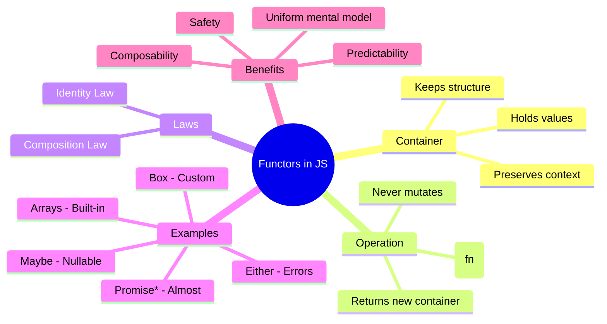
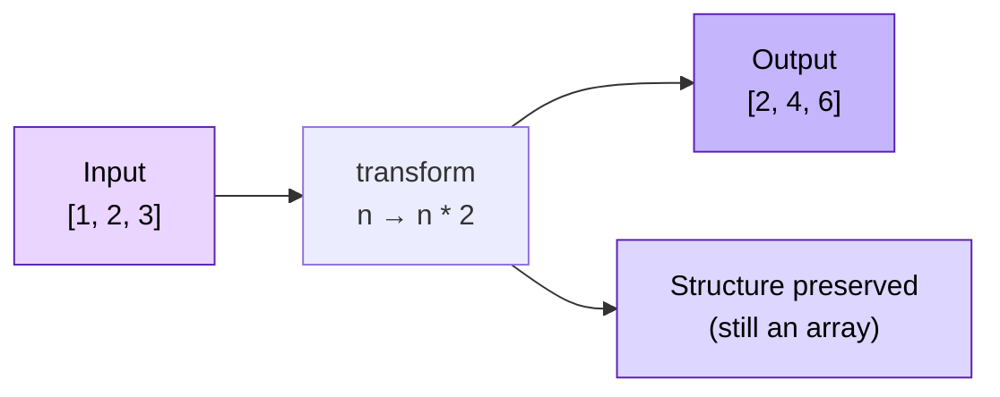
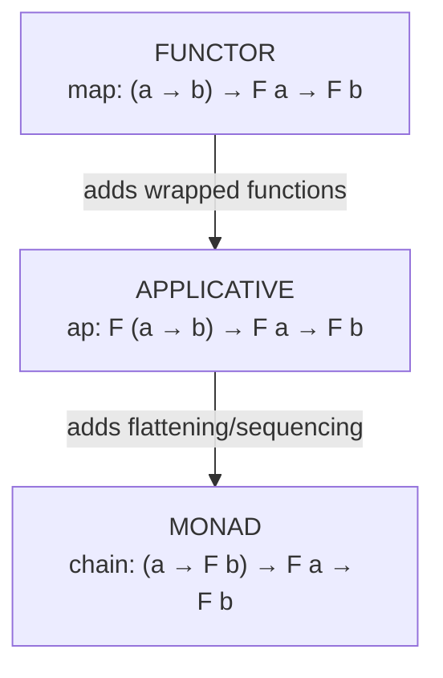

# Functors in JavaScript: From `Array.map()` to Custom Functors — The Complete Practical Tutorial

> **Subtitle:** The functional concepts you're avoiding are hiding in plain JavaScript.

---

| Metadata | Value |
|---|---|
| **Difficulty** | 🟡 Intermediate |
| **Estimated Reading Time** | 45 minutes |
| **Last Updated** | 2026-08-16 |
| **Prerequisites** | JavaScript ES6+, array methods, basic promise familiarity |
| **Categories** | Functional Programming, JavaScript, Design Patterns |

---

## Table of Contents

1. [Introduction / Overview](#introduction--overview)
2. [Prerequisites](#prerequisites)
3. [Learning Objectives](#learning-objectives)
4. [The Functor Concept, Demystified](#the-functor-concept-demystified)
5. [Arrays as Functors — Step-by-Step](#arrays-as-functors--step-by-step)
6. [The Functor Laws](#the-functor-laws)
7. [Build Your Own `Box` Functor](#build-your-own-box-functor)
8. [Handling Emptiness: The `Maybe` Functor](#handling-emptiness-the-maybe-functor)
9. [Almost-Functors in JavaScript](#almost-functors-in-javascript)
10. [Real-World Use Cases](#real-world-use-cases)
11. [Beyond Functors: A Glimpse of Applicatives and Monads](#beyond-functors-a-glimpse-of-applicatives-and-monads)
12. [Best Practices](#best-practices)
13. [Anti-Patterns](#anti-patterns)
14. [Performance Considerations](#performance-considerations)
15. [Security Considerations](#security-considerations)
16. [Testing Strategies](#testing-strategies)
17. [Troubleshooting / Common Pitfalls](#troubleshooting--common-pitfalls)
18. [Summary / Key Takeaways](#summary--key-takeaways)
19. [Practice Exercises with Solutions](#practice-exercises-with-solutions)
20. [Test Your Understanding](#test-your-understanding)
21. [Common Interview Questions](#common-interview-questions)
22. [Question Bank](#question-bank)
23. [Self-Assessment Checklist](#self-assessment-checklist)
24. [Further Reading / Resources](#further-reading--resources)

---

## Introduction / Overview

You ever hear someone say "functor" and immediately feel like they were trying to make you feel stupid?

**Same.**

I used to flinch at functional jargon. Monads, functors, endofunctors — it all sounded like a cruel inside joke from a CS professor who never had to debug production code at 2 AM. I figured it wasn't for me. Not for real devs.

But then one day, I read what a functor actually is. And I laughed. Out loud.

Because it turns out… you've been using them for years.

Let me guess — you've written something like this?

```javascript
const nums = [1, 2, 3];
const doubled = nums.map(n => n * 2);
```

**Boom. That's it. That's a functor in action.**

This tutorial is a comprehensive deep dive into functors in JavaScript. We'll start with the comfort of `Array.prototype.map()`, deconstruct exactly why it qualifies as a functor, prove the mathematical laws with real code, then build our own custom functors (`Box`, `Maybe`, and a preview of `Either`) from scratch.

By the end, you won't just know what a functor is — you'll *see* the hidden architecture of clean code everywhere you look.

### Why This Topic Matters (2026 Context)

| Reality | Why It Matters |
|---|---|
| JavaScript now has native `Array.prototype.flatMap` (ES2019) and `Object.groupBy` (ES2024) | The language keeps absorbing functional patterns natively |
| FP libraries like `fp-ts`, `folktale`, and `ramda` are widely used in production | Understanding functors unlocks these libraries' mental models |
| Micro-frontends and state management systems (Redux Toolkit, Zustand) rely on predictable transformations | Functor laws guarantee transform predictability |
| AI coding assistants generate `.map()` pipelines constantly | You must be able to *reason about* the code they emit |

> 💡 **Key Insight:** Once you understand that `.map()` is not just a convenience but a manifestation of a pattern, you see the hidden architecture of clean code. You stop fearing abstractions, you spot bugs faster, and you write more composable code.

---

## Prerequisites

To get the most out of this tutorial, you should be comfortable with:

- ✅ Modern JavaScript syntax (ES6+): arrow functions, `const`/`let`, template literals
- ✅ Array methods: `map()`, `filter()`, `reduce()`
- ✅ Basic understanding of objects and functions as first-class citizens
- ✅ A Node.js environment (v18+) or browser console to run the examples
- ✅ (Nice-to-have) Basic understanding of `Promise` and `.then()`

> ⚠️ **Warning:** If you've never written `.map()` in your life, first spend 10 minutes with [MDN's Array.prototype.map()](https://developer.mozilla.org/en-US/docs/Web/JavaScript/Reference/Global_Objects/Array/map), then come back.

---

## Learning Objectives

By the end of this tutorial, you will be able to:

| # | Objective |
|---|---|
| 1 | Define a functor in plain, non-academic language |
| 2 | Explain why arrays qualify as functors in JavaScript |
| 3 | Write and verify the two functor laws (identity & composition) in code |
| 4 | Build a custom `Box` functor from scratch |
| 5 | Build a `Maybe` functor to safely handle nullable values |
| 6 | Identify "almost-functors" in JavaScript (Objects, Promises, Sets) |
| 7 | Apply functor patterns to real-world data pipelines |
| 8 | Recognize when to use functors vs. when to avoid over-engineering |
| 9 | Test functor implementations using property-based testing principles |

---

## The Functor Concept, Demystified

### The Academic Definition, Distilled

> **A functor is a structure you can map over.**

That's it. All the fear mongering is just that — fear.

A functor, in practical terms:

1. **Holds** a value (or values), and
2. **Allows** you to apply a function to those values, and
3. **Preserves** the structure (or *context*) while transforming the content.

In math, it maps between categories while preserving structure. But for JavaScript, "a structure you can map over" captures everything you need.

### The Feynman Explanation

If you can't explain it simply, you don't understand it well enough. Here is the simplest version:

> A functor is like a **labeled box** that contains something. You don't take the thing out and mess with it directly; instead, you instruct the box to apply a function to its contents, and it hands you back a **new box** with the transformed contents inside.

```
Original box              New box
┌─────────────┐  map(x2)  ┌─────────────┐
│  value: 3   │ ────────►  │  value: 6   │
└─────────────┘           └─────────────┘
      structure                structure
      preserved                preserved
```

In JavaScript, the "box" is often an array. The "function" is the map callback. The "new box" is the resulting array.

### Functor Concept Map



> 💡 **Key insight:** A functor in JavaScript is primarily about `.map()`. If a type of value lets you `.map()` over it and always returns a value of the **same structure**, it is a functor.

---

## Arrays as Functor: A Step-by-Step Walkthrough

Let's slow down and really walk through *why* arrays are functors.

### 5.1 Step 1: An array is a container

```javascript
// An array is a "container" that holds zero or more values
const nums = [1, 2, 3];       // a box holding 3 values
const empty = [];             // a box holding nothing
const strings = ["a", "b"];   // a box holding 2 values
```

### 5.2 Step 2: Calling `.map(fn)`

```javascript
const nums = [1, 2, 3];
const doubled = nums.map(n => n * 2);

console.log(doubled); // [2, 4, 6]
```

### 5.3 Step 3: The structure is preserved

The output `[2, 4, 6]` is **still an array**, just with transformed values. The "array-ness" stays intact. Let's prove it:

```javascript
const nums = [1, 2, 3];
const doubled = nums.map(n => n * 2);

console.log(Array.isArray(doubled)); // true — the structure (array) is preserved
console.log(nums.length);            // 3    — the original is untouched
console.log(doubled.length);        // 3    — the length is preserved
```

### 5.4 Step 4: In functional terms

> Arrays **preserve the context** while **transforming the content**.

- Context = the "array-ness" (list structure)
- Content = the values inside

### 5.5 Step 5: `map()` does NOT mutate

One of the most important functor properties: `.map()` doesn't mutate the original array.

```javascript
const nums = [1, 2, 3];
const doubled = nums.map(n => n * 2);

console.log(nums);    // [1, 2, 3] — untouched
console.log(doubled); // [2, 4, 6] — new array
```

### 5.6 Step 6: What `map` really does under the hood

```javascript
// A hand-rolled map — the same behavior as Array.prototype.map
function myMap(array, fn) {
  const result = [];
  for (let i = 0; i < array.length; i++) {
    result.push(fn(array[i]));
  }
  return result; // always returns an array of the same length
}

const nums = [1, 2, 3];
const doubled = myMap(nums, n => n * 2);
console.log(doubled); // [2, 4, 6]
```

Note how the implementation:

1. Creates a **new** array (structure preserved)
2. Iterates over each item (content transformed)
3. Doesn't touch the original array (immutability)

### Visualizing the mapping flow



---

## The Functor Laws (With Code Proofs)

For a structure to truly be a **functor** (not just a "map-like thing"), it must obey **two laws**. These are provable properties, not optional conventions.

### 6.1 Law 1: Identity Law

**Statement:** Mapping with the identity function (`x => x`) must return a structure that is equivalent to the original.

```text
map(id) ≡ id
```

In JavaScript:

```javascript
const { cloneDeep } = require("lodash"); // or use structuredClone()

const identity = (x) => x;

const nums = [1, 2, 3];
const result = nums.map(identity);

console.log(result); // [1, 2, 3]
console.log(JSON.stringify(result) === JSON.stringify(nums)); // true
```

Why it matters: If mapping with the identity function changed the structure, `map` would be untrustworthy. This law guarantees `map` is structure-preserving.

### 6.2 Law 2: Composition Law

**Statement:** Mapping with `f`, then mapping with `g`, must be equivalent to mapping once with the composed function `g ∘ f` (i.e., `g(f(x))`).

```
map(f).map(g) ≡ map(g ∘ f)
```

In JavaScript:

```javascript
const nums = [1, 2, 3];

const f = (n) => n * 2;
const g = (n) => n + 1;

// Option A: two sequential maps
const sequential = nums.map(f).map(g);

// Option B: one map with composed function (f first, then g)
const composed = nums.map(n => g(f(n)));

console.log(JSON.stringify(sequential)); // [3, 5, 7]
console.log(JSON.stringify(composed));   // [3, 5, 7]
```

The two laws hold trivially for arrays in JavaScript because `Array.prototype.map` always returns an array. But when you **design your own functor**, you must ensure these laws hold manually.

### 6.3 Why the laws matter in practice

| Law | Practical implication in code |
|---|---|
| Identity | You can safely add no-op transformations without corrupting data |
| Composition | You can break a complex mapping into smaller, composable steps without changing the result |
| Both | Refactoring is safe: merging `.map(f).map(g)` into `.map(g ∘ f)` gives identical results |

> 💡 **Pro Tip:** When a functor obeys these laws, you can **refactor safely**. Whether you merge two `map` steps into one or split one into two, the result is identical. That is the superpower.

---

## Build Your Own `Box` Functor — The Classic Example

Let's build a functor from scratch. This is the piece that unlocks everything else.

### 7.1 The `Box` constructor

```javascript
/**
 * A minimal functor: an immutable wrapper around a single value.
 *
 * - map()  :: Box(a) ~> (a → b) → Box(b)
 * - fold() :: Box(a) ~> (a → b) → b
 */
const Box = (value) => ({
  map: (fn) => Box(fn(value)),
  fold: (fn) => fn(value),
});
```

### 7.2 Using it

```javascript
const result = Box(3)
  .map(x => x + 1)   // Box(4)
  .map(x => x * 2)   // Box(8)
  .fold(console.log); // prints 8
```

Let's trace exactly what happens:

1. `Box(3)` wraps the value `3`.
2. `.map(x => x + 1)` applies `3 + 1 = 4` and wraps `4` → `Box(4)`.
3. `.map(x => x * 2)` applies `4 * 2 = 8` and wraps `8` → `Box(8)`.
4. `.fold(console.log)` pulls the value `8` out and passes it to `console.log`.

The return value of each `.map` is another `Box`, which is what enables chaining.

### 7.3 Verify the functor laws for `Box`

```javascript
const Box = (value) => ({
  map: (fn) => Box(fn(value)),
  fold: (fn) => fn(value),
  toString: () => `Box(${value})`,
});

const identity = (x) => x;
const f = (x) => x + 1;
const g = (x) => x * 2;

// Identity law
const a = Box(5).map(identity);           // Box(5)
console.log(a.toString());                // Box(5)

// Composition law
const c = Box(5).map(f).map(g);           // Box(12)
const d = Box(5).map(x => g(f(x)));       // Box(12)
console.log(c.toString(), d.toString());  // Box(12) Box(12)
```

> 💡 **Pro Tip:** The distinguishing feature of `Box` is that `map` returns a `Box` *again*. A broken implementation that returns a raw value would break the functor laws — and your chain.

---

## Handling Emptiness: The `Maybe` Functor

`null` and `undefined` are the source of the biggest class of JavaScript bugs in production. The `Maybe` functor is the elegant answer to that problem.

### 8.1 The problem it solves

Have you ever written nested null checks like this?

```javascript
const user = findUserById(42);

if (user !== null && user !== undefined) {
  const account = user.account;
  if (account !== null && account !== undefined) {
    return account.balance.toFixed(2);
  }
}
return "N/A";
```

Yes. We all have. `Maybe` replaces this with a single chain of `.map` calls.

### 8.2 The `Maybe` constructor

```javascript
/**
 * Maybe is a functor with two states:
 *   - Just(value) : wraps a present, non-null value
 *   - Nothing()   : represents absence (null/undefined)
 *
 * map() works on both states:
 *   - Just    -> applies the function, wraps result in Just
 *   - Nothing -> skips the function entirely, stays Nothing
 */
const Maybe = {
  // Just constructor
  Just: (value) => ({
    map: (fn) => Maybe.Just(fn(value)),          // apply the function
    isNothing: false,
    getOrElse: (_default) => value,              // existing value wins
    orElse: (_fallback) => Maybe.Just(value),    // existing value wins
    toString: () => `Just(${value})`,
  }),

  // Nothing constructor
  Nothing: () => ({
    map: () => Maybe.Nothing(),                   // skip the function
    isNothing: true,
    getOrElse: (defaultValue) => defaultValue,    // fall back to default
    orElse: (fallback) => fallback,               // fall back to another Maybe
    toString: () => "Nothing",
  }),

  // Factory: real value -> Just, null/undefined -> Nothing
  of: (value) =>
    value === null || value === undefined
      ? Maybe.Nothing()
      : Maybe.Just(value),
};

const Just = Maybe.Just;
const nothing = Maybe.Nothing;
const maybeOf = Maybe.of;
```

### 8.3 The payoff: safe property access

```javascript
const getBalanceLabel = (user) =>
  maybeOf(user)                         // Maybe(User) or Nothing
    .map(u => u.account)                // Maybe(Account) / Nothing
    .map(a => a.balance)                // Maybe(Number) / Nothing
    .map(b => b.toFixed(2))             // Maybe(String) / Nothing
    .getOrElse("N/A");                  // finally unwrap with fallback

// When data exists
const alice = { account: { balance: 1999.5 } };
console.log(getBalanceLabel(alice)); // "1999.50"

// When data is missing at ANY step
console.log(getBalanceLabel(null));              // "N/A"
console.log(getBalanceLabel({}));                // "N/A" (account is undefined)
console.log(getBalanceLabel({ account: null })); // "N/A"
```

**The beauty:** No `if` checks. No `&&` chains. The `map` chain is declarative, and `Nothing` short-circuits the rest of the pipeline — the functions are never even called.

### 8.4 Is `Maybe` a proper functor? Yes.

```javascript
const f = (x) => x + 1;
const g = (x) => x * 10;
const nothing = Maybe.Nothing;

// Identity: map(id) does nothing
console.log(Just(5).map(x => x).toString());            // Just(5)

// Composition: map(f).map(g) === map(g ∘ f)
console.log(Just(5).map(f).map(g).toString());          // Just(12)
console.log(Just(5).map(x => g(f(x))).toString());      // Just(12)

// Nothing identity naturally holds because map is skipped
console.log(nothing().map(f).toString());               // Nothing
```

> ⚠️ **Note:** This version of `Maybe` does not yet include `flatMap`/`chain` — that's the bridge to *monads*, covered in Section 11.

---

## Almost-Functors in JavaScript

Most things in JavaScript are *almost* functors… but not quite. This is why we build dedicated functor types.

| Structure | Has `.map`? | Auto-preserves structure? | Proper functor? | Why not? |
|---|---|---|---|---|
| **Array** | ✅ | ✅ same length | ✅ Yes | — |
| **Box (custom)** | ✅ | ✅ | ✅ Yes | — |
| **Maybe (custom)** | ✅ | ✅ | ✅ Yes | — |
| **Object** | ❌ No native | ❌ | ❌ | No `.map` method; use `Object.fromEntries` + `Object.entries` helpers |
| **Set** | ❌ No native | ❌ | ❌ | Could build a wrapper |
| **Map** | ❌ No native | ❌ | ❌ | Keys and values complicate structure preservation |
| **Promise / `.then`** | 🔸 Similar | ❌ Flattens | ❌ "Almost" | `.then()` unwraps nested Promises (monadic behavior) |
| **String** | ✅ Indirect | — | ❌ | Has no `.map`; convert via `Array.from(str)` |
| **null / undefined** | ❌ Impossible | — | ❌ Nothing to map | You build `Maybe` to handle this |

### 9.1 Objects — no native `.map`

```javascript
const obj = { a: 1, b: 2, c: 3 };

// Objects don't have a `.map` method:
obj.map; // undefined
```

Map over an object's values by converting to entries first:

```javascript
const objectMap = (obj, fn) =>
  Object.fromEntries(
    Object.entries(obj).map(([key, value]) => [key, fn(value, key)])
  );

console.log(objectMap({ a: 1, b: 2 }, x => x * 10)); // { a: 10, b: 20 }
```

### 9.2 Promises — the "almost" functor

```javascript
const p = Promise.resolve(3);
p.then(x => x + 1); // returns a NEW promise wrapping 4
```

So close. But there's a subtle difference from `.map`:

| | `Array.map` | `Promise.then` |
|---|---|---|
| Container | Array | Promise |
| Return of callback kept? | Always wrapped | Flattened if the callback returns a Promise |
| Structure preserved? | Yes, always array | Not if nested Promises |

```javascript
const p = Promise.resolve(3);
const nested = p.then(x => Promise.resolve(x + 1));

// `nested` resolves to 4 — NOT a Promise wrapping another Promise.
// This is flattening: monadic behavior, not pure functor behavior.
```

- Functor: `map` does not flatten.
- Monad: `chain`/`flatMap` flattens nested containers.

### 9.3 Nullables — you have to write checks

Until you build `Maybe`, every nullable access is a chain of guards:

```javascript
// ❌ Without Maybe (painful)
function getUsername(user) {
  if (user && user.profile && user.profile.name) {
    return user.profile.name;
  }
  return "Unknown";
}

// ✅ With Maybe (see Section 8)
const getUsername = (user) =>
  maybeOf(user)
    .map(u => u.profile)
    .map(p => p.name)
    .getOrElse("Unknown");
```

### 9.4 The real-world implication

Most JavaScript libraries stop at "array-only functors". But validation pipelines, form handling, configuration loading, and API response shaping all benefit hugely from uniform mapping semantics provided by custom functors like `Maybe`.

---

## Real-World Use Cases

### 10.1 Use case 1: Data transformation pipelines

Imagine you are a frontend developer transforming an API response into a shape your UI needs:

```javascript
// Raw API payload
const apiResponse = {
  data: [
    { id: 1, title: "SwiftUI", author: "Alice" },
    { id: 2, title: "The Cat", author: "Bob" },
  ],
};

// Functor mapping (structure preserved)
const viewModels = apiResponse.data
  .map(article => ({
    id: article.id,
    title: article.title.toUpperCase(),
    authorName: article.author ?? "Unknown",
  }))
  .map(vm => ({
    ...vm,
    slug: vm.title.toLowerCase().replace(/[\s:]+/g, "-"),
  }));

console.log(viewModels);
/*
[
  { id: 1, title: "ARTICLES", authorName: "Alice", slug: "articles" },
  { id: 2, title: "THE CAT", authorName: "Bob", slug: "the-cat" }
]
*/
```

**Why this beats a `forEach` with a push builder?** Readability, predictability, and safety (no mutation).

### 10.2 Use case 2: Form validation with Maybe

```javascript
const safeParseEmail = (input) =>
  typeof input === "string" && /^[^@]+@[^@]+\.[^@]+$/.test(input.trim())
    ? maybeOf(input.trim())
    : maybeOf(null);

// Validation pipeline
const emailResult = maybeOf(formFields.email) // Maybe
  .map(e => e.toLowerCase());

emailResult.getOrElse("Invalid email or empty value");
```

### 10.3 Use case 3: Composable arithmetic pipelines

```javascript
const priceCents = 1999;

const finalPrice = Box(priceCents)
  .map(cents => cents / 100)            // dollars: 19.99
  .map(amount => amount * 0.9)          // 10% discount → 17.99
  .map(discounted => discounted + 5.99) // + shipping → 23.98
  .fold(amount => amount.toFixed(2));

console.log(`Total: $${finalPrice}`); // Total: $23.98
```

### 10.4 Use case 4: Configuration loading

```javascript
const loadConfig = (env) =>
  env
    .map(url => new URL(url))
    .map(url => ({
      baseUrl: url.origin,
      pathname: url.pathname,
    }))
    .getOrElse({ baseUrl: "", pathname: "/" });

console.log(loadConfig(maybeOf("https://api.example.com/v1")));
// { baseUrl: 'https://api.example.com', pathname: '/v1' }
```

### 10.5 Case study: Where functors live under the hood in production

| Library / Tool | How functors show up |
|---|---|
| **Redux Toolkit** | Selectors map over state slices; immutable updates via functional pipelines |
| **fp-ts** | Built entirely on functors, applicatives, and monads (`Option`, `Either`) |
| **Ramda / Sanctuary** | Curried functional transforms; the map/filter/reduce pipeline relies on functor laws |
| **RxJS (Optional)** | `map` operators over observables — observables are functors too |

---

## Beyond Functors: A Glimpse of Applicatives and Monads

This tutorial is about functors, but putting them on the "functional ladder" gives you context.



| Stage | Allowed | JavaScript example |
|---|---|---|
| **Functor** | `map` over a structure | `Array.map`, `Box.map` |
| **Applicative** | `ap` — functions wrapped inside the structure | Not native; libraries implement it |
| **Monad** | `flatMap`/`chain` — flattens nested structures | `Promise.then`, `Array.flatMap` |

Once you grasp functors, you're literally one step away from applicatives and two steps from monads.

---

## Best Practices

### 12.1 Keep `map` pure — no side effects

❌ **Don't:** mutate external state inside `map`.

```javascript
let total = 0;
prices.map(p => { total += p; /* side-effect — bad */ });
```

✅ **Do:** keep `map` pure, and use `reduce` when fan-out is the intent.

```javascript
const prices = [10, 20, 30];
const total = prices.reduce((acc, p) => acc + p, 0);
```

### 12.2 Never return raw values from `Box.map`

`Box.map` must return `Box(...)` to preserve the chain.

```javascript
// ❌ Bad: map returns a raw value
const Broken = (value) => ({
  map: (fn) => fn(value), // returns 2, not Box(2)
});
Broken(1).map(x => x + 1).map(x => x * 2); // TypeError: .map is not a function

// ✅ Good: keep the structure
const Box = (value) => ({
  map: (fn) => Box(fn(value)), // returns Box again
});
```

### 12.3 Preserve the functor laws — always

- Test the identity and composition laws for every custom functor (see Section 16).
- `map` should return a **new structure**, not mutate the original.

### 12.4 Choose the right abstraction — and don't overengineer

- Use `Maybe` only when you care about presence/absence of a value.
- Use `Either` when you need error details (Left = error, Right = success).
- Don't build a custom functor if a simple `Array.map` does the job.

```javascript
// Preview of Either — a functor that communicates failures
const Right = (value) => ({
  map: (fn) => Right(fn(value)),
  fold: (_, onRight) => onRight(value),
});

const Left = (err) => ({
  map: () => Left(err),
  fold: (onLeft) => onLeft(err),
});
```

---

## Anti-Patterns

More common mistakes and how to avoid them:

### 13.1 Calling `map` with side effects

```javascript
// ❌ Anti-pattern
[1, 2, 3].map(num => console.log(`${num} processed`));

// ✅ Use `forEach` for side effects
[1, 2, 3].forEach(num => console.log(`${num} processed`));
```

`map` is for transformation. If you don't use the return value, prefer `forEach`.

### 13.2 Assuming `map` treats holes and `undefined` the same

```javascript
// ❌ Holes are a real trap
const sparse = [1, , 3];
console.log(sparse.map(x => x * 2)); // [2, empty, 6]

// ✅ Be explicit about values
const dense = [1, undefined, 3];
console.log(dense.map(x => (x ?? 0) * 2)); // [2, 0, 6]
```

### 13.3 Thinking `Promise.then` is exactly a functor map

```javascript
// ❌ It flattens — that's monadic, not functor map
Promise.resolve(1).then(() => Promise.resolve(2)); // → resolves to 2, not Promise<Promise<2>>

// ✅ If you want functor-like map over Promises, remember they flatten by design.
```

### 13.4 Deeply nested functors without `flatMap`

```javascript
// ❌ Accumulating nesting by accident
const nested = [[1, 2], [3, 4]].map(inner => inner.map(x => x + 1));
// [[2, 3], [4, 5]]

// ✅ When you want a flat result use flatMap
const flat = [1, 2, 3, 4].flatMap(x => [x, x * 2]);
// [1, 2, 2, 4, 3, 6, 4, 8]
```

### 13.5 Extracting with `fold` without a function

```javascript
// ❌ fold expects a function
const x = Box(42).fold(); // TypeError: fn is not a function

// ✅ Provide a function
const x = Box(42).fold(v => v); // 42
```

---

## Performance Considerations

Custom functors add a small abstraction overhead. Measure and reason about hot code.

### 14.1 `Array.map` is fast — custom wrappers are slower

```javascript
const arr = Array.from({ length: 1_000_000 }, (_, i) => i);

// Baseline: direct for-loop (fastest)
let out1 = new Array(arr.length);
for (let i = 0; i < arr.length; i++) {
  out1[i] = arr[i] * 2;
}

// Built-in map (highly optimized JIT method)
const out2 = arr.map(n => n * 2);

// Custom Box per element — intentionally slow for demonstration only
const Box = (v) => ({ map: (fn) => Box(fn(v)) });
const out3 = arr.map(n => Box(n).map(x => x * 2).fold(v => v));
```

> 📊 On V8/SpiderMonkey, the `for` loop is usually fastest, built-in `map` is within ~2-3&times; of it, and per-element custom functor is significantly slower — **don't use it in hot loops**.

### 14.2 Key performance rules

1. **Use built-in `Array.prototype.map` first.** It's JIT-optimized and battle-tested.
2. **Be mindful of allocations.** Each `.map()` allocates a new array. `arr.map(f).map(g)` allocates **two** arrays; `arr.map(x => g(f(x)))` allocates **one**.
3. **Chained maps vs. one pass.** Optimize only when profiling shows a bottleneck; small arrays don't care.
4. **Custom functors (`Box`, `Maybe`) cost a function call per mapping** — fine for business logic, avoid in inner loops.

```javascript
// Equivalent transformations
const r1 = data.map(f).map(g);       // two arrays allocated
const r2 = data.map(x => g(f(x)));   // one array allocated
```

> 💡 **Pro Tip:** Unless the data set is huge and profiling proves it's hot, prefer readability (`r1`) over micro-optimization (`r2`).

---

## Security Considerations

Even a tiny abstraction like `map` has security implications when handling untrusted data.

### 15.1 Validate untrusted input at the boundaries

Never blindly `map` over external API / user input without schema validation.

```javascript
// ✅ Sanitize inputs within the map
const safeUser = maybeOf(rawUser)
  .map(u => ({
    id: Number(u.id),
    name: String(u.name).slice(0, 100),
    email: String(u.email).toLowerCase(),
  }))
  .getOrElse(null);

// ❌ Propagating raw user-supplied structures wholesale
app.get("/user", (req, res) =>
  res.json(rawUser.map(u => ({ id: u.id, ...u.raw }))) // mass-assignment risk
);
```

### 15.2 Do not run untrusted code inside `map`

```javascript
// ❌ DO NOT evaluate user-controlled strings inside a map callback
const userInputCode = req.query.code;
data.map(x => new Function("x", userInputCode)(x));
```

### 15.3 Avoid prototype pollution when merging

```javascript
// ❌ Risky object spread — attacker-controlled keys can override
const merged = { ...rawUser, role: "viewer" };

// ✅ Safer: whitelist keys
const merged = { role: "viewer", id: Number(rawUser.id) };
```

### 15.4 Use `Either` to fail loudly instead of swallowing

`Maybe` swallows absence. For security logs and audit trails you often want `Either`, so you can *see* errors:

```javascript
const safeParse = (json) => {
  try {
    return Right(JSON.parse(json));
  } catch (err) {
    return Left(`Invalid JSON: ${err.message}`);
  }
};
```

---

## Testing Strategies

### 16.1 Unit-test the functor laws

```javascript
// test/box.test.js (using Jest as example)
const Box = (value) => ({
  map: (fn) => Box(fn(value)),
  fold: (fn) => fn(value),
  get: () => value,
});

describe("Box functor laws", () => {
  const id = (x) => x;
  const f = (x) => x + 1;
  const g = (x) => x * 3;

  test("Identity law: Box(x).map(id) = Box(x)", () => {
    expect(Box(42).map(id).get()).toBe(Box(42).get());
  });

  test("Composition law: .map(f).map(g) = .map(g ∘ f)", () => {
    const composed = (x) => g(f(x));
    expect(Box(10).map(f).map(g).get()).toBe(
      Box(10).map(composed).get()
    );
  });

  test("map does not mutate the original", () => {
    const source = Box(7);
    source.map(x => x + 1);
    expect(source.get()).toBe(7);
  });

  test("chaining works across multiple maps", () => {
    expect(Box(2).map(f).map(g).get()).toBe(9);
  });
});
```

### 16.2 Property-based testing with `fast-check`

```javascript
const fc = require("fast-check");
const { assert } = require("assert");

test("Functor composition law holds for random values", () => {
  fc.assert(
    fc.property(fc.integer(), (value) => {
      const f = (n) => n * 2;
      const g = (n) => n + 1;
      assert.strictEqual(
        Box(value).map(f).map(g).get(),
        Box(value).map(n => g(f(n))).get()
      );
    })
  );
});
```

### 16.3 Test `Maybe` short-circuiting

```javascript
test("Maybe stops on Nothing", () => {
  const result = maybeOf(undefined)
    .map(x => x + 1)   // skipped
    .map(x => x * 2)   // skipped
    .getOrElse("fallback");

  expect(result).toBe("fallback");
});

test("Maybe applies maps only if value exists", () => {
  expect(maybeOf(2).map(x => x * 10).getOrElse(0)).toBe(20);
});
```

### 16.4 Coverage expectations

Aim for **full branch coverage** of:

- `Box.map` — both value and function paths
- `Maybe.Just` and `Maybe.Nothing` branches
- `Either.Right` and `Either.Left` paths

---

## Troubleshooting / Common Pitfalls

### 💥 "TypeError: functor.map is not a function"

**Symptoms:** Calling `.map` on the result of a custom functor chain.

**Cause:** A function in your chain returned a raw value instead of a wrapped value.

```javascript
const Box = (x) => ({
  map: (fn) => fn(x), // ❌ returns a raw value
});
Box(1).map(x => x + 1).map(x => x * 2); // TypeError
```

**Fix:** Ensure `map` always returns a wrapped structure.

```javascript
const Box = (x) => ({
  map: (fn) => Box(fn(x)), // ✅ returns new Box
});
```

### 🧨 `Maybe` is not a built-in

**Symptom:** `Maybe.Just(1)` is undefined in a fresh Node.js environment.

**Cause:** `Maybe` is a custom type, not a JavaScript built-in.

**Fix:** Use a library like `fp-ts` (`import { some, none } from 'fp-ts/Option'`) or define your own (as in Section 8).

### 🌫️ Calling `.map` on `null` or `undefined`

```javascript
// ❌
const maybeArr = null;
maybeArr.map(x => x); // TypeError: Cannot read properties of null

// ✅ Wrap first
const safeArr = maybeArr ?? [];
safeArr.map(x => x);
```

### ⚠️ Flat vs nested surprises

```javascript
const numbers = [1, 2, 3];

// push — this creates nesting
const mappedNested = numbers.map(n => [n, n * 2]);
// [[1, 2], [2, 4], [3, 6]]

// If you want flat output, use flatMap
const flat = numbers.flatMap(n => [n, n * 2]);
// [1, 2, 2, 4, 3, 6]
```

### 🌉 Async functors?

Async requires Promise-based adapters with a `Thenable`-aware wrapper, but you'll quickly run into `.then`'s monadic flattening. Prefer explicit Promises + functional helpers (e.g., `Promise.all` with `.map`) for async control flow.

---

## Summary / Key Takeaways

- A functor is just a **structure you can map over** without changing the structure.
- **Arrays are the canonical functor in JavaScript** — you've been using them for years.
- A proper functor must satisfy:
  - **Identity law:** `map(x => x)` ✓ same structure
  - **Composition law:** `map(f).map(g)` ✓ `map(g ∘ f)`
- `map()` doesn't mutate, doesn't flatten, and doesn't bail — making transformations safe and predictable.
- You can build your own `Box` (single value) and `Maybe`/`Option` (handles nulls gracefully).
- **Almost-functors** (Object, Promise, Set) can be turned into real functors with wrappers/helpers.
- Functors are just the doorway to the functional ladder: **Functor → Applicative → Monad**.

### Quick Recap

Without looking back, can you:

1. Define a functor in one sentence?
2. Name the two functor laws?
3. Implement a 10-line `Box` functor?
4. Explain why `.then` is "almost" a functor?
5. Name a real-world scenario where you'd use `Maybe`?

If you can, you're ready for the exercises.

---

## Practice Exercises

### Exercise 1: Implement the `Identity` functor (Easy)

Implement a functor called `Identity` that wraps a single value.

Requirements:

- Takes a value in the constructor
- `.map(fn)` returns a new `Identity` wrapping `fn(value)`
- `.value()` returns the original value

**Solution:**

```javascript
function Identity(value) {
  return {
    map: (fn) => Identity(fn(value)),
    value: () => value,
  };
}

// Tests
console.log(Identity(5).map(x => x * 2).value());                          // 10
console.log(Identity(10).map(x => x ** 2).map(x => x + 1).value());        // 101
console.log(Identity("hello").map(s => s.toUpperCase()).value());          // "HELLO"
```

**Explanation:**

- `map` always returns `Identity(...)` so the chain remains unbroken.
- `value` is the "extraction" function (like `fold`, but simpler).
- The original value is never mutated.

---

### Exercise 2 — Build and use a `Maybe` (Medium)

**Problem:** Write a `Maybe` constructor (Just/Nothing style) that supports `map`. Then use it to **safely extract a nested value**:

```javascript
const user = { profile: { addresses: [{ city: "Hyderabad" }] } };
const getCity = /* your code here */;
console.log(getCity(user));      // "Hyderabad"
console.log(getCity(null));      // some default
console.log(getCity({ profile: {} })); // some default
```

**Solution:**

```javascript
const Maybe = {
  Just: (value) => ({
    map: (fn) => Maybe.Just(fn(value)),
    isNothing: false,
    getOrElse: () => value,
    toString: () => `Just(${value})`,
  }),
  Nothing: () => ({
    map: () => Maybe.Nothing(),
    isNothing: true,
    getOrElse: (def) => def,
    toString: () => "Nothing",
  }),
  of: (value) =>
    value === null || value === undefined
      ? Maybe.Nothing()
      : Maybe.Just(value),
};

const getCity = (user) =>
  Maybe.of(user)
    .map(u => u.profile)       // Maybe(profile) / Nothing
    .map(p => p.addresses)     // Maybe(addresses) / Nothing
    .map(a => a[0])            // Maybe(address) / Nothing
    .map(c => c.city)          // Maybe(city) / Nothing
    .getOrElse("Unknown");

console.log(getCity(user));              // "Hyderabad"
console.log(getCity(null));             // "Unknown"
console.log(getCity({ profile: {} })); // "Unknown"
```

**Note:** `Maybe.Nothing()` returns a function-invocation branch; as long as every `map` keeps wrapping, the chain stays valid.

---

### Exercise 3 — Verify functor laws with a `List` functor (Medium)

**Problem:** Write a functor `List` that wraps an array, then verify both functor laws on a few deterministic inputs.

**Solution:**

```javascript
const List = (items) => ({
  map: (fn) => List(items.map(fn)),
  toArray: () => [...items],
  get length() { return items.length; },
});

const f = (n) => n * 2;
const g = (n) => n + 10;

// Composition: map(f).map(g) === map(g ∘ f)
const compositionTest = (values) =>
  JSON.stringify(List(values).map(f).map(g).toArray()) ===
  JSON.stringify(List(values).map(n => g(f(n))).toArray());

// Identity: map(id) === id
const identityTest = (values) =>
  JSON.stringify(List(values).map(x => x).toArray()) ===
  JSON.stringify(List(values).toArray());

console.log(compositionTest([1, 2, 3]));     // true
console.log(compositionTest([]));            // true
console.log(compositionTest([-1, 0, 42]));   // true
console.log(identityTest([5, 6, 7]));        // true
```

**Explanation:** `List` is just array mapping wrapped in a custom type. Because it delegates to `Array.prototype.map` (which itself obeys the laws), composition and identity hold.

---

### Exercise 4 — Mini-project: `Either` functor for error handling (Advanced)

**Problem:** Implement a minimal `Either` (`Left` = error, `Right` = success). Requirements:

- `.map(f)` transforms the value if `Right`, ignores if `Left`.
- `.fold(onLeft, onRight)` extracts either branch.
- Use it to parse a JSON string and map the parsed result.

**Solution:**

```javascript
const Right = (value) => ({
  map: (fn) => Right(fn(value)),
  fold: (_, onRight) => onRight(value),
  toJSON: () => ({ ok: true, value }),
});

const Left = (err) => ({
  map: () => Left(err),          // ignore the function
  fold: (onLeft) => onLeft(err),
  toJSON: () => ({ ok: false, error: err }),
});

const tryParse = (fn) => {
  try {
    return Right(fn());
  } catch (err) {
    return Left(err);
  }
};

// Usage
const parse = (json) =>
  tryParse(() => JSON.parse(json))
    .map(data => ({ users: data.users ?? [], total: data.total ?? 0 }));

const ok = parse('{"users":[1,2],"total":2}');
const bad = parse('{invalid');

console.log(ok.fold(
  err => `Error: ${err.message}`,
  data => data
));
// { users: [1, 2], total: 2 }

console.log(bad.fold(
  err => `Error: ${err.message}`,
  data => data
));
// Error: Unexpected token i...
```

**Explanation:**

- `Left` short-circuits: maps are no-ops that propagate the error.
- `Right` behaves like a proper functor.
- `fold` lets you handle both branches explicitly — this is great for logging/audit requirement cases.

---

## Test Your Understanding

*Try to answer these before looking back at the tutorial.*

<details>
<summary>Show answers</summary>

1. **In one sentence, what is a functor?**
   — A structure you can map over, preserving the structure while transforming the contents.

2. **Do arrays satisfy the identity law?**
   — Yes — `[1,2,3].map(x => x)` returns `[1,2,3]`.

3. **What does the composition law guarantee?**
   — `map(f).map(g)` is equivalent to `map(g ∘ f)`.

4. **Which built-in JS structures are proper functors directly?**
   — Arrays (and strings only via `Array.from`).

5. **Why is a `Promise` "almost" a functor?**
   — `.then` flattens nested Promises — monadic behavior, not pure functor.

6. **What does `Maybe.Nothing().map(f)` do?**
   — Maps to `Nothing`, skipping `f` entirely.

7. **What is the purpose of `fold` in the `Box` example?**
   — It extracts the un-wrapped value.

8. **What's the danger if `map` returns a raw value?**
   — The chain breaks; you'll get `TypeError: `.map` is not a function` on the next call.

9. **Name a real-world use for functors.**
   — Transformation pipelines, validation chains, config parsing, API responses.

10. **What guarantees do functor laws give refactoring?**
    — Safe merging/splitting of map operations.
</details>

---

## 10 Common Interview Questions

**1. What is a functor?**
> A structure with a `map` method that preserves the structure while applying a function to its contents, and that respects the identity & composition laws.

**2. Is `Array.prototype.map` a functor?**
> Yes. It wraps values in an array, transforms them with a function, and always returns a new array — structure preserved.

**3. What are the two functor laws?**
> Identity: `map(id) === id`. Composition: `map(f).map(g) === map(g ∘ f)`.

**4. How is a functor different from a monad?**
> A functor only needs `map`. A monad additionally provides `flatMap`/`chain`, which flattens nested containers.

**5. Is a Promise a functor?**
> Not a pure one. `.then` is map-like but flattens returned Promises — that's monadic behavior.

**6. Why would you implement a custom `Box` functor?**
> To wrap values and enable uniform, compositional, predictable transformations without exposing the raw value.

**7. How do you handle null/undefined in a functorial way inside JS?**
> Use a `Maybe`/Option type (with `Nothing` that short-circuits).

**8. What is the difference between `.map` and `.flatMap`?**
> `map` keeps nested structure (`[[1]]`); `flatMap` flattens one level (`[1]`).

**9. How do you test a functor?**
> Test the laws (identity & composition) via unit or property-based tests, plus edge cases (`Nothing`/`Left` vs `Just`/`Right`).

**10. Is `Object` a functor?**
> Not natively — no `.map` method. But with helpers (`Object.entries`/`Object.fromEntries`) you can build one.

---

## Question Bank (50+ Questions)

### Level 1: Beginner

1. What method does an array need to call to be a functor? — **`.map()`**
2. What does `[1,2,3].map(x => x * 2)` return? — **`[2,4,6]`**
3. Does `.map(fn)` mutate the original array? — **No**
4. `Box(2).map(x => x + 3)` produces? — **`Box(5)`**
5. `Array.prototype.map` returns a new ____. — **array**
6. What function retrieves the value from `Box`? — **`fold`**
7. `.map` on an empty array returns? — **`[]`**
8. Which JS method checks if a value is an array? — **`Array.isArray()`**
9. What does `[1,2].map(x => x - 1)` produce? — **`[0,1]`**
10. Does `map` skip holes in arrays? — **Yes, it preserves holes**

### Level 2: Intermediate

11. State the identity law. — **`map(x => x)` == same structure**
12. State the composition law. — **`map(f).map(g) == map(x => g(f(x)))`**
13. Why does `Box(1).map(x => x + 1).map(x => x * 2)` give `Box(4)`? — **Value flows through each map**
14. How is `Just(5).map(f)` different from `Nothing().map(f)`? — **Just applies `f`; Nothing skips it**
15. In `Maybe`, what does `Nothing().getOrElse(d)` return? — **`d`**
16. What is the role of `fold`? — **Extract/unpack the value**
17. Why does composition matter for refactoring? — **You can merge/split `map` steps safely**
18. Is `Array.prototype.map` eager or lazy? — **Eager**
19. What's a benefit of composing transformations with `map`? — **Readable, predictable pipelines**
20. Name two built-ins that are NOT functors directly. — **Objects, Sets, Maps, Strings (native)**
21. What does `Promise.then` return? — **A new promise**
22. Why isn't `Promise.then` a pure functor map? — **It flattens nested promises**
23. What does `Maybe` hide/short-circuit? — **The absence of a value**

### Level 3: Intermediate

24. Write a functor laws test for `Box`. — **Use Jest like Section 16**
25. What is the difference between `map` and `flatMap`? — **`map` preserves nesting; `flatMap` flattens one level**
26. Which branch does `Either` map over? — **Only `Right`**
27. `[[1,2],[3,4]].map(inner => inner.map(f))` yields? — **Nested arrays with transformed elements**
28. Name a common 3-argument callback `.map` accepts. — **`(element, index, array)`**
29. How would you map over a `Map`? — **Convert to entries, map, rebuild**
30. Is a pure function always inside a `map`? — **It should be; side effects are anti-pattern**
31. If `map` returns a raw value, what breaks? — **The chain ends with a TypeError**
32. What is `flatMap` aliased as in FP libraries? — **`chain`**
33. In `Maybe.of(user).map(u => u.profile)`, if `user` is `null` what happens? — **You get `Nothing`**
34. Explain `Box(1).map(f).map(f).map(f)`. — **Each step applies and re-wraps**
35. Is `length` a functor? — **No, it's a property — structure vs behavior confusion**
36. Is `String.concat` a functor? — **No, it's a method that transforms strings, not a structure with `map`**
37. How does `.map` behave on sparse arrays? — **It keeps holes/empty slots**
38. Why would a project adopt `fp-ts`/`sanctuary`? — **Law-abiding, reliable functor/monad types**
39. Is `Object.freeze` useful in a functor design? — **Yes, for enforcing immutability**
40. How do you extract a value from `Maybe`? — **`getOrElse`, or `fold`**
41. What is the "context" in a functor? — **The container/packaging**
42. Does `.map()` guarantee no exceptions? — **No — if the callback throws, the exception propagates**
43. When should you not use a custom functor? — **When a simple `Array.map` suffices**

### Level 4: Advanced

44. Prove the identity law for `Box`. — **`Box(x).map(id) === Box(x)` by definition**
45. Prove the composition law for `Box`. — **`Box(x).map(f).map(g)` equals `Box(x).map(g ∘ f)`**
46. Is `null` a functor? — **No**
47. Implement a `Functor<A>` TypeScript interface. — **`interface Functor<A> { map<B>(f: (a: A) => B): Functor<B> }`**
48. Differentiate **Functor vs Applicative vs Monad**. — **map, apply, chain respectively**
49. When is `.for` loop faster than `map`? — **For hot/performance-heavy loops; for simplicity it rarely matters**
50. Combine `Maybe` with `ap` (applicative). — **See `fp-ts` Option.ap implementation**
51. What happens if `f` throws inside `Just.map`? — **The exception propagates; `Maybe` doesn't catch exceptions**
52. Implement `flatMap` for `Maybe`. — **`Just(v).flatMap(fn)` unwraps `fn(v)`; `Nothing` stays `Nothing`**
53. What is the equality problem with `map(id)` on simple objects? — **Reference/comparison equality, use a deep compare**

### Bonus

54. `[].map(n => n * 2)` === ? — **`[]`**
55. True or False: Chained maps produce an array of the same length as the source. — **True**

---

## Self-Assessment Checklist

### Before the tutorial

- [ ] I know what `Array.prototype.map` does
- [ ] I am comfortable with arrow functions
- [ ] I understand the difference between pure and impure functions

### After the tutorial

- [ ] I can explain "functor" in one sentence
- [ ] I can write the two functor laws from memory
- [ ] I can implement `Box` from scratch
- [ ] I've implemented `Maybe` (or used an `Option` library)
- [ ] I avoid side effects inside `map`
- [ ] I know when to use `flatMap`
- [ ] I can justify why `Promise` is "almost" a functor
- [ ] I've verified the functor laws through property tests
- [ ] I tried at least 2 of the practice exercises
- [ ] I can discuss functors confidently in a job interview

---

## Further Reading / Resources

- 📖 [Fantasy Land Specification](https://github.com/fantasyland/fantasy-land) — official spec for JS algebraic structures, including the functor laws
- 📖 [MDN: Array.prototype.map()](https://developer.mozilla.org/en-US/docs/Web/JavaScript/Reference/Global_Objects/Array/map)
- 📖 [MDN: Array.prototype.flatMap()](https://developer.mozilla.org/en-US/docs/Web/JavaScript/Reference/Global_Objects/Array/flatMap)
- 📖 [fp-ts documentation](https://gcanti.github.io/fp-ts/) — complete FP library for TypeScript, built upon functors
- 📖 [Professor Frisby's Mostly Enough Guide to Functional Programming](https://github.com/MostlyAdequate/mostly-adequate-guide) — the best free intro to functional JavaScript
- 📖 *Functional-Light JavaScript* by Kyle Simpson (book)
- 📖 *Category Theory for Programmers* by Bartosz Milewski — the functor chapters are classic
- 📖 [fast-check (property-based testing)](https://fast-check.dev/)

---

## Author Notes / License

> This tutorial was transformed from a concise article ("You Already Use Functors. They're Called Arrays.") into the comprehensive deep-dive per the knowledge-base tutorial preferences. All code examples are intended to run in a modern Node.js (v18+) or browser console.

**Last Updated:** 2026-08-16