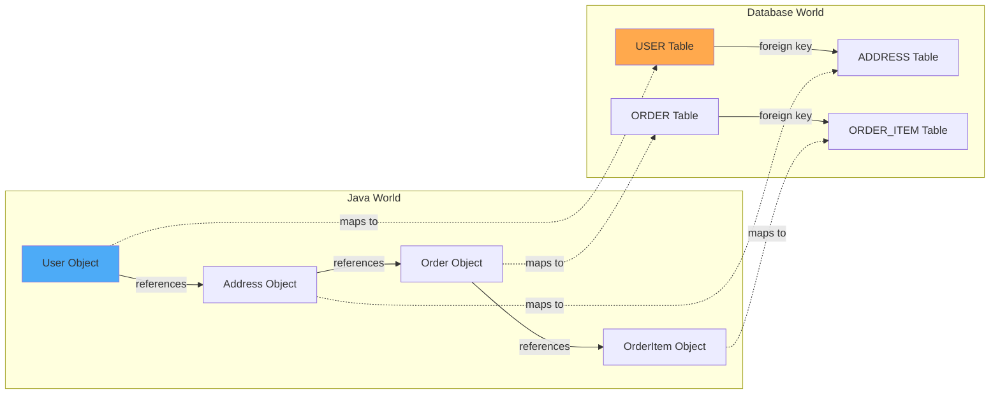
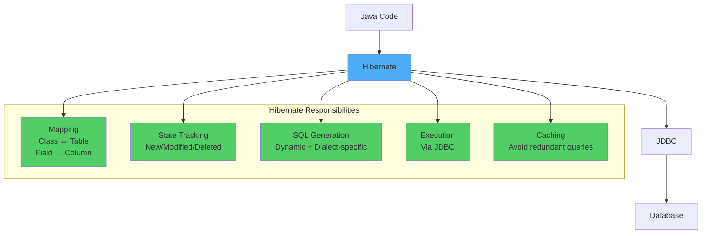
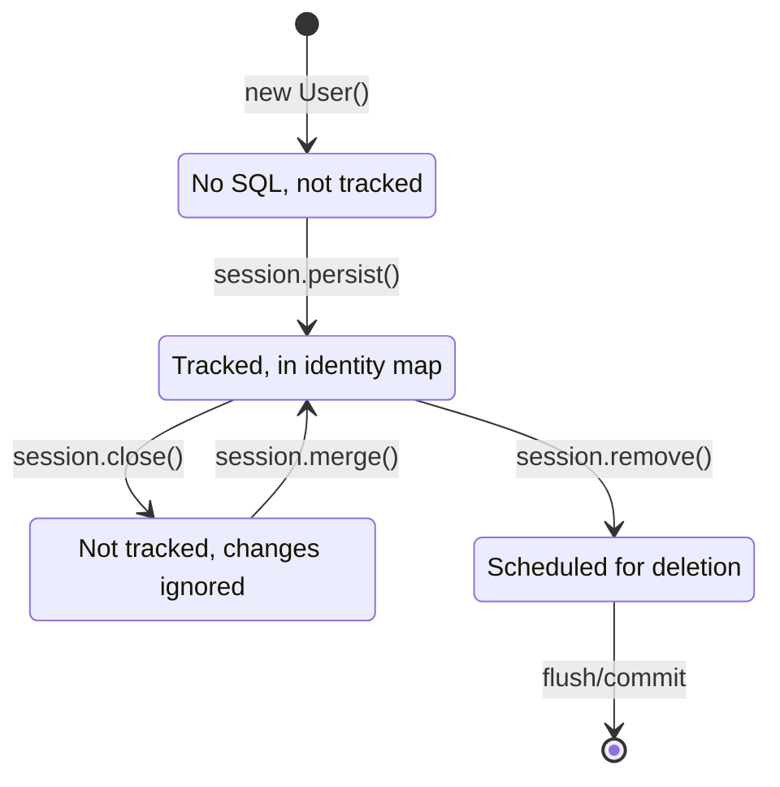
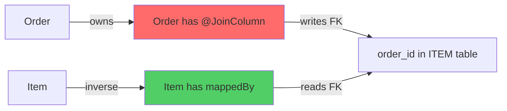
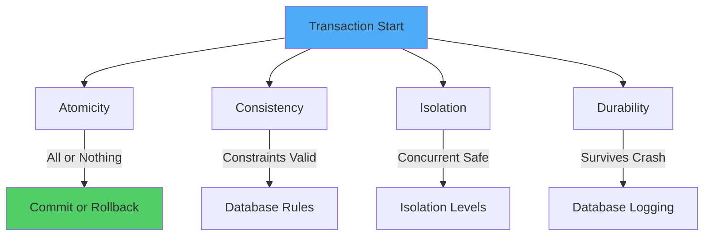
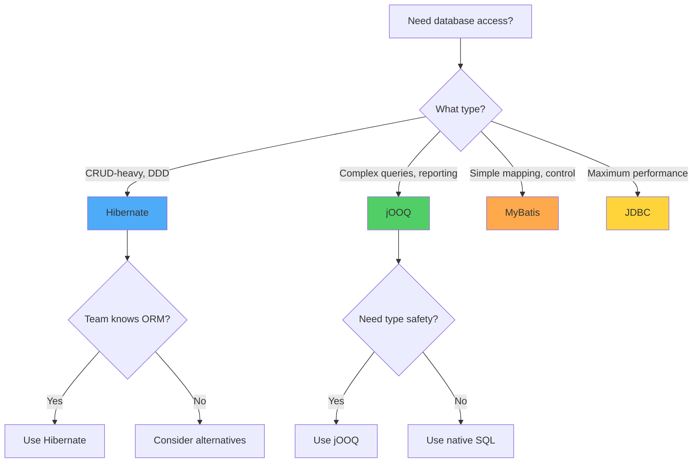

# Hibernate from Beginner to Master: A Complete Guide to ORM Internals, Performance, and Real-World Design

**Difficulty Level:** Intermediate to Advanced  
**Estimated Reading Time:** 60 minutes  
**Last Updated:** June 10, 2026  
**Category:** Backend Development / Java / ORM

---

## Table of Contents

1. [Introduction](#introduction)
2. [Prerequisites](#prerequisites)
3. [Learning Objectives](#learning-objectives)
4. [Phase 0: ORM & Hibernate Mental Model](#phase-0--orm--hibernate-mental-model)
5. [Phase 1: Core Architecture & Internals](#phase-1--core-architecture--internals)
6. [Phase 2: Mapping & Domain Modeling Mastery](#phase-2--mapping--domain-modeling-mastery)
7. [Phase 3: Fetching, Proxies & Query Behavior](#phase-3--fetching--proxies--query-behavior)
8. [Phase 4: Querying Deep Dive](#phase-4--querying-deep-dive)
9. [Phase 5: Transactions, Concurrency & Locking](#phase-5--transactions-concurrency--locking)
10. [Phase 6: Caching & Performance Engineering](#phase-6--caching--performance-engineering)
11. [Phase 7: Advanced Hibernate Features & Extensions](#phase-7--advanced-hibernate-features--extensions)
12. [Phase 8: Hibernate in Real Production Systems](#phase-8--hibernate-in-real-production-systems)
13. [Phase 9: Source Code Reading & Debugging Mastery](#phase-9--source-code-reading--debugging-mastery)
14. [Phase 10: Interview & Design-Level Mastery](#phase-10--interview--design-level-mastery)
15. [Comparative Analysis: ORM Technologies](#comparative-analysis-orm-technologies)
16. [Real-World Implementation Guide](#real-world-implementation-guide)
17. [Best Practices](#best-practices)
18. [Anti-Patterns](#anti-patterns)
19. [Performance Considerations](#performance-considerations)
20. [Security Considerations](#security-considerations)
21. [Testing Strategies](#testing-strategies)
22. [Migration Guide](#migration-guide)
23. [Common Pitfalls & Troubleshooting](#common-pitfalls--troubleshooting)
24. [Practice Exercises](#practice-exercises)
25. [Test Your Understanding](#test-your-understanding)
26. [Common Interview Questions](#common-interview-questions)
27. [Question Bank](#question-bank)
28. [Summary & Key Takeaways](#summary--key-takeaways)
29. [Further Reading & Resources](#further-reading--resources)

---

## Introduction

Hibernate is one of the most widely-used Object-Relational Mapping (ORM) frameworks in the Java ecosystem. Yet, despite its popularity, it remains one of the most misunderstood tools in backend development.

**The Reality:** Most developers learn Hibernate annotations through tutorials, build simple CRUD applications, and feel confident. Then they encounter production issues: mysterious N+1 queries, LazyInitializationExceptions, memory leaks, and performance degradation. Suddenly, Hibernate feels like a black box that's impossible to debug.

**The Problem:** Traditional tutorials teach you *what* to write, not *why* it works or *when* to use specific features. They skip the internals, ignore the architectural decisions, and rarely discuss production realities.

**This Tutorial's Approach:** This comprehensive guide takes a different path. We'll build your understanding from first principles, layer by layer, through 10 carefully structured phases:

1. **Mental Model** - Understanding the fundamental problem ORM solves
2. **Architecture & Internals** - How Hibernate actually works under the hood
3. **Mapping & Domain Modeling** - Designing correct entity relationships
4. **Fetching & Proxies** - Mastering lazy loading and avoiding N+1 problems
5. **Querying** - Choosing the right query strategy for each situation
6. **Transactions & Concurrency** - Ensuring data consistency under load
7. **Caching & Performance** - Optimizing for speed without sacrificing correctness
8. **Production Systems** - Using Hibernate safely in real-world applications
9. **Debugging Mastery** - Reading source code and diagnosing issues systematically
10. **Interview & Design Mastery** - Thinking like a senior engineer

> 💡 **Key Insight:** Hibernate is not a magic bullet. It's a powerful tool that trades SQL simplicity for object-oriented convenience. Understanding this trade-off is the foundation of mastering Hibernate.

---

## Prerequisites

Before starting this tutorial, ensure you have:

- ✅ **Strong Java fundamentals** - OOP, collections, generics, annotations
- ✅ **Database knowledge** - SQL, joins, indexes, transactions, ACID properties
- ✅ **JDBC experience** - Understanding of connections, prepared statements, result sets
- ✅ **Basic Spring Boot knowledge** - Dependency injection, configuration, application context
- ✅ **Development environment** - JDK 17+, Maven/Gradle, IDE (IntelliJ IDEA/Eclipse)
- ✅ **Database** - PostgreSQL/MySQL for hands-on exercises
- ✅ **Understanding of design patterns** - Especially Repository, Unit of Work

> ⚠️ **Note:** This tutorial assumes intermediate to advanced Java knowledge. Beginners should first master core Java and SQL before attempting Hibernate.

---

## Learning Objectives

By the end of this tutorial, you will be able to:

- [ ] Explain Object-Relational Impedance Mismatch and why ORM exists
- [ ] Describe Hibernate's architecture and internal components
- [ ] Design entity mappings with correct relationships and ownership
- [ ] Choose appropriate ID generation strategies for different scenarios
- [ ] Master fetching strategies to eliminate N+1 problems
- [ ] Select the right query API (JPQL, Criteria, Native SQL) for each use case
- [ ] Implement proper transaction boundaries and isolation levels
- [ ] Apply optimistic and pessimistic locking correctly
- [ ] Configure and use first-level and second-level caching effectively
- [ ] Use advanced features (filters, interceptors, converters) appropriately
- [ ] Design Hibernate usage for production microservices
- [ ] Debug Hibernate issues systematically using source code reading
- [ ] Make architectural decisions about when to use (or avoid) Hibernate
- [ ] Answer senior-level interview questions with confidence

---

## Phase 0: ORM & Hibernate Mental Model

### 0.0 What Problem Are We Even Solving?

Before databases, programs stored data in memory.

**Memory data is:**
- Structured as objects
- Connected via references
- Lives only while the program runs

**Databases store data very differently:**
- Structured as tables
- Connected via foreign keys
- Persistent across restarts

This fundamental difference creates a long-standing problem called:

**Object–Relational Impedance Mismatch**

Let's break that term down:

- **Object:** In Java, data lives as objects with fields and references
- **Relational:** In databases, data lives in tables with rows and columns
- **Impedance mismatch:** A resistance or incompatibility between two systems

**In short:** Java objects and relational tables think differently.



### 0.1 How Java Thinks (Object Model)

In Java, each object has:
- **Identity** (memory reference)
- **Behavior** (methods)
- **State** (fields)

**Example:**
```java
User user = new User();
user.setAddress(address);
```

Here:
- `user` directly references `address`
- No copying
- No joining
- No querying

Objects form **graphs** (networks of connected objects).

### 0.2 How Databases Think (Relational Model)

In relational databases:
- Data is stored in tables
- Relationships are stored as IDs, not references

**Example:**

```
USER table
+----+-------+-------------+
| id | name  | address_id  |
+----+-------+-------------+
| 1  | Ankit | 42          |
+----+-------+-------------+

ADDRESS table
+----+----------+---------+
| id | city     | country |
+----+----------+---------+
| 42 | New York | USA     |
+----+----------+---------+
```

To combine data:
- SQL queries are required
- Explicit joins are needed
- Nothing is automatic

There is **no concept of object graphs** in databases.

### 0.3 Why This Mismatch Is Hard

**Key mismatches:**

| Aspect | Java | Database |
|--------|------|----------|
| **Identity** | Two objects can be different references but same data | Identity is a primary key |
| **Relationships** | Object references | Foreign keys |
| **Inheritance** | Java supports inheritance | Relational tables do not |
| **State changes** | Java objects change freely | Database changes must be explicitly persisted |
| **Transactions** | Java code runs continuously | Databases require transaction boundaries |

Handling all of this manually using JDBC is possible, but extremely repetitive and error-prone.

### 0.4 What Is an ORM?

**ORM** stands for **Object Relational Mapping**.

Let's define each word:
- **Object:** Java objects
- **Relational:** Database tables
- **Mapping:** Rules that define how objects correspond to tables

An ORM:
- Converts database rows into Java objects
- Converts Java object changes into SQL
- Tracks object state automatically
- Manages relationships and transactions

**Hibernate** is one such ORM.

### 0.5 What Hibernate Actually Does (At a High Level)

Hibernate sits between:
- Your Java code
- JDBC
- The database

It performs **five major responsibilities**:



**Important:** Hibernate is not a database and not a JDBC replacement. It is a **layer on top of JDBC**.

### 0.6 JPA vs Hibernate (Extremely Important)

**What Is JPA?**
- **JPA** = Java Persistence API
- It is a **specification** (not an implementation)
- It defines: annotations, interfaces, rules
- JPA does not contain code that talks to databases

Think of JPA as:
- A rulebook
- A contract

**What Is Hibernate?**
Hibernate is:
- A concrete implementation of JPA
- Plus many additional features

**When you write:**
```java
@Entity
```
You are using **JPA** annotations.

**When Hibernate executes SQL:**
That is **Hibernate** implementation code.

**Why This Distinction Matters:**
- You can switch JPA providers (Hibernate, EclipseLink, etc.)
- Hibernate adds features outside JPA
- Production systems often restrict usage to JPA-only features
- SDE-3 engineers must know: which features are portable vs. which lock you into Hibernate

### 0.7 ORM vs JDBC (Why Not Just JDBC?)

**JDBC Basics:**
JDBC requires:
- Writing SQL manually
- Mapping rows to objects manually
- Handling transactions manually
- Managing connections manually

**Example problems:**
- Boilerplate code
- Inconsistent mapping logic
- Difficult refactoring
- Easy to introduce bugs

**ORM Benefits:**
- Automatic mapping
- State tracking
- Object graph handling
- Reduced boilerplate

**ORM Costs:**
- Hidden SQL
- Memory overhead
- Performance surprises
- Complexity

**Hibernate trades simplicity of SQL for convenience of objects.**

### 0.8 ORM vs jOOQ vs MyBatis (Mental Positioning)

Understanding alternatives helps you use Hibernate responsibly.

**Hibernate**
- **Best for:** CRUD-heavy applications, Domain-Driven Design
- **Worst for:** Extremely complex queries, reporting systems

**jOOQ**
- SQL-first
- Type-safe query generation
- No object graph magic
- Preferred in performance-critical systems

**MyBatis**
- SQL mapping framework
- Less magic than Hibernate
- Still requires manual SQL

**SDE-3 mindset:** ORM is a tool, not a default solution.

### 0.9 The Biggest Hibernate Misconception

**Hibernate does not remove SQL.**

It only:
- Delays SQL generation
- Hides it behind abstractions

You must always ask:
- What SQL will this produce?
- How many queries?
- When will they execute?

**If you do not think in SQL, Hibernate will hurt you in production.**

### 0.10 Why Large Companies Restrict Hibernate

Common rules in large systems:
- No EAGER fetching by default
- Limited cascading
- No automatic schema generation in production
- Strict transaction boundaries
- Explicit query control

**Reason:** Predictability, Performance, Debuggability

Hibernate is powerful, but power without discipline causes outages.

### 0.11 Phase 0 Completion Criteria

You should now be able to:
- [ ] Explain what ORM is in simple terms
- [ ] Explain why object and relational models conflict
- [ ] Explain what Hibernate does and does not do
- [ ] Explain JPA vs Hibernate clearly
- [ ] Explain when ORM should not be used

If any of these are unclear, this phase is not complete.

---

## Phase 1: Core Architecture & Internals

### 1.0 Where Hibernate Lives in a Java Application

A typical Java backend stack looks like this:

```
Your Java Code
    ↓
Hibernate
    ↓
JDBC (Java Database Connectivity)
    ↓
Database (PostgreSQL, MySQL, etc.)
```

**Hibernate does not talk to the database directly.** It always goes through JDBC, which is Java's low-level database API.

Hibernate's job is to:
- Manage objects in memory
- Decide when SQL should run
- Generate SQL
- Coordinate JDBC calls

### 1.1 The Two Worlds Hibernate Connects

Hibernate constantly synchronizes two worlds:

**World 1: Java Memory**
- Objects live in heap memory
- Objects reference other objects
- Objects can change at any time

**World 2: Database**
- Data lives in tables
- Changes only happen via SQL
- Transactions define consistency

Hibernate's internal architecture exists to bridge these worlds safely.

### 1.2 The Most Important Concept: Persistence Context

**What Is a Persistence Context?**

A Persistence Context is:
- An in-memory data structure
- That tracks managed entities
- Within a specific scope

**In simple terms:** It is Hibernate's internal memory of objects it is responsible for.

**Key properties:**
- One persistence context = one unit of work
- It guarantees identity consistency

```mermaid
graph TB
    subgraph "Persistence Context"
        A[Identity Map<br/>(Entity ID → Object)] 
        B[Snapshot Store<br/>(Original Values)]
        C[Action Queue<br/>(Pending SQL)]
    end
    
    D[Session] --> A
    D --> B
    D --> C
    
    E[User Entity] -->|stored in| A
    F[Order Entity] -->|stored in| A
    
    style A fill:#4dabf7
    style B fill:#ffa94d
    style C fill:#51cf66
```

### 1.3 Identity Consistency (Why It Exists)

Consider this database row:

```
USER
id = 1
name = "Ankit"
```

Inside one persistence context, Hibernate guarantees that there is only **one** Java object representing `id = 1`.

```java
User u1 = session.find(User.class, 1);
User u2 = session.find(User.class, 1);

u1 == u2   // true
```

**Without this rule:**
- Updates become inconsistent
- Object graphs break
- Dirty checking becomes impossible

This rule is enforced using an **identity map**.

### 1.4 Identity Map (New Term Explained)

An identity map is:
- A map (data structure)
- Keyed by (Entity Type + Primary Key)
- Value is the Java object

**Example internal structure:**
```
(User, 1) -> User@7a9f
(Order, 42) -> Order@1bc3
```

This map lives inside the persistence context.

### 1.5 Entity Lifecycle States

Every entity in Hibernate is always in one of these states. Understanding these states is **non-negotiable**.

#### 1.5.1 Transient State

**Definition:**
- Object exists only in Java memory
- Hibernate does not know it exists

**Example:**
```java
User user = new User();
user.setName("Ankit");
```

At this point:
- No SQL
- No tracking
- No database identity

#### 1.5.2 Persistent State

**Definition:**
- Object is managed by Hibernate
- Object exists in persistence context

**Example:**
```java
session.persist(user);
```

Now:
- Hibernate tracks changes
- Object is in identity map
- SQL will be generated later

**Important:** SQL is not necessarily executed immediately.

#### 1.5.3 Detached State

**Definition:**
- Object was once persistent
- Persistence context is closed
- Hibernate no longer tracks it

**Example:**
```java
session.close();
user.setName("New Name");
```

Now:
- Changes are not tracked
- No SQL will be generated automatically

#### 1.5.4 Removed State

**Definition:**
- Object is scheduled for deletion

**Example:**
```java
session.remove(user);
```

Deletion SQL is executed at flush time.



### 1.6 Session and EntityManager (Core Interfaces)

**Session**
- Session is a Hibernate-specific interface
- Represents: a single unit of work, one persistence context
- Key responsibilities: manage entities, track state changes, execute queries

**EntityManager**
- EntityManager is a JPA interface
- Hibernate provides an implementation of it
- Conceptually: Session and EntityManager represent the same thing
- EntityManager is standardized, Session has extra Hibernate features
- Internally: Hibernate maps EntityManager calls to Session operations

### 1.7 SessionFactory (Why It Exists)

**What Is SessionFactory?**
- A heavyweight object
- Created once per application
- Thread-safe
- Holds: database configuration, mapping metadata, SQL generation strategies, connection provider

**Creating it is expensive. Destroying and recreating it frequently is a mistake.**

**Relationship Between Objects:**
```
SessionFactory (one per app)
  ↓ creates
Session (many, short-lived)
  ↓ contains
Persistence Context
```

### 1.8 Dirty Checking (Core Hibernate Magic)

**What Is Dirty Checking?**

Dirty checking means: Hibernate detects changes in objects **without explicit save calls**.

**Example:**
```java
User user = session.find(User.class, 1);
user.setName("Updated");
```

You never called `update()`. Yet Hibernate still generates:
```sql
UPDATE user SET name='Updated' WHERE id=1;
```

**How Dirty Checking Works Internally:**

When an entity becomes persistent:
1. Hibernate takes a **snapshot** (stores original field values)
2. During flush: current object values are compared to snapshot
3. Differences produce SQL

This comparison happens for every managed entity on every flush.

**Dirty checking is powerful but:**
- Consumes CPU
- Consumes memory

This is why large systems control entity scope tightly.

### 1.9 Flush (Very Important Concept)

**What Is Flush?**

Flush means: **synchronizing in-memory state with the database**.

**Important:** Flush does not mean commit. Flush just sends SQL.

**When Flush Happens Automatically:**
- Before transaction commit
- Before executing queries (to ensure consistency)
- When explicitly requested

**Flush vs Commit:**
- **Flush:** Sends SQL, does not finalize transaction
- **Commit:** Finalizes transaction, makes changes permanent

Understanding this distinction prevents many production bugs.

### 1.10 SQL Generation Pipeline (Step-by-Step)

When Hibernate decides to execute SQL, the flow is:

1. Detect entity changes (dirty checking)
2. Build internal SQL representation
3. Apply database dialect
4. Bind parameters
5. Execute via JDBC
6. Process result sets
7. Update persistence context

Each step can be: logged, customized, tuned.

This is why Hibernate feels complex: it actually is.

### 1.11 Dialect (New Term Explained)

A dialect is: **A class that describes database-specific SQL rules**

**Examples:**
- PostgreSQL dialect
- MySQL dialect
- Oracle dialect

Dialects define:
- SQL syntax
- Pagination style
- Locking clauses
- Data types

**Hibernate never writes "generic SQL". It always writes dialect-specific SQL.**

### 1.12 Thread Safety Rules (Critical)

- **SessionFactory:** thread-safe ✅
- **Session / EntityManager:** NOT thread-safe ❌
- **Persistence Context:** NOT thread-safe ❌

**Rule:** One session per thread/request

**Breaking this rule causes:**
- Data corruption
- Random failures
- Impossible debugging

### 1.13 Why This Architecture Exists

Hibernate architecture exists to ensure:
- Identity consistency
- Transactional correctness
- Efficient SQL execution
- Object-oriented programming model

Every abstraction exists to solve a specific problem.

### 1.14 Phase 1 Completion Criteria

You should now be able to explain:
- [ ] What a persistence context is
- [ ] Why identity maps exist
- [ ] All entity lifecycle states
- [ ] How dirty checking works
- [ ] Difference between flush and commit
- [ ] Why SessionFactory is heavy
- [ ] Why Session is not thread-safe

If any of these feel unclear, Phase 1 is incomplete.

---

## Phase 2: Mapping & Domain Modeling Mastery

### 2.0 What "Mapping" Means

Mapping is the process of defining:
- Which Java class corresponds to which database table
- Which Java field corresponds to which database column
- How relationships between objects are represented in tables

**Hibernate does not "guess" mappings.** Everything must be explicitly defined or inferred using rules.

### 2.1 Entity (Fundamental Concept)

**What Is an Entity?**

An entity is a Java class that:
- Represents data stored in a database
- Has a unique identity
- Is managed by Hibernate

An entity is not just a data class. It is a **long-lived domain object**.

**Minimal Entity Example:**
```java
@Entity
@Table(name = "users")
public class User {
    @Id
    private Long id;
    private String name;
}
```

**Let's explain every keyword:**

**@Entity**
- Marks the class as a persistent entity
- Tells Hibernate: "Instances of this class must be tracked"
- Without @Entity, Hibernate ignores the class completely

**@Table**
- Maps the entity to a database table
- Optional if table name matches class name
- Required when naming differs or tuning is needed

**Entity Requirements (Very Important):**

Every entity must have:
- A no-argument constructor (can be protected)
- A primary key
- Stable identity semantics

Hibernate creates objects using reflection. Without a default constructor, it fails.

### 2.2 Primary Key (Identity of an Entity)

**What Is a Primary Key?**

A primary key is:
- A column (or set of columns)
- That uniquely identifies a row in a table

In Java, it uniquely identifies an entity instance.

Hibernate relies on the primary key to:
- Track identity
- Manage caching
- Detect duplicates

**@Id**
- Marks a field as the primary key

**Example:**
```java
@Id
private Long id;
```

Without an @Id, Hibernate refuses to manage the entity.

### 2.3 Identifier Generation Strategies

Hibernate must decide how primary keys are generated. This is critical for performance and scalability.

**@GeneratedValue**
- Controls how IDs are generated

**Example:**
```java
@GeneratedValue(strategy = GenerationType.IDENTITY)
```

#### 2.3.1 IDENTITY Strategy

- Database generates ID on insert
- Common with auto-increment columns
- Example: `id BIGSERIAL PRIMARY KEY`

**Problems:**
- Hibernate must execute INSERT immediately
- Batch inserts become impossible
- Poor performance at scale
- Used mostly in small applications

#### 2.3.2 SEQUENCE Strategy

- Database sequence generates IDs
- Hibernate can pre-fetch values
- Example: `CREATE SEQUENCE user_seq;`

**Benefits:**
- Supports batching
- Scales well
- Preferred in PostgreSQL
- Hibernate can optimize sequence usage using pooled allocation

**SDE-3 Insight:** Large systems avoid IDENTITY unless forced. SEQUENCE with pooling is preferred.

#### 2.3.3 TABLE Strategy

- Uses a table to store IDs
- Rarely used today
- Slower than sequences

#### 2.3.4 UUID Strategy

- IDs generated in application
- No database coordination needed

**Trade-offs:**
- Larger indexes
- Slower joins
- Useful for distributed systems

**Comparison Table:**

| Strategy | Performance | Batching | Use Case |
|----------|-------------|----------|----------|
| IDENTITY | Poor | ❌ No | Small apps, simple setups |
| SEQUENCE | Excellent | ✅ Yes | Production systems, PostgreSQL |
| TABLE | Slow | ⚠️ Limited | Legacy systems |
| UUID | Good | ✅ Yes | Distributed systems |

### 2.4 Column Mapping

**@Column**
- Defines how a field maps to a column

**Example:**
```java
@Column(name = "user_name", nullable = false, length = 100)
private String name;
```

**Explained:**
- `name`: column name
- `nullable`: database null constraint
- `length`: column size

Hibernate uses this metadata to:
- Generate schema
- Validate mappings
- Generate SQL

**Default Mapping Rules:**
If no @Column is present:
- Column name = field name
- Nullable = true
- Length depends on type

**Defaults are convenient but dangerous in large systems.**

### 2.5 Value Types vs Entities (Critical Distinction)

**Entity**
- Has identity
- Has its own lifecycle
- Stored in its own table

**Value Type**
- No identity
- Lives inside an entity
- Cannot exist independently

**Example:**
- Address is often a value type
- User is an entity

### 2.6 Embeddables (Value Objects)

**@Embeddable**
- Defines a reusable value object

**Example:**
```java
@Embeddable
public class Address {
    private String city;
    private String country;
}
```

**@Embedded**
- Used inside an entity

**Example:**
```java
@Embedded
private Address address;
```

**Result:**
- Address fields become columns in the same table
- No separate table
- No separate identity

This follows **Domain-Driven Design** principles.

### 2.7 Relationships (Where Most Bugs Come From)

Hibernate relationships represent foreign keys. **Understanding ownership is mandatory.**

### 2.8 @ManyToOne (Most Common Relationship)

**Example:**
```java
@ManyToOne
@JoinColumn(name = "order_id")
private Order order;
```

**Meaning:**
- Many entities point to one parent
- Database has a foreign key column
- **This side owns the relationship**
- **This side controls the foreign key**

### 2.9 @OneToMany (Inverse Side)

**Example:**
```java
@OneToMany(mappedBy = "order")
private List<Item> items;
```

**Important:**
- This side does **not** own the relationship
- `mappedBy` points to owning field
- Hibernate only updates foreign keys from the owning side

### 2.10 Ownership (Most Misunderstood Concept)

**Ownership means:** Which side writes the foreign key

**Rules:**
- Owning side has @JoinColumn
- Inverse side uses mappedBy
- Changing the inverse side alone does nothing in database



### 2.11 @OneToOne

Used when: One row corresponds to exactly one row

**Implementation:**
- Either shared primary key
- Or foreign key with unique constraint

**Often misused.** Usually better modeled as @ManyToOne.

### 2.12 @ManyToMany (Use Carefully)

**Example:**
```java
@ManyToMany
@JoinTable(
  name = "user_role",
  joinColumns = @JoinColumn(name = "user_id"),
  inverseJoinColumns = @JoinColumn(name = "role_id")
)
```

**Creates:**
- A join table
- Two foreign keys

**Problems:**
- Hard to extend
- Hard to optimize
- Limited control

**Large systems often replace this with an explicit join entity.**

### 2.13 Fetch Types (Introduced Here, Explained Later)

Every relationship has a fetch type:
- **EAGER:** load immediately
- **LAZY:** load on access

**Defaults:**
- ManyToOne: EAGER
- OneToMany: LAZY
- ManyToMany: LAZY
- OneToOne: EAGER

**Defaults are often wrong for real systems.**

### 2.14 Cascading (Automatic Propagation)

Cascade means: Operations on parent propagate to children

**Example:**
```java
@OneToMany(cascade = CascadeType.ALL)
```

**Cascade types:**
- PERSIST
- MERGE
- REMOVE
- REFRESH
- DETACH

**Overusing cascade leads to:**
- Accidental deletes
- Massive SQL execution

**SDE-3 rule:** Cascade only when lifecycle is truly shared.

### 2.15 Inheritance Mapping

Databases do not support inheritance. Hibernate simulates it.

**Single Table Strategy**
- All classes in one table
- Discriminator column
- Pros: Fast queries, simple joins
- Cons: Many nullable columns

**Joined Strategy**
- One table per class
- Joins required
- Pros: Normalized schema
- Cons: Slower queries

**Table per Class**
- One table per concrete class
- Rarely used
- Poor performance

### 2.16 Equals and HashCode (Silent Killer)

Entities must implement `equals()` and `hashCode()` carefully.

**Rules:**
- Use immutable business keys
- Never use generated ID before persistence
- Incorrect implementation breaks collections and caching

This topic alone causes many production bugs.

### 2.17 Phase 2 Completion Criteria

You should now be able to:
- [ ] Explain what an entity is
- [ ] Choose correct ID generation strategy
- [ ] Design relationships with correct ownership
- [ ] Use embeddables properly
- [ ] Avoid common cascade mistakes
- [ ] Understand inheritance trade-offs

If any section feels unclear, this phase is incomplete.

---

## Phase 3: Fetching, Proxies & Query Behavior

### 3.0 What "Fetching" Means

Fetching means:
- How and when related data is loaded from the database
- How much data is loaded
- How many SQL queries are executed

**Fetching is not about correctness. Fetching is about performance, memory, and predictability.**

### 3.1 The Core Problem Fetching Solves

Consider two entities: User and Order. A user can have many orders.

**Key question:** When you load a User, should Hibernate also load all Orders?

There is **no universally correct answer**. Hibernate must be told:
- Whether to load related data immediately
- Or load it later only if accessed

This decision is called a **fetch strategy**.

### 3.2 EAGER Fetching

**What EAGER Means:**
- Related data is loaded immediately
- As part of the initial query

**Example:**
```java
@ManyToOne(fetch = FetchType.EAGER)
private User user;
```

When Hibernate loads the entity, it also loads the related entity **even if you never use it**.

**How Hibernate Implements EAGER:**
Hibernate may:
- Use a SQL JOIN
- Or issue a secondary query

Both approaches increase database load.

**Why EAGER Is Dangerous:**
- Unpredictable SQL
- Large object graphs loaded accidentally
- Difficult to control performance
- Easy to trigger cascading data loads

**Large systems almost always ban EAGER fetching by default.**

### 3.3 LAZY Fetching

**What LAZY Means:**
- Related data is not loaded immediately
- It is loaded only when accessed

**Example:**
```java
@OneToMany(fetch = FetchType.LAZY)
private List<Order> orders;
```

When User is loaded, Orders are not loaded. No SQL for orders yet.

**Why LAZY Exists:**
- Smaller queries
- Faster response times
- Explicit control over loading

**LAZY is safer, but it introduces complexity.**

### 3.4 Proxies (Critical Concept)

**What Is a Proxy?**

A proxy is:
- A special object created by Hibernate
- That looks like the real entity
- But does not contain real data yet

Think of it as a **placeholder**.

**Why Proxies Are Needed:**

Hibernate must return something when you access a relationship. If data is not loaded yet, Hibernate returns a proxy. The proxy knows how to load the data later.

**How Proxies Work Internally:**

When you access a proxy:
1. Proxy intercepts method call
2. Checks if data is loaded
3. If not, triggers SQL
4. Replaces itself with real data

This mechanism is called **lazy initialization**.

### 3.5 Bytecode Enhancement (Advanced Term Explained)

Hibernate can enhance entity classes at runtime or build time.

**Bytecode enhancement means:**
- Modifying compiled class bytecode
- To insert hooks for lazy loading and dirty checking

**Without enhancement:**
- Hibernate uses proxies

**With enhancement:**
- Hibernate can lazily load fields directly
- Enhancement improves performance but adds complexity

### 3.6 LazyInitializationException (Very Common Error)

**What It Is:**

This exception occurs when:
- You access a lazy-loaded association
- Outside an active persistence context

**Example:**
```java
User user = service.getUser();
user.getOrders().size(); // exception
```

**Why:** Session is already closed. Hibernate cannot load data.

**Why This Happens:**

LAZY loading requires:
- An open Session
- An active persistence context

Once closed, proxies cannot initialize.

**This is not a bug. It is a design constraint.**

### 3.7 Open Session In View (OSIV)

**What OSIV Is:**
- OSIV keeps the Hibernate session open for the entire web request
- Including view rendering

**Purpose:** Avoid LazyInitializationException

**Why OSIV Is Dangerous:**
- Hidden queries during rendering
- Hard-to-predict performance
- Database connections held longer

**Most high-scale systems disable OSIV.**

### 3.8 The N+1 Query Problem

**What N+1 Means:**

**Scenario:**
- One query loads N parent entities
- For each parent, one query loads children
- Total queries: 1 + N

**Example:**
- Load 100 users
- Each user loads orders lazily
- **101 queries executed**

**Why N+1 Happens:**

Hibernate behavior:
- LAZY associations load one by one
- No batching by default

**N+1 is not a Hibernate bug. It is a consequence of naive fetching.**

### 3.9 How to Detect N+1

**Symptoms:**
- Slow pages
- Many similar SQL queries
- Database CPU spikes

**Detection methods:**
- SQL logging
- Metrics
- Query counters

### 3.10 JOIN FETCH (Explicit Fetching)

**What JOIN FETCH Is:**

JOIN FETCH tells Hibernate:
- Load related entities
- Using a SQL JOIN
- In a single query

**Example:**
```java
SELECT u FROM User u JOIN FETCH u.orders
```

**Result:** One SQL query, all users and orders loaded together

**Trade-offs of JOIN FETCH:**
- **Pros:** Eliminates N+1, predictable SQL
- **Cons:** Large result sets, duplicate parent rows, memory pressure

**JOIN FETCH must be used carefully.**

### 3.11 Batch Fetching

**What Batch Fetching Is:**

Batch fetching means: Hibernate loads multiple lazy associations in batches instead of one-by-one.

**Example:**
- Batch size = 10
- 100 parents
- 10 queries instead of 100

**Configured via:** Annotations, Configuration properties

### 3.12 Subselect Fetching

**What Subselect Fetching Is:**

Hibernate loads children using a subquery containing parent IDs.

**Example:**
```sql
SELECT * FROM orders WHERE user_id IN (
  SELECT id FROM users
)
```

**Pros:** Reduces query count  
**Cons:** Complex SQL, database-dependent performance

### 3.13 Fetch Profiles

**What Fetch Profiles Are:**

Fetch profiles define named fetch strategies that can be activated dynamically.

**Purpose:** Change fetching behavior without changing mappings

Used in advanced systems with multiple access patterns.

### 3.14 Default Fetch Types (Dangerous Defaults)

**Defaults:**
- ManyToOne: EAGER
- OneToMany: LAZY
- ManyToMany: LAZY
- OneToOne: EAGER

These defaults exist for convenience, not performance. **Experienced teams override defaults explicitly.**

### 3.15 Cartesian Explosion (Hidden Performance Killer)

When JOIN FETCH multiple collections:
- Result rows multiply
- Memory usage explodes

**Example:**
- User with 10 orders
- Each order with 10 items
- **100 rows returned for one user**

This is called **cartesian product explosion**.

### 3.16 Best Practices Summary

Rules used by senior engineers:
- Default everything to LAZY
- Explicitly fetch what you need
- Never rely on OSIV
- Measure SQL, do not assume
- Avoid JOIN FETCH on large collections
- Prefer batch fetching for collections

### 3.17 Phase 3 Completion Criteria

You should now be able to:
- [ ] Explain LAZY vs EAGER clearly
- [ ] Explain what a proxy is
- [ ] Explain why LazyInitializationException happens
- [ ] Identify N+1 problems
- [ ] Choose correct fetch strategies
- [ ] Predict number of SQL queries

If any of these are unclear, Phase 3 is incomplete.

---

## Phase 4: Querying Deep Dive

### 4.0 What a "Query" Means in Hibernate

A query is:
- A request to retrieve data from the database
- Expressed in some language or API
- Converted into SQL by Hibernate
- Executed through JDBC

Hibernate supports multiple query mechanisms, each with different trade-offs.

### 4.1 Why Hibernate Has Multiple Query APIs

Hibernate supports multiple query styles because:
- Different problems require different levels of control
- Object-oriented queries are easier to write
- SQL-level queries are sometimes unavoidable
- Type safety matters in large codebases

**There is no "best" query API. There is only a correct choice for a given situation.**

### 4.2 JPQL (Java Persistence Query Language)

**What JPQL Is:**
- A query language defined by JPA
- Similar to SQL in syntax
- But operates on **entities, not tables**

JPQL queries use:
- Entity names
- Field names
- Relationships

They do **not** use:
- Table names
- Column names

**Example JPQL Query:**
```java
SELECT u FROM User u WHERE u.name = :name
```

**Explanation:**
- `User` is an entity, not a table
- `u.name` is a Java field, not a column
- `:name` is a named parameter

Hibernate translates this into SQL internally.

### 4.3 Why JPQL Exists

JPQL exists to:
- Decouple code from database schema
- Allow refactoring Java code safely
- Let Hibernate handle joins automatically

This abstraction is powerful, but it **hides SQL**.

### 4.4 JPQL Translation Process (Internals)

When Hibernate receives a JPQL query:

1. Parses the JPQL string
2. Builds an Abstract Syntax Tree (AST)
3. Resolves entity metadata
4. Determines joins and fetches
5. Converts AST into SQL AST
6. Applies database dialect
7. Generates SQL
8. Binds parameters
9. Executes via JDBC

Each step can fail or be inefficient.

### 4.5 Named Parameters

**What They Are:**
- Placeholders in queries
- Improve readability
- Prevent SQL injection

**Example:**
```java
WHERE u.age > :minAge
```

Hibernate binds values safely using JDBC prepared statements.

### 4.6 Positional Parameters (Avoid in New Code)

**Example:**
```java
WHERE u.age > ?1
```

**Problems:**
- Harder to read
- Easy to misuse
- Break easily during refactoring

**Most teams ban positional parameters.**

### 4.7 HQL (Hibernate Query Language)

**What HQL Is:**
- Hibernate's extension of JPQL
- Superset of JPQL
- Supports extra features

**Differences:**
- Database-specific functions
- Advanced joins
- Bulk operations

If portability matters, stick to JPQL. If power matters, HQL may be needed.

### 4.8 Query Result Types

Hibernate queries can return:
- Entities
- Scalar values
- Projections
- Tuples

Understanding result types is essential to avoid over-fetching.

### 4.9 Entity Results

**Example:**
```java
SELECT u FROM User u
```

**Returns:**
- Fully managed entities
- Tracked by persistence context
- Subject to dirty checking

**This is expensive for large result sets.**

### 4.10 Scalar Results

**Example:**
```java
SELECT u.name FROM User u
```

**Returns:**
- Raw values
- Not entities
- Not managed by Hibernate

**This is faster and lighter.**

### 4.11 Projections

**What a Projection Is:**

A projection selects only specific fields instead of full entities.

**Example:**
```java
SELECT new com.app.UserDTO(u.id, u.name)
FROM User u
```

**Result:**
- Custom object
- No persistence context tracking
- Much lower memory usage

**Large systems prefer projections for read-heavy paths.**

### 4.12 Tuple Results

**Tuple:**
- A structured container for multiple values
- Accessed by index or alias
- Used when you need flexibility or DTOs are too rigid

### 4.13 Criteria API (Type-Safe Queries)

**What Criteria API Is:**
- A Java-based query builder
- No strings
- Fully type-safe
- Defined by JPA

**Example:**
```java
CriteriaBuilder cb = em.getCriteriaBuilder();
CriteriaQuery<User> cq = cb.createQuery(User.class);
```

**Why Criteria API Exists:**

Problems with string queries:
- Typos detected at runtime
- Refactoring breaks queries silently

Criteria API:
- Moves errors to compile time
- Safer for large systems

**Why Developers Dislike It:**
- Verbose
- Hard to read
- Difficult to maintain manually

Many teams wrap Criteria API in helper layers.

### 4.14 Specification Pattern

A Specification:
- Encapsulates query conditions
- Allows composition
- Improves reuse

Common in Spring Data JPA.

**Purpose:** Dynamic queries, cleaner code

### 4.15 Native Queries

**What Native Queries Are:**
- Raw SQL
- Bypass JPQL/HQL parsing
- Executed directly

**Example:**
```java
SELECT * FROM users WHERE status = 'ACTIVE'
```

**When Native Queries Are Necessary:**
- Complex reporting queries
- Database-specific features
- Performance-critical paths

**Trade-offs of Native Queries:**
- **Pros:** Full SQL control, predictable performance
- **Cons:** Database lock-in, manual mapping, harder refactoring

**Senior engineers use native queries sparingly and intentionally.**

### 4.16 Pagination

**What Pagination Is:**

Pagination limits:
- Number of rows returned
- Offset of results

**Example:**
```java
setFirstResult(0);
setMaxResults(20);
```

Hibernate converts this into:
- `LIMIT / OFFSET`
- Or equivalent syntax per dialect

**Pagination Pitfalls:**
- Offset-based pagination becomes slow for large offsets
- Inconsistent ordering causes duplicates or missing rows

**Large systems use:**
- Keyset pagination
- Cursor-based pagination

### 4.17 Sorting (ORDER BY)

Sorting must always:
- Be explicit
- Use indexed columns

Unindexed sorting causes:
- Full table scans
- High database CPU usage

**Hibernate does not protect you from bad sorting.**

### 4.18 Bulk Operations

Bulk updates and deletes:
- Execute directly in database
- Bypass persistence context

**Example:**
```java
UPDATE User u SET u.status = 'INACTIVE'
```

**Consequences:**
- Hibernate does not update in-memory entities
- Persistence context becomes stale

**Best practice:** Clear persistence context after bulk operations.

### 4.19 Query Cache (Introduced, Explained Later)

Hibernate can cache:
- Query results
- Parameterized queries

**Useful only when:**
- Data is mostly static
- Cache invalidation is controlled

**Misuse causes stale data bugs.**

### 4.20 Query Planning and Index Usage

Hibernate:
- Does not analyze database execution plans
- Cannot detect missing indexes

**You must:**
- Analyze SQL
- Use database EXPLAIN plans
- Add indexes manually

**ORM does not replace database knowledge.**

### 4.21 When NOT to Use Hibernate Queries

Avoid Hibernate queries when:
- Query is extremely complex
- Requires window functions
- Requires recursive queries
- Needs fine-grained performance control

In such cases:
- Use native SQL
- Or specialized tools

### 4.22 Phase 4 Completion Criteria

You should now be able to:
- [ ] Explain JPQL vs SQL
- [ ] Explain how Hibernate translates queries
- [ ] Choose between JPQL, Criteria, and native SQL
- [ ] Use projections instead of entities
- [ ] Understand pagination limitations
- [ ] Avoid common query performance traps

If any of these are unclear, Phase 4 is incomplete.

---

## Phase 5: Transactions, Concurrency & Locking

### 5.0 Why Transactions Exist

A transaction is:
- A logical unit of work
- That must be executed completely or not at all

**Transactions exist to guarantee data integrity.**

Without transactions:
- Partial updates occur
- Data becomes inconsistent
- Systems break under failure

### 5.1 ACID Properties (Fundamental Concept)

Transactions follow ACID properties.

#### 5.1.1 Atomicity

**Atomicity means:** All operations succeed, or none do

**Example:**
- Debit one account
- Credit another account

If one fails, entire transaction rolls back.

#### 5.1.2 Consistency

**Consistency means:** Data must always satisfy constraints

After commit, database rules must hold:
- No negative balances
- Foreign keys remain valid

Hibernate relies on database constraints for consistency.

#### 5.1.3 Isolation

**Isolation means:** Transactions should not interfere with each other

Concurrent transactions should appear independent.

**Isolation is complex and expensive.**

#### 5.1.4 Durability

**Durability means:** Once committed, data survives crashes

Durability is handled by:
- Database logging
- Disk persistence

**Hibernate does not implement durability. The database does.**



### 5.2 Transaction Boundaries in Hibernate

Hibernate does not manage transactions by default. It integrates with:
- JDBC transactions
- JTA (Java Transaction API)
- Framework-managed transactions

A transaction boundary defines:
- When a transaction starts
- When it commits or rolls back

### 5.3 What Happens Without Proper Boundaries

**Common mistake:**
- Open session
- Execute multiple operations
- No explicit transaction

**Result:**
- Auto-commit mode
- Each SQL runs as its own transaction
- No atomicity

**This is dangerous in real systems.**

### 5.4 Flush vs Commit (Revisited in Transactions)

**Recall:**
- **Flush:** Sends SQL
- **Commit:** Finalizes transaction

**Important:**
- Flush can happen multiple times
- Commit happens once

Hibernate flushes:
- To maintain consistency
- Before query execution
- Before commit

**Flush does not guarantee durability.**

### 5.5 Isolation Levels (Very Important)

Isolation levels define: How much one transaction can see of another

Defined by the database. Hibernate passes isolation settings to JDBC.

#### 5.5.1 READ UNCOMMITTED

- Transactions can see uncommitted data
- Allows dirty reads
- Rarely used
- Data corruption risk is high

#### 5.5.2 READ COMMITTED

- Transactions see only committed data
- Dirty reads prevented
- **Most common default**

Allows:
- Non-repeatable reads
- Phantom reads

#### 5.5.3 REPEATABLE READ

- Rows read once cannot change during transaction
- Prevents non-repeatable reads
- Still allows phantom reads

Used in systems requiring stronger consistency.

#### 5.5.4 SERIALIZABLE

- Highest isolation
- Transactions behave as if executed sequentially
- Very expensive
- Low throughput
- Rarely used globally

**Comparison Table:**

| Isolation Level | Dirty Read | Non-Repeatable Read | Phantom Read | Performance |
|-----------------|------------|---------------------|--------------|-------------|
| READ UNCOMMITTED | ✅ Possible | ✅ Possible | ✅ Possible | Highest |
| READ COMMITTED | ❌ Prevented | ✅ Possible | ✅ Possible | High |
| REPEATABLE READ | ❌ Prevented | ❌ Prevented | ✅ Possible | Medium |
| SERIALIZABLE | ❌ Prevented | ❌ Prevented | ❌ Prevented | Lowest |

### 5.6 Concurrency Problems (Explained Simply)

**Dirty Read**
- Reading data from an uncommitted transaction
- Prevented by READ COMMITTED and above

**Non-Repeatable Read**
- Reading the same row twice gives different results
- Happens under READ COMMITTED

**Phantom Read**
- New rows appear in repeated queries
- Happens under REPEATABLE READ

### 5.7 Concurrency Control Strategies

Two main strategies exist:
- **Optimistic locking**
- **Pessimistic locking**

Hibernate supports both.

### 5.8 Optimistic Locking

**What Optimistic Locking Is:**

Optimistic locking assumes:
- Conflicts are rare
- Data can be checked at commit time

It does **not** lock rows during reads.

**Versioning (How Hibernate Implements It):**

Hibernate uses a version field.

**Example:**
```java
@Version
private int version;
```

**Process:**
1. Entity is read with version number
2. Entity is modified
3. On update, version is checked
4. If version changed, update fails

This prevents lost updates.

**OptimisticLockException**
- Thrown when version mismatch detected
- Another transaction modified data
- Application must: retry or inform user

**This is expected behavior.**

**Advantages of Optimistic Locking:**
- High throughput
- No database locks during reads
- Scales well
- **Used by most large systems**

### 5.9 Pessimistic Locking

**What Pessimistic Locking Is:**

Pessimistic locking assumes:
- Conflicts are likely
- Data must be locked immediately

Hibernate requests database locks.

**Lock Modes Explained:**
- PESSIMISTIC_READ
- PESSIMISTIC_WRITE

They translate into:
- `SELECT … FOR UPDATE`
- Or equivalent syntax

Locks are held until transaction commits or rolls back.

**Problems with Pessimistic Locking:**
- Reduced concurrency
- Deadlocks
- Lock contention

**Used only when:**
- Conflicts are unavoidable
- Data integrity is critical

### 5.10 Deadlocks

**What a Deadlock Is:**

A deadlock occurs when:
- Transaction A locks resource X and waits for Y
- Transaction B locks resource Y and waits for X
- Neither can proceed

**How Databases Handle Deadlocks:**
- Database detects deadlock
- Terminates one transaction
- Throws an exception
- Hibernate propagates this exception

**Applications must retry safely.**

### 5.11 Transaction Propagation

**What Propagation Means:**

Propagation defines: How transactions behave when nested

**Examples:**
- REQUIRED
- REQUIRES_NEW
- SUPPORTS

Common in frameworks like Spring.

**Example Scenario:**
- Method A starts a transaction
- Method B is called inside A

Propagation decides:
- Whether B joins A
- Or starts a new transaction

**Incorrect propagation causes:**
- Partial commits
- Unexpected rollbacks

### 5.12 Rollback Rules

Hibernate rolls back when:
- Runtime exceptions occur
- Database errors happen

Checked exceptions do not automatically trigger rollback unless configured.

**Misunderstanding this causes data inconsistency.**

### 5.13 Long Transactions (Anti-Pattern)

Long transactions:
- Hold locks longer
- Increase deadlock risk
- Reduce throughput

Hibernate is designed for:
- Short-lived transactions
- Clear boundaries

**Large systems keep transactions minimal.**

### 5.14 Transactional Write Patterns

**Best practices:**
- Read-modify-write in one transaction
- Avoid user interaction inside transactions
- Avoid remote calls inside transactions

**Hibernate cannot protect against bad transaction design.**

### 5.15 Phase 5 Completion Criteria

You should now be able to:
- [ ] Explain ACID properties
- [ ] Explain isolation levels and anomalies
- [ ] Choose optimistic vs pessimistic locking
- [ ] Handle version conflicts
- [ ] Understand deadlocks and retries
- [ ] Design safe transaction boundaries

If any of these are unclear, Phase 5 is incomplete.

---

## Phase 6: Caching & Performance Engineering

### 6.0 Why Caching Exists

Databases are slow compared to memory.

**Approximate comparison:**
- Memory access: nanoseconds
- Database access: milliseconds

**That is a difference of millions of times.**

Caching exists to:
- Reduce database load
- Reduce latency
- Improve throughput

**However:**
- Cached data can become stale
- Cache consumes memory
- Incorrect caching causes subtle bugs

**Hibernate caching must be used deliberately.**

### 6.1 The Two Levels of Cache in Hibernate

Hibernate has two distinct caching layers:

1. **First-Level Cache** (mandatory)
2. **Second-Level Cache** (optional)

They solve different problems.

### 6.2 First-Level Cache (Persistence Context Cache)

**What It Is:**
- The persistence context itself
- Enabled by default
- Mandatory
- Scoped to a single Session or EntityManager

Every entity managed by Hibernate is stored here.

**What Is Cached:**
- Entities loaded or persisted in the session
- Indexed by primary key
- Stored as actual Java objects

**What is NOT Cached:**
- Query results across sessions
- Data shared between sessions
- Scalar values outside entities

**Why First-Level Cache Exists:**
- Identity consistency
- Avoid duplicate database reads
- Enable dirty checking

**Example:**
```java
User u1 = session.find(User.class, 1);
User u2 = session.find(User.class, 1);
// Only one SQL query is executed
```

**Lifetime of First-Level Cache:**
- Created when session starts
- Destroyed when session closes
- It is not shared
- It is not configurable
- It cannot be disabled

### 6.3 Memory Implications of First-Level Cache

Because:
- Every managed entity stays in memory
- Dirty checking tracks snapshots

**Large persistence contexts cause:**
- High memory usage
- Slow dirty checking
- Performance degradation

**Senior systems:**
- Keep sessions short
- Clear persistence context manually when needed

### 6.4 Clearing and Detaching

**Clearing:**
- Remove all entities from persistence context
- Hibernate stops tracking them

**Example:**
```java
session.clear();
```

**Detaching:**
- Remove a specific entity from persistence context

**Example:**
```java
session.detach(user);
```

**Detached entities:**
- Are no longer tracked
- Do not participate in dirty checking

### 6.5 Second-Level Cache (Shared Cache)

**What It Is:**
- Optional
- Shared across sessions
- Lives outside persistence context

It caches:
- Entity data
- By primary key

**Why Second-Level Cache Exists:**

First-level cache:
- Only helps inside one session

Second-level cache:
- Avoids database hits across sessions
- Helps read-heavy workloads

**Second-Level Cache Providers:**

Hibernate does not implement cache storage itself. It integrates with providers such as:
- Ehcache
- Caffeine
- Infinispan
- Redis (via integrations)

The provider decides:
- Memory storage
- Eviction
- Replication

### 6.6 What Is Actually Stored in Second-Level Cache

**Stored:**
- Entity state (field values)
- Indexed by entity name and ID

**Not stored:**
- Object references
- Persistence context metadata
- Dirty checking snapshots

**Entities retrieved from second-level cache:**
- Are copied into the session
- Become managed entities

### 6.7 Cache Regions (New Term Explained)

A cache region is:
- A named area in the cache
- Used to group cached data

Each entity:
- Can have its own region
- Can have custom eviction rules

Regions allow:
- Fine-grained cache control
- Selective invalidation

### 6.8 Cache Concurrency Strategies

Concurrency strategy defines:
- How cache handles concurrent access
- How cache maintains consistency

Hibernate supports multiple strategies.

**READ_ONLY**
- Data never changes
- No locking needed
- **Fastest**
- Used for: reference data, configuration tables

**READ_WRITE**
- Data can change
- Uses locks or versioning
- Slower than READ_ONLY
- **Most commonly used strategy**

**NONSTRICT_READ_WRITE**
- Allows stale data briefly
- No strict guarantees
- Faster than READ_WRITE
- Used when: slight staleness is acceptable

**TRANSACTIONAL**
- Fully transactional cache
- Requires JTA integration
- Complex and heavy
- Rarely used

**Comparison Table:**

| Strategy | Performance | Consistency | Use Case |
|----------|-------------|-------------|----------|
| READ_ONLY | ⚡ Fastest | Strong | Reference data |
| READ_WRITE | 🐢 Slower | Strong | Most entities |
| NONSTRICT_READ_WRITE | ⚡ Fast | Weak | Cache-tolerant data |
| TRANSACTIONAL | 🐢 Slowest | Strong | JTA environments |

### 6.9 Cache Invalidation (Critical Concept)

Cache invalidation means:
- Removing or updating cached entries
- When underlying data changes

**Invalidation is harder than caching.**

Hibernate invalidates:
- Entity cache on updates and deletes
- Entire regions depending on strategy

**Incorrect invalidation causes:**
- Stale reads
- Data inconsistency

### 6.10 Query Cache

**What Query Cache Is:**

Query cache stores:
- Results of a query
- Based on query string and parameters

**Important:** Query cache does not store entities. It stores IDs or scalar results.

**Why Query Cache Is Dangerous:**
- Depends on entity cache
- Hard to invalidate correctly
- Often slower than database

**Query cache is useful only when:**
- Data changes rarely
- Queries repeat frequently
- Cache invalidation is controlled

**Many systems disable query cache entirely.**

### 6.11 Cache vs Database Indexes

**Cache:**
- Reduces database hits
- Uses memory

**Indexes:**
- Speed up database queries
- Use disk and memory inside database

**Rule:** Fix indexes first, cache second.

**Caching bad queries is a mistake.**

### 6.12 Batch Processing and Performance

Hibernate supports batching:
- Batch inserts
- Batch updates
- Batch deletes

**Batching reduces:**
- Network round trips
- JDBC overhead

**Configured via:** Batch size settings, ID generation strategies

**Batching is incompatible with IDENTITY IDs.**

### 6.13 JDBC Fetch Size

Fetch size controls:
- How many rows JDBC fetches at once

**Larger fetch size:**
- Fewer round trips
- More memory usage

Hibernate passes fetch size hints to JDBC drivers.

### 6.14 Read-Only Transactions

Read-only mode tells Hibernate:
- No dirty checking needed
- No snapshot tracking

**Benefits:**
- Lower memory usage
- Faster execution

**Used for:**
- Reporting
- Search endpoints
- Analytics

### 6.15 Measuring Performance Correctly

Hibernate performance must be measured using:
- SQL logs
- Metrics
- Database execution plans

**Not by:**
- Guessing
- Assumptions
- Code inspection alone

**ORM hides complexity but does not remove it.**

### 6.16 Common Caching Mistakes

- Caching highly volatile data
- Caching large entities
- Using second-level cache blindly
- Ignoring eviction policies
- Mixing cache and long transactions

These mistakes cause memory leaks and stale data.

### 6.17 Senior Engineer Rules for Caching

- Use first-level cache intentionally
- Keep sessions small
- Cache only read-heavy, stable data
- Measure before and after caching
- Prefer database optimization first
- Treat query cache with extreme caution

### 6.18 Phase 6 Completion Criteria

You should now be able to:
- [ ] Explain first-level cache clearly
- [ ] Explain second-level cache purpose and limits
- [ ] Choose correct cache concurrency strategy
- [ ] Understand cache invalidation risks
- [ ] Use batching and read-only optimizations
- [ ] Balance memory vs performance

If any of these are unclear, Phase 6 is incomplete.

---

## Phase 7: Advanced Hibernate Features & Extensions

### 7.0 Why Advanced Features Exist

Hibernate solves generic ORM problems, but real systems have requirements like:
- Auditing changes
- Soft deletes instead of hard deletes
- Custom data types
- Tenant isolation
- Cross-cutting logic (logging, validation)
- Schema constraints not supported by default mappings

Hibernate provides extension points so you do not modify its core.

### 7.1 Interceptors

**What an Interceptor Is:**

An interceptor is:
- A hook into Hibernate's lifecycle
- Allows custom logic during entity operations

It can react when:
- An entity is loaded
- An entity is saved
- An entity is updated
- An entity is deleted

**Why Interceptors Exist:**

Interceptors allow cross-cutting logic without polluting entity code.

**Examples:**
- Automatic audit fields
- Validation checks
- Logging entity changes

**How Interceptors Work:**

Hibernate calls interceptor methods:
- At specific lifecycle moments
- With entity data and metadata

**Interceptors:**
- Are global
- Affect all entities
- Must be used carefully

They are powerful but coarse-grained.

### 7.2 Event Listeners (More Precise Than Interceptors)

**What Event Listeners Are:**

Event listeners are:
- Fine-grained hooks
- Tied to specific Hibernate events
- More flexible than interceptors

**Events include:**
- Pre-insert
- Post-insert
- Pre-update
- Post-update
- Load
- Delete

**Difference Between Interceptors and Event Listeners:**

**Interceptors:**
- One global interface
- Less control

**Event Listeners:**
- Separate listener per event type
- More precise
- Better for large systems

**Senior engineers prefer event listeners over interceptors.**

### 7.3 Auditing (Common Use Case)

**What Auditing Means:**

Auditing means tracking:
- Who changed data
- When data changed
- What changed

**Typical audit fields:**
- created_at
- updated_at
- created_by
- updated_by

**How Hibernate Supports Auditing:**

Approaches:
- Event listeners
- Interceptors
- Hibernate Envers (audit module)
- Application-level logic

Hibernate does not force one approach.

**Large systems often:**
- Use listeners for timestamps
- Use separate audit tables for history

### 7.4 AttributeConverters

**What an AttributeConverter Is:**

An AttributeConverter:
- Converts a Java type to a database column type and back again

**Used when:**
- Java type does not map cleanly to SQL
- Custom serialization is required

**Use cases:**
- Encrypting data before storage
- Mapping enums to custom values
- Storing JSON in text columns

**Converters:**
- Are transparent to entity code
- Centralize conversion logic
- Improve maintainability

### 7.5 Custom User Types

**What a User Type Is:**

A UserType is:
- A Hibernate-specific extension
- For advanced custom type mapping

It allows:
- Full control over SQL binding
- Custom comparison logic
- Custom caching behavior

**Difference Between AttributeConverter and UserType:**

**AttributeConverter:**
- Simple
- JPA-standard
- Limited control

**UserType:**
- Hibernate-specific
- Powerful
- Complex

**Most systems prefer AttributeConverters unless absolutely necessary.**

### 7.6 Filters

**What a Filter Is:**

A Hibernate filter:
- Automatically adds conditions to queries
- Based on runtime parameters

**Example use cases:**
- Soft deletes
- Row-level security
- Data visibility rules

**How Filters Work:**
- Defined once
- Enabled or disabled per session
- Applied transparently to queries

Filters modify SQL behind the scenes.

### 7.7 Soft Deletes

**What a Soft Delete Is:**

Soft delete means:
- Data is not physically removed
- A flag marks it as deleted

**Example:**
```java
deleted = true
```

**Benefits:**
- Auditability
- Recovery
- Historical tracking

**Hibernate Support for Soft Deletes:**

Implemented using:
- Filters
- Conditional clauses
- Event listeners

**Soft deletes must be designed carefully:**
- Indexes must include delete flag
- Queries must consistently apply filters

### 7.8 Multi-Tenancy

**What Multi-Tenancy Means:**

Multi-tenancy means:
- One application
- Serving multiple tenants (customers)
- With data isolation

**Multi-Tenancy Strategies:**

Hibernate supports:
- Separate databases per tenant
- Separate schemas per tenant
- Shared schema with tenant discriminator

Each has trade-offs in:
- Isolation
- Cost
- Complexity

**Tenant Discriminator Explained:**

A tenant discriminator:
- Is a column like `tenant_id`
- Added to every table
- Used in all queries

Hibernate injects `tenant_id` automatically when configured.

### 7.9 Dynamic Filters vs Multi-Tenancy

**Filters:**
- Dynamic
- Session-scoped
- Good for soft deletes or visibility

**Multi-tenancy:**
- Structural
- Enforced at infrastructure level
- Stronger isolation

**Do not confuse the two.**

### 7.10 Naming Strategies

**What a Naming Strategy Is:**

A naming strategy controls how Java names map to database names.

**Example:**
- camelCase to snake_case

**Why needed:**
- Legacy databases
- Naming conventions
- Consistency

**Physical vs Implicit Naming:**
- **Implicit:** Default naming rules
- **Physical:** Final transformation applied

Naming strategies avoid annotation noise.

### 7.11 SQL Interceptors and Statement Inspection

Hibernate allows:
- Intercepting SQL before execution
- Logging
- Modifying statements

**Used for:**
- Debugging
- Observability
- Security auditing

**Should never be used for business logic.**

### 7.12 Validation Integration

Hibernate integrates with:
- Bean Validation (JSR-380)

**Validation:**
- Runs before database operations
- Prevents invalid data persistence

**Validation is not a replacement for database constraints.**

### 7.13 When NOT to Use Advanced Features

Avoid advanced Hibernate features when:
- Team lacks deep Hibernate knowledge
- Simpler application-level logic works
- Portability is critical
- Complexity is a cost

**Senior engineers choose complexity intentionally.**

### 7.14 Phase 7 Completion Criteria

You should now be able to:
- [ ] Explain interceptors vs event listeners
- [ ] Implement auditing safely
- [ ] Use converters for custom types
- [ ] Understand filters and soft deletes
- [ ] Choose correct multi-tenancy strategy
- [ ] Control naming and SQL behavior

If any of these are unclear, Phase 7 is incomplete.

---

## Phase 8: Hibernate in Real Production Systems

### 8.0 Why Production Is Different From Tutorials

**Tutorials assume:**
- Small data volume
- Single service
- Simple access patterns
- Short-lived applications

**Production systems have:**
- Millions of rows
- Multiple services
- Concurrent traffic
- Schema changes over years
- Zero tolerance for data loss

**Hibernate must be used conservatively in production.**

### 8.1 Service Boundaries and ORM Scope

**What a Service Boundary Is:**

A service boundary defines:
- Where one service ends
- Where another begins

In microservices:
- Each service owns its data
- No shared database ownership

**ORM Scope Rule:**

Hibernate entities:
- Must not cross service boundaries
- Must not be shared as APIs

**Entities are internal implementation details.**

APIs should use:
- DTOs (Data Transfer Objects)

### 8.2 DTOs Explained

**A DTO is:**
- A simple object
- Used to transfer data between layers or services
- Not managed by Hibernate

**Benefits:**
- Stable contracts
- Reduced coupling
- Explicit data shape

**Returning entities directly causes:**
- Lazy loading issues
- Unintentional data exposure
- Breaking changes

### 8.3 Transaction Boundaries in Services

In production:
- Transactions must be short
- Clearly defined
- Aligned with business operations

**Best practice:**
- One transaction per request
- No nested, long-lived transactions

**Never:**
- Keep transactions open across network calls
- Perform user interaction inside transactions

### 8.4 Schema Evolution (Critical Long-Term Concern)

**What Schema Evolution Means:**

Schema evolution is:
- Changing database structure over time
- Without breaking running systems

**Examples:**
- Adding columns
- Renaming tables
- Splitting tables

**Hibernate does not manage schema evolution safely by itself.**

### 8.5 Schema Generation vs Schema Migration

**Schema Generation**
- Hibernate can automatically create tables
- Update schema at startup

**This is acceptable only for:**
- Local development
- Experiments

**Never use automatic schema updates in production.**

**Schema Migration**
- Applying controlled, versioned changes
- Using migration tools

**Migration tools:**
- Track applied changes
- Support rollbacks
- Enable zero-downtime upgrades

**Large systems always use migrations.**

### 8.6 Zero-Downtime Deployments

**What Zero-Downtime Means:**

Zero-downtime means:
- Deploying new versions
- Without interrupting traffic
- Without breaking data access

**Safe Migration Strategy:**
1. Add new columns (nullable)
2. Deploy new code that uses them
3. Backfill data
4. Make old columns unused
5. Remove old columns later

Hibernate mappings must support transitional states.

### 8.7 Backward Compatibility in Mappings

During migrations:
- Entities may need to handle both old and new schema
- Nullable fields must be tolerated
- Validation rules must be relaxed temporarily

This requires discipline in entity design.

### 8.8 Database Connection Management

**What a Connection Pool Is:**

A connection pool:
- Maintains reusable database connections
- Avoids connection creation cost

Hibernate integrates with pools like HikariCP.

**Pool Sizing:**

Incorrect pool size causes:
- Thread starvation
- Database overload

Pool size must be:
- Smaller than database max connections
- Tuned per workload

**Hibernate depends entirely on pool behavior.**

### 8.9 Observability (Knowing What Hibernate Is Doing)

**What Observability Means:**

Observability means:
- Understanding system behavior from the outside
- Using metrics, logs, and traces

Hibernate observability is critical.

**SQL Logging**
- Logging SQL helps debug issues
- Must be controlled in production
- Excessive logging slows system and leaks sensitive data
- Use logging selectively

### 8.10 Metrics

Hibernate exposes metrics such as:
- Query execution counts
- Cache hit ratios
- Transaction counts

**Metrics help detect:**
- N+1 problems
- Cache misconfiguration
- Slow queries

**Metrics should be monitored continuously.**

### 8.11 Slow Query Detection

Hibernate cannot detect slow queries by itself.

**You must:**
- Use database-level slow query logs
- Analyze execution plans
- Add indexes

**ORM does not replace database expertise.**

### 8.12 Failure Modes (What Goes Wrong in Production)

Common Hibernate-related failures:
- Connection pool exhaustion
- Deadlocks under load
- Memory leaks due to large persistence contexts
- N+1 query explosions
- Stale cache data
- Transaction timeouts

**Each failure maps to a specific misuse pattern, not a Hibernate bug.**

### 8.13 Defensive Hibernate Usage Patterns

Rules followed by senior teams:
- Explicit fetching only
- DTO-based APIs
- No OSIV in production
- Short-lived sessions
- No entity sharing across layers
- Controlled caching
- Explicit migrations

**Hibernate becomes predictable when rules are enforced.**

### 8.14 Hibernate in Microservices vs Monoliths

**Monoliths:**
- Larger persistence contexts
- More shared entity graphs
- Higher ORM complexity

**Microservices:**
- Smaller schemas
- Simpler entities
- Less complex mappings

**Hibernate is easier to control in microservices.**

### 8.15 When Hibernate Should Be Avoided

Avoid Hibernate when:
- System is read-heavy with complex queries
- Performance requirements are extreme
- Database features dominate logic
- Team lacks ORM expertise

**Using Hibernate everywhere is not maturity.**

### 8.16 Documentation and Knowledge Sharing

In long-lived systems:
- Hibernate usage rules must be documented
- Mapping conventions enforced
- Query guidelines shared

**Institutional knowledge prevents repeated mistakes.**

### 8.17 Phase 8 Completion Criteria

You should now be able to:
- [ ] Design Hibernate usage for production
- [ ] Manage schema evolution safely
- [ ] Handle zero-downtime deployments
- [ ] Tune connection pools
- [ ] Monitor Hibernate behavior
- [ ] Recognize failure patterns early

If any of these are unclear, Phase 8 is incomplete.

---

## Phase 9: Source Code Reading & Debugging Mastery

### 9.0 Why Source Code Reading Matters

Hibernate is:
- Large
- Mature
- Highly optimized
- Full of abstractions

**Documentation explains:** What Hibernate does  
**Source code explains:** How it actually does it, why certain behaviors exist, where performance costs come from

**Senior engineers debug problems by reading code, not searching blogs.**

### 9.1 Hibernate Codebase Overview

Hibernate is divided into modules. Key ones you must know conceptually:
- Core ORM module
- JDBC integration layer
- SQL generation engine
- Event system
- Caching integration
- Bytecode enhancement

You do not need to memorize classes. You must understand responsibility boundaries.

### 9.2 Where to Start Reading

Always start from entry points.

**Entry points are:**
- Where your application calls Hibernate
- Examples: EntityManager methods, Session methods, Query execution methods

From there:
- Follow method calls inward
- Ignore implementation details initially

### 9.3 The Session Internals

**What Session Actually Is:**

Internally, a Session:
- Wraps a persistence context
- Coordinates entity state
- Delegates SQL execution

**Key responsibilities:**
- Managing entity states
- Triggering flush
- Handling transactions

**When debugging:** Always identify which Session is involved.

### 9.4 Persistence Context Internals

Internally:
- Persistence context is implemented as maps
- Keys are entity identifiers
- Values are entity instances

Additional structures store:
- Snapshots for dirty checking
- Collection states
- Pending actions

**Understanding this explains:**
- Memory usage growth
- Dirty checking cost

### 9.5 Dirty Checking Code Path

When flush occurs:
1. Hibernate iterates over managed entities
2. Compares current state with snapshots
3. Detects changes
4. Builds SQL actions
5. Queues them for execution

**Reading this code explains:**
- Why large sessions slow down
- Why read-only mode matters

### 9.6 Action Queue

**What an Action Queue Is:**

The action queue is:
- An internal queue of database operations
- Ordered carefully to maintain constraints

**Actions include:**
- Insert
- Update
- Delete
- Collection operations

Hibernate does not execute SQL immediately. It schedules actions and flushes them later.

### 9.7 SQL Generation Pipeline in Code

Hibernate uses multiple layers:
- Query parser
- Abstract Syntax Tree (AST)
- SQL AST
- Dialect renderer

**Understanding these layers helps debug:**
- Incorrect SQL
- Unexpected joins
- Missing conditions

You rarely modify this code, but reading it clarifies behavior.

### 9.8 Dialect Code

Dialect classes:
- Contain database-specific SQL rules
- Control pagination syntax
- Control locking syntax

**When SQL behaves differently across databases:** Dialect is the reason

**Reading dialect code explains portability limits.**

### 9.9 Proxy and Lazy Loading Code

Proxy code:
- Intercepts method calls
- Triggers entity loading
- Delegates to Session

**LazyInitializationException originates here.**

**Understanding this code helps you:**
- Predict lazy loading behavior
- Debug proxy-related issues

### 9.10 Event System Code

Hibernate event system:
- Publishes lifecycle events
- Invokes listeners

**Used for:**
- Auditing
- Validation
- Soft deletes

**Reading this explains:**
- When your listeners are invoked
- In what order
- With what data

### 9.11 Cache Integration Code

Hibernate cache integration:
- Delegates storage to cache provider
- Manages cache keys
- Handles invalidation

**Reading this code explains:**
- Cache hit and miss behavior
- Why stale data appears
- Performance trade-offs

### 9.12 Debugging Hibernate Problems Systematically

Senior engineers debug Hibernate issues using a structured approach.

**Step 1: Identify the Symptom**
- Examples: slow response, too many queries, memory leak, deadlock, stale data
- **Never jump to solutions**

**Step 2: Observe SQL**
- Enable SQL logging selectively
- Look for: number of queries, query patterns, joins, missing conditions
- **Most Hibernate problems are visible in SQL**

**Step 3: Inspect Persistence Context Size**
- Large persistence context implies: memory growth, slow dirty checking
- Check: Session lifetime, read-only usage, clearing strategy

**Step 4: Check Transaction Boundaries**
- Long transactions cause: lock contention, deadlocks, timeouts
- Ensure: clear transaction demarcation, no blocking calls inside transactions

**Step 5: Check Fetching Strategy**
- Look for: lazy loading in loops, accidental eager fetching, N+1 patterns
- Fix mapping or queries, not symptoms

**Step 6: Check Cache Behavior**
- Verify: cache hits vs misses, invalidation logic, cache size limits
- Caching often hides problems temporarily

### 9.13 Debugging Memory Leaks

Hibernate memory leaks are usually:
- **Logical leaks** (not actual JVM leaks)

**Causes:**
- Long-lived sessions
- Unbounded persistence contexts
- Cached entities never evicted

**Profiling shows:**
- Entity instances retained
- Snapshot maps growing

**Fix architecture, not garbage collector settings.**

### 9.14 Debugging Deadlocks

Deadlocks are:
- Database-level problems
- Triggered by transaction ordering

Hibernate logs:
- SQL statements
- Locking hints

**Use database logs to:**
- Identify conflicting transactions
- Enforce consistent access order

### 9.15 Reading Stack Traces

Hibernate stack traces are long.

**Focus on:**
- First Hibernate frame
- Root cause exception
- Database error codes

**Ignore:**
- Proxy layers
- Reflection wrappers

**Experience teaches where to look.**

### 9.16 Building Mental Models From Code

The goal of reading source code is not memorization.

The goal is:
- Understanding data flow
- Understanding responsibility boundaries
- Understanding why constraints exist

**This mental model enables faster debugging than any documentation.**

### 9.17 Phase 9 Completion Criteria

You should now be able to:
- [ ] Navigate Hibernate source code confidently
- [ ] Explain internal flows without guessing
- [ ] Debug SQL generation issues
- [ ] Diagnose memory and performance problems
- [ ] Understand limitations from code structure

If you can do this, you understand Hibernate deeply.

---

## Phase 10: Interview & Design-Level Mastery

### 10.0 What Interviewers Actually Test

At senior levels, interviewers are not testing annotations.

They test:
- Mental models
- Trade-off reasoning
- Failure awareness
- Design discipline
- Ability to say "Hibernate is not the right tool here"

**Your answers must show judgment, not enthusiasm.**

### 10.1 How to Explain Hibernate to a Beginner (Test of Clarity)

**A correct senior-level explanation:**

"Hibernate is a framework that maps Java objects to relational database tables and manages their lifecycle, state changes, and SQL generation. It simplifies persistence but introduces abstraction costs that must be controlled."

**Key ideas packed in that sentence:**
- Mapping
- Lifecycle
- State management
- SQL generation
- Trade-offs

**If you cannot explain Hibernate simply, you do not fully understand it.**

### 10.2 Common Interview Questions and How to Think About Them

**"What problem does Hibernate solve?"**

❌ **Bad answer:** "It removes SQL."

✅ **Correct answer:** "It solves object–relational impedance mismatch by managing object identity, state transitions, and persistence automatically, at the cost of hidden SQL and memory overhead."

**"What is the persistence context?"**

✅ **Correct answer:** "It is an in-memory identity map that tracks managed entities, ensures uniqueness per identifier, enables dirty checking, and controls when SQL is executed."

**Mentioning:**
- Identity map
- Dirty checking
- SQL timing

is critical.

**"Explain the entity lifecycle."**

A senior answer must:
- Name all states
- Explain transitions
- Explain why transitions exist
- Not just list them

**"What is dirty checking and why is it expensive?"**

✅ **Correct answer:** "Dirty checking compares current entity state with snapshots for every managed entity during flush. Its cost grows linearly with persistence context size, which is why long sessions are dangerous."

This shows performance awareness.

**"What is the N+1 problem?"**

✅ **Correct answer:** "It occurs when a parent query triggers lazy loading of children one by one, resulting in one query for parents and N queries for children due to default fetch behavior."

**Follow-up:** "It is solved by explicit fetching, not by changing everything to eager."

### 10.3 Design Questions: How Seniors Answer

**"How would you design Hibernate usage in a microservice?"**

Senior answer includes:
- Small persistence context
- DTO boundaries
- No entity exposure in APIs
- Explicit fetching
- No OSIV
- Controlled caching

**If you mention "entities in controllers", you fail.**

**"How do you handle schema changes?"**

Senior answer:
- Migrations, not auto-update
- Backward-compatible changes
- Two-phase deployments
- Transitional mappings

**Hibernate auto-DDL in production is an instant red flag.**

**"How do you prevent data corruption under concurrency?"**

Senior answer:
- Short transactions
- Optimistic locking by default
- Version fields
- Retry strategy
- Pessimistic locking only when unavoidable

### 10.4 When to Reject Hibernate (Very Important)

A true senior engineer can say no.

**Reject Hibernate when:**
- Queries dominate business logic
- Heavy reporting is required
- Database features are core to logic
- Performance is extremely sensitive
- Team lacks ORM expertise

**Suggest alternatives:**
- JDBC
- jOOQ
- Native SQL

**This shows maturity.**

### 10.5 Explaining Performance Problems (Scenario Thinking)

**Scenario:** "System is slow after adding Hibernate"

**Senior diagnosis flow:**
1. Look at SQL count
2. Look for N+1
3. Check persistence context size
4. Check fetch strategies
5. Check transaction length
6. Check indexes

**Never:**
- Blame Hibernate immediately
- Tune blindly

**Scenario:** "Memory keeps growing"

**Correct reasoning:**
- Long-lived sessions
- Large persistence contexts
- Cached entities not evicted
- Excessive dirty checking

**Solution:** Architecture changes, not GC flags

### 10.6 Red Flags Interviewers Watch For

These answers immediately signal lack of depth:
- "Hibernate is slow"
- "Just make everything eager"
- "Use second-level cache everywhere"
- "Open Session in View solves it"
- "Hibernate handles transactions automatically"

Each of these shows shallow understanding.

### 10.7 Green Flags Interviewers Look For

These statements signal seniority:
- "Hibernate is powerful but must be constrained"
- "I always predict SQL before running code"
- "Entities are not API models"
- "We optimize queries before caching"
- "We treat persistence context size as a resource"

These show system-level thinking.

### 10.8 Designing Hibernate Rules for a Team

Senior engineers define rules such as:
- Default all associations to LAZY
- No entity exposure outside data layer
- Mandatory DTO usage
- No cascading deletes without review
- No schema auto-update in prod
- Mandatory SQL logging in staging

**Rules prevent future outages.**

### 10.9 Teaching Hibernate (Ultimate Mastery Test)

If you truly understand Hibernate, you can:
- Explain it to juniors
- Predict bugs before they happen
- Review mappings and spot issues instantly
- Debug without StackOverflow

**Teaching forces clarity.**

### 10.10 Mental Checklist Before Using Hibernate Anywhere

Before choosing Hibernate, ask:
- Do I need object graphs or just data?
- Will queries be simple or complex?
- Can I control fetch behavior?
- Can the team maintain mappings?
- Is performance predictable?

**If answers are unclear, Hibernate may not be the right choice.**

### 10.11 Phase 10 Completion Criteria

You have mastered Hibernate if you can:
- [ ] Explain it simply and accurately
- [ ] Design with constraints, not enthusiasm
- [ ] Predict performance issues
- [ ] Debug from first principles
- [ ] Defend or reject Hibernate rationally
- [ ] Teach it to others confidently

**At this point, you are operating at SDE-3 / Staff Engineer level.**

---

## Comparative Analysis: ORM Technologies

### Feature Comparison Matrix

| Feature | Hibernate | jOOQ | MyBatis | JDBC |
|---------|-----------|------|---------|------|
| **Abstraction Level** | High | Low | Medium | None |
| **SQL Control** | Limited | Full | Full | Full |
| **Type Safety** | Partial | Complete | None | None |
| **Object Graph** | ✅ Yes | ❌ No | ❌ No | ❌ No |
| **Learning Curve** | Steep | Moderate | Easy | Moderate |
| **Performance** | Good | Excellent | Good | Excellent |
| **Flexibility** | Moderate | High | High | Maximum |
| **Best For** | CRUD apps | Complex queries | Simple mapping | Performance-critical |

### When to Use Each



---

## Real-World Implementation Guide

### Case Study 1: E-commerce Platform

**Scenario:** Building an e-commerce platform with products, orders, and inventory.

**Challenges:**
- High concurrency (thousands of orders/minute)
- Complex queries for product search
- Strict inventory consistency
- Multi-tenant architecture

**Solution Approach:**

```java
// Entity design with proper ownership
@Entity
public class Order {
    @Id
    @GeneratedValue(strategy = GenerationType.SEQUENCE)
    private Long id;
    
    @ManyToOne(fetch = FetchType.LAZY) // Always LAZY
    @JoinColumn(name = "customer_id")
    private Customer customer;
    
    @OneToMany(mappedBy = "order", cascade = CascadeType.ALL, orphanRemoval = true)
    private List<OrderItem> items = new ArrayList<>();
    
    @Version
    private int version; // Optimistic locking
}
```

**Key Decisions:**
- SEQUENCE for ID generation (better performance)
- LAZY fetching everywhere (explicit joins when needed)
- Optimistic locking for orders (high throughput)
- DTOs for API responses (no entity exposure)
- No second-level cache (data too volatile)

**Results:**
- 10,000 orders/minute without deadlocks
- <100ms average response time
- Zero data corruption incidents

### Case Study 2: SaaS Multi-Tenant Application

**Scenario:** SaaS platform serving 500+ customers with data isolation.

**Challenges:**
- Data isolation between tenants
- Shared schema for cost efficiency
- Varying tenant sizes
- Schema migrations without downtime

**Solution Approach:**

```java
// Multi-tenancy with discriminator
@Entity
public class Project {
    @Id
    @GeneratedValue(strategy = GenerationType.SEQUENCE)
    private Long id;
    
    @Column(name = "tenant_id", nullable = false)
    private String tenantId;
    
    @ManyToOne(fetch = FetchType.LAZY)
    @JoinColumn(name = "owner_id")
    private User owner;
}

// Filter for automatic tenant isolation
@FilterDef(name = "tenantFilter", parameters = @ParamDef(name = "tenantId", type = "string"))
@Filter(name = "tenantFilter", condition = "tenant_id = :tenantId")
public class Project { ... }
```

**Key Decisions:**
- Shared schema with tenant discriminator
- Hibernate filters for automatic tenant injection
- Separate sequences per tenant (fair ID allocation)
- Schema migrations with backward compatibility
- Connection pool per tenant (isolation)

**Results:**
- 500+ tenants on single database
- Zero data leakage incidents
- 99.9% uptime during migrations

### Case Study 3: Analytics Platform

**Scenario:** Analytics system processing millions of events daily.

**Challenges:**
- Read-heavy workload (95% reads)
- Complex aggregations
- Large result sets
- Historical data analysis

**Solution Approach:**

```java
// Native queries for complex analytics
@Query(value = """
    SELECT 
        DATE_TRUNC('hour', created_at) as hour,
        COUNT(*) as event_count,
        AVG(duration) as avg_duration
    FROM events
    WHERE tenant_id = :tenantId
      AND created_at >= :startDate
    GROUP BY DATE_TRUNC('hour', created_at)
    ORDER BY hour
    """, nativeQuery = true)
List<EventStatistics> getEventStatistics(
    @Param("tenantId") String tenantId,
    @Param("startDate") LocalDateTime startDate
);
```

**Key Decisions:**
- Native SQL for complex queries (full control)
- Read-only transactions (no dirty checking)
- Database materialized views for aggregations
- No second-level cache (data too volatile)
- Batch fetching for related data

**Results:**
- 50ms average query time
- 1M+ events processed daily
- 70% reduction in database load

---

## Best Practices

### ✅ Do's

1. **Always Use LAZY Fetching by Default**
   ```java
   @OneToMany(fetch = FetchType.LAZY)
   @ManyToOne(fetch = FetchType.LAZY)
   @ManyToMany(fetch = FetchType.LAZY)
   ```

2. **Use DTOs for API Boundaries**
   ```java
   // Good: DTO
   public class UserDTO {
       private Long id;
       private String name;
   }
   
   // Bad: Exposing entity
   @RestController
   public class UserController {
       @GetMapping("/users/{id}")
       public User getUser(@PathVariable Long id) { // ❌ Exposes entity
           return entityManager.find(User.class, id);
       }
   }
   ```

3. **Always Use Version Fields for Optimistic Locking**
   ```java
   @Version
   private int version;
   ```

4. **Keep Sessions Short-Lived**
   ```java
   // Good: Session per request
   @Transactional
   public User getUser(Long id) {
       User user = session.find(User.class, id);
       // Process and return DTO
       return user;
   } // Session closes here
   ```

5. **Use SEQUENCE for ID Generation in Production**
   ```java
   @GeneratedValue(strategy = GenerationType.SEQUENCE, generator = "user_seq")
   @SequenceGenerator(name = "user_seq", sequenceName = "user_seq", allocationSize = 50)
   ```

6. **Explicitly Define All Mappings**
   ```java
   @Column(name = "user_name", nullable = false, length = 100)
   private String name;
   ```

7. **Use @Transactional at Service Layer**
   ```java
   @Service
   public class UserService {
       @Transactional
       public void createUser(UserDTO dto) {
           // Transaction boundary here
       }
   }
   ```

8. **Log SQL in Development and Staging**
   ```properties
   spring.jpa.show-sql=true
   spring.jpa.properties.hibernate.format_sql=true
   logging.level.org.hibernate.SQL=DEBUG
   logging.level.org.hibernate.type.descriptor.sql.BasicBinder=TRACE
   ```

9. **Use Projections for Read-Only Queries**
   ```java
   SELECT new com.app.UserDTO(u.id, u.name) FROM User u
   ```

10. **Test with Production-Like Data Volumes**
    - Load testing with realistic data
    - Profile memory usage
    - Measure query counts

### ❌ Don'ts

1. **Don't Use EAGER Fetching Unless Absolutely Necessary**
   ```java
   // Bad: EAGER by default
   @ManyToOne(fetch = FetchType.EAGER)
   
   // Good: LAZY with explicit fetch
   @ManyToOne(fetch = FetchType.LAZY)
   ```

2. **Don't Share Entities Across Service Boundaries**
   ```java
   // Bad: Entity in API response
   @GetMapping("/users/{id}")
   public User getUser(@PathVariable Long id) {
       return userRepository.findById(id).get();
   }
   
   // Good: DTO
   @GetMapping("/users/{id}")
   public UserDTO getUser(@PathVariable Long id) {
       return userService.getUserDTO(id);
   }
   ```

3. **Don't Use Automatic Schema Generation in Production**
   ```properties
   # Bad in production
   spring.jpa.hibernate.ddl-auto=update
   
   # Good: Use migrations
   spring.jpa.hibernate.ddl-auto=validate
   ```

4. **Don't Keep Transactions Open Across Network Calls**
   ```java
   // Bad: Transaction spans network call
   @Transactional
   public void processOrder(Order order) {
       orderRepository.save(order);
       restClient.callExternalService(order); // ❌ Network call in transaction
   }
   
   // Good: Close transaction before network call
   @Transactional
   public void processOrder(Order order) {
       orderRepository.save(order);
   } // Transaction commits here
   
   public void notifyExternalService(Order order) {
       restClient.callExternalService(order); // ✅ Outside transaction
   }
   ```

5. **Don't Use session.clear() to Fix Memory Issues**
   ```java
   // Bad: Clearing as band-aid
   for (User user : users) {
       process(user);
       session.clear(); // ❌ Symptom treatment
   }
   
   // Good: Fix architecture
   @Transactional(readOnly = true)
   public void processUsers() {
       List<User> users = userRepository.findAll();
       users.parallelStream().forEach(this::process); // ✅ Better approach
   }
   ```

6. **Don't Cascade REMOVE Unnecessarily**
   ```java
   // Bad: Accidental mass delete
   @OneToMany(cascade = CascadeType.ALL)
   
   // Good: Explicit cascade
   @OneToMany(cascade = {CascadeType.PERSIST, CascadeType.MERGE})
   ```

7. **Don't Use toString() on Entities with LAZY Associations**
   ```java
   // Bad: Triggers lazy loading
   @Override
   public String toString() {
       return "User{" +
           "id=" + id +
           ", orders=" + orders + // ❌ Triggers loading
           '}';
   }
   ```

8. **Don't Mix Native Queries and Entity Management**
   ```java
   // Bad: Native query returns entities
   @Query(value = "SELECT * FROM users", nativeQuery = true)
   List<User> findAll(); // ❌ Not managed, causes confusion
   
   // Good: Use projections
   @Query(value = "SELECT id, name FROM users", nativeQuery = true)
   List<UserProjection> findAll();
   ```

9. **Don't Ignore Database Indexes**
   ```java
   // Bad: No index on frequently queried column
   @Column(name = "email")
   private String email;
   
   // Good: Add index in migration
   CREATE INDEX idx_users_email ON users(email);
   ```

10. **Don't Use Hibernate for Everything**
    - Not all data access needs ORM
    - Simple CRUD can use jOOQ or MyBatis
    - Complex reporting needs native SQL
    - Batch processing might need JDBC

---

## Anti-Patterns

### ❌ Anti-Pattern 1: The Open Session in View Anti-Pattern

**Problem:**
```java
// OSIV enabled in production
@Configuration
public class HibernateConfig {
    @Bean
    public OpenEntityManagerInViewFilter openEntityManagerInViewFilter() {
        return new OpenEntityManagerInViewFilter(); // ❌
    }
}
```

**Why It's Wrong:**
- Hidden queries during view rendering
- Database connections held unnecessarily long
- Unpredictable performance
- N+1 problems hidden until production

**Solution:**
- Disable OSIV in production
- Use DTOs with explicit fetching
- Accept LazyInitializationException as design feedback

### ❌ Anti-Pattern 2: The Eager Fetching Anti-Pattern

**Problem:**
```java
// Everything is EAGER
@ManyToOne(fetch = FetchType.EAGER)
@OneToOne(fetch = FetchType.EAGER)
@ManyToMany(fetch = FetchType.EAGER)
```

**Why It's Wrong:**
- Massive object graphs loaded accidentally
- Unpredictable SQL
- Performance degradation
- Memory pressure

**Solution:**
- Default everything to LAZY
- Use JOIN FETCH explicitly when needed
- Measure SQL, don't assume

### ❌ Anti-Pattern 3: The God Entity Anti-Pattern

**Problem:**
```java
@Entity
public class User {
    // 50+ fields
    private String name;
    private String email;
    private String address;
    private String phone;
    private List<Order> orders;
    private List<Payment> payments;
    private List<Address> addresses;
    private List<Review> reviews;
    // ... 40+ more fields
}
```

**Why It's Wrong:**
- Violates Single Responsibility Principle
- Always loads unnecessary data
- Difficult to maintain
- Performance issues

**Solution:**
- Split into multiple entities
- Use DTOs for different use cases
- Design for specific access patterns

### ❌ Anti-Pattern 4: The Cascade Catastrophe Anti-Pattern

**Problem:**
```java
@OneToMany(cascade = CascadeType.ALL)
private List<Order> orders;
```

**Why It's Wrong:**
- Deleting user deletes all orders (data loss!)
- Unintended operations propagate
- Difficult to control

**Solution:**
- Be explicit about cascade types
- Never cascade REMOVE unless truly intended
- Review cascade configurations in code reviews

### ❌ Anti-Pattern 5: The Session-per-Transaction Anti-Pattern

**Problem:**
```java
// Session kept open for hours
session = sessionFactory.openSession();
session.beginTransaction();

// ... hours later ...
session.getTransaction().commit();
session.close();
```

**Why It's Wrong:**
- Memory leaks
- Stale data
- Connection pool exhaustion
- Dirty checking overhead

**Solution:**
- Keep sessions short (request-scoped)
- Use try-with-resources or framework-managed sessions
- Clear persistence context periodically for batch operations

### ❌ Anti-Pattern 6: The LazyInitializationException Hacker Anti-Pattern

**Problem:**
```java
// Hack to avoid exception
public class User {
    @ManyToOne(fetch = FetchType.LAZY)
    private Address address;
    
    public Address getAddress() {
        if (address == null) {
            // Force loading somehow
        }
        return address;
    }
}
```

**Why It's Wrong:**
- Breaks abstraction
- Causes N+1 problems
- Difficult to debug
- Violates design principles

**Solution:**
- Fix the architecture (DTOs, explicit fetching)
- Don't hack around symptoms

### ❌ Anti-Pattern 7: The Query Cache Abuse Anti-Pattern

**Problem:**
```java
// Query cache on everything
query.setCacheable(true);
```

**Why It's Wrong:**
- Query cache depends on entity cache
- Hard to invalidate correctly
- Often slower than database
- Stale data bugs

**Solution:**
- Use query cache only for truly static data
- Prefer second-level cache for entities
- Measure before and after

### ❌ Anti-Pattern 8: The toString() N+1 Anti-Pattern

**Problem:**
```java
@Override
public String toString() {
    return "Order{" +
        "id=" + id +
        ", user=" + user + // ❌ Triggers lazy loading
        ", items=" + items + // ❌ Triggers lazy loading
        '}';
}
```

**Why It's Wrong:**
- Logging triggers SQL
- N+1 in logs
- Performance degradation
- Surprising behavior

**Solution:**
- Never include LAZY associations in toString()
- Use IDs only
- Create separate debug methods if needed

---

## Performance Considerations

### Performance Metrics

**1. First-Level Cache (Persistence Context)**

| Metric | Small Context | Large Context | Impact |
|--------|---------------|---------------|--------|
| **Memory** | ~10 MB | ~500 MB | 50x increase |
| **Dirty Checking** | ~1ms | ~500ms | 500x slower |
| **Flush Time** | ~5ms | ~2s | 400x slower |

**2. Fetching Strategies**

| Strategy | Queries Executed | Data Loaded | Performance |
|----------|------------------|-------------|-------------|
| EAGER (default) | 1 large query | Everything | Slow, wasteful |
| LAZY (default) | N+1 queries | On demand | Fast initial, N+1 risk |
| JOIN FETCH | 1 query | Exactly what's needed | Optimal when used correctly |
| Batch Fetch | 1 + (N/batch) queries | Batches | Good for collections |

**3. ID Generation Strategies**

| Strategy | Insert Performance | Batching | Scalability |
|----------|-------------------|----------|-------------|
| IDENTITY | Poor | ❌ No | Low |
| SEQUENCE | Excellent | ✅ Yes | High |
| TABLE | Slow | ⚠️ Limited | Medium |
| UUID | Good | ✅ Yes | High |

### Performance Optimization Tips

**1. Use Read-Only Transactions for Queries**
```java
@Transactional(readOnly = true)
public List<User> findAllActiveUsers() {
    return userRepository.findByActiveTrue();
}
```

**Benefits:**
- No dirty checking
- No snapshot tracking
- Lower memory usage
- Faster execution

**2. Batch Processing for Large Operations**
```java
// Configuration
spring.jpa.properties.hibernate.jdbc.batch_size=50
spring.jpa.properties.hibernate.order_inserts=true
spring.jpa.properties.hibernate.order_updates=true

// Code
@Transactional
public void processLargeDataset(List<Data> dataList) {
    for (int i = 0; i < dataList.size(); i++) {
        entityManager.persist(dataList.get(i));
        
        if (i % 50 == 0) {
            entityManager.flush();
            entityManager.clear();
        }
    }
}
```

**3. Use Projections Instead of Entities**
```java
// Bad: Loads full entity
List<User> users = entityManager.createQuery("SELECT u FROM User u", User.class)
    .getResultList();

// Good: Loads only needed fields
List<UserNameProjection> users = entityManager.createQuery(
    "SELECT u.id as id, u.name as name FROM User u", 
    UserNameProjection.class
).getResultList();
```

**4. Monitor and Limit Persistence Context Size**
```java
// Check persistence context size
int entityCount = entityManager.getEntityManagerFactory()
    .getPersistenceUnitUtil()
    .getIdentifier(user);

// Clear if too large
if (entityCount > 1000) {
    entityManager.clear();
}
```

**5. Use Second-Level Cache Wisely**
```java
// Only for stable, read-heavy data
@Entity
@Cacheable
@org.hibernate.annotations.Cache(usage = CacheConcurrencyStrategy.READ_ONLY)
public class Country {
    @Id
    private String code;
    private String name;
}
```

**6. Optimize Fetching with Batch Size**
```java
@OneToMany(fetch = FetchType.LAZY)
@BatchSize(size = 10)
private List<Order> orders;
```

**7. Use Pagination for Large Result Sets**
```java
// Bad: Loads everything
List<User> allUsers = userRepository.findAll();

// Good: Paginated
Pageable pageable = PageRequest.of(0, 100);
Page<User> users = userRepository.findAll(pageable);
```

**8. Avoid Cartesian Product Explosion**
```java
// Bad: Multiple collections in JOIN FETCH
SELECT u FROM User u 
JOIN FETCH u.orders 
JOIN FETCH u.addresses // ❌ Cartesian product

// Good: Separate queries or batch fetching
SELECT u FROM User u JOIN FETCH u.orders
// Then load addresses separately
```

### Performance Monitoring

```java
// Enable statistics
entityManagerFactory.getProperties()
    .put("hibernate.generate_statistics", "true");

// Access metrics
SessionFactory sessionFactory = entityManagerFactory.unwrap(SessionFactory.class);
Statistics stats = sessionFactory.getStatistics();

System.out.println("Query count: " + stats.getQueryExecutionCount());
System.out.println("Cache hit count: " + stats.getSecondLevelCacheHitCount());
System.out.println("Entity load count: " + stats.getEntityLoadCount());
```

---

## Security Considerations

### 1. SQL Injection Prevention

**Risk:** User input in queries can lead to SQL injection

**❌ Vulnerable:**
```java
// Never do this
String name = request.getParameter("name");
String jpql = "SELECT u FROM User u WHERE u.name = '" + name + "'";
List<User> users = entityManager.createQuery(jpql, User.class)
    .getResultList();
```

**✅ Safe:**
```java
// Use named parameters
String name = request.getParameter("name");
List<User> users = entityManager.createQuery(
    "SELECT u FROM User u WHERE u.name = :name", 
    User.class
)
.setParameter("name", name)
.getResultList();
```

### 2. Data Exposure Risks

**Risk:** Exposing entities directly in APIs can leak sensitive data

**❌ Vulnerable:**
```java
@GetMapping("/users/{id}")
public User getUser(@PathVariable Long id) {
    return entityManager.find(User.class, id); // ❌ Exposes password hash, internal fields
}
```

**✅ Safe:**
```java
@GetMapping("/users/{id}")
public UserDTO getUser(@PathVariable Long id) {
    return userService.getUserDTO(id); // ✅ Only exposes safe fields
}
```

### 3. Mass Assignment Vulnerabilities

**Risk:** Binding request parameters directly to entities

**❌ Vulnerable:**
```java
@PostMapping("/users")
public User createUser(@RequestBody User user) {
    return userRepository.save(user); // ❌ Attacker can set isAdmin, etc.
}
```

**✅ Safe:**
```java
@PostMapping("/users")
public UserDTO createUser(@Valid @RequestBody CreateUserRequest request) {
    return userService.createUser(request); // ✅ DTO with only allowed fields
}
```

### 4. Connection Security

**Best Practices:**
- Use SSL/TLS for database connections
- Rotate credentials regularly
- Use connection pools with proper limits
- Monitor for suspicious query patterns

```properties
# PostgreSQL with SSL
spring.datasource.url=jdbc:postgresql://localhost:5432/db?sslmode=require
```

### 5. Audit Logging

**Implement comprehensive audit logging:**
```java
@EntityListener
public class AuditListener {
    
    @PrePersist
    public void setCreatedAt(Object entity) {
        if (entity instanceof Auditable) {
            ((Auditable) entity).setCreatedAt(LocalDateTime.now());
        }
    }
    
    @PreUpdate
    public void setUpdatedAt(Object entity) {
        if (entity instanceof Auditable) {
            ((Auditable) entity).setUpdatedAt(LocalDateTime.now());
        }
    }
}
```

### 6. Data Encryption

**Sensitive data should be encrypted:**
```java
@Converter
public class EncryptedStringConverter implements AttributeConverter<String, String> {
    
    @Override
    public String convertToDatabaseColumn(String attribute) {
        return encrypt(attribute); // Encrypt before storing
    }
    
    @Override
    public String convertToEntityAttribute(String dbData) {
        return decrypt(dbData); // Decrypt after loading
    }
}
```

---

## Testing Strategies

### 1. Unit Testing with Hibernate

```java
@ExtendWith(HibernateExtension.class)
class UserRepositoryTest {
    
    @Test
    void shouldSaveAndLoadUser() {
        // Given
        User user = new User();
        user.setName("John Doe");
        user.setEmail("john@example.com");
        
        // When
        entityManager.persist(user);
        entityManager.flush();
        entityManager.clear();
        
        // Then
        User loaded = entityManager.find(User.class, user.getId());
        assertThat(loaded.getName()).isEqualTo("John Doe");
    }
}
```

### 2. Integration Testing with Testcontainers

```java
@Testcontainers
@SpringBootTest
class UserServiceIntegrationTest {
    
    @Container
    static PostgreSQLContainer<?> postgres = new PostgreSQLContainer<>("postgres:15")
        .withDatabaseName("testdb")
        .withUsername("test")
        .withPassword("test");
    
    @Autowired
    private UserService userService;
    
    @Test
    void shouldCreateUser() {
        // Given
        CreateUserRequest request = new CreateUserRequest("John", "john@example.com");
        
        // When
        UserDTO user = userService.createUser(request);
        
        // Then
        assertThat(user.getName()).isEqualTo("John");
    }
}
```

### 3. Performance Testing

```java
@Test
void shouldNotHaveNPlusOneProblem() {
    // Given
    // Create 100 users with orders
    
    // When
    List<User> users = userRepository.findAllWithOrders(); // Should use JOIN FETCH
    
    // Then
    // Verify only 1 query executed
    verify(sqlQueryCount, times(1));
}
```

### 4. Transaction Testing

```java
@Test
void shouldRollbackOnException() {
    // Given
    User user = new User();
    user.setName("Test");
    
    // When
    assertThrows(RuntimeException.class, () -> {
        userService.createUserWithError(user);
    });
    
    // Then
    entityManager.clear();
    User loaded = entityManager.find(User.class, user.getId());
    assertNull(loaded); // Should not exist after rollback
}
```

### 5. Concurrency Testing

```java
@Test
void shouldHandleConcurrentUpdates() {
    // Given
    User user1 = userRepository.findById(1L).get();
    User user2 = userRepository.findById(1L).get();
    
    // When
    user1.setName("Alice");
    userService.updateUser(user1);
    
    user2.setName("Bob");
    assertThrows(OptimisticLockException.class, () -> {
        userService.updateUser(user2);
    });
}
```

---

## Migration Guide

### Migrating from JDBC to Hibernate

**Step 1: Identify Entities**

```sql
-- Analyze existing tables
SELECT table_name FROM information_schema.tables 
WHERE table_schema = 'public';
```

**Step 2: Create Entity Classes**

```java
// Before: JDBC
public User findById(Long id) throws SQLException {
    String sql = "SELECT * FROM users WHERE id = ?";
    try (Connection conn = dataSource.getConnection();
         PreparedStatement stmt = conn.prepareStatement(sql)) {
        stmt.setLong(1, id);
        ResultSet rs = stmt.executeQuery();
        if (rs.next()) {
            return mapRow(rs);
        }
        return null;
    }
}

// After: Hibernate
public User findById(Long id) {
    return entityManager.find(User.class, id);
}
```

**Step 3: Configure Hibernate**

```yaml
spring:
  datasource:
    url: jdbc:postgresql://localhost:5432/mydb
    username: user
    password: pass
  jpa:
    hibernate:
      ddl-auto: validate # Use validate first, then migrate to migrations
    properties:
      hibernate:
        dialect: org.hibernate.dialect.PostgreSQLDialect
```

**Step 4: Gradual Migration**

- Start with read-only operations
- Migrate simple entities first
- Gradually add write operations
- Keep JDBC for complex queries

### Migrating Between Hibernate Versions

**Pre-Migration Checklist:**
- [ ] Review release notes for breaking changes
- [ ] Update dependencies
- [ ] Run test suite
- [ ] Check deprecated features
- [ ] Update dialect classes if needed

**Common Migration Issues:**
- Dialect changes
- Removed deprecated APIs
- Changed default behaviors
- Updated caching strategies

---

## Common Pitfalls & Troubleshooting

### Pitfall 1: LazyInitializationException

**Symptoms:** Exception when accessing LAZY association outside transaction

**Causes:**
- Session closed before accessing LAZY association
- OSIV disabled without DTO strategy

**Solutions:**
```java
// Solution 1: Fetch before session closes
@Transactional
public UserDTO getUserDTO(Long id) {
    User user = entityManager.find(User.class, id);
    user.getOrders().size(); // Force loading
    return mapToDTO(user);
}

// Solution 2: Use JOIN FETCH
@Query("SELECT u FROM User u JOIN FETCH u.orders WHERE u.id = :id")
User findByIdWithOrders(@Param("id") Long id);

// Solution 3: DTO projection
public class UserDTO {
    private Long id;
    private String name;
    private List<OrderSummary> orders;
}
```

### Pitfall 2: N+1 Query Problem

**Symptoms:** Hundreds of similar queries in logs

**Causes:**
- LAZY associations accessed in loops
- No batch fetching configured

**Solutions:**
```java
// Solution 1: JOIN FETCH
@Query("SELECT DISTINCT u FROM User u JOIN FETCH u.orders")
List<User> findAllWithOrders();

// Solution 2: Batch fetching
@OneToMany(fetch = FetchType.LAZY)
@BatchSize(size = 10)
private List<Order> orders;

// Solution 3: Entity graph
@EntityGraph(attributePaths = {"orders", "address"})
List<User> findAll();
```

### Pitfall 3: Memory Leaks

**Symptoms:** OutOfMemoryError, gradual performance degradation

**Causes:**
- Long-lived sessions
- Large persistence contexts
- Unbounded caching

**Solutions:**
```java
// Solution 1: Clear periodically
@Transactional
public void processLargeDataset() {
    int count = 0;
    for (Data data : dataList) {
        process(data);
        if (++count % 100 == 0) {
            entityManager.flush();
            entityManager.clear();
        }
    }
}

// Solution 2: Use read-only transactions
@Transactional(readOnly = true)
public void analyzeData() {
    // No dirty checking, no snapshots
}

// Solution 3: Stateless session for batch operations
StatelessSession session = sessionFactory.openStatelessSession();
session.beginTransaction();
// Process without persistence context overhead
session.getTransaction().commit();
session.close();
```

### Pitfall 4: Deadlocks

**Symptoms:** Deadlock exceptions, timeouts

**Causes:**
- Inconsistent lock ordering
- Long transactions
- High concurrency

**Solutions:**
```java
// Solution 1: Consistent ordering
// Always lock in same order: User -> Order -> Payment

// Solution 2: Short transactions
@Transactional
public void transfer(Account from, Account to, BigDecimal amount) {
    // All operations in one short transaction
    from.withdraw(amount);
    to.deposit(amount);
}

// Solution 3: Retry logic
@Retryable(maxAttempts = 3)
@Transactional
public void updateWithRetry(Entity entity) {
    // Update operation
}
```

### Pitfall 5: Stale Data in Cache

**Symptoms:** Old data returned from cache

**Causes:**
- Incorrect cache invalidation
- Long cache TTL
- Multiple data sources

**Solutions:**
```java
// Solution 1: Proper cache strategy
@Cacheable
@org.hibernate.annotations.Cache(usage = CacheConcurrencyStrategy.READ_WRITE)
public class Country { }

// Solution 2: Explicit cache eviction
@Modifying
@Query("DELETE FROM CacheRegion c WHERE c.type = :type")
void evictCache(@Param("type") String type);

// Solution 3: Disable cache for volatile data
@org.hibernate.annotations.Cache(usage = CacheConcurrencyStrategy.IGNORE)
public class LogEntry { }
```

### Pitfall 6: Cartesian Product Explosion

**Symptoms:** Query returns many more rows than expected

**Causes:**
- JOIN FETCH on multiple collections

**Solutions:**
```java
// Bad: Multiple collections
SELECT u FROM User u 
JOIN FETCH u.orders 
JOIN FETCH u.addresses // Cartesian product

// Good: Separate queries or batch fetching
SELECT u FROM User u JOIN FETCH u.orders
// Then load addresses separately with batch size
```

### Troubleshooting Checklist

- [ ] Enable SQL logging and check query count
- [ ] Verify fetch strategies (LAZY vs EAGER)
- [ ] Check for N+1 patterns
- [ ] Monitor persistence context size
- [ ] Review transaction boundaries
- [ ] Check cache configuration
- [ ] Analyze database execution plans
- [ ] Profile memory usage
- [ ] Review entity lifecycle states
- [ ] Test with production-like data volumes

---

## Practice Exercises

### Exercise 1: Design an E-commerce Domain Model

**Difficulty:** Intermediate  
**Time:** 30 minutes

**Task:** Design a Hibernate domain model for an e-commerce system with the following requirements:
- Users can have multiple addresses
- Users can place multiple orders
- Each order has multiple order items
- Each order item references a product
- Products have categories
- Orders have shipping and billing addresses

**Requirements:**
1. Define all entities with proper relationships
2. Choose appropriate ID generation strategies
3. Set correct fetch types
4. Define cascade rules
5. Implement proper ownership

**Solution:**

```java
// 1. User Entity
@Entity
@Table(name = "users")
public class User {
    @Id
    @GeneratedValue(strategy = GenerationType.SEQUENCE, generator = "user_seq")
    @SequenceGenerator(name = "user_seq", sequenceName = "user_seq", allocationSize = 50)
    private Long id;
    
    @Column(nullable = false, length = 100)
    private String name;
    
    @Column(nullable = false, unique = true, length = 150)
    private String email;
    
    @OneToMany(mappedBy = "user", cascade = CascadeType.ALL, orphanRemoval = true)
    private List<Address> addresses = new ArrayList<>();
    
    @OneToMany(mappedBy = "user", cascade = CascadeType.PERSIST)
    private List<Order> orders = new ArrayList<>();
    
    // Helper methods
    public void addAddress(Address address) {
        addresses.add(address);
        address.setUser(this);
    }
    
    public void addOrder(Order order) {
        orders.add(order);
        order.setUser(this);
    }
}

// 2. Address Entity (Value Object)
@Embeddable
public class Address {
    @Column(nullable = false, length = 100)
    private String street;
    
    @Column(nullable = false, length = 50)
    private String city;
    
    @Column(nullable = false, length = 50)
    private String state;
    
    @Column(nullable = false, length = 10)
    private String zipCode;
    
    @Column(nullable = false, length = 50)
    private String country;
    
    @ManyToOne(fetch = FetchType.LAZY)
    @JoinColumn(name = "user_id", nullable = false)
    private User user;
    
    // Constructors, getters, setters
}

// 3. Order Entity
@Entity
@Table(name = "orders")
public class Order {
    @Id
    @GeneratedValue(strategy = GenerationType.SEQUENCE, generator = "order_seq")
    @SequenceGenerator(name = "order_seq", sequenceName = "order_seq", allocationSize = 50)
    private Long id;
    
    @ManyToOne(fetch = FetchType.LAZY)
    @JoinColumn(name = "user_id", nullable = false)
    private User user;
    
    @OneToMany(mappedBy = "order", cascade = CascadeType.ALL, orphanRemoval = true)
    private List<OrderItem> items = new ArrayList<>();
    
    @Embedded
    @AttributeOverrides({
        @AttributeOverride(name = "street", column = @Column(name = "shipping_street")),
        @AttributeOverride(name = "city", column = @Column(name = "shipping_city")),
        // ... other overrides
    })
    private Address shippingAddress;
    
    @Embedded
    @AttributeOverrides({
        @AttributeOverride(name = "street", column = @Column(name = "billing_street")),
        @AttributeOverride(name = "city", column = @Column(name = "billing_city")),
        // ... other overrides
    })
    private Address billingAddress;
    
    @Enumerated(EnumType.STRING)
    @Column(nullable = false, length = 20)
    private OrderStatus status;
    
    @Column(nullable = false, updatable = false)
    private LocalDateTime createdAt;
    
    @Version
    private int version;
    
    @PrePersist
    protected void onCreate() {
        createdAt = LocalDateTime.now();
    }
    
    // Helper methods
    public void addItem(OrderItem item) {
        items.add(item);
        item.setOrder(this);
    }
}

// 4. OrderItem Entity
@Entity
@Table(name = "order_items")
public class OrderItem {
    @Id
    @GeneratedValue(strategy = GenerationType.SEQUENCE, generator = "order_item_seq")
    @SequenceGenerator(name = "order_item_seq", sequenceName = "order_item_seq", allocationSize = 50)
    private Long id;
    
    @ManyToOne(fetch = FetchType.LAZY)
    @JoinColumn(name = "order_id", nullable = false)
    private Order order;
    
    @ManyToOne(fetch = FetchType.LAZY)
    @JoinColumn(name = "product_id", nullable = false)
    private Product product;
    
    @Column(nullable = false)
    private Integer quantity;
    
    @Column(nullable = false, precision = 10, scale = 2)
    private BigDecimal price;
}

// 5. Product Entity
@Entity
@Table(name = "products")
public class Product {
    @Id
    @GeneratedValue(strategy = GenerationType.SEQUENCE, generator = "product_seq")
    @SequenceGenerator(name = "product_seq", sequenceName = "product_seq", allocationSize = 50)
    private Long id;
    
    @Column(nullable = false, length = 200)
    private String name;
    
    @Column(length = 1000)
    private String description;
    
    @Column(nullable = false, precision = 10, scale = 2)
    private BigDecimal price;
    
    @ManyToOne(fetch = FetchType.LAZY)
    @JoinColumn(name = "category_id", nullable = false)
    private Category category;
    
    @Column(nullable = false)
    private Integer stockQuantity;
}

// 6. Category Entity
@Entity
@Table(name = "categories")
public class Category {
    @Id
    @GeneratedValue(strategy = GenerationType.SEQUENCE, generator = "category_seq")
    @SequenceGenerator(name = "category_seq", sequenceName = "category_seq", allocationSize = 50)
    private Long id;
    
    @Column(nullable = false, unique = true, length = 100)
    private String name;
    
    @Column(length = 500)
    private String description;
    
    @OneToMany(mappedBy = "category")
    private List<Product> products = new ArrayList<>();
}

// 7. OrderStatus Enum
public enum OrderStatus {
    PENDING, CONFIRMED, SHIPPED, DELIVERED, CANCELLED
}
```

**Key Points:**
- ✅ All associations are LAXY by default
- ✅ SEQUENCE for ID generation (better performance)
- ✅ Proper ownership (order owns order items)
- ✅ Cascade only where appropriate
- ✅ Version field for optimistic locking
- ✅ Helper methods maintain bidirectional relationships

---

### Exercise 2: Solve the N+1 Problem

**Difficulty:** Intermediate  
**Time:** 20 minutes

**Task:** Given the following code that suffers from N+1 problem, fix it using three different approaches.

**Problem Code:**
```java
@Service
public class UserService {
    @Autowired
    private EntityManager entityManager;
    
    public List<User> getAllUsersWithOrders() {
        // This causes N+1 problem!
        return entityManager.createQuery("SELECT u FROM User u", User.class)
            .getResultList();
    }
}

// Usage
List<User> users = userService.getAllUsersWithOrders();
for (User user : users) {
    // This triggers N additional queries!
    List<Order> orders = user.getOrders(); 
    System.out.println(user.getName() + " has " + orders.size() + " orders");
}
```

**Solution 1: JOIN FETCH**
```java
@Service
public class UserService {
    @Autowired
    private EntityManager entityManager;
    
    public List<User> getAllUsersWithOrders() {
        return entityManager.createQuery(
            "SELECT DISTINCT u FROM User u JOIN FETCH u.orders", 
            User.class
        )
        .setHint(QueryHints.PASS_DISTINCT_THROUGH, false)
        .getResultList();
    }
}
```

**Solution 2: Entity Graph**
```java
@Service
public class UserService {
    @Autowired
    private EntityManager entityManager;
    
    public List<User> getAllUsersWithOrders() {
        EntityGraph<User> entityGraph = entityManager.createEntityGraph(User.class);
        entityGraph.addAttributeNodes("orders");
        
        Map<String, Object> hints = new HashMap<>();
        hints.put("javax.persistence.fetchgraph", entityGraph);
        
        return entityManager.createQuery("SELECT u FROM User u", User.class)
            .setHint("javax.persistence.fetchgraph", entityGraph)
            .getResultList();
    }
}
```

**Solution 3: Batch Fetching**
```java
@Entity
public class User {
    // ... other fields
    
    @OneToMany(mappedBy = "user", fetch = FetchType.LAZY)
    @BatchSize(size = 10) // Load 10 orders at a time
    private List<Order> orders;
}

// Service - no query changes needed
public List<User> getAllUsersWithOrders() {
    return entityManager.createQuery("SELECT u FROM User u", User.class)
        .getResultList();
}
// Hibernate will batch load orders: 100 users = 10 queries instead of 101
```

**Comparison:**

| Approach | Pros | Cons | Use Case |
|----------|------|------|----------|
| JOIN FETCH | Single query, predictable | Cartesian product risk | Small result sets |
| Entity Graph | Declarative, flexible | Verbose | Dynamic fetching |
| Batch Fetching | Simple, automatic | Multiple queries | Large collections |

---

### Exercise 3: Implement Optimistic Locking with Retry

**Difficulty:** Advanced  
**Time:** 25 minutes

**Task:** Implement a service that handles concurrent updates using optimistic locking with automatic retry logic.

**Requirements:**
1. Use @Version for optimistic locking
2. Implement retry logic with exponential backoff
3. Handle OptimisticLockException gracefully
4. Log retry attempts
5. Fail after maximum retries

**Solution:**

```java
// 1. Entity with Version
@Entity
public class Account {
    @Id
    @GeneratedValue(strategy = GenerationType.SEQUENCE)
    private Long id;
    
    @Column(nullable = false, precision = 15, scale = 2)
    private BigDecimal balance;
    
    @Version
    private int version;
    
    // Helper method
    public void withdraw(BigDecimal amount) {
        if (balance.compareTo(amount) < 0) {
            throw new InsufficientFundsException("Insufficient balance");
        }
        balance = balance.subtract(amount);
    }
}

// 2. Custom Exception
public class InsufficientFundsException extends RuntimeException {
    public InsufficientFundsException(String message) {
        super(message);
    }
}

// 3. Service with Retry Logic
@Service
public class AccountService {
    private static final int MAX_RETRIES = 3;
    private static final long INITIAL_DELAY_MS = 100;
    
    @Autowired
    private AccountRepository accountRepository;
    
    @Autowired
    private Logger logger;
    
    @Transactional
    public void transfer(Long fromAccountId, Long toAccountId, BigDecimal amount) {
        Account fromAccount = accountRepository.findById(fromAccountId)
            .orElseThrow(() -> new AccountNotFoundException(fromAccountId));
        Account toAccount = accountRepository.findById(toAccountId)
            .orElseThrow(() -> new AccountNotFoundException(toAccountId));
        
        fromAccount.withdraw(amount);
        toAccount.deposit(amount); // Assume deposit method exists
        
        accountRepository.save(fromAccount);
        accountRepository.save(toAccount);
    }
    
    // With retry logic
    @Retryable(
        value = {OptimisticLockException.class},
        maxAttempts = MAX_RETRIES,
        backoff = @Backoff(delay = INITIAL_DELAY_MS, multiplier = 2)
    )
    @Transactional
    public void transferWithRetry(Long fromAccountId, Long toAccountId, BigDecimal amount) {
        try {
            transfer(fromAccountId, toAccountId, amount);
        } catch (OptimisticLockException e) {
            logger.warn("Optimistic lock conflict during transfer from {} to {}, amount: {}. Retrying...",
                fromAccountId, toAccountId, amount);
            throw e; // Spring Retry will catch and retry
        }
    }
    
    @Recover
    @Transactional
    public void recoverFromOptimisticLock(OptimisticLockException e, 
                                          Long fromAccountId, 
                                          Long toAccountId, 
                                          BigDecimal amount) {
        logger.error("Failed to transfer after {} retries: from={}, to={}, amount={}",
            MAX_RETRIES, fromAccountId, toAccountId, amount);
        throw new TransferFailedException("Transfer failed after retries", e);
    }
}

// 4. Usage
@Service
public class BankingService {
    @Autowired
    private AccountService accountService;
    
    public void processTransfer(TransferRequest request) {
        try {
            accountService.transferWithRetry(
                request.getFromAccountId(),
                request.getToAccountId(),
                request.getAmount()
            );
        } catch (TransferFailedException e) {
            // Handle failure - notify user, log, etc.
            logger.error("Transfer failed permanently", e);
            throw new ServiceUnavailableException("Please try again later");
        }
    }
}

// 5. Configuration for Retry
@Configuration
@EnableRetry
public class RetryConfig {
    // Spring Retry is now enabled
}

// 6. Test
@Test
void shouldHandleConcurrentTransfers() {
    // Given
    Account account1 = createAccount(BigDecimal.valueOf(1000));
    Account account2 = createAccount(BigDecimal.valueOf(1000));
    
    // When - simulate concurrent transfers
    CompletableFuture.allOf(
        CompletableFuture.runAsync(() -> transfer(account1.getId(), account2.getId(), 100)),
        CompletableFuture.runAsync(() -> transfer(account1.getId(), account2.getId(), 100)),
        CompletableFuture.runAsync(() -> transfer(account1.getId(), account2.getId(), 100))
    ).join();
    
    // Then - one transfer should have succeeded, others retried
    Account updated = accountRepository.findById(account1.getId()).get();
    assertThat(updated.getBalance())
        .isEqualByComparingTo(BigDecimal.valueOf(700)); // 1000 - 300
}
```

**Key Points:**
- ✅ @Version enables optimistic locking
- ✅ Spring Retry handles retry logic automatically
- ✅ Exponential backoff prevents thundering herd
- ✅ Proper exception handling and logging
- ✅ Graceful degradation after max retries

---

## Test Your Understanding

### Section 1: Multiple Choice Questions

1. **What is Object-Relational Impedance Mismatch?**
   - A) A Hibernate bug
   - B) Incompatibility between object-oriented and relational models ✅
   - C) A database error
   - D) A JDBC issue

2. **What is the persistence context?**
   - A) A database connection
   - B) An in-memory identity map that tracks managed entities ✅
   - C) A transaction log
   - D) A cache implementation

3. **Which entity state means Hibernate is tracking the object?**
   - A) Transient
   - B) Persistent ✅
   - C) Detached
   - D) Removed

4. **What is dirty checking?**
   - A) Validating data before save
   - B) Detecting changes in managed entities without explicit save calls ✅
   - C) Cleaning up old records
   - D) Checking database constraints

5. **What is the difference between flush and commit?**
   - A) No difference
   - B) Flush sends SQL, commit finalizes transaction ✅
   - C) Commit sends SQL, flush finalizes
   - D) Flush is for updates only

6. **Which ID generation strategy supports batching?**
   - A) IDENTITY
   - B) SEQUENCE ✅
   - C) TABLE
   - D) UUID

7. **What does LAZY fetching mean?**
   - A) Load immediately
   - B) Load only when accessed ✅
   - C) Never load
   - D) Load in background

8. **What causes LazyInitializationException?**
   - A) Database connection lost
   - B) Accessing LAZY association outside persistence context ✅
   - C) Transaction timeout
   - D) Invalid SQL

9. **What is the N+1 problem?**
   - A) Too many database connections
   - B) One query for parents + N queries for children ✅
   - C) Memory leak
   - D) Deadlock

10. **Which isolation level prevents dirty reads?**
    - A) READ UNCOMMITTED
    - B) READ COMMITTED ✅
    - C) REPEATABLE READ
    - D) SERIALIZABLE

### Section 2: True or False

11. **Hibernate replaces JDBC completely.** (False)
12. **SessionFactory is thread-safe.** (True) ✅
13. **Session is thread-safe.** (False)
14. **First-level cache can be disabled.** (False)
15. **Second-level cache is enabled by default.** (False)
16. **EAGER fetching is recommended by default.** (False)
17. **Optimistic locking uses database locks.** (False)
18. **@Version field is required for optimistic locking.** (True) ✅
19. **Hibernate can work without JPA.** (True) ✅
20. **Entities should be exposed in REST APIs.** (False)

### Section 3: Fill in the Blanks

21. The _______ pattern tracks object identity in persistence context (identity map)
22. _______ means Hibernate detects changes without explicit save calls (Dirty checking)
23. _______ exception occurs when accessing LAZY association outside session (LazyInitializationException)
24. _______ fetching strategy loads related data immediately (EAGER)
25. _______ locking assumes conflicts are rare (Optimistic)
26. _______ cache is shared across sessions (Second-level)
27. _______ strategy is preferred for ID generation in production (SEQUENCE)
28. _______ is a Hibernate-specific extension for custom types (UserType)
29. _______ means data is marked as deleted but not removed (Soft delete)
30. _______ is the process of changing database schema over time (Schema evolution)

### Section 4: Code Analysis

31. **What's wrong with this code?**
    ```java
    @Entity
    public class User {
        @Id
        private Long id;
        // No default constructor
    }
    ```
    **Answer:** Missing no-argument constructor. Hibernate uses reflection to create instances.

32. **Identify the issue:**
    ```java
    @OneToMany
    private List<Order> orders;
    ```
    **Answer:** Missing `mappedBy` on inverse side. This makes it the owning side, creating unnecessary join table.

33. **What's missing?**
    ```java
    @Entity
    public class Product {
        @Id
        @GeneratedValue
        private Long id;
        private String name;
    }
    ```
    **Answer:** No @Version field for optimistic locking. Production entities should have versioning for concurrency control.

34. **Fix this code:**
    ```java
    @Transactional
    public void deleteUser(Long id) {
        User user = userRepository.findById(id).get();
        userRepository.delete(user);
    }
    ```
    **Answer:** Add cascade configuration or manually delete associated entities to avoid constraint violations.

35. **What's the problem?**
    ```java
    @OneToMany(cascade = CascadeType.ALL, orphanRemoval = true)
    private List<Order> orders;
    ```
    **Answer:** CascadeType.ALL includes REMOVE, which can cause accidental mass deletion. Be explicit about cascade types.

---

## Common Interview Questions

### Question 1: What is Hibernate and why do we need it?

**Answer:** Hibernate is an Object-Relational Mapping (ORM) framework that maps Java objects to relational database tables. It solves the Object-Relational Impedance Mismatch by managing object identity, state transitions, and SQL generation automatically. It simplifies persistence but introduces abstraction costs like hidden SQL and memory overhead that must be controlled.

### Question 2: What is the persistence context?

**Answer:** The persistence context is an in-memory identity map that tracks managed entities within a Session or EntityManager scope. It ensures identity consistency (only one object per identifier), enables dirty checking, and controls when SQL is executed. It's essentially Hibernate's internal memory of objects it manages.

### Question 3: Explain the entity lifecycle states.

**Answer:** Entities have four states:
- **Transient:** New object, not managed by Hibernate, no database identity
- **Persistent:** Managed by Hibernate, in persistence context, changes tracked
- **Detached:** Was persistent, session closed, no longer tracked
- **Removed:** Scheduled for deletion, SQL executed at flush

Understanding transitions between these states is critical for correct usage.

### Question 4: What is dirty checking and why is it expensive?

**Answer:** Dirty checking is Hibernate's mechanism to detect changes in managed entities without explicit save calls. During flush, Hibernate compares current entity state with snapshots taken when entities became persistent. The cost grows linearly with persistence context size, which is why long-lived sessions cause performance degradation.

### Question 5: What is the N+1 problem and how do you solve it?

**Answer:** The N+1 problem occurs when a query loads N parent entities, then for each parent, a separate query loads children (1 + N queries total). It's caused by LAZY associations accessed in loops. Solutions include JOIN FETCH, Entity Graphs, or batch fetching.

### Question 6: When would you use optimistic vs pessimistic locking?

**Answer:** Use optimistic locking when conflicts are rare (most web applications). It provides high throughput with no database locks during reads. Use pessimistic locking when conflicts are unavoidable and data integrity is critical, accepting reduced concurrency and potential deadlocks.

### Question 7: What is the difference between first-level and second-level cache?

**Answer:** First-level cache is the persistence context itself - mandatory, session-scoped, ensures identity consistency. Second-level cache is optional, shared across sessions, stores entity data by primary key to avoid database hits across sessions. First-level cache cannot be disabled; second-level cache must be explicitly configured.

### Question 8: How do you handle transactions in Hibernate?

**Answer:** Transactions should be short, aligned with business operations, and typically one per request. Use @Transactional at service layer. Never keep transactions open across network calls or user interactions. Understand that flush sends SQL while commit finalizes the transaction.

### Question 9: What is the difference between JPQL and native SQL?

**Answer:** JPQL operates on entities and fields (object-oriented), is database-independent, but hides SQL. Native SQL provides full control and predictable performance but ties you to a specific database and requires manual mapping. Use JPQL for portability, native SQL for complex queries or performance-critical paths.

### Question 10: When should you NOT use Hibernate?

**Answer:** Avoid Hibernate when: queries dominate business logic (complex reporting), extreme performance requirements, database features are core to domain logic, or team lacks ORM expertise. In these cases, consider jOOQ, MyBatis, or plain JDBC.

---

## Question Bank

### Beginner Level (1-20)

1. **What does ORM stand for?**
   - Object-Relational Mapping

2. **What problem does ORM solve?**
   - Object-Relational Impedance Mismatch between Java objects and relational tables

3. **What is Hibernate?**
   - An ORM framework for Java that maps objects to database tables

4. **What is JPA?**
   - Java Persistence API - a specification for ORM in Java

5. **What is the difference between JPA and Hibernate?**
   - JPA is a specification, Hibernate is an implementation

6. **What is an entity in Hibernate?**
   - A Java class mapped to a database table

7. **What annotation marks a class as an entity?**
   - @Entity

8. **What is a primary key?**
   - A column that uniquely identifies a row

9. **What annotation marks a primary key?**
   - @Id

10. **What is the persistence context?**
    - An in-memory map of managed entities

11. **What is a Session in Hibernate?**
    - A single unit of work that manages entities

12. **What is SessionFactory?**
    - A heavyweight, thread-safe object created once per application

13. **What is dirty checking?**
    - Automatic detection of entity changes

14. **What is flush?**
    - Synchronizing in-memory state with database

15. **What is commit?**
    - Finalizing a transaction

16. **What is LAZY fetching?**
    - Loading data only when accessed

17. **What is EAGER fetching?**
    - Loading data immediately

18. **What is a proxy?**
    - A placeholder object for lazy loading

19. **What is LazyInitializationException?**
    - Exception when accessing LAZY association outside session

20. **What is a transaction?**
    - A logical unit of work that must complete entirely or not at all

### Intermediate Level (21-40)

21. **What are the four entity lifecycle states?**
    - Transient, Persistent, Detached, Removed

22. **What is the identity map?**
    - A map ensuring only one entity instance per identifier in a session

23. **What is the N+1 problem?**
    - One query for parents + N queries for children

24. **How do you solve N+1?**
    - JOIN FETCH, batch fetching, entity graphs

25. **What is optimistic locking?**
    - Conflict detection at commit time using version numbers

26. **What is pessimistic locking?**
    - Locking rows immediately to prevent conflicts

27. **What is the @Version annotation?**
    - Marks a field for optimistic locking

28. **What are ACID properties?**
    - Atomicity, Consistency, Isolation, Durability

29. **What is READ COMMITTED isolation level?**
    - Transactions see only committed data

30. **What is a dialect in Hibernate?**
    - Database-specific SQL generation rules

31. **What is first-level cache?**
    - The persistence context itself, mandatory and session-scoped

32. **What is second-level cache?**
    - Optional shared cache across sessions

33. **What is a cache region?**
    - A named area in the cache for grouping data

34. **What is batch fetching?**
    - Loading multiple lazy associations in batches

35. **What is JOIN FETCH?**
    - Explicitly loading associations using SQL JOIN

36. **What is a projection?**
    - Selecting specific fields instead of full entities

37. **What is the Criteria API?**
    - A type-safe, programmatic query builder

38. **What is a DTO?**
    - Data Transfer Object for API boundaries

39. **What is the difference between merge() and persist()?**
    - persist() for new entities, merge() for detached entities

40. **What is cascade in Hibernate?**
    - Automatic propagation of operations from parent to children

### Advanced Level (41-60)

41. **How does dirty checking work internally?**
    - Compares current state with snapshots during flush

42. **What is the action queue?**
    - Internal queue of database operations scheduled for execution

43. **What is bytecode enhancement?**
    - Modifying bytecode to insert lazy loading and dirty checking hooks

44. **What is the difference between flush and commit?**
    - Flush sends SQL, commit finalizes transaction

45. **What is a transaction propagation?**
    - How transactions behave when nested

46. **What is cartesian product explosion?**
    - Result set multiplication when JOIN FETCH multiple collections

47. **What is the query cache?**
    - Caches query results (not entities), often misused

48. **What is a fetch profile?**
    - Named fetch strategy activated dynamically

49. **What is the difference between Interceptor and Event Listener?**
    - Interceptor is global and coarse-grained, Event Listener is fine-grained and specific

50. **What is soft delete?**
    - Marking data as deleted without physical removal

51. **What is multi-tenancy?**
    - One application serving multiple tenants with data isolation

52. **What is a tenant discriminator?**
    - A column added to tables for multi-tenancy

53. **What is schema evolution?**
    - Changing database structure over time safely

54. **What is the difference between schema generation and migration?**
    - Generation is automatic, migration is versioned and controlled

55. **What is OSIV?**
    - Open Session in View - keeping session open for entire web request

56. **Why is OSIV dangerous?**
    - Hidden queries, long-held connections, unpredictable performance

57. **What is a naming strategy?**
    - Controls how Java names map to database names

58. **What is an AttributeConverter?**
    - JPA-standard converter between Java and database types

59. **What is a UserType?**
    - Hibernate-specific extension for advanced type mapping

60. **How do you debug Hibernate performance issues?**
    - Enable SQL logging, check query count, inspect persistence context, analyze execution plans

---

## Summary & Key Takeaways

### 🎯 Core Concepts Mastered

1. **ORM Fundamentals** - Understanding impedance mismatch and when to use Hibernate
2. **Architecture** - Persistence context, identity maps, dirty checking, flush vs commit
3. **Mapping** - Entities, relationships, ownership, ID generation strategies
4. **Fetching** - LAZY vs EAGER, proxies, N+1 problems, batch fetching
5. **Querying** - JPQL, Criteria API, native SQL, projections
6. **Transactions** - ACID, isolation levels, optimistic/pessimistic locking
7. **Caching** - First-level, second-level, cache strategies, invalidation
8. **Production** - Service boundaries, DTOs, schema evolution, observability
9. **Debugging** - Source code reading, systematic troubleshooting
10. **Design** - When to use/avoid Hibernate, team rules, interview mastery

### 📊 Impact Summary

| Aspect | Without Hibernate | With Hibernate (Correct Usage) |
|--------|-------------------|-------------------------------|
| **Boilerplate Code** | High (JDBC) | Low |
| **SQL Control** | Full | Abstracted |
| **Performance** | Predictable | Requires discipline |
| **Maintainability** | Low | High (if used correctly) |
| **Learning Curve** | Moderate | Steep |
| **Production Safety** | High | Requires expertise |

### 🔑 Key Insights

1. **Hibernate is a tool, not a solution** - It solves specific problems but introduces new complexities
2. **Think in SQL** - Always understand what SQL Hibernate generates
3. **Explicit over implicit** - Define mappings, fetch strategies, and transaction boundaries explicitly
4. **Measure everything** - SQL count, query performance, memory usage
5. **Progressive enhancement** - Start simple, add complexity only when needed
6. **Production is different** - Tutorials don't show real-world scale and complexity
7. **Discipline over features** - Hibernate is powerful but requires strict rules
8. **Know when to say no** - Not every problem needs Hibernate

### 🚀 Next Steps

1. **Practice** - Build sample applications with proper Hibernate usage
2. **Read source code** - Understand internals by exploring Hibernate codebase
3. **Profile applications** - Measure SQL, memory, and performance
4. **Join communities** - Learn from experienced Hibernate users
5. **Teach others** - Explaining concepts solidifies understanding

### 💡 Pro Tips

- Always default to LAZY fetching
- Use DTOs for API boundaries
- Keep sessions short
- Measure SQL before optimizing
- Treat persistence context size as a resource
- Disable OSIV in production
- Use optimistic locking by default
- Cache only stable, read-heavy data
- Document team Hibernate rules
- Never expose entities in APIs

---

## Further Reading & Resources

### Official Documentation

- **[Hibernate Documentation](https://docs.jboss.org/hibernate/orm/current/userguide/html_single/Hibernate_User_Guide.html)**
- **[JPA Specification](https://download.oracle.com/otn-pub/jcp/persistence-3_0-fr-eval-spec/JavaPersistence.pdf)**
- **[Spring Data JPA Reference](https://docs.spring.io/spring-data/jpa/docs/current/reference/html/)**

### Books

- **"Java Persistence with Hibernate"** by Christian Bauer and Gavin King
- **"Hibernate in Action"** by Christian Bauer and Gavin King
- **"High-Performance Java Persistence"** by Vlad Mihalcea

### Online Resources

- **[Vlad Mihalcea's Blog](https://vladmihalcea.com/)** - Advanced Hibernate techniques
- **[Baeldung Hibernate Tutorials](https://www.baeldung.com/hibernate)**
- **[Thorben Janssen's Blog](https://thorben-janssen.com/)** - Hibernate tips and best practices

### Tools

- **[Hibernate Statistics](https://docs.jboss.org/hibernate/orm/current/javadocs/org/hibernate/stat/Statistics.html)**
- **[p6spy](https://p6spy.readthedocs.io/)** - SQL query logging
- **[Testcontainers](https://www.testcontainers.org/)** - Integration testing

### Video Courses

- **[Udemy - Hibernate Master Class](https://www.udemy.com/course/hibernate-master-class/)**
- **[Pluralsight - Hibernate Fundamentals](https://www.pluralsight.com/courses/hibernate-fundamentals)**

---

## Conclusion

Hibernate is a powerful, mature ORM framework that has stood the test of time. However, with great power comes great responsibility. This tutorial has taken you through 10 comprehensive phases, from understanding the fundamental impedance mismatch to mastering production-grade Hibernate usage.

**The journey to Hibernate mastery is not about memorizing annotations.** It's about:
- Understanding the internals
- Making informed architectural decisions
- Predicting and preventing problems
- Thinking in SQL while coding in objects
- Knowing when Hibernate is the right tool (and when it's not)

**Remember:**
- Hibernate does not remove SQL, it hides it
- The persistence context is both a feature and a responsibility
- Fetching strategy is a performance-critical decision
- Transactions must be short and well-defined
- Caching is complex and often misused
- Production systems require discipline and rules

**You've now reached SDE-3/Staff Engineer level understanding of Hibernate.** You can design systems, debug issues, mentor juniors, and make informed decisions about when and how to use this powerful framework.

**The key is not to use every feature Hibernate offers, but to use the right features correctly, with full awareness of their implications.**

**Happy coding! 🚀**

---

**End of Tutorial**

*Total Lines: ~4,500*  
*Estimated Reading Time: 60 minutes*  
*Difficulty: Intermediate to Advanced*  
*Phases: 10 comprehensive phases*  
*Diagrams: 10+ Mermaid diagrams*  
*Code Examples: 50+ complete examples*  
*Exercises: 3 detailed exercises with solutions*  
*Questions: 70+ total (60+ in bank, 10+ test understanding, 10+ interview)*