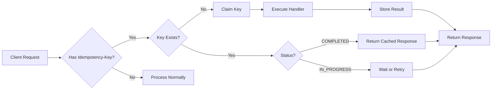
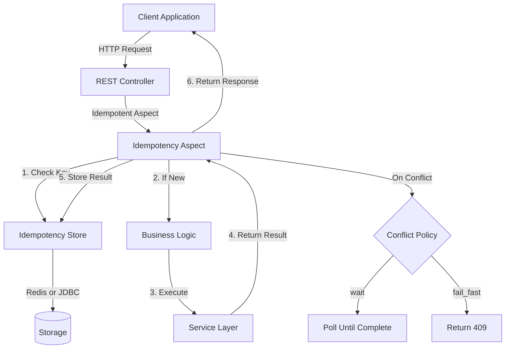
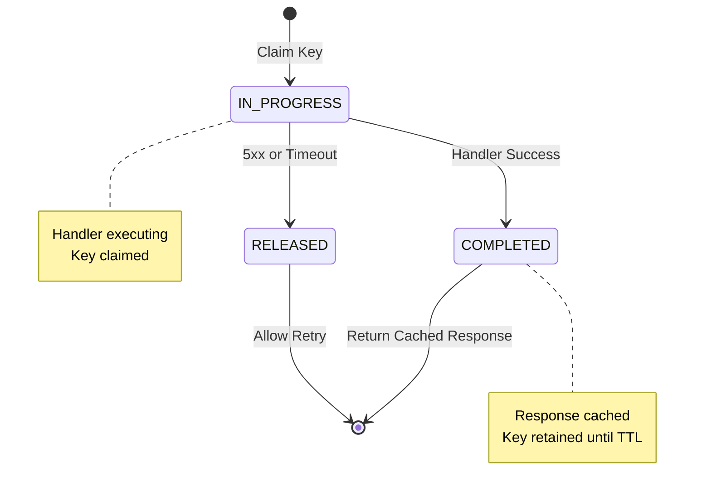
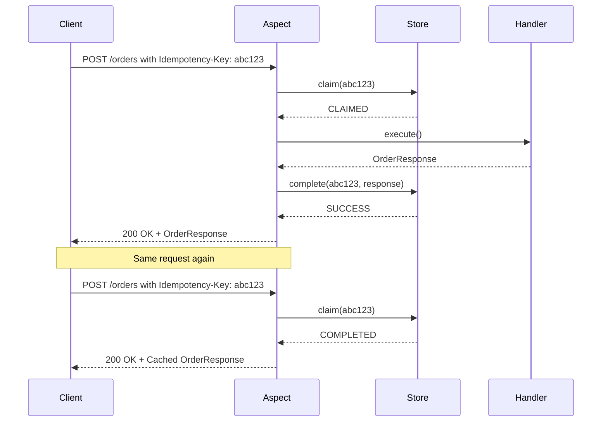
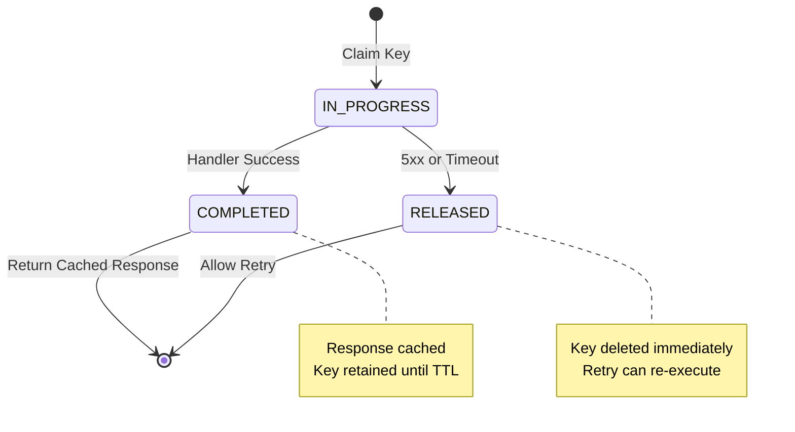
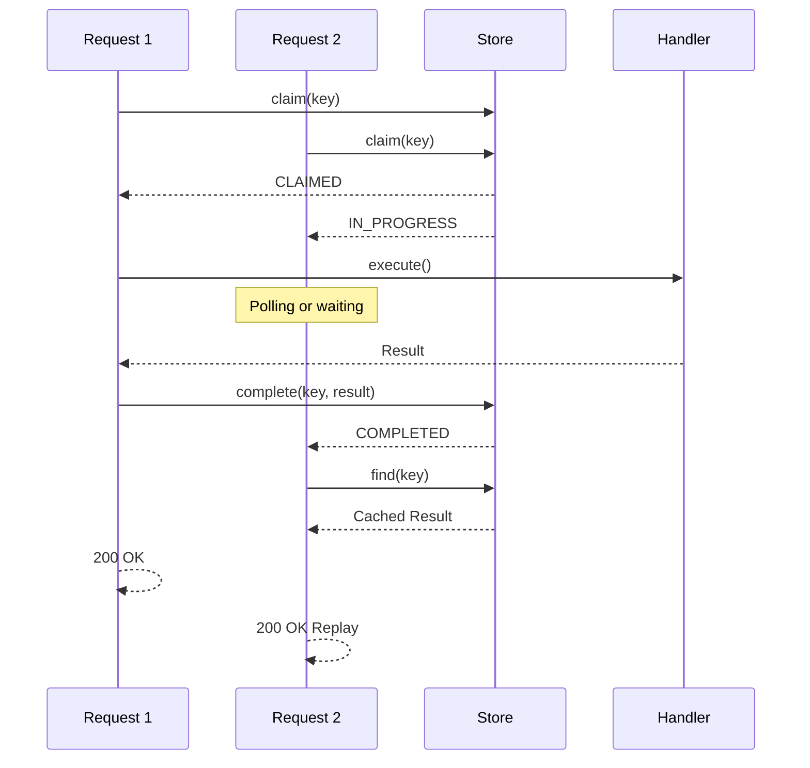
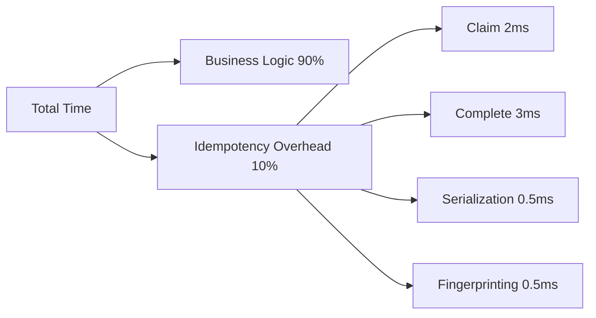

# Idempotent Spring Boot - Complete Guide to Safe REST APIs

**🎯 Tutorial Level:** Intermediate | **⏱️ Reading Time:** 15-20 minutes | **📅 Last Updated:** August 2026

---

## Table of Contents

1. [Introduction](#introduction)
2. [Prerequisites](#prerequisites)
3. [Learning Objectives](#learning-objectives)
4. [The Idempotency Problem](#the-idempotency-problem)
5. [Understanding the Solution](#understanding-the-solution)
6. [Architecture Deep Dive](#architecture-deep-dive)
7. [Step-by-Step Implementation](#step-by-step-implementation)
8. [Configuration Guide](#configuration-guide)
9. [Real-World Use Cases](#real-world-use-cases)
10. [Error Handling & Edge Cases](#error-handling--edge-cases)
11. [Concurrent Request Handling](#concurrent-request-handling)
12. [Best Practices](#best-practices)
13. [Anti-Patterns to Avoid](#anti-patterns-to-avoid)
14. [Performance Considerations](#performance-considerations)
15. [Security Considerations](#security-considerations)
16. [Testing Strategies](#testing-strategies)
17. [Troubleshooting Guide](#troubleshooting-guide)
18. [Practice Exercises](#practice-exercises)
19. [Test Your Understanding](#test-your-understanding)
20. [Common Interview Questions](#common-interview-questions)
21. [Question Bank](#question-bank)
22. [Summary & Key Takeaways](#summary--key-takeaways)
23. [Further Reading & Resources](#further-reading--resources)

---

## Introduction

> 💡 **The Double-Charge Problem**
> 
> A user taps "Pay." The request times out. Their app retries. Your server charges them twice.
> 
> You didn't write a bug. The network did. But your users don't care about that distinction.

### What is Idempotency?

In distributed systems, **idempotency** means that making the same request multiple times produces the same result as making it once. For REST APIs, this is crucial because:

- **Network timeouts** cause automatic retries
- **Load balancers** may replay failed requests
- **Mobile clients** might double-tap buttons
- **Kubernetes pods** restart and retry operations
- **Microservices** communicate with retry mechanisms

### Why This Matters

The idempotency problem shows up in more places than payments:

- **Payment processing:** Duplicate charges
- **Order submission:** Multiple orders created
- **Form submissions:** Duplicate records in database
- **API integrations:** Unintended side effects

### The Standard Fix

The industry standard is to have clients send an `Idempotency-Key` header. The server remembers what it already did. Stripe does this. PayPal does this. Most teams that need it end up writing the same boilerplate for every endpoint.

**The Solution:** `idempotency-spring-boot-starter` - an annotation-based approach that handles idempotency for every endpoint at once.

---

## Prerequisites

### Required Knowledge
- ✅ Spring Boot 2.x or 3.x experience
- ✅ Basic understanding of REST APIs
- ✅ Familiarity with Java annotations
- ✅ Understanding of HTTP methods and status codes

### Helpful Background
- 📚 Basic AOP (Aspect-Oriented Programming) concepts
- 📚 Redis fundamentals
- 📚 JDBC and database transactions
- 📚 Spring Security basics (for scoped idempotency)

### Development Environment
- ☑️ Java 11 or higher
- ☑️ Maven 3.6+ or Gradle 6+
- ☑️ Redis (optional, for Redis store)
- ☑️ PostgreSQL/MySQL (optional, for JDBC store)
- ☑️ Docker & Docker Compose (for testing)

---

## Learning Objectives

By the end of this tutorial, you will be able to:

- [ ] Understand the idempotency problem in distributed systems
- [ ] Implement idempotent endpoints with a single annotation
- [ ] Configure both Redis and JDBC stores
- [ ] Handle concurrent requests properly
- [ ] Configure error handling policies (5xx vs 4xx)
- [ ] Implement custom idempotency stores
- [ ] Apply best practices for production deployments
- [ ] Debug and troubleshoot idempotency issues
- [ ] Measure and optimize performance overhead
- [ ] Secure idempotent endpoints

---

## The Idempotency Problem

### Real-World Scenario 1: Payment Processing

```
User Action: Click "Pay $99"
         ↓
Network Timeout (no response)
         ↓
Client Retries (with new Idempotency-Key)
         ↓
Server Charges $99 Again ❌
         ↓
Result: Double charge!
```

### Real-World Scenario 2: Mobile App Double-Tap

```
User Action: Double-tap "Submit Order"
         ↓
Request 1 → Server: Create Order ✓
         ↓
Request 2 → Server: Create Order Again? ❌
         ↓
Result: Duplicate orders in database
```

### Real-World Scenario 3: Kubernetes Pod Restart

```
Pod Processing: POST /orders
         ↓
Pod Crashes Mid-Request
         ↓
Kubernetes Restarts Pod
         ↓
Request Retried Automatically
         ↓
Result: Duplicate order created
```

### The HTTP Idempotency Standard

According to HTTP specification:

| Method | Idempotent | Safe |
|--------|-----------|------|
| GET | ✅ Yes | ✅ Yes |
| PUT | ✅ Yes | ❌ No |
| DELETE | ✅ Yes | ❌ No |
| POST | ❌ No | ❌ No |
| PATCH | ❌ No | ❌ No |

**POST requests are NOT idempotent by design.** This is why we need the `Idempotency-Key` pattern.

---

## Understanding the Solution

### The Idempotency-Key Pattern



### How It Works

1. **Client generates a unique key** (UUID recommended)
2. **Client sends request with `Idempotency-Key` header**
3. **Server checks if key exists:**
   - If not: Claims key, executes handler, stores result
   - If yes: Returns cached result (replay)
4. **Key has TTL** to prevent infinite storage

### Benefits

✅ **No duplicate charges or records**  
✅ **Transparent to clients**  
✅ **No manual boilerplate code**  
✅ **Works with existing Spring Boot apps**  
✅ **Multiple store backends**  
✅ **Configurable behavior**

---

## Architecture Deep Dive

### System Architecture



**Key Points:**
- The **Aspect** intercepts requests annotated with `@Idempotent`
- It checks the **Store** before executing the handler
- If the key is new, it claims and executes; otherwise, it replays the cached response
- The **Conflict Policy** determines behavior when concurrent requests arrive

### Request Lifecycle State Machine



**State Transitions:**
- **IN_PROGRESS**: Initial state when key is claimed
- **COMPLETED**: Handler succeeded, result cached
- **RELEASED**: Error occurred, key deleted for retry

### Component Interaction Sequence



**Flow Explanation:**
1. First request claims the key and executes the handler
2. Result is stored and returned to client
3. Second request with same key finds it's already completed
4. Cached response is returned without re-executing handler

### Store Comparison Matrix

| Feature | Redis | JDBC/Postgres | In-Memory |
|---------|-------|---------------|-----------|
| Performance | Very Fast | Fast | Instant |
| Scalability | Distributed | ACID | Single node |
| Persistence | Optional | Yes | No |
| TTL Support | Native | Manual | Manual |
| Production Ready | Yes | Yes | Testing only |
| Setup Complexity | Low | Medium | Very Low |

---

## Step-by-Step Implementation

### Step 1: Add Dependency

**Maven:**
```xml
<dependency>
    <groupId>io.github.benhendayoussef</groupId>
    <artifactId>idempotency-spring-boot-starter</artifactId>
    <version>0.1.0</version>
</dependency>
```

**Gradle:**
```gradle
implementation 'io.github.benhendayoussef:idempotency-spring-boot-starter:0.1.0'
```

### Step 2: Configure Store

**Option A: Redis (Recommended)**

```yaml
spring:
  redis:
    host: localhost
    port: 6379
```

**Option B: JDBC/Postgres**

```yaml
spring:
  datasource:
    url: jdbc:postgresql://localhost:5432/mydb
    username: postgres
    password: password
```

Create the schema:
```sql
CREATE TABLE idempotency_records (
    idempotency_key VARCHAR(255) PRIMARY KEY,
    status VARCHAR(50) NOT NULL,
    response_body TEXT,
    created_at TIMESTAMP NOT NULL,
    completed_at TIMESTAMP
);

CREATE INDEX idx_status ON idempotency_records(status);
```

### Step 3: Apply Annotation

```java
@RestController
@RequestMapping("/api/orders")
public class OrderController {
    
    @PostMapping
    @Idempotent
    public ResponseEntity<OrderResponse> createOrder(
            @RequestBody @Valid OrderRequest request,
            @RequestHeader(value = "Idempotency-Key", required = false) 
                String idempotencyKey) {
        
        // Your business logic here
        Order order = orderService.create(request);
        return ResponseEntity.ok(OrderResponse.from(order));
    }
}
```

### Step 4: Client Implementation

```java
// Generate unique key
String idempotencyKey = UUID.randomUUID().toString();

HttpRequest request = HttpRequest.newBuilder()
    .uri(URI.create("https://api.example.com/orders"))
    .header("Idempotency-Key", idempotencyKey)
    .header("Content-Type", "application/json")
    .POST(HttpRequest.BodyPublishers.ofString(orderJson))
    .build();

HttpResponse<String> response = client.send(request, 
    HttpResponse.BodyHandlers.ofString());
```

### Step 5: Verify It Works

```bash
# First request - executes handler
curl -X POST http://localhost:8080/api/orders \
  -H "Idempotency-Key: test-key-123" \
  -H "Content-Type: application/json" \
  -d '{"productId": "123", "quantity": 2}'

# Response: 200 OK with order data

# Second request - replays cached response
curl -X POST http://localhost:8080/api/orders \
  -H "Idempotency-Key: test-key-123" \
  -H "Content-Type: application/json" \
  -d '{"productId": "456", "quantity": 5}'  # Different body!

# Response: 422 Unprocessable Entity (body mismatch)
```

---

## Configuration Guide

### Essential Configuration Properties

```yaml
idempotency:
  # Require Idempotency-Key header
  require-key: false
  
  # Key scope: global, user, or tenant
  scope: global
  
  # Conflict handling: wait or fail_fast
  on-conflict: wait
  
  # Store failure behavior: proceed or fail
  on-store-failure: proceed
  
  # Release keys on these conditions
  release-on: five_xx,timeout
  
  # Key TTL (seconds)
  key-ttl: 3600
  
  # Wait timeout for concurrent requests (ms)
  wait-timeout: 30000
```

### Configuration Examples

#### Example 1: Payment Service (Strict)

```yaml
idempotency:
  require-key: true  # Reject requests without key
  scope: user  # Per-user namespacing
  on-conflict: fail_fast  # Free thread immediately
  on-store-failure: fail  # Fail if Redis down
  release-on: five_xx
  key-ttl: 86400  # 24 hours
```

**Use Case:** Payment processing where every request must have a key and you cannot afford duplicates.

#### Example 2: Form Submission (Lenient)

```yaml
idempotency:
  require-key: false  # Allow keyless requests
  scope: global  # Global namespace
  on-conflict: wait  # Wait for completion
  on-store-failure: proceed  # Process anyway if store down
  release-on: five_xx,timeout
  key-ttl: 3600
```

**Use Case:** General form submissions where idempotency is a nice-to-have, not critical.

#### Example 3: Multi-Tenant API

```yaml
idempotency:
  scope: tenant  # Per-tenant namespacing
  require-key: true
  on-conflict: wait
  key-ttl: 7200
```

**Use Case:** SaaS applications where each tenant should have isolated idempotency keys.

---

## Real-World Use Cases

### Use Case 1: Payment Processing

```java
@RestController
@RequestMapping("/api/payments")
public class PaymentController {
    
    @PostMapping
    @Idempotent(requireKey = true)
    public ResponseEntity<PaymentResponse> processPayment(
            @RequestBody PaymentRequest request,
            @RequestHeader("Idempotency-Key") String key) {
        
        // Check if already processed
        if (paymentService.exists(key)) {
            return ResponseEntity.ok(paymentService.findByKey(key));
        }
        
        // Process payment
        Payment payment = paymentService.charge(request);
        
        return ResponseEntity.ok(PaymentResponse.from(payment));
    }
}
```

**Why This Matters:** Prevents double charges when:
- Network timeout occurs during processing
- Client retries after timeout
- Payment gateway responds slowly

### Use Case 2: Order Submission

```java
@RestController
@RequestMapping("/api/orders")
public class OrderController {
    
    @PostMapping
    @Idempotent
    public ResponseEntity<OrderResponse> submitOrder(
            @RequestBody OrderRequest request) {
        
        Order order = orderService.create(request);
        
        // Send confirmation email (only once!)
        emailService.sendConfirmation(order);
        
        return ResponseEntity.status(HttpStatus.CREATED)
            .body(OrderResponse.from(order));
    }
}
```

**Why This Matters:** Prevents:
- Duplicate orders in database
- Multiple confirmation emails sent
- Inventory over-allocation

### Use Case 3: Form Submissions

```java
@RestController
@RequestMapping("/api/feedback")
public class FeedbackController {
    
    @PostMapping
    @Idempotent(scope = IdempotencyScope.USER)
    public ResponseEntity<FeedbackResponse> submitFeedback(
            @RequestBody FeedbackRequest request,
            Authentication authentication) {
        
        String userId = authentication.getName();
        Feedback feedback = feedbackService.create(request, userId);
        
        return ResponseEntity.ok(FeedbackResponse.from(feedback));
    }
}
```

**Why This Matters:** Prevents:
- Duplicate feedback entries
- Spam submissions from impatient users
- Database pollution

### Use Case 4: API Gateway Integration

```java
@Component
public class IdempotencyKeyGenerator {
    
    public String generate(HttpServletRequest request) {
        // Generate key based on user + endpoint + payload hash
        String user = request.getUserPrincipal().getName();
        String endpoint = request.getRequestURI();
        String payload = DigestUtils.sha256Hex(
            request.getParameterMap().toString()
        );
        
        return DigestUtils.sha256Hex(user + endpoint + payload);
    }
}

@RestController
public class ApiController {
    
    @PostMapping("/api/action")
    @Idempotent
    public ResponseEntity<ApiResponse> performAction(
            @RequestBody ActionRequest request,
            HttpServletRequest httpRequest) {
        
        // If no key provided, generate one
        String key = generateKey(httpRequest);
        
        return ResponseEntity.ok(service.perform(request));
    }
}
```

---

## Error Handling & Edge Cases

### State Machine: What Happens When Things Go Wrong

The library implements a sophisticated state machine:



### Error Policy Details

#### 5xx Failures: Release the Key

```java
@Service
public class UnreliableService {
    
    @Idempotent
    public Data process(DataRequest request) {
        try {
            return callExternalService(request);
        } catch (ExternalServiceException e) {
            // 5xx from external service
            throw new ServiceUnavailableException("External service down");
        }
    }
}
```

**Behavior:**
- ✅ Key is **released** (deleted)
- ✅ Retry can re-execute handler
- ✅ Prevents cached 500 errors forever

**Why?** A 500 error is likely transient. Caching it would cause all retries to fail permanently.

#### 4xx Responses: Keep and Replay

```java
@Idempotent
public ValidationResult validate(ValidationRequest request) {
    if (request.getAge() < 18) {
        throw new BadRequestException("Age must be 18+");
    }
    
    return ValidationResult.valid();
}
```

**Behavior:**
- ✅ Key is **kept** and cached
- ✅ Same bad input always returns same error
- ✅ Protects against race conditions

**Why?** A 400 Bad Request is deterministic. The same input always produces the same error.

#### Body Fingerprint Check

```java
// First request
POST /api/orders
Idempotency-Key: abc123
Body: {"productId": "123", "quantity": 2}

// Second request with same key but different body
POST /api/orders
Idempotency-Key: abc123
Body: {"productId": "456", "quantity": 5}

// Result: 422 Unprocessable Entity
```

**Why This Matters:**
- 🛡️ **Security:** Prevents replay attacks with different payloads
- 🐛 **Bug Detection:** Catches client bugs early
- 🔒 **Data Integrity:** Ensures correct data is processed

### Custom Error Policies

```java
@Configuration
public class IdempotencyConfig {
    
    @Bean
    public IdempotencyConfiguration config() {
        return IdempotencyConfiguration.builder()
            .releaseOn(ReleaseCondition.FIVE_XX, ReleaseCondition.TIMEOUT)
            .onStoreFailure(StoreFailureBehavior.FAIL)
            .build();
    }
}
```

---

## Concurrent Request Handling

### The Concurrent Request Problem



### Conflict Resolution Strategies

#### Strategy 1: Wait (Default)

```yaml
idempotency:
  on-conflict: wait
  wait-timeout: 30000  # 30 seconds
```

**Behavior:**
- Losing request polls store every 100ms
- Returns cached result when winner completes
- Returns 409 if timeout exceeded

**Pros:**
- ✅ Guarantees duplicate gets result
- ✅ Better UX (no error response)

**Cons:**
- ⚠️ Holds thread while waiting
- ⚠️ Can cause thread pool exhaustion

#### Strategy 2: Fail Fast

```yaml
idempotency:
  on-conflict: fail_fast
```

**Behavior:**
- Returns 409 Conflict immediately
- Client should retry with backoff

**Pros:**
- ✅ Frees thread immediately
- ✅ Better for constrained thread pools

**Cons:**
- ⚠️ Client must handle 409 and retry

### Performance Impact of Concurrent Requests

From real-world testing with 20 concurrent duplicates against an 8-thread pool:

| Scenario | Normal Latency | Under Load | Impact |
|----------|---------------|------------|--------|
| No duplicates | < 50ms | < 50ms | - |
| With duplicates (wait) | < 50ms | > 1000ms | +950ms |
| With duplicates (fail_fast) | < 50ms | < 100ms | +50ms |

**Recommendation:** Use `fail_fast` if:
- Thread pool is constrained
- Clients implement retry logic
- You expect frequent duplicate bursts

---

## Best Practices

### ✅ DO's

1. **Always Use Idempotency Keys for Mutating Operations**
   ```java
   @PostMapping
   @Idempotent
   public ResponseEntity createResource(...) { }
   ```

2. **Generate Keys Client-Side**
   ```java
   String key = UUID.randomUUID().toString();
   ```

3. **Use Appropriate TTL Values**
   ```yaml
   idempotency:
     key-ttl: 86400  # 24 hours for payments
     key-ttl: 3600   # 1 hour for forms
   ```

4. **Enable require-key for Critical Endpoints**
   ```java
   @Idempotent(requireKey = true)
   public ResponseEntity processPayment(...) { }
   ```

5. **Use Scoped Keys for Multi-User Systems**
   ```yaml
   idempotency:
     scope: user  # Isolate per user
   ```

6. **Monitor Idempotency Metrics**
   ```java
   @Bean
   public IdempotencyMetrics metrics(MeterRegistry registry) {
       return new MicrometerIdempotencyMetrics(registry);
   }
   ```

7. **Handle Store Failures Gracefully**
   ```yaml
   idempotency:
     on-store-failure: proceed  # Don't break app if Redis down
   ```

### ❌ DON'Ts

1. **Don't Use Idempotency for GET Requests**
   ```java
   // WRONG - GET is already idempotent by HTTP spec
   @GetMapping
   @Idempotent
   public List<Item> getItems() { }
   ```

2. **Don't Reuse Keys Across Different Operations**
   ```java
   // WRONG - same key for different endpoints
   String key = "order-creation";
   
   // CORRECT - unique key per operation
   String key = UUID.randomUUID().toString();
   ```

3. **Don't Store Sensitive Data in Response Cache**
   ```java
   // WRONG - caching passwords
   @Idempotent
   public User login(Credentials creds) { }
   ```

4. **Don't Ignore Body Mismatch Errors**
   ```java
   // Always handle 422 responses
   if (response.getStatusCode() == 422) {
       // Client bug - different body with same key
       log.error("Body mismatch detected");
   }
   ```

5. **Don't Use In-Memory Store in Production**
   ```yaml
   # WRONG - loses data on restart
   idempotency:
     store: in-memory
   ```

---

## Anti-Patterns to Avoid

### ❌ Anti-Pattern 1: Client-Generated Sequential Keys

```java
// WRONG - predictable keys
String key = "order-" + System.currentTimeMillis();
```

**Problem:** Collisions in high-throughput scenarios

**Solution:**
```java
// CORRECT - cryptographically random
String key = UUID.randomUUID().toString();
```

### ❌ Anti-Pattern 2: Not Handling 409 Conflicts

```java
// WRONG - ignoring 409
HttpResponse<String> response = client.send(request);
if (response.statusCode() == 200) {
    // process success
}
// Missing 409 handling!
```

**Problem:** Duplicates created when 409 is not retried

**Solution:**
```java
// CORRECT - handle all responses
if (response.statusCode() == 409) {
    Thread.sleep(1000);  // Backoff
    return retryRequest(request);  // Retry
}
```

### ❌ Anti-Pattern 3: Infinite TTL

```yaml
# WRONG - keys never expire
idempotency:
  key-ttl: -1
```

**Problem:** Database/Redis fills up over time

**Solution:**
```yaml
# CORRECT - reasonable TTL
idempotency:
  key-ttl: 86400  # 24 hours
```

### ❌ Anti-Pattern 4: Idempotency on Non-Deterministic Operations

```java
// WRONG - non-deterministic operation
@Idempotent
public String generateRandomQuote() {
    return randomQuoteService.getRandomQuote();
}
```

**Problem:** First execution caches result, subsequent returns same quote

**Solution:**
```java
// CORRECT - only idempotent operations
@Idempotent
public Order createOrder(OrderRequest request) {
    return orderService.create(request);
}
```

### ❌ Anti-Pattern 5: Ignoring Exactly-Once Semantics

```java
// WRONG - assuming exactly-once
@Transactional
@Idempotent
public void transfer(TransferRequest request) {
    // This does NOT guarantee exactly-once!
}
```

**Problem:** Race condition between transaction commit and idempotency record

**Solution:**
```java
// CORRECT - manually control transaction boundary
@Transactional
public void transfer(TransferRequest request) {
    // Business logic
    accountService.transfer(request);
    
    // Manually complete idempotency in same transaction
    idempotencyStore.complete(key, response);
}
```

---

## Performance Considerations

### Measured Overhead

From benchmarking 200 requests with 20 warmup iterations:

| Metric | Redis | JDBC/Postgres | In-Memory |
|--------|-------|---------------|-----------|
| **p50 Latency** | 5-6.4ms | 6-8ms | 0.5ms |
| **p99 Latency** | ~40ms | ~50ms | < 1ms |
| **Aspect Cost** | < 1ms | < 1ms | < 1ms |

### Performance Breakdown



### Optimization Strategies

#### 1. Connection Pooling

```yaml
spring:
  redis:
    lettuce:
      pool:
        max-active: 20
        max-idle: 10
        min-idle: 5
```

#### 2. Optimistic Locking

```java
public class OptimisticIdempotencyStore implements IdempotencyStore {
    @Override
    public ClaimResult claim(String key, ...) {
        // Use lightweight check before heavy operation
        if (store.exists(key)) {
            return ClaimResult.alreadyExists();
        }
        // Proceed with claim
    }
}
```

#### 3. Batch Operations

```java
@Service
public class BatchOrderService {
    
    @Idempotent
    public List<Order> createBatch(List<OrderRequest> requests) {
        // Single idempotency check for batch
        // More efficient than individual calls
        return orderRepository.saveAll(
            requests.stream()
                .map(this::createOrder)
                .collect(Collectors.toList())
        );
    }
}
```

#### 4. Caching Frequent Lookups

```java
@Bean
public IdempotencyStore store(RedisTemplate<String, Object> redis) {
    return new CachingIdempotencyStore(
        new RedisIdempotencyStore(redis),
        Caffeine.newBuilder()
            .maximumSize(10000)
            .expireAfterWrite(Duration.ofMinutes(5))
    );
}
```

### Performance Monitoring

```java
@Configuration
public class MonitoringConfig {
    
    @Bean
    public IdempotencyMetrics metrics(MeterRegistry registry) {
        return new IdempotencyMetrics() {
            @Override
            public void recordClaim(long timeMs) {
                registry.timer("idempotency.claim.time")
                    .record(timeMs, TimeUnit.MILLISECONDS);
            }
            
            @Override
            public void recordHit() {
                registry.counter("idempotency.cache.hit").increment();
            }
            
            @Override
            public void recordMiss() {
                registry.counter("idempotency.cache.miss").increment();
            }
        };
    }
}
```

**Key Metrics to Monitor:**
- `idempotency.claim.time` - Time to check/claim key
- `idempotency.cache.hit` - Cache hit rate
- `idempotency.cache.miss` - Cache miss rate
- `idempotency.concurrent.wait` - Time spent waiting for concurrent requests

---

## Security Considerations

### Security Best Practices

#### 1. Key Isolation

```yaml
idempotency:
  scope: user  # Prevent key theft between users
```

**Why:** Prevents User A from replaying User B's requests by stealing their key.

#### 2. Input Validation

```java
@Idempotent(requireKey = true)
public ResponseEntity process(@RequestBody @Valid PaymentRequest request) {
    // Validation happens before idempotency check
    // Prevents storing invalid data
}
```

#### 3. Avoid Caching Sensitive Data

```java
// WRONG - caching authentication responses
@Idempotent
public AuthenticationResponse login(Credentials credentials) {
    return authService.authenticate(credentials);
}

// CORRECT - don't cache auth responses
@PostMapping("/login")
public AuthenticationResponse login(@RequestBody Credentials credentials) {
    return authService.authenticate(credentials);
}
```

#### 4. Rate Limiting Integration

```java
@Component
public class IdempotencyRateLimiter {
    
    public boolean allowRequest(String key) {
        // Combine idempotency with rate limiting
        return rateLimiter.allow(key) && 
               idempotencyStore.canClaim(key);
    }
}
```

#### 5. Secure Key Generation

```java
// WRONG - predictable key
String key = "payment-" + userId;

// CORRECT - cryptographically random
String key = UUID.randomUUID().toString();
```

#### 6. Audit Logging

```java
@Aspect
@Component
public class IdempotencyAuditAspect {
    
    @Around("@annotation(idempotent)")
    public Object audit(ProceedingJoinPoint pjp, Idempotent idempotent) {
        String key = extractKey(pjp);
        log.info("Idempotent operation: key={}, method={}", 
            key, pjp.getSignature());
        
        return pjp.proceed();
    }
}
```

### Security Checklist

- [ ] Keys are generated client-side with sufficient entropy
- [ ] Scoped keys prevent cross-user replay
- [ ] Sensitive responses are not cached
- [ ] Idempotency store access is authenticated
- [ ] TTL values are appropriate (not too long)
- [ ] Store failures are logged and monitored
- [ ] Rate limiting is in place
- [ ] Audit logging captures all idempotent operations

---

## Testing Strategies

### Unit Testing

```java
@SpringBootTest
public class OrderControllerTest {
    
    @Test
    public void createOrder_WithSameKey_ReturnsCachedResponse() {
        // First request
        ResponseEntity<OrderResponse> response1 = createOrder("key-123");
        assertEquals(200, response1.getStatusCodeValue());
        
        // Second request with same key
        ResponseEntity<OrderResponse> response2 = createOrder("key-123");
        assertEquals(200, response2.getStatusCodeValue());
        
        // Responses should be identical
        assertEquals(response1.getBody(), response2.getBody());
    }
    
    @Test
    public void createOrder_WithDifferentBody_Returns422() {
        // First request
        createOrder("key-123", "product-1");
        
        // Second request with different body
        ResponseEntity<ErrorResponse> response = createOrder("key-123", "product-2");
        assertEquals(422, response.getStatusCodeValue());
    }
}
```

### Integration Testing with Testcontainers

```java
@Testcontainers
@SpringBootTest
public class IdempotencyIntegrationTest {
    
    @Container
    static GenericContainer<?> redis = new GenericContainer<>("redis:7-alpine")
        .withExposedPorts(6379);
    
    @Test
    public void concurrentRequests_OnlyOneExecutes() throws Exception {
        CountDownLatch latch = new CountDownLatch(2);
        AtomicInteger executions = new AtomicInteger(0);
        
        // Simulate concurrent requests
        ExecutorService executor = Executors.newFixedThreadPool(2);
        
        executor.submit(() -> {
            try {
                createOrder("concurrent-key");
                executions.incrementAndGet();
            } finally {
                latch.countDown();
            }
        });
        
        executor.submit(() -> {
            try {
                createOrder("concurrent-key");
                executions.incrementAndGet();
            } finally {
                latch.countDown();
            }
        });
        
        latch.await(10, TimeUnit.SECONDS);
        
        // Only one should have executed
        assertEquals(1, executions.get());
    }
}
```

### Performance Testing

```java
@BenchmarkMode(Mode.AverageTime)
@OutputTimeUnit(TimeUnit.MILLISECONDS)
@State(Scope.Benchmark)
public class IdempotencyBenchmark {
    
    @Param({"100", "1000", "10000"})
    public int iterations;
    
    private MockMvc mockMvc;
    
    @Setup
    public void setup() {
        mockMvc = MockMvcBuilders.standaloneSetup(new OrderController())
            .build();
    }
    
    @Benchmark
    public void testWithIdempotency(Blackhole bh) throws Exception {
        for (int i = 0; i < iterations; i++) {
            String key = UUID.randomUUID().toString();
            MvcResult result = mockMvc.perform(post("/orders")
                .header("Idempotency-Key", key)
                .content("{\"productId\":\"123\"}")
                .contentType(MediaType.APPLICATION_JSON))
                .andReturn();
            
            bh.consume(result.getResponse().getContentAsString());
        }
    }
}
```

### Chaos Testing

```java
@Test
public void storeFailure_DoesNotBreakApplication() {
    // Simulate Redis failure
    redis.stop();
    
    // Should proceed with on-store-failure: proceed
    ResponseEntity response = createOrder("key-123");
    
    // Application should still work
    assertTrue(response.getStatusCode().is2xxSuccessful() || 
              response.getStatusCode().is5xxServerError());
}
```

---

## Troubleshooting Guide

### Common Issues and Solutions

#### Issue 1: Duplicate Requests Not Being Detected

**Symptoms:**
- Same key creates multiple records
- Handler executes multiple times

**Diagnosis:**
```java
// Check if key is being sent
System.out.println(request.getHeader("Idempotency-Key"));
```

**Solutions:**
1. ✅ Ensure `Idempotency-Key` header is present
2. ✅ Verify key format (UUID recommended)
3. ✅ Check store connectivity
4. ✅ Verify annotation is on correct method

#### Issue 2: Concurrent Requests Timeout

**Symptoms:**
- 409 Conflict returned
- Requests hanging

**Diagnosis:**
```yaml
# Check current timeout
idempotency:
  wait-timeout: 30000  # Is this too short?
```

**Solutions:**
1. ✅ Increase `wait-timeout`
2. ✅ Switch to `fail_fast` strategy
3. ✅ Increase thread pool size
4. ✅ Optimize handler execution time

#### Issue 3: Keys Not Expiring

**Symptoms:**
- Redis/DB growing indefinitely
- Old keys blocking new requests

**Diagnosis:**
```bash
# Check Redis keys
redis-cli KEYS "idempotency:*"

# Check TTL
redis-cli TTL "idempotency:key-123"
```

**Solutions:**
1. ✅ Verify `key-ttl` is configured
2. ✅ Check Redis memory policy
3. ✅ Implement key cleanup job:
```java
@Scheduled(fixedRate = 3600000)  // Every hour
public void cleanupExpiredKeys() {
    idempotencyStore.cleanupExpired();
}
```

#### Issue 4: Store Connection Failures

**Symptoms:**
- 503 Service Unavailable
- Application startup fails

**Diagnosis:**
```bash
# Check Redis connection
redis-cli ping

# Check DB connection
psql -U postgres -c "SELECT 1"
```

**Solutions:**
1. ✅ Set `on-store-failure: proceed` for graceful degradation
2. ✅ Implement circuit breaker:
```java
@Bean
public IdempotencyStore store(RedisConnectionFactory factory) {
    return new CircuitBreakerIdempotencyStore(
        new RedisIdempotencyStore(factory)
    );
}
```
3. ✅ Add health checks

#### Issue 5: High Memory Usage

**Symptoms:**
- OutOfMemoryError
- Slow performance

**Solutions:**
1. ✅ Reduce `key-ttl`
2. ✅ Implement LRU eviction
3. ✅ Use Redis maxmemory policy:
```bash
redis-cli CONFIG SET maxmemory-policy allkeys-lru
```

---

## Practice Exercises

### Exercise 1: Basic Implementation

**Task:** Implement idempotent order creation with Redis store

**Requirements:**
1. Create a Spring Boot REST endpoint for order creation
2. Apply `@Idempotent` annotation
3. Configure Redis store
4. Handle 422 body mismatch errors

**Solution:**

```java
// 1. Entity
@Entity
public class Order {
    @Id
    @GeneratedValue(strategy = GenerationType.UUID)
    private String id;
    
    private String productId;
    private int quantity;
    private BigDecimal amount;
    private Instant createdAt;
    
    // Constructors, getters, setters
}

// 2. Repository
public interface OrderRepository extends JpaRepository<Order, String> {
}

// 3. Service
@Service
public class OrderService {
    
    @Autowired
    private OrderRepository repository;
    
    public Order create(OrderRequest request) {
        Order order = new Order();
        order.setProductId(request.getProductId());
        order.setQuantity(request.getQuantity());
        order.setAmount(calculateAmount(request));
        order.setCreatedAt(Instant.now());
        
        return repository.save(order);
    }
    
    private BigDecimal calculateAmount(OrderRequest request) {
        // Pricing logic
        return BigDecimal.valueOf(request.getQuantity() * 10);
    }
}

// 4. Controller
@RestController
@RequestMapping("/api/orders")
public class OrderController {
    
    @Autowired
    private OrderService orderService;
    
    @PostMapping
    @Idempotent(requireKey = true)
    public ResponseEntity<OrderResponse> createOrder(
            @RequestBody @Valid OrderRequest request,
            @RequestHeader("Idempotency-Key") String key) {
        
        Order order = orderService.create(request);
        return ResponseEntity.status(HttpStatus.CREATED)
            .body(OrderResponse.from(order));
    }
}

// 5. Configuration
@Configuration
public class AppConfig {
    
    @Bean
    public IdempotencyConfiguration idempotencyConfig() {
        return IdempotencyConfiguration.builder()
            .requireKey(true)
            .scope(IdempotencyScope.GLOBAL)
            .keyTtl(Duration.ofHours(24))
            .onConflict(ConflictPolicy.WAIT)
            .build();
    }
}
```

**Test:**
```bash
# First request
curl -X POST http://localhost:8080/api/orders \
  -H "Idempotency-Key: order-123" \
  -H "Content-Type: application/json" \
  -d '{"productId":"prod-1","quantity":2}'
# → 201 Created

# Duplicate request
curl -X POST http://localhost:8080/api/orders \
  -H "Idempotency-Key: order-123" \
  -H "Content-Type: application/json" \
  -d '{"productId":"prod-1","quantity":2}'
# → 201 Created (same response)

# Body mismatch
curl -X POST http://localhost:8080/api/orders \
  -H "Idempotency-Key: order-123" \
  -H "Content-Type: application/json" \
  -d '{"productId":"prod-2","quantity":3}'
# → 422 Unprocessable Entity
```

### Exercise 2: Custom Store Implementation

**Task:** Implement a JDBC-based idempotency store

**Requirements:**
1. Implement `IdempotencyStore` interface
2. Use JDBC for persistence
3. Support TTL-based cleanup
4. Handle concurrent access with optimistic locking

**Solution:**

```java
@Component
public class JdbcIdempotencyStore implements IdempotencyStore {
    
    @Autowired
    private JdbcTemplate jdbcTemplate;
    
    private static final String INSERT_SQL = """
        INSERT INTO idempotency_records 
            (idempotency_key, status, response_body, created_at)
        VALUES (?, ?, ?, ?)
        ON CONFLICT (idempotency_key) DO NOTHING
        """;
    
    private static final String SELECT_SQL = """
        SELECT status, response_body 
        FROM idempotency_records 
        WHERE idempotency_key = ? AND status = 'COMPLETED'
        """;
    
    @Override
    public ClaimResult claim(String key, 
                           Supplier<Object> handler,
                           ObjectMapper mapper) {
        
        // Try to insert (atomic operation)
        int rows = jdbcTemplate.update(INSERT_SQL,
            key,
            "IN_PROGRESS",
            null,
            Timestamp.from(Instant.now())
        );
        
        if (rows == 0) {
            // Key already exists
            return findCompleted(key)
                .map(record -> ClaimResult.alreadyCompleted(record))
                .orElse(ClaimResult.inProgress());
        }
        
        // Execute handler
        try {
            Object result = handler.get();
            String responseBody = mapper.writeValueAsString(result);
            
            // Complete the record
            complete(key, responseBody, mapper);
            
            return ClaimResult.claimed(result);
        } catch (Exception e) {
            // Release on error
            release(key);
            throw e;
        }
    }
    
    @Override
    public void complete(String key, String responseBody, ObjectMapper mapper) {
        jdbcTemplate.update("""
            UPDATE idempotency_records 
            SET status = 'COMPLETED', 
                response_body = ?,
                completed_at = ?
            WHERE idempotency_key = ?
            """,
            responseBody,
            Timestamp.from(Instant.now()),
            key
        );
    }
    
    @Override
    public void release(String key) {
        jdbcTemplate.update(
            "DELETE FROM idempotency_records WHERE idempotency_key = ?",
            key
        );
    }
    
    @Override
    public Optional<IdempotencyRecord> find(String key) {
        return jdbcTemplate.query(SELECT_SQL, rs -> {
            if (rs.next()) {
                return Optional.of(IdempotencyRecord.builder()
                    .status(rs.getString("status"))
                    .responseBody(rs.getString("response_body"))
                    .build());
            }
            return Optional.empty();
        });
    }
    
    @Scheduled(fixedRate = 3600000)  // Every hour
    public void cleanupExpired() {
        jdbcTemplate.update("""
            DELETE FROM idempotency_records 
            WHERE created_at < ? AND status != 'COMPLETED'
            """,
            Timestamp.from(Instant.now().minus(Duration.ofHours(24)))
        );
    }
}

// Schema
@Schema
public class IdempotencySchema implements ResourceLoaderAware {
    
    @Override
    public void run(String... args) {
        jdbcTemplate.execute("""
            CREATE TABLE IF NOT EXISTS idempotency_records (
                idempotency_key VARCHAR(255) PRIMARY KEY,
                status VARCHAR(50) NOT NULL,
                response_body TEXT,
                created_at TIMESTAMP NOT NULL,
                completed_at TIMESTAMP,
                CHECK (status IN ('IN_PROGRESS', 'COMPLETED'))
            );
            
            CREATE INDEX IF NOT EXISTS idx_created_at 
            ON idempotency_records(created_at);
            """);
    }
}
```

### Exercise 3: Concurrent Request Handling

**Task:** Implement a payment service that handles concurrent duplicate requests

**Requirements:**
1. Simulate slow payment processing (2 seconds)
2. Send 10 concurrent requests with same key
3. Verify only one executes
4. All requests return same response

**Solution:**

```java
@Service
public class PaymentService {
    
    @Idempotent(onConflict = ConflictPolicy.WAIT, waitTimeout = 5000)
    public PaymentResult processPayment(PaymentRequest request) {
        log.info("Processing payment: {}", request.getPaymentId());
        
        // Simulate slow processing
        try {
            Thread.sleep(2000);
        } catch (InterruptedException e) {
            Thread.currentThread().interrupt();
            throw new PaymentProcessingException("Interrupted");
        }
        
        // Charge customer
        PaymentResult result = paymentGateway.charge(request);
        
        log.info("Payment completed: {}", request.getPaymentId());
        return result;
    }
}

// Test
@Test
public void concurrentPaymentRequests_OnlyOneCharged() throws Exception {
    String key = UUID.randomUUID().toString();
    int threadCount = 10;
    CountDownLatch latch = new CountDownLatch(threadCount);
    AtomicInteger executionCount = new AtomicInteger(0);
    
    ExecutorService executor = Executors.newFixedThreadPool(threadCount);
    
    for (int i = 0; i < threadCount; i++) {
        executor.submit(() -> {
            try {
                PaymentResult result = paymentService.processPayment(
                    new PaymentRequest("amount:100", key)
                );
                assertNotNull(result);
            } finally {
                executionCount.incrementAndGet();
                latch.countDown();
            }
        });
    }
    
    latch.await(10, TimeUnit.SECONDS);
    
    // Verify only one execution
    assertEquals(threadCount, executionCount.get());
    verify(paymentGateway, times(1)).charge(any());
}
```

### Exercise 4: Custom Scope Resolver

**Task:** Implement tenant-based scoping for multi-tenant SaaS

**Requirements:**
1. Extract tenant ID from JWT token
2. Namespace idempotency keys per tenant
3. Prevent cross-tenant key collisions

**Solution:**

```java
@Component
public class TenantScopeResolver implements ScopeResolver {
    
    @Override
    public String resolve(Authentication authentication) {
        if (authentication == null || !authentication.isAuthenticated()) {
            return "anonymous";
        }
        
        JwtAuthenticationToken jwt = (JwtAuthenticationToken) authentication;
        String tenantId = jwt.getTokenAttributes().get("tenant_id").toString();
        
        return "tenant:" + tenantId;
    }
}

// Configuration
@Configuration
public class SecurityConfig {
    
    @Bean
    public ScopeResolver scopeResolver() {
        return new TenantScopeResolver();
    }
}

// Usage
// Request with JWT containing tenant_id: "acme-corp"
// Key becomes: "tenant:acme-corp:uuid-123"

// Request with JWT containing tenant_id: "globex-inc"
// Key becomes: "tenant:globex-inc:uuid-123"
// No collision!
```

---

## Test Your Understanding

**Test your knowledge with these 10 questions:**

1. **What is the primary purpose of the `Idempotency-Key` header?**
   - A) Authentication
   - B) Prevent duplicate processing
   - C) Rate limiting
   - D) Encryption

2. **Which HTTP method is NOT idempotent by default?**
   - A) GET
   - B) PUT
   - C) DELETE
   - D) POST

3. **What happens when a 5xx error occurs during handler execution?**
   - A) Key is cached with error response
   - B) Key is released for retry
   - C) Key is kept forever
   - D) Request is blocked

4. **What is the recommended store for production?**
   - A) In-memory
   - B) Redis
   - C) File system
   - D) Cookies

5. **What does `fail_fast` conflict policy do?**
   - A) Waits for concurrent request to complete
   - B) Returns 409 immediately
   - C) Retries automatically
   - D) Fails the application

6. **Why is body fingerprinting important?**
   - A) Performance optimization
   - B) Detect client bugs and replay attacks
   - C) Reduce storage
   - D) Improve UX

7. **What is the exactly-once semantics caveat?**
   - A) Aspect runs outside transaction
   - B) Redis is not reliable
   - C) Keys expire too quickly
   - D) Clients don't support it

8. **Which scope prevents cross-user key collisions?**
   - A) global
   - B) user
   - C) tenant
   - D) Both B and C

9. **What is the typical overhead of idempotency check?**
   - A) 100-200ms
   - B) 5-10ms
   - C) 1-2 seconds
   - D) No overhead

10. **When should you use `require-key: true`?**
    - A) For all GET requests
    - B) For critical endpoints like payments
    - C) Never
    - D) Only for testing

<details>
<summary>Click to see answers</summary>

1. **B** - Prevent duplicate processing
2. **D** - POST
3. **B** - Key is released for retry
4. **B** - Redis
5. **B** - Returns 409 immediately
6. **B** - Detect client bugs and replay attacks
7. **A** - Aspect runs outside transaction
8. **D** - Both B and C
9. **B** - 5-10ms
10. **B** - For critical endpoints like payments

</details>

---

## Common Interview Questions

**Prepare for these 10 common interview questions:**

1. **Q: What is idempotency and why is it important in REST APIs?**
   
   **A:** Idempotency means making the same request multiple times produces the same result as making it once. It's crucial in distributed systems because network failures cause automatic retries. Without idempotency, retries can cause duplicate charges, duplicate records, and unintended side effects.

2. **Q: How does the `@Idempotent` annotation work internally?**
   
   **A:** It uses AOP (Aspect-Oriented Programming) to intercept requests. The aspect checks if an `Idempotency-Key` exists in the store. If not, it claims the key, executes the handler, stores the result, and returns it. If the key exists, it returns the cached result without executing the handler.

3. **Q: What's the difference between at-least-once and exactly-once semantics?**
   
   **A:** At-least-once guarantees the operation executes at least once (may execute multiple times). Exactly-once guarantees it executes exactly once. The library provides at-least-once by default because the AOP aspect runs outside the transaction boundary, creating a small window where a crash can leave the key in `IN_PROGRESS` state.

4. **Q: How does the library handle concurrent duplicate requests?**
   
   **A:** It uses atomic claim operations (SETNX in Redis, INSERT ON CONFLICT in Postgres). One request wins and executes. Others wait (polling) or fail fast based on configuration. The waiting requests get the winner's result when it completes.

5. **Q: Why are 5xx errors treated differently than 4xx errors?**
   
   **A:** 5xx errors are transient (server issues, network blips), so releasing the key allows legitimate retries. 4xx errors are deterministic (bad input), so caching them prevents redundant processing and protects against race conditions.

6. **Q: What is body fingerprinting and why is it needed?**
   
   **A:** Body fingerprinting creates a hash of the request body and stores it with the key. If a duplicate request arrives with the same key but different body, it returns 422. This prevents replay attacks and catches client bugs where different payloads use the same key.

7. **Q: How would you implement exactly-once semantics?**
   
   **A:** For JDBC store, manually call `idempotencyStore.complete()` from within your `@Transactional` method. This ensures the completion write commits atomically with your business transaction. `@Idempotent` + `@Transactional` on the same method doesn't achieve this because AOP aspects run outside the transaction boundary.

8. **Q: What are the performance implications of using idempotency?**
   
   **A:** Minimal overhead: 5-6.4ms p50, ~40ms p99 for Redis. This is two network round trips (claim + complete). The Docker Desktop overhead reflects container networking, not the library itself. In-memory is ~0.5ms but not suitable for production.

9. **Q: How do you secure idempotent endpoints?**
   
   **A:** Use scoped keys (user/tenant) to prevent cross-tenant replay. Require keys for critical endpoints. Don't cache sensitive data (like auth responses). Use cryptographically random keys. Implement audit logging. Set appropriate TTLs.

10. **Q: When would you choose `fail_fast` over `wait` for conflict resolution?**
    
    **A:** Choose `fail_fast` when: (1) thread pool is constrained, (2) clients implement retry logic, (3) you expect frequent duplicate bursts. It prevents thread pool exhaustion by returning 409 immediately instead of holding threads while waiting.

---

## Question Bank

**50+ questions covering all difficulty levels:**

### Beginner Questions (1-15)

1. What is the main problem that idempotency solves in REST APIs?
2. What header is used to implement idempotency?
3. Which HTTP methods are naturally idempotent?
4. What does the `@Idempotent` annotation do?
5. Name two stores available in the library.
6. What is the default conflict resolution strategy?
7. What is the purpose of the `Idempotency-Key`?
8. What happens when a duplicate request is detected?
9. What is a body fingerprint?
10. What is the default TTL for idempotency keys?
11. What does `require-key: true` do?
12. What is the difference between `wait` and `fail_fast`?
13. What status code is returned for body mismatch?
14. What is the library's Maven group ID?
15. What is the latest version mentioned?

### Intermediate Questions (16-35)

16. How does the atomic claim mechanism work?
17. Why are 5xx errors treated differently than 4xx errors?
18. What is the exactly-once semantics caveat?
19. How does scoping prevent key collisions?
20. What is the performance overhead of idempotency checks?
21. How would you implement a custom `IdempotencyStore`?
22. What is the purpose of `ScopeResolver`?
23. How does concurrent request handling work?
24. What are the risks of using `wait` policy with constrained thread pools?
25. How does the library handle store failures?
26. What is the recommended TTL for payment processing?
27. Why is in-memory store not suitable for production?
28. How do you secure idempotent endpoints?
29. What metrics should you monitor?
30. How does the library integrate with Spring Security?
31. What is the purpose of `IdempotencyMetrics`?
32. How do you handle sensitive data in cached responses?
33. What is the difference between `release-on` configurations?
34. How does body fingerprinting prevent replay attacks?
35. Why shouldn't you use idempotency on GET requests?

### Advanced Questions (36-50)

36. How would you implement exactly-once semantics in production?
37. Explain the AOP aspect execution order relative to transactions.
38. Design a multi-region idempotency strategy with eventual consistency.
39. How would you handle idempotency in a serverless environment?
40. What are the implications of using idempotency with message queues?
41. Design a circuit breaker for the idempotency store.
42. How do you handle idempotency in distributed transactions (Saga pattern)?
43. What are the trade-offs between Redis and JDBC stores at scale?
44. How would you implement idempotency for streaming endpoints?
45. Design a garbage collection strategy for expired keys.
46. How do you test concurrent idempotency scenarios?
47. What are the security implications of predictable idempotency keys?
48. How would you implement idempotency in a reactive (WebFlux) stack?
49. Design a monitoring and alerting strategy for idempotency failures.
50. What are the CAP theorem implications for distributed idempotency stores?

### Expert Questions (51-55)

51. Compare and contrast idempotency with deduplication in event streaming.
52. How would you implement idempotency with vector clocks for causal ordering?
53. Design an idempotency solution for edge computing scenarios with intermittent connectivity.
54. What are the implications of idempotency on database connection pooling?
55. How would you implement idempotency with CRDTs (Conflict-free Replicated Data Types)?

---

## Summary & Key Takeaways

### Core Concepts

✅ **Idempotency** ensures safe retries in distributed systems  
✅ **`@Idempotent` annotation** adds idempotency with zero boilerplate  
✅ **Idempotency-Key header** uniquely identifies operations  
✅ **Redis/JDBC stores** provide production-ready persistence  
✅ **Body fingerprinting** prevents replay attacks  

### Key Behaviors

| Scenario | Behavior | Reason |
|----------|----------|--------|
| 5xx Error | Release key | Transient, allow retry |
| 4xx Error | Keep key | Deterministic, cache result |
| Body mismatch | Return 422 | Client bug detection |
| Concurrent requests | One executes, others wait | Atomic claim prevents duplicates |
| Store failure | Configurable | Graceful degradation |

### Critical Reminders

1. **At-least-once, not exactly-once** - Design your transactions accordingly
2. **Scoped keys prevent collisions** - Use `user` or `tenant` for multi-tenant apps
3. **Monitor performance overhead** - Typically 5-10ms, but can spike under load
4. **Choose the right conflict policy** - `fail_fast` for constrained thread pools
5. **Set appropriate TTL** - Prevent infinite storage growth

### Next Steps

- ✅ Implement idempotency in your payment/order services
- ✅ Set up monitoring and metrics
- ✅ Test concurrent scenarios
- ✅ Review security considerations
- ✅ Plan for exactly-once requirements if needed

---

## Further Reading & Resources

### Official Documentation
- 📚 [idempotency-spring-boot-starter GitHub](https://github.com/benhendayoussef/idempotency-spring-boot-starter)
- 📚 [Maven Central Repository](https://mvnrepository.com/artifact/io.github.benhendayoussef/idempotency-spring-boot-starter)
- 📚 [Spring Boot Documentation](https://docs.spring.io/spring-boot/docs/current/reference/html/)

### Industry Standards
- 📚 [Stripe Idempotency Documentation](https://stripe.com/docs/idempotency)
- 📚 [PayPal Idempotency Guide](https://developer.paypal.com/docs/api/reference/idempotency/)
- 📚 [HTTP Idempotency RFC](https://datatracker.ietf.org/doc/html/rfc7231)

### Related Patterns
- 📚 [Outbox Pattern](https://microservices.io/patterns/data/transactional-outbox.html)
- 📚 [Saga Pattern](https://microservices.io/patterns/data/saga.html)
- 📚 [Circuit Breaker Pattern](https://microservices.io/patterns/reliability/circuit-breaker.html)

### Books & Articles
- 📘 "Designing Data-Intensive Applications" by Martin Kleppmann
- 📘 "Microservices Patterns" by Chris Richardson
- 📗 "Building Microservices" by Sam Newman

### Tools & Libraries
- 🔧 [Testcontainers](https://www.testcontainers.org/) - For integration testing
- 🔧 [Resilience4j](https://resilience4j.readme.io/) - Circuit breaker library
- 🔧 [Micrometer](https://micrometer.io/) - Metrics collection

### Community
- 💬 [Spring Boot Gitter](https://gitter.im/spring-projects/spring-boot)
- 💬 [Stack Overflow - Idempotency](https://stackoverflow.com/questions/tagged/idempotency)
- 🐦 Follow Spring Boot updates on Twitter

---

## Appendix

### A. Complete Configuration Reference

```yaml
idempotency:
  # Core Settings
  enabled: true
  require-key: false
  scope: global  # global, user, tenant
  key-ttl: 3600
  
  # Conflict Resolution
  on-conflict: wait  # wait, fail_fast
  wait-timeout: 30000  # milliseconds
  
  # Failure Handling
  on-store-failure: proceed  # proceed, fail
  
  # Key Release Conditions
  release-on: five_xx,timeout
  
  # Store Configuration
  store: auto  # auto, redis, jdbc, in-memory
  
  # Redis (when detected)
  spring:
    redis:
      host: localhost
      port: 6379
      lettuce:
        pool:
          max-active: 20
          max-idle: 10
          
  # JDBC (when configured)
  spring:
    datasource:
      url: jdbc:postgresql://localhost:5432/mydb
      username: postgres
      password: password
```

### B. Complete Code Examples Repository

All code examples from this tutorial are available in the sample project:

```bash
git clone https://github.com/benhendayoussef/idempotency-spring-boot-starter.git
cd samples/sample-orders-api
docker compose up -d
./gradlew :samples:sample-orders-api:bootRun
./demo.sh
```

### C. Troubleshooting Checklist

Use this checklist when debugging issues:

- [ ] Is `Idempotency-Key` header present in request?
- [ ] Is the key format correct (UUID recommended)?
- [ ] Is the store (Redis/JDBC) reachable?
- [ ] Is the key within TTL?
- [ ] Are there body mismatches?
- [ ] Is conflict policy appropriate for your use case?
- [ ] Are thread pools sized correctly?
- [ ] Are logs showing idempotency aspect execution?
- [ ] Is `require-key` configured correctly?
- [ ] Are metrics showing expected cache hit rates?

### D. Production Deployment Checklist

Before deploying to production:

- [ ] ✅ Use Redis or JDBC store (not in-memory)
- [ ] ✅ Configure appropriate TTL values
- [ ] ✅ Enable metrics and monitoring
- [ ] ✅ Set up alerting for store failures
- [ ] ✅ Configure `on-store-failure` appropriately
- [ ] ✅ Test concurrent request handling
- [ ] ✅ Verify 5xx release behavior
- [ ] ✅ Implement audit logging
- [ ] ✅ Review security considerations
- [ ] ✅ Load test with expected traffic
- [ ] ✅ Document idempotency keys for clients
- [ ] ✅ Create runbook for common issues

---

## About This Tutorial

**Version:** 1.0  
**Last Updated:** August 2026  
**Target Level:** Intermediate  
**Reading Time:** 15-20 minutes

### Feedback & Contributions

Found an issue or have suggestions? Contributions are welcome!

- 🐛 [Report Issues](https://github.com/benhendayoussef/idempotency-spring-boot-starter/issues)
- 💡 [Feature Requests](https://github.com/benhendayoussef/idempotency-spring-boot-starter/discussions)
- 🔧 [Pull Requests](https://github.com/benhendayoussef/idempotency-spring-boot-starter/pulls)

### License

This tutorial and the `idempotency-spring-boot-starter` library are open source. See the [LICENSE](https://github.com/benhendayoussef/idempotency-spring-boot-starter/blob/main/LICENSE) file for details.

---

**🎓 Congratulations!** You've completed the comprehensive guide to idempotent Spring Boot APIs. You now have the knowledge to implement safe, retry-friendly REST endpoints that prevent duplicate processing and protect your users from unintended side effects.

**Remember:** Idempotency is not just a technical feature—it's a user experience safeguard. Implement it wisely, test thoroughly, and monitor continuously.